# ChangeOrders
Greg Sanders  
Friday, March 20, 2015  

Dod Fixed-Price Study: Costly Change Orders 
============================================================================


```r
if (!require("ggplot2")) {
  install.packages("ggplot2", repos="http://cran.rstudio.com/") 
  library("ggplot2")
}
```

```
## Loading required package: ggplot2
```

```r
require(scales)
```

```
## Loading required package: scales
```

```r
require(Hmisc)
```

```
## Loading required package: Hmisc
## Loading required package: grid
## Loading required package: lattice
## Loading required package: survival
## Loading required package: Formula
## 
## Attaching package: 'Hmisc'
## 
## The following objects are masked from 'package:base':
## 
##     format.pval, round.POSIXt, trunc.POSIXt, units
```

```r
#install.packages("ggplot2")
#library("ggplot2")


Path<-"K:\\2007-01 PROFESSIONAL SERVICES\\R scripts and data\\"
source(paste(Path,"lookups.r",sep=""))
```

```
## Loading required package: stringr
## Loading required package: plyr
## 
## Attaching package: 'plyr'
## 
## The following objects are masked from 'package:Hmisc':
## 
##     is.discrete, summarize
```

```r
Coloration<-read.csv(
    paste(Path,"Lookups\\","lookup_coloration.csv",sep=""),
    header=TRUE, sep=",", na.strings="", dec=".", strip.white=TRUE, 
    stringsAsFactors=FALSE
    )

Coloration<-ddply(Coloration
                  , c(.(R), .(G), .(B))
                  , transform
                  , ColorRGB=as.character(
                      if(min(is.na(c(R,G,B)))) {NA} 
                      else {rgb(max(R),max(G),max(B),max=255)}
                      )
                  )
```


Contracts are classified using a mix of numerical and categorical variables. While the changes in numerical variables are easy to grasp and summarize, a contract may have one line item that is competed and another that is not. As is detailed in the exploration on R&D, we are only considering information available prior to contract start. The percentage of contract obligations that were competed is a valuable benchmark, but is highly influenced by factors that occured after contract start..


##Costly Change Orders: existence and number of change orders 

In the same manner as contract terminations, change orders are reported in the *reason for modification* field.  There are two values that this study counts as change orders: "Change Order" and "Definitize Change Order."  For the remainder of this report, contracts with at least one change order are called **Changed Contracts**.  

There are also multiple modifications captured in FPDS that this current study will not investigate as change orders.  These include:

* Additional World (new agreement, FAR part 6 applies)
* Supplemental Agreement for work within scope
* Exercise an Option
* Definitize Letter Contract

In addition, there are a number of other modifications that may be undertaken based on changes on the government or vendor side that are not included in this analysis. 


```r
setwd("K:\\Development\\Fixed-price")

ContractWeighted  <- read.csv(
    paste("data\\defense_contract_CSIScontractID_sample_15000_SumofObligatedAmount.csv", sep = ""),
    header = TRUE, sep = ",", dec = ".", strip.white = TRUE, 
    na.strings = c("NULL","NA",""),
    stringsAsFactors = TRUE
    )


CompleteModelAndDetail  <- read.csv(
    paste("data\\defense_contract_CSIScontractID_detail.csv", sep = ""),
    header = TRUE, sep = ",", dec = ".", strip.white = TRUE, 
    na.strings = c("NULL","NA",""),
    stringsAsFactors = TRUE
    )


colnames(CompleteModelAndDetail)[colnames(CompleteModelAndDetail)=="SubCustomer.sum"]<-"Who"
colnames(CompleteModelAndDetail)[colnames(CompleteModelAndDetail)=="UnmodifiedIsSomeCompetition"]<-"Comp"
colnames(CompleteModelAndDetail)[colnames(CompleteModelAndDetail)=="PlatformPortfolio.sum"]<-"What"
colnames(CompleteModelAndDetail)[colnames(CompleteModelAndDetail)=="IsIDV"]<-"IDV"
colnames(CompleteModelAndDetail)[colnames(CompleteModelAndDetail)=="FixedOrCost"]<-"FxCb"
colnames(CompleteModelAndDetail)[colnames(CompleteModelAndDetail)=="AnyInternational"]<-"Intl"
colnames(CompleteModelAndDetail)[colnames(CompleteModelAndDetail)=="SimpleArea"]<-"PSR"
colnames(CompleteModelAndDetail)[colnames(CompleteModelAndDetail)=="qLowCeiling"]<-"LowCeil"
colnames(CompleteModelAndDetail)[colnames(CompleteModelAndDetail)=="qHighCeiling"]<-"Ceil"
colnames(CompleteModelAndDetail)[colnames(CompleteModelAndDetail)=="qLinked"]<-"Link"
colnames(CompleteModelAndDetail)[colnames(CompleteModelAndDetail)=="qDuration"]<-"Dur"
# colnames(CompleteModelAndDetail)[colnames(CompleteModelAndDetail)=="SingleOffer"]<-"One"
colnames(CompleteModelAndDetail)[colnames(CompleteModelAndDetail)=="qOffers"]<-"Offr"
colnames(CompleteModelAndDetail)[colnames(CompleteModelAndDetail)=="IsTerminated"]<-"Term"
colnames(CompleteModelAndDetail)[colnames(CompleteModelAndDetail)=="SoftwareEng"]<-"Soft"
colnames(CompleteModelAndDetail)[colnames(CompleteModelAndDetail)=="SimpleVehicle"]<-"Veh"
colnames(CompleteModelAndDetail)[colnames(CompleteModelAndDetail)=="LabeledMDAP"]<-"MDAP"
colnames(CompleteModelAndDetail)[colnames(CompleteModelAndDetail)=="qNChg"]<-"NChg"
colnames(CompleteModelAndDetail)[colnames(CompleteModelAndDetail)=="qCRais"]<-"CRai"

#These will probably be moved into apply_lookups at some point
#ContractWeighted <- apply_lookups(Path,ContractWeighted)
    CompleteModelAndDetail$Ceil<-factor(CompleteModelAndDetail$Ceil,
                                levels=c("[75m+]",
                                         "[10m,75m)",
                                         "[1m,10m)", 
                                         "[100k,1m)",
                                         "[15k,100k)",
                                         "[0,15k)"
                                ),
                                ordered=TRUE
    )
 
# levels(CompleteModelAndDetail$CRai)

    CompleteModelAndDetail$CRai<-factor(CompleteModelAndDetail$CRai,
                                levels=c("[  -Inf,-0.001)",
                                         "[-0.001, 0.001)",
                                         "[ 0.001, 0.150)", 
                                         "[ 0.150,   Inf]"
                                ),
                                labels=c("[< -0.1%)",
                                         "[-0.1%,0.1%)",
                                         "[0.1%,15%)", 
                                         "[15%+]"
                                ),
                                ordered=TRUE
    )
```


**A histogram of the data** showing the distribution of the number of change orders each year from 2007.


```r
library("ggplot2")

ContractWeighted<-subset(ContractWeighted, StartFiscal_Year>=2007)

ggplot(
  data = ContractWeighted,
  aes_string(x = "ChangeOrderBaseAndAllOptionsValue"),
  ) + scale_x_log10()+
 geom_bar(binwidth=0.25) +
  facet_wrap("StartFiscal_Year")
```

```
## Warning in scale$trans$trans(x): NaNs produced
```

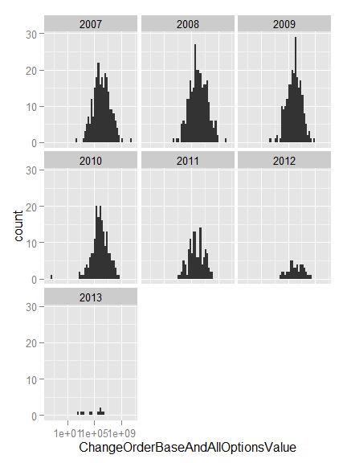 

```r
CompleteModelAndDetail$Graph[CompleteModelAndDetail$SumOfisChangeOrder>0]<-TRUE
CompleteModelAndDetail$Graph[CompleteModelAndDetail$SumOfisChangeOrder==0]<-FALSE

CompleteModelAndDetail$ContractCount<-1
CompleteModelAndDetail<-ddply(CompleteModelAndDetail, .(Ceil), transform, pContract=ContractCount/sum(ContractCount))
CompleteModelAndDetail<-ddply(CompleteModelAndDetail, .(Ceil), transform, pObligation=Action.Obligation/sum(Action.Obligation))


ggplot(
  data = subset(CompleteModelAndDetail,SumOfisChangeOrder>0),
  aes_string(x = "SumOfisChangeOrder"),
  ) + geom_bar(binwidth=1) + 
    facet_grid( Ceil ~ .,
                scales = "free_y",
                space = "free_y") + scale_y_continuous(expand = c(0,50)) +scale_x_continuous(limits=c(0,10))
```

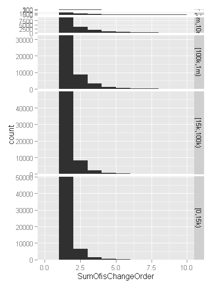 

```r
ggplot(
  data = subset(CompleteModelAndDetail,SumOfisChangeOrder>0),
  aes_string(x = "Ceil")
  )+ geom_bar()+
    scale_x_discrete("Initial Cost Ceiling (Base and All Options Value)")+scale_y_continuous("Number of Contracts with Change Orders")
```

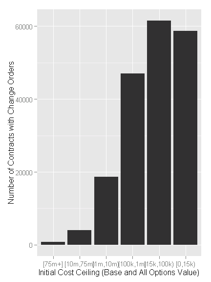 

```r
ggplot(
  data = subset(CompleteModelAndDetail,SumOfisChangeOrder>0),
  aes_string(x = "Ceil",weight="pContract")
#   main="Percentage of Contracts going to Partially or Completely Terminated Contracts\nBy Initial Contract Ceiling"
  )+ geom_bar()+ scale_y_continuous("Percent of Contracts with Change Orders", labels=percent)+
    scale_x_discrete("Initial Cost Ceiling (Base and All Options Value)")
```

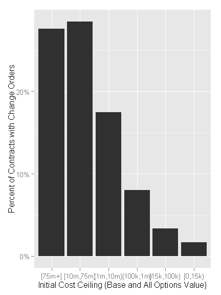 

```r
ggplot(
  data =subset(CompleteModelAndDetail,SumOfisChangeOrder>0),
  aes_string(x = "Ceil",weight="pObligation"),
  main="Percentage of Contract Obligations going to Contracts with Change Orders\nBy Initial Contract Ceiling"
  )+ geom_bar()+ scale_y_continuous("Percent of Obligations in Cost Ceiling Category", labels=percent)+
    scale_x_discrete("Initial Cost Ceiling (Base and All Options Value)")
```

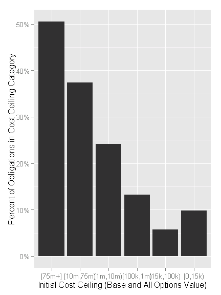 

```r
ggplot(
  data = subset(CompleteModelAndDetail,SumOfisChangeOrder>0),
  aes_string(x = "Ceil",weight="Action.Obligation")
  )+ geom_bar()+
    scale_x_discrete("Initial Cost Ceiling (Base and All Options Value)")+scale_y_continuous("Total Obligated Value of Contracts with Change Orders")
```

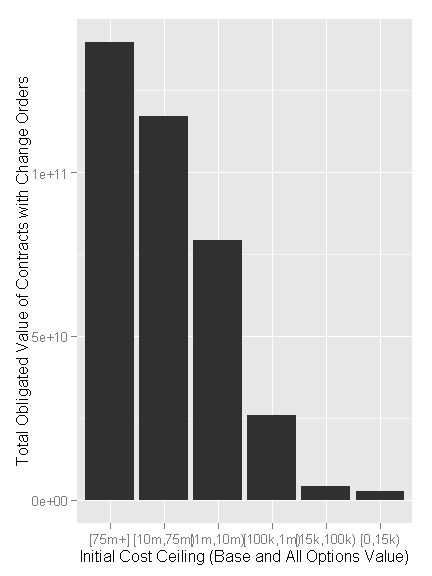 

```r
levels(CompleteModelAndDetail$Ceil)
```

```
## [1] "[75m+]"     "[10m,75m)"  "[1m,10m)"   "[100k,1m)"  "[15k,100k)"
## [6] "[0,15k)"
```

```r
quantile(CompleteModelAndDetail$SumOfisChangeOrder,c(0.999,0.995,0.99),na.rm=TRUE)
```

```
## 99.9% 99.5%   99% 
##     5     2     1
```

```r
quantile(subset(CompleteModelAndDetail$SumOfisChangeOrder,
                    !CompleteModelAndDetail$Ceil %in% c("[0,15k)","[15k,100k)")),c(0.9,0.95,0.99),na.rm=TRUE)
```

```
## 90% 95% 99% 
##   0   1   4
```

```r
quantile(subset(CompleteModelAndDetail$SumOfisChangeOrder,CompleteModelAndDetail$SumOfisChangeOrder>0&
                    CompleteModelAndDetail$Ceil!="[0,15k)"),c(0.25,0.5,0.75,0.9),na.rm=TRUE)
```

```
## 25% 50% 75% 90% 
##   1   1   2   3
```

```r
ecdf(subset(CompleteModelAndDetail$SumOfisChangeOrder,CompleteModelAndDetail$SumOfisChangeOrder>0))(c(0,1,2,3,4))
```

```
## [1] 0.0000000 0.7525577 0.8989098 0.9472723 0.9676551
```

```r
quantile(subset(CompleteModelAndDetail$pChangeOrderUnmodifiedBaseAndAll,CompleteModelAndDetail$SumOfisChangeOrder>0),c(0.25,0.5,0.75,0.9),na.rm=TRUE)
```

```
##         25%         50%         75%         90% 
## -0.01481793  0.00000000  0.10524480  0.55555556
```

```r
quantile(subset(CompleteModelAndDetail$pChangeOrderObligated,CompleteModelAndDetail$SumOfisChangeOrder>0),c(0.25,0.5,0.75,0.9),na.rm=TRUE)
```

```
##         25%         50%         75%         90% 
## -0.01435450  0.00000000  0.09675639  0.34958841
```

```r
ecdf(subset(CompleteModelAndDetail$pChangeOrderUnmodifiedBaseAndAll,CompleteModelAndDetail$SumOfisChangeOrder>0))(
    c(-0.001,0,0.001,0.05,0.075,0.1,0.11,0.12,0.15))
```

```
## [1] 0.2941127 0.5588388 0.5656813 0.6848609 0.7186743 0.7454038 0.7540737
## [8] 0.7625074 0.7835444
```

```r
ecdf(subset(CompleteModelAndDetail$pChangeOrderObligated,CompleteModelAndDetail$SumOfisChangeOrder>0))(
    c(-0.001,0,0.001,0.05,0.075,0.1,0.11,0.12,0.15))
```

```
## [1] 0.2930258 0.5537499 0.5604192 0.6858584 0.7232042 0.7536486 0.7640060
## [8] 0.7734823 0.7985870
```

```r
CompleteModelAndDetail$qCRais <- cut2(
    CompleteModelAndDetail$pChangeOrderUnmodifiedBaseAndAll,c(
                                              -0.001,
                                              0.001,
                                              0.15)
    )
#                                               min(subset(
#                                                   CompleteModelAndDetail$pChangeOrderObligated,
#                                                   CompleteModelAndDetail$pChangeOrderObligated>0)),

summary(subset(CompleteModelAndDetail$qCRais,CompleteModelAndDetail$SumOfisChangeOrder>0    ))
```

```
## [  -Inf,-0.001) [-0.001, 0.001) [ 0.001, 0.150) [ 0.150,   Inf] 
##           55974           51718           41469           41238 
##            NA's 
##             203
```


## Costly Change Orders Potential Change Cost 

###size of change orders measured by raise of ceiling

This study uses changes in the *Base and All Options Value Amount* as a way of tracking the potential cost of change orders.

* The *Base and All Options Value Amount* refers to the ceiling of contract costs if all available options were exercised. 
* The *Base and Exercised Value Amount* is not used because contracts are often specified such that the bulk of the eventually executed contract in dollar terms are treated as options.  In these cases, the all-inclusive value provides a better baseline for tracking growth.  
* The *Action Obligation* refers to the actual amount transferred to vendors.  This study team does not use this value because spending for change orders are not necessarily front-loaded.  For example, a change to a contract in May of 2010 could easily result in payments from May 2010 through August 2013.

The % Growth in Base and All Options Value Amount form Change Orders is calculated as follows: 

*Base and All Options Value Amount* increases for all Change Order Modifications/
*Base and All Options Value Amount* from the original unmodified contract transaction


**A histogram of the data** showing the distribution of the initial amount of the specific change order 


```r
ggplot(
  data = subset(CompleteModelAndDetail,SumOfisChangeOrder>0),
  aes_string(x = "Ceil",weight="pContract")
#   main="Percentage of Contracts going to Partially or Completely Terminated Contracts\nBy Initial Contract Ceiling"
  )+ geom_bar()+ scale_y_continuous("Percent of Contracts with Change Orders", labels=percent)+
    scale_x_discrete("Initial Cost Ceiling (Base and All Options Value)")
```

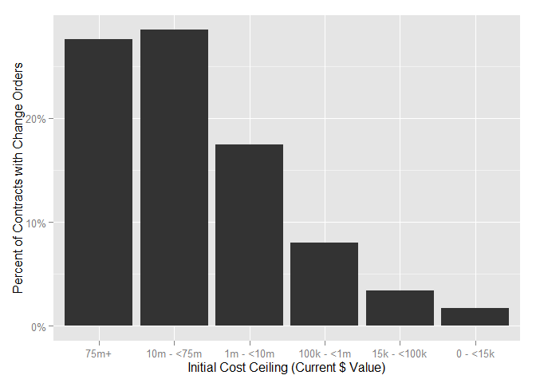 

```r
ggplot(
  data =subset(CompleteModelAndDetail,SumOfisChangeOrder>0),
  aes_string(x = "Ceil",weight="pObligation"),
  main="Percentage of Contract Obligations going to Contracts with Change Orders\nBy Initial Contract Ceiling"
  )+ geom_bar()+ scale_y_continuous("Percent of Obligations in Cost Ceiling Category", labels=percent)+
    scale_x_discrete("Initial Cost Ceiling (Base and All Options Value)")
```

 

```r
ggplot(
  data = subset(CompleteModelAndDetail,SumOfisChangeOrder>0),
  aes_string(x = "Ceil",weight="Action.Obligation")
  )+ geom_bar()+
    scale_x_discrete("Initial Cost Ceiling (Base and All Options Value)")+scale_y_continuous("Total Obligated Value of Contracts with Change Orders")
```

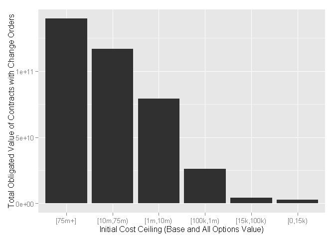 


```r
ggplot(
  data = subset(CompleteModelAndDetail,SumOfisChangeOrder>0),
  aes_string(x = "pChangeOrderUnmodifiedBaseAndAll"),
  ) + geom_bar(binwidth=0.01) + 
    facet_grid( Ceil ~ .,
                scales = "free_y",
                space = "free_y") +   
    scale_y_continuous("Number of Contracts with Change Orders")+
    scale_x_continuous("Percentage of Cost-Ceiling-Raising Change Orders by\nInitial Cost Ceiling (Base and All Options Value)",
                       limits=c(-1.25,1.25), labels=percent)+theme(axis.text.x=element_text(angle=90))
```

```
## Warning in loop_apply(n, do.ply): position_stack requires constant width:
## output may be incorrect
```

```
## Warning in loop_apply(n, do.ply): position_stack requires constant width:
## output may be incorrect
```

```
## Warning in loop_apply(n, do.ply): position_stack requires constant width:
## output may be incorrect
```

```
## Warning in loop_apply(n, do.ply): position_stack requires constant width:
## output may be incorrect
```

```
## Warning in loop_apply(n, do.ply): position_stack requires constant width:
## output may be incorrect
```

```
## Warning in loop_apply(n, do.ply): position_stack requires constant width:
## output may be incorrect
```

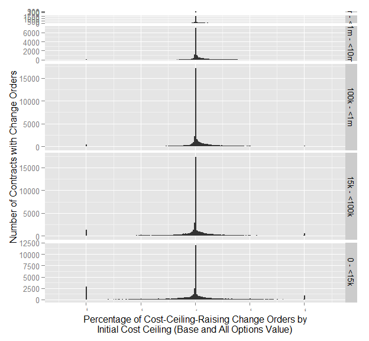 

```r
ggplot(
  data = subset(CompleteModelAndDetail,SumOfisChangeOrder>0),
  aes_string(x = "pChangeOrderUnmodifiedBaseAndAll")
  )+ geom_bar()+
#     scale_x_continuous("Percentage of Cost-Ceiling-Raising Change Orders by\nInitial Cost Ceiling (Base and All Options Value)")
    scale_y_continuous("Number of Contracts with Change Orders")+
        facet_grid( . ~ Ceil ) +
    scale_x_continuous("Percentage of Cost-Ceiling-Raising Change Orders by\nInitial Cost Ceiling (Base and All Options Value)", limits=c(-1.25,1.25), labels=percent)+theme(axis.title.x=element_text(angle=90))
```

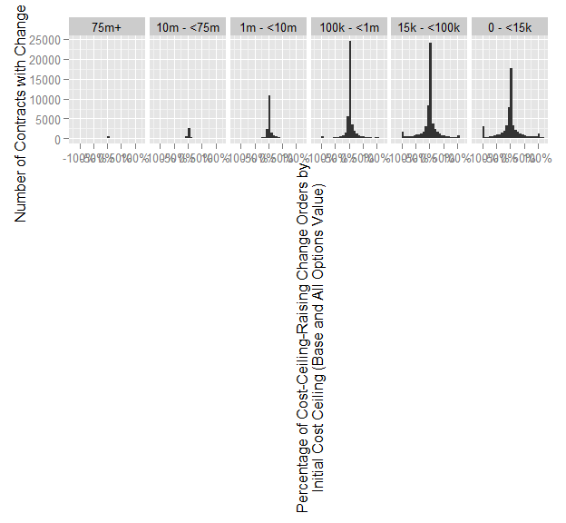 

```r
BreachSummary<-ddply(CompleteModelAndDetail,.(Ceil,pChangeOrderUnmodifiedBaseAndAll,SumOfisChangeOrder,CRai),
                     summarise,
                     pContract=sum(pContract))


ggplot(
  data = subset(BreachSummary,SumOfisChangeOrder>0),
  aes_string(x = "pChangeOrderUnmodifiedBaseAndAll",weight="pContract",fill="CRai")#
  )+ geom_bar(binwidth=0.05)+
#     scale_x_continuous("Percentage of Cost-Ceiling-Raising Change Orders by\nInitial Cost Ceiling (Base and All Options Value)")
    scale_y_continuous("Percent of Contracts", labels=percent)+
        facet_grid( . ~ Ceil )+scale_x_continuous("Extent of Ceiling Breach in 5% Increments",limits=c(-0.5,1), labels=percent)+theme(axis.text.x=element_text(angle=90),legend.position="bottom")+scale_fill_discrete(name="Extent of Ceiling Breach")
```

```
## Warning in loop_apply(n, do.ply): Removed 32 rows containing missing
## values (position_stack).
```

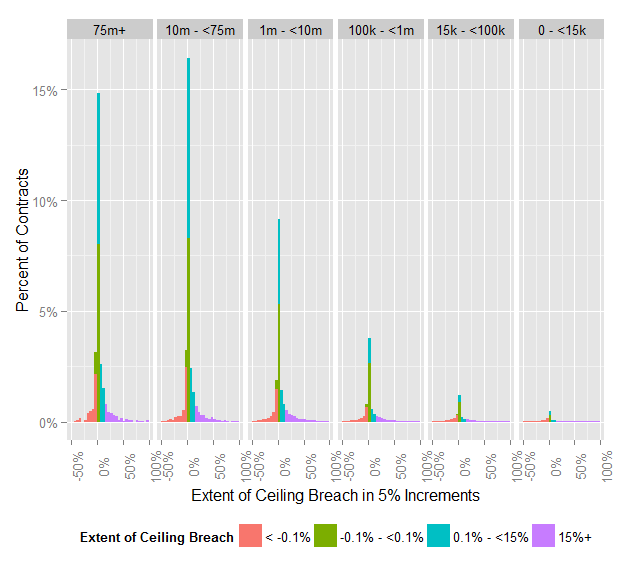 

```r
tapply(CompleteModelAndDetail$CRai, CompleteModelAndDetail$Ceil, summary)
```

```
## $`[75m+]`
##    [< -0.1%) [-0.1%,0.1%)   [0.1%,15%)       [15%+] 
##          115         2238          301           96 
## 
## $`[10m,75m)`
##    [< -0.1%) [-0.1%,0.1%)   [0.1%,15%)       [15%+] 
##          591        11242         1661          464 
## 
## $`[1m,10m)`
##    [< -0.1%) [-0.1%,0.1%)   [0.1%,15%)       [15%+] 
##         3162        93784         6430         2939 
## 
## $`[100k,1m)`
##    [< -0.1%) [-0.1%,0.1%)   [0.1%,15%)       [15%+] 
##         9854       557508        12019         8788 
## 
## $`[15k,100k)`
##    [< -0.1%) [-0.1%,0.1%)   [0.1%,15%)       [15%+] 
##        20400      1784039        11297        13160 
## 
## $`[0,15k)`
##    [< -0.1%) [-0.1%,0.1%)   [0.1%,15%)       [15%+]         NA's 
##        21857      3396587         9779        15772          203
```


