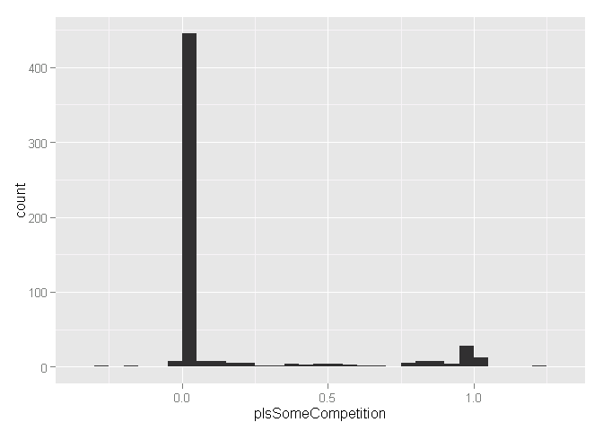
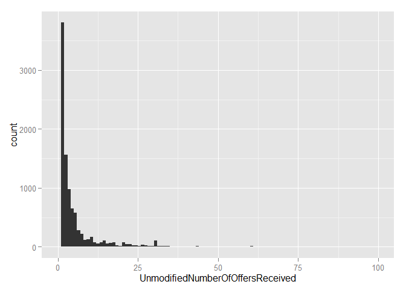
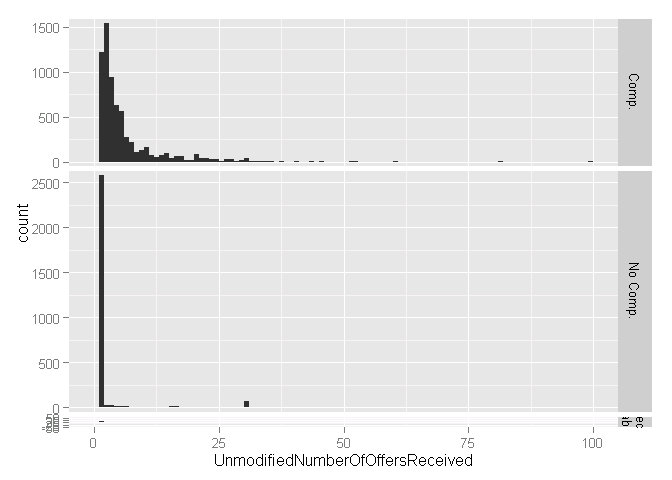
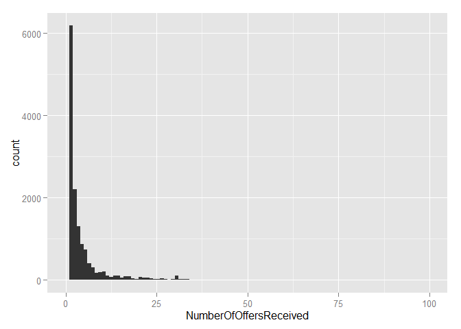
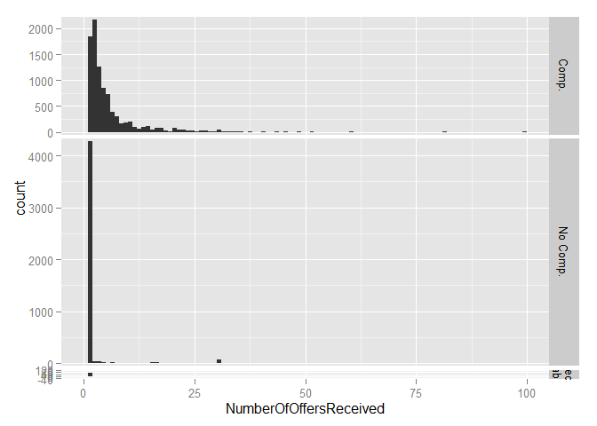

# DoD Fixed-Price Study: Procedural Competition classification
Greg Sanders  
Tuesday, January 13, 2015  


```
## Loading required package: ggplot2
## Loading required package: stringr
## Loading required package: plyr
```

Contracts are classified using a mix of numerical and categorical variables. While the changes in numerical variables are easy to grasp and summarize, a contract may have one line item that is competed and another that is not. As is detailed in the [exploration on R&D](RnD_1to5_exploration.md), we are only considering information available prior to contract start. The percentage of contract obligations that were competed is a valuable benchmark, but is highly influenced by factors that occured after contract start..

##Studying Competitive  contracts in the sample.
One important factor for this study is whether a contract was available for competition. Unlike other CSIS work, we are not considering the numbers of offers received, as that is a dependent variable for the purposes of this study.


```r
ContractSample  <- read.csv(
    paste("data\\defense_contract_CSIScontractID_sample_15000_SumofObligatedAmount.csv", sep = ""),
    header = TRUE, sep = ",", dec = ".", strip.white = TRUE, 
    na.strings = c("NULL","NA",""),
    stringsAsFactors = TRUE
    )

#These will probably be moved into apply_lookups at some point
ContractSample$pIsSomeCompetition <- ContractSample$ObligatedAmountIsSomeCompetition/ContractSample$ObligatedAmount
ContractSample$pIsSomeCompetition[is.na(ContractSample$ObligatedAmountIsSomeCompetition)] <- 0
ContractSample$MinOfEffectiveDate <- strptime(ContractSample$MinOfEffectiveDate, "%Y-%m-%d")
ContractSample<-apply_lookups(Path,ContractSample)
```

```
## Joining by: Contracting.Agency.ID
## Joining by: SubCustomer, Customer
## Joining by: MajorCommandID
## Joining by: systemequipmentcode
```

```
## Warning in apply_lookups(Path, ContractSample): NaNs produced
```

```
## Warning in apply_lookups(Path, ContractSample): NaNs produced
```

```
## Warning in apply_lookups(Path, ContractSample): NaNs produced
```

```
## Warning in apply_lookups(Path, ContractSample): NaNs produced
```
FPDS classifies competition using two variables: "Extent Competed" and "Statutory Exception To Fair Opportunity"

The latter is prefered for certain types of indefinite delivery vehicles and the former is used in the remaining cases. In those cases where the preferred variable is not available, CSIS imputes whether competition occured using the other variable. The split between the two variables is mandated by regulation, but is not particularly analytically interested, so we combined them for simplicity.

###IsSomeCompetition
Is Some Competition is a binary variable, true if competitive procedures were used, false if they were not. Unlabeled cases are classified as NAs.

* UnmodifiedIsSomeCompetition is the classification given by the first record for the contract (33.49% missing data).
* IsSomeCompetition is a classification for the entirity of the contract  (3.78% missing data).
  1. A contract which is sometimes classified as competed and never classified as uncompeted is categorized as competed. 
  2. A contract which is sometimes classified as uncompeted and never classified as competed is categorized as uncompeted.
  3. A contract which was always unlabeled is categorized as Mixed or Unlabeled.
  4. A contract which was classified as both competed and uncompeted in different modifications is categorized as Mixed or Unlabeled.
* pIsSomeCompetition is dollar value of all transactions that were labeled as competed divided the contracts total obligations. 

Reassuringly, as is shown below, even when IsSomeCompetition is has a mixed or unlabeled value, the most frequently occuring values are those that are almost never classified as competed or consistently classified as competed.


```r
summary(subset(ContractSample,select=c(statutoryexceptiontofairopportunity,
                                extentcompeted,
                                 UnmodifiedIsSomeCompetition,
                                IsSomeCompetition,
                                pIsSomeCompetition
                                ))
        )
```

```
##  statutoryexceptiontofairopportunity extentcompeted
##  FAIR   : 1985                       A      :8070  
##  ONE    :  190                       C      :3150  
##  FOO    :  147                       D      :2103  
##  MG     :  124                       B      :1207  
##  URG    :   41                       F      :  97  
##  (Other):   21                       (Other): 110  
##  NA's   :12492                       NA's   : 263  
##  UnmodifiedIsSomeCompetition            IsSomeCompetition
##  Comp.    :7146              Comp.               :9886   
##  No Comp. :2830              No Comp.            :4547   
##  Unlabeled:5024              Mixed or \nUnlabeled: 567   
##                                                          
##                                                          
##                                                          
##                                                          
##  pIsSomeCompetition
##  Min.   :-0.2883   
##  1st Qu.: 0.0000   
##  Median : 1.0000   
##  Mean   : 0.6644   
##  3rd Qu.: 1.0000   
##  Max.   : 2.8078   
## 
```

```r
ggplot(
    data = subset(ContractSample,IsSomeCompetition=="Mixed or \nUnlabeled"),
    aes_string(x = "pIsSomeCompetition"),
    main = "Distribution by percent of dollars with some competition for mixed and unlabeled contracts."
    ) +
    geom_bar(binwidth=0.05)
```

 

```r
# 
# CompGraph<-LatticePercentLineWrapper(
#     "Competition"
#     ,"Competition by DoD Component and Starting Regime"
#     ,"Fiscal Year of Obligation"
#     ,"% of Component Obligations"
#     ,Coloration
#     ,0
#     ,0
#     ,CompPolicy
#     ,NULL
#     ,"SignedSemiAnnual"
#     ,"Obligation.2014"
#     ,"Competition.sum"
#     ,"SubCustomer.component"
#     ,"ATLpolicy"
#     ,"StartDate"
#     ,"EndDate"
#     )
```

##Variables describing competition
The next set of variables are relevant when competition is present, as measured by IsSomeCompetition

```r
competed.sample<-subset(ContractSample,IsSomeCompetition=="Comp.")
```
There are two variables of concern: The Number of Offers received and whether or not a contract experienced full and open competition. 

###Number of Offers Received
This variable is particularly important, as single-offer competition (IsSomeCompetition=1 and NumberOfOfferesReceived=1)  is a dependent variable in two ongoing CSIS studies.

* UnmodifiedNumberOfOffersReceived reports the Number of Offers received according to the first reported transaction under a contract (31.44% missing data, far too high, there must be a SQL mistake).
* NumberOfOffersReceived reports the Number of Offers received for the entire contract. Ignoring missing values, CSIS will checks if only a single whole number is reported. If so, that is the value reported. Otherwise the value is NA. (5.95% missing data).

The distribution of the number of offers received. For the chart below, we've cut out the instances where more than one hundred offers were received. Notably if the competition and no competition categries are combined, the distribution is fully exponential. That is still largely true for competed entries, although it the number receiving single offer competition is lower than the number receiving competition with multiple offers.


```r
ggplot(
    data = subset(ContractSample,UnmodifiedNumberOfOffersReceived<100),
    aes_string(x = "UnmodifiedNumberOfOffersReceived"),
    main = "Distribution by Number Of Offers Received (1 to 100)"
    ) +
    geom_bar(binwidth = 1)
```

 

```r
summary(subset(ContractSample,select=c(UnmodifiedNumberOfOffersReceived,
                                NumberOfOffersReceived
                                )
               ,IsSomeCompetition=="Comp.")
        )
```

```
##  UnmodifiedNumberOfOffersReceived NumberOfOffersReceived
##  Min.   :  1.000                  Min.   :  1.000       
##  1st Qu.:  2.000                  1st Qu.:  2.000       
##  Median :  3.000                  Median :  3.000       
##  Mean   :  6.802                  Mean   :  8.828       
##  3rd Qu.:  6.000                  3rd Qu.:  6.000       
##  Max.   :999.000                  Max.   :999.000       
##  NA's   :3108                     NA's   :588
```

```r
ggplot(
    data = subset(ContractSample,UnmodifiedNumberOfOffersReceived<100),
    aes_string(x = "UnmodifiedNumberOfOffersReceived"),
    main = "Distribution by Number Of Offers Received (1 to 100)"
    ) +
    geom_bar(binwidth = 1) + 
    facet_grid( IsSomeCompetition ~ .,
                scales = "free_y",
                space = "free_y") + scale_y_continuous(expand = c(0,50)) 
```

 

```r
ggplot(
    data = subset(ContractSample,NumberOfOffersReceived<100),
    aes_string(x = "NumberOfOffersReceived"),
    main = "Distribution by Number Of Offers Received (1 to 100)"
    ) +
    geom_bar(binwidth = 1)
```

 

```r
# + 
#     facet_grid( IsSomeCompetition ~ .,
#                 scales = "free_y",
#                 space = "free_y") + scale_y_continuous(expand = c(0,50)) 

ggplot(
    data = subset(ContractSample,NumberOfOffersReceived<100),
    aes_string(x = "NumberOfOffersReceived"),
    main = "Distribution by Number Of Offers Received (1 to 100)"
    ) +
    geom_bar(binwidth = 1) + 
    facet_grid( IsSomeCompetition ~ .,
                scales = "free_y",
                space = "free_y") + scale_y_continuous(expand = c(0,50)) 
```

 

```r
quantile(ContractSample$NumberOfOffersReceived,c(0.25,0.5,0.75),na.rm=TRUE)
```

```
## 25% 50% 75% 
##   1   2   4
```

###Full and Open Competition
IsFullAndOpen is a categorization of competition that means that any vendor believing themselves capable of meeting the requirements could put in an offer. This category is only available for contracts classified using Extent Competed. Contracts using the fair opportunity standard have already limited potential competitor.

* UnmodifiedIsFullAndOpen is the classification given by the first record for the contract (0.00% missing data).
* IsFullAndOpen is a classification for the entirity of the contract  (0.00% missing data).
  1. A contract which is sometimes classified as full and open and is otherwise unlabeled is classified as full and open. 
  2. A contract which is sometimes classified as not full and open and is otherwise unlabeled is classified as not full and open.
  3. A contract which was always unlabeled is categorized as Unlabeled.
  4. A contract which was classified as both full and open and not in different modifications is categorized as Unlabeled.


```r
summary(subset(competed.sample,select=c(UnmodifiedIsFullAndOpen,
                                IsFullAndOpen
                                )
        )
        )
```

```
##       UnmodifiedIsFullAndOpen              IsFullAndOpen 
##  Full & Open      :3625       Full & Open         :5546  
##  Not Full \n& Open:3510       Not Full \n& Open   :4261  
##  Unlabeled        :2751       Mixed or \nUnlabeled:  79
```


##Variables describing why competition did not take place.
The next set of variables are relevant when competition is present, as measured by IsSomeCompetition

```r
uncompeted.sample<-subset(ContractSample,IsSomeCompetition=="No Comp.")
```
There are two variables of concern: The Number of Offers received and whether or not a contract experienced full and open competition. 

###Number of Offers Received
Numbers of offers is worth a brief investigation because of its importance and a known data abnormality. Sometimes uncompeted contracts report more than one offer. In other CSIS reports, this is handled by treating IsSomeCompetition as unlabeled due to the contradiction. The definition of the two variables is the same above.

* UnmodifiedNumberOfOffersReceived reports multiple offers on uncompeted contracts 4.79% of the time.
* NumberOfOffersReceived reports the multiple offers on uncompeted contracts 4.95% of the time.


###Only one source exceptions
IsOnlyOneSource is an explaination for not competing a contract, namely that there were no alternative sources available. This category is only available for both contracts classified using the extent comepted or the statuatory exception to the fair opportunity field. In the former case, the classification is made using the Reason NOt Competed field.  (Note, rerun this)

* UnmodifiedIsOnlyOneSource is the classification given by the first record for the contract (40.31% missing data).
* IsOnlyOneSource is a classification for the entirity of the contract  (5.63% missing data).
  1. A contract which is sometimes classified as only one source and is otherwise unlabeled is classified as full and open. 
  2. A contract which is sometimes classified as another exemption is otherwise unlabeled is classified as not full and open.
  3. A contract which was always unlabeled is categorized as Unlabeled.
  4. A contract which was classified as both only one source and not another exemption is categorized as Unlabeled.


```r
#No competition
summary(subset(uncompeted.sample,select=c(
                                UnmodifiedIsOnlyOneSource,
                                IsOnlyOneSource
                                )
               )
        )
```

```
##  UnmodifiedIsOnlyOneSource             IsOnlyOneSource
##  Min.   :0.0000            Only One Source     :2767  
##  1st Qu.:0.0000            Not Only Once Source:1524  
##  Median :1.0000            Unlabeled           : 256  
##  Mean   :0.6864                                       
##  3rd Qu.:1.0000                                       
##  Max.   :1.0000                                       
##  NA's   :1833
```
###Follow on to competed action
IsFollowonToCompetedAction is an alternate explaination for not competing a contract, namely that there was a prior competition. It seems underused in practice. It is a subset of contracts with only one source but does not include contracts that were labeled as follow-ons without note as to their competed status. This category comes up under all three vairables, extentcompeted/reasonnotcompeted and statuatory exception to fair competition (note, rerun due to table update, also include extent competed value).

* UnmodifiedIsFollowonToCompetedAction is the classification given by the first record for the contract (42.47% missing data).
* IsFollowonToCompetedAction is a classification for the entirity of the contract  (7.81% missing data).
  1. A contract which is sometimes classified as a follow on to a competed action and is otherwise unlabeled is classified as full and open. 
  2. A contract which is sometimes classified as another exemption is otherwise unlabeled is classified as not full and open.
  3. A contract which was always unlabeled is categorized as Unlabeled.
  4. A contract which was classified as both only one source and not another exemption is categorized as Unlabeled.


```r
#No competition
summary(subset(uncompeted.sample,select=c(
                                UnmodifiedIsFollowonToCompetedAction,
                                IsFollowonToCompetedAction
                                )
               )
        )
```

```
##  UnmodifiedIsFollowonToCompetedAction IsFollowonToCompetedAction
##  Min.   :0.0000                       Min.   :0.0000            
##  1st Qu.:0.0000                       1st Qu.:0.0000            
##  Median :0.0000                       Median :0.0000            
##  Mean   :0.0558                       Mean   :0.0348            
##  3rd Qu.:0.0000                       3rd Qu.:0.0000            
##  Max.   :1.0000                       Max.   :1.0000            
##  NA's   :1931                         NA's   :355
```


```
## 25% 50% 75% 
##   1   2   4
```

```
## [1] 0.4456537 0.6045120 0.6982846 0.7611359 0.8146893
```

```
## [1] 0.4456537 0.6045120 0.6982846 0.8146893
```
