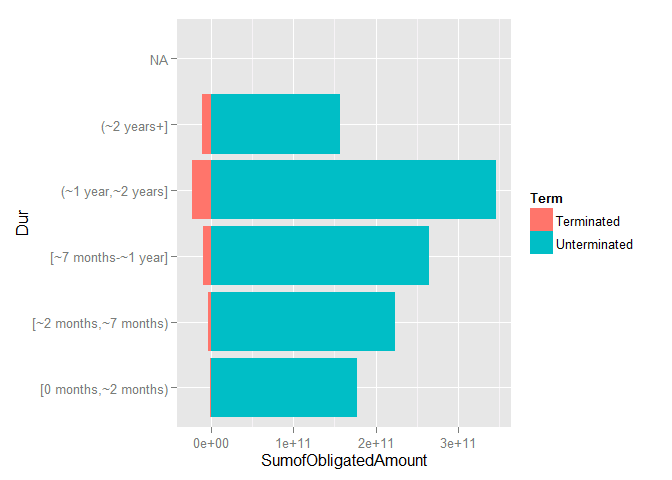
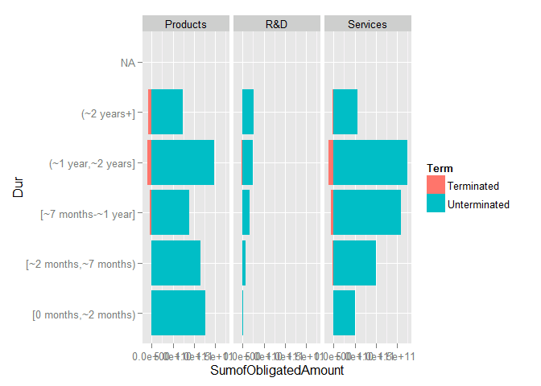
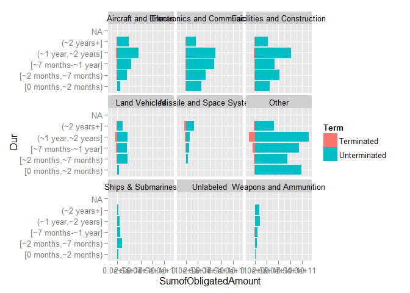
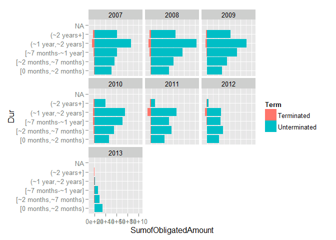
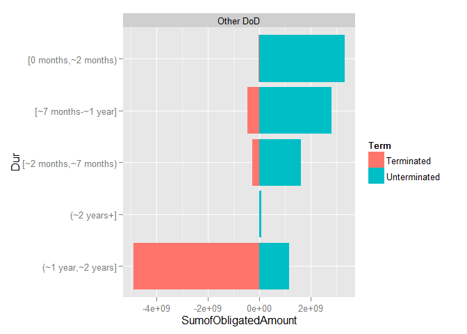
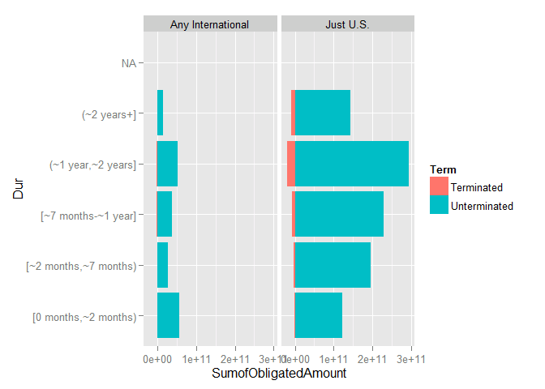
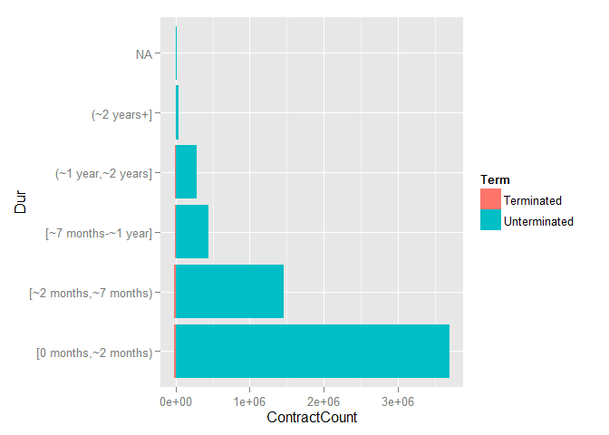

# DoD Fixed-Price Study: Contract Duration Classification
Greg Sanders  
Tuesday, January 13, 2015  


```
## Loading required package: ggplot2
## Loading required package: stringr
## Loading required package: plyr
## Loading required package: Hmisc
## Loading required package: grid
## Loading required package: lattice
## Loading required package: survival
## Loading required package: Formula
## 
## Attaching package: 'Hmisc'
## 
## The following objects are masked from 'package:plyr':
## 
##     is.discrete, summarize
## 
## The following objects are masked from 'package:base':
## 
##     format.pval, round.POSIXt, trunc.POSIXt, units
## 
## Loading required package: lubridate
## 
## Attaching package: 'lubridate'
## 
## The following object is masked from 'package:plyr':
## 
##     here
## 
## Loading required package: scales
## Loading required package: reshape2
```

Contracts are classified using a mix of numerical and categorical variables. While the changes in numerical variables are easy to grasp and summarize, a contract may have one line item that is competed and another that is not. As is detailed in the [exploration on R&D](RnD_1to5_exploration.md), we are only considering information available prior to contract start. The percentage of contract obligations that were competed is a valuable benchmark, but is highly influenced by factors that occured after contract start..

##Studying contract duration within the sample.
Initial contract duration is a new characteristic for CSIS.  The duration is calculated by comparing the earliest *effective date* to *current completion date.*  The current date was used rather than the *ultimate complete date* because the later is often unlabeled.  

##Methodological Notes on Contract Period of Performance

*Signed date* of the unmodified contract is used as a criteria for inclusion because the fiscal year used for reporting, and thus presumably certification, is based on *signed date* and not *effective date*.  CSIS may refine this methodology based on consultation with experts and further study of that data.  For greater transparency, considered alternatives have been listed with each period of performance value below: 

**The contract start date** is the earliest *effective date* reported under the contract.
* Alternatives include using *signed date* or using the unmodified contract values rather than the earliest values throughout the contract.

**The contract end date** is the *current completion date* of the most recently signed contract modification.
* *Ultimate completion date* is one alternative and is based on the theoretical maximum period of performance if all options were exercised.
* *Last date to order* is only available for indefinite delivery vehicles and refers to the start and not the end date of a delivery order, but it is another possible alternative.
* Finally, the modification with the most recent *signed date* could be replaced by the modification with the most recent *effect date* or instead the dates furthest in the future could be chosen.  

**Completed contracts** have a contract end date in FY2013 or have been marked as closed and/or terminated. 


```r
ContractSample  <- read.csv(
    paste("data\\defense_contract_CSIScontractID_sample_100000_SumofObligatedAmount.csv", sep = ""),
    header = TRUE, sep = ",", dec = ".", strip.white = TRUE, 
    na.strings = c("NULL","NA",""),
    stringsAsFactors = TRUE
    )

#These will probably be moved into apply_lookups at some point
ContractSample<-apply_lookups(Path,ContractSample)
```

```
## Joining by: Customer, SubCustomer
## Joining by: ProductOrServiceArea
## Joining by: PlatformPortfolio
```

```
## Warning in apply_lookups(Path, ContractSample): NaNs produced
```

```
## Warning in apply_lookups(Path, ContractSample): NaNs produced
```

```
## Warning in apply_lookups(Path, ContractSample): NaNs produced
```

```r
# 
# as.numeric(as.duration(
#     ymd(ContractSample$SignedMonth)-ContractSample$StartFiscalYear)
#     /dyears(1)
#     )


min(strptime(ContractSample$MinOfEffectiveDate[!is.na(ContractSample$MinOfEffectiveDate)],"%Y-%m-%d"))
```

```
## [1] "2001-05-12 EDT"
```

```r
max(strptime(ContractSample$UnmodifiedCurrentCompletionDate[!is.na(ContractSample$UnmodifiedCurrentCompletionDate)],"%Y-%m-%d"))
```

```
## [1] "2060-12-25 EST"
```

```r
ContractSample$UnmodifiedDays<-as.numeric(difftime(strptime(ContractSample$UnmodifiedCurrentCompletionDate,"%Y-%m-%d")
                                                     , strptime(ContractSample$MinOfEffectiveDate,"%Y-%m-%d")
                                                     , unit="days"
        ))+1

CompleteContract  <- read.csv(
    paste("data\\defense_contract_CSIScontractID_detail.csv", sep = ""),
    header = TRUE, sep = ",", dec = ".", strip.white = TRUE, 
    na.strings = c("NULL","NA",""),
    stringsAsFactors = TRUE
    )


# 
# RawContract  <- read.csv(
#     paste(Path,"data\\defense_contract_SP_ContractSampleCriteriaDetailsCustomer.csv", sep = ""),
#     header = TRUE, sep = ",", dec = ".", strip.white = TRUE, 
#     na.strings = c("NULL","NA",""),
#     stringsAsFactors = TRUE
#     )

CompleteContract$Dur<-factor(CompleteContract$Dur,
                                   levels=c("[0 months,~2 months)",
                                               "[~2 months,~7 months)",
                                               "[~7 months-~1 year]",
                                               "(~1 year,~2 years]",
                                               "(~2 years+]"),
         labels=c("[0 months,~2 months)",
                                               "[~2 months,~7 months)",
                                               "[~7 months-~1 year]",
                                               "(~1 year,~2 years]",
                                               "(~2 years+]"),
                                   ordered=TRUE
                                   )

CompleteContract$StartFiscalYear<-DateToFiscalYear(CompleteContract$MinOfEffectiveDate)


# RawContract$UnmodifiedCurrentCompletionDate<-
#     strptime(RawContract$UnmodifiedCurrentCompletionDate,"%Y-%m-%d") 

#Calculate the number of days the contract lasts.
# RawContract$UnmodifiedDays<-as.numeric(
#     difftime(strptime(RawContract$UnmodifiedCurrentCompletionDate,"%Y-%m-%d")
#              , strptime(RawContract$MinOfEffectiveDate,"%Y-%m-%d")
#              , unit="days"
#              ))+1
# 

ContractSurvival<-ddply(CompleteContract,
                        .(Dur,
                            Term,
                            UnmodifiedDays,
                            StartFiscalYear,
                            PSR,
                            Who,
                            What,
                            Intl),
                        summarise,
                        SumofObligatedAmount=sum(Action.Obligation),
                        ContractCount=length(CSIScontractID)
)
```


```r
summary(subset(ContractSample,
               select=c(LastSignedLastDateToOrder,
      LastUltimateCompletionDate,
      LastCurrentCompletionDate,
      UnmodifiedCurrentCompletionDate,
      UnmodifiedUltimateCompletionDate,
      UnmodifiedLastDateToOrder,
      MinOfEffectiveDate,
      MinOfSignedDate
      
                                ))
        )
```

```
##  LastSignedLastDateToOrder LastUltimateCompletionDate
##  Mode:logical              2012-09-30: 1650          
##  NA's:100000               2013-09-30: 1583          
##                            2011-09-30: 1565          
##                            2010-09-30: 1554          
##                            2009-09-30: 1527          
##                            (Other)   :88093          
##                            NA's      : 4028          
##  LastCurrentCompletionDate            UnmodifiedCurrentCompletionDate
##  2012-09-30: 1648          2009-09-30 00:00:00.0000000: 2126         
##  2013-09-30: 1622          2008-09-30 00:00:00.0000000: 1954         
##  2010-09-30: 1587          2010-09-30 00:00:00.0000000: 1869         
##  2011-09-30: 1570          2011-09-30 00:00:00.0000000: 1567         
##  2009-09-30: 1553          2012-09-30 00:00:00.0000000: 1481         
##  (Other)   :87992          2007-09-30 00:00:00.0000000: 1194         
##  NA's      : 4028          (Other)                    :89809         
##             UnmodifiedUltimateCompletionDate UnmodifiedLastDateToOrder
##  2009-09-30 00:00:00.0000000: 1930           Mode:logical             
##  2010-09-30 00:00:00.0000000: 1809           NA's:100000              
##  2011-09-30 00:00:00.0000000: 1711                                    
##  2012-09-30 00:00:00.0000000: 1699                                    
##  2008-09-30 00:00:00.0000000: 1602                                    
##  2013-09-30 00:00:00.0000000: 1160                                    
##  (Other)                    :90089                                    
##   MinOfEffectiveDate   MinOfSignedDate 
##  2008-09-30:  668    2008-09-30:  740  
##  2009-09-30:  611    2009-09-30:  688  
##  2010-09-30:  567    2010-09-30:  584  
##  2008-10-01:  544    2007-09-28:  533  
##  2009-10-01:  534    2010-09-29:  433  
##  (Other)   :93066    (Other)   :93012  
##  NA's      : 4010    NA's      : 4010
```

```r
daysquantile<-quantile(ContractSample$UnmodifiedDays,c(0.25,0.5,0.75),na.rm=TRUE)
exp(quantile(log(ContractSample$UnmodifiedDays),c(0.25,0.5,0.75),na.rm=TRUE))
```

```
## 25% 50% 75% 
##  61 221 366
```

```r
mean(ContractSample$UnmodifiedDays,na.rm=TRUE)
```

```
## [1] 315.8503
```

```r
exp(mean(log(ContractSample$UnmodifiedDays),na.rm=TRUE))
```

```
## [1] 117.0378
```

```r
ecdf(ContractSample$UnmodifiedDays)(214)
```

```
## [1] 0.4924471
```

```r
roundedcutoffs<-c(61,214,364,365,366,367,368,729,730,731,732,733,734)
ecdf(ContractSample$UnmodifiedDays)(roundedcutoffs)
```

```
##  [1] 0.2504428 0.4924471 0.6436295 0.7071570 0.7552870 0.7678196 0.7746536
##  [8] 0.9297948 0.9323784 0.9372018 0.9400667 0.9408376 0.9413897
```

```r
# CompleteContract$LastCurrentCompletionDate<-strptime(CompleteContract$LastCurrentCompletionDate,"%Y-%m-%d") 
# # as.Date(sample.criteria$LastCurrentCompletionDate)
# CompleteContract<-subset(CompleteContract,StartFiscal_Year>=2007 & (LastCurrentCompletionDate<=strptime("2013-09-30","%Y-%m-%d") | IsClosed==1))
# 
# CompleteContract$UnmodifiedDays<-as.numeric(difftime(strptime(CompleteContract$UnmodifiedCurrentCompletionDate,"%Y-%m-%d")
#                                                      , strptime(CompleteContract$MinOfEffectiveDate,"%Y-%m-%d")
#                                                      , unit="days"
#         ))+1
dayscompletequantile<-quantile(ContractSample$UnmodifiedDays,c(0.25,0.5,0.75,0.95),na.rm=TRUE)


span <- new_interval(as.POSIXct(ContractSample$UnmodifiedCurrentCompletionDate), 
                     as.POSIXct(ContractSample$MinOfEffectiveDate)) #interval

# summary(eyears(as.period(span)))
# as.period(span, units ="years")
# 2009-01-01 CST--2010-02-02 01:01:01 CST
as.period(span)
```

```
## Warning in Ops.factor(left, right): '-' not meaningful for factors
```

```
##      [1] "-1y -1m -26d 0H 0M 0S"   "-2y 0m -29d 0H 0M 0S"   
##      [3] "-2y -4m -1d 0H 0M 0S"    "-1m -5d 0H 0M 0S"       
##      [5] "-1y -11m -30d 0H 0M 0S"  "-5m -4d 0H 0M 0S"       
##      [7] "-2m -22d 0H 0M 0S"       "-3m -23d 0H 0M 0S"      
##      [9] "-7m -23d 0H 0M 0S"       "-1y -11m -8d 0H 0M 0S"  
##     [11] "-9m -30d 0H 0M 0S"       "-1y 0m -2d 0H 0M 0S"    
##     [13] "-1y 0m 0d 0H 0M 0S"      "-10m -5d 0H 0M 0S"      
##     [15] "-5m -6d 0H 0M 0S"        "-10m -29d 0H 0M 0S"     
##     [17] "-10m -11d 0H 0M 0S"      "-3d 0H 0M 0S"           
##     [19] "-3y -9m -16d 0H 0M 0S"   "-7m 0d 0H 0M 0S"        
##     [21] "-11m -17d 0H 0M 0S"      "-2m -29d 0H 0M 0S"      
##     [23] "-1y 0m 0d 0H 0M 0S"      "-9m -2d 0H 0M 0S"       
##     [25] "-1y 0m -11d 0H 0M 0S"    "-1y -1m -26d 0H 0M 0S"  
##     [27] "-1y -11m 0d 0H 0M 0S"    "-8m -30d 0H 0M 0S"      
##     [29] "-4m -26d 0H 0M 0S"       "-1y 0m -10d 0H 0M 0S"   
##     [31] "-1y -4m -15d 0H 0M 0S"   "-1y 0m -30d 0H 0M 0S"   
##     [33] "-4y -4m -21d 0H 0M 0S"   "-11m -23d 0H 0M 0S"     
##     [35] "-4m -1d 0H 0M 0S"        "0S"                     
##     [37] "-7m -28d 0H 0M 0S"       "-1y 0m -29d 0H 0M 0S"   
##     [39] "-8m -9d 0H 0M 0S"        "-8m -21d 0H 0M 0S"      
##     [41] "-2y -6m -26d 0H 0M 0S"   "-1m -5d 0H 0M 0S"       
##     [43] "-1d 0H 0M 0S"            "-1y 0m -24d 0H 0M 0S"   
##     [45] "-5m -16d 0H 0M 0S"       "-11m -29d 0H 0M 0S"     
##     [47] "-2y -3m -29d 0H 0M 0S"   "-2y -1m -12d 0H 0M 0S"  
##     [49] "-11m -23d 0H 0M 0S"      "-1y 0m 0d 0H 0M 0S"     
##     [51] "-1y -8m -14d 0H 0M 0S"   "-3m -29d 0H 0M 0S"      
##     [53] "-1y -6m -8d 0H 0M 0S"    "-1y 0m -4d 0H 0M 0S"    
##     [55] "-2y -6m -4d 0H 0M 0S"    "-5m -27d 0H 0M 0S"      
##     [57] "-4y 0m -24d 0H 0M 0S"    "-1y -1m -8d 0H 0M 0S"   
##     [59] "-5m -27d 0H 0M 0S"       "-11m -30d 0H 0M 0S"     
##     [61] "-4m 0d 0H 0M 0S"         "-11m -29d 0H 0M 0S"     
##     [63] "-11m -29d 0H 0M 0S"      "-4m -20d 0H 0M 0S"      
##     [65] "-4m -13d 0H 0M 0S"       "-11m -26d 0H 0M 0S"     
##     [67] "-1y -5m -21d 0H 0M 0S"   "-5m -27d 0H 0M 0S"      
##     [69] "0S"                      "-2m -5d 0H 0M 0S"       
##     [71] "-11m -30d 0H 0M 0S"      "-9d 0H 0M 0S"           
##     [73] "-11m -29d 0H 0M 0S"      "-2y -3m -30d 0H 0M 0S"  
##     [75] "-6m -6d 0H 0M 0S"        "-1m 0d 0H 0M 0S"        
##     [77] "-9d 0H 0M 0S"            "-30d 0H 0M 0S"          
##     [79] "-1y 0m -13d 0H 0M 0S"    "-4m -28d 0H 0M 0S"      
##     [81] "0S"                      "-11m -9d 0H 0M 0S"      
##     [83] "-1y 0m -2d 0H 0M 0S"     "-5m -27d 0H 0M 0S"      
##     [85] "-9m -27d 0H 0M 0S"       "-2y -4m -8d 0H 0M 0S"   
##     [87] "-4m -28d 0H 0M 0S"       "-10m -13d 0H 0M 0S"     
##     [89] "-11m -30d 0H 0M 0S"      "-5m -25d 0H 0M 0S"      
##     [91] "-3y -8m -1d 0H 0M 0S"    "-2y -3m -27d 0H 0M 0S"  
##     [93] "-3m -14d 0H 0M 0S"       "-8m -11d 0H 0M 0S"      
##     [95] "-5m -17d 0H 0M 0S"       "-1d 0H 0M 0S"           
##     [97] "-1y -1m 0d 0H 0M 0S"     "-1y 0m -15d 0H 0M 0S"   
##     [99] "0S"                      "-3m -23d 0H 0M 0S"      
##    [101] "-11m -29d 0H 0M 0S"      "-11m -29d 0H 0M 0S"     
##    [103] "-11m -27d 0H 0M 0S"      "-24d 0H 0M 0S"          
##    [105] "-10m 0d 0H 0M 0S"        "-1y -3m -6d 0H 0M 0S"   
##    [107] "-11m -29d 0H 0M 0S"      "0S"                     
##    [109] "-2y 0m 0d 0H 0M 0S"      "-1y 0m -28d 0H 0M 0S"   
##    [111] "-4m -22d 0H 0M 0S"       "-1y 0m -22d 0H 0M 0S"   
##    [113] "-11m -29d 0H 0M 0S"      "-9m -15d 0H 0M 0S"      
##    [115] "-4m -2d 0H 0M 0S"        "-4y -10m -30d 0H 0M 0S" 
##    [117] "-3m -29d 0H 0M 0S"       "-4y 0m -5d 0H 0M 0S"    
##    [119] "-5m -29d 0H 0M 0S"       "-7m -16d 0H 0M 0S"      
##    [121] "-1m -30d 0H 0M 0S"       "-1y -7m -13d 0H 0M 0S"  
##    [123] "-3y -11m -29d 0H 0M 0S"  "-11m -30d 0H 0M 0S"     
##    [125] "-11m -30d 0H 0M 0S"      "-2y -1m -12d 0H 0M 0S"  
##    [127] "0S"                      "-8m -29d 0H 0M 0S"      
##    [129] "-1y -1m -7d 0H 0M 0S"    "-9m -8d 0H 0M 0S"       
##    [131] "-6m -4d 0H 0M 0S"        "-1y 0m -10d 0H 0M 0S"   
##    [133] "-4y -11m -29d 0H 0M 0S"  "-2m -30d 0H 0M 0S"      
##    [135] "-1y -1m 0d 0H 0M 0S"     "-8m -23d 0H 0M 0S"      
##    [137] "0S"                      "-10m -24d 0H 0M 0S"     
##    [139] "-1m -13d 0H 0M 0S"       "-6m -24d 0H 0M 0S"      
##    [141] "-30d 0H 0M 0S"           "-1y -6m -19d 0H 0M 0S"  
##    [143] "-1y -1m -6d 0H 0M 0S"    "-9m -4d 0H 0M 0S"       
##    [145] "-5m -3d 0H 0M 0S"        "-9m -14d 0H 0M 0S"      
##    [147] "-1y -7m -1d 0H 0M 0S"    "-1y -8m -3d 0H 0M 0S"   
##    [149] "-1y 0m -30d 0H 0M 0S"    "0S"                     
##    [151] "-1y 0m -6d 0H 0M 0S"     "-9m -24d 0H 0M 0S"      
##    [153] "-1y 0m -17d 0H 0M 0S"    "-11m -29d 0H 0M 0S"     
##    [155] "-4m -26d 0H 0M 0S"       "-3y -10m -23d 0H 0M 0S" 
##    [157] "-1y 0m -9d 0H 0M 0S"     "-1y -2m 0d 0H 0M 0S"    
##    [159] "-11m -30d 0H 0M 0S"      "-3y 0m -29d 0H 0M 0S"   
##    [161] "-1y -8m -24d 0H 0M 0S"   "-9d 0H 0M 0S"           
##    [163] "-3y 0m 0d 0H 0M 0S"      "-6m -11d 0H 0M 0S"      
##    [165] "-3m -8d 0H 0M 0S"        "-3m -11d 0H 0M 0S"      
##    [167] "0S"                      "-1y 0m 0d 0H 0M 0S"     
##    [169] "-11m -5d 0H 0M 0S"       "-3y -8m -5d 0H 0M 0S"   
##    [171] "-3m -14d 0H 0M 0S"       "0S"                     
##    [173] "-19d 0H 0M 0S"           "-1y -1m -14d 0H 0M 0S"  
##    [175] "-2m -26d 0H 0M 0S"       NA                       
##    [177] "-3m -25d 0H 0M 0S"       "-2y 0m -14d 0H 0M 0S"   
##    [179] "-11m -30d 0H 0M 0S"      NA                       
##    [181] "-3y -1m -16d 0H 0M 0S"   "-11m -29d 0H 0M 0S"     
##    [183] "-8m -2d 0H 0M 0S"        "-3m -27d 0H 0M 0S"      
##    [185] "-1m 0d 0H 0M 0S"         "-10m -30d 0H 0M 0S"     
##    [187] "-10m -15d 0H 0M 0S"      "-1y 0m 0d 0H 0M 0S"     
##    [189] "-1m 0d 0H 0M 0S"         "-2y -11m -7d 0H 0M 0S"  
##    [191] "-29d 0H 0M 0S"           "-9m -27d 0H 0M 0S"      
##    [193] "-1y -1m -14d 0H 0M 0S"   "-9m -17d 0H 0M 0S"      
##    [195] "-2y 0m -1d 0H 0M 0S"     "-5m 0d 0H 0M 0S"        
##    [197] "-11m -28d 0H 0M 0S"      "-1y -5m -29d 0H 0M 0S"  
##    [199] "-1y -2m -22d 0H 0M 0S"   "-11m -29d 0H 0M 0S"     
##    [201] "-7m 0d 0H 0M 0S"         "0S"                     
##    [203] "-1y -2m 0d 0H 0M 0S"     "-1y 0m -30d 0H 0M 0S"   
##    [205] "-1m -30d 0H 0M 0S"       "-1y 0m 0d 0H 0M 0S"     
##    [207] "-11m -29d 0H 0M 0S"      "-8m -8d 0H 0M 0S"       
##    [209] "-8m -30d 0H 0M 0S"       "-4m -3d 0H 0M 0S"       
##    [211] "-2m -2d 0H 0M 0S"        "-1y -1m -6d 0H 0M 0S"   
##    [213] "-11m -30d 0H 0M 0S"      "-5m -4d 0H 0M 0S"       
##    [215] "-4m -25d 0H 0M 0S"       "-1y -6m -8d 0H 0M 0S"   
##    [217] "-2m -17d 0H 0M 0S"       "0S"                     
##    [219] "-25d 0H 0M 0S"           "-2y 0m -7d 0H 0M 0S"    
##    [221] "-11y -1m -7d 0H 0M 0S"   "-11m -28d 0H 0M 0S"     
##    [223] "-10m -8d 0H 0M 0S"       "-1y 0m 0d 0H 0M 0S"     
##    [225] "-5m -24d 0H 0M 0S"       "-53y -4m -3d 0H 0M 0S"  
##    [227] "-1y 0m -18d 0H 0M 0S"    "-11m -27d 0H 0M 0S"     
##    [229] "-1y 0m 0d 0H 0M 0S"      "-4m -26d 0H 0M 0S"      
##    [231] "-2m -28d 0H 0M 0S"       "-2y -3m -14d 0H 0M 0S"  
##    [233] "-1y 0m -13d 0H 0M 0S"    "-5m -29d 0H 0M 0S"      
##    [235] "-1y -1m -2d 0H 0M 0S"    "-7m -30d 0H 0M 0S"      
##    [237] "-11m -29d 0H 0M 0S"      "-11m -30d 0H 0M 0S"     
##    [239] "-1y 0m -22d 0H 0M 0S"    "-5m -4d 0H 0M 0S"       
##    [241] "-1y -3m -19d 0H 0M 0S"   "-6m -4d 0H 0M 0S"       
##    [243] "-11m -29d 0H 0M 0S"      "-6m 0d 0H 0M 0S"        
##    [245] "-3m -30d 0H 0M 0S"       "-11m -29d 0H 0M 0S"     
##    [247] "-2y -9m -7d 0H 0M 0S"    "-11m -29d 0H 0M 0S"     
##    [249] NA                        "-2m -29d 0H 0M 0S"      
##    [251] "-3y 0m -30d 0H 0M 0S"    "-3m -28d 0H 0M 0S"      
##    [253] "-1y -10m -10d 0H 0M 0S"  "-4y -9m -19d 0H 0M 0S"  
##    [255] "-2y -9m -23d 0H 0M 0S"   "-1y 0m -2d 0H 0M 0S"    
##    [257] "-1y 0m -25d 0H 0M 0S"    "-11m -26d 0H 0M 0S"     
##    [259] "-1y -6m -2d 0H 0M 0S"    "-10d 0H 0M 0S"          
##    [261] NA                        "-11m -29d 0H 0M 0S"     
##    [263] "-1y -4m -24d 0H 0M 0S"   "-1y 0m -8d 0H 0M 0S"    
##    [265] "-1y 0m -9d 0H 0M 0S"     "-1y -11m -6d 0H 0M 0S"  
##    [267] "-11m -12d 0H 0M 0S"      NA                       
##    [269] "-5m -1d 0H 0M 0S"        "-11m -20d 0H 0M 0S"     
##    [271] "-51y -3m 0d 0H 0M 0S"    "-1y -1m -6d 0H 0M 0S"   
##    [273] "-3m -18d 0H 0M 0S"       "-4m -14d 0H 0M 0S"      
##    [275] "-1y -2m -3d 0H 0M 0S"    "-9m -29d 0H 0M 0S"      
##    [277] "-4m 0d 0H 0M 0S"         "-3y 0m -10d 0H 0M 0S"   
##    [279] "-8m -26d 0H 0M 0S"       "-11m -30d 0H 0M 0S"     
##    [281] "-1y 0m 0d 0H 0M 0S"      "-3m -9d 0H 0M 0S"       
##    [283] "-20d 0H 0M 0S"           "-2m -29d 0H 0M 0S"      
##    [285] "-2y -7m -8d 0H 0M 0S"    "-3m -9d 0H 0M 0S"       
##    [287] "-1y -8m -14d 0H 0M 0S"   "-11m -30d 0H 0M 0S"     
##    [289] "-1y 0m -3d 0H 0M 0S"     "-3y -10m -30d 0H 0M 0S" 
##    [291] "-1y -5m -15d 0H 0M 0S"   "0S"                     
##    [293] "-5d 0H 0M 0S"            "-2y -5m -27d 0H 0M 0S"  
##    [295] "-1y 0m -10d 0H 0M 0S"    "-1y 0m 0d 0H 0M 0S"     
##    [297] "-1y 0m -9d 0H 0M 0S"     "-2m -29d 0H 0M 0S"      
##    [299] "-1y -6m -3d 0H 0M 0S"    "-5m -3d 0H 0M 0S"       
##    [301] "-2y -9m -20d 0H 0M 0S"   "-3y -9m -1d 0H 0M 0S"   
##    [303] NA                        "-9m 0d 0H 0M 0S"        
##    [305] "-8m -29d 0H 0M 0S"       "0S"                     
##    [307] "-11m -30d 0H 0M 0S"      "-2m -8d 0H 0M 0S"       
##    [309] "-6y -11m -29d 0H 0M 0S"  "0S"                     
##    [311] "-1y -1m -18d 0H 0M 0S"   "-2y -1m -7d 0H 0M 0S"   
##    [313] "-5m 0d 0H 0M 0S"         "-1y 0m -8d 0H 0M 0S"    
##    [315] "-2y -10m -20d 0H 0M 0S"  "-4m -19d 0H 0M 0S"      
##    [317] "-4y -11m -27d 0H 0M 0S"  "-1y 0m -2d 0H 0M 0S"    
##    [319] "0S"                      "-1y 0m -3d 0H 0M 0S"    
##    [321] "0S"                      "-4m -26d 0H 0M 0S"      
##    [323] NA                        "-3d 0H 0M 0S"           
##    [325] "0S"                      "-1m -23d 0H 0M 0S"      
##    [327] "-10m -19d 0H 0M 0S"      "-9m -13d 0H 0M 0S"      
##    [329] NA                        "-1y -6m 0d 0H 0M 0S"    
##    [331] "-28d 0H 0M 0S"           "-5y -2m -1d 0H 0M 0S"   
##    [333] "-11m -30d 0H 0M 0S"      "0S"                     
##    [335] "-7m -16d 0H 0M 0S"       "-1y -11m -25d 0H 0M 0S" 
##    [337] "-11m -30d 0H 0M 0S"      "-1y -11m -29d 0H 0M 0S" 
##    [339] "-1y 0m -15d 0H 0M 0S"    "-6d 0H 0M 0S"           
##    [341] "-1m -15d 0H 0M 0S"       "-1y -1m -6d 0H 0M 0S"   
##    [343] "-2y -9m -17d 0H 0M 0S"   "-11m -30d 0H 0M 0S"     
##    [345] "-1y 0m -9d 0H 0M 0S"     "-2y 0m -2d 0H 0M 0S"    
##    [347] "-2m -30d 0H 0M 0S"       "-2y -9m -26d 0H 0M 0S"  
##    [349] "-5m -30d 0H 0M 0S"       "-1y -3m -15d 0H 0M 0S"  
##    [351] "-11m -29d 0H 0M 0S"      "-11m 0d 0H 0M 0S"       
##    [353] "-22d 0H 0M 0S"           "-1y 0m -2d 0H 0M 0S"    
##    [355] "-3m -18d 0H 0M 0S"       "0S"                     
##    [357] NA                        "-4y -1m -30d 0H 0M 0S"  
##    [359] "-18d 0H 0M 0S"           "-1y -9m -6d 0H 0M 0S"   
##    [361] "-1y -1m -22d 0H 0M 0S"   "-7m -12d 0H 0M 0S"      
##    [363] "-1m -13d 0H 0M 0S"       "-9m -30d 0H 0M 0S"      
##    [365] "-11m -3d 0H 0M 0S"       "-7m -6d 0H 0M 0S"       
##    [367] "-9m -11d 0H 0M 0S"       "-1y -1m -22d 0H 0M 0S"  
##    [369] "-7m -22d 0H 0M 0S"       "-4m -29d 0H 0M 0S"      
##    [371] "-1y -11m -29d 0H 0M 0S"  "-5m -27d 0H 0M 0S"      
##    [373] "-2m -25d 0H 0M 0S"       "-7m -13d 0H 0M 0S"      
##    [375] "-1y 0m 0d 0H 0M 0S"      "-1y -2m -21d 0H 0M 0S"  
##    [377] "-1y 0m 0d 0H 0M 0S"      "-6m -14d 0H 0M 0S"      
##    [379] "0S"                      "-3m -27d 0H 0M 0S"      
##    [381] "0S"                      "-7m -13d 0H 0M 0S"      
##    [383] "-8m -28d 0H 0M 0S"       "-1m -29d 0H 0M 0S"      
##    [385] "-1y 0m -1d 0H 0M 0S"     "-3y 0m -4d 0H 0M 0S"    
##    [387] "-5m -22d 0H 0M 0S"       "-5m -18d 0H 0M 0S"      
##    [389] "-1y -1m -9d 0H 0M 0S"    "-21d 0H 0M 0S"          
##    [391] "-8m -1d 0H 0M 0S"        "-1y -2m 0d 0H 0M 0S"    
##    [393] "-1m -12d 0H 0M 0S"       NA                       
##    [395] "-2y -9m -5d 0H 0M 0S"    "-11m -14d 0H 0M 0S"     
##    [397] "-2m -30d 0H 0M 0S"       "-1y -6m 0d 0H 0M 0S"    
##    [399] "-11m -29d 0H 0M 0S"      "-10m -13d 0H 0M 0S"     
##    [401] "-6m -29d 0H 0M 0S"       "-8m -21d 0H 0M 0S"      
##    [403] "-30d 0H 0M 0S"           "-1y 0m -18d 0H 0M 0S"   
##    [405] "-1m -14d 0H 0M 0S"       "-1y 0m -24d 0H 0M 0S"   
##    [407] "-11m -30d 0H 0M 0S"      "-1y 0m 0d 0H 0M 0S"     
##    [409] "-1y 0m -28d 0H 0M 0S"    "-1y 0m -13d 0H 0M 0S"   
##    [411] "-1m -6d 0H 0M 0S"        "-1m -3d 0H 0M 0S"       
##    [413] "-8m -18d 0H 0M 0S"       "-5m -1d 0H 0M 0S"       
##    [415] "-1y -10m -28d 0H 0M 0S"  "-7m -19d 0H 0M 0S"      
##    [417] "-10m -30d 0H 0M 0S"      "-11m -30d 0H 0M 0S"     
##    [419] "-2m -25d 0H 0M 0S"       "0S"                     
##    [421] "-1y -1m -11d 0H 0M 0S"   "-6m -7d 0H 0M 0S"       
##    [423] "-3y -10m 0d 0H 0M 0S"    "-3y -8m -10d 0H 0M 0S"  
##    [425] "-6m 0d 0H 0M 0S"         "-1y -7m -6d 0H 0M 0S"   
##    [427] "-2y -3m -2d 0H 0M 0S"    NA                       
##    [429] "-11m -30d 0H 0M 0S"      "-10m -24d 0H 0M 0S"     
##    [431] "-11m -5d 0H 0M 0S"       "-1y -5m -15d 0H 0M 0S"  
##    [433] "-11m -30d 0H 0M 0S"      "0S"                     
##    [435] "-1y -5m -18d 0H 0M 0S"   "-1m -13d 0H 0M 0S"      
##    [437] "-8m -27d 0H 0M 0S"       "-4y -7m -18d 0H 0M 0S"  
##    [439] "-1y -4m -1d 0H 0M 0S"    "-12d 0H 0M 0S"          
##    [441] "-1y -1m -14d 0H 0M 0S"   "-7m -9d 0H 0M 0S"       
##    [443] "-1y -10m -4d 0H 0M 0S"   "-1y -2m -10d 0H 0M 0S"  
##    [445] "-9m -1d 0H 0M 0S"        "-11m -30d 0H 0M 0S"     
##    [447] "-4m -30d 0H 0M 0S"       "-1m -25d 0H 0M 0S"      
##    [449] "-11m -29d 0H 0M 0S"      "-11m -29d 0H 0M 0S"     
##    [451] "-1m 0d 0H 0M 0S"         "-5m -14d 0H 0M 0S"      
##    [453] "-1y -3m -21d 0H 0M 0S"   "-1y -1m -6d 0H 0M 0S"   
##    [455] "-9m -2d 0H 0M 0S"        "-6m -1d 0H 0M 0S"       
##    [457] "-1y -2m -17d 0H 0M 0S"   "-30d 0H 0M 0S"          
##    [459] "-11m -30d 0H 0M 0S"      "-5m -23d 0H 0M 0S"      
##    [461] "-1y 0m -1d 0H 0M 0S"     "-11m -29d 0H 0M 0S"     
##    [463] "-11m -7d 0H 0M 0S"       "-1y -11m 0d 0H 0M 0S"   
##    [465] "-2m -3d 0H 0M 0S"        "-3m -28d 0H 0M 0S"      
##    [467] "-6m 0d 0H 0M 0S"         "-9m -24d 0H 0M 0S"      
##    [469] "-1y -6m -1d 0H 0M 0S"    "0S"                     
##    [471] "-1y -5m -27d 0H 0M 0S"   "0S"                     
##    [473] "-1y 0m -2d 0H 0M 0S"     "-11m -30d 0H 0M 0S"     
##    [475] "-2y -9m -10d 0H 0M 0S"   "-2y -3m -13d 0H 0M 0S"  
##    [477] "-1y 0m -18d 0H 0M 0S"    "-1y 0m -16d 0H 0M 0S"   
##    [479] "-1y -8m -8d 0H 0M 0S"    "-11m -30d 0H 0M 0S"     
##    [481] "-1m -1d 0H 0M 0S"        "-2y -11m -30d 0H 0M 0S" 
##    [483] "-9m -16d 0H 0M 0S"       "-3m -5d 0H 0M 0S"       
##    [485] "-5m -30d 0H 0M 0S"       "-4y -2m -30d 0H 0M 0S"  
##    [487] "-1y -3m -4d 0H 0M 0S"    "-1y 0m -1d 0H 0M 0S"    
##    [489] "0S"                      "-3y 0m -8d 0H 0M 0S"    
##    [491] "-4y -3m -30d 0H 0M 0S"   "-1m -17d 0H 0M 0S"      
##    [493] "-1y 0m 0d 0H 0M 0S"      "-1y -1m -29d 0H 0M 0S"  
##    [495] "-6m -3d 0H 0M 0S"        "-1y -6m -14d 0H 0M 0S"  
##    [497] "-1y 0m 0d 0H 0M 0S"      "-1y 0m 0d 0H 0M 0S"     
##    [499] NA                        "-5y -9m -2d 0H 0M 0S"   
##    [501] "-7m -15d 0H 0M 0S"       NA                       
##    [503] "-3m -28d 0H 0M 0S"       "-10m -25d 0H 0M 0S"     
##    [505] "-19y -8m 0d 0H 0M 0S"    "-16d 0H 0M 0S"          
##    [507] "-1y -4m -29d 0H 0M 0S"   "-29d 0H 0M 0S"          
##    [509] "-2m 0d 0H 0M 0S"         "-2y -1m -25d 0H 0M 0S"  
##    [511] "-1y 0m -1d 0H 0M 0S"     "-4y -11m -30d 0H 0M 0S" 
##    [513] "-2y -11m -30d 0H 0M 0S"  "-6m -30d 0H 0M 0S"      
##    [515] "0S"                      "-6m 0d 0H 0M 0S"        
##    [517] "-1y 0m -5d 0H 0M 0S"     "0S"                     
##    [519] "-52y -1m 0d 0H 0M 0S"    "-11m -30d 0H 0M 0S"     
##    [521] "-8m -1d 0H 0M 0S"        "-11m -13d 0H 0M 0S"     
##    [523] "-11m -30d 0H 0M 0S"      "-1y 0m -25d 0H 0M 0S"   
##    [525] "-1y -1m -6d 0H 0M 0S"    "-1m -3d 0H 0M 0S"       
##    [527] "-11m -29d 0H 0M 0S"      "-1y -3m -4d 0H 0M 0S"   
##    [529] "-3d 0H 0M 0S"            "-1m -30d 0H 0M 0S"      
##    [531] "-1y 0m 0d 0H 0M 0S"      "-4y -9m -22d 0H 0M 0S"  
##    [533] "-6m 0d 0H 0M 0S"         "-2y 0m 0d 0H 0M 0S"     
##    [535] "-1y -2m -2d 0H 0M 0S"    "-2y -11m -14d 0H 0M 0S" 
##    [537] "-11m -30d 0H 0M 0S"      "0S"                     
##    [539] "-4m -16d 0H 0M 0S"       "-6m 0d 0H 0M 0S"        
##    [541] "-9m -22d 0H 0M 0S"       "-5m -27d 0H 0M 0S"      
##    [543] "0S"                      "-1y 0m -11d 0H 0M 0S"   
##    [545] "-10m -27d 0H 0M 0S"      "-4m -7d 0H 0M 0S"       
##    [547] "0S"                      "-1y -11m -29d 0H 0M 0S" 
##    [549] "0S"                      "-9m -28d 0H 0M 0S"      
##    [551] "-7m -4d 0H 0M 0S"        "-1y -7m -21d 0H 0M 0S"  
##    [553] "-1y -11m -30d 0H 0M 0S"  "-1y 0m -3d 0H 0M 0S"    
##    [555] "0S"                      "-2y -11m -30d 0H 0M 0S" 
##    [557] "-5m -29d 0H 0M 0S"       "-6m -3d 0H 0M 0S"       
##    [559] "-3m -19d 0H 0M 0S"       "-1y 0m 0d 0H 0M 0S"     
##    [561] "-11m -30d 0H 0M 0S"      "-1y -7m -23d 0H 0M 0S"  
##    [563] "-1y -9m -27d 0H 0M 0S"   "-1y -6m -29d 0H 0M 0S"  
##    [565] "-1y 0m -5d 0H 0M 0S"     "-7m -9d 0H 0M 0S"       
##    [567] "-1y -2m -1d 0H 0M 0S"    "-1y 0m 0d 0H 0M 0S"     
##    [569] "-5y 0m -16d 0H 0M 0S"    "-6m -11d 0H 0M 0S"      
##    [571] "-2y -5m -30d 0H 0M 0S"   "0S"                     
##    [573] "-1y -4m -1d 0H 0M 0S"    "-1y -11m -14d 0H 0M 0S" 
##    [575] "-16d 0H 0M 0S"           "-1y -6m -27d 0H 0M 0S"  
##    [577] "-2y -1m -3d 0H 0M 0S"    "-1y -3m -26d 0H 0M 0S"  
##    [579] "-6m -27d 0H 0M 0S"       "-11m -30d 0H 0M 0S"     
##    [581] "-1y -5m -24d 0H 0M 0S"   "-2y -3m -27d 0H 0M 0S"  
##    [583] "-11m -16d 0H 0M 0S"      "-7m -8d 0H 0M 0S"       
##    [585] "-16d 0H 0M 0S"           "-4y -11m -29d 0H 0M 0S" 
##    [587] "-11m -28d 0H 0M 0S"      "-2y 0m 0d 0H 0M 0S"     
##    [589] "-5d 0H 0M 0S"            "-1y -5m -29d 0H 0M 0S"  
##    [591] "-5m -29d 0H 0M 0S"       "-2y -5m -26d 0H 0M 0S"  
##    [593] "-1d 0H 0M 0S"            "-1y 0m 0d 0H 0M 0S"     
##    [595] "-3y -5m -20d 0H 0M 0S"   "-8m -25d 0H 0M 0S"      
##    [597] "-6m 0d 0H 0M 0S"         "-1y -3m -24d 0H 0M 0S"  
##    [599] "-2y -1m -9d 0H 0M 0S"    "-8m 0d 0H 0M 0S"        
##    [601] "-2m -9d 0H 0M 0S"        "-2y -4m -13d 0H 0M 0S"  
##    [603] "-1m -29d 0H 0M 0S"       "-10m -9d 0H 0M 0S"      
##    [605] "-24d 0H 0M 0S"           "-6m -2d 0H 0M 0S"       
##    [607] "-1y -6m -18d 0H 0M 0S"   "-5m -16d 0H 0M 0S"      
##    [609] "-8m 0d 0H 0M 0S"         "-1y 0m -1d 0H 0M 0S"    
##    [611] "-30d 0H 0M 0S"           "-1y -1m -1d 0H 0M 0S"   
##    [613] "-1y -6m -24d 0H 0M 0S"   NA                       
##    [615] "-3m -3d 0H 0M 0S"        "-5y -1m -21d 0H 0M 0S"  
##    [617] "-11m -13d 0H 0M 0S"      "-1y -3m -1d 0H 0M 0S"   
##    [619] "-11m -24d 0H 0M 0S"      "-8m -18d 0H 0M 0S"      
##    [621] NA                        "-8m -30d 0H 0M 0S"      
##    [623] "-1m -29d 0H 0M 0S"       "-11m -19d 0H 0M 0S"     
##    [625] "-1y -4m -12d 0H 0M 0S"   "-1y 0m -4d 0H 0M 0S"    
##    [627] "-1y 0m -1d 0H 0M 0S"     "-1y 0m 0d 0H 0M 0S"     
##    [629] "0S"                      "-22d 0H 0M 0S"          
##    [631] NA                        "-2y 0m -23d 0H 0M 0S"   
##    [633] "0S"                      "-1y 0m -13d 0H 0M 0S"   
##    [635] "-2y 0m -19d 0H 0M 0S"    "-1y -3m -2d 0H 0M 0S"   
##    [637] "-5m -19d 0H 0M 0S"       "-11m -12d 0H 0M 0S"     
##    [639] "-5m -30d 0H 0M 0S"       "-11m -4d 0H 0M 0S"      
##    [641] "-3m -28d 0H 0M 0S"       "-1y -11m -14d 0H 0M 0S" 
##    [643] "-2m -1d 0H 0M 0S"        "-2y -4m -20d 0H 0M 0S"  
##    [645] "-1m -21d 0H 0M 0S"       "-4m -10d 0H 0M 0S"      
##    [647] "-2y -11m 0d 0H 0M 0S"    "-30d 0H 0M 0S"          
##    [649] "-9m -27d 0H 0M 0S"       "-6m -14d 0H 0M 0S"      
##    [651] "-4m -7d 0H 0M 0S"        "-11m -30d 0H 0M 0S"     
##    [653] "-2y 0m -9d 0H 0M 0S"     "-6m -24d 0H 0M 0S"      
##    [655] "-3m -8d 0H 0M 0S"        "-6m -30d 0H 0M 0S"      
##    [657] "-11m -28d 0H 0M 0S"      "-1y 0m -3d 0H 0M 0S"    
##    [659] "-7m -30d 0H 0M 0S"       "0S"                     
##    [661] "-3m -7d 0H 0M 0S"        "-1y 0m 0d 0H 0M 0S"     
##    [663] "-1y -4m -23d 0H 0M 0S"   "-2y -7m -17d 0H 0M 0S"  
##    [665] "-11m -30d 0H 0M 0S"      "-11m -27d 0H 0M 0S"     
##    [667] "-27d 0H 0M 0S"           "-1y -1m -12d 0H 0M 0S"  
##    [669] "-1y -10m -9d 0H 0M 0S"   "-7m -28d 0H 0M 0S"      
##    [671] "-30d 0H 0M 0S"           "-5m -27d 0H 0M 0S"      
##    [673] "-29d 0H 0M 0S"           "-2m -23d 0H 0M 0S"      
##    [675] "-11m -25d 0H 0M 0S"      "-1y -8m -22d 0H 0M 0S"  
##    [677] "-2y -1m -8d 0H 0M 0S"    "-3y -9m -16d 0H 0M 0S"  
##    [679] "-1y -7m -10d 0H 0M 0S"   "-5y -11m -30d 0H 0M 0S" 
##    [681] "0S"                      "-3m -9d 0H 0M 0S"       
##    [683] "-4y -5m -7d 0H 0M 0S"    "-11m -30d 0H 0M 0S"     
##    [685] "-3m -22d 0H 0M 0S"       "-1y 0m -7d 0H 0M 0S"    
##    [687] "-2y -4m 0d 0H 0M 0S"     "-11m -29d 0H 0M 0S"     
##    [689] "-9m 0d 0H 0M 0S"         "-5m -14d 0H 0M 0S"      
##    [691] "-1y -11m -7d 0H 0M 0S"   "-1y 0m -5d 0H 0M 0S"    
##    [693] "-2m -28d 0H 0M 0S"       "-5m -11d 0H 0M 0S"      
##    [695] "-1y -8m -5d 0H 0M 0S"    "-30d 0H 0M 0S"          
##    [697] "-1y 0m 0d 0H 0M 0S"      "-11m -29d 0H 0M 0S"     
##    [699] "-11d 0H 0M 0S"           "-2y 0m 0d 0H 0M 0S"     
##    [701] "-3m -19d 0H 0M 0S"       "-4m -1d 0H 0M 0S"       
##    [703] "-4d 0H 0M 0S"            "-9m -9d 0H 0M 0S"       
##    [705] "-11m -26d 0H 0M 0S"      "-2y -11m -29d 0H 0M 0S" 
##    [707] NA                        "-5m -11d 0H 0M 0S"      
##    [709] "-1y 0m -19d 0H 0M 0S"    "-9m -29d 0H 0M 0S"      
##    [711] "-15d 0H 0M 0S"           "-6m -25d 0H 0M 0S"      
##    [713] "-5m -29d 0H 0M 0S"       "-3m -24d 0H 0M 0S"      
##    [715] "-1y -2m -2d 0H 0M 0S"    "-5m -15d 0H 0M 0S"      
##    [717] "-2y -3m -23d 0H 0M 0S"   "-11m -29d 0H 0M 0S"     
##    [719] "-18y -10m -10d 0H 0M 0S" "-3m -2d 0H 0M 0S"       
##    [721] "-1y -6m -23d 0H 0M 0S"   "-3m -2d 0H 0M 0S"       
##    [723] "-2m -3d 0H 0M 0S"        "-10m -21d 0H 0M 0S"     
##    [725] "-8m -2d 0H 0M 0S"        "-8m -23d 0H 0M 0S"      
##    [727] "-1y -3m -29d 0H 0M 0S"   "-1y -2m 0d 0H 0M 0S"    
##    [729] "-1y -7m -3d 0H 0M 0S"    "-1y -1m -13d 0H 0M 0S"  
##    [731] "-10m -5d 0H 0M 0S"       "-1y -5m -30d 0H 0M 0S"  
##    [733] "-11m -30d 0H 0M 0S"      "-5m -17d 0H 0M 0S"      
##    [735] "-1y -10m -8d 0H 0M 0S"   "-2y -1m -28d 0H 0M 0S"  
##    [737] "-1y 0m 0d 0H 0M 0S"      "-8m -7d 0H 0M 0S"       
##    [739] "-1y 0m -18d 0H 0M 0S"    "-1y -1m -2d 0H 0M 0S"   
##    [741] "-6m -28d 0H 0M 0S"       "-8m -1d 0H 0M 0S"       
##    [743] "-3m -13d 0H 0M 0S"       "-2y -7m -30d 0H 0M 0S"  
##    [745] "-8m -4d 0H 0M 0S"        "-9m -11d 0H 0M 0S"      
##    [747] "-2y 0m 0d 0H 0M 0S"      "-11m -29d 0H 0M 0S"     
##    [749] "-8m -4d 0H 0M 0S"        "-11m -18d 0H 0M 0S"     
##    [751] "-4m -7d 0H 0M 0S"        "-4m -7d 0H 0M 0S"       
##    [753] "-4y 0m -13d 0H 0M 0S"    "-10m -29d 0H 0M 0S"     
##    [755] "-1y -1m -14d 0H 0M 0S"   "0S"                     
##    [757] "-11m -29d 0H 0M 0S"      "-1y -10m -25d 0H 0M 0S" 
##    [759] "0S"                      "-9m -1d 0H 0M 0S"       
##    [761] "-1y -4m -5d 0H 0M 0S"    "-1y -11m -29d 0H 0M 0S" 
##    [763] "-6m -2d 0H 0M 0S"        "-11m -29d 0H 0M 0S"     
##    [765] "-11m -30d 0H 0M 0S"      "-1m -22d 0H 0M 0S"      
##    [767] "-1y -6m -26d 0H 0M 0S"   "-5m -6d 0H 0M 0S"       
##    [769] "-11m -29d 0H 0M 0S"      "-2y 0m -1d 0H 0M 0S"    
##    [771] "-2y -4m -13d 0H 0M 0S"   "-3m -27d 0H 0M 0S"      
##    [773] "-1y 0m -14d 0H 0M 0S"    "-11m -29d 0H 0M 0S"     
##    [775] "-5m -27d 0H 0M 0S"       "-1y 0m -30d 0H 0M 0S"   
##    [777] "-3m -24d 0H 0M 0S"       "-10m -2d 0H 0M 0S"      
##    [779] "-2y -11m -29d 0H 0M 0S"  "-7d 0H 0M 0S"           
##    [781] "0S"                      "0S"                     
##    [783] "-6m -21d 0H 0M 0S"       "-10m -28d 0H 0M 0S"     
##    [785] "-1m -7d 0H 0M 0S"        "-1y -3m -8d 0H 0M 0S"   
##    [787] "-3m -14d 0H 0M 0S"       "-1y -11m -18d 0H 0M 0S" 
##    [789] "-1y -3m -26d 0H 0M 0S"   "-1y -4m -1d 0H 0M 0S"   
##    [791] "-2y 0m 0d 0H 0M 0S"      "-2y -10m -3d 0H 0M 0S"  
##    [793] "0S"                      "-1y -5m -30d 0H 0M 0S"  
##    [795] "-10m -7d 0H 0M 0S"       "-6d 0H 0M 0S"           
##    [797] "-1y -7m -3d 0H 0M 0S"    "-6m -1d 0H 0M 0S"       
##    [799] "-5m -27d 0H 0M 0S"       "-1y -1m -17d 0H 0M 0S"  
##    [801] "-1y 0m -5d 0H 0M 0S"     "-1y -2m -2d 0H 0M 0S"   
##    [803] "-8m -26d 0H 0M 0S"       "-2y -5m -17d 0H 0M 0S"  
##    [805] "-1y -4m -12d 0H 0M 0S"   "0S"                     
##    [807] "-2y -1m -27d 0H 0M 0S"   "-3m -27d 0H 0M 0S"      
##    [809] "-1y -2m -12d 0H 0M 0S"   "-1y 0m 0d 0H 0M 0S"     
##    [811] "-11m -30d 0H 0M 0S"      "-1y 0m -1d 0H 0M 0S"    
##    [813] "-10m -23d 0H 0M 0S"      "-15d 0H 0M 0S"          
##    [815] "-1y 0m 0d 0H 0M 0S"      "-1m 0d 0H 0M 0S"        
##    [817] "-6m 0d 0H 0M 0S"         "-4m -5d 0H 0M 0S"       
##    [819] "-1y -3m -12d 0H 0M 0S"   "-9m -2d 0H 0M 0S"       
##    [821] "-4m 0d 0H 0M 0S"         "0S"                     
##    [823] "-3m -7d 0H 0M 0S"        "-25d 0H 0M 0S"          
##    [825] "-3y -3m -25d 0H 0M 0S"   "-1y 0m -7d 0H 0M 0S"    
##    [827] "-1y -3m -2d 0H 0M 0S"    "-1y -8m -1d 0H 0M 0S"   
##    [829] "-1y 0m -8d 0H 0M 0S"     "-11m -29d 0H 0M 0S"     
##    [831] "-6m -7d 0H 0M 0S"        "-2m -23d 0H 0M 0S"      
##    [833] "-2m -15d 0H 0M 0S"       "-1m -25d 0H 0M 0S"      
##    [835] "-1y -10m -20d 0H 0M 0S"  "-2y -3m 0d 0H 0M 0S"    
##    [837] "-8m -16d 0H 0M 0S"       "0S"                     
##    [839] "-30d 0H 0M 0S"           "-1y -11m -30d 0H 0M 0S" 
##    [841] "-1m -5d 0H 0M 0S"        "-2y -11m -29d 0H 0M 0S" 
##    [843] "-2y 0m -8d 0H 0M 0S"     "-10m -5d 0H 0M 0S"      
##    [845] "-11m -30d 0H 0M 0S"      "-1y -7m 0d 0H 0M 0S"    
##    [847] "-1y 0m 0d 0H 0M 0S"      "-5m -29d 0H 0M 0S"      
##    [849] "-3m -6d 0H 0M 0S"        "-5m 0d 0H 0M 0S"        
##    [851] "-2d 0H 0M 0S"            "-2y -4m -14d 0H 0M 0S"  
##    [853] "-1y 0m -20d 0H 0M 0S"    "-1m -1d 0H 0M 0S"       
##    [855] "-11m -29d 0H 0M 0S"      "-8m -14d 0H 0M 0S"      
##    [857] "0S"                      "-1y -2m -22d 0H 0M 0S"  
##    [859] "-1y -6m 0d 0H 0M 0S"     "0S"                     
##    [861] "-3y 0m 0d 0H 0M 0S"      "-7m -18d 0H 0M 0S"      
##    [863] "-8m -1d 0H 0M 0S"        "-8m -29d 0H 0M 0S"      
##    [865] "-4y -3m -5d 0H 0M 0S"    "-1y -7m 0d 0H 0M 0S"    
##    [867] "-1y 0m -1d 0H 0M 0S"     "-1m -10d 0H 0M 0S"      
##    [869] "-2m -27d 0H 0M 0S"       "-5m -27d 0H 0M 0S"      
##    [871] NA                        "-1y 0m -6d 0H 0M 0S"    
##    [873] "-1y -8m -10d 0H 0M 0S"   "-9m -15d 0H 0M 0S"      
##    [875] "-8m -1d 0H 0M 0S"        "-4y -11m -29d 0H 0M 0S" 
##    [877] "-2y -1m 0d 0H 0M 0S"     "-11m -30d 0H 0M 0S"     
##    [879] "-1m 0d 0H 0M 0S"         "-7d 0H 0M 0S"           
##    [881] "-3m 0d 0H 0M 0S"         "-1m -14d 0H 0M 0S"      
##    [883] "-30d 0H 0M 0S"           "-7d 0H 0M 0S"           
##    [885] "-2y -9m 0d 0H 0M 0S"     "0S"                     
##    [887] "-6m -1d 0H 0M 0S"        "-1y -11m -30d 0H 0M 0S" 
##    [889] "-22d 0H 0M 0S"           "-1y 0m -3d 0H 0M 0S"    
##    [891] "-3y -7m -1d 0H 0M 0S"    "-1y -1m -24d 0H 0M 0S"  
##    [893] "-1y 0m -8d 0H 0M 0S"     "-52y -1m -24d 0H 0M 0S" 
##    [895] "-3y -10m -30d 0H 0M 0S"  "-1y -3m -4d 0H 0M 0S"   
##    [897] "-3y 0m -4d 0H 0M 0S"     "-2y -5m 0d 0H 0M 0S"    
##    [899] "-4y -2m -10d 0H 0M 0S"   "-1y -2m -28d 0H 0M 0S"  
##    [901] "-8m -22d 0H 0M 0S"       "-4m -8d 0H 0M 0S"       
##    [903] "-6m -6d 0H 0M 0S"        "-11m -15d 0H 0M 0S"     
##    [905] "-11m -29d 0H 0M 0S"      "-1y -1m -18d 0H 0M 0S"  
##    [907] "-5m -25d 0H 0M 0S"       "-11m -29d 0H 0M 0S"     
##    [909] "-1y -9m -2d 0H 0M 0S"    "-7m -13d 0H 0M 0S"      
##    [911] "-11m -29d 0H 0M 0S"      "-1m -18d 0H 0M 0S"      
##    [913] "-7m -23d 0H 0M 0S"       "-3y -1m -6d 0H 0M 0S"   
##    [915] "-5m -20d 0H 0M 0S"       "-8m -24d 0H 0M 0S"      
##    [917] "-3y -10m -30d 0H 0M 0S"  NA                       
##    [919] "-4m -28d 0H 0M 0S"       "-5m -28d 0H 0M 0S"      
##    [921] "-11m -27d 0H 0M 0S"      "-1m -25d 0H 0M 0S"      
##    [923] "0S"                      "-10m -8d 0H 0M 0S"      
##    [925] "-4m -4d 0H 0M 0S"        "-2m -10d 0H 0M 0S"      
##    [927] "-1d 0H 0M 0S"            "-1y 0m -21d 0H 0M 0S"   
##    [929] "-11m -29d 0H 0M 0S"      "-8m 0d 0H 0M 0S"        
##    [931] "-9m -2d 0H 0M 0S"        "-10d 0H 0M 0S"          
##    [933] "-2y 0m 0d 0H 0M 0S"      "-11m -29d 0H 0M 0S"     
##    [935] "-11m -29d 0H 0M 0S"      "-6m -2d 0H 0M 0S"       
##    [937] "-2m -23d 0H 0M 0S"       "-15d 0H 0M 0S"          
##    [939] NA                        "-1m -5d 0H 0M 0S"       
##    [941] "-1y -10m -7d 0H 0M 0S"   "-4m -17d 0H 0M 0S"      
##    [943] "-1y 0m -10d 0H 0M 0S"    "-2m -13d 0H 0M 0S"      
##    [945] "-8m -4d 0H 0M 0S"        "-1y 0m -9d 0H 0M 0S"    
##    [947] "-1y -1m -2d 0H 0M 0S"    "-11m -28d 0H 0M 0S"     
##    [949] "-1y -1m -25d 0H 0M 0S"   "0S"                     
##    [951] "-1y -10m -22d 0H 0M 0S"  "-1y 0m -21d 0H 0M 0S"   
##    [953] "-11m -30d 0H 0M 0S"      "0S"                     
##    [955] "-30d 0H 0M 0S"           "-2y -11m -29d 0H 0M 0S" 
##    [957] "-1m 0d 0H 0M 0S"         "-1y -11m -27d 0H 0M 0S" 
##    [959] "-1y 0m 0d 0H 0M 0S"      "-6m 0d 0H 0M 0S"        
##    [961] "-10m -26d 0H 0M 0S"      "-11m -29d 0H 0M 0S"     
##    [963] "-5y 0m 0d 0H 0M 0S"      "-30d 0H 0M 0S"          
##    [965] "-1y -1m -19d 0H 0M 0S"   "-1y 0m -13d 0H 0M 0S"   
##    [967] "-1y 0m -10d 0H 0M 0S"    "-6m -28d 0H 0M 0S"      
##    [969] "-2m -22d 0H 0M 0S"       "-3m 0d 0H 0M 0S"        
##    [971] "-5m -27d 0H 0M 0S"       NA                       
##    [973] "0S"                      "-11m -5d 0H 0M 0S"      
##    [975] "-2m -30d 0H 0M 0S"       "-11m -30d 0H 0M 0S"     
##    [977] "-11m -29d 0H 0M 0S"      "-11m -30d 0H 0M 0S"     
##    [979] "-11m -4d 0H 0M 0S"       "-30d 0H 0M 0S"          
##    [981] "-1y 0m -1d 0H 0M 0S"     "-6m -23d 0H 0M 0S"      
##    [983] "-8d 0H 0M 0S"            "-1y -7m -22d 0H 0M 0S"  
##    [985] "-1y -1m -9d 0H 0M 0S"    "-2y -4m -4d 0H 0M 0S"   
##    [987] "0S"                      "-2y -11m -29d 0H 0M 0S" 
##    [989] "-3d 0H 0M 0S"            "-11m -22d 0H 0M 0S"     
##    [991] "-1y -8m -25d 0H 0M 0S"   "-1y -6m -10d 0H 0M 0S"  
##    [993] "-7m -4d 0H 0M 0S"        "0S"                     
##    [995] "-1y -3m -2d 0H 0M 0S"    "-11m -29d 0H 0M 0S"     
##    [997] "-2y -11m -30d 0H 0M 0S"  "-10m -30d 0H 0M 0S"     
##    [999] "-2y -2m -21d 0H 0M 0S"   "-2y -3m -30d 0H 0M 0S"  
##   [1001] "-3m -15d 0H 0M 0S"       "-2y 0m -30d 0H 0M 0S"   
##   [1003] "-2y -7m -21d 0H 0M 0S"   "-9d 0H 0M 0S"           
##   [1005] "0S"                      "-1y -1m -1d 0H 0M 0S"   
##   [1007] "-11m -25d 0H 0M 0S"      "-1y 0m -15d 0H 0M 0S"   
##   [1009] "-9m -10d 0H 0M 0S"       "-1y -11m -29d 0H 0M 0S" 
##   [1011] "-3d 0H 0M 0S"            "-2y -8m -20d 0H 0M 0S"  
##   [1013] "-8m -7d 0H 0M 0S"        "-2m 0d 0H 0M 0S"        
##   [1015] "-9m -25d 0H 0M 0S"       "-11m -24d 0H 0M 0S"     
##   [1017] "0S"                      "-2y -2m -2d 0H 0M 0S"   
##   [1019] "-1y -1m -24d 0H 0M 0S"   "-1y -8m 0d 0H 0M 0S"    
##   [1021] "-5m -28d 0H 0M 0S"       "-9d 0H 0M 0S"           
##   [1023] "-1y -3m -29d 0H 0M 0S"   "-1y -1m -17d 0H 0M 0S"  
##   [1025] "-1y 0m 0d 0H 0M 0S"      "-11m -29d 0H 0M 0S"     
##   [1027] "-2y 0m 0d 0H 0M 0S"      "-2m -15d 0H 0M 0S"      
##   [1029] "-3m -16d 0H 0M 0S"       "-10m -1d 0H 0M 0S"      
##   [1031] "-4m -29d 0H 0M 0S"       "-1y 0m -22d 0H 0M 0S"   
##   [1033] "-11m -30d 0H 0M 0S"      "-7d 0H 0M 0S"           
##   [1035] NA                        "-2y -4m 0d 0H 0M 0S"    
##   [1037] "-11m -30d 0H 0M 0S"      "-11m -29d 0H 0M 0S"     
##   [1039] "-2m -3d 0H 0M 0S"        "-3y -1m -16d 0H 0M 0S"  
##   [1041] "-1y -7m -17d 0H 0M 0S"   "-5m -20d 0H 0M 0S"      
##   [1043] "-1y 0m -3d 0H 0M 0S"     "-1y -6m -1d 0H 0M 0S"   
##   [1045] "0S"                      "-11m -19d 0H 0M 0S"     
##   [1047] "-1y 0m -5d 0H 0M 0S"     "-1y -6m -26d 0H 0M 0S"  
##   [1049] "-26d 0H 0M 0S"           "-9m 0d 0H 0M 0S"        
##   [1051] "-4m 0d 0H 0M 0S"         "-4m -14d 0H 0M 0S"      
##   [1053] "-1y -2m -10d 0H 0M 0S"   "-28d 0H 0M 0S"          
##   [1055] "-11m -30d 0H 0M 0S"      "-1y 0m -30d 0H 0M 0S"   
##   [1057] "-6m -26d 0H 0M 0S"       NA                       
##   [1059] NA                        "-1y -6m 0d 0H 0M 0S"    
##   [1061] "-2y -5m -29d 0H 0M 0S"   "-1y -8m -17d 0H 0M 0S"  
##   [1063] "-3m -27d 0H 0M 0S"       "-1y -8m -11d 0H 0M 0S"  
##   [1065] "-11m -29d 0H 0M 0S"      "0S"                     
##   [1067] "-4m -5d 0H 0M 0S"        "-1y -10m -20d 0H 0M 0S" 
##   [1069] "0S"                      "-1m -8d 0H 0M 0S"       
##   [1071] "-5y 0m -16d 0H 0M 0S"    "-3y -5m -12d 0H 0M 0S"  
##   [1073] "-7m -30d 0H 0M 0S"       "0S"                     
##   [1075] "-5m -27d 0H 0M 0S"       "-1y 0m -8d 0H 0M 0S"    
##   [1077] "-10m -21d 0H 0M 0S"      "-6m -12d 0H 0M 0S"      
##   [1079] NA                        "-1y 0m -1d 0H 0M 0S"    
##   [1081] "-11m -29d 0H 0M 0S"      "-11m -30d 0H 0M 0S"     
##   [1083] "-11m -30d 0H 0M 0S"      "-1y -1m -17d 0H 0M 0S"  
##   [1085] "-4m -25d 0H 0M 0S"       "-10m -22d 0H 0M 0S"     
##   [1087] "-6m -24d 0H 0M 0S"       "-11m -29d 0H 0M 0S"     
##   [1089] "-5m -27d 0H 0M 0S"       "-3y -8m -4d 0H 0M 0S"   
##   [1091] "-2y -5m -9d 0H 0M 0S"    "-8m -6d 0H 0M 0S"       
##   [1093] "-1y -5m -26d 0H 0M 0S"   "0S"                     
##   [1095] "-8m -28d 0H 0M 0S"       "-5m -1d 0H 0M 0S"       
##   [1097] "-11m -29d 0H 0M 0S"      "-6m -6d 0H 0M 0S"       
##   [1099] "-1y 0m 0d 0H 0M 0S"      "-6d 0H 0M 0S"           
##   [1101] "-4m -2d 0H 0M 0S"        "-3y -3m -16d 0H 0M 0S"  
##   [1103] "-6m -18d 0H 0M 0S"       "-11m -29d 0H 0M 0S"     
##   [1105] "-2y -11m -4d 0H 0M 0S"   "-1y 0m 0d 0H 0M 0S"     
##   [1107] "-1y -6m 0d 0H 0M 0S"     "-11m -30d 0H 0M 0S"     
##   [1109] "-6m -23d 0H 0M 0S"       "0S"                     
##   [1111] "0S"                      "-8m -26d 0H 0M 0S"      
##   [1113] "-2y -9m -10d 0H 0M 0S"   "-10m 0d 0H 0M 0S"       
##   [1115] "-10m -15d 0H 0M 0S"      "-1y -1m -9d 0H 0M 0S"   
##   [1117] "-2y 0m -17d 0H 0M 0S"    "-1y 0m -18d 0H 0M 0S"   
##   [1119] "-11m -28d 0H 0M 0S"      "-11m -30d 0H 0M 0S"     
##   [1121] "-1y -1m -4d 0H 0M 0S"    "-4m -4d 0H 0M 0S"       
##   [1123] "-1y 0m -2d 0H 0M 0S"     "-4m -26d 0H 0M 0S"      
##   [1125] "-5m -18d 0H 0M 0S"       "-17d 0H 0M 0S"          
##   [1127] "-5m -20d 0H 0M 0S"       "-11m -30d 0H 0M 0S"     
##   [1129] "-2y -4m -6d 0H 0M 0S"    "-1y -11m -25d 0H 0M 0S" 
##   [1131] "-7m -7d 0H 0M 0S"        "-8m -15d 0H 0M 0S"      
##   [1133] "-1y -5m 0d 0H 0M 0S"     "-1y -8m -18d 0H 0M 0S"  
##   [1135] "-1y -11m -12d 0H 0M 0S"  "-1y -1m -1d 0H 0M 0S"   
##   [1137] "-1y -7m -19d 0H 0M 0S"   "-6m -2d 0H 0M 0S"       
##   [1139] "-3m -3d 0H 0M 0S"        "-4y 0m -28d 0H 0M 0S"   
##   [1141] "-2y -4m -25d 0H 0M 0S"   "-4m -11d 0H 0M 0S"      
##   [1143] "-21d 0H 0M 0S"           "-1y -2m -17d 0H 0M 0S"  
##   [1145] "-1y 0m -3d 0H 0M 0S"     "-29d 0H 0M 0S"          
##   [1147] "-2m -30d 0H 0M 0S"       "-1y -8m 0d 0H 0M 0S"    
##   [1149] "-10m -30d 0H 0M 0S"      "-11m -30d 0H 0M 0S"     
##   [1151] "-1m -10d 0H 0M 0S"       "-2y -9m -25d 0H 0M 0S"  
##   [1153] "-2y -1m -2d 0H 0M 0S"    "-11m -30d 0H 0M 0S"     
##   [1155] "0S"                      "-2y -1m -18d 0H 0M 0S"  
##   [1157] "-1y -1m -26d 0H 0M 0S"   "-6m -3d 0H 0M 0S"       
##   [1159] "-2y -7m -17d 0H 0M 0S"   NA                       
##   [1161] "-1y -6m -9d 0H 0M 0S"    "-1y 0m -24d 0H 0M 0S"   
##   [1163] "-1y -10m -14d 0H 0M 0S"  "0S"                     
##   [1165] "-1m -13d 0H 0M 0S"       "-9m -19d 0H 0M 0S"      
##   [1167] "-11m -29d 0H 0M 0S"      "-9m -21d 0H 0M 0S"      
##   [1169] "-10m -6d 0H 0M 0S"       "-1y -8m -10d 0H 0M 0S"  
##   [1171] "-3m -22d 0H 0M 0S"       "-30d 0H 0M 0S"          
##   [1173] "-1y -7m -28d 0H 0M 0S"   "-2y -7m -14d 0H 0M 0S"  
##   [1175] "-2y -9m -6d 0H 0M 0S"    "-1y 0m -14d 0H 0M 0S"   
##   [1177] "-11m -29d 0H 0M 0S"      "-1y -1m -4d 0H 0M 0S"   
##   [1179] "-1y -1m -10d 0H 0M 0S"   "-1y -1m -6d 0H 0M 0S"   
##   [1181] "-11m -5d 0H 0M 0S"       "-11m -29d 0H 0M 0S"     
##   [1183] NA                        "-1y -11m -30d 0H 0M 0S" 
##   [1185] "-27d 0H 0M 0S"           "-11m -29d 0H 0M 0S"     
##   [1187] "-4m -11d 0H 0M 0S"       "-2m 0d 0H 0M 0S"        
##   [1189] "-1y -2m -24d 0H 0M 0S"   "-3m -8d 0H 0M 0S"       
##   [1191] "-8m -7d 0H 0M 0S"        "-4m -1d 0H 0M 0S"       
##   [1193] "-1y -10m -19d 0H 0M 0S"  "-11m -27d 0H 0M 0S"     
##   [1195] "-4m -1d 0H 0M 0S"        "-18d 0H 0M 0S"          
##   [1197] "-4m -23d 0H 0M 0S"       "-1y 0m -5d 0H 0M 0S"    
##   [1199] "0S"                      "-2y -7m -3d 0H 0M 0S"   
##   [1201] "-1y -11m -30d 0H 0M 0S"  "-11d 0H 0M 0S"          
##   [1203] "0S"                      "-2y 0m -14d 0H 0M 0S"   
##   [1205] "-5m -30d 0H 0M 0S"       "-1y 0m -6d 0H 0M 0S"    
##   [1207] "-1y 0m -20d 0H 0M 0S"    "-5m -18d 0H 0M 0S"      
##   [1209] "-2y -2m -30d 0H 0M 0S"   "-1m 0d 0H 0M 0S"        
##   [1211] "-11m -29d 0H 0M 0S"      "-1y -1m -25d 0H 0M 0S"  
##   [1213] "-1y -1m -24d 0H 0M 0S"   "-5y -5m -11d 0H 0M 0S"  
##   [1215] "-3m -26d 0H 0M 0S"       "0S"                     
##   [1217] "-1m 0d 0H 0M 0S"         "-1y -8m -6d 0H 0M 0S"   
##   [1219] "-1y 0m -1d 0H 0M 0S"     "-3y 0m 0d 0H 0M 0S"     
##   [1221] "-11m -11d 0H 0M 0S"      "-7m -4d 0H 0M 0S"       
##   [1223] "-11m -30d 0H 0M 0S"      "-2y -11m -25d 0H 0M 0S" 
##   [1225] "-1y -6m -1d 0H 0M 0S"    "-1y -1m -7d 0H 0M 0S"   
##   [1227] "-11m -29d 0H 0M 0S"      "-3y 0m -14d 0H 0M 0S"   
##   [1229] "-5m -27d 0H 0M 0S"       "-8m -11d 0H 0M 0S"      
##   [1231] "0S"                      "-1y -8m -22d 0H 0M 0S"  
##   [1233] "-2y -11m -29d 0H 0M 0S"  "-3y -4m -28d 0H 0M 0S"  
##   [1235] "-3y -1m -15d 0H 0M 0S"   "-2m -22d 0H 0M 0S"      
##   [1237] "-2m -7d 0H 0M 0S"        "-1y -6m -28d 0H 0M 0S"  
##   [1239] "-1y -8m -14d 0H 0M 0S"   "-1y -3m -8d 0H 0M 0S"   
##   [1241] "-1y -1m -1d 0H 0M 0S"    NA                       
##   [1243] "-1y -1m -9d 0H 0M 0S"    "-29d 0H 0M 0S"          
##   [1245] "0S"                      "-1m -15d 0H 0M 0S"      
##   [1247] "0S"                      "-7m -6d 0H 0M 0S"       
##   [1249] "-9m -9d 0H 0M 0S"        "-1y -6m -5d 0H 0M 0S"   
##   [1251] "-2y -6m -28d 0H 0M 0S"   "-1y 0m -30d 0H 0M 0S"   
##   [1253] "-11m -30d 0H 0M 0S"      "-2m -1d 0H 0M 0S"       
##   [1255] "-2y 0m -15d 0H 0M 0S"    "-11m -10d 0H 0M 0S"     
##   [1257] "0S"                      "-1m -7d 0H 0M 0S"       
##   [1259] "-3d 0H 0M 0S"            "-9m -29d 0H 0M 0S"      
##   [1261] "-3y -4m -13d 0H 0M 0S"   "-4m 0d 0H 0M 0S"        
##   [1263] "-1y 0m -9d 0H 0M 0S"     "-9m -4d 0H 0M 0S"       
##   [1265] "-11m -29d 0H 0M 0S"      "-3m 0d 0H 0M 0S"        
##   [1267] "-11m -30d 0H 0M 0S"      "-1m -16d 0H 0M 0S"      
##   [1269] "-11m -29d 0H 0M 0S"      "-2y -6m -1d 0H 0M 0S"   
##   [1271] "-1y 0m -23d 0H 0M 0S"    "-1y -8m -6d 0H 0M 0S"   
##   [1273] "-1y -4m -24d 0H 0M 0S"   "-1y 0m -1d 0H 0M 0S"    
##   [1275] "-30d 0H 0M 0S"           "-6m -4d 0H 0M 0S"       
##   [1277] "-10m -23d 0H 0M 0S"      "-1y -6m -16d 0H 0M 0S"  
##   [1279] "-11m -29d 0H 0M 0S"      "-5m -16d 0H 0M 0S"      
##   [1281] "-3y -3m -22d 0H 0M 0S"   "0S"                     
##   [1283] "-1y -4m -9d 0H 0M 0S"    "-4y -8m -4d 0H 0M 0S"   
##   [1285] "-4m -15d 0H 0M 0S"       "-11m -30d 0H 0M 0S"     
##   [1287] "-4y -11m -25d 0H 0M 0S"  "-6m -16d 0H 0M 0S"      
##   [1289] "-2y 0m 0d 0H 0M 0S"      "-1y 0m -20d 0H 0M 0S"   
##   [1291] "-53y 0m -7d 0H 0M 0S"    "-12d 0H 0M 0S"          
##   [1293] "-2m -27d 0H 0M 0S"       NA                       
##   [1295] "-5m -29d 0H 0M 0S"       "-11m -30d 0H 0M 0S"     
##   [1297] "-11m -18d 0H 0M 0S"      "0S"                     
##   [1299] "-11m -29d 0H 0M 0S"      "-9m -12d 0H 0M 0S"      
##   [1301] "-2m -29d 0H 0M 0S"       "-7m -29d 0H 0M 0S"      
##   [1303] "-8m -29d 0H 0M 0S"       "-2m -17d 0H 0M 0S"      
##   [1305] "-5m -14d 0H 0M 0S"       "-11m -30d 0H 0M 0S"     
##   [1307] "-11m -30d 0H 0M 0S"      "-1y 0m -1d 0H 0M 0S"    
##   [1309] "-2m -27d 0H 0M 0S"       "-1y -8m -10d 0H 0M 0S"  
##   [1311] "-1y -2m -8d 0H 0M 0S"    "-11m -30d 0H 0M 0S"     
##   [1313] "-9m -14d 0H 0M 0S"       "-10m -30d 0H 0M 0S"     
##   [1315] "-1m -20d 0H 0M 0S"       "-15d 0H 0M 0S"          
##   [1317] "-1y 0m -14d 0H 0M 0S"    "-52y -7m -25d 0H 0M 0S" 
##   [1319] "-5m -30d 0H 0M 0S"       "-1y -6m -2d 0H 0M 0S"   
##   [1321] "-1y -11m -30d 0H 0M 0S"  "-6m -4d 0H 0M 0S"       
##   [1323] "-1d 0H 0M 0S"            "0S"                     
##   [1325] "-1y -6m -1d 0H 0M 0S"    "-5m -1d 0H 0M 0S"       
##   [1327] "-3m 0d 0H 0M 0S"         "-11m -30d 0H 0M 0S"     
##   [1329] "-8m -14d 0H 0M 0S"       "-2m -11d 0H 0M 0S"      
##   [1331] "-1y 0m -4d 0H 0M 0S"     NA                       
##   [1333] "-11m -30d 0H 0M 0S"      "-1y 0m -12d 0H 0M 0S"   
##   [1335] "-29d 0H 0M 0S"           "-11m -27d 0H 0M 0S"     
##   [1337] "-1y 0m -13d 0H 0M 0S"    "-11m -20d 0H 0M 0S"     
##   [1339] "-1m -3d 0H 0M 0S"        "-1y 0m -9d 0H 0M 0S"    
##   [1341] "-1y -7m -13d 0H 0M 0S"   "-1y -3m -11d 0H 0M 0S"  
##   [1343] "0S"                      "-11m -29d 0H 0M 0S"     
##   [1345] "-2y 0m -16d 0H 0M 0S"    "-1y 0m -15d 0H 0M 0S"   
##   [1347] "-1y 0m -3d 0H 0M 0S"     "-7m -12d 0H 0M 0S"      
##   [1349] "-1y -10m -14d 0H 0M 0S"  "-4m -16d 0H 0M 0S"      
##   [1351] "-1y -1m -17d 0H 0M 0S"   "-1y 0m -1d 0H 0M 0S"    
##   [1353] "-6m 0d 0H 0M 0S"         "-11m -29d 0H 0M 0S"     
##   [1355] "-1y 0m -24d 0H 0M 0S"    "0S"                     
##   [1357] "0S"                      "-1y -1m -25d 0H 0M 0S"  
##   [1359] "-2y -2m -6d 0H 0M 0S"    "-21d 0H 0M 0S"          
##   [1361] "-10m 0d 0H 0M 0S"        "-2m -9d 0H 0M 0S"       
##   [1363] "-1y 0m -29d 0H 0M 0S"    "-3m -16d 0H 0M 0S"      
##   [1365] "-5m -10d 0H 0M 0S"       "-1y -5m -20d 0H 0M 0S"  
##   [1367] "-11m -30d 0H 0M 0S"      "-1y -6m -8d 0H 0M 0S"   
##   [1369] "-2y -2m -5d 0H 0M 0S"    NA                       
##   [1371] "-2y 0m 0d 0H 0M 0S"      "-2y -7m -2d 0H 0M 0S"   
##   [1373] "-1m -19d 0H 0M 0S"       "-1y -7m -25d 0H 0M 0S"  
##   [1375] "-1y -3m -10d 0H 0M 0S"   "-2y 0m -3d 0H 0M 0S"    
##   [1377] "-10m -7d 0H 0M 0S"       "-6m -11d 0H 0M 0S"      
##   [1379] "-1y -1m -20d 0H 0M 0S"   "-11m -29d 0H 0M 0S"     
##   [1381] "-9m 0d 0H 0M 0S"         "-1y -1m 0d 0H 0M 0S"    
##   [1383] "-5y 0m 0d 0H 0M 0S"      "-3y -11m -7d 0H 0M 0S"  
##   [1385] "-1y -1m -22d 0H 0M 0S"   "-11m -29d 0H 0M 0S"     
##   [1387] "-3m -16d 0H 0M 0S"       "-2m -29d 0H 0M 0S"      
##   [1389] "0S"                      "-4m -1d 0H 0M 0S"       
##   [1391] "-2y -3m -2d 0H 0M 0S"    "-4m -27d 0H 0M 0S"      
##   [1393] "-9m -15d 0H 0M 0S"       "-3m 0d 0H 0M 0S"        
##   [1395] "-2y 0m 0d 0H 0M 0S"      "-1y -6m 0d 0H 0M 0S"    
##   [1397] "-11m -30d 0H 0M 0S"      "-2m -13d 0H 0M 0S"      
##   [1399] "-11m -29d 0H 0M 0S"      "-3m 0d 0H 0M 0S"        
##   [1401] "-1y -5m -23d 0H 0M 0S"   "-1y -3m -10d 0H 0M 0S"  
##   [1403] "-29d 0H 0M 0S"           "-1y 0m 0d 0H 0M 0S"     
##   [1405] "-11m -23d 0H 0M 0S"      "-9m -4d 0H 0M 0S"       
##   [1407] "-30d 0H 0M 0S"           "-2m -7d 0H 0M 0S"       
##   [1409] "-3y 0m 0d 0H 0M 0S"      "-10m -13d 0H 0M 0S"     
##   [1411] "-11m -29d 0H 0M 0S"      "-2y 0m -30d 0H 0M 0S"   
##   [1413] "-1y 0m -20d 0H 0M 0S"    "-6m -16d 0H 0M 0S"      
##   [1415] "-1y 0m -10d 0H 0M 0S"    NA                       
##   [1417] "-10d 0H 0M 0S"           "-1y -1m -5d 0H 0M 0S"   
##   [1419] "-2y -9m 0d 0H 0M 0S"     "-3m -14d 0H 0M 0S"      
##   [1421] "-3m -27d 0H 0M 0S"       "-13d 0H 0M 0S"          
##   [1423] "-10d 0H 0M 0S"           "-3m -29d 0H 0M 0S"      
##   [1425] "-11m -29d 0H 0M 0S"      "-4y -11m -29d 0H 0M 0S" 
##   [1427] "-1y -1m -29d 0H 0M 0S"   "-6m -9d 0H 0M 0S"       
##   [1429] "0S"                      "-11m -30d 0H 0M 0S"     
##   [1431] "-1y -1m -11d 0H 0M 0S"   "-3m -14d 0H 0M 0S"      
##   [1433] "-9m -10d 0H 0M 0S"       "-2y 0m -29d 0H 0M 0S"   
##   [1435] "-6m -15d 0H 0M 0S"       "-1y -5m -20d 0H 0M 0S"  
##   [1437] "-1y -5m -30d 0H 0M 0S"   "0S"                     
##   [1439] "-2m -15d 0H 0M 0S"       "-1y -10m -11d 0H 0M 0S" 
##   [1441] "-3m -14d 0H 0M 0S"       "-1y -2m -22d 0H 0M 0S"  
##   [1443] "-3y 0m -23d 0H 0M 0S"    "-10m -4d 0H 0M 0S"      
##   [1445] "-1m -25d 0H 0M 0S"       "-2y -9m -12d 0H 0M 0S"  
##   [1447] "-9m -10d 0H 0M 0S"       "-1y -11m -29d 0H 0M 0S" 
##   [1449] "-1y -1m 0d 0H 0M 0S"     "-10m -23d 0H 0M 0S"     
##   [1451] "-11m -7d 0H 0M 0S"       "-5m -30d 0H 0M 0S"      
##   [1453] "-1y -1m -6d 0H 0M 0S"    "0S"                     
##   [1455] "-2m -29d 0H 0M 0S"       "-1y 0m 0d 0H 0M 0S"     
##   [1457] "-2y -6m 0d 0H 0M 0S"     "-8m -4d 0H 0M 0S"       
##   [1459] NA                        "-3y -11m -29d 0H 0M 0S" 
##   [1461] "-3m -28d 0H 0M 0S"       "-1y 0m -1d 0H 0M 0S"    
##   [1463] "-8m 0d 0H 0M 0S"         "-3m -16d 0H 0M 0S"      
##   [1465] "-1y 0m -29d 0H 0M 0S"    NA                       
##   [1467] "-1y -8m -22d 0H 0M 0S"   "-1m -28d 0H 0M 0S"      
##   [1469] "-11m -19d 0H 0M 0S"      "-10m -17d 0H 0M 0S"     
##   [1471] "-7m -22d 0H 0M 0S"       "-8m -29d 0H 0M 0S"      
##   [1473] "-6m -21d 0H 0M 0S"       "-4m -30d 0H 0M 0S"      
##   [1475] "-1y 0m 0d 0H 0M 0S"      "-22d 0H 0M 0S"          
##   [1477] "-3m -3d 0H 0M 0S"        NA                       
##   [1479] "-9m -24d 0H 0M 0S"       "-1y 0m 0d 0H 0M 0S"     
##   [1481] "-1y 0m 0d 0H 0M 0S"      "-2y 0m -30d 0H 0M 0S"   
##   [1483] "-8m -3d 0H 0M 0S"        "-7m -11d 0H 0M 0S"      
##   [1485] "0S"                      "0S"                     
##   [1487] "-1m 0d 0H 0M 0S"         "-1y 0m -5d 0H 0M 0S"    
##   [1489] "-1y 0m -28d 0H 0M 0S"    "-10m -30d 0H 0M 0S"     
##   [1491] "-4y -11m -30d 0H 0M 0S"  "-1y 0m 0d 0H 0M 0S"     
##   [1493] "-18d 0H 0M 0S"           "-11m -20d 0H 0M 0S"     
##   [1495] "-2y 0m -28d 0H 0M 0S"    "-2m -30d 0H 0M 0S"      
##   [1497] "-1m -15d 0H 0M 0S"       "-26d 0H 0M 0S"          
##   [1499] "-15d 0H 0M 0S"           "0S"                     
##   [1501] "-11m -9d 0H 0M 0S"       "-8m -19d 0H 0M 0S"      
##   [1503] "-1y 0m -3d 0H 0M 0S"     "-10m -3d 0H 0M 0S"      
##   [1505] "-1m -2d 0H 0M 0S"        "-11m -24d 0H 0M 0S"     
##   [1507] "-9m -24d 0H 0M 0S"       "-7m -11d 0H 0M 0S"      
##   [1509] "-7m -1d 0H 0M 0S"        "-26d 0H 0M 0S"          
##   [1511] "-6m -22d 0H 0M 0S"       "-11m -27d 0H 0M 0S"     
##   [1513] "-6d 0H 0M 0S"            "-11m -10d 0H 0M 0S"     
##   [1515] "0S"                      NA                       
##   [1517] "-5m -27d 0H 0M 0S"       "-5m -10d 0H 0M 0S"      
##   [1519] "-3y -3m -17d 0H 0M 0S"   "-1y -8m -4d 0H 0M 0S"   
##   [1521] "-1y -8m -24d 0H 0M 0S"   "-5m -27d 0H 0M 0S"      
##   [1523] "-5m -29d 0H 0M 0S"       "-3m -28d 0H 0M 0S"      
##   [1525] "-11m -29d 0H 0M 0S"      "-7m -4d 0H 0M 0S"       
##   [1527] "-29d 0H 0M 0S"           "-2m -26d 0H 0M 0S"      
##   [1529] "-1y -2m -9d 0H 0M 0S"    "-1m -4d 0H 0M 0S"       
##   [1531] "0S"                      "-11m -19d 0H 0M 0S"     
##   [1533] "-4y 0m -1d 0H 0M 0S"     "-10m -14d 0H 0M 0S"     
##   [1535] "-3m -3d 0H 0M 0S"        "-2y -1m -11d 0H 0M 0S"  
##   [1537] "-2y 0m -9d 0H 0M 0S"     "-17d 0H 0M 0S"          
##   [1539] "-1y 0m -12d 0H 0M 0S"    "-5m -27d 0H 0M 0S"      
##   [1541] "-1y -8m -19d 0H 0M 0S"   "-7m -7d 0H 0M 0S"       
##   [1543] "-1y 0m -1d 0H 0M 0S"     "-1m -15d 0H 0M 0S"      
##   [1545] NA                        "-6m 0d 0H 0M 0S"        
##   [1547] "0S"                      "-2y 0m 0d 0H 0M 0S"     
##   [1549] "-11m -29d 0H 0M 0S"      "-7m -29d 0H 0M 0S"      
##   [1551] "-11m -30d 0H 0M 0S"      "-4m -11d 0H 0M 0S"      
##   [1553] "-11m -30d 0H 0M 0S"      "-1m -10d 0H 0M 0S"      
##   [1555] "-7m -6d 0H 0M 0S"        "-5m -16d 0H 0M 0S"      
##   [1557] "-2y -1m -8d 0H 0M 0S"    "-1m -2d 0H 0M 0S"       
##   [1559] "-11m -29d 0H 0M 0S"      "-11m -29d 0H 0M 0S"     
##   [1561] "-2y -4m -25d 0H 0M 0S"   "-1y -6m -17d 0H 0M 0S"  
##   [1563] "-1m -1d 0H 0M 0S"        "-5m -25d 0H 0M 0S"      
##   [1565] "-1y -10m -19d 0H 0M 0S"  "-1m 0d 0H 0M 0S"        
##   [1567] "-11m -30d 0H 0M 0S"      "-1m -2d 0H 0M 0S"       
##   [1569] "-1y 0m -22d 0H 0M 0S"    "0S"                     
##   [1571] "-1y -1m -15d 0H 0M 0S"   "0S"                     
##   [1573] "-9m -14d 0H 0M 0S"       "-1y 0m 0d 0H 0M 0S"     
##   [1575] "-1y 0m -27d 0H 0M 0S"    "-1m 0d 0H 0M 0S"        
##   [1577] "-11m -29d 0H 0M 0S"      "-1y -1m -9d 0H 0M 0S"   
##   [1579] "-11m -5d 0H 0M 0S"       "-11m -30d 0H 0M 0S"     
##   [1581] "-4m -4d 0H 0M 0S"        "-7m -26d 0H 0M 0S"      
##   [1583] "-53y -7m -11d 0H 0M 0S"  "-3m -1d 0H 0M 0S"       
##   [1585] "-1y 0m -3d 0H 0M 0S"     NA                       
##   [1587] "-1m -13d 0H 0M 0S"       "-2y -1m -19d 0H 0M 0S"  
##   [1589] "-5m -1d 0H 0M 0S"        NA                       
##   [1591] "-10m -10d 0H 0M 0S"      "0S"                     
##   [1593] "-1y -4m -6d 0H 0M 0S"    "-2y 0m -3d 0H 0M 0S"    
##   [1595] "-2y -5m -26d 0H 0M 0S"   "-11m -28d 0H 0M 0S"     
##   [1597] "-2y -1m -7d 0H 0M 0S"    "-2m -30d 0H 0M 0S"      
##   [1599] "-7m -13d 0H 0M 0S"       "-10m -24d 0H 0M 0S"     
##   [1601] "-2y 0m 0d 0H 0M 0S"      "0S"                     
##   [1603] "-2y 0m -7d 0H 0M 0S"     "0S"                     
##   [1605] "-9m -26d 0H 0M 0S"       "-11m -29d 0H 0M 0S"     
##   [1607] "-11m -30d 0H 0M 0S"      "-2y -10m -10d 0H 0M 0S" 
##   [1609] "-11m -13d 0H 0M 0S"      "-1y -1m -25d 0H 0M 0S"  
##   [1611] "-5m -9d 0H 0M 0S"        "-1y 0m -2d 0H 0M 0S"    
##   [1613] "-1y 0m -25d 0H 0M 0S"    "-1m -13d 0H 0M 0S"      
##   [1615] "-2d 0H 0M 0S"            "-4m -8d 0H 0M 0S"       
##   [1617] "-7m -4d 0H 0M 0S"        "-11m -12d 0H 0M 0S"     
##   [1619] "-8m -5d 0H 0M 0S"        "-1d 0H 0M 0S"           
##   [1621] "-5m -18d 0H 0M 0S"       "-11m -21d 0H 0M 0S"     
##   [1623] "-10d 0H 0M 0S"           "-1y -1m -7d 0H 0M 0S"   
##   [1625] "-2m -29d 0H 0M 0S"       "-11m -26d 0H 0M 0S"     
##   [1627] "-1y -1m -7d 0H 0M 0S"    "-4m -28d 0H 0M 0S"      
##   [1629] "-2y -3m -15d 0H 0M 0S"   "-7m -27d 0H 0M 0S"      
##   [1631] "-3m -21d 0H 0M 0S"       "-10m -10d 0H 0M 0S"     
##   [1633] "-1d 0H 0M 0S"            "0S"                     
##   [1635] "0S"                      "0S"                     
##   [1637] "-4m -1d 0H 0M 0S"        "-1y -1m -6d 0H 0M 0S"   
##   [1639] "0S"                      "-1y -5m -13d 0H 0M 0S"  
##   [1641] "-9m -7d 0H 0M 0S"        "-5m -24d 0H 0M 0S"      
##   [1643] "-1y 0m -16d 0H 0M 0S"    "-11m -30d 0H 0M 0S"     
##   [1645] "-6m -11d 0H 0M 0S"       "-1y 0m -28d 0H 0M 0S"   
##   [1647] "-11m -2d 0H 0M 0S"       "-2y -11m -4d 0H 0M 0S"  
##   [1649] "-11m -30d 0H 0M 0S"      "-11m -15d 0H 0M 0S"     
##   [1651] "-10m -13d 0H 0M 0S"      "-2y -6m -10d 0H 0M 0S"  
##   [1653] "-1y -5m -28d 0H 0M 0S"   "-2m -7d 0H 0M 0S"       
##   [1655] "-11d 0H 0M 0S"           "-3y -9m 0d 0H 0M 0S"    
##   [1657] "-1y -7m -15d 0H 0M 0S"   "-2y -2m -11d 0H 0M 0S"  
##   [1659] "0S"                      "-1y -1m -14d 0H 0M 0S"  
##   [1661] "-3y -4m -30d 0H 0M 0S"   "-1y -7m -25d 0H 0M 0S"  
##   [1663] "-3m -12d 0H 0M 0S"       "-7m -18d 0H 0M 0S"      
##   [1665] "-11m -18d 0H 0M 0S"      "-2y -5m -18d 0H 0M 0S"  
##   [1667] "-6m -2d 0H 0M 0S"        NA                       
##   [1669] "-2y 0m 0d 0H 0M 0S"      "-6m -18d 0H 0M 0S"      
##   [1671] "-6m -8d 0H 0M 0S"        "0S"                     
##   [1673] "-10m -19d 0H 0M 0S"      "-2y -3m -26d 0H 0M 0S"  
##   [1675] "-1m -11d 0H 0M 0S"       "-1y 0m -2d 0H 0M 0S"    
##   [1677] "-2y -10m 0d 0H 0M 0S"    "-2m -29d 0H 0M 0S"      
##   [1679] "-1y 0m -7d 0H 0M 0S"     "-3y -5m -23d 0H 0M 0S"  
##   [1681] "0S"                      "-4m -5d 0H 0M 0S"       
##   [1683] "-10m -29d 0H 0M 0S"      "-1y 0m -23d 0H 0M 0S"   
##   [1685] "-4m -21d 0H 0M 0S"       "-3m -27d 0H 0M 0S"      
##   [1687] "-1y 0m -2d 0H 0M 0S"     "-4m -18d 0H 0M 0S"      
##   [1689] "-2y -1m 0d 0H 0M 0S"     "-26d 0H 0M 0S"          
##   [1691] "-4m -30d 0H 0M 0S"       "-7m -4d 0H 0M 0S"       
##   [1693] "-4m -8d 0H 0M 0S"        "-8m -11d 0H 0M 0S"      
##   [1695] "-1y -1m -20d 0H 0M 0S"   "-20d 0H 0M 0S"          
##   [1697] "-11m -29d 0H 0M 0S"      "-11m -29d 0H 0M 0S"     
##   [1699] "-10m -17d 0H 0M 0S"      "-27d 0H 0M 0S"          
##   [1701] "-2y 0m 0d 0H 0M 0S"      "-5d 0H 0M 0S"           
##   [1703] "-1y 0m -3d 0H 0M 0S"     "-11m -23d 0H 0M 0S"     
##   [1705] "-11m -30d 0H 0M 0S"      "0S"                     
##   [1707] "-4y -3m -5d 0H 0M 0S"    "-5m -30d 0H 0M 0S"      
##   [1709] "-2y -11m -30d 0H 0M 0S"  "-4y 0m -20d 0H 0M 0S"   
##   [1711] "-3m 0d 0H 0M 0S"         "-6m -28d 0H 0M 0S"      
##   [1713] "-14d 0H 0M 0S"           "-1y 0m -5d 0H 0M 0S"    
##   [1715] NA                        "-5m -19d 0H 0M 0S"      
##   [1717] "-10m -11d 0H 0M 0S"      "-4y -6m -3d 0H 0M 0S"   
##   [1719] "-8m -29d 0H 0M 0S"       "-1y 0m -2d 0H 0M 0S"    
##   [1721] "-30d 0H 0M 0S"           "-1y -3m -27d 0H 0M 0S"  
##   [1723] "-6m -1d 0H 0M 0S"        "-18d 0H 0M 0S"          
##   [1725] "-3m -9d 0H 0M 0S"        "-10m -7d 0H 0M 0S"      
##   [1727] "-8m -28d 0H 0M 0S"       "-4d 0H 0M 0S"           
##   [1729] "-7m -1d 0H 0M 0S"        "-9m -3d 0H 0M 0S"       
##   [1731] "-1m -18d 0H 0M 0S"       "-8m -26d 0H 0M 0S"      
##   [1733] "-1y -7m 0d 0H 0M 0S"     "-3m -6d 0H 0M 0S"       
##   [1735] "-1y 0m 0d 0H 0M 0S"      "-1m -12d 0H 0M 0S"      
##   [1737] "-11m -30d 0H 0M 0S"      "-6m -8d 0H 0M 0S"       
##   [1739] "-5m -30d 0H 0M 0S"       "-5y 0m -10d 0H 0M 0S"   
##   [1741] "-7m -26d 0H 0M 0S"       "-6m -27d 0H 0M 0S"      
##   [1743] NA                        "-2y -6m -2d 0H 0M 0S"   
##   [1745] "-1y 0m 0d 0H 0M 0S"      "-1y -1m -12d 0H 0M 0S"  
##   [1747] "-10m -23d 0H 0M 0S"      "-5m -20d 0H 0M 0S"      
##   [1749] "-7m -11d 0H 0M 0S"       "-2y -11m -1d 0H 0M 0S"  
##   [1751] "-3y 0m -1d 0H 0M 0S"     "-1y 0m -2d 0H 0M 0S"    
##   [1753] "-1m -4d 0H 0M 0S"        "-1y -9m -6d 0H 0M 0S"   
##   [1755] "-11m -7d 0H 0M 0S"       "-1y -2m -8d 0H 0M 0S"   
##   [1757] "-3m 0d 0H 0M 0S"         NA                       
##   [1759] "-6m -22d 0H 0M 0S"       "-7m -2d 0H 0M 0S"       
##   [1761] "-1y -11m -30d 0H 0M 0S"  "-11m 0d 0H 0M 0S"       
##   [1763] "-12d 0H 0M 0S"           "-7m -14d 0H 0M 0S"      
##   [1765] "-1y -5m -10d 0H 0M 0S"   "-7m -10d 0H 0M 0S"      
##   [1767] NA                        "-11m -11d 0H 0M 0S"     
##   [1769] "0S"                      "-11m -26d 0H 0M 0S"     
##   [1771] "-4m -15d 0H 0M 0S"       "-5m -15d 0H 0M 0S"      
##   [1773] "-3m -9d 0H 0M 0S"        "-3y -3m -20d 0H 0M 0S"  
##   [1775] "-20d 0H 0M 0S"           "-9m -12d 0H 0M 0S"      
##   [1777] "-11m -30d 0H 0M 0S"      "-1y 0m -10d 0H 0M 0S"   
##   [1779] "-2y -3m -11d 0H 0M 0S"   "-51y -11m -25d 0H 0M 0S"
##   [1781] "-1y 0m -2d 0H 0M 0S"     "-11m -30d 0H 0M 0S"     
##   [1783] "-7m -26d 0H 0M 0S"       "-2y -5m -27d 0H 0M 0S"  
##   [1785] "-3m -21d 0H 0M 0S"       "-1y -7m -25d 0H 0M 0S"  
##   [1787] "-3m -28d 0H 0M 0S"       "-1y -11m -22d 0H 0M 0S" 
##   [1789] "-1y 0m 0d 0H 0M 0S"      "-11m -12d 0H 0M 0S"     
##   [1791] "-1y -10m -14d 0H 0M 0S"  "-6m -13d 0H 0M 0S"      
##   [1793] "-3m -8d 0H 0M 0S"        "-11m -29d 0H 0M 0S"     
##   [1795] "-4m -10d 0H 0M 0S"       "-11m -30d 0H 0M 0S"     
##   [1797] "-8m -5d 0H 0M 0S"        "-1y -3m -21d 0H 0M 0S"  
##   [1799] "-9m 0d 0H 0M 0S"         "-11m -29d 0H 0M 0S"     
##   [1801] "-1y -1m -1d 0H 0M 0S"    "-1y -1m -6d 0H 0M 0S"   
##   [1803] "-2m -25d 0H 0M 0S"       "-1y -6m -1d 0H 0M 0S"   
##   [1805] NA                        "-1y -6m -27d 0H 0M 0S"  
##   [1807] "-1y -4m -6d 0H 0M 0S"    "-5m -30d 0H 0M 0S"      
##   [1809] "-1m -25d 0H 0M 0S"       "-8m 0d 0H 0M 0S"        
##   [1811] "-11m -30d 0H 0M 0S"      "-1y -1m -2d 0H 0M 0S"   
##   [1813] "-10m -10d 0H 0M 0S"      "-11m -29d 0H 0M 0S"     
##   [1815] "-1y 0m -3d 0H 0M 0S"     "-4m -11d 0H 0M 0S"      
##   [1817] "-3d 0H 0M 0S"            "-7m -8d 0H 0M 0S"       
##   [1819] "-4y -11m -30d 0H 0M 0S"  "0S"                     
##   [1821] "-2m -4d 0H 0M 0S"        "-1y 0m -6d 0H 0M 0S"    
##   [1823] "-6m -9d 0H 0M 0S"        "-1y 0m 0d 0H 0M 0S"     
##   [1825] "-1y -1m -2d 0H 0M 0S"    "-1y 0m 0d 0H 0M 0S"     
##   [1827] "-7m -29d 0H 0M 0S"       "-11m -30d 0H 0M 0S"     
##   [1829] "-1d 0H 0M 0S"            "-1y -11m -30d 0H 0M 0S" 
##   [1831] "-10m -29d 0H 0M 0S"      "-20d 0H 0M 0S"          
##   [1833] "-1y -1m 0d 0H 0M 0S"     "-11m -30d 0H 0M 0S"     
##   [1835] NA                        "-11m -30d 0H 0M 0S"     
##   [1837] "-29d 0H 0M 0S"           "-3m -28d 0H 0M 0S"      
##   [1839] "-1m -30d 0H 0M 0S"       "-1y -1m -18d 0H 0M 0S"  
##   [1841] "-1y -6m -24d 0H 0M 0S"   "-1m -1d 0H 0M 0S"       
##   [1843] "-9m -16d 0H 0M 0S"       "-11m -29d 0H 0M 0S"     
##   [1845] "-1y -6m -17d 0H 0M 0S"   "-5y -2m -16d 0H 0M 0S"  
##   [1847] "-1y 0m 0d 0H 0M 0S"      "-11m -14d 0H 0M 0S"     
##   [1849] "-1y -11m -22d 0H 0M 0S"  "-1y -5m -29d 0H 0M 0S"  
##   [1851] "-11m -30d 0H 0M 0S"      "-1y -5m -4d 0H 0M 0S"   
##   [1853] "-1y -2m -14d 0H 0M 0S"   "-11m -30d 0H 0M 0S"     
##   [1855] "-10m -16d 0H 0M 0S"      "-25d 0H 0M 0S"          
##   [1857] "-5m -6d 0H 0M 0S"        "-1d 0H 0M 0S"           
##   [1859] "-1y 0m -1d 0H 0M 0S"     "-11m -29d 0H 0M 0S"     
##   [1861] "-1y 0m -18d 0H 0M 0S"    "-6y -11m -26d 0H 0M 0S" 
##   [1863] "-5m -7d 0H 0M 0S"        "-4m -29d 0H 0M 0S"      
##   [1865] "0S"                      "-11m -29d 0H 0M 0S"     
##   [1867] "-1y 0m -30d 0H 0M 0S"    NA                       
##   [1869] "-6m -30d 0H 0M 0S"       "-1y -2m -20d 0H 0M 0S"  
##   [1871] "-12d 0H 0M 0S"           "-10m -29d 0H 0M 0S"     
##   [1873] "-1y 0m -7d 0H 0M 0S"     "-8m -25d 0H 0M 0S"      
##   [1875] "-3y -8m -11d 0H 0M 0S"   "-11m -30d 0H 0M 0S"     
##   [1877] "0S"                      "-3m -18d 0H 0M 0S"      
##   [1879] "-1y 0m -5d 0H 0M 0S"     "-1y -6m -26d 0H 0M 0S"  
##   [1881] "-1y -6m -16d 0H 0M 0S"   "-6m -4d 0H 0M 0S"       
##   [1883] "-11m -30d 0H 0M 0S"      "-1y -11m -29d 0H 0M 0S" 
##   [1885] "-5m -9d 0H 0M 0S"        "-11m -18d 0H 0M 0S"     
##   [1887] "-1y 0m -15d 0H 0M 0S"    "-4m -6d 0H 0M 0S"       
##   [1889] "0S"                      "-1y -10m -2d 0H 0M 0S"  
##   [1891] "-10m -6d 0H 0M 0S"       "-4m -28d 0H 0M 0S"      
##   [1893] "-17d 0H 0M 0S"           "-1y -4m -2d 0H 0M 0S"   
##   [1895] "-11m -30d 0H 0M 0S"      "0S"                     
##   [1897] "-1y 0m -27d 0H 0M 0S"    "-1y -1m -6d 0H 0M 0S"   
##   [1899] "-21d 0H 0M 0S"           "-2y -11m -30d 0H 0M 0S" 
##   [1901] "-4m -5d 0H 0M 0S"        "-2y -1m -12d 0H 0M 0S"  
##   [1903] "-5m -5d 0H 0M 0S"        "-5m -8d 0H 0M 0S"       
##   [1905] "-11m -29d 0H 0M 0S"      "-11m -29d 0H 0M 0S"     
##   [1907] "-6m -16d 0H 0M 0S"       "0S"                     
##   [1909] "-6m 0d 0H 0M 0S"         "-11m -30d 0H 0M 0S"     
##   [1911] "-28d 0H 0M 0S"           "-8m -2d 0H 0M 0S"       
##   [1913] "-1y 0m -1d 0H 0M 0S"     "-1y -10m 0d 0H 0M 0S"   
##   [1915] "-8m -12d 0H 0M 0S"       "-1y 0m -26d 0H 0M 0S"   
##   [1917] "-1y -2m -22d 0H 0M 0S"   "-1m -20d 0H 0M 0S"      
##   [1919] "-2y -8m -1d 0H 0M 0S"    "-11m -18d 0H 0M 0S"     
##   [1921] "-5y 0m -1d 0H 0M 0S"     "-7m -11d 0H 0M 0S"      
##   [1923] "-6m 0d 0H 0M 0S"         "-2m -23d 0H 0M 0S"      
##   [1925] "-2m -8d 0H 0M 0S"        "-1y -9m -28d 0H 0M 0S"  
##   [1927] "-30d 0H 0M 0S"           "-1y 0m -16d 0H 0M 0S"   
##   [1929] "-1y -5m -7d 0H 0M 0S"    "-1y -5m -2d 0H 0M 0S"   
##   [1931] "-1y 0m -30d 0H 0M 0S"    "-29d 0H 0M 0S"          
##   [1933] "-2m -29d 0H 0M 0S"       "-11m -27d 0H 0M 0S"     
##   [1935] "-6m -3d 0H 0M 0S"        "-9d 0H 0M 0S"           
##   [1937] "-11m -30d 0H 0M 0S"      "-1y 0m -18d 0H 0M 0S"   
##   [1939] "-11m -27d 0H 0M 0S"      "-1y -5m -18d 0H 0M 0S"  
##   [1941] "-1y -2m -22d 0H 0M 0S"   "-10m -9d 0H 0M 0S"      
##   [1943] "-3m -10d 0H 0M 0S"       "-6m -16d 0H 0M 0S"      
##   [1945] "-1y 0m 0d 0H 0M 0S"      "-2y 0m -20d 0H 0M 0S"   
##   [1947] "-2y -11m -29d 0H 0M 0S"  "-1y -3m -5d 0H 0M 0S"   
##   [1949] "-8m 0d 0H 0M 0S"         "-1y -1m -21d 0H 0M 0S"  
##   [1951] "-8m -14d 0H 0M 0S"       NA                       
##   [1953] "-1m -28d 0H 0M 0S"       "-9m -25d 0H 0M 0S"      
##   [1955] "-10m -29d 0H 0M 0S"      "-2y -1m -6d 0H 0M 0S"   
##   [1957] "-15d 0H 0M 0S"           "0S"                     
##   [1959] "-1y -9m -29d 0H 0M 0S"   "-1y 0m 0d 0H 0M 0S"     
##   [1961] "-1y -6m -20d 0H 0M 0S"   "-10m -19d 0H 0M 0S"     
##   [1963] "-6m -18d 0H 0M 0S"       "-6m -29d 0H 0M 0S"      
##   [1965] "-2y -1m -7d 0H 0M 0S"    "-1y 0m -1d 0H 0M 0S"    
##   [1967] "-23d 0H 0M 0S"           "0S"                     
##   [1969] "-7d 0H 0M 0S"            "-6d 0H 0M 0S"           
##   [1971] "-1y 0m -4d 0H 0M 0S"     "-24d 0H 0M 0S"          
##   [1973] "-5m -29d 0H 0M 0S"       "-1y 0m -8d 0H 0M 0S"    
##   [1975] "-11m -30d 0H 0M 0S"      "-1y -11m -29d 0H 0M 0S" 
##   [1977] "-10d 0H 0M 0S"           "-1y -1m -6d 0H 0M 0S"   
##   [1979] "-2y -11m -30d 0H 0M 0S"  "-3m -1d 0H 0M 0S"       
##   [1981] "-3y -6m -11d 0H 0M 0S"   "-8d 0H 0M 0S"           
##   [1983] "-3m 0d 0H 0M 0S"         NA                       
##   [1985] "-1y 0m -5d 0H 0M 0S"     "-9m -30d 0H 0M 0S"      
##   [1987] "-4m -1d 0H 0M 0S"        NA                       
##   [1989] "-11m -15d 0H 0M 0S"      "0S"                     
##   [1991] "-2y 0m 0d 0H 0M 0S"      "-1y -8m -25d 0H 0M 0S"  
##   [1993] "-9m -8d 0H 0M 0S"        "-2m -14d 0H 0M 0S"      
##   [1995] "-11m -29d 0H 0M 0S"      "-2y -4m -10d 0H 0M 0S"  
##   [1997] "-3y 0m -16d 0H 0M 0S"    "-11m -30d 0H 0M 0S"     
##   [1999] "-6m -3d 0H 0M 0S"        "-1y -5m -30d 0H 0M 0S"  
##   [2001] "-2m -28d 0H 0M 0S"       "-28d 0H 0M 0S"          
##   [2003] "-2m -21d 0H 0M 0S"       "-8m -2d 0H 0M 0S"       
##   [2005] "-4y 0m -25d 0H 0M 0S"    "-10m -10d 0H 0M 0S"     
##   [2007] "-5m -2d 0H 0M 0S"        "-1y -8m -3d 0H 0M 0S"   
##   [2009] "-5m -17d 0H 0M 0S"       "-11m -18d 0H 0M 0S"     
##   [2011] "-3y -7m -1d 0H 0M 0S"    "-1y 0m -8d 0H 0M 0S"    
##   [2013] "-8m -17d 0H 0M 0S"       "-6m -11d 0H 0M 0S"      
##   [2015] "0S"                      "-1y -8m -25d 0H 0M 0S"  
##   [2017] "-1y -3m -23d 0H 0M 0S"   "-3y 0m -29d 0H 0M 0S"   
##   [2019] "-1y -1m -6d 0H 0M 0S"    "-3m -29d 0H 0M 0S"      
##   [2021] "-1y -9m -20d 0H 0M 0S"   NA                       
##   [2023] "-11m -30d 0H 0M 0S"      "-11m -3d 0H 0M 0S"      
##   [2025] "-3y 0m 0d 0H 0M 0S"      "0S"                     
##   [2027] "-11m -29d 0H 0M 0S"      "-2y -7m -3d 0H 0M 0S"   
##   [2029] "-3m 0d 0H 0M 0S"         "-10m -24d 0H 0M 0S"     
##   [2031] "0S"                      "-7m -12d 0H 0M 0S"      
##   [2033] "-2y -11m -26d 0H 0M 0S"  "-5m -29d 0H 0M 0S"      
##   [2035] "-9m -7d 0H 0M 0S"        "-1y 0m -5d 0H 0M 0S"    
##   [2037] "-5m -18d 0H 0M 0S"       "-1y 0m -16d 0H 0M 0S"   
##   [2039] "-1m -1d 0H 0M 0S"        NA                       
##   [2041] "-1y -7m 0d 0H 0M 0S"     "-1y -1m -30d 0H 0M 0S"  
##   [2043] "-5m -27d 0H 0M 0S"       "-1y 0m 0d 0H 0M 0S"     
##   [2045] "-7m 0d 0H 0M 0S"         "-1y -11m -25d 0H 0M 0S" 
##   [2047] "-2y 0m -1d 0H 0M 0S"     "-1y -3m -30d 0H 0M 0S"  
##   [2049] "-1m -12d 0H 0M 0S"       "-6d 0H 0M 0S"           
##   [2051] "-1y 0m -29d 0H 0M 0S"    "-4m -4d 0H 0M 0S"       
##   [2053] "-1y 0m -25d 0H 0M 0S"    "-3m -24d 0H 0M 0S"      
##   [2055] "-2y -11m -2d 0H 0M 0S"   "-3y -2m -10d 0H 0M 0S"  
##   [2057] "-6m -29d 0H 0M 0S"       "-1y -9m -4d 0H 0M 0S"   
##   [2059] "-2m -1d 0H 0M 0S"        "-2m -15d 0H 0M 0S"      
##   [2061] "-11m -30d 0H 0M 0S"      "-1m -2d 0H 0M 0S"       
##   [2063] "-10m -1d 0H 0M 0S"       "-24d 0H 0M 0S"          
##   [2065] "-1y -5m -4d 0H 0M 0S"    "-3m -6d 0H 0M 0S"       
##   [2067] "-3y -1m -30d 0H 0M 0S"   "-9m -6d 0H 0M 0S"       
##   [2069] "-11m -28d 0H 0M 0S"      "-1y -10m -20d 0H 0M 0S" 
##   [2071] NA                        "-11m -30d 0H 0M 0S"     
##   [2073] "-1m -18d 0H 0M 0S"       "-1y 0m -4d 0H 0M 0S"    
##   [2075] NA                        "-2y -7m -3d 0H 0M 0S"   
##   [2077] "-8d 0H 0M 0S"            "-5m -29d 0H 0M 0S"      
##   [2079] "-2y -5m -22d 0H 0M 0S"   "-11m -29d 0H 0M 0S"     
##   [2081] "-1y -4m 0d 0H 0M 0S"     "0S"                     
##   [2083] "-2m -29d 0H 0M 0S"       "-8m -25d 0H 0M 0S"      
##   [2085] "-1y 0m -5d 0H 0M 0S"     "0S"                     
##   [2087] "-1y 0m -24d 0H 0M 0S"    NA                       
##   [2089] "-23d 0H 0M 0S"           "-9m -6d 0H 0M 0S"       
##   [2091] "-8m -30d 0H 0M 0S"       "-1y -7m -13d 0H 0M 0S"  
##   [2093] "-4m -4d 0H 0M 0S"        "-2y -2m -11d 0H 0M 0S"  
##   [2095] "-7m -12d 0H 0M 0S"       "-3y 0m -7d 0H 0M 0S"    
##   [2097] "-2y -4m -10d 0H 0M 0S"   "-8m -29d 0H 0M 0S"      
##   [2099] "-1y 0m -6d 0H 0M 0S"     "-4m -20d 0H 0M 0S"      
##   [2101] "-1y -11m -25d 0H 0M 0S"  "-11m -30d 0H 0M 0S"     
##   [2103] "-1y -1m -15d 0H 0M 0S"   "-7m -17d 0H 0M 0S"      
##   [2105] "-2m -17d 0H 0M 0S"       "-11m -9d 0H 0M 0S"      
##   [2107] "-7d 0H 0M 0S"            "-4m -24d 0H 0M 0S"      
##   [2109] "-11m -30d 0H 0M 0S"      "-1y -2m -23d 0H 0M 0S"  
##   [2111] "-1y -1m -1d 0H 0M 0S"    NA                       
##   [2113] "-29d 0H 0M 0S"           "-1y -5m -28d 0H 0M 0S"  
##   [2115] "-5m -29d 0H 0M 0S"       "-3y -7m -14d 0H 0M 0S"  
##   [2117] "-3y 0m -1d 0H 0M 0S"     "-11m -29d 0H 0M 0S"     
##   [2119] "-1m -24d 0H 0M 0S"       "-5m 0d 0H 0M 0S"        
##   [2121] "-8m -5d 0H 0M 0S"        "-1y 0m -28d 0H 0M 0S"   
##   [2123] "-4m -1d 0H 0M 0S"        "-5m -13d 0H 0M 0S"      
##   [2125] NA                        "-1m 0d 0H 0M 0S"        
##   [2127] "-9m -27d 0H 0M 0S"       "-9m -29d 0H 0M 0S"      
##   [2129] "-2y -5m -6d 0H 0M 0S"    "-1y 0m -9d 0H 0M 0S"    
##   [2131] "-3m -17d 0H 0M 0S"       "-9m -24d 0H 0M 0S"      
##   [2133] NA                        "-1m 0d 0H 0M 0S"        
##   [2135] "-11m -30d 0H 0M 0S"      "-11m -29d 0H 0M 0S"     
##   [2137] "-1y -1m -25d 0H 0M 0S"   "-11m -30d 0H 0M 0S"     
##   [2139] "-6m -10d 0H 0M 0S"       "-1y 0m -1d 0H 0M 0S"    
##   [2141] "-9m -10d 0H 0M 0S"       "-2y 0m -1d 0H 0M 0S"    
##   [2143] "-11m -29d 0H 0M 0S"      "-1y -7m -15d 0H 0M 0S"  
##   [2145] "-2y -3m -7d 0H 0M 0S"    "-11m -30d 0H 0M 0S"     
##   [2147] "-5m -7d 0H 0M 0S"        "-1y -1m -11d 0H 0M 0S"  
##   [2149] "-11m -30d 0H 0M 0S"      "-5m -30d 0H 0M 0S"      
##   [2151] "-7m -27d 0H 0M 0S"       "-1y 0m 0d 0H 0M 0S"     
##   [2153] "-10m -13d 0H 0M 0S"      "-11m -26d 0H 0M 0S"     
##   [2155] "-1y 0m -29d 0H 0M 0S"    "-1y 0m 0d 0H 0M 0S"     
##   [2157] "-11m -16d 0H 0M 0S"      "-11m -29d 0H 0M 0S"     
##   [2159] "-11m -28d 0H 0M 0S"      "-1y 0m -14d 0H 0M 0S"   
##   [2161] "-1y 0m 0d 0H 0M 0S"      "-1y -1m -8d 0H 0M 0S"   
##   [2163] "-6m 0d 0H 0M 0S"         "-1y -6m -20d 0H 0M 0S"  
##   [2165] "-9m -6d 0H 0M 0S"        "-5m -12d 0H 0M 0S"      
##   [2167] "-11m -30d 0H 0M 0S"      "-7m -19d 0H 0M 0S"      
##   [2169] "-9m 0d 0H 0M 0S"         "0S"                     
##   [2171] "-11m -14d 0H 0M 0S"      "-3y 0m -6d 0H 0M 0S"    
##   [2173] "-2m -18d 0H 0M 0S"       "-4m -25d 0H 0M 0S"      
##   [2175] "-11m -29d 0H 0M 0S"      "-8m -30d 0H 0M 0S"      
##   [2177] "-1m -8d 0H 0M 0S"        "-3y -1m -13d 0H 0M 0S"  
##   [2179] "-6m -4d 0H 0M 0S"        "-2m -29d 0H 0M 0S"      
##   [2181] "-2m -22d 0H 0M 0S"       "-1y 0m -17d 0H 0M 0S"   
##   [2183] NA                        "-10m -16d 0H 0M 0S"     
##   [2185] "-1y 0m -1d 0H 0M 0S"     "-9m -2d 0H 0M 0S"       
##   [2187] "-7m -11d 0H 0M 0S"       "-1y -1m -15d 0H 0M 0S"  
##   [2189] "-1y -5m 0d 0H 0M 0S"     "-2y -4m -1d 0H 0M 0S"   
##   [2191] "-1y -5m -30d 0H 0M 0S"   "-11m -17d 0H 0M 0S"     
##   [2193] "-1m -4d 0H 0M 0S"        "0S"                     
##   [2195] "-1m -18d 0H 0M 0S"       "0S"                     
##   [2197] "-10m -8d 0H 0M 0S"       "-5m -8d 0H 0M 0S"       
##   [2199] "0S"                      "-1y 0m 0d 0H 0M 0S"     
##   [2201] "-2m -22d 0H 0M 0S"       "-1y 0m 0d 0H 0M 0S"     
##   [2203] "-8m -27d 0H 0M 0S"       "-2m -29d 0H 0M 0S"      
##   [2205] "-6m 0d 0H 0M 0S"         "-1y -5m -17d 0H 0M 0S"  
##   [2207] "-11m -29d 0H 0M 0S"      "-1y 0m -14d 0H 0M 0S"   
##   [2209] "-5y 0m 0d 0H 0M 0S"      "-1y -1m -18d 0H 0M 0S"  
##   [2211] "-1y 0m -3d 0H 0M 0S"     "-2y -2m -3d 0H 0M 0S"   
##   [2213] "0S"                      "-1y -11m -28d 0H 0M 0S" 
##   [2215] "-2y 0m 0d 0H 0M 0S"      "-1y 0m -5d 0H 0M 0S"    
##   [2217] "-7m 0d 0H 0M 0S"         "-1y 0m 0d 0H 0M 0S"     
##   [2219] "-5m -27d 0H 0M 0S"       NA                       
##   [2221] "-1y -1m -24d 0H 0M 0S"   "-2y -4m -16d 0H 0M 0S"  
##   [2223] "-11m -30d 0H 0M 0S"      "-4y -11m -19d 0H 0M 0S" 
##   [2225] "-1y 0m -15d 0H 0M 0S"    "0S"                     
##   [2227] "-11m -29d 0H 0M 0S"      "-11m -2d 0H 0M 0S"      
##   [2229] "-10m -10d 0H 0M 0S"      NA                       
##   [2231] "0S"                      "-2m -29d 0H 0M 0S"      
##   [2233] "-29d 0H 0M 0S"           "-9m -17d 0H 0M 0S"      
##   [2235] "-1y -1m 0d 0H 0M 0S"     "-5m -26d 0H 0M 0S"      
##   [2237] "-11m -30d 0H 0M 0S"      "-5y 0m 0d 0H 0M 0S"     
##   [2239] "-2m -11d 0H 0M 0S"       "-6m -17d 0H 0M 0S"      
##   [2241] "-11m -5d 0H 0M 0S"       "-1y -9m -26d 0H 0M 0S"  
##   [2243] "-2m -30d 0H 0M 0S"       "-1y 0m -7d 0H 0M 0S"    
##   [2245] "-11m -30d 0H 0M 0S"      "0S"                     
##   [2247] "-1y -10m -3d 0H 0M 0S"   "-3y -5m -1d 0H 0M 0S"   
##   [2249] "-2m -25d 0H 0M 0S"       "-1m -6d 0H 0M 0S"       
##   [2251] "-3y -9m -22d 0H 0M 0S"   "-9d 0H 0M 0S"           
##   [2253] "-2m -23d 0H 0M 0S"       "-11m -30d 0H 0M 0S"     
##   [2255] "-3y -5m -26d 0H 0M 0S"   "-1y 0m -4d 0H 0M 0S"    
##   [2257] "-7m -23d 0H 0M 0S"       "-1y 0m -3d 0H 0M 0S"    
##   [2259] "-6m -10d 0H 0M 0S"       "0S"                     
##   [2261] NA                        "-1y -7m -14d 0H 0M 0S"  
##   [2263] "-1y 0m 0d 0H 0M 0S"      "0S"                     
##   [2265] "-1y -3m -9d 0H 0M 0S"    "-1y 0m 0d 0H 0M 0S"     
##   [2267] "-11m -30d 0H 0M 0S"      "-1y 0m 0d 0H 0M 0S"     
##   [2269] "-11m -30d 0H 0M 0S"      "-6m -3d 0H 0M 0S"       
##   [2271] "-1y 0m 0d 0H 0M 0S"      "-11m -29d 0H 0M 0S"     
##   [2273] "-2y -11m -28d 0H 0M 0S"  "-1y -4m -19d 0H 0M 0S"  
##   [2275] "-6m -16d 0H 0M 0S"       "-24d 0H 0M 0S"          
##   [2277] "-3m -12d 0H 0M 0S"       NA                       
##   [2279] "-11m -29d 0H 0M 0S"      "0S"                     
##   [2281] "-9d 0H 0M 0S"            "-1m -10d 0H 0M 0S"      
##   [2283] "-9m -29d 0H 0M 0S"       "-7m -22d 0H 0M 0S"      
##   [2285] "-3y 0m -23d 0H 0M 0S"    "-7m -7d 0H 0M 0S"       
##   [2287] "-2m -1d 0H 0M 0S"        "-1y -8m -13d 0H 0M 0S"  
##   [2289] "-10m -10d 0H 0M 0S"      "-11m -20d 0H 0M 0S"     
##   [2291] "-3y -10m -30d 0H 0M 0S"  "-3m -21d 0H 0M 0S"      
##   [2293] "-1y -4m -19d 0H 0M 0S"   NA                       
##   [2295] "-12d 0H 0M 0S"           "-3m -19d 0H 0M 0S"      
##   [2297] "-2m -29d 0H 0M 0S"       "-11m -17d 0H 0M 0S"     
##   [2299] "-1y -6m -7d 0H 0M 0S"    "-3m -1d 0H 0M 0S"       
##   [2301] "-10m -19d 0H 0M 0S"      "-1d 0H 0M 0S"           
##   [2303] "-1y -7m -23d 0H 0M 0S"   "-8m -18d 0H 0M 0S"      
##   [2305] "-3m -29d 0H 0M 0S"       "0S"                     
##   [2307] "-7m -6d 0H 0M 0S"        "-2m -24d 0H 0M 0S"      
##   [2309] "-1y -5m -16d 0H 0M 0S"   "0S"                     
##   [2311] "-9m -27d 0H 0M 0S"       "-1y 0m -14d 0H 0M 0S"   
##   [2313] "-8m -12d 0H 0M 0S"       "-5m -11d 0H 0M 0S"      
##   [2315] "-11m -28d 0H 0M 0S"      "-1m -1d 0H 0M 0S"       
##   [2317] "-1y -11m -30d 0H 0M 0S"  "-7m -15d 0H 0M 0S"      
##   [2319] "-1y 0m -20d 0H 0M 0S"    "-2y -3m 0d 0H 0M 0S"    
##   [2321] "-11m -29d 0H 0M 0S"      "-9m -26d 0H 0M 0S"      
##   [2323] "0S"                      "-9m -13d 0H 0M 0S"      
##   [2325] "-7m -17d 0H 0M 0S"       "-3y -9m -18d 0H 0M 0S"  
##   [2327] "-6m 0d 0H 0M 0S"         "-2m -29d 0H 0M 0S"      
##   [2329] "-11m -29d 0H 0M 0S"      "-1y -11m -30d 0H 0M 0S" 
##   [2331] "-1y -8m -24d 0H 0M 0S"   "-2y 0m -7d 0H 0M 0S"    
##   [2333] "-1y -1m -17d 0H 0M 0S"   "-2y 0m -2d 0H 0M 0S"    
##   [2335] "-11m -30d 0H 0M 0S"      "-30d 0H 0M 0S"          
##   [2337] "-2y -6m -10d 0H 0M 0S"   "-11m -27d 0H 0M 0S"     
##   [2339] "-1y 0m -2d 0H 0M 0S"     "-3m 0d 0H 0M 0S"        
##   [2341] "-2y -1m -9d 0H 0M 0S"    "-3m 0d 0H 0M 0S"        
##   [2343] "-1y -9m -7d 0H 0M 0S"    "-3m 0d 0H 0M 0S"        
##   [2345] "-1m -3d 0H 0M 0S"        "-1y -6m -5d 0H 0M 0S"   
##   [2347] "-6d 0H 0M 0S"            "-10m -16d 0H 0M 0S"     
##   [2349] "-1m -29d 0H 0M 0S"       "-5m -19d 0H 0M 0S"      
##   [2351] "-2m -4d 0H 0M 0S"        "-2m -30d 0H 0M 0S"      
##   [2353] "-11m -26d 0H 0M 0S"      "-7m -19d 0H 0M 0S"      
##   [2355] "-6m -24d 0H 0M 0S"       "-2y 0m -12d 0H 0M 0S"   
##   [2357] "-11m -29d 0H 0M 0S"      "-1y 0m -1d 0H 0M 0S"    
##   [2359] "-3y -11m -30d 0H 0M 0S"  NA                       
##   [2361] "-1d 0H 0M 0S"            "-11m -29d 0H 0M 0S"     
##   [2363] "0S"                      NA                       
##   [2365] "-2y 0m -1d 0H 0M 0S"     "-9m -22d 0H 0M 0S"      
##   [2367] "-1y 0m -7d 0H 0M 0S"     "-1y -4m -28d 0H 0M 0S"  
##   [2369] "-1y 0m 0d 0H 0M 0S"      "-6m 0d 0H 0M 0S"        
##   [2371] "-1m 0d 0H 0M 0S"         "-1y -11m -12d 0H 0M 0S" 
##   [2373] "-8m -27d 0H 0M 0S"       "-1y 0m -20d 0H 0M 0S"   
##   [2375] "-1y -10m -30d 0H 0M 0S"  "-3m -13d 0H 0M 0S"      
##   [2377] "-1m -2d 0H 0M 0S"        "-1d 0H 0M 0S"           
##   [2379] "-1y 0m -10d 0H 0M 0S"    "-6m -1d 0H 0M 0S"       
##   [2381] "-11m -29d 0H 0M 0S"      "-7m -7d 0H 0M 0S"       
##   [2383] "-6m 0d 0H 0M 0S"         "-2y 0m 0d 0H 0M 0S"     
##   [2385] "-9m -1d 0H 0M 0S"        "0S"                     
##   [2387] "-2d 0H 0M 0S"            "-5m -13d 0H 0M 0S"      
##   [2389] "-4m -11d 0H 0M 0S"       "-29d 0H 0M 0S"          
##   [2391] "-1y 0m -28d 0H 0M 0S"    "-6m -30d 0H 0M 0S"      
##   [2393] "-7m -30d 0H 0M 0S"       "-2y 0m -2d 0H 0M 0S"    
##   [2395] NA                        NA                       
##   [2397] "-11m -30d 0H 0M 0S"      NA                       
##   [2399] "-11m -29d 0H 0M 0S"      "-2y 0m -22d 0H 0M 0S"   
##   [2401] "-2y -5m 0d 0H 0M 0S"     "-1y -1m -9d 0H 0M 0S"   
##   [2403] "0S"                      "-2m -27d 0H 0M 0S"      
##   [2405] "-11m -27d 0H 0M 0S"      "-11m -29d 0H 0M 0S"     
##   [2407] "-2y -10m -4d 0H 0M 0S"   "-3y -3m -25d 0H 0M 0S"  
##   [2409] "-2y -11m -29d 0H 0M 0S"  "-4y -11m -29d 0H 0M 0S" 
##   [2411] "-1m -1d 0H 0M 0S"        "-9m -27d 0H 0M 0S"      
##   [2413] "-27d 0H 0M 0S"           "0S"                     
##   [2415] "-10m -3d 0H 0M 0S"       "-1y 0m -7d 0H 0M 0S"    
##   [2417] "-3m -7d 0H 0M 0S"        "-1y -6m -2d 0H 0M 0S"   
##   [2419] "-9d 0H 0M 0S"            "-3y 0m 0d 0H 0M 0S"     
##   [2421] "-4m -11d 0H 0M 0S"       "0S"                     
##   [2423] "-3m -6d 0H 0M 0S"        "-1y -3m -26d 0H 0M 0S"  
##   [2425] "-1y 0m 0d 0H 0M 0S"      "-8m -30d 0H 0M 0S"      
##   [2427] "-1y 0m -9d 0H 0M 0S"     "-1y 0m 0d 0H 0M 0S"     
##   [2429] "-1m -14d 0H 0M 0S"       "-1y -10m -26d 0H 0M 0S" 
##   [2431] "-7m -28d 0H 0M 0S"       "-9m -23d 0H 0M 0S"      
##   [2433] "-8m -23d 0H 0M 0S"       "-2m -1d 0H 0M 0S"       
##   [2435] "0S"                      "-1y 0m -9d 0H 0M 0S"    
##   [2437] "-1y 0m 0d 0H 0M 0S"      "-6m -20d 0H 0M 0S"      
##   [2439] "-5m -27d 0H 0M 0S"       "-6m -6d 0H 0M 0S"       
##   [2441] "-11m -17d 0H 0M 0S"      "-1y -11m -7d 0H 0M 0S"  
##   [2443] "-2m -11d 0H 0M 0S"       "-4m -30d 0H 0M 0S"      
##   [2445] "-4m -28d 0H 0M 0S"       "-9m -3d 0H 0M 0S"       
##   [2447] "-1y 0m -15d 0H 0M 0S"    "-5m -27d 0H 0M 0S"      
##   [2449] "-4m -5d 0H 0M 0S"        "-5y 0m -15d 0H 0M 0S"   
##   [2451] "-6m -12d 0H 0M 0S"       "-3m -2d 0H 0M 0S"       
##   [2453] "-6m -19d 0H 0M 0S"       "-14d 0H 0M 0S"          
##   [2455] "-10m -15d 0H 0M 0S"      "-1y -10m -29d 0H 0M 0S" 
##   [2457] "-5m -10d 0H 0M 0S"       "-11m -29d 0H 0M 0S"     
##   [2459] "-3m -30d 0H 0M 0S"       "-11m -28d 0H 0M 0S"     
##   [2461] "-1y -6m -23d 0H 0M 0S"   "-10m -29d 0H 0M 0S"     
##   [2463] "-1y -11m -29d 0H 0M 0S"  "-8m -26d 0H 0M 0S"      
##   [2465] "-3m -29d 0H 0M 0S"       "-1y -1m -26d 0H 0M 0S"  
##   [2467] "-3m -2d 0H 0M 0S"        "-4m -25d 0H 0M 0S"      
##   [2469] "-5m -11d 0H 0M 0S"       "-4m -23d 0H 0M 0S"      
##   [2471] "-1m -26d 0H 0M 0S"       "-1y 0m -10d 0H 0M 0S"   
##   [2473] "-2y -3m -3d 0H 0M 0S"    "-6y -1m -11d 0H 0M 0S"  
##   [2475] NA                        "-1y -6m 0d 0H 0M 0S"    
##   [2477] "-1d 0H 0M 0S"            "-1y 0m -18d 0H 0M 0S"   
##   [2479] "-1y -10m -19d 0H 0M 0S"  "-1y -3m -16d 0H 0M 0S"  
##   [2481] "0S"                      "-2y -10m -27d 0H 0M 0S" 
##   [2483] "-1m -12d 0H 0M 0S"       "-3y 0m -3d 0H 0M 0S"    
##   [2485] "-7m -3d 0H 0M 0S"        "-1y 0m -7d 0H 0M 0S"    
##   [2487] "-4m 0d 0H 0M 0S"         "-6m -6d 0H 0M 0S"       
##   [2489] "-1y -6m -25d 0H 0M 0S"   "-1y 0m 0d 0H 0M 0S"     
##   [2491] "-2y -11m -30d 0H 0M 0S"  "-11m -29d 0H 0M 0S"     
##   [2493] "-3d 0H 0M 0S"            "-2y -11m -2d 0H 0M 0S"  
##   [2495] "-9m -21d 0H 0M 0S"       "-3m -12d 0H 0M 0S"      
##   [2497] "-6m -9d 0H 0M 0S"        "0S"                     
##   [2499] "-1y -2m -3d 0H 0M 0S"    "-1y -1m -23d 0H 0M 0S"  
##   [2501] "-4y -8m -15d 0H 0M 0S"   "-1y -1m -11d 0H 0M 0S"  
##   [2503] "-3m -29d 0H 0M 0S"       "-3m -9d 0H 0M 0S"       
##   [2505] "-4m -20d 0H 0M 0S"       "-5m 0d 0H 0M 0S"        
##   [2507] "0S"                      "-2y -4m -22d 0H 0M 0S"  
##   [2509] "-5m -24d 0H 0M 0S"       "-11m -29d 0H 0M 0S"     
##   [2511] "-1y -1m -21d 0H 0M 0S"   "-10m -6d 0H 0M 0S"      
##   [2513] "-5m -7d 0H 0M 0S"        "-1m -10d 0H 0M 0S"      
##   [2515] "-2d 0H 0M 0S"            "-1y -1m -5d 0H 0M 0S"   
##   [2517] "-11m -30d 0H 0M 0S"      "-20d 0H 0M 0S"          
##   [2519] "-2y 0m -21d 0H 0M 0S"    "-4m -28d 0H 0M 0S"      
##   [2521] "-1y -2m -15d 0H 0M 0S"   "-11m -27d 0H 0M 0S"     
##   [2523] "-10m -14d 0H 0M 0S"      "-11m -30d 0H 0M 0S"     
##   [2525] "-11m -30d 0H 0M 0S"      "-8m -29d 0H 0M 0S"      
##   [2527] "-1y 0m -2d 0H 0M 0S"     "-8d 0H 0M 0S"           
##   [2529] "-7m -19d 0H 0M 0S"       "-24d 0H 0M 0S"          
##   [2531] NA                        "-8m -6d 0H 0M 0S"       
##   [2533] "-4m -26d 0H 0M 0S"       "-11m -30d 0H 0M 0S"     
##   [2535] "-1y -5m -29d 0H 0M 0S"   "-11m -29d 0H 0M 0S"     
##   [2537] "-1y -11m -20d 0H 0M 0S"  "-8d 0H 0M 0S"           
##   [2539] "-17d 0H 0M 0S"           "-2y 0m 0d 0H 0M 0S"     
##   [2541] "-1m -28d 0H 0M 0S"       "-1y 0m -9d 0H 0M 0S"    
##   [2543] "-1y -11m -28d 0H 0M 0S"  "-5m 0d 0H 0M 0S"        
##   [2545] "-1m -17d 0H 0M 0S"       "-11m -29d 0H 0M 0S"     
##   [2547] "-3y -11m -23d 0H 0M 0S"  "-11m -3d 0H 0M 0S"      
##   [2549] "-3m -1d 0H 0M 0S"        "-10m -13d 0H 0M 0S"     
##   [2551] "-1m -4d 0H 0M 0S"        "-2y -5m -28d 0H 0M 0S"  
##   [2553] NA                        "-24d 0H 0M 0S"          
##   [2555] "-6m -19d 0H 0M 0S"       "-2m -1d 0H 0M 0S"       
##   [2557] "-9m -23d 0H 0M 0S"       "0S"                     
##   [2559] "-2y -10m 0d 0H 0M 0S"    "-11m -30d 0H 0M 0S"     
##   [2561] "-30d 0H 0M 0S"           "-2y -2m -28d 0H 0M 0S"  
##   [2563] "-1y 0m -2d 0H 0M 0S"     "-9m -29d 0H 0M 0S"      
##   [2565] "0S"                      "-10m -8d 0H 0M 0S"      
##   [2567] "-5d 0H 0M 0S"            "-1y 0m -1d 0H 0M 0S"    
##   [2569] "-6m -7d 0H 0M 0S"        "-6m -15d 0H 0M 0S"      
##   [2571] "-11m -30d 0H 0M 0S"      NA                       
##   [2573] "-1y -2m -13d 0H 0M 0S"   "-4m -27d 0H 0M 0S"      
##   [2575] "-2m -8d 0H 0M 0S"        "-16d 0H 0M 0S"          
##   [2577] "-9m -5d 0H 0M 0S"        "-7d 0H 0M 0S"           
##   [2579] "-1y -1m -12d 0H 0M 0S"   NA                       
##   [2581] "-3m -26d 0H 0M 0S"       "-1y -10m -13d 0H 0M 0S" 
##   [2583] "-22d 0H 0M 0S"           "-2y -11m -30d 0H 0M 0S" 
##   [2585] "-6m -15d 0H 0M 0S"       "-10m -4d 0H 0M 0S"      
##   [2587] "0S"                      "-7m -18d 0H 0M 0S"      
##   [2589] "-27d 0H 0M 0S"           "-29d 0H 0M 0S"          
##   [2591] "-3y -3m -22d 0H 0M 0S"   "-11m -29d 0H 0M 0S"     
##   [2593] "-8m -3d 0H 0M 0S"        NA                       
##   [2595] "-11m -15d 0H 0M 0S"      "-9m -29d 0H 0M 0S"      
##   [2597] "-10m -16d 0H 0M 0S"      "-1y -1m -9d 0H 0M 0S"   
##   [2599] "-11m -29d 0H 0M 0S"      "-1y -6m 0d 0H 0M 0S"    
##   [2601] "-9m -13d 0H 0M 0S"       "-3m 0d 0H 0M 0S"        
##   [2603] "-7m -7d 0H 0M 0S"        "-11m -30d 0H 0M 0S"     
##   [2605] "-11m -30d 0H 0M 0S"      "0S"                     
##   [2607] "-1y -11m -3d 0H 0M 0S"   "-3m -7d 0H 0M 0S"       
##   [2609] "-1m 0d 0H 0M 0S"         "-1y 0m -18d 0H 0M 0S"   
##   [2611] "-1y -9m -24d 0H 0M 0S"   "-4m -21d 0H 0M 0S"      
##   [2613] "-11m -30d 0H 0M 0S"      "-1y -7m -8d 0H 0M 0S"   
##   [2615] "-2y 0m -1d 0H 0M 0S"     "-3m -30d 0H 0M 0S"      
##   [2617] "-5m -3d 0H 0M 0S"        "-1y -7m -5d 0H 0M 0S"   
##   [2619] "-1m -24d 0H 0M 0S"       "-11m -30d 0H 0M 0S"     
##   [2621] "-11m -29d 0H 0M 0S"      "0S"                     
##   [2623] "-11m -5d 0H 0M 0S"       "-11m -12d 0H 0M 0S"     
##   [2625] "-1y -6m -6d 0H 0M 0S"    "0S"                     
##   [2627] "-1y 0m -25d 0H 0M 0S"    "-3y -11m -21d 0H 0M 0S" 
##   [2629] "-10m -1d 0H 0M 0S"       "-11m -24d 0H 0M 0S"     
##   [2631] "-2m -30d 0H 0M 0S"       "-10m -30d 0H 0M 0S"     
##   [2633] "-6m -6d 0H 0M 0S"        "-1y -3m 0d 0H 0M 0S"    
##   [2635] "-2m -5d 0H 0M 0S"        "-11m -5d 0H 0M 0S"      
##   [2637] "-1y 0m -4d 0H 0M 0S"     "-5m -6d 0H 0M 0S"       
##   [2639] "-11m -30d 0H 0M 0S"      "-1y 0m -16d 0H 0M 0S"   
##   [2641] "-3y -7m -16d 0H 0M 0S"   "-10m -29d 0H 0M 0S"     
##   [2643] "-7m -23d 0H 0M 0S"       "-1y -4m -22d 0H 0M 0S"  
##   [2645] "-11m -30d 0H 0M 0S"      "-2m 0d 0H 0M 0S"        
##   [2647] "-2y -3m -3d 0H 0M 0S"    "-11m -29d 0H 0M 0S"     
##   [2649] NA                        "-1y -11m -1d 0H 0M 0S"  
##   [2651] "-4y -8m 0d 0H 0M 0S"     NA                       
##   [2653] "-11m -30d 0H 0M 0S"      "-4y 0m 0d 0H 0M 0S"     
##   [2655] "-8m -7d 0H 0M 0S"        "-11m -29d 0H 0M 0S"     
##   [2657] "-7m -29d 0H 0M 0S"       "-1y -7m -22d 0H 0M 0S"  
##   [2659] "0S"                      "-1y -1m -19d 0H 0M 0S"  
##   [2661] "-10m -13d 0H 0M 0S"      "-1y 0m -25d 0H 0M 0S"   
##   [2663] "-1y 0m 0d 0H 0M 0S"      "-6m -29d 0H 0M 0S"      
##   [2665] "-4m -17d 0H 0M 0S"       "-9m -28d 0H 0M 0S"      
##   [2667] "0S"                      "-7m -29d 0H 0M 0S"      
##   [2669] "-11m -30d 0H 0M 0S"      "-1m -30d 0H 0M 0S"      
##   [2671] "-18d 0H 0M 0S"           "-1m -9d 0H 0M 0S"       
##   [2673] "-2y -1m -8d 0H 0M 0S"    "-11m -2d 0H 0M 0S"      
##   [2675] "-3m -2d 0H 0M 0S"        "-2m -30d 0H 0M 0S"      
##   [2677] "-1y 0m -7d 0H 0M 0S"     "-3m -26d 0H 0M 0S"      
##   [2679] "-1y 0m 0d 0H 0M 0S"      "-5m -27d 0H 0M 0S"      
##   [2681] "-5m -19d 0H 0M 0S"       "-1y 0m 0d 0H 0M 0S"     
##   [2683] "-2y -6m -10d 0H 0M 0S"   "-11m -1d 0H 0M 0S"      
##   [2685] "-1y -6m -21d 0H 0M 0S"   "-1y -4m -16d 0H 0M 0S"  
##   [2687] "-1m -3d 0H 0M 0S"        "-2y 0m -24d 0H 0M 0S"   
##   [2689] "-28d 0H 0M 0S"           "-1y -1m -13d 0H 0M 0S"  
##   [2691] "-19d 0H 0M 0S"           "-1m 0d 0H 0M 0S"        
##   [2693] "-29d 0H 0M 0S"           "-7m -30d 0H 0M 0S"      
##   [2695] "-1y -6m -6d 0H 0M 0S"    "-1y 0m 0d 0H 0M 0S"     
##   [2697] "-1y -11m -30d 0H 0M 0S"  "-2m -26d 0H 0M 0S"      
##   [2699] "-6m -11d 0H 0M 0S"       "-1y 0m -3d 0H 0M 0S"    
##   [2701] "-11m -29d 0H 0M 0S"      "-11m -29d 0H 0M 0S"     
##   [2703] "-1y 0m -19d 0H 0M 0S"    "-8m 0d 0H 0M 0S"        
##   [2705] "-11m -29d 0H 0M 0S"      "-1y -5m -8d 0H 0M 0S"   
##   [2707] "-7m -30d 0H 0M 0S"       "-5d 0H 0M 0S"           
##   [2709] "-1y -10m -22d 0H 0M 0S"  "-2y -11m -30d 0H 0M 0S" 
##   [2711] "-11m -29d 0H 0M 0S"      "-1y 0m -4d 0H 0M 0S"    
##   [2713] "-2y -1m -29d 0H 0M 0S"   "-1y -6m -14d 0H 0M 0S"  
##   [2715] "-11m -29d 0H 0M 0S"      "-4m -18d 0H 0M 0S"      
##   [2717] NA                        "-1m -26d 0H 0M 0S"      
##   [2719] "-1y -6m -13d 0H 0M 0S"   "-2y -11m -28d 0H 0M 0S" 
##   [2721] "-7m -24d 0H 0M 0S"       "-9m -27d 0H 0M 0S"      
##   [2723] "-1y 0m -11d 0H 0M 0S"    "-4m -29d 0H 0M 0S"      
##   [2725] "-1y -6m -13d 0H 0M 0S"   "-1m -15d 0H 0M 0S"      
##   [2727] "-2y -11m -29d 0H 0M 0S"  NA                       
##   [2729] "-3d 0H 0M 0S"            "0S"                     
##   [2731] "0S"                      "-1y 0m 0d 0H 0M 0S"     
##   [2733] "-8m -18d 0H 0M 0S"       "-2y 0m 0d 0H 0M 0S"     
##   [2735] "-1y -1m -17d 0H 0M 0S"   "-1y 0m -5d 0H 0M 0S"    
##   [2737] "-2m -29d 0H 0M 0S"       "-11m -27d 0H 0M 0S"     
##   [2739] "-1y 0m -14d 0H 0M 0S"    "-3y 0m 0d 0H 0M 0S"     
##   [2741] "-1y -7m -18d 0H 0M 0S"   "-11m -30d 0H 0M 0S"     
##   [2743] NA                        "-1y -2m -24d 0H 0M 0S"  
##   [2745] "-4m -11d 0H 0M 0S"       "-11m -29d 0H 0M 0S"     
##   [2747] "-1m -15d 0H 0M 0S"       "-1y -3m -16d 0H 0M 0S"  
##   [2749] "-2y 0m -20d 0H 0M 0S"    "-2m -24d 0H 0M 0S"      
##   [2751] "-11m -30d 0H 0M 0S"      "-9m 0d 0H 0M 0S"        
##   [2753] "-5m -11d 0H 0M 0S"       "-11m -30d 0H 0M 0S"     
##   [2755] "-2y -7m -29d 0H 0M 0S"   "-11m -30d 0H 0M 0S"     
##   [2757] NA                        "-1y -6m 0d 0H 0M 0S"    
##   [2759] "-8m -5d 0H 0M 0S"        "-1y 0m -4d 0H 0M 0S"    
##   [2761] "-2y -6m -6d 0H 0M 0S"    "-1y -11m -27d 0H 0M 0S" 
##   [2763] "-2m -25d 0H 0M 0S"       "-10m -25d 0H 0M 0S"     
##   [2765] "-11m -19d 0H 0M 0S"      "-9m -1d 0H 0M 0S"       
##   [2767] "-2y 0m 0d 0H 0M 0S"      "-11m -30d 0H 0M 0S"     
##   [2769] "-2y 0m 0d 0H 0M 0S"      "-2y -8m -11d 0H 0M 0S"  
##   [2771] "-3m -8d 0H 0M 0S"        "-53y -7m -28d 0H 0M 0S" 
##   [2773] "-1y -5m -25d 0H 0M 0S"   "-2y -4m -20d 0H 0M 0S"  
##   [2775] "-4m -22d 0H 0M 0S"       "-11m -30d 0H 0M 0S"     
##   [2777] "-2m 0d 0H 0M 0S"         "-1y -6m -24d 0H 0M 0S"  
##   [2779] "-1y -3m -10d 0H 0M 0S"   "-7m -26d 0H 0M 0S"      
##   [2781] "-1y -2m -11d 0H 0M 0S"   "-11m -30d 0H 0M 0S"     
##   [2783] "-3m -23d 0H 0M 0S"       "-2m -29d 0H 0M 0S"      
##   [2785] "-9m -10d 0H 0M 0S"       "-5m -13d 0H 0M 0S"      
##   [2787] "-7m -13d 0H 0M 0S"       "-2y -11m -30d 0H 0M 0S" 
##   [2789] "-11m -22d 0H 0M 0S"      "-1y 0m -6d 0H 0M 0S"    
##   [2791] "0S"                      "-10m -11d 0H 0M 0S"     
##   [2793] "-11m -30d 0H 0M 0S"      NA                       
##   [2795] "-1y -2m -4d 0H 0M 0S"    "-1y -6m -1d 0H 0M 0S"   
##   [2797] "-3y 0m -30d 0H 0M 0S"    "-3m -16d 0H 0M 0S"      
##   [2799] "-1y -2m -1d 0H 0M 0S"    "-1y -6m -2d 0H 0M 0S"   
##   [2801] "-5m -7d 0H 0M 0S"        "-7m -6d 0H 0M 0S"       
##   [2803] "-2m -14d 0H 0M 0S"       "-2y -3m -7d 0H 0M 0S"   
##   [2805] "-3m -13d 0H 0M 0S"       "-2m -4d 0H 0M 0S"       
##   [2807] "-5m -2d 0H 0M 0S"        "-10m -30d 0H 0M 0S"     
##   [2809] "0S"                      "-3d 0H 0M 0S"           
##   [2811] "-1m -11d 0H 0M 0S"       "-7m -6d 0H 0M 0S"       
##   [2813] "-7m -28d 0H 0M 0S"       "-1y 0m 0d 0H 0M 0S"     
##   [2815] "-1y -4m -3d 0H 0M 0S"    "-50y 0m 0d 0H 0M 0S"    
##   [2817] "-30d 0H 0M 0S"           "-2m -27d 0H 0M 0S"      
##   [2819] "-2y -2m -14d 0H 0M 0S"   "-11m -28d 0H 0M 0S"     
##   [2821] "-2m -29d 0H 0M 0S"       "-1y -5m -5d 0H 0M 0S"   
##   [2823] "0S"                      "-3m -17d 0H 0M 0S"      
##   [2825] "-1y -4m -14d 0H 0M 0S"   "-1y -5m -5d 0H 0M 0S"   
##   [2827] "-1d 0H 0M 0S"            "-1m -1d 0H 0M 0S"       
##   [2829] "-7m -14d 0H 0M 0S"       "-11m -30d 0H 0M 0S"     
##   [2831] "-8m -1d 0H 0M 0S"        "-1y 0m -24d 0H 0M 0S"   
##   [2833] "-2m -29d 0H 0M 0S"       "-2y 0m -2d 0H 0M 0S"    
##   [2835] "-5m 0d 0H 0M 0S"         NA                       
##   [2837] "-1m -4d 0H 0M 0S"        "-3m -2d 0H 0M 0S"       
##   [2839] "0S"                      "-2y 0m -20d 0H 0M 0S"   
##   [2841] "-11m -29d 0H 0M 0S"      "-2y -6m -24d 0H 0M 0S"  
##   [2843] "-11m -29d 0H 0M 0S"      "-1y 0m -4d 0H 0M 0S"    
##   [2845] "0S"                      "-11m -29d 0H 0M 0S"     
##   [2847] "-1m -2d 0H 0M 0S"        "-1m -22d 0H 0M 0S"      
##   [2849] "-1y -1m -24d 0H 0M 0S"   "-11m -29d 0H 0M 0S"     
##   [2851] "-1y -3m -21d 0H 0M 0S"   "-1m -1d 0H 0M 0S"       
##   [2853] "-2y -3m -11d 0H 0M 0S"   "-1y 0m 0d 0H 0M 0S"     
##   [2855] "-1y 0m -5d 0H 0M 0S"     "-11m -6d 0H 0M 0S"      
##   [2857] "-2y -11m -30d 0H 0M 0S"  "-2y -7m -29d 0H 0M 0S"  
##   [2859] NA                        "-1y 0m -1d 0H 0M 0S"    
##   [2861] "-11m -15d 0H 0M 0S"      "-11m -29d 0H 0M 0S"     
##   [2863] "-6m -21d 0H 0M 0S"       "-2y -9m -4d 0H 0M 0S"   
##   [2865] "-7d 0H 0M 0S"            "-25d 0H 0M 0S"          
##   [2867] "-3m -8d 0H 0M 0S"        "-10m 0d 0H 0M 0S"       
##   [2869] "-3m -13d 0H 0M 0S"       "-1y -1m -13d 0H 0M 0S"  
##   [2871] NA                        "-15d 0H 0M 0S"          
##   [2873] "-7d 0H 0M 0S"            "-6m -4d 0H 0M 0S"       
##   [2875] "-4m -10d 0H 0M 0S"       "-6m -30d 0H 0M 0S"      
##   [2877] "0S"                      "-1y 0m 0d 0H 0M 0S"     
##   [2879] NA                        "-2y 0m -27d 0H 0M 0S"   
##   [2881] "-1y -3m -16d 0H 0M 0S"   "-7m -14d 0H 0M 0S"      
##   [2883] "-1y -1m -9d 0H 0M 0S"    "-1y 0m -11d 0H 0M 0S"   
##   [2885] "0S"                      "-2y -1m -25d 0H 0M 0S"  
##   [2887] "-11m -30d 0H 0M 0S"      "-11m -30d 0H 0M 0S"     
##   [2889] "-8m -3d 0H 0M 0S"        "-1y 0m 0d 0H 0M 0S"     
##   [2891] "-4m 0d 0H 0M 0S"         "-2m -30d 0H 0M 0S"      
##   [2893] "-1m 0d 0H 0M 0S"         "-1y -6m -3d 0H 0M 0S"   
##   [2895] "-1y -1m -28d 0H 0M 0S"   NA                       
##   [2897] NA                        "-8m -28d 0H 0M 0S"      
##   [2899] "-4y -3m 0d 0H 0M 0S"     "-13d 0H 0M 0S"          
##   [2901] "-2y -2m -20d 0H 0M 0S"   "-1y -5m -14d 0H 0M 0S"  
##   [2903] "-5m -27d 0H 0M 0S"       "-1y -6m -9d 0H 0M 0S"   
##   [2905] "-5m 0d 0H 0M 0S"         "-2y 0m -27d 0H 0M 0S"   
##   [2907] "-8m -12d 0H 0M 0S"       "-11m -30d 0H 0M 0S"     
##   [2909] "-10m -5d 0H 0M 0S"       "-1y 0m 0d 0H 0M 0S"     
##   [2911] "-11m -29d 0H 0M 0S"      "-1y -5m -7d 0H 0M 0S"   
##   [2913] "0S"                      "-11m -29d 0H 0M 0S"     
##   [2915] "-7m -27d 0H 0M 0S"       "-1m -13d 0H 0M 0S"      
##   [2917] "-1y 0m 0d 0H 0M 0S"      "-3y -6m -4d 0H 0M 0S"   
##   [2919] "-1m -3d 0H 0M 0S"        "-1y -6m -19d 0H 0M 0S"  
##   [2921] "-4m -27d 0H 0M 0S"       "-5m -9d 0H 0M 0S"       
##   [2923] "-3m 0d 0H 0M 0S"         "-1m -30d 0H 0M 0S"      
##   [2925] "-7m -17d 0H 0M 0S"       "-9m 0d 0H 0M 0S"        
##   [2927] "-1y -7m -2d 0H 0M 0S"    "-1y -3m -13d 0H 0M 0S"  
##   [2929] "-6m -25d 0H 0M 0S"       "-11m -12d 0H 0M 0S"     
##   [2931] "-5m -7d 0H 0M 0S"        "-16d 0H 0M 0S"          
##   [2933] "-2y 0m -29d 0H 0M 0S"    "-1y 0m -3d 0H 0M 0S"    
##   [2935] "-11m -30d 0H 0M 0S"      "-11m -27d 0H 0M 0S"     
##   [2937] "-1y -6m -22d 0H 0M 0S"   "-1y -1m -13d 0H 0M 0S"  
##   [2939] "-1y -7m -2d 0H 0M 0S"    "-1y -1m -11d 0H 0M 0S"  
##   [2941] "-11m -30d 0H 0M 0S"      "-3m -17d 0H 0M 0S"      
##   [2943] "-11m -30d 0H 0M 0S"      "-2m -29d 0H 0M 0S"      
##   [2945] "-1y 0m -3d 0H 0M 0S"     "-10m -16d 0H 0M 0S"     
##   [2947] "-1y 0m -2d 0H 0M 0S"     "0S"                     
##   [2949] "-1m 0d 0H 0M 0S"         "-3m 0d 0H 0M 0S"        
##   [2951] "-1y -1m 0d 0H 0M 0S"     "-11m -30d 0H 0M 0S"     
##   [2953] "-3m 0d 0H 0M 0S"         "-3m -26d 0H 0M 0S"      
##   [2955] "-11m -28d 0H 0M 0S"      "-1y -5m -29d 0H 0M 0S"  
##   [2957] "-3m -11d 0H 0M 0S"       "-1y -6m -24d 0H 0M 0S"  
##   [2959] "-1m -28d 0H 0M 0S"       "-1y 0m 0d 0H 0M 0S"     
##   [2961] "-11m -29d 0H 0M 0S"      "-1y 0m -1d 0H 0M 0S"    
##   [2963] "-3d 0H 0M 0S"            NA                       
##   [2965] "-2m -19d 0H 0M 0S"       NA                       
##   [2967] "-51y -10m -28d 0H 0M 0S" "-1y 0m -6d 0H 0M 0S"    
##   [2969] "-11m -23d 0H 0M 0S"      "-11m -30d 0H 0M 0S"     
##   [2971] "-1y -1m -5d 0H 0M 0S"    "-8m -8d 0H 0M 0S"       
##   [2973] "-1y -1m -29d 0H 0M 0S"   "-6m -5d 0H 0M 0S"       
##   [2975] "-2y 0m -5d 0H 0M 0S"     "-1m -9d 0H 0M 0S"       
##   [2977] "-1y -11m -28d 0H 0M 0S"  "-1y -7m -1d 0H 0M 0S"   
##   [2979] "-1y 0m -1d 0H 0M 0S"     "-3y -1m -24d 0H 0M 0S"  
##   [2981] "-2y -2m -14d 0H 0M 0S"   "-1m -25d 0H 0M 0S"      
##   [2983] "-1y 0m 0d 0H 0M 0S"      "0S"                     
##   [2985] "-11m -30d 0H 0M 0S"      "-5m -7d 0H 0M 0S"       
##   [2987] NA                        "-1y -4m -21d 0H 0M 0S"  
##   [2989] "-9m -6d 0H 0M 0S"        "-2m -29d 0H 0M 0S"      
##   [2991] "-8m -30d 0H 0M 0S"       "-4m -20d 0H 0M 0S"      
##   [2993] "-1y -1m -17d 0H 0M 0S"   "-1y -11m -30d 0H 0M 0S" 
##   [2995] "-29d 0H 0M 0S"           "-11m -30d 0H 0M 0S"     
##   [2997] "-3y 0m -3d 0H 0M 0S"     "-11m -29d 0H 0M 0S"     
##   [2999] "-12d 0H 0M 0S"           "-1y 0m -9d 0H 0M 0S"    
##   [3001] "-1y 0m -12d 0H 0M 0S"    "0S"                     
##   [3003] "-1y -7m -24d 0H 0M 0S"   "-4m -23d 0H 0M 0S"      
##   [3005] "-29d 0H 0M 0S"           "-12d 0H 0M 0S"          
##   [3007] "-6m -4d 0H 0M 0S"        "-11m -29d 0H 0M 0S"     
##   [3009] "-4m 0d 0H 0M 0S"         "-7m -29d 0H 0M 0S"      
##   [3011] "-7m -2d 0H 0M 0S"        "-3m 0d 0H 0M 0S"        
##   [3013] "-10m -18d 0H 0M 0S"      "-3m -1d 0H 0M 0S"       
##   [3015] "-8d 0H 0M 0S"            "-19d 0H 0M 0S"          
##   [3017] "-2d 0H 0M 0S"            "-3y 0m -4d 0H 0M 0S"    
##   [3019] "-2y -3m 0d 0H 0M 0S"     "-2m -1d 0H 0M 0S"       
##   [3021] "-11m -29d 0H 0M 0S"      "-7m -8d 0H 0M 0S"       
##   [3023] "0S"                      "-2y 0m -14d 0H 0M 0S"   
##   [3025] "-10m -30d 0H 0M 0S"      "-1y -1m -7d 0H 0M 0S"   
##   [3027] "-14d 0H 0M 0S"           "-10m -1d 0H 0M 0S"      
##   [3029] "-1y -8m -16d 0H 0M 0S"   "-1y -11m -14d 0H 0M 0S" 
##   [3031] "-28d 0H 0M 0S"           NA                       
##   [3033] "-1y -1m -12d 0H 0M 0S"   "-9m -18d 0H 0M 0S"      
##   [3035] "-2m -29d 0H 0M 0S"       "-6m -20d 0H 0M 0S"      
##   [3037] "-3m 0d 0H 0M 0S"         "-9m -4d 0H 0M 0S"       
##   [3039] "-15d 0H 0M 0S"           "-1y -10m -30d 0H 0M 0S" 
##   [3041] "-6y -2m -13d 0H 0M 0S"   "-1y 0m -14d 0H 0M 0S"   
##   [3043] "-2y -11m -30d 0H 0M 0S"  "-1y -3m -17d 0H 0M 0S"  
##   [3045] "0S"                      "-3y 0m 0d 0H 0M 0S"     
##   [3047] "-8m -11d 0H 0M 0S"       "-8m -20d 0H 0M 0S"      
##   [3049] "-6m -1d 0H 0M 0S"        "-20d 0H 0M 0S"          
##   [3051] "-1y -3m -27d 0H 0M 0S"   "-2m -30d 0H 0M 0S"      
##   [3053] "-1y -1m -14d 0H 0M 0S"   "0S"                     
##   [3055] "-11m -29d 0H 0M 0S"      "-1y -2m -21d 0H 0M 0S"  
##   [3057] "-1y -2m -1d 0H 0M 0S"    "-11m -29d 0H 0M 0S"     
##   [3059] "-20d 0H 0M 0S"           "-1y -8m -17d 0H 0M 0S"  
##   [3061] "-2y -3m -19d 0H 0M 0S"   "-11m -30d 0H 0M 0S"     
##   [3063] NA                        "-8m -13d 0H 0M 0S"      
##   [3065] "-5y -10m -5d 0H 0M 0S"   "-1y 0m 0d 0H 0M 0S"     
##   [3067] "-1m -29d 0H 0M 0S"       "0S"                     
##   [3069] "-10m -1d 0H 0M 0S"       "-1m 0d 0H 0M 0S"        
##   [3071] "-2y -7m -20d 0H 0M 0S"   "-11m -12d 0H 0M 0S"     
##   [3073] "-2y -8m -16d 0H 0M 0S"   "-7m -14d 0H 0M 0S"      
##   [3075] "-2m -1d 0H 0M 0S"        "-3m -1d 0H 0M 0S"       
##   [3077] "-5m -2d 0H 0M 0S"        "-1d 0H 0M 0S"           
##   [3079] "-4m -5d 0H 0M 0S"        "-2y -7m -25d 0H 0M 0S"  
##   [3081] "-11m -25d 0H 0M 0S"      "-2m -29d 0H 0M 0S"      
##   [3083] "-10m -2d 0H 0M 0S"       "-1m -13d 0H 0M 0S"      
##   [3085] "-11m -30d 0H 0M 0S"      "-1y 0m -28d 0H 0M 0S"   
##   [3087] "-11m -9d 0H 0M 0S"       "-9m -27d 0H 0M 0S"      
##   [3089] "-11m -30d 0H 0M 0S"      "-4m -13d 0H 0M 0S"      
##   [3091] "-1y -4m -23d 0H 0M 0S"   "-1y -8m -7d 0H 0M 0S"   
##   [3093] "-1y 0m 0d 0H 0M 0S"      "-28d 0H 0M 0S"          
##   [3095] "-6m -17d 0H 0M 0S"       "-5m -30d 0H 0M 0S"      
##   [3097] "-1m -27d 0H 0M 0S"       "-1y -2m 0d 0H 0M 0S"    
##   [3099] "-3m 0d 0H 0M 0S"         "-3m -1d 0H 0M 0S"       
##   [3101] NA                        "-2y -11m -4d 0H 0M 0S"  
##   [3103] "-1y -5m -22d 0H 0M 0S"   "-1y -6m -13d 0H 0M 0S"  
##   [3105] "-8d 0H 0M 0S"            "-1y 0m -7d 0H 0M 0S"    
##   [3107] "0S"                      "-1y -2m -25d 0H 0M 0S"  
##   [3109] NA                        "-1d 0H 0M 0S"           
##   [3111] "-1y 0m -16d 0H 0M 0S"    "-1y -1m -16d 0H 0M 0S"  
##   [3113] "-2m -15d 0H 0M 0S"       "-1y -8m -18d 0H 0M 0S"  
##   [3115] "-4m -2d 0H 0M 0S"        "-1y -6m -21d 0H 0M 0S"  
##   [3117] "-4m -26d 0H 0M 0S"       "-1y 0m 0d 0H 0M 0S"     
##   [3119] "-1y -2m -13d 0H 0M 0S"   "-11m -30d 0H 0M 0S"     
##   [3121] "-1y 0m -14d 0H 0M 0S"    "-2y -11m -16d 0H 0M 0S" 
##   [3123] "-4y -9m -27d 0H 0M 0S"   "-2m -28d 0H 0M 0S"      
##   [3125] "-6m -7d 0H 0M 0S"        "-1y -9m -24d 0H 0M 0S"  
##   [3127] "0S"                      "-1m -1d 0H 0M 0S"       
##   [3129] "-1y -7m 0d 0H 0M 0S"     "-9m -27d 0H 0M 0S"      
##   [3131] "-8m -10d 0H 0M 0S"       "-20d 0H 0M 0S"          
##   [3133] "0S"                      "-2m -29d 0H 0M 0S"      
##   [3135] "-3m -29d 0H 0M 0S"       "-2m -16d 0H 0M 0S"      
##   [3137] "-11m -22d 0H 0M 0S"      "-11m -29d 0H 0M 0S"     
##   [3139] "-7m -18d 0H 0M 0S"       "-2m -20d 0H 0M 0S"      
##   [3141] "-2y -5m -19d 0H 0M 0S"   "-2y 0m 0d 0H 0M 0S"     
##   [3143] "-1y 0m -30d 0H 0M 0S"    "-8m 0d 0H 0M 0S"        
##   [3145] "0S"                      "-1y -2m -23d 0H 0M 0S"  
##   [3147] "-11m -27d 0H 0M 0S"      "-1m -3d 0H 0M 0S"       
##   [3149] "-11m -30d 0H 0M 0S"      "-1m -30d 0H 0M 0S"      
##   [3151] "-2m -29d 0H 0M 0S"       "-1y -3m -21d 0H 0M 0S"  
##   [3153] "-5m -16d 0H 0M 0S"       "-10m -22d 0H 0M 0S"     
##   [3155] "-2y -3m 0d 0H 0M 0S"     "-10m -20d 0H 0M 0S"     
##   [3157] "-1y 0m -1d 0H 0M 0S"     "-7m -30d 0H 0M 0S"      
##   [3159] "-1y 0m -6d 0H 0M 0S"     "-3y 0m -28d 0H 0M 0S"   
##   [3161] "-11m -29d 0H 0M 0S"      "-1y -11m -29d 0H 0M 0S" 
##   [3163] "-6m -7d 0H 0M 0S"        "-6m -12d 0H 0M 0S"      
##   [3165] "-1y 0m -2d 0H 0M 0S"     "-1y -4m -24d 0H 0M 0S"  
##   [3167] "-2y 0m 0d 0H 0M 0S"      "-9m 0d 0H 0M 0S"        
##   [3169] "-11m -23d 0H 0M 0S"      "-3m -13d 0H 0M 0S"      
##   [3171] "0S"                      "-4m -11d 0H 0M 0S"      
##   [3173] "-1y -1m -2d 0H 0M 0S"    "-3y -3m 0d 0H 0M 0S"    
##   [3175] "-4m 0d 0H 0M 0S"         "-5m -18d 0H 0M 0S"      
##   [3177] "0S"                      "-29d 0H 0M 0S"          
##   [3179] "-1y -3m -8d 0H 0M 0S"    "-6m 0d 0H 0M 0S"        
##   [3181] "-1y -2m -16d 0H 0M 0S"   "-5m -1d 0H 0M 0S"       
##   [3183] "-2y -11m -29d 0H 0M 0S"  "-11m -30d 0H 0M 0S"     
##   [3185] "-1y -5m -15d 0H 0M 0S"   "-1y -5m -27d 0H 0M 0S"  
##   [3187] "-3m -29d 0H 0M 0S"       "-1y -6m -25d 0H 0M 0S"  
##   [3189] "-6m 0d 0H 0M 0S"         "-11m -30d 0H 0M 0S"     
##   [3191] "-1y 0m 0d 0H 0M 0S"      "-9m -19d 0H 0M 0S"      
##   [3193] "-5d 0H 0M 0S"            "-5d 0H 0M 0S"           
##   [3195] "-3y -6m -3d 0H 0M 0S"    "-1d 0H 0M 0S"           
##   [3197] "-9m -8d 0H 0M 0S"        "0S"                     
##   [3199] "-5m -30d 0H 0M 0S"       "0S"                     
##   [3201] "-11m -27d 0H 0M 0S"      "-15d 0H 0M 0S"          
##   [3203] NA                        "0S"                     
##   [3205] "-6m 0d 0H 0M 0S"         "-11m -30d 0H 0M 0S"     
##   [3207] "-11m -29d 0H 0M 0S"      "-5m 0d 0H 0M 0S"        
##   [3209] "-1y -5m -4d 0H 0M 0S"    "-2m -10d 0H 0M 0S"      
##   [3211] "-1m -25d 0H 0M 0S"       NA                       
##   [3213] "-7m -16d 0H 0M 0S"       "-1y -6m -27d 0H 0M 0S"  
##   [3215] "-4m -12d 0H 0M 0S"       "-11m -29d 0H 0M 0S"     
##   [3217] "-1y 0m -9d 0H 0M 0S"     "-10m -4d 0H 0M 0S"      
##   [3219] "-1m -1d 0H 0M 0S"        "-2m -2d 0H 0M 0S"       
##   [3221] "-5m -26d 0H 0M 0S"       "-7m -3d 0H 0M 0S"       
##   [3223] "-2y -3m -1d 0H 0M 0S"    NA                       
##   [3225] "-11m -22d 0H 0M 0S"      "-10m -9d 0H 0M 0S"      
##   [3227] "-11m -30d 0H 0M 0S"      "-3m -24d 0H 0M 0S"      
##   [3229] "-5y 0m 0d 0H 0M 0S"      "-1m 0d 0H 0M 0S"        
##   [3231] "-2m -17d 0H 0M 0S"       "-11m -25d 0H 0M 0S"     
##   [3233] "-11m -13d 0H 0M 0S"      "-6d 0H 0M 0S"           
##   [3235] "-2y -2m -16d 0H 0M 0S"   "-11m -30d 0H 0M 0S"     
##   [3237] "0S"                      "-4m -14d 0H 0M 0S"      
##   [3239] "-3m 0d 0H 0M 0S"         "0S"                     
##   [3241] NA                        "-1y 0m -2d 0H 0M 0S"    
##   [3243] "-24d 0H 0M 0S"           "-2y -2m -7d 0H 0M 0S"   
##   [3245] "0S"                      "-11d 0H 0M 0S"          
##   [3247] "-1y 0m 0d 0H 0M 0S"      "-1y 0m -16d 0H 0M 0S"   
##   [3249] "-2m -20d 0H 0M 0S"       "-6m 0d 0H 0M 0S"        
##   [3251] "-1y -1m -18d 0H 0M 0S"   "-2y -8m -16d 0H 0M 0S"  
##   [3253] "-24d 0H 0M 0S"           "-11m -27d 0H 0M 0S"     
##   [3255] "-5m -5d 0H 0M 0S"        "-3m -10d 0H 0M 0S"      
##   [3257] "-1y -6m -2d 0H 0M 0S"    "-11m -30d 0H 0M 0S"     
##   [3259] "-5m -2d 0H 0M 0S"        "-3m -16d 0H 0M 0S"      
##   [3261] "-11m -30d 0H 0M 0S"      "-8m -5d 0H 0M 0S"       
##   [3263] "-2y -10m -22d 0H 0M 0S"  "-11m -23d 0H 0M 0S"     
##   [3265] "-4m -22d 0H 0M 0S"       "-2y -6m -10d 0H 0M 0S"  
##   [3267] "0S"                      "-15d 0H 0M 0S"          
##   [3269] "-1y -1m -19d 0H 0M 0S"   "0S"                     
##   [3271] "-11m -30d 0H 0M 0S"      "-51y 0m -3d 0H 0M 0S"   
##   [3273] "-11m -30d 0H 0M 0S"      "-10m -18d 0H 0M 0S"     
##   [3275] "-1y 0m -2d 0H 0M 0S"     "-3m -19d 0H 0M 0S"      
##   [3277] "-9m -30d 0H 0M 0S"       "-5m -18d 0H 0M 0S"      
##   [3279] "-1y -6m -17d 0H 0M 0S"   "-1y -1m -4d 0H 0M 0S"   
##   [3281] "-6m -6d 0H 0M 0S"        "-11m -29d 0H 0M 0S"     
##   [3283] "-1y 0m -1d 0H 0M 0S"     "-11m -30d 0H 0M 0S"     
##   [3285] "-6m -22d 0H 0M 0S"       "-5m -29d 0H 0M 0S"      
##   [3287] NA                        "-11m -29d 0H 0M 0S"     
##   [3289] "-11m -30d 0H 0M 0S"      "-1m 0d 0H 0M 0S"        
##   [3291] "-1y -3m -6d 0H 0M 0S"    "-1m -1d 0H 0M 0S"       
##   [3293] "-11m -5d 0H 0M 0S"       "-1y -2m -27d 0H 0M 0S"  
##   [3295] "-6m -6d 0H 0M 0S"        "-4m -3d 0H 0M 0S"       
##   [3297] "-6m -17d 0H 0M 0S"       "-9m -19d 0H 0M 0S"      
##   [3299] "-11m -26d 0H 0M 0S"      "-7m -14d 0H 0M 0S"      
##   [3301] "-1y 0m -29d 0H 0M 0S"    "-1y 0m -22d 0H 0M 0S"   
##   [3303] "-1y -5m -27d 0H 0M 0S"   "-1y -1m 0d 0H 0M 0S"    
##   [3305] "-1y 0m -7d 0H 0M 0S"     "0S"                     
##   [3307] "-2y -6m -8d 0H 0M 0S"    "-4m -5d 0H 0M 0S"       
##   [3309] "0S"                      "-4m -8d 0H 0M 0S"       
##   [3311] "0S"                      "-1y -8m -6d 0H 0M 0S"   
##   [3313] "-2y 0m -5d 0H 0M 0S"     "-1y -6m 0d 0H 0M 0S"    
##   [3315] "-7m -2d 0H 0M 0S"        "-1y -1m -22d 0H 0M 0S"  
##   [3317] "-6m -23d 0H 0M 0S"       "-9m -16d 0H 0M 0S"      
##   [3319] "-6m -16d 0H 0M 0S"       "-1m -2d 0H 0M 0S"       
##   [3321] "-18d 0H 0M 0S"           "-7m -18d 0H 0M 0S"      
##   [3323] "-2y 0m 0d 0H 0M 0S"      "-10m -10d 0H 0M 0S"     
##   [3325] "-1y -8m -11d 0H 0M 0S"   "-2y 0m 0d 0H 0M 0S"     
##   [3327] "-8m -10d 0H 0M 0S"       "-11m -14d 0H 0M 0S"     
##   [3329] "-1y -1m -6d 0H 0M 0S"    "-1y 0m -25d 0H 0M 0S"   
##   [3331] "-4m -18d 0H 0M 0S"       "-11m -29d 0H 0M 0S"     
##   [3333] "-4m 0d 0H 0M 0S"         "-2y -5m -28d 0H 0M 0S"  
##   [3335] NA                        "-1m -30d 0H 0M 0S"      
##   [3337] "-1y -11m -30d 0H 0M 0S"  "-10m -10d 0H 0M 0S"     
##   [3339] "-5m -1d 0H 0M 0S"        "-10m -3d 0H 0M 0S"      
##   [3341] "-11m -30d 0H 0M 0S"      "-9m -4d 0H 0M 0S"       
##   [3343] "-5m -6d 0H 0M 0S"        "-2y -4m 0d 0H 0M 0S"    
##   [3345] "-10m -7d 0H 0M 0S"       "-10m -28d 0H 0M 0S"     
##   [3347] "-4m -24d 0H 0M 0S"       "0S"                     
##   [3349] "-5m -27d 0H 0M 0S"       "-1y 0m -5d 0H 0M 0S"    
##   [3351] "-11m -8d 0H 0M 0S"       "-8m -29d 0H 0M 0S"      
##   [3353] "-9m -12d 0H 0M 0S"       "-1y 0m 0d 0H 0M 0S"     
##   [3355] "-16d 0H 0M 0S"           "-11m -26d 0H 0M 0S"     
##   [3357] "-11m -16d 0H 0M 0S"      "-2m -29d 0H 0M 0S"      
##   [3359] "0S"                      "-1m -30d 0H 0M 0S"      
##   [3361] "-11m -30d 0H 0M 0S"      "-1y 0m 0d 0H 0M 0S"     
##   [3363] "-10d 0H 0M 0S"           "-1y -7m -1d 0H 0M 0S"   
##   [3365] "-1y 0m 0d 0H 0M 0S"      "-11y -7m -25d 0H 0M 0S" 
##   [3367] "-11m -29d 0H 0M 0S"      "-30d 0H 0M 0S"          
##   [3369] "-3m -2d 0H 0M 0S"        "-6m -8d 0H 0M 0S"       
##   [3371] "-1y 0m -24d 0H 0M 0S"    "-8m -5d 0H 0M 0S"       
##   [3373] "-11m -30d 0H 0M 0S"      "-1y 0m -30d 0H 0M 0S"   
##   [3375] "-1y 0m -1d 0H 0M 0S"     "-10m -15d 0H 0M 0S"     
##   [3377] "-30d 0H 0M 0S"           "-1m -2d 0H 0M 0S"       
##   [3379] "-1y -3m -9d 0H 0M 0S"    "-1y -8m -1d 0H 0M 0S"   
##   [3381] "-11m -25d 0H 0M 0S"      "-2y -2m -30d 0H 0M 0S"  
##   [3383] "-6m -22d 0H 0M 0S"       "-1y -6m -25d 0H 0M 0S"  
##   [3385] "-2y -11m -30d 0H 0M 0S"  "-1m -10d 0H 0M 0S"      
##   [3387] "-10d 0H 0M 0S"           "-1y -3m -30d 0H 0M 0S"  
##   [3389] "-11m -29d 0H 0M 0S"      "-1y -6m 0d 0H 0M 0S"    
##   [3391] "-1y 0m -1d 0H 0M 0S"     "-11m -26d 0H 0M 0S"     
##   [3393] "-2y -3m -23d 0H 0M 0S"   "-2y 0m -29d 0H 0M 0S"   
##   [3395] "-1y 0m -7d 0H 0M 0S"     "-1y -1m -27d 0H 0M 0S"  
##   [3397] "-3m -29d 0H 0M 0S"       "-2m -29d 0H 0M 0S"      
##   [3399] "-1y -8m -1d 0H 0M 0S"    "-16d 0H 0M 0S"          
##   [3401] "-2m -25d 0H 0M 0S"       "-1y -1m -16d 0H 0M 0S"  
##   [3403] "-1y -6m -29d 0H 0M 0S"   "-1y -2m -23d 0H 0M 0S"  
##   [3405] "-53y -1m -24d 0H 0M 0S"  "-3m -26d 0H 0M 0S"      
##   [3407] "-3m -23d 0H 0M 0S"       "-11m -29d 0H 0M 0S"     
##   [3409] "-2y -6m 0d 0H 0M 0S"     "-2m -30d 0H 0M 0S"      
##   [3411] "-2y 0m -17d 0H 0M 0S"    "-11m -21d 0H 0M 0S"     
##   [3413] "-2y -8m 0d 0H 0M 0S"     "0S"                     
##   [3415] "-1y -3m -8d 0H 0M 0S"    "-11m -29d 0H 0M 0S"     
##   [3417] "-1y -1m -5d 0H 0M 0S"    "0S"                     
##   [3419] "-1y -8m -24d 0H 0M 0S"   "-4m -10d 0H 0M 0S"      
##   [3421] "-30d 0H 0M 0S"           "-8m -7d 0H 0M 0S"       
##   [3423] "-2y -4m -12d 0H 0M 0S"   "-11m -30d 0H 0M 0S"     
##   [3425] "-5m -2d 0H 0M 0S"        "-4m -25d 0H 0M 0S"      
##   [3427] "-2m -29d 0H 0M 0S"       "-5m -10d 0H 0M 0S"      
##   [3429] "-1y -9m -4d 0H 0M 0S"    "-3m -21d 0H 0M 0S"      
##   [3431] "-3m -11d 0H 0M 0S"       "-4d 0H 0M 0S"           
##   [3433] "-9m -29d 0H 0M 0S"       "-1y 0m -3d 0H 0M 0S"    
##   [3435] "-4m -7d 0H 0M 0S"        "-8m 0d 0H 0M 0S"        
##   [3437] "-11m -29d 0H 0M 0S"      "-5m -27d 0H 0M 0S"      
##   [3439] "-11m -30d 0H 0M 0S"      "-8m 0d 0H 0M 0S"        
##   [3441] "-4y -4m -28d 0H 0M 0S"   "-2m -11d 0H 0M 0S"      
##   [3443] "-8m -13d 0H 0M 0S"       "-11m -29d 0H 0M 0S"     
##   [3445] "0S"                      "0S"                     
##   [3447] "-5m -13d 0H 0M 0S"       "-1m -29d 0H 0M 0S"      
##   [3449] "-1y -11m -29d 0H 0M 0S"  "-1y -9m -20d 0H 0M 0S"  
##   [3451] "-1y -8m 0d 0H 0M 0S"     "-5m -4d 0H 0M 0S"       
##   [3453] "-4m -3d 0H 0M 0S"        "0S"                     
##   [3455] "-6m -17d 0H 0M 0S"       "-11m -30d 0H 0M 0S"     
##   [3457] "-1y 0m -2d 0H 0M 0S"     "-5m -28d 0H 0M 0S"      
##   [3459] "-1m -26d 0H 0M 0S"       "-1y -9m -25d 0H 0M 0S"  
##   [3461] "-1m -28d 0H 0M 0S"       "-4m -10d 0H 0M 0S"      
##   [3463] "-11m -30d 0H 0M 0S"      "-4m -26d 0H 0M 0S"      
##   [3465] "0S"                      NA                       
##   [3467] "-10m -27d 0H 0M 0S"      "-4m -16d 0H 0M 0S"      
##   [3469] "-4m -27d 0H 0M 0S"       "-7m -7d 0H 0M 0S"       
##   [3471] "-7m -1d 0H 0M 0S"        "-4m -28d 0H 0M 0S"      
##   [3473] "-2m -19d 0H 0M 0S"       "-4m -1d 0H 0M 0S"       
##   [3475] "-1y -1m -17d 0H 0M 0S"   NA                       
##   [3477] "-20d 0H 0M 0S"           "-11m -29d 0H 0M 0S"     
##   [3479] "-9d 0H 0M 0S"            "-30d 0H 0M 0S"          
##   [3481] "-3m -15d 0H 0M 0S"       "-1y -1m -13d 0H 0M 0S"  
##   [3483] "-8m -27d 0H 0M 0S"       "-9m -21d 0H 0M 0S"      
##   [3485] "-11m -29d 0H 0M 0S"      "0S"                     
##   [3487] "-11m -30d 0H 0M 0S"      "-1m -24d 0H 0M 0S"      
##   [3489] "-30d 0H 0M 0S"           "-1y 0m -5d 0H 0M 0S"    
##   [3491] "-4y 0m 0d 0H 0M 0S"      "-3m -5d 0H 0M 0S"       
##   [3493] "-4y 0m -26d 0H 0M 0S"    "-3m -29d 0H 0M 0S"      
##   [3495] "-1m -4d 0H 0M 0S"        "-1y -3m 0d 0H 0M 0S"    
##   [3497] "-11m -11d 0H 0M 0S"      "-1y -9m -26d 0H 0M 0S"  
##   [3499] "-11m -17d 0H 0M 0S"      "-1y 0m -17d 0H 0M 0S"   
##   [3501] "-2m -25d 0H 0M 0S"       "-1y -6m -6d 0H 0M 0S"   
##   [3503] "-1y -11m -29d 0H 0M 0S"  "-3m -5d 0H 0M 0S"       
##   [3505] "-4m -21d 0H 0M 0S"       "-11m -30d 0H 0M 0S"     
##   [3507] NA                        "-6m -2d 0H 0M 0S"       
##   [3509] "-19d 0H 0M 0S"           "-30d 0H 0M 0S"          
##   [3511] "0S"                      "-1y 0m -3d 0H 0M 0S"    
##   [3513] "-2y -2m -13d 0H 0M 0S"   "-1y -5m -28d 0H 0M 0S"  
##   [3515] "-2m -29d 0H 0M 0S"       "-8m -2d 0H 0M 0S"       
##   [3517] "-5y -4m -30d 0H 0M 0S"   "-1m -17d 0H 0M 0S"      
##   [3519] "-10d 0H 0M 0S"           NA                       
##   [3521] "-2y -3m -18d 0H 0M 0S"   "-1y 0m -1d 0H 0M 0S"    
##   [3523] "-9m -15d 0H 0M 0S"       "0S"                     
##   [3525] "-2y -10m -1d 0H 0M 0S"   "-2m -1d 0H 0M 0S"       
##   [3527] "-1y 0m -14d 0H 0M 0S"    "-20d 0H 0M 0S"          
##   [3529] "-1y 0m 0d 0H 0M 0S"      "-8m -29d 0H 0M 0S"      
##   [3531] "-2y 0m 0d 0H 0M 0S"      "-2d 0H 0M 0S"           
##   [3533] "-27d 0H 0M 0S"           "-5m -28d 0H 0M 0S"      
##   [3535] "-9m -19d 0H 0M 0S"       "-1y -11m -29d 0H 0M 0S" 
##   [3537] "-11m -9d 0H 0M 0S"       "-8m -29d 0H 0M 0S"      
##   [3539] "-1y 0m -29d 0H 0M 0S"    "-1y -11m -29d 0H 0M 0S" 
##   [3541] "-1y -2m -17d 0H 0M 0S"   "-3y -11m -30d 0H 0M 0S" 
##   [3543] "0S"                      "-10m -5d 0H 0M 0S"      
##   [3545] "-4m -27d 0H 0M 0S"       "-1y -2m 0d 0H 0M 0S"    
##   [3547] "-2m 0d 0H 0M 0S"         "0S"                     
##   [3549] "-6m -22d 0H 0M 0S"       "-2y -7m -12d 0H 0M 0S"  
##   [3551] "-11m -30d 0H 0M 0S"      "0S"                     
##   [3553] "-20d 0H 0M 0S"           "-9m -30d 0H 0M 0S"      
##   [3555] "-11m -30d 0H 0M 0S"      "-4m -22d 0H 0M 0S"      
##   [3557] "-1y -3m -14d 0H 0M 0S"   "-26d 0H 0M 0S"          
##   [3559] "-1y -6m -26d 0H 0M 0S"   "-2m -29d 0H 0M 0S"      
##   [3561] "0S"                      "-1y 0m -1d 0H 0M 0S"    
##   [3563] "-1y -1m -9d 0H 0M 0S"    "-1y 0m 0d 0H 0M 0S"     
##   [3565] "-2y 0m -15d 0H 0M 0S"    "-2m -28d 0H 0M 0S"      
##   [3567] "-8m -10d 0H 0M 0S"       "-9m -6d 0H 0M 0S"       
##   [3569] "-1y -1m -9d 0H 0M 0S"    "-1y 0m -20d 0H 0M 0S"   
##   [3571] "0S"                      "-2y -11m -30d 0H 0M 0S" 
##   [3573] "-2y 0m 0d 0H 0M 0S"      "-1y -1m -3d 0H 0M 0S"   
##   [3575] "-11m -24d 0H 0M 0S"      "-7m -7d 0H 0M 0S"       
##   [3577] "-10m -5d 0H 0M 0S"       "-11m -29d 0H 0M 0S"     
##   [3579] "-1m -29d 0H 0M 0S"       "-1y -11m -13d 0H 0M 0S" 
##   [3581] "-52y 0m -29d 0H 0M 0S"   "-5m -24d 0H 0M 0S"      
##   [3583] "-3y -2m -8d 0H 0M 0S"    "-2y -9m -2d 0H 0M 0S"   
##   [3585] "-3y -7m -7d 0H 0M 0S"    "-5m -30d 0H 0M 0S"      
##   [3587] "-1m -6d 0H 0M 0S"        "-11m -22d 0H 0M 0S"     
##   [3589] "-2y -5m -21d 0H 0M 0S"   "-17d 0H 0M 0S"          
##   [3591] "-30d 0H 0M 0S"           "0S"                     
##   [3593] "-1y -10m -27d 0H 0M 0S"  "-11m -27d 0H 0M 0S"     
##   [3595] "0S"                      "-1y -6m -4d 0H 0M 0S"   
##   [3597] "-30d 0H 0M 0S"           "0S"                     
##   [3599] "-11m -10d 0H 0M 0S"      "-2y 0m -2d 0H 0M 0S"    
##   [3601] "-1y -5m -22d 0H 0M 0S"   "-10m -28d 0H 0M 0S"     
##   [3603] "-9m -12d 0H 0M 0S"       "-1y -1m -6d 0H 0M 0S"   
##   [3605] "-2y -11m -30d 0H 0M 0S"  "-9m -29d 0H 0M 0S"      
##   [3607] "-1m -29d 0H 0M 0S"       "-2m -7d 0H 0M 0S"       
##   [3609] "-1y 0m 0d 0H 0M 0S"      "-1y 0m -23d 0H 0M 0S"   
##   [3611] "-20d 0H 0M 0S"           "-1y 0m -29d 0H 0M 0S"   
##   [3613] "-1y -1m -4d 0H 0M 0S"    "-1y -3m -9d 0H 0M 0S"   
##   [3615] "-1y 0m -11d 0H 0M 0S"    "-11m -10d 0H 0M 0S"     
##   [3617] "0S"                      "-2m -27d 0H 0M 0S"      
##   [3619] "-1y -11m -27d 0H 0M 0S"  "-1y 0m 0d 0H 0M 0S"     
##   [3621] "-1m -29d 0H 0M 0S"       "-18d 0H 0M 0S"          
##   [3623] "-11m -25d 0H 0M 0S"      "-1y 0m 0d 0H 0M 0S"     
##   [3625] "-11m -30d 0H 0M 0S"      "-2m -28d 0H 0M 0S"      
##   [3627] "-1y -9m -17d 0H 0M 0S"   "-1m 0d 0H 0M 0S"        
##   [3629] "-6m -7d 0H 0M 0S"        "-2y 0m 0d 0H 0M 0S"     
##   [3631] "-26d 0H 0M 0S"           "-4m -3d 0H 0M 0S"       
##   [3633] "-24d 0H 0M 0S"           "-1y -3m -20d 0H 0M 0S"  
##   [3635] "-29d 0H 0M 0S"           "-6m -28d 0H 0M 0S"      
##   [3637] "-1y -7m -15d 0H 0M 0S"   "-4m -24d 0H 0M 0S"      
##   [3639] "-2y -11m -29d 0H 0M 0S"  "-1y -6m -24d 0H 0M 0S"  
##   [3641] "-1y -4m -5d 0H 0M 0S"    "-1y -4m -13d 0H 0M 0S"  
##   [3643] "-1y 0m -2d 0H 0M 0S"     "-11m -17d 0H 0M 0S"     
##   [3645] "-3d 0H 0M 0S"            NA                       
##   [3647] "-1y 0m 0d 0H 0M 0S"      "-1y 0m -1d 0H 0M 0S"    
##   [3649] "0S"                      "-1y -6m 0d 0H 0M 0S"    
##   [3651] "-3m -20d 0H 0M 0S"       "-1y 0m -14d 0H 0M 0S"   
##   [3653] "-1y -8m -4d 0H 0M 0S"    "-3m -30d 0H 0M 0S"      
##   [3655] "-1m -12d 0H 0M 0S"       "0S"                     
##   [3657] "-1y 0m 0d 0H 0M 0S"      "-3m -21d 0H 0M 0S"      
##   [3659] "-1m -29d 0H 0M 0S"       "0S"                     
##   [3661] NA                        "-29d 0H 0M 0S"          
##   [3663] "-11m -30d 0H 0M 0S"      "-3m -19d 0H 0M 0S"      
##   [3665] "-11m -29d 0H 0M 0S"      "-11m -30d 0H 0M 0S"     
##   [3667] "-4m 0d 0H 0M 0S"         "-1m -21d 0H 0M 0S"      
##   [3669] "-7m -6d 0H 0M 0S"        "-6m 0d 0H 0M 0S"        
##   [3671] "-1y 0m -1d 0H 0M 0S"     "-10m -1d 0H 0M 0S"      
##   [3673] "0S"                      "-15d 0H 0M 0S"          
##   [3675] "-2m -21d 0H 0M 0S"       "0S"                     
##   [3677] "-6m -8d 0H 0M 0S"        "-9m -11d 0H 0M 0S"      
##   [3679] "-8m -4d 0H 0M 0S"        "-1y -9m -25d 0H 0M 0S"  
##   [3681] "-4m -13d 0H 0M 0S"       "-4m -23d 0H 0M 0S"      
##   [3683] "-6m -10d 0H 0M 0S"       "-6m -27d 0H 0M 0S"      
##   [3685] "-18d 0H 0M 0S"           "-6m 0d 0H 0M 0S"        
##   [3687] "-5m -12d 0H 0M 0S"       "-3d 0H 0M 0S"           
##   [3689] "-6m -15d 0H 0M 0S"       "0S"                     
##   [3691] "0S"                      "-10m -2d 0H 0M 0S"      
##   [3693] NA                        "-4y -9m -8d 0H 0M 0S"   
##   [3695] "-6m -22d 0H 0M 0S"       "-4m -3d 0H 0M 0S"       
##   [3697] "-1y -11m -29d 0H 0M 0S"  "-10m -7d 0H 0M 0S"      
##   [3699] "-1y -1m -8d 0H 0M 0S"    "-13d 0H 0M 0S"          
##   [3701] "-1y 0m -20d 0H 0M 0S"    "-1y 0m 0d 0H 0M 0S"     
##   [3703] "-30d 0H 0M 0S"           "-1y -8m -19d 0H 0M 0S"  
##   [3705] "-30d 0H 0M 0S"           "-3m -30d 0H 0M 0S"      
##   [3707] "-3m -8d 0H 0M 0S"        "0S"                     
##   [3709] "-6m -17d 0H 0M 0S"       "-2m -29d 0H 0M 0S"      
##   [3711] "-1y -5m -1d 0H 0M 0S"    "-1y -1m -1d 0H 0M 0S"   
##   [3713] "-2m 0d 0H 0M 0S"         "-5m 0d 0H 0M 0S"        
##   [3715] "-1y -2m -11d 0H 0M 0S"   "-3m -30d 0H 0M 0S"      
##   [3717] "-5m -30d 0H 0M 0S"       "-9m -21d 0H 0M 0S"      
##   [3719] "-10d 0H 0M 0S"           "-23d 0H 0M 0S"          
##   [3721] "-4m -11d 0H 0M 0S"       "-5m -29d 0H 0M 0S"      
##   [3723] "-1y 0m -4d 0H 0M 0S"     "-1y 0m -4d 0H 0M 0S"    
##   [3725] "-53y -4m -24d 0H 0M 0S"  "-1y 0m -2d 0H 0M 0S"    
##   [3727] "-1y 0m -12d 0H 0M 0S"    "-3m -1d 0H 0M 0S"       
##   [3729] NA                        "-3m -13d 0H 0M 0S"      
##   [3731] "-1y 0m -7d 0H 0M 0S"     "-2m -18d 0H 0M 0S"      
##   [3733] "-2y 0m -28d 0H 0M 0S"    "0S"                     
##   [3735] "-2m -28d 0H 0M 0S"       "-8m -27d 0H 0M 0S"      
##   [3737] "-2m -30d 0H 0M 0S"       "-11m -23d 0H 0M 0S"     
##   [3739] "-2d 0H 0M 0S"            "-1y -4m -3d 0H 0M 0S"   
##   [3741] "-4y -1m -25d 0H 0M 0S"   "-1y 0m -3d 0H 0M 0S"    
##   [3743] "-11m -17d 0H 0M 0S"      "-2y -3m -30d 0H 0M 0S"  
##   [3745] "-11m -30d 0H 0M 0S"      "-11m -28d 0H 0M 0S"     
##   [3747] "-30d 0H 0M 0S"           "-1y 0m 0d 0H 0M 0S"     
##   [3749] "-1y 0m -15d 0H 0M 0S"    "-1y 0m -3d 0H 0M 0S"    
##   [3751] "-10m -5d 0H 0M 0S"       "-2m -29d 0H 0M 0S"      
##   [3753] "-3m -3d 0H 0M 0S"        "-1y -10m -2d 0H 0M 0S"  
##   [3755] "-2y -7m -30d 0H 0M 0S"   "-1y -5m -13d 0H 0M 0S"  
##   [3757] "-1m -9d 0H 0M 0S"        "0S"                     
##   [3759] "-5m -22d 0H 0M 0S"       "-1y 0m 0d 0H 0M 0S"     
##   [3761] "-1y -1m -27d 0H 0M 0S"   NA                       
##   [3763] "-11m -24d 0H 0M 0S"      "-9d 0H 0M 0S"           
##   [3765] "-30d 0H 0M 0S"           "-8d 0H 0M 0S"           
##   [3767] "-2y -3m -2d 0H 0M 0S"    "-3m -21d 0H 0M 0S"      
##   [3769] "-6m 0d 0H 0M 0S"         "-1y 0m -1d 0H 0M 0S"    
##   [3771] "-2m -2d 0H 0M 0S"        "-9m -14d 0H 0M 0S"      
##   [3773] "-11m -30d 0H 0M 0S"      "-11m -30d 0H 0M 0S"     
##   [3775] "0S"                      "-7m -10d 0H 0M 0S"      
##   [3777] "-5d 0H 0M 0S"            "-1y 0m -20d 0H 0M 0S"   
##   [3779] "-20y 0m -22d 0H 0M 0S"   "-3y -3m -30d 0H 0M 0S"  
##   [3781] "-1y 0m -7d 0H 0M 0S"     "-3m -18d 0H 0M 0S"      
##   [3783] NA                        "-6m -4d 0H 0M 0S"       
##   [3785] "-11m -29d 0H 0M 0S"      "-9m 0d 0H 0M 0S"        
##   [3787] "-7m -29d 0H 0M 0S"       "-1y -1m -17d 0H 0M 0S"  
##   [3789] "-11m -27d 0H 0M 0S"      "-10m -8d 0H 0M 0S"      
##   [3791] "-1y 0m -13d 0H 0M 0S"    "-1y 0m -2d 0H 0M 0S"    
##   [3793] "-1m -1d 0H 0M 0S"        "-3y -11m -30d 0H 0M 0S" 
##   [3795] "0S"                      NA                       
##   [3797] "-1y -1m -25d 0H 0M 0S"   "-5m -30d 0H 0M 0S"      
##   [3799] "-11m -30d 0H 0M 0S"      "-2m -2d 0H 0M 0S"       
##   [3801] "-11m -30d 0H 0M 0S"      "-30d 0H 0M 0S"          
##   [3803] "-6m 0d 0H 0M 0S"         "-1y -3m -7d 0H 0M 0S"   
##   [3805] "-11m -1d 0H 0M 0S"       "-1y -1m -15d 0H 0M 0S"  
##   [3807] NA                        "-1m -23d 0H 0M 0S"      
##   [3809] "-8m -16d 0H 0M 0S"       "-6m -25d 0H 0M 0S"      
##   [3811] "-1m -20d 0H 0M 0S"       "-1y 0m 0d 0H 0M 0S"     
##   [3813] "-11m -27d 0H 0M 0S"      "-2y -3m -2d 0H 0M 0S"   
##   [3815] "-5m -29d 0H 0M 0S"       NA                       
##   [3817] "-9m -30d 0H 0M 0S"       "-2d 0H 0M 0S"           
##   [3819] "-17d 0H 0M 0S"           "-7m -26d 0H 0M 0S"      
##   [3821] "0S"                      "-8m 0d 0H 0M 0S"        
##   [3823] "-11m -29d 0H 0M 0S"      "-2m -1d 0H 0M 0S"       
##   [3825] "-2y 0m -2d 0H 0M 0S"     "-1y -1m -30d 0H 0M 0S"  
##   [3827] "-2y -6m -24d 0H 0M 0S"   "-6m 2d 0H 0M 0S"        
##   [3829] "-11m -30d 0H 0M 0S"      "-29d 0H 0M 0S"          
##   [3831] "-11m -30d 0H 0M 0S"      "-3m -1d 0H 0M 0S"       
##   [3833] "-7m -5d 0H 0M 0S"        "-11m -15d 0H 0M 0S"     
##   [3835] "-1m 0d 0H 0M 0S"         "-7m -14d 0H 0M 0S"      
##   [3837] "-1y -8m -16d 0H 0M 0S"   "-11m -29d 0H 0M 0S"     
##   [3839] "-4m -6d 0H 0M 0S"        "-7d 0H 0M 0S"           
##   [3841] "-1m -1d 0H 0M 0S"        "-5m -30d 0H 0M 0S"      
##   [3843] "-3m -20d 0H 0M 0S"       "-8m -5d 0H 0M 0S"       
##   [3845] "-2m -7d 0H 0M 0S"        "-1m -6d 0H 0M 0S"       
##   [3847] "-1m -2d 0H 0M 0S"        "-1y -3m -30d 0H 0M 0S"  
##   [3849] "-11m -29d 0H 0M 0S"      "-11m -30d 0H 0M 0S"     
##   [3851] "-1y 0m -5d 0H 0M 0S"     "-1y -5m -24d 0H 0M 0S"  
##   [3853] "-5m -29d 0H 0M 0S"       "-19d 0H 0M 0S"          
##   [3855] "-11m -30d 0H 0M 0S"      "-8m -28d 0H 0M 0S"      
##   [3857] "-1y 0m -4d 0H 0M 0S"     "-2y -3m -7d 0H 0M 0S"   
##   [3859] "-1y 0m -18d 0H 0M 0S"    "-1y -11m -7d 0H 0M 0S"  
##   [3861] "-19d 0H 0M 0S"           "-1y -4m -14d 0H 0M 0S"  
##   [3863] "-6m -26d 0H 0M 0S"       "-2d 0H 0M 0S"           
##   [3865] "-7m -22d 0H 0M 0S"       "0S"                     
##   [3867] "-2y -1m -30d 0H 0M 0S"   "-10m -26d 0H 0M 0S"     
##   [3869] "-1y -1m -12d 0H 0M 0S"   "-9m -26d 0H 0M 0S"      
##   [3871] "-6m -23d 0H 0M 0S"       "-1y 0m 0d 0H 0M 0S"     
##   [3873] "-7m -8d 0H 0M 0S"        "-4m -29d 0H 0M 0S"      
##   [3875] "-20d 0H 0M 0S"           "-1y -2m -17d 0H 0M 0S"  
##   [3877] "-9d 0H 0M 0S"            "-1y 0m -8d 0H 0M 0S"    
##   [3879] "-14d 0H 0M 0S"           "-9m -3d 0H 0M 0S"       
##   [3881] "-2y -9m -29d 0H 0M 0S"   "-3y -3m -2d 0H 0M 0S"   
##   [3883] "0S"                      "-1y -1m -15d 0H 0M 0S"  
##   [3885] "-10m -3d 0H 0M 0S"       "-8m -28d 0H 0M 0S"      
##   [3887] "-1y -1m -25d 0H 0M 0S"   "-10m -3d 0H 0M 0S"      
##   [3889] "-3y 0m -2d 0H 0M 0S"     "-1y 0m 0d 0H 0M 0S"     
##   [3891] "-11m -12d 0H 0M 0S"      "-2m -3d 0H 0M 0S"       
##   [3893] "-1y -3m -13d 0H 0M 0S"   "-1y -1m 0d 0H 0M 0S"    
##   [3895] "-11m -29d 0H 0M 0S"      "-11m -29d 0H 0M 0S"     
##   [3897] "-1y 0m -8d 0H 0M 0S"     "-3y -5m -26d 0H 0M 0S"  
##   [3899] "-11m -25d 0H 0M 0S"      "0S"                     
##   [3901] "-2m -6d 0H 0M 0S"        "0S"                     
##   [3903] "-1y -1m -1d 0H 0M 0S"    "-6m -8d 0H 0M 0S"       
##   [3905] "-7m -1d 0H 0M 0S"        "-1m -26d 0H 0M 0S"      
##   [3907] "-1y -11m -29d 0H 0M 0S"  "-1y 0m 0d 0H 0M 0S"     
##   [3909] "-5m -29d 0H 0M 0S"       "-1y 0m 0d 0H 0M 0S"     
##   [3911] "-7d 0H 0M 0S"            "-11m -30d 0H 0M 0S"     
##   [3913] "-1m -18d 0H 0M 0S"       "-1y -1m -21d 0H 0M 0S"  
##   [3915] "-1y -11m -30d 0H 0M 0S"  "-1y -1m 0d 0H 0M 0S"    
##   [3917] "-1y 0m -4d 0H 0M 0S"     "-2m -21d 0H 0M 0S"      
##   [3919] "-5m -26d 0H 0M 0S"       "-4y -3m -8d 0H 0M 0S"   
##   [3921] "-1m -1d 0H 0M 0S"        "-1y 0m -25d 0H 0M 0S"   
##   [3923] "-7m 0d 0H 0M 0S"         "-4m -23d 0H 0M 0S"      
##   [3925] "-11m -30d 0H 0M 0S"      "-1y -5m -26d 0H 0M 0S"  
##   [3927] "-1y -1m 0d 0H 0M 0S"     NA                       
##   [3929] "-2y -1m -9d 0H 0M 0S"    "-1y -5m -30d 0H 0M 0S"  
##   [3931] NA                        "0S"                     
##   [3933] "-1y 0m -11d 0H 0M 0S"    "-2y -3m -14d 0H 0M 0S"  
##   [3935] "-6m -1d 0H 0M 0S"        "-7m -4d 0H 0M 0S"       
##   [3937] "-6m -1d 0H 0M 0S"        "-11m -30d 0H 0M 0S"     
##   [3939] "-2m -4d 0H 0M 0S"        "-11m -30d 0H 0M 0S"     
##   [3941] "-11m -17d 0H 0M 0S"      "-3y -6m -14d 0H 0M 0S"  
##   [3943] "-1y 0m 0d 0H 0M 0S"      "-2m -22d 0H 0M 0S"      
##   [3945] "-6m -23d 0H 0M 0S"       "-2y -5m -17d 0H 0M 0S"  
##   [3947] "-6m -19d 0H 0M 0S"       "-3m -8d 0H 0M 0S"       
##   [3949] "-11m -30d 0H 0M 0S"      "0S"                     
##   [3951] "-1y -7m -2d 0H 0M 0S"    "-8m 0d 0H 0M 0S"        
##   [3953] "-2d 0H 0M 0S"            "-7m -15d 0H 0M 0S"      
##   [3955] "-8m -30d 0H 0M 0S"       "-7m -10d 0H 0M 0S"      
##   [3957] "-1m -30d 0H 0M 0S"       "-27d 0H 0M 0S"          
##   [3959] NA                        "-9m -12d 0H 0M 0S"      
##   [3961] "-1y -11m -4d 0H 0M 0S"   "-8m 0d 0H 0M 0S"        
##   [3963] "-11m -23d 0H 0M 0S"      "-4m -3d 0H 0M 0S"       
##   [3965] "-9m -24d 0H 0M 0S"       "-1y 0m 0d 0H 0M 0S"     
##   [3967] "-2y -3m -1d 0H 0M 0S"    "-2y -6m -24d 0H 0M 0S"  
##   [3969] "-6m -22d 0H 0M 0S"       "-1y 0m -9d 0H 0M 0S"    
##   [3971] "-3m -29d 0H 0M 0S"       "-3y -4m -27d 0H 0M 0S"  
##   [3973] NA                        "-2y 0m 0d 0H 0M 0S"     
##   [3975] "-6m -9d 0H 0M 0S"        "-3m -4d 0H 0M 0S"       
##   [3977] "-11m -30d 0H 0M 0S"      "-2m 0d 0H 0M 0S"        
##   [3979] "0S"                      "-10m -15d 0H 0M 0S"     
##   [3981] "0S"                      "-1y -4m -2d 0H 0M 0S"   
##   [3983] "-5m -30d 0H 0M 0S"       "0S"                     
##   [3985] "0S"                      NA                       
##   [3987] "-3y -11m -5d 0H 0M 0S"   "-11m -30d 0H 0M 0S"     
##   [3989] "-2y 0m 0d 0H 0M 0S"      "-1y -2m -3d 0H 0M 0S"   
##   [3991] "-2y -1m -12d 0H 0M 0S"   "-1y 0m -10d 0H 0M 0S"   
##   [3993] "-3m 0d 0H 0M 0S"         "-6m -3d 0H 0M 0S"       
##   [3995] "-1y -11m -1d 0H 0M 0S"   "-1y 0m 0d 0H 0M 0S"     
##   [3997] "-1m -30d 0H 0M 0S"       "-11m -26d 0H 0M 0S"     
##   [3999] "-11m -30d 0H 0M 0S"      "-3m -11d 0H 0M 0S"      
##   [4001] "-2y 0m -29d 0H 0M 0S"    "-5m 0d 0H 0M 0S"        
##   [4003] "-1y -11m -29d 0H 0M 0S"  "-4y 0m -1d 0H 0M 0S"    
##   [4005] "-1m -29d 0H 0M 0S"       "-6m -30d 0H 0M 0S"      
##   [4007] "-10m -16d 0H 0M 0S"      "-11m -28d 0H 0M 0S"     
##   [4009] "-6m -6d 0H 0M 0S"        "-1y -2m -16d 0H 0M 0S"  
##   [4011] "-1m -4d 0H 0M 0S"        "-2y -1m -11d 0H 0M 0S"  
##   [4013] NA                        NA                       
##   [4015] "-11m -30d 0H 0M 0S"      "-11y -11m -26d 0H 0M 0S"
##   [4017] "-11m -30d 0H 0M 0S"      "-11m -1d 0H 0M 0S"      
##   [4019] "-1y 0m 0d 0H 0M 0S"      "-2y -11m -30d 0H 0M 0S" 
##   [4021] "-1y 0m -2d 0H 0M 0S"     "-2m -28d 0H 0M 0S"      
##   [4023] "-11m -25d 0H 0M 0S"      "-4y -10m -16d 0H 0M 0S" 
##   [4025] "-11m -30d 0H 0M 0S"      "-1m -8d 0H 0M 0S"       
##   [4027] "-10m -30d 0H 0M 0S"      "-1m -20d 0H 0M 0S"      
##   [4029] "-1y 0m 0d 0H 0M 0S"      "-1m -8d 0H 0M 0S"       
##   [4031] "-1m 0d 0H 0M 0S"         "-4m -23d 0H 0M 0S"      
##   [4033] "-1y 0m -12d 0H 0M 0S"    "-2m -19d 0H 0M 0S"      
##   [4035] "-10m -13d 0H 0M 0S"      "-1y 0m 0d 0H 0M 0S"     
##   [4037] "0S"                      "-2m -18d 0H 0M 0S"      
##   [4039] "-2m -27d 0H 0M 0S"       "-3y -10m -29d 0H 0M 0S" 
##   [4041] "-1y -1m -6d 0H 0M 0S"    "-1y 0m 0d 0H 0M 0S"     
##   [4043] "-1y -9m 0d 0H 0M 0S"     "-11m -30d 0H 0M 0S"     
##   [4045] "-2y -1m -23d 0H 0M 0S"   "-3m -6d 0H 0M 0S"       
##   [4047] "-3y -10m -25d 0H 0M 0S"  "-5m -20d 0H 0M 0S"      
##   [4049] "-11m -30d 0H 0M 0S"      "-1d 0H 0M 0S"           
##   [4051] "-1y 0m -9d 0H 0M 0S"     "-1y 0m -24d 0H 0M 0S"   
##   [4053] NA                        "-1y 0m -9d 0H 0M 0S"    
##   [4055] "-1y -6m -29d 0H 0M 0S"   "-5m -25d 0H 0M 0S"      
##   [4057] "-1y 0m -28d 0H 0M 0S"    "-1y -11m -6d 0H 0M 0S"  
##   [4059] "-6m 0d 0H 0M 0S"         "-1y -1m -26d 0H 0M 0S"  
##   [4061] "-1y -4m -20d 0H 0M 0S"   "-6m -14d 0H 0M 0S"      
##   [4063] "-1m -6d 0H 0M 0S"        "-9m -18d 0H 0M 0S"      
##   [4065] "-1y -4m -11d 0H 0M 0S"   "-5y -6m -12d 0H 0M 0S"  
##   [4067] NA                        "-1y -9m -18d 0H 0M 0S"  
##   [4069] "0S"                      "-11m -30d 0H 0M 0S"     
##   [4071] "-7m 0d 0H 0M 0S"         "-6d 0H 0M 0S"           
##   [4073] "-24d 0H 0M 0S"           "-4m -9d 0H 0M 0S"       
##   [4075] "-11m -30d 0H 0M 0S"      "-2y -11m -29d 0H 0M 0S" 
##   [4077] "-1y -8m -3d 0H 0M 0S"    "-11m -29d 0H 0M 0S"     
##   [4079] "-9m -26d 0H 0M 0S"       NA                       
##   [4081] "-1y -6m -9d 0H 0M 0S"    "-1y -5m -29d 0H 0M 0S"  
##   [4083] "-5m -16d 0H 0M 0S"       "-1y -2m -8d 0H 0M 0S"   
##   [4085] "-1y 0m 0d 0H 0M 0S"      "-1m -12d 0H 0M 0S"      
##   [4087] "-11m -30d 0H 0M 0S"      "-1y -7m -1d 0H 0M 0S"   
##   [4089] "-1y -10m -29d 0H 0M 0S"  "-1y -6m -1d 0H 0M 0S"   
##   [4091] "-1d 0H 0M 0S"            "-1y 0m -4d 0H 0M 0S"    
##   [4093] "-2y -2m -6d 0H 0M 0S"    "-1m -1d 0H 0M 0S"       
##   [4095] "-1m -2d 0H 0M 0S"        "-30d 0H 0M 0S"          
##   [4097] "-17d 0H 0M 0S"           "-7m -24d 0H 0M 0S"      
##   [4099] "-9m -24d 0H 0M 0S"       "-1y 0m -7d 0H 0M 0S"    
##   [4101] "-12d 0H 0M 0S"           "-20d 0H 0M 0S"          
##   [4103] "-11m -29d 0H 0M 0S"      "-1y -1m -26d 0H 0M 0S"  
##   [4105] "-1y 0m -5d 0H 0M 0S"     "-11m -29d 0H 0M 0S"     
##   [4107] "-1y 0m -1d 0H 0M 0S"     NA                       
##   [4109] "-2y -8m -7d 0H 0M 0S"    "0S"                     
##   [4111] "-3y -3m -2d 0H 0M 0S"    "-2y -2m -4d 0H 0M 0S"   
##   [4113] "-8m -29d 0H 0M 0S"       "-19d 0H 0M 0S"          
##   [4115] "-2y -5m -8d 0H 0M 0S"    "-11m -22d 0H 0M 0S"     
##   [4117] "-11m -29d 0H 0M 0S"      "-4m -15d 0H 0M 0S"      
##   [4119] "-7m -9d 0H 0M 0S"        "-2y -11m -29d 0H 0M 0S" 
##   [4121] "-4d 0H 0M 0S"            "-1y -11m 0d 0H 0M 0S"   
##   [4123] "-9m -3d 0H 0M 0S"        NA                       
##   [4125] "-10m -5d 0H 0M 0S"       "-8m -7d 0H 0M 0S"       
##   [4127] "-2y 0m -21d 0H 0M 0S"    "-1m -7d 0H 0M 0S"       
##   [4129] "-2y 0m 0d 0H 0M 0S"      "-11m -27d 0H 0M 0S"     
##   [4131] "-9m -11d 0H 0M 0S"       "0S"                     
##   [4133] "-3y -10m 1d 0H 0M 0S"    "-2m -25d 0H 0M 0S"      
##   [4135] "-11m -29d 0H 0M 0S"      "-11m -29d 0H 0M 0S"     
##   [4137] "-1y -7m -9d 0H 0M 0S"    "-1y 0m -29d 0H 0M 0S"   
##   [4139] "-5m -28d 0H 0M 0S"       "-2y -9m -9d 0H 0M 0S"   
##   [4141] "-30d 0H 0M 0S"           "-3m -14d 0H 0M 0S"      
##   [4143] "-2y -1m 0d 0H 0M 0S"     "-5m -16d 0H 0M 0S"      
##   [4145] "-1y -4m -17d 0H 0M 0S"   "-1y 0m -1d 0H 0M 0S"    
##   [4147] "-1y 0m -14d 0H 0M 0S"    "-1y -8m -5d 0H 0M 0S"   
##   [4149] "0S"                      "-2m -29d 0H 0M 0S"      
##   [4151] "-11m -8d 0H 0M 0S"       "-11m -19d 0H 0M 0S"     
##   [4153] "-1y 0m 0d 0H 0M 0S"      "-2m -28d 0H 0M 0S"      
##   [4155] "-4m -1d 0H 0M 0S"        "-3m -20d 0H 0M 0S"      
##   [4157] "-11m -26d 0H 0M 0S"      "-1y 0m 0d 0H 0M 0S"     
##   [4159] "-1m -27d 0H 0M 0S"       NA                       
##   [4161] NA                        "-5m -30d 0H 0M 0S"      
##   [4163] "-51y -10m -6d 0H 0M 0S"  "-1m -10d 0H 0M 0S"      
##   [4165] "-11m -27d 0H 0M 0S"      "-2y -9m -5d 0H 0M 0S"   
##   [4167] "-5y -3m -15d 0H 0M 0S"   "-10m -22d 0H 0M 0S"     
##   [4169] "-4m -2d 0H 0M 0S"        "-11m -20d 0H 0M 0S"     
##   [4171] "-1y -10m 0d 0H 0M 0S"    "-5m -10d 0H 0M 0S"      
##   [4173] "-1y -5m -17d 0H 0M 0S"   "-1y -1m -12d 0H 0M 0S"  
##   [4175] "-11m -29d 0H 0M 0S"      "-1y -9m -7d 0H 0M 0S"   
##   [4177] "0S"                      "-3m -11d 0H 0M 0S"      
##   [4179] "-1y -5m -29d 0H 0M 0S"   "-11m -29d 0H 0M 0S"     
##   [4181] "-11m -30d 0H 0M 0S"      NA                       
##   [4183] "-1y 0m -27d 0H 0M 0S"    NA                       
##   [4185] "-1y -5m -25d 0H 0M 0S"   "-6m -4d 0H 0M 0S"       
##   [4187] "-1y -5m -27d 0H 0M 0S"   "-4m -14d 0H 0M 0S"      
##   [4189] "-1y 0m -1d 0H 0M 0S"     "-4y -4m 0d 0H 0M 0S"    
##   [4191] "-1y -11m -29d 0H 0M 0S"  "-1m -19d 0H 0M 0S"      
##   [4193] "-1m -5d 0H 0M 0S"        "-11m -30d 0H 0M 0S"     
##   [4195] "-5m -30d 0H 0M 0S"       "-11m -30d 0H 0M 0S"     
##   [4197] "-2y 0m 0d 0H 0M 0S"      "-1y 0m -30d 0H 0M 0S"   
##   [4199] "-2y -7m -18d 0H 0M 0S"   "-7m -8d 0H 0M 0S"       
##   [4201] "-3y -11m -25d 0H 0M 0S"  "-8m -30d 0H 0M 0S"      
##   [4203] "-11m -30d 0H 0M 0S"      "-11m -30d 0H 0M 0S"     
##   [4205] "-8m -8d 0H 0M 0S"        "-1y -11m -13d 0H 0M 0S" 
##   [4207] "-1m -17d 0H 0M 0S"       "0S"                     
##   [4209] "-1y 0m -11d 0H 0M 0S"    "0S"                     
##   [4211] "-5m -26d 0H 0M 0S"       "-6m -16d 0H 0M 0S"      
##   [4213] "-13d 0H 0M 0S"           "-7m -27d 0H 0M 0S"      
##   [4215] "-2y 0m -12d 0H 0M 0S"    "-11m -29d 0H 0M 0S"     
##   [4217] "-2y -11m 2d 0H 0M 0S"    NA                       
##   [4219] "-6m -11d 0H 0M 0S"       "-53y -10m -19d 0H 0M 0S"
##   [4221] "-11m -29d 0H 0M 0S"      "-1y -11m -16d 0H 0M 0S" 
##   [4223] "-30d 0H 0M 0S"           "-8d 0H 0M 0S"           
##   [4225] "-4m -1d 0H 0M 0S"        "-1y 0m -15d 0H 0M 0S"   
##   [4227] "-1m -2d 0H 0M 0S"        "-2y -2m -28d 0H 0M 0S"  
##   [4229] "-1y -2m -9d 0H 0M 0S"    "-7d 0H 0M 0S"           
##   [4231] "-6m -1d 0H 0M 0S"        "0S"                     
##   [4233] "-21d 0H 0M 0S"           "-5m -22d 0H 0M 0S"      
##   [4235] "-11m -30d 0H 0M 0S"      "-9m -11d 0H 0M 0S"      
##   [4237] "-1y -6m -21d 0H 0M 0S"   "-1d 0H 0M 0S"           
##   [4239] "-16d 0H 0M 0S"           "-5m -12d 0H 0M 0S"      
##   [4241] "-1y 0m 0d 0H 0M 0S"      "-10m -17d 0H 0M 0S"     
##   [4243] "-7m -24d 0H 0M 0S"       "-11m -30d 0H 0M 0S"     
##   [4245] "-1d 0H 0M 0S"            "-9m -30d 0H 0M 0S"      
##   [4247] "-11m -3d 0H 0M 0S"       "0S"                     
##   [4249] "-5m -25d 0H 0M 0S"       "-1y 0m -2d 0H 0M 0S"    
##   [4251] "-1y 0m -27d 0H 0M 0S"    "-11m -28d 0H 0M 0S"     
##   [4253] "-11m -13d 0H 0M 0S"      "-3m -29d 0H 0M 0S"      
##   [4255] "-9d 0H 0M 0S"            "-11m -30d 0H 0M 0S"     
##   [4257] "-1y -11m -4d 0H 0M 0S"   "-6m -26d 0H 0M 0S"      
##   [4259] "-1y 0m 0d 0H 0M 0S"      "-1y 0m -24d 0H 0M 0S"   
##   [4261] "-6m -23d 0H 0M 0S"       "-1y 0m -15d 0H 0M 0S"   
##   [4263] "-11m -30d 0H 0M 0S"      "-11m -30d 0H 0M 0S"     
##   [4265] "-1m -28d 0H 0M 0S"       "-30d 0H 0M 0S"          
##   [4267] "-2y -9m 0d 0H 0M 0S"     "-1y -1m -1d 0H 0M 0S"   
##   [4269] "-1m -11d 0H 0M 0S"       "-11m -29d 0H 0M 0S"     
##   [4271] "-11m -29d 0H 0M 0S"      "-1y -1m -6d 0H 0M 0S"   
##   [4273] "-6d 0H 0M 0S"            "-8m -6d 0H 0M 0S"       
##   [4275] "-2y 0m -5d 0H 0M 0S"     "-29d 0H 0M 0S"          
##   [4277] "-1y 0m -9d 0H 0M 0S"     "-5m -4d 0H 0M 0S"       
##   [4279] "-1y -2m -15d 0H 0M 0S"   "-3d 0H 0M 0S"           
##   [4281] "-5m -30d 0H 0M 0S"       "-3y -2m -1d 0H 0M 0S"   
##   [4283] "-4y -11m -15d 0H 0M 0S"  "-9m -18d 0H 0M 0S"      
##   [4285] "-6d 0H 0M 0S"            "-1y -6m -15d 0H 0M 0S"  
##   [4287] "-11m -27d 0H 0M 0S"      "-1y -9m 0d 0H 0M 0S"    
##   [4289] "-1y 0m -28d 0H 0M 0S"    "-1y 0m 0d 0H 0M 0S"     
##   [4291] "-1y 0m -12d 0H 0M 0S"    "-7m -26d 0H 0M 0S"      
##   [4293] "-24d 0H 0M 0S"           "-1y -8m -15d 0H 0M 0S"  
##   [4295] "-11m -29d 0H 0M 0S"      "-11m -28d 0H 0M 0S"     
##   [4297] "-1y -11m -29d 0H 0M 0S"  "-1y -1m -26d 0H 0M 0S"  
##   [4299] "-1y 0m -15d 0H 0M 0S"    "-3m -30d 0H 0M 0S"      
##   [4301] "-2y -5m -4d 0H 0M 0S"    "-1y -4m -27d 0H 0M 0S"  
##   [4303] "0S"                      "-3m -29d 0H 0M 0S"      
##   [4305] "-1y -5m -25d 0H 0M 0S"   "-1y 0m -3d 0H 0M 0S"    
##   [4307] "0S"                      "-30d 0H 0M 0S"          
##   [4309] "-11m -30d 0H 0M 0S"      "-2y -8m -24d 0H 0M 0S"  
##   [4311] "-3m -4d 0H 0M 0S"        NA                       
##   [4313] "-11m -30d 0H 0M 0S"      "-1y -4m -11d 0H 0M 0S"  
##   [4315] "-1y 0m -5d 0H 0M 0S"     "-1y 0m -1d 0H 0M 0S"    
##   [4317] "-2y 0m 0d 0H 0M 0S"      "-3m 0d 0H 0M 0S"        
##   [4319] "-2y -11m -29d 0H 0M 0S"  "-11m -28d 0H 0M 0S"     
##   [4321] "-6m -4d 0H 0M 0S"        "-2m -17d 0H 0M 0S"      
##   [4323] "-9m -24d 0H 0M 0S"       "-1y 0m -10d 0H 0M 0S"   
##   [4325] "-6m -28d 0H 0M 0S"       "-11m -29d 0H 0M 0S"     
##   [4327] "-10d 0H 0M 0S"           "-11m -30d 0H 0M 0S"     
##   [4329] "-11m -30d 0H 0M 0S"      "0S"                     
##   [4331] "0S"                      "-52y -5m -15d 0H 0M 0S" 
##   [4333] "-2m -4d 0H 0M 0S"        "-11m -19d 0H 0M 0S"     
##   [4335] "-9m -24d 0H 0M 0S"       "-6m -1d 0H 0M 0S"       
##   [4337] "-2m -6d 0H 0M 0S"        "-2y -6m -27d 0H 0M 0S"  
##   [4339] NA                        "-6d 0H 0M 0S"           
##   [4341] "-2d 0H 0M 0S"            "-1m 0d 0H 0M 0S"        
##   [4343] "0S"                      "-3y 0m -29d 0H 0M 0S"   
##   [4345] "-27d 0H 0M 0S"           "-1y -2m -1d 0H 0M 0S"   
##   [4347] "-1m -1d 0H 0M 0S"        "-2y 0m -7d 0H 0M 0S"    
##   [4349] "-1m -17d 0H 0M 0S"       "-5m -27d 0H 0M 0S"      
##   [4351] "-1y -2m -23d 0H 0M 0S"   "-1y 0m -5d 0H 0M 0S"    
##   [4353] "-2m -16d 0H 0M 0S"       "-1y -9m -23d 0H 0M 0S"  
##   [4355] "-11m -29d 0H 0M 0S"      NA                       
##   [4357] "-1y -11m -30d 0H 0M 0S"  "-1y -1m -9d 0H 0M 0S"   
##   [4359] "-1y -2m -17d 0H 0M 0S"   "-1y -11m -9d 0H 0M 0S"  
##   [4361] "-29d 0H 0M 0S"           "-6m -4d 0H 0M 0S"       
##   [4363] "-1m 0d 0H 0M 0S"         "-2m -27d 0H 0M 0S"      
##   [4365] "-11m -29d 0H 0M 0S"      "-11m -29d 0H 0M 0S"     
##   [4367] "-1y -1m -30d 0H 0M 0S"   "-4m -29d 0H 0M 0S"      
##   [4369] "-4m -2d 0H 0M 0S"        "-23d 0H 0M 0S"          
##   [4371] "-3m -12d 0H 0M 0S"       "-1y -7m -2d 0H 0M 0S"   
##   [4373] "-2y -10m -30d 0H 0M 0S"  "-1y -4m -29d 0H 0M 0S"  
##   [4375] "-11m -30d 0H 0M 0S"      "-1y 0m -14d 0H 0M 0S"   
##   [4377] "-1y 0m -12d 0H 0M 0S"    "-11m -29d 0H 0M 0S"     
##   [4379] "-1m -28d 0H 0M 0S"       "-1y -8m 0d 0H 0M 0S"    
##   [4381] "-4m -3d 0H 0M 0S"        "-5m -30d 0H 0M 0S"      
##   [4383] "-4m -21d 0H 0M 0S"       "-19y -9m -3d 0H 0M 0S"  
##   [4385] "-1y -7m -2d 0H 0M 0S"    "-12d 0H 0M 0S"          
##   [4387] "-11m -30d 0H 0M 0S"      "-29d 0H 0M 0S"          
##   [4389] "-29d 0H 0M 0S"           "-1y -7m -7d 0H 0M 0S"   
##   [4391] "-15d 0H 0M 0S"           "-5m -27d 0H 0M 0S"      
##   [4393] "-1y 0m -2d 0H 0M 0S"     "0S"                     
##   [4395] "-7m 0d 0H 0M 0S"         "-1y -3m -14d 0H 0M 0S"  
##   [4397] "-5y 0m -3d 0H 0M 0S"     "-1y -8m -15d 0H 0M 0S"  
##   [4399] "-14d 0H 0M 0S"           "-1y -3m -15d 0H 0M 0S"  
##   [4401] "-2m 0d 0H 0M 0S"         "-4y -11m -29d 0H 0M 0S" 
##   [4403] "0S"                      "-17d 0H 0M 0S"          
##   [4405] "-11m -30d 0H 0M 0S"      "-1m 0d 0H 0M 0S"        
##   [4407] "-2y -10m -30d 0H 0M 0S"  "-10m -4d 0H 0M 0S"      
##   [4409] "-2m -16d 0H 0M 0S"       "-3m -30d 0H 0M 0S"      
##   [4411] "-7m -16d 0H 0M 0S"       "-1y 0m 0d 0H 0M 0S"     
##   [4413] "-11m -24d 0H 0M 0S"      "-5m -1d 0H 0M 0S"       
##   [4415] "-1m -3d 0H 0M 0S"        "-1y 0m 0d 0H 0M 0S"     
##   [4417] "-6y -3m -9d 0H 0M 0S"    "-11m -30d 0H 0M 0S"     
##   [4419] "-1y -6m -1d 0H 0M 0S"    "-11m -29d 0H 0M 0S"     
##   [4421] "-4y -8m -25d 0H 0M 0S"   "-1y -11m -12d 0H 0M 0S" 
##   [4423] "-1y -9m -26d 0H 0M 0S"   "-3y 0m -10d 0H 0M 0S"   
##   [4425] "-1y -9m 0d 0H 0M 0S"     "-3m -14d 0H 0M 0S"      
##   [4427] "-1y 0m 0d 0H 0M 0S"      "0S"                     
##   [4429] "-1m -30d 0H 0M 0S"       "-1y -9m -28d 0H 0M 0S"  
##   [4431] "-1y -7m -24d 0H 0M 0S"   "-3m -1d 0H 0M 0S"       
##   [4433] "-6m -14d 0H 0M 0S"       "-1y -10m -16d 0H 0M 0S" 
##   [4435] "-2y -6m -30d 0H 0M 0S"   "-1y 0m -23d 0H 0M 0S"   
##   [4437] "-14d 0H 0M 0S"           "-5m -12d 0H 0M 0S"      
##   [4439] "-3m -28d 0H 0M 0S"       "-9m -14d 0H 0M 0S"      
##   [4441] "-11m -26d 0H 0M 0S"      NA                       
##   [4443] "-2y 0m -23d 0H 0M 0S"    "-28d 0H 0M 0S"          
##   [4445] "-11m -30d 0H 0M 0S"      "-6m 0d 0H 0M 0S"        
##   [4447] "-3m -26d 0H 0M 0S"       "-6m -7d 0H 0M 0S"       
##   [4449] "-1y 0m -23d 0H 0M 0S"    "-1y 0m -1d 0H 0M 0S"    
##   [4451] "-1y -5m -30d 0H 0M 0S"   "0S"                     
##   [4453] "-6m -29d 0H 0M 0S"       NA                       
##   [4455] "-7m 0d 0H 0M 0S"         "-1y 0m 0d 0H 0M 0S"     
##   [4457] NA                        "-1m -29d 0H 0M 0S"      
##   [4459] "-4m -19d 0H 0M 0S"       NA                       
##   [4461] "-2m -29d 0H 0M 0S"       "-8m -21d 0H 0M 0S"      
##   [4463] "-4y -11m -30d 0H 0M 0S"  "-11m -29d 0H 0M 0S"     
##   [4465] "-1y -2m -18d 0H 0M 0S"   "-1y -6m 0d 0H 0M 0S"    
##   [4467] NA                        "-2y 0m -1d 0H 0M 0S"    
##   [4469] "-2m -29d 0H 0M 0S"       "-2m -18d 0H 0M 0S"      
##   [4471] "0S"                      "-1m -17d 0H 0M 0S"      
##   [4473] "-1m -29d 0H 0M 0S"       "-11m -16d 0H 0M 0S"     
##   [4475] "-4m -27d 0H 0M 0S"       "-1y 0m -4d 0H 0M 0S"    
##   [4477] "-5m -30d 0H 0M 0S"       "-4m -17d 0H 0M 0S"      
##   [4479] "-11m -29d 0H 0M 0S"      "-1y -1m -4d 0H 0M 0S"   
##   [4481] "-1y 0m -5d 0H 0M 0S"     "-3m -5d 0H 0M 0S"       
##   [4483] "0S"                      "-4m -8d 0H 0M 0S"       
##   [4485] "-10m -7d 0H 0M 0S"       "-1y -7m -20d 0H 0M 0S"  
##   [4487] "-2y -5m -21d 0H 0M 0S"   "-11m -29d 0H 0M 0S"     
##   [4489] "-11m 0d 0H 0M 0S"        "-1y -6m -7d 0H 0M 0S"   
##   [4491] "-7d 0H 0M 0S"            NA                       
##   [4493] "-2d 0H 0M 0S"            "-1y 0m -3d 0H 0M 0S"    
##   [4495] "-1y -5m -10d 0H 0M 0S"   "-14d 0H 0M 0S"          
##   [4497] "-2y 0m 0d 0H 0M 0S"      "-1y -7m -23d 0H 0M 0S"  
##   [4499] "-1y 0m -14d 0H 0M 0S"    "-11m -30d 0H 0M 0S"     
##   [4501] "-6m -29d 0H 0M 0S"       "-1y -2m -17d 0H 0M 0S"  
##   [4503] "-3y 0m -23d 0H 0M 0S"    NA                       
##   [4505] "-1y -6m 0d 0H 0M 0S"     "-11m -29d 0H 0M 0S"     
##   [4507] "-11m -30d 0H 0M 0S"      "-11m -30d 0H 0M 0S"     
##   [4509] "-1y -8m -10d 0H 0M 0S"   "-1y 0m 0d 0H 0M 0S"     
##   [4511] "-6m -3d 0H 0M 0S"        "-14d 0H 0M 0S"          
##   [4513] "-5m -30d 0H 0M 0S"       "-3m -11d 0H 0M 0S"      
##   [4515] "-11m -29d 0H 0M 0S"      "-6m 0d 0H 0M 0S"        
##   [4517] "-1y 0m 0d 0H 0M 0S"      "-1y -11m 0d 0H 0M 0S"   
##   [4519] "-4d 0H 0M 0S"            "-2y -3m -3d 0H 0M 0S"   
##   [4521] "0S"                      "-5m -25d 0H 0M 0S"      
##   [4523] "-9m -1d 0H 0M 0S"        "-2y -1m -23d 0H 0M 0S"  
##   [4525] "-4m -11d 0H 0M 0S"       "-3y -8m 0d 0H 0M 0S"    
##   [4527] "-1y 0m 0d 0H 0M 0S"      "-8m -24d 0H 0M 0S"      
##   [4529] "-3m -10d 0H 0M 0S"       "-11m -6d 0H 0M 0S"      
##   [4531] "-1m -2d 0H 0M 0S"        "-11m -29d 0H 0M 0S"     
##   [4533] "-6m -29d 0H 0M 0S"       "-3m -30d 0H 0M 0S"      
##   [4535] "-11m -30d 0H 0M 0S"      "-2m -29d 0H 0M 0S"      
##   [4537] "-11m -30d 0H 0M 0S"      "-2m -7d 0H 0M 0S"       
##   [4539] "-2m -5d 0H 0M 0S"        "-1y 0m -6d 0H 0M 0S"    
##   [4541] "-6m -4d 0H 0M 0S"        "-1y -3m -25d 0H 0M 0S"  
##   [4543] "-11m -29d 0H 0M 0S"      "-6m -2d 0H 0M 0S"       
##   [4545] "-4y -11m -29d 0H 0M 0S"  "-1y -1m -20d 0H 0M 0S"  
##   [4547] "-2y -10m 0d 0H 0M 0S"    "-1y -4m -3d 0H 0M 0S"   
##   [4549] "0S"                      "-13y -2m -16d 0H 0M 0S" 
##   [4551] "-8m -26d 0H 0M 0S"       NA                       
##   [4553] "-2y -8m -30d 0H 0M 0S"   "-1y -3m -9d 0H 0M 0S"   
##   [4555] "-2y -6m -15d 0H 0M 0S"   "-11m -18d 0H 0M 0S"     
##   [4557] "-1y 0m -10d 0H 0M 0S"    "-1m -29d 0H 0M 0S"      
##   [4559] "-5m -26d 0H 0M 0S"       "-5m -29d 0H 0M 0S"      
##   [4561] "-2m -20d 0H 0M 0S"       "-30d 0H 0M 0S"          
##   [4563] "-2m -16d 0H 0M 0S"       NA                       
##   [4565] "-11m -29d 0H 0M 0S"      "-1m 0d 0H 0M 0S"        
##   [4567] "-1y -3m 0d 0H 0M 0S"     "-1m -6d 0H 0M 0S"       
##   [4569] "-2y 0m 0d 0H 0M 0S"      "-1y -6m 0d 0H 0M 0S"    
##   [4571] "-8m -29d 0H 0M 0S"       NA                       
##   [4573] "-5m -28d 0H 0M 0S"       "-5m -27d 0H 0M 0S"      
##   [4575] "-4m -23d 0H 0M 0S"       "-11m -29d 0H 0M 0S"     
##   [4577] "0S"                      "-2y 0m -15d 0H 0M 0S"   
##   [4579] "-8m -29d 0H 0M 0S"       "-1y -2m -2d 0H 0M 0S"   
##   [4581] "-1y -6m -22d 0H 0M 0S"   "-11m -30d 0H 0M 0S"     
##   [4583] "-19y -3m -9d 0H 0M 0S"   "-6m 0d 0H 0M 0S"        
##   [4585] "-1y -10m -10d 0H 0M 0S"  "-8m -20d 0H 0M 0S"      
##   [4587] "-2m -19d 0H 0M 0S"       "-23d 0H 0M 0S"          
##   [4589] "-3m -28d 0H 0M 0S"       "-1m -9d 0H 0M 0S"       
##   [4591] NA                        "-1y 0m 0d 0H 0M 0S"     
##   [4593] "-2m -4d 0H 0M 0S"        "-1y -2m -17d 0H 0M 0S"  
##   [4595] "0S"                      "-11m -29d 0H 0M 0S"     
##   [4597] "-1y -2m -4d 0H 0M 0S"    "-1y 0m -10d 0H 0M 0S"   
##   [4599] "-2y 0m 0d 0H 0M 0S"      "-2y -2m -19d 0H 0M 0S"  
##   [4601] "-11m -27d 0H 0M 0S"      "-1y -5m -27d 0H 0M 0S"  
##   [4603] "-1y -5m -14d 0H 0M 0S"   "-7m -18d 0H 0M 0S"      
##   [4605] "-4m -25d 0H 0M 0S"       "-7m -27d 0H 0M 0S"      
##   [4607] "-10m -28d 0H 0M 0S"      "-27d 0H 0M 0S"          
##   [4609] "-5m -19d 0H 0M 0S"       "-10m -20d 0H 0M 0S"     
##   [4611] "-8m -4d 0H 0M 0S"        "-5m -26d 0H 0M 0S"      
##   [4613] "-6m -5d 0H 0M 0S"        "-8m -26d 0H 0M 0S"      
##   [4615] "-7m -13d 0H 0M 0S"       "-1y -1m -10d 0H 0M 0S"  
##   [4617] "-1y -2m -18d 0H 0M 0S"   "-1y -10m -22d 0H 0M 0S" 
##   [4619] "-16d 0H 0M 0S"           "-11m -21d 0H 0M 0S"     
##   [4621] "-1y 0m -2d 0H 0M 0S"     "-2y -2m -11d 0H 0M 0S"  
##   [4623] "0S"                      "-30d 0H 0M 0S"          
##   [4625] "-1y 0m -8d 0H 0M 0S"     "0S"                     
##   [4627] "-4m 0d 0H 0M 0S"         "-7m -10d 0H 0M 0S"      
##   [4629] "-1m -1d 0H 0M 0S"        "-1y 0m -18d 0H 0M 0S"   
##   [4631] NA                        NA                       
##   [4633] "-11m -29d 0H 0M 0S"      "-8m -12d 0H 0M 0S"      
##   [4635] "0S"                      "-1y -5m -30d 0H 0M 0S"  
##   [4637] "-5y -2m -15d 0H 0M 0S"   "0S"                     
##   [4639] "-3m -2d 0H 0M 0S"        "-1m -18d 0H 0M 0S"      
##   [4641] "-3m -28d 0H 0M 0S"       "-1m -5d 0H 0M 0S"       
##   [4643] "-1y -10m -23d 0H 0M 0S"  "-11m -16d 0H 0M 0S"     
##   [4645] NA                        "-11m -30d 0H 0M 0S"     
##   [4647] "-2y 0m -2d 0H 0M 0S"     NA                       
##   [4649] NA                        "-1m -4d 0H 0M 0S"       
##   [4651] "-11m -19d 0H 0M 0S"      "-1y -6m -11d 0H 0M 0S"  
##   [4653] "-1y -4m -22d 0H 0M 0S"   "-9m -17d 0H 0M 0S"      
##   [4655] "-26d 0H 0M 0S"           "-1y -4m -10d 0H 0M 0S"  
##   [4657] "-1y -3m -2d 0H 0M 0S"    "-1m -5d 0H 0M 0S"       
##   [4659] "-11m -29d 0H 0M 0S"      "-8m -2d 0H 0M 0S"       
##   [4661] "-11m -30d 0H 0M 0S"      "-2y -4m -30d 0H 0M 0S"  
##   [4663] "-11m -30d 0H 0M 0S"      NA                       
##   [4665] "0S"                      "-2y -4m -5d 0H 0M 0S"   
##   [4667] "-1d 0H 0M 0S"            "-3y -10m -3d 0H 0M 0S"  
##   [4669] "-8m -21d 0H 0M 0S"       "-1y -11m -10d 0H 0M 0S" 
##   [4671] "-2y -3m 0d 0H 0M 0S"     "-6m -2d 0H 0M 0S"       
##   [4673] "-5m -28d 0H 0M 0S"       "-2y -8m -25d 0H 0M 0S"  
##   [4675] "-11m -30d 0H 0M 0S"      "-11m -29d 0H 0M 0S"     
##   [4677] "-11m -30d 0H 0M 0S"      "-2y -4m 0d 0H 0M 0S"    
##   [4679] "-11m -17d 0H 0M 0S"      "-5m -27d 0H 0M 0S"      
##   [4681] "-1y -1m -6d 0H 0M 0S"    "-2d 0H 0M 0S"           
##   [4683] "-1y 0m 0d 0H 0M 0S"      "-1y -5m -24d 0H 0M 0S"  
##   [4685] "-8m -2d 0H 0M 0S"        "-1d 0H 0M 0S"           
##   [4687] "-11m -29d 0H 0M 0S"      "-3y -9m -26d 0H 0M 0S"  
##   [4689] NA                        "-5m -30d 0H 0M 0S"      
##   [4691] "-3d 0H 0M 0S"            "-1y -3m -2d 0H 0M 0S"   
##   [4693] "-1y 0m -1d 0H 0M 0S"     "-1y -6m 0d 0H 0M 0S"    
##   [4695] "-10m -6d 0H 0M 0S"       "-1y -5m -6d 0H 0M 0S"   
##   [4697] "-11m -16d 0H 0M 0S"      "-3m -5d 0H 0M 0S"       
##   [4699] "-2m 0d 0H 0M 0S"         "-1m 0d 0H 0M 0S"        
##   [4701] "-2y -5m -16d 0H 0M 0S"   "-11m -29d 0H 0M 0S"     
##   [4703] "0S"                      "-2m -16d 0H 0M 0S"      
##   [4705] "-1y 0m 0d 0H 0M 0S"      "-1y 0m -10d 0H 0M 0S"   
##   [4707] "-1y -1m -30d 0H 0M 0S"   "-11m -27d 0H 0M 0S"     
##   [4709] "-11m -30d 0H 0M 0S"      "-7m -7d 0H 0M 0S"       
##   [4711] "-8m -11d 0H 0M 0S"       "-9m -29d 0H 0M 0S"      
##   [4713] "-9d 0H 0M 0S"            "-11m -30d 0H 0M 0S"     
##   [4715] "-11m -18d 0H 0M 0S"      "-1y -7m -7d 0H 0M 0S"   
##   [4717] "-5m -26d 0H 0M 0S"       "-1d 0H 0M 0S"           
##   [4719] "-11m -29d 0H 0M 0S"      "-6m -22d 0H 0M 0S"      
##   [4721] "-4m -16d 0H 0M 0S"       "-1y 0m -4d 0H 0M 0S"    
##   [4723] "-3y -3m -18d 0H 0M 0S"   "-1y -2m -30d 0H 0M 0S"  
##   [4725] "-1y -1m -10d 0H 0M 0S"   "0S"                     
##   [4727] "-10m 0d 0H 0M 0S"        "-1m -21d 0H 0M 0S"      
##   [4729] "-11m -30d 0H 0M 0S"      "-4m -19d 0H 0M 0S"      
##   [4731] "-7m 0d 0H 0M 0S"         "-1y -3m -9d 0H 0M 0S"   
##   [4733] "-4y -11m -29d 0H 0M 0S"  "-5m -29d 0H 0M 0S"      
##   [4735] "-6m -29d 0H 0M 0S"       "-7m -26d 0H 0M 0S"      
##   [4737] "-1y 0m -30d 0H 0M 0S"    "-1y -9m -10d 0H 0M 0S"  
##   [4739] "-3d 0H 0M 0S"            "-1y -10m -18d 0H 0M 0S" 
##   [4741] "-2y -3m -18d 0H 0M 0S"   "-4m -12d 0H 0M 0S"      
##   [4743] "-1y -2m 0d 0H 0M 0S"     "-11m -25d 0H 0M 0S"     
##   [4745] "-1m -20d 0H 0M 0S"       "-6m -10d 0H 0M 0S"      
##   [4747] "-1y -1m -14d 0H 0M 0S"   "-11m -30d 0H 0M 0S"     
##   [4749] "-7m -12d 0H 0M 0S"       "-11m -29d 0H 0M 0S"     
##   [4751] "-25d 0H 0M 0S"           "-11m -28d 0H 0M 0S"     
##   [4753] "0S"                      NA                       
##   [4755] "-7m -24d 0H 0M 0S"       "-5m -6d 0H 0M 0S"       
##   [4757] "-2m -29d 0H 0M 0S"       "-5m -25d 0H 0M 0S"      
##   [4759] NA                        "-6m -29d 0H 0M 0S"      
##   [4761] "-1y -4m -22d 0H 0M 0S"   "-1y 0m 0d 0H 0M 0S"     
##   [4763] NA                        "-2y 0m -18d 0H 0M 0S"   
##   [4765] "-11m -30d 0H 0M 0S"      "-11m -29d 0H 0M 0S"     
##   [4767] "-5m -15d 0H 0M 0S"       "-1y 0m 0d 0H 0M 0S"     
##   [4769] "-11m 0d 0H 0M 0S"        "-1y 0m -11d 0H 0M 0S"   
##   [4771] "-1y -7m -30d 0H 0M 0S"   "-1y -6m -12d 0H 0M 0S"  
##   [4773] "-11m -29d 0H 0M 0S"      "-2y -4m -25d 0H 0M 0S"  
##   [4775] "-1d 0H 0M 0S"            "-1y 0m -1d 0H 0M 0S"    
##   [4777] "-1y -3m -27d 0H 0M 0S"   "-22d 0H 0M 0S"          
##   [4779] "-1y -5m -27d 0H 0M 0S"   "0S"                     
##   [4781] "-11m -30d 0H 0M 0S"      "-1y -3m -29d 0H 0M 0S"  
##   [4783] "-1y -1m -7d 0H 0M 0S"    "-7m -2d 0H 0M 0S"       
##   [4785] "-11m 0d 0H 0M 0S"        "-1m -4d 0H 0M 0S"       
##   [4787] "-1y -11m -6d 0H 0M 0S"   "-6m -22d 0H 0M 0S"      
##   [4789] "-1y 0m 0d 0H 0M 0S"      NA                       
##   [4791] "-11m -29d 0H 0M 0S"      "-6m -22d 0H 0M 0S"      
##   [4793] "-6m -18d 0H 0M 0S"       "-27d 0H 0M 0S"          
##   [4795] "-7m -13d 0H 0M 0S"       "-6m -11d 0H 0M 0S"      
##   [4797] "-2y -1m -2d 0H 0M 0S"    "-10m -9d 0H 0M 0S"      
##   [4799] "-2y -10m 0d 0H 0M 0S"    "-14d 0H 0M 0S"          
##   [4801] "-2y -11m -30d 0H 0M 0S"  "-3y 0m -6d 0H 0M 0S"    
##   [4803] "-1y 0m 0d 0H 0M 0S"      "-11m -30d 0H 0M 0S"     
##   [4805] NA                        "-11m -14d 0H 0M 0S"     
##   [4807] "-30d 0H 0M 0S"           "-1y -6m -14d 0H 0M 0S"  
##   [4809] "-1m -14d 0H 0M 0S"       "-5m -5d 0H 0M 0S"       
##   [4811] "-4m -10d 0H 0M 0S"       "-11m -28d 0H 0M 0S"     
##   [4813] "-6d 0H 0M 0S"            "-1y 0m 0d 0H 0M 0S"     
##   [4815] "-4m -11d 0H 0M 0S"       "-2y -6m -7d 0H 0M 0S"   
##   [4817] "-11m -30d 0H 0M 0S"      "-2m -23d 0H 0M 0S"      
##   [4819] NA                        "-11m -27d 0H 0M 0S"     
##   [4821] "-1y -6m -6d 0H 0M 0S"    "-3d 0H 0M 0S"           
##   [4823] "-5m 0d 0H 0M 0S"         "-2d 0H 0M 0S"           
##   [4825] "-2y 0m -29d 0H 0M 0S"    "-3y -9m -3d 0H 0M 0S"   
##   [4827] "-1y 0m -12d 0H 0M 0S"    "-4m -29d 0H 0M 0S"      
##   [4829] "-1y 0m 0d 0H 0M 0S"      "-3m -26d 0H 0M 0S"      
##   [4831] "-1d 0H 0M 0S"            NA                       
##   [4833] "-6m -29d 0H 0M 0S"       "-11m -8d 0H 0M 0S"      
##   [4835] "-1y 0m -12d 0H 0M 0S"    "-3m -29d 0H 0M 0S"      
##   [4837] NA                        "-5m -7d 0H 0M 0S"       
##   [4839] "-1m -10d 0H 0M 0S"       "-2y -3m -2d 0H 0M 0S"   
##   [4841] "-3m -30d 0H 0M 0S"       "-8m -6d 0H 0M 0S"       
##   [4843] "-1y 0m 0d 0H 0M 0S"      "-3m -22d 0H 0M 0S"      
##   [4845] "-3y -10m -5d 0H 0M 0S"   "-1y 0m -12d 0H 0M 0S"   
##   [4847] "-10m -10d 0H 0M 0S"      "-1y 0m -21d 0H 0M 0S"   
##   [4849] NA                        "-6m -25d 0H 0M 0S"      
##   [4851] "-1y -1m -25d 0H 0M 0S"   "0S"                     
##   [4853] "-11m -29d 0H 0M 0S"      "-1y -1m -11d 0H 0M 0S"  
##   [4855] "-1m -24d 0H 0M 0S"       "-4m 0d 0H 0M 0S"        
##   [4857] "-1y -3m -24d 0H 0M 0S"   "-5m -29d 0H 0M 0S"      
##   [4859] "-11m -30d 0H 0M 0S"      "-2y -7m -5d 0H 0M 0S"   
##   [4861] "-3m -9d 0H 0M 0S"        "-11m -29d 0H 0M 0S"     
##   [4863] "-11m -30d 0H 0M 0S"      "-8m -26d 0H 0M 0S"      
##   [4865] "-1m -15d 0H 0M 0S"       "-8d 0H 0M 0S"           
##   [4867] NA                        "-5m -11d 0H 0M 0S"      
##   [4869] "0S"                      "-2y 0m 0d 0H 0M 0S"     
##   [4871] "-6m -2d 0H 0M 0S"        "-4y -11m -29d 0H 0M 0S" 
##   [4873] "-11m -29d 0H 0M 0S"      "-9m -29d 0H 0M 0S"      
##   [4875] "-7m -19d 0H 0M 0S"       "-5m -27d 0H 0M 0S"      
##   [4877] "0S"                      "-5m -29d 0H 0M 0S"      
##   [4879] "-1d 0H 0M 0S"            "-4d 0H 0M 0S"           
##   [4881] "-1y -2m 0d 0H 0M 0S"     "-1y -1m -18d 0H 0M 0S"  
##   [4883] NA                        "-7m -1d 0H 0M 0S"       
##   [4885] "-6m -30d 0H 0M 0S"       "-2y -9m -16d 0H 0M 0S"  
##   [4887] "-1m 0d 0H 0M 0S"         "-5m -28d 0H 0M 0S"      
##   [4889] "-11m -30d 0H 0M 0S"      "-5m -27d 0H 0M 0S"      
##   [4891] "-7d 0H 0M 0S"            "-1y -8m -13d 0H 0M 0S"  
##   [4893] "-9m -17d 0H 0M 0S"       "-8m -7d 0H 0M 0S"       
##   [4895] "0S"                      "-6m -27d 0H 0M 0S"      
##   [4897] "-1m -15d 0H 0M 0S"       "-19d 0H 0M 0S"          
##   [4899] "-11m -29d 0H 0M 0S"      "-11m -30d 0H 0M 0S"     
##   [4901] "-11m -30d 0H 0M 0S"      "-1y -1m -2d 0H 0M 0S"   
##   [4903] "-1m -14d 0H 0M 0S"       "-1y 0m 0d 0H 0M 0S"     
##   [4905] "-6m -29d 0H 0M 0S"       "0S"                     
##   [4907] "0S"                      NA                       
##   [4909] "-10m -8d 0H 0M 0S"       "-2y -11m -29d 0H 0M 0S" 
##   [4911] "-11m -30d 0H 0M 0S"      "-1y 0m 0d 0H 0M 0S"     
##   [4913] "-11m -4d 0H 0M 0S"       "-5m -27d 0H 0M 0S"      
##   [4915] "-2y -10m -30d 0H 0M 0S"  "-2m -17d 0H 0M 0S"      
##   [4917] "-1m -26d 0H 0M 0S"       "-5m -29d 0H 0M 0S"      
##   [4919] "-4m -12d 0H 0M 0S"       "-1y -3m -8d 0H 0M 0S"   
##   [4921] "-11m -30d 0H 0M 0S"      "-1y 0m -12d 0H 0M 0S"   
##   [4923] "-4m -17d 0H 0M 0S"       "-1y -2m -14d 0H 0M 0S"  
##   [4925] "-19d 0H 0M 0S"           "-8m -2d 0H 0M 0S"       
##   [4927] "0S"                      "-20d 0H 0M 0S"          
##   [4929] "-1m -1d 0H 0M 0S"        NA                       
##   [4931] NA                        "0S"                     
##   [4933] "-11m -30d 0H 0M 0S"      "-7m -19d 0H 0M 0S"      
##   [4935] "-7m -10d 0H 0M 0S"       "-3y -6m -16d 0H 0M 0S"  
##   [4937] "-30d 0H 0M 0S"           "-2y -3m -28d 0H 0M 0S"  
##   [4939] "-8m -30d 0H 0M 0S"       "-11m -23d 0H 0M 0S"     
##   [4941] "-5m -18d 0H 0M 0S"       "-1y -8m -28d 0H 0M 0S"  
##   [4943] "-5m -30d 0H 0M 0S"       "-5m -29d 0H 0M 0S"      
##   [4945] "-10m -13d 0H 0M 0S"      "-1y -8m 0d 0H 0M 0S"    
##   [4947] "-2d 0H 0M 0S"            "-1m -20d 0H 0M 0S"      
##   [4949] "-1y 0m 0d 0H 0M 0S"      "-1y -1m -10d 0H 0M 0S"  
##   [4951] "-3m 0d 0H 0M 0S"         "-1y 0m -1d 0H 0M 0S"    
##   [4953] "-5m -23d 0H 0M 0S"       "-2m -9d 0H 0M 0S"       
##   [4955] "-6m -22d 0H 0M 0S"       "-3y -7m -30d 0H 0M 0S"  
##   [4957] "-9m -17d 0H 0M 0S"       "-1y -10m 0d 0H 0M 0S"   
##   [4959] "-6m -16d 0H 0M 0S"       "-10m -20d 0H 0M 0S"     
##   [4961] "-1y 0m -4d 0H 0M 0S"     "-3y 0m -7d 0H 0M 0S"    
##   [4963] "-1y -5m -1d 0H 0M 0S"    "-9m -15d 0H 0M 0S"      
##   [4965] "-2m -29d 0H 0M 0S"       "-2y -1m -24d 0H 0M 0S"  
##   [4967] "-12d 0H 0M 0S"           "-2m -30d 0H 0M 0S"      
##   [4969] "-30d 0H 0M 0S"           "-1y 0m -24d 0H 0M 0S"   
##   [4971] "0S"                      "-1y 0m -4d 0H 0M 0S"    
##   [4973] "-1y 0m -17d 0H 0M 0S"    "-1d 0H 0M 0S"           
##   [4975] "-11m -30d 0H 0M 0S"      "0S"                     
##   [4977] "-11m -29d 0H 0M 0S"      "-1m -2d 0H 0M 0S"       
##   [4979] "-11m -30d 0H 0M 0S"      "0S"                     
##   [4981] "-7m -18d 0H 0M 0S"       "-11m -29d 0H 0M 0S"     
##   [4983] NA                        "-1y -2m -18d 0H 0M 0S"  
##   [4985] "-1y -7m -5d 0H 0M 0S"    "-1d 0H 0M 0S"           
##   [4987] "-8m -29d 0H 0M 0S"       "-11m -6d 0H 0M 0S"      
##   [4989] "-5y 0m -14d 0H 0M 0S"    "-1y -1m -2d 0H 0M 0S"   
##   [4991] "-6m -9d 0H 0M 0S"        "-2m -8d 0H 0M 0S"       
##   [4993] "-1y -4m -16d 0H 0M 0S"   "-7y -3m -17d 0H 0M 0S"  
##   [4995] "-1y 0m -2d 0H 0M 0S"     "-1y -7m -5d 0H 0M 0S"   
##   [4997] "-1y -9m -5d 0H 0M 0S"    "-11m -30d 0H 0M 0S"     
##   [4999] "-11m -29d 0H 0M 0S"      "-1y -11m -29d 0H 0M 0S" 
##   [5001] "-1y -3m -19d 0H 0M 0S"   "-2y -1m -1d 0H 0M 0S"   
##   [5003] "-11m -26d 0H 0M 0S"      "-1m 0d 0H 0M 0S"        
##   [5005] "-1y 0m 0d 0H 0M 0S"      "-21y -3m -21d 0H 0M 0S" 
##   [5007] "-1y 0m -1d 0H 0M 0S"     "-4m -28d 0H 0M 0S"      
##   [5009] "-1y -9m -9d 0H 0M 0S"    "-19d 0H 0M 0S"          
##   [5011] "-1y 0m -17d 0H 0M 0S"    "-1y -9m -2d 0H 0M 0S"   
##   [5013] "-10m -6d 0H 0M 0S"       "-1y 0m 0d 0H 0M 0S"     
##   [5015] "-3m -15d 0H 0M 0S"       "-6m 0d 0H 0M 0S"        
##   [5017] "-11m -29d 0H 0M 0S"      "-10m -19d 0H 0M 0S"     
##   [5019] "-2y -3m -8d 0H 0M 0S"    "-14d 0H 0M 0S"          
##   [5021] "-1y 0m -23d 0H 0M 0S"    "-3y -2m -5d 0H 0M 0S"   
##   [5023] "-1y -9m -24d 0H 0M 0S"   "-1y -5m -26d 0H 0M 0S"  
##   [5025] "-1y 0m 0d 0H 0M 0S"      "-1y 0m -30d 0H 0M 0S"   
##   [5027] "-3m -9d 0H 0M 0S"        "0S"                     
##   [5029] "-2m -7d 0H 0M 0S"        "-5m -27d 0H 0M 0S"      
##   [5031] "-1y -1m -16d 0H 0M 0S"   "-4m -6d 0H 0M 0S"       
##   [5033] "-11m -30d 0H 0M 0S"      "-1y -11m -28d 0H 0M 0S" 
##   [5035] "-10m -9d 0H 0M 0S"       "-2y -9m -29d 0H 0M 0S"  
##   [5037] "0S"                      "-4m -6d 0H 0M 0S"       
##   [5039] "-6m -4d 0H 0M 0S"        "-3m 0d 0H 0M 0S"        
##   [5041] NA                        "-2m -26d 0H 0M 0S"      
##   [5043] "-3m -17d 0H 0M 0S"       "-2y -8m -3d 0H 0M 0S"   
##   [5045] "0S"                      "-11m -28d 0H 0M 0S"     
##   [5047] "-6m -10d 0H 0M 0S"       "-7m -18d 0H 0M 0S"      
##   [5049] "-3m 0d 0H 0M 0S"         "-9m -3d 0H 0M 0S"       
##   [5051] "-11m -29d 0H 0M 0S"      "-4m -1d 0H 0M 0S"       
##   [5053] "-11m -30d 0H 0M 0S"      "-11m -24d 0H 0M 0S"     
##   [5055] "-6m 0d 0H 0M 0S"         "-9m -7d 0H 0M 0S"       
##   [5057] "-6m -22d 0H 0M 0S"       "-11m -30d 0H 0M 0S"     
##   [5059] "-11m -16d 0H 0M 0S"      "-1y 0m -22d 0H 0M 0S"   
##   [5061] "-1y -5m -22d 0H 0M 0S"   "-11m -29d 0H 0M 0S"     
##   [5063] "-1y -2m -4d 0H 0M 0S"    "-1y -5m -8d 0H 0M 0S"   
##   [5065] "-4m -26d 0H 0M 0S"       "-2y -11m -30d 0H 0M 0S" 
##   [5067] "-1y -3m -7d 0H 0M 0S"    "-1y -6m -2d 0H 0M 0S"   
##   [5069] "-5m -14d 0H 0M 0S"       "-1y -7m -28d 0H 0M 0S"  
##   [5071] NA                        "-1y -6m -25d 0H 0M 0S"  
##   [5073] "-1y 0m 0d 0H 0M 0S"      "-7m -23d 0H 0M 0S"      
##   [5075] "-1y -2m -1d 0H 0M 0S"    "-1y 0m 0d 0H 0M 0S"     
##   [5077] "-1y -1m -6d 0H 0M 0S"    "-10d 0H 0M 0S"          
##   [5079] "-3y 0m 0d 0H 0M 0S"      "-1d 0H 0M 0S"           
##   [5081] "-4m -23d 0H 0M 0S"       "-1y 0m -4d 0H 0M 0S"    
##   [5083] "-2m -9d 0H 0M 0S"        "0S"                     
##   [5085] "-3y -11m -29d 0H 0M 0S"  "-3y 0m -21d 0H 0M 0S"   
##   [5087] "-5m -30d 0H 0M 0S"       "-12d 0H 0M 0S"          
##   [5089] "-3m -2d 0H 0M 0S"        "-5m -29d 0H 0M 0S"      
##   [5091] "-1y -3m -12d 0H 0M 0S"   "-9m -15d 0H 0M 0S"      
##   [5093] "-1y 0m 0d 0H 0M 0S"      "-1y -6m -1d 0H 0M 0S"   
##   [5095] "-8m -12d 0H 0M 0S"       "-10m -1d 0H 0M 0S"      
##   [5097] "-7m -24d 0H 0M 0S"       "-4m -29d 0H 0M 0S"      
##   [5099] "-1y -4m -23d 0H 0M 0S"   "-2m -7d 0H 0M 0S"       
##   [5101] "-2m -13d 0H 0M 0S"       "0S"                     
##   [5103] "-4m -7d 0H 0M 0S"        "-4m -12d 0H 0M 0S"      
##   [5105] "-3m 0d 0H 0M 0S"         "-3m -10d 0H 0M 0S"      
##   [5107] "-5m -28d 0H 0M 0S"       "-1y -6m -5d 0H 0M 0S"   
##   [5109] "-6m -17d 0H 0M 0S"       "-10m -29d 0H 0M 0S"     
##   [5111] "-1m -2d 0H 0M 0S"        "-1y 0m -1d 0H 0M 0S"    
##   [5113] "-1y 0m 0d 0H 0M 0S"      "-3m -10d 0H 0M 0S"      
##   [5115] "-9m -1d 0H 0M 0S"        "-1y 0m -3d 0H 0M 0S"    
##   [5117] "-10m -14d 0H 0M 0S"      "-2y -11m -30d 0H 0M 0S" 
##   [5119] "-1y -5m -28d 0H 0M 0S"   "-7d 0H 0M 0S"           
##   [5121] "-8m -8d 0H 0M 0S"        "-2y -10m -9d 0H 0M 0S"  
##   [5123] "-8m -2d 0H 0M 0S"        "-9m -12d 0H 0M 0S"      
##   [5125] "-1y 0m -6d 0H 0M 0S"     "-6m -3d 0H 0M 0S"       
##   [5127] "-1y 0m -16d 0H 0M 0S"    "-1y 0m -5d 0H 0M 0S"    
##   [5129] "-1y -6m -3d 0H 0M 0S"    "-1y -4m 0d 0H 0M 0S"    
##   [5131] "-5m -8d 0H 0M 0S"        "-2y -10m -5d 0H 0M 0S"  
##   [5133] "-1y 0m -5d 0H 0M 0S"     "-1y 0m 0d 0H 0M 0S"     
##   [5135] "-7m -10d 0H 0M 0S"       "-11m -29d 0H 0M 0S"     
##   [5137] "-3m -16d 0H 0M 0S"       "-8m -3d 0H 0M 0S"       
##   [5139] "-1y -2m -14d 0H 0M 0S"   "-2y -2m -26d 0H 0M 0S"  
##   [5141] "-4m -17d 0H 0M 0S"       "-3d 0H 0M 0S"           
##   [5143] "-11m -9d 0H 0M 0S"       "-9m -6d 0H 0M 0S"       
##   [5145] "-3y 0m -29d 0H 0M 0S"    "-1y -5m -25d 0H 0M 0S"  
##   [5147] "-3m -3d 0H 0M 0S"        "-1y -5m -18d 0H 0M 0S"  
##   [5149] "-1y -4m 0d 0H 0M 0S"     "-4m 0d 0H 0M 0S"        
##   [5151] "-11m -29d 0H 0M 0S"      "-1m -15d 0H 0M 0S"      
##   [5153] "-1y -5m -21d 0H 0M 0S"   "-1m -13d 0H 0M 0S"      
##   [5155] "-11m -30d 0H 0M 0S"      "-1y -9m -23d 0H 0M 0S"  
##   [5157] "-8m -20d 0H 0M 0S"       "-6m -3d 0H 0M 0S"       
##   [5159] "-11m -30d 0H 0M 0S"      "-1m -2d 0H 0M 0S"       
##   [5161] "0S"                      "-1y 0m -14d 0H 0M 0S"   
##   [5163] "-1y -6m -12d 0H 0M 0S"   "-8m -4d 0H 0M 0S"       
##   [5165] "-4m -28d 0H 0M 0S"       "-8m -30d 0H 0M 0S"      
##   [5167] "-23d 0H 0M 0S"           "-6m 0d 0H 0M 0S"        
##   [5169] "-4m 0d 0H 0M 0S"         "-1m 0d 0H 0M 0S"        
##   [5171] "-1y -3m -3d 0H 0M 0S"    "0S"                     
##   [5173] "-1y 0m -8d 0H 0M 0S"     "-2y -1m 0d 0H 0M 0S"    
##   [5175] "-3m -1d 0H 0M 0S"        "-1y 0m 0d 0H 0M 0S"     
##   [5177] "0S"                      "-3m -30d 0H 0M 0S"      
##   [5179] "-30d 0H 0M 0S"           "-1m 0d 0H 0M 0S"        
##   [5181] "-10m -27d 0H 0M 0S"      "-18d 0H 0M 0S"          
##   [5183] "-1y -11m 0d 0H 0M 0S"    "0S"                     
##   [5185] "-30d 0H 0M 0S"           "-1y -1m -30d 0H 0M 0S"  
##   [5187] NA                        "-2d 0H 0M 0S"           
##   [5189] "-2m 0d 0H 0M 0S"         "-10m -29d 0H 0M 0S"     
##   [5191] "-54y 0m -4d 0H 0M 0S"    "-8m -10d 0H 0M 0S"      
##   [5193] "-1y 0m -25d 0H 0M 0S"    "-1y -8m -28d 0H 0M 0S"  
##   [5195] "-9m -22d 0H 0M 0S"       "-11m -30d 0H 0M 0S"     
##   [5197] "-11m -27d 0H 0M 0S"      "-7m -10d 0H 0M 0S"      
##   [5199] "-1m 0d 0H 0M 0S"         "-1y 0m 0d 0H 0M 0S"     
##   [5201] "-17d 0H 0M 0S"           "-8d 0H 0M 0S"           
##   [5203] "-11m -8d 0H 0M 0S"       "-11m -19d 0H 0M 0S"     
##   [5205] "-6m -24d 0H 0M 0S"       "-8m -8d 0H 0M 0S"       
##   [5207] "-11m -29d 0H 0M 0S"      "-2y 0m -30d 0H 0M 0S"   
##   [5209] "-4m -23d 0H 0M 0S"       "-11m -30d 0H 0M 0S"     
##   [5211] "-1y 0m 0d 0H 0M 0S"      "-1y -11m -12d 0H 0M 0S" 
##   [5213] "-2y 0m -8d 0H 0M 0S"     "-9m -28d 0H 0M 0S"      
##   [5215] "-11m -21d 0H 0M 0S"      "-1y 0m 0d 0H 0M 0S"     
##   [5217] "-1y 0m -25d 0H 0M 0S"    "-6m -4d 0H 0M 0S"       
##   [5219] "-2y -6m -2d 0H 0M 0S"    "-1y -4m -10d 0H 0M 0S"  
##   [5221] "-1y 0m -1d 0H 0M 0S"     "-9m -24d 0H 0M 0S"      
##   [5223] "-11m -29d 0H 0M 0S"      "-6m -17d 0H 0M 0S"      
##   [5225] "-1y -10m -13d 0H 0M 0S"  "-18d 0H 0M 0S"          
##   [5227] "-11m -29d 0H 0M 0S"      "-11m -29d 0H 0M 0S"     
##   [5229] "-11m -29d 0H 0M 0S"      "-11m -30d 0H 0M 0S"     
##   [5231] "-7m -15d 0H 0M 0S"       "-6m -12d 0H 0M 0S"      
##   [5233] "-30d 0H 0M 0S"           "-11m -29d 0H 0M 0S"     
##   [5235] "-4m -25d 0H 0M 0S"       "-1y -4m -8d 0H 0M 0S"   
##   [5237] "-2d 0H 0M 0S"            "-5m 0d 0H 0M 0S"        
##   [5239] "-5m -27d 0H 0M 0S"       "-1m -11d 0H 0M 0S"      
##   [5241] "-1y -11m -30d 0H 0M 0S"  "-8m -10d 0H 0M 0S"      
##   [5243] "-8m 0d 0H 0M 0S"         "-1y -3m -4d 0H 0M 0S"   
##   [5245] "-4m -6d 0H 0M 0S"        "-1y -1m -18d 0H 0M 0S"  
##   [5247] "-1m -17d 0H 0M 0S"       "-1y -8m -26d 0H 0M 0S"  
##   [5249] "-11m -10d 0H 0M 0S"      "-1y -6m -15d 0H 0M 0S"  
##   [5251] "-9m -29d 0H 0M 0S"       "-1y -6m -23d 0H 0M 0S"  
##   [5253] "-21d 0H 0M 0S"           "0S"                     
##   [5255] "-10m -29d 0H 0M 0S"      "-11m -30d 0H 0M 0S"     
##   [5257] "-1y 0m 0d 0H 0M 0S"      "-11m -29d 0H 0M 0S"     
##   [5259] "-11m -29d 0H 0M 0S"      "-7m -6d 0H 0M 0S"       
##   [5261] "-1y -3m -21d 0H 0M 0S"   "-1y -4m -12d 0H 0M 0S"  
##   [5263] "-1y -11m -30d 0H 0M 0S"  "-1y -1m -13d 0H 0M 0S"  
##   [5265] "-1y 0m -4d 0H 0M 0S"     "-9d 0H 0M 0S"           
##   [5267] "-11m -29d 0H 0M 0S"      "-7d 0H 0M 0S"           
##   [5269] "-11m -11d 0H 0M 0S"      "-4m 0d 0H 0M 0S"        
##   [5271] "-2y -3m -7d 0H 0M 0S"    "-2m -30d 0H 0M 0S"      
##   [5273] "0S"                      "-1y -6m 0d 0H 0M 0S"    
##   [5275] "-4y -10m -27d 0H 0M 0S"  "-1y 0m -16d 0H 0M 0S"   
##   [5277] "-4m -13d 0H 0M 0S"       "-11m -30d 0H 0M 0S"     
##   [5279] NA                        NA                       
##   [5281] "-2y 0m 0d 0H 0M 0S"      "-1y 0m -21d 0H 0M 0S"   
##   [5283] "-27d 0H 0M 0S"           "-2m -29d 0H 0M 0S"      
##   [5285] "0S"                      "-11m -27d 0H 0M 0S"     
##   [5287] "-11m -29d 0H 0M 0S"      "-1y 0m -8d 0H 0M 0S"    
##   [5289] "-8m -11d 0H 0M 0S"       "-6m -3d 0H 0M 0S"       
##   [5291] "-11m -23d 0H 0M 0S"      "-1y -3m -8d 0H 0M 0S"   
##   [5293] "-11m -24d 0H 0M 0S"      "-2y 0m 0d 0H 0M 0S"     
##   [5295] "-11m -30d 0H 0M 0S"      "-1y -5m -27d 0H 0M 0S"  
##   [5297] "-28d 0H 0M 0S"           "-6m -15d 0H 0M 0S"      
##   [5299] "-6d 0H 0M 0S"            "-1m -7d 0H 0M 0S"       
##   [5301] "-5m -1d 0H 0M 0S"        "-11m -23d 0H 0M 0S"     
##   [5303] "-2y -7m -11d 0H 0M 0S"   "-1y 0m 0d 0H 0M 0S"     
##   [5305] "-1m -17d 0H 0M 0S"       "-9m -10d 0H 0M 0S"      
##   [5307] "-5m -4d 0H 0M 0S"        "-1y -9m -26d 0H 0M 0S"  
##   [5309] "-1y -7m -3d 0H 0M 0S"    "-1y 0m -3d 0H 0M 0S"    
##   [5311] "-6m -14d 0H 0M 0S"       "-2y 0m -1d 0H 0M 0S"    
##   [5313] "-10m -2d 0H 0M 0S"       "-7m -30d 0H 0M 0S"      
##   [5315] "-1y -1m -1d 0H 0M 0S"    "-1y -8m -3d 0H 0M 0S"   
##   [5317] "-2m -1d 0H 0M 0S"        "-2m -23d 0H 0M 0S"      
##   [5319] "-11m -29d 0H 0M 0S"      "-1y -2m -25d 0H 0M 0S"  
##   [5321] "-8m -28d 0H 0M 0S"       "-1y 0m -3d 0H 0M 0S"    
##   [5323] "0S"                      "-11m -29d 0H 0M 0S"     
##   [5325] "-1y 0m -26d 0H 0M 0S"    "-1y -10m -14d 0H 0M 0S" 
##   [5327] "-1y -2m -24d 0H 0M 0S"   "-1y -4m -8d 0H 0M 0S"   
##   [5329] "-11m -30d 0H 0M 0S"      "-10m 0d 0H 0M 0S"       
##   [5331] "-3m -13d 0H 0M 0S"       "-1y -2m -24d 0H 0M 0S"  
##   [5333] "-3m -28d 0H 0M 0S"       "-1y 0m 0d 0H 0M 0S"     
##   [5335] "-5m -30d 0H 0M 0S"       "-1y 0m 0d 0H 0M 0S"     
##   [5337] "-9m -27d 0H 0M 0S"       "-8m -3d 0H 0M 0S"       
##   [5339] "-1y 0m -10d 0H 0M 0S"    "-1m -15d 0H 0M 0S"      
##   [5341] "-2y 0m -5d 0H 0M 0S"     "-11m -7d 0H 0M 0S"      
##   [5343] "-11m -30d 0H 0M 0S"      "-1y -2m 0d 0H 0M 0S"    
##   [5345] "0S"                      "-6m -26d 0H 0M 0S"      
##   [5347] "-11m -30d 0H 0M 0S"      "-4m -29d 0H 0M 0S"      
##   [5349] "-11m -29d 0H 0M 0S"      "-1y 0m -30d 0H 0M 0S"   
##   [5351] "0S"                      "-10m -10d 0H 0M 0S"     
##   [5353] "-6m -22d 0H 0M 0S"       "-2m -23d 0H 0M 0S"      
##   [5355] "-2y -10m -25d 0H 0M 0S"  NA                       
##   [5357] "-1m -29d 0H 0M 0S"       NA                       
##   [5359] "-1y -9m -29d 0H 0M 0S"   "-5m -9d 0H 0M 0S"       
##   [5361] "-9d 0H 0M 0S"            "-11m -29d 0H 0M 0S"     
##   [5363] "-3y 0m -13d 0H 0M 0S"    "-1y -7m -5d 0H 0M 0S"   
##   [5365] "-2y 0m -1d 0H 0M 0S"     "-6m 0d 0H 0M 0S"        
##   [5367] "-5m -30d 0H 0M 0S"       NA                       
##   [5369] "-1y 0m -15d 0H 0M 0S"    "-2y -5m -10d 0H 0M 0S"  
##   [5371] "-5m -9d 0H 0M 0S"        "0S"                     
##   [5373] "-1y 0m -6d 0H 0M 0S"     "-3m -29d 0H 0M 0S"      
##   [5375] "-9d 0H 0M 0S"            "-1y -1m 0d 0H 0M 0S"    
##   [5377] "-1y 0m 0d 0H 0M 0S"      "-5m -5d 0H 0M 0S"       
##   [5379] "-1y -4m -16d 0H 0M 0S"   "-3m -11d 0H 0M 0S"      
##   [5381] "-1y 0m -27d 0H 0M 0S"    "-1y -2m -15d 0H 0M 0S"  
##   [5383] "-1y -3m -10d 0H 0M 0S"   "-1y 0m -5d 0H 0M 0S"    
##   [5385] "-1y -9m -25d 0H 0M 0S"   "-2y 0m -11d 0H 0M 0S"   
##   [5387] "0S"                      "-1y 0m -4d 0H 0M 0S"    
##   [5389] "-3y 0m 0d 0H 0M 0S"      "-6d 0H 0M 0S"           
##   [5391] "-1y -3m -26d 0H 0M 0S"   "-9m -2d 0H 0M 0S"       
##   [5393] "-5m -3d 0H 0M 0S"        "-1y -2m -2d 0H 0M 0S"   
##   [5395] "-11m 0d 0H 0M 0S"        "-4m -1d 0H 0M 0S"       
##   [5397] "-3m -13d 0H 0M 0S"       "-1y -7m -1d 0H 0M 0S"   
##   [5399] "-1y -1m -4d 0H 0M 0S"    "-11m -6d 0H 0M 0S"      
##   [5401] "-11m -26d 0H 0M 0S"      "-8m -8d 0H 0M 0S"       
##   [5403] "-27d 0H 0M 0S"           "-5m -6d 0H 0M 0S"       
##   [5405] "-7m -12d 0H 0M 0S"       "-1y -7m -13d 0H 0M 0S"  
##   [5407] "-1y -5m -3d 0H 0M 0S"    "-4y 0m 0d 0H 0M 0S"     
##   [5409] "0S"                      "-11m -29d 0H 0M 0S"     
##   [5411] "-4y -6m -30d 0H 0M 0S"   "-1m -30d 0H 0M 0S"      
##   [5413] "-3m -30d 0H 0M 0S"       "-11m -13d 0H 0M 0S"     
##   [5415] "-3y -1m -2d 0H 0M 0S"    "-2y 0m -12d 0H 0M 0S"   
##   [5417] NA                        "-1y -8m -4d 0H 0M 0S"   
##   [5419] "-1y -1m -9d 0H 0M 0S"    "-2d 0H 0M 0S"           
##   [5421] "-2y -10m -30d 0H 0M 0S"  "-2y -11m -30d 0H 0M 0S" 
##   [5423] "-11m -29d 0H 0M 0S"      "-10m -3d 0H 0M 0S"      
##   [5425] "-1m -22d 0H 0M 0S"       "-1y -11m -29d 0H 0M 0S" 
##   [5427] "0S"                      "-2d 0H 0M 0S"           
##   [5429] "-1y 0m 0d 0H 0M 0S"      "-3m 0d 0H 0M 0S"        
##   [5431] "-1y -5m -18d 0H 0M 0S"   "-29d 0H 0M 0S"          
##   [5433] "-8m 0d 0H 0M 0S"         "-11m -29d 0H 0M 0S"     
##   [5435] "-1d 0H 0M 0S"            "-1y -3m -29d 0H 0M 0S"  
##   [5437] "-5m -27d 0H 0M 0S"       "-10m 0d 0H 0M 0S"       
##   [5439] "-1y 0m 0d 0H 0M 0S"      "-11m -29d 0H 0M 0S"     
##   [5441] "-1y 0m -4d 0H 0M 0S"     "-11m -29d 0H 0M 0S"     
##   [5443] "-1m -21d 0H 0M 0S"       "-1y 0m -1d 0H 0M 0S"    
##   [5445] "-13d 0H 0M 0S"           "-1y -2m 0d 0H 0M 0S"    
##   [5447] "-1y -6m 0d 0H 0M 0S"     "-20d 0H 0M 0S"          
##   [5449] "-9m -23d 0H 0M 0S"       "-30d 0H 0M 0S"          
##   [5451] "-1y -2m -24d 0H 0M 0S"   "-11m -30d 0H 0M 0S"     
##   [5453] NA                        "-1y -9m -9d 0H 0M 0S"   
##   [5455] "-3m 0d 0H 0M 0S"         NA                       
##   [5457] "-6d 0H 0M 0S"            "-2y -1m -17d 0H 0M 0S"  
##   [5459] "-11m -29d 0H 0M 0S"      "-3m -6d 0H 0M 0S"       
##   [5461] "-1m -2d 0H 0M 0S"        "-4m -15d 0H 0M 0S"      
##   [5463] "-11m -30d 0H 0M 0S"      "-9m -16d 0H 0M 0S"      
##   [5465] "-11m -30d 0H 0M 0S"      "-25d 0H 0M 0S"          
##   [5467] "-4m -26d 0H 0M 0S"       "-2y -1m -17d 0H 0M 0S"  
##   [5469] "-1y -4m -29d 0H 0M 0S"   "-1y 0m 0d 0H 0M 0S"     
##   [5471] "-2m -26d 0H 0M 0S"       "-4m -23d 0H 0M 0S"      
##   [5473] "-2y -11m -30d 0H 0M 0S"  "-8m -20d 0H 0M 0S"      
##   [5475] "-2y -1m -20d 0H 0M 0S"   "-1y -11m -30d 0H 0M 0S" 
##   [5477] "-1y 0m 0d 0H 0M 0S"      "-1y -2m -2d 0H 0M 0S"   
##   [5479] "-6m 0d 0H 0M 0S"         "-1y -2m -2d 0H 0M 0S"   
##   [5481] "-26d 0H 0M 0S"           "-30d 0H 0M 0S"          
##   [5483] "-8m -3d 0H 0M 0S"        "-1m -10d 0H 0M 0S"      
##   [5485] "-8m -16d 0H 0M 0S"       "-11m -26d 0H 0M 0S"     
##   [5487] "-11m -18d 0H 0M 0S"      "-8m -4d 0H 0M 0S"       
##   [5489] "-2y -11m -30d 0H 0M 0S"  "-2y -8m -2d 0H 0M 0S"   
##   [5491] NA                        "0S"                     
##   [5493] "-1m -15d 0H 0M 0S"       "-11m -29d 0H 0M 0S"     
##   [5495] "-1y -3m -21d 0H 0M 0S"   "-2m -2d 0H 0M 0S"       
##   [5497] "-2y -4m -25d 0H 0M 0S"   "-9m -20d 0H 0M 0S"      
##   [5499] "-28d 0H 0M 0S"           "-2m -2d 0H 0M 0S"       
##   [5501] "-30d 0H 0M 0S"           NA                       
##   [5503] "-1y 0m -3d 0H 0M 0S"     "-9m -27d 0H 0M 0S"      
##   [5505] "-1y -2m -8d 0H 0M 0S"    "0S"                     
##   [5507] "-4m -29d 0H 0M 0S"       "-2y -5m -20d 0H 0M 0S"  
##   [5509] "-1y 0m -3d 0H 0M 0S"     "-1y -7m -3d 0H 0M 0S"   
##   [5511] "-1y -4m -3d 0H 0M 0S"    "-1y 0m 0d 0H 0M 0S"     
##   [5513] "-11m -23d 0H 0M 0S"      "-5m -23d 0H 0M 0S"      
##   [5515] "-1y -9m -11d 0H 0M 0S"   "-1y -7m -5d 0H 0M 0S"   
##   [5517] "-2m -30d 0H 0M 0S"       "-1y 0m 0d 0H 0M 0S"     
##   [5519] NA                        "-1y -4m -6d 0H 0M 0S"   
##   [5521] "-30d 0H 0M 0S"           "-1y -9m -30d 0H 0M 0S"  
##   [5523] "-1y -2m -24d 0H 0M 0S"   "-11m -30d 0H 0M 0S"     
##   [5525] "-8m -11d 0H 0M 0S"       "-2m -30d 0H 0M 0S"      
##   [5527] "-1y -6m -6d 0H 0M 0S"    "-2y -3m -4d 0H 0M 0S"   
##   [5529] "-2m -29d 0H 0M 0S"       "-1m -7d 0H 0M 0S"       
##   [5531] "-3y -11m -28d 0H 0M 0S"  "-3m -28d 0H 0M 0S"      
##   [5533] "-11m -30d 0H 0M 0S"      "-11m -30d 0H 0M 0S"     
##   [5535] "-2m -23d 0H 0M 0S"       "-1y -4m 0d 0H 0M 0S"    
##   [5537] "-2m -20d 0H 0M 0S"       "-2y -10m -17d 0H 0M 0S" 
##   [5539] "-1y -9m -27d 0H 0M 0S"   "-1y 0m -2d 0H 0M 0S"    
##   [5541] "-11m -29d 0H 0M 0S"      "-2d 0H 0M 0S"           
##   [5543] "-5m -18d 0H 0M 0S"       "-5m -9d 0H 0M 0S"       
##   [5545] "-5m -18d 0H 0M 0S"       "-3m 0d 0H 0M 0S"        
##   [5547] "-1y -4m -13d 0H 0M 0S"   "-2m -13d 0H 0M 0S"      
##   [5549] "-7m -11d 0H 0M 0S"       "-5m -28d 0H 0M 0S"      
##   [5551] "-1y 0m -13d 0H 0M 0S"    "-3m -30d 0H 0M 0S"      
##   [5553] "-6m -28d 0H 0M 0S"       "-4m -2d 0H 0M 0S"       
##   [5555] "-1y 0m -8d 0H 0M 0S"     "-1y -6m -5d 0H 0M 0S"   
##   [5557] "-11m -30d 0H 0M 0S"      "-1m -11d 0H 0M 0S"      
##   [5559] "-6m -20d 0H 0M 0S"       "-11m -8d 0H 0M 0S"      
##   [5561] NA                        "-6m -29d 0H 0M 0S"      
##   [5563] "-2d 0H 0M 0S"            "-1m 0d 0H 0M 0S"        
##   [5565] "-2d 0H 0M 0S"            "0S"                     
##   [5567] "-1m -14d 0H 0M 0S"       "-2y -10m -27d 0H 0M 0S" 
##   [5569] NA                        "0S"                     
##   [5571] "-11m -30d 0H 0M 0S"      "-2m -4d 0H 0M 0S"       
##   [5573] "-4m -9d 0H 0M 0S"        "-3m -2d 0H 0M 0S"       
##   [5575] "-4m -29d 0H 0M 0S"       "-8m -17d 0H 0M 0S"      
##   [5577] "-1y 0m -13d 0H 0M 0S"    "-30d 0H 0M 0S"          
##   [5579] "-8m -5d 0H 0M 0S"        "0S"                     
##   [5581] "-7m -19d 0H 0M 0S"       "-11m -29d 0H 0M 0S"     
##   [5583] NA                        "-1y 0m 0d 0H 0M 0S"     
##   [5585] "-1m 0d 0H 0M 0S"         "-4m -29d 0H 0M 0S"      
##   [5587] "-4y -11m -30d 0H 0M 0S"  "-6m 0d 0H 0M 0S"        
##   [5589] "-8m -12d 0H 0M 0S"       "-8m -7d 0H 0M 0S"       
##   [5591] "-3m -29d 0H 0M 0S"       "-1y -1m -1d 0H 0M 0S"   
##   [5593] "-7m -26d 0H 0M 0S"       "-4m -8d 0H 0M 0S"       
##   [5595] "-1m -7d 0H 0M 0S"        "-7m -18d 0H 0M 0S"      
##   [5597] "-1m -30d 0H 0M 0S"       "-11m -29d 0H 0M 0S"     
##   [5599] "-6m -11d 0H 0M 0S"       "-2y -11m -29d 0H 0M 0S" 
##   [5601] "-2y -2m -26d 0H 0M 0S"   "-2y -5m -22d 0H 0M 0S"  
##   [5603] "-1y 0m -29d 0H 0M 0S"    "-4m -28d 0H 0M 0S"      
##   [5605] "-11m -28d 0H 0M 0S"      "-1y 0m 0d 0H 0M 0S"     
##   [5607] "0S"                      "-1m -20d 0H 0M 0S"      
##   [5609] "-2m -12d 0H 0M 0S"       "0S"                     
##   [5611] "-2y 0m -25d 0H 0M 0S"    "-11m -30d 0H 0M 0S"     
##   [5613] "0S"                      "-1m -30d 0H 0M 0S"      
##   [5615] "0S"                      "-2y 0m 0d 0H 0M 0S"     
##   [5617] "-11m -29d 0H 0M 0S"      "0S"                     
##   [5619] "0S"                      "-1y 0m -30d 0H 0M 0S"   
##   [5621] "-3m -24d 0H 0M 0S"       "-1y 0m -1d 0H 0M 0S"    
##   [5623] "-8d 0H 0M 0S"            "-11m -30d 0H 0M 0S"     
##   [5625] "-1y 0m 0d 0H 0M 0S"      "-2y 0m -1d 0H 0M 0S"    
##   [5627] "0S"                      "-2y -1m -1d 0H 0M 0S"   
##   [5629] "-30d 0H 0M 0S"           "-5m -15d 0H 0M 0S"      
##   [5631] "-11m -29d 0H 0M 0S"      "-1m -25d 0H 0M 0S"      
##   [5633] "-1y -1m -3d 0H 0M 0S"    "-5m -12d 0H 0M 0S"      
##   [5635] "-1y -4m -12d 0H 0M 0S"   "-4m -5d 0H 0M 0S"       
##   [5637] "0S"                      NA                       
##   [5639] "-10m -5d 0H 0M 0S"       "-11m -30d 0H 0M 0S"     
##   [5641] "-11m 0d 0H 0M 0S"        "0S"                     
##   [5643] "-1y -8m -11d 0H 0M 0S"   NA                       
##   [5645] "-2m -9d 0H 0M 0S"        "-2y -2m 0d 0H 0M 0S"    
##   [5647] "-11m -30d 0H 0M 0S"      "-2y -10m -15d 0H 0M 0S" 
##   [5649] "-1y -2m -10d 0H 0M 0S"   "-1m -22d 0H 0M 0S"      
##   [5651] "0S"                      "-1y 0m -19d 0H 0M 0S"   
##   [5653] "-1y 0m -3d 0H 0M 0S"     "-1y -4m -24d 0H 0M 0S"  
##   [5655] "-1m -16d 0H 0M 0S"       "-6m -21d 0H 0M 0S"      
##   [5657] "-10m -28d 0H 0M 0S"      "-6m -2d 0H 0M 0S"       
##   [5659] "-8m -5d 0H 0M 0S"        "-9m 0d 0H 0M 0S"        
##   [5661] "-8m -29d 0H 0M 0S"       "-11m -30d 0H 0M 0S"     
##   [5663] "-25d 0H 0M 0S"           "-1y 0m -11d 0H 0M 0S"   
##   [5665] "-3m -18d 0H 0M 0S"       "-2d 0H 0M 0S"           
##   [5667] "-2m -3d 0H 0M 0S"        "-1y -3m -12d 0H 0M 0S"  
##   [5669] "-2m 0d 0H 0M 0S"         "-1y -3m -15d 0H 0M 0S"  
##   [5671] "-11m -29d 0H 0M 0S"      "-9m -26d 0H 0M 0S"      
##   [5673] "-2d 0H 0M 0S"            "-1y 0m 0d 0H 0M 0S"     
##   [5675] "-2y -4m -23d 0H 0M 0S"   "-1y 0m -4d 0H 0M 0S"    
##   [5677] "-5m -8d 0H 0M 0S"        "-2m -12d 0H 0M 0S"      
##   [5679] "-1y -6m 0d 0H 0M 0S"     NA                       
##   [5681] "-5m -19d 0H 0M 0S"       "-2y -9m -7d 0H 0M 0S"   
##   [5683] "-2y -2m -1d 0H 0M 0S"    "-18d 0H 0M 0S"          
##   [5685] "0S"                      "-2m -9d 0H 0M 0S"       
##   [5687] "-7m -6d 0H 0M 0S"        "-3m -10d 0H 0M 0S"      
##   [5689] "-5d 0H 0M 0S"            "-1y -5m -9d 0H 0M 0S"   
##   [5691] "-11m -30d 0H 0M 0S"      "0S"                     
##   [5693] "-5m -5d 0H 0M 0S"        "-1y 0m 0d 0H 0M 0S"     
##   [5695] "-11m -30d 0H 0M 0S"      "-6m -30d 0H 0M 0S"      
##   [5697] "-1y -1m -5d 0H 0M 0S"    "-7m -13d 0H 0M 0S"      
##   [5699] "-1y -11m -21d 0H 0M 0S"  "-6m -7d 0H 0M 0S"       
##   [5701] "-1m -25d 0H 0M 0S"       "-11m -29d 0H 0M 0S"     
##   [5703] "-11m -30d 0H 0M 0S"      "-10m -1d 0H 0M 0S"      
##   [5705] "-1y -2m -24d 0H 0M 0S"   "-1y 0m 0d 0H 0M 0S"     
##   [5707] "-11m -30d 0H 0M 0S"      "-11m -30d 0H 0M 0S"     
##   [5709] "0S"                      "-1y -10m -10d 0H 0M 0S" 
##   [5711] "-3y 0m 0d 0H 0M 0S"      "-11m -4d 0H 0M 0S"      
##   [5713] "-2m -14d 0H 0M 0S"       "-3y -8m -3d 0H 0M 0S"   
##   [5715] "-11m -30d 0H 0M 0S"      "-1m -3d 0H 0M 0S"       
##   [5717] "-1y -4m -10d 0H 0M 0S"   "-1y 0m -5d 0H 0M 0S"    
##   [5719] "-1y 0m -6d 0H 0M 0S"     "-7m -8d 0H 0M 0S"       
##   [5721] "0S"                      "-5m -26d 0H 0M 0S"      
##   [5723] "-2y 0m -3d 0H 0M 0S"     "-9m -28d 0H 0M 0S"      
##   [5725] "-7m -28d 0H 0M 0S"       "-1y -6m -7d 0H 0M 0S"   
##   [5727] "-10d 0H 0M 0S"           "-1y -5m -20d 0H 0M 0S"  
##   [5729] "-28d 0H 0M 0S"           "-7d 0H 0M 0S"           
##   [5731] "-6m -23d 0H 0M 0S"       "-5m -30d 0H 0M 0S"      
##   [5733] "-11m -29d 0H 0M 0S"      "-7m -4d 0H 0M 0S"       
##   [5735] "-3y -1m 0d 0H 0M 0S"     "-4m -29d 0H 0M 0S"      
##   [5737] "-11m -29d 0H 0M 0S"      "0S"                     
##   [5739] "-6m -16d 0H 0M 0S"       "-1y 0m 0d 0H 0M 0S"     
##   [5741] "-11m -29d 0H 0M 0S"      "0S"                     
##   [5743] "-1m -18d 0H 0M 0S"       "-11m -30d 0H 0M 0S"     
##   [5745] "-1y 0m -15d 0H 0M 0S"    "0S"                     
##   [5747] "-8m -2d 0H 0M 0S"        "-10m -1d 0H 0M 0S"      
##   [5749] "-4m -15d 0H 0M 0S"       "-1y -8m 0d 0H 0M 0S"    
##   [5751] "-3y 0m -29d 0H 0M 0S"    "-11m -30d 0H 0M 0S"     
##   [5753] "-6d 0H 0M 0S"            "-1y -3m -26d 0H 0M 0S"  
##   [5755] "-5m -2d 0H 0M 0S"        "-10m 0d 0H 0M 0S"       
##   [5757] "-10m -18d 0H 0M 0S"      "-11m -29d 0H 0M 0S"     
##   [5759] "-2y -11m -29d 0H 0M 0S"  "-6m -30d 0H 0M 0S"      
##   [5761] "-2m -1d 0H 0M 0S"        "-1y -11m -29d 0H 0M 0S" 
##   [5763] "0S"                      "-10m -5d 0H 0M 0S"      
##   [5765] "-1y -1m -4d 0H 0M 0S"    "-1m -11d 0H 0M 0S"      
##   [5767] "-7m -30d 0H 0M 0S"       "-11m -27d 0H 0M 0S"     
##   [5769] "-6m -4d 0H 0M 0S"        "-5m -29d 0H 0M 0S"      
##   [5771] "-1y -3m -1d 0H 0M 0S"    "-6m -15d 0H 0M 0S"      
##   [5773] "-4m -21d 0H 0M 0S"       "0S"                     
##   [5775] "-11m -30d 0H 0M 0S"      "-11d 0H 0M 0S"          
##   [5777] "-10m -29d 0H 0M 0S"      "-2y 0m 0d 0H 0M 0S"     
##   [5779] "-3y -4m -1d 0H 0M 0S"    NA                       
##   [5781] "-18d 0H 0M 0S"           "-3m -4d 0H 0M 0S"       
##   [5783] "-11m -14d 0H 0M 0S"      "-11m -22d 0H 0M 0S"     
##   [5785] "-1y 0m 0d 0H 0M 0S"      "-1y -11m -18d 0H 0M 0S" 
##   [5787] "-9m -20d 0H 0M 0S"       "-1y 0m -28d 0H 0M 0S"   
##   [5789] "-2y -11m -30d 0H 0M 0S"  "-4m -2d 0H 0M 0S"       
##   [5791] "-1y -3m -7d 0H 0M 0S"    "-1y -1m -24d 0H 0M 0S"  
##   [5793] "-1m -29d 0H 0M 0S"       "-4m -16d 0H 0M 0S"      
##   [5795] "-1m 0d 0H 0M 0S"         "-11m -23d 0H 0M 0S"     
##   [5797] "-11m -16d 0H 0M 0S"      "-1y 0m -20d 0H 0M 0S"   
##   [5799] "-4y -11m -29d 0H 0M 0S"  "0S"                     
##   [5801] "-1y -10m -5d 0H 0M 0S"   "-1y 0m 0d 0H 0M 0S"     
##   [5803] "-1m -5d 0H 0M 0S"        "-4m -16d 0H 0M 0S"      
##   [5805] "-2d 0H 0M 0S"            "-11m -29d 0H 0M 0S"     
##   [5807] "-3y 0m -30d 0H 0M 0S"    "-1y 0m 0d 0H 0M 0S"     
##   [5809] "-5m -4d 0H 0M 0S"        "-2y -11m -30d 0H 0M 0S" 
##   [5811] "-1y -2m -1d 0H 0M 0S"    "-2m -30d 0H 0M 0S"      
##   [5813] "-7m -29d 0H 0M 0S"       "-5m -30d 0H 0M 0S"      
##   [5815] "-11m -29d 0H 0M 0S"      "-3m -16d 0H 0M 0S"      
##   [5817] "-2m 0d 0H 0M 0S"         "-2y -3m -10d 0H 0M 0S"  
##   [5819] "-3m -30d 0H 0M 0S"       "-1y 0m -5d 0H 0M 0S"    
##   [5821] "-1y 0m -3d 0H 0M 0S"     "-1y -11m -26d 0H 0M 0S" 
##   [5823] "-1y 0m -16d 0H 0M 0S"    NA                       
##   [5825] "-1m -13d 0H 0M 0S"       "-1y -6m -10d 0H 0M 0S"  
##   [5827] "-1y -1m -5d 0H 0M 0S"    "-2m -15d 0H 0M 0S"      
##   [5829] "-21d 0H 0M 0S"           "0S"                     
##   [5831] "-4m -26d 0H 0M 0S"       "-1y -5m -29d 0H 0M 0S"  
##   [5833] "-2y 0m -7d 0H 0M 0S"     "0S"                     
##   [5835] "-11m -30d 0H 0M 0S"      "-11m -28d 0H 0M 0S"     
##   [5837] "0S"                      "-6m -29d 0H 0M 0S"      
##   [5839] "-5m -9d 0H 0M 0S"        "-2d 0H 0M 0S"           
##   [5841] "-2m -28d 0H 0M 0S"       "-2y -5m 0d 0H 0M 0S"    
##   [5843] "-3y 0m -15d 0H 0M 0S"    NA                       
##   [5845] "-6m -1d 0H 0M 0S"        "-20d 0H 0M 0S"          
##   [5847] "-1y -5m -4d 0H 0M 0S"    "-1y -1m -24d 0H 0M 0S"  
##   [5849] "0S"                      "-2y 0m -6d 0H 0M 0S"    
##   [5851] "-1m -5d 0H 0M 0S"        "-11m -29d 0H 0M 0S"     
##   [5853] "-10m -15d 0H 0M 0S"      "-1y 0m -29d 0H 0M 0S"   
##   [5855] "-11m -30d 0H 0M 0S"      "-11m -8d 0H 0M 0S"      
##   [5857] "-1y -11m -29d 0H 0M 0S"  "-11m -30d 0H 0M 0S"     
##   [5859] "-1y -1m -14d 0H 0M 0S"   "-4m -8d 0H 0M 0S"       
##   [5861] NA                        "-9m -13d 0H 0M 0S"      
##   [5863] "-11m -16d 0H 0M 0S"      "-1y -5m -6d 0H 0M 0S"   
##   [5865] "-29d 0H 0M 0S"           "-7m -4d 0H 0M 0S"       
##   [5867] "-10d 0H 0M 0S"           "-6m -27d 0H 0M 0S"      
##   [5869] "0S"                      "-2y -4m -12d 0H 0M 0S"  
##   [5871] "0S"                      "0S"                     
##   [5873] "-11m -30d 0H 0M 0S"      "-1m -2d 0H 0M 0S"       
##   [5875] NA                        "-2y -4m -30d 0H 0M 0S"  
##   [5877] "-6m -1d 0H 0M 0S"        "-1y 0m -20d 0H 0M 0S"   
##   [5879] "-4m -2d 0H 0M 0S"        "-8m -16d 0H 0M 0S"      
##   [5881] "-1y 0m -8d 0H 0M 0S"     "-4m -1d 0H 0M 0S"       
##   [5883] "-11m -5d 0H 0M 0S"       "-11m -30d 0H 0M 0S"     
##   [5885] "-27d 0H 0M 0S"           "-7m -5d 0H 0M 0S"       
##   [5887] "-1y -5m -20d 0H 0M 0S"   "-11m -26d 0H 0M 0S"     
##   [5889] "-3m -16d 0H 0M 0S"       "-1y 0m 0d 0H 0M 0S"     
##   [5891] NA                        "-2y -8m -29d 0H 0M 0S"  
##   [5893] "-9m -16d 0H 0M 0S"       "-10m -13d 0H 0M 0S"     
##   [5895] "-11m -30d 0H 0M 0S"      "-1y -2m -24d 0H 0M 0S"  
##   [5897] "-1y -10m -19d 0H 0M 0S"  "-2y -1m -24d 0H 0M 0S"  
##   [5899] "-3m -23d 0H 0M 0S"       "-3m -25d 0H 0M 0S"      
##   [5901] "-6m -8d 0H 0M 0S"        "-8m -9d 0H 0M 0S"       
##   [5903] "-1m -18d 0H 0M 0S"       "-1m -20d 0H 0M 0S"      
##   [5905] "-1y -1m -16d 0H 0M 0S"   "-9m -14d 0H 0M 0S"      
##   [5907] "0S"                      "-2y -1m -18d 0H 0M 0S"  
##   [5909] "-6m -9d 0H 0M 0S"        "-1m -13d 0H 0M 0S"      
##   [5911] "-1y -2m -29d 0H 0M 0S"   "-1m -2d 0H 0M 0S"       
##   [5913] "-1y 0m 0d 0H 0M 0S"      "-3y -10m -30d 0H 0M 0S" 
##   [5915] "-20d 0H 0M 0S"           "-2m -4d 0H 0M 0S"       
##   [5917] "-2y -11m -27d 0H 0M 0S"  "-8m -18d 0H 0M 0S"      
##   [5919] "-2d 0H 0M 0S"            "-1y 0m -19d 0H 0M 0S"   
##   [5921] "-5d 0H 0M 0S"            "-6d 0H 0M 0S"           
##   [5923] "-3y 0m -18d 0H 0M 0S"    "-4m -4d 0H 0M 0S"       
##   [5925] "-1m -15d 0H 0M 0S"       "-1y 0m 0d 0H 0M 0S"     
##   [5927] "-11m -30d 0H 0M 0S"      "-1m -29d 0H 0M 0S"      
##   [5929] "-11m -29d 0H 0M 0S"      "-11m -26d 0H 0M 0S"     
##   [5931] "-2y 0m -3d 0H 0M 0S"     "-1y 0m 0d 0H 0M 0S"     
##   [5933] "-1y -7m -6d 0H 0M 0S"    "-1y -7m -23d 0H 0M 0S"  
##   [5935] "-6m -4d 0H 0M 0S"        "-11m -30d 0H 0M 0S"     
##   [5937] "-3m -2d 0H 0M 0S"        "-6m -7d 0H 0M 0S"       
##   [5939] "-11m -30d 0H 0M 0S"      "-2y -1m -9d 0H 0M 0S"   
##   [5941] "-10d 0H 0M 0S"           "0S"                     
##   [5943] "-6m -15d 0H 0M 0S"       "-2m -1d 0H 0M 0S"       
##   [5945] "0S"                      "-5m -6d 0H 0M 0S"       
##   [5947] "-11m -6d 0H 0M 0S"       "-1m 0d 0H 0M 0S"        
##   [5949] "-6m -11d 0H 0M 0S"       "-2m -30d 0H 0M 0S"      
##   [5951] "-20d 0H 0M 0S"           "-2y -11m -29d 0H 0M 0S" 
##   [5953] "-7m -6d 0H 0M 0S"        "-1y 0m -14d 0H 0M 0S"   
##   [5955] "-1y -3m -1d 0H 0M 0S"    "-5m -27d 0H 0M 0S"      
##   [5957] "-19y -7m -21d 0H 0M 0S"  "-1m -29d 0H 0M 0S"      
##   [5959] "-11m -29d 0H 0M 0S"      "-1y -1m -13d 0H 0M 0S"  
##   [5961] "-1m -19d 0H 0M 0S"       "-2d 0H 0M 0S"           
##   [5963] "-2y -2m -8d 0H 0M 0S"    "-1y -1m -7d 0H 0M 0S"   
##   [5965] "-4m 0d 0H 0M 0S"         "-6m -4d 0H 0M 0S"       
##   [5967] "-3m -29d 0H 0M 0S"       "-11m -29d 0H 0M 0S"     
##   [5969] NA                        "0S"                     
##   [5971] "-1y 0m -30d 0H 0M 0S"    "-12d 0H 0M 0S"          
##   [5973] "0S"                      "-1m -29d 0H 0M 0S"      
##   [5975] "-2y -11m -30d 0H 0M 0S"  "-6m -29d 0H 0M 0S"      
##   [5977] NA                        "-11m -7d 0H 0M 0S"      
##   [5979] "-1y -6m -1d 0H 0M 0S"    "-9d 0H 0M 0S"           
##   [5981] "-7d 0H 0M 0S"            "-10m -29d 0H 0M 0S"     
##   [5983] "-1y -2m -18d 0H 0M 0S"   "-11m -29d 0H 0M 0S"     
##   [5985] "-2y 0m -6d 0H 0M 0S"     "-6m -8d 0H 0M 0S"       
##   [5987] NA                        "-1y 0m -20d 0H 0M 0S"   
##   [5989] "-9m 0d 0H 0M 0S"         "-1y -8m -9d 0H 0M 0S"   
##   [5991] "0S"                      "-1m -17d 0H 0M 0S"      
##   [5993] "-11m -29d 0H 0M 0S"      "-10m -10d 0H 0M 0S"     
##   [5995] "-4m -2d 0H 0M 0S"        "-2y -6m -3d 0H 0M 0S"   
##   [5997] "0S"                      "-1y -4m -3d 0H 0M 0S"   
##   [5999] "-11m -28d 0H 0M 0S"      "-11m -27d 0H 0M 0S"     
##   [6001] "-10m -10d 0H 0M 0S"      "-1y 0m -4d 0H 0M 0S"    
##   [6003] "-10m -2d 0H 0M 0S"       "-3m -20d 0H 0M 0S"      
##   [6005] "-1y -1m -23d 0H 0M 0S"   "-1y -5m -17d 0H 0M 0S"  
##   [6007] "-11m -30d 0H 0M 0S"      "-1y -2m -7d 0H 0M 0S"   
##   [6009] "-3y -2m -18d 0H 0M 0S"   "-9m -13d 0H 0M 0S"      
##   [6011] "-1y 0m -6d 0H 0M 0S"     NA                       
##   [6013] "-18d 0H 0M 0S"           "-1y 0m 0d 0H 0M 0S"     
##   [6015] "-1y -2m -6d 0H 0M 0S"    "-2m 0d 0H 0M 0S"        
##   [6017] "-16d 0H 0M 0S"           "-1m -30d 0H 0M 0S"      
##   [6019] "-5d 0H 0M 0S"            "-2m -26d 0H 0M 0S"      
##   [6021] "-11m -29d 0H 0M 0S"      "-3y -11m -29d 0H 0M 0S" 
##   [6023] "-8m -4d 0H 0M 0S"        "-1y -8m 0d 0H 0M 0S"    
##   [6025] "-2y -3m -13d 0H 0M 0S"   "-2y 0m -1d 0H 0M 0S"    
##   [6027] "-2d 0H 0M 0S"            "-1y 0m -2d 0H 0M 0S"    
##   [6029] "0S"                      "-1m -29d 0H 0M 0S"      
##   [6031] "-15d 0H 0M 0S"           "-10m -29d 0H 0M 0S"     
##   [6033] "-2y -11m -30d 0H 0M 0S"  "-1y -2m -6d 0H 0M 0S"   
##   [6035] "-10m -28d 0H 0M 0S"      NA                       
##   [6037] "0S"                      "0S"                     
##   [6039] "-9m -24d 0H 0M 0S"       "-1y 0m -1d 0H 0M 0S"    
##   [6041] "-10m -24d 0H 0M 0S"      "-1y -1m -24d 0H 0M 0S"  
##   [6043] "-2d 0H 0M 0S"            NA                       
##   [6045] "0S"                      "-1y 0m -14d 0H 0M 0S"   
##   [6047] "-1y -11m -28d 0H 0M 0S"  "-9m -29d 0H 0M 0S"      
##   [6049] "-1y -4m 0d 0H 0M 0S"     NA                       
##   [6051] "-4y -11m -30d 0H 0M 0S"  "-3m 0d 0H 0M 0S"        
##   [6053] "-2y -7m -15d 0H 0M 0S"   "-1y 0m -4d 0H 0M 0S"    
##   [6055] "-11m -29d 0H 0M 0S"      "-17d 0H 0M 0S"          
##   [6057] "-1y -7m -29d 0H 0M 0S"   "-2m 0d 0H 0M 0S"        
##   [6059] "-1y -8m -10d 0H 0M 0S"   "-4m -26d 0H 0M 0S"      
##   [6061] "0S"                      "-7m -2d 0H 0M 0S"       
##   [6063] "-1y -5m -24d 0H 0M 0S"   "-1y -1m -11d 0H 0M 0S"  
##   [6065] "-11m -30d 0H 0M 0S"      "-6m -10d 0H 0M 0S"      
##   [6067] "-7m -12d 0H 0M 0S"       "0S"                     
##   [6069] "-2y -9m -19d 0H 0M 0S"   "-5m -24d 0H 0M 0S"      
##   [6071] "-3m -25d 0H 0M 0S"       "-3m -23d 0H 0M 0S"      
##   [6073] "-6m -1d 0H 0M 0S"        "-2y 0m -26d 0H 0M 0S"   
##   [6075] NA                        "-26d 0H 0M 0S"          
##   [6077] "-3d 0H 0M 0S"            "-3m -30d 0H 0M 0S"      
##   [6079] "-1m -4d 0H 0M 0S"        "-2y 0m -17d 0H 0M 0S"   
##   [6081] "-7m -8d 0H 0M 0S"        "-4m -10d 0H 0M 0S"      
##   [6083] "-5m -29d 0H 0M 0S"       "-10d 0H 0M 0S"          
##   [6085] "0S"                      "-3d 0H 0M 0S"           
##   [6087] "-3m -3d 0H 0M 0S"        "-5m -30d 0H 0M 0S"      
##   [6089] "-11m -29d 0H 0M 0S"      "0S"                     
##   [6091] "-1y -11m -6d 0H 0M 0S"   "-8m -18d 0H 0M 0S"      
##   [6093] "-8m 0d 0H 0M 0S"         "-1y -11m -1d 0H 0M 0S"  
##   [6095] "-11m 0d 0H 0M 0S"        "0S"                     
##   [6097] "-16d 0H 0M 0S"           "0S"                     
##   [6099] NA                        "-9m -21d 0H 0M 0S"      
##   [6101] "-2y 0m -16d 0H 0M 0S"    "-1y 0m -2d 0H 0M 0S"    
##   [6103] "-10d 0H 0M 0S"           "-2y -3m -6d 0H 0M 0S"   
##   [6105] "-3m -8d 0H 0M 0S"        "-1y -1m -1d 0H 0M 0S"   
##   [6107] "-4y -11m -28d 0H 0M 0S"  "-7m -13d 0H 0M 0S"      
##   [6109] "-6m -7d 0H 0M 0S"        "-1y -1m -1d 0H 0M 0S"   
##   [6111] "-11m -29d 0H 0M 0S"      "-6m -24d 0H 0M 0S"      
##   [6113] "-1y 0m -5d 0H 0M 0S"     "-1y 0m -5d 0H 0M 0S"    
##   [6115] "-11m -29d 0H 0M 0S"      "-1m -1d 0H 0M 0S"       
##   [6117] "-1y -5m -22d 0H 0M 0S"   "-6m -3d 0H 0M 0S"       
##   [6119] "-10m -17d 0H 0M 0S"      "-1y -5m -4d 0H 0M 0S"   
##   [6121] "-11m -29d 0H 0M 0S"      "-11m -30d 0H 0M 0S"     
##   [6123] "-1y 0m -19d 0H 0M 0S"    "-9m -24d 0H 0M 0S"      
##   [6125] "-4d 0H 0M 0S"            "-11m -29d 0H 0M 0S"     
##   [6127] "-8m -22d 0H 0M 0S"       "-7m -9d 0H 0M 0S"       
##   [6129] "-1y -2m -17d 0H 0M 0S"   "-7m -22d 0H 0M 0S"      
##   [6131] "-11m -30d 0H 0M 0S"      "-1y 0m -15d 0H 0M 0S"   
##   [6133] "0S"                      "-11m -29d 0H 0M 0S"     
##   [6135] "-2m 0d 0H 0M 0S"         "-11m -29d 0H 0M 0S"     
##   [6137] "-1d 0H 0M 0S"            "-1m -27d 0H 0M 0S"      
##   [6139] "-9m -27d 0H 0M 0S"       "-3m -5d 0H 0M 0S"       
##   [6141] "-1m -12d 0H 0M 0S"       "-11m -29d 0H 0M 0S"     
##   [6143] "-1y -7m 0d 0H 0M 0S"     "-11m -30d 0H 0M 0S"     
##   [6145] "-3m -1d 0H 0M 0S"        "-1y 0m -17d 0H 0M 0S"   
##   [6147] NA                        "-2m -29d 0H 0M 0S"      
##   [6149] "-1y 0m -18d 0H 0M 0S"    "-1y -5m -23d 0H 0M 0S"  
##   [6151] "-9m -17d 0H 0M 0S"       "-11m -15d 0H 0M 0S"     
##   [6153] "-11m -30d 0H 0M 0S"      "-2m -15d 0H 0M 0S"      
##   [6155] "-1m -10d 0H 0M 0S"       "-1y 0m -16d 0H 0M 0S"   
##   [6157] "-30d 0H 0M 0S"           "-10m -11d 0H 0M 0S"     
##   [6159] "-2y 0m -17d 0H 0M 0S"    "-1y 0m -15d 0H 0M 0S"   
##   [6161] "-4m -29d 0H 0M 0S"       "-5m -22d 0H 0M 0S"      
##   [6163] "-6m -21d 0H 0M 0S"       "-1y 0m 0d 0H 0M 0S"     
##   [6165] "-3m -10d 0H 0M 0S"       "-3m -5d 0H 0M 0S"       
##   [6167] "-11m -30d 0H 0M 0S"      "-9m -30d 0H 0M 0S"      
##   [6169] "-3m -26d 0H 0M 0S"       "-1y -2m -20d 0H 0M 0S"  
##   [6171] "-6m -26d 0H 0M 0S"       "-2y 0m -11d 0H 0M 0S"   
##   [6173] "-2y -1m -13d 0H 0M 0S"   "-11m -30d 0H 0M 0S"     
##   [6175] "-12d 0H 0M 0S"           "-7d 0H 0M 0S"           
##   [6177] "-4m -29d 0H 0M 0S"       "-6m -10d 0H 0M 0S"      
##   [6179] "-1y 0m -5d 0H 0M 0S"     "-2y -2m -28d 0H 0M 0S"  
##   [6181] "-4m -9d 0H 0M 0S"        "-1y 0m -16d 0H 0M 0S"   
##   [6183] NA                        "-20d 0H 0M 0S"          
##   [6185] "-16d 0H 0M 0S"           "-1y -6m -2d 0H 0M 0S"   
##   [6187] "-11m -29d 0H 0M 0S"      "-22d 0H 0M 0S"          
##   [6189] "-2m -29d 0H 0M 0S"       "-1m -14d 0H 0M 0S"      
##   [6191] "-2y -9m -4d 0H 0M 0S"    "-11m -29d 0H 0M 0S"     
##   [6193] "-3m -19d 0H 0M 0S"       "-2m -29d 0H 0M 0S"      
##   [6195] "0S"                      "-11m -29d 0H 0M 0S"     
##   [6197] "-3m -18d 0H 0M 0S"       "-11m -30d 0H 0M 0S"     
##   [6199] "-11m -30d 0H 0M 0S"      "-23d 0H 0M 0S"          
##   [6201] "-3m -18d 0H 0M 0S"       "-1y 0m 0d 0H 0M 0S"     
##   [6203] "-5m -2d 0H 0M 0S"        "-4m -25d 0H 0M 0S"      
##   [6205] "-14d 0H 0M 0S"           "-1y 0m -29d 0H 0M 0S"   
##   [6207] "-11m -27d 0H 0M 0S"      "-6m -29d 0H 0M 0S"      
##   [6209] NA                        "-1y 0m 0d 0H 0M 0S"     
##   [6211] "-2d 0H 0M 0S"            "-1m -16d 0H 0M 0S"      
##   [6213] "-11m -18d 0H 0M 0S"      "-1y 0m -3d 0H 0M 0S"    
##   [6215] "-9m -1d 0H 0M 0S"        "-11m -30d 0H 0M 0S"     
##   [6217] "-2y 0m -2d 0H 0M 0S"     "-2y -7m -3d 0H 0M 0S"   
##   [6219] "-9m -7d 0H 0M 0S"        "-5m -29d 0H 0M 0S"      
##   [6221] "0S"                      "-5m -30d 0H 0M 0S"      
##   [6223] "-9m -15d 0H 0M 0S"       "-1y -8m 0d 0H 0M 0S"    
##   [6225] "-30d 0H 0M 0S"           "-11m -30d 0H 0M 0S"     
##   [6227] "-10d 0H 0M 0S"           "-11m -30d 0H 0M 0S"     
##   [6229] "-7m -16d 0H 0M 0S"       "-3d 0H 0M 0S"           
##   [6231] "-5m -3d 0H 0M 0S"        "-8m 0d 0H 0M 0S"        
##   [6233] "0S"                      "-8d 0H 0M 0S"           
##   [6235] "-16d 0H 0M 0S"           "-1m -26d 0H 0M 0S"      
##   [6237] "-11m -29d 0H 0M 0S"      "-26d 0H 0M 0S"          
##   [6239] "-3y -6m -5d 0H 0M 0S"    "-5m 0d 0H 0M 0S"        
##   [6241] "-7m -11d 0H 0M 0S"       "-1y -6m -7d 0H 0M 0S"   
##   [6243] "-2y -3m -17d 0H 0M 0S"   "-2y -11m -30d 0H 0M 0S" 
##   [6245] "-11m 0d 0H 0M 0S"        "-4d 0H 0M 0S"           
##   [6247] "0S"                      "-11m -29d 0H 0M 0S"     
##   [6249] "-1y -3m -8d 0H 0M 0S"    "-4y -1m -7d 0H 0M 0S"   
##   [6251] "-1y -6m -3d 0H 0M 0S"    "-11m -27d 0H 0M 0S"     
##   [6253] "-11m -30d 0H 0M 0S"      "-1y 0m -6d 0H 0M 0S"    
##   [6255] "-4m -21d 0H 0M 0S"       "-2m -29d 0H 0M 0S"      
##   [6257] "-1y -5m -15d 0H 0M 0S"   "-1m -14d 0H 0M 0S"      
##   [6259] "-3m -1d 0H 0M 0S"        "-6m 0d 0H 0M 0S"        
##   [6261] "-5m -25d 0H 0M 0S"       "-1m -29d 0H 0M 0S"      
##   [6263] "-1m -16d 0H 0M 0S"       "-1y -4m -23d 0H 0M 0S"  
##   [6265] "-22d 0H 0M 0S"           "0S"                     
##   [6267] "-11m -29d 0H 0M 0S"      "-1y -2m -30d 0H 0M 0S"  
##   [6269] "-4m -1d 0H 0M 0S"        "-5m 0d 0H 0M 0S"        
##   [6271] "-5m -29d 0H 0M 0S"       "-3y -10m -14d 0H 0M 0S" 
##   [6273] "-4m -10d 0H 0M 0S"       "-1y -3m -23d 0H 0M 0S"  
##   [6275] "-1y -7m -11d 0H 0M 0S"   "-1y -6m -21d 0H 0M 0S"  
##   [6277] "-1y -7m -26d 0H 0M 0S"   "-1y 0m 0d 0H 0M 0S"     
##   [6279] "-1y 0m 0d 0H 0M 0S"      "-1y 0m -14d 0H 0M 0S"   
##   [6281] "0S"                      "-1y 0m -11d 0H 0M 0S"   
##   [6283] "-30d 0H 0M 0S"           "-7m -29d 0H 0M 0S"      
##   [6285] "-1y 0m -6d 0H 0M 0S"     "-8m -29d 0H 0M 0S"      
##   [6287] "-5y -1m -29d 0H 0M 0S"   "-1y -3m -26d 0H 0M 0S"  
##   [6289] "-20d 0H 0M 0S"           "-2m -30d 0H 0M 0S"      
##   [6291] "-1y -3m -29d 0H 0M 0S"   "-11m -30d 0H 0M 0S"     
##   [6293] "-2m -2d 0H 0M 0S"        "-1y -1m -12d 0H 0M 0S"  
##   [6295] "-2y -11m -30d 0H 0M 0S"  "-11m -30d 0H 0M 0S"     
##   [6297] "-1y 0m -21d 0H 0M 0S"    "-5m -8d 0H 0M 0S"       
##   [6299] "-20y -6m -22d 0H 0M 0S"  "-7m -19d 0H 0M 0S"      
##   [6301] "-2y -1m -18d 0H 0M 0S"   "-4m -27d 0H 0M 0S"      
##   [6303] "-1y -1m -8d 0H 0M 0S"    "-1m 0d 0H 0M 0S"        
##   [6305] "-2y -9m -17d 0H 0M 0S"   "-1m -19d 0H 0M 0S"      
##   [6307] "-2y -5m -8d 0H 0M 0S"    "-1y 0m -15d 0H 0M 0S"   
##   [6309] "-2y -6m -6d 0H 0M 0S"    "-11m -29d 0H 0M 0S"     
##   [6311] "-3y -3m -2d 0H 0M 0S"    "-1y 0m -7d 0H 0M 0S"    
##   [6313] "-3y -1m -8d 0H 0M 0S"    "-17d 0H 0M 0S"          
##   [6315] "-2y -3m -13d 0H 0M 0S"   "-7m 0d 0H 0M 0S"        
##   [6317] "-25d 0H 0M 0S"           "-1y 0m 0d 0H 0M 0S"     
##   [6319] "-1y -4m -7d 0H 0M 0S"    "-2y -1m -16d 0H 0M 0S"  
##   [6321] "-3m -29d 0H 0M 0S"       "-1y 0m -2d 0H 0M 0S"    
##   [6323] "-9m 0d 0H 0M 0S"         "-1y -9m -6d 0H 0M 0S"   
##   [6325] "-1y -11m -29d 0H 0M 0S"  "-1y -3m -15d 0H 0M 0S"  
##   [6327] "-2y -10m 0d 0H 0M 0S"    "-8m -24d 0H 0M 0S"      
##   [6329] "-8m -2d 0H 0M 0S"        "-1y -11m -21d 0H 0M 0S" 
##   [6331] "-1m 0d 0H 0M 0S"         "-2y 0m 0d 0H 0M 0S"     
##   [6333] "-1m -16d 0H 0M 0S"       "-1y 0m -6d 0H 0M 0S"    
##   [6335] "0S"                      "-6m 0d 0H 0M 0S"        
##   [6337] "-1y 0m 0d 0H 0M 0S"      "-1y -1m -23d 0H 0M 0S"  
##   [6339] "-1y 0m -30d 0H 0M 0S"    "0S"                     
##   [6341] "-11m -14d 0H 0M 0S"      "-11m -1d 0H 0M 0S"      
##   [6343] "-11m -16d 0H 0M 0S"      "-5d 0H 0M 0S"           
##   [6345] "-4d 0H 0M 0S"            "-2y -1m -22d 0H 0M 0S"  
##   [6347] "-10m -17d 0H 0M 0S"      "-8m -29d 0H 0M 0S"      
##   [6349] "-10m -18d 0H 0M 0S"      "-8m -11d 0H 0M 0S"      
##   [6351] "-1y 0m -4d 0H 0M 0S"     "-6m -7d 0H 0M 0S"       
##   [6353] "-4m 0d 0H 0M 0S"         "-8m -30d 0H 0M 0S"      
##   [6355] "-1y -5m -8d 0H 0M 0S"    "-1y -9m -6d 0H 0M 0S"   
##   [6357] "-25d 0H 0M 0S"           "-1y 0m 0d 0H 0M 0S"     
##   [6359] "-1m -14d 0H 0M 0S"       "-1y 0m -2d 0H 0M 0S"    
##   [6361] "-11m -30d 0H 0M 0S"      "-2y -5m -29d 0H 0M 0S"  
##   [6363] "0S"                      "-1y -2m 0d 0H 0M 0S"    
##   [6365] "-2m -28d 0H 0M 0S"       "-6m -1d 0H 0M 0S"       
##   [6367] "-2m -29d 0H 0M 0S"       "-1y -11m -29d 0H 0M 0S" 
##   [6369] "-4m -10d 0H 0M 0S"       "-1y -2m -5d 0H 0M 0S"   
##   [6371] "-8m -15d 0H 0M 0S"       "-1y 0m -3d 0H 0M 0S"    
##   [6373] "-7m -3d 0H 0M 0S"        "-5y 0m 0d 0H 0M 0S"     
##   [6375] "-11m -29d 0H 0M 0S"      "-1y 0m -3d 0H 0M 0S"    
##   [6377] "-9m -15d 0H 0M 0S"       "-1y 0m -8d 0H 0M 0S"    
##   [6379] "-1y -1m -6d 0H 0M 0S"    "-2y -5m -12d 0H 0M 0S"  
##   [6381] "-11m -30d 0H 0M 0S"      NA                       
##   [6383] "0S"                      "-6m -1d 0H 0M 0S"       
##   [6385] "-1y 0m 0d 0H 0M 0S"      "0S"                     
##   [6387] "-10d 0H 0M 0S"           "-1y 0m -5d 0H 0M 0S"    
##   [6389] "-1y 0m -2d 0H 0M 0S"     "-1y -6m -4d 0H 0M 0S"   
##   [6391] "-1y 0m 0d 0H 0M 0S"      "-7m 0d 0H 0M 0S"        
##   [6393] "-8d 0H 0M 0S"            "-2m -23d 0H 0M 0S"      
##   [6395] "-5m -5d 0H 0M 0S"        "-14d 0H 0M 0S"          
##   [6397] NA                        "-1y -1m -2d 0H 0M 0S"   
##   [6399] "-11m -29d 0H 0M 0S"      "-5d 0H 0M 0S"           
##   [6401] "-11m -29d 0H 0M 0S"      "-8m -27d 0H 0M 0S"      
##   [6403] "-11m -16d 0H 0M 0S"      "-11m 0d 0H 0M 0S"       
##   [6405] "-11m -30d 0H 0M 0S"      "-5m -30d 0H 0M 0S"      
##   [6407] "0S"                      "-3m -26d 0H 0M 0S"      
##   [6409] "-8d 0H 0M 0S"            "-1y -3m -10d 0H 0M 0S"  
##   [6411] "-2y -11m -30d 0H 0M 0S"  NA                       
##   [6413] "-3y -11m -30d 0H 0M 0S"  "-1m -24d 0H 0M 0S"      
##   [6415] "-2m -17d 0H 0M 0S"       "-2y 0m 0d 0H 0M 0S"     
##   [6417] "-5m -30d 0H 0M 0S"       "-10m -28d 0H 0M 0S"     
##   [6419] "-2m -15d 0H 0M 0S"       "-4m -3d 0H 0M 0S"       
##   [6421] "-1y -11m -16d 0H 0M 0S"  "-5m -23d 0H 0M 0S"      
##   [6423] "-11m -30d 0H 0M 0S"      "-7m -23d 0H 0M 0S"      
##   [6425] "-2m -29d 0H 0M 0S"       "-28d 0H 0M 0S"          
##   [6427] "-2y -6m -16d 0H 0M 0S"   "-4m -29d 0H 0M 0S"      
##   [6429] "-1y 0m 0d 0H 0M 0S"      "-7m -19d 0H 0M 0S"      
##   [6431] "-11m -16d 0H 0M 0S"      "-1y -1m -6d 0H 0M 0S"   
##   [6433] "-11m -29d 0H 0M 0S"      "-1y -7m -10d 0H 0M 0S"  
##   [6435] "-1y 0m -5d 0H 0M 0S"     "-30d 0H 0M 0S"          
##   [6437] "-1y -1m -8d 0H 0M 0S"    "-1y 0m 0d 0H 0M 0S"     
##   [6439] "-2m -29d 0H 0M 0S"       "-10m -17d 0H 0M 0S"     
##   [6441] NA                        "-2y 0m -30d 0H 0M 0S"   
##   [6443] "-5m -8d 0H 0M 0S"        "-11m -29d 0H 0M 0S"     
##   [6445] "-1y 0m -23d 0H 0M 0S"    "-2y -1m -9d 0H 0M 0S"   
##   [6447] "-4m -9d 0H 0M 0S"        "-3m -27d 0H 0M 0S"      
##   [6449] "-2m -2d 0H 0M 0S"        "-1y -8m 0d 0H 0M 0S"    
##   [6451] NA                        "-10m -11d 0H 0M 0S"     
##   [6453] "-11m -29d 0H 0M 0S"      "-2d 0H 0M 0S"           
##   [6455] "-1y 0m -4d 0H 0M 0S"     "-1y -9m -1d 0H 0M 0S"   
##   [6457] "-5m -2d 0H 0M 0S"        "-2y -3m -29d 0H 0M 0S"  
##   [6459] "-1y -1m -9d 0H 0M 0S"    "-1y -2m -16d 0H 0M 0S"  
##   [6461] "-1y 0m 0d 0H 0M 0S"      "0S"                     
##   [6463] "-1y -6m -4d 0H 0M 0S"    "-7m -14d 0H 0M 0S"      
##   [6465] "-6m -14d 0H 0M 0S"       "-1m -1d 0H 0M 0S"       
##   [6467] "-4m -30d 0H 0M 0S"       "-1y -5m -20d 0H 0M 0S"  
##   [6469] "-1y 0m 0d 0H 0M 0S"      "-4m -29d 0H 0M 0S"      
##   [6471] "-11m -30d 0H 0M 0S"      "-2m -23d 0H 0M 0S"      
##   [6473] "-6m -9d 0H 0M 0S"        "0S"                     
##   [6475] "-8m -7d 0H 0M 0S"        "-11m -30d 0H 0M 0S"     
##   [6477] "-7d 0H 0M 0S"            "-1y -9m 0d 0H 0M 0S"    
##   [6479] "-1m -6d 0H 0M 0S"        "-8m -19d 0H 0M 0S"      
##   [6481] "-11m -29d 0H 0M 0S"      NA                       
##   [6483] "-11m -29d 0H 0M 0S"      "-1y -2m -12d 0H 0M 0S"  
##   [6485] "-6m -9d 0H 0M 0S"        "-1m -25d 0H 0M 0S"      
##   [6487] "-4m -26d 0H 0M 0S"       "-11m -30d 0H 0M 0S"     
##   [6489] "-3m -29d 0H 0M 0S"       "-13d 0H 0M 0S"          
##   [6491] "-2m -30d 0H 0M 0S"       "-11m -30d 0H 0M 0S"     
##   [6493] "-11m -30d 0H 0M 0S"      "-1m -9d 0H 0M 0S"       
##   [6495] "-6d 0H 0M 0S"            "-5m -27d 0H 0M 0S"      
##   [6497] "0S"                      "0S"                     
##   [6499] "-1y -4m -26d 0H 0M 0S"   "-11m -26d 0H 0M 0S"     
##   [6501] "-2y -11m -30d 0H 0M 0S"  "-3m -26d 0H 0M 0S"      
##   [6503] "0S"                      "-1y -4m -5d 0H 0M 0S"   
##   [6505] "-11m -30d 0H 0M 0S"      "-3m -29d 0H 0M 0S"      
##   [6507] "-2y 0m 0d 0H 0M 0S"      "-1m -9d 0H 0M 0S"       
##   [6509] "-6m -30d 0H 0M 0S"       "-1y -4m -14d 0H 0M 0S"  
##   [6511] "-7m 0d 0H 0M 0S"         "-1m -3d 0H 0M 0S"       
##   [6513] "-6m -7d 0H 0M 0S"        "-2y -1m 0d 0H 0M 0S"    
##   [6515] "-1y 0m 0d 0H 0M 0S"      "-3m -11d 0H 0M 0S"      
##   [6517] "-11m -20d 0H 0M 0S"      "-1y -7m -14d 0H 0M 0S"  
##   [6519] "-17d 0H 0M 0S"           "-7m -16d 0H 0M 0S"      
##   [6521] "-2y -11m -30d 0H 0M 0S"  "-10m -25d 0H 0M 0S"     
##   [6523] NA                        "0S"                     
##   [6525] "0S"                      "-8m -8d 0H 0M 0S"       
##   [6527] "-7m -19d 0H 0M 0S"       "-2y -6m -2d 0H 0M 0S"   
##   [6529] "-3y -1m -14d 0H 0M 0S"   "-3y -11m -29d 0H 0M 0S" 
##   [6531] "-7m -12d 0H 0M 0S"       "-1y -1m -11d 0H 0M 0S"  
##   [6533] "-5d 0H 0M 0S"            "-6m -11d 0H 0M 0S"      
##   [6535] "-11m -30d 0H 0M 0S"      "-2y -2m -10d 0H 0M 0S"  
##   [6537] "-2y -8m -14d 0H 0M 0S"   "-1m -29d 0H 0M 0S"      
##   [6539] "-1y -6m -8d 0H 0M 0S"    "-1y 0m 0d 0H 0M 0S"     
##   [6541] "-11m -30d 0H 0M 0S"      "-11m -30d 0H 0M 0S"     
##   [6543] "-1y -4m -14d 0H 0M 0S"   NA                       
##   [6545] "-4m -27d 0H 0M 0S"       "-26d 0H 0M 0S"          
##   [6547] "-7m -11d 0H 0M 0S"       "-5m -5d 0H 0M 0S"       
##   [6549] "-11m -25d 0H 0M 0S"      "-6m -18d 0H 0M 0S"      
##   [6551] NA                        NA                       
##   [6553] "-3m -7d 0H 0M 0S"        "-11m -22d 0H 0M 0S"     
##   [6555] "-3m 0d 0H 0M 0S"         "-14d 0H 0M 0S"          
##   [6557] "-4d 0H 0M 0S"            "-2y 0m 0d 0H 0M 0S"     
##   [6559] "-1y -3m -22d 0H 0M 0S"   "-5m -29d 0H 0M 0S"      
##   [6561] "-1y 0m 0d 0H 0M 0S"      "-11m -30d 0H 0M 0S"     
##   [6563] "-6m -30d 0H 0M 0S"       "-11m -27d 0H 0M 0S"     
##   [6565] "-7m -14d 0H 0M 0S"       "-1y -9m -13d 0H 0M 0S"  
##   [6567] "-11m 0d 0H 0M 0S"        "-11m -27d 0H 0M 0S"     
##   [6569] "-3m -10d 0H 0M 0S"       "-11m -30d 0H 0M 0S"     
##   [6571] "-1y 0m -12d 0H 0M 0S"    "-1y 0m -13d 0H 0M 0S"   
##   [6573] "-17d 0H 0M 0S"           NA                       
##   [6575] "-2y -11m -30d 0H 0M 0S"  "-28d 0H 0M 0S"          
##   [6577] "-2m -11d 0H 0M 0S"       "0S"                     
##   [6579] "-1y 0m -6d 0H 0M 0S"     "-2m -10d 0H 0M 0S"      
##   [6581] "-11m -30d 0H 0M 0S"      "-3y 0m -4d 0H 0M 0S"    
##   [6583] "-6m 0d 0H 0M 0S"         "-1y -5m -29d 0H 0M 0S"  
##   [6585] "0S"                      "-1y -8m -3d 0H 0M 0S"   
##   [6587] "-8m -1d 0H 0M 0S"        "-6m 0d 0H 0M 0S"        
##   [6589] "-4m -19d 0H 0M 0S"       "-1y -1m -11d 0H 0M 0S"  
##   [6591] "-1m -17d 0H 0M 0S"       "-26d 0H 0M 0S"          
##   [6593] "-3m -30d 0H 0M 0S"       "-4m -4d 0H 0M 0S"       
##   [6595] "-29d 0H 0M 0S"           "-11m -29d 0H 0M 0S"     
##   [6597] "-13d 0H 0M 0S"           "-4m -7d 0H 0M 0S"       
##   [6599] "-30d 0H 0M 0S"           "-5m -27d 0H 0M 0S"      
##   [6601] "0S"                      "-8m -17d 0H 0M 0S"      
##   [6603] "-1y -9m -23d 0H 0M 0S"   "-1y -2m -30d 0H 0M 0S"  
##   [6605] "-1m -5d 0H 0M 0S"        "-1y -1m -8d 0H 0M 0S"   
##   [6607] "-4m 0d 0H 0M 0S"         "-11m -30d 0H 0M 0S"     
##   [6609] "-9m 0d 0H 0M 0S"         "-1y -8m 0d 0H 0M 0S"    
##   [6611] "-1y 0m -30d 0H 0M 0S"    "-1y 0m -2d 0H 0M 0S"    
##   [6613] "-11m -24d 0H 0M 0S"      "-1y 0m 0d 0H 0M 0S"     
##   [6615] "-1m -29d 0H 0M 0S"       "-11m -29d 0H 0M 0S"     
##   [6617] "-6m -17d 0H 0M 0S"       "-4m -28d 0H 0M 0S"      
##   [6619] "-1y -1m -18d 0H 0M 0S"   "-1y -10m -14d 0H 0M 0S" 
##   [6621] "-1y -2m 0d 0H 0M 0S"     "-7m -7d 0H 0M 0S"       
##   [6623] "-2d 0H 0M 0S"            "-1y -3m 0d 0H 0M 0S"    
##   [6625] "0S"                      "-28d 0H 0M 0S"          
##   [6627] "-2y 0m -24d 0H 0M 0S"    "-6d 0H 0M 0S"           
##   [6629] "-1m -2d 0H 0M 0S"        "-1y 0m 0d 0H 0M 0S"     
##   [6631] "-1m -2d 0H 0M 0S"        "-3m -7d 0H 0M 0S"       
##   [6633] "-25d 0H 0M 0S"           "-1y 0m 0d 0H 0M 0S"     
##   [6635] "-8m -12d 0H 0M 0S"       "-28d 0H 0M 0S"          
##   [6637] "-1y -8m -30d 0H 0M 0S"   "-2y 0m -24d 0H 0M 0S"   
##   [6639] "-2m -29d 0H 0M 0S"       "-9m 0d 0H 0M 0S"        
##   [6641] "-7m -11d 0H 0M 0S"       "-1y 0m -2d 0H 0M 0S"    
##   [6643] "-7m -18d 0H 0M 0S"       "-5m -29d 0H 0M 0S"      
##   [6645] "-1y -2m -3d 0H 0M 0S"    "-2y -4m -15d 0H 0M 0S"  
##   [6647] "-1y 0m -19d 0H 0M 0S"    "-1y -4m -9d 0H 0M 0S"   
##   [6649] "-11m -30d 0H 0M 0S"      "-2m -15d 0H 0M 0S"      
##   [6651] "-2y -5m -15d 0H 0M 0S"   "-11m -29d 0H 0M 0S"     
##   [6653] "-9m -17d 0H 0M 0S"       "-1m -24d 0H 0M 0S"      
##   [6655] "-11m -28d 0H 0M 0S"      "-1y -1m -30d 0H 0M 0S"  
##   [6657] "0S"                      NA                       
##   [6659] "-2y -6m -1d 0H 0M 0S"    "-28d 0H 0M 0S"          
##   [6661] "-15d 0H 0M 0S"           "-3m 0d 0H 0M 0S"        
##   [6663] "-6d 0H 0M 0S"            "-6d 0H 0M 0S"           
##   [6665] "-11m -30d 0H 0M 0S"      "-1y -9m -1d 0H 0M 0S"   
##   [6667] "-11m -29d 0H 0M 0S"      "-29d 0H 0M 0S"          
##   [6669] "-3y 0m -2d 0H 0M 0S"     "-8m -29d 0H 0M 0S"      
##   [6671] "-1y -4m -29d 0H 0M 0S"   "-11m -29d 0H 0M 0S"     
##   [6673] "-1y -4m -29d 0H 0M 0S"   "-11m -27d 0H 0M 0S"     
##   [6675] "-1y -1m -4d 0H 0M 0S"    "-3y -1m -3d 0H 0M 0S"   
##   [6677] "-9m -29d 0H 0M 0S"       "-2m -29d 0H 0M 0S"      
##   [6679] "-1y -4m -21d 0H 0M 0S"   "-1y 0m -15d 0H 0M 0S"   
##   [6681] "-5m -27d 0H 0M 0S"       "-2y 0m -25d 0H 0M 0S"   
##   [6683] "-8m -30d 0H 0M 0S"       "-1m -5d 0H 0M 0S"       
##   [6685] "-2m -23d 0H 0M 0S"       "-1y -6m -14d 0H 0M 0S"  
##   [6687] "-4m -1d 0H 0M 0S"        "-1y 0m -1d 0H 0M 0S"    
##   [6689] "-1y -7m -3d 0H 0M 0S"    "-11m -23d 0H 0M 0S"     
##   [6691] "-11m 0d 0H 0M 0S"        "-3m -2d 0H 0M 0S"       
##   [6693] "-11m -24d 0H 0M 0S"      "-4d 0H 0M 0S"           
##   [6695] "-2y -11m -27d 0H 0M 0S"  "-11m -27d 0H 0M 0S"     
##   [6697] "-1y 0m 0d 0H 0M 0S"      "-1y -5m -27d 0H 0M 0S"  
##   [6699] "-10m -6d 0H 0M 0S"       NA                       
##   [6701] "-2m -30d 0H 0M 0S"       "-11m -29d 0H 0M 0S"     
##   [6703] "-1y 0m -30d 0H 0M 0S"    "-6m -26d 0H 0M 0S"      
##   [6705] "-5m -29d 0H 0M 0S"       "-3m -23d 0H 0M 0S"      
##   [6707] "-1y -9m -26d 0H 0M 0S"   "-7m -28d 0H 0M 0S"      
##   [6709] "-9m -21d 0H 0M 0S"       "-3m -1d 0H 0M 0S"       
##   [6711] "0S"                      "-11m -15d 0H 0M 0S"     
##   [6713] "-1y -6m -23d 0H 0M 0S"   "-9m -22d 0H 0M 0S"      
##   [6715] "-11m 0d 0H 0M 0S"        "-11m -30d 0H 0M 0S"     
##   [6717] "-1m -17d 0H 0M 0S"       "-2m -29d 0H 0M 0S"      
##   [6719] "-1y -1m -14d 0H 0M 0S"   "-1y -1m -25d 0H 0M 0S"  
##   [6721] "-4m -25d 0H 0M 0S"       "-2y -2m -28d 0H 0M 0S"  
##   [6723] "-1m -12d 0H 0M 0S"       "-1y -6m -17d 0H 0M 0S"  
##   [6725] NA                        "-1y -1m -10d 0H 0M 0S"  
##   [6727] "0S"                      "-5m -27d 0H 0M 0S"      
##   [6729] NA                        "0S"                     
##   [6731] "-1y 0m 0d 0H 0M 0S"      "-11m -29d 0H 0M 0S"     
##   [6733] "-11m -30d 0H 0M 0S"      "-2m -12d 0H 0M 0S"      
##   [6735] "-8m -10d 0H 0M 0S"       "-1y 0m -30d 0H 0M 0S"   
##   [6737] "-1y 0m -28d 0H 0M 0S"    "-9m -24d 0H 0M 0S"      
##   [6739] "-6m -1d 0H 0M 0S"        "-4y -6m -3d 0H 0M 0S"   
##   [6741] "0S"                      "-30d 0H 0M 0S"          
##   [6743] "-5m 0d 0H 0M 0S"         NA                       
##   [6745] NA                        "-1y -3m -9d 0H 0M 0S"   
##   [6747] "-3m -30d 0H 0M 0S"       "-1y -7m -7d 0H 0M 0S"   
##   [6749] "-11m -22d 0H 0M 0S"      "-1y -2m 0d 0H 0M 0S"    
##   [6751] "-11m -22d 0H 0M 0S"      "-1y 0m -14d 0H 0M 0S"   
##   [6753] "-7m -9d 0H 0M 0S"        "-1y -1m -11d 0H 0M 0S"  
##   [6755] "-1y -3m -19d 0H 0M 0S"   "-2m -13d 0H 0M 0S"      
##   [6757] "0S"                      "-11m -30d 0H 0M 0S"     
##   [6759] "-2y 0m 0d 0H 0M 0S"      "-1y -8m -23d 0H 0M 0S"  
##   [6761] "-5m -17d 0H 0M 0S"       "-11m -26d 0H 0M 0S"     
##   [6763] "-1y -11m -30d 0H 0M 0S"  "-6m -1d 0H 0M 0S"       
##   [6765] "-3m -22d 0H 0M 0S"       "-5d 0H 0M 0S"           
##   [6767] "-2m -9d 0H 0M 0S"        "-4y -11m -30d 0H 0M 0S" 
##   [6769] "-1y -6m 0d 0H 0M 0S"     "-10m -12d 0H 0M 0S"     
##   [6771] "-11m -29d 0H 0M 0S"      "-1y -8m -12d 0H 0M 0S"  
##   [6773] "-1y 0m 0d 0H 0M 0S"      "-5m -30d 0H 0M 0S"      
##   [6775] "-2m -20d 0H 0M 0S"       "-29d 0H 0M 0S"          
##   [6777] "-3m -12d 0H 0M 0S"       "-3m -14d 0H 0M 0S"      
##   [6779] "-1y -2m -26d 0H 0M 0S"   "-1y -2m -23d 0H 0M 0S"  
##   [6781] "-4m -20d 0H 0M 0S"       "-1y -11m -30d 0H 0M 0S" 
##   [6783] "-1y 0m -2d 0H 0M 0S"     "-1y 0m 0d 0H 0M 0S"     
##   [6785] "-7m -27d 0H 0M 0S"       "-2y -2m -29d 0H 0M 0S"  
##   [6787] "-11m -30d 0H 0M 0S"      NA                       
##   [6789] "-1y 0m 0d 0H 0M 0S"      "-6m 0d 0H 0M 0S"        
##   [6791] "-1y -10m -18d 0H 0M 0S"  "-11m -30d 0H 0M 0S"     
##   [6793] "-1y 0m 0d 0H 0M 0S"      NA                       
##   [6795] "-1y 0m -23d 0H 0M 0S"    "-2m -1d 0H 0M 0S"       
##   [6797] "0S"                      "-11m -27d 0H 0M 0S"     
##   [6799] "-1y 0m 0d 0H 0M 0S"      "-1y -6m -10d 0H 0M 0S"  
##   [6801] "-2y 0m 0d 0H 0M 0S"      "-2y -2m -23d 0H 0M 0S"  
##   [6803] "-10m -17d 0H 0M 0S"      "-11d 0H 0M 0S"          
##   [6805] "-1y 0m 0d 0H 0M 0S"      "-1m -20d 0H 0M 0S"      
##   [6807] "-9d 0H 0M 0S"            "-9m -8d 0H 0M 0S"       
##   [6809] "-3m -8d 0H 0M 0S"        "-5m -29d 0H 0M 0S"      
##   [6811] "-1y -2m -3d 0H 0M 0S"    "-1y 0m -27d 0H 0M 0S"   
##   [6813] "-8m -17d 0H 0M 0S"       "-7m -8d 0H 0M 0S"       
##   [6815] "-1y -2m -29d 0H 0M 0S"   "-2y -11m -30d 0H 0M 0S" 
##   [6817] "-11m -29d 0H 0M 0S"      "-11m -29d 0H 0M 0S"     
##   [6819] "-2y -9m -14d 0H 0M 0S"   "-2m -30d 0H 0M 0S"      
##   [6821] "-6m -12d 0H 0M 0S"       "-4m -3d 0H 0M 0S"       
##   [6823] "-1y -11m -28d 0H 0M 0S"  "0S"                     
##   [6825] "-7m -30d 0H 0M 0S"       "-1y -6m -11d 0H 0M 0S"  
##   [6827] "-2m -21d 0H 0M 0S"       "-1y -6m 0d 0H 0M 0S"    
##   [6829] "-11m -30d 0H 0M 0S"      "-6d 0H 0M 0S"           
##   [6831] "-14d 0H 0M 0S"           "-5d 0H 0M 0S"           
##   [6833] "-11m -30d 0H 0M 0S"      "-9m -20d 0H 0M 0S"      
##   [6835] "-17d 0H 0M 0S"           "-1y 0m -15d 0H 0M 0S"   
##   [6837] "-28d 0H 0M 0S"           "-3m -11d 0H 0M 0S"      
##   [6839] "-5m -22d 0H 0M 0S"       "-1m -26d 0H 0M 0S"      
##   [6841] "-2y -2m -1d 0H 0M 0S"    "-3m -12d 0H 0M 0S"      
##   [6843] "-1y 0m -7d 0H 0M 0S"     "-1y -10m -6d 0H 0M 0S"  
##   [6845] "-1y 0m -6d 0H 0M 0S"     "-20d 0H 0M 0S"          
##   [6847] "-2m -17d 0H 0M 0S"       "-1y 0m 0d 0H 0M 0S"     
##   [6849] "-11m -30d 0H 0M 0S"      "-5m -30d 0H 0M 0S"      
##   [6851] "-8m -23d 0H 0M 0S"       "-11m -29d 0H 0M 0S"     
##   [6853] "-1y -1m -24d 0H 0M 0S"   "-9m -18d 0H 0M 0S"      
##   [6855] "-2m -29d 0H 0M 0S"       "-4m -29d 0H 0M 0S"      
##   [6857] "-6m -25d 0H 0M 0S"       "-10m -26d 0H 0M 0S"     
##   [6859] "-3m -20d 0H 0M 0S"       "-10m -5d 0H 0M 0S"      
##   [6861] "-1y -9m 0d 0H 0M 0S"     "-11m -30d 0H 0M 0S"     
##   [6863] "-1y 0m -2d 0H 0M 0S"     "-1y 0m -10d 0H 0M 0S"   
##   [6865] "-1y -6m -2d 0H 0M 0S"    "-1y 0m -10d 0H 0M 0S"   
##   [6867] "-3m -14d 0H 0M 0S"       "-11m -30d 0H 0M 0S"     
##   [6869] "0S"                      "-9m 0d 0H 0M 0S"        
##   [6871] "-3y 0m -21d 0H 0M 0S"    "-4m -19d 0H 0M 0S"      
##   [6873] "-2m -29d 0H 0M 0S"       NA                       
##   [6875] "-7m -13d 0H 0M 0S"       "-5m -24d 0H 0M 0S"      
##   [6877] "-5m -15d 0H 0M 0S"       "-14d 0H 0M 0S"          
##   [6879] "-1y -1m -28d 0H 0M 0S"   "-15d 0H 0M 0S"          
##   [6881] "-4m -30d 0H 0M 0S"       "-9d 0H 0M 0S"           
##   [6883] "-1m -1d 0H 0M 0S"        "-1y -8m -6d 0H 0M 0S"   
##   [6885] "-4m -19d 0H 0M 0S"       "-9m -12d 0H 0M 0S"      
##   [6887] "-4m -19d 0H 0M 0S"       "-11m -29d 0H 0M 0S"     
##   [6889] "-14d 0H 0M 0S"           "0S"                     
##   [6891] "-1y 0m -2d 0H 0M 0S"     "-11m -29d 0H 0M 0S"     
##   [6893] "-9d 0H 0M 0S"            "-11m -27d 0H 0M 0S"     
##   [6895] NA                        NA                       
##   [6897] "-7m -30d 0H 0M 0S"       "-1y 0m 0d 0H 0M 0S"     
##   [6899] "-11m -30d 0H 0M 0S"      "-6m -22d 0H 0M 0S"      
##   [6901] "-6m -9d 0H 0M 0S"        NA                       
##   [6903] "0S"                      "-2m -29d 0H 0M 0S"      
##   [6905] "-1y -3m -17d 0H 0M 0S"   "-4m -2d 0H 0M 0S"       
##   [6907] "-1y -9m -25d 0H 0M 0S"   "0S"                     
##   [6909] "-2m -30d 0H 0M 0S"       "-1y 0m 0d 0H 0M 0S"     
##   [6911] "-4d 0H 0M 0S"            "-1m -3d 0H 0M 0S"       
##   [6913] "-3y -1m -16d 0H 0M 0S"   "-11m -30d 0H 0M 0S"     
##   [6915] "-3m -7d 0H 0M 0S"        "-11m -29d 0H 0M 0S"     
##   [6917] "-1y -7m -10d 0H 0M 0S"   "-51y -7m -21d 0H 0M 0S" 
##   [6919] "-1y 0m 0d 0H 0M 0S"      "-2m -29d 0H 0M 0S"      
##   [6921] "-8m -5d 0H 0M 0S"        "-3m -28d 0H 0M 0S"      
##   [6923] "-7m -29d 0H 0M 0S"       "-11m -29d 0H 0M 0S"     
##   [6925] "-8m -10d 0H 0M 0S"       "-11m -29d 0H 0M 0S"     
##   [6927] "-11m -30d 0H 0M 0S"      "-11m -29d 0H 0M 0S"     
##   [6929] "-11m -30d 0H 0M 0S"      "-1y 0m 0d 0H 0M 0S"     
##   [6931] "-1y -1m -7d 0H 0M 0S"    "-1y -1m -24d 0H 0M 0S"  
##   [6933] "-9m -1d 0H 0M 0S"        "-2y -11m -29d 0H 0M 0S" 
##   [6935] "-2y 0m -9d 0H 0M 0S"     "-5m -27d 0H 0M 0S"      
##   [6937] "-10m -15d 0H 0M 0S"      "-1y -1m -6d 0H 0M 0S"   
##   [6939] "-1y -9m 0d 0H 0M 0S"     "-9m 0d 0H 0M 0S"        
##   [6941] "-1m -3d 0H 0M 0S"        "-7m -7d 0H 0M 0S"       
##   [6943] "-2y -1m -13d 0H 0M 0S"   "-1y -11m -29d 0H 0M 0S" 
##   [6945] "-7m -5d 0H 0M 0S"        "-1y -2m -25d 0H 0M 0S"  
##   [6947] "-1m -27d 0H 0M 0S"       "-6m 0d 0H 0M 0S"        
##   [6949] "-30d 0H 0M 0S"           "-3y 0m -3d 0H 0M 0S"    
##   [6951] "-1y 0m -30d 0H 0M 0S"    "-11m -28d 0H 0M 0S"     
##   [6953] "-2y -3m -6d 0H 0M 0S"    "-2m -2d 0H 0M 0S"       
##   [6955] "-5m -30d 0H 0M 0S"       "-3y 0m -5d 0H 0M 0S"    
##   [6957] "-27d 0H 0M 0S"           "-4m -28d 0H 0M 0S"      
##   [6959] "-3m -29d 0H 0M 0S"       "-3m -10d 0H 0M 0S"      
##   [6961] "-4m 0d 0H 0M 0S"         "-11m -29d 0H 0M 0S"     
##   [6963] "-2m -29d 0H 0M 0S"       "-1m -15d 0H 0M 0S"      
##   [6965] "-1y -10m -11d 0H 0M 0S"  "-14d 0H 0M 0S"          
##   [6967] "-1m -3d 0H 0M 0S"        "-11m -29d 0H 0M 0S"     
##   [6969] "-1y -6m -21d 0H 0M 0S"   "-11m -29d 0H 0M 0S"     
##   [6971] "-1y 0m -8d 0H 0M 0S"     "-7m -24d 0H 0M 0S"      
##   [6973] "-5m -4d 0H 0M 0S"        NA                       
##   [6975] "-2y 0m -22d 0H 0M 0S"    "-18d 0H 0M 0S"          
##   [6977] "-1m -1d 0H 0M 0S"        "-11d 0H 0M 0S"          
##   [6979] NA                        "0S"                     
##   [6981] "-1y 0m -6d 0H 0M 0S"     "-4m -28d 0H 0M 0S"      
##   [6983] "-3m -13d 0H 0M 0S"       "-11m -30d 0H 0M 0S"     
##   [6985] "-2y 0m 0d 0H 0M 0S"      "-1m -14d 0H 0M 0S"      
##   [6987] "-1y -5m -8d 0H 0M 0S"    "-7m -27d 0H 0M 0S"      
##   [6989] "-3m -5d 0H 0M 0S"        "-5m -29d 0H 0M 0S"      
##   [6991] "-14d 0H 0M 0S"           "0S"                     
##   [6993] "-8m -20d 0H 0M 0S"       "-1y -8m -8d 0H 0M 0S"   
##   [6995] "-2m -27d 0H 0M 0S"       "0S"                     
##   [6997] "-11m -30d 0H 0M 0S"      "-2y -10m -29d 0H 0M 0S" 
##   [6999] "-11m -27d 0H 0M 0S"      "-11m -20d 0H 0M 0S"     
##   [7001] "-1y 0m -25d 0H 0M 0S"    "-29d 0H 0M 0S"          
##   [7003] "-3m -17d 0H 0M 0S"       "-2d 0H 0M 0S"           
##   [7005] "-1y 0m -30d 0H 0M 0S"    "-10d 0H 0M 0S"          
##   [7007] "-10m -22d 0H 0M 0S"      "-5m -19d 0H 0M 0S"      
##   [7009] "-1y 0m -17d 0H 0M 0S"    "-9m -22d 0H 0M 0S"      
##   [7011] "-1y -10m -9d 0H 0M 0S"   "-1y -3m -2d 0H 0M 0S"   
##   [7013] "-5m -30d 0H 0M 0S"       "-2m -15d 0H 0M 0S"      
##   [7015] "-9m -28d 0H 0M 0S"       "-11m -30d 0H 0M 0S"     
##   [7017] NA                        "-1y 0m -1d 0H 0M 0S"    
##   [7019] "-1y -4m -29d 0H 0M 0S"   "-9m -20d 0H 0M 0S"      
##   [7021] "-1y -1m -30d 0H 0M 0S"   "-1y 0m 0d 0H 0M 0S"     
##   [7023] "-1m 0d 0H 0M 0S"         "-11m -30d 0H 0M 0S"     
##   [7025] "-1y -5m -30d 0H 0M 0S"   "-8d 0H 0M 0S"           
##   [7027] "-3y -6m -20d 0H 0M 0S"   "-11m -14d 0H 0M 0S"     
##   [7029] "0S"                      "-4d 0H 0M 0S"           
##   [7031] "-5m -20d 0H 0M 0S"       "-6m -29d 0H 0M 0S"      
##   [7033] "-30d 0H 0M 0S"           "-2y -8m -23d 0H 0M 0S"  
##   [7035] "-8m -30d 0H 0M 0S"       "-10d 0H 0M 0S"          
##   [7037] "-11m -30d 0H 0M 0S"      "-1y -3m -5d 0H 0M 0S"   
##   [7039] "-1y 0m -17d 0H 0M 0S"    "-2m -4d 0H 0M 0S"       
##   [7041] "-1y -5m -30d 0H 0M 0S"   "-9m -28d 0H 0M 0S"      
##   [7043] "-1y 0m 0d 0H 0M 0S"      "-10m -12d 0H 0M 0S"     
##   [7045] "-6m -7d 0H 0M 0S"        "-1y 0m -3d 0H 0M 0S"    
##   [7047] "-29d 0H 0M 0S"           "-1y -6m -21d 0H 0M 0S"  
##   [7049] "-1y -2m -9d 0H 0M 0S"    "-8m 0d 0H 0M 0S"        
##   [7051] "-5m 0d 0H 0M 0S"         "-5m -13d 0H 0M 0S"      
##   [7053] "-2m -9d 0H 0M 0S"        "-1y 0m -3d 0H 0M 0S"    
##   [7055] "-2m -16d 0H 0M 0S"       "-2m -30d 0H 0M 0S"      
##   [7057] "-1y 0m -26d 0H 0M 0S"    "-7m -7d 0H 0M 0S"       
##   [7059] "-1y 0m 0d 0H 0M 0S"      "-1y -2m 0d 0H 0M 0S"    
##   [7061] "-3m -29d 0H 0M 0S"       "-11m -30d 0H 0M 0S"     
##   [7063] "-9d 0H 0M 0S"            "-15d 0H 0M 0S"          
##   [7065] "-6m -12d 0H 0M 0S"       "-2y -6m -11d 0H 0M 0S"  
##   [7067] "-4m -14d 0H 0M 0S"       "-4m -12d 0H 0M 0S"      
##   [7069] "-2y 0m 0d 0H 0M 0S"      "0S"                     
##   [7071] "-5m -25d 0H 0M 0S"       "-3m -1d 0H 0M 0S"       
##   [7073] "-2y -11m -29d 0H 0M 0S"  "-8m -17d 0H 0M 0S"      
##   [7075] "-2m -1d 0H 0M 0S"        "0S"                     
##   [7077] "-10m -6d 0H 0M 0S"       "0S"                     
##   [7079] "-1d 0H 0M 0S"            "-11m 0d 0H 0M 0S"       
##   [7081] "-1y -3m -24d 0H 0M 0S"   "-1y 0m -9d 0H 0M 0S"    
##   [7083] "-1m -18d 0H 0M 0S"       NA                       
##   [7085] "-11m -29d 0H 0M 0S"      NA                       
##   [7087] "-1y -5m -8d 0H 0M 0S"    "-4m -18d 0H 0M 0S"      
##   [7089] "-1y -2m -2d 0H 0M 0S"    "-6m -20d 0H 0M 0S"      
##   [7091] "-7m -14d 0H 0M 0S"       "-1m -15d 0H 0M 0S"      
##   [7093] "-1y -3m -23d 0H 0M 0S"   "-1y -3m -6d 0H 0M 0S"   
##   [7095] "-2y -11m -30d 0H 0M 0S"  "-1y -6m 0d 0H 0M 0S"    
##   [7097] "-1y -11m -15d 0H 0M 0S"  "-11m -30d 0H 0M 0S"     
##   [7099] "-11m -11d 0H 0M 0S"      "-1m -3d 0H 0M 0S"       
##   [7101] "-4y -10m -27d 0H 0M 0S"  "-11m -30d 0H 0M 0S"     
##   [7103] "-1y -11m -10d 0H 0M 0S"  "-1y -1m -14d 0H 0M 0S"  
##   [7105] "-9m -29d 0H 0M 0S"       NA                       
##   [7107] NA                        "-6m -13d 0H 0M 0S"      
##   [7109] "-9m -22d 0H 0M 0S"       "-3y -8m -30d 0H 0M 0S"  
##   [7111] "-7m -5d 0H 0M 0S"        "-1y -7m -15d 0H 0M 0S"  
##   [7113] "-1y 0m -10d 0H 0M 0S"    "-1y 0m 0d 0H 0M 0S"     
##   [7115] NA                        "-3y 0m -30d 0H 0M 0S"   
##   [7117] "-1y -9m -18d 0H 0M 0S"   "-11m -1d 0H 0M 0S"      
##   [7119] "-8m -29d 0H 0M 0S"       "-3m -30d 0H 0M 0S"      
##   [7121] "-1y -11m -3d 0H 0M 0S"   "-4m -3d 0H 0M 0S"       
##   [7123] "-1y 0m -28d 0H 0M 0S"    "-2y -11m -29d 0H 0M 0S" 
##   [7125] "-1m -17d 0H 0M 0S"       "-4m -3d 0H 0M 0S"       
##   [7127] "0S"                      "-1y 0m -3d 0H 0M 0S"    
##   [7129] "-2m -29d 0H 0M 0S"       "-1y 0m -9d 0H 0M 0S"    
##   [7131] "-1y 0m -5d 0H 0M 0S"     "-2m -5d 0H 0M 0S"       
##   [7133] "0S"                      "-11m -24d 0H 0M 0S"     
##   [7135] "-11m -30d 0H 0M 0S"      "0S"                     
##   [7137] "-1y -3m -15d 0H 0M 0S"   "-5m -14d 0H 0M 0S"      
##   [7139] "-2y -3m -18d 0H 0M 0S"   "-2y -11m -10d 0H 0M 0S" 
##   [7141] "-1y 0m 0d 0H 0M 0S"      "-9m -15d 0H 0M 0S"      
##   [7143] "-1y -8m -10d 0H 0M 0S"   "-3m -21d 0H 0M 0S"      
##   [7145] "-20d 0H 0M 0S"           "0S"                     
##   [7147] "-1m -1d 0H 0M 0S"        "-11m -29d 0H 0M 0S"     
##   [7149] "-2y 0m -10d 0H 0M 0S"    "-11m -30d 0H 0M 0S"     
##   [7151] "-11m -27d 0H 0M 0S"      "-4m 0d 0H 0M 0S"        
##   [7153] "-2y -5m -3d 0H 0M 0S"    "-11m -30d 0H 0M 0S"     
##   [7155] "-1m -23d 0H 0M 0S"       "-2y -6m -9d 0H 0M 0S"   
##   [7157] "-2y -1m 0d 0H 0M 0S"     "-2y -4m -16d 0H 0M 0S"  
##   [7159] "-1y -2m -22d 0H 0M 0S"   "-2y 0m -14d 0H 0M 0S"   
##   [7161] "-4m -3d 0H 0M 0S"        "-5m -21d 0H 0M 0S"      
##   [7163] "-1y -9m -2d 0H 0M 0S"    "-3m -8d 0H 0M 0S"       
##   [7165] "-1y -4m -7d 0H 0M 0S"    "0S"                     
##   [7167] "-1y 0m 0d 0H 0M 0S"      "-11m -27d 0H 0M 0S"     
##   [7169] "-1y -8m -29d 0H 0M 0S"   "-1m -21d 0H 0M 0S"      
##   [7171] "-52y -11m -3d 0H 0M 0S"  "-1y 0m -27d 0H 0M 0S"   
##   [7173] "-2y 0m -23d 0H 0M 0S"    "-1y -7m -22d 0H 0M 0S"  
##   [7175] "-1y 0m -25d 0H 0M 0S"    "-21d 0H 0M 0S"          
##   [7177] "-2y -5m -1d 0H 0M 0S"    NA                       
##   [7179] "-5m -29d 0H 0M 0S"       "-7d 0H 0M 0S"           
##   [7181] "-1m -27d 0H 0M 0S"       "-11m -30d 0H 0M 0S"     
##   [7183] "-11m -1d 0H 0M 0S"       "-1y -7m -29d 0H 0M 0S"  
##   [7185] "-6m -20d 0H 0M 0S"       "-29d 0H 0M 0S"          
##   [7187] "-5m -7d 0H 0M 0S"        "-6m -26d 0H 0M 0S"      
##   [7189] "-3m -4d 0H 0M 0S"        "-1y 0m 0d 0H 0M 0S"     
##   [7191] "-1y -2m -2d 0H 0M 0S"    "-11m -30d 0H 0M 0S"     
##   [7193] "-8m -18d 0H 0M 0S"       "-4y -7m -14d 0H 0M 0S"  
##   [7195] "-7m -1d 0H 0M 0S"        "-1y 0m 0d 0H 0M 0S"     
##   [7197] "-24d 0H 0M 0S"           "-8m -30d 0H 0M 0S"      
##   [7199] "-10m -11d 0H 0M 0S"      "-1y 0m 0d 0H 0M 0S"     
##   [7201] "-1m -3d 0H 0M 0S"        NA                       
##   [7203] "-2y 0m 0d 0H 0M 0S"      "-7m -16d 0H 0M 0S"      
##   [7205] "-1y 0m -1d 0H 0M 0S"     "-9d 0H 0M 0S"           
##   [7207] "-2m 0d 0H 0M 0S"         "-6m -26d 0H 0M 0S"      
##   [7209] "-1y 0m -3d 0H 0M 0S"     "-7m -9d 0H 0M 0S"       
##   [7211] "-1y -5m -12d 0H 0M 0S"   "-2y -2m -14d 0H 0M 0S"  
##   [7213] "-1y 0m 0d 0H 0M 0S"      "-6m -21d 0H 0M 0S"      
##   [7215] "-2m -19d 0H 0M 0S"       "-1y -7m 0d 0H 0M 0S"    
##   [7217] "-2y 0m -1d 0H 0M 0S"     "-11m -29d 0H 0M 0S"     
##   [7219] NA                        "-2y 0m 0d 0H 0M 0S"     
##   [7221] "-1y -1m -11d 0H 0M 0S"   "0S"                     
##   [7223] "-1y -10m -24d 0H 0M 0S"  "-11m -29d 0H 0M 0S"     
##   [7225] NA                        "-1m -19d 0H 0M 0S"      
##   [7227] "0S"                      "-11m -29d 0H 0M 0S"     
##   [7229] "-5d 0H 0M 0S"            "-5m -13d 0H 0M 0S"      
##   [7231] "-11m -29d 0H 0M 0S"      "-1y -1m -1d 0H 0M 0S"   
##   [7233] "-8m -30d 0H 0M 0S"       "-4y 0m 0d 0H 0M 0S"     
##   [7235] "-1y -1m -29d 0H 0M 0S"   "-11m -30d 0H 0M 0S"     
##   [7237] "-7m -8d 0H 0M 0S"        "-1y -7m -9d 0H 0M 0S"   
##   [7239] "-1y -3m -15d 0H 0M 0S"   "-1y -7m -9d 0H 0M 0S"   
##   [7241] "-6m -1d 0H 0M 0S"        "-2m -1d 0H 0M 0S"       
##   [7243] "-1y 0m 0d 0H 0M 0S"      "-1y 0m 0d 0H 0M 0S"     
##   [7245] "-11m -26d 0H 0M 0S"      "-11m -21d 0H 0M 0S"     
##   [7247] "-2m -30d 0H 0M 0S"       "-8m -10d 0H 0M 0S"      
##   [7249] "-11m -30d 0H 0M 0S"      "-1y -1m -12d 0H 0M 0S"  
##   [7251] "-8m -4d 0H 0M 0S"        "-1y 0m -2d 0H 0M 0S"    
##   [7253] "-1y -4m -1d 0H 0M 0S"    "-3y -1m -11d 0H 0M 0S"  
##   [7255] "-2y -3m -23d 0H 0M 0S"   "0S"                     
##   [7257] "-53y -3m -4d 0H 0M 0S"   "-8m -21d 0H 0M 0S"      
##   [7259] "-11m -27d 0H 0M 0S"      "-1y 0m -5d 0H 0M 0S"    
##   [7261] "-1y -11m -29d 0H 0M 0S"  "-10m -9d 0H 0M 0S"      
##   [7263] "-1y -6m -2d 0H 0M 0S"    "-1y -11m -30d 0H 0M 0S" 
##   [7265] "-6m -7d 0H 0M 0S"        "-13d 0H 0M 0S"          
##   [7267] "-6m 0d 0H 0M 0S"         "-3m -4d 0H 0M 0S"       
##   [7269] "-1y 0m -17d 0H 0M 0S"    "-3y -3m 0d 0H 0M 0S"    
##   [7271] "-1m -3d 0H 0M 0S"        NA                       
##   [7273] "-3m -19d 0H 0M 0S"       "-2m -14d 0H 0M 0S"      
##   [7275] "-2y -2m -2d 0H 0M 0S"    "-1y 0m -29d 0H 0M 0S"   
##   [7277] "-2y -2m -2d 0H 0M 0S"    "-11m -20d 0H 0M 0S"     
##   [7279] "-8m 0d 0H 0M 0S"         "-5m -1d 0H 0M 0S"       
##   [7281] "-5m -5d 0H 0M 0S"        "0S"                     
##   [7283] "-4d 0H 0M 0S"            "-1y -2m -8d 0H 0M 0S"   
##   [7285] "-11m -30d 0H 0M 0S"      "-11m -30d 0H 0M 0S"     
##   [7287] "-1y 0m 0d 0H 0M 0S"      "-1y -1m -24d 0H 0M 0S"  
##   [7289] "-11m -29d 0H 0M 0S"      "-1y 0m -1d 0H 0M 0S"    
##   [7291] "-11m -30d 0H 0M 0S"      "-1m -13d 0H 0M 0S"      
##   [7293] "-1m -14d 0H 0M 0S"       NA                       
##   [7295] "-30d 0H 0M 0S"           "-4y -11m -29d 0H 0M 0S" 
##   [7297] NA                        "-4m -11d 0H 0M 0S"      
##   [7299] "-11m -29d 0H 0M 0S"      "-6d 0H 0M 0S"           
##   [7301] "-1m 0d 0H 0M 0S"         "-19y -9m -21d 0H 0M 0S" 
##   [7303] "-8m -11d 0H 0M 0S"       "-6m -30d 0H 0M 0S"      
##   [7305] "-9m -4d 0H 0M 0S"        "-11m -30d 0H 0M 0S"     
##   [7307] "-6m -16d 0H 0M 0S"       "-17d 0H 0M 0S"          
##   [7309] "-1y 0m -4d 0H 0M 0S"     "-6m -4d 0H 0M 0S"       
##   [7311] "-4m -19d 0H 0M 0S"       "-6d 0H 0M 0S"           
##   [7313] "-1y -3m -29d 0H 0M 0S"   NA                       
##   [7315] "-1y 0m 0d 0H 0M 0S"      "-2y 0m -4d 0H 0M 0S"    
##   [7317] "-4m -18d 0H 0M 0S"       "-5m -30d 0H 0M 0S"      
##   [7319] "0S"                      "0S"                     
##   [7321] "-6m -27d 0H 0M 0S"       "-5d 0H 0M 0S"           
##   [7323] "-21d 0H 0M 0S"           "-5m -26d 0H 0M 0S"      
##   [7325] "0S"                      NA                       
##   [7327] "-11m -29d 0H 0M 0S"      "-5m -29d 0H 0M 0S"      
##   [7329] "-8m -30d 0H 0M 0S"       "-1y 0m -9d 0H 0M 0S"    
##   [7331] "-1d 0H 0M 0S"            "-1y -1m -8d 0H 0M 0S"   
##   [7333] "-7m -1d 0H 0M 0S"        "-6d 0H 0M 0S"           
##   [7335] "-1y 0m 0d 0H 0M 0S"      "-1y 0m -5d 0H 0M 0S"    
##   [7337] "-6m -7d 0H 0M 0S"        "-1y 0m -5d 0H 0M 0S"    
##   [7339] "-1y -6m -23d 0H 0M 0S"   "-1y 0m -2d 0H 0M 0S"    
##   [7341] "-11m -25d 0H 0M 0S"      "-2y -6m -30d 0H 0M 0S"  
##   [7343] "-11m -29d 0H 0M 0S"      "0S"                     
##   [7345] "-1y -1m -4d 0H 0M 0S"    "-1y -1m -10d 0H 0M 0S"  
##   [7347] "-6m -30d 0H 0M 0S"       "-5m -30d 0H 0M 0S"      
##   [7349] "-6m -5d 0H 0M 0S"        "-3m -21d 0H 0M 0S"      
##   [7351] "-11m -17d 0H 0M 0S"      "-21d 0H 0M 0S"          
##   [7353] "-26d 0H 0M 0S"           "-1y 0m 0d 0H 0M 0S"     
##   [7355] "-4m -14d 0H 0M 0S"       "-3y -3m -5d 0H 0M 0S"   
##   [7357] "-1y 0m -18d 0H 0M 0S"    "-1y -4m -30d 0H 0M 0S"  
##   [7359] "-11m -30d 0H 0M 0S"      "-1y -1m -15d 0H 0M 0S"  
##   [7361] "-1m -11d 0H 0M 0S"       "-1y -11m -18d 0H 0M 0S" 
##   [7363] "-2y -2m -3d 0H 0M 0S"    "-1y 0m -30d 0H 0M 0S"   
##   [7365] "-6m -22d 0H 0M 0S"       "-7m -6d 0H 0M 0S"       
##   [7367] "-1y -11m -26d 0H 0M 0S"  "-6m 0d 0H 0M 0S"        
##   [7369] "-1y -7m -27d 0H 0M 0S"   "-3d 0H 0M 0S"           
##   [7371] "-2m -27d 0H 0M 0S"       "-1m -26d 0H 0M 0S"      
##   [7373] "-1y -5m 0d 0H 0M 0S"     "-1m -8d 0H 0M 0S"       
##   [7375] "-1y 0m 0d 0H 0M 0S"      "-9m 0d 0H 0M 0S"        
##   [7377] "-30d 0H 0M 0S"           "-11m -29d 0H 0M 0S"     
##   [7379] "-11m -29d 0H 0M 0S"      "-22d 0H 0M 0S"          
##   [7381] "-2y 0m -5d 0H 0M 0S"     "-1m -15d 0H 0M 0S"      
##   [7383] "-8m -20d 0H 0M 0S"       "-2m -14d 0H 0M 0S"      
##   [7385] "-10m -15d 0H 0M 0S"      "-3m -18d 0H 0M 0S"      
##   [7387] "-2y -11m -28d 0H 0M 0S"  "-2m -30d 0H 0M 0S"      
##   [7389] "-2y -5m 0d 0H 0M 0S"     "-11m -29d 0H 0M 0S"     
##   [7391] "-11m -30d 0H 0M 0S"      "-1y 0m 0d 0H 0M 0S"     
##   [7393] "-1y -2m -24d 0H 0M 0S"   "-9m -6d 0H 0M 0S"       
##   [7395] "-1y 0m 0d 0H 0M 0S"      "-2m -29d 0H 0M 0S"      
##   [7397] "-3m -29d 0H 0M 0S"       "-9d 0H 0M 0S"           
##   [7399] "-2y -1m -7d 0H 0M 0S"    "-2m -1d 0H 0M 0S"       
##   [7401] "-2d 0H 0M 0S"            "-7m -29d 0H 0M 0S"      
##   [7403] "-11m -30d 0H 0M 0S"      "-30d 0H 0M 0S"          
##   [7405] "-5y -3m -28d 0H 0M 0S"   "-5m 0d 0H 0M 0S"        
##   [7407] "-1y -3m 0d 0H 0M 0S"     "-9d 0H 0M 0S"           
##   [7409] "-5m -6d 0H 0M 0S"        "-2m -4d 0H 0M 0S"       
##   [7411] "-9m -1d 0H 0M 0S"        "-29d 0H 0M 0S"          
##   [7413] "-1m -5d 0H 0M 0S"        "-2y -11m -27d 0H 0M 0S" 
##   [7415] "-3m -1d 0H 0M 0S"        "-11m -29d 0H 0M 0S"     
##   [7417] NA                        "-1y -1m -3d 0H 0M 0S"   
##   [7419] "-11m -30d 0H 0M 0S"      "-6m -11d 0H 0M 0S"      
##   [7421] "-11m -29d 0H 0M 0S"      "-11m -11d 0H 0M 0S"     
##   [7423] "-29d 0H 0M 0S"           "-11m -21d 0H 0M 0S"     
##   [7425] "-2y 0m -29d 0H 0M 0S"    "-10m -26d 0H 0M 0S"     
##   [7427] "-1y 0m -14d 0H 0M 0S"    NA                       
##   [7429] "-7d 0H 0M 0S"            "0S"                     
##   [7431] "-5d 0H 0M 0S"            "-1y 0m -16d 0H 0M 0S"   
##   [7433] "-6m -20d 0H 0M 0S"       "-7m -30d 0H 0M 0S"      
##   [7435] "-11m -28d 0H 0M 0S"      "-11m -29d 0H 0M 0S"     
##   [7437] "-1y 0m 0d 0H 0M 0S"      "-5m -16d 0H 0M 0S"      
##   [7439] "-13d 0H 0M 0S"           "-3y -9m -17d 0H 0M 0S"  
##   [7441] "-1y 0m 0d 0H 0M 0S"      "-1y 0m -26d 0H 0M 0S"   
##   [7443] "-4m -30d 0H 0M 0S"       "-11m -30d 0H 0M 0S"     
##   [7445] "-2m -3d 0H 0M 0S"        "-1y -2m -24d 0H 0M 0S"  
##   [7447] "-1m -28d 0H 0M 0S"       "-1y -1m -23d 0H 0M 0S"  
##   [7449] "-1y 0m 0d 0H 0M 0S"      "-1y -9m -29d 0H 0M 0S"  
##   [7451] "-11m -30d 0H 0M 0S"      "-2y -1m -26d 0H 0M 0S"  
##   [7453] "-1y 0m 0d 0H 0M 0S"      "-2y -2m -17d 0H 0M 0S"  
##   [7455] "-14d 0H 0M 0S"           "-11m -26d 0H 0M 0S"     
##   [7457] "-8d 0H 0M 0S"            "-11m -30d 0H 0M 0S"     
##   [7459] "-5m -29d 0H 0M 0S"       "-1y -3m -13d 0H 0M 0S"  
##   [7461] "-2y -10m -29d 0H 0M 0S"  "-1y 0m -14d 0H 0M 0S"   
##   [7463] "-11m -29d 0H 0M 0S"      "-4m -19d 0H 0M 0S"      
##   [7465] "-1y 0m -10d 0H 0M 0S"    "-6m -7d 0H 0M 0S"       
##   [7467] "-3y -5m 0d 0H 0M 0S"     "-2y 0m -1d 0H 0M 0S"    
##   [7469] NA                        "-1y -4m -6d 0H 0M 0S"   
##   [7471] "-1y 0m -29d 0H 0M 0S"    "-23d 0H 0M 0S"          
##   [7473] "-1y -2m -21d 0H 0M 0S"   "-1y -2m -18d 0H 0M 0S"  
##   [7475] NA                        "-2m -1d 0H 0M 0S"       
##   [7477] "-4m -19d 0H 0M 0S"       "-3m -29d 0H 0M 0S"      
##   [7479] "-11m -30d 0H 0M 0S"      "-11m -29d 0H 0M 0S"     
##   [7481] "-11m -29d 0H 0M 0S"      "-1m -14d 0H 0M 0S"      
##   [7483] "-1y -7m -20d 0H 0M 0S"   "-1y -3m -6d 0H 0M 0S"   
##   [7485] "-3m -21d 0H 0M 0S"       "-3d 0H 0M 0S"           
##   [7487] NA                        "0S"                     
##   [7489] "-21d 0H 0M 0S"           "-11m -30d 0H 0M 0S"     
##   [7491] "-7m -26d 0H 0M 0S"       "-1y -8m -21d 0H 0M 0S"  
##   [7493] "-1y -9m 0d 0H 0M 0S"     "-5m -27d 0H 0M 0S"      
##   [7495] "-11m -30d 0H 0M 0S"      "-1m -29d 0H 0M 0S"      
##   [7497] "-8m -8d 0H 0M 0S"        "-11m -11d 0H 0M 0S"     
##   [7499] "-2y 0m 0d 0H 0M 0S"      "-1y -7m -3d 0H 0M 0S"   
##   [7501] "-1y -11m -3d 0H 0M 0S"   "-5m -22d 0H 0M 0S"      
##   [7503] "-1y 0m -1d 0H 0M 0S"     "-1y -6m -3d 0H 0M 0S"   
##   [7505] "-6m -27d 0H 0M 0S"       "0S"                     
##   [7507] "0S"                      "-4m -26d 0H 0M 0S"      
##   [7509] "-9m -27d 0H 0M 0S"       "-11m -26d 0H 0M 0S"     
##   [7511] "-3m -17d 0H 0M 0S"       "-11m -10d 0H 0M 0S"     
##   [7513] "-1y -11m -28d 0H 0M 0S"  "-1y -5m -7d 0H 0M 0S"   
##   [7515] "-1y 0m -29d 0H 0M 0S"    "-10m -2d 0H 0M 0S"      
##   [7517] "-17d 0H 0M 0S"           "-2m -25d 0H 0M 0S"      
##   [7519] "-1y -3m -23d 0H 0M 0S"   "-3m -15d 0H 0M 0S"      
##   [7521] "-1y 0m 0d 0H 0M 0S"      "-11m -27d 0H 0M 0S"     
##   [7523] "-1y 0m -3d 0H 0M 0S"     "-8m -4d 0H 0M 0S"       
##   [7525] "-1y -5m -8d 0H 0M 0S"    "-11m -30d 0H 0M 0S"     
##   [7527] "-1y 0m 0d 0H 0M 0S"      "0S"                     
##   [7529] "-1y -8m -16d 0H 0M 0S"   "-2y -11m -30d 0H 0M 0S" 
##   [7531] "-1y 0m -1d 0H 0M 0S"     "0S"                     
##   [7533] "-11m -29d 0H 0M 0S"      "-1y 0m -6d 0H 0M 0S"    
##   [7535] "-1y -3m -1d 0H 0M 0S"    "0S"                     
##   [7537] "-1y -11m -30d 0H 0M 0S"  "-7m -27d 0H 0M 0S"      
##   [7539] "-1y -8m -4d 0H 0M 0S"    "-5m -13d 0H 0M 0S"      
##   [7541] "-6m 0d 0H 0M 0S"         "-5m -29d 0H 0M 0S"      
##   [7543] "-29d 0H 0M 0S"           "-11m -23d 0H 0M 0S"     
##   [7545] "-11m -10d 0H 0M 0S"      "-22d 0H 0M 0S"          
##   [7547] "-1m -10d 0H 0M 0S"       "-4m 0d 0H 0M 0S"        
##   [7549] "-1y -6m -8d 0H 0M 0S"    "-1m -5d 0H 0M 0S"       
##   [7551] "-1y 0m -12d 0H 0M 0S"    "-5m -27d 0H 0M 0S"      
##   [7553] "-3m -2d 0H 0M 0S"        NA                       
##   [7555] "0S"                      "-9m -16d 0H 0M 0S"      
##   [7557] "-11m -29d 0H 0M 0S"      NA                       
##   [7559] "-10m 0d 0H 0M 0S"        "-1y -2m -11d 0H 0M 0S"  
##   [7561] "-8m -1d 0H 0M 0S"        "-11m -30d 0H 0M 0S"     
##   [7563] "-1y 0m -5d 0H 0M 0S"     "-4m -29d 0H 0M 0S"      
##   [7565] "-10d 0H 0M 0S"           "0S"                     
##   [7567] "-1y -4m -24d 0H 0M 0S"   "-3d 0H 0M 0S"           
##   [7569] "-1m -30d 0H 0M 0S"       "-8m -24d 0H 0M 0S"      
##   [7571] "-7m -26d 0H 0M 0S"       "-6m -10d 0H 0M 0S"      
##   [7573] "-6m -28d 0H 0M 0S"       "-5d 0H 0M 0S"           
##   [7575] "-11m -29d 0H 0M 0S"      "-1y -8m -14d 0H 0M 0S"  
##   [7577] "-2y 0m -7d 0H 0M 0S"     "-1y -5m -22d 0H 0M 0S"  
##   [7579] "-1y -10m -4d 0H 0M 0S"   "-10m -7d 0H 0M 0S"      
##   [7581] "-11m -29d 0H 0M 0S"      "-4m -23d 0H 0M 0S"      
##   [7583] "-1y -11m -18d 0H 0M 0S"  "-4m -16d 0H 0M 0S"      
##   [7585] "-6m 0d 0H 0M 0S"         "-27d 0H 0M 0S"          
##   [7587] "-5m -29d 0H 0M 0S"       "-7m -19d 0H 0M 0S"      
##   [7589] "-1y -10m 0d 0H 0M 0S"    "-9m 0d 0H 0M 0S"        
##   [7591] "-1y -6m -13d 0H 0M 0S"   "-11m -30d 0H 0M 0S"     
##   [7593] "-3m -29d 0H 0M 0S"       "-1y -3m -14d 0H 0M 0S"  
##   [7595] "-5y 0m -10d 0H 0M 0S"    "-1y -10m -12d 0H 0M 0S" 
##   [7597] "-9m -3d 0H 0M 0S"        "-3y 0m -20d 0H 0M 0S"   
##   [7599] "-11m -29d 0H 0M 0S"      "-2y -9m 0d 0H 0M 0S"    
##   [7601] "-1y 0m -1d 0H 0M 0S"     "-22d 0H 0M 0S"          
##   [7603] "-10m -26d 0H 0M 0S"      "-2m -22d 0H 0M 0S"      
##   [7605] "-3y 0m -2d 0H 0M 0S"     "-1y -1m -2d 0H 0M 0S"   
##   [7607] NA                        "-8m -10d 0H 0M 0S"      
##   [7609] "0S"                      "-9m -9d 0H 0M 0S"       
##   [7611] "-29d 0H 0M 0S"           "-10m -21d 0H 0M 0S"     
##   [7613] "-1y 0m -7d 0H 0M 0S"     "-1y -7m -3d 0H 0M 0S"   
##   [7615] "-11m -26d 0H 0M 0S"      "0S"                     
##   [7617] "-11m -23d 0H 0M 0S"      "-3y -8m -30d 0H 0M 0S"  
##   [7619] "-1y -1m -29d 0H 0M 0S"   "-5m -27d 0H 0M 0S"      
##   [7621] "-3m -28d 0H 0M 0S"       "-9m -14d 0H 0M 0S"      
##   [7623] "0S"                      "-1y 0m -2d 0H 0M 0S"    
##   [7625] "-4y -6m 0d 0H 0M 0S"     "-1y -6m -8d 0H 0M 0S"   
##   [7627] "-1y -1m -14d 0H 0M 0S"   "-7m -22d 0H 0M 0S"      
##   [7629] "-1y 0m -13d 0H 0M 0S"    "-11m -30d 0H 0M 0S"     
##   [7631] "-1y -11m -30d 0H 0M 0S"  "-1y 0m 0d 0H 0M 0S"     
##   [7633] "0S"                      "-5m -27d 0H 0M 0S"      
##   [7635] "-2y -4m -30d 0H 0M 0S"   "-1m -13d 0H 0M 0S"      
##   [7637] "-1y 0m 0d 0H 0M 0S"      NA                       
##   [7639] "-2y 0m -4d 0H 0M 0S"     "-11m -30d 0H 0M 0S"     
##   [7641] "-9m -2d 0H 0M 0S"        "-1y 0m -10d 0H 0M 0S"   
##   [7643] "-4m -2d 0H 0M 0S"        "-2y 0m 0d 0H 0M 0S"     
##   [7645] "-11m -29d 0H 0M 0S"      "-1y -6m 0d 0H 0M 0S"    
##   [7647] "-1m -16d 0H 0M 0S"       "-11m -29d 0H 0M 0S"     
##   [7649] "-6m -29d 0H 0M 0S"       "-3m -8d 0H 0M 0S"       
##   [7651] "-10m -13d 0H 0M 0S"      "-11m -30d 0H 0M 0S"     
##   [7653] "0S"                      "-4m -5d 0H 0M 0S"       
##   [7655] "-11m -27d 0H 0M 0S"      "0S"                     
##   [7657] "-7m -9d 0H 0M 0S"        "-29d 0H 0M 0S"          
##   [7659] "-11m -29d 0H 0M 0S"      "-11m -29d 0H 0M 0S"     
##   [7661] "-30d 0H 0M 0S"           "-4m -1d 0H 0M 0S"       
##   [7663] NA                        "-1y 0m 0d 0H 0M 0S"     
##   [7665] "-9d 0H 0M 0S"            "-2y -4m -1d 0H 0M 0S"   
##   [7667] "-4m -4d 0H 0M 0S"        "-2m -8d 0H 0M 0S"       
##   [7669] "-1y -7m -11d 0H 0M 0S"   "-2m -24d 0H 0M 0S"      
##   [7671] "-29d 0H 0M 0S"           "-5m -14d 0H 0M 0S"      
##   [7673] "-11m -29d 0H 0M 0S"      "-1y -3m -6d 0H 0M 0S"   
##   [7675] "-2m -29d 0H 0M 0S"       "-8m -27d 0H 0M 0S"      
##   [7677] "-1y -9m -23d 0H 0M 0S"   "-1y -7m -1d 0H 0M 0S"   
##   [7679] "-1d 0H 0M 0S"            "-1y -1m -25d 0H 0M 0S"  
##   [7681] NA                        "-1m -29d 0H 0M 0S"      
##   [7683] "-11m -29d 0H 0M 0S"      "-1y -2m -25d 0H 0M 0S"  
##   [7685] "-6d 0H 0M 0S"            "-1y 0m 0d 0H 0M 0S"     
##   [7687] "-10m -5d 0H 0M 0S"       "-1m -30d 0H 0M 0S"      
##   [7689] "-11m -30d 0H 0M 0S"      "-11m -28d 0H 0M 0S"     
##   [7691] "-11m -30d 0H 0M 0S"      "-1y 0m -5d 0H 0M 0S"    
##   [7693] "-3m -9d 0H 0M 0S"        "-1y -5m -16d 0H 0M 0S"  
##   [7695] "-1m -5d 0H 0M 0S"        "0S"                     
##   [7697] "-1y -5m -27d 0H 0M 0S"   "-11m -29d 0H 0M 0S"     
##   [7699] "-1y 0m -2d 0H 0M 0S"     "-1d 0H 0M 0S"           
##   [7701] "0S"                      "0S"                     
##   [7703] "-1y 0m -4d 0H 0M 0S"     "0S"                     
##   [7705] "-1y -1m -14d 0H 0M 0S"   "-9m -18d 0H 0M 0S"      
##   [7707] "-11m -29d 0H 0M 0S"      "-11m -30d 0H 0M 0S"     
##   [7709] "-19d 0H 0M 0S"           "-11m -30d 0H 0M 0S"     
##   [7711] "-11m -24d 0H 0M 0S"      "-11m -29d 0H 0M 0S"     
##   [7713] "-2m -7d 0H 0M 0S"        "-53y -7m -4d 0H 0M 0S"  
##   [7715] "-9m -24d 0H 0M 0S"       "-11m -29d 0H 0M 0S"     
##   [7717] "-7m 0d 0H 0M 0S"         "-27d 0H 0M 0S"          
##   [7719] "-8m -2d 0H 0M 0S"        "-5m -17d 0H 0M 0S"      
##   [7721] "-1m -8d 0H 0M 0S"        "0S"                     
##   [7723] "0S"                      "0S"                     
##   [7725] "-4m -1d 0H 0M 0S"        "-2d 0H 0M 0S"           
##   [7727] "-1m -5d 0H 0M 0S"        "-5m -11d 0H 0M 0S"      
##   [7729] "-5m -3d 0H 0M 0S"        "-23d 0H 0M 0S"          
##   [7731] "-2m -28d 0H 0M 0S"       "-4m -9d 0H 0M 0S"       
##   [7733] "-1y 0m 0d 0H 0M 0S"      "-1y -11m -30d 0H 0M 0S" 
##   [7735] "0S"                      "-1y 0m -4d 0H 0M 0S"    
##   [7737] "-11m -30d 0H 0M 0S"      "-3m -15d 0H 0M 0S"      
##   [7739] "-3m 0d 0H 0M 0S"         "-9d 0H 0M 0S"           
##   [7741] "-1m -24d 0H 0M 0S"       "-3d 0H 0M 0S"           
##   [7743] "-11m -30d 0H 0M 0S"      "-1y 0m 0d 0H 0M 0S"     
##   [7745] "-2m -24d 0H 0M 0S"       "-1y 0m 0d 0H 0M 0S"     
##   [7747] "-6m 0d 0H 0M 0S"         "-4m -27d 0H 0M 0S"      
##   [7749] "-2y 0m -3d 0H 0M 0S"     "-2y -4m -7d 0H 0M 0S"   
##   [7751] "-1y -9m -9d 0H 0M 0S"    "-2y -11m -11d 0H 0M 0S" 
##   [7753] "-8m 0d 0H 0M 0S"         "-1y -3m -1d 0H 0M 0S"   
##   [7755] "-11m -30d 0H 0M 0S"      "-3m -15d 0H 0M 0S"      
##   [7757] "-11m -29d 0H 0M 0S"      "-2m 0d 0H 0M 0S"        
##   [7759] "-1y -4m -8d 0H 0M 0S"    "-10m 0d 0H 0M 0S"       
##   [7761] "-1y -9m -23d 0H 0M 0S"   "-11m -29d 0H 0M 0S"     
##   [7763] "-2y -3m -6d 0H 0M 0S"    NA                       
##   [7765] "-1m -11d 0H 0M 0S"       "-2y 0m -3d 0H 0M 0S"    
##   [7767] "-11m -30d 0H 0M 0S"      "-10y 0m -23d 0H 0M 0S"  
##   [7769] "-1y 0m -9d 0H 0M 0S"     "-1m -10d 0H 0M 0S"      
##   [7771] "-1y 0m -3d 0H 0M 0S"     "-1y -5m 0d 0H 0M 0S"    
##   [7773] "0S"                      "-6m -30d 0H 0M 0S"      
##   [7775] "-1y -2m -27d 0H 0M 0S"   "-6m 0d 0H 0M 0S"        
##   [7777] "-3m -25d 0H 0M 0S"       "-1y -11m -30d 0H 0M 0S" 
##   [7779] "-2y -11m -30d 0H 0M 0S"  "-2m -6d 0H 0M 0S"       
##   [7781] "-4m 0d 0H 0M 0S"         "-9m -30d 0H 0M 0S"      
##   [7783] "-1y 0m -1d 0H 0M 0S"     "-5m -29d 0H 0M 0S"      
##   [7785] "-6m -29d 0H 0M 0S"       "-29d 0H 0M 0S"          
##   [7787] "-1y -6m -12d 0H 0M 0S"   "-5d 0H 0M 0S"           
##   [7789] "-4y -11m -30d 0H 0M 0S"  "-2y 0m 0d 0H 0M 0S"     
##   [7791] "0S"                      "-5y 0m 0d 0H 0M 0S"     
##   [7793] "-53y -3m -12d 0H 0M 0S"  "-2m -29d 0H 0M 0S"      
##   [7795] "-9m -29d 0H 0M 0S"       "-1y 0m -2d 0H 0M 0S"    
##   [7797] "-4m -30d 0H 0M 0S"       "0S"                     
##   [7799] "-2m -15d 0H 0M 0S"       "-1y 0m -7d 0H 0M 0S"    
##   [7801] "-7m -28d 0H 0M 0S"       "-11m -30d 0H 0M 0S"     
##   [7803] "-1y -1m -19d 0H 0M 0S"   "-2m -30d 0H 0M 0S"      
##   [7805] "-11m -29d 0H 0M 0S"      NA                       
##   [7807] "-9d 0H 0M 0S"            "-11m -30d 0H 0M 0S"     
##   [7809] "-19d 0H 0M 0S"           "-5m -30d 0H 0M 0S"      
##   [7811] "-11m -27d 0H 0M 0S"      "-1y 0m -1d 0H 0M 0S"    
##   [7813] "-3d 0H 0M 0S"            "-1y -11m -29d 0H 0M 0S" 
##   [7815] "-1y 0m 0d 0H 0M 0S"      "0S"                     
##   [7817] "-10m -14d 0H 0M 0S"      "-1y -1m -7d 0H 0M 0S"   
##   [7819] "-1y 0m -15d 0H 0M 0S"    "-1y -6m -15d 0H 0M 0S"  
##   [7821] "-10m -30d 0H 0M 0S"      "-1y -6m -18d 0H 0M 0S"  
##   [7823] NA                        "-8m -1d 0H 0M 0S"       
##   [7825] "-11m -29d 0H 0M 0S"      "-8m 0d 0H 0M 0S"        
##   [7827] "-2m -9d 0H 0M 0S"        "-3m -3d 0H 0M 0S"       
##   [7829] "-1y 0m 0d 0H 0M 0S"      "-4m -11d 0H 0M 0S"      
##   [7831] "-1y -4m -30d 0H 0M 0S"   "-3m -3d 0H 0M 0S"       
##   [7833] "-11m -29d 0H 0M 0S"      "-7m -27d 0H 0M 0S"      
##   [7835] "-1y -11m -29d 0H 0M 0S"  "-5m -29d 0H 0M 0S"      
##   [7837] "-9m -25d 0H 0M 0S"       "-3y -5m -30d 0H 0M 0S"  
##   [7839] "-1y -9m -6d 0H 0M 0S"    "-1m -22d 0H 0M 0S"      
##   [7841] "-2y -5m -9d 0H 0M 0S"    "-5m -14d 0H 0M 0S"      
##   [7843] "0S"                      "-1y -2m -4d 0H 0M 0S"   
##   [7845] "-1y -7m -14d 0H 0M 0S"   "-2y 0m 0d 0H 0M 0S"     
##   [7847] "-1y -3m -27d 0H 0M 0S"   "-1d 0H 0M 0S"           
##   [7849] NA                        "-5m -25d 0H 0M 0S"      
##   [7851] "-5m -28d 0H 0M 0S"       "-11m -30d 0H 0M 0S"     
##   [7853] "-5d 0H 0M 0S"            "-3y -9m -25d 0H 0M 0S"  
##   [7855] "-7m -27d 0H 0M 0S"       "0S"                     
##   [7857] "-1y 0m -28d 0H 0M 0S"    "-1y -4m 0d 0H 0M 0S"    
##   [7859] "-9m -1d 0H 0M 0S"        "-1y 0m -2d 0H 0M 0S"    
##   [7861] "-3m -19d 0H 0M 0S"       "-11m -30d 0H 0M 0S"     
##   [7863] "-7m -4d 0H 0M 0S"        "-5m -27d 0H 0M 0S"      
##   [7865] "-2d 0H 0M 0S"            "-1y -10m 0d 0H 0M 0S"   
##   [7867] "-9m -6d 0H 0M 0S"        NA                       
##   [7869] "-1y -1m -12d 0H 0M 0S"   "0S"                     
##   [7871] "-9m -3d 0H 0M 0S"        "-2y 0m -1d 0H 0M 0S"    
##   [7873] "-7m -6d 0H 0M 0S"        "-7m -25d 0H 0M 0S"      
##   [7875] "-1y 0m -20d 0H 0M 0S"    "-7m -15d 0H 0M 0S"      
##   [7877] "-6m 0d 0H 0M 0S"         "-9m -2d 0H 0M 0S"       
##   [7879] "-11m -29d 0H 0M 0S"      "-1y -11m -13d 0H 0M 0S" 
##   [7881] "-11m -30d 0H 0M 0S"      "0S"                     
##   [7883] "-1y -3m -16d 0H 0M 0S"   "0S"                     
##   [7885] "0S"                      "-10m -18d 0H 0M 0S"     
##   [7887] "-8m -1d 0H 0M 0S"        "-5m -19d 0H 0M 0S"      
##   [7889] "-11m -1d 0H 0M 0S"       "-5m -30d 0H 0M 0S"      
##   [7891] "-11d 0H 0M 0S"           "-11m -29d 0H 0M 0S"     
##   [7893] "-2m -21d 0H 0M 0S"       "-11m -5d 0H 0M 0S"      
##   [7895] "-5m -7d 0H 0M 0S"        "-11m -29d 0H 0M 0S"     
##   [7897] "-9m -27d 0H 0M 0S"       "-3m -25d 0H 0M 0S"      
##   [7899] "-11m -30d 0H 0M 0S"      "-1y 0m 0d 0H 0M 0S"     
##   [7901] "-4m -9d 0H 0M 0S"        "-11m -30d 0H 0M 0S"     
##   [7903] "-3m 0d 0H 0M 0S"         "-1m -16d 0H 0M 0S"      
##   [7905] "-11m 0d 0H 0M 0S"        "-1m -10d 0H 0M 0S"      
##   [7907] "-1y -4m -30d 0H 0M 0S"   "-1y -4m -24d 0H 0M 0S"  
##   [7909] "-1y 0m 0d 0H 0M 0S"      "-16d 0H 0M 0S"          
##   [7911] "-1y -11m -30d 0H 0M 0S"  "-3m -6d 0H 0M 0S"       
##   [7913] "-11m -29d 0H 0M 0S"      "-1m 0d 0H 0M 0S"        
##   [7915] "-7m -5d 0H 0M 0S"        "-9m -27d 0H 0M 0S"      
##   [7917] "-1y -3m -5d 0H 0M 0S"    "-4m -3d 0H 0M 0S"       
##   [7919] "-2y -6m -16d 0H 0M 0S"   "-1y -11m -30d 0H 0M 0S" 
##   [7921] NA                        "-6m -27d 0H 0M 0S"      
##   [7923] "-10m -15d 0H 0M 0S"      "-1y -11m 0d 0H 0M 0S"   
##   [7925] "-11m -9d 0H 0M 0S"       "-1d 0H 0M 0S"           
##   [7927] "-5m -30d 0H 0M 0S"       "-1y -11m -29d 0H 0M 0S" 
##   [7929] "-4m -27d 0H 0M 0S"       "-52y -4m -20d 0H 0M 0S" 
##   [7931] "-16d 0H 0M 0S"           "-4m -28d 0H 0M 0S"      
##   [7933] "-11m -30d 0H 0M 0S"      "-7m -6d 0H 0M 0S"       
##   [7935] "-4m -28d 0H 0M 0S"       "-11m -27d 0H 0M 0S"     
##   [7937] "-2m -13d 0H 0M 0S"       "-5m -2d 0H 0M 0S"       
##   [7939] "-10m -3d 0H 0M 0S"       "-8m -13d 0H 0M 0S"      
##   [7941] "-1y -3m -20d 0H 0M 0S"   "-9m -26d 0H 0M 0S"      
##   [7943] "-3y -11m -30d 0H 0M 0S"  "-1y -7m -22d 0H 0M 0S"  
##   [7945] "-20d 0H 0M 0S"           "-7m -29d 0H 0M 0S"      
##   [7947] NA                        "-1y -4m -23d 0H 0M 0S"  
##   [7949] "-2y -2m -16d 0H 0M 0S"   "-1y 0m -16d 0H 0M 0S"   
##   [7951] "-1y -6m -30d 0H 0M 0S"   "-11m -30d 0H 0M 0S"     
##   [7953] "0S"                      "-2y 0m -4d 0H 0M 0S"    
##   [7955] "-2d 0H 0M 0S"            "-11m -28d 0H 0M 0S"     
##   [7957] "-6m -2d 0H 0M 0S"        "-1y 0m -4d 0H 0M 0S"    
##   [7959] NA                        "-11m -27d 0H 0M 0S"     
##   [7961] "-7m -19d 0H 0M 0S"       "-3m -11d 0H 0M 0S"      
##   [7963] "-1m -10d 0H 0M 0S"       "-2m -29d 0H 0M 0S"      
##   [7965] "-9m -8d 0H 0M 0S"        "-1y -10m -5d 0H 0M 0S"  
##   [7967] "-1m -29d 0H 0M 0S"       "-2y 0m -10d 0H 0M 0S"   
##   [7969] "-1y 0m -4d 0H 0M 0S"     "-2d 0H 0M 0S"           
##   [7971] "-2y -11m -29d 0H 0M 0S"  "-4m -26d 0H 0M 0S"      
##   [7973] "-2y 0m -29d 0H 0M 0S"    "-1y -1m -1d 0H 0M 0S"   
##   [7975] "-2y -11m -30d 0H 0M 0S"  "-11m -14d 0H 0M 0S"     
##   [7977] "-26d 0H 0M 0S"           "-6m -1d 0H 0M 0S"       
##   [7979] "-5m -30d 0H 0M 0S"       "-1y -4m 0d 0H 0M 0S"    
##   [7981] "-8m -12d 0H 0M 0S"       "-2m -30d 0H 0M 0S"      
##   [7983] "-8m -30d 0H 0M 0S"       "-6m -4d 0H 0M 0S"       
##   [7985] "-5m -11d 0H 0M 0S"       "-9m -3d 0H 0M 0S"       
##   [7987] "-1y -1m 0d 0H 0M 0S"     "-1y -5m -10d 0H 0M 0S"  
##   [7989] "-1m 0d 0H 0M 0S"         "-1m -29d 0H 0M 0S"      
##   [7991] "-6m -30d 0H 0M 0S"       "-5m -20d 0H 0M 0S"      
##   [7993] "-3m -10d 0H 0M 0S"       "-7m -7d 0H 0M 0S"       
##   [7995] "-10m -15d 0H 0M 0S"      "-2y -5m -10d 0H 0M 0S"  
##   [7997] NA                        "-2m -29d 0H 0M 0S"      
##   [7999] "-11m -30d 0H 0M 0S"      "-2m -12d 0H 0M 0S"      
##   [8001] "-11m -2d 0H 0M 0S"       "-1y -9m -11d 0H 0M 0S"  
##   [8003] "-1d 0H 0M 0S"            "-2y -9m -5d 0H 0M 0S"   
##   [8005] "-4m -4d 0H 0M 0S"        "-1y -7m -29d 0H 0M 0S"  
##   [8007] "-1y -11m -30d 0H 0M 0S"  "-2y 0m 0d 0H 0M 0S"     
##   [8009] "-27d 0H 0M 0S"           "-6m -13d 0H 0M 0S"      
##   [8011] NA                        NA                       
##   [8013] "-3y -11m -29d 0H 0M 0S"  "-9m -11d 0H 0M 0S"      
##   [8015] "-1m 0d 0H 0M 0S"         "-1y 0m -5d 0H 0M 0S"    
##   [8017] "-30d 0H 0M 0S"           "-1y 0m 0d 0H 0M 0S"     
##   [8019] "-1m -6d 0H 0M 0S"        "-2y -11m -29d 0H 0M 0S" 
##   [8021] "-2y -4m -22d 0H 0M 0S"   "-3y 0m 0d 0H 0M 0S"     
##   [8023] "-3y 0m -20d 0H 0M 0S"    "-3m -10d 0H 0M 0S"      
##   [8025] "-4m -18d 0H 0M 0S"       NA                       
##   [8027] "-1y -3m -1d 0H 0M 0S"    "-11m -29d 0H 0M 0S"     
##   [8029] "-11m -26d 0H 0M 0S"      "-11m 0d 0H 0M 0S"       
##   [8031] "-1y -10m -2d 0H 0M 0S"   "-1y 0m 0d 0H 0M 0S"     
##   [8033] "-11m -16d 0H 0M 0S"      "-7m -3d 0H 0M 0S"       
##   [8035] "-4m -24d 0H 0M 0S"       "-1y 0m -9d 0H 0M 0S"    
##   [8037] "-1y -7m -22d 0H 0M 0S"   "-14d 0H 0M 0S"          
##   [8039] "-5m -29d 0H 0M 0S"       "-1y 0m -6d 0H 0M 0S"    
##   [8041] "-10m -20d 0H 0M 0S"      "-6m -29d 0H 0M 0S"      
##   [8043] "-1y 0m 0d 0H 0M 0S"      "-2m -28d 0H 0M 0S"      
##   [8045] "-3y -11m -29d 0H 0M 0S"  "-8d 0H 0M 0S"           
##   [8047] "-8m -27d 0H 0M 0S"       "-1y -4m -2d 0H 0M 0S"   
##   [8049] "-11m -30d 0H 0M 0S"      "-2m -2d 0H 0M 0S"       
##   [8051] "-1y 0m -3d 0H 0M 0S"     "-1y -7m -16d 0H 0M 0S"  
##   [8053] NA                        "-5m -10d 0H 0M 0S"      
##   [8055] "-1m -23d 0H 0M 0S"       "-11m -29d 0H 0M 0S"     
##   [8057] "-2y -6m -29d 0H 0M 0S"   "-1y 0m -2d 0H 0M 0S"    
##   [8059] "-1y -9m -7d 0H 0M 0S"    "-5y 0m 0d 0H 0M 0S"     
##   [8061] "-1y 0m -30d 0H 0M 0S"    "-11m -30d 0H 0M 0S"     
##   [8063] "-10m -9d 0H 0M 0S"       "-3m -27d 0H 0M 0S"      
##   [8065] "-7m -5d 0H 0M 0S"        "-11m -30d 0H 0M 0S"     
##   [8067] "-1m -15d 0H 0M 0S"       "-7d 0H 0M 0S"           
##   [8069] "-5m -24d 0H 0M 0S"       "-11m -28d 0H 0M 0S"     
##   [8071] "-21d 0H 0M 0S"           "0S"                     
##   [8073] "-11m -30d 0H 0M 0S"      "-17d 0H 0M 0S"          
##   [8075] "-3m -8d 0H 0M 0S"        "-4m -28d 0H 0M 0S"      
##   [8077] "-11m -30d 0H 0M 0S"      "-11m -27d 0H 0M 0S"     
##   [8079] "-1y 0m -1d 0H 0M 0S"     "-1y -3m -4d 0H 0M 0S"   
##   [8081] "-28d 0H 0M 0S"           "-2y 0m -18d 0H 0M 0S"   
##   [8083] "0S"                      "-1y 0m -22d 0H 0M 0S"   
##   [8085] "-9d 0H 0M 0S"            "-1y -8m -27d 0H 0M 0S"  
##   [8087] "-11m -30d 0H 0M 0S"      "-11m -30d 0H 0M 0S"     
##   [8089] "-1y 0m 0d 0H 0M 0S"      "-5m -29d 0H 0M 0S"      
##   [8091] "0S"                      "0S"                     
##   [8093] "-1d 0H 0M 0S"            "-11m -29d 0H 0M 0S"     
##   [8095] "-2y -1m -5d 0H 0M 0S"    "-11m -30d 0H 0M 0S"     
##   [8097] "0S"                      "-4m -16d 0H 0M 0S"      
##   [8099] "-1y -8m -7d 0H 0M 0S"    "0S"                     
##   [8101] "-1y 0m 0d 0H 0M 0S"      "-11m -29d 0H 0M 0S"     
##   [8103] "-1y -4m -15d 0H 0M 0S"   "-9m -8d 0H 0M 0S"       
##   [8105] "-1y -9m -21d 0H 0M 0S"   "-10m -2d 0H 0M 0S"      
##   [8107] NA                        "0S"                     
##   [8109] "-11m -30d 0H 0M 0S"      "-1y 0m -2d 0H 0M 0S"    
##   [8111] "-1y -7m 0d 0H 0M 0S"     "-1y -6m 0d 0H 0M 0S"    
##   [8113] "-4m -6d 0H 0M 0S"        "-11m -29d 0H 0M 0S"     
##   [8115] "-1d 0H 0M 0S"            NA                       
##   [8117] "-1y -10m 0d 0H 0M 0S"    "-7m -14d 0H 0M 0S"      
##   [8119] "-11m -29d 0H 0M 0S"      "-3m -29d 0H 0M 0S"      
##   [8121] "-5m -27d 0H 0M 0S"       "-1y 0m -26d 0H 0M 0S"   
##   [8123] "-5m -29d 0H 0M 0S"       "-3y -11m -30d 0H 0M 0S" 
##   [8125] "-7m -22d 0H 0M 0S"       "-8m -11d 0H 0M 0S"      
##   [8127] "-11m -9d 0H 0M 0S"       "-6m -6d 0H 0M 0S"       
##   [8129] "-10m 0d 0H 0M 0S"        "0S"                     
##   [8131] "-1y 0m -10d 0H 0M 0S"    "-2y -6m -4d 0H 0M 0S"   
##   [8133] "0S"                      "-4y -8m -25d 0H 0M 0S"  
##   [8135] NA                        "-8m -1d 0H 0M 0S"       
##   [8137] "-1y -10m -16d 0H 0M 0S"  NA                       
##   [8139] NA                        "-11m -30d 0H 0M 0S"     
##   [8141] "-11m -27d 0H 0M 0S"      "-11m -21d 0H 0M 0S"     
##   [8143] "-28d 0H 0M 0S"           "-2y -11m -11d 0H 0M 0S" 
##   [8145] "-3m -5d 0H 0M 0S"        "-1y -7m -30d 0H 0M 0S"  
##   [8147] "-1y -2m -3d 0H 0M 0S"    "-2y -6m -9d 0H 0M 0S"   
##   [8149] "-5m 0d 0H 0M 0S"         "-11m -6d 0H 0M 0S"      
##   [8151] "-11m -30d 0H 0M 0S"      "-1y -1m -5d 0H 0M 0S"   
##   [8153] "-1y -6m -1d 0H 0M 0S"    "-7m -28d 0H 0M 0S"      
##   [8155] "-1y 0m 0d 0H 0M 0S"      "-1y -11m -29d 0H 0M 0S" 
##   [8157] "-1y 0m -6d 0H 0M 0S"     "-5m -30d 0H 0M 0S"      
##   [8159] "-4m -2d 0H 0M 0S"        NA                       
##   [8161] "-1y 0m -16d 0H 0M 0S"    "-11m -30d 0H 0M 0S"     
##   [8163] "-10m -20d 0H 0M 0S"      "-1y -1m -24d 0H 0M 0S"  
##   [8165] "0S"                      "-30d 0H 0M 0S"          
##   [8167] "-1y -4m -5d 0H 0M 0S"    "-3m -12d 0H 0M 0S"      
##   [8169] "-11m -29d 0H 0M 0S"      "-5m -13d 0H 0M 0S"      
##   [8171] "-10m -15d 0H 0M 0S"      "0S"                     
##   [8173] "-4m -15d 0H 0M 0S"       "-5m -22d 0H 0M 0S"      
##   [8175] "-11m -30d 0H 0M 0S"      "-2y -1m -24d 0H 0M 0S"  
##   [8177] "-5m -19d 0H 0M 0S"       "-4m -7d 0H 0M 0S"       
##   [8179] "-7m -3d 0H 0M 0S"        "-1y 0m -17d 0H 0M 0S"   
##   [8181] "-1m -27d 0H 0M 0S"       "-9m -28d 0H 0M 0S"      
##   [8183] "0S"                      "-2y 0m -10d 0H 0M 0S"   
##   [8185] "-11m -29d 0H 0M 0S"      "-4m -29d 0H 0M 0S"      
##   [8187] "-6m -17d 0H 0M 0S"       "-9m -28d 0H 0M 0S"      
##   [8189] "-25d 0H 0M 0S"           "-1y -6m -7d 0H 0M 0S"   
##   [8191] NA                        "-11m -29d 0H 0M 0S"     
##   [8193] "-3m 0d 0H 0M 0S"         "-1y -7m -12d 0H 0M 0S"  
##   [8195] "0S"                      "-11m -30d 0H 0M 0S"     
##   [8197] "-2y -8m -9d 0H 0M 0S"    "-5m -30d 0H 0M 0S"      
##   [8199] "-11m -30d 0H 0M 0S"      "-6m -3d 0H 0M 0S"       
##   [8201] NA                        "-11m -29d 0H 0M 0S"     
##   [8203] "-1m -28d 0H 0M 0S"       "0S"                     
##   [8205] "-8m -27d 0H 0M 0S"       "-3m -9d 0H 0M 0S"       
##   [8207] "-1y -10m -29d 0H 0M 0S"  "-10m -6d 0H 0M 0S"      
##   [8209] "-1y -2m -1d 0H 0M 0S"    "-11m -30d 0H 0M 0S"     
##   [8211] "-2y 0m -16d 0H 0M 0S"    "-6m -18d 0H 0M 0S"      
##   [8213] "-4m -19d 0H 0M 0S"       "-8d 0H 0M 0S"           
##   [8215] "-2y -3m -20d 0H 0M 0S"   "0S"                     
##   [8217] "-5m -30d 0H 0M 0S"       "-11m -30d 0H 0M 0S"     
##   [8219] "-1y 0m -9d 0H 0M 0S"     "-4m -2d 0H 0M 0S"       
##   [8221] "-1y -4m -2d 0H 0M 0S"    "-11m -10d 0H 0M 0S"     
##   [8223] "-5m -28d 0H 0M 0S"       "0S"                     
##   [8225] "-1y 0m 0d 0H 0M 0S"      "-28d 0H 0M 0S"          
##   [8227] "-8m -9d 0H 0M 0S"        "-1y -1m -23d 0H 0M 0S"  
##   [8229] "-5m -29d 0H 0M 0S"       "-3m -26d 0H 0M 0S"      
##   [8231] "-6m 0d 0H 0M 0S"         "-11m -30d 0H 0M 0S"     
##   [8233] "-2y -6m -9d 0H 0M 0S"    "-11d 0H 0M 0S"          
##   [8235] "-30d 0H 0M 0S"           "-1m -26d 0H 0M 0S"      
##   [8237] "-1y 0m -14d 0H 0M 0S"    "-10m -14d 0H 0M 0S"     
##   [8239] "-1y -10m -2d 0H 0M 0S"   "-5m -29d 0H 0M 0S"      
##   [8241] "-2y -11m -30d 0H 0M 0S"  "-3m -25d 0H 0M 0S"      
##   [8243] "-1y -9m -8d 0H 0M 0S"    "-1y 0m -22d 0H 0M 0S"   
##   [8245] "-1m -29d 0H 0M 0S"       "-10m -25d 0H 0M 0S"     
##   [8247] "-6m -2d 0H 0M 0S"        "-10d 0H 0M 0S"          
##   [8249] "-1y 0m -17d 0H 0M 0S"    "-11m -29d 0H 0M 0S"     
##   [8251] "-9m -26d 0H 0M 0S"       "-11m -30d 0H 0M 0S"     
##   [8253] "-11m -28d 0H 0M 0S"      "-1y 0m -3d 0H 0M 0S"    
##   [8255] "-11m -23d 0H 0M 0S"      "-3m -20d 0H 0M 0S"      
##   [8257] NA                        "-5m -2d 0H 0M 0S"       
##   [8259] "-1y -8m -7d 0H 0M 0S"    "-5y 0m -25d 0H 0M 0S"   
##   [8261] "-11m -29d 0H 0M 0S"      "-11m -30d 0H 0M 0S"     
##   [8263] "-6m -4d 0H 0M 0S"        "-10d 0H 0M 0S"          
##   [8265] "-1y -3m -30d 0H 0M 0S"   "-15d 0H 0M 0S"          
##   [8267] "0S"                      "-11m -30d 0H 0M 0S"     
##   [8269] "-1m 0d 0H 0M 0S"         "0S"                     
##   [8271] "0S"                      "-11m -16d 0H 0M 0S"     
##   [8273] "0S"                      "-5m -29d 0H 0M 0S"      
##   [8275] "-1m -30d 0H 0M 0S"       "-11m -29d 0H 0M 0S"     
##   [8277] "-4d 0H 0M 0S"            "-11m -29d 0H 0M 0S"     
##   [8279] "-1m 0d 0H 0M 0S"         "-4d 0H 0M 0S"           
##   [8281] "-3y 0m -15d 0H 0M 0S"    "-2m -7d 0H 0M 0S"       
##   [8283] "-1y 0m 0d 0H 0M 0S"      "-11m -30d 0H 0M 0S"     
##   [8285] "-10m -17d 0H 0M 0S"      "-6m -28d 0H 0M 0S"      
##   [8287] "-2m -4d 0H 0M 0S"        "-1y 0m 0d 0H 0M 0S"     
##   [8289] "-18d 0H 0M 0S"           "-3m -9d 0H 0M 0S"       
##   [8291] "-2y -11m -30d 0H 0M 0S"  "-1m -10d 0H 0M 0S"      
##   [8293] "-1m 0d 0H 0M 0S"         "-2y -1m -27d 0H 0M 0S"  
##   [8295] "-1y -6m -15d 0H 0M 0S"   "-11m -29d 0H 0M 0S"     
##   [8297] "-11m -18d 0H 0M 0S"      NA                       
##   [8299] "-2m 0d 0H 0M 0S"         "-11m -28d 0H 0M 0S"     
##   [8301] "-11m -30d 0H 0M 0S"      "-2m -19d 0H 0M 0S"      
##   [8303] "-23d 0H 0M 0S"           "-3m -28d 0H 0M 0S"      
##   [8305] "-8m -30d 0H 0M 0S"       "-11m -29d 0H 0M 0S"     
##   [8307] "-11m -29d 0H 0M 0S"      "-11m -28d 0H 0M 0S"     
##   [8309] "-4d 0H 0M 0S"            "-1y -2m -5d 0H 0M 0S"   
##   [8311] "-1d 0H 0M 0S"            "-9m -30d 0H 0M 0S"      
##   [8313] "-8m -11d 0H 0M 0S"       "-7m -23d 0H 0M 0S"      
##   [8315] "-3m -4d 0H 0M 0S"        "-11m -29d 0H 0M 0S"     
##   [8317] "-11m -28d 0H 0M 0S"      "-5m -27d 0H 0M 0S"      
##   [8319] "-4m -3d 0H 0M 0S"        "-1m -7d 0H 0M 0S"       
##   [8321] "-10m -14d 0H 0M 0S"      "-10m -20d 0H 0M 0S"     
##   [8323] "-2y 0m -4d 0H 0M 0S"     "-10m -4d 0H 0M 0S"      
##   [8325] "-11m -27d 0H 0M 0S"      "-6m -2d 0H 0M 0S"       
##   [8327] "-5y 0m -3d 0H 0M 0S"     "-4m -15d 0H 0M 0S"      
##   [8329] "-1y -10m -2d 0H 0M 0S"   "-1y -7m -17d 0H 0M 0S"  
##   [8331] "-1y -11m -3d 0H 0M 0S"   "-2y -1m -30d 0H 0M 0S"  
##   [8333] "-2m -29d 0H 0M 0S"       "-8m -7d 0H 0M 0S"       
##   [8335] "-11m -29d 0H 0M 0S"      "-3y 0m -29d 0H 0M 0S"   
##   [8337] "-1m 0d 0H 0M 0S"         "-11m -30d 0H 0M 0S"     
##   [8339] "-8m 0d 0H 0M 0S"         "-9m -26d 0H 0M 0S"      
##   [8341] "-7d 0H 0M 0S"            "-1y 0m -2d 0H 0M 0S"    
##   [8343] "-7m 0d 0H 0M 0S"         "-1y 0m -8d 0H 0M 0S"    
##   [8345] "-2m -29d 0H 0M 0S"       "-1y -2m -9d 0H 0M 0S"   
##   [8347] "-11m -30d 0H 0M 0S"      "-1y -5m -3d 0H 0M 0S"   
##   [8349] "-1y 0m -9d 0H 0M 0S"     "-9m -15d 0H 0M 0S"      
##   [8351] "-11m -29d 0H 0M 0S"      "-1y -3m -19d 0H 0M 0S"  
##   [8353] "-7m -6d 0H 0M 0S"        "-4y -10m -1d 0H 0M 0S"  
##   [8355] "-1y -6m -24d 0H 0M 0S"   "-10m -15d 0H 0M 0S"     
##   [8357] "-2m -17d 0H 0M 0S"       "-1y 0m -8d 0H 0M 0S"    
##   [8359] "-1y -5m -16d 0H 0M 0S"   "-6m -4d 0H 0M 0S"       
##   [8361] "-1y -6m -9d 0H 0M 0S"    "-11m -24d 0H 0M 0S"     
##   [8363] "-6m -22d 0H 0M 0S"       "-1y 0m 0d 0H 0M 0S"     
##   [8365] "-15d 0H 0M 0S"           "-2m -30d 0H 0M 0S"      
##   [8367] "-8d 0H 0M 0S"            "-1d 0H 0M 0S"           
##   [8369] "-5m -22d 0H 0M 0S"       "-2d 0H 0M 0S"           
##   [8371] "-3m -10d 0H 0M 0S"       "-2y -3m -13d 0H 0M 0S"  
##   [8373] "0S"                      "-1m -7d 0H 0M 0S"       
##   [8375] "-28d 0H 0M 0S"           "-1y 0m -1d 0H 0M 0S"    
##   [8377] "-1y -1m -14d 0H 0M 0S"   "-1y 0m -30d 0H 0M 0S"   
##   [8379] "-5m -30d 0H 0M 0S"       "-1y 0m -30d 0H 0M 0S"   
##   [8381] "-11m -30d 0H 0M 0S"      "-4y -3m 0d 0H 0M 0S"    
##   [8383] "-7m -19d 0H 0M 0S"       "-11m -30d 0H 0M 0S"     
##   [8385] "-2y -11m -30d 0H 0M 0S"  "-10d 0H 0M 0S"          
##   [8387] "-8d 0H 0M 0S"            "-4m -28d 0H 0M 0S"      
##   [8389] "-1m 0d 0H 0M 0S"         NA                       
##   [8391] "-6m -3d 0H 0M 0S"        "-1y -9m -14d 0H 0M 0S"  
##   [8393] "-3m -26d 0H 0M 0S"       "-1y -1m -5d 0H 0M 0S"   
##   [8395] "-1y 0m -29d 0H 0M 0S"    "-11m -18d 0H 0M 0S"     
##   [8397] "-30d 0H 0M 0S"           "-1y 0m -15d 0H 0M 0S"   
##   [8399] "-11m -29d 0H 0M 0S"      "-11m -17d 0H 0M 0S"     
##   [8401] "-1y 0m -2d 0H 0M 0S"     NA                       
##   [8403] "-3m 0d 0H 0M 0S"         "-11m -29d 0H 0M 0S"     
##   [8405] "-4y 0m -12d 0H 0M 0S"    "-1m -4d 0H 0M 0S"       
##   [8407] "-1y -11m -1d 0H 0M 0S"   "-4m -11d 0H 0M 0S"      
##   [8409] NA                        "-6m -18d 0H 0M 0S"      
##   [8411] "-4d 0H 0M 0S"            "-1y -1m -1d 0H 0M 0S"   
##   [8413] NA                        "-1m -29d 0H 0M 0S"      
##   [8415] "-9m -6d 0H 0M 0S"        "-3m -5d 0H 0M 0S"       
##   [8417] "0S"                      "-3m -13d 0H 0M 0S"      
##   [8419] "-3m -21d 0H 0M 0S"       "-10m -26d 0H 0M 0S"     
##   [8421] "-2y 0m -29d 0H 0M 0S"    "-3m -5d 0H 0M 0S"       
##   [8423] "-2m -9d 0H 0M 0S"        "-1y 0m 0d 0H 0M 0S"     
##   [8425] "-5m 0d 0H 0M 0S"         "-6m -19d 0H 0M 0S"      
##   [8427] "-7m -19d 0H 0M 0S"       "-1m -15d 0H 0M 0S"      
##   [8429] "-4m -18d 0H 0M 0S"       "-1y -3m -19d 0H 0M 0S"  
##   [8431] "-3m -28d 0H 0M 0S"       "-17d 0H 0M 0S"          
##   [8433] "-10d 0H 0M 0S"           "-2y -9m -25d 0H 0M 0S"  
##   [8435] "-1y 0m -25d 0H 0M 0S"    "-11m -28d 0H 0M 0S"     
##   [8437] "-1y -3m -29d 0H 0M 0S"   "-2m -29d 0H 0M 0S"      
##   [8439] "-11m -3d 0H 0M 0S"       "-5m -5d 0H 0M 0S"       
##   [8441] "-5y 0m -28d 0H 0M 0S"    "-1y 0m 0d 0H 0M 0S"     
##   [8443] "-11m -29d 0H 0M 0S"      "-2y -1m -18d 0H 0M 0S"  
##   [8445] "-11m -29d 0H 0M 0S"      "-9m -9d 0H 0M 0S"       
##   [8447] "-8m -25d 0H 0M 0S"       "-2y -8m -25d 0H 0M 0S"  
##   [8449] "0S"                      "-1m -26d 0H 0M 0S"      
##   [8451] "-1y 0m -2d 0H 0M 0S"     "-29d 0H 0M 0S"          
##   [8453] "-1y -3m -12d 0H 0M 0S"   "-3m -8d 0H 0M 0S"       
##   [8455] "-1y -10m -5d 0H 0M 0S"   "-3y -2m 0d 0H 0M 0S"    
##   [8457] "-11m -30d 0H 0M 0S"      "-1y 0m -1d 0H 0M 0S"    
##   [8459] "0S"                      "-24d 0H 0M 0S"          
##   [8461] "-4m -22d 0H 0M 0S"       "0S"                     
##   [8463] "-2y -1m -1d 0H 0M 0S"    "-7m -1d 0H 0M 0S"       
##   [8465] "0S"                      "-3m -18d 0H 0M 0S"      
##   [8467] "0S"                      "-4m -16d 0H 0M 0S"      
##   [8469] "-4y -11m -25d 0H 0M 0S"  NA                       
##   [8471] "-11m -21d 0H 0M 0S"      "-10m -27d 0H 0M 0S"     
##   [8473] "-11m -16d 0H 0M 0S"      "-2m -4d 0H 0M 0S"       
##   [8475] "-1y -1m -13d 0H 0M 0S"   "0S"                     
##   [8477] "-8m -20d 0H 0M 0S"       "-1y -8m -11d 0H 0M 0S"  
##   [8479] "-9m -2d 0H 0M 0S"        "-1y -1m -4d 0H 0M 0S"   
##   [8481] "-4m -1d 0H 0M 0S"        "-2m -6d 0H 0M 0S"       
##   [8483] "-11m -30d 0H 0M 0S"      "-2y -6m -29d 0H 0M 0S"  
##   [8485] "-8m -26d 0H 0M 0S"       "-1y 0m -1d 0H 0M 0S"    
##   [8487] "-1y -5m -28d 0H 0M 0S"   "-11m -29d 0H 0M 0S"     
##   [8489] "-7m -17d 0H 0M 0S"       "-7m -27d 0H 0M 0S"      
##   [8491] "-1y 0m -5d 0H 0M 0S"     "-5m -26d 0H 0M 0S"      
##   [8493] "-2y -5m -11d 0H 0M 0S"   "-3y -7m -2d 0H 0M 0S"   
##   [8495] "-6m -8d 0H 0M 0S"        "-1y -2m 0d 0H 0M 0S"    
##   [8497] "-1y -3m -14d 0H 0M 0S"   "-11m -2d 0H 0M 0S"      
##   [8499] "-2m -17d 0H 0M 0S"       "-2y -8m -30d 0H 0M 0S"  
##   [8501] "-11m -30d 0H 0M 0S"      "-6m -28d 0H 0M 0S"      
##   [8503] "-3y -2m -25d 0H 0M 0S"   "-1y 0m 0d 0H 0M 0S"     
##   [8505] "-5d 0H 0M 0S"            "-1d 0H 0M 0S"           
##   [8507] "-6m -9d 0H 0M 0S"        "-11m -30d 0H 0M 0S"     
##   [8509] "-1y -10m -28d 0H 0M 0S"  "-1y -7m -1d 0H 0M 0S"   
##   [8511] "-11m -29d 0H 0M 0S"      "-6m -10d 0H 0M 0S"      
##   [8513] "-10m -30d 0H 0M 0S"      "-1y 0m -19d 0H 0M 0S"   
##   [8515] "-7m -25d 0H 0M 0S"       "-9m -3d 0H 0M 0S"       
##   [8517] "-3m -27d 0H 0M 0S"       "-1y -5m -17d 0H 0M 0S"  
##   [8519] "-3m -29d 0H 0M 0S"       "-1y 0m -2d 0H 0M 0S"    
##   [8521] "-5y 0m 0d 0H 0M 0S"      "-1y -6m 0d 0H 0M 0S"    
##   [8523] "-2y 0m -3d 0H 0M 0S"     "-2y 0m -2d 0H 0M 0S"    
##   [8525] "-1y 0m -24d 0H 0M 0S"    "-6m -17d 0H 0M 0S"      
##   [8527] "-11m 0d 0H 0M 0S"        "-4m -22d 0H 0M 0S"      
##   [8529] "-11m -30d 0H 0M 0S"      "-1y 0m -4d 0H 0M 0S"    
##   [8531] "-1y 0m -20d 0H 0M 0S"    NA                       
##   [8533] "-9m -29d 0H 0M 0S"       "-2y 0m 0d 0H 0M 0S"     
##   [8535] "-7m -4d 0H 0M 0S"        "-13d 0H 0M 0S"          
##   [8537] "-15d 0H 0M 0S"           "-4m -17d 0H 0M 0S"      
##   [8539] "-11m -13d 0H 0M 0S"      "0S"                     
##   [8541] "-1y -1m -2d 0H 0M 0S"    "-7m -23d 0H 0M 0S"      
##   [8543] "-3y 0m -7d 0H 0M 0S"     "-11m -30d 0H 0M 0S"     
##   [8545] "-1y 0m -9d 0H 0M 0S"     "0S"                     
##   [8547] "-2y 0m -8d 0H 0M 0S"     "-2m -19d 0H 0M 0S"      
##   [8549] "-1y 0m -10d 0H 0M 0S"    "0S"                     
##   [8551] "-2y -2m -29d 0H 0M 0S"   "-6m -29d 0H 0M 0S"      
##   [8553] "-1y -6m -4d 0H 0M 0S"    "-1y -2m -24d 0H 0M 0S"  
##   [8555] "-2m -30d 0H 0M 0S"       NA                       
##   [8557] NA                        "-1y -2m -22d 0H 0M 0S"  
##   [8559] "-1y -4m -24d 0H 0M 0S"   "-4m -2d 0H 0M 0S"       
##   [8561] "-2y -11m -30d 0H 0M 0S"  "-1y -11m -12d 0H 0M 0S" 
##   [8563] "-6m -17d 0H 0M 0S"       "-1m -14d 0H 0M 0S"      
##   [8565] "-10m -6d 0H 0M 0S"       "-1y -5m -30d 0H 0M 0S"  
##   [8567] NA                        "-5m -30d 0H 0M 0S"      
##   [8569] "-1y -1m -19d 0H 0M 0S"   "-3m -27d 0H 0M 0S"      
##   [8571] "-11m -29d 0H 0M 0S"      "-11m -20d 0H 0M 0S"     
##   [8573] "-1y 0m -6d 0H 0M 0S"     "-3y 0m -10d 0H 0M 0S"   
##   [8575] "-1y -6m -22d 0H 0M 0S"   "-1y -1m -11d 0H 0M 0S"  
##   [8577] "0S"                      "-5m -29d 0H 0M 0S"      
##   [8579] "-1y -2m 0d 0H 0M 0S"     "-3m -18d 0H 0M 0S"      
##   [8581] "0S"                      "-11m -29d 0H 0M 0S"     
##   [8583] "-1m -21d 0H 0M 0S"       "-6m -14d 0H 0M 0S"      
##   [8585] "-1y -1m -23d 0H 0M 0S"   "-4y -7m -4d 0H 0M 0S"   
##   [8587] NA                        "-1m -11d 0H 0M 0S"      
##   [8589] "-11m -27d 0H 0M 0S"      "-1y 0m -20d 0H 0M 0S"   
##   [8591] "-1y -5m -27d 0H 0M 0S"   "-3m 0d 0H 0M 0S"        
##   [8593] "-6m -10d 0H 0M 0S"       "-10m -1d 0H 0M 0S"      
##   [8595] "-1d 0H 0M 0S"            "-2y -11m -30d 0H 0M 0S" 
##   [8597] "-6m -27d 0H 0M 0S"       "-25d 0H 0M 0S"          
##   [8599] "-1y 0m -2d 0H 0M 0S"     "-2d 0H 0M 0S"           
##   [8601] "-1y -6m -13d 0H 0M 0S"   "-1y 0m -12d 0H 0M 0S"   
##   [8603] "-8m -9d 0H 0M 0S"        "-1m -30d 0H 0M 0S"      
##   [8605] "-1y -3m -17d 0H 0M 0S"   "-4y 0m -27d 0H 0M 0S"   
##   [8607] "-11m -23d 0H 0M 0S"      "-11m -30d 0H 0M 0S"     
##   [8609] "-1y -3m 0d 0H 0M 0S"     "-2y -7m -12d 0H 0M 0S"  
##   [8611] "-6m -24d 0H 0M 0S"       "-9m -27d 0H 0M 0S"      
##   [8613] "0S"                      "-1y 0m -1d 0H 0M 0S"    
##   [8615] "-8m -16d 0H 0M 0S"       "-11m -28d 0H 0M 0S"     
##   [8617] NA                        "-11m -29d 0H 0M 0S"     
##   [8619] "-1y -7m -5d 0H 0M 0S"    "-11m -29d 0H 0M 0S"     
##   [8621] "-1m -17d 0H 0M 0S"       "-6m -30d 0H 0M 0S"      
##   [8623] "-2m -9d 0H 0M 0S"        "-4y -11m -30d 0H 0M 0S" 
##   [8625] "-11m -29d 0H 0M 0S"      "-11m -30d 0H 0M 0S"     
##   [8627] "-1d 0H 0M 0S"            "-1y -1m 0d 0H 0M 0S"    
##   [8629] "-5m -1d 0H 0M 0S"        "-1m -25d 0H 0M 0S"      
##   [8631] "-1y 0m -23d 0H 0M 0S"    "-1y -11m -14d 0H 0M 0S" 
##   [8633] "-1y 0m -25d 0H 0M 0S"    "-1y -3m -13d 0H 0M 0S"  
##   [8635] NA                        "-11m -30d 0H 0M 0S"     
##   [8637] "-6m 0d 0H 0M 0S"         "-11m -29d 0H 0M 0S"     
##   [8639] "-1y 0m -17d 0H 0M 0S"    "-2m -13d 0H 0M 0S"      
##   [8641] "-1m 0d 0H 0M 0S"         "-5m -13d 0H 0M 0S"      
##   [8643] "-1m -5d 0H 0M 0S"        "-1y 0m 0d 0H 0M 0S"     
##   [8645] "-7m -24d 0H 0M 0S"       "-1y -11m -6d 0H 0M 0S"  
##   [8647] "-10m -9d 0H 0M 0S"       "-2m -1d 0H 0M 0S"       
##   [8649] "-53y -4m -24d 0H 0M 0S"  "-5m -14d 0H 0M 0S"      
##   [8651] "-9m -5d 0H 0M 0S"        "-4m -7d 0H 0M 0S"       
##   [8653] "-11m -29d 0H 0M 0S"      "-10d 0H 0M 0S"          
##   [8655] "-5m -15d 0H 0M 0S"       "0S"                     
##   [8657] "-2y -9m -29d 0H 0M 0S"   "-3m -28d 0H 0M 0S"      
##   [8659] "-1y -6m -29d 0H 0M 0S"   "-1y -4m -30d 0H 0M 0S"  
##   [8661] "-2y -7m -19d 0H 0M 0S"   "-6d 0H 0M 0S"           
##   [8663] "-11m -30d 0H 0M 0S"      "-3m -28d 0H 0M 0S"      
##   [8665] "-11m -30d 0H 0M 0S"      "-6m -29d 0H 0M 0S"      
##   [8667] "-1y -6m -5d 0H 0M 0S"    "-11m -3d 0H 0M 0S"      
##   [8669] "-1m -20d 0H 0M 0S"       "-11m -27d 0H 0M 0S"     
##   [8671] "-3m -18d 0H 0M 0S"       "-6m -27d 0H 0M 0S"      
##   [8673] "-3m -5d 0H 0M 0S"        "0S"                     
##   [8675] "-3d 0H 0M 0S"            "-1m -6d 0H 0M 0S"       
##   [8677] "-4m -28d 0H 0M 0S"       "-2m -29d 0H 0M 0S"      
##   [8679] "-9d 0H 0M 0S"            "-11m -30d 0H 0M 0S"     
##   [8681] "-3m -8d 0H 0M 0S"        "-11m -30d 0H 0M 0S"     
##   [8683] "-1y 0m 0d 0H 0M 0S"      "-11m -23d 0H 0M 0S"     
##   [8685] "-8m -30d 0H 0M 0S"       "-1y 0m -1d 0H 0M 0S"    
##   [8687] "-11m -30d 0H 0M 0S"      "-1y 0m -6d 0H 0M 0S"    
##   [8689] "-21d 0H 0M 0S"           "-6m -11d 0H 0M 0S"      
##   [8691] "-6y -1m -17d 0H 0M 0S"   "-9m 0d 0H 0M 0S"        
##   [8693] "-4m -1d 0H 0M 0S"        "-3y -1m -13d 0H 0M 0S"  
##   [8695] "-1y 0m -2d 0H 0M 0S"     "-1y -6m -24d 0H 0M 0S"  
##   [8697] "-2y -11m -30d 0H 0M 0S"  "-11m -15d 0H 0M 0S"     
##   [8699] NA                        "-3m -15d 0H 0M 0S"      
##   [8701] "-2m -29d 0H 0M 0S"       "-11m -25d 0H 0M 0S"     
##   [8703] "-1y -10m 0d 0H 0M 0S"    "-11m -30d 0H 0M 0S"     
##   [8705] "-1y -11m -30d 0H 0M 0S"  "-1y -11m -15d 0H 0M 0S" 
##   [8707] "-6m -18d 0H 0M 0S"       "-2m -29d 0H 0M 0S"      
##   [8709] "0S"                      "-1y 0m -9d 0H 0M 0S"    
##   [8711] "-3m -17d 0H 0M 0S"       "-1m -28d 0H 0M 0S"      
##   [8713] "0S"                      "-5m -29d 0H 0M 0S"      
##   [8715] "-11m -30d 0H 0M 0S"      "-6m -16d 0H 0M 0S"      
##   [8717] "-10m -24d 0H 0M 0S"      "-3m 0d 0H 0M 0S"        
##   [8719] "-3y 0m 0d 0H 0M 0S"      "-6d 0H 0M 0S"           
##   [8721] "-1y -1m -28d 0H 0M 0S"   "0S"                     
##   [8723] "-1y -10m -27d 0H 0M 0S"  "-5m -30d 0H 0M 0S"      
##   [8725] "0S"                      "-7m -11d 0H 0M 0S"      
##   [8727] "-1y -10m -26d 0H 0M 0S"  "-11m -21d 0H 0M 0S"     
##   [8729] "-10d 0H 0M 0S"           "-1y 0m -2d 0H 0M 0S"    
##   [8731] "-2y -1m -23d 0H 0M 0S"   "-1d 0H 0M 0S"           
##   [8733] "-11m -29d 0H 0M 0S"      "0S"                     
##   [8735] "-2y -2m -11d 0H 0M 0S"   "-3y -3m -7d 0H 0M 0S"   
##   [8737] "-6m -26d 0H 0M 0S"       "-10m -3d 0H 0M 0S"      
##   [8739] "-2m -19d 0H 0M 0S"       NA                       
##   [8741] "-3m -10d 0H 0M 0S"       "-4y -3m 0d 0H 0M 0S"    
##   [8743] "-2y 0m -13d 0H 0M 0S"    "-1y -9m -7d 0H 0M 0S"   
##   [8745] "-2m -29d 0H 0M 0S"       "-11m -30d 0H 0M 0S"     
##   [8747] "-7m -20d 0H 0M 0S"       "-2y 0m -3d 0H 0M 0S"    
##   [8749] "-3m -1d 0H 0M 0S"        "-1y 0m -12d 0H 0M 0S"   
##   [8751] "-1y -5m -23d 0H 0M 0S"   "-1y -1m -13d 0H 0M 0S"  
##   [8753] "-11m -30d 0H 0M 0S"      "-1y -6m -14d 0H 0M 0S"  
##   [8755] "-2m -5d 0H 0M 0S"        "-4y -11m -30d 0H 0M 0S" 
##   [8757] "-8m -14d 0H 0M 0S"       "-1y -11m -30d 0H 0M 0S" 
##   [8759] "-5m -27d 0H 0M 0S"       "-1y 0m -1d 0H 0M 0S"    
##   [8761] "-1y -6m -3d 0H 0M 0S"    "-1y -6m -9d 0H 0M 0S"   
##   [8763] "-1m -25d 0H 0M 0S"       "-2y -6m 0d 0H 0M 0S"    
##   [8765] "-6m -29d 0H 0M 0S"       "-2m -5d 0H 0M 0S"       
##   [8767] "-2y -11m -30d 0H 0M 0S"  "0S"                     
##   [8769] "-4m -28d 0H 0M 0S"       "-1y -7m -18d 0H 0M 0S"  
##   [8771] "-5y 0m 0d 0H 0M 0S"      "-11m -30d 0H 0M 0S"     
##   [8773] "-3y -1m -26d 0H 0M 0S"   "-1y 0m -26d 0H 0M 0S"   
##   [8775] "0S"                      "-9m -5d 0H 0M 0S"       
##   [8777] "-5m -29d 0H 0M 0S"       "-9m -1d 0H 0M 0S"       
##   [8779] "-11m -30d 0H 0M 0S"      "-12d 0H 0M 0S"          
##   [8781] "-10m 0d 0H 0M 0S"        "-10m -4d 0H 0M 0S"      
##   [8783] "-2y -11m -29d 0H 0M 0S"  "-1y -9m -2d 0H 0M 0S"   
##   [8785] "-2d 0H 0M 0S"            "-6m -29d 0H 0M 0S"      
##   [8787] "-1y 0m -23d 0H 0M 0S"    "-1y -3m -4d 0H 0M 0S"   
##   [8789] "-1y -7m -1d 0H 0M 0S"    "0S"                     
##   [8791] "-28d 0H 0M 0S"           "-10m -13d 0H 0M 0S"     
##   [8793] "-9m -30d 0H 0M 0S"       "-4m -10d 0H 0M 0S"      
##   [8795] "-7m -1d 0H 0M 0S"        "-1y 0m 0d 0H 0M 0S"     
##   [8797] "-1y 0m -1d 0H 0M 0S"     "-3m -30d 0H 0M 0S"      
##   [8799] "-7m -14d 0H 0M 0S"       "-3m -11d 0H 0M 0S"      
##   [8801] "-1d 0H 0M 0S"            "-1y 0m -1d 0H 0M 0S"    
##   [8803] "-8m -9d 0H 0M 0S"        "-1y -3m -17d 0H 0M 0S"  
##   [8805] "-3y -2m -28d 0H 0M 0S"   "-6m -29d 0H 0M 0S"      
##   [8807] "-11d 0H 0M 0S"           "-6m -6d 0H 0M 0S"       
##   [8809] "0S"                      "-5m 0d 0H 0M 0S"        
##   [8811] "-3m -3d 0H 0M 0S"        "-1y -11m -15d 0H 0M 0S" 
##   [8813] "-5m -18d 0H 0M 0S"       "0S"                     
##   [8815] "-10m -27d 0H 0M 0S"      "-1m -23d 0H 0M 0S"      
##   [8817] "-2y -1m -27d 0H 0M 0S"   "-3m -8d 0H 0M 0S"       
##   [8819] "-1y 0m -4d 0H 0M 0S"     "-1y -1m -7d 0H 0M 0S"   
##   [8821] "-5m -16d 0H 0M 0S"       "-2m -30d 0H 0M 0S"      
##   [8823] "-11m -1d 0H 0M 0S"       "-10m -17d 0H 0M 0S"     
##   [8825] "-1y -9m -4d 0H 0M 0S"    "-11m -30d 0H 0M 0S"     
##   [8827] "-5m -29d 0H 0M 0S"       "-2m -5d 0H 0M 0S"       
##   [8829] "-1m -13d 0H 0M 0S"       "-19d 0H 0M 0S"          
##   [8831] "-1y 0m -9d 0H 0M 0S"     "-2y 0m -12d 0H 0M 0S"   
##   [8833] "-2m -24d 0H 0M 0S"       "-6m -30d 0H 0M 0S"      
##   [8835] "-9m -21d 0H 0M 0S"       "-2m -29d 0H 0M 0S"      
##   [8837] "-10m -19d 0H 0M 0S"      "-1y -1m -15d 0H 0M 0S"  
##   [8839] "-1m -30d 0H 0M 0S"       "-1y -3m -3d 0H 0M 0S"   
##   [8841] "-9m -13d 0H 0M 0S"       "-2y -11m -30d 0H 0M 0S" 
##   [8843] "-2m -21d 0H 0M 0S"       "-1d 0H 0M 0S"           
##   [8845] "-11m -5d 0H 0M 0S"       "-1y -1m -21d 0H 0M 0S"  
##   [8847] "-2m -16d 0H 0M 0S"       "0S"                     
##   [8849] "-2m 0d 0H 0M 0S"         "-7m -1d 0H 0M 0S"       
##   [8851] "-1y 0m -1d 0H 0M 0S"     "-1y 0m 0d 0H 0M 0S"     
##   [8853] "-5m -13d 0H 0M 0S"       "-1m -29d 0H 0M 0S"      
##   [8855] "-3m -10d 0H 0M 0S"       "-1y -5m -30d 0H 0M 0S"  
##   [8857] "-5m -24d 0H 0M 0S"       "-3m -21d 0H 0M 0S"      
##   [8859] "-10m -23d 0H 0M 0S"      "-1y 0m 0d 0H 0M 0S"     
##   [8861] NA                        "-11m -29d 0H 0M 0S"     
##   [8863] "-2m -16d 0H 0M 0S"       "-30d 0H 0M 0S"          
##   [8865] "0S"                      "-1y 0m 0d 0H 0M 0S"     
##   [8867] "-11m -30d 0H 0M 0S"      "-11m -29d 0H 0M 0S"     
##   [8869] "-1y -8m -12d 0H 0M 0S"   "-5m -24d 0H 0M 0S"      
##   [8871] "-2y 0m 0d 0H 0M 0S"      "-15d 0H 0M 0S"          
##   [8873] "-11m -30d 0H 0M 0S"      "-1y -2m -23d 0H 0M 0S"  
##   [8875] "-11m -30d 0H 0M 0S"      "-11m -29d 0H 0M 0S"     
##   [8877] "-1y 0m 0d 0H 0M 0S"      "-1y -1m -21d 0H 0M 0S"  
##   [8879] "-6m -2d 0H 0M 0S"        "-2y -2m -28d 0H 0M 0S"  
##   [8881] "-11m -30d 0H 0M 0S"      "-3m -13d 0H 0M 0S"      
##   [8883] "-11m -30d 0H 0M 0S"      "-1y 0m -16d 0H 0M 0S"   
##   [8885] "-11m -30d 0H 0M 0S"      "-1m -21d 0H 0M 0S"      
##   [8887] "-11m -29d 0H 0M 0S"      "-11m -29d 0H 0M 0S"     
##   [8889] "-5m -9d 0H 0M 0S"        "-1y 0m -30d 0H 0M 0S"   
##   [8891] "-8m -26d 0H 0M 0S"       "-2y -10m 0d 0H 0M 0S"   
##   [8893] "-2y -1m 0d 0H 0M 0S"     NA                       
##   [8895] "-11m -29d 0H 0M 0S"      "-8m -20d 0H 0M 0S"      
##   [8897] "-1y 0m -18d 0H 0M 0S"    "-7m -6d 0H 0M 0S"       
##   [8899] "0S"                      "-1m -1d 0H 0M 0S"       
##   [8901] "-1m -15d 0H 0M 0S"       "-3m -1d 0H 0M 0S"       
##   [8903] "-11m -28d 0H 0M 0S"      "0S"                     
##   [8905] "-4m -26d 0H 0M 0S"       "-1y -8m -17d 0H 0M 0S"  
##   [8907] "-2m -30d 0H 0M 0S"       "-1y -4m -1d 0H 0M 0S"   
##   [8909] "-11m -14d 0H 0M 0S"      "-1y 0m -16d 0H 0M 0S"   
##   [8911] "-9m -26d 0H 0M 0S"       "-1d 0H 0M 0S"           
##   [8913] "-2m -1d 0H 0M 0S"        "-1y -7m -23d 0H 0M 0S"  
##   [8915] "-9m -12d 0H 0M 0S"       "-11m -29d 0H 0M 0S"     
##   [8917] "-1y -1m -30d 0H 0M 0S"   "-11m -30d 0H 0M 0S"     
##   [8919] "-1y -7m -28d 0H 0M 0S"   "-2y -3m -8d 0H 0M 0S"   
##   [8921] "-3d 0H 0M 0S"            "-1y 0m 0d 0H 0M 0S"     
##   [8923] "-11m -30d 0H 0M 0S"      "-2y 0m 0d 0H 0M 0S"     
##   [8925] "-1y -3m -2d 0H 0M 0S"    "-4y -11m -30d 0H 0M 0S" 
##   [8927] "-2y -1m -5d 0H 0M 0S"    "-11m -8d 0H 0M 0S"      
##   [8929] "-2m -29d 0H 0M 0S"       "-11m -29d 0H 0M 0S"     
##   [8931] "-11m -29d 0H 0M 0S"      "-7m -5d 0H 0M 0S"       
##   [8933] "0S"                      "-1y -10m -25d 0H 0M 0S" 
##   [8935] NA                        "-4m -3d 0H 0M 0S"       
##   [8937] "-1y -1m -2d 0H 0M 0S"    "-1y -8m 0d 0H 0M 0S"    
##   [8939] "-1y 0m -9d 0H 0M 0S"     "0S"                     
##   [8941] "-1y -9m -20d 0H 0M 0S"   "-8m -23d 0H 0M 0S"      
##   [8943] "-1m -25d 0H 0M 0S"       "-29d 0H 0M 0S"          
##   [8945] "-11m -29d 0H 0M 0S"      NA                       
##   [8947] "-1m -15d 0H 0M 0S"       "-4y -5m 0d 0H 0M 0S"    
##   [8949] "-1y -10m -15d 0H 0M 0S"  "-2y -10m -27d 0H 0M 0S" 
##   [8951] NA                        "-11m -26d 0H 0M 0S"     
##   [8953] "-1m 0d 0H 0M 0S"         "-1m -27d 0H 0M 0S"      
##   [8955] "-2y -9m -13d 0H 0M 0S"   "-8d 0H 0M 0S"           
##   [8957] "0S"                      "-29d 0H 0M 0S"          
##   [8959] "-11m -29d 0H 0M 0S"      "-1m -24d 0H 0M 0S"      
##   [8961] "-3m 0d 0H 0M 0S"         NA                       
##   [8963] NA                        "-6m -2d 0H 0M 0S"       
##   [8965] "-3m -8d 0H 0M 0S"        "-1y 0m -7d 0H 0M 0S"    
##   [8967] NA                        "-3m -27d 0H 0M 0S"      
##   [8969] "-11m -29d 0H 0M 0S"      "0S"                     
##   [8971] "0S"                      "-1y -6m -3d 0H 0M 0S"   
##   [8973] "-1y -3m -14d 0H 0M 0S"   "-3m -11d 0H 0M 0S"      
##   [8975] "-9m -18d 0H 0M 0S"       "-11m -9d 0H 0M 0S"      
##   [8977] "-1y -11m -3d 0H 0M 0S"   "-3m -14d 0H 0M 0S"      
##   [8979] NA                        "-9m -7d 0H 0M 0S"       
##   [8981] "-1y -2m -8d 0H 0M 0S"    "-24d 0H 0M 0S"          
##   [8983] "-7d 0H 0M 0S"            "-10m -5d 0H 0M 0S"      
##   [8985] "0S"                      "-1y -2m -28d 0H 0M 0S"  
##   [8987] "-8m -27d 0H 0M 0S"       "-1y -8m -17d 0H 0M 0S"  
##   [8989] "-1y 0m -1d 0H 0M 0S"     "-1y -5m -28d 0H 0M 0S"  
##   [8991] "-3m -28d 0H 0M 0S"       "-1y -1m -23d 0H 0M 0S"  
##   [8993] "-11m -30d 0H 0M 0S"      "-11m -29d 0H 0M 0S"     
##   [8995] "-18d 0H 0M 0S"           "-7m -5d 0H 0M 0S"       
##   [8997] "-1y 0m -2d 0H 0M 0S"     "0S"                     
##   [8999] NA                        "-1y 0m -18d 0H 0M 0S"   
##   [9001] "-2m -23d 0H 0M 0S"       "-8d 0H 0M 0S"           
##   [9003] "-1y -7m -27d 0H 0M 0S"   "-1y -6m -4d 0H 0M 0S"   
##   [9005] "-1y 0m -23d 0H 0M 0S"    "-11m -29d 0H 0M 0S"     
##   [9007] "-3y 0m -27d 0H 0M 0S"    "-3m -10d 0H 0M 0S"      
##   [9009] "-1y -3m -2d 0H 0M 0S"    "-3m -18d 0H 0M 0S"      
##   [9011] "-11m -30d 0H 0M 0S"      "-2m -26d 0H 0M 0S"      
##   [9013] "-2m -1d 0H 0M 0S"        "-11m -30d 0H 0M 0S"     
##   [9015] "-1m 0d 0H 0M 0S"         "-1y 0m -1d 0H 0M 0S"    
##   [9017] "-3m -8d 0H 0M 0S"        "-11m -30d 0H 0M 0S"     
##   [9019] "-1y -4m -3d 0H 0M 0S"    "-5m -26d 0H 0M 0S"      
##   [9021] "-6m -10d 0H 0M 0S"       NA                       
##   [9023] "-3m 0d 0H 0M 0S"         "-5m -27d 0H 0M 0S"      
##   [9025] "-30d 0H 0M 0S"           "-1y -1m -4d 0H 0M 0S"   
##   [9027] "-1y -2m 0d 0H 0M 0S"     "-1y -1m -2d 0H 0M 0S"   
##   [9029] "-8m -2d 0H 0M 0S"        "-11m -30d 0H 0M 0S"     
##   [9031] "-10m -1d 0H 0M 0S"       "-28d 0H 0M 0S"          
##   [9033] "-11m -5d 0H 0M 0S"       "-11m -29d 0H 0M 0S"     
##   [9035] "-1y -4m -13d 0H 0M 0S"   "-1d 0H 0M 0S"           
##   [9037] "-11m -29d 0H 0M 0S"      "-8m -26d 0H 0M 0S"      
##   [9039] "-11m -30d 0H 0M 0S"      "-8m -4d 0H 0M 0S"       
##   [9041] NA                        "-20d 0H 0M 0S"          
##   [9043] "-1y -10m -18d 0H 0M 0S"  "-1y -6m 0d 0H 0M 0S"    
##   [9045] "-11m -14d 0H 0M 0S"      "-8m -8d 0H 0M 0S"       
##   [9047] "-7y -11m -30d 0H 0M 0S"  "-1m -21d 0H 0M 0S"      
##   [9049] "-5m 0d 0H 0M 0S"         NA                       
##   [9051] "-11m -12d 0H 0M 0S"      "-11m -29d 0H 0M 0S"     
##   [9053] "-2d 0H 0M 0S"            "-11m -29d 0H 0M 0S"     
##   [9055] "-1y 0m 0d 0H 0M 0S"      "-1y 0m -2d 0H 0M 0S"    
##   [9057] "-1y -6m 0d 0H 0M 0S"     "-8m -2d 0H 0M 0S"       
##   [9059] NA                        "-4m -10d 0H 0M 0S"      
##   [9061] "-11m -30d 0H 0M 0S"      "-6m -28d 0H 0M 0S"      
##   [9063] "-11m -30d 0H 0M 0S"      "-28d 0H 0M 0S"          
##   [9065] "-4m -4d 0H 0M 0S"        "-1y 0m -8d 0H 0M 0S"    
##   [9067] "-6m 0d 0H 0M 0S"         "-5m -26d 0H 0M 0S"      
##   [9069] "-6m -21d 0H 0M 0S"       "-7d 0H 0M 0S"           
##   [9071] "-10m -5d 0H 0M 0S"       "-7d 0H 0M 0S"           
##   [9073] "-1y -2m -15d 0H 0M 0S"   "-7m -8d 0H 0M 0S"       
##   [9075] "0S"                      "-2y 0m 0d 0H 0M 0S"     
##   [9077] "-8m -12d 0H 0M 0S"       "-1y -4m -23d 0H 0M 0S"  
##   [9079] "-5m -10d 0H 0M 0S"       "-9m 0d 0H 0M 0S"        
##   [9081] "-1y -3m -9d 0H 0M 0S"    "-11m -30d 0H 0M 0S"     
##   [9083] "-11m -28d 0H 0M 0S"      "-1y -4m 0d 0H 0M 0S"    
##   [9085] "-2y -7m -21d 0H 0M 0S"   "-6d 0H 0M 0S"           
##   [9087] "-1y -3m -4d 0H 0M 0S"    "-2y -2m -28d 0H 0M 0S"  
##   [9089] "-7m -29d 0H 0M 0S"       "-1y -1m -29d 0H 0M 0S"  
##   [9091] "-11m -25d 0H 0M 0S"      "-1y 0m -19d 0H 0M 0S"   
##   [9093] NA                        "-2d 0H 0M 0S"           
##   [9095] "-9m 0d 0H 0M 0S"         "-2m -1d 0H 0M 0S"       
##   [9097] "-27d 0H 0M 0S"           "-3y -8m -28d 0H 0M 0S"  
##   [9099] "-1y 0m -14d 0H 0M 0S"    "-1y -7m -5d 0H 0M 0S"   
##   [9101] "-5m -10d 0H 0M 0S"       "-1y 0m -25d 0H 0M 0S"   
##   [9103] "-10m -25d 0H 0M 0S"      "-2m -30d 0H 0M 0S"      
##   [9105] "-1y -6m -8d 0H 0M 0S"    "-5m -29d 0H 0M 0S"      
##   [9107] "-4m -7d 0H 0M 0S"        "-10m -28d 0H 0M 0S"     
##   [9109] "-2m -1d 0H 0M 0S"        "-11m -30d 0H 0M 0S"     
##   [9111] "0S"                      "-11m -29d 0H 0M 0S"     
##   [9113] "-7m -1d 0H 0M 0S"        "-5m -5d 0H 0M 0S"       
##   [9115] "-1y 0m -1d 0H 0M 0S"     "-5m -8d 0H 0M 0S"       
##   [9117] "-8m -28d 0H 0M 0S"       "-2m -28d 0H 0M 0S"      
##   [9119] "-5m -13d 0H 0M 0S"       "-1y 0m -15d 0H 0M 0S"   
##   [9121] NA                        "-8m -8d 0H 0M 0S"       
##   [9123] "-3m -3d 0H 0M 0S"        NA                       
##   [9125] "-30d 0H 0M 0S"           "-10m -5d 0H 0M 0S"      
##   [9127] "-3m -7d 0H 0M 0S"        "0S"                     
##   [9129] "-11m -30d 0H 0M 0S"      "-1y -11m -13d 0H 0M 0S" 
##   [9131] NA                        "-7d 0H 0M 0S"           
##   [9133] "-3y -7m -3d 0H 0M 0S"    "0S"                     
##   [9135] "-4m 0d 0H 0M 0S"         "-11m -30d 0H 0M 0S"     
##   [9137] "-10m -25d 0H 0M 0S"      "-17d 0H 0M 0S"          
##   [9139] NA                        "-6m 0d 0H 0M 0S"        
##   [9141] "-1y -5m -5d 0H 0M 0S"    "-1y 0m 0d 0H 0M 0S"     
##   [9143] "-11m -30d 0H 0M 0S"      "-2m -6d 0H 0M 0S"       
##   [9145] "-1m -13d 0H 0M 0S"       "-23d 0H 0M 0S"          
##   [9147] "-8m -7d 0H 0M 0S"        "-10m -12d 0H 0M 0S"     
##   [9149] "-5m -25d 0H 0M 0S"       "-1y 0m -9d 0H 0M 0S"    
##   [9151] "-7m -30d 0H 0M 0S"       "-1y 0m -16d 0H 0M 0S"   
##   [9153] "-1y -6m -1d 0H 0M 0S"    "-1y -1m -16d 0H 0M 0S"  
##   [9155] "-6m -26d 0H 0M 0S"       "-8m -2d 0H 0M 0S"       
##   [9157] "-11m -29d 0H 0M 0S"      "-7m -22d 0H 0M 0S"      
##   [9159] "-11m -30d 0H 0M 0S"      "-1y -4m -29d 0H 0M 0S"  
##   [9161] "-11m -29d 0H 0M 0S"      "-11m -29d 0H 0M 0S"     
##   [9163] "-11m -29d 0H 0M 0S"      "-5m -11d 0H 0M 0S"      
##   [9165] "-10m -3d 0H 0M 0S"       "-1y -4m -12d 0H 0M 0S"  
##   [9167] "-11m -2d 0H 0M 0S"       "-10m -25d 0H 0M 0S"     
##   [9169] "-11m -14d 0H 0M 0S"      "-5m -25d 0H 0M 0S"      
##   [9171] "-1y -11m -25d 0H 0M 0S"  "-4m -6d 0H 0M 0S"       
##   [9173] "-1y -8m -14d 0H 0M 0S"   "-1y -2m -23d 0H 0M 0S"  
##   [9175] NA                        "-3m -30d 0H 0M 0S"      
##   [9177] "0S"                      "-11m -1d 0H 0M 0S"      
##   [9179] "-3d 0H 0M 0S"            "-1y -8m -10d 0H 0M 0S"  
##   [9181] "-4y -4m -12d 0H 0M 0S"   "-7m -2d 0H 0M 0S"       
##   [9183] "-1y -4m -9d 0H 0M 0S"    "-1y -1m -1d 0H 0M 0S"   
##   [9185] "-1y -9m -1d 0H 0M 0S"    "-4m -11d 0H 0M 0S"      
##   [9187] "-1y -2m -5d 0H 0M 0S"    "0S"                     
##   [9189] "-4m -9d 0H 0M 0S"        "-1y 0m -1d 0H 0M 0S"    
##   [9191] "0S"                      "-1m -23d 0H 0M 0S"      
##   [9193] "-1y 0m -25d 0H 0M 0S"    "-11m -30d 0H 0M 0S"     
##   [9195] "-11m -30d 0H 0M 0S"      "-1y 0m 0d 0H 0M 0S"     
##   [9197] "-5m -26d 0H 0M 0S"       "-11m -17d 0H 0M 0S"     
##   [9199] "-3m -23d 0H 0M 0S"       "-1y -1m -17d 0H 0M 0S"  
##   [9201] "-1y -1m -30d 0H 0M 0S"   "-1y -5m -8d 0H 0M 0S"   
##   [9203] "-11m -29d 0H 0M 0S"      "-1y -6m -16d 0H 0M 0S"  
##   [9205] "-11m -29d 0H 0M 0S"      "-5m -24d 0H 0M 0S"      
##   [9207] "-1y -9m -7d 0H 0M 0S"    "-11m -30d 0H 0M 0S"     
##   [9209] "-10m -1d 0H 0M 0S"       "-1y -4m -24d 0H 0M 0S"  
##   [9211] "-7d 0H 0M 0S"            "-13d 0H 0M 0S"          
##   [9213] "-1y -1m -21d 0H 0M 0S"   "-3m 0d 0H 0M 0S"        
##   [9215] "-2y -8m -29d 0H 0M 0S"   "-1y -8m -30d 0H 0M 0S"  
##   [9217] "-8m -30d 0H 0M 0S"       "-9m -19d 0H 0M 0S"      
##   [9219] "-30d 0H 0M 0S"           "-2y -4m -8d 0H 0M 0S"   
##   [9221] "-1y 0m 0d 0H 0M 0S"      "0S"                     
##   [9223] "-3m -2d 0H 0M 0S"        "-1y 0m 0d 0H 0M 0S"     
##   [9225] NA                        "-1y 0m -14d 0H 0M 0S"   
##   [9227] "-2m -1d 0H 0M 0S"        "-1y 0m -4d 0H 0M 0S"    
##   [9229] "-9m -17d 0H 0M 0S"       "-11m -29d 0H 0M 0S"     
##   [9231] "-11m -30d 0H 0M 0S"      "-30d 0H 0M 0S"          
##   [9233] "-6m -15d 0H 0M 0S"       "0S"                     
##   [9235] "-1y 0m -1d 0H 0M 0S"     "-1y -4m -5d 0H 0M 0S"   
##   [9237] "-11m -18d 0H 0M 0S"      "-1y 0m -14d 0H 0M 0S"   
##   [9239] "-6m -1d 0H 0M 0S"        "-1y 0m 0d 0H 0M 0S"     
##   [9241] "-4m -29d 0H 0M 0S"       "-1y 0m -1d 0H 0M 0S"    
##   [9243] "-2y 0m -8d 0H 0M 0S"     "-4m -7d 0H 0M 0S"       
##   [9245] "-11m -24d 0H 0M 0S"      "0S"                     
##   [9247] "-23d 0H 0M 0S"           "-9m 0d 0H 0M 0S"        
##   [9249] "-11m -27d 0H 0M 0S"      "-9m -1d 0H 0M 0S"       
##   [9251] "-11m -7d 0H 0M 0S"       "0S"                     
##   [9253] "-4m -28d 0H 0M 0S"       "-11m -15d 0H 0M 0S"     
##   [9255] "-3y -5m -4d 0H 0M 0S"    "0S"                     
##   [9257] "-2m -29d 0H 0M 0S"       "-11m -28d 0H 0M 0S"     
##   [9259] "-1y 0m -1d 0H 0M 0S"     "-1y 0m -11d 0H 0M 0S"   
##   [9261] "0S"                      "-1y -11m -21d 0H 0M 0S" 
##   [9263] "-9m -8d 0H 0M 0S"        "-5m -14d 0H 0M 0S"      
##   [9265] "-9m -17d 0H 0M 0S"       "-3y -3m -1d 0H 0M 0S"   
##   [9267] "-8m -3d 0H 0M 0S"        "-1m -15d 0H 0M 0S"      
##   [9269] "-11m -30d 0H 0M 0S"      "-2m 0d 0H 0M 0S"        
##   [9271] "-2y -7m -23d 0H 0M 0S"   "-6d 0H 0M 0S"           
##   [9273] "-1m -6d 0H 0M 0S"        "-1y -2m -23d 0H 0M 0S"  
##   [9275] "-4m -11d 0H 0M 0S"       "-1m -18d 0H 0M 0S"      
##   [9277] "-1y -2m -12d 0H 0M 0S"   "-4m -13d 0H 0M 0S"      
##   [9279] "0S"                      "-11m -29d 0H 0M 0S"     
##   [9281] "-2y -1m -14d 0H 0M 0S"   "-1y 0m -1d 0H 0M 0S"    
##   [9283] "-3m 0d 0H 0M 0S"         NA                       
##   [9285] "-9m -5d 0H 0M 0S"        "-11m -29d 0H 0M 0S"     
##   [9287] "-14d 0H 0M 0S"           "-11m -12d 0H 0M 0S"     
##   [9289] "-30d 0H 0M 0S"           "-1y -11m -16d 0H 0M 0S" 
##   [9291] "-11m -30d 0H 0M 0S"      "-3m -10d 0H 0M 0S"      
##   [9293] "-1y -6m 0d 0H 0M 0S"     "-11m -30d 0H 0M 0S"     
##   [9295] "-1y -4m -5d 0H 0M 0S"    "-5y 0m 0d 0H 0M 0S"     
##   [9297] "-11m -30d 0H 0M 0S"      "0S"                     
##   [9299] "-11m -26d 0H 0M 0S"      "-4y -11m -30d 0H 0M 0S" 
##   [9301] "-5m -2d 0H 0M 0S"        NA                       
##   [9303] "-3y -2m -11d 0H 0M 0S"   "-11m -29d 0H 0M 0S"     
##   [9305] "-1y 0m -1d 0H 0M 0S"     "-2y 0m -4d 0H 0M 0S"    
##   [9307] "-1d 0H 0M 0S"            "-4m -6d 0H 0M 0S"       
##   [9309] "-11m -28d 0H 0M 0S"      "-4m 0d 0H 0M 0S"        
##   [9311] "-6m -8d 0H 0M 0S"        "-11m -29d 0H 0M 0S"     
##   [9313] "-8m -13d 0H 0M 0S"       "-1m -13d 0H 0M 0S"      
##   [9315] "-11m -30d 0H 0M 0S"      "-1m -5d 0H 0M 0S"       
##   [9317] "-1y -3m -28d 0H 0M 0S"   "-1m -13d 0H 0M 0S"      
##   [9319] "-1y -5m -21d 0H 0M 0S"   "-1y -2m -23d 0H 0M 0S"  
##   [9321] "-11m -28d 0H 0M 0S"      "-11m -30d 0H 0M 0S"     
##   [9323] NA                        "-2y 0m -5d 0H 0M 0S"    
##   [9325] "-11m -30d 0H 0M 0S"      "-1y -11m -30d 0H 0M 0S" 
##   [9327] NA                        "-1y -4m 0d 0H 0M 0S"    
##   [9329] "-1y -4m -13d 0H 0M 0S"   "-1y 0m -4d 0H 0M 0S"    
##   [9331] NA                        "-10m -21d 0H 0M 0S"     
##   [9333] "-1y 0m -3d 0H 0M 0S"     "-1y 0m 0d 0H 0M 0S"     
##   [9335] "-2m -12d 0H 0M 0S"       "-21d 0H 0M 0S"          
##   [9337] "0S"                      "-2m -8d 0H 0M 0S"       
##   [9339] "-2y -1m -10d 0H 0M 0S"   "-11m -27d 0H 0M 0S"     
##   [9341] "-4m -6d 0H 0M 0S"        "-1m 0d 0H 0M 0S"        
##   [9343] "-11m -29d 0H 0M 0S"      "-1y -6m -1d 0H 0M 0S"   
##   [9345] "-6d 0H 0M 0S"            "-1y -1m -14d 0H 0M 0S"  
##   [9347] "-19d 0H 0M 0S"           "-1y 0m -1d 0H 0M 0S"    
##   [9349] "-11m -30d 0H 0M 0S"      "-6m -26d 0H 0M 0S"      
##   [9351] "-1y 0m -16d 0H 0M 0S"    "-1d 0H 0M 0S"           
##   [9353] "-3m -2d 0H 0M 0S"        "-2y -5m -7d 0H 0M 0S"   
##   [9355] "-11m -30d 0H 0M 0S"      "-11m -30d 0H 0M 0S"     
##   [9357] "-4m -5d 0H 0M 0S"        "-7d 0H 0M 0S"           
##   [9359] "-1m -16d 0H 0M 0S"       "-5m -27d 0H 0M 0S"      
##   [9361] "-11m -29d 0H 0M 0S"      "-7m -12d 0H 0M 0S"      
##   [9363] "-8m -29d 0H 0M 0S"       "-30d 0H 0M 0S"          
##   [9365] "-1m -20d 0H 0M 0S"       "-1m -8d 0H 0M 0S"       
##   [9367] "-1y 0m 0d 0H 0M 0S"      "-2d 0H 0M 0S"           
##   [9369] "-16d 0H 0M 0S"           "-1y 0m 0d 0H 0M 0S"     
##   [9371] "-1y 0m -2d 0H 0M 0S"     "-1m -15d 0H 0M 0S"      
##   [9373] "-3m -1d 0H 0M 0S"        "-8m -25d 0H 0M 0S"      
##   [9375] "-1y -5m -1d 0H 0M 0S"    "-8m -18d 0H 0M 0S"      
##   [9377] "-4m 0d 0H 0M 0S"         "-1m -29d 0H 0M 0S"      
##   [9379] NA                        "-1y -2m -23d 0H 0M 0S"  
##   [9381] "0S"                      "-1y 0m 0d 0H 0M 0S"     
##   [9383] "0S"                      "-11m -30d 0H 0M 0S"     
##   [9385] "-3m -27d 0H 0M 0S"       "-3m -5d 0H 0M 0S"       
##   [9387] "-2y -4m -26d 0H 0M 0S"   "-5m -27d 0H 0M 0S"      
##   [9389] "-1y -1m -29d 0H 0M 0S"   "0S"                     
##   [9391] "-9m 0d 0H 0M 0S"         "0S"                     
##   [9393] "-27d 0H 0M 0S"           "0S"                     
##   [9395] "-1y 0m -12d 0H 0M 0S"    "-2m -1d 0H 0M 0S"       
##   [9397] "-2y -8m -25d 0H 0M 0S"   "-4y -10m -3d 0H 0M 0S"  
##   [9399] "-2y -11m -30d 0H 0M 0S"  "-8m -14d 0H 0M 0S"      
##   [9401] "-3m -5d 0H 0M 0S"        "-1m -4d 0H 0M 0S"       
##   [9403] "-3m -23d 0H 0M 0S"       "-11m -14d 0H 0M 0S"     
##   [9405] "-3m -27d 0H 0M 0S"       "-2m -20d 0H 0M 0S"      
##   [9407] "-1y 0m 0d 0H 0M 0S"      "-11m -29d 0H 0M 0S"     
##   [9409] "-7m -26d 0H 0M 0S"       "-1m -2d 0H 0M 0S"       
##   [9411] "-11m -29d 0H 0M 0S"      "-6m -17d 0H 0M 0S"      
##   [9413] "0S"                      "-5m -29d 0H 0M 0S"      
##   [9415] "-14d 0H 0M 0S"           "-5d 0H 0M 0S"           
##   [9417] "-2y -1m -30d 0H 0M 0S"   "-1m -14d 0H 0M 0S"      
##   [9419] "-2m -30d 0H 0M 0S"       "-2y -1m -22d 0H 0M 0S"  
##   [9421] "-6m 0d 0H 0M 0S"         "-11m -27d 0H 0M 0S"     
##   [9423] "-1y 0m 0d 0H 0M 0S"      "-11m -30d 0H 0M 0S"     
##   [9425] "-2y -4m -28d 0H 0M 0S"   "-7d 0H 0M 0S"           
##   [9427] "-5m -3d 0H 0M 0S"        "-11m -27d 0H 0M 0S"     
##   [9429] "-2y -10m -10d 0H 0M 0S"  "-1y 0m -4d 0H 0M 0S"    
##   [9431] "-11m -30d 0H 0M 0S"      "0S"                     
##   [9433] "-1y -1m -5d 0H 0M 0S"    "-10m -30d 0H 0M 0S"     
##   [9435] "-2m -29d 0H 0M 0S"       "-1m -8d 0H 0M 0S"       
##   [9437] "-3y -1m -16d 0H 0M 0S"   "-7m -26d 0H 0M 0S"      
##   [9439] "-1m -15d 0H 0M 0S"       "-6m -7d 0H 0M 0S"       
##   [9441] "-1m -14d 0H 0M 0S"       "-11m -16d 0H 0M 0S"     
##   [9443] "0S"                      "-11m -30d 0H 0M 0S"     
##   [9445] "-1y -6m -11d 0H 0M 0S"   "-1y -8m -12d 0H 0M 0S"  
##   [9447] "-4m -8d 0H 0M 0S"        NA                       
##   [9449] "-5m -28d 0H 0M 0S"       "-11m -30d 0H 0M 0S"     
##   [9451] "-1m -29d 0H 0M 0S"       NA                       
##   [9453] "-11m -29d 0H 0M 0S"      "-6m -23d 0H 0M 0S"      
##   [9455] "-3m -23d 0H 0M 0S"       "-1y -5m -19d 0H 0M 0S"  
##   [9457] "-28d 0H 0M 0S"           "-4y 0m -5d 0H 0M 0S"    
##   [9459] "-11m -30d 0H 0M 0S"      "-11m -29d 0H 0M 0S"     
##   [9461] "-2m -28d 0H 0M 0S"       "-2m -28d 0H 0M 0S"      
##   [9463] "0S"                      NA                       
##   [9465] "-3m -27d 0H 0M 0S"       "-6m -16d 0H 0M 0S"      
##   [9467] "-7m -30d 0H 0M 0S"       "-5m -29d 0H 0M 0S"      
##   [9469] "-6m -25d 0H 0M 0S"       "-1d 0H 0M 0S"           
##   [9471] "0S"                      "-1m -26d 0H 0M 0S"      
##   [9473] "-1d 0H 0M 0S"            "-2y -11m -15d 0H 0M 0S" 
##   [9475] "-4m -3d 0H 0M 0S"        "-6m -2d 0H 0M 0S"       
##   [9477] "-4m -29d 0H 0M 0S"       "0S"                     
##   [9479] "-4d 0H 0M 0S"            "-4m -6d 0H 0M 0S"       
##   [9481] "-10m -29d 0H 0M 0S"      "-24d 0H 0M 0S"          
##   [9483] "-30d 0H 0M 0S"           "-1m -15d 0H 0M 0S"      
##   [9485] "-1y -4m -2d 0H 0M 0S"    "-11m 0d 0H 0M 0S"       
##   [9487] "-6m -29d 0H 0M 0S"       "-2y -2m 0d 0H 0M 0S"    
##   [9489] "-1m -21d 0H 0M 0S"       "0S"                     
##   [9491] "-6m -3d 0H 0M 0S"        "-2y 0m -3d 0H 0M 0S"    
##   [9493] "-11m -30d 0H 0M 0S"      "-2y 0m -30d 0H 0M 0S"   
##   [9495] "-1y -1m -6d 0H 0M 0S"    "-2m -29d 0H 0M 0S"      
##   [9497] "-1y -2m -15d 0H 0M 0S"   "-1y -4m -3d 0H 0M 0S"   
##   [9499] "-11m -29d 0H 0M 0S"      "0S"                     
##   [9501] "-2m -9d 0H 0M 0S"        "-21d 0H 0M 0S"          
##   [9503] NA                        "-11m -28d 0H 0M 0S"     
##   [9505] "-4m -2d 0H 0M 0S"        "0S"                     
##   [9507] "-7m -7d 0H 0M 0S"        "-7d 0H 0M 0S"           
##   [9509] "-11m -30d 0H 0M 0S"      "-11m -29d 0H 0M 0S"     
##   [9511] "-5m -29d 0H 0M 0S"       "-11d 0H 0M 0S"          
##   [9513] "-1y -7m -3d 0H 0M 0S"    "-8m -16d 0H 0M 0S"      
##   [9515] "-1y 0m 0d 0H 0M 0S"      "-1y 0m -14d 0H 0M 0S"   
##   [9517] "-6m -20d 0H 0M 0S"       "-10m -25d 0H 0M 0S"     
##   [9519] "-11m -29d 0H 0M 0S"      "-1y -11m -27d 0H 0M 0S" 
##   [9521] "-1y -2m -19d 0H 0M 0S"   NA                       
##   [9523] "-1d 0H 0M 0S"            "-1y 0m 0d 0H 0M 0S"     
##   [9525] "-7m -6d 0H 0M 0S"        "-10m -16d 0H 0M 0S"     
##   [9527] "-1y 0m -5d 0H 0M 0S"     NA                       
##   [9529] "-1y -6m -28d 0H 0M 0S"   "-7m -8d 0H 0M 0S"       
##   [9531] "-8m -15d 0H 0M 0S"       "-11m -22d 0H 0M 0S"     
##   [9533] "-4m -27d 0H 0M 0S"       "-11m -29d 0H 0M 0S"     
##   [9535] "-1d 0H 0M 0S"            "-7m -10d 0H 0M 0S"      
##   [9537] "-4m -17d 0H 0M 0S"       "-2y 0m 0d 0H 0M 0S"     
##   [9539] "-6m -10d 0H 0M 0S"       "-1y -5m -5d 0H 0M 0S"   
##   [9541] "-1y 0m 0d 0H 0M 0S"      "-1y -1m -8d 0H 0M 0S"   
##   [9543] "-10m -27d 0H 0M 0S"      "-11m -29d 0H 0M 0S"     
##   [9545] "-6m -28d 0H 0M 0S"       "-1y 0m -2d 0H 0M 0S"    
##   [9547] "-2m -24d 0H 0M 0S"       "-8m -30d 0H 0M 0S"      
##   [9549] "-7m -20d 0H 0M 0S"       "-11m -30d 0H 0M 0S"     
##   [9551] "-2y 0m 0d 0H 0M 0S"      "-1y -1m -23d 0H 0M 0S"  
##   [9553] "-2y -1m -23d 0H 0M 0S"   "-9m -14d 0H 0M 0S"      
##   [9555] "-12d 0H 0M 0S"           "-1y 0m -4d 0H 0M 0S"    
##   [9557] "-5m -14d 0H 0M 0S"       "-11m -26d 0H 0M 0S"     
##   [9559] "-6m -3d 0H 0M 0S"        "-1y 0m -1d 0H 0M 0S"    
##   [9561] "-7m -4d 0H 0M 0S"        "-1y -5m -16d 0H 0M 0S"  
##   [9563] "-3m -28d 0H 0M 0S"       "-6m 0d 0H 0M 0S"        
##   [9565] "-1y 0m 0d 0H 0M 0S"      "-2y 0m -4d 0H 0M 0S"    
##   [9567] "-7m -19d 0H 0M 0S"       "-1y 0m -9d 0H 0M 0S"    
##   [9569] "-4m -27d 0H 0M 0S"       "0S"                     
##   [9571] "-1y 0m 0d 0H 0M 0S"      "-8m -14d 0H 0M 0S"      
##   [9573] NA                        "-11m -23d 0H 0M 0S"     
##   [9575] "0S"                      "-1y 0m 0d 0H 0M 0S"     
##   [9577] "-1y 0m -4d 0H 0M 0S"     "-4m -20d 0H 0M 0S"      
##   [9579] "-8m -13d 0H 0M 0S"       "-1y -5m -19d 0H 0M 0S"  
##   [9581] "-2m -12d 0H 0M 0S"       "-3m 0d 0H 0M 0S"        
##   [9583] "-5m -13d 0H 0M 0S"       "-3m -1d 0H 0M 0S"       
##   [9585] "-8m -4d 0H 0M 0S"        "-1y -5m -30d 0H 0M 0S"  
##   [9587] "-2y -10m -20d 0H 0M 0S"  "-1y -6m -9d 0H 0M 0S"   
##   [9589] NA                        "-1y 0m 0d 0H 0M 0S"     
##   [9591] "-11m -30d 0H 0M 0S"      "-1y -5m -29d 0H 0M 0S"  
##   [9593] "-1y 0m -16d 0H 0M 0S"    "-4m -27d 0H 0M 0S"      
##   [9595] "-7m -21d 0H 0M 0S"       "-5m -28d 0H 0M 0S"      
##   [9597] "-10m -7d 0H 0M 0S"       "-1y 0m -7d 0H 0M 0S"    
##   [9599] "-1y -2m -12d 0H 0M 0S"   "-2y 0m 0d 0H 0M 0S"     
##   [9601] "-8m -16d 0H 0M 0S"       "-1y -5m -28d 0H 0M 0S"  
##   [9603] "-4m -26d 0H 0M 0S"       "-12d 0H 0M 0S"          
##   [9605] "-1y -1m -6d 0H 0M 0S"    NA                       
##   [9607] "0S"                      "-6m -4d 0H 0M 0S"       
##   [9609] "-11m -29d 0H 0M 0S"      "-1y -7m -29d 0H 0M 0S"  
##   [9611] "-30d 0H 0M 0S"           "-1y 0m 0d 0H 0M 0S"     
##   [9613] "-7m -28d 0H 0M 0S"       "-3m -29d 0H 0M 0S"      
##   [9615] "-11m -30d 0H 0M 0S"      "-1y -6m -8d 0H 0M 0S"   
##   [9617] "-7m -15d 0H 0M 0S"       "-11m -30d 0H 0M 0S"     
##   [9619] "-1y -2m -30d 0H 0M 0S"   "-1y -2m -7d 0H 0M 0S"   
##   [9621] "-1y 0m -2d 0H 0M 0S"     "-1y -6m 0d 0H 0M 0S"    
##   [9623] "-2m -25d 0H 0M 0S"       "-2m -30d 0H 0M 0S"      
##   [9625] "-11m -6d 0H 0M 0S"       "-7m -26d 0H 0M 0S"      
##   [9627] "0S"                      "-1y 0m 0d 0H 0M 0S"     
##   [9629] "-9m -9d 0H 0M 0S"        "-10m -19d 0H 0M 0S"     
##   [9631] "-1y 0m -17d 0H 0M 0S"    "-1y 0m -15d 0H 0M 0S"   
##   [9633] "-1y -11m -29d 0H 0M 0S"  "0S"                     
##   [9635] "-5m 0d 0H 0M 0S"         "-2y -4m -17d 0H 0M 0S"  
##   [9637] "-21d 0H 0M 0S"           NA                       
##   [9639] "-1m -30d 0H 0M 0S"       "-1m -9d 0H 0M 0S"       
##   [9641] "-11m -30d 0H 0M 0S"      "-11m -29d 0H 0M 0S"     
##   [9643] "0S"                      NA                       
##   [9645] "-5m -26d 0H 0M 0S"       NA                       
##   [9647] "-4y -4m -24d 0H 0M 0S"   "-1m 0d 0H 0M 0S"        
##   [9649] "-11m -30d 0H 0M 0S"      "-1y 0m 0d 0H 0M 0S"     
##   [9651] "-1y -4m -13d 0H 0M 0S"   "-3d 0H 0M 0S"           
##   [9653] "-4m -12d 0H 0M 0S"       "-3m -13d 0H 0M 0S"      
##   [9655] "-4y -7m -4d 0H 0M 0S"    "-3m -11d 0H 0M 0S"      
##   [9657] "-4y -4m -3d 0H 0M 0S"    "-5m -29d 0H 0M 0S"      
##   [9659] "-11m -30d 0H 0M 0S"      "-10m -26d 0H 0M 0S"     
##   [9661] "-8d 0H 0M 0S"            "-6m -1d 0H 0M 0S"       
##   [9663] NA                        "-3y -11m -29d 0H 0M 0S" 
##   [9665] "-1y -5m -28d 0H 0M 0S"   "-11m -2d 0H 0M 0S"      
##   [9667] "-5m -18d 0H 0M 0S"       "-3m -28d 0H 0M 0S"      
##   [9669] "-1y -2m -24d 0H 0M 0S"   NA                       
##   [9671] "-5m -30d 0H 0M 0S"       "-1y 0m -9d 0H 0M 0S"    
##   [9673] "-11m -29d 0H 0M 0S"      "-5m -29d 0H 0M 0S"      
##   [9675] "-1y -2m -15d 0H 0M 0S"   "-1y -2m -24d 0H 0M 0S"  
##   [9677] NA                        "-7m -30d 0H 0M 0S"      
##   [9679] "0S"                      "0S"                     
##   [9681] "-1y 0m -3d 0H 0M 0S"     "-6m -24d 0H 0M 0S"      
##   [9683] "-11m -29d 0H 0M 0S"      "-1y 0m -5d 0H 0M 0S"    
##   [9685] "-5m -30d 0H 0M 0S"       "-11m -30d 0H 0M 0S"     
##   [9687] "-8m -23d 0H 0M 0S"       NA                       
##   [9689] "-10m -28d 0H 0M 0S"      "-1y -1m -16d 0H 0M 0S"  
##   [9691] "-8m -14d 0H 0M 0S"       "-2y 0m -10d 0H 0M 0S"   
##   [9693] "-11m -25d 0H 0M 0S"      "-1y 0m -8d 0H 0M 0S"    
##   [9695] "-1y 0m -20d 0H 0M 0S"    "-11m -4d 0H 0M 0S"      
##   [9697] "-30d 0H 0M 0S"           "-2m -14d 0H 0M 0S"      
##   [9699] "-8m -7d 0H 0M 0S"        "-11m -2d 0H 0M 0S"      
##   [9701] "0S"                      "-11m -30d 0H 0M 0S"     
##   [9703] "-6m 2d 0H 0M 0S"         "-14d 0H 0M 0S"          
##   [9705] "-3m 0d 0H 0M 0S"         "-53y -7m -2d 0H 0M 0S"  
##   [9707] "-3m -10d 0H 0M 0S"       "-11m -29d 0H 0M 0S"     
##   [9709] "-30d 0H 0M 0S"           "-1y 0m -14d 0H 0M 0S"   
##   [9711] "-3m -20d 0H 0M 0S"       "0S"                     
##   [9713] "-7m -25d 0H 0M 0S"       NA                       
##   [9715] "-2m -29d 0H 0M 0S"       "-5m -16d 0H 0M 0S"      
##   [9717] "-6m 0d 0H 0M 0S"         "-1y -8m -1d 0H 0M 0S"   
##   [9719] "-2m -30d 0H 0M 0S"       "-11m -29d 0H 0M 0S"     
##   [9721] "-11m -30d 0H 0M 0S"      "-7m -11d 0H 0M 0S"      
##   [9723] "-3m -2d 0H 0M 0S"        NA                       
##   [9725] "0S"                      "-1y -3m 0d 0H 0M 0S"    
##   [9727] "-1y -4m -20d 0H 0M 0S"   "-1y -3m -1d 0H 0M 0S"   
##   [9729] "-10m -26d 0H 0M 0S"      "-2m -29d 0H 0M 0S"      
##   [9731] "0S"                      NA                       
##   [9733] "-6m 0d 0H 0M 0S"         "-7m -10d 0H 0M 0S"      
##   [9735] "-1y 0m -12d 0H 0M 0S"    "-2m -11d 0H 0M 0S"      
##   [9737] "-4m -26d 0H 0M 0S"       "-1y 0m -7d 0H 0M 0S"    
##   [9739] "-8m -29d 0H 0M 0S"       "-7m -11d 0H 0M 0S"      
##   [9741] "-2y 0m -12d 0H 0M 0S"    "-3y 0m -29d 0H 0M 0S"   
##   [9743] "0S"                      "-11m -30d 0H 0M 0S"     
##   [9745] "-30d 0H 0M 0S"           "-1y 0m -4d 0H 0M 0S"    
##   [9747] "-1m -1d 0H 0M 0S"        "-52y -6m -7d 0H 0M 0S"  
##   [9749] "-11m -30d 0H 0M 0S"      "-8m -9d 0H 0M 0S"       
##   [9751] "-1m -30d 0H 0M 0S"       "-1y -7m -29d 0H 0M 0S"  
##   [9753] "-15d 0H 0M 0S"           "-5m -5d 0H 0M 0S"       
##   [9755] "-1y -5m -18d 0H 0M 0S"   "-11m -24d 0H 0M 0S"     
##   [9757] "-2y 0m -5d 0H 0M 0S"     "-1y -8m -29d 0H 0M 0S"  
##   [9759] "-11m -20d 0H 0M 0S"      "-1y -11m -21d 0H 0M 0S" 
##   [9761] "-11m -29d 0H 0M 0S"      "-1y -6m -4d 0H 0M 0S"   
##   [9763] "-5m -22d 0H 0M 0S"       "-1y -2m -28d 0H 0M 0S"  
##   [9765] NA                        "-11m -29d 0H 0M 0S"     
##   [9767] "-11m -1d 0H 0M 0S"       "-1m 0d 0H 0M 0S"        
##   [9769] "-11m -30d 0H 0M 0S"      "-1y 0m -5d 0H 0M 0S"    
##   [9771] "-2y -1m -30d 0H 0M 0S"   "-1y 0m -1d 0H 0M 0S"    
##   [9773] "-1y -10m -23d 0H 0M 0S"  "-2d 0H 0M 0S"           
##   [9775] "-11m -29d 0H 0M 0S"      "-11m -29d 0H 0M 0S"     
##   [9777] "-1y -6m -9d 0H 0M 0S"    "-5m -26d 0H 0M 0S"      
##   [9779] "-2y -11m -30d 0H 0M 0S"  "0S"                     
##   [9781] "-10d 0H 0M 0S"           "0S"                     
##   [9783] "-1y -5m -24d 0H 0M 0S"   "-3m -20d 0H 0M 0S"      
##   [9785] "-6m -11d 0H 0M 0S"       "-11m -30d 0H 0M 0S"     
##   [9787] "-1y -9m -15d 0H 0M 0S"   "-4m -1d 0H 0M 0S"       
##   [9789] "-7m -8d 0H 0M 0S"        "-1y -8m -30d 0H 0M 0S"  
##   [9791] "-3d 0H 0M 0S"            "-7m -16d 0H 0M 0S"      
##   [9793] "0S"                      "-1y 0m 0d 0H 0M 0S"     
##   [9795] "-1y 0m 0d 0H 0M 0S"      "-8m -28d 0H 0M 0S"      
##   [9797] "0S"                      "-7m -29d 0H 0M 0S"      
##   [9799] "-1y -7m -25d 0H 0M 0S"   "0S"                     
##   [9801] "-1y -1m -20d 0H 0M 0S"   "-1y 0m 0d 0H 0M 0S"     
##   [9803] "-1y -6m -5d 0H 0M 0S"    "-6m -24d 0H 0M 0S"      
##   [9805] "-9m 0d 0H 0M 0S"         "-11m -1d 0H 0M 0S"      
##   [9807] "-3y -6m -5d 0H 0M 0S"    "-11m -1d 0H 0M 0S"      
##   [9809] "-1y -3m -6d 0H 0M 0S"    "-1m -27d 0H 0M 0S"      
##   [9811] "-4m 0d 0H 0M 0S"         "-11m -30d 0H 0M 0S"     
##   [9813] "-1y -3m -23d 0H 0M 0S"   "0S"                     
##   [9815] "-9m -29d 0H 0M 0S"       "-7m -8d 0H 0M 0S"       
##   [9817] "-1d 0H 0M 0S"            "-1y 0m -6d 0H 0M 0S"    
##   [9819] "0S"                      "-7d 0H 0M 0S"           
##   [9821] "-1m -15d 0H 0M 0S"       "0S"                     
##   [9823] "-1y -3m -29d 0H 0M 0S"   "-11m -27d 0H 0M 0S"     
##   [9825] "-29d 0H 0M 0S"           "-1y -2m -6d 0H 0M 0S"   
##   [9827] "-1y -7m -11d 0H 0M 0S"   "-3m -13d 0H 0M 0S"      
##   [9829] "-3m -24d 0H 0M 0S"       "-8m -4d 0H 0M 0S"       
##   [9831] "0S"                      "-11m 0d 0H 0M 0S"       
##   [9833] "-1y -2m -28d 0H 0M 0S"   "-1m -18d 0H 0M 0S"      
##   [9835] "-1y 0m -2d 0H 0M 0S"     "-3m -28d 0H 0M 0S"      
##   [9837] "-11m 0d 0H 0M 0S"        "-1y -6m 0d 0H 0M 0S"    
##   [9839] "-2m -8d 0H 0M 0S"        "-1y -2m -25d 0H 0M 0S"  
##   [9841] "-30d 0H 0M 0S"           "-9m -1d 0H 0M 0S"       
##   [9843] "-2m -16d 0H 0M 0S"       "-11m -30d 0H 0M 0S"     
##   [9845] "-10m -10d 0H 0M 0S"      "-1y -4m -14d 0H 0M 0S"  
##   [9847] "-1y 0m -4d 0H 0M 0S"     "-1y -1m 0d 0H 0M 0S"    
##   [9849] "-6m -12d 0H 0M 0S"       "-2m -15d 0H 0M 0S"      
##   [9851] "-30d 0H 0M 0S"           "-29d 0H 0M 0S"          
##   [9853] "-1m -29d 0H 0M 0S"       "-1m -11d 0H 0M 0S"      
##   [9855] "-2y -10m -17d 0H 0M 0S"  "-7m -3d 0H 0M 0S"       
##   [9857] "-7m -3d 0H 0M 0S"        "-3m -28d 0H 0M 0S"      
##   [9859] "-6m -9d 0H 0M 0S"        "-3m -26d 0H 0M 0S"      
##   [9861] "-1m -15d 0H 0M 0S"       "-5y 0m 0d 0H 0M 0S"     
##   [9863] "-11m -29d 0H 0M 0S"      "-11m -30d 0H 0M 0S"     
##   [9865] "-29d 0H 0M 0S"           NA                       
##   [9867] "-1m -11d 0H 0M 0S"       "-3m 0d 0H 0M 0S"        
##   [9869] "-7m -3d 0H 0M 0S"        "-4m -24d 0H 0M 0S"      
##   [9871] "-1m -21d 0H 0M 0S"       "-2y 0m -1d 0H 0M 0S"    
##   [9873] "-2y 0m 0d 0H 0M 0S"      "-3y 0m 0d 0H 0M 0S"     
##   [9875] "-12d 0H 0M 0S"           "-11m -30d 0H 0M 0S"     
##   [9877] "-11m -30d 0H 0M 0S"      "-5m -17d 0H 0M 0S"      
##   [9879] "-11m -30d 0H 0M 0S"      "0S"                     
##   [9881] "-7m -4d 0H 0M 0S"        "-2y -8m -7d 0H 0M 0S"   
##   [9883] "-1y -11m -1d 0H 0M 0S"   "-3m -28d 0H 0M 0S"      
##   [9885] NA                        "-1y 0m -2d 0H 0M 0S"    
##   [9887] "-2m -16d 0H 0M 0S"       "-3y 0m -29d 0H 0M 0S"   
##   [9889] "0S"                      "-5m -2d 0H 0M 0S"       
##   [9891] "-4m -20d 0H 0M 0S"       "-6m -19d 0H 0M 0S"      
##   [9893] "-11m -30d 0H 0M 0S"      "-11m -8d 0H 0M 0S"      
##   [9895] "-2m -29d 0H 0M 0S"       "-1y -1m 0d 0H 0M 0S"    
##   [9897] "-1y -5m -12d 0H 0M 0S"   "-2y -3m -30d 0H 0M 0S"  
##   [9899] "-1y 0m 0d 0H 0M 0S"      "-9m -26d 0H 0M 0S"      
##   [9901] "-4m -10d 0H 0M 0S"       "-30d 0H 0M 0S"          
##   [9903] "-11m -13d 0H 0M 0S"      "-11m -30d 0H 0M 0S"     
##   [9905] "-3m -29d 0H 0M 0S"       "0S"                     
##   [9907] "0S"                      "-3y 0m -30d 0H 0M 0S"   
##   [9909] "0S"                      "-2y -11m -30d 0H 0M 0S" 
##   [9911] "-6m -1d 0H 0M 0S"        "-1y -3m 0d 0H 0M 0S"    
##   [9913] "-4y -11m -30d 0H 0M 0S"  "-5m -10d 0H 0M 0S"      
##   [9915] "-1y -9m -14d 0H 0M 0S"   "-3y 0m -29d 0H 0M 0S"   
##   [9917] "-11m -29d 0H 0M 0S"      "0S"                     
##   [9919] "-11m -17d 0H 0M 0S"      "-11m -28d 0H 0M 0S"     
##   [9921] "-1y 0m 0d 0H 0M 0S"      "-52y 0m -9d 0H 0M 0S"   
##   [9923] "-2m -23d 0H 0M 0S"       "-1y 0m -18d 0H 0M 0S"   
##   [9925] "-9m -10d 0H 0M 0S"       "-2m -1d 0H 0M 0S"       
##   [9927] "-30d 0H 0M 0S"           "-30d 0H 0M 0S"          
##   [9929] "-1y -1m -1d 0H 0M 0S"    "-4m 0d 0H 0M 0S"        
##   [9931] "-53y -1m -24d 0H 0M 0S"  "-4m -30d 0H 0M 0S"      
##   [9933] "-2y -1m -19d 0H 0M 0S"   "-6m -24d 0H 0M 0S"      
##   [9935] "-11m -29d 0H 0M 0S"      "-7m -18d 0H 0M 0S"      
##   [9937] "-10m -4d 0H 0M 0S"       "-4d 0H 0M 0S"           
##   [9939] "-11m -30d 0H 0M 0S"      "-11m -30d 0H 0M 0S"     
##   [9941] "-5m -2d 0H 0M 0S"        "-1y -9m -10d 0H 0M 0S"  
##   [9943] "-1m -30d 0H 0M 0S"       "-1y 0m 0d 0H 0M 0S"     
##   [9945] "-7m -17d 0H 0M 0S"       "-9m 0d 0H 0M 0S"        
##   [9947] "-1y -2m -14d 0H 0M 0S"   "0S"                     
##   [9949] "-8m -30d 0H 0M 0S"       "0S"                     
##   [9951] "-2y 0m -4d 0H 0M 0S"     "-3m 0d 0H 0M 0S"        
##   [9953] "-29d 0H 0M 0S"           "-5m -27d 0H 0M 0S"      
##   [9955] "-7m -14d 0H 0M 0S"       "-1y 0m 0d 0H 0M 0S"     
##   [9957] "0S"                      "-1y 0m 0d 0H 0M 0S"     
##   [9959] "-1y 0m -2d 0H 0M 0S"     "-10m -11d 0H 0M 0S"     
##   [9961] "-1y -5m -24d 0H 0M 0S"   "-1y 0m -4d 0H 0M 0S"    
##   [9963] "-8d 0H 0M 0S"            "-5m -28d 0H 0M 0S"      
##   [9965] "-3m -10d 0H 0M 0S"       "-2m -5d 0H 0M 0S"       
##   [9967] "-11m -8d 0H 0M 0S"       "-8m -27d 0H 0M 0S"      
##   [9969] "-2m -29d 0H 0M 0S"       "-6m -7d 0H 0M 0S"       
##   [9971] "-2y -1m -29d 0H 0M 0S"   "-11m -30d 0H 0M 0S"     
##   [9973] NA                        "-11m -30d 0H 0M 0S"     
##   [9975] "-2m -29d 0H 0M 0S"       "-11m -30d 0H 0M 0S"     
##   [9977] "0S"                      "-2y 0m -30d 0H 0M 0S"   
##   [9979] "-9m -21d 0H 0M 0S"       NA                       
##   [9981] "-11m -30d 0H 0M 0S"      "-1m -14d 0H 0M 0S"      
##   [9983] "-9m -5d 0H 0M 0S"        "-3m -3d 0H 0M 0S"       
##   [9985] "-7d 0H 0M 0S"            "-2y -2m -1d 0H 0M 0S"   
##   [9987] "-1y 0m -27d 0H 0M 0S"    "-11m -29d 0H 0M 0S"     
##   [9989] "-2y 0m 0d 0H 0M 0S"      "0S"                     
##   [9991] "-3m -17d 0H 0M 0S"       "0S"                     
##   [9993] "0S"                      "-1m -5d 0H 0M 0S"       
##   [9995] "-1y 0m -2d 0H 0M 0S"     "-1y 0m 0d 0H 0M 0S"     
##   [9997] "-11m -30d 0H 0M 0S"      "-7m -1d 0H 0M 0S"       
##   [9999] "-7m -29d 0H 0M 0S"       "-10m -28d 0H 0M 0S"     
##  [10001] "-1y -6m 0d 0H 0M 0S"     "-11m -30d 0H 0M 0S"     
##  [10003] "-1y 0m -3d 0H 0M 0S"     "-11m -30d 0H 0M 0S"     
##  [10005] "-1y -4m 0d 0H 0M 0S"     "-3y 0m 0d 0H 0M 0S"     
##  [10007] "-1m -21d 0H 0M 0S"       "-14d 0H 0M 0S"          
##  [10009] "-5m -6d 0H 0M 0S"        "-5m -30d 0H 0M 0S"      
##  [10011] "-5m -30d 0H 0M 0S"       "-2y 0m -2d 0H 0M 0S"    
##  [10013] "-11m -28d 0H 0M 0S"      "-4m -10d 0H 0M 0S"      
##  [10015] "-11m -30d 0H 0M 0S"      "-3m -14d 0H 0M 0S"      
##  [10017] "-5m -3d 0H 0M 0S"        "-2m -28d 0H 0M 0S"      
##  [10019] "-7m -28d 0H 0M 0S"       "-2y -9m -2d 0H 0M 0S"   
##  [10021] "-1y -8m -1d 0H 0M 0S"    "-1y -5m -13d 0H 0M 0S"  
##  [10023] "-2y -5m -17d 0H 0M 0S"   "-2m -26d 0H 0M 0S"      
##  [10025] "-6m -7d 0H 0M 0S"        "-4m -20d 0H 0M 0S"      
##  [10027] "-11d 0H 0M 0S"           "-1y -2m -28d 0H 0M 0S"  
##  [10029] "-21d 0H 0M 0S"           "-11m -29d 0H 0M 0S"     
##  [10031] "-11m -29d 0H 0M 0S"      "-2m 0d 0H 0M 0S"        
##  [10033] "-2y -3m -30d 0H 0M 0S"   "-7m -13d 0H 0M 0S"      
##  [10035] "-1y -8m -27d 0H 0M 0S"   "-11m -28d 0H 0M 0S"     
##  [10037] "-1y 0m -30d 0H 0M 0S"    "-1y 0m -5d 0H 0M 0S"    
##  [10039] "-1y 0m -2d 0H 0M 0S"     "-29d 0H 0M 0S"          
##  [10041] "0S"                      "-8m -30d 0H 0M 0S"      
##  [10043] "-2y -4m -23d 0H 0M 0S"   "-23d 0H 0M 0S"          
##  [10045] "-2m -23d 0H 0M 0S"       "-2m -30d 0H 0M 0S"      
##  [10047] "-1y 0m -3d 0H 0M 0S"     "-11m -30d 0H 0M 0S"     
##  [10049] "-5m -4d 0H 0M 0S"        "-11m 0d 0H 0M 0S"       
##  [10051] "0S"                      "-1m -5d 0H 0M 0S"       
##  [10053] "-11m -2d 0H 0M 0S"       "-7m -12d 0H 0M 0S"      
##  [10055] "-1y -6m -4d 0H 0M 0S"    "-2y -11m -29d 0H 0M 0S" 
##  [10057] "-3m -12d 0H 0M 0S"       "-1y 0m -2d 0H 0M 0S"    
##  [10059] "0S"                      "-11m -30d 0H 0M 0S"     
##  [10061] "-4m -2d 0H 0M 0S"        "-11m -30d 0H 0M 0S"     
##  [10063] "-2y -2m -27d 0H 0M 0S"   "-4m 0d 0H 0M 0S"        
##  [10065] "-1m -4d 0H 0M 0S"        "-1y -9m -4d 0H 0M 0S"   
##  [10067] "-5m -21d 0H 0M 0S"       "-6m -14d 0H 0M 0S"      
##  [10069] NA                        "-1y -11m -14d 0H 0M 0S" 
##  [10071] "-2m -22d 0H 0M 0S"       "-30d 0H 0M 0S"          
##  [10073] "0S"                      "0S"                     
##  [10075] "-14d 0H 0M 0S"           "-5m -27d 0H 0M 0S"      
##  [10077] "-2y -3m 0d 0H 0M 0S"     "-2m -7d 0H 0M 0S"       
##  [10079] "-1y -3m -17d 0H 0M 0S"   NA                       
##  [10081] "0S"                      "-1m -25d 0H 0M 0S"      
##  [10083] "-11m -2d 0H 0M 0S"       "-6m -27d 0H 0M 0S"      
##  [10085] "-2y 0m -20d 0H 0M 0S"    "-1d 0H 0M 0S"           
##  [10087] "-3m -8d 0H 0M 0S"        "-5m 0d 0H 0M 0S"        
##  [10089] "-11m -30d 0H 0M 0S"      "-7m -5d 0H 0M 0S"       
##  [10091] "-11m -3d 0H 0M 0S"       NA                       
##  [10093] "-9m -2d 0H 0M 0S"        "-10m -13d 0H 0M 0S"     
##  [10095] "-11m -29d 0H 0M 0S"      "-11m -27d 0H 0M 0S"     
##  [10097] "-11m -29d 0H 0M 0S"      "-11m -30d 0H 0M 0S"     
##  [10099] "-1y -2m -21d 0H 0M 0S"   "-1m -30d 0H 0M 0S"      
##  [10101] "-1y -1m -14d 0H 0M 0S"   "-10m -30d 0H 0M 0S"     
##  [10103] "-1y 0m -4d 0H 0M 0S"     "-4m -9d 0H 0M 0S"       
##  [10105] "-1y -5m -28d 0H 0M 0S"   NA                       
##  [10107] NA                        "-5m -27d 0H 0M 0S"      
##  [10109] "-1y -4m -12d 0H 0M 0S"   "-15d 0H 0M 0S"          
##  [10111] "-2d 0H 0M 0S"            "0S"                     
##  [10113] "-1y -6m -6d 0H 0M 0S"    "-7m -22d 0H 0M 0S"      
##  [10115] "-1y -6m -10d 0H 0M 0S"   "-14d 0H 0M 0S"          
##  [10117] "-11m -30d 0H 0M 0S"      "-3m 0d 0H 0M 0S"        
##  [10119] "-5y 0m -11d 0H 0M 0S"    "-5m -27d 0H 0M 0S"      
##  [10121] "-3y 0m -28d 0H 0M 0S"    "0S"                     
##  [10123] "-4m -29d 0H 0M 0S"       "-11m -30d 0H 0M 0S"     
##  [10125] "-11m -27d 0H 0M 0S"      "-1d 0H 0M 0S"           
##  [10127] "-11m -29d 0H 0M 0S"      "-11m -29d 0H 0M 0S"     
##  [10129] "-1m -17d 0H 0M 0S"       "-6m -1d 0H 0M 0S"       
##  [10131] NA                        "-7m -29d 0H 0M 0S"      
##  [10133] "-2m -5d 0H 0M 0S"        "-1y 0m -7d 0H 0M 0S"    
##  [10135] "-5m -1d 0H 0M 0S"        "-1y 0m -8d 0H 0M 0S"    
##  [10137] "-11m -30d 0H 0M 0S"      "0S"                     
##  [10139] "-11m -30d 0H 0M 0S"      "0S"                     
##  [10141] "-6m 0d 0H 0M 0S"         "-1y 0m 0d 0H 0M 0S"     
##  [10143] "-6d 0H 0M 0S"            "-1y -9m -9d 0H 0M 0S"   
##  [10145] NA                        NA                       
##  [10147] "-2m 0d 0H 0M 0S"         "-1y -1m -30d 0H 0M 0S"  
##  [10149] "-1y -11m -19d 0H 0M 0S"  "-4m 0d 0H 0M 0S"        
##  [10151] "-1m 0d 0H 0M 0S"         "-2y 0m 0d 0H 0M 0S"     
##  [10153] "-1y 0m -8d 0H 0M 0S"     "-11m -30d 0H 0M 0S"     
##  [10155] "-1y 0m 0d 0H 0M 0S"      "-11m -27d 0H 0M 0S"     
##  [10157] "-1y 0m -1d 0H 0M 0S"     "-4m -1d 0H 0M 0S"       
##  [10159] "-2y -1m -15d 0H 0M 0S"   "-2m -16d 0H 0M 0S"      
##  [10161] "-1y -1m -5d 0H 0M 0S"    "-2y -11m -30d 0H 0M 0S" 
##  [10163] "-1m 0d 0H 0M 0S"         "-6m -3d 0H 0M 0S"       
##  [10165] "-10d 0H 0M 0S"           "-1y 0m 0d 0H 0M 0S"     
##  [10167] "-4m -27d 0H 0M 0S"       "-6m -3d 0H 0M 0S"       
##  [10169] "-3m -25d 0H 0M 0S"       "-2y -2m -6d 0H 0M 0S"   
##  [10171] "-4y 0m 0d 0H 0M 0S"      "0S"                     
##  [10173] "-2m -17d 0H 0M 0S"       "-5m -4d 0H 0M 0S"       
##  [10175] "-2y -2m -17d 0H 0M 0S"   "-1y 0m -17d 0H 0M 0S"   
##  [10177] "-1y -7m -28d 0H 0M 0S"   "-1y -6m -26d 0H 0M 0S"  
##  [10179] "-2y -1m -5d 0H 0M 0S"    "-8m -22d 0H 0M 0S"      
##  [10181] "-1m -17d 0H 0M 0S"       "-1m 0d 0H 0M 0S"        
##  [10183] "-2y -8m -26d 0H 0M 0S"   "-1y -1m -7d 0H 0M 0S"   
##  [10185] "-9m -24d 0H 0M 0S"       "-1y 0m 0d 0H 0M 0S"     
##  [10187] "-7m -27d 0H 0M 0S"       "-2y -10m -9d 0H 0M 0S"  
##  [10189] "-1y -11m -29d 0H 0M 0S"  "-1y 0m -1d 0H 0M 0S"    
##  [10191] "-1m -15d 0H 0M 0S"       "-11m -29d 0H 0M 0S"     
##  [10193] "0S"                      "-3m -2d 0H 0M 0S"       
##  [10195] "-9m -8d 0H 0M 0S"        "0S"                     
##  [10197] "-24d 0H 0M 0S"           "-25d 0H 0M 0S"          
##  [10199] "-25d 0H 0M 0S"           "-30d 0H 0M 0S"          
##  [10201] "0S"                      "-11m -27d 0H 0M 0S"     
##  [10203] "-1m -27d 0H 0M 0S"       "-2y 0m -5d 0H 0M 0S"    
##  [10205] "0S"                      "-11m -30d 0H 0M 0S"     
##  [10207] "-2y 0m 0d 0H 0M 0S"      "-6m -6d 0H 0M 0S"       
##  [10209] "-4m -26d 0H 0M 0S"       "-2d 0H 0M 0S"           
##  [10211] "-8m -16d 0H 0M 0S"       "-6m -19d 0H 0M 0S"      
##  [10213] "-1m -24d 0H 0M 0S"       "-5m -23d 0H 0M 0S"      
##  [10215] "-1y 0m 0d 0H 0M 0S"      "-11m -30d 0H 0M 0S"     
##  [10217] "-8m -2d 0H 0M 0S"        "-3m -1d 0H 0M 0S"       
##  [10219] "-1y -4m -8d 0H 0M 0S"    "-1y 0m -5d 0H 0M 0S"    
##  [10221] "-1y -9m -21d 0H 0M 0S"   "-11m -7d 0H 0M 0S"      
##  [10223] NA                        "-2y -4m -4d 0H 0M 0S"   
##  [10225] "-11m -29d 0H 0M 0S"      "-1y -6m -17d 0H 0M 0S"  
##  [10227] "-1m -2d 0H 0M 0S"        "-6m -1d 0H 0M 0S"       
##  [10229] "-8d 0H 0M 0S"            "-11m -23d 0H 0M 0S"     
##  [10231] "-4m -23d 0H 0M 0S"       "-1d 0H 0M 0S"           
##  [10233] "-11m -30d 0H 0M 0S"      "-11m -18d 0H 0M 0S"     
##  [10235] "-1y -4m 0d 0H 0M 0S"     NA                       
##  [10237] NA                        "-2d 0H 0M 0S"           
##  [10239] "-11m -30d 0H 0M 0S"      "-1y -11m -21d 0H 0M 0S" 
##  [10241] "-1y 0m 0d 0H 0M 0S"      "-1y 0m -5d 0H 0M 0S"    
##  [10243] "-1m -15d 0H 0M 0S"       "-2y 0m 0d 0H 0M 0S"     
##  [10245] "-11m -30d 0H 0M 0S"      "-26d 0H 0M 0S"          
##  [10247] "-1y 0m -5d 0H 0M 0S"     "-11m -29d 0H 0M 0S"     
##  [10249] "-2m -29d 0H 0M 0S"       "-11m -12d 0H 0M 0S"     
##  [10251] "-1y -2m -21d 0H 0M 0S"   "-3y -1m -28d 0H 0M 0S"  
##  [10253] "-2m 0d 0H 0M 0S"         "-2y -3m -4d 0H 0M 0S"   
##  [10255] "-1y -9m -21d 0H 0M 0S"   "-2y 0m 0d 0H 0M 0S"     
##  [10257] "-11m -29d 0H 0M 0S"      "-2m -29d 0H 0M 0S"      
##  [10259] "-1y -2m -29d 0H 0M 0S"   "-4m -11d 0H 0M 0S"      
##  [10261] "-1y 0m 0d 0H 0M 0S"      "-2m -29d 0H 0M 0S"      
##  [10263] "-1d 0H 0M 0S"            "-2y 0m -25d 0H 0M 0S"   
##  [10265] "0S"                      "-7m -6d 0H 0M 0S"       
##  [10267] "-11m -29d 0H 0M 0S"      "-5m -29d 0H 0M 0S"      
##  [10269] "-11m -29d 0H 0M 0S"      "-1y 0m 0d 0H 0M 0S"     
##  [10271] "-1y 0m -5d 0H 0M 0S"     "-3m 0d 0H 0M 0S"        
##  [10273] "-2y -1m -17d 0H 0M 0S"   "-1m -17d 0H 0M 0S"      
##  [10275] "-1y -6m -22d 0H 0M 0S"   "-1y -9m -4d 0H 0M 0S"   
##  [10277] "-21d 0H 0M 0S"           "-1m -1d 0H 0M 0S"       
##  [10279] "-1m -20d 0H 0M 0S"       "-1y -3m -22d 0H 0M 0S"  
##  [10281] "-1y -2m -9d 0H 0M 0S"    "-1m -26d 0H 0M 0S"      
##  [10283] "-1m -12d 0H 0M 0S"       "-5m -27d 0H 0M 0S"      
##  [10285] "-1y 0m -5d 0H 0M 0S"     "0S"                     
##  [10287] "-2y -2m -17d 0H 0M 0S"   "-1y 0m -1d 0H 0M 0S"    
##  [10289] "-2m -12d 0H 0M 0S"       "-7m -11d 0H 0M 0S"      
##  [10291] "-2y -11m -15d 0H 0M 0S"  "-1y 0m -24d 0H 0M 0S"   
##  [10293] "-1m -2d 0H 0M 0S"        "-1y -7m -20d 0H 0M 0S"  
##  [10295] "0S"                      "-1y -3m -25d 0H 0M 0S"  
##  [10297] "-11m -27d 0H 0M 0S"      "0S"                     
##  [10299] "-2y -1m -20d 0H 0M 0S"   "-11m -29d 0H 0M 0S"     
##  [10301] "-1y -8m -29d 0H 0M 0S"   "0S"                     
##  [10303] "-11m -30d 0H 0M 0S"      "-6m -29d 0H 0M 0S"      
##  [10305] "-1m -27d 0H 0M 0S"       "-6m -6d 0H 0M 0S"       
##  [10307] "-2y -3m -17d 0H 0M 0S"   "0S"                     
##  [10309] "-10m -8d 0H 0M 0S"       "-3m 0d 0H 0M 0S"        
##  [10311] "-11m -30d 0H 0M 0S"      "-2y 0m -25d 0H 0M 0S"   
##  [10313] "-5m -30d 0H 0M 0S"       "-3d 0H 0M 0S"           
##  [10315] "-11m -29d 0H 0M 0S"      "-11m -24d 0H 0M 0S"     
##  [10317] "-11m -24d 0H 0M 0S"      "-2d 0H 0M 0S"           
##  [10319] "-7m -1d 0H 0M 0S"        "-6m -4d 0H 0M 0S"       
##  [10321] NA                        "-1y 0m -25d 0H 0M 0S"   
##  [10323] "-11m -30d 0H 0M 0S"      "-1y 0m 0d 0H 0M 0S"     
##  [10325] "-11m -29d 0H 0M 0S"      "-9m -4d 0H 0M 0S"       
##  [10327] "-10m -23d 0H 0M 0S"      "-11m -29d 0H 0M 0S"     
##  [10329] "-1y 0m -6d 0H 0M 0S"     "-1y 0m -6d 0H 0M 0S"    
##  [10331] "0S"                      "-9m -12d 0H 0M 0S"      
##  [10333] "-9m -12d 0H 0M 0S"       "-1y 0m -2d 0H 0M 0S"    
##  [10335] NA                        "-1m 0d 0H 0M 0S"        
##  [10337] "-11m -29d 0H 0M 0S"      "-9m -17d 0H 0M 0S"      
##  [10339] "-9m -1d 0H 0M 0S"        "-1y 0m -16d 0H 0M 0S"   
##  [10341] "-1y 0m -3d 0H 0M 0S"     "-1y 0m -16d 0H 0M 0S"   
##  [10343] NA                        "-15d 0H 0M 0S"          
##  [10345] "0S"                      "0S"                     
##  [10347] "-1m -29d 0H 0M 0S"       "-1y -1m -11d 0H 0M 0S"  
##  [10349] "-1y 0m 0d 0H 0M 0S"      "-1m -2d 0H 0M 0S"       
##  [10351] "-1y -1m -14d 0H 0M 0S"   "-4m -20d 0H 0M 0S"      
##  [10353] "-5m -4d 0H 0M 0S"        "-1y 0m -15d 0H 0M 0S"   
##  [10355] "-11m -29d 0H 0M 0S"      "-1y 0m 0d 0H 0M 0S"     
##  [10357] "-26d 0H 0M 0S"           "-29d 0H 0M 0S"          
##  [10359] "-11m -15d 0H 0M 0S"      "-2m 0d 0H 0M 0S"        
##  [10361] "-5m -30d 0H 0M 0S"       "-1y 0m -20d 0H 0M 0S"   
##  [10363] "-5m -5d 0H 0M 0S"        "-11m -29d 0H 0M 0S"     
##  [10365] "-11m -30d 0H 0M 0S"      "-1y -3m -28d 0H 0M 0S"  
##  [10367] "-4y -2m -11d 0H 0M 0S"   "-5m -24d 0H 0M 0S"      
##  [10369] "-11m -30d 0H 0M 0S"      "-5d 0H 0M 0S"           
##  [10371] "0S"                      "-1y 0m -12d 0H 0M 0S"   
##  [10373] "-6m -11d 0H 0M 0S"       "-5m -29d 0H 0M 0S"      
##  [10375] "-8m -6d 0H 0M 0S"        "-6m -10d 0H 0M 0S"      
##  [10377] "-16d 0H 0M 0S"           "-1m -1d 0H 0M 0S"       
##  [10379] "-1y -3m -1d 0H 0M 0S"    "-1y -6m 0d 0H 0M 0S"    
##  [10381] "-3m -30d 0H 0M 0S"       "-1y -1m -22d 0H 0M 0S"  
##  [10383] "-1y -4m -11d 0H 0M 0S"   "-11m -27d 0H 0M 0S"     
##  [10385] "-6m -2d 0H 0M 0S"        "-8m 0d 0H 0M 0S"        
##  [10387] "0S"                      "-1y 0m -18d 0H 0M 0S"   
##  [10389] "-1y -6m -11d 0H 0M 0S"   "-1y -8m -22d 0H 0M 0S"  
##  [10391] "-8m -24d 0H 0M 0S"       "-4m -22d 0H 0M 0S"      
##  [10393] "-11m -30d 0H 0M 0S"      "-11m -29d 0H 0M 0S"     
##  [10395] "-1m -2d 0H 0M 0S"        "-6m -23d 0H 0M 0S"      
##  [10397] "-1m -25d 0H 0M 0S"       "-1y -4m -5d 0H 0M 0S"   
##  [10399] "-1m -8d 0H 0M 0S"        "-1y -6m -20d 0H 0M 0S"  
##  [10401] "-11m -29d 0H 0M 0S"      "-6m -16d 0H 0M 0S"      
##  [10403] "-1m -8d 0H 0M 0S"        "-3m -21d 0H 0M 0S"      
##  [10405] "-28d 0H 0M 0S"           "-11m -30d 0H 0M 0S"     
##  [10407] "-1y 0m 0d 0H 0M 0S"      "-1y -6m -2d 0H 0M 0S"   
##  [10409] "0S"                      "-2y 0m -10d 0H 0M 0S"   
##  [10411] "-1m -4d 0H 0M 0S"        "-11m -29d 0H 0M 0S"     
##  [10413] "-11m -30d 0H 0M 0S"      "0S"                     
##  [10415] "-4m -25d 0H 0M 0S"       "-11m -30d 0H 0M 0S"     
##  [10417] "-11m -30d 0H 0M 0S"      "-11m -30d 0H 0M 0S"     
##  [10419] "-11m -29d 0H 0M 0S"      "-7m -18d 0H 0M 0S"      
##  [10421] "-24d 0H 0M 0S"           "-11m -29d 0H 0M 0S"     
##  [10423] "-6m -12d 0H 0M 0S"       "-1y 0m 0d 0H 0M 0S"     
##  [10425] NA                        "-11m -25d 0H 0M 0S"     
##  [10427] "-7m -29d 0H 0M 0S"       "-1y 0m 0d 0H 0M 0S"     
##  [10429] "-9m -12d 0H 0M 0S"       "-16d 0H 0M 0S"          
##  [10431] "-3m -28d 0H 0M 0S"       "-7m -26d 0H 0M 0S"      
##  [10433] "-1y -5m -30d 0H 0M 0S"   NA                       
##  [10435] "-1y 0m -15d 0H 0M 0S"    "-1y 0m -1d 0H 0M 0S"    
##  [10437] "-10m 0d 0H 0M 0S"        "-1y -5m -28d 0H 0M 0S"  
##  [10439] "-52y -5m -16d 0H 0M 0S"  "-1y -11m -14d 0H 0M 0S" 
##  [10441] "-1m 0d 0H 0M 0S"         "-6m -4d 0H 0M 0S"       
##  [10443] "-4m -28d 0H 0M 0S"       "-6m -22d 0H 0M 0S"      
##  [10445] "-2y -10m -16d 0H 0M 0S"  "0S"                     
##  [10447] "-1y -8m -28d 0H 0M 0S"   "-2y -2m -4d 0H 0M 0S"   
##  [10449] "-11m -17d 0H 0M 0S"      NA                       
##  [10451] "-11m -19d 0H 0M 0S"      "-1m 0d 0H 0M 0S"        
##  [10453] "-2m -28d 0H 0M 0S"       "-3d 0H 0M 0S"           
##  [10455] "-1y 0m -3d 0H 0M 0S"     "-2d 0H 0M 0S"           
##  [10457] "-11m -29d 0H 0M 0S"      "-2y -7m -11d 0H 0M 0S"  
##  [10459] "0S"                      "-1y 0m -1d 0H 0M 0S"    
##  [10461] "-11m -30d 0H 0M 0S"      "-7m 0d 0H 0M 0S"        
##  [10463] "-2y 0m -5d 0H 0M 0S"     "-3m -24d 0H 0M 0S"      
##  [10465] "-9m -26d 0H 0M 0S"       "-1y -11m -28d 0H 0M 0S" 
##  [10467] "0S"                      "-4m -19d 0H 0M 0S"      
##  [10469] "-11m -30d 0H 0M 0S"      "-11m -30d 0H 0M 0S"     
##  [10471] "-1y -7m -1d 0H 0M 0S"    "-1y -7m -13d 0H 0M 0S"  
##  [10473] "-9d 0H 0M 0S"            "-3m -20d 0H 0M 0S"      
##  [10475] "-11m -20d 0H 0M 0S"      "-2m -10d 0H 0M 0S"      
##  [10477] "0S"                      "-2m -4d 0H 0M 0S"       
##  [10479] NA                        "-3m -5d 0H 0M 0S"       
##  [10481] "-2m -13d 0H 0M 0S"       "-5m -27d 0H 0M 0S"      
##  [10483] "-30d 0H 0M 0S"           "-1y 0m 0d 0H 0M 0S"     
##  [10485] "-13d 0H 0M 0S"           "-1y -7m -4d 0H 0M 0S"   
##  [10487] "-10m -23d 0H 0M 0S"      "-2d 0H 0M 0S"           
##  [10489] "0S"                      "-1y 0m 0d 0H 0M 0S"     
##  [10491] "-2m -29d 0H 0M 0S"       "-6m -12d 0H 0M 0S"      
##  [10493] "-3d 0H 0M 0S"            "-2y -8m -8d 0H 0M 0S"   
##  [10495] "-2y 0m -6d 0H 0M 0S"     "-1y -6m -3d 0H 0M 0S"   
##  [10497] "-11m -29d 0H 0M 0S"      "-2m -14d 0H 0M 0S"      
##  [10499] "-1y 0m -4d 0H 0M 0S"     "-1y 0m 0d 0H 0M 0S"     
##  [10501] "-4m -5d 0H 0M 0S"        "-6m -17d 0H 0M 0S"      
##  [10503] NA                        "-1m 0d 0H 0M 0S"        
##  [10505] "-11m -29d 0H 0M 0S"      "-10m -4d 0H 0M 0S"      
##  [10507] "-1y 0m -1d 0H 0M 0S"     "-2y -3m -12d 0H 0M 0S"  
##  [10509] "-1m -28d 0H 0M 0S"       "-5m -7d 0H 0M 0S"       
##  [10511] "-4m -5d 0H 0M 0S"        "-8d 0H 0M 0S"           
##  [10513] "-2y -8m -17d 0H 0M 0S"   "-2m -26d 0H 0M 0S"      
##  [10515] "-11m -16d 0H 0M 0S"      "-1m -24d 0H 0M 0S"      
##  [10517] "-3y -1m -15d 0H 0M 0S"   "-4m -28d 0H 0M 0S"      
##  [10519] "-1m -23d 0H 0M 0S"       "0S"                     
##  [10521] "-2y -8m -30d 0H 0M 0S"   "-1y 0m -4d 0H 0M 0S"    
##  [10523] "-21d 0H 0M 0S"           "-2m -15d 0H 0M 0S"      
##  [10525] "-11m -29d 0H 0M 0S"      "-3d 0H 0M 0S"           
##  [10527] "-3m -8d 0H 0M 0S"        "-10m -11d 0H 0M 0S"     
##  [10529] "-5d 0H 0M 0S"            "-1y 0m 0d 0H 0M 0S"     
##  [10531] "-4m -30d 0H 0M 0S"       "-9m -13d 0H 0M 0S"      
##  [10533] "-6m -29d 0H 0M 0S"       "0S"                     
##  [10535] NA                        "0S"                     
##  [10537] "-3d 0H 0M 0S"            "-11m -16d 0H 0M 0S"     
##  [10539] NA                        "-2m -2d 0H 0M 0S"       
##  [10541] "-7d 0H 0M 0S"            "0S"                     
##  [10543] "0S"                      "-1y -8m -5d 0H 0M 0S"   
##  [10545] "-1y -4m 0d 0H 0M 0S"     "-11m -29d 0H 0M 0S"     
##  [10547] "-1y 0m -3d 0H 0M 0S"     "-1y -10m -29d 0H 0M 0S" 
##  [10549] "-3y 0m -29d 0H 0M 0S"    "-6m -1d 0H 0M 0S"       
##  [10551] "-1y 0m -4d 0H 0M 0S"     "-1y 0m 0d 0H 0M 0S"     
##  [10553] "-2m -29d 0H 0M 0S"       "-6m -3d 0H 0M 0S"       
##  [10555] "-1d 0H 0M 0S"            "-1m -14d 0H 0M 0S"      
##  [10557] "-2y -8m -26d 0H 0M 0S"   "0S"                     
##  [10559] "-1y 0m -14d 0H 0M 0S"    NA                       
##  [10561] "-11m -29d 0H 0M 0S"      "-7m -30d 0H 0M 0S"      
##  [10563] "0S"                      "-1y 0m -6d 0H 0M 0S"    
##  [10565] "-11m -29d 0H 0M 0S"      "-7m -4d 0H 0M 0S"       
##  [10567] "-11m -30d 0H 0M 0S"      "-6m -23d 0H 0M 0S"      
##  [10569] "-11m -30d 0H 0M 0S"      "-9m -24d 0H 0M 0S"      
##  [10571] "-1y -11m -10d 0H 0M 0S"  "0S"                     
##  [10573] "-1y -7m 0d 0H 0M 0S"     "-1y 0m -11d 0H 0M 0S"   
##  [10575] "-1y -5m -29d 0H 0M 0S"   "-1y 0m 0d 0H 0M 0S"     
##  [10577] "-1y -10m -9d 0H 0M 0S"   "-11m -2d 0H 0M 0S"      
##  [10579] "-6m 0d 0H 0M 0S"         "0S"                     
##  [10581] "-1y -4m -14d 0H 0M 0S"   "-4m -27d 0H 0M 0S"      
##  [10583] "-5m -17d 0H 0M 0S"       "-3m 0d 0H 0M 0S"        
##  [10585] "0S"                      "-1y -3m -11d 0H 0M 0S"  
##  [10587] "-6m -8d 0H 0M 0S"        "-3y -6m -8d 0H 0M 0S"   
##  [10589] "-1y -4m -3d 0H 0M 0S"    "-1y 0m -3d 0H 0M 0S"    
##  [10591] "-1y 0m 0d 0H 0M 0S"      "0S"                     
##  [10593] "-1y -9m -7d 0H 0M 0S"    "-4m -30d 0H 0M 0S"      
##  [10595] "-11m -30d 0H 0M 0S"      "-1y 0m -2d 0H 0M 0S"    
##  [10597] "-1y -3m -14d 0H 0M 0S"   "-18d 0H 0M 0S"          
##  [10599] "-1y -9m -11d 0H 0M 0S"   "-52y -11m -14d 0H 0M 0S"
##  [10601] "-1y -1m -1d 0H 0M 0S"    "-11m -27d 0H 0M 0S"     
##  [10603] "-4m -28d 0H 0M 0S"       "-1y -7m -4d 0H 0M 0S"   
##  [10605] "-2y 0m -4d 0H 0M 0S"     "-11m -30d 0H 0M 0S"     
##  [10607] "-12d 0H 0M 0S"           "-1y -3m -4d 0H 0M 0S"   
##  [10609] "-11m -30d 0H 0M 0S"      "-2m -2d 0H 0M 0S"       
##  [10611] "-11m -26d 0H 0M 0S"      "-2y -2m -25d 0H 0M 0S"  
##  [10613] "-29d 0H 0M 0S"           NA                       
##  [10615] "-2y -11m -30d 0H 0M 0S"  "-11m -30d 0H 0M 0S"     
##  [10617] "-1y -6m -11d 0H 0M 0S"   "-11m -30d 0H 0M 0S"     
##  [10619] "-2y -11m -18d 0H 0M 0S"  "-5m -30d 0H 0M 0S"      
##  [10621] "-1y 0m -16d 0H 0M 0S"    "-1y 0m -30d 0H 0M 0S"   
##  [10623] "-9m 0d 0H 0M 0S"         "-8m -26d 0H 0M 0S"      
##  [10625] "-3m -9d 0H 0M 0S"        "-1y -8m -28d 0H 0M 0S"  
##  [10627] "-11m -29d 0H 0M 0S"      "-1y -5m -24d 0H 0M 0S"  
##  [10629] "-1y -11m -29d 0H 0M 0S"  "-2m -19d 0H 0M 0S"      
##  [10631] "0S"                      "-6m -6d 0H 0M 0S"       
##  [10633] "-6m -5d 0H 0M 0S"        "-2y -4m -3d 0H 0M 0S"   
##  [10635] "-7m -6d 0H 0M 0S"        "0S"                     
##  [10637] "-1y -6m -21d 0H 0M 0S"   "-1m -17d 0H 0M 0S"      
##  [10639] "0S"                      "-4m -7d 0H 0M 0S"       
##  [10641] "-1y -6m 0d 0H 0M 0S"     "-11m -30d 0H 0M 0S"     
##  [10643] "-11m -29d 0H 0M 0S"      "-1y -3m -5d 0H 0M 0S"   
##  [10645] "-8m -25d 0H 0M 0S"       "-5d 0H 0M 0S"           
##  [10647] "0S"                      "-1y -4m -16d 0H 0M 0S"  
##  [10649] "-1y -1m -6d 0H 0M 0S"    "-6m 0d 0H 0M 0S"        
##  [10651] "-2y -7m -28d 0H 0M 0S"   "-6m -1d 0H 0M 0S"       
##  [10653] "-11m 0d 0H 0M 0S"        "-11m -30d 0H 0M 0S"     
##  [10655] "-5m 0d 0H 0M 0S"         "-1m -4d 0H 0M 0S"       
##  [10657] NA                        "-11m -30d 0H 0M 0S"     
##  [10659] "-8m 0d 0H 0M 0S"         NA                       
##  [10661] "-11m -30d 0H 0M 0S"      "-10m -25d 0H 0M 0S"     
##  [10663] "-7m -23d 0H 0M 0S"       "-1y 0m -2d 0H 0M 0S"    
##  [10665] "-10m -13d 0H 0M 0S"      "-3m -17d 0H 0M 0S"      
##  [10667] "-1y 0m 0d 0H 0M 0S"      "-3y -2m -11d 0H 0M 0S"  
##  [10669] "-1m 0d 0H 0M 0S"         "-4m 0d 0H 0M 0S"        
##  [10671] "-4m -1d 0H 0M 0S"        "-1y -6m -13d 0H 0M 0S"  
##  [10673] "-3m -6d 0H 0M 0S"        "0S"                     
##  [10675] "-1y -3m 0d 0H 0M 0S"     "-1m -11d 0H 0M 0S"      
##  [10677] "-11m -30d 0H 0M 0S"      "-2y -4m -3d 0H 0M 0S"   
##  [10679] "-1y -11m -27d 0H 0M 0S"  "-1y -7m -28d 0H 0M 0S"  
##  [10681] "-11m -19d 0H 0M 0S"      "-1y 0m -6d 0H 0M 0S"    
##  [10683] "-30d 0H 0M 0S"           "-9m -29d 0H 0M 0S"      
##  [10685] "-11m -25d 0H 0M 0S"      "0S"                     
##  [10687] "-5m -11d 0H 0M 0S"       "-10m -3d 0H 0M 0S"      
##  [10689] "-11m -30d 0H 0M 0S"      "-1y 0m 0d 0H 0M 0S"     
##  [10691] "-1y -6m -8d 0H 0M 0S"    "-1y 0m -2d 0H 0M 0S"    
##  [10693] "-9m -4d 0H 0M 0S"        "-11m -29d 0H 0M 0S"     
##  [10695] "-9m 0d 0H 0M 0S"         "-11m -28d 0H 0M 0S"     
##  [10697] "-9m -8d 0H 0M 0S"        NA                       
##  [10699] "-7m -29d 0H 0M 0S"       "-6m -2d 0H 0M 0S"       
##  [10701] "0S"                      "-9m 0d 0H 0M 0S"        
##  [10703] "-3y 0m -15d 0H 0M 0S"    "-1y -7m -29d 0H 0M 0S"  
##  [10705] "-2m -16d 0H 0M 0S"       "-1y 0m -4d 0H 0M 0S"    
##  [10707] "-6m -12d 0H 0M 0S"       "-1y 0m -4d 0H 0M 0S"    
##  [10709] "-2y -1m -5d 0H 0M 0S"    "-1y -2m -23d 0H 0M 0S"  
##  [10711] "-1y -1m -2d 0H 0M 0S"    "-11m -29d 0H 0M 0S"     
##  [10713] "-1y -1m -27d 0H 0M 0S"   "-2m -11d 0H 0M 0S"      
##  [10715] "-1y 0m 0d 0H 0M 0S"      "-1y -3m -1d 0H 0M 0S"   
##  [10717] "0S"                      "-11m -30d 0H 0M 0S"     
##  [10719] "-11m -29d 0H 0M 0S"      "-5m -30d 0H 0M 0S"      
##  [10721] "-1y 0m -2d 0H 0M 0S"     "-1y -5m -28d 0H 0M 0S"  
##  [10723] "-11m -24d 0H 0M 0S"      "-1y -6m -4d 0H 0M 0S"   
##  [10725] "-11m -29d 0H 0M 0S"      "-1y -3m -24d 0H 0M 0S"  
##  [10727] "-4m -2d 0H 0M 0S"        "-2m 0d 0H 0M 0S"        
##  [10729] "0S"                      "-5m -28d 0H 0M 0S"      
##  [10731] "0S"                      "-1y -7m 0d 0H 0M 0S"    
##  [10733] "-5y -3m -20d 0H 0M 0S"   "-1y 0m 0d 0H 0M 0S"     
##  [10735] "-11m -30d 0H 0M 0S"      "-8m -27d 0H 0M 0S"      
##  [10737] "-15d 0H 0M 0S"           NA                       
##  [10739] "-1y 0m -7d 0H 0M 0S"     "-11m -29d 0H 0M 0S"     
##  [10741] "-5m -27d 0H 0M 0S"       "-11m 0d 0H 0M 0S"       
##  [10743] "-6d 0H 0M 0S"            "-1m 0d 0H 0M 0S"        
##  [10745] "-11m -30d 0H 0M 0S"      "-3y -1m -24d 0H 0M 0S"  
##  [10747] "0S"                      "-2y 0m 0d 0H 0M 0S"     
##  [10749] NA                        "-5m -4d 0H 0M 0S"       
##  [10751] "-11m -30d 0H 0M 0S"      "-3m -12d 0H 0M 0S"      
##  [10753] "-1y -1m -9d 0H 0M 0S"    "-1y -4m -4d 0H 0M 0S"   
##  [10755] "-11m -5d 0H 0M 0S"       "-5m -6d 0H 0M 0S"       
##  [10757] "-1y 0m 0d 0H 0M 0S"      "-1y 0m -8d 0H 0M 0S"    
##  [10759] "-11m -30d 0H 0M 0S"      "0S"                     
##  [10761] "-9m -23d 0H 0M 0S"       "-1y 0m -20d 0H 0M 0S"   
##  [10763] "-1y 0m -1d 0H 0M 0S"     "-1m -10d 0H 0M 0S"      
##  [10765] "-2y -6m -28d 0H 0M 0S"   "-1m -6d 0H 0M 0S"       
##  [10767] "-2y 0m 0d 0H 0M 0S"      "-10m -9d 0H 0M 0S"      
##  [10769] "-2y -11m -30d 0H 0M 0S"  "0S"                     
##  [10771] "-7m -16d 0H 0M 0S"       "-4m 0d 0H 0M 0S"        
##  [10773] "-1y -6m -21d 0H 0M 0S"   "-1y 0m -2d 0H 0M 0S"    
##  [10775] "-1m -12d 0H 0M 0S"       "-1d 0H 0M 0S"           
##  [10777] "-1y 0m -8d 0H 0M 0S"     "-11m -29d 0H 0M 0S"     
##  [10779] "0S"                      "-9m -9d 0H 0M 0S"       
##  [10781] "-2y 0m -7d 0H 0M 0S"     "-1y 0m -7d 0H 0M 0S"    
##  [10783] "-11m -29d 0H 0M 0S"      "-1y 0m -9d 0H 0M 0S"    
##  [10785] "-1y -9m -5d 0H 0M 0S"    "-5m -5d 0H 0M 0S"       
##  [10787] "-2y -6m -3d 0H 0M 0S"    "-7m -3d 0H 0M 0S"       
##  [10789] "-11m -25d 0H 0M 0S"      "-4m -2d 0H 0M 0S"       
##  [10791] "-11m -14d 0H 0M 0S"      "-53y -4m -24d 0H 0M 0S" 
##  [10793] "-9m -28d 0H 0M 0S"       "-11m -4d 0H 0M 0S"      
##  [10795] "-11m -28d 0H 0M 0S"      "-10m -25d 0H 0M 0S"     
##  [10797] "-11m 0d 0H 0M 0S"        "-3m -2d 0H 0M 0S"       
##  [10799] "-4m -17d 0H 0M 0S"       "-6m -2d 0H 0M 0S"       
##  [10801] "-1y -5m -30d 0H 0M 0S"   "-1m -19d 0H 0M 0S"      
##  [10803] "-4m -14d 0H 0M 0S"       "-3m -14d 0H 0M 0S"      
##  [10805] "-10m -28d 0H 0M 0S"      "-5m -29d 0H 0M 0S"      
##  [10807] "-2y -5m -21d 0H 0M 0S"   "-10m -4d 0H 0M 0S"      
##  [10809] "0S"                      "-1y -3m -3d 0H 0M 0S"   
##  [10811] "-2m -21d 0H 0M 0S"       "-2y 0m -4d 0H 0M 0S"    
##  [10813] "-1y -9m -15d 0H 0M 0S"   "-1y 0m -3d 0H 0M 0S"    
##  [10815] "-1y -5m -29d 0H 0M 0S"   "-1y -5m -30d 0H 0M 0S"  
##  [10817] "-11m -29d 0H 0M 0S"      "-1y -1m -13d 0H 0M 0S"  
##  [10819] "-16d 0H 0M 0S"           "-5m -26d 0H 0M 0S"      
##  [10821] "-27d 0H 0M 0S"           "-2m -29d 0H 0M 0S"      
##  [10823] "-8m -1d 0H 0M 0S"        "-1y -11m -24d 0H 0M 0S" 
##  [10825] "-4m -12d 0H 0M 0S"       "-1y 0m -24d 0H 0M 0S"   
##  [10827] "-2y -11m -13d 0H 0M 0S"  NA                       
##  [10829] "-2y 0m -14d 0H 0M 0S"    "-5m -1d 0H 0M 0S"       
##  [10831] "-1y -5m -30d 0H 0M 0S"   "-1y -2m -28d 0H 0M 0S"  
##  [10833] "-4y -11m -3d 0H 0M 0S"   "-1y 0m 0d 0H 0M 0S"     
##  [10835] "-3m 0d 0H 0M 0S"         "-2m -16d 0H 0M 0S"      
##  [10837] "-3y 0m 0d 0H 0M 0S"      "-1y 0m -30d 0H 0M 0S"   
##  [10839] "-10m -12d 0H 0M 0S"      "-21d 0H 0M 0S"          
##  [10841] "-1y 0m -26d 0H 0M 0S"    "-1m 0d 0H 0M 0S"        
##  [10843] NA                        "-11m -29d 0H 0M 0S"     
##  [10845] "-11m -30d 0H 0M 0S"      "-1y -8m -6d 0H 0M 0S"   
##  [10847] "-4m -6d 0H 0M 0S"        NA                       
##  [10849] "-2y -8m -10d 0H 0M 0S"   "0S"                     
##  [10851] "-1y -11m -27d 0H 0M 0S"  "0S"                     
##  [10853] "-30d 0H 0M 0S"           "-9m -1d 0H 0M 0S"       
##  [10855] "-1y 0m 0d 0H 0M 0S"      "-11m -22d 0H 0M 0S"     
##  [10857] "-7m -6d 0H 0M 0S"        "-1y 0m -1d 0H 0M 0S"    
##  [10859] "-9m 0d 0H 0M 0S"         "-1y -1m -6d 0H 0M 0S"   
##  [10861] "0S"                      "-11m -25d 0H 0M 0S"     
##  [10863] "-1y -11m -27d 0H 0M 0S"  "0S"                     
##  [10865] "-8m -6d 0H 0M 0S"        "-1y -1m -28d 0H 0M 0S"  
##  [10867] "-6m 0d 0H 0M 0S"         "-1y -11m -18d 0H 0M 0S" 
##  [10869] "-6m -7d 0H 0M 0S"        "-1m -22d 0H 0M 0S"      
##  [10871] "-5m -21d 0H 0M 0S"       "-6m -2d 0H 0M 0S"       
##  [10873] "-11m -30d 0H 0M 0S"      "-11m -30d 0H 0M 0S"     
##  [10875] "-1y 0m -2d 0H 0M 0S"     "-1y 0m 0d 0H 0M 0S"     
##  [10877] "-1y -8m -13d 0H 0M 0S"   "-11m -22d 0H 0M 0S"     
##  [10879] "-5m -27d 0H 0M 0S"       "-3y -8m -1d 0H 0M 0S"   
##  [10881] "-2y -4m -14d 0H 0M 0S"   "-6m -20d 0H 0M 0S"      
##  [10883] "-3d 0H 0M 0S"            "0S"                     
##  [10885] "0S"                      NA                       
##  [10887] "-2m -21d 0H 0M 0S"       "-1y -4m -7d 0H 0M 0S"   
##  [10889] "-4m -28d 0H 0M 0S"       "0S"                     
##  [10891] "-6m -30d 0H 0M 0S"       "-10m -5d 0H 0M 0S"      
##  [10893] "-13d 0H 0M 0S"           "-27d 0H 0M 0S"          
##  [10895] "-1y 0m -12d 0H 0M 0S"    "-11m -29d 0H 0M 0S"     
##  [10897] "-1m -20d 0H 0M 0S"       "-11m -30d 0H 0M 0S"     
##  [10899] "-2m -19d 0H 0M 0S"       "-1y -2m 0d 0H 0M 0S"    
##  [10901] "-1y 0m -12d 0H 0M 0S"    "-3m -9d 0H 0M 0S"       
##  [10903] "-11m -29d 0H 0M 0S"      "-2m -9d 0H 0M 0S"       
##  [10905] "-3y -7m -1d 0H 0M 0S"    "-1m -21d 0H 0M 0S"      
##  [10907] "-1m -7d 0H 0M 0S"        "-3m -8d 0H 0M 0S"       
##  [10909] "-1y -3m -29d 0H 0M 0S"   "-1y 0m -11d 0H 0M 0S"   
##  [10911] "-11m -20d 0H 0M 0S"      "-2m -14d 0H 0M 0S"      
##  [10913] "-11m -30d 0H 0M 0S"      "0S"                     
##  [10915] "-11m -25d 0H 0M 0S"      "-3y 0m 0d 0H 0M 0S"     
##  [10917] "-3m 0d 0H 0M 0S"         NA                       
##  [10919] "-5m -1d 0H 0M 0S"        NA                       
##  [10921] "-2d 0H 0M 0S"            "-11m -29d 0H 0M 0S"     
##  [10923] "-6m -26d 0H 0M 0S"       "-3d 0H 0M 0S"           
##  [10925] "-8d 0H 0M 0S"            "-1y 0m -9d 0H 0M 0S"    
##  [10927] "-6m -13d 0H 0M 0S"       "-11m -29d 0H 0M 0S"     
##  [10929] "-10d 0H 0M 0S"           "-7m -10d 0H 0M 0S"      
##  [10931] "-1y -4m -23d 0H 0M 0S"   "-2y -7m -8d 0H 0M 0S"   
##  [10933] "-3m -20d 0H 0M 0S"       "-11m -30d 0H 0M 0S"     
##  [10935] "-10m -20d 0H 0M 0S"      "-11m -30d 0H 0M 0S"     
##  [10937] "-1y 0m 0d 0H 0M 0S"      "-1y -10m -3d 0H 0M 0S"  
##  [10939] "-11m -21d 0H 0M 0S"      "-4m -27d 0H 0M 0S"      
##  [10941] "-5m -6d 0H 0M 0S"        "-3m -9d 0H 0M 0S"       
##  [10943] "-1d 0H 0M 0S"            "-1y -6m -22d 0H 0M 0S"  
##  [10945] "-1y -6m 0d 0H 0M 0S"     "-2m -4d 0H 0M 0S"       
##  [10947] "-1y -1m 0d 0H 0M 0S"     "-11m -30d 0H 0M 0S"     
##  [10949] "-1y -2m -9d 0H 0M 0S"    "-11m -8d 0H 0M 0S"      
##  [10951] "0S"                      "-1m -30d 0H 0M 0S"      
##  [10953] "-11m -6d 0H 0M 0S"       "-11m -30d 0H 0M 0S"     
##  [10955] "-1y -11m -9d 0H 0M 0S"   NA                       
##  [10957] "-11m -29d 0H 0M 0S"      "-1y -1m -13d 0H 0M 0S"  
##  [10959] "-1m 0d 0H 0M 0S"         NA                       
##  [10961] "-2m -12d 0H 0M 0S"       "-1y -7m -17d 0H 0M 0S"  
##  [10963] "-1y 0m -16d 0H 0M 0S"    "-1y 0m -24d 0H 0M 0S"   
##  [10965] "-5m -29d 0H 0M 0S"       NA                       
##  [10967] "-1y 0m 0d 0H 0M 0S"      "-13d 0H 0M 0S"          
##  [10969] "-11m -29d 0H 0M 0S"      "0S"                     
##  [10971] "-10m -27d 0H 0M 0S"      "-5m -26d 0H 0M 0S"      
##  [10973] "-6d 0H 0M 0S"            "-1y 0m -6d 0H 0M 0S"    
##  [10975] "-6m -21d 0H 0M 0S"       "-2m -18d 0H 0M 0S"      
##  [10977] "-1y -10m -30d 0H 0M 0S"  "-10m 0d 0H 0M 0S"       
##  [10979] "-11m -30d 0H 0M 0S"      "-6m 0d 0H 0M 0S"        
##  [10981] "-10m -17d 0H 0M 0S"      "-2y -8m 0d 0H 0M 0S"    
##  [10983] "-7d 0H 0M 0S"            "-7d 0H 0M 0S"           
##  [10985] "-1y 0m -4d 0H 0M 0S"     "-11m -20d 0H 0M 0S"     
##  [10987] "-1y -6m -7d 0H 0M 0S"    "-2m -29d 0H 0M 0S"      
##  [10989] NA                        "-5d 0H 0M 0S"           
##  [10991] "-8m -12d 0H 0M 0S"       "-1y -10m -22d 0H 0M 0S" 
##  [10993] "-6m -3d 0H 0M 0S"        "-9d 0H 0M 0S"           
##  [10995] "-13d 0H 0M 0S"           "-7m -3d 0H 0M 0S"       
##  [10997] "-1y -8m -10d 0H 0M 0S"   "-10m -14d 0H 0M 0S"     
##  [10999] "-1y 0m 0d 0H 0M 0S"      NA                       
##  [11001] "-2y 0m -4d 0H 0M 0S"     "-10d 0H 0M 0S"          
##  [11003] "-1y -6m -3d 0H 0M 0S"    "-11m -30d 0H 0M 0S"     
##  [11005] "0S"                      "-4m -3d 0H 0M 0S"       
##  [11007] "-1y 0m 0d 0H 0M 0S"      "-11m -26d 0H 0M 0S"     
##  [11009] "-11m -5d 0H 0M 0S"       "-1m -2d 0H 0M 0S"       
##  [11011] "-1m -1d 0H 0M 0S"        "-1y -2m -22d 0H 0M 0S"  
##  [11013] "-21d 0H 0M 0S"           "-1y -4m -27d 0H 0M 0S"  
##  [11015] NA                        "-10m -10d 0H 0M 0S"     
##  [11017] "0S"                      "-2m -29d 0H 0M 0S"      
##  [11019] "-1y 0m -6d 0H 0M 0S"     "-6m -16d 0H 0M 0S"      
##  [11021] "-5m -12d 0H 0M 0S"       "-9m 0d 0H 0M 0S"        
##  [11023] "-2m -28d 0H 0M 0S"       "-1y -2m -28d 0H 0M 0S"  
##  [11025] "-1y -6m -10d 0H 0M 0S"   "-1y -3m -30d 0H 0M 0S"  
##  [11027] "-3m -19d 0H 0M 0S"       "-8m -8d 0H 0M 0S"       
##  [11029] "-11m -29d 0H 0M 0S"      "-11m -30d 0H 0M 0S"     
##  [11031] "-3m -2d 0H 0M 0S"        "-1y 0m 0d 0H 0M 0S"     
##  [11033] "-3y -1m -1d 0H 0M 0S"    "-1y -1m -30d 0H 0M 0S"  
##  [11035] "-7m -28d 0H 0M 0S"       "-5m -13d 0H 0M 0S"      
##  [11037] "-11m -30d 0H 0M 0S"      "-1y -2m -27d 0H 0M 0S"  
##  [11039] "-1m -29d 0H 0M 0S"       "-2y -8m -15d 0H 0M 0S"  
##  [11041] "-8m -25d 0H 0M 0S"       "-5m -18d 0H 0M 0S"      
##  [11043] "-1y 0m -5d 0H 0M 0S"     "-1y -2m -7d 0H 0M 0S"   
##  [11045] "-1y 0m -13d 0H 0M 0S"    "-8m -4d 0H 0M 0S"       
##  [11047] "-6m 0d 0H 0M 0S"         "-11m -30d 0H 0M 0S"     
##  [11049] "-1y 0m -4d 0H 0M 0S"     "-7m -1d 0H 0M 0S"       
##  [11051] "-2m 0d 0H 0M 0S"         "-11m -29d 0H 0M 0S"     
##  [11053] "-1m -16d 0H 0M 0S"       "-1y -4m -11d 0H 0M 0S"  
##  [11055] "-6m -16d 0H 0M 0S"       NA                       
##  [11057] "-4m -1d 0H 0M 0S"        "-3m 0d 0H 0M 0S"        
##  [11059] "-2y -1m -9d 0H 0M 0S"    "-2m -29d 0H 0M 0S"      
##  [11061] "-1y -6m -16d 0H 0M 0S"   "-1y -1m -29d 0H 0M 0S"  
##  [11063] "-4m -27d 0H 0M 0S"       "-3y 0m 0d 0H 0M 0S"     
##  [11065] "-19d 0H 0M 0S"           "-1y -9m -24d 0H 0M 0S"  
##  [11067] "-2m -29d 0H 0M 0S"       "-23d 0H 0M 0S"          
##  [11069] "-10m -6d 0H 0M 0S"       "-1y -8m -1d 0H 0M 0S"   
##  [11071] "-1y -4m -11d 0H 0M 0S"   "-3m -22d 0H 0M 0S"      
##  [11073] "-11m -29d 0H 0M 0S"      "-1m -21d 0H 0M 0S"      
##  [11075] "0S"                      "-1y -4m -7d 0H 0M 0S"   
##  [11077] "-2y -4m -3d 0H 0M 0S"    "-9m -22d 0H 0M 0S"      
##  [11079] "0S"                      "-11m -23d 0H 0M 0S"     
##  [11081] "-9m -1d 0H 0M 0S"        "-1y -1m -13d 0H 0M 0S"  
##  [11083] "-11m -25d 0H 0M 0S"      "-1y 0m -14d 0H 0M 0S"   
##  [11085] "-8m -24d 0H 0M 0S"       "-11m -25d 0H 0M 0S"     
##  [11087] "-11m -29d 0H 0M 0S"      "-11m -30d 0H 0M 0S"     
##  [11089] "-1y 0m -8d 0H 0M 0S"     "0S"                     
##  [11091] "-8m 0d 0H 0M 0S"         "-5m -6d 0H 0M 0S"       
##  [11093] "-1y 0m 0d 0H 0M 0S"      "-1y -1m -3d 0H 0M 0S"   
##  [11095] "-3m -5d 0H 0M 0S"        "-11m -29d 0H 0M 0S"     
##  [11097] NA                        "-7m -26d 0H 0M 0S"      
##  [11099] "-1m 0d 0H 0M 0S"         "-11m -30d 0H 0M 0S"     
##  [11101] "-1y -4m -14d 0H 0M 0S"   "-11m -30d 0H 0M 0S"     
##  [11103] "-11m -19d 0H 0M 0S"      "-1y -2m -11d 0H 0M 0S"  
##  [11105] "0S"                      "-3m -9d 0H 0M 0S"       
##  [11107] "-6m -13d 0H 0M 0S"       "-6m -29d 0H 0M 0S"      
##  [11109] "-1y 0m -7d 0H 0M 0S"     "-11m -29d 0H 0M 0S"     
##  [11111] "0S"                      "-6m -10d 0H 0M 0S"      
##  [11113] "-10m -20d 0H 0M 0S"      "-1m -13d 0H 0M 0S"      
##  [11115] "-1y -8m -4d 0H 0M 0S"    "-8m -26d 0H 0M 0S"      
##  [11117] "-9m -16d 0H 0M 0S"       "-9m -27d 0H 0M 0S"      
##  [11119] "0S"                      "0S"                     
##  [11121] "-1y 0m 0d 0H 0M 0S"      "-9m -10d 0H 0M 0S"      
##  [11123] "-3m -7d 0H 0M 0S"        "-1y 0m -25d 0H 0M 0S"   
##  [11125] "-7m 0d 0H 0M 0S"         "-11m -29d 0H 0M 0S"     
##  [11127] "-1m -21d 0H 0M 0S"       "-1y 0m 0d 0H 0M 0S"     
##  [11129] "-11m -8d 0H 0M 0S"       "-7m -2d 0H 0M 0S"       
##  [11131] "-3m -13d 0H 0M 0S"       "-1y 0m 0d 0H 0M 0S"     
##  [11133] "-1m -22d 0H 0M 0S"       "-11m -30d 0H 0M 0S"     
##  [11135] "-1y -3m -9d 0H 0M 0S"    "-1y 0m -5d 0H 0M 0S"    
##  [11137] "-7d 0H 0M 0S"            "-11m -30d 0H 0M 0S"     
##  [11139] "-11m -29d 0H 0M 0S"      NA                       
##  [11141] "-2y 0m -19d 0H 0M 0S"    "-2m -10d 0H 0M 0S"      
##  [11143] "-7m -30d 0H 0M 0S"       "-7m -13d 0H 0M 0S"      
##  [11145] "-2m 0d 0H 0M 0S"         "-4y -11m -10d 0H 0M 0S" 
##  [11147] "-2m -29d 0H 0M 0S"       "-2y -7m -17d 0H 0M 0S"  
##  [11149] "-3m -16d 0H 0M 0S"       "-10m -26d 0H 0M 0S"     
##  [11151] "-1y 0m -27d 0H 0M 0S"    "-1y -1m -1d 0H 0M 0S"   
##  [11153] "-2y -2m -21d 0H 0M 0S"   "-11m -8d 0H 0M 0S"      
##  [11155] "-1y 0m -15d 0H 0M 0S"    "-1y 0m -18d 0H 0M 0S"   
##  [11157] "-11m -28d 0H 0M 0S"      "-9m -2d 0H 0M 0S"       
##  [11159] "-1y -6m -8d 0H 0M 0S"    "-5m -28d 0H 0M 0S"      
##  [11161] "-1y -2m -6d 0H 0M 0S"    "-2y 0m -30d 0H 0M 0S"   
##  [11163] "-5m -28d 0H 0M 0S"       "-11m -29d 0H 0M 0S"     
##  [11165] "-2y -2m -12d 0H 0M 0S"   "-1m -15d 0H 0M 0S"      
##  [11167] "-1m -14d 0H 0M 0S"       NA                       
##  [11169] "-1d 0H 0M 0S"            "-4m 0d 0H 0M 0S"        
##  [11171] "0S"                      "-9m -25d 0H 0M 0S"      
##  [11173] "-5m -17d 0H 0M 0S"       "-1y -2m -25d 0H 0M 0S"  
##  [11175] "0S"                      "-5m -13d 0H 0M 0S"      
##  [11177] "-9m -25d 0H 0M 0S"       "-1y 0m -3d 0H 0M 0S"    
##  [11179] "-1y 0m 0d 0H 0M 0S"      NA                       
##  [11181] "-4y -3m -21d 0H 0M 0S"   "-1m -28d 0H 0M 0S"      
##  [11183] "-1y -7m -12d 0H 0M 0S"   "-1y -11m -30d 0H 0M 0S" 
##  [11185] "-2y -9m -11d 0H 0M 0S"   "-4m -15d 0H 0M 0S"      
##  [11187] "-22d 0H 0M 0S"           "-1y -3m 0d 0H 0M 0S"    
##  [11189] "-1y -10m 0d 0H 0M 0S"    "-4y -11m -29d 0H 0M 0S" 
##  [11191] "0S"                      "-2m -10d 0H 0M 0S"      
##  [11193] "-11m -30d 0H 0M 0S"      "-2y -3m -14d 0H 0M 0S"  
##  [11195] "-1y -11m -2d 0H 0M 0S"   "-2y -5m 0d 0H 0M 0S"    
##  [11197] NA                        "-1y -3m -15d 0H 0M 0S"  
##  [11199] "-11m -30d 0H 0M 0S"      "-1y -3m 0d 0H 0M 0S"    
##  [11201] "-5m -3d 0H 0M 0S"        "-8m -1d 0H 0M 0S"       
##  [11203] "-1y -2m -22d 0H 0M 0S"   "-1y 0m 0d 0H 0M 0S"     
##  [11205] "-6m -7d 0H 0M 0S"        NA                       
##  [11207] "-11m -30d 0H 0M 0S"      "-2m -4d 0H 0M 0S"       
##  [11209] "-11m -30d 0H 0M 0S"      "0S"                     
##  [11211] "-1d 0H 0M 0S"            "-4m 0d 0H 0M 0S"        
##  [11213] "-1y 0m -1d 0H 0M 0S"     "-1y -6m 0d 0H 0M 0S"    
##  [11215] "-1y -5m -27d 0H 0M 0S"   "-11m -24d 0H 0M 0S"     
##  [11217] "-5m -28d 0H 0M 0S"       "-1y 0m -22d 0H 0M 0S"   
##  [11219] "-1y 0m -25d 0H 0M 0S"    "-2m -29d 0H 0M 0S"      
##  [11221] "-11m -29d 0H 0M 0S"      "-11m -30d 0H 0M 0S"     
##  [11223] "-7m -7d 0H 0M 0S"        "-1y -11m -24d 0H 0M 0S" 
##  [11225] "0S"                      "-1y -11m -30d 0H 0M 0S" 
##  [11227] "-1y -6m -9d 0H 0M 0S"    "-1y -11m -13d 0H 0M 0S" 
##  [11229] "-30d 0H 0M 0S"           "-11m -19d 0H 0M 0S"     
##  [11231] "-3d 0H 0M 0S"            "-1y 0m -10d 0H 0M 0S"   
##  [11233] "-6m 0d 0H 0M 0S"         "-1y -2m -4d 0H 0M 0S"   
##  [11235] "-11m -9d 0H 0M 0S"       "-11m -29d 0H 0M 0S"     
##  [11237] "-3m -10d 0H 0M 0S"       "-1y -11m -30d 0H 0M 0S" 
##  [11239] "-1m -30d 0H 0M 0S"       "-1y 0m -29d 0H 0M 0S"   
##  [11241] "-1d 0H 0M 0S"            "0S"                     
##  [11243] "-10m -11d 0H 0M 0S"      "-19d 0H 0M 0S"          
##  [11245] "-11m -29d 0H 0M 0S"      "-11m -29d 0H 0M 0S"     
##  [11247] "0S"                      "-1y -1m -14d 0H 0M 0S"  
##  [11249] "-1y -1m -9d 0H 0M 0S"    "-1y 0m -1d 0H 0M 0S"    
##  [11251] "-10m -11d 0H 0M 0S"      "-1y 0m -6d 0H 0M 0S"    
##  [11253] "-5m -4d 0H 0M 0S"        "-11m -26d 0H 0M 0S"     
##  [11255] "-1y -4m -23d 0H 0M 0S"   "-2m -26d 0H 0M 0S"      
##  [11257] "-1y 0m -2d 0H 0M 0S"     "-11m -30d 0H 0M 0S"     
##  [11259] "-1y -9m -8d 0H 0M 0S"    "-11m -29d 0H 0M 0S"     
##  [11261] "-4m -27d 0H 0M 0S"       "-5m -2d 0H 0M 0S"       
##  [11263] NA                        "-6m -29d 0H 0M 0S"      
##  [11265] "-28d 0H 0M 0S"           "-3y -2m -17d 0H 0M 0S"  
##  [11267] "0S"                      "0S"                     
##  [11269] "-16d 0H 0M 0S"           "-11m -29d 0H 0M 0S"     
##  [11271] "-1y -11m -21d 0H 0M 0S"  "-1y 0m -4d 0H 0M 0S"    
##  [11273] "-1y 0m 0d 0H 0M 0S"      "-6m -2d 0H 0M 0S"       
##  [11275] "-3m -14d 0H 0M 0S"       "-2d 0H 0M 0S"           
##  [11277] "-11m -28d 0H 0M 0S"      NA                       
##  [11279] "-7m -16d 0H 0M 0S"       "-11m -29d 0H 0M 0S"     
##  [11281] "-11m -30d 0H 0M 0S"      "-2y -1m -29d 0H 0M 0S"  
##  [11283] "-1y -5m -27d 0H 0M 0S"   "-8m -30d 0H 0M 0S"      
##  [11285] "-1m -30d 0H 0M 0S"       "-1y 0m -9d 0H 0M 0S"    
##  [11287] "-2y -6m 0d 0H 0M 0S"     "-5d 0H 0M 0S"           
##  [11289] NA                        "-1m -18d 0H 0M 0S"      
##  [11291] "-1y -10m -9d 0H 0M 0S"   "-11m -29d 0H 0M 0S"     
##  [11293] "-11m -30d 0H 0M 0S"      "-1y -5m -29d 0H 0M 0S"  
##  [11295] "-4m -28d 0H 0M 0S"       "-11m -30d 0H 0M 0S"     
##  [11297] "-8m -25d 0H 0M 0S"       "0S"                     
##  [11299] "-9m -7d 0H 0M 0S"        "-1y 0m -2d 0H 0M 0S"    
##  [11301] "-11m -29d 0H 0M 0S"      "-11m -29d 0H 0M 0S"     
##  [11303] "-4m -19d 0H 0M 0S"       "-5m -27d 0H 0M 0S"      
##  [11305] "0S"                      "-10m -6d 0H 0M 0S"      
##  [11307] "0S"                      "0S"                     
##  [11309] "-2m -16d 0H 0M 0S"       NA                       
##  [11311] "-1y 0m -3d 0H 0M 0S"     "-11m -29d 0H 0M 0S"     
##  [11313] "-1y 0m -8d 0H 0M 0S"     "-9m -20d 0H 0M 0S"      
##  [11315] "-3m -22d 0H 0M 0S"       "-1m -23d 0H 0M 0S"      
##  [11317] "-11m -30d 0H 0M 0S"      NA                       
##  [11319] "-1y -5m -30d 0H 0M 0S"   NA                       
##  [11321] "-1y -6m -5d 0H 0M 0S"    "-3m 0d 0H 0M 0S"        
##  [11323] NA                        "-6m -7d 0H 0M 0S"       
##  [11325] "-52y -8m -2d 0H 0M 0S"   "-10m -13d 0H 0M 0S"     
##  [11327] "-6m -21d 0H 0M 0S"       "-1m -1d 0H 0M 0S"       
##  [11329] "-5m -15d 0H 0M 0S"       "-4m -11d 0H 0M 0S"      
##  [11331] "0S"                      "-11m -3d 0H 0M 0S"      
##  [11333] "0S"                      "-5y 0m -23d 0H 0M 0S"   
##  [11335] "-9m -28d 0H 0M 0S"       "-11m -23d 0H 0M 0S"     
##  [11337] "-1y -6m -19d 0H 0M 0S"   "-1y 0m -20d 0H 0M 0S"   
##  [11339] "-1y -5m -11d 0H 0M 0S"   "-5m -30d 0H 0M 0S"      
##  [11341] "-2y -4m -17d 0H 0M 0S"   "-2y 0m -6d 0H 0M 0S"    
##  [11343] "-11m 0d 0H 0M 0S"        NA                       
##  [11345] "-4m -14d 0H 0M 0S"       "-23d 0H 0M 0S"          
##  [11347] "-1y -11m -30d 0H 0M 0S"  "-3y -1m -20d 0H 0M 0S"  
##  [11349] "-11m -30d 0H 0M 0S"      "-1y -2m -22d 0H 0M 0S"  
##  [11351] "-9m -25d 0H 0M 0S"       NA                       
##  [11353] "-8m -4d 0H 0M 0S"        "-2y -1m -5d 0H 0M 0S"   
##  [11355] "-8m -11d 0H 0M 0S"       "-1m -8d 0H 0M 0S"       
##  [11357] "-11m -29d 0H 0M 0S"      "-5m -14d 0H 0M 0S"      
##  [11359] "-4m 0d 0H 0M 0S"         "0S"                     
##  [11361] "-5m -16d 0H 0M 0S"       "-1d 0H 0M 0S"           
##  [11363] "-8m -30d 0H 0M 0S"       "-9m -1d 0H 0M 0S"       
##  [11365] "-3m -17d 0H 0M 0S"       "-28d 0H 0M 0S"          
##  [11367] "0S"                      "-4y -1m -22d 0H 0M 0S"  
##  [11369] "-10m -26d 0H 0M 0S"      "-5m -8d 0H 0M 0S"       
##  [11371] "-5m -15d 0H 0M 0S"       "-11m -30d 0H 0M 0S"     
##  [11373] "-1y 0m 0d 0H 0M 0S"      "-1y 0m -19d 0H 0M 0S"   
##  [11375] "-3m -19d 0H 0M 0S"       "-4m -28d 0H 0M 0S"      
##  [11377] "-9m -11d 0H 0M 0S"       "-1m -18d 0H 0M 0S"      
##  [11379] "-1y -8m -6d 0H 0M 0S"    "-2m -21d 0H 0M 0S"      
##  [11381] "-2m -15d 0H 0M 0S"       "-1y -5m -30d 0H 0M 0S"  
##  [11383] "-2m -27d 0H 0M 0S"       "-25d 0H 0M 0S"          
##  [11385] "-1y -7m -26d 0H 0M 0S"   "-5m 0d 0H 0M 0S"        
##  [11387] "0S"                      "-2m -2d 0H 0M 0S"       
##  [11389] "-1m -5d 0H 0M 0S"        "-2y -2m -12d 0H 0M 0S"  
##  [11391] "-1m -20d 0H 0M 0S"       "-1y 0m -1d 0H 0M 0S"    
##  [11393] "-2y -11m -29d 0H 0M 0S"  "-5m 0d 0H 0M 0S"        
##  [11395] "-3y 0m -15d 0H 0M 0S"    "-5m -7d 0H 0M 0S"       
##  [11397] NA                        "-11m -29d 0H 0M 0S"     
##  [11399] NA                        "-11m -29d 0H 0M 0S"     
##  [11401] "-1y 0m -5d 0H 0M 0S"     "-6m -18d 0H 0M 0S"      
##  [11403] "-2y -2m -30d 0H 0M 0S"   "-18d 0H 0M 0S"          
##  [11405] "-1y 0m -14d 0H 0M 0S"    "-11m -29d 0H 0M 0S"     
##  [11407] "-2y -11m -29d 0H 0M 0S"  "-6m -26d 0H 0M 0S"      
##  [11409] "0S"                      "-10m -25d 0H 0M 0S"     
##  [11411] "0S"                      "-3m -21d 0H 0M 0S"      
##  [11413] "-11m -19d 0H 0M 0S"      "-2y -11m -29d 0H 0M 0S" 
##  [11415] "-11m -29d 0H 0M 0S"      "-1m -14d 0H 0M 0S"      
##  [11417] "-6m -30d 0H 0M 0S"       "-7m -13d 0H 0M 0S"      
##  [11419] "-1y -3m 0d 0H 0M 0S"     "-11m -11d 0H 0M 0S"     
##  [11421] "-9m -24d 0H 0M 0S"       "0S"                     
##  [11423] "-1y -7m -11d 0H 0M 0S"   "-6d 0H 0M 0S"           
##  [11425] "-15d 0H 0M 0S"           "-1y -6m -19d 0H 0M 0S"  
##  [11427] "-5y 0m 0d 0H 0M 0S"      "-6m -9d 0H 0M 0S"       
##  [11429] "-4m -29d 0H 0M 0S"       "-11m -3d 0H 0M 0S"      
##  [11431] "0S"                      "-2y 0m -14d 0H 0M 0S"   
##  [11433] "-1m 0d 0H 0M 0S"         NA                       
##  [11435] "-30d 0H 0M 0S"           "0S"                     
##  [11437] "-1m -14d 0H 0M 0S"       "-9m -22d 0H 0M 0S"      
##  [11439] "-3d 0H 0M 0S"            "-11m -30d 0H 0M 0S"     
##  [11441] "-11m -30d 0H 0M 0S"      "-11m -29d 0H 0M 0S"     
##  [11443] "-1y 0m -9d 0H 0M 0S"     "-1y -11m -28d 0H 0M 0S" 
##  [11445] "-14d 0H 0M 0S"           "-1y -8m -12d 0H 0M 0S"  
##  [11447] "-7m -30d 0H 0M 0S"       "-11m -19d 0H 0M 0S"     
##  [11449] "-10m -16d 0H 0M 0S"      "-1y -9m -13d 0H 0M 0S"  
##  [11451] "-2y 0m -9d 0H 0M 0S"     "-2y -7m -23d 0H 0M 0S"  
##  [11453] "-1y 0m -1d 0H 0M 0S"     NA                       
##  [11455] "-2m 0d 0H 0M 0S"         NA                       
##  [11457] "-2m -1d 0H 0M 0S"        "-5m -23d 0H 0M 0S"      
##  [11459] "-1m -2d 0H 0M 0S"        "-5m -24d 0H 0M 0S"      
##  [11461] "-11m -30d 0H 0M 0S"      "-19d 0H 0M 0S"          
##  [11463] "-2y 0m 0d 0H 0M 0S"      NA                       
##  [11465] "-8m -22d 0H 0M 0S"       "-1y -9m -13d 0H 0M 0S"  
##  [11467] "-1y -8m -16d 0H 0M 0S"   "0S"                     
##  [11469] NA                        "-2y 0m -6d 0H 0M 0S"    
##  [11471] "-1d 0H 0M 0S"            "0S"                     
##  [11473] NA                        "-1y 0m 0d 0H 0M 0S"     
##  [11475] "-2m -15d 0H 0M 0S"       "-4m -15d 0H 0M 0S"      
##  [11477] "-4m -20d 0H 0M 0S"       "-2m -24d 0H 0M 0S"      
##  [11479] "-1y -5m -29d 0H 0M 0S"   "-6m -17d 0H 0M 0S"      
##  [11481] "-11m -29d 0H 0M 0S"      "-7m -26d 0H 0M 0S"      
##  [11483] "-1y 0m 0d 0H 0M 0S"      "-1m -14d 0H 0M 0S"      
##  [11485] "-11m -29d 0H 0M 0S"      NA                       
##  [11487] "-6m 0d 0H 0M 0S"         "-5m -29d 0H 0M 0S"      
##  [11489] "-1y -8m -30d 0H 0M 0S"   "-4m -2d 0H 0M 0S"       
##  [11491] "-11m -30d 0H 0M 0S"      "-11m -15d 0H 0M 0S"     
##  [11493] "-1y 0m -25d 0H 0M 0S"    "-4m -27d 0H 0M 0S"      
##  [11495] "-1y -4m -13d 0H 0M 0S"   NA                       
##  [11497] "-9m -22d 0H 0M 0S"       "-11m -29d 0H 0M 0S"     
##  [11499] "-3m -3d 0H 0M 0S"        "-1y -8m -29d 0H 0M 0S"  
##  [11501] "-1y -1m -3d 0H 0M 0S"    "-6m -13d 0H 0M 0S"      
##  [11503] "-3m -7d 0H 0M 0S"        "-9m -6d 0H 0M 0S"       
##  [11505] "-27d 0H 0M 0S"           "-7m -9d 0H 0M 0S"       
##  [11507] "-4m 0d 0H 0M 0S"         "-1y 0m -30d 0H 0M 0S"   
##  [11509] "0S"                      "-4m -1d 0H 0M 0S"       
##  [11511] "-9m -16d 0H 0M 0S"       "-1y 0m -22d 0H 0M 0S"   
##  [11513] "-2m -14d 0H 0M 0S"       "-11m -29d 0H 0M 0S"     
##  [11515] "-8m 0d 0H 0M 0S"         "-5m 0d 0H 0M 0S"        
##  [11517] "0S"                      "-4m 0d 0H 0M 0S"        
##  [11519] "-1y 0m 0d 0H 0M 0S"      "-11m -28d 0H 0M 0S"     
##  [11521] "-1y 0m -1d 0H 0M 0S"     "-7m -28d 0H 0M 0S"      
##  [11523] "-1m -29d 0H 0M 0S"       "-15d 0H 0M 0S"          
##  [11525] "-1m -28d 0H 0M 0S"       "-1y -11m -30d 0H 0M 0S" 
##  [11527] "-11m -30d 0H 0M 0S"      "-10m -24d 0H 0M 0S"     
##  [11529] "-2m -28d 0H 0M 0S"       "-8m -7d 0H 0M 0S"       
##  [11531] "-6m -15d 0H 0M 0S"       "-4m -6d 0H 0M 0S"       
##  [11533] "-2y -6m 0d 0H 0M 0S"     "-11m -25d 0H 0M 0S"     
##  [11535] "-9m -29d 0H 0M 0S"       "-2y -1m -4d 0H 0M 0S"   
##  [11537] "-1m 0d 0H 0M 0S"         "-2m -28d 0H 0M 0S"      
##  [11539] "-5m -30d 0H 0M 0S"       "-3y 0m -29d 0H 0M 0S"   
##  [11541] "-5m -2d 0H 0M 0S"        "-3m -10d 0H 0M 0S"      
##  [11543] "-10m -26d 0H 0M 0S"      "-1y 0m 0d 0H 0M 0S"     
##  [11545] "-2y -2m -8d 0H 0M 0S"    "0S"                     
##  [11547] "-3y 0m -3d 0H 0M 0S"     "-1y -8m -14d 0H 0M 0S"  
##  [11549] "-1y -5m -22d 0H 0M 0S"   "-1y -1m -17d 0H 0M 0S"  
##  [11551] "-2m -20d 0H 0M 0S"       "-4d 0H 0M 0S"           
##  [11553] "-2m -29d 0H 0M 0S"       "-1y 0m 0d 0H 0M 0S"     
##  [11555] "-9m 0d 0H 0M 0S"         "-51y -8m -10d 0H 0M 0S" 
##  [11557] "-1y 0m -9d 0H 0M 0S"     "-11m -25d 0H 0M 0S"     
##  [11559] "-1m -8d 0H 0M 0S"        "0S"                     
##  [11561] "-1y -1m -15d 0H 0M 0S"   "-5m -18d 0H 0M 0S"      
##  [11563] "-1m -3d 0H 0M 0S"        "-5m -5d 0H 0M 0S"       
##  [11565] "-1m -30d 0H 0M 0S"       "-1y 0m -9d 0H 0M 0S"    
##  [11567] "-11m -29d 0H 0M 0S"      "-2y -4m -10d 0H 0M 0S"  
##  [11569] "-11m -29d 0H 0M 0S"      "-7m -7d 0H 0M 0S"       
##  [11571] "0S"                      "-1m 0d 0H 0M 0S"        
##  [11573] "-1y -5m -27d 0H 0M 0S"   "-2d 0H 0M 0S"           
##  [11575] "-1y -1m -6d 0H 0M 0S"    "-4m -30d 0H 0M 0S"      
##  [11577] "-2y -11m -29d 0H 0M 0S"  "-9y -4m -1d 0H 0M 0S"   
##  [11579] "-1y 0m -17d 0H 0M 0S"    "-1y -6m -18d 0H 0M 0S"  
##  [11581] "-2m -23d 0H 0M 0S"       "-7m -5d 0H 0M 0S"       
##  [11583] "0S"                      "-10m -1d 0H 0M 0S"      
##  [11585] "-2y 0m -16d 0H 0M 0S"    NA                       
##  [11587] "-6m -20d 0H 0M 0S"       "-11m -30d 0H 0M 0S"     
##  [11589] NA                        "-1y -9m -7d 0H 0M 0S"   
##  [11591] "0S"                      "-1y -3m -5d 0H 0M 0S"   
##  [11593] "0S"                      "-9m -30d 0H 0M 0S"      
##  [11595] "-11m -30d 0H 0M 0S"      "-6m 0d 0H 0M 0S"        
##  [11597] "-30d 0H 0M 0S"           "-3m -28d 0H 0M 0S"      
##  [11599] "-5m -11d 0H 0M 0S"       "-3y 0m -2d 0H 0M 0S"    
##  [11601] "-11m -24d 0H 0M 0S"      "-1y -2m -23d 0H 0M 0S"  
##  [11603] "-11d 0H 0M 0S"           "-1y -4m -24d 0H 0M 0S"  
##  [11605] "-1y 0m -2d 0H 0M 0S"     "-1y -11m -30d 0H 0M 0S" 
##  [11607] "-1y 0m -5d 0H 0M 0S"     "-11m -30d 0H 0M 0S"     
##  [11609] "-6m -19d 0H 0M 0S"       "-1y 0m -4d 0H 0M 0S"    
##  [11611] "-1y 0m -1d 0H 0M 0S"     "-1y -5m -30d 0H 0M 0S"  
##  [11613] "0S"                      "-11m -29d 0H 0M 0S"     
##  [11615] "-5m -22d 0H 0M 0S"       "-30d 0H 0M 0S"          
##  [11617] "-1y 0m 0d 0H 0M 0S"      "-6m -9d 0H 0M 0S"       
##  [11619] "-28d 0H 0M 0S"           "-10m -3d 0H 0M 0S"      
##  [11621] "-1y -1m -29d 0H 0M 0S"   "-3m -23d 0H 0M 0S"      
##  [11623] "-2y -11m -30d 0H 0M 0S"  "-1y -11m -30d 0H 0M 0S" 
##  [11625] "-11m -30d 0H 0M 0S"      "-10m -26d 0H 0M 0S"     
##  [11627] "-4d 0H 0M 0S"            "-11m -10d 0H 0M 0S"     
##  [11629] "-11m -19d 0H 0M 0S"      "-1y -1m -20d 0H 0M 0S"  
##  [11631] "-10m -2d 0H 0M 0S"       "-8d 0H 0M 0S"           
##  [11633] "-3m -26d 0H 0M 0S"       "-11m -24d 0H 0M 0S"     
##  [11635] "-1y 0m 0d 0H 0M 0S"      "-2m -9d 0H 0M 0S"       
##  [11637] "-1y -1m -11d 0H 0M 0S"   "-3m -27d 0H 0M 0S"      
##  [11639] "-7d 0H 0M 0S"            "-1y -4m -3d 0H 0M 0S"   
##  [11641] "-2m -14d 0H 0M 0S"       "-4m -28d 0H 0M 0S"      
##  [11643] "-2m -29d 0H 0M 0S"       "-1y -3m -8d 0H 0M 0S"   
##  [11645] "-1y -10m 0d 0H 0M 0S"    "-10m -17d 0H 0M 0S"     
##  [11647] "-2m -5d 0H 0M 0S"        "-1y -11m -29d 0H 0M 0S" 
##  [11649] "-1y -11m -30d 0H 0M 0S"  "-1y -1m -4d 0H 0M 0S"   
##  [11651] "-1y -1m -22d 0H 0M 0S"   "-10m -5d 0H 0M 0S"      
##  [11653] "-6m 0d 0H 0M 0S"         "-29d 0H 0M 0S"          
##  [11655] "-11m -30d 0H 0M 0S"      "-1y 0m -27d 0H 0M 0S"   
##  [11657] "-1y -6m 0d 0H 0M 0S"     "-1m -20d 0H 0M 0S"      
##  [11659] "-7m -9d 0H 0M 0S"        "-1y 0m -19d 0H 0M 0S"   
##  [11661] "-1y -7m -28d 0H 0M 0S"   "-1y -6m -11d 0H 0M 0S"  
##  [11663] "-11m -29d 0H 0M 0S"      "-2y 0m -13d 0H 0M 0S"   
##  [11665] "-9m -9d 0H 0M 0S"        "0S"                     
##  [11667] "-4m -8d 0H 0M 0S"        "-7m -22d 0H 0M 0S"      
##  [11669] "-5m -10d 0H 0M 0S"       "-6m -26d 0H 0M 0S"      
##  [11671] "-8m -18d 0H 0M 0S"       "-1y 0m -9d 0H 0M 0S"    
##  [11673] "-1y -10m 0d 0H 0M 0S"    "-5m -7d 0H 0M 0S"       
##  [11675] "-3m 0d 0H 0M 0S"         "-1y -6m -10d 0H 0M 0S"  
##  [11677] "-6m -7d 0H 0M 0S"        "-4m -19d 0H 0M 0S"      
##  [11679] "-9m -8d 0H 0M 0S"        "-1y -4m -11d 0H 0M 0S"  
##  [11681] "-1y -9m -2d 0H 0M 0S"    "-1m -2d 0H 0M 0S"       
##  [11683] "-3m -22d 0H 0M 0S"       "-2y -10m -14d 0H 0M 0S" 
##  [11685] "-1y -1m -1d 0H 0M 0S"    "0S"                     
##  [11687] "0S"                      "-6m 0d 0H 0M 0S"        
##  [11689] "0S"                      "-5m -9d 0H 0M 0S"       
##  [11691] "0S"                      "-11m -30d 0H 0M 0S"     
##  [11693] "-3m -19d 0H 0M 0S"       "-12d 0H 0M 0S"          
##  [11695] NA                        "-3m -12d 0H 0M 0S"      
##  [11697] "-4m -1d 0H 0M 0S"        "-11m -13d 0H 0M 0S"     
##  [11699] "-1y 0m 0d 0H 0M 0S"      "-11m -29d 0H 0M 0S"     
##  [11701] "-3d 0H 0M 0S"            "-1y -1m -12d 0H 0M 0S"  
##  [11703] "-11m -30d 0H 0M 0S"      "-1y -6m -5d 0H 0M 0S"   
##  [11705] "-9m -28d 0H 0M 0S"       "-1y 0m -11d 0H 0M 0S"   
##  [11707] "-1y 0m -17d 0H 0M 0S"    "-9m -15d 0H 0M 0S"      
##  [11709] "-11m 0d 0H 0M 0S"        "-5m -8d 0H 0M 0S"       
##  [11711] "-9m -17d 0H 0M 0S"       "-1m -30d 0H 0M 0S"      
##  [11713] "0S"                      "-1y 0m 0d 0H 0M 0S"     
##  [11715] "-2y -7m -1d 0H 0M 0S"    "-1m -11d 0H 0M 0S"      
##  [11717] "-1y -9m -2d 0H 0M 0S"    "-1y -8m -2d 0H 0M 0S"   
##  [11719] "-1y 0m -1d 0H 0M 0S"     "-2y -3m -3d 0H 0M 0S"   
##  [11721] "-1y 0m -5d 0H 0M 0S"     "-1m 0d 0H 0M 0S"        
##  [11723] "-1y -3m -16d 0H 0M 0S"   "-1y 0m -2d 0H 0M 0S"    
##  [11725] "0S"                      "0S"                     
##  [11727] "-9m -22d 0H 0M 0S"       "-3d 0H 0M 0S"           
##  [11729] "-1y 0m 0d 0H 0M 0S"      "-11m -30d 0H 0M 0S"     
##  [11731] "-1m -15d 0H 0M 0S"       "-1m -15d 0H 0M 0S"      
##  [11733] "-11m -30d 0H 0M 0S"      "-2d 0H 0M 0S"           
##  [11735] "-11m -29d 0H 0M 0S"      "-2y 0m -1d 0H 0M 0S"    
##  [11737] "-1y 0m -2d 0H 0M 0S"     "-2m -5d 0H 0M 0S"       
##  [11739] NA                        "-1y -10m -10d 0H 0M 0S" 
##  [11741] "0S"                      "-1y -4m -20d 0H 0M 0S"  
##  [11743] "-1y -5m -29d 0H 0M 0S"   "-23d 0H 0M 0S"          
##  [11745] "-1y 0m -2d 0H 0M 0S"     "-2y -11m -30d 0H 0M 0S" 
##  [11747] "-1y 0m -2d 0H 0M 0S"     "-1y 0m -22d 0H 0M 0S"   
##  [11749] "-6m -19d 0H 0M 0S"       "-10m -3d 0H 0M 0S"      
##  [11751] "-5m -29d 0H 0M 0S"       "-16d 0H 0M 0S"          
##  [11753] "-17d 0H 0M 0S"           "-8m -30d 0H 0M 0S"      
##  [11755] "-1y 0m -15d 0H 0M 0S"    "0S"                     
##  [11757] "-1y -6m -7d 0H 0M 0S"    "-8m -29d 0H 0M 0S"      
##  [11759] "-52y -7m -11d 0H 0M 0S"  "0S"                     
##  [11761] "-5d 0H 0M 0S"            "-4m -16d 0H 0M 0S"      
##  [11763] "-1y -1m -25d 0H 0M 0S"   "-25d 0H 0M 0S"          
##  [11765] "-1y 0m -1d 0H 0M 0S"     "-11m -29d 0H 0M 0S"     
##  [11767] "-2m -30d 0H 0M 0S"       "-4y -5m -29d 0H 0M 0S"  
##  [11769] "-2d 0H 0M 0S"            "-9m -15d 0H 0M 0S"      
##  [11771] "-1y -10m -1d 0H 0M 0S"   "-11m -29d 0H 0M 0S"     
##  [11773] "-1y 0m -9d 0H 0M 0S"     "-11m -29d 0H 0M 0S"     
##  [11775] "-1y 0m 0d 0H 0M 0S"      "-4m -1d 0H 0M 0S"       
##  [11777] "-1y -6m -4d 0H 0M 0S"    "-1y -6m -17d 0H 0M 0S"  
##  [11779] "-1y -2m -17d 0H 0M 0S"   "-7m -25d 0H 0M 0S"      
##  [11781] "-30d 0H 0M 0S"           "-6m -1d 0H 0M 0S"       
##  [11783] "-6m -28d 0H 0M 0S"       "-11m -30d 0H 0M 0S"     
##  [11785] "-3m -14d 0H 0M 0S"       "-2m -23d 0H 0M 0S"      
##  [11787] "-1y -11m -23d 0H 0M 0S"  "-2y 0m -26d 0H 0M 0S"   
##  [11789] "-27d 0H 0M 0S"           "-7m -26d 0H 0M 0S"      
##  [11791] "-6m -29d 0H 0M 0S"       "-2y -11m -28d 0H 0M 0S" 
##  [11793] "-9m -15d 0H 0M 0S"       "-3y 0m 0d 0H 0M 0S"     
##  [11795] "-10y -11m -30d 0H 0M 0S" "-9m -11d 0H 0M 0S"      
##  [11797] "-1y -11m -29d 0H 0M 0S"  "-8m -7d 0H 0M 0S"       
##  [11799] "-3y 0m 0d 0H 0M 0S"      "-2m -3d 0H 0M 0S"       
##  [11801] "-3m -21d 0H 0M 0S"       "-1m -2d 0H 0M 0S"       
##  [11803] "-5m -30d 0H 0M 0S"       "-29d 0H 0M 0S"          
##  [11805] "-2y -1m -6d 0H 0M 0S"    "-11m -3d 0H 0M 0S"      
##  [11807] "-7m -3d 0H 0M 0S"        "-1m -22d 0H 0M 0S"      
##  [11809] "-7d 0H 0M 0S"            "-1y -11m -25d 0H 0M 0S" 
##  [11811] "0S"                      "-2y 0m 0d 0H 0M 0S"     
##  [11813] "-6m 0d 0H 0M 0S"         "-3d 0H 0M 0S"           
##  [11815] "-4m -16d 0H 0M 0S"       "-1m -5d 0H 0M 0S"       
##  [11817] "-4y 0m -11d 0H 0M 0S"    "-1y -4m -8d 0H 0M 0S"   
##  [11819] "-2y -3m -17d 0H 0M 0S"   "-1y 0m -29d 0H 0M 0S"   
##  [11821] "-11m -29d 0H 0M 0S"      "0S"                     
##  [11823] "-11m -30d 0H 0M 0S"      "-29d 0H 0M 0S"          
##  [11825] "-1m -29d 0H 0M 0S"       "-8m -7d 0H 0M 0S"       
##  [11827] "-8m -24d 0H 0M 0S"       NA                       
##  [11829] "-8m -19d 0H 0M 0S"       "0S"                     
##  [11831] "-30d 0H 0M 0S"           "-6m -20d 0H 0M 0S"      
##  [11833] "-5m -22d 0H 0M 0S"       "-11m -12d 0H 0M 0S"     
##  [11835] "0S"                      "-2d 0H 0M 0S"           
##  [11837] "-8m -28d 0H 0M 0S"       "-1y -11m -18d 0H 0M 0S" 
##  [11839] "-7m -8d 0H 0M 0S"        "-1m -12d 0H 0M 0S"      
##  [11841] "-11m -29d 0H 0M 0S"      "-10m -1d 0H 0M 0S"      
##  [11843] "-30d 0H 0M 0S"           "-4m 0d 0H 0M 0S"        
##  [11845] "-1y -8m -16d 0H 0M 0S"   "-2y -4m -10d 0H 0M 0S"  
##  [11847] "-1y 0m -28d 0H 0M 0S"    "-1y -4m -7d 0H 0M 0S"   
##  [11849] "-5m -10d 0H 0M 0S"       "-1y -9m -1d 0H 0M 0S"   
##  [11851] "-2y 0m -16d 0H 0M 0S"    "-1m -22d 0H 0M 0S"      
##  [11853] "-2y 0m -21d 0H 0M 0S"    "-9m -30d 0H 0M 0S"      
##  [11855] "-11m -29d 0H 0M 0S"      "0S"                     
##  [11857] NA                        "-19d 0H 0M 0S"          
##  [11859] "-1m -29d 0H 0M 0S"       "-4m -14d 0H 0M 0S"      
##  [11861] "-9m -16d 0H 0M 0S"       "-11m -29d 0H 0M 0S"     
##  [11863] "-3m -7d 0H 0M 0S"        "-11m -30d 0H 0M 0S"     
##  [11865] NA                        "-9m -12d 0H 0M 0S"      
##  [11867] "-1m 0d 0H 0M 0S"         "-1d 0H 0M 0S"           
##  [11869] "0S"                      "-2m -28d 0H 0M 0S"      
##  [11871] "-3m -10d 0H 0M 0S"       "0S"                     
##  [11873] "-2m -14d 0H 0M 0S"       "-1y -2m -24d 0H 0M 0S"  
##  [11875] "-19d 0H 0M 0S"           "-28d 0H 0M 0S"          
##  [11877] "-1m 0d 0H 0M 0S"         "-1m 0d 0H 0M 0S"        
##  [11879] "-8d 0H 0M 0S"            "-6m -2d 0H 0M 0S"       
##  [11881] "-4m -1d 0H 0M 0S"        "-11m -25d 0H 0M 0S"     
##  [11883] "-10m -25d 0H 0M 0S"      "-1y -6m -3d 0H 0M 0S"   
##  [11885] "-1y -11m -30d 0H 0M 0S"  "-18d 0H 0M 0S"          
##  [11887] "-1y -1m -11d 0H 0M 0S"   "-1y -4m -17d 0H 0M 0S"  
##  [11889] "-22d 0H 0M 0S"           "-1y -7m 0d 0H 0M 0S"    
##  [11891] "-6m -23d 0H 0M 0S"       "-1m -28d 0H 0M 0S"      
##  [11893] "0S"                      "-1y -4m -30d 0H 0M 0S"  
##  [11895] "-1y -4m -19d 0H 0M 0S"   "-1y 0m -6d 0H 0M 0S"    
##  [11897] "-27d 0H 0M 0S"           "-6m -28d 0H 0M 0S"      
##  [11899] "-9m -18d 0H 0M 0S"       "-17d 0H 0M 0S"          
##  [11901] "-11m -30d 0H 0M 0S"      "-3m -2d 0H 0M 0S"       
##  [11903] "-10m -19d 0H 0M 0S"      "-5m -3d 0H 0M 0S"       
##  [11905] "-2m -29d 0H 0M 0S"       "-2y -3m -26d 0H 0M 0S"  
##  [11907] "-1y -11m -28d 0H 0M 0S"  "-8m -16d 0H 0M 0S"      
##  [11909] "-11m -30d 0H 0M 0S"      "0S"                     
##  [11911] "0S"                      "-1y -5m -3d 0H 0M 0S"   
##  [11913] "-1y -3m -19d 0H 0M 0S"   "0S"                     
##  [11915] "-4m -4d 0H 0M 0S"        "-4y -11m -9d 0H 0M 0S"  
##  [11917] "-2y 0m -14d 0H 0M 0S"    "-4m -1d 0H 0M 0S"       
##  [11919] NA                        "-11m -30d 0H 0M 0S"     
##  [11921] "-2y 0m -21d 0H 0M 0S"    "-28d 0H 0M 0S"          
##  [11923] "-4m -27d 0H 0M 0S"       "-6m -22d 0H 0M 0S"      
##  [11925] "-3m -28d 0H 0M 0S"       "-2d 0H 0M 0S"           
##  [11927] "-9m -16d 0H 0M 0S"       "-2m -9d 0H 0M 0S"       
##  [11929] "-1y 0m -1d 0H 0M 0S"     "-1d 0H 0M 0S"           
##  [11931] "-5m -26d 0H 0M 0S"       "-6m -4d 0H 0M 0S"       
##  [11933] "-11m -30d 0H 0M 0S"      "-4m -28d 0H 0M 0S"      
##  [11935] "-6m -10d 0H 0M 0S"       "-1y -6m -22d 0H 0M 0S"  
##  [11937] "-2m -12d 0H 0M 0S"       "0S"                     
##  [11939] "-7m -9d 0H 0M 0S"        NA                       
##  [11941] "-3m -28d 0H 0M 0S"       "-1m -5d 0H 0M 0S"       
##  [11943] "-1y -2m -27d 0H 0M 0S"   "-11m -29d 0H 0M 0S"     
##  [11945] NA                        "-5m -20d 0H 0M 0S"      
##  [11947] "-1d 0H 0M 0S"            "-3m -26d 0H 0M 0S"      
##  [11949] "-11m -4d 0H 0M 0S"       "-9m -25d 0H 0M 0S"      
##  [11951] "-1y -8m -11d 0H 0M 0S"   "-2y -11m -29d 0H 0M 0S" 
##  [11953] "0S"                      "-6m -19d 0H 0M 0S"      
##  [11955] "-2y -8m -25d 0H 0M 0S"   "-1y 0m 0d 0H 0M 0S"     
##  [11957] "-7m -10d 0H 0M 0S"       "-1y -2m -2d 0H 0M 0S"   
##  [11959] "0S"                      "0S"                     
##  [11961] "-1m 0d 0H 0M 0S"         "-2m -13d 0H 0M 0S"      
##  [11963] "-8m -6d 0H 0M 0S"        "-1y -1m -24d 0H 0M 0S"  
##  [11965] "-2m -15d 0H 0M 0S"       "-1y 0m -4d 0H 0M 0S"    
##  [11967] "0S"                      "-7m -20d 0H 0M 0S"      
##  [11969] "-1y -5m -15d 0H 0M 0S"   "-11m -30d 0H 0M 0S"     
##  [11971] "-11m -30d 0H 0M 0S"      "-8m -8d 0H 0M 0S"       
##  [11973] "-11m -29d 0H 0M 0S"      "-1y -2m -8d 0H 0M 0S"   
##  [11975] "-7m -11d 0H 0M 0S"       "-6m -16d 0H 0M 0S"      
##  [11977] "-2y -3m -4d 0H 0M 0S"    "-1m -24d 0H 0M 0S"      
##  [11979] "-2y -5m -17d 0H 0M 0S"   "-11m -12d 0H 0M 0S"     
##  [11981] "-1y -11m -28d 0H 0M 0S"  "-2m -12d 0H 0M 0S"      
##  [11983] "-3y 0m -30d 0H 0M 0S"    "-10m -24d 0H 0M 0S"     
##  [11985] "-8m -18d 0H 0M 0S"       "-6d 0H 0M 0S"           
##  [11987] "-2m -29d 0H 0M 0S"       "-9m -30d 0H 0M 0S"      
##  [11989] "-9m -16d 0H 0M 0S"       "0S"                     
##  [11991] "-3m -5d 0H 0M 0S"        "-5m 0d 0H 0M 0S"        
##  [11993] "-1y -6m -6d 0H 0M 0S"    "-2m -2d 0H 0M 0S"       
##  [11995] "0S"                      "-1y 0m 0d 0H 0M 0S"     
##  [11997] "-7m -26d 0H 0M 0S"       "-1y -6m -2d 0H 0M 0S"   
##  [11999] "-6m -15d 0H 0M 0S"       "-1y -2m -5d 0H 0M 0S"   
##  [12001] "-1y -6m -7d 0H 0M 0S"    "-1y -2m 0d 0H 0M 0S"    
##  [12003] "-2y 0m -15d 0H 0M 0S"    "-1m -15d 0H 0M 0S"      
##  [12005] "-4m -18d 0H 0M 0S"       "-6m -7d 0H 0M 0S"       
##  [12007] "-2y -7m -30d 0H 0M 0S"   "-24d 0H 0M 0S"          
##  [12009] "-1y -1m -17d 0H 0M 0S"   "-8m -6d 0H 0M 0S"       
##  [12011] "-1y 0m -12d 0H 0M 0S"    "-1y -10m 0d 0H 0M 0S"   
##  [12013] "0S"                      "-11m -27d 0H 0M 0S"     
##  [12015] "-1m -1d 0H 0M 0S"        "-4m -24d 0H 0M 0S"      
##  [12017] "-1y -1m 0d 0H 0M 0S"     "-10m -29d 0H 0M 0S"     
##  [12019] "-1y -2m 0d 0H 0M 0S"     "-14d 0H 0M 0S"          
##  [12021] "-3m -16d 0H 0M 0S"       "-11m -5d 0H 0M 0S"      
##  [12023] "-1y -2m -4d 0H 0M 0S"    "-1y 0m -22d 0H 0M 0S"   
##  [12025] "-11m -30d 0H 0M 0S"      "-14d 0H 0M 0S"          
##  [12027] "-1y 0m -5d 0H 0M 0S"     "-9m -14d 0H 0M 0S"      
##  [12029] "-1m -27d 0H 0M 0S"       "-11m -30d 0H 0M 0S"     
##  [12031] "-6m -11d 0H 0M 0S"       "-13d 0H 0M 0S"          
##  [12033] "-11m -30d 0H 0M 0S"      "-11m -20d 0H 0M 0S"     
##  [12035] "-2m -29d 0H 0M 0S"       "0S"                     
##  [12037] "-3m -6d 0H 0M 0S"        "-6m -29d 0H 0M 0S"      
##  [12039] "-1y -1m -11d 0H 0M 0S"   "-9m -23d 0H 0M 0S"      
##  [12041] "-5m -29d 0H 0M 0S"       "-11m -27d 0H 0M 0S"     
##  [12043] "0S"                      "-3m -29d 0H 0M 0S"      
##  [12045] "-1y 0m -24d 0H 0M 0S"    "-5m -30d 0H 0M 0S"      
##  [12047] "-2d 0H 0M 0S"            "-6m -18d 0H 0M 0S"      
##  [12049] "-2y -6m -10d 0H 0M 0S"   "-5m -27d 0H 0M 0S"      
##  [12051] "-1y -10m -14d 0H 0M 0S"  "-7m -14d 0H 0M 0S"      
##  [12053] "-2m 0d 0H 0M 0S"         "-2y -1m -8d 0H 0M 0S"   
##  [12055] "-1y -1m -28d 0H 0M 0S"   "-5y 0m -5d 0H 0M 0S"    
##  [12057] "-1y -3m -5d 0H 0M 0S"    "-6m -30d 0H 0M 0S"      
##  [12059] "-11m -30d 0H 0M 0S"      NA                       
##  [12061] "-1y -7m 0d 0H 0M 0S"     "0S"                     
##  [12063] "-2m -11d 0H 0M 0S"       "-1y 0m -29d 0H 0M 0S"   
##  [12065] "-1m -30d 0H 0M 0S"       "-11m -30d 0H 0M 0S"     
##  [12067] "-7m -3d 0H 0M 0S"        "-1m -13d 0H 0M 0S"      
##  [12069] "-2y -11m -30d 0H 0M 0S"  "-7m -16d 0H 0M 0S"      
##  [12071] "-9m -1d 0H 0M 0S"        "-20y -6m -1d 0H 0M 0S"  
##  [12073] "-5m -3d 0H 0M 0S"        "-10m -5d 0H 0M 0S"      
##  [12075] "-7m -5d 0H 0M 0S"        "0S"                     
##  [12077] "-3d 0H 0M 0S"            "-2y 0m -29d 0H 0M 0S"   
##  [12079] "-24d 0H 0M 0S"           "-11m -30d 0H 0M 0S"     
##  [12081] "-6d 0H 0M 0S"            "-4m -1d 0H 0M 0S"       
##  [12083] "-6m -23d 0H 0M 0S"       "-1y -9m -9d 0H 0M 0S"   
##  [12085] "-2m -30d 0H 0M 0S"       "-29d 0H 0M 0S"          
##  [12087] "-1y -8m -10d 0H 0M 0S"   "-2m -28d 0H 0M 0S"      
##  [12089] NA                        "-1y 0m -1d 0H 0M 0S"    
##  [12091] "-1m -30d 0H 0M 0S"       "-1y -6m -1d 0H 0M 0S"   
##  [12093] "-11m -30d 0H 0M 0S"      "-1y 0m 0d 0H 0M 0S"     
##  [12095] "-1y -4m -22d 0H 0M 0S"   "-8m -12d 0H 0M 0S"      
##  [12097] "-1y -2m -30d 0H 0M 0S"   NA                       
##  [12099] "-2m -14d 0H 0M 0S"       "-3y -2m -24d 0H 0M 0S"  
##  [12101] "-1y -4m -17d 0H 0M 0S"   "-1y 0m -1d 0H 0M 0S"    
##  [12103] "-4m -16d 0H 0M 0S"       "-9m -12d 0H 0M 0S"      
##  [12105] "-3m -28d 0H 0M 0S"       "0S"                     
##  [12107] "-13d 0H 0M 0S"           "-1y -4m -4d 0H 0M 0S"   
##  [12109] "0S"                      "-11m -30d 0H 0M 0S"     
##  [12111] "-10d 0H 0M 0S"           "-11m -30d 0H 0M 0S"     
##  [12113] "-21d 0H 0M 0S"           "-23d 0H 0M 0S"          
##  [12115] "-1m -9d 0H 0M 0S"        "-1d 0H 0M 0S"           
##  [12117] "-1y 0m 0d 0H 0M 0S"      "-4m -7d 0H 0M 0S"       
##  [12119] "-1m -6d 0H 0M 0S"        "-6m -10d 0H 0M 0S"      
##  [12121] "-1y -1m -11d 0H 0M 0S"   "-1y -3m -15d 0H 0M 0S"  
##  [12123] "-11m -29d 0H 0M 0S"      "-2y -1m -8d 0H 0M 0S"   
##  [12125] "-10m -22d 0H 0M 0S"      NA                       
##  [12127] "-2y -3m -25d 0H 0M 0S"   "-1y -1m -2d 0H 0M 0S"   
##  [12129] "-4y -1m -11d 0H 0M 0S"   "-1y 0m -4d 0H 0M 0S"    
##  [12131] "-3m -14d 0H 0M 0S"       "-1d 0H 0M 0S"           
##  [12133] "-4m -24d 0H 0M 0S"       "-6d 0H 0M 0S"           
##  [12135] "-5m -28d 0H 0M 0S"       "-7d 0H 0M 0S"           
##  [12137] "-8m -16d 0H 0M 0S"       "-8m -10d 0H 0M 0S"      
##  [12139] "-1y -3m -18d 0H 0M 0S"   "-11m 0d 0H 0M 0S"       
##  [12141] "-2m -29d 0H 0M 0S"       "-6m -6d 0H 0M 0S"       
##  [12143] "-11m -30d 0H 0M 0S"      "-1m -4d 0H 0M 0S"       
##  [12145] "-2m -29d 0H 0M 0S"       "-8m -25d 0H 0M 0S"      
##  [12147] "-1y -7m -30d 0H 0M 0S"   "-11m -3d 0H 0M 0S"      
##  [12149] "-2y -9m -25d 0H 0M 0S"   "0S"                     
##  [12151] "-4m -29d 0H 0M 0S"       "-11m -30d 0H 0M 0S"     
##  [12153] "-2d 0H 0M 0S"            "-1y -2m -7d 0H 0M 0S"   
##  [12155] "0S"                      "-27d 0H 0M 0S"          
##  [12157] "-11m -1d 0H 0M 0S"       "-11m -30d 0H 0M 0S"     
##  [12159] "-11d 0H 0M 0S"           "-3y 0m -29d 0H 0M 0S"   
##  [12161] "-2y -4m -2d 0H 0M 0S"    NA                       
##  [12163] "-8m -18d 0H 0M 0S"       "-4m -7d 0H 0M 0S"       
##  [12165] "-30d 0H 0M 0S"           "-1y 0m 0d 0H 0M 0S"     
##  [12167] NA                        "-4m -13d 0H 0M 0S"      
##  [12169] "-4m -8d 0H 0M 0S"        "-2y -2m -21d 0H 0M 0S"  
##  [12171] "-1y -3m -15d 0H 0M 0S"   "-1m -14d 0H 0M 0S"      
##  [12173] "-1m -14d 0H 0M 0S"       "-1y -3m -23d 0H 0M 0S"  
##  [12175] "-1y 0m -12d 0H 0M 0S"    "-6m -15d 0H 0M 0S"      
##  [12177] "-2m -24d 0H 0M 0S"       "-11m -30d 0H 0M 0S"     
##  [12179] "-3m -2d 0H 0M 0S"        "-1y -8m -10d 0H 0M 0S"  
##  [12181] "-1y -7m -7d 0H 0M 0S"    "-3m -1d 0H 0M 0S"       
##  [12183] "-11m -6d 0H 0M 0S"       "-9m 0d 0H 0M 0S"        
##  [12185] "-1m -14d 0H 0M 0S"       "-5m 0d 0H 0M 0S"        
##  [12187] "-4m -28d 0H 0M 0S"       "-11m -29d 0H 0M 0S"     
##  [12189] "-3m -29d 0H 0M 0S"       "-6m -29d 0H 0M 0S"      
##  [12191] "-1y -11m -19d 0H 0M 0S"  "-6m -12d 0H 0M 0S"      
##  [12193] NA                        "-11y -2m -22d 0H 0M 0S" 
##  [12195] "-9m -2d 0H 0M 0S"        "-1y -5m -1d 0H 0M 0S"   
##  [12197] "-11m -30d 0H 0M 0S"      "-7m -1d 0H 0M 0S"       
##  [12199] "-3y 0m -25d 0H 0M 0S"    "-1y -3m -30d 0H 0M 0S"  
##  [12201] "-9d 0H 0M 0S"            "-2y 0m -1d 0H 0M 0S"    
##  [12203] "-4m -2d 0H 0M 0S"        "0S"                     
##  [12205] "0S"                      "-1m -24d 0H 0M 0S"      
##  [12207] "-2m -29d 0H 0M 0S"       "-6m -28d 0H 0M 0S"      
##  [12209] "-1y -3m -10d 0H 0M 0S"   "-3m -27d 0H 0M 0S"      
##  [12211] "-1m -25d 0H 0M 0S"       "-15d 0H 0M 0S"          
##  [12213] "-4d 0H 0M 0S"            "-11m -29d 0H 0M 0S"     
##  [12215] "-30d 0H 0M 0S"           "-10m -26d 0H 0M 0S"     
##  [12217] "-6m -4d 0H 0M 0S"        "-6m -9d 0H 0M 0S"       
##  [12219] "-11m -30d 0H 0M 0S"      "-6m -29d 0H 0M 0S"      
##  [12221] "-11m -29d 0H 0M 0S"      "-3y -11m -1d 0H 0M 0S"  
##  [12223] "-11m -30d 0H 0M 0S"      "-1d 0H 0M 0S"           
##  [12225] "-3m -27d 0H 0M 0S"       "-2m -13d 0H 0M 0S"      
##  [12227] "-11m -29d 0H 0M 0S"      "-3y -11m -29d 0H 0M 0S" 
##  [12229] "-4m -29d 0H 0M 0S"       "-53y -8m -15d 0H 0M 0S" 
##  [12231] "-11m -30d 0H 0M 0S"      "-26d 0H 0M 0S"          
##  [12233] "-21d 0H 0M 0S"           "-11m -29d 0H 0M 0S"     
##  [12235] "-9m -11d 0H 0M 0S"       "-2m -3d 0H 0M 0S"       
##  [12237] "-4m -29d 0H 0M 0S"       "-6m -16d 0H 0M 0S"      
##  [12239] "-2d 0H 0M 0S"            "-1y -6m -5d 0H 0M 0S"   
##  [12241] "-8m -11d 0H 0M 0S"       "-1y -3m -10d 0H 0M 0S"  
##  [12243] "-1y 0m -6d 0H 0M 0S"     "-1y 0m -17d 0H 0M 0S"   
##  [12245] "-11m -30d 0H 0M 0S"      "-6m -27d 0H 0M 0S"      
##  [12247] "-2m -29d 0H 0M 0S"       "-1y -2m -4d 0H 0M 0S"   
##  [12249] "-2y -1m -22d 0H 0M 0S"   "-1y -3m -19d 0H 0M 0S"  
##  [12251] "-11m -19d 0H 0M 0S"      "-19d 0H 0M 0S"          
##  [12253] "-11m -28d 0H 0M 0S"      "-7m -4d 0H 0M 0S"       
##  [12255] "-2m 0d 0H 0M 0S"         "-11m -1d 0H 0M 0S"      
##  [12257] "-2y 0m -29d 0H 0M 0S"    "-11m -21d 0H 0M 0S"     
##  [12259] "-14d 0H 0M 0S"           "-1y 0m -2d 0H 0M 0S"    
##  [12261] "-5d 0H 0M 0S"            "-1m 0d 0H 0M 0S"        
##  [12263] "0S"                      "-5m -30d 0H 0M 0S"      
##  [12265] "-11m -25d 0H 0M 0S"      "-1y 0m -1d 0H 0M 0S"    
##  [12267] "-3m -18d 0H 0M 0S"       "-1y 0m 0d 0H 0M 0S"     
##  [12269] "-1y 0m -4d 0H 0M 0S"     "-1y -5m -13d 0H 0M 0S"  
##  [12271] "-4m -18d 0H 0M 0S"       "-1y 0m -15d 0H 0M 0S"   
##  [12273] "-11m -30d 0H 0M 0S"      "-11m -30d 0H 0M 0S"     
##  [12275] "-1y 0m -13d 0H 0M 0S"    "-2m -29d 0H 0M 0S"      
##  [12277] "-1m -30d 0H 0M 0S"       "-1y -11m -26d 0H 0M 0S" 
##  [12279] "-1y 0m -2d 0H 0M 0S"     "-5m -2d 0H 0M 0S"       
##  [12281] "-11m 0d 0H 0M 0S"        "-1m -29d 0H 0M 0S"      
##  [12283] "-8d 0H 0M 0S"            "-11m -30d 0H 0M 0S"     
##  [12285] "0S"                      "-1y -3m -1d 0H 0M 0S"   
##  [12287] "-1y -5m -5d 0H 0M 0S"    "-4m -1d 0H 0M 0S"       
##  [12289] "-4m -1d 0H 0M 0S"        "-1y -2m -2d 0H 0M 0S"   
##  [12291] "-5m -30d 0H 0M 0S"       "0S"                     
##  [12293] "-4y -4m -10d 0H 0M 0S"   "-11m -29d 0H 0M 0S"     
##  [12295] "-30d 0H 0M 0S"           "-2y 0m 0d 0H 0M 0S"     
##  [12297] "0S"                      "-1y -10m -2d 0H 0M 0S"  
##  [12299] "-1y 0m 0d 0H 0M 0S"      "-1y 0m 0d 0H 0M 0S"     
##  [12301] "-1y -1m -7d 0H 0M 0S"    "-3d 0H 0M 0S"           
##  [12303] "-1m 0d 0H 0M 0S"         "-1y 0m -16d 0H 0M 0S"   
##  [12305] "-1y 0m -13d 0H 0M 0S"    "-1y 0m -26d 0H 0M 0S"   
##  [12307] "-1y -11m -4d 0H 0M 0S"   "-1y 0m 0d 0H 0M 0S"     
##  [12309] "-1m -27d 0H 0M 0S"       "-3m -29d 0H 0M 0S"      
##  [12311] "-2m -30d 0H 0M 0S"       NA                       
##  [12313] "-1y -1m -21d 0H 0M 0S"   "-9m -26d 0H 0M 0S"      
##  [12315] "-1y 0m 0d 0H 0M 0S"      "0S"                     
##  [12317] "-1y -3m -4d 0H 0M 0S"    "-1y -1m -1d 0H 0M 0S"   
##  [12319] "-1y 0m -4d 0H 0M 0S"     "-9d 0H 0M 0S"           
##  [12321] "-11m -29d 0H 0M 0S"      "-7m -7d 0H 0M 0S"       
##  [12323] "-1y -3m -30d 0H 0M 0S"   "-5m -30d 0H 0M 0S"      
##  [12325] "-4m -21d 0H 0M 0S"       "-3m -26d 0H 0M 0S"      
##  [12327] "-1y -2m -29d 0H 0M 0S"   "-8m -16d 0H 0M 0S"      
##  [12329] "-5m -30d 0H 0M 0S"       "-11m -21d 0H 0M 0S"     
##  [12331] "-2y 0m -8d 0H 0M 0S"     "-1y -2m -21d 0H 0M 0S"  
##  [12333] "-1y -7m -2d 0H 0M 0S"    "-9m -21d 0H 0M 0S"      
##  [12335] "-14d 0H 0M 0S"           "-21d 0H 0M 0S"          
##  [12337] "0S"                      "-11m -24d 0H 0M 0S"     
##  [12339] "-2y -11m -30d 0H 0M 0S"  "-2y -10m -22d 0H 0M 0S" 
##  [12341] "-1y -6m -27d 0H 0M 0S"   "-1y -11m -30d 0H 0M 0S" 
##  [12343] "-4m -17d 0H 0M 0S"       "-7m -25d 0H 0M 0S"      
##  [12345] "-1m -15d 0H 0M 0S"       "-1y 0m 0d 0H 0M 0S"     
##  [12347] "-9m -30d 0H 0M 0S"       "-7m -9d 0H 0M 0S"       
##  [12349] "-1y -5m -1d 0H 0M 0S"    "-2y -2m -6d 0H 0M 0S"   
##  [12351] "-7d 0H 0M 0S"            "-1y -3m -5d 0H 0M 0S"   
##  [12353] "-1y 0m -1d 0H 0M 0S"     "-11m -30d 0H 0M 0S"     
##  [12355] "-1y -11m -30d 0H 0M 0S"  "-11m -26d 0H 0M 0S"     
##  [12357] "-11m -29d 0H 0M 0S"      "-5m -6d 0H 0M 0S"       
##  [12359] "-9m -10d 0H 0M 0S"       "-2y -5m -2d 0H 0M 0S"   
##  [12361] NA                        "-10m -26d 0H 0M 0S"     
##  [12363] "-5m 0d 0H 0M 0S"         "-4y -5m -24d 0H 0M 0S"  
##  [12365] "-1y 0m -6d 0H 0M 0S"     "-11m -29d 0H 0M 0S"     
##  [12367] "-1y -2m -8d 0H 0M 0S"    "-1y -11m -25d 0H 0M 0S" 
##  [12369] "-11m -30d 0H 0M 0S"      NA                       
##  [12371] "-11m -30d 0H 0M 0S"      "-8m -10d 0H 0M 0S"      
##  [12373] "-9d 0H 0M 0S"            "-1y 0m -2d 0H 0M 0S"    
##  [12375] "-11m -3d 0H 0M 0S"       "-1m 0d 0H 0M 0S"        
##  [12377] "0S"                      "-1y 0m -21d 0H 0M 0S"   
##  [12379] "0S"                      "-1y -5m -1d 0H 0M 0S"   
##  [12381] "-8m 0d 0H 0M 0S"         "-3m -13d 0H 0M 0S"      
##  [12383] "0S"                      "-2y -11m -29d 0H 0M 0S" 
##  [12385] "-2y 0m -10d 0H 0M 0S"    "-1y 0m 0d 0H 0M 0S"     
##  [12387] "-11m -15d 0H 0M 0S"      "0S"                     
##  [12389] "-1m 0d 0H 0M 0S"         "0S"                     
##  [12391] "-2m -28d 0H 0M 0S"       "-10m -21d 0H 0M 0S"     
##  [12393] "-1y -5m -2d 0H 0M 0S"    NA                       
##  [12395] "-1m -5d 0H 0M 0S"        "-1m -29d 0H 0M 0S"      
##  [12397] "-1m -29d 0H 0M 0S"       "-9m -19d 0H 0M 0S"      
##  [12399] "-1y 0m -29d 0H 0M 0S"    "-10m -1d 0H 0M 0S"      
##  [12401] "-1y -1m -11d 0H 0M 0S"   "-1y 0m -11d 0H 0M 0S"   
##  [12403] "-1y 0m -4d 0H 0M 0S"     NA                       
##  [12405] "-4y 0m -1d 0H 0M 0S"     "-1y -5m -15d 0H 0M 0S"  
##  [12407] "-1m -13d 0H 0M 0S"       "-1y -5m -30d 0H 0M 0S"  
##  [12409] "-9m -21d 0H 0M 0S"       "-8m -1d 0H 0M 0S"       
##  [12411] "-8d 0H 0M 0S"            "-1y 0m 0d 0H 0M 0S"     
##  [12413] "-1y -11m -30d 0H 0M 0S"  "-1y -2m -14d 0H 0M 0S"  
##  [12415] "-11m -26d 0H 0M 0S"      "-4m -11d 0H 0M 0S"      
##  [12417] "-9m -23d 0H 0M 0S"       "-1y -3m -9d 0H 0M 0S"   
##  [12419] "-6m -8d 0H 0M 0S"        "-7m -13d 0H 0M 0S"      
##  [12421] NA                        "-1y -5m -17d 0H 0M 0S"  
##  [12423] "-3m -30d 0H 0M 0S"       "-11m -29d 0H 0M 0S"     
##  [12425] "-9m -21d 0H 0M 0S"       "-1y 0m -12d 0H 0M 0S"   
##  [12427] "0S"                      "-10m -3d 0H 0M 0S"      
##  [12429] "-6m -14d 0H 0M 0S"       "-11m -29d 0H 0M 0S"     
##  [12431] "-1y 0m -22d 0H 0M 0S"    "-7m -11d 0H 0M 0S"      
##  [12433] "-8m -3d 0H 0M 0S"        "-9m -1d 0H 0M 0S"       
##  [12435] "-2y 0m -8d 0H 0M 0S"     "-10m -22d 0H 0M 0S"     
##  [12437] "-2m -30d 0H 0M 0S"       "-1y 0m -22d 0H 0M 0S"   
##  [12439] "-11m -29d 0H 0M 0S"      "-1y 0m -8d 0H 0M 0S"    
##  [12441] "-11m -21d 0H 0M 0S"      "-5m -27d 0H 0M 0S"      
##  [12443] "-11m -29d 0H 0M 0S"      "-11m -29d 0H 0M 0S"     
##  [12445] "-1y -11m -7d 0H 0M 0S"   "-5m -30d 0H 0M 0S"      
##  [12447] "-9m -12d 0H 0M 0S"       "-6m -1d 0H 0M 0S"       
##  [12449] "-9m -2d 0H 0M 0S"        "-1y 0m -22d 0H 0M 0S"   
##  [12451] "-9m -9d 0H 0M 0S"        "-2y -11m -29d 0H 0M 0S" 
##  [12453] "-1y -1m -2d 0H 0M 0S"    "-6m -14d 0H 0M 0S"      
##  [12455] "-8m -18d 0H 0M 0S"       "-1y -5m -27d 0H 0M 0S"  
##  [12457] "-2y 0m -24d 0H 0M 0S"    "-1m -23d 0H 0M 0S"      
##  [12459] "0S"                      "-1m -5d 0H 0M 0S"       
##  [12461] "-3m -16d 0H 0M 0S"       "0S"                     
##  [12463] "-11m -28d 0H 0M 0S"      "-11m -30d 0H 0M 0S"     
##  [12465] "-5m -22d 0H 0M 0S"       "0S"                     
##  [12467] "-4m 0d 0H 0M 0S"         "-1y 0m -10d 0H 0M 0S"   
##  [12469] "-6d 0H 0M 0S"            "-1y -4m -9d 0H 0M 0S"   
##  [12471] "-30d 0H 0M 0S"           "-1m -16d 0H 0M 0S"      
##  [12473] "0S"                      "-1y -1m -12d 0H 0M 0S"  
##  [12475] "-1y -1m -10d 0H 0M 0S"   "-1y -6m 0d 0H 0M 0S"    
##  [12477] "-1m -5d 0H 0M 0S"        "-11m -25d 0H 0M 0S"     
##  [12479] "-3m 0d 0H 0M 0S"         "-1y 0m -5d 0H 0M 0S"    
##  [12481] "-1y -3m -28d 0H 0M 0S"   "-9m -1d 0H 0M 0S"       
##  [12483] "-1y 0m -1d 0H 0M 0S"     "-1y 0m -1d 0H 0M 0S"    
##  [12485] "-1y -11m -26d 0H 0M 0S"  "-4m -30d 0H 0M 0S"      
##  [12487] "-11m -29d 0H 0M 0S"      "-1y -6m 0d 0H 0M 0S"    
##  [12489] "-1y -9m -22d 0H 0M 0S"   "-6m -13d 0H 0M 0S"      
##  [12491] "-3y -4m -14d 0H 0M 0S"   "-9d 0H 0M 0S"           
##  [12493] "-1y 0m -7d 0H 0M 0S"     "-3m -5d 0H 0M 0S"       
##  [12495] "-1y 0m -2d 0H 0M 0S"     NA                       
##  [12497] "-1m -3d 0H 0M 0S"        "-5m -26d 0H 0M 0S"      
##  [12499] "-11m -29d 0H 0M 0S"      "0S"                     
##  [12501] "-3m -16d 0H 0M 0S"       "-11m -30d 0H 0M 0S"     
##  [12503] "-28d 0H 0M 0S"           "-4m -23d 0H 0M 0S"      
##  [12505] "0S"                      "-2y -11m -29d 0H 0M 0S" 
##  [12507] "-10m -26d 0H 0M 0S"      "-9m -30d 0H 0M 0S"      
##  [12509] "-2m -28d 0H 0M 0S"       "-6m -25d 0H 0M 0S"      
##  [12511] "-6m -25d 0H 0M 0S"       "-8m -29d 0H 0M 0S"      
##  [12513] "-1y -1m -5d 0H 0M 0S"    "0S"                     
##  [12515] "-1y 0m 0d 0H 0M 0S"      "-5m -18d 0H 0M 0S"      
##  [12517] "-7m -7d 0H 0M 0S"        "-30d 0H 0M 0S"          
##  [12519] NA                        "-1y 0m -3d 0H 0M 0S"    
##  [12521] "-1y 0m -9d 0H 0M 0S"     "-3m -27d 0H 0M 0S"      
##  [12523] "-10m -20d 0H 0M 0S"      "-11m -29d 0H 0M 0S"     
##  [12525] "-1y 0m -1d 0H 0M 0S"     "-2m -8d 0H 0M 0S"       
##  [12527] "-2y -8m -25d 0H 0M 0S"   NA                       
##  [12529] "-1y -2m -20d 0H 0M 0S"   "-6m -7d 0H 0M 0S"       
##  [12531] "-6m -27d 0H 0M 0S"       "-1y -4m -2d 0H 0M 0S"   
##  [12533] "-5m -30d 0H 0M 0S"       "-2y -11m -1d 0H 0M 0S"  
##  [12535] "-1y -3m -6d 0H 0M 0S"    "-4y -11m -30d 0H 0M 0S" 
##  [12537] "-11m -30d 0H 0M 0S"      "-5m -15d 0H 0M 0S"      
##  [12539] "-5m -3d 0H 0M 0S"        "-1m -1d 0H 0M 0S"       
##  [12541] "-2m -19d 0H 0M 0S"       "-1y 0m -2d 0H 0M 0S"    
##  [12543] "-1y -6m -3d 0H 0M 0S"    "-1y -1m -12d 0H 0M 0S"  
##  [12545] "0S"                      "-1y -10m -20d 0H 0M 0S" 
##  [12547] "-2m -9d 0H 0M 0S"        "-1y 0m -8d 0H 0M 0S"    
##  [12549] "-3m -12d 0H 0M 0S"       "-2y -1m -17d 0H 0M 0S"  
##  [12551] "0S"                      "-11m -9d 0H 0M 0S"      
##  [12553] "-3m 0d 0H 0M 0S"         "0S"                     
##  [12555] "-3y -6m -19d 0H 0M 0S"   "-5m -30d 0H 0M 0S"      
##  [12557] "-1y -11m -29d 0H 0M 0S"  NA                       
##  [12559] "-52y -6m -23d 0H 0M 0S"  "-8m -25d 0H 0M 0S"      
##  [12561] NA                        "0S"                     
##  [12563] "0S"                      "-2d 0H 0M 0S"           
##  [12565] "-1y 0m -2d 0H 0M 0S"     NA                       
##  [12567] "-1y 0m 0d 0H 0M 0S"      "-9m -19d 0H 0M 0S"      
##  [12569] "-8m -7d 0H 0M 0S"        "-1y -1m -7d 0H 0M 0S"   
##  [12571] "-1m -18d 0H 0M 0S"       "-7m -9d 0H 0M 0S"       
##  [12573] "-4m 0d 0H 0M 0S"         "-30d 0H 0M 0S"          
##  [12575] "-1y -4m -29d 0H 0M 0S"   "-1y 0m -7d 0H 0M 0S"    
##  [12577] "-3m -25d 0H 0M 0S"       "-1y -10m -29d 0H 0M 0S" 
##  [12579] "-4m -18d 0H 0M 0S"       "-4m -17d 0H 0M 0S"      
##  [12581] "-11m -15d 0H 0M 0S"      "-3m -22d 0H 0M 0S"      
##  [12583] "-1y 0m -1d 0H 0M 0S"     "-6m 0d 0H 0M 0S"        
##  [12585] "-2m -3d 0H 0M 0S"        "-3y 0m -5d 0H 0M 0S"    
##  [12587] "-2m -8d 0H 0M 0S"        "-10m -10d 0H 0M 0S"     
##  [12589] "-4m -26d 0H 0M 0S"       "-1y -3m -12d 0H 0M 0S"  
##  [12591] "-11m -30d 0H 0M 0S"      "-11m -30d 0H 0M 0S"     
##  [12593] "-11m -9d 0H 0M 0S"       "-15d 0H 0M 0S"          
##  [12595] "-1y -6m -1d 0H 0M 0S"    "-11m 0d 0H 0M 0S"       
##  [12597] "-5m -7d 0H 0M 0S"        "-1y 0m -25d 0H 0M 0S"   
##  [12599] "-2y -4m 0d 0H 0M 0S"     "0S"                     
##  [12601] "-1m -24d 0H 0M 0S"       "-3m -17d 0H 0M 0S"      
##  [12603] "-4m -3d 0H 0M 0S"        "-1y -11m -30d 0H 0M 0S" 
##  [12605] NA                        "-11m -29d 0H 0M 0S"     
##  [12607] "-11m -30d 0H 0M 0S"      "-17d 0H 0M 0S"          
##  [12609] "-11m -29d 0H 0M 0S"      "-2m -29d 0H 0M 0S"      
##  [12611] "-3m -1d 0H 0M 0S"        "-7m -21d 0H 0M 0S"      
##  [12613] "-6m -16d 0H 0M 0S"       "0S"                     
##  [12615] "0S"                      "-11m -29d 0H 0M 0S"     
##  [12617] "-7m -28d 0H 0M 0S"       "-3m -28d 0H 0M 0S"      
##  [12619] "-11m -24d 0H 0M 0S"      "-10m -3d 0H 0M 0S"      
##  [12621] "-11m -4d 0H 0M 0S"       "-30d 0H 0M 0S"          
##  [12623] "-1y -2m 0d 0H 0M 0S"     "-2y -2m -7d 0H 0M 0S"   
##  [12625] "-1y 0m 0d 0H 0M 0S"      "-1m 0d 0H 0M 0S"        
##  [12627] "-7m -28d 0H 0M 0S"       "-1y -4m -7d 0H 0M 0S"   
##  [12629] "-1m -30d 0H 0M 0S"       "-11m -29d 0H 0M 0S"     
##  [12631] "-2d 0H 0M 0S"            "-1y -2m -14d 0H 0M 0S"  
##  [12633] "-2y 0m 0d 0H 0M 0S"      "-1y -5m -28d 0H 0M 0S"  
##  [12635] "-5m -27d 0H 0M 0S"       "-11m -22d 0H 0M 0S"     
##  [12637] "-1y 0m -2d 0H 0M 0S"     "-7m -25d 0H 0M 0S"      
##  [12639] "-3m -29d 0H 0M 0S"       "-1y 0m -9d 0H 0M 0S"    
##  [12641] "-1y -5m -8d 0H 0M 0S"    "-11m -1d 0H 0M 0S"      
##  [12643] "-2y 0m -3d 0H 0M 0S"     "-11m -30d 0H 0M 0S"     
##  [12645] "-1y -2m -2d 0H 0M 0S"    "-11m -30d 0H 0M 0S"     
##  [12647] "-9d 0H 0M 0S"            "-11m -29d 0H 0M 0S"     
##  [12649] "-1y 0m 0d 0H 0M 0S"      NA                       
##  [12651] "-1y 0m -2d 0H 0M 0S"     "-1y 0m -3d 0H 0M 0S"    
##  [12653] "-4d 0H 0M 0S"            "-11m -21d 0H 0M 0S"     
##  [12655] "-4m -6d 0H 0M 0S"        "-11m -29d 0H 0M 0S"     
##  [12657] "-9m -17d 0H 0M 0S"       "-1m -6d 0H 0M 0S"       
##  [12659] "-3y -9m -15d 0H 0M 0S"   "-9m -24d 0H 0M 0S"      
##  [12661] "-10m -16d 0H 0M 0S"      "-12d 0H 0M 0S"          
##  [12663] "-1y -1m -18d 0H 0M 0S"   "-11m -30d 0H 0M 0S"     
##  [12665] "-1y -1m -30d 0H 0M 0S"   "-6m -29d 0H 0M 0S"      
##  [12667] "-1y 0m 0d 0H 0M 0S"      "-8m -7d 0H 0M 0S"       
##  [12669] "-1y 0m -2d 0H 0M 0S"     "0S"                     
##  [12671] "-2m -27d 0H 0M 0S"       "-10m -3d 0H 0M 0S"      
##  [12673] NA                        "-5m -20d 0H 0M 0S"      
##  [12675] "-8m -3d 0H 0M 0S"        "-11m -29d 0H 0M 0S"     
##  [12677] "-1y -5m -11d 0H 0M 0S"   "-10m -8d 0H 0M 0S"      
##  [12679] "-1m -13d 0H 0M 0S"       "-1y 0m -3d 0H 0M 0S"    
##  [12681] "-7m -23d 0H 0M 0S"       "-1y -9m -8d 0H 0M 0S"   
##  [12683] "-5m -24d 0H 0M 0S"       "-8m -28d 0H 0M 0S"      
##  [12685] "-2d 0H 0M 0S"            "-2m -3d 0H 0M 0S"       
##  [12687] "-2m -12d 0H 0M 0S"       "-2y 0m -20d 0H 0M 0S"   
##  [12689] "-1y -7m -25d 0H 0M 0S"   "-1y -6m 0d 0H 0M 0S"    
##  [12691] "-8m -29d 0H 0M 0S"       "-2m -29d 0H 0M 0S"      
##  [12693] "-3m -22d 0H 0M 0S"       "-5m 0d 0H 0M 0S"        
##  [12695] "-2m -3d 0H 0M 0S"        "-1y -9m -12d 0H 0M 0S"  
##  [12697] NA                        "-4m -15d 0H 0M 0S"      
##  [12699] "-1y -7m -30d 0H 0M 0S"   NA                       
##  [12701] "-5m -20d 0H 0M 0S"       "-1y 0m -3d 0H 0M 0S"    
##  [12703] "-2y -4m -23d 0H 0M 0S"   "-2y -2m 0d 0H 0M 0S"    
##  [12705] "-1m -12d 0H 0M 0S"       "-1y -5m -8d 0H 0M 0S"   
##  [12707] "-2d 0H 0M 0S"            "-11m -29d 0H 0M 0S"     
##  [12709] "-11m -30d 0H 0M 0S"      "-11m -30d 0H 0M 0S"     
##  [12711] "-11m -30d 0H 0M 0S"      "-3m -29d 0H 0M 0S"      
##  [12713] "-9m -24d 0H 0M 0S"       "-9m -3d 0H 0M 0S"       
##  [12715] "-10m -20d 0H 0M 0S"      "-1y -1m -27d 0H 0M 0S"  
##  [12717] "-3m -3d 0H 0M 0S"        "-2m -14d 0H 0M 0S"      
##  [12719] "-2y 0m -1d 0H 0M 0S"     "-1y 0m -3d 0H 0M 0S"    
##  [12721] "-6m 0d 0H 0M 0S"         "-6m -29d 0H 0M 0S"      
##  [12723] "-4y -5m -18d 0H 0M 0S"   "-1y -5m -24d 0H 0M 0S"  
##  [12725] "-2m -2d 0H 0M 0S"        "-3m -4d 0H 0M 0S"       
##  [12727] "-3m -19d 0H 0M 0S"       "-11m -29d 0H 0M 0S"     
##  [12729] "-8m -22d 0H 0M 0S"       "-8d 0H 0M 0S"           
##  [12731] "-11m -16d 0H 0M 0S"      "-21d 0H 0M 0S"          
##  [12733] "-1y -3m -26d 0H 0M 0S"   "-2m -9d 0H 0M 0S"       
##  [12735] "-7m -29d 0H 0M 0S"       "0S"                     
##  [12737] "-7m -6d 0H 0M 0S"        "-6m -29d 0H 0M 0S"      
##  [12739] "-8m -13d 0H 0M 0S"       "-13d 0H 0M 0S"          
##  [12741] "-11m -29d 0H 0M 0S"      "0S"                     
##  [12743] "-1y -6m -1d 0H 0M 0S"    "-6m -13d 0H 0M 0S"      
##  [12745] "-4m -4d 0H 0M 0S"        "-1y 0m -4d 0H 0M 0S"    
##  [12747] "-11m -21d 0H 0M 0S"      "-1m 0d 0H 0M 0S"        
##  [12749] "-1y 0m -6d 0H 0M 0S"     "-6m -26d 0H 0M 0S"      
##  [12751] "-1m 0d 0H 0M 0S"         "-7m -4d 0H 0M 0S"       
##  [12753] "-1y -11m -9d 0H 0M 0S"   "-2m -27d 0H 0M 0S"      
##  [12755] "-3m -2d 0H 0M 0S"        "-2y 0m -8d 0H 0M 0S"    
##  [12757] "-11m -30d 0H 0M 0S"      "-4y -9m -28d 0H 0M 0S"  
##  [12759] "-2m -8d 0H 0M 0S"        "-2m -21d 0H 0M 0S"      
##  [12761] NA                        "-1d 0H 0M 0S"           
##  [12763] "-6m 0d 0H 0M 0S"         "-6m -24d 0H 0M 0S"      
##  [12765] "0S"                      "-2y 0m -3d 0H 0M 0S"    
##  [12767] "-11m -2d 0H 0M 0S"       "-4y -3m -22d 0H 0M 0S"  
##  [12769] "-2y -1m -21d 0H 0M 0S"   "-4d 0H 0M 0S"           
##  [12771] "-1y -5m -25d 0H 0M 0S"   "-5m -27d 0H 0M 0S"      
##  [12773] "-11m -25d 0H 0M 0S"      "-11m -26d 0H 0M 0S"     
##  [12775] "-5m -29d 0H 0M 0S"       "-30d 0H 0M 0S"          
##  [12777] "-21d 0H 0M 0S"           "-1y -2m -8d 0H 0M 0S"   
##  [12779] "-2y 0m -22d 0H 0M 0S"    "-11m -29d 0H 0M 0S"     
##  [12781] "-1y -10m -23d 0H 0M 0S"  "-1m -18d 0H 0M 0S"      
##  [12783] "-4m 0d 0H 0M 0S"         "-2m -26d 0H 0M 0S"      
##  [12785] "-8m -29d 0H 0M 0S"       "-1y -5m -18d 0H 0M 0S"  
##  [12787] "-1y 0m -23d 0H 0M 0S"    "-4m -2d 0H 0M 0S"       
##  [12789] "-29d 0H 0M 0S"           "-2d 0H 0M 0S"           
##  [12791] "-3m -4d 0H 0M 0S"        "-11m -28d 0H 0M 0S"     
##  [12793] "-2y 0m -30d 0H 0M 0S"    "-2d 0H 0M 0S"           
##  [12795] "-3m 0d 0H 0M 0S"         "-1y 0m -8d 0H 0M 0S"    
##  [12797] "-2m -24d 0H 0M 0S"       "-6m -9d 0H 0M 0S"       
##  [12799] "-3m -18d 0H 0M 0S"       "-2y -3m -19d 0H 0M 0S"  
##  [12801] "-5m -3d 0H 0M 0S"        NA                       
##  [12803] "-1y -9m -10d 0H 0M 0S"   "-1y -1m -22d 0H 0M 0S"  
##  [12805] "0S"                      "-1m -25d 0H 0M 0S"      
##  [12807] "-1y -8m -13d 0H 0M 0S"   "-8m -24d 0H 0M 0S"      
##  [12809] "-1y -1m -13d 0H 0M 0S"   "-11m -30d 0H 0M 0S"     
##  [12811] "-1y 0m -4d 0H 0M 0S"     "-1y -8m -4d 0H 0M 0S"   
##  [12813] "-4m -16d 0H 0M 0S"       "0S"                     
##  [12815] "-11m -25d 0H 0M 0S"      "-11m -4d 0H 0M 0S"      
##  [12817] "-11m -29d 0H 0M 0S"      "-10m -17d 0H 0M 0S"     
##  [12819] "-10m -21d 0H 0M 0S"      "0S"                     
##  [12821] "0S"                      "-1y -4m -18d 0H 0M 0S"  
##  [12823] "-1y 0m -2d 0H 0M 0S"     "-7m -30d 0H 0M 0S"      
##  [12825] "-6m -10d 0H 0M 0S"       "-2y -11m -30d 0H 0M 0S" 
##  [12827] "-1y -1m -10d 0H 0M 0S"   "-1y -1m -13d 0H 0M 0S"  
##  [12829] "-9m 0d 0H 0M 0S"         "-10m -7d 0H 0M 0S"      
##  [12831] "-7m -4d 0H 0M 0S"        "-3m -10d 0H 0M 0S"      
##  [12833] "-1m 0d 0H 0M 0S"         "0S"                     
##  [12835] "-10m -3d 0H 0M 0S"       "-5m -26d 0H 0M 0S"      
##  [12837] "-11m -27d 0H 0M 0S"      "-1y -4m -30d 0H 0M 0S"  
##  [12839] "-11m -24d 0H 0M 0S"      "-11m -16d 0H 0M 0S"     
##  [12841] "0S"                      "-4d 0H 0M 0S"           
##  [12843] "-3y -2m -1d 0H 0M 0S"    "-2y -10m -19d 0H 0M 0S" 
##  [12845] "-4y -1m -23d 0H 0M 0S"   "-11m -29d 0H 0M 0S"     
##  [12847] "-11m -30d 0H 0M 0S"      "-11m -23d 0H 0M 0S"     
##  [12849] "-4m -23d 0H 0M 0S"       "-8m 0d 0H 0M 0S"        
##  [12851] "-4m -27d 0H 0M 0S"       "-11m -26d 0H 0M 0S"     
##  [12853] "-5m -23d 0H 0M 0S"       "-1y -9m -27d 0H 0M 0S"  
##  [12855] "-1y -11m -30d 0H 0M 0S"  "-26d 0H 0M 0S"          
##  [12857] "0S"                      "-7m -6d 0H 0M 0S"       
##  [12859] "-2m -29d 0H 0M 0S"       "-23d 0H 0M 0S"          
##  [12861] "-8m -21d 0H 0M 0S"       "-4m -26d 0H 0M 0S"      
##  [12863] "0S"                      "-4m 0d 0H 0M 0S"        
##  [12865] "-11m -29d 0H 0M 0S"      "-11m -14d 0H 0M 0S"     
##  [12867] "-1d 0H 0M 0S"            "-1y 0m -9d 0H 0M 0S"    
##  [12869] "-1y 0m -4d 0H 0M 0S"     "-6m -28d 0H 0M 0S"      
##  [12871] "-3m -1d 0H 0M 0S"        "-11m -1d 0H 0M 0S"      
##  [12873] "-1y 0m 0d 0H 0M 0S"      "-3m -1d 0H 0M 0S"       
##  [12875] "-5m -18d 0H 0M 0S"       "-1m -4d 0H 0M 0S"       
##  [12877] "0S"                      NA                       
##  [12879] "-5m -29d 0H 0M 0S"       "-7m 0d 0H 0M 0S"        
##  [12881] "-11m -30d 0H 0M 0S"      "-1m -3d 0H 0M 0S"       
##  [12883] "-11m -29d 0H 0M 0S"      "-3m -1d 0H 0M 0S"       
##  [12885] "-1y -1m -2d 0H 0M 0S"    "-7m -15d 0H 0M 0S"      
##  [12887] "-2y -1m -28d 0H 0M 0S"   "-8m -11d 0H 0M 0S"      
##  [12889] NA                        "-4m -15d 0H 0M 0S"      
##  [12891] NA                        "-2y 0m -1d 0H 0M 0S"    
##  [12893] "-29d 0H 0M 0S"           "-1m -3d 0H 0M 0S"       
##  [12895] "-2y -9m -7d 0H 0M 0S"    "-7m -28d 0H 0M 0S"      
##  [12897] "-29d 0H 0M 0S"           "-11m -30d 0H 0M 0S"     
##  [12899] "-29d 0H 0M 0S"           "-11m -29d 0H 0M 0S"     
##  [12901] "-1y -5m -4d 0H 0M 0S"    "-7m -20d 0H 0M 0S"      
##  [12903] "-1m -16d 0H 0M 0S"       "-7d 0H 0M 0S"           
##  [12905] "0S"                      "-1y 0m -27d 0H 0M 0S"   
##  [12907] "-11m -15d 0H 0M 0S"      "-1d 0H 0M 0S"           
##  [12909] "-1y 0m -1d 0H 0M 0S"     "-3m -21d 0H 0M 0S"      
##  [12911] "-2m -29d 0H 0M 0S"       "-2m -2d 0H 0M 0S"       
##  [12913] "-11m -30d 0H 0M 0S"      "-4m -6d 0H 0M 0S"       
##  [12915] "-2y -5m -4d 0H 0M 0S"    "-1y -1m -4d 0H 0M 0S"   
##  [12917] "-1y 0m 0d 0H 0M 0S"      "-6m -6d 0H 0M 0S"       
##  [12919] "-26d 0H 0M 0S"           "-1m -28d 0H 0M 0S"      
##  [12921] "-29d 0H 0M 0S"           "-2y -7m -1d 0H 0M 0S"   
##  [12923] "-5m -6d 0H 0M 0S"        "-3m -25d 0H 0M 0S"      
##  [12925] "-5m -1d 0H 0M 0S"        "-4m -20d 0H 0M 0S"      
##  [12927] "-16d 0H 0M 0S"           "-3y -10m -29d 0H 0M 0S" 
##  [12929] "-10m -17d 0H 0M 0S"      "-11m -29d 0H 0M 0S"     
##  [12931] "-10d 0H 0M 0S"           NA                       
##  [12933] "-53y 0m -6d 0H 0M 0S"    "-1y 0m -15d 0H 0M 0S"   
##  [12935] "-2y -5m -6d 0H 0M 0S"    "-10m -12d 0H 0M 0S"     
##  [12937] "-1m -3d 0H 0M 0S"        "-29d 0H 0M 0S"          
##  [12939] "-9m -30d 0H 0M 0S"       "-1y 0m -6d 0H 0M 0S"    
##  [12941] "0S"                      "-6m -30d 0H 0M 0S"      
##  [12943] NA                        "-1y 0m -11d 0H 0M 0S"   
##  [12945] "-1y 0m -15d 0H 0M 0S"    "-6m 0d 0H 0M 0S"        
##  [12947] "-11m -27d 0H 0M 0S"      "-1d 0H 0M 0S"           
##  [12949] NA                        "-1d 0H 0M 0S"           
##  [12951] "-1m -25d 0H 0M 0S"       "-2m -29d 0H 0M 0S"      
##  [12953] "-4m -29d 0H 0M 0S"       "-9m -18d 0H 0M 0S"      
##  [12955] "-20d 0H 0M 0S"           "0S"                     
##  [12957] "-11m -30d 0H 0M 0S"      "0S"                     
##  [12959] "-1y 0m -1d 0H 0M 0S"     "-1y -1m -2d 0H 0M 0S"   
##  [12961] "-2m -29d 0H 0M 0S"       "-2y -10m -26d 0H 0M 0S" 
##  [12963] "-9m -27d 0H 0M 0S"       "-1y -4m -10d 0H 0M 0S"  
##  [12965] "-30d 0H 0M 0S"           "-2d 0H 0M 0S"           
##  [12967] "-1y 0m -5d 0H 0M 0S"     "-2y 0m -3d 0H 0M 0S"    
##  [12969] "-23d 0H 0M 0S"           "-6m -9d 0H 0M 0S"       
##  [12971] "-1y -7m -10d 0H 0M 0S"   "-1y -7m -2d 0H 0M 0S"   
##  [12973] "-5m -27d 0H 0M 0S"       "-11m -30d 0H 0M 0S"     
##  [12975] "0S"                      NA                       
##  [12977] "-10m -3d 0H 0M 0S"       "-1d 0H 0M 0S"           
##  [12979] "-2m -21d 0H 0M 0S"       "-5m 0d 0H 0M 0S"        
##  [12981] "-1y -9m 0d 0H 0M 0S"     "-8m -18d 0H 0M 0S"      
##  [12983] "-8m -10d 0H 0M 0S"       "-9m -3d 0H 0M 0S"       
##  [12985] "-2m -29d 0H 0M 0S"       "-7d 0H 0M 0S"           
##  [12987] "-2y -9m -26d 0H 0M 0S"   "-6m -23d 0H 0M 0S"      
##  [12989] "-7d 0H 0M 0S"            "-2m -1d 0H 0M 0S"       
##  [12991] "-28d 0H 0M 0S"           "-1y -8m -29d 0H 0M 0S"  
##  [12993] "-11m -30d 0H 0M 0S"      "-1y -2m -4d 0H 0M 0S"   
##  [12995] "-3m -1d 0H 0M 0S"        "-1y 0m 0d 0H 0M 0S"     
##  [12997] "-9m -29d 0H 0M 0S"       "-11m -30d 0H 0M 0S"     
##  [12999] "-11m -29d 0H 0M 0S"      "0S"                     
##  [13001] "-2m -28d 0H 0M 0S"       "0S"                     
##  [13003] "-1y -1m -25d 0H 0M 0S"   NA                       
##  [13005] "-1y 0m -4d 0H 0M 0S"     "-8d 0H 0M 0S"           
##  [13007] "-11m -29d 0H 0M 0S"      "-1m -14d 0H 0M 0S"      
##  [13009] "-1y -3m -3d 0H 0M 0S"    "-2m -26d 0H 0M 0S"      
##  [13011] NA                        "-2m -29d 0H 0M 0S"      
##  [13013] "-9m -26d 0H 0M 0S"       "-11m -30d 0H 0M 0S"     
##  [13015] "-3y -10m -29d 0H 0M 0S"  "-26d 0H 0M 0S"          
##  [13017] "-10m -16d 0H 0M 0S"      "-8m -29d 0H 0M 0S"      
##  [13019] "-2y -9m -29d 0H 0M 0S"   "-1y 0m 0d 0H 0M 0S"     
##  [13021] "-1y 0m -10d 0H 0M 0S"    "-1y -5m -12d 0H 0M 0S"  
##  [13023] "-1y 0m -3d 0H 0M 0S"     "-1y 0m -7d 0H 0M 0S"    
##  [13025] "-3m -10d 0H 0M 0S"       "-1y -2m -1d 0H 0M 0S"   
##  [13027] "0S"                      "-10m -11d 0H 0M 0S"     
##  [13029] NA                        "-1y 0m -12d 0H 0M 0S"   
##  [13031] "-1y -2m -13d 0H 0M 0S"   "-6m 0d 0H 0M 0S"        
##  [13033] "-11m -29d 0H 0M 0S"      "-6m 0d 0H 0M 0S"        
##  [13035] "-9m -27d 0H 0M 0S"       "-10m -28d 0H 0M 0S"     
##  [13037] "-6m 0d 0H 0M 0S"         "0S"                     
##  [13039] "-3m 0d 0H 0M 0S"         "-2d 0H 0M 0S"           
##  [13041] "-1y -6m -12d 0H 0M 0S"   "-4m -16d 0H 0M 0S"      
##  [13043] "-1y -11m -1d 0H 0M 0S"   "-1y 0m -17d 0H 0M 0S"   
##  [13045] "-9m -25d 0H 0M 0S"       "-2y -2m -9d 0H 0M 0S"   
##  [13047] "-5m -27d 0H 0M 0S"       "-1d 0H 0M 0S"           
##  [13049] "-11m -29d 0H 0M 0S"      "-5m -30d 0H 0M 0S"      
##  [13051] "-6m -17d 0H 0M 0S"       "-20d 0H 0M 0S"          
##  [13053] "-11m -29d 0H 0M 0S"      "-3m -12d 0H 0M 0S"      
##  [13055] "-2m -16d 0H 0M 0S"       "-4m -17d 0H 0M 0S"      
##  [13057] "-1y -6m -4d 0H 0M 0S"    NA                       
##  [13059] "-1y -5m -9d 0H 0M 0S"    "-5m -3d 0H 0M 0S"       
##  [13061] "-1y -1m -12d 0H 0M 0S"   "-1m -4d 0H 0M 0S"       
##  [13063] "-1y 0m -8d 0H 0M 0S"     NA                       
##  [13065] "-1m -7d 0H 0M 0S"        "-6d 0H 0M 0S"           
##  [13067] "-1y 0m -15d 0H 0M 0S"    NA                       
##  [13069] NA                        "-2y 0m 0d 0H 0M 0S"     
##  [13071] "-2y -2m -29d 0H 0M 0S"   "-52y -8m -9d 0H 0M 0S"  
##  [13073] "-5d 0H 0M 0S"            "-2y -9m -30d 0H 0M 0S"  
##  [13075] "0S"                      "-2y -6m -20d 0H 0M 0S"  
##  [13077] NA                        "-11m -30d 0H 0M 0S"     
##  [13079] "-11m -28d 0H 0M 0S"      "-1y 0m -1d 0H 0M 0S"    
##  [13081] "-5m -20d 0H 0M 0S"       "-6m -1d 0H 0M 0S"       
##  [13083] "-11m -16d 0H 0M 0S"      "-10d 0H 0M 0S"          
##  [13085] "-1y -9m -7d 0H 0M 0S"    "-12d 0H 0M 0S"          
##  [13087] "-11m -29d 0H 0M 0S"      "-6m -2d 0H 0M 0S"       
##  [13089] "-2y -10m -10d 0H 0M 0S"  "-2m -29d 0H 0M 0S"      
##  [13091] "-11m -29d 0H 0M 0S"      "-1y -1m -2d 0H 0M 0S"   
##  [13093] NA                        "-2m -29d 0H 0M 0S"      
##  [13095] "-2y -1m -5d 0H 0M 0S"    "-2y -4m -10d 0H 0M 0S"  
##  [13097] "-1y -7m -28d 0H 0M 0S"   "-1y 0m -20d 0H 0M 0S"   
##  [13099] "-2y -2m -29d 0H 0M 0S"   "-10m -8d 0H 0M 0S"      
##  [13101] "0S"                      "-1y -11m -29d 0H 0M 0S" 
##  [13103] "-17d 0H 0M 0S"           "-10m -12d 0H 0M 0S"     
##  [13105] "-5m -30d 0H 0M 0S"       "-11m -30d 0H 0M 0S"     
##  [13107] "0S"                      "0S"                     
##  [13109] "-2y -11m -30d 0H 0M 0S"  "-2y -11m -1d 0H 0M 0S"  
##  [13111] "-1y -4m -3d 0H 0M 0S"    "-11m -29d 0H 0M 0S"     
##  [13113] "-1y 0m -6d 0H 0M 0S"     "-10m -30d 0H 0M 0S"     
##  [13115] "-1y -3m -30d 0H 0M 0S"   "-3d 0H 0M 0S"           
##  [13117] "-1y 0m -6d 0H 0M 0S"     "-11m -30d 0H 0M 0S"     
##  [13119] "-3m 0d 0H 0M 0S"         "-1y -4m -8d 0H 0M 0S"   
##  [13121] "-2y -2m -7d 0H 0M 0S"    "-11m -29d 0H 0M 0S"     
##  [13123] "-1y -5m -7d 0H 0M 0S"    "-6m -6d 0H 0M 0S"       
##  [13125] "-2y -10m 0d 0H 0M 0S"    NA                       
##  [13127] "-4m -2d 0H 0M 0S"        "-11m -2d 0H 0M 0S"      
##  [13129] NA                        "-7m -6d 0H 0M 0S"       
##  [13131] "-5m -26d 0H 0M 0S"       "-1y -2m -2d 0H 0M 0S"   
##  [13133] "-5m -30d 0H 0M 0S"       "-6m -12d 0H 0M 0S"      
##  [13135] "-11m -30d 0H 0M 0S"      "-5d 0H 0M 0S"           
##  [13137] "-7m -7d 0H 0M 0S"        "-1y -10m -1d 0H 0M 0S"  
##  [13139] "-7m -12d 0H 0M 0S"       "-2m -26d 0H 0M 0S"      
##  [13141] "-1y -2m 0d 0H 0M 0S"     "-1y 0m -14d 0H 0M 0S"   
##  [13143] "-11m -3d 0H 0M 0S"       "-3m -2d 0H 0M 0S"       
##  [13145] "-8m -18d 0H 0M 0S"       "-1y -8m -14d 0H 0M 0S"  
##  [13147] "-7m -29d 0H 0M 0S"       "-8m -20d 0H 0M 0S"      
##  [13149] "-7m -12d 0H 0M 0S"       "-2y -2m -16d 0H 0M 0S"  
##  [13151] "-1y 0m 0d 0H 0M 0S"      "-11m -30d 0H 0M 0S"     
##  [13153] "-4m -12d 0H 0M 0S"       "-2m -19d 0H 0M 0S"      
##  [13155] "-11m -29d 0H 0M 0S"      NA                       
##  [13157] "-2y -11m -29d 0H 0M 0S"  "-11m -30d 0H 0M 0S"     
##  [13159] "0S"                      "-2m 0d 0H 0M 0S"        
##  [13161] "-1y 0m -5d 0H 0M 0S"     "-1y -1m -20d 0H 0M 0S"  
##  [13163] "-1y 0m 0d 0H 0M 0S"      "-2m -29d 0H 0M 0S"      
##  [13165] "-5m 0d 0H 0M 0S"         "-30d 0H 0M 0S"          
##  [13167] "-11m -30d 0H 0M 0S"      "-11m -29d 0H 0M 0S"     
##  [13169] "-24d 0H 0M 0S"           "-2y -5m -10d 0H 0M 0S"  
##  [13171] "-7m -28d 0H 0M 0S"       "-6m -3d 0H 0M 0S"       
##  [13173] "-2m -8d 0H 0M 0S"        "-10m -18d 0H 0M 0S"     
##  [13175] "0S"                      "-1y -5m -24d 0H 0M 0S"  
##  [13177] "-3m -1d 0H 0M 0S"        "-1y -11m 0d 0H 0M 0S"   
##  [13179] "-6m -26d 0H 0M 0S"       "-2y -1m -30d 0H 0M 0S"  
##  [13181] "-11m -26d 0H 0M 0S"      NA                       
##  [13183] "-1y -2m -2d 0H 0M 0S"    "-1y -1m 0d 0H 0M 0S"    
##  [13185] "-1y -8m -23d 0H 0M 0S"   "-7d 0H 0M 0S"           
##  [13187] NA                        "-28d 0H 0M 0S"          
##  [13189] "-1y 0m -2d 0H 0M 0S"     "-1m 0d 0H 0M 0S"        
##  [13191] "-1y 0m -3d 0H 0M 0S"     "-2y 0m -9d 0H 0M 0S"    
##  [13193] "-1y 0m -2d 0H 0M 0S"     "-5m -27d 0H 0M 0S"      
##  [13195] "-11m -29d 0H 0M 0S"      "-2m -30d 0H 0M 0S"      
##  [13197] "-1m -13d 0H 0M 0S"       "-10m -12d 0H 0M 0S"     
##  [13199] "-5m -30d 0H 0M 0S"       "-10m -4d 0H 0M 0S"      
##  [13201] "-1y -3m -29d 0H 0M 0S"   NA                       
##  [13203] "-11m -30d 0H 0M 0S"      "-9m 0d 0H 0M 0S"        
##  [13205] "-2m -29d 0H 0M 0S"       "-1m -5d 0H 0M 0S"       
##  [13207] "-1y -8m -29d 0H 0M 0S"   "-1y 0m -24d 0H 0M 0S"   
##  [13209] "-1m -1d 0H 0M 0S"        "-2y 0m 0d 0H 0M 0S"     
##  [13211] "-11m -29d 0H 0M 0S"      "-29d 0H 0M 0S"          
##  [13213] "-10m -29d 0H 0M 0S"      "-1y 0m -4d 0H 0M 0S"    
##  [13215] "-1y -6m -2d 0H 0M 0S"    "-9m -26d 0H 0M 0S"      
##  [13217] "-1m -10d 0H 0M 0S"       "-11m -29d 0H 0M 0S"     
##  [13219] "-5m -18d 0H 0M 0S"       "0S"                     
##  [13221] "-8m -3d 0H 0M 0S"        "-2d 0H 0M 0S"           
##  [13223] "-1m -5d 0H 0M 0S"        "-1y 0m -3d 0H 0M 0S"    
##  [13225] "-2m -28d 0H 0M 0S"       "-3m -12d 0H 0M 0S"      
##  [13227] "-1y -3m -23d 0H 0M 0S"   NA                       
##  [13229] "-2y 0m -15d 0H 0M 0S"    "-3m -6d 0H 0M 0S"       
##  [13231] "-11m -29d 0H 0M 0S"      "-4y -2m 0d 0H 0M 0S"    
##  [13233] "-6m -28d 0H 0M 0S"       "-1y -7m -14d 0H 0M 0S"  
##  [13235] "-1y -5m -24d 0H 0M 0S"   "-4m -16d 0H 0M 0S"      
##  [13237] "-5m 0d 0H 0M 0S"         "-11m -26d 0H 0M 0S"     
##  [13239] "-11m -29d 0H 0M 0S"      "-6d 0H 0M 0S"           
##  [13241] "-5m -29d 0H 0M 0S"       "-1y -8m 0d 0H 0M 0S"    
##  [13243] "-10m 0d 0H 0M 0S"        "-3m -3d 0H 0M 0S"       
##  [13245] "-2y -8m 0d 0H 0M 0S"     NA                       
##  [13247] "-4d 0H 0M 0S"            "-11m -2d 0H 0M 0S"      
##  [13249] "-3m -19d 0H 0M 0S"       "-5m -17d 0H 0M 0S"      
##  [13251] "-4m -29d 0H 0M 0S"       "-3m -2d 0H 0M 0S"       
##  [13253] "0S"                      "-2y -1m -29d 0H 0M 0S"  
##  [13255] "-8m -1d 0H 0M 0S"        "-1y -7m 0d 0H 0M 0S"    
##  [13257] "-3d 0H 0M 0S"            "0S"                     
##  [13259] "-28d 0H 0M 0S"           "-13d 0H 0M 0S"          
##  [13261] "-11m -25d 0H 0M 0S"      "-3y 0m 0d 0H 0M 0S"     
##  [13263] "-1y 0m -15d 0H 0M 0S"    "-1y -10m -29d 0H 0M 0S" 
##  [13265] "-1y -7m -12d 0H 0M 0S"   "-11d 0H 0M 0S"          
##  [13267] "-2m -28d 0H 0M 0S"       "-1m -16d 0H 0M 0S"      
##  [13269] "-9m -21d 0H 0M 0S"       "-3m -22d 0H 0M 0S"      
##  [13271] "-8m -11d 0H 0M 0S"       "-1y -10m -3d 0H 0M 0S"  
##  [13273] "-1y -4m -9d 0H 0M 0S"    "-16d 0H 0M 0S"          
##  [13275] "-11m -29d 0H 0M 0S"      "-11m -29d 0H 0M 0S"     
##  [13277] "-10m -1d 0H 0M 0S"       "-2y -4m -28d 0H 0M 0S"  
##  [13279] "-1y -11m -3d 0H 0M 0S"   "-5m -6d 0H 0M 0S"       
##  [13281] "-1m 0d 0H 0M 0S"         "-11m -30d 0H 0M 0S"     
##  [13283] "-1d 0H 0M 0S"            "-8m -28d 0H 0M 0S"      
##  [13285] NA                        "0S"                     
##  [13287] "-1d 0H 0M 0S"            "-11m -30d 0H 0M 0S"     
##  [13289] NA                        "-10m -4d 0H 0M 0S"      
##  [13291] "-5m -30d 0H 0M 0S"       "-4m -12d 0H 0M 0S"      
##  [13293] "0S"                      "-4m -30d 0H 0M 0S"      
##  [13295] "-2m -13d 0H 0M 0S"       NA                       
##  [13297] "0S"                      "0S"                     
##  [13299] "-2m 0d 0H 0M 0S"         "-6d 0H 0M 0S"           
##  [13301] "0S"                      NA                       
##  [13303] "-11m -29d 0H 0M 0S"      "-6m -4d 0H 0M 0S"       
##  [13305] NA                        "-1y -6m -22d 0H 0M 0S"  
##  [13307] "0S"                      "-2y -11m -30d 0H 0M 0S" 
##  [13309] "-9m -29d 0H 0M 0S"       "-9m -13d 0H 0M 0S"      
##  [13311] "-11m -30d 0H 0M 0S"      "-2m -7d 0H 0M 0S"       
##  [13313] "-7m -27d 0H 0M 0S"       "-6m -18d 0H 0M 0S"      
##  [13315] "-11m -30d 0H 0M 0S"      "-1y -4m -4d 0H 0M 0S"   
##  [13317] "-4y 0m -2d 0H 0M 0S"     "-11m -30d 0H 0M 0S"     
##  [13319] "-6m -15d 0H 0M 0S"       "-5d 0H 0M 0S"           
##  [13321] "-6m -7d 0H 0M 0S"        "-11m -30d 0H 0M 0S"     
##  [13323] "-8m -14d 0H 0M 0S"       NA                       
##  [13325] "-1y 0m -1d 0H 0M 0S"     "-11m -29d 0H 0M 0S"     
##  [13327] "-7m -1d 0H 0M 0S"        "-1y -3m 0d 0H 0M 0S"    
##  [13329] "-11m -30d 0H 0M 0S"      "-9m -6d 0H 0M 0S"       
##  [13331] "-5m -29d 0H 0M 0S"       "-1y 0m 0d 0H 0M 0S"     
##  [13333] "-5m -15d 0H 0M 0S"       "0S"                     
##  [13335] "-3m -20d 0H 0M 0S"       "-9m -7d 0H 0M 0S"       
##  [13337] "-7m -18d 0H 0M 0S"       "-3m -28d 0H 0M 0S"      
##  [13339] "-1y 0m -13d 0H 0M 0S"    "-11m -30d 0H 0M 0S"     
##  [13341] "-8m 0d 0H 0M 0S"         "-53y -1m -24d 0H 0M 0S" 
##  [13343] "-5m -28d 0H 0M 0S"       "-4m -19d 0H 0M 0S"      
##  [13345] "-1y -10m 0d 0H 0M 0S"    "-5d 0H 0M 0S"           
##  [13347] "-1y -3m 0d 0H 0M 0S"     "-1y -5m -10d 0H 0M 0S"  
##  [13349] "-28d 0H 0M 0S"           "-10m -5d 0H 0M 0S"      
##  [13351] "-1y -1m -29d 0H 0M 0S"   "-11m -30d 0H 0M 0S"     
##  [13353] "-1m -26d 0H 0M 0S"       "-7m -2d 0H 0M 0S"       
##  [13355] "-10m -3d 0H 0M 0S"       "-1y -7m -1d 0H 0M 0S"   
##  [13357] NA                        "-3m -1d 0H 0M 0S"       
##  [13359] "-11m -30d 0H 0M 0S"      "-6m 0d 0H 0M 0S"        
##  [13361] "-6m -13d 0H 0M 0S"       "-3y 0m 0d 0H 0M 0S"     
##  [13363] "-2m -1d 0H 0M 0S"        "-5m -29d 0H 0M 0S"      
##  [13365] "-11m -29d 0H 0M 0S"      "-2y -11m -30d 0H 0M 0S" 
##  [13367] "-1y -5m -30d 0H 0M 0S"   "-3m -29d 0H 0M 0S"      
##  [13369] "-3m -28d 0H 0M 0S"       "-1y -7m -27d 0H 0M 0S"  
##  [13371] "-2m -29d 0H 0M 0S"       "-11m -29d 0H 0M 0S"     
##  [13373] "-8m -2d 0H 0M 0S"        "-1y -9m -13d 0H 0M 0S"  
##  [13375] NA                        "-1m -15d 0H 0M 0S"      
##  [13377] "-1d 0H 0M 0S"            "-4m -17d 0H 0M 0S"      
##  [13379] "-23d 0H 0M 0S"           "-9m -28d 0H 0M 0S"      
##  [13381] "-1y -3m -10d 0H 0M 0S"   "0S"                     
##  [13383] "-2d 0H 0M 0S"            "0S"                     
##  [13385] "-3m -1d 0H 0M 0S"        "-15d 0H 0M 0S"          
##  [13387] "-5m -27d 0H 0M 0S"       "-1y -11m -27d 0H 0M 0S" 
##  [13389] "-11m -30d 0H 0M 0S"      "-2m -30d 0H 0M 0S"      
##  [13391] "-3m -17d 0H 0M 0S"       "-1m -30d 0H 0M 0S"      
##  [13393] "-1y 0m 0d 0H 0M 0S"      "-11m -30d 0H 0M 0S"     
##  [13395] "-3m -3d 0H 0M 0S"        "-1y 0m -6d 0H 0M 0S"    
##  [13397] NA                        "-1y -2m -8d 0H 0M 0S"   
##  [13399] "-6m -7d 0H 0M 0S"        "-2d 0H 0M 0S"           
##  [13401] "-1m 0d 0H 0M 0S"         "-1y -6m -8d 0H 0M 0S"   
##  [13403] "-1y -7m -3d 0H 0M 0S"    "-4m -23d 0H 0M 0S"      
##  [13405] "-4m -7d 0H 0M 0S"        "-11m -29d 0H 0M 0S"     
##  [13407] "-8m -22d 0H 0M 0S"       NA                       
##  [13409] "-4m 0d 0H 0M 0S"         "-1y -11m -30d 0H 0M 0S" 
##  [13411] "-11m -30d 0H 0M 0S"      "-2y 0m -28d 0H 0M 0S"   
##  [13413] "-28d 0H 0M 0S"           "-1y 0m -1d 0H 0M 0S"    
##  [13415] "-2m -18d 0H 0M 0S"       "-3d 0H 0M 0S"           
##  [13417] "-1y -2m -16d 0H 0M 0S"   "-11m -29d 0H 0M 0S"     
##  [13419] "-2m 0d 0H 0M 0S"         "-11m -30d 0H 0M 0S"     
##  [13421] "-1y 0m 0d 0H 0M 0S"      "-1y -4m -12d 0H 0M 0S"  
##  [13423] "-1y 0m -2d 0H 0M 0S"     "-30d 0H 0M 0S"          
##  [13425] "-4m -11d 0H 0M 0S"       "-1y 0m -1d 0H 0M 0S"    
##  [13427] "-9m -2d 0H 0M 0S"        "-1y 0m 0d 0H 0M 0S"     
##  [13429] "-3m -6d 0H 0M 0S"        "-10m -29d 0H 0M 0S"     
##  [13431] "-11m -29d 0H 0M 0S"      "-7m -19d 0H 0M 0S"      
##  [13433] "-2y 0m -30d 0H 0M 0S"    "0S"                     
##  [13435] "-11m -17d 0H 0M 0S"      "-3y 0m -10d 0H 0M 0S"   
##  [13437] "-1m 0d 0H 0M 0S"         "-5m -29d 0H 0M 0S"      
##  [13439] "-3m -30d 0H 0M 0S"       "-11m -21d 0H 0M 0S"     
##  [13441] "-11m -29d 0H 0M 0S"      "-1y 0m -9d 0H 0M 0S"    
##  [13443] "-9m -8d 0H 0M 0S"        "-1y 0m -16d 0H 0M 0S"   
##  [13445] "-5m -30d 0H 0M 0S"       NA                       
##  [13447] "-1d 0H 0M 0S"            "-1m -2d 0H 0M 0S"       
##  [13449] "-1y 0m -29d 0H 0M 0S"    "0S"                     
##  [13451] "-1y -5m -29d 0H 0M 0S"   "0S"                     
##  [13453] "-1y -1m -5d 0H 0M 0S"    "-1y -11m -25d 0H 0M 0S" 
##  [13455] "-8m -22d 0H 0M 0S"       "-2m -19d 0H 0M 0S"      
##  [13457] "-2y 0m 0d 0H 0M 0S"      "-10m 0d 0H 0M 0S"       
##  [13459] "-2m -1d 0H 0M 0S"        "-2y -5m 0d 0H 0M 0S"    
##  [13461] NA                        "-27d 0H 0M 0S"          
##  [13463] "0S"                      "-1y -7m -16d 0H 0M 0S"  
##  [13465] "-11m -29d 0H 0M 0S"      "-10m 0d 0H 0M 0S"       
##  [13467] "-1m -8d 0H 0M 0S"        "-3y -3m -1d 0H 0M 0S"   
##  [13469] NA                        "-5m -10d 0H 0M 0S"      
##  [13471] "-1m -8d 0H 0M 0S"        "-1y -1m 0d 0H 0M 0S"    
##  [13473] "-3m -7d 0H 0M 0S"        "0S"                     
##  [13475] "-4m -2d 0H 0M 0S"        "-1y 0m 0d 0H 0M 0S"     
##  [13477] "-4m -2d 0H 0M 0S"        "-3m -3d 0H 0M 0S"       
##  [13479] "0S"                      "-1y -2m -4d 0H 0M 0S"   
##  [13481] "-5d 0H 0M 0S"            "0S"                     
##  [13483] "-10m -30d 0H 0M 0S"      "-2y -4m -13d 0H 0M 0S"  
##  [13485] "-3m -2d 0H 0M 0S"        "-2y -11m -28d 0H 0M 0S" 
##  [13487] "-1y -6m -10d 0H 0M 0S"   "-1m -24d 0H 0M 0S"      
##  [13489] "-8m -7d 0H 0M 0S"        "-4m -4d 0H 0M 0S"       
##  [13491] NA                        "-1y -2m -12d 0H 0M 0S"  
##  [13493] "-2y -9m -29d 0H 0M 0S"   "-1m -3d 0H 0M 0S"       
##  [13495] "-1y 0m -4d 0H 0M 0S"     "-11m -30d 0H 0M 0S"     
##  [13497] "-11m -30d 0H 0M 0S"      "-9m -2d 0H 0M 0S"       
##  [13499] "-10m -1d 0H 0M 0S"       "-11m -6d 0H 0M 0S"      
##  [13501] "-2y -7m -14d 0H 0M 0S"   "-1y -1m -4d 0H 0M 0S"   
##  [13503] "-8m -25d 0H 0M 0S"       "-7m -25d 0H 0M 0S"      
##  [13505] "0S"                      "-4m -25d 0H 0M 0S"      
##  [13507] "-5m -1d 0H 0M 0S"        "-2y 0m -27d 0H 0M 0S"   
##  [13509] "-1y 0m 0d 0H 0M 0S"      "-1m -7d 0H 0M 0S"       
##  [13511] "-1y 0m -15d 0H 0M 0S"    "-11m -30d 0H 0M 0S"     
##  [13513] "-1y -5m -23d 0H 0M 0S"   "-11m -30d 0H 0M 0S"     
##  [13515] "-1y -1m -9d 0H 0M 0S"    "-4m 0d 0H 0M 0S"        
##  [13517] "0S"                      "-27d 0H 0M 0S"          
##  [13519] "-5m -27d 0H 0M 0S"       "-1m -1d 0H 0M 0S"       
##  [13521] "-3m -17d 0H 0M 0S"       "-4m 0d 0H 0M 0S"        
##  [13523] "-11m -12d 0H 0M 0S"      "-1y 0m -5d 0H 0M 0S"    
##  [13525] "-1y -5m -14d 0H 0M 0S"   "-4m -17d 0H 0M 0S"      
##  [13527] "-6m -2d 0H 0M 0S"        "-1y -11m -29d 0H 0M 0S" 
##  [13529] "-2y 0m -30d 0H 0M 0S"    "-1y 0m 0d 0H 0M 0S"     
##  [13531] "-11m -30d 0H 0M 0S"      "0S"                     
##  [13533] "-1y -11m -14d 0H 0M 0S"  "-2y -3m -19d 0H 0M 0S"  
##  [13535] "-53y -1m -9d 0H 0M 0S"   "-9m -1d 0H 0M 0S"       
##  [13537] "0S"                      "0S"                     
##  [13539] "-11m -28d 0H 0M 0S"      "-11m -30d 0H 0M 0S"     
##  [13541] "-3m -8d 0H 0M 0S"        "-1d 0H 0M 0S"           
##  [13543] "-4m -29d 0H 0M 0S"       "-1m -9d 0H 0M 0S"       
##  [13545] "0S"                      "-11m -30d 0H 0M 0S"     
##  [13547] "-1y 0m -27d 0H 0M 0S"    "-4m -4d 0H 0M 0S"       
##  [13549] "-5m -27d 0H 0M 0S"       "-23d 0H 0M 0S"          
##  [13551] "-1m -28d 0H 0M 0S"       "-1d 0H 0M 0S"           
##  [13553] "-6m -21d 0H 0M 0S"       "-1y -2m -29d 0H 0M 0S"  
##  [13555] "-9m -26d 0H 0M 0S"       "-10m -18d 0H 0M 0S"     
##  [13557] "-5m -25d 0H 0M 0S"       "0S"                     
##  [13559] "-1y 0m -4d 0H 0M 0S"     "-11m -30d 0H 0M 0S"     
##  [13561] "-11m -30d 0H 0M 0S"      "-3m -30d 0H 0M 0S"      
##  [13563] "-1y -4m -22d 0H 0M 0S"   "-3y 0m -8d 0H 0M 0S"    
##  [13565] "-1y -2m -8d 0H 0M 0S"    "-3m -30d 0H 0M 0S"      
##  [13567] "-11m -29d 0H 0M 0S"      "-10m -30d 0H 0M 0S"     
##  [13569] "-11m -29d 0H 0M 0S"      "-7d 0H 0M 0S"           
##  [13571] "-8m -27d 0H 0M 0S"       "-4m -28d 0H 0M 0S"      
##  [13573] "-3m -29d 0H 0M 0S"       NA                       
##  [13575] "-1y -11m -21d 0H 0M 0S"  "-11m -29d 0H 0M 0S"     
##  [13577] "-1y -2m -4d 0H 0M 0S"    "-2m -3d 0H 0M 0S"       
##  [13579] "-3m -4d 0H 0M 0S"        "-1m -29d 0H 0M 0S"      
##  [13581] "-5m -1d 0H 0M 0S"        "-11m -17d 0H 0M 0S"     
##  [13583] NA                        NA                       
##  [13585] "0S"                      "-1y -6m -17d 0H 0M 0S"  
##  [13587] "-3d 0H 0M 0S"            "-6m 0d 0H 0M 0S"        
##  [13589] "-6m -30d 0H 0M 0S"       "-1y -4m 0d 0H 0M 0S"    
##  [13591] "-1y -1m -21d 0H 0M 0S"   "-4m -30d 0H 0M 0S"      
##  [13593] "-11m -30d 0H 0M 0S"      "-1d 0H 0M 0S"           
##  [13595] "-11m -30d 0H 0M 0S"      "-4m -29d 0H 0M 0S"      
##  [13597] "-1y -3m -1d 0H 0M 0S"    "-11m -30d 0H 0M 0S"     
##  [13599] "-9d 0H 0M 0S"            "-1y 0m -2d 0H 0M 0S"    
##  [13601] "-5m -2d 0H 0M 0S"        "-1y -7m -13d 0H 0M 0S"  
##  [13603] "-1y 0m 0d 0H 0M 0S"      "0S"                     
##  [13605] "-6m -16d 0H 0M 0S"       "-6m -24d 0H 0M 0S"      
##  [13607] "-11m -27d 0H 0M 0S"      "-1y -1m -3d 0H 0M 0S"   
##  [13609] "-1y -11m -30d 0H 0M 0S"  "-9m -10d 0H 0M 0S"      
##  [13611] "-1y -8m -30d 0H 0M 0S"   "0S"                     
##  [13613] "-5m -7d 0H 0M 0S"        "-1y 0m -1d 0H 0M 0S"    
##  [13615] "-1m -14d 0H 0M 0S"       "-1y -2m -1d 0H 0M 0S"   
##  [13617] "-9d 0H 0M 0S"            "-1m -15d 0H 0M 0S"      
##  [13619] "-8m 0d 0H 0M 0S"         "-1y 0m -22d 0H 0M 0S"   
##  [13621] "-1y -5m -25d 0H 0M 0S"   "-2y 0m -14d 0H 0M 0S"   
##  [13623] "-2m -28d 0H 0M 0S"       NA                       
##  [13625] "-1y -1m -23d 0H 0M 0S"   "-6m -7d 0H 0M 0S"       
##  [13627] NA                        "-11m -23d 0H 0M 0S"     
##  [13629] "-8m -28d 0H 0M 0S"       "-4m -14d 0H 0M 0S"      
##  [13631] "-2y 0m 0d 0H 0M 0S"      "-7m -29d 0H 0M 0S"      
##  [13633] "-10m -12d 0H 0M 0S"      "-1y -1m -14d 0H 0M 0S"  
##  [13635] "-2m -29d 0H 0M 0S"       "-1y 0m -14d 0H 0M 0S"   
##  [13637] "-1y -3m -1d 0H 0M 0S"    "-11m -30d 0H 0M 0S"     
##  [13639] "-4m -1d 0H 0M 0S"        "-9m -1d 0H 0M 0S"       
##  [13641] "0S"                      "-5m -14d 0H 0M 0S"      
##  [13643] "-2m -10d 0H 0M 0S"       "-11m -30d 0H 0M 0S"     
##  [13645] "-3m -30d 0H 0M 0S"       "-3m -25d 0H 0M 0S"      
##  [13647] "-1m -6d 0H 0M 0S"        "-1y 0m 0d 0H 0M 0S"     
##  [13649] "-11m -30d 0H 0M 0S"      "-11m -26d 0H 0M 0S"     
##  [13651] "-1y 0m -12d 0H 0M 0S"    "-2y -8m -3d 0H 0M 0S"   
##  [13653] "-7d 0H 0M 0S"            "-3m -29d 0H 0M 0S"      
##  [13655] "-3m -30d 0H 0M 0S"       "-10m -1d 0H 0M 0S"      
##  [13657] "-8m -30d 0H 0M 0S"       "-4y -10m -7d 0H 0M 0S"  
##  [13659] "-2y 0m -6d 0H 0M 0S"     "-2y 0m -1d 0H 0M 0S"    
##  [13661] "-10m -20d 0H 0M 0S"      "-2y -11m -30d 0H 0M 0S" 
##  [13663] "-13d 0H 0M 0S"           "-2m 0d 0H 0M 0S"        
##  [13665] "-10m -21d 0H 0M 0S"      "-3y -11m -1d 0H 0M 0S"  
##  [13667] "-1y -3m -30d 0H 0M 0S"   "-1y -10m -3d 0H 0M 0S"  
##  [13669] "-1y -6m -22d 0H 0M 0S"   "-6m -5d 0H 0M 0S"       
##  [13671] "-1y -11m -23d 0H 0M 0S"  "-11m -12d 0H 0M 0S"     
##  [13673] "-11m -29d 0H 0M 0S"      "-1m -2d 0H 0M 0S"       
##  [13675] "-1y -10m -16d 0H 0M 0S"  NA                       
##  [13677] "-3m -8d 0H 0M 0S"        "-11m -29d 0H 0M 0S"     
##  [13679] "0S"                      "-1m -15d 0H 0M 0S"      
##  [13681] "-1y -10m -26d 0H 0M 0S"  "-1y -11m -23d 0H 0M 0S" 
##  [13683] "-52y -8m -16d 0H 0M 0S"  "-11m -22d 0H 0M 0S"     
##  [13685] "-10m -8d 0H 0M 0S"       "-1y -2m -23d 0H 0M 0S"  
##  [13687] "-1y -3m -3d 0H 0M 0S"    "-1y -3m -4d 0H 0M 0S"   
##  [13689] "-5m -24d 0H 0M 0S"       "-3m -28d 0H 0M 0S"      
##  [13691] "-9m -19d 0H 0M 0S"       "-1y -11m -30d 0H 0M 0S" 
##  [13693] "-11m -28d 0H 0M 0S"      "0S"                     
##  [13695] "-11m -27d 0H 0M 0S"      "-11m -30d 0H 0M 0S"     
##  [13697] "-11m -29d 0H 0M 0S"      "-2y -5m -12d 0H 0M 0S"  
##  [13699] "-3m -22d 0H 0M 0S"       "-7m -5d 0H 0M 0S"       
##  [13701] "-1y -3m -28d 0H 0M 0S"   NA                       
##  [13703] "-21d 0H 0M 0S"           "-2y -2m -21d 0H 0M 0S"  
##  [13705] "-2m -27d 0H 0M 0S"       "-11m -30d 0H 0M 0S"     
##  [13707] "-8m -25d 0H 0M 0S"       "0S"                     
##  [13709] "-1y -1m -25d 0H 0M 0S"   "-6m -3d 0H 0M 0S"       
##  [13711] "-9m -20d 0H 0M 0S"       "-9m -23d 0H 0M 0S"      
##  [13713] "-11m -29d 0H 0M 0S"      "-1y 0m -18d 0H 0M 0S"   
##  [13715] "-11m -5d 0H 0M 0S"       "-3m -29d 0H 0M 0S"      
##  [13717] "-4m -16d 0H 0M 0S"       "-1y -6m -13d 0H 0M 0S"  
##  [13719] "-1y -2m -30d 0H 0M 0S"   "-6m -10d 0H 0M 0S"      
##  [13721] "-9m -5d 0H 0M 0S"        "-2m -29d 0H 0M 0S"      
##  [13723] "-10d 0H 0M 0S"           "-1m -15d 0H 0M 0S"      
##  [13725] "-1y -1m -8d 0H 0M 0S"    "-11m -29d 0H 0M 0S"     
##  [13727] "-1y -3m -21d 0H 0M 0S"   "-1y -6m -6d 0H 0M 0S"   
##  [13729] "0S"                      "-13d 0H 0M 0S"          
##  [13731] "-4m -28d 0H 0M 0S"       "-1y -1m -25d 0H 0M 0S"  
##  [13733] "-1d 0H 0M 0S"            "-9m -29d 0H 0M 0S"      
##  [13735] "0S"                      "-6m -10d 0H 0M 0S"      
##  [13737] "-30d 0H 0M 0S"           "-4m -28d 0H 0M 0S"      
##  [13739] "-9m -29d 0H 0M 0S"       "-1y -8m -3d 0H 0M 0S"   
##  [13741] "-4m -29d 0H 0M 0S"       "-11m -30d 0H 0M 0S"     
##  [13743] "0S"                      "-1y 0m 0d 0H 0M 0S"     
##  [13745] "-2y 0m -30d 0H 0M 0S"    "-7y -7m -8d 0H 0M 0S"   
##  [13747] "-1y -4m -24d 0H 0M 0S"   "-3m -1d 0H 0M 0S"       
##  [13749] "-1y 0m 0d 0H 0M 0S"      "-11m -17d 0H 0M 0S"     
##  [13751] "-3m -2d 0H 0M 0S"        "-1y -11m 0d 0H 0M 0S"   
##  [13753] "-11m -30d 0H 0M 0S"      "-3m 0d 0H 0M 0S"        
##  [13755] "0S"                      "-4d 0H 0M 0S"           
##  [13757] "-2m -29d 0H 0M 0S"       "-2m -30d 0H 0M 0S"      
##  [13759] "-1y -6m -1d 0H 0M 0S"    "-1m -29d 0H 0M 0S"      
##  [13761] "-1y -2m 0d 0H 0M 0S"     "-1y -2m -10d 0H 0M 0S"  
##  [13763] "-29d 0H 0M 0S"           "-1y 0m 0d 0H 0M 0S"     
##  [13765] "-11m -30d 0H 0M 0S"      "-11m -28d 0H 0M 0S"     
##  [13767] "-1y 0m -2d 0H 0M 0S"     "-2m -17d 0H 0M 0S"      
##  [13769] "-5m -7d 0H 0M 0S"        NA                       
##  [13771] "0S"                      "-15d 0H 0M 0S"          
##  [13773] "-8m -29d 0H 0M 0S"       "-2y 0m -16d 0H 0M 0S"   
##  [13775] "-11m -30d 0H 0M 0S"      NA                       
##  [13777] "-1m 0d 0H 0M 0S"         "-2y -2m -10d 0H 0M 0S"  
##  [13779] "-9m -17d 0H 0M 0S"       "-2y -3m -4d 0H 0M 0S"   
##  [13781] "-11m -30d 0H 0M 0S"      "-4m -5d 0H 0M 0S"       
##  [13783] "-11m -30d 0H 0M 0S"      "-1y -2m 0d 0H 0M 0S"    
##  [13785] "-7m -7d 0H 0M 0S"        "-1y -3m -9d 0H 0M 0S"   
##  [13787] "-11m -29d 0H 0M 0S"      NA                       
##  [13789] "-1y 0m -8d 0H 0M 0S"     "-11m -29d 0H 0M 0S"     
##  [13791] "-6m -26d 0H 0M 0S"       NA                       
##  [13793] "-4m -28d 0H 0M 0S"       "-1m -29d 0H 0M 0S"      
##  [13795] "-11m -27d 0H 0M 0S"      "-8m 0d 0H 0M 0S"        
##  [13797] "-11m -29d 0H 0M 0S"      "-2y -11m -29d 0H 0M 0S" 
##  [13799] "-11m -29d 0H 0M 0S"      "-1y 0m -4d 0H 0M 0S"    
##  [13801] "-2m -14d 0H 0M 0S"       "-1y 0m -30d 0H 0M 0S"   
##  [13803] "-1d 0H 0M 0S"            "-1y -4m -9d 0H 0M 0S"   
##  [13805] "-3m -6d 0H 0M 0S"        "-1y -6m -25d 0H 0M 0S"  
##  [13807] "-1y -8m -21d 0H 0M 0S"   "-8m -23d 0H 0M 0S"      
##  [13809] "-1y -1m -1d 0H 0M 0S"    "-5m -27d 0H 0M 0S"      
##  [13811] "-3y -4m -18d 0H 0M 0S"   "0S"                     
##  [13813] "-7m -17d 0H 0M 0S"       "-1y -5m -30d 0H 0M 0S"  
##  [13815] "0S"                      "-11m -29d 0H 0M 0S"     
##  [13817] "-1y 0m -1d 0H 0M 0S"     "-6m -29d 0H 0M 0S"      
##  [13819] "0S"                      "-6m -27d 0H 0M 0S"      
##  [13821] "-1y -3m -16d 0H 0M 0S"   "-9m 0d 0H 0M 0S"        
##  [13823] "-17d 0H 0M 0S"           "-1m 0d 0H 0M 0S"        
##  [13825] "-3m -30d 0H 0M 0S"       "-1y 0m 0d 0H 0M 0S"     
##  [13827] "-1m 0d 0H 0M 0S"         "-8m -29d 0H 0M 0S"      
##  [13829] "-2y -2m -26d 0H 0M 0S"   "-14d 0H 0M 0S"          
##  [13831] "-3d 0H 0M 0S"            "-1y -1m -1d 0H 0M 0S"   
##  [13833] "-11m -30d 0H 0M 0S"      "0S"                     
##  [13835] "-5m 0d 0H 0M 0S"         "-5m -25d 0H 0M 0S"      
##  [13837] "-52y -3m -10d 0H 0M 0S"  "-6m -3d 0H 0M 0S"       
##  [13839] "0S"                      "-7m -17d 0H 0M 0S"      
##  [13841] "-1y -8m -2d 0H 0M 0S"    NA                       
##  [13843] "-1y -7m -14d 0H 0M 0S"   "-11m -26d 0H 0M 0S"     
##  [13845] "-11m -5d 0H 0M 0S"       "-2m -29d 0H 0M 0S"      
##  [13847] "-2m -29d 0H 0M 0S"       "-1y 0m 0d 0H 0M 0S"     
##  [13849] "-6m -20d 0H 0M 0S"       "-3m -29d 0H 0M 0S"      
##  [13851] NA                        "-1y 0m -3d 0H 0M 0S"    
##  [13853] "-5m -13d 0H 0M 0S"       "-8m -30d 0H 0M 0S"      
##  [13855] "-7m -12d 0H 0M 0S"       "-1y -1m -3d 0H 0M 0S"   
##  [13857] "0S"                      "-1y -6m -13d 0H 0M 0S"  
##  [13859] "-5m 0d 0H 0M 0S"         "-1y -11m -9d 0H 0M 0S"  
##  [13861] "-8m -27d 0H 0M 0S"       "-2y -6m -7d 0H 0M 0S"   
##  [13863] "-3y 0m 0d 0H 0M 0S"      "-8m -18d 0H 0M 0S"      
##  [13865] NA                        "-1y -2m -16d 0H 0M 0S"  
##  [13867] "-3m -5d 0H 0M 0S"        "0S"                     
##  [13869] "-1y -5m -1d 0H 0M 0S"    "-11m -30d 0H 0M 0S"     
##  [13871] "0S"                      "-1y -2m -1d 0H 0M 0S"   
##  [13873] "-11m -29d 0H 0M 0S"      NA                       
##  [13875] "-10m -30d 0H 0M 0S"      "-8m 0d 0H 0M 0S"        
##  [13877] "-3m 0d 0H 0M 0S"         "-1y -8m -7d 0H 0M 0S"   
##  [13879] "-17d 0H 0M 0S"           "-6m -29d 0H 0M 0S"      
##  [13881] "-12d 0H 0M 0S"           "-5m -29d 0H 0M 0S"      
##  [13883] "-1y -11m -29d 0H 0M 0S"  NA                       
##  [13885] "-1y -7m -9d 0H 0M 0S"    "-11m -30d 0H 0M 0S"     
##  [13887] "0S"                      "-1y 0m -12d 0H 0M 0S"   
##  [13889] "-1y 0m 0d 0H 0M 0S"      "-11m -28d 0H 0M 0S"     
##  [13891] "-2m -29d 0H 0M 0S"       "-3m 0d 0H 0M 0S"        
##  [13893] "0S"                      "0S"                     
##  [13895] NA                        "-1d 0H 0M 0S"           
##  [13897] "-1m -30d 0H 0M 0S"       "-3m -5d 0H 0M 0S"       
##  [13899] "-1y 0m -29d 0H 0M 0S"    "-1y -7m -9d 0H 0M 0S"   
##  [13901] "-1y -3m -2d 0H 0M 0S"    "-11m -2d 0H 0M 0S"      
##  [13903] "-2y 0m -26d 0H 0M 0S"    "-8d 0H 0M 0S"           
##  [13905] "-1m 0d 0H 0M 0S"         "-11m -30d 0H 0M 0S"     
##  [13907] "-9m -28d 0H 0M 0S"       "0S"                     
##  [13909] "-1y -4m -23d 0H 0M 0S"   "-10m -26d 0H 0M 0S"     
##  [13911] "-21d 0H 0M 0S"           "-6m -10d 0H 0M 0S"      
##  [13913] "-2y -7m -21d 0H 0M 0S"   "-1y -8m -13d 0H 0M 0S"  
##  [13915] "-7m -29d 0H 0M 0S"       "-1y 0m -2d 0H 0M 0S"    
##  [13917] "-4m -16d 0H 0M 0S"       "-11m -29d 0H 0M 0S"     
##  [13919] "-7m -30d 0H 0M 0S"       "-6m -6d 0H 0M 0S"       
##  [13921] "0S"                      "-1y -6m -18d 0H 0M 0S"  
##  [13923] NA                        "-9m -2d 0H 0M 0S"       
##  [13925] "-1y 0m 0d 0H 0M 0S"      "-1y -5m -7d 0H 0M 0S"   
##  [13927] "0S"                      "-1m -22d 0H 0M 0S"      
##  [13929] "-11m -30d 0H 0M 0S"      "-10m -21d 0H 0M 0S"     
##  [13931] "-1y -8m -26d 0H 0M 0S"   "-7m -4d 0H 0M 0S"       
##  [13933] "-1y 0m -7d 0H 0M 0S"     "0S"                     
##  [13935] "-9d 0H 0M 0S"            "-7m 0d 0H 0M 0S"        
##  [13937] "-1y -7m -18d 0H 0M 0S"   "-11m -29d 0H 0M 0S"     
##  [13939] "-1y -3m -25d 0H 0M 0S"   "0S"                     
##  [13941] "-8m -13d 0H 0M 0S"       "-1y -2m -24d 0H 0M 0S"  
##  [13943] NA                        "-1y -6m -4d 0H 0M 0S"   
##  [13945] "-2y 0m -3d 0H 0M 0S"     "0S"                     
##  [13947] "-1y -8m -8d 0H 0M 0S"    "-1y -3m -8d 0H 0M 0S"   
##  [13949] "-7m -3d 0H 0M 0S"        "0S"                     
##  [13951] "-6m -29d 0H 0M 0S"       "-7d 0H 0M 0S"           
##  [13953] "-5m -14d 0H 0M 0S"       "-2y -2m 0d 0H 0M 0S"    
##  [13955] NA                        "-2y -2m -22d 0H 0M 0S"  
##  [13957] "0S"                      "-10m -8d 0H 0M 0S"      
##  [13959] "-5m -3d 0H 0M 0S"        "-1m -24d 0H 0M 0S"      
##  [13961] "-8m -26d 0H 0M 0S"       "-8m -11d 0H 0M 0S"      
##  [13963] "-11m -29d 0H 0M 0S"      "-6m -28d 0H 0M 0S"      
##  [13965] "-14d 0H 0M 0S"           "0S"                     
##  [13967] "-11m -27d 0H 0M 0S"      "-4m -3d 0H 0M 0S"       
##  [13969] "-11m -30d 0H 0M 0S"      "-1y -1m -5d 0H 0M 0S"   
##  [13971] "-29d 0H 0M 0S"           "-4m -4d 0H 0M 0S"       
##  [13973] "-11m -29d 0H 0M 0S"      "-2y -5m -25d 0H 0M 0S"  
##  [13975] "-5m -30d 0H 0M 0S"       "-1y -3m -7d 0H 0M 0S"   
##  [13977] "-5m -27d 0H 0M 0S"       "-14d 0H 0M 0S"          
##  [13979] "0S"                      "-2m -2d 0H 0M 0S"       
##  [13981] "-11m -30d 0H 0M 0S"      "-2y 0m 0d 0H 0M 0S"     
##  [13983] "-8m 0d 0H 0M 0S"         "-2y -6m -28d 0H 0M 0S"  
##  [13985] "-3d 0H 0M 0S"            "-3m -27d 0H 0M 0S"      
##  [13987] "-1y 0m -5d 0H 0M 0S"     "-29d 0H 0M 0S"          
##  [13989] "0S"                      NA                       
##  [13991] "-9m 0d 0H 0M 0S"         "-8m -13d 0H 0M 0S"      
##  [13993] "-5m -4d 0H 0M 0S"        "-1y -2m -10d 0H 0M 0S"  
##  [13995] "-8m -27d 0H 0M 0S"       "-2y -2m -17d 0H 0M 0S"  
##  [13997] "-9m -6d 0H 0M 0S"        "-1y 0m -7d 0H 0M 0S"    
##  [13999] "-5m -16d 0H 0M 0S"       "-3m -1d 0H 0M 0S"       
##  [14001] "-1y 0m 0d 0H 0M 0S"      NA                       
##  [14003] "-1m -25d 0H 0M 0S"       "-10m -12d 0H 0M 0S"     
##  [14005] "-5m -27d 0H 0M 0S"       "-11m -30d 0H 0M 0S"     
##  [14007] "-11m -30d 0H 0M 0S"      "-3y -7m -10d 0H 0M 0S"  
##  [14009] "-1m 0d 0H 0M 0S"         "-5y 0m -8d 0H 0M 0S"    
##  [14011] "-5m -11d 0H 0M 0S"       "-1m -19d 0H 0M 0S"      
##  [14013] "-1m -5d 0H 0M 0S"        "-28d 0H 0M 0S"          
##  [14015] "-11m -29d 0H 0M 0S"      "-10m -10d 0H 0M 0S"     
##  [14017] "-6m -9d 0H 0M 0S"        "-1y 0m -3d 0H 0M 0S"    
##  [14019] "-1m -26d 0H 0M 0S"       "-1y 0m -7d 0H 0M 0S"    
##  [14021] "-1m -30d 0H 0M 0S"       "-11m -29d 0H 0M 0S"     
##  [14023] "-1m -9d 0H 0M 0S"        "-11m -27d 0H 0M 0S"     
##  [14025] "-8m -29d 0H 0M 0S"       "-1y 0m -2d 0H 0M 0S"    
##  [14027] "-8m -2d 0H 0M 0S"        "-1m 0d 0H 0M 0S"        
##  [14029] "-11m -29d 0H 0M 0S"      "-2y 0m -7d 0H 0M 0S"    
##  [14031] "-11m -24d 0H 0M 0S"      "-2y -1m 0d 0H 0M 0S"    
##  [14033] NA                        "-1y 0m -1d 0H 0M 0S"    
##  [14035] "-3m -1d 0H 0M 0S"        "0S"                     
##  [14037] "-30d 0H 0M 0S"           "-3m -15d 0H 0M 0S"      
##  [14039] "-11m -29d 0H 0M 0S"      "-3m -29d 0H 0M 0S"      
##  [14041] "-3m -29d 0H 0M 0S"       "-3m -24d 0H 0M 0S"      
##  [14043] "-6m 0d 0H 0M 0S"         "-1y -3m -2d 0H 0M 0S"   
##  [14045] "-1y -10m -25d 0H 0M 0S"  "-2y 0m -24d 0H 0M 0S"   
##  [14047] "-8m -25d 0H 0M 0S"       "-3m -3d 0H 0M 0S"       
##  [14049] "0S"                      "-1d 0H 0M 0S"           
##  [14051] NA                        "0S"                     
##  [14053] "-1y 0m -20d 0H 0M 0S"    NA                       
##  [14055] "-11m -30d 0H 0M 0S"      NA                       
##  [14057] "-1y -3m -11d 0H 0M 0S"   "-1m -7d 0H 0M 0S"       
##  [14059] NA                        "-2y 0m -2d 0H 0M 0S"    
##  [14061] "-1m -12d 0H 0M 0S"       "-1m -5d 0H 0M 0S"       
##  [14063] "-2m -29d 0H 0M 0S"       "-10m -28d 0H 0M 0S"     
##  [14065] "-11m -30d 0H 0M 0S"      "-8m -15d 0H 0M 0S"      
##  [14067] "-8m -13d 0H 0M 0S"       "-7m -13d 0H 0M 0S"      
##  [14069] "-1y -3m -20d 0H 0M 0S"   "0S"                     
##  [14071] "-11m -17d 0H 0M 0S"      "-2y -7m 0d 0H 0M 0S"    
##  [14073] "-9m -9d 0H 0M 0S"        "-2y -8m -16d 0H 0M 0S"  
##  [14075] "-8m -5d 0H 0M 0S"        "-30d 0H 0M 0S"          
##  [14077] "-2m -7d 0H 0M 0S"        "-1y 0m 0d 0H 0M 0S"     
##  [14079] "-4m -22d 0H 0M 0S"       "-2m -13d 0H 0M 0S"      
##  [14081] "-1m -18d 0H 0M 0S"       "-11m -29d 0H 0M 0S"     
##  [14083] "-1y 0m -27d 0H 0M 0S"    "-5m -29d 0H 0M 0S"      
##  [14085] "-1y -11m -30d 0H 0M 0S"  "-1y -3m -3d 0H 0M 0S"   
##  [14087] NA                        "-1y 0m -4d 0H 0M 0S"    
##  [14089] "-1y -6m -4d 0H 0M 0S"    "-1y 0m 0d 0H 0M 0S"     
##  [14091] "-9m 0d 0H 0M 0S"         "-1y -2m -26d 0H 0M 0S"  
##  [14093] "-1y 0m -5d 0H 0M 0S"     "-1y -2m -29d 0H 0M 0S"  
##  [14095] "-1y -1m -17d 0H 0M 0S"   "-11m -30d 0H 0M 0S"     
##  [14097] "-11m -29d 0H 0M 0S"      "-1y -6m -6d 0H 0M 0S"   
##  [14099] "-3y -11m -29d 0H 0M 0S"  "0S"                     
##  [14101] "-2d 0H 0M 0S"            "-3y 0m -7d 0H 0M 0S"    
##  [14103] "-5m -29d 0H 0M 0S"       "-5y 0m -19d 0H 0M 0S"   
##  [14105] "-8d 0H 0M 0S"            "-1y -6m -3d 0H 0M 0S"   
##  [14107] "-1y -4m -3d 0H 0M 0S"    "-1y -3m 0d 0H 0M 0S"    
##  [14109] "-7m -7d 0H 0M 0S"        "-9m -4d 0H 0M 0S"       
##  [14111] "-5m -20d 0H 0M 0S"       "-11m -29d 0H 0M 0S"     
##  [14113] "-2y -11m -30d 0H 0M 0S"  "-24d 0H 0M 0S"          
##  [14115] "-7m -10d 0H 0M 0S"       "-1m -28d 0H 0M 0S"      
##  [14117] "-11m -30d 0H 0M 0S"      "-4m -15d 0H 0M 0S"      
##  [14119] "-11m -26d 0H 0M 0S"      "-2y -2m -22d 0H 0M 0S"  
##  [14121] "-8m -30d 0H 0M 0S"       "-11m -13d 0H 0M 0S"     
##  [14123] "-1y -6m -23d 0H 0M 0S"   "-4m -10d 0H 0M 0S"      
##  [14125] "-8m -10d 0H 0M 0S"       "-2y 0m -7d 0H 0M 0S"    
##  [14127] "-8m -1d 0H 0M 0S"        "-4m -24d 0H 0M 0S"      
##  [14129] "0S"                      "0S"                     
##  [14131] "-7d 0H 0M 0S"            "-2y 0m -26d 0H 0M 0S"   
##  [14133] "-7m -27d 0H 0M 0S"       "-1y -6m -4d 0H 0M 0S"   
##  [14135] "-11m -30d 0H 0M 0S"      "-1y 0m 0d 0H 0M 0S"     
##  [14137] "-2y -5m -27d 0H 0M 0S"   "-1y 0m -2d 0H 0M 0S"    
##  [14139] "0S"                      "-4m -23d 0H 0M 0S"      
##  [14141] "-10m -29d 0H 0M 0S"      "-1m -30d 0H 0M 0S"      
##  [14143] "-11m -30d 0H 0M 0S"      "-1y -6m -2d 0H 0M 0S"   
##  [14145] NA                        "-1y -2m -27d 0H 0M 0S"  
##  [14147] NA                        "-11m -30d 0H 0M 0S"     
##  [14149] "-1y -2m -7d 0H 0M 0S"    "-2m -29d 0H 0M 0S"      
##  [14151] "-20d 0H 0M 0S"           "-5m 0d 0H 0M 0S"        
##  [14153] "-10m -1d 0H 0M 0S"       "-11m -22d 0H 0M 0S"     
##  [14155] "-6m 0d 0H 0M 0S"         "-6m -21d 0H 0M 0S"      
##  [14157] "-8m -13d 0H 0M 0S"       "-11m -14d 0H 0M 0S"     
##  [14159] "-11m -27d 0H 0M 0S"      "-7m -5d 0H 0M 0S"       
##  [14161] "0S"                      "-9m -27d 0H 0M 0S"      
##  [14163] "-9m -30d 0H 0M 0S"       "0S"                     
##  [14165] "-2y -3m -18d 0H 0M 0S"   NA                       
##  [14167] "-11m -29d 0H 0M 0S"      "0S"                     
##  [14169] "-2y 0m 0d 0H 0M 0S"      "-2y 0m 0d 0H 0M 0S"     
##  [14171] "-11m -29d 0H 0M 0S"      "-1y 0m -1d 0H 0M 0S"    
##  [14173] "-3m 0d 0H 0M 0S"         "-6m -15d 0H 0M 0S"      
##  [14175] "-1y 0m -29d 0H 0M 0S"    "-11m -30d 0H 0M 0S"     
##  [14177] "-5m -26d 0H 0M 0S"       "0S"                     
##  [14179] "-9m -21d 0H 0M 0S"       "-7m -1d 0H 0M 0S"       
##  [14181] "-11m -30d 0H 0M 0S"      "-8m -22d 0H 0M 0S"      
##  [14183] "-8m -29d 0H 0M 0S"       "-1y -11m -30d 0H 0M 0S" 
##  [14185] "-6m -5d 0H 0M 0S"        "-2y -6m -13d 0H 0M 0S"  
##  [14187] "-9m -28d 0H 0M 0S"       "-1m 0d 0H 0M 0S"        
##  [14189] "-11m -30d 0H 0M 0S"      "-2d 0H 0M 0S"           
##  [14191] "-4y -11m -30d 0H 0M 0S"  "-11m -16d 0H 0M 0S"     
##  [14193] "-1y -5m -23d 0H 0M 0S"   "-9d 0H 0M 0S"           
##  [14195] "-15d 0H 0M 0S"           "-3d 0H 0M 0S"           
##  [14197] "0S"                      "-11m -30d 0H 0M 0S"     
##  [14199] "0S"                      "-11m -3d 0H 0M 0S"      
##  [14201] "-8m -9d 0H 0M 0S"        "-4m -2d 0H 0M 0S"       
##  [14203] "-5m -30d 0H 0M 0S"       "-1m -21d 0H 0M 0S"      
##  [14205] "-4y -7m -13d 0H 0M 0S"   "-2m -10d 0H 0M 0S"      
##  [14207] "-2y 0m -2d 0H 0M 0S"     "-2m -14d 0H 0M 0S"      
##  [14209] "-11m -30d 0H 0M 0S"      "-1y -1m -14d 0H 0M 0S"  
##  [14211] "0S"                      "-1m -8d 0H 0M 0S"       
##  [14213] "-1y 0m -24d 0H 0M 0S"    "-11m -30d 0H 0M 0S"     
##  [14215] "-2y -11m -30d 0H 0M 0S"  "0S"                     
##  [14217] "-6m -27d 0H 0M 0S"       "-20d 0H 0M 0S"          
##  [14219] "-5m -25d 0H 0M 0S"       "-1m -16d 0H 0M 0S"      
##  [14221] "-11m -27d 0H 0M 0S"      "-11m -8d 0H 0M 0S"      
##  [14223] "-4m -30d 0H 0M 0S"       "-2m -28d 0H 0M 0S"      
##  [14225] "-2m -4d 0H 0M 0S"        "-1y -6m -22d 0H 0M 0S"  
##  [14227] "-5m -16d 0H 0M 0S"       "-1y 0m -12d 0H 0M 0S"   
##  [14229] "-9m -12d 0H 0M 0S"       "-1y 0m -3d 0H 0M 0S"    
##  [14231] "0S"                      "-10m -15d 0H 0M 0S"     
##  [14233] "-4m -30d 0H 0M 0S"       NA                       
##  [14235] "-1y 0m -5d 0H 0M 0S"     "0S"                     
##  [14237] "-1m -30d 0H 0M 0S"       "-2m -2d 0H 0M 0S"       
##  [14239] "-3m -4d 0H 0M 0S"        "-1y 0m -11d 0H 0M 0S"   
##  [14241] "-8m -3d 0H 0M 0S"        "-1y 0m -14d 0H 0M 0S"   
##  [14243] "-3m -2d 0H 0M 0S"        "-10m -10d 0H 0M 0S"     
##  [14245] "-1y 0m -9d 0H 0M 0S"     "-1y -10m -21d 0H 0M 0S" 
##  [14247] "-10m -10d 0H 0M 0S"      "-2y -10m -27d 0H 0M 0S" 
##  [14249] "-11m -29d 0H 0M 0S"      NA                       
##  [14251] "-6m -12d 0H 0M 0S"       "-3m -25d 0H 0M 0S"      
##  [14253] "-4m -1d 0H 0M 0S"        NA                       
##  [14255] "0S"                      "-2y -11m -29d 0H 0M 0S" 
##  [14257] "-4m -2d 0H 0M 0S"        "-3m -30d 0H 0M 0S"      
##  [14259] "-4m -7d 0H 0M 0S"        "-1m -17d 0H 0M 0S"      
##  [14261] "-11m -29d 0H 0M 0S"      NA                       
##  [14263] "-1y -6m -8d 0H 0M 0S"    "-1y -5m -22d 0H 0M 0S"  
##  [14265] "-4m -24d 0H 0M 0S"       "-11m -29d 0H 0M 0S"     
##  [14267] "-11m -28d 0H 0M 0S"      "-11m -3d 0H 0M 0S"      
##  [14269] "-1y -2m -28d 0H 0M 0S"   "-8m -13d 0H 0M 0S"      
##  [14271] "-11m -29d 0H 0M 0S"      "-8m -3d 0H 0M 0S"       
##  [14273] "-11m -28d 0H 0M 0S"      "-2m -29d 0H 0M 0S"      
##  [14275] "-5m -30d 0H 0M 0S"       "-3y 0m 0d 0H 0M 0S"     
##  [14277] "-11m -29d 0H 0M 0S"      "-1y 0m -1d 0H 0M 0S"    
##  [14279] "-6m -12d 0H 0M 0S"       NA                       
##  [14281] "-3m -24d 0H 0M 0S"       "-4m -27d 0H 0M 0S"      
##  [14283] "-1y -1m -16d 0H 0M 0S"   "-4m -12d 0H 0M 0S"      
##  [14285] "-2y -11m -30d 0H 0M 0S"  "-1y -2m -16d 0H 0M 0S"  
##  [14287] "-7m -1d 0H 0M 0S"        "-4m -27d 0H 0M 0S"      
##  [14289] "-2y -10m -1d 0H 0M 0S"   "-1y -4m -19d 0H 0M 0S"  
##  [14291] "-8m -12d 0H 0M 0S"       "0S"                     
##  [14293] "-4m -10d 0H 0M 0S"       "-1m -16d 0H 0M 0S"      
##  [14295] "-1m -1d 0H 0M 0S"        "0S"                     
##  [14297] "-6m -11d 0H 0M 0S"       "-1y 0m -25d 0H 0M 0S"   
##  [14299] "-1y 0m 0d 0H 0M 0S"      "-1m -4d 0H 0M 0S"       
##  [14301] "-2y 0m -19d 0H 0M 0S"    "-6m -28d 0H 0M 0S"      
##  [14303] NA                        "-4m -30d 0H 0M 0S"      
##  [14305] "-1y 0m 0d 0H 0M 0S"      "-8d 0H 0M 0S"           
##  [14307] "-3m -30d 0H 0M 0S"       "0S"                     
##  [14309] "-4m -29d 0H 0M 0S"       "-2y 0m -24d 0H 0M 0S"   
##  [14311] "-1y -6m -18d 0H 0M 0S"   "-1y 0m -30d 0H 0M 0S"   
##  [14313] "-11m -27d 0H 0M 0S"      "0S"                     
##  [14315] "0S"                      NA                       
##  [14317] "-2y 0m 0d 0H 0M 0S"      "-1y 0m -2d 0H 0M 0S"    
##  [14319] "-1y -1m -25d 0H 0M 0S"   "-3y 0m -22d 0H 0M 0S"   
##  [14321] "-2d 0H 0M 0S"            "-11m -29d 0H 0M 0S"     
##  [14323] "-11m -28d 0H 0M 0S"      "-1y 0m -6d 0H 0M 0S"    
##  [14325] "-8m -19d 0H 0M 0S"       "0S"                     
##  [14327] "-2y -8m -25d 0H 0M 0S"   "-7m -14d 0H 0M 0S"      
##  [14329] "-11m -29d 0H 0M 0S"      "-3d 0H 0M 0S"           
##  [14331] "-2m -3d 0H 0M 0S"        "-2y -11m -30d 0H 0M 0S" 
##  [14333] "-5m -1d 0H 0M 0S"        "-1y 0m -10d 0H 0M 0S"   
##  [14335] "-5m -29d 0H 0M 0S"       "-3y -2m -20d 0H 0M 0S"  
##  [14337] "-11m -6d 0H 0M 0S"       "-1y -5m -22d 0H 0M 0S"  
##  [14339] "-7m -27d 0H 0M 0S"       "-1y -9m -10d 0H 0M 0S"  
##  [14341] "-2m -14d 0H 0M 0S"       "-5m -1d 0H 0M 0S"       
##  [14343] "0S"                      "0S"                     
##  [14345] "-2m -16d 0H 0M 0S"       "-1y -10m -16d 0H 0M 0S" 
##  [14347] "-1y -5m 0d 0H 0M 0S"     "-1y 0m -10d 0H 0M 0S"   
##  [14349] "-7d 0H 0M 0S"            "0S"                     
##  [14351] "-2y -5m 0d 0H 0M 0S"     "-1y 0m 0d 0H 0M 0S"     
##  [14353] "-1d 0H 0M 0S"            "-1y -11m -30d 0H 0M 0S" 
##  [14355] "-9m -1d 0H 0M 0S"        "-11m -29d 0H 0M 0S"     
##  [14357] "-2y -3m -14d 0H 0M 0S"   "-1y -5m -8d 0H 0M 0S"   
##  [14359] "-27d 0H 0M 0S"           "-9m -17d 0H 0M 0S"      
##  [14361] "-3y 0m -12d 0H 0M 0S"    "-9m -27d 0H 0M 0S"      
##  [14363] "-7m -4d 0H 0M 0S"        "-1m -7d 0H 0M 0S"       
##  [14365] "-1y 0m -6d 0H 0M 0S"     "-11m -30d 0H 0M 0S"     
##  [14367] "-15d 0H 0M 0S"           "-1y -11m -28d 0H 0M 0S" 
##  [14369] "-11m -30d 0H 0M 0S"      "-1y -1m -3d 0H 0M 0S"   
##  [14371] "-1y -5m -23d 0H 0M 0S"   "-11m -13d 0H 0M 0S"     
##  [14373] "-9m -17d 0H 0M 0S"       "-11m -29d 0H 0M 0S"     
##  [14375] NA                        "-1y -6m -2d 0H 0M 0S"   
##  [14377] "-1y 0m -2d 0H 0M 0S"     "-8m -30d 0H 0M 0S"      
##  [14379] "-1y -6m -29d 0H 0M 0S"   "-2y 0m -27d 0H 0M 0S"   
##  [14381] "-1y 0m -29d 0H 0M 0S"    "-11m -30d 0H 0M 0S"     
##  [14383] "-1m -27d 0H 0M 0S"       "-11m -30d 0H 0M 0S"     
##  [14385] "-5m -27d 0H 0M 0S"       "-1m -18d 0H 0M 0S"      
##  [14387] "-11m -29d 0H 0M 0S"      "-1y 0m -4d 0H 0M 0S"    
##  [14389] "-1y 0m -28d 0H 0M 0S"    "-1m -5d 0H 0M 0S"       
##  [14391] "0S"                      "-6m -18d 0H 0M 0S"      
##  [14393] "-6m -18d 0H 0M 0S"       "-1m -7d 0H 0M 0S"       
##  [14395] "-8m -23d 0H 0M 0S"       "-1y 0m -3d 0H 0M 0S"    
##  [14397] "0S"                      "-3y -11m -30d 0H 0M 0S" 
##  [14399] "-9m -12d 0H 0M 0S"       "-11m -30d 0H 0M 0S"     
##  [14401] "-2m -9d 0H 0M 0S"        "-1y -1m -8d 0H 0M 0S"   
##  [14403] "-5m -4d 0H 0M 0S"        "-6m -4d 0H 0M 0S"       
##  [14405] "-1y -3m -1d 0H 0M 0S"    "-3m -16d 0H 0M 0S"      
##  [14407] "-3m -8d 0H 0M 0S"        "-1y 0m 0d 0H 0M 0S"     
##  [14409] "-1y 0m 0d 0H 0M 0S"      NA                       
##  [14411] "-2y -7m -23d 0H 0M 0S"   "-1y -5m -20d 0H 0M 0S"  
##  [14413] "-11m -25d 0H 0M 0S"      "-1y -1m -28d 0H 0M 0S"  
##  [14415] "0S"                      "-2m -4d 0H 0M 0S"       
##  [14417] "-1y -10m -29d 0H 0M 0S"  "0S"                     
##  [14419] NA                        "-1m -27d 0H 0M 0S"      
##  [14421] "-27d 0H 0M 0S"           "-5m -25d 0H 0M 0S"      
##  [14423] "-1m -15d 0H 0M 0S"       "0S"                     
##  [14425] "-3m -21d 0H 0M 0S"       "-5m 0d 0H 0M 0S"        
##  [14427] "-6m -21d 0H 0M 0S"       "-7m -28d 0H 0M 0S"      
##  [14429] "-11m -30d 0H 0M 0S"      "-11m -29d 0H 0M 0S"     
##  [14431] "-11m -15d 0H 0M 0S"      "-11m -16d 0H 0M 0S"     
##  [14433] "-1m 0d 0H 0M 0S"         "-4m -23d 0H 0M 0S"      
##  [14435] "-7m -19d 0H 0M 0S"       "-11m -27d 0H 0M 0S"     
##  [14437] "-1m -30d 0H 0M 0S"       "-1y -7m -29d 0H 0M 0S"  
##  [14439] "-7m -25d 0H 0M 0S"       "-8m -28d 0H 0M 0S"      
##  [14441] "-5m -2d 0H 0M 0S"        "0S"                     
##  [14443] "-7m -18d 0H 0M 0S"       "-1y -7m -27d 0H 0M 0S"  
##  [14445] "-8m -20d 0H 0M 0S"       "-7m -4d 0H 0M 0S"       
##  [14447] "-1y 0m -10d 0H 0M 0S"    "-11m -9d 0H 0M 0S"      
##  [14449] "-3m -29d 0H 0M 0S"       "-11m -30d 0H 0M 0S"     
##  [14451] "-1y -2m -30d 0H 0M 0S"   "-9m -4d 0H 0M 0S"       
##  [14453] "-2y -5m 0d 0H 0M 0S"     "0S"                     
##  [14455] "-11m -5d 0H 0M 0S"       "-11m -30d 0H 0M 0S"     
##  [14457] "0S"                      "-8d 0H 0M 0S"           
##  [14459] "-5m -24d 0H 0M 0S"       "-1m -30d 0H 0M 0S"      
##  [14461] "-7m -1d 0H 0M 0S"        "-27d 0H 0M 0S"          
##  [14463] "-1y -7m 0d 0H 0M 0S"     NA                       
##  [14465] "-6m -14d 0H 0M 0S"       "-3m 0d 0H 0M 0S"        
##  [14467] NA                        "-2y 0m 0d 0H 0M 0S"     
##  [14469] "-5m -22d 0H 0M 0S"       "-1m -1d 0H 0M 0S"       
##  [14471] "-10m -10d 0H 0M 0S"      "-11m -30d 0H 0M 0S"     
##  [14473] "-6m 0d 0H 0M 0S"         "-10m -1d 0H 0M 0S"      
##  [14475] "-10m -6d 0H 0M 0S"       "-1y -8m -18d 0H 0M 0S"  
##  [14477] "-11m -30d 0H 0M 0S"      "-1m -10d 0H 0M 0S"      
##  [14479] "-11m -25d 0H 0M 0S"      "-1y -2m -11d 0H 0M 0S"  
##  [14481] "-2y -11m -30d 0H 0M 0S"  "-11m -29d 0H 0M 0S"     
##  [14483] "-2m -13d 0H 0M 0S"       "-1m -18d 0H 0M 0S"      
##  [14485] "-1y -1m -1d 0H 0M 0S"    "-11m -18d 0H 0M 0S"     
##  [14487] "-6m -2d 0H 0M 0S"        "-1y -11m -30d 0H 0M 0S" 
##  [14489] "-1m -11d 0H 0M 0S"       "-10m -27d 0H 0M 0S"     
##  [14491] "-1m -4d 0H 0M 0S"        "-10m -4d 0H 0M 0S"      
##  [14493] "-29d 0H 0M 0S"           "-1y 0m -6d 0H 0M 0S"    
##  [14495] "-15d 0H 0M 0S"           "-1y -2m -11d 0H 0M 0S"  
##  [14497] "-5m -29d 0H 0M 0S"       "-2d 0H 0M 0S"           
##  [14499] "0S"                      "-11m -28d 0H 0M 0S"     
##  [14501] NA                        "-1y 0m -20d 0H 0M 0S"   
##  [14503] "-6m -24d 0H 0M 0S"       "-9m -20d 0H 0M 0S"      
##  [14505] "-11m -25d 0H 0M 0S"      "0S"                     
##  [14507] "-1m -29d 0H 0M 0S"       NA                       
##  [14509] "-1y 0m 0d 0H 0M 0S"      "-1y 0m 0d 0H 0M 0S"     
##  [14511] "-5m -21d 0H 0M 0S"       "-6m -21d 0H 0M 0S"      
##  [14513] "-11m -29d 0H 0M 0S"      "-11m -25d 0H 0M 0S"     
##  [14515] "-1y -2m -5d 0H 0M 0S"    "-8m -14d 0H 0M 0S"      
##  [14517] "-7m -1d 0H 0M 0S"        "-1y -1m -17d 0H 0M 0S"  
##  [14519] "-9m -29d 0H 0M 0S"       "-6m -13d 0H 0M 0S"      
##  [14521] "-1d 0H 0M 0S"            "-7m -24d 0H 0M 0S"      
##  [14523] "-9m -3d 0H 0M 0S"        "-2y 0m -8d 0H 0M 0S"    
##  [14525] "-1m -14d 0H 0M 0S"       "0S"                     
##  [14527] "-9m -2d 0H 0M 0S"        "-5d 0H 0M 0S"           
##  [14529] "-3m -1d 0H 0M 0S"        "-11m -16d 0H 0M 0S"     
##  [14531] "-4m -13d 0H 0M 0S"       "-5m -30d 0H 0M 0S"      
##  [14533] "-2m -27d 0H 0M 0S"       "-5m -26d 0H 0M 0S"      
##  [14535] "-1y -1m -25d 0H 0M 0S"   "-7m -30d 0H 0M 0S"      
##  [14537] "-2y -3m -22d 0H 0M 0S"   "-5m -11d 0H 0M 0S"      
##  [14539] "-8d 0H 0M 0S"            "-20d 0H 0M 0S"          
##  [14541] "0S"                      "-14d 0H 0M 0S"          
##  [14543] "0S"                      "-1m -25d 0H 0M 0S"      
##  [14545] "-9m 0d 0H 0M 0S"         "-2m -22d 0H 0M 0S"      
##  [14547] "-11m -19d 0H 0M 0S"      "-1y -5m -22d 0H 0M 0S"  
##  [14549] "-1y 0m 0d 0H 0M 0S"      "-11m -30d 0H 0M 0S"     
##  [14551] "-11m -29d 0H 0M 0S"      "0S"                     
##  [14553] "-5m -9d 0H 0M 0S"        "-1y 0m 0d 0H 0M 0S"     
##  [14555] "-2d 0H 0M 0S"            NA                       
##  [14557] "-4m -27d 0H 0M 0S"       "-3m -28d 0H 0M 0S"      
##  [14559] "-1y 0m -5d 0H 0M 0S"     "-2y -2m -29d 0H 0M 0S"  
##  [14561] "-2y -9m -4d 0H 0M 0S"    "-11m -30d 0H 0M 0S"     
##  [14563] "-4m -20d 0H 0M 0S"       "-2m -14d 0H 0M 0S"      
##  [14565] "-11m -29d 0H 0M 0S"      "-10m -1d 0H 0M 0S"      
##  [14567] "-6m -15d 0H 0M 0S"       "-4m -26d 0H 0M 0S"      
##  [14569] "-11m -30d 0H 0M 0S"      "-2m -16d 0H 0M 0S"      
##  [14571] "-1y -9m -6d 0H 0M 0S"    "-1y 0m -6d 0H 0M 0S"    
##  [14573] "-1y -8m -1d 0H 0M 0S"    "-7m -25d 0H 0M 0S"      
##  [14575] NA                        "-1y 0m -17d 0H 0M 0S"   
##  [14577] NA                        "-11m -8d 0H 0M 0S"      
##  [14579] "-11m -29d 0H 0M 0S"      "-9m -7d 0H 0M 0S"       
##  [14581] "-3y 0m -29d 0H 0M 0S"    "-1y 0m -4d 0H 0M 0S"    
##  [14583] "-11m -29d 0H 0M 0S"      "-12d 0H 0M 0S"          
##  [14585] "-11m -27d 0H 0M 0S"      "-2y -3m -23d 0H 0M 0S"  
##  [14587] "-1m -4d 0H 0M 0S"        "-1y -6m 0d 0H 0M 0S"    
##  [14589] "-4m -28d 0H 0M 0S"       "-1y -11m -27d 0H 0M 0S" 
##  [14591] "-2m -15d 0H 0M 0S"       "-7m -13d 0H 0M 0S"      
##  [14593] "-1y -2m -15d 0H 0M 0S"   "-5m -19d 0H 0M 0S"      
##  [14595] "-1y -7m -5d 0H 0M 0S"    "-1m -3d 0H 0M 0S"       
##  [14597] NA                        "-2m -18d 0H 0M 0S"      
##  [14599] "-11m -23d 0H 0M 0S"      "-1y 0m -20d 0H 0M 0S"   
##  [14601] "-3m -16d 0H 0M 0S"       "-2m -21d 0H 0M 0S"      
##  [14603] "-1m -2d 0H 0M 0S"        "-1y 0m -5d 0H 0M 0S"    
##  [14605] "0S"                      "-5m -11d 0H 0M 0S"      
##  [14607] NA                        "-3m -5d 0H 0M 0S"       
##  [14609] "-7m -10d 0H 0M 0S"       NA                       
##  [14611] "-8m 0d 0H 0M 0S"         NA                       
##  [14613] "-7m -19d 0H 0M 0S"       "-8d 0H 0M 0S"           
##  [14615] "-1y -2m -30d 0H 0M 0S"   "-1y 0m -1d 0H 0M 0S"    
##  [14617] "-3y 0m 0d 0H 0M 0S"      "-1y -3m -3d 0H 0M 0S"   
##  [14619] "-11m -30d 0H 0M 0S"      "-5m -19d 0H 0M 0S"      
##  [14621] "-7m -20d 0H 0M 0S"       "-2m -29d 0H 0M 0S"      
##  [14623] "-5m -9d 0H 0M 0S"        "-3m -23d 0H 0M 0S"      
##  [14625] "-1y -3m -27d 0H 0M 0S"   "-4m -3d 0H 0M 0S"       
##  [14627] "-4m -8d 0H 0M 0S"        "-1y 0m -6d 0H 0M 0S"    
##  [14629] "-1y -3m -23d 0H 0M 0S"   "-7m -1d 0H 0M 0S"       
##  [14631] "-2y -11m -1d 0H 0M 0S"   "-3m 0d 0H 0M 0S"        
##  [14633] "-5d 0H 0M 0S"            "-4m -8d 0H 0M 0S"       
##  [14635] NA                        "-1y -1m -28d 0H 0M 0S"  
##  [14637] "-9m -9d 0H 0M 0S"        "-1y -6m -8d 0H 0M 0S"   
##  [14639] "-1d 0H 0M 0S"            "0S"                     
##  [14641] "-1d 0H 0M 0S"            "-2d 0H 0M 0S"           
##  [14643] "-4m 0d 0H 0M 0S"         "-1y -11m -30d 0H 0M 0S" 
##  [14645] "0S"                      "-5m -29d 0H 0M 0S"      
##  [14647] "-6m -3d 0H 0M 0S"        "-8m -9d 0H 0M 0S"       
##  [14649] "-11m -30d 0H 0M 0S"      "-11m -30d 0H 0M 0S"     
##  [14651] "-9m -30d 0H 0M 0S"       "-4m -15d 0H 0M 0S"      
##  [14653] "-1y -3m -16d 0H 0M 0S"   "-3y -5m 0d 0H 0M 0S"    
##  [14655] "-2y -11m -30d 0H 0M 0S"  "-5m -25d 0H 0M 0S"      
##  [14657] "-8m -29d 0H 0M 0S"       "-19d 0H 0M 0S"          
##  [14659] "-3m -27d 0H 0M 0S"       "-9m -26d 0H 0M 0S"      
##  [14661] "-1y 0m -11d 0H 0M 0S"    "-8d 0H 0M 0S"           
##  [14663] "-8d 0H 0M 0S"            "-1y 0m -19d 0H 0M 0S"   
##  [14665] "-2m -29d 0H 0M 0S"       "-3m -2d 0H 0M 0S"       
##  [14667] "-4m -4d 0H 0M 0S"        "-1y -2m -10d 0H 0M 0S"  
##  [14669] "-2y 0m -5d 0H 0M 0S"     "-4m -25d 0H 0M 0S"      
##  [14671] "-1m 0d 0H 0M 0S"         "-1m -8d 0H 0M 0S"       
##  [14673] "-7m -29d 0H 0M 0S"       "-1y -1m -9d 0H 0M 0S"   
##  [14675] "-5m -17d 0H 0M 0S"       "0S"                     
##  [14677] "-4m -6d 0H 0M 0S"        "-1y 0m -1d 0H 0M 0S"    
##  [14679] "-2y -3m -29d 0H 0M 0S"   "-1m -17d 0H 0M 0S"      
##  [14681] "-1y 0m -11d 0H 0M 0S"    "-1y 0m -1d 0H 0M 0S"    
##  [14683] "0S"                      "-1y -11m -1d 0H 0M 0S"  
##  [14685] "-5m -14d 0H 0M 0S"       "-11m -28d 0H 0M 0S"     
##  [14687] "-3m -29d 0H 0M 0S"       "-2m -4d 0H 0M 0S"       
##  [14689] "-2y -7m -30d 0H 0M 0S"   "-2y -6m -2d 0H 0M 0S"   
##  [14691] "-2y -8m -3d 0H 0M 0S"    "-27d 0H 0M 0S"          
##  [14693] "-1y -3m -14d 0H 0M 0S"   "-5m -30d 0H 0M 0S"      
##  [14695] "-1y 0m -20d 0H 0M 0S"    "-7m -10d 0H 0M 0S"      
##  [14697] "-11d 0H 0M 0S"           "-11m -29d 0H 0M 0S"     
##  [14699] "-9m -1d 0H 0M 0S"        "-1y 0m -22d 0H 0M 0S"   
##  [14701] "-5m -29d 0H 0M 0S"       "-1y -7m 0d 0H 0M 0S"    
##  [14703] "-9m -12d 0H 0M 0S"       "-11m -24d 0H 0M 0S"     
##  [14705] "-1y 0m -20d 0H 0M 0S"    "-1y -3m -14d 0H 0M 0S"  
##  [14707] "-4m -22d 0H 0M 0S"       "-4m -1d 0H 0M 0S"       
##  [14709] "-11m -30d 0H 0M 0S"      "-3y -5m -22d 0H 0M 0S"  
##  [14711] "-6d 0H 0M 0S"            "-1y 0m -14d 0H 0M 0S"   
##  [14713] "0S"                      "-5d 0H 0M 0S"           
##  [14715] "-30d 0H 0M 0S"           "-1y 0m -30d 0H 0M 0S"   
##  [14717] "-4m -29d 0H 0M 0S"       NA                       
##  [14719] "-3m -29d 0H 0M 0S"       "-1y -5m -22d 0H 0M 0S"  
##  [14721] "-8m -19d 0H 0M 0S"       "-1d 0H 0M 0S"           
##  [14723] "-1y -6m -6d 0H 0M 0S"    "-11m -29d 0H 0M 0S"     
##  [14725] "-1y 0m -22d 0H 0M 0S"    "0S"                     
##  [14727] "-2y -3m 0d 0H 0M 0S"     "-8m -8d 0H 0M 0S"       
##  [14729] "-1y 0m -2d 0H 0M 0S"     "-5m -28d 0H 0M 0S"      
##  [14731] "-2y -8m -13d 0H 0M 0S"   "-1y -6m -4d 0H 0M 0S"   
##  [14733] "-1m -16d 0H 0M 0S"       "-1y 0m -6d 0H 0M 0S"    
##  [14735] "-5m -26d 0H 0M 0S"       "-9m -25d 0H 0M 0S"      
##  [14737] "0S"                      "-1y 0m -7d 0H 0M 0S"    
##  [14739] "-1m 0d 0H 0M 0S"         "-2m -7d 0H 0M 0S"       
##  [14741] "-4y -11m -30d 0H 0M 0S"  NA                       
##  [14743] "-2m -23d 0H 0M 0S"       "0S"                     
##  [14745] "-11m -27d 0H 0M 0S"      "-4m -29d 0H 0M 0S"      
##  [14747] "-10m -8d 0H 0M 0S"       "-1m -20d 0H 0M 0S"      
##  [14749] "0S"                      "-7d 0H 0M 0S"           
##  [14751] "0S"                      "-4m -16d 0H 0M 0S"      
##  [14753] "-5m -8d 0H 0M 0S"        "-1y 0m 0d 0H 0M 0S"     
##  [14755] "-7m -1d 0H 0M 0S"        "-7m -10d 0H 0M 0S"      
##  [14757] "-5m -29d 0H 0M 0S"       "-1y -9m -2d 0H 0M 0S"   
##  [14759] "-11m -30d 0H 0M 0S"      "-2y -1m -1d 0H 0M 0S"   
##  [14761] "-2m -4d 0H 0M 0S"        "-7m -23d 0H 0M 0S"      
##  [14763] "-1m -6d 0H 0M 0S"        "-1m -12d 0H 0M 0S"      
##  [14765] "-1y -2m -18d 0H 0M 0S"   "-1y -2m -29d 0H 0M 0S"  
##  [14767] NA                        "-2y -3m -10d 0H 0M 0S"  
##  [14769] "-1y 0m -11d 0H 0M 0S"    "-11m -30d 0H 0M 0S"     
##  [14771] "-2y 0m 0d 0H 0M 0S"      "-11m -30d 0H 0M 0S"     
##  [14773] "-3m -4d 0H 0M 0S"        "-51y -11m -2d 0H 0M 0S" 
##  [14775] "-1y -2m -2d 0H 0M 0S"    "-6m -6d 0H 0M 0S"       
##  [14777] "0S"                      "-2m -27d 0H 0M 0S"      
##  [14779] "-3m -15d 0H 0M 0S"       "-1y -4m -24d 0H 0M 0S"  
##  [14781] "-9m -14d 0H 0M 0S"       "-1d 0H 0M 0S"           
##  [14783] "-1y 0m 0d 0H 0M 0S"      NA                       
##  [14785] "-2y 0m -29d 0H 0M 0S"    "-1y 0m -7d 0H 0M 0S"    
##  [14787] "-1m -16d 0H 0M 0S"       "-9m -5d 0H 0M 0S"       
##  [14789] "-5m -30d 0H 0M 0S"       "-5m -30d 0H 0M 0S"      
##  [14791] "-1m -2d 0H 0M 0S"        "-1m -1d 0H 0M 0S"       
##  [14793] "-10m 0d 0H 0M 0S"        "0S"                     
##  [14795] NA                        "-1y 0m 0d 0H 0M 0S"     
##  [14797] "-1m 0d 0H 0M 0S"         "-29d 0H 0M 0S"          
##  [14799] "-7m -26d 0H 0M 0S"       "-8m -2d 0H 0M 0S"       
##  [14801] "0S"                      "-10d 0H 0M 0S"          
##  [14803] "-1y 0m -29d 0H 0M 0S"    "-1y 0m 0d 0H 0M 0S"     
##  [14805] "-11m -30d 0H 0M 0S"      "-1y -11m -22d 0H 0M 0S" 
##  [14807] "-1y -2m -24d 0H 0M 0S"   "-7m -28d 0H 0M 0S"      
##  [14809] "-2d 0H 0M 0S"            "-1y 0m -28d 0H 0M 0S"   
##  [14811] "-26d 0H 0M 0S"           "-2y 0m 0d 0H 0M 0S"     
##  [14813] "-23d 0H 0M 0S"           "-21d 0H 0M 0S"          
##  [14815] "-1y 0m -1d 0H 0M 0S"     "0S"                     
##  [14817] "-8m -23d 0H 0M 0S"       "-29d 0H 0M 0S"          
##  [14819] "-52y -1m -11d 0H 0M 0S"  "-1y -5m -2d 0H 0M 0S"   
##  [14821] "-1m -10d 0H 0M 0S"       "-1y -4m -21d 0H 0M 0S"  
##  [14823] "-11m -24d 0H 0M 0S"      "-1y -6m -23d 0H 0M 0S"  
##  [14825] "-8m -27d 0H 0M 0S"       "-1m -1d 0H 0M 0S"       
##  [14827] "-2m -29d 0H 0M 0S"       "-11m -2d 0H 0M 0S"      
##  [14829] "-11m -12d 0H 0M 0S"      "-11m -30d 0H 0M 0S"     
##  [14831] "-7m -16d 0H 0M 0S"       "-1y 0m -12d 0H 0M 0S"   
##  [14833] "-1m -8d 0H 0M 0S"        "-1y 0m -7d 0H 0M 0S"    
##  [14835] "-7m -19d 0H 0M 0S"       "-1y -5m -30d 0H 0M 0S"  
##  [14837] NA                        "-1y -1m -14d 0H 0M 0S"  
##  [14839] "-9m -11d 0H 0M 0S"       "-2y -2m -2d 0H 0M 0S"   
##  [14841] "0S"                      "-1y -6m -10d 0H 0M 0S"  
##  [14843] "-1y 0m -18d 0H 0M 0S"    "-7d 0H 0M 0S"           
##  [14845] NA                        "-11d 0H 0M 0S"          
##  [14847] "-1y -1m -16d 0H 0M 0S"   "-1y -8m -18d 0H 0M 0S"  
##  [14849] "-7m -30d 0H 0M 0S"       "-2y -5m -22d 0H 0M 0S"  
##  [14851] "-3y -1m -20d 0H 0M 0S"   "-1y 0m -1d 0H 0M 0S"    
##  [14853] "-3m -9d 0H 0M 0S"        "-1y -3m -20d 0H 0M 0S"  
##  [14855] "-1y -11m -16d 0H 0M 0S"  "-6d 0H 0M 0S"           
##  [14857] "-8m -27d 0H 0M 0S"       "-11m -29d 0H 0M 0S"     
##  [14859] "-11m -14d 0H 0M 0S"      "-3y 0m 0d 0H 0M 0S"     
##  [14861] "-4m -7d 0H 0M 0S"        "-3d 0H 0M 0S"           
##  [14863] "-11m -29d 0H 0M 0S"      "-6m -1d 0H 0M 0S"       
##  [14865] "-11m -23d 0H 0M 0S"      "-11m -6d 0H 0M 0S"      
##  [14867] "-1m 0d 0H 0M 0S"         "-11m -30d 0H 0M 0S"     
##  [14869] "-20d 0H 0M 0S"           "-1y -1m 0d 0H 0M 0S"    
##  [14871] "0S"                      "-1y -1m 0d 0H 0M 0S"    
##  [14873] "-2m -6d 0H 0M 0S"        "-2y -4m -14d 0H 0M 0S"  
##  [14875] "0S"                      "-8m -24d 0H 0M 0S"      
##  [14877] "-1y -1m -2d 0H 0M 0S"    "-1y -7m -26d 0H 0M 0S"  
##  [14879] "-1y -1m -14d 0H 0M 0S"   "-1y 0m 0d 0H 0M 0S"     
##  [14881] "-2y 0m -23d 0H 0M 0S"    "0S"                     
##  [14883] "-29d 0H 0M 0S"           "-1y 0m 0d 0H 0M 0S"     
##  [14885] "-1y 0m -2d 0H 0M 0S"     "-9d 0H 0M 0S"           
##  [14887] NA                        "-1m 0d 0H 0M 0S"        
##  [14889] "-1y -6m 0d 0H 0M 0S"     "-5m -3d 0H 0M 0S"       
##  [14891] "0S"                      "-10m -25d 0H 0M 0S"     
##  [14893] "-2y -11m -27d 0H 0M 0S"  "-1y -1m -3d 0H 0M 0S"   
##  [14895] "-4y 0m -13d 0H 0M 0S"    "-2d 0H 0M 0S"           
##  [14897] "-17d 0H 0M 0S"           "-3m -12d 0H 0M 0S"      
##  [14899] "-1y -2m -22d 0H 0M 0S"   "-4y -11m -29d 0H 0M 0S" 
##  [14901] "-11m -30d 0H 0M 0S"      "-3m -1d 0H 0M 0S"       
##  [14903] "-6m -17d 0H 0M 0S"       "-4m -3d 0H 0M 0S"       
##  [14905] "-3y 0m -2d 0H 0M 0S"     "-11m -29d 0H 0M 0S"     
##  [14907] "-1y -3m -13d 0H 0M 0S"   "-11m -30d 0H 0M 0S"     
##  [14909] "0S"                      "-11m -30d 0H 0M 0S"     
##  [14911] "-1y 0m -5d 0H 0M 0S"     "-1y -1m -9d 0H 0M 0S"   
##  [14913] "-2d 0H 0M 0S"            "-7m -18d 0H 0M 0S"      
##  [14915] "-1y -1m -1d 0H 0M 0S"    "-3m -17d 0H 0M 0S"      
##  [14917] NA                        "-6m 0d 0H 0M 0S"        
##  [14919] "-1y 0m 0d 0H 0M 0S"      "-11m -29d 0H 0M 0S"     
##  [14921] "-1m -16d 0H 0M 0S"       "-3m -12d 0H 0M 0S"      
##  [14923] "-1y -4m -29d 0H 0M 0S"   "0S"                     
##  [14925] "-30d 0H 0M 0S"           "-1y -5m -29d 0H 0M 0S"  
##  [14927] "-2m -5d 0H 0M 0S"        "-4m -28d 0H 0M 0S"      
##  [14929] "-6d 0H 0M 0S"            "-6m 0d 0H 0M 0S"        
##  [14931] "0S"                      NA                       
##  [14933] "-1y 0m -27d 0H 0M 0S"    "-2y -5m 0d 0H 0M 0S"    
##  [14935] "-4m -5d 0H 0M 0S"        "-2y -8m -23d 0H 0M 0S"  
##  [14937] "-1y 0m -1d 0H 0M 0S"     "-2m -26d 0H 0M 0S"      
##  [14939] "-7m -30d 0H 0M 0S"       "-11m -26d 0H 0M 0S"     
##  [14941] "-1m -2d 0H 0M 0S"        NA                       
##  [14943] "-5m 0d 0H 0M 0S"         "-8m -20d 0H 0M 0S"      
##  [14945] "-1y -5m -27d 0H 0M 0S"   "-11m -29d 0H 0M 0S"     
##  [14947] "-4m -12d 0H 0M 0S"       "-1y -11m -23d 0H 0M 0S" 
##  [14949] "-3m -14d 0H 0M 0S"       "-11m -28d 0H 0M 0S"     
##  [14951] "-1y -8m -8d 0H 0M 0S"    "-8m -29d 0H 0M 0S"      
##  [14953] "-2y 0m 0d 0H 0M 0S"      "-11d 0H 0M 0S"          
##  [14955] "-1m -30d 0H 0M 0S"       "-10m -17d 0H 0M 0S"     
##  [14957] NA                        "-1m 0d 0H 0M 0S"        
##  [14959] "-6m -5d 0H 0M 0S"        "-1m -26d 0H 0M 0S"      
##  [14961] "-1y -1m -14d 0H 0M 0S"   "0S"                     
##  [14963] "-2y -9m -17d 0H 0M 0S"   "-7m -15d 0H 0M 0S"      
##  [14965] "0S"                      "-5m -1d 0H 0M 0S"       
##  [14967] "0S"                      "-1y -8m -16d 0H 0M 0S"  
##  [14969] "-11m -30d 0H 0M 0S"      "-2y -11m -12d 0H 0M 0S" 
##  [14971] "-11m -29d 0H 0M 0S"      "-9m -1d 0H 0M 0S"       
##  [14973] "-30d 0H 0M 0S"           "-8m -30d 0H 0M 0S"      
##  [14975] "-4y -9m -17d 0H 0M 0S"   "-9m -26d 0H 0M 0S"      
##  [14977] "-1m -30d 0H 0M 0S"       "-11m -24d 0H 0M 0S"     
##  [14979] "-1y -8m -9d 0H 0M 0S"    "-15d 0H 0M 0S"          
##  [14981] "-1y -11m -30d 0H 0M 0S"  "-2y -3m 0d 0H 0M 0S"    
##  [14983] "-21d 0H 0M 0S"           "-5m -17d 0H 0M 0S"      
##  [14985] "-8m -21d 0H 0M 0S"       "-11m -22d 0H 0M 0S"     
##  [14987] "-1y -11m -29d 0H 0M 0S"  "-1y -11m -16d 0H 0M 0S" 
##  [14989] "-2y -4m -5d 0H 0M 0S"    "-1y -3m -9d 0H 0M 0S"   
##  [14991] "-6m -27d 0H 0M 0S"       "-1m 0d 0H 0M 0S"        
##  [14993] "0S"                      "-1y 0m -4d 0H 0M 0S"    
##  [14995] "-22d 0H 0M 0S"           "-1y 0m 0d 0H 0M 0S"     
##  [14997] "-6m -19d 0H 0M 0S"       "0S"                     
##  [14999] "-2m -9d 0H 0M 0S"        "0S"                     
##  [15001] "-11m -29d 0H 0M 0S"      "0S"                     
##  [15003] "-9d 0H 0M 0S"            "-1y -6m -1d 0H 0M 0S"   
##  [15005] "-1y -1m -6d 0H 0M 0S"    "-9m -8d 0H 0M 0S"       
##  [15007] "-11m -29d 0H 0M 0S"      "-1y -1m 0d 0H 0M 0S"    
##  [15009] "-30d 0H 0M 0S"           "-4m -2d 0H 0M 0S"       
##  [15011] "-1m -1d 0H 0M 0S"        "0S"                     
##  [15013] "-11m -19d 0H 0M 0S"      "-2y -1m -25d 0H 0M 0S"  
##  [15015] "-11m -29d 0H 0M 0S"      "-5m 0d 0H 0M 0S"        
##  [15017] "-1y 0m 0d 0H 0M 0S"      "0S"                     
##  [15019] "-1y -7m -17d 0H 0M 0S"   "-1y -7m -13d 0H 0M 0S"  
##  [15021] "-11m -30d 0H 0M 0S"      "-8m -1d 0H 0M 0S"       
##  [15023] "-5m -9d 0H 0M 0S"        "-3y 0m -2d 0H 0M 0S"    
##  [15025] "-5m -11d 0H 0M 0S"       "-8m -28d 0H 0M 0S"      
##  [15027] "-1y -1m -25d 0H 0M 0S"   "-1y 0m -2d 0H 0M 0S"    
##  [15029] "-9m -15d 0H 0M 0S"       "-1y -7m -12d 0H 0M 0S"  
##  [15031] "-11m -10d 0H 0M 0S"      NA                       
##  [15033] "-3m 0d 0H 0M 0S"         "-1y -2m -26d 0H 0M 0S"  
##  [15035] "-3m -14d 0H 0M 0S"       "-5m -29d 0H 0M 0S"      
##  [15037] "-2m 0d 0H 0M 0S"         "-7m -1d 0H 0M 0S"       
##  [15039] "-9m -27d 0H 0M 0S"       "-11m -28d 0H 0M 0S"     
##  [15041] "-4m -15d 0H 0M 0S"       "-2m -30d 0H 0M 0S"      
##  [15043] "-1m -15d 0H 0M 0S"       "-5m -29d 0H 0M 0S"      
##  [15045] "-1y -11m -23d 0H 0M 0S"  "-1y -9m -6d 0H 0M 0S"   
##  [15047] "-16d 0H 0M 0S"           "-4m -18d 0H 0M 0S"      
##  [15049] "-1y 0m -4d 0H 0M 0S"     "-2y -6m 0d 0H 0M 0S"    
##  [15051] "-4m -30d 0H 0M 0S"       "-8y -5m -11d 0H 0M 0S"  
##  [15053] "-2y 0m -1d 0H 0M 0S"     "-3m -21d 0H 0M 0S"      
##  [15055] "-1y 0m 0d 0H 0M 0S"      "-7m -6d 0H 0M 0S"       
##  [15057] "-1y 0m -1d 0H 0M 0S"     "-6m -25d 0H 0M 0S"      
##  [15059] "-24d 0H 0M 0S"           "-11m -29d 0H 0M 0S"     
##  [15061] "0S"                      "-10m -7d 0H 0M 0S"      
##  [15063] "-2y -4m -12d 0H 0M 0S"   "-11m -29d 0H 0M 0S"     
##  [15065] "-2y -2m -7d 0H 0M 0S"    "-1y 0m 0d 0H 0M 0S"     
##  [15067] "-1y -3m -8d 0H 0M 0S"    "-1y 0m -13d 0H 0M 0S"   
##  [15069] "-11m -22d 0H 0M 0S"      "-2y -2m -5d 0H 0M 0S"   
##  [15071] "-1y -4m -2d 0H 0M 0S"    "-10m -29d 0H 0M 0S"     
##  [15073] "-5m -25d 0H 0M 0S"       "-23d 0H 0M 0S"          
##  [15075] "-11m -21d 0H 0M 0S"      "-2m -13d 0H 0M 0S"      
##  [15077] "-1y -4m -24d 0H 0M 0S"   "-1y -4m -16d 0H 0M 0S"  
##  [15079] "-1y -3m -21d 0H 0M 0S"   "-3y 0m -30d 0H 0M 0S"   
##  [15081] "-11m -30d 0H 0M 0S"      "0S"                     
##  [15083] "-1y 0m 0d 0H 0M 0S"      "-5m -30d 0H 0M 0S"      
##  [15085] "-11m -11d 0H 0M 0S"      NA                       
##  [15087] "-22d 0H 0M 0S"           "-11m -29d 0H 0M 0S"     
##  [15089] "-5m -15d 0H 0M 0S"       "-1y -2m -24d 0H 0M 0S"  
##  [15091] "-18d 0H 0M 0S"           "-5m -2d 0H 0M 0S"       
##  [15093] "0S"                      "-1m -4d 0H 0M 0S"       
##  [15095] "-4m -2d 0H 0M 0S"        "-6m -3d 0H 0M 0S"       
##  [15097] "-3d 0H 0M 0S"            "-11m -30d 0H 0M 0S"     
##  [15099] "-1y -4m -3d 0H 0M 0S"    "-11m -21d 0H 0M 0S"     
##  [15101] "-6m 0d 0H 0M 0S"         "-9m -28d 0H 0M 0S"      
##  [15103] "-2y -5m -11d 0H 0M 0S"   "-5m -22d 0H 0M 0S"      
##  [15105] "-4m -9d 0H 0M 0S"        "-6m -28d 0H 0M 0S"      
##  [15107] "-9d 0H 0M 0S"            NA                       
##  [15109] "-1m -4d 0H 0M 0S"        NA                       
##  [15111] "-11m -27d 0H 0M 0S"      "-3m -13d 0H 0M 0S"      
##  [15113] "-11m -30d 0H 0M 0S"      "-11m -23d 0H 0M 0S"     
##  [15115] "-6m -3d 0H 0M 0S"        "-3y 0m -29d 0H 0M 0S"   
##  [15117] "-5m -29d 0H 0M 0S"       "-7d 0H 0M 0S"           
##  [15119] "-11m -16d 0H 0M 0S"      "-2m -24d 0H 0M 0S"      
##  [15121] NA                        "-7m -12d 0H 0M 0S"      
##  [15123] "-22d 0H 0M 0S"           "-6d 0H 0M 0S"           
##  [15125] "-11m -28d 0H 0M 0S"      "-8m 0d 0H 0M 0S"        
##  [15127] "-7m -1d 0H 0M 0S"        "-10m -27d 0H 0M 0S"     
##  [15129] "0S"                      "-4m -30d 0H 0M 0S"      
##  [15131] "-7m -18d 0H 0M 0S"       "0S"                     
##  [15133] "-3m -8d 0H 0M 0S"        "-1y -5m -29d 0H 0M 0S"  
##  [15135] "-11m -29d 0H 0M 0S"      "-4y -10m -13d 0H 0M 0S" 
##  [15137] "-19d 0H 0M 0S"           "-7m 0d 0H 0M 0S"        
##  [15139] NA                        "-5m -29d 0H 0M 0S"      
##  [15141] "-2m -9d 0H 0M 0S"        "0S"                     
##  [15143] NA                        "-7m -18d 0H 0M 0S"      
##  [15145] "-1y 0m -8d 0H 0M 0S"     "-3m -2d 0H 0M 0S"       
##  [15147] "-1m -23d 0H 0M 0S"       "-1y -10m -3d 0H 0M 0S"  
##  [15149] "-3y -1m -10d 0H 0M 0S"   "-2y -1m -9d 0H 0M 0S"   
##  [15151] "-4m -1d 0H 0M 0S"        "-5y -7m -23d 0H 0M 0S"  
##  [15153] "-8m -14d 0H 0M 0S"       "-2m -29d 0H 0M 0S"      
##  [15155] "-1y -10m -2d 0H 0M 0S"   "-1y 0m -4d 0H 0M 0S"    
##  [15157] "-2y -5m 0d 0H 0M 0S"     "-4m -24d 0H 0M 0S"      
##  [15159] "-2m -30d 0H 0M 0S"       "-11m -29d 0H 0M 0S"     
##  [15161] "-11m -29d 0H 0M 0S"      "-5m -29d 0H 0M 0S"      
##  [15163] "-2y -5m -1d 0H 0M 0S"    "-1y -3m -1d 0H 0M 0S"   
##  [15165] "-1y -8m -14d 0H 0M 0S"   "-11m -30d 0H 0M 0S"     
##  [15167] NA                        "-5m 0d 0H 0M 0S"        
##  [15169] "-4m -30d 0H 0M 0S"       "-3y -4m -18d 0H 0M 0S"  
##  [15171] "-1y 0m -12d 0H 0M 0S"    "-1y -3m -6d 0H 0M 0S"   
##  [15173] "-11m -15d 0H 0M 0S"      "-3y 0m 0d 0H 0M 0S"     
##  [15175] "-1y 0m -7d 0H 0M 0S"     "-11m -29d 0H 0M 0S"     
##  [15177] "-2m -6d 0H 0M 0S"        "-1y -9m -6d 0H 0M 0S"   
##  [15179] "-11m -6d 0H 0M 0S"       "-1y -3m -24d 0H 0M 0S"  
##  [15181] "-1y 0m -3d 0H 0M 0S"     "0S"                     
##  [15183] "-2y -6m -13d 0H 0M 0S"   "-1y 0m -1d 0H 0M 0S"    
##  [15185] "-10m -3d 0H 0M 0S"       "-11m -30d 0H 0M 0S"     
##  [15187] "-1y -10m 0d 0H 0M 0S"    "-1y 0m -16d 0H 0M 0S"   
##  [15189] "-1y 0m 0d 0H 0M 0S"      "-1d 0H 0M 0S"           
##  [15191] "-1y 0m -1d 0H 0M 0S"     "-2y -3m -22d 0H 0M 0S"  
##  [15193] "0S"                      "-8m -15d 0H 0M 0S"      
##  [15195] "-11m -29d 0H 0M 0S"      "0S"                     
##  [15197] "0S"                      "-1m -4d 0H 0M 0S"       
##  [15199] "-7d 0H 0M 0S"            "-9m -28d 0H 0M 0S"      
##  [15201] "-1y 0m 0d 0H 0M 0S"      "-1y 0m 0d 0H 0M 0S"     
##  [15203] "-1y 0m -26d 0H 0M 0S"    "-19d 0H 0M 0S"          
##  [15205] "-4m 0d 0H 0M 0S"         "-1y -11m -30d 0H 0M 0S" 
##  [15207] "-11m -30d 0H 0M 0S"      "-11m -23d 0H 0M 0S"     
##  [15209] "-10m -2d 0H 0M 0S"       "-4m -12d 0H 0M 0S"      
##  [15211] "-1y -3m -21d 0H 0M 0S"   "-6m -4d 0H 0M 0S"       
##  [15213] "-4y -9m 0d 0H 0M 0S"     "-1y 0m -23d 0H 0M 0S"   
##  [15215] "-1m -3d 0H 0M 0S"        "-8m -28d 0H 0M 0S"      
##  [15217] "-8m -24d 0H 0M 0S"       "-5m -3d 0H 0M 0S"       
##  [15219] "-1y 0m -30d 0H 0M 0S"    "-6m -16d 0H 0M 0S"      
##  [15221] "-2y -2m -30d 0H 0M 0S"   "0S"                     
##  [15223] "-3m -28d 0H 0M 0S"       "-11m -2d 0H 0M 0S"      
##  [15225] NA                        NA                       
##  [15227] "-11m -30d 0H 0M 0S"      "-2m -29d 0H 0M 0S"      
##  [15229] "-2y -1m -16d 0H 0M 0S"   "-3m -17d 0H 0M 0S"      
##  [15231] "-6m -18d 0H 0M 0S"       "-11m -29d 0H 0M 0S"     
##  [15233] "-2y -9m -22d 0H 0M 0S"   "-30d 0H 0M 0S"          
##  [15235] "-3m -3d 0H 0M 0S"        "-1m -15d 0H 0M 0S"      
##  [15237] "-1y 0m -10d 0H 0M 0S"    "-3d 0H 0M 0S"           
##  [15239] "-1y -11m -30d 0H 0M 0S"  "0S"                     
##  [15241] "-6m -30d 0H 0M 0S"       "-9m 0d 0H 0M 0S"        
##  [15243] "-9m 0d 0H 0M 0S"         "-2y 0m 0d 0H 0M 0S"     
##  [15245] NA                        NA                       
##  [15247] "-1y -5m -21d 0H 0M 0S"   "-1m -1d 0H 0M 0S"       
##  [15249] "-1y -1m -30d 0H 0M 0S"   "-2y -11m -12d 0H 0M 0S" 
##  [15251] "-9m -2d 0H 0M 0S"        "-11m -23d 0H 0M 0S"     
##  [15253] "-1m -2d 0H 0M 0S"        "-10m -25d 0H 0M 0S"     
##  [15255] "-1y 0m -1d 0H 0M 0S"     "-2d 0H 0M 0S"           
##  [15257] "-1y 0m 0d 0H 0M 0S"      "0S"                     
##  [15259] "-2m -1d 0H 0M 0S"        "-1m -6d 0H 0M 0S"       
##  [15261] "-2m -15d 0H 0M 0S"       "-1y 0m -4d 0H 0M 0S"    
##  [15263] "-2y -4m -30d 0H 0M 0S"   "-21d 0H 0M 0S"          
##  [15265] "0S"                      "0S"                     
##  [15267] "-1y -4m -28d 0H 0M 0S"   "-4m 0d 0H 0M 0S"        
##  [15269] "-3m -20d 0H 0M 0S"       "-11m -29d 0H 0M 0S"     
##  [15271] "-1y -3m -27d 0H 0M 0S"   "-9m -3d 0H 0M 0S"       
##  [15273] "-1m -28d 0H 0M 0S"       "-1m -15d 0H 0M 0S"      
##  [15275] "-11m -30d 0H 0M 0S"      "-4m -10d 0H 0M 0S"      
##  [15277] NA                        "-2y -2m -29d 0H 0M 0S"  
##  [15279] "-11m -29d 0H 0M 0S"      "-1d 0H 0M 0S"           
##  [15281] "-2m -27d 0H 0M 0S"       "-1y -8m 0d 0H 0M 0S"    
##  [15283] "-9m -28d 0H 0M 0S"       NA                       
##  [15285] "-10m -12d 0H 0M 0S"      "-2d 0H 0M 0S"           
##  [15287] "-9m -25d 0H 0M 0S"       NA                       
##  [15289] "-11m -29d 0H 0M 0S"      "-1m -5d 0H 0M 0S"       
##  [15291] "-8m -3d 0H 0M 0S"        "-4d 0H 0M 0S"           
##  [15293] "-1m -15d 0H 0M 0S"       "-11m -27d 0H 0M 0S"     
##  [15295] "-8m -5d 0H 0M 0S"        NA                       
##  [15297] "0S"                      "-2m -3d 0H 0M 0S"       
##  [15299] "-11m -30d 0H 0M 0S"      "-2m -14d 0H 0M 0S"      
##  [15301] "0S"                      "-11m -30d 0H 0M 0S"     
##  [15303] "-11m -24d 0H 0M 0S"      "-2m -29d 0H 0M 0S"      
##  [15305] "0S"                      "-1y -10m -8d 0H 0M 0S"  
##  [15307] "-11m -28d 0H 0M 0S"      "-2y 0m -5d 0H 0M 0S"    
##  [15309] "-11m -30d 0H 0M 0S"      "0S"                     
##  [15311] "-4m -29d 0H 0M 0S"       "-10y -2m -20d 0H 0M 0S" 
##  [15313] "-3d 0H 0M 0S"            "-6m -4d 0H 0M 0S"       
##  [15315] "-11m -30d 0H 0M 0S"      "-3m -8d 0H 0M 0S"       
##  [15317] "0S"                      NA                       
##  [15319] "-1d 0H 0M 0S"            "-1m -23d 0H 0M 0S"      
##  [15321] "-11m -29d 0H 0M 0S"      "-1m -1d 0H 0M 0S"       
##  [15323] "-1y -1m -3d 0H 0M 0S"    "-11m -6d 0H 0M 0S"      
##  [15325] "-1y 0m -9d 0H 0M 0S"     "-11m -29d 0H 0M 0S"     
##  [15327] "-2m -1d 0H 0M 0S"        "-6m -28d 0H 0M 0S"      
##  [15329] "-3m -14d 0H 0M 0S"       "0S"                     
##  [15331] "-5d 0H 0M 0S"            "-21d 0H 0M 0S"          
##  [15333] "0S"                      "-11m -29d 0H 0M 0S"     
##  [15335] "-9m -22d 0H 0M 0S"       "-28d 0H 0M 0S"          
##  [15337] "-11m -28d 0H 0M 0S"      "-11m -28d 0H 0M 0S"     
##  [15339] "-2y 0m 0d 0H 0M 0S"      "-8m 0d 0H 0M 0S"        
##  [15341] "-8m -6d 0H 0M 0S"        NA                       
##  [15343] "-28d 0H 0M 0S"           "-9d 0H 0M 0S"           
##  [15345] "-1y -6m -8d 0H 0M 0S"    "-3m -30d 0H 0M 0S"      
##  [15347] "-5m -24d 0H 0M 0S"       "-3m -30d 0H 0M 0S"      
##  [15349] "-2y -5m -24d 0H 0M 0S"   "-1y -3m -7d 0H 0M 0S"   
##  [15351] "-3m -3d 0H 0M 0S"        "-1y -2m -26d 0H 0M 0S"  
##  [15353] "-5m -30d 0H 0M 0S"       "0S"                     
##  [15355] "-1y 0m 0d 0H 0M 0S"      "-2m -29d 0H 0M 0S"      
##  [15357] "-11m -27d 0H 0M 0S"      "-11m -29d 0H 0M 0S"     
##  [15359] "-5m -17d 0H 0M 0S"       "-9m -1d 0H 0M 0S"       
##  [15361] "-1y 0m 0d 0H 0M 0S"      "-11m -29d 0H 0M 0S"     
##  [15363] "-11m -29d 0H 0M 0S"      "-11m -29d 0H 0M 0S"     
##  [15365] "-5m -20d 0H 0M 0S"       "-29d 0H 0M 0S"          
##  [15367] "-2d 0H 0M 0S"            "-1y 0m -17d 0H 0M 0S"   
##  [15369] "-2y -8m -6d 0H 0M 0S"    "-11m -30d 0H 0M 0S"     
##  [15371] "-11m -30d 0H 0M 0S"      "-2m -30d 0H 0M 0S"      
##  [15373] "0S"                      "-1y -11m -6d 0H 0M 0S"  
##  [15375] "-1y -6m -22d 0H 0M 0S"   "-11m -26d 0H 0M 0S"     
##  [15377] "-8m -18d 0H 0M 0S"       NA                       
##  [15379] "-1y -11m -25d 0H 0M 0S"  "-7m -27d 0H 0M 0S"      
##  [15381] "-1m -12d 0H 0M 0S"       "-16d 0H 0M 0S"          
##  [15383] "-1y -10m -12d 0H 0M 0S"  "-1y -9m -22d 0H 0M 0S"  
##  [15385] "-11m -30d 0H 0M 0S"      "-11m -30d 0H 0M 0S"     
##  [15387] "-6m -17d 0H 0M 0S"       "-1y 0m -14d 0H 0M 0S"   
##  [15389] "-1y -11m -29d 0H 0M 0S"  "-11m -30d 0H 0M 0S"     
##  [15391] "0S"                      "-2m -28d 0H 0M 0S"      
##  [15393] "-1y -6m -4d 0H 0M 0S"    "-11m -29d 0H 0M 0S"     
##  [15395] "-2y 0m -11d 0H 0M 0S"    "-1d 0H 0M 0S"           
##  [15397] "-7m -25d 0H 0M 0S"       "-2y -4m -14d 0H 0M 0S"  
##  [15399] "-1m 0d 0H 0M 0S"         "-25d 0H 0M 0S"          
##  [15401] "-1y -3m -25d 0H 0M 0S"   "-2m -26d 0H 0M 0S"      
##  [15403] "-11m -29d 0H 0M 0S"      "-4m -6d 0H 0M 0S"       
##  [15405] "0S"                      "-4m 0d 0H 0M 0S"        
##  [15407] "-1y 0m 0d 0H 0M 0S"      "-1y 0m -30d 0H 0M 0S"   
##  [15409] "-2y -3m -14d 0H 0M 0S"   "-30d 0H 0M 0S"          
##  [15411] "-11m -30d 0H 0M 0S"      "-11m -30d 0H 0M 0S"     
##  [15413] "-11m -30d 0H 0M 0S"      "-12d 0H 0M 0S"          
##  [15415] "-11m -30d 0H 0M 0S"      "-11m -30d 0H 0M 0S"     
##  [15417] "-6m 0d 0H 0M 0S"         "-1m -16d 0H 0M 0S"      
##  [15419] "-6m -12d 0H 0M 0S"       "-6m -11d 0H 0M 0S"      
##  [15421] "-11m -30d 0H 0M 0S"      "-2y -3m -3d 0H 0M 0S"   
##  [15423] "-13d 0H 0M 0S"           "-5m -5d 0H 0M 0S"       
##  [15425] "-9m -30d 0H 0M 0S"       "-9m -28d 0H 0M 0S"      
##  [15427] "0S"                      "-9m -11d 0H 0M 0S"      
##  [15429] "-11m -29d 0H 0M 0S"      "-4m -28d 0H 0M 0S"      
##  [15431] "-6m -29d 0H 0M 0S"       "-3m -21d 0H 0M 0S"      
##  [15433] "-6m -3d 0H 0M 0S"        "-2y 0m 0d 0H 0M 0S"     
##  [15435] "-1y 0m -15d 0H 0M 0S"    "-4m -11d 0H 0M 0S"      
##  [15437] "-11m -29d 0H 0M 0S"      "-1y -11m -29d 0H 0M 0S" 
##  [15439] "-1y 0m -1d 0H 0M 0S"     "-3d 0H 0M 0S"           
##  [15441] "-3m -3d 0H 0M 0S"        "-6m -23d 0H 0M 0S"      
##  [15443] "-3m -16d 0H 0M 0S"       "-1y -4m -25d 0H 0M 0S"  
##  [15445] "-16d 0H 0M 0S"           "-3m 0d 0H 0M 0S"        
##  [15447] "-11m -30d 0H 0M 0S"      "-11m -25d 0H 0M 0S"     
##  [15449] "0S"                      "-10m -12d 0H 0M 0S"     
##  [15451] "-3y 0m -7d 0H 0M 0S"     "-3m -28d 0H 0M 0S"      
##  [15453] "-11m -8d 0H 0M 0S"       "-6m 0d 0H 0M 0S"        
##  [15455] "-1y -6m 0d 0H 0M 0S"     NA                       
##  [15457] "-2y -3m -23d 0H 0M 0S"   "-1y -6m -18d 0H 0M 0S"  
##  [15459] "-2y 0m -14d 0H 0M 0S"    "-3y -1m -5d 0H 0M 0S"   
##  [15461] "-11m -30d 0H 0M 0S"      "-11m -29d 0H 0M 0S"     
##  [15463] "-2m -11d 0H 0M 0S"       "-6m -3d 0H 0M 0S"       
##  [15465] "-1y -4m -22d 0H 0M 0S"   NA                       
##  [15467] "0S"                      "0S"                     
##  [15469] "-8m -5d 0H 0M 0S"        NA                       
##  [15471] "-3m -30d 0H 0M 0S"       "-11m -28d 0H 0M 0S"     
##  [15473] "-1y 0m -4d 0H 0M 0S"     "-1m 0d 0H 0M 0S"        
##  [15475] "-11m -30d 0H 0M 0S"      "-7m -30d 0H 0M 0S"      
##  [15477] "-2m -2d 0H 0M 0S"        "-3y -8m -7d 0H 0M 0S"   
##  [15479] "-3m -28d 0H 0M 0S"       "-6m -2d 0H 0M 0S"       
##  [15481] "-1y -11m -26d 0H 0M 0S"  "-18d 0H 0M 0S"          
##  [15483] "-8m -30d 0H 0M 0S"       "-9m -1d 0H 0M 0S"       
##  [15485] "-1y -5m -21d 0H 0M 0S"   "-52y -9m -4d 0H 0M 0S"  
##  [15487] "-11m -30d 0H 0M 0S"      "-3y 0m -1d 0H 0M 0S"    
##  [15489] "-1m -11d 0H 0M 0S"       "-1y 0m -21d 0H 0M 0S"   
##  [15491] "-2y -5m -1d 0H 0M 0S"    "-1y -6m -1d 0H 0M 0S"   
##  [15493] "-2m -5d 0H 0M 0S"        "-1y -1m -24d 0H 0M 0S"  
##  [15495] "-8m -10d 0H 0M 0S"       "-1y -8m -30d 0H 0M 0S"  
##  [15497] "-13d 0H 0M 0S"           "-3m -10d 0H 0M 0S"      
##  [15499] NA                        "-1y 0m -30d 0H 0M 0S"   
##  [15501] "-1y -4m 0d 0H 0M 0S"     "-1m -9d 0H 0M 0S"       
##  [15503] "-11m -29d 0H 0M 0S"      "-5y -3m -16d 0H 0M 0S"  
##  [15505] "-1m -2d 0H 0M 0S"        "0S"                     
##  [15507] "-8m -20d 0H 0M 0S"       "-2m -28d 0H 0M 0S"      
##  [15509] "-3m -28d 0H 0M 0S"       NA                       
##  [15511] "-1y -5m -11d 0H 0M 0S"   "-11m -29d 0H 0M 0S"     
##  [15513] "-11m -29d 0H 0M 0S"      "-1y 0m -4d 0H 0M 0S"    
##  [15515] "-8d 0H 0M 0S"            "-2y 0m 0d 0H 0M 0S"     
##  [15517] "-6m 0d 0H 0M 0S"         "-3m -1d 0H 0M 0S"       
##  [15519] "-1y 0m 0d 0H 0M 0S"      "-11m -29d 0H 0M 0S"     
##  [15521] "-1y -2m -14d 0H 0M 0S"   "-1y 0m -11d 0H 0M 0S"   
##  [15523] "-11m -19d 0H 0M 0S"      "-2y -4m -30d 0H 0M 0S"  
##  [15525] "-1y 0m -1d 0H 0M 0S"     "-21d 0H 0M 0S"          
##  [15527] "-6m -14d 0H 0M 0S"       "0S"                     
##  [15529] NA                        "-2m -30d 0H 0M 0S"      
##  [15531] "-2m -15d 0H 0M 0S"       "-1y -11m -1d 0H 0M 0S"  
##  [15533] "-1y -11m -29d 0H 0M 0S"  "-2m -13d 0H 0M 0S"      
##  [15535] "0S"                      "-1m -8d 0H 0M 0S"       
##  [15537] "0S"                      "-2y 0m -15d 0H 0M 0S"   
##  [15539] "-1y -3m -4d 0H 0M 0S"    "-3m 0d 0H 0M 0S"        
##  [15541] "-5m -9d 0H 0M 0S"        "-2m -29d 0H 0M 0S"      
##  [15543] "-1m -1d 0H 0M 0S"        "-9m -23d 0H 0M 0S"      
##  [15545] "-11m -24d 0H 0M 0S"      "-21d 0H 0M 0S"          
##  [15547] "-4m -12d 0H 0M 0S"       "-1y -1m -22d 0H 0M 0S"  
##  [15549] "-1y 0m -30d 0H 0M 0S"    "-2m -24d 0H 0M 0S"      
##  [15551] NA                        "-3m -5d 0H 0M 0S"       
##  [15553] "-4m -18d 0H 0M 0S"       "-1y -1m -17d 0H 0M 0S"  
##  [15555] "-2y 0m -7d 0H 0M 0S"     "-8y 0m -26d 0H 0M 0S"   
##  [15557] "-2y -1m -13d 0H 0M 0S"   "-11m -12d 0H 0M 0S"     
##  [15559] "-4m 0d 0H 0M 0S"         "-1y -3m -26d 0H 0M 0S"  
##  [15561] "-1y 0m -1d 0H 0M 0S"     "-5m -2d 0H 0M 0S"       
##  [15563] "-1y -6m 0d 0H 0M 0S"     "0S"                     
##  [15565] "0S"                      "-6m -29d 0H 0M 0S"      
##  [15567] "-1y -11m -30d 0H 0M 0S"  "-1d 0H 0M 0S"           
##  [15569] "0S"                      "-6m -27d 0H 0M 0S"      
##  [15571] "-11m -29d 0H 0M 0S"      "-7m -17d 0H 0M 0S"      
##  [15573] "-11m -25d 0H 0M 0S"      "-1d 0H 0M 0S"           
##  [15575] "0S"                      "-1y -5m -30d 0H 0M 0S"  
##  [15577] "-5m -30d 0H 0M 0S"       "-9m -15d 0H 0M 0S"      
##  [15579] "-5m -20d 0H 0M 0S"       "-2y -6m -6d 0H 0M 0S"   
##  [15581] "-1m -2d 0H 0M 0S"        "-1m -6d 0H 0M 0S"       
##  [15583] "-1y -11m -29d 0H 0M 0S"  "-1d 0H 0M 0S"           
##  [15585] "-1y -8m -11d 0H 0M 0S"   "-2d 0H 0M 0S"           
##  [15587] "-11m -30d 0H 0M 0S"      "-11d 0H 0M 0S"          
##  [15589] "-1y -6m -10d 0H 0M 0S"   "-9m -4d 0H 0M 0S"       
##  [15591] "-2m 0d 0H 0M 0S"         "-3m -25d 0H 0M 0S"      
##  [15593] "-1y -5m -26d 0H 0M 0S"   "-2y 0m 0d 0H 0M 0S"     
##  [15595] NA                        "-11m -4d 0H 0M 0S"      
##  [15597] "-2y 0m 0d 0H 0M 0S"      "-1y 0m -13d 0H 0M 0S"   
##  [15599] "-11m -4d 0H 0M 0S"       "-9m -22d 0H 0M 0S"      
##  [15601] NA                        "-2d 0H 0M 0S"           
##  [15603] "-5m 0d 0H 0M 0S"         "-2y 0m 0d 0H 0M 0S"     
##  [15605] "-5y 0m -3d 0H 0M 0S"     "-1y 0m -4d 0H 0M 0S"    
##  [15607] "-11m -29d 0H 0M 0S"      "-1y -5m -9d 0H 0M 0S"   
##  [15609] "-1y -10m -6d 0H 0M 0S"   "-11m -30d 0H 0M 0S"     
##  [15611] "-1y 0m -1d 0H 0M 0S"     "-2y -4m -21d 0H 0M 0S"  
##  [15613] "-8m -25d 0H 0M 0S"       "-30d 0H 0M 0S"          
##  [15615] "-1y -11m -29d 0H 0M 0S"  "-1y -11m -9d 0H 0M 0S"  
##  [15617] "-8m -16d 0H 0M 0S"       "-2y -1m -11d 0H 0M 0S"  
##  [15619] "-11m -29d 0H 0M 0S"      "-1y 0m -8d 0H 0M 0S"    
##  [15621] "-25d 0H 0M 0S"           "-1m -9d 0H 0M 0S"       
##  [15623] "-1m -29d 0H 0M 0S"       "-2y -8m -2d 0H 0M 0S"   
##  [15625] "-4m -18d 0H 0M 0S"       "-8m -25d 0H 0M 0S"      
##  [15627] "-5m -29d 0H 0M 0S"       "-2y -1m -19d 0H 0M 0S"  
##  [15629] "-29d 0H 0M 0S"           "-11m -30d 0H 0M 0S"     
##  [15631] "-2m -29d 0H 0M 0S"       "-1y -6m -1d 0H 0M 0S"   
##  [15633] "-1y 0m 0d 0H 0M 0S"      "-1y -1m -28d 0H 0M 0S"  
##  [15635] "-6m -1d 0H 0M 0S"        "-2y 0m -22d 0H 0M 0S"   
##  [15637] "-1y -9m -2d 0H 0M 0S"    "-10m 0d 0H 0M 0S"       
##  [15639] "-1y -1m -18d 0H 0M 0S"   "-1y -2m -27d 0H 0M 0S"  
##  [15641] "-5m -29d 0H 0M 0S"       "-1y 0m -6d 0H 0M 0S"    
##  [15643] "-5m -27d 0H 0M 0S"       "0S"                     
##  [15645] "0S"                      "-11m -30d 0H 0M 0S"     
##  [15647] "-3m -29d 0H 0M 0S"       "-5m -23d 0H 0M 0S"      
##  [15649] "-1y -7m -22d 0H 0M 0S"   "-2y 0m -9d 0H 0M 0S"    
##  [15651] "-30d 0H 0M 0S"           "-1m -7d 0H 0M 0S"       
##  [15653] "-11m -29d 0H 0M 0S"      "-4m -2d 0H 0M 0S"       
##  [15655] "-1y 0m -8d 0H 0M 0S"     "-9m 0d 0H 0M 0S"        
##  [15657] "-10m -4d 0H 0M 0S"       "0S"                     
##  [15659] "-11m -20d 0H 0M 0S"      "-8m -30d 0H 0M 0S"      
##  [15661] "-6m 0d 0H 0M 0S"         "-4m -30d 0H 0M 0S"      
##  [15663] "-2y -9m 0d 0H 0M 0S"     "-3y 0m -24d 0H 0M 0S"   
##  [15665] "0S"                      "-10d 0H 0M 0S"          
##  [15667] "-1y 0m -12d 0H 0M 0S"    "-11m -29d 0H 0M 0S"     
##  [15669] "-11m -25d 0H 0M 0S"      "-11m -30d 0H 0M 0S"     
##  [15671] "-26d 0H 0M 0S"           "-1y -1m -28d 0H 0M 0S"  
##  [15673] "-11m -29d 0H 0M 0S"      "-11m -30d 0H 0M 0S"     
##  [15675] "0S"                      "-1y -9m 0d 0H 0M 0S"    
##  [15677] "-4y 0m -16d 0H 0M 0S"    "-8m -4d 0H 0M 0S"       
##  [15679] "-3m -29d 0H 0M 0S"       "-2y -2m -30d 0H 0M 0S"  
##  [15681] NA                        "-11m -23d 0H 0M 0S"     
##  [15683] "-9m -25d 0H 0M 0S"       "-3m -7d 0H 0M 0S"       
##  [15685] "-6m 0d 0H 0M 0S"         "-6m -1d 0H 0M 0S"       
##  [15687] "-10m -30d 0H 0M 0S"      "0S"                     
##  [15689] "-2d 0H 0M 0S"            "-3m -21d 0H 0M 0S"      
##  [15691] "-3m -7d 0H 0M 0S"        "-1y -3m -5d 0H 0M 0S"   
##  [15693] "-9m 0d 0H 0M 0S"         "-4m -5d 0H 0M 0S"       
##  [15695] NA                        "-1m 0d 0H 0M 0S"        
##  [15697] "-24d 0H 0M 0S"           "-6m -10d 0H 0M 0S"      
##  [15699] "-3m -17d 0H 0M 0S"       "-7m -30d 0H 0M 0S"      
##  [15701] "-5y 0m -6d 0H 0M 0S"     "-8m -29d 0H 0M 0S"      
##  [15703] "-1y -3m -2d 0H 0M 0S"    "-1m -2d 0H 0M 0S"       
##  [15705] NA                        "-1m -13d 0H 0M 0S"      
##  [15707] "-1y 0m -30d 0H 0M 0S"    "-4m -12d 0H 0M 0S"      
##  [15709] "-9m -7d 0H 0M 0S"        "-2y -6m -19d 0H 0M 0S"  
##  [15711] "-3y -2m -10d 0H 0M 0S"   "-1y -8m -4d 0H 0M 0S"   
##  [15713] "0S"                      "-8m -29d 0H 0M 0S"      
##  [15715] "-9m -13d 0H 0M 0S"       "-10m -4d 0H 0M 0S"      
##  [15717] "-1y -1m -21d 0H 0M 0S"   "-2d 0H 0M 0S"           
##  [15719] "-11m -29d 0H 0M 0S"      "-11m -28d 0H 0M 0S"     
##  [15721] "-7m -18d 0H 0M 0S"       "-5m -1d 0H 0M 0S"       
##  [15723] "-1y 0m 0d 0H 0M 0S"      "-5m -29d 0H 0M 0S"      
##  [15725] "-5m -29d 0H 0M 0S"       "-7m 0d 0H 0M 0S"        
##  [15727] "-2y -1m -10d 0H 0M 0S"   "-2y -8m -29d 0H 0M 0S"  
##  [15729] "-11m -15d 0H 0M 0S"      "-3m -28d 0H 0M 0S"      
##  [15731] "-1y -2m -30d 0H 0M 0S"   "-4m -24d 0H 0M 0S"      
##  [15733] "-5y -1m -4d 0H 0M 0S"    "-1y 0m -3d 0H 0M 0S"    
##  [15735] "-1y 0m -10d 0H 0M 0S"    "-5m -12d 0H 0M 0S"      
##  [15737] "-2d 0H 0M 0S"            "-10m -9d 0H 0M 0S"      
##  [15739] "-30d 0H 0M 0S"           "-1y -5m -2d 0H 0M 0S"   
##  [15741] "-2y -11m -29d 0H 0M 0S"  "-5m -27d 0H 0M 0S"      
##  [15743] "-5m -21d 0H 0M 0S"       "-1y -11m -2d 0H 0M 0S"  
##  [15745] "-1y -2m -16d 0H 0M 0S"   "-2m -5d 0H 0M 0S"       
##  [15747] "-1y -6m -8d 0H 0M 0S"    "-1m -10d 0H 0M 0S"      
##  [15749] "-1y 0m -2d 0H 0M 0S"     "0S"                     
##  [15751] "0S"                      "-28d 0H 0M 0S"          
##  [15753] "-1y -3m -1d 0H 0M 0S"    "-7m -24d 0H 0M 0S"      
##  [15755] "-6m -12d 0H 0M 0S"       "-8m -28d 0H 0M 0S"      
##  [15757] "-1y -2m -18d 0H 0M 0S"   "-1y 0m -1d 0H 0M 0S"    
##  [15759] "-2m -20d 0H 0M 0S"       "-2m -5d 0H 0M 0S"       
##  [15761] NA                        "-10m -1d 0H 0M 0S"      
##  [15763] "-11m -29d 0H 0M 0S"      "-1y -6m -4d 0H 0M 0S"   
##  [15765] "-4m -9d 0H 0M 0S"        "-1y -4m -30d 0H 0M 0S"  
##  [15767] "-2m -29d 0H 0M 0S"       "-1y 0m 0d 0H 0M 0S"     
##  [15769] "-1y -1m -9d 0H 0M 0S"    "-15d 0H 0M 0S"          
##  [15771] "-2m -27d 0H 0M 0S"       "-30d 0H 0M 0S"          
##  [15773] "-8m -24d 0H 0M 0S"       "-1y -6m -20d 0H 0M 0S"  
##  [15775] "-1y -10m -2d 0H 0M 0S"   "0S"                     
##  [15777] "-3m -28d 0H 0M 0S"       "0S"                     
##  [15779] "-1y -10m -27d 0H 0M 0S"  "-11m -21d 0H 0M 0S"     
##  [15781] "-4m -28d 0H 0M 0S"       "-7m -13d 0H 0M 0S"      
##  [15783] "-8m 0d 0H 0M 0S"         "-1y -2m -30d 0H 0M 0S"  
##  [15785] "-7m -3d 0H 0M 0S"        "-2y 0m -10d 0H 0M 0S"   
##  [15787] "-1y -5m -29d 0H 0M 0S"   "-2m -29d 0H 0M 0S"      
##  [15789] "-1m -18d 0H 0M 0S"       "-3y 0m -1d 0H 0M 0S"    
##  [15791] "-1y 0m -1d 0H 0M 0S"     "-1m -30d 0H 0M 0S"      
##  [15793] "-29d 0H 0M 0S"           "-4m -28d 0H 0M 0S"      
##  [15795] "0S"                      "-11m -30d 0H 0M 0S"     
##  [15797] "-13d 0H 0M 0S"           "-4m -10d 0H 0M 0S"      
##  [15799] "-4m -9d 0H 0M 0S"        "-1m -7d 0H 0M 0S"       
##  [15801] "-1y 0m -28d 0H 0M 0S"    "-5m -13d 0H 0M 0S"      
##  [15803] "-11m -29d 0H 0M 0S"      "-11m -28d 0H 0M 0S"     
##  [15805] "-4m -29d 0H 0M 0S"       "-1y -1m -18d 0H 0M 0S"  
##  [15807] "-10d 0H 0M 0S"           "-5m 0d 0H 0M 0S"        
##  [15809] "-3y -4m -9d 0H 0M 0S"    "-3m -30d 0H 0M 0S"      
##  [15811] "-1m -29d 0H 0M 0S"       "-6m -26d 0H 0M 0S"      
##  [15813] "0S"                      "-3y 0m -29d 0H 0M 0S"   
##  [15815] "-52y -4m -5d 0H 0M 0S"   "-2y -4m -17d 0H 0M 0S"  
##  [15817] "-11m -11d 0H 0M 0S"      "-12d 0H 0M 0S"          
##  [15819] "-4m -8d 0H 0M 0S"        "-11m -30d 0H 0M 0S"     
##  [15821] "-1y -4m 0d 0H 0M 0S"     "-11m -27d 0H 0M 0S"     
##  [15823] "-2d 0H 0M 0S"            NA                       
##  [15825] "0S"                      "-11m -29d 0H 0M 0S"     
##  [15827] "-4m 0d 0H 0M 0S"         "-6m -18d 0H 0M 0S"      
##  [15829] "-1y 0m -21d 0H 0M 0S"    "-6m -16d 0H 0M 0S"      
##  [15831] "-1m 0d 0H 0M 0S"         "-9d 0H 0M 0S"           
##  [15833] "-1y -6m 0d 0H 0M 0S"     "-1y 0m -6d 0H 0M 0S"    
##  [15835] "-22d 0H 0M 0S"           "-1y 0m -1d 0H 0M 0S"    
##  [15837] "-1y -4m -10d 0H 0M 0S"   "0S"                     
##  [15839] "-11m -7d 0H 0M 0S"       "-1m -30d 0H 0M 0S"      
##  [15841] "-2m -2d 0H 0M 0S"        "-3m -30d 0H 0M 0S"      
##  [15843] "-11m -30d 0H 0M 0S"      "-10m -15d 0H 0M 0S"     
##  [15845] NA                        "-3m -28d 0H 0M 0S"      
##  [15847] "-19d 0H 0M 0S"           "-11m -25d 0H 0M 0S"     
##  [15849] "-1d 0H 0M 0S"            "-1y 0m -2d 0H 0M 0S"    
##  [15851] "-1y 0m -1d 0H 0M 0S"     "-2y -1m 0d 0H 0M 0S"    
##  [15853] "-2m -27d 0H 0M 0S"       NA                       
##  [15855] NA                        "-2m -29d 0H 0M 0S"      
##  [15857] "-1y 0m -5d 0H 0M 0S"     "-1y 0m -12d 0H 0M 0S"   
##  [15859] "0S"                      "-1y -5m -25d 0H 0M 0S"  
##  [15861] "-1y -6m -27d 0H 0M 0S"   "-9m -1d 0H 0M 0S"       
##  [15863] "-5m -27d 0H 0M 0S"       "0S"                     
##  [15865] NA                        "-1y -9m -17d 0H 0M 0S"  
##  [15867] "-27d 0H 0M 0S"           "-1y -6m -1d 0H 0M 0S"   
##  [15869] "-7m -14d 0H 0M 0S"       "0S"                     
##  [15871] "-1y -4m -21d 0H 0M 0S"   "-2y -11m -30d 0H 0M 0S" 
##  [15873] "-9d 0H 0M 0S"            "-11m -4d 0H 0M 0S"      
##  [15875] "-11m -28d 0H 0M 0S"      "-1m -18d 0H 0M 0S"      
##  [15877] "-1y 0m 0d 0H 0M 0S"      "-11m -10d 0H 0M 0S"     
##  [15879] "-11m -20d 0H 0M 0S"      "-2m -8d 0H 0M 0S"       
##  [15881] "-1y -11m -21d 0H 0M 0S"  "-1y 0m -13d 0H 0M 0S"   
##  [15883] "-11m -4d 0H 0M 0S"       "-1y 0m -17d 0H 0M 0S"   
##  [15885] "-11m -25d 0H 0M 0S"      "-10d 0H 0M 0S"          
##  [15887] "-5m -27d 0H 0M 0S"       "-3m -26d 0H 0M 0S"      
##  [15889] "-3m -11d 0H 0M 0S"       "-1y 0m 0d 0H 0M 0S"     
##  [15891] "-5m -28d 0H 0M 0S"       "-11m -30d 0H 0M 0S"     
##  [15893] "-5m -30d 0H 0M 0S"       "-1y -11m -30d 0H 0M 0S" 
##  [15895] "-11m -29d 0H 0M 0S"      "-11m 0d 0H 0M 0S"       
##  [15897] "-3m -26d 0H 0M 0S"       "-1y -6m -18d 0H 0M 0S"  
##  [15899] "-1y -9m -16d 0H 0M 0S"   "-3y -4m 0d 0H 0M 0S"    
##  [15901] "-11m -30d 0H 0M 0S"      NA                       
##  [15903] "-11m -29d 0H 0M 0S"      "-2y -11m -30d 0H 0M 0S" 
##  [15905] "-5m -4d 0H 0M 0S"        "-1y 0m -9d 0H 0M 0S"    
##  [15907] "-2y 0m -4d 0H 0M 0S"     "-9m -25d 0H 0M 0S"      
##  [15909] "-1y -5m -14d 0H 0M 0S"   "-7m -26d 0H 0M 0S"      
##  [15911] NA                        "-3m -25d 0H 0M 0S"      
##  [15913] "-12d 0H 0M 0S"           "-10m -5d 0H 0M 0S"      
##  [15915] "-1y -8m -18d 0H 0M 0S"   "-8m -3d 0H 0M 0S"       
##  [15917] "-1y -6m -2d 0H 0M 0S"    "-4m -15d 0H 0M 0S"      
##  [15919] "-6m 0d 0H 0M 0S"         "-1y 0m 0d 0H 0M 0S"     
##  [15921] "-3m -18d 0H 0M 0S"       "-5y 0m 0d 0H 0M 0S"     
##  [15923] "-8m -29d 0H 0M 0S"       "-11m -30d 0H 0M 0S"     
##  [15925] "0S"                      "-7d 0H 0M 0S"           
##  [15927] "-1m -18d 0H 0M 0S"       "-1y 0m -2d 0H 0M 0S"    
##  [15929] "-1y 0m -4d 0H 0M 0S"     "-10d 0H 0M 0S"          
##  [15931] "-12d 0H 0M 0S"           "-11m -30d 0H 0M 0S"     
##  [15933] "-3m -27d 0H 0M 0S"       "-6m -15d 0H 0M 0S"      
##  [15935] "-11m -6d 0H 0M 0S"       "-1y -6m -4d 0H 0M 0S"   
##  [15937] NA                        "-11m -18d 0H 0M 0S"     
##  [15939] "0S"                      "-6m -12d 0H 0M 0S"      
##  [15941] "-1y 0m -17d 0H 0M 0S"    "-2m -2d 0H 0M 0S"       
##  [15943] "-1y -2m -20d 0H 0M 0S"   "-11m -30d 0H 0M 0S"     
##  [15945] "-7y -2m 0d 0H 0M 0S"     "-2y -2m -12d 0H 0M 0S"  
##  [15947] "-22d 0H 0M 0S"           "-5m -27d 0H 0M 0S"      
##  [15949] "-29d 0H 0M 0S"           "-29d 0H 0M 0S"          
##  [15951] "-1y -9m -9d 0H 0M 0S"    "-11m -14d 0H 0M 0S"     
##  [15953] "0S"                      "0S"                     
##  [15955] "-11m -29d 0H 0M 0S"      "-3y -3m -8d 0H 0M 0S"   
##  [15957] "-1m -19d 0H 0M 0S"       "-8m -20d 0H 0M 0S"      
##  [15959] "-3m -7d 0H 0M 0S"        "-1y -6m -8d 0H 0M 0S"   
##  [15961] "-6m -29d 0H 0M 0S"       "-1m -23d 0H 0M 0S"      
##  [15963] "-3m -14d 0H 0M 0S"       "-1y -9m -8d 0H 0M 0S"   
##  [15965] "-1y 0m -7d 0H 0M 0S"     "-11m -30d 0H 0M 0S"     
##  [15967] "-3y 0m -29d 0H 0M 0S"    "-6m -27d 0H 0M 0S"      
##  [15969] "-11m -9d 0H 0M 0S"       "-4y -6m -29d 0H 0M 0S"  
##  [15971] "-5m -3d 0H 0M 0S"        "-11m -29d 0H 0M 0S"     
##  [15973] "-7m -19d 0H 0M 0S"       "-8m -24d 0H 0M 0S"      
##  [15975] "-9m -17d 0H 0M 0S"       "-30d 0H 0M 0S"          
##  [15977] "-6m -13d 0H 0M 0S"       "-1y -3m -1d 0H 0M 0S"   
##  [15979] "-5m -18d 0H 0M 0S"       "-2y 0m -22d 0H 0M 0S"   
##  [15981] "-1y -5m -11d 0H 0M 0S"   "-11m 0d 0H 0M 0S"       
##  [15983] "-1m -5d 0H 0M 0S"        "-11m -30d 0H 0M 0S"     
##  [15985] "0S"                      "-2m -9d 0H 0M 0S"       
##  [15987] "-4m -3d 0H 0M 0S"        "-2y -1m -10d 0H 0M 0S"  
##  [15989] "-10m -25d 0H 0M 0S"      "-1y -8m -22d 0H 0M 0S"  
##  [15991] "-11m -4d 0H 0M 0S"       "-30d 0H 0M 0S"          
##  [15993] "-1y 0m -20d 0H 0M 0S"    "-7m -19d 0H 0M 0S"      
##  [15995] "0S"                      "0S"                     
##  [15997] "-9m -3d 0H 0M 0S"        "-5m -30d 0H 0M 0S"      
##  [15999] "-11m -22d 0H 0M 0S"      "-1m -1d 0H 0M 0S"       
##  [16001] "-1y -7m -30d 0H 0M 0S"   "-28d 0H 0M 0S"          
##  [16003] "-11m -30d 0H 0M 0S"      "0S"                     
##  [16005] "-2y -10m -17d 0H 0M 0S"  "-7m -3d 0H 0M 0S"       
##  [16007] "-7m -16d 0H 0M 0S"       "0S"                     
##  [16009] "-1y -10m -28d 0H 0M 0S"  "-7d 0H 0M 0S"           
##  [16011] "-5m 0d 0H 0M 0S"         "-1m -25d 0H 0M 0S"      
##  [16013] "-2m -11d 0H 0M 0S"       "-1y -8m -1d 0H 0M 0S"   
##  [16015] "-6m -17d 0H 0M 0S"       "-1y -5m -19d 0H 0M 0S"  
##  [16017] "-3m 0d 0H 0M 0S"         "-1y 0m -3d 0H 0M 0S"    
##  [16019] "-4m -30d 0H 0M 0S"       "-2y -3m -22d 0H 0M 0S"  
##  [16021] "-1m -12d 0H 0M 0S"       "-10m -5d 0H 0M 0S"      
##  [16023] "-7m -15d 0H 0M 0S"       "-11m -29d 0H 0M 0S"     
##  [16025] NA                        "-1m -10d 0H 0M 0S"      
##  [16027] "-1y 0m -3d 0H 0M 0S"     "-8m -18d 0H 0M 0S"      
##  [16029] NA                        "0S"                     
##  [16031] "-2d 0H 0M 0S"            "-6m -17d 0H 0M 0S"      
##  [16033] "-2d 0H 0M 0S"            "-2y -10m -10d 0H 0M 0S" 
##  [16035] "-6m -1d 0H 0M 0S"        "-10m -29d 0H 0M 0S"     
##  [16037] "-1y -3m -4d 0H 0M 0S"    "-11m -30d 0H 0M 0S"     
##  [16039] "-10m -21d 0H 0M 0S"      "-7m -30d 0H 0M 0S"      
##  [16041] "-1y -3m -25d 0H 0M 0S"   "-5m -1d 0H 0M 0S"       
##  [16043] "-4m 0d 0H 0M 0S"         "0S"                     
##  [16045] "-4y -11m -5d 0H 0M 0S"   "-7m 0d 0H 0M 0S"        
##  [16047] "-7m -25d 0H 0M 0S"       "-6m -30d 0H 0M 0S"      
##  [16049] "-11m -25d 0H 0M 0S"      "-3m -6d 0H 0M 0S"       
##  [16051] "-2m -29d 0H 0M 0S"       "-29d 0H 0M 0S"          
##  [16053] "-1y -6m -30d 0H 0M 0S"   "-1y 0m 0d 0H 0M 0S"     
##  [16055] "-1m -29d 0H 0M 0S"       "-1y 0m 0d 0H 0M 0S"     
##  [16057] "-7m -6d 0H 0M 0S"        "-1y -7m 0d 0H 0M 0S"    
##  [16059] "-11m -18d 0H 0M 0S"      "-1y 0m -5d 0H 0M 0S"    
##  [16061] "-2y 0m -16d 0H 0M 0S"    "-9m -1d 0H 0M 0S"       
##  [16063] "-1y 0m -21d 0H 0M 0S"    NA                       
##  [16065] "-10m -4d 0H 0M 0S"       "-15d 0H 0M 0S"          
##  [16067] "-1d 0H 0M 0S"            "-2m -29d 0H 0M 0S"      
##  [16069] "-5m -27d 0H 0M 0S"       "-4m -10d 0H 0M 0S"      
##  [16071] "-1m -13d 0H 0M 0S"       "-1y -4m -12d 0H 0M 0S"  
##  [16073] "-1y -4m -9d 0H 0M 0S"    "-9m -18d 0H 0M 0S"      
##  [16075] "-6m -7d 0H 0M 0S"        "-9m -21d 0H 0M 0S"      
##  [16077] "-1m -15d 0H 0M 0S"       "-1y 0m -3d 0H 0M 0S"    
##  [16079] "-3y 0m -30d 0H 0M 0S"    "-1y 0m -16d 0H 0M 0S"   
##  [16081] "-4y -1m -11d 0H 0M 0S"   "-5m -30d 0H 0M 0S"      
##  [16083] "-6m -6d 0H 0M 0S"        "-3y 0m 0d 0H 0M 0S"     
##  [16085] "-11m -29d 0H 0M 0S"      "-3m 0d 0H 0M 0S"        
##  [16087] "-3y -8m -30d 0H 0M 0S"   "-2d 0H 0M 0S"           
##  [16089] "-4m -30d 0H 0M 0S"       "-1y 0m -10d 0H 0M 0S"   
##  [16091] "-27d 0H 0M 0S"           "0S"                     
##  [16093] "-1y -6m -22d 0H 0M 0S"   "-9m 0d 0H 0M 0S"        
##  [16095] "-2y 0m -5d 0H 0M 0S"     "-1m -25d 0H 0M 0S"      
##  [16097] "-8m -2d 0H 0M 0S"        "-11m -30d 0H 0M 0S"     
##  [16099] "-11m -30d 0H 0M 0S"      "-8m -13d 0H 0M 0S"      
##  [16101] "0S"                      "-11m -25d 0H 0M 0S"     
##  [16103] "-2y -11m -30d 0H 0M 0S"  "-1y 0m -22d 0H 0M 0S"   
##  [16105] "-11m -29d 0H 0M 0S"      "-2m -12d 0H 0M 0S"      
##  [16107] "-4m -29d 0H 0M 0S"       "-2y -8m -8d 0H 0M 0S"   
##  [16109] "-3m -12d 0H 0M 0S"       NA                       
##  [16111] "-11m -25d 0H 0M 0S"      "-10m -2d 0H 0M 0S"      
##  [16113] "-11m -29d 0H 0M 0S"      "-1y -1m -9d 0H 0M 0S"   
##  [16115] "-11m -30d 0H 0M 0S"      "-7m -24d 0H 0M 0S"      
##  [16117] "-6m -29d 0H 0M 0S"       "-1y -10m -5d 0H 0M 0S"  
##  [16119] "-8m -30d 0H 0M 0S"       "-11m -30d 0H 0M 0S"     
##  [16121] "-4m -13d 0H 0M 0S"       "-1y -10m -9d 0H 0M 0S"  
##  [16123] "-1y -6m -28d 0H 0M 0S"   "-2y 0m -8d 0H 0M 0S"    
##  [16125] "0S"                      "-1y -3m -23d 0H 0M 0S"  
##  [16127] "-6m -4d 0H 0M 0S"        "-8m -12d 0H 0M 0S"      
##  [16129] "-1y -8m 0d 0H 0M 0S"     NA                       
##  [16131] "-1y -1m -4d 0H 0M 0S"    "-11m -22d 0H 0M 0S"     
##  [16133] "-2m -1d 0H 0M 0S"        "-7m -12d 0H 0M 0S"      
##  [16135] "-10m -10d 0H 0M 0S"      "-1y 0m -1d 0H 0M 0S"    
##  [16137] "-5m -10d 0H 0M 0S"       "-11m -26d 0H 0M 0S"     
##  [16139] "-11m -30d 0H 0M 0S"      "-2y -11m -28d 0H 0M 0S" 
##  [16141] "-1y -6m -2d 0H 0M 0S"    "-2y -5m -22d 0H 0M 0S"  
##  [16143] "-22d 0H 0M 0S"           "-3y -9m -9d 0H 0M 0S"   
##  [16145] NA                        "-11m -30d 0H 0M 0S"     
##  [16147] "-1m -30d 0H 0M 0S"       "-1m -14d 0H 0M 0S"      
##  [16149] "-1y 0m 0d 0H 0M 0S"      "-6m -8d 0H 0M 0S"       
##  [16151] "-1y -3m -7d 0H 0M 0S"    "-3d 0H 0M 0S"           
##  [16153] "0S"                      "-6m -7d 0H 0M 0S"       
##  [16155] "-22d 0H 0M 0S"           "-5y 0m -2d 0H 0M 0S"    
##  [16157] NA                        "-2m -29d 0H 0M 0S"      
##  [16159] "-11m -29d 0H 0M 0S"      "-10y 0m -29d 0H 0M 0S"  
##  [16161] "-1y -3m -3d 0H 0M 0S"    "-2m -4d 0H 0M 0S"       
##  [16163] "-2y -1m -29d 0H 0M 0S"   "-1m -1d 0H 0M 0S"       
##  [16165] "-1y -1m -14d 0H 0M 0S"   NA                       
##  [16167] "-7m 0d 0H 0M 0S"         "-9d 0H 0M 0S"           
##  [16169] "-11m -29d 0H 0M 0S"      "-11m -17d 0H 0M 0S"     
##  [16171] "-1y 0m 0d 0H 0M 0S"      "-11m -30d 0H 0M 0S"     
##  [16173] "-11m -30d 0H 0M 0S"      "-1y 0m -23d 0H 0M 0S"   
##  [16175] "-3m -28d 0H 0M 0S"       "-1y 0m 0d 0H 0M 0S"     
##  [16177] "-1m -14d 0H 0M 0S"       "-3m -11d 0H 0M 0S"      
##  [16179] "-11m -30d 0H 0M 0S"      "-9m -14d 0H 0M 0S"      
##  [16181] "-2m -8d 0H 0M 0S"        "-9m -5d 0H 0M 0S"       
##  [16183] "-3d 0H 0M 0S"            "-6m 0d 0H 0M 0S"        
##  [16185] "-8m -30d 0H 0M 0S"       "-2y 0m -22d 0H 0M 0S"   
##  [16187] "-10m -25d 0H 0M 0S"      "-11m -6d 0H 0M 0S"      
##  [16189] "-17d 0H 0M 0S"           "-10m -30d 0H 0M 0S"     
##  [16191] "-2m -30d 0H 0M 0S"       "-1y 0m -4d 0H 0M 0S"    
##  [16193] "0S"                      "-11m -29d 0H 0M 0S"     
##  [16195] "-2m -29d 0H 0M 0S"       "-1y 0m 0d 0H 0M 0S"     
##  [16197] "-4y -10m -24d 0H 0M 0S"  "-6m -18d 0H 0M 0S"      
##  [16199] "-9m -27d 0H 0M 0S"       "-4m -28d 0H 0M 0S"      
##  [16201] "-1y 0m 0d 0H 0M 0S"      "-6m -16d 0H 0M 0S"      
##  [16203] "-1y -3m -4d 0H 0M 0S"    "-6d 0H 0M 0S"           
##  [16205] "0S"                      "0S"                     
##  [16207] "-1y 0m 0d 0H 0M 0S"      "-1y -6m -6d 0H 0M 0S"   
##  [16209] NA                        "-2y 0m 0d 0H 0M 0S"     
##  [16211] "-11m -30d 0H 0M 0S"      "-11m -24d 0H 0M 0S"     
##  [16213] "-1y 0m -17d 0H 0M 0S"    "-1y -9m -21d 0H 0M 0S"  
##  [16215] "-1m -4d 0H 0M 0S"        "-10m -4d 0H 0M 0S"      
##  [16217] "-1y -1m -4d 0H 0M 0S"    "-1m -12d 0H 0M 0S"      
##  [16219] "-1y -1m -1d 0H 0M 0S"    "-2y -8m -15d 0H 0M 0S"  
##  [16221] "-11m -30d 0H 0M 0S"      "-3m -8d 0H 0M 0S"       
##  [16223] "-6m -17d 0H 0M 0S"       "0S"                     
##  [16225] "0S"                      "-1m -26d 0H 0M 0S"      
##  [16227] "-3y 0m 0d 0H 0M 0S"      "-2y 0m -1d 0H 0M 0S"    
##  [16229] "-1y -4m -21d 0H 0M 0S"   "-11m -29d 0H 0M 0S"     
##  [16231] "-1y -6m -12d 0H 0M 0S"   "-1y -6m -9d 0H 0M 0S"   
##  [16233] "-6m -3d 0H 0M 0S"        "-1m -7d 0H 0M 0S"       
##  [16235] "-8m -9d 0H 0M 0S"        "-1m -1d 0H 0M 0S"       
##  [16237] "-11m -30d 0H 0M 0S"      "-2m -29d 0H 0M 0S"      
##  [16239] "-11m -29d 0H 0M 0S"      "-11m -30d 0H 0M 0S"     
##  [16241] "-1y -2m -13d 0H 0M 0S"   "-6m -4d 0H 0M 0S"       
##  [16243] "-24d 0H 0M 0S"           "-3d 0H 0M 0S"           
##  [16245] "-2m -29d 0H 0M 0S"       "-5m -27d 0H 0M 0S"      
##  [16247] "-8m -11d 0H 0M 0S"       "-1y 0m -3d 0H 0M 0S"    
##  [16249] "-4m -21d 0H 0M 0S"       "-11m -29d 0H 0M 0S"     
##  [16251] "-2m -19d 0H 0M 0S"       "-8d 0H 0M 0S"           
##  [16253] "-3m 0d 0H 0M 0S"         "-1y 0m 0d 0H 0M 0S"     
##  [16255] NA                        "-52y -7m -9d 0H 0M 0S"  
##  [16257] "-6m -18d 0H 0M 0S"       "-1m -19d 0H 0M 0S"      
##  [16259] "-3y -8m -4d 0H 0M 0S"    "-7m -17d 0H 0M 0S"      
##  [16261] "-11m -30d 0H 0M 0S"      "-1y 0m 0d 0H 0M 0S"     
##  [16263] "-11m -30d 0H 0M 0S"      "0S"                     
##  [16265] "-11m -30d 0H 0M 0S"      "-1y -1m 0d 0H 0M 0S"    
##  [16267] "-6m 0d 0H 0M 0S"         "-5m -29d 0H 0M 0S"      
##  [16269] "-11m 0d 0H 0M 0S"        "-10m -17d 0H 0M 0S"     
##  [16271] "-11m -30d 0H 0M 0S"      "-1y -3m 0d 0H 0M 0S"    
##  [16273] "-22d 0H 0M 0S"           "-1y 0m 0d 0H 0M 0S"     
##  [16275] "0S"                      "-9m -27d 0H 0M 0S"      
##  [16277] "-2d 0H 0M 0S"            "-1y -5m -22d 0H 0M 0S"  
##  [16279] "-4m -2d 0H 0M 0S"        "-1m -11d 0H 0M 0S"      
##  [16281] "-3m -6d 0H 0M 0S"        "-6m -13d 0H 0M 0S"      
##  [16283] "-7m -16d 0H 0M 0S"       "-1y -4m -24d 0H 0M 0S"  
##  [16285] "-1y -4m -5d 0H 0M 0S"    "-10y -11m -13d 0H 0M 0S"
##  [16287] NA                        "-11m -24d 0H 0M 0S"     
##  [16289] "-5m -22d 0H 0M 0S"       "-1y 0m 0d 0H 0M 0S"     
##  [16291] "-1m 0d 0H 0M 0S"         "-4m -30d 0H 0M 0S"      
##  [16293] "-7m -11d 0H 0M 0S"       "-1m -13d 0H 0M 0S"      
##  [16295] "-11m -29d 0H 0M 0S"      "-11m -30d 0H 0M 0S"     
##  [16297] "-1y -1m -2d 0H 0M 0S"    "-11m -18d 0H 0M 0S"     
##  [16299] "-11m -29d 0H 0M 0S"      "-1y 0m -4d 0H 0M 0S"    
##  [16301] "-6m -4d 0H 0M 0S"        "-1y -4m -16d 0H 0M 0S"  
##  [16303] "0S"                      "-15d 0H 0M 0S"          
##  [16305] "-2m 0d 0H 0M 0S"         "-10d 0H 0M 0S"          
##  [16307] "-1y -4m -2d 0H 0M 0S"    "-1y -3m -7d 0H 0M 0S"   
##  [16309] "-1m -1d 0H 0M 0S"        "-5m -22d 0H 0M 0S"      
##  [16311] "-20d 0H 0M 0S"           "-1y -4m -28d 0H 0M 0S"  
##  [16313] "-11m -29d 0H 0M 0S"      NA                       
##  [16315] "0S"                      "-7m -16d 0H 0M 0S"      
##  [16317] "-2y -11m -30d 0H 0M 0S"  "-6m 2d 0H 0M 0S"        
##  [16319] "-6d 0H 0M 0S"            "-1m -17d 0H 0M 0S"      
##  [16321] "-1y -11m -30d 0H 0M 0S"  "0S"                     
##  [16323] "-3y -10m -30d 0H 0M 0S"  "-4m -12d 0H 0M 0S"      
##  [16325] "-1y 0m -1d 0H 0M 0S"     "-11m -24d 0H 0M 0S"     
##  [16327] "-11m -30d 0H 0M 0S"      "-9m -27d 0H 0M 0S"      
##  [16329] "-1y -3m 0d 0H 0M 0S"     "-2m -5d 0H 0M 0S"       
##  [16331] "-2m -2d 0H 0M 0S"        "-2y 0m -16d 0H 0M 0S"   
##  [16333] "-1y 0m -8d 0H 0M 0S"     "-26d 0H 0M 0S"          
##  [16335] "-1m -5d 0H 0M 0S"        "-11m -30d 0H 0M 0S"     
##  [16337] "-11m -26d 0H 0M 0S"      "-3m 0d 0H 0M 0S"        
##  [16339] "-8m -28d 0H 0M 0S"       "-1y -1m -22d 0H 0M 0S"  
##  [16341] "-1y -11m -30d 0H 0M 0S"  "-3m -2d 0H 0M 0S"       
##  [16343] "-6m -5d 0H 0M 0S"        "0S"                     
##  [16345] "-5m -27d 0H 0M 0S"       "-6d 0H 0M 0S"           
##  [16347] "-3m 0d 0H 0M 0S"         "-2y -11m -25d 0H 0M 0S" 
##  [16349] "-1y -1m -28d 0H 0M 0S"   "-1y -7m -8d 0H 0M 0S"   
##  [16351] "-5m -26d 0H 0M 0S"       "-2d 0H 0M 0S"           
##  [16353] "-1y -7m -23d 0H 0M 0S"   "-7m -5d 0H 0M 0S"       
##  [16355] NA                        "-18d 0H 0M 0S"          
##  [16357] "-29d 0H 0M 0S"           "-3m -30d 0H 0M 0S"      
##  [16359] "-9m -22d 0H 0M 0S"       "-5m -24d 0H 0M 0S"      
##  [16361] "-2m -18d 0H 0M 0S"       "-1y 0m -2d 0H 0M 0S"    
##  [16363] "-1y 0m -2d 0H 0M 0S"     "-2m -9d 0H 0M 0S"       
##  [16365] "-2y -11m -30d 0H 0M 0S"  "-1y -6m -7d 0H 0M 0S"   
##  [16367] "0S"                      "-1y 0m -15d 0H 0M 0S"   
##  [16369] "-1y -5m -4d 0H 0M 0S"    NA                       
##  [16371] "-6m 0d 0H 0M 0S"         "-3y 0m -30d 0H 0M 0S"   
##  [16373] "-3m -28d 0H 0M 0S"       "-1y -8m -4d 0H 0M 0S"   
##  [16375] "-12d 0H 0M 0S"           "-1y -6m -17d 0H 0M 0S"  
##  [16377] "-9m -14d 0H 0M 0S"       "-2m -29d 0H 0M 0S"      
##  [16379] "-5m -7d 0H 0M 0S"        "-11m -21d 0H 0M 0S"     
##  [16381] "-2y -3m -26d 0H 0M 0S"   "-10m -30d 0H 0M 0S"     
##  [16383] "-1y -1m -24d 0H 0M 0S"   "-28d 0H 0M 0S"          
##  [16385] "-30d 0H 0M 0S"           "-1y -2m -5d 0H 0M 0S"   
##  [16387] "-8m -13d 0H 0M 0S"       "-2m -30d 0H 0M 0S"      
##  [16389] "-3m -18d 0H 0M 0S"       "-11m -29d 0H 0M 0S"     
##  [16391] "-1y -1m -28d 0H 0M 0S"   "-1y 0m 0d 0H 0M 0S"     
##  [16393] "-1y -1m -11d 0H 0M 0S"   "-1y -4m -13d 0H 0M 0S"  
##  [16395] "-11m -1d 0H 0M 0S"       "-1m -17d 0H 0M 0S"      
##  [16397] "-1y -11m -30d 0H 0M 0S"  "-29d 0H 0M 0S"          
##  [16399] "-1y -4m -13d 0H 0M 0S"   "-3m -27d 0H 0M 0S"      
##  [16401] "-5m -1d 0H 0M 0S"        "-1y -7m -9d 0H 0M 0S"   
##  [16403] "-6m 0d 0H 0M 0S"         "-3m -21d 0H 0M 0S"      
##  [16405] "-1m -3d 0H 0M 0S"        "-7d 0H 0M 0S"           
##  [16407] "-9m -10d 0H 0M 0S"       "-7d 0H 0M 0S"           
##  [16409] "-2m -10d 0H 0M 0S"       "-27d 0H 0M 0S"          
##  [16411] "-5m -12d 0H 0M 0S"       "-1y -2m -3d 0H 0M 0S"   
##  [16413] "-1m -18d 0H 0M 0S"       "-1y -6m -16d 0H 0M 0S"  
##  [16415] "-1y -6m -7d 0H 0M 0S"    NA                       
##  [16417] "-2y -11m -29d 0H 0M 0S"  "-2m -20d 0H 0M 0S"      
##  [16419] "-4m -18d 0H 0M 0S"       "-1y -6m -3d 0H 0M 0S"   
##  [16421] "-1y -8m -25d 0H 0M 0S"   "-30d 0H 0M 0S"          
##  [16423] "0S"                      "-2y -5m -3d 0H 0M 0S"   
##  [16425] "-11m -30d 0H 0M 0S"      "-1y 0m 0d 0H 0M 0S"     
##  [16427] "-10m -7d 0H 0M 0S"       "-11m -17d 0H 0M 0S"     
##  [16429] "-5m -26d 0H 0M 0S"       "-5m -10d 0H 0M 0S"      
##  [16431] "-8m -5d 0H 0M 0S"        "-6m -21d 0H 0M 0S"      
##  [16433] "-11m -27d 0H 0M 0S"      "-11m 0d 0H 0M 0S"       
##  [16435] "-7m -18d 0H 0M 0S"       "-6m -2d 0H 0M 0S"       
##  [16437] NA                        "-52y -8m -8d 0H 0M 0S"  
##  [16439] "-2y -5m -30d 0H 0M 0S"   "-2y -2m -24d 0H 0M 0S"  
##  [16441] "-10m -16d 0H 0M 0S"      "-3y -11m 1d 0H 0M 0S"   
##  [16443] "-1y 0m -13d 0H 0M 0S"    "-1y -3m -18d 0H 0M 0S"  
##  [16445] "-1y 0m -9d 0H 0M 0S"     "-11m -29d 0H 0M 0S"     
##  [16447] "-1m -29d 0H 0M 0S"       "-1d 0H 0M 0S"           
##  [16449] "-10m -7d 0H 0M 0S"       "-1y -8m -4d 0H 0M 0S"   
##  [16451] "-1y 0m -2d 0H 0M 0S"     "-1y 0m -11d 0H 0M 0S"   
##  [16453] "-6m -7d 0H 0M 0S"        "-1y -11m -15d 0H 0M 0S" 
##  [16455] "-3m -16d 0H 0M 0S"       "-2y 0m -1d 0H 0M 0S"    
##  [16457] "-1y 0m -29d 0H 0M 0S"    "-11m -30d 0H 0M 0S"     
##  [16459] "-3m -20d 0H 0M 0S"       "-5m -20d 0H 0M 0S"      
##  [16461] "-11m -29d 0H 0M 0S"      "-11m -30d 0H 0M 0S"     
##  [16463] "-11m -29d 0H 0M 0S"      "-5m -7d 0H 0M 0S"       
##  [16465] "-11m -30d 0H 0M 0S"      NA                       
##  [16467] "-1y 0m -1d 0H 0M 0S"     "-1m 0d 0H 0M 0S"        
##  [16469] "-1m 0d 0H 0M 0S"         "-1y 0m -11d 0H 0M 0S"   
##  [16471] "-1y -1m -2d 0H 0M 0S"    "-1m -6d 0H 0M 0S"       
##  [16473] "-6d 0H 0M 0S"            "-1y -6m -12d 0H 0M 0S"  
##  [16475] "-1y -10m -21d 0H 0M 0S"  "-2y -1m -24d 0H 0M 0S"  
##  [16477] "-7m -23d 0H 0M 0S"       "-6m -2d 0H 0M 0S"       
##  [16479] "-7m -1d 0H 0M 0S"        "-5m -12d 0H 0M 0S"      
##  [16481] "0S"                      "-1y -2m -28d 0H 0M 0S"  
##  [16483] "0S"                      "-1y 0m -12d 0H 0M 0S"   
##  [16485] "-3m -24d 0H 0M 0S"       NA                       
##  [16487] "-11m -30d 0H 0M 0S"      "-1y -2m -4d 0H 0M 0S"   
##  [16489] "-2m -30d 0H 0M 0S"       "-2m -29d 0H 0M 0S"      
##  [16491] "-3m -8d 0H 0M 0S"        "-1y 0m -19d 0H 0M 0S"   
##  [16493] "-6m -12d 0H 0M 0S"       "-4m -6d 0H 0M 0S"       
##  [16495] "-5m -14d 0H 0M 0S"       "-2d 0H 0M 0S"           
##  [16497] "-11m 0d 0H 0M 0S"        "-1y 0m -6d 0H 0M 0S"    
##  [16499] "0S"                      NA                       
##  [16501] "-1y -4m 0d 0H 0M 0S"     "-2y 0m 0d 0H 0M 0S"     
##  [16503] "-11m -2d 0H 0M 0S"       NA                       
##  [16505] "-1y -3m -5d 0H 0M 0S"    "-2y -8m -2d 0H 0M 0S"   
##  [16507] "-1m -13d 0H 0M 0S"       "-10m -2d 0H 0M 0S"      
##  [16509] "-9m -23d 0H 0M 0S"       "-9m -15d 0H 0M 0S"      
##  [16511] "-11m -30d 0H 0M 0S"      "-8m -30d 0H 0M 0S"      
##  [16513] "-10m -26d 0H 0M 0S"      "-4m 0d 0H 0M 0S"        
##  [16515] "-1y -2m -2d 0H 0M 0S"    "-11m -15d 0H 0M 0S"     
##  [16517] "-5m -2d 0H 0M 0S"        "-22d 0H 0M 0S"          
##  [16519] "-11m -29d 0H 0M 0S"      "0S"                     
##  [16521] "-7d 0H 0M 0S"            "-11m -29d 0H 0M 0S"     
##  [16523] "-3m -14d 0H 0M 0S"       "-3m -2d 0H 0M 0S"       
##  [16525] NA                        "-1y 0m -2d 0H 0M 0S"    
##  [16527] "-1m -11d 0H 0M 0S"       "-5m -2d 0H 0M 0S"       
##  [16529] "-1y -5m -5d 0H 0M 0S"    "-3m -16d 0H 0M 0S"      
##  [16531] "-1y 0m -30d 0H 0M 0S"    "-11m -28d 0H 0M 0S"     
##  [16533] "-5m -27d 0H 0M 0S"       "-10d 0H 0M 0S"          
##  [16535] "-28d 0H 0M 0S"           "-10m -28d 0H 0M 0S"     
##  [16537] "-10m -15d 0H 0M 0S"      "-5m -18d 0H 0M 0S"      
##  [16539] "-1d 0H 0M 0S"            "-3m 0d 0H 0M 0S"        
##  [16541] "-9m -2d 0H 0M 0S"        "-7m -30d 0H 0M 0S"      
##  [16543] "-1y 0m -12d 0H 0M 0S"    "-1y -10m -19d 0H 0M 0S" 
##  [16545] "-2y 0m -4d 0H 0M 0S"     "-1m 0d 0H 0M 0S"        
##  [16547] "-11m -30d 0H 0M 0S"      "-2y 0m 0d 0H 0M 0S"     
##  [16549] "-11d 0H 0M 0S"           "-1m -12d 0H 0M 0S"      
##  [16551] "-5m -26d 0H 0M 0S"       "-1y 0m -21d 0H 0M 0S"   
##  [16553] "-11m -30d 0H 0M 0S"      NA                       
##  [16555] "-2y 0m 0d 0H 0M 0S"      "-1m -24d 0H 0M 0S"      
##  [16557] "-11m -30d 0H 0M 0S"      "-10m -6d 0H 0M 0S"      
##  [16559] "-1y -5m -23d 0H 0M 0S"   "-20d 0H 0M 0S"          
##  [16561] "-2m -18d 0H 0M 0S"       "-6m -24d 0H 0M 0S"      
##  [16563] "-8m -8d 0H 0M 0S"        "-9d 0H 0M 0S"           
##  [16565] "-5m -18d 0H 0M 0S"       "-11m -30d 0H 0M 0S"     
##  [16567] "-3d 0H 0M 0S"            "-3m -7d 0H 0M 0S"       
##  [16569] "-11m -30d 0H 0M 0S"      "-1y 0m -3d 0H 0M 0S"    
##  [16571] "-2m -29d 0H 0M 0S"       "-3d 0H 0M 0S"           
##  [16573] "-8m -22d 0H 0M 0S"       "-2m -12d 0H 0M 0S"      
##  [16575] "-30d 0H 0M 0S"           "-5m -27d 0H 0M 0S"      
##  [16577] "-1y 0m 0d 0H 0M 0S"      "-11m -9d 0H 0M 0S"      
##  [16579] "-4m -1d 0H 0M 0S"        "-1y -4m -4d 0H 0M 0S"   
##  [16581] "-1y -1m -22d 0H 0M 0S"   "-2y -9m -1d 0H 0M 0S"   
##  [16583] "-10m -29d 0H 0M 0S"      "-1y -1m -29d 0H 0M 0S"  
##  [16585] "-1y 0m -6d 0H 0M 0S"     "-5m -9d 0H 0M 0S"       
##  [16587] "-8m -4d 0H 0M 0S"        "-1y -3m -26d 0H 0M 0S"  
##  [16589] "-3m -13d 0H 0M 0S"       "-2m -15d 0H 0M 0S"      
##  [16591] "-8m -1d 0H 0M 0S"        "-1y 0m -1d 0H 0M 0S"    
##  [16593] "-6m -18d 0H 0M 0S"       "-4m -25d 0H 0M 0S"      
##  [16595] "-1y -1m -3d 0H 0M 0S"    "-1m -10d 0H 0M 0S"      
##  [16597] "-7m -10d 0H 0M 0S"       "-11m -20d 0H 0M 0S"     
##  [16599] "-1m 0d 0H 0M 0S"         "-11m -29d 0H 0M 0S"     
##  [16601] "-5m -25d 0H 0M 0S"       "-3m -8d 0H 0M 0S"       
##  [16603] "-1y 0m -16d 0H 0M 0S"    "-5m -28d 0H 0M 0S"      
##  [16605] "0S"                      "-11m -29d 0H 0M 0S"     
##  [16607] "-11m -20d 0H 0M 0S"      "-1y 0m 0d 0H 0M 0S"     
##  [16609] "-1m -1d 0H 0M 0S"        "-1y -2m -24d 0H 0M 0S"  
##  [16611] NA                        "-1y 0m 0d 0H 0M 0S"     
##  [16613] "-6m -4d 0H 0M 0S"        NA                       
##  [16615] "-2y 0m -2d 0H 0M 0S"     "-53y -3m -26d 0H 0M 0S" 
##  [16617] "-10m -7d 0H 0M 0S"       "-2d 0H 0M 0S"           
##  [16619] "0S"                      "-4m 0d 0H 0M 0S"        
##  [16621] "-11m -29d 0H 0M 0S"      "-3y -3m -12d 0H 0M 0S"  
##  [16623] "-10m -2d 0H 0M 0S"       "-2y 0m -4d 0H 0M 0S"    
##  [16625] "-11m -29d 0H 0M 0S"      "-11m -30d 0H 0M 0S"     
##  [16627] "-1y -8m -30d 0H 0M 0S"   "-11m -29d 0H 0M 0S"     
##  [16629] "-4m -10d 0H 0M 0S"       "-8d 0H 0M 0S"           
##  [16631] "-2y -3m -30d 0H 0M 0S"   "-1m -7d 0H 0M 0S"       
##  [16633] "0S"                      "-1y -4m -8d 0H 0M 0S"   
##  [16635] "-11m -30d 0H 0M 0S"      "-4y 0m -16d 0H 0M 0S"   
##  [16637] "-10m -5d 0H 0M 0S"       "-1y -4m -2d 0H 0M 0S"   
##  [16639] "-1y -6m -22d 0H 0M 0S"   "-1m -14d 0H 0M 0S"      
##  [16641] "-11m -10d 0H 0M 0S"      "-1m -7d 0H 0M 0S"       
##  [16643] "-8m -3d 0H 0M 0S"        "-1m -3d 0H 0M 0S"       
##  [16645] "-1y -1m -3d 0H 0M 0S"    "-1y -2m -14d 0H 0M 0S"  
##  [16647] "-6m -14d 0H 0M 0S"       NA                       
##  [16649] "0S"                      "-8m -15d 0H 0M 0S"      
##  [16651] "-29d 0H 0M 0S"           "-11m -27d 0H 0M 0S"     
##  [16653] "-1y 0m -13d 0H 0M 0S"    "-1d 0H 0M 0S"           
##  [16655] "-5m -1d 0H 0M 0S"        "-19d 0H 0M 0S"          
##  [16657] "-11m -29d 0H 0M 0S"      "-1m -1d 0H 0M 0S"       
##  [16659] "-11m -30d 0H 0M 0S"      "-6m -22d 0H 0M 0S"      
##  [16661] NA                        "-2m -30d 0H 0M 0S"      
##  [16663] "-5m -5d 0H 0M 0S"        "-11m -30d 0H 0M 0S"     
##  [16665] "-5m -12d 0H 0M 0S"       "-11m -27d 0H 0M 0S"     
##  [16667] "-1y -10m -24d 0H 0M 0S"  "-9m 0d 0H 0M 0S"        
##  [16669] "-1m -2d 0H 0M 0S"        "-11m -30d 0H 0M 0S"     
##  [16671] "-11m -29d 0H 0M 0S"      "-2m -16d 0H 0M 0S"      
##  [16673] "0S"                      "-2y -4m -8d 0H 0M 0S"   
##  [16675] "-11m -27d 0H 0M 0S"      "-3y 0m -4d 0H 0M 0S"    
##  [16677] "-14d 0H 0M 0S"           "-2m -13d 0H 0M 0S"      
##  [16679] "-9m -26d 0H 0M 0S"       "-7m -19d 0H 0M 0S"      
##  [16681] "-5y 0m -3d 0H 0M 0S"     "-2m -11d 0H 0M 0S"      
##  [16683] "-1y 0m -11d 0H 0M 0S"    "-4m -5d 0H 0M 0S"       
##  [16685] NA                        "-1d 0H 0M 0S"           
##  [16687] "-9m -3d 0H 0M 0S"        "-30d 0H 0M 0S"          
##  [16689] "-14d 0H 0M 0S"           "-1m -13d 0H 0M 0S"      
##  [16691] "-6m -29d 0H 0M 0S"       "-26d 0H 0M 0S"          
##  [16693] "-9m -20d 0H 0M 0S"       "-4m -5d 0H 0M 0S"       
##  [16695] "-1y -2m -15d 0H 0M 0S"   "-1y -2m -11d 0H 0M 0S"  
##  [16697] "-1y 0m -2d 0H 0M 0S"     "-18d 0H 0M 0S"          
##  [16699] "-11m -30d 0H 0M 0S"      "-27d 0H 0M 0S"          
##  [16701] "-1y -11m -30d 0H 0M 0S"  "-11m -17d 0H 0M 0S"     
##  [16703] "-2y -8m -25d 0H 0M 0S"   "-2y 0m -5d 0H 0M 0S"    
##  [16705] "-11m -29d 0H 0M 0S"      "-10m 0d 0H 0M 0S"       
##  [16707] "-1y 0m 0d 0H 0M 0S"      "-2m -29d 0H 0M 0S"      
##  [16709] "-6m -30d 0H 0M 0S"       "-11m -27d 0H 0M 0S"     
##  [16711] "-1y 0m 0d 0H 0M 0S"      "-3y -5m -6d 0H 0M 0S"   
##  [16713] "-1y 0m -11d 0H 0M 0S"    "-1y 0m -2d 0H 0M 0S"    
##  [16715] "-5m -11d 0H 0M 0S"       "-10m -10d 0H 0M 0S"     
##  [16717] "-10m -24d 0H 0M 0S"      "-5m -17d 0H 0M 0S"      
##  [16719] "-1y -2m -22d 0H 0M 0S"   NA                       
##  [16721] "-1m 0d 0H 0M 0S"         "-4m -30d 0H 0M 0S"      
##  [16723] "-11m -30d 0H 0M 0S"      "-1y -1m -3d 0H 0M 0S"   
##  [16725] "-1y 0m -13d 0H 0M 0S"    "-3m -29d 0H 0M 0S"      
##  [16727] "-11m -30d 0H 0M 0S"      "-11m -29d 0H 0M 0S"     
##  [16729] "-1y -4m 0d 0H 0M 0S"     "-1y 0m 0d 0H 0M 0S"     
##  [16731] "-11m -29d 0H 0M 0S"      "-1y -6m -3d 0H 0M 0S"   
##  [16733] "-11m -28d 0H 0M 0S"      "-3m -19d 0H 0M 0S"      
##  [16735] "-1m -2d 0H 0M 0S"        "-1y -1m -15d 0H 0M 0S"  
##  [16737] "-11m -29d 0H 0M 0S"      "-2y -11m -30d 0H 0M 0S" 
##  [16739] "-1d 0H 0M 0S"            "-9m 0d 0H 0M 0S"        
##  [16741] "-1y -3m -27d 0H 0M 0S"   "-9m -9d 0H 0M 0S"       
##  [16743] "-1y -3m -30d 0H 0M 0S"   "-1y -4m -9d 0H 0M 0S"   
##  [16745] "0S"                      "-3m -9d 0H 0M 0S"       
##  [16747] "-1m -12d 0H 0M 0S"       "-11m -30d 0H 0M 0S"     
##  [16749] "-4m 0d 0H 0M 0S"         "-11m -29d 0H 0M 0S"     
##  [16751] "-11m -29d 0H 0M 0S"      "-10m -29d 0H 0M 0S"     
##  [16753] "-5m -28d 0H 0M 0S"       "-5m -27d 0H 0M 0S"      
##  [16755] "-1y 0m -10d 0H 0M 0S"    "-9m -21d 0H 0M 0S"      
##  [16757] "-7y -9m -4d 0H 0M 0S"    "-11m -9d 0H 0M 0S"      
##  [16759] "-5m -30d 0H 0M 0S"       NA                       
##  [16761] "-2y 0m -1d 0H 0M 0S"     "-11m -30d 0H 0M 0S"     
##  [16763] "-3y -9m 0d 0H 0M 0S"     "-1y 0m -5d 0H 0M 0S"    
##  [16765] "-7m -22d 0H 0M 0S"       "-4m -25d 0H 0M 0S"      
##  [16767] "-1y 0m -26d 0H 0M 0S"    "-14d 0H 0M 0S"          
##  [16769] "-11m -30d 0H 0M 0S"      "-8m -30d 0H 0M 0S"      
##  [16771] "-2m 0d 0H 0M 0S"         "0S"                     
##  [16773] "-4d 0H 0M 0S"            "-4m -14d 0H 0M 0S"      
##  [16775] "-2m -21d 0H 0M 0S"       "-17d 0H 0M 0S"          
##  [16777] "-2y -3m -30d 0H 0M 0S"   "-1y -10m -24d 0H 0M 0S" 
##  [16779] "-1y 0m -4d 0H 0M 0S"     "-6m -17d 0H 0M 0S"      
##  [16781] "0S"                      "-5m 0d 0H 0M 0S"        
##  [16783] "-6m -28d 0H 0M 0S"       "-7m -6d 0H 0M 0S"       
##  [16785] "-4m -29d 0H 0M 0S"       "-1y 0m -4d 0H 0M 0S"    
##  [16787] "0S"                      "-11m -23d 0H 0M 0S"     
##  [16789] "-11m -6d 0H 0M 0S"       "-1y -3m -9d 0H 0M 0S"   
##  [16791] "-1m 0d 0H 0M 0S"         "-1y 0m -6d 0H 0M 0S"    
##  [16793] "-2m -29d 0H 0M 0S"       "-1y -6m 0d 0H 0M 0S"    
##  [16795] "-1y -4m -29d 0H 0M 0S"   "-2m -13d 0H 0M 0S"      
##  [16797] "-2m -24d 0H 0M 0S"       "-5m -6d 0H 0M 0S"       
##  [16799] "-2m -28d 0H 0M 0S"       "-1y -1m -19d 0H 0M 0S"  
##  [16801] "-11m -29d 0H 0M 0S"      "-10m -30d 0H 0M 0S"     
##  [16803] "-1y 0m -11d 0H 0M 0S"    "-2y -9m -5d 0H 0M 0S"   
##  [16805] "0S"                      "-1y -11m -29d 0H 0M 0S" 
##  [16807] "-1y 0m 0d 0H 0M 0S"      "-5m -30d 0H 0M 0S"      
##  [16809] "-8m -1d 0H 0M 0S"        "-1y 0m -2d 0H 0M 0S"    
##  [16811] "-4m -1d 0H 0M 0S"        "-11m -30d 0H 0M 0S"     
##  [16813] "-29d 0H 0M 0S"           "-6m 0d 0H 0M 0S"        
##  [16815] "-6m -12d 0H 0M 0S"       "-2y -5m -16d 0H 0M 0S"  
##  [16817] "-11m -30d 0H 0M 0S"      "-1y -1m -27d 0H 0M 0S"  
##  [16819] "-1m -4d 0H 0M 0S"        "0S"                     
##  [16821] "-1y 0m -26d 0H 0M 0S"    "-2m 0d 0H 0M 0S"        
##  [16823] "-11m -30d 0H 0M 0S"      "-1y -4m -21d 0H 0M 0S"  
##  [16825] "-3y 0m -30d 0H 0M 0S"    "-2m -14d 0H 0M 0S"      
##  [16827] "-2y -3m -28d 0H 0M 0S"   "-11m -26d 0H 0M 0S"     
##  [16829] "-2y -8m -25d 0H 0M 0S"   "-2m -9d 0H 0M 0S"       
##  [16831] "-1y -3m -11d 0H 0M 0S"   "-4m -30d 0H 0M 0S"      
##  [16833] "-2y 0m -24d 0H 0M 0S"    "-11m -29d 0H 0M 0S"     
##  [16835] "-11m -28d 0H 0M 0S"      "-2y -3m -1d 0H 0M 0S"   
##  [16837] "-53y -7m -22d 0H 0M 0S"  NA                       
##  [16839] "-17d 0H 0M 0S"           "-11m -20d 0H 0M 0S"     
##  [16841] "-1y -6m -12d 0H 0M 0S"   "-2y -11m -30d 0H 0M 0S" 
##  [16843] "-1y 0m 0d 0H 0M 0S"      "-1y -5m -28d 0H 0M 0S"  
##  [16845] "-2y 0m -9d 0H 0M 0S"     "-20d 0H 0M 0S"          
##  [16847] "-5m -29d 0H 0M 0S"       "-3m 0d 0H 0M 0S"        
##  [16849] "-11m -30d 0H 0M 0S"      "-1m 0d 0H 0M 0S"        
##  [16851] "0S"                      "-30d 0H 0M 0S"          
##  [16853] "-1y -2m -23d 0H 0M 0S"   "-8m -30d 0H 0M 0S"      
##  [16855] "-11m -23d 0H 0M 0S"      "-2y -4m -15d 0H 0M 0S"  
##  [16857] "-2m 0d 0H 0M 0S"         "-6m -30d 0H 0M 0S"      
##  [16859] "-4y -4m -29d 0H 0M 0S"   "-1y 0m -2d 0H 0M 0S"    
##  [16861] "-1y -10m -25d 0H 0M 0S"  "-11m -15d 0H 0M 0S"     
##  [16863] "-3m -30d 0H 0M 0S"       "-1y -7m -29d 0H 0M 0S"  
##  [16865] "-2y -3m -2d 0H 0M 0S"    "-2y -4m -2d 0H 0M 0S"   
##  [16867] "-2m -26d 0H 0M 0S"       "0S"                     
##  [16869] "-6m -30d 0H 0M 0S"       "-1y 0m 0d 0H 0M 0S"     
##  [16871] "0S"                      "-3m -25d 0H 0M 0S"      
##  [16873] "-1y -8m -8d 0H 0M 0S"    "-1y -1m -15d 0H 0M 0S"  
##  [16875] "-4m -2d 0H 0M 0S"        "-2y -3m -6d 0H 0M 0S"   
##  [16877] "-7m -7d 0H 0M 0S"        "-14d 0H 0M 0S"          
##  [16879] "-11m -14d 0H 0M 0S"      "-1y 0m -4d 0H 0M 0S"    
##  [16881] "-5m -30d 0H 0M 0S"       "-6m -3d 0H 0M 0S"       
##  [16883] "-6d 0H 0M 0S"            "-11m -30d 0H 0M 0S"     
##  [16885] "-3m -27d 0H 0M 0S"       "-5m -8d 0H 0M 0S"       
##  [16887] "-1y 0m -25d 0H 0M 0S"    "-5m -17d 0H 0M 0S"      
##  [16889] "-8m -23d 0H 0M 0S"       "-1y -6m -21d 0H 0M 0S"  
##  [16891] "-2y -5m -29d 0H 0M 0S"   "-2m -25d 0H 0M 0S"      
##  [16893] "-3m -4d 0H 0M 0S"        "-11m -29d 0H 0M 0S"     
##  [16895] "-1y 0m -5d 0H 0M 0S"     "-11m -30d 0H 0M 0S"     
##  [16897] NA                        "-9m -1d 0H 0M 0S"       
##  [16899] "-2m -28d 0H 0M 0S"       "-4y -1m -1d 0H 0M 0S"   
##  [16901] NA                        "-8m -25d 0H 0M 0S"      
##  [16903] "-11m -13d 0H 0M 0S"      "-6d 0H 0M 0S"           
##  [16905] "-11m -30d 0H 0M 0S"      "-3y -3m -18d 0H 0M 0S"  
##  [16907] "-5m -28d 0H 0M 0S"       "-1y 0m -7d 0H 0M 0S"    
##  [16909] "-10m -1d 0H 0M 0S"       "-2y 0m -12d 0H 0M 0S"   
##  [16911] "-5m -29d 0H 0M 0S"       "-5m -12d 0H 0M 0S"      
##  [16913] "-3m -4d 0H 0M 0S"        "-21d 0H 0M 0S"          
##  [16915] "-2y -6m -2d 0H 0M 0S"    "-1y 0m -12d 0H 0M 0S"   
##  [16917] "-5m 0d 0H 0M 0S"         "-2m -29d 0H 0M 0S"      
##  [16919] "-1y -3m -3d 0H 0M 0S"    "-1y 0m 0d 0H 0M 0S"     
##  [16921] "-29d 0H 0M 0S"           "-7m -1d 0H 0M 0S"       
##  [16923] "-6m -11d 0H 0M 0S"       "-6m -4d 0H 0M 0S"       
##  [16925] "-1y -2m -26d 0H 0M 0S"   NA                       
##  [16927] NA                        "-3m -2d 0H 0M 0S"       
##  [16929] "0S"                      "-2y -7m -30d 0H 0M 0S"  
##  [16931] "-7m -3d 0H 0M 0S"        "-2m -6d 0H 0M 0S"       
##  [16933] "-1y -4m -12d 0H 0M 0S"   "-1y -7m -26d 0H 0M 0S"  
##  [16935] "-3m -24d 0H 0M 0S"       "-1m -5d 0H 0M 0S"       
##  [16937] "-5d 0H 0M 0S"            "-1y 0m 0d 0H 0M 0S"     
##  [16939] "-11m -29d 0H 0M 0S"      "-6m -4d 0H 0M 0S"       
##  [16941] "-1y -1m 0d 0H 0M 0S"     "-8m -20d 0H 0M 0S"      
##  [16943] "-11m -29d 0H 0M 0S"      "-1y -11m -27d 0H 0M 0S" 
##  [16945] "-1m -18d 0H 0M 0S"       "-1y -1m -15d 0H 0M 0S"  
##  [16947] "-1y -5m -27d 0H 0M 0S"   "-20d 0H 0M 0S"          
##  [16949] "-2y -8m -30d 0H 0M 0S"   NA                       
##  [16951] "-10m -9d 0H 0M 0S"       "-11m -30d 0H 0M 0S"     
##  [16953] "-11m -30d 0H 0M 0S"      "-11m -30d 0H 0M 0S"     
##  [16955] "-1y -11m -30d 0H 0M 0S"  "-1y -2m -1d 0H 0M 0S"   
##  [16957] "-1y 0m 0d 0H 0M 0S"      NA                       
##  [16959] "-10m -22d 0H 0M 0S"      "-1y -11m -29d 0H 0M 0S" 
##  [16961] "-3m 0d 0H 0M 0S"         "-8m -4d 0H 0M 0S"       
##  [16963] "-9m -7d 0H 0M 0S"        "-2m -16d 0H 0M 0S"      
##  [16965] "-2y -5m -2d 0H 0M 0S"    "-2m -23d 0H 0M 0S"      
##  [16967] "-8m -17d 0H 0M 0S"       "0S"                     
##  [16969] "-11m -30d 0H 0M 0S"      "-4m -21d 0H 0M 0S"      
##  [16971] "-16d 0H 0M 0S"           "-10m -13d 0H 0M 0S"     
##  [16973] "-11m -5d 0H 0M 0S"       "-10m -12d 0H 0M 0S"     
##  [16975] "-1y -4m -26d 0H 0M 0S"   "-6m -7d 0H 0M 0S"       
##  [16977] "-1m -24d 0H 0M 0S"       "0S"                     
##  [16979] "-11m -30d 0H 0M 0S"      "-11m -29d 0H 0M 0S"     
##  [16981] "-10m -25d 0H 0M 0S"      "-1y 0m -12d 0H 0M 0S"   
##  [16983] "-2m -28d 0H 0M 0S"       "-1d 0H 0M 0S"           
##  [16985] "-22d 0H 0M 0S"           "-1y 0m -8d 0H 0M 0S"    
##  [16987] "-1m -4d 0H 0M 0S"        "-3m -27d 0H 0M 0S"      
##  [16989] "-1y 0m -2d 0H 0M 0S"     "-11m -30d 0H 0M 0S"     
##  [16991] NA                        NA                       
##  [16993] "-11m -30d 0H 0M 0S"      "-7m -7d 0H 0M 0S"       
##  [16995] "-2m -30d 0H 0M 0S"       "-7m -6d 0H 0M 0S"       
##  [16997] "0S"                      NA                       
##  [16999] "-1y -9m -15d 0H 0M 0S"   "-4m -3d 0H 0M 0S"       
##  [17001] "-1y -6m -18d 0H 0M 0S"   "-11m -30d 0H 0M 0S"     
##  [17003] "-10m -24d 0H 0M 0S"      "-1m -17d 0H 0M 0S"      
##  [17005] "-11m -19d 0H 0M 0S"      "-10m -10d 0H 0M 0S"     
##  [17007] "-2d 0H 0M 0S"            "-1y -5m -28d 0H 0M 0S"  
##  [17009] "-1y 0m 0d 0H 0M 0S"      "-1y -8m 0d 0H 0M 0S"    
##  [17011] "-11m -25d 0H 0M 0S"      "-5m -27d 0H 0M 0S"      
##  [17013] "-1y -7m 0d 0H 0M 0S"     "-11m -30d 0H 0M 0S"     
##  [17015] "0S"                      "-1m 0d 0H 0M 0S"        
##  [17017] "-11m -24d 0H 0M 0S"      "-5d 0H 0M 0S"           
##  [17019] "-1y 0m -1d 0H 0M 0S"     "-6m -19d 0H 0M 0S"      
##  [17021] "-8m -23d 0H 0M 0S"       "-2m -17d 0H 0M 0S"      
##  [17023] "-1y -5m -28d 0H 0M 0S"   NA                       
##  [17025] "0S"                      "-1y 0m -30d 0H 0M 0S"   
##  [17027] "-3y 0m 0d 0H 0M 0S"      "-1y 0m -2d 0H 0M 0S"    
##  [17029] "-3m -10d 0H 0M 0S"       "-2y -2m -18d 0H 0M 0S"  
##  [17031] "-1y -2m -12d 0H 0M 0S"   "-1y 0m -14d 0H 0M 0S"   
##  [17033] "-6m -12d 0H 0M 0S"       "-1y 0m -6d 0H 0M 0S"    
##  [17035] "-11m -5d 0H 0M 0S"       "-1y -6m -3d 0H 0M 0S"   
##  [17037] "-2y 0m 0d 0H 0M 0S"      "-6m -23d 0H 0M 0S"      
##  [17039] "-6m -19d 0H 0M 0S"       "-2y -8m -13d 0H 0M 0S"  
##  [17041] "-11m -30d 0H 0M 0S"      "-1y -1m -9d 0H 0M 0S"   
##  [17043] "-1y -1m -1d 0H 0M 0S"    "-10m -15d 0H 0M 0S"     
##  [17045] "-25d 0H 0M 0S"           "-11m -30d 0H 0M 0S"     
##  [17047] "-6m -18d 0H 0M 0S"       "-7m -21d 0H 0M 0S"      
##  [17049] "-1y 0m -20d 0H 0M 0S"    "-1m -10d 0H 0M 0S"      
##  [17051] "-11m -26d 0H 0M 0S"      "-11m -29d 0H 0M 0S"     
##  [17053] "0S"                      "0S"                     
##  [17055] "-5m -22d 0H 0M 0S"       "-11m -30d 0H 0M 0S"     
##  [17057] NA                        "-9m -17d 0H 0M 0S"      
##  [17059] NA                        "-1y -3m -29d 0H 0M 0S"  
##  [17061] "-1m -1d 0H 0M 0S"        "-4y -2m -30d 0H 0M 0S"  
##  [17063] NA                        "-11m -18d 0H 0M 0S"     
##  [17065] "-1m -30d 0H 0M 0S"       "0S"                     
##  [17067] "-1m -1d 0H 0M 0S"        "-1y -7m -21d 0H 0M 0S"  
##  [17069] "-1y -6m -1d 0H 0M 0S"    "-2m -4d 0H 0M 0S"       
##  [17071] "-11m -26d 0H 0M 0S"      "-1y -4m -10d 0H 0M 0S"  
##  [17073] "-5m -18d 0H 0M 0S"       "-11m -27d 0H 0M 0S"     
##  [17075] "0S"                      "0S"                     
##  [17077] "-4m -17d 0H 0M 0S"       "-7m -24d 0H 0M 0S"      
##  [17079] "-9m 0d 0H 0M 0S"         "-1y -7m -25d 0H 0M 0S"  
##  [17081] "-2y -11m -30d 0H 0M 0S"  "-1y -5m -22d 0H 0M 0S"  
##  [17083] "-1y 0m -4d 0H 0M 0S"     "-1y -9m -26d 0H 0M 0S"  
##  [17085] "-4y 0m -5d 0H 0M 0S"     "-11m -1d 0H 0M 0S"      
##  [17087] "-1y -11m -30d 0H 0M 0S"  "-2m -16d 0H 0M 0S"      
##  [17089] "-1y 0m 0d 0H 0M 0S"      "-11m 0d 0H 0M 0S"       
##  [17091] NA                        "0S"                     
##  [17093] "-10m -12d 0H 0M 0S"      "0S"                     
##  [17095] "-2y -11m -30d 0H 0M 0S"  "-11m -30d 0H 0M 0S"     
##  [17097] "-11m -29d 0H 0M 0S"      "-1y 0m 0d 0H 0M 0S"     
##  [17099] NA                        NA                       
##  [17101] "-7m -25d 0H 0M 0S"       "-6m -16d 0H 0M 0S"      
##  [17103] "-11m -24d 0H 0M 0S"      "-1y -1m -17d 0H 0M 0S"  
##  [17105] "-7m -28d 0H 0M 0S"       "-1y 0m 0d 0H 0M 0S"     
##  [17107] "-4m -14d 0H 0M 0S"       "-1y -3m -23d 0H 0M 0S"  
##  [17109] "0S"                      "-1y -9m -11d 0H 0M 0S"  
##  [17111] "-1m -2d 0H 0M 0S"        "-10m -29d 0H 0M 0S"     
##  [17113] "-1m -9d 0H 0M 0S"        "-3m -29d 0H 0M 0S"      
##  [17115] "0S"                      "-2m -30d 0H 0M 0S"      
##  [17117] "0S"                      "-11m -29d 0H 0M 0S"     
##  [17119] "-51y -3m 0d 0H 0M 0S"    "-9m -23d 0H 0M 0S"      
##  [17121] "-30d 0H 0M 0S"           "-11m -3d 0H 0M 0S"      
##  [17123] "-6m -5d 0H 0M 0S"        "-1y -6m -23d 0H 0M 0S"  
##  [17125] NA                        "-11m -29d 0H 0M 0S"     
##  [17127] "-1y -7m -8d 0H 0M 0S"    "0S"                     
##  [17129] "-1y 0m -1d 0H 0M 0S"     "-5m -16d 0H 0M 0S"      
##  [17131] "-11m -26d 0H 0M 0S"      "-11m -30d 0H 0M 0S"     
##  [17133] "-3m -10d 0H 0M 0S"       "-8m -10d 0H 0M 0S"      
##  [17135] "-7m -4d 0H 0M 0S"        "-3y 0m -21d 0H 0M 0S"   
##  [17137] "-29d 0H 0M 0S"           "-1y 0m -8d 0H 0M 0S"    
##  [17139] "-11m -30d 0H 0M 0S"      "-4d 0H 0M 0S"           
##  [17141] "-1y -6m -7d 0H 0M 0S"    "-11m -28d 0H 0M 0S"     
##  [17143] "-1y -6m -1d 0H 0M 0S"    "-8d 0H 0M 0S"           
##  [17145] "-2m -15d 0H 0M 0S"       "-5m -29d 0H 0M 0S"      
##  [17147] "-1m -11d 0H 0M 0S"       "-3m -15d 0H 0M 0S"      
##  [17149] "-5m -7d 0H 0M 0S"        "-1y -3m -11d 0H 0M 0S"  
##  [17151] "-7m -7d 0H 0M 0S"        "-1m -25d 0H 0M 0S"      
##  [17153] "-5m -10d 0H 0M 0S"       "-6m -3d 0H 0M 0S"       
##  [17155] "-7m -5d 0H 0M 0S"        "-4m -22d 0H 0M 0S"      
##  [17157] "-2m -29d 0H 0M 0S"       "-1y -4m -10d 0H 0M 0S"  
##  [17159] "-2m -9d 0H 0M 0S"        "-1y 0m -15d 0H 0M 0S"   
##  [17161] "-1y -1m -8d 0H 0M 0S"    "-1m -14d 0H 0M 0S"      
##  [17163] "-11m -26d 0H 0M 0S"      "-1y -3m -12d 0H 0M 0S"  
##  [17165] "-1m -2d 0H 0M 0S"        "-1y -2m -30d 0H 0M 0S"  
##  [17167] "-5m -18d 0H 0M 0S"       "-11m -29d 0H 0M 0S"     
##  [17169] "-1y -9m -17d 0H 0M 0S"   "-1y -4m -23d 0H 0M 0S"  
##  [17171] "-3m -12d 0H 0M 0S"       "-1m -15d 0H 0M 0S"      
##  [17173] "-2y -5m -4d 0H 0M 0S"    "-3m -29d 0H 0M 0S"      
##  [17175] "-2y -10m -1d 0H 0M 0S"   "-5m -27d 0H 0M 0S"      
##  [17177] "0S"                      "0S"                     
##  [17179] "-28d 0H 0M 0S"           "-6m -24d 0H 0M 0S"      
##  [17181] "-6m -2d 0H 0M 0S"        "0S"                     
##  [17183] "-1y -9m -9d 0H 0M 0S"    "-3m -30d 0H 0M 0S"      
##  [17185] "-4d 0H 0M 0S"            "-9d 0H 0M 0S"           
##  [17187] "-1m -12d 0H 0M 0S"       "-11m -29d 0H 0M 0S"     
##  [17189] "-22d 0H 0M 0S"           "-11m -29d 0H 0M 0S"     
##  [17191] "-6m -1d 0H 0M 0S"        "-11m -29d 0H 0M 0S"     
##  [17193] "-2y -6m -12d 0H 0M 0S"   "-11m -30d 0H 0M 0S"     
##  [17195] NA                        "-5m -25d 0H 0M 0S"      
##  [17197] "-8m -12d 0H 0M 0S"       "-11m -29d 0H 0M 0S"     
##  [17199] "-11m -10d 0H 0M 0S"      "-6m -3d 0H 0M 0S"       
##  [17201] "-9m -6d 0H 0M 0S"        "0S"                     
##  [17203] "-2m -29d 0H 0M 0S"       "-3m 0d 0H 0M 0S"        
##  [17205] "-2m -2d 0H 0M 0S"        "-1y 0m -21d 0H 0M 0S"   
##  [17207] "-1m -25d 0H 0M 0S"       "-6m -21d 0H 0M 0S"      
##  [17209] "-9d 0H 0M 0S"            "-19d 0H 0M 0S"          
##  [17211] "-1y -6m -15d 0H 0M 0S"   "-11m -30d 0H 0M 0S"     
##  [17213] "-1m -26d 0H 0M 0S"       "0S"                     
##  [17215] "-5m -29d 0H 0M 0S"       "-3m -30d 0H 0M 0S"      
##  [17217] "-1m 0d 0H 0M 0S"         "-2y -6m -24d 0H 0M 0S"  
##  [17219] "-1y -3m -11d 0H 0M 0S"   "0S"                     
##  [17221] "-1y 0m 0d 0H 0M 0S"      "-11m -30d 0H 0M 0S"     
##  [17223] "-2y -8m -27d 0H 0M 0S"   "-6m -30d 0H 0M 0S"      
##  [17225] "-11m -29d 0H 0M 0S"      "-9m -27d 0H 0M 0S"      
##  [17227] "-2m -18d 0H 0M 0S"       "0S"                     
##  [17229] "-53y -8m -19d 0H 0M 0S"  "-2m -2d 0H 0M 0S"       
##  [17231] "-9m -28d 0H 0M 0S"       "-1y 0m 0d 0H 0M 0S"     
##  [17233] NA                        "-7m -26d 0H 0M 0S"      
##  [17235] "-3m -27d 0H 0M 0S"       "-4m -5d 0H 0M 0S"       
##  [17237] "-1y -11m -25d 0H 0M 0S"  "-12d 0H 0M 0S"          
##  [17239] "-1m -29d 0H 0M 0S"       "-1m -30d 0H 0M 0S"      
##  [17241] "-1y -11m -14d 0H 0M 0S"  "-9m -15d 0H 0M 0S"      
##  [17243] "-6m 0d 0H 0M 0S"         "-3m -13d 0H 0M 0S"      
##  [17245] "0S"                      "-7m -2d 0H 0M 0S"       
##  [17247] "-1y -6m -4d 0H 0M 0S"    "-11m -21d 0H 0M 0S"     
##  [17249] "-5m -27d 0H 0M 0S"       "-1y -5m -6d 0H 0M 0S"   
##  [17251] "-3m -16d 0H 0M 0S"       "0S"                     
##  [17253] "-1y -5m -28d 0H 0M 0S"   "-1y 0m 0d 0H 0M 0S"     
##  [17255] "-1y -1m -12d 0H 0M 0S"   "-11m -29d 0H 0M 0S"     
##  [17257] "-1y -1m -27d 0H 0M 0S"   "-9m -11d 0H 0M 0S"      
##  [17259] "-1y -1m 0d 0H 0M 0S"     "-1y -11m -27d 0H 0M 0S" 
##  [17261] "-6m -2d 0H 0M 0S"        "-1m 0d 0H 0M 0S"        
##  [17263] "-11m -30d 0H 0M 0S"      "-1y -3m -21d 0H 0M 0S"  
##  [17265] "-1y 0m 0d 0H 0M 0S"      "-11m -30d 0H 0M 0S"     
##  [17267] "-2y 0m 0d 0H 0M 0S"      "-6m -11d 0H 0M 0S"      
##  [17269] "-11m -27d 0H 0M 0S"      "-11m -30d 0H 0M 0S"     
##  [17271] "-2m -18d 0H 0M 0S"       "-2m -29d 0H 0M 0S"      
##  [17273] "0S"                      "-11m -30d 0H 0M 0S"     
##  [17275] "-11m -30d 0H 0M 0S"      "-1y -1m -7d 0H 0M 0S"   
##  [17277] "-1y -4m -1d 0H 0M 0S"    "-2m -1d 0H 0M 0S"       
##  [17279] "-10m -30d 0H 0M 0S"      "-3y -11m -28d 0H 0M 0S" 
##  [17281] "-2y -11m -30d 0H 0M 0S"  "-1y 0m -2d 0H 0M 0S"    
##  [17283] "-10m -13d 0H 0M 0S"      "-2y -5m 0d 0H 0M 0S"    
##  [17285] "-9m 0d 0H 0M 0S"         "-2y -2m -18d 0H 0M 0S"  
##  [17287] NA                        "-1y 0m -11d 0H 0M 0S"   
##  [17289] "-11m -24d 0H 0M 0S"      "0S"                     
##  [17291] "-13d 0H 0M 0S"           "-2y -2m 0d 0H 0M 0S"    
##  [17293] "-11m -30d 0H 0M 0S"      NA                       
##  [17295] "-10d 0H 0M 0S"           "-1y 0m 0d 0H 0M 0S"     
##  [17297] "-28d 0H 0M 0S"           "-1y 0m -3d 0H 0M 0S"    
##  [17299] "-9m -2d 0H 0M 0S"        "-2m -19d 0H 0M 0S"      
##  [17301] "-2y -1m -26d 0H 0M 0S"   NA                       
##  [17303] "-7m -12d 0H 0M 0S"       "-11m -29d 0H 0M 0S"     
##  [17305] "-9m -6d 0H 0M 0S"        "-11m -28d 0H 0M 0S"     
##  [17307] "-2y 0m -12d 0H 0M 0S"    "0S"                     
##  [17309] "-1y 0m 0d 0H 0M 0S"      "-11m -29d 0H 0M 0S"     
##  [17311] "-5m -30d 0H 0M 0S"       "-1y -8m -3d 0H 0M 0S"   
##  [17313] "-6m 0d 0H 0M 0S"         "-6m -24d 0H 0M 0S"      
##  [17315] "-1y -7m -7d 0H 0M 0S"    "-11m -30d 0H 0M 0S"     
##  [17317] "-8m -28d 0H 0M 0S"       "-11m -29d 0H 0M 0S"     
##  [17319] "-1m -20d 0H 0M 0S"       "-3m -18d 0H 0M 0S"      
##  [17321] "0S"                      "0S"                     
##  [17323] "-8m -21d 0H 0M 0S"       "-4d 0H 0M 0S"           
##  [17325] "-2d 0H 0M 0S"            "-11m -30d 0H 0M 0S"     
##  [17327] "0S"                      "0S"                     
##  [17329] "-2y -1m -24d 0H 0M 0S"   "-9m 0d 0H 0M 0S"        
##  [17331] NA                        "-2y 0m -15d 0H 0M 0S"   
##  [17333] "-1y -10m -23d 0H 0M 0S"  "-4y -7m -26d 0H 0M 0S"  
##  [17335] "-3m -8d 0H 0M 0S"        "-1y 0m 0d 0H 0M 0S"     
##  [17337] "-1y 0m -5d 0H 0M 0S"     "-2y -11m -30d 0H 0M 0S" 
##  [17339] "0S"                      "-1y -5m -30d 0H 0M 0S"  
##  [17341] "0S"                      "-2y -5m -13d 0H 0M 0S"  
##  [17343] "-1d 0H 0M 0S"            "-1y 0m -5d 0H 0M 0S"    
##  [17345] "-11m -29d 0H 0M 0S"      "-1y -2m -24d 0H 0M 0S"  
##  [17347] "-1y 0m 0d 0H 0M 0S"      "-1y -1m -15d 0H 0M 0S"  
##  [17349] "-1y 0m -14d 0H 0M 0S"    "-11m -29d 0H 0M 0S"     
##  [17351] "-6m -12d 0H 0M 0S"       "-11m -30d 0H 0M 0S"     
##  [17353] NA                        "-17d 0H 0M 0S"          
##  [17355] "-4m -16d 0H 0M 0S"       "-1y 0m 0d 0H 0M 0S"     
##  [17357] "0S"                      "-1y 0m -13d 0H 0M 0S"   
##  [17359] "-1y 0m 0d 0H 0M 0S"      "-6m -26d 0H 0M 0S"      
##  [17361] "-6m -2d 0H 0M 0S"        "-1y -1m -17d 0H 0M 0S"  
##  [17363] "0S"                      "-30d 0H 0M 0S"          
##  [17365] "-11m -15d 0H 0M 0S"      "-2y -7m -23d 0H 0M 0S"  
##  [17367] "-1y -8m -20d 0H 0M 0S"   "0S"                     
##  [17369] "-1y 0m -24d 0H 0M 0S"    "-1y -8m -22d 0H 0M 0S"  
##  [17371] "-1y -10m -19d 0H 0M 0S"  "0S"                     
##  [17373] "-1y -8m -21d 0H 0M 0S"   "-1y -1m -8d 0H 0M 0S"   
##  [17375] "-1y -5m -28d 0H 0M 0S"   "-10m -13d 0H 0M 0S"     
##  [17377] "-10m -2d 0H 0M 0S"       "0S"                     
##  [17379] "-2m -29d 0H 0M 0S"       "-1y 0m -2d 0H 0M 0S"    
##  [17381] "-8m 0d 0H 0M 0S"         "-11m -29d 0H 0M 0S"     
##  [17383] "-2y 0m -11d 0H 0M 0S"    "-9m -28d 0H 0M 0S"      
##  [17385] "-7m 0d 0H 0M 0S"         "-2m -16d 0H 0M 0S"      
##  [17387] "-11m -30d 0H 0M 0S"      "-1m -8d 0H 0M 0S"       
##  [17389] "-6m -12d 0H 0M 0S"       "-1m -17d 0H 0M 0S"      
##  [17391] "-2m -24d 0H 0M 0S"       "-1y -1m -29d 0H 0M 0S"  
##  [17393] "-6d 0H 0M 0S"            "-1m -2d 0H 0M 0S"       
##  [17395] "-10m 0d 0H 0M 0S"        "-1m -22d 0H 0M 0S"      
##  [17397] "-1y -1m -16d 0H 0M 0S"   "-2y -9m -16d 0H 0M 0S"  
##  [17399] "-11m -26d 0H 0M 0S"      "-4m -29d 0H 0M 0S"      
##  [17401] "-11m -30d 0H 0M 0S"      "-8m -29d 0H 0M 0S"      
##  [17403] "-11m -30d 0H 0M 0S"      "-1d 0H 0M 0S"           
##  [17405] "-6m 0d 0H 0M 0S"         "-9d 0H 0M 0S"           
##  [17407] "-9m -22d 0H 0M 0S"       "-3m -25d 0H 0M 0S"      
##  [17409] "-4m -17d 0H 0M 0S"       "0S"                     
##  [17411] "-8m -15d 0H 0M 0S"       "-11m -30d 0H 0M 0S"     
##  [17413] NA                        "-9m -21d 0H 0M 0S"      
##  [17415] "-11m -5d 0H 0M 0S"       "-1y 0m -12d 0H 0M 0S"   
##  [17417] "-9m 0d 0H 0M 0S"         "-14d 0H 0M 0S"          
##  [17419] "-1y -10m -21d 0H 0M 0S"  "-1y 0m 0d 0H 0M 0S"     
##  [17421] "-1y 0m 0d 0H 0M 0S"      "-21d 0H 0M 0S"          
##  [17423] "-2m -19d 0H 0M 0S"       "-1y -8m -20d 0H 0M 0S"  
##  [17425] "-1y 0m 0d 0H 0M 0S"      "-7m -28d 0H 0M 0S"      
##  [17427] "0S"                      "-2y -6m -29d 0H 0M 0S"  
##  [17429] "-11m -7d 0H 0M 0S"       NA                       
##  [17431] NA                        "-3y 0m 0d 0H 0M 0S"     
##  [17433] "-2y -1m -11d 0H 0M 0S"   "-11m -27d 0H 0M 0S"     
##  [17435] "-3m -29d 0H 0M 0S"       "-2m 0d 0H 0M 0S"        
##  [17437] "-7m -9d 0H 0M 0S"        "-8m -29d 0H 0M 0S"      
##  [17439] "-2y 0m 0d 0H 0M 0S"      "-1y 0m -8d 0H 0M 0S"    
##  [17441] "-2y 0m -7d 0H 0M 0S"     "-11d 0H 0M 0S"          
##  [17443] "-11m -30d 0H 0M 0S"      "-11d 0H 0M 0S"          
##  [17445] NA                        "-11d 0H 0M 0S"          
##  [17447] "-2m -5d 0H 0M 0S"        "-5d 0H 0M 0S"           
##  [17449] "-5m -23d 0H 0M 0S"       "-3y -6m -15d 0H 0M 0S"  
##  [17451] "-1y -9m -27d 0H 0M 0S"   "-2m -2d 0H 0M 0S"       
##  [17453] "-5m -28d 0H 0M 0S"       "-1y -8m -6d 0H 0M 0S"   
##  [17455] "-3m -10d 0H 0M 0S"       "-1d 0H 0M 0S"           
##  [17457] NA                        "-4m -2d 0H 0M 0S"       
##  [17459] "-11m -30d 0H 0M 0S"      "-4m -5d 0H 0M 0S"       
##  [17461] "-12d 0H 0M 0S"           "-11m -5d 0H 0M 0S"      
##  [17463] "-30d 0H 0M 0S"           "-2y -4m -21d 0H 0M 0S"  
##  [17465] "-3m -28d 0H 0M 0S"       "-8m -13d 0H 0M 0S"      
##  [17467] "-11m -30d 0H 0M 0S"      NA                       
##  [17469] "0S"                      "0S"                     
##  [17471] "-1y 0m -19d 0H 0M 0S"    "-6m -3d 0H 0M 0S"       
##  [17473] "-1y -8m -15d 0H 0M 0S"   "-5m -25d 0H 0M 0S"      
##  [17475] "-12d 0H 0M 0S"           "-6m -2d 0H 0M 0S"       
##  [17477] "-2m -29d 0H 0M 0S"       "-5m -19d 0H 0M 0S"      
##  [17479] "-1y -1m -9d 0H 0M 0S"    "-3m -23d 0H 0M 0S"      
##  [17481] "-1y 0m -1d 0H 0M 0S"     "-2y -1m -16d 0H 0M 0S"  
##  [17483] "-3m -4d 0H 0M 0S"        "-1y 0m -8d 0H 0M 0S"    
##  [17485] "-5m -30d 0H 0M 0S"       "-11m -29d 0H 0M 0S"     
##  [17487] "-1y -1m -3d 0H 0M 0S"    "-5m -10d 0H 0M 0S"      
##  [17489] "-4d 0H 0M 0S"            "-7m -18d 0H 0M 0S"      
##  [17491] "-6d 0H 0M 0S"            "-3m -28d 0H 0M 0S"      
##  [17493] "-11m -30d 0H 0M 0S"      "-2m -1d 0H 0M 0S"       
##  [17495] "-28d 0H 0M 0S"           "-1y -8m -13d 0H 0M 0S"  
##  [17497] "-1y -4m -21d 0H 0M 0S"   "-6m 0d 0H 0M 0S"        
##  [17499] "-1y -8m -11d 0H 0M 0S"   "-4m -26d 0H 0M 0S"      
##  [17501] "-2y -11m -30d 0H 0M 0S"  "-2y 0m -6d 0H 0M 0S"    
##  [17503] "-11m -29d 0H 0M 0S"      "-2m -29d 0H 0M 0S"      
##  [17505] "-11m 0d 0H 0M 0S"        "-1m -1d 0H 0M 0S"       
##  [17507] "-1m -26d 0H 0M 0S"       "-3m -21d 0H 0M 0S"      
##  [17509] "-9d 0H 0M 0S"            "-18d 0H 0M 0S"          
##  [17511] "-1m -14d 0H 0M 0S"       "-2y 0m -25d 0H 0M 0S"   
##  [17513] "-2d 0H 0M 0S"            "-2m -2d 0H 0M 0S"       
##  [17515] "-1y 0m -27d 0H 0M 0S"    "-1d 0H 0M 0S"           
##  [17517] "-9m -1d 0H 0M 0S"        "-11m -29d 0H 0M 0S"     
##  [17519] "-2y 0m 0d 0H 0M 0S"      "-1m 0d 0H 0M 0S"        
##  [17521] "-1y 0m 0d 0H 0M 0S"      "-6m -2d 0H 0M 0S"       
##  [17523] "-1m 0d 0H 0M 0S"         "-2y 0m -28d 0H 0M 0S"   
##  [17525] "-6d 0H 0M 0S"            "-1y -8m 0d 0H 0M 0S"    
##  [17527] "-1y -2m -29d 0H 0M 0S"   "-11m -29d 0H 0M 0S"     
##  [17529] "-1y 0m -3d 0H 0M 0S"     "-3y -7m -17d 0H 0M 0S"  
##  [17531] "-1y -1m -9d 0H 0M 0S"    "0S"                     
##  [17533] "-1m -23d 0H 0M 0S"       "-1y -8m -2d 0H 0M 0S"   
##  [17535] "-8m -1d 0H 0M 0S"        "-5m -27d 0H 0M 0S"      
##  [17537] "-11m -29d 0H 0M 0S"      "-3m -4d 0H 0M 0S"       
##  [17539] "-6m 0d 0H 0M 0S"         NA                       
##  [17541] NA                        "-5m -17d 0H 0M 0S"      
##  [17543] "-6m -26d 0H 0M 0S"       "0S"                     
##  [17545] "-4m -11d 0H 0M 0S"       "-30d 0H 0M 0S"          
##  [17547] "-6m -16d 0H 0M 0S"       "-1m -26d 0H 0M 0S"      
##  [17549] "-7m -10d 0H 0M 0S"       "-53y -9m -23d 0H 0M 0S" 
##  [17551] "-6m -25d 0H 0M 0S"       "-1y -2m -28d 0H 0M 0S"  
##  [17553] "-9d 0H 0M 0S"            "-1y -3m -27d 0H 0M 0S"  
##  [17555] "-11m -29d 0H 0M 0S"      "-5m -30d 0H 0M 0S"      
##  [17557] "-2m -2d 0H 0M 0S"        "-11m -30d 0H 0M 0S"     
##  [17559] NA                        "-8m -26d 0H 0M 0S"      
##  [17561] "-1y 0m -5d 0H 0M 0S"     "-2y -3m -19d 0H 0M 0S"  
##  [17563] "-18d 0H 0M 0S"           "0S"                     
##  [17565] "-3m -2d 0H 0M 0S"        "0S"                     
##  [17567] NA                        "-4m -11d 0H 0M 0S"      
##  [17569] "-11m -29d 0H 0M 0S"      "-2y 0m 0d 0H 0M 0S"     
##  [17571] "-6m -1d 0H 0M 0S"        "-9m -15d 0H 0M 0S"      
##  [17573] "-1y 0m -12d 0H 0M 0S"    "-1y 0m -1d 0H 0M 0S"    
##  [17575] "-3m -5d 0H 0M 0S"        "-4m -20d 0H 0M 0S"      
##  [17577] "-1y -1m -9d 0H 0M 0S"    "-6m -5d 0H 0M 0S"       
##  [17579] "-3m -30d 0H 0M 0S"       "-1m 0d 0H 0M 0S"        
##  [17581] "-10m -27d 0H 0M 0S"      "-5m -27d 0H 0M 0S"      
##  [17583] "-3m -18d 0H 0M 0S"       "-2m -30d 0H 0M 0S"      
##  [17585] "-11m -29d 0H 0M 0S"      "-1y -10m -26d 0H 0M 0S" 
##  [17587] NA                        "-2m -16d 0H 0M 0S"      
##  [17589] "-4m -29d 0H 0M 0S"       "-9m -15d 0H 0M 0S"      
##  [17591] "-11m -27d 0H 0M 0S"      "-4m -27d 0H 0M 0S"      
##  [17593] "-2y -4m -29d 0H 0M 0S"   "-1y 0m -2d 0H 0M 0S"    
##  [17595] "-1y 0m -15d 0H 0M 0S"    "0S"                     
##  [17597] "-1y -7m -13d 0H 0M 0S"   "-4m -9d 0H 0M 0S"       
##  [17599] "-1y -5m -3d 0H 0M 0S"    "-11m -29d 0H 0M 0S"     
##  [17601] "-4m 0d 0H 0M 0S"         "-4m -23d 0H 0M 0S"      
##  [17603] "-2y 0m -11d 0H 0M 0S"    "-1y -6m -2d 0H 0M 0S"   
##  [17605] "-1m 0d 0H 0M 0S"         "-7m -22d 0H 0M 0S"      
##  [17607] "-11m -30d 0H 0M 0S"      "-11m -29d 0H 0M 0S"     
##  [17609] "0S"                      "-8m -15d 0H 0M 0S"      
##  [17611] "-9m 0d 0H 0M 0S"         "-9m -2d 0H 0M 0S"       
##  [17613] "-11m -30d 0H 0M 0S"      "-1y -1m -10d 0H 0M 0S"  
##  [17615] "-11m -30d 0H 0M 0S"      "-12d 0H 0M 0S"          
##  [17617] "-11m -29d 0H 0M 0S"      "-5m -27d 0H 0M 0S"      
##  [17619] "-8m 0d 0H 0M 0S"         "-9m -6d 0H 0M 0S"       
##  [17621] "-11m -25d 0H 0M 0S"      "-11m -29d 0H 0M 0S"     
##  [17623] "-9m -10d 0H 0M 0S"       "0S"                     
##  [17625] "-1y -2m -17d 0H 0M 0S"   "-1y -1m -30d 0H 0M 0S"  
##  [17627] "-3d 0H 0M 0S"            "-3m -2d 0H 0M 0S"       
##  [17629] "-10m -9d 0H 0M 0S"       "-1y 0m -4d 0H 0M 0S"    
##  [17631] "-24d 0H 0M 0S"           NA                       
##  [17633] "-16d 0H 0M 0S"           "0S"                     
##  [17635] "-1y -1m -29d 0H 0M 0S"   "-11m -12d 0H 0M 0S"     
##  [17637] "-11m -15d 0H 0M 0S"      "-3m -29d 0H 0M 0S"      
##  [17639] "-2m -25d 0H 0M 0S"       "-11m -30d 0H 0M 0S"     
##  [17641] "-2m -6d 0H 0M 0S"        "-2m -1d 0H 0M 0S"       
##  [17643] "0S"                      "-3y -10m -29d 0H 0M 0S" 
##  [17645] NA                        "-1y 0m 0d 0H 0M 0S"     
##  [17647] "-1y 0m -24d 0H 0M 0S"    "-1y 0m -11d 0H 0M 0S"   
##  [17649] "-1y 0m 0d 0H 0M 0S"      "-1y -6m -23d 0H 0M 0S"  
##  [17651] "-11m -29d 0H 0M 0S"      "-11m -29d 0H 0M 0S"     
##  [17653] "-4m -13d 0H 0M 0S"       "-1y 0m -4d 0H 0M 0S"    
##  [17655] "-7m -29d 0H 0M 0S"       "-11m -30d 0H 0M 0S"     
##  [17657] "-11m -30d 0H 0M 0S"      "-30d 0H 0M 0S"          
##  [17659] "-5m -29d 0H 0M 0S"       "-29d 0H 0M 0S"          
##  [17661] "-2y -3m -17d 0H 0M 0S"   "-11m -23d 0H 0M 0S"     
##  [17663] "-1y -1m -2d 0H 0M 0S"    "-6m -2d 0H 0M 0S"       
##  [17665] "-1m -5d 0H 0M 0S"        "-1y -7m -23d 0H 0M 0S"  
##  [17667] "-6m -21d 0H 0M 0S"       "-3d 0H 0M 0S"           
##  [17669] "-1y -3m -1d 0H 0M 0S"    "-5m -29d 0H 0M 0S"      
##  [17671] "-2y 0m -15d 0H 0M 0S"    "-7m -12d 0H 0M 0S"      
##  [17673] "-3m -9d 0H 0M 0S"        "-3m -1d 0H 0M 0S"       
##  [17675] "-5m -3d 0H 0M 0S"        "-2y -1m -5d 0H 0M 0S"   
##  [17677] "-2m -29d 0H 0M 0S"       "-1y -4m -13d 0H 0M 0S"  
##  [17679] "-11m -7d 0H 0M 0S"       "-11m -21d 0H 0M 0S"     
##  [17681] "-7m -26d 0H 0M 0S"       "-11m -30d 0H 0M 0S"     
##  [17683] "-1y 0m -2d 0H 0M 0S"     "-30d 0H 0M 0S"          
##  [17685] "-1y -2m -24d 0H 0M 0S"   "-2y -11m -29d 0H 0M 0S" 
##  [17687] "-1y 0m 0d 0H 0M 0S"      "-9m -6d 0H 0M 0S"       
##  [17689] NA                        "-1y 0m -6d 0H 0M 0S"    
##  [17691] "-5m -30d 0H 0M 0S"       "-7m -9d 0H 0M 0S"       
##  [17693] "-11m -30d 0H 0M 0S"      "-11m -8d 0H 0M 0S"      
##  [17695] "-1y 0m 0d 0H 0M 0S"      "-3d 0H 0M 0S"           
##  [17697] "-29d 0H 0M 0S"           "-1y -2m -28d 0H 0M 0S"  
##  [17699] "-6m -15d 0H 0M 0S"       "-9m -1d 0H 0M 0S"       
##  [17701] "-5m -24d 0H 0M 0S"       "-1y 0m -26d 0H 0M 0S"   
##  [17703] "-1y 0m -2d 0H 0M 0S"     "-2m -4d 0H 0M 0S"       
##  [17705] "-1y -4m -12d 0H 0M 0S"   "-1y -8m -12d 0H 0M 0S"  
##  [17707] "-12d 0H 0M 0S"           "-11m -30d 0H 0M 0S"     
##  [17709] "-11m -18d 0H 0M 0S"      "-1y -9m -5d 0H 0M 0S"   
##  [17711] "-1y 0m -17d 0H 0M 0S"    "-1m -11d 0H 0M 0S"      
##  [17713] "-4m -27d 0H 0M 0S"       "-11m -21d 0H 0M 0S"     
##  [17715] "-10m -17d 0H 0M 0S"      "-1y -4m -1d 0H 0M 0S"   
##  [17717] "-2y 0m -10d 0H 0M 0S"    "-1y -6m 0d 0H 0M 0S"    
##  [17719] NA                        "-3m 0d 0H 0M 0S"        
##  [17721] "-5m -2d 0H 0M 0S"        "-11m -28d 0H 0M 0S"     
##  [17723] "-1y -8m 0d 0H 0M 0S"     "-4y -3m 0d 0H 0M 0S"    
##  [17725] "-2y -2m -30d 0H 0M 0S"   "-3y -8m -21d 0H 0M 0S"  
##  [17727] "-2y -3m -1d 0H 0M 0S"    "-11m -29d 0H 0M 0S"     
##  [17729] "-1y -6m -7d 0H 0M 0S"    NA                       
##  [17731] "-5m -27d 0H 0M 0S"       "-11m -18d 0H 0M 0S"     
##  [17733] "-2y -11m -19d 0H 0M 0S"  "-11m -30d 0H 0M 0S"     
##  [17735] "-1y -3m -16d 0H 0M 0S"   "-2y -3m -27d 0H 0M 0S"  
##  [17737] "-2y -8m -5d 0H 0M 0S"    "-5m -13d 0H 0M 0S"      
##  [17739] "-6m -30d 0H 0M 0S"       "-2y -11m -30d 0H 0M 0S" 
##  [17741] "-11m -30d 0H 0M 0S"      "-3m -11d 0H 0M 0S"      
##  [17743] "-1m -23d 0H 0M 0S"       "-11m -9d 0H 0M 0S"      
##  [17745] "0S"                      "-3y -4m 0d 0H 0M 0S"    
##  [17747] "0S"                      "-1m -2d 0H 0M 0S"       
##  [17749] "-1m -27d 0H 0M 0S"       "-1y -6m -10d 0H 0M 0S"  
##  [17751] "-1m -15d 0H 0M 0S"       "-11m -29d 0H 0M 0S"     
##  [17753] "-6m -16d 0H 0M 0S"       "-9m -1d 0H 0M 0S"       
##  [17755] "-1y 0m -16d 0H 0M 0S"    "-2y -3m -22d 0H 0M 0S"  
##  [17757] "-1m -1d 0H 0M 0S"        "-1y -11m -29d 0H 0M 0S" 
##  [17759] "-5m -25d 0H 0M 0S"       "-2y 0m -1d 0H 0M 0S"    
##  [17761] "-2y -2m -1d 0H 0M 0S"    "-9m -29d 0H 0M 0S"      
##  [17763] "-3m -6d 0H 0M 0S"        "-4m -24d 0H 0M 0S"      
##  [17765] "-2y -7m -18d 0H 0M 0S"   "-3m 0d 0H 0M 0S"        
##  [17767] "-1y -2m -1d 0H 0M 0S"    "-10m -8d 0H 0M 0S"      
##  [17769] "-6m -7d 0H 0M 0S"        "-1m -6d 0H 0M 0S"       
##  [17771] "-8m -2d 0H 0M 0S"        "-1m -1d 0H 0M 0S"       
##  [17773] "-6m -6d 0H 0M 0S"        "-1y 0m -6d 0H 0M 0S"    
##  [17775] "0S"                      "-3m -12d 0H 0M 0S"      
##  [17777] "-11m -30d 0H 0M 0S"      "-11m -29d 0H 0M 0S"     
##  [17779] "-2m -6d 0H 0M 0S"        "-3m -15d 0H 0M 0S"      
##  [17781] "-1m -30d 0H 0M 0S"       "-2y -10m -14d 0H 0M 0S" 
##  [17783] "-11m -30d 0H 0M 0S"      "-1y 0m -21d 0H 0M 0S"   
##  [17785] "-1y -9m -18d 0H 0M 0S"   "-11m -30d 0H 0M 0S"     
##  [17787] "0S"                      "-9m 0d 0H 0M 0S"        
##  [17789] "-2m -29d 0H 0M 0S"       "-7m -23d 0H 0M 0S"      
##  [17791] "-3m -16d 0H 0M 0S"       "-2d 0H 0M 0S"           
##  [17793] "-11m -29d 0H 0M 0S"      "-6m -16d 0H 0M 0S"      
##  [17795] "-5m -30d 0H 0M 0S"       "-8m -12d 0H 0M 0S"      
##  [17797] "-2y -11m -3d 0H 0M 0S"   "-1y 0m -11d 0H 0M 0S"   
##  [17799] "-1y -8m -27d 0H 0M 0S"   "-6m -25d 0H 0M 0S"      
##  [17801] "-3y 0m 0d 0H 0M 0S"      "-1y 0m -8d 0H 0M 0S"    
##  [17803] "-11m -29d 0H 0M 0S"      "-1m -3d 0H 0M 0S"       
##  [17805] "-1y 0m -8d 0H 0M 0S"     "-1m -14d 0H 0M 0S"      
##  [17807] "-2y 0m -1d 0H 0M 0S"     "-1y -6m -23d 0H 0M 0S"  
##  [17809] "-3m -15d 0H 0M 0S"       "-1y -2m -2d 0H 0M 0S"   
##  [17811] "-2y -6m -2d 0H 0M 0S"    "-3m -8d 0H 0M 0S"       
##  [17813] "-3m -29d 0H 0M 0S"       "-11m -29d 0H 0M 0S"     
##  [17815] "-1y -6m -26d 0H 0M 0S"   "-5y 0m 0d 0H 0M 0S"     
##  [17817] "-5m -30d 0H 0M 0S"       "-10m -23d 0H 0M 0S"     
##  [17819] "-1y 0m -1d 0H 0M 0S"     "-7m -6d 0H 0M 0S"       
##  [17821] "-6m 0d 0H 0M 0S"         "-3m -5d 0H 0M 0S"       
##  [17823] "-21d 0H 0M 0S"           "-1y -2m -1d 0H 0M 0S"   
##  [17825] "-2m -30d 0H 0M 0S"       "-1y 0m -8d 0H 0M 0S"    
##  [17827] "-11m -29d 0H 0M 0S"      "-2y 0m 0d 0H 0M 0S"     
##  [17829] "-11m -2d 0H 0M 0S"       "-4m -13d 0H 0M 0S"      
##  [17831] "-30d 0H 0M 0S"           "-15d 0H 0M 0S"          
##  [17833] "-11m -29d 0H 0M 0S"      "-1m -8d 0H 0M 0S"       
##  [17835] "-1y -1m -28d 0H 0M 0S"   "-5m -29d 0H 0M 0S"      
##  [17837] "-11m -29d 0H 0M 0S"      "-6m -10d 0H 0M 0S"      
##  [17839] "-3m -1d 0H 0M 0S"        "-1m -29d 0H 0M 0S"      
##  [17841] "-3m -28d 0H 0M 0S"       "-1m -1d 0H 0M 0S"       
##  [17843] "-1m -21d 0H 0M 0S"       "-8m -19d 0H 0M 0S"      
##  [17845] "-1m -28d 0H 0M 0S"       "-11m -30d 0H 0M 0S"     
##  [17847] "-11m -29d 0H 0M 0S"      "-5m -29d 0H 0M 0S"      
##  [17849] "-1m -20d 0H 0M 0S"       "-1y -11m 0d 0H 0M 0S"   
##  [17851] "-3d 0H 0M 0S"            "-1y 0m -17d 0H 0M 0S"   
##  [17853] "-5m -5d 0H 0M 0S"        "0S"                     
##  [17855] "-2m -1d 0H 0M 0S"        "-1y 0m 0d 0H 0M 0S"     
##  [17857] "-11m -29d 0H 0M 0S"      "-1m -1d 0H 0M 0S"       
##  [17859] "-11m -30d 0H 0M 0S"      "-2m -15d 0H 0M 0S"      
##  [17861] "-18d 0H 0M 0S"           "0S"                     
##  [17863] "-11m -30d 0H 0M 0S"      "0S"                     
##  [17865] "-1y -5m -16d 0H 0M 0S"   "-1y 0m 0d 0H 0M 0S"     
##  [17867] "-9m -29d 0H 0M 0S"       "-4m -27d 0H 0M 0S"      
##  [17869] "-3m -22d 0H 0M 0S"       "-10m -18d 0H 0M 0S"     
##  [17871] "-3m -8d 0H 0M 0S"        "-4m -1d 0H 0M 0S"       
##  [17873] "0S"                      "-8m -11d 0H 0M 0S"      
##  [17875] "-5m 0d 0H 0M 0S"         "-11m -30d 0H 0M 0S"     
##  [17877] "-5m 0d 0H 0M 0S"         "-11m -29d 0H 0M 0S"     
##  [17879] "-2m -6d 0H 0M 0S"        "-2y 0m -10d 0H 0M 0S"   
##  [17881] "-1y 0m 0d 0H 0M 0S"      "-9m -25d 0H 0M 0S"      
##  [17883] "-11m -30d 0H 0M 0S"      "-2m -21d 0H 0M 0S"      
##  [17885] "-11m -30d 0H 0M 0S"      "-11m -29d 0H 0M 0S"     
##  [17887] "-1y -1m -15d 0H 0M 0S"   "-4m -28d 0H 0M 0S"      
##  [17889] "-11m -29d 0H 0M 0S"      "-4m -19d 0H 0M 0S"      
##  [17891] "0S"                      "-2y 0m -18d 0H 0M 0S"   
##  [17893] "-8m -4d 0H 0M 0S"        "-9m -11d 0H 0M 0S"      
##  [17895] "-11m -30d 0H 0M 0S"      "-7m -23d 0H 0M 0S"      
##  [17897] "-2y -11m -29d 0H 0M 0S"  "-1y -1m -30d 0H 0M 0S"  
##  [17899] "-3m 0d 0H 0M 0S"         "-7m -28d 0H 0M 0S"      
##  [17901] "-8m -25d 0H 0M 0S"       "-3m -22d 0H 0M 0S"      
##  [17903] "-11m -29d 0H 0M 0S"      "-25d 0H 0M 0S"          
##  [17905] "-1y -2m -25d 0H 0M 0S"   "-1y -11m -29d 0H 0M 0S" 
##  [17907] "-6m -5d 0H 0M 0S"        "-2m -19d 0H 0M 0S"      
##  [17909] "-4m -5d 0H 0M 0S"        "-11m -6d 0H 0M 0S"      
##  [17911] "-11m -30d 0H 0M 0S"      "-1m -16d 0H 0M 0S"      
##  [17913] "-1y -4m -7d 0H 0M 0S"    "-1y 0m -3d 0H 0M 0S"    
##  [17915] "-2m -9d 0H 0M 0S"        "-1y -1m -26d 0H 0M 0S"  
##  [17917] "-8m -9d 0H 0M 0S"        "-7d 0H 0M 0S"           
##  [17919] "-11m -29d 0H 0M 0S"      "-4m -23d 0H 0M 0S"      
##  [17921] "-6m -14d 0H 0M 0S"       "-4y -11m -30d 0H 0M 0S" 
##  [17923] "-7m -8d 0H 0M 0S"        "-5y -1m -13d 0H 0M 0S"  
##  [17925] "-5m -26d 0H 0M 0S"       "-11m -30d 0H 0M 0S"     
##  [17927] "-11m -29d 0H 0M 0S"      "-2d 0H 0M 0S"           
##  [17929] "-5m -26d 0H 0M 0S"       "-2m -25d 0H 0M 0S"      
##  [17931] "-9m -28d 0H 0M 0S"       "-11m -29d 0H 0M 0S"     
##  [17933] "-3m -26d 0H 0M 0S"       "-3m -29d 0H 0M 0S"      
##  [17935] "-29d 0H 0M 0S"           "-10m -28d 0H 0M 0S"     
##  [17937] NA                        "-10m -6d 0H 0M 0S"      
##  [17939] "-21d 0H 0M 0S"           "-30d 0H 0M 0S"          
##  [17941] "-3m 0d 0H 0M 0S"         "-9m -5d 0H 0M 0S"       
##  [17943] "-3m 0d 0H 0M 0S"         "-11m -26d 0H 0M 0S"     
##  [17945] "-3m -4d 0H 0M 0S"        "-30d 0H 0M 0S"          
##  [17947] "-6m -3d 0H 0M 0S"        "-2m -14d 0H 0M 0S"      
##  [17949] "-1y -8m -6d 0H 0M 0S"    "-2y -4m -14d 0H 0M 0S"  
##  [17951] "-11m -30d 0H 0M 0S"      "-11m -30d 0H 0M 0S"     
##  [17953] "-4m -30d 0H 0M 0S"       "-5m -3d 0H 0M 0S"       
##  [17955] "-11m -14d 0H 0M 0S"      "-11m -29d 0H 0M 0S"     
##  [17957] "0S"                      "-11m -13d 0H 0M 0S"     
##  [17959] NA                        "-9m -28d 0H 0M 0S"      
##  [17961] "-11m -30d 0H 0M 0S"      "-2m -15d 0H 0M 0S"      
##  [17963] "-6m 0d 0H 0M 0S"         "-1y -11m -20d 0H 0M 0S" 
##  [17965] "-4m -14d 0H 0M 0S"       "-4m -17d 0H 0M 0S"      
##  [17967] "-11m -30d 0H 0M 0S"      "-1y -3m -24d 0H 0M 0S"  
##  [17969] "-11m -30d 0H 0M 0S"      NA                       
##  [17971] "0S"                      "-1y 0m -4d 0H 0M 0S"    
##  [17973] "-1y -2m -2d 0H 0M 0S"    "-2y -3m -23d 0H 0M 0S"  
##  [17975] "-5m -27d 0H 0M 0S"       "-1y -4m -23d 0H 0M 0S"  
##  [17977] "-1y -2m -11d 0H 0M 0S"   "-8m -16d 0H 0M 0S"      
##  [17979] "-3m -8d 0H 0M 0S"        "-20d 0H 0M 0S"          
##  [17981] "-5m -30d 0H 0M 0S"       "-8m -29d 0H 0M 0S"      
##  [17983] "-1y 0m -20d 0H 0M 0S"    "-1m -26d 0H 0M 0S"      
##  [17985] "-2y 0m -6d 0H 0M 0S"     "-1y -9m -26d 0H 0M 0S"  
##  [17987] "-11m -30d 0H 0M 0S"      "-2y -7m -25d 0H 0M 0S"  
##  [17989] NA                        "-2m -9d 0H 0M 0S"       
##  [17991] "-1y -2m -19d 0H 0M 0S"   "-11m -29d 0H 0M 0S"     
##  [17993] "-8m -6d 0H 0M 0S"        "-8d 0H 0M 0S"           
##  [17995] "-3m -7d 0H 0M 0S"        "-5m -29d 0H 0M 0S"      
##  [17997] "0S"                      "-6m -21d 0H 0M 0S"      
##  [17999] "-9m -27d 0H 0M 0S"       NA                       
##  [18001] "-8m -13d 0H 0M 0S"       "-11m -29d 0H 0M 0S"     
##  [18003] "-2y -2m -12d 0H 0M 0S"   "-10d 0H 0M 0S"          
##  [18005] "-1y -3m 0d 0H 0M 0S"     "-1y 0m -14d 0H 0M 0S"   
##  [18007] "-5m -29d 0H 0M 0S"       "-5m -9d 0H 0M 0S"       
##  [18009] "-3m -5d 0H 0M 0S"        "-8m -27d 0H 0M 0S"      
##  [18011] "-1m -11d 0H 0M 0S"       "-1y -3m -23d 0H 0M 0S"  
##  [18013] "-11m -30d 0H 0M 0S"      "-4y -3m -3d 0H 0M 0S"   
##  [18015] "-2m -21d 0H 0M 0S"       "-8m 0d 0H 0M 0S"        
##  [18017] "-11m -29d 0H 0M 0S"      "-11m -29d 0H 0M 0S"     
##  [18019] "-1m 0d 0H 0M 0S"         NA                       
##  [18021] NA                        "-7m -29d 0H 0M 0S"      
##  [18023] "-2m -2d 0H 0M 0S"        "-14d 0H 0M 0S"          
##  [18025] "-11m -30d 0H 0M 0S"      "-1m -29d 0H 0M 0S"      
##  [18027] "-2m -8d 0H 0M 0S"        "-4m -18d 0H 0M 0S"      
##  [18029] "-12d 0H 0M 0S"           NA                       
##  [18031] "-9m -12d 0H 0M 0S"       "0S"                     
##  [18033] "-1m 0d 0H 0M 0S"         "-13d 0H 0M 0S"          
##  [18035] "-21d 0H 0M 0S"           "-1y -2m -29d 0H 0M 0S"  
##  [18037] "-1y 0m -21d 0H 0M 0S"    "-1y -5m -5d 0H 0M 0S"   
##  [18039] "-11m -30d 0H 0M 0S"      "-11m -30d 0H 0M 0S"     
##  [18041] "-1y -11m -29d 0H 0M 0S"  "-1y -9m -2d 0H 0M 0S"   
##  [18043] "0S"                      "-6m -1d 0H 0M 0S"       
##  [18045] "-11m -30d 0H 0M 0S"      "-2y -2m -1d 0H 0M 0S"   
##  [18047] "-1m 0d 0H 0M 0S"         "-1y -3m -29d 0H 0M 0S"  
##  [18049] "-6m -1d 0H 0M 0S"        "-3m 0d 0H 0M 0S"        
##  [18051] "-4m -26d 0H 0M 0S"       "-6m -1d 0H 0M 0S"       
##  [18053] "-3m -8d 0H 0M 0S"        "-8m -18d 0H 0M 0S"      
##  [18055] "-1y -4m -2d 0H 0M 0S"    "0S"                     
##  [18057] "-9m -23d 0H 0M 0S"       "-1m -15d 0H 0M 0S"      
##  [18059] "-11m -30d 0H 0M 0S"      "-7m -18d 0H 0M 0S"      
##  [18061] "-1y 0m -4d 0H 0M 0S"     "-4d 0H 0M 0S"           
##  [18063] "-28d 0H 0M 0S"           "-1y 0m -6d 0H 0M 0S"    
##  [18065] "-4m -14d 0H 0M 0S"       "-11m -29d 0H 0M 0S"     
##  [18067] "-4m -3d 0H 0M 0S"        "-5m -12d 0H 0M 0S"      
##  [18069] "-7m -6d 0H 0M 0S"        "-28d 0H 0M 0S"          
##  [18071] "-11m -27d 0H 0M 0S"      "-11m -29d 0H 0M 0S"     
##  [18073] "-11m -29d 0H 0M 0S"      "-11m -30d 0H 0M 0S"     
##  [18075] "-1m -13d 0H 0M 0S"       "-5m -13d 0H 0M 0S"      
##  [18077] "-1m 0d 0H 0M 0S"         "-5m -11d 0H 0M 0S"      
##  [18079] "-11m -30d 0H 0M 0S"      "-1y 0m 0d 0H 0M 0S"     
##  [18081] "-11m -29d 0H 0M 0S"      "-5m -26d 0H 0M 0S"      
##  [18083] "-1y 0m -14d 0H 0M 0S"    "-11m -29d 0H 0M 0S"     
##  [18085] "-3y -11m -30d 0H 0M 0S"  "-2m -12d 0H 0M 0S"      
##  [18087] "-3m -20d 0H 0M 0S"       "-5m -13d 0H 0M 0S"      
##  [18089] "-11m -29d 0H 0M 0S"      "-7m -28d 0H 0M 0S"      
##  [18091] "-3m -8d 0H 0M 0S"        "-11m -30d 0H 0M 0S"     
##  [18093] "-5m 0d 0H 0M 0S"         "-3m -15d 0H 0M 0S"      
##  [18095] "-1y -6m -9d 0H 0M 0S"    "-14d 0H 0M 0S"          
##  [18097] "-1y -5m -6d 0H 0M 0S"    "0S"                     
##  [18099] "0S"                      "-11m -13d 0H 0M 0S"     
##  [18101] "-1y 0m -5d 0H 0M 0S"     "-1d 0H 0M 0S"           
##  [18103] "-1y -2m -19d 0H 0M 0S"   "-11m -29d 0H 0M 0S"     
##  [18105] "-11d 0H 0M 0S"           "-5m 0d 0H 0M 0S"        
##  [18107] "-2y -4m -21d 0H 0M 0S"   "-10m -4d 0H 0M 0S"      
##  [18109] "0S"                      "-2m -17d 0H 0M 0S"      
##  [18111] "-11m -30d 0H 0M 0S"      "-10m -6d 0H 0M 0S"      
##  [18113] "-10m -12d 0H 0M 0S"      "-2m -29d 0H 0M 0S"      
##  [18115] "0S"                      "-1y 0m -3d 0H 0M 0S"    
##  [18117] "-1y -4m -4d 0H 0M 0S"    "-2y -7m -8d 0H 0M 0S"   
##  [18119] "-11m -30d 0H 0M 0S"      "-1y -2m -5d 0H 0M 0S"   
##  [18121] "-11m -27d 0H 0M 0S"      "0S"                     
##  [18123] "-2y -11m -28d 0H 0M 0S"  "-2m -14d 0H 0M 0S"      
##  [18125] "-6m 0d 0H 0M 0S"         "-12d 0H 0M 0S"          
##  [18127] "-9m -7d 0H 0M 0S"        "0S"                     
##  [18129] "-1y -5m -18d 0H 0M 0S"   "-3y -11m -29d 0H 0M 0S" 
##  [18131] "-1y -8m -6d 0H 0M 0S"    "-1y -6m -14d 0H 0M 0S"  
##  [18133] "-7m -17d 0H 0M 0S"       "-5m -10d 0H 0M 0S"      
##  [18135] NA                        "-1y -9m -21d 0H 0M 0S"  
##  [18137] "-1y -11m -30d 0H 0M 0S"  "-10m -11d 0H 0M 0S"     
##  [18139] "-9m -29d 0H 0M 0S"       "-9y -10m -30d 0H 0M 0S" 
##  [18141] NA                        "-2y -2m -19d 0H 0M 0S"  
##  [18143] "-2y -11m -27d 0H 0M 0S"  "-1y -6m -14d 0H 0M 0S"  
##  [18145] "-1y 0m -26d 0H 0M 0S"    "-4m -28d 0H 0M 0S"      
##  [18147] "-11m -30d 0H 0M 0S"      "-2y -11m -30d 0H 0M 0S" 
##  [18149] "-5m -27d 0H 0M 0S"       "-5m -8d 0H 0M 0S"       
##  [18151] NA                        "-4m -14d 0H 0M 0S"      
##  [18153] "-1y -8m -7d 0H 0M 0S"    "-2m -14d 0H 0M 0S"      
##  [18155] "-9m -16d 0H 0M 0S"       "-3m -28d 0H 0M 0S"      
##  [18157] "0S"                      "-30d 0H 0M 0S"          
##  [18159] "-1y 0m -25d 0H 0M 0S"    "-1m -25d 0H 0M 0S"      
##  [18161] "-9m -1d 0H 0M 0S"        "-3d 0H 0M 0S"           
##  [18163] "-8m -30d 0H 0M 0S"       "-5m 0d 0H 0M 0S"        
##  [18165] "-3d 0H 0M 0S"            "-5m -29d 0H 0M 0S"      
##  [18167] "0S"                      "-9m -7d 0H 0M 0S"       
##  [18169] "-1y -2m 0d 0H 0M 0S"     "-5m -30d 0H 0M 0S"      
##  [18171] "-4d 0H 0M 0S"            "-1y 0m -22d 0H 0M 0S"   
##  [18173] "-9m -2d 0H 0M 0S"        "-6m -3d 0H 0M 0S"       
##  [18175] "-11m -3d 0H 0M 0S"       "-5m -1d 0H 0M 0S"       
##  [18177] "-1y -9m -24d 0H 0M 0S"   "-1m -5d 0H 0M 0S"       
##  [18179] "0S"                      "-4m -3d 0H 0M 0S"       
##  [18181] "-2y -3m -15d 0H 0M 0S"   "-3m -13d 0H 0M 0S"      
##  [18183] "0S"                      "-2y -1m -1d 0H 0M 0S"   
##  [18185] "-1y -1m -11d 0H 0M 0S"   "-1y 0m -1d 0H 0M 0S"    
##  [18187] "-2y 0m 0d 0H 0M 0S"      "-1y -2m -22d 0H 0M 0S"  
##  [18189] "0S"                      "-8m 0d 0H 0M 0S"        
##  [18191] "-2y -1m 0d 0H 0M 0S"     "-6m -11d 0H 0M 0S"      
##  [18193] "0S"                      "-17d 0H 0M 0S"          
##  [18195] "-3m 0d 0H 0M 0S"         "-6m 0d 0H 0M 0S"        
##  [18197] "-11m -26d 0H 0M 0S"      "-1y -10m -24d 0H 0M 0S" 
##  [18199] "-1y -3m -9d 0H 0M 0S"    "-2y -7m -5d 0H 0M 0S"   
##  [18201] "-9d 0H 0M 0S"            "-3d 0H 0M 0S"           
##  [18203] "-7m -27d 0H 0M 0S"       "-1y 0m 0d 0H 0M 0S"     
##  [18205] "-6m -5d 0H 0M 0S"        "-11m -30d 0H 0M 0S"     
##  [18207] NA                        "-8m -25d 0H 0M 0S"      
##  [18209] "-10m -29d 0H 0M 0S"      "-15d 0H 0M 0S"          
##  [18211] "-4m -6d 0H 0M 0S"        "-1y -3m -21d 0H 0M 0S"  
##  [18213] "0S"                      "-24d 0H 0M 0S"          
##  [18215] NA                        "-11m -8d 0H 0M 0S"      
##  [18217] "-11m -20d 0H 0M 0S"      "-8m -17d 0H 0M 0S"      
##  [18219] "-11m -29d 0H 0M 0S"      "-11m -29d 0H 0M 0S"     
##  [18221] "-1m -30d 0H 0M 0S"       "-1y 0m -2d 0H 0M 0S"    
##  [18223] "-2y -10m -28d 0H 0M 0S"  NA                       
##  [18225] "-1y -8m -1d 0H 0M 0S"    "-3m -28d 0H 0M 0S"      
##  [18227] "-11m -30d 0H 0M 0S"      "-2y -10m -3d 0H 0M 0S"  
##  [18229] "-1y -1m -13d 0H 0M 0S"   "-7d 0H 0M 0S"           
##  [18231] "-11m -11d 0H 0M 0S"      "-8m -30d 0H 0M 0S"      
##  [18233] "-2m -29d 0H 0M 0S"       "-6d 0H 0M 0S"           
##  [18235] "-8m -29d 0H 0M 0S"       "-6m -28d 0H 0M 0S"      
##  [18237] "-1y -11m -23d 0H 0M 0S"  "-1d 0H 0M 0S"           
##  [18239] "-11m -29d 0H 0M 0S"      "0S"                     
##  [18241] "-15d 0H 0M 0S"           "-9m -21d 0H 0M 0S"      
##  [18243] "-8m -24d 0H 0M 0S"       "-1m 0d 0H 0M 0S"        
##  [18245] "-11m -30d 0H 0M 0S"      "-19d 0H 0M 0S"          
##  [18247] "-5m -26d 0H 0M 0S"       "-11m -30d 0H 0M 0S"     
##  [18249] "-2y 0m -6d 0H 0M 0S"     "-9m -4d 0H 0M 0S"       
##  [18251] "-9m -23d 0H 0M 0S"       "-1y -8m -19d 0H 0M 0S"  
##  [18253] "-1y -1m -10d 0H 0M 0S"   "-2y -2m -13d 0H 0M 0S"  
##  [18255] "-29d 0H 0M 0S"           "-1y 0m -2d 0H 0M 0S"    
##  [18257] NA                        "-1m 0d 0H 0M 0S"        
##  [18259] "-11m -30d 0H 0M 0S"      "-5y 0m -3d 0H 0M 0S"    
##  [18261] "-4m -24d 0H 0M 0S"       "-3m -9d 0H 0M 0S"       
##  [18263] "-5m -27d 0H 0M 0S"       "-2m -30d 0H 0M 0S"      
##  [18265] "-1y 0m 0d 0H 0M 0S"      "-6m -22d 0H 0M 0S"      
##  [18267] "-5m -28d 0H 0M 0S"       "-1m -4d 0H 0M 0S"       
##  [18269] "-1y -4m -27d 0H 0M 0S"   "-2y -2m -17d 0H 0M 0S"  
##  [18271] "-2y 0m -1d 0H 0M 0S"     "-11m -30d 0H 0M 0S"     
##  [18273] "-1m -8d 0H 0M 0S"        "-2m -29d 0H 0M 0S"      
##  [18275] "-11m -30d 0H 0M 0S"      NA                       
##  [18277] "-1d 0H 0M 0S"            "0S"                     
##  [18279] "-2m -29d 0H 0M 0S"       "-2m 0d 0H 0M 0S"        
##  [18281] "-11m -30d 0H 0M 0S"      "-2m -4d 0H 0M 0S"       
##  [18283] "-11m -29d 0H 0M 0S"      "-5m -15d 0H 0M 0S"      
##  [18285] "-10m -20d 0H 0M 0S"      "-1y 0m 0d 0H 0M 0S"     
##  [18287] "-10m -5d 0H 0M 0S"       "-1y 0m 0d 0H 0M 0S"     
##  [18289] "-7m -2d 0H 0M 0S"        "-3m -6d 0H 0M 0S"       
##  [18291] "-1y -6m -11d 0H 0M 0S"   "-1y -3m -22d 0H 0M 0S"  
##  [18293] "-1y 0m -9d 0H 0M 0S"     "-6m -2d 0H 0M 0S"       
##  [18295] "-10m -21d 0H 0M 0S"      "-11m -29d 0H 0M 0S"     
##  [18297] "-3m -30d 0H 0M 0S"       "-2m -23d 0H 0M 0S"      
##  [18299] "-1y -2m -21d 0H 0M 0S"   NA                       
##  [18301] "-11m -29d 0H 0M 0S"      "-4y -6m -14d 0H 0M 0S"  
##  [18303] "-11m -28d 0H 0M 0S"      "-2m -14d 0H 0M 0S"      
##  [18305] "-9m 0d 0H 0M 0S"         "-8m -5d 0H 0M 0S"       
##  [18307] "-21d 0H 0M 0S"           "-11m -29d 0H 0M 0S"     
##  [18309] "-5m -27d 0H 0M 0S"       "-1m -10d 0H 0M 0S"      
##  [18311] "-7m -26d 0H 0M 0S"       "-3m -3d 0H 0M 0S"       
##  [18313] "-4m -10d 0H 0M 0S"       "0S"                     
##  [18315] "0S"                      "-11m -30d 0H 0M 0S"     
##  [18317] "-13d 0H 0M 0S"           "-3m -15d 0H 0M 0S"      
##  [18319] "-5m -20d 0H 0M 0S"       "-11m -30d 0H 0M 0S"     
##  [18321] "-13d 0H 0M 0S"           "-9m -11d 0H 0M 0S"      
##  [18323] "-11m -29d 0H 0M 0S"      "-6d 0H 0M 0S"           
##  [18325] "-1y -11m -30d 0H 0M 0S"  "-21d 0H 0M 0S"          
##  [18327] "-1y 0m -27d 0H 0M 0S"    "-8d 0H 0M 0S"           
##  [18329] "-2y -1m -30d 0H 0M 0S"   "-13d 0H 0M 0S"          
##  [18331] "-1y -9m -7d 0H 0M 0S"    "-2m -15d 0H 0M 0S"      
##  [18333] NA                        "-2y -11m -30d 0H 0M 0S" 
##  [18335] "-10m -3d 0H 0M 0S"       "-1y 0m -13d 0H 0M 0S"   
##  [18337] "-5m -27d 0H 0M 0S"       "-6m 0d 0H 0M 0S"        
##  [18339] "-12d 0H 0M 0S"           "-5m -28d 0H 0M 0S"      
##  [18341] "-1y 0m 0d 0H 0M 0S"      "-30d 0H 0M 0S"          
##  [18343] "-1y -10m -1d 0H 0M 0S"   "-10m -9d 0H 0M 0S"      
##  [18345] "-8d 0H 0M 0S"            "-2y -8m -17d 0H 0M 0S"  
##  [18347] "0S"                      "-8m -27d 0H 0M 0S"      
##  [18349] "-4m -1d 0H 0M 0S"        "-1y 0m -1d 0H 0M 0S"    
##  [18351] "-2y -4m -4d 0H 0M 0S"    "-11m -25d 0H 0M 0S"     
##  [18353] "-11m -30d 0H 0M 0S"      "-30d 0H 0M 0S"          
##  [18355] "0S"                      "-3m -5d 0H 0M 0S"       
##  [18357] "-30d 0H 0M 0S"           "-11m -30d 0H 0M 0S"     
##  [18359] "-4m 0d 0H 0M 0S"         NA                       
##  [18361] NA                        "-9m -17d 0H 0M 0S"      
##  [18363] "-10m -3d 0H 0M 0S"       "-4m -28d 0H 0M 0S"      
##  [18365] "-21d 0H 0M 0S"           "-1y 0m -2d 0H 0M 0S"    
##  [18367] "-6m -5d 0H 0M 0S"        "-11m -29d 0H 0M 0S"     
##  [18369] "-1y 0m -8d 0H 0M 0S"     "-1y 0m -3d 0H 0M 0S"    
##  [18371] "-5d 0H 0M 0S"            "-11m -29d 0H 0M 0S"     
##  [18373] "-9m -17d 0H 0M 0S"       "-1m -3d 0H 0M 0S"       
##  [18375] "-30d 0H 0M 0S"           "-1y 0m -1d 0H 0M 0S"    
##  [18377] "-3m -7d 0H 0M 0S"        NA                       
##  [18379] "-4m 0d 0H 0M 0S"         "-1y -11m 0d 0H 0M 0S"   
##  [18381] "-22d 0H 0M 0S"           "-10m -10d 0H 0M 0S"     
##  [18383] "-11m -1d 0H 0M 0S"       "-1y -3m -9d 0H 0M 0S"   
##  [18385] "-11m -30d 0H 0M 0S"      "-11m -29d 0H 0M 0S"     
##  [18387] "-11m -29d 0H 0M 0S"      "-2m -4d 0H 0M 0S"       
##  [18389] "-1y -5m -6d 0H 0M 0S"    "-2y -3m -30d 0H 0M 0S"  
##  [18391] "-9m -25d 0H 0M 0S"       "-3m -7d 0H 0M 0S"       
##  [18393] "-3m -9d 0H 0M 0S"        "-6m -4d 0H 0M 0S"       
##  [18395] "-4m -3d 0H 0M 0S"        "-3m -22d 0H 0M 0S"      
##  [18397] "-11m -30d 0H 0M 0S"      "-2y -4m -28d 0H 0M 0S"  
##  [18399] "-4m -28d 0H 0M 0S"       "-7m -11d 0H 0M 0S"      
##  [18401] "-11m -29d 0H 0M 0S"      "-1y -11m -28d 0H 0M 0S" 
##  [18403] "-8m -8d 0H 0M 0S"        "-30d 0H 0M 0S"          
##  [18405] "-25d 0H 0M 0S"           "-1y -1m -2d 0H 0M 0S"   
##  [18407] "-1m -6d 0H 0M 0S"        "-11m -29d 0H 0M 0S"     
##  [18409] "-4m -5d 0H 0M 0S"        "-10m -6d 0H 0M 0S"      
##  [18411] "-5m -29d 0H 0M 0S"       "-5d 0H 0M 0S"           
##  [18413] "0S"                      "-3y -7m -28d 0H 0M 0S"  
##  [18415] "-4m -28d 0H 0M 0S"       "-10m -14d 0H 0M 0S"     
##  [18417] "-5m 0d 0H 0M 0S"         "-11m -17d 0H 0M 0S"     
##  [18419] "-11m -8d 0H 0M 0S"       "-8m -6d 0H 0M 0S"       
##  [18421] "0S"                      "-2y -3m -9d 0H 0M 0S"   
##  [18423] NA                        "-1m -26d 0H 0M 0S"      
##  [18425] "-5m -25d 0H 0M 0S"       "-1y -6m -10d 0H 0M 0S"  
##  [18427] "-30d 0H 0M 0S"           "-1y -11m -29d 0H 0M 0S" 
##  [18429] "-5m -30d 0H 0M 0S"       "-1y -10m -2d 0H 0M 0S"  
##  [18431] "-4d 0H 0M 0S"            "-3m -14d 0H 0M 0S"      
##  [18433] "-1y -5m -27d 0H 0M 0S"   "-6m -15d 0H 0M 0S"      
##  [18435] "-2y -1m -9d 0H 0M 0S"    "-6m -13d 0H 0M 0S"      
##  [18437] "-1y -8m -15d 0H 0M 0S"   "-18d 0H 0M 0S"          
##  [18439] "-3d 0H 0M 0S"            "-5m -15d 0H 0M 0S"      
##  [18441] "-1m -21d 0H 0M 0S"       "-1m -3d 0H 0M 0S"       
##  [18443] "-9m -6d 0H 0M 0S"        "-9m -12d 0H 0M 0S"      
##  [18445] "0S"                      "-1m -18d 0H 0M 0S"      
##  [18447] "-11m -30d 0H 0M 0S"      "-2y 0m -5d 0H 0M 0S"    
##  [18449] "-14d 0H 0M 0S"           "-9m -1d 0H 0M 0S"       
##  [18451] "-3m -15d 0H 0M 0S"       "-11m -30d 0H 0M 0S"     
##  [18453] "-7m -19d 0H 0M 0S"       "-5m -29d 0H 0M 0S"      
##  [18455] "-12d 0H 0M 0S"           "-2y -1m -25d 0H 0M 0S"  
##  [18457] "-1m -8d 0H 0M 0S"        "-1y 0m 0d 0H 0M 0S"     
##  [18459] "-1y -3m -13d 0H 0M 0S"   "-11m -29d 0H 0M 0S"     
##  [18461] "-1y 0m -3d 0H 0M 0S"     "-11m -29d 0H 0M 0S"     
##  [18463] "-1y -11m -30d 0H 0M 0S"  "-9d 0H 0M 0S"           
##  [18465] "-5m -27d 0H 0M 0S"       "-1y -11m -30d 0H 0M 0S" 
##  [18467] "0S"                      "-1y 0m -4d 0H 0M 0S"    
##  [18469] "0S"                      "-11m -29d 0H 0M 0S"     
##  [18471] "-5m -10d 0H 0M 0S"       "-11d 0H 0M 0S"          
##  [18473] "-10d 0H 0M 0S"           "-7m -29d 0H 0M 0S"      
##  [18475] "-1y 0m -3d 0H 0M 0S"     "-2m -23d 0H 0M 0S"      
##  [18477] "-11m -30d 0H 0M 0S"      "-1y -1m -30d 0H 0M 0S"  
##  [18479] "-11m -30d 0H 0M 0S"      "-2m -12d 0H 0M 0S"      
##  [18481] "-11m -29d 0H 0M 0S"      "-6m -7d 0H 0M 0S"       
##  [18483] "-5m -18d 0H 0M 0S"       "-11m -30d 0H 0M 0S"     
##  [18485] "-10m -19d 0H 0M 0S"      "-2m -1d 0H 0M 0S"       
##  [18487] "-2y -2m -24d 0H 0M 0S"   "-11m -24d 0H 0M 0S"     
##  [18489] "-1y -2m -21d 0H 0M 0S"   "-5m -27d 0H 0M 0S"      
##  [18491] "0S"                      "-2m 0d 0H 0M 0S"        
##  [18493] "-1y -1m -23d 0H 0M 0S"   "-8m -8d 0H 0M 0S"       
##  [18495] "-1y -6m -1d 0H 0M 0S"    "-11m -2d 0H 0M 0S"      
##  [18497] "-5y -7m -5d 0H 0M 0S"    "-11d 0H 0M 0S"          
##  [18499] NA                        "-4m -29d 0H 0M 0S"      
##  [18501] NA                        "-4m -10d 0H 0M 0S"      
##  [18503] "-6m -17d 0H 0M 0S"       "-11m -30d 0H 0M 0S"     
##  [18505] "-1y -3m -3d 0H 0M 0S"    "-9m -1d 0H 0M 0S"       
##  [18507] "0S"                      "-11m -30d 0H 0M 0S"     
##  [18509] "-5m -5d 0H 0M 0S"        "-1y 0m -11d 0H 0M 0S"   
##  [18511] "0S"                      "-11m -26d 0H 0M 0S"     
##  [18513] "-11m -25d 0H 0M 0S"      "-3y -11m -30d 0H 0M 0S" 
##  [18515] "-11m -5d 0H 0M 0S"       "-3d 0H 0M 0S"           
##  [18517] "-4m -9d 0H 0M 0S"        "-1m -14d 0H 0M 0S"      
##  [18519] "-3m -27d 0H 0M 0S"       "0S"                     
##  [18521] "-19d 0H 0M 0S"           "-4m -2d 0H 0M 0S"       
##  [18523] "-9m -26d 0H 0M 0S"       "-3m -13d 0H 0M 0S"      
##  [18525] "-2m -15d 0H 0M 0S"       "-5m -19d 0H 0M 0S"      
##  [18527] "-1y 0m -30d 0H 0M 0S"    "-2y 0m -10d 0H 0M 0S"   
##  [18529] "-2m -4d 0H 0M 0S"        "-6m -15d 0H 0M 0S"      
##  [18531] "0S"                      "-25d 0H 0M 0S"          
##  [18533] "-9m -1d 0H 0M 0S"        NA                       
##  [18535] "-5m -14d 0H 0M 0S"       "-1y -2m -1d 0H 0M 0S"   
##  [18537] "-2m -28d 0H 0M 0S"       "-2y -1m -16d 0H 0M 0S"  
##  [18539] "-2m -9d 0H 0M 0S"        "-1y 0m -7d 0H 0M 0S"    
##  [18541] "-1m -22d 0H 0M 0S"       "-1m -21d 0H 0M 0S"      
##  [18543] "-1m -3d 0H 0M 0S"        "-3m -28d 0H 0M 0S"      
##  [18545] "-1y 0m -22d 0H 0M 0S"    "-11m -30d 0H 0M 0S"     
##  [18547] "-5m -17d 0H 0M 0S"       "-4m -19d 0H 0M 0S"      
##  [18549] NA                        "-4m -25d 0H 0M 0S"      
##  [18551] "-1m 0d 0H 0M 0S"         "0S"                     
##  [18553] "-10m -30d 0H 0M 0S"      "-2m -29d 0H 0M 0S"      
##  [18555] "-11m -30d 0H 0M 0S"      "-23d 0H 0M 0S"          
##  [18557] "-4m -4d 0H 0M 0S"        "-1y -5m 0d 0H 0M 0S"    
##  [18559] "-20d 0H 0M 0S"           "-11m -29d 0H 0M 0S"     
##  [18561] "-52y -2m -26d 0H 0M 0S"  "-1y 0m -5d 0H 0M 0S"    
##  [18563] "-11m -30d 0H 0M 0S"      "-1y -3m -11d 0H 0M 0S"  
##  [18565] "-11m 0d 0H 0M 0S"        "-2y -11m -30d 0H 0M 0S" 
##  [18567] "-1m -29d 0H 0M 0S"       "0S"                     
##  [18569] "-30d 0H 0M 0S"           "-2m -2d 0H 0M 0S"       
##  [18571] "-6m 0d 0H 0M 0S"         "0S"                     
##  [18573] "0S"                      "-4m 0d 0H 0M 0S"        
##  [18575] "-2m -28d 0H 0M 0S"       "-1y -5m -16d 0H 0M 0S"  
##  [18577] "-2m -29d 0H 0M 0S"       "-6m -29d 0H 0M 0S"      
##  [18579] "-9m -4d 0H 0M 0S"        "-7m -6d 0H 0M 0S"       
##  [18581] "-10m -1d 0H 0M 0S"       NA                       
##  [18583] "-5m -13d 0H 0M 0S"       "-6m -7d 0H 0M 0S"       
##  [18585] NA                        "-4m -7d 0H 0M 0S"       
##  [18587] "-1y -6m 0d 0H 0M 0S"     "-2y -3m -6d 0H 0M 0S"   
##  [18589] "-2m -14d 0H 0M 0S"       "-11m -27d 0H 0M 0S"     
##  [18591] "-3m -1d 0H 0M 0S"        "-11m -29d 0H 0M 0S"     
##  [18593] "0S"                      NA                       
##  [18595] "-11m -30d 0H 0M 0S"      "-11m -8d 0H 0M 0S"      
##  [18597] "0S"                      "0S"                     
##  [18599] "-10m -9d 0H 0M 0S"       "-7d 0H 0M 0S"           
##  [18601] "-11m -29d 0H 0M 0S"      "0S"                     
##  [18603] "-2m -8d 0H 0M 0S"        "-6m -7d 0H 0M 0S"       
##  [18605] "-1y -2m -21d 0H 0M 0S"   "-2y 0m -22d 0H 0M 0S"   
##  [18607] "-11m -28d 0H 0M 0S"      "-11m -30d 0H 0M 0S"     
##  [18609] "-1y -3m -28d 0H 0M 0S"   "-1y 0m 0d 0H 0M 0S"     
##  [18611] "0S"                      "-10m -2d 0H 0M 0S"      
##  [18613] "-3y -5m -8d 0H 0M 0S"    "-1y -2m -17d 0H 0M 0S"  
##  [18615] "0S"                      "-11m -27d 0H 0M 0S"     
##  [18617] "-1y -5m -24d 0H 0M 0S"   "0S"                     
##  [18619] "-4y -11m -27d 0H 0M 0S"  "-4m -20d 0H 0M 0S"      
##  [18621] "-1y -9m -2d 0H 0M 0S"    "-2y -11m -19d 0H 0M 0S" 
##  [18623] "0S"                      "-1y -5m -30d 0H 0M 0S"  
##  [18625] NA                        "-7d 0H 0M 0S"           
##  [18627] "-2d 0H 0M 0S"            "-11m -30d 0H 0M 0S"     
##  [18629] "-1y 0m -5d 0H 0M 0S"     "-1m -16d 0H 0M 0S"      
##  [18631] "-1m -10d 0H 0M 0S"       "-10m -12d 0H 0M 0S"     
##  [18633] "-9m -7d 0H 0M 0S"        "-4m -17d 0H 0M 0S"      
##  [18635] "-11m -27d 0H 0M 0S"      "-1d 0H 0M 0S"           
##  [18637] "-6d 0H 0M 0S"            NA                       
##  [18639] "-8m -26d 0H 0M 0S"       "-1y -9m 0d 0H 0M 0S"    
##  [18641] "-1y -6m -5d 0H 0M 0S"    "0S"                     
##  [18643] "-8m -14d 0H 0M 0S"       "-10m -12d 0H 0M 0S"     
##  [18645] "-2m -28d 0H 0M 0S"       "-6m 0d 0H 0M 0S"        
##  [18647] "-1y 0m -20d 0H 0M 0S"    "-8m -15d 0H 0M 0S"      
##  [18649] "-30d 0H 0M 0S"           "-4m -4d 0H 0M 0S"       
##  [18651] "-8m -29d 0H 0M 0S"       "0S"                     
##  [18653] "-1y -4m -13d 0H 0M 0S"   "-11m -29d 0H 0M 0S"     
##  [18655] "0S"                      "-6m -24d 0H 0M 0S"      
##  [18657] "-1y -6m -29d 0H 0M 0S"   "-1y -3m 0d 0H 0M 0S"    
##  [18659] "-17d 0H 0M 0S"           "-11m -2d 0H 0M 0S"      
##  [18661] "-1y -4m -27d 0H 0M 0S"   "-2m -13d 0H 0M 0S"      
##  [18663] "-1m -17d 0H 0M 0S"       "-2y -11m -11d 0H 0M 0S" 
##  [18665] "-9m -27d 0H 0M 0S"       NA                       
##  [18667] "0S"                      "-3m -10d 0H 0M 0S"      
##  [18669] "-1m -6d 0H 0M 0S"        "-3d 0H 0M 0S"           
##  [18671] "-3m -21d 0H 0M 0S"       "-4m 0d 0H 0M 0S"        
##  [18673] "-1y 0m -3d 0H 0M 0S"     NA                       
##  [18675] "-11m -30d 0H 0M 0S"      "-7m -21d 0H 0M 0S"      
##  [18677] "-4m -5d 0H 0M 0S"        "-1y -6m -21d 0H 0M 0S"  
##  [18679] "-1y 0m 0d 0H 0M 0S"      "-11m -30d 0H 0M 0S"     
##  [18681] "-10d 0H 0M 0S"           "-28d 0H 0M 0S"          
##  [18683] "-7m -1d 0H 0M 0S"        "-1y 0m -2d 0H 0M 0S"    
##  [18685] "-8m -29d 0H 0M 0S"       "-2d 0H 0M 0S"           
##  [18687] "-11m -30d 0H 0M 0S"      "-9m -1d 0H 0M 0S"       
##  [18689] "-30d 0H 0M 0S"           "-11m -25d 0H 0M 0S"     
##  [18691] "-4m -18d 0H 0M 0S"       "-2m -19d 0H 0M 0S"      
##  [18693] "-7m -26d 0H 0M 0S"       "-1y -1m -22d 0H 0M 0S"  
##  [18695] "-1y 0m -6d 0H 0M 0S"     "-30d 0H 0M 0S"          
##  [18697] "-10m 0d 0H 0M 0S"        "-8m -19d 0H 0M 0S"      
##  [18699] "-4y -8m 0d 0H 0M 0S"     "-11m -27d 0H 0M 0S"     
##  [18701] "-4m -19d 0H 0M 0S"       "-4m 0d 0H 0M 0S"        
##  [18703] "-11m -30d 0H 0M 0S"      "-4m -1d 0H 0M 0S"       
##  [18705] NA                        "-3m -28d 0H 0M 0S"      
##  [18707] "-2m 0d 0H 0M 0S"         "-11m -12d 0H 0M 0S"     
##  [18709] "-1y -7m 0d 0H 0M 0S"     "-1y -7m -29d 0H 0M 0S"  
##  [18711] "-21d 0H 0M 0S"           "-2m -9d 0H 0M 0S"       
##  [18713] "-6m -15d 0H 0M 0S"       "-29d 0H 0M 0S"          
##  [18715] "-11m -30d 0H 0M 0S"      "-11m -19d 0H 0M 0S"     
##  [18717] NA                        "-1y 0m -3d 0H 0M 0S"    
##  [18719] "-1y -4m -27d 0H 0M 0S"   "-10m -6d 0H 0M 0S"      
##  [18721] "-7m -3d 0H 0M 0S"        "-2y -2m -1d 0H 0M 0S"   
##  [18723] "-5m -28d 0H 0M 0S"       "-5m -29d 0H 0M 0S"      
##  [18725] "-10m -10d 0H 0M 0S"      "-1m -14d 0H 0M 0S"      
##  [18727] "-20d 0H 0M 0S"           "-9m -15d 0H 0M 0S"      
##  [18729] "-4d 0H 0M 0S"            "-1m 0d 0H 0M 0S"        
##  [18731] "-7m -4d 0H 0M 0S"        "-2m -24d 0H 0M 0S"      
##  [18733] "-5m -26d 0H 0M 0S"       "-2y -7m -6d 0H 0M 0S"   
##  [18735] NA                        "-11m -23d 0H 0M 0S"     
##  [18737] "-5m -18d 0H 0M 0S"       "-11m -30d 0H 0M 0S"     
##  [18739] "-1y 0m -13d 0H 0M 0S"    "-1m -11d 0H 0M 0S"      
##  [18741] "-1d 0H 0M 0S"            "-5y 0m -19d 0H 0M 0S"   
##  [18743] "-2y -6m -20d 0H 0M 0S"   "-12y 0m 0d 0H 0M 0S"    
##  [18745] "-1y 0m 0d 0H 0M 0S"      "-11m -29d 0H 0M 0S"     
##  [18747] "-1m -9d 0H 0M 0S"        "-6m -26d 0H 0M 0S"      
##  [18749] "-2m -30d 0H 0M 0S"       "-9m -25d 0H 0M 0S"      
##  [18751] "-1y -1m -1d 0H 0M 0S"    "0S"                     
##  [18753] "-11m -28d 0H 0M 0S"      "-8m -1d 0H 0M 0S"       
##  [18755] "-2y -3m -30d 0H 0M 0S"   "-11m -29d 0H 0M 0S"     
##  [18757] "-4m -29d 0H 0M 0S"       "-2y -2m -3d 0H 0M 0S"   
##  [18759] "-3y -10m -11d 0H 0M 0S"  "-11m -27d 0H 0M 0S"     
##  [18761] "-1y 0m 0d 0H 0M 0S"      "-5m 0d 0H 0M 0S"        
##  [18763] "-6m -2d 0H 0M 0S"        "0S"                     
##  [18765] "-2y 0m -5d 0H 0M 0S"     NA                       
##  [18767] "-3y -2m -3d 0H 0M 0S"    "-7m -29d 0H 0M 0S"      
##  [18769] "-6m -4d 0H 0M 0S"        "-11m -10d 0H 0M 0S"     
##  [18771] "-11m -27d 0H 0M 0S"      "-4m 0d 0H 0M 0S"        
##  [18773] "-1y 0m -7d 0H 0M 0S"     "-6m -19d 0H 0M 0S"      
##  [18775] "-11m -30d 0H 0M 0S"      "0S"                     
##  [18777] "-1y -2m -20d 0H 0M 0S"   "-5m 0d 0H 0M 0S"        
##  [18779] "-4m -1d 0H 0M 0S"        "-1m -13d 0H 0M 0S"      
##  [18781] "-1d 0H 0M 0S"            "-1m -28d 0H 0M 0S"      
##  [18783] "-11m -29d 0H 0M 0S"      "0S"                     
##  [18785] "-1m -30d 0H 0M 0S"       "-5m -27d 0H 0M 0S"      
##  [18787] "-1y 0m -10d 0H 0M 0S"    "-13d 0H 0M 0S"          
##  [18789] "-4m -17d 0H 0M 0S"       "-30d 0H 0M 0S"          
##  [18791] "-1m -2d 0H 0M 0S"        "-4m -8d 0H 0M 0S"       
##  [18793] "-3d 0H 0M 0S"            "-1y -3m -27d 0H 0M 0S"  
##  [18795] "-4m -16d 0H 0M 0S"       "-10m -30d 0H 0M 0S"     
##  [18797] "-1y -4m -16d 0H 0M 0S"   "-8m -3d 0H 0M 0S"       
##  [18799] NA                        "-25d 0H 0M 0S"          
##  [18801] "-6m -22d 0H 0M 0S"       "-3m -12d 0H 0M 0S"      
##  [18803] NA                        "-1y 0m -28d 0H 0M 0S"   
##  [18805] "-1y 0m -14d 0H 0M 0S"    "-2y -9m -1d 0H 0M 0S"   
##  [18807] "-11m -29d 0H 0M 0S"      "-2m 0d 0H 0M 0S"        
##  [18809] "-2y -8m -27d 0H 0M 0S"   "-1y -11m -30d 0H 0M 0S" 
##  [18811] "-4m -11d 0H 0M 0S"       "-11m -30d 0H 0M 0S"     
##  [18813] "-11m -11d 0H 0M 0S"      "-1m -25d 0H 0M 0S"      
##  [18815] "-7m -2d 0H 0M 0S"        "-4m -20d 0H 0M 0S"      
##  [18817] "-1m -3d 0H 0M 0S"        "-3m -1d 0H 0M 0S"       
##  [18819] "-3m -18d 0H 0M 0S"       "-9m -21d 0H 0M 0S"      
##  [18821] "-1m -1d 0H 0M 0S"        "-6m -21d 0H 0M 0S"      
##  [18823] "-14d 0H 0M 0S"           "-1y 0m -4d 0H 0M 0S"    
##  [18825] "-1y 0m -1d 0H 0M 0S"     "-1y -2m -6d 0H 0M 0S"   
##  [18827] "-11m -29d 0H 0M 0S"      "-6d 0H 0M 0S"           
##  [18829] "-3d 0H 0M 0S"            "-2m -27d 0H 0M 0S"      
##  [18831] "-11m -30d 0H 0M 0S"      "-1y -6m -7d 0H 0M 0S"   
##  [18833] "-1y -10m -3d 0H 0M 0S"   "-5m -29d 0H 0M 0S"      
##  [18835] "-2y -1m -17d 0H 0M 0S"   "-6m -3d 0H 0M 0S"       
##  [18837] "-11m -27d 0H 0M 0S"      "-4d 0H 0M 0S"           
##  [18839] "-11m -30d 0H 0M 0S"      "-1y -11m -30d 0H 0M 0S" 
##  [18841] "-4m -18d 0H 0M 0S"       "-10m -28d 0H 0M 0S"     
##  [18843] "-1y -4m -6d 0H 0M 0S"    "-11m -4d 0H 0M 0S"      
##  [18845] "-6m -7d 0H 0M 0S"        "-1y -10m -20d 0H 0M 0S" 
##  [18847] "-11m -29d 0H 0M 0S"      "-8m 0d 0H 0M 0S"        
##  [18849] "-10m -13d 0H 0M 0S"      "0S"                     
##  [18851] NA                        "-1y -7m -8d 0H 0M 0S"   
##  [18853] NA                        "-1y -11m -18d 0H 0M 0S" 
##  [18855] "0S"                      "-6m 0d 0H 0M 0S"        
##  [18857] "-4m -17d 0H 0M 0S"       "-1y 0m -1d 0H 0M 0S"    
##  [18859] "-1m -1d 0H 0M 0S"        "-4m -4d 0H 0M 0S"       
##  [18861] "-11m -30d 0H 0M 0S"      "-2m -30d 0H 0M 0S"      
##  [18863] "-4m -13d 0H 0M 0S"       "-1y -6m -9d 0H 0M 0S"   
##  [18865] "-11m -18d 0H 0M 0S"      "-1y -11m -23d 0H 0M 0S" 
##  [18867] "-1m -6d 0H 0M 0S"        "-9m -29d 0H 0M 0S"      
##  [18869] "-4y -11m -30d 0H 0M 0S"  "-1y -10m -21d 0H 0M 0S" 
##  [18871] "-11m -30d 0H 0M 0S"      NA                       
##  [18873] "-3m -5d 0H 0M 0S"        NA                       
##  [18875] "-1y 0m 0d 0H 0M 0S"      "-11m -19d 0H 0M 0S"     
##  [18877] "-8m -27d 0H 0M 0S"       "-11m -29d 0H 0M 0S"     
##  [18879] "-1y -6m -21d 0H 0M 0S"   "-1y 0m -29d 0H 0M 0S"   
##  [18881] "-11m -11d 0H 0M 0S"      "-52y -8m -2d 0H 0M 0S"  
##  [18883] "-11m -30d 0H 0M 0S"      "-2m -26d 0H 0M 0S"      
##  [18885] "-1y 0m -3d 0H 0M 0S"     "-7m -24d 0H 0M 0S"      
##  [18887] "-11m -29d 0H 0M 0S"      "-11m -29d 0H 0M 0S"     
##  [18889] "0S"                      "-1m 0d 0H 0M 0S"        
##  [18891] "-2m -23d 0H 0M 0S"       "-6m -1d 0H 0M 0S"       
##  [18893] "-7m -30d 0H 0M 0S"       "-1d 0H 0M 0S"           
##  [18895] "-29d 0H 0M 0S"           "-1y 0m 0d 0H 0M 0S"     
##  [18897] "-27d 0H 0M 0S"           "-11m -30d 0H 0M 0S"     
##  [18899] "-2m -29d 0H 0M 0S"       "-1y 0m -7d 0H 0M 0S"    
##  [18901] "-1y 0m -10d 0H 0M 0S"    "-8m 0d 0H 0M 0S"        
##  [18903] "-5m -16d 0H 0M 0S"       "-2y 0m 0d 0H 0M 0S"     
##  [18905] "-2m -9d 0H 0M 0S"        "-1m -23d 0H 0M 0S"      
##  [18907] "-1m -14d 0H 0M 0S"       "0S"                     
##  [18909] "-11m -30d 0H 0M 0S"      "-2y -6m -8d 0H 0M 0S"   
##  [18911] "-2y -3m -7d 0H 0M 0S"    "-11m -29d 0H 0M 0S"     
##  [18913] "-1m -1d 0H 0M 0S"        "-11y -6m -5d 0H 0M 0S"  
##  [18915] "-2m -27d 0H 0M 0S"       "-2y 0m -9d 0H 0M 0S"    
##  [18917] "-3y -7m -30d 0H 0M 0S"   "-1y -1m -16d 0H 0M 0S"  
##  [18919] "-14d 0H 0M 0S"           "-1y -5m -22d 0H 0M 0S"  
##  [18921] "-1y -2m -1d 0H 0M 0S"    "-1m -3d 0H 0M 0S"       
##  [18923] "-5m -16d 0H 0M 0S"       "-1y -1m -25d 0H 0M 0S"  
##  [18925] "-29d 0H 0M 0S"           "-1y -2m -22d 0H 0M 0S"  
##  [18927] "-5m -15d 0H 0M 0S"       "-21d 0H 0M 0S"          
##  [18929] "-11m -29d 0H 0M 0S"      "-2y -9m -15d 0H 0M 0S"  
##  [18931] "-1m -29d 0H 0M 0S"       "-1y 0m 0d 0H 0M 0S"     
##  [18933] "-11m -30d 0H 0M 0S"      "-11m -9d 0H 0M 0S"      
##  [18935] "-1y -6m -2d 0H 0M 0S"    "-1y -4m -20d 0H 0M 0S"  
##  [18937] "-20d 0H 0M 0S"           "-11m -30d 0H 0M 0S"     
##  [18939] "-3m -2d 0H 0M 0S"        "-2y -6m -1d 0H 0M 0S"   
##  [18941] "-2m -29d 0H 0M 0S"       "0S"                     
##  [18943] "-1y 0m -17d 0H 0M 0S"    "-29d 0H 0M 0S"          
##  [18945] "-8m -29d 0H 0M 0S"       "0S"                     
##  [18947] "-1y 0m -3d 0H 0M 0S"     "-11m -1d 0H 0M 0S"      
##  [18949] "-1m -26d 0H 0M 0S"       "-5m -4d 0H 0M 0S"       
##  [18951] NA                        "-11m -30d 0H 0M 0S"     
##  [18953] "-2y -3m -20d 0H 0M 0S"   "-1y -4m -8d 0H 0M 0S"   
##  [18955] "-11m -29d 0H 0M 0S"      "-6m -20d 0H 0M 0S"      
##  [18957] "-10m -19d 0H 0M 0S"      "-1y 0m -21d 0H 0M 0S"   
##  [18959] "-4m -10d 0H 0M 0S"       "-5d 0H 0M 0S"           
##  [18961] "-7d 0H 0M 0S"            "0S"                     
##  [18963] "0S"                      "-4m -5d 0H 0M 0S"       
##  [18965] "-10m -6d 0H 0M 0S"       "-1y -8m -23d 0H 0M 0S"  
##  [18967] "-2m -11d 0H 0M 0S"       "-2y -1m 0d 0H 0M 0S"    
##  [18969] "-11m -25d 0H 0M 0S"      "-11m -22d 0H 0M 0S"     
##  [18971] "-1y 0m -7d 0H 0M 0S"     "-5m -30d 0H 0M 0S"      
##  [18973] "-2m -29d 0H 0M 0S"       "-11m -30d 0H 0M 0S"     
##  [18975] "-10m -26d 0H 0M 0S"      "-30d 0H 0M 0S"          
##  [18977] "-11m -30d 0H 0M 0S"      "-2y 0m -23d 0H 0M 0S"   
##  [18979] "-3y -6m -23d 0H 0M 0S"   "-9m -11d 0H 0M 0S"      
##  [18981] "-11m -22d 0H 0M 0S"      "-3y -11m -30d 0H 0M 0S" 
##  [18983] "-2m -7d 0H 0M 0S"        "-30d 0H 0M 0S"          
##  [18985] "-2y 0m 0d 0H 0M 0S"      "-8m -15d 0H 0M 0S"      
##  [18987] "-29d 0H 0M 0S"           "-1y 0m -5d 0H 0M 0S"    
##  [18989] "-2m -29d 0H 0M 0S"       "-8m -29d 0H 0M 0S"      
##  [18991] "-7m -6d 0H 0M 0S"        "-5m -27d 0H 0M 0S"      
##  [18993] "-8m -27d 0H 0M 0S"       NA                       
##  [18995] "-1y -3m -22d 0H 0M 0S"   "-7m -11d 0H 0M 0S"      
##  [18997] "-1m -26d 0H 0M 0S"       "-2m -17d 0H 0M 0S"      
##  [18999] "-2y 0m -1d 0H 0M 0S"     NA                       
##  [19001] "0S"                      "-7m -8d 0H 0M 0S"       
##  [19003] "-1y 0m -18d 0H 0M 0S"    "-6m -7d 0H 0M 0S"       
##  [19005] "0S"                      "-10m -1d 0H 0M 0S"      
##  [19007] "-11m -29d 0H 0M 0S"      "-9m -30d 0H 0M 0S"      
##  [19009] "-11m -30d 0H 0M 0S"      "-1y 0m 0d 0H 0M 0S"     
##  [19011] "-3m -3d 0H 0M 0S"        "-2y -6m -3d 0H 0M 0S"   
##  [19013] "-1y 0m 0d 0H 0M 0S"      "-1m 0d 0H 0M 0S"        
##  [19015] "-8m -1d 0H 0M 0S"        "-28d 0H 0M 0S"          
##  [19017] "-1y -5m -26d 0H 0M 0S"   "-11m -29d 0H 0M 0S"     
##  [19019] "-11m -11d 0H 0M 0S"      "-11m -29d 0H 0M 0S"     
##  [19021] "-8m -5d 0H 0M 0S"        "-1y 0m 0d 0H 0M 0S"     
##  [19023] "-2y -3m -2d 0H 0M 0S"    "-10d 0H 0M 0S"          
##  [19025] "-11m -28d 0H 0M 0S"      "-2m -29d 0H 0M 0S"      
##  [19027] "-6m -6d 0H 0M 0S"        "-2y -3m -19d 0H 0M 0S"  
##  [19029] "-6m 0d 0H 0M 0S"         "-11m -30d 0H 0M 0S"     
##  [19031] "-4m -3d 0H 0M 0S"        "-2m -2d 0H 0M 0S"       
##  [19033] "-2y -8m -11d 0H 0M 0S"   "-1y -5m -19d 0H 0M 0S"  
##  [19035] "-4m -17d 0H 0M 0S"       NA                       
##  [19037] "0S"                      "-8m -27d 0H 0M 0S"      
##  [19039] "-1y -10m -2d 0H 0M 0S"   "-1y 0m -1d 0H 0M 0S"    
##  [19041] "-11m -30d 0H 0M 0S"      "-1y 0m 0d 0H 0M 0S"     
##  [19043] "-5m -17d 0H 0M 0S"       "-1y 0m -8d 0H 0M 0S"    
##  [19045] "-11m -29d 0H 0M 0S"      "-9m -28d 0H 0M 0S"      
##  [19047] "-9m -25d 0H 0M 0S"       "-8m 0d 0H 0M 0S"        
##  [19049] "-7m -4d 0H 0M 0S"        "-1y 0m -2d 0H 0M 0S"    
##  [19051] "-6m -10d 0H 0M 0S"       "-11m -30d 0H 0M 0S"     
##  [19053] "-1d 0H 0M 0S"            "0S"                     
##  [19055] "-4m -5d 0H 0M 0S"        "-1m -10d 0H 0M 0S"      
##  [19057] "-11m -12d 0H 0M 0S"      "0S"                     
##  [19059] "-27d 0H 0M 0S"           "-12d 0H 0M 0S"          
##  [19061] "-9m 0d 0H 0M 0S"         "0S"                     
##  [19063] "-9d 0H 0M 0S"            "-2y -1m -10d 0H 0M 0S"  
##  [19065] "-7m -29d 0H 0M 0S"       "-10m -2d 0H 0M 0S"      
##  [19067] NA                        "-11m -30d 0H 0M 0S"     
##  [19069] "-2m -28d 0H 0M 0S"       "-1y -6m -28d 0H 0M 0S"  
##  [19071] "-9m -19d 0H 0M 0S"       "-1y 0m -24d 0H 0M 0S"   
##  [19073] "-4m -18d 0H 0M 0S"       "-8m -20d 0H 0M 0S"      
##  [19075] "-11m -30d 0H 0M 0S"      NA                       
##  [19077] "-1y 0m 0d 0H 0M 0S"      "-3m -20d 0H 0M 0S"      
##  [19079] "-1y -11m -29d 0H 0M 0S"  "-11m -18d 0H 0M 0S"     
##  [19081] "-1y -4m -30d 0H 0M 0S"   "-1y 0m -2d 0H 0M 0S"    
##  [19083] "0S"                      "-2y 0m 0d 0H 0M 0S"     
##  [19085] NA                        "-9m -28d 0H 0M 0S"      
##  [19087] "-2y 0m -13d 0H 0M 0S"    "-3m -3d 0H 0M 0S"       
##  [19089] "-9m -24d 0H 0M 0S"       "-11m -30d 0H 0M 0S"     
##  [19091] "-13d 0H 0M 0S"           "-1y 0m 0d 0H 0M 0S"     
##  [19093] "-11m -28d 0H 0M 0S"      "-2m -20d 0H 0M 0S"      
##  [19095] "-2m -29d 0H 0M 0S"       "-1y 0m -1d 0H 0M 0S"    
##  [19097] "-3m -11d 0H 0M 0S"       "-11m -29d 0H 0M 0S"     
##  [19099] "-1y 0m -26d 0H 0M 0S"    "-7m -12d 0H 0M 0S"      
##  [19101] "-11m -21d 0H 0M 0S"      "-4m -16d 0H 0M 0S"      
##  [19103] "-5m -1d 0H 0M 0S"        "-1y -3m -6d 0H 0M 0S"   
##  [19105] "-1y -4m -16d 0H 0M 0S"   "-3m -29d 0H 0M 0S"      
##  [19107] "-3m -9d 0H 0M 0S"        "-30d 0H 0M 0S"          
##  [19109] "-1y -8m -2d 0H 0M 0S"    "-11m -29d 0H 0M 0S"     
##  [19111] "0S"                      "-11m -30d 0H 0M 0S"     
##  [19113] "-1y -1m -29d 0H 0M 0S"   "-1m -7d 0H 0M 0S"       
##  [19115] "-10d 0H 0M 0S"           NA                       
##  [19117] "-8m -2d 0H 0M 0S"        "-11m -29d 0H 0M 0S"     
##  [19119] "-9m -30d 0H 0M 0S"       "-1y 0m 0d 0H 0M 0S"     
##  [19121] "-3d 0H 0M 0S"            "-2m -29d 0H 0M 0S"      
##  [19123] "-1m -11d 0H 0M 0S"       "-3m -14d 0H 0M 0S"      
##  [19125] "-1y 0m 0d 0H 0M 0S"      "0S"                     
##  [19127] "-11m -29d 0H 0M 0S"      "-1y 0m -13d 0H 0M 0S"   
##  [19129] "-1y 0m -5d 0H 0M 0S"     "-6m -21d 0H 0M 0S"      
##  [19131] "-8m -16d 0H 0M 0S"       "-5m -8d 0H 0M 0S"       
##  [19133] "-9m -16d 0H 0M 0S"       "-1y -1m -8d 0H 0M 0S"   
##  [19135] "-2y 0m -20d 0H 0M 0S"    "-1m -27d 0H 0M 0S"      
##  [19137] NA                        "-1m 0d 0H 0M 0S"        
##  [19139] "-1y -1m -26d 0H 0M 0S"   "-6m -9d 0H 0M 0S"       
##  [19141] "-3m -28d 0H 0M 0S"       "-10m -12d 0H 0M 0S"     
##  [19143] NA                        "-2y 0m 0d 0H 0M 0S"     
##  [19145] "-1m -6d 0H 0M 0S"        "-3m -6d 0H 0M 0S"       
##  [19147] "-11m -29d 0H 0M 0S"      "-5m 0d 0H 0M 0S"        
##  [19149] "-11m -29d 0H 0M 0S"      "-6m 0d 0H 0M 0S"        
##  [19151] "-2y -4m -15d 0H 0M 0S"   "-1m -16d 0H 0M 0S"      
##  [19153] "-10m -19d 0H 0M 0S"      "-1y 0m -14d 0H 0M 0S"   
##  [19155] "-10m -29d 0H 0M 0S"      "-2y -3m -3d 0H 0M 0S"   
##  [19157] "-19y -10m -27d 0H 0M 0S" "-27d 0H 0M 0S"          
##  [19159] "-52y -9m -18d 0H 0M 0S"  "-1y -3m -30d 0H 0M 0S"  
##  [19161] "-5m -2d 0H 0M 0S"        "-11m -29d 0H 0M 0S"     
##  [19163] "-1y 0m -5d 0H 0M 0S"     "0S"                     
##  [19165] "-6m -27d 0H 0M 0S"       "-3m -29d 0H 0M 0S"      
##  [19167] "-7m -10d 0H 0M 0S"       "-11m -30d 0H 0M 0S"     
##  [19169] "-9m -14d 0H 0M 0S"       NA                       
##  [19171] "-6m -22d 0H 0M 0S"       "0S"                     
##  [19173] "-11m -30d 0H 0M 0S"      "-7m -24d 0H 0M 0S"      
##  [19175] "-1y -11m -23d 0H 0M 0S"  "-1m -30d 0H 0M 0S"      
##  [19177] "0S"                      "-9m -13d 0H 0M 0S"      
##  [19179] "-3y 0m 0d 0H 0M 0S"      "-10m -16d 0H 0M 0S"     
##  [19181] "-6m -16d 0H 0M 0S"       "-5d 0H 0M 0S"           
##  [19183] "-1y -11m -1d 0H 0M 0S"   "-21d 0H 0M 0S"          
##  [19185] "-10m -20d 0H 0M 0S"      "-2y 0m -12d 0H 0M 0S"   
##  [19187] "-11m -30d 0H 0M 0S"      "-10m -2d 0H 0M 0S"      
##  [19189] "-1y -1m 0d 0H 0M 0S"     NA                       
##  [19191] "-11m -30d 0H 0M 0S"      "-1y 0m -1d 0H 0M 0S"    
##  [19193] "-2y -2m -10d 0H 0M 0S"   "-1y -7m 0d 0H 0M 0S"    
##  [19195] "-2d 0H 0M 0S"            "-8m -8d 0H 0M 0S"       
##  [19197] "-6m -12d 0H 0M 0S"       "-4m -13d 0H 0M 0S"      
##  [19199] "-2m -14d 0H 0M 0S"       "-1y -8m -29d 0H 0M 0S"  
##  [19201] "-3m 0d 0H 0M 0S"         "-1y 0m 0d 0H 0M 0S"     
##  [19203] "-2y -11m -30d 0H 0M 0S"  "-1y -4m -28d 0H 0M 0S"  
##  [19205] "-10m -30d 0H 0M 0S"      "-9m -11d 0H 0M 0S"      
##  [19207] "-5m -30d 0H 0M 0S"       "-6m -29d 0H 0M 0S"      
##  [19209] "-8m -13d 0H 0M 0S"       "-1y -4m -3d 0H 0M 0S"   
##  [19211] "-1y -3m -24d 0H 0M 0S"   "-9m -1d 0H 0M 0S"       
##  [19213] NA                        NA                       
##  [19215] "-11m -15d 0H 0M 0S"      "0S"                     
##  [19217] "-1y 0m -30d 0H 0M 0S"    "-11m -30d 0H 0M 0S"     
##  [19219] "-11m -29d 0H 0M 0S"      "-4m 0d 0H 0M 0S"        
##  [19221] "0S"                      "-7m -1d 0H 0M 0S"       
##  [19223] "-3d 0H 0M 0S"            "-9m -25d 0H 0M 0S"      
##  [19225] "-6m -20d 0H 0M 0S"       "-1m -11d 0H 0M 0S"      
##  [19227] "-2y -2m -25d 0H 0M 0S"   "-3m -21d 0H 0M 0S"      
##  [19229] "-11m -29d 0H 0M 0S"      "-2y 0m -5d 0H 0M 0S"    
##  [19231] "-11m -30d 0H 0M 0S"      "-11m -30d 0H 0M 0S"     
##  [19233] "-4m -5d 0H 0M 0S"        "-9m -28d 0H 0M 0S"      
##  [19235] "0S"                      "-11m -14d 0H 0M 0S"     
##  [19237] "-10m 0d 0H 0M 0S"        "-11m -29d 0H 0M 0S"     
##  [19239] "-9m -2d 0H 0M 0S"        "-11m -26d 0H 0M 0S"     
##  [19241] "-22d 0H 0M 0S"           "-1y -1m -18d 0H 0M 0S"  
##  [19243] "-1y -2m -30d 0H 0M 0S"   "-2y -4m -2d 0H 0M 0S"   
##  [19245] "-11m -30d 0H 0M 0S"      "-5m -26d 0H 0M 0S"      
##  [19247] "-11m -27d 0H 0M 0S"      "-1y 0m -3d 0H 0M 0S"    
##  [19249] "-6m -19d 0H 0M 0S"       "-1y -5m -26d 0H 0M 0S"  
##  [19251] NA                        "-1m -26d 0H 0M 0S"      
##  [19253] "-4m -14d 0H 0M 0S"       "-29d 0H 0M 0S"          
##  [19255] "-2m -28d 0H 0M 0S"       "-11m -17d 0H 0M 0S"     
##  [19257] "-1m -17d 0H 0M 0S"       "-1y -2m -14d 0H 0M 0S"  
##  [19259] "-1y -10m -5d 0H 0M 0S"   "-1m -14d 0H 0M 0S"      
##  [19261] "-11m -29d 0H 0M 0S"      "-3y -7m -1d 0H 0M 0S"   
##  [19263] "-1m -1d 0H 0M 0S"        "-11m -30d 0H 0M 0S"     
##  [19265] "-6m -7d 0H 0M 0S"        "-1y -1m -11d 0H 0M 0S"  
##  [19267] "0S"                      "-21d 0H 0M 0S"          
##  [19269] "-6m -3d 0H 0M 0S"        "-1y -6m -1d 0H 0M 0S"   
##  [19271] "-1y 0m -8d 0H 0M 0S"     "-1y -10m -6d 0H 0M 0S"  
##  [19273] "-11m -30d 0H 0M 0S"      "-5m -1d 0H 0M 0S"       
##  [19275] "-19d 0H 0M 0S"           "-11m -29d 0H 0M 0S"     
##  [19277] "-1m -4d 0H 0M 0S"        "-2y -7m -27d 0H 0M 0S"  
##  [19279] "-6m -14d 0H 0M 0S"       "-1y 0m -4d 0H 0M 0S"    
##  [19281] "-11m -29d 0H 0M 0S"      "-9m 0d 0H 0M 0S"        
##  [19283] "-1y 0m -29d 0H 0M 0S"    "-10m 0d 0H 0M 0S"       
##  [19285] "-1y 0m -1d 0H 0M 0S"     "-2m -24d 0H 0M 0S"      
##  [19287] "-2y 0m -2d 0H 0M 0S"     "-2m -30d 0H 0M 0S"      
##  [19289] "0S"                      "-27d 0H 0M 0S"          
##  [19291] "-1y 0m -21d 0H 0M 0S"    "-1m -11d 0H 0M 0S"      
##  [19293] "-11m -27d 0H 0M 0S"      "-24d 0H 0M 0S"          
##  [19295] "-11m -29d 0H 0M 0S"      "-1y 0m -15d 0H 0M 0S"   
##  [19297] "-4m -15d 0H 0M 0S"       "0S"                     
##  [19299] "-1y -1m -28d 0H 0M 0S"   "-8m -6d 0H 0M 0S"       
##  [19301] "-1y -6m -4d 0H 0M 0S"    "-2m -29d 0H 0M 0S"      
##  [19303] "-11m -28d 0H 0M 0S"      "0S"                     
##  [19305] "-4m -27d 0H 0M 0S"       "-3y -1m -1d 0H 0M 0S"   
##  [19307] "-6m -1d 0H 0M 0S"        "-3m -17d 0H 0M 0S"      
##  [19309] "-4m -2d 0H 0M 0S"        "-1y -3m -10d 0H 0M 0S"  
##  [19311] "-5m -28d 0H 0M 0S"       "-1y 0m -10d 0H 0M 0S"   
##  [19313] "-3d 0H 0M 0S"            "-2m -5d 0H 0M 0S"       
##  [19315] "-2m -5d 0H 0M 0S"        "-1y 0m 0d 0H 0M 0S"     
##  [19317] "-1m -1d 0H 0M 0S"        "-1y -1m -4d 0H 0M 0S"   
##  [19319] "0S"                      "-11m -30d 0H 0M 0S"     
##  [19321] "-2y -1m -18d 0H 0M 0S"   "-9m -20d 0H 0M 0S"      
##  [19323] "-11m -19d 0H 0M 0S"      "-11m -30d 0H 0M 0S"     
##  [19325] "-1y 0m -13d 0H 0M 0S"    "-4y 0m -1d 0H 0M 0S"    
##  [19327] "-3m 0d 0H 0M 0S"         "-1y -11m -2d 0H 0M 0S"  
##  [19329] "-30d 0H 0M 0S"           "-2m -24d 0H 0M 0S"      
##  [19331] "-1y -6m -12d 0H 0M 0S"   "-5m 0d 0H 0M 0S"        
##  [19333] "-8m -27d 0H 0M 0S"       "-20d 0H 0M 0S"          
##  [19335] "-1y -5m -28d 0H 0M 0S"   "-25d 0H 0M 0S"          
##  [19337] "-18d 0H 0M 0S"           "-2y -2m -20d 0H 0M 0S"  
##  [19339] "-1m 0d 0H 0M 0S"         "-8m -20d 0H 0M 0S"      
##  [19341] "-11m -29d 0H 0M 0S"      "-4m -16d 0H 0M 0S"      
##  [19343] "-1d 0H 0M 0S"            "-22d 0H 0M 0S"          
##  [19345] "-1y 0m -20d 0H 0M 0S"    "-9m -16d 0H 0M 0S"      
##  [19347] "-11m -30d 0H 0M 0S"      "-11m -30d 0H 0M 0S"     
##  [19349] "-11m -30d 0H 0M 0S"      "-11m -29d 0H 0M 0S"     
##  [19351] "-2y 0m -4d 0H 0M 0S"     "-1m -15d 0H 0M 0S"      
##  [19353] "-1y 0m -1d 0H 0M 0S"     "-6m -6d 0H 0M 0S"       
##  [19355] "-5m -28d 0H 0M 0S"       "-10m -24d 0H 0M 0S"     
##  [19357] "-1y 0m -3d 0H 0M 0S"     "-26d 0H 0M 0S"          
##  [19359] "-11m -30d 0H 0M 0S"      "-1y 0m -4d 0H 0M 0S"    
##  [19361] "0S"                      "-1y -1m -1d 0H 0M 0S"   
##  [19363] "-1y -1m -9d 0H 0M 0S"    "-17d 0H 0M 0S"          
##  [19365] "-11m 0d 0H 0M 0S"        "-7m -26d 0H 0M 0S"      
##  [19367] "-13d 0H 0M 0S"           "-16d 0H 0M 0S"          
##  [19369] "-10d 0H 0M 0S"           "-3y 0m 0d 0H 0M 0S"     
##  [19371] "-9m 0d 0H 0M 0S"         "-6m -7d 0H 0M 0S"       
##  [19373] "-1y -11m -29d 0H 0M 0S"  "-1y -7m -9d 0H 0M 0S"   
##  [19375] "-1m -2d 0H 0M 0S"        "-1y -8m -19d 0H 0M 0S"  
##  [19377] "-11m -30d 0H 0M 0S"      "-8m -11d 0H 0M 0S"      
##  [19379] "-1y -1m -17d 0H 0M 0S"   "-11m -29d 0H 0M 0S"     
##  [19381] "-1y -1m -15d 0H 0M 0S"   "-2y 0m 0d 0H 0M 0S"     
##  [19383] "-1m -23d 0H 0M 0S"       "-11m -29d 0H 0M 0S"     
##  [19385] "-1y -8m -12d 0H 0M 0S"   "-1y -1m -12d 0H 0M 0S"  
##  [19387] "-4y -11m -29d 0H 0M 0S"  "-11m -28d 0H 0M 0S"     
##  [19389] "-11m -30d 0H 0M 0S"      "-4m -15d 0H 0M 0S"      
##  [19391] "-2y 0m -5d 0H 0M 0S"     "-1m -30d 0H 0M 0S"      
##  [19393] "0S"                      "-2m -23d 0H 0M 0S"      
##  [19395] "-5m -16d 0H 0M 0S"       "-4y -11m -3d 0H 0M 0S"  
##  [19397] "-10m -28d 0H 0M 0S"      "-11m -10d 0H 0M 0S"     
##  [19399] "-20y -2m -28d 0H 0M 0S"  "-3m 0d 0H 0M 0S"        
##  [19401] "-5d 0H 0M 0S"            "-27d 0H 0M 0S"          
##  [19403] "0S"                      "-11m -30d 0H 0M 0S"     
##  [19405] "-2y -10m -30d 0H 0M 0S"  "-25d 0H 0M 0S"          
##  [19407] "-7m -20d 0H 0M 0S"       "-2y -7m -6d 0H 0M 0S"   
##  [19409] "-2y 0m -14d 0H 0M 0S"    "-5m -26d 0H 0M 0S"      
##  [19411] "-11m -9d 0H 0M 0S"       "-29d 0H 0M 0S"          
##  [19413] "-11m -30d 0H 0M 0S"      "0S"                     
##  [19415] "-8m 0d 0H 0M 0S"         "0S"                     
##  [19417] "-1y 0m 0d 0H 0M 0S"      "-3m -8d 0H 0M 0S"       
##  [19419] "-3d 0H 0M 0S"            "-4m -29d 0H 0M 0S"      
##  [19421] "-7m -16d 0H 0M 0S"       "0S"                     
##  [19423] "-11m -27d 0H 0M 0S"      "-6m -7d 0H 0M 0S"       
##  [19425] "-1y -1m -30d 0H 0M 0S"   "-5m -1d 0H 0M 0S"       
##  [19427] "-1y 0m 0d 0H 0M 0S"      "-2m -29d 0H 0M 0S"      
##  [19429] "-26d 0H 0M 0S"           NA                       
##  [19431] "-1y -6m -10d 0H 0M 0S"   "-7m -27d 0H 0M 0S"      
##  [19433] "-2m -29d 0H 0M 0S"       NA                       
##  [19435] "-1y 0m 0d 0H 0M 0S"      "-11m -30d 0H 0M 0S"     
##  [19437] "-2m -12d 0H 0M 0S"       "0S"                     
##  [19439] "-5m -12d 0H 0M 0S"       "-11m -20d 0H 0M 0S"     
##  [19441] "-6m 0d 0H 0M 0S"         "-8m -2d 0H 0M 0S"       
##  [19443] "-11m -29d 0H 0M 0S"      "-11m -30d 0H 0M 0S"     
##  [19445] "-9m 0d 0H 0M 0S"         "-8m -18d 0H 0M 0S"      
##  [19447] "-4m -8d 0H 0M 0S"        "0S"                     
##  [19449] "-3m -25d 0H 0M 0S"       "-9m -9d 0H 0M 0S"       
##  [19451] "-2y -11m -1d 0H 0M 0S"   "0S"                     
##  [19453] "-1y -4m -6d 0H 0M 0S"    "-6d 0H 0M 0S"           
##  [19455] "-1m 0d 0H 0M 0S"         "-1y -6m 0d 0H 0M 0S"    
##  [19457] "-11m -29d 0H 0M 0S"      "-11m -29d 0H 0M 0S"     
##  [19459] "-11m -30d 0H 0M 0S"      "-11m -16d 0H 0M 0S"     
##  [19461] "-29d 0H 0M 0S"           "0S"                     
##  [19463] "-11m -30d 0H 0M 0S"      "-1m 0d 0H 0M 0S"        
##  [19465] "-8m -29d 0H 0M 0S"       "-6d 0H 0M 0S"           
##  [19467] "-11m -30d 0H 0M 0S"      "0S"                     
##  [19469] "-2m -28d 0H 0M 0S"       "-7m -11d 0H 0M 0S"      
##  [19471] "-6m -8d 0H 0M 0S"        "-3m 0d 0H 0M 0S"        
##  [19473] "-2d 0H 0M 0S"            "-7m -13d 0H 0M 0S"      
##  [19475] "-30d 0H 0M 0S"           "-8m -5d 0H 0M 0S"       
##  [19477] "-2y 0m 0d 0H 0M 0S"      "0S"                     
##  [19479] "-1m -29d 0H 0M 0S"       "-8m -16d 0H 0M 0S"      
##  [19481] "-29d 0H 0M 0S"           "-1y -5m -28d 0H 0M 0S"  
##  [19483] "-9m 0d 0H 0M 0S"         "-2d 0H 0M 0S"           
##  [19485] "-2y 0m -2d 0H 0M 0S"     "0S"                     
##  [19487] "-4m -11d 0H 0M 0S"       "-1y 0m -18d 0H 0M 0S"   
##  [19489] "-7m 0d 0H 0M 0S"         "-1y -7m -4d 0H 0M 0S"   
##  [19491] "-7m -7d 0H 0M 0S"        "0S"                     
##  [19493] "-1y -5m -22d 0H 0M 0S"   "-9m -7d 0H 0M 0S"       
##  [19495] "-1y -3m -2d 0H 0M 0S"    "-1y -2m 0d 0H 0M 0S"    
##  [19497] "-2m -11d 0H 0M 0S"       "-10d 0H 0M 0S"          
##  [19499] "0S"                      "-1m 0d 0H 0M 0S"        
##  [19501] "-4m -28d 0H 0M 0S"       "-1d 0H 0M 0S"           
##  [19503] "-6m -25d 0H 0M 0S"       "-1y 0m -12d 0H 0M 0S"   
##  [19505] "-1y -3m -29d 0H 0M 0S"   "-1y -10m 0d 0H 0M 0S"   
##  [19507] "-2m -26d 0H 0M 0S"       "-1y 0m 0d 0H 0M 0S"     
##  [19509] "0S"                      "-4y -11m -29d 0H 0M 0S" 
##  [19511] "-3d 0H 0M 0S"            "-1m -2d 0H 0M 0S"       
##  [19513] "-11m -12d 0H 0M 0S"      "-2m -19d 0H 0M 0S"      
##  [19515] NA                        "-2m -4d 0H 0M 0S"       
##  [19517] "-5m -11d 0H 0M 0S"       "-3y 0m 0d 0H 0M 0S"     
##  [19519] "-11m 0d 0H 0M 0S"        "-1y 0m -23d 0H 0M 0S"   
##  [19521] "0S"                      "-9m -26d 0H 0M 0S"      
##  [19523] "-11m -29d 0H 0M 0S"      "-9m -1d 0H 0M 0S"       
##  [19525] "-9m -14d 0H 0M 0S"       "-10m -20d 0H 0M 0S"     
##  [19527] "0S"                      "-1y 0m -7d 0H 0M 0S"    
##  [19529] "0S"                      "-6m -2d 0H 0M 0S"       
##  [19531] "-26d 0H 0M 0S"           "-5m -10d 0H 0M 0S"      
##  [19533] "-2y 0m 0d 0H 0M 0S"      NA                       
##  [19535] "-2y -3m 0d 0H 0M 0S"     "-3m -29d 0H 0M 0S"      
##  [19537] "-2m -11d 0H 0M 0S"       "-1m -2d 0H 0M 0S"       
##  [19539] NA                        "-7m -10d 0H 0M 0S"      
##  [19541] "-1y 0m -2d 0H 0M 0S"     "-1y -2m -2d 0H 0M 0S"   
##  [19543] "-2d 0H 0M 0S"            "-1y 0m -2d 0H 0M 0S"    
##  [19545] "-11m -30d 0H 0M 0S"      "-11m -26d 0H 0M 0S"     
##  [19547] "-7m -26d 0H 0M 0S"       "-11m -29d 0H 0M 0S"     
##  [19549] "-18d 0H 0M 0S"           "0S"                     
##  [19551] "-1y 0m 0d 0H 0M 0S"      "-2m 0d 0H 0M 0S"        
##  [19553] "-1y 0m -2d 0H 0M 0S"     "0S"                     
##  [19555] "-11m -29d 0H 0M 0S"      "-5m -21d 0H 0M 0S"      
##  [19557] "-10m -21d 0H 0M 0S"      "-10m 0d 0H 0M 0S"       
##  [19559] "-11m -27d 0H 0M 0S"      "-11m -29d 0H 0M 0S"     
##  [19561] "-1y 0m -25d 0H 0M 0S"    "-1y 0m -11d 0H 0M 0S"   
##  [19563] "-9m -29d 0H 0M 0S"       "-1y 0m -3d 0H 0M 0S"    
##  [19565] "-11m -29d 0H 0M 0S"      "-1y 0m -4d 0H 0M 0S"    
##  [19567] "-1m -29d 0H 0M 0S"       "-1y 0m -17d 0H 0M 0S"   
##  [19569] "-10m -1d 0H 0M 0S"       NA                       
##  [19571] "-2y -2m 0d 0H 0M 0S"     "-11m -26d 0H 0M 0S"     
##  [19573] "-10m -29d 0H 0M 0S"      "-11m -30d 0H 0M 0S"     
##  [19575] "-4m -30d 0H 0M 0S"       "-6m 0d 0H 0M 0S"        
##  [19577] "0S"                      "-7m -3d 0H 0M 0S"       
##  [19579] "-1y -1m -6d 0H 0M 0S"    "-6m -18d 0H 0M 0S"      
##  [19581] "-1y 0m -25d 0H 0M 0S"    "-18d 0H 0M 0S"          
##  [19583] "-3m -6d 0H 0M 0S"        NA                       
##  [19585] "-1y -1m 0d 0H 0M 0S"     "-3y -11m -5d 0H 0M 0S"  
##  [19587] "-2m -29d 0H 0M 0S"       "-8m -14d 0H 0M 0S"      
##  [19589] NA                        "-1y 0m 0d 0H 0M 0S"     
##  [19591] "-11m -30d 0H 0M 0S"      "0S"                     
##  [19593] "-6m 0d 0H 0M 0S"         "-3m -27d 0H 0M 0S"      
##  [19595] "-10m -5d 0H 0M 0S"       "-1y -7m -30d 0H 0M 0S"  
##  [19597] "-4m -29d 0H 0M 0S"       "-12d 0H 0M 0S"          
##  [19599] "-5m -27d 0H 0M 0S"       "-30d 0H 0M 0S"          
##  [19601] "-5m -30d 0H 0M 0S"       "-11m -30d 0H 0M 0S"     
##  [19603] "0S"                      "-1m -15d 0H 0M 0S"      
##  [19605] "-2y 0m -5d 0H 0M 0S"     "-8m -1d 0H 0M 0S"       
##  [19607] "-3m -18d 0H 0M 0S"       "0S"                     
##  [19609] "-6m -1d 0H 0M 0S"        "-27d 0H 0M 0S"          
##  [19611] "-1y 0m -1d 0H 0M 0S"     "-3y -6m -3d 0H 0M 0S"   
##  [19613] "-17d 0H 0M 0S"           "-1y -11m -10d 0H 0M 0S" 
##  [19615] "-11m -3d 0H 0M 0S"       "-1y 0m -9d 0H 0M 0S"    
##  [19617] "-1y 0m 0d 0H 0M 0S"      "-1y 0m 0d 0H 0M 0S"     
##  [19619] "-5y 0m -1d 0H 0M 0S"     "-1y -1m -13d 0H 0M 0S"  
##  [19621] "-6m -4d 0H 0M 0S"        "-1y -4m -25d 0H 0M 0S"  
##  [19623] "-3m -30d 0H 0M 0S"       "-1m -30d 0H 0M 0S"      
##  [19625] "-1y -1m -3d 0H 0M 0S"    "-1y -3m -13d 0H 0M 0S"  
##  [19627] "-11m -27d 0H 0M 0S"      "-2m -27d 0H 0M 0S"      
##  [19629] NA                        "-1y -2m -11d 0H 0M 0S"  
##  [19631] "-1y -2m -11d 0H 0M 0S"   "-11m -29d 0H 0M 0S"     
##  [19633] "-1y 0m -30d 0H 0M 0S"    "-1y 0m -1d 0H 0M 0S"    
##  [19635] "-5m -30d 0H 0M 0S"       "-1m -2d 0H 0M 0S"       
##  [19637] "-1y -9m -20d 0H 0M 0S"   "-11m -30d 0H 0M 0S"     
##  [19639] "0S"                      "-1y -5m -2d 0H 0M 0S"   
##  [19641] "-6m -7d 0H 0M 0S"        "-10m -17d 0H 0M 0S"     
##  [19643] "-7m -27d 0H 0M 0S"       "-7m -26d 0H 0M 0S"      
##  [19645] "-5m -5d 0H 0M 0S"        "0S"                     
##  [19647] "-1y 0m -18d 0H 0M 0S"    "-1y -5m -2d 0H 0M 0S"   
##  [19649] "-1y -9m -20d 0H 0M 0S"   NA                       
##  [19651] "-2y 0m 0d 0H 0M 0S"      "-8m -27d 0H 0M 0S"      
##  [19653] "-11m -30d 0H 0M 0S"      "-1m -14d 0H 0M 0S"      
##  [19655] "-4m -14d 0H 0M 0S"       "-11m -24d 0H 0M 0S"     
##  [19657] "-4m -4d 0H 0M 0S"        "-1y 0m 0d 0H 0M 0S"     
##  [19659] "-5y -9m -2d 0H 0M 0S"    "-5m -26d 0H 0M 0S"      
##  [19661] "-8m -19d 0H 0M 0S"       "-11m -29d 0H 0M 0S"     
##  [19663] "0S"                      "-27d 0H 0M 0S"          
##  [19665] "-7m -20d 0H 0M 0S"       "-3m -28d 0H 0M 0S"      
##  [19667] "0S"                      "0S"                     
##  [19669] "-1y 0m -19d 0H 0M 0S"    "-5m -30d 0H 0M 0S"      
##  [19671] "-1y -2m -9d 0H 0M 0S"    "-7m -10d 0H 0M 0S"      
##  [19673] "0S"                      "-2y -4m 0d 0H 0M 0S"    
##  [19675] "-10d 0H 0M 0S"           "-2d 0H 0M 0S"           
##  [19677] "-4m -27d 0H 0M 0S"       "-11m -30d 0H 0M 0S"     
##  [19679] "-3m -9d 0H 0M 0S"        "-1y -1m -3d 0H 0M 0S"   
##  [19681] "-29d 0H 0M 0S"           "-11m -30d 0H 0M 0S"     
##  [19683] "-1m 0d 0H 0M 0S"         "-5y 0m -5d 0H 0M 0S"    
##  [19685] "-6m -22d 0H 0M 0S"       "-11m -18d 0H 0M 0S"     
##  [19687] "-1y -10m -6d 0H 0M 0S"   "-1y 0m -23d 0H 0M 0S"   
##  [19689] "-11m -30d 0H 0M 0S"      "-5m -22d 0H 0M 0S"      
##  [19691] "-2m -22d 0H 0M 0S"       "-11m -30d 0H 0M 0S"     
##  [19693] "-1y -8m -1d 0H 0M 0S"    "-3m -1d 0H 0M 0S"       
##  [19695] NA                        "-11m -30d 0H 0M 0S"     
##  [19697] "-11m -29d 0H 0M 0S"      "-1y -3m -26d 0H 0M 0S"  
##  [19699] "-11m -29d 0H 0M 0S"      NA                       
##  [19701] "-1y -2m -4d 0H 0M 0S"    "-4d 0H 0M 0S"           
##  [19703] "-2m -24d 0H 0M 0S"       "-1y 0m 0d 0H 0M 0S"     
##  [19705] "-2d 0H 0M 0S"            "-2y -2m -1d 0H 0M 0S"   
##  [19707] "-9d 0H 0M 0S"            "-2y -11m -29d 0H 0M 0S" 
##  [19709] "-29d 0H 0M 0S"           "-1y 0m -6d 0H 0M 0S"    
##  [19711] "-8m -14d 0H 0M 0S"       "-3y -10m -3d 0H 0M 0S"  
##  [19713] "-2y 0m 0d 0H 0M 0S"      NA                       
##  [19715] "-1m -3d 0H 0M 0S"        "-8d 0H 0M 0S"           
##  [19717] "-11m -29d 0H 0M 0S"      "-1y -9m -7d 0H 0M 0S"   
##  [19719] "-1y 0m -8d 0H 0M 0S"     "-18d 0H 0M 0S"          
##  [19721] "-1y -8m -27d 0H 0M 0S"   "-5d 0H 0M 0S"           
##  [19723] "-11m -29d 0H 0M 0S"      "-3m -10d 0H 0M 0S"      
##  [19725] "-6m 0d 0H 0M 0S"         "-11m -30d 0H 0M 0S"     
##  [19727] "-1y 0m -8d 0H 0M 0S"     "-11m -29d 0H 0M 0S"     
##  [19729] "-3m -29d 0H 0M 0S"       "-1y 0m -1d 0H 0M 0S"    
##  [19731] "-1d 0H 0M 0S"            "0S"                     
##  [19733] "-11m -30d 0H 0M 0S"      "-11m -30d 0H 0M 0S"     
##  [19735] "-11m -16d 0H 0M 0S"      "-1y -4m -14d 0H 0M 0S"  
##  [19737] NA                        NA                       
##  [19739] "-1y 0m 0d 0H 0M 0S"      "-1y -3m -1d 0H 0M 0S"   
##  [19741] "-11m -29d 0H 0M 0S"      "-3m -2d 0H 0M 0S"       
##  [19743] NA                        "-11m -22d 0H 0M 0S"     
##  [19745] "-1y -11m -30d 0H 0M 0S"  "-1y -1m -3d 0H 0M 0S"   
##  [19747] NA                        "0S"                     
##  [19749] "-11m -29d 0H 0M 0S"      "-10m -8d 0H 0M 0S"      
##  [19751] "-1y 0m 0d 0H 0M 0S"      "-2d 0H 0M 0S"           
##  [19753] "-2d 0H 0M 0S"            "-7m -21d 0H 0M 0S"      
##  [19755] "-1y -1m -24d 0H 0M 0S"   "-10m -8d 0H 0M 0S"      
##  [19757] "-11m -8d 0H 0M 0S"       "-11m -29d 0H 0M 0S"     
##  [19759] "-7m -29d 0H 0M 0S"       "-1y 0m -20d 0H 0M 0S"   
##  [19761] "-1m -1d 0H 0M 0S"        "-4m -17d 0H 0M 0S"      
##  [19763] "-1y -6m -4d 0H 0M 0S"    "-7m -16d 0H 0M 0S"      
##  [19765] "-1y 0m 0d 0H 0M 0S"      "-1y -3m -1d 0H 0M 0S"   
##  [19767] "-23d 0H 0M 0S"           "-2y -1m -28d 0H 0M 0S"  
##  [19769] "-1y -9m -1d 0H 0M 0S"    "-1d 0H 0M 0S"           
##  [19771] "-4m -22d 0H 0M 0S"       "-11m -25d 0H 0M 0S"     
##  [19773] "-11m -30d 0H 0M 0S"      "-2y 0m -10d 0H 0M 0S"   
##  [19775] "-1m -11d 0H 0M 0S"       "-11m -30d 0H 0M 0S"     
##  [19777] "-2y -1m -9d 0H 0M 0S"    "-9m -21d 0H 0M 0S"      
##  [19779] "-11m -29d 0H 0M 0S"      "-5m -6d 0H 0M 0S"       
##  [19781] "-11m -30d 0H 0M 0S"      "-11m -30d 0H 0M 0S"     
##  [19783] "-9d 0H 0M 0S"            "-2y -6m -7d 0H 0M 0S"   
##  [19785] "-1y 0m -3d 0H 0M 0S"     "-1m -15d 0H 0M 0S"      
##  [19787] "-6m -3d 0H 0M 0S"        "-11m -9d 0H 0M 0S"      
##  [19789] "-9d 0H 0M 0S"            "-1d 0H 0M 0S"           
##  [19791] "-26d 0H 0M 0S"           "-10m -14d 0H 0M 0S"     
##  [19793] "-2m -9d 0H 0M 0S"        "-9d 0H 0M 0S"           
##  [19795] "-2m 0d 0H 0M 0S"         "-2y -6m -25d 0H 0M 0S"  
##  [19797] "-1y -11m -12d 0H 0M 0S"  "-1m -14d 0H 0M 0S"      
##  [19799] "-11m -30d 0H 0M 0S"      "-11m 0d 0H 0M 0S"       
##  [19801] "-5m 0d 0H 0M 0S"         "-1y -7m -20d 0H 0M 0S"  
##  [19803] "0S"                      "-11m -23d 0H 0M 0S"     
##  [19805] "-1y -4m -27d 0H 0M 0S"   "-8m -18d 0H 0M 0S"      
##  [19807] "-3m -29d 0H 0M 0S"       "0S"                     
##  [19809] "-11m -30d 0H 0M 0S"      "-1y -6m -8d 0H 0M 0S"   
##  [19811] "-1y -1m -14d 0H 0M 0S"   NA                       
##  [19813] "-6m -12d 0H 0M 0S"       "-11d 0H 0M 0S"          
##  [19815] "-23d 0H 0M 0S"           "-1y 0m -29d 0H 0M 0S"   
##  [19817] "-10m -15d 0H 0M 0S"      "-28d 0H 0M 0S"          
##  [19819] "-5m -30d 0H 0M 0S"       "-1y -11m -24d 0H 0M 0S" 
##  [19821] "-2y -4m -26d 0H 0M 0S"   "-7d 0H 0M 0S"           
##  [19823] "-2y 0m 0d 0H 0M 0S"      "-9m -19d 0H 0M 0S"      
##  [19825] "-2y -4m -3d 0H 0M 0S"    "-3m -29d 0H 0M 0S"      
##  [19827] "-3m -29d 0H 0M 0S"       "-3m -18d 0H 0M 0S"      
##  [19829] "-1y 0m -2d 0H 0M 0S"     "-1y -8m -14d 0H 0M 0S"  
##  [19831] "-1y -9m -2d 0H 0M 0S"    "-6m -29d 0H 0M 0S"      
##  [19833] "-6m -13d 0H 0M 0S"       "-1y 0m -25d 0H 0M 0S"   
##  [19835] "-2y -1m -16d 0H 0M 0S"   "-1m -8d 0H 0M 0S"       
##  [19837] "-2y -6m -25d 0H 0M 0S"   "-7m -18d 0H 0M 0S"      
##  [19839] "-5m -5d 0H 0M 0S"        "-1y -1m -18d 0H 0M 0S"  
##  [19841] "-13d 0H 0M 0S"           "-1y 0m -18d 0H 0M 0S"   
##  [19843] "-1y -7m -2d 0H 0M 0S"    "-1m -22d 0H 0M 0S"      
##  [19845] "-2m -9d 0H 0M 0S"        "-10m -30d 0H 0M 0S"     
##  [19847] "-11m -19d 0H 0M 0S"      "-10m -1d 0H 0M 0S"      
##  [19849] "-21d 0H 0M 0S"           "-3d 0H 0M 0S"           
##  [19851] "-3y -8m -11d 0H 0M 0S"   "-1m -11d 0H 0M 0S"      
##  [19853] "-3m -9d 0H 0M 0S"        "-2m -13d 0H 0M 0S"      
##  [19855] "-3y 0m 0d 0H 0M 0S"      "-4m -20d 0H 0M 0S"      
##  [19857] "-18d 0H 0M 0S"           "-7d 0H 0M 0S"           
##  [19859] "-3m 0d 0H 0M 0S"         "-9m -11d 0H 0M 0S"      
##  [19861] "-17d 0H 0M 0S"           "-29d 0H 0M 0S"          
##  [19863] "-8d 0H 0M 0S"            "-4m 0d 0H 0M 0S"        
##  [19865] "-1y 0m -17d 0H 0M 0S"    "-1m -26d 0H 0M 0S"      
##  [19867] "-10m -21d 0H 0M 0S"      "-2y 0m -9d 0H 0M 0S"    
##  [19869] "-1y 0m -11d 0H 0M 0S"    "-1d 0H 0M 0S"           
##  [19871] "-4m -12d 0H 0M 0S"       "-2d 0H 0M 0S"           
##  [19873] "-1m -17d 0H 0M 0S"       "-7m -1d 0H 0M 0S"       
##  [19875] "-1y -6m -7d 0H 0M 0S"    "-10m -10d 0H 0M 0S"     
##  [19877] "-11m -30d 0H 0M 0S"      "-11m -29d 0H 0M 0S"     
##  [19879] "-2y -2m -28d 0H 0M 0S"   "-1y -11m -30d 0H 0M 0S" 
##  [19881] "-3d 0H 0M 0S"            "-1y -8m -1d 0H 0M 0S"   
##  [19883] "-11m -29d 0H 0M 0S"      "-2y 0m 0d 0H 0M 0S"     
##  [19885] "-4m -30d 0H 0M 0S"       "0S"                     
##  [19887] "-2m -29d 0H 0M 0S"       "-6d 0H 0M 0S"           
##  [19889] NA                        "-5m -30d 0H 0M 0S"      
##  [19891] "-1y -9m -7d 0H 0M 0S"    "-3m -2d 0H 0M 0S"       
##  [19893] "-5d 0H 0M 0S"            "-1y 0m -29d 0H 0M 0S"   
##  [19895] "-29d 0H 0M 0S"           "-2m -2d 0H 0M 0S"       
##  [19897] "-2m -20d 0H 0M 0S"       "-1y 0m -14d 0H 0M 0S"   
##  [19899] "-1m -2d 0H 0M 0S"        "-1m -17d 0H 0M 0S"      
##  [19901] "-3m -28d 0H 0M 0S"       "-1y 0m -17d 0H 0M 0S"   
##  [19903] "-1y -7m -16d 0H 0M 0S"   "-11m -29d 0H 0M 0S"     
##  [19905] "-11m -29d 0H 0M 0S"      "-7m -17d 0H 0M 0S"      
##  [19907] "-29d 0H 0M 0S"           "-1y -9m -4d 0H 0M 0S"   
##  [19909] "0S"                      "-2m -29d 0H 0M 0S"      
##  [19911] "-2m -29d 0H 0M 0S"       "-1y -1m -12d 0H 0M 0S"  
##  [19913] "-1y 0m -10d 0H 0M 0S"    "-1y -11m -7d 0H 0M 0S"  
##  [19915] "-4y -11m -30d 0H 0M 0S"  "-2m -5d 0H 0M 0S"       
##  [19917] "-5m -17d 0H 0M 0S"       "-11m -30d 0H 0M 0S"     
##  [19919] "-1y -6m -22d 0H 0M 0S"   "0S"                     
##  [19921] "-1y 0m -3d 0H 0M 0S"     "-5m -4d 0H 0M 0S"       
##  [19923] "-4m -11d 0H 0M 0S"       "0S"                     
##  [19925] "-7m -29d 0H 0M 0S"       "-11d 0H 0M 0S"          
##  [19927] "-2m -29d 0H 0M 0S"       "-4m -24d 0H 0M 0S"      
##  [19929] "-7m -19d 0H 0M 0S"       "-4y 0m -29d 0H 0M 0S"   
##  [19931] "-6m -14d 0H 0M 0S"       "-24d 0H 0M 0S"          
##  [19933] "0S"                      "-3d 0H 0M 0S"           
##  [19935] "-2y -3m -7d 0H 0M 0S"    "-4y 0m -6d 0H 0M 0S"    
##  [19937] "-2y -1m 0d 0H 0M 0S"     "0S"                     
##  [19939] "-2m -30d 0H 0M 0S"       "-11m -12d 0H 0M 0S"     
##  [19941] "-11m -29d 0H 0M 0S"      "-2y -4m -26d 0H 0M 0S"  
##  [19943] "-6m -4d 0H 0M 0S"        "-11m -11d 0H 0M 0S"     
##  [19945] "-1m -19d 0H 0M 0S"       "-1y -10m -19d 0H 0M 0S" 
##  [19947] "-3m -8d 0H 0M 0S"        "-28d 0H 0M 0S"          
##  [19949] "-5m -14d 0H 0M 0S"       "-6m -22d 0H 0M 0S"      
##  [19951] "-2m -30d 0H 0M 0S"       "-1y -9m -25d 0H 0M 0S"  
##  [19953] "-30d 0H 0M 0S"           "-1y 0m 0d 0H 0M 0S"     
##  [19955] "-1d 0H 0M 0S"            "-11m -30d 0H 0M 0S"     
##  [19957] "-9d 0H 0M 0S"            NA                       
##  [19959] "-4m -4d 0H 0M 0S"        "-10m -29d 0H 0M 0S"     
##  [19961] "-1y 0m -7d 0H 0M 0S"     "-6m -23d 0H 0M 0S"      
##  [19963] "-9m -29d 0H 0M 0S"       "-11m -29d 0H 0M 0S"     
##  [19965] "-11m -30d 0H 0M 0S"      "-1m -17d 0H 0M 0S"      
##  [19967] "-4m -17d 0H 0M 0S"       "-6m 0d 0H 0M 0S"        
##  [19969] "-11m -28d 0H 0M 0S"      "-2y 0m 0d 0H 0M 0S"     
##  [19971] "-7m -18d 0H 0M 0S"       "-1y -1m -28d 0H 0M 0S"  
##  [19973] "-7m -14d 0H 0M 0S"       "-6d 0H 0M 0S"           
##  [19975] "-1y -5m -14d 0H 0M 0S"   "0S"                     
##  [19977] "-8m -29d 0H 0M 0S"       "-3m -28d 0H 0M 0S"      
##  [19979] "-1y -10m -1d 0H 0M 0S"   "-2m -18d 0H 0M 0S"      
##  [19981] "0S"                      "-1y -10m -15d 0H 0M 0S" 
##  [19983] "-11m -30d 0H 0M 0S"      "-1y -5m -4d 0H 0M 0S"   
##  [19985] "-2m -4d 0H 0M 0S"        "-1y 0m -3d 0H 0M 0S"    
##  [19987] "-3m -22d 0H 0M 0S"       "-2y -5m -5d 0H 0M 0S"   
##  [19989] "-1y -2m -8d 0H 0M 0S"    "-4d 0H 0M 0S"           
##  [19991] "-2m 0d 0H 0M 0S"         "-8m -16d 0H 0M 0S"      
##  [19993] "-18d 0H 0M 0S"           "0S"                     
##  [19995] "-5m -19d 0H 0M 0S"       "-6m -18d 0H 0M 0S"      
##  [19997] "-9m -2d 0H 0M 0S"        "-8m -4d 0H 0M 0S"       
##  [19999] "-6d 0H 0M 0S"            "-11m -30d 0H 0M 0S"     
##  [20001] "-1y -6m -22d 0H 0M 0S"   "-2y -11m -25d 0H 0M 0S" 
##  [20003] "-6m -1d 0H 0M 0S"        "-3m -28d 0H 0M 0S"      
##  [20005] "-2y -8m -2d 0H 0M 0S"    "-2y -1m -5d 0H 0M 0S"   
##  [20007] "-1y -6m -5d 0H 0M 0S"    "-11m -30d 0H 0M 0S"     
##  [20009] "-11m -30d 0H 0M 0S"      NA                       
##  [20011] "-12d 0H 0M 0S"           NA                       
##  [20013] "-8m -26d 0H 0M 0S"       "-11m -29d 0H 0M 0S"     
##  [20015] "-3m -20d 0H 0M 0S"       "-2y -9m -29d 0H 0M 0S"  
##  [20017] "-1y 0m -9d 0H 0M 0S"     "-1y -6m 0d 0H 0M 0S"    
##  [20019] "-3m -29d 0H 0M 0S"       "-1y -11m -27d 0H 0M 0S" 
##  [20021] "-6m -3d 0H 0M 0S"        "-3m -23d 0H 0M 0S"      
##  [20023] "0S"                      "-5m -29d 0H 0M 0S"      
##  [20025] "-1y -1m -6d 0H 0M 0S"    "-21d 0H 0M 0S"          
##  [20027] "-11m -29d 0H 0M 0S"      "-4m -10d 0H 0M 0S"      
##  [20029] "-5m -30d 0H 0M 0S"       "-7d 0H 0M 0S"           
##  [20031] "-2y -2m -27d 0H 0M 0S"   "-3m -7d 0H 0M 0S"       
##  [20033] "-3m 0d 0H 0M 0S"         "-4m -25d 0H 0M 0S"      
##  [20035] "-1y -1m -8d 0H 0M 0S"    "-2y 0m 0d 0H 0M 0S"     
##  [20037] "-1y -4m -20d 0H 0M 0S"   "-11m -30d 0H 0M 0S"     
##  [20039] "-2m -14d 0H 0M 0S"       "-8m -16d 0H 0M 0S"      
##  [20041] "-1y 0m -30d 0H 0M 0S"    "-1y -1m -25d 0H 0M 0S"  
##  [20043] "-1y -4m -6d 0H 0M 0S"    "-11m -29d 0H 0M 0S"     
##  [20045] "-2m -30d 0H 0M 0S"       "0S"                     
##  [20047] "-6m -12d 0H 0M 0S"       "-1y -4m -17d 0H 0M 0S"  
##  [20049] "-1y -5m -28d 0H 0M 0S"   "-6d 0H 0M 0S"           
##  [20051] "-2y -9m -11d 0H 0M 0S"   "-24d 0H 0M 0S"          
##  [20053] "-2m -4d 0H 0M 0S"        "-6m 0d 0H 0M 0S"        
##  [20055] "-4m -4d 0H 0M 0S"        "-1y -1m -5d 0H 0M 0S"   
##  [20057] "-1m -7d 0H 0M 0S"        "-3m -21d 0H 0M 0S"      
##  [20059] "-53y -11m -1d 0H 0M 0S"  "-8m -22d 0H 0M 0S"      
##  [20061] NA                        "-1y 0m -25d 0H 0M 0S"   
##  [20063] "-1y -3m -20d 0H 0M 0S"   "-1y -9m -12d 0H 0M 0S"  
##  [20065] "-3m -2d 0H 0M 0S"        "-7m -5d 0H 0M 0S"       
##  [20067] "-8m -6d 0H 0M 0S"        "-1y 0m -29d 0H 0M 0S"   
##  [20069] "-10m -4d 0H 0M 0S"       "-2y 0m -14d 0H 0M 0S"   
##  [20071] "-11m -12d 0H 0M 0S"      "-4y 0m -13d 0H 0M 0S"   
##  [20073] "-1y -3m -6d 0H 0M 0S"    "-1y 0m -17d 0H 0M 0S"   
##  [20075] "-1y 0m -16d 0H 0M 0S"    "0S"                     
##  [20077] "-15d 0H 0M 0S"           "-5m -7d 0H 0M 0S"       
##  [20079] "-19d 0H 0M 0S"           "-11m -27d 0H 0M 0S"     
##  [20081] "-7d 0H 0M 0S"            "-1m -1d 0H 0M 0S"       
##  [20083] "-2m 0d 0H 0M 0S"         "-5m -14d 0H 0M 0S"      
##  [20085] "-10m -1d 0H 0M 0S"       "0S"                     
##  [20087] "-2m -6d 0H 0M 0S"        "-6m 0d 0H 0M 0S"        
##  [20089] "-1y -10m -23d 0H 0M 0S"  "-5m -27d 0H 0M 0S"      
##  [20091] "-2y -7m -11d 0H 0M 0S"   "-4m -20d 0H 0M 0S"      
##  [20093] "-8m -8d 0H 0M 0S"        NA                       
##  [20095] "-1y -3m -8d 0H 0M 0S"    "-5m 0d 0H 0M 0S"        
##  [20097] "-4m -14d 0H 0M 0S"       "-1y -9m -6d 0H 0M 0S"   
##  [20099] "-9m -27d 0H 0M 0S"       "-10m -4d 0H 0M 0S"      
##  [20101] "-2m -25d 0H 0M 0S"       "-9m -9d 0H 0M 0S"       
##  [20103] "-1d 0H 0M 0S"            "-1y -7m -29d 0H 0M 0S"  
##  [20105] "-6m -9d 0H 0M 0S"        "-1y -2m -6d 0H 0M 0S"   
##  [20107] "-30d 0H 0M 0S"           "-6m -21d 0H 0M 0S"      
##  [20109] NA                        "-11m -30d 0H 0M 0S"     
##  [20111] "-5m -12d 0H 0M 0S"       "-2m -28d 0H 0M 0S"      
##  [20113] "-7m -2d 0H 0M 0S"        "0S"                     
##  [20115] "-11m -29d 0H 0M 0S"      "0S"                     
##  [20117] "-5m -30d 0H 0M 0S"       "-9m -6d 0H 0M 0S"       
##  [20119] "-30d 0H 0M 0S"           "-1y 0m -4d 0H 0M 0S"    
##  [20121] "-5m 0d 0H 0M 0S"         "-4m -7d 0H 0M 0S"       
##  [20123] "-11m -29d 0H 0M 0S"      "-1y 0m -20d 0H 0M 0S"   
##  [20125] "-3m -14d 0H 0M 0S"       "-1y -3m 0d 0H 0M 0S"    
##  [20127] "-10m -23d 0H 0M 0S"      "-6m -14d 0H 0M 0S"      
##  [20129] "-1y 0m -1d 0H 0M 0S"     "-11m -30d 0H 0M 0S"     
##  [20131] "-10m -20d 0H 0M 0S"      "-9m -29d 0H 0M 0S"      
##  [20133] "-9m -15d 0H 0M 0S"       "-10m -17d 0H 0M 0S"     
##  [20135] "-1y -2m -24d 0H 0M 0S"   "-9m -22d 0H 0M 0S"      
##  [20137] "0S"                      "-3m -12d 0H 0M 0S"      
##  [20139] "-2y -11m -29d 0H 0M 0S"  "-3m -2d 0H 0M 0S"       
##  [20141] "-6m -6d 0H 0M 0S"        "-1y 0m -2d 0H 0M 0S"    
##  [20143] "-27d 0H 0M 0S"           "-1m -8d 0H 0M 0S"       
##  [20145] "-1m -1d 0H 0M 0S"        "-30d 0H 0M 0S"          
##  [20147] "-11m -29d 0H 0M 0S"      "-1y -3m 0d 0H 0M 0S"    
##  [20149] "-11m -25d 0H 0M 0S"      "-2m -27d 0H 0M 0S"      
##  [20151] "-5m -28d 0H 0M 0S"       "-1y 0m 0d 0H 0M 0S"     
##  [20153] "0S"                      "-1y 0m 0d 0H 0M 0S"     
##  [20155] NA                        "-8m -29d 0H 0M 0S"      
##  [20157] "-6m -2d 0H 0M 0S"        "-5m -26d 0H 0M 0S"      
##  [20159] "-1m 0d 0H 0M 0S"         "-8m -9d 0H 0M 0S"       
##  [20161] "-1m 0d 0H 0M 0S"         "-5m -9d 0H 0M 0S"       
##  [20163] "-8m -8d 0H 0M 0S"        "-7m -30d 0H 0M 0S"      
##  [20165] "-11m -16d 0H 0M 0S"      "-1y 0m 0d 0H 0M 0S"     
##  [20167] "-1y -8m -2d 0H 0M 0S"    "0S"                     
##  [20169] "-1y -4m -30d 0H 0M 0S"   "-28d 0H 0M 0S"          
##  [20171] "-6d 0H 0M 0S"            "-11m -15d 0H 0M 0S"     
##  [20173] "-1m -30d 0H 0M 0S"       "-2y -3m -5d 0H 0M 0S"   
##  [20175] "0S"                      "0S"                     
##  [20177] "-11m -28d 0H 0M 0S"      NA                       
##  [20179] "-11m -30d 0H 0M 0S"      "-1y -9m -26d 0H 0M 0S"  
##  [20181] "-2m -18d 0H 0M 0S"       "-9m -2d 0H 0M 0S"       
##  [20183] "-8m -29d 0H 0M 0S"       "-1y 0m -20d 0H 0M 0S"   
##  [20185] NA                        "-28d 0H 0M 0S"          
##  [20187] "-3m -15d 0H 0M 0S"       "-2m -3d 0H 0M 0S"       
##  [20189] "0S"                      "-2d 0H 0M 0S"           
##  [20191] "-10m 0d 0H 0M 0S"        "-1y -11m -2d 0H 0M 0S"  
##  [20193] "-1y -3m -24d 0H 0M 0S"   "-1y -3m 0d 0H 0M 0S"    
##  [20195] NA                        "-5m -1d 0H 0M 0S"       
##  [20197] "-1m 0d 0H 0M 0S"         "-1y 0m 0d 0H 0M 0S"     
##  [20199] "-1y 0m -12d 0H 0M 0S"    "-1y 0m -2d 0H 0M 0S"    
##  [20201] "-11m -29d 0H 0M 0S"      "-2y 0m -21d 0H 0M 0S"   
##  [20203] "0S"                      "-1y 0m 0d 0H 0M 0S"     
##  [20205] "-1y 0m -4d 0H 0M 0S"     "-5m -4d 0H 0M 0S"       
##  [20207] "-1m -1d 0H 0M 0S"        "-16d 0H 0M 0S"          
##  [20209] "-7m -20d 0H 0M 0S"       NA                       
##  [20211] "-3y -10m -19d 0H 0M 0S"  "-1m -6d 0H 0M 0S"       
##  [20213] "-3y -11m -30d 0H 0M 0S"  "-1y -6m -10d 0H 0M 0S"  
##  [20215] "-1y -4m -27d 0H 0M 0S"   "-4m -25d 0H 0M 0S"      
##  [20217] "-7m -29d 0H 0M 0S"       "-5m -5d 0H 0M 0S"       
##  [20219] "-1y -1m -19d 0H 0M 0S"   "-11m -10d 0H 0M 0S"     
##  [20221] "-2m -29d 0H 0M 0S"       "0S"                     
##  [20223] "-1y 0m -4d 0H 0M 0S"     "-2m -29d 0H 0M 0S"      
##  [20225] "-1y 0m -4d 0H 0M 0S"     "-2m -29d 0H 0M 0S"      
##  [20227] "-3m -16d 0H 0M 0S"       "-1y -1m -18d 0H 0M 0S"  
##  [20229] "-11m -29d 0H 0M 0S"      "-2m -3d 0H 0M 0S"       
##  [20231] "-10m -13d 0H 0M 0S"      "-2y -2m -20d 0H 0M 0S"  
##  [20233] "0S"                      "-4m -11d 0H 0M 0S"      
##  [20235] "-1m -7d 0H 0M 0S"        "-2m -23d 0H 0M 0S"      
##  [20237] "-5m -3d 0H 0M 0S"        "-14d 0H 0M 0S"          
##  [20239] "-1y -4m -21d 0H 0M 0S"   "-1y -9m -6d 0H 0M 0S"   
##  [20241] "-3m -22d 0H 0M 0S"       "-5m -26d 0H 0M 0S"      
##  [20243] "-7m -1d 0H 0M 0S"        "-1m -18d 0H 0M 0S"      
##  [20245] "-7m -26d 0H 0M 0S"       "-1y -5m -29d 0H 0M 0S"  
##  [20247] "-7m -17d 0H 0M 0S"       "-1y -6m -9d 0H 0M 0S"   
##  [20249] "-1m -13d 0H 0M 0S"       "-5m -7d 0H 0M 0S"       
##  [20251] "-4m -9d 0H 0M 0S"        "-11m -30d 0H 0M 0S"     
##  [20253] "-24d 0H 0M 0S"           "-5m -27d 0H 0M 0S"      
##  [20255] "-2y -10m -6d 0H 0M 0S"   "-5m -19d 0H 0M 0S"      
##  [20257] "-7m -9d 0H 0M 0S"        "-1m 0d 0H 0M 0S"        
##  [20259] "-1y -3m -26d 0H 0M 0S"   "-12d 0H 0M 0S"          
##  [20261] "-1m -17d 0H 0M 0S"       "-11m -30d 0H 0M 0S"     
##  [20263] "-4m -9d 0H 0M 0S"        "-11m -30d 0H 0M 0S"     
##  [20265] "-10m -28d 0H 0M 0S"      "-6m -21d 0H 0M 0S"      
##  [20267] "-1m -14d 0H 0M 0S"       "-1y 0m -16d 0H 0M 0S"   
##  [20269] "-5m -27d 0H 0M 0S"       "-9m -26d 0H 0M 0S"      
##  [20271] "-1y -1m -1d 0H 0M 0S"    "-11m -29d 0H 0M 0S"     
##  [20273] "-9m -27d 0H 0M 0S"       "-6m -1d 0H 0M 0S"       
##  [20275] "-1y -11m -30d 0H 0M 0S"  "-2y -11m -24d 0H 0M 0S" 
##  [20277] "-1y 0m -2d 0H 0M 0S"     "-1y 0m 0d 0H 0M 0S"     
##  [20279] "-2y -1m -8d 0H 0M 0S"    "-11m -29d 0H 0M 0S"     
##  [20281] "-4m -4d 0H 0M 0S"        "-11m -30d 0H 0M 0S"     
##  [20283] "-1y 0m -12d 0H 0M 0S"    NA                       
##  [20285] "-5m -28d 0H 0M 0S"       "0S"                     
##  [20287] "-11m -29d 0H 0M 0S"      "-11m -29d 0H 0M 0S"     
##  [20289] NA                        "-4m -3d 0H 0M 0S"       
##  [20291] "-6m -8d 0H 0M 0S"        "-9d 0H 0M 0S"           
##  [20293] "-1y -5m -2d 0H 0M 0S"    "-1y -2m -3d 0H 0M 0S"   
##  [20295] "-2y -9m -4d 0H 0M 0S"    NA                       
##  [20297] "-4m -14d 0H 0M 0S"       "-1y -3m -2d 0H 0M 0S"   
##  [20299] "-1y -8m -25d 0H 0M 0S"   "-1y 0m -1d 0H 0M 0S"    
##  [20301] "-1y 0m -6d 0H 0M 0S"     "-8m -15d 0H 0M 0S"      
##  [20303] "-1y 0m 0d 0H 0M 0S"      "-1y 0m -2d 0H 0M 0S"    
##  [20305] "-3m -4d 0H 0M 0S"        "-1y -4m -2d 0H 0M 0S"   
##  [20307] "-7m -14d 0H 0M 0S"       "0S"                     
##  [20309] "-1d 0H 0M 0S"            "-1m -9d 0H 0M 0S"       
##  [20311] "-11m -30d 0H 0M 0S"      "-11m -30d 0H 0M 0S"     
##  [20313] "-11m -30d 0H 0M 0S"      "-1d 0H 0M 0S"           
##  [20315] "-11m -30d 0H 0M 0S"      "-11m -29d 0H 0M 0S"     
##  [20317] "-8m -19d 0H 0M 0S"       "-30d 0H 0M 0S"          
##  [20319] "-2m -21d 0H 0M 0S"       "-1y -1m -17d 0H 0M 0S"  
##  [20321] "-5m -2d 0H 0M 0S"        "-2y -11m -30d 0H 0M 0S" 
##  [20323] "-11m -25d 0H 0M 0S"      "-11m -30d 0H 0M 0S"     
##  [20325] "-7m -1d 0H 0M 0S"        "-1y -10m -20d 0H 0M 0S" 
##  [20327] "-6m -12d 0H 0M 0S"       "-2y 0m -2d 0H 0M 0S"    
##  [20329] "-11m -30d 0H 0M 0S"      "-1m -13d 0H 0M 0S"      
##  [20331] "-1m -6d 0H 0M 0S"        "-1y -2m -6d 0H 0M 0S"   
##  [20333] "-2m -28d 0H 0M 0S"       "-2m -29d 0H 0M 0S"      
##  [20335] "-6m -30d 0H 0M 0S"       NA                       
##  [20337] "-5m -29d 0H 0M 0S"       "-1y -9m -6d 0H 0M 0S"   
##  [20339] "-11m -27d 0H 0M 0S"      "-1y -10m -28d 0H 0M 0S" 
##  [20341] "-1m -14d 0H 0M 0S"       "-2y -11m -29d 0H 0M 0S" 
##  [20343] "-3m -23d 0H 0M 0S"       "-7d 0H 0M 0S"           
##  [20345] "-1y -3m -2d 0H 0M 0S"    "-1y -7m -3d 0H 0M 0S"   
##  [20347] "-11m 0d 0H 0M 0S"        "-1y 0m 0d 0H 0M 0S"     
##  [20349] "-23d 0H 0M 0S"           NA                       
##  [20351] "-1m -25d 0H 0M 0S"       "-5m -27d 0H 0M 0S"      
##  [20353] "-3m -29d 0H 0M 0S"       "-11m -29d 0H 0M 0S"     
##  [20355] "-2y -5m -21d 0H 0M 0S"   "0S"                     
##  [20357] "-30d 0H 0M 0S"           "-12d 0H 0M 0S"          
##  [20359] "-8m -29d 0H 0M 0S"       NA                       
##  [20361] "-25d 0H 0M 0S"           "-1y 0m -4d 0H 0M 0S"    
##  [20363] "0S"                      "-1m -29d 0H 0M 0S"      
##  [20365] "-5m -30d 0H 0M 0S"       "-4m -29d 0H 0M 0S"      
##  [20367] "0S"                      "-1y 0m -11d 0H 0M 0S"   
##  [20369] "-6m -6d 0H 0M 0S"        "-5m -17d 0H 0M 0S"      
##  [20371] "-11m -30d 0H 0M 0S"      "-7m -8d 0H 0M 0S"       
##  [20373] "-1y -2m -10d 0H 0M 0S"   "-6d 0H 0M 0S"           
##  [20375] NA                        "-11m -29d 0H 0M 0S"     
##  [20377] "-1y -3m -14d 0H 0M 0S"   "-11m -25d 0H 0M 0S"     
##  [20379] "-6d 0H 0M 0S"            "-1y 0m -18d 0H 0M 0S"   
##  [20381] "-4m -5d 0H 0M 0S"        "-9m -3d 0H 0M 0S"       
##  [20383] "-11m -29d 0H 0M 0S"      "-1m -11d 0H 0M 0S"      
##  [20385] "-2m -2d 0H 0M 0S"        "-2d 0H 0M 0S"           
##  [20387] "-11m -8d 0H 0M 0S"       "-2y -1m 0d 0H 0M 0S"    
##  [20389] "-12d 0H 0M 0S"           "-5m -26d 0H 0M 0S"      
##  [20391] "-2y 0m -14d 0H 0M 0S"    "-11m -29d 0H 0M 0S"     
##  [20393] "-1y 0m -2d 0H 0M 0S"     "-2y -8m -9d 0H 0M 0S"   
##  [20395] "-5m -27d 0H 0M 0S"       "-10d 0H 0M 0S"          
##  [20397] "-1y 0m -4d 0H 0M 0S"     "-11m -30d 0H 0M 0S"     
##  [20399] "-4m -20d 0H 0M 0S"       "-1y 0m 0d 0H 0M 0S"     
##  [20401] "-1y 0m -2d 0H 0M 0S"     "-27d 0H 0M 0S"          
##  [20403] "-4m -11d 0H 0M 0S"       "-2m -29d 0H 0M 0S"      
##  [20405] "-7m -16d 0H 0M 0S"       "-5m -29d 0H 0M 0S"      
##  [20407] "-2y 0m -11d 0H 0M 0S"    "-1y -1m -23d 0H 0M 0S"  
##  [20409] "-1m -29d 0H 0M 0S"       "-1y -3m -19d 0H 0M 0S"  
##  [20411] "-1m -16d 0H 0M 0S"       "-5m -28d 0H 0M 0S"      
##  [20413] "-11m -29d 0H 0M 0S"      NA                       
##  [20415] "-10m -8d 0H 0M 0S"       "-1y -5m -19d 0H 0M 0S"  
##  [20417] "-11m -30d 0H 0M 0S"      "-3y -4m -3d 0H 0M 0S"   
##  [20419] "-1y -5m -30d 0H 0M 0S"   "-10m -10d 0H 0M 0S"     
##  [20421] "-5m -30d 0H 0M 0S"       "-11m -30d 0H 0M 0S"     
##  [20423] "-2m -23d 0H 0M 0S"       "-1m -16d 0H 0M 0S"      
##  [20425] "-1y 0m -4d 0H 0M 0S"     "-10m -3d 0H 0M 0S"      
##  [20427] "-2m -6d 0H 0M 0S"        "-2y -4m -8d 0H 0M 0S"   
##  [20429] "-2m -28d 0H 0M 0S"       "-6m 0d 0H 0M 0S"        
##  [20431] "-11m -30d 0H 0M 0S"      "-7m -17d 0H 0M 0S"      
##  [20433] "-5m -3d 0H 0M 0S"        "-2m -29d 0H 0M 0S"      
##  [20435] "-4m -5d 0H 0M 0S"        "-1y -6m -29d 0H 0M 0S"  
##  [20437] "-1m -30d 0H 0M 0S"       "-17d 0H 0M 0S"          
##  [20439] "-8m -10d 0H 0M 0S"       "-1y 0m -7d 0H 0M 0S"    
##  [20441] "-26d 0H 0M 0S"           "-1y 0m -3d 0H 0M 0S"    
##  [20443] "-11m -29d 0H 0M 0S"      "-2y 0m -4d 0H 0M 0S"    
##  [20445] "-1y -7m -11d 0H 0M 0S"   "0S"                     
##  [20447] "-1m 0d 0H 0M 0S"         NA                       
##  [20449] "-4m -27d 0H 0M 0S"       "-1m -26d 0H 0M 0S"      
##  [20451] "-9m -24d 0H 0M 0S"       "-11m -27d 0H 0M 0S"     
##  [20453] "-1y -10m -2d 0H 0M 0S"   "-1y -8m -1d 0H 0M 0S"   
##  [20455] "-1y 0m -5d 0H 0M 0S"     "-1y -6m -21d 0H 0M 0S"  
##  [20457] "-10m 0d 0H 0M 0S"        "-53y -11m -8d 0H 0M 0S" 
##  [20459] "-11m -30d 0H 0M 0S"      "-11m -15d 0H 0M 0S"     
##  [20461] "-2y -2m -8d 0H 0M 0S"    "-3m 0d 0H 0M 0S"        
##  [20463] "-1y 0m 0d 0H 0M 0S"      "-4m -17d 0H 0M 0S"      
##  [20465] "-1y -6m 0d 0H 0M 0S"     "-5m -22d 0H 0M 0S"      
##  [20467] NA                        "-7m -16d 0H 0M 0S"      
##  [20469] "-11m -14d 0H 0M 0S"      "-4m -20d 0H 0M 0S"      
##  [20471] "-5m -29d 0H 0M 0S"       "-6m 0d 0H 0M 0S"        
##  [20473] "-8m -2d 0H 0M 0S"        "0S"                     
##  [20475] "-11m -29d 0H 0M 0S"      "-10m -12d 0H 0M 0S"     
##  [20477] "-1y -11m -30d 0H 0M 0S"  "-6m -17d 0H 0M 0S"      
##  [20479] "-2m -29d 0H 0M 0S"       "-1y 0m -1d 0H 0M 0S"    
##  [20481] "-7m 0d 0H 0M 0S"         "-1m 0d 0H 0M 0S"        
##  [20483] "-8m -6d 0H 0M 0S"        "-30d 0H 0M 0S"          
##  [20485] "-7m -4d 0H 0M 0S"        "-10m -6d 0H 0M 0S"      
##  [20487] "-11m -29d 0H 0M 0S"      "-11m -30d 0H 0M 0S"     
##  [20489] "-5m -30d 0H 0M 0S"       "-1y -6m 0d 0H 0M 0S"    
##  [20491] "-8m -9d 0H 0M 0S"        "-5m -3d 0H 0M 0S"       
##  [20493] "-1y -10m -7d 0H 0M 0S"   "-7m -29d 0H 0M 0S"      
##  [20495] "0S"                      "-2m -30d 0H 0M 0S"      
##  [20497] "-11m -30d 0H 0M 0S"      "-3d 0H 0M 0S"           
##  [20499] "-1y -1m -2d 0H 0M 0S"    "-1y -1m -2d 0H 0M 0S"   
##  [20501] "-3m -1d 0H 0M 0S"        "-7m -7d 0H 0M 0S"       
##  [20503] "-3m -29d 0H 0M 0S"       "-1y -7m -1d 0H 0M 0S"   
##  [20505] "-1m -14d 0H 0M 0S"       "-2m -30d 0H 0M 0S"      
##  [20507] "-11m -29d 0H 0M 0S"      "-2y -7m -29d 0H 0M 0S"  
##  [20509] "-2y 0m -4d 0H 0M 0S"     "-3m -3d 0H 0M 0S"       
##  [20511] "-1y 0m 0d 0H 0M 0S"      "-12y 0m 0d 0H 0M 0S"    
##  [20513] "-1y -3m -16d 0H 0M 0S"   "-1m -1d 0H 0M 0S"       
##  [20515] "-5m -8d 0H 0M 0S"        "0S"                     
##  [20517] "-1y -1m -10d 0H 0M 0S"   "-1y -2m -29d 0H 0M 0S"  
##  [20519] "0S"                      "-9m -15d 0H 0M 0S"      
##  [20521] "-9m -6d 0H 0M 0S"        "-3m -27d 0H 0M 0S"      
##  [20523] "-4m -24d 0H 0M 0S"       "-2m -30d 0H 0M 0S"      
##  [20525] "-2y -6m -21d 0H 0M 0S"   "-1m -13d 0H 0M 0S"      
##  [20527] "-15d 0H 0M 0S"           "-5y -5m -14d 0H 0M 0S"  
##  [20529] "-6m -29d 0H 0M 0S"       "0S"                     
##  [20531] "-11m -29d 0H 0M 0S"      "-10d 0H 0M 0S"          
##  [20533] "-2m -24d 0H 0M 0S"       "-1m -6d 0H 0M 0S"       
##  [20535] "-7m -5d 0H 0M 0S"        "-2m -17d 0H 0M 0S"      
##  [20537] "-11m -29d 0H 0M 0S"      "-1y 0m -3d 0H 0M 0S"    
##  [20539] "-2m -29d 0H 0M 0S"       "-2y -11m -21d 0H 0M 0S" 
##  [20541] "-5m -29d 0H 0M 0S"       "-1y 0m -8d 0H 0M 0S"    
##  [20543] "-4m -6d 0H 0M 0S"        "-2m -14d 0H 0M 0S"      
##  [20545] "-2m -8d 0H 0M 0S"        "-1y -6m -7d 0H 0M 0S"   
##  [20547] "0S"                      "-1y 0m -21d 0H 0M 0S"   
##  [20549] "-1y -11m -28d 0H 0M 0S"  "-7m -13d 0H 0M 0S"      
##  [20551] "-2m -26d 0H 0M 0S"       "-1y 0m -5d 0H 0M 0S"    
##  [20553] "-2m -28d 0H 0M 0S"       "-11m -30d 0H 0M 0S"     
##  [20555] "-3m -7d 0H 0M 0S"        "-5m -28d 0H 0M 0S"      
##  [20557] "-22d 0H 0M 0S"           NA                       
##  [20559] "-1y 0m -9d 0H 0M 0S"     "-11m -28d 0H 0M 0S"     
##  [20561] "-1y -3m -2d 0H 0M 0S"    "-11m -30d 0H 0M 0S"     
##  [20563] "-1y 0m -2d 0H 0M 0S"     "-1y -1m -24d 0H 0M 0S"  
##  [20565] "-8m -30d 0H 0M 0S"       "0S"                     
##  [20567] "-2y 0m 0d 0H 0M 0S"      "-11m -30d 0H 0M 0S"     
##  [20569] "-1y 0m -10d 0H 0M 0S"    "-15d 0H 0M 0S"          
##  [20571] "-1m -3d 0H 0M 0S"        "-2y 0m -17d 0H 0M 0S"   
##  [20573] "-3m -10d 0H 0M 0S"       "-10d 0H 0M 0S"          
##  [20575] "0S"                      "-1y 0m -17d 0H 0M 0S"   
##  [20577] "-2y -6m -5d 0H 0M 0S"    "-3m -14d 0H 0M 0S"      
##  [20579] "-15d 0H 0M 0S"           "-1y -5m -30d 0H 0M 0S"  
##  [20581] "-1y 0m 0d 0H 0M 0S"      "-1y -6m -18d 0H 0M 0S"  
##  [20583] "-15d 0H 0M 0S"           "-1y 0m -12d 0H 0M 0S"   
##  [20585] "-9m -21d 0H 0M 0S"       "-2y 0m 0d 0H 0M 0S"     
##  [20587] "-2y 0m -1d 0H 0M 0S"     "-3y 0m 0d 0H 0M 0S"     
##  [20589] "-8m -9d 0H 0M 0S"        "-6m -26d 0H 0M 0S"      
##  [20591] "-11m -26d 0H 0M 0S"      "-2y -3m -14d 0H 0M 0S"  
##  [20593] "-11m -30d 0H 0M 0S"      "-2y -9m -28d 0H 0M 0S"  
##  [20595] "-21d 0H 0M 0S"           "-1y -11m -30d 0H 0M 0S" 
##  [20597] "-4m -3d 0H 0M 0S"        "-29d 0H 0M 0S"          
##  [20599] "-11m -29d 0H 0M 0S"      "-11m -30d 0H 0M 0S"     
##  [20601] "-7m -30d 0H 0M 0S"       "-4y -11m -3d 0H 0M 0S"  
##  [20603] "-8m -12d 0H 0M 0S"       "-5m -20d 0H 0M 0S"      
##  [20605] "-5m -29d 0H 0M 0S"       "-2m -30d 0H 0M 0S"      
##  [20607] "-21d 0H 0M 0S"           NA                       
##  [20609] "0S"                      NA                       
##  [20611] "-11m -10d 0H 0M 0S"      "-14d 0H 0M 0S"          
##  [20613] "-3y -9m 0d 0H 0M 0S"     "-1m 0d 0H 0M 0S"        
##  [20615] "-11m -20d 0H 0M 0S"      "-10m -14d 0H 0M 0S"     
##  [20617] "-1y -6m -9d 0H 0M 0S"    "-4m -27d 0H 0M 0S"      
##  [20619] "-2m 0d 0H 0M 0S"         "-11m -30d 0H 0M 0S"     
##  [20621] "-1y 0m -2d 0H 0M 0S"     "-3m -28d 0H 0M 0S"      
##  [20623] "-8d 0H 0M 0S"            "-1y 0m -2d 0H 0M 0S"    
##  [20625] "-29d 0H 0M 0S"           "-29d 0H 0M 0S"          
##  [20627] "-6m -15d 0H 0M 0S"       "-11m -29d 0H 0M 0S"     
##  [20629] "-24d 0H 0M 0S"           "-6m -9d 0H 0M 0S"       
##  [20631] "-1y 0m 0d 0H 0M 0S"      "-1y -5m -6d 0H 0M 0S"   
##  [20633] "-2m -29d 0H 0M 0S"       "-9m -4d 0H 0M 0S"       
##  [20635] "-3m -4d 0H 0M 0S"        "-1y -4m 0d 0H 0M 0S"    
##  [20637] "-14d 0H 0M 0S"           "-1y 0m 0d 0H 0M 0S"     
##  [20639] "-1y -9m -7d 0H 0M 0S"    "-3d 0H 0M 0S"           
##  [20641] "-1y -7m -21d 0H 0M 0S"   "-1m -27d 0H 0M 0S"      
##  [20643] "-2y -11m 0d 0H 0M 0S"    NA                       
##  [20645] "-4m -8d 0H 0M 0S"        "-6m -26d 0H 0M 0S"      
##  [20647] "0S"                      "-3m -9d 0H 0M 0S"       
##  [20649] "-5m 0d 0H 0M 0S"         "-6d 0H 0M 0S"           
##  [20651] "-1m 0d 0H 0M 0S"         "-3d 0H 0M 0S"           
##  [20653] NA                        "-11m -30d 0H 0M 0S"     
##  [20655] "-1y -7m -12d 0H 0M 0S"   "-3d 0H 0M 0S"           
##  [20657] "-2y -11m -30d 0H 0M 0S"  "-1y -11m -29d 0H 0M 0S" 
##  [20659] "-9m -27d 0H 0M 0S"       "-4m -5d 0H 0M 0S"       
##  [20661] "-2y -4m -27d 0H 0M 0S"   "-5d 0H 0M 0S"           
##  [20663] "-11m -30d 0H 0M 0S"      "-1y -3m 0d 0H 0M 0S"    
##  [20665] "-11m -27d 0H 0M 0S"      "-2y 0m 0d 0H 0M 0S"     
##  [20667] "-9d 0H 0M 0S"            "-11m -7d 0H 0M 0S"      
##  [20669] "-1y -5m -21d 0H 0M 0S"   "-11d 0H 0M 0S"          
##  [20671] "-4d 0H 0M 0S"            "-11m -25d 0H 0M 0S"     
##  [20673] "-2m -1d 0H 0M 0S"        "-7m -19d 0H 0M 0S"      
##  [20675] "-2m -19d 0H 0M 0S"       "-8m -30d 0H 0M 0S"      
##  [20677] "-5m -8d 0H 0M 0S"        "-5m -4d 0H 0M 0S"       
##  [20679] "-11m -13d 0H 0M 0S"      "-11m -30d 0H 0M 0S"     
##  [20681] "-4m -25d 0H 0M 0S"       "-1m 0d 0H 0M 0S"        
##  [20683] "-11m -30d 0H 0M 0S"      "-9m -27d 0H 0M 0S"      
##  [20685] "-12d 0H 0M 0S"           NA                       
##  [20687] "-3m -22d 0H 0M 0S"       "-1y 0m -13d 0H 0M 0S"   
##  [20689] "-1y -2m -18d 0H 0M 0S"   "-3m -29d 0H 0M 0S"      
##  [20691] "-11m -2d 0H 0M 0S"       "-1m -14d 0H 0M 0S"      
##  [20693] "-11m -30d 0H 0M 0S"      "-8m -4d 0H 0M 0S"       
##  [20695] "-5m -17d 0H 0M 0S"       "-1y 0m -3d 0H 0M 0S"    
##  [20697] "-21d 0H 0M 0S"           "-1y -5m -16d 0H 0M 0S"  
##  [20699] "-1y -10m -9d 0H 0M 0S"   "-1y -5m -28d 0H 0M 0S"  
##  [20701] "-1y 0m -12d 0H 0M 0S"    "-4m -10d 0H 0M 0S"      
##  [20703] "-9d 0H 0M 0S"            "-4m -3d 0H 0M 0S"       
##  [20705] "-1y -6m 0d 0H 0M 0S"     "-6m -29d 0H 0M 0S"      
##  [20707] "-1m -19d 0H 0M 0S"       "-8m -17d 0H 0M 0S"      
##  [20709] "-11m -30d 0H 0M 0S"      "-1y -3m -21d 0H 0M 0S"  
##  [20711] "-3m -22d 0H 0M 0S"       "-4m -3d 0H 0M 0S"       
##  [20713] "0S"                      "-29d 0H 0M 0S"          
##  [20715] "-5m -23d 0H 0M 0S"       "-11m -30d 0H 0M 0S"     
##  [20717] "-11m -30d 0H 0M 0S"      "-1y -6m -5d 0H 0M 0S"   
##  [20719] "-5m -14d 0H 0M 0S"       "-15d 0H 0M 0S"          
##  [20721] NA                        "-11m -29d 0H 0M 0S"     
##  [20723] "-1m 0d 0H 0M 0S"         "-4m -30d 0H 0M 0S"      
##  [20725] "-4d 0H 0M 0S"            "-9m -4d 0H 0M 0S"       
##  [20727] NA                        "-2m -24d 0H 0M 0S"      
##  [20729] "-1y -1m -9d 0H 0M 0S"    "-4m -2d 0H 0M 0S"       
##  [20731] "-3m -22d 0H 0M 0S"       "-2m -19d 0H 0M 0S"      
##  [20733] "-1y -6m 0d 0H 0M 0S"     NA                       
##  [20735] "0S"                      NA                       
##  [20737] "-1m -29d 0H 0M 0S"       "-8d 0H 0M 0S"           
##  [20739] "0S"                      "-2m -24d 0H 0M 0S"      
##  [20741] NA                        "-8m -8d 0H 0M 0S"       
##  [20743] "-7m -2d 0H 0M 0S"        "-1y -6m -25d 0H 0M 0S"  
##  [20745] "-19d 0H 0M 0S"           "-21d 0H 0M 0S"          
##  [20747] "-11m -29d 0H 0M 0S"      "-4y -11m -16d 0H 0M 0S" 
##  [20749] "-1y 0m 0d 0H 0M 0S"      "-9d 0H 0M 0S"           
##  [20751] "-8m -3d 0H 0M 0S"        "-1y -4m -10d 0H 0M 0S"  
##  [20753] "-11m -30d 0H 0M 0S"      "-1d 0H 0M 0S"           
##  [20755] "-3y -6m -26d 0H 0M 0S"   "-10m 0d 0H 0M 0S"       
##  [20757] "-4m -26d 0H 0M 0S"       "-1d 0H 0M 0S"           
##  [20759] "-1m -30d 0H 0M 0S"       "-3m -18d 0H 0M 0S"      
##  [20761] NA                        "-1y 0m 0d 0H 0M 0S"     
##  [20763] "-4m -28d 0H 0M 0S"       "-3m -30d 0H 0M 0S"      
##  [20765] "-6m -29d 0H 0M 0S"       "-1m -25d 0H 0M 0S"      
##  [20767] "0S"                      "0S"                     
##  [20769] "-3m -13d 0H 0M 0S"       "-1m -21d 0H 0M 0S"      
##  [20771] "-1y -3m -7d 0H 0M 0S"    "-3d 0H 0M 0S"           
##  [20773] "-12d 0H 0M 0S"           "-1y -11m -30d 0H 0M 0S" 
##  [20775] "-11m -30d 0H 0M 0S"      NA                       
##  [20777] "-1y 0m 0d 0H 0M 0S"      "-11m -30d 0H 0M 0S"     
##  [20779] "-6m -2d 0H 0M 0S"        "-1y 0m -28d 0H 0M 0S"   
##  [20781] "-2y -2m -19d 0H 0M 0S"   "-28d 0H 0M 0S"          
##  [20783] "-5m -14d 0H 0M 0S"       "-1y 0m -11d 0H 0M 0S"   
##  [20785] "-11m -30d 0H 0M 0S"      "-1y 0m -9d 0H 0M 0S"    
##  [20787] "-4m -1d 0H 0M 0S"        "-10d 0H 0M 0S"          
##  [20789] "-2m -23d 0H 0M 0S"       "-11m -27d 0H 0M 0S"     
##  [20791] "-1y 0m -22d 0H 0M 0S"    "-3y -11m -27d 0H 0M 0S" 
##  [20793] "-8m -30d 0H 0M 0S"       "-6m 0d 0H 0M 0S"        
##  [20795] "-11m -26d 0H 0M 0S"      "-11m -29d 0H 0M 0S"     
##  [20797] "-2d 0H 0M 0S"            "-1y -8m -27d 0H 0M 0S"  
##  [20799] "-1y -1m -15d 0H 0M 0S"   "-11m -30d 0H 0M 0S"     
##  [20801] NA                        "-11m -30d 0H 0M 0S"     
##  [20803] "-23d 0H 0M 0S"           "-1y 0m 0d 0H 0M 0S"     
##  [20805] "-6m -22d 0H 0M 0S"       "-4m -26d 0H 0M 0S"      
##  [20807] "-5m -29d 0H 0M 0S"       "-1m -16d 0H 0M 0S"      
##  [20809] "-6m 0d 0H 0M 0S"         "-1y 0m -4d 0H 0M 0S"    
##  [20811] "-1y -6m -6d 0H 0M 0S"    "-4y -11m -29d 0H 0M 0S" 
##  [20813] "-11m -26d 0H 0M 0S"      "-5m -27d 0H 0M 0S"      
##  [20815] "-1y -6m -10d 0H 0M 0S"   "-3m -24d 0H 0M 0S"      
##  [20817] "-1y -1m -9d 0H 0M 0S"    "-2m 0d 0H 0M 0S"        
##  [20819] "-1y 0m 0d 0H 0M 0S"      "-4m -20d 0H 0M 0S"      
##  [20821] "-2m -1d 0H 0M 0S"        "-6m -30d 0H 0M 0S"      
##  [20823] "-11m -28d 0H 0M 0S"      "-53y -3m -21d 0H 0M 0S" 
##  [20825] NA                        "-5m -27d 0H 0M 0S"      
##  [20827] "-22d 0H 0M 0S"           "-1y -6m 0d 0H 0M 0S"    
##  [20829] "-1y -11m -9d 0H 0M 0S"   "-1y 0m -13d 0H 0M 0S"   
##  [20831] "-1y 0m -1d 0H 0M 0S"     "-1m -14d 0H 0M 0S"      
##  [20833] "0S"                      "-11m -29d 0H 0M 0S"     
##  [20835] "-4m -17d 0H 0M 0S"       "-6m -4d 0H 0M 0S"       
##  [20837] NA                        NA                       
##  [20839] "-2m -1d 0H 0M 0S"        NA                       
##  [20841] "-11m -30d 0H 0M 0S"      "-1y 0m -17d 0H 0M 0S"   
##  [20843] "-11m -30d 0H 0M 0S"      "-9d 0H 0M 0S"           
##  [20845] "-11m -29d 0H 0M 0S"      "-1y 0m -3d 0H 0M 0S"    
##  [20847] "-3m -21d 0H 0M 0S"       "-4m -14d 0H 0M 0S"      
##  [20849] "-11m -29d 0H 0M 0S"      "-11m -27d 0H 0M 0S"     
##  [20851] "-1y 0m -6d 0H 0M 0S"     "-21d 0H 0M 0S"          
##  [20853] "-15d 0H 0M 0S"           "-1m -10d 0H 0M 0S"      
##  [20855] "-1y 0m -2d 0H 0M 0S"     "-5m -8d 0H 0M 0S"       
##  [20857] "-1y 0m -1d 0H 0M 0S"     "-7m -12d 0H 0M 0S"      
##  [20859] "-1y -5m -25d 0H 0M 0S"   "-6m -6d 0H 0M 0S"       
##  [20861] "-8m -30d 0H 0M 0S"       "-1y -4m 0d 0H 0M 0S"    
##  [20863] "-10m -27d 0H 0M 0S"      "-2m -29d 0H 0M 0S"      
##  [20865] "0S"                      "-1y -6m -10d 0H 0M 0S"  
##  [20867] "-1y -6m -23d 0H 0M 0S"   "-11m -29d 0H 0M 0S"     
##  [20869] "-2m 0d 0H 0M 0S"         "-7m -30d 0H 0M 0S"      
##  [20871] "-1y 0m -3d 0H 0M 0S"     "-2y -9m -11d 0H 0M 0S"  
##  [20873] "-1y -3m -10d 0H 0M 0S"   "-2y 0m -16d 0H 0M 0S"   
##  [20875] "-7m -26d 0H 0M 0S"       "-2y 0m -20d 0H 0M 0S"   
##  [20877] "-1y 0m -19d 0H 0M 0S"    "-3m -1d 0H 0M 0S"       
##  [20879] "-11m -30d 0H 0M 0S"      "0S"                     
##  [20881] "-11m -29d 0H 0M 0S"      "-2m -29d 0H 0M 0S"      
##  [20883] "-6m -30d 0H 0M 0S"       "-9m -19d 0H 0M 0S"      
##  [20885] "-1m -25d 0H 0M 0S"       "-2y 0m 0d 0H 0M 0S"     
##  [20887] "-11m -29d 0H 0M 0S"      "-7m -23d 0H 0M 0S"      
##  [20889] "0S"                      "-2m -22d 0H 0M 0S"      
##  [20891] "0S"                      "-1y -8m -20d 0H 0M 0S"  
##  [20893] "-1y 0m -20d 0H 0M 0S"    "-2m -10d 0H 0M 0S"      
##  [20895] "-1y -9m 0d 0H 0M 0S"     "-6m -18d 0H 0M 0S"      
##  [20897] "-5m 0d 0H 0M 0S"         "-11m -30d 0H 0M 0S"     
##  [20899] "-1m 0d 0H 0M 0S"         "-11m -27d 0H 0M 0S"     
##  [20901] "-11m -3d 0H 0M 0S"       "-1y -9m -1d 0H 0M 0S"   
##  [20903] "0S"                      "-8m -10d 0H 0M 0S"      
##  [20905] "-6m -29d 0H 0M 0S"       "-1y 0m -29d 0H 0M 0S"   
##  [20907] NA                        "-4m -25d 0H 0M 0S"      
##  [20909] "-13d 0H 0M 0S"           "-9d 0H 0M 0S"           
##  [20911] "-3m -1d 0H 0M 0S"        "0S"                     
##  [20913] "-6m -27d 0H 0M 0S"       "-1y -1m -1d 0H 0M 0S"   
##  [20915] "-11m -30d 0H 0M 0S"      "-3m -7d 0H 0M 0S"       
##  [20917] "-4m -1d 0H 0M 0S"        "-1y -10m -18d 0H 0M 0S" 
##  [20919] "-11m -1d 0H 0M 0S"       "-2y -11m -27d 0H 0M 0S" 
##  [20921] "-2m -28d 0H 0M 0S"       "-3m -1d 0H 0M 0S"       
##  [20923] "-11m -30d 0H 0M 0S"      "-2y -4m 0d 0H 0M 0S"    
##  [20925] "-6m -12d 0H 0M 0S"       "-11m -30d 0H 0M 0S"     
##  [20927] "-11m -27d 0H 0M 0S"      "0S"                     
##  [20929] "-9d 0H 0M 0S"            "-6m -6d 0H 0M 0S"       
##  [20931] "-1m -24d 0H 0M 0S"       "-9m -17d 0H 0M 0S"      
##  [20933] "-1y -4m -10d 0H 0M 0S"   "-8m -30d 0H 0M 0S"      
##  [20935] "0S"                      "-11m -27d 0H 0M 0S"     
##  [20937] "-4y -6m -5d 0H 0M 0S"    "-3m -28d 0H 0M 0S"      
##  [20939] "-1y -7m -11d 0H 0M 0S"   "-11m -29d 0H 0M 0S"     
##  [20941] "-11m -29d 0H 0M 0S"      "-8m -7d 0H 0M 0S"       
##  [20943] "-2m -29d 0H 0M 0S"       "-2m -18d 0H 0M 0S"      
##  [20945] "-6m -7d 0H 0M 0S"        "-2m -29d 0H 0M 0S"      
##  [20947] "-5m -17d 0H 0M 0S"       "-11m -13d 0H 0M 0S"     
##  [20949] "-1y -7m -12d 0H 0M 0S"   "-9m -11d 0H 0M 0S"      
##  [20951] "-4m -2d 0H 0M 0S"        "-11m -28d 0H 0M 0S"     
##  [20953] "-2y -2m -9d 0H 0M 0S"    "-1y -7m -6d 0H 0M 0S"   
##  [20955] "-9m -11d 0H 0M 0S"       "-11m -30d 0H 0M 0S"     
##  [20957] "-1m -30d 0H 0M 0S"       "-11m -29d 0H 0M 0S"     
##  [20959] "-30d 0H 0M 0S"           "-3y -3m -5d 0H 0M 0S"   
##  [20961] "-5m -23d 0H 0M 0S"       "-11m -20d 0H 0M 0S"     
##  [20963] "-10m 0d 0H 0M 0S"        "-3m -17d 0H 0M 0S"      
##  [20965] "-6m -27d 0H 0M 0S"       "-5m -4d 0H 0M 0S"       
##  [20967] "-1y -10m -22d 0H 0M 0S"  "-5m -25d 0H 0M 0S"      
##  [20969] "-2m -1d 0H 0M 0S"        "-1y -7m -1d 0H 0M 0S"   
##  [20971] "-29d 0H 0M 0S"           "-11m -27d 0H 0M 0S"     
##  [20973] "-1y -6m -28d 0H 0M 0S"   "-8m -21d 0H 0M 0S"      
##  [20975] "-5m -7d 0H 0M 0S"        "-20d 0H 0M 0S"          
##  [20977] "-1y 0m -23d 0H 0M 0S"    "-5m -27d 0H 0M 0S"      
##  [20979] "-13d 0H 0M 0S"           "-2m -29d 0H 0M 0S"      
##  [20981] "-4m -7d 0H 0M 0S"        NA                       
##  [20983] "-7m -26d 0H 0M 0S"       "-11m -27d 0H 0M 0S"     
##  [20985] "-4d 0H 0M 0S"            "-11m -4d 0H 0M 0S"      
##  [20987] "-1y -3m -1d 0H 0M 0S"    "-2m -10d 0H 0M 0S"      
##  [20989] "-5m -29d 0H 0M 0S"       "-3m -28d 0H 0M 0S"      
##  [20991] "-1y -2m -14d 0H 0M 0S"   "-5m -16d 0H 0M 0S"      
##  [20993] "-11m -29d 0H 0M 0S"      "-8m -22d 0H 0M 0S"      
##  [20995] "-2y -11m -29d 0H 0M 0S"  "-1y 0m 0d 0H 0M 0S"     
##  [20997] "-2m -23d 0H 0M 0S"       "-11m -30d 0H 0M 0S"     
##  [20999] "-11m -30d 0H 0M 0S"      "-3d 0H 0M 0S"           
##  [21001] "-11m -30d 0H 0M 0S"      "-1y 0m -9d 0H 0M 0S"    
##  [21003] "-1m -1d 0H 0M 0S"        "-1y -2m -16d 0H 0M 0S"  
##  [21005] "-11m -10d 0H 0M 0S"      "-6m -26d 0H 0M 0S"      
##  [21007] "-11m -18d 0H 0M 0S"      "0S"                     
##  [21009] "-1y 0m -2d 0H 0M 0S"     "-1m 0d 0H 0M 0S"        
##  [21011] "-1y -9m -13d 0H 0M 0S"   "-1y -11m -6d 0H 0M 0S"  
##  [21013] "-11m -30d 0H 0M 0S"      "-1y 0m -4d 0H 0M 0S"    
##  [21015] "-22d 0H 0M 0S"           "-4d 0H 0M 0S"           
##  [21017] "-6m -30d 0H 0M 0S"       "-27d 0H 0M 0S"          
##  [21019] "-7m -6d 0H 0M 0S"        "0S"                     
##  [21021] "-5d 0H 0M 0S"            "-11m -30d 0H 0M 0S"     
##  [21023] "-5m -30d 0H 0M 0S"       "-2y -11m -17d 0H 0M 0S" 
##  [21025] "-11m -1d 0H 0M 0S"       "-11m -29d 0H 0M 0S"     
##  [21027] "-11m -28d 0H 0M 0S"      "-1y -2m -23d 0H 0M 0S"  
##  [21029] "-9m -13d 0H 0M 0S"       NA                       
##  [21031] "-2y -4m -28d 0H 0M 0S"   "-1m -5d 0H 0M 0S"       
##  [21033] "-3m -26d 0H 0M 0S"       "0S"                     
##  [21035] "-5m 0d 0H 0M 0S"         "-1y 0m -1d 0H 0M 0S"    
##  [21037] "-1y 0m -3d 0H 0M 0S"     "-8m -27d 0H 0M 0S"      
##  [21039] "-6m -2d 0H 0M 0S"        "-2y -7m -27d 0H 0M 0S"  
##  [21041] "-4m -2d 0H 0M 0S"        "-1y 0m -3d 0H 0M 0S"    
##  [21043] NA                        "-2y -2m -22d 0H 0M 0S"  
##  [21045] "-8m -4d 0H 0M 0S"        "-4m 0d 0H 0M 0S"        
##  [21047] "-11m -26d 0H 0M 0S"      NA                       
##  [21049] "-11m -29d 0H 0M 0S"      "-8m -2d 0H 0M 0S"       
##  [21051] "-11d 0H 0M 0S"           "-3y -11m -29d 0H 0M 0S" 
##  [21053] "-2m -7d 0H 0M 0S"        "-3m -29d 0H 0M 0S"      
##  [21055] "-1y -3m -15d 0H 0M 0S"   "-1m -10d 0H 0M 0S"      
##  [21057] NA                        "0S"                     
##  [21059] "-1m -12d 0H 0M 0S"       "-4m -16d 0H 0M 0S"      
##  [21061] "-1m -13d 0H 0M 0S"       "-5m 0d 0H 0M 0S"        
##  [21063] "0S"                      "-1y -11m -30d 0H 0M 0S" 
##  [21065] "-1y -1m -10d 0H 0M 0S"   "-6m -27d 0H 0M 0S"      
##  [21067] "-11m -29d 0H 0M 0S"      "-1y -2m -19d 0H 0M 0S"  
##  [21069] "-2y -2m -8d 0H 0M 0S"    "-1y -11m -30d 0H 0M 0S" 
##  [21071] "-1y 0m -12d 0H 0M 0S"    "-4y -9m -12d 0H 0M 0S"  
##  [21073] "-21d 0H 0M 0S"           "-11m -29d 0H 0M 0S"     
##  [21075] "0S"                      "-1y 0m -11d 0H 0M 0S"   
##  [21077] "-5d 0H 0M 0S"            "-2d 0H 0M 0S"           
##  [21079] "-11m -29d 0H 0M 0S"      "-10m -27d 0H 0M 0S"     
##  [21081] "0S"                      "-4m -30d 0H 0M 0S"      
##  [21083] "-10m -4d 0H 0M 0S"       NA                       
##  [21085] "-53y -1m -4d 0H 0M 0S"   "-2y -10m -29d 0H 0M 0S" 
##  [21087] "-10m -10d 0H 0M 0S"      "-5m -21d 0H 0M 0S"      
##  [21089] "-11m -30d 0H 0M 0S"      "-1y -7m 0d 0H 0M 0S"    
##  [21091] "-1y -6m -27d 0H 0M 0S"   "-1y -4m -6d 0H 0M 0S"   
##  [21093] "-25d 0H 0M 0S"           "-1y 0m -19d 0H 0M 0S"   
##  [21095] "0S"                      "-1y -9m -24d 0H 0M 0S"  
##  [21097] "-3m -16d 0H 0M 0S"       "-1y -1m -11d 0H 0M 0S"  
##  [21099] "-28d 0H 0M 0S"           "-2y 0m -5d 0H 0M 0S"    
##  [21101] "-1y 0m -12d 0H 0M 0S"    "-5m -30d 0H 0M 0S"      
##  [21103] "-2y -4m -27d 0H 0M 0S"   "-9m -1d 0H 0M 0S"       
##  [21105] "-3d 0H 0M 0S"            "0S"                     
##  [21107] "-1y -1m -1d 0H 0M 0S"    "-2y -11m -30d 0H 0M 0S" 
##  [21109] "0S"                      "-1y -9m -9d 0H 0M 0S"   
##  [21111] "-2m -20d 0H 0M 0S"       "-11m -1d 0H 0M 0S"      
##  [21113] "-11m -30d 0H 0M 0S"      "-4m -28d 0H 0M 0S"      
##  [21115] "-3m -19d 0H 0M 0S"       "-1y -10m -7d 0H 0M 0S"  
##  [21117] "-8m -11d 0H 0M 0S"       "-6m -5d 0H 0M 0S"       
##  [21119] "-3y -11m -29d 0H 0M 0S"  "-1y -4m -26d 0H 0M 0S"  
##  [21121] "-1y 0m -8d 0H 0M 0S"     "0S"                     
##  [21123] "-6m -18d 0H 0M 0S"       "-6m -4d 0H 0M 0S"       
##  [21125] "-1m -24d 0H 0M 0S"       "-6m 0d 0H 0M 0S"        
##  [21127] "-11m -30d 0H 0M 0S"      "0S"                     
##  [21129] "-6m -22d 0H 0M 0S"       "-1y -1m -30d 0H 0M 0S"  
##  [21131] NA                        "-1d 0H 0M 0S"           
##  [21133] "-1m -1d 0H 0M 0S"        "-1y -6m -2d 0H 0M 0S"   
##  [21135] "-1m -12d 0H 0M 0S"       "-1m -11d 0H 0M 0S"      
##  [21137] NA                        "-8m -29d 0H 0M 0S"      
##  [21139] "-4m -30d 0H 0M 0S"       "-6m -22d 0H 0M 0S"      
##  [21141] "-1y -2m -29d 0H 0M 0S"   "-1y 0m 0d 0H 0M 0S"     
##  [21143] "-1m -14d 0H 0M 0S"       "-8m -21d 0H 0M 0S"      
##  [21145] "0S"                      "-5m -25d 0H 0M 0S"      
##  [21147] "-8m -6d 0H 0M 0S"        "-1m 0d 0H 0M 0S"        
##  [21149] "-1m 0d 0H 0M 0S"         "-1y 0m 0d 0H 0M 0S"     
##  [21151] "-5m -6d 0H 0M 0S"        "-1y -5m -30d 0H 0M 0S"  
##  [21153] "-5m -30d 0H 0M 0S"       "-1m -29d 0H 0M 0S"      
##  [21155] "-11m -30d 0H 0M 0S"      "-1y -5m -25d 0H 0M 0S"  
##  [21157] "-16d 0H 0M 0S"           "-1m -14d 0H 0M 0S"      
##  [21159] NA                        "-3m -6d 0H 0M 0S"       
##  [21161] NA                        "-1y -3m -1d 0H 0M 0S"   
##  [21163] "0S"                      "0S"                     
##  [21165] "-11m -30d 0H 0M 0S"      "-11m -30d 0H 0M 0S"     
##  [21167] "-5m -27d 0H 0M 0S"       "-30d 0H 0M 0S"          
##  [21169] "-5m -30d 0H 0M 0S"       "-11m -29d 0H 0M 0S"     
##  [21171] "-5m -11d 0H 0M 0S"       "-1y 0m -5d 0H 0M 0S"    
##  [21173] "-1y -9m -1d 0H 0M 0S"    "-11m -29d 0H 0M 0S"     
##  [21175] "-11m -30d 0H 0M 0S"      "-2d 0H 0M 0S"           
##  [21177] "-2y 0m -4d 0H 0M 0S"     "-10m -29d 0H 0M 0S"     
##  [21179] "-5m -30d 0H 0M 0S"       "-5m -27d 0H 0M 0S"      
##  [21181] "-4m 0d 0H 0M 0S"         "-1y -1m -13d 0H 0M 0S"  
##  [21183] "-5m -20d 0H 0M 0S"       "-11m -29d 0H 0M 0S"     
##  [21185] "-17d 0H 0M 0S"           "-11m -30d 0H 0M 0S"     
##  [21187] "-4m -24d 0H 0M 0S"       "-2m -1d 0H 0M 0S"       
##  [21189] "-1m -25d 0H 0M 0S"       "-9m -14d 0H 0M 0S"      
##  [21191] "-11m -27d 0H 0M 0S"      "-11m -3d 0H 0M 0S"      
##  [21193] "-1y -3m -20d 0H 0M 0S"   "-2m -29d 0H 0M 0S"      
##  [21195] "-3y -2m -4d 0H 0M 0S"    "-1y 0m -10d 0H 0M 0S"   
##  [21197] "-1y -4m -2d 0H 0M 0S"    "-2y -11m -30d 0H 0M 0S" 
##  [21199] "-11m -29d 0H 0M 0S"      "-10m -17d 0H 0M 0S"     
##  [21201] "-4m -8d 0H 0M 0S"        "-2m -5d 0H 0M 0S"       
##  [21203] "-2y 0m 0d 0H 0M 0S"      NA                       
##  [21205] "-1y -1m -8d 0H 0M 0S"    "-17d 0H 0M 0S"          
##  [21207] "-27d 0H 0M 0S"           "-1y 0m -8d 0H 0M 0S"    
##  [21209] "-11m -4d 0H 0M 0S"       "-8m -30d 0H 0M 0S"      
##  [21211] "-4m -26d 0H 0M 0S"       "-2y -11m -30d 0H 0M 0S" 
##  [21213] "-9m -23d 0H 0M 0S"       "-4y -5m -15d 0H 0M 0S"  
##  [21215] "-8m -21d 0H 0M 0S"       "-1m -1d 0H 0M 0S"       
##  [21217] "-2m -30d 0H 0M 0S"       "-1m -2d 0H 0M 0S"       
##  [21219] "-2m -29d 0H 0M 0S"       "-1y -6m -6d 0H 0M 0S"   
##  [21221] "-8m -25d 0H 0M 0S"       "-1y -6m 0d 0H 0M 0S"    
##  [21223] "-5m -25d 0H 0M 0S"       "-1y 0m 0d 0H 0M 0S"     
##  [21225] "-8m -10d 0H 0M 0S"       "-5y 0m 0d 0H 0M 0S"     
##  [21227] "-4m -29d 0H 0M 0S"       "-3m -6d 0H 0M 0S"       
##  [21229] "-6m -2d 0H 0M 0S"        "-5m -29d 0H 0M 0S"      
##  [21231] "-5m -2d 0H 0M 0S"        "-4m -25d 0H 0M 0S"      
##  [21233] "-1y -9m -24d 0H 0M 0S"   "-7m -14d 0H 0M 0S"      
##  [21235] "-1m -5d 0H 0M 0S"        "-3m -7d 0H 0M 0S"       
##  [21237] "-1y 0m -23d 0H 0M 0S"    "0S"                     
##  [21239] "0S"                      "-1y -3m -4d 0H 0M 0S"   
##  [21241] "-1m -30d 0H 0M 0S"       "-1y 0m -3d 0H 0M 0S"    
##  [21243] "-1y -7m -28d 0H 0M 0S"   NA                       
##  [21245] "-9m -27d 0H 0M 0S"       "0S"                     
##  [21247] "0S"                      "-4m -2d 0H 0M 0S"       
##  [21249] "-7m -16d 0H 0M 0S"       "-1y -5m -29d 0H 0M 0S"  
##  [21251] "-4m -29d 0H 0M 0S"       "-1m -24d 0H 0M 0S"      
##  [21253] "-5m -16d 0H 0M 0S"       "-1y -1m -2d 0H 0M 0S"   
##  [21255] "-1y -3m -19d 0H 0M 0S"   "-1y -10m -11d 0H 0M 0S" 
##  [21257] "-4y -11m -29d 0H 0M 0S"  "-1y 0m -11d 0H 0M 0S"   
##  [21259] "-3m -2d 0H 0M 0S"        "0S"                     
##  [21261] "-21d 0H 0M 0S"           "-11m -3d 0H 0M 0S"      
##  [21263] "-11m -29d 0H 0M 0S"      "-11m -2d 0H 0M 0S"      
##  [21265] "-1y -8m -3d 0H 0M 0S"    "0S"                     
##  [21267] "-9m -25d 0H 0M 0S"       "-11m -30d 0H 0M 0S"     
##  [21269] "-1m -17d 0H 0M 0S"       "-1y -11m -14d 0H 0M 0S" 
##  [21271] "-1y -1m -5d 0H 0M 0S"    "-3y -7m -18d 0H 0M 0S"  
##  [21273] "-1y -11m -30d 0H 0M 0S"  "-8d 0H 0M 0S"           
##  [21275] "-8d 0H 0M 0S"            "-11m -30d 0H 0M 0S"     
##  [21277] "-4m -28d 0H 0M 0S"       "-11m -30d 0H 0M 0S"     
##  [21279] "-21d 0H 0M 0S"           NA                       
##  [21281] "-2y -7m -4d 0H 0M 0S"    "-1m -12d 0H 0M 0S"      
##  [21283] "-10m -30d 0H 0M 0S"      "0S"                     
##  [21285] NA                        "-11m -20d 0H 0M 0S"     
##  [21287] "-1y 0m 0d 0H 0M 0S"      NA                       
##  [21289] "-8d 0H 0M 0S"            "-1y -11m -29d 0H 0M 0S" 
##  [21291] "-1y -6m -13d 0H 0M 0S"   "-6m -2d 0H 0M 0S"       
##  [21293] "-8m -2d 0H 0M 0S"        "-5m -18d 0H 0M 0S"      
##  [21295] "-11m -30d 0H 0M 0S"      "-11m -29d 0H 0M 0S"     
##  [21297] "-1y 0m -6d 0H 0M 0S"     "-10m -2d 0H 0M 0S"      
##  [21299] "-30d 0H 0M 0S"           "-1y -10m -30d 0H 0M 0S" 
##  [21301] "-2y -10m -22d 0H 0M 0S"  "0S"                     
##  [21303] "-1m 0d 0H 0M 0S"         NA                       
##  [21305] "-1m -19d 0H 0M 0S"       "-11m -30d 0H 0M 0S"     
##  [21307] "-6m -27d 0H 0M 0S"       "-5m 0d 0H 0M 0S"        
##  [21309] "-11m -30d 0H 0M 0S"      "-2m 0d 0H 0M 0S"        
##  [21311] "-1y -6m -1d 0H 0M 0S"    "-1y -7m -29d 0H 0M 0S"  
##  [21313] "-11m -30d 0H 0M 0S"      "-11m -27d 0H 0M 0S"     
##  [21315] "-1m -23d 0H 0M 0S"       "-11m -20d 0H 0M 0S"     
##  [21317] "-2y -5m -1d 0H 0M 0S"    "-2m -11d 0H 0M 0S"      
##  [21319] "0S"                      "-1m 0d 0H 0M 0S"        
##  [21321] "0S"                      "-4m -22d 0H 0M 0S"      
##  [21323] "-18d 0H 0M 0S"           "-4y -11m -1d 0H 0M 0S"  
##  [21325] "-1y 0m 0d 0H 0M 0S"      "-11m -30d 0H 0M 0S"     
##  [21327] "-2m -30d 0H 0M 0S"       "-7m -4d 0H 0M 0S"       
##  [21329] "-29d 0H 0M 0S"           "-3m -18d 0H 0M 0S"      
##  [21331] "-8m -23d 0H 0M 0S"       "-25d 0H 0M 0S"          
##  [21333] "-4m 0d 0H 0M 0S"         "-6m -24d 0H 0M 0S"      
##  [21335] "-11m -29d 0H 0M 0S"      NA                       
##  [21337] "-1y -7m 0d 0H 0M 0S"     "-11m -29d 0H 0M 0S"     
##  [21339] "0S"                      "-1y -2m -2d 0H 0M 0S"   
##  [21341] "0S"                      "-1y -5m -24d 0H 0M 0S"  
##  [21343] "-1y -9m -19d 0H 0M 0S"   "-2y 0m -20d 0H 0M 0S"   
##  [21345] "-7m 0d 0H 0M 0S"         "-11m -14d 0H 0M 0S"     
##  [21347] "-7m -13d 0H 0M 0S"       "-5d 0H 0M 0S"           
##  [21349] NA                        "-1y -8m -16d 0H 0M 0S"  
##  [21351] "-3m -26d 0H 0M 0S"       "-9m -8d 0H 0M 0S"       
##  [21353] "-1y -7m -12d 0H 0M 0S"   "0S"                     
##  [21355] "-11m -30d 0H 0M 0S"      "-2y 0m -6d 0H 0M 0S"    
##  [21357] "-6m -12d 0H 0M 0S"       NA                       
##  [21359] "-7m 0d 0H 0M 0S"         "-1m -27d 0H 0M 0S"      
##  [21361] "-11m -30d 0H 0M 0S"      "-4m -29d 0H 0M 0S"      
##  [21363] "-3m -13d 0H 0M 0S"       "-1m -30d 0H 0M 0S"      
##  [21365] "-11m -21d 0H 0M 0S"      "-3m 0d 0H 0M 0S"        
##  [21367] "-11m -29d 0H 0M 0S"      "-11m -30d 0H 0M 0S"     
##  [21369] "-10m -18d 0H 0M 0S"      "-1y 0m -2d 0H 0M 0S"    
##  [21371] "-1y 0m -5d 0H 0M 0S"     "0S"                     
##  [21373] "-6m -8d 0H 0M 0S"        "-3m -20d 0H 0M 0S"      
##  [21375] "-2m -17d 0H 0M 0S"       "-10d 0H 0M 0S"          
##  [21377] "-9m -29d 0H 0M 0S"       "-7m -1d 0H 0M 0S"       
##  [21379] "-5m -14d 0H 0M 0S"       "0S"                     
##  [21381] "-2y -11m -30d 0H 0M 0S"  "-9y -1m -3d 0H 0M 0S"   
##  [21383] "-3m -28d 0H 0M 0S"       "-11d 0H 0M 0S"          
##  [21385] "-3m -1d 0H 0M 0S"        "-6m -10d 0H 0M 0S"      
##  [21387] "-1y 0m 0d 0H 0M 0S"      "-2y -6m -29d 0H 0M 0S"  
##  [21389] "-3m -19d 0H 0M 0S"       "-1y 0m -11d 0H 0M 0S"   
##  [21391] "-25d 0H 0M 0S"           "-1y -5m -8d 0H 0M 0S"   
##  [21393] "-1y 0m 0d 0H 0M 0S"      "0S"                     
##  [21395] "-11m -12d 0H 0M 0S"      "-5y -11m -29d 0H 0M 0S" 
##  [21397] "-7m -22d 0H 0M 0S"       "-1y 0m 0d 0H 0M 0S"     
##  [21399] "-28d 0H 0M 0S"           "-5m -27d 0H 0M 0S"      
##  [21401] "0S"                      "0S"                     
##  [21403] "-1y 0m -5d 0H 0M 0S"     NA                       
##  [21405] "-6m 0d 0H 0M 0S"         "-1y 0m -1d 0H 0M 0S"    
##  [21407] "-1y -3m -28d 0H 0M 0S"   "0S"                     
##  [21409] "-30d 0H 0M 0S"           "-1m -30d 0H 0M 0S"      
##  [21411] "-1y -6m -27d 0H 0M 0S"   "-10m -28d 0H 0M 0S"     
##  [21413] "-2y 0m -5d 0H 0M 0S"     "-1y -1m -1d 0H 0M 0S"   
##  [21415] "-11m -30d 0H 0M 0S"      "0S"                     
##  [21417] "-2y -10m -6d 0H 0M 0S"   "-4m -26d 0H 0M 0S"      
##  [21419] "-1y -2m -24d 0H 0M 0S"   NA                       
##  [21421] "-1y -8m -26d 0H 0M 0S"   "0S"                     
##  [21423] "-1y 0m -14d 0H 0M 0S"    NA                       
##  [21425] "-8m 0d 0H 0M 0S"         "-5m -27d 0H 0M 0S"      
##  [21427] "-3d 0H 0M 0S"            "-10m -10d 0H 0M 0S"     
##  [21429] "-1y 0m -22d 0H 0M 0S"    "-7m -3d 0H 0M 0S"       
##  [21431] "-11m -29d 0H 0M 0S"      "-2y 0m 0d 0H 0M 0S"     
##  [21433] "-1y 0m -3d 0H 0M 0S"     "-12d 0H 0M 0S"          
##  [21435] "-1y -6m -14d 0H 0M 0S"   "-2m -2d 0H 0M 0S"       
##  [21437] "-2y 0m 0d 0H 0M 0S"      "-2m -17d 0H 0M 0S"      
##  [21439] "0S"                      "-13d 0H 0M 0S"          
##  [21441] "-1y 0m 0d 0H 0M 0S"      "-6m -5d 0H 0M 0S"       
##  [21443] "-1y -1m -24d 0H 0M 0S"   "-1y -7m -15d 0H 0M 0S"  
##  [21445] "-1y -3m -20d 0H 0M 0S"   "-5m -27d 0H 0M 0S"      
##  [21447] "-11m -9d 0H 0M 0S"       "-1y -5m -15d 0H 0M 0S"  
##  [21449] "-1m -22d 0H 0M 0S"       "-2m -20d 0H 0M 0S"      
##  [21451] "-1m -3d 0H 0M 0S"        "-11m -29d 0H 0M 0S"     
##  [21453] "-1y -2m -29d 0H 0M 0S"   "-11m -30d 0H 0M 0S"     
##  [21455] "-1m -12d 0H 0M 0S"       "-2d 0H 0M 0S"           
##  [21457] "-11m -29d 0H 0M 0S"      "-2m -15d 0H 0M 0S"      
##  [21459] "-4m -6d 0H 0M 0S"        "-13d 0H 0M 0S"          
##  [21461] "-3m -28d 0H 0M 0S"       "-3m -28d 0H 0M 0S"      
##  [21463] "-7d 0H 0M 0S"            "-1y -6m -22d 0H 0M 0S"  
##  [21465] "-18d 0H 0M 0S"           "-1m 0d 0H 0M 0S"        
##  [21467] "-2m -10d 0H 0M 0S"       "-1m -21d 0H 0M 0S"      
##  [21469] NA                        "-3y -11m -30d 0H 0M 0S" 
##  [21471] "-5m -2d 0H 0M 0S"        "-11m -29d 0H 0M 0S"     
##  [21473] "-6m -6d 0H 0M 0S"        "-1m -8d 0H 0M 0S"       
##  [21475] "-9m -30d 0H 0M 0S"       "-10m -27d 0H 0M 0S"     
##  [21477] "-7m -5d 0H 0M 0S"        "-4m -7d 0H 0M 0S"       
##  [21479] "-4m -11d 0H 0M 0S"       "-1m -5d 0H 0M 0S"       
##  [21481] "-2y -3m -2d 0H 0M 0S"    "-1y 0m -21d 0H 0M 0S"   
##  [21483] "-1y -1m -9d 0H 0M 0S"    "-1y -11m -30d 0H 0M 0S" 
##  [21485] "-1y -9m -21d 0H 0M 0S"   "-1y 0m -2d 0H 0M 0S"    
##  [21487] "-11m -30d 0H 0M 0S"      "-3d 0H 0M 0S"           
##  [21489] "-7m -11d 0H 0M 0S"       "-3m -7d 0H 0M 0S"       
##  [21491] "0S"                      "-1y 0m -21d 0H 0M 0S"   
##  [21493] "-5m -28d 0H 0M 0S"       "-1m -14d 0H 0M 0S"      
##  [21495] "-8m 0d 0H 0M 0S"         "-7m -27d 0H 0M 0S"      
##  [21497] NA                        "-16d 0H 0M 0S"          
##  [21499] "-5m -29d 0H 0M 0S"       "-6m -11d 0H 0M 0S"      
##  [21501] "-9m -22d 0H 0M 0S"       "-2y -7m -29d 0H 0M 0S"  
##  [21503] "-1y -10m -8d 0H 0M 0S"   "-2m -12d 0H 0M 0S"      
##  [21505] "-8d 0H 0M 0S"            "-2m -20d 0H 0M 0S"      
##  [21507] "-10m -26d 0H 0M 0S"      "-1y -7m -4d 0H 0M 0S"   
##  [21509] "-11m 0d 0H 0M 0S"        "-1y 0m -6d 0H 0M 0S"    
##  [21511] "-21d 0H 0M 0S"           "-20d 0H 0M 0S"          
##  [21513] "-7m -28d 0H 0M 0S"       "-4m -3d 0H 0M 0S"       
##  [21515] "-6m -11d 0H 0M 0S"       "-1y -6m -30d 0H 0M 0S"  
##  [21517] "0S"                      "-2m -29d 0H 0M 0S"      
##  [21519] "-8m -1d 0H 0M 0S"        "-5m -1d 0H 0M 0S"       
##  [21521] "-11m -30d 0H 0M 0S"      "-1y -3m -2d 0H 0M 0S"   
##  [21523] "-11m -29d 0H 0M 0S"      "-28d 0H 0M 0S"          
##  [21525] "-1y -3m -11d 0H 0M 0S"   "-8m -28d 0H 0M 0S"      
##  [21527] "-6m -10d 0H 0M 0S"       "-11m -26d 0H 0M 0S"     
##  [21529] "0S"                      "-11m -30d 0H 0M 0S"     
##  [21531] "-11m -29d 0H 0M 0S"      "-11m -18d 0H 0M 0S"     
##  [21533] "0S"                      "-14d 0H 0M 0S"          
##  [21535] "-1y -2m 0d 0H 0M 0S"     "-9m 0d 0H 0M 0S"        
##  [21537] "-1m 0d 0H 0M 0S"         "-3y -6m -4d 0H 0M 0S"   
##  [21539] "-1y 0m -19d 0H 0M 0S"    "-12d 0H 0M 0S"          
##  [21541] "-1y -9m -10d 0H 0M 0S"   "-1y 0m -19d 0H 0M 0S"   
##  [21543] "-2m -28d 0H 0M 0S"       "-5m -25d 0H 0M 0S"      
##  [21545] "-28d 0H 0M 0S"           "-5m -10d 0H 0M 0S"      
##  [21547] "-1d 0H 0M 0S"            "-1m -1d 0H 0M 0S"       
##  [21549] "-2y 0m 0d 0H 0M 0S"      "-11m -30d 0H 0M 0S"     
##  [21551] "-8m -30d 0H 0M 0S"       "-8m -10d 0H 0M 0S"      
##  [21553] "-4m -27d 0H 0M 0S"       "-11m -4d 0H 0M 0S"      
##  [21555] "-1y 0m -4d 0H 0M 0S"     "-20d 0H 0M 0S"          
##  [21557] NA                        "-2m -10d 0H 0M 0S"      
##  [21559] "0S"                      "-11m -23d 0H 0M 0S"     
##  [21561] "0S"                      "-1m -22d 0H 0M 0S"      
##  [21563] "-2m -4d 0H 0M 0S"        "0S"                     
##  [21565] "-5m -3d 0H 0M 0S"        "-10m -30d 0H 0M 0S"     
##  [21567] "-1y -6m -6d 0H 0M 0S"    "-11m -29d 0H 0M 0S"     
##  [21569] "-13d 0H 0M 0S"           "-11m -30d 0H 0M 0S"     
##  [21571] "0S"                      "-2y -5m -12d 0H 0M 0S"  
##  [21573] "0S"                      "-1d 0H 0M 0S"           
##  [21575] "0S"                      "-11m -11d 0H 0M 0S"     
##  [21577] "-3m -15d 0H 0M 0S"       "-2m -9d 0H 0M 0S"       
##  [21579] "0S"                      "-6m -11d 0H 0M 0S"      
##  [21581] "-1m -27d 0H 0M 0S"       "-1y -1m -23d 0H 0M 0S"  
##  [21583] "-11m -29d 0H 0M 0S"      "-5m 0d 0H 0M 0S"        
##  [21585] "-11m -25d 0H 0M 0S"      "-8m -26d 0H 0M 0S"      
##  [21587] "-1y 0m -26d 0H 0M 0S"    "-8m -10d 0H 0M 0S"      
##  [21589] "-1y -1m -5d 0H 0M 0S"    "-9m -1d 0H 0M 0S"       
##  [21591] "-1y 0m -2d 0H 0M 0S"     "-10m -18d 0H 0M 0S"     
##  [21593] "-11m -29d 0H 0M 0S"      "-2d 0H 0M 0S"           
##  [21595] NA                        "-9d 0H 0M 0S"           
##  [21597] "-11m -30d 0H 0M 0S"      "-1m -23d 0H 0M 0S"      
##  [21599] "-11m -7d 0H 0M 0S"       "-1y -6m 0d 0H 0M 0S"    
##  [21601] "-9m -26d 0H 0M 0S"       "-2m -29d 0H 0M 0S"      
##  [21603] "-2y -9m -8d 0H 0M 0S"    "-1y 0m -3d 0H 0M 0S"    
##  [21605] "-11m -23d 0H 0M 0S"      "-4m -18d 0H 0M 0S"      
##  [21607] "-2m -28d 0H 0M 0S"       "-9m 0d 0H 0M 0S"        
##  [21609] "-1y -2m 0d 0H 0M 0S"     "-1y 0m -3d 0H 0M 0S"    
##  [21611] "-5m -29d 0H 0M 0S"       "0S"                     
##  [21613] "0S"                      "-7m -11d 0H 0M 0S"      
##  [21615] "-2m -30d 0H 0M 0S"       "-8m -30d 0H 0M 0S"      
##  [21617] "-11m -29d 0H 0M 0S"      "-3m -4d 0H 0M 0S"       
##  [21619] "-1y -2m -18d 0H 0M 0S"   "-6m -13d 0H 0M 0S"      
##  [21621] "-1y -11m -28d 0H 0M 0S"  "-2y -9m -11d 0H 0M 0S"  
##  [21623] "-11m -30d 0H 0M 0S"      "-2y -4m -3d 0H 0M 0S"   
##  [21625] "-10m -18d 0H 0M 0S"      "-1y 0m -10d 0H 0M 0S"   
##  [21627] "-3m -29d 0H 0M 0S"       "-30d 0H 0M 0S"          
##  [21629] "-1y -5m -26d 0H 0M 0S"   "-28d 0H 0M 0S"          
##  [21631] "-6m -26d 0H 0M 0S"       "-11m -30d 0H 0M 0S"     
##  [21633] "-11m -30d 0H 0M 0S"      "-9m 0d 0H 0M 0S"        
##  [21635] "-1y -3m -22d 0H 0M 0S"   "-7m -11d 0H 0M 0S"      
##  [21637] "-11m -29d 0H 0M 0S"      "-1y -10m -4d 0H 0M 0S"  
##  [21639] "0S"                      "-1y 0m 0d 0H 0M 0S"     
##  [21641] NA                        "-6m -27d 0H 0M 0S"      
##  [21643] "0S"                      "-1y 0m 0d 0H 0M 0S"     
##  [21645] "-1y -8m -28d 0H 0M 0S"   "-2m -29d 0H 0M 0S"      
##  [21647] "-11m -30d 0H 0M 0S"      NA                       
##  [21649] "-3m -24d 0H 0M 0S"       "-4m -30d 0H 0M 0S"      
##  [21651] "-4m -20d 0H 0M 0S"       "-1y 0m -14d 0H 0M 0S"   
##  [21653] "-6m -7d 0H 0M 0S"        "-6m -1d 0H 0M 0S"       
##  [21655] "-6y -1m -1d 0H 0M 0S"    "-5m -27d 0H 0M 0S"      
##  [21657] "-9m -27d 0H 0M 0S"       "-2y 0m -30d 0H 0M 0S"   
##  [21659] "-1y 0m 0d 0H 0M 0S"      "-3m -5d 0H 0M 0S"       
##  [21661] "-11m -30d 0H 0M 0S"      "-4m -13d 0H 0M 0S"      
##  [21663] "-2y -1m -26d 0H 0M 0S"   "-2y 0m -16d 0H 0M 0S"   
##  [21665] "-20d 0H 0M 0S"           "-11m -27d 0H 0M 0S"     
##  [21667] "-1y -6m -16d 0H 0M 0S"   NA                       
##  [21669] "-6m -9d 0H 0M 0S"        "-11m -30d 0H 0M 0S"     
##  [21671] "-6m -1d 0H 0M 0S"        "-9m -11d 0H 0M 0S"      
##  [21673] "-27d 0H 0M 0S"           "-4d 0H 0M 0S"           
##  [21675] "-6m -12d 0H 0M 0S"       "-2m -5d 0H 0M 0S"       
##  [21677] "-2y 0m 0d 0H 0M 0S"      "-1y 0m -1d 0H 0M 0S"    
##  [21679] "-2y -2m -1d 0H 0M 0S"    "-1m -11d 0H 0M 0S"      
##  [21681] "-2m -29d 0H 0M 0S"       "-1m -1d 0H 0M 0S"       
##  [21683] "-4y -10m -25d 0H 0M 0S"  "-2y -8m -27d 0H 0M 0S"  
##  [21685] "-1y -11m -15d 0H 0M 0S"  NA                       
##  [21687] NA                        "-3d 0H 0M 0S"           
##  [21689] "-1y -4m -23d 0H 0M 0S"   "0S"                     
##  [21691] "-6m 0d 0H 0M 0S"         "-3y -4m -21d 0H 0M 0S"  
##  [21693] "-4d 0H 0M 0S"            "-2y 0m -4d 0H 0M 0S"    
##  [21695] "-1m -25d 0H 0M 0S"       "-8m -28d 0H 0M 0S"      
##  [21697] "-6m -3d 0H 0M 0S"        "-5d 0H 0M 0S"           
##  [21699] "-1y -2m 0d 0H 0M 0S"     NA                       
##  [21701] "-2y -10m -1d 0H 0M 0S"   "-1y 0m 0d 0H 0M 0S"     
##  [21703] "0S"                      NA                       
##  [21705] "-6m -14d 0H 0M 0S"       "-4m -27d 0H 0M 0S"      
##  [21707] "-5m -30d 0H 0M 0S"       "-7m -6d 0H 0M 0S"       
##  [21709] "-1y 0m -14d 0H 0M 0S"    "0S"                     
##  [21711] "-3m -21d 0H 0M 0S"       "-9m -25d 0H 0M 0S"      
##  [21713] "-11m -11d 0H 0M 0S"      "-25d 0H 0M 0S"          
##  [21715] "-7m -5d 0H 0M 0S"        "-1y 0m -2d 0H 0M 0S"    
##  [21717] "-3m -2d 0H 0M 0S"        "-1y 0m -12d 0H 0M 0S"   
##  [21719] "-1y 0m 0d 0H 0M 0S"      "-2m -11d 0H 0M 0S"      
##  [21721] "-1y 0m -19d 0H 0M 0S"    "-7m -20d 0H 0M 0S"      
##  [21723] "-1y -5m -28d 0H 0M 0S"   "-9d 0H 0M 0S"           
##  [21725] "-1y -10m -17d 0H 0M 0S"  NA                       
##  [21727] "-11m -29d 0H 0M 0S"      "-1y -3m -19d 0H 0M 0S"  
##  [21729] "-6m -30d 0H 0M 0S"       "-24d 0H 0M 0S"          
##  [21731] NA                        "0S"                     
##  [21733] "-3y 0m -7d 0H 0M 0S"     "-1y 0m -17d 0H 0M 0S"   
##  [21735] "-1y 0m 0d 0H 0M 0S"      "-11m -29d 0H 0M 0S"     
##  [21737] "-3d 0H 0M 0S"            "-1y -6m -2d 0H 0M 0S"   
##  [21739] "-5m -9d 0H 0M 0S"        "-8m -18d 0H 0M 0S"      
##  [21741] "-1y 0m 0d 0H 0M 0S"      "-1y -7m -29d 0H 0M 0S"  
##  [21743] "-7m -6d 0H 0M 0S"        "-1y 0m -1d 0H 0M 0S"    
##  [21745] "-20d 0H 0M 0S"           "-10m -16d 0H 0M 0S"     
##  [21747] "-8m 0d 0H 0M 0S"         "-11m -29d 0H 0M 0S"     
##  [21749] "-30d 0H 0M 0S"           "-11m -30d 0H 0M 0S"     
##  [21751] "-11m -27d 0H 0M 0S"      "-3y -2m -1d 0H 0M 0S"   
##  [21753] "-1y -2m -25d 0H 0M 0S"   "-1y -1m -11d 0H 0M 0S"  
##  [21755] "-7m -5d 0H 0M 0S"        "-11m -28d 0H 0M 0S"     
##  [21757] "-1y 0m 0d 0H 0M 0S"      "-1m -27d 0H 0M 0S"      
##  [21759] "-5m -16d 0H 0M 0S"       "-10m 0d 0H 0M 0S"       
##  [21761] "-10m -2d 0H 0M 0S"       "-5m -9d 0H 0M 0S"       
##  [21763] "-11m -30d 0H 0M 0S"      "-5m -13d 0H 0M 0S"      
##  [21765] "-11m -30d 0H 0M 0S"      "-1y -2m -8d 0H 0M 0S"   
##  [21767] "-8m -12d 0H 0M 0S"       "-1y 0m -5d 0H 0M 0S"    
##  [21769] "-5m -4d 0H 0M 0S"        "-11m -29d 0H 0M 0S"     
##  [21771] "-1y 0m 0d 0H 0M 0S"      "-1d 0H 0M 0S"           
##  [21773] "-11m -29d 0H 0M 0S"      "0S"                     
##  [21775] NA                        "-1y -4m -2d 0H 0M 0S"   
##  [21777] "-7d 0H 0M 0S"            "-11m -29d 0H 0M 0S"     
##  [21779] "-1m -6d 0H 0M 0S"        "-1m -29d 0H 0M 0S"      
##  [21781] "-11m -10d 0H 0M 0S"      "-10m -8d 0H 0M 0S"      
##  [21783] "-1y 0m -12d 0H 0M 0S"    "-11m -29d 0H 0M 0S"     
##  [21785] "-8m -16d 0H 0M 0S"       "-10m -18d 0H 0M 0S"     
##  [21787] "-1d 0H 0M 0S"            "-3d 0H 0M 0S"           
##  [21789] "-1y -9m -11d 0H 0M 0S"   "-2y -3m -7d 0H 0M 0S"   
##  [21791] "-3m -28d 0H 0M 0S"       "-10m -5d 0H 0M 0S"      
##  [21793] "-5m -20d 0H 0M 0S"       "-1m -15d 0H 0M 0S"      
##  [21795] "-1y -8m -22d 0H 0M 0S"   "-3m -29d 0H 0M 0S"      
##  [21797] "-17d 0H 0M 0S"           "-11m -30d 0H 0M 0S"     
##  [21799] "-4m -17d 0H 0M 0S"       "-2y -1m -14d 0H 0M 0S"  
##  [21801] "-6m -8d 0H 0M 0S"        "-5m -24d 0H 0M 0S"      
##  [21803] "-3m -27d 0H 0M 0S"       "-4m -18d 0H 0M 0S"      
##  [21805] "-11m -29d 0H 0M 0S"      NA                       
##  [21807] "-1d 0H 0M 0S"            "-4m -4d 0H 0M 0S"       
##  [21809] "-11m -30d 0H 0M 0S"      "-7d 0H 0M 0S"           
##  [21811] "-1y -11m -14d 0H 0M 0S"  "-7m -30d 0H 0M 0S"      
##  [21813] "-6m -29d 0H 0M 0S"       "-11m -30d 0H 0M 0S"     
##  [21815] "-10m 0d 0H 0M 0S"        "0S"                     
##  [21817] "-1y 0m 0d 0H 0M 0S"      "-2y -1m -30d 0H 0M 0S"  
##  [21819] "-5m -13d 0H 0M 0S"       "-6m 0d 0H 0M 0S"        
##  [21821] "-1y -8m -26d 0H 0M 0S"   "-23d 0H 0M 0S"          
##  [21823] NA                        "-10m 0d 0H 0M 0S"       
##  [21825] "-1y 0m 0d 0H 0M 0S"      "-3m -17d 0H 0M 0S"      
##  [21827] "-1m -15d 0H 0M 0S"       "-2m -4d 0H 0M 0S"       
##  [21829] "-1y -1m -14d 0H 0M 0S"   "-1y 0m 0d 0H 0M 0S"     
##  [21831] "-6m -26d 0H 0M 0S"       NA                       
##  [21833] "-1d 0H 0M 0S"            "-11m -30d 0H 0M 0S"     
##  [21835] "-2m -23d 0H 0M 0S"       "-1y -2m -12d 0H 0M 0S"  
##  [21837] "-5m -24d 0H 0M 0S"       "-2y -2m -20d 0H 0M 0S"  
##  [21839] "-1y 0m 0d 0H 0M 0S"      "-1m -2d 0H 0M 0S"       
##  [21841] "-1y 0m -13d 0H 0M 0S"    "-1y -4m -28d 0H 0M 0S"  
##  [21843] "-4m -17d 0H 0M 0S"       "-1y 0m -6d 0H 0M 0S"    
##  [21845] NA                        "-11m -11d 0H 0M 0S"     
##  [21847] "-2y -3m -5d 0H 0M 0S"    "-3d 0H 0M 0S"           
##  [21849] "-3m -28d 0H 0M 0S"       "-1y 0m -8d 0H 0M 0S"    
##  [21851] "-5m -30d 0H 0M 0S"       "-7m -25d 0H 0M 0S"      
##  [21853] "-2m -12d 0H 0M 0S"       "0S"                     
##  [21855] "-2m -29d 0H 0M 0S"       "-11m -29d 0H 0M 0S"     
##  [21857] "-5y 0m -11d 0H 0M 0S"    "-2y -11m -30d 0H 0M 0S" 
##  [21859] "-4m -28d 0H 0M 0S"       "-1y -5m -25d 0H 0M 0S"  
##  [21861] "-5m -1d 0H 0M 0S"        "-1y 0m 0d 0H 0M 0S"     
##  [21863] "-11m -25d 0H 0M 0S"      "-11m -29d 0H 0M 0S"     
##  [21865] "-5m -3d 0H 0M 0S"        "-2y 0m -14d 0H 0M 0S"   
##  [21867] "-1y -2m -29d 0H 0M 0S"   "-11m -29d 0H 0M 0S"     
##  [21869] "-1y -4m -15d 0H 0M 0S"   NA                       
##  [21871] "-1y -11m -29d 0H 0M 0S"  "-12d 0H 0M 0S"          
##  [21873] "0S"                      "0S"                     
##  [21875] "-3y 0m 0d 0H 0M 0S"      "-1y 0m -15d 0H 0M 0S"   
##  [21877] "-8m -26d 0H 0M 0S"       "-1y -11m -1d 0H 0M 0S"  
##  [21879] "-1y 0m -1d 0H 0M 0S"     NA                       
##  [21881] "-4m -2d 0H 0M 0S"        "0S"                     
##  [21883] "-8m -15d 0H 0M 0S"       "-11m -30d 0H 0M 0S"     
##  [21885] "-3y -11m -29d 0H 0M 0S"  "-1y 0m -30d 0H 0M 0S"   
##  [21887] NA                        NA                       
##  [21889] "-2y -7m 0d 0H 0M 0S"     "-5m -10d 0H 0M 0S"      
##  [21891] "-1y 0m -8d 0H 0M 0S"     "-2m -20d 0H 0M 0S"      
##  [21893] "-8m -29d 0H 0M 0S"       "-1y 0m -23d 0H 0M 0S"   
##  [21895] "-1y -5m -9d 0H 0M 0S"    "-1m 0d 0H 0M 0S"        
##  [21897] "-1y 0m 0d 0H 0M 0S"      NA                       
##  [21899] "-2y 0m -4d 0H 0M 0S"     "-8m -7d 0H 0M 0S"       
##  [21901] "-30d 0H 0M 0S"           "0S"                     
##  [21903] "-6m -18d 0H 0M 0S"       "-3y -11m -30d 0H 0M 0S" 
##  [21905] "-2y -11m -23d 0H 0M 0S"  "-8m -17d 0H 0M 0S"      
##  [21907] "-11m -20d 0H 0M 0S"      "-3m -9d 0H 0M 0S"       
##  [21909] "-9m -29d 0H 0M 0S"       "-2m 0d 0H 0M 0S"        
##  [21911] "-11m -18d 0H 0M 0S"      "-2y 0m -28d 0H 0M 0S"   
##  [21913] "-3m -5d 0H 0M 0S"        "-11m -29d 0H 0M 0S"     
##  [21915] "-2y -8m -23d 0H 0M 0S"   NA                       
##  [21917] "0S"                      "-1y -3m -7d 0H 0M 0S"   
##  [21919] "-2y -4m 0d 0H 0M 0S"     "-5m -30d 0H 0M 0S"      
##  [21921] "-1m 0d 0H 0M 0S"         "-6m -21d 0H 0M 0S"      
##  [21923] "-3d 0H 0M 0S"            "-4m -28d 0H 0M 0S"      
##  [21925] "-11m -29d 0H 0M 0S"      "-11m -30d 0H 0M 0S"     
##  [21927] "-1m -29d 0H 0M 0S"       "-11m -29d 0H 0M 0S"     
##  [21929] "-1y -5m -12d 0H 0M 0S"   "-30d 0H 0M 0S"          
##  [21931] "-18d 0H 0M 0S"           "-1y -4m 0d 0H 0M 0S"    
##  [21933] "-11m -30d 0H 0M 0S"      "-1y -6m -1d 0H 0M 0S"   
##  [21935] NA                        "-1y 0m -5d 0H 0M 0S"    
##  [21937] "-1d 0H 0M 0S"            "-1y -7m -21d 0H 0M 0S"  
##  [21939] "-8m -8d 0H 0M 0S"        "-2y 0m 0d 0H 0M 0S"     
##  [21941] "-1y 0m -1d 0H 0M 0S"     "-1m -14d 0H 0M 0S"      
##  [21943] "-22d 0H 0M 0S"           "-1y 0m -18d 0H 0M 0S"   
##  [21945] "-4m -28d 0H 0M 0S"       "-11m -29d 0H 0M 0S"     
##  [21947] "-3m -12d 0H 0M 0S"       "0S"                     
##  [21949] "-9m 0d 0H 0M 0S"         "0S"                     
##  [21951] "-1y 0m -13d 0H 0M 0S"    "-9m 0d 0H 0M 0S"        
##  [21953] "-1m -29d 0H 0M 0S"       "0S"                     
##  [21955] "-2y -11m -28d 0H 0M 0S"  "-3m -14d 0H 0M 0S"      
##  [21957] "-11m -1d 0H 0M 0S"       "-6m -12d 0H 0M 0S"      
##  [21959] "-5m -30d 0H 0M 0S"       "-14d 0H 0M 0S"          
##  [21961] "0S"                      "-5m -7d 0H 0M 0S"       
##  [21963] "-5m -1d 0H 0M 0S"        "-2y -2m -24d 0H 0M 0S"  
##  [21965] "-7m -27d 0H 0M 0S"       "0S"                     
##  [21967] "-5m -29d 0H 0M 0S"       "-2m -11d 0H 0M 0S"      
##  [21969] "-11m -30d 0H 0M 0S"      "-2y -11m -28d 0H 0M 0S" 
##  [21971] "-4m -16d 0H 0M 0S"       "-2y -3m -1d 0H 0M 0S"   
##  [21973] "-4y -11m -29d 0H 0M 0S"  "-6m 0d 0H 0M 0S"        
##  [21975] "-11m -29d 0H 0M 0S"      "-30d 0H 0M 0S"          
##  [21977] "-2y 0m -15d 0H 0M 0S"    NA                       
##  [21979] "-4m -16d 0H 0M 0S"       "-1y -3m -22d 0H 0M 0S"  
##  [21981] "-2m -3d 0H 0M 0S"        "-1y 0m 0d 0H 0M 0S"     
##  [21983] "-11m -29d 0H 0M 0S"      "-10m 0d 0H 0M 0S"       
##  [21985] "-11m -29d 0H 0M 0S"      "-5m -16d 0H 0M 0S"      
##  [21987] "-6m -9d 0H 0M 0S"        "-3m -28d 0H 0M 0S"      
##  [21989] "-11m -30d 0H 0M 0S"      "-29d 0H 0M 0S"          
##  [21991] "-6m -8d 0H 0M 0S"        "-3y -4m -27d 0H 0M 0S"  
##  [21993] "-6m -17d 0H 0M 0S"       "-1y -1m -10d 0H 0M 0S"  
##  [21995] "-1d 0H 0M 0S"            NA                       
##  [21997] "-9m -1d 0H 0M 0S"        "-11m -29d 0H 0M 0S"     
##  [21999] "-8m -11d 0H 0M 0S"       "-1y -1m -1d 0H 0M 0S"   
##  [22001] "-11m -30d 0H 0M 0S"      "-3m 0d 0H 0M 0S"        
##  [22003] "-5m -27d 0H 0M 0S"       "-1m -26d 0H 0M 0S"      
##  [22005] "-5m -30d 0H 0M 0S"       "-10m -11d 0H 0M 0S"     
##  [22007] "-1y -2m -3d 0H 0M 0S"    "-1y -4m -20d 0H 0M 0S"  
##  [22009] "-1y 0m -5d 0H 0M 0S"     "-1y -10m -16d 0H 0M 0S" 
##  [22011] "-7m -14d 0H 0M 0S"       "-4m -17d 0H 0M 0S"      
##  [22013] "-1y -7m -4d 0H 0M 0S"    "-1y -11m -29d 0H 0M 0S" 
##  [22015] "-5m -22d 0H 0M 0S"       "-1y 0m -14d 0H 0M 0S"   
##  [22017] "-1y 0m 0d 0H 0M 0S"      "0S"                     
##  [22019] "-11m -29d 0H 0M 0S"      "-11m -29d 0H 0M 0S"     
##  [22021] "-11m -30d 0H 0M 0S"      NA                       
##  [22023] "-4m -11d 0H 0M 0S"       "-2m -24d 0H 0M 0S"      
##  [22025] "-9m -5d 0H 0M 0S"        "-3m -24d 0H 0M 0S"      
##  [22027] "-1y -6m -8d 0H 0M 0S"    "-8m -23d 0H 0M 0S"      
##  [22029] "-4m -4d 0H 0M 0S"        "-1m 0d 0H 0M 0S"        
##  [22031] "-8m -27d 0H 0M 0S"       "-9m -13d 0H 0M 0S"      
##  [22033] "-1y 0m -26d 0H 0M 0S"    "-11m -24d 0H 0M 0S"     
##  [22035] "-2y -11m -29d 0H 0M 0S"  "-2m -1d 0H 0M 0S"       
##  [22037] "0S"                      "-30d 0H 0M 0S"          
##  [22039] "-30d 0H 0M 0S"           "-1y 0m -6d 0H 0M 0S"    
##  [22041] NA                        "-6m -7d 0H 0M 0S"       
##  [22043] "-1y 0m 0d 0H 0M 0S"      "-2m -22d 0H 0M 0S"      
##  [22045] "-11m -29d 0H 0M 0S"      "-11m -30d 0H 0M 0S"     
##  [22047] "-1y -11m -24d 0H 0M 0S"  "-11m -6d 0H 0M 0S"      
##  [22049] "-1y -2m -16d 0H 0M 0S"   NA                       
##  [22051] "-1y -2m -23d 0H 0M 0S"   "-9m 0d 0H 0M 0S"        
##  [22053] "-6m -3d 0H 0M 0S"        "-1m -26d 0H 0M 0S"      
##  [22055] "-1y -1m -19d 0H 0M 0S"   "0S"                     
##  [22057] "-11m -29d 0H 0M 0S"      "-6m -2d 0H 0M 0S"       
##  [22059] "-2y -2m -24d 0H 0M 0S"   "-4m -27d 0H 0M 0S"      
##  [22061] "-1y -4m -30d 0H 0M 0S"   "-6m -23d 0H 0M 0S"      
##  [22063] "-1y -5m -30d 0H 0M 0S"   "-1m -11d 0H 0M 0S"      
##  [22065] "-2y -9m -25d 0H 0M 0S"   "-11m -30d 0H 0M 0S"     
##  [22067] "-11m -30d 0H 0M 0S"      "0S"                     
##  [22069] "-1y 0m -3d 0H 0M 0S"     NA                       
##  [22071] "-11m -29d 0H 0M 0S"      NA                       
##  [22073] NA                        NA                       
##  [22075] "-9m -21d 0H 0M 0S"       "-11m -29d 0H 0M 0S"     
##  [22077] "-1m -13d 0H 0M 0S"       "-11m -29d 0H 0M 0S"     
##  [22079] "-3y 0m -29d 0H 0M 0S"    "-1y -9m -11d 0H 0M 0S"  
##  [22081] "-4m -4d 0H 0M 0S"        "-2m -22d 0H 0M 0S"      
##  [22083] "-2y -5m -6d 0H 0M 0S"    "-8m 0d 0H 0M 0S"        
##  [22085] "-11m -16d 0H 0M 0S"      "-1y 0m -14d 0H 0M 0S"   
##  [22087] "-11d 0H 0M 0S"           "-9d 0H 0M 0S"           
##  [22089] "-11m -12d 0H 0M 0S"      "-11m -29d 0H 0M 0S"     
##  [22091] "-2m -23d 0H 0M 0S"       "-23d 0H 0M 0S"          
##  [22093] "-2d 0H 0M 0S"            "-1m -11d 0H 0M 0S"      
##  [22095] "-11m -30d 0H 0M 0S"      "-5m -24d 0H 0M 0S"      
##  [22097] "-2m -29d 0H 0M 0S"       "-7m -15d 0H 0M 0S"      
##  [22099] "-30d 0H 0M 0S"           "-8m -14d 0H 0M 0S"      
##  [22101] "-6m 0d 0H 0M 0S"         "0S"                     
##  [22103] "-2y 0m 0d 0H 0M 0S"      "-8m -22d 0H 0M 0S"      
##  [22105] "-7m -21d 0H 0M 0S"       "-3m -28d 0H 0M 0S"      
##  [22107] "-14d 0H 0M 0S"           "-11m -29d 0H 0M 0S"     
##  [22109] "-5d 0H 0M 0S"            "-8m -28d 0H 0M 0S"      
##  [22111] "-5m -15d 0H 0M 0S"       "-3m -15d 0H 0M 0S"      
##  [22113] "-1m -27d 0H 0M 0S"       "-7m -16d 0H 0M 0S"      
##  [22115] "-1y 0m -5d 0H 0M 0S"     "-5m -27d 0H 0M 0S"      
##  [22117] "-1y 0m 0d 0H 0M 0S"      "-1y -2m -2d 0H 0M 0S"   
##  [22119] "-3y 0m 0d 0H 0M 0S"      "-1y 0m -2d 0H 0M 0S"    
##  [22121] "-1y 0m -5d 0H 0M 0S"     "-5m -9d 0H 0M 0S"       
##  [22123] "-1y -11m -29d 0H 0M 0S"  "-1y -2m -6d 0H 0M 0S"   
##  [22125] "-1y 0m -1d 0H 0M 0S"     "-1y -4m -12d 0H 0M 0S"  
##  [22127] "-8m -26d 0H 0M 0S"       "-1m -30d 0H 0M 0S"      
##  [22129] "-2y -11m 0d 0H 0M 0S"    "-2m -28d 0H 0M 0S"      
##  [22131] "-11m -30d 0H 0M 0S"      "-2y 0m -16d 0H 0M 0S"   
##  [22133] "-10m -6d 0H 0M 0S"       "-1m -15d 0H 0M 0S"      
##  [22135] "-1y -3m -30d 0H 0M 0S"   "-11m -30d 0H 0M 0S"     
##  [22137] "0S"                      "-28d 0H 0M 0S"          
##  [22139] "-1m -23d 0H 0M 0S"       "-1y -11m -25d 0H 0M 0S" 
##  [22141] "-1y -1m -30d 0H 0M 0S"   "-1y 0m 0d 0H 0M 0S"     
##  [22143] NA                        "0S"                     
##  [22145] "0S"                      "-2m -28d 0H 0M 0S"      
##  [22147] "-4m -14d 0H 0M 0S"       "-1m -11d 0H 0M 0S"      
##  [22149] "-1y 0m -3d 0H 0M 0S"     "-5m -19d 0H 0M 0S"      
##  [22151] "0S"                      "-3m -28d 0H 0M 0S"      
##  [22153] "-6m -10d 0H 0M 0S"       "-6m -29d 0H 0M 0S"      
##  [22155] "-2y -5m -30d 0H 0M 0S"   "-11m -1d 0H 0M 0S"      
##  [22157] "-4m -23d 0H 0M 0S"       "0S"                     
##  [22159] "-5m -7d 0H 0M 0S"        "-4m -27d 0H 0M 0S"      
##  [22161] "-4m -7d 0H 0M 0S"        "-1y -3m -28d 0H 0M 0S"  
##  [22163] "-2m -23d 0H 0M 0S"       "-25d 0H 0M 0S"          
##  [22165] "-11m -22d 0H 0M 0S"      "-1y -6m -20d 0H 0M 0S"  
##  [22167] "-1m 0d 0H 0M 0S"         "-6m -16d 0H 0M 0S"      
##  [22169] "-4y -11m -30d 0H 0M 0S"  "-4y -11m -30d 0H 0M 0S" 
##  [22171] "-1y 0m -5d 0H 0M 0S"     NA                       
##  [22173] "-1d 0H 0M 0S"            "-11m -30d 0H 0M 0S"     
##  [22175] "-1m -30d 0H 0M 0S"       "-1y 0m -17d 0H 0M 0S"   
##  [22177] "-4m -6d 0H 0M 0S"        "-15d 0H 0M 0S"          
##  [22179] "-11m -25d 0H 0M 0S"      "0S"                     
##  [22181] NA                        "-1d 0H 0M 0S"           
##  [22183] "-11m -29d 0H 0M 0S"      "0S"                     
##  [22185] "0S"                      "-8m -5d 0H 0M 0S"       
##  [22187] "-8m -25d 0H 0M 0S"       "-1y -5m -26d 0H 0M 0S"  
##  [22189] "-2y -2m 0d 0H 0M 0S"     "-1y 0m -3d 0H 0M 0S"    
##  [22191] "-1y 0m 0d 0H 0M 0S"      "-10m -15d 0H 0M 0S"     
##  [22193] "-1y -5m -1d 0H 0M 0S"    "-7m -21d 0H 0M 0S"      
##  [22195] "-6m -29d 0H 0M 0S"       "-11m -24d 0H 0M 0S"     
##  [22197] "-1y -8m -13d 0H 0M 0S"   "-11m -29d 0H 0M 0S"     
##  [22199] "-11m -30d 0H 0M 0S"      "-9m -1d 0H 0M 0S"       
##  [22201] "-5m -3d 0H 0M 0S"        "-3m -18d 0H 0M 0S"      
##  [22203] "-11m -12d 0H 0M 0S"      "-11m -29d 0H 0M 0S"     
##  [22205] "-11m -27d 0H 0M 0S"      "-5m -30d 0H 0M 0S"      
##  [22207] "-11m -29d 0H 0M 0S"      "-4m -27d 0H 0M 0S"      
##  [22209] "-1m -10d 0H 0M 0S"       "-11m -29d 0H 0M 0S"     
##  [22211] "-1m -3d 0H 0M 0S"        "-1y -11m -6d 0H 0M 0S"  
##  [22213] "-5m -18d 0H 0M 0S"       "-1m -16d 0H 0M 0S"      
##  [22215] "-1y 0m -2d 0H 0M 0S"     "-11m -27d 0H 0M 0S"     
##  [22217] "-2y -2m -28d 0H 0M 0S"   "-3m -5d 0H 0M 0S"       
##  [22219] "-1y -2m -3d 0H 0M 0S"    "-5y 0m 0d 0H 0M 0S"     
##  [22221] "-1y 0m -3d 0H 0M 0S"     "-22d 0H 0M 0S"          
##  [22223] "-1y 0m 0d 0H 0M 0S"      "-5m -1d 0H 0M 0S"       
##  [22225] "-11m -29d 0H 0M 0S"      "-1y -4m -15d 0H 0M 0S"  
##  [22227] "-1y -10m -16d 0H 0M 0S"  "-11m -27d 0H 0M 0S"     
##  [22229] "-11m -11d 0H 0M 0S"      "-8m -13d 0H 0M 0S"      
##  [22231] "-9m -22d 0H 0M 0S"       "-1y 0m -15d 0H 0M 0S"   
##  [22233] "-2m 0d 0H 0M 0S"         "-11m -29d 0H 0M 0S"     
##  [22235] "-1y -11m -30d 0H 0M 0S"  "-1d 0H 0M 0S"           
##  [22237] "-2m -10d 0H 0M 0S"       "-11m -28d 0H 0M 0S"     
##  [22239] NA                        "-17d 0H 0M 0S"          
##  [22241] "-1y -9m -28d 0H 0M 0S"   "-4m -29d 0H 0M 0S"      
##  [22243] "-1y 0m 0d 0H 0M 0S"      "-2y 0m 0d 0H 0M 0S"     
##  [22245] "-2y 0m -19d 0H 0M 0S"    "-4y -2m -9d 0H 0M 0S"   
##  [22247] "-1y 0m 0d 0H 0M 0S"      "-11m -29d 0H 0M 0S"     
##  [22249] "-3y -6m -14d 0H 0M 0S"   "-9m -22d 0H 0M 0S"      
##  [22251] NA                        "-1y -3m -4d 0H 0M 0S"   
##  [22253] "-9m -25d 0H 0M 0S"       "-11m -29d 0H 0M 0S"     
##  [22255] "-4m -1d 0H 0M 0S"        "-3m -1d 0H 0M 0S"       
##  [22257] "-23d 0H 0M 0S"           "-11m -30d 0H 0M 0S"     
##  [22259] "-2m 0d 0H 0M 0S"         NA                       
##  [22261] "-3m -13d 0H 0M 0S"       "-1y -3m -29d 0H 0M 0S"  
##  [22263] "-5m 0d 0H 0M 0S"         "-3m -23d 0H 0M 0S"      
##  [22265] NA                        "-1y 0m 0d 0H 0M 0S"     
##  [22267] "-8m -4d 0H 0M 0S"        NA                       
##  [22269] "-6m -11d 0H 0M 0S"       "-6m -30d 0H 0M 0S"      
##  [22271] "-4m -1d 0H 0M 0S"        "-2y -7m -3d 0H 0M 0S"   
##  [22273] "-3m -27d 0H 0M 0S"       "0S"                     
##  [22275] "-11m -14d 0H 0M 0S"      "-11m -29d 0H 0M 0S"     
##  [22277] "-3m -14d 0H 0M 0S"       "-7m -22d 0H 0M 0S"      
##  [22279] "-1y -1m -9d 0H 0M 0S"    "-1y -7m -8d 0H 0M 0S"   
##  [22281] "0S"                      "-3y -11m -30d 0H 0M 0S" 
##  [22283] "-11m -1d 0H 0M 0S"       "0S"                     
##  [22285] "-11m -10d 0H 0M 0S"      "-1y 0m 0d 0H 0M 0S"     
##  [22287] "-1y 0m -1d 0H 0M 0S"     "-6m -7d 0H 0M 0S"       
##  [22289] "-11m -3d 0H 0M 0S"       "-1m -1d 0H 0M 0S"       
##  [22291] "-11m -29d 0H 0M 0S"      "-9m -1d 0H 0M 0S"       
##  [22293] "-6m -14d 0H 0M 0S"       "-11m -30d 0H 0M 0S"     
##  [22295] NA                        "0S"                     
##  [22297] "-10m -29d 0H 0M 0S"      "-7m -30d 0H 0M 0S"      
##  [22299] "-1m -6d 0H 0M 0S"        "-2y 0m -7d 0H 0M 0S"    
##  [22301] NA                        "-11m -27d 0H 0M 0S"     
##  [22303] "-1m -22d 0H 0M 0S"       "0S"                     
##  [22305] "-4m -13d 0H 0M 0S"       "-4m -21d 0H 0M 0S"      
##  [22307] "-5m -29d 0H 0M 0S"       "-2y -11m -20d 0H 0M 0S" 
##  [22309] "-5d 0H 0M 0S"            "-10m -14d 0H 0M 0S"     
##  [22311] "-1y 0m -14d 0H 0M 0S"    "-6m 0d 0H 0M 0S"        
##  [22313] "-8m -12d 0H 0M 0S"       "-1y 0m -2d 0H 0M 0S"    
##  [22315] "-3m -14d 0H 0M 0S"       "-5m -30d 0H 0M 0S"      
##  [22317] "-6m 0d 0H 0M 0S"         "-5m -29d 0H 0M 0S"      
##  [22319] "-1y -4m -8d 0H 0M 0S"    "0S"                     
##  [22321] "0S"                      "-1y 0m -7d 0H 0M 0S"    
##  [22323] "-3m -10d 0H 0M 0S"       "-7m -2d 0H 0M 0S"       
##  [22325] "-1y -1m -29d 0H 0M 0S"   "-9m -21d 0H 0M 0S"      
##  [22327] "0S"                      "-9m -17d 0H 0M 0S"      
##  [22329] "-1y -11m -30d 0H 0M 0S"  "-1m -28d 0H 0M 0S"      
##  [22331] "-4m -13d 0H 0M 0S"       "-8m -9d 0H 0M 0S"       
##  [22333] NA                        "-2m -28d 0H 0M 0S"      
##  [22335] "-1y -11m -30d 0H 0M 0S"  "0S"                     
##  [22337] "-1y 0m 0d 0H 0M 0S"      "-9m -2d 0H 0M 0S"       
##  [22339] "-5m -14d 0H 0M 0S"       "-30d 0H 0M 0S"          
##  [22341] "-2m -2d 0H 0M 0S"        NA                       
##  [22343] "-11m -30d 0H 0M 0S"      "-15d 0H 0M 0S"          
##  [22345] "-5m -18d 0H 0M 0S"       "0S"                     
##  [22347] "-2d 0H 0M 0S"            "-3y 0m 0d 0H 0M 0S"     
##  [22349] "-1y 0m 0d 0H 0M 0S"      "-3m -9d 0H 0M 0S"       
##  [22351] "-1y -7m -1d 0H 0M 0S"    "-7m -20d 0H 0M 0S"      
##  [22353] "-11m -15d 0H 0M 0S"      "-3y -11m -30d 0H 0M 0S" 
##  [22355] "-8m -8d 0H 0M 0S"        "-7m -2d 0H 0M 0S"       
##  [22357] "-2m -29d 0H 0M 0S"       "-10m -9d 0H 0M 0S"      
##  [22359] "-5m -20d 0H 0M 0S"       "-6m -19d 0H 0M 0S"      
##  [22361] "-1y 0m -3d 0H 0M 0S"     "-2y -1m 0d 0H 0M 0S"    
##  [22363] "-4m -7d 0H 0M 0S"        "-9m -6d 0H 0M 0S"       
##  [22365] "-7m -28d 0H 0M 0S"       "-9m -17d 0H 0M 0S"      
##  [22367] "0S"                      "-11m -22d 0H 0M 0S"     
##  [22369] "-6m -28d 0H 0M 0S"       NA                       
##  [22371] "-9m -2d 0H 0M 0S"        "-1y 0m -3d 0H 0M 0S"    
##  [22373] "-11m -18d 0H 0M 0S"      "-11m -30d 0H 0M 0S"     
##  [22375] "-5m -14d 0H 0M 0S"       "0S"                     
##  [22377] "-3m -27d 0H 0M 0S"       "-10m -7d 0H 0M 0S"      
##  [22379] "-11m -20d 0H 0M 0S"      "-3m -3d 0H 0M 0S"       
##  [22381] "-2y -11m -11d 0H 0M 0S"  "0S"                     
##  [22383] "-8m -29d 0H 0M 0S"       NA                       
##  [22385] "-11m -30d 0H 0M 0S"      "-3m -2d 0H 0M 0S"       
##  [22387] "-6m -15d 0H 0M 0S"       "-1y -1m -23d 0H 0M 0S"  
##  [22389] "-2y -7m -28d 0H 0M 0S"   "-7m 0d 0H 0M 0S"        
##  [22391] "-21d 0H 0M 0S"           "-4y -11m -29d 0H 0M 0S" 
##  [22393] "0S"                      "0S"                     
##  [22395] "-9m -19d 0H 0M 0S"       "-1y -5m -26d 0H 0M 0S"  
##  [22397] "-1y 0m -28d 0H 0M 0S"    "-11m -24d 0H 0M 0S"     
##  [22399] "-3m -4d 0H 0M 0S"        "-2m -22d 0H 0M 0S"      
##  [22401] "0S"                      "0S"                     
##  [22403] "-10m -1d 0H 0M 0S"       "-5d 0H 0M 0S"           
##  [22405] "0S"                      "-11m -30d 0H 0M 0S"     
##  [22407] "-11m -30d 0H 0M 0S"      "-2y -4m -21d 0H 0M 0S"  
##  [22409] "-1y 0m -4d 0H 0M 0S"     "-5m -9d 0H 0M 0S"       
##  [22411] "-1m -14d 0H 0M 0S"       "-2y 0m 0d 0H 0M 0S"     
##  [22413] "-2y -11m -29d 0H 0M 0S"  "-4m -5d 0H 0M 0S"       
##  [22415] "-11m -11d 0H 0M 0S"      "-11m -12d 0H 0M 0S"     
##  [22417] "-3d 0H 0M 0S"            "-9m -27d 0H 0M 0S"      
##  [22419] "-3y -11m -27d 0H 0M 0S"  "-24d 0H 0M 0S"          
##  [22421] "-2d 0H 0M 0S"            "-2m -29d 0H 0M 0S"      
##  [22423] "-1y 0m -19d 0H 0M 0S"    NA                       
##  [22425] "0S"                      "-9m -2d 0H 0M 0S"       
##  [22427] "-2y -11m -30d 0H 0M 0S"  "-5m -26d 0H 0M 0S"      
##  [22429] "-2y 0m 0d 0H 0M 0S"      "0S"                     
##  [22431] "-8m -30d 0H 0M 0S"       "-2y 0m -1d 0H 0M 0S"    
##  [22433] "-7m -8d 0H 0M 0S"        "-3m -15d 0H 0M 0S"      
##  [22435] "-12d 0H 0M 0S"           "-1y -7m -2d 0H 0M 0S"   
##  [22437] "-3m -16d 0H 0M 0S"       "-1m -30d 0H 0M 0S"      
##  [22439] "-1m -28d 0H 0M 0S"       "-1y 0m -20d 0H 0M 0S"   
##  [22441] "-7m -30d 0H 0M 0S"       "-3m -22d 0H 0M 0S"      
##  [22443] "-6y -2m -30d 0H 0M 0S"   "-5m -8d 0H 0M 0S"       
##  [22445] "-1y 0m 0d 0H 0M 0S"      "-5m -25d 0H 0M 0S"      
##  [22447] "-1m -7d 0H 0M 0S"        "-2m -2d 0H 0M 0S"       
##  [22449] "-11m -29d 0H 0M 0S"      "-1y -2m -24d 0H 0M 0S"  
##  [22451] "-1m -13d 0H 0M 0S"       "-11m -5d 0H 0M 0S"      
##  [22453] "-2d 0H 0M 0S"            "0S"                     
##  [22455] "-11m -29d 0H 0M 0S"      "-11m -30d 0H 0M 0S"     
##  [22457] "-1y -5m -27d 0H 0M 0S"   "-2m -24d 0H 0M 0S"      
##  [22459] "-1d 0H 0M 0S"            "-11m -28d 0H 0M 0S"     
##  [22461] "-17d 0H 0M 0S"           "-1m -15d 0H 0M 0S"      
##  [22463] "-8m -28d 0H 0M 0S"       "-1y 0m -1d 0H 0M 0S"    
##  [22465] "-2m -10d 0H 0M 0S"       "-4m -12d 0H 0M 0S"      
##  [22467] "-5m -11d 0H 0M 0S"       "-1y -5m -18d 0H 0M 0S"  
##  [22469] "-2m -29d 0H 0M 0S"       "0S"                     
##  [22471] NA                        "-1y 0m 0d 0H 0M 0S"     
##  [22473] "-6m -27d 0H 0M 0S"       "-7m -11d 0H 0M 0S"      
##  [22475] "-1y 0m 0d 0H 0M 0S"      "-1y 0m -1d 0H 0M 0S"    
##  [22477] "-3m 0d 0H 0M 0S"         "-1m 0d 0H 0M 0S"        
##  [22479] "-11m -30d 0H 0M 0S"      "-11m -25d 0H 0M 0S"     
##  [22481] "-6m -20d 0H 0M 0S"       NA                       
##  [22483] "0S"                      "-9m -15d 0H 0M 0S"      
##  [22485] "-9d 0H 0M 0S"            "-2y 0m -1d 0H 0M 0S"    
##  [22487] "-11m -29d 0H 0M 0S"      "0S"                     
##  [22489] "0S"                      "-2y -9m -29d 0H 0M 0S"  
##  [22491] "0S"                      "-11m -29d 0H 0M 0S"     
##  [22493] "-2m -29d 0H 0M 0S"       "-5m -25d 0H 0M 0S"      
##  [22495] "-4y -11m -30d 0H 0M 0S"  "-3y -11m -29d 0H 0M 0S" 
##  [22497] "-8m -28d 0H 0M 0S"       "-7m -29d 0H 0M 0S"      
##  [22499] "-5d 0H 0M 0S"            "-9m -3d 0H 0M 0S"       
##  [22501] "-14d 0H 0M 0S"           "-4m -24d 0H 0M 0S"      
##  [22503] "-11m -13d 0H 0M 0S"      "-1y -5m -26d 0H 0M 0S"  
##  [22505] "-11m -10d 0H 0M 0S"      "-2y -10m -9d 0H 0M 0S"  
##  [22507] "-11m -29d 0H 0M 0S"      "-1y 0m -2d 0H 0M 0S"    
##  [22509] "-7m -29d 0H 0M 0S"       "-3m -30d 0H 0M 0S"      
##  [22511] "-11m -30d 0H 0M 0S"      "-11m -30d 0H 0M 0S"     
##  [22513] "-1y -1m -29d 0H 0M 0S"   "-5m -27d 0H 0M 0S"      
##  [22515] "-10m -22d 0H 0M 0S"      "-4m -1d 0H 0M 0S"       
##  [22517] "-5m -11d 0H 0M 0S"       "-2y -8m -16d 0H 0M 0S"  
##  [22519] "-4m -28d 0H 0M 0S"       "-11m -29d 0H 0M 0S"     
##  [22521] "-2y -11m -28d 0H 0M 0S"  "-27d 0H 0M 0S"          
##  [22523] "-1y -5m -30d 0H 0M 0S"   "-3m -29d 0H 0M 0S"      
##  [22525] "-11m -30d 0H 0M 0S"      "-5m -29d 0H 0M 0S"      
##  [22527] "0S"                      "-11m -30d 0H 0M 0S"     
##  [22529] "-1m -6d 0H 0M 0S"        "-11m -29d 0H 0M 0S"     
##  [22531] "0S"                      "-1y 0m -28d 0H 0M 0S"   
##  [22533] "-1y -2m -16d 0H 0M 0S"   "-6m -16d 0H 0M 0S"      
##  [22535] "-11m -29d 0H 0M 0S"      "-11m -29d 0H 0M 0S"     
##  [22537] "-11m -29d 0H 0M 0S"      "-11m -29d 0H 0M 0S"     
##  [22539] "-7m -13d 0H 0M 0S"       "-11m -24d 0H 0M 0S"     
##  [22541] "-3y -9m -30d 0H 0M 0S"   "-9m -5d 0H 0M 0S"       
##  [22543] "-7m -21d 0H 0M 0S"       "-5m -2d 0H 0M 0S"       
##  [22545] "-2y -4m 0d 0H 0M 0S"     "-11m -29d 0H 0M 0S"     
##  [22547] "-1y -7m -2d 0H 0M 0S"    "-3m -10d 0H 0M 0S"      
##  [22549] "-30d 0H 0M 0S"           "-21d 0H 0M 0S"          
##  [22551] NA                        "-6d 0H 0M 0S"           
##  [22553] "-1y 0m -3d 0H 0M 0S"     "-1y 0m 0d 0H 0M 0S"     
##  [22555] "-11m -26d 0H 0M 0S"      "-6m -12d 0H 0M 0S"      
##  [22557] "-2m -29d 0H 0M 0S"       "-10m -21d 0H 0M 0S"     
##  [22559] "-1y 0m 0d 0H 0M 0S"      "-1y 0m 0d 0H 0M 0S"     
##  [22561] "-1y -2m -7d 0H 0M 0S"    "-2m -30d 0H 0M 0S"      
##  [22563] "0S"                      "-11m -30d 0H 0M 0S"     
##  [22565] "-2m -22d 0H 0M 0S"       "-11m -29d 0H 0M 0S"     
##  [22567] "-1m -4d 0H 0M 0S"        "-1m -11d 0H 0M 0S"      
##  [22569] "-1y -1m -7d 0H 0M 0S"    "-6m -14d 0H 0M 0S"      
##  [22571] "-1y 0m 0d 0H 0M 0S"      "-5m 0d 0H 0M 0S"        
##  [22573] "-4m -23d 0H 0M 0S"       "-53y -8m -9d 0H 0M 0S"  
##  [22575] "-3m -3d 0H 0M 0S"        "-1y -11m -30d 0H 0M 0S" 
##  [22577] "0S"                      "-7m -30d 0H 0M 0S"      
##  [22579] "0S"                      "-11m -29d 0H 0M 0S"     
##  [22581] "-1m -27d 0H 0M 0S"       "-1y -1m -20d 0H 0M 0S"  
##  [22583] NA                        "-1m -29d 0H 0M 0S"      
##  [22585] "-1y -9m -20d 0H 0M 0S"   "-5m 0d 0H 0M 0S"        
##  [22587] "-1m -11d 0H 0M 0S"       "-6m 0d 0H 0M 0S"        
##  [22589] "-1y -10m -19d 0H 0M 0S"  "-30d 0H 0M 0S"          
##  [22591] "-11m -30d 0H 0M 0S"      "-2m -22d 0H 0M 0S"      
##  [22593] "-1m -1d 0H 0M 0S"        "-1m 0d 0H 0M 0S"        
##  [22595] "-1y -7m 0d 0H 0M 0S"     "-2y -3m -3d 0H 0M 0S"   
##  [22597] "-9m -15d 0H 0M 0S"       "-1m 0d 0H 0M 0S"        
##  [22599] "-11m -30d 0H 0M 0S"      "-7m -19d 0H 0M 0S"      
##  [22601] "0S"                      "-1y 0m -8d 0H 0M 0S"    
##  [22603] "-4m -28d 0H 0M 0S"       "-9m -27d 0H 0M 0S"      
##  [22605] "-11m -29d 0H 0M 0S"      "-4m -5d 0H 0M 0S"       
##  [22607] "-4m -9d 0H 0M 0S"        "-4m -22d 0H 0M 0S"      
##  [22609] "-2m -29d 0H 0M 0S"       "-1y -8m -22d 0H 0M 0S"  
##  [22611] "-11m -29d 0H 0M 0S"      "-1y -4m -30d 0H 0M 0S"  
##  [22613] "-11m -29d 0H 0M 0S"      "-1y -2m -8d 0H 0M 0S"   
##  [22615] "-1y -2m -8d 0H 0M 0S"    "-3d 0H 0M 0S"           
##  [22617] "-2y -3m -17d 0H 0M 0S"   "-1m -6d 0H 0M 0S"       
##  [22619] "-1y 0m 0d 0H 0M 0S"      "-9m -2d 0H 0M 0S"       
##  [22621] "-3m -12d 0H 0M 0S"       "0S"                     
##  [22623] "-5m -2d 0H 0M 0S"        "-1m -29d 0H 0M 0S"      
##  [22625] "-2y -10m -9d 0H 0M 0S"   "-2m -1d 0H 0M 0S"       
##  [22627] "-11m -29d 0H 0M 0S"      "-6m -27d 0H 0M 0S"      
##  [22629] "-11m -29d 0H 0M 0S"      "-29d 0H 0M 0S"          
##  [22631] "-1y -2m -14d 0H 0M 0S"   "-6m -6d 0H 0M 0S"       
##  [22633] "-2y -8m -13d 0H 0M 0S"   "-4m -28d 0H 0M 0S"      
##  [22635] "-1y -2m -30d 0H 0M 0S"   "-2m 0d 0H 0M 0S"        
##  [22637] "-3y 0m 0d 0H 0M 0S"      "-1y 0m -1d 0H 0M 0S"    
##  [22639] "-1m -2d 0H 0M 0S"        "-11m -30d 0H 0M 0S"     
##  [22641] NA                        "-4m -17d 0H 0M 0S"      
##  [22643] "-2m -28d 0H 0M 0S"       "-11m -30d 0H 0M 0S"     
##  [22645] "-28d 0H 0M 0S"           "-11m -30d 0H 0M 0S"     
##  [22647] "-4d 0H 0M 0S"            "-3m -30d 0H 0M 0S"      
##  [22649] "-1y 0m -2d 0H 0M 0S"     "-4y -9m -28d 0H 0M 0S"  
##  [22651] "-1m -27d 0H 0M 0S"       "-2m -22d 0H 0M 0S"      
##  [22653] "-1m -19d 0H 0M 0S"       "-3y -11m -30d 0H 0M 0S" 
##  [22655] "-1y 0m -17d 0H 0M 0S"    "-11m -29d 0H 0M 0S"     
##  [22657] "-3m -1d 0H 0M 0S"        "-10d 0H 0M 0S"          
##  [22659] "-11m -27d 0H 0M 0S"      "-1y -1m -13d 0H 0M 0S"  
##  [22661] "-1y -1m -7d 0H 0M 0S"    "-1m 0d 0H 0M 0S"        
##  [22663] "0S"                      "-7m -30d 0H 0M 0S"      
##  [22665] "-1y -9m -17d 0H 0M 0S"   "-6m 0d 0H 0M 0S"        
##  [22667] "-11m -18d 0H 0M 0S"      "-1y -11m -30d 0H 0M 0S" 
##  [22669] "-10m -29d 0H 0M 0S"      "-11m -26d 0H 0M 0S"     
##  [22671] "-11m -30d 0H 0M 0S"      "-1y 0m -1d 0H 0M 0S"    
##  [22673] "0S"                      "-6m -29d 0H 0M 0S"      
##  [22675] "-1m -29d 0H 0M 0S"       "-4m -6d 0H 0M 0S"       
##  [22677] "-2m -16d 0H 0M 0S"       "-3m -23d 0H 0M 0S"      
##  [22679] NA                        "-24d 0H 0M 0S"          
##  [22681] "-1y 0m -5d 0H 0M 0S"     "-1y 0m -1d 0H 0M 0S"    
##  [22683] "-10m -12d 0H 0M 0S"      "-1m -14d 0H 0M 0S"      
##  [22685] "-2d 0H 0M 0S"            "-1y 0m -2d 0H 0M 0S"    
##  [22687] "-2d 0H 0M 0S"            "-11m -29d 0H 0M 0S"     
##  [22689] "-1y -6m -21d 0H 0M 0S"   "-11m -14d 0H 0M 0S"     
##  [22691] "-1m -4d 0H 0M 0S"        "-3m -29d 0H 0M 0S"      
##  [22693] "-19d 0H 0M 0S"           "-11m -30d 0H 0M 0S"     
##  [22695] NA                        "-6m -26d 0H 0M 0S"      
##  [22697] NA                        "-1y -3m -11d 0H 0M 0S"  
##  [22699] "-2y -10m -16d 0H 0M 0S"  "0S"                     
##  [22701] NA                        "-1m 0d 0H 0M 0S"        
##  [22703] "0S"                      "-3d 0H 0M 0S"           
##  [22705] "-11m -4d 0H 0M 0S"       "-1y 0m -2d 0H 0M 0S"    
##  [22707] "-9m -22d 0H 0M 0S"       "-4m -9d 0H 0M 0S"       
##  [22709] NA                        "-1m -2d 0H 0M 0S"       
##  [22711] "-9d 0H 0M 0S"            "-11m -30d 0H 0M 0S"     
##  [22713] "-8m -29d 0H 0M 0S"       "-11d 0H 0M 0S"          
##  [22715] "-1d 0H 0M 0S"            "-10m -1d 0H 0M 0S"      
##  [22717] "-3y -5m -5d 0H 0M 0S"    NA                       
##  [22719] "-1y -7m -1d 0H 0M 0S"    "-9m -25d 0H 0M 0S"      
##  [22721] "-1y 0m -2d 0H 0M 0S"     "0S"                     
##  [22723] "-5m -27d 0H 0M 0S"       "-1d 0H 0M 0S"           
##  [22725] "-1m -15d 0H 0M 0S"       "-11m -30d 0H 0M 0S"     
##  [22727] "-1m -14d 0H 0M 0S"       "-6m -30d 0H 0M 0S"      
##  [22729] "-1m -26d 0H 0M 0S"       "-11m -24d 0H 0M 0S"     
##  [22731] "-1y -7m -9d 0H 0M 0S"    "-1y -1m -2d 0H 0M 0S"   
##  [22733] "0S"                      "-8m -30d 0H 0M 0S"      
##  [22735] "-11m -30d 0H 0M 0S"      "-27d 0H 0M 0S"          
##  [22737] "-11m -26d 0H 0M 0S"      "-1y -2m -30d 0H 0M 0S"  
##  [22739] "-5m -4d 0H 0M 0S"        "-11m -29d 0H 0M 0S"     
##  [22741] "-1y -1m 0d 0H 0M 0S"     "-2m -5d 0H 0M 0S"       
##  [22743] "-11m -29d 0H 0M 0S"      "-1y 0m -30d 0H 0M 0S"   
##  [22745] "-2m -30d 0H 0M 0S"       "0S"                     
##  [22747] "0S"                      "-3d 0H 0M 0S"           
##  [22749] "-10m -26d 0H 0M 0S"      "-11m -30d 0H 0M 0S"     
##  [22751] "-1y 0m 0d 0H 0M 0S"      "-1y -4m -25d 0H 0M 0S"  
##  [22753] "-11m -1d 0H 0M 0S"       "-6m -18d 0H 0M 0S"      
##  [22755] "-7d 0H 0M 0S"            "-6m -23d 0H 0M 0S"      
##  [22757] "-1y -11m -30d 0H 0M 0S"  "-1y -7m -8d 0H 0M 0S"   
##  [22759] "-1y 0m -1d 0H 0M 0S"     "-6m -29d 0H 0M 0S"      
##  [22761] "-6m -1d 0H 0M 0S"        "-1y -11m -11d 0H 0M 0S" 
##  [22763] "-2m -29d 0H 0M 0S"       "-2y 0m -2d 0H 0M 0S"    
##  [22765] "-1m 0d 0H 0M 0S"         "-1y -2m -27d 0H 0M 0S"  
##  [22767] "-11m -29d 0H 0M 0S"      "-11m -23d 0H 0M 0S"     
##  [22769] "-11m -29d 0H 0M 0S"      "0S"                     
##  [22771] "-1y 0m 0d 0H 0M 0S"      "0S"                     
##  [22773] "-22d 0H 0M 0S"           "-1y -3m -14d 0H 0M 0S"  
##  [22775] "-6m -10d 0H 0M 0S"       "-1y -5m -27d 0H 0M 0S"  
##  [22777] "-11m -30d 0H 0M 0S"      NA                       
##  [22779] "-1m -29d 0H 0M 0S"       "-3m -26d 0H 0M 0S"      
##  [22781] "-5m -28d 0H 0M 0S"       "-5m -25d 0H 0M 0S"      
##  [22783] "-11m -30d 0H 0M 0S"      "-1d 0H 0M 0S"           
##  [22785] "-11m -30d 0H 0M 0S"      "0S"                     
##  [22787] "-3m -30d 0H 0M 0S"       "0S"                     
##  [22789] "-1y 0m 0d 0H 0M 0S"      "-1y 0m 0d 0H 0M 0S"     
##  [22791] "-8m -6d 0H 0M 0S"        "-11m -30d 0H 0M 0S"     
##  [22793] "-1m -18d 0H 0M 0S"       "-1m -1d 0H 0M 0S"       
##  [22795] "-7m -28d 0H 0M 0S"       "-6m -15d 0H 0M 0S"      
##  [22797] "-4m 0d 0H 0M 0S"         "-1y 0m 0d 0H 0M 0S"     
##  [22799] "-1y 0m -19d 0H 0M 0S"    "-1y 0m 0d 0H 0M 0S"     
##  [22801] "-1y 0m -12d 0H 0M 0S"    "-6m -8d 0H 0M 0S"       
##  [22803] "-1m -4d 0H 0M 0S"        "-5m -9d 0H 0M 0S"       
##  [22805] "-1y -8m -15d 0H 0M 0S"   "-1y -6m -10d 0H 0M 0S"  
##  [22807] "-11m -30d 0H 0M 0S"      "-3y -10m -30d 0H 0M 0S" 
##  [22809] "-9m -12d 0H 0M 0S"       "-4y -1m -3d 0H 0M 0S"   
##  [22811] "0S"                      "-10m -22d 0H 0M 0S"     
##  [22813] "-5m -27d 0H 0M 0S"       "-14d 0H 0M 0S"          
##  [22815] "-6m -27d 0H 0M 0S"       NA                       
##  [22817] "0S"                      "-30d 0H 0M 0S"          
##  [22819] "-1m -5d 0H 0M 0S"        "-1y 0m -27d 0H 0M 0S"   
##  [22821] "-3m -17d 0H 0M 0S"       "-3y -6m 0d 0H 0M 0S"    
##  [22823] "-2y -11m -29d 0H 0M 0S"  "-6m -12d 0H 0M 0S"      
##  [22825] "0S"                      "-10m -1d 0H 0M 0S"      
##  [22827] "-1m 0d 0H 0M 0S"         "-1y -3m -13d 0H 0M 0S"  
##  [22829] "-3d 0H 0M 0S"            "-11m -9d 0H 0M 0S"      
##  [22831] "-11m -27d 0H 0M 0S"      "-5m -29d 0H 0M 0S"      
##  [22833] "0S"                      "-10m -29d 0H 0M 0S"     
##  [22835] "-30d 0H 0M 0S"           "-1y 0m -9d 0H 0M 0S"    
##  [22837] "-9m -26d 0H 0M 0S"       "-5m -27d 0H 0M 0S"      
##  [22839] "-1y -11m -29d 0H 0M 0S"  "-1y 0m -29d 0H 0M 0S"   
##  [22841] "-9m -23d 0H 0M 0S"       "-1y -5m -17d 0H 0M 0S"  
##  [22843] "-2m 0d 0H 0M 0S"         "-1y -8m -5d 0H 0M 0S"   
##  [22845] "-3m -18d 0H 0M 0S"       "-2d 0H 0M 0S"           
##  [22847] "-10m -29d 0H 0M 0S"      "-2d 0H 0M 0S"           
##  [22849] "-5m -29d 0H 0M 0S"       "-3y -10m -30d 0H 0M 0S" 
##  [22851] "-22d 0H 0M 0S"           "-1y -6m -5d 0H 0M 0S"   
##  [22853] "-1y -11m -25d 0H 0M 0S"  "-1y -4m 0d 0H 0M 0S"    
##  [22855] "-2y -7m -11d 0H 0M 0S"   "-1y -3m -27d 0H 0M 0S"  
##  [22857] "-1y -4m -9d 0H 0M 0S"    "-2y -11m 0d 0H 0M 0S"   
##  [22859] "-11m -29d 0H 0M 0S"      "-10m -8d 0H 0M 0S"      
##  [22861] "-8m -11d 0H 0M 0S"       "-1m -3d 0H 0M 0S"       
##  [22863] "-2m -29d 0H 0M 0S"       "-11m -29d 0H 0M 0S"     
##  [22865] "-8m -4d 0H 0M 0S"        NA                       
##  [22867] "0S"                      "-4m -28d 0H 0M 0S"      
##  [22869] "-6m -4d 0H 0M 0S"        "0S"                     
##  [22871] "-15d 0H 0M 0S"           "-6m -11d 0H 0M 0S"      
##  [22873] "-3m -27d 0H 0M 0S"       "-1y 0m -7d 0H 0M 0S"    
##  [22875] "-21d 0H 0M 0S"           "-2m -14d 0H 0M 0S"      
##  [22877] "-1y 0m -2d 0H 0M 0S"     "-7d 0H 0M 0S"           
##  [22879] "-1y -7m -21d 0H 0M 0S"   "-11m -30d 0H 0M 0S"     
##  [22881] "-1m -5d 0H 0M 0S"        "-2d 0H 0M 0S"           
##  [22883] "-11m -30d 0H 0M 0S"      "-6m -1d 0H 0M 0S"       
##  [22885] "-2y 0m 0d 0H 0M 0S"      "-1y 0m -12d 0H 0M 0S"   
##  [22887] "-4m 0d 0H 0M 0S"         "-9m -4d 0H 0M 0S"       
##  [22889] "-1y -1m -12d 0H 0M 0S"   "-1y -1m -6d 0H 0M 0S"   
##  [22891] "-10d 0H 0M 0S"           NA                       
##  [22893] "-2y -9m -29d 0H 0M 0S"   "-1y 0m -12d 0H 0M 0S"   
##  [22895] "0S"                      "-1y -2m -13d 0H 0M 0S"  
##  [22897] "-18d 0H 0M 0S"           NA                       
##  [22899] "-23d 0H 0M 0S"           "-12d 0H 0M 0S"          
##  [22901] "-1y -5m -29d 0H 0M 0S"   "-1y 0m 0d 0H 0M 0S"     
##  [22903] "-6m -17d 0H 0M 0S"       "-11m -29d 0H 0M 0S"     
##  [22905] "0S"                      "-4m -27d 0H 0M 0S"      
##  [22907] "-9m -21d 0H 0M 0S"       "-3y 0m 0d 0H 0M 0S"     
##  [22909] "-6m -2d 0H 0M 0S"        "-19d 0H 0M 0S"          
##  [22911] "-5m -27d 0H 0M 0S"       "-11m -30d 0H 0M 0S"     
##  [22913] "-3m -14d 0H 0M 0S"       "-3d 0H 0M 0S"           
##  [22915] "-7m -17d 0H 0M 0S"       "-11m -30d 0H 0M 0S"     
##  [22917] NA                        "-2m -29d 0H 0M 0S"      
##  [22919] "-5m -3d 0H 0M 0S"        "-1d 0H 0M 0S"           
##  [22921] "-1d 0H 0M 0S"            "-1m -4d 0H 0M 0S"       
##  [22923] "-1m -13d 0H 0M 0S"       "-11m -29d 0H 0M 0S"     
##  [22925] "-11m -30d 0H 0M 0S"      "-14d 0H 0M 0S"          
##  [22927] "0S"                      "-1y -7m -27d 0H 0M 0S"  
##  [22929] "-29d 0H 0M 0S"           "-8m -28d 0H 0M 0S"      
##  [22931] "-9m -22d 0H 0M 0S"       "-1m -9d 0H 0M 0S"       
##  [22933] "-7m 0d 0H 0M 0S"         "-11m -30d 0H 0M 0S"     
##  [22935] "-1m -2d 0H 0M 0S"        "-9m -27d 0H 0M 0S"      
##  [22937] "-9m -27d 0H 0M 0S"       "-1y -1m -6d 0H 0M 0S"   
##  [22939] "-1y -3m -25d 0H 0M 0S"   "-11m -23d 0H 0M 0S"     
##  [22941] "-2m -16d 0H 0M 0S"       "-7d 0H 0M 0S"           
##  [22943] "-6m -30d 0H 0M 0S"       "-3m -28d 0H 0M 0S"      
##  [22945] "-27d 0H 0M 0S"           "-30d 0H 0M 0S"          
##  [22947] "-2m -23d 0H 0M 0S"       "-1m -12d 0H 0M 0S"      
##  [22949] NA                        "-10m -4d 0H 0M 0S"      
##  [22951] "-4m -29d 0H 0M 0S"       "-4m -27d 0H 0M 0S"      
##  [22953] "-11m -29d 0H 0M 0S"      NA                       
##  [22955] "-4m -9d 0H 0M 0S"        "-2m -16d 0H 0M 0S"      
##  [22957] "-1m -12d 0H 0M 0S"       "-1y -6m -16d 0H 0M 0S"  
##  [22959] "-11m -29d 0H 0M 0S"      "-2m -22d 0H 0M 0S"      
##  [22961] "-25d 0H 0M 0S"           "-1m 0d 0H 0M 0S"        
##  [22963] "0S"                      "-8m -28d 0H 0M 0S"      
##  [22965] "-17d 0H 0M 0S"           "-2m -29d 0H 0M 0S"      
##  [22967] "-25d 0H 0M 0S"           "-1y -1m -28d 0H 0M 0S"  
##  [22969] "-11m -30d 0H 0M 0S"      "-5m -27d 0H 0M 0S"      
##  [22971] "-1m -2d 0H 0M 0S"        "0S"                     
##  [22973] "-1y 0m 0d 0H 0M 0S"      "-6m -1d 0H 0M 0S"       
##  [22975] "-1m -6d 0H 0M 0S"        "-1y -6m -24d 0H 0M 0S"  
##  [22977] "-11m -30d 0H 0M 0S"      "-1m -15d 0H 0M 0S"      
##  [22979] "-1y 0m 0d 0H 0M 0S"      "-1y 0m -2d 0H 0M 0S"    
##  [22981] "-4m -11d 0H 0M 0S"       "-1y -1m -28d 0H 0M 0S"  
##  [22983] "-3m -8d 0H 0M 0S"        "-10m -29d 0H 0M 0S"     
##  [22985] "-1m 0d 0H 0M 0S"         "-7m -8d 0H 0M 0S"       
##  [22987] "-1y -3m -27d 0H 0M 0S"   "-5m -15d 0H 0M 0S"      
##  [22989] "-11m -30d 0H 0M 0S"      NA                       
##  [22991] "-1m -3d 0H 0M 0S"        "-3y -3m 0d 0H 0M 0S"    
##  [22993] "-2y -2m -30d 0H 0M 0S"   "-6m 0d 0H 0M 0S"        
##  [22995] "-8m -11d 0H 0M 0S"       "-5m -27d 0H 0M 0S"      
##  [22997] "-11m -29d 0H 0M 0S"      "-3m -24d 0H 0M 0S"      
##  [22999] "-8m -23d 0H 0M 0S"       "-5m -12d 0H 0M 0S"      
##  [23001] "-1y 0m -20d 0H 0M 0S"    "-1y -7m -29d 0H 0M 0S"  
##  [23003] "-1y -11m -30d 0H 0M 0S"  "0S"                     
##  [23005] NA                        "-6m -6d 0H 0M 0S"       
##  [23007] "-9m -9d 0H 0M 0S"        "-3m -7d 0H 0M 0S"       
##  [23009] "-11m -29d 0H 0M 0S"      "-5m 0d 0H 0M 0S"        
##  [23011] "-5m 0d 0H 0M 0S"         "-1y 0m 0d 0H 0M 0S"     
##  [23013] "-2y -6m -18d 0H 0M 0S"   "-1y -6m -8d 0H 0M 0S"   
##  [23015] "-1y 0m 0d 0H 0M 0S"      "-4d 0H 0M 0S"           
##  [23017] "-1y 0m -16d 0H 0M 0S"    "-2y -3m 0d 0H 0M 0S"    
##  [23019] "-11m -11d 0H 0M 0S"      "-2y -11m -30d 0H 0M 0S" 
##  [23021] "-9m -20d 0H 0M 0S"       "-5y -3m -17d 0H 0M 0S"  
##  [23023] "-11m -29d 0H 0M 0S"      NA                       
##  [23025] "-1y -5m -14d 0H 0M 0S"   "-2y -2m -28d 0H 0M 0S"  
##  [23027] "-9m -7d 0H 0M 0S"        "-11m -24d 0H 0M 0S"     
##  [23029] "-1y -4m -16d 0H 0M 0S"   "-1y 0m 0d 0H 0M 0S"     
##  [23031] "-11m -24d 0H 0M 0S"      "-5m -22d 0H 0M 0S"      
##  [23033] "-1y 0m 0d 0H 0M 0S"      "-7m -7d 0H 0M 0S"       
##  [23035] "-1y -11m -30d 0H 0M 0S"  "0S"                     
##  [23037] "-11m -21d 0H 0M 0S"      "-1y -7m -13d 0H 0M 0S"  
##  [23039] "0S"                      "-11m -27d 0H 0M 0S"     
##  [23041] "-5y 0m -2d 0H 0M 0S"     "-1y 0m 0d 0H 0M 0S"     
##  [23043] "-1m -29d 0H 0M 0S"       "-1m -1d 0H 0M 0S"       
##  [23045] "-11m -11d 0H 0M 0S"      "0S"                     
##  [23047] "-2y -5m 0d 0H 0M 0S"     "0S"                     
##  [23049] "-27d 0H 0M 0S"           "-10d 0H 0M 0S"          
##  [23051] "0S"                      "-2m -1d 0H 0M 0S"       
##  [23053] "-1y -6m -3d 0H 0M 0S"    "-2y 0m -1d 0H 0M 0S"    
##  [23055] "-6m -9d 0H 0M 0S"        "-30d 0H 0M 0S"          
##  [23057] "-1y 0m -1d 0H 0M 0S"     "-1y 0m -16d 0H 0M 0S"   
##  [23059] "-1y -3m -22d 0H 0M 0S"   "-3m -18d 0H 0M 0S"      
##  [23061] "-3m -18d 0H 0M 0S"       "-11m -26d 0H 0M 0S"     
##  [23063] NA                        NA                       
##  [23065] "-3m -15d 0H 0M 0S"       "-11m -13d 0H 0M 0S"     
##  [23067] "0S"                      "-13d 0H 0M 0S"          
##  [23069] "-2m -24d 0H 0M 0S"       "-1y 0m 0d 0H 0M 0S"     
##  [23071] "-3m -3d 0H 0M 0S"        "-1y 0m -5d 0H 0M 0S"    
##  [23073] "-1y -4m -4d 0H 0M 0S"    "-10m -13d 0H 0M 0S"     
##  [23075] NA                        "-2m -24d 0H 0M 0S"      
##  [23077] "-1y -7m -11d 0H 0M 0S"   "-4m -9d 0H 0M 0S"       
##  [23079] "-4m -28d 0H 0M 0S"       "-1y -11m -30d 0H 0M 0S" 
##  [23081] "-6d 0H 0M 0S"            "0S"                     
##  [23083] "-1y 0m -2d 0H 0M 0S"     "-2m -29d 0H 0M 0S"      
##  [23085] "0S"                      "-1m 0d 0H 0M 0S"        
##  [23087] "0S"                      "0S"                     
##  [23089] "-9m -19d 0H 0M 0S"       "-11m -3d 0H 0M 0S"      
##  [23091] "-1y -2m -14d 0H 0M 0S"   "-6m -30d 0H 0M 0S"      
##  [23093] "-1m -2d 0H 0M 0S"        "-1y -1m -28d 0H 0M 0S"  
##  [23095] "-11m -30d 0H 0M 0S"      "-1m -2d 0H 0M 0S"       
##  [23097] "-1m -15d 0H 0M 0S"       "-1y -7m -11d 0H 0M 0S"  
##  [23099] "-10m -16d 0H 0M 0S"      "-8m -10d 0H 0M 0S"      
##  [23101] "-28d 0H 0M 0S"           "-1y 0m 0d 0H 0M 0S"     
##  [23103] NA                        "0S"                     
##  [23105] "-1y 0m -7d 0H 0M 0S"     "-6m 0d 0H 0M 0S"        
##  [23107] "-6m -9d 0H 0M 0S"        "-1m -4d 0H 0M 0S"       
##  [23109] "-2y 0m -30d 0H 0M 0S"    "-2m -7d 0H 0M 0S"       
##  [23111] "-1m -6d 0H 0M 0S"        "0S"                     
##  [23113] "-10m -4d 0H 0M 0S"       "-10m -10d 0H 0M 0S"     
##  [23115] "-1y 0m -3d 0H 0M 0S"     "0S"                     
##  [23117] "-5m -26d 0H 0M 0S"       "-29d 0H 0M 0S"          
##  [23119] "-1m -21d 0H 0M 0S"       "-4y -6m -1d 0H 0M 0S"   
##  [23121] "-5m -7d 0H 0M 0S"        "-3d 0H 0M 0S"           
##  [23123] "-1y -2m 0d 0H 0M 0S"     "-3y -10m -25d 0H 0M 0S" 
##  [23125] "-9m -11d 0H 0M 0S"       "-11m -30d 0H 0M 0S"     
##  [23127] "-1y 0m 0d 0H 0M 0S"      "-1y 0m -1d 0H 0M 0S"    
##  [23129] "-1y 0m 0d 0H 0M 0S"      "-1y -2m -1d 0H 0M 0S"   
##  [23131] "-9m -12d 0H 0M 0S"       "-1y 0m -2d 0H 0M 0S"    
##  [23133] "-9d 0H 0M 0S"            "-1y -11m -30d 0H 0M 0S" 
##  [23135] "-1m -29d 0H 0M 0S"       "-2m -27d 0H 0M 0S"      
##  [23137] "-7d 0H 0M 0S"            "-6m 0d 0H 0M 0S"        
##  [23139] "-11m -29d 0H 0M 0S"      "-18d 0H 0M 0S"          
##  [23141] "-10m -25d 0H 0M 0S"      "0S"                     
##  [23143] "-7m -7d 0H 0M 0S"        "-3m -29d 0H 0M 0S"      
##  [23145] "-8m -9d 0H 0M 0S"        "-7m -13d 0H 0M 0S"      
##  [23147] "-1y 0m -14d 0H 0M 0S"    "-2y -1m -30d 0H 0M 0S"  
##  [23149] "-1y 0m 0d 0H 0M 0S"      "-1y 0m 0d 0H 0M 0S"     
##  [23151] "0S"                      "-1m -30d 0H 0M 0S"      
##  [23153] "-1m 0d 0H 0M 0S"         "-6m -8d 0H 0M 0S"       
##  [23155] "-11m -30d 0H 0M 0S"      "-3m -28d 0H 0M 0S"      
##  [23157] "-2y -9m -7d 0H 0M 0S"    "-5m -29d 0H 0M 0S"      
##  [23159] "-9d 0H 0M 0S"            "-11m -26d 0H 0M 0S"     
##  [23161] "-1y 0m 0d 0H 0M 0S"      "-1y -1m -2d 0H 0M 0S"   
##  [23163] NA                        NA                       
##  [23165] "-1m -1d 0H 0M 0S"        "-1y 0m 0d 0H 0M 0S"     
##  [23167] NA                        "-1y 0m -29d 0H 0M 0S"   
##  [23169] "-27d 0H 0M 0S"           "-11m -30d 0H 0M 0S"     
##  [23171] "-1y -3m 0d 0H 0M 0S"     "-8m 0d 0H 0M 0S"        
##  [23173] "-6m -18d 0H 0M 0S"       "-11m -29d 0H 0M 0S"     
##  [23175] "-2m -11d 0H 0M 0S"       "-11m 0d 0H 0M 0S"       
##  [23177] "-3y -5m -12d 0H 0M 0S"   "-6m -18d 0H 0M 0S"      
##  [23179] "-1y 0m -20d 0H 0M 0S"    "0S"                     
##  [23181] "-8m -29d 0H 0M 0S"       "-10m -7d 0H 0M 0S"      
##  [23183] "-10m 0d 0H 0M 0S"        "-1m -3d 0H 0M 0S"       
##  [23185] "0S"                      "-11m -29d 0H 0M 0S"     
##  [23187] "-1y 0m -13d 0H 0M 0S"    "0S"                     
##  [23189] "-1y -11m -30d 0H 0M 0S"  "-10m 0d 0H 0M 0S"       
##  [23191] "0S"                      "-11m -30d 0H 0M 0S"     
##  [23193] "-9d 0H 0M 0S"            "0S"                     
##  [23195] "-3m -28d 0H 0M 0S"       "-3m -25d 0H 0M 0S"      
##  [23197] "-1y -1m -8d 0H 0M 0S"    "-3m -30d 0H 0M 0S"      
##  [23199] "-1y -7m -8d 0H 0M 0S"    "-3m -29d 0H 0M 0S"      
##  [23201] "0S"                      "-4m -21d 0H 0M 0S"      
##  [23203] "-1y -6m -5d 0H 0M 0S"    "-1y -5m 0d 0H 0M 0S"    
##  [23205] "-2m -9d 0H 0M 0S"        "-10m -8d 0H 0M 0S"      
##  [23207] "-4m -27d 0H 0M 0S"       "-5m 0d 0H 0M 0S"        
##  [23209] "-1y 0m -1d 0H 0M 0S"     "-2m -30d 0H 0M 0S"      
##  [23211] "-5m -13d 0H 0M 0S"       "-11m -30d 0H 0M 0S"     
##  [23213] "-2d 0H 0M 0S"            "-11m -29d 0H 0M 0S"     
##  [23215] "-1y -4m -18d 0H 0M 0S"   "-1y -5m -5d 0H 0M 0S"   
##  [23217] "-1y -2m 0d 0H 0M 0S"     "-1y -1m -16d 0H 0M 0S"  
##  [23219] "-4m -29d 0H 0M 0S"       "-1m -11d 0H 0M 0S"      
##  [23221] "-9d 0H 0M 0S"            "-3y 0m 0d 0H 0M 0S"     
##  [23223] "-30d 0H 0M 0S"           "-1y -3m -20d 0H 0M 0S"  
##  [23225] "-2m -22d 0H 0M 0S"       "-1m -1d 0H 0M 0S"       
##  [23227] NA                        "-1y -6m -21d 0H 0M 0S"  
##  [23229] "-8m -7d 0H 0M 0S"        "-4d 0H 0M 0S"           
##  [23231] "-9d 0H 0M 0S"            "-4y -11m -11d 0H 0M 0S" 
##  [23233] "-29d 0H 0M 0S"           "-1m -25d 0H 0M 0S"      
##  [23235] "-1y 0m -8d 0H 0M 0S"     "-5m -29d 0H 0M 0S"      
##  [23237] "-7m -11d 0H 0M 0S"       "-1m -2d 0H 0M 0S"       
##  [23239] "-1y -3m -5d 0H 0M 0S"    "-1y 0m -21d 0H 0M 0S"   
##  [23241] "-4m -2d 0H 0M 0S"        "-2m -8d 0H 0M 0S"       
##  [23243] "-11m -30d 0H 0M 0S"      "-11m -30d 0H 0M 0S"     
##  [23245] "-12d 0H 0M 0S"           "-9m -8d 0H 0M 0S"       
##  [23247] "-7m -4d 0H 0M 0S"        "-3m -10d 0H 0M 0S"      
##  [23249] "-11m -24d 0H 0M 0S"      "-6m -14d 0H 0M 0S"      
##  [23251] "-11m -30d 0H 0M 0S"      "-5y -8m -21d 0H 0M 0S"  
##  [23253] "-2m -28d 0H 0M 0S"       "-1m -1d 0H 0M 0S"       
##  [23255] "-11m -28d 0H 0M 0S"      "-1y 0m 0d 0H 0M 0S"     
##  [23257] "-1y -11m -8d 0H 0M 0S"   "-11m -29d 0H 0M 0S"     
##  [23259] "-6m -23d 0H 0M 0S"       "-2d 0H 0M 0S"           
##  [23261] "0S"                      "-1m -14d 0H 0M 0S"      
##  [23263] "-4m -22d 0H 0M 0S"       "-1y -8m -26d 0H 0M 0S"  
##  [23265] "-1y -6m -8d 0H 0M 0S"    NA                       
##  [23267] NA                        "-10m 0d 0H 0M 0S"       
##  [23269] NA                        "-11m -1d 0H 0M 0S"      
##  [23271] "-1y -2m -24d 0H 0M 0S"   "-16d 0H 0M 0S"          
##  [23273] "-2y -11m -30d 0H 0M 0S"  "-8d 0H 0M 0S"           
##  [23275] "-8m -9d 0H 0M 0S"        NA                       
##  [23277] "-1y -11m -29d 0H 0M 0S"  "-11m -12d 0H 0M 0S"     
##  [23279] "-7m -6d 0H 0M 0S"        "-9m -3d 0H 0M 0S"       
##  [23281] "0S"                      "-2y 0m -8d 0H 0M 0S"    
##  [23283] "-1y -1m -3d 0H 0M 0S"    "0S"                     
##  [23285] "-1y -1m -12d 0H 0M 0S"   "-6m -10d 0H 0M 0S"      
##  [23287] "-1y -3m -8d 0H 0M 0S"    "-8m -23d 0H 0M 0S"      
##  [23289] "-9m -29d 0H 0M 0S"       "-28d 0H 0M 0S"          
##  [23291] NA                        "-2m -1d 0H 0M 0S"       
##  [23293] "-30d 0H 0M 0S"           "-3m -18d 0H 0M 0S"      
##  [23295] "-2m -9d 0H 0M 0S"        "-5m -30d 0H 0M 0S"      
##  [23297] "-1y 0m -5d 0H 0M 0S"     "-24d 0H 0M 0S"          
##  [23299] "-4m 0d 0H 0M 0S"         "-5m -4d 0H 0M 0S"       
##  [23301] NA                        "-11m -29d 0H 0M 0S"     
##  [23303] "0S"                      "-7m -19d 0H 0M 0S"      
##  [23305] "-11m -30d 0H 0M 0S"      "-2y -1m -18d 0H 0M 0S"  
##  [23307] "-1m -27d 0H 0M 0S"       "-1y -1m -1d 0H 0M 0S"   
##  [23309] "-3m -1d 0H 0M 0S"        "-30d 0H 0M 0S"          
##  [23311] "-7m -5d 0H 0M 0S"        "-11m -30d 0H 0M 0S"     
##  [23313] "-1m -4d 0H 0M 0S"        "-3m -23d 0H 0M 0S"      
##  [23315] "-5m -8d 0H 0M 0S"        "-4y -11m -23d 0H 0M 0S" 
##  [23317] "0S"                      "-8m -3d 0H 0M 0S"       
##  [23319] "-1y 0m -21d 0H 0M 0S"    NA                       
##  [23321] "-1y -9m -5d 0H 0M 0S"    "-3m -28d 0H 0M 0S"      
##  [23323] "0S"                      "-18d 0H 0M 0S"          
##  [23325] "-11m -29d 0H 0M 0S"      "-1y -6m -21d 0H 0M 0S"  
##  [23327] "-11m -30d 0H 0M 0S"      "-1y 0m -1d 0H 0M 0S"    
##  [23329] "-1y -1m -17d 0H 0M 0S"   "-11m -2d 0H 0M 0S"      
##  [23331] "-1y -7m -8d 0H 0M 0S"    "-2y -1m -19d 0H 0M 0S"  
##  [23333] "-3m -20d 0H 0M 0S"       "-2m -29d 0H 0M 0S"      
##  [23335] "-8m -5d 0H 0M 0S"        "-3m -23d 0H 0M 0S"      
##  [23337] NA                        "-2y -11m -23d 0H 0M 0S" 
##  [23339] "-11m -2d 0H 0M 0S"       "-11m -27d 0H 0M 0S"     
##  [23341] "-12d 0H 0M 0S"           "-4m -24d 0H 0M 0S"      
##  [23343] "-1y -1m -16d 0H 0M 0S"   "-1y 0m -6d 0H 0M 0S"    
##  [23345] NA                        "-2d 0H 0M 0S"           
##  [23347] "-11m -30d 0H 0M 0S"      "-1y 0m -16d 0H 0M 0S"   
##  [23349] "-9m -27d 0H 0M 0S"       "-5m 0d 0H 0M 0S"        
##  [23351] "0S"                      "-2y -9m 0d 0H 0M 0S"    
##  [23353] "-9m -8d 0H 0M 0S"        "-1y 0m -3d 0H 0M 0S"    
##  [23355] "-8m -12d 0H 0M 0S"       "-8m -27d 0H 0M 0S"      
##  [23357] "-6d 0H 0M 0S"            "-7m -4d 0H 0M 0S"       
##  [23359] "-2y -2m -13d 0H 0M 0S"   "-4m -3d 0H 0M 0S"       
##  [23361] "-11m -29d 0H 0M 0S"      "-11m -29d 0H 0M 0S"     
##  [23363] "-1y 0m -3d 0H 0M 0S"     "0S"                     
##  [23365] "-11m -30d 0H 0M 0S"      NA                       
##  [23367] NA                        "-21d 0H 0M 0S"          
##  [23369] "-3y -3m -8d 0H 0M 0S"    "-6m 0d 0H 0M 0S"        
##  [23371] "-1y -9m -20d 0H 0M 0S"   "-17d 0H 0M 0S"          
##  [23373] "-3m -7d 0H 0M 0S"        "-1y 0m 0d 0H 0M 0S"     
##  [23375] "-11m -13d 0H 0M 0S"      "-11m -29d 0H 0M 0S"     
##  [23377] "-1m -30d 0H 0M 0S"       "-11m -29d 0H 0M 0S"     
##  [23379] "0S"                      "0S"                     
##  [23381] "-1y 0m -3d 0H 0M 0S"     "-11m -29d 0H 0M 0S"     
##  [23383] "-5m -29d 0H 0M 0S"       "-7m -26d 0H 0M 0S"      
##  [23385] "-11m -4d 0H 0M 0S"       "-23d 0H 0M 0S"          
##  [23387] "-2d 0H 0M 0S"            "0S"                     
##  [23389] "-11m -29d 0H 0M 0S"      "-11m -19d 0H 0M 0S"     
##  [23391] "0S"                      "-11m -5d 0H 0M 0S"      
##  [23393] "0S"                      "-14d 0H 0M 0S"          
##  [23395] "-1y 0m -24d 0H 0M 0S"    "-1y 0m 0d 0H 0M 0S"     
##  [23397] "-11m -30d 0H 0M 0S"      "-1y 0m 0d 0H 0M 0S"     
##  [23399] "-1y 0m 0d 0H 0M 0S"      NA                       
##  [23401] "-8m -28d 0H 0M 0S"       "-1y 0m 0d 0H 0M 0S"     
##  [23403] "-6m 0d 0H 0M 0S"         "-1m -15d 0H 0M 0S"      
##  [23405] "-3m -25d 0H 0M 0S"       "-3m -7d 0H 0M 0S"       
##  [23407] "-1y 0m -14d 0H 0M 0S"    "-11m -29d 0H 0M 0S"     
##  [23409] "-2m -29d 0H 0M 0S"       "-24d 0H 0M 0S"          
##  [23411] "0S"                      "-4d 0H 0M 0S"           
##  [23413] "-5m -27d 0H 0M 0S"       "-1y 0m -5d 0H 0M 0S"    
##  [23415] "-1y 0m 0d 0H 0M 0S"      "-1m 0d 0H 0M 0S"        
##  [23417] "-1y -1m -2d 0H 0M 0S"    "-4m 0d 0H 0M 0S"        
##  [23419] "-2y 0m 0d 0H 0M 0S"      "-5m 0d 0H 0M 0S"        
##  [23421] "-11m -27d 0H 0M 0S"      "-6m 0d 0H 0M 0S"        
##  [23423] "-1y -1m -2d 0H 0M 0S"    "-5m -20d 0H 0M 0S"      
##  [23425] NA                        "-3m -7d 0H 0M 0S"       
##  [23427] "-30d 0H 0M 0S"           "-1y 0m 0d 0H 0M 0S"     
##  [23429] "-6m -2d 0H 0M 0S"        "-3m -5d 0H 0M 0S"       
##  [23431] "-11m -30d 0H 0M 0S"      "0S"                     
##  [23433] "-8m -10d 0H 0M 0S"       "-19d 0H 0M 0S"          
##  [23435] "-2m -29d 0H 0M 0S"       "-2y -11m -30d 0H 0M 0S" 
##  [23437] "-4m -29d 0H 0M 0S"       "-1y -4m -30d 0H 0M 0S"  
##  [23439] "-30d 0H 0M 0S"           NA                       
##  [23441] "-1y -8m -9d 0H 0M 0S"    NA                       
##  [23443] "-2m -6d 0H 0M 0S"        "-1m -4d 0H 0M 0S"       
##  [23445] "-5m -29d 0H 0M 0S"       "-1y 0m 0d 0H 0M 0S"     
##  [23447] "-1y -5m -25d 0H 0M 0S"   "-5m -15d 0H 0M 0S"      
##  [23449] "-1y 0m -2d 0H 0M 0S"     "-11m -24d 0H 0M 0S"     
##  [23451] "-2m -30d 0H 0M 0S"       "0S"                     
##  [23453] "-11y 0m -2d 0H 0M 0S"    "-5m -6d 0H 0M 0S"       
##  [23455] "-11m -30d 0H 0M 0S"      "-4y 0m -9d 0H 0M 0S"    
##  [23457] "0S"                      "-1d 0H 0M 0S"           
##  [23459] "0S"                      "-3d 0H 0M 0S"           
##  [23461] "0S"                      "-4m -29d 0H 0M 0S"      
##  [23463] "-11m -30d 0H 0M 0S"      "-4y -10m -16d 0H 0M 0S" 
##  [23465] "-4m 0d 0H 0M 0S"         "-1m -28d 0H 0M 0S"      
##  [23467] "0S"                      "-1y -5m -25d 0H 0M 0S"  
##  [23469] "-10m -29d 0H 0M 0S"      "-1y -3m -23d 0H 0M 0S"  
##  [23471] "-2m -27d 0H 0M 0S"       "-1y 0m -3d 0H 0M 0S"    
##  [23473] "-2y -11m -27d 0H 0M 0S"  "-6m -16d 0H 0M 0S"      
##  [23475] "-5d 0H 0M 0S"            "-8m -10d 0H 0M 0S"      
##  [23477] "-2y 0m -5d 0H 0M 0S"     "-1y -4m -15d 0H 0M 0S"  
##  [23479] "-9m -12d 0H 0M 0S"       "-2y -7m -5d 0H 0M 0S"   
##  [23481] "-8m -30d 0H 0M 0S"       "-11m -30d 0H 0M 0S"     
##  [23483] "-9m -30d 0H 0M 0S"       "-1y -3m -2d 0H 0M 0S"   
##  [23485] "-6m -1d 0H 0M 0S"        "-1y 0m 0d 0H 0M 0S"     
##  [23487] "-8m 0d 0H 0M 0S"         "-2d 0H 0M 0S"           
##  [23489] "0S"                      "-1m -5d 0H 0M 0S"       
##  [23491] "-1y 0m -13d 0H 0M 0S"    "-8m -4d 0H 0M 0S"       
##  [23493] "-1y -3m -17d 0H 0M 0S"   "0S"                     
##  [23495] "-21d 0H 0M 0S"           "0S"                     
##  [23497] "-11m -20d 0H 0M 0S"      "-16d 0H 0M 0S"          
##  [23499] "-3m -14d 0H 0M 0S"       "-11d 0H 0M 0S"          
##  [23501] "-11m -29d 0H 0M 0S"      "-9m -16d 0H 0M 0S"      
##  [23503] "-2y -5m -30d 0H 0M 0S"   "-8m -30d 0H 0M 0S"      
##  [23505] "-1y 0m -2d 0H 0M 0S"     "-16d 0H 0M 0S"          
##  [23507] "-3m -20d 0H 0M 0S"       "-11m -29d 0H 0M 0S"     
##  [23509] "-1y -5m -20d 0H 0M 0S"   "-8m -19d 0H 0M 0S"      
##  [23511] "-11m -30d 0H 0M 0S"      "-3m -1d 0H 0M 0S"       
##  [23513] "-8m -30d 0H 0M 0S"       "-29d 0H 0M 0S"          
##  [23515] "-7m -26d 0H 0M 0S"       "-6m -20d 0H 0M 0S"      
##  [23517] "-2m -2d 0H 0M 0S"        "0S"                     
##  [23519] "0S"                      "-11m -15d 0H 0M 0S"     
##  [23521] "-7d 0H 0M 0S"            "-2y 0m -4d 0H 0M 0S"    
##  [23523] "-6m -5d 0H 0M 0S"        "-1y 0m -20d 0H 0M 0S"   
##  [23525] "-1y -1m -4d 0H 0M 0S"    "-1y -3m -27d 0H 0M 0S"  
##  [23527] "-1y -8m 0d 0H 0M 0S"     "-5m -9d 0H 0M 0S"       
##  [23529] "-5m -29d 0H 0M 0S"       "-3m 0d 0H 0M 0S"        
##  [23531] "-5m -29d 0H 0M 0S"       "-3m -25d 0H 0M 0S"      
##  [23533] "-2m -2d 0H 0M 0S"        "-13d 0H 0M 0S"          
##  [23535] "-2y -6m -29d 0H 0M 0S"   "-1m -5d 0H 0M 0S"       
##  [23537] "-1y -1m -11d 0H 0M 0S"   "-11m -30d 0H 0M 0S"     
##  [23539] "-1m 0d 0H 0M 0S"         "-1y 0m -2d 0H 0M 0S"    
##  [23541] "-1y -1m -16d 0H 0M 0S"   "-5m -30d 0H 0M 0S"      
##  [23543] "-11m -27d 0H 0M 0S"      "-1y -6m -1d 0H 0M 0S"   
##  [23545] "-1y -1m -8d 0H 0M 0S"    NA                       
##  [23547] "-11m -11d 0H 0M 0S"      "-4m -7d 0H 0M 0S"       
##  [23549] "-11m -30d 0H 0M 0S"      "-12d 0H 0M 0S"          
##  [23551] "-11m -29d 0H 0M 0S"      NA                       
##  [23553] "-21d 0H 0M 0S"           "-1y 0m 0d 0H 0M 0S"     
##  [23555] "-1y -11m -29d 0H 0M 0S"  "0S"                     
##  [23557] "-6m -2d 0H 0M 0S"        "-2y 0m 0d 0H 0M 0S"     
##  [23559] "-9m -29d 0H 0M 0S"       "-1m -5d 0H 0M 0S"       
##  [23561] "-11m -30d 0H 0M 0S"      "-6m -6d 0H 0M 0S"       
##  [23563] "-11m -29d 0H 0M 0S"      "-1y 0m 0d 0H 0M 0S"     
##  [23565] "-2y -2m -9d 0H 0M 0S"    "0S"                     
##  [23567] "-3m -8d 0H 0M 0S"        "-1y -11m -25d 0H 0M 0S" 
##  [23569] "0S"                      "-7m -12d 0H 0M 0S"      
##  [23571] "-2y -6m -7d 0H 0M 0S"    "-3m -24d 0H 0M 0S"      
##  [23573] "-1m -23d 0H 0M 0S"       "-7m -16d 0H 0M 0S"      
##  [23575] "-9m -10d 0H 0M 0S"       "-8m -27d 0H 0M 0S"      
##  [23577] "-1y -5m 0d 0H 0M 0S"     "-2m -15d 0H 0M 0S"      
##  [23579] "-9m -13d 0H 0M 0S"       "-3y -6m -2d 0H 0M 0S"   
##  [23581] "-11m -29d 0H 0M 0S"      "-5m -29d 0H 0M 0S"      
##  [23583] "-1y -1m -2d 0H 0M 0S"    "0S"                     
##  [23585] "-11m -27d 0H 0M 0S"      "-1y 0m -16d 0H 0M 0S"   
##  [23587] "-11m -8d 0H 0M 0S"       "-1y -2m -1d 0H 0M 0S"   
##  [23589] "-15d 0H 0M 0S"           "-9m -29d 0H 0M 0S"      
##  [23591] "-1y -6m -9d 0H 0M 0S"    "-11m -30d 0H 0M 0S"     
##  [23593] "-1y 0m -19d 0H 0M 0S"    "-1y 0m -14d 0H 0M 0S"   
##  [23595] "-2m 0d 0H 0M 0S"         "-11m -8d 0H 0M 0S"      
##  [23597] "-5m 0d 0H 0M 0S"         "-2y -1m -26d 0H 0M 0S"  
##  [23599] "-5m -25d 0H 0M 0S"       "-30d 0H 0M 0S"          
##  [23601] "-11m -24d 0H 0M 0S"      NA                       
##  [23603] "-1y 0m -5d 0H 0M 0S"     "-3m -28d 0H 0M 0S"      
##  [23605] "-11m -30d 0H 0M 0S"      "0S"                     
##  [23607] "-2d 0H 0M 0S"            "-10m -21d 0H 0M 0S"     
##  [23609] "-1m -30d 0H 0M 0S"       "-3m -30d 0H 0M 0S"      
##  [23611] "-3d 0H 0M 0S"            "-2y -10m -28d 0H 0M 0S" 
##  [23613] "-10m -30d 0H 0M 0S"      "-2m -30d 0H 0M 0S"      
##  [23615] "-1y -6m -22d 0H 0M 0S"   "-2y -11m -30d 0H 0M 0S" 
##  [23617] "-5y 0m 0d 0H 0M 0S"      "-3m -22d 0H 0M 0S"      
##  [23619] "-1y -6m -12d 0H 0M 0S"   "-2y 0m 0d 0H 0M 0S"     
##  [23621] NA                        "-10m 0d 0H 0M 0S"       
##  [23623] "-10d 0H 0M 0S"           NA                       
##  [23625] "-11m -29d 0H 0M 0S"      "-1y 0m 0d 0H 0M 0S"     
##  [23627] "-1y -10m 0d 0H 0M 0S"    "-2m -13d 0H 0M 0S"      
##  [23629] NA                        "-11m -30d 0H 0M 0S"     
##  [23631] "-2m -2d 0H 0M 0S"        "-1m -2d 0H 0M 0S"       
##  [23633] "-2m -14d 0H 0M 0S"       "-10m -5d 0H 0M 0S"      
##  [23635] "0S"                      "-28d 0H 0M 0S"          
##  [23637] "-4m 0d 0H 0M 0S"         "-1y -3m -11d 0H 0M 0S"  
##  [23639] "-25d 0H 0M 0S"           "-11m -29d 0H 0M 0S"     
##  [23641] "-11m -29d 0H 0M 0S"      "-11m -29d 0H 0M 0S"     
##  [23643] "-10m -29d 0H 0M 0S"      "-7m -11d 0H 0M 0S"      
##  [23645] "-1y 0m -1d 0H 0M 0S"     "-5m -1d 0H 0M 0S"       
##  [23647] "-3d 0H 0M 0S"            "-11m -29d 0H 0M 0S"     
##  [23649] "-5m -17d 0H 0M 0S"       "-1y 0m -27d 0H 0M 0S"   
##  [23651] "-3m 0d 0H 0M 0S"         "0S"                     
##  [23653] "-1m -4d 0H 0M 0S"        "-1y -11m -30d 0H 0M 0S" 
##  [23655] "-11m -30d 0H 0M 0S"      "-2m -1d 0H 0M 0S"       
##  [23657] "-2m -30d 0H 0M 0S"       "-1y -10m -14d 0H 0M 0S" 
##  [23659] "-1m -14d 0H 0M 0S"       "-17d 0H 0M 0S"          
##  [23661] NA                        "-16d 0H 0M 0S"          
##  [23663] "-11m -29d 0H 0M 0S"      "-2m -26d 0H 0M 0S"      
##  [23665] "-2m -30d 0H 0M 0S"       "-11m -6d 0H 0M 0S"      
##  [23667] "-4m -28d 0H 0M 0S"       "-3m -10d 0H 0M 0S"      
##  [23669] "-5m -30d 0H 0M 0S"       "-8m -1d 0H 0M 0S"       
##  [23671] "-1y 0m -3d 0H 0M 0S"     "-1y 0m 0d 0H 0M 0S"     
##  [23673] "-1m 0d 0H 0M 0S"         "-6m -21d 0H 0M 0S"      
##  [23675] NA                        "-5m -29d 0H 0M 0S"      
##  [23677] "-11m -1d 0H 0M 0S"       "-1m -3d 0H 0M 0S"       
##  [23679] "-5m -23d 0H 0M 0S"       "-11m -30d 0H 0M 0S"     
##  [23681] "-6m -27d 0H 0M 0S"       "-2m -8d 0H 0M 0S"       
##  [23683] "-1y 0m -8d 0H 0M 0S"     "-11m -30d 0H 0M 0S"     
##  [23685] "-11m -9d 0H 0M 0S"       "-11m -29d 0H 0M 0S"     
##  [23687] "-8m -19d 0H 0M 0S"       "-4m -15d 0H 0M 0S"      
##  [23689] "-1y 0m 0d 0H 0M 0S"      "-11m -29d 0H 0M 0S"     
##  [23691] "-5d 0H 0M 0S"            "-1y -10m -4d 0H 0M 0S"  
##  [23693] "-3y -3m 0d 0H 0M 0S"     "-3y -1m -26d 0H 0M 0S"  
##  [23695] "-5m -1d 0H 0M 0S"        "-1m -29d 0H 0M 0S"      
##  [23697] "0S"                      "-11m -30d 0H 0M 0S"     
##  [23699] "-1y -1m -10d 0H 0M 0S"   "-6m -29d 0H 0M 0S"      
##  [23701] "-11m -30d 0H 0M 0S"      "-1m -28d 0H 0M 0S"      
##  [23703] "-11m -3d 0H 0M 0S"       "-11m -30d 0H 0M 0S"     
##  [23705] "-11m -29d 0H 0M 0S"      "-2y 0m 0d 0H 0M 0S"     
##  [23707] "-1y -7m 0d 0H 0M 0S"     "0S"                     
##  [23709] "-1y -6m -9d 0H 0M 0S"    "0S"                     
##  [23711] "-8d 0H 0M 0S"            "-8m -10d 0H 0M 0S"      
##  [23713] "-9m -6d 0H 0M 0S"        "-3m -12d 0H 0M 0S"      
##  [23715] "-11m -28d 0H 0M 0S"      "-1y 0m 0d 0H 0M 0S"     
##  [23717] "-5m -17d 0H 0M 0S"       "-1y -6m 0d 0H 0M 0S"    
##  [23719] "-1y -3m 0d 0H 0M 0S"     "-11m -4d 0H 0M 0S"      
##  [23721] NA                        "0S"                     
##  [23723] "-21d 0H 0M 0S"           "-7m -11d 0H 0M 0S"      
##  [23725] NA                        "-1y 0m 0d 0H 0M 0S"     
##  [23727] "-6m -1d 0H 0M 0S"        "-1y -1m -13d 0H 0M 0S"  
##  [23729] "-2d 0H 0M 0S"            "-3m -17d 0H 0M 0S"      
##  [23731] "-5m -28d 0H 0M 0S"       "-8m 0d 0H 0M 0S"        
##  [23733] "-1y 0m -19d 0H 0M 0S"    "-1m -19d 0H 0M 0S"      
##  [23735] "-8m -29d 0H 0M 0S"       "-1y -4m -1d 0H 0M 0S"   
##  [23737] "-21d 0H 0M 0S"           "-9d 0H 0M 0S"           
##  [23739] "-1y -2m -11d 0H 0M 0S"   "-1y -5m -2d 0H 0M 0S"   
##  [23741] "-11m -30d 0H 0M 0S"      "-9m -5d 0H 0M 0S"       
##  [23743] "-1d 0H 0M 0S"            "0S"                     
##  [23745] NA                        NA                       
##  [23747] "-11m -29d 0H 0M 0S"      "-1y -5m -8d 0H 0M 0S"   
##  [23749] NA                        "-1y -7m -6d 0H 0M 0S"   
##  [23751] "-1y 0m 0d 0H 0M 0S"      "-1y -8m -5d 0H 0M 0S"   
##  [23753] "-1y -9m -4d 0H 0M 0S"    "-2d 0H 0M 0S"           
##  [23755] "-2m -26d 0H 0M 0S"       "-1y 0m 0d 0H 0M 0S"     
##  [23757] "-11m -29d 0H 0M 0S"      "-3m -30d 0H 0M 0S"      
##  [23759] "-1m 0d 0H 0M 0S"         "-2y -5m -17d 0H 0M 0S"  
##  [23761] NA                        "-6m -19d 0H 0M 0S"      
##  [23763] "-1y -5m -22d 0H 0M 0S"   "-1y 0m -5d 0H 0M 0S"    
##  [23765] "-29d 0H 0M 0S"           "-1y -6m 0d 0H 0M 0S"    
##  [23767] "-3d 0H 0M 0S"            "-6m -24d 0H 0M 0S"      
##  [23769] "-10m -24d 0H 0M 0S"      "-2m -28d 0H 0M 0S"      
##  [23771] "-1y 0m -10d 0H 0M 0S"    "-1y -7m -30d 0H 0M 0S"  
##  [23773] "0S"                      "0S"                     
##  [23775] "-10m -5d 0H 0M 0S"       NA                       
##  [23777] "0S"                      "-11m -30d 0H 0M 0S"     
##  [23779] "-1y -10m -15d 0H 0M 0S"  "-3d 0H 0M 0S"           
##  [23781] "-3m -1d 0H 0M 0S"        "-7d 0H 0M 0S"           
##  [23783] "-11m -29d 0H 0M 0S"      "-6m 0d 0H 0M 0S"        
##  [23785] "-2y 0m -1d 0H 0M 0S"     "-7m -28d 0H 0M 0S"      
##  [23787] "0S"                      "-1y -1m -6d 0H 0M 0S"   
##  [23789] "-1y 0m -29d 0H 0M 0S"    "-1m -21d 0H 0M 0S"      
##  [23791] "-4m -7d 0H 0M 0S"        "-5m -30d 0H 0M 0S"      
##  [23793] "-8m -13d 0H 0M 0S"       "-1y 0m -20d 0H 0M 0S"   
##  [23795] "0S"                      "-11m -30d 0H 0M 0S"     
##  [23797] "-1m -8d 0H 0M 0S"        "-11m -30d 0H 0M 0S"     
##  [23799] "-6m 0d 0H 0M 0S"         "-2y -1m -8d 0H 0M 0S"   
##  [23801] "-9d 0H 0M 0S"            "0S"                     
##  [23803] "-1y -9m -21d 0H 0M 0S"   "-5d 0H 0M 0S"           
##  [23805] "-5d 0H 0M 0S"            "-11m -27d 0H 0M 0S"     
##  [23807] NA                        "-5y -8m -29d 0H 0M 0S"  
##  [23809] "0S"                      "-11m -16d 0H 0M 0S"     
##  [23811] "-11m -30d 0H 0M 0S"      "-1y 0m -11d 0H 0M 0S"   
##  [23813] "-2m -26d 0H 0M 0S"       "-8m -18d 0H 0M 0S"      
##  [23815] "-1y 0m 0d 0H 0M 0S"      "-11d 0H 0M 0S"          
##  [23817] "-11m -29d 0H 0M 0S"      "-1y 0m -5d 0H 0M 0S"    
##  [23819] NA                        "-6m -6d 0H 0M 0S"       
##  [23821] "-3m -17d 0H 0M 0S"       "-10m -11d 0H 0M 0S"     
##  [23823] "-1y -5m -27d 0H 0M 0S"   "-2y -10m -29d 0H 0M 0S" 
##  [23825] "-5m -29d 0H 0M 0S"       "-3m -15d 0H 0M 0S"      
##  [23827] "-11m -30d 0H 0M 0S"      "0S"                     
##  [23829] "-9m -29d 0H 0M 0S"       "-28d 0H 0M 0S"          
##  [23831] "-1y 0m 0d 0H 0M 0S"      "-11m -30d 0H 0M 0S"     
##  [23833] "-6m -25d 0H 0M 0S"       "-2y 0m 0d 0H 0M 0S"     
##  [23835] "-3d 0H 0M 0S"            "-1y -11m -26d 0H 0M 0S" 
##  [23837] "-8m -16d 0H 0M 0S"       "-1d 0H 0M 0S"           
##  [23839] "-4m -18d 0H 0M 0S"       "-8m -30d 0H 0M 0S"      
##  [23841] "-1y 0m -5d 0H 0M 0S"     "-6m -1d 0H 0M 0S"       
##  [23843] "-3y 0m -30d 0H 0M 0S"    "-2m -29d 0H 0M 0S"      
##  [23845] "-10m -16d 0H 0M 0S"      "-3m -13d 0H 0M 0S"      
##  [23847] "-10m -19d 0H 0M 0S"      "-2y -11m -30d 0H 0M 0S" 
##  [23849] "-1y -1m -23d 0H 0M 0S"   "-2y -9m -26d 0H 0M 0S"  
##  [23851] "-3m -1d 0H 0M 0S"        "-3m -28d 0H 0M 0S"      
##  [23853] "-3m 0d 0H 0M 0S"         "-7m 0d 0H 0M 0S"        
##  [23855] "-2y -5m -10d 0H 0M 0S"   "-1y -2m -15d 0H 0M 0S"  
##  [23857] "-5m -27d 0H 0M 0S"       "-2y -11m -29d 0H 0M 0S" 
##  [23859] "-1y -5m -1d 0H 0M 0S"    "0S"                     
##  [23861] "-5m -11d 0H 0M 0S"       "-3m -5d 0H 0M 0S"       
##  [23863] "-5m -27d 0H 0M 0S"       "-3y -11m -5d 0H 0M 0S"  
##  [23865] "-1y 0m -25d 0H 0M 0S"    "-11m -29d 0H 0M 0S"     
##  [23867] "-11m -30d 0H 0M 0S"      "0S"                     
##  [23869] NA                        "-1m -19d 0H 0M 0S"      
##  [23871] "-8m -20d 0H 0M 0S"       "-1y 0m -1d 0H 0M 0S"    
##  [23873] "-11m -29d 0H 0M 0S"      "-1y -3m -8d 0H 0M 0S"   
##  [23875] "-3y -1m -7d 0H 0M 0S"    "-9m -28d 0H 0M 0S"      
##  [23877] "-6m -29d 0H 0M 0S"       "0S"                     
##  [23879] "-2y -11m -29d 0H 0M 0S"  "-7m -5d 0H 0M 0S"       
##  [23881] "-1y 0m -29d 0H 0M 0S"    "-1d 0H 0M 0S"           
##  [23883] "-2m -3d 0H 0M 0S"        "-3m -17d 0H 0M 0S"      
##  [23885] "-1y -8m 0d 0H 0M 0S"     "-10d 0H 0M 0S"          
##  [23887] "-2m -26d 0H 0M 0S"       "-2y -11m -9d 0H 0M 0S"  
##  [23889] "-5m -15d 0H 0M 0S"       "-6m -24d 0H 0M 0S"      
##  [23891] "-1y -2m -27d 0H 0M 0S"   "-2m -30d 0H 0M 0S"      
##  [23893] "-11m -28d 0H 0M 0S"      "-1y -11m -18d 0H 0M 0S" 
##  [23895] "-1d 0H 0M 0S"            "0S"                     
##  [23897] "0S"                      "-3y -4m -11d 0H 0M 0S"  
##  [23899] "-4m -4d 0H 0M 0S"        "-1y -2m -18d 0H 0M 0S"  
##  [23901] "-1y 0m -14d 0H 0M 0S"    "-2y -2m -25d 0H 0M 0S"  
##  [23903] "-1y -8m -4d 0H 0M 0S"    "-15d 0H 0M 0S"          
##  [23905] "-5y 0m 0d 0H 0M 0S"      "-11m -29d 0H 0M 0S"     
##  [23907] "-10m -10d 0H 0M 0S"      "-1y 0m -2d 0H 0M 0S"    
##  [23909] "-25d 0H 0M 0S"           "0S"                     
##  [23911] "-9m -22d 0H 0M 0S"       "-5m -29d 0H 0M 0S"      
##  [23913] "-1y 0m -14d 0H 0M 0S"    "-6m -10d 0H 0M 0S"      
##  [23915] "-5m 0d 0H 0M 0S"         "-11m -30d 0H 0M 0S"     
##  [23917] "-7d 0H 0M 0S"            "-29d 0H 0M 0S"          
##  [23919] "-7m -4d 0H 0M 0S"        "-11m -5d 0H 0M 0S"      
##  [23921] "-11d 0H 0M 0S"           "-3y 0m -6d 0H 0M 0S"    
##  [23923] "-4m -14d 0H 0M 0S"       "-4m -22d 0H 0M 0S"      
##  [23925] "-8d 0H 0M 0S"            "-11m -27d 0H 0M 0S"     
##  [23927] "-11m -29d 0H 0M 0S"      NA                       
##  [23929] "0S"                      "-6m 0d 0H 0M 0S"        
##  [23931] "-10m -21d 0H 0M 0S"      "-6d 0H 0M 0S"           
##  [23933] "-4m -19d 0H 0M 0S"       "-1y 0m 0d 0H 0M 0S"     
##  [23935] "-3y 0m -2d 0H 0M 0S"     "-5m -18d 0H 0M 0S"      
##  [23937] "-10m 0d 0H 0M 0S"        "-2y 0m -23d 0H 0M 0S"   
##  [23939] "-1m 0d 0H 0M 0S"         "-3y 0m -30d 0H 0M 0S"   
##  [23941] "-2y 0m 0d 0H 0M 0S"      "-1m 0d 0H 0M 0S"        
##  [23943] "-1m -25d 0H 0M 0S"       "-1y 0m 0d 0H 0M 0S"     
##  [23945] "-10m -29d 0H 0M 0S"      "-11m -30d 0H 0M 0S"     
##  [23947] "-2y -11m -29d 0H 0M 0S"  "-1y -2m -23d 0H 0M 0S"  
##  [23949] "-4m -27d 0H 0M 0S"       "-2m -29d 0H 0M 0S"      
##  [23951] NA                        "-3m -28d 0H 0M 0S"      
##  [23953] "-11m -30d 0H 0M 0S"      "-1y 0m -1d 0H 0M 0S"    
##  [23955] NA                        "-9m -29d 0H 0M 0S"      
##  [23957] "-1m 0d 0H 0M 0S"         "-1y 0m 0d 0H 0M 0S"     
##  [23959] "-5m -18d 0H 0M 0S"       "-30d 0H 0M 0S"          
##  [23961] "-1y -1m -30d 0H 0M 0S"   "-11m -18d 0H 0M 0S"     
##  [23963] "-4m -27d 0H 0M 0S"       "-2y 0m -1d 0H 0M 0S"    
##  [23965] "-1y -9m -4d 0H 0M 0S"    "-3m -1d 0H 0M 0S"       
##  [23967] "-1y 0m -4d 0H 0M 0S"     "-1y -5m -21d 0H 0M 0S"  
##  [23969] "-7d 0H 0M 0S"            "-1y -11m -30d 0H 0M 0S" 
##  [23971] "-5m -6d 0H 0M 0S"        "0S"                     
##  [23973] "-1y -2m -1d 0H 0M 0S"    "-1y 0m 0d 0H 0M 0S"     
##  [23975] "-7d 0H 0M 0S"            "-29d 0H 0M 0S"          
##  [23977] "-2y -11m -30d 0H 0M 0S"  "0S"                     
##  [23979] "-9m -13d 0H 0M 0S"       "-11m -30d 0H 0M 0S"     
##  [23981] "-7d 0H 0M 0S"            "-1y -1m -25d 0H 0M 0S"  
##  [23983] "-5y -5m -28d 0H 0M 0S"   NA                       
##  [23985] "-1y 0m -15d 0H 0M 0S"    "-2y -1m -12d 0H 0M 0S"  
##  [23987] "-1y -10m -23d 0H 0M 0S"  "-1y 0m 0d 0H 0M 0S"     
##  [23989] "-1y -9m -1d 0H 0M 0S"    "-6m -26d 0H 0M 0S"      
##  [23991] "-1m -21d 0H 0M 0S"       "-1d 0H 0M 0S"           
##  [23993] "-4m -11d 0H 0M 0S"       "-1y -1m -10d 0H 0M 0S"  
##  [23995] "-1y 0m -13d 0H 0M 0S"    "-29d 0H 0M 0S"          
##  [23997] "-1y 0m -1d 0H 0M 0S"     "-1y 0m -1d 0H 0M 0S"    
##  [23999] "-1y -2m -1d 0H 0M 0S"    "-5m -25d 0H 0M 0S"      
##  [24001] "0S"                      "-11m -29d 0H 0M 0S"     
##  [24003] "-2m -28d 0H 0M 0S"       NA                       
##  [24005] "-11m -29d 0H 0M 0S"      "-11m 0d 0H 0M 0S"       
##  [24007] "0S"                      "-1y 0m -1d 0H 0M 0S"    
##  [24009] NA                        "-2m -29d 0H 0M 0S"      
##  [24011] "-5d 0H 0M 0S"            "-1m -8d 0H 0M 0S"       
##  [24013] "-4m -30d 0H 0M 0S"       "-3d 0H 0M 0S"           
##  [24015] "-9m -7d 0H 0M 0S"        "-1m -15d 0H 0M 0S"      
##  [24017] "-1y -3m -12d 0H 0M 0S"   "0S"                     
##  [24019] "-11m -26d 0H 0M 0S"      "-7d 0H 0M 0S"           
##  [24021] "-2m -28d 0H 0M 0S"       "-1y -8m -25d 0H 0M 0S"  
##  [24023] "-1y 0m -22d 0H 0M 0S"    "-2y -10m -3d 0H 0M 0S"  
##  [24025] "0S"                      "-5m -1d 0H 0M 0S"       
##  [24027] "-11m -30d 0H 0M 0S"      "-11m -29d 0H 0M 0S"     
##  [24029] "-1y -11m -30d 0H 0M 0S"  "-1y 0m -9d 0H 0M 0S"    
##  [24031] "-4m -4d 0H 0M 0S"        "-1y 0m -6d 0H 0M 0S"    
##  [24033] "-2m -29d 0H 0M 0S"       "-1y 0m 0d 0H 0M 0S"     
##  [24035] "-3m -29d 0H 0M 0S"       "-11m -9d 0H 0M 0S"      
##  [24037] "-4m 0d 0H 0M 0S"         "-1y -10m 0d 0H 0M 0S"   
##  [24039] "-1y 0m 0d 0H 0M 0S"      "-1y 0m 0d 0H 0M 0S"     
##  [24041] "-11m -8d 0H 0M 0S"       "-25d 0H 0M 0S"          
##  [24043] "-4m -25d 0H 0M 0S"       "-1y 0m -28d 0H 0M 0S"   
##  [24045] "0S"                      "-3y -5m -4d 0H 0M 0S"   
##  [24047] "-6m -24d 0H 0M 0S"       "-11m -29d 0H 0M 0S"     
##  [24049] "-9m -11d 0H 0M 0S"       "-9m 0d 0H 0M 0S"        
##  [24051] "-27d 0H 0M 0S"           "-4m -29d 0H 0M 0S"      
##  [24053] "-24d 0H 0M 0S"           "0S"                     
##  [24055] "-1y -11m -29d 0H 0M 0S"  "-8m -4d 0H 0M 0S"       
##  [24057] "-1y 0m -14d 0H 0M 0S"    "-1y -3m -30d 0H 0M 0S"  
##  [24059] "-1y -5m -26d 0H 0M 0S"   "-4m -8d 0H 0M 0S"       
##  [24061] "-4y -5m -3d 0H 0M 0S"    "-1m -10d 0H 0M 0S"      
##  [24063] "-6m -2d 0H 0M 0S"        NA                       
##  [24065] "-2m -14d 0H 0M 0S"       "-3m -2d 0H 0M 0S"       
##  [24067] "-2y -6m -2d 0H 0M 0S"    "-17d 0H 0M 0S"          
##  [24069] "-11m -29d 0H 0M 0S"      "-3m -11d 0H 0M 0S"      
##  [24071] "0S"                      NA                       
##  [24073] "-1y -2m -24d 0H 0M 0S"   "-1y -9m 0d 0H 0M 0S"    
##  [24075] "-6m -7d 0H 0M 0S"        "-11m -2d 0H 0M 0S"      
##  [24077] NA                        "-4y -11m -30d 0H 0M 0S" 
##  [24079] "-9m -30d 0H 0M 0S"       NA                       
##  [24081] "-3m -16d 0H 0M 0S"       "-1m -17d 0H 0M 0S"      
##  [24083] "-1y -4m -5d 0H 0M 0S"    NA                       
##  [24085] "-7d 0H 0M 0S"            "0S"                     
##  [24087] "-10m -9d 0H 0M 0S"       "-6m -13d 0H 0M 0S"      
##  [24089] "-1y 0m -9d 0H 0M 0S"     "-8m -10d 0H 0M 0S"      
##  [24091] "-6m 0d 0H 0M 0S"         "0S"                     
##  [24093] NA                        "-1y -2m 0d 0H 0M 0S"    
##  [24095] "-11m -16d 0H 0M 0S"      "-10m -5d 0H 0M 0S"      
##  [24097] "-5m -26d 0H 0M 0S"       "-1m -11d 0H 0M 0S"      
##  [24099] "-1m -30d 0H 0M 0S"       "-11m -29d 0H 0M 0S"     
##  [24101] "-7m -28d 0H 0M 0S"       "-3y -11m -30d 0H 0M 0S" 
##  [24103] "-4m -22d 0H 0M 0S"       "-1y -6m 0d 0H 0M 0S"    
##  [24105] "-4m -21d 0H 0M 0S"       "-4m -28d 0H 0M 0S"      
##  [24107] "-2m -29d 0H 0M 0S"       "0S"                     
##  [24109] "-11m -29d 0H 0M 0S"      NA                       
##  [24111] "-1y 0m 0d 0H 0M 0S"      "-1y 0m -8d 0H 0M 0S"    
##  [24113] "-11m -30d 0H 0M 0S"      "-7m -28d 0H 0M 0S"      
##  [24115] "-11m -30d 0H 0M 0S"      "-1m -8d 0H 0M 0S"       
##  [24117] "0S"                      "-2m -18d 0H 0M 0S"      
##  [24119] "-1m -30d 0H 0M 0S"       "-4d 0H 0M 0S"           
##  [24121] "-11m -26d 0H 0M 0S"      "-9m -25d 0H 0M 0S"      
##  [24123] "-10m -27d 0H 0M 0S"      "-1y 0m -29d 0H 0M 0S"   
##  [24125] NA                        "0S"                     
##  [24127] "-11m -5d 0H 0M 0S"       "-10m -23d 0H 0M 0S"     
##  [24129] NA                        "-1m -11d 0H 0M 0S"      
##  [24131] "0S"                      "-1y 0m -2d 0H 0M 0S"    
##  [24133] "-10m -24d 0H 0M 0S"      "-1y -1m -18d 0H 0M 0S"  
##  [24135] "-1y -5m -27d 0H 0M 0S"   "-11m -27d 0H 0M 0S"     
##  [24137] "0S"                      "-1y 0m -2d 0H 0M 0S"    
##  [24139] NA                        "-7m -23d 0H 0M 0S"      
##  [24141] "-1y -9m -5d 0H 0M 0S"    "-1d 0H 0M 0S"           
##  [24143] "-7m -20d 0H 0M 0S"       "-2m -28d 0H 0M 0S"      
##  [24145] "-4d 0H 0M 0S"            "-1m -30d 0H 0M 0S"      
##  [24147] "-1y -7m -3d 0H 0M 0S"    "-6m -17d 0H 0M 0S"      
##  [24149] "-10m -4d 0H 0M 0S"       "-24d 0H 0M 0S"          
##  [24151] "-5m -3d 0H 0M 0S"        "-14d 0H 0M 0S"          
##  [24153] "-6m -20d 0H 0M 0S"       "-11m -28d 0H 0M 0S"     
##  [24155] "-11m -29d 0H 0M 0S"      "-5m -30d 0H 0M 0S"      
##  [24157] "-2y -7m 0d 0H 0M 0S"     NA                       
##  [24159] "-9m -2d 0H 0M 0S"        "-11m -30d 0H 0M 0S"     
##  [24161] "-11m -30d 0H 0M 0S"      "-1y -1m -14d 0H 0M 0S"  
##  [24163] "-1y -4m -29d 0H 0M 0S"   "-11m -25d 0H 0M 0S"     
##  [24165] "-5m -2d 0H 0M 0S"        "-2y -5m -17d 0H 0M 0S"  
##  [24167] "-26d 0H 0M 0S"           "-1y -11m -6d 0H 0M 0S"  
##  [24169] "-29d 0H 0M 0S"           "-1y 0m -7d 0H 0M 0S"    
##  [24171] "-5m -22d 0H 0M 0S"       "-11m -27d 0H 0M 0S"     
##  [24173] "-1d 0H 0M 0S"            "-1d 0H 0M 0S"           
##  [24175] NA                        "-1y -2m -4d 0H 0M 0S"   
##  [24177] "0S"                      "-3y -2m -26d 0H 0M 0S"  
##  [24179] "-7m -13d 0H 0M 0S"       NA                       
##  [24181] "-11m 0d 0H 0M 0S"        "-1y -6m -8d 0H 0M 0S"   
##  [24183] "-1y -5m -22d 0H 0M 0S"   "-11m -29d 0H 0M 0S"     
##  [24185] "-11m -30d 0H 0M 0S"      "-11m -29d 0H 0M 0S"     
##  [24187] "-1m -16d 0H 0M 0S"       "-2y 0m 0d 0H 0M 0S"     
##  [24189] "0S"                      "-11m -29d 0H 0M 0S"     
##  [24191] "-7m -15d 0H 0M 0S"       "-1y -4m 0d 0H 0M 0S"    
##  [24193] "-1m 0d 0H 0M 0S"         "-6m -2d 0H 0M 0S"       
##  [24195] "-2y 0m 0d 0H 0M 0S"      "-5m -9d 0H 0M 0S"       
##  [24197] "-11m -24d 0H 0M 0S"      "-2m -2d 0H 0M 0S"       
##  [24199] "-1y -6m 0d 0H 0M 0S"     "-5m -30d 0H 0M 0S"      
##  [24201] "-5m -5d 0H 0M 0S"        "-1m -22d 0H 0M 0S"      
##  [24203] "-30d 0H 0M 0S"           "-11m -30d 0H 0M 0S"     
##  [24205] "-11m -30d 0H 0M 0S"      "-5m -2d 0H 0M 0S"       
##  [24207] "-11m -22d 0H 0M 0S"      "-1y -4m -3d 0H 0M 0S"   
##  [24209] "0S"                      "-7m -17d 0H 0M 0S"      
##  [24211] "-11m -26d 0H 0M 0S"      "-4d 0H 0M 0S"           
##  [24213] "-3m -28d 0H 0M 0S"       "-2m -8d 0H 0M 0S"       
##  [24215] "-4m -26d 0H 0M 0S"       "-11m -14d 0H 0M 0S"     
##  [24217] "-1y 0m -12d 0H 0M 0S"    "-1m -8d 0H 0M 0S"       
##  [24219] "-8m -20d 0H 0M 0S"       "-1y 0m -28d 0H 0M 0S"   
##  [24221] "-11m -28d 0H 0M 0S"      "-1y -6m 0d 0H 0M 0S"    
##  [24223] "-1y -1m -22d 0H 0M 0S"   "-5m -9d 0H 0M 0S"       
##  [24225] "-5d 0H 0M 0S"            "0S"                     
##  [24227] "-4y -5m -5d 0H 0M 0S"    "-1y -3m -10d 0H 0M 0S"  
##  [24229] "-1y -4m -27d 0H 0M 0S"   "-3m -3d 0H 0M 0S"       
##  [24231] "-1m -10d 0H 0M 0S"       "-18d 0H 0M 0S"          
##  [24233] "-2y 0m -15d 0H 0M 0S"    "-11m -26d 0H 0M 0S"     
##  [24235] "-2m -6d 0H 0M 0S"        "-1y -6m 0d 0H 0M 0S"    
##  [24237] "-3m -6d 0H 0M 0S"        NA                       
##  [24239] "-3m -14d 0H 0M 0S"       "0S"                     
##  [24241] "-4m -20d 0H 0M 0S"       "-1d 0H 0M 0S"           
##  [24243] "-1y -11m -29d 0H 0M 0S"  "-30d 0H 0M 0S"          
##  [24245] "-4y -11m -30d 0H 0M 0S"  "-1y -5m -29d 0H 0M 0S"  
##  [24247] "-3m -19d 0H 0M 0S"       "-3m -29d 0H 0M 0S"      
##  [24249] "-1y 0m -27d 0H 0M 0S"    "-2y -7m -29d 0H 0M 0S"  
##  [24251] "-4d 0H 0M 0S"            "-2m -19d 0H 0M 0S"      
##  [24253] "-6m -30d 0H 0M 0S"       "-11m -23d 0H 0M 0S"     
##  [24255] "-7d 0H 0M 0S"            "-6m -16d 0H 0M 0S"      
##  [24257] "-4m -8d 0H 0M 0S"        "-11m -14d 0H 0M 0S"     
##  [24259] "-8m -10d 0H 0M 0S"       "0S"                     
##  [24261] "-9m -13d 0H 0M 0S"       "-11m -29d 0H 0M 0S"     
##  [24263] "-1y 0m 0d 0H 0M 0S"      "-9m -13d 0H 0M 0S"      
##  [24265] "-3d 0H 0M 0S"            "0S"                     
##  [24267] "-7m -26d 0H 0M 0S"       "-1y -3m -5d 0H 0M 0S"   
##  [24269] "-10m -26d 0H 0M 0S"      "-1y 0m 0d 0H 0M 0S"     
##  [24271] "-7m -30d 0H 0M 0S"       "-1y -3m -22d 0H 0M 0S"  
##  [24273] "-1y 0m 0d 0H 0M 0S"      "-6m -1d 0H 0M 0S"       
##  [24275] "-1m -29d 0H 0M 0S"       "-11m -28d 0H 0M 0S"     
##  [24277] "-11m -7d 0H 0M 0S"       "-2y -3m -2d 0H 0M 0S"   
##  [24279] "-1y -9m -5d 0H 0M 0S"    "-10m -2d 0H 0M 0S"      
##  [24281] "-5y -1m -15d 0H 0M 0S"   "-5m -24d 0H 0M 0S"      
##  [24283] "0S"                      "-1m -23d 0H 0M 0S"      
##  [24285] "-29d 0H 0M 0S"           "0S"                     
##  [24287] "-5m -27d 0H 0M 0S"       "-2y -11m -29d 0H 0M 0S" 
##  [24289] "-6m -28d 0H 0M 0S"       "-8m -2d 0H 0M 0S"       
##  [24291] "-5m -1d 0H 0M 0S"        "-1y -11m -30d 0H 0M 0S" 
##  [24293] "-1y -5m -30d 0H 0M 0S"   "-5y 0m -17d 0H 0M 0S"   
##  [24295] "-3m -1d 0H 0M 0S"        "-5m -22d 0H 0M 0S"      
##  [24297] "-11m -29d 0H 0M 0S"      "-12d 0H 0M 0S"          
##  [24299] "-2m -1d 0H 0M 0S"        "-6m -20d 0H 0M 0S"      
##  [24301] "-7m -26d 0H 0M 0S"       "-20d 0H 0M 0S"          
##  [24303] "-1y -3m -21d 0H 0M 0S"   "-1y 0m -7d 0H 0M 0S"    
##  [24305] "-2m -1d 0H 0M 0S"        "-2y 0m -3d 0H 0M 0S"    
##  [24307] "-1y -5m -15d 0H 0M 0S"   "-11m -27d 0H 0M 0S"     
##  [24309] "-1m -4d 0H 0M 0S"        "-1m -1d 0H 0M 0S"       
##  [24311] "-1y -10m -8d 0H 0M 0S"   "-1y 0m 0d 0H 0M 0S"     
##  [24313] "-5m -21d 0H 0M 0S"       "-8m -5d 0H 0M 0S"       
##  [24315] "-1y 0m 0d 0H 0M 0S"      "-30d 0H 0M 0S"          
##  [24317] "-8m -16d 0H 0M 0S"       "-3y -1m -1d 0H 0M 0S"   
##  [24319] "-1y -2m -30d 0H 0M 0S"   "-11m -29d 0H 0M 0S"     
##  [24321] "-11m -29d 0H 0M 0S"      "-10m -29d 0H 0M 0S"     
##  [24323] "-1y 0m 0d 0H 0M 0S"      "-1y 0m 0d 0H 0M 0S"     
##  [24325] "-7d 0H 0M 0S"            "-1m -20d 0H 0M 0S"      
##  [24327] "-1y -5m -25d 0H 0M 0S"   "-6m -15d 0H 0M 0S"      
##  [24329] "-6m -24d 0H 0M 0S"       "-11m -30d 0H 0M 0S"     
##  [24331] "-1m -21d 0H 0M 0S"       "-6m -2d 0H 0M 0S"       
##  [24333] "-1m -29d 0H 0M 0S"       "0S"                     
##  [24335] "-2m -29d 0H 0M 0S"       "-3y 0m -1d 0H 0M 0S"    
##  [24337] "-1y -11m -30d 0H 0M 0S"  "-2d 0H 0M 0S"           
##  [24339] "-1y -11m -30d 0H 0M 0S"  "-1y -7m 0d 0H 0M 0S"    
##  [24341] "-1y -1m -30d 0H 0M 0S"   "-9m 0d 0H 0M 0S"        
##  [24343] "-5m -27d 0H 0M 0S"       "-1y -4m -1d 0H 0M 0S"   
##  [24345] "-2m -29d 0H 0M 0S"       "-11m -2d 0H 0M 0S"      
##  [24347] "-1y -3m -28d 0H 0M 0S"   NA                       
##  [24349] "-15d 0H 0M 0S"           "-3m -6d 0H 0M 0S"       
##  [24351] "-5m -22d 0H 0M 0S"       "-1y -6m -10d 0H 0M 0S"  
##  [24353] "0S"                      "-2y 0m 0d 0H 0M 0S"     
##  [24355] "-5m -7d 0H 0M 0S"        "-1y 0m -9d 0H 0M 0S"    
##  [24357] "-9d 0H 0M 0S"            "-1y 0m -3d 0H 0M 0S"    
##  [24359] "-1y 0m -2d 0H 0M 0S"     "-5m -6d 0H 0M 0S"       
##  [24361] "-2y -4m -10d 0H 0M 0S"   "-3m -12d 0H 0M 0S"      
##  [24363] NA                        "-2y 0m -25d 0H 0M 0S"   
##  [24365] "-7m -29d 0H 0M 0S"       "-7m -29d 0H 0M 0S"      
##  [24367] "-4m -4d 0H 0M 0S"        "-29d 0H 0M 0S"          
##  [24369] "-1y -2m -27d 0H 0M 0S"   "-1m -8d 0H 0M 0S"       
##  [24371] "-1y 0m 0d 0H 0M 0S"      "-1y -1m -23d 0H 0M 0S"  
##  [24373] "0S"                      "-1y -2m -24d 0H 0M 0S"  
##  [24375] "-3y -11m -29d 0H 0M 0S"  "-1y -9m -1d 0H 0M 0S"   
##  [24377] "-11m -30d 0H 0M 0S"      "-7m -28d 0H 0M 0S"      
##  [24379] "0S"                      "-11m -30d 0H 0M 0S"     
##  [24381] "-3y -1m -18d 0H 0M 0S"   "-9m -21d 0H 0M 0S"      
##  [24383] NA                        "-5m -19d 0H 0M 0S"      
##  [24385] "-11m -29d 0H 0M 0S"      "-11m -29d 0H 0M 0S"     
##  [24387] "-2m -14d 0H 0M 0S"       "-1y -6m -1d 0H 0M 0S"   
##  [24389] "-1y -1m -16d 0H 0M 0S"   "-4y -7m -3d 0H 0M 0S"   
##  [24391] NA                        "-5m 0d 0H 0M 0S"        
##  [24393] "-5m -29d 0H 0M 0S"       "-1m -1d 0H 0M 0S"       
##  [24395] "-7m -28d 0H 0M 0S"       "0S"                     
##  [24397] "-7m -29d 0H 0M 0S"       "-1m -12d 0H 0M 0S"      
##  [24399] "-7d 0H 0M 0S"            "-1y -5m -6d 0H 0M 0S"   
##  [24401] "-11m -29d 0H 0M 0S"      "0S"                     
##  [24403] "-1y 0m -29d 0H 0M 0S"    "-2y -4m 0d 0H 0M 0S"    
##  [24405] "-1y -10m -23d 0H 0M 0S"  "-11m -30d 0H 0M 0S"     
##  [24407] "-10m -28d 0H 0M 0S"      "-11m -30d 0H 0M 0S"     
##  [24409] "-1y 0m 0d 0H 0M 0S"      "-1y 0m 0d 0H 0M 0S"     
##  [24411] "-6m -6d 0H 0M 0S"        NA                       
##  [24413] "-11m -29d 0H 0M 0S"      "-5m -26d 0H 0M 0S"      
##  [24415] "-11m -13d 0H 0M 0S"      "-1y -7m -27d 0H 0M 0S"  
##  [24417] "-11m -30d 0H 0M 0S"      "-2y -1m -1d 0H 0M 0S"   
##  [24419] "-1m -28d 0H 0M 0S"       "-3m -19d 0H 0M 0S"      
##  [24421] "-1m -5d 0H 0M 0S"        NA                       
##  [24423] "-5m -26d 0H 0M 0S"       "-4m -9d 0H 0M 0S"       
##  [24425] "-7d 0H 0M 0S"            "-2d 0H 0M 0S"           
##  [24427] "-11d 0H 0M 0S"           "-1y -1m -9d 0H 0M 0S"   
##  [24429] "-11m -29d 0H 0M 0S"      "-4m -17d 0H 0M 0S"      
##  [24431] "-8m -11d 0H 0M 0S"       "0S"                     
##  [24433] NA                        "-2y -1m -29d 0H 0M 0S"  
##  [24435] "-3y -5m -30d 0H 0M 0S"   NA                       
##  [24437] NA                        "-1y 0m -14d 0H 0M 0S"   
##  [24439] "-2y 0m 0d 0H 0M 0S"      "-2d 0H 0M 0S"           
##  [24441] "-28d 0H 0M 0S"           "-1y -1m -4d 0H 0M 0S"   
##  [24443] "-29d 0H 0M 0S"           "-1y 0m -1d 0H 0M 0S"    
##  [24445] "-1d 0H 0M 0S"            "-27d 0H 0M 0S"          
##  [24447] "-11m 0d 0H 0M 0S"        "-1m -19d 0H 0M 0S"      
##  [24449] "-11m -29d 0H 0M 0S"      "-11m -30d 0H 0M 0S"     
##  [24451] "-9m -30d 0H 0M 0S"       "-11m -29d 0H 0M 0S"     
##  [24453] "-2m -3d 0H 0M 0S"        "-5d 0H 0M 0S"           
##  [24455] "-7m -14d 0H 0M 0S"       "-3m -15d 0H 0M 0S"      
##  [24457] "-1y 0m 0d 0H 0M 0S"      "-2m -10d 0H 0M 0S"      
##  [24459] "-1y -6m -21d 0H 0M 0S"   "0S"                     
##  [24461] "0S"                      "-5m 0d 0H 0M 0S"        
##  [24463] "0S"                      "-6m 0d 0H 0M 0S"        
##  [24465] "-3m -23d 0H 0M 0S"       "-2y 0m -22d 0H 0M 0S"   
##  [24467] "0S"                      "-1y 0m -6d 0H 0M 0S"    
##  [24469] "-1y -2m -7d 0H 0M 0S"    "-19d 0H 0M 0S"          
##  [24471] "-3y -1m 0d 0H 0M 0S"     "-1y 0m 0d 0H 0M 0S"     
##  [24473] "-2y -11m -29d 0H 0M 0S"  "-1y 0m 0d 0H 0M 0S"     
##  [24475] "-11m -1d 0H 0M 0S"       "-12d 0H 0M 0S"          
##  [24477] "-3m -4d 0H 0M 0S"        "-1y -4m -19d 0H 0M 0S"  
##  [24479] NA                        "-1y -8m -21d 0H 0M 0S"  
##  [24481] "-1y -3m -17d 0H 0M 0S"   "-5m -28d 0H 0M 0S"      
##  [24483] "-3y 0m 0d 0H 0M 0S"      "-3y -1m -8d 0H 0M 0S"   
##  [24485] "-2m -13d 0H 0M 0S"       "-20d 0H 0M 0S"          
##  [24487] "-2y 0m -20d 0H 0M 0S"    "-3m -20d 0H 0M 0S"      
##  [24489] "0S"                      "-11m -29d 0H 0M 0S"     
##  [24491] "-3m -1d 0H 0M 0S"        "-25d 0H 0M 0S"          
##  [24493] "-10m -13d 0H 0M 0S"      "-1y -8m -14d 0H 0M 0S"  
##  [24495] "-11m -30d 0H 0M 0S"      "-8m -7d 0H 0M 0S"       
##  [24497] "-8m -24d 0H 0M 0S"       "-2y -4m -23d 0H 0M 0S"  
##  [24499] "-3m -14d 0H 0M 0S"       "-6y -4m -26d 0H 0M 0S"  
##  [24501] "-1m -4d 0H 0M 0S"        "-11m -30d 0H 0M 0S"     
##  [24503] "-1y -1m -30d 0H 0M 0S"   "-7m -3d 0H 0M 0S"       
##  [24505] "-2m -28d 0H 0M 0S"       "-1y -4m -11d 0H 0M 0S"  
##  [24507] "-9m -21d 0H 0M 0S"       "-3m -23d 0H 0M 0S"      
##  [24509] "-9m -20d 0H 0M 0S"       "-6m -15d 0H 0M 0S"      
##  [24511] "-3y -10m -5d 0H 0M 0S"   "-4d 0H 0M 0S"           
##  [24513] "-1y 0m 0d 0H 0M 0S"      "-5m 0d 0H 0M 0S"        
##  [24515] "-3m -26d 0H 0M 0S"       "-11m -30d 0H 0M 0S"     
##  [24517] "-2y -9m -30d 0H 0M 0S"   "-28d 0H 0M 0S"          
##  [24519] "-6m -2d 0H 0M 0S"        "-5m -9d 0H 0M 0S"       
##  [24521] "-2m -5d 0H 0M 0S"        "-10m -15d 0H 0M 0S"     
##  [24523] "-2y 0m -4d 0H 0M 0S"     NA                       
##  [24525] "-5m -3d 0H 0M 0S"        "-1y -1m -17d 0H 0M 0S"  
##  [24527] "-9m -20d 0H 0M 0S"       "-9m -12d 0H 0M 0S"      
##  [24529] "-6m 0d 0H 0M 0S"         "-11m -26d 0H 0M 0S"     
##  [24531] "-1y -6m -28d 0H 0M 0S"   "-3m -29d 0H 0M 0S"      
##  [24533] "-2m -6d 0H 0M 0S"        "-1y 0m 0d 0H 0M 0S"     
##  [24535] "-4m -4d 0H 0M 0S"        "-2m -10d 0H 0M 0S"      
##  [24537] "-3m -17d 0H 0M 0S"       "-1y 0m -20d 0H 0M 0S"   
##  [24539] "-1y -5m -25d 0H 0M 0S"   "-6m -2d 0H 0M 0S"       
##  [24541] "-1y 0m -8d 0H 0M 0S"     "0S"                     
##  [24543] "-3m -6d 0H 0M 0S"        "-1y 0m -1d 0H 0M 0S"    
##  [24545] "-11m -30d 0H 0M 0S"      "-1y 0m -15d 0H 0M 0S"   
##  [24547] "-8m -14d 0H 0M 0S"       "-11m 0d 0H 0M 0S"       
##  [24549] "-11m -30d 0H 0M 0S"      "-4m -20d 0H 0M 0S"      
##  [24551] "-1m -12d 0H 0M 0S"       "-9m -3d 0H 0M 0S"       
##  [24553] "0S"                      "-5m -27d 0H 0M 0S"      
##  [24555] "-7m -26d 0H 0M 0S"       "-7m -25d 0H 0M 0S"      
##  [24557] "0S"                      "-1m -22d 0H 0M 0S"      
##  [24559] "-4m -8d 0H 0M 0S"        NA                       
##  [24561] "-11m -29d 0H 0M 0S"      "0S"                     
##  [24563] "-6m -1d 0H 0M 0S"        "-10m -16d 0H 0M 0S"     
##  [24565] "-1y -8m -8d 0H 0M 0S"    "-2m -29d 0H 0M 0S"      
##  [24567] "-1y -11m -19d 0H 0M 0S"  "-3d 0H 0M 0S"           
##  [24569] "-1y 0m 0d 0H 0M 0S"      "-6m -2d 0H 0M 0S"       
##  [24571] "-11m -2d 0H 0M 0S"       "-5m -15d 0H 0M 0S"      
##  [24573] NA                        "-10m -29d 0H 0M 0S"     
##  [24575] "-4m -23d 0H 0M 0S"       "-1y -1m -9d 0H 0M 0S"   
##  [24577] "-8d 0H 0M 0S"            "0S"                     
##  [24579] "-3d 0H 0M 0S"            "-11m -30d 0H 0M 0S"     
##  [24581] "-4m -11d 0H 0M 0S"       "-1m -8d 0H 0M 0S"       
##  [24583] "-1y -10m 0d 0H 0M 0S"    "-5m -29d 0H 0M 0S"      
##  [24585] "-4m -15d 0H 0M 0S"       "-11m -29d 0H 0M 0S"     
##  [24587] "-8m -13d 0H 0M 0S"       "0S"                     
##  [24589] "-1y -11m -30d 0H 0M 0S"  "-3y 0m 0d 0H 0M 0S"     
##  [24591] "-1y 0m -6d 0H 0M 0S"     "-8m -28d 0H 0M 0S"      
##  [24593] "-1y -6m -16d 0H 0M 0S"   "-1y 0m -17d 0H 0M 0S"   
##  [24595] "-11m -29d 0H 0M 0S"      "-1y -2m -17d 0H 0M 0S"  
##  [24597] "-3m -1d 0H 0M 0S"        "-6m -4d 0H 0M 0S"       
##  [24599] "-1y 0m -2d 0H 0M 0S"     "-3y -11m -29d 0H 0M 0S" 
##  [24601] "-19d 0H 0M 0S"           "-4d 0H 0M 0S"           
##  [24603] "-11m -16d 0H 0M 0S"      "-52y 0m -9d 0H 0M 0S"   
##  [24605] "-11m -30d 0H 0M 0S"      NA                       
##  [24607] "-1d 0H 0M 0S"            "-23d 0H 0M 0S"          
##  [24609] "-2m -29d 0H 0M 0S"       "-10d 0H 0M 0S"          
##  [24611] "-8m -30d 0H 0M 0S"       "-2m -25d 0H 0M 0S"      
##  [24613] "-4m -27d 0H 0M 0S"       "-1y -11m -25d 0H 0M 0S" 
##  [24615] "-11m -30d 0H 0M 0S"      NA                       
##  [24617] "-2y -5m -29d 0H 0M 0S"   "-11m -29d 0H 0M 0S"     
##  [24619] "-1y -2m -30d 0H 0M 0S"   "-8m -4d 0H 0M 0S"       
##  [24621] NA                        "-6m -29d 0H 0M 0S"      
##  [24623] "-11m -29d 0H 0M 0S"      "-1y -1m -16d 0H 0M 0S"  
##  [24625] "-1y -8m -12d 0H 0M 0S"   "-4m -27d 0H 0M 0S"      
##  [24627] NA                        "-4m -9d 0H 0M 0S"       
##  [24629] "-2d 0H 0M 0S"            "0S"                     
##  [24631] "-10d 0H 0M 0S"           "-2m -18d 0H 0M 0S"      
##  [24633] "-4m -2d 0H 0M 0S"        "-26d 0H 0M 0S"          
##  [24635] "0S"                      "-1y 0m -17d 0H 0M 0S"   
##  [24637] "-1y -7m -14d 0H 0M 0S"   "-1y 0m -1d 0H 0M 0S"    
##  [24639] "0S"                      "-1y -9m -19d 0H 0M 0S"  
##  [24641] "-1y 0m -23d 0H 0M 0S"    "-1y -5m -18d 0H 0M 0S"  
##  [24643] "-1y -5m -7d 0H 0M 0S"    "-1m -4d 0H 0M 0S"       
##  [24645] "-9m -2d 0H 0M 0S"        "-1m -24d 0H 0M 0S"      
##  [24647] "-11m -30d 0H 0M 0S"      "-2y 0m -28d 0H 0M 0S"   
##  [24649] "-9m -14d 0H 0M 0S"       "-1y -5m -1d 0H 0M 0S"   
##  [24651] "-1y 0m -9d 0H 0M 0S"     "-1y -5m -6d 0H 0M 0S"   
##  [24653] "-11m -29d 0H 0M 0S"      "-1y -11m -27d 0H 0M 0S" 
##  [24655] "-6m -3d 0H 0M 0S"        "-1y 0m -16d 0H 0M 0S"   
##  [24657] "-11m -30d 0H 0M 0S"      "-30d 0H 0M 0S"          
##  [24659] "-11m -13d 0H 0M 0S"      "-4m -12d 0H 0M 0S"      
##  [24661] "-16d 0H 0M 0S"           "-1y -4m -22d 0H 0M 0S"  
##  [24663] "-1m -29d 0H 0M 0S"       "-1y -1m -19d 0H 0M 0S"  
##  [24665] "-2m -29d 0H 0M 0S"       "-1y 0m -22d 0H 0M 0S"   
##  [24667] "-11m -29d 0H 0M 0S"      "-6m -17d 0H 0M 0S"      
##  [24669] "0S"                      "-10m 0d 0H 0M 0S"       
##  [24671] "-11m -30d 0H 0M 0S"      "0S"                     
##  [24673] "-1y 0m 0d 0H 0M 0S"      "-11m -30d 0H 0M 0S"     
##  [24675] "-4m -8d 0H 0M 0S"        "-5m -29d 0H 0M 0S"      
##  [24677] "-6m -24d 0H 0M 0S"       "-11m -29d 0H 0M 0S"     
##  [24679] "-1y -6m -4d 0H 0M 0S"    "-3m -17d 0H 0M 0S"      
##  [24681] "-29d 0H 0M 0S"           "-6m -26d 0H 0M 0S"      
##  [24683] "-1y 0m -1d 0H 0M 0S"     "-1m -1d 0H 0M 0S"       
##  [24685] "0S"                      "-1y -11m -4d 0H 0M 0S"  
##  [24687] "-11m -29d 0H 0M 0S"      "-2m -11d 0H 0M 0S"      
##  [24689] "-1y 0m -1d 0H 0M 0S"     "-2m -4d 0H 0M 0S"       
##  [24691] "-1d 0H 0M 0S"            "-3d 0H 0M 0S"           
##  [24693] "-1y 0m 0d 0H 0M 0S"      "-9d 0H 0M 0S"           
##  [24695] "-1m 0d 0H 0M 0S"         "-3d 0H 0M 0S"           
##  [24697] "-7m -4d 0H 0M 0S"        "-11m -29d 0H 0M 0S"     
##  [24699] "-3m -15d 0H 0M 0S"       "0S"                     
##  [24701] "-2y -11m -10d 0H 0M 0S"  "-9m -2d 0H 0M 0S"       
##  [24703] "-1y 0m 0d 0H 0M 0S"      "-1y 0m -9d 0H 0M 0S"    
##  [24705] "0S"                      "-1m -6d 0H 0M 0S"       
##  [24707] "-11m -30d 0H 0M 0S"      "-11d 0H 0M 0S"          
##  [24709] "-7m -5d 0H 0M 0S"        "-20d 0H 0M 0S"          
##  [24711] "-6m -18d 0H 0M 0S"       "-2m -30d 0H 0M 0S"      
##  [24713] "-4m -3d 0H 0M 0S"        "-5m -17d 0H 0M 0S"      
##  [24715] "-11m -30d 0H 0M 0S"      "0S"                     
##  [24717] "-10m -25d 0H 0M 0S"      "-1y -3m -16d 0H 0M 0S"  
##  [24719] "-1y -3m -26d 0H 0M 0S"   "-30d 0H 0M 0S"          
##  [24721] "-10m -1d 0H 0M 0S"       "-6m -30d 0H 0M 0S"      
##  [24723] "-12d 0H 0M 0S"           "-2y -6m -10d 0H 0M 0S"  
##  [24725] "-20d 0H 0M 0S"           "-2y -11m -30d 0H 0M 0S" 
##  [24727] "-11m -20d 0H 0M 0S"      "-4m -21d 0H 0M 0S"      
##  [24729] "-6d 0H 0M 0S"            "0S"                     
##  [24731] "-1y -1m -25d 0H 0M 0S"   "-5m 0d 0H 0M 0S"        
##  [24733] "-3m -28d 0H 0M 0S"       "-1y 0m -15d 0H 0M 0S"   
##  [24735] "-11m -30d 0H 0M 0S"      "-6m -12d 0H 0M 0S"      
##  [24737] "-2m -9d 0H 0M 0S"        "-11m -30d 0H 0M 0S"     
##  [24739] "-8m -20d 0H 0M 0S"       "-7m -27d 0H 0M 0S"      
##  [24741] "-1y 0m -11d 0H 0M 0S"    "-10m -23d 0H 0M 0S"     
##  [24743] "-5m -17d 0H 0M 0S"       "-6m -29d 0H 0M 0S"      
##  [24745] "-30d 0H 0M 0S"           "-5m 0d 0H 0M 0S"        
##  [24747] "-2m -30d 0H 0M 0S"       "-6m -3d 0H 0M 0S"       
##  [24749] "-28d 0H 0M 0S"           "-3y 0m -5d 0H 0M 0S"    
##  [24751] "0S"                      "-11m -29d 0H 0M 0S"     
##  [24753] "-1y 0m -3d 0H 0M 0S"     "-4m -28d 0H 0M 0S"      
##  [24755] "-8m 0d 0H 0M 0S"         "-1y 0m -22d 0H 0M 0S"   
##  [24757] "-1y -9m -11d 0H 0M 0S"   "-11m -30d 0H 0M 0S"     
##  [24759] "-3m -1d 0H 0M 0S"        "-3m -13d 0H 0M 0S"      
##  [24761] "-7m 0d 0H 0M 0S"         "-4m -29d 0H 0M 0S"      
##  [24763] NA                        "-11m -10d 0H 0M 0S"     
##  [24765] NA                        "-11m -9d 0H 0M 0S"      
##  [24767] "-4m 0d 0H 0M 0S"         "-1y 0m -6d 0H 0M 0S"    
##  [24769] "-8d 0H 0M 0S"            "-1y 0m -1d 0H 0M 0S"    
##  [24771] "-7m -1d 0H 0M 0S"        "-1y 0m -20d 0H 0M 0S"   
##  [24773] "-1m -19d 0H 0M 0S"       "0S"                     
##  [24775] "-1y -5m -21d 0H 0M 0S"   "0S"                     
##  [24777] "-1m -3d 0H 0M 0S"        "0S"                     
##  [24779] "0S"                      "-2y 0m 0d 0H 0M 0S"     
##  [24781] NA                        "-10m -20d 0H 0M 0S"     
##  [24783] "-1y -5m -18d 0H 0M 0S"   "-5m -21d 0H 0M 0S"      
##  [24785] "-7m -1d 0H 0M 0S"        "-10m -3d 0H 0M 0S"      
##  [24787] "0S"                      "-4m -19d 0H 0M 0S"      
##  [24789] "-11m -29d 0H 0M 0S"      "-7m -13d 0H 0M 0S"      
##  [24791] "-1y -6m -18d 0H 0M 0S"   "-9m -4d 0H 0M 0S"       
##  [24793] "-1y 0m -1d 0H 0M 0S"     "-1y -4m -28d 0H 0M 0S"  
##  [24795] "-10m -12d 0H 0M 0S"      "-3m -10d 0H 0M 0S"      
##  [24797] "-4m -30d 0H 0M 0S"       "-1y -7m -28d 0H 0M 0S"  
##  [24799] "-1y -6m -9d 0H 0M 0S"    "-1m -6d 0H 0M 0S"       
##  [24801] "-4m 0d 0H 0M 0S"         "-2d 0H 0M 0S"           
##  [24803] "-1d 0H 0M 0S"            "-2d 0H 0M 0S"           
##  [24805] "-2m 0d 0H 0M 0S"         "-2y -1m -1d 0H 0M 0S"   
##  [24807] "-1y 0m 0d 0H 0M 0S"      "-3m -10d 0H 0M 0S"      
##  [24809] "-9m -22d 0H 0M 0S"       "-7m -30d 0H 0M 0S"      
##  [24811] "-1y -3m -21d 0H 0M 0S"   "-7m 0d 0H 0M 0S"        
##  [24813] "-11m -30d 0H 0M 0S"      "-11m -29d 0H 0M 0S"     
##  [24815] "-7m -18d 0H 0M 0S"       "-11m -29d 0H 0M 0S"     
##  [24817] "-8m -4d 0H 0M 0S"        "-10m -4d 0H 0M 0S"      
##  [24819] "-9y 0m -27d 0H 0M 0S"    "-11m -20d 0H 0M 0S"     
##  [24821] "-1d 0H 0M 0S"            "-9m -20d 0H 0M 0S"      
##  [24823] "-5y 0m 0d 0H 0M 0S"      "-3m -26d 0H 0M 0S"      
##  [24825] "-1y -4m -2d 0H 0M 0S"    "-2m -13d 0H 0M 0S"      
##  [24827] "-9m 0d 0H 0M 0S"         NA                       
##  [24829] "-1y 0m -29d 0H 0M 0S"    "-3m -22d 0H 0M 0S"      
##  [24831] "-6d 0H 0M 0S"            "-5m -2d 0H 0M 0S"       
##  [24833] "-11m -29d 0H 0M 0S"      "-1y -9m -29d 0H 0M 0S"  
##  [24835] "-1y 0m 0d 0H 0M 0S"      "-9m -8d 0H 0M 0S"       
##  [24837] "-11m -30d 0H 0M 0S"      "-1y -4m -13d 0H 0M 0S"  
##  [24839] "-4m -4d 0H 0M 0S"        "-6m -7d 0H 0M 0S"       
##  [24841] "0S"                      "-2y -6m -7d 0H 0M 0S"   
##  [24843] "-11m -30d 0H 0M 0S"      "-2m -20d 0H 0M 0S"      
##  [24845] "-6m -3d 0H 0M 0S"        "-5m -4d 0H 0M 0S"       
##  [24847] "-4d 0H 0M 0S"            "-11m -14d 0H 0M 0S"     
##  [24849] "-9m 0d 0H 0M 0S"         "-1y 0m -10d 0H 0M 0S"   
##  [24851] "0S"                      "-2y 0m -13d 0H 0M 0S"   
##  [24853] "-1y 0m -20d 0H 0M 0S"    "-1y -9m -5d 0H 0M 0S"   
##  [24855] "-7m -15d 0H 0M 0S"       "-1y -7m -17d 0H 0M 0S"  
##  [24857] "-1y -11m -8d 0H 0M 0S"   "-7m -7d 0H 0M 0S"       
##  [24859] "-11m -29d 0H 0M 0S"      "-2m -16d 0H 0M 0S"      
##  [24861] "-1y 0m -3d 0H 0M 0S"     "-11m -30d 0H 0M 0S"     
##  [24863] "-4m 0d 0H 0M 0S"         "0S"                     
##  [24865] "-1m -2d 0H 0M 0S"        "-4m -21d 0H 0M 0S"      
##  [24867] "-8m -8d 0H 0M 0S"        "-1y -11m -22d 0H 0M 0S" 
##  [24869] NA                        "-9m -7d 0H 0M 0S"       
##  [24871] NA                        "-1m -18d 0H 0M 0S"      
##  [24873] "-4y -11m -27d 0H 0M 0S"  "-1y 0m -13d 0H 0M 0S"   
##  [24875] "-5y 0m 0d 0H 0M 0S"      NA                       
##  [24877] "-1y 0m -3d 0H 0M 0S"     "-21d 0H 0M 0S"          
##  [24879] "-1m -4d 0H 0M 0S"        NA                       
##  [24881] "-1y -1m -17d 0H 0M 0S"   "-2m -28d 0H 0M 0S"      
##  [24883] "-11m -30d 0H 0M 0S"      "0S"                     
##  [24885] "-3m -26d 0H 0M 0S"       "-7d 0H 0M 0S"           
##  [24887] "-3y 0m -1d 0H 0M 0S"     "-21d 0H 0M 0S"          
##  [24889] "-1m -8d 0H 0M 0S"        "-4m -7d 0H 0M 0S"       
##  [24891] "-1y 0m -14d 0H 0M 0S"    "-1m -11d 0H 0M 0S"      
##  [24893] "-4m -13d 0H 0M 0S"       "-11m -30d 0H 0M 0S"     
##  [24895] "-8m -26d 0H 0M 0S"       "-11m -22d 0H 0M 0S"     
##  [24897] "-5m -27d 0H 0M 0S"       "-1y -7m -30d 0H 0M 0S"  
##  [24899] "-1y -7m -5d 0H 0M 0S"    "-5m 0d 0H 0M 0S"        
##  [24901] "-2y -7m -7d 0H 0M 0S"    "-11m -26d 0H 0M 0S"     
##  [24903] "-4m -28d 0H 0M 0S"       "-21d 0H 0M 0S"          
##  [24905] "-11m -29d 0H 0M 0S"      NA                       
##  [24907] "-10m -13d 0H 0M 0S"      "0S"                     
##  [24909] "-1y 0m -2d 0H 0M 0S"     "-1y -7m 0d 0H 0M 0S"    
##  [24911] "-1y 0m -13d 0H 0M 0S"    "-11m -29d 0H 0M 0S"     
##  [24913] "-2y 0m -1d 0H 0M 0S"     "-10m -23d 0H 0M 0S"     
##  [24915] "-11m -30d 0H 0M 0S"      "-11m -29d 0H 0M 0S"     
##  [24917] "-11m -29d 0H 0M 0S"      NA                       
##  [24919] "-1y 0m -4d 0H 0M 0S"     "-8m -30d 0H 0M 0S"      
##  [24921] "-1y 0m -6d 0H 0M 0S"     "-2m -5d 0H 0M 0S"       
##  [24923] "-10m -7d 0H 0M 0S"       "-1y 0m 0d 0H 0M 0S"     
##  [24925] "-4m -1d 0H 0M 0S"        "-11m -30d 0H 0M 0S"     
##  [24927] "0S"                      "-3y 0m -30d 0H 0M 0S"   
##  [24929] "-3m -3d 0H 0M 0S"        "-8m -18d 0H 0M 0S"      
##  [24931] "0S"                      "0S"                     
##  [24933] "-1y 0m -4d 0H 0M 0S"     "-4m -24d 0H 0M 0S"      
##  [24935] "-3m -22d 0H 0M 0S"       NA                       
##  [24937] "-1y -11m -29d 0H 0M 0S"  "-11m -21d 0H 0M 0S"     
##  [24939] "-1y 0m -2d 0H 0M 0S"     "-1y 0m -5d 0H 0M 0S"    
##  [24941] "-2m -30d 0H 0M 0S"       "-1y -2m -4d 0H 0M 0S"   
##  [24943] "-20d 0H 0M 0S"           "-5m -29d 0H 0M 0S"      
##  [24945] "-1y -3m -29d 0H 0M 0S"   "-2m -29d 0H 0M 0S"      
##  [24947] "-1y 0m -4d 0H 0M 0S"     "0S"                     
##  [24949] "-11m -30d 0H 0M 0S"      "-2y -2m -17d 0H 0M 0S"  
##  [24951] "-4m -13d 0H 0M 0S"       "-11m -30d 0H 0M 0S"     
##  [24953] "-7m -8d 0H 0M 0S"        "-10d 0H 0M 0S"          
##  [24955] "-2y -11m -29d 0H 0M 0S"  "-1y -6m -6d 0H 0M 0S"   
##  [24957] "-1y 0m 0d 0H 0M 0S"      "-1y -6m -7d 0H 0M 0S"   
##  [24959] "-11m -30d 0H 0M 0S"      "-5m -17d 0H 0M 0S"      
##  [24961] "-2y -11m -29d 0H 0M 0S"  "-13d 0H 0M 0S"          
##  [24963] "-1y 0m -19d 0H 0M 0S"    NA                       
##  [24965] "-2m -30d 0H 0M 0S"       "-11m -30d 0H 0M 0S"     
##  [24967] NA                        "0S"                     
##  [24969] "-30d 0H 0M 0S"           "-2y -11m -8d 0H 0M 0S"  
##  [24971] "0S"                      "-4m -18d 0H 0M 0S"      
##  [24973] "-1m -23d 0H 0M 0S"       "-11m -5d 0H 0M 0S"      
##  [24975] "-6m -22d 0H 0M 0S"       "-3m -5d 0H 0M 0S"       
##  [24977] "0S"                      "-5m -28d 0H 0M 0S"      
##  [24979] NA                        "-2y 0m -8d 0H 0M 0S"    
##  [24981] "0S"                      "-2y -11m -30d 0H 0M 0S" 
##  [24983] "-25d 0H 0M 0S"           "-2y 0m -4d 0H 0M 0S"    
##  [24985] "-10m -26d 0H 0M 0S"      "-11m -30d 0H 0M 0S"     
##  [24987] "-11m -29d 0H 0M 0S"      "-11m -29d 0H 0M 0S"     
##  [24989] "-2d 0H 0M 0S"            "-5m -29d 0H 0M 0S"      
##  [24991] "-2d 0H 0M 0S"            "-1y -6m -6d 0H 0M 0S"   
##  [24993] "-3m -7d 0H 0M 0S"        "-1y 0m 0d 0H 0M 0S"     
##  [24995] "-11m -30d 0H 0M 0S"      "-3m -14d 0H 0M 0S"      
##  [24997] "0S"                      "-1d 0H 0M 0S"           
##  [24999] "-2y -11m -29d 0H 0M 0S"  "-1y -6m -8d 0H 0M 0S"   
##  [25001] "-4m -28d 0H 0M 0S"       "-2y -2m -22d 0H 0M 0S"  
##  [25003] "-9m -30d 0H 0M 0S"       "-1m -26d 0H 0M 0S"      
##  [25005] "-11m -30d 0H 0M 0S"      "-4m -24d 0H 0M 0S"      
##  [25007] "-1m -30d 0H 0M 0S"       "-9m -1d 0H 0M 0S"       
##  [25009] "-4m -15d 0H 0M 0S"       "-2m 0d 0H 0M 0S"        
##  [25011] "-11m -29d 0H 0M 0S"      "-1y -3m -27d 0H 0M 0S"  
##  [25013] "-1y -11m -29d 0H 0M 0S"  "-2m -30d 0H 0M 0S"      
##  [25015] "0S"                      "-11m -29d 0H 0M 0S"     
##  [25017] "-4m -2d 0H 0M 0S"        "-11m -27d 0H 0M 0S"     
##  [25019] "-11m -29d 0H 0M 0S"      "-1y -7m -1d 0H 0M 0S"   
##  [25021] "-6d 0H 0M 0S"            "-5m -22d 0H 0M 0S"      
##  [25023] "-7m -25d 0H 0M 0S"       "-2y -1m -1d 0H 0M 0S"   
##  [25025] "0S"                      "-4m -11d 0H 0M 0S"      
##  [25027] "-6m -28d 0H 0M 0S"       "-2y -2m -30d 0H 0M 0S"  
##  [25029] "-3m -8d 0H 0M 0S"        "-1y -1m -5d 0H 0M 0S"   
##  [25031] "-1y -4m -29d 0H 0M 0S"   "-1y -6m -2d 0H 0M 0S"   
##  [25033] NA                        "-3m -28d 0H 0M 0S"      
##  [25035] "-1m 0d 0H 0M 0S"         "-52y -11m -10d 0H 0M 0S"
##  [25037] "-9d 0H 0M 0S"            "-5d 0H 0M 0S"           
##  [25039] "-6m -16d 0H 0M 0S"       "-11m -29d 0H 0M 0S"     
##  [25041] "-1y -6m -26d 0H 0M 0S"   "-2d 0H 0M 0S"           
##  [25043] "0S"                      "-11m -29d 0H 0M 0S"     
##  [25045] "0S"                      "-2y -3m -1d 0H 0M 0S"   
##  [25047] NA                        "-1y -11m -30d 0H 0M 0S" 
##  [25049] "-29d 0H 0M 0S"           "-2y -8m -30d 0H 0M 0S"  
##  [25051] "-7m -7d 0H 0M 0S"        "-7m -26d 0H 0M 0S"      
##  [25053] "0S"                      "-10m -15d 0H 0M 0S"     
##  [25055] "-2m -9d 0H 0M 0S"        "-30d 0H 0M 0S"          
##  [25057] "-7m -11d 0H 0M 0S"       "-11m -28d 0H 0M 0S"     
##  [25059] "-1y 0m 0d 0H 0M 0S"      "0S"                     
##  [25061] "-3y 0m -1d 0H 0M 0S"     "-1m 0d 0H 0M 0S"        
##  [25063] "-2y 0m -24d 0H 0M 0S"    "-1y 0m -1d 0H 0M 0S"    
##  [25065] "-5m -25d 0H 0M 0S"       NA                       
##  [25067] "-1m -30d 0H 0M 0S"       "-2m -17d 0H 0M 0S"      
##  [25069] "-2m -18d 0H 0M 0S"       "0S"                     
##  [25071] "-10m -24d 0H 0M 0S"      "-11m -29d 0H 0M 0S"     
##  [25073] "-1y -9m -8d 0H 0M 0S"    "-1m -1d 0H 0M 0S"       
##  [25075] "-4m -28d 0H 0M 0S"       "-5m -2d 0H 0M 0S"       
##  [25077] "-4m -14d 0H 0M 0S"       "-4m -1d 0H 0M 0S"       
##  [25079] "-10m -9d 0H 0M 0S"       "-2m -30d 0H 0M 0S"      
##  [25081] "-6m -2d 0H 0M 0S"        "-3m -3d 0H 0M 0S"       
##  [25083] "-1y 0m -10d 0H 0M 0S"    "-1m -15d 0H 0M 0S"      
##  [25085] "0S"                      "-2y -3m -15d 0H 0M 0S"  
##  [25087] "-1y -5m -17d 0H 0M 0S"   "-52y -8m -22d 0H 0M 0S" 
##  [25089] "-1y 0m -15d 0H 0M 0S"    "-1y 0m -19d 0H 0M 0S"   
##  [25091] "-2m -20d 0H 0M 0S"       "-5m -27d 0H 0M 0S"      
##  [25093] "-1y -8m -17d 0H 0M 0S"   "-4m -7d 0H 0M 0S"       
##  [25095] "-11m -24d 0H 0M 0S"      "-5m -2d 0H 0M 0S"       
##  [25097] "-1y -11m -29d 0H 0M 0S"  "-1y -9m -12d 0H 0M 0S"  
##  [25099] "-11m -30d 0H 0M 0S"      "-9m -3d 0H 0M 0S"       
##  [25101] "-11d 0H 0M 0S"           "-18d 0H 0M 0S"          
##  [25103] "-11m -30d 0H 0M 0S"      "-2y -1m -3d 0H 0M 0S"   
##  [25105] "-1y -4m -11d 0H 0M 0S"   "-3m -14d 0H 0M 0S"      
##  [25107] "-11m -5d 0H 0M 0S"       NA                       
##  [25109] "-4m 0d 0H 0M 0S"         "-11m -1d 0H 0M 0S"      
##  [25111] NA                        "-4m -29d 0H 0M 0S"      
##  [25113] "-1y -6m -8d 0H 0M 0S"    "-3m -10d 0H 0M 0S"      
##  [25115] NA                        "-11m -30d 0H 0M 0S"     
##  [25117] "-1y -3m -26d 0H 0M 0S"   "-4d 0H 0M 0S"           
##  [25119] "-2m -21d 0H 0M 0S"       "-1y -2m 0d 0H 0M 0S"    
##  [25121] "-7m 0d 0H 0M 0S"         "-10d 0H 0M 0S"          
##  [25123] "-1y -6m -9d 0H 0M 0S"    "-1y 0m -11d 0H 0M 0S"   
##  [25125] "-1y -4m -15d 0H 0M 0S"   "-1y 0m 0d 0H 0M 0S"     
##  [25127] "-11m -30d 0H 0M 0S"      "-3m -26d 0H 0M 0S"      
##  [25129] "-1y -3m -8d 0H 0M 0S"    "-1y -6m -1d 0H 0M 0S"   
##  [25131] "-1m -15d 0H 0M 0S"       "-10m -21d 0H 0M 0S"     
##  [25133] "-2y -11m -30d 0H 0M 0S"  "-4m -22d 0H 0M 0S"      
##  [25135] "-9m -26d 0H 0M 0S"       "-11m -29d 0H 0M 0S"     
##  [25137] "-1y -11m -11d 0H 0M 0S"  "0S"                     
##  [25139] "-1y -3m -5d 0H 0M 0S"    "-11m -23d 0H 0M 0S"     
##  [25141] "-1m -19d 0H 0M 0S"       "-11m -1d 0H 0M 0S"      
##  [25143] "-16d 0H 0M 0S"           "-3m -19d 0H 0M 0S"      
##  [25145] "-10m -23d 0H 0M 0S"      "-30d 0H 0M 0S"          
##  [25147] "-11m -11d 0H 0M 0S"      "-16d 0H 0M 0S"          
##  [25149] "-8m -22d 0H 0M 0S"       "-1y 0m -3d 0H 0M 0S"    
##  [25151] "-2y -3m -7d 0H 0M 0S"    "-28d 0H 0M 0S"          
##  [25153] "-1m -11d 0H 0M 0S"       "-11m -29d 0H 0M 0S"     
##  [25155] "-11m -27d 0H 0M 0S"      "-5m -22d 0H 0M 0S"      
##  [25157] "-11m -29d 0H 0M 0S"      "-20d 0H 0M 0S"          
##  [25159] "-1y -1m -20d 0H 0M 0S"   "-3m -10d 0H 0M 0S"      
##  [25161] "-5m -25d 0H 0M 0S"       "-2m -14d 0H 0M 0S"      
##  [25163] "-1m -29d 0H 0M 0S"       "-1y 0m -15d 0H 0M 0S"   
##  [25165] "-1y 0m -2d 0H 0M 0S"     "-6d 0H 0M 0S"           
##  [25167] "0S"                      "-4m -4d 0H 0M 0S"       
##  [25169] "-11m -29d 0H 0M 0S"      "-1y -11m -29d 0H 0M 0S" 
##  [25171] "-2y 0m -1d 0H 0M 0S"     "-29d 0H 0M 0S"          
##  [25173] "-5m -8d 0H 0M 0S"        "-4y -11m -30d 0H 0M 0S" 
##  [25175] "-1m -27d 0H 0M 0S"       "-15d 0H 0M 0S"          
##  [25177] NA                        "-11m -2d 0H 0M 0S"      
##  [25179] "-10m -29d 0H 0M 0S"      "-2y 0m 0d 0H 0M 0S"     
##  [25181] "-1y -1m -16d 0H 0M 0S"   "-1y 0m 0d 0H 0M 0S"     
##  [25183] "-11m -30d 0H 0M 0S"      "-2m -30d 0H 0M 0S"      
##  [25185] "-3m 0d 0H 0M 0S"         "-5m -30d 0H 0M 0S"      
##  [25187] "-2y -1m -3d 0H 0M 0S"    "-1y -8m -1d 0H 0M 0S"   
##  [25189] "-2m -29d 0H 0M 0S"       "0S"                     
##  [25191] NA                        "-3m -3d 0H 0M 0S"       
##  [25193] "-8m -25d 0H 0M 0S"       "-4m -27d 0H 0M 0S"      
##  [25195] "-11m -30d 0H 0M 0S"      "-6m -15d 0H 0M 0S"      
##  [25197] "-30d 0H 0M 0S"           "-1y -5m -29d 0H 0M 0S"  
##  [25199] "-3m 0d 0H 0M 0S"         "-3y -7m -23d 0H 0M 0S"  
##  [25201] "-3m -20d 0H 0M 0S"       "-1m -30d 0H 0M 0S"      
##  [25203] "0S"                      "-6m -3d 0H 0M 0S"       
##  [25205] "-1y 0m 0d 0H 0M 0S"      "-8m -11d 0H 0M 0S"      
##  [25207] "-2d 0H 0M 0S"            "-11m -29d 0H 0M 0S"     
##  [25209] "-2y -1m -29d 0H 0M 0S"   "-11m -10d 0H 0M 0S"     
##  [25211] NA                        "-1y -8m -29d 0H 0M 0S"  
##  [25213] "-1y 0m -20d 0H 0M 0S"    "-7m 0d 0H 0M 0S"        
##  [25215] "-1y -1m -16d 0H 0M 0S"   "-11m -30d 0H 0M 0S"     
##  [25217] "-10m -14d 0H 0M 0S"      "-1y -6m 0d 0H 0M 0S"    
##  [25219] "-5m -29d 0H 0M 0S"       "-5m -25d 0H 0M 0S"      
##  [25221] "-11m -30d 0H 0M 0S"      "-1m 0d 0H 0M 0S"        
##  [25223] "-5m -17d 0H 0M 0S"       "-11m -30d 0H 0M 0S"     
##  [25225] "-8m -6d 0H 0M 0S"        "-2y 0m -2d 0H 0M 0S"    
##  [25227] "-11m -29d 0H 0M 0S"      "-3m -1d 0H 0M 0S"       
##  [25229] "-1m -1d 0H 0M 0S"        "-1y 0m 0d 0H 0M 0S"     
##  [25231] "-3m -30d 0H 0M 0S"       "-1y -5m -27d 0H 0M 0S"  
##  [25233] "-1y 0m 0d 0H 0M 0S"      "-1y -1m -10d 0H 0M 0S"  
##  [25235] "-2y -8m -14d 0H 0M 0S"   "-5d 0H 0M 0S"           
##  [25237] "-11m -23d 0H 0M 0S"      NA                       
##  [25239] "-6m 0d 0H 0M 0S"         NA                       
##  [25241] "-2y -5m -26d 0H 0M 0S"   "-4m -20d 0H 0M 0S"      
##  [25243] "-10y -1m -4d 0H 0M 0S"   "-53y -2m -28d 0H 0M 0S" 
##  [25245] "-3m -15d 0H 0M 0S"       "-8m -30d 0H 0M 0S"      
##  [25247] "-1y -2m 0d 0H 0M 0S"     "-1y -2m -20d 0H 0M 0S"  
##  [25249] "0S"                      "-5m -30d 0H 0M 0S"      
##  [25251] NA                        "-3y -11m -4d 0H 0M 0S"  
##  [25253] "-1y 0m -6d 0H 0M 0S"     "-1m -27d 0H 0M 0S"      
##  [25255] NA                        "-11m -30d 0H 0M 0S"     
##  [25257] "-27d 0H 0M 0S"           "-11m -30d 0H 0M 0S"     
##  [25259] "-1m -20d 0H 0M 0S"       "-4m -8d 0H 0M 0S"       
##  [25261] "-25d 0H 0M 0S"           "-11m -30d 0H 0M 0S"     
##  [25263] "-6m -29d 0H 0M 0S"       "-1m -2d 0H 0M 0S"       
##  [25265] "-1y 0m 0d 0H 0M 0S"      "-11m -29d 0H 0M 0S"     
##  [25267] "-1y -1m -1d 0H 0M 0S"    "-5m -1d 0H 0M 0S"       
##  [25269] "-1y -2m -27d 0H 0M 0S"   "-4m 0d 0H 0M 0S"        
##  [25271] "-1y -4m -20d 0H 0M 0S"   "-4y 0m -1d 0H 0M 0S"    
##  [25273] "-1d 0H 0M 0S"            "-10m -26d 0H 0M 0S"     
##  [25275] "-1y -1m -4d 0H 0M 0S"    "0S"                     
##  [25277] "-11m -30d 0H 0M 0S"      "-19d 0H 0M 0S"          
##  [25279] "-11m -27d 0H 0M 0S"      "0S"                     
##  [25281] NA                        "-2m -8d 0H 0M 0S"       
##  [25283] "-4m -6d 0H 0M 0S"        "-3m -28d 0H 0M 0S"      
##  [25285] "-3y -4m -7d 0H 0M 0S"    "-1y -5m -2d 0H 0M 0S"   
##  [25287] "-4m -4d 0H 0M 0S"        "-3m -29d 0H 0M 0S"      
##  [25289] "-1y -11m -29d 0H 0M 0S"  "-1y 0m -1d 0H 0M 0S"    
##  [25291] "-2m -23d 0H 0M 0S"       "-11m -10d 0H 0M 0S"     
##  [25293] "-11m -30d 0H 0M 0S"      "-10m -15d 0H 0M 0S"     
##  [25295] "-9m -21d 0H 0M 0S"       "-1m -28d 0H 0M 0S"      
##  [25297] NA                        "-2m -29d 0H 0M 0S"      
##  [25299] "-8m -9d 0H 0M 0S"        "-5m -10d 0H 0M 0S"      
##  [25301] "-5m -26d 0H 0M 0S"       "-1y 0m 0d 0H 0M 0S"     
##  [25303] "-10m 0d 0H 0M 0S"        "-6m -2d 0H 0M 0S"       
##  [25305] "-1y -6m -5d 0H 0M 0S"    "-3y -6m 0d 0H 0M 0S"    
##  [25307] "-7m -2d 0H 0M 0S"        "-1y -11m -30d 0H 0M 0S" 
##  [25309] NA                        "-11m -30d 0H 0M 0S"     
##  [25311] "-2m -27d 0H 0M 0S"       "-3m -26d 0H 0M 0S"      
##  [25313] "-2y -5m -13d 0H 0M 0S"   "-6m -30d 0H 0M 0S"      
##  [25315] "-1y 0m -10d 0H 0M 0S"    NA                       
##  [25317] "-4d 0H 0M 0S"            "-1y 0m 0d 0H 0M 0S"     
##  [25319] "0S"                      "-6m -25d 0H 0M 0S"      
##  [25321] "0S"                      "-1m -9d 0H 0M 0S"       
##  [25323] "-1m -14d 0H 0M 0S"       "-1y -5m -24d 0H 0M 0S"  
##  [25325] "-1y 0m -6d 0H 0M 0S"     "-3m 1d 0H 0M 0S"        
##  [25327] "-8m -30d 0H 0M 0S"       "-6m -2d 0H 0M 0S"       
##  [25329] "-1y 0m -14d 0H 0M 0S"    "-30d 0H 0M 0S"          
##  [25331] "-11m -21d 0H 0M 0S"      "-2d 0H 0M 0S"           
##  [25333] "-1m -14d 0H 0M 0S"       "-1y 0m 0d 0H 0M 0S"     
##  [25335] "-5m -27d 0H 0M 0S"       "-9m -3d 0H 0M 0S"       
##  [25337] "-1y -3m -8d 0H 0M 0S"    "-1y -8m -2d 0H 0M 0S"   
##  [25339] "-11m -30d 0H 0M 0S"      "-2m -30d 0H 0M 0S"      
##  [25341] "-1y -11m -14d 0H 0M 0S"  "-11m -27d 0H 0M 0S"     
##  [25343] "0S"                      "-7d 0H 0M 0S"           
##  [25345] NA                        "-19d 0H 0M 0S"          
##  [25347] "-4m -4d 0H 0M 0S"        "-2m 0d 0H 0M 0S"        
##  [25349] "-5d 0H 0M 0S"            "-11d 0H 0M 0S"          
##  [25351] "-11m -29d 0H 0M 0S"      NA                       
##  [25353] "-1m -15d 0H 0M 0S"       "-5m -23d 0H 0M 0S"      
##  [25355] "0S"                      "-11m -30d 0H 0M 0S"     
##  [25357] "-4m -25d 0H 0M 0S"       "-3y 0m 0d 0H 0M 0S"     
##  [25359] "-1m -29d 0H 0M 0S"       "-11m -29d 0H 0M 0S"     
##  [25361] "-18d 0H 0M 0S"           "-1y -11m -29d 0H 0M 0S" 
##  [25363] "-11m -30d 0H 0M 0S"      "-6m -26d 0H 0M 0S"      
##  [25365] "-1y -6m -10d 0H 0M 0S"   "-5m -30d 0H 0M 0S"      
##  [25367] "-1y -1m -21d 0H 0M 0S"   "-3m -9d 0H 0M 0S"       
##  [25369] "-1y -3m -14d 0H 0M 0S"   "-6m -26d 0H 0M 0S"      
##  [25371] "-2y -3m -24d 0H 0M 0S"   "-11m -28d 0H 0M 0S"     
##  [25373] "-2m -13d 0H 0M 0S"       "-11m -29d 0H 0M 0S"     
##  [25375] "-4m -20d 0H 0M 0S"       "-1y -2m 0d 0H 0M 0S"    
##  [25377] "-4m 0d 0H 0M 0S"         "-2m -13d 0H 0M 0S"      
##  [25379] "-14d 0H 0M 0S"           "-5m -30d 0H 0M 0S"      
##  [25381] "0S"                      "-1y -3m -14d 0H 0M 0S"  
##  [25383] "-2m -30d 0H 0M 0S"       "-8m -9d 0H 0M 0S"       
##  [25385] "-1m -7d 0H 0M 0S"        "-3m -2d 0H 0M 0S"       
##  [25387] "-2y -11m -29d 0H 0M 0S"  "-4m -3d 0H 0M 0S"       
##  [25389] "-1y -11m -13d 0H 0M 0S"  "-8m -23d 0H 0M 0S"      
##  [25391] "-2y -2m -8d 0H 0M 0S"    "-2y 0m -1d 0H 0M 0S"    
##  [25393] "-1y 0m -8d 0H 0M 0S"     "-2y -11m -30d 0H 0M 0S" 
##  [25395] "-6m 0d 0H 0M 0S"         "-8m -2d 0H 0M 0S"       
##  [25397] "-2m -23d 0H 0M 0S"       NA                       
##  [25399] "0S"                      "-11m -29d 0H 0M 0S"     
##  [25401] "-1y 0m -8d 0H 0M 0S"     "-1y 0m -20d 0H 0M 0S"   
##  [25403] "-1y -6m -1d 0H 0M 0S"    "-4y -9m -13d 0H 0M 0S"  
##  [25405] "-10m -1d 0H 0M 0S"       "-4y 0m -2d 0H 0M 0S"    
##  [25407] "0S"                      "-1y -2m -14d 0H 0M 0S"  
##  [25409] "0S"                      "-1y -7m -5d 0H 0M 0S"   
##  [25411] "-3m 0d 0H 0M 0S"         "-4m -22d 0H 0M 0S"      
##  [25413] "-4d 0H 0M 0S"            "-9m -24d 0H 0M 0S"      
##  [25415] "-5m -10d 0H 0M 0S"       "-1y -3m -23d 0H 0M 0S"  
##  [25417] NA                        "-21d 0H 0M 0S"          
##  [25419] "-6m -23d 0H 0M 0S"       "0S"                     
##  [25421] "-1m -16d 0H 0M 0S"       "-10m -13d 0H 0M 0S"     
##  [25423] NA                        "-6m -6d 0H 0M 0S"       
##  [25425] "-11m -29d 0H 0M 0S"      "-6m -5d 0H 0M 0S"       
##  [25427] "0S"                      "-11m -27d 0H 0M 0S"     
##  [25429] "-4m -1d 0H 0M 0S"        "-5m -7d 0H 0M 0S"       
##  [25431] "-8d 0H 0M 0S"            NA                       
##  [25433] "-6m -2d 0H 0M 0S"        "-2d 0H 0M 0S"           
##  [25435] "-4m -13d 0H 0M 0S"       "-1y -1m -1d 0H 0M 0S"   
##  [25437] "-1y -4m -16d 0H 0M 0S"   "-9m 0d 0H 0M 0S"        
##  [25439] "-10m 0d 0H 0M 0S"        "-11m -11d 0H 0M 0S"     
##  [25441] "-13d 0H 0M 0S"           "-1y 0m -16d 0H 0M 0S"   
##  [25443] "-8d 0H 0M 0S"            "0S"                     
##  [25445] "-3m -29d 0H 0M 0S"       "-1d 0H 0M 0S"           
##  [25447] "0S"                      "0S"                     
##  [25449] "-11m -29d 0H 0M 0S"      "-2y -2m -20d 0H 0M 0S"  
##  [25451] "-1y -4m -24d 0H 0M 0S"   "-10m -26d 0H 0M 0S"     
##  [25453] "-30d 0H 0M 0S"           "-5m -27d 0H 0M 0S"      
##  [25455] "-2m -25d 0H 0M 0S"       "0S"                     
##  [25457] "-2m -6d 0H 0M 0S"        "-10m -3d 0H 0M 0S"      
##  [25459] "-1y -5m -6d 0H 0M 0S"    "-11m -11d 0H 0M 0S"     
##  [25461] "-11m -30d 0H 0M 0S"      "-3m -1d 0H 0M 0S"       
##  [25463] "-1m -5d 0H 0M 0S"        "-21d 0H 0M 0S"          
##  [25465] "-2y -6m -8d 0H 0M 0S"    "-1m -12d 0H 0M 0S"      
##  [25467] "-2m -29d 0H 0M 0S"       "-3m -29d 0H 0M 0S"      
##  [25469] "-3m -15d 0H 0M 0S"       "0S"                     
##  [25471] "-6m -20d 0H 0M 0S"       "-4m -2d 0H 0M 0S"       
##  [25473] "-2y -1m -15d 0H 0M 0S"   "-6m -19d 0H 0M 0S"      
##  [25475] NA                        "-3m -7d 0H 0M 0S"       
##  [25477] "-7m -1d 0H 0M 0S"        "-1y 0m 0d 0H 0M 0S"     
##  [25479] "-1m -8d 0H 0M 0S"        "-1y 0m 0d 0H 0M 0S"     
##  [25481] "0S"                      "-1y -3m 0d 0H 0M 0S"    
##  [25483] "-1y 0m -9d 0H 0M 0S"     "0S"                     
##  [25485] "-11m -23d 0H 0M 0S"      "-6m -12d 0H 0M 0S"      
##  [25487] "-1y 0m 0d 0H 0M 0S"      "-11m -29d 0H 0M 0S"     
##  [25489] "-11m -27d 0H 0M 0S"      "-1m -1d 0H 0M 0S"       
##  [25491] "-1y -2m -20d 0H 0M 0S"   "-11m -30d 0H 0M 0S"     
##  [25493] "-4m -20d 0H 0M 0S"       "-11m -29d 0H 0M 0S"     
##  [25495] "-4m -15d 0H 0M 0S"       "-2m -30d 0H 0M 0S"      
##  [25497] "-1y 0m -1d 0H 0M 0S"     "-3m -26d 0H 0M 0S"      
##  [25499] "-3m -8d 0H 0M 0S"        "-11m -29d 0H 0M 0S"     
##  [25501] "-2m -3d 0H 0M 0S"        "-5m -25d 0H 0M 0S"      
##  [25503] "-1y -6m -20d 0H 0M 0S"   "-11d 0H 0M 0S"          
##  [25505] "-1y 0m -2d 0H 0M 0S"     "-4y 0m -9d 0H 0M 0S"    
##  [25507] "-1y 0m -23d 0H 0M 0S"    "-51y -11m -17d 0H 0M 0S"
##  [25509] "-11m -30d 0H 0M 0S"      "-2m -29d 0H 0M 0S"      
##  [25511] "-1y -7m -23d 0H 0M 0S"   "-6m -3d 0H 0M 0S"       
##  [25513] "-1y -11m -28d 0H 0M 0S"  "-1y 0m -20d 0H 0M 0S"   
##  [25515] "-7m -1d 0H 0M 0S"        "-1y 0m 0d 0H 0M 0S"     
##  [25517] "-11m -23d 0H 0M 0S"      "-3m -7d 0H 0M 0S"       
##  [25519] "-2m -9d 0H 0M 0S"        "-2m -24d 0H 0M 0S"      
##  [25521] "-1y -6m -16d 0H 0M 0S"   "-11m -30d 0H 0M 0S"     
##  [25523] "-16d 0H 0M 0S"           "-2m -29d 0H 0M 0S"      
##  [25525] "-1y 0m -29d 0H 0M 0S"    "-4m -9d 0H 0M 0S"       
##  [25527] "-1y 0m 0d 0H 0M 0S"      "-1y 0m 0d 0H 0M 0S"     
##  [25529] "-3d 0H 0M 0S"            "-1y -5m -19d 0H 0M 0S"  
##  [25531] "-5m -12d 0H 0M 0S"       "0S"                     
##  [25533] "-5m -29d 0H 0M 0S"       "-17d 0H 0M 0S"          
##  [25535] "-1m -14d 0H 0M 0S"       "-4m -18d 0H 0M 0S"      
##  [25537] "-1y -9m -27d 0H 0M 0S"   "-2d 0H 0M 0S"           
##  [25539] "-1m -29d 0H 0M 0S"       "-1y 0m 0d 0H 0M 0S"     
##  [25541] NA                        "-5m -28d 0H 0M 0S"      
##  [25543] "0S"                      "-5m -19d 0H 0M 0S"      
##  [25545] "-1y 0m 0d 0H 0M 0S"      "-8m -5d 0H 0M 0S"       
##  [25547] "-1y 0m -18d 0H 0M 0S"    "-11m -29d 0H 0M 0S"     
##  [25549] NA                        "-10m 0d 0H 0M 0S"       
##  [25551] "-9d 0H 0M 0S"            "-11m -30d 0H 0M 0S"     
##  [25553] "-6m -28d 0H 0M 0S"       "-1m 0d 0H 0M 0S"        
##  [25555] "-10m -16d 0H 0M 0S"      "-1y -2m -15d 0H 0M 0S"  
##  [25557] "-5m -27d 0H 0M 0S"       NA                       
##  [25559] "-1y 0m 0d 0H 0M 0S"      "-11m -29d 0H 0M 0S"     
##  [25561] "-11m -29d 0H 0M 0S"      "-29d 0H 0M 0S"          
##  [25563] "-7m -17d 0H 0M 0S"       "-16d 0H 0M 0S"          
##  [25565] "-3m -10d 0H 0M 0S"       "0S"                     
##  [25567] "-1y -2m -29d 0H 0M 0S"   "-1y -5m -12d 0H 0M 0S"  
##  [25569] "-1m -15d 0H 0M 0S"       "-9m -21d 0H 0M 0S"      
##  [25571] "-6d 0H 0M 0S"            "-1y -7m -9d 0H 0M 0S"   
##  [25573] "0S"                      "0S"                     
##  [25575] "-10d 0H 0M 0S"           "-11m -29d 0H 0M 0S"     
##  [25577] "-3m -2d 0H 0M 0S"        "-1y -5m -17d 0H 0M 0S"  
##  [25579] NA                        "-11m -25d 0H 0M 0S"     
##  [25581] "-1m -1d 0H 0M 0S"        "0S"                     
##  [25583] "-1y 0m 0d 0H 0M 0S"      "-6m -16d 0H 0M 0S"      
##  [25585] "-1y 0m 0d 0H 0M 0S"      "-1y 0m -1d 0H 0M 0S"    
##  [25587] "-1y 0m -15d 0H 0M 0S"    "-11m -24d 0H 0M 0S"     
##  [25589] "-10m -23d 0H 0M 0S"      "-10m -12d 0H 0M 0S"     
##  [25591] "-5m -30d 0H 0M 0S"       "-1y 0m -4d 0H 0M 0S"    
##  [25593] "-9m -7d 0H 0M 0S"        "-6m -29d 0H 0M 0S"      
##  [25595] "-11m -7d 0H 0M 0S"       "-1y -6m -7d 0H 0M 0S"   
##  [25597] "-16d 0H 0M 0S"           "-1y -2m -9d 0H 0M 0S"   
##  [25599] "-9m -3d 0H 0M 0S"        "-4m -12d 0H 0M 0S"      
##  [25601] "-6m 0d 0H 0M 0S"         "-7m -26d 0H 0M 0S"      
##  [25603] "-6d 0H 0M 0S"            "-11m -30d 0H 0M 0S"     
##  [25605] "-6m -8d 0H 0M 0S"        "-2y -2m -28d 0H 0M 0S"  
##  [25607] "-2m -16d 0H 0M 0S"       "-1y -5m -2d 0H 0M 0S"   
##  [25609] "-1m -11d 0H 0M 0S"       "-9m -3d 0H 0M 0S"       
##  [25611] "-1y -9m -28d 0H 0M 0S"   "-11m -29d 0H 0M 0S"     
##  [25613] "-5m -28d 0H 0M 0S"       "-1y 0m -8d 0H 0M 0S"    
##  [25615] NA                        "-11m -29d 0H 0M 0S"     
##  [25617] "-5m -17d 0H 0M 0S"       "-2y 0m -5d 0H 0M 0S"    
##  [25619] "-8m -10d 0H 0M 0S"       "0S"                     
##  [25621] "-11m -30d 0H 0M 0S"      "-1y 0m -3d 0H 0M 0S"    
##  [25623] "-11m -29d 0H 0M 0S"      "-2m -14d 0H 0M 0S"      
##  [25625] "-10d 0H 0M 0S"           "0S"                     
##  [25627] "-1y -7m -25d 0H 0M 0S"   "-10m -27d 0H 0M 0S"     
##  [25629] "-5m -18d 0H 0M 0S"       "-3m -30d 0H 0M 0S"      
##  [25631] "-10m -26d 0H 0M 0S"      "-10m -26d 0H 0M 0S"     
##  [25633] "-1y 0m -2d 0H 0M 0S"     "-6m -2d 0H 0M 0S"       
##  [25635] "-3y -1m -6d 0H 0M 0S"    NA                       
##  [25637] "-1y -2m -16d 0H 0M 0S"   "-10m -10d 0H 0M 0S"     
##  [25639] "-1y -3m -3d 0H 0M 0S"    "-1y 0m -1d 0H 0M 0S"    
##  [25641] "-3m -1d 0H 0M 0S"        "-3y -9m -19d 0H 0M 0S"  
##  [25643] "-11m -29d 0H 0M 0S"      "-9m -21d 0H 0M 0S"      
##  [25645] "-4y -11m -18d 0H 0M 0S"  "-2y -8m -18d 0H 0M 0S"  
##  [25647] "-1y 0m 0d 0H 0M 0S"      "0S"                     
##  [25649] "-2y -11m -29d 0H 0M 0S"  "-8m -14d 0H 0M 0S"      
##  [25651] "-1m -15d 0H 0M 0S"       "-2m -28d 0H 0M 0S"      
##  [25653] "-1y -11m 0d 0H 0M 0S"    "-3m -6d 0H 0M 0S"       
##  [25655] "-2m -13d 0H 0M 0S"       "-1m -1d 0H 0M 0S"       
##  [25657] "-3y 0m -16d 0H 0M 0S"    "-6m -26d 0H 0M 0S"      
##  [25659] "0S"                      "0S"                     
##  [25661] "-9m -30d 0H 0M 0S"       "-6m -27d 0H 0M 0S"      
##  [25663] "-1m -4d 0H 0M 0S"        "-1y -3m 0d 0H 0M 0S"    
##  [25665] "-1y 0m -19d 0H 0M 0S"    "-30d 0H 0M 0S"          
##  [25667] "-1y 0m -12d 0H 0M 0S"    "-4m -30d 0H 0M 0S"      
##  [25669] "-2m -14d 0H 0M 0S"       "-11m -30d 0H 0M 0S"     
##  [25671] "-2m -29d 0H 0M 0S"       "-21d 0H 0M 0S"          
##  [25673] "-9m -1d 0H 0M 0S"        "-9m 0d 0H 0M 0S"        
##  [25675] "-16d 0H 0M 0S"           NA                       
##  [25677] "-4m -26d 0H 0M 0S"       "-1m -12d 0H 0M 0S"      
##  [25679] "-11m -30d 0H 0M 0S"      "-8m 0d 0H 0M 0S"        
##  [25681] "-1y -2m -17d 0H 0M 0S"   "-7m -1d 0H 0M 0S"       
##  [25683] "-13d 0H 0M 0S"           "-5y -10m -3d 0H 0M 0S"  
##  [25685] "-9m -5d 0H 0M 0S"        "-9m -14d 0H 0M 0S"      
##  [25687] "0S"                      "-8m -7d 0H 0M 0S"       
##  [25689] "-1y 0m -8d 0H 0M 0S"     "-11m -27d 0H 0M 0S"     
##  [25691] "-10m -13d 0H 0M 0S"      "-18d 0H 0M 0S"          
##  [25693] "-7m 0d 0H 0M 0S"         "-1y 0m 0d 0H 0M 0S"     
##  [25695] "-1y -4m -13d 0H 0M 0S"   "-11m -29d 0H 0M 0S"     
##  [25697] "-20d 0H 0M 0S"           "-11m -29d 0H 0M 0S"     
##  [25699] "-2y -2m -22d 0H 0M 0S"   "-1y 0m 0d 0H 0M 0S"     
##  [25701] "-1m -6d 0H 0M 0S"        "-3d 0H 0M 0S"           
##  [25703] "-9m -23d 0H 0M 0S"       "-1y 0m -15d 0H 0M 0S"   
##  [25705] "-8m -9d 0H 0M 0S"        "-2y -2m -28d 0H 0M 0S"  
##  [25707] "-4m -24d 0H 0M 0S"       "-7m -25d 0H 0M 0S"      
##  [25709] "-1y 0m -1d 0H 0M 0S"     "0S"                     
##  [25711] "-1y 0m -12d 0H 0M 0S"    "-8m -18d 0H 0M 0S"      
##  [25713] NA                        "-1y -10m -1d 0H 0M 0S"  
##  [25715] "-3d 0H 0M 0S"            "-9d 0H 0M 0S"           
##  [25717] "-11m -30d 0H 0M 0S"      "-9d 0H 0M 0S"           
##  [25719] "0S"                      "-1y 0m -22d 0H 0M 0S"   
##  [25721] "-11m -30d 0H 0M 0S"      "0S"                     
##  [25723] "-15d 0H 0M 0S"           "-12d 0H 0M 0S"          
##  [25725] "-1y -1m -24d 0H 0M 0S"   "-11m -30d 0H 0M 0S"     
##  [25727] "-1y 0m -12d 0H 0M 0S"    NA                       
##  [25729] "-1y -2m -30d 0H 0M 0S"   "-2m -14d 0H 0M 0S"      
##  [25731] "-2m -29d 0H 0M 0S"       "-11m -6d 0H 0M 0S"      
##  [25733] "-11m -29d 0H 0M 0S"      "-9m -29d 0H 0M 0S"      
##  [25735] "-1y -4m -14d 0H 0M 0S"   "-1y 0m -21d 0H 0M 0S"   
##  [25737] "-1y -4m 0d 0H 0M 0S"     "-8m 0d 0H 0M 0S"        
##  [25739] "-2m -2d 0H 0M 0S"        "-26d 0H 0M 0S"          
##  [25741] "-2y -1m 0d 0H 0M 0S"     "-1y -4m -5d 0H 0M 0S"   
##  [25743] "-1y 0m -12d 0H 0M 0S"    NA                       
##  [25745] "-2m -11d 0H 0M 0S"       "-1y -6m -27d 0H 0M 0S"  
##  [25747] "-3m 0d 0H 0M 0S"         "-1m -27d 0H 0M 0S"      
##  [25749] "-5m -18d 0H 0M 0S"       "-1y 0m 0d 0H 0M 0S"     
##  [25751] "-4y 0m -21d 0H 0M 0S"    "-1y 0m -2d 0H 0M 0S"    
##  [25753] "-11m -29d 0H 0M 0S"      "-11m -30d 0H 0M 0S"     
##  [25755] "-4m -29d 0H 0M 0S"       "-4m -3d 0H 0M 0S"       
##  [25757] "-28d 0H 0M 0S"           "-1d 0H 0M 0S"           
##  [25759] "-2y -11m -30d 0H 0M 0S"  "-11m -29d 0H 0M 0S"     
##  [25761] "-25d 0H 0M 0S"           "-1y 0m -1d 0H 0M 0S"    
##  [25763] "-5m -26d 0H 0M 0S"       "-1m -2d 0H 0M 0S"       
##  [25765] "-2d 0H 0M 0S"            "-30d 0H 0M 0S"          
##  [25767] "-10m -7d 0H 0M 0S"       "-1m -28d 0H 0M 0S"      
##  [25769] "-1y 0m 0d 0H 0M 0S"      "-26d 0H 0M 0S"          
##  [25771] "-1y -1m -8d 0H 0M 0S"    "-10m -23d 0H 0M 0S"     
##  [25773] "-1d 0H 0M 0S"            "-4m 0d 0H 0M 0S"        
##  [25775] "-1m 0d 0H 0M 0S"         "-1y 0m -21d 0H 0M 0S"   
##  [25777] "-11m -29d 0H 0M 0S"      "-9m -11d 0H 0M 0S"      
##  [25779] "-3m -15d 0H 0M 0S"       "-2y 0m -10d 0H 0M 0S"   
##  [25781] "-2m -2d 0H 0M 0S"        "-4m -30d 0H 0M 0S"      
##  [25783] "-5m -27d 0H 0M 0S"       "-5m -30d 0H 0M 0S"      
##  [25785] "-1m 0d 0H 0M 0S"         "-1y -6m -23d 0H 0M 0S"  
##  [25787] "0S"                      "-11m -30d 0H 0M 0S"     
##  [25789] "-2y 0m -5d 0H 0M 0S"     "-11m -15d 0H 0M 0S"     
##  [25791] "-10m -8d 0H 0M 0S"       "-1y 0m -11d 0H 0M 0S"   
##  [25793] "-1y -8m -29d 0H 0M 0S"   "-11m -30d 0H 0M 0S"     
##  [25795] "-5m -11d 0H 0M 0S"       "-1y -7m -27d 0H 0M 0S"  
##  [25797] "-2m -1d 0H 0M 0S"        "-11m -29d 0H 0M 0S"     
##  [25799] "-3m -21d 0H 0M 0S"       "-2d 0H 0M 0S"           
##  [25801] "-11m -24d 0H 0M 0S"      "-4m -13d 0H 0M 0S"      
##  [25803] "-5d 0H 0M 0S"            "-5m -30d 0H 0M 0S"      
##  [25805] "-1d 0H 0M 0S"            "-5m -2d 0H 0M 0S"       
##  [25807] "-1y -2m -11d 0H 0M 0S"   "-2y -11m -29d 0H 0M 0S" 
##  [25809] "-1y 0m 0d 0H 0M 0S"      "-1m -30d 0H 0M 0S"      
##  [25811] "-3y -11m -26d 0H 0M 0S"  "-11m -25d 0H 0M 0S"     
##  [25813] "-2m -29d 0H 0M 0S"       "-1y -6m -28d 0H 0M 0S"  
##  [25815] "-9m -10d 0H 0M 0S"       "-10m -1d 0H 0M 0S"      
##  [25817] "-1m -2d 0H 0M 0S"        "-5m -29d 0H 0M 0S"      
##  [25819] "-8m -11d 0H 0M 0S"       "-11m -12d 0H 0M 0S"     
##  [25821] "-1y 0m -13d 0H 0M 0S"    "-1m -11d 0H 0M 0S"      
##  [25823] "-1y -10m 0d 0H 0M 0S"    "-28d 0H 0M 0S"          
##  [25825] "-2m -14d 0H 0M 0S"       "-1y 0m 0d 0H 0M 0S"     
##  [25827] "-3d 0H 0M 0S"            NA                       
##  [25829] "-1y 0m 0d 0H 0M 0S"      "-1y 0m 0d 0H 0M 0S"     
##  [25831] "-11d 0H 0M 0S"           "-6m -14d 0H 0M 0S"      
##  [25833] "-1y 0m 0d 0H 0M 0S"      "-10m -10d 0H 0M 0S"     
##  [25835] "-3m 0d 0H 0M 0S"         "-1m -29d 0H 0M 0S"      
##  [25837] "-1y -7m -9d 0H 0M 0S"    "-2m -28d 0H 0M 0S"      
##  [25839] "0S"                      "-11m -30d 0H 0M 0S"     
##  [25841] "0S"                      "-1m 0d 0H 0M 0S"        
##  [25843] "-1y -6m -4d 0H 0M 0S"    "-51y -8m -10d 0H 0M 0S" 
##  [25845] "-11m -29d 0H 0M 0S"      "-1y 0m 0d 0H 0M 0S"     
##  [25847] "-1y 0m 0d 0H 0M 0S"      "-1y 0m 0d 0H 0M 0S"     
##  [25849] "-1y 0m -24d 0H 0M 0S"    "-10m -29d 0H 0M 0S"     
##  [25851] "-4m -7d 0H 0M 0S"        "-1y -8m -22d 0H 0M 0S"  
##  [25853] "-9m -1d 0H 0M 0S"        "-1y -5m 0d 0H 0M 0S"    
##  [25855] "-8m -24d 0H 0M 0S"       NA                       
##  [25857] "-1y 0m -1d 0H 0M 0S"     "-1y -11m -16d 0H 0M 0S" 
##  [25859] "-10m 0d 0H 0M 0S"        "-1y -10m 0d 0H 0M 0S"   
##  [25861] "-8m -30d 0H 0M 0S"       "-6m -1d 0H 0M 0S"       
##  [25863] "-2y -11m -30d 0H 0M 0S"  "-19d 0H 0M 0S"          
##  [25865] "-5m -4d 0H 0M 0S"        "-2m -30d 0H 0M 0S"      
##  [25867] "-1y 0m -3d 0H 0M 0S"     "-1y 0m -23d 0H 0M 0S"   
##  [25869] "0S"                      "-9m -2d 0H 0M 0S"       
##  [25871] "-14d 0H 0M 0S"           "-5m -20d 0H 0M 0S"      
##  [25873] "-1y 0m -4d 0H 0M 0S"     "-11m -28d 0H 0M 0S"     
##  [25875] "-6m -1d 0H 0M 0S"        "-2m -23d 0H 0M 0S"      
##  [25877] "0S"                      "-9m -6d 0H 0M 0S"       
##  [25879] "-4d 0H 0M 0S"            "-10m -7d 0H 0M 0S"      
##  [25881] "-3m -16d 0H 0M 0S"       "-1y -9m -12d 0H 0M 0S"  
##  [25883] "-5d 0H 0M 0S"            "-1y -4m -22d 0H 0M 0S"  
##  [25885] "-5m -30d 0H 0M 0S"       "-4m -25d 0H 0M 0S"      
##  [25887] "-1y 0m 0d 0H 0M 0S"      "-2m -30d 0H 0M 0S"      
##  [25889] "-2d 0H 0M 0S"            "-11m -13d 0H 0M 0S"     
##  [25891] "-3m 0d 0H 0M 0S"         "-11m -30d 0H 0M 0S"     
##  [25893] "0S"                      NA                       
##  [25895] "-1m -29d 0H 0M 0S"       "-2y -1m -26d 0H 0M 0S"  
##  [25897] "-1y 0m -5d 0H 0M 0S"     "-1y -1m 0d 0H 0M 0S"    
##  [25899] "0S"                      "-9m -17d 0H 0M 0S"      
##  [25901] "-11m -30d 0H 0M 0S"      NA                       
##  [25903] "-2m -6d 0H 0M 0S"        "-1y -1m 0d 0H 0M 0S"    
##  [25905] "-11m -16d 0H 0M 0S"      "-18d 0H 0M 0S"          
##  [25907] "-1y -10m -17d 0H 0M 0S"  "-4m -28d 0H 0M 0S"      
##  [25909] "-11m -30d 0H 0M 0S"      "-1y -5m -30d 0H 0M 0S"  
##  [25911] "-3y 0m -10d 0H 0M 0S"    "-1y 0m -21d 0H 0M 0S"   
##  [25913] "-3m -11d 0H 0M 0S"       "-4y -10m -29d 0H 0M 0S" 
##  [25915] "-1y -1m -15d 0H 0M 0S"   "-1m -26d 0H 0M 0S"      
##  [25917] NA                        "-1y 0m -24d 0H 0M 0S"   
##  [25919] "-2m -29d 0H 0M 0S"       "-1m -26d 0H 0M 0S"      
##  [25921] "-2d 0H 0M 0S"            "-7d 0H 0M 0S"           
##  [25923] "-27d 0H 0M 0S"           "0S"                     
##  [25925] "-9m -12d 0H 0M 0S"       "-1y 0m -14d 0H 0M 0S"   
##  [25927] "-1y -8m -22d 0H 0M 0S"   "-11m -14d 0H 0M 0S"     
##  [25929] "-2m -29d 0H 0M 0S"       "-11m -30d 0H 0M 0S"     
##  [25931] "-28d 0H 0M 0S"           "-5m -1d 0H 0M 0S"       
##  [25933] "-8m -16d 0H 0M 0S"       "-1y 0m -3d 0H 0M 0S"    
##  [25935] "-4m -18d 0H 0M 0S"       "-5m -26d 0H 0M 0S"      
##  [25937] "-2y -8m -2d 0H 0M 0S"    "-1y -2m 0d 0H 0M 0S"    
##  [25939] "0S"                      "0S"                     
##  [25941] "-20d 0H 0M 0S"           "-9m -29d 0H 0M 0S"      
##  [25943] "-6d 0H 0M 0S"            "-1d 0H 0M 0S"           
##  [25945] "-1m -6d 0H 0M 0S"        "-1y 0m -15d 0H 0M 0S"   
##  [25947] "-1y -7m -11d 0H 0M 0S"   "-3m 0d 0H 0M 0S"        
##  [25949] "-7m -29d 0H 0M 0S"       "-1y -3m -3d 0H 0M 0S"   
##  [25951] "-3m -16d 0H 0M 0S"       "-4m 0d 0H 0M 0S"        
##  [25953] "-2y -11m -29d 0H 0M 0S"  "-11m -28d 0H 0M 0S"     
##  [25955] "-1y -7m -17d 0H 0M 0S"   "-11m -5d 0H 0M 0S"      
##  [25957] "-25d 0H 0M 0S"           "-1m -28d 0H 0M 0S"      
##  [25959] "-1y 0m -20d 0H 0M 0S"    "-3m -29d 0H 0M 0S"      
##  [25961] "-1d 0H 0M 0S"            "-19d 0H 0M 0S"          
##  [25963] "-4m -28d 0H 0M 0S"       "-2m -1d 0H 0M 0S"       
##  [25965] "-16d 0H 0M 0S"           "-2d 0H 0M 0S"           
##  [25967] "-1m -25d 0H 0M 0S"       "-11m -29d 0H 0M 0S"     
##  [25969] "-23d 0H 0M 0S"           "-11m -21d 0H 0M 0S"     
##  [25971] "-11m -29d 0H 0M 0S"      "0S"                     
##  [25973] "-25d 0H 0M 0S"           "0S"                     
##  [25975] "-1m -29d 0H 0M 0S"       "-2y -1m -11d 0H 0M 0S"  
##  [25977] "-4m -18d 0H 0M 0S"       "-3y -6m -1d 0H 0M 0S"   
##  [25979] "-29d 0H 0M 0S"           "0S"                     
##  [25981] "-3m -18d 0H 0M 0S"       "-10d 0H 0M 0S"          
##  [25983] "-1y -8m -15d 0H 0M 0S"   "-7m -7d 0H 0M 0S"       
##  [25985] "-1y -9m -15d 0H 0M 0S"   "-1d 0H 0M 0S"           
##  [25987] "-1y -2m -23d 0H 0M 0S"   NA                       
##  [25989] "-1y 0m -28d 0H 0M 0S"    "-11m -7d 0H 0M 0S"      
##  [25991] "-11m -30d 0H 0M 0S"      "-16d 0H 0M 0S"          
##  [25993] "-8m 0d 0H 0M 0S"         "-1y -2m -15d 0H 0M 0S"  
##  [25995] "-8m -29d 0H 0M 0S"       "-7m -20d 0H 0M 0S"      
##  [25997] "-8m -29d 0H 0M 0S"       "-6m -7d 0H 0M 0S"       
##  [25999] "-2y 0m 0d 0H 0M 0S"      "-8m -24d 0H 0M 0S"      
##  [26001] "-1y -5m 0d 0H 0M 0S"     "-2y -1m -3d 0H 0M 0S"   
##  [26003] "-1y -8m -12d 0H 0M 0S"   "-9m -12d 0H 0M 0S"      
##  [26005] "-9m -19d 0H 0M 0S"       "-7m -6d 0H 0M 0S"       
##  [26007] "-1y 0m -2d 0H 0M 0S"     "-11m -29d 0H 0M 0S"     
##  [26009] NA                        "-6m -30d 0H 0M 0S"      
##  [26011] "0S"                      "-4m -25d 0H 0M 0S"      
##  [26013] "-1m 0d 0H 0M 0S"         "-1y -7m -10d 0H 0M 0S"  
##  [26015] "-1d 0H 0M 0S"            "-9m -6d 0H 0M 0S"       
##  [26017] "-4y -10m -27d 0H 0M 0S"  "-9m 0d 0H 0M 0S"        
##  [26019] "-4d 0H 0M 0S"            "-1m -8d 0H 0M 0S"       
##  [26021] "-11m -29d 0H 0M 0S"      "-1m -16d 0H 0M 0S"      
##  [26023] "-11m -29d 0H 0M 0S"      "-30d 0H 0M 0S"          
##  [26025] "-5m -10d 0H 0M 0S"       "-1m -22d 0H 0M 0S"      
##  [26027] "-1m -28d 0H 0M 0S"       "-2m -30d 0H 0M 0S"      
##  [26029] "-4m -1d 0H 0M 0S"        "-11m -30d 0H 0M 0S"     
##  [26031] "-11m -13d 0H 0M 0S"      "-1y 0m -1d 0H 0M 0S"    
##  [26033] "-1m 0d 0H 0M 0S"         "-4m -17d 0H 0M 0S"      
##  [26035] "-4m -14d 0H 0M 0S"       "-11m -29d 0H 0M 0S"     
##  [26037] "0S"                      "-1y -9m -20d 0H 0M 0S"  
##  [26039] "-11m -20d 0H 0M 0S"      "-1m -26d 0H 0M 0S"      
##  [26041] "-3m -30d 0H 0M 0S"       "-11m -29d 0H 0M 0S"     
##  [26043] "0S"                      "-1y 0m -19d 0H 0M 0S"   
##  [26045] "-1y -8m 0d 0H 0M 0S"     "-11m -29d 0H 0M 0S"     
##  [26047] NA                        "-2d 0H 0M 0S"           
##  [26049] "-11m -14d 0H 0M 0S"      "0S"                     
##  [26051] "-1y 0m -7d 0H 0M 0S"     "-26d 0H 0M 0S"          
##  [26053] "-10m -1d 0H 0M 0S"       "-1y -4m -5d 0H 0M 0S"   
##  [26055] "-13d 0H 0M 0S"           "-1m -6d 0H 0M 0S"       
##  [26057] "-11m -30d 0H 0M 0S"      "-3d 0H 0M 0S"           
##  [26059] "-15d 0H 0M 0S"           "-10m -28d 0H 0M 0S"     
##  [26061] "-7m -26d 0H 0M 0S"       "-6m -16d 0H 0M 0S"      
##  [26063] "-1y -2m -26d 0H 0M 0S"   "-1y -8m -6d 0H 0M 0S"   
##  [26065] "-2y 0m -11d 0H 0M 0S"    "-1m -7d 0H 0M 0S"       
##  [26067] "-1y -7m 0d 0H 0M 0S"     "-4m 0d 0H 0M 0S"        
##  [26069] "-11d 0H 0M 0S"           "-11m -30d 0H 0M 0S"     
##  [26071] "0S"                      "-28d 0H 0M 0S"          
##  [26073] "-10m -24d 0H 0M 0S"      NA                       
##  [26075] "-11m -14d 0H 0M 0S"      "-10m -4d 0H 0M 0S"      
##  [26077] "-3y -11m -7d 0H 0M 0S"   "-11m -30d 0H 0M 0S"     
##  [26079] "-1m -20d 0H 0M 0S"       "-6m -1d 0H 0M 0S"       
##  [26081] "-1y -11m -29d 0H 0M 0S"  "-9m -8d 0H 0M 0S"       
##  [26083] "-8m -9d 0H 0M 0S"        "0S"                     
##  [26085] "-1y -1m -6d 0H 0M 0S"    NA                       
##  [26087] "-11m -30d 0H 0M 0S"      "-11m -24d 0H 0M 0S"     
##  [26089] "-1m -14d 0H 0M 0S"       "-1y -11m -21d 0H 0M 0S" 
##  [26091] "-2y -11m -25d 0H 0M 0S"  "-1y -5m -28d 0H 0M 0S"  
##  [26093] "-1y -2m -14d 0H 0M 0S"   "-2m -29d 0H 0M 0S"      
##  [26095] "-4m -8d 0H 0M 0S"        "-1y 0m 0d 0H 0M 0S"     
##  [26097] "-1y -6m 0d 0H 0M 0S"     "-1y -4m -13d 0H 0M 0S"  
##  [26099] "-5m 0d 0H 0M 0S"         "-1m -8d 0H 0M 0S"       
##  [26101] "-3m -28d 0H 0M 0S"       "-1m -14d 0H 0M 0S"      
##  [26103] "-11m -29d 0H 0M 0S"      "-2m -30d 0H 0M 0S"      
##  [26105] "-9m -27d 0H 0M 0S"       "-1y -7m -6d 0H 0M 0S"   
##  [26107] "-11m -27d 0H 0M 0S"      "-1y -9m -22d 0H 0M 0S"  
##  [26109] "-5m -8d 0H 0M 0S"        "-1m -3d 0H 0M 0S"       
##  [26111] "-2y -5m -2d 0H 0M 0S"    "-2m -25d 0H 0M 0S"      
##  [26113] "-3d 0H 0M 0S"            "0S"                     
##  [26115] "0S"                      "-2m -25d 0H 0M 0S"      
##  [26117] "-3m -23d 0H 0M 0S"       "0S"                     
##  [26119] "0S"                      "-1y 0m -4d 0H 0M 0S"    
##  [26121] "-1y 0m 0d 0H 0M 0S"      "-11m -29d 0H 0M 0S"     
##  [26123] "-3y -11m -29d 0H 0M 0S"  "-1m 0d 0H 0M 0S"        
##  [26125] "-1y 0m 0d 0H 0M 0S"      "-1y -4m -28d 0H 0M 0S"  
##  [26127] "-1y 0m 0d 0H 0M 0S"      "-1y 0m -2d 0H 0M 0S"    
##  [26129] "-1y 0m 0d 0H 0M 0S"      "-7d 0H 0M 0S"           
##  [26131] "-4m -14d 0H 0M 0S"       "-1y -3m -18d 0H 0M 0S"  
##  [26133] "-11m -30d 0H 0M 0S"      "-1y 0m -4d 0H 0M 0S"    
##  [26135] "-9d 0H 0M 0S"            "-11m -30d 0H 0M 0S"     
##  [26137] "-3m -29d 0H 0M 0S"       "-5m -29d 0H 0M 0S"      
##  [26139] "0S"                      "0S"                     
##  [26141] "-11m -30d 0H 0M 0S"      "-26d 0H 0M 0S"          
##  [26143] "-1y 0m -12d 0H 0M 0S"    "-2y 0m -20d 0H 0M 0S"   
##  [26145] "-1y 0m -2d 0H 0M 0S"     "0S"                     
##  [26147] "-2m -21d 0H 0M 0S"       "-30d 0H 0M 0S"          
##  [26149] "-30d 0H 0M 0S"           "-11m -29d 0H 0M 0S"     
##  [26151] "-11m -29d 0H 0M 0S"      "-1y 0m -1d 0H 0M 0S"    
##  [26153] "-11m -30d 0H 0M 0S"      "-23d 0H 0M 0S"          
##  [26155] "-11m -29d 0H 0M 0S"      "-5m -29d 0H 0M 0S"      
##  [26157] "-1y -1m -9d 0H 0M 0S"    "0S"                     
##  [26159] "-1y -5m -20d 0H 0M 0S"   "-2m -17d 0H 0M 0S"      
##  [26161] "-11m -21d 0H 0M 0S"      "-5m -25d 0H 0M 0S"      
##  [26163] "-1m 0d 0H 0M 0S"         "0S"                     
##  [26165] "-3m -28d 0H 0M 0S"       "0S"                     
##  [26167] "-7m -30d 0H 0M 0S"       "-6m -15d 0H 0M 0S"      
##  [26169] "-3m -11d 0H 0M 0S"       "-11m -30d 0H 0M 0S"     
##  [26171] "-18d 0H 0M 0S"           "-1y 0m -19d 0H 0M 0S"   
##  [26173] "-2d 0H 0M 0S"            "-5m -6d 0H 0M 0S"       
##  [26175] "0S"                      "-1y 0m -9d 0H 0M 0S"    
##  [26177] "-4m -16d 0H 0M 0S"       "0S"                     
##  [26179] "-7m -19d 0H 0M 0S"       "-11m -10d 0H 0M 0S"     
##  [26181] "-21d 0H 0M 0S"           NA                       
##  [26183] "-2y -3m -29d 0H 0M 0S"   "-4m -1d 0H 0M 0S"       
##  [26185] "-4y -3m -29d 0H 0M 0S"   "-1m -15d 0H 0M 0S"      
##  [26187] "-10m -26d 0H 0M 0S"      "-1y -3m -22d 0H 0M 0S"  
##  [26189] "-3m 0d 0H 0M 0S"         "-6m -24d 0H 0M 0S"      
##  [26191] "-10m -3d 0H 0M 0S"       "-8m -2d 0H 0M 0S"       
##  [26193] "-1y -6m -11d 0H 0M 0S"   "-4m -26d 0H 0M 0S"      
##  [26195] "-1y -11m -29d 0H 0M 0S"  "-9m -9d 0H 0M 0S"       
##  [26197] "-11m -30d 0H 0M 0S"      "-2m -19d 0H 0M 0S"      
##  [26199] "-3m -2d 0H 0M 0S"        "-1y 0m -12d 0H 0M 0S"   
##  [26201] "0S"                      "-5m -1d 0H 0M 0S"       
##  [26203] "0S"                      "-2y 0m 0d 0H 0M 0S"     
##  [26205] "-6m -5d 0H 0M 0S"        "0S"                     
##  [26207] "0S"                      "-4m -27d 0H 0M 0S"      
##  [26209] NA                        "-6m -24d 0H 0M 0S"      
##  [26211] "-1y -3m -20d 0H 0M 0S"   "-5m -28d 0H 0M 0S"      
##  [26213] "-1m -25d 0H 0M 0S"       "-5d 0H 0M 0S"           
##  [26215] "-1y 0m -17d 0H 0M 0S"    "-5d 0H 0M 0S"           
##  [26217] "-1y 0m 0d 0H 0M 0S"      "-16d 0H 0M 0S"          
##  [26219] "-52y -5m -2d 0H 0M 0S"   "-11m -30d 0H 0M 0S"     
##  [26221] "-1y 0m 0d 0H 0M 0S"      "-9m -16d 0H 0M 0S"      
##  [26223] "-11m -20d 0H 0M 0S"      "0S"                     
##  [26225] NA                        "-11m -29d 0H 0M 0S"     
##  [26227] "-1y -4m -6d 0H 0M 0S"    "0S"                     
##  [26229] "-1m -3d 0H 0M 0S"        "-1m -7d 0H 0M 0S"       
##  [26231] "-1y 0m -1d 0H 0M 0S"     "-1y 0m -17d 0H 0M 0S"   
##  [26233] "0S"                      "-1y -3m -12d 0H 0M 0S"  
##  [26235] "-1y 0m -4d 0H 0M 0S"     "-1y -1m -16d 0H 0M 0S"  
##  [26237] "-1y 0m -1d 0H 0M 0S"     "-5m -27d 0H 0M 0S"      
##  [26239] "-3y -11m -30d 0H 0M 0S"  "-11m -29d 0H 0M 0S"     
##  [26241] "-1y -3m -8d 0H 0M 0S"    "-2y -8m -24d 0H 0M 0S"  
##  [26243] "0S"                      "-2m -14d 0H 0M 0S"      
##  [26245] "-1y 0m -2d 0H 0M 0S"     "-11m -14d 0H 0M 0S"     
##  [26247] "-10m -7d 0H 0M 0S"       "-2m -8d 0H 0M 0S"       
##  [26249] "-1y -6m -6d 0H 0M 0S"    "-1y -5m -30d 0H 0M 0S"  
##  [26251] "-1y -4m 0d 0H 0M 0S"     "-1y -5m -27d 0H 0M 0S"  
##  [26253] "-8m 0d 0H 0M 0S"         "-3y 0m -24d 0H 0M 0S"   
##  [26255] "-3d 0H 0M 0S"            "-9m -24d 0H 0M 0S"      
##  [26257] "-2m -29d 0H 0M 0S"       "0S"                     
##  [26259] "0S"                      "-1y -6m -2d 0H 0M 0S"   
##  [26261] "-2m -15d 0H 0M 0S"       "-1d 0H 0M 0S"           
##  [26263] "-5m -27d 0H 0M 0S"       "-11d 0H 0M 0S"          
##  [26265] "-2y -6m -27d 0H 0M 0S"   "-6m 0d 0H 0M 0S"        
##  [26267] "-8m -26d 0H 0M 0S"       "-7m -22d 0H 0M 0S"      
##  [26269] NA                        "-12d 0H 0M 0S"          
##  [26271] "-1y -5m -26d 0H 0M 0S"   "-1y -4m -29d 0H 0M 0S"  
##  [26273] "-2y -4m -18d 0H 0M 0S"   "0S"                     
##  [26275] "-2m -29d 0H 0M 0S"       "-2m -8d 0H 0M 0S"       
##  [26277] "-3m -16d 0H 0M 0S"       "-1y 0m -4d 0H 0M 0S"    
##  [26279] "-5m -5d 0H 0M 0S"        "-10m -23d 0H 0M 0S"     
##  [26281] "-2m -23d 0H 0M 0S"       "-5m -6d 0H 0M 0S"       
##  [26283] NA                        "-30d 0H 0M 0S"          
##  [26285] "-11m -30d 0H 0M 0S"      "-11m -5d 0H 0M 0S"      
##  [26287] "-6m -14d 0H 0M 0S"       "-9m -15d 0H 0M 0S"      
##  [26289] "-11m -29d 0H 0M 0S"      "-4m -29d 0H 0M 0S"      
##  [26291] "-1y 0m 0d 0H 0M 0S"      "-1y 0m -2d 0H 0M 0S"    
##  [26293] "-5m -11d 0H 0M 0S"       "-2y -1m -18d 0H 0M 0S"  
##  [26295] "-6m 0d 0H 0M 0S"         "-2m -30d 0H 0M 0S"      
##  [26297] "-3m -23d 0H 0M 0S"       "-6m 0d 0H 0M 0S"        
##  [26299] "-7m -2d 0H 0M 0S"        "-11m -30d 0H 0M 0S"     
##  [26301] "-6m -16d 0H 0M 0S"       "0S"                     
##  [26303] "-3y -1m -16d 0H 0M 0S"   "-4m -11d 0H 0M 0S"      
##  [26305] "-11m -30d 0H 0M 0S"      "-22d 0H 0M 0S"          
##  [26307] "0S"                      "-11m -30d 0H 0M 0S"     
##  [26309] "-1y -11m -21d 0H 0M 0S"  "-7m -30d 0H 0M 0S"      
##  [26311] "-1y 0m 0d 0H 0M 0S"      "-1m -14d 0H 0M 0S"      
##  [26313] "-11m -29d 0H 0M 0S"      "-11m -22d 0H 0M 0S"     
##  [26315] "-1m -7d 0H 0M 0S"        "-6m -19d 0H 0M 0S"      
##  [26317] "-1y 0m -3d 0H 0M 0S"     "-2y 0m -1d 0H 0M 0S"    
##  [26319] "-9m -5d 0H 0M 0S"        "-11m -21d 0H 0M 0S"     
##  [26321] "0S"                      "-2y -3m -4d 0H 0M 0S"   
##  [26323] "-1m -5d 0H 0M 0S"        "-8m -26d 0H 0M 0S"      
##  [26325] "-5m -7d 0H 0M 0S"        "-8m -14d 0H 0M 0S"      
##  [26327] "-11m -29d 0H 0M 0S"      "-1y -10m -11d 0H 0M 0S" 
##  [26329] "0S"                      "-11m -29d 0H 0M 0S"     
##  [26331] "-9m -16d 0H 0M 0S"       "-11m -23d 0H 0M 0S"     
##  [26333] "-10m -24d 0H 0M 0S"      "-1y 0m -24d 0H 0M 0S"   
##  [26335] "-1y 0m 0d 0H 0M 0S"      "-11m -29d 0H 0M 0S"     
##  [26337] "-3m -30d 0H 0M 0S"       "-9m -22d 0H 0M 0S"      
##  [26339] NA                        "-27d 0H 0M 0S"          
##  [26341] "-2m -29d 0H 0M 0S"       "-10m -27d 0H 0M 0S"     
##  [26343] "-9m 0d 0H 0M 0S"         "-11m -22d 0H 0M 0S"     
##  [26345] "-2m -28d 0H 0M 0S"       "-11m -29d 0H 0M 0S"     
##  [26347] "-5m -7d 0H 0M 0S"        "-17d 0H 0M 0S"          
##  [26349] "-6m -10d 0H 0M 0S"       "-1y 0m -11d 0H 0M 0S"   
##  [26351] "-4m -30d 0H 0M 0S"       "-30d 0H 0M 0S"          
##  [26353] "-3m -22d 0H 0M 0S"       NA                       
##  [26355] "-5m 0d 0H 0M 0S"         "-3m -16d 0H 0M 0S"      
##  [26357] "-11m -5d 0H 0M 0S"       "0S"                     
##  [26359] NA                        "-11m -29d 0H 0M 0S"     
##  [26361] "-1m -26d 0H 0M 0S"       "-2m -3d 0H 0M 0S"       
##  [26363] "-4m -5d 0H 0M 0S"        "-1y -4m -16d 0H 0M 0S"  
##  [26365] "-2d 0H 0M 0S"            "-1m -17d 0H 0M 0S"      
##  [26367] "-6m 0d 0H 0M 0S"         "-1y -3m -2d 0H 0M 0S"   
##  [26369] "-1y 0m -16d 0H 0M 0S"    "-1m -26d 0H 0M 0S"      
##  [26371] NA                        "-1m -14d 0H 0M 0S"      
##  [26373] "-1y 0m -14d 0H 0M 0S"    "-1y -5m -2d 0H 0M 0S"   
##  [26375] "-5m -28d 0H 0M 0S"       "-1y 0m -7d 0H 0M 0S"    
##  [26377] "-7m -1d 0H 0M 0S"        "-8m 0d 0H 0M 0S"        
##  [26379] "-11m -16d 0H 0M 0S"      "-1m 0d 0H 0M 0S"        
##  [26381] "-1d 0H 0M 0S"            "0S"                     
##  [26383] "-6m -29d 0H 0M 0S"       "-11m -29d 0H 0M 0S"     
##  [26385] "-1d 0H 0M 0S"            "-2y -3m -8d 0H 0M 0S"   
##  [26387] "-7m 0d 0H 0M 0S"         "-11m -29d 0H 0M 0S"     
##  [26389] "-1y -1m -11d 0H 0M 0S"   "-7m -12d 0H 0M 0S"      
##  [26391] "-1m -21d 0H 0M 0S"       "-11m -20d 0H 0M 0S"     
##  [26393] "-5m -27d 0H 0M 0S"       "-3m -28d 0H 0M 0S"      
##  [26395] "-1y 0m -23d 0H 0M 0S"    "-1m -9d 0H 0M 0S"       
##  [26397] "-1y -1m -3d 0H 0M 0S"    "-6m -2d 0H 0M 0S"       
##  [26399] "-3d 0H 0M 0S"            "-1y -11m -1d 0H 0M 0S"  
##  [26401] "-3m -3d 0H 0M 0S"        "-4m -15d 0H 0M 0S"      
##  [26403] "-8m -11d 0H 0M 0S"       "-9d 0H 0M 0S"           
##  [26405] "-1y -4m -23d 0H 0M 0S"   "-11m -29d 0H 0M 0S"     
##  [26407] "-7m -2d 0H 0M 0S"        "-1y -9m -1d 0H 0M 0S"   
##  [26409] "-5m -27d 0H 0M 0S"       "-2y -4m -29d 0H 0M 0S"  
##  [26411] "0S"                      "-2m -11d 0H 0M 0S"      
##  [26413] "-1m -10d 0H 0M 0S"       "-6m -26d 0H 0M 0S"      
##  [26415] "-15d 0H 0M 0S"           "-4y 0m 0d 0H 0M 0S"     
##  [26417] "-2m -30d 0H 0M 0S"       "-10m -21d 0H 0M 0S"     
##  [26419] "-3d 0H 0M 0S"            "-1y 0m -1d 0H 0M 0S"    
##  [26421] "-6m -2d 0H 0M 0S"        "-11m -29d 0H 0M 0S"     
##  [26423] "-2m -17d 0H 0M 0S"       "-1y -4m -2d 0H 0M 0S"   
##  [26425] "-1y 0m 0d 0H 0M 0S"      "-10m -24d 0H 0M 0S"     
##  [26427] "-6m -26d 0H 0M 0S"       NA                       
##  [26429] "-4y -11m -27d 0H 0M 0S"  "-2m -29d 0H 0M 0S"      
##  [26431] "-11m -29d 0H 0M 0S"      "-29d 0H 0M 0S"          
##  [26433] "-1m -30d 0H 0M 0S"       "-6m -27d 0H 0M 0S"      
##  [26435] "-11m -30d 0H 0M 0S"      "0S"                     
##  [26437] "-1d 0H 0M 0S"            "-1y -2m -3d 0H 0M 0S"   
##  [26439] "-16d 0H 0M 0S"           "-11m -29d 0H 0M 0S"     
##  [26441] "0S"                      "-11m -30d 0H 0M 0S"     
##  [26443] "-1y -1m -3d 0H 0M 0S"    "-53y 0m -18d 0H 0M 0S"  
##  [26445] "0S"                      "-7m -12d 0H 0M 0S"      
##  [26447] "-11m -30d 0H 0M 0S"      "-1m -20d 0H 0M 0S"      
##  [26449] "-1y -6m -9d 0H 0M 0S"    "-1y 0m -14d 0H 0M 0S"   
##  [26451] "-2m -21d 0H 0M 0S"       "-5m -11d 0H 0M 0S"      
##  [26453] "-11m -29d 0H 0M 0S"      NA                       
##  [26455] "-2y -3m -22d 0H 0M 0S"   "0S"                     
##  [26457] "-1m -15d 0H 0M 0S"       "-1y -7m -7d 0H 0M 0S"   
##  [26459] "-1y -6m -16d 0H 0M 0S"   "-7m -19d 0H 0M 0S"      
##  [26461] "-7m -1d 0H 0M 0S"        NA                       
##  [26463] "-1m -25d 0H 0M 0S"       "-11m -30d 0H 0M 0S"     
##  [26465] "-4m -24d 0H 0M 0S"       "0S"                     
##  [26467] "-11m -3d 0H 0M 0S"       "-3y 0m -2d 0H 0M 0S"    
##  [26469] "-2y -8m -23d 0H 0M 0S"   "-11m -29d 0H 0M 0S"     
##  [26471] "-1y -5m 0d 0H 0M 0S"     "-1y -9m -23d 0H 0M 0S"  
##  [26473] "-1y 0m -16d 0H 0M 0S"    "-11m -5d 0H 0M 0S"      
##  [26475] "-11m -30d 0H 0M 0S"      "-11m -27d 0H 0M 0S"     
##  [26477] "-2m -29d 0H 0M 0S"       "-8m -8d 0H 0M 0S"       
##  [26479] "0S"                      "-2m -13d 0H 0M 0S"      
##  [26481] "-2y -5m -1d 0H 0M 0S"    "-3m 0d 0H 0M 0S"        
##  [26483] "-1y -6m -16d 0H 0M 0S"   "-53y -10m -3d 0H 0M 0S" 
##  [26485] NA                        "-6m -16d 0H 0M 0S"      
##  [26487] "-1m 0d 0H 0M 0S"         "-4m -1d 0H 0M 0S"       
##  [26489] NA                        "-5m -13d 0H 0M 0S"      
##  [26491] "-10m -30d 0H 0M 0S"      "0S"                     
##  [26493] "-2m -2d 0H 0M 0S"        "-3m -5d 0H 0M 0S"       
##  [26495] "-8m -29d 0H 0M 0S"       "-1y -2m -17d 0H 0M 0S"  
##  [26497] "-6m -1d 0H 0M 0S"        "-1m -21d 0H 0M 0S"      
##  [26499] "-29d 0H 0M 0S"           "-11m -29d 0H 0M 0S"     
##  [26501] "-4m -19d 0H 0M 0S"       "-2y -11m -30d 0H 0M 0S" 
##  [26503] "-4m -15d 0H 0M 0S"       "-1m -11d 0H 0M 0S"      
##  [26505] "-1y 0m -5d 0H 0M 0S"     "0S"                     
##  [26507] "-1y 0m -3d 0H 0M 0S"     "-1y -8m -26d 0H 0M 0S"  
##  [26509] "-2y 0m -30d 0H 0M 0S"    "-4m 0d 0H 0M 0S"        
##  [26511] "0S"                      "-8m -12d 0H 0M 0S"      
##  [26513] "-3d 0H 0M 0S"            "0S"                     
##  [26515] "-3m -7d 0H 0M 0S"        "-2y -2m -18d 0H 0M 0S"  
##  [26517] "-4m -27d 0H 0M 0S"       "-1m -5d 0H 0M 0S"       
##  [26519] "-8m -24d 0H 0M 0S"       "-11m -29d 0H 0M 0S"     
##  [26521] "-10m -3d 0H 0M 0S"       "-6m -6d 0H 0M 0S"       
##  [26523] "-4m -21d 0H 0M 0S"       NA                       
##  [26525] "-10m -8d 0H 0M 0S"       "0S"                     
##  [26527] "-11m -29d 0H 0M 0S"      "-1y -5m -30d 0H 0M 0S"  
##  [26529] "-1y -5m -29d 0H 0M 0S"   "-1y -5m -8d 0H 0M 0S"   
##  [26531] "-11m -30d 0H 0M 0S"      "-1y 0m -10d 0H 0M 0S"   
##  [26533] "-1y -6m -3d 0H 0M 0S"    "-11m -30d 0H 0M 0S"     
##  [26535] "-11m -29d 0H 0M 0S"      "-11m -10d 0H 0M 0S"     
##  [26537] "-2m -27d 0H 0M 0S"       "-1y 0m -1d 0H 0M 0S"    
##  [26539] "-3m -1d 0H 0M 0S"        "-5m -30d 0H 0M 0S"      
##  [26541] "-11m -30d 0H 0M 0S"      "-17d 0H 0M 0S"          
##  [26543] "-7m -2d 0H 0M 0S"        "0S"                     
##  [26545] "-1y 0m -8d 0H 0M 0S"     NA                       
##  [26547] "-13d 0H 0M 0S"           NA                       
##  [26549] "-11m -29d 0H 0M 0S"      "0S"                     
##  [26551] "-9d 0H 0M 0S"            "-11m -30d 0H 0M 0S"     
##  [26553] "-7m -27d 0H 0M 0S"       NA                       
##  [26555] "-11m -29d 0H 0M 0S"      "-4m -18d 0H 0M 0S"      
##  [26557] "-1y 0m -2d 0H 0M 0S"     "-3m -29d 0H 0M 0S"      
##  [26559] "-1y 0m -22d 0H 0M 0S"    "-1y -11m -30d 0H 0M 0S" 
##  [26561] "-4m -17d 0H 0M 0S"       "-11d 0H 0M 0S"          
##  [26563] "-1y 0m -1d 0H 0M 0S"     "-14d 0H 0M 0S"          
##  [26565] "-10m -30d 0H 0M 0S"      "-5m -17d 0H 0M 0S"      
##  [26567] "-4m -27d 0H 0M 0S"       "-1y -6m -9d 0H 0M 0S"   
##  [26569] "-27d 0H 0M 0S"           "-1m 0d 0H 0M 0S"        
##  [26571] "0S"                      "-30d 0H 0M 0S"          
##  [26573] "-3m -3d 0H 0M 0S"        "-11m -30d 0H 0M 0S"     
##  [26575] "-7m -25d 0H 0M 0S"       "0S"                     
##  [26577] "-2m -26d 0H 0M 0S"       "-1y 0m -5d 0H 0M 0S"    
##  [26579] "-2y -1m -21d 0H 0M 0S"   "-1y -3m -16d 0H 0M 0S"  
##  [26581] "-5m -7d 0H 0M 0S"        "-20d 0H 0M 0S"          
##  [26583] "-1m -15d 0H 0M 0S"       "-11m -30d 0H 0M 0S"     
##  [26585] "-8m -6d 0H 0M 0S"        "-9d 0H 0M 0S"           
##  [26587] "-6m -1d 0H 0M 0S"        "-11m -27d 0H 0M 0S"     
##  [26589] "-4m -20d 0H 0M 0S"       "-1y -7m -27d 0H 0M 0S"  
##  [26591] "-11m -30d 0H 0M 0S"      "-1y -11m -26d 0H 0M 0S" 
##  [26593] "-1y -11m -21d 0H 0M 0S"  "-1y 0m 0d 0H 0M 0S"     
##  [26595] "-9m -3d 0H 0M 0S"        "-10m -12d 0H 0M 0S"     
##  [26597] "-4m -20d 0H 0M 0S"       "-11m -27d 0H 0M 0S"     
##  [26599] "-1y -9m -26d 0H 0M 0S"   "-9m -24d 0H 0M 0S"      
##  [26601] "-6m -2d 0H 0M 0S"        "-1y 0m 0d 0H 0M 0S"     
##  [26603] "-2y -11m -29d 0H 0M 0S"  "-1y 0m -1d 0H 0M 0S"    
##  [26605] "-11m -3d 0H 0M 0S"       "-6m -18d 0H 0M 0S"      
##  [26607] "-4m -2d 0H 0M 0S"        "-6m -1d 0H 0M 0S"       
##  [26609] "-10m -2d 0H 0M 0S"       NA                       
##  [26611] "-21d 0H 0M 0S"           "-1y -10m -4d 0H 0M 0S"  
##  [26613] "-11m -28d 0H 0M 0S"      "-4m 0d 0H 0M 0S"        
##  [26615] "-6m -7d 0H 0M 0S"        "-11m -29d 0H 0M 0S"     
##  [26617] "-11m -21d 0H 0M 0S"      "-9d 0H 0M 0S"           
##  [26619] "-11m -30d 0H 0M 0S"      "-18d 0H 0M 0S"          
##  [26621] NA                        "0S"                     
##  [26623] "-1m -5d 0H 0M 0S"        "-2m -30d 0H 0M 0S"      
##  [26625] "-1y -5m -20d 0H 0M 0S"   "-1y -1m -25d 0H 0M 0S"  
##  [26627] "0S"                      "-7m -25d 0H 0M 0S"      
##  [26629] "-2m -6d 0H 0M 0S"        "-3m -29d 0H 0M 0S"      
##  [26631] "-4m -18d 0H 0M 0S"       "-11d 0H 0M 0S"          
##  [26633] "-1y -6m -28d 0H 0M 0S"   "-3m -1d 0H 0M 0S"       
##  [26635] "-3d 0H 0M 0S"            "-6m -8d 0H 0M 0S"       
##  [26637] "0S"                      "-1y -3m -11d 0H 0M 0S"  
##  [26639] "-1y 0m -1d 0H 0M 0S"     "-11m -29d 0H 0M 0S"     
##  [26641] "-1y -8m -24d 0H 0M 0S"   "-1y -5m -29d 0H 0M 0S"  
##  [26643] "-6m -24d 0H 0M 0S"       "-11m -29d 0H 0M 0S"     
##  [26645] "-27d 0H 0M 0S"           "-5m -17d 0H 0M 0S"      
##  [26647] NA                        "0S"                     
##  [26649] "-3m -3d 0H 0M 0S"        "-2m -6d 0H 0M 0S"       
##  [26651] "-30d 0H 0M 0S"           "-7m -27d 0H 0M 0S"      
##  [26653] "-2m -13d 0H 0M 0S"       "0S"                     
##  [26655] "-3y -9m -11d 0H 0M 0S"   "-7m -24d 0H 0M 0S"      
##  [26657] "-10m -9d 0H 0M 0S"       "-1y -2m 0d 0H 0M 0S"    
##  [26659] "-11m -20d 0H 0M 0S"      NA                       
##  [26661] "-11m -30d 0H 0M 0S"      "-2m -8d 0H 0M 0S"       
##  [26663] "-11m -16d 0H 0M 0S"      "-9m -1d 0H 0M 0S"       
##  [26665] "-1y 0m -4d 0H 0M 0S"     "0S"                     
##  [26667] NA                        "-6m -9d 0H 0M 0S"       
##  [26669] "-1m -4d 0H 0M 0S"        "-1y 0m 0d 0H 0M 0S"     
##  [26671] "-4m -25d 0H 0M 0S"       "-16d 0H 0M 0S"          
##  [26673] "-1y -6m -25d 0H 0M 0S"   "-6m -26d 0H 0M 0S"      
##  [26675] "-7m -26d 0H 0M 0S"       "0S"                     
##  [26677] "-6m -7d 0H 0M 0S"        "-8m -8d 0H 0M 0S"       
##  [26679] "-11m -30d 0H 0M 0S"      "-11m -25d 0H 0M 0S"     
##  [26681] "-3m -1d 0H 0M 0S"        "-30d 0H 0M 0S"          
##  [26683] "-1y 0m -22d 0H 0M 0S"    "-1y -3m -16d 0H 0M 0S"  
##  [26685] "-11m -20d 0H 0M 0S"      "-5y 0m 0d 0H 0M 0S"     
##  [26687] "-11m -25d 0H 0M 0S"      NA                       
##  [26689] "-2y 0m 0d 0H 0M 0S"      "-20d 0H 0M 0S"          
##  [26691] "-1d 0H 0M 0S"            "-6m 0d 0H 0M 0S"        
##  [26693] "-8m -14d 0H 0M 0S"       "-1y -11m -4d 0H 0M 0S"  
##  [26695] "-1y 0m -16d 0H 0M 0S"    "0S"                     
##  [26697] "-23d 0H 0M 0S"           "-2y -8m 0d 0H 0M 0S"    
##  [26699] "-11m -27d 0H 0M 0S"      "-1y 0m -18d 0H 0M 0S"   
##  [26701] "-8m -28d 0H 0M 0S"       "-9m -5d 0H 0M 0S"       
##  [26703] "-1y 0m -1d 0H 0M 0S"     "-1y 0m -1d 0H 0M 0S"    
##  [26705] "-2y -9m -29d 0H 0M 0S"   "-1y -7m -9d 0H 0M 0S"   
##  [26707] "-5m -10d 0H 0M 0S"       "-1y 0m -5d 0H 0M 0S"    
##  [26709] "-1y -5m -9d 0H 0M 0S"    "-3d 0H 0M 0S"           
##  [26711] "-1y 0m -15d 0H 0M 0S"    "-1y 0m -2d 0H 0M 0S"    
##  [26713] "-2y -6m 0d 0H 0M 0S"     "-1y 0m -15d 0H 0M 0S"   
##  [26715] "-2y 0m -21d 0H 0M 0S"    "-8m -30d 0H 0M 0S"      
##  [26717] "-1y -9m 0d 0H 0M 0S"     "-1m -28d 0H 0M 0S"      
##  [26719] "-4m -29d 0H 0M 0S"       "-2d 0H 0M 0S"           
##  [26721] "-11m -29d 0H 0M 0S"      "-4m 0d 0H 0M 0S"        
##  [26723] "-1y -4m -26d 0H 0M 0S"   "-5m -26d 0H 0M 0S"      
##  [26725] "-3y -4m -2d 0H 0M 0S"    "-6m -9d 0H 0M 0S"       
##  [26727] "-4m -18d 0H 0M 0S"       "-1d 0H 0M 0S"           
##  [26729] "-2m -13d 0H 0M 0S"       "-9d 0H 0M 0S"           
##  [26731] "-11m -29d 0H 0M 0S"      "0S"                     
##  [26733] "-11m -30d 0H 0M 0S"      "-1y -6m -3d 0H 0M 0S"   
##  [26735] "-1y 0m -10d 0H 0M 0S"    "-10m -29d 0H 0M 0S"     
##  [26737] "-3m -5d 0H 0M 0S"        "-1y 0m 0d 0H 0M 0S"     
##  [26739] "-2y -3m -8d 0H 0M 0S"    "-1y 0m -20d 0H 0M 0S"   
##  [26741] "-2m -29d 0H 0M 0S"       "-5m -21d 0H 0M 0S"      
##  [26743] "-11m -29d 0H 0M 0S"      "-5m -3d 0H 0M 0S"       
##  [26745] "-1y -6m -1d 0H 0M 0S"    "-11m -30d 0H 0M 0S"     
##  [26747] "-1m 0d 0H 0M 0S"         "-3m -1d 0H 0M 0S"       
##  [26749] "-25d 0H 0M 0S"           "-11m -30d 0H 0M 0S"     
##  [26751] "-8m -24d 0H 0M 0S"       "-3m -27d 0H 0M 0S"      
##  [26753] "-1y -2m -2d 0H 0M 0S"    "-3d 0H 0M 0S"           
##  [26755] "-9d 0H 0M 0S"            "-11m -30d 0H 0M 0S"     
##  [26757] "-6m -24d 0H 0M 0S"       "-2y -8m -30d 0H 0M 0S"  
##  [26759] "-3m -19d 0H 0M 0S"       "-4m -28d 0H 0M 0S"      
##  [26761] NA                        "-1y -3m -2d 0H 0M 0S"   
##  [26763] "-4y -11m -30d 0H 0M 0S"  "-11m -30d 0H 0M 0S"     
##  [26765] "-20d 0H 0M 0S"           "-2y -6m -1d 0H 0M 0S"   
##  [26767] "-1y -5m -21d 0H 0M 0S"   "-11m -30d 0H 0M 0S"     
##  [26769] "0S"                      "-1y 0m -1d 0H 0M 0S"    
##  [26771] "0S"                      "-11m -28d 0H 0M 0S"     
##  [26773] "-1y -1m -25d 0H 0M 0S"   "-11m -29d 0H 0M 0S"     
##  [26775] "-11m -17d 0H 0M 0S"      "0S"                     
##  [26777] "-11m -15d 0H 0M 0S"      "-5m -28d 0H 0M 0S"      
##  [26779] "-1m -30d 0H 0M 0S"       "-1m -1d 0H 0M 0S"       
##  [26781] "-2m -5d 0H 0M 0S"        "-24d 0H 0M 0S"          
##  [26783] "-6m -24d 0H 0M 0S"       "-12d 0H 0M 0S"          
##  [26785] "-7m -15d 0H 0M 0S"       "-6m -23d 0H 0M 0S"      
##  [26787] "-3d 0H 0M 0S"            "-3m -28d 0H 0M 0S"      
##  [26789] "-1y 0m 0d 0H 0M 0S"      "-5m -15d 0H 0M 0S"      
##  [26791] "-1m -26d 0H 0M 0S"       "-10m -11d 0H 0M 0S"     
##  [26793] NA                        "-3m -30d 0H 0M 0S"      
##  [26795] "-2m -27d 0H 0M 0S"       "-7m -9d 0H 0M 0S"       
##  [26797] "-4y -4m -16d 0H 0M 0S"   "-1y -3m -25d 0H 0M 0S"  
##  [26799] "-1y 0m 0d 0H 0M 0S"      "-1y -3m -13d 0H 0M 0S"  
##  [26801] "-7m -6d 0H 0M 0S"        "-1y -9m 0d 0H 0M 0S"    
##  [26803] "-4m -4d 0H 0M 0S"        "-11m -29d 0H 0M 0S"     
##  [26805] "-2y -1m -3d 0H 0M 0S"    "-1y -5m -30d 0H 0M 0S"  
##  [26807] "-1y 0m -22d 0H 0M 0S"    "-2m -10d 0H 0M 0S"      
##  [26809] "-6m -17d 0H 0M 0S"       "-1y 0m -3d 0H 0M 0S"    
##  [26811] NA                        "-11m -12d 0H 0M 0S"     
##  [26813] "-5m -20d 0H 0M 0S"       "-6m -10d 0H 0M 0S"      
##  [26815] "-4m -30d 0H 0M 0S"       NA                       
##  [26817] "-5m -9d 0H 0M 0S"        "-2y -11m -30d 0H 0M 0S" 
##  [26819] "-11m -29d 0H 0M 0S"      "-1y -3m -22d 0H 0M 0S"  
##  [26821] "-2d 0H 0M 0S"            "-1y -2m -24d 0H 0M 0S"  
##  [26823] "-8m -25d 0H 0M 0S"       "-2m -12d 0H 0M 0S"      
##  [26825] "-1y -2m -5d 0H 0M 0S"    "-1y 0m -2d 0H 0M 0S"    
##  [26827] "-1y -8m -23d 0H 0M 0S"   "-4m -24d 0H 0M 0S"      
##  [26829] NA                        "-10m -29d 0H 0M 0S"     
##  [26831] "-1m -19d 0H 0M 0S"       "-6d 0H 0M 0S"           
##  [26833] "-14d 0H 0M 0S"           "-2m -7d 0H 0M 0S"       
##  [26835] "-4m -13d 0H 0M 0S"       "-11m -7d 0H 0M 0S"      
##  [26837] "-2y 0m -2d 0H 0M 0S"     "-11m -30d 0H 0M 0S"     
##  [26839] "-2y 0m -12d 0H 0M 0S"    "-6m -1d 0H 0M 0S"       
##  [26841] "-2y 0m 0d 0H 0M 0S"      "-1y -10m -21d 0H 0M 0S" 
##  [26843] "-1y -1m -6d 0H 0M 0S"    "-11m -30d 0H 0M 0S"     
##  [26845] "-4m -8d 0H 0M 0S"        "-11m -19d 0H 0M 0S"     
##  [26847] "-1y 0m -5d 0H 0M 0S"     "-1y -11m -19d 0H 0M 0S" 
##  [26849] "-1y 0m -16d 0H 0M 0S"    "-1y -7m -24d 0H 0M 0S"  
##  [26851] "-4m -15d 0H 0M 0S"       "-11m -30d 0H 0M 0S"     
##  [26853] "0S"                      "-1y 0m -12d 0H 0M 0S"   
##  [26855] "-29d 0H 0M 0S"           "-2m -21d 0H 0M 0S"      
##  [26857] "-6m -23d 0H 0M 0S"       "-6m -19d 0H 0M 0S"      
##  [26859] "-2m 0d 0H 0M 0S"         "-1d 0H 0M 0S"           
##  [26861] "-11m -30d 0H 0M 0S"      "-7m -28d 0H 0M 0S"      
##  [26863] "-5m -7d 0H 0M 0S"        "-6m -6d 0H 0M 0S"       
##  [26865] "-10m -26d 0H 0M 0S"      "-3m 0d 0H 0M 0S"        
##  [26867] "-20d 0H 0M 0S"           "-1y -3m -4d 0H 0M 0S"   
##  [26869] "-9m -18d 0H 0M 0S"       "-1y 0m -1d 0H 0M 0S"    
##  [26871] "-7d 0H 0M 0S"            "-27d 0H 0M 0S"          
##  [26873] "-6m 0d 0H 0M 0S"         "-1m -4d 0H 0M 0S"       
##  [26875] "0S"                      "-9m -25d 0H 0M 0S"      
##  [26877] "-2y 0m -12d 0H 0M 0S"    "-11m -30d 0H 0M 0S"     
##  [26879] "-1y -6m -3d 0H 0M 0S"    "-1m -14d 0H 0M 0S"      
##  [26881] "-1y 0m 0d 0H 0M 0S"      "-11m -29d 0H 0M 0S"     
##  [26883] "0S"                      "-1m 0d 0H 0M 0S"        
##  [26885] "-1m -30d 0H 0M 0S"       "-3m -23d 0H 0M 0S"      
##  [26887] "-1y -6m 0d 0H 0M 0S"     "-3m -21d 0H 0M 0S"      
##  [26889] "-1y 0m -9d 0H 0M 0S"     "-10m 0d 0H 0M 0S"       
##  [26891] "-3m -1d 0H 0M 0S"        "-11m -30d 0H 0M 0S"     
##  [26893] "-7m -13d 0H 0M 0S"       "-1y 0m -25d 0H 0M 0S"   
##  [26895] NA                        "-4y -11m 0d 0H 0M 0S"   
##  [26897] "-5d 0H 0M 0S"            "-14d 0H 0M 0S"          
##  [26899] "-5m -25d 0H 0M 0S"       "-1y 0m -2d 0H 0M 0S"    
##  [26901] "-4m -24d 0H 0M 0S"       "-11m -29d 0H 0M 0S"     
##  [26903] "-9m -1d 0H 0M 0S"        "-1y 0m -5d 0H 0M 0S"    
##  [26905] "-11m -15d 0H 0M 0S"      "-1y -11m -7d 0H 0M 0S"  
##  [26907] NA                        "-11m -12d 0H 0M 0S"     
##  [26909] "-2m -18d 0H 0M 0S"       "-29d 0H 0M 0S"          
##  [26911] "-5m -29d 0H 0M 0S"       "-5m -2d 0H 0M 0S"       
##  [26913] "-1y 0m 0d 0H 0M 0S"      "-1m -3d 0H 0M 0S"       
##  [26915] "-1y 0m -6d 0H 0M 0S"     "-11m -30d 0H 0M 0S"     
##  [26917] "-3m -29d 0H 0M 0S"       "-1y -1m -27d 0H 0M 0S"  
##  [26919] "-2y -11m -29d 0H 0M 0S"  "-7m 0d 0H 0M 0S"        
##  [26921] "-2y -1m -23d 0H 0M 0S"   "-19d 0H 0M 0S"          
##  [26923] "-11m -30d 0H 0M 0S"      "-11m -29d 0H 0M 0S"     
##  [26925] "-3m -25d 0H 0M 0S"       "-6m -5d 0H 0M 0S"       
##  [26927] "-16d 0H 0M 0S"           "-30d 0H 0M 0S"          
##  [26929] "-5m -27d 0H 0M 0S"       "-11m -29d 0H 0M 0S"     
##  [26931] "-5m -30d 0H 0M 0S"       NA                       
##  [26933] "-6m -28d 0H 0M 0S"       "-1y 0m 0d 0H 0M 0S"     
##  [26935] NA                        "-3y 0m -30d 0H 0M 0S"   
##  [26937] "0S"                      "-8m -19d 0H 0M 0S"      
##  [26939] "-11m -28d 0H 0M 0S"      "-11m -29d 0H 0M 0S"     
##  [26941] "-2m -29d 0H 0M 0S"       "0S"                     
##  [26943] "-17d 0H 0M 0S"           "-2m -30d 0H 0M 0S"      
##  [26945] "-5m -30d 0H 0M 0S"       "-1y -11m -30d 0H 0M 0S" 
##  [26947] "-11m -29d 0H 0M 0S"      "-6d 0H 0M 0S"           
##  [26949] "-1m -30d 0H 0M 0S"       "-16d 0H 0M 0S"          
##  [26951] "-1y 0m 0d 0H 0M 0S"      "-1m -12d 0H 0M 0S"      
##  [26953] "-30d 0H 0M 0S"           "-2y -1m -20d 0H 0M 0S"  
##  [26955] "-2m -29d 0H 0M 0S"       "-2m -3d 0H 0M 0S"       
##  [26957] "-11m -30d 0H 0M 0S"      "-11m -30d 0H 0M 0S"     
##  [26959] "-1y -1m 0d 0H 0M 0S"     "-6m -19d 0H 0M 0S"      
##  [26961] "-1y 0m -9d 0H 0M 0S"     "-1y -3m 0d 0H 0M 0S"    
##  [26963] "-11m -29d 0H 0M 0S"      "0S"                     
##  [26965] "-7d 0H 0M 0S"            "-9m -5d 0H 0M 0S"       
##  [26967] "-3m -16d 0H 0M 0S"       "-1y -5m -13d 0H 0M 0S"  
##  [26969] "-8m -10d 0H 0M 0S"       "-9m -16d 0H 0M 0S"      
##  [26971] "-11m -30d 0H 0M 0S"      "-5m -25d 0H 0M 0S"      
##  [26973] "-1y 0m -9d 0H 0M 0S"     "-25d 0H 0M 0S"          
##  [26975] "0S"                      "-3m -1d 0H 0M 0S"       
##  [26977] "-3m -2d 0H 0M 0S"        "-4m -15d 0H 0M 0S"      
##  [26979] "-1y -4m -11d 0H 0M 0S"   "-3y -11m -29d 0H 0M 0S" 
##  [26981] "-3d 0H 0M 0S"            "-4m -30d 0H 0M 0S"      
##  [26983] "-7m -30d 0H 0M 0S"       "-6m -2d 0H 0M 0S"       
##  [26985] "0S"                      "-30d 0H 0M 0S"          
##  [26987] "-1y 0m 0d 0H 0M 0S"      "-2d 0H 0M 0S"           
##  [26989] "-4m -8d 0H 0M 0S"        "-11m -30d 0H 0M 0S"     
##  [26991] NA                        "-11m -29d 0H 0M 0S"     
##  [26993] "-1y -1m -1d 0H 0M 0S"    "-3m -21d 0H 0M 0S"      
##  [26995] "-3m -11d 0H 0M 0S"       "-1m -1d 0H 0M 0S"       
##  [26997] "-10d 0H 0M 0S"           "-7m -13d 0H 0M 0S"      
##  [26999] "-7m -27d 0H 0M 0S"       "-3m -22d 0H 0M 0S"      
##  [27001] "0S"                      "-5m -13d 0H 0M 0S"      
##  [27003] "-11m -29d 0H 0M 0S"      "-1y -9m -21d 0H 0M 0S"  
##  [27005] "-5y -6m -18d 0H 0M 0S"   "-8d 0H 0M 0S"           
##  [27007] "-7m -26d 0H 0M 0S"       "-8m -2d 0H 0M 0S"       
##  [27009] "0S"                      "-1m -11d 0H 0M 0S"      
##  [27011] "-11m -28d 0H 0M 0S"      "-9m -16d 0H 0M 0S"      
##  [27013] "-1y -11m -19d 0H 0M 0S"  "0S"                     
##  [27015] "-2m -18d 0H 0M 0S"       "-5m -27d 0H 0M 0S"      
##  [27017] NA                        "-2m -30d 0H 0M 0S"      
##  [27019] "-1d 0H 0M 0S"            "0S"                     
##  [27021] "-4m -14d 0H 0M 0S"       "-1y -11m -19d 0H 0M 0S" 
##  [27023] "-6m -1d 0H 0M 0S"        "-1m -12d 0H 0M 0S"      
##  [27025] "-2m -5d 0H 0M 0S"        "-9m 0d 0H 0M 0S"        
##  [27027] "-1y -3m -18d 0H 0M 0S"   "-1y 0m 0d 0H 0M 0S"     
##  [27029] NA                        "-1y 0m -12d 0H 0M 0S"   
##  [27031] "-2y 0m 0d 0H 0M 0S"      "0S"                     
##  [27033] "-5m -28d 0H 0M 0S"       "-1y 0m -17d 0H 0M 0S"   
##  [27035] "-8m -23d 0H 0M 0S"       "-3m -28d 0H 0M 0S"      
##  [27037] "-3d 0H 0M 0S"            "-2y -11m -26d 0H 0M 0S" 
##  [27039] "-2m -28d 0H 0M 0S"       "-1m -30d 0H 0M 0S"      
##  [27041] "-7m -17d 0H 0M 0S"       "-3y -4m -15d 0H 0M 0S"  
##  [27043] "-2y -8m -25d 0H 0M 0S"   "-17d 0H 0M 0S"          
##  [27045] "-6m -29d 0H 0M 0S"       "-1y 0m -13d 0H 0M 0S"   
##  [27047] "-3m -3d 0H 0M 0S"        "-6m -16d 0H 0M 0S"      
##  [27049] "-5m -3d 0H 0M 0S"        "-2m -8d 0H 0M 0S"       
##  [27051] "-11m -22d 0H 0M 0S"      "-1y -5m -11d 0H 0M 0S"  
##  [27053] "-2y -6m -3d 0H 0M 0S"    "-10m -16d 0H 0M 0S"     
##  [27055] "-1y -3m -1d 0H 0M 0S"    "-1m -14d 0H 0M 0S"      
##  [27057] "-1y 0m -10d 0H 0M 0S"    "-7m -17d 0H 0M 0S"      
##  [27059] NA                        "-2m -29d 0H 0M 0S"      
##  [27061] "-11m -28d 0H 0M 0S"      "-9d 0H 0M 0S"           
##  [27063] "-11m -29d 0H 0M 0S"      "-1y -2m -30d 0H 0M 0S"  
##  [27065] "-1y 0m 0d 0H 0M 0S"      "0S"                     
##  [27067] "-2m -29d 0H 0M 0S"       NA                       
##  [27069] "-1y -9m -21d 0H 0M 0S"   "-4m -6d 0H 0M 0S"       
##  [27071] "0S"                      "-1y -2m -24d 0H 0M 0S"  
##  [27073] "-3m -20d 0H 0M 0S"       "-1d 0H 0M 0S"           
##  [27075] "-5m -2d 0H 0M 0S"        "-1y 0m -28d 0H 0M 0S"   
##  [27077] "-1y 0m -8d 0H 0M 0S"     "-6m -21d 0H 0M 0S"      
##  [27079] "-1y -1m -25d 0H 0M 0S"   "-8m -8d 0H 0M 0S"       
##  [27081] "-53y -2m -25d 0H 0M 0S"  "-1y -1m -24d 0H 0M 0S"  
##  [27083] "-2y -3m -17d 0H 0M 0S"   "0S"                     
##  [27085] "-11m -30d 0H 0M 0S"      "-14d 0H 0M 0S"          
##  [27087] "-2y -2m -17d 0H 0M 0S"   "-8m -26d 0H 0M 0S"      
##  [27089] "-1y -11m -24d 0H 0M 0S"  "-1m -3d 0H 0M 0S"       
##  [27091] "-2m -23d 0H 0M 0S"       "-10m -26d 0H 0M 0S"     
##  [27093] "-8m -30d 0H 0M 0S"       "-3d 0H 0M 0S"           
##  [27095] "-5m -3d 0H 0M 0S"        NA                       
##  [27097] "-22d 0H 0M 0S"           "-1m -4d 0H 0M 0S"       
##  [27099] "0S"                      "0S"                     
##  [27101] "-1y -3m -17d 0H 0M 0S"   "-30d 0H 0M 0S"          
##  [27103] "0S"                      "-4m -30d 0H 0M 0S"      
##  [27105] "0S"                      "-9m -28d 0H 0M 0S"      
##  [27107] "-8m -8d 0H 0M 0S"        "-1y -4m -1d 0H 0M 0S"   
##  [27109] "-4m -14d 0H 0M 0S"       "-8m -15d 0H 0M 0S"      
##  [27111] "-9m -28d 0H 0M 0S"       "0S"                     
##  [27113] "-2m -15d 0H 0M 0S"       "-14d 0H 0M 0S"          
##  [27115] "-9m -10d 0H 0M 0S"       "-10m -17d 0H 0M 0S"     
##  [27117] "-1y 0m -10d 0H 0M 0S"    "-4d 0H 0M 0S"           
##  [27119] "-1y -2m -6d 0H 0M 0S"    "-1y -8m -5d 0H 0M 0S"   
##  [27121] "-25d 0H 0M 0S"           "-6m -22d 0H 0M 0S"      
##  [27123] "-11m -30d 0H 0M 0S"      "-28d 0H 0M 0S"          
##  [27125] "-1y -5m -9d 0H 0M 0S"    "-2y -11m -27d 0H 0M 0S" 
##  [27127] "-11d 0H 0M 0S"           "-29d 0H 0M 0S"          
##  [27129] "-1y -2m -29d 0H 0M 0S"   "-52y -9m -13d 0H 0M 0S" 
##  [27131] NA                        "-5m -1d 0H 0M 0S"       
##  [27133] "-4d 0H 0M 0S"            "-2d 0H 0M 0S"           
##  [27135] "-2y 0m 0d 0H 0M 0S"      "-11m -30d 0H 0M 0S"     
##  [27137] "-1y 0m -3d 0H 0M 0S"     "-6m -24d 0H 0M 0S"      
##  [27139] "-1y -5m -2d 0H 0M 0S"    "-7d 0H 0M 0S"           
##  [27141] "-3m -24d 0H 0M 0S"       "-3m -28d 0H 0M 0S"      
##  [27143] "0S"                      "-11m -29d 0H 0M 0S"     
##  [27145] "-2m -22d 0H 0M 0S"       "-6m -27d 0H 0M 0S"      
##  [27147] "-2m -25d 0H 0M 0S"       "-3y -11m -29d 0H 0M 0S" 
##  [27149] "-1d 0H 0M 0S"            "-3m -1d 0H 0M 0S"       
##  [27151] "-4m -17d 0H 0M 0S"       "-12d 0H 0M 0S"          
##  [27153] "-2y 0m -1d 0H 0M 0S"     "-11m -29d 0H 0M 0S"     
##  [27155] "-1y 0m 0d 0H 0M 0S"      "-10m -12d 0H 0M 0S"     
##  [27157] "-11m -29d 0H 0M 0S"      "-2y -11m -29d 0H 0M 0S" 
##  [27159] "-6m -19d 0H 0M 0S"       "-5m -30d 0H 0M 0S"      
##  [27161] "-5m -19d 0H 0M 0S"       "-6m -6d 0H 0M 0S"       
##  [27163] "0S"                      "-10m -2d 0H 0M 0S"      
##  [27165] "-11m -29d 0H 0M 0S"      "-11m -26d 0H 0M 0S"     
##  [27167] "-5m -27d 0H 0M 0S"       "-4m 0d 0H 0M 0S"        
##  [27169] "-1y 0m -1d 0H 0M 0S"     "-5m -22d 0H 0M 0S"      
##  [27171] "0S"                      "-1m -14d 0H 0M 0S"      
##  [27173] "-2m -15d 0H 0M 0S"       "-5m 0d 0H 0M 0S"        
##  [27175] "-2m -17d 0H 0M 0S"       "-6m -11d 0H 0M 0S"      
##  [27177] "-1y 0m -2d 0H 0M 0S"     "-6m -8d 0H 0M 0S"       
##  [27179] "-1y 0m -13d 0H 0M 0S"    "0S"                     
##  [27181] "-11m -27d 0H 0M 0S"      "-11m -30d 0H 0M 0S"     
##  [27183] "-29d 0H 0M 0S"           "-11m -24d 0H 0M 0S"     
##  [27185] "-6m -26d 0H 0M 0S"       "-2d 0H 0M 0S"           
##  [27187] NA                        "-11m -30d 0H 0M 0S"     
##  [27189] "-3m -10d 0H 0M 0S"       "-1y -2m -3d 0H 0M 0S"   
##  [27191] "-30d 0H 0M 0S"           "-1y 0m -6d 0H 0M 0S"    
##  [27193] "-9m -27d 0H 0M 0S"       "-2m -30d 0H 0M 0S"      
##  [27195] "-1y -3m -23d 0H 0M 0S"   "-6m 0d 0H 0M 0S"        
##  [27197] "-6m -6d 0H 0M 0S"        "-27d 0H 0M 0S"          
##  [27199] "-1y 0m -17d 0H 0M 0S"    "-3m -29d 0H 0M 0S"      
##  [27201] "-3m -30d 0H 0M 0S"       "-9m 0d 0H 0M 0S"        
##  [27203] "-9d 0H 0M 0S"            "-5m -30d 0H 0M 0S"      
##  [27205] "-11m -30d 0H 0M 0S"      "-1m -15d 0H 0M 0S"      
##  [27207] "-1y 0m -2d 0H 0M 0S"     "-2m -19d 0H 0M 0S"      
##  [27209] "-11m -30d 0H 0M 0S"      NA                       
##  [27211] "-8m -7d 0H 0M 0S"        "-2y -8m -2d 0H 0M 0S"   
##  [27213] "-3y -1m -30d 0H 0M 0S"   NA                       
##  [27215] "-1y -3m -13d 0H 0M 0S"   NA                       
##  [27217] "-30d 0H 0M 0S"           "-28d 0H 0M 0S"          
##  [27219] "-4m -11d 0H 0M 0S"       "0S"                     
##  [27221] "-1m -2d 0H 0M 0S"        "-2y -11m -29d 0H 0M 0S" 
##  [27223] "-5m -17d 0H 0M 0S"       "-1y -6m 0d 0H 0M 0S"    
##  [27225] "-1y 0m -1d 0H 0M 0S"     "-11m -29d 0H 0M 0S"     
##  [27227] "-1d 0H 0M 0S"            "-5m -16d 0H 0M 0S"      
##  [27229] "-9m -21d 0H 0M 0S"       "-11m -29d 0H 0M 0S"     
##  [27231] "-4m -14d 0H 0M 0S"       "-11m -24d 0H 0M 0S"     
##  [27233] "-3m -4d 0H 0M 0S"        "-11m -29d 0H 0M 0S"     
##  [27235] "-11m -30d 0H 0M 0S"      "-24d 0H 0M 0S"          
##  [27237] "-1y -7m -28d 0H 0M 0S"   "-5m -30d 0H 0M 0S"      
##  [27239] "-1m -25d 0H 0M 0S"       "-7m -10d 0H 0M 0S"      
##  [27241] "-2m -29d 0H 0M 0S"       "-1y 0m 0d 0H 0M 0S"     
##  [27243] "-10m -19d 0H 0M 0S"      "-27d 0H 0M 0S"          
##  [27245] "-29d 0H 0M 0S"           "-11m -4d 0H 0M 0S"      
##  [27247] "-7m -13d 0H 0M 0S"       "-3m -6d 0H 0M 0S"       
##  [27249] "-21d 0H 0M 0S"           "-4m -3d 0H 0M 0S"       
##  [27251] "-1y 0m -1d 0H 0M 0S"     "-1d 0H 0M 0S"           
##  [27253] "-2y 0m 0d 0H 0M 0S"      "-2m -21d 0H 0M 0S"      
##  [27255] "-1y 0m 0d 0H 0M 0S"      "-9m -6d 0H 0M 0S"       
##  [27257] "-1y 0m -10d 0H 0M 0S"    "-2y -7m -1d 0H 0M 0S"   
##  [27259] "-10m -16d 0H 0M 0S"      "-5m -19d 0H 0M 0S"      
##  [27261] "0S"                      "-1y -1m -2d 0H 0M 0S"   
##  [27263] "-1y 0m 0d 0H 0M 0S"      "-1y 0m 0d 0H 0M 0S"     
##  [27265] "-2m -28d 0H 0M 0S"       "-11m -30d 0H 0M 0S"     
##  [27267] "-7m -19d 0H 0M 0S"       "-1m -19d 0H 0M 0S"      
##  [27269] "-3m -28d 0H 0M 0S"       "-1m -4d 0H 0M 0S"       
##  [27271] "-1y -4m -8d 0H 0M 0S"    "-4m -20d 0H 0M 0S"      
##  [27273] "-4y -11m -29d 0H 0M 0S"  "-21d 0H 0M 0S"          
##  [27275] "-1y -10m -23d 0H 0M 0S"  "-4m -4d 0H 0M 0S"       
##  [27277] "-9m -29d 0H 0M 0S"       "-2y 0m -4d 0H 0M 0S"    
##  [27279] "-11m 0d 0H 0M 0S"        "-1y -7m -10d 0H 0M 0S"  
##  [27281] "-3m -30d 0H 0M 0S"       "-11m -30d 0H 0M 0S"     
##  [27283] "-1m -14d 0H 0M 0S"       "-1y 0m -1d 0H 0M 0S"    
##  [27285] "-3d 0H 0M 0S"            "-3m -24d 0H 0M 0S"      
##  [27287] "-1m -9d 0H 0M 0S"        "-1y 0m 0d 0H 0M 0S"     
##  [27289] "-1y -11m -29d 0H 0M 0S"  "-14d 0H 0M 0S"          
##  [27291] "-11m -30d 0H 0M 0S"      "-2y -9m -30d 0H 0M 0S"  
##  [27293] "-5y -11m -28d 0H 0M 0S"  NA                       
##  [27295] "-2m -4d 0H 0M 0S"        "-9m -2d 0H 0M 0S"       
##  [27297] "-1y -11m -8d 0H 0M 0S"   "-3y 0m -15d 0H 0M 0S"   
##  [27299] "-8d 0H 0M 0S"            "-2m -29d 0H 0M 0S"      
##  [27301] "-1y 0m -11d 0H 0M 0S"    "-11d 0H 0M 0S"          
##  [27303] "-1y -6m -3d 0H 0M 0S"    "-2m -27d 0H 0M 0S"      
##  [27305] "-1m -27d 0H 0M 0S"       "-1y -3m 0d 0H 0M 0S"    
##  [27307] "-6m -10d 0H 0M 0S"       "-2m -25d 0H 0M 0S"      
##  [27309] "-7m -6d 0H 0M 0S"        "-2y -11m -10d 0H 0M 0S" 
##  [27311] "0S"                      "-3m -12d 0H 0M 0S"      
##  [27313] "-1y 0m 0d 0H 0M 0S"      "-2m -28d 0H 0M 0S"      
##  [27315] "-2y -1m -2d 0H 0M 0S"    "-3m -14d 0H 0M 0S"      
##  [27317] "-21d 0H 0M 0S"           "-9m -30d 0H 0M 0S"      
##  [27319] "-5m -3d 0H 0M 0S"        "-7m -19d 0H 0M 0S"      
##  [27321] "-1m -26d 0H 0M 0S"       NA                       
##  [27323] "-6m -27d 0H 0M 0S"       "-3d 0H 0M 0S"           
##  [27325] "-1y 0m -19d 0H 0M 0S"    "-1m -12d 0H 0M 0S"      
##  [27327] "-11m -29d 0H 0M 0S"      "-2y -2m -25d 0H 0M 0S"  
##  [27329] "-3d 0H 0M 0S"            NA                       
##  [27331] "-2m -11d 0H 0M 0S"       "-10m 0d 0H 0M 0S"       
##  [27333] "-3y 0m -11d 0H 0M 0S"    "-1y 0m -12d 0H 0M 0S"   
##  [27335] "-1y 0m 0d 0H 0M 0S"      "-2m -9d 0H 0M 0S"       
##  [27337] "-7m -27d 0H 0M 0S"       "-2m -1d 0H 0M 0S"       
##  [27339] "-6m -8d 0H 0M 0S"        "-3m -9d 0H 0M 0S"       
##  [27341] "-1y -3m -6d 0H 0M 0S"    "-8m -15d 0H 0M 0S"      
##  [27343] "-1y -2m -12d 0H 0M 0S"   "-1m -5d 0H 0M 0S"       
##  [27345] "-3y -1m -14d 0H 0M 0S"   "-3m -27d 0H 0M 0S"      
##  [27347] "0S"                      "-11m -30d 0H 0M 0S"     
##  [27349] "-11m -26d 0H 0M 0S"      "-11m -6d 0H 0M 0S"      
##  [27351] "-11m -29d 0H 0M 0S"      "-5m -15d 0H 0M 0S"      
##  [27353] "-1m -5d 0H 0M 0S"        "-1m 0d 0H 0M 0S"        
##  [27355] "-2m -26d 0H 0M 0S"       "-6m 0d 0H 0M 0S"        
##  [27357] "-5y -8m -2d 0H 0M 0S"    "-11m -29d 0H 0M 0S"     
##  [27359] "-30d 0H 0M 0S"           "-2d 0H 0M 0S"           
##  [27361] "-7m -7d 0H 0M 0S"        "-1m 0d 0H 0M 0S"        
##  [27363] "-2y -2m -3d 0H 0M 0S"    "-9d 0H 0M 0S"           
##  [27365] "-4m -19d 0H 0M 0S"       "0S"                     
##  [27367] "-8m -3d 0H 0M 0S"        "-2y 0m 0d 0H 0M 0S"     
##  [27369] "-1y 0m -2d 0H 0M 0S"     "-5m -5d 0H 0M 0S"       
##  [27371] "-1y 0m -5d 0H 0M 0S"     "-1m -1d 0H 0M 0S"       
##  [27373] "-1m -6d 0H 0M 0S"        "0S"                     
##  [27375] "-12y 0m -1d 0H 0M 0S"    "-7m -17d 0H 0M 0S"      
##  [27377] "-2y -2m -12d 0H 0M 0S"   "-3m -27d 0H 0M 0S"      
##  [27379] "-1y 0m -24d 0H 0M 0S"    "0S"                     
##  [27381] "0S"                      "-1y -1m -1d 0H 0M 0S"   
##  [27383] "-11m -30d 0H 0M 0S"      NA                       
##  [27385] "0S"                      "-2m -25d 0H 0M 0S"      
##  [27387] NA                        "-11m -30d 0H 0M 0S"     
##  [27389] "-5m 0d 0H 0M 0S"         "0S"                     
##  [27391] "-1y -2m -3d 0H 0M 0S"    "-2m -15d 0H 0M 0S"      
##  [27393] "-2y -6m -17d 0H 0M 0S"   "-11m -23d 0H 0M 0S"     
##  [27395] "-6m 0d 0H 0M 0S"         "-4m -3d 0H 0M 0S"       
##  [27397] "-1y -11m -28d 0H 0M 0S"  "0S"                     
##  [27399] "0S"                      "-2y -2m -21d 0H 0M 0S"  
##  [27401] "-6m 0d 0H 0M 0S"         "-1y 0m -2d 0H 0M 0S"    
##  [27403] "-11m -30d 0H 0M 0S"      "-7m -5d 0H 0M 0S"       
##  [27405] "-5m -29d 0H 0M 0S"       "-2y -11m -30d 0H 0M 0S" 
##  [27407] "-11m -30d 0H 0M 0S"      "-19y -6m -24d 0H 0M 0S" 
##  [27409] "-10m -10d 0H 0M 0S"      "-5m -28d 0H 0M 0S"      
##  [27411] "-1m -2d 0H 0M 0S"        "-1y -5m 0d 0H 0M 0S"    
##  [27413] "-3y 0m -19d 0H 0M 0S"    "0S"                     
##  [27415] "0S"                      "-8m -26d 0H 0M 0S"      
##  [27417] "0S"                      "-4m -29d 0H 0M 0S"      
##  [27419] "-3m -2d 0H 0M 0S"        "-4m -17d 0H 0M 0S"      
##  [27421] "-10m -3d 0H 0M 0S"       NA                       
##  [27423] "-1y 0m -3d 0H 0M 0S"     "-8m -24d 0H 0M 0S"      
##  [27425] "-8m -14d 0H 0M 0S"       "-8m -19d 0H 0M 0S"      
##  [27427] "-6m -17d 0H 0M 0S"       "-1y 0m -9d 0H 0M 0S"    
##  [27429] "-29d 0H 0M 0S"           "-1y 0m -14d 0H 0M 0S"   
##  [27431] "-11m -30d 0H 0M 0S"      "-2y 0m -20d 0H 0M 0S"   
##  [27433] "0S"                      "-8m -27d 0H 0M 0S"      
##  [27435] "-9m -27d 0H 0M 0S"       "-7m -1d 0H 0M 0S"       
##  [27437] NA                        "-1y 0m -13d 0H 0M 0S"   
##  [27439] "-6m -28d 0H 0M 0S"       "-1y -9m -17d 0H 0M 0S"  
##  [27441] "0S"                      "-7m -28d 0H 0M 0S"      
##  [27443] "-2y -10m -30d 0H 0M 0S"  "-4m -16d 0H 0M 0S"      
##  [27445] NA                        "-7m -22d 0H 0M 0S"      
##  [27447] "0S"                      "0S"                     
##  [27449] "-11m -30d 0H 0M 0S"      "-6m -12d 0H 0M 0S"      
##  [27451] "-11m -27d 0H 0M 0S"      "-10d 0H 0M 0S"          
##  [27453] "-12d 0H 0M 0S"           "-1y 0m -9d 0H 0M 0S"    
##  [27455] "-11m -30d 0H 0M 0S"      "-1m -5d 0H 0M 0S"       
##  [27457] "-10m -25d 0H 0M 0S"      "-7m -30d 0H 0M 0S"      
##  [27459] "-11m -30d 0H 0M 0S"      "-5m -3d 0H 0M 0S"       
##  [27461] "-9m -10d 0H 0M 0S"       "-11m -22d 0H 0M 0S"     
##  [27463] "-11m -4d 0H 0M 0S"       "-2m -14d 0H 0M 0S"      
##  [27465] "-1y 0m -9d 0H 0M 0S"     "-1y 0m -2d 0H 0M 0S"    
##  [27467] "-11m -30d 0H 0M 0S"      "-8m -18d 0H 0M 0S"      
##  [27469] "-5m -20d 0H 0M 0S"       "-6m -13d 0H 0M 0S"      
##  [27471] "-6m -12d 0H 0M 0S"       "-1m 0d 0H 0M 0S"        
##  [27473] "-11m -29d 0H 0M 0S"      "-4m -13d 0H 0M 0S"      
##  [27475] "-4y -10m -27d 0H 0M 0S"  "-1y -7m -22d 0H 0M 0S"  
##  [27477] "-3m -8d 0H 0M 0S"        "-5m -27d 0H 0M 0S"      
##  [27479] "0S"                      "-6m 0d 0H 0M 0S"        
##  [27481] "-2m -8d 0H 0M 0S"        "-2m -11d 0H 0M 0S"      
##  [27483] "-1y 0m -5d 0H 0M 0S"     "-10m -2d 0H 0M 0S"      
##  [27485] "-5m -27d 0H 0M 0S"       "-5m -22d 0H 0M 0S"      
##  [27487] "-11m -25d 0H 0M 0S"      "-8m -21d 0H 0M 0S"      
##  [27489] "-5m -10d 0H 0M 0S"       "-2m -29d 0H 0M 0S"      
##  [27491] "-4m -14d 0H 0M 0S"       "-9m -1d 0H 0M 0S"       
##  [27493] "-9m -29d 0H 0M 0S"       "-6m -20d 0H 0M 0S"      
##  [27495] NA                        NA                       
##  [27497] "-1y -6m -4d 0H 0M 0S"    "-1y 0m -4d 0H 0M 0S"    
##  [27499] "-3m -18d 0H 0M 0S"       "-5m -8d 0H 0M 0S"       
##  [27501] "-11m -30d 0H 0M 0S"      "-7m 0d 0H 0M 0S"        
##  [27503] "-1m 0d 0H 0M 0S"         "-1m -26d 0H 0M 0S"      
##  [27505] "-21d 0H 0M 0S"           "-1y 0m -1d 0H 0M 0S"    
##  [27507] "-6m -26d 0H 0M 0S"       "0S"                     
##  [27509] NA                        "-9m -4d 0H 0M 0S"       
##  [27511] "-5m -21d 0H 0M 0S"       "-7m -18d 0H 0M 0S"      
##  [27513] "-5m -21d 0H 0M 0S"       "-1y 0m -7d 0H 0M 0S"    
##  [27515] "-4d 0H 0M 0S"            "-9m -12d 0H 0M 0S"      
##  [27517] "-7m -29d 0H 0M 0S"       "-9m 0d 0H 0M 0S"        
##  [27519] "-2y 0m -14d 0H 0M 0S"    "0S"                     
##  [27521] "-2y -3m 0d 0H 0M 0S"     "-1m -19d 0H 0M 0S"      
##  [27523] "-6d 0H 0M 0S"            "-9m -3d 0H 0M 0S"       
##  [27525] "-9m -1d 0H 0M 0S"        "-1y 0m 0d 0H 0M 0S"     
##  [27527] "-8m -1d 0H 0M 0S"        "-6d 0H 0M 0S"           
##  [27529] "0S"                      "-7m -22d 0H 0M 0S"      
##  [27531] "0S"                      "-7m -4d 0H 0M 0S"       
##  [27533] "-7m 0d 0H 0M 0S"         "-3m -10d 0H 0M 0S"      
##  [27535] "-8m -27d 0H 0M 0S"       "-1y -3m -19d 0H 0M 0S"  
##  [27537] "-5m -27d 0H 0M 0S"       "-2m -28d 0H 0M 0S"      
##  [27539] "-7m -7d 0H 0M 0S"        "-8m -21d 0H 0M 0S"      
##  [27541] "-3m -18d 0H 0M 0S"       "-11m -18d 0H 0M 0S"     
##  [27543] "0S"                      "0S"                     
##  [27545] "-52y -5m -16d 0H 0M 0S"  "-1y 0m -26d 0H 0M 0S"   
##  [27547] NA                        "-4m -1d 0H 0M 0S"       
##  [27549] "-4m 0d 0H 0M 0S"         "-11m -30d 0H 0M 0S"     
##  [27551] "-1y -3m -12d 0H 0M 0S"   "-1y 0m -21d 0H 0M 0S"   
##  [27553] "-1y -5m -4d 0H 0M 0S"    "-1y -2m -24d 0H 0M 0S"  
##  [27555] "-2y -2m -17d 0H 0M 0S"   "-14d 0H 0M 0S"          
##  [27557] "-1y 0m 0d 0H 0M 0S"      "-6m -18d 0H 0M 0S"      
##  [27559] "-1y 0m 0d 0H 0M 0S"      "-11m -29d 0H 0M 0S"     
##  [27561] "-1y -6m -1d 0H 0M 0S"    "-1y -1m -21d 0H 0M 0S"  
##  [27563] "-2m -28d 0H 0M 0S"       "-4m -16d 0H 0M 0S"      
##  [27565] "-2y 0m -15d 0H 0M 0S"    "-2m -4d 0H 0M 0S"       
##  [27567] NA                        "-8m 0d 0H 0M 0S"        
##  [27569] "-1y -6m -1d 0H 0M 0S"    "-1y 0m -2d 0H 0M 0S"    
##  [27571] "-10m -6d 0H 0M 0S"       "-2m -15d 0H 0M 0S"      
##  [27573] "-4d 0H 0M 0S"            "-3m -9d 0H 0M 0S"       
##  [27575] "-30d 0H 0M 0S"           "-10m -22d 0H 0M 0S"     
##  [27577] "-3m -25d 0H 0M 0S"       "-1y -4m -15d 0H 0M 0S"  
##  [27579] "-11m -29d 0H 0M 0S"      "-2y 0m -23d 0H 0M 0S"   
##  [27581] "-11m -29d 0H 0M 0S"      "-3y -2m -28d 0H 0M 0S"  
##  [27583] "0S"                      "-7m -19d 0H 0M 0S"      
##  [27585] "-9d 0H 0M 0S"            "-2y -5m -15d 0H 0M 0S"  
##  [27587] "-5m -23d 0H 0M 0S"       "-11m -29d 0H 0M 0S"     
##  [27589] "-2m -29d 0H 0M 0S"       "-1y 0m 0d 0H 0M 0S"     
##  [27591] "-1y 0m -14d 0H 0M 0S"    "-5m -30d 0H 0M 0S"      
##  [27593] "-11m -30d 0H 0M 0S"      NA                       
##  [27595] "-10m -28d 0H 0M 0S"      "-7m -13d 0H 0M 0S"      
##  [27597] "-2y 0m 0d 0H 0M 0S"      "-19d 0H 0M 0S"          
##  [27599] "-2m -3d 0H 0M 0S"        "-4m -28d 0H 0M 0S"      
##  [27601] "-2m 0d 0H 0M 0S"         "-8m -15d 0H 0M 0S"      
##  [27603] "-6m 0d 0H 0M 0S"         "-5m -8d 0H 0M 0S"       
##  [27605] "-6m -4d 0H 0M 0S"        "-7m -13d 0H 0M 0S"      
##  [27607] "-8m -3d 0H 0M 0S"        "-2m 0d 0H 0M 0S"        
##  [27609] "-1m -30d 0H 0M 0S"       "-10m -22d 0H 0M 0S"     
##  [27611] "-1m -27d 0H 0M 0S"       "-4m -8d 0H 0M 0S"       
##  [27613] "-5m -29d 0H 0M 0S"       "-11m -30d 0H 0M 0S"     
##  [27615] "-7m -28d 0H 0M 0S"       "-1y 0m 0d 0H 0M 0S"     
##  [27617] "-11m -29d 0H 0M 0S"      "-1m -29d 0H 0M 0S"      
##  [27619] "-1y -1m -28d 0H 0M 0S"   NA                       
##  [27621] "-11m -29d 0H 0M 0S"      "-2y 0m 0d 0H 0M 0S"     
##  [27623] "-1y -1m -9d 0H 0M 0S"    "0S"                     
##  [27625] "-6m -26d 0H 0M 0S"       "-1y -11m -19d 0H 0M 0S" 
##  [27627] "0S"                      "-1y -9m -2d 0H 0M 0S"   
##  [27629] "-7m -16d 0H 0M 0S"       "-3m -6d 0H 0M 0S"       
##  [27631] "-7m -10d 0H 0M 0S"       "-10m -28d 0H 0M 0S"     
##  [27633] "-5m -25d 0H 0M 0S"       "-1y -10m -27d 0H 0M 0S" 
##  [27635] "-9y -2m -30d 0H 0M 0S"   "-5m -6d 0H 0M 0S"       
##  [27637] "-2y 0m -2d 0H 0M 0S"     "-1y -5m -27d 0H 0M 0S"  
##  [27639] "-1y -2m -29d 0H 0M 0S"   "-4m -19d 0H 0M 0S"      
##  [27641] "-5m -2d 0H 0M 0S"        "-6m -13d 0H 0M 0S"      
##  [27643] "0S"                      "-5m -18d 0H 0M 0S"      
##  [27645] "-5m -14d 0H 0M 0S"       "-17d 0H 0M 0S"          
##  [27647] "-11m -29d 0H 0M 0S"      "-8d 0H 0M 0S"           
##  [27649] "-2m -24d 0H 0M 0S"       "-11m -29d 0H 0M 0S"     
##  [27651] "-6m -2d 0H 0M 0S"        NA                       
##  [27653] "0S"                      "-2y -7m 0d 0H 0M 0S"    
##  [27655] "-1d 0H 0M 0S"            "-4m -16d 0H 0M 0S"      
##  [27657] "0S"                      "-1m -12d 0H 0M 0S"      
##  [27659] "-3m -17d 0H 0M 0S"       "-11m -29d 0H 0M 0S"     
##  [27661] NA                        NA                       
##  [27663] NA                        NA                       
##  [27665] "-1y -8m -27d 0H 0M 0S"   "-10m -15d 0H 0M 0S"     
##  [27667] "-1m -17d 0H 0M 0S"       "-2m -19d 0H 0M 0S"      
##  [27669] "-11m -29d 0H 0M 0S"      "-16d 0H 0M 0S"          
##  [27671] "-1d 0H 0M 0S"            "0S"                     
##  [27673] "-1y -3m -29d 0H 0M 0S"   "-7m -5d 0H 0M 0S"       
##  [27675] "-21d 0H 0M 0S"           "-20d 0H 0M 0S"          
##  [27677] "-3m -27d 0H 0M 0S"       "-1y -2m -19d 0H 0M 0S"  
##  [27679] "-1y 0m -16d 0H 0M 0S"    "-6m -3d 0H 0M 0S"       
##  [27681] "-1y 0m -8d 0H 0M 0S"     "-6m -9d 0H 0M 0S"       
##  [27683] "-1y -2m -9d 0H 0M 0S"    "-4m -20d 0H 0M 0S"      
##  [27685] "-11m -28d 0H 0M 0S"      "-10m -4d 0H 0M 0S"      
##  [27687] "-3m -2d 0H 0M 0S"        "0S"                     
##  [27689] "-3m -25d 0H 0M 0S"       "-29d 0H 0M 0S"          
##  [27691] "-3m -14d 0H 0M 0S"       "-1y 0m -7d 0H 0M 0S"    
##  [27693] "-1y 0m -10d 0H 0M 0S"    "0S"                     
##  [27695] "-1d 0H 0M 0S"            "-1y -11m -20d 0H 0M 0S" 
##  [27697] "-1m -2d 0H 0M 0S"        "-6m -1d 0H 0M 0S"       
##  [27699] "-1y -1m -16d 0H 0M 0S"   "-1d 0H 0M 0S"           
##  [27701] "-4m -16d 0H 0M 0S"       "-1m -6d 0H 0M 0S"       
##  [27703] "-29d 0H 0M 0S"           "-4y -10m -30d 0H 0M 0S" 
##  [27705] "-1y -9m -26d 0H 0M 0S"   "-1y 0m 0d 0H 0M 0S"     
##  [27707] "-3m -26d 0H 0M 0S"       "-6m -12d 0H 0M 0S"      
##  [27709] "0S"                      "-3m -22d 0H 0M 0S"      
##  [27711] "-6m -22d 0H 0M 0S"       "-7m -12d 0H 0M 0S"      
##  [27713] "-2y 0m -9d 0H 0M 0S"     "-2y 0m -1d 0H 0M 0S"    
##  [27715] "-1y -3m -26d 0H 0M 0S"   "-1y -5m -26d 0H 0M 0S"  
##  [27717] "-1y 0m -29d 0H 0M 0S"    "-2m -20d 0H 0M 0S"      
##  [27719] "0S"                      "-2m -11d 0H 0M 0S"      
##  [27721] "-7m -7d 0H 0M 0S"        "-8m -26d 0H 0M 0S"      
##  [27723] "-1y 0m 0d 0H 0M 0S"      "-2y -9m -29d 0H 0M 0S"  
##  [27725] "-1y 0m -10d 0H 0M 0S"    "-1y -6m -5d 0H 0M 0S"   
##  [27727] "0S"                      "-1y 0m -26d 0H 0M 0S"   
##  [27729] "-10m -1d 0H 0M 0S"       "-11m -30d 0H 0M 0S"     
##  [27731] "-1y -6m -21d 0H 0M 0S"   "-11m -29d 0H 0M 0S"     
##  [27733] "-1y 0m -10d 0H 0M 0S"    "-1y -6m 0d 0H 0M 0S"    
##  [27735] "-4m -14d 0H 0M 0S"       "-1m -14d 0H 0M 0S"      
##  [27737] "-5m -27d 0H 0M 0S"       "-1y -1m -5d 0H 0M 0S"   
##  [27739] "-3m -13d 0H 0M 0S"       "-5m 0d 0H 0M 0S"        
##  [27741] "-8d 0H 0M 0S"            "-1y 0m 0d 0H 0M 0S"     
##  [27743] "-11m -29d 0H 0M 0S"      "-8m -5d 0H 0M 0S"       
##  [27745] NA                        "-11m -6d 0H 0M 0S"      
##  [27747] "-4m -19d 0H 0M 0S"       "-1y -1m -26d 0H 0M 0S"  
##  [27749] "-8d 0H 0M 0S"            "-1y 0m -1d 0H 0M 0S"    
##  [27751] "-11m -29d 0H 0M 0S"      "-1d 0H 0M 0S"           
##  [27753] "-4m -17d 0H 0M 0S"       "-3m 0d 0H 0M 0S"        
##  [27755] "-1y 0m -1d 0H 0M 0S"     "-11m -30d 0H 0M 0S"     
##  [27757] "-10m -2d 0H 0M 0S"       "-11m -30d 0H 0M 0S"     
##  [27759] "-30d 0H 0M 0S"           NA                       
##  [27761] "-17d 0H 0M 0S"           "-3m -28d 0H 0M 0S"      
##  [27763] "-6m -12d 0H 0M 0S"       "-3d 0H 0M 0S"           
##  [27765] "-1d 0H 0M 0S"            "-11m -30d 0H 0M 0S"     
##  [27767] "-27d 0H 0M 0S"           "-1y 0m -6d 0H 0M 0S"    
##  [27769] "-5m -26d 0H 0M 0S"       "-2y 0m -1d 0H 0M 0S"    
##  [27771] "-7m 0d 0H 0M 0S"         "0S"                     
##  [27773] "-1y 0m -11d 0H 0M 0S"    "-4m -1d 0H 0M 0S"       
##  [27775] "-13d 0H 0M 0S"           "-8m -10d 0H 0M 0S"      
##  [27777] "-2m -28d 0H 0M 0S"       "-2m -30d 0H 0M 0S"      
##  [27779] "0S"                      "-14d 0H 0M 0S"          
##  [27781] "-1y -8m -9d 0H 0M 0S"    "-1y 0m -14d 0H 0M 0S"   
##  [27783] "0S"                      NA                       
##  [27785] "0S"                      "-1y 0m 0d 0H 0M 0S"     
##  [27787] "-5m -29d 0H 0M 0S"       NA                       
##  [27789] "0S"                      "-3y 0m -1d 0H 0M 0S"    
##  [27791] "-4m -18d 0H 0M 0S"       "-11m -5d 0H 0M 0S"      
##  [27793] "-4m -10d 0H 0M 0S"       "-2d 0H 0M 0S"           
##  [27795] "-3m -14d 0H 0M 0S"       "-4m -27d 0H 0M 0S"      
##  [27797] "-1y -6m 0d 0H 0M 0S"     "-2y -10m -3d 0H 0M 0S"  
##  [27799] "-4m -29d 0H 0M 0S"       "-4m -17d 0H 0M 0S"      
##  [27801] "-1y -3m -18d 0H 0M 0S"   "-1y 0m -1d 0H 0M 0S"    
##  [27803] "-2y -10m -14d 0H 0M 0S"  "0S"                     
##  [27805] "-8m -29d 0H 0M 0S"       "-15d 0H 0M 0S"          
##  [27807] "0S"                      "-5m -22d 0H 0M 0S"      
##  [27809] "-1m -24d 0H 0M 0S"       "-2y -11m 0d 0H 0M 0S"   
##  [27811] "-1y -4m -27d 0H 0M 0S"   "-5m -27d 0H 0M 0S"      
##  [27813] "-1y 0m -14d 0H 0M 0S"    "-6m -6d 0H 0M 0S"       
##  [27815] "-6d 0H 0M 0S"            "-11m -26d 0H 0M 0S"     
##  [27817] "-11m -30d 0H 0M 0S"      "-11m -29d 0H 0M 0S"     
##  [27819] "-8m -8d 0H 0M 0S"        "-7m -8d 0H 0M 0S"       
##  [27821] "-1y 0m 0d 0H 0M 0S"      "-29d 0H 0M 0S"          
##  [27823] "-8m -20d 0H 0M 0S"       "-1y 0m -5d 0H 0M 0S"    
##  [27825] "-4m -26d 0H 0M 0S"       "-11m -27d 0H 0M 0S"     
##  [27827] "-1y -4m -15d 0H 0M 0S"   "-1y -4m -10d 0H 0M 0S"  
##  [27829] "0S"                      "-11m -30d 0H 0M 0S"     
##  [27831] "-11m -30d 0H 0M 0S"      "-1y 0m 0d 0H 0M 0S"     
##  [27833] "0S"                      "-1y -1m -9d 0H 0M 0S"   
##  [27835] "-3m -29d 0H 0M 0S"       "-11m -17d 0H 0M 0S"     
##  [27837] NA                        "-7m -13d 0H 0M 0S"      
##  [27839] "-2m -16d 0H 0M 0S"       "-2m -26d 0H 0M 0S"      
##  [27841] "-2m -7d 0H 0M 0S"        "-11m -29d 0H 0M 0S"     
##  [27843] "-1y -2m -24d 0H 0M 0S"   "0S"                     
##  [27845] "-1y -3m -6d 0H 0M 0S"    "-1m -5d 0H 0M 0S"       
##  [27847] "-2y -2m -19d 0H 0M 0S"   "-8m -27d 0H 0M 0S"      
##  [27849] "-1y -6m 0d 0H 0M 0S"     "-1y 0m -2d 0H 0M 0S"    
##  [27851] "-9m 0d 0H 0M 0S"         "-11m -29d 0H 0M 0S"     
##  [27853] "-11m -30d 0H 0M 0S"      "-30d 0H 0M 0S"          
##  [27855] "-1y -7m -12d 0H 0M 0S"   "-7m -1d 0H 0M 0S"       
##  [27857] "-23d 0H 0M 0S"           "-3m -29d 0H 0M 0S"      
##  [27859] "-11d 0H 0M 0S"           "-28d 0H 0M 0S"          
##  [27861] "-11m -29d 0H 0M 0S"      "-1m -29d 0H 0M 0S"      
##  [27863] "-11m -30d 0H 0M 0S"      "-3m -29d 0H 0M 0S"      
##  [27865] "-2y -3m -6d 0H 0M 0S"    "-1y -4m -17d 0H 0M 0S"  
##  [27867] "0S"                      "-11m -30d 0H 0M 0S"     
##  [27869] "-8m -13d 0H 0M 0S"       "0S"                     
##  [27871] "-4m -24d 0H 0M 0S"       "-11m -29d 0H 0M 0S"     
##  [27873] "-2y -8m -6d 0H 0M 0S"    "-2y -1m -22d 0H 0M 0S"  
##  [27875] "0S"                      "-11m -29d 0H 0M 0S"     
##  [27877] "-2d 0H 0M 0S"            "-11m -29d 0H 0M 0S"     
##  [27879] NA                        "-7m -7d 0H 0M 0S"       
##  [27881] "0S"                      "-6m -23d 0H 0M 0S"      
##  [27883] "-11m -30d 0H 0M 0S"      "-4m -12d 0H 0M 0S"      
##  [27885] "-3y 0m -19d 0H 0M 0S"    "-2m -29d 0H 0M 0S"      
##  [27887] "-9m -15d 0H 0M 0S"       "-1y -8m -1d 0H 0M 0S"   
##  [27889] "-18d 0H 0M 0S"           "0S"                     
##  [27891] "-10m -30d 0H 0M 0S"      "-17d 0H 0M 0S"          
##  [27893] "-2y -8m -30d 0H 0M 0S"   "-2m -28d 0H 0M 0S"      
##  [27895] "0S"                      "-1y -9m 0d 0H 0M 0S"    
##  [27897] "-1y -1m -12d 0H 0M 0S"   "-11m -30d 0H 0M 0S"     
##  [27899] "-30d 0H 0M 0S"           "-11m -30d 0H 0M 0S"     
##  [27901] "-4y -5m -28d 0H 0M 0S"   "-1y -6m -1d 0H 0M 0S"   
##  [27903] "-8m -11d 0H 0M 0S"       "-11m -29d 0H 0M 0S"     
##  [27905] "-5m -4d 0H 0M 0S"        "-1y 0m -8d 0H 0M 0S"    
##  [27907] "-8m -10d 0H 0M 0S"       "-2m -22d 0H 0M 0S"      
##  [27909] "0S"                      "-7m -8d 0H 0M 0S"       
##  [27911] "-9m -5d 0H 0M 0S"        "-1y -4m -4d 0H 0M 0S"   
##  [27913] "-1y -8m -22d 0H 0M 0S"   "-10m -17d 0H 0M 0S"     
##  [27915] "-2m -14d 0H 0M 0S"       "-1y -9m -26d 0H 0M 0S"  
##  [27917] "-1y 0m -13d 0H 0M 0S"    "-15d 0H 0M 0S"          
##  [27919] "-1y 0m -3d 0H 0M 0S"     "-11m -28d 0H 0M 0S"     
##  [27921] "-5y 0m 0d 0H 0M 0S"      "-6m -1d 0H 0M 0S"       
##  [27923] "-6m -14d 0H 0M 0S"       "-2m -29d 0H 0M 0S"      
##  [27925] "-6m -2d 0H 0M 0S"        "-8m -29d 0H 0M 0S"      
##  [27927] "-2m -29d 0H 0M 0S"       "-30d 0H 0M 0S"          
##  [27929] "0S"                      "-8d 0H 0M 0S"           
##  [27931] "-7m -27d 0H 0M 0S"       "0S"                     
##  [27933] "-2y 0m -10d 0H 0M 0S"    "-3m -26d 0H 0M 0S"      
##  [27935] "-2m -29d 0H 0M 0S"       "-11m -30d 0H 0M 0S"     
##  [27937] "-7m -15d 0H 0M 0S"       "-2m -28d 0H 0M 0S"      
##  [27939] "-11m -21d 0H 0M 0S"      "-5m -19d 0H 0M 0S"      
##  [27941] "-2y -2m -27d 0H 0M 0S"   "-30d 0H 0M 0S"          
##  [27943] "0S"                      "-11m -29d 0H 0M 0S"     
##  [27945] "-10m -18d 0H 0M 0S"      "-30d 0H 0M 0S"          
##  [27947] "-2y -9m -9d 0H 0M 0S"    "-1d 0H 0M 0S"           
##  [27949] "-1y -5m -24d 0H 0M 0S"   "-3m -18d 0H 0M 0S"      
##  [27951] "0S"                      "-4m -10d 0H 0M 0S"      
##  [27953] NA                        "-10m -30d 0H 0M 0S"     
##  [27955] "-1y 0m 0d 0H 0M 0S"      "-1m -12d 0H 0M 0S"      
##  [27957] NA                        "-4m 0d 0H 0M 0S"        
##  [27959] "-1y -5m -21d 0H 0M 0S"   "-1m 0d 0H 0M 0S"        
##  [27961] "-1y -4m -5d 0H 0M 0S"    "-1y -2m -29d 0H 0M 0S"  
##  [27963] "-10m -22d 0H 0M 0S"      "-2m -29d 0H 0M 0S"      
##  [27965] "-2m 0d 0H 0M 0S"         "0S"                     
##  [27967] "-3d 0H 0M 0S"            "-10m -4d 0H 0M 0S"      
##  [27969] "-3m -28d 0H 0M 0S"       "-51y -8m -28d 0H 0M 0S" 
##  [27971] "-4m -4d 0H 0M 0S"        "-6m -29d 0H 0M 0S"      
##  [27973] "-11m -30d 0H 0M 0S"      "-12d 0H 0M 0S"          
##  [27975] NA                        "-1y 0m -2d 0H 0M 0S"    
##  [27977] "-1m -27d 0H 0M 0S"       "-3m 0d 0H 0M 0S"        
##  [27979] NA                        "-11m -30d 0H 0M 0S"     
##  [27981] "-4m -11d 0H 0M 0S"       "-7m -12d 0H 0M 0S"      
##  [27983] "-1y 0m -3d 0H 0M 0S"     "-1d 0H 0M 0S"           
##  [27985] "-11m -28d 0H 0M 0S"      "-1m -15d 0H 0M 0S"      
##  [27987] "-1y -4m -19d 0H 0M 0S"   "-11m -30d 0H 0M 0S"     
##  [27989] "-10m -10d 0H 0M 0S"      "-1m -15d 0H 0M 0S"      
##  [27991] NA                        "-4d 0H 0M 0S"           
##  [27993] "-11m -30d 0H 0M 0S"      "-3m -17d 0H 0M 0S"      
##  [27995] "-8m -29d 0H 0M 0S"       "-1y -5m -4d 0H 0M 0S"   
##  [27997] "-11m -25d 0H 0M 0S"      "-8m -9d 0H 0M 0S"       
##  [27999] "-1y -1m -3d 0H 0M 0S"    "-17d 0H 0M 0S"          
##  [28001] NA                        "-11m -27d 0H 0M 0S"     
##  [28003] "-6m -1d 0H 0M 0S"        "-11m -30d 0H 0M 0S"     
##  [28005] "-1y 0m 0d 0H 0M 0S"      "-16d 0H 0M 0S"          
##  [28007] "-11m -30d 0H 0M 0S"      "-11m -29d 0H 0M 0S"     
##  [28009] "-6y -6m -8d 0H 0M 0S"    "-9m -26d 0H 0M 0S"      
##  [28011] "-1y 0m -1d 0H 0M 0S"     "-11m -25d 0H 0M 0S"     
##  [28013] "0S"                      "0S"                     
##  [28015] "-4m -2d 0H 0M 0S"        "-1y -6m -1d 0H 0M 0S"   
##  [28017] "-4y -11m -29d 0H 0M 0S"  "-1m -5d 0H 0M 0S"       
##  [28019] "-2m 0d 0H 0M 0S"         "-1y 0m -7d 0H 0M 0S"    
##  [28021] "-5m -27d 0H 0M 0S"       "-11m -29d 0H 0M 0S"     
##  [28023] "-1y -5m -8d 0H 0M 0S"    "-1m -11d 0H 0M 0S"      
##  [28025] "-5m -12d 0H 0M 0S"       "-11m -29d 0H 0M 0S"     
##  [28027] "-5m -12d 0H 0M 0S"       "-1y 0m 0d 0H 0M 0S"     
##  [28029] "-1y -1m -29d 0H 0M 0S"   NA                       
##  [28031] "-2y -9m -12d 0H 0M 0S"   NA                       
##  [28033] "0S"                      "-7m -2d 0H 0M 0S"       
##  [28035] "-1y -11m -1d 0H 0M 0S"   "-7m -25d 0H 0M 0S"      
##  [28037] "-6m -27d 0H 0M 0S"       "-7m -11d 0H 0M 0S"      
##  [28039] "-1y -5m -3d 0H 0M 0S"    "-1y 0m -5d 0H 0M 0S"    
##  [28041] "-1y -11m -30d 0H 0M 0S"  "-11m -29d 0H 0M 0S"     
##  [28043] "-8m -4d 0H 0M 0S"        "-29d 0H 0M 0S"          
##  [28045] "-8m -1d 0H 0M 0S"        "-1y 0m -1d 0H 0M 0S"    
##  [28047] NA                        NA                       
##  [28049] "-3m 0d 0H 0M 0S"         "-1y 0m -2d 0H 0M 0S"    
##  [28051] "-5m -25d 0H 0M 0S"       "-1m -16d 0H 0M 0S"      
##  [28053] NA                        "-1y 0m 0d 0H 0M 0S"     
##  [28055] "-4m -28d 0H 0M 0S"       "-11m -25d 0H 0M 0S"     
##  [28057] "-11m -29d 0H 0M 0S"      "-2m -21d 0H 0M 0S"      
##  [28059] "0S"                      "-10m -24d 0H 0M 0S"     
##  [28061] "-11m -29d 0H 0M 0S"      "-3m -21d 0H 0M 0S"      
##  [28063] "-1m -26d 0H 0M 0S"       "-5m -28d 0H 0M 0S"      
##  [28065] "-1y -4m -24d 0H 0M 0S"   "-1y 0m -6d 0H 0M 0S"    
##  [28067] "-7m -9d 0H 0M 0S"        "-8m -26d 0H 0M 0S"      
##  [28069] "-6m -9d 0H 0M 0S"        "-11m -30d 0H 0M 0S"     
##  [28071] "-6d 0H 0M 0S"            "-10m -10d 0H 0M 0S"     
##  [28073] "-1y 0m 0d 0H 0M 0S"      "-1y -3m -5d 0H 0M 0S"   
##  [28075] "-1d 0H 0M 0S"            "-4y 0m -12d 0H 0M 0S"   
##  [28077] "-9d 0H 0M 0S"            "-3m -11d 0H 0M 0S"      
##  [28079] "-5m -29d 0H 0M 0S"       "-7m -19d 0H 0M 0S"      
##  [28081] NA                        "-19d 0H 0M 0S"          
##  [28083] "-10m -13d 0H 0M 0S"      "-51y -7m -17d 0H 0M 0S" 
##  [28085] "-11m -29d 0H 0M 0S"      "-11m -30d 0H 0M 0S"     
##  [28087] "-1y 0m -19d 0H 0M 0S"    "-1m -30d 0H 0M 0S"      
##  [28089] "-8m -11d 0H 0M 0S"       "-6m -14d 0H 0M 0S"      
##  [28091] "-5m -13d 0H 0M 0S"       "-1y -10m -29d 0H 0M 0S" 
##  [28093] "-1m -17d 0H 0M 0S"       "-11m -30d 0H 0M 0S"     
##  [28095] "-1y 0m -3d 0H 0M 0S"     "-5y 0m 0d 0H 0M 0S"     
##  [28097] "-11m -29d 0H 0M 0S"      "-5d 0H 0M 0S"           
##  [28099] "-5m -13d 0H 0M 0S"       NA                       
##  [28101] "-3y -10m 1d 0H 0M 0S"    "-4m -6d 0H 0M 0S"       
##  [28103] "-11m -30d 0H 0M 0S"      "-8m -20d 0H 0M 0S"      
##  [28105] "-9d 0H 0M 0S"            "-6m 0d 0H 0M 0S"        
##  [28107] "-1y 0m -4d 0H 0M 0S"     "-1y -2m -15d 0H 0M 0S"  
##  [28109] "-8m -2d 0H 0M 0S"        "-16d 0H 0M 0S"          
##  [28111] "-2y -3m -30d 0H 0M 0S"   "-2y 0m -2d 0H 0M 0S"    
##  [28113] "-10m -21d 0H 0M 0S"      "-1m -10d 0H 0M 0S"      
##  [28115] "-6m -15d 0H 0M 0S"       "-1m -12d 0H 0M 0S"      
##  [28117] "-6m -22d 0H 0M 0S"       "-4m -12d 0H 0M 0S"      
##  [28119] "-4m -26d 0H 0M 0S"       "-1y -1m -3d 0H 0M 0S"   
##  [28121] "-1m -3d 0H 0M 0S"        "-11m -30d 0H 0M 0S"     
##  [28123] "-1y -6m -10d 0H 0M 0S"   "-11m -25d 0H 0M 0S"     
##  [28125] "-8m -26d 0H 0M 0S"       "-5m -29d 0H 0M 0S"      
##  [28127] "-5m -28d 0H 0M 0S"       "-11m -30d 0H 0M 0S"     
##  [28129] "-2m -27d 0H 0M 0S"       "-2m -29d 0H 0M 0S"      
##  [28131] "-1y 0m -1d 0H 0M 0S"     "-25d 0H 0M 0S"          
##  [28133] "-4m -18d 0H 0M 0S"       "-1m -23d 0H 0M 0S"      
##  [28135] "-1y 0m 0d 0H 0M 0S"      "-2d 0H 0M 0S"           
##  [28137] "-1y 0m -1d 0H 0M 0S"     "-7m -29d 0H 0M 0S"      
##  [28139] "-13d 0H 0M 0S"           "-11m -6d 0H 0M 0S"      
##  [28141] "-1m 0d 0H 0M 0S"         "-52y -8m -26d 0H 0M 0S" 
##  [28143] "-1y 0m -9d 0H 0M 0S"     "-22d 0H 0M 0S"          
##  [28145] NA                        "-2m -7d 0H 0M 0S"       
##  [28147] "-11m -17d 0H 0M 0S"      "-2y 0m -12d 0H 0M 0S"   
##  [28149] "-1y -2m -20d 0H 0M 0S"   "-8m -8d 0H 0M 0S"       
##  [28151] "-18d 0H 0M 0S"           "-2y 0m 0d 0H 0M 0S"     
##  [28153] "-2y -9m -11d 0H 0M 0S"   "-3m -9d 0H 0M 0S"       
##  [28155] "-10m -30d 0H 0M 0S"      "-1y 0m -1d 0H 0M 0S"    
##  [28157] "0S"                      "-1y -2m -2d 0H 0M 0S"   
##  [28159] "-9m -17d 0H 0M 0S"       "-2d 0H 0M 0S"           
##  [28161] "-1m -15d 0H 0M 0S"       "-11m -15d 0H 0M 0S"     
##  [28163] "-4m -25d 0H 0M 0S"       "-1y 0m -12d 0H 0M 0S"   
##  [28165] "-6m -3d 0H 0M 0S"        "-4m -3d 0H 0M 0S"       
##  [28167] "-1m -4d 0H 0M 0S"        "-1y 0m -13d 0H 0M 0S"   
##  [28169] "0S"                      "-11m -29d 0H 0M 0S"     
##  [28171] "-11m -30d 0H 0M 0S"      "-1y 0m -16d 0H 0M 0S"   
##  [28173] "-11m -27d 0H 0M 0S"      "-10m -30d 0H 0M 0S"     
##  [28175] "-1y 0m 0d 0H 0M 0S"      "-4m -16d 0H 0M 0S"      
##  [28177] "-11m -16d 0H 0M 0S"      "-6m -12d 0H 0M 0S"      
##  [28179] "-8m -20d 0H 0M 0S"       "-1y 0m 0d 0H 0M 0S"     
##  [28181] "-2d 0H 0M 0S"            "-1y -11m -30d 0H 0M 0S" 
##  [28183] "-3m -3d 0H 0M 0S"        "0S"                     
##  [28185] "-11m -25d 0H 0M 0S"      "-3m -30d 0H 0M 0S"      
##  [28187] "0S"                      "-11m -30d 0H 0M 0S"     
##  [28189] "-1y -2m -28d 0H 0M 0S"   "0S"                     
##  [28191] "-1y 0m -26d 0H 0M 0S"    "-3m -28d 0H 0M 0S"      
##  [28193] "-11m -29d 0H 0M 0S"      "-6m -1d 0H 0M 0S"       
##  [28195] "-4y -10m -23d 0H 0M 0S"  "-5m -30d 0H 0M 0S"      
##  [28197] "-1y 0m 0d 0H 0M 0S"      "-4m -18d 0H 0M 0S"      
##  [28199] "-9m -1d 0H 0M 0S"        "-11m -30d 0H 0M 0S"     
##  [28201] "0S"                      "-3y 0m -20d 0H 0M 0S"   
##  [28203] "-1y -1m -5d 0H 0M 0S"    "-1m -13d 0H 0M 0S"      
##  [28205] "-3m -7d 0H 0M 0S"        "0S"                     
##  [28207] "-1y 0m 0d 0H 0M 0S"      "-1d 0H 0M 0S"           
##  [28209] "-8m -14d 0H 0M 0S"       "-3m -29d 0H 0M 0S"      
##  [28211] "-2y -8m -3d 0H 0M 0S"    "0S"                     
##  [28213] "-5m -30d 0H 0M 0S"       "-1y -2m -22d 0H 0M 0S"  
##  [28215] "-2y -1m -7d 0H 0M 0S"    "-11m -30d 0H 0M 0S"     
##  [28217] "-4m -7d 0H 0M 0S"        "0S"                     
##  [28219] "-3m -23d 0H 0M 0S"       "-1y -6m -19d 0H 0M 0S"  
##  [28221] "-4m -10d 0H 0M 0S"       "-1y -1m -26d 0H 0M 0S"  
##  [28223] "-7m -16d 0H 0M 0S"       "-2y -5m -14d 0H 0M 0S"  
##  [28225] "-1m -25d 0H 0M 0S"       "-5m -7d 0H 0M 0S"       
##  [28227] "-1m 0d 0H 0M 0S"         "-10m -9d 0H 0M 0S"      
##  [28229] "-1y -1m -25d 0H 0M 0S"   NA                       
##  [28231] "-19d 0H 0M 0S"           "-6d 0H 0M 0S"           
##  [28233] "-1y -9m -14d 0H 0M 0S"   "-6m -14d 0H 0M 0S"      
##  [28235] "-11m -21d 0H 0M 0S"      "-1y -5m -13d 0H 0M 0S"  
##  [28237] "-1y 0m -6d 0H 0M 0S"     "-4m -13d 0H 0M 0S"      
##  [28239] "-1m 0d 0H 0M 0S"         "-1m -21d 0H 0M 0S"      
##  [28241] "-11m -25d 0H 0M 0S"      "-1y -9m -8d 0H 0M 0S"   
##  [28243] "-7m -25d 0H 0M 0S"       "-11m -30d 0H 0M 0S"     
##  [28245] NA                        "-2y 0m -24d 0H 0M 0S"   
##  [28247] "-6m -22d 0H 0M 0S"       "-3d 0H 0M 0S"           
##  [28249] "-1y 0m -8d 0H 0M 0S"     "-30d 0H 0M 0S"          
##  [28251] "-11m -30d 0H 0M 0S"      "-2m -28d 0H 0M 0S"      
##  [28253] "-11m -23d 0H 0M 0S"      "-11m -30d 0H 0M 0S"     
##  [28255] "-1y 0m -24d 0H 0M 0S"    "-1y -8m 0d 0H 0M 0S"    
##  [28257] "-1y -8m 0d 0H 0M 0S"     "-4m -15d 0H 0M 0S"      
##  [28259] "-2m -17d 0H 0M 0S"       "-1y -1m -22d 0H 0M 0S"  
##  [28261] "-1y 0m 0d 0H 0M 0S"      "-1y -1m -29d 0H 0M 0S"  
##  [28263] "-7m -21d 0H 0M 0S"       "-6m -2d 0H 0M 0S"       
##  [28265] "-4m -28d 0H 0M 0S"       "-8m -27d 0H 0M 0S"      
##  [28267] "-1y -5m -10d 0H 0M 0S"   "-1d 0H 0M 0S"           
##  [28269] "-8m -30d 0H 0M 0S"       "-1m 0d 0H 0M 0S"        
##  [28271] "-10d 0H 0M 0S"           "-13d 0H 0M 0S"          
##  [28273] "-2y -2m -16d 0H 0M 0S"   "0S"                     
##  [28275] "-2y 0m -23d 0H 0M 0S"    "-1y -1m -6d 0H 0M 0S"   
##  [28277] NA                        "-1d 0H 0M 0S"           
##  [28279] "-11m -28d 0H 0M 0S"      "-1y 0m 0d 0H 0M 0S"     
##  [28281] "-11m -30d 0H 0M 0S"      "-1m -1d 0H 0M 0S"       
##  [28283] "-1m -19d 0H 0M 0S"       "-1y 0m -1d 0H 0M 0S"    
##  [28285] "-1y 0m -24d 0H 0M 0S"    "-5d 0H 0M 0S"           
##  [28287] "-1m -29d 0H 0M 0S"       "0S"                     
##  [28289] "-4m 0d 0H 0M 0S"         "-5d 0H 0M 0S"           
##  [28291] "-2m 0d 0H 0M 0S"         "-1m -1d 0H 0M 0S"       
##  [28293] "-1y -4m -22d 0H 0M 0S"   "-2m -28d 0H 0M 0S"      
##  [28295] NA                        "-1m -16d 0H 0M 0S"      
##  [28297] "-11m -29d 0H 0M 0S"      "-3m -17d 0H 0M 0S"      
##  [28299] "-1m -5d 0H 0M 0S"        "-11m -25d 0H 0M 0S"     
##  [28301] "-5m -10d 0H 0M 0S"       "-1y 0m -2d 0H 0M 0S"    
##  [28303] "-4y -2m 0d 0H 0M 0S"     "-1y -10m -2d 0H 0M 0S"  
##  [28305] "-1m 0d 0H 0M 0S"         NA                       
##  [28307] "0S"                      "-11m -30d 0H 0M 0S"     
##  [28309] "-11m -29d 0H 0M 0S"      "-7m -11d 0H 0M 0S"      
##  [28311] "-2m -12d 0H 0M 0S"       "-4m -4d 0H 0M 0S"       
##  [28313] "-11m -5d 0H 0M 0S"       "-8m -21d 0H 0M 0S"      
##  [28315] "-3m -29d 0H 0M 0S"       "-7m -29d 0H 0M 0S"      
##  [28317] "-6m -8d 0H 0M 0S"        "-1y 0m -1d 0H 0M 0S"    
##  [28319] NA                        "-1y 0m 0d 0H 0M 0S"     
##  [28321] "-2m -29d 0H 0M 0S"       "-1y -7m 0d 0H 0M 0S"    
##  [28323] "-1y -11m -30d 0H 0M 0S"  "-13d 0H 0M 0S"          
##  [28325] "-1y -5m -27d 0H 0M 0S"   NA                       
##  [28327] "-1y 0m -9d 0H 0M 0S"     "-3m -12d 0H 0M 0S"      
##  [28329] "-11m -30d 0H 0M 0S"      "-6m 0d 0H 0M 0S"        
##  [28331] "-1y -8m -28d 0H 0M 0S"   "-10m -30d 0H 0M 0S"     
##  [28333] "-1y 0m -4d 0H 0M 0S"     "-3m -5d 0H 0M 0S"       
##  [28335] "-1y -8m -23d 0H 0M 0S"   "-10m 0d 0H 0M 0S"       
##  [28337] "-1y -5m -29d 0H 0M 0S"   "-26d 0H 0M 0S"          
##  [28339] "-11m -30d 0H 0M 0S"      "-1y -5m -29d 0H 0M 0S"  
##  [28341] "0S"                      "-1y 0m -1d 0H 0M 0S"    
##  [28343] "-11m -13d 0H 0M 0S"      "-4m -18d 0H 0M 0S"      
##  [28345] "-1m -26d 0H 0M 0S"       "-1y 0m -4d 0H 0M 0S"    
##  [28347] "-11m -27d 0H 0M 0S"      "-8m -13d 0H 0M 0S"      
##  [28349] "-5m -28d 0H 0M 0S"       "-7m 0d 0H 0M 0S"        
##  [28351] "-11m -26d 0H 0M 0S"      "0S"                     
##  [28353] "-8m -27d 0H 0M 0S"       "-1m -17d 0H 0M 0S"      
##  [28355] "-1y -6m -12d 0H 0M 0S"   "-7m -23d 0H 0M 0S"      
##  [28357] "-1y 0m -1d 0H 0M 0S"     "-7m -30d 0H 0M 0S"      
##  [28359] "-20d 0H 0M 0S"           "-30d 0H 0M 0S"          
##  [28361] "-4m -12d 0H 0M 0S"       "-7m -28d 0H 0M 0S"      
##  [28363] "-5m -14d 0H 0M 0S"       "-2y -7m -8d 0H 0M 0S"   
##  [28365] "-5m -1d 0H 0M 0S"        "-7d 0H 0M 0S"           
##  [28367] "-11m -30d 0H 0M 0S"      "0S"                     
##  [28369] "-11m -29d 0H 0M 0S"      "-1y 0m -2d 0H 0M 0S"    
##  [28371] NA                        "-2m -4d 0H 0M 0S"       
##  [28373] "-3m -27d 0H 0M 0S"       "-1y -1m -17d 0H 0M 0S"  
##  [28375] "-1m -15d 0H 0M 0S"       "-10m -18d 0H 0M 0S"     
##  [28377] "-2m -2d 0H 0M 0S"        "-11m -10d 0H 0M 0S"     
##  [28379] "-11m -30d 0H 0M 0S"      "-7m -26d 0H 0M 0S"      
##  [28381] "-14d 0H 0M 0S"           "-11m -29d 0H 0M 0S"     
##  [28383] "-6m -5d 0H 0M 0S"        "-5d 0H 0M 0S"           
##  [28385] "-28d 0H 0M 0S"           "-6m -12d 0H 0M 0S"      
##  [28387] "-1y -1m -3d 0H 0M 0S"    NA                       
##  [28389] "-7m -25d 0H 0M 0S"       "-9m -14d 0H 0M 0S"      
##  [28391] "-9m -16d 0H 0M 0S"       "-2y -6m -29d 0H 0M 0S"  
##  [28393] "-1y -1m 0d 0H 0M 0S"     "-1m -8d 0H 0M 0S"       
##  [28395] "-1y -6m 0d 0H 0M 0S"     "-6m -22d 0H 0M 0S"      
##  [28397] "0S"                      "-1m -30d 0H 0M 0S"      
##  [28399] "-17d 0H 0M 0S"           "-2m -25d 0H 0M 0S"      
##  [28401] "-1y -3m -29d 0H 0M 0S"   "0S"                     
##  [28403] "-1y -1m -20d 0H 0M 0S"   "-1m -25d 0H 0M 0S"      
##  [28405] "-5m -12d 0H 0M 0S"       "-27d 0H 0M 0S"          
##  [28407] "-4m -11d 0H 0M 0S"       "-3m -3d 0H 0M 0S"       
##  [28409] "-1y 0m 0d 0H 0M 0S"      "-1m -7d 0H 0M 0S"       
##  [28411] "-1y 0m 0d 0H 0M 0S"      "-1y -6m 0d 0H 0M 0S"    
##  [28413] "-22d 0H 0M 0S"           "-3d 0H 0M 0S"           
##  [28415] "-1y 0m 0d 0H 0M 0S"      "-3m -28d 0H 0M 0S"      
##  [28417] "-4m -14d 0H 0M 0S"       "-1m 0d 0H 0M 0S"        
##  [28419] "-8m -27d 0H 0M 0S"       "-2y -5m -23d 0H 0M 0S"  
##  [28421] "-9m -1d 0H 0M 0S"        "-1y 0m -10d 0H 0M 0S"   
##  [28423] "-7m -21d 0H 0M 0S"       "-4m -11d 0H 0M 0S"      
##  [28425] "-11m -27d 0H 0M 0S"      "0S"                     
##  [28427] "-3m -10d 0H 0M 0S"       "-12d 0H 0M 0S"          
##  [28429] "-1y -2m -10d 0H 0M 0S"   "-6m -7d 0H 0M 0S"       
##  [28431] "-2m -30d 0H 0M 0S"       "-9m -27d 0H 0M 0S"      
##  [28433] NA                        "-1m -1d 0H 0M 0S"       
##  [28435] "0S"                      "-11m -29d 0H 0M 0S"     
##  [28437] "-1m -30d 0H 0M 0S"       "-8m -29d 0H 0M 0S"      
##  [28439] "-2y 0m -27d 0H 0M 0S"    "-1y 0m -15d 0H 0M 0S"   
##  [28441] "-3d 0H 0M 0S"            "-5m -30d 0H 0M 0S"      
##  [28443] "-4m -1d 0H 0M 0S"        "0S"                     
##  [28445] "-11m -29d 0H 0M 0S"      "-2m -30d 0H 0M 0S"      
##  [28447] "-10m -13d 0H 0M 0S"      "-3m 0d 0H 0M 0S"        
##  [28449] "-3y 0m -30d 0H 0M 0S"    "-9m -5d 0H 0M 0S"       
##  [28451] "-11m -30d 0H 0M 0S"      "-1y -3m -16d 0H 0M 0S"  
##  [28453] "-2m -29d 0H 0M 0S"       "-5m -1d 0H 0M 0S"       
##  [28455] "-1y 0m -2d 0H 0M 0S"     "-1d 0H 0M 0S"           
##  [28457] "-9m -25d 0H 0M 0S"       "-11m -30d 0H 0M 0S"     
##  [28459] "-11m -30d 0H 0M 0S"      "-1m -12d 0H 0M 0S"      
##  [28461] "-9d 0H 0M 0S"            "-4m -13d 0H 0M 0S"      
##  [28463] NA                        "-4y -11m -29d 0H 0M 0S" 
##  [28465] "-11m -30d 0H 0M 0S"      "0S"                     
##  [28467] "-6m -1d 0H 0M 0S"        "-2m -15d 0H 0M 0S"      
##  [28469] "-9d 0H 0M 0S"            "-1y 0m 0d 0H 0M 0S"     
##  [28471] "-1m 0d 0H 0M 0S"         NA                       
##  [28473] "-1y -11m -24d 0H 0M 0S"  "-8m -30d 0H 0M 0S"      
##  [28475] "-10m -2d 0H 0M 0S"       "-1y 0m 0d 0H 0M 0S"     
##  [28477] "-1m -15d 0H 0M 0S"       "-11m -29d 0H 0M 0S"     
##  [28479] "-1y 0m 0d 0H 0M 0S"      "0S"                     
##  [28481] "-2y -11m -30d 0H 0M 0S"  "-4m -27d 0H 0M 0S"      
##  [28483] "-2y 0m -2d 0H 0M 0S"     "-10m -24d 0H 0M 0S"     
##  [28485] "-2y -1m 0d 0H 0M 0S"     "-7m -11d 0H 0M 0S"      
##  [28487] "-1y 0m -2d 0H 0M 0S"     "-2y 0m -2d 0H 0M 0S"    
##  [28489] "-11m -30d 0H 0M 0S"      "-1m -7d 0H 0M 0S"       
##  [28491] "-11m -18d 0H 0M 0S"      "-6m -7d 0H 0M 0S"       
##  [28493] "-4m -30d 0H 0M 0S"       "-3y -2m -23d 0H 0M 0S"  
##  [28495] "-11m -12d 0H 0M 0S"      "-6m 0d 0H 0M 0S"        
##  [28497] "-5m -30d 0H 0M 0S"       "-3m -26d 0H 0M 0S"      
##  [28499] "-11m -30d 0H 0M 0S"      "-7m -27d 0H 0M 0S"      
##  [28501] "-1y -1m -30d 0H 0M 0S"   "-1y -8m -29d 0H 0M 0S"  
##  [28503] "-2m -13d 0H 0M 0S"       NA                       
##  [28505] "-7m -18d 0H 0M 0S"       "-11m -28d 0H 0M 0S"     
##  [28507] "-1m -26d 0H 0M 0S"       "-1m -13d 0H 0M 0S"      
##  [28509] "-6m -15d 0H 0M 0S"       "-1y -6m -22d 0H 0M 0S"  
##  [28511] "-8m -11d 0H 0M 0S"       "-1y -2m -26d 0H 0M 0S"  
##  [28513] "-1y -1m -1d 0H 0M 0S"    "-11m -29d 0H 0M 0S"     
##  [28515] "-1y -1m -29d 0H 0M 0S"   "-1m 0d 0H 0M 0S"        
##  [28517] NA                        "-1y -2m -15d 0H 0M 0S"  
##  [28519] "-1y 0m 0d 0H 0M 0S"      "-7d 0H 0M 0S"           
##  [28521] "-3m -27d 0H 0M 0S"       "-3m -1d 0H 0M 0S"       
##  [28523] "-1m -1d 0H 0M 0S"        "-9m -1d 0H 0M 0S"       
##  [28525] "-24d 0H 0M 0S"           "-10m -19d 0H 0M 0S"     
##  [28527] "-2m -29d 0H 0M 0S"       "0S"                     
##  [28529] "-4y -11m -30d 0H 0M 0S"  "-5m -1d 0H 0M 0S"       
##  [28531] "-5m -24d 0H 0M 0S"       "-1y -6m -1d 0H 0M 0S"   
##  [28533] "-2d 0H 0M 0S"            "-7d 0H 0M 0S"           
##  [28535] "-1y -9m -6d 0H 0M 0S"    "-1y -3m -29d 0H 0M 0S"  
##  [28537] "-1m -22d 0H 0M 0S"       "-1d 0H 0M 0S"           
##  [28539] "-11m -30d 0H 0M 0S"      "-7m -24d 0H 0M 0S"      
##  [28541] "-1m -28d 0H 0M 0S"       "-5m -27d 0H 0M 0S"      
##  [28543] "-2y 0m -5d 0H 0M 0S"     "-1y -5m -9d 0H 0M 0S"   
##  [28545] "-1y 0m -11d 0H 0M 0S"    "-4m -8d 0H 0M 0S"       
##  [28547] "-6m -6d 0H 0M 0S"        "-2m -8d 0H 0M 0S"       
##  [28549] "-7m -14d 0H 0M 0S"       "-4y 0m -20d 0H 0M 0S"   
##  [28551] "-14d 0H 0M 0S"           "0S"                     
##  [28553] "0S"                      "0S"                     
##  [28555] NA                        "-2y -11m -26d 0H 0M 0S" 
##  [28557] "-10m -27d 0H 0M 0S"      "-1y 0m -13d 0H 0M 0S"   
##  [28559] "-5m 0d 0H 0M 0S"         "-7m -30d 0H 0M 0S"      
##  [28561] "-7m 0d 0H 0M 0S"         "-4m -23d 0H 0M 0S"      
##  [28563] "-1y -3m -17d 0H 0M 0S"   "-11m -30d 0H 0M 0S"     
##  [28565] "-10m -27d 0H 0M 0S"      "-1y -2m -28d 0H 0M 0S"  
##  [28567] "-10m -30d 0H 0M 0S"      "-7m -25d 0H 0M 0S"      
##  [28569] "-9m -22d 0H 0M 0S"       "-11m -3d 0H 0M 0S"      
##  [28571] "-11m -30d 0H 0M 0S"      "-6m -18d 0H 0M 0S"      
##  [28573] "-1y -5m -28d 0H 0M 0S"   "-29d 0H 0M 0S"          
##  [28575] "-11m -22d 0H 0M 0S"      "-11m -29d 0H 0M 0S"     
##  [28577] "-1m 0d 0H 0M 0S"         "-1y -1m -5d 0H 0M 0S"   
##  [28579] "-11m -29d 0H 0M 0S"      "-1m -14d 0H 0M 0S"      
##  [28581] "-7m -28d 0H 0M 0S"       "-1m -18d 0H 0M 0S"      
##  [28583] "-1d 0H 0M 0S"            "0S"                     
##  [28585] "-1y -9m -5d 0H 0M 0S"    "-7m -27d 0H 0M 0S"      
##  [28587] "-11m -3d 0H 0M 0S"       NA                       
##  [28589] "-10m -2d 0H 0M 0S"       "-1y -11m -27d 0H 0M 0S" 
##  [28591] "-11m -30d 0H 0M 0S"      "-29d 0H 0M 0S"          
##  [28593] "-1y 0m -26d 0H 0M 0S"    "-1y 0m 0d 0H 0M 0S"     
##  [28595] "-1y 0m -28d 0H 0M 0S"    "-1y 0m -28d 0H 0M 0S"   
##  [28597] "-11m -30d 0H 0M 0S"      "-11m -15d 0H 0M 0S"     
##  [28599] "-7m -4d 0H 0M 0S"        "-1y -9m -2d 0H 0M 0S"   
##  [28601] "-4m -13d 0H 0M 0S"       "-1y -5m -18d 0H 0M 0S"  
##  [28603] "-2y -4m -5d 0H 0M 0S"    "-6m -1d 0H 0M 0S"       
##  [28605] "-1y -3m -10d 0H 0M 0S"   "-2y -1m -27d 0H 0M 0S"  
##  [28607] "-1y -11m -17d 0H 0M 0S"  "-1y -10m -24d 0H 0M 0S" 
##  [28609] "-11m -23d 0H 0M 0S"      "-5m -29d 0H 0M 0S"      
##  [28611] "-10d 0H 0M 0S"           "-8m -25d 0H 0M 0S"      
##  [28613] "-9m -4d 0H 0M 0S"        "-2y -1m -18d 0H 0M 0S"  
##  [28615] "0S"                      "-1d 0H 0M 0S"           
##  [28617] NA                        "-11m -29d 0H 0M 0S"     
##  [28619] "-4m -11d 0H 0M 0S"       "-1m -5d 0H 0M 0S"       
##  [28621] "-5m -24d 0H 0M 0S"       "-2m -1d 0H 0M 0S"       
##  [28623] "-4m 0d 0H 0M 0S"         "-6m -24d 0H 0M 0S"      
##  [28625] "-2m -5d 0H 0M 0S"        "-1m -2d 0H 0M 0S"       
##  [28627] "-2y 0m -3d 0H 0M 0S"     "-11m -30d 0H 0M 0S"     
##  [28629] "-7m -28d 0H 0M 0S"       "-1y 0m -3d 0H 0M 0S"    
##  [28631] "-1y 0m -4d 0H 0M 0S"     "-5m -26d 0H 0M 0S"      
##  [28633] "-1y -2m -25d 0H 0M 0S"   "-7m -25d 0H 0M 0S"      
##  [28635] "-10m -11d 0H 0M 0S"      "-4m 0d 0H 0M 0S"        
##  [28637] "-4y -11m -30d 0H 0M 0S"  "-1y -7m -4d 0H 0M 0S"   
##  [28639] "-3m -9d 0H 0M 0S"        "-11m -29d 0H 0M 0S"     
##  [28641] "-11m -30d 0H 0M 0S"      "-5d 0H 0M 0S"           
##  [28643] "-1m -10d 0H 0M 0S"       "-6m -7d 0H 0M 0S"       
##  [28645] "-1y 0m -4d 0H 0M 0S"     "-11m -29d 0H 0M 0S"     
##  [28647] "-1y 0m -2d 0H 0M 0S"     "0S"                     
##  [28649] "-3m -25d 0H 0M 0S"       "-11m -30d 0H 0M 0S"     
##  [28651] "-11m -30d 0H 0M 0S"      "-11m -30d 0H 0M 0S"     
##  [28653] "-9m -24d 0H 0M 0S"       "-9m -27d 0H 0M 0S"      
##  [28655] "-2m -3d 0H 0M 0S"        "-11m -30d 0H 0M 0S"     
##  [28657] "-1m -3d 0H 0M 0S"        "-5m -1d 0H 0M 0S"       
##  [28659] "-8m -2d 0H 0M 0S"        "-1y 0m -4d 0H 0M 0S"    
##  [28661] "-1y -4m -19d 0H 0M 0S"   "-1y 0m -4d 0H 0M 0S"    
##  [28663] "-11m -30d 0H 0M 0S"      "-10m -30d 0H 0M 0S"     
##  [28665] "-2m -27d 0H 0M 0S"       "-9m -18d 0H 0M 0S"      
##  [28667] "-11m -29d 0H 0M 0S"      "-4y -2m 0d 0H 0M 0S"    
##  [28669] "-8m -1d 0H 0M 0S"        "-1y -9m -5d 0H 0M 0S"   
##  [28671] "-3m -24d 0H 0M 0S"       "-1y 0m -18d 0H 0M 0S"   
##  [28673] "-1m -1d 0H 0M 0S"        "-1d 0H 0M 0S"           
##  [28675] "-9m -19d 0H 0M 0S"       NA                       
##  [28677] "-1y -2m -19d 0H 0M 0S"   "0S"                     
##  [28679] "0S"                      NA                       
##  [28681] "-11m -28d 0H 0M 0S"      "-11m -30d 0H 0M 0S"     
##  [28683] "-14d 0H 0M 0S"           "-11m -21d 0H 0M 0S"     
##  [28685] "-1m -21d 0H 0M 0S"       "-3m -9d 0H 0M 0S"       
##  [28687] "-2y -11m -30d 0H 0M 0S"  NA                       
##  [28689] "-1y -4m -6d 0H 0M 0S"    "-52y -7m -4d 0H 0M 0S"  
##  [28691] "-2y 0m -13d 0H 0M 0S"    "-1m -15d 0H 0M 0S"      
##  [28693] "-8m -29d 0H 0M 0S"       "-2y 0m -10d 0H 0M 0S"   
##  [28695] "-9m -3d 0H 0M 0S"        "-7m -17d 0H 0M 0S"      
##  [28697] "-18d 0H 0M 0S"           "-1y -11m -25d 0H 0M 0S" 
##  [28699] "-1m -5d 0H 0M 0S"        "-9d 0H 0M 0S"           
##  [28701] "-1y -6m -22d 0H 0M 0S"   "-1y 0m -2d 0H 0M 0S"    
##  [28703] "-8m -12d 0H 0M 0S"       "-2m -4d 0H 0M 0S"       
##  [28705] "0S"                      "-1m -29d 0H 0M 0S"      
##  [28707] "-10m -26d 0H 0M 0S"      "-11m -30d 0H 0M 0S"     
##  [28709] "0S"                      "-3m -9d 0H 0M 0S"       
##  [28711] "-11m -13d 0H 0M 0S"      "0S"                     
##  [28713] "-1y -3m -21d 0H 0M 0S"   "-2y -1m -5d 0H 0M 0S"   
##  [28715] "-9m -6d 0H 0M 0S"        "-2m -30d 0H 0M 0S"      
##  [28717] "-9m -12d 0H 0M 0S"       "0S"                     
##  [28719] "-1y 0m -3d 0H 0M 0S"     "-1y -7m -13d 0H 0M 0S"  
##  [28721] "-9d 0H 0M 0S"            "-13d 0H 0M 0S"          
##  [28723] "0S"                      "-6m 0d 0H 0M 0S"        
##  [28725] "-3m -30d 0H 0M 0S"       "-30d 0H 0M 0S"          
##  [28727] "0S"                      "-1m -9d 0H 0M 0S"       
##  [28729] "0S"                      "-2m -7d 0H 0M 0S"       
##  [28731] "-4m -27d 0H 0M 0S"       "-4m -30d 0H 0M 0S"      
##  [28733] "-1y 0m -1d 0H 0M 0S"     "-4m -16d 0H 0M 0S"      
##  [28735] "-6m -29d 0H 0M 0S"       "-2m -26d 0H 0M 0S"      
##  [28737] "-6m -2d 0H 0M 0S"        "-2y -7m -25d 0H 0M 0S"  
##  [28739] "-11m -30d 0H 0M 0S"      "-4m -4d 0H 0M 0S"       
##  [28741] "-11m -29d 0H 0M 0S"      NA                       
##  [28743] "-2y 0m -1d 0H 0M 0S"     "-1y -3m -10d 0H 0M 0S"  
##  [28745] "-11m -30d 0H 0M 0S"      "-8m -26d 0H 0M 0S"      
##  [28747] "-1y -2m -29d 0H 0M 0S"   "-3m -1d 0H 0M 0S"       
##  [28749] "-11m -28d 0H 0M 0S"      "-1y 0m -1d 0H 0M 0S"    
##  [28751] "-3m -26d 0H 0M 0S"       NA                       
##  [28753] "-1y -3m -20d 0H 0M 0S"   "-1m 0d 0H 0M 0S"        
##  [28755] "-11m -29d 0H 0M 0S"      "-1y -11m -30d 0H 0M 0S" 
##  [28757] "-8m -14d 0H 0M 0S"       "-8m -9d 0H 0M 0S"       
##  [28759] "0S"                      "-1m 0d 0H 0M 0S"        
##  [28761] "0S"                      "-1m -8d 0H 0M 0S"       
##  [28763] "-1y -11m -12d 0H 0M 0S"  "-3m 0d 0H 0M 0S"        
##  [28765] "-1y 0m -13d 0H 0M 0S"    "0S"                     
##  [28767] "0S"                      "-1y -11m -30d 0H 0M 0S" 
##  [28769] "-8m -29d 0H 0M 0S"       NA                       
##  [28771] "-2m 0d 0H 0M 0S"         "-1d 0H 0M 0S"           
##  [28773] "-2y 0m -30d 0H 0M 0S"    "-6m -14d 0H 0M 0S"      
##  [28775] "-4m -12d 0H 0M 0S"       "-11m -29d 0H 0M 0S"     
##  [28777] "-2m -29d 0H 0M 0S"       "-11m -8d 0H 0M 0S"      
##  [28779] "-6m -24d 0H 0M 0S"       "-6d 0H 0M 0S"           
##  [28781] "-2m -29d 0H 0M 0S"       "-1y -2m 0d 0H 0M 0S"    
##  [28783] "-6m -29d 0H 0M 0S"       "-11m -29d 0H 0M 0S"     
##  [28785] "-7m -23d 0H 0M 0S"       "-6m -6d 0H 0M 0S"       
##  [28787] "-11m -30d 0H 0M 0S"      "-1m -7d 0H 0M 0S"       
##  [28789] "-11m -29d 0H 0M 0S"      "-2y 0m 0d 0H 0M 0S"     
##  [28791] NA                        "-11m -1d 0H 0M 0S"      
##  [28793] "-6m 0d 0H 0M 0S"         "-1y 0m 0d 0H 0M 0S"     
##  [28795] "-3m -1d 0H 0M 0S"        "-1y 0m -17d 0H 0M 0S"   
##  [28797] "-11m -25d 0H 0M 0S"      "-1y -5m -29d 0H 0M 0S"  
##  [28799] "-8m -29d 0H 0M 0S"       "-1y -4m -7d 0H 0M 0S"   
##  [28801] "-11m -30d 0H 0M 0S"      "-1y -4m -7d 0H 0M 0S"   
##  [28803] "-9m -28d 0H 0M 0S"       "-10m -29d 0H 0M 0S"     
##  [28805] "-1y 0m 0d 0H 0M 0S"      NA                       
##  [28807] "0S"                      NA                       
##  [28809] "-2y -3m -5d 0H 0M 0S"    "-4m -15d 0H 0M 0S"      
##  [28811] "0S"                      "-1m -21d 0H 0M 0S"      
##  [28813] "-1y -3m -1d 0H 0M 0S"    "-2m -24d 0H 0M 0S"      
##  [28815] "-10m -27d 0H 0M 0S"      "-6m -3d 0H 0M 0S"       
##  [28817] "-2y -11m -30d 0H 0M 0S"  "-11m -29d 0H 0M 0S"     
##  [28819] "-11m -30d 0H 0M 0S"      "-53y -4m -22d 0H 0M 0S" 
##  [28821] "-11m -10d 0H 0M 0S"      "-11m -29d 0H 0M 0S"     
##  [28823] "-11m -27d 0H 0M 0S"      "-11m -26d 0H 0M 0S"     
##  [28825] "-1y -6m -17d 0H 0M 0S"   "-11m -29d 0H 0M 0S"     
##  [28827] "-1y 0m -21d 0H 0M 0S"    "-1m 0d 0H 0M 0S"        
##  [28829] "-1y -3m -23d 0H 0M 0S"   "-2y -8m -12d 0H 0M 0S"  
##  [28831] "-1m 0d 0H 0M 0S"         "-2y -2m -28d 0H 0M 0S"  
##  [28833] "-4m -23d 0H 0M 0S"       "-5m 0d 0H 0M 0S"        
##  [28835] "-6m -22d 0H 0M 0S"       "-11m -29d 0H 0M 0S"     
##  [28837] "-2y -7m -24d 0H 0M 0S"   "-5m -14d 0H 0M 0S"      
##  [28839] "-11m -29d 0H 0M 0S"      NA                       
##  [28841] NA                        "-1y 0m -19d 0H 0M 0S"   
##  [28843] "0S"                      "-1y -1m -15d 0H 0M 0S"  
##  [28845] "-1y -4m -4d 0H 0M 0S"    "-9m 0d 0H 0M 0S"        
##  [28847] "-1y -2m 0d 0H 0M 0S"     "-11m -14d 0H 0M 0S"     
##  [28849] "-16d 0H 0M 0S"           "-2m -4d 0H 0M 0S"       
##  [28851] "-11m -29d 0H 0M 0S"      "-6m -13d 0H 0M 0S"      
##  [28853] "-5m -5d 0H 0M 0S"        "-3m -3d 0H 0M 0S"       
##  [28855] "-2y 0m -12d 0H 0M 0S"    "-1m 0d 0H 0M 0S"        
##  [28857] "-1m -3d 0H 0M 0S"        "-1y 0m -9d 0H 0M 0S"    
##  [28859] "-2m -30d 0H 0M 0S"       "-11m -30d 0H 0M 0S"     
##  [28861] "-1m -1d 0H 0M 0S"        "-2m -29d 0H 0M 0S"      
##  [28863] "-11m -28d 0H 0M 0S"      "-6m -29d 0H 0M 0S"      
##  [28865] "-6m -3d 0H 0M 0S"        "-7d 0H 0M 0S"           
##  [28867] "-1y -8m -7d 0H 0M 0S"    "-4m -1d 0H 0M 0S"       
##  [28869] "-5m -30d 0H 0M 0S"       "-18d 0H 0M 0S"          
##  [28871] "-2y -3m -7d 0H 0M 0S"    "-10m -24d 0H 0M 0S"     
##  [28873] "-1y -2m -21d 0H 0M 0S"   "-11m -29d 0H 0M 0S"     
##  [28875] "-5m -2d 0H 0M 0S"        "-5m -23d 0H 0M 0S"      
##  [28877] "-29d 0H 0M 0S"           "-6m -13d 0H 0M 0S"      
##  [28879] "-2m -17d 0H 0M 0S"       "-1y 0m 0d 0H 0M 0S"     
##  [28881] "-6m -20d 0H 0M 0S"       "-11m -30d 0H 0M 0S"     
##  [28883] "-1y 0m 0d 0H 0M 0S"      "-1y -1m -25d 0H 0M 0S"  
##  [28885] "-11m -30d 0H 0M 0S"      "-5m -21d 0H 0M 0S"      
##  [28887] "-8m -22d 0H 0M 0S"       "-11m -29d 0H 0M 0S"     
##  [28889] "-4d 0H 0M 0S"            "0S"                     
##  [28891] "-13d 0H 0M 0S"           "-6m 0d 0H 0M 0S"        
##  [28893] "-2m 0d 0H 0M 0S"         "-1y 0m -27d 0H 0M 0S"   
##  [28895] "-11m -18d 0H 0M 0S"      "-11m -30d 0H 0M 0S"     
##  [28897] "-1y -8m -26d 0H 0M 0S"   "-1y 0m -3d 0H 0M 0S"    
##  [28899] "-3m 0d 0H 0M 0S"         "0S"                     
##  [28901] "-1y 0m -8d 0H 0M 0S"     "-1y 0m -20d 0H 0M 0S"   
##  [28903] "-6m -1d 0H 0M 0S"        "-1y -11m -30d 0H 0M 0S" 
##  [28905] "-11m -29d 0H 0M 0S"      "-5m -19d 0H 0M 0S"      
##  [28907] "-2m -24d 0H 0M 0S"       "-5m -4d 0H 0M 0S"       
##  [28909] "-5m -29d 0H 0M 0S"       "-1y 0m -9d 0H 0M 0S"    
##  [28911] "-1m -2d 0H 0M 0S"        "-1y 0m -29d 0H 0M 0S"   
##  [28913] "0S"                      "0S"                     
##  [28915] "-11m -30d 0H 0M 0S"      "-3m -14d 0H 0M 0S"      
##  [28917] "-1m -1d 0H 0M 0S"        "-7m -13d 0H 0M 0S"      
##  [28919] "-1y 0m -3d 0H 0M 0S"     "-3m -14d 0H 0M 0S"      
##  [28921] "0S"                      "-5m -29d 0H 0M 0S"      
##  [28923] "-1y 0m 0d 0H 0M 0S"      "-1y 0m 0d 0H 0M 0S"     
##  [28925] "-11m -17d 0H 0M 0S"      "-6m -28d 0H 0M 0S"      
##  [28927] "-1y 0m 0d 0H 0M 0S"      "-7m -1d 0H 0M 0S"       
##  [28929] "-3m -16d 0H 0M 0S"       "-1y -3m -16d 0H 0M 0S"  
##  [28931] "-2m -9d 0H 0M 0S"        "-11m -22d 0H 0M 0S"     
##  [28933] "0S"                      "-1y 0m -1d 0H 0M 0S"    
##  [28935] "-10d 0H 0M 0S"           "-11m -30d 0H 0M 0S"     
##  [28937] "-1y 0m 0d 0H 0M 0S"      "-4d 0H 0M 0S"           
##  [28939] "-1y -4m -29d 0H 0M 0S"   "-3m -1d 0H 0M 0S"       
##  [28941] "0S"                      "-11m -30d 0H 0M 0S"     
##  [28943] "-11m -29d 0H 0M 0S"      "-10d 0H 0M 0S"          
##  [28945] "-11m -29d 0H 0M 0S"      "-2y -11m -29d 0H 0M 0S" 
##  [28947] "-9m -25d 0H 0M 0S"       "-4m -28d 0H 0M 0S"      
##  [28949] "-1y -6m -8d 0H 0M 0S"    "-11m -17d 0H 0M 0S"     
##  [28951] "-11m -30d 0H 0M 0S"      "-5m 0d 0H 0M 0S"        
##  [28953] "0S"                      "-1y 0m -1d 0H 0M 0S"    
##  [28955] NA                        "0S"                     
##  [28957] "-2m -30d 0H 0M 0S"       "-4m -12d 0H 0M 0S"      
##  [28959] "-9m -15d 0H 0M 0S"       "-11m -13d 0H 0M 0S"     
##  [28961] "-11m -8d 0H 0M 0S"       "-10m -16d 0H 0M 0S"     
##  [28963] "-9m -1d 0H 0M 0S"        "-11m -7d 0H 0M 0S"      
##  [28965] "-1d 0H 0M 0S"            "-1y 0m -16d 0H 0M 0S"   
##  [28967] "0S"                      "-1m -29d 0H 0M 0S"      
##  [28969] "-6m -28d 0H 0M 0S"       "-1m -16d 0H 0M 0S"      
##  [28971] "0S"                      "-1m 0d 0H 0M 0S"        
##  [28973] "-5m -9d 0H 0M 0S"        "-1m -4d 0H 0M 0S"       
##  [28975] "-1y 0m -1d 0H 0M 0S"     "-2y -1m -29d 0H 0M 0S"  
##  [28977] "-2m 0d 0H 0M 0S"         "-5m -30d 0H 0M 0S"      
##  [28979] "-2y -11m -28d 0H 0M 0S"  "0S"                     
##  [28981] "-17d 0H 0M 0S"           "-5m -20d 0H 0M 0S"      
##  [28983] "-11m -29d 0H 0M 0S"      "-4y -3m -25d 0H 0M 0S"  
##  [28985] "-6m 0d 0H 0M 0S"         "-5m -17d 0H 0M 0S"      
##  [28987] "-11m -29d 0H 0M 0S"      "-4m -13d 0H 0M 0S"      
##  [28989] "-7d 0H 0M 0S"            "-11m -16d 0H 0M 0S"     
##  [28991] "-9d 0H 0M 0S"            "-11m -30d 0H 0M 0S"     
##  [28993] "-3d 0H 0M 0S"            "-1y 0m 0d 0H 0M 0S"     
##  [28995] "-3m -3d 0H 0M 0S"        "-8m -20d 0H 0M 0S"      
##  [28997] "-1m -24d 0H 0M 0S"       "-1y -5m -13d 0H 0M 0S"  
##  [28999] "-1y -3m -27d 0H 0M 0S"   "-11m -29d 0H 0M 0S"     
##  [29001] "0S"                      "-1y 0m -30d 0H 0M 0S"   
##  [29003] NA                        "-2y -3m -5d 0H 0M 0S"   
##  [29005] "-11m -30d 0H 0M 0S"      "-10m -7d 0H 0M 0S"      
##  [29007] "-1y 0m -8d 0H 0M 0S"     "-11m -29d 0H 0M 0S"     
##  [29009] "-5m -6d 0H 0M 0S"        "0S"                     
##  [29011] "-1y 0m -5d 0H 0M 0S"     "-1y -2m -25d 0H 0M 0S"  
##  [29013] "-6m -2d 0H 0M 0S"        "-1y 0m -29d 0H 0M 0S"   
##  [29015] "-9m -17d 0H 0M 0S"       "-5m -2d 0H 0M 0S"       
##  [29017] "0S"                      "-30d 0H 0M 0S"          
##  [29019] "-4m -23d 0H 0M 0S"       "-3m -21d 0H 0M 0S"      
##  [29021] "-2y -7m -7d 0H 0M 0S"    "-6m -8d 0H 0M 0S"       
##  [29023] "-1y -7m -8d 0H 0M 0S"    "-20d 0H 0M 0S"          
##  [29025] "-1m -29d 0H 0M 0S"       "-22d 0H 0M 0S"          
##  [29027] "-7m -4d 0H 0M 0S"        "-1y -1m -29d 0H 0M 0S"  
##  [29029] "-5m -6d 0H 0M 0S"        "-1y -8m -5d 0H 0M 0S"   
##  [29031] "-1m -30d 0H 0M 0S"       "0S"                     
##  [29033] "-5m -27d 0H 0M 0S"       NA                       
##  [29035] "-8m 0d 0H 0M 0S"         "-8m -27d 0H 0M 0S"      
##  [29037] "-7m -13d 0H 0M 0S"       "-11m -30d 0H 0M 0S"     
##  [29039] "-1y -6m -24d 0H 0M 0S"   "-2y 0m 0d 0H 0M 0S"     
##  [29041] "-8m -30d 0H 0M 0S"       "-26d 0H 0M 0S"          
##  [29043] "-1m -20d 0H 0M 0S"       "-11m -28d 0H 0M 0S"     
##  [29045] NA                        "-11m -15d 0H 0M 0S"     
##  [29047] "-29d 0H 0M 0S"           "-4m 0d 0H 0M 0S"        
##  [29049] "-51y -9m -5d 0H 0M 0S"   "-2m -15d 0H 0M 0S"      
##  [29051] "-11m -29d 0H 0M 0S"      "-4m -29d 0H 0M 0S"      
##  [29053] "-11m -29d 0H 0M 0S"      "-9m 0d 0H 0M 0S"        
##  [29055] "-11m -9d 0H 0M 0S"       "-1y -1m -14d 0H 0M 0S"  
##  [29057] "-21d 0H 0M 0S"           "-9m -29d 0H 0M 0S"      
##  [29059] "-1y 0m -8d 0H 0M 0S"     "-4m -19d 0H 0M 0S"      
##  [29061] "-1y 0m -4d 0H 0M 0S"     "-2y -11m -24d 0H 0M 0S" 
##  [29063] "-22d 0H 0M 0S"           "-4m -3d 0H 0M 0S"       
##  [29065] "-11m -29d 0H 0M 0S"      "-4m -7d 0H 0M 0S"       
##  [29067] "0S"                      "-1y -3m -4d 0H 0M 0S"   
##  [29069] "-1m 0d 0H 0M 0S"         "-3d 0H 0M 0S"           
##  [29071] "-10m -21d 0H 0M 0S"      "-1y 0m -13d 0H 0M 0S"   
##  [29073] "-1y -2m -9d 0H 0M 0S"    "-9d 0H 0M 0S"           
##  [29075] "-1y -3m -10d 0H 0M 0S"   "-11m -30d 0H 0M 0S"     
##  [29077] "-4m -24d 0H 0M 0S"       "-7m 0d 0H 0M 0S"        
##  [29079] "0S"                      "-1y -1m -7d 0H 0M 0S"   
##  [29081] "-29d 0H 0M 0S"           "-1y -2m -5d 0H 0M 0S"   
##  [29083] "-2y -6m -19d 0H 0M 0S"   "-10d 0H 0M 0S"          
##  [29085] "-6m -26d 0H 0M 0S"       "-1y -1m -26d 0H 0M 0S"  
##  [29087] "-11m -30d 0H 0M 0S"      "-1y -4m -23d 0H 0M 0S"  
##  [29089] "-1y 0m -7d 0H 0M 0S"     "-2y -5m -24d 0H 0M 0S"  
##  [29091] NA                        "-1y 0m 0d 0H 0M 0S"     
##  [29093] "-1y 0m 0d 0H 0M 0S"      "-1y -8m 0d 0H 0M 0S"    
##  [29095] "-1y -5m -30d 0H 0M 0S"   "-8m -28d 0H 0M 0S"      
##  [29097] "-1y -8m -13d 0H 0M 0S"   "-9d 0H 0M 0S"           
##  [29099] "-11m -30d 0H 0M 0S"      "-1m -6d 0H 0M 0S"       
##  [29101] "-10m -11d 0H 0M 0S"      "-2y -6m -17d 0H 0M 0S"  
##  [29103] "-2m -5d 0H 0M 0S"        "-5m -7d 0H 0M 0S"       
##  [29105] "-2m -27d 0H 0M 0S"       "-3m -18d 0H 0M 0S"      
##  [29107] "-1y -4m -15d 0H 0M 0S"   "-11m -29d 0H 0M 0S"     
##  [29109] "0S"                      "-11m -29d 0H 0M 0S"     
##  [29111] "-15d 0H 0M 0S"           "-1y -3m -3d 0H 0M 0S"   
##  [29113] "-2d 0H 0M 0S"            "-5m -21d 0H 0M 0S"      
##  [29115] "-6m -9d 0H 0M 0S"        NA                       
##  [29117] "-1y -1m -25d 0H 0M 0S"   "-7m -26d 0H 0M 0S"      
##  [29119] "-1y 0m 0d 0H 0M 0S"      "-27d 0H 0M 0S"          
##  [29121] "-11m -27d 0H 0M 0S"      "-9d 0H 0M 0S"           
##  [29123] "-9m -1d 0H 0M 0S"        "-7m -27d 0H 0M 0S"      
##  [29125] NA                        "-2y -2m -26d 0H 0M 0S"  
##  [29127] "-9m -12d 0H 0M 0S"       "-9d 0H 0M 0S"           
##  [29129] "-1y -3m -13d 0H 0M 0S"   "-11m -30d 0H 0M 0S"     
##  [29131] "-11m -29d 0H 0M 0S"      NA                       
##  [29133] "-7m -19d 0H 0M 0S"       "-1y -1m -10d 0H 0M 0S"  
##  [29135] "-1y 0m -6d 0H 0M 0S"     "-6m -2d 0H 0M 0S"       
##  [29137] NA                        "-2m -23d 0H 0M 0S"      
##  [29139] "-2y -1m 0d 0H 0M 0S"     "-6m -5d 0H 0M 0S"       
##  [29141] "0S"                      "-7d 0H 0M 0S"           
##  [29143] "-10m -12d 0H 0M 0S"      "0S"                     
##  [29145] "-11m -30d 0H 0M 0S"      "-2m -29d 0H 0M 0S"      
##  [29147] "-11m -29d 0H 0M 0S"      "-4m -10d 0H 0M 0S"      
##  [29149] "-15d 0H 0M 0S"           "0S"                     
##  [29151] "-19d 0H 0M 0S"           "-11m -15d 0H 0M 0S"     
##  [29153] "-2d 0H 0M 0S"            "-11m -16d 0H 0M 0S"     
##  [29155] "-4m 0d 0H 0M 0S"         "-4m -24d 0H 0M 0S"      
##  [29157] "0S"                      "-7d 0H 0M 0S"           
##  [29159] "-1y -1m -3d 0H 0M 0S"    "0S"                     
##  [29161] "0S"                      "-1y -3m -14d 0H 0M 0S"  
##  [29163] "-11m -30d 0H 0M 0S"      "-5m -22d 0H 0M 0S"      
##  [29165] "-1m 0d 0H 0M 0S"         "-1y 0m 0d 0H 0M 0S"     
##  [29167] "-5m -20d 0H 0M 0S"       "-4m -28d 0H 0M 0S"      
##  [29169] "-2y -3m -9d 0H 0M 0S"    "-1m -2d 0H 0M 0S"       
##  [29171] "-7m -29d 0H 0M 0S"       "-5m -29d 0H 0M 0S"      
##  [29173] "-5m -19d 0H 0M 0S"       "-6m -14d 0H 0M 0S"      
##  [29175] "-4y -11m -30d 0H 0M 0S"  "-24d 0H 0M 0S"          
##  [29177] "-8d 0H 0M 0S"            "-2m -29d 0H 0M 0S"      
##  [29179] "-2m -29d 0H 0M 0S"       "-2y -5m -17d 0H 0M 0S"  
##  [29181] "-2y 0m -19d 0H 0M 0S"    "-6m -29d 0H 0M 0S"      
##  [29183] "-11m -30d 0H 0M 0S"      "-7m -18d 0H 0M 0S"      
##  [29185] "-5m -5d 0H 0M 0S"        "-1y 0m 0d 0H 0M 0S"     
##  [29187] NA                        "-1y -9m -11d 0H 0M 0S"  
##  [29189] "-1y -7m -5d 0H 0M 0S"    "-1y 0m -7d 0H 0M 0S"    
##  [29191] "-2m -30d 0H 0M 0S"       "-5m -7d 0H 0M 0S"       
##  [29193] "-2m -9d 0H 0M 0S"        "-1y -8m -28d 0H 0M 0S"  
##  [29195] "-1y -1m -5d 0H 0M 0S"    "-6m -23d 0H 0M 0S"      
##  [29197] "-18d 0H 0M 0S"           "-27d 0H 0M 0S"          
##  [29199] "-1y -9m -20d 0H 0M 0S"   "-5m -4d 0H 0M 0S"       
##  [29201] "-9d 0H 0M 0S"            "-1m 0d 0H 0M 0S"        
##  [29203] "-1m -15d 0H 0M 0S"       "-2m -30d 0H 0M 0S"      
##  [29205] "-3m -29d 0H 0M 0S"       "-1m -1d 0H 0M 0S"       
##  [29207] "-1y -2m -25d 0H 0M 0S"   "-8m 0d 0H 0M 0S"        
##  [29209] "-1m -14d 0H 0M 0S"       "-5m -28d 0H 0M 0S"      
##  [29211] "-1y -2m -25d 0H 0M 0S"   "-6m -9d 0H 0M 0S"       
##  [29213] "-29d 0H 0M 0S"           "-11d 0H 0M 0S"          
##  [29215] "-4m -28d 0H 0M 0S"       "0S"                     
##  [29217] "-9m -14d 0H 0M 0S"       "-10m -4d 0H 0M 0S"      
##  [29219] "-9m -3d 0H 0M 0S"        "-6m -23d 0H 0M 0S"      
##  [29221] "-10m -24d 0H 0M 0S"      "-5y 0m -1d 0H 0M 0S"    
##  [29223] "0S"                      "-6m -28d 0H 0M 0S"      
##  [29225] "-1y -9m -1d 0H 0M 0S"    "-1m -30d 0H 0M 0S"      
##  [29227] "-9d 0H 0M 0S"            "-8m -25d 0H 0M 0S"      
##  [29229] "-1m 0d 0H 0M 0S"         "-1y 0m -17d 0H 0M 0S"   
##  [29231] "-9d 0H 0M 0S"            "-11m -30d 0H 0M 0S"     
##  [29233] "-9m -2d 0H 0M 0S"        "-11m -30d 0H 0M 0S"     
##  [29235] "-2m -9d 0H 0M 0S"        "-11m -30d 0H 0M 0S"     
##  [29237] "-3d 0H 0M 0S"            "-3m -29d 0H 0M 0S"      
##  [29239] "-3m -27d 0H 0M 0S"       "0S"                     
##  [29241] "-6m -29d 0H 0M 0S"       "-11m -30d 0H 0M 0S"     
##  [29243] "-2y 0m -4d 0H 0M 0S"     "-1y 0m 0d 0H 0M 0S"     
##  [29245] "-1y -6m -7d 0H 0M 0S"    "-9m 0d 0H 0M 0S"        
##  [29247] "-3m -14d 0H 0M 0S"       "-1d 0H 0M 0S"           
##  [29249] "-11m -8d 0H 0M 0S"       "-1y 0m -14d 0H 0M 0S"   
##  [29251] "-1y 0m -15d 0H 0M 0S"    "-3m -2d 0H 0M 0S"       
##  [29253] "-2m -10d 0H 0M 0S"       "-4d 0H 0M 0S"           
##  [29255] "-1m -18d 0H 0M 0S"       NA                       
##  [29257] "-11m -26d 0H 0M 0S"      "-6m -12d 0H 0M 0S"      
##  [29259] "-1y -5m -27d 0H 0M 0S"   "-4m -3d 0H 0M 0S"       
##  [29261] "-5m -27d 0H 0M 0S"       "-1y 0m -7d 0H 0M 0S"    
##  [29263] "-10d 0H 0M 0S"           "-24d 0H 0M 0S"          
##  [29265] "-8m -4d 0H 0M 0S"        "-5m -27d 0H 0M 0S"      
##  [29267] "-2y -5m 0d 0H 0M 0S"     "-1y -8m -20d 0H 0M 0S"  
##  [29269] "-11m -30d 0H 0M 0S"      NA                       
##  [29271] "-1y 0m 0d 0H 0M 0S"      "-7m 0d 0H 0M 0S"        
##  [29273] "-11m -30d 0H 0M 0S"      "-11m -13d 0H 0M 0S"     
##  [29275] "-15d 0H 0M 0S"           "-9d 0H 0M 0S"           
##  [29277] "-1y 0m -19d 0H 0M 0S"    "-2y -11m -29d 0H 0M 0S" 
##  [29279] "-1y -2m 0d 0H 0M 0S"     "-1m 0d 0H 0M 0S"        
##  [29281] "-3y 0m 0d 0H 0M 0S"      "-24d 0H 0M 0S"          
##  [29283] "-5m -9d 0H 0M 0S"        "-3m -30d 0H 0M 0S"      
##  [29285] "-1y 0m -3d 0H 0M 0S"     "-11m -29d 0H 0M 0S"     
##  [29287] "-11m -12d 0H 0M 0S"      "-3m 0d 0H 0M 0S"        
##  [29289] "-6m -11d 0H 0M 0S"       "-6m -22d 0H 0M 0S"      
##  [29291] "-6m -4d 0H 0M 0S"        "-5m -13d 0H 0M 0S"      
##  [29293] "-1y 0m -3d 0H 0M 0S"     "-17d 0H 0M 0S"          
##  [29295] "-3m -8d 0H 0M 0S"        "-1y -1m 0d 0H 0M 0S"    
##  [29297] NA                        "0S"                     
##  [29299] "-4y -11m -27d 0H 0M 0S"  "-2y -11m -30d 0H 0M 0S" 
##  [29301] "0S"                      "-9m 0d 0H 0M 0S"        
##  [29303] "-7d 0H 0M 0S"            NA                       
##  [29305] "-6m -19d 0H 0M 0S"       "0S"                     
##  [29307] "-4m -25d 0H 0M 0S"       "-1m -6d 0H 0M 0S"       
##  [29309] "-1y 0m -2d 0H 0M 0S"     "-4m -27d 0H 0M 0S"      
##  [29311] "-8m -5d 0H 0M 0S"        "-1y -2m -28d 0H 0M 0S"  
##  [29313] "-11m -29d 0H 0M 0S"      "-10d 0H 0M 0S"          
##  [29315] "-11m -29d 0H 0M 0S"      "0S"                     
##  [29317] "-11m -30d 0H 0M 0S"      "-1y 0m -9d 0H 0M 0S"    
##  [29319] "-1y 0m -29d 0H 0M 0S"    NA                       
##  [29321] "-2y 0m 0d 0H 0M 0S"      "-1m -5d 0H 0M 0S"       
##  [29323] "-25d 0H 0M 0S"           "-1m -11d 0H 0M 0S"      
##  [29325] "-6y 0m -22d 0H 0M 0S"    "0S"                     
##  [29327] "-3m -19d 0H 0M 0S"       "-1y 0m -8d 0H 0M 0S"    
##  [29329] "-1y -2m -28d 0H 0M 0S"   "-11m -30d 0H 0M 0S"     
##  [29331] "-2y 0m -6d 0H 0M 0S"     "-3m -30d 0H 0M 0S"      
##  [29333] "-11m -30d 0H 0M 0S"      "0S"                     
##  [29335] "-2m -23d 0H 0M 0S"       "-4y -11m -30d 0H 0M 0S" 
##  [29337] "-2y 0m -22d 0H 0M 0S"    "-6m -30d 0H 0M 0S"      
##  [29339] "-11m -30d 0H 0M 0S"      "-1y 0m 0d 0H 0M 0S"     
##  [29341] "-17d 0H 0M 0S"           "-11m -29d 0H 0M 0S"     
##  [29343] "-3y 0m 0d 0H 0M 0S"      "-6m -25d 0H 0M 0S"      
##  [29345] "-1y -5m -4d 0H 0M 0S"    "-1m -4d 0H 0M 0S"       
##  [29347] "-6m -30d 0H 0M 0S"       "-30d 0H 0M 0S"          
##  [29349] "-1y -2m -7d 0H 0M 0S"    NA                       
##  [29351] "-5y 0m 0d 0H 0M 0S"      "0S"                     
##  [29353] "-7m -8d 0H 0M 0S"        "-6m 0d 0H 0M 0S"        
##  [29355] "-2m -2d 0H 0M 0S"        "-1m 0d 0H 0M 0S"        
##  [29357] "-1m -1d 0H 0M 0S"        "-2y -11m -27d 0H 0M 0S" 
##  [29359] "-11m -29d 0H 0M 0S"      "-3m -29d 0H 0M 0S"      
##  [29361] "-8m -27d 0H 0M 0S"       "-6m -20d 0H 0M 0S"      
##  [29363] "-11m -29d 0H 0M 0S"      "-17d 0H 0M 0S"          
##  [29365] "-2y -1m -1d 0H 0M 0S"    "-30d 0H 0M 0S"          
##  [29367] "-11m -30d 0H 0M 0S"      "-7m -19d 0H 0M 0S"      
##  [29369] "-10m -24d 0H 0M 0S"      "-11m -29d 0H 0M 0S"     
##  [29371] NA                        NA                       
##  [29373] "-6m -26d 0H 0M 0S"       "0S"                     
##  [29375] "-3m 0d 0H 0M 0S"         NA                       
##  [29377] "-1y -1m -2d 0H 0M 0S"    "-1y 0m -17d 0H 0M 0S"   
##  [29379] "-3m -2d 0H 0M 0S"        "-3m -5d 0H 0M 0S"       
##  [29381] "-2m -29d 0H 0M 0S"       "0S"                     
##  [29383] "-1d 0H 0M 0S"            "-7m -23d 0H 0M 0S"      
##  [29385] "-7m -28d 0H 0M 0S"       "-3m -30d 0H 0M 0S"      
##  [29387] "-3m -5d 0H 0M 0S"        "-1m 0d 0H 0M 0S"        
##  [29389] "-3m -8d 0H 0M 0S"        "-1y 0m -5d 0H 0M 0S"    
##  [29391] "-1y 0m -16d 0H 0M 0S"    "-3m -30d 0H 0M 0S"      
##  [29393] "-9m -8d 0H 0M 0S"        "-1y -9m -27d 0H 0M 0S"  
##  [29395] "-1y 0m 0d 0H 0M 0S"      "-1y 0m -26d 0H 0M 0S"   
##  [29397] "-9m -10d 0H 0M 0S"       "-1m -1d 0H 0M 0S"       
##  [29399] "-5m -30d 0H 0M 0S"       "-9m -27d 0H 0M 0S"      
##  [29401] "-1d 0H 0M 0S"            "-11m -30d 0H 0M 0S"     
##  [29403] "-8m -6d 0H 0M 0S"        "-2m -14d 0H 0M 0S"      
##  [29405] "-2y -7m -24d 0H 0M 0S"   "-4m -27d 0H 0M 0S"      
##  [29407] "-2m -11d 0H 0M 0S"       "-3m -21d 0H 0M 0S"      
##  [29409] "-11m -30d 0H 0M 0S"      "-7m -20d 0H 0M 0S"      
##  [29411] "-1y 0m 0d 0H 0M 0S"      "-5m -30d 0H 0M 0S"      
##  [29413] "-11m -14d 0H 0M 0S"      "-2y -11m -30d 0H 0M 0S" 
##  [29415] "-4d 0H 0M 0S"            "-5m -10d 0H 0M 0S"      
##  [29417] "-9m -29d 0H 0M 0S"       "-9m -10d 0H 0M 0S"      
##  [29419] "0S"                      "0S"                     
##  [29421] "-1y -10m -22d 0H 0M 0S"  "-1y 0m 0d 0H 0M 0S"     
##  [29423] "-2m -18d 0H 0M 0S"       "-11m -29d 0H 0M 0S"     
##  [29425] "-4m 0d 0H 0M 0S"         "-1y -1m -3d 0H 0M 0S"   
##  [29427] "-3y 0m -1d 0H 0M 0S"     "0S"                     
##  [29429] "-11m -11d 0H 0M 0S"      "-2y 0m -4d 0H 0M 0S"    
##  [29431] "-27d 0H 0M 0S"           "-1m -26d 0H 0M 0S"      
##  [29433] "-9m -12d 0H 0M 0S"       "-19d 0H 0M 0S"          
##  [29435] "-10d 0H 0M 0S"           "0S"                     
##  [29437] "-1m -15d 0H 0M 0S"       NA                       
##  [29439] "-1y -1m -2d 0H 0M 0S"    "-7m -29d 0H 0M 0S"      
##  [29441] "-1y -6m -2d 0H 0M 0S"    "-1y -3m -14d 0H 0M 0S"  
##  [29443] "-2y -11m -20d 0H 0M 0S"  "-2y 0m -18d 0H 0M 0S"   
##  [29445] "-2y -11m -4d 0H 0M 0S"   "-4d 0H 0M 0S"           
##  [29447] "-3m -26d 0H 0M 0S"       "-11m -30d 0H 0M 0S"     
##  [29449] "-1y -11m -30d 0H 0M 0S"  "-1y -2m -30d 0H 0M 0S"  
##  [29451] "-8m -7d 0H 0M 0S"        "-2m -29d 0H 0M 0S"      
##  [29453] NA                        "-2m -10d 0H 0M 0S"      
##  [29455] "-1y -11m -9d 0H 0M 0S"   "-11m -26d 0H 0M 0S"     
##  [29457] "-6d 0H 0M 0S"            "-21d 0H 0M 0S"          
##  [29459] "-1y 0m -17d 0H 0M 0S"    "-6m -1d 0H 0M 0S"       
##  [29461] "-6m -11d 0H 0M 0S"       "-2d 0H 0M 0S"           
##  [29463] "-11m 0d 0H 0M 0S"        "0S"                     
##  [29465] "-11m -26d 0H 0M 0S"      "-3m -27d 0H 0M 0S"      
##  [29467] NA                        NA                       
##  [29469] "-9d 0H 0M 0S"            NA                       
##  [29471] "-5m -27d 0H 0M 0S"       "-8m -18d 0H 0M 0S"      
##  [29473] "-11m -30d 0H 0M 0S"      "-3m 0d 0H 0M 0S"        
##  [29475] "-2m -30d 0H 0M 0S"       "-2y 0m 0d 0H 0M 0S"     
##  [29477] "0S"                      "-5m -18d 0H 0M 0S"      
##  [29479] "-11m -12d 0H 0M 0S"      "-2m -22d 0H 0M 0S"      
##  [29481] "-2y -1m -19d 0H 0M 0S"   NA                       
##  [29483] "-8m -27d 0H 0M 0S"       "-8m -29d 0H 0M 0S"      
##  [29485] "-5m -15d 0H 0M 0S"       "-1m -26d 0H 0M 0S"      
##  [29487] "-1y -1m -16d 0H 0M 0S"   "-4m -23d 0H 0M 0S"      
##  [29489] "-2y 0m -2d 0H 0M 0S"     "-11m -6d 0H 0M 0S"      
##  [29491] "-1m -26d 0H 0M 0S"       "-11m -30d 0H 0M 0S"     
##  [29493] "-1y 0m -2d 0H 0M 0S"     "-1y -6m -14d 0H 0M 0S"  
##  [29495] "-2y -1m -25d 0H 0M 0S"   "-11m -29d 0H 0M 0S"     
##  [29497] "-3y -1m 0d 0H 0M 0S"     "-11m -30d 0H 0M 0S"     
##  [29499] "-8m -12d 0H 0M 0S"       "-22d 0H 0M 0S"          
##  [29501] "-3y 0m 0d 0H 0M 0S"      "-2y -11m -29d 0H 0M 0S" 
##  [29503] "-6m -11d 0H 0M 0S"       "-23d 0H 0M 0S"          
##  [29505] "-5m -15d 0H 0M 0S"       "-1m -29d 0H 0M 0S"      
##  [29507] NA                        "-28d 0H 0M 0S"          
##  [29509] "0S"                      "-1y -2m 0d 0H 0M 0S"    
##  [29511] NA                        "-7m -30d 0H 0M 0S"      
##  [29513] "-1y 0m 0d 0H 0M 0S"      "-1m -10d 0H 0M 0S"      
##  [29515] "-7m -30d 0H 0M 0S"       "-7m -19d 0H 0M 0S"      
##  [29517] "-1d 0H 0M 0S"            "-5m -5d 0H 0M 0S"       
##  [29519] "-2d 0H 0M 0S"            "-14d 0H 0M 0S"          
##  [29521] "-1y -5m -13d 0H 0M 0S"   "-1y -9m -1d 0H 0M 0S"   
##  [29523] "0S"                      "-6m -29d 0H 0M 0S"      
##  [29525] "-8m -29d 0H 0M 0S"       "-9m -27d 0H 0M 0S"      
##  [29527] "-6m -1d 0H 0M 0S"        "-1m 0d 0H 0M 0S"        
##  [29529] "-2y -8m -5d 0H 0M 0S"    "-1y 0m -1d 0H 0M 0S"    
##  [29531] "-3y -6m 0d 0H 0M 0S"     "-11m -30d 0H 0M 0S"     
##  [29533] "-11m -21d 0H 0M 0S"      "-3y -4m -26d 0H 0M 0S"  
##  [29535] "-11m -29d 0H 0M 0S"      "0S"                     
##  [29537] "-1y -2m 0d 0H 0M 0S"     "-1y 0m -1d 0H 0M 0S"    
##  [29539] "-10m -12d 0H 0M 0S"      "-2m -9d 0H 0M 0S"       
##  [29541] "-1y -4m 0d 0H 0M 0S"     "-1y -3m -12d 0H 0M 0S"  
##  [29543] "-11m -29d 0H 0M 0S"      "-1y 0m -16d 0H 0M 0S"   
##  [29545] "-7m 0d 0H 0M 0S"         "-4m -24d 0H 0M 0S"      
##  [29547] "-7m -7d 0H 0M 0S"        "-11m -29d 0H 0M 0S"     
##  [29549] "-1y -8m -27d 0H 0M 0S"   "-8m -28d 0H 0M 0S"      
##  [29551] "0S"                      "-8m -25d 0H 0M 0S"      
##  [29553] "-1y -8m -22d 0H 0M 0S"   "0S"                     
##  [29555] "-1y 0m -2d 0H 0M 0S"     "-11m -30d 0H 0M 0S"     
##  [29557] "-1m -25d 0H 0M 0S"       "-4m -14d 0H 0M 0S"      
##  [29559] "-11m -29d 0H 0M 0S"      "-4m -28d 0H 0M 0S"      
##  [29561] "-8m 0d 0H 0M 0S"         "-10m -13d 0H 0M 0S"     
##  [29563] "-9m -9d 0H 0M 0S"        "-3m -8d 0H 0M 0S"       
##  [29565] "-7m -23d 0H 0M 0S"       "-25d 0H 0M 0S"          
##  [29567] "-1y 0m 0d 0H 0M 0S"      NA                       
##  [29569] "-5m -29d 0H 0M 0S"       "-14d 0H 0M 0S"          
##  [29571] "-2y -2m -30d 0H 0M 0S"   "-4m -16d 0H 0M 0S"      
##  [29573] "-5m -18d 0H 0M 0S"       "-21d 0H 0M 0S"          
##  [29575] NA                        "-10m -18d 0H 0M 0S"     
##  [29577] "-1y -8m -1d 0H 0M 0S"    "-5m -30d 0H 0M 0S"      
##  [29579] "-1y 0m -19d 0H 0M 0S"    "-30d 0H 0M 0S"          
##  [29581] "-7d 0H 0M 0S"            "-2y -10m -24d 0H 0M 0S" 
##  [29583] "-9m -27d 0H 0M 0S"       "-1y -5m -29d 0H 0M 0S"  
##  [29585] "-2m -21d 0H 0M 0S"       "-6m -27d 0H 0M 0S"      
##  [29587] "-2m -8d 0H 0M 0S"        "-1y 0m -4d 0H 0M 0S"    
##  [29589] "-9m -27d 0H 0M 0S"       "-7d 0H 0M 0S"           
##  [29591] NA                        "0S"                     
##  [29593] "-11m -27d 0H 0M 0S"      "-3y -11m -29d 0H 0M 0S" 
##  [29595] "-1y 0m -1d 0H 0M 0S"     "-3d 0H 0M 0S"           
##  [29597] "-1y 0m -4d 0H 0M 0S"     NA                       
##  [29599] "-7d 0H 0M 0S"            "-5m -5d 0H 0M 0S"       
##  [29601] "-1y -3m -29d 0H 0M 0S"   "-2y -9m -20d 0H 0M 0S"  
##  [29603] "-29d 0H 0M 0S"           "-1y 0m 0d 0H 0M 0S"     
##  [29605] "-1y -11m -22d 0H 0M 0S"  NA                       
##  [29607] "-4m -2d 0H 0M 0S"        "-11m -30d 0H 0M 0S"     
##  [29609] "-6m -22d 0H 0M 0S"       "-3m -29d 0H 0M 0S"      
##  [29611] "-1y 0m 0d 0H 0M 0S"      "-2d 0H 0M 0S"           
##  [29613] "-4d 0H 0M 0S"            "-4m -27d 0H 0M 0S"      
##  [29615] "-1y 0m 0d 0H 0M 0S"      "0S"                     
##  [29617] "-1y -3m -29d 0H 0M 0S"   "-5m -1d 0H 0M 0S"       
##  [29619] NA                        "-1y -10m -1d 0H 0M 0S"  
##  [29621] "-11m -2d 0H 0M 0S"       "0S"                     
##  [29623] "-1y -6m -24d 0H 0M 0S"   "-11m -30d 0H 0M 0S"     
##  [29625] "-29d 0H 0M 0S"           "-11m -30d 0H 0M 0S"     
##  [29627] "0S"                      "-1y -6m -1d 0H 0M 0S"   
##  [29629] "-7m -11d 0H 0M 0S"       "-1y -11m -27d 0H 0M 0S" 
##  [29631] "-1m -21d 0H 0M 0S"       "-4m 0d 0H 0M 0S"        
##  [29633] "-1y 0m -8d 0H 0M 0S"     NA                       
##  [29635] "-11m -30d 0H 0M 0S"      "-2m -28d 0H 0M 0S"      
##  [29637] "-1y -10m -19d 0H 0M 0S"  "-1y -3m -7d 0H 0M 0S"   
##  [29639] "-1y -2m -29d 0H 0M 0S"   "-2m -8d 0H 0M 0S"       
##  [29641] "-3y -11m -10d 0H 0M 0S"  "-5m -27d 0H 0M 0S"      
##  [29643] "-1y 0m 0d 0H 0M 0S"      "-3m -7d 0H 0M 0S"       
##  [29645] "-1y -3m -13d 0H 0M 0S"   "-1m -23d 0H 0M 0S"      
##  [29647] "-2m -10d 0H 0M 0S"       "-5m -30d 0H 0M 0S"      
##  [29649] "-3y -11m -26d 0H 0M 0S"  "-19d 0H 0M 0S"          
##  [29651] "-2y -1m -6d 0H 0M 0S"    "-53y -2m -29d 0H 0M 0S" 
##  [29653] "-11m -30d 0H 0M 0S"      "-1y 0m -9d 0H 0M 0S"    
##  [29655] "-3m -18d 0H 0M 0S"       "-2y -11m -30d 0H 0M 0S" 
##  [29657] "-5m -29d 0H 0M 0S"       "-9m -1d 0H 0M 0S"       
##  [29659] "-11m -29d 0H 0M 0S"      "0S"                     
##  [29661] NA                        "-10m -21d 0H 0M 0S"     
##  [29663] "0S"                      "-9m -3d 0H 0M 0S"       
##  [29665] NA                        "-1y 0m -10d 0H 0M 0S"   
##  [29667] "-1y 0m -7d 0H 0M 0S"     "-1y 0m -12d 0H 0M 0S"   
##  [29669] "-3m -22d 0H 0M 0S"       "-1y -3m -15d 0H 0M 0S"  
##  [29671] "-4m -1d 0H 0M 0S"        "-10m -2d 0H 0M 0S"      
##  [29673] "-3m -8d 0H 0M 0S"        "-8m -18d 0H 0M 0S"      
##  [29675] "0S"                      "-3m -14d 0H 0M 0S"      
##  [29677] "-1y -4m -9d 0H 0M 0S"    "-2m -20d 0H 0M 0S"      
##  [29679] "-9m -2d 0H 0M 0S"        "-1y -2m -6d 0H 0M 0S"   
##  [29681] "-1y -3m -1d 0H 0M 0S"    "0S"                     
##  [29683] "-6m -12d 0H 0M 0S"       "-5m -4d 0H 0M 0S"       
##  [29685] "-1y -7m -10d 0H 0M 0S"   "-1y 0m -1d 0H 0M 0S"    
##  [29687] "-1y 0m -15d 0H 0M 0S"    "-11m -27d 0H 0M 0S"     
##  [29689] "-11m -30d 0H 0M 0S"      "-11m -30d 0H 0M 0S"     
##  [29691] "-7m -8d 0H 0M 0S"        "-5m 0d 0H 0M 0S"        
##  [29693] "-1m -2d 0H 0M 0S"        "-4m -28d 0H 0M 0S"      
##  [29695] "-1y -4m -29d 0H 0M 0S"   "-10m -27d 0H 0M 0S"     
##  [29697] "-1d 0H 0M 0S"            "-5m -15d 0H 0M 0S"      
##  [29699] "-16d 0H 0M 0S"           "-1y -1m -15d 0H 0M 0S"  
##  [29701] "-1y -6m -17d 0H 0M 0S"   "-1m -7d 0H 0M 0S"       
##  [29703] "-8m -28d 0H 0M 0S"       "-1y -4m -10d 0H 0M 0S"  
##  [29705] "-8m -15d 0H 0M 0S"       "-1y -3m -30d 0H 0M 0S"  
##  [29707] NA                        "0S"                     
##  [29709] "-7m -25d 0H 0M 0S"       "-4m -20d 0H 0M 0S"      
##  [29711] "0S"                      "-1y -2m -15d 0H 0M 0S"  
##  [29713] "-4m -10d 0H 0M 0S"       "-27d 0H 0M 0S"          
##  [29715] "-1y 0m 0d 0H 0M 0S"      "0S"                     
##  [29717] "-17d 0H 0M 0S"           "0S"                     
##  [29719] "-8m -29d 0H 0M 0S"       "-7m -8d 0H 0M 0S"       
##  [29721] "-1y -11m -29d 0H 0M 0S"  "-11m -30d 0H 0M 0S"     
##  [29723] "0S"                      "-6m -11d 0H 0M 0S"      
##  [29725] "-5m -17d 0H 0M 0S"       "-5m -4d 0H 0M 0S"       
##  [29727] "-2y -5m -29d 0H 0M 0S"   "-8m -25d 0H 0M 0S"      
##  [29729] "-11m -29d 0H 0M 0S"      "-6m -11d 0H 0M 0S"      
##  [29731] "-1y -11m -30d 0H 0M 0S"  "-6m -7d 0H 0M 0S"       
##  [29733] "-6m -9d 0H 0M 0S"        "-2m 0d 0H 0M 0S"        
##  [29735] "-5m -1d 0H 0M 0S"        "-7m -2d 0H 0M 0S"       
##  [29737] "-10m -10d 0H 0M 0S"      "-2m -23d 0H 0M 0S"      
##  [29739] "-5m -29d 0H 0M 0S"       "-1y 0m -28d 0H 0M 0S"   
##  [29741] "-11m -8d 0H 0M 0S"       "-3m -28d 0H 0M 0S"      
##  [29743] "-1y 0m -13d 0H 0M 0S"    "-6m 0d 0H 0M 0S"        
##  [29745] "-1d 0H 0M 0S"            "-1y -8m -2d 0H 0M 0S"   
##  [29747] "0S"                      "-1y 0m -19d 0H 0M 0S"   
##  [29749] "-1d 0H 0M 0S"            "-1m -2d 0H 0M 0S"       
##  [29751] "-1m -2d 0H 0M 0S"        "-1y 0m -3d 0H 0M 0S"    
##  [29753] "-6m -28d 0H 0M 0S"       "-11m -30d 0H 0M 0S"     
##  [29755] "-1y 0m -15d 0H 0M 0S"    "-1y 0m 0d 0H 0M 0S"     
##  [29757] "-4m -3d 0H 0M 0S"        "-5m -5d 0H 0M 0S"       
##  [29759] NA                        "-11m -11d 0H 0M 0S"     
##  [29761] "-7d 0H 0M 0S"            "-1y -4m -26d 0H 0M 0S"  
##  [29763] "-11m -29d 0H 0M 0S"      "-1y 0m 0d 0H 0M 0S"     
##  [29765] "0S"                      "-1y 0m 0d 0H 0M 0S"     
##  [29767] "-1y -1m -3d 0H 0M 0S"    "-26d 0H 0M 0S"          
##  [29769] "-7d 0H 0M 0S"            "-4m -30d 0H 0M 0S"      
##  [29771] "-3m -29d 0H 0M 0S"       "-3y 0m -18d 0H 0M 0S"   
##  [29773] "-1m -26d 0H 0M 0S"       "-1y -2m -1d 0H 0M 0S"   
##  [29775] "-1y 0m -1d 0H 0M 0S"     "-15d 0H 0M 0S"          
##  [29777] "-7m -17d 0H 0M 0S"       "-7d 0H 0M 0S"           
##  [29779] "0S"                      "-1y -11m -29d 0H 0M 0S" 
##  [29781] "-8m -14d 0H 0M 0S"       "-5m -29d 0H 0M 0S"      
##  [29783] "-8m -1d 0H 0M 0S"        "-1y -1m -28d 0H 0M 0S"  
##  [29785] "-1y -4m -12d 0H 0M 0S"   "-1d 0H 0M 0S"           
##  [29787] "-2m -12d 0H 0M 0S"       "-11m -30d 0H 0M 0S"     
##  [29789] "-4m -29d 0H 0M 0S"       "-11m -29d 0H 0M 0S"     
##  [29791] "-9m -29d 0H 0M 0S"       "-52y -7m -17d 0H 0M 0S" 
##  [29793] "-1y -6m -1d 0H 0M 0S"    "-3m -10d 0H 0M 0S"      
##  [29795] "-1y -4m -19d 0H 0M 0S"   "-1y 0m -9d 0H 0M 0S"    
##  [29797] "-7m -6d 0H 0M 0S"        "-11m -29d 0H 0M 0S"     
##  [29799] "-11m -15d 0H 0M 0S"      "-11m 0d 0H 0M 0S"       
##  [29801] "-8m -29d 0H 0M 0S"       "-1y -7m -2d 0H 0M 0S"   
##  [29803] "-29d 0H 0M 0S"           "-5m -1d 0H 0M 0S"       
##  [29805] "-1y 0m -6d 0H 0M 0S"     "-1y 0m -2d 0H 0M 0S"    
##  [29807] "-5d 0H 0M 0S"            "-1y 0m -3d 0H 0M 0S"    
##  [29809] "-2d 0H 0M 0S"            "0S"                     
##  [29811] "-9d 0H 0M 0S"            "-7m -5d 0H 0M 0S"       
##  [29813] "-9m -19d 0H 0M 0S"       "-9m -27d 0H 0M 0S"      
##  [29815] "-7m -7d 0H 0M 0S"        "-4m -30d 0H 0M 0S"      
##  [29817] "-1y -9m -19d 0H 0M 0S"   "-4y -11m -30d 0H 0M 0S" 
##  [29819] "-1y 0m 0d 0H 0M 0S"      NA                       
##  [29821] "-5m -19d 0H 0M 0S"       "-3m -1d 0H 0M 0S"       
##  [29823] "-1y 0m 0d 0H 0M 0S"      "-6m -28d 0H 0M 0S"      
##  [29825] "-9m -6d 0H 0M 0S"        "-10d 0H 0M 0S"          
##  [29827] "-10m -30d 0H 0M 0S"      "-10m -10d 0H 0M 0S"     
##  [29829] "-1m 0d 0H 0M 0S"         "-1y 0m -4d 0H 0M 0S"    
##  [29831] "-1y 0m -11d 0H 0M 0S"    "-1y -5m -26d 0H 0M 0S"  
##  [29833] "-4m -26d 0H 0M 0S"       "0S"                     
##  [29835] "-11m -2d 0H 0M 0S"       "-8m -4d 0H 0M 0S"       
##  [29837] NA                        "-11d 0H 0M 0S"          
##  [29839] "-2m 0d 0H 0M 0S"         "-1y -3m -10d 0H 0M 0S"  
##  [29841] "-8m -4d 0H 0M 0S"        "-11m -30d 0H 0M 0S"     
##  [29843] "-2m -14d 0H 0M 0S"       "-11m -29d 0H 0M 0S"     
##  [29845] "-3m -28d 0H 0M 0S"       "-10m -12d 0H 0M 0S"     
##  [29847] "-9m -10d 0H 0M 0S"       "-3m -15d 0H 0M 0S"      
##  [29849] "-11m -22d 0H 0M 0S"      "-1y 0m -25d 0H 0M 0S"   
##  [29851] "-6m -12d 0H 0M 0S"       "-2y 0m 0d 0H 0M 0S"     
##  [29853] "-10m -4d 0H 0M 0S"       "0S"                     
##  [29855] "-2m -29d 0H 0M 0S"       "-1y -1m -25d 0H 0M 0S"  
##  [29857] "-24d 0H 0M 0S"           "-11m -29d 0H 0M 0S"     
##  [29859] "-1y -2m -16d 0H 0M 0S"   "-11m -29d 0H 0M 0S"     
##  [29861] "-1y 0m 0d 0H 0M 0S"      "-1y -3m -5d 0H 0M 0S"   
##  [29863] "-1y -8m -26d 0H 0M 0S"   "-3m -21d 0H 0M 0S"      
##  [29865] "0S"                      "-2m -10d 0H 0M 0S"      
##  [29867] "-6m 0d 0H 0M 0S"         "-1y -7m 0d 0H 0M 0S"    
##  [29869] "-1m -6d 0H 0M 0S"        "-3m -29d 0H 0M 0S"      
##  [29871] "-29d 0H 0M 0S"           "-1m 0d 0H 0M 0S"        
##  [29873] "-1y -8m -8d 0H 0M 0S"    "0S"                     
##  [29875] "-4d 0H 0M 0S"            "-11m -29d 0H 0M 0S"     
##  [29877] "-1y 0m -23d 0H 0M 0S"    "-1y -6m -23d 0H 0M 0S"  
##  [29879] "-6m -11d 0H 0M 0S"       "0S"                     
##  [29881] "-11m -30d 0H 0M 0S"      "-11m -29d 0H 0M 0S"     
##  [29883] "-4m -30d 0H 0M 0S"       "-1m -24d 0H 0M 0S"      
##  [29885] "-1y -9m -16d 0H 0M 0S"   "-1y 0m -23d 0H 0M 0S"   
##  [29887] "-7m -12d 0H 0M 0S"       NA                       
##  [29889] "-3y -2m 0d 0H 0M 0S"     "-4m -28d 0H 0M 0S"      
##  [29891] "-7m 0d 0H 0M 0S"         "-1y -8m -2d 0H 0M 0S"   
##  [29893] "-4m -15d 0H 0M 0S"       "-2d 0H 0M 0S"           
##  [29895] "-11m -23d 0H 0M 0S"      "-2m -8d 0H 0M 0S"       
##  [29897] "-9d 0H 0M 0S"            "-1y 0m -4d 0H 0M 0S"    
##  [29899] "-2m -12d 0H 0M 0S"       "-7m -24d 0H 0M 0S"      
##  [29901] "-1y 0m 0d 0H 0M 0S"      "-9d 0H 0M 0S"           
##  [29903] "-2m -20d 0H 0M 0S"       "-11m -30d 0H 0M 0S"     
##  [29905] "-7m -17d 0H 0M 0S"       "-2m -4d 0H 0M 0S"       
##  [29907] "-2d 0H 0M 0S"            "0S"                     
##  [29909] "-8m -16d 0H 0M 0S"       "-1y 0m -2d 0H 0M 0S"    
##  [29911] "-5m -9d 0H 0M 0S"        "-22d 0H 0M 0S"          
##  [29913] "0S"                      "-5m -29d 0H 0M 0S"      
##  [29915] "-1y -3m -26d 0H 0M 0S"   "-3m -2d 0H 0M 0S"       
##  [29917] "-4m -4d 0H 0M 0S"        "-1y -4m -5d 0H 0M 0S"   
##  [29919] "-1y 0m -3d 0H 0M 0S"     "-1y -6m -8d 0H 0M 0S"   
##  [29921] NA                        "-2y 0m -21d 0H 0M 0S"   
##  [29923] "0S"                      "-4m -22d 0H 0M 0S"      
##  [29925] "-1y -3m -17d 0H 0M 0S"   "-1y -1m -11d 0H 0M 0S"  
##  [29927] "-11m -30d 0H 0M 0S"      "-3y -11m -30d 0H 0M 0S" 
##  [29929] "-10m -25d 0H 0M 0S"      "-2y -10m 0d 0H 0M 0S"   
##  [29931] "-11m -25d 0H 0M 0S"      "-5m -12d 0H 0M 0S"      
##  [29933] NA                        "-5m -25d 0H 0M 0S"      
##  [29935] "-3y -7m -4d 0H 0M 0S"    "-5m -8d 0H 0M 0S"       
##  [29937] "-10d 0H 0M 0S"           "-1y 0m -18d 0H 0M 0S"   
##  [29939] "-2m -4d 0H 0M 0S"        "-11m -29d 0H 0M 0S"     
##  [29941] "-1y -1m -1d 0H 0M 0S"    "-6m -10d 0H 0M 0S"      
##  [29943] "-26d 0H 0M 0S"           "-5m -29d 0H 0M 0S"      
##  [29945] "-2y 0m -21d 0H 0M 0S"    "-11d 0H 0M 0S"          
##  [29947] "-10m -29d 0H 0M 0S"      "-8m -1d 0H 0M 0S"       
##  [29949] "-11m -30d 0H 0M 0S"      "-11m -8d 0H 0M 0S"      
##  [29951] "-6m 0d 0H 0M 0S"         "-5m -9d 0H 0M 0S"       
##  [29953] "-1y -4m -16d 0H 0M 0S"   "-1m -29d 0H 0M 0S"      
##  [29955] "-11m -9d 0H 0M 0S"       "-13d 0H 0M 0S"          
##  [29957] "-1m 0d 0H 0M 0S"         "-1y 0m -29d 0H 0M 0S"   
##  [29959] "-1y -9m -2d 0H 0M 0S"    NA                       
##  [29961] "-3y 0m -29d 0H 0M 0S"    "-10m -9d 0H 0M 0S"      
##  [29963] "-5m -20d 0H 0M 0S"       "-2y -7m -5d 0H 0M 0S"   
##  [29965] "-11m -12d 0H 0M 0S"      "-1m -29d 0H 0M 0S"      
##  [29967] "-16d 0H 0M 0S"           "-5m -25d 0H 0M 0S"      
##  [29969] "-1m -1d 0H 0M 0S"        "-5m -29d 0H 0M 0S"      
##  [29971] "-6m -10d 0H 0M 0S"       "-15d 0H 0M 0S"          
##  [29973] "-16d 0H 0M 0S"           NA                       
##  [29975] "-1y 0m 0d 0H 0M 0S"      "-1y -5m -30d 0H 0M 0S"  
##  [29977] "-1y 0m -5d 0H 0M 0S"     "-2y -3m -14d 0H 0M 0S"  
##  [29979] "-1y 0m -5d 0H 0M 0S"     "-1m -12d 0H 0M 0S"      
##  [29981] "-2y -5m 0d 0H 0M 0S"     "-2m -29d 0H 0M 0S"      
##  [29983] "-5m -26d 0H 0M 0S"       "0S"                     
##  [29985] "-2m -29d 0H 0M 0S"       "-9m 0d 0H 0M 0S"        
##  [29987] "-3m -18d 0H 0M 0S"       "-6m -27d 0H 0M 0S"      
##  [29989] "-1y 0m -17d 0H 0M 0S"    "-11m -24d 0H 0M 0S"     
##  [29991] "-11m -29d 0H 0M 0S"      "-1y 0m -5d 0H 0M 0S"    
##  [29993] "-1y 0m -29d 0H 0M 0S"    "-1y -3m -6d 0H 0M 0S"   
##  [29995] "-2y 0m -3d 0H 0M 0S"     "-3y 0m -1d 0H 0M 0S"    
##  [29997] "-11m -30d 0H 0M 0S"      "-4m -3d 0H 0M 0S"       
##  [29999] "-1y -5m -14d 0H 0M 0S"   "-11m -30d 0H 0M 0S"     
##  [30001] "-1m -5d 0H 0M 0S"        "-1y 0m 0d 0H 0M 0S"     
##  [30003] "-5m -2d 0H 0M 0S"        "-6m -10d 0H 0M 0S"      
##  [30005] "-1y 0m -4d 0H 0M 0S"     "0S"                     
##  [30007] "-1y -7m -13d 0H 0M 0S"   "-11m -29d 0H 0M 0S"     
##  [30009] "-1y -2m -18d 0H 0M 0S"   "-11m -29d 0H 0M 0S"     
##  [30011] "-9m -3d 0H 0M 0S"        "-1d 0H 0M 0S"           
##  [30013] "-11m -30d 0H 0M 0S"      "-11m -29d 0H 0M 0S"     
##  [30015] "-5m -30d 0H 0M 0S"       "-1y 0m -7d 0H 0M 0S"    
##  [30017] "-1y 0m -16d 0H 0M 0S"    "-5m -30d 0H 0M 0S"      
##  [30019] "0S"                      "-4m 0d 0H 0M 0S"        
##  [30021] "-1y -11m -30d 0H 0M 0S"  "-1y 0m -25d 0H 0M 0S"   
##  [30023] "0S"                      "-1d 0H 0M 0S"           
##  [30025] "-30d 0H 0M 0S"           "-29d 0H 0M 0S"          
##  [30027] "-4m -29d 0H 0M 0S"       "-9m -25d 0H 0M 0S"      
##  [30029] "-9m -17d 0H 0M 0S"       "-20d 0H 0M 0S"          
##  [30031] "-7m 0d 0H 0M 0S"         "-11m -30d 0H 0M 0S"     
##  [30033] "-1y -11m -30d 0H 0M 0S"  "-1m -1d 0H 0M 0S"       
##  [30035] "0S"                      "-1y 0m -22d 0H 0M 0S"   
##  [30037] "-6m -2d 0H 0M 0S"        "-1y 0m 0d 0H 0M 0S"     
##  [30039] "-10m -3d 0H 0M 0S"       NA                       
##  [30041] "-3d 0H 0M 0S"            "-1m -14d 0H 0M 0S"      
##  [30043] "-1m -17d 0H 0M 0S"       "-1y 0m 0d 0H 0M 0S"     
##  [30045] "-2m -4d 0H 0M 0S"        "-1y -9m -2d 0H 0M 0S"   
##  [30047] "0S"                      "-13d 0H 0M 0S"          
##  [30049] "-2d 0H 0M 0S"            "-1y -5m -1d 0H 0M 0S"   
##  [30051] "-2y -11m -30d 0H 0M 0S"  "-10m -3d 0H 0M 0S"      
##  [30053] "-7m -29d 0H 0M 0S"       "-1m -30d 0H 0M 0S"      
##  [30055] "-2d 0H 0M 0S"            "-11m -30d 0H 0M 0S"     
##  [30057] "-1y 0m 0d 0H 0M 0S"      "0S"                     
##  [30059] "-8m -10d 0H 0M 0S"       "-1d 0H 0M 0S"           
##  [30061] "-5m -26d 0H 0M 0S"       "-11m -17d 0H 0M 0S"     
##  [30063] "-8m -5d 0H 0M 0S"        "-5y 0m -2d 0H 0M 0S"    
##  [30065] "-4m -27d 0H 0M 0S"       "-9m -27d 0H 0M 0S"      
##  [30067] "-1y -2m -25d 0H 0M 0S"   "-6d 0H 0M 0S"           
##  [30069] "-1y 0m -13d 0H 0M 0S"    "-6m -1d 0H 0M 0S"       
##  [30071] "-3m -28d 0H 0M 0S"       "-7d 0H 0M 0S"           
##  [30073] "-1y -2m -5d 0H 0M 0S"    "-11m -29d 0H 0M 0S"     
##  [30075] "-11m -27d 0H 0M 0S"      "-1y -9m -3d 0H 0M 0S"   
##  [30077] "-1y -6m -1d 0H 0M 0S"    "-5m -26d 0H 0M 0S"      
##  [30079] "-8m -11d 0H 0M 0S"       "-2y 0m -3d 0H 0M 0S"    
##  [30081] "-3y 0m -7d 0H 0M 0S"     "-2m -11d 0H 0M 0S"      
##  [30083] "-3m -8d 0H 0M 0S"        "-1y -3m -16d 0H 0M 0S"  
##  [30085] "-11m -30d 0H 0M 0S"      "-2y 0m -9d 0H 0M 0S"    
##  [30087] "-1y -2m -25d 0H 0M 0S"   "-9y -6m -6d 0H 0M 0S"   
##  [30089] "-1y -2m -4d 0H 0M 0S"    "-1m -6d 0H 0M 0S"       
##  [30091] "-6m -4d 0H 0M 0S"        "-11m -29d 0H 0M 0S"     
##  [30093] "-2y -2m -4d 0H 0M 0S"    "-11m -19d 0H 0M 0S"     
##  [30095] "-1d 0H 0M 0S"            "-1y 0m -25d 0H 0M 0S"   
##  [30097] "-6m 0d 0H 0M 0S"         "-11m -29d 0H 0M 0S"     
##  [30099] "-1y -3m -6d 0H 0M 0S"    "-24d 0H 0M 0S"          
##  [30101] NA                        "-11m -30d 0H 0M 0S"     
##  [30103] "-2y 0m 0d 0H 0M 0S"      "-2m -16d 0H 0M 0S"      
##  [30105] "-8m -2d 0H 0M 0S"        "-10m -7d 0H 0M 0S"      
##  [30107] "-11m -29d 0H 0M 0S"      "-1d 0H 0M 0S"           
##  [30109] "-1m -17d 0H 0M 0S"       "-1m -11d 0H 0M 0S"      
##  [30111] "-8d 0H 0M 0S"            "-11m -26d 0H 0M 0S"     
##  [30113] "-11m -22d 0H 0M 0S"      "-1m -10d 0H 0M 0S"      
##  [30115] "-2m -16d 0H 0M 0S"       "-2m -26d 0H 0M 0S"      
##  [30117] "-22d 0H 0M 0S"           "-2m -22d 0H 0M 0S"      
##  [30119] "-11m -12d 0H 0M 0S"      "-7m -27d 0H 0M 0S"      
##  [30121] "-4m -19d 0H 0M 0S"       "-2y -11m -27d 0H 0M 0S" 
##  [30123] "-2y -11m -30d 0H 0M 0S"  "-4m -14d 0H 0M 0S"      
##  [30125] "-8d 0H 0M 0S"            "-2d 0H 0M 0S"           
##  [30127] "-5m -18d 0H 0M 0S"       "-1d 0H 0M 0S"           
##  [30129] "-11m -30d 0H 0M 0S"      "0S"                     
##  [30131] "-1y -6m -29d 0H 0M 0S"   NA                       
##  [30133] "-2d 0H 0M 0S"            "-6m 0d 0H 0M 0S"        
##  [30135] "-3m 0d 0H 0M 0S"         "-7m -26d 0H 0M 0S"      
##  [30137] "-8d 0H 0M 0S"            "-1m -22d 0H 0M 0S"      
##  [30139] "-2m -25d 0H 0M 0S"       "-9m -1d 0H 0M 0S"       
##  [30141] "-2y -9m -1d 0H 0M 0S"    "-1y -6m -17d 0H 0M 0S"  
##  [30143] "-11m -30d 0H 0M 0S"      "-4m -27d 0H 0M 0S"      
##  [30145] "-1y -1m -1d 0H 0M 0S"    "-8m -18d 0H 0M 0S"      
##  [30147] "-8m -3d 0H 0M 0S"        "-9m -16d 0H 0M 0S"      
##  [30149] "0S"                      "-3m -18d 0H 0M 0S"      
##  [30151] "-11m -30d 0H 0M 0S"      NA                       
##  [30153] "-7m -29d 0H 0M 0S"       "-1y -2m -4d 0H 0M 0S"   
##  [30155] "-1y -5m 0d 0H 0M 0S"     "-11m -29d 0H 0M 0S"     
##  [30157] "-3m -25d 0H 0M 0S"       "-2m -12d 0H 0M 0S"      
##  [30159] "-1y -3m -28d 0H 0M 0S"   "-1d 0H 0M 0S"           
##  [30161] "-22d 0H 0M 0S"           "0S"                     
##  [30163] "-11m -26d 0H 0M 0S"      NA                       
##  [30165] "-11m -30d 0H 0M 0S"      "-1y 0m 0d 0H 0M 0S"     
##  [30167] NA                        "-2y -11m -30d 0H 0M 0S" 
##  [30169] "-4m -28d 0H 0M 0S"       "-4m -1d 0H 0M 0S"       
##  [30171] "-11m -30d 0H 0M 0S"      "-6m 0d 0H 0M 0S"        
##  [30173] "-1y -4m -16d 0H 0M 0S"   "-1m -13d 0H 0M 0S"      
##  [30175] "-1y -2m -26d 0H 0M 0S"   "-11m -30d 0H 0M 0S"     
##  [30177] "0S"                      "-1y 0m 0d 0H 0M 0S"     
##  [30179] "-11m -30d 0H 0M 0S"      "-4m 0d 0H 0M 0S"        
##  [30181] "-11m -30d 0H 0M 0S"      "-7m -5d 0H 0M 0S"       
##  [30183] "-7d 0H 0M 0S"            "-3m 0d 0H 0M 0S"        
##  [30185] "-11m -29d 0H 0M 0S"      "-4m -27d 0H 0M 0S"      
##  [30187] "-27d 0H 0M 0S"           "-1y 0m -1d 0H 0M 0S"    
##  [30189] "-1y -7m -30d 0H 0M 0S"   "0S"                     
##  [30191] "-7m -23d 0H 0M 0S"       "-7m 0d 0H 0M 0S"        
##  [30193] "-5m -2d 0H 0M 0S"        NA                       
##  [30195] "-1y 0m -9d 0H 0M 0S"     "-1y -11m -29d 0H 0M 0S" 
##  [30197] "-2m -27d 0H 0M 0S"       "-1y 0m -2d 0H 0M 0S"    
##  [30199] "0S"                      "-11m -29d 0H 0M 0S"     
##  [30201] "-1y 0m -1d 0H 0M 0S"     "-9m -18d 0H 0M 0S"      
##  [30203] "-1y 0m 0d 0H 0M 0S"      "-3m 0d 0H 0M 0S"        
##  [30205] "-2m -20d 0H 0M 0S"       "-6d 0H 0M 0S"           
##  [30207] "-11m -30d 0H 0M 0S"      "-2m -30d 0H 0M 0S"      
##  [30209] "-13d 0H 0M 0S"           "-4y -3m -22d 0H 0M 0S"  
##  [30211] "-11m -30d 0H 0M 0S"      "-7m -30d 0H 0M 0S"      
##  [30213] "-1y -4m -21d 0H 0M 0S"   "-2m -19d 0H 0M 0S"      
##  [30215] "-1d 0H 0M 0S"            "-1y 0m -4d 0H 0M 0S"    
##  [30217] "-1y -6m 0d 0H 0M 0S"     "-2y 0m -1d 0H 0M 0S"    
##  [30219] "-5m -8d 0H 0M 0S"        "-1y -6m -30d 0H 0M 0S"  
##  [30221] "-1y -1m -13d 0H 0M 0S"   "-1y -11m -18d 0H 0M 0S" 
##  [30223] "-2m -21d 0H 0M 0S"       "-3y 0m 0d 0H 0M 0S"     
##  [30225] "-2y -3m -4d 0H 0M 0S"    "0S"                     
##  [30227] "-1y -3m -2d 0H 0M 0S"    "-1y -11m -27d 0H 0M 0S" 
##  [30229] "-3m -29d 0H 0M 0S"       "-4y -11m -3d 0H 0M 0S"  
##  [30231] "-1y -2m -3d 0H 0M 0S"    "0S"                     
##  [30233] "-11m -30d 0H 0M 0S"      "0S"                     
##  [30235] "-5m -7d 0H 0M 0S"        "-6m -5d 0H 0M 0S"       
##  [30237] "-9m -30d 0H 0M 0S"       "0S"                     
##  [30239] "-2m -1d 0H 0M 0S"        "-1y -2m -9d 0H 0M 0S"   
##  [30241] "-1y -1m -3d 0H 0M 0S"    "-4m 0d 0H 0M 0S"        
##  [30243] "-7m -11d 0H 0M 0S"       "-4m 0d 0H 0M 0S"        
##  [30245] "-3m 0d 0H 0M 0S"         "-8m 0d 0H 0M 0S"        
##  [30247] "-1m -13d 0H 0M 0S"       "-1m -9d 0H 0M 0S"       
##  [30249] "-11m -30d 0H 0M 0S"      "-24d 0H 0M 0S"          
##  [30251] "-6m -10d 0H 0M 0S"       "-1m -17d 0H 0M 0S"      
##  [30253] "-1m -4d 0H 0M 0S"        "-2y -11m -26d 0H 0M 0S" 
##  [30255] "-10d 0H 0M 0S"           "-2d 0H 0M 0S"           
##  [30257] "-3m -20d 0H 0M 0S"       "-24d 0H 0M 0S"          
##  [30259] "-2y -1m -17d 0H 0M 0S"   NA                       
##  [30261] "-8m -12d 0H 0M 0S"       "0S"                     
##  [30263] "-1y -6m -12d 0H 0M 0S"   "-2y -6m -4d 0H 0M 0S"   
##  [30265] "-1y 0m -3d 0H 0M 0S"     "-7m -16d 0H 0M 0S"      
##  [30267] "-5d 0H 0M 0S"            "-1y 0m -6d 0H 0M 0S"    
##  [30269] "-1d 0H 0M 0S"            "-11m -27d 0H 0M 0S"     
##  [30271] "-18d 0H 0M 0S"           "-2y 0m -9d 0H 0M 0S"    
##  [30273] NA                        "-5m -27d 0H 0M 0S"      
##  [30275] "-1y -6m -6d 0H 0M 0S"    "-5m -7d 0H 0M 0S"       
##  [30277] "-2m -8d 0H 0M 0S"        "0S"                     
##  [30279] "-2y -10m -10d 0H 0M 0S"  "-1m -22d 0H 0M 0S"      
##  [30281] "-10m -4d 0H 0M 0S"       "-1m -13d 0H 0M 0S"      
##  [30283] "-1y -3m -9d 0H 0M 0S"    "-2m -29d 0H 0M 0S"      
##  [30285] "-9m -11d 0H 0M 0S"       "-4m 0d 0H 0M 0S"        
##  [30287] "-1y -1m -7d 0H 0M 0S"    "-2m -20d 0H 0M 0S"      
##  [30289] "-11m -30d 0H 0M 0S"      "-1y -1m -22d 0H 0M 0S"  
##  [30291] "-1y 0m -5d 0H 0M 0S"     NA                       
##  [30293] "-1y -6m -30d 0H 0M 0S"   "-7m -28d 0H 0M 0S"      
##  [30295] "-13d 0H 0M 0S"           "-5m -24d 0H 0M 0S"      
##  [30297] "-1y -11m -30d 0H 0M 0S"  "-2y -6m -22d 0H 0M 0S"  
##  [30299] "-11m -30d 0H 0M 0S"      "-1y -1m -27d 0H 0M 0S"  
##  [30301] NA                        NA                       
##  [30303] "-1y -9m -14d 0H 0M 0S"   NA                       
##  [30305] "-22d 0H 0M 0S"           "-11m -30d 0H 0M 0S"     
##  [30307] "0S"                      "-3m -13d 0H 0M 0S"      
##  [30309] "-1y 0m -1d 0H 0M 0S"     "-1m -29d 0H 0M 0S"      
##  [30311] "-6m -10d 0H 0M 0S"       NA                       
##  [30313] "-11m -30d 0H 0M 0S"      "-5m -29d 0H 0M 0S"      
##  [30315] NA                        "-3m -3d 0H 0M 0S"       
##  [30317] "-2y -6m -4d 0H 0M 0S"    "-10m -17d 0H 0M 0S"     
##  [30319] "-10m -6d 0H 0M 0S"       "-1y 0m -25d 0H 0M 0S"   
##  [30321] "-11m -30d 0H 0M 0S"      "-5d 0H 0M 0S"           
##  [30323] "-2m -12d 0H 0M 0S"       "-9m -28d 0H 0M 0S"      
##  [30325] "-6m -7d 0H 0M 0S"        "-1y -4m -3d 0H 0M 0S"   
##  [30327] "0S"                      "-5m -16d 0H 0M 0S"      
##  [30329] "-7m -20d 0H 0M 0S"       NA                       
##  [30331] NA                        "0S"                     
##  [30333] "-2y -1m -7d 0H 0M 0S"    "-13d 0H 0M 0S"          
##  [30335] "-5m -12d 0H 0M 0S"       "-2m -29d 0H 0M 0S"      
##  [30337] "-1y -7m -30d 0H 0M 0S"   "-1m -11d 0H 0M 0S"      
##  [30339] "-11m -29d 0H 0M 0S"      "0S"                     
##  [30341] "-2m -30d 0H 0M 0S"       "0S"                     
##  [30343] "-29d 0H 0M 0S"           "-1d 0H 0M 0S"           
##  [30345] "-11m -28d 0H 0M 0S"      "-5m -2d 0H 0M 0S"       
##  [30347] "-5m -29d 0H 0M 0S"       "-8d 0H 0M 0S"           
##  [30349] "-1y -3m -13d 0H 0M 0S"   "-11m -3d 0H 0M 0S"      
##  [30351] "-10m -15d 0H 0M 0S"      "-1y -5m -21d 0H 0M 0S"  
##  [30353] "-11m -29d 0H 0M 0S"      "0S"                     
##  [30355] "-11m -30d 0H 0M 0S"      "-5m -17d 0H 0M 0S"      
##  [30357] "-6m -14d 0H 0M 0S"       "-1y -5m -7d 0H 0M 0S"   
##  [30359] "-2m -14d 0H 0M 0S"       "-3d 0H 0M 0S"           
##  [30361] "-6m -23d 0H 0M 0S"       "-30d 0H 0M 0S"          
##  [30363] "-1d 0H 0M 0S"            "-2m -1d 0H 0M 0S"       
##  [30365] "-1y -5m -21d 0H 0M 0S"   "-3m -23d 0H 0M 0S"      
##  [30367] "-4m -28d 0H 0M 0S"       "-7d 0H 0M 0S"           
##  [30369] "-3m -28d 0H 0M 0S"       "-3m -2d 0H 0M 0S"       
##  [30371] "-1y -8m -22d 0H 0M 0S"   "-11m -30d 0H 0M 0S"     
##  [30373] "-8m -20d 0H 0M 0S"       "-3y -11m -25d 0H 0M 0S" 
##  [30375] "-6m 0d 0H 0M 0S"         "-2y -5m -7d 0H 0M 0S"   
##  [30377] "-6m -20d 0H 0M 0S"       "-10m -2d 0H 0M 0S"      
##  [30379] "-5m -18d 0H 0M 0S"       "-1y 0m 0d 0H 0M 0S"     
##  [30381] "-11m -19d 0H 0M 0S"      "-4d 0H 0M 0S"           
##  [30383] "-1y -3m -2d 0H 0M 0S"    "-8m -8d 0H 0M 0S"       
##  [30385] "-1y 0m -25d 0H 0M 0S"    "-2y -11m -15d 0H 0M 0S" 
##  [30387] "-3m -27d 0H 0M 0S"       "-5m -28d 0H 0M 0S"      
##  [30389] NA                        "-10m -10d 0H 0M 0S"     
##  [30391] "-6m -28d 0H 0M 0S"       "-1y -10m -21d 0H 0M 0S" 
##  [30393] "-7m -18d 0H 0M 0S"       "-1m -1d 0H 0M 0S"       
##  [30395] "-11m -29d 0H 0M 0S"      "-8m 0d 0H 0M 0S"        
##  [30397] "-1y 0m -6d 0H 0M 0S"     "-4m -19d 0H 0M 0S"      
##  [30399] "-1y -4m -21d 0H 0M 0S"   "-11m -30d 0H 0M 0S"     
##  [30401] "-11m -30d 0H 0M 0S"      "-1y 0m -3d 0H 0M 0S"    
##  [30403] "-1y -6m -30d 0H 0M 0S"   "-20d 0H 0M 0S"          
##  [30405] "-10m 0d 0H 0M 0S"        "-11m -29d 0H 0M 0S"     
##  [30407] "-14d 0H 0M 0S"           "-11m -30d 0H 0M 0S"     
##  [30409] "0S"                      "-5m -30d 0H 0M 0S"      
##  [30411] "-4m -27d 0H 0M 0S"       "-11m -30d 0H 0M 0S"     
##  [30413] "-1m -26d 0H 0M 0S"       "-1y 0m -1d 0H 0M 0S"    
##  [30415] "-11m -29d 0H 0M 0S"      "-2y -1m -25d 0H 0M 0S"  
##  [30417] "-1y -9m -18d 0H 0M 0S"   "0S"                     
##  [30419] "-5m -2d 0H 0M 0S"        "-11m -29d 0H 0M 0S"     
##  [30421] "-6m -8d 0H 0M 0S"        "-11m -30d 0H 0M 0S"     
##  [30423] "-5m -5d 0H 0M 0S"        "-8m -4d 0H 0M 0S"       
##  [30425] "-11m -30d 0H 0M 0S"      "-11m -30d 0H 0M 0S"     
##  [30427] "-6m -12d 0H 0M 0S"       "-11m -29d 0H 0M 0S"     
##  [30429] "-11d 0H 0M 0S"           "-8m -15d 0H 0M 0S"      
##  [30431] "-3y 0m -8d 0H 0M 0S"     "-2m -1d 0H 0M 0S"       
##  [30433] NA                        "-1y -7m 0d 0H 0M 0S"    
##  [30435] "-3m -12d 0H 0M 0S"       "-1y 0m -1d 0H 0M 0S"    
##  [30437] "-5m -26d 0H 0M 0S"       "-30d 0H 0M 0S"          
##  [30439] "-4d 0H 0M 0S"            "-11m -29d 0H 0M 0S"     
##  [30441] "-11m -30d 0H 0M 0S"      "-1y 0m -1d 0H 0M 0S"    
##  [30443] "-1y 0m -2d 0H 0M 0S"     "-3m 0d 0H 0M 0S"        
##  [30445] "-2m -17d 0H 0M 0S"       "0S"                     
##  [30447] "-1y 0m -3d 0H 0M 0S"     "-1m -17d 0H 0M 0S"      
##  [30449] "-2m -30d 0H 0M 0S"       "-28d 0H 0M 0S"          
##  [30451] "-11m -29d 0H 0M 0S"      "-11m -9d 0H 0M 0S"      
##  [30453] NA                        "-4m -4d 0H 0M 0S"       
##  [30455] "-7m -27d 0H 0M 0S"       "-2m -29d 0H 0M 0S"      
##  [30457] "0S"                      "-1y -1m -2d 0H 0M 0S"   
##  [30459] "-5m -29d 0H 0M 0S"       "0S"                     
##  [30461] "-5m -27d 0H 0M 0S"       "-1y -3m -11d 0H 0M 0S"  
##  [30463] "-1y 0m 0d 0H 0M 0S"      "-11m -29d 0H 0M 0S"     
##  [30465] "-3m -22d 0H 0M 0S"       "-11m -30d 0H 0M 0S"     
##  [30467] "-1y -11m -30d 0H 0M 0S"  "-9m -18d 0H 0M 0S"      
##  [30469] "-1m -13d 0H 0M 0S"       "-11m -30d 0H 0M 0S"     
##  [30471] "0S"                      "-1y -3m -20d 0H 0M 0S"  
##  [30473] "-17d 0H 0M 0S"           "-3m -29d 0H 0M 0S"      
##  [30475] "-11m -30d 0H 0M 0S"      "-30d 0H 0M 0S"          
##  [30477] "-1y 0m 0d 0H 0M 0S"      "0S"                     
##  [30479] "-4m -7d 0H 0M 0S"        "-9m -15d 0H 0M 0S"      
##  [30481] "-10m -28d 0H 0M 0S"      "-11m -23d 0H 0M 0S"     
##  [30483] "-7m -13d 0H 0M 0S"       "0S"                     
##  [30485] "-1y -2m -3d 0H 0M 0S"    "-2m 0d 0H 0M 0S"        
##  [30487] "-11m -28d 0H 0M 0S"      "-11m -30d 0H 0M 0S"     
##  [30489] "-1d 0H 0M 0S"            NA                       
##  [30491] "-1y 0m -1d 0H 0M 0S"     "-6m -12d 0H 0M 0S"      
##  [30493] "0S"                      "-2y -11m -1d 0H 0M 0S"  
##  [30495] "-2y -8m -12d 0H 0M 0S"   "-5m -15d 0H 0M 0S"      
##  [30497] "-5m -27d 0H 0M 0S"       "-9m -30d 0H 0M 0S"      
##  [30499] "-1y 0m 0d 0H 0M 0S"      "-2y 0m -11d 0H 0M 0S"   
##  [30501] "-2m -14d 0H 0M 0S"       "-3m -29d 0H 0M 0S"      
##  [30503] "-1y 0m -6d 0H 0M 0S"     NA                       
##  [30505] "-5m -27d 0H 0M 0S"       "-2m -29d 0H 0M 0S"      
##  [30507] "-7m -27d 0H 0M 0S"       "-8d 0H 0M 0S"           
##  [30509] "-2y -3m -8d 0H 0M 0S"    "-2y -7m 0d 0H 0M 0S"    
##  [30511] "-6m 0d 0H 0M 0S"         "-1m -21d 0H 0M 0S"      
##  [30513] "-9m -15d 0H 0M 0S"       "-6m -27d 0H 0M 0S"      
##  [30515] "-7m -15d 0H 0M 0S"       "-1y -3m -13d 0H 0M 0S"  
##  [30517] "0S"                      "-2y -7m -25d 0H 0M 0S"  
##  [30519] "0S"                      "0S"                     
##  [30521] "-5m -27d 0H 0M 0S"       "0S"                     
##  [30523] "-3m -2d 0H 0M 0S"        "-1y -6m -5d 0H 0M 0S"   
##  [30525] "-1y -7m -18d 0H 0M 0S"   "-1y -2m 0d 0H 0M 0S"    
##  [30527] NA                        "-1y -5m -10d 0H 0M 0S"  
##  [30529] "-10d 0H 0M 0S"           "-1y -7m -15d 0H 0M 0S"  
##  [30531] "-11m -29d 0H 0M 0S"      "-5m -5d 0H 0M 0S"       
##  [30533] "-2d 0H 0M 0S"            "-2y -11m -29d 0H 0M 0S" 
##  [30535] "-11m -28d 0H 0M 0S"      "-11m -11d 0H 0M 0S"     
##  [30537] "-2y 0m -29d 0H 0M 0S"    "-10m -23d 0H 0M 0S"     
##  [30539] "-1y -1m -7d 0H 0M 0S"    "-11m -14d 0H 0M 0S"     
##  [30541] "-3m -28d 0H 0M 0S"       "-4m -19d 0H 0M 0S"      
##  [30543] "-5m 0d 0H 0M 0S"         "-5m -17d 0H 0M 0S"      
##  [30545] "-11m -29d 0H 0M 0S"      "-1y 0m 0d 0H 0M 0S"     
##  [30547] "-1d 0H 0M 0S"            "-1y -6m -3d 0H 0M 0S"   
##  [30549] "-6m 0d 0H 0M 0S"         "-11m -30d 0H 0M 0S"     
##  [30551] "-11m -29d 0H 0M 0S"      "-1y 0m 0d 0H 0M 0S"     
##  [30553] "0S"                      "-9m -2d 0H 0M 0S"       
##  [30555] "-7m -28d 0H 0M 0S"       "-11m -29d 0H 0M 0S"     
##  [30557] "-1y -1m -9d 0H 0M 0S"    NA                       
##  [30559] "-11m -4d 0H 0M 0S"       "-1y -10m -1d 0H 0M 0S"  
##  [30561] NA                        "-11m -30d 0H 0M 0S"     
##  [30563] "0S"                      "-9m -12d 0H 0M 0S"      
##  [30565] "-11m -29d 0H 0M 0S"      "-1m -29d 0H 0M 0S"      
##  [30567] "-3m -30d 0H 0M 0S"       "-1y -6m 0d 0H 0M 0S"    
##  [30569] "-8m -16d 0H 0M 0S"       "-1y -11m -30d 0H 0M 0S" 
##  [30571] "-2m -2d 0H 0M 0S"        "-10m -28d 0H 0M 0S"     
##  [30573] "-1m -2d 0H 0M 0S"        "-14d 0H 0M 0S"          
##  [30575] "-11m -29d 0H 0M 0S"      "-6m 0d 0H 0M 0S"        
##  [30577] "-11m -29d 0H 0M 0S"      "-3y 0m 0d 0H 0M 0S"     
##  [30579] "-3m -30d 0H 0M 0S"       "-1y 0m -1d 0H 0M 0S"    
##  [30581] "-10m -2d 0H 0M 0S"       "-11m -30d 0H 0M 0S"     
##  [30583] "0S"                      "-1y 0m -26d 0H 0M 0S"   
##  [30585] "-1y -1m 0d 0H 0M 0S"     "-11m -30d 0H 0M 0S"     
##  [30587] "-3d 0H 0M 0S"            "-11m -30d 0H 0M 0S"     
##  [30589] "-11m -30d 0H 0M 0S"      "-8m -17d 0H 0M 0S"      
##  [30591] "-11m -24d 0H 0M 0S"      "-2y -10m -29d 0H 0M 0S" 
##  [30593] "-1y -6m -30d 0H 0M 0S"   "0S"                     
##  [30595] "-1m -10d 0H 0M 0S"       "-1y -2m -9d 0H 0M 0S"   
##  [30597] "-1y -4m -2d 0H 0M 0S"    "-10m -11d 0H 0M 0S"     
##  [30599] "-6m -1d 0H 0M 0S"        "-8m -1d 0H 0M 0S"       
##  [30601] "-1y 0m -11d 0H 0M 0S"    "-4m -28d 0H 0M 0S"      
##  [30603] "0S"                      "-6m -2d 0H 0M 0S"       
##  [30605] "-11m -30d 0H 0M 0S"      "-4m -1d 0H 0M 0S"       
##  [30607] "0S"                      "-8m -4d 0H 0M 0S"       
##  [30609] "-8m -19d 0H 0M 0S"       "-2m -9d 0H 0M 0S"       
##  [30611] "-11m -23d 0H 0M 0S"      "-3m -5d 0H 0M 0S"       
##  [30613] "-11m -29d 0H 0M 0S"      "-11m -30d 0H 0M 0S"     
##  [30615] "0S"                      "-2m -10d 0H 0M 0S"      
##  [30617] "-3d 0H 0M 0S"            "-5m 0d 0H 0M 0S"        
##  [30619] "-8m -16d 0H 0M 0S"       "-9m 0d 0H 0M 0S"        
##  [30621] "-10m -5d 0H 0M 0S"       "-5m -30d 0H 0M 0S"      
##  [30623] "-3m -8d 0H 0M 0S"        "-3m -2d 0H 0M 0S"       
##  [30625] "-3y -3m -16d 0H 0M 0S"   "-1y -6m -18d 0H 0M 0S"  
##  [30627] "-8m -28d 0H 0M 0S"       "0S"                     
##  [30629] "-3y -9m -3d 0H 0M 0S"    "-1y 0m -21d 0H 0M 0S"   
##  [30631] "-2y -11m -29d 0H 0M 0S"  "-1y 0m -6d 0H 0M 0S"    
##  [30633] "-6m -12d 0H 0M 0S"       NA                       
##  [30635] "-5m -13d 0H 0M 0S"       "-11m -30d 0H 0M 0S"     
##  [30637] "-1m -10d 0H 0M 0S"       "-7m -23d 0H 0M 0S"      
##  [30639] "-6m -27d 0H 0M 0S"       "-11m -29d 0H 0M 0S"     
##  [30641] "-2y -4m 0d 0H 0M 0S"     "0S"                     
##  [30643] "0S"                      "0S"                     
##  [30645] "-4m -11d 0H 0M 0S"       "-11m -30d 0H 0M 0S"     
##  [30647] "-1y 0m -1d 0H 0M 0S"     "-1y 0m -25d 0H 0M 0S"   
##  [30649] "-3m -11d 0H 0M 0S"       "-1y -3m -17d 0H 0M 0S"  
##  [30651] "0S"                      "-2y 0m -27d 0H 0M 0S"   
##  [30653] "-11m -29d 0H 0M 0S"      "-9m -30d 0H 0M 0S"      
##  [30655] "-5m -29d 0H 0M 0S"       "-7m -23d 0H 0M 0S"      
##  [30657] "-7m -7d 0H 0M 0S"        "-23d 0H 0M 0S"          
##  [30659] "-10m -15d 0H 0M 0S"      "-1y 0m 0d 0H 0M 0S"     
##  [30661] "-1y 0m -29d 0H 0M 0S"    "-2y -11m -8d 0H 0M 0S"  
##  [30663] "-4m -23d 0H 0M 0S"       "-2y -1m 0d 0H 0M 0S"    
##  [30665] "-1y -1m -15d 0H 0M 0S"   "-1y -4m -2d 0H 0M 0S"   
##  [30667] "-6m 0d 0H 0M 0S"         "-3d 0H 0M 0S"           
##  [30669] "-11m -30d 0H 0M 0S"      "-17d 0H 0M 0S"          
##  [30671] "-1y -5m -23d 0H 0M 0S"   "-1m -6d 0H 0M 0S"       
##  [30673] "-2y -1m -16d 0H 0M 0S"   NA                       
##  [30675] "-2y -11m -30d 0H 0M 0S"  "-1y 0m 0d 0H 0M 0S"     
##  [30677] NA                        "-53y -10m -10d 0H 0M 0S"
##  [30679] "-5m -30d 0H 0M 0S"       "-6m 0d 0H 0M 0S"        
##  [30681] "-26d 0H 0M 0S"           "-1m -16d 0H 0M 0S"      
##  [30683] "-11m -30d 0H 0M 0S"      "-9m -28d 0H 0M 0S"      
##  [30685] "-8m -30d 0H 0M 0S"       "-8d 0H 0M 0S"           
##  [30687] NA                        "-5m -27d 0H 0M 0S"      
##  [30689] "-1y 0m -8d 0H 0M 0S"     "-1y 0m 0d 0H 0M 0S"     
##  [30691] "0S"                      "-1m -25d 0H 0M 0S"      
##  [30693] "0S"                      "-11m -8d 0H 0M 0S"      
##  [30695] "-8m -22d 0H 0M 0S"       "-4d 0H 0M 0S"           
##  [30697] "-11m -30d 0H 0M 0S"      "-1y -11m 0d 0H 0M 0S"   
##  [30699] "-1y 0m 0d 0H 0M 0S"      "-28d 0H 0M 0S"          
##  [30701] "0S"                      "-28d 0H 0M 0S"          
##  [30703] "-5m -15d 0H 0M 0S"       NA                       
##  [30705] "-11m -29d 0H 0M 0S"      "-1y -5m -13d 0H 0M 0S"  
##  [30707] "-1m -5d 0H 0M 0S"        "-7m -25d 0H 0M 0S"      
##  [30709] "-1y 0m 0d 0H 0M 0S"      "-11m -29d 0H 0M 0S"     
##  [30711] "-10m -2d 0H 0M 0S"       "-28d 0H 0M 0S"          
##  [30713] "-6m -10d 0H 0M 0S"       "-4m -14d 0H 0M 0S"      
##  [30715] "-6m -19d 0H 0M 0S"       NA                       
##  [30717] "-1m -1d 0H 0M 0S"        "-2y -1m -16d 0H 0M 0S"  
##  [30719] "-9m 0d 0H 0M 0S"         "-1m -1d 0H 0M 0S"       
##  [30721] "-5m -28d 0H 0M 0S"       "-1y -5m -25d 0H 0M 0S"  
##  [30723] "-11m -25d 0H 0M 0S"      "-22d 0H 0M 0S"          
##  [30725] "-1y -11m -30d 0H 0M 0S"  "-1y 0m -1d 0H 0M 0S"    
##  [30727] "-1d 0H 0M 0S"            "-1m -16d 0H 0M 0S"      
##  [30729] "-9m -11d 0H 0M 0S"       "-7m -2d 0H 0M 0S"       
##  [30731] "-11m -30d 0H 0M 0S"      "-11m -30d 0H 0M 0S"     
##  [30733] "-30d 0H 0M 0S"           "-1y 0m -7d 0H 0M 0S"    
##  [30735] "-1d 0H 0M 0S"            "-1y -11m -22d 0H 0M 0S" 
##  [30737] "-2m -30d 0H 0M 0S"       "-3m -13d 0H 0M 0S"      
##  [30739] "-4m -28d 0H 0M 0S"       "-1m -28d 0H 0M 0S"      
##  [30741] "-10m -4d 0H 0M 0S"       "-6m 0d 0H 0M 0S"        
##  [30743] "0S"                      "-1y -2m 0d 0H 0M 0S"    
##  [30745] "-8m -5d 0H 0M 0S"        "-1y 0m -1d 0H 0M 0S"    
##  [30747] "-11m -12d 0H 0M 0S"      "-9m -28d 0H 0M 0S"      
##  [30749] "-10m -17d 0H 0M 0S"      "0S"                     
##  [30751] NA                        "-3y 0m -1d 0H 0M 0S"    
##  [30753] NA                        "-7d 0H 0M 0S"           
##  [30755] "-9m -24d 0H 0M 0S"       "-1y 0m -24d 0H 0M 0S"   
##  [30757] "-1y 0m 0d 0H 0M 0S"      "-11m -29d 0H 0M 0S"     
##  [30759] "-11m -29d 0H 0M 0S"      "-1m -14d 0H 0M 0S"      
##  [30761] "-1y -5m -7d 0H 0M 0S"    "-11m -25d 0H 0M 0S"     
##  [30763] "-1y -11m -29d 0H 0M 0S"  "-7m -5d 0H 0M 0S"       
##  [30765] "-2m -29d 0H 0M 0S"       NA                       
##  [30767] "-1y -11m -30d 0H 0M 0S"  "-1y -10m 0d 0H 0M 0S"   
##  [30769] "-11m -30d 0H 0M 0S"      "-30d 0H 0M 0S"          
##  [30771] "-2y -5m -10d 0H 0M 0S"   "0S"                     
##  [30773] "-19d 0H 0M 0S"           "-11m -30d 0H 0M 0S"     
##  [30775] "-5m -30d 0H 0M 0S"       "-3m -16d 0H 0M 0S"      
##  [30777] "-29d 0H 0M 0S"           "-5m -1d 0H 0M 0S"       
##  [30779] "-11m -29d 0H 0M 0S"      "-8m -13d 0H 0M 0S"      
##  [30781] "-2y -8m -9d 0H 0M 0S"    "-1y -4m -14d 0H 0M 0S"  
##  [30783] "-11m -25d 0H 0M 0S"      "0S"                     
##  [30785] "-5m -2d 0H 0M 0S"        "-1m -15d 0H 0M 0S"      
##  [30787] "0S"                      "-1y 0m 0d 0H 0M 0S"     
##  [30789] "-8m -4d 0H 0M 0S"        "-2y -2m -15d 0H 0M 0S"  
##  [30791] "-11m -30d 0H 0M 0S"      "-8m -20d 0H 0M 0S"      
##  [30793] "-3y 0m -5d 0H 0M 0S"     "-5m -16d 0H 0M 0S"      
##  [30795] "-2y -1m -6d 0H 0M 0S"    "-5m -2d 0H 0M 0S"       
##  [30797] "-1y 0m -5d 0H 0M 0S"     "-29d 0H 0M 0S"          
##  [30799] "-11m -30d 0H 0M 0S"      "-11m -29d 0H 0M 0S"     
##  [30801] "-11m -24d 0H 0M 0S"      "-11m -29d 0H 0M 0S"     
##  [30803] "-28d 0H 0M 0S"           "-5m -20d 0H 0M 0S"      
##  [30805] "-10m -30d 0H 0M 0S"      "-10m -8d 0H 0M 0S"      
##  [30807] "-2m -3d 0H 0M 0S"        "-6m -5d 0H 0M 0S"       
##  [30809] "-5m -28d 0H 0M 0S"       "-9d 0H 0M 0S"           
##  [30811] "-11m -30d 0H 0M 0S"      "-9m -12d 0H 0M 0S"      
##  [30813] "-1m -30d 0H 0M 0S"       "-1m -4d 0H 0M 0S"       
##  [30815] "-8m -25d 0H 0M 0S"       "-2m -24d 0H 0M 0S"      
##  [30817] NA                        "-5m -14d 0H 0M 0S"      
##  [30819] "-19d 0H 0M 0S"           "-6m -2d 0H 0M 0S"       
##  [30821] "-1y -6m -5d 0H 0M 0S"    "-8m -9d 0H 0M 0S"       
##  [30823] "-1y 0m -12d 0H 0M 0S"    "-11m -29d 0H 0M 0S"     
##  [30825] "0S"                      "-11m -30d 0H 0M 0S"     
##  [30827] "-1m 0d 0H 0M 0S"         "-1y -3m -23d 0H 0M 0S"  
##  [30829] "-1y 0m -3d 0H 0M 0S"     NA                       
##  [30831] "-8m -28d 0H 0M 0S"       "-1m -2d 0H 0M 0S"       
##  [30833] "-2m -25d 0H 0M 0S"       "-11m -29d 0H 0M 0S"     
##  [30835] "0S"                      "-11m -29d 0H 0M 0S"     
##  [30837] "-7m -23d 0H 0M 0S"       "-1y -2m -5d 0H 0M 0S"   
##  [30839] "-1y 0m -1d 0H 0M 0S"     "-2m -11d 0H 0M 0S"      
##  [30841] "-1y -4m -15d 0H 0M 0S"   "-1y -5m -19d 0H 0M 0S"  
##  [30843] "-11m -29d 0H 0M 0S"      "-1y 0m -7d 0H 0M 0S"    
##  [30845] "-11m -29d 0H 0M 0S"      "-1y -6m -1d 0H 0M 0S"   
##  [30847] "-2m -30d 0H 0M 0S"       "-8m -26d 0H 0M 0S"      
##  [30849] "-19d 0H 0M 0S"           "-2y -11m -30d 0H 0M 0S" 
##  [30851] "-2m -2d 0H 0M 0S"        "-1y 0m -1d 0H 0M 0S"    
##  [30853] "-3m -7d 0H 0M 0S"        "0S"                     
##  [30855] "-11m -30d 0H 0M 0S"      "-10m -26d 0H 0M 0S"     
##  [30857] NA                        NA                       
##  [30859] "-11m -29d 0H 0M 0S"      "-7m -16d 0H 0M 0S"      
##  [30861] "-1y -9m -29d 0H 0M 0S"   "-7d 0H 0M 0S"           
##  [30863] "-5m -27d 0H 0M 0S"       "-10m -26d 0H 0M 0S"     
##  [30865] "-1m -17d 0H 0M 0S"       "-11m -25d 0H 0M 0S"     
##  [30867] "-1m -29d 0H 0M 0S"       "-1m -25d 0H 0M 0S"      
##  [30869] "-12d 0H 0M 0S"           "-11m -30d 0H 0M 0S"     
##  [30871] "-4m -11d 0H 0M 0S"       "-11m -30d 0H 0M 0S"     
##  [30873] "-1m -26d 0H 0M 0S"       "-29d 0H 0M 0S"          
##  [30875] "0S"                      "-3m -13d 0H 0M 0S"      
##  [30877] "-2m -6d 0H 0M 0S"        "-1y 0m -15d 0H 0M 0S"   
##  [30879] "-6m -17d 0H 0M 0S"       "-11m -1d 0H 0M 0S"      
##  [30881] "-3y -2m -14d 0H 0M 0S"   "-11m -24d 0H 0M 0S"     
##  [30883] "0S"                      "-2y -10m -11d 0H 0M 0S" 
##  [30885] "-1y 0m -8d 0H 0M 0S"     "-4m -23d 0H 0M 0S"      
##  [30887] "-1y -1m -21d 0H 0M 0S"   "-3y 0m 0d 0H 0M 0S"     
##  [30889] "-9m -21d 0H 0M 0S"       "-1y -8m -4d 0H 0M 0S"   
##  [30891] "-11m -30d 0H 0M 0S"      "-1y -4m -10d 0H 0M 0S"  
##  [30893] "-1y -11m -29d 0H 0M 0S"  "-3d 0H 0M 0S"           
##  [30895] "-2y 0m -4d 0H 0M 0S"     "-1y 0m 0d 0H 0M 0S"     
##  [30897] "-1y 0m 0d 0H 0M 0S"      "-30d 0H 0M 0S"          
##  [30899] "-28d 0H 0M 0S"           "-52y -6m 0d 0H 0M 0S"   
##  [30901] "-6m 0d 0H 0M 0S"         "-11m -30d 0H 0M 0S"     
##  [30903] "-1y -1m -9d 0H 0M 0S"    "-8m -6d 0H 0M 0S"       
##  [30905] "-11m -30d 0H 0M 0S"      "-6m -7d 0H 0M 0S"       
##  [30907] "-2y 0m -4d 0H 0M 0S"     "-7m -1d 0H 0M 0S"       
##  [30909] NA                        "-1y -2m 0d 0H 0M 0S"    
##  [30911] "-1y -1m 0d 0H 0M 0S"     "-2y -2m -28d 0H 0M 0S"  
##  [30913] "-6m -19d 0H 0M 0S"       NA                       
##  [30915] "-1y 0m -1d 0H 0M 0S"     "-2d 0H 0M 0S"           
##  [30917] "-8m -30d 0H 0M 0S"       "-1y 0m -4d 0H 0M 0S"    
##  [30919] "-7m -30d 0H 0M 0S"       "-2y -4m -9d 0H 0M 0S"   
##  [30921] "-1y -6m -2d 0H 0M 0S"    "-1m -1d 0H 0M 0S"       
##  [30923] "-11m -30d 0H 0M 0S"      "-19d 0H 0M 0S"          
##  [30925] "-1y -2m -13d 0H 0M 0S"   "-27d 0H 0M 0S"          
##  [30927] "-4m -25d 0H 0M 0S"       "-5m -3d 0H 0M 0S"       
##  [30929] "-2m -30d 0H 0M 0S"       "-2m -29d 0H 0M 0S"      
##  [30931] "-11m -29d 0H 0M 0S"      "-1y 0m -2d 0H 0M 0S"    
##  [30933] "-29d 0H 0M 0S"           "-1y 0m -1d 0H 0M 0S"    
##  [30935] "-3m -29d 0H 0M 0S"       "-1m -30d 0H 0M 0S"      
##  [30937] "-1d 0H 0M 0S"            "-29d 0H 0M 0S"          
##  [30939] "-2y 0m 0d 0H 0M 0S"      "0S"                     
##  [30941] "-1y -10m -1d 0H 0M 0S"   "-5m -1d 0H 0M 0S"       
##  [30943] "-6m 0d 0H 0M 0S"         "-4m -10d 0H 0M 0S"      
##  [30945] "-2m -1d 0H 0M 0S"        "-2m -21d 0H 0M 0S"      
##  [30947] "-30d 0H 0M 0S"           "-3m -4d 0H 0M 0S"       
##  [30949] "0S"                      "-2y 0m -1d 0H 0M 0S"    
##  [30951] "-7m -29d 0H 0M 0S"       "-6m -26d 0H 0M 0S"      
##  [30953] "-1y -2m -29d 0H 0M 0S"   "-3m -8d 0H 0M 0S"       
##  [30955] "-1y -11m -25d 0H 0M 0S"  "-2m -20d 0H 0M 0S"      
##  [30957] "-1m 0d 0H 0M 0S"         "-11m -30d 0H 0M 0S"     
##  [30959] "-2y -2m -1d 0H 0M 0S"    "-1m 0d 0H 0M 0S"        
##  [30961] "-4y 0m -5d 0H 0M 0S"     "-8m -2d 0H 0M 0S"       
##  [30963] "-3m -24d 0H 0M 0S"       "-3m -14d 0H 0M 0S"      
##  [30965] "-4m -20d 0H 0M 0S"       "-3m -29d 0H 0M 0S"      
##  [30967] "-4d 0H 0M 0S"            "-11m -29d 0H 0M 0S"     
##  [30969] "-30d 0H 0M 0S"           "-2d 0H 0M 0S"           
##  [30971] "-1y 0m -2d 0H 0M 0S"     "-8m 0d 0H 0M 0S"        
##  [30973] "-2m -21d 0H 0M 0S"       "-11m -30d 0H 0M 0S"     
##  [30975] "-5m 0d 0H 0M 0S"         "0S"                     
##  [30977] "-8m -11d 0H 0M 0S"       "-3m -24d 0H 0M 0S"      
##  [30979] "-1y -11m -30d 0H 0M 0S"  "-3m -4d 0H 0M 0S"       
##  [30981] "-9m -2d 0H 0M 0S"        "-5m -30d 0H 0M 0S"      
##  [30983] "-1y -11m -30d 0H 0M 0S"  "-1m -5d 0H 0M 0S"       
##  [30985] "-8d 0H 0M 0S"            "-1y -2m -3d 0H 0M 0S"   
##  [30987] "-11m -29d 0H 0M 0S"      "-1m -27d 0H 0M 0S"      
##  [30989] "-9m -7d 0H 0M 0S"        "-11m -29d 0H 0M 0S"     
##  [30991] "-11m -30d 0H 0M 0S"      NA                       
##  [30993] "-6m -29d 0H 0M 0S"       "-3d 0H 0M 0S"           
##  [30995] "-10m -29d 0H 0M 0S"      "-8m -3d 0H 0M 0S"       
##  [30997] "-2m -27d 0H 0M 0S"       "-8m -13d 0H 0M 0S"      
##  [30999] "-1y -6m -10d 0H 0M 0S"   "-5m -23d 0H 0M 0S"      
##  [31001] NA                        "-1y 0m 0d 0H 0M 0S"     
##  [31003] "-4m -5d 0H 0M 0S"        "-8m -21d 0H 0M 0S"      
##  [31005] "-11m -29d 0H 0M 0S"      "-8m -30d 0H 0M 0S"      
##  [31007] "-17d 0H 0M 0S"           "-1m 0d 0H 0M 0S"        
##  [31009] "-9m -7d 0H 0M 0S"        "-28d 0H 0M 0S"          
##  [31011] "-1y -2m -29d 0H 0M 0S"   "-4y 0m 0d 0H 0M 0S"     
##  [31013] "-5m -12d 0H 0M 0S"       "-11m -29d 0H 0M 0S"     
##  [31015] "-8m -24d 0H 0M 0S"       "0S"                     
##  [31017] "-30d 0H 0M 0S"           "-1y 0m -6d 0H 0M 0S"    
##  [31019] "-1y -3m -7d 0H 0M 0S"    "-11d 0H 0M 0S"          
##  [31021] "-11m -29d 0H 0M 0S"      "-27d 0H 0M 0S"          
##  [31023] "-2m -26d 0H 0M 0S"       "-8m -17d 0H 0M 0S"      
##  [31025] "-1y -3m -3d 0H 0M 0S"    "-3m -30d 0H 0M 0S"      
##  [31027] "-30d 0H 0M 0S"           "-2m -9d 0H 0M 0S"       
##  [31029] "-7m -2d 0H 0M 0S"        "-1m -11d 0H 0M 0S"      
##  [31031] "-6m -14d 0H 0M 0S"       "0S"                     
##  [31033] "-1y 0m -8d 0H 0M 0S"     "-4m -12d 0H 0M 0S"      
##  [31035] "-5m -19d 0H 0M 0S"       "-2m -4d 0H 0M 0S"       
##  [31037] "-8m -23d 0H 0M 0S"       "-1y 0m -2d 0H 0M 0S"    
##  [31039] "-1y 0m -24d 0H 0M 0S"    "-3m -22d 0H 0M 0S"      
##  [31041] "-22d 0H 0M 0S"           "-1m -12d 0H 0M 0S"      
##  [31043] "-1d 0H 0M 0S"            "-4m -22d 0H 0M 0S"      
##  [31045] "-4m -30d 0H 0M 0S"       "-5m -30d 0H 0M 0S"      
##  [31047] "-7m -12d 0H 0M 0S"       "-1m -24d 0H 0M 0S"      
##  [31049] "-9m -5d 0H 0M 0S"        "-4m 0d 0H 0M 0S"        
##  [31051] "0S"                      "-1y -7m -7d 0H 0M 0S"   
##  [31053] "-11m -29d 0H 0M 0S"      "-4m -29d 0H 0M 0S"      
##  [31055] "-5m -29d 0H 0M 0S"       "-1y 0m -30d 0H 0M 0S"   
##  [31057] "-5m -14d 0H 0M 0S"       "-11m -29d 0H 0M 0S"     
##  [31059] "-4m -25d 0H 0M 0S"       "-11m -29d 0H 0M 0S"     
##  [31061] "-11m -30d 0H 0M 0S"      "-4m -22d 0H 0M 0S"      
##  [31063] "-2d 0H 0M 0S"            "-5m -1d 0H 0M 0S"       
##  [31065] "0S"                      "-6m -26d 0H 0M 0S"      
##  [31067] "-1y -2m -12d 0H 0M 0S"   "-1y 0m 0d 0H 0M 0S"     
##  [31069] "-11m -7d 0H 0M 0S"       "-3m -12d 0H 0M 0S"      
##  [31071] NA                        "-11m -30d 0H 0M 0S"     
##  [31073] "0S"                      "-2m -6d 0H 0M 0S"       
##  [31075] "-1y -5m -17d 0H 0M 0S"   "-6m -7d 0H 0M 0S"       
##  [31077] NA                        "-5m -28d 0H 0M 0S"      
##  [31079] "-1y -6m -21d 0H 0M 0S"   "-2m -2d 0H 0M 0S"       
##  [31081] "-2y -3m -19d 0H 0M 0S"   "-7m -11d 0H 0M 0S"      
##  [31083] "-2m -16d 0H 0M 0S"       "-11m -23d 0H 0M 0S"     
##  [31085] "-9m -25d 0H 0M 0S"       "-11m -29d 0H 0M 0S"     
##  [31087] "-8m -27d 0H 0M 0S"       NA                       
##  [31089] "-3m -15d 0H 0M 0S"       "-8d 0H 0M 0S"           
##  [31091] "-3d 0H 0M 0S"            "-18d 0H 0M 0S"          
##  [31093] "-1y 0m -3d 0H 0M 0S"     "-2y -1m -3d 0H 0M 0S"   
##  [31095] "-11m -26d 0H 0M 0S"      "-1d 0H 0M 0S"           
##  [31097] "-1m -20d 0H 0M 0S"       "-1m -29d 0H 0M 0S"      
##  [31099] "-11m -29d 0H 0M 0S"      "-6d 0H 0M 0S"           
##  [31101] "-1y -1m -22d 0H 0M 0S"   "-9m -29d 0H 0M 0S"      
##  [31103] "0S"                      "-1y -1m -1d 0H 0M 0S"   
##  [31105] "-1y -2m -24d 0H 0M 0S"   "-4m -28d 0H 0M 0S"      
##  [31107] "-1y -5m -29d 0H 0M 0S"   "-2m -5d 0H 0M 0S"       
##  [31109] "-2m -1d 0H 0M 0S"        "-5m -21d 0H 0M 0S"      
##  [31111] "-30d 0H 0M 0S"           "0S"                     
##  [31113] "-11m -29d 0H 0M 0S"      "-11m -29d 0H 0M 0S"     
##  [31115] "-3m -29d 0H 0M 0S"       "-1m -1d 0H 0M 0S"       
##  [31117] "-2m -26d 0H 0M 0S"       NA                       
##  [31119] "-1m -11d 0H 0M 0S"       "-5m -24d 0H 0M 0S"      
##  [31121] "-7d 0H 0M 0S"            "0S"                     
##  [31123] "-1y -7m -11d 0H 0M 0S"   "-11m -29d 0H 0M 0S"     
##  [31125] "-2y -5m -30d 0H 0M 0S"   "-8d 0H 0M 0S"           
##  [31127] "-1m -6d 0H 0M 0S"        "-1d 0H 0M 0S"           
##  [31129] NA                        "-1y 0m -12d 0H 0M 0S"   
##  [31131] "0S"                      NA                       
##  [31133] "0S"                      "-1m -11d 0H 0M 0S"      
##  [31135] "-2y -2m -12d 0H 0M 0S"   "-1y 0m 0d 0H 0M 0S"     
##  [31137] "-1y -7m -14d 0H 0M 0S"   "-7m -10d 0H 0M 0S"      
##  [31139] "-1y -7m -11d 0H 0M 0S"   "-1y 0m -11d 0H 0M 0S"   
##  [31141] "-11m -28d 0H 0M 0S"      "-1m -7d 0H 0M 0S"       
##  [31143] "-6d 0H 0M 0S"            "-1y 0m 0d 0H 0M 0S"     
##  [31145] "-11m -30d 0H 0M 0S"      "-7m -16d 0H 0M 0S"      
##  [31147] "-3m -28d 0H 0M 0S"       "-11m -30d 0H 0M 0S"     
##  [31149] "-5m -22d 0H 0M 0S"       "0S"                     
##  [31151] "-2m -29d 0H 0M 0S"       "-1y 0m 0d 0H 0M 0S"     
##  [31153] NA                        "-1y 0m -1d 0H 0M 0S"    
##  [31155] "-3m -4d 0H 0M 0S"        "-3m -17d 0H 0M 0S"      
##  [31157] "-7m -12d 0H 0M 0S"       "-5m -25d 0H 0M 0S"      
##  [31159] "-6m 0d 0H 0M 0S"         "-1m -1d 0H 0M 0S"       
##  [31161] "0S"                      "-2m -9d 0H 0M 0S"       
##  [31163] "-1y 0m 0d 0H 0M 0S"      "-2m -29d 0H 0M 0S"      
##  [31165] "-11m -13d 0H 0M 0S"      "-6m -11d 0H 0M 0S"      
##  [31167] "-11m -16d 0H 0M 0S"      "0S"                     
##  [31169] "-3y -11m -29d 0H 0M 0S"  "-2m -29d 0H 0M 0S"      
##  [31171] "-11m -30d 0H 0M 0S"      "-5m -27d 0H 0M 0S"      
##  [31173] "-2y -11m -30d 0H 0M 0S"  "-11m -30d 0H 0M 0S"     
##  [31175] "-1y -1m -15d 0H 0M 0S"   "0S"                     
##  [31177] "-1y -9m -6d 0H 0M 0S"    "-3m -1d 0H 0M 0S"       
##  [31179] "-7m 0d 0H 0M 0S"         "-4m -18d 0H 0M 0S"      
##  [31181] "-1m -1d 0H 0M 0S"        "-1y 0m 0d 0H 0M 0S"     
##  [31183] "-4m -20d 0H 0M 0S"       "-2y -11m -29d 0H 0M 0S" 
##  [31185] "-2y -2m -11d 0H 0M 0S"   "-11m -29d 0H 0M 0S"     
##  [31187] "-9m 0d 0H 0M 0S"         "-11m -24d 0H 0M 0S"     
##  [31189] "-1y -11m -10d 0H 0M 0S"  "-1y 0m -10d 0H 0M 0S"   
##  [31191] "-1m -2d 0H 0M 0S"        "-1y -2m -1d 0H 0M 0S"   
##  [31193] "-5m -7d 0H 0M 0S"        "-6m -21d 0H 0M 0S"      
##  [31195] "-1y 0m 0d 0H 0M 0S"      "-7m -8d 0H 0M 0S"       
##  [31197] "-4m -25d 0H 0M 0S"       "-4d 0H 0M 0S"           
##  [31199] "-6m -4d 0H 0M 0S"        "0S"                     
##  [31201] "-7m -2d 0H 0M 0S"        "0S"                     
##  [31203] "-11m -9d 0H 0M 0S"       "-3m -1d 0H 0M 0S"       
##  [31205] "0S"                      NA                       
##  [31207] "-3y 0m 0d 0H 0M 0S"      "-30d 0H 0M 0S"          
##  [31209] "-11m -2d 0H 0M 0S"       "-1m -15d 0H 0M 0S"      
##  [31211] "-1m -20d 0H 0M 0S"       "-1y -6m -6d 0H 0M 0S"   
##  [31213] NA                        NA                       
##  [31215] "-1d 0H 0M 0S"            "-4m 0d 0H 0M 0S"        
##  [31217] "-1y 0m -2d 0H 0M 0S"     "-11m -30d 0H 0M 0S"     
##  [31219] "-7m -29d 0H 0M 0S"       "-1y 0m 0d 0H 0M 0S"     
##  [31221] "-1y 0m -8d 0H 0M 0S"     "-9m -6d 0H 0M 0S"       
##  [31223] "-11m -29d 0H 0M 0S"      "-1m -6d 0H 0M 0S"       
##  [31225] "-4m -28d 0H 0M 0S"       "-11m -13d 0H 0M 0S"     
##  [31227] "-6m -2d 0H 0M 0S"        "-11m -19d 0H 0M 0S"     
##  [31229] "0S"                      "-10m -1d 0H 0M 0S"      
##  [31231] "-5m -5d 0H 0M 0S"        "-10m -10d 0H 0M 0S"     
##  [31233] NA                        "-1m -9d 0H 0M 0S"       
##  [31235] "-1m 0d 0H 0M 0S"         "-1y -10m -4d 0H 0M 0S"  
##  [31237] "-10m -27d 0H 0M 0S"      "0S"                     
##  [31239] "-1y -2m -9d 0H 0M 0S"    "-2m -29d 0H 0M 0S"      
##  [31241] "-7m -5d 0H 0M 0S"        "-11m -30d 0H 0M 0S"     
##  [31243] "-5m -22d 0H 0M 0S"       "-9m -1d 0H 0M 0S"       
##  [31245] "-3y 0m -17d 0H 0M 0S"    "-2m -6d 0H 0M 0S"       
##  [31247] "-2y -11m -30d 0H 0M 0S"  "0S"                     
##  [31249] NA                        "-3m -18d 0H 0M 0S"      
##  [31251] "-1y 0m 0d 0H 0M 0S"      "-3d 0H 0M 0S"           
##  [31253] "-1m -20d 0H 0M 0S"       "-5m -13d 0H 0M 0S"      
##  [31255] "-6m -26d 0H 0M 0S"       "-1y 0m -9d 0H 0M 0S"    
##  [31257] "-5m -14d 0H 0M 0S"       "-1m -6d 0H 0M 0S"       
##  [31259] "-1y -3m -17d 0H 0M 0S"   "-2m -27d 0H 0M 0S"      
##  [31261] "-7m -28d 0H 0M 0S"       "-26d 0H 0M 0S"          
##  [31263] "-3m -26d 0H 0M 0S"       "-11m -29d 0H 0M 0S"     
##  [31265] "-11m -29d 0H 0M 0S"      NA                       
##  [31267] "-2y -11m -30d 0H 0M 0S"  "-1y 0m -14d 0H 0M 0S"   
##  [31269] "-5y 0m 0d 0H 0M 0S"      "0S"                     
##  [31271] "-4y -2m -28d 0H 0M 0S"   "0S"                     
##  [31273] "-53y -2m -27d 0H 0M 0S"  "-11m -30d 0H 0M 0S"     
##  [31275] "-3y 0m 0d 0H 0M 0S"      "-6m -5d 0H 0M 0S"       
##  [31277] "-11m -20d 0H 0M 0S"      "-10m -26d 0H 0M 0S"     
##  [31279] "-1y 0m -1d 0H 0M 0S"     "-10m -2d 0H 0M 0S"      
##  [31281] "-1y -7m -1d 0H 0M 0S"    "0S"                     
##  [31283] "-1y -3m -1d 0H 0M 0S"    "-23d 0H 0M 0S"          
##  [31285] "-11m -29d 0H 0M 0S"      "-3y -11m -25d 0H 0M 0S" 
##  [31287] "-1y -5m -29d 0H 0M 0S"   "-11d 0H 0M 0S"          
##  [31289] "-1y 0m 0d 0H 0M 0S"      "-1y -1m -5d 0H 0M 0S"   
##  [31291] "-1y 0m -14d 0H 0M 0S"    "-22d 0H 0M 0S"          
##  [31293] "-7m -27d 0H 0M 0S"       "-1y -4m -2d 0H 0M 0S"   
##  [31295] "-5m -30d 0H 0M 0S"       "-14d 0H 0M 0S"          
##  [31297] "-3m -5d 0H 0M 0S"        "-3y 0m -1d 0H 0M 0S"    
##  [31299] "-11m -30d 0H 0M 0S"      "0S"                     
##  [31301] "-4y -11m -30d 0H 0M 0S"  "-1y 0m -24d 0H 0M 0S"   
##  [31303] "-1y 0m -2d 0H 0M 0S"     "-4m -27d 0H 0M 0S"      
##  [31305] NA                        "-2m -29d 0H 0M 0S"      
##  [31307] "-4m -29d 0H 0M 0S"       "-11m -29d 0H 0M 0S"     
##  [31309] "-11m -30d 0H 0M 0S"      "-1m -7d 0H 0M 0S"       
##  [31311] "-11m -30d 0H 0M 0S"      "-4m -23d 0H 0M 0S"      
##  [31313] "-3m -28d 0H 0M 0S"       "-4m -10d 0H 0M 0S"      
##  [31315] "-1y -3m -30d 0H 0M 0S"   "-3y 0m -29d 0H 0M 0S"   
##  [31317] "-11m -30d 0H 0M 0S"      "-1y 0m -17d 0H 0M 0S"   
##  [31319] "-1y -3m -8d 0H 0M 0S"    "-5m -27d 0H 0M 0S"      
##  [31321] "-1m 0d 0H 0M 0S"         "-11m -30d 0H 0M 0S"     
##  [31323] "-1y -10m -30d 0H 0M 0S"  "-30d 0H 0M 0S"          
##  [31325] "-15d 0H 0M 0S"           "-4m -16d 0H 0M 0S"      
##  [31327] "-1y -1m -7d 0H 0M 0S"    "-1y -2m -29d 0H 0M 0S"  
##  [31329] "-9m 0d 0H 0M 0S"         "-1y 0m 0d 0H 0M 0S"     
##  [31331] "-11m -13d 0H 0M 0S"      "-1y 0m -12d 0H 0M 0S"   
##  [31333] "-30d 0H 0M 0S"           "-2y -2m -11d 0H 0M 0S"  
##  [31335] "-2d 0H 0M 0S"            "-1y -10m -7d 0H 0M 0S"  
##  [31337] "-4m -12d 0H 0M 0S"       "-1y -7m -1d 0H 0M 0S"   
##  [31339] "-1m -1d 0H 0M 0S"        "-10m -12d 0H 0M 0S"     
##  [31341] "-5m -4d 0H 0M 0S"        NA                       
##  [31343] "-3m -14d 0H 0M 0S"       "-11m -30d 0H 0M 0S"     
##  [31345] "-4m -15d 0H 0M 0S"       "-9m 0d 0H 0M 0S"        
##  [31347] "0S"                      "-8m -30d 0H 0M 0S"      
##  [31349] "-1y 0m -21d 0H 0M 0S"    "-1m 0d 0H 0M 0S"        
##  [31351] "-5m -25d 0H 0M 0S"       "-3m -9d 0H 0M 0S"       
##  [31353] "-3y -3m -13d 0H 0M 0S"   "-30d 0H 0M 0S"          
##  [31355] "-5m -25d 0H 0M 0S"       "-1m -21d 0H 0M 0S"      
##  [31357] "0S"                      "-2y -3m -30d 0H 0M 0S"  
##  [31359] "-3m -29d 0H 0M 0S"       "-1y -9m -1d 0H 0M 0S"   
##  [31361] "-2m -30d 0H 0M 0S"       "-9m -5d 0H 0M 0S"       
##  [31363] "-11m -29d 0H 0M 0S"      "-5m -29d 0H 0M 0S"      
##  [31365] "-3y -3m -2d 0H 0M 0S"    "-2y 0m -24d 0H 0M 0S"   
##  [31367] "-10m -24d 0H 0M 0S"      "-14d 0H 0M 0S"          
##  [31369] "-9m 0d 0H 0M 0S"         "-3y 0m -14d 0H 0M 0S"   
##  [31371] "-11m -29d 0H 0M 0S"      "-1d 0H 0M 0S"           
##  [31373] "-9m -8d 0H 0M 0S"        "-11m -30d 0H 0M 0S"     
##  [31375] "-1y -7m -27d 0H 0M 0S"   "-1y 0m -3d 0H 0M 0S"    
##  [31377] "-1y -6m -19d 0H 0M 0S"   "-3d 0H 0M 0S"           
##  [31379] "-1y -6m -17d 0H 0M 0S"   "-6m -1d 0H 0M 0S"       
##  [31381] "-1y -11m -13d 0H 0M 0S"  "-10d 0H 0M 0S"          
##  [31383] "-1y -6m -6d 0H 0M 0S"    "-1y -1m -13d 0H 0M 0S"  
##  [31385] "-1y 0m 0d 0H 0M 0S"      "-5m -28d 0H 0M 0S"      
##  [31387] "-18d 0H 0M 0S"           NA                       
##  [31389] "-11m -30d 0H 0M 0S"      "-30d 0H 0M 0S"          
##  [31391] "-3m -20d 0H 0M 0S"       "-7m -7d 0H 0M 0S"       
##  [31393] "-1y -6m -25d 0H 0M 0S"   "-7m -12d 0H 0M 0S"      
##  [31395] "0S"                      "-1d 0H 0M 0S"           
##  [31397] "-11m -30d 0H 0M 0S"      "-11m -29d 0H 0M 0S"     
##  [31399] "-2d 0H 0M 0S"            "0S"                     
##  [31401] "0S"                      "-1y -4m -1d 0H 0M 0S"   
##  [31403] "-3m -24d 0H 0M 0S"       "-8m -26d 0H 0M 0S"      
##  [31405] "-1m 0d 0H 0M 0S"         "-1y 0m -4d 0H 0M 0S"    
##  [31407] "-7m -26d 0H 0M 0S"       "-3m -3d 0H 0M 0S"       
##  [31409] "-10d 0H 0M 0S"           "-2d 0H 0M 0S"           
##  [31411] "-5m -22d 0H 0M 0S"       "-6m -30d 0H 0M 0S"      
##  [31413] "-5m -17d 0H 0M 0S"       "-3y -7m -10d 0H 0M 0S"  
##  [31415] "-1y 0m 0d 0H 0M 0S"      "-9m -27d 0H 0M 0S"      
##  [31417] "-6m -2d 0H 0M 0S"        "-1y -6m -2d 0H 0M 0S"   
##  [31419] "-11m -29d 0H 0M 0S"      "-1y -3m -9d 0H 0M 0S"   
##  [31421] "-11m -27d 0H 0M 0S"      "-2m -18d 0H 0M 0S"      
##  [31423] NA                        "-4m -4d 0H 0M 0S"       
##  [31425] "-1y -1m -4d 0H 0M 0S"    "-1y 0m -3d 0H 0M 0S"    
##  [31427] "-4m -14d 0H 0M 0S"       "-9m 0d 0H 0M 0S"        
##  [31429] "-5m -28d 0H 0M 0S"       "-11m -24d 0H 0M 0S"     
##  [31431] "-1y 0m -2d 0H 0M 0S"     "-5m -3d 0H 0M 0S"       
##  [31433] "-11m -28d 0H 0M 0S"      "0S"                     
##  [31435] "-12d 0H 0M 0S"           "-11m -27d 0H 0M 0S"     
##  [31437] "-11m -28d 0H 0M 0S"      "0S"                     
##  [31439] "0S"                      "-7m -13d 0H 0M 0S"      
##  [31441] "-2m -1d 0H 0M 0S"        "-11m -27d 0H 0M 0S"     
##  [31443] "-11m -9d 0H 0M 0S"       "0S"                     
##  [31445] "-11m -30d 0H 0M 0S"      "-2m -25d 0H 0M 0S"      
##  [31447] "-6m -26d 0H 0M 0S"       "-5m -20d 0H 0M 0S"      
##  [31449] "-1y -4m -19d 0H 0M 0S"   "-1y -3m -28d 0H 0M 0S"  
##  [31451] "-11d 0H 0M 0S"           "-11m -30d 0H 0M 0S"     
##  [31453] "-7m -30d 0H 0M 0S"       "-9m -5d 0H 0M 0S"       
##  [31455] "-11m -28d 0H 0M 0S"      "-4m -12d 0H 0M 0S"      
##  [31457] "-27d 0H 0M 0S"           "-7m -12d 0H 0M 0S"      
##  [31459] "-11m -28d 0H 0M 0S"      "-10m -1d 0H 0M 0S"      
##  [31461] "-1y 0m -2d 0H 0M 0S"     "-4m -19d 0H 0M 0S"      
##  [31463] "-1m -8d 0H 0M 0S"        "-2y -6m -21d 0H 0M 0S"  
##  [31465] "-5m -30d 0H 0M 0S"       "-4m 0d 0H 0M 0S"        
##  [31467] "-6m -8d 0H 0M 0S"        "0S"                     
##  [31469] "-1y -9m -23d 0H 0M 0S"   "-1y -2m -28d 0H 0M 0S"  
##  [31471] "-1m -2d 0H 0M 0S"        "-3m 0d 0H 0M 0S"        
##  [31473] "-1y -5m -29d 0H 0M 0S"   "-6m -11d 0H 0M 0S"      
##  [31475] "-1m -5d 0H 0M 0S"        "-8m -18d 0H 0M 0S"      
##  [31477] NA                        "-3m -29d 0H 0M 0S"      
##  [31479] "-7m 0d 0H 0M 0S"         "-9m -9d 0H 0M 0S"       
##  [31481] "-1y -5m -10d 0H 0M 0S"   "-11m -24d 0H 0M 0S"     
##  [31483] "-10m -8d 0H 0M 0S"       "-9m -29d 0H 0M 0S"      
##  [31485] "-4m 0d 0H 0M 0S"         "-1y -8m -20d 0H 0M 0S"  
##  [31487] "-1y 0m -1d 0H 0M 0S"     "-1y 0m -15d 0H 0M 0S"   
##  [31489] "0S"                      "-2y -2m -2d 0H 0M 0S"   
##  [31491] "0S"                      "0S"                     
##  [31493] "-5m -29d 0H 0M 0S"       "-1y -11m -17d 0H 0M 0S" 
##  [31495] "-18d 0H 0M 0S"           "-1y 0m 0d 0H 0M 0S"     
##  [31497] "-1y -4m 0d 0H 0M 0S"     "-3y -2m -12d 0H 0M 0S"  
##  [31499] "-10m -29d 0H 0M 0S"      "-10d 0H 0M 0S"          
##  [31501] "-1y -11m -28d 0H 0M 0S"  "-2m -30d 0H 0M 0S"      
##  [31503] "-13d 0H 0M 0S"           "-2y -2m -17d 0H 0M 0S"  
##  [31505] "-2m -19d 0H 0M 0S"       "-6m -6d 0H 0M 0S"       
##  [31507] "-6m 0d 0H 0M 0S"         "0S"                     
##  [31509] NA                        "-3y -4m -6d 0H 0M 0S"   
##  [31511] "-7m -26d 0H 0M 0S"       "-2m -12d 0H 0M 0S"      
##  [31513] "-2d 0H 0M 0S"            "-18d 0H 0M 0S"          
##  [31515] "-1m -16d 0H 0M 0S"       "-24d 0H 0M 0S"          
##  [31517] "-4y -6m -29d 0H 0M 0S"   "-9m -21d 0H 0M 0S"      
##  [31519] "-8m -1d 0H 0M 0S"        "-1y 0m -2d 0H 0M 0S"    
##  [31521] "-3m -1d 0H 0M 0S"        "-1m 0d 0H 0M 0S"        
##  [31523] "-12d 0H 0M 0S"           "-11m -26d 0H 0M 0S"     
##  [31525] "-11m -30d 0H 0M 0S"      "-5m -25d 0H 0M 0S"      
##  [31527] "-11m -5d 0H 0M 0S"       "-24d 0H 0M 0S"          
##  [31529] "-11m -30d 0H 0M 0S"      "0S"                     
##  [31531] "-2m -13d 0H 0M 0S"       "-6m -13d 0H 0M 0S"      
##  [31533] "-21d 0H 0M 0S"           "-1m -29d 0H 0M 0S"      
##  [31535] "-6m -9d 0H 0M 0S"        "0S"                     
##  [31537] "-11m -29d 0H 0M 0S"      "-1y -2m -25d 0H 0M 0S"  
##  [31539] "-11m -6d 0H 0M 0S"       "-1y 0m -9d 0H 0M 0S"    
##  [31541] "-1y 0m 0d 0H 0M 0S"      "-5m -29d 0H 0M 0S"      
##  [31543] "-5m -11d 0H 0M 0S"       "-9m -28d 0H 0M 0S"      
##  [31545] NA                        "0S"                     
##  [31547] NA                        "-53y -2m -14d 0H 0M 0S" 
##  [31549] "-2y 0m 0d 0H 0M 0S"      "-2y -10m -30d 0H 0M 0S" 
##  [31551] "-1m -29d 0H 0M 0S"       "-5m 0d 0H 0M 0S"        
##  [31553] "-1y -6m -7d 0H 0M 0S"    "-1m -15d 0H 0M 0S"      
##  [31555] "-1y -4m -13d 0H 0M 0S"   "-2m -17d 0H 0M 0S"      
##  [31557] "-11m -29d 0H 0M 0S"      "-1y -1m -7d 0H 0M 0S"   
##  [31559] "-3m -8d 0H 0M 0S"        "-1y -1m -4d 0H 0M 0S"   
##  [31561] "-4d 0H 0M 0S"            "-1y -10m -12d 0H 0M 0S" 
##  [31563] "-10m -2d 0H 0M 0S"       "-11m -29d 0H 0M 0S"     
##  [31565] "-11m -28d 0H 0M 0S"      "-1y -5m -25d 0H 0M 0S"  
##  [31567] "-2y 0m -14d 0H 0M 0S"    "-3m -29d 0H 0M 0S"      
##  [31569] "-1y -9m -22d 0H 0M 0S"   NA                       
##  [31571] "-11m -29d 0H 0M 0S"      "-1y 0m -14d 0H 0M 0S"   
##  [31573] "-1y 0m -5d 0H 0M 0S"     "-7m -3d 0H 0M 0S"       
##  [31575] "-1y -5m -20d 0H 0M 0S"   "-8d 0H 0M 0S"           
##  [31577] "-3m -25d 0H 0M 0S"       "-10m -25d 0H 0M 0S"     
##  [31579] "-6m -23d 0H 0M 0S"       "-2y -4m -9d 0H 0M 0S"   
##  [31581] "-2d 0H 0M 0S"            "-1y -3m -30d 0H 0M 0S"  
##  [31583] "-8m -1d 0H 0M 0S"        "-12d 0H 0M 0S"          
##  [31585] "-2y 0m 0d 0H 0M 0S"      "0S"                     
##  [31587] "-2m -4d 0H 0M 0S"        "-2m -14d 0H 0M 0S"      
##  [31589] "-53y -11m -27d 0H 0M 0S" "-9m -4d 0H 0M 0S"       
##  [31591] "-11d 0H 0M 0S"           "-11m -29d 0H 0M 0S"     
##  [31593] "-10m -7d 0H 0M 0S"       "-5m -11d 0H 0M 0S"      
##  [31595] "-11m -30d 0H 0M 0S"      "-1y -8m -24d 0H 0M 0S"  
##  [31597] "-2m -14d 0H 0M 0S"       "-8m -17d 0H 0M 0S"      
##  [31599] "-1y -10m -1d 0H 0M 0S"   "-10m -13d 0H 0M 0S"     
##  [31601] "-10m -28d 0H 0M 0S"      "-19d 0H 0M 0S"          
##  [31603] "-11m -29d 0H 0M 0S"      "-9m -3d 0H 0M 0S"       
##  [31605] "-1y 0m -21d 0H 0M 0S"    "-1m -19d 0H 0M 0S"      
##  [31607] "-8m -26d 0H 0M 0S"       "-11m -28d 0H 0M 0S"     
##  [31609] "-2m -17d 0H 0M 0S"       "-1y -11m -25d 0H 0M 0S" 
##  [31611] "-2m -9d 0H 0M 0S"        "-9m -8d 0H 0M 0S"       
##  [31613] "-1m -14d 0H 0M 0S"       "-5m -30d 0H 0M 0S"      
##  [31615] "0S"                      "-6m -14d 0H 0M 0S"      
##  [31617] "-6m -5d 0H 0M 0S"        "-1y -5m -3d 0H 0M 0S"   
##  [31619] NA                        "-7m -3d 0H 0M 0S"       
##  [31621] "-5m -23d 0H 0M 0S"       "-6m -19d 0H 0M 0S"      
##  [31623] "-2m -29d 0H 0M 0S"       "-6m 0d 0H 0M 0S"        
##  [31625] "-3d 0H 0M 0S"            "-5m -5d 0H 0M 0S"       
##  [31627] "-3y -4m -8d 0H 0M 0S"    "-5m -9d 0H 0M 0S"       
##  [31629] "-11m -29d 0H 0M 0S"      "-1y -4m -18d 0H 0M 0S"  
##  [31631] "-1y -3m -4d 0H 0M 0S"    "0S"                     
##  [31633] "-3m -6d 0H 0M 0S"        "-7m -21d 0H 0M 0S"      
##  [31635] "-4m -17d 0H 0M 0S"       NA                       
##  [31637] "0S"                      "-1y -4m -19d 0H 0M 0S"  
##  [31639] "-5m -14d 0H 0M 0S"       "-11m -29d 0H 0M 0S"     
##  [31641] "-3y -11m -30d 0H 0M 0S"  NA                       
##  [31643] "-11m -30d 0H 0M 0S"      "-6m -4d 0H 0M 0S"       
##  [31645] "-11m -21d 0H 0M 0S"      "-1y -2m -21d 0H 0M 0S"  
##  [31647] "0S"                      NA                       
##  [31649] "-11m -16d 0H 0M 0S"      "-2m -2d 0H 0M 0S"       
##  [31651] "-7m -2d 0H 0M 0S"        "-23d 0H 0M 0S"          
##  [31653] "-24d 0H 0M 0S"           "-3m -25d 0H 0M 0S"      
##  [31655] "-3m -28d 0H 0M 0S"       "-3y 0m -29d 0H 0M 0S"   
##  [31657] "-2m -10d 0H 0M 0S"       "-1m 0d 0H 0M 0S"        
##  [31659] "-1y -1m -28d 0H 0M 0S"   "-11m -29d 0H 0M 0S"     
##  [31661] "-1y 0m -2d 0H 0M 0S"     "-3m -20d 0H 0M 0S"      
##  [31663] "-1y -4m -1d 0H 0M 0S"    "-8m -18d 0H 0M 0S"      
##  [31665] "-1m -28d 0H 0M 0S"       "-1m -3d 0H 0M 0S"       
##  [31667] "-8m -14d 0H 0M 0S"       NA                       
##  [31669] "-8m -5d 0H 0M 0S"        "-1y 0m -2d 0H 0M 0S"    
##  [31671] "0S"                      "-11m -24d 0H 0M 0S"     
##  [31673] "-5m -17d 0H 0M 0S"       "-5m -4d 0H 0M 0S"       
##  [31675] "-11m -29d 0H 0M 0S"      "-1y -1m -3d 0H 0M 0S"   
##  [31677] "-1y 0m 0d 0H 0M 0S"      "-16d 0H 0M 0S"          
##  [31679] "0S"                      "-25d 0H 0M 0S"          
##  [31681] "0S"                      "0S"                     
##  [31683] "0S"                      "-1y -1m 0d 0H 0M 0S"    
##  [31685] "-11m -1d 0H 0M 0S"       "-1m -20d 0H 0M 0S"      
##  [31687] "-1y 0m -14d 0H 0M 0S"    "-1y -1m -30d 0H 0M 0S"  
##  [31689] "-1y -1m -23d 0H 0M 0S"   NA                       
##  [31691] "-7d 0H 0M 0S"            "-11m -29d 0H 0M 0S"     
##  [31693] "-11m -29d 0H 0M 0S"      "-11m -25d 0H 0M 0S"     
##  [31695] NA                        "-53y -3m -4d 0H 0M 0S"  
##  [31697] "-2m -29d 0H 0M 0S"       "-2y 0m 0d 0H 0M 0S"     
##  [31699] "-2m -29d 0H 0M 0S"       "-8m -24d 0H 0M 0S"      
##  [31701] NA                        "-9m -23d 0H 0M 0S"      
##  [31703] "-1m 0d 0H 0M 0S"         "-2m -16d 0H 0M 0S"      
##  [31705] "-11m -8d 0H 0M 0S"       "-11m -29d 0H 0M 0S"     
##  [31707] "-1m -6d 0H 0M 0S"        "-1y -6m -22d 0H 0M 0S"  
##  [31709] "-1y -11m -1d 0H 0M 0S"   "-11m -21d 0H 0M 0S"     
##  [31711] "-8m -6d 0H 0M 0S"        "-11m -13d 0H 0M 0S"     
##  [31713] "-7m -28d 0H 0M 0S"       "0S"                     
##  [31715] "-4m 0d 0H 0M 0S"         "-3d 0H 0M 0S"           
##  [31717] "-1y -6m -17d 0H 0M 0S"   "-11m -14d 0H 0M 0S"     
##  [31719] NA                        "-11m -30d 0H 0M 0S"     
##  [31721] "-1y -9m -1d 0H 0M 0S"    "-10m -16d 0H 0M 0S"     
##  [31723] "-1y -9m -28d 0H 0M 0S"   "-11m -17d 0H 0M 0S"     
##  [31725] "0S"                      "-3m -27d 0H 0M 0S"      
##  [31727] "-4m -9d 0H 0M 0S"        NA                       
##  [31729] "-11m -30d 0H 0M 0S"      "-2y -11m -23d 0H 0M 0S" 
##  [31731] "-3m 0d 0H 0M 0S"         "-1m -14d 0H 0M 0S"      
##  [31733] "-10m -11d 0H 0M 0S"      NA                       
##  [31735] "-10m -15d 0H 0M 0S"      NA                       
##  [31737] "-11m -30d 0H 0M 0S"      "-11m -30d 0H 0M 0S"     
##  [31739] "-1y 0m -14d 0H 0M 0S"    "-1m -16d 0H 0M 0S"      
##  [31741] "-1y 0m 0d 0H 0M 0S"      "-9m -16d 0H 0M 0S"      
##  [31743] "-1y -2m -23d 0H 0M 0S"   "-1y -3m -21d 0H 0M 0S"  
##  [31745] "-1m -5d 0H 0M 0S"        "-11m -30d 0H 0M 0S"     
##  [31747] "-1m -1d 0H 0M 0S"        "-11d 0H 0M 0S"          
##  [31749] "-1y -5m -1d 0H 0M 0S"    NA                       
##  [31751] "-1m -6d 0H 0M 0S"        "-11m -29d 0H 0M 0S"     
##  [31753] "-30d 0H 0M 0S"           "-2d 0H 0M 0S"           
##  [31755] "-11m -12d 0H 0M 0S"      "-1y 0m -2d 0H 0M 0S"    
##  [31757] "-7m -28d 0H 0M 0S"       "-6m -26d 0H 0M 0S"      
##  [31759] "-1y -5m -1d 0H 0M 0S"    "0S"                     
##  [31761] "-2m -6d 0H 0M 0S"        "-11m -29d 0H 0M 0S"     
##  [31763] "-2m -3d 0H 0M 0S"        "-11m -10d 0H 0M 0S"     
##  [31765] "-2y 0m -12d 0H 0M 0S"    "-1y -1m -16d 0H 0M 0S"  
##  [31767] "-1y -5m -28d 0H 0M 0S"   "-1y -10m -6d 0H 0M 0S"  
##  [31769] "-1m -12d 0H 0M 0S"       "-6m -27d 0H 0M 0S"      
##  [31771] "-3m -20d 0H 0M 0S"       "-1m -10d 0H 0M 0S"      
##  [31773] "-2m -26d 0H 0M 0S"       "0S"                     
##  [31775] "-11m -30d 0H 0M 0S"      "-11m -29d 0H 0M 0S"     
##  [31777] NA                        "-19d 0H 0M 0S"          
##  [31779] "-10m -29d 0H 0M 0S"      "-6m -29d 0H 0M 0S"      
##  [31781] "-1y -11m -30d 0H 0M 0S"  "0S"                     
##  [31783] "-1m -14d 0H 0M 0S"       "-21y -8m -9d 0H 0M 0S"  
##  [31785] "-9m -4d 0H 0M 0S"        "0S"                     
##  [31787] "-11m -20d 0H 0M 0S"      "-4m -30d 0H 0M 0S"      
##  [31789] "-1y -2m -19d 0H 0M 0S"   "-9m -26d 0H 0M 0S"      
##  [31791] "-10m -29d 0H 0M 0S"      "-11m -29d 0H 0M 0S"     
##  [31793] NA                        NA                       
##  [31795] "-9m 0d 0H 0M 0S"         "-2y 0m -20d 0H 0M 0S"   
##  [31797] "-1m 0d 0H 0M 0S"         "-1y 0m 0d 0H 0M 0S"     
##  [31799] "-11m -30d 0H 0M 0S"      "-1y -7m -4d 0H 0M 0S"   
##  [31801] "-1y -5m -28d 0H 0M 0S"   "-1y -6m -14d 0H 0M 0S"  
##  [31803] "-8m -25d 0H 0M 0S"       "-2y 0m 0d 0H 0M 0S"     
##  [31805] "-11m -29d 0H 0M 0S"      "-6m -15d 0H 0M 0S"      
##  [31807] "-4m -10d 0H 0M 0S"       "-8m -4d 0H 0M 0S"       
##  [31809] "-11m -29d 0H 0M 0S"      NA                       
##  [31811] "-1y -1m -25d 0H 0M 0S"   "-4m -16d 0H 0M 0S"      
##  [31813] "-3m -30d 0H 0M 0S"       "-10m 0d 0H 0M 0S"       
##  [31815] "-9m -26d 0H 0M 0S"       "-30d 0H 0M 0S"          
##  [31817] "-4m -18d 0H 0M 0S"       "-8m -2d 0H 0M 0S"       
##  [31819] "-11m -30d 0H 0M 0S"      "-2y -2m -9d 0H 0M 0S"   
##  [31821] "-1y 0m -22d 0H 0M 0S"    "-3m 0d 0H 0M 0S"        
##  [31823] "-5m -25d 0H 0M 0S"       "-9m -2d 0H 0M 0S"       
##  [31825] "-5m -27d 0H 0M 0S"       "-1m -1d 0H 0M 0S"       
##  [31827] "-3y 0m -10d 0H 0M 0S"    "-1y 0m -13d 0H 0M 0S"   
##  [31829] "0S"                      "-1y -5m -26d 0H 0M 0S"  
##  [31831] "-2m -30d 0H 0M 0S"       "-1d 0H 0M 0S"           
##  [31833] "-1y -9m -30d 0H 0M 0S"   "-4m -12d 0H 0M 0S"      
##  [31835] "-8m -1d 0H 0M 0S"        "-6m -7d 0H 0M 0S"       
##  [31837] "-5m -29d 0H 0M 0S"       "-11m -29d 0H 0M 0S"     
##  [31839] "-1y -2m -7d 0H 0M 0S"    "-1y 0m 0d 0H 0M 0S"     
##  [31841] "-6m -30d 0H 0M 0S"       "0S"                     
##  [31843] "-8m -2d 0H 0M 0S"        "-4m -18d 0H 0M 0S"      
##  [31845] "-1d 0H 0M 0S"            "-2m -14d 0H 0M 0S"      
##  [31847] "-9m -26d 0H 0M 0S"       "-3m -9d 0H 0M 0S"       
##  [31849] "-7m -16d 0H 0M 0S"       "-1y -2m -19d 0H 0M 0S"  
##  [31851] "-9m -29d 0H 0M 0S"       "-1y 0m -19d 0H 0M 0S"   
##  [31853] "-1m -16d 0H 0M 0S"       "-11m -29d 0H 0M 0S"     
##  [31855] NA                        "-2d 0H 0M 0S"           
##  [31857] "-4m -30d 0H 0M 0S"       "-1y -5m -5d 0H 0M 0S"   
##  [31859] "-5m -25d 0H 0M 0S"       "-11m -7d 0H 0M 0S"      
##  [31861] "0S"                      "-5m -11d 0H 0M 0S"      
##  [31863] "-6m -8d 0H 0M 0S"        "-11m -30d 0H 0M 0S"     
##  [31865] "-3y -8m -10d 0H 0M 0S"   "-4m -3d 0H 0M 0S"       
##  [31867] NA                        "-10m -22d 0H 0M 0S"     
##  [31869] "-13d 0H 0M 0S"           "-1y 0m -29d 0H 0M 0S"   
##  [31871] "-11m -26d 0H 0M 0S"      "-1y -6m -21d 0H 0M 0S"  
##  [31873] "-1m -29d 0H 0M 0S"       "-3y -4m -25d 0H 0M 0S"  
##  [31875] "-4m -4d 0H 0M 0S"        "-7m -4d 0H 0M 0S"       
##  [31877] "-1y 0m -4d 0H 0M 0S"     "-1m -2d 0H 0M 0S"       
##  [31879] "-1m -28d 0H 0M 0S"       "-11m -29d 0H 0M 0S"     
##  [31881] "-1m 0d 0H 0M 0S"         "-2m -29d 0H 0M 0S"      
##  [31883] "-11m -23d 0H 0M 0S"      "-1d 0H 0M 0S"           
##  [31885] "-30d 0H 0M 0S"           "0S"                     
##  [31887] "-7d 0H 0M 0S"            "-1y -6m -27d 0H 0M 0S"  
##  [31889] "-2m -30d 0H 0M 0S"       "-2m -1d 0H 0M 0S"       
##  [31891] NA                        NA                       
##  [31893] "-4m -21d 0H 0M 0S"       "-30d 0H 0M 0S"          
##  [31895] "-29d 0H 0M 0S"           "-11m -30d 0H 0M 0S"     
##  [31897] "-6m -20d 0H 0M 0S"       "-1y -3m -24d 0H 0M 0S"  
##  [31899] "-1y 0m -1d 0H 0M 0S"     "-2y -11m -30d 0H 0M 0S" 
##  [31901] "-3y -8m -2d 0H 0M 0S"    "-1y 0m 0d 0H 0M 0S"     
##  [31903] "-11m -17d 0H 0M 0S"      "-2m -5d 0H 0M 0S"       
##  [31905] "-8m -2d 0H 0M 0S"        "-1y -8m -29d 0H 0M 0S"  
##  [31907] "-4m -3d 0H 0M 0S"        "-8m -10d 0H 0M 0S"      
##  [31909] NA                        "-1y -2m -22d 0H 0M 0S"  
##  [31911] "-6m 0d 0H 0M 0S"         "-11m -30d 0H 0M 0S"     
##  [31913] "-1y 0m 0d 0H 0M 0S"      "-1y -1m -22d 0H 0M 0S"  
##  [31915] "-1y 0m -12d 0H 0M 0S"    "-11m -30d 0H 0M 0S"     
##  [31917] "-10m -9d 0H 0M 0S"       "-1y -5m -4d 0H 0M 0S"   
##  [31919] "-1y -1m -12d 0H 0M 0S"   "-23d 0H 0M 0S"          
##  [31921] "-1y -1m -1d 0H 0M 0S"    NA                       
##  [31923] "-1m -5d 0H 0M 0S"        "-1y 0m 0d 0H 0M 0S"     
##  [31925] "-2m -29d 0H 0M 0S"       "-1y -1m -18d 0H 0M 0S"  
##  [31927] "-5m -26d 0H 0M 0S"       "-1y -7m -8d 0H 0M 0S"   
##  [31929] NA                        "-11m -29d 0H 0M 0S"     
##  [31931] "-1y 0m 0d 0H 0M 0S"      "-1y 0m -5d 0H 0M 0S"    
##  [31933] "-8m -29d 0H 0M 0S"       "0S"                     
##  [31935] "-9m -4d 0H 0M 0S"        "-8m -25d 0H 0M 0S"      
##  [31937] "-4m -5d 0H 0M 0S"        "-10m -8d 0H 0M 0S"      
##  [31939] "-3y 0m -22d 0H 0M 0S"    "0S"                     
##  [31941] "0S"                      "-2m -26d 0H 0M 0S"      
##  [31943] "-3m -28d 0H 0M 0S"       "-11m -29d 0H 0M 0S"     
##  [31945] "-9m -3d 0H 0M 0S"        "-8m -8d 0H 0M 0S"       
##  [31947] "-5m -12d 0H 0M 0S"       "-6m 0d 0H 0M 0S"        
##  [31949] "-1m -29d 0H 0M 0S"       "-11m -8d 0H 0M 0S"      
##  [31951] "-2m -12d 0H 0M 0S"       "-1y -4m -23d 0H 0M 0S"  
##  [31953] "0S"                      "-1y 0m 0d 0H 0M 0S"     
##  [31955] "0S"                      "-3m -30d 0H 0M 0S"      
##  [31957] "-4y -2m -19d 0H 0M 0S"   "-1y -5m 0d 0H 0M 0S"    
##  [31959] "-2m -23d 0H 0M 0S"       "-11m -29d 0H 0M 0S"     
##  [31961] "-3m -14d 0H 0M 0S"       "-10m -18d 0H 0M 0S"     
##  [31963] "0S"                      "-8m -17d 0H 0M 0S"      
##  [31965] "-1y -6m -17d 0H 0M 0S"   "-9m 0d 0H 0M 0S"        
##  [31967] "-1y 0m -8d 0H 0M 0S"     "-2m 0d 0H 0M 0S"        
##  [31969] "-11m -29d 0H 0M 0S"      "-9m -6d 0H 0M 0S"       
##  [31971] "-11m -12d 0H 0M 0S"      "-2y -2m 0d 0H 0M 0S"    
##  [31973] "-7m -6d 0H 0M 0S"        "-1y -3m -29d 0H 0M 0S"  
##  [31975] "-1y -2m -29d 0H 0M 0S"   "-1y 0m -7d 0H 0M 0S"    
##  [31977] "-1y -1m -8d 0H 0M 0S"    "-1y -8m -8d 0H 0M 0S"   
##  [31979] "-6m 0d 0H 0M 0S"         "0S"                     
##  [31981] "-1y 0m -8d 0H 0M 0S"     "0S"                     
##  [31983] "-3y -9m -2d 0H 0M 0S"    "0S"                     
##  [31985] "-3y -9m -30d 0H 0M 0S"   NA                       
##  [31987] "0S"                      "-1y 0m 0d 0H 0M 0S"     
##  [31989] "-1m -7d 0H 0M 0S"        "-11m -30d 0H 0M 0S"     
##  [31991] "0S"                      "-3m 0d 0H 0M 0S"        
##  [31993] "-5m -29d 0H 0M 0S"       "-1d 0H 0M 0S"           
##  [31995] "0S"                      "-4m -10d 0H 0M 0S"      
##  [31997] "-2m -4d 0H 0M 0S"        "-4y -10m -16d 0H 0M 0S" 
##  [31999] "-1y 0m -1d 0H 0M 0S"     "-6m 0d 0H 0M 0S"        
##  [32001] "-8m -14d 0H 0M 0S"       "-3m -29d 0H 0M 0S"      
##  [32003] "-1y -8m -8d 0H 0M 0S"    "-1y 0m 0d 0H 0M 0S"     
##  [32005] "-5m -27d 0H 0M 0S"       "0S"                     
##  [32007] "-1y 0m -1d 0H 0M 0S"     "-9m -17d 0H 0M 0S"      
##  [32009] "-8m -18d 0H 0M 0S"       "-11m -30d 0H 0M 0S"     
##  [32011] "-10y -11m -16d 0H 0M 0S" "-3m -5d 0H 0M 0S"       
##  [32013] "-1y -1m -23d 0H 0M 0S"   "-4m -11d 0H 0M 0S"      
##  [32015] "-11m -12d 0H 0M 0S"      "-7m -18d 0H 0M 0S"      
##  [32017] "-3m -28d 0H 0M 0S"       "-1y -4m -11d 0H 0M 0S"  
##  [32019] "0S"                      "-4m -20d 0H 0M 0S"      
##  [32021] "-2m -9d 0H 0M 0S"        "-1y -9m -14d 0H 0M 0S"  
##  [32023] "-3m -24d 0H 0M 0S"       "0S"                     
##  [32025] "-5m -29d 0H 0M 0S"       "-1y 0m -2d 0H 0M 0S"    
##  [32027] "-1y -6m -9d 0H 0M 0S"    "-5m 0d 0H 0M 0S"        
##  [32029] "-7m -19d 0H 0M 0S"       "-9d 0H 0M 0S"           
##  [32031] "-2m -23d 0H 0M 0S"       "0S"                     
##  [32033] "-10m -9d 0H 0M 0S"       "-9m -4d 0H 0M 0S"       
##  [32035] "0S"                      "-7m -1d 0H 0M 0S"       
##  [32037] "-1y 0m -26d 0H 0M 0S"    "-8m -24d 0H 0M 0S"      
##  [32039] "-1y -8m -8d 0H 0M 0S"    "-5m -30d 0H 0M 0S"      
##  [32041] "0S"                      "-11m -29d 0H 0M 0S"     
##  [32043] "-1y 0m -10d 0H 0M 0S"    "-1y 0m -4d 0H 0M 0S"    
##  [32045] "-1y 0m -12d 0H 0M 0S"    "-15d 0H 0M 0S"          
##  [32047] "-1m -14d 0H 0M 0S"       "-5m -17d 0H 0M 0S"      
##  [32049] "-3m -1d 0H 0M 0S"        "-6m 0d 0H 0M 0S"        
##  [32051] "-1y 0m -26d 0H 0M 0S"    "0S"                     
##  [32053] "-11m -29d 0H 0M 0S"      "-4m 0d 0H 0M 0S"        
##  [32055] "-1m -8d 0H 0M 0S"        "0S"                     
##  [32057] "-9m -3d 0H 0M 0S"        "-9m -26d 0H 0M 0S"      
##  [32059] "-5m -12d 0H 0M 0S"       "-3m 0d 0H 0M 0S"        
##  [32061] "-1y 0m -26d 0H 0M 0S"    NA                       
##  [32063] "-5m -15d 0H 0M 0S"       "-11m -20d 0H 0M 0S"     
##  [32065] "-2m -30d 0H 0M 0S"       NA                       
##  [32067] "-1m -17d 0H 0M 0S"       "-3m -12d 0H 0M 0S"      
##  [32069] "-1m -8d 0H 0M 0S"        "-5m -28d 0H 0M 0S"      
##  [32071] "0S"                      "-7m -3d 0H 0M 0S"       
##  [32073] "-3m 0d 0H 0M 0S"         NA                       
##  [32075] "0S"                      "-7m -29d 0H 0M 0S"      
##  [32077] "-10m -29d 0H 0M 0S"      "-1y -2m -29d 0H 0M 0S"  
##  [32079] "-1y -11m -29d 0H 0M 0S"  "-1y -7m -1d 0H 0M 0S"   
##  [32081] "-1y -5m -23d 0H 0M 0S"   "-1m -10d 0H 0M 0S"      
##  [32083] "-30d 0H 0M 0S"           "-21d 0H 0M 0S"          
##  [32085] "-7m -5d 0H 0M 0S"        "-30d 0H 0M 0S"          
##  [32087] "-18d 0H 0M 0S"           "-9d 0H 0M 0S"           
##  [32089] "-3y -2m 0d 0H 0M 0S"     "-2y -5m -10d 0H 0M 0S"  
##  [32091] "-29d 0H 0M 0S"           "-4m -21d 0H 0M 0S"      
##  [32093] NA                        "-2d 0H 0M 0S"           
##  [32095] "-5m -16d 0H 0M 0S"       "-3m -18d 0H 0M 0S"      
##  [32097] "-1m -12d 0H 0M 0S"       "-1y 0m -24d 0H 0M 0S"   
##  [32099] "-5m -12d 0H 0M 0S"       "-4m -2d 0H 0M 0S"       
##  [32101] "0S"                      "-1y -9m -12d 0H 0M 0S"  
##  [32103] "-11m -30d 0H 0M 0S"      "-1y 0m 0d 0H 0M 0S"     
##  [32105] "-16d 0H 0M 0S"           "-1y -2m -15d 0H 0M 0S"  
##  [32107] "-11m -29d 0H 0M 0S"      NA                       
##  [32109] "-2y -11m -29d 0H 0M 0S"  "-11m -29d 0H 0M 0S"     
##  [32111] NA                        "-5m -22d 0H 0M 0S"      
##  [32113] "-10m -4d 0H 0M 0S"       "-3d 0H 0M 0S"           
##  [32115] "-8d 0H 0M 0S"            "0S"                     
##  [32117] "0S"                      "-2y -11m -27d 0H 0M 0S" 
##  [32119] "-3m -28d 0H 0M 0S"       "-3d 0H 0M 0S"           
##  [32121] "-5m -27d 0H 0M 0S"       "0S"                     
##  [32123] NA                        "-9m -1d 0H 0M 0S"       
##  [32125] "0S"                      "-2m -30d 0H 0M 0S"      
##  [32127] "-3m -10d 0H 0M 0S"       "-6m -9d 0H 0M 0S"       
##  [32129] "-23d 0H 0M 0S"           "-1y 0m 0d 0H 0M 0S"     
##  [32131] "-1m -14d 0H 0M 0S"       "-5y -1m -12d 0H 0M 0S"  
##  [32133] "-1y -3m -6d 0H 0M 0S"    "-15d 0H 0M 0S"          
##  [32135] "-6m 0d 0H 0M 0S"         "-3m -12d 0H 0M 0S"      
##  [32137] "-1y 0m -5d 0H 0M 0S"     "-2y 0m 0d 0H 0M 0S"     
##  [32139] "-20d 0H 0M 0S"           "-4m -19d 0H 0M 0S"      
##  [32141] "-7m -28d 0H 0M 0S"       "-3m -25d 0H 0M 0S"      
##  [32143] "-9m -30d 0H 0M 0S"       "-9m -3d 0H 0M 0S"       
##  [32145] "-11m -30d 0H 0M 0S"      NA                       
##  [32147] "-6m -29d 0H 0M 0S"       "-3m -16d 0H 0M 0S"      
##  [32149] "-2m -29d 0H 0M 0S"       "-10y -11m -30d 0H 0M 0S"
##  [32151] "-2m -29d 0H 0M 0S"       NA                       
##  [32153] "-28d 0H 0M 0S"           "-1m -26d 0H 0M 0S"      
##  [32155] "-4m -17d 0H 0M 0S"       NA                       
##  [32157] "-1y -1m -12d 0H 0M 0S"   "-8m -13d 0H 0M 0S"      
##  [32159] "-8m -22d 0H 0M 0S"       "-1y -11m -29d 0H 0M 0S" 
##  [32161] "-11m -29d 0H 0M 0S"      "-2m -8d 0H 0M 0S"       
##  [32163] "-2y -5m -27d 0H 0M 0S"   "-3m -9d 0H 0M 0S"       
##  [32165] "-3m -3d 0H 0M 0S"        "0S"                     
##  [32167] "-1y 0m -1d 0H 0M 0S"     "-3y -8m -30d 0H 0M 0S"  
##  [32169] "-8m -30d 0H 0M 0S"       "-2m 0d 0H 0M 0S"        
##  [32171] "-4m -7d 0H 0M 0S"        "-8m -18d 0H 0M 0S"      
##  [32173] "-1y 0m -20d 0H 0M 0S"    "-3d 0H 0M 0S"           
##  [32175] "-1y 0m 0d 0H 0M 0S"      "-8m -18d 0H 0M 0S"      
##  [32177] "-3d 0H 0M 0S"            "-17d 0H 0M 0S"          
##  [32179] "-2y -11m -30d 0H 0M 0S"  "-2y -1m 0d 0H 0M 0S"    
##  [32181] "-8m -30d 0H 0M 0S"       "-13d 0H 0M 0S"          
##  [32183] "-5y -10m -1d 0H 0M 0S"   "-11m -30d 0H 0M 0S"     
##  [32185] "-2m -20d 0H 0M 0S"       "-22d 0H 0M 0S"          
##  [32187] "-5m -17d 0H 0M 0S"       "-2m -29d 0H 0M 0S"      
##  [32189] "-2y -11m -30d 0H 0M 0S"  "-16d 0H 0M 0S"          
##  [32191] "-9m -29d 0H 0M 0S"       "-6m -2d 0H 0M 0S"       
##  [32193] "-11m -8d 0H 0M 0S"       "-1y 0m -1d 0H 0M 0S"    
##  [32195] "-1m -28d 0H 0M 0S"       "-1y -5m -20d 0H 0M 0S"  
##  [32197] "-1m -5d 0H 0M 0S"        "-3m -15d 0H 0M 0S"      
##  [32199] "-11m -29d 0H 0M 0S"      NA                       
##  [32201] "-1y -4m -12d 0H 0M 0S"   "-4m -26d 0H 0M 0S"      
##  [32203] "-1m -26d 0H 0M 0S"       "-11m -30d 0H 0M 0S"     
##  [32205] "-2y -11m -29d 0H 0M 0S"  "-3m -26d 0H 0M 0S"      
##  [32207] "-3y -11m -30d 0H 0M 0S"  "-10m -2d 0H 0M 0S"      
##  [32209] "-1m -30d 0H 0M 0S"       NA                       
##  [32211] "-10m -23d 0H 0M 0S"      "-7m 0d 0H 0M 0S"        
##  [32213] "-5m -26d 0H 0M 0S"       "-2y -3m -13d 0H 0M 0S"  
##  [32215] "-10m -7d 0H 0M 0S"       "-1y -5m -1d 0H 0M 0S"   
##  [32217] "-11m -7d 0H 0M 0S"       "-1y -10m -1d 0H 0M 0S"  
##  [32219] "-1y 0m 0d 0H 0M 0S"      "-2m -15d 0H 0M 0S"      
##  [32221] "-3m -30d 0H 0M 0S"       "-6m -30d 0H 0M 0S"      
##  [32223] "0S"                      "-1y -4m -12d 0H 0M 0S"  
##  [32225] "0S"                      "-3m -6d 0H 0M 0S"       
##  [32227] "-1y 0m 0d 0H 0M 0S"      "-1y -1m -9d 0H 0M 0S"   
##  [32229] "-52y -7m -18d 0H 0M 0S"  "-1y 0m -2d 0H 0M 0S"    
##  [32231] "-11m -28d 0H 0M 0S"      NA                       
##  [32233] "-7m -21d 0H 0M 0S"       "-3m -1d 0H 0M 0S"       
##  [32235] "-9m -21d 0H 0M 0S"       "-11m -30d 0H 0M 0S"     
##  [32237] "-23d 0H 0M 0S"           "-5m -30d 0H 0M 0S"      
##  [32239] "-1y -3m -27d 0H 0M 0S"   "-3m -30d 0H 0M 0S"      
##  [32241] "-2m -18d 0H 0M 0S"       "-2m -24d 0H 0M 0S"      
##  [32243] "-11m -29d 0H 0M 0S"      "-7m -28d 0H 0M 0S"      
##  [32245] "-9m -16d 0H 0M 0S"       "-11m -26d 0H 0M 0S"     
##  [32247] "-10m -11d 0H 0M 0S"      "-1d 0H 0M 0S"           
##  [32249] "-5m -29d 0H 0M 0S"       "-11m -30d 0H 0M 0S"     
##  [32251] "-1y 0m -2d 0H 0M 0S"     "-1y 0m -11d 0H 0M 0S"   
##  [32253] "-1y -6m -9d 0H 0M 0S"    "-1y -5m 0d 0H 0M 0S"    
##  [32255] "-3m -13d 0H 0M 0S"       "-8m -5d 0H 0M 0S"       
##  [32257] "-11m -27d 0H 0M 0S"      "-1y -11m -23d 0H 0M 0S" 
##  [32259] "-1d 0H 0M 0S"            "-1m -7d 0H 0M 0S"       
##  [32261] "-5y 0m -19d 0H 0M 0S"    "-30d 0H 0M 0S"          
##  [32263] "0S"                      "0S"                     
##  [32265] "-10m -21d 0H 0M 0S"      "-7m 0d 0H 0M 0S"        
##  [32267] "-11m -29d 0H 0M 0S"      "-6m -10d 0H 0M 0S"      
##  [32269] "-18d 0H 0M 0S"           "0S"                     
##  [32271] "-11m -29d 0H 0M 0S"      "-4m -8d 0H 0M 0S"       
##  [32273] "-7m -9d 0H 0M 0S"        "-11m -25d 0H 0M 0S"     
##  [32275] "-3m -29d 0H 0M 0S"       "-6m -13d 0H 0M 0S"      
##  [32277] "-5m -28d 0H 0M 0S"       "-7m -6d 0H 0M 0S"       
##  [32279] "-1m -29d 0H 0M 0S"       "-4m -22d 0H 0M 0S"      
##  [32281] "-1y -4m -4d 0H 0M 0S"    "-6m -1d 0H 0M 0S"       
##  [32283] "-2y -1m -30d 0H 0M 0S"   "-4m -6d 0H 0M 0S"       
##  [32285] "-8d 0H 0M 0S"            "-9m -15d 0H 0M 0S"      
##  [32287] "-3m -28d 0H 0M 0S"       "-2y -6m -10d 0H 0M 0S"  
##  [32289] "-5m -27d 0H 0M 0S"       "-1y -4m -14d 0H 0M 0S"  
##  [32291] "-1y -5m -22d 0H 0M 0S"   "0S"                     
##  [32293] "-7m -28d 0H 0M 0S"       "-1y -4m 0d 0H 0M 0S"    
##  [32295] "-1y 0m -13d 0H 0M 0S"    "-1y 0m 0d 0H 0M 0S"     
##  [32297] "-2y -5m -9d 0H 0M 0S"    "-11m -26d 0H 0M 0S"     
##  [32299] NA                        "-1y 0m -14d 0H 0M 0S"   
##  [32301] "-26d 0H 0M 0S"           "-6m 0d 0H 0M 0S"        
##  [32303] "-1y 0m -11d 0H 0M 0S"    "-2m -29d 0H 0M 0S"      
##  [32305] "-1y -4m -13d 0H 0M 0S"   "0S"                     
##  [32307] "-1y -9m -13d 0H 0M 0S"   "-1y -3m -6d 0H 0M 0S"   
##  [32309] "-11m -30d 0H 0M 0S"      "-6m -14d 0H 0M 0S"      
##  [32311] "-1y -1m -2d 0H 0M 0S"    "0S"                     
##  [32313] "-11m -29d 0H 0M 0S"      "-7m -26d 0H 0M 0S"      
##  [32315] "-11m -11d 0H 0M 0S"      "-9d 0H 0M 0S"           
##  [32317] "-1y -1m -1d 0H 0M 0S"    "-1y 0m -13d 0H 0M 0S"   
##  [32319] NA                        NA                       
##  [32321] "-3m -29d 0H 0M 0S"       "-1m -29d 0H 0M 0S"      
##  [32323] "-11m -28d 0H 0M 0S"      "-14d 0H 0M 0S"          
##  [32325] "-2m -3d 0H 0M 0S"        "-23d 0H 0M 0S"          
##  [32327] "-9m -7d 0H 0M 0S"        "-11m -12d 0H 0M 0S"     
##  [32329] "-1y 0m -16d 0H 0M 0S"    "-4d 0H 0M 0S"           
##  [32331] "-1y 0m -7d 0H 0M 0S"     "-30d 0H 0M 0S"          
##  [32333] "-2y -1m -22d 0H 0M 0S"   "-9m -1d 0H 0M 0S"       
##  [32335] "-11m -28d 0H 0M 0S"      "-2y -5m -1d 0H 0M 0S"   
##  [32337] NA                        "-1y 0m 0d 0H 0M 0S"     
##  [32339] "-1y -3m -24d 0H 0M 0S"   "-11m -29d 0H 0M 0S"     
##  [32341] "-18d 0H 0M 0S"           "-11m -13d 0H 0M 0S"     
##  [32343] "-8d 0H 0M 0S"            "-1y 0m 0d 0H 0M 0S"     
##  [32345] "-10m -23d 0H 0M 0S"      "-27d 0H 0M 0S"          
##  [32347] "-6m -19d 0H 0M 0S"       "-1y 0m 0d 0H 0M 0S"     
##  [32349] "-10m -12d 0H 0M 0S"      "-10m -18d 0H 0M 0S"     
##  [32351] NA                        "-30d 0H 0M 0S"          
##  [32353] "-1y 0m -6d 0H 0M 0S"     "-1y -7m -4d 0H 0M 0S"   
##  [32355] "-2m -29d 0H 0M 0S"       "-11m -28d 0H 0M 0S"     
##  [32357] "0S"                      "-1y 0m 0d 0H 0M 0S"     
##  [32359] "0S"                      NA                       
##  [32361] "-1m -11d 0H 0M 0S"       "0S"                     
##  [32363] NA                        "-9m -23d 0H 0M 0S"      
##  [32365] "-2m -28d 0H 0M 0S"       "-1y 0m 0d 0H 0M 0S"     
##  [32367] "-10m -17d 0H 0M 0S"      "-7d 0H 0M 0S"           
##  [32369] "-11m -29d 0H 0M 0S"      "-1y -9m -12d 0H 0M 0S"  
##  [32371] "-3m -2d 0H 0M 0S"        "-2m 0d 0H 0M 0S"        
##  [32373] "-7m -1d 0H 0M 0S"        "0S"                     
##  [32375] NA                        "-4m -8d 0H 0M 0S"       
##  [32377] "-2m -7d 0H 0M 0S"        "-7m -1d 0H 0M 0S"       
##  [32379] NA                        "-1y 0m -6d 0H 0M 0S"    
##  [32381] "-1d 0H 0M 0S"            "-5m -29d 0H 0M 0S"      
##  [32383] "-6m -3d 0H 0M 0S"        "-11m -30d 0H 0M 0S"     
##  [32385] "-1y -4m -10d 0H 0M 0S"   "-1y -5m -26d 0H 0M 0S"  
##  [32387] "-1y -11m -4d 0H 0M 0S"   "-9m -6d 0H 0M 0S"       
##  [32389] "-1y -5m -10d 0H 0M 0S"   "0S"                     
##  [32391] "-3m -8d 0H 0M 0S"        "0S"                     
##  [32393] "-4m 0d 0H 0M 0S"         "-1m -6d 0H 0M 0S"       
##  [32395] "-1y -11m -29d 0H 0M 0S"  "-1y 0m -23d 0H 0M 0S"   
##  [32397] "-3m -28d 0H 0M 0S"       "-21d 0H 0M 0S"          
##  [32399] "-5m -19d 0H 0M 0S"       "-3m 0d 0H 0M 0S"        
##  [32401] "-1y -5m -23d 0H 0M 0S"   "-4m -23d 0H 0M 0S"      
##  [32403] "-29d 0H 0M 0S"           "-1y -11m -30d 0H 0M 0S" 
##  [32405] "-1y 0m 0d 0H 0M 0S"      "-2y 0m 0d 0H 0M 0S"     
##  [32407] "-10m -13d 0H 0M 0S"      "-1y -9m -26d 0H 0M 0S"  
##  [32409] "-1y -2m -9d 0H 0M 0S"    "-8m -30d 0H 0M 0S"      
##  [32411] "-11m -30d 0H 0M 0S"      "-1y 0m -9d 0H 0M 0S"    
##  [32413] "-20d 0H 0M 0S"           "-2y 0m 0d 0H 0M 0S"     
##  [32415] "-2m -29d 0H 0M 0S"       "-12d 0H 0M 0S"          
##  [32417] "-2d 0H 0M 0S"            "-11m -30d 0H 0M 0S"     
##  [32419] "-1y 0m -6d 0H 0M 0S"     "-1d 0H 0M 0S"           
##  [32421] "-1y 0m -16d 0H 0M 0S"    "-4m -6d 0H 0M 0S"       
##  [32423] "-2y -11m -28d 0H 0M 0S"  "-1m -30d 0H 0M 0S"      
##  [32425] "-11m -30d 0H 0M 0S"      "-11m -29d 0H 0M 0S"     
##  [32427] "0S"                      "-7m -28d 0H 0M 0S"      
##  [32429] "-1y -2m -17d 0H 0M 0S"   NA                       
##  [32431] "-5m -28d 0H 0M 0S"       "-5m -29d 0H 0M 0S"      
##  [32433] "-9m -6d 0H 0M 0S"        "-4m -7d 0H 0M 0S"       
##  [32435] "-1y 0m -5d 0H 0M 0S"     "-5m -19d 0H 0M 0S"      
##  [32437] "-11m -28d 0H 0M 0S"      "-1m -18d 0H 0M 0S"      
##  [32439] "-2y -5m -9d 0H 0M 0S"    "-5m -27d 0H 0M 0S"      
##  [32441] "-11m -30d 0H 0M 0S"      "-6m -29d 0H 0M 0S"      
##  [32443] "-1m 0d 0H 0M 0S"         "0S"                     
##  [32445] "-7m -6d 0H 0M 0S"        "-11m -29d 0H 0M 0S"     
##  [32447] "-29d 0H 0M 0S"           "-6m 0d 0H 0M 0S"        
##  [32449] "-11m -29d 0H 0M 0S"      "-2m -29d 0H 0M 0S"      
##  [32451] "-13d 0H 0M 0S"           "-4m -27d 0H 0M 0S"      
##  [32453] "-8d 0H 0M 0S"            "-1y -11m -30d 0H 0M 0S" 
##  [32455] "-11m -30d 0H 0M 0S"      "-1y -3m -26d 0H 0M 0S"  
##  [32457] "-1y -5m -27d 0H 0M 0S"   "-10m -13d 0H 0M 0S"     
##  [32459] "-10m -16d 0H 0M 0S"      "-11m -29d 0H 0M 0S"     
##  [32461] "-11m -27d 0H 0M 0S"      "-11m -30d 0H 0M 0S"     
##  [32463] "-11m -30d 0H 0M 0S"      "0S"                     
##  [32465] "-11m -30d 0H 0M 0S"      "-10m -10d 0H 0M 0S"     
##  [32467] "-7m -29d 0H 0M 0S"       "-11m -17d 0H 0M 0S"     
##  [32469] "-11m -9d 0H 0M 0S"       "-6m -12d 0H 0M 0S"      
##  [32471] "-7m -25d 0H 0M 0S"       "-2y -11m -30d 0H 0M 0S" 
##  [32473] "-11m -30d 0H 0M 0S"      NA                       
##  [32475] NA                        "-2m -4d 0H 0M 0S"       
##  [32477] "0S"                      "-2y -2m -20d 0H 0M 0S"  
##  [32479] NA                        "0S"                     
##  [32481] "-3m -14d 0H 0M 0S"       "-1y 0m -6d 0H 0M 0S"    
##  [32483] "-11d 0H 0M 0S"           "-11m -30d 0H 0M 0S"     
##  [32485] NA                        "-1y -11m -10d 0H 0M 0S" 
##  [32487] "-1y 0m -9d 0H 0M 0S"     "-1y 0m 0d 0H 0M 0S"     
##  [32489] "0S"                      "-1y 0m 0d 0H 0M 0S"     
##  [32491] "-11m -29d 0H 0M 0S"      "-1y 0m 0d 0H 0M 0S"     
##  [32493] "-1y 0m -4d 0H 0M 0S"     "-3m -23d 0H 0M 0S"      
##  [32495] "-5m -29d 0H 0M 0S"       "-11m -29d 0H 0M 0S"     
##  [32497] "-11m -30d 0H 0M 0S"      "-11m -30d 0H 0M 0S"     
##  [32499] "-11m -30d 0H 0M 0S"      "-1y 0m -28d 0H 0M 0S"   
##  [32501] "-3m 0d 0H 0M 0S"         "-1y 0m 0d 0H 0M 0S"     
##  [32503] "-1m -14d 0H 0M 0S"       "-5m -29d 0H 0M 0S"      
##  [32505] NA                        NA                       
##  [32507] "-1m 0d 0H 0M 0S"         "-1y 0m -8d 0H 0M 0S"    
##  [32509] "-2m -2d 0H 0M 0S"        "-11m -28d 0H 0M 0S"     
##  [32511] "-1y -9m -5d 0H 0M 0S"    "-6m -2d 0H 0M 0S"       
##  [32513] "-1y 0m 0d 0H 0M 0S"      "-1d 0H 0M 0S"           
##  [32515] "-6m -4d 0H 0M 0S"        "0S"                     
##  [32517] "0S"                      "-7m -5d 0H 0M 0S"       
##  [32519] "-11m -30d 0H 0M 0S"      "-11m -30d 0H 0M 0S"     
##  [32521] "-7m -9d 0H 0M 0S"        NA                       
##  [32523] "-1d 0H 0M 0S"            "-5m -23d 0H 0M 0S"      
##  [32525] "-1y 0m -10d 0H 0M 0S"    NA                       
##  [32527] "-1m -7d 0H 0M 0S"        "-2m -14d 0H 0M 0S"      
##  [32529] "-4m -1d 0H 0M 0S"        "-6m -9d 0H 0M 0S"       
##  [32531] "-5m -26d 0H 0M 0S"       "0S"                     
##  [32533] "-1y -4m -2d 0H 0M 0S"    "-6d 0H 0M 0S"           
##  [32535] "-7m -17d 0H 0M 0S"       "-3y 0m 0d 0H 0M 0S"     
##  [32537] "0S"                      "-5d 0H 0M 0S"           
##  [32539] "0S"                      "-1y 0m -10d 0H 0M 0S"   
##  [32541] "-2m -29d 0H 0M 0S"       "-8m 0d 0H 0M 0S"        
##  [32543] "-7m -29d 0H 0M 0S"       "-4d 0H 0M 0S"           
##  [32545] "-24d 0H 0M 0S"           "0S"                     
##  [32547] "-2y -6m -1d 0H 0M 0S"    "-1y -6m -27d 0H 0M 0S"  
##  [32549] "-11m -23d 0H 0M 0S"      "-6d 0H 0M 0S"           
##  [32551] "-1y 0m -3d 0H 0M 0S"     "-3m -11d 0H 0M 0S"      
##  [32553] "-2m -29d 0H 0M 0S"       "-1m -15d 0H 0M 0S"      
##  [32555] "-2m -6d 0H 0M 0S"        "-11m -29d 0H 0M 0S"     
##  [32557] "-1m -10d 0H 0M 0S"       "0S"                     
##  [32559] "-6d 0H 0M 0S"            "-3m -28d 0H 0M 0S"      
##  [32561] "-1y -11m -15d 0H 0M 0S"  "-11m -29d 0H 0M 0S"     
##  [32563] NA                        "-1m -11d 0H 0M 0S"      
##  [32565] "-6m -16d 0H 0M 0S"       "-11m -13d 0H 0M 0S"     
##  [32567] "-1y 0m -2d 0H 0M 0S"     "-1y -5m -27d 0H 0M 0S"  
##  [32569] NA                        "-2m -25d 0H 0M 0S"      
##  [32571] "-1y 0m 0d 0H 0M 0S"      "-2m -7d 0H 0M 0S"       
##  [32573] "-1y -11m 0d 0H 0M 0S"    "-4y -11m -29d 0H 0M 0S" 
##  [32575] "-11m -30d 0H 0M 0S"      "-10m -8d 0H 0M 0S"      
##  [32577] NA                        "-3m 0d 0H 0M 0S"        
##  [32579] "-1y 0m -22d 0H 0M 0S"    "-6m -22d 0H 0M 0S"      
##  [32581] "-2m -5d 0H 0M 0S"        "-2m -1d 0H 0M 0S"       
##  [32583] "-6m -28d 0H 0M 0S"       "-7m -11d 0H 0M 0S"      
##  [32585] "-5m -23d 0H 0M 0S"       "-2m -23d 0H 0M 0S"      
##  [32587] "-1y -7m 0d 0H 0M 0S"     "-1y 0m -2d 0H 0M 0S"    
##  [32589] "-18d 0H 0M 0S"           "-11m -27d 0H 0M 0S"     
##  [32591] "-29d 0H 0M 0S"           "-1m -11d 0H 0M 0S"      
##  [32593] NA                        "-1y 0m 0d 0H 0M 0S"     
##  [32595] "-2m -29d 0H 0M 0S"       "-1y -5m -11d 0H 0M 0S"  
##  [32597] "-13d 0H 0M 0S"           "0S"                     
##  [32599] "-1y 0m -21d 0H 0M 0S"    "-52y 0m -2d 0H 0M 0S"   
##  [32601] "-3m -2d 0H 0M 0S"        "-8m -18d 0H 0M 0S"      
##  [32603] "-3y -6m -30d 0H 0M 0S"   "-4m -27d 0H 0M 0S"      
##  [32605] "-11m -30d 0H 0M 0S"      NA                       
##  [32607] "-8m -27d 0H 0M 0S"       "-7d 0H 0M 0S"           
##  [32609] "-1y -10m -8d 0H 0M 0S"   "-6m 0d 0H 0M 0S"        
##  [32611] "-26d 0H 0M 0S"           "-11m -30d 0H 0M 0S"     
##  [32613] "-1y -4m -29d 0H 0M 0S"   "-4m -1d 0H 0M 0S"       
##  [32615] "-1y -3m 0d 0H 0M 0S"     "-11m -30d 0H 0M 0S"     
##  [32617] "-7m -11d 0H 0M 0S"       "-8m -14d 0H 0M 0S"      
##  [32619] "-1y -8m -6d 0H 0M 0S"    "-4m -5d 0H 0M 0S"       
##  [32621] "-7m -29d 0H 0M 0S"       "-1y -3m -20d 0H 0M 0S"  
##  [32623] "0S"                      "-2y -3m -30d 0H 0M 0S"  
##  [32625] "-1y -8m -13d 0H 0M 0S"   "-1y -6m -2d 0H 0M 0S"   
##  [32627] "-4m -9d 0H 0M 0S"        "-3m -29d 0H 0M 0S"      
##  [32629] "-2m -6d 0H 0M 0S"        "-4m -28d 0H 0M 0S"      
##  [32631] "-2y -3m -23d 0H 0M 0S"   "-20d 0H 0M 0S"          
##  [32633] "-1y 0m -4d 0H 0M 0S"     "-3m -19d 0H 0M 0S"      
##  [32635] "-5m -17d 0H 0M 0S"       "-11m -26d 0H 0M 0S"     
##  [32637] "-1y 0m -7d 0H 0M 0S"     "-6m -16d 0H 0M 0S"      
##  [32639] "-1m 0d 0H 0M 0S"         "-1y 0m -28d 0H 0M 0S"   
##  [32641] "-1y 0m 0d 0H 0M 0S"      NA                       
##  [32643] "-6m -7d 0H 0M 0S"        "-4m -12d 0H 0M 0S"      
##  [32645] "-11m -27d 0H 0M 0S"      "-2m -8d 0H 0M 0S"       
##  [32647] "-11m -29d 0H 0M 0S"      "-10m -4d 0H 0M 0S"      
##  [32649] "-1y 0m 0d 0H 0M 0S"      "-8m -12d 0H 0M 0S"      
##  [32651] "-2y -11m -30d 0H 0M 0S"  "0S"                     
##  [32653] "-6m -2d 0H 0M 0S"        "-6m -5d 0H 0M 0S"       
##  [32655] "-11m -6d 0H 0M 0S"       "-11m -29d 0H 0M 0S"     
##  [32657] "0S"                      "-11m -30d 0H 0M 0S"     
##  [32659] "-3m -30d 0H 0M 0S"       "-1y 0m -8d 0H 0M 0S"    
##  [32661] "-7m -18d 0H 0M 0S"       "-11m -5d 0H 0M 0S"      
##  [32663] "-8d 0H 0M 0S"            "-21d 0H 0M 0S"          
##  [32665] "-1y -5m -12d 0H 0M 0S"   "-4m -28d 0H 0M 0S"      
##  [32667] "-11m -30d 0H 0M 0S"      "-6d 0H 0M 0S"           
##  [32669] "-5m -29d 0H 0M 0S"       "-9m -10d 0H 0M 0S"      
##  [32671] "-30d 0H 0M 0S"           "-1y 0m -9d 0H 0M 0S"    
##  [32673] "0S"                      "-11m -29d 0H 0M 0S"     
##  [32675] "-1y -3m -24d 0H 0M 0S"   "-3m 0d 0H 0M 0S"        
##  [32677] "-3m 0d 0H 0M 0S"         "0S"                     
##  [32679] "-1y 0m -28d 0H 0M 0S"    "-2y -4m -29d 0H 0M 0S"  
##  [32681] "-21d 0H 0M 0S"           NA                       
##  [32683] "-4y -11m -30d 0H 0M 0S"  "-1y -2m -10d 0H 0M 0S"  
##  [32685] "-1y -2m -3d 0H 0M 0S"    "-1m -2d 0H 0M 0S"       
##  [32687] "-1m -16d 0H 0M 0S"       "-1y -3m -5d 0H 0M 0S"   
##  [32689] "-18d 0H 0M 0S"           "-1m -18d 0H 0M 0S"      
##  [32691] "-2m -29d 0H 0M 0S"       "-11m -28d 0H 0M 0S"     
##  [32693] "-7d 0H 0M 0S"            "-1y -1m -20d 0H 0M 0S"  
##  [32695] "-7m -5d 0H 0M 0S"        "-6y -3m -19d 0H 0M 0S"  
##  [32697] "-11m -30d 0H 0M 0S"      "-2y -11m -27d 0H 0M 0S" 
##  [32699] NA                        NA                       
##  [32701] "-11m -29d 0H 0M 0S"      "-3d 0H 0M 0S"           
##  [32703] "-2m -29d 0H 0M 0S"       "0S"                     
##  [32705] "-7d 0H 0M 0S"            "0S"                     
##  [32707] "-1y 0m -1d 0H 0M 0S"     "-9m 0d 0H 0M 0S"        
##  [32709] "-1m -1d 0H 0M 0S"        "-8m -27d 0H 0M 0S"      
##  [32711] "-6m -5d 0H 0M 0S"        "-1m -1d 0H 0M 0S"       
##  [32713] "-1m -30d 0H 0M 0S"       "-4m -25d 0H 0M 0S"      
##  [32715] "-8m -9d 0H 0M 0S"        "-1y -10m -13d 0H 0M 0S" 
##  [32717] "0S"                      "-11m -29d 0H 0M 0S"     
##  [32719] "-11m -29d 0H 0M 0S"      "-3m 0d 0H 0M 0S"        
##  [32721] "-7d 0H 0M 0S"            "-1y -6m -24d 0H 0M 0S"  
##  [32723] "-9m -30d 0H 0M 0S"       "0S"                     
##  [32725] "-11m -29d 0H 0M 0S"      "-1y -5m -2d 0H 0M 0S"   
##  [32727] "-11m -8d 0H 0M 0S"       "-7m -5d 0H 0M 0S"       
##  [32729] "-11m -30d 0H 0M 0S"      "-10m 0d 0H 0M 0S"       
##  [32731] "-1y 0m 0d 0H 0M 0S"      "-1y -6m -4d 0H 0M 0S"   
##  [32733] "-1y 0m -1d 0H 0M 0S"     "-10m -23d 0H 0M 0S"     
##  [32735] "-7m 0d 0H 0M 0S"         "-5d 0H 0M 0S"           
##  [32737] "-6m 0d 0H 0M 0S"         "-5y -4m -6d 0H 0M 0S"   
##  [32739] "-1y -1m -7d 0H 0M 0S"    "0S"                     
##  [32741] "-11m -9d 0H 0M 0S"       "-2y -5m -17d 0H 0M 0S"  
##  [32743] "-1y -10m -29d 0H 0M 0S"  "-9m -4d 0H 0M 0S"       
##  [32745] "-1y -2m -25d 0H 0M 0S"   "-30d 0H 0M 0S"          
##  [32747] "-10d 0H 0M 0S"           "-4m -21d 0H 0M 0S"      
##  [32749] "-14d 0H 0M 0S"           "-1y 0m -1d 0H 0M 0S"    
##  [32751] "0S"                      "-29d 0H 0M 0S"          
##  [32753] "-2m -29d 0H 0M 0S"       "-1m 0d 0H 0M 0S"        
##  [32755] "-11m -30d 0H 0M 0S"      "-2y 0m 0d 0H 0M 0S"     
##  [32757] "-1m -29d 0H 0M 0S"       "-3m -18d 0H 0M 0S"      
##  [32759] "-1y 0m -2d 0H 0M 0S"     "-11m -30d 0H 0M 0S"     
##  [32761] "-6m -13d 0H 0M 0S"       "-1y -2m -12d 0H 0M 0S"  
##  [32763] "-9m -28d 0H 0M 0S"       "-29d 0H 0M 0S"          
##  [32765] NA                        "-1y -4m -30d 0H 0M 0S"  
##  [32767] "-1y -8m 0d 0H 0M 0S"     "-1y 0m -6d 0H 0M 0S"    
##  [32769] "-5m -9d 0H 0M 0S"        "-5d 0H 0M 0S"           
##  [32771] "-4m -2d 0H 0M 0S"        NA                       
##  [32773] "0S"                      "-10m -18d 0H 0M 0S"     
##  [32775] "-11m -29d 0H 0M 0S"      "-6m -19d 0H 0M 0S"      
##  [32777] "-11m -28d 0H 0M 0S"      "-1y -9m -13d 0H 0M 0S"  
##  [32779] NA                        "-1y -7m -8d 0H 0M 0S"   
##  [32781] "-11m -30d 0H 0M 0S"      "-6m -16d 0H 0M 0S"      
##  [32783] "0S"                      "-1y -3m 0d 0H 0M 0S"    
##  [32785] "-1y 0m -21d 0H 0M 0S"    NA                       
##  [32787] "-1y -7m -12d 0H 0M 0S"   "-2y -3m -30d 0H 0M 0S"  
##  [32789] "-2m -1d 0H 0M 0S"        "0S"                     
##  [32791] NA                        "-5m -19d 0H 0M 0S"      
##  [32793] "-29d 0H 0M 0S"           "-2d 0H 0M 0S"           
##  [32795] "-1d 0H 0M 0S"            "-1y 0m -3d 0H 0M 0S"    
##  [32797] "-13d 0H 0M 0S"           "-2y -1m -29d 0H 0M 0S"  
##  [32799] "-13d 0H 0M 0S"           "-1y 0m -2d 0H 0M 0S"    
##  [32801] "-7m -2d 0H 0M 0S"        "-1y 0m -26d 0H 0M 0S"   
##  [32803] "-10m -16d 0H 0M 0S"      "-15d 0H 0M 0S"          
##  [32805] "-5m -27d 0H 0M 0S"       "-1y -11m -27d 0H 0M 0S" 
##  [32807] "-27d 0H 0M 0S"           "-1y 0m -1d 0H 0M 0S"    
##  [32809] "-1y -11m -29d 0H 0M 0S"  "-1y 0m -11d 0H 0M 0S"   
##  [32811] "-11m -30d 0H 0M 0S"      "-7m -28d 0H 0M 0S"      
##  [32813] "-1y -7m -20d 0H 0M 0S"   "-1m -30d 0H 0M 0S"      
##  [32815] "-1m -30d 0H 0M 0S"       "-1y -11m -29d 0H 0M 0S" 
##  [32817] "-11m -30d 0H 0M 0S"      NA                       
##  [32819] "-11m -29d 0H 0M 0S"      "-11m -30d 0H 0M 0S"     
##  [32821] "-6m -9d 0H 0M 0S"        "0S"                     
##  [32823] "-1y 0m -7d 0H 0M 0S"     "-21d 0H 0M 0S"          
##  [32825] "-1y -6m -2d 0H 0M 0S"    "-11d 0H 0M 0S"          
##  [32827] "-12d 0H 0M 0S"           "-1y 0m -9d 0H 0M 0S"    
##  [32829] "-20d 0H 0M 0S"           "-1y -11m -30d 0H 0M 0S" 
##  [32831] "-16d 0H 0M 0S"           "-4m -14d 0H 0M 0S"      
##  [32833] NA                        "0S"                     
##  [32835] "-1m -19d 0H 0M 0S"       "-1y -6m -9d 0H 0M 0S"   
##  [32837] "-1y 0m -3d 0H 0M 0S"     "-2y -11m -30d 0H 0M 0S" 
##  [32839] "-3m -25d 0H 0M 0S"       "-9m -7d 0H 0M 0S"       
##  [32841] "-2m -29d 0H 0M 0S"       "-9m -12d 0H 0M 0S"      
##  [32843] "-2y -1m -30d 0H 0M 0S"   "-7m -21d 0H 0M 0S"      
##  [32845] "-3y -11m -30d 0H 0M 0S"  "-1y -6m 0d 0H 0M 0S"    
##  [32847] "-11m -29d 0H 0M 0S"      "-2m -23d 0H 0M 0S"      
##  [32849] "-1m -17d 0H 0M 0S"       "-7m -27d 0H 0M 0S"      
##  [32851] "-4m 0d 0H 0M 0S"         "-3y -10m -29d 0H 0M 0S" 
##  [32853] "-6m -10d 0H 0M 0S"       "-11m -29d 0H 0M 0S"     
##  [32855] NA                        "-1y -11m -30d 0H 0M 0S" 
##  [32857] "0S"                      "-1y 0m 0d 0H 0M 0S"     
##  [32859] "-11m -27d 0H 0M 0S"      "-1y -4m -13d 0H 0M 0S"  
##  [32861] "-29d 0H 0M 0S"           "-7m -18d 0H 0M 0S"      
##  [32863] NA                        "-5m -17d 0H 0M 0S"      
##  [32865] "-1y 0m 0d 0H 0M 0S"      "-3m -7d 0H 0M 0S"       
##  [32867] "-5m -8d 0H 0M 0S"        "-1d 0H 0M 0S"           
##  [32869] "-11m -30d 0H 0M 0S"      "-17d 0H 0M 0S"          
##  [32871] "-1y -11m -29d 0H 0M 0S"  "-10m -13d 0H 0M 0S"     
##  [32873] "-10d 0H 0M 0S"           "-2m -13d 0H 0M 0S"      
##  [32875] "-1y 0m 0d 0H 0M 0S"      "0S"                     
##  [32877] "-11m -14d 0H 0M 0S"      "-4m -1d 0H 0M 0S"       
##  [32879] "-7m -4d 0H 0M 0S"        "-3y 0m -30d 0H 0M 0S"   
##  [32881] "-1y 0m -2d 0H 0M 0S"     "-1y -5m -10d 0H 0M 0S"  
##  [32883] "-1y 0m -16d 0H 0M 0S"    "-13d 0H 0M 0S"          
##  [32885] "-1y -2m -30d 0H 0M 0S"   "-3m -28d 0H 0M 0S"      
##  [32887] "-1y 0m -7d 0H 0M 0S"     "-1y 0m 0d 0H 0M 0S"     
##  [32889] "-7m -3d 0H 0M 0S"        "-3y 0m 0d 0H 0M 0S"     
##  [32891] "-11m -30d 0H 0M 0S"      "-4m 0d 0H 0M 0S"        
##  [32893] "-1y -6m -3d 0H 0M 0S"    "-30d 0H 0M 0S"          
##  [32895] "-5m -6d 0H 0M 0S"        "0S"                     
##  [32897] "-2m -29d 0H 0M 0S"       "-11m -29d 0H 0M 0S"     
##  [32899] "-5m -11d 0H 0M 0S"       "-2y 0m -12d 0H 0M 0S"   
##  [32901] "-7m -2d 0H 0M 0S"        "-9d 0H 0M 0S"           
##  [32903] "0S"                      "0S"                     
##  [32905] "-9d 0H 0M 0S"            "-1d 0H 0M 0S"           
##  [32907] "-1y 0m 0d 0H 0M 0S"      "-1y -1m -18d 0H 0M 0S"  
##  [32909] "0S"                      "-3m -27d 0H 0M 0S"      
##  [32911] "-1y -5m -29d 0H 0M 0S"   "0S"                     
##  [32913] "-1y 0m 0d 0H 0M 0S"      "0S"                     
##  [32915] "-9m -14d 0H 0M 0S"       "-9m -27d 0H 0M 0S"      
##  [32917] "-3m -17d 0H 0M 0S"       "-3m -1d 0H 0M 0S"       
##  [32919] "-7m -27d 0H 0M 0S"       "-8m -5d 0H 0M 0S"       
##  [32921] "-14d 0H 0M 0S"           "-10m -17d 0H 0M 0S"     
##  [32923] "-11m -7d 0H 0M 0S"       "-11m -25d 0H 0M 0S"     
##  [32925] "-1y 0m -7d 0H 0M 0S"     "-2m -2d 0H 0M 0S"       
##  [32927] "-2y 0m -8d 0H 0M 0S"     "-11m -30d 0H 0M 0S"     
##  [32929] "-1y -2m -16d 0H 0M 0S"   "0S"                     
##  [32931] "-2m -21d 0H 0M 0S"       "-11m -4d 0H 0M 0S"      
##  [32933] "-9m -8d 0H 0M 0S"        "-1y 0m -30d 0H 0M 0S"   
##  [32935] "-1y 0m -9d 0H 0M 0S"     "-2m -30d 0H 0M 0S"      
##  [32937] "-15d 0H 0M 0S"           "-2y -11m -27d 0H 0M 0S" 
##  [32939] "-1y 0m -9d 0H 0M 0S"     "-1y 0m -12d 0H 0M 0S"   
##  [32941] "-11m -30d 0H 0M 0S"      "-2m -1d 0H 0M 0S"       
##  [32943] "-2y 0m -1d 0H 0M 0S"     "-11m -29d 0H 0M 0S"     
##  [32945] "-11m -30d 0H 0M 0S"      "-11m -30d 0H 0M 0S"     
##  [32947] "-2d 0H 0M 0S"            "-9m -11d 0H 0M 0S"      
##  [32949] "-11m -30d 0H 0M 0S"      "-2d 0H 0M 0S"           
##  [32951] "-1y 0m -3d 0H 0M 0S"     "-9m -26d 0H 0M 0S"      
##  [32953] "-3m -4d 0H 0M 0S"        "-1y -4m -15d 0H 0M 0S"  
##  [32955] "-2y -7m 0d 0H 0M 0S"     "-30d 0H 0M 0S"          
##  [32957] "-11m -30d 0H 0M 0S"      "-2m 0d 0H 0M 0S"        
##  [32959] "-11m -30d 0H 0M 0S"      "-1m -16d 0H 0M 0S"      
##  [32961] "-5m -26d 0H 0M 0S"       "-2m -22d 0H 0M 0S"      
##  [32963] "0S"                      "-1y -6m 0d 0H 0M 0S"    
##  [32965] "-2y -4m -20d 0H 0M 0S"   "-1y 0m -16d 0H 0M 0S"   
##  [32967] "-1y -6m -1d 0H 0M 0S"    "-4m -29d 0H 0M 0S"      
##  [32969] "-2m -23d 0H 0M 0S"       "-11m -29d 0H 0M 0S"     
##  [32971] "-14d 0H 0M 0S"           "-11m -11d 0H 0M 0S"     
##  [32973] "-1y 0m -3d 0H 0M 0S"     "-1y -2m -8d 0H 0M 0S"   
##  [32975] "0S"                      "-6m -3d 0H 0M 0S"       
##  [32977] "-11m -27d 0H 0M 0S"      "-1m -4d 0H 0M 0S"       
##  [32979] "-11m -30d 0H 0M 0S"      "-4m -9d 0H 0M 0S"       
##  [32981] "-1y -1m -12d 0H 0M 0S"   "-2d 0H 0M 0S"           
##  [32983] "-30d 0H 0M 0S"           "-1y -2m -3d 0H 0M 0S"   
##  [32985] "-1y 0m -28d 0H 0M 0S"    "-1y 0m 0d 0H 0M 0S"     
##  [32987] "-2m -30d 0H 0M 0S"       "-21d 0H 0M 0S"          
##  [32989] "-3m -2d 0H 0M 0S"        "-5m -26d 0H 0M 0S"      
##  [32991] "-10m 0d 0H 0M 0S"        "-2m -14d 0H 0M 0S"      
##  [32993] "-2y -2m -5d 0H 0M 0S"    "-3m -21d 0H 0M 0S"      
##  [32995] "-8m -24d 0H 0M 0S"       "-1y -1m -7d 0H 0M 0S"   
##  [32997] "-1m 0d 0H 0M 0S"         "-1y -8m -12d 0H 0M 0S"  
##  [32999] "-5y 0m 0d 0H 0M 0S"      "-2d 0H 0M 0S"           
##  [33001] "-1y -4m -23d 0H 0M 0S"   "-1y 0m -10d 0H 0M 0S"   
##  [33003] "-3m -30d 0H 0M 0S"       "-5m -2d 0H 0M 0S"       
##  [33005] "-7m -1d 0H 0M 0S"        "-11m -30d 0H 0M 0S"     
##  [33007] "0S"                      "-1y -2m -24d 0H 0M 0S"  
##  [33009] "-11m -30d 0H 0M 0S"      NA                       
##  [33011] "-1d 0H 0M 0S"            "-2y 0m 0d 0H 0M 0S"     
##  [33013] "-1m -11d 0H 0M 0S"       "-5m -7d 0H 0M 0S"       
##  [33015] "-1y -4m -17d 0H 0M 0S"   "-11m -26d 0H 0M 0S"     
##  [33017] "-2m -14d 0H 0M 0S"       "-10m -17d 0H 0M 0S"     
##  [33019] "-1y 0m -24d 0H 0M 0S"    "-11m -19d 0H 0M 0S"     
##  [33021] "-10m -28d 0H 0M 0S"      "-5m -25d 0H 0M 0S"      
##  [33023] "-5m -16d 0H 0M 0S"       "-6m -2d 0H 0M 0S"       
##  [33025] "-2m -14d 0H 0M 0S"       "-7m -9d 0H 0M 0S"       
##  [33027] "-1y 0m 0d 0H 0M 0S"      "-11m -29d 0H 0M 0S"     
##  [33029] "-2d 0H 0M 0S"            "-1m -15d 0H 0M 0S"      
##  [33031] "-10m -22d 0H 0M 0S"      "-9m -17d 0H 0M 0S"      
##  [33033] "-11m -26d 0H 0M 0S"      "-1y 0m -6d 0H 0M 0S"    
##  [33035] "-1y -11m -29d 0H 0M 0S"  "-2m -29d 0H 0M 0S"      
##  [33037] "-1m -10d 0H 0M 0S"       "-9m 0d 0H 0M 0S"        
##  [33039] "-5m -27d 0H 0M 0S"       "-8m -29d 0H 0M 0S"      
##  [33041] "-11m -29d 0H 0M 0S"      "-3y -1m -6d 0H 0M 0S"   
##  [33043] "-4m -30d 0H 0M 0S"       "-5m -2d 0H 0M 0S"       
##  [33045] "-2m -23d 0H 0M 0S"       "-11m -29d 0H 0M 0S"     
##  [33047] "-4m -27d 0H 0M 0S"       "-1y 0m -5d 0H 0M 0S"    
##  [33049] "-6m -3d 0H 0M 0S"        "0S"                     
##  [33051] "-11m -16d 0H 0M 0S"      "-1y 0m -10d 0H 0M 0S"   
##  [33053] "-3m -22d 0H 0M 0S"       "0S"                     
##  [33055] "-1y -10m -26d 0H 0M 0S"  "-6m -9d 0H 0M 0S"       
##  [33057] "-11m -30d 0H 0M 0S"      "-3y 0m -29d 0H 0M 0S"   
##  [33059] "-1m -2d 0H 0M 0S"        "-1m 0d 0H 0M 0S"        
##  [33061] "-7m -14d 0H 0M 0S"       "-10m -15d 0H 0M 0S"     
##  [33063] "-2y -1m -25d 0H 0M 0S"   "-7m -9d 0H 0M 0S"       
##  [33065] "-1y 0m 0d 0H 0M 0S"      "-7m -12d 0H 0M 0S"      
##  [33067] "-2m -24d 0H 0M 0S"       "-1m -20d 0H 0M 0S"      
##  [33069] "-11m -28d 0H 0M 0S"      "-11m -29d 0H 0M 0S"     
##  [33071] "-22d 0H 0M 0S"           "-6m -6d 0H 0M 0S"       
##  [33073] "-2y -3m -25d 0H 0M 0S"   "-6m -12d 0H 0M 0S"      
##  [33075] "-5d 0H 0M 0S"            "-6m 0d 0H 0M 0S"        
##  [33077] "-11m -2d 0H 0M 0S"       "-2m 0d 0H 0M 0S"        
##  [33079] "-8m 0d 0H 0M 0S"         NA                       
##  [33081] "-9m -20d 0H 0M 0S"       "-2y -1m -12d 0H 0M 0S"  
##  [33083] "-1y -4m -17d 0H 0M 0S"   "0S"                     
##  [33085] "-1y -11m -4d 0H 0M 0S"   "-5y 0m 0d 0H 0M 0S"     
##  [33087] "-11m -29d 0H 0M 0S"      "-2y -11m -30d 0H 0M 0S" 
##  [33089] NA                        "-1y -4m -24d 0H 0M 0S"  
##  [33091] "-1m -29d 0H 0M 0S"       "0S"                     
##  [33093] "-5m -18d 0H 0M 0S"       NA                       
##  [33095] "0S"                      "-11m -26d 0H 0M 0S"     
##  [33097] "-11m -30d 0H 0M 0S"      "-1m -28d 0H 0M 0S"      
##  [33099] "-5m -29d 0H 0M 0S"       "-1y 0m -1d 0H 0M 0S"    
##  [33101] "-9m -28d 0H 0M 0S"       "-8m -26d 0H 0M 0S"      
##  [33103] "-9m 0d 0H 0M 0S"         "-11m -27d 0H 0M 0S"     
##  [33105] "-4m -18d 0H 0M 0S"       "-1m -30d 0H 0M 0S"      
##  [33107] "-1m -20d 0H 0M 0S"       "-1m -28d 0H 0M 0S"      
##  [33109] "-1y -1m -20d 0H 0M 0S"   "0S"                     
##  [33111] "-2y -2m -30d 0H 0M 0S"   "-1y -6m -28d 0H 0M 0S"  
##  [33113] NA                        "-1y -5m -30d 0H 0M 0S"  
##  [33115] "-11m -30d 0H 0M 0S"      "-4m -17d 0H 0M 0S"      
##  [33117] "-5m -30d 0H 0M 0S"       "-2d 0H 0M 0S"           
##  [33119] "-1y 0m 0d 0H 0M 0S"      "-11m -29d 0H 0M 0S"     
##  [33121] "-1m 0d 0H 0M 0S"         "-1y -3m -11d 0H 0M 0S"  
##  [33123] "-6m -30d 0H 0M 0S"       "-11m -30d 0H 0M 0S"     
##  [33125] NA                        "-1y -10m -6d 0H 0M 0S"  
##  [33127] "-4m 0d 0H 0M 0S"         "-6m -1d 0H 0M 0S"       
##  [33129] "-1y 0m -29d 0H 0M 0S"    "-3m -29d 0H 0M 0S"      
##  [33131] "-6m -8d 0H 0M 0S"        "-11m -30d 0H 0M 0S"     
##  [33133] "-3m -3d 0H 0M 0S"        "-1y -11m -14d 0H 0M 0S" 
##  [33135] "-1y 0m -24d 0H 0M 0S"    "-4y -11m -29d 0H 0M 0S" 
##  [33137] "-10m -18d 0H 0M 0S"      "-3m -28d 0H 0M 0S"      
##  [33139] "-3y -2m -2d 0H 0M 0S"    "-1y -1m 0d 0H 0M 0S"    
##  [33141] "-6d 0H 0M 0S"            "-11m -30d 0H 0M 0S"     
##  [33143] "-5y 0m 0d 0H 0M 0S"      "-1m 0d 0H 0M 0S"        
##  [33145] "-11m -30d 0H 0M 0S"      "0S"                     
##  [33147] "-1y -1m -24d 0H 0M 0S"   "-4d 0H 0M 0S"           
##  [33149] "-1y 0m -1d 0H 0M 0S"     "0S"                     
##  [33151] "-1y -1m -7d 0H 0M 0S"    "-21d 0H 0M 0S"          
##  [33153] "0S"                      "-11m -29d 0H 0M 0S"     
##  [33155] "-7m -2d 0H 0M 0S"        "-6m -29d 0H 0M 0S"      
##  [33157] "0S"                      "-1y -5m -3d 0H 0M 0S"   
##  [33159] "-1y 0m -2d 0H 0M 0S"     "-1y -4m -30d 0H 0M 0S"  
##  [33161] "-1y -9m -9d 0H 0M 0S"    "-1y -5m -21d 0H 0M 0S"  
##  [33163] "-9m -3d 0H 0M 0S"        "-17d 0H 0M 0S"          
##  [33165] "-2m -1d 0H 0M 0S"        "-8m 0d 0H 0M 0S"        
##  [33167] "-3m -12d 0H 0M 0S"       "-5m -29d 0H 0M 0S"      
##  [33169] "-1y 0m 0d 0H 0M 0S"      "-10m 0d 0H 0M 0S"       
##  [33171] "-2m -29d 0H 0M 0S"       "-1y 0m 0d 0H 0M 0S"     
##  [33173] "-1m -9d 0H 0M 0S"        "-11m -30d 0H 0M 0S"     
##  [33175] "-5m -8d 0H 0M 0S"        "-6m -15d 0H 0M 0S"      
##  [33177] "-3m -28d 0H 0M 0S"       "-11m -30d 0H 0M 0S"     
##  [33179] "-1m 0d 0H 0M 0S"         "-5m -29d 0H 0M 0S"      
##  [33181] "-17d 0H 0M 0S"           "-1m -4d 0H 0M 0S"       
##  [33183] "-2m -24d 0H 0M 0S"       "-1y -5m -7d 0H 0M 0S"   
##  [33185] "-4m -24d 0H 0M 0S"       NA                       
##  [33187] "0S"                      "-2m -1d 0H 0M 0S"       
##  [33189] "-10m -30d 0H 0M 0S"      "0S"                     
##  [33191] "-8d 0H 0M 0S"            "-1y -4m -7d 0H 0M 0S"   
##  [33193] "-11m -29d 0H 0M 0S"      "-3m -28d 0H 0M 0S"      
##  [33195] "-3m -21d 0H 0M 0S"       "-2y -6m -3d 0H 0M 0S"   
##  [33197] "-5m -3d 0H 0M 0S"        "-1m -23d 0H 0M 0S"      
##  [33199] "-2m -28d 0H 0M 0S"       "-28d 0H 0M 0S"          
##  [33201] "-11m -30d 0H 0M 0S"      NA                       
##  [33203] "-4m -6d 0H 0M 0S"        "-11m -29d 0H 0M 0S"     
##  [33205] "0S"                      "-1y -1m -16d 0H 0M 0S"  
##  [33207] "-24d 0H 0M 0S"           "-2y -11m -30d 0H 0M 0S" 
##  [33209] "-2d 0H 0M 0S"            "-1y 0m 0d 0H 0M 0S"     
##  [33211] "-11m -29d 0H 0M 0S"      "0S"                     
##  [33213] "-1y 0m -3d 0H 0M 0S"     "-1m -7d 0H 0M 0S"       
##  [33215] "-1y 0m -15d 0H 0M 0S"    "-1y -6m -14d 0H 0M 0S"  
##  [33217] "-1y -3m 0d 0H 0M 0S"     "0S"                     
##  [33219] "-11m -30d 0H 0M 0S"      "-1y -6m -3d 0H 0M 0S"   
##  [33221] "-1y 0m -7d 0H 0M 0S"     "-11m -30d 0H 0M 0S"     
##  [33223] "-11m -29d 0H 0M 0S"      "0S"                     
##  [33225] "-1y 0m -1d 0H 0M 0S"     "-1y 0m 0d 0H 0M 0S"     
##  [33227] "-3y -2m -15d 0H 0M 0S"   "-11m -30d 0H 0M 0S"     
##  [33229] NA                        "-1y 0m -4d 0H 0M 0S"    
##  [33231] "-4m -11d 0H 0M 0S"       "-2y -11m -30d 0H 0M 0S" 
##  [33233] "-1d 0H 0M 0S"            "-6m -21d 0H 0M 0S"      
##  [33235] "-5m -5d 0H 0M 0S"        "-8m -26d 0H 0M 0S"      
##  [33237] "-23d 0H 0M 0S"           "-2m -18d 0H 0M 0S"      
##  [33239] "-11m -25d 0H 0M 0S"      "-27d 0H 0M 0S"          
##  [33241] "-8m -5d 0H 0M 0S"        "-11m -27d 0H 0M 0S"     
##  [33243] "0S"                      "-3y -4m -2d 0H 0M 0S"   
##  [33245] "-4m 0d 0H 0M 0S"         "-11m -27d 0H 0M 0S"     
##  [33247] "-1m -14d 0H 0M 0S"       "-11m -29d 0H 0M 0S"     
##  [33249] "-1y -6m -8d 0H 0M 0S"    NA                       
##  [33251] "-1m -30d 0H 0M 0S"       "0S"                     
##  [33253] "-2d 0H 0M 0S"            NA                       
##  [33255] "-1y -2m 0d 0H 0M 0S"     "-6m -2d 0H 0M 0S"       
##  [33257] "-1y 0m 0d 0H 0M 0S"      "-10m -3d 0H 0M 0S"      
##  [33259] "-1m -2d 0H 0M 0S"        "-3m -28d 0H 0M 0S"      
##  [33261] "-10m -23d 0H 0M 0S"      "-2y -11m -30d 0H 0M 0S" 
##  [33263] "-3y 0m -30d 0H 0M 0S"    "0S"                     
##  [33265] "-11m -11d 0H 0M 0S"      "-11m -30d 0H 0M 0S"     
##  [33267] "-2y -7m -20d 0H 0M 0S"   "-1y -2m -9d 0H 0M 0S"   
##  [33269] "-2y -1m -3d 0H 0M 0S"    "-1y -2m -3d 0H 0M 0S"   
##  [33271] "-1m 0d 0H 0M 0S"         "-1y -6m -2d 0H 0M 0S"   
##  [33273] "-2y -8m -27d 0H 0M 0S"   "-11m -29d 0H 0M 0S"     
##  [33275] "-2y -11m -11d 0H 0M 0S"  "-2y -1m -6d 0H 0M 0S"   
##  [33277] "-3m -6d 0H 0M 0S"        "-1d 0H 0M 0S"           
##  [33279] "-11m -29d 0H 0M 0S"      "-7m -22d 0H 0M 0S"      
##  [33281] "0S"                      "-11m -29d 0H 0M 0S"     
##  [33283] "-6d 0H 0M 0S"            "-11m -29d 0H 0M 0S"     
##  [33285] "-6m -29d 0H 0M 0S"       "-3m -7d 0H 0M 0S"       
##  [33287] "-11m -24d 0H 0M 0S"      "-1y -9m -17d 0H 0M 0S"  
##  [33289] "-8m -2d 0H 0M 0S"        "0S"                     
##  [33291] NA                        "-2y 0m -14d 0H 0M 0S"   
##  [33293] "-1y -5m -24d 0H 0M 0S"   "-1m -1d 0H 0M 0S"       
##  [33295] "-2m -25d 0H 0M 0S"       "-1y 0m 0d 0H 0M 0S"     
##  [33297] NA                        "-7d 0H 0M 0S"           
##  [33299] "-9m -29d 0H 0M 0S"       "-17d 0H 0M 0S"          
##  [33301] "-27d 0H 0M 0S"           "-1y -3m -29d 0H 0M 0S"  
##  [33303] "-5m -24d 0H 0M 0S"       "-2y 0m 0d 0H 0M 0S"     
##  [33305] NA                        "-1y 0m -30d 0H 0M 0S"   
##  [33307] "-7m -18d 0H 0M 0S"       "0S"                     
##  [33309] "-22d 0H 0M 0S"           "-5m -25d 0H 0M 0S"      
##  [33311] "-1y 0m -1d 0H 0M 0S"     "-1m -3d 0H 0M 0S"       
##  [33313] "-2m -1d 0H 0M 0S"        NA                       
##  [33315] "-1m -14d 0H 0M 0S"       "-4m -20d 0H 0M 0S"      
##  [33317] "-1y -7m -2d 0H 0M 0S"    "-6m -13d 0H 0M 0S"      
##  [33319] "-1y -3m -30d 0H 0M 0S"   "-2y -8m -1d 0H 0M 0S"   
##  [33321] "-7m -24d 0H 0M 0S"       "-23d 0H 0M 0S"          
##  [33323] "-1m -7d 0H 0M 0S"        "-1y 0m -4d 0H 0M 0S"    
##  [33325] "-2m -24d 0H 0M 0S"       "-2y -7m -8d 0H 0M 0S"   
##  [33327] "-10m -16d 0H 0M 0S"      "-6m -13d 0H 0M 0S"      
##  [33329] "-2y -1m -4d 0H 0M 0S"    "-5m -29d 0H 0M 0S"      
##  [33331] "-28d 0H 0M 0S"           "-1y -3m -13d 0H 0M 0S"  
##  [33333] "-10y -1m -18d 0H 0M 0S"  "-2y 0m 0d 0H 0M 0S"     
##  [33335] "-1m -1d 0H 0M 0S"        "-7m -30d 0H 0M 0S"      
##  [33337] "-9d 0H 0M 0S"            "-2m 0d 0H 0M 0S"        
##  [33339] "-5m 0d 0H 0M 0S"         "-2y -6m -4d 0H 0M 0S"   
##  [33341] "-1y -5m -20d 0H 0M 0S"   "-8m -19d 0H 0M 0S"      
##  [33343] "-2m -30d 0H 0M 0S"       "-2y -5m -23d 0H 0M 0S"  
##  [33345] "-5m -29d 0H 0M 0S"       "-11m -30d 0H 0M 0S"     
##  [33347] NA                        "-3m -7d 0H 0M 0S"       
##  [33349] "0S"                      "-1y -1m -10d 0H 0M 0S"  
##  [33351] "-1y -1m -13d 0H 0M 0S"   "-11m -29d 0H 0M 0S"     
##  [33353] "-2y 0m -2d 0H 0M 0S"     "-2m -22d 0H 0M 0S"      
##  [33355] "-19d 0H 0M 0S"           "-1m 0d 0H 0M 0S"        
##  [33357] "-5m -9d 0H 0M 0S"        "-3m -15d 0H 0M 0S"      
##  [33359] "0S"                      "-11m -27d 0H 0M 0S"     
##  [33361] "-10m -26d 0H 0M 0S"      "-11m -29d 0H 0M 0S"     
##  [33363] "-5m -24d 0H 0M 0S"       "-7m 0d 0H 0M 0S"        
##  [33365] "0S"                      "-2y -11m -30d 0H 0M 0S" 
##  [33367] "-7m -28d 0H 0M 0S"       "-1y -4m -9d 0H 0M 0S"   
##  [33369] "-7m -16d 0H 0M 0S"       "-4m -28d 0H 0M 0S"      
##  [33371] "-5m -3d 0H 0M 0S"        "-18d 0H 0M 0S"          
##  [33373] "-20d 0H 0M 0S"           "-13d 0H 0M 0S"          
##  [33375] "-1m -9d 0H 0M 0S"        "-1y -3m -3d 0H 0M 0S"   
##  [33377] "-11m -24d 0H 0M 0S"      "-6m -8d 0H 0M 0S"       
##  [33379] "-4m -29d 0H 0M 0S"       "-11m -29d 0H 0M 0S"     
##  [33381] "-19d 0H 0M 0S"           "-3y -3m -7d 0H 0M 0S"   
##  [33383] "-51y 0m -10d 0H 0M 0S"   "-11m -27d 0H 0M 0S"     
##  [33385] "-11m -29d 0H 0M 0S"      "-1y -8m -10d 0H 0M 0S"  
##  [33387] "-1y 0m -5d 0H 0M 0S"     "0S"                     
##  [33389] "-6m 0d 0H 0M 0S"         "-10m -11d 0H 0M 0S"     
##  [33391] "-1y -4m -4d 0H 0M 0S"    "0S"                     
##  [33393] "-28d 0H 0M 0S"           "-1d 0H 0M 0S"           
##  [33395] "-11m -29d 0H 0M 0S"      "-11m -29d 0H 0M 0S"     
##  [33397] "-1m -15d 0H 0M 0S"       "-9d 0H 0M 0S"           
##  [33399] "0S"                      "-6m 0d 0H 0M 0S"        
##  [33401] "-11m -29d 0H 0M 0S"      "-8m -29d 0H 0M 0S"      
##  [33403] "-1y 0m 0d 0H 0M 0S"      "-1y -3m -12d 0H 0M 0S"  
##  [33405] "-2m -3d 0H 0M 0S"        "-2y -6m -30d 0H 0M 0S"  
##  [33407] "-1y -8m -1d 0H 0M 0S"    "-10m -19d 0H 0M 0S"     
##  [33409] "-11m -30d 0H 0M 0S"      "-1y -2m -10d 0H 0M 0S"  
##  [33411] "-11m -29d 0H 0M 0S"      "-5m -9d 0H 0M 0S"       
##  [33413] "-1y 0m -9d 0H 0M 0S"     "-1y 0m 0d 0H 0M 0S"     
##  [33415] "-5y 0m -4d 0H 0M 0S"     "-1m -14d 0H 0M 0S"      
##  [33417] "-1y -2m -1d 0H 0M 0S"    "-1y 0m -1d 0H 0M 0S"    
##  [33419] "-5m -1d 0H 0M 0S"        "-24d 0H 0M 0S"          
##  [33421] "-1y -3m 0d 0H 0M 0S"     "-7m -17d 0H 0M 0S"      
##  [33423] "-2y 0m -12d 0H 0M 0S"    "-4m -12d 0H 0M 0S"      
##  [33425] "-11m -30d 0H 0M 0S"      "-1m 0d 0H 0M 0S"        
##  [33427] "-1y -9m -25d 0H 0M 0S"   "-1m 0d 0H 0M 0S"        
##  [33429] "-1m -6d 0H 0M 0S"        NA                       
##  [33431] "-8m -30d 0H 0M 0S"       "-30d 0H 0M 0S"          
##  [33433] "-8d 0H 0M 0S"            "-1y -5m -27d 0H 0M 0S"  
##  [33435] "-1y -5m -29d 0H 0M 0S"   "-9m -3d 0H 0M 0S"       
##  [33437] "0S"                      "-11m -30d 0H 0M 0S"     
##  [33439] "-2y -9m -9d 0H 0M 0S"    "-3m -4d 0H 0M 0S"       
##  [33441] "-9m -25d 0H 0M 0S"       "-1m -8d 0H 0M 0S"       
##  [33443] "-29d 0H 0M 0S"           "-2m -29d 0H 0M 0S"      
##  [33445] "-12d 0H 0M 0S"           "-19d 0H 0M 0S"          
##  [33447] "-4m -28d 0H 0M 0S"       "-7m -24d 0H 0M 0S"      
##  [33449] "-11m -30d 0H 0M 0S"      "-2y -9m -4d 0H 0M 0S"   
##  [33451] "-2y -7m -1d 0H 0M 0S"    "-1y 0m -10d 0H 0M 0S"   
##  [33453] "-11m -30d 0H 0M 0S"      "-1y -10m -7d 0H 0M 0S"  
##  [33455] "-29d 0H 0M 0S"           "-2y 0m -6d 0H 0M 0S"    
##  [33457] "-5m -27d 0H 0M 0S"       "-25d 0H 0M 0S"          
##  [33459] "-10m -19d 0H 0M 0S"      "-1y -6m -28d 0H 0M 0S"  
##  [33461] "-11m -6d 0H 0M 0S"       NA                       
##  [33463] "-5m -11d 0H 0M 0S"       "0S"                     
##  [33465] NA                        "0S"                     
##  [33467] "-5m -9d 0H 0M 0S"        "-5m -9d 0H 0M 0S"       
##  [33469] "-1m 0d 0H 0M 0S"         "-11m -30d 0H 0M 0S"     
##  [33471] "-1y -1m -27d 0H 0M 0S"   "-5m -11d 0H 0M 0S"      
##  [33473] "-11m -17d 0H 0M 0S"      "-1y 0m 0d 0H 0M 0S"     
##  [33475] "-7m -26d 0H 0M 0S"       "-1y 0m -17d 0H 0M 0S"   
##  [33477] "0S"                      "-11m -21d 0H 0M 0S"     
##  [33479] "-1y -3m -1d 0H 0M 0S"    "-1m -8d 0H 0M 0S"       
##  [33481] "-6m 0d 0H 0M 0S"         "-2m -29d 0H 0M 0S"      
##  [33483] "-1y 0m -20d 0H 0M 0S"    "-20d 0H 0M 0S"          
##  [33485] "-1m 0d 0H 0M 0S"         "-1y -4m -14d 0H 0M 0S"  
##  [33487] "-2m -14d 0H 0M 0S"       "-2m -13d 0H 0M 0S"      
##  [33489] "0S"                      "-6m -9d 0H 0M 0S"       
##  [33491] "-9m -22d 0H 0M 0S"       "-6m -23d 0H 0M 0S"      
##  [33493] "-11m 0d 0H 0M 0S"        "-11m -29d 0H 0M 0S"     
##  [33495] "0S"                      "0S"                     
##  [33497] "-11m -29d 0H 0M 0S"      "0S"                     
##  [33499] "-5m -30d 0H 0M 0S"       "-1y -5m -30d 0H 0M 0S"  
##  [33501] "-1y -5m -30d 0H 0M 0S"   "-3m -16d 0H 0M 0S"      
##  [33503] "-5m -7d 0H 0M 0S"        "-1m 0d 0H 0M 0S"        
##  [33505] "-3d 0H 0M 0S"            "-1y -10m -7d 0H 0M 0S"  
##  [33507] "-11m -29d 0H 0M 0S"      "-4m -6d 0H 0M 0S"       
##  [33509] "-53y -9m -28d 0H 0M 0S"  "-8m -30d 0H 0M 0S"      
##  [33511] "-5m -18d 0H 0M 0S"       "-11m -29d 0H 0M 0S"     
##  [33513] "-1m -11d 0H 0M 0S"       "-8d 0H 0M 0S"           
##  [33515] "-5d 0H 0M 0S"            "-4m -22d 0H 0M 0S"      
##  [33517] "-10m -30d 0H 0M 0S"      "-11m -30d 0H 0M 0S"     
##  [33519] "-1y -3m -26d 0H 0M 0S"   "-11m -9d 0H 0M 0S"      
##  [33521] "-10m -17d 0H 0M 0S"      "-11m -30d 0H 0M 0S"     
##  [33523] "-4y -11m -27d 0H 0M 0S"  "-11d 0H 0M 0S"          
##  [33525] "0S"                      "-2m 0d 0H 0M 0S"        
##  [33527] "0S"                      "-11m -30d 0H 0M 0S"     
##  [33529] "-4m 0d 0H 0M 0S"         "-14d 0H 0M 0S"          
##  [33531] "-1y -7m -11d 0H 0M 0S"   "-52y -5m -28d 0H 0M 0S" 
##  [33533] "-26d 0H 0M 0S"           "-3m -28d 0H 0M 0S"      
##  [33535] "-2d 0H 0M 0S"            "-1y 0m -10d 0H 0M 0S"   
##  [33537] "-1d 0H 0M 0S"            "-3m -23d 0H 0M 0S"      
##  [33539] "-1y -11m -30d 0H 0M 0S"  "-30d 0H 0M 0S"          
##  [33541] "-1y -1m -24d 0H 0M 0S"   "-2y -2m -25d 0H 0M 0S"  
##  [33543] "-1y -5m -21d 0H 0M 0S"   "-3m 0d 0H 0M 0S"        
##  [33545] "-1m -15d 0H 0M 0S"       "-5m -18d 0H 0M 0S"      
##  [33547] NA                        "-1y 0m -1d 0H 0M 0S"    
##  [33549] "-11m -30d 0H 0M 0S"      "-6m -8d 0H 0M 0S"       
##  [33551] "-6m -6d 0H 0M 0S"        "0S"                     
##  [33553] "-10d 0H 0M 0S"           NA                       
##  [33555] "-3m -26d 0H 0M 0S"       "-2d 0H 0M 0S"           
##  [33557] "-4m 0d 0H 0M 0S"         "-7m -24d 0H 0M 0S"      
##  [33559] "-1y 0m 0d 0H 0M 0S"      "-4m -29d 0H 0M 0S"      
##  [33561] "-11m -30d 0H 0M 0S"      "-2m -30d 0H 0M 0S"      
##  [33563] "-9m -12d 0H 0M 0S"       "-25d 0H 0M 0S"          
##  [33565] "-1m -30d 0H 0M 0S"       "-10m -3d 0H 0M 0S"      
##  [33567] "-1y 0m -2d 0H 0M 0S"     NA                       
##  [33569] "-8m -10d 0H 0M 0S"       "-11m -20d 0H 0M 0S"     
##  [33571] "-3y -9m -11d 0H 0M 0S"   "0S"                     
##  [33573] "-1y -6m -3d 0H 0M 0S"    "-6m -20d 0H 0M 0S"      
##  [33575] "-1y -4m -6d 0H 0M 0S"    "-2y -4m -1d 0H 0M 0S"   
##  [33577] "-8m 0d 0H 0M 0S"         "-11m -29d 0H 0M 0S"     
##  [33579] "-4m -28d 0H 0M 0S"       "-1y -1m 0d 0H 0M 0S"    
##  [33581] "-11m -29d 0H 0M 0S"      "-5y 0m 0d 0H 0M 0S"     
##  [33583] "-1m -8d 0H 0M 0S"        "-1y -2m -1d 0H 0M 0S"   
##  [33585] NA                        "-8m -12d 0H 0M 0S"      
##  [33587] "-9m -5d 0H 0M 0S"        "-1m 0d 0H 0M 0S"        
##  [33589] "-4m -18d 0H 0M 0S"       "-1y -7m -3d 0H 0M 0S"   
##  [33591] "-6m -14d 0H 0M 0S"       "0S"                     
##  [33593] "-2m -29d 0H 0M 0S"       "-1y 0m 0d 0H 0M 0S"     
##  [33595] "-1m -26d 0H 0M 0S"       "-17d 0H 0M 0S"          
##  [33597] NA                        "-1y -4m 0d 0H 0M 0S"    
##  [33599] "-11m -7d 0H 0M 0S"       "0S"                     
##  [33601] "-7d 0H 0M 0S"            "-1y -6m -4d 0H 0M 0S"   
##  [33603] "-21d 0H 0M 0S"           "-9d 0H 0M 0S"           
##  [33605] "-1m -4d 0H 0M 0S"        "-6m -13d 0H 0M 0S"      
##  [33607] "-1m -1d 0H 0M 0S"        "-9m -29d 0H 0M 0S"      
##  [33609] "-2y -1m -14d 0H 0M 0S"   "-2y -6m -21d 0H 0M 0S"  
##  [33611] "-3m -8d 0H 0M 0S"        "0S"                     
##  [33613] "-5m -14d 0H 0M 0S"       "0S"                     
##  [33615] "0S"                      "-10m -25d 0H 0M 0S"     
##  [33617] "-6m -1d 0H 0M 0S"        "-1y 0m -1d 0H 0M 0S"    
##  [33619] "-3m -27d 0H 0M 0S"       "-2d 0H 0M 0S"           
##  [33621] "-3m -26d 0H 0M 0S"       "-2y 0m -3d 0H 0M 0S"    
##  [33623] "-1y 0m -13d 0H 0M 0S"    "-7m -30d 0H 0M 0S"      
##  [33625] "-1m -16d 0H 0M 0S"       "-10m -5d 0H 0M 0S"      
##  [33627] NA                        "-11m -29d 0H 0M 0S"     
##  [33629] "-4m -17d 0H 0M 0S"       "0S"                     
##  [33631] "-1y 0m -15d 0H 0M 0S"    "0S"                     
##  [33633] NA                        "-8m -29d 0H 0M 0S"      
##  [33635] "-1y -6m -14d 0H 0M 0S"   "-2y -2m -7d 0H 0M 0S"   
##  [33637] "-9m 0d 0H 0M 0S"         "-6m -29d 0H 0M 0S"      
##  [33639] "-11m -30d 0H 0M 0S"      "-2y -11m -30d 0H 0M 0S" 
##  [33641] "-4m 0d 0H 0M 0S"         "-3m -14d 0H 0M 0S"      
##  [33643] "-2m -6d 0H 0M 0S"        "0S"                     
##  [33645] "-3y -11m -30d 0H 0M 0S"  "-1y 0m -9d 0H 0M 0S"    
##  [33647] "-3m -9d 0H 0M 0S"        "0S"                     
##  [33649] "-2m -29d 0H 0M 0S"       "-3m -6d 0H 0M 0S"       
##  [33651] "-1m -25d 0H 0M 0S"       "-27d 0H 0M 0S"          
##  [33653] "-5m -2d 0H 0M 0S"        "-11m -30d 0H 0M 0S"     
##  [33655] "-3m -1d 0H 0M 0S"        "-1y -1m -26d 0H 0M 0S"  
##  [33657] "-11m -30d 0H 0M 0S"      "-10m -21d 0H 0M 0S"     
##  [33659] "-2y -1m -12d 0H 0M 0S"   "-2y 0m -22d 0H 0M 0S"   
##  [33661] "-1y -8m 0d 0H 0M 0S"     "-3m -18d 0H 0M 0S"      
##  [33663] "-6m -22d 0H 0M 0S"       "-30d 0H 0M 0S"          
##  [33665] "-10m -23d 0H 0M 0S"      NA                       
##  [33667] "-2m -29d 0H 0M 0S"       "-2m -21d 0H 0M 0S"      
##  [33669] "-29d 0H 0M 0S"           "-3m -30d 0H 0M 0S"      
##  [33671] "-1y -1m -29d 0H 0M 0S"   "-6m -13d 0H 0M 0S"      
##  [33673] "-4m -28d 0H 0M 0S"       "-11m -18d 0H 0M 0S"     
##  [33675] "-1y 0m 0d 0H 0M 0S"      "-5m -10d 0H 0M 0S"      
##  [33677] "-1y -10m -2d 0H 0M 0S"   "-1y -1m -10d 0H 0M 0S"  
##  [33679] "-1y -1m -2d 0H 0M 0S"    "-11m -30d 0H 0M 0S"     
##  [33681] "-7m -29d 0H 0M 0S"       NA                       
##  [33683] "-2m -22d 0H 0M 0S"       "-2m -23d 0H 0M 0S"      
##  [33685] "-2y -8m -18d 0H 0M 0S"   "-10m -22d 0H 0M 0S"     
##  [33687] "0S"                      "-1m -25d 0H 0M 0S"      
##  [33689] "-5m -27d 0H 0M 0S"       "-1y -10m 0d 0H 0M 0S"   
##  [33691] "-1y -11m -29d 0H 0M 0S"  "-1m -27d 0H 0M 0S"      
##  [33693] "-2y -9m -25d 0H 0M 0S"   "-5m -30d 0H 0M 0S"      
##  [33695] "-5d 0H 0M 0S"            "-10m -28d 0H 0M 0S"     
##  [33697] "-3m -19d 0H 0M 0S"       "-1y 0m -10d 0H 0M 0S"   
##  [33699] "-7m -30d 0H 0M 0S"       "-1y 0m 0d 0H 0M 0S"     
##  [33701] "-11m -29d 0H 0M 0S"      "-6m -30d 0H 0M 0S"      
##  [33703] "-3m -1d 0H 0M 0S"        "-11m -28d 0H 0M 0S"     
##  [33705] "-4d 0H 0M 0S"            "-2m -30d 0H 0M 0S"      
##  [33707] "0S"                      "-1y -9m 0d 0H 0M 0S"    
##  [33709] "-1y 0m -2d 0H 0M 0S"     "-1y -6m -11d 0H 0M 0S"  
##  [33711] NA                        NA                       
##  [33713] "0S"                      "-1y -1m -9d 0H 0M 0S"   
##  [33715] "-15d 0H 0M 0S"           "-11m -29d 0H 0M 0S"     
##  [33717] "-2y -5m -19d 0H 0M 0S"   "-2y -9m 0d 0H 0M 0S"    
##  [33719] "-3y -6m 0d 0H 0M 0S"     NA                       
##  [33721] "-2d 0H 0M 0S"            "-11m -30d 0H 0M 0S"     
##  [33723] "-7m -28d 0H 0M 0S"       "-6m -26d 0H 0M 0S"      
##  [33725] "-1y 0m 0d 0H 0M 0S"      "-11m -30d 0H 0M 0S"     
##  [33727] "-1y 0m -10d 0H 0M 0S"    "-1y -7m -23d 0H 0M 0S"  
##  [33729] "-6m 0d 0H 0M 0S"         "-1y 0m -4d 0H 0M 0S"    
##  [33731] "-1y 0m -8d 0H 0M 0S"     "-1d 0H 0M 0S"           
##  [33733] "-1y -2m -24d 0H 0M 0S"   "-5y 0m -1d 0H 0M 0S"    
##  [33735] "-11m -28d 0H 0M 0S"      "-7m -5d 0H 0M 0S"       
##  [33737] "-9d 0H 0M 0S"            "-1y -7m -3d 0H 0M 0S"   
##  [33739] "0S"                      "-5m -8d 0H 0M 0S"       
##  [33741] "-3m -17d 0H 0M 0S"       "-2m -29d 0H 0M 0S"      
##  [33743] "-5m -27d 0H 0M 0S"       "-6m -16d 0H 0M 0S"      
##  [33745] "-4m 0d 0H 0M 0S"         "-9m 0d 0H 0M 0S"        
##  [33747] "-1y -6m -5d 0H 0M 0S"    "-2y -2m -29d 0H 0M 0S"  
##  [33749] "-11m -29d 0H 0M 0S"      "-5m -22d 0H 0M 0S"      
##  [33751] "-1m -11d 0H 0M 0S"       "-1d 0H 0M 0S"           
##  [33753] "-11m -29d 0H 0M 0S"      "-3y -4m -30d 0H 0M 0S"  
##  [33755] "-5m -16d 0H 0M 0S"       "-2m -15d 0H 0M 0S"      
##  [33757] "-9m -5d 0H 0M 0S"        "-11m -29d 0H 0M 0S"     
##  [33759] "0S"                      "-11m -29d 0H 0M 0S"     
##  [33761] "-1y -11m -29d 0H 0M 0S"  "-9m -30d 0H 0M 0S"      
##  [33763] "0S"                      "-11m -30d 0H 0M 0S"     
##  [33765] "-3m -19d 0H 0M 0S"       "0S"                     
##  [33767] "-1y -2m -29d 0H 0M 0S"   "-4m -13d 0H 0M 0S"      
##  [33769] "-11m -30d 0H 0M 0S"      "-1m -29d 0H 0M 0S"      
##  [33771] "-18d 0H 0M 0S"           "-2m -29d 0H 0M 0S"      
##  [33773] "-1y 0m -8d 0H 0M 0S"     "-11m -30d 0H 0M 0S"     
##  [33775] "-3m -29d 0H 0M 0S"       "-1y -3m -8d 0H 0M 0S"   
##  [33777] "-4m -24d 0H 0M 0S"       "-1y -6m -11d 0H 0M 0S"  
##  [33779] "-1m 0d 0H 0M 0S"         "-3m -29d 0H 0M 0S"      
##  [33781] "-6m -29d 0H 0M 0S"       "-1y 0m -6d 0H 0M 0S"    
##  [33783] "-9m -16d 0H 0M 0S"       "-11m -29d 0H 0M 0S"     
##  [33785] "-1y -1m -7d 0H 0M 0S"    "-8m -8d 0H 0M 0S"       
##  [33787] "-2y 0m 0d 0H 0M 0S"      "-4y -8m -29d 0H 0M 0S"  
##  [33789] "-1m -20d 0H 0M 0S"       "-3m -29d 0H 0M 0S"      
##  [33791] "0S"                      "-17d 0H 0M 0S"          
##  [33793] "-11m -30d 0H 0M 0S"      "-1y -4m -12d 0H 0M 0S"  
##  [33795] "-6m -27d 0H 0M 0S"       "-1y 0m -15d 0H 0M 0S"   
##  [33797] "0S"                      "-1m 0d 0H 0M 0S"        
##  [33799] "-1y -3m -9d 0H 0M 0S"    "-11m -30d 0H 0M 0S"     
##  [33801] "-3m -29d 0H 0M 0S"       "-13d 0H 0M 0S"          
##  [33803] "-20d 0H 0M 0S"           "-1y 0m 0d 0H 0M 0S"     
##  [33805] "-12d 0H 0M 0S"           "0S"                     
##  [33807] "-1y 0m 0d 0H 0M 0S"      "-4m -5d 0H 0M 0S"       
##  [33809] "-2y -2m -11d 0H 0M 0S"   "-12d 0H 0M 0S"          
##  [33811] "-5m -5d 0H 0M 0S"        "-4m -25d 0H 0M 0S"      
##  [33813] "-5m -8d 0H 0M 0S"        "-1y 0m -1d 0H 0M 0S"    
##  [33815] "-3m -1d 0H 0M 0S"        "-24d 0H 0M 0S"          
##  [33817] "-11m -27d 0H 0M 0S"      "-5m -25d 0H 0M 0S"      
##  [33819] "-3d 0H 0M 0S"            NA                       
##  [33821] "-9m -10d 0H 0M 0S"       "-1y -9m -13d 0H 0M 0S"  
##  [33823] "-1y 0m -2d 0H 0M 0S"     "0S"                     
##  [33825] "-13d 0H 0M 0S"           "-7m -30d 0H 0M 0S"      
##  [33827] "-2y -1m -1d 0H 0M 0S"    "-1y -9m 0d 0H 0M 0S"    
##  [33829] "-4m -16d 0H 0M 0S"       "-2y -11m -29d 0H 0M 0S" 
##  [33831] "-2m -25d 0H 0M 0S"       "-3m -28d 0H 0M 0S"      
##  [33833] "-1m -2d 0H 0M 0S"        "-3m -8d 0H 0M 0S"       
##  [33835] "-1y -11m -30d 0H 0M 0S"  "-22d 0H 0M 0S"          
##  [33837] "-1y -6m -11d 0H 0M 0S"   "0S"                     
##  [33839] NA                        "-5m -15d 0H 0M 0S"      
##  [33841] "-6m -23d 0H 0M 0S"       "-1y 0m -7d 0H 0M 0S"    
##  [33843] "-1y 0m -1d 0H 0M 0S"     "-1m -7d 0H 0M 0S"       
##  [33845] "-11m -21d 0H 0M 0S"      "-2m -28d 0H 0M 0S"      
##  [33847] "-1y -6m -14d 0H 0M 0S"   "-4m 0d 0H 0M 0S"        
##  [33849] "-4m -16d 0H 0M 0S"       "-6m -1d 0H 0M 0S"       
##  [33851] "-1y 0m -6d 0H 0M 0S"     "-1y -9m 0d 0H 0M 0S"    
##  [33853] "-6m -4d 0H 0M 0S"        "-1y -8m 0d 0H 0M 0S"    
##  [33855] "-1m -1d 0H 0M 0S"        "-1y 0m 0d 0H 0M 0S"     
##  [33857] "-20d 0H 0M 0S"           "-11m -29d 0H 0M 0S"     
##  [33859] "-11m -30d 0H 0M 0S"      "-10m -27d 0H 0M 0S"     
##  [33861] "-11m -29d 0H 0M 0S"      "-2m -5d 0H 0M 0S"       
##  [33863] "-1m 0d 0H 0M 0S"         "-4m -3d 0H 0M 0S"       
##  [33865] "-1y -3m -4d 0H 0M 0S"    "-1y -3m -6d 0H 0M 0S"   
##  [33867] "-7d 0H 0M 0S"            "-6m -2d 0H 0M 0S"       
##  [33869] "-30d 0H 0M 0S"           "-9m -17d 0H 0M 0S"      
##  [33871] "-10m -18d 0H 0M 0S"      "0S"                     
##  [33873] "-1y 0m 0d 0H 0M 0S"      "-5m -22d 0H 0M 0S"      
##  [33875] "-1y 0m 0d 0H 0M 0S"      "-8m -25d 0H 0M 0S"      
##  [33877] "-1m -3d 0H 0M 0S"        "-1y -6m -23d 0H 0M 0S"  
##  [33879] "0S"                      "-4m -23d 0H 0M 0S"      
##  [33881] "-1y 0m 0d 0H 0M 0S"      "-4m 0d 0H 0M 0S"        
##  [33883] "-1y 0m -2d 0H 0M 0S"     "-8m -15d 0H 0M 0S"      
##  [33885] "-21d 0H 0M 0S"           "0S"                     
##  [33887] "-3y -6m -11d 0H 0M 0S"   "-7m -9d 0H 0M 0S"       
##  [33889] "-2m -20d 0H 0M 0S"       "-1y -3m -24d 0H 0M 0S"  
##  [33891] "-5m -15d 0H 0M 0S"       NA                       
##  [33893] "-5m -27d 0H 0M 0S"       "-5y 0m 0d 0H 0M 0S"     
##  [33895] "-1m -30d 0H 0M 0S"       "-6m -26d 0H 0M 0S"      
##  [33897] "-5m -29d 0H 0M 0S"       "-8m -3d 0H 0M 0S"       
##  [33899] "-1y 0m -3d 0H 0M 0S"     "-14d 0H 0M 0S"          
##  [33901] "-6m -21d 0H 0M 0S"       "0S"                     
##  [33903] "-6m -13d 0H 0M 0S"       "-3m -28d 0H 0M 0S"      
##  [33905] "-11m -30d 0H 0M 0S"      "0S"                     
##  [33907] "0S"                      "-7m -11d 0H 0M 0S"      
##  [33909] "-11m -28d 0H 0M 0S"      NA                       
##  [33911] "-2m -2d 0H 0M 0S"        "-4y 0m -2d 0H 0M 0S"    
##  [33913] "-3m -23d 0H 0M 0S"       "-1y 0m -2d 0H 0M 0S"    
##  [33915] "-10m -11d 0H 0M 0S"      "-6m -23d 0H 0M 0S"      
##  [33917] "-1d 0H 0M 0S"            "-11m -27d 0H 0M 0S"     
##  [33919] "-1m -23d 0H 0M 0S"       "-1y 0m -8d 0H 0M 0S"    
##  [33921] "-11m -30d 0H 0M 0S"      "-11m -29d 0H 0M 0S"     
##  [33923] "-1m 0d 0H 0M 0S"         "-1y -11m -30d 0H 0M 0S" 
##  [33925] "-2y -3m -27d 0H 0M 0S"   "-1y -2m -12d 0H 0M 0S"  
##  [33927] NA                        NA                       
##  [33929] "-8m -1d 0H 0M 0S"        "-1y -5m -7d 0H 0M 0S"   
##  [33931] "-1d 0H 0M 0S"            "-2y -7m -29d 0H 0M 0S"  
##  [33933] "0S"                      "-6m 0d 0H 0M 0S"        
##  [33935] "-1m -11d 0H 0M 0S"       "-6m -25d 0H 0M 0S"      
##  [33937] "-1y 0m -20d 0H 0M 0S"    "-1y -9m -4d 0H 0M 0S"   
##  [33939] "-3y 0m 0d 0H 0M 0S"      "-29d 0H 0M 0S"          
##  [33941] "-1y 0m 0d 0H 0M 0S"      "0S"                     
##  [33943] "-3d 0H 0M 0S"            "-1m -17d 0H 0M 0S"      
##  [33945] "-4m 0d 0H 0M 0S"         "-5m -2d 0H 0M 0S"       
##  [33947] "0S"                      "-11m -28d 0H 0M 0S"     
##  [33949] "-11m -29d 0H 0M 0S"      "-3m -14d 0H 0M 0S"      
##  [33951] "-1y -2m -27d 0H 0M 0S"   "-3y -8m -30d 0H 0M 0S"  
##  [33953] "-1y -3m -15d 0H 0M 0S"   "-18d 0H 0M 0S"          
##  [33955] "-5m -7d 0H 0M 0S"        "-1y -5m -30d 0H 0M 0S"  
##  [33957] "-9m -20d 0H 0M 0S"       "-1y 0m 0d 0H 0M 0S"     
##  [33959] "-1y 0m 0d 0H 0M 0S"      "-13d 0H 0M 0S"          
##  [33961] "-5m -7d 0H 0M 0S"        "0S"                     
##  [33963] "-1m -29d 0H 0M 0S"       "-3y -11m -5d 0H 0M 0S"  
##  [33965] "-3m -3d 0H 0M 0S"        "-1y 0m -1d 0H 0M 0S"    
##  [33967] "-11m -30d 0H 0M 0S"      "0S"                     
##  [33969] "0S"                      "-2m -30d 0H 0M 0S"      
##  [33971] "-2y -11m -29d 0H 0M 0S"  "-27d 0H 0M 0S"          
##  [33973] "-20d 0H 0M 0S"           "-2y 0m -13d 0H 0M 0S"   
##  [33975] "-11m -28d 0H 0M 0S"      "-3m -18d 0H 0M 0S"      
##  [33977] "-7m -20d 0H 0M 0S"       "0S"                     
##  [33979] "-2m -29d 0H 0M 0S"       "-8m -9d 0H 0M 0S"       
##  [33981] "-11m -29d 0H 0M 0S"      "-3m -29d 0H 0M 0S"      
##  [33983] "-3m -4d 0H 0M 0S"        NA                       
##  [33985] "-11m -27d 0H 0M 0S"      "-11m -30d 0H 0M 0S"     
##  [33987] "-1y -6m -13d 0H 0M 0S"   "0S"                     
##  [33989] "-30d 0H 0M 0S"           "-11m -30d 0H 0M 0S"     
##  [33991] "0S"                      "0S"                     
##  [33993] "-6d 0H 0M 0S"            "-1y 0m -5d 0H 0M 0S"    
##  [33995] "-7d 0H 0M 0S"            NA                       
##  [33997] "-1y -1m -6d 0H 0M 0S"    "-3y -3m -24d 0H 0M 0S"  
##  [33999] "-5m -29d 0H 0M 0S"       "-1y -2m -30d 0H 0M 0S"  
##  [34001] "-1m -6d 0H 0M 0S"        "-2m -4d 0H 0M 0S"       
##  [34003] "-2d 0H 0M 0S"            "0S"                     
##  [34005] "-11m -22d 0H 0M 0S"      "-9m -23d 0H 0M 0S"      
##  [34007] "-4m 0d 0H 0M 0S"         "-14d 0H 0M 0S"          
##  [34009] "-3y 0m 0d 0H 0M 0S"      "-1y 0m -11d 0H 0M 0S"   
##  [34011] "-11m -30d 0H 0M 0S"      "-1m -5d 0H 0M 0S"       
##  [34013] "-5m -1d 0H 0M 0S"        "-11m -15d 0H 0M 0S"     
##  [34015] "-1y -1m -4d 0H 0M 0S"    "-3m -6d 0H 0M 0S"       
##  [34017] "-14d 0H 0M 0S"           "-30d 0H 0M 0S"          
##  [34019] "-9m -27d 0H 0M 0S"       "-1y -2m -3d 0H 0M 0S"   
##  [34021] "0S"                      "-1y -11m -28d 0H 0M 0S" 
##  [34023] "-1y 0m -20d 0H 0M 0S"    "-1y -10m -3d 0H 0M 0S"  
##  [34025] "-4m -17d 0H 0M 0S"       "-2y -11m -30d 0H 0M 0S" 
##  [34027] "-5y 0m -13d 0H 0M 0S"    "-9m -4d 0H 0M 0S"       
##  [34029] "-5m -30d 0H 0M 0S"       "-8m -24d 0H 0M 0S"      
##  [34031] "-2m -2d 0H 0M 0S"        "0S"                     
##  [34033] "-2y -11m -27d 0H 0M 0S"  "-2y 0m -13d 0H 0M 0S"   
##  [34035] "-5m -29d 0H 0M 0S"       "-7d 0H 0M 0S"           
##  [34037] "-1y -2m -4d 0H 0M 0S"    "-1y -5m -7d 0H 0M 0S"   
##  [34039] "-1y -1m -28d 0H 0M 0S"   "-4m -20d 0H 0M 0S"      
##  [34041] "0S"                      "-1y 0m -16d 0H 0M 0S"   
##  [34043] "-3y -4m -12d 0H 0M 0S"   "-1y 0m -29d 0H 0M 0S"   
##  [34045] "-1y -3m -13d 0H 0M 0S"   "-24d 0H 0M 0S"          
##  [34047] "-3d 0H 0M 0S"            "-7m -23d 0H 0M 0S"      
##  [34049] "-4m -29d 0H 0M 0S"       "-4m -2d 0H 0M 0S"       
##  [34051] "0S"                      "-1y -8m -13d 0H 0M 0S"  
##  [34053] "-2y -2m -17d 0H 0M 0S"   "-3m -3d 0H 0M 0S"       
##  [34055] "-7m -30d 0H 0M 0S"       "-1y -2m -24d 0H 0M 0S"  
##  [34057] "-1m -15d 0H 0M 0S"       "-1y -6m -8d 0H 0M 0S"   
##  [34059] "0S"                      "-1y 0m -9d 0H 0M 0S"    
##  [34061] "-4d 0H 0M 0S"            "-1y -1m -30d 0H 0M 0S"  
##  [34063] "-1y 0m -1d 0H 0M 0S"     "-1y 0m -9d 0H 0M 0S"    
##  [34065] "-11m -30d 0H 0M 0S"      "-19d 0H 0M 0S"          
##  [34067] "-1y -1m -14d 0H 0M 0S"   "0S"                     
##  [34069] "-6m -8d 0H 0M 0S"        "-11m -29d 0H 0M 0S"     
##  [34071] "-11m -29d 0H 0M 0S"      "-1m -2d 0H 0M 0S"       
##  [34073] "-11m -30d 0H 0M 0S"      "-1y -5m -28d 0H 0M 0S"  
##  [34075] "-2y -7m -9d 0H 0M 0S"    "-1y -1m -2d 0H 0M 0S"   
##  [34077] "-6m -19d 0H 0M 0S"       "-22d 0H 0M 0S"          
##  [34079] "-2d 0H 0M 0S"            "-6m -27d 0H 0M 0S"      
##  [34081] "-11m -30d 0H 0M 0S"      "0S"                     
##  [34083] "-2y -11m -10d 0H 0M 0S"  "-6m -9d 0H 0M 0S"       
##  [34085] "-6m -29d 0H 0M 0S"       "-2m -29d 0H 0M 0S"      
##  [34087] NA                        "-1m 0d 0H 0M 0S"        
##  [34089] "-4m -27d 0H 0M 0S"       NA                       
##  [34091] "-4m -21d 0H 0M 0S"       "-4m -11d 0H 0M 0S"      
##  [34093] NA                        "-11m -29d 0H 0M 0S"     
##  [34095] "-11m -29d 0H 0M 0S"      "-22d 0H 0M 0S"          
##  [34097] "-28d 0H 0M 0S"           "-11m -24d 0H 0M 0S"     
##  [34099] "-7m -27d 0H 0M 0S"       "-1y -9m -2d 0H 0M 0S"   
##  [34101] "-1y -1m 0d 0H 0M 0S"     "-11m -29d 0H 0M 0S"     
##  [34103] "-7m -1d 0H 0M 0S"        "-6m -14d 0H 0M 0S"      
##  [34105] "0S"                      "-6m -9d 0H 0M 0S"       
##  [34107] "-11m -29d 0H 0M 0S"      "-1d 0H 0M 0S"           
##  [34109] "-5m -17d 0H 0M 0S"       "-11m -30d 0H 0M 0S"     
##  [34111] "-1m -2d 0H 0M 0S"        "-14d 0H 0M 0S"          
##  [34113] "-3m -2d 0H 0M 0S"        "-4m -18d 0H 0M 0S"      
##  [34115] "-1y 0m -28d 0H 0M 0S"    "-4y -11m -27d 0H 0M 0S" 
##  [34117] "-9m 0d 0H 0M 0S"         "-1y -5m -22d 0H 0M 0S"  
##  [34119] "-11m -29d 0H 0M 0S"      "-9m -19d 0H 0M 0S"      
##  [34121] "0S"                      "-1y -1m -17d 0H 0M 0S"  
##  [34123] "-2y -11m -30d 0H 0M 0S"  "-2m -6d 0H 0M 0S"       
##  [34125] "-1y -4m -30d 0H 0M 0S"   "-11m -29d 0H 0M 0S"     
##  [34127] "-21d 0H 0M 0S"           "-3y 0m 0d 0H 0M 0S"     
##  [34129] "-1y -1m -11d 0H 0M 0S"   "-2d 0H 0M 0S"           
##  [34131] "-24d 0H 0M 0S"           "-2m -3d 0H 0M 0S"       
##  [34133] "-11d 0H 0M 0S"           "-1y -5m -21d 0H 0M 0S"  
##  [34135] "-1y 0m 0d 0H 0M 0S"      "-2m -19d 0H 0M 0S"      
##  [34137] "-21d 0H 0M 0S"           "-6m -26d 0H 0M 0S"      
##  [34139] "-11m -27d 0H 0M 0S"      "-3m -26d 0H 0M 0S"      
##  [34141] "-8m -27d 0H 0M 0S"       "-2m -29d 0H 0M 0S"      
##  [34143] "-1m 0d 0H 0M 0S"         "-8m -15d 0H 0M 0S"      
##  [34145] "0S"                      "-9m -3d 0H 0M 0S"       
##  [34147] "-3d 0H 0M 0S"            "-4y -9m 0d 0H 0M 0S"    
##  [34149] "-8m -7d 0H 0M 0S"        "0S"                     
##  [34151] NA                        "-1y 0m -3d 0H 0M 0S"    
##  [34153] "-3y 0m -1d 0H 0M 0S"     "-11m -29d 0H 0M 0S"     
##  [34155] "-1y -5m -30d 0H 0M 0S"   "-1y -4m -24d 0H 0M 0S"  
##  [34157] "-1y 0m -21d 0H 0M 0S"    "-1y 0m -9d 0H 0M 0S"    
##  [34159] "-4m -28d 0H 0M 0S"       "-1y -5m 0d 0H 0M 0S"    
##  [34161] "-8m -16d 0H 0M 0S"       "-1y 0m -10d 0H 0M 0S"   
##  [34163] "-1y 0m -9d 0H 0M 0S"     "-1m -18d 0H 0M 0S"      
##  [34165] "-12d 0H 0M 0S"           "-2m -30d 0H 0M 0S"      
##  [34167] "-1y -6m -1d 0H 0M 0S"    "-11m -30d 0H 0M 0S"     
##  [34169] "-3d 0H 0M 0S"            NA                       
##  [34171] "-5m -14d 0H 0M 0S"       "-8m -24d 0H 0M 0S"      
##  [34173] "-1y -3m -9d 0H 0M 0S"    NA                       
##  [34175] "-29d 0H 0M 0S"           "-1y 0m -3d 0H 0M 0S"    
##  [34177] "-3m -4d 0H 0M 0S"        "-9m -7d 0H 0M 0S"       
##  [34179] "-11m -27d 0H 0M 0S"      "-1y 0m -20d 0H 0M 0S"   
##  [34181] NA                        "-5m -11d 0H 0M 0S"      
##  [34183] "-11m -29d 0H 0M 0S"      "-8m -30d 0H 0M 0S"      
##  [34185] "-1m -29d 0H 0M 0S"       "-9y -10m -27d 0H 0M 0S" 
##  [34187] "-1y 0m -7d 0H 0M 0S"     NA                       
##  [34189] "-10m -27d 0H 0M 0S"      "-3m -15d 0H 0M 0S"      
##  [34191] "0S"                      "-1m 0d 0H 0M 0S"        
##  [34193] "-2y 0m 0d 0H 0M 0S"      "-1y -6m -4d 0H 0M 0S"   
##  [34195] "-11m -30d 0H 0M 0S"      "-1y -7m -3d 0H 0M 0S"   
##  [34197] "-1y -1m -23d 0H 0M 0S"   "-3d 0H 0M 0S"           
##  [34199] "-5m 0d 0H 0M 0S"         "-7m -23d 0H 0M 0S"      
##  [34201] "-1m -15d 0H 0M 0S"       "-3m -6d 0H 0M 0S"       
##  [34203] "-11m -30d 0H 0M 0S"      "-8m -13d 0H 0M 0S"      
##  [34205] "-2m -29d 0H 0M 0S"       "-9m -5d 0H 0M 0S"       
##  [34207] "-11m -29d 0H 0M 0S"      "-11m -16d 0H 0M 0S"     
##  [34209] "-30d 0H 0M 0S"           "-11m -25d 0H 0M 0S"     
##  [34211] "-1m -17d 0H 0M 0S"       "-1m 0d 0H 0M 0S"        
##  [34213] "-1y 0m -10d 0H 0M 0S"    "0S"                     
##  [34215] "-9m -6d 0H 0M 0S"        "-5m -29d 0H 0M 0S"      
##  [34217] "-6m -30d 0H 0M 0S"       "-1y -4m -3d 0H 0M 0S"   
##  [34219] "-25d 0H 0M 0S"           "-6m -5d 0H 0M 0S"       
##  [34221] "-1m -18d 0H 0M 0S"       "-29d 0H 0M 0S"          
##  [34223] "-11m -30d 0H 0M 0S"      "-11m -19d 0H 0M 0S"     
##  [34225] "-1m -30d 0H 0M 0S"       "-5m -23d 0H 0M 0S"      
##  [34227] "-7m -3d 0H 0M 0S"        "-1m -2d 0H 0M 0S"       
##  [34229] "-11m -30d 0H 0M 0S"      "-29d 0H 0M 0S"          
##  [34231] "-3m -28d 0H 0M 0S"       "-1y -6m -25d 0H 0M 0S"  
##  [34233] "-3m -19d 0H 0M 0S"       "-1y -3m -8d 0H 0M 0S"   
##  [34235] "-1y -1m -5d 0H 0M 0S"    "-2y -1m -6d 0H 0M 0S"   
##  [34237] "0S"                      "-11m -29d 0H 0M 0S"     
##  [34239] "-26d 0H 0M 0S"           "-11m -28d 0H 0M 0S"     
##  [34241] "0S"                      "-11m -29d 0H 0M 0S"     
##  [34243] "-11m -30d 0H 0M 0S"      "0S"                     
##  [34245] "-17d 0H 0M 0S"           "-11m -28d 0H 0M 0S"     
##  [34247] "-5m -24d 0H 0M 0S"       "-1y -9m -2d 0H 0M 0S"   
##  [34249] "-1y -3m -22d 0H 0M 0S"   "0S"                     
##  [34251] "-1m -9d 0H 0M 0S"        "-2m -26d 0H 0M 0S"      
##  [34253] "-11m -1d 0H 0M 0S"       "-1y -5m -27d 0H 0M 0S"  
##  [34255] "-11m -29d 0H 0M 0S"      "-1y -11m -27d 0H 0M 0S" 
##  [34257] "-11m -30d 0H 0M 0S"      "-1y 0m -2d 0H 0M 0S"    
##  [34259] "-10m -1d 0H 0M 0S"       "-10m -4d 0H 0M 0S"      
##  [34261] "-5m -8d 0H 0M 0S"        "-1y 0m -4d 0H 0M 0S"    
##  [34263] "0S"                      "-2m -11d 0H 0M 0S"      
##  [34265] "-2m -8d 0H 0M 0S"        "-11m -30d 0H 0M 0S"     
##  [34267] "-3m -27d 0H 0M 0S"       "-9m -22d 0H 0M 0S"      
##  [34269] "-10m -25d 0H 0M 0S"      "-11m -29d 0H 0M 0S"     
##  [34271] "-5m -27d 0H 0M 0S"       "-4m -28d 0H 0M 0S"      
##  [34273] "-5m -29d 0H 0M 0S"       "0S"                     
##  [34275] "-18d 0H 0M 0S"           NA                       
##  [34277] "-6m -6d 0H 0M 0S"        "-1y 0m -1d 0H 0M 0S"    
##  [34279] "-6m -9d 0H 0M 0S"        "-3m 0d 0H 0M 0S"        
##  [34281] "-11d 0H 0M 0S"           "-11m -29d 0H 0M 0S"     
##  [34283] "-1m -23d 0H 0M 0S"       "-3d 0H 0M 0S"           
##  [34285] "-1y -3m -30d 0H 0M 0S"   "-6m -1d 0H 0M 0S"       
##  [34287] "-1y -8m -8d 0H 0M 0S"    "-2m -29d 0H 0M 0S"      
##  [34289] "-7m -25d 0H 0M 0S"       "0S"                     
##  [34291] "-5m -29d 0H 0M 0S"       "-1y -9m -18d 0H 0M 0S"  
##  [34293] "-4y -11m -30d 0H 0M 0S"  "0S"                     
##  [34295] "-1y -4m -12d 0H 0M 0S"   "-1y -10m -27d 0H 0M 0S" 
##  [34297] NA                        "-4m -4d 0H 0M 0S"       
##  [34299] "-11m -30d 0H 0M 0S"      "-6m -17d 0H 0M 0S"      
##  [34301] "-30d 0H 0M 0S"           "0S"                     
##  [34303] "0S"                      "-1y -1m -18d 0H 0M 0S"  
##  [34305] "-9m -21d 0H 0M 0S"       "-11m -30d 0H 0M 0S"     
##  [34307] "-2y -11m -29d 0H 0M 0S"  "-2y -4m -4d 0H 0M 0S"   
##  [34309] "-11m -30d 0H 0M 0S"      "-1y 0m -14d 0H 0M 0S"   
##  [34311] "0S"                      "-4m -26d 0H 0M 0S"      
##  [34313] "-2m -13d 0H 0M 0S"       "-1y -2m -17d 0H 0M 0S"  
##  [34315] "-7m -30d 0H 0M 0S"       "0S"                     
##  [34317] "-9m 0d 0H 0M 0S"         "0S"                     
##  [34319] "-5m -27d 0H 0M 0S"       NA                       
##  [34321] "-6m 0d 0H 0M 0S"         "-3d 0H 0M 0S"           
##  [34323] "-7m -4d 0H 0M 0S"        "-6m -5d 0H 0M 0S"       
##  [34325] "0S"                      "-1y 0m -4d 0H 0M 0S"    
##  [34327] "-1m -6d 0H 0M 0S"        "-3m 0d 0H 0M 0S"        
##  [34329] "-1y -9m -3d 0H 0M 0S"    "-6m -6d 0H 0M 0S"       
##  [34331] "-5m -28d 0H 0M 0S"       NA                       
##  [34333] "0S"                      "-1y 0m -1d 0H 0M 0S"    
##  [34335] "0S"                      "-8m -19d 0H 0M 0S"      
##  [34337] "-1d 0H 0M 0S"            "-3m 0d 0H 0M 0S"        
##  [34339] "-1m 0d 0H 0M 0S"         "-11m -29d 0H 0M 0S"     
##  [34341] "-1y 0m -4d 0H 0M 0S"     "-2y 0m -5d 0H 0M 0S"    
##  [34343] "-1y 0m -3d 0H 0M 0S"     "-1y -9m -7d 0H 0M 0S"   
##  [34345] "-1m 0d 0H 0M 0S"         "-2m -6d 0H 0M 0S"       
##  [34347] "-1y 0m -2d 0H 0M 0S"     "-3m -27d 0H 0M 0S"      
##  [34349] "-11m -30d 0H 0M 0S"      "-1y 0m -22d 0H 0M 0S"   
##  [34351] "-3y -10m -29d 0H 0M 0S"  "-12d 0H 0M 0S"          
##  [34353] "-3m -4d 0H 0M 0S"        NA                       
##  [34355] "-11m -30d 0H 0M 0S"      "-1m -19d 0H 0M 0S"      
##  [34357] "-3y 0m -9d 0H 0M 0S"     "-1m -6d 0H 0M 0S"       
##  [34359] "-2m -24d 0H 0M 0S"       "-11m -30d 0H 0M 0S"     
##  [34361] "-11m -30d 0H 0M 0S"      "-11m -30d 0H 0M 0S"     
##  [34363] NA                        "-18d 0H 0M 0S"          
##  [34365] "-11m -30d 0H 0M 0S"      "-2y -3m -9d 0H 0M 0S"   
##  [34367] "-3m -29d 0H 0M 0S"       "-5m 0d 0H 0M 0S"        
##  [34369] "-11m -30d 0H 0M 0S"      NA                       
##  [34371] "-8m -5d 0H 0M 0S"        "-10m -23d 0H 0M 0S"     
##  [34373] "-10m 1d 0H 0M 0S"        "-17d 0H 0M 0S"          
##  [34375] "-11m -29d 0H 0M 0S"      "-1y -1m -1d 0H 0M 0S"   
##  [34377] "-5m -5d 0H 0M 0S"        "-5d 0H 0M 0S"           
##  [34379] "-4m -25d 0H 0M 0S"       "-1y 0m -2d 0H 0M 0S"    
##  [34381] "-9m -14d 0H 0M 0S"       "-4d 0H 0M 0S"           
##  [34383] "-9m -1d 0H 0M 0S"        "0S"                     
##  [34385] "-3m -5d 0H 0M 0S"        "-8m -21d 0H 0M 0S"      
##  [34387] "-1m -4d 0H 0M 0S"        "-5m -27d 0H 0M 0S"      
##  [34389] "-11m -25d 0H 0M 0S"      "-2m -30d 0H 0M 0S"      
##  [34391] "0S"                      "-3m -20d 0H 0M 0S"      
##  [34393] "-4d 0H 0M 0S"            "-3m -18d 0H 0M 0S"      
##  [34395] "-2m -1d 0H 0M 0S"        "-1y -5m -28d 0H 0M 0S"  
##  [34397] "-1y -2m -14d 0H 0M 0S"   "-3m -25d 0H 0M 0S"      
##  [34399] "-11m -19d 0H 0M 0S"      "-4m -5d 0H 0M 0S"       
##  [34401] "-6m -22d 0H 0M 0S"       "0S"                     
##  [34403] "-1y 0m 0d 0H 0M 0S"      "-1d 0H 0M 0S"           
##  [34405] "-8d 0H 0M 0S"            "-8m -6d 0H 0M 0S"       
##  [34407] "0S"                      "0S"                     
##  [34409] "-3m 0d 0H 0M 0S"         "-11m -28d 0H 0M 0S"     
##  [34411] "-11m -30d 0H 0M 0S"      "-1y -6m -19d 0H 0M 0S"  
##  [34413] "-5m -29d 0H 0M 0S"       "-5m -30d 0H 0M 0S"      
##  [34415] "-1y 0m -3d 0H 0M 0S"     "-3m -30d 0H 0M 0S"      
##  [34417] "-5m -23d 0H 0M 0S"       "-6m 0d 0H 0M 0S"        
##  [34419] "-2m -30d 0H 0M 0S"       "-2y -11m -29d 0H 0M 0S" 
##  [34421] "-3d 0H 0M 0S"            "-1y 0m -10d 0H 0M 0S"   
##  [34423] "-6m -11d 0H 0M 0S"       "-7d 0H 0M 0S"           
##  [34425] "-9m -4d 0H 0M 0S"        "-1m -9d 0H 0M 0S"       
##  [34427] "-5m -4d 0H 0M 0S"        "-9m 0d 0H 0M 0S"        
##  [34429] "-5m -14d 0H 0M 0S"       "-1y -4m -9d 0H 0M 0S"   
##  [34431] "-11m -29d 0H 0M 0S"      "-11m -30d 0H 0M 0S"     
##  [34433] "-2y -3m -18d 0H 0M 0S"   NA                       
##  [34435] "0S"                      "-2m -3d 0H 0M 0S"       
##  [34437] "-7m -3d 0H 0M 0S"        "-1y -2m -24d 0H 0M 0S"  
##  [34439] "-2y 0m -14d 0H 0M 0S"    "-6m -20d 0H 0M 0S"      
##  [34441] "-6m -23d 0H 0M 0S"       "-2m -10d 0H 0M 0S"      
##  [34443] "-2y -3m -21d 0H 0M 0S"   "-3m -14d 0H 0M 0S"      
##  [34445] "-1y -7m -11d 0H 0M 0S"   "-4m -20d 0H 0M 0S"      
##  [34447] "-1m -15d 0H 0M 0S"       "-10m -11d 0H 0M 0S"     
##  [34449] "-5m -19d 0H 0M 0S"       "-1y 0m -1d 0H 0M 0S"    
##  [34451] "-4m -12d 0H 0M 0S"       "-1y -3m -6d 0H 0M 0S"   
##  [34453] "-29d 0H 0M 0S"           "-4m -27d 0H 0M 0S"      
##  [34455] "-11m -30d 0H 0M 0S"      "-4m -26d 0H 0M 0S"      
##  [34457] "-2m -9d 0H 0M 0S"        NA                       
##  [34459] "-1m -11d 0H 0M 0S"       "-2m -3d 0H 0M 0S"       
##  [34461] "-29d 0H 0M 0S"           "-11m -30d 0H 0M 0S"     
##  [34463] "-5m -27d 0H 0M 0S"       "-4d 0H 0M 0S"           
##  [34465] "-1y 0m -4d 0H 0M 0S"     "-2y -11m -21d 0H 0M 0S" 
##  [34467] "-1y -4m 0d 0H 0M 0S"     "-1y -3m 0d 0H 0M 0S"    
##  [34469] "-30d 0H 0M 0S"           "-7m -20d 0H 0M 0S"      
##  [34471] "-1y -1m -7d 0H 0M 0S"    "-1y 0m -2d 0H 0M 0S"    
##  [34473] "-1y 0m 0d 0H 0M 0S"      "-9y -7m -17d 0H 0M 0S"  
##  [34475] "-1y -11m -27d 0H 0M 0S"  "-2m -2d 0H 0M 0S"       
##  [34477] "-5m -29d 0H 0M 0S"       "-5y 0m 0d 0H 0M 0S"     
##  [34479] "0S"                      "-9m -29d 0H 0M 0S"      
##  [34481] "0S"                      "-9m -12d 0H 0M 0S"      
##  [34483] "-6m -29d 0H 0M 0S"       "-26d 0H 0M 0S"          
##  [34485] NA                        "-1m -23d 0H 0M 0S"      
##  [34487] "-10m -2d 0H 0M 0S"       "-4m -23d 0H 0M 0S"      
##  [34489] "-2m -13d 0H 0M 0S"       "-1y 0m 0d 0H 0M 0S"     
##  [34491] "-11m -30d 0H 0M 0S"      "-2m -29d 0H 0M 0S"      
##  [34493] "-9m -30d 0H 0M 0S"       "-8m -14d 0H 0M 0S"      
##  [34495] "-8m -12d 0H 0M 0S"       "-7m -3d 0H 0M 0S"       
##  [34497] "-1m -7d 0H 0M 0S"        "-1y 0m -17d 0H 0M 0S"   
##  [34499] "-2m -24d 0H 0M 0S"       "-11m -19d 0H 0M 0S"     
##  [34501] "-2y -3m -4d 0H 0M 0S"    "-1y 0m 0d 0H 0M 0S"     
##  [34503] "-2m -4d 0H 0M 0S"        "-11m -29d 0H 0M 0S"     
##  [34505] "-2y 0m -4d 0H 0M 0S"     "-11m -29d 0H 0M 0S"     
##  [34507] "0S"                      "-19d 0H 0M 0S"          
##  [34509] "-4y -2m -18d 0H 0M 0S"   NA                       
##  [34511] "-2y -3m -10d 0H 0M 0S"   "-21d 0H 0M 0S"          
##  [34513] "-6m -18d 0H 0M 0S"       "-11m -6d 0H 0M 0S"      
##  [34515] "-11m -30d 0H 0M 0S"      "-1y 0m -7d 0H 0M 0S"    
##  [34517] "-1d 0H 0M 0S"            "-3m -16d 0H 0M 0S"      
##  [34519] "-20d 0H 0M 0S"           "-11m -29d 0H 0M 0S"     
##  [34521] "-10m -28d 0H 0M 0S"      NA                       
##  [34523] "-17d 0H 0M 0S"           "-11m -30d 0H 0M 0S"     
##  [34525] "-6m -10d 0H 0M 0S"       "-1y 0m -2d 0H 0M 0S"    
##  [34527] "-5m -30d 0H 0M 0S"       "-1m -29d 0H 0M 0S"      
##  [34529] "-11m -18d 0H 0M 0S"      "0S"                     
##  [34531] "0S"                      "-10m -3d 0H 0M 0S"      
##  [34533] NA                        "-21d 0H 0M 0S"          
##  [34535] "-1y 0m 0d 0H 0M 0S"      "-1y 0m -29d 0H 0M 0S"   
##  [34537] "-2d 0H 0M 0S"            "-3m -11d 0H 0M 0S"      
##  [34539] "-6m -7d 0H 0M 0S"        "-8m -22d 0H 0M 0S"      
##  [34541] "-1y -2m -2d 0H 0M 0S"    "-11m -29d 0H 0M 0S"     
##  [34543] "-30d 0H 0M 0S"           "-1y -3m -2d 0H 0M 0S"   
##  [34545] "-1y -11m -29d 0H 0M 0S"  "-7d 0H 0M 0S"           
##  [34547] "-3m -1d 0H 0M 0S"        "-1m -13d 0H 0M 0S"      
##  [34549] "-1y -7m -5d 0H 0M 0S"    "-11m -29d 0H 0M 0S"     
##  [34551] "-2m 0d 0H 0M 0S"         "0S"                     
##  [34553] "-6m -26d 0H 0M 0S"       "-1m -21d 0H 0M 0S"      
##  [34555] "-8d 0H 0M 0S"            "-1y -9m -4d 0H 0M 0S"   
##  [34557] "-1y -2m -1d 0H 0M 0S"    "-17d 0H 0M 0S"          
##  [34559] "-9d 0H 0M 0S"            "-2m -29d 0H 0M 0S"      
##  [34561] "0S"                      "-1m -4d 0H 0M 0S"       
##  [34563] "-2m -30d 0H 0M 0S"       "-3d 0H 0M 0S"           
##  [34565] "-1y 0m -2d 0H 0M 0S"     "-9m -6d 0H 0M 0S"       
##  [34567] "-2m -28d 0H 0M 0S"       "-2y -7m -7d 0H 0M 0S"   
##  [34569] "-1m -29d 0H 0M 0S"       "-4m -24d 0H 0M 0S"      
##  [34571] "-7m -1d 0H 0M 0S"        "-1m -1d 0H 0M 0S"       
##  [34573] "-1y -5m -26d 0H 0M 0S"   "-11m -14d 0H 0M 0S"     
##  [34575] "-1d 0H 0M 0S"            "-1m -4d 0H 0M 0S"       
##  [34577] "-11m -30d 0H 0M 0S"      "-11m -30d 0H 0M 0S"     
##  [34579] "-11m -29d 0H 0M 0S"      "-11m -29d 0H 0M 0S"     
##  [34581] "-19d 0H 0M 0S"           "-2d 0H 0M 0S"           
##  [34583] "-3y 0m -19d 0H 0M 0S"    "-1y 0m -28d 0H 0M 0S"   
##  [34585] "0S"                      "-1m -24d 0H 0M 0S"      
##  [34587] "-11m -14d 0H 0M 0S"      "-2m -28d 0H 0M 0S"      
##  [34589] "-5m -25d 0H 0M 0S"       "-2m -29d 0H 0M 0S"      
##  [34591] "-2y 0m -30d 0H 0M 0S"    "-11m -28d 0H 0M 0S"     
##  [34593] "-28d 0H 0M 0S"           "-9m -2d 0H 0M 0S"       
##  [34595] "-2y -1m -1d 0H 0M 0S"    "-9m -13d 0H 0M 0S"      
##  [34597] "-1y -1m -13d 0H 0M 0S"   "-1y -2m -21d 0H 0M 0S"  
##  [34599] "-2m -17d 0H 0M 0S"       "-1m -25d 0H 0M 0S"      
##  [34601] "-10d 0H 0M 0S"           "-3m -3d 0H 0M 0S"       
##  [34603] "-4m -2d 0H 0M 0S"        "-5m -3d 0H 0M 0S"       
##  [34605] "-2m -13d 0H 0M 0S"       "-11m -30d 0H 0M 0S"     
##  [34607] "-22d 0H 0M 0S"           "-3y -4m -23d 0H 0M 0S"  
##  [34609] "-5d 0H 0M 0S"            NA                       
##  [34611] "-11m -29d 0H 0M 0S"      "-11m -29d 0H 0M 0S"     
##  [34613] "-2m -1d 0H 0M 0S"        "-2m -29d 0H 0M 0S"      
##  [34615] "-22d 0H 0M 0S"           "-11m -30d 0H 0M 0S"     
##  [34617] "-9m -26d 0H 0M 0S"       "-30d 0H 0M 0S"          
##  [34619] "-10m -2d 0H 0M 0S"       NA                       
##  [34621] "-1m -1d 0H 0M 0S"        "-11m -18d 0H 0M 0S"     
##  [34623] "-1y -6m -15d 0H 0M 0S"   "-1y -11m -26d 0H 0M 0S" 
##  [34625] "-6m 0d 0H 0M 0S"         "-1y 0m -16d 0H 0M 0S"   
##  [34627] NA                        "-5m -3d 0H 0M 0S"       
##  [34629] "-3m -30d 0H 0M 0S"       "-3m -8d 0H 0M 0S"       
##  [34631] "-1y 0m -8d 0H 0M 0S"     "-1y 0m -3d 0H 0M 0S"    
##  [34633] "-30d 0H 0M 0S"           "-1y -4m -17d 0H 0M 0S"  
##  [34635] "-11m -30d 0H 0M 0S"      NA                       
##  [34637] "-9m -27d 0H 0M 0S"       "-9m 0d 0H 0M 0S"        
##  [34639] "-1y -3m 0d 0H 0M 0S"     "-11m -30d 0H 0M 0S"     
##  [34641] "-11m -30d 0H 0M 0S"      "-11m -29d 0H 0M 0S"     
##  [34643] "-4m -27d 0H 0M 0S"       "-2m 0d 0H 0M 0S"        
##  [34645] "-1m -30d 0H 0M 0S"       "-6m 0d 0H 0M 0S"        
##  [34647] "-1y -6m -22d 0H 0M 0S"   "-2y 0m 0d 0H 0M 0S"     
##  [34649] "-1m -15d 0H 0M 0S"       "-6d 0H 0M 0S"           
##  [34651] "-2m -25d 0H 0M 0S"       "-6m -7d 0H 0M 0S"       
##  [34653] "-11m -30d 0H 0M 0S"      "-15d 0H 0M 0S"          
##  [34655] "-3m -3d 0H 0M 0S"        "-2m -29d 0H 0M 0S"      
##  [34657] "-1d 0H 0M 0S"            "-1m -13d 0H 0M 0S"      
##  [34659] "-21d 0H 0M 0S"           "-2m -2d 0H 0M 0S"       
##  [34661] "-1y -5m -29d 0H 0M 0S"   "-1y 0m -6d 0H 0M 0S"    
##  [34663] "0S"                      NA                       
##  [34665] "0S"                      "-1m -15d 0H 0M 0S"      
##  [34667] "-5m -29d 0H 0M 0S"       "-19d 0H 0M 0S"          
##  [34669] "-2d 0H 0M 0S"            "-11m -29d 0H 0M 0S"     
##  [34671] "-10m -18d 0H 0M 0S"      "-7d 0H 0M 0S"           
##  [34673] "-6m -3d 0H 0M 0S"        "-8m -28d 0H 0M 0S"      
##  [34675] "-1m -8d 0H 0M 0S"        "-11m -30d 0H 0M 0S"     
##  [34677] "-5m -7d 0H 0M 0S"        "-1m -22d 0H 0M 0S"      
##  [34679] "-1m -18d 0H 0M 0S"       "-9m -30d 0H 0M 0S"      
##  [34681] "-11m -29d 0H 0M 0S"      "0S"                     
##  [34683] "-11m -11d 0H 0M 0S"      "-1y -10m -22d 0H 0M 0S" 
##  [34685] "-1y -2m -29d 0H 0M 0S"   "-7m -19d 0H 0M 0S"      
##  [34687] "-9m -14d 0H 0M 0S"       "-2m -19d 0H 0M 0S"      
##  [34689] "-1y 0m 0d 0H 0M 0S"      "-3y 0m -16d 0H 0M 0S"   
##  [34691] "-9d 0H 0M 0S"            "-2m -14d 0H 0M 0S"      
##  [34693] "-2y -11m -29d 0H 0M 0S"  "-10m -21d 0H 0M 0S"     
##  [34695] "-11m -27d 0H 0M 0S"      "-3m -8d 0H 0M 0S"       
##  [34697] "-1y -9m 0d 0H 0M 0S"     "-25d 0H 0M 0S"          
##  [34699] NA                        "0S"                     
##  [34701] "-1y -5m -30d 0H 0M 0S"   "-9m -23d 0H 0M 0S"      
##  [34703] "0S"                      "-10m -30d 0H 0M 0S"     
##  [34705] "-11m -29d 0H 0M 0S"      "-7m -25d 0H 0M 0S"      
##  [34707] "-11m -30d 0H 0M 0S"      "-6m -26d 0H 0M 0S"      
##  [34709] "-10m -12d 0H 0M 0S"      "-4m -29d 0H 0M 0S"      
##  [34711] "-4m -27d 0H 0M 0S"       "-1y -2m -23d 0H 0M 0S"  
##  [34713] "-2m -28d 0H 0M 0S"       "-11m -29d 0H 0M 0S"     
##  [34715] "-6m -6d 0H 0M 0S"        "-11m -29d 0H 0M 0S"     
##  [34717] "-10m -10d 0H 0M 0S"      "-5m -25d 0H 0M 0S"      
##  [34719] "-3m -9d 0H 0M 0S"        "-27d 0H 0M 0S"          
##  [34721] "0S"                      "-7m -4d 0H 0M 0S"       
##  [34723] "-5y 0m -4d 0H 0M 0S"     "-11m -8d 0H 0M 0S"      
##  [34725] "-1m -8d 0H 0M 0S"        "-1y 0m -1d 0H 0M 0S"    
##  [34727] "-5m -30d 0H 0M 0S"       "-3m -19d 0H 0M 0S"      
##  [34729] "-11m -30d 0H 0M 0S"      "-1y 0m -12d 0H 0M 0S"   
##  [34731] "-10d 0H 0M 0S"           "-3m -28d 0H 0M 0S"      
##  [34733] "-1y -1m -13d 0H 0M 0S"   "-10m -15d 0H 0M 0S"     
##  [34735] "-1m -25d 0H 0M 0S"       "-1m -16d 0H 0M 0S"      
##  [34737] "0S"                      "-3y -4m -1d 0H 0M 0S"   
##  [34739] "-6m -24d 0H 0M 0S"       "0S"                     
##  [34741] "-6m -26d 0H 0M 0S"       "-1y -9m -13d 0H 0M 0S"  
##  [34743] "-1m -22d 0H 0M 0S"       "-7m -28d 0H 0M 0S"      
##  [34745] "-6m -7d 0H 0M 0S"        "-3d 0H 0M 0S"           
##  [34747] "-2m -12d 0H 0M 0S"       "-1y -6m -4d 0H 0M 0S"   
##  [34749] "-5m -10d 0H 0M 0S"       "-11m -29d 0H 0M 0S"     
##  [34751] "-4m -25d 0H 0M 0S"       "-9m -18d 0H 0M 0S"      
##  [34753] "-12d 0H 0M 0S"           "-1m -2d 0H 0M 0S"       
##  [34755] "-9m -13d 0H 0M 0S"       "-11m -26d 0H 0M 0S"     
##  [34757] NA                        "-1y 0m -16d 0H 0M 0S"   
##  [34759] "-30d 0H 0M 0S"           "-6m -21d 0H 0M 0S"      
##  [34761] "-1y -9m -1d 0H 0M 0S"    "-3m -29d 0H 0M 0S"      
##  [34763] "-1y 0m -20d 0H 0M 0S"    "-1y -5m -7d 0H 0M 0S"   
##  [34765] "-1y 0m -12d 0H 0M 0S"    NA                       
##  [34767] "0S"                      "-3y -11m -29d 0H 0M 0S" 
##  [34769] "-11m -30d 0H 0M 0S"      "-1y -9m -13d 0H 0M 0S"  
##  [34771] "-6d 0H 0M 0S"            "-6m -25d 0H 0M 0S"      
##  [34773] "-2y 0m -15d 0H 0M 0S"    "-21d 0H 0M 0S"          
##  [34775] "-4m -18d 0H 0M 0S"       "-3m -27d 0H 0M 0S"      
##  [34777] "-11m -29d 0H 0M 0S"      "0S"                     
##  [34779] "-2y -3m -7d 0H 0M 0S"    "-2y -3m -22d 0H 0M 0S"  
##  [34781] "-1y 0m -3d 0H 0M 0S"     "-15d 0H 0M 0S"          
##  [34783] "-1y 0m -18d 0H 0M 0S"    "-10m -21d 0H 0M 0S"     
##  [34785] "-1y 0m 0d 0H 0M 0S"      "-9m -3d 0H 0M 0S"       
##  [34787] "-6m -6d 0H 0M 0S"        "-7m -9d 0H 0M 0S"       
##  [34789] "-8m -25d 0H 0M 0S"       "-1y 0m 0d 0H 0M 0S"     
##  [34791] "-1y -4m -23d 0H 0M 0S"   "-8m -29d 0H 0M 0S"      
##  [34793] "-3m -19d 0H 0M 0S"       "-1y 0m -2d 0H 0M 0S"    
##  [34795] "-1y -2m -16d 0H 0M 0S"   "-1y -6m 0d 0H 0M 0S"    
##  [34797] "-3m -28d 0H 0M 0S"       "-6m -5d 0H 0M 0S"       
##  [34799] "-11m -29d 0H 0M 0S"      "-7m -28d 0H 0M 0S"      
##  [34801] "-4m -30d 0H 0M 0S"       "-2d 0H 0M 0S"           
##  [34803] "-52y -6m -19d 0H 0M 0S"  "-10m -15d 0H 0M 0S"     
##  [34805] "-1y -3m 0d 0H 0M 0S"     "-10m -19d 0H 0M 0S"     
##  [34807] "-6m -26d 0H 0M 0S"       "-5m -27d 0H 0M 0S"      
##  [34809] "-1y -1m -23d 0H 0M 0S"   "-1y 0m 0d 0H 0M 0S"     
##  [34811] "-11m -29d 0H 0M 0S"      "-3y -10m -30d 0H 0M 0S" 
##  [34813] NA                        "-1y 0m -6d 0H 0M 0S"    
##  [34815] "-11m -28d 0H 0M 0S"      "-1y 0m 0d 0H 0M 0S"     
##  [34817] "-2y -5m -4d 0H 0M 0S"    "-28d 0H 0M 0S"          
##  [34819] "-11m -23d 0H 0M 0S"      "-11m -30d 0H 0M 0S"     
##  [34821] "-4d 0H 0M 0S"            "-4m -5d 0H 0M 0S"       
##  [34823] "-11m -23d 0H 0M 0S"      "-3d 0H 0M 0S"           
##  [34825] "-7m -7d 0H 0M 0S"        "-2y -9m -29d 0H 0M 0S"  
##  [34827] NA                        "-1y 0m -17d 0H 0M 0S"   
##  [34829] NA                        "-1y -5m -26d 0H 0M 0S"  
##  [34831] "0S"                      "-1m -15d 0H 0M 0S"      
##  [34833] "-7m -2d 0H 0M 0S"        "-10m -29d 0H 0M 0S"     
##  [34835] "-11m -27d 0H 0M 0S"      "-11m -24d 0H 0M 0S"     
##  [34837] NA                        "-11m -29d 0H 0M 0S"     
##  [34839] "-2y -1m -29d 0H 0M 0S"   "-1y -11m -30d 0H 0M 0S" 
##  [34841] "-1y 0m 0d 0H 0M 0S"      "-1y -7m -20d 0H 0M 0S"  
##  [34843] "-27d 0H 0M 0S"           "0S"                     
##  [34845] "-2m -30d 0H 0M 0S"       "-1y 0m 0d 0H 0M 0S"     
##  [34847] "0S"                      "-2m -23d 0H 0M 0S"      
##  [34849] "-2m 0d 0H 0M 0S"         "-5m -27d 0H 0M 0S"      
##  [34851] "-10m 0d 0H 0M 0S"        "-3m -21d 0H 0M 0S"      
##  [34853] "-1y 0m 0d 0H 0M 0S"      "-11m -29d 0H 0M 0S"     
##  [34855] "-1y -5m -23d 0H 0M 0S"   "0S"                     
##  [34857] "0S"                      "-3y 0m -22d 0H 0M 0S"   
##  [34859] "-1y -7m -26d 0H 0M 0S"   "-1y -5m -28d 0H 0M 0S"  
##  [34861] "-1y -8m 0d 0H 0M 0S"     "-5m -30d 0H 0M 0S"      
##  [34863] "0S"                      "-11m -30d 0H 0M 0S"     
##  [34865] "-5m -16d 0H 0M 0S"       "-3y -10m -15d 0H 0M 0S" 
##  [34867] "-1y -1m -7d 0H 0M 0S"    "-9m -1d 0H 0M 0S"       
##  [34869] "-30d 0H 0M 0S"           "-5m -11d 0H 0M 0S"      
##  [34871] "-11m -29d 0H 0M 0S"      "-8m -3d 0H 0M 0S"       
##  [34873] "-6m -30d 0H 0M 0S"       "-1y -5m 0d 0H 0M 0S"    
##  [34875] "0S"                      "-11d 0H 0M 0S"          
##  [34877] "-5m -26d 0H 0M 0S"       NA                       
##  [34879] NA                        NA                       
##  [34881] "-6m -19d 0H 0M 0S"       "-8m -10d 0H 0M 0S"      
##  [34883] "-1y -4m -6d 0H 0M 0S"    "-5m -19d 0H 0M 0S"      
##  [34885] "-7m -8d 0H 0M 0S"        "-15d 0H 0M 0S"          
##  [34887] "-11m -27d 0H 0M 0S"      NA                       
##  [34889] "-1y 0m -13d 0H 0M 0S"    "-6d 0H 0M 0S"           
##  [34891] "-10m -8d 0H 0M 0S"       "-2y 0m -17d 0H 0M 0S"   
##  [34893] "0S"                      "-4m -12d 0H 0M 0S"      
##  [34895] "-11m -29d 0H 0M 0S"      "-11m -29d 0H 0M 0S"     
##  [34897] "-3m -6d 0H 0M 0S"        "-1y -7m -21d 0H 0M 0S"  
##  [34899] "-30d 0H 0M 0S"           "-11m -30d 0H 0M 0S"     
##  [34901] "-1m -27d 0H 0M 0S"       "-11m -30d 0H 0M 0S"     
##  [34903] "-2y 0m 0d 0H 0M 0S"      "-7m -28d 0H 0M 0S"      
##  [34905] "-5m -27d 0H 0M 0S"       "-2m -22d 0H 0M 0S"      
##  [34907] "-5m -27d 0H 0M 0S"       "-1y -11m -29d 0H 0M 0S" 
##  [34909] "0S"                      "-7m -30d 0H 0M 0S"      
##  [34911] "-11m -29d 0H 0M 0S"      "-1y 0m -1d 0H 0M 0S"    
##  [34913] "-1y 0m -25d 0H 0M 0S"    "-11m -29d 0H 0M 0S"     
##  [34915] "-2m 0d 0H 0M 0S"         "-5m -30d 0H 0M 0S"      
##  [34917] "-2y -11m -30d 0H 0M 0S"  "-30d 0H 0M 0S"          
##  [34919] "-1y 0m -14d 0H 0M 0S"    NA                       
##  [34921] "0S"                      "-3m -4d 0H 0M 0S"       
##  [34923] "-2y 0m 0d 0H 0M 0S"      "-1y 0m -9d 0H 0M 0S"    
##  [34925] "-1y 0m -1d 0H 0M 0S"     "-2y -7m -6d 0H 0M 0S"   
##  [34927] "-7m -28d 0H 0M 0S"       "-1y -6m -25d 0H 0M 0S"  
##  [34929] "-1y -2m -19d 0H 0M 0S"   "-1y 0m -3d 0H 0M 0S"    
##  [34931] "-1y -4m -5d 0H 0M 0S"    "-6m -3d 0H 0M 0S"       
##  [34933] "-1y 0m 0d 0H 0M 0S"      "-6m -4d 0H 0M 0S"       
##  [34935] "-5m -29d 0H 0M 0S"       "-1y -3m -10d 0H 0M 0S"  
##  [34937] "0S"                      "-11m -29d 0H 0M 0S"     
##  [34939] "-17d 0H 0M 0S"           "-2y -11m -30d 0H 0M 0S" 
##  [34941] "-1y -1m -19d 0H 0M 0S"   "-1y -11m -30d 0H 0M 0S" 
##  [34943] "0S"                      "-30d 0H 0M 0S"          
##  [34945] "-7d 0H 0M 0S"            "0S"                     
##  [34947] "-10m -30d 0H 0M 0S"      "-1y -6m -8d 0H 0M 0S"   
##  [34949] "-6m 0d 0H 0M 0S"         "-3y 0m -7d 0H 0M 0S"    
##  [34951] "-1d 0H 0M 0S"            "-11m -30d 0H 0M 0S"     
##  [34953] "-3d 0H 0M 0S"            "-4m -10d 0H 0M 0S"      
##  [34955] "-28d 0H 0M 0S"           "-29d 0H 0M 0S"          
##  [34957] "-9m -16d 0H 0M 0S"       "-1y -3m -3d 0H 0M 0S"   
##  [34959] "-11m -24d 0H 0M 0S"      "-1y -3m -5d 0H 0M 0S"   
##  [34961] "-8m -20d 0H 0M 0S"       "-11m -12d 0H 0M 0S"     
##  [34963] "-11m -29d 0H 0M 0S"      "-2m -3d 0H 0M 0S"       
##  [34965] "-8m -19d 0H 0M 0S"       "-3m -29d 0H 0M 0S"      
##  [34967] "-1m -22d 0H 0M 0S"       "-9m -7d 0H 0M 0S"       
##  [34969] "-11m -24d 0H 0M 0S"      "-4m -22d 0H 0M 0S"      
##  [34971] "-5m -4d 0H 0M 0S"        "-1m -26d 0H 0M 0S"      
##  [34973] NA                        "-1y 0m -2d 0H 0M 0S"    
##  [34975] "-3m -25d 0H 0M 0S"       "-1m -17d 0H 0M 0S"      
##  [34977] "-1y 0m -14d 0H 0M 0S"    "-11m -30d 0H 0M 0S"     
##  [34979] "0S"                      "-1y -1m -8d 0H 0M 0S"   
##  [34981] "-10m -15d 0H 0M 0S"      "-1y -1m -11d 0H 0M 0S"  
##  [34983] "-1y 0m -6d 0H 0M 0S"     "-1m -15d 0H 0M 0S"      
##  [34985] "-5m -30d 0H 0M 0S"       "-6m -5d 0H 0M 0S"       
##  [34987] "-1y 0m 0d 0H 0M 0S"      "-3m -28d 0H 0M 0S"      
##  [34989] "-27d 0H 0M 0S"           "-5m -27d 0H 0M 0S"      
##  [34991] "-6m -13d 0H 0M 0S"       "-6m -4d 0H 0M 0S"       
##  [34993] "-11m -21d 0H 0M 0S"      NA                       
##  [34995] "-1y -2m -30d 0H 0M 0S"   "-9m -29d 0H 0M 0S"      
##  [34997] "-1y -4m -10d 0H 0M 0S"   "-10m -12d 0H 0M 0S"     
##  [34999] "-1m -25d 0H 0M 0S"       "-5m 0d 0H 0M 0S"        
##  [35001] "-11m -17d 0H 0M 0S"      "-11m -8d 0H 0M 0S"      
##  [35003] "-11m -29d 0H 0M 0S"      "-1m -29d 0H 0M 0S"      
##  [35005] "-3m 0d 0H 0M 0S"         "-2y -2m -24d 0H 0M 0S"  
##  [35007] NA                        "-9m -10d 0H 0M 0S"      
##  [35009] "-5m -25d 0H 0M 0S"       "-1y 0m -1d 0H 0M 0S"    
##  [35011] "-11m -3d 0H 0M 0S"       "-1y -11m -7d 0H 0M 0S"  
##  [35013] "-1m 0d 0H 0M 0S"         "-4m -7d 0H 0M 0S"       
##  [35015] "-8m -26d 0H 0M 0S"       "-3m -3d 0H 0M 0S"       
##  [35017] "-1d 0H 0M 0S"            "-5m -28d 0H 0M 0S"      
##  [35019] "-11m -27d 0H 0M 0S"      "-2m -20d 0H 0M 0S"      
##  [35021] "-6m -17d 0H 0M 0S"       "-4m -24d 0H 0M 0S"      
##  [35023] NA                        "-11m -19d 0H 0M 0S"     
##  [35025] "-4m -11d 0H 0M 0S"       "-6m -28d 0H 0M 0S"      
##  [35027] "-3y 0m 0d 0H 0M 0S"      "-1y -1m -26d 0H 0M 0S"  
##  [35029] "-5y 0m -11d 0H 0M 0S"    "-2m -29d 0H 0M 0S"      
##  [35031] NA                        NA                       
##  [35033] "-28d 0H 0M 0S"           "-7m -29d 0H 0M 0S"      
##  [35035] "0S"                      "-1y 0m -4d 0H 0M 0S"    
##  [35037] "-1m -16d 0H 0M 0S"       "-1y -1m -2d 0H 0M 0S"   
##  [35039] "-4d 0H 0M 0S"            "-2m -6d 0H 0M 0S"       
##  [35041] "-2m -20d 0H 0M 0S"       "-1y 0m -5d 0H 0M 0S"    
##  [35043] "-8d 0H 0M 0S"            "-11m -30d 0H 0M 0S"     
##  [35045] "-5m -9d 0H 0M 0S"        "-2m -24d 0H 0M 0S"      
##  [35047] "-1y -8m 0d 0H 0M 0S"     "-7m -28d 0H 0M 0S"      
##  [35049] "-10m -9d 0H 0M 0S"       "-1y 0m -27d 0H 0M 0S"   
##  [35051] "-1m 0d 0H 0M 0S"         "-13d 0H 0M 0S"          
##  [35053] "-1y 0m -15d 0H 0M 0S"    "-11m -30d 0H 0M 0S"     
##  [35055] "-10d 0H 0M 0S"           "-11m -22d 0H 0M 0S"     
##  [35057] "-11m -30d 0H 0M 0S"      "-1y 0m 0d 0H 0M 0S"     
##  [35059] "-17d 0H 0M 0S"           "-3m -2d 0H 0M 0S"       
##  [35061] "0S"                      "-4m -24d 0H 0M 0S"      
##  [35063] "-7m -1d 0H 0M 0S"        "-8d 0H 0M 0S"           
##  [35065] "-3m -29d 0H 0M 0S"       "-7m 0d 0H 0M 0S"        
##  [35067] "0S"                      "-1y -2m -8d 0H 0M 0S"   
##  [35069] "0S"                      "-1y 0m -1d 0H 0M 0S"    
##  [35071] "-9m -14d 0H 0M 0S"       "-1y 0m -16d 0H 0M 0S"   
##  [35073] "-3m -12d 0H 0M 0S"       "-1y -6m -24d 0H 0M 0S"  
##  [35075] "-1y 0m -2d 0H 0M 0S"     "-2y -2m -8d 0H 0M 0S"   
##  [35077] "-1m 0d 0H 0M 0S"         "-9m -16d 0H 0M 0S"      
##  [35079] NA                        "-1y -8m -15d 0H 0M 0S"  
##  [35081] "-11m -29d 0H 0M 0S"      "-1m -1d 0H 0M 0S"       
##  [35083] "-3m -15d 0H 0M 0S"       "0S"                     
##  [35085] "-10m 0d 0H 0M 0S"        "-5m -13d 0H 0M 0S"      
##  [35087] "-28d 0H 0M 0S"           "-9m -3d 0H 0M 0S"       
##  [35089] "-5m -30d 0H 0M 0S"       "-1y -4m -1d 0H 0M 0S"   
##  [35091] "-6m -30d 0H 0M 0S"       "-1y 0m 0d 0H 0M 0S"     
##  [35093] "-1y -2m -15d 0H 0M 0S"   "-9m -13d 0H 0M 0S"      
##  [35095] "-1y 0m 0d 0H 0M 0S"      "-5y -8m -10d 0H 0M 0S"  
##  [35097] "0S"                      "-9m -5d 0H 0M 0S"       
##  [35099] "-1y 0m -8d 0H 0M 0S"     "-30d 0H 0M 0S"          
##  [35101] "-11m -14d 0H 0M 0S"      "-4m -9d 0H 0M 0S"       
##  [35103] "-1y 0m -6d 0H 0M 0S"     "-10m -29d 0H 0M 0S"     
##  [35105] "0S"                      "-7m -3d 0H 0M 0S"       
##  [35107] "-1y -2m -6d 0H 0M 0S"    "-2y -8m -24d 0H 0M 0S"  
##  [35109] "0S"                      NA                       
##  [35111] "-1y 0m -1d 0H 0M 0S"     "-6m -6d 0H 0M 0S"       
##  [35113] "-11m -30d 0H 0M 0S"      "-4m 0d 0H 0M 0S"        
##  [35115] NA                        "0S"                     
##  [35117] "-11m -29d 0H 0M 0S"      "-1y -11m -7d 0H 0M 0S"  
##  [35119] "-11m -30d 0H 0M 0S"      "-4m -29d 0H 0M 0S"      
##  [35121] "-1m 0d 0H 0M 0S"         "-1y 0m 0d 0H 0M 0S"     
##  [35123] "-28d 0H 0M 0S"           "-1y -1m -17d 0H 0M 0S"  
##  [35125] "-22d 0H 0M 0S"           "-7m -27d 0H 0M 0S"      
##  [35127] "-10m -12d 0H 0M 0S"      "-2y 0m -20d 0H 0M 0S"   
##  [35129] "-28d 0H 0M 0S"           "-5m -30d 0H 0M 0S"      
##  [35131] "-29d 0H 0M 0S"           "-1y 0m -3d 0H 0M 0S"    
##  [35133] "-1y 0m -28d 0H 0M 0S"    "-13d 0H 0M 0S"          
##  [35135] "-1y 0m 0d 0H 0M 0S"      "-11m -30d 0H 0M 0S"     
##  [35137] "-1y 0m -2d 0H 0M 0S"     "-2y -3m -24d 0H 0M 0S"  
##  [35139] "0S"                      "-1y 0m -2d 0H 0M 0S"    
##  [35141] "-2m -6d 0H 0M 0S"        "-2m -2d 0H 0M 0S"       
##  [35143] "-8m -1d 0H 0M 0S"        "-6m -4d 0H 0M 0S"       
##  [35145] "-10m -12d 0H 0M 0S"      "-11m -26d 0H 0M 0S"     
##  [35147] "-11m -2d 0H 0M 0S"       "-11m -29d 0H 0M 0S"     
##  [35149] "-6m -9d 0H 0M 0S"        "-11m -26d 0H 0M 0S"     
##  [35151] "-5m -15d 0H 0M 0S"       "-1y -1m -1d 0H 0M 0S"   
##  [35153] "-11m -29d 0H 0M 0S"      "-2m -30d 0H 0M 0S"      
##  [35155] "-11m -30d 0H 0M 0S"      "-12d 0H 0M 0S"          
##  [35157] "-11m -25d 0H 0M 0S"      "-2y -4m -19d 0H 0M 0S"  
##  [35159] "-14d 0H 0M 0S"           "-1y -6m 0d 0H 0M 0S"    
##  [35161] "-2m -25d 0H 0M 0S"       "-9m -29d 0H 0M 0S"      
##  [35163] "-1m -14d 0H 0M 0S"       "-3m -26d 0H 0M 0S"      
##  [35165] "-9d 0H 0M 0S"            "-1y 0m 0d 0H 0M 0S"     
##  [35167] "0S"                      "-11m -30d 0H 0M 0S"     
##  [35169] "-6m -27d 0H 0M 0S"       NA                       
##  [35171] "-2y 0m 0d 0H 0M 0S"      "-10m -2d 0H 0M 0S"      
##  [35173] "-2y -6m -9d 0H 0M 0S"    "0S"                     
##  [35175] NA                        "-11m -29d 0H 0M 0S"     
##  [35177] "-6m -28d 0H 0M 0S"       "0S"                     
##  [35179] "-11m -30d 0H 0M 0S"      "-21d 0H 0M 0S"          
##  [35181] "-11m -30d 0H 0M 0S"      "-5m -23d 0H 0M 0S"      
##  [35183] "-3m -20d 0H 0M 0S"       "0S"                     
##  [35185] "-2y -11m -28d 0H 0M 0S"  NA                       
##  [35187] "-6m -12d 0H 0M 0S"       "-8m -9d 0H 0M 0S"       
##  [35189] "0S"                      "-6d 0H 0M 0S"           
##  [35191] "-5m -28d 0H 0M 0S"       "-1y 0m -10d 0H 0M 0S"   
##  [35193] "-24d 0H 0M 0S"           "0S"                     
##  [35195] "-1d 0H 0M 0S"            "-8m -4d 0H 0M 0S"       
##  [35197] "-7m -27d 0H 0M 0S"       "-8m -19d 0H 0M 0S"      
##  [35199] "-1m 0d 0H 0M 0S"         "-3m -28d 0H 0M 0S"      
##  [35201] "-7m -28d 0H 0M 0S"       "-1y 0m -29d 0H 0M 0S"   
##  [35203] "-1y -3m -15d 0H 0M 0S"   "-7m -17d 0H 0M 0S"      
##  [35205] "-1y 0m -30d 0H 0M 0S"    "-1m -21d 0H 0M 0S"      
##  [35207] "-2y -5m -7d 0H 0M 0S"    "-6m -4d 0H 0M 0S"       
##  [35209] "-5d 0H 0M 0S"            "-5d 0H 0M 0S"           
##  [35211] "-5m 0d 0H 0M 0S"         NA                       
##  [35213] "-28d 0H 0M 0S"           "-7m -6d 0H 0M 0S"       
##  [35215] "-1m 0d 0H 0M 0S"         "-1y -5m -30d 0H 0M 0S"  
##  [35217] "-1y -2m -18d 0H 0M 0S"   "-11m -29d 0H 0M 0S"     
##  [35219] "-4m -29d 0H 0M 0S"       "-1y -6m -10d 0H 0M 0S"  
##  [35221] "-2y -11m -27d 0H 0M 0S"  "-8m -28d 0H 0M 0S"      
##  [35223] "-4m -7d 0H 0M 0S"        "-1y -7m -12d 0H 0M 0S"  
##  [35225] "-9m 0d 0H 0M 0S"         "-1y -5m 0d 0H 0M 0S"    
##  [35227] "0S"                      "-11m -30d 0H 0M 0S"     
##  [35229] "-1m 0d 0H 0M 0S"         "-2m -12d 0H 0M 0S"      
##  [35231] "-1y -8m -23d 0H 0M 0S"   "-2m -28d 0H 0M 0S"      
##  [35233] "-11m -22d 0H 0M 0S"      "-2d 0H 0M 0S"           
##  [35235] "-7m -6d 0H 0M 0S"        "-6m -5d 0H 0M 0S"       
##  [35237] "-11m -30d 0H 0M 0S"      "-2m -30d 0H 0M 0S"      
##  [35239] NA                        "-1y 0m -6d 0H 0M 0S"    
##  [35241] "-11m -30d 0H 0M 0S"      "0S"                     
##  [35243] "-28d 0H 0M 0S"           "-11m -30d 0H 0M 0S"     
##  [35245] "-1y -4m -20d 0H 0M 0S"   "0S"                     
##  [35247] "-3m 0d 0H 0M 0S"         "-29d 0H 0M 0S"          
##  [35249] "-3m -12d 0H 0M 0S"       "-2m -25d 0H 0M 0S"      
##  [35251] "-4d 0H 0M 0S"            "-11m -30d 0H 0M 0S"     
##  [35253] "-1y -8m -24d 0H 0M 0S"   "-11m -30d 0H 0M 0S"     
##  [35255] "-3d 0H 0M 0S"            "-1y -7m -6d 0H 0M 0S"   
##  [35257] "-6m -28d 0H 0M 0S"       "-51y -9m -16d 0H 0M 0S" 
##  [35259] "-2m -10d 0H 0M 0S"       "0S"                     
##  [35261] "-1y 0m -10d 0H 0M 0S"    "-1y -9m -24d 0H 0M 0S"  
##  [35263] "-1m -28d 0H 0M 0S"       "-11m -30d 0H 0M 0S"     
##  [35265] "-11m -29d 0H 0M 0S"      "-2y -3m -22d 0H 0M 0S"  
##  [35267] "-2m -3d 0H 0M 0S"        "-6m -25d 0H 0M 0S"      
##  [35269] "-11m -28d 0H 0M 0S"      "-5m -27d 0H 0M 0S"      
##  [35271] "-30d 0H 0M 0S"           "-11m -29d 0H 0M 0S"     
##  [35273] "-5m -27d 0H 0M 0S"       "0S"                     
##  [35275] "-6m -1d 0H 0M 0S"        "-5m -15d 0H 0M 0S"      
##  [35277] "-1y 0m -1d 0H 0M 0S"     "-1y 0m -9d 0H 0M 0S"    
##  [35279] "-9m -12d 0H 0M 0S"       "-3m -1d 0H 0M 0S"       
##  [35281] "-3y -10m -29d 0H 0M 0S"  "-1y -6m -5d 0H 0M 0S"   
##  [35283] "-30d 0H 0M 0S"           "-6m -15d 0H 0M 0S"      
##  [35285] "-6m -28d 0H 0M 0S"       "-8m -30d 0H 0M 0S"      
##  [35287] "-3m -28d 0H 0M 0S"       "-1y -4m -13d 0H 0M 0S"  
##  [35289] "-8m -30d 0H 0M 0S"       "0S"                     
##  [35291] "-11m -29d 0H 0M 0S"      "-1y -6m -20d 0H 0M 0S"  
##  [35293] "-2m -9d 0H 0M 0S"        "-11m -14d 0H 0M 0S"     
##  [35295] "-1y 0m 0d 0H 0M 0S"      NA                       
##  [35297] "-7m -29d 0H 0M 0S"       "-8m -2d 0H 0M 0S"       
##  [35299] "-10m -1d 0H 0M 0S"       "-1m -8d 0H 0M 0S"       
##  [35301] "0S"                      "0S"                     
##  [35303] "-8m -29d 0H 0M 0S"       "-9m -7d 0H 0M 0S"       
##  [35305] "-1y 0m -1d 0H 0M 0S"     "-1y -4m -8d 0H 0M 0S"   
##  [35307] "-4y -10m -2d 0H 0M 0S"   "-10m -15d 0H 0M 0S"     
##  [35309] "-1m -1d 0H 0M 0S"        "-8m -27d 0H 0M 0S"      
##  [35311] "-1y -6m -9d 0H 0M 0S"    "-7d 0H 0M 0S"           
##  [35313] "-8m -23d 0H 0M 0S"       "-12d 0H 0M 0S"          
##  [35315] "-11m -23d 0H 0M 0S"      "-3m -7d 0H 0M 0S"       
##  [35317] "-2y 0m -20d 0H 0M 0S"    "-10m -11d 0H 0M 0S"     
##  [35319] "-7m -25d 0H 0M 0S"       "-6d 0H 0M 0S"           
##  [35321] "-2m -25d 0H 0M 0S"       "-3m -5d 0H 0M 0S"       
##  [35323] "-5m -16d 0H 0M 0S"       "-1y -11m -24d 0H 0M 0S" 
##  [35325] "-1y 0m -1d 0H 0M 0S"     "-1y -11m -29d 0H 0M 0S" 
##  [35327] "-1y 0m -5d 0H 0M 0S"     "-8m -18d 0H 0M 0S"      
##  [35329] "-5m -29d 0H 0M 0S"       "-5m -1d 0H 0M 0S"       
##  [35331] "0S"                      "-8d 0H 0M 0S"           
##  [35333] NA                        "-1d 0H 0M 0S"           
##  [35335] "-6m 0d 0H 0M 0S"         "-5m -23d 0H 0M 0S"      
##  [35337] "0S"                      "-11m -29d 0H 0M 0S"     
##  [35339] "-4m -5d 0H 0M 0S"        "-5m -23d 0H 0M 0S"      
##  [35341] "-5m -3d 0H 0M 0S"        NA                       
##  [35343] "-1y -11m -25d 0H 0M 0S"  "-8m -15d 0H 0M 0S"      
##  [35345] "-8m 0d 0H 0M 0S"         "-1m 0d 0H 0M 0S"        
##  [35347] "-4m -1d 0H 0M 0S"        "-7m -9d 0H 0M 0S"       
##  [35349] "-1y 0m 0d 0H 0M 0S"      "-1y -9m -29d 0H 0M 0S"  
##  [35351] "-5m -6d 0H 0M 0S"        "-1y 0m -3d 0H 0M 0S"    
##  [35353] "-1m -8d 0H 0M 0S"        "-1y 0m -5d 0H 0M 0S"    
##  [35355] "-30d 0H 0M 0S"           "-2m -30d 0H 0M 0S"      
##  [35357] "-2m -22d 0H 0M 0S"       "-1d 0H 0M 0S"           
##  [35359] "-7m -3d 0H 0M 0S"        "-4m -27d 0H 0M 0S"      
##  [35361] "-8m -18d 0H 0M 0S"       "-6m -13d 0H 0M 0S"      
##  [35363] "-1m -18d 0H 0M 0S"       "-5m -29d 0H 0M 0S"      
##  [35365] "-11m -29d 0H 0M 0S"      "-2m -6d 0H 0M 0S"       
##  [35367] "-11m -9d 0H 0M 0S"       "-2y -6m -18d 0H 0M 0S"  
##  [35369] "-1y -4m -27d 0H 0M 0S"   "-2y -4m -16d 0H 0M 0S"  
##  [35371] "-8m -29d 0H 0M 0S"       "-11m -29d 0H 0M 0S"     
##  [35373] "-1m 0d 0H 0M 0S"         "-1y 0m 0d 0H 0M 0S"     
##  [35375] "0S"                      "-6m -7d 0H 0M 0S"       
##  [35377] "-1m -11d 0H 0M 0S"       "-11m -26d 0H 0M 0S"     
##  [35379] "-1y 0m -1d 0H 0M 0S"     "-2m -30d 0H 0M 0S"      
##  [35381] "-1y -6m 0d 0H 0M 0S"     "0S"                     
##  [35383] "-11m -30d 0H 0M 0S"      "-10m -25d 0H 0M 0S"     
##  [35385] "-1y -5m -7d 0H 0M 0S"    "-1y 0m -7d 0H 0M 0S"    
##  [35387] "-1y 0m 0d 0H 0M 0S"      NA                       
##  [35389] "-7m -26d 0H 0M 0S"       "-11m -28d 0H 0M 0S"     
##  [35391] "0S"                      "-3d 0H 0M 0S"           
##  [35393] "-11m -30d 0H 0M 0S"      "-2y 0m 0d 0H 0M 0S"     
##  [35395] "-3m -18d 0H 0M 0S"       "-4m -14d 0H 0M 0S"      
##  [35397] "-8m -3d 0H 0M 0S"        "-5m -28d 0H 0M 0S"      
##  [35399] "-9m -7d 0H 0M 0S"        "-1y -3m -11d 0H 0M 0S"  
##  [35401] "-11m -30d 0H 0M 0S"      "-3m -26d 0H 0M 0S"      
##  [35403] "-9m -13d 0H 0M 0S"       "-4m 0d 0H 0M 0S"        
##  [35405] "-1y 0m -3d 0H 0M 0S"     "-1y -1m -15d 0H 0M 0S"  
##  [35407] "-11m -28d 0H 0M 0S"      "0S"                     
##  [35409] "-7m -11d 0H 0M 0S"       "-11m -29d 0H 0M 0S"     
##  [35411] "-11m -29d 0H 0M 0S"      "-25d 0H 0M 0S"          
##  [35413] "-1m -9d 0H 0M 0S"        "-20d 0H 0M 0S"          
##  [35415] "-4m 0d 0H 0M 0S"         "-15d 0H 0M 0S"          
##  [35417] "-28d 0H 0M 0S"           "-11m -30d 0H 0M 0S"     
##  [35419] "-2y -3m -2d 0H 0M 0S"    "-8m -30d 0H 0M 0S"      
##  [35421] "-6m -2d 0H 0M 0S"        "-2y -5m -14d 0H 0M 0S"  
##  [35423] "-7m -13d 0H 0M 0S"       "-5m -30d 0H 0M 0S"      
##  [35425] "-3m 0d 0H 0M 0S"         "0S"                     
##  [35427] "-10m -26d 0H 0M 0S"      "-1m -2d 0H 0M 0S"       
##  [35429] "-8m -12d 0H 0M 0S"       "-4m -30d 0H 0M 0S"      
##  [35431] "-1y 0m -4d 0H 0M 0S"     "-2m -6d 0H 0M 0S"       
##  [35433] "-12d 0H 0M 0S"           "-1y -1m -27d 0H 0M 0S"  
##  [35435] "-29d 0H 0M 0S"           "-9m -24d 0H 0M 0S"      
##  [35437] "-3d 0H 0M 0S"            "-4m 0d 0H 0M 0S"        
##  [35439] "0S"                      "-2d 0H 0M 0S"           
##  [35441] "-7m -2d 0H 0M 0S"        "-1y 0m -21d 0H 0M 0S"   
##  [35443] "-7m -13d 0H 0M 0S"       "-2m -29d 0H 0M 0S"      
##  [35445] "-4d 0H 0M 0S"            "-5m -30d 0H 0M 0S"      
##  [35447] "-1y 0m 0d 0H 0M 0S"      "-1m -4d 0H 0M 0S"       
##  [35449] "-6m -22d 0H 0M 0S"       "-5m -6d 0H 0M 0S"       
##  [35451] "-30d 0H 0M 0S"           "-1m -28d 0H 0M 0S"      
##  [35453] "-2m -29d 0H 0M 0S"       "-2y -2m -30d 0H 0M 0S"  
##  [35455] "-2d 0H 0M 0S"            "-1y 0m 0d 0H 0M 0S"     
##  [35457] "-1y 0m -13d 0H 0M 0S"    "-2y 0m -20d 0H 0M 0S"   
##  [35459] "0S"                      "-2d 0H 0M 0S"           
##  [35461] "-11m -27d 0H 0M 0S"      "-3y -11m 0d 0H 0M 0S"   
##  [35463] "-1y -2m -9d 0H 0M 0S"    "-6m -17d 0H 0M 0S"      
##  [35465] "-3m -12d 0H 0M 0S"       "0S"                     
##  [35467] NA                        "-6m -16d 0H 0M 0S"      
##  [35469] "0S"                      "-6m -1d 0H 0M 0S"       
##  [35471] "-11m -30d 0H 0M 0S"      "-3m -10d 0H 0M 0S"      
##  [35473] "-5m -2d 0H 0M 0S"        "-1y -7m -28d 0H 0M 0S"  
##  [35475] "0S"                      "-8m -30d 0H 0M 0S"      
##  [35477] "-11m -30d 0H 0M 0S"      "-5m -30d 0H 0M 0S"      
##  [35479] "-1y -5m -29d 0H 0M 0S"   "-5m -27d 0H 0M 0S"      
##  [35481] "-29d 0H 0M 0S"           "-4m -28d 0H 0M 0S"      
##  [35483] "-1y -2m -18d 0H 0M 0S"   "-1m -1d 0H 0M 0S"       
##  [35485] "-11m -29d 0H 0M 0S"      "-4m -1d 0H 0M 0S"       
##  [35487] NA                        "-3d 0H 0M 0S"           
##  [35489] "-3m -4d 0H 0M 0S"        "-7m -26d 0H 0M 0S"      
##  [35491] "-17d 0H 0M 0S"           "-10m -3d 0H 0M 0S"      
##  [35493] "-1y 0m 0d 0H 0M 0S"      NA                       
##  [35495] "-11m -29d 0H 0M 0S"      "-29d 0H 0M 0S"          
##  [35497] "-7m -21d 0H 0M 0S"       NA                       
##  [35499] "-1y -1m -23d 0H 0M 0S"   "-5m -27d 0H 0M 0S"      
##  [35501] "-1m 0d 0H 0M 0S"         "-3m -2d 0H 0M 0S"       
##  [35503] "-2m -18d 0H 0M 0S"       "-1y 0m -5d 0H 0M 0S"    
##  [35505] "-2y -2m -14d 0H 0M 0S"   "-5m -27d 0H 0M 0S"      
##  [35507] "-1y -2m -23d 0H 0M 0S"   "-11m -8d 0H 0M 0S"      
##  [35509] "-11m -29d 0H 0M 0S"      "-1m 0d 0H 0M 0S"        
##  [35511] "-1m -29d 0H 0M 0S"       "-11m -28d 0H 0M 0S"     
##  [35513] "-1y -2m -14d 0H 0M 0S"   "-7m -2d 0H 0M 0S"       
##  [35515] "-7m -2d 0H 0M 0S"        "-12d 0H 0M 0S"          
##  [35517] "-11m -1d 0H 0M 0S"       "-10m -22d 0H 0M 0S"     
##  [35519] "-10d 0H 0M 0S"           "-11m -29d 0H 0M 0S"     
##  [35521] "-8d 0H 0M 0S"            "-28d 0H 0M 0S"          
##  [35523] "-4m -7d 0H 0M 0S"        "-1y 0m -6d 0H 0M 0S"    
##  [35525] "-2m -29d 0H 0M 0S"       "-2y -5m -4d 0H 0M 0S"   
##  [35527] "-11m -29d 0H 0M 0S"      "-2y -11m -30d 0H 0M 0S" 
##  [35529] "-5m -25d 0H 0M 0S"       "-3m 0d 0H 0M 0S"        
##  [35531] "-1y 0m -13d 0H 0M 0S"    "-1y -7m -20d 0H 0M 0S"  
##  [35533] "-1m -22d 0H 0M 0S"       "-4m -25d 0H 0M 0S"      
##  [35535] "-1m -10d 0H 0M 0S"       "-1y -1m -23d 0H 0M 0S"  
##  [35537] "-1y -5m -2d 0H 0M 0S"    "-6m 0d 0H 0M 0S"        
##  [35539] "-1y 0m 0d 0H 0M 0S"      "-1y -1m -3d 0H 0M 0S"   
##  [35541] "-1y -1m -4d 0H 0M 0S"    "-1y -9m -24d 0H 0M 0S"  
##  [35543] NA                        "-3m -28d 0H 0M 0S"      
##  [35545] "0S"                      "-4m -26d 0H 0M 0S"      
##  [35547] "-30d 0H 0M 0S"           "-9m -18d 0H 0M 0S"      
##  [35549] "-17d 0H 0M 0S"           "-5m -29d 0H 0M 0S"      
##  [35551] "-11m -29d 0H 0M 0S"      "-1y 0m -8d 0H 0M 0S"    
##  [35553] "-2m -18d 0H 0M 0S"       "-1y -1m -8d 0H 0M 0S"   
##  [35555] "-11m -29d 0H 0M 0S"      "-10m -1d 0H 0M 0S"      
##  [35557] "-11d 0H 0M 0S"           "-6m -20d 0H 0M 0S"      
##  [35559] "-1y -11m -30d 0H 0M 0S"  "-4m -19d 0H 0M 0S"      
##  [35561] "-10m -9d 0H 0M 0S"       "0S"                     
##  [35563] "-2y -10m -3d 0H 0M 0S"   "-1y 0m -2d 0H 0M 0S"    
##  [35565] "-1m -17d 0H 0M 0S"       "-6m -19d 0H 0M 0S"      
##  [35567] "-4m -24d 0H 0M 0S"       "-1y -6m -30d 0H 0M 0S"  
##  [35569] "-3m -30d 0H 0M 0S"       "-28d 0H 0M 0S"          
##  [35571] "-1y -10m 0d 0H 0M 0S"    "0S"                     
##  [35573] "-1m -3d 0H 0M 0S"        "-20d 0H 0M 0S"          
##  [35575] "0S"                      "-5m 0d 0H 0M 0S"        
##  [35577] "-9m -5d 0H 0M 0S"        "0S"                     
##  [35579] "-1m -4d 0H 0M 0S"        "-2y -2m 0d 0H 0M 0S"    
##  [35581] "-1y 0m -2d 0H 0M 0S"     "-7m -21d 0H 0M 0S"      
##  [35583] "-1y -5m -3d 0H 0M 0S"    "-20d 0H 0M 0S"          
##  [35585] "0S"                      "-11m -26d 0H 0M 0S"     
##  [35587] "-2y -5m -10d 0H 0M 0S"   "-1y -3m 0d 0H 0M 0S"    
##  [35589] "-1y 0m -4d 0H 0M 0S"     "0S"                     
##  [35591] "-4m -23d 0H 0M 0S"       "-5m -14d 0H 0M 0S"      
##  [35593] "-30d 0H 0M 0S"           "-11m -22d 0H 0M 0S"     
##  [35595] "-4m -6d 0H 0M 0S"        "-4m -30d 0H 0M 0S"      
##  [35597] "-7m -30d 0H 0M 0S"       "-17d 0H 0M 0S"          
##  [35599] "-16d 0H 0M 0S"           "-7m -10d 0H 0M 0S"      
##  [35601] "-4m -3d 0H 0M 0S"        "-1y 0m -1d 0H 0M 0S"    
##  [35603] "-3d 0H 0M 0S"            "-1y -3m 0d 0H 0M 0S"    
##  [35605] "-1y -3m -13d 0H 0M 0S"   "-11m -29d 0H 0M 0S"     
##  [35607] "-1m -1d 0H 0M 0S"        "-3m -7d 0H 0M 0S"       
##  [35609] "-1y -11m -22d 0H 0M 0S"  "-6m -30d 0H 0M 0S"      
##  [35611] "-5m -29d 0H 0M 0S"       "-1y -1m -3d 0H 0M 0S"   
##  [35613] "-1y -1m -5d 0H 0M 0S"    "-1m -1d 0H 0M 0S"       
##  [35615] "-2m -3d 0H 0M 0S"        "-5m -15d 0H 0M 0S"      
##  [35617] "-3m -23d 0H 0M 0S"       "-1y 0m 0d 0H 0M 0S"     
##  [35619] "-6m -3d 0H 0M 0S"        "-1y -9m -22d 0H 0M 0S"  
##  [35621] "0S"                      "-2y -1m -3d 0H 0M 0S"   
##  [35623] "-11m -29d 0H 0M 0S"      "-14d 0H 0M 0S"          
##  [35625] "-5m -27d 0H 0M 0S"       "-1y -5m -14d 0H 0M 0S"  
##  [35627] "-10m -23d 0H 0M 0S"      "-2m -16d 0H 0M 0S"      
##  [35629] "-11m -27d 0H 0M 0S"      "-3d 0H 0M 0S"           
##  [35631] "-11m -30d 0H 0M 0S"      "-1y -9m -26d 0H 0M 0S"  
##  [35633] "-5d 0H 0M 0S"            "-5m -10d 0H 0M 0S"      
##  [35635] "-10d 0H 0M 0S"           "-2y -11m -26d 0H 0M 0S" 
##  [35637] "-2m -11d 0H 0M 0S"       "-1y -3m -5d 0H 0M 0S"   
##  [35639] "-11m -30d 0H 0M 0S"      "-1y -3m -1d 0H 0M 0S"   
##  [35641] "-1m -4d 0H 0M 0S"        "0S"                     
##  [35643] "-1y 0m -2d 0H 0M 0S"     "-1m -5d 0H 0M 0S"       
##  [35645] "-5m -5d 0H 0M 0S"        "-9m -2d 0H 0M 0S"       
##  [35647] "-1y -9m -21d 0H 0M 0S"   "-8m -23d 0H 0M 0S"      
##  [35649] "-7m -22d 0H 0M 0S"       "-2m -28d 0H 0M 0S"      
##  [35651] "-9m -7d 0H 0M 0S"        "-6m -18d 0H 0M 0S"      
##  [35653] "-5m -15d 0H 0M 0S"       "-19d 0H 0M 0S"          
##  [35655] "-1y 0m -5d 0H 0M 0S"     "-2y 0m -19d 0H 0M 0S"   
##  [35657] "-7d 0H 0M 0S"            "-8m -28d 0H 0M 0S"      
##  [35659] NA                        "-1y -7m -30d 0H 0M 0S"  
##  [35661] "-4m -24d 0H 0M 0S"       "-1y -5m -25d 0H 0M 0S"  
##  [35663] "-9m -5d 0H 0M 0S"        "-1m -7d 0H 0M 0S"       
##  [35665] "-11m -30d 0H 0M 0S"      "-1y -4m 0d 0H 0M 0S"    
##  [35667] "-1y 0m -16d 0H 0M 0S"    "-29d 0H 0M 0S"          
##  [35669] "-11m -30d 0H 0M 0S"      "-9d 0H 0M 0S"           
##  [35671] "-11m -30d 0H 0M 0S"      "-11m -29d 0H 0M 0S"     
##  [35673] "-3m -17d 0H 0M 0S"       "0S"                     
##  [35675] "-2m -30d 0H 0M 0S"       "-11m -1d 0H 0M 0S"      
##  [35677] "-1m -1d 0H 0M 0S"        "-1m -17d 0H 0M 0S"      
##  [35679] "-15d 0H 0M 0S"           "-5m -1d 0H 0M 0S"       
##  [35681] "-24d 0H 0M 0S"           "-6m -24d 0H 0M 0S"      
##  [35683] "0S"                      "-1y -11m -23d 0H 0M 0S" 
##  [35685] "-3y 0m 0d 0H 0M 0S"      "-1y -3m -12d 0H 0M 0S"  
##  [35687] "-5m -28d 0H 0M 0S"       "-1y -6m -29d 0H 0M 0S"  
##  [35689] "-1y 0m 0d 0H 0M 0S"      "-1y 0m -23d 0H 0M 0S"   
##  [35691] "-1m 0d 0H 0M 0S"         "-1d 0H 0M 0S"           
##  [35693] "-6m 0d 0H 0M 0S"         "-11m -29d 0H 0M 0S"     
##  [35695] "-1y -8m -13d 0H 0M 0S"   "-11m -29d 0H 0M 0S"     
##  [35697] "-30d 0H 0M 0S"           "-6m -26d 0H 0M 0S"      
##  [35699] "-11m -2d 0H 0M 0S"       NA                       
##  [35701] "-1y -5m -21d 0H 0M 0S"   "-11m -29d 0H 0M 0S"     
##  [35703] "-9m -15d 0H 0M 0S"       "-6m -6d 0H 0M 0S"       
##  [35705] "-1m -27d 0H 0M 0S"       "0S"                     
##  [35707] "-2m -30d 0H 0M 0S"       "-4m -13d 0H 0M 0S"      
##  [35709] "-2y -2m -13d 0H 0M 0S"   "-1m 0d 0H 0M 0S"        
##  [35711] "-11m -30d 0H 0M 0S"      "-5m -20d 0H 0M 0S"      
##  [35713] "0S"                      "-1y -4m -16d 0H 0M 0S"  
##  [35715] "-1y 0m -8d 0H 0M 0S"     "-1y -8m -14d 0H 0M 0S"  
##  [35717] NA                        "-1m -1d 0H 0M 0S"       
##  [35719] "-2m -29d 0H 0M 0S"       "-12d 0H 0M 0S"          
##  [35721] "-1m -6d 0H 0M 0S"        "-8m -28d 0H 0M 0S"      
##  [35723] "-11m -30d 0H 0M 0S"      "-1d 0H 0M 0S"           
##  [35725] "-7d 0H 0M 0S"            NA                       
##  [35727] "-1m -20d 0H 0M 0S"       NA                       
##  [35729] "-2d 0H 0M 0S"            "-8m -25d 0H 0M 0S"      
##  [35731] "-8d 0H 0M 0S"            "-1y 0m 0d 0H 0M 0S"     
##  [35733] "-2y -11m -30d 0H 0M 0S"  "-2y -11m -30d 0H 0M 0S" 
##  [35735] "-1d 0H 0M 0S"            "-1y 0m 0d 0H 0M 0S"     
##  [35737] "-2y -5m -1d 0H 0M 0S"    "-10m -6d 0H 0M 0S"      
##  [35739] "-11m -14d 0H 0M 0S"      "-11m -29d 0H 0M 0S"     
##  [35741] "-2d 0H 0M 0S"            "-2m -14d 0H 0M 0S"      
##  [35743] "-4m -18d 0H 0M 0S"       "-1m -10d 0H 0M 0S"      
##  [35745] "-3m -11d 0H 0M 0S"       "-17d 0H 0M 0S"          
##  [35747] "-1y -3m -21d 0H 0M 0S"   "-4m -2d 0H 0M 0S"       
##  [35749] NA                        "-1m -24d 0H 0M 0S"      
##  [35751] "0S"                      "-11m -30d 0H 0M 0S"     
##  [35753] "-3m -30d 0H 0M 0S"       "-4d 0H 0M 0S"           
##  [35755] NA                        "-1y 0m 0d 0H 0M 0S"     
##  [35757] "-10m -7d 0H 0M 0S"       "-4m -6d 0H 0M 0S"       
##  [35759] "-5m -29d 0H 0M 0S"       "-1y 0m 0d 0H 0M 0S"     
##  [35761] "-1y -11m -30d 0H 0M 0S"  "-5m -16d 0H 0M 0S"      
##  [35763] "-1y -3m -7d 0H 0M 0S"    "-6d 0H 0M 0S"           
##  [35765] NA                        "-1m 0d 0H 0M 0S"        
##  [35767] "-10m -29d 0H 0M 0S"      "-1y -10m -11d 0H 0M 0S" 
##  [35769] "-1y 0m -18d 0H 0M 0S"    "-11m -30d 0H 0M 0S"     
##  [35771] "-11m -29d 0H 0M 0S"      NA                       
##  [35773] "-1y -10m -5d 0H 0M 0S"   "-6m -1d 0H 0M 0S"       
##  [35775] "-11d 0H 0M 0S"           "-11m -28d 0H 0M 0S"     
##  [35777] "-9m -30d 0H 0M 0S"       "-9m -3d 0H 0M 0S"       
##  [35779] "-11m -30d 0H 0M 0S"      "-3m 0d 0H 0M 0S"        
##  [35781] "-8d 0H 0M 0S"            "-2m -17d 0H 0M 0S"      
##  [35783] "-1m -25d 0H 0M 0S"       "-11m -26d 0H 0M 0S"     
##  [35785] "-1m -21d 0H 0M 0S"       "-5m 0d 0H 0M 0S"        
##  [35787] "-6m 0d 0H 0M 0S"         NA                       
##  [35789] "-2y -7m -28d 0H 0M 0S"   "-1y 0m 0d 0H 0M 0S"     
##  [35791] "-11m -30d 0H 0M 0S"      "-1y 0m 0d 0H 0M 0S"     
##  [35793] "-6m -26d 0H 0M 0S"       "0S"                     
##  [35795] "-4m -29d 0H 0M 0S"       "-1y -3m -21d 0H 0M 0S"  
##  [35797] "0S"                      "-3d 0H 0M 0S"           
##  [35799] "-9m -16d 0H 0M 0S"       "-7m -30d 0H 0M 0S"      
##  [35801] "-2m 0d 0H 0M 0S"         "-2y -2m -8d 0H 0M 0S"   
##  [35803] "-7m 0d 0H 0M 0S"         NA                       
##  [35805] "-2m -8d 0H 0M 0S"        "-3m -12d 0H 0M 0S"      
##  [35807] "-1y 0m -10d 0H 0M 0S"    "-1y -11m -13d 0H 0M 0S" 
##  [35809] "-2y 0m 0d 0H 0M 0S"      "-5m -27d 0H 0M 0S"      
##  [35811] NA                        "-1m -14d 0H 0M 0S"      
##  [35813] "-19y 0m -10d 0H 0M 0S"   "-2m -28d 0H 0M 0S"      
##  [35815] "-2d 0H 0M 0S"            "0S"                     
##  [35817] "0S"                      "-7m 0d 0H 0M 0S"        
##  [35819] "-1y -10m -30d 0H 0M 0S"  "-1y 0m -1d 0H 0M 0S"    
##  [35821] "-1y 0m -6d 0H 0M 0S"     "-7m -21d 0H 0M 0S"      
##  [35823] "-1y 0m -2d 0H 0M 0S"     "-1y -2m -18d 0H 0M 0S"  
##  [35825] "-4m -28d 0H 0M 0S"       NA                       
##  [35827] "-1y 0m 0d 0H 0M 0S"      "-5m -29d 0H 0M 0S"      
##  [35829] "-16d 0H 0M 0S"           "-11m -30d 0H 0M 0S"     
##  [35831] "-1y 0m 0d 0H 0M 0S"      "-1y 0m -1d 0H 0M 0S"    
##  [35833] "-4m -15d 0H 0M 0S"       "-3m -30d 0H 0M 0S"      
##  [35835] "-1y 0m -1d 0H 0M 0S"     "-17d 0H 0M 0S"          
##  [35837] "-21d 0H 0M 0S"           "-1y 0m -1d 0H 0M 0S"    
##  [35839] "-1y 0m -28d 0H 0M 0S"    "-8m -27d 0H 0M 0S"      
##  [35841] "-5m -27d 0H 0M 0S"       "-6m -1d 0H 0M 0S"       
##  [35843] "-1y 0m -4d 0H 0M 0S"     "-2y -11m -30d 0H 0M 0S" 
##  [35845] "-1y -1m -29d 0H 0M 0S"   "-7m -25d 0H 0M 0S"      
##  [35847] "-9m -13d 0H 0M 0S"       "-1m 0d 0H 0M 0S"        
##  [35849] "0S"                      "0S"                     
##  [35851] "-1y -7m 0d 0H 0M 0S"     "-3m -2d 0H 0M 0S"       
##  [35853] NA                        "0S"                     
##  [35855] "-4m -15d 0H 0M 0S"       "-6m -1d 0H 0M 0S"       
##  [35857] "-11m -29d 0H 0M 0S"      "-1y 0m -24d 0H 0M 0S"   
##  [35859] "-2m -27d 0H 0M 0S"       "-9m 0d 0H 0M 0S"        
##  [35861] "-1m -19d 0H 0M 0S"       NA                       
##  [35863] "-11m -27d 0H 0M 0S"      "-3m -9d 0H 0M 0S"       
##  [35865] "-11m -29d 0H 0M 0S"      "-5m -27d 0H 0M 0S"      
##  [35867] "-22d 0H 0M 0S"           "-2y -6m -1d 0H 0M 0S"   
##  [35869] "-8m -15d 0H 0M 0S"       "-1d 0H 0M 0S"           
##  [35871] "-19d 0H 0M 0S"           "-4m -4d 0H 0M 0S"       
##  [35873] "-2m -9d 0H 0M 0S"        "-8d 0H 0M 0S"           
##  [35875] "-1y -2m -28d 0H 0M 0S"   "-7m -11d 0H 0M 0S"      
##  [35877] "-8m -3d 0H 0M 0S"        "-11m -29d 0H 0M 0S"     
##  [35879] "-1m -19d 0H 0M 0S"       "-6m -4d 0H 0M 0S"       
##  [35881] "-1y 0m 0d 0H 0M 0S"      "-2y -9m -12d 0H 0M 0S"  
##  [35883] "-3m 0d 0H 0M 0S"         "-11m -22d 0H 0M 0S"     
##  [35885] "-9d 0H 0M 0S"            "-1y -3m -17d 0H 0M 0S"  
##  [35887] "-21d 0H 0M 0S"           "-7m -28d 0H 0M 0S"      
##  [35889] "0S"                      "-3m -16d 0H 0M 0S"      
##  [35891] "-10m -26d 0H 0M 0S"      "-1m 0d 0H 0M 0S"        
##  [35893] "-1m -15d 0H 0M 0S"       "-1y -1m 0d 0H 0M 0S"    
##  [35895] "-5m -22d 0H 0M 0S"       "-11m -29d 0H 0M 0S"     
##  [35897] "-2m -29d 0H 0M 0S"       "-8m -2d 0H 0M 0S"       
##  [35899] "-11m -23d 0H 0M 0S"      "-11m -5d 0H 0M 0S"      
##  [35901] "-1y 0m 0d 0H 0M 0S"      "-11m -30d 0H 0M 0S"     
##  [35903] "-1y -1m -19d 0H 0M 0S"   "-21d 0H 0M 0S"          
##  [35905] "-1m -15d 0H 0M 0S"       "-1y -6m -17d 0H 0M 0S"  
##  [35907] "-1y -3m -23d 0H 0M 0S"   "-1y -10m -19d 0H 0M 0S" 
##  [35909] "-1y -8m -17d 0H 0M 0S"   "0S"                     
##  [35911] "-17d 0H 0M 0S"           "-1m -24d 0H 0M 0S"      
##  [35913] "-11m -20d 0H 0M 0S"      "-11m -30d 0H 0M 0S"     
##  [35915] "-1y -3m -23d 0H 0M 0S"   "-1m 0d 0H 0M 0S"        
##  [35917] "-2y -1m -19d 0H 0M 0S"   "-1y 0m -28d 0H 0M 0S"   
##  [35919] "-2m -10d 0H 0M 0S"       "-1m -10d 0H 0M 0S"      
##  [35921] "-11m -30d 0H 0M 0S"      "-8m -5d 0H 0M 0S"       
##  [35923] "-2y -11m -2d 0H 0M 0S"   "0S"                     
##  [35925] "-1y 0m -6d 0H 0M 0S"     "-1m -15d 0H 0M 0S"      
##  [35927] "-8m -28d 0H 0M 0S"       "-8m -10d 0H 0M 0S"      
##  [35929] "-3m -10d 0H 0M 0S"       "-1m -17d 0H 0M 0S"      
##  [35931] "-29d 0H 0M 0S"           "-1m -3d 0H 0M 0S"       
##  [35933] "-1y 0m -1d 0H 0M 0S"     "-11m -29d 0H 0M 0S"     
##  [35935] "-1y 0m -12d 0H 0M 0S"    "-5m -1d 0H 0M 0S"       
##  [35937] "-2d 0H 0M 0S"            "-1m -4d 0H 0M 0S"       
##  [35939] "-2m -29d 0H 0M 0S"       "0S"                     
##  [35941] "-1y 0m -3d 0H 0M 0S"     "-30d 0H 0M 0S"          
##  [35943] "-1y -2m -20d 0H 0M 0S"   "-8m -8d 0H 0M 0S"       
##  [35945] "-1y 0m -12d 0H 0M 0S"    "-1y 0m -11d 0H 0M 0S"   
##  [35947] "-3m -30d 0H 0M 0S"       "-1y -4m -13d 0H 0M 0S"  
##  [35949] NA                        "-1y 0m -1d 0H 0M 0S"    
##  [35951] "-4m -8d 0H 0M 0S"        "-1y -4m -4d 0H 0M 0S"   
##  [35953] "-2y 0m 0d 0H 0M 0S"      "-3m -12d 0H 0M 0S"      
##  [35955] "0S"                      "0S"                     
##  [35957] "0S"                      "-8m -25d 0H 0M 0S"      
##  [35959] "-5m -27d 0H 0M 0S"       "-2m -30d 0H 0M 0S"      
##  [35961] "-10m -26d 0H 0M 0S"      "-1y -11m -29d 0H 0M 0S" 
##  [35963] "-6m -17d 0H 0M 0S"       "-1y -3m -6d 0H 0M 0S"   
##  [35965] "-10d 0H 0M 0S"           "-4m -1d 0H 0M 0S"       
##  [35967] "-3y -11m -17d 0H 0M 0S"  "-1y -1m -13d 0H 0M 0S"  
##  [35969] "-1y -9m -1d 0H 0M 0S"    "-9m -24d 0H 0M 0S"      
##  [35971] "-2m -9d 0H 0M 0S"        "-3y -3m -6d 0H 0M 0S"   
##  [35973] "-1y 0m -1d 0H 0M 0S"     "-8m -21d 0H 0M 0S"      
##  [35975] "-11m -25d 0H 0M 0S"      "-1y 0m -30d 0H 0M 0S"   
##  [35977] "-11m -29d 0H 0M 0S"      "-11m -29d 0H 0M 0S"     
##  [35979] "-8m -4d 0H 0M 0S"        "-1y 0m 0d 0H 0M 0S"     
##  [35981] "-2m -30d 0H 0M 0S"       "-11m -29d 0H 0M 0S"     
##  [35983] "-1y -2m -6d 0H 0M 0S"    "-7m -28d 0H 0M 0S"      
##  [35985] "-10m -23d 0H 0M 0S"      "-11m -15d 0H 0M 0S"     
##  [35987] "-11m -29d 0H 0M 0S"      "-1y -1m -7d 0H 0M 0S"   
##  [35989] "-11m -25d 0H 0M 0S"      NA                       
##  [35991] "-9m -28d 0H 0M 0S"       "0S"                     
##  [35993] "-1y 0m 0d 0H 0M 0S"      "-5m -2d 0H 0M 0S"       
##  [35995] "-1y 0m -2d 0H 0M 0S"     "-2m -11d 0H 0M 0S"      
##  [35997] "-1y 0m -26d 0H 0M 0S"    "-11m -29d 0H 0M 0S"     
##  [35999] "-4d 0H 0M 0S"            "0S"                     
##  [36001] "-3m -14d 0H 0M 0S"       "-2y 0m 0d 0H 0M 0S"     
##  [36003] "-6m -27d 0H 0M 0S"       "-8m -2d 0H 0M 0S"       
##  [36005] "-8m -3d 0H 0M 0S"        "-6m -4d 0H 0M 0S"       
##  [36007] "-2m -28d 0H 0M 0S"       "-5m -27d 0H 0M 0S"      
##  [36009] "0S"                      "-10d 0H 0M 0S"          
##  [36011] "-3d 0H 0M 0S"            "-30d 0H 0M 0S"          
##  [36013] "-11m -18d 0H 0M 0S"      "-11m -30d 0H 0M 0S"     
##  [36015] "0S"                      "-2m -14d 0H 0M 0S"      
##  [36017] "-10m -11d 0H 0M 0S"      "-1y -4m -27d 0H 0M 0S"  
##  [36019] "-11m -24d 0H 0M 0S"      "-1y 0m -13d 0H 0M 0S"   
##  [36021] "-1y 0m 0d 0H 0M 0S"      "-1y 0m -1d 0H 0M 0S"    
##  [36023] "-6m -17d 0H 0M 0S"       "-2y -2m -19d 0H 0M 0S"  
##  [36025] NA                        NA                       
##  [36027] "-1y -3m -23d 0H 0M 0S"   "-1y 0m -30d 0H 0M 0S"   
##  [36029] "-9m -3d 0H 0M 0S"        "-1y -5m -14d 0H 0M 0S"  
##  [36031] "-5m -25d 0H 0M 0S"       "0S"                     
##  [36033] NA                        "-15d 0H 0M 0S"          
##  [36035] "-5m -11d 0H 0M 0S"       "-10m -3d 0H 0M 0S"      
##  [36037] "-5m -12d 0H 0M 0S"       "-7m -7d 0H 0M 0S"       
##  [36039] "-1y 0m 0d 0H 0M 0S"      "-7m -8d 0H 0M 0S"       
##  [36041] "-7m -1d 0H 0M 0S"        "-2y -11m -30d 0H 0M 0S" 
##  [36043] "-2m -29d 0H 0M 0S"       "0S"                     
##  [36045] "-3m -28d 0H 0M 0S"       "-8m -9d 0H 0M 0S"       
##  [36047] "-3m -18d 0H 0M 0S"       "-5m -27d 0H 0M 0S"      
##  [36049] "-29d 0H 0M 0S"           "-1d 0H 0M 0S"           
##  [36051] "-6m 0d 0H 0M 0S"         "-1m -12d 0H 0M 0S"      
##  [36053] "0S"                      "-2m -28d 0H 0M 0S"      
##  [36055] "-1y 0m -7d 0H 0M 0S"     "-4m -28d 0H 0M 0S"      
##  [36057] "-5m -25d 0H 0M 0S"       "-1y -3m -28d 0H 0M 0S"  
##  [36059] "-1y 0m -1d 0H 0M 0S"     "-10m -13d 0H 0M 0S"     
##  [36061] "-6m -3d 0H 0M 0S"        "0S"                     
##  [36063] "0S"                      "-1y 0m 0d 0H 0M 0S"     
##  [36065] "-28d 0H 0M 0S"           "-3m -30d 0H 0M 0S"      
##  [36067] "-11m -22d 0H 0M 0S"      "-11m -29d 0H 0M 0S"     
##  [36069] "-3m 0d 0H 0M 0S"         "-1m 0d 0H 0M 0S"        
##  [36071] "-5m -19d 0H 0M 0S"       "-6m -21d 0H 0M 0S"      
##  [36073] "-1m -3d 0H 0M 0S"        "-10m -24d 0H 0M 0S"     
##  [36075] "-11m -11d 0H 0M 0S"      "-11m -30d 0H 0M 0S"     
##  [36077] "-2m -26d 0H 0M 0S"       "-2m -26d 0H 0M 0S"      
##  [36079] "-6m -16d 0H 0M 0S"       "-5m -29d 0H 0M 0S"      
##  [36081] "-8m -21d 0H 0M 0S"       "-1y -6m -18d 0H 0M 0S"  
##  [36083] "-1m -3d 0H 0M 0S"        "-11m -1d 0H 0M 0S"      
##  [36085] "-1y -4m -4d 0H 0M 0S"    "-8m -22d 0H 0M 0S"      
##  [36087] "-9m -25d 0H 0M 0S"       "-11m -10d 0H 0M 0S"     
##  [36089] "-1y -1m -4d 0H 0M 0S"    "-1y 0m 0d 0H 0M 0S"     
##  [36091] "-3m -29d 0H 0M 0S"       "-1m -30d 0H 0M 0S"      
##  [36093] "-11m -29d 0H 0M 0S"      "-6m 0d 0H 0M 0S"        
##  [36095] "-2y -8m -10d 0H 0M 0S"   "-5m -12d 0H 0M 0S"      
##  [36097] "-1y 0m -2d 0H 0M 0S"     "-2y -2m -18d 0H 0M 0S"  
##  [36099] "-1y 0m -14d 0H 0M 0S"    "-8m -8d 0H 0M 0S"       
##  [36101] "-6m -2d 0H 0M 0S"        "0S"                     
##  [36103] "-1y -7m -16d 0H 0M 0S"   "-1y 0m -10d 0H 0M 0S"   
##  [36105] "-1y 0m 0d 0H 0M 0S"      "-11m -30d 0H 0M 0S"     
##  [36107] "-2m -29d 0H 0M 0S"       "0S"                     
##  [36109] "-7d 0H 0M 0S"            NA                       
##  [36111] "-26d 0H 0M 0S"           "-1y -4m -26d 0H 0M 0S"  
##  [36113] "-6m -26d 0H 0M 0S"       "-1y -11m -29d 0H 0M 0S" 
##  [36115] "-6m -14d 0H 0M 0S"       "-8m -27d 0H 0M 0S"      
##  [36117] "-2y -6m -11d 0H 0M 0S"   "-3m -12d 0H 0M 0S"      
##  [36119] "-8d 0H 0M 0S"            "-1y 0m 0d 0H 0M 0S"     
##  [36121] "-4m 0d 0H 0M 0S"         "-2y -4m -19d 0H 0M 0S"  
##  [36123] "-2m -30d 0H 0M 0S"       "-1y -3m -25d 0H 0M 0S"  
##  [36125] "-1m -14d 0H 0M 0S"       "0S"                     
##  [36127] "-1y 0m -4d 0H 0M 0S"     "-1m 0d 0H 0M 0S"        
##  [36129] "-1y -11m -29d 0H 0M 0S"  "-1y -5m -17d 0H 0M 0S"  
##  [36131] "-3m -28d 0H 0M 0S"       "-2m -13d 0H 0M 0S"      
##  [36133] "-1m 0d 0H 0M 0S"         "-3m -20d 0H 0M 0S"      
##  [36135] "-1m -5d 0H 0M 0S"        "-1y -9m -8d 0H 0M 0S"   
##  [36137] "-1y -9m -26d 0H 0M 0S"   "-1y 0m 0d 0H 0M 0S"     
##  [36139] NA                        "-13d 0H 0M 0S"          
##  [36141] "-1m -12d 0H 0M 0S"       "-3m -4d 0H 0M 0S"       
##  [36143] "-8m -17d 0H 0M 0S"       "-11m -30d 0H 0M 0S"     
##  [36145] "-4m -8d 0H 0M 0S"        "-1y 0m 0d 0H 0M 0S"     
##  [36147] NA                        "-1y -4m -12d 0H 0M 0S"  
##  [36149] "-8m -29d 0H 0M 0S"       "-1y -2m -17d 0H 0M 0S"  
##  [36151] "-1y 0m -1d 0H 0M 0S"     "0S"                     
##  [36153] "-1y -1m -13d 0H 0M 0S"   "-4m -12d 0H 0M 0S"      
##  [36155] "-5m 0d 0H 0M 0S"         "-1y -4m -29d 0H 0M 0S"  
##  [36157] "-5m -26d 0H 0M 0S"       "-4d 0H 0M 0S"           
##  [36159] "-1y 0m -3d 0H 0M 0S"     "-5m -28d 0H 0M 0S"      
##  [36161] "-8m -7d 0H 0M 0S"        "-1y 0m -1d 0H 0M 0S"    
##  [36163] "-1y -8m -7d 0H 0M 0S"    "-11m -30d 0H 0M 0S"     
##  [36165] "0S"                      "-1y 0m -17d 0H 0M 0S"   
##  [36167] "-3m -30d 0H 0M 0S"       "-1m -12d 0H 0M 0S"      
##  [36169] "-1y 0m 0d 0H 0M 0S"      "-11m 0d 0H 0M 0S"       
##  [36171] "-8m -29d 0H 0M 0S"       "-1m -17d 0H 0M 0S"      
##  [36173] "-9m -5d 0H 0M 0S"        "-3m -14d 0H 0M 0S"      
##  [36175] "-11m -3d 0H 0M 0S"       "-5m -30d 0H 0M 0S"      
##  [36177] NA                        "-14d 0H 0M 0S"          
##  [36179] "0S"                      "-1y -6m -5d 0H 0M 0S"   
##  [36181] "0S"                      "-6m 0d 0H 0M 0S"        
##  [36183] "-1y 0m -2d 0H 0M 0S"     "-11m -30d 0H 0M 0S"     
##  [36185] "-10d 0H 0M 0S"           "-1y 0m 0d 0H 0M 0S"     
##  [36187] NA                        "0S"                     
##  [36189] "-1y 0m -12d 0H 0M 0S"    "-11m -29d 0H 0M 0S"     
##  [36191] "-2m -9d 0H 0M 0S"        "-1m -20d 0H 0M 0S"      
##  [36193] "-1y 0m 0d 0H 0M 0S"      "-11m -12d 0H 0M 0S"     
##  [36195] "0S"                      "-9m -20d 0H 0M 0S"      
##  [36197] "-1y 0m 0d 0H 0M 0S"      "0S"                     
##  [36199] "-11m -30d 0H 0M 0S"      "-3m -7d 0H 0M 0S"       
##  [36201] "-1y -3m -4d 0H 0M 0S"    "-6m -23d 0H 0M 0S"      
##  [36203] "-24d 0H 0M 0S"           "-1m -27d 0H 0M 0S"      
##  [36205] NA                        NA                       
##  [36207] "-10m -17d 0H 0M 0S"      "-30d 0H 0M 0S"          
##  [36209] "-10d 0H 0M 0S"           "-11m -30d 0H 0M 0S"     
##  [36211] "-7m -27d 0H 0M 0S"       "-11m -2d 0H 0M 0S"      
##  [36213] "-3d 0H 0M 0S"            "-7m -30d 0H 0M 0S"      
##  [36215] "-1y -6m 0d 0H 0M 0S"     "-2m -20d 0H 0M 0S"      
##  [36217] "-11m -30d 0H 0M 0S"      "-11m -30d 0H 0M 0S"     
##  [36219] "-3m -2d 0H 0M 0S"        "-1y 0m -17d 0H 0M 0S"   
##  [36221] "-6m -24d 0H 0M 0S"       "-1y 0m -15d 0H 0M 0S"   
##  [36223] "-11m -30d 0H 0M 0S"      "-1y 0m 0d 0H 0M 0S"     
##  [36225] "-1m -13d 0H 0M 0S"       "-11m -28d 0H 0M 0S"     
##  [36227] "-7d 0H 0M 0S"            "-8m -14d 0H 0M 0S"      
##  [36229] "-5m -2d 0H 0M 0S"        "-1m -30d 0H 0M 0S"      
##  [36231] "-2m -10d 0H 0M 0S"       "-29d 0H 0M 0S"          
##  [36233] "-8m -25d 0H 0M 0S"       "-1y 0m -2d 0H 0M 0S"    
##  [36235] "-1y -3m -28d 0H 0M 0S"   "-5m -5d 0H 0M 0S"       
##  [36237] "-3m 0d 0H 0M 0S"         "-3m -21d 0H 0M 0S"      
##  [36239] "-11m -17d 0H 0M 0S"      "-4m -29d 0H 0M 0S"      
##  [36241] "0S"                      "0S"                     
##  [36243] "-4m -25d 0H 0M 0S"       NA                       
##  [36245] "-1y -2m -1d 0H 0M 0S"    "-5m -28d 0H 0M 0S"      
##  [36247] "-11m -4d 0H 0M 0S"       "-2y -9m -21d 0H 0M 0S"  
##  [36249] "-1y -2m -6d 0H 0M 0S"    "-1y -4m -12d 0H 0M 0S"  
##  [36251] "-4m -19d 0H 0M 0S"       "-5m 0d 0H 0M 0S"        
##  [36253] "-1m -28d 0H 0M 0S"       "-11m -30d 0H 0M 0S"     
##  [36255] "-15d 0H 0M 0S"           "-1m 0d 0H 0M 0S"        
##  [36257] "0S"                      "-6m -23d 0H 0M 0S"      
##  [36259] "-10m -23d 0H 0M 0S"      "-1y 0m -6d 0H 0M 0S"    
##  [36261] "0S"                      "-1m -22d 0H 0M 0S"      
##  [36263] "-11m -29d 0H 0M 0S"      "-1m -24d 0H 0M 0S"      
##  [36265] "0S"                      "-9m -8d 0H 0M 0S"       
##  [36267] "-1y -8m -19d 0H 0M 0S"   "0S"                     
##  [36269] "-3m -5d 0H 0M 0S"        "-1m -30d 0H 0M 0S"      
##  [36271] "-18d 0H 0M 0S"           "-2m -4d 0H 0M 0S"       
##  [36273] "-7m -11d 0H 0M 0S"       "-4m -18d 0H 0M 0S"      
##  [36275] "-11m -29d 0H 0M 0S"      "-2m -25d 0H 0M 0S"      
##  [36277] "-28d 0H 0M 0S"           "0S"                     
##  [36279] "-10m -13d 0H 0M 0S"      "-7m -21d 0H 0M 0S"      
##  [36281] "-4m -11d 0H 0M 0S"       "-3y 0m 0d 0H 0M 0S"     
##  [36283] "-11m -29d 0H 0M 0S"      "-6d 0H 0M 0S"           
##  [36285] "-12d 0H 0M 0S"           "-1y 0m 0d 0H 0M 0S"     
##  [36287] "-1y -4m -17d 0H 0M 0S"   "-1y 0m 0d 0H 0M 0S"     
##  [36289] "-2y -2m 0d 0H 0M 0S"     "-28d 0H 0M 0S"          
##  [36291] "-1m -4d 0H 0M 0S"        "-11m -30d 0H 0M 0S"     
##  [36293] "-2d 0H 0M 0S"            "-4m -16d 0H 0M 0S"      
##  [36295] "-11m -29d 0H 0M 0S"      NA                       
##  [36297] "-15d 0H 0M 0S"           "-1m 0d 0H 0M 0S"        
##  [36299] "-6m -5d 0H 0M 0S"        "-11m -17d 0H 0M 0S"     
##  [36301] "-1y -1m -30d 0H 0M 0S"   "-11m -29d 0H 0M 0S"     
##  [36303] "-1m -26d 0H 0M 0S"       "-2m -29d 0H 0M 0S"      
##  [36305] "-1y -2m -3d 0H 0M 0S"    "-1y -4m -29d 0H 0M 0S"  
##  [36307] "-1m -13d 0H 0M 0S"       "0S"                     
##  [36309] "0S"                      "-11m -30d 0H 0M 0S"     
##  [36311] "-10d 0H 0M 0S"           "-1m -16d 0H 0M 0S"      
##  [36313] "-6m -28d 0H 0M 0S"       "-5m -14d 0H 0M 0S"      
##  [36315] "-4m -20d 0H 0M 0S"       "-7m -15d 0H 0M 0S"      
##  [36317] "-1y -1m -13d 0H 0M 0S"   "-9m -24d 0H 0M 0S"      
##  [36319] "-2y -1m -24d 0H 0M 0S"   "-4m -1d 0H 0M 0S"       
##  [36321] "0S"                      "-1d 0H 0M 0S"           
##  [36323] "-1y -9m -7d 0H 0M 0S"    "-1y -4m -18d 0H 0M 0S"  
##  [36325] "-9m -20d 0H 0M 0S"       "-1m -11d 0H 0M 0S"      
##  [36327] "-1m -7d 0H 0M 0S"        "-1m -8d 0H 0M 0S"       
##  [36329] "-1y -6m -22d 0H 0M 0S"   "-11m -30d 0H 0M 0S"     
##  [36331] "-1m 0d 0H 0M 0S"         "-1y -5m -29d 0H 0M 0S"  
##  [36333] "0S"                      "-3y 0m -30d 0H 0M 0S"   
##  [36335] "-1d 0H 0M 0S"            "-9m -9d 0H 0M 0S"       
##  [36337] "-10d 0H 0M 0S"           "-4m -10d 0H 0M 0S"      
##  [36339] "-1y -6m -20d 0H 0M 0S"   "-1y -8m -4d 0H 0M 0S"   
##  [36341] "-4m -13d 0H 0M 0S"       "-8m -24d 0H 0M 0S"      
##  [36343] "-7m -22d 0H 0M 0S"       "-11m -30d 0H 0M 0S"     
##  [36345] "-1y 0m 0d 0H 0M 0S"      "-1m 0d 0H 0M 0S"        
##  [36347] "-3y -2m -18d 0H 0M 0S"   "-10m -1d 0H 0M 0S"      
##  [36349] "-11m -26d 0H 0M 0S"      "-9m -23d 0H 0M 0S"      
##  [36351] "-3m -27d 0H 0M 0S"       "-1y -3m -12d 0H 0M 0S"  
##  [36353] "-11m -29d 0H 0M 0S"      "-1y 0m 0d 0H 0M 0S"     
##  [36355] "-1y 0m 0d 0H 0M 0S"      "-1m 0d 0H 0M 0S"        
##  [36357] "-7d 0H 0M 0S"            "-8m -17d 0H 0M 0S"      
##  [36359] "-1y 0m -12d 0H 0M 0S"    "-6m -13d 0H 0M 0S"      
##  [36361] "-1y -11m -30d 0H 0M 0S"  "-11m -16d 0H 0M 0S"     
##  [36363] "-2m -4d 0H 0M 0S"        "-2m -29d 0H 0M 0S"      
##  [36365] "-2m -29d 0H 0M 0S"       "-11m -29d 0H 0M 0S"     
##  [36367] "-3m -25d 0H 0M 0S"       "0S"                     
##  [36369] "-9d 0H 0M 0S"            "-3m -2d 0H 0M 0S"       
##  [36371] "-11m -29d 0H 0M 0S"      "-3m -7d 0H 0M 0S"       
##  [36373] "-11m -29d 0H 0M 0S"      "-7m -21d 0H 0M 0S"      
##  [36375] "-11m -28d 0H 0M 0S"      "-1m -30d 0H 0M 0S"      
##  [36377] "-10m -21d 0H 0M 0S"      "-3m -9d 0H 0M 0S"       
##  [36379] "-11m -28d 0H 0M 0S"      "-1y -2m -24d 0H 0M 0S"  
##  [36381] NA                        "-6m -2d 0H 0M 0S"       
##  [36383] "-11m -29d 0H 0M 0S"      "-3m -29d 0H 0M 0S"      
##  [36385] "-30d 0H 0M 0S"           "-2y -1m -10d 0H 0M 0S"  
##  [36387] "-3m -24d 0H 0M 0S"       "-1m -22d 0H 0M 0S"      
##  [36389] "-24d 0H 0M 0S"           "-4m -22d 0H 0M 0S"      
##  [36391] "-3y 0m 0d 0H 0M 0S"      "-1y -1m -4d 0H 0M 0S"   
##  [36393] "-1y -1m -3d 0H 0M 0S"    "-8m -30d 0H 0M 0S"      
##  [36395] "-1y -5m -28d 0H 0M 0S"   "-8m -13d 0H 0M 0S"      
##  [36397] "0S"                      "-4m -3d 0H 0M 0S"       
##  [36399] "-11m -30d 0H 0M 0S"      "-2y -8m -11d 0H 0M 0S"  
##  [36401] "-1y -5m -22d 0H 0M 0S"   "-8m -19d 0H 0M 0S"      
##  [36403] "-1y -7m -15d 0H 0M 0S"   "-2m -23d 0H 0M 0S"      
##  [36405] "-52y -2m -26d 0H 0M 0S"  "-11m -29d 0H 0M 0S"     
##  [36407] "-7m -4d 0H 0M 0S"        "-2d 0H 0M 0S"           
##  [36409] "-1y 0m -3d 0H 0M 0S"     "0S"                     
##  [36411] "-14d 0H 0M 0S"           "-4m -13d 0H 0M 0S"      
##  [36413] "-1y -5m -29d 0H 0M 0S"   "-11m -30d 0H 0M 0S"     
##  [36415] NA                        "0S"                     
##  [36417] "-11m -29d 0H 0M 0S"      "-11m -30d 0H 0M 0S"     
##  [36419] NA                        "-11m -30d 0H 0M 0S"     
##  [36421] "-15d 0H 0M 0S"           "-3m -1d 0H 0M 0S"       
##  [36423] "-1m -12d 0H 0M 0S"       "-8m 0d 0H 0M 0S"        
##  [36425] "-1y 0m 0d 0H 0M 0S"      "-18d 0H 0M 0S"          
##  [36427] NA                        "-6m -26d 0H 0M 0S"      
##  [36429] "0S"                      "-3y -1m -5d 0H 0M 0S"   
##  [36431] "-7m -4d 0H 0M 0S"        "0S"                     
##  [36433] "-3m -28d 0H 0M 0S"       "-1y -4m -14d 0H 0M 0S"  
##  [36435] "-11m -29d 0H 0M 0S"      "-11m -30d 0H 0M 0S"     
##  [36437] "-9m -25d 0H 0M 0S"       "-11m -28d 0H 0M 0S"     
##  [36439] "-1m -23d 0H 0M 0S"       "-11m -30d 0H 0M 0S"     
##  [36441] "-4m -20d 0H 0M 0S"       "-2y -1m -12d 0H 0M 0S"  
##  [36443] "-3y -6m -8d 0H 0M 0S"    "-3d 0H 0M 0S"           
##  [36445] "-1y 0m 0d 0H 0M 0S"      "-1y -11m -28d 0H 0M 0S" 
##  [36447] "0S"                      "-3m -21d 0H 0M 0S"      
##  [36449] "-3y -11m -7d 0H 0M 0S"   "-2m 0d 0H 0M 0S"        
##  [36451] "-8m -28d 0H 0M 0S"       "-11m -30d 0H 0M 0S"     
##  [36453] "-1y -7m -21d 0H 0M 0S"   "-1y 0m -2d 0H 0M 0S"    
##  [36455] "-11d 0H 0M 0S"           "-1y 0m -4d 0H 0M 0S"    
##  [36457] "-11m -30d 0H 0M 0S"      "-11d 0H 0M 0S"          
##  [36459] NA                        "-1m 0d 0H 0M 0S"        
##  [36461] "-1m -9d 0H 0M 0S"        "-1y -11m -27d 0H 0M 0S" 
##  [36463] "-11m -30d 0H 0M 0S"      "-5m -9d 0H 0M 0S"       
##  [36465] "-2m -15d 0H 0M 0S"       "-1y 0m -1d 0H 0M 0S"    
##  [36467] "-4m -5d 0H 0M 0S"        "-1y -4m -20d 0H 0M 0S"  
##  [36469] "-1y -6m 0d 0H 0M 0S"     "-1y 0m 0d 0H 0M 0S"     
##  [36471] "-10m -24d 0H 0M 0S"      "-4m -10d 0H 0M 0S"      
##  [36473] "-7m -11d 0H 0M 0S"       "-1m 0d 0H 0M 0S"        
##  [36475] NA                        "-11m -19d 0H 0M 0S"     
##  [36477] "-10m -27d 0H 0M 0S"      "-11m -23d 0H 0M 0S"     
##  [36479] "-6m -9d 0H 0M 0S"        "-4m 0d 0H 0M 0S"        
##  [36481] "-1y 0m -20d 0H 0M 0S"    "-3m -29d 0H 0M 0S"      
##  [36483] "-28d 0H 0M 0S"           NA                       
##  [36485] "-1m -2d 0H 0M 0S"        "-3y -4m -20d 0H 0M 0S"  
##  [36487] "-2y -11m -30d 0H 0M 0S"  "-5m -27d 0H 0M 0S"      
##  [36489] "-2m -23d 0H 0M 0S"       "-28d 0H 0M 0S"          
##  [36491] "-3m 0d 0H 0M 0S"         NA                       
##  [36493] "-1m -25d 0H 0M 0S"       "-11m -30d 0H 0M 0S"     
##  [36495] NA                        "-7m -11d 0H 0M 0S"      
##  [36497] "-7m -18d 0H 0M 0S"       "-1y 0m 0d 0H 0M 0S"     
##  [36499] "-4m -29d 0H 0M 0S"       "-1y 0m -1d 0H 0M 0S"    
##  [36501] "-1m 0d 0H 0M 0S"         NA                       
##  [36503] "-1y -6m -10d 0H 0M 0S"   "-11m -29d 0H 0M 0S"     
##  [36505] "-3m -29d 0H 0M 0S"       "-1y -11m -27d 0H 0M 0S" 
##  [36507] "-7m -30d 0H 0M 0S"       "-1m -1d 0H 0M 0S"       
##  [36509] "-1m 0d 0H 0M 0S"         "-1m 0d 0H 0M 0S"        
##  [36511] "0S"                      "-4m -19d 0H 0M 0S"      
##  [36513] "-6d 0H 0M 0S"            "-21d 0H 0M 0S"          
##  [36515] "-11m -26d 0H 0M 0S"      "-5m -29d 0H 0M 0S"      
##  [36517] "-7m -29d 0H 0M 0S"       "-1y 0m -15d 0H 0M 0S"   
##  [36519] "-7m 0d 0H 0M 0S"         "-1y -5m -28d 0H 0M 0S"  
##  [36521] "-11m -28d 0H 0M 0S"      "-16d 0H 0M 0S"          
##  [36523] "-6m 0d 0H 0M 0S"         "-4m -10d 0H 0M 0S"      
##  [36525] "-6d 0H 0M 0S"            "-2y -1m -4d 0H 0M 0S"   
##  [36527] "-1y -3m -11d 0H 0M 0S"   "-1y -5m -24d 0H 0M 0S"  
##  [36529] "-6d 0H 0M 0S"            "-1m -30d 0H 0M 0S"      
##  [36531] "-1y -5m -1d 0H 0M 0S"    "-1y 0m -23d 0H 0M 0S"   
##  [36533] "-23d 0H 0M 0S"           "-10m -25d 0H 0M 0S"     
##  [36535] NA                        "-3m -9d 0H 0M 0S"       
##  [36537] "-7d 0H 0M 0S"            "-29d 0H 0M 0S"          
##  [36539] "-11m -22d 0H 0M 0S"      "-6m -19d 0H 0M 0S"      
##  [36541] "-1y 0m 0d 0H 0M 0S"      "-8m -28d 0H 0M 0S"      
##  [36543] "-3m -2d 0H 0M 0S"        "-1y 0m -2d 0H 0M 0S"    
##  [36545] "-28d 0H 0M 0S"           "-11m -1d 0H 0M 0S"      
##  [36547] "-1y 0m -14d 0H 0M 0S"    "-1m -29d 0H 0M 0S"      
##  [36549] "-1y -5m -30d 0H 0M 0S"   "-10m -29d 0H 0M 0S"     
##  [36551] "-10d 0H 0M 0S"           "-4m -12d 0H 0M 0S"      
##  [36553] "-2y -3m -19d 0H 0M 0S"   "0S"                     
##  [36555] "-11m -29d 0H 0M 0S"      "-1y 0m 0d 0H 0M 0S"     
##  [36557] "-6m -4d 0H 0M 0S"        "-11m -29d 0H 0M 0S"     
##  [36559] NA                        "-1y 0m 0d 0H 0M 0S"     
##  [36561] "-11m -25d 0H 0M 0S"      "-2m -29d 0H 0M 0S"      
##  [36563] "-1m -13d 0H 0M 0S"       NA                       
##  [36565] "0S"                      "-3d 0H 0M 0S"           
##  [36567] "-2m -29d 0H 0M 0S"       "-11m -30d 0H 0M 0S"     
##  [36569] "0S"                      "-2m -9d 0H 0M 0S"       
##  [36571] NA                        "0S"                     
##  [36573] "-11m -10d 0H 0M 0S"      "0S"                     
##  [36575] "-3m -3d 0H 0M 0S"        "-9m -18d 0H 0M 0S"      
##  [36577] "-25d 0H 0M 0S"           "-1y -9m -22d 0H 0M 0S"  
##  [36579] "0S"                      "-1y -3m -4d 0H 0M 0S"   
##  [36581] "-7m -21d 0H 0M 0S"       "0S"                     
##  [36583] "-1y -9m -2d 0H 0M 0S"    "-3y -1m 0d 0H 0M 0S"    
##  [36585] "-1y 0m -9d 0H 0M 0S"     "-1y 0m 0d 0H 0M 0S"     
##  [36587] "-4y -6m -11d 0H 0M 0S"   "-7m -16d 0H 0M 0S"      
##  [36589] "-11d 0H 0M 0S"           "-1y 0m -3d 0H 0M 0S"    
##  [36591] "-9m -11d 0H 0M 0S"       "-2y -3m -28d 0H 0M 0S"  
##  [36593] "-2m -30d 0H 0M 0S"       "-1y 0m -1d 0H 0M 0S"    
##  [36595] "-30d 0H 0M 0S"           "-2y -3m -14d 0H 0M 0S"  
##  [36597] "-2m -29d 0H 0M 0S"       "-11m -30d 0H 0M 0S"     
##  [36599] "-11m -30d 0H 0M 0S"      "-1y 0m -4d 0H 0M 0S"    
##  [36601] "-5m -1d 0H 0M 0S"        "-2y 0m -2d 0H 0M 0S"    
##  [36603] "-1y -11m -14d 0H 0M 0S"  "-9m -8d 0H 0M 0S"       
##  [36605] "-3y 0m -1d 0H 0M 0S"     "-6m -19d 0H 0M 0S"      
##  [36607] "-1y -3m -8d 0H 0M 0S"    "-1m -1d 0H 0M 0S"       
##  [36609] "-1y 0m -1d 0H 0M 0S"     "-4m -1d 0H 0M 0S"       
##  [36611] "-7m -5d 0H 0M 0S"        "-1y -6m -17d 0H 0M 0S"  
##  [36613] "-3y 0m -5d 0H 0M 0S"     "-7m -7d 0H 0M 0S"       
##  [36615] "-1y -1m -8d 0H 0M 0S"    "-1y -1m -20d 0H 0M 0S"  
##  [36617] "-3m 0d 0H 0M 0S"         "-9m -3d 0H 0M 0S"       
##  [36619] "-1m -30d 0H 0M 0S"       "-1y -8m -13d 0H 0M 0S"  
##  [36621] "-11m -20d 0H 0M 0S"      "-13d 0H 0M 0S"          
##  [36623] "-1y -3m -2d 0H 0M 0S"    "-1y 0m 0d 0H 0M 0S"     
##  [36625] "-25d 0H 0M 0S"           "-2y 0m -5d 0H 0M 0S"    
##  [36627] "-2m -27d 0H 0M 0S"       "-1y -3m -9d 0H 0M 0S"   
##  [36629] "-2m -30d 0H 0M 0S"       "-2m -29d 0H 0M 0S"      
##  [36631] "-2y -11m -27d 0H 0M 0S"  "-11m -16d 0H 0M 0S"     
##  [36633] "-5m 0d 0H 0M 0S"         "-53y -10m -24d 0H 0M 0S"
##  [36635] "-1y 0m -3d 0H 0M 0S"     "-8m -17d 0H 0M 0S"      
##  [36637] "-30d 0H 0M 0S"           "-8m -19d 0H 0M 0S"      
##  [36639] "-3m -7d 0H 0M 0S"        "-6m -26d 0H 0M 0S"      
##  [36641] "-1y 0m -2d 0H 0M 0S"     "-2d 0H 0M 0S"           
##  [36643] "-1y 0m -6d 0H 0M 0S"     "-11m -30d 0H 0M 0S"     
##  [36645] "-11m -26d 0H 0M 0S"      "-5m -23d 0H 0M 0S"      
##  [36647] "-2m -6d 0H 0M 0S"        "-53y -5m -27d 0H 0M 0S" 
##  [36649] "-1y 0m 0d 0H 0M 0S"      "-2y -11m -30d 0H 0M 0S" 
##  [36651] "-11m -30d 0H 0M 0S"      "-1y -1m -26d 0H 0M 0S"  
##  [36653] "-1y -9m -7d 0H 0M 0S"    "-4m -11d 0H 0M 0S"      
##  [36655] NA                        "-5m -26d 0H 0M 0S"      
##  [36657] "-6m 0d 0H 0M 0S"         "-10m -10d 0H 0M 0S"     
##  [36659] "-9m -29d 0H 0M 0S"       "-3m -13d 0H 0M 0S"      
##  [36661] "-3m -2d 0H 0M 0S"        "-8m -24d 0H 0M 0S"      
##  [36663] "-11m -17d 0H 0M 0S"      "-7m -28d 0H 0M 0S"      
##  [36665] "-2m -11d 0H 0M 0S"       "-8m -8d 0H 0M 0S"       
##  [36667] "-8m -9d 0H 0M 0S"        "-1m -28d 0H 0M 0S"      
##  [36669] "-3m -29d 0H 0M 0S"       "-1y 0m 0d 0H 0M 0S"     
##  [36671] "0S"                      "-8m -6d 0H 0M 0S"       
##  [36673] NA                        "-11m -29d 0H 0M 0S"     
##  [36675] "-5m -30d 0H 0M 0S"       "-1y -9m -20d 0H 0M 0S"  
##  [36677] "-4y -6m -10d 0H 0M 0S"   "-8m -29d 0H 0M 0S"      
##  [36679] NA                        "-3d 0H 0M 0S"           
##  [36681] "-1m -2d 0H 0M 0S"        "-3m -2d 0H 0M 0S"       
##  [36683] "-2y -3m -8d 0H 0M 0S"    "0S"                     
##  [36685] "-1y -6m -8d 0H 0M 0S"    "-1y 0m 0d 0H 0M 0S"     
##  [36687] "-2m -29d 0H 0M 0S"       NA                       
##  [36689] "-4m -5d 0H 0M 0S"        "-1m -12d 0H 0M 0S"      
##  [36691] "-2y 0m 0d 0H 0M 0S"      "-15d 0H 0M 0S"          
##  [36693] "-6d 0H 0M 0S"            "-6m 0d 0H 0M 0S"        
##  [36695] "-7m -11d 0H 0M 0S"       "0S"                     
##  [36697] "-4m -1d 0H 0M 0S"        "-11m -30d 0H 0M 0S"     
##  [36699] "-5m -28d 0H 0M 0S"       "0S"                     
##  [36701] NA                        "-1m 0d 0H 0M 0S"        
##  [36703] "-1y -11m -11d 0H 0M 0S"  "0S"                     
##  [36705] "-1y -3m -30d 0H 0M 0S"   "-1y 0m -5d 0H 0M 0S"    
##  [36707] "-24d 0H 0M 0S"           "-4m -14d 0H 0M 0S"      
##  [36709] "-19d 0H 0M 0S"           "-3m -14d 0H 0M 0S"      
##  [36711] "-1y -3m -5d 0H 0M 0S"    "-1y -4m -25d 0H 0M 0S"  
##  [36713] "-2y -11m -27d 0H 0M 0S"  "-4m -28d 0H 0M 0S"      
##  [36715] "-3m -14d 0H 0M 0S"       "-6d 0H 0M 0S"           
##  [36717] "-7m -19d 0H 0M 0S"       "-2y -3m -12d 0H 0M 0S"  
##  [36719] "-1m 0d 0H 0M 0S"         "-2y -6m -11d 0H 0M 0S"  
##  [36721] "-10d 0H 0M 0S"           "-11m -30d 0H 0M 0S"     
##  [36723] "-2y -8m -26d 0H 0M 0S"   "-11m -30d 0H 0M 0S"     
##  [36725] NA                        "-1m -11d 0H 0M 0S"      
##  [36727] "-11m -30d 0H 0M 0S"      "-1y -5m -28d 0H 0M 0S"  
##  [36729] "-2y -11m -27d 0H 0M 0S"  "-3m -30d 0H 0M 0S"      
##  [36731] "0S"                      "-1y -1m -15d 0H 0M 0S"  
##  [36733] "-1y -6m -15d 0H 0M 0S"   "-3m -29d 0H 0M 0S"      
##  [36735] "-1m -14d 0H 0M 0S"       "-5m -30d 0H 0M 0S"      
##  [36737] "-1m -13d 0H 0M 0S"       "-8m -29d 0H 0M 0S"      
##  [36739] "-11m -29d 0H 0M 0S"      NA                       
##  [36741] "-10m 0d 0H 0M 0S"        "0S"                     
##  [36743] "-1y 0m -7d 0H 0M 0S"     "-3m -4d 0H 0M 0S"       
##  [36745] "-3d 0H 0M 0S"            "-1m -1d 0H 0M 0S"       
##  [36747] "-3y 0m -14d 0H 0M 0S"    "-28d 0H 0M 0S"          
##  [36749] "-1m 0d 0H 0M 0S"         "-4m -17d 0H 0M 0S"      
##  [36751] "-6m -1d 0H 0M 0S"        "-1y -1m -12d 0H 0M 0S"  
##  [36753] "0S"                      "-5y -9m -21d 0H 0M 0S"  
##  [36755] "-2m -29d 0H 0M 0S"       "-1m -2d 0H 0M 0S"       
##  [36757] "-1m 0d 0H 0M 0S"         "-4m -29d 0H 0M 0S"      
##  [36759] "-1y -4m -18d 0H 0M 0S"   NA                       
##  [36761] "-11m -25d 0H 0M 0S"      "-2m -27d 0H 0M 0S"      
##  [36763] "-2y -6m -3d 0H 0M 0S"    "-11m -29d 0H 0M 0S"     
##  [36765] "-6m -2d 0H 0M 0S"        "-2y 0m -26d 0H 0M 0S"   
##  [36767] "-11m -29d 0H 0M 0S"      "-1y -11m -25d 0H 0M 0S" 
##  [36769] "-11m -28d 0H 0M 0S"      "-1y -5m -14d 0H 0M 0S"  
##  [36771] "-1m -12d 0H 0M 0S"       "-1y 0m -13d 0H 0M 0S"   
##  [36773] "-2y -10m -29d 0H 0M 0S"  "-2m -29d 0H 0M 0S"      
##  [36775] NA                        "-4m -24d 0H 0M 0S"      
##  [36777] "-1m -15d 0H 0M 0S"       "-4m -4d 0H 0M 0S"       
##  [36779] "-11m -29d 0H 0M 0S"      "-6m -27d 0H 0M 0S"      
##  [36781] "-2y -1m 0d 0H 0M 0S"     "-1y -3m 0d 0H 0M 0S"    
##  [36783] "-5m -29d 0H 0M 0S"       "-5m -13d 0H 0M 0S"      
##  [36785] "-2m -2d 0H 0M 0S"        "0S"                     
##  [36787] "-11m -29d 0H 0M 0S"      "-5m -8d 0H 0M 0S"       
##  [36789] "-3d 0H 0M 0S"            "-3m -14d 0H 0M 0S"      
##  [36791] "-10d 0H 0M 0S"           "-11m -21d 0H 0M 0S"     
##  [36793] "-8m -26d 0H 0M 0S"       "-10m -30d 0H 0M 0S"     
##  [36795] "-4y -11m -29d 0H 0M 0S"  "-3y -5m -3d 0H 0M 0S"   
##  [36797] "-4m -11d 0H 0M 0S"       "-15d 0H 0M 0S"          
##  [36799] "-10m -5d 0H 0M 0S"       "-6m -21d 0H 0M 0S"      
##  [36801] "-11m -30d 0H 0M 0S"      "-11m -29d 0H 0M 0S"     
##  [36803] "-1m -2d 0H 0M 0S"        "-2m -29d 0H 0M 0S"      
##  [36805] "0S"                      "-11m -30d 0H 0M 0S"     
##  [36807] "-1m -14d 0H 0M 0S"       "-14d 0H 0M 0S"          
##  [36809] "-22d 0H 0M 0S"           "-8m -27d 0H 0M 0S"      
##  [36811] NA                        "-1y -6m -29d 0H 0M 0S"  
##  [36813] "-1y -6m -21d 0H 0M 0S"   "-9m -17d 0H 0M 0S"      
##  [36815] "-11m -23d 0H 0M 0S"      "-29d 0H 0M 0S"          
##  [36817] "-10d 0H 0M 0S"           "-2m -26d 0H 0M 0S"      
##  [36819] "0S"                      "-1y -8m -1d 0H 0M 0S"   
##  [36821] "-9m -10d 0H 0M 0S"       NA                       
##  [36823] "-10m -11d 0H 0M 0S"      "-1y -1m -1d 0H 0M 0S"   
##  [36825] "-1y 0m -1d 0H 0M 0S"     "-1y -1m -1d 0H 0M 0S"   
##  [36827] "-5m 0d 0H 0M 0S"         "-1y 0m 0d 0H 0M 0S"     
##  [36829] "-1y -5m -27d 0H 0M 0S"   "-3y 0m -30d 0H 0M 0S"   
##  [36831] "-4y -8m -29d 0H 0M 0S"   "-1y 0m 0d 0H 0M 0S"     
##  [36833] "-1y 0m -8d 0H 0M 0S"     "-11m -30d 0H 0M 0S"     
##  [36835] "-1y -10m -6d 0H 0M 0S"   "-6m -6d 0H 0M 0S"       
##  [36837] "-10m -30d 0H 0M 0S"      "-2m -16d 0H 0M 0S"      
##  [36839] "-3m -30d 0H 0M 0S"       "-2m -2d 0H 0M 0S"       
##  [36841] "-8d 0H 0M 0S"            "-4m -18d 0H 0M 0S"      
##  [36843] "-6m -7d 0H 0M 0S"        "-1m -4d 0H 0M 0S"       
##  [36845] "-3m -27d 0H 0M 0S"       "0S"                     
##  [36847] "-9m -3d 0H 0M 0S"        "-1y 0m -19d 0H 0M 0S"   
##  [36849] "-30d 0H 0M 0S"           "-1m -14d 0H 0M 0S"      
##  [36851] "-2y -8m -19d 0H 0M 0S"   "-9m -23d 0H 0M 0S"      
##  [36853] "-1y -8m -20d 0H 0M 0S"   "-5m -30d 0H 0M 0S"      
##  [36855] "-7m -25d 0H 0M 0S"       "0S"                     
##  [36857] NA                        "-11m -29d 0H 0M 0S"     
##  [36859] "-1y -2m -9d 0H 0M 0S"    "-2m -2d 0H 0M 0S"       
##  [36861] "-1y -5m -27d 0H 0M 0S"   "-22d 0H 0M 0S"          
##  [36863] "-11m -14d 0H 0M 0S"      "-3m -2d 0H 0M 0S"       
##  [36865] "-8m -30d 0H 0M 0S"       "-2y 0m -25d 0H 0M 0S"   
##  [36867] "-11m -30d 0H 0M 0S"      "-6m -13d 0H 0M 0S"      
##  [36869] "-1y 0m -13d 0H 0M 0S"    "-7m -15d 0H 0M 0S"      
##  [36871] "-1m -1d 0H 0M 0S"        "-2y -6m -17d 0H 0M 0S"  
##  [36873] "-6m -16d 0H 0M 0S"       "-1y -4m -29d 0H 0M 0S"  
##  [36875] "-17d 0H 0M 0S"           "-9m 0d 0H 0M 0S"        
##  [36877] "-10m -27d 0H 0M 0S"      "-3m -2d 0H 0M 0S"       
##  [36879] "-11m -13d 0H 0M 0S"      "-27d 0H 0M 0S"          
##  [36881] "-1y -1m -8d 0H 0M 0S"    "-2m -19d 0H 0M 0S"      
##  [36883] "-3m -13d 0H 0M 0S"       "-8d 0H 0M 0S"           
##  [36885] "-3m -30d 0H 0M 0S"       "-6m -4d 0H 0M 0S"       
##  [36887] "-1y -5m -30d 0H 0M 0S"   "-11m -11d 0H 0M 0S"     
##  [36889] "-3m -28d 0H 0M 0S"       "-1y 0m 0d 0H 0M 0S"     
##  [36891] "-8m -9d 0H 0M 0S"        "-1y 0m -7d 0H 0M 0S"    
##  [36893] "-2d 0H 0M 0S"            "-4d 0H 0M 0S"           
##  [36895] "-11m -28d 0H 0M 0S"      "-3m -20d 0H 0M 0S"      
##  [36897] "-4m -9d 0H 0M 0S"        "-2y -5m -4d 0H 0M 0S"   
##  [36899] "-11m -7d 0H 0M 0S"       "-3y 0m 0d 0H 0M 0S"     
##  [36901] "-11m -29d 0H 0M 0S"      "-11m -23d 0H 0M 0S"     
##  [36903] "-5d 0H 0M 0S"            "-1y 0m 0d 0H 0M 0S"     
##  [36905] "-3m -30d 0H 0M 0S"       "-1y 0m 0d 0H 0M 0S"     
##  [36907] "-11m -30d 0H 0M 0S"      "-7m -28d 0H 0M 0S"      
##  [36909] "0S"                      "-3m -3d 0H 0M 0S"       
##  [36911] NA                        "-1m -12d 0H 0M 0S"      
##  [36913] "-1y -6m -9d 0H 0M 0S"    "-10m -21d 0H 0M 0S"     
##  [36915] "-2m -28d 0H 0M 0S"       "-2m -3d 0H 0M 0S"       
##  [36917] "-3y 0m 0d 0H 0M 0S"      "-6d 0H 0M 0S"           
##  [36919] "-3m -28d 0H 0M 0S"       "-1y -6m -1d 0H 0M 0S"   
##  [36921] "-11m -28d 0H 0M 0S"      "-3m -30d 0H 0M 0S"      
##  [36923] "-10m -26d 0H 0M 0S"      "-11d 0H 0M 0S"          
##  [36925] "-2y -2m -28d 0H 0M 0S"   "-11d 0H 0M 0S"          
##  [36927] "-1y -6m -13d 0H 0M 0S"   "-1m -9d 0H 0M 0S"       
##  [36929] "-1d 0H 0M 0S"            "-1y -6m -10d 0H 0M 0S"  
##  [36931] "-29d 0H 0M 0S"           "-3m -5d 0H 0M 0S"       
##  [36933] "-6m -24d 0H 0M 0S"       "-2m -7d 0H 0M 0S"       
##  [36935] "-1y -3m 0d 0H 0M 0S"     "-11m -24d 0H 0M 0S"     
##  [36937] "-10m -25d 0H 0M 0S"      "-1y 0m -2d 0H 0M 0S"    
##  [36939] "-1y 0m -10d 0H 0M 0S"    "-1y 0m -29d 0H 0M 0S"   
##  [36941] "-23d 0H 0M 0S"           "-10m -14d 0H 0M 0S"     
##  [36943] "-1y 0m -9d 0H 0M 0S"     "-11m -29d 0H 0M 0S"     
##  [36945] "-1y -6m -4d 0H 0M 0S"    "-1m -2d 0H 0M 0S"       
##  [36947] "-11m -30d 0H 0M 0S"      "-1m -27d 0H 0M 0S"      
##  [36949] "-6m -27d 0H 0M 0S"       "-11m -29d 0H 0M 0S"     
##  [36951] "-5m -30d 0H 0M 0S"       "0S"                     
##  [36953] "-5m -28d 0H 0M 0S"       "-11m -30d 0H 0M 0S"     
##  [36955] "0S"                      "-9m -29d 0H 0M 0S"      
##  [36957] "-11m -5d 0H 0M 0S"       "-1y -6m -30d 0H 0M 0S"  
##  [36959] "-5m -19d 0H 0M 0S"       "-2y 0m 0d 0H 0M 0S"     
##  [36961] "-2y 0m -3d 0H 0M 0S"     "-7m -6d 0H 0M 0S"       
##  [36963] "0S"                      "-3m -10d 0H 0M 0S"      
##  [36965] "-2m -25d 0H 0M 0S"       "-11m -11d 0H 0M 0S"     
##  [36967] "-1d 0H 0M 0S"            "-1m -20d 0H 0M 0S"      
##  [36969] "-1y -2m -1d 0H 0M 0S"    "-1m -30d 0H 0M 0S"      
##  [36971] "-28d 0H 0M 0S"           "-11m -29d 0H 0M 0S"     
##  [36973] "-1m -25d 0H 0M 0S"       NA                       
##  [36975] "-1m -29d 0H 0M 0S"       "0S"                     
##  [36977] "-8m -27d 0H 0M 0S"       "-4m -28d 0H 0M 0S"      
##  [36979] "-14d 0H 0M 0S"           "-1y 0m -4d 0H 0M 0S"    
##  [36981] "-30d 0H 0M 0S"           "-2m -1d 0H 0M 0S"       
##  [36983] "-14d 0H 0M 0S"           "-4m -12d 0H 0M 0S"      
##  [36985] "-3m -11d 0H 0M 0S"       "-10m -26d 0H 0M 0S"     
##  [36987] "-6m -19d 0H 0M 0S"       "-17d 0H 0M 0S"          
##  [36989] NA                        "0S"                     
##  [36991] "-8m -2d 0H 0M 0S"        "-11m -29d 0H 0M 0S"     
##  [36993] "-4d 0H 0M 0S"            "-3m -29d 0H 0M 0S"      
##  [36995] "-6m -21d 0H 0M 0S"       "-1d 0H 0M 0S"           
##  [36997] "-7m -28d 0H 0M 0S"       "-3m -29d 0H 0M 0S"      
##  [36999] "-1y -3m -1d 0H 0M 0S"    "-11m -29d 0H 0M 0S"     
##  [37001] "-2y 0m -2d 0H 0M 0S"     "-11m -29d 0H 0M 0S"     
##  [37003] "-8d 0H 0M 0S"            "-7m -8d 0H 0M 0S"       
##  [37005] "-11m -27d 0H 0M 0S"      NA                       
##  [37007] "-1m 0d 0H 0M 0S"         "-1y -6m -26d 0H 0M 0S"  
##  [37009] "-1y -7m -19d 0H 0M 0S"   "-9m 0d 0H 0M 0S"        
##  [37011] "-29d 0H 0M 0S"           "-1y -4m -5d 0H 0M 0S"   
##  [37013] "-8m -28d 0H 0M 0S"       "-1m -1d 0H 0M 0S"       
##  [37015] "-3m -20d 0H 0M 0S"       "-5m -1d 0H 0M 0S"       
##  [37017] "-11m -30d 0H 0M 0S"      "-11m -29d 0H 0M 0S"     
##  [37019] "0S"                      "-2y 0m -19d 0H 0M 0S"   
##  [37021] "-5m -12d 0H 0M 0S"       "-11m -6d 0H 0M 0S"      
##  [37023] NA                        "-2m -27d 0H 0M 0S"      
##  [37025] "-9m -27d 0H 0M 0S"       "-1m -18d 0H 0M 0S"      
##  [37027] "-5d 0H 0M 0S"            "-11m -29d 0H 0M 0S"     
##  [37029] NA                        "-9m -9d 0H 0M 0S"       
##  [37031] "-1m -12d 0H 0M 0S"       NA                       
##  [37033] "0S"                      NA                       
##  [37035] "-4m -27d 0H 0M 0S"       "-1y -3m -1d 0H 0M 0S"   
##  [37037] "-10m -11d 0H 0M 0S"      "-30d 0H 0M 0S"          
##  [37039] "-5m -30d 0H 0M 0S"       "-30d 0H 0M 0S"          
##  [37041] "-1y -6m -19d 0H 0M 0S"   "-10m -2d 0H 0M 0S"      
##  [37043] "-11m -30d 0H 0M 0S"      "-8m -2d 0H 0M 0S"       
##  [37045] "-11m -10d 0H 0M 0S"      "-3m -30d 0H 0M 0S"      
##  [37047] "-1m -8d 0H 0M 0S"        "-11m -30d 0H 0M 0S"     
##  [37049] "-2y 0m -16d 0H 0M 0S"    "-11m -30d 0H 0M 0S"     
##  [37051] "-1m 0d 0H 0M 0S"         NA                       
##  [37053] "-1y 0m -13d 0H 0M 0S"    "-6d 0H 0M 0S"           
##  [37055] "-4m -11d 0H 0M 0S"       "-6m -25d 0H 0M 0S"      
##  [37057] "-3y -5m -1d 0H 0M 0S"    NA                       
##  [37059] "-8m -30d 0H 0M 0S"       NA                       
##  [37061] "-1y -5m -5d 0H 0M 0S"    "-5m -27d 0H 0M 0S"      
##  [37063] "-1y 0m -4d 0H 0M 0S"     "-2d 0H 0M 0S"           
##  [37065] "-12d 0H 0M 0S"           "-3m -17d 0H 0M 0S"      
##  [37067] "-2m -3d 0H 0M 0S"        "0S"                     
##  [37069] "-3m -14d 0H 0M 0S"       "-6m 0d 0H 0M 0S"        
##  [37071] "-4d 0H 0M 0S"            "-2m -8d 0H 0M 0S"       
##  [37073] "-6m -12d 0H 0M 0S"       "-1y -9m -11d 0H 0M 0S"  
##  [37075] "-1d 0H 0M 0S"            "-7m -11d 0H 0M 0S"      
##  [37077] NA                        "-4m -28d 0H 0M 0S"      
##  [37079] "-1m -4d 0H 0M 0S"        "-7m -6d 0H 0M 0S"       
##  [37081] "-1y -1m -13d 0H 0M 0S"   "-11m -1d 0H 0M 0S"      
##  [37083] "-7d 0H 0M 0S"            "-1y 0m -3d 0H 0M 0S"    
##  [37085] "-11m -30d 0H 0M 0S"      "-1y -7m -12d 0H 0M 0S"  
##  [37087] "-10m -10d 0H 0M 0S"      "-3m -28d 0H 0M 0S"      
##  [37089] "-1m -18d 0H 0M 0S"       "-1y 0m -1d 0H 0M 0S"    
##  [37091] "-3m -29d 0H 0M 0S"       "0S"                     
##  [37093] NA                        "-8m -29d 0H 0M 0S"      
##  [37095] "-5m -1d 0H 0M 0S"        "-16d 0H 0M 0S"          
##  [37097] "-1m -13d 0H 0M 0S"       "-5d 0H 0M 0S"           
##  [37099] "-5m -27d 0H 0M 0S"       "-11m -18d 0H 0M 0S"     
##  [37101] "-11m -29d 0H 0M 0S"      "-4y 0m 0d 0H 0M 0S"     
##  [37103] "-1y -11m -29d 0H 0M 0S"  "-1y 0m 0d 0H 0M 0S"     
##  [37105] "-1d 0H 0M 0S"            "-1y -4m -16d 0H 0M 0S"  
##  [37107] "-1y -7m -1d 0H 0M 0S"    "-8m -22d 0H 0M 0S"      
##  [37109] "-2m -28d 0H 0M 0S"       "0S"                     
##  [37111] "0S"                      "-1m -25d 0H 0M 0S"      
##  [37113] "-4m -29d 0H 0M 0S"       "-2m -17d 0H 0M 0S"      
##  [37115] "-11m -8d 0H 0M 0S"       "-4m -14d 0H 0M 0S"      
##  [37117] "-1y -6m -8d 0H 0M 0S"    "-1y -1m -11d 0H 0M 0S"  
##  [37119] "-4m -14d 0H 0M 0S"       "-11m -30d 0H 0M 0S"     
##  [37121] "-11m -29d 0H 0M 0S"      "0S"                     
##  [37123] "-1y -5m -17d 0H 0M 0S"   "-6m -23d 0H 0M 0S"      
##  [37125] "-11m -25d 0H 0M 0S"      "-11m -29d 0H 0M 0S"     
##  [37127] "-4m -24d 0H 0M 0S"       "-5m -25d 0H 0M 0S"      
##  [37129] "-1y 0m -12d 0H 0M 0S"    "-2d 0H 0M 0S"           
##  [37131] "0S"                      "-2m -29d 0H 0M 0S"      
##  [37133] "-6m -12d 0H 0M 0S"       "-11m -29d 0H 0M 0S"     
##  [37135] "-1y -2m -12d 0H 0M 0S"   NA                       
##  [37137] "-9d 0H 0M 0S"            "-1y 0m 0d 0H 0M 0S"     
##  [37139] "-2d 0H 0M 0S"            "-2m -10d 0H 0M 0S"      
##  [37141] "-10m 0d 0H 0M 0S"        "-6m -3d 0H 0M 0S"       
##  [37143] "-4m 0d 0H 0M 0S"         "-1y -5m -6d 0H 0M 0S"   
##  [37145] "-3m -26d 0H 0M 0S"       "-2m -3d 0H 0M 0S"       
##  [37147] "-4m -14d 0H 0M 0S"       "-5m -11d 0H 0M 0S"      
##  [37149] "-5m -27d 0H 0M 0S"       "0S"                     
##  [37151] "-7m -17d 0H 0M 0S"       "-2y -8m -14d 0H 0M 0S"  
##  [37153] "-6m -17d 0H 0M 0S"       "0S"                     
##  [37155] "-11m -29d 0H 0M 0S"      "-2m -15d 0H 0M 0S"      
##  [37157] "0S"                      "-1y -4m -27d 0H 0M 0S"  
##  [37159] "-1y -6m 0d 0H 0M 0S"     "-1d 0H 0M 0S"           
##  [37161] "-2y -8m -21d 0H 0M 0S"   "-2m -28d 0H 0M 0S"      
##  [37163] "-3m -30d 0H 0M 0S"       "0S"                     
##  [37165] "-2m -16d 0H 0M 0S"       "-11m -30d 0H 0M 0S"     
##  [37167] "-11m -29d 0H 0M 0S"      "-1y 0m 0d 0H 0M 0S"     
##  [37169] "-1y 0m 0d 0H 0M 0S"      "-5m -1d 0H 0M 0S"       
##  [37171] "-3y 0m -17d 0H 0M 0S"    "-11d 0H 0M 0S"          
##  [37173] "-3m -29d 0H 0M 0S"       "-1y -11m -30d 0H 0M 0S" 
##  [37175] "-11m -30d 0H 0M 0S"      "-2m -10d 0H 0M 0S"      
##  [37177] "-14d 0H 0M 0S"           NA                       
##  [37179] "-2m -29d 0H 0M 0S"       "-10m -21d 0H 0M 0S"     
##  [37181] "-6d 0H 0M 0S"            "0S"                     
##  [37183] "-2y -11m -30d 0H 0M 0S"  "-11m -30d 0H 0M 0S"     
##  [37185] "-11m -27d 0H 0M 0S"      "0S"                     
##  [37187] "-3y 0m -15d 0H 0M 0S"    "-15d 0H 0M 0S"          
##  [37189] "-1y 0m 0d 0H 0M 0S"      NA                       
##  [37191] "0S"                      "-1y 0m 0d 0H 0M 0S"     
##  [37193] "-4d 0H 0M 0S"            "-2y 0m 0d 0H 0M 0S"     
##  [37195] "-3m 0d 0H 0M 0S"         "-15d 0H 0M 0S"          
##  [37197] "-6m -8d 0H 0M 0S"        "-6m -16d 0H 0M 0S"      
##  [37199] "-3m -11d 0H 0M 0S"       "-1m 0d 0H 0M 0S"        
##  [37201] "-11m -24d 0H 0M 0S"      NA                       
##  [37203] "-2y -5m -30d 0H 0M 0S"   "-6m -27d 0H 0M 0S"      
##  [37205] NA                        "-1y -5m -20d 0H 0M 0S"  
##  [37207] "-3m -16d 0H 0M 0S"       "-6m -27d 0H 0M 0S"      
##  [37209] "-8m -18d 0H 0M 0S"       "-5m -1d 0H 0M 0S"       
##  [37211] "-1y -1m -4d 0H 0M 0S"    "-8m -26d 0H 0M 0S"      
##  [37213] "-11m -29d 0H 0M 0S"      "0S"                     
##  [37215] "-1y -3m -15d 0H 0M 0S"   "-6m -23d 0H 0M 0S"      
##  [37217] "-7d 0H 0M 0S"            "-11m -30d 0H 0M 0S"     
##  [37219] "-1d 0H 0M 0S"            "-11m -4d 0H 0M 0S"      
##  [37221] "0S"                      "-28d 0H 0M 0S"          
##  [37223] "-5m -28d 0H 0M 0S"       "-2m -7d 0H 0M 0S"       
##  [37225] "-11m -8d 0H 0M 0S"       "-1m -28d 0H 0M 0S"      
##  [37227] "-1y -2m -29d 0H 0M 0S"   "-2y -1m -21d 0H 0M 0S"  
##  [37229] "-3d 0H 0M 0S"            "-11m -23d 0H 0M 0S"     
##  [37231] NA                        "-1m -5d 0H 0M 0S"       
##  [37233] "-2y -4m -29d 0H 0M 0S"   "-2m -18d 0H 0M 0S"      
##  [37235] "-11m -29d 0H 0M 0S"      "-1y 0m -2d 0H 0M 0S"    
##  [37237] "-3m -1d 0H 0M 0S"        "-2m -14d 0H 0M 0S"      
##  [37239] "0S"                      "-2m -8d 0H 0M 0S"       
##  [37241] "-11m -28d 0H 0M 0S"      "-30d 0H 0M 0S"          
##  [37243] NA                        "-4y -6m -13d 0H 0M 0S"  
##  [37245] "-11m -30d 0H 0M 0S"      "-7m -15d 0H 0M 0S"      
##  [37247] "-15d 0H 0M 0S"           "-1y 0m 0d 0H 0M 0S"     
##  [37249] "-6m -14d 0H 0M 0S"       "-8m -22d 0H 0M 0S"      
##  [37251] "-2m -14d 0H 0M 0S"       "-2y 0m -1d 0H 0M 0S"    
##  [37253] "-1y 0m -5d 0H 0M 0S"     "-9m 0d 0H 0M 0S"        
##  [37255] "0S"                      "-4m -20d 0H 0M 0S"      
##  [37257] "-3m -17d 0H 0M 0S"       "-11m -30d 0H 0M 0S"     
##  [37259] "-2d 0H 0M 0S"            "0S"                     
##  [37261] "-5m -26d 0H 0M 0S"       "-1m -2d 0H 0M 0S"       
##  [37263] "-5m -1d 0H 0M 0S"        "-1y 0m -2d 0H 0M 0S"    
##  [37265] "-2m -19d 0H 0M 0S"       "-7m 0d 0H 0M 0S"        
##  [37267] "-6m -10d 0H 0M 0S"       "-4d 0H 0M 0S"           
##  [37269] "-11m -30d 0H 0M 0S"      "-5m -7d 0H 0M 0S"       
##  [37271] "-4m 0d 0H 0M 0S"         "-4d 0H 0M 0S"           
##  [37273] "0S"                      "-11m -29d 0H 0M 0S"     
##  [37275] "-24d 0H 0M 0S"           "-1y 0m 0d 0H 0M 0S"     
##  [37277] NA                        "-2m -29d 0H 0M 0S"      
##  [37279] NA                        "0S"                     
##  [37281] "-2y 0m 0d 0H 0M 0S"      NA                       
##  [37283] "0S"                      "-7m -24d 0H 0M 0S"      
##  [37285] "-2m -6d 0H 0M 0S"        "0S"                     
##  [37287] "-6m -5d 0H 0M 0S"        "-9m 0d 0H 0M 0S"        
##  [37289] NA                        "-6m -19d 0H 0M 0S"      
##  [37291] NA                        "0S"                     
##  [37293] "-4d 0H 0M 0S"            "-1y -4m -4d 0H 0M 0S"   
##  [37295] "-25d 0H 0M 0S"           "-1y -3m -13d 0H 0M 0S"  
##  [37297] "-11m -30d 0H 0M 0S"      "-3m -11d 0H 0M 0S"      
##  [37299] "-1y -6m -1d 0H 0M 0S"    "-11m -29d 0H 0M 0S"     
##  [37301] "-1y -1m -2d 0H 0M 0S"    "-5m -29d 0H 0M 0S"      
##  [37303] "-3m -8d 0H 0M 0S"        "-1y 0m -17d 0H 0M 0S"   
##  [37305] "-8m -9d 0H 0M 0S"        "-9m -1d 0H 0M 0S"       
##  [37307] "-7m -26d 0H 0M 0S"       "-1y -1m -15d 0H 0M 0S"  
##  [37309] "-10d 0H 0M 0S"           "-2m -4d 0H 0M 0S"       
##  [37311] "0S"                      "-2m -4d 0H 0M 0S"       
##  [37313] "-1y -3m -26d 0H 0M 0S"   "-9m -9d 0H 0M 0S"       
##  [37315] "-2d 0H 0M 0S"            "-1y -5m -4d 0H 0M 0S"   
##  [37317] "-1y 0m -13d 0H 0M 0S"    "-11m -29d 0H 0M 0S"     
##  [37319] "-11m -29d 0H 0M 0S"      "-11m -30d 0H 0M 0S"     
##  [37321] "-7m -23d 0H 0M 0S"       "0S"                     
##  [37323] "-9m -21d 0H 0M 0S"       "-11m -29d 0H 0M 0S"     
##  [37325] NA                        "-11m -27d 0H 0M 0S"     
##  [37327] "-8m 0d 0H 0M 0S"         "0S"                     
##  [37329] "-1y 0m -1d 0H 0M 0S"     "0S"                     
##  [37331] "-1y -3m -9d 0H 0M 0S"    "-11m -30d 0H 0M 0S"     
##  [37333] "-2m -27d 0H 0M 0S"       "-11m -29d 0H 0M 0S"     
##  [37335] "-11m -25d 0H 0M 0S"      "-8m -13d 0H 0M 0S"      
##  [37337] "-2y 0m -2d 0H 0M 0S"     "-1y 0m 0d 0H 0M 0S"     
##  [37339] "-11m -29d 0H 0M 0S"      "-6m 0d 0H 0M 0S"        
##  [37341] "-1m -15d 0H 0M 0S"       "-1m 0d 0H 0M 0S"        
##  [37343] NA                        "-1y 0m -3d 0H 0M 0S"    
##  [37345] "-3m -25d 0H 0M 0S"       "0S"                     
##  [37347] "-1d 0H 0M 0S"            "-3m -5d 0H 0M 0S"       
##  [37349] "-8m 0d 0H 0M 0S"         "-3m 0d 0H 0M 0S"        
##  [37351] "-29d 0H 0M 0S"           "-5m 0d 0H 0M 0S"        
##  [37353] "-3m 0d 0H 0M 0S"         "-8m -1d 0H 0M 0S"       
##  [37355] "-9m -4d 0H 0M 0S"        "0S"                     
##  [37357] "-3m -30d 0H 0M 0S"       "-1y 0m 0d 0H 0M 0S"     
##  [37359] "-9d 0H 0M 0S"            "-2y -1m -5d 0H 0M 0S"   
##  [37361] "-3d 0H 0M 0S"            "-1y -8m -22d 0H 0M 0S"  
##  [37363] "0S"                      "-2y -8m -29d 0H 0M 0S"  
##  [37365] "-8m -25d 0H 0M 0S"       "-4m -18d 0H 0M 0S"      
##  [37367] "-6m -14d 0H 0M 0S"       "-2m -13d 0H 0M 0S"      
##  [37369] "-1m -18d 0H 0M 0S"       "-8m -24d 0H 0M 0S"      
##  [37371] "-10d 0H 0M 0S"           "-3d 0H 0M 0S"           
##  [37373] "-1m -28d 0H 0M 0S"       "-7m -28d 0H 0M 0S"      
##  [37375] "-8m -30d 0H 0M 0S"       "-4d 0H 0M 0S"           
##  [37377] "-1y -2m -23d 0H 0M 0S"   "-5m -27d 0H 0M 0S"      
##  [37379] "-8m -28d 0H 0M 0S"       "-11m -14d 0H 0M 0S"     
##  [37381] "-3m -25d 0H 0M 0S"       "-1m -5d 0H 0M 0S"       
##  [37383] "-2m -6d 0H 0M 0S"        "-8m -29d 0H 0M 0S"      
##  [37385] "-10m -29d 0H 0M 0S"      "0S"                     
##  [37387] NA                        "-6m -2d 0H 0M 0S"       
##  [37389] "-11m -29d 0H 0M 0S"      "-2y -8m -7d 0H 0M 0S"   
##  [37391] "-2y -4m -23d 0H 0M 0S"   "-24d 0H 0M 0S"          
##  [37393] "-11m -29d 0H 0M 0S"      "-5m -27d 0H 0M 0S"      
##  [37395] "-11m -29d 0H 0M 0S"      "-11m -29d 0H 0M 0S"     
##  [37397] "-1y 0m -16d 0H 0M 0S"    "-10y -11m -29d 0H 0M 0S"
##  [37399] "-11m -30d 0H 0M 0S"      "-8d 0H 0M 0S"           
##  [37401] "-6m -26d 0H 0M 0S"       "-1y 0m 0d 0H 0M 0S"     
##  [37403] "-1y 0m -1d 0H 0M 0S"     "-1m -13d 0H 0M 0S"      
##  [37405] "-10m -29d 0H 0M 0S"      "-20d 0H 0M 0S"          
##  [37407] "-11m -27d 0H 0M 0S"      "-2y -3m -2d 0H 0M 0S"   
##  [37409] "-1y 0m 0d 0H 0M 0S"      "-1m 0d 0H 0M 0S"        
##  [37411] "-2m -2d 0H 0M 0S"        "-3y -8m -28d 0H 0M 0S"  
##  [37413] "-6m -26d 0H 0M 0S"       "-8m -26d 0H 0M 0S"      
##  [37415] "-1y -2m -24d 0H 0M 0S"   "0S"                     
##  [37417] "-2m -17d 0H 0M 0S"       "-11m -30d 0H 0M 0S"     
##  [37419] "-2y -6m -12d 0H 0M 0S"   NA                       
##  [37421] NA                        "-11m -29d 0H 0M 0S"     
##  [37423] "-5m -13d 0H 0M 0S"       "-2m -16d 0H 0M 0S"      
##  [37425] "-4m -30d 0H 0M 0S"       "-1m 0d 0H 0M 0S"        
##  [37427] "-7m -19d 0H 0M 0S"       "0S"                     
##  [37429] "-1y 0m -6d 0H 0M 0S"     "-8m -1d 0H 0M 0S"       
##  [37431] "-8m 0d 0H 0M 0S"         "0S"                     
##  [37433] "-3y -11m -30d 0H 0M 0S"  "-5m -5d 0H 0M 0S"       
##  [37435] "-1d 0H 0M 0S"            "-9m -14d 0H 0M 0S"      
##  [37437] "-1y -4m -25d 0H 0M 0S"   "-8d 0H 0M 0S"           
##  [37439] NA                        "-11m -29d 0H 0M 0S"     
##  [37441] "-1m -23d 0H 0M 0S"       "-4m -8d 0H 0M 0S"       
##  [37443] "-7d 0H 0M 0S"            "-1y 0m -29d 0H 0M 0S"   
##  [37445] "-1y -7m -17d 0H 0M 0S"   "-7m -6d 0H 0M 0S"       
##  [37447] "-25d 0H 0M 0S"           "-1y -3m -1d 0H 0M 0S"   
##  [37449] "-1y -2m -2d 0H 0M 0S"    "-8d 0H 0M 0S"           
##  [37451] "-1d 0H 0M 0S"            "-2y 0m -19d 0H 0M 0S"   
##  [37453] "-11m -2d 0H 0M 0S"       "-3m 0d 0H 0M 0S"        
##  [37455] "-2y -11m -30d 0H 0M 0S"  "-3m -4d 0H 0M 0S"       
##  [37457] "-3m -9d 0H 0M 0S"        "0S"                     
##  [37459] "-11m -29d 0H 0M 0S"      "-1y 0m -2d 0H 0M 0S"    
##  [37461] "-11m -27d 0H 0M 0S"      "-1y 0m -25d 0H 0M 0S"   
##  [37463] "-6m -5d 0H 0M 0S"        "-1m -8d 0H 0M 0S"       
##  [37465] "-1y -3m -29d 0H 0M 0S"   "-11m -7d 0H 0M 0S"      
##  [37467] "-3m -9d 0H 0M 0S"        "-1m -21d 0H 0M 0S"      
##  [37469] "-11m -30d 0H 0M 0S"      "-4m -29d 0H 0M 0S"      
##  [37471] "-7m -27d 0H 0M 0S"       "-10m -14d 0H 0M 0S"     
##  [37473] "-1m -5d 0H 0M 0S"        "-1y -8m -28d 0H 0M 0S"  
##  [37475] "-11m -8d 0H 0M 0S"       "-11m -9d 0H 0M 0S"      
##  [37477] "-9m -20d 0H 0M 0S"       "-9m -22d 0H 0M 0S"      
##  [37479] "-3d 0H 0M 0S"            NA                       
##  [37481] "-1y -2m -12d 0H 0M 0S"   "-20d 0H 0M 0S"          
##  [37483] "-9m 0d 0H 0M 0S"         NA                       
##  [37485] "-11m -29d 0H 0M 0S"      "0S"                     
##  [37487] "-5m -28d 0H 0M 0S"       "-1m -13d 0H 0M 0S"      
##  [37489] "-4y -11m -28d 0H 0M 0S"  "-10m -8d 0H 0M 0S"      
##  [37491] NA                        "-11m -10d 0H 0M 0S"     
##  [37493] "0S"                      "0S"                     
##  [37495] "-11m -21d 0H 0M 0S"      "-3m 0d 0H 0M 0S"        
##  [37497] "-3m -24d 0H 0M 0S"       "-5m -30d 0H 0M 0S"      
##  [37499] "-1y -9m -9d 0H 0M 0S"    "-5m -18d 0H 0M 0S"      
##  [37501] "-24d 0H 0M 0S"           "0S"                     
##  [37503] "-1y 0m 0d 0H 0M 0S"      "-11m -29d 0H 0M 0S"     
##  [37505] "-9d 0H 0M 0S"            "0S"                     
##  [37507] "-1m 0d 0H 0M 0S"         "-11m -29d 0H 0M 0S"     
##  [37509] "0S"                      NA                       
##  [37511] "-3m 0d 0H 0M 0S"         "-4m 0d 0H 0M 0S"        
##  [37513] "-5m -19d 0H 0M 0S"       "-3d 0H 0M 0S"           
##  [37515] "-3m -8d 0H 0M 0S"        "-1y -2m -23d 0H 0M 0S"  
##  [37517] "-3m -9d 0H 0M 0S"        NA                       
##  [37519] "-1y 0m 0d 0H 0M 0S"      "-1y -8m -13d 0H 0M 0S"  
##  [37521] "-11m -30d 0H 0M 0S"      "-9m -26d 0H 0M 0S"      
##  [37523] "-6m -21d 0H 0M 0S"       "-10m -29d 0H 0M 0S"     
##  [37525] "-7m -15d 0H 0M 0S"       "-1m -1d 0H 0M 0S"       
##  [37527] "-1y 0m 0d 0H 0M 0S"      "-1y -2m -3d 0H 0M 0S"   
##  [37529] "-7m -2d 0H 0M 0S"        "-1y 0m -3d 0H 0M 0S"    
##  [37531] "-25d 0H 0M 0S"           "-1y -6m 0d 0H 0M 0S"    
##  [37533] "-1y 0m -20d 0H 0M 0S"    "-1m -14d 0H 0M 0S"      
##  [37535] "-1y -6m 0d 0H 0M 0S"     "-1m -29d 0H 0M 0S"      
##  [37537] "-8m -6d 0H 0M 0S"        "-1y -6m -8d 0H 0M 0S"   
##  [37539] "-1m -9d 0H 0M 0S"        "-2m -24d 0H 0M 0S"      
##  [37541] "-7m -26d 0H 0M 0S"       "-9m -27d 0H 0M 0S"      
##  [37543] "-9m -25d 0H 0M 0S"       "-1y -1m -14d 0H 0M 0S"  
##  [37545] "-5m 0d 0H 0M 0S"         "-7m -6d 0H 0M 0S"       
##  [37547] "-1m -14d 0H 0M 0S"       "0S"                     
##  [37549] "-9m -13d 0H 0M 0S"       "-8d 0H 0M 0S"           
##  [37551] "-1y 0m 0d 0H 0M 0S"      "-3y 0m 0d 0H 0M 0S"     
##  [37553] "-5m -27d 0H 0M 0S"       "-11m -30d 0H 0M 0S"     
##  [37555] "-1y 0m 0d 0H 0M 0S"      NA                       
##  [37557] "-1y -9m -15d 0H 0M 0S"   "-26d 0H 0M 0S"          
##  [37559] "-10m -26d 0H 0M 0S"      "-11m -30d 0H 0M 0S"     
##  [37561] "-2y -8m -7d 0H 0M 0S"    "-1y -1m -10d 0H 0M 0S"  
##  [37563] "-8m 0d 0H 0M 0S"         "-3m -15d 0H 0M 0S"      
##  [37565] "-16d 0H 0M 0S"           "-2y -10m -2d 0H 0M 0S"  
##  [37567] "-2m -29d 0H 0M 0S"       "0S"                     
##  [37569] "-11m -30d 0H 0M 0S"      "-11m -29d 0H 0M 0S"     
##  [37571] "-1m -6d 0H 0M 0S"        "-10m 0d 0H 0M 0S"       
##  [37573] "-4m -1d 0H 0M 0S"        "-11m -30d 0H 0M 0S"     
##  [37575] "-1m -6d 0H 0M 0S"        "-5m -29d 0H 0M 0S"      
##  [37577] "-2m -5d 0H 0M 0S"        "-3m -6d 0H 0M 0S"       
##  [37579] "-11m -30d 0H 0M 0S"      "-1y 0m -2d 0H 0M 0S"    
##  [37581] "-9m -3d 0H 0M 0S"        "-11m -30d 0H 0M 0S"     
##  [37583] "-9d 0H 0M 0S"            "-6m -9d 0H 0M 0S"       
##  [37585] "-6d 0H 0M 0S"            "-8m -8d 0H 0M 0S"       
##  [37587] "-1y 0m -12d 0H 0M 0S"    "-6m 0d 0H 0M 0S"        
##  [37589] "-11m -30d 0H 0M 0S"      "-11m -30d 0H 0M 0S"     
##  [37591] "-1y -1m -15d 0H 0M 0S"   "-2m -28d 0H 0M 0S"      
##  [37593] "-1y 0m -9d 0H 0M 0S"     "-1m 0d 0H 0M 0S"        
##  [37595] "-1m -15d 0H 0M 0S"       "-1y -1m -12d 0H 0M 0S"  
##  [37597] "-53y -5m 0d 0H 0M 0S"    "-11m -30d 0H 0M 0S"     
##  [37599] "-8m -20d 0H 0M 0S"       "-8m -12d 0H 0M 0S"      
##  [37601] "-4m -30d 0H 0M 0S"       NA                       
##  [37603] "-1y -7m -23d 0H 0M 0S"   "-5m -5d 0H 0M 0S"       
##  [37605] "-1y -1m -7d 0H 0M 0S"    "-11m -30d 0H 0M 0S"     
##  [37607] "-5m -27d 0H 0M 0S"       "-3m -3d 0H 0M 0S"       
##  [37609] "-4y -4m -29d 0H 0M 0S"   "-7m -7d 0H 0M 0S"       
##  [37611] "-9m -7d 0H 0M 0S"        "-3m -8d 0H 0M 0S"       
##  [37613] "-9m -14d 0H 0M 0S"       "-2m -24d 0H 0M 0S"      
##  [37615] "-1y 0m 0d 0H 0M 0S"      "-11m -6d 0H 0M 0S"      
##  [37617] "-7m -21d 0H 0M 0S"       "-1m 0d 0H 0M 0S"        
##  [37619] "-1y 0m -1d 0H 0M 0S"     "-3d 0H 0M 0S"           
##  [37621] "0S"                      "-3m -7d 0H 0M 0S"       
##  [37623] "-2y -2m -27d 0H 0M 0S"   "-2d 0H 0M 0S"           
##  [37625] "-7m -13d 0H 0M 0S"       "-9m -27d 0H 0M 0S"      
##  [37627] "-1y -6m -24d 0H 0M 0S"   "-5m -6d 0H 0M 0S"       
##  [37629] "-1y 0m -21d 0H 0M 0S"    "-3y 0m -22d 0H 0M 0S"   
##  [37631] "-1y 0m -2d 0H 0M 0S"     "-1y -5m -8d 0H 0M 0S"   
##  [37633] "-1y -4m -2d 0H 0M 0S"    "-1y -11m -30d 0H 0M 0S" 
##  [37635] "-2m -14d 0H 0M 0S"       "-5m -23d 0H 0M 0S"      
##  [37637] "-1y -6m -1d 0H 0M 0S"    "-10m -11d 0H 0M 0S"     
##  [37639] "-2m -28d 0H 0M 0S"       "-2y -7m -29d 0H 0M 0S"  
##  [37641] "-1y 0m 0d 0H 0M 0S"      "-9m -17d 0H 0M 0S"      
##  [37643] "-11m -29d 0H 0M 0S"      "-1m -4d 0H 0M 0S"       
##  [37645] "-6d 0H 0M 0S"            "-1y 0m -21d 0H 0M 0S"   
##  [37647] "-9m -14d 0H 0M 0S"       "-1y -11m -2d 0H 0M 0S"  
##  [37649] "-6m -12d 0H 0M 0S"       "-4d 0H 0M 0S"           
##  [37651] "-6m -12d 0H 0M 0S"       "-1y -5m -21d 0H 0M 0S"  
##  [37653] NA                        "-3m 0d 0H 0M 0S"        
##  [37655] "-1y 0m -5d 0H 0M 0S"     "-1y -1m -4d 0H 0M 0S"   
##  [37657] "-3m -7d 0H 0M 0S"        "-1d 0H 0M 0S"           
##  [37659] "-1y -2m -11d 0H 0M 0S"   NA                       
##  [37661] "-1y 0m -2d 0H 0M 0S"     "-11m -26d 0H 0M 0S"     
##  [37663] NA                        "0S"                     
##  [37665] "-5m -17d 0H 0M 0S"       "-1y -3m -21d 0H 0M 0S"  
##  [37667] "-29d 0H 0M 0S"           "-1m -3d 0H 0M 0S"       
##  [37669] "-11m -12d 0H 0M 0S"      "-11m -30d 0H 0M 0S"     
##  [37671] "-5m -7d 0H 0M 0S"        "-1m 0d 0H 0M 0S"        
##  [37673] "-11m -5d 0H 0M 0S"       "-4m -5d 0H 0M 0S"       
##  [37675] "-3y 0m -1d 0H 0M 0S"     "-1y 0m -4d 0H 0M 0S"    
##  [37677] "-11d 0H 0M 0S"           "-9m -29d 0H 0M 0S"      
##  [37679] "-2y 0m -5d 0H 0M 0S"     "-5m -8d 0H 0M 0S"       
##  [37681] "-7m -29d 0H 0M 0S"       "-1y 0m -12d 0H 0M 0S"   
##  [37683] "-10m -30d 0H 0M 0S"      "0S"                     
##  [37685] "-8m -27d 0H 0M 0S"       "-1y -6m -3d 0H 0M 0S"   
##  [37687] "-1y -7m -27d 0H 0M 0S"   "-11m -30d 0H 0M 0S"     
##  [37689] "-11m -29d 0H 0M 0S"      "-3m -15d 0H 0M 0S"      
##  [37691] "-30d 0H 0M 0S"           "-19d 0H 0M 0S"          
##  [37693] "-11m -30d 0H 0M 0S"      "-11m -29d 0H 0M 0S"     
##  [37695] "-1y 0m 0d 0H 0M 0S"      "-1y -7m -24d 0H 0M 0S"  
##  [37697] "-5d 0H 0M 0S"            "-1y 0m -6d 0H 0M 0S"    
##  [37699] "-4m -29d 0H 0M 0S"       "-11m -30d 0H 0M 0S"     
##  [37701] "0S"                      "-11m -29d 0H 0M 0S"     
##  [37703] "-1y -5m -18d 0H 0M 0S"   "-4m -17d 0H 0M 0S"      
##  [37705] "-9m -8d 0H 0M 0S"        "-1y 0m -4d 0H 0M 0S"    
##  [37707] NA                        "-9m -27d 0H 0M 0S"      
##  [37709] "-4y -11m -1d 0H 0M 0S"   "-3m -21d 0H 0M 0S"      
##  [37711] "-1y -5m -8d 0H 0M 0S"    "-11m -29d 0H 0M 0S"     
##  [37713] "-1y 0m -10d 0H 0M 0S"    "0S"                     
##  [37715] "-1y 0m -7d 0H 0M 0S"     NA                       
##  [37717] NA                        "-1y 0m -15d 0H 0M 0S"   
##  [37719] "-2y 0m -1d 0H 0M 0S"     "-2y -1m -1d 0H 0M 0S"   
##  [37721] "-1y -3m -3d 0H 0M 0S"    "-1y 0m -1d 0H 0M 0S"    
##  [37723] NA                        NA                       
##  [37725] "-6m -8d 0H 0M 0S"        "-9m -25d 0H 0M 0S"      
##  [37727] "-4m -28d 0H 0M 0S"       "-7m -29d 0H 0M 0S"      
##  [37729] "-7m -13d 0H 0M 0S"       "-11m -27d 0H 0M 0S"     
##  [37731] "-2m -24d 0H 0M 0S"       "-11m -29d 0H 0M 0S"     
##  [37733] "-8m -22d 0H 0M 0S"       "-2m -2d 0H 0M 0S"       
##  [37735] "-1y -3m -17d 0H 0M 0S"   "-1y 0m -1d 0H 0M 0S"    
##  [37737] "-5m -21d 0H 0M 0S"       "-3m -2d 0H 0M 0S"       
##  [37739] "-1y -5m -6d 0H 0M 0S"    "-11m -30d 0H 0M 0S"     
##  [37741] "-2y -6m 0d 0H 0M 0S"     "-2m 0d 0H 0M 0S"        
##  [37743] "-2y -9m -10d 0H 0M 0S"   "-1y -1m -13d 0H 0M 0S"  
##  [37745] "-1m 0d 0H 0M 0S"         "-11m -30d 0H 0M 0S"     
##  [37747] "-1d 0H 0M 0S"            "-1y 0m 0d 0H 0M 0S"     
##  [37749] "-1y 0m 0d 0H 0M 0S"      "-11m -30d 0H 0M 0S"     
##  [37751] "-1m -25d 0H 0M 0S"       "-1y 0m 0d 0H 0M 0S"     
##  [37753] "-3m -1d 0H 0M 0S"        "-1y 0m -3d 0H 0M 0S"    
##  [37755] "-4m -4d 0H 0M 0S"        "-6m -29d 0H 0M 0S"      
##  [37757] "-11m -30d 0H 0M 0S"      "-1y 0m 0d 0H 0M 0S"     
##  [37759] "0S"                      "-8m 0d 0H 0M 0S"        
##  [37761] "-1y -6m 0d 0H 0M 0S"     "-11m 0d 0H 0M 0S"       
##  [37763] "-3d 0H 0M 0S"            "-8m -14d 0H 0M 0S"      
##  [37765] "-1y -5m -10d 0H 0M 0S"   "0S"                     
##  [37767] "-3m -28d 0H 0M 0S"       "-11m -27d 0H 0M 0S"     
##  [37769] "-7m -17d 0H 0M 0S"       "-1y -4m 0d 0H 0M 0S"    
##  [37771] "-2m -21d 0H 0M 0S"       "-19d 0H 0M 0S"          
##  [37773] "-11m -30d 0H 0M 0S"      "-11m -29d 0H 0M 0S"     
##  [37775] "-1y -8m -25d 0H 0M 0S"   "-3m -6d 0H 0M 0S"       
##  [37777] "-11m -25d 0H 0M 0S"      "-11m -27d 0H 0M 0S"     
##  [37779] "-6m -19d 0H 0M 0S"       "-11m -15d 0H 0M 0S"     
##  [37781] "-1y 0m -1d 0H 0M 0S"     "0S"                     
##  [37783] "-29d 0H 0M 0S"           "-5m -20d 0H 0M 0S"      
##  [37785] "-1d 0H 0M 0S"            "-11m -29d 0H 0M 0S"     
##  [37787] "-4m -5d 0H 0M 0S"        "-2y -11m -25d 0H 0M 0S" 
##  [37789] "-29d 0H 0M 0S"           "-5m -26d 0H 0M 0S"      
##  [37791] "-1y 0m -6d 0H 0M 0S"     "-10m -14d 0H 0M 0S"     
##  [37793] "-1y 0m -9d 0H 0M 0S"     "-1y -10m -29d 0H 0M 0S" 
##  [37795] "-1y -5m -21d 0H 0M 0S"   "-3m 0d 0H 0M 0S"        
##  [37797] "-11m -30d 0H 0M 0S"      "-7m 0d 0H 0M 0S"        
##  [37799] "-1y 0m 0d 0H 0M 0S"      "-9m 0d 0H 0M 0S"        
##  [37801] "-11m -3d 0H 0M 0S"       "-8m -5d 0H 0M 0S"       
##  [37803] "-3m -3d 0H 0M 0S"        "-6m -1d 0H 0M 0S"       
##  [37805] "-9m -2d 0H 0M 0S"        NA                       
##  [37807] "-4m -1d 0H 0M 0S"        "-1m -12d 0H 0M 0S"      
##  [37809] "-2y 0m 0d 0H 0M 0S"      "-11m -27d 0H 0M 0S"     
##  [37811] "-2y -2m -29d 0H 0M 0S"   "-1d 0H 0M 0S"           
##  [37813] "0S"                      "-5m -30d 0H 0M 0S"      
##  [37815] "-1y 0m -10d 0H 0M 0S"    "-1y 0m 0d 0H 0M 0S"     
##  [37817] NA                        "-5m -30d 0H 0M 0S"      
##  [37819] "-6m -22d 0H 0M 0S"       "-1m -6d 0H 0M 0S"       
##  [37821] "-2m -5d 0H 0M 0S"        "-11m -30d 0H 0M 0S"     
##  [37823] "-5m 0d 0H 0M 0S"         "-11m -29d 0H 0M 0S"     
##  [37825] "-1d 0H 0M 0S"            "-2m -16d 0H 0M 0S"      
##  [37827] "-11m -29d 0H 0M 0S"      "-12d 0H 0M 0S"          
##  [37829] "-1m -25d 0H 0M 0S"       "-5m -30d 0H 0M 0S"      
##  [37831] "-1y 0m -4d 0H 0M 0S"     "-29d 0H 0M 0S"          
##  [37833] "-1y -5m -19d 0H 0M 0S"   "-5m -27d 0H 0M 0S"      
##  [37835] NA                        "-11d 0H 0M 0S"          
##  [37837] "0S"                      "-7d 0H 0M 0S"           
##  [37839] "-2y -11m -27d 0H 0M 0S"  "-10m 0d 0H 0M 0S"       
##  [37841] "-5m -27d 0H 0M 0S"       "-9d 0H 0M 0S"           
##  [37843] "-1y -7m -1d 0H 0M 0S"    "-6m -16d 0H 0M 0S"      
##  [37845] NA                        "-15d 0H 0M 0S"          
##  [37847] "-5m -30d 0H 0M 0S"       "-11m -14d 0H 0M 0S"     
##  [37849] "-3m -7d 0H 0M 0S"        "-9m -26d 0H 0M 0S"      
##  [37851] "-2y 0m 0d 0H 0M 0S"      "-11m -30d 0H 0M 0S"     
##  [37853] "-2m -30d 0H 0M 0S"       "-2y -3m -14d 0H 0M 0S"  
##  [37855] "-7m -16d 0H 0M 0S"       "-1y -3m -6d 0H 0M 0S"   
##  [37857] "-3m -26d 0H 0M 0S"       "-11m -29d 0H 0M 0S"     
##  [37859] "-11m -30d 0H 0M 0S"      "-1y 0m -30d 0H 0M 0S"   
##  [37861] "-10m -15d 0H 0M 0S"      NA                       
##  [37863] "-12d 0H 0M 0S"           "-4m -28d 0H 0M 0S"      
##  [37865] "0S"                      "-1y 0m -16d 0H 0M 0S"   
##  [37867] "0S"                      "-22d 0H 0M 0S"          
##  [37869] "-2y 0m -11d 0H 0M 0S"    NA                       
##  [37871] "-10m -2d 0H 0M 0S"       "-7m -10d 0H 0M 0S"      
##  [37873] "-1y 0m 0d 0H 0M 0S"      "-1y -6m -25d 0H 0M 0S"  
##  [37875] "0S"                      "-7m -23d 0H 0M 0S"      
##  [37877] "-10m -26d 0H 0M 0S"      "-11m -30d 0H 0M 0S"     
##  [37879] "-5m -27d 0H 0M 0S"       "-8m -23d 0H 0M 0S"      
##  [37881] "-3m -10d 0H 0M 0S"       "-9m -24d 0H 0M 0S"      
##  [37883] "-1m -23d 0H 0M 0S"       NA                       
##  [37885] "-2m -7d 0H 0M 0S"        "-11m -23d 0H 0M 0S"     
##  [37887] "-1y -1m -7d 0H 0M 0S"    "-8m -25d 0H 0M 0S"      
##  [37889] "-4m -11d 0H 0M 0S"       "-8m -8d 0H 0M 0S"       
##  [37891] "-1m -26d 0H 0M 0S"       "0S"                     
##  [37893] "-10m -26d 0H 0M 0S"      "-1y 0m 0d 0H 0M 0S"     
##  [37895] "-10m -15d 0H 0M 0S"      "-2y 0m 0d 0H 0M 0S"     
##  [37897] "-1y -6m -10d 0H 0M 0S"   "-4m -9d 0H 0M 0S"       
##  [37899] "-29d 0H 0M 0S"           "-1y 0m -2d 0H 0M 0S"    
##  [37901] "-1m -2d 0H 0M 0S"        "0S"                     
##  [37903] "-2m -8d 0H 0M 0S"        "-9y -6m -3d 0H 0M 0S"   
##  [37905] "-1y -1m 0d 0H 0M 0S"     "-1y -2m -25d 0H 0M 0S"  
##  [37907] "-1y 0m 0d 0H 0M 0S"      "-6m -3d 0H 0M 0S"       
##  [37909] "-11m -30d 0H 0M 0S"      "-3m 0d 0H 0M 0S"        
##  [37911] "-4y -11m -26d 0H 0M 0S"  "-3y -11m -30d 0H 0M 0S" 
##  [37913] "-11m -29d 0H 0M 0S"      "-1y -3m -26d 0H 0M 0S"  
##  [37915] "-4m -27d 0H 0M 0S"       "-3m -28d 0H 0M 0S"      
##  [37917] "-1y -7m -15d 0H 0M 0S"   "-1m -2d 0H 0M 0S"       
##  [37919] NA                        "-1m -8d 0H 0M 0S"       
##  [37921] "-1d 0H 0M 0S"            "-4y -3m 0d 0H 0M 0S"    
##  [37923] "-1y -4m 0d 0H 0M 0S"     "-2y -11m -29d 0H 0M 0S" 
##  [37925] "-4m -20d 0H 0M 0S"       "-7m -20d 0H 0M 0S"      
##  [37927] "-1y 0m 0d 0H 0M 0S"      NA                       
##  [37929] "-1y 0m -17d 0H 0M 0S"    "-6d 0H 0M 0S"           
##  [37931] "-11m -27d 0H 0M 0S"      "-8m -10d 0H 0M 0S"      
##  [37933] "-1y -11m -30d 0H 0M 0S"  "-1y 0m 0d 0H 0M 0S"     
##  [37935] "-1m -7d 0H 0M 0S"        "-11m -8d 0H 0M 0S"      
##  [37937] "-5m -28d 0H 0M 0S"       "-1m -26d 0H 0M 0S"      
##  [37939] "-11m -30d 0H 0M 0S"      "-2y -6m -1d 0H 0M 0S"   
##  [37941] "-5m -27d 0H 0M 0S"       "-11m -29d 0H 0M 0S"     
##  [37943] "-8m -25d 0H 0M 0S"       "-1y 0m -4d 0H 0M 0S"    
##  [37945] "-1y 0m -4d 0H 0M 0S"     "-9m -27d 0H 0M 0S"      
##  [37947] "-1m -19d 0H 0M 0S"       "-11m -11d 0H 0M 0S"     
##  [37949] "-8y 0m -12d 0H 0M 0S"    "-4m -9d 0H 0M 0S"       
##  [37951] "-8m -25d 0H 0M 0S"       "-10m -15d 0H 0M 0S"     
##  [37953] "-1d 0H 0M 0S"            "-11m -27d 0H 0M 0S"     
##  [37955] "-1y -8m 0d 0H 0M 0S"     "-1y -5m -2d 0H 0M 0S"   
##  [37957] "-3m -8d 0H 0M 0S"        "-1y -9m -11d 0H 0M 0S"  
##  [37959] "-53y -1m -20d 0H 0M 0S"  "0S"                     
##  [37961] "-11m -29d 0H 0M 0S"      "-2y 0m -19d 0H 0M 0S"   
##  [37963] "-9m -10d 0H 0M 0S"       "-1y 0m -2d 0H 0M 0S"    
##  [37965] "-4m -5d 0H 0M 0S"        "-13d 0H 0M 0S"          
##  [37967] "-21d 0H 0M 0S"           "-3d 0H 0M 0S"           
##  [37969] "-12d 0H 0M 0S"           "-4m -29d 0H 0M 0S"      
##  [37971] "-9d 0H 0M 0S"            "-2m -3d 0H 0M 0S"       
##  [37973] "-3m -20d 0H 0M 0S"       "-1y -1m 0d 0H 0M 0S"    
##  [37975] "0S"                      "-5m -15d 0H 0M 0S"      
##  [37977] "-1d 0H 0M 0S"            "-1y 0m -12d 0H 0M 0S"   
##  [37979] "-6m 0d 0H 0M 0S"         "-11m -27d 0H 0M 0S"     
##  [37981] "-29d 0H 0M 0S"           "-16d 0H 0M 0S"          
##  [37983] "-1y 0m -5d 0H 0M 0S"     "-3m -10d 0H 0M 0S"      
##  [37985] "-1y 0m 0d 0H 0M 0S"      "-1y 0m -5d 0H 0M 0S"    
##  [37987] "-22d 0H 0M 0S"           "-7m -2d 0H 0M 0S"       
##  [37989] "-2y 0m -19d 0H 0M 0S"    "-1y -2m -4d 0H 0M 0S"   
##  [37991] "-6m -18d 0H 0M 0S"       "-5m -30d 0H 0M 0S"      
##  [37993] "-10m -30d 0H 0M 0S"      "-5m -27d 0H 0M 0S"      
##  [37995] "-4m -1d 0H 0M 0S"        "-1y -3m 0d 0H 0M 0S"    
##  [37997] "-1m 0d 0H 0M 0S"         "-11m -8d 0H 0M 0S"      
##  [37999] "-1y -5m -28d 0H 0M 0S"   "0S"                     
##  [38001] "-4m -5d 0H 0M 0S"        "-1y -1m -22d 0H 0M 0S"  
##  [38003] "-1y -5m -19d 0H 0M 0S"   "-5m -20d 0H 0M 0S"      
##  [38005] "-1y -11m -30d 0H 0M 0S"  "-11m -29d 0H 0M 0S"     
##  [38007] "-4m -10d 0H 0M 0S"       "-7m -25d 0H 0M 0S"      
##  [38009] "-6m -22d 0H 0M 0S"       "0S"                     
##  [38011] "-2m -29d 0H 0M 0S"       "-1m -18d 0H 0M 0S"      
##  [38013] "-8m -27d 0H 0M 0S"       "-1y 0m -3d 0H 0M 0S"    
##  [38015] "-5m -12d 0H 0M 0S"       "-1m -24d 0H 0M 0S"      
##  [38017] "-1m -30d 0H 0M 0S"       "-3m -29d 0H 0M 0S"      
##  [38019] "-2m -29d 0H 0M 0S"       "0S"                     
##  [38021] "-8m -12d 0H 0M 0S"       "-1m -18d 0H 0M 0S"      
##  [38023] "-11m -24d 0H 0M 0S"      "-5m -5d 0H 0M 0S"       
##  [38025] "-1y 0m -20d 0H 0M 0S"    "-1y 0m -15d 0H 0M 0S"   
##  [38027] "-2y -2m -26d 0H 0M 0S"   "-1y -8m -2d 0H 0M 0S"   
##  [38029] "0S"                      "-9m -29d 0H 0M 0S"      
##  [38031] "0S"                      "-5m -28d 0H 0M 0S"      
##  [38033] "-5m -14d 0H 0M 0S"       "-11m -29d 0H 0M 0S"     
##  [38035] "-1y 0m -2d 0H 0M 0S"     "-2m -9d 0H 0M 0S"       
##  [38037] "0S"                      "-1y -1m -21d 0H 0M 0S"  
##  [38039] "-3m -13d 0H 0M 0S"       "-11d 0H 0M 0S"          
##  [38041] "-1y -1m -22d 0H 0M 0S"   "-1y -2m -30d 0H 0M 0S"  
##  [38043] "-1y -5m -29d 0H 0M 0S"   "-1m -1d 0H 0M 0S"       
##  [38045] "0S"                      NA                       
##  [38047] "0S"                      "-11m -30d 0H 0M 0S"     
##  [38049] "0S"                      "-11m -14d 0H 0M 0S"     
##  [38051] "0S"                      "-29d 0H 0M 0S"          
##  [38053] "-1y -4m -28d 0H 0M 0S"   "-30d 0H 0M 0S"          
##  [38055] "-1y -9m 0d 0H 0M 0S"     "-2y -5m -7d 0H 0M 0S"   
##  [38057] "-11m -29d 0H 0M 0S"      "-3m -29d 0H 0M 0S"      
##  [38059] "-3m -10d 0H 0M 0S"       "-11m -27d 0H 0M 0S"     
##  [38061] "-11m -30d 0H 0M 0S"      NA                       
##  [38063] "-10m -8d 0H 0M 0S"       "-1y 0m -4d 0H 0M 0S"    
##  [38065] "-6m 0d 0H 0M 0S"         "-1y -2m 0d 0H 0M 0S"    
##  [38067] "-1y -5m -15d 0H 0M 0S"   "-8m -30d 0H 0M 0S"      
##  [38069] "-1y -5m -20d 0H 0M 0S"   "-1y -2m -30d 0H 0M 0S"  
##  [38071] "-11m -29d 0H 0M 0S"      "-1m -18d 0H 0M 0S"      
##  [38073] "-7m -17d 0H 0M 0S"       "-3m -6d 0H 0M 0S"       
##  [38075] "-1y -4m -4d 0H 0M 0S"    "-2m -29d 0H 0M 0S"      
##  [38077] NA                        "-1y -8m -18d 0H 0M 0S"  
##  [38079] "-7m -30d 0H 0M 0S"       "-6m -4d 0H 0M 0S"       
##  [38081] NA                        "-6m -16d 0H 0M 0S"      
##  [38083] "-11m -30d 0H 0M 0S"      "-1y 0m 0d 0H 0M 0S"     
##  [38085] "-11m -30d 0H 0M 0S"      "-2m -16d 0H 0M 0S"      
##  [38087] "-7m -14d 0H 0M 0S"       "-3m -8d 0H 0M 0S"       
##  [38089] "-2y 0m -12d 0H 0M 0S"    NA                       
##  [38091] "-11m -29d 0H 0M 0S"      "0S"                     
##  [38093] "-10m -9d 0H 0M 0S"       "0S"                     
##  [38095] "-11m -29d 0H 0M 0S"      "-4m -12d 0H 0M 0S"      
##  [38097] "-6m -8d 0H 0M 0S"        "-1y -2m -10d 0H 0M 0S"  
##  [38099] NA                        "-11m -29d 0H 0M 0S"     
##  [38101] "-6m -16d 0H 0M 0S"       "-11m -29d 0H 0M 0S"     
##  [38103] "-5y 0m 0d 0H 0M 0S"      "-6m -2d 0H 0M 0S"       
##  [38105] "-5m -16d 0H 0M 0S"       "-30d 0H 0M 0S"          
##  [38107] "-3m -22d 0H 0M 0S"       "-4y 0m -6d 0H 0M 0S"    
##  [38109] "-5d 0H 0M 0S"            "0S"                     
##  [38111] "-1y -11m -29d 0H 0M 0S"  "-1m -4d 0H 0M 0S"       
##  [38113] NA                        "-6m -25d 0H 0M 0S"      
##  [38115] "-11m -29d 0H 0M 0S"      "-1m -30d 0H 0M 0S"      
##  [38117] "-9d 0H 0M 0S"            "-10m -30d 0H 0M 0S"     
##  [38119] "-1y -6m -2d 0H 0M 0S"    "-2d 0H 0M 0S"           
##  [38121] "-11m -30d 0H 0M 0S"      "-4m -26d 0H 0M 0S"      
##  [38123] NA                        "-1y 0m 0d 0H 0M 0S"     
##  [38125] "-11m -29d 0H 0M 0S"      "-6m -4d 0H 0M 0S"       
##  [38127] "-5m 0d 0H 0M 0S"         "-1y -10m -28d 0H 0M 0S" 
##  [38129] "-11m -29d 0H 0M 0S"      "-1y -5m -10d 0H 0M 0S"  
##  [38131] "-1y -5m 0d 0H 0M 0S"     "-1y -8m -4d 0H 0M 0S"   
##  [38133] "-3m -9d 0H 0M 0S"        "-6m -8d 0H 0M 0S"       
##  [38135] "-6m -23d 0H 0M 0S"       "-3m -16d 0H 0M 0S"      
##  [38137] "-1m -13d 0H 0M 0S"       "-10m -5d 0H 0M 0S"      
##  [38139] "-1y 0m 0d 0H 0M 0S"      "-4m -18d 0H 0M 0S"      
##  [38141] "-1y -9m -7d 0H 0M 0S"    "-7m -27d 0H 0M 0S"      
##  [38143] "-11m -30d 0H 0M 0S"      "-1y 0m -21d 0H 0M 0S"   
##  [38145] "-1y 0m 0d 0H 0M 0S"      "-1m 0d 0H 0M 0S"        
##  [38147] "-4m -4d 0H 0M 0S"        "-10d 0H 0M 0S"          
##  [38149] "-11m -29d 0H 0M 0S"      "-1y 0m 0d 0H 0M 0S"     
##  [38151] "-1y 0m -19d 0H 0M 0S"    NA                       
##  [38153] "-1y 0m 0d 0H 0M 0S"      "-10m -25d 0H 0M 0S"     
##  [38155] "-2y -4m -5d 0H 0M 0S"    "-23d 0H 0M 0S"          
##  [38157] "-1y 0m -5d 0H 0M 0S"     "-1m -20d 0H 0M 0S"      
##  [38159] "-11m -26d 0H 0M 0S"      "-6d 0H 0M 0S"           
##  [38161] "-5m -29d 0H 0M 0S"       "-1m -26d 0H 0M 0S"      
##  [38163] "-1y 0m -14d 0H 0M 0S"    "-1y 0m 0d 0H 0M 0S"     
##  [38165] "-53y -3m -7d 0H 0M 0S"   "-1m 0d 0H 0M 0S"        
##  [38167] "-7m -1d 0H 0M 0S"        "-11m -30d 0H 0M 0S"     
##  [38169] "0S"                      "-1y 0m -22d 0H 0M 0S"   
##  [38171] "-11m -30d 0H 0M 0S"      "-8m -9d 0H 0M 0S"       
##  [38173] "-3m -27d 0H 0M 0S"       "-3m -18d 0H 0M 0S"      
##  [38175] "-4m -29d 0H 0M 0S"       "-4m -30d 0H 0M 0S"      
##  [38177] "-5m -17d 0H 0M 0S"       "-3m -23d 0H 0M 0S"      
##  [38179] "0S"                      "-1y 0m -9d 0H 0M 0S"    
##  [38181] "-1y -3m 0d 0H 0M 0S"     "-1y 0m -24d 0H 0M 0S"   
##  [38183] "-2m -8d 0H 0M 0S"        NA                       
##  [38185] "-1m -16d 0H 0M 0S"       "-9m -2d 0H 0M 0S"       
##  [38187] "-4m -27d 0H 0M 0S"       "-5d 0H 0M 0S"           
##  [38189] "0S"                      "0S"                     
##  [38191] "-6y -11m -8d 0H 0M 0S"   "-9m -21d 0H 0M 0S"      
##  [38193] "-11m -14d 0H 0M 0S"      "-11m -29d 0H 0M 0S"     
##  [38195] "-11m -25d 0H 0M 0S"      "-11m -29d 0H 0M 0S"     
##  [38197] "-11m -10d 0H 0M 0S"      "-5d 0H 0M 0S"           
##  [38199] "-11m -22d 0H 0M 0S"      "-1y 0m -20d 0H 0M 0S"   
##  [38201] "-11m -30d 0H 0M 0S"      "-4m -20d 0H 0M 0S"      
##  [38203] "-5y 0m -17d 0H 0M 0S"    "-11m -29d 0H 0M 0S"     
##  [38205] "0S"                      "-10m -22d 0H 0M 0S"     
##  [38207] "-10m -7d 0H 0M 0S"       "-8d 0H 0M 0S"           
##  [38209] "-4m -14d 0H 0M 0S"       "-1d 0H 0M 0S"           
##  [38211] "-1d 0H 0M 0S"            NA                       
##  [38213] "-6m -2d 0H 0M 0S"        "0S"                     
##  [38215] "-5m -27d 0H 0M 0S"       "-2m -25d 0H 0M 0S"      
##  [38217] "-29d 0H 0M 0S"           "-2m -28d 0H 0M 0S"      
##  [38219] "-1y -9m -5d 0H 0M 0S"    "-1y -1m -10d 0H 0M 0S"  
##  [38221] "-1y -7m -8d 0H 0M 0S"    "-11m -25d 0H 0M 0S"     
##  [38223] "-11m -29d 0H 0M 0S"      "-4m -22d 0H 0M 0S"      
##  [38225] "0S"                      "-3m -20d 0H 0M 0S"      
##  [38227] "-5m -29d 0H 0M 0S"       "-1y -9m -17d 0H 0M 0S"  
##  [38229] "-3m -18d 0H 0M 0S"       "-3m -11d 0H 0M 0S"      
##  [38231] "-2m -7d 0H 0M 0S"        "-9m -29d 0H 0M 0S"      
##  [38233] "-4m -3d 0H 0M 0S"        "-4m -26d 0H 0M 0S"      
##  [38235] "-3m -1d 0H 0M 0S"        "-11m -29d 0H 0M 0S"     
##  [38237] "-5m -30d 0H 0M 0S"       "0S"                     
##  [38239] "-1y -6m -16d 0H 0M 0S"   "-1y -1m -23d 0H 0M 0S"  
##  [38241] "-3m -8d 0H 0M 0S"        "-1m -3d 0H 0M 0S"       
##  [38243] "-5m -30d 0H 0M 0S"       "-6m -15d 0H 0M 0S"      
##  [38245] "-1y 0m -20d 0H 0M 0S"    "-10m -20d 0H 0M 0S"     
##  [38247] "-7m -1d 0H 0M 0S"        "-11m -30d 0H 0M 0S"     
##  [38249] "-11m -30d 0H 0M 0S"      "-21d 0H 0M 0S"          
##  [38251] "-9m -5d 0H 0M 0S"        "-9m -10d 0H 0M 0S"      
##  [38253] "-11m -30d 0H 0M 0S"      "-1m -29d 0H 0M 0S"      
##  [38255] "-1m 0d 0H 0M 0S"         "-1m -24d 0H 0M 0S"      
##  [38257] "-1m -1d 0H 0M 0S"        "0S"                     
##  [38259] "-11m -29d 0H 0M 0S"      "0S"                     
##  [38261] "-6m -7d 0H 0M 0S"        "-2d 0H 0M 0S"           
##  [38263] "-3m -6d 0H 0M 0S"        "-1y -10m -28d 0H 0M 0S" 
##  [38265] "-6m -29d 0H 0M 0S"       "0S"                     
##  [38267] "-1y 0m -3d 0H 0M 0S"     "-11m -30d 0H 0M 0S"     
##  [38269] "-1y -5m -16d 0H 0M 0S"   "-11m -7d 0H 0M 0S"      
##  [38271] "-1y -6m -1d 0H 0M 0S"    "-13d 0H 0M 0S"          
##  [38273] "-9d 0H 0M 0S"            "-5m -29d 0H 0M 0S"      
##  [38275] "-5m -24d 0H 0M 0S"       "-11m -30d 0H 0M 0S"     
##  [38277] "-1y -3m -17d 0H 0M 0S"   "-11m -30d 0H 0M 0S"     
##  [38279] "-1m 0d 0H 0M 0S"         "-10m -27d 0H 0M 0S"     
##  [38281] "-11m -29d 0H 0M 0S"      "-5m -25d 0H 0M 0S"      
##  [38283] "-1y -10m -11d 0H 0M 0S"  "-11d 0H 0M 0S"          
##  [38285] "-2y -5m -30d 0H 0M 0S"   "-1y -6m -2d 0H 0M 0S"   
##  [38287] "-8m -9d 0H 0M 0S"        "-1y 0m -1d 0H 0M 0S"    
##  [38289] "0S"                      "-30d 0H 0M 0S"          
##  [38291] "-1y 0m 0d 0H 0M 0S"      "-1y -1m -13d 0H 0M 0S"  
##  [38293] "-9m 0d 0H 0M 0S"         "-2m -11d 0H 0M 0S"      
##  [38295] "-10m -6d 0H 0M 0S"       "-7m -25d 0H 0M 0S"      
##  [38297] "-5m -27d 0H 0M 0S"       "-4m -4d 0H 0M 0S"       
##  [38299] "-11m -30d 0H 0M 0S"      "-1y 0m 0d 0H 0M 0S"     
##  [38301] "-1y 0m 0d 0H 0M 0S"      "-9m -2d 0H 0M 0S"       
##  [38303] "-1m -6d 0H 0M 0S"        "-15d 0H 0M 0S"          
##  [38305] "-3y 0m -7d 0H 0M 0S"     "-7m -25d 0H 0M 0S"      
##  [38307] "-7m -30d 0H 0M 0S"       "-14d 0H 0M 0S"          
##  [38309] "0S"                      NA                       
##  [38311] "-4m -26d 0H 0M 0S"       "-6m -24d 0H 0M 0S"      
##  [38313] NA                        "-3m -17d 0H 0M 0S"      
##  [38315] "-1y -9m -11d 0H 0M 0S"   "-1y 0m 0d 0H 0M 0S"     
##  [38317] "-4m -30d 0H 0M 0S"       "-1d 0H 0M 0S"           
##  [38319] "-3m -30d 0H 0M 0S"       "-1y -7m -26d 0H 0M 0S"  
##  [38321] "-5m 0d 0H 0M 0S"         "-8m -30d 0H 0M 0S"      
##  [38323] "-4d 0H 0M 0S"            "-5m -15d 0H 0M 0S"      
##  [38325] "-1y -9m -29d 0H 0M 0S"   "-2m -12d 0H 0M 0S"      
##  [38327] "-1m 0d 0H 0M 0S"         "-1y -1m -21d 0H 0M 0S"  
##  [38329] "-17d 0H 0M 0S"           "-1y -8m -1d 0H 0M 0S"   
##  [38331] "-1y -3m -6d 0H 0M 0S"    "-8m -27d 0H 0M 0S"      
##  [38333] "-1d 0H 0M 0S"            "-1y 0m -4d 0H 0M 0S"    
##  [38335] "-11m -29d 0H 0M 0S"      "-2m -29d 0H 0M 0S"      
##  [38337] "-11m -29d 0H 0M 0S"      "-8m -10d 0H 0M 0S"      
##  [38339] "-1m -15d 0H 0M 0S"       "-1m -1d 0H 0M 0S"       
##  [38341] "-2y -4m 0d 0H 0M 0S"     "-4m -29d 0H 0M 0S"      
##  [38343] "-4y -3m -2d 0H 0M 0S"    "-6m -19d 0H 0M 0S"      
##  [38345] "-1m -27d 0H 0M 0S"       "-1m 0d 0H 0M 0S"        
##  [38347] "0S"                      "0S"                     
##  [38349] "-5d 0H 0M 0S"            "-1m -24d 0H 0M 0S"      
##  [38351] "-3y -6m -4d 0H 0M 0S"    "-11m -29d 0H 0M 0S"     
##  [38353] "-1y 0m -16d 0H 0M 0S"    "-6m -29d 0H 0M 0S"      
##  [38355] "-4m -14d 0H 0M 0S"       "-1y 0m -10d 0H 0M 0S"   
##  [38357] "-1y 0m -5d 0H 0M 0S"     "-1y 0m -11d 0H 0M 0S"   
##  [38359] "-10m -16d 0H 0M 0S"      "-1y -6m -14d 0H 0M 0S"  
##  [38361] "-11m -10d 0H 0M 0S"      "-1y -1m -29d 0H 0M 0S"  
##  [38363] "-6m 0d 0H 0M 0S"         NA                       
##  [38365] "-11m -29d 0H 0M 0S"      "-5m -11d 0H 0M 0S"      
##  [38367] "-9m -10d 0H 0M 0S"       "-2y 0m -2d 0H 0M 0S"    
##  [38369] NA                        "-3d 0H 0M 0S"           
##  [38371] "-1y 0m -13d 0H 0M 0S"    "-4m 0d 0H 0M 0S"        
##  [38373] "-2m -9d 0H 0M 0S"        NA                       
##  [38375] "-2m -29d 0H 0M 0S"       "-8m -29d 0H 0M 0S"      
##  [38377] "-1y -11m -30d 0H 0M 0S"  "-2m -20d 0H 0M 0S"      
##  [38379] "-11m -30d 0H 0M 0S"      "-1y -6m 0d 0H 0M 0S"    
##  [38381] "-9m 0d 0H 0M 0S"         "-3d 0H 0M 0S"           
##  [38383] "-2y -6m -20d 0H 0M 0S"   "-5m -2d 0H 0M 0S"       
##  [38385] "-11m -2d 0H 0M 0S"       "-11m -29d 0H 0M 0S"     
##  [38387] "0S"                      "-2m -23d 0H 0M 0S"      
##  [38389] NA                        "-2m -28d 0H 0M 0S"      
##  [38391] "-10m -15d 0H 0M 0S"      "-10m -28d 0H 0M 0S"     
##  [38393] "-1y -1m -25d 0H 0M 0S"   "-2m -14d 0H 0M 0S"      
##  [38395] "-4m -24d 0H 0M 0S"       "-11m -29d 0H 0M 0S"     
##  [38397] "-9d 0H 0M 0S"            "-1y -4m -25d 0H 0M 0S"  
##  [38399] "-4m -24d 0H 0M 0S"       "-11m -29d 0H 0M 0S"     
##  [38401] "-10d 0H 0M 0S"           "-1m -27d 0H 0M 0S"      
##  [38403] "-2m -20d 0H 0M 0S"       "-1y 0m 0d 0H 0M 0S"     
##  [38405] "-3y -3m -5d 0H 0M 0S"    "-10m 0d 0H 0M 0S"       
##  [38407] "-1y -11m -29d 0H 0M 0S"  "-11m -29d 0H 0M 0S"     
##  [38409] "-11m -29d 0H 0M 0S"      "-11m -29d 0H 0M 0S"     
##  [38411] "-11m -29d 0H 0M 0S"      "-2m -29d 0H 0M 0S"      
##  [38413] "-9m -7d 0H 0M 0S"        NA                       
##  [38415] NA                        "-1m -12d 0H 0M 0S"      
##  [38417] "-11m -29d 0H 0M 0S"      "-1y -11m -30d 0H 0M 0S" 
##  [38419] "-1y -5m -8d 0H 0M 0S"    "-6m -15d 0H 0M 0S"      
##  [38421] "-14d 0H 0M 0S"           "-8m -19d 0H 0M 0S"      
##  [38423] "-5m 1d 0H 0M 0S"         NA                       
##  [38425] "-5m 0d 0H 0M 0S"         "-3m -11d 0H 0M 0S"      
##  [38427] "-8m -27d 0H 0M 0S"       "-11m -14d 0H 0M 0S"     
##  [38429] "-2m -13d 0H 0M 0S"       "-3m -30d 0H 0M 0S"      
##  [38431] "-10m -9d 0H 0M 0S"       "-4d 0H 0M 0S"           
##  [38433] "-4m -9d 0H 0M 0S"        "-11m -30d 0H 0M 0S"     
##  [38435] "-7m -20d 0H 0M 0S"       "-2m -27d 0H 0M 0S"      
##  [38437] "-5m -23d 0H 0M 0S"       "-5m -27d 0H 0M 0S"      
##  [38439] "-4m -29d 0H 0M 0S"       "-11m -29d 0H 0M 0S"     
##  [38441] "-11m -29d 0H 0M 0S"      "-4m -26d 0H 0M 0S"      
##  [38443] "0S"                      "-4m -29d 0H 0M 0S"      
##  [38445] "-2y 0m 0d 0H 0M 0S"      "-1y -7m 0d 0H 0M 0S"    
##  [38447] "-4m 0d 0H 0M 0S"         "-1y 0m -1d 0H 0M 0S"    
##  [38449] "-3m -3d 0H 0M 0S"        "-1y 0m 0d 0H 0M 0S"     
##  [38451] "-5m -11d 0H 0M 0S"       "-10m -27d 0H 0M 0S"     
##  [38453] "-1m -14d 0H 0M 0S"       "-1y 0m -7d 0H 0M 0S"    
##  [38455] "0S"                      "-2y -8m -4d 0H 0M 0S"   
##  [38457] "-11m -26d 0H 0M 0S"      "-2m -26d 0H 0M 0S"      
##  [38459] "-1m -13d 0H 0M 0S"       "-30d 0H 0M 0S"          
##  [38461] "-9m 0d 0H 0M 0S"         "-11m -29d 0H 0M 0S"     
##  [38463] "-3m -9d 0H 0M 0S"        "-9m -24d 0H 0M 0S"      
##  [38465] "-5d 0H 0M 0S"            "-11m -30d 0H 0M 0S"     
##  [38467] "-11m -17d 0H 0M 0S"      "-15d 0H 0M 0S"          
##  [38469] "-1y 0m -2d 0H 0M 0S"     "-10m -2d 0H 0M 0S"      
##  [38471] NA                        NA                       
##  [38473] "-4y -11m -30d 0H 0M 0S"  "-12d 0H 0M 0S"          
##  [38475] "0S"                      "-5m -1d 0H 0M 0S"       
##  [38477] "-8m -21d 0H 0M 0S"       "-1y 0m 0d 0H 0M 0S"     
##  [38479] "-11m -30d 0H 0M 0S"      "-3m -12d 0H 0M 0S"      
##  [38481] "-9m -3d 0H 0M 0S"        "-7m -11d 0H 0M 0S"      
##  [38483] "-1y 0m -3d 0H 0M 0S"     "-4m -8d 0H 0M 0S"       
##  [38485] "-7m -28d 0H 0M 0S"       "-22d 0H 0M 0S"          
##  [38487] "-1y -1m -17d 0H 0M 0S"   "-11m -27d 0H 0M 0S"     
##  [38489] "-1y -2m 0d 0H 0M 0S"     "-8m -28d 0H 0M 0S"      
##  [38491] "-1y 0m -1d 0H 0M 0S"     "-1y -11m -29d 0H 0M 0S" 
##  [38493] "-9m -11d 0H 0M 0S"       "-10m -6d 0H 0M 0S"      
##  [38495] "-1y 0m 0d 0H 0M 0S"      "-2d 0H 0M 0S"           
##  [38497] "-9m -16d 0H 0M 0S"       "-4y -8m -12d 0H 0M 0S"  
##  [38499] "-29d 0H 0M 0S"           "-11m -30d 0H 0M 0S"     
##  [38501] "-22d 0H 0M 0S"           "-5m -29d 0H 0M 0S"      
##  [38503] "-1y 0m 0d 0H 0M 0S"      "-1y 0m 0d 0H 0M 0S"     
##  [38505] "-3m -28d 0H 0M 0S"       "-1y 0m -25d 0H 0M 0S"   
##  [38507] "-15d 0H 0M 0S"           "-11m -29d 0H 0M 0S"     
##  [38509] "-1m -6d 0H 0M 0S"        "-6m -1d 0H 0M 0S"       
##  [38511] "-1y 0m -16d 0H 0M 0S"    "-3m -1d 0H 0M 0S"       
##  [38513] "-6m -27d 0H 0M 0S"       "-5m -30d 0H 0M 0S"      
##  [38515] "-1m -29d 0H 0M 0S"       "-4m -3d 0H 0M 0S"       
##  [38517] "-6m -8d 0H 0M 0S"        "-5m -16d 0H 0M 0S"      
##  [38519] "-6m -20d 0H 0M 0S"       "-1y 0m -4d 0H 0M 0S"    
##  [38521] "-3y -2m -27d 0H 0M 0S"   "-1y -6m -16d 0H 0M 0S"  
##  [38523] "-2d 0H 0M 0S"            "-1y -3m -7d 0H 0M 0S"   
##  [38525] "-1y -2m -4d 0H 0M 0S"    "-6m 0d 0H 0M 0S"        
##  [38527] "-9m -12d 0H 0M 0S"       "-3d 0H 0M 0S"           
##  [38529] "-6m -26d 0H 0M 0S"       "-1m -14d 0H 0M 0S"      
##  [38531] NA                        "-1y -5m -22d 0H 0M 0S"  
##  [38533] "-6m -5d 0H 0M 0S"        "-1y 0m -4d 0H 0M 0S"    
##  [38535] "-3y -6m -6d 0H 0M 0S"    "-11m -30d 0H 0M 0S"     
##  [38537] "-11m -30d 0H 0M 0S"      "-11m -29d 0H 0M 0S"     
##  [38539] "-1y 0m 0d 0H 0M 0S"      "0S"                     
##  [38541] "-11m -30d 0H 0M 0S"      "-10m -1d 0H 0M 0S"      
##  [38543] NA                        "-3m -8d 0H 0M 0S"       
##  [38545] "-1d 0H 0M 0S"            "-7m -27d 0H 0M 0S"      
##  [38547] "-2m -24d 0H 0M 0S"       "-6m -12d 0H 0M 0S"      
##  [38549] "-1m -3d 0H 0M 0S"        NA                       
##  [38551] "-2m -9d 0H 0M 0S"        "-17d 0H 0M 0S"          
##  [38553] "-3m 0d 0H 0M 0S"         "-1y -1m -28d 0H 0M 0S"  
##  [38555] "-3m -3d 0H 0M 0S"        "-1m -28d 0H 0M 0S"      
##  [38557] "-4m -29d 0H 0M 0S"       "-7d 0H 0M 0S"           
##  [38559] "-4m -14d 0H 0M 0S"       NA                       
##  [38561] "-4m -16d 0H 0M 0S"       "-2y 0m -11d 0H 0M 0S"   
##  [38563] "-1y -3m -23d 0H 0M 0S"   "-1m -25d 0H 0M 0S"      
##  [38565] "-1y -4m -5d 0H 0M 0S"    "-6m -27d 0H 0M 0S"      
##  [38567] "-1y 0m 0d 0H 0M 0S"      "-10m -12d 0H 0M 0S"     
##  [38569] "-5m -10d 0H 0M 0S"       "0S"                     
##  [38571] "-1y -3m 0d 0H 0M 0S"     "-11m -30d 0H 0M 0S"     
##  [38573] "0S"                      "-2y 0m -17d 0H 0M 0S"   
##  [38575] "-1y 0m 0d 0H 0M 0S"      "-11m -30d 0H 0M 0S"     
##  [38577] "0S"                      "-11m -25d 0H 0M 0S"     
##  [38579] NA                        "-9d 0H 0M 0S"           
##  [38581] "-1y -11m -30d 0H 0M 0S"  "-11m -28d 0H 0M 0S"     
##  [38583] "-11m -24d 0H 0M 0S"      "-1y -1m -13d 0H 0M 0S"  
##  [38585] "-11m -29d 0H 0M 0S"      "-6m -20d 0H 0M 0S"      
##  [38587] "-30d 0H 0M 0S"           "-1y -3m -27d 0H 0M 0S"  
##  [38589] "-9m -28d 0H 0M 0S"       "-4m -15d 0H 0M 0S"      
##  [38591] "-5m -29d 0H 0M 0S"       "-1m -12d 0H 0M 0S"      
##  [38593] "-1y 0m -16d 0H 0M 0S"    "0S"                     
##  [38595] "-1y -2m -10d 0H 0M 0S"   "0S"                     
##  [38597] "-2m -3d 0H 0M 0S"        "-28d 0H 0M 0S"          
##  [38599] "-6m -12d 0H 0M 0S"       "-1m -1d 0H 0M 0S"       
##  [38601] NA                        "-1y -10m -30d 0H 0M 0S" 
##  [38603] "-8d 0H 0M 0S"            "-11m -30d 0H 0M 0S"     
##  [38605] "-1y 0m -25d 0H 0M 0S"    "-11m -30d 0H 0M 0S"     
##  [38607] "-30d 0H 0M 0S"           "-4m -1d 0H 0M 0S"       
##  [38609] "-1m 0d 0H 0M 0S"         NA                       
##  [38611] "-1m -11d 0H 0M 0S"       "-6m -27d 0H 0M 0S"      
##  [38613] "0S"                      "-12d 0H 0M 0S"          
##  [38615] "-4m -27d 0H 0M 0S"       "-5m -23d 0H 0M 0S"      
##  [38617] "-1y 0m -13d 0H 0M 0S"    "-6m -27d 0H 0M 0S"      
##  [38619] "-1y -1m -26d 0H 0M 0S"   "-5m -22d 0H 0M 0S"      
##  [38621] "-6m -24d 0H 0M 0S"       "0S"                     
##  [38623] "-2y -6m 0d 0H 0M 0S"     "-2y -10m -30d 0H 0M 0S" 
##  [38625] "-1y -7m -27d 0H 0M 0S"   "-1y -10m -13d 0H 0M 0S" 
##  [38627] "-11m -29d 0H 0M 0S"      "-6m -26d 0H 0M 0S"      
##  [38629] "-11m -29d 0H 0M 0S"      "-1m -14d 0H 0M 0S"      
##  [38631] "-5m -17d 0H 0M 0S"       "-5m -29d 0H 0M 0S"      
##  [38633] "-2y -11m -4d 0H 0M 0S"   "-3m -17d 0H 0M 0S"      
##  [38635] "-2y -6m -3d 0H 0M 0S"    "-1y -5m -21d 0H 0M 0S"  
##  [38637] NA                        "-5m -27d 0H 0M 0S"      
##  [38639] "-8m -8d 0H 0M 0S"        "-11m -30d 0H 0M 0S"     
##  [38641] "-2m -22d 0H 0M 0S"       "-2m -30d 0H 0M 0S"      
##  [38643] "0S"                      "-28d 0H 0M 0S"          
##  [38645] "-1y 0m -17d 0H 0M 0S"    "-1d 0H 0M 0S"           
##  [38647] "-1m -20d 0H 0M 0S"       "-11m -29d 0H 0M 0S"     
##  [38649] "-9m -7d 0H 0M 0S"        "-11m -29d 0H 0M 0S"     
##  [38651] "-11m -29d 0H 0M 0S"      "-11m -30d 0H 0M 0S"     
##  [38653] NA                        "-5m -27d 0H 0M 0S"      
##  [38655] "-11m -27d 0H 0M 0S"      "-1y -2m -21d 0H 0M 0S"  
##  [38657] "-11m -29d 0H 0M 0S"      NA                       
##  [38659] "-1m -19d 0H 0M 0S"       "-1y -7m -1d 0H 0M 0S"   
##  [38661] "-1y -4m -23d 0H 0M 0S"   "-11m -29d 0H 0M 0S"     
##  [38663] "-1y -3m -3d 0H 0M 0S"    "-2y -3m -25d 0H 0M 0S"  
##  [38665] "-1m -29d 0H 0M 0S"       "-4m -4d 0H 0M 0S"       
##  [38667] "-1m -12d 0H 0M 0S"       "-3y 0m -25d 0H 0M 0S"   
##  [38669] "-11m -30d 0H 0M 0S"      "-1y -1m -14d 0H 0M 0S"  
##  [38671] "0S"                      "-1y 0m -6d 0H 0M 0S"    
##  [38673] "-1y -1m -4d 0H 0M 0S"    "-11m -29d 0H 0M 0S"     
##  [38675] "-10d 0H 0M 0S"           "0S"                     
##  [38677] NA                        "-2y -3m -11d 0H 0M 0S"  
##  [38679] "-11m -29d 0H 0M 0S"      "-2d 0H 0M 0S"           
##  [38681] "-22d 0H 0M 0S"           NA                       
##  [38683] "-1m 0d 0H 0M 0S"         "-3m -29d 0H 0M 0S"      
##  [38685] "-9m -16d 0H 0M 0S"       "0S"                     
##  [38687] "-1y 0m 0d 0H 0M 0S"      "0S"                     
##  [38689] "-2y 0m 0d 0H 0M 0S"      "-1m -8d 0H 0M 0S"       
##  [38691] "-29d 0H 0M 0S"           "-1y -4m -20d 0H 0M 0S"  
##  [38693] NA                        "-11m -29d 0H 0M 0S"     
##  [38695] "-8m -5d 0H 0M 0S"        "-5m -16d 0H 0M 0S"      
##  [38697] "0S"                      "-3y -1m -30d 0H 0M 0S"  
##  [38699] "-11m -23d 0H 0M 0S"      "-11m -30d 0H 0M 0S"     
##  [38701] "-11m -23d 0H 0M 0S"      "-4m -18d 0H 0M 0S"      
##  [38703] "-1y 0m 0d 0H 0M 0S"      "-1y -11m -30d 0H 0M 0S" 
##  [38705] NA                        "-11m -28d 0H 0M 0S"     
##  [38707] "0S"                      "-1y 0m 0d 0H 0M 0S"     
##  [38709] "-6d 0H 0M 0S"            "-1y -3m -20d 0H 0M 0S"  
##  [38711] "-5m -27d 0H 0M 0S"       NA                       
##  [38713] "-1y -1m -5d 0H 0M 0S"    "-9m 0d 0H 0M 0S"        
##  [38715] NA                        "-28d 0H 0M 0S"          
##  [38717] "-4m -7d 0H 0M 0S"        "-4m -1d 0H 0M 0S"       
##  [38719] "-1m -11d 0H 0M 0S"       "-7m -23d 0H 0M 0S"      
##  [38721] "-1m 0d 0H 0M 0S"         "-4m -17d 0H 0M 0S"      
##  [38723] "-2m -16d 0H 0M 0S"       "-5m -1d 0H 0M 0S"       
##  [38725] "-10m -2d 0H 0M 0S"       "-1m -3d 0H 0M 0S"       
##  [38727] "-11m -29d 0H 0M 0S"      NA                       
##  [38729] "-5m -10d 0H 0M 0S"       "-8m -19d 0H 0M 0S"      
##  [38731] "-5m -1d 0H 0M 0S"        "-3m -29d 0H 0M 0S"      
##  [38733] "-1y -8m 0d 0H 0M 0S"     "-1y -2m -28d 0H 0M 0S"  
##  [38735] "-8m -5d 0H 0M 0S"        "-2m -29d 0H 0M 0S"      
##  [38737] "-3y 0m -3d 0H 0M 0S"     "-1y 0m -23d 0H 0M 0S"   
##  [38739] "-11m -30d 0H 0M 0S"      "-9m -5d 0H 0M 0S"       
##  [38741] NA                        "-11m -30d 0H 0M 0S"     
##  [38743] "-6m -29d 0H 0M 0S"       "-21d 0H 0M 0S"          
##  [38745] "-3m -30d 0H 0M 0S"       "-1y -8m -19d 0H 0M 0S"  
##  [38747] "-1y 0m -3d 0H 0M 0S"     "-2d 0H 0M 0S"           
##  [38749] "-2y -1m -22d 0H 0M 0S"   NA                       
##  [38751] "0S"                      "-2m -16d 0H 0M 0S"      
##  [38753] "-2y 0m -18d 0H 0M 0S"    "-3y -5m -6d 0H 0M 0S"   
##  [38755] "-10m -16d 0H 0M 0S"      "-1d 0H 0M 0S"           
##  [38757] "-1y -1m -18d 0H 0M 0S"   "-1y -8m -2d 0H 0M 0S"   
##  [38759] "-5m -5d 0H 0M 0S"        "0S"                     
##  [38761] "0S"                      "-4m -16d 0H 0M 0S"      
##  [38763] "-2m -9d 0H 0M 0S"        "-1y -1m -7d 0H 0M 0S"   
##  [38765] "-7m -2d 0H 0M 0S"        "-20d 0H 0M 0S"          
##  [38767] "0S"                      "-11y -9m 0d 0H 0M 0S"   
##  [38769] "-2y 0m 0d 0H 0M 0S"      "-3m -30d 0H 0M 0S"      
##  [38771] "-7d 0H 0M 0S"            "-9m -27d 0H 0M 0S"      
##  [38773] "-1y -7m -29d 0H 0M 0S"   "-11m -29d 0H 0M 0S"     
##  [38775] "-5m 0d 0H 0M 0S"         "-1d 0H 0M 0S"           
##  [38777] "-2m 0d 0H 0M 0S"         "-2m -29d 0H 0M 0S"      
##  [38779] "0S"                      "-10m -21d 0H 0M 0S"     
##  [38781] "-1y -1m -1d 0H 0M 0S"    "-2y 0m -1d 0H 0M 0S"    
##  [38783] "-1y 0m 0d 0H 0M 0S"      "-9m -6d 0H 0M 0S"       
##  [38785] "-1m -1d 0H 0M 0S"        "-9m -26d 0H 0M 0S"      
##  [38787] "-11m -30d 0H 0M 0S"      "-1m 0d 0H 0M 0S"        
##  [38789] "-2m -6d 0H 0M 0S"        "-6m -3d 0H 0M 0S"       
##  [38791] "-11m -28d 0H 0M 0S"      "-3m -14d 0H 0M 0S"      
##  [38793] "-2y -4m -2d 0H 0M 0S"    "-11m -29d 0H 0M 0S"     
##  [38795] "-11m -20d 0H 0M 0S"      "-10m -24d 0H 0M 0S"     
##  [38797] "-1m -12d 0H 0M 0S"       "-1d 0H 0M 0S"           
##  [38799] "-1m -3d 0H 0M 0S"        "-3m 0d 0H 0M 0S"        
##  [38801] "-11m -27d 0H 0M 0S"      "-11m -30d 0H 0M 0S"     
##  [38803] "-2m -23d 0H 0M 0S"       NA                       
##  [38805] "-6m -9d 0H 0M 0S"        "-1m -25d 0H 0M 0S"      
##  [38807] "-8m -10d 0H 0M 0S"       "-1y -10m -2d 0H 0M 0S"  
##  [38809] "-6m -7d 0H 0M 0S"        "-1d 0H 0M 0S"           
##  [38811] "-1y 0m 0d 0H 0M 0S"      "-11m -30d 0H 0M 0S"     
##  [38813] "-1y 0m -1d 0H 0M 0S"     "-1d 0H 0M 0S"           
##  [38815] "-1m -28d 0H 0M 0S"       "-5m -25d 0H 0M 0S"      
##  [38817] "-1m -27d 0H 0M 0S"       "-3y 0m -14d 0H 0M 0S"   
##  [38819] "-9m -21d 0H 0M 0S"       "-1m 0d 0H 0M 0S"        
##  [38821] "0S"                      "-1y -8m -6d 0H 0M 0S"   
##  [38823] "-4m -1d 0H 0M 0S"        "-1y 0m -3d 0H 0M 0S"    
##  [38825] "-3m -29d 0H 0M 0S"       "-1y -4m -23d 0H 0M 0S"  
##  [38827] "-11m -30d 0H 0M 0S"      "-2m -16d 0H 0M 0S"      
##  [38829] "-1m -5d 0H 0M 0S"        "0S"                     
##  [38831] "-1m -18d 0H 0M 0S"       NA                       
##  [38833] "-2y -1m -10d 0H 0M 0S"   "-1m -18d 0H 0M 0S"      
##  [38835] "-1m -29d 0H 0M 0S"       "-1m 0d 0H 0M 0S"        
##  [38837] "-2m -22d 0H 0M 0S"       "-2m -3d 0H 0M 0S"       
##  [38839] "-8m -9d 0H 0M 0S"        "-2m -9d 0H 0M 0S"       
##  [38841] "0S"                      "-6m 0d 0H 0M 0S"        
##  [38843] "0S"                      "-1y 0m -15d 0H 0M 0S"   
##  [38845] "-2y 0m 0d 0H 0M 0S"      "-4m -4d 0H 0M 0S"       
##  [38847] "-1y -6m 0d 0H 0M 0S"     NA                       
##  [38849] "-3m -23d 0H 0M 0S"       "-11m -30d 0H 0M 0S"     
##  [38851] "0S"                      "-11m -29d 0H 0M 0S"     
##  [38853] "-3m 0d 0H 0M 0S"         "-1m 0d 0H 0M 0S"        
##  [38855] "-19d 0H 0M 0S"           "-2m -29d 0H 0M 0S"      
##  [38857] "-5m -6d 0H 0M 0S"        "-8m -26d 0H 0M 0S"      
##  [38859] "-6m -1d 0H 0M 0S"        "-9m -20d 0H 0M 0S"      
##  [38861] "-1y 0m -15d 0H 0M 0S"    "-1y -1m -17d 0H 0M 0S"  
##  [38863] "-3m -30d 0H 0M 0S"       "0S"                     
##  [38865] "-1m 0d 0H 0M 0S"         "-14d 0H 0M 0S"          
##  [38867] "-3m -11d 0H 0M 0S"       "-1y -11m -30d 0H 0M 0S" 
##  [38869] "-1y -7m -12d 0H 0M 0S"   "-3m -9d 0H 0M 0S"       
##  [38871] "-1d 0H 0M 0S"            "-1m 0d 0H 0M 0S"        
##  [38873] "-1m -13d 0H 0M 0S"       "0S"                     
##  [38875] NA                        "-5m -29d 0H 0M 0S"      
##  [38877] "-11m -30d 0H 0M 0S"      "-1y -2m -26d 0H 0M 0S"  
##  [38879] "-5m -30d 0H 0M 0S"       "-3m -8d 0H 0M 0S"       
##  [38881] "-1y -2m -28d 0H 0M 0S"   "-3y 0m -27d 0H 0M 0S"   
##  [38883] "0S"                      "0S"                     
##  [38885] "0S"                      "-1y 0m -4d 0H 0M 0S"    
##  [38887] "-11m -30d 0H 0M 0S"      "-1y 0m -18d 0H 0M 0S"   
##  [38889] "-11m -30d 0H 0M 0S"      "-7m -28d 0H 0M 0S"      
##  [38891] "-5m 0d 0H 0M 0S"         "-11m -4d 0H 0M 0S"      
##  [38893] "-11m -30d 0H 0M 0S"      "-5m -10d 0H 0M 0S"      
##  [38895] "-11m -29d 0H 0M 0S"      "-1d 0H 0M 0S"           
##  [38897] NA                        "-8m -17d 0H 0M 0S"      
##  [38899] "-3y 0m -29d 0H 0M 0S"    "-2y -3m -9d 0H 0M 0S"   
##  [38901] "-4m -22d 0H 0M 0S"       "-6y -7m -29d 0H 0M 0S"  
##  [38903] "-5m -28d 0H 0M 0S"       "-7m -5d 0H 0M 0S"       
##  [38905] "-1m -16d 0H 0M 0S"       "-11m -29d 0H 0M 0S"     
##  [38907] "-1y 0m 0d 0H 0M 0S"      "0S"                     
##  [38909] "-3m -6d 0H 0M 0S"        "-6d 0H 0M 0S"           
##  [38911] "-3m -8d 0H 0M 0S"        "0S"                     
##  [38913] NA                        "0S"                     
##  [38915] NA                        "-2d 0H 0M 0S"           
##  [38917] "0S"                      "-2y -11m -30d 0H 0M 0S" 
##  [38919] "-1y 0m 0d 0H 0M 0S"      "-1y -5m -24d 0H 0M 0S"  
##  [38921] NA                        "-6m -27d 0H 0M 0S"      
##  [38923] "-1y 0m 0d 0H 0M 0S"      "-10m -9d 0H 0M 0S"      
##  [38925] "-8m -19d 0H 0M 0S"       "-3m -21d 0H 0M 0S"      
##  [38927] "-11m -9d 0H 0M 0S"       "-8m -16d 0H 0M 0S"      
##  [38929] "-1m 0d 0H 0M 0S"         "-7m -4d 0H 0M 0S"       
##  [38931] "-1m -5d 0H 0M 0S"        "-1y 0m -3d 0H 0M 0S"    
##  [38933] "-2m -2d 0H 0M 0S"        "-1y 0m -29d 0H 0M 0S"   
##  [38935] "-10m -10d 0H 0M 0S"      "-3m -2d 0H 0M 0S"       
##  [38937] "0S"                      "0S"                     
##  [38939] "-1y 0m -9d 0H 0M 0S"     "-3m -6d 0H 0M 0S"       
##  [38941] NA                        "-1y 0m 0d 0H 0M 0S"     
##  [38943] "-19d 0H 0M 0S"           "-6m -29d 0H 0M 0S"      
##  [38945] "-1m -14d 0H 0M 0S"       NA                       
##  [38947] "0S"                      "-1y -9m -1d 0H 0M 0S"   
##  [38949] "-1y -5m -29d 0H 0M 0S"   "-8m -20d 0H 0M 0S"      
##  [38951] "-11m -24d 0H 0M 0S"      "-4y -11m -30d 0H 0M 0S" 
##  [38953] "-11m -30d 0H 0M 0S"      "-5m -8d 0H 0M 0S"       
##  [38955] "-1m -23d 0H 0M 0S"       "-1m -4d 0H 0M 0S"       
##  [38957] "-1m 0d 0H 0M 0S"         "-1y -11m -26d 0H 0M 0S" 
##  [38959] "-1m 0d 0H 0M 0S"         "-9m -9d 0H 0M 0S"       
##  [38961] "-1y -5m -16d 0H 0M 0S"   "-11m -26d 0H 0M 0S"     
##  [38963] "-5m -28d 0H 0M 0S"       "0S"                     
##  [38965] "-11m -29d 0H 0M 0S"      "-29d 0H 0M 0S"          
##  [38967] "-8m -11d 0H 0M 0S"       "-1y -2m -7d 0H 0M 0S"   
##  [38969] "-2m 0d 0H 0M 0S"         "-3m -5d 0H 0M 0S"       
##  [38971] "0S"                      "-1y -3m -3d 0H 0M 0S"   
##  [38973] "-11m -30d 0H 0M 0S"      "-30d 0H 0M 0S"          
##  [38975] "-6d 0H 0M 0S"            "-1m -2d 0H 0M 0S"       
##  [38977] "-8m -3d 0H 0M 0S"        "-7m -29d 0H 0M 0S"      
##  [38979] "-1m -29d 0H 0M 0S"       "-1y 0m 0d 0H 0M 0S"     
##  [38981] "-8m -19d 0H 0M 0S"       "-3y -6m -28d 0H 0M 0S"  
##  [38983] "0S"                      "-4m 0d 0H 0M 0S"        
##  [38985] "-11m -30d 0H 0M 0S"      "-30d 0H 0M 0S"          
##  [38987] "-8d 0H 0M 0S"            "-4m -28d 0H 0M 0S"      
##  [38989] "-3y -5m 0d 0H 0M 0S"     NA                       
##  [38991] "-3m -6d 0H 0M 0S"        "-9m -4d 0H 0M 0S"       
##  [38993] "-11m -29d 0H 0M 0S"      "-1m -30d 0H 0M 0S"      
##  [38995] "-1y -10m -19d 0H 0M 0S"  "0S"                     
##  [38997] "-2y -8m -30d 0H 0M 0S"   "-2y -11m -12d 0H 0M 0S" 
##  [38999] "-2y -4m -22d 0H 0M 0S"   "-8m -29d 0H 0M 0S"      
##  [39001] "-1y -1m -7d 0H 0M 0S"    "-10m -24d 0H 0M 0S"     
##  [39003] "-6d 0H 0M 0S"            "-1m 0d 0H 0M 0S"        
##  [39005] "-9m -29d 0H 0M 0S"       "-5m -27d 0H 0M 0S"      
##  [39007] "-1y 0m 0d 0H 0M 0S"      "-1m -2d 0H 0M 0S"       
##  [39009] "-11m -30d 0H 0M 0S"      "-2y -6m -29d 0H 0M 0S"  
##  [39011] "-2y 0m -7d 0H 0M 0S"     "-10d 0H 0M 0S"          
##  [39013] NA                        "-11m -29d 0H 0M 0S"     
##  [39015] "0S"                      "-28d 0H 0M 0S"          
##  [39017] "-1y 0m -14d 0H 0M 0S"    "-11m -10d 0H 0M 0S"     
##  [39019] "-7m -3d 0H 0M 0S"        "-14d 0H 0M 0S"          
##  [39021] "-11m -29d 0H 0M 0S"      "-11m -29d 0H 0M 0S"     
##  [39023] "-9m -26d 0H 0M 0S"       "-5m -13d 0H 0M 0S"      
##  [39025] "-30d 0H 0M 0S"           "-1m -4d 0H 0M 0S"       
##  [39027] "-1m -5d 0H 0M 0S"        "-11m -30d 0H 0M 0S"     
##  [39029] "-11m -30d 0H 0M 0S"      "-6m -12d 0H 0M 0S"      
##  [39031] "-1m 0d 0H 0M 0S"         "-6m -15d 0H 0M 0S"      
##  [39033] "-15d 0H 0M 0S"           "-1y 0m -27d 0H 0M 0S"   
##  [39035] "-2m -1d 0H 0M 0S"        "-1y -3m -6d 0H 0M 0S"   
##  [39037] "-2y -11m -30d 0H 0M 0S"  "-1y 0m -11d 0H 0M 0S"   
##  [39039] "-10m -5d 0H 0M 0S"       "-7m -11d 0H 0M 0S"      
##  [39041] "-3y 0m 0d 0H 0M 0S"      NA                       
##  [39043] "-9m -22d 0H 0M 0S"       "-1y -1m -18d 0H 0M 0S"  
##  [39045] "-1y -1m -13d 0H 0M 0S"   "-4m -10d 0H 0M 0S"      
##  [39047] "-1y -8m -30d 0H 0M 0S"   "-1y 0m -3d 0H 0M 0S"    
##  [39049] "-11m -28d 0H 0M 0S"      "-11m -30d 0H 0M 0S"     
##  [39051] "0S"                      "-2m -24d 0H 0M 0S"      
##  [39053] "-7m -20d 0H 0M 0S"       "-4m -20d 0H 0M 0S"      
##  [39055] "-30d 0H 0M 0S"           "-1y 0m -6d 0H 0M 0S"    
##  [39057] "-53y 0m -7d 0H 0M 0S"    "-2y 0m -2d 0H 0M 0S"    
##  [39059] "-6m -22d 0H 0M 0S"       "-3m -1d 0H 0M 0S"       
##  [39061] "-9m -30d 0H 0M 0S"       "-2m -23d 0H 0M 0S"      
##  [39063] "-4m -14d 0H 0M 0S"       "0S"                     
##  [39065] "-11m -29d 0H 0M 0S"      "-3y -11m -30d 0H 0M 0S" 
##  [39067] "-2y -5m -16d 0H 0M 0S"   "0S"                     
##  [39069] "-11m -30d 0H 0M 0S"      "-6m -23d 0H 0M 0S"      
##  [39071] "-28d 0H 0M 0S"           "-1y -2m -16d 0H 0M 0S"  
##  [39073] "-8d 0H 0M 0S"            "-28d 0H 0M 0S"          
##  [39075] "-4m -11d 0H 0M 0S"       "-6m 0d 0H 0M 0S"        
##  [39077] "-2m -2d 0H 0M 0S"        NA                       
##  [39079] "-3m -14d 0H 0M 0S"       "-2d 0H 0M 0S"           
##  [39081] "-2d 0H 0M 0S"            "-7d 0H 0M 0S"           
##  [39083] "-1y 0m 0d 0H 0M 0S"      "0S"                     
##  [39085] "-8m -2d 0H 0M 0S"        "-2d 0H 0M 0S"           
##  [39087] "-1m -1d 0H 0M 0S"        "-30d 0H 0M 0S"          
##  [39089] "-1y -1m 0d 0H 0M 0S"     "-6m -6d 0H 0M 0S"       
##  [39091] "-1y 0m -18d 0H 0M 0S"    "-1m -3d 0H 0M 0S"       
##  [39093] "-11m -17d 0H 0M 0S"      "-1y -4m -25d 0H 0M 0S"  
##  [39095] "-11m -29d 0H 0M 0S"      "-5m -8d 0H 0M 0S"       
##  [39097] "-1y 0m 0d 0H 0M 0S"      "-2y -5m -29d 0H 0M 0S"  
##  [39099] "-2m -29d 0H 0M 0S"       "-5m -30d 0H 0M 0S"      
##  [39101] "-1m -11d 0H 0M 0S"       "-5m -25d 0H 0M 0S"      
##  [39103] "-2m -21d 0H 0M 0S"       "-11m -25d 0H 0M 0S"     
##  [39105] "-7m -7d 0H 0M 0S"        "-1m 0d 0H 0M 0S"        
##  [39107] "-1m -15d 0H 0M 0S"       "-7m -27d 0H 0M 0S"      
##  [39109] NA                        "-8d 0H 0M 0S"           
##  [39111] "-1y 0m -12d 0H 0M 0S"    "-11m -2d 0H 0M 0S"      
##  [39113] "-11m -30d 0H 0M 0S"      "-1y -9m -12d 0H 0M 0S"  
##  [39115] "-5m -26d 0H 0M 0S"       "-20d 0H 0M 0S"          
##  [39117] "-1y -4m -2d 0H 0M 0S"    "-11m -29d 0H 0M 0S"     
##  [39119] "0S"                      "-1y -1m -29d 0H 0M 0S"  
##  [39121] "-10m -11d 0H 0M 0S"      "-1y 0m -8d 0H 0M 0S"    
##  [39123] "-3y -11m -30d 0H 0M 0S"  "-1m -30d 0H 0M 0S"      
##  [39125] "-1y 0m -7d 0H 0M 0S"     "-6m -25d 0H 0M 0S"      
##  [39127] "-1y -2m 0d 0H 0M 0S"     "-9m -28d 0H 0M 0S"      
##  [39129] "-1y -1m -22d 0H 0M 0S"   "-1y -7m -19d 0H 0M 0S"  
##  [39131] "-6m 0d 0H 0M 0S"         "-9m -13d 0H 0M 0S"      
##  [39133] "-1y -3m -2d 0H 0M 0S"    "-1m -7d 0H 0M 0S"       
##  [39135] NA                        "-8m -4d 0H 0M 0S"       
##  [39137] "-1m -26d 0H 0M 0S"       "-11m -29d 0H 0M 0S"     
##  [39139] "-8m -28d 0H 0M 0S"       "0S"                     
##  [39141] "-7d 0H 0M 0S"            "-3m -7d 0H 0M 0S"       
##  [39143] "-2m -21d 0H 0M 0S"       "0S"                     
##  [39145] "-1y -3m -17d 0H 0M 0S"   "-15d 0H 0M 0S"          
##  [39147] "-10m -5d 0H 0M 0S"       "-1y -1m -26d 0H 0M 0S"  
##  [39149] "-1y 0m -11d 0H 0M 0S"    "-1y -7m -4d 0H 0M 0S"   
##  [39151] "-5m -23d 0H 0M 0S"       "-4d 0H 0M 0S"           
##  [39153] "0S"                      "0S"                     
##  [39155] "-11m -29d 0H 0M 0S"      "-11m -29d 0H 0M 0S"     
##  [39157] "-10m -3d 0H 0M 0S"       "0S"                     
##  [39159] "-7m -27d 0H 0M 0S"       "-11m -28d 0H 0M 0S"     
##  [39161] "-5m 0d 0H 0M 0S"         "-10m -4d 0H 0M 0S"      
##  [39163] "-3m 0d 0H 0M 0S"         "-5m -24d 0H 0M 0S"      
##  [39165] "-11m -28d 0H 0M 0S"      NA                       
##  [39167] "-2y 0m -2d 0H 0M 0S"     "-2m -21d 0H 0M 0S"      
##  [39169] "0S"                      "-4m -30d 0H 0M 0S"      
##  [39171] "0S"                      "0S"                     
##  [39173] NA                        "-8m -13d 0H 0M 0S"      
##  [39175] NA                        "-1m -29d 0H 0M 0S"      
##  [39177] "-4m -21d 0H 0M 0S"       "0S"                     
##  [39179] "-3m -29d 0H 0M 0S"       "-11m -29d 0H 0M 0S"     
##  [39181] "-2y 0m -23d 0H 0M 0S"    "-4m -20d 0H 0M 0S"      
##  [39183] "-1y 0m -1d 0H 0M 0S"     "-1m -28d 0H 0M 0S"      
##  [39185] "-4m -1d 0H 0M 0S"        "-4m -18d 0H 0M 0S"      
##  [39187] "-3m -26d 0H 0M 0S"       "-8m -22d 0H 0M 0S"      
##  [39189] "-6m -6d 0H 0M 0S"        "-10m -21d 0H 0M 0S"     
##  [39191] "-11m -30d 0H 0M 0S"      "-3m -24d 0H 0M 0S"      
##  [39193] "-1y -1m -6d 0H 0M 0S"    "-5m -16d 0H 0M 0S"      
##  [39195] "-1m -16d 0H 0M 0S"       "-8d 0H 0M 0S"           
##  [39197] "-2m -28d 0H 0M 0S"       "-1m -29d 0H 0M 0S"      
##  [39199] "-1y 0m -9d 0H 0M 0S"     "-5m 0d 0H 0M 0S"        
##  [39201] "-2m -29d 0H 0M 0S"       "-4m -6d 0H 0M 0S"       
##  [39203] "-8d 0H 0M 0S"            "-7m -26d 0H 0M 0S"      
##  [39205] "-3m -28d 0H 0M 0S"       "-11m -30d 0H 0M 0S"     
##  [39207] "-1y -8m -19d 0H 0M 0S"   "-1y -6m -23d 0H 0M 0S"  
##  [39209] "-1y -8m -16d 0H 0M 0S"   "-2m -29d 0H 0M 0S"      
##  [39211] "-5m -30d 0H 0M 0S"       "-2y -6m -16d 0H 0M 0S"  
##  [39213] "-11m -29d 0H 0M 0S"      "-30d 0H 0M 0S"          
##  [39215] "-1y -4m -4d 0H 0M 0S"    "-1y -1m -15d 0H 0M 0S"  
##  [39217] "-1y -3m -28d 0H 0M 0S"   "-6m -12d 0H 0M 0S"      
##  [39219] "-11m -30d 0H 0M 0S"      "-2y -2m -9d 0H 0M 0S"   
##  [39221] "-5m -29d 0H 0M 0S"       "-8m -19d 0H 0M 0S"      
##  [39223] "-6m 0d 0H 0M 0S"         "-3m -4d 0H 0M 0S"       
##  [39225] NA                        "-1y -1m -16d 0H 0M 0S"  
##  [39227] "-11m -30d 0H 0M 0S"      "-11m -29d 0H 0M 0S"     
##  [39229] "-3m -8d 0H 0M 0S"        "-3y -5m -23d 0H 0M 0S"  
##  [39231] "-1y 0m -11d 0H 0M 0S"    "-1y -5m -27d 0H 0M 0S"  
##  [39233] "-9m -12d 0H 0M 0S"       NA                       
##  [39235] "-1m -24d 0H 0M 0S"       "-1m -13d 0H 0M 0S"      
##  [39237] "-1m -25d 0H 0M 0S"       "-2m -17d 0H 0M 0S"      
##  [39239] "0S"                      "-11m -30d 0H 0M 0S"     
##  [39241] "-1y -10m -14d 0H 0M 0S"  "0S"                     
##  [39243] "-1y -11m -18d 0H 0M 0S"  "-1m -3d 0H 0M 0S"       
##  [39245] "-1y 0m -1d 0H 0M 0S"     "-4d 0H 0M 0S"           
##  [39247] "-6m -29d 0H 0M 0S"       "-2y -3m -7d 0H 0M 0S"   
##  [39249] "-11m -30d 0H 0M 0S"      "-8m -1d 0H 0M 0S"       
##  [39251] "-11m -29d 0H 0M 0S"      "0S"                     
##  [39253] "-1y 0m -2d 0H 0M 0S"     "-1m -7d 0H 0M 0S"       
##  [39255] "-10m -20d 0H 0M 0S"      "-1m -18d 0H 0M 0S"      
##  [39257] "-1y -6m -17d 0H 0M 0S"   "-5m 0d 0H 0M 0S"        
##  [39259] "0S"                      "-11m -29d 0H 0M 0S"     
##  [39261] "-1m -30d 0H 0M 0S"       "-30d 0H 0M 0S"          
##  [39263] "-4m -16d 0H 0M 0S"       NA                       
##  [39265] "-10m -18d 0H 0M 0S"      "-5m -30d 0H 0M 0S"      
##  [39267] "-11m -30d 0H 0M 0S"      "-11m -30d 0H 0M 0S"     
##  [39269] "-5m -9d 0H 0M 0S"        "-9m -25d 0H 0M 0S"      
##  [39271] "-11m -30d 0H 0M 0S"      "-11m -26d 0H 0M 0S"     
##  [39273] "-1y -1m -14d 0H 0M 0S"   "-11m -29d 0H 0M 0S"     
##  [39275] "-6m 0d 0H 0M 0S"         "-2y -6m -11d 0H 0M 0S"  
##  [39277] "-9m -11d 0H 0M 0S"       "-11m -16d 0H 0M 0S"     
##  [39279] "-1y -11m -7d 0H 0M 0S"   "-11m -29d 0H 0M 0S"     
##  [39281] "-1y -3m -4d 0H 0M 0S"    NA                       
##  [39283] "-1y -3m -4d 0H 0M 0S"    "-6m -15d 0H 0M 0S"      
##  [39285] "-7m -18d 0H 0M 0S"       "-1y -11m -10d 0H 0M 0S" 
##  [39287] "-8m 0d 0H 0M 0S"         "-9m -15d 0H 0M 0S"      
##  [39289] "-11m -27d 0H 0M 0S"      "-2y -5m -12d 0H 0M 0S"  
##  [39291] "0S"                      "-2y -6m -2d 0H 0M 0S"   
##  [39293] "-1y 0m 0d 0H 0M 0S"      "-10m -25d 0H 0M 0S"     
##  [39295] "-11m -29d 0H 0M 0S"      "-6m -28d 0H 0M 0S"      
##  [39297] "-1d 0H 0M 0S"            "-17d 0H 0M 0S"          
##  [39299] "-1d 0H 0M 0S"            "-6m -6d 0H 0M 0S"       
##  [39301] "-30d 0H 0M 0S"           "-11m -29d 0H 0M 0S"     
##  [39303] "-8m -27d 0H 0M 0S"       "-2m -9d 0H 0M 0S"       
##  [39305] "-9m -23d 0H 0M 0S"       "0S"                     
##  [39307] "-7m -10d 0H 0M 0S"       "-1y -11m -30d 0H 0M 0S" 
##  [39309] "-6m -28d 0H 0M 0S"       "-1y -8m -3d 0H 0M 0S"   
##  [39311] "-3m -7d 0H 0M 0S"        "-18d 0H 0M 0S"          
##  [39313] "-29d 0H 0M 0S"           "-7m -30d 0H 0M 0S"      
##  [39315] "-2y -9m -1d 0H 0M 0S"    "-11m -29d 0H 0M 0S"     
##  [39317] "-1y 0m -4d 0H 0M 0S"     "-3m -26d 0H 0M 0S"      
##  [39319] "0S"                      "-1y 0m -20d 0H 0M 0S"   
##  [39321] "-1y -2m -24d 0H 0M 0S"   "-5m 0d 0H 0M 0S"        
##  [39323] "-1d 0H 0M 0S"            "-2m -6d 0H 0M 0S"       
##  [39325] "0S"                      "-1y -2m -24d 0H 0M 0S"  
##  [39327] "-8m -28d 0H 0M 0S"       "-4m -14d 0H 0M 0S"      
##  [39329] "-2m -18d 0H 0M 0S"       "-1y -5m 0d 0H 0M 0S"    
##  [39331] "0S"                      "-5m -5d 0H 0M 0S"       
##  [39333] "-6m -8d 0H 0M 0S"        "-3m -28d 0H 0M 0S"      
##  [39335] "-1m -20d 0H 0M 0S"       "-11m -29d 0H 0M 0S"     
##  [39337] "-2m -29d 0H 0M 0S"       "-2y -2m -18d 0H 0M 0S"  
##  [39339] "-1y -5m -21d 0H 0M 0S"   "0S"                     
##  [39341] "-5m -2d 0H 0M 0S"        "-1m -5d 0H 0M 0S"       
##  [39343] "-11m 0d 0H 0M 0S"        "-3y -6m -7d 0H 0M 0S"   
##  [39345] "0S"                      "-8m 0d 0H 0M 0S"        
##  [39347] "-9m -29d 0H 0M 0S"       "-1y -11m -30d 0H 0M 0S" 
##  [39349] "-11m -29d 0H 0M 0S"      "-11m -25d 0H 0M 0S"     
##  [39351] "-1y -6m -8d 0H 0M 0S"    "-11m -13d 0H 0M 0S"     
##  [39353] "-4m -18d 0H 0M 0S"       "-1y 0m -9d 0H 0M 0S"    
##  [39355] "-3m -23d 0H 0M 0S"       "-11m -30d 0H 0M 0S"     
##  [39357] "-3m -29d 0H 0M 0S"       "-7m -11d 0H 0M 0S"      
##  [39359] "-7m -25d 0H 0M 0S"       "-3m -14d 0H 0M 0S"      
##  [39361] "-3m -29d 0H 0M 0S"       "-5m -7d 0H 0M 0S"       
##  [39363] "-1d 0H 0M 0S"            "-11m -30d 0H 0M 0S"     
##  [39365] "-1y 0m 0d 0H 0M 0S"      "-1y -6m -19d 0H 0M 0S"  
##  [39367] "-1y 0m -11d 0H 0M 0S"    "-1y -1m -3d 0H 0M 0S"   
##  [39369] "-2m -4d 0H 0M 0S"        "-10m -7d 0H 0M 0S"      
##  [39371] "-9m 0d 0H 0M 0S"         "-1y -6m -1d 0H 0M 0S"   
##  [39373] "-5m -15d 0H 0M 0S"       "-1y -9m -5d 0H 0M 0S"   
##  [39375] "-11m -30d 0H 0M 0S"      "-2m -17d 0H 0M 0S"      
##  [39377] "-2m -30d 0H 0M 0S"       "-2m -22d 0H 0M 0S"      
##  [39379] "-1y -9m -4d 0H 0M 0S"    NA                       
##  [39381] "-11m -29d 0H 0M 0S"      "-1y 0m -11d 0H 0M 0S"   
##  [39383] "-1y 0m 0d 0H 0M 0S"      "-1m -28d 0H 0M 0S"      
##  [39385] "-4m 0d 0H 0M 0S"         "-2m -17d 0H 0M 0S"      
##  [39387] "-1m -14d 0H 0M 0S"       NA                       
##  [39389] "-11m -30d 0H 0M 0S"      "-2m -30d 0H 0M 0S"      
##  [39391] "-10m -26d 0H 0M 0S"      "-11m -2d 0H 0M 0S"      
##  [39393] "-14d 0H 0M 0S"           "-11m -30d 0H 0M 0S"     
##  [39395] "-4m -16d 0H 0M 0S"       "-8m -8d 0H 0M 0S"       
##  [39397] "-6m 0d 0H 0M 0S"         "-1y -6m -7d 0H 0M 0S"   
##  [39399] "-11m -29d 0H 0M 0S"      "-11m -30d 0H 0M 0S"     
##  [39401] "0S"                      "-1m -5d 0H 0M 0S"       
##  [39403] "-5m -9d 0H 0M 0S"        "-7m -11d 0H 0M 0S"      
##  [39405] "-1y -3m -12d 0H 0M 0S"   "-9d 0H 0M 0S"           
##  [39407] "-30d 0H 0M 0S"           "-9m -17d 0H 0M 0S"      
##  [39409] "-1y -2m -1d 0H 0M 0S"    "-27d 0H 0M 0S"          
##  [39411] "-1y -6m -13d 0H 0M 0S"   "-1y 0m 0d 0H 0M 0S"     
##  [39413] "-9m -27d 0H 0M 0S"       NA                       
##  [39415] "-11m -29d 0H 0M 0S"      "-4m -4d 0H 0M 0S"       
##  [39417] "-1m -1d 0H 0M 0S"        "-3m -26d 0H 0M 0S"      
##  [39419] "-11m -30d 0H 0M 0S"      "-11m -29d 0H 0M 0S"     
##  [39421] "-1y -11m -30d 0H 0M 0S"  "-4m -6d 0H 0M 0S"       
##  [39423] "-1y 0m -18d 0H 0M 0S"    "-1m -29d 0H 0M 0S"      
##  [39425] "-11m -29d 0H 0M 0S"      "-11m -30d 0H 0M 0S"     
##  [39427] "-1y -3m -6d 0H 0M 0S"    "-11m -30d 0H 0M 0S"     
##  [39429] "-11m -30d 0H 0M 0S"      "-2y -4m -7d 0H 0M 0S"   
##  [39431] "-29d 0H 0M 0S"           "-29d 0H 0M 0S"          
##  [39433] "0S"                      "-3m -2d 0H 0M 0S"       
##  [39435] "-3m -29d 0H 0M 0S"       "-11m -30d 0H 0M 0S"     
##  [39437] "0S"                      "-1y 0m -6d 0H 0M 0S"    
##  [39439] "-1y 0m -1d 0H 0M 0S"     "-2y -8m -1d 0H 0M 0S"   
##  [39441] "-2m -12d 0H 0M 0S"       "-1y 0m -1d 0H 0M 0S"    
##  [39443] "-1y -6m -11d 0H 0M 0S"   "-11m -30d 0H 0M 0S"     
##  [39445] "-1y 0m 0d 0H 0M 0S"      "-9m 0d 0H 0M 0S"        
##  [39447] "-11m -30d 0H 0M 0S"      "-27d 0H 0M 0S"          
##  [39449] "-11m -30d 0H 0M 0S"      "-8m -25d 0H 0M 0S"      
##  [39451] "-1y 0m -28d 0H 0M 0S"    "-11m -29d 0H 0M 0S"     
##  [39453] "-1y -1m -27d 0H 0M 0S"   "-5m -10d 0H 0M 0S"      
##  [39455] "-5m -29d 0H 0M 0S"       "-2y 0m -28d 0H 0M 0S"   
##  [39457] "-5m -22d 0H 0M 0S"       "-1y -7m -3d 0H 0M 0S"   
##  [39459] "0S"                      "-3m -20d 0H 0M 0S"      
##  [39461] "-6d 0H 0M 0S"            "-11m -30d 0H 0M 0S"     
##  [39463] "-1y 0m -4d 0H 0M 0S"     "-1y -5m -22d 0H 0M 0S"  
##  [39465] "-11m -30d 0H 0M 0S"      "-4d 0H 0M 0S"           
##  [39467] "-20d 0H 0M 0S"           "-6m -4d 0H 0M 0S"       
##  [39469] "-9m -2d 0H 0M 0S"        "-10m -24d 0H 0M 0S"     
##  [39471] "-8m -26d 0H 0M 0S"       "-4m -5d 0H 0M 0S"       
##  [39473] "-2d 0H 0M 0S"            NA                       
##  [39475] "-2y -1m -15d 0H 0M 0S"   "-5d 0H 0M 0S"           
##  [39477] "-1y 0m -6d 0H 0M 0S"     "-2m -28d 0H 0M 0S"      
##  [39479] "-16d 0H 0M 0S"           "-11m -20d 0H 0M 0S"     
##  [39481] "-6m -26d 0H 0M 0S"       "-1y -2m -26d 0H 0M 0S"  
##  [39483] "-30d 0H 0M 0S"           "-1y 0m -4d 0H 0M 0S"    
##  [39485] "-11m -30d 0H 0M 0S"      "-1y -8m -2d 0H 0M 0S"   
##  [39487] "-11m -30d 0H 0M 0S"      "-30d 0H 0M 0S"          
##  [39489] "-8m -24d 0H 0M 0S"       "-7m 0d 0H 0M 0S"        
##  [39491] "-3m -30d 0H 0M 0S"       "-2m -20d 0H 0M 0S"      
##  [39493] "-2m -6d 0H 0M 0S"        "-3m -2d 0H 0M 0S"       
##  [39495] "-1m -30d 0H 0M 0S"       "-1y -3m -6d 0H 0M 0S"   
##  [39497] "-11m -29d 0H 0M 0S"      "-2m -30d 0H 0M 0S"      
##  [39499] "-2y -11m -30d 0H 0M 0S"  "-1m 0d 0H 0M 0S"        
##  [39501] "-30d 0H 0M 0S"           "-2y -1m -1d 0H 0M 0S"   
##  [39503] "0S"                      "-11d 0H 0M 0S"          
##  [39505] "-9m -25d 0H 0M 0S"       "-1y -5m -16d 0H 0M 0S"  
##  [39507] "-6m -29d 0H 0M 0S"       "-3y 0m -29d 0H 0M 0S"   
##  [39509] "-2m -24d 0H 0M 0S"       "-1y -1m -10d 0H 0M 0S"  
##  [39511] "-8m -1d 0H 0M 0S"        NA                       
##  [39513] "-6d 0H 0M 0S"            "-6m -1d 0H 0M 0S"       
##  [39515] "-3y -10m -30d 0H 0M 0S"  "-1y 0m -7d 0H 0M 0S"    
##  [39517] "-11m -11d 0H 0M 0S"      "-30d 0H 0M 0S"          
##  [39519] "-7m -29d 0H 0M 0S"       "0S"                     
##  [39521] "-13d 0H 0M 0S"           "-3y -11m -23d 0H 0M 0S" 
##  [39523] "-1d 0H 0M 0S"            "-10m -14d 0H 0M 0S"     
##  [39525] "0S"                      "-1y -7m -12d 0H 0M 0S"  
##  [39527] "-2y 0m -1d 0H 0M 0S"     "-11m -30d 0H 0M 0S"     
##  [39529] "-2m -23d 0H 0M 0S"       "0S"                     
##  [39531] "-5m -29d 0H 0M 0S"       "-1y 0m -11d 0H 0M 0S"   
##  [39533] "-1m -29d 0H 0M 0S"       "-26d 0H 0M 0S"          
##  [39535] "-11m -30d 0H 0M 0S"      "-4m -7d 0H 0M 0S"       
##  [39537] "-1y 0m -23d 0H 0M 0S"    "-1m -14d 0H 0M 0S"      
##  [39539] "-1y -1m -29d 0H 0M 0S"   "-11d 0H 0M 0S"          
##  [39541] "-7m -11d 0H 0M 0S"       "-11m -30d 0H 0M 0S"     
##  [39543] "-7m -28d 0H 0M 0S"       "-1y -11m -22d 0H 0M 0S" 
##  [39545] "-1y -4m -12d 0H 0M 0S"   "-10m -10d 0H 0M 0S"     
##  [39547] "-1y -3m -3d 0H 0M 0S"    "-4m -14d 0H 0M 0S"      
##  [39549] "-6m -12d 0H 0M 0S"       "-1y 0m -21d 0H 0M 0S"   
##  [39551] "-1y 0m -2d 0H 0M 0S"     "-11m -29d 0H 0M 0S"     
##  [39553] "-1y -11m -29d 0H 0M 0S"  "-6m -28d 0H 0M 0S"      
##  [39555] "-10m -3d 0H 0M 0S"       "-4m -5d 0H 0M 0S"       
##  [39557] "-4m -1d 0H 0M 0S"        "-12d 0H 0M 0S"          
##  [39559] "-15d 0H 0M 0S"           "-3m -6d 0H 0M 0S"       
##  [39561] "-1y -8m -14d 0H 0M 0S"   "-4m -26d 0H 0M 0S"      
##  [39563] "-1m 0d 0H 0M 0S"         "-1y -9m -9d 0H 0M 0S"   
##  [39565] "-6m -12d 0H 0M 0S"       "-1y 0m -3d 0H 0M 0S"    
##  [39567] NA                        "-2m -27d 0H 0M 0S"      
##  [39569] "-1y 0m 0d 0H 0M 0S"      "-11m -29d 0H 0M 0S"     
##  [39571] "-11m -29d 0H 0M 0S"      "-4m -7d 0H 0M 0S"       
##  [39573] NA                        "-3m -1d 0H 0M 0S"       
##  [39575] "-1y -5m -14d 0H 0M 0S"   "-1y 0m -2d 0H 0M 0S"    
##  [39577] "-9m -29d 0H 0M 0S"       "-1y -6m -23d 0H 0M 0S"  
##  [39579] "-2y -1m -5d 0H 0M 0S"    NA                       
##  [39581] "-11m -30d 0H 0M 0S"      "-1y -6m -6d 0H 0M 0S"   
##  [39583] "-1m -25d 0H 0M 0S"       "-1m -4d 0H 0M 0S"       
##  [39585] "-5m -17d 0H 0M 0S"       "-1y -6m -23d 0H 0M 0S"  
##  [39587] "0S"                      "-3m -6d 0H 0M 0S"       
##  [39589] "-2m -29d 0H 0M 0S"       "0S"                     
##  [39591] "-1m -2d 0H 0M 0S"        "-5m -4d 0H 0M 0S"       
##  [39593] "-7m -8d 0H 0M 0S"        "-1y -8m 0d 0H 0M 0S"    
##  [39595] "-11m -29d 0H 0M 0S"      "-1m -13d 0H 0M 0S"      
##  [39597] NA                        "-3m -29d 0H 0M 0S"      
##  [39599] "-21d 0H 0M 0S"           "-1y 0m 0d 0H 0M 0S"     
##  [39601] "-8d 0H 0M 0S"            "-5y 0m 0d 0H 0M 0S"     
##  [39603] "-11m -7d 0H 0M 0S"       NA                       
##  [39605] "-1m -30d 0H 0M 0S"       NA                       
##  [39607] "0S"                      "0S"                     
##  [39609] "-9m 0d 0H 0M 0S"         "-2m -29d 0H 0M 0S"      
##  [39611] "-9d 0H 0M 0S"            "-1m -13d 0H 0M 0S"      
##  [39613] "-1m -18d 0H 0M 0S"       "-1y -3m -16d 0H 0M 0S"  
##  [39615] "-9d 0H 0M 0S"            "-20d 0H 0M 0S"          
##  [39617] "-11m -10d 0H 0M 0S"      "-4d 0H 0M 0S"           
##  [39619] "-1y -8m -24d 0H 0M 0S"   "-8m -11d 0H 0M 0S"      
##  [39621] "-1m -28d 0H 0M 0S"       "-6m -9d 0H 0M 0S"       
##  [39623] "-1y -9m -17d 0H 0M 0S"   "-1y -3m -29d 0H 0M 0S"  
##  [39625] "-2m -6d 0H 0M 0S"        "-6m -4d 0H 0M 0S"       
##  [39627] "-1m -8d 0H 0M 0S"        "-9d 0H 0M 0S"           
##  [39629] NA                        NA                       
##  [39631] "-11m -29d 0H 0M 0S"      NA                       
##  [39633] "-12d 0H 0M 0S"           "-1y -3m -11d 0H 0M 0S"  
##  [39635] "-11m -30d 0H 0M 0S"      "-1m 0d 0H 0M 0S"        
##  [39637] "-5m -28d 0H 0M 0S"       "-3m -17d 0H 0M 0S"      
##  [39639] "-9m -29d 0H 0M 0S"       "-5m -8d 0H 0M 0S"       
##  [39641] "-1m -30d 0H 0M 0S"       "-1y 0m -25d 0H 0M 0S"   
##  [39643] "0S"                      "-6m -2d 0H 0M 0S"       
##  [39645] "0S"                      "-11m -30d 0H 0M 0S"     
##  [39647] "-1y -1m -12d 0H 0M 0S"   "-24d 0H 0M 0S"          
##  [39649] "-5d 0H 0M 0S"            "-2m -30d 0H 0M 0S"      
##  [39651] "-2y 0m -1d 0H 0M 0S"     "-1m -9d 0H 0M 0S"       
##  [39653] "-11m -30d 0H 0M 0S"      "-11m -25d 0H 0M 0S"     
##  [39655] "-1y 0m -3d 0H 0M 0S"     "-6m -21d 0H 0M 0S"      
##  [39657] "-4m -9d 0H 0M 0S"        "-1m -14d 0H 0M 0S"      
##  [39659] "-3m -28d 0H 0M 0S"       "-11m -30d 0H 0M 0S"     
##  [39661] "-11m -29d 0H 0M 0S"      "-1y 0m -16d 0H 0M 0S"   
##  [39663] "-6m -26d 0H 0M 0S"       "-5m -2d 0H 0M 0S"       
##  [39665] "-1m -7d 0H 0M 0S"        "-1y -6m -13d 0H 0M 0S"  
##  [39667] "-7m -29d 0H 0M 0S"       "0S"                     
##  [39669] "-8m -28d 0H 0M 0S"       "-6m -14d 0H 0M 0S"      
##  [39671] "-1y 0m -12d 0H 0M 0S"    NA                       
##  [39673] "-6m 1d 0H 0M 0S"         "-30d 0H 0M 0S"          
##  [39675] "-9m -2d 0H 0M 0S"        "-11m -29d 0H 0M 0S"     
##  [39677] "-10m -14d 0H 0M 0S"      "-9m -3d 0H 0M 0S"       
##  [39679] "-3d 0H 0M 0S"            NA                       
##  [39681] "-1y 0m 0d 0H 0M 0S"      "-2m -2d 0H 0M 0S"       
##  [39683] "0S"                      "-1y 0m -3d 0H 0M 0S"    
##  [39685] "-26d 0H 0M 0S"           "-4m -20d 0H 0M 0S"      
##  [39687] "-1y -3m -22d 0H 0M 0S"   NA                       
##  [39689] "-2y 0m 0d 0H 0M 0S"      "-1m 0d 0H 0M 0S"        
##  [39691] "-8m -9d 0H 0M 0S"        "-1y -1m -5d 0H 0M 0S"   
##  [39693] "0S"                      "-8d 0H 0M 0S"           
##  [39695] "-1y -2m -12d 0H 0M 0S"   "-1y 0m 0d 0H 0M 0S"     
##  [39697] "-11m -29d 0H 0M 0S"      "0S"                     
##  [39699] "-1y -11m -29d 0H 0M 0S"  "-3y -2m 0d 0H 0M 0S"    
##  [39701] "-1m -17d 0H 0M 0S"       "-10m -26d 0H 0M 0S"     
##  [39703] "-1y 0m -2d 0H 0M 0S"     "0S"                     
##  [39705] "-3d 0H 0M 0S"            "-5m -2d 0H 0M 0S"       
##  [39707] "-4m -27d 0H 0M 0S"       NA                       
##  [39709] "-1y 0m -4d 0H 0M 0S"     "-11m -29d 0H 0M 0S"     
##  [39711] NA                        "-11m -29d 0H 0M 0S"     
##  [39713] "-18d 0H 0M 0S"           "-7m -29d 0H 0M 0S"      
##  [39715] "-11m -29d 0H 0M 0S"      "-3m -28d 0H 0M 0S"      
##  [39717] "0S"                      "-11m -6d 0H 0M 0S"      
##  [39719] "-1y -2m 0d 0H 0M 0S"     "-5m -5d 0H 0M 0S"       
##  [39721] "-8d 0H 0M 0S"            "-25d 0H 0M 0S"          
##  [39723] "-30d 0H 0M 0S"           "-1y -4m -17d 0H 0M 0S"  
##  [39725] "-11m -28d 0H 0M 0S"      "-4m -3d 0H 0M 0S"       
##  [39727] "-22d 0H 0M 0S"           "-1y 0m 0d 0H 0M 0S"     
##  [39729] "-11m -25d 0H 0M 0S"      "-9m -13d 0H 0M 0S"      
##  [39731] "-1m -11d 0H 0M 0S"       "-14d 0H 0M 0S"          
##  [39733] "-4m -6d 0H 0M 0S"        "-1y -11m -1d 0H 0M 0S"  
##  [39735] "-13d 0H 0M 0S"           "-1y -2m -17d 0H 0M 0S"  
##  [39737] "-11m -28d 0H 0M 0S"      "-2m -24d 0H 0M 0S"      
##  [39739] "-1y 0m -15d 0H 0M 0S"    "-1y -7m -3d 0H 0M 0S"   
##  [39741] "-11m -30d 0H 0M 0S"      "-1y 0m -1d 0H 0M 0S"    
##  [39743] "-7m -12d 0H 0M 0S"       "0S"                     
##  [39745] "-1y -1m -5d 0H 0M 0S"    "0S"                     
##  [39747] "-11m -3d 0H 0M 0S"       "-14d 0H 0M 0S"          
##  [39749] NA                        "-1y -6m -22d 0H 0M 0S"  
##  [39751] "-1y 0m -27d 0H 0M 0S"    "-10d 0H 0M 0S"          
##  [39753] "-1y -3m 0d 0H 0M 0S"     "-21d 0H 0M 0S"          
##  [39755] "-11m -29d 0H 0M 0S"      "-1y -3m -29d 0H 0M 0S"  
##  [39757] "-7m -12d 0H 0M 0S"       "-1y -4m -2d 0H 0M 0S"   
##  [39759] "-1y -6m -17d 0H 0M 0S"   "-3m -28d 0H 0M 0S"      
##  [39761] "-2m -24d 0H 0M 0S"       "-3m 0d 0H 0M 0S"        
##  [39763] "-30d 0H 0M 0S"           NA                       
##  [39765] "-3m 0d 0H 0M 0S"         "-4m -23d 0H 0M 0S"      
##  [39767] "-2m -3d 0H 0M 0S"        NA                       
##  [39769] NA                        "-5m -13d 0H 0M 0S"      
##  [39771] "-11m -29d 0H 0M 0S"      "-5m -16d 0H 0M 0S"      
##  [39773] NA                        "-7m -28d 0H 0M 0S"      
##  [39775] "-9m -22d 0H 0M 0S"       "-11m -30d 0H 0M 0S"     
##  [39777] "-5m -14d 0H 0M 0S"       NA                       
##  [39779] "-14d 0H 0M 0S"           "-1m -4d 0H 0M 0S"       
##  [39781] "-6m 0d 0H 0M 0S"         "0S"                     
##  [39783] "-11m -29d 0H 0M 0S"      "-3m -25d 0H 0M 0S"      
##  [39785] "-27d 0H 0M 0S"           "0S"                     
##  [39787] "-3d 0H 0M 0S"            "-28d 0H 0M 0S"          
##  [39789] "-3y -2m -19d 0H 0M 0S"   "-3m -6d 0H 0M 0S"       
##  [39791] "-6m -15d 0H 0M 0S"       "-11m -29d 0H 0M 0S"     
##  [39793] "-11m -23d 0H 0M 0S"      "-1y 0m -4d 0H 0M 0S"    
##  [39795] "-1y -3m -29d 0H 0M 0S"   "-1y -1m -3d 0H 0M 0S"   
##  [39797] "-2y 0m 0d 0H 0M 0S"      "-4m -28d 0H 0M 0S"      
##  [39799] "-7m -24d 0H 0M 0S"       "-1m -4d 0H 0M 0S"       
##  [39801] "-6m 0d 0H 0M 0S"         "-1y -5m -23d 0H 0M 0S"  
##  [39803] "-7m -27d 0H 0M 0S"       "-3y -11m -30d 0H 0M 0S" 
##  [39805] "-1y -6m -7d 0H 0M 0S"    "-4m -9d 0H 0M 0S"       
##  [39807] "-2m -28d 0H 0M 0S"       "-2y -11m -30d 0H 0M 0S" 
##  [39809] "-3m -4d 0H 0M 0S"        "-11m -30d 0H 0M 0S"     
##  [39811] "-1y -5m -2d 0H 0M 0S"    "-11m -1d 0H 0M 0S"      
##  [39813] "-21d 0H 0M 0S"           "-3y 0m -14d 0H 0M 0S"   
##  [39815] "-7d 0H 0M 0S"            "-6m -1d 0H 0M 0S"       
##  [39817] "-2y -3m -9d 0H 0M 0S"    "-1y -6m -14d 0H 0M 0S"  
##  [39819] "-2m -24d 0H 0M 0S"       "-1y 0m -14d 0H 0M 0S"   
##  [39821] "-11m -1d 0H 0M 0S"       "-11m -29d 0H 0M 0S"     
##  [39823] "-1y 0m 0d 0H 0M 0S"      "-1y -7m -20d 0H 0M 0S"  
##  [39825] "-11m -30d 0H 0M 0S"      "-1m 0d 0H 0M 0S"        
##  [39827] NA                        NA                       
##  [39829] "-11m -29d 0H 0M 0S"      "-1y -7m 0d 0H 0M 0S"    
##  [39831] "-1y -3m -3d 0H 0M 0S"    "-11m -29d 0H 0M 0S"     
##  [39833] "-3m -1d 0H 0M 0S"        "-2m -10d 0H 0M 0S"      
##  [39835] "-9m -27d 0H 0M 0S"       "-8m -7d 0H 0M 0S"       
##  [39837] "-11m -29d 0H 0M 0S"      "-10m -29d 0H 0M 0S"     
##  [39839] "-2y 0m 0d 0H 0M 0S"      "0S"                     
##  [39841] "-1y -1m -9d 0H 0M 0S"    "-2m -8d 0H 0M 0S"       
##  [39843] "-11m -30d 0H 0M 0S"      "-11m -30d 0H 0M 0S"     
##  [39845] "-9d 0H 0M 0S"            "-14d 0H 0M 0S"          
##  [39847] "0S"                      "-1y -3m -7d 0H 0M 0S"   
##  [39849] "-6m -19d 0H 0M 0S"       "-2y -11m -27d 0H 0M 0S" 
##  [39851] "-2m -30d 0H 0M 0S"       "-1y 0m -12d 0H 0M 0S"   
##  [39853] "-11m -30d 0H 0M 0S"      "-2m -30d 0H 0M 0S"      
##  [39855] "-30d 0H 0M 0S"           "-3m -28d 0H 0M 0S"      
##  [39857] "-3m -9d 0H 0M 0S"        "-5d 0H 0M 0S"           
##  [39859] "-4y -3m -20d 0H 0M 0S"   "-1y -1m 0d 0H 0M 0S"    
##  [39861] "-2m -11d 0H 0M 0S"       "-1y -9m -3d 0H 0M 0S"   
##  [39863] "-6m -21d 0H 0M 0S"       "-11m -29d 0H 0M 0S"     
##  [39865] "-2y -11m -30d 0H 0M 0S"  "-7m -1d 0H 0M 0S"       
##  [39867] "-1m -14d 0H 0M 0S"       "-8m -23d 0H 0M 0S"      
##  [39869] "-2y -2m -16d 0H 0M 0S"   NA                       
##  [39871] "-2m -24d 0H 0M 0S"       "-26d 0H 0M 0S"          
##  [39873] "-11m -30d 0H 0M 0S"      "-2y -3m -28d 0H 0M 0S"  
##  [39875] "-7m -11d 0H 0M 0S"       "-1m -2d 0H 0M 0S"       
##  [39877] "-9m -28d 0H 0M 0S"       "-3m -29d 0H 0M 0S"      
##  [39879] "-9m -4d 0H 0M 0S"        "-10d 0H 0M 0S"          
##  [39881] "-8m -5d 0H 0M 0S"        "-14d 0H 0M 0S"          
##  [39883] "-1y 0m -17d 0H 0M 0S"    "-1y 0m -6d 0H 0M 0S"    
##  [39885] "-1m -29d 0H 0M 0S"       "-10m -21d 0H 0M 0S"     
##  [39887] "-29d 0H 0M 0S"           "-1y -6m -1d 0H 0M 0S"   
##  [39889] "-2d 0H 0M 0S"            "-1y -11m -28d 0H 0M 0S" 
##  [39891] "0S"                      "-4m -27d 0H 0M 0S"      
##  [39893] "-2y 0m -1d 0H 0M 0S"     "-1m -28d 0H 0M 0S"      
##  [39895] "-3m -17d 0H 0M 0S"       "-4m -20d 0H 0M 0S"      
##  [39897] "-1m -11d 0H 0M 0S"       "-8m -29d 0H 0M 0S"      
##  [39899] "-1y 0m -30d 0H 0M 0S"    "-11m -30d 0H 0M 0S"     
##  [39901] "-3m -18d 0H 0M 0S"       "0S"                     
##  [39903] "-3y -9m -30d 0H 0M 0S"   "-1y -1m -5d 0H 0M 0S"   
##  [39905] "-11m -30d 0H 0M 0S"      "-11m -30d 0H 0M 0S"     
##  [39907] "0S"                      "-11m -29d 0H 0M 0S"     
##  [39909] NA                        "0S"                     
##  [39911] "-1y -6m -18d 0H 0M 0S"   "-4y -11m -30d 0H 0M 0S" 
##  [39913] "-1y -7m -1d 0H 0M 0S"    "-7m -3d 0H 0M 0S"       
##  [39915] "-11m -29d 0H 0M 0S"      "-1y 0m 0d 0H 0M 0S"     
##  [39917] "-9m -3d 0H 0M 0S"        "-14d 0H 0M 0S"          
##  [39919] "-1y -1m -7d 0H 0M 0S"    "-1y -6m -25d 0H 0M 0S"  
##  [39921] "-11m -30d 0H 0M 0S"      "-6m -12d 0H 0M 0S"      
##  [39923] "-2m 0d 0H 0M 0S"         "-11m -29d 0H 0M 0S"     
##  [39925] "-11m -29d 0H 0M 0S"      "-3m -30d 0H 0M 0S"      
##  [39927] "-3m -8d 0H 0M 0S"        "-7m -26d 0H 0M 0S"      
##  [39929] "-1y -1m -6d 0H 0M 0S"    "-10m -21d 0H 0M 0S"     
##  [39931] "-1y 0m 0d 0H 0M 0S"      "-1y -11m -30d 0H 0M 0S" 
##  [39933] "-1m -28d 0H 0M 0S"       "-6m -26d 0H 0M 0S"      
##  [39935] "-3m -4d 0H 0M 0S"        "-4m -22d 0H 0M 0S"      
##  [39937] "-2m -9d 0H 0M 0S"        "-1y 0m -3d 0H 0M 0S"    
##  [39939] "-1y -4m -2d 0H 0M 0S"    "-11m 0d 0H 0M 0S"       
##  [39941] "-11m -27d 0H 0M 0S"      "-1m -12d 0H 0M 0S"      
##  [39943] "-2y 0m -1d 0H 0M 0S"     "-5m -4d 0H 0M 0S"       
##  [39945] "-8m -9d 0H 0M 0S"        "-10m -28d 0H 0M 0S"     
##  [39947] "-29d 0H 0M 0S"           "-2m -29d 0H 0M 0S"      
##  [39949] "-3y 0m -26d 0H 0M 0S"    "-3d 0H 0M 0S"           
##  [39951] "-11m -29d 0H 0M 0S"      "-7m -21d 0H 0M 0S"      
##  [39953] "0S"                      "-5m -22d 0H 0M 0S"      
##  [39955] "-4m -2d 0H 0M 0S"        "-7d 0H 0M 0S"           
##  [39957] "-1y -5m -3d 0H 0M 0S"    "-3y -1m -17d 0H 0M 0S"  
##  [39959] "-25d 0H 0M 0S"           "-7d 0H 0M 0S"           
##  [39961] "-11m -30d 0H 0M 0S"      "-2y -8m -18d 0H 0M 0S"  
##  [39963] "0S"                      NA                       
##  [39965] "-2m -9d 0H 0M 0S"        "-11m -12d 0H 0M 0S"     
##  [39967] "-1y 0m 0d 0H 0M 0S"      "-9m -26d 0H 0M 0S"      
##  [39969] "-7d 0H 0M 0S"            "-9m 0d 0H 0M 0S"        
##  [39971] "-11m -30d 0H 0M 0S"      "-1y 0m 0d 0H 0M 0S"     
##  [39973] "-1y 0m -1d 0H 0M 0S"     "-11m -29d 0H 0M 0S"     
##  [39975] "-1y 0m -15d 0H 0M 0S"    "-9m -26d 0H 0M 0S"      
##  [39977] "-1m -2d 0H 0M 0S"        "-2d 0H 0M 0S"           
##  [39979] "-7m -11d 0H 0M 0S"       "-1y 0m -23d 0H 0M 0S"   
##  [39981] "-3m -30d 0H 0M 0S"       "-1m -4d 0H 0M 0S"       
##  [39983] "-4m -3d 0H 0M 0S"        "-1m -4d 0H 0M 0S"       
##  [39985] "-11m -25d 0H 0M 0S"      "-1m -3d 0H 0M 0S"       
##  [39987] "-1y -7m -15d 0H 0M 0S"   "-1m -16d 0H 0M 0S"      
##  [39989] "-6m -1d 0H 0M 0S"        "-7m -14d 0H 0M 0S"      
##  [39991] "-1y 0m -18d 0H 0M 0S"    "-2y -6m -6d 0H 0M 0S"   
##  [39993] "-1y 0m 0d 0H 0M 0S"      "-21d 0H 0M 0S"          
##  [39995] "-4m -2d 0H 0M 0S"        "-1y 0m -7d 0H 0M 0S"    
##  [39997] NA                        "-5m -30d 0H 0M 0S"      
##  [39999] "-7m -26d 0H 0M 0S"       "-6m -5d 0H 0M 0S"       
##  [40001] "-5m -4d 0H 0M 0S"        "-5m 0d 0H 0M 0S"        
##  [40003] "-11m -30d 0H 0M 0S"      "-1y 0m -12d 0H 0M 0S"   
##  [40005] "-1y -10m -30d 0H 0M 0S"  "-1y -6m -27d 0H 0M 0S"  
##  [40007] NA                        "-6m -12d 0H 0M 0S"      
##  [40009] "-1m -7d 0H 0M 0S"        "-11m -20d 0H 0M 0S"     
##  [40011] "-1y 0m -4d 0H 0M 0S"     "-6m -12d 0H 0M 0S"      
##  [40013] "-2y -1m -9d 0H 0M 0S"    "-11m -29d 0H 0M 0S"     
##  [40015] "-2m -16d 0H 0M 0S"       "-2y 0m -2d 0H 0M 0S"    
##  [40017] "-20d 0H 0M 0S"           "-3m -3d 0H 0M 0S"       
##  [40019] "-5m -30d 0H 0M 0S"       "-26d 0H 0M 0S"          
##  [40021] "0S"                      "-1m -11d 0H 0M 0S"      
##  [40023] "-8m 0d 0H 0M 0S"         "-11m -23d 0H 0M 0S"     
##  [40025] "-1y -1m -20d 0H 0M 0S"   "-8m -21d 0H 0M 0S"      
##  [40027] "-3m -1d 0H 0M 0S"        "-1y -1m -25d 0H 0M 0S"  
##  [40029] NA                        "-2y -5m -3d 0H 0M 0S"   
##  [40031] "-7m -12d 0H 0M 0S"       "-8m -30d 0H 0M 0S"      
##  [40033] "0S"                      "-9m -2d 0H 0M 0S"       
##  [40035] "-2m -9d 0H 0M 0S"        "-1m 0d 0H 0M 0S"        
##  [40037] "-11m -29d 0H 0M 0S"      "-1y 0m -1d 0H 0M 0S"    
##  [40039] "-2y -11m -30d 0H 0M 0S"  "-1m 0d 0H 0M 0S"        
##  [40041] "-1m -21d 0H 0M 0S"       "-4y -2m -27d 0H 0M 0S"  
##  [40043] "0S"                      "-29d 0H 0M 0S"          
##  [40045] "-7d 0H 0M 0S"            "-3m -16d 0H 0M 0S"      
##  [40047] "-3m 0d 0H 0M 0S"         "-11m -26d 0H 0M 0S"     
##  [40049] "-1y -1m -9d 0H 0M 0S"    "-29d 0H 0M 0S"          
##  [40051] "-19d 0H 0M 0S"           "-11m -30d 0H 0M 0S"     
##  [40053] "-7m -7d 0H 0M 0S"        "-7m -16d 0H 0M 0S"      
##  [40055] "-3y 0m 0d 0H 0M 0S"      "-11m -29d 0H 0M 0S"     
##  [40057] "-2m -14d 0H 0M 0S"       "-11m -28d 0H 0M 0S"     
##  [40059] "-2m -28d 0H 0M 0S"       "-10m -15d 0H 0M 0S"     
##  [40061] "-11m -3d 0H 0M 0S"       "0S"                     
##  [40063] "-2y 0m 0d 0H 0M 0S"      "-5m -13d 0H 0M 0S"      
##  [40065] "-5m -26d 0H 0M 0S"       "0S"                     
##  [40067] "-4m -7d 0H 0M 0S"        "-3m -8d 0H 0M 0S"       
##  [40069] "-11m -29d 0H 0M 0S"      "-11m -30d 0H 0M 0S"     
##  [40071] "-15d 0H 0M 0S"           "-2y -3m -1d 0H 0M 0S"   
##  [40073] "-1y -8m -1d 0H 0M 0S"    "-7m -13d 0H 0M 0S"      
##  [40075] "-8m -1d 0H 0M 0S"        "-1m 0d 0H 0M 0S"        
##  [40077] "-7m -29d 0H 0M 0S"       "0S"                     
##  [40079] "-8m -1d 0H 0M 0S"        "-1d 0H 0M 0S"           
##  [40081] "-10d 0H 0M 0S"           "-1y 0m -3d 0H 0M 0S"    
##  [40083] "-3m -14d 0H 0M 0S"       "-2y 0m -5d 0H 0M 0S"    
##  [40085] "0S"                      "-12d 0H 0M 0S"          
##  [40087] "-1m -13d 0H 0M 0S"       "-16d 0H 0M 0S"          
##  [40089] "-11m -29d 0H 0M 0S"      "-1y -7m -19d 0H 0M 0S"  
##  [40091] "-5m -27d 0H 0M 0S"       "0S"                     
##  [40093] "-17d 0H 0M 0S"           "-30d 0H 0M 0S"          
##  [40095] "-1m -2d 0H 0M 0S"        "-11m -30d 0H 0M 0S"     
##  [40097] "-6m -26d 0H 0M 0S"       "-30d 0H 0M 0S"          
##  [40099] "-1y 0m 0d 0H 0M 0S"      "-5d 0H 0M 0S"           
##  [40101] "-11m -24d 0H 0M 0S"      "-1y 0m -9d 0H 0M 0S"    
##  [40103] "-30d 0H 0M 0S"           "-1y 0m 0d 0H 0M 0S"     
##  [40105] "-2m -27d 0H 0M 0S"       "-1y 0m 0d 0H 0M 0S"     
##  [40107] "-4y -7m -10d 0H 0M 0S"   "-1y -4m -13d 0H 0M 0S"  
##  [40109] "-9m -25d 0H 0M 0S"       "-1m -10d 0H 0M 0S"      
##  [40111] "-8m -3d 0H 0M 0S"        "-1y 0m 0d 0H 0M 0S"     
##  [40113] "-4m -29d 0H 0M 0S"       "-1m -30d 0H 0M 0S"      
##  [40115] "-1y -7m -18d 0H 0M 0S"   "-11m -20d 0H 0M 0S"     
##  [40117] "-11m -30d 0H 0M 0S"      "-2m -14d 0H 0M 0S"      
##  [40119] "-1y -11m -23d 0H 0M 0S"  "-1y -6m -28d 0H 0M 0S"  
##  [40121] "-10m -7d 0H 0M 0S"       "-11m -29d 0H 0M 0S"     
##  [40123] "-1m 0d 0H 0M 0S"         "-1y -1m -29d 0H 0M 0S"  
##  [40125] "-4m -26d 0H 0M 0S"       "-4m -8d 0H 0M 0S"       
##  [40127] "-1y -8m -10d 0H 0M 0S"   "-6d 0H 0M 0S"           
##  [40129] "0S"                      "-3m -27d 0H 0M 0S"      
##  [40131] "-2m -30d 0H 0M 0S"       "-1y 0m -6d 0H 0M 0S"    
##  [40133] NA                        "-2y -11m -30d 0H 0M 0S" 
##  [40135] "-2m -1d 0H 0M 0S"        "-28d 0H 0M 0S"          
##  [40137] "-2m -9d 0H 0M 0S"        "-2y 0m -1d 0H 0M 0S"    
##  [40139] "-9m 0d 0H 0M 0S"         "0S"                     
##  [40141] "-29d 0H 0M 0S"           "-2m -28d 0H 0M 0S"      
##  [40143] "-23d 0H 0M 0S"           "-21d 0H 0M 0S"          
##  [40145] "-1y 0m -2d 0H 0M 0S"     "-4m -15d 0H 0M 0S"      
##  [40147] "-6m -6d 0H 0M 0S"        "-11m -30d 0H 0M 0S"     
##  [40149] "-11m -29d 0H 0M 0S"      "-9m -16d 0H 0M 0S"      
##  [40151] "-1y -6m 0d 0H 0M 0S"     "-7m -15d 0H 0M 0S"      
##  [40153] "-26d 0H 0M 0S"           "0S"                     
##  [40155] "-1d 0H 0M 0S"            "-2m -29d 0H 0M 0S"      
##  [40157] "-2m -30d 0H 0M 0S"       "-11m -28d 0H 0M 0S"     
##  [40159] "-11m -29d 0H 0M 0S"      "-4y -11m -29d 0H 0M 0S" 
##  [40161] "-1m -5d 0H 0M 0S"        "-9m 0d 0H 0M 0S"        
##  [40163] "-8m -30d 0H 0M 0S"       "-2m -10d 0H 0M 0S"      
##  [40165] "-11m -30d 0H 0M 0S"      "-1y 0m -1d 0H 0M 0S"    
##  [40167] "-11m -29d 0H 0M 0S"      "-11m -30d 0H 0M 0S"     
##  [40169] "-2m -8d 0H 0M 0S"        "-11m -29d 0H 0M 0S"     
##  [40171] "-1y -2m -27d 0H 0M 0S"   "-4m -30d 0H 0M 0S"      
##  [40173] "-3m -28d 0H 0M 0S"       "-5m -6d 0H 0M 0S"       
##  [40175] "-7m -16d 0H 0M 0S"       "-11d 0H 0M 0S"          
##  [40177] "-11m -30d 0H 0M 0S"      "-3y 0m -5d 0H 0M 0S"    
##  [40179] "-1m -24d 0H 0M 0S"       "-5m -29d 0H 0M 0S"      
##  [40181] "-1y -2m 0d 0H 0M 0S"     "-11m -29d 0H 0M 0S"     
##  [40183] "-2y 0m 0d 0H 0M 0S"      "-2y -1m -22d 0H 0M 0S"  
##  [40185] "-4y -8m -7d 0H 0M 0S"    "-8m -11d 0H 0M 0S"      
##  [40187] "-2y -11m -30d 0H 0M 0S"  "-11m -30d 0H 0M 0S"     
##  [40189] "-2m -6d 0H 0M 0S"        "-1y -11m -20d 0H 0M 0S" 
##  [40191] "-4m -19d 0H 0M 0S"       "0S"                     
##  [40193] "-11m -30d 0H 0M 0S"      "-2d 0H 0M 0S"           
##  [40195] "-1y 0m -5d 0H 0M 0S"     "-2m -28d 0H 0M 0S"      
##  [40197] "-4m -28d 0H 0M 0S"       "-1y -2m -18d 0H 0M 0S"  
##  [40199] "-1m -19d 0H 0M 0S"       "-9m -9d 0H 0M 0S"       
##  [40201] "-8m -1d 0H 0M 0S"        "-11m -10d 0H 0M 0S"     
##  [40203] "-11m -11d 0H 0M 0S"      "-7m -22d 0H 0M 0S"      
##  [40205] "-1y -7m -12d 0H 0M 0S"   "-1y -11m -6d 0H 0M 0S"  
##  [40207] "-6m -10d 0H 0M 0S"       "-11m -30d 0H 0M 0S"     
##  [40209] "-1y -1m -16d 0H 0M 0S"   "-1y 0m -2d 0H 0M 0S"    
##  [40211] "-2d 0H 0M 0S"            "-2m -30d 0H 0M 0S"      
##  [40213] "-8m 0d 0H 0M 0S"         "-1m -30d 0H 0M 0S"      
##  [40215] NA                        "-4y -4m -8d 0H 0M 0S"   
##  [40217] "-4m -7d 0H 0M 0S"        "-1m -30d 0H 0M 0S"      
##  [40219] "-10m -9d 0H 0M 0S"       "-8m -10d 0H 0M 0S"      
##  [40221] "-2m -29d 0H 0M 0S"       "-8m 0d 0H 0M 0S"        
##  [40223] "-6m -20d 0H 0M 0S"       "-1m -24d 0H 0M 0S"      
##  [40225] "-1m 0d 0H 0M 0S"         "-3m -26d 0H 0M 0S"      
##  [40227] "-1m 0d 0H 0M 0S"         "-4d 0H 0M 0S"           
##  [40229] "-2m -29d 0H 0M 0S"       "-9m -3d 0H 0M 0S"       
##  [40231] "-5m -27d 0H 0M 0S"       "-1m -2d 0H 0M 0S"       
##  [40233] "-7m -19d 0H 0M 0S"       "-9m -21d 0H 0M 0S"      
##  [40235] NA                        "-1y 0m -12d 0H 0M 0S"   
##  [40237] "-8m -30d 0H 0M 0S"       "-11m -30d 0H 0M 0S"     
##  [40239] "-11m -29d 0H 0M 0S"      "-1y 0m -5d 0H 0M 0S"    
##  [40241] "-1y 0m 0d 0H 0M 0S"      "-9m -16d 0H 0M 0S"      
##  [40243] "-11m -29d 0H 0M 0S"      "0S"                     
##  [40245] "0S"                      "-1m -15d 0H 0M 0S"      
##  [40247] "-30d 0H 0M 0S"           "0S"                     
##  [40249] "-1m -11d 0H 0M 0S"       "-22d 0H 0M 0S"          
##  [40251] "-3m -23d 0H 0M 0S"       "-1y -3m -11d 0H 0M 0S"  
##  [40253] "-6m -20d 0H 0M 0S"       "-1y 0m -13d 0H 0M 0S"   
##  [40255] "-11m -27d 0H 0M 0S"      "-1m -14d 0H 0M 0S"      
##  [40257] "-3m -11d 0H 0M 0S"       "0S"                     
##  [40259] "-11m -29d 0H 0M 0S"      "-11m -30d 0H 0M 0S"     
##  [40261] "-4m -12d 0H 0M 0S"       "-4m -30d 0H 0M 0S"      
##  [40263] "-1y -10m -29d 0H 0M 0S"  "-2d 0H 0M 0S"           
##  [40265] "-1y -11m -29d 0H 0M 0S"  "-2y 0m 0d 0H 0M 0S"     
##  [40267] "-30d 0H 0M 0S"           "-4m -3d 0H 0M 0S"       
##  [40269] "-1m -27d 0H 0M 0S"       "-3m -2d 0H 0M 0S"       
##  [40271] "-11m -28d 0H 0M 0S"      "-8m -28d 0H 0M 0S"      
##  [40273] "-5m -29d 0H 0M 0S"       "-10m -18d 0H 0M 0S"     
##  [40275] "-1y 0m 0d 0H 0M 0S"      "-8m -15d 0H 0M 0S"      
##  [40277] "-1y -6m -18d 0H 0M 0S"   "-1y -1m -20d 0H 0M 0S"  
##  [40279] "-11m -29d 0H 0M 0S"      "-11m -27d 0H 0M 0S"     
##  [40281] "-1m 0d 0H 0M 0S"         "-5m -30d 0H 0M 0S"      
##  [40283] "-5m -19d 0H 0M 0S"       "-2y -7m -29d 0H 0M 0S"  
##  [40285] "-1m -14d 0H 0M 0S"       "-9m -12d 0H 0M 0S"      
##  [40287] "-2m -2d 0H 0M 0S"        "-11m -15d 0H 0M 0S"     
##  [40289] "-1y 0m -24d 0H 0M 0S"    "-7m -30d 0H 0M 0S"      
##  [40291] "-11m -29d 0H 0M 0S"      "-1y -7m -5d 0H 0M 0S"   
##  [40293] "-30d 0H 0M 0S"           "-11m -29d 0H 0M 0S"     
##  [40295] "-9d 0H 0M 0S"            "-30d 0H 0M 0S"          
##  [40297] "-4y -11m -17d 0H 0M 0S"  NA                       
##  [40299] "-1y 0m -4d 0H 0M 0S"     "-1m -30d 0H 0M 0S"      
##  [40301] "-11m -30d 0H 0M 0S"      "-3m -3d 0H 0M 0S"       
##  [40303] "-21d 0H 0M 0S"           "-1y -3m -9d 0H 0M 0S"   
##  [40305] "0S"                      "-3m -8d 0H 0M 0S"       
##  [40307] "-30d 0H 0M 0S"           "-11m -30d 0H 0M 0S"     
##  [40309] "-1y 0m -4d 0H 0M 0S"     "-1y -1m -25d 0H 0M 0S"  
##  [40311] "-1y 0m -7d 0H 0M 0S"     "-5m -25d 0H 0M 0S"      
##  [40313] "-24d 0H 0M 0S"           "-3m -11d 0H 0M 0S"      
##  [40315] "0S"                      "-1y 0m -24d 0H 0M 0S"   
##  [40317] "-1y 0m -1d 0H 0M 0S"     NA                       
##  [40319] "-5d 0H 0M 0S"            "-1y -1m -24d 0H 0M 0S"  
##  [40321] "-1m -2d 0H 0M 0S"        "-4d 0H 0M 0S"           
##  [40323] "0S"                      "-11m -30d 0H 0M 0S"     
##  [40325] "-1y 0m 0d 0H 0M 0S"      "-14d 0H 0M 0S"          
##  [40327] NA                        "-1y 0m -15d 0H 0M 0S"   
##  [40329] "-1m -20d 0H 0M 0S"       "-11m -3d 0H 0M 0S"      
##  [40331] "-1y -7m -30d 0H 0M 0S"   "-2m -29d 0H 0M 0S"      
##  [40333] "-1m -30d 0H 0M 0S"       "-9m -6d 0H 0M 0S"       
##  [40335] "-1y -5m -23d 0H 0M 0S"   "-2m -21d 0H 0M 0S"      
##  [40337] "-1y 0m 0d 0H 0M 0S"      "-11m -4d 0H 0M 0S"      
##  [40339] "-11m -30d 0H 0M 0S"      "-11m -30d 0H 0M 0S"     
##  [40341] "-1m -10d 0H 0M 0S"       "-11m -30d 0H 0M 0S"     
##  [40343] "-3d 0H 0M 0S"            "-11m -30d 0H 0M 0S"     
##  [40345] "-6m -26d 0H 0M 0S"       "-11m -16d 0H 0M 0S"     
##  [40347] "0S"                      "-1d 0H 0M 0S"           
##  [40349] "-30d 0H 0M 0S"           "-1y 0m -3d 0H 0M 0S"    
##  [40351] "-1m -1d 0H 0M 0S"        "-3m -14d 0H 0M 0S"      
##  [40353] "-11m -29d 0H 0M 0S"      "-11m -30d 0H 0M 0S"     
##  [40355] "-3m -18d 0H 0M 0S"       "-5d 0H 0M 0S"           
##  [40357] "-7m -14d 0H 0M 0S"       "-29d 0H 0M 0S"          
##  [40359] "-1y 0m -11d 0H 0M 0S"    "-6m -11d 0H 0M 0S"      
##  [40361] "-3m -28d 0H 0M 0S"       "-1y -1m -2d 0H 0M 0S"   
##  [40363] "-7m -29d 0H 0M 0S"       "-1y -1m -29d 0H 0M 0S"  
##  [40365] "-2d 0H 0M 0S"            "-3m -17d 0H 0M 0S"      
##  [40367] NA                        "-1y 0m -3d 0H 0M 0S"    
##  [40369] "-11m -30d 0H 0M 0S"      "-1m -1d 0H 0M 0S"       
##  [40371] "-1y -5m -26d 0H 0M 0S"   "-26d 0H 0M 0S"          
##  [40373] "-2y 0m -6d 0H 0M 0S"     "-9m -8d 0H 0M 0S"       
##  [40375] NA                        "0S"                     
##  [40377] "-4m -5d 0H 0M 0S"        "0S"                     
##  [40379] "-7m -28d 0H 0M 0S"       "-1y -6m -3d 0H 0M 0S"   
##  [40381] "-5m -2d 0H 0M 0S"        "-2m -1d 0H 0M 0S"       
##  [40383] "-9m -12d 0H 0M 0S"       "-11m 0d 0H 0M 0S"       
##  [40385] "-4m -12d 0H 0M 0S"       "-1y -6m -5d 0H 0M 0S"   
##  [40387] "-16d 0H 0M 0S"           "-10d 0H 0M 0S"          
##  [40389] "-7m -30d 0H 0M 0S"       "-2y -2m -10d 0H 0M 0S"  
##  [40391] "-11m -30d 0H 0M 0S"      "-7m -28d 0H 0M 0S"      
##  [40393] "-6m -19d 0H 0M 0S"       "-1m 0d 0H 0M 0S"        
##  [40395] "-1m -29d 0H 0M 0S"       "-4m -2d 0H 0M 0S"       
##  [40397] "-8m -21d 0H 0M 0S"       "-2y -3m -16d 0H 0M 0S"  
##  [40399] "-1y -8m -11d 0H 0M 0S"   "0S"                     
##  [40401] "-1y -8m -15d 0H 0M 0S"   "-1y -3m -16d 0H 0M 0S"  
##  [40403] "-3m -22d 0H 0M 0S"       "-2d 0H 0M 0S"           
##  [40405] "-2m -3d 0H 0M 0S"        "-1y 0m -2d 0H 0M 0S"    
##  [40407] "-3m -21d 0H 0M 0S"       "-11m -30d 0H 0M 0S"     
##  [40409] "-6m -7d 0H 0M 0S"        "-11m -29d 0H 0M 0S"     
##  [40411] "-4m -11d 0H 0M 0S"       "-1d 0H 0M 0S"           
##  [40413] "-6m -13d 0H 0M 0S"       "-1y -6m -14d 0H 0M 0S"  
##  [40415] "-9d 0H 0M 0S"            "-11m -30d 0H 0M 0S"     
##  [40417] "-8m -24d 0H 0M 0S"       "-6m -18d 0H 0M 0S"      
##  [40419] "-3m -29d 0H 0M 0S"       "-1m -13d 0H 0M 0S"      
##  [40421] "0S"                      "-1y -10m -20d 0H 0M 0S" 
##  [40423] "-2m -28d 0H 0M 0S"       "-1m -2d 0H 0M 0S"       
##  [40425] "-11m -26d 0H 0M 0S"      "-1y 0m -3d 0H 0M 0S"    
##  [40427] "-1y 0m -8d 0H 0M 0S"     "-4m -17d 0H 0M 0S"      
##  [40429] "-6m -9d 0H 0M 0S"        "-10m -4d 0H 0M 0S"      
##  [40431] "-6m -3d 0H 0M 0S"        "-4m 0d 0H 0M 0S"        
##  [40433] "0S"                      "-1y -4m 0d 0H 0M 0S"    
##  [40435] "-1m 0d 0H 0M 0S"         "-1y 0m -19d 0H 0M 0S"   
##  [40437] "-1m -6d 0H 0M 0S"        "-1y -9m -17d 0H 0M 0S"  
##  [40439] "-2m -29d 0H 0M 0S"       "0S"                     
##  [40441] "-2y 0m 0d 0H 0M 0S"      "-1y -4m -9d 0H 0M 0S"   
##  [40443] NA                        "-11d 0H 0M 0S"          
##  [40445] "-3m -9d 0H 0M 0S"        "-5m -13d 0H 0M 0S"      
##  [40447] "-1y 0m 0d 0H 0M 0S"      "-1y 0m -26d 0H 0M 0S"   
##  [40449] NA                        "-1m -29d 0H 0M 0S"      
##  [40451] "-9m 0d 0H 0M 0S"         "-3m 0d 0H 0M 0S"        
##  [40453] "-1d 0H 0M 0S"            "-1y 0m -15d 0H 0M 0S"   
##  [40455] "-11m -28d 0H 0M 0S"      "-6d 0H 0M 0S"           
##  [40457] "-11m -29d 0H 0M 0S"      "-2m -30d 0H 0M 0S"      
##  [40459] "-11m -19d 0H 0M 0S"      "-11m -29d 0H 0M 0S"     
##  [40461] "-10m -5d 0H 0M 0S"       "0S"                     
##  [40463] NA                        "-11m -28d 0H 0M 0S"     
##  [40465] "0S"                      "-9m -29d 0H 0M 0S"      
##  [40467] "-6m -22d 0H 0M 0S"       "-7m -20d 0H 0M 0S"      
##  [40469] "-1y -3m -13d 0H 0M 0S"   "-5m -3d 0H 0M 0S"       
##  [40471] "-6m 0d 0H 0M 0S"         "-11m -30d 0H 0M 0S"     
##  [40473] "-9m -11d 0H 0M 0S"       NA                       
##  [40475] NA                        "-6m -10d 0H 0M 0S"      
##  [40477] "-4m -1d 0H 0M 0S"        "-4m -15d 0H 0M 0S"      
##  [40479] "-1y -5m -16d 0H 0M 0S"   "-1y 0m 0d 0H 0M 0S"     
##  [40481] "-11m -30d 0H 0M 0S"      "-1d 0H 0M 0S"           
##  [40483] "-5m -27d 0H 0M 0S"       "-11m -30d 0H 0M 0S"     
##  [40485] "-11m -29d 0H 0M 0S"      "-10m -8d 0H 0M 0S"      
##  [40487] "-8m -27d 0H 0M 0S"       "0S"                     
##  [40489] "-1y 0m 0d 0H 0M 0S"      NA                       
##  [40491] "-30d 0H 0M 0S"           "-1y 0m 0d 0H 0M 0S"     
##  [40493] "-10m -27d 0H 0M 0S"      "-9d 0H 0M 0S"           
##  [40495] "-11m -23d 0H 0M 0S"      "0S"                     
##  [40497] "-6d 0H 0M 0S"            "-7m 0d 0H 0M 0S"        
##  [40499] "-1y 0m -3d 0H 0M 0S"     "-2m -1d 0H 0M 0S"       
##  [40501] "-1y 0m -15d 0H 0M 0S"    "-21d 0H 0M 0S"          
##  [40503] "-9m -16d 0H 0M 0S"       "-1m -29d 0H 0M 0S"      
##  [40505] "-5m -27d 0H 0M 0S"       "-1y 0m -1d 0H 0M 0S"    
##  [40507] "-1y -11m -29d 0H 0M 0S"  "-2m -24d 0H 0M 0S"      
##  [40509] "-1y 0m -6d 0H 0M 0S"     "-5m -25d 0H 0M 0S"      
##  [40511] "-7m -24d 0H 0M 0S"       "-3m -18d 0H 0M 0S"      
##  [40513] "-17d 0H 0M 0S"           "-29d 0H 0M 0S"          
##  [40515] "-3m 0d 0H 0M 0S"         "-11m -30d 0H 0M 0S"     
##  [40517] "-11m -29d 0H 0M 0S"      "-11m -30d 0H 0M 0S"     
##  [40519] "-7m -6d 0H 0M 0S"        "-2y 0m -16d 0H 0M 0S"   
##  [40521] "0S"                      "-1y -5m -19d 0H 0M 0S"  
##  [40523] "-5m -24d 0H 0M 0S"       "-11m -29d 0H 0M 0S"     
##  [40525] "-12d 0H 0M 0S"           "0S"                     
##  [40527] "-10m -18d 0H 0M 0S"      "-9d 0H 0M 0S"           
##  [40529] "-5m -29d 0H 0M 0S"       "-2m -20d 0H 0M 0S"      
##  [40531] "-8m 0d 0H 0M 0S"         "0S"                     
##  [40533] "-8m -10d 0H 0M 0S"       "-2y -4m -30d 0H 0M 0S"  
##  [40535] "-8m -28d 0H 0M 0S"       "-6m -6d 0H 0M 0S"       
##  [40537] "-8m -30d 0H 0M 0S"       "0S"                     
##  [40539] "-1y 0m 0d 0H 0M 0S"      "-1m -1d 0H 0M 0S"       
##  [40541] "-2m -29d 0H 0M 0S"       "-10m -16d 0H 0M 0S"     
##  [40543] "-11m -29d 0H 0M 0S"      "-8m -28d 0H 0M 0S"      
##  [40545] "-15d 0H 0M 0S"           "-1y 0m -3d 0H 0M 0S"    
##  [40547] "-1y 0m 0d 0H 0M 0S"      "-30d 0H 0M 0S"          
##  [40549] "-11m -1d 0H 0M 0S"       "-6m -1d 0H 0M 0S"       
##  [40551] "-4m -17d 0H 0M 0S"       "-9m -27d 0H 0M 0S"      
##  [40553] "-11d 0H 0M 0S"           "0S"                     
##  [40555] "-1y -6m 0d 0H 0M 0S"     "-11m -1d 0H 0M 0S"      
##  [40557] "-1d 0H 0M 0S"            "-4m -3d 0H 0M 0S"       
##  [40559] "-2m -30d 0H 0M 0S"       "-11m -10d 0H 0M 0S"     
##  [40561] "-2m -30d 0H 0M 0S"       "-2y -6m 0d 0H 0M 0S"    
##  [40563] "-5m -30d 0H 0M 0S"       "-8m -11d 0H 0M 0S"      
##  [40565] "-1y -11m -2d 0H 0M 0S"   NA                       
##  [40567] "-1m -25d 0H 0M 0S"       NA                       
##  [40569] "-11m -6d 0H 0M 0S"       "-2y -11m -30d 0H 0M 0S" 
##  [40571] "-5m -8d 0H 0M 0S"        "-2y -3m -14d 0H 0M 0S"  
##  [40573] "-11m -29d 0H 0M 0S"      "-7d 0H 0M 0S"           
##  [40575] "-9d 0H 0M 0S"            "-1y -11m -29d 0H 0M 0S" 
##  [40577] "-1y -4m -14d 0H 0M 0S"   "-1y 0m -6d 0H 0M 0S"    
##  [40579] "-7m -30d 0H 0M 0S"       "-30d 0H 0M 0S"          
##  [40581] "0S"                      "-11m -21d 0H 0M 0S"     
##  [40583] "-1y -8m -11d 0H 0M 0S"   "-2y 0m -25d 0H 0M 0S"   
##  [40585] "-5m -25d 0H 0M 0S"       "-11m -29d 0H 0M 0S"     
##  [40587] "-7m -9d 0H 0M 0S"        "-5m -15d 0H 0M 0S"      
##  [40589] "-1y 0m -13d 0H 0M 0S"    "-28d 0H 0M 0S"          
##  [40591] "-1y 0m -11d 0H 0M 0S"    "-1y -2m -25d 0H 0M 0S"  
##  [40593] "-2y 0m 0d 0H 0M 0S"      "-6m -26d 0H 0M 0S"      
##  [40595] "-3m -28d 0H 0M 0S"       "-2m -8d 0H 0M 0S"       
##  [40597] "-2y -6m -3d 0H 0M 0S"    "-1y 0m -11d 0H 0M 0S"   
##  [40599] "-2y -1m 0d 0H 0M 0S"     "-1y 0m -2d 0H 0M 0S"    
##  [40601] "-1y -11m -21d 0H 0M 0S"  "-9m -15d 0H 0M 0S"      
##  [40603] "-3m -28d 0H 0M 0S"       "-3d 0H 0M 0S"           
##  [40605] "-3y -10m -5d 0H 0M 0S"   "-4m -19d 0H 0M 0S"      
##  [40607] "-1y 0m -6d 0H 0M 0S"     "-8d 0H 0M 0S"           
##  [40609] NA                        "-11m -29d 0H 0M 0S"     
##  [40611] "-2y -3m -3d 0H 0M 0S"    "-1y -4m -25d 0H 0M 0S"  
##  [40613] "-1y 0m -21d 0H 0M 0S"    "-1y 0m 0d 0H 0M 0S"     
##  [40615] "-5m -16d 0H 0M 0S"       "-2m -29d 0H 0M 0S"      
##  [40617] "-5m -8d 0H 0M 0S"        "-6m -15d 0H 0M 0S"      
##  [40619] "-8m -12d 0H 0M 0S"       "-11m -30d 0H 0M 0S"     
##  [40621] "-11m -29d 0H 0M 0S"      "-1y -4m -2d 0H 0M 0S"   
##  [40623] "-23d 0H 0M 0S"           "-1y -2m -23d 0H 0M 0S"  
##  [40625] "-1y -10m -22d 0H 0M 0S"  "-1y -3m -27d 0H 0M 0S"  
##  [40627] "-1y -1m -29d 0H 0M 0S"   "-1m -19d 0H 0M 0S"      
##  [40629] "-7m -3d 0H 0M 0S"        "-8m -30d 0H 0M 0S"      
##  [40631] "-2m -17d 0H 0M 0S"       "-1m -2d 0H 0M 0S"       
##  [40633] "-1m -14d 0H 0M 0S"       "-9m -30d 0H 0M 0S"      
##  [40635] "-1y -1m -29d 0H 0M 0S"   "-2m -3d 0H 0M 0S"       
##  [40637] "-25d 0H 0M 0S"           "0S"                     
##  [40639] "-6m -30d 0H 0M 0S"       "-7m -20d 0H 0M 0S"      
##  [40641] "-1y -6m 0d 0H 0M 0S"     "-6m -1d 0H 0M 0S"       
##  [40643] "-17d 0H 0M 0S"           "-2m -28d 0H 0M 0S"      
##  [40645] "-2y -11m -14d 0H 0M 0S"  "-11m -30d 0H 0M 0S"     
##  [40647] "-2y -8m -23d 0H 0M 0S"   "-6m -30d 0H 0M 0S"      
##  [40649] "-11m -30d 0H 0M 0S"      "0S"                     
##  [40651] "-22d 0H 0M 0S"           NA                       
##  [40653] "-10m -28d 0H 0M 0S"      "-1m -13d 0H 0M 0S"      
##  [40655] "0S"                      "-29d 0H 0M 0S"          
##  [40657] "-4m -13d 0H 0M 0S"       "-1y -1m -14d 0H 0M 0S"  
##  [40659] "-9m -7d 0H 0M 0S"        "-1d 0H 0M 0S"           
##  [40661] "-5m -23d 0H 0M 0S"       "-1y 0m 0d 0H 0M 0S"     
##  [40663] NA                        "-2m -27d 0H 0M 0S"      
##  [40665] "-1m -22d 0H 0M 0S"       "-8m -13d 0H 0M 0S"      
##  [40667] "-1y -8m 0d 0H 0M 0S"     "-2y 0m -5d 0H 0M 0S"    
##  [40669] "-2m -29d 0H 0M 0S"       "0S"                     
##  [40671] "-53y -8m -9d 0H 0M 0S"   "-1y -1m -12d 0H 0M 0S"  
##  [40673] "-1m 0d 0H 0M 0S"         "-30d 0H 0M 0S"          
##  [40675] "-10d 0H 0M 0S"           "-6m -6d 0H 0M 0S"       
##  [40677] "-5m -19d 0H 0M 0S"       "-1y 0m -20d 0H 0M 0S"   
##  [40679] "-4m -29d 0H 0M 0S"       "-1y -2m -5d 0H 0M 0S"   
##  [40681] "-5m -1d 0H 0M 0S"        NA                       
##  [40683] NA                        "-11m 0d 0H 0M 0S"       
##  [40685] "-11m -30d 0H 0M 0S"      "-7m -29d 0H 0M 0S"      
##  [40687] "0S"                      "-1y 0m -30d 0H 0M 0S"   
##  [40689] "-1y 0m 0d 0H 0M 0S"      "-5m -4d 0H 0M 0S"       
##  [40691] "-1y -4m -23d 0H 0M 0S"   "-4m -28d 0H 0M 0S"      
##  [40693] "-11m -11d 0H 0M 0S"      "0S"                     
##  [40695] "-1m -4d 0H 0M 0S"        "-1d 0H 0M 0S"           
##  [40697] NA                        "-10m -27d 0H 0M 0S"     
##  [40699] "-29d 0H 0M 0S"           "-2y -8m -28d 0H 0M 0S"  
##  [40701] "-30d 0H 0M 0S"           "0S"                     
##  [40703] "-11m -27d 0H 0M 0S"      "-11m -30d 0H 0M 0S"     
##  [40705] "-4m -17d 0H 0M 0S"       "-1y 0m -9d 0H 0M 0S"    
##  [40707] "-3m 0d 0H 0M 0S"         "-7m -27d 0H 0M 0S"      
##  [40709] "-11m -25d 0H 0M 0S"      "-5d 0H 0M 0S"           
##  [40711] "-4m -21d 0H 0M 0S"       "-6m -4d 0H 0M 0S"       
##  [40713] "-2d 0H 0M 0S"            "-11m -29d 0H 0M 0S"     
##  [40715] "-3m 0d 0H 0M 0S"         "-1y -2m -16d 0H 0M 0S"  
##  [40717] "-3m -28d 0H 0M 0S"       "-30d 0H 0M 0S"          
##  [40719] "-3m -24d 0H 0M 0S"       NA                       
##  [40721] "-4m -26d 0H 0M 0S"       "-5m -19d 0H 0M 0S"      
##  [40723] "-1y 0m -15d 0H 0M 0S"    NA                       
##  [40725] "-11m -30d 0H 0M 0S"      "-11m -30d 0H 0M 0S"     
##  [40727] "-11d 0H 0M 0S"           "-5m 0d 0H 0M 0S"        
##  [40729] "-1m -10d 0H 0M 0S"       "-29d 0H 0M 0S"          
##  [40731] "-7m -26d 0H 0M 0S"       "-1d 0H 0M 0S"           
##  [40733] "0S"                      "-1y 0m 0d 0H 0M 0S"     
##  [40735] "-8m -13d 0H 0M 0S"       "-7m -28d 0H 0M 0S"      
##  [40737] "-4m -4d 0H 0M 0S"        "-3m -14d 0H 0M 0S"      
##  [40739] "-11m -1d 0H 0M 0S"       "-10m -9d 0H 0M 0S"      
##  [40741] "-1y 0m 0d 0H 0M 0S"      "-2y -11m -30d 0H 0M 0S" 
##  [40743] "0S"                      "-2m -20d 0H 0M 0S"      
##  [40745] "-1y 0m 0d 0H 0M 0S"      "-1y -8m -13d 0H 0M 0S"  
##  [40747] "-2y -2m -1d 0H 0M 0S"    "-4d 0H 0M 0S"           
##  [40749] "-1y -1m -5d 0H 0M 0S"    "-11m -30d 0H 0M 0S"     
##  [40751] "-1m -29d 0H 0M 0S"       "-9m -5d 0H 0M 0S"       
##  [40753] "-11m -30d 0H 0M 0S"      "-2y -3m -17d 0H 0M 0S"  
##  [40755] "-1y 0m -14d 0H 0M 0S"    "-2m -5d 0H 0M 0S"       
##  [40757] "-1m 0d 0H 0M 0S"         "-9m -26d 0H 0M 0S"      
##  [40759] "-11m -30d 0H 0M 0S"      "-2m -30d 0H 0M 0S"      
##  [40761] "-4m -19d 0H 0M 0S"       "-29d 0H 0M 0S"          
##  [40763] "-28d 0H 0M 0S"           "-2m -19d 0H 0M 0S"      
##  [40765] "-11m -30d 0H 0M 0S"      "-1y -3m -1d 0H 0M 0S"   
##  [40767] "-11m -29d 0H 0M 0S"      "-1y -6m -3d 0H 0M 0S"   
##  [40769] "-6m -30d 0H 0M 0S"       "-3y 0m 0d 0H 0M 0S"     
##  [40771] "-9m -11d 0H 0M 0S"       "-6m -28d 0H 0M 0S"      
##  [40773] "-2m -16d 0H 0M 0S"       "-6m -7d 0H 0M 0S"       
##  [40775] "-1y -5m -22d 0H 0M 0S"   "-1y 0m -9d 0H 0M 0S"    
##  [40777] "-3y -9m -10d 0H 0M 0S"   "-1y 0m -3d 0H 0M 0S"    
##  [40779] "-6m -14d 0H 0M 0S"       "-1y 0m -2d 0H 0M 0S"    
##  [40781] "-5m -19d 0H 0M 0S"       "-7m -14d 0H 0M 0S"      
##  [40783] "-1y 0m -29d 0H 0M 0S"    "-29d 0H 0M 0S"          
##  [40785] "0S"                      "-28d 0H 0M 0S"          
##  [40787] "-28d 0H 0M 0S"           NA                       
##  [40789] "-2m -29d 0H 0M 0S"       "0S"                     
##  [40791] "-6m -29d 0H 0M 0S"       "-1y -2m -20d 0H 0M 0S"  
##  [40793] "-11m -30d 0H 0M 0S"      "-9m -24d 0H 0M 0S"      
##  [40795] "-1y -4m -12d 0H 0M 0S"   "-6m -17d 0H 0M 0S"      
##  [40797] "-2m -29d 0H 0M 0S"       "-6m -24d 0H 0M 0S"      
##  [40799] "-11m -30d 0H 0M 0S"      NA                       
##  [40801] "-1y -5m -24d 0H 0M 0S"   "-11m -6d 0H 0M 0S"      
##  [40803] "-3m -6d 0H 0M 0S"        "-8m 0d 0H 0M 0S"        
##  [40805] "-3m -8d 0H 0M 0S"        "-6m -1d 0H 0M 0S"       
##  [40807] "-2y 0m -27d 0H 0M 0S"    "-3y -10m -30d 0H 0M 0S" 
##  [40809] "0S"                      "-11m -30d 0H 0M 0S"     
##  [40811] "-2m -20d 0H 0M 0S"       "-3m -1d 0H 0M 0S"       
##  [40813] "-6m -2d 0H 0M 0S"        "-9m -29d 0H 0M 0S"      
##  [40815] "-1y 0m -20d 0H 0M 0S"    "-2d 0H 0M 0S"           
##  [40817] "-1y 0m 0d 0H 0M 0S"      "-1y -8m -1d 0H 0M 0S"   
##  [40819] "-1y 0m 0d 0H 0M 0S"      "-1y -11m -30d 0H 0M 0S" 
##  [40821] "-1y 0m 0d 0H 0M 0S"      "-6m -9d 0H 0M 0S"       
##  [40823] "-11d 0H 0M 0S"           "-6m -19d 0H 0M 0S"      
##  [40825] "-11m -30d 0H 0M 0S"      "-1y -5m 0d 0H 0M 0S"    
##  [40827] "-24d 0H 0M 0S"           "-2y -11m -28d 0H 0M 0S" 
##  [40829] "-2m -5d 0H 0M 0S"        "-11m -29d 0H 0M 0S"     
##  [40831] "-2m -12d 0H 0M 0S"       "0S"                     
##  [40833] "0S"                      "0S"                     
##  [40835] "-30d 0H 0M 0S"           "-19d 0H 0M 0S"          
##  [40837] "-1y 0m -5d 0H 0M 0S"     "-11m -30d 0H 0M 0S"     
##  [40839] "-3m -1d 0H 0M 0S"        NA                       
##  [40841] "-11m -30d 0H 0M 0S"      "0S"                     
##  [40843] "-1m -29d 0H 0M 0S"       "-9m -7d 0H 0M 0S"       
##  [40845] "-14d 0H 0M 0S"           "-19d 0H 0M 0S"          
##  [40847] "-22d 0H 0M 0S"           "-2y -8m -24d 0H 0M 0S"  
##  [40849] "-1y 0m 0d 0H 0M 0S"      "-3m -11d 0H 0M 0S"      
##  [40851] "-1y -1m -5d 0H 0M 0S"    "-8d 0H 0M 0S"           
##  [40853] "-11m -30d 0H 0M 0S"      "-30d 0H 0M 0S"          
##  [40855] "-10d 0H 0M 0S"           "-3m -14d 0H 0M 0S"      
##  [40857] "-1m -17d 0H 0M 0S"       "-9m -29d 0H 0M 0S"      
##  [40859] "-10m -29d 0H 0M 0S"      "-11m -9d 0H 0M 0S"      
##  [40861] "-1m -28d 0H 0M 0S"       "-14d 0H 0M 0S"          
##  [40863] "-15d 0H 0M 0S"           "-1y -1m -19d 0H 0M 0S"  
##  [40865] "-1m 0d 0H 0M 0S"         "-2y -3m -7d 0H 0M 0S"   
##  [40867] "-10m -14d 0H 0M 0S"      "-5m -15d 0H 0M 0S"      
##  [40869] "-2m -29d 0H 0M 0S"       "-3d 0H 0M 0S"           
##  [40871] "-2m -4d 0H 0M 0S"        "-25d 0H 0M 0S"          
##  [40873] "-7m -3d 0H 0M 0S"        "-11m -30d 0H 0M 0S"     
##  [40875] "-29d 0H 0M 0S"           "-11m -30d 0H 0M 0S"     
##  [40877] "-4m -2d 0H 0M 0S"        "-13d 0H 0M 0S"          
##  [40879] "-5m -30d 0H 0M 0S"       "-7m -15d 0H 0M 0S"      
##  [40881] "-1y 0m -10d 0H 0M 0S"    "-1m -23d 0H 0M 0S"      
##  [40883] "-8m -29d 0H 0M 0S"       "-5m -27d 0H 0M 0S"      
##  [40885] "-5m 0d 0H 0M 0S"         "-20d 0H 0M 0S"          
##  [40887] "-6m -1d 0H 0M 0S"        "-1y 0m -8d 0H 0M 0S"    
##  [40889] "-5m 0d 0H 0M 0S"         "-2y 0m -21d 0H 0M 0S"   
##  [40891] "-5m -1d 0H 0M 0S"        "-2d 0H 0M 0S"           
##  [40893] "-11m -29d 0H 0M 0S"      "-9m -1d 0H 0M 0S"       
##  [40895] NA                        "-4m -28d 0H 0M 0S"      
##  [40897] "-5m -30d 0H 0M 0S"       "-1m 0d 0H 0M 0S"        
##  [40899] "-1y -7m -6d 0H 0M 0S"    "-1m -8d 0H 0M 0S"       
##  [40901] "-1m -12d 0H 0M 0S"       NA                       
##  [40903] "-7d 0H 0M 0S"            "-11m -29d 0H 0M 0S"     
##  [40905] "-6m -29d 0H 0M 0S"       "-1y 0m -28d 0H 0M 0S"   
##  [40907] "-1y 0m -5d 0H 0M 0S"     "-3d 0H 0M 0S"           
##  [40909] "-2m -6d 0H 0M 0S"        "-1y -7m -8d 0H 0M 0S"   
##  [40911] "-5m -21d 0H 0M 0S"       "-1m -29d 0H 0M 0S"      
##  [40913] "-1m -20d 0H 0M 0S"       "-1m -15d 0H 0M 0S"      
##  [40915] "-2m -14d 0H 0M 0S"       "-30d 0H 0M 0S"          
##  [40917] "-29d 0H 0M 0S"           "-5m 0d 0H 0M 0S"        
##  [40919] "-1y 0m -10d 0H 0M 0S"    "-21d 0H 0M 0S"          
##  [40921] "-1y -6m -1d 0H 0M 0S"    "-5m -11d 0H 0M 0S"      
##  [40923] "-1m -12d 0H 0M 0S"       "-1m -16d 0H 0M 0S"      
##  [40925] "-2m -28d 0H 0M 0S"       "-10d 0H 0M 0S"          
##  [40927] "-1m -18d 0H 0M 0S"       "-6m 0d 0H 0M 0S"        
##  [40929] NA                        "-9m -27d 0H 0M 0S"      
##  [40931] "-5m -7d 0H 0M 0S"        "-11m -29d 0H 0M 0S"     
##  [40933] "-1y -8m -18d 0H 0M 0S"   "-11m -29d 0H 0M 0S"     
##  [40935] "-16d 0H 0M 0S"           "-5m -24d 0H 0M 0S"      
##  [40937] NA                        "-11m -29d 0H 0M 0S"     
##  [40939] "-2y -11m -30d 0H 0M 0S"  "-6m 0d 0H 0M 0S"        
##  [40941] "-11d 0H 0M 0S"           "-1y 0m -5d 0H 0M 0S"    
##  [40943] "-3d 0H 0M 0S"            "-2d 0H 0M 0S"           
##  [40945] "0S"                      "-5m 0d 0H 0M 0S"        
##  [40947] "0S"                      "-1y 0m -13d 0H 0M 0S"   
##  [40949] "-6m -7d 0H 0M 0S"        "-1d 0H 0M 0S"           
##  [40951] "-2y -11m -30d 0H 0M 0S"  "-5m -20d 0H 0M 0S"      
##  [40953] "-9m -30d 0H 0M 0S"       "-2y -1m -8d 0H 0M 0S"   
##  [40955] "-6m -20d 0H 0M 0S"       "-5m -25d 0H 0M 0S"      
##  [40957] "0S"                      "-5m -27d 0H 0M 0S"      
##  [40959] "-1m -4d 0H 0M 0S"        "-1y 0m 0d 0H 0M 0S"     
##  [40961] "-6m -30d 0H 0M 0S"       "-7m -30d 0H 0M 0S"      
##  [40963] "-11m -30d 0H 0M 0S"      NA                       
##  [40965] "-5m -16d 0H 0M 0S"       "-2y 0m 0d 0H 0M 0S"     
##  [40967] "-1m -5d 0H 0M 0S"        "-6m -30d 0H 0M 0S"      
##  [40969] "-2m -29d 0H 0M 0S"       "-11m -27d 0H 0M 0S"     
##  [40971] "-1m 0d 0H 0M 0S"         "-1y -1m 0d 0H 0M 0S"    
##  [40973] "-1y -6m -14d 0H 0M 0S"   "-1m -4d 0H 0M 0S"       
##  [40975] "-1m -16d 0H 0M 0S"       "-2y -5m -13d 0H 0M 0S"  
##  [40977] "-11m -29d 0H 0M 0S"      "-29d 0H 0M 0S"          
##  [40979] "-9m -2d 0H 0M 0S"        "-3y -11m -30d 0H 0M 0S" 
##  [40981] "-11m -29d 0H 0M 0S"      "-8m -28d 0H 0M 0S"      
##  [40983] "0S"                      "0S"                     
##  [40985] "-3m -1d 0H 0M 0S"        "-1y -2m -8d 0H 0M 0S"   
##  [40987] "-1y -3m -2d 0H 0M 0S"    "-1y 0m -5d 0H 0M 0S"    
##  [40989] "-1m -29d 0H 0M 0S"       "0S"                     
##  [40991] "-9m -19d 0H 0M 0S"       "-14d 0H 0M 0S"          
##  [40993] "-11m -30d 0H 0M 0S"      "-9m -22d 0H 0M 0S"      
##  [40995] "-10m -28d 0H 0M 0S"      "-7m -10d 0H 0M 0S"      
##  [40997] "0S"                      "-3d 0H 0M 0S"           
##  [40999] "-10m -29d 0H 0M 0S"      "0S"                     
##  [41001] "-1m -30d 0H 0M 0S"       "-19d 0H 0M 0S"          
##  [41003] "0S"                      "-1y 0m 0d 0H 0M 0S"     
##  [41005] "-11m -29d 0H 0M 0S"      "-1m -18d 0H 0M 0S"      
##  [41007] "0S"                      "0S"                     
##  [41009] "-1y -2m 0d 0H 0M 0S"     "-3m -28d 0H 0M 0S"      
##  [41011] "-1y 0m -2d 0H 0M 0S"     "-3y 0m -24d 0H 0M 0S"   
##  [41013] "-20d 0H 0M 0S"           "-14d 0H 0M 0S"          
##  [41015] "-3m -28d 0H 0M 0S"       "-6m -22d 0H 0M 0S"      
##  [41017] "0S"                      "-1y -1m -14d 0H 0M 0S"  
##  [41019] "0S"                      "-1y -6m -14d 0H 0M 0S"  
##  [41021] "-11m -29d 0H 0M 0S"      "-2m -6d 0H 0M 0S"       
##  [41023] "-30d 0H 0M 0S"           "-11m -5d 0H 0M 0S"      
##  [41025] "-7m -19d 0H 0M 0S"       "-3m -28d 0H 0M 0S"      
##  [41027] "-11m -30d 0H 0M 0S"      "0S"                     
##  [41029] "-3m -27d 0H 0M 0S"       "-27d 0H 0M 0S"          
##  [41031] "-1y -10m 0d 0H 0M 0S"    "0S"                     
##  [41033] "-28d 0H 0M 0S"           "-8d 0H 0M 0S"           
##  [41035] "-2m 0d 0H 0M 0S"         "-3m 0d 0H 0M 0S"        
##  [41037] "-11m -30d 0H 0M 0S"      "-2d 0H 0M 0S"           
##  [41039] "-3y -1m -22d 0H 0M 0S"   "-7m -28d 0H 0M 0S"      
##  [41041] "-1y -6m 0d 0H 0M 0S"     NA                       
##  [41043] "-1y -3m -4d 0H 0M 0S"    "-1y -1m -26d 0H 0M 0S"  
##  [41045] "-1y 0m 0d 0H 0M 0S"      "-1y 0m 0d 0H 0M 0S"     
##  [41047] "-1y 0m -24d 0H 0M 0S"    "0S"                     
##  [41049] "-1y 0m 0d 0H 0M 0S"      "-2d 0H 0M 0S"           
##  [41051] "-2y -10m -1d 0H 0M 0S"   "-9m -27d 0H 0M 0S"      
##  [41053] "-1y -5m -10d 0H 0M 0S"   "-9d 0H 0M 0S"           
##  [41055] "-13d 0H 0M 0S"           "-1y -10m -8d 0H 0M 0S"  
##  [41057] "-2y 0m -8d 0H 0M 0S"     "-1y 0m 0d 0H 0M 0S"     
##  [41059] NA                        "-30d 0H 0M 0S"          
##  [41061] "-1y -4m -30d 0H 0M 0S"   "-8m -27d 0H 0M 0S"      
##  [41063] "-11m -29d 0H 0M 0S"      "-11m -19d 0H 0M 0S"     
##  [41065] "-8m -19d 0H 0M 0S"       "-1y -8m -17d 0H 0M 0S"  
##  [41067] "-4m -7d 0H 0M 0S"        "-1d 0H 0M 0S"           
##  [41069] "-1y -7m -19d 0H 0M 0S"   "-8m -3d 0H 0M 0S"       
##  [41071] "-4m -24d 0H 0M 0S"       "-1m -28d 0H 0M 0S"      
##  [41073] "-2d 0H 0M 0S"            "-9m -5d 0H 0M 0S"       
##  [41075] "-1y -4m -2d 0H 0M 0S"    "-1y -4m -9d 0H 0M 0S"   
##  [41077] "-1y 0m 0d 0H 0M 0S"      "-25d 0H 0M 0S"          
##  [41079] "-10m -7d 0H 0M 0S"       "0S"                     
##  [41081] "-1y -11m -18d 0H 0M 0S"  "-11m -30d 0H 0M 0S"     
##  [41083] "-4m -16d 0H 0M 0S"       "-5m -13d 0H 0M 0S"      
##  [41085] "-30d 0H 0M 0S"           "-1m -17d 0H 0M 0S"      
##  [41087] "-2y -11m -17d 0H 0M 0S"  "-9m -2d 0H 0M 0S"       
##  [41089] "-5m -18d 0H 0M 0S"       "-2m -2d 0H 0M 0S"       
##  [41091] "-2m -12d 0H 0M 0S"       "-11m -15d 0H 0M 0S"     
##  [41093] "-1y -7m -26d 0H 0M 0S"   "-3d 0H 0M 0S"           
##  [41095] "-5m 0d 0H 0M 0S"         "-2m -28d 0H 0M 0S"      
##  [41097] NA                        NA                       
##  [41099] "-1y -3m -25d 0H 0M 0S"   "-14d 0H 0M 0S"          
##  [41101] "-1y -2m 0d 0H 0M 0S"     "-2m -2d 0H 0M 0S"       
##  [41103] "-8m -1d 0H 0M 0S"        "-1y 0m 0d 0H 0M 0S"     
##  [41105] "-1y 0m -2d 0H 0M 0S"     "-11m -29d 0H 0M 0S"     
##  [41107] "-1y 0m -28d 0H 0M 0S"    "-1d 0H 0M 0S"           
##  [41109] "-1d 0H 0M 0S"            "-11m -28d 0H 0M 0S"     
##  [41111] "-2m -21d 0H 0M 0S"       "-11m -30d 0H 0M 0S"     
##  [41113] "-5m -23d 0H 0M 0S"       "-5m -25d 0H 0M 0S"      
##  [41115] "-7m -23d 0H 0M 0S"       "-7m -4d 0H 0M 0S"       
##  [41117] "-6m -14d 0H 0M 0S"       "-1y -6m -5d 0H 0M 0S"   
##  [41119] "-2m -29d 0H 0M 0S"       "-11m -30d 0H 0M 0S"     
##  [41121] "-11m -30d 0H 0M 0S"      "-11m -30d 0H 0M 0S"     
##  [41123] "-11m -29d 0H 0M 0S"      "-8m -1d 0H 0M 0S"       
##  [41125] "-2m -30d 0H 0M 0S"       "-4m -30d 0H 0M 0S"      
##  [41127] "-11m -29d 0H 0M 0S"      "0S"                     
##  [41129] "-7m -1d 0H 0M 0S"        "-1y -4m -2d 0H 0M 0S"   
##  [41131] "-2y -9m -29d 0H 0M 0S"   "-1y 0m -11d 0H 0M 0S"   
##  [41133] "-1y 0m -6d 0H 0M 0S"     "-1d 0H 0M 0S"           
##  [41135] "-3y 0m 0d 0H 0M 0S"      "-4m -4d 0H 0M 0S"       
##  [41137] "-22d 0H 0M 0S"           "-4m -30d 0H 0M 0S"      
##  [41139] "-4m -2d 0H 0M 0S"        "-11m -14d 0H 0M 0S"     
##  [41141] "-2m -13d 0H 0M 0S"       "-11m -29d 0H 0M 0S"     
##  [41143] "-1y -1m -30d 0H 0M 0S"   "-1m -29d 0H 0M 0S"      
##  [41145] "-4m -23d 0H 0M 0S"       "-9m -6d 0H 0M 0S"       
##  [41147] "-1y 0m -4d 0H 0M 0S"     "-7m -26d 0H 0M 0S"      
##  [41149] "-8m -1d 0H 0M 0S"        "-1y 0m -10d 0H 0M 0S"   
##  [41151] "0S"                      "-2m -2d 0H 0M 0S"       
##  [41153] "-1d 0H 0M 0S"            "-1y -1m -8d 0H 0M 0S"   
##  [41155] "-9d 0H 0M 0S"            "-5m -1d 0H 0M 0S"       
##  [41157] "0S"                      "0S"                     
##  [41159] "-1y 0m -3d 0H 0M 0S"     "-8m -13d 0H 0M 0S"      
##  [41161] "-3y -9m -2d 0H 0M 0S"    "-10m -22d 0H 0M 0S"     
##  [41163] "-1m -30d 0H 0M 0S"       "-5m -17d 0H 0M 0S"      
##  [41165] "-6m -1d 0H 0M 0S"        "-1y -5m -7d 0H 0M 0S"   
##  [41167] "-7m -28d 0H 0M 0S"       "-11d 0H 0M 0S"          
##  [41169] "-6m -17d 0H 0M 0S"       "0S"                     
##  [41171] "-11m -26d 0H 0M 0S"      "-2m -29d 0H 0M 0S"      
##  [41173] NA                        "-2d 0H 0M 0S"           
##  [41175] "0S"                      "-2m -21d 0H 0M 0S"      
##  [41177] "-11m -29d 0H 0M 0S"      "-6m -9d 0H 0M 0S"       
##  [41179] "-8m -18d 0H 0M 0S"       "-3m -29d 0H 0M 0S"      
##  [41181] "-2y -8m -23d 0H 0M 0S"   "-2m -7d 0H 0M 0S"       
##  [41183] "-14d 0H 0M 0S"           "0S"                     
##  [41185] "-2y -11m -30d 0H 0M 0S"  "0S"                     
##  [41187] "-8m -29d 0H 0M 0S"       "-1y 0m -3d 0H 0M 0S"    
##  [41189] "-1y -2m -14d 0H 0M 0S"   "-1y -2m -11d 0H 0M 0S"  
##  [41191] "-1y -3m -4d 0H 0M 0S"    "-6m -1d 0H 0M 0S"       
##  [41193] "-5m 0d 0H 0M 0S"         "-1y 0m -3d 0H 0M 0S"    
##  [41195] "-2m -2d 0H 0M 0S"        "-3m -30d 0H 0M 0S"      
##  [41197] "-1y -11m -30d 0H 0M 0S"  "0S"                     
##  [41199] "-11m -29d 0H 0M 0S"      "-10m -27d 0H 0M 0S"     
##  [41201] "-11m -24d 0H 0M 0S"      "-9m -7d 0H 0M 0S"       
##  [41203] "-2y -7m 0d 0H 0M 0S"     "-1y -1m -14d 0H 0M 0S"  
##  [41205] "-9m -16d 0H 0M 0S"       "-2d 0H 0M 0S"           
##  [41207] "-1y 0m -3d 0H 0M 0S"     "-5m -29d 0H 0M 0S"      
##  [41209] "-2m -17d 0H 0M 0S"       "-3y -9m -22d 0H 0M 0S"  
##  [41211] "0S"                      "-5m -4d 0H 0M 0S"       
##  [41213] "0S"                      "-6m -1d 0H 0M 0S"       
##  [41215] "-11m -30d 0H 0M 0S"      "-1y 0m -12d 0H 0M 0S"   
##  [41217] "-8m -23d 0H 0M 0S"       "-6m -6d 0H 0M 0S"       
##  [41219] "0S"                      "-1y 0m -10d 0H 0M 0S"   
##  [41221] "-1y 0m -3d 0H 0M 0S"     "-5y 0m -24d 0H 0M 0S"   
##  [41223] "-3y 0m 0d 0H 0M 0S"      "-6m -30d 0H 0M 0S"      
##  [41225] "-11m -30d 0H 0M 0S"      "-9m 0d 0H 0M 0S"        
##  [41227] "-6m -29d 0H 0M 0S"       "-1y -11m -10d 0H 0M 0S" 
##  [41229] "-5m -27d 0H 0M 0S"       "-6d 0H 0M 0S"           
##  [41231] "-3m 0d 0H 0M 0S"         "-53y 0m -4d 0H 0M 0S"   
##  [41233] "-1y 0m 0d 0H 0M 0S"      "-18d 0H 0M 0S"          
##  [41235] "-11m -30d 0H 0M 0S"      "-10m -12d 0H 0M 0S"     
##  [41237] "-2y -3m -3d 0H 0M 0S"    "-1m -10d 0H 0M 0S"      
##  [41239] "-1m -15d 0H 0M 0S"       "-11m -30d 0H 0M 0S"     
##  [41241] "-11m -30d 0H 0M 0S"      "-3m -5d 0H 0M 0S"       
##  [41243] "-11m -30d 0H 0M 0S"      "-8m -15d 0H 0M 0S"      
##  [41245] "-1y 0m 0d 0H 0M 0S"      "-3y -3m -30d 0H 0M 0S"  
##  [41247] "-3y -1m -25d 0H 0M 0S"   "-14d 0H 0M 0S"          
##  [41249] "0S"                      "-10m -11d 0H 0M 0S"     
##  [41251] "-11m -23d 0H 0M 0S"      "-1y 0m 0d 0H 0M 0S"     
##  [41253] "-1y -5m -12d 0H 0M 0S"   "-2m -16d 0H 0M 0S"      
##  [41255] "-6m -26d 0H 0M 0S"       "-3y -1m -6d 0H 0M 0S"   
##  [41257] "-5m -27d 0H 0M 0S"       "-1y -9m -25d 0H 0M 0S"  
##  [41259] "-1m -26d 0H 0M 0S"       "-1y -11m -10d 0H 0M 0S" 
##  [41261] "-11m -8d 0H 0M 0S"       "-1y 0m -2d 0H 0M 0S"    
##  [41263] "-1m -1d 0H 0M 0S"        "-1m 0d 0H 0M 0S"        
##  [41265] "-11m -29d 0H 0M 0S"      "-8d 0H 0M 0S"           
##  [41267] "-1m 0d 0H 0M 0S"         "-2y -10m -28d 0H 0M 0S" 
##  [41269] "-11m -9d 0H 0M 0S"       "-2m -30d 0H 0M 0S"      
##  [41271] "0S"                      "-1m -4d 0H 0M 0S"       
##  [41273] "-4y -11m -29d 0H 0M 0S"  "0S"                     
##  [41275] "0S"                      "-6d 0H 0M 0S"           
##  [41277] "-2m -29d 0H 0M 0S"       "-2d 0H 0M 0S"           
##  [41279] "-11m -30d 0H 0M 0S"      "-6m -7d 0H 0M 0S"       
##  [41281] "-4m 0d 0H 0M 0S"         "-5m -13d 0H 0M 0S"      
##  [41283] "-1m -15d 0H 0M 0S"       "-7m -23d 0H 0M 0S"      
##  [41285] "-8m -2d 0H 0M 0S"        "-10m -11d 0H 0M 0S"     
##  [41287] "-9m 0d 0H 0M 0S"         "-11m -28d 0H 0M 0S"     
##  [41289] "-11m -30d 0H 0M 0S"      "-1y 0m -28d 0H 0M 0S"   
##  [41291] "-2m 0d 0H 0M 0S"         "-2m -30d 0H 0M 0S"      
##  [41293] "-1m -3d 0H 0M 0S"        "-1y -2m -29d 0H 0M 0S"  
##  [41295] "-11m -29d 0H 0M 0S"      "-1y 0m -26d 0H 0M 0S"   
##  [41297] "-1y 0m -4d 0H 0M 0S"     "-9m -6d 0H 0M 0S"       
##  [41299] "-2m -11d 0H 0M 0S"       "-6d 0H 0M 0S"           
##  [41301] "-1m -18d 0H 0M 0S"       "-11m -28d 0H 0M 0S"     
##  [41303] "-28d 0H 0M 0S"           NA                       
##  [41305] "-1y 0m 0d 0H 0M 0S"      "-3d 0H 0M 0S"           
##  [41307] "-1y 0m -1d 0H 0M 0S"     "0S"                     
##  [41309] NA                        "-11m -30d 0H 0M 0S"     
##  [41311] "-5m -29d 0H 0M 0S"       "-4m -30d 0H 0M 0S"      
##  [41313] "0S"                      "0S"                     
##  [41315] "-8m -10d 0H 0M 0S"       "-9m -27d 0H 0M 0S"      
##  [41317] "0S"                      "-10m -6d 0H 0M 0S"      
##  [41319] "-4m -27d 0H 0M 0S"       "-11m -28d 0H 0M 0S"     
##  [41321] "-4m -14d 0H 0M 0S"       "-6m -29d 0H 0M 0S"      
##  [41323] "-2y -1m -25d 0H 0M 0S"   "-5d 0H 0M 0S"           
##  [41325] "-11m 0d 0H 0M 0S"        "-9m -25d 0H 0M 0S"      
##  [41327] "-11m -30d 0H 0M 0S"      "-1y -5m 0d 0H 0M 0S"    
##  [41329] "-4m -21d 0H 0M 0S"       "-2m -3d 0H 0M 0S"       
##  [41331] "-5d 0H 0M 0S"            "-1m -16d 0H 0M 0S"      
##  [41333] "-4m -3d 0H 0M 0S"        "-27d 0H 0M 0S"          
##  [41335] NA                        "0S"                     
##  [41337] "-1m -22d 0H 0M 0S"       "-3m -1d 0H 0M 0S"       
##  [41339] NA                        "-11m -29d 0H 0M 0S"     
##  [41341] "-5m 0d 0H 0M 0S"         "-5m -17d 0H 0M 0S"      
##  [41343] "-11m -30d 0H 0M 0S"      "-7m -28d 0H 0M 0S"      
##  [41345] "-1y -1m -29d 0H 0M 0S"   "0S"                     
##  [41347] "-1y 0m -16d 0H 0M 0S"    "-1y -3m -7d 0H 0M 0S"   
##  [41349] "-8m -29d 0H 0M 0S"       "-2y -3m -19d 0H 0M 0S"  
##  [41351] "-2m -27d 0H 0M 0S"       "-5m -19d 0H 0M 0S"      
##  [41353] "-11m -30d 0H 0M 0S"      "-9m -2d 0H 0M 0S"       
##  [41355] "-11m -30d 0H 0M 0S"      "-7m -9d 0H 0M 0S"       
##  [41357] "-1y 0m -10d 0H 0M 0S"    "-30d 0H 0M 0S"          
##  [41359] "-2y -6m -1d 0H 0M 0S"    "-24d 0H 0M 0S"          
##  [41361] "-2m -29d 0H 0M 0S"       "-5m -24d 0H 0M 0S"      
##  [41363] "-6m 0d 0H 0M 0S"         "-11m -29d 0H 0M 0S"     
##  [41365] "-2m -29d 0H 0M 0S"       NA                       
##  [41367] "-1y 0m 0d 0H 0M 0S"      "-9m -29d 0H 0M 0S"      
##  [41369] "-1m -2d 0H 0M 0S"        "-6m -9d 0H 0M 0S"       
##  [41371] "-4m -2d 0H 0M 0S"        "-2y 0m -19d 0H 0M 0S"   
##  [41373] "-1y -4m -2d 0H 0M 0S"    NA                       
##  [41375] "-11m -29d 0H 0M 0S"      "-2m -28d 0H 0M 0S"      
##  [41377] "-21d 0H 0M 0S"           "-12d 0H 0M 0S"          
##  [41379] "-1y -6m 0d 0H 0M 0S"     "-4m -14d 0H 0M 0S"      
##  [41381] "-5d 0H 0M 0S"            "-1m -28d 0H 0M 0S"      
##  [41383] "-10m -7d 0H 0M 0S"       "-1y -9m -18d 0H 0M 0S"  
##  [41385] "-28d 0H 0M 0S"           "-11d 0H 0M 0S"          
##  [41387] "-15d 0H 0M 0S"           "0S"                     
##  [41389] "-9m 0d 0H 0M 0S"         "-11m -29d 0H 0M 0S"     
##  [41391] "-1y -6m -15d 0H 0M 0S"   "-14d 0H 0M 0S"          
##  [41393] "-11m -27d 0H 0M 0S"      "-4m 0d 0H 0M 0S"        
##  [41395] "-1y 0m -5d 0H 0M 0S"     "-2y 0m 0d 0H 0M 0S"     
##  [41397] "-18d 0H 0M 0S"           "-11m -11d 0H 0M 0S"     
##  [41399] "-1y -6m -2d 0H 0M 0S"    "-1y 0m 0d 0H 0M 0S"     
##  [41401] "-4m -28d 0H 0M 0S"       "-5d 0H 0M 0S"           
##  [41403] "-4y 0m 0d 0H 0M 0S"      "-5m -22d 0H 0M 0S"      
##  [41405] "-6m -24d 0H 0M 0S"       "-1y -5m -22d 0H 0M 0S"  
##  [41407] "-7m 0d 0H 0M 0S"         "-3m -18d 0H 0M 0S"      
##  [41409] "0S"                      "-1y -4m -25d 0H 0M 0S"  
##  [41411] "-8m -15d 0H 0M 0S"       "-1y -5m -30d 0H 0M 0S"  
##  [41413] "-53y -11m -28d 0H 0M 0S" "-1d 0H 0M 0S"           
##  [41415] "-11m -20d 0H 0M 0S"      "-10m -26d 0H 0M 0S"     
##  [41417] "0S"                      "-1y -3m -29d 0H 0M 0S"  
##  [41419] "-1y 0m -1d 0H 0M 0S"     "-8m -26d 0H 0M 0S"      
##  [41421] "-6m 0d 0H 0M 0S"         "-29d 0H 0M 0S"          
##  [41423] "-11m -8d 0H 0M 0S"       "-25d 0H 0M 0S"          
##  [41425] "-10m -8d 0H 0M 0S"       "-1y -5m -8d 0H 0M 0S"   
##  [41427] "-7d 0H 0M 0S"            "-8m 0d 0H 0M 0S"        
##  [41429] "-2d 0H 0M 0S"            "-30d 0H 0M 0S"          
##  [41431] NA                        NA                       
##  [41433] "-11m -29d 0H 0M 0S"      "-3d 0H 0M 0S"           
##  [41435] "-1m 0d 0H 0M 0S"         "-9d 0H 0M 0S"           
##  [41437] "-2m 0d 0H 0M 0S"         "-3m -16d 0H 0M 0S"      
##  [41439] "-11m -12d 0H 0M 0S"      "-11m -29d 0H 0M 0S"     
##  [41441] "-5m -29d 0H 0M 0S"       "-11m -30d 0H 0M 0S"     
##  [41443] "-51y -11m -11d 0H 0M 0S" "-1y -6m -11d 0H 0M 0S"  
##  [41445] "-11m -29d 0H 0M 0S"      NA                       
##  [41447] "-2m -20d 0H 0M 0S"       "-10m -23d 0H 0M 0S"     
##  [41449] "-2m -27d 0H 0M 0S"       "-5m -27d 0H 0M 0S"      
##  [41451] "-8m -26d 0H 0M 0S"       NA                       
##  [41453] "-1y 0m -4d 0H 0M 0S"     "-1y 0m -4d 0H 0M 0S"    
##  [41455] "-6m -19d 0H 0M 0S"       "-3y 0m -29d 0H 0M 0S"   
##  [41457] "-1y 0m 0d 0H 0M 0S"      "-8d 0H 0M 0S"           
##  [41459] "-6m -10d 0H 0M 0S"       "-1m -25d 0H 0M 0S"      
##  [41461] "-1y -9m -2d 0H 0M 0S"    "0S"                     
##  [41463] "-3m -21d 0H 0M 0S"       "-1m -29d 0H 0M 0S"      
##  [41465] "-11m -30d 0H 0M 0S"      "-4m -28d 0H 0M 0S"      
##  [41467] "-2m -29d 0H 0M 0S"       "-1m -5d 0H 0M 0S"       
##  [41469] "0S"                      "-1y -11m -30d 0H 0M 0S" 
##  [41471] "-2m 0d 0H 0M 0S"         "-1m 0d 0H 0M 0S"        
##  [41473] "-11m -30d 0H 0M 0S"      "-6m -27d 0H 0M 0S"      
##  [41475] "-6m -16d 0H 0M 0S"       "-5m -8d 0H 0M 0S"       
##  [41477] "-5m -7d 0H 0M 0S"        "-10m 0d 0H 0M 0S"       
##  [41479] "-9d 0H 0M 0S"            "-11m -29d 0H 0M 0S"     
##  [41481] "-1y 0m -5d 0H 0M 0S"     "-1y -6m -12d 0H 0M 0S"  
##  [41483] "-2m -26d 0H 0M 0S"       "0S"                     
##  [41485] NA                        "-10m -27d 0H 0M 0S"     
##  [41487] "-8m -15d 0H 0M 0S"       "-2m -14d 0H 0M 0S"      
##  [41489] "-3d 0H 0M 0S"            "-11m -30d 0H 0M 0S"     
##  [41491] "-1y -2m 0d 0H 0M 0S"     "-2y -3m 0d 0H 0M 0S"    
##  [41493] "-8m -27d 0H 0M 0S"       "-10m -25d 0H 0M 0S"     
##  [41495] "-11m -19d 0H 0M 0S"      "-2m -2d 0H 0M 0S"       
##  [41497] "-3m -30d 0H 0M 0S"       "-8m 0d 0H 0M 0S"        
##  [41499] NA                        "-1m -1d 0H 0M 0S"       
##  [41501] "-1y -2m -24d 0H 0M 0S"   "-6m -26d 0H 0M 0S"      
##  [41503] "-11m -30d 0H 0M 0S"      "-29d 0H 0M 0S"          
##  [41505] "0S"                      "-1y -5m -24d 0H 0M 0S"  
##  [41507] "0S"                      "-3m -27d 0H 0M 0S"      
##  [41509] "-3y -5m -5d 0H 0M 0S"    "-1m -14d 0H 0M 0S"      
##  [41511] "-11m -25d 0H 0M 0S"      "-11m -22d 0H 0M 0S"     
##  [41513] "-2m 0d 0H 0M 0S"         "-10m -9d 0H 0M 0S"      
##  [41515] NA                        "-1y -10m -8d 0H 0M 0S"  
##  [41517] "-1y 0m -11d 0H 0M 0S"    "-11m -7d 0H 0M 0S"      
##  [41519] "-1y 0m 0d 0H 0M 0S"      "-11m -29d 0H 0M 0S"     
##  [41521] "-1y -10m -29d 0H 0M 0S"  "0S"                     
##  [41523] "-1y 0m -19d 0H 0M 0S"    "-4m -27d 0H 0M 0S"      
##  [41525] "-11m -30d 0H 0M 0S"      "-11m -27d 0H 0M 0S"     
##  [41527] "-1y -6m -13d 0H 0M 0S"   "0S"                     
##  [41529] "-28d 0H 0M 0S"           "-11m -23d 0H 0M 0S"     
##  [41531] "-2m -1d 0H 0M 0S"        "-11m -14d 0H 0M 0S"     
##  [41533] "-30d 0H 0M 0S"           "-1m -12d 0H 0M 0S"      
##  [41535] "-11m -27d 0H 0M 0S"      "-3m -29d 0H 0M 0S"      
##  [41537] "-11m -2d 0H 0M 0S"       "-11m -13d 0H 0M 0S"     
##  [41539] "-10m -18d 0H 0M 0S"      "0S"                     
##  [41541] "-3m -28d 0H 0M 0S"       "-5m -30d 0H 0M 0S"      
##  [41543] "-20d 0H 0M 0S"           "-8m -14d 0H 0M 0S"      
##  [41545] "-10m -3d 0H 0M 0S"       "-20d 0H 0M 0S"          
##  [41547] "0S"                      "-11m -9d 0H 0M 0S"      
##  [41549] "-11m -15d 0H 0M 0S"      "0S"                     
##  [41551] "-5y 0m 0d 0H 0M 0S"      "0S"                     
##  [41553] "-2y 0m 0d 0H 0M 0S"      "-4m -30d 0H 0M 0S"      
##  [41555] "-8m -4d 0H 0M 0S"        "-1m -6d 0H 0M 0S"       
##  [41557] "-2m -24d 0H 0M 0S"       "-1y -2m -16d 0H 0M 0S"  
##  [41559] "-3m -8d 0H 0M 0S"        "-5m -30d 0H 0M 0S"      
##  [41561] "-6m -24d 0H 0M 0S"       "0S"                     
##  [41563] "0S"                      "0S"                     
##  [41565] "-3y -3m -1d 0H 0M 0S"    "-6d 0H 0M 0S"           
##  [41567] "-11m -29d 0H 0M 0S"      "-8m -1d 0H 0M 0S"       
##  [41569] "-2m -27d 0H 0M 0S"       "-5y 0m 0d 0H 0M 0S"     
##  [41571] "-4m -12d 0H 0M 0S"       "-2m -24d 0H 0M 0S"      
##  [41573] "-1y -9m -29d 0H 0M 0S"   "-1d 0H 0M 0S"           
##  [41575] "-4m -13d 0H 0M 0S"       "-6m -28d 0H 0M 0S"      
##  [41577] "-6m 0d 0H 0M 0S"         "-5m -2d 0H 0M 0S"       
##  [41579] "-8d 0H 0M 0S"            "-11m -30d 0H 0M 0S"     
##  [41581] "-1y 0m -13d 0H 0M 0S"    "-6m -5d 0H 0M 0S"       
##  [41583] NA                        "-11m -29d 0H 0M 0S"     
##  [41585] "-3y 0m -30d 0H 0M 0S"    "-11m -30d 0H 0M 0S"     
##  [41587] "-8m -22d 0H 0M 0S"       "-1m -5d 0H 0M 0S"       
##  [41589] "-8m -9d 0H 0M 0S"        "-11m -29d 0H 0M 0S"     
##  [41591] "-3m 0d 0H 0M 0S"         "-11m -30d 0H 0M 0S"     
##  [41593] "-2y -1m -4d 0H 0M 0S"    "-1y 0m -2d 0H 0M 0S"    
##  [41595] "-1y 0m -1d 0H 0M 0S"     "-1y 0m 0d 0H 0M 0S"     
##  [41597] "-1y 0m -2d 0H 0M 0S"     "-2y -7m -30d 0H 0M 0S"  
##  [41599] "-2m -9d 0H 0M 0S"        "-1m -14d 0H 0M 0S"      
##  [41601] "-4m -29d 0H 0M 0S"       "-3y -6m -12d 0H 0M 0S"  
##  [41603] "-1y 0m -13d 0H 0M 0S"    "-1y -8m -9d 0H 0M 0S"   
##  [41605] "-6m -10d 0H 0M 0S"       "-4m -7d 0H 0M 0S"       
##  [41607] "-1m 0d 0H 0M 0S"         "-1y 0m -17d 0H 0M 0S"   
##  [41609] "-5m -22d 0H 0M 0S"       "-1y -7m -15d 0H 0M 0S"  
##  [41611] "-1y -5m -22d 0H 0M 0S"   "0S"                     
##  [41613] "-5m -30d 0H 0M 0S"       "-3y -10m -12d 0H 0M 0S" 
##  [41615] "-14d 0H 0M 0S"           "0S"                     
##  [41617] "-9m -29d 0H 0M 0S"       NA                       
##  [41619] "-1m -1d 0H 0M 0S"        "-1y 0m -23d 0H 0M 0S"   
##  [41621] "-4m -18d 0H 0M 0S"       "-3m 0d 0H 0M 0S"        
##  [41623] "0S"                      "-1y 0m -3d 0H 0M 0S"    
##  [41625] "-8d 0H 0M 0S"            "-2m -27d 0H 0M 0S"      
##  [41627] "-2y -8m -12d 0H 0M 0S"   "-11m -30d 0H 0M 0S"     
##  [41629] "0S"                      "-20d 0H 0M 0S"          
##  [41631] "-6m -1d 0H 0M 0S"        "-2m -29d 0H 0M 0S"      
##  [41633] "-5d 0H 0M 0S"            "-1y 0m -13d 0H 0M 0S"   
##  [41635] "0S"                      "0S"                     
##  [41637] "-1y 0m 0d 0H 0M 0S"      "-11m -29d 0H 0M 0S"     
##  [41639] "-11m -23d 0H 0M 0S"      "-1y 0m 0d 0H 0M 0S"     
##  [41641] "-11m -29d 0H 0M 0S"      "0S"                     
##  [41643] "-4m -1d 0H 0M 0S"        "-7m -26d 0H 0M 0S"      
##  [41645] "-11m -30d 0H 0M 0S"      "-10m -24d 0H 0M 0S"     
##  [41647] "-2y -7m -26d 0H 0M 0S"   "-9m -30d 0H 0M 0S"      
##  [41649] "-3d 0H 0M 0S"            "-5m -27d 0H 0M 0S"      
##  [41651] "-1y -11m -19d 0H 0M 0S"  "-2y -9m -25d 0H 0M 0S"  
##  [41653] NA                        "-6m -1d 0H 0M 0S"       
##  [41655] "-7m -8d 0H 0M 0S"        "-2m -29d 0H 0M 0S"      
##  [41657] "-2m -15d 0H 0M 0S"       "-16d 0H 0M 0S"          
##  [41659] "-3m -29d 0H 0M 0S"       "-4m -8d 0H 0M 0S"       
##  [41661] "-13d 0H 0M 0S"           "-11m -29d 0H 0M 0S"     
##  [41663] "-11m -29d 0H 0M 0S"      NA                       
##  [41665] "-1y 0m 0d 0H 0M 0S"      "-7m -7d 0H 0M 0S"       
##  [41667] "-2y -11m -25d 0H 0M 0S"  "-11d 0H 0M 0S"          
##  [41669] "-1m -27d 0H 0M 0S"       "-8m -29d 0H 0M 0S"      
##  [41671] "-1y -3m -4d 0H 0M 0S"    "0S"                     
##  [41673] "-11m -4d 0H 0M 0S"       "-6m -7d 0H 0M 0S"       
##  [41675] "-8d 0H 0M 0S"            "-5m -29d 0H 0M 0S"      
##  [41677] "-1y -11m -8d 0H 0M 0S"   "-11m -30d 0H 0M 0S"     
##  [41679] "-8m -5d 0H 0M 0S"        "-6m -3d 0H 0M 0S"       
##  [41681] "-11d 0H 0M 0S"           "-11m -30d 0H 0M 0S"     
##  [41683] "-1y 0m -3d 0H 0M 0S"     "-6m -6d 0H 0M 0S"       
##  [41685] "0S"                      "-1y 0m 0d 0H 0M 0S"     
##  [41687] "-11m -28d 0H 0M 0S"      "-3m -30d 0H 0M 0S"      
##  [41689] "-1y -6m -24d 0H 0M 0S"   "-3m -20d 0H 0M 0S"      
##  [41691] "-30d 0H 0M 0S"           "-11m -30d 0H 0M 0S"     
##  [41693] "-5m -12d 0H 0M 0S"       "-2m -14d 0H 0M 0S"      
##  [41695] "-1y 0m -11d 0H 0M 0S"    "-21d 0H 0M 0S"          
##  [41697] "-7m -28d 0H 0M 0S"       "0S"                     
##  [41699] "-3m -30d 0H 0M 0S"       "-1m -6d 0H 0M 0S"       
##  [41701] "-2y -4m 0d 0H 0M 0S"     "-5m -16d 0H 0M 0S"      
##  [41703] "-7m -12d 0H 0M 0S"       "-11m -30d 0H 0M 0S"     
##  [41705] "-1m -29d 0H 0M 0S"       "-11m -29d 0H 0M 0S"     
##  [41707] "-11m -29d 0H 0M 0S"      NA                       
##  [41709] "-1m -7d 0H 0M 0S"        "-3m -24d 0H 0M 0S"      
##  [41711] "-5m -7d 0H 0M 0S"        NA                       
##  [41713] "-1y -4m -20d 0H 0M 0S"   "-1y -2m -16d 0H 0M 0S"  
##  [41715] "0S"                      "-30d 0H 0M 0S"          
##  [41717] "-1y 0m -2d 0H 0M 0S"     "-1m -2d 0H 0M 0S"       
##  [41719] "-1y 0m -13d 0H 0M 0S"    "-2y -11m -28d 0H 0M 0S" 
##  [41721] "0S"                      "-14d 0H 0M 0S"          
##  [41723] "-3m -24d 0H 0M 0S"       "-1y -1m -18d 0H 0M 0S"  
##  [41725] "0S"                      "-1y 0m 0d 0H 0M 0S"     
##  [41727] "-9d 0H 0M 0S"            "-1m -11d 0H 0M 0S"      
##  [41729] "-11m -29d 0H 0M 0S"      "-2d 0H 0M 0S"           
##  [41731] "-1y 0m -1d 0H 0M 0S"     "-9m -2d 0H 0M 0S"       
##  [41733] "-30d 0H 0M 0S"           "-1y 0m 0d 0H 0M 0S"     
##  [41735] "-4m -18d 0H 0M 0S"       NA                       
##  [41737] NA                        "-9m -29d 0H 0M 0S"      
##  [41739] "-10m -13d 0H 0M 0S"      "-11m -29d 0H 0M 0S"     
##  [41741] "-1y 0m -2d 0H 0M 0S"     "-1m 0d 0H 0M 0S"        
##  [41743] "-5y 0m 0d 0H 0M 0S"      "-3m -20d 0H 0M 0S"      
##  [41745] "-4m -19d 0H 0M 0S"       NA                       
##  [41747] "-1m -6d 0H 0M 0S"        "-2m -12d 0H 0M 0S"      
##  [41749] "-9m -21d 0H 0M 0S"       "-11m -30d 0H 0M 0S"     
##  [41751] "-6m 0d 0H 0M 0S"         NA                       
##  [41753] "-3m -18d 0H 0M 0S"       "-1y -11m -1d 0H 0M 0S"  
##  [41755] "-11m -29d 0H 0M 0S"      "0S"                     
##  [41757] "-1m -1d 0H 0M 0S"        "-5m -11d 0H 0M 0S"      
##  [41759] "-2y -3m -3d 0H 0M 0S"    "-7m -30d 0H 0M 0S"      
##  [41761] "-9m -22d 0H 0M 0S"       "-3y -3m -2d 0H 0M 0S"   
##  [41763] "-1m -15d 0H 0M 0S"       "-6m -28d 0H 0M 0S"      
##  [41765] "0S"                      "-1y 0m -23d 0H 0M 0S"   
##  [41767] "-7m -18d 0H 0M 0S"       "-1m -22d 0H 0M 0S"      
##  [41769] "-7m -18d 0H 0M 0S"       "-28d 0H 0M 0S"          
##  [41771] "-7m -22d 0H 0M 0S"       "-2m -26d 0H 0M 0S"      
##  [41773] "0S"                      "-5d 0H 0M 0S"           
##  [41775] "-2m -17d 0H 0M 0S"       "-8m -7d 0H 0M 0S"       
##  [41777] "-7m -3d 0H 0M 0S"        "0S"                     
##  [41779] "-11m -29d 0H 0M 0S"      "-8m -7d 0H 0M 0S"       
##  [41781] "-3y 0m -3d 0H 0M 0S"     "-9m -27d 0H 0M 0S"      
##  [41783] "-11m -5d 0H 0M 0S"       "0S"                     
##  [41785] "-3y 0m 0d 0H 0M 0S"      "-8m 0d 0H 0M 0S"        
##  [41787] "-11m -28d 0H 0M 0S"      "-1y -1m -27d 0H 0M 0S"  
##  [41789] "-5d 0H 0M 0S"            "-6m -30d 0H 0M 0S"      
##  [41791] "-11m -30d 0H 0M 0S"      "-5m -26d 0H 0M 0S"      
##  [41793] "-1m -8d 0H 0M 0S"        "-1y -1m -16d 0H 0M 0S"  
##  [41795] "-11m -29d 0H 0M 0S"      "-9m -19d 0H 0M 0S"      
##  [41797] NA                        "-1y 0m -13d 0H 0M 0S"   
##  [41799] "-1y -6m -24d 0H 0M 0S"   "-6m -1d 0H 0M 0S"       
##  [41801] "-1m -3d 0H 0M 0S"        "-5m -2d 0H 0M 0S"       
##  [41803] "-4m -28d 0H 0M 0S"       "-3y -9m -8d 0H 0M 0S"   
##  [41805] "-7m -2d 0H 0M 0S"        "-1y -1m -3d 0H 0M 0S"   
##  [41807] "-10m -30d 0H 0M 0S"      "-2d 0H 0M 0S"           
##  [41809] "-1m -29d 0H 0M 0S"       "-1y 0m -6d 0H 0M 0S"    
##  [41811] "-30d 0H 0M 0S"           NA                       
##  [41813] "-1m 0d 0H 0M 0S"         "-1y -1m -28d 0H 0M 0S"  
##  [41815] "-1y 0m 0d 0H 0M 0S"      "0S"                     
##  [41817] "-4m -28d 0H 0M 0S"       "-1m -13d 0H 0M 0S"      
##  [41819] "-1y 0m -17d 0H 0M 0S"    "-14d 0H 0M 0S"          
##  [41821] "-1m -14d 0H 0M 0S"       "-1y -11m -1d 0H 0M 0S"  
##  [41823] "-1y -2m -26d 0H 0M 0S"   "-30d 0H 0M 0S"          
##  [41825] "-11m -30d 0H 0M 0S"      "-11m -30d 0H 0M 0S"     
##  [41827] "-11m -26d 0H 0M 0S"      "-1y -9m -12d 0H 0M 0S"  
##  [41829] "-1m -22d 0H 0M 0S"       "-4m -5d 0H 0M 0S"       
##  [41831] NA                        "-11m -30d 0H 0M 0S"     
##  [41833] "-8d 0H 0M 0S"            "-1m -20d 0H 0M 0S"      
##  [41835] "-1m -30d 0H 0M 0S"       "-7m 0d 0H 0M 0S"        
##  [41837] "-1y -3m -5d 0H 0M 0S"    "-11m -30d 0H 0M 0S"     
##  [41839] "0S"                      "-2m -29d 0H 0M 0S"      
##  [41841] "-2y -11m -29d 0H 0M 0S"  "-10m -26d 0H 0M 0S"     
##  [41843] "-23d 0H 0M 0S"           "-1m -21d 0H 0M 0S"      
##  [41845] "-11m -27d 0H 0M 0S"      "-11m 0d 0H 0M 0S"       
##  [41847] "-11d 0H 0M 0S"           "-8m -26d 0H 0M 0S"      
##  [41849] "-2y -11m -16d 0H 0M 0S"  "-22d 0H 0M 0S"          
##  [41851] "-10m -18d 0H 0M 0S"      "-11m -30d 0H 0M 0S"     
##  [41853] "-1m -15d 0H 0M 0S"       "-3m -28d 0H 0M 0S"      
##  [41855] "-8m -18d 0H 0M 0S"       "-3m -12d 0H 0M 0S"      
##  [41857] "-1y 0m -6d 0H 0M 0S"     "-11m -30d 0H 0M 0S"     
##  [41859] "0S"                      "-9m -29d 0H 0M 0S"      
##  [41861] "0S"                      "-3d 0H 0M 0S"           
##  [41863] "-1y -5m -25d 0H 0M 0S"   "-2m -30d 0H 0M 0S"      
##  [41865] "-2m -28d 0H 0M 0S"       "-1m -29d 0H 0M 0S"      
##  [41867] "-1y 0m -3d 0H 0M 0S"     "-3d 0H 0M 0S"           
##  [41869] NA                        "-2m -29d 0H 0M 0S"      
##  [41871] NA                        "-11m -30d 0H 0M 0S"     
##  [41873] NA                        "0S"                     
##  [41875] NA                        "-7m -23d 0H 0M 0S"      
##  [41877] "-4m -30d 0H 0M 0S"       "-1y 0m -2d 0H 0M 0S"    
##  [41879] "-29d 0H 0M 0S"           "-3y 0m -7d 0H 0M 0S"    
##  [41881] "-11m -16d 0H 0M 0S"      "-1m -12d 0H 0M 0S"      
##  [41883] "0S"                      "0S"                     
##  [41885] "-1y -5m -20d 0H 0M 0S"   "-5m -18d 0H 0M 0S"      
##  [41887] "-9d 0H 0M 0S"            "-11m -29d 0H 0M 0S"     
##  [41889] "-11m -10d 0H 0M 0S"      "-8m -5d 0H 0M 0S"       
##  [41891] "-27d 0H 0M 0S"           "-10m -27d 0H 0M 0S"     
##  [41893] "-2y -9m -15d 0H 0M 0S"   "-1y -4m -11d 0H 0M 0S"  
##  [41895] "0S"                      "0S"                     
##  [41897] "-2m -14d 0H 0M 0S"       "-15d 0H 0M 0S"          
##  [41899] NA                        "-5m -29d 0H 0M 0S"      
##  [41901] NA                        "-6m -13d 0H 0M 0S"      
##  [41903] "-8d 0H 0M 0S"            "-2y -2m -2d 0H 0M 0S"   
##  [41905] NA                        "-1y -1m -27d 0H 0M 0S"  
##  [41907] "-2y -5m -1d 0H 0M 0S"    "-1d 0H 0M 0S"           
##  [41909] "0S"                      "-1y -10m -8d 0H 0M 0S"  
##  [41911] "0S"                      NA                       
##  [41913] "-10d 0H 0M 0S"           "-11m -29d 0H 0M 0S"     
##  [41915] "-2y 0m -29d 0H 0M 0S"    "-11m -29d 0H 0M 0S"     
##  [41917] "-6m -20d 0H 0M 0S"       "-1d 0H 0M 0S"           
##  [41919] "-9m -27d 0H 0M 0S"       "-6m -3d 0H 0M 0S"       
##  [41921] "-25d 0H 0M 0S"           "-1y -2m -12d 0H 0M 0S"  
##  [41923] "0S"                      "-3m -25d 0H 0M 0S"      
##  [41925] "0S"                      "-1m -17d 0H 0M 0S"      
##  [41927] "-11m -13d 0H 0M 0S"      "-1m -11d 0H 0M 0S"      
##  [41929] "-11m -29d 0H 0M 0S"      "-1m -12d 0H 0M 0S"      
##  [41931] "-1y -3m -6d 0H 0M 0S"    "-4m -22d 0H 0M 0S"      
##  [41933] NA                        "-8m -30d 0H 0M 0S"      
##  [41935] "-1y -7m -7d 0H 0M 0S"    "-1y 0m -7d 0H 0M 0S"    
##  [41937] "-1y -5m -2d 0H 0M 0S"    "-1y 0m -4d 0H 0M 0S"    
##  [41939] "-6m -26d 0H 0M 0S"       "-3m -21d 0H 0M 0S"      
##  [41941] "-11m -30d 0H 0M 0S"      "-2m -16d 0H 0M 0S"      
##  [41943] "-2d 0H 0M 0S"            "0S"                     
##  [41945] "-3m -3d 0H 0M 0S"        "-11m -29d 0H 0M 0S"     
##  [41947] "-5m -27d 0H 0M 0S"       "-5m -17d 0H 0M 0S"      
##  [41949] "0S"                      "-5m 0d 0H 0M 0S"        
##  [41951] "-5m -17d 0H 0M 0S"       "-1y -4m -5d 0H 0M 0S"   
##  [41953] "-1y -11m -11d 0H 0M 0S"  "-11m -29d 0H 0M 0S"     
##  [41955] NA                        "-2y 0m -21d 0H 0M 0S"   
##  [41957] "-1y -7m -15d 0H 0M 0S"   "-1m -20d 0H 0M 0S"      
##  [41959] "0S"                      "-1m -6d 0H 0M 0S"       
##  [41961] "-2y -10m -2d 0H 0M 0S"   "-3m -1d 0H 0M 0S"       
##  [41963] "-4m -13d 0H 0M 0S"       "-11m -29d 0H 0M 0S"     
##  [41965] "-2m -27d 0H 0M 0S"       "-5m -29d 0H 0M 0S"      
##  [41967] "-3m -6d 0H 0M 0S"        "-8m -8d 0H 0M 0S"       
##  [41969] "-8m -4d 0H 0M 0S"        "-2m -29d 0H 0M 0S"      
##  [41971] NA                        "-8m -25d 0H 0M 0S"      
##  [41973] "-7m -13d 0H 0M 0S"       "-5m -23d 0H 0M 0S"      
##  [41975] "-4d 0H 0M 0S"            "-2m -16d 0H 0M 0S"      
##  [41977] "-1y 0m 0d 0H 0M 0S"      "-3m -28d 0H 0M 0S"      
##  [41979] "-6m -21d 0H 0M 0S"       "-2m -29d 0H 0M 0S"      
##  [41981] "-1y 0m -7d 0H 0M 0S"     "-2y -9m -15d 0H 0M 0S"  
##  [41983] "-21d 0H 0M 0S"           "-11m -9d 0H 0M 0S"      
##  [41985] "-14d 0H 0M 0S"           "-2m -23d 0H 0M 0S"      
##  [41987] "-8m -1d 0H 0M 0S"        "-1y 0m 0d 0H 0M 0S"     
##  [41989] "-3m -29d 0H 0M 0S"       "-6m 0d 0H 0M 0S"        
##  [41991] "-8m -16d 0H 0M 0S"       "-7m -25d 0H 0M 0S"      
##  [41993] "-1m -3d 0H 0M 0S"        NA                       
##  [41995] "-4m -29d 0H 0M 0S"       "-2m -13d 0H 0M 0S"      
##  [41997] "-10m -17d 0H 0M 0S"      "-2m -2d 0H 0M 0S"       
##  [41999] "0S"                      "-5m -14d 0H 0M 0S"      
##  [42001] "0S"                      "-1y -1m -10d 0H 0M 0S"  
##  [42003] "-2m -4d 0H 0M 0S"        "-1m -15d 0H 0M 0S"      
##  [42005] "0S"                      "0S"                     
##  [42007] "-1m 0d 0H 0M 0S"         "-11m -30d 0H 0M 0S"     
##  [42009] "-2m -29d 0H 0M 0S"       "-1y -1m -28d 0H 0M 0S"  
##  [42011] "-4m -4d 0H 0M 0S"        "-30d 0H 0M 0S"          
##  [42013] "-3m -30d 0H 0M 0S"       "0S"                     
##  [42015] "-11m -29d 0H 0M 0S"      "-7m -28d 0H 0M 0S"      
##  [42017] "-11m -30d 0H 0M 0S"      "-3m -9d 0H 0M 0S"       
##  [42019] "-2y 0m 0d 0H 0M 0S"      "-1d 0H 0M 0S"           
##  [42021] "-8m -27d 0H 0M 0S"       "-11m -30d 0H 0M 0S"     
##  [42023] "-8d 0H 0M 0S"            "-3m -4d 0H 0M 0S"       
##  [42025] "-11m -30d 0H 0M 0S"      "-1m -4d 0H 0M 0S"       
##  [42027] "-11m -5d 0H 0M 0S"       "-1y -6m -6d 0H 0M 0S"   
##  [42029] "-8m -9d 0H 0M 0S"        "-3y -7m -28d 0H 0M 0S"  
##  [42031] "-10m -8d 0H 0M 0S"       "-1m -9d 0H 0M 0S"       
##  [42033] "-2y -11m -27d 0H 0M 0S"  "-2m -2d 0H 0M 0S"       
##  [42035] "-2y 0m 0d 0H 0M 0S"      "-9m -6d 0H 0M 0S"       
##  [42037] "-10m -21d 0H 0M 0S"      "-3m -21d 0H 0M 0S"      
##  [42039] "-7m -29d 0H 0M 0S"       "-1y 0m -7d 0H 0M 0S"    
##  [42041] "-5m -9d 0H 0M 0S"        "-1d 0H 0M 0S"           
##  [42043] "-5m -28d 0H 0M 0S"       "-2m -13d 0H 0M 0S"      
##  [42045] "-28d 0H 0M 0S"           "0S"                     
##  [42047] "-1m -28d 0H 0M 0S"       "-6m -26d 0H 0M 0S"      
##  [42049] "-11m -8d 0H 0M 0S"       "-1y -7m -2d 0H 0M 0S"   
##  [42051] "-1y -3m 0d 0H 0M 0S"     "0S"                     
##  [42053] "-9m -2d 0H 0M 0S"        "0S"                     
##  [42055] "-5m -30d 0H 0M 0S"       "-6m -29d 0H 0M 0S"      
##  [42057] "-3m -30d 0H 0M 0S"       "-8m -26d 0H 0M 0S"      
##  [42059] "-2m -10d 0H 0M 0S"       "-11m -30d 0H 0M 0S"     
##  [42061] "-6m -29d 0H 0M 0S"       "-3y -1m -2d 0H 0M 0S"   
##  [42063] "0S"                      "-3m -15d 0H 0M 0S"      
##  [42065] "-1y 0m -1d 0H 0M 0S"     "-11m -29d 0H 0M 0S"     
##  [42067] NA                        "-1y 0m -17d 0H 0M 0S"   
##  [42069] NA                        "-1y 0m 0d 0H 0M 0S"     
##  [42071] "0S"                      "-5m -15d 0H 0M 0S"      
##  [42073] "-2y -1m -7d 0H 0M 0S"    "-4m 0d 0H 0M 0S"        
##  [42075] "-4m -18d 0H 0M 0S"       "-1y -2m -26d 0H 0M 0S"  
##  [42077] "-8m -17d 0H 0M 0S"       "-9m -4d 0H 0M 0S"       
##  [42079] "-5m -18d 0H 0M 0S"       "-1m -30d 0H 0M 0S"      
##  [42081] "-1y 0m -5d 0H 0M 0S"     "-11m -11d 0H 0M 0S"     
##  [42083] "-6m -8d 0H 0M 0S"        "-1m 0d 0H 0M 0S"        
##  [42085] NA                        "-2y -3m -19d 0H 0M 0S"  
##  [42087] "-1m -3d 0H 0M 0S"        "-1y -10m -3d 0H 0M 0S"  
##  [42089] "-11m -30d 0H 0M 0S"      "-2m -29d 0H 0M 0S"      
##  [42091] "-3y -3m -4d 0H 0M 0S"    "-1y -5m -30d 0H 0M 0S"  
##  [42093] "-2m -29d 0H 0M 0S"       "-30d 0H 0M 0S"          
##  [42095] "-11m -30d 0H 0M 0S"      "-3m -2d 0H 0M 0S"       
##  [42097] "-1y 0m -5d 0H 0M 0S"     "-30d 0H 0M 0S"          
##  [42099] "-5m -29d 0H 0M 0S"       "-1d 0H 0M 0S"           
##  [42101] "-1y -4m -1d 0H 0M 0S"    "-5m -29d 0H 0M 0S"      
##  [42103] "-11m -25d 0H 0M 0S"      NA                       
##  [42105] NA                        "-1y -4m -10d 0H 0M 0S"  
##  [42107] "-7m -7d 0H 0M 0S"        "-10m -29d 0H 0M 0S"     
##  [42109] "-2m -30d 0H 0M 0S"       "-9m -28d 0H 0M 0S"      
##  [42111] NA                        "-6m -11d 0H 0M 0S"      
##  [42113] "-1y 0m 0d 0H 0M 0S"      "-7d 0H 0M 0S"           
##  [42115] "-3y -3m -23d 0H 0M 0S"   "-11m -29d 0H 0M 0S"     
##  [42117] "-1y -6m -9d 0H 0M 0S"    "0S"                     
##  [42119] "-9m -28d 0H 0M 0S"       "-3d 0H 0M 0S"           
##  [42121] NA                        "-1y -7m -16d 0H 0M 0S"  
##  [42123] "-11m -30d 0H 0M 0S"      "-2y 0m 0d 0H 0M 0S"     
##  [42125] "-11m -29d 0H 0M 0S"      "-7d 0H 0M 0S"           
##  [42127] "-6m -30d 0H 0M 0S"       "-10d 0H 0M 0S"          
##  [42129] "-11m -29d 0H 0M 0S"      "-1y 0m -29d 0H 0M 0S"   
##  [42131] "-5m -6d 0H 0M 0S"        "-1m -17d 0H 0M 0S"      
##  [42133] "-1y -4m -9d 0H 0M 0S"    "-9m -11d 0H 0M 0S"      
##  [42135] "-7m -2d 0H 0M 0S"        "-11m -29d 0H 0M 0S"     
##  [42137] "-1y -8m -5d 0H 0M 0S"    "-1y 0m 0d 0H 0M 0S"     
##  [42139] "-11m -30d 0H 0M 0S"      "-1m -30d 0H 0M 0S"      
##  [42141] "-7d 0H 0M 0S"            "-14d 0H 0M 0S"          
##  [42143] "-1y -1m -17d 0H 0M 0S"   "-9m -30d 0H 0M 0S"      
##  [42145] "-1y -5m 0d 0H 0M 0S"     "-6m -15d 0H 0M 0S"      
##  [42147] "0S"                      "-9m -4d 0H 0M 0S"       
##  [42149] "-9m -19d 0H 0M 0S"       "-5m -29d 0H 0M 0S"      
##  [42151] "-1y -1m -26d 0H 0M 0S"   "-3m -27d 0H 0M 0S"      
##  [42153] "-1y 0m -2d 0H 0M 0S"     "-11m -30d 0H 0M 0S"     
##  [42155] "0S"                      "-11m -29d 0H 0M 0S"     
##  [42157] "-11m -25d 0H 0M 0S"      "-1y -3m 0d 0H 0M 0S"    
##  [42159] "-5m -12d 0H 0M 0S"       NA                       
##  [42161] NA                        "-2m -29d 0H 0M 0S"      
##  [42163] "-5m -30d 0H 0M 0S"       "0S"                     
##  [42165] "-1y -10m -9d 0H 0M 0S"   "-1m 0d 0H 0M 0S"        
##  [42167] "-11m -25d 0H 0M 0S"      "-1y 0m -20d 0H 0M 0S"   
##  [42169] NA                        "-1y 0m -4d 0H 0M 0S"    
##  [42171] "-3m -28d 0H 0M 0S"       "-4m -17d 0H 0M 0S"      
##  [42173] "-1m 0d 0H 0M 0S"         "-1m -26d 0H 0M 0S"      
##  [42175] "-2y -3m -9d 0H 0M 0S"    "-1y 0m -20d 0H 0M 0S"   
##  [42177] "-11m -30d 0H 0M 0S"      "-16d 0H 0M 0S"          
##  [42179] "-3m -18d 0H 0M 0S"       "-11m -11d 0H 0M 0S"     
##  [42181] "-4m -8d 0H 0M 0S"        "-2y -11m -6d 0H 0M 0S"  
##  [42183] "-8m -6d 0H 0M 0S"        "-2d 0H 0M 0S"           
##  [42185] "-1d 0H 0M 0S"            "-1m -9d 0H 0M 0S"       
##  [42187] "-1y -5m -29d 0H 0M 0S"   "-1y -5m -22d 0H 0M 0S"  
##  [42189] "-1y 0m 0d 0H 0M 0S"      "-2m -30d 0H 0M 0S"      
##  [42191] "-2d 0H 0M 0S"            "-2m -27d 0H 0M 0S"      
##  [42193] "-2m -29d 0H 0M 0S"       "-11m -29d 0H 0M 0S"     
##  [42195] "-4m -4d 0H 0M 0S"        "-2y 0m -1d 0H 0M 0S"    
##  [42197] "-4m -28d 0H 0M 0S"       "-1y 0m -23d 0H 0M 0S"   
##  [42199] "-6m -5d 0H 0M 0S"        "-2m -28d 0H 0M 0S"      
##  [42201] "-27d 0H 0M 0S"           "-8m -15d 0H 0M 0S"      
##  [42203] NA                        "-1y -1m -7d 0H 0M 0S"   
##  [42205] "0S"                      "-1y -11m -27d 0H 0M 0S" 
##  [42207] "-5m -12d 0H 0M 0S"       "-11m -29d 0H 0M 0S"     
##  [42209] "-11m -30d 0H 0M 0S"      "-3m -12d 0H 0M 0S"      
##  [42211] "-4m -13d 0H 0M 0S"       "-2y 0m -24d 0H 0M 0S"   
##  [42213] "-7m -12d 0H 0M 0S"       "-2m -1d 0H 0M 0S"       
##  [42215] "-1y -2m 0d 0H 0M 0S"     "-11m -5d 0H 0M 0S"      
##  [42217] "-2m -29d 0H 0M 0S"       "-1y 0m -15d 0H 0M 0S"   
##  [42219] "-1y -11m -20d 0H 0M 0S"  "-11m -30d 0H 0M 0S"     
##  [42221] "-2m -27d 0H 0M 0S"       "-11m -19d 0H 0M 0S"     
##  [42223] "-1m 0d 0H 0M 0S"         "-1y 0m -18d 0H 0M 0S"   
##  [42225] "-1m 0d 0H 0M 0S"         "-2d 0H 0M 0S"           
##  [42227] "0S"                      "-2y -6m 0d 0H 0M 0S"    
##  [42229] "-11m -27d 0H 0M 0S"      "-1y 0m -2d 0H 0M 0S"    
##  [42231] NA                        "-6m -21d 0H 0M 0S"      
##  [42233] "-6m -5d 0H 0M 0S"        "-1y -7m 0d 0H 0M 0S"    
##  [42235] "-1d 0H 0M 0S"            "-1m -13d 0H 0M 0S"      
##  [42237] "-4m -15d 0H 0M 0S"       "-1y 0m -19d 0H 0M 0S"   
##  [42239] "-8m -20d 0H 0M 0S"       "-11m -29d 0H 0M 0S"     
##  [42241] "0S"                      "-30d 0H 0M 0S"          
##  [42243] "-1y -11m -12d 0H 0M 0S"  "-21d 0H 0M 0S"          
##  [42245] "-11m -30d 0H 0M 0S"      "0S"                     
##  [42247] "-4m -1d 0H 0M 0S"        "0S"                     
##  [42249] "-11m -30d 0H 0M 0S"      "-11m -29d 0H 0M 0S"     
##  [42251] "-11m -30d 0H 0M 0S"      "-8m -28d 0H 0M 0S"      
##  [42253] "-2m -29d 0H 0M 0S"       "-1y 0m -22d 0H 0M 0S"   
##  [42255] "-4m -24d 0H 0M 0S"       "-11m -30d 0H 0M 0S"     
##  [42257] "-3m -12d 0H 0M 0S"       "-1m 0d 0H 0M 0S"        
##  [42259] NA                        "-6m -29d 0H 0M 0S"      
##  [42261] "-28d 0H 0M 0S"           "-1y -8m 0d 0H 0M 0S"    
##  [42263] "-11m -30d 0H 0M 0S"      NA                       
##  [42265] "-1y -11m -17d 0H 0M 0S"  "-11m -30d 0H 0M 0S"     
##  [42267] "-11m -30d 0H 0M 0S"      "-1y -5m -30d 0H 0M 0S"  
##  [42269] "-13d 0H 0M 0S"           "-10m -20d 0H 0M 0S"     
##  [42271] "-7m -30d 0H 0M 0S"       "-1y -9m -29d 0H 0M 0S"  
##  [42273] "-4m -10d 0H 0M 0S"       "-11m -13d 0H 0M 0S"     
##  [42275] "-5m -27d 0H 0M 0S"       "-1y -4m 0d 0H 0M 0S"    
##  [42277] "-11m -29d 0H 0M 0S"      "-9m -19d 0H 0M 0S"      
##  [42279] "-9m -25d 0H 0M 0S"       "-1y -11m -12d 0H 0M 0S" 
##  [42281] "-1y -1m -22d 0H 0M 0S"   "-2m -29d 0H 0M 0S"      
##  [42283] "0S"                      "-11m -29d 0H 0M 0S"     
##  [42285] "-1y -5m -27d 0H 0M 0S"   "-1y -11m -7d 0H 0M 0S"  
##  [42287] "-5m -6d 0H 0M 0S"        "-2y 0m -20d 0H 0M 0S"   
##  [42289] "-4m -30d 0H 0M 0S"       "-1y -2m -29d 0H 0M 0S"  
##  [42291] NA                        NA                       
##  [42293] "-2y 0m -4d 0H 0M 0S"     "-11m -23d 0H 0M 0S"     
##  [42295] NA                        "-1m -7d 0H 0M 0S"       
##  [42297] "0S"                      "-9m -26d 0H 0M 0S"      
##  [42299] "-1y -4m -14d 0H 0M 0S"   "-2m -30d 0H 0M 0S"      
##  [42301] "-11m -6d 0H 0M 0S"       "-11m -29d 0H 0M 0S"     
##  [42303] "-1y -6m -5d 0H 0M 0S"    "-1y 0m -22d 0H 0M 0S"   
##  [42305] "-1y -5m -27d 0H 0M 0S"   "-1m -22d 0H 0M 0S"      
##  [42307] "-1y -3m -24d 0H 0M 0S"   "-5m -30d 0H 0M 0S"      
##  [42309] "-11m -27d 0H 0M 0S"      "-1y 0m 0d 0H 0M 0S"     
##  [42311] "-3m -29d 0H 0M 0S"       "-19d 0H 0M 0S"          
##  [42313] "-5m -30d 0H 0M 0S"       "-2m -29d 0H 0M 0S"      
##  [42315] "-17d 0H 0M 0S"           "-29d 0H 0M 0S"          
##  [42317] "-6m -4d 0H 0M 0S"        "-11m -30d 0H 0M 0S"     
##  [42319] "0S"                      "-2y -10m -1d 0H 0M 0S"  
##  [42321] "-1y 0m -19d 0H 0M 0S"    "-3m -7d 0H 0M 0S"       
##  [42323] "-1m 0d 0H 0M 0S"         "-1y -10m -11d 0H 0M 0S" 
##  [42325] "-11m -29d 0H 0M 0S"      "-1y -3m -22d 0H 0M 0S"  
##  [42327] "-2m -29d 0H 0M 0S"       "-11m -2d 0H 0M 0S"      
##  [42329] "-1y 0m -23d 0H 0M 0S"    "-11m -30d 0H 0M 0S"     
##  [42331] "-1y -1m -4d 0H 0M 0S"    "-2m -12d 0H 0M 0S"      
##  [42333] "-2m -28d 0H 0M 0S"       "-5m -8d 0H 0M 0S"       
##  [42335] "-8m -3d 0H 0M 0S"        "-1y 0m 0d 0H 0M 0S"     
##  [42337] "-11y 0m 0d 0H 0M 0S"     "-1y 0m -4d 0H 0M 0S"    
##  [42339] "-3m -14d 0H 0M 0S"       NA                       
##  [42341] "-1y 0m -4d 0H 0M 0S"     "-1m -22d 0H 0M 0S"      
##  [42343] "-4m -1d 0H 0M 0S"        "-1y -1m 0d 0H 0M 0S"    
##  [42345] "-3m -30d 0H 0M 0S"       "-4m -9d 0H 0M 0S"       
##  [42347] "-3m -9d 0H 0M 0S"        "-10m -12d 0H 0M 0S"     
##  [42349] "-1m -7d 0H 0M 0S"        "-11m -30d 0H 0M 0S"     
##  [42351] "0S"                      "-1y -2m -27d 0H 0M 0S"  
##  [42353] "-1y -11m -29d 0H 0M 0S"  "-3y -7m -17d 0H 0M 0S"  
##  [42355] "-1y -4m -2d 0H 0M 0S"    "-8d 0H 0M 0S"           
##  [42357] "-11m -24d 0H 0M 0S"      "0S"                     
##  [42359] "0S"                      "-8d 0H 0M 0S"           
##  [42361] "-1m -19d 0H 0M 0S"       NA                       
##  [42363] "-3y 0m -7d 0H 0M 0S"     "-10m -2d 0H 0M 0S"      
##  [42365] "-11m -30d 0H 0M 0S"      "-4m -30d 0H 0M 0S"      
##  [42367] "0S"                      "-4m -28d 0H 0M 0S"      
##  [42369] "-1y -1m -16d 0H 0M 0S"   "-21d 0H 0M 0S"          
##  [42371] "0S"                      "-3m -6d 0H 0M 0S"       
##  [42373] "-1y -10m -10d 0H 0M 0S"  "-11m -23d 0H 0M 0S"     
##  [42375] "-2m -3d 0H 0M 0S"        "-11m -29d 0H 0M 0S"     
##  [42377] "-2d 0H 0M 0S"            "-11m -30d 0H 0M 0S"     
##  [42379] "-5m -7d 0H 0M 0S"        "0S"                     
##  [42381] "-10m -6d 0H 0M 0S"       "-2d 0H 0M 0S"           
##  [42383] "-6m -21d 0H 0M 0S"       "-1y 0m -30d 0H 0M 0S"   
##  [42385] "-9d 0H 0M 0S"            "-2y -3m -1d 0H 0M 0S"   
##  [42387] "-22d 0H 0M 0S"           "-2y 0m -1d 0H 0M 0S"    
##  [42389] "-1y 0m -6d 0H 0M 0S"     "0S"                     
##  [42391] "0S"                      "-5m -24d 0H 0M 0S"      
##  [42393] "-1y -3m -2d 0H 0M 0S"    "-2y -11m -25d 0H 0M 0S" 
##  [42395] "-1y -10m -5d 0H 0M 0S"   "-5m -20d 0H 0M 0S"      
##  [42397] "-10m -6d 0H 0M 0S"       "-4m -28d 0H 0M 0S"      
##  [42399] "-2y -6m -15d 0H 0M 0S"   "-9m -7d 0H 0M 0S"       
##  [42401] "-6m -5d 0H 0M 0S"        "-5m -30d 0H 0M 0S"      
##  [42403] "-11m -29d 0H 0M 0S"      "-5m -27d 0H 0M 0S"      
##  [42405] "-4m -28d 0H 0M 0S"       "-8m -27d 0H 0M 0S"      
##  [42407] "-6m -9d 0H 0M 0S"        "-3m -28d 0H 0M 0S"      
##  [42409] "-1m -11d 0H 0M 0S"       "-2m -27d 0H 0M 0S"      
##  [42411] "-8m -2d 0H 0M 0S"        "0S"                     
##  [42413] "-3m -3d 0H 0M 0S"        "-2y 0m -21d 0H 0M 0S"   
##  [42415] "-1y -5m -13d 0H 0M 0S"   "-29d 0H 0M 0S"          
##  [42417] "-7m -26d 0H 0M 0S"       "-25d 0H 0M 0S"          
##  [42419] "-16d 0H 0M 0S"           "0S"                     
##  [42421] "-11m -19d 0H 0M 0S"      "-2m 0d 0H 0M 0S"        
##  [42423] "-1y 0m -2d 0H 0M 0S"     NA                       
##  [42425] "-1m -29d 0H 0M 0S"       "-2d 0H 0M 0S"           
##  [42427] "-3y 0m 0d 0H 0M 0S"      "-4d 0H 0M 0S"           
##  [42429] "-29d 0H 0M 0S"           "0S"                     
##  [42431] "-1y 0m -26d 0H 0M 0S"    "-1y -9m -18d 0H 0M 0S"  
##  [42433] "-2y -11m -29d 0H 0M 0S"  "-1y -3m -4d 0H 0M 0S"   
##  [42435] "-2y -2m -12d 0H 0M 0S"   "-6m -3d 0H 0M 0S"       
##  [42437] "-10m -5d 0H 0M 0S"       "-1y 0m -1d 0H 0M 0S"    
##  [42439] "-2m -8d 0H 0M 0S"        "-3m -28d 0H 0M 0S"      
##  [42441] "-8m -25d 0H 0M 0S"       "-28d 0H 0M 0S"          
##  [42443] "-1y 0m 0d 0H 0M 0S"      "-2m -29d 0H 0M 0S"      
##  [42445] NA                        "-6m -23d 0H 0M 0S"      
##  [42447] "-6m -26d 0H 0M 0S"       "-1y 0m 0d 0H 0M 0S"     
##  [42449] "-7m -29d 0H 0M 0S"       "-1y -7m 0d 0H 0M 0S"    
##  [42451] "-29d 0H 0M 0S"           "-3m -28d 0H 0M 0S"      
##  [42453] "-1m 0d 0H 0M 0S"         "-1m -1d 0H 0M 0S"       
##  [42455] "-1y -3m -23d 0H 0M 0S"   "0S"                     
##  [42457] "-6m -6d 0H 0M 0S"        "-11m -30d 0H 0M 0S"     
##  [42459] "-11m -30d 0H 0M 0S"      "-6m -1d 0H 0M 0S"       
##  [42461] "-1y -7m -26d 0H 0M 0S"   "-11m -29d 0H 0M 0S"     
##  [42463] "-2m -11d 0H 0M 0S"       "-3m -7d 0H 0M 0S"       
##  [42465] "-7m -27d 0H 0M 0S"       "-8m 0d 0H 0M 0S"        
##  [42467] "-1y -3m -17d 0H 0M 0S"   "-2m -16d 0H 0M 0S"      
##  [42469] "-2d 0H 0M 0S"            "-3y 0m 0d 0H 0M 0S"     
##  [42471] "0S"                      "-11m -30d 0H 0M 0S"     
##  [42473] "-11m -30d 0H 0M 0S"      "-2m -10d 0H 0M 0S"      
##  [42475] "-11m -29d 0H 0M 0S"      "-1m -18d 0H 0M 0S"      
##  [42477] "0S"                      "-3m -29d 0H 0M 0S"      
##  [42479] "-15d 0H 0M 0S"           "-9m 0d 0H 0M 0S"        
##  [42481] "-1y 0m 0d 0H 0M 0S"      "-1y 0m -6d 0H 0M 0S"    
##  [42483] "-1y -9m 0d 0H 0M 0S"     "-1y 0m 0d 0H 0M 0S"     
##  [42485] "-1y -4m -3d 0H 0M 0S"    "-1m -22d 0H 0M 0S"      
##  [42487] "-4m -12d 0H 0M 0S"       "-1y 0m -2d 0H 0M 0S"    
##  [42489] "-6m 0d 0H 0M 0S"         "-2y -3m -6d 0H 0M 0S"   
##  [42491] "-1y -9m 0d 0H 0M 0S"     "-3y -11m -29d 0H 0M 0S" 
##  [42493] "-1y -2m -28d 0H 0M 0S"   "-8m -5d 0H 0M 0S"       
##  [42495] "-11m -30d 0H 0M 0S"      "-11m -8d 0H 0M 0S"      
##  [42497] "-8m -27d 0H 0M 0S"       "-1y -4m -8d 0H 0M 0S"   
##  [42499] "-7m -1d 0H 0M 0S"        "-11m -30d 0H 0M 0S"     
##  [42501] "-3m -28d 0H 0M 0S"       "-9m -27d 0H 0M 0S"      
##  [42503] "-2m -18d 0H 0M 0S"       "-2y -1m -16d 0H 0M 0S"  
##  [42505] "-2y -1m -30d 0H 0M 0S"   "-11m -29d 0H 0M 0S"     
##  [42507] "-3m -24d 0H 0M 0S"       "-1d 0H 0M 0S"           
##  [42509] "-1y -1m -22d 0H 0M 0S"   "-3m -28d 0H 0M 0S"      
##  [42511] "-6m -9d 0H 0M 0S"        "-2d 0H 0M 0S"           
##  [42513] "-11m -14d 0H 0M 0S"      "-1y 0m -5d 0H 0M 0S"    
##  [42515] "-1m -29d 0H 0M 0S"       "-1y -5m -22d 0H 0M 0S"  
##  [42517] "-1y -3m -3d 0H 0M 0S"    NA                       
##  [42519] "-6m -29d 0H 0M 0S"       "-1y -1m -12d 0H 0M 0S"  
##  [42521] "-4m -1d 0H 0M 0S"        "-2d 0H 0M 0S"           
##  [42523] "0S"                      "-1y -5m -18d 0H 0M 0S"  
##  [42525] "-1y -6m -11d 0H 0M 0S"   "-1m -15d 0H 0M 0S"      
##  [42527] "0S"                      "-1y -1m -22d 0H 0M 0S"  
##  [42529] "-11m -30d 0H 0M 0S"      "-8m -13d 0H 0M 0S"      
##  [42531] "-6m -28d 0H 0M 0S"       "-11m -29d 0H 0M 0S"     
##  [42533] "-2m -28d 0H 0M 0S"       NA                       
##  [42535] "-1d 0H 0M 0S"            "-9m -20d 0H 0M 0S"      
##  [42537] "-1y 0m 0d 0H 0M 0S"      "-1y -8m -22d 0H 0M 0S"  
##  [42539] "-4y -5m -2d 0H 0M 0S"    "-1y 0m -5d 0H 0M 0S"    
##  [42541] "-7m -10d 0H 0M 0S"       "-3m -3d 0H 0M 0S"       
##  [42543] "-1y -7m -8d 0H 0M 0S"    "-3m -3d 0H 0M 0S"       
##  [42545] "-1y -4m -23d 0H 0M 0S"   "-1y -5m 0d 0H 0M 0S"    
##  [42547] "-4m -17d 0H 0M 0S"       "-1y 0m -15d 0H 0M 0S"   
##  [42549] "-11m -30d 0H 0M 0S"      "-1y -11m -24d 0H 0M 0S" 
##  [42551] "-2y -11m -30d 0H 0M 0S"  "-11m -29d 0H 0M 0S"     
##  [42553] "-1y 0m -3d 0H 0M 0S"     "-1y 0m 0d 0H 0M 0S"     
##  [42555] "-1y -11m -30d 0H 0M 0S"  "0S"                     
##  [42557] "-11m -15d 0H 0M 0S"      "-5m -9d 0H 0M 0S"       
##  [42559] NA                        "-1y -3m -3d 0H 0M 0S"   
##  [42561] "-11m -4d 0H 0M 0S"       "-4m 0d 0H 0M 0S"        
##  [42563] "-1y -5m -20d 0H 0M 0S"   "-1y 0m -1d 0H 0M 0S"    
##  [42565] "-7m -3d 0H 0M 0S"        NA                       
##  [42567] "-10m -17d 0H 0M 0S"      "-1y 0m 0d 0H 0M 0S"     
##  [42569] "-1y -6m -19d 0H 0M 0S"   "-1y -3m -2d 0H 0M 0S"   
##  [42571] "-3m -18d 0H 0M 0S"       "-9m -12d 0H 0M 0S"      
##  [42573] "0S"                      "-11m -30d 0H 0M 0S"     
##  [42575] "-1y -8m -27d 0H 0M 0S"   "-1y -11m -12d 0H 0M 0S" 
##  [42577] "-1y -4m -4d 0H 0M 0S"    "-5m -25d 0H 0M 0S"      
##  [42579] NA                        "-9m -27d 0H 0M 0S"      
##  [42581] "-8m -5d 0H 0M 0S"        "-1y -7m -10d 0H 0M 0S"  
##  [42583] "0S"                      "-2y 0m -25d 0H 0M 0S"   
##  [42585] "-3m -3d 0H 0M 0S"        "-11m -29d 0H 0M 0S"     
##  [42587] "-2y -9m -29d 0H 0M 0S"   "-30d 0H 0M 0S"          
##  [42589] "-2m -3d 0H 0M 0S"        "-8m -5d 0H 0M 0S"       
##  [42591] "-4d 0H 0M 0S"            "-11m -30d 0H 0M 0S"     
##  [42593] "-2y 0m 0d 0H 0M 0S"      "-1y -2m -17d 0H 0M 0S"  
##  [42595] "-1y -1m -27d 0H 0M 0S"   "-11m -30d 0H 0M 0S"     
##  [42597] "-1d 0H 0M 0S"            "-9m -6d 0H 0M 0S"       
##  [42599] "-11m -22d 0H 0M 0S"      "-4y 0m 0d 0H 0M 0S"     
##  [42601] "-18d 0H 0M 0S"           "-1m -7d 0H 0M 0S"       
##  [42603] "-5m -6d 0H 0M 0S"        "-1y 0m -7d 0H 0M 0S"    
##  [42605] "-1m -1d 0H 0M 0S"        "-4m -16d 0H 0M 0S"      
##  [42607] "-2y -2m -15d 0H 0M 0S"   "-11m -27d 0H 0M 0S"     
##  [42609] "-11m -30d 0H 0M 0S"      "0S"                     
##  [42611] "-1y -2m -5d 0H 0M 0S"    "-1y -9m -16d 0H 0M 0S"  
##  [42613] "0S"                      "-11m -29d 0H 0M 0S"     
##  [42615] "-3m -27d 0H 0M 0S"       "-6m -3d 0H 0M 0S"       
##  [42617] "-6m -30d 0H 0M 0S"       "-2m -30d 0H 0M 0S"      
##  [42619] "-6m -3d 0H 0M 0S"        "-4m -2d 0H 0M 0S"       
##  [42621] "-1m -4d 0H 0M 0S"        "-1y -1m -6d 0H 0M 0S"   
##  [42623] "-1y 0m -1d 0H 0M 0S"     "-1y 0m 0d 0H 0M 0S"     
##  [42625] "-11m -14d 0H 0M 0S"      "0S"                     
##  [42627] "0S"                      "-2m -28d 0H 0M 0S"      
##  [42629] "-6m -1d 0H 0M 0S"        "-9m -7d 0H 0M 0S"       
##  [42631] NA                        "-7m -29d 0H 0M 0S"      
##  [42633] "-6m -28d 0H 0M 0S"       "-1y 0m 0d 0H 0M 0S"     
##  [42635] "-6d 0H 0M 0S"            "-2y -7m -25d 0H 0M 0S"  
##  [42637] "-2m -20d 0H 0M 0S"       "0S"                     
##  [42639] "-8m -11d 0H 0M 0S"       "-5m -9d 0H 0M 0S"       
##  [42641] "-28d 0H 0M 0S"           "-4m 0d 0H 0M 0S"        
##  [42643] "-5y 0m 0d 0H 0M 0S"      "-5m -12d 0H 0M 0S"      
##  [42645] "-6m -3d 0H 0M 0S"        "-19d 0H 0M 0S"          
##  [42647] "-1y 0m 0d 0H 0M 0S"      "-1y -3m -4d 0H 0M 0S"   
##  [42649] "-4d 0H 0M 0S"            "-3y -10m -17d 0H 0M 0S" 
##  [42651] "-1m -30d 0H 0M 0S"       "-1m -9d 0H 0M 0S"       
##  [42653] "-1m -15d 0H 0M 0S"       "-1y -7m -18d 0H 0M 0S"  
##  [42655] "-2y -9m -20d 0H 0M 0S"   "-11m -30d 0H 0M 0S"     
##  [42657] "-1y -1m -25d 0H 0M 0S"   "-8m -25d 0H 0M 0S"      
##  [42659] "0S"                      "-1m -4d 0H 0M 0S"       
##  [42661] "-1y 0m 0d 0H 0M 0S"      NA                       
##  [42663] "-4m -28d 0H 0M 0S"       "-8m -8d 0H 0M 0S"       
##  [42665] "-9m -26d 0H 0M 0S"       "-1m -7d 0H 0M 0S"       
##  [42667] "-1y 0m -1d 0H 0M 0S"     "-11m -29d 0H 0M 0S"     
##  [42669] "-13d 0H 0M 0S"           "-11d 0H 0M 0S"          
##  [42671] "-1d 0H 0M 0S"            "-5m -29d 0H 0M 0S"      
##  [42673] NA                        "-1y 0m -26d 0H 0M 0S"   
##  [42675] "-1y 0m 0d 0H 0M 0S"      "-1m -27d 0H 0M 0S"      
##  [42677] "-4m -11d 0H 0M 0S"       "-3m -15d 0H 0M 0S"      
##  [42679] "-11m -29d 0H 0M 0S"      NA                       
##  [42681] "-11m -30d 0H 0M 0S"      "-7m -13d 0H 0M 0S"      
##  [42683] "-4m -20d 0H 0M 0S"       "-1m -20d 0H 0M 0S"      
##  [42685] "-7m -13d 0H 0M 0S"       "-11m -19d 0H 0M 0S"     
##  [42687] "-1y 0m 0d 0H 0M 0S"      "-1y 0m -1d 0H 0M 0S"    
##  [42689] "-10m -6d 0H 0M 0S"       "-1y 0m -7d 0H 0M 0S"    
##  [42691] "-8m -5d 0H 0M 0S"        "-1y -3m -18d 0H 0M 0S"  
##  [42693] "-2m -28d 0H 0M 0S"       "-11m -21d 0H 0M 0S"     
##  [42695] "-11m -29d 0H 0M 0S"      "-10m -2d 0H 0M 0S"      
##  [42697] "-3m -2d 0H 0M 0S"        "-4m -27d 0H 0M 0S"      
##  [42699] "-3m -29d 0H 0M 0S"       "-1y -11m -25d 0H 0M 0S" 
##  [42701] "-1y 0m -1d 0H 0M 0S"     "-5m -25d 0H 0M 0S"      
##  [42703] "-1y 0m -4d 0H 0M 0S"     "-26d 0H 0M 0S"          
##  [42705] "-1m -30d 0H 0M 0S"       "-4m -15d 0H 0M 0S"      
##  [42707] "-1y -1m -13d 0H 0M 0S"   "-11m -23d 0H 0M 0S"     
##  [42709] "-1m -14d 0H 0M 0S"       "-1y 0m 0d 0H 0M 0S"     
##  [42711] "-5m -9d 0H 0M 0S"        "-10m -14d 0H 0M 0S"     
##  [42713] "0S"                      "-3y -8m -29d 0H 0M 0S"  
##  [42715] "-5m -16d 0H 0M 0S"       "-3m -28d 0H 0M 0S"      
##  [42717] "0S"                      "-1y -6m 0d 0H 0M 0S"    
##  [42719] "-1y 0m -4d 0H 0M 0S"     "-5m -27d 0H 0M 0S"      
##  [42721] NA                        "-29d 0H 0M 0S"          
##  [42723] "-1y -11m -30d 0H 0M 0S"  "-3y -1m -2d 0H 0M 0S"   
##  [42725] "-11m -29d 0H 0M 0S"      "-1y 0m 0d 0H 0M 0S"     
##  [42727] "-6m -27d 0H 0M 0S"       "-2m -30d 0H 0M 0S"      
##  [42729] "-1y -1m -15d 0H 0M 0S"   "-11m -23d 0H 0M 0S"     
##  [42731] "-1y -3m -18d 0H 0M 0S"   "-8m -5d 0H 0M 0S"       
##  [42733] "-5d 0H 0M 0S"            "-4m -4d 0H 0M 0S"       
##  [42735] "-5m -1d 0H 0M 0S"        "-4m -5d 0H 0M 0S"       
##  [42737] "-3m -8d 0H 0M 0S"        "-2y -1m -17d 0H 0M 0S"  
##  [42739] "-11m -29d 0H 0M 0S"      "-5m -27d 0H 0M 0S"      
##  [42741] "-11m -26d 0H 0M 0S"      "-1y -6m -6d 0H 0M 0S"   
##  [42743] "-28d 0H 0M 0S"           "-6m -29d 0H 0M 0S"      
##  [42745] "-11m -29d 0H 0M 0S"      "-1y 0m -1d 0H 0M 0S"    
##  [42747] "-2m -29d 0H 0M 0S"       "-4m -16d 0H 0M 0S"      
##  [42749] "-5m -16d 0H 0M 0S"       "-30d 0H 0M 0S"          
##  [42751] "-1d 0H 0M 0S"            "-19d 0H 0M 0S"          
##  [42753] "-1m -29d 0H 0M 0S"       "-11m -17d 0H 0M 0S"     
##  [42755] "-2m -23d 0H 0M 0S"       "-2m -20d 0H 0M 0S"      
##  [42757] "-1y 0m -9d 0H 0M 0S"     "-4m -8d 0H 0M 0S"       
##  [42759] "0S"                      "-3y -11m -4d 0H 0M 0S"  
##  [42761] "-6m -13d 0H 0M 0S"       "-1y -2m -30d 0H 0M 0S"  
##  [42763] "-7m -29d 0H 0M 0S"       "-8m -5d 0H 0M 0S"       
##  [42765] "-3m -26d 0H 0M 0S"       "-1m -30d 0H 0M 0S"      
##  [42767] "-2y -3m -7d 0H 0M 0S"    "-4m -8d 0H 0M 0S"       
##  [42769] "-6m -6d 0H 0M 0S"        NA                       
##  [42771] "-3m -7d 0H 0M 0S"        "0S"                     
##  [42773] "-9d 0H 0M 0S"            "-1y 0m 0d 0H 0M 0S"     
##  [42775] "-1y -6m -20d 0H 0M 0S"   "-2y 0m -3d 0H 0M 0S"    
##  [42777] "-5d 0H 0M 0S"            "-3m -28d 0H 0M 0S"      
##  [42779] "-23d 0H 0M 0S"           "-5m -8d 0H 0M 0S"       
##  [42781] "-17d 0H 0M 0S"           "-1m -28d 0H 0M 0S"      
##  [42783] "-1m -30d 0H 0M 0S"       "-1y -11m -29d 0H 0M 0S" 
##  [42785] "-3m -28d 0H 0M 0S"       "-7d 0H 0M 0S"           
##  [42787] "-2m -30d 0H 0M 0S"       "-1y -2m -5d 0H 0M 0S"   
##  [42789] "-10m -20d 0H 0M 0S"      "-1m -26d 0H 0M 0S"      
##  [42791] "-1y 0m 0d 0H 0M 0S"      "-22d 0H 0M 0S"          
##  [42793] "-11m -29d 0H 0M 0S"      "-11m -13d 0H 0M 0S"     
##  [42795] "-6m -1d 0H 0M 0S"        "-7m -28d 0H 0M 0S"      
##  [42797] "-30d 0H 0M 0S"           "-1y -2m 0d 0H 0M 0S"    
##  [42799] "0S"                      "-1y -6m -23d 0H 0M 0S"  
##  [42801] "-3d 0H 0M 0S"            "-1y 0m -28d 0H 0M 0S"   
##  [42803] "0S"                      "-3m -26d 0H 0M 0S"      
##  [42805] "-1m -11d 0H 0M 0S"       "-11m -29d 0H 0M 0S"     
##  [42807] "-1y -8m -13d 0H 0M 0S"   "-9m -30d 0H 0M 0S"      
##  [42809] "-9m 0d 0H 0M 0S"         "-5m -1d 0H 0M 0S"       
##  [42811] "-3m -3d 0H 0M 0S"        "-3m -27d 0H 0M 0S"      
##  [42813] NA                        "-5m -28d 0H 0M 0S"      
##  [42815] "-11m -28d 0H 0M 0S"      "-1y 0m 0d 0H 0M 0S"     
##  [42817] "-4m -8d 0H 0M 0S"        "-7m -10d 0H 0M 0S"      
##  [42819] "-10m -27d 0H 0M 0S"      "-1y 0m 0d 0H 0M 0S"     
##  [42821] "-11m -28d 0H 0M 0S"      "-1m -13d 0H 0M 0S"      
##  [42823] "-2m 0d 0H 0M 0S"         "-1y -9m -5d 0H 0M 0S"   
##  [42825] "-4m 0d 0H 0M 0S"         "-1m 0d 0H 0M 0S"        
##  [42827] "-1m -2d 0H 0M 0S"        "-4m -16d 0H 0M 0S"      
##  [42829] "-3m -24d 0H 0M 0S"       "-1y -11m -30d 0H 0M 0S" 
##  [42831] "-11m -20d 0H 0M 0S"      "0S"                     
##  [42833] "-1y 0m -4d 0H 0M 0S"     "-1y 0m -4d 0H 0M 0S"    
##  [42835] "-1m -3d 0H 0M 0S"        "-11m -23d 0H 0M 0S"     
##  [42837] "-3m -1d 0H 0M 0S"        "-6m -14d 0H 0M 0S"      
##  [42839] "-3m 0d 0H 0M 0S"         "-5m -25d 0H 0M 0S"      
##  [42841] "-1m -21d 0H 0M 0S"       "-1y 0m -3d 0H 0M 0S"    
##  [42843] "-2m -29d 0H 0M 0S"       "-11m -30d 0H 0M 0S"     
##  [42845] "-10m -29d 0H 0M 0S"      "-1d 0H 0M 0S"           
##  [42847] "-5m -1d 0H 0M 0S"        "-4m -1d 0H 0M 0S"       
##  [42849] "-10m -30d 0H 0M 0S"      "-1m -3d 0H 0M 0S"       
##  [42851] "-1y 0m 0d 0H 0M 0S"      "-1m 0d 0H 0M 0S"        
##  [42853] "-8m -22d 0H 0M 0S"       "-7m -27d 0H 0M 0S"      
##  [42855] "-1y -6m -3d 0H 0M 0S"    "-10m -18d 0H 0M 0S"     
##  [42857] "-20d 0H 0M 0S"           "0S"                     
##  [42859] "-2m -17d 0H 0M 0S"       "-2m -9d 0H 0M 0S"       
##  [42861] "-11m -27d 0H 0M 0S"      "-11m -30d 0H 0M 0S"     
##  [42863] "-1y 0m -3d 0H 0M 0S"     "-11m -22d 0H 0M 0S"     
##  [42865] "-1y -5m -28d 0H 0M 0S"   "0S"                     
##  [42867] "-7d 0H 0M 0S"            "-4m -15d 0H 0M 0S"      
##  [42869] "-1m -26d 0H 0M 0S"       "-3m -11d 0H 0M 0S"      
##  [42871] "-11m -29d 0H 0M 0S"      "-1m -11d 0H 0M 0S"      
##  [42873] "-2y -8m -12d 0H 0M 0S"   "-1y 0m -5d 0H 0M 0S"    
##  [42875] "-1y 0m -17d 0H 0M 0S"    "-5m -4d 0H 0M 0S"       
##  [42877] "-1m -30d 0H 0M 0S"       "-2y -4m -19d 0H 0M 0S"  
##  [42879] "-5m -12d 0H 0M 0S"       NA                       
##  [42881] "-1m -1d 0H 0M 0S"        "-1y -4m -23d 0H 0M 0S"  
##  [42883] "-11m -29d 0H 0M 0S"      "0S"                     
##  [42885] "-1y -2m -16d 0H 0M 0S"   "-8m -16d 0H 0M 0S"      
##  [42887] "-1y 0m -21d 0H 0M 0S"    "-2m -17d 0H 0M 0S"      
##  [42889] "-11m -30d 0H 0M 0S"      "-1y -11m -27d 0H 0M 0S" 
##  [42891] NA                        "0S"                     
##  [42893] "-1d 0H 0M 0S"            "-2y -3m -1d 0H 0M 0S"   
##  [42895] "-11m -22d 0H 0M 0S"      "-9m -9d 0H 0M 0S"       
##  [42897] "-4m -8d 0H 0M 0S"        "-5m -29d 0H 0M 0S"      
##  [42899] "-2m 0d 0H 0M 0S"         "-5m -16d 0H 0M 0S"      
##  [42901] NA                        "-3m -15d 0H 0M 0S"      
##  [42903] "-2m -29d 0H 0M 0S"       "-6m 0d 0H 0M 0S"        
##  [42905] "-5m -4d 0H 0M 0S"        "-1y 0m -30d 0H 0M 0S"   
##  [42907] "-8m -28d 0H 0M 0S"       "-1y -6m -9d 0H 0M 0S"   
##  [42909] "-5m -1d 0H 0M 0S"        "-1y 0m -10d 0H 0M 0S"   
##  [42911] "-1y -9m -3d 0H 0M 0S"    "-11m -30d 0H 0M 0S"     
##  [42913] "-1y -5m -29d 0H 0M 0S"   "-2m -17d 0H 0M 0S"      
##  [42915] "-11m -29d 0H 0M 0S"      NA                       
##  [42917] "-5m -11d 0H 0M 0S"       "-1y -2m -5d 0H 0M 0S"   
##  [42919] "-4d 0H 0M 0S"            "-11m -30d 0H 0M 0S"     
##  [42921] "-1m -26d 0H 0M 0S"       "-3m -1d 0H 0M 0S"       
##  [42923] "-4m -10d 0H 0M 0S"       "-11m -23d 0H 0M 0S"     
##  [42925] "-5y 0m 0d 0H 0M 0S"      "-5m -28d 0H 0M 0S"      
##  [42927] "-1y -8m -29d 0H 0M 0S"   "-30d 0H 0M 0S"          
##  [42929] "-2m -28d 0H 0M 0S"       "-5m -27d 0H 0M 0S"      
##  [42931] "-9m -27d 0H 0M 0S"       "-1y 0m 0d 0H 0M 0S"     
##  [42933] "-15d 0H 0M 0S"           "-10d 0H 0M 0S"          
##  [42935] "-1y -4m -29d 0H 0M 0S"   "-2m -22d 0H 0M 0S"      
##  [42937] "-11m -1d 0H 0M 0S"       "-2y 0m -15d 0H 0M 0S"   
##  [42939] "-11m -28d 0H 0M 0S"      "-3m -9d 0H 0M 0S"       
##  [42941] "-5m -6d 0H 0M 0S"        "-27d 0H 0M 0S"          
##  [42943] "0S"                      "0S"                     
##  [42945] "-1y 0m 0d 0H 0M 0S"      "-5m -19d 0H 0M 0S"      
##  [42947] "-5m -30d 0H 0M 0S"       "-15d 0H 0M 0S"          
##  [42949] "-1m -4d 0H 0M 0S"        "-17d 0H 0M 0S"          
##  [42951] "-2y -11m -8d 0H 0M 0S"   "-2y -2m -16d 0H 0M 0S"  
##  [42953] "-1m -29d 0H 0M 0S"       "0S"                     
##  [42955] "-1y -2m -1d 0H 0M 0S"    "-1d 0H 0M 0S"           
##  [42957] "0S"                      "-1y 0m 0d 0H 0M 0S"     
##  [42959] "-11m -23d 0H 0M 0S"      "-1y 0m -18d 0H 0M 0S"   
##  [42961] "-11m -6d 0H 0M 0S"       "-2m -30d 0H 0M 0S"      
##  [42963] NA                        "-4m -7d 0H 0M 0S"       
##  [42965] "-1m -8d 0H 0M 0S"        "-11m -29d 0H 0M 0S"     
##  [42967] "-1y 0m 0d 0H 0M 0S"      "-12d 0H 0M 0S"          
##  [42969] "-7m -4d 0H 0M 0S"        "-2m 0d 0H 0M 0S"        
##  [42971] "0S"                      "-1y 0m -8d 0H 0M 0S"    
##  [42973] "-2y -11m -29d 0H 0M 0S"  "-7m -20d 0H 0M 0S"      
##  [42975] "-11m -30d 0H 0M 0S"      "0S"                     
##  [42977] "-4m -22d 0H 0M 0S"       "-11d 0H 0M 0S"          
##  [42979] "-11m -30d 0H 0M 0S"      "-11d 0H 0M 0S"          
##  [42981] "-1y -6m -24d 0H 0M 0S"   NA                       
##  [42983] "-1y 0m 0d 0H 0M 0S"      "-11m -3d 0H 0M 0S"      
##  [42985] "-17d 0H 0M 0S"           "-1y -2m -30d 0H 0M 0S"  
##  [42987] "-2y 0m -14d 0H 0M 0S"    "-9m -2d 0H 0M 0S"       
##  [42989] "-1y -1m 0d 0H 0M 0S"     "-8m -23d 0H 0M 0S"      
##  [42991] "-11m -21d 0H 0M 0S"      "0S"                     
##  [42993] "-11m -30d 0H 0M 0S"      "-2y -11m -30d 0H 0M 0S" 
##  [42995] "-1y -5m -30d 0H 0M 0S"   NA                       
##  [42997] "-11m -29d 0H 0M 0S"      "-1y 0m -10d 0H 0M 0S"   
##  [42999] "-1y 0m 0d 0H 0M 0S"      "-2m -29d 0H 0M 0S"      
##  [43001] "-8m -2d 0H 0M 0S"        NA                       
##  [43003] "-3m 0d 0H 0M 0S"         "-8m -8d 0H 0M 0S"       
##  [43005] "-2m -6d 0H 0M 0S"        "-5m -29d 0H 0M 0S"      
##  [43007] "-11m 0d 0H 0M 0S"        "-1y -7m -8d 0H 0M 0S"   
##  [43009] "-2y -7m -7d 0H 0M 0S"    "-4m -8d 0H 0M 0S"       
##  [43011] "-1y -3m -14d 0H 0M 0S"   "-5m -6d 0H 0M 0S"       
##  [43013] "-3m -9d 0H 0M 0S"        "-3m -4d 0H 0M 0S"       
##  [43015] "-1y -1m -4d 0H 0M 0S"    "-1y 0m -13d 0H 0M 0S"   
##  [43017] "-4m -30d 0H 0M 0S"       "-11m -30d 0H 0M 0S"     
##  [43019] "-3m 0d 0H 0M 0S"         "-6m -21d 0H 0M 0S"      
##  [43021] "-3m -4d 0H 0M 0S"        "-5m 0d 0H 0M 0S"        
##  [43023] "0S"                      "0S"                     
##  [43025] "-9m -29d 0H 0M 0S"       "-7d 0H 0M 0S"           
##  [43027] "-5m -25d 0H 0M 0S"       "-1m -1d 0H 0M 0S"       
##  [43029] "-1y 0m 0d 0H 0M 0S"      "-1m -27d 0H 0M 0S"      
##  [43031] "-1m -2d 0H 0M 0S"        "-6m -26d 0H 0M 0S"      
##  [43033] "-2m -28d 0H 0M 0S"       "0S"                     
##  [43035] "-1m -10d 0H 0M 0S"       "-1y 0m -7d 0H 0M 0S"    
##  [43037] "-11m -29d 0H 0M 0S"      "-1m -27d 0H 0M 0S"      
##  [43039] "-1y -1m -18d 0H 0M 0S"   "-1y 0m 0d 0H 0M 0S"     
##  [43041] "-2y -11m -27d 0H 0M 0S"  "-2m -16d 0H 0M 0S"      
##  [43043] "-12d 0H 0M 0S"           "-3m -29d 0H 0M 0S"      
##  [43045] "-1y 0m 0d 0H 0M 0S"      "0S"                     
##  [43047] "-1m -4d 0H 0M 0S"        "-7m -22d 0H 0M 0S"      
##  [43049] "-28d 0H 0M 0S"           "-14d 0H 0M 0S"          
##  [43051] "-1y 0m 0d 0H 0M 0S"      "-1y 0m -3d 0H 0M 0S"    
##  [43053] "-3y -6m -10d 0H 0M 0S"   "0S"                     
##  [43055] "-11m -30d 0H 0M 0S"      "-10m -30d 0H 0M 0S"     
##  [43057] NA                        "-10m -4d 0H 0M 0S"      
##  [43059] "-4y -9m -10d 0H 0M 0S"   "-1y -3m 0d 0H 0M 0S"    
##  [43061] "-11m -29d 0H 0M 0S"      "-3y -8m -7d 0H 0M 0S"   
##  [43063] "-3m -28d 0H 0M 0S"       "-2y -9m -30d 0H 0M 0S"  
##  [43065] "-1y 0m -12d 0H 0M 0S"    "0S"                     
##  [43067] "-3m -14d 0H 0M 0S"       "-3y -9m -13d 0H 0M 0S"  
##  [43069] "-11m -30d 0H 0M 0S"      "-1y -11m -28d 0H 0M 0S" 
##  [43071] "-2m -5d 0H 0M 0S"        "-10m -8d 0H 0M 0S"      
##  [43073] "-11m -30d 0H 0M 0S"      "-4m 0d 0H 0M 0S"        
##  [43075] "-6m -3d 0H 0M 0S"        "-1y -3m -6d 0H 0M 0S"   
##  [43077] "-11m -30d 0H 0M 0S"      "-1y -6m -16d 0H 0M 0S"  
##  [43079] "-4m -7d 0H 0M 0S"        "-30d 0H 0M 0S"          
##  [43081] "-11m -30d 0H 0M 0S"      "-10m -16d 0H 0M 0S"     
##  [43083] "-2m -29d 0H 0M 0S"       NA                       
##  [43085] "-2m -29d 0H 0M 0S"       "-4m -26d 0H 0M 0S"      
##  [43087] "-11m -30d 0H 0M 0S"      "-11m -27d 0H 0M 0S"     
##  [43089] "-4m -10d 0H 0M 0S"       "-11m -22d 0H 0M 0S"     
##  [43091] "-8m -1d 0H 0M 0S"        "-1y -4m -4d 0H 0M 0S"   
##  [43093] "-1m 0d 0H 0M 0S"         "-1y -1m -29d 0H 0M 0S"  
##  [43095] "-8m -1d 0H 0M 0S"        "-21d 0H 0M 0S"          
##  [43097] NA                        "-2m -9d 0H 0M 0S"       
##  [43099] "-1y -11m -7d 0H 0M 0S"   "-1y 0m -7d 0H 0M 0S"    
##  [43101] "-7m -29d 0H 0M 0S"       "-11m -29d 0H 0M 0S"     
##  [43103] "-9m -30d 0H 0M 0S"       "-9m -25d 0H 0M 0S"      
##  [43105] "-3y -3m -3d 0H 0M 0S"    "-11m -25d 0H 0M 0S"     
##  [43107] "-1m -1d 0H 0M 0S"        "-23d 0H 0M 0S"          
##  [43109] "-1y -10m -26d 0H 0M 0S"  "-11m -29d 0H 0M 0S"     
##  [43111] "-4m -5d 0H 0M 0S"        "-4m -18d 0H 0M 0S"      
##  [43113] "-4m -5d 0H 0M 0S"        "-2y 0m -2d 0H 0M 0S"    
##  [43115] "-1y 0m -8d 0H 0M 0S"     "-1y 0m -15d 0H 0M 0S"   
##  [43117] "0S"                      "-11m -30d 0H 0M 0S"     
##  [43119] "-11m -8d 0H 0M 0S"       "-3m -4d 0H 0M 0S"       
##  [43121] "-3m -5d 0H 0M 0S"        NA                       
##  [43123] "-1m 0d 0H 0M 0S"         "-1y -3m -28d 0H 0M 0S"  
##  [43125] "-7m -1d 0H 0M 0S"        "-4m -28d 0H 0M 0S"      
##  [43127] "-10m -6d 0H 0M 0S"       "0S"                     
##  [43129] "-10m -15d 0H 0M 0S"      "-1y 0m 0d 0H 0M 0S"     
##  [43131] "-6m -10d 0H 0M 0S"       "-1y -3m -3d 0H 0M 0S"   
##  [43133] "-8m -9d 0H 0M 0S"        "-1y -1m -3d 0H 0M 0S"   
##  [43135] "-2y 0m -20d 0H 0M 0S"    "-11m -2d 0H 0M 0S"      
##  [43137] NA                        "-3m -1d 0H 0M 0S"       
##  [43139] "-2y -11m -15d 0H 0M 0S"  "-14d 0H 0M 0S"          
##  [43141] "-10m -28d 0H 0M 0S"      "-11m -30d 0H 0M 0S"     
##  [43143] "-6m -15d 0H 0M 0S"       "-10m -22d 0H 0M 0S"     
##  [43145] "-4m -1d 0H 0M 0S"        "-2m -30d 0H 0M 0S"      
##  [43147] "-1y -4m -11d 0H 0M 0S"   "-5m -30d 0H 0M 0S"      
##  [43149] "-2d 0H 0M 0S"            "0S"                     
##  [43151] "-11m -24d 0H 0M 0S"      "-11m -30d 0H 0M 0S"     
##  [43153] "-2m -4d 0H 0M 0S"        "-6m -5d 0H 0M 0S"       
##  [43155] "-6m -21d 0H 0M 0S"       "-11m -29d 0H 0M 0S"     
##  [43157] "-9m -30d 0H 0M 0S"       "-4m -28d 0H 0M 0S"      
##  [43159] "-6d 0H 0M 0S"            "-5m -30d 0H 0M 0S"      
##  [43161] "-1y 0m -28d 0H 0M 0S"    "-1y -8m -26d 0H 0M 0S"  
##  [43163] "-6m -26d 0H 0M 0S"       "-11m -11d 0H 0M 0S"     
##  [43165] "-3m -6d 0H 0M 0S"        "-3y -6m -10d 0H 0M 0S"  
##  [43167] "-2m -29d 0H 0M 0S"       "-9d 0H 0M 0S"           
##  [43169] "-1m -14d 0H 0M 0S"       NA                       
##  [43171] "-6m -15d 0H 0M 0S"       "-1y 0m -1d 0H 0M 0S"    
##  [43173] "-11m -30d 0H 0M 0S"      "0S"                     
##  [43175] "-8m -26d 0H 0M 0S"       "-1y -11m -29d 0H 0M 0S" 
##  [43177] "-11m -30d 0H 0M 0S"      "-1y 0m -4d 0H 0M 0S"    
##  [43179] "-7m -17d 0H 0M 0S"       "-2m -29d 0H 0M 0S"      
##  [43181] "-6m -25d 0H 0M 0S"       "-1y -2m -19d 0H 0M 0S"  
##  [43183] "-1m -10d 0H 0M 0S"       "-10m -13d 0H 0M 0S"     
##  [43185] "-1y 0m -2d 0H 0M 0S"     "-8m -24d 0H 0M 0S"      
##  [43187] "0S"                      "-4d 0H 0M 0S"           
##  [43189] "0S"                      "-7d 0H 0M 0S"           
##  [43191] "0S"                      "-5m -27d 0H 0M 0S"      
##  [43193] "-7m 0d 0H 0M 0S"         "-4m -14d 0H 0M 0S"      
##  [43195] "0S"                      "-3m -6d 0H 0M 0S"       
##  [43197] "-1y -10m -10d 0H 0M 0S"  "-2m -24d 0H 0M 0S"      
##  [43199] "-1m -1d 0H 0M 0S"        "-1y -8m -9d 0H 0M 0S"   
##  [43201] "-1m -4d 0H 0M 0S"        "-4m -3d 0H 0M 0S"       
##  [43203] "-30d 0H 0M 0S"           "-9m -28d 0H 0M 0S"      
##  [43205] "-3m -28d 0H 0M 0S"       "-1y -7m -26d 0H 0M 0S"  
##  [43207] "-6m -11d 0H 0M 0S"       "-11m -29d 0H 0M 0S"     
##  [43209] "-1y 0m 0d 0H 0M 0S"      "-30d 0H 0M 0S"          
##  [43211] "-3m -8d 0H 0M 0S"        "-5m -17d 0H 0M 0S"      
##  [43213] "-1y 0m 0d 0H 0M 0S"      "-1m -14d 0H 0M 0S"      
##  [43215] "-2m -29d 0H 0M 0S"       "-2m -10d 0H 0M 0S"      
##  [43217] "0S"                      "-2y -3m -28d 0H 0M 0S"  
##  [43219] "-5y 0m -16d 0H 0M 0S"    NA                       
##  [43221] "-1y 0m 0d 0H 0M 0S"      "-11m -29d 0H 0M 0S"     
##  [43223] "-1y 0m -16d 0H 0M 0S"    "-3y 0m -1d 0H 0M 0S"    
##  [43225] "0S"                      "-1m -1d 0H 0M 0S"       
##  [43227] NA                        "-11m -30d 0H 0M 0S"     
##  [43229] "-1m 0d 0H 0M 0S"         "0S"                     
##  [43231] NA                        "-1y -3m 0d 0H 0M 0S"    
##  [43233] "-30d 0H 0M 0S"           "-9m -20d 0H 0M 0S"      
##  [43235] "-1m -9d 0H 0M 0S"        "-1y -4m 0d 0H 0M 0S"    
##  [43237] "0S"                      "0S"                     
##  [43239] "-2y -1m -30d 0H 0M 0S"   "-1y 0m -1d 0H 0M 0S"    
##  [43241] "0S"                      "-2m -29d 0H 0M 0S"      
##  [43243] "-1y -3m -2d 0H 0M 0S"    "-1y 0m -1d 0H 0M 0S"    
##  [43245] "0S"                      "-4m -8d 0H 0M 0S"       
##  [43247] "-9m -18d 0H 0M 0S"       "-11m -30d 0H 0M 0S"     
##  [43249] "-1y 0m -5d 0H 0M 0S"     "-3y 0m 0d 0H 0M 0S"     
##  [43251] "-1y 0m -3d 0H 0M 0S"     "-11m -29d 0H 0M 0S"     
##  [43253] "-1y -1m -8d 0H 0M 0S"    "-11m -29d 0H 0M 0S"     
##  [43255] "-8d 0H 0M 0S"            "-1y -6m -15d 0H 0M 0S"  
##  [43257] "-19d 0H 0M 0S"           "-8m -23d 0H 0M 0S"      
##  [43259] "-5d 0H 0M 0S"            "-5m -15d 0H 0M 0S"      
##  [43261] "-9m -14d 0H 0M 0S"       "-2m -23d 0H 0M 0S"      
##  [43263] "-4m -27d 0H 0M 0S"       "-7m -28d 0H 0M 0S"      
##  [43265] "-11m -30d 0H 0M 0S"      "-4m -3d 0H 0M 0S"       
##  [43267] "-3m -28d 0H 0M 0S"       "0S"                     
##  [43269] "-2m -3d 0H 0M 0S"        "-1m 0d 0H 0M 0S"        
##  [43271] "-1y -3m -11d 0H 0M 0S"   "-9m -28d 0H 0M 0S"      
##  [43273] "-5m -8d 0H 0M 0S"        "0S"                     
##  [43275] "-10m -13d 0H 0M 0S"      "-9m -7d 0H 0M 0S"       
##  [43277] "-3m -28d 0H 0M 0S"       "-3d 0H 0M 0S"           
##  [43279] "-11m -30d 0H 0M 0S"      "-26d 0H 0M 0S"          
##  [43281] "-7m -21d 0H 0M 0S"       "-1y -6m -9d 0H 0M 0S"   
##  [43283] "-4m -12d 0H 0M 0S"       NA                       
##  [43285] "-11m -30d 0H 0M 0S"      "-7m -4d 0H 0M 0S"       
##  [43287] "-3m -23d 0H 0M 0S"       "-27d 0H 0M 0S"          
##  [43289] "0S"                      "-2y -5m -2d 0H 0M 0S"   
##  [43291] "-9m 0d 0H 0M 0S"         "-3m -23d 0H 0M 0S"      
##  [43293] "-2y 0m 0d 0H 0M 0S"      "-5m -30d 0H 0M 0S"      
##  [43295] "-1y 0m -11d 0H 0M 0S"    "-8m 0d 0H 0M 0S"        
##  [43297] "-4m -28d 0H 0M 0S"       "-5m -29d 0H 0M 0S"      
##  [43299] "-2y -7m -12d 0H 0M 0S"   "-1y 0m -7d 0H 0M 0S"    
##  [43301] "-7m -28d 0H 0M 0S"       "-10m -26d 0H 0M 0S"     
##  [43303] "0S"                      "-5m -9d 0H 0M 0S"       
##  [43305] "-8d 0H 0M 0S"            "-11m -29d 0H 0M 0S"     
##  [43307] "-1y -5m -16d 0H 0M 0S"   "-9m -7d 0H 0M 0S"       
##  [43309] "-2y -4m -18d 0H 0M 0S"   NA                       
##  [43311] "-17d 0H 0M 0S"           "-9m -21d 0H 0M 0S"      
##  [43313] "-2m -26d 0H 0M 0S"       "-6m -29d 0H 0M 0S"      
##  [43315] "0S"                      "-3m -11d 0H 0M 0S"      
##  [43317] "-4m -9d 0H 0M 0S"        "-3d 0H 0M 0S"           
##  [43319] "0S"                      "-1y 0m -1d 0H 0M 0S"    
##  [43321] "-6m -11d 0H 0M 0S"       "-1m -19d 0H 0M 0S"      
##  [43323] "-4m -16d 0H 0M 0S"       "-11m -29d 0H 0M 0S"     
##  [43325] "-1y 0m 0d 0H 0M 0S"      "0S"                     
##  [43327] "-1y 0m 0d 0H 0M 0S"      "-11m -30d 0H 0M 0S"     
##  [43329] "-1y -6m -10d 0H 0M 0S"   "-1y 0m -18d 0H 0M 0S"   
##  [43331] NA                        "-1y -5m -6d 0H 0M 0S"   
##  [43333] "-4m -19d 0H 0M 0S"       "-1y -11m -4d 0H 0M 0S"  
##  [43335] "-9m -11d 0H 0M 0S"       "-11d 0H 0M 0S"          
##  [43337] "0S"                      NA                       
##  [43339] "-2m -30d 0H 0M 0S"       "-1y -6m -7d 0H 0M 0S"   
##  [43341] "-2y 0m 0d 0H 0M 0S"      "-4m -22d 0H 0M 0S"      
##  [43343] "-9m -27d 0H 0M 0S"       "-11m -29d 0H 0M 0S"     
##  [43345] "0S"                      "-1y 0m -9d 0H 0M 0S"    
##  [43347] "0S"                      "-1y 0m -6d 0H 0M 0S"    
##  [43349] NA                        "-1y -2m -13d 0H 0M 0S"  
##  [43351] "-28d 0H 0M 0S"           "0S"                     
##  [43353] "-1m -4d 0H 0M 0S"        "-2m -2d 0H 0M 0S"       
##  [43355] "-2m -28d 0H 0M 0S"       "-11m -27d 0H 0M 0S"     
##  [43357] "-1y 0m -11d 0H 0M 0S"    "-1y 0m 0d 0H 0M 0S"     
##  [43359] "-3m 0d 0H 0M 0S"         "-11m -29d 0H 0M 0S"     
##  [43361] "-2m -1d 0H 0M 0S"        "-11m -26d 0H 0M 0S"     
##  [43363] "-1y -5m -27d 0H 0M 0S"   "-1y 0m 0d 0H 0M 0S"     
##  [43365] "-3d 0H 0M 0S"            "-5m -30d 0H 0M 0S"      
##  [43367] "-2y -11m -21d 0H 0M 0S"  NA                       
##  [43369] "-27d 0H 0M 0S"           "-11m -30d 0H 0M 0S"     
##  [43371] "0S"                      "-13d 0H 0M 0S"          
##  [43373] "-3y -2m -16d 0H 0M 0S"   "-10d 0H 0M 0S"          
##  [43375] "-11m -30d 0H 0M 0S"      "-1y -8m -17d 0H 0M 0S"  
##  [43377] "-2d 0H 0M 0S"            "-7m -3d 0H 0M 0S"       
##  [43379] "-2y -2m -3d 0H 0M 0S"    "-4m -1d 0H 0M 0S"       
##  [43381] "-6m -29d 0H 0M 0S"       "-2m -21d 0H 0M 0S"      
##  [43383] "-5m -1d 0H 0M 0S"        "-6m -11d 0H 0M 0S"      
##  [43385] "-21d 0H 0M 0S"           "-2y -1m -30d 0H 0M 0S"  
##  [43387] "0S"                      "-6m -21d 0H 0M 0S"      
##  [43389] "-9m -17d 0H 0M 0S"       "-5m -30d 0H 0M 0S"      
##  [43391] "0S"                      "-1y 0m 0d 0H 0M 0S"     
##  [43393] "-11m -29d 0H 0M 0S"      "-11m -30d 0H 0M 0S"     
##  [43395] "0S"                      "-4m -6d 0H 0M 0S"       
##  [43397] "-2y 0m -4d 0H 0M 0S"     "-1y -2m -10d 0H 0M 0S"  
##  [43399] "-1d 0H 0M 0S"            "-10m -7d 0H 0M 0S"      
##  [43401] "-10m -6d 0H 0M 0S"       NA                       
##  [43403] "-3m -23d 0H 0M 0S"       "-1m -28d 0H 0M 0S"      
##  [43405] "-6m -11d 0H 0M 0S"       "0S"                     
##  [43407] "-11m -17d 0H 0M 0S"      "-8m -18d 0H 0M 0S"      
##  [43409] "-15d 0H 0M 0S"           "-11m -30d 0H 0M 0S"     
##  [43411] "-1m -27d 0H 0M 0S"       "-4m -10d 0H 0M 0S"      
##  [43413] "0S"                      "-11m -30d 0H 0M 0S"     
##  [43415] "0S"                      "-4m -10d 0H 0M 0S"      
##  [43417] "-1y 0m -6d 0H 0M 0S"     "-2y -4m -7d 0H 0M 0S"   
##  [43419] "-1y -3m -4d 0H 0M 0S"    "-4m -6d 0H 0M 0S"       
##  [43421] "-7m -28d 0H 0M 0S"       "-11m -29d 0H 0M 0S"     
##  [43423] "-1m -10d 0H 0M 0S"       "-1y -9m 0d 0H 0M 0S"    
##  [43425] NA                        "-2m -8d 0H 0M 0S"       
##  [43427] "-11m -30d 0H 0M 0S"      "-7d 0H 0M 0S"           
##  [43429] "-1d 0H 0M 0S"            "-2m -29d 0H 0M 0S"      
##  [43431] "-4m -5d 0H 0M 0S"        "0S"                     
##  [43433] "-1y -7m -3d 0H 0M 0S"    "-28d 0H 0M 0S"          
##  [43435] "-3m -9d 0H 0M 0S"        "-5m -2d 0H 0M 0S"       
##  [43437] "-7m -2d 0H 0M 0S"        "-2m -23d 0H 0M 0S"      
##  [43439] "-4m -28d 0H 0M 0S"       "-7m -23d 0H 0M 0S"      
##  [43441] "-9m -27d 0H 0M 0S"       "-1y 0m 0d 0H 0M 0S"     
##  [43443] "-3d 0H 0M 0S"            "-9m -3d 0H 0M 0S"       
##  [43445] "-3m -2d 0H 0M 0S"        "-11m -29d 0H 0M 0S"     
##  [43447] NA                        "-11m -30d 0H 0M 0S"     
##  [43449] NA                        "-1y 0m 0d 0H 0M 0S"     
##  [43451] "-1y 0m -1d 0H 0M 0S"     "-2y -2m 0d 0H 0M 0S"    
##  [43453] "-3d 0H 0M 0S"            "-1y 0m -1d 0H 0M 0S"    
##  [43455] "-1y -4m -3d 0H 0M 0S"    "-2m 0d 0H 0M 0S"        
##  [43457] "-9m -20d 0H 0M 0S"       "-11m -30d 0H 0M 0S"     
##  [43459] "-2m -30d 0H 0M 0S"       "0S"                     
##  [43461] "-2m -11d 0H 0M 0S"       "-1y -5m -30d 0H 0M 0S"  
##  [43463] "-9m -30d 0H 0M 0S"       "-1m -14d 0H 0M 0S"      
##  [43465] "-11m -30d 0H 0M 0S"      "-6d 0H 0M 0S"           
##  [43467] "-1m -20d 0H 0M 0S"       "-1m 0d 0H 0M 0S"        
##  [43469] "-6m -17d 0H 0M 0S"       "-11m -30d 0H 0M 0S"     
##  [43471] "-1y 0m -23d 0H 0M 0S"    "-6m -29d 0H 0M 0S"      
##  [43473] "-30d 0H 0M 0S"           "-1y -9m -26d 0H 0M 0S"  
##  [43475] "-2m -24d 0H 0M 0S"       "-8m -6d 0H 0M 0S"       
##  [43477] "-1y 0m 0d 0H 0M 0S"      "-1y -2m -11d 0H 0M 0S"  
##  [43479] "-6m -3d 0H 0M 0S"        "0S"                     
##  [43481] "-1m 0d 0H 0M 0S"         NA                       
##  [43483] "-2m -12d 0H 0M 0S"       "-11m -30d 0H 0M 0S"     
##  [43485] "-2m -12d 0H 0M 0S"       NA                       
##  [43487] "0S"                      "-3m -15d 0H 0M 0S"      
##  [43489] "-6m -29d 0H 0M 0S"       "-2y -11m -30d 0H 0M 0S" 
##  [43491] "-2y 0m 0d 0H 0M 0S"      "-8d 0H 0M 0S"           
##  [43493] "-5m -1d 0H 0M 0S"        "-13d 0H 0M 0S"          
##  [43495] "-1y -1m -21d 0H 0M 0S"   "-3y 0m 0d 0H 0M 0S"     
##  [43497] "-1m -8d 0H 0M 0S"        "-9m -27d 0H 0M 0S"      
##  [43499] "-29d 0H 0M 0S"           "-7m -10d 0H 0M 0S"      
##  [43501] "-1m -30d 0H 0M 0S"       NA                       
##  [43503] "-11m -29d 0H 0M 0S"      "-11m -30d 0H 0M 0S"     
##  [43505] "-11m -30d 0H 0M 0S"      NA                       
##  [43507] "-1d 0H 0M 0S"            "-11m -30d 0H 0M 0S"     
##  [43509] "-8m -29d 0H 0M 0S"       "-10m -29d 0H 0M 0S"     
##  [43511] "-3m -8d 0H 0M 0S"        "-8m -9d 0H 0M 0S"       
##  [43513] "-8m -23d 0H 0M 0S"       "-2y -11m -29d 0H 0M 0S" 
##  [43515] "-5d 0H 0M 0S"            "-11m -29d 0H 0M 0S"     
##  [43517] "-1y -4m -2d 0H 0M 0S"    "-19d 0H 0M 0S"          
##  [43519] "-17d 0H 0M 0S"           NA                       
##  [43521] "-1y 0m -9d 0H 0M 0S"     "-11m -30d 0H 0M 0S"     
##  [43523] "-1y 0m -2d 0H 0M 0S"     "-10m -21d 0H 0M 0S"     
##  [43525] "-1y 0m -1d 0H 0M 0S"     "-1y 0m -12d 0H 0M 0S"   
##  [43527] "-6m -30d 0H 0M 0S"       "-4m -28d 0H 0M 0S"      
##  [43529] "-1y -5m -27d 0H 0M 0S"   "-1y -1m -10d 0H 0M 0S"  
##  [43531] "-6m -5d 0H 0M 0S"        "-8m -23d 0H 0M 0S"      
##  [43533] "-1y 0m 0d 0H 0M 0S"      "-2m -1d 0H 0M 0S"       
##  [43535] "-8m -30d 0H 0M 0S"       "-7d 0H 0M 0S"           
##  [43537] "0S"                      "-1y 0m -7d 0H 0M 0S"    
##  [43539] "-5m -28d 0H 0M 0S"       "-1y 0m -2d 0H 0M 0S"    
##  [43541] "0S"                      "-1y 0m 0d 0H 0M 0S"     
##  [43543] "-11m -17d 0H 0M 0S"      "-1y -4m -3d 0H 0M 0S"   
##  [43545] "-11m -29d 0H 0M 0S"      "-3m 0d 0H 0M 0S"        
##  [43547] "-7m -16d 0H 0M 0S"       "-11m -30d 0H 0M 0S"     
##  [43549] "-1m -1d 0H 0M 0S"        "-11m -30d 0H 0M 0S"     
##  [43551] "-5m -18d 0H 0M 0S"       "-11m -29d 0H 0M 0S"     
##  [43553] "-3m -29d 0H 0M 0S"       "-6m -13d 0H 0M 0S"      
##  [43555] "-7m -23d 0H 0M 0S"       "-1y 0m -10d 0H 0M 0S"   
##  [43557] "-1m -29d 0H 0M 0S"       "-5m -27d 0H 0M 0S"      
##  [43559] "-1y -1m -1d 0H 0M 0S"    NA                       
##  [43561] "-4m -13d 0H 0M 0S"       "-1y -4m -1d 0H 0M 0S"   
##  [43563] "-1y -10m 0d 0H 0M 0S"    NA                       
##  [43565] "-11m -30d 0H 0M 0S"      "-2y -11m -29d 0H 0M 0S" 
##  [43567] "0S"                      "-7m -5d 0H 0M 0S"       
##  [43569] "-1y -7m -23d 0H 0M 0S"   NA                       
##  [43571] NA                        "-1y -5m -30d 0H 0M 0S"  
##  [43573] "-1y -3m -24d 0H 0M 0S"   "-2y 0m -16d 0H 0M 0S"   
##  [43575] NA                        "-1m -21d 0H 0M 0S"      
##  [43577] "-6m -30d 0H 0M 0S"       "-3m -29d 0H 0M 0S"      
##  [43579] "-2m -19d 0H 0M 0S"       "-4m -13d 0H 0M 0S"      
##  [43581] "-3m -8d 0H 0M 0S"        "-11m -29d 0H 0M 0S"     
##  [43583] "0S"                      "-1y -3m -13d 0H 0M 0S"  
##  [43585] "-1y -1m -6d 0H 0M 0S"    "-7m -19d 0H 0M 0S"      
##  [43587] "-17d 0H 0M 0S"           "-1y -6m -30d 0H 0M 0S"  
##  [43589] "-11m -28d 0H 0M 0S"      "-4m -29d 0H 0M 0S"      
##  [43591] "-1m -27d 0H 0M 0S"       "0S"                     
##  [43593] "-1y -3m -7d 0H 0M 0S"    "-6d 0H 0M 0S"           
##  [43595] "0S"                      "-10m -6d 0H 0M 0S"      
##  [43597] "-1m -25d 0H 0M 0S"       "-2m 0d 0H 0M 0S"        
##  [43599] "-1y -9m -20d 0H 0M 0S"   "-1d 0H 0M 0S"           
##  [43601] "-6m -1d 0H 0M 0S"        "0S"                     
##  [43603] "-15d 0H 0M 0S"           "-1m -23d 0H 0M 0S"      
##  [43605] "-2d 0H 0M 0S"            "-6d 0H 0M 0S"           
##  [43607] "0S"                      "-1m -2d 0H 0M 0S"       
##  [43609] "-2m -6d 0H 0M 0S"        "-2y -11m -30d 0H 0M 0S" 
##  [43611] "-30d 0H 0M 0S"           "-20d 0H 0M 0S"          
##  [43613] "0S"                      "-1y -5m -30d 0H 0M 0S"  
##  [43615] "-1y -3m -5d 0H 0M 0S"    "-11m -30d 0H 0M 0S"     
##  [43617] "-11m -30d 0H 0M 0S"      "-5m -2d 0H 0M 0S"       
##  [43619] "-1y -1m -1d 0H 0M 0S"    "-1y -7m -20d 0H 0M 0S"  
##  [43621] "-1y -2m -15d 0H 0M 0S"   "-5m -16d 0H 0M 0S"      
##  [43623] "-7m -3d 0H 0M 0S"        "-1y 0m -21d 0H 0M 0S"   
##  [43625] "0S"                      "-11m -3d 0H 0M 0S"      
##  [43627] "-2d 0H 0M 0S"            NA                       
##  [43629] "-19d 0H 0M 0S"           "-1y -3m -6d 0H 0M 0S"   
##  [43631] "-1m 0d 0H 0M 0S"         "0S"                     
##  [43633] "-1y 0m -8d 0H 0M 0S"     "0S"                     
##  [43635] "-23d 0H 0M 0S"           "-2d 0H 0M 0S"           
##  [43637] "-2d 0H 0M 0S"            "-1y -5m -21d 0H 0M 0S"  
##  [43639] "-1m -2d 0H 0M 0S"        "0S"                     
##  [43641] "-2m -6d 0H 0M 0S"        "-7m -8d 0H 0M 0S"       
##  [43643] "-4m -16d 0H 0M 0S"       "-11m -29d 0H 0M 0S"     
##  [43645] "-1y -4m -14d 0H 0M 0S"   "-6m -27d 0H 0M 0S"      
##  [43647] "-11m -30d 0H 0M 0S"      "-5d 0H 0M 0S"           
##  [43649] "-5d 0H 0M 0S"            "-11m -13d 0H 0M 0S"     
##  [43651] NA                        "-18d 0H 0M 0S"          
##  [43653] "-3m -28d 0H 0M 0S"       "-1y -1m -26d 0H 0M 0S"  
##  [43655] "-11d 0H 0M 0S"           "-6m -3d 0H 0M 0S"       
##  [43657] "-7m -30d 0H 0M 0S"       "-7d 0H 0M 0S"           
##  [43659] "-1y -5m -16d 0H 0M 0S"   NA                       
##  [43661] "-1y -2m -9d 0H 0M 0S"    "-1y -9m -18d 0H 0M 0S"  
##  [43663] "-11m -29d 0H 0M 0S"      "-7m -24d 0H 0M 0S"      
##  [43665] "-1y -7m 0d 0H 0M 0S"     "-5m -29d 0H 0M 0S"      
##  [43667] "-1y -2m -26d 0H 0M 0S"   "-5m -30d 0H 0M 0S"      
##  [43669] "-1y -1m -28d 0H 0M 0S"   "-1y -6m -3d 0H 0M 0S"   
##  [43671] "-3m -20d 0H 0M 0S"       "-1y -4m -27d 0H 0M 0S"  
##  [43673] "-1y -1m -21d 0H 0M 0S"   "-1y 0m -16d 0H 0M 0S"   
##  [43675] "-9m 0d 0H 0M 0S"         "-1y -7m -23d 0H 0M 0S"  
##  [43677] "-11d 0H 0M 0S"           "0S"                     
##  [43679] "-2m -1d 0H 0M 0S"        "-15d 0H 0M 0S"          
##  [43681] "0S"                      "-1y -7m -20d 0H 0M 0S"  
##  [43683] "-1m -5d 0H 0M 0S"        "-9m -18d 0H 0M 0S"      
##  [43685] "-5m -13d 0H 0M 0S"       "-1y -3m -2d 0H 0M 0S"   
##  [43687] "-11m -29d 0H 0M 0S"      "-2m -26d 0H 0M 0S"      
##  [43689] "-8m 0d 0H 0M 0S"         "-2m -29d 0H 0M 0S"      
##  [43691] "-1y -3m -3d 0H 0M 0S"    "0S"                     
##  [43693] NA                        "-1y 0m -12d 0H 0M 0S"   
##  [43695] "-5m -13d 0H 0M 0S"       "-10m -20d 0H 0M 0S"     
##  [43697] "-2y -2m -24d 0H 0M 0S"   "-3y -5m -15d 0H 0M 0S"  
##  [43699] "-1y -6m -7d 0H 0M 0S"    "-2m 0d 0H 0M 0S"        
##  [43701] NA                        "-11m -23d 0H 0M 0S"     
##  [43703] "-2m -23d 0H 0M 0S"       "-2y -4m -1d 0H 0M 0S"   
##  [43705] "-1d 0H 0M 0S"            "-10m -25d 0H 0M 0S"     
##  [43707] "-9m -7d 0H 0M 0S"        "-11m -29d 0H 0M 0S"     
##  [43709] "-1y 0m -2d 0H 0M 0S"     "-3m -23d 0H 0M 0S"      
##  [43711] "-9m -25d 0H 0M 0S"       "-1y -11m -29d 0H 0M 0S" 
##  [43713] "-3m -25d 0H 0M 0S"       "-1d 0H 0M 0S"           
##  [43715] "-11m -29d 0H 0M 0S"      "-8m -23d 0H 0M 0S"      
##  [43717] "-15d 0H 0M 0S"           "0S"                     
##  [43719] "-11m -29d 0H 0M 0S"      "-30d 0H 0M 0S"          
##  [43721] "-1y -2m -11d 0H 0M 0S"   "-1y -4m -29d 0H 0M 0S"  
##  [43723] "-18d 0H 0M 0S"           "-1y -5m -26d 0H 0M 0S"  
##  [43725] "-3m 0d 0H 0M 0S"         NA                       
##  [43727] "-9m 0d 0H 0M 0S"         "-11m -22d 0H 0M 0S"     
##  [43729] "0S"                      "-29d 0H 0M 0S"          
##  [43731] "-11m -30d 0H 0M 0S"      "-6m -18d 0H 0M 0S"      
##  [43733] "-2y -8m -8d 0H 0M 0S"    "-6m -5d 0H 0M 0S"       
##  [43735] "-4m -3d 0H 0M 0S"        "-7m -17d 0H 0M 0S"      
##  [43737] NA                        "-1y 0m -21d 0H 0M 0S"   
##  [43739] "-28d 0H 0M 0S"           "-5y -2m -28d 0H 0M 0S"  
##  [43741] "-6m -28d 0H 0M 0S"       "-9m -20d 0H 0M 0S"      
##  [43743] "-1y -5m 0d 0H 0M 0S"     "-1m 0d 0H 0M 0S"        
##  [43745] "-1y -11m -29d 0H 0M 0S"  "-6m -14d 0H 0M 0S"      
##  [43747] "-4m -28d 0H 0M 0S"       "-1y 0m 0d 0H 0M 0S"     
##  [43749] "-5m -6d 0H 0M 0S"        "-8d 0H 0M 0S"           
##  [43751] NA                        "0S"                     
##  [43753] "-5m -14d 0H 0M 0S"       "-1y 0m 0d 0H 0M 0S"     
##  [43755] "-3m -30d 0H 0M 0S"       "-8m -5d 0H 0M 0S"       
##  [43757] "-2y -11m -30d 0H 0M 0S"  "-4m -2d 0H 0M 0S"       
##  [43759] "-10m -27d 0H 0M 0S"      "-11m -30d 0H 0M 0S"     
##  [43761] "-11m -27d 0H 0M 0S"      "-7m -27d 0H 0M 0S"      
##  [43763] NA                        "-1m 0d 0H 0M 0S"        
##  [43765] "-11m -29d 0H 0M 0S"      "-4m -19d 0H 0M 0S"      
##  [43767] "0S"                      NA                       
##  [43769] "-4m -5d 0H 0M 0S"        "-8d 0H 0M 0S"           
##  [43771] "-11m -26d 0H 0M 0S"      "-4m 0d 0H 0M 0S"        
##  [43773] "0S"                      "-1y -1m -26d 0H 0M 0S"  
##  [43775] "-11m -8d 0H 0M 0S"       "-4m -7d 0H 0M 0S"       
##  [43777] "-4m 0d 0H 0M 0S"         "-1y -11m -23d 0H 0M 0S" 
##  [43779] "-1m -1d 0H 0M 0S"        "-6m -6d 0H 0M 0S"       
##  [43781] "-21d 0H 0M 0S"           "-3m -5d 0H 0M 0S"       
##  [43783] "0S"                      "-1y -11m -30d 0H 0M 0S" 
##  [43785] NA                        "-5m -30d 0H 0M 0S"      
##  [43787] "-11m -29d 0H 0M 0S"      "-1y -7m -26d 0H 0M 0S"  
##  [43789] "-30d 0H 0M 0S"           "0S"                     
##  [43791] "-1y 0m 0d 0H 0M 0S"      "-3m -3d 0H 0M 0S"       
##  [43793] "-11m -30d 0H 0M 0S"      "-11m -29d 0H 0M 0S"     
##  [43795] "-11m -30d 0H 0M 0S"      "-2y 0m -22d 0H 0M 0S"   
##  [43797] "-1y -3m -23d 0H 0M 0S"   "-9d 0H 0M 0S"           
##  [43799] "-10m 0d 0H 0M 0S"        "-22d 0H 0M 0S"          
##  [43801] "-11m -29d 0H 0M 0S"      "-11m -29d 0H 0M 0S"     
##  [43803] "-15d 0H 0M 0S"           "-12d 0H 0M 0S"          
##  [43805] "-8d 0H 0M 0S"            "-11d 0H 0M 0S"          
##  [43807] "-1y -1m -9d 0H 0M 0S"    "-5m -29d 0H 0M 0S"      
##  [43809] "-1y -8m -2d 0H 0M 0S"    "-17d 0H 0M 0S"          
##  [43811] "-5m 0d 0H 0M 0S"         "-1m -1d 0H 0M 0S"       
##  [43813] "-3d 0H 0M 0S"            "-1y 0m -26d 0H 0M 0S"   
##  [43815] "-1d 0H 0M 0S"            "-2m -29d 0H 0M 0S"      
##  [43817] "-11m -5d 0H 0M 0S"       NA                       
##  [43819] "-1y 0m -7d 0H 0M 0S"     "-6m 0d 0H 0M 0S"        
##  [43821] "-1m -4d 0H 0M 0S"        "-3m -17d 0H 0M 0S"      
##  [43823] "-2m 0d 0H 0M 0S"         "-11m -29d 0H 0M 0S"     
##  [43825] "0S"                      "0S"                     
##  [43827] "-1y 0m -23d 0H 0M 0S"    NA                       
##  [43829] "-1y 0m 0d 0H 0M 0S"      "-1m -20d 0H 0M 0S"      
##  [43831] "-9m 0d 0H 0M 0S"         "-30d 0H 0M 0S"          
##  [43833] "-1y -2m 0d 0H 0M 0S"     "-29d 0H 0M 0S"          
##  [43835] "-1y 0m -4d 0H 0M 0S"     "-2m -11d 0H 0M 0S"      
##  [43837] "-5m -27d 0H 0M 0S"       NA                       
##  [43839] "0S"                      "-7d 0H 0M 0S"           
##  [43841] "-30d 0H 0M 0S"           "-3m -22d 0H 0M 0S"      
##  [43843] "-1m 0d 0H 0M 0S"         "-11m -30d 0H 0M 0S"     
##  [43845] "-1y -4m -4d 0H 0M 0S"    "-1y -9m -10d 0H 0M 0S"  
##  [43847] "-1m -12d 0H 0M 0S"       "-4m -17d 0H 0M 0S"      
##  [43849] "-1y -7m -19d 0H 0M 0S"   "-1y -7m -26d 0H 0M 0S"  
##  [43851] "-11m -28d 0H 0M 0S"      NA                       
##  [43853] "-3m -22d 0H 0M 0S"       "-29d 0H 0M 0S"          
##  [43855] "-12d 0H 0M 0S"           "-2d 0H 0M 0S"           
##  [43857] "-8m -2d 0H 0M 0S"        "-4m -22d 0H 0M 0S"      
##  [43859] "-2y -1m -5d 0H 0M 0S"    "-1y 0m -11d 0H 0M 0S"   
##  [43861] NA                        "-11m -28d 0H 0M 0S"     
##  [43863] "-5m -27d 0H 0M 0S"       "-2y -4m -2d 0H 0M 0S"   
##  [43865] "-1y -4m -18d 0H 0M 0S"   "-11m 0d 0H 0M 0S"       
##  [43867] "-7m 0d 0H 0M 0S"         "-4d 0H 0M 0S"           
##  [43869] "-11m -29d 0H 0M 0S"      "-7m -13d 0H 0M 0S"      
##  [43871] "-1m -4d 0H 0M 0S"        "-1y -9m -25d 0H 0M 0S"  
##  [43873] "-8m -19d 0H 0M 0S"       "-5m -4d 0H 0M 0S"       
##  [43875] "-11m -2d 0H 0M 0S"       "-11m -30d 0H 0M 0S"     
##  [43877] "-4m -18d 0H 0M 0S"       "0S"                     
##  [43879] "-4m 0d 0H 0M 0S"         "-5m -17d 0H 0M 0S"      
##  [43881] "-11m -27d 0H 0M 0S"      "-7d 0H 0M 0S"           
##  [43883] "-11m -5d 0H 0M 0S"       "-1y -1m -10d 0H 0M 0S"  
##  [43885] "-4m -4d 0H 0M 0S"        "-1y 0m 0d 0H 0M 0S"     
##  [43887] NA                        "-23d 0H 0M 0S"          
##  [43889] "-11m -30d 0H 0M 0S"      "-1y -11m -14d 0H 0M 0S" 
##  [43891] "-1y -7m -5d 0H 0M 0S"    "-17d 0H 0M 0S"          
##  [43893] "-2d 0H 0M 0S"            "-2m -2d 0H 0M 0S"       
##  [43895] "-5d 0H 0M 0S"            "-6m -8d 0H 0M 0S"       
##  [43897] "-1y -4m 0d 0H 0M 0S"     "0S"                     
##  [43899] "-11m -30d 0H 0M 0S"      "-3m 0d 0H 0M 0S"        
##  [43901] "-1y -3m -18d 0H 0M 0S"   "-11m -29d 0H 0M 0S"     
##  [43903] "-1y -4m -24d 0H 0M 0S"   "-11m -23d 0H 0M 0S"     
##  [43905] "-11m -26d 0H 0M 0S"      "-11m -30d 0H 0M 0S"     
##  [43907] "-1y -11m -29d 0H 0M 0S"  "-1m 0d 0H 0M 0S"        
##  [43909] "-1y -2m -26d 0H 0M 0S"   "-2y -3m 0d 0H 0M 0S"    
##  [43911] "-5m -29d 0H 0M 0S"       "-5m -27d 0H 0M 0S"      
##  [43913] "-11m -30d 0H 0M 0S"      "-13d 0H 0M 0S"          
##  [43915] "-4y -5m -30d 0H 0M 0S"   "-2y -11m -30d 0H 0M 0S" 
##  [43917] "-7m -14d 0H 0M 0S"       "-1y 0m 0d 0H 0M 0S"     
##  [43919] "-9m -1d 0H 0M 0S"        "-9m -15d 0H 0M 0S"      
##  [43921] "-7m -21d 0H 0M 0S"       "-7d 0H 0M 0S"           
##  [43923] "-7m -2d 0H 0M 0S"        "-3m -29d 0H 0M 0S"      
##  [43925] "-6m -7d 0H 0M 0S"        "-5m -12d 0H 0M 0S"      
##  [43927] "-2d 0H 0M 0S"            "-3m -4d 0H 0M 0S"       
##  [43929] "-2m -29d 0H 0M 0S"       "-11m -4d 0H 0M 0S"      
##  [43931] "-5m -9d 0H 0M 0S"        NA                       
##  [43933] "0S"                      "-5m -16d 0H 0M 0S"      
##  [43935] "-3m -6d 0H 0M 0S"        "-10m -11d 0H 0M 0S"     
##  [43937] "-6m -10d 0H 0M 0S"       "-5m -12d 0H 0M 0S"      
##  [43939] "-1y -2m -1d 0H 0M 0S"    "-1y 0m -30d 0H 0M 0S"   
##  [43941] "-1m -15d 0H 0M 0S"       "-1y 0m -28d 0H 0M 0S"   
##  [43943] "-2m -16d 0H 0M 0S"       "-20d 0H 0M 0S"          
##  [43945] "-5m 0d 0H 0M 0S"         NA                       
##  [43947] "-1y 0m -24d 0H 0M 0S"    "-10m -13d 0H 0M 0S"     
##  [43949] "-3y 0m -1d 0H 0M 0S"     "-8m -13d 0H 0M 0S"      
##  [43951] "-10m -29d 0H 0M 0S"      "-7m -12d 0H 0M 0S"      
##  [43953] NA                        "0S"                     
##  [43955] NA                        "-26d 0H 0M 0S"          
##  [43957] "-1m 0d 0H 0M 0S"         "-11m -13d 0H 0M 0S"     
##  [43959] "-2m 0d 0H 0M 0S"         "-1y 0m -6d 0H 0M 0S"    
##  [43961] NA                        "-11d 0H 0M 0S"          
##  [43963] "-7m -7d 0H 0M 0S"        "-11m -21d 0H 0M 0S"     
##  [43965] "-2m -3d 0H 0M 0S"        "-11m -29d 0H 0M 0S"     
##  [43967] "-1m -1d 0H 0M 0S"        NA                       
##  [43969] "-1y 0m -12d 0H 0M 0S"    "-23d 0H 0M 0S"          
##  [43971] "-1y 0m -6d 0H 0M 0S"     "-4m -5d 0H 0M 0S"       
##  [43973] "-5m -10d 0H 0M 0S"       "-7m -19d 0H 0M 0S"      
##  [43975] "-1y -7m -25d 0H 0M 0S"   "-11m -29d 0H 0M 0S"     
##  [43977] "-11m -30d 0H 0M 0S"      "-1y -11m -28d 0H 0M 0S" 
##  [43979] "0S"                      "-11m -29d 0H 0M 0S"     
##  [43981] "-11m -18d 0H 0M 0S"      "-1d 0H 0M 0S"           
##  [43983] "-1y -9m -2d 0H 0M 0S"    "-3m 0d 0H 0M 0S"        
##  [43985] "-11m -29d 0H 0M 0S"      "-8m -23d 0H 0M 0S"      
##  [43987] "-1y 0m -5d 0H 0M 0S"     "-4y -11m -30d 0H 0M 0S" 
##  [43989] "-3m -24d 0H 0M 0S"       "-11m -29d 0H 0M 0S"     
##  [43991] "-11m -5d 0H 0M 0S"       "-5m -11d 0H 0M 0S"      
##  [43993] "-11m -1d 0H 0M 0S"       "-5m 0d 0H 0M 0S"        
##  [43995] "-1y -1m -21d 0H 0M 0S"   "-11m -1d 0H 0M 0S"      
##  [43997] "-1y 0m -24d 0H 0M 0S"    "-10m -23d 0H 0M 0S"     
##  [43999] "-1m 0d 0H 0M 0S"         "-1y 0m -3d 0H 0M 0S"    
##  [44001] "-4m -14d 0H 0M 0S"       "-6d 0H 0M 0S"           
##  [44003] "-1y -2m -28d 0H 0M 0S"   "-10m -24d 0H 0M 0S"     
##  [44005] "-3m -14d 0H 0M 0S"       "-11m -28d 0H 0M 0S"     
##  [44007] "-11m -29d 0H 0M 0S"      "-9m -29d 0H 0M 0S"      
##  [44009] "-4m 0d 0H 0M 0S"         "-2m -3d 0H 0M 0S"       
##  [44011] "-6m -13d 0H 0M 0S"       "-2m -11d 0H 0M 0S"      
##  [44013] "-3m 0d 0H 0M 0S"         "0S"                     
##  [44015] "-2d 0H 0M 0S"            "-4m -5d 0H 0M 0S"       
##  [44017] "-11m -30d 0H 0M 0S"      "-2m -14d 0H 0M 0S"      
##  [44019] "0S"                      "-3m 0d 0H 0M 0S"        
##  [44021] "-2y -1m -7d 0H 0M 0S"    "-2d 0H 0M 0S"           
##  [44023] "-8m -4d 0H 0M 0S"        "-6m -18d 0H 0M 0S"      
##  [44025] "-10m -19d 0H 0M 0S"      "-8m -13d 0H 0M 0S"      
##  [44027] "-8m -29d 0H 0M 0S"       "-11m -30d 0H 0M 0S"     
##  [44029] "-30d 0H 0M 0S"           "-1y 0m -1d 0H 0M 0S"    
##  [44031] "-1y 0m 0d 0H 0M 0S"      "-11m -23d 0H 0M 0S"     
##  [44033] "-4m 0d 0H 0M 0S"         "-11m -28d 0H 0M 0S"     
##  [44035] "-10m -21d 0H 0M 0S"      "-11m -26d 0H 0M 0S"     
##  [44037] "-11m -29d 0H 0M 0S"      "-2m -28d 0H 0M 0S"      
##  [44039] "-6m -28d 0H 0M 0S"       "-11m -30d 0H 0M 0S"     
##  [44041] "-11m -30d 0H 0M 0S"      "-4d 0H 0M 0S"           
##  [44043] "-8m -23d 0H 0M 0S"       NA                       
##  [44045] "-21d 0H 0M 0S"           "-6d 0H 0M 0S"           
##  [44047] "0S"                      "-11m -29d 0H 0M 0S"     
##  [44049] "-11m -27d 0H 0M 0S"      "-4m -3d 0H 0M 0S"       
##  [44051] "0S"                      "-1y 0m -30d 0H 0M 0S"   
##  [44053] "-1d 0H 0M 0S"            "-11m -26d 0H 0M 0S"     
##  [44055] "-5m -29d 0H 0M 0S"       NA                       
##  [44057] "-1y -3m -4d 0H 0M 0S"    "0S"                     
##  [44059] "-5m -15d 0H 0M 0S"       "-4m -30d 0H 0M 0S"      
##  [44061] "-3m -29d 0H 0M 0S"       "-1y 0m -12d 0H 0M 0S"   
##  [44063] "-1m -18d 0H 0M 0S"       "-11m -30d 0H 0M 0S"     
##  [44065] "-2y -3m -16d 0H 0M 0S"   "-11m -16d 0H 0M 0S"     
##  [44067] "-1y -8m -23d 0H 0M 0S"   "0S"                     
##  [44069] "-2m -30d 0H 0M 0S"       "-17d 0H 0M 0S"          
##  [44071] "-9m -29d 0H 0M 0S"       "-11m -29d 0H 0M 0S"     
##  [44073] "-8m -30d 0H 0M 0S"       "-8m -21d 0H 0M 0S"      
##  [44075] "-1m 0d 0H 0M 0S"         "-3y 0m -7d 0H 0M 0S"    
##  [44077] NA                        "-11m -30d 0H 0M 0S"     
##  [44079] "-1y -6m -20d 0H 0M 0S"   "-4d 0H 0M 0S"           
##  [44081] "-16d 0H 0M 0S"           "-1y -5m -26d 0H 0M 0S"  
##  [44083] "-4m -21d 0H 0M 0S"       "-2y -11m -30d 0H 0M 0S" 
##  [44085] "-1y -1m -6d 0H 0M 0S"    "-7m -10d 0H 0M 0S"      
##  [44087] "-3m -21d 0H 0M 0S"       "-1y 0m -30d 0H 0M 0S"   
##  [44089] "-11m -19d 0H 0M 0S"      "-21d 0H 0M 0S"          
##  [44091] "-1d 0H 0M 0S"            "-2m -28d 0H 0M 0S"      
##  [44093] "-1y 0m -3d 0H 0M 0S"     "-2m -14d 0H 0M 0S"      
##  [44095] "-1y -1m -1d 0H 0M 0S"    "-7d 0H 0M 0S"           
##  [44097] NA                        "-9m -17d 0H 0M 0S"      
##  [44099] "-1y 0m -9d 0H 0M 0S"     "-2y -2m -11d 0H 0M 0S"  
##  [44101] "-5m -24d 0H 0M 0S"       "-2m -28d 0H 0M 0S"      
##  [44103] "-1d 0H 0M 0S"            "-1y 0m -2d 0H 0M 0S"    
##  [44105] "-2m -29d 0H 0M 0S"       "-30d 0H 0M 0S"          
##  [44107] "-5m 0d 0H 0M 0S"         "-11m -29d 0H 0M 0S"     
##  [44109] "-7d 0H 0M 0S"            "-2y 0m -30d 0H 0M 0S"   
##  [44111] "-7m -17d 0H 0M 0S"       "-5m -6d 0H 0M 0S"       
##  [44113] "-1y 0m -10d 0H 0M 0S"    "-1y 0m -12d 0H 0M 0S"   
##  [44115] "-7m -27d 0H 0M 0S"       "-1y -2m -12d 0H 0M 0S"  
##  [44117] "-1y -1m -3d 0H 0M 0S"    "0S"                     
##  [44119] "0S"                      "-3m -1d 0H 0M 0S"       
##  [44121] "-1y 0m -5d 0H 0M 0S"     "-2y 0m -2d 0H 0M 0S"    
##  [44123] "-8m -28d 0H 0M 0S"       "-2m 0d 0H 0M 0S"        
##  [44125] "-23d 0H 0M 0S"           "-1y -9m -2d 0H 0M 0S"   
##  [44127] "-29d 0H 0M 0S"           "-6m -10d 0H 0M 0S"      
##  [44129] "0S"                      "-1y 0m -3d 0H 0M 0S"    
##  [44131] "-2y 0m -5d 0H 0M 0S"     "-9m 0d 0H 0M 0S"        
##  [44133] "-11m -30d 0H 0M 0S"      "-1y 0m 0d 0H 0M 0S"     
##  [44135] NA                        "-5m -12d 0H 0M 0S"      
##  [44137] "-1y 0m -15d 0H 0M 0S"    "-9m -12d 0H 0M 0S"      
##  [44139] "-15d 0H 0M 0S"           "-24d 0H 0M 0S"          
##  [44141] "-11d 0H 0M 0S"           "-2m -15d 0H 0M 0S"      
##  [44143] "-5m -27d 0H 0M 0S"       "-1y -3m -1d 0H 0M 0S"   
##  [44145] "-1m 0d 0H 0M 0S"         "-1y -9m -25d 0H 0M 0S"  
##  [44147] "-1y 0m -26d 0H 0M 0S"    "0S"                     
##  [44149] "-11m -29d 0H 0M 0S"      "-8m -25d 0H 0M 0S"      
##  [44151] "-27d 0H 0M 0S"           "-1m -16d 0H 0M 0S"      
##  [44153] "-11m -29d 0H 0M 0S"      "-11m -30d 0H 0M 0S"     
##  [44155] "-8m -30d 0H 0M 0S"       "-3y -2m -30d 0H 0M 0S"  
##  [44157] "-1y 0m -11d 0H 0M 0S"    "0S"                     
##  [44159] "-6m -20d 0H 0M 0S"       "-3m -15d 0H 0M 0S"      
##  [44161] "-1y -5m -24d 0H 0M 0S"   "-4m -6d 0H 0M 0S"       
##  [44163] "-8d 0H 0M 0S"            "-2m -2d 0H 0M 0S"       
##  [44165] "-11m -29d 0H 0M 0S"      "-5m -29d 0H 0M 0S"      
##  [44167] "-1y -11m -8d 0H 0M 0S"   "-6m -5d 0H 0M 0S"       
##  [44169] "-10m -21d 0H 0M 0S"      "-10m -29d 0H 0M 0S"     
##  [44171] "-2m -3d 0H 0M 0S"        "-7m -3d 0H 0M 0S"       
##  [44173] "-1m -17d 0H 0M 0S"       "-3m -29d 0H 0M 0S"      
##  [44175] "-1y -3m -11d 0H 0M 0S"   "-5m 0d 0H 0M 0S"        
##  [44177] "-7m -29d 0H 0M 0S"       "-9m -27d 0H 0M 0S"      
##  [44179] "-9m 0d 0H 0M 0S"         "-11m -16d 0H 0M 0S"     
##  [44181] "-6m 1d 0H 0M 0S"         "-5m -29d 0H 0M 0S"      
##  [44183] "-1y -1m -16d 0H 0M 0S"   "-5m -3d 0H 0M 0S"       
##  [44185] "-2y -11m -29d 0H 0M 0S"  "0S"                     
##  [44187] "-11m -30d 0H 0M 0S"      "-1y -3m -9d 0H 0M 0S"   
##  [44189] "-9m -23d 0H 0M 0S"       "-2y 0m -13d 0H 0M 0S"   
##  [44191] "-3m -21d 0H 0M 0S"       "-3m -26d 0H 0M 0S"      
##  [44193] "-5m -11d 0H 0M 0S"       NA                       
##  [44195] "-3y -5m -2d 0H 0M 0S"    "0S"                     
##  [44197] NA                        "-11m -29d 0H 0M 0S"     
##  [44199] "-1y 0m 0d 0H 0M 0S"      "-2m -25d 0H 0M 0S"      
##  [44201] "-2d 0H 0M 0S"            "-2y -10m -2d 0H 0M 0S"  
##  [44203] "-10m 0d 0H 0M 0S"        NA                       
##  [44205] "-8m -1d 0H 0M 0S"        "-11m -30d 0H 0M 0S"     
##  [44207] "0S"                      "-11m -22d 0H 0M 0S"     
##  [44209] "-2m -2d 0H 0M 0S"        "-4m -13d 0H 0M 0S"      
##  [44211] "-1y -6m -16d 0H 0M 0S"   "-1y 0m -9d 0H 0M 0S"    
##  [44213] NA                        "-5m -14d 0H 0M 0S"      
##  [44215] "-3m 0d 0H 0M 0S"         "-11m -28d 0H 0M 0S"     
##  [44217] "-1m 0d 0H 0M 0S"         "-11m -27d 0H 0M 0S"     
##  [44219] "-3d 0H 0M 0S"            "-5m -15d 0H 0M 0S"      
##  [44221] "-1y -10m -3d 0H 0M 0S"   "-8m -1d 0H 0M 0S"       
##  [44223] "-5m -24d 0H 0M 0S"       "-1y -2m -29d 0H 0M 0S"  
##  [44225] "-11m -30d 0H 0M 0S"      "-1y -6m -10d 0H 0M 0S"  
##  [44227] "0S"                      "-9m -26d 0H 0M 0S"      
##  [44229] "-1m 0d 0H 0M 0S"         "-6m 0d 0H 0M 0S"        
##  [44231] "-1m -10d 0H 0M 0S"       "-5y 0m 0d 0H 0M 0S"     
##  [44233] "0S"                      "-30d 0H 0M 0S"          
##  [44235] "-1y 0m 0d 0H 0M 0S"      "-1y -3m -26d 0H 0M 0S"  
##  [44237] "-11m -21d 0H 0M 0S"      "-1y -1m -23d 0H 0M 0S"  
##  [44239] "-1y -1m -27d 0H 0M 0S"   "-1y 0m -9d 0H 0M 0S"    
##  [44241] "-11m -25d 0H 0M 0S"      "-2m -11d 0H 0M 0S"      
##  [44243] "-11m -30d 0H 0M 0S"      "0S"                     
##  [44245] "-2y 0m -19d 0H 0M 0S"    "-18d 0H 0M 0S"          
##  [44247] "-5m -27d 0H 0M 0S"       "-6m -11d 0H 0M 0S"      
##  [44249] "-1y -3m -25d 0H 0M 0S"   "-1y -2m -2d 0H 0M 0S"   
##  [44251] "-1y -6m 0d 0H 0M 0S"     "-11m -29d 0H 0M 0S"     
##  [44253] "-1y 0m -1d 0H 0M 0S"     "-1y -8m -4d 0H 0M 0S"   
##  [44255] "-2m -24d 0H 0M 0S"       "-3m -8d 0H 0M 0S"       
##  [44257] "-1y -11m -30d 0H 0M 0S"  "-2m -19d 0H 0M 0S"      
##  [44259] "-8m -21d 0H 0M 0S"       "-4m -27d 0H 0M 0S"      
##  [44261] "-2y 0m -15d 0H 0M 0S"    "-1y -1m -4d 0H 0M 0S"   
##  [44263] "-1y -4m -4d 0H 0M 0S"    "-1y -2m -18d 0H 0M 0S"  
##  [44265] "-6m -10d 0H 0M 0S"       "-1y 0m -26d 0H 0M 0S"   
##  [44267] "-1m -25d 0H 0M 0S"       "-8m -24d 0H 0M 0S"      
##  [44269] "-1y 0m -1d 0H 0M 0S"     "-3m 0d 0H 0M 0S"        
##  [44271] NA                        "-1y 0m -4d 0H 0M 0S"    
##  [44273] "-1y -1m 0d 0H 0M 0S"     "-3m -22d 0H 0M 0S"      
##  [44275] "-4m -16d 0H 0M 0S"       "-1y -6m -1d 0H 0M 0S"   
##  [44277] "-6m -9d 0H 0M 0S"        "-11m -29d 0H 0M 0S"     
##  [44279] "-1y -6m 0d 0H 0M 0S"     "-14d 0H 0M 0S"          
##  [44281] "-6m -14d 0H 0M 0S"       "-1m -26d 0H 0M 0S"      
##  [44283] "-4m -5d 0H 0M 0S"        "-9d 0H 0M 0S"           
##  [44285] "-3m -10d 0H 0M 0S"       "-1y -1m -19d 0H 0M 0S"  
##  [44287] "-9m -23d 0H 0M 0S"       "-1y -5m -30d 0H 0M 0S"  
##  [44289] "-11m -1d 0H 0M 0S"       "-3m -1d 0H 0M 0S"       
##  [44291] "-10m -11d 0H 0M 0S"      "-1m -7d 0H 0M 0S"       
##  [44293] "-10m -13d 0H 0M 0S"      "-1d 0H 0M 0S"           
##  [44295] "-1m 0d 0H 0M 0S"         "-11m -29d 0H 0M 0S"     
##  [44297] "0S"                      "-3m -5d 0H 0M 0S"       
##  [44299] "-1y 0m -10d 0H 0M 0S"    "-1y 0m -18d 0H 0M 0S"   
##  [44301] "-1y -11m -28d 0H 0M 0S"  "-24d 0H 0M 0S"          
##  [44303] "-1y -6m -23d 0H 0M 0S"   "-6m -27d 0H 0M 0S"      
##  [44305] "-1m -22d 0H 0M 0S"       "-1y 0m -26d 0H 0M 0S"   
##  [44307] "-5m -11d 0H 0M 0S"       "-9m -27d 0H 0M 0S"      
##  [44309] "-1y 0m -7d 0H 0M 0S"     "-4m -7d 0H 0M 0S"       
##  [44311] "-11m -30d 0H 0M 0S"      "0S"                     
##  [44313] "-1y -1m -2d 0H 0M 0S"    "-1y -5m 0d 0H 0M 0S"    
##  [44315] "-3m -29d 0H 0M 0S"       "-2m -30d 0H 0M 0S"      
##  [44317] "-11m -30d 0H 0M 0S"      "-1m -30d 0H 0M 0S"      
##  [44319] "-2m -7d 0H 0M 0S"        "-1m -1d 0H 0M 0S"       
##  [44321] "-4d 0H 0M 0S"            "-2y -7m -5d 0H 0M 0S"   
##  [44323] "-6m -8d 0H 0M 0S"        "-1m -20d 0H 0M 0S"      
##  [44325] "0S"                      "-2y -2m -17d 0H 0M 0S"  
##  [44327] "-11m -30d 0H 0M 0S"      NA                       
##  [44329] "-5m -7d 0H 0M 0S"        "-2m -9d 0H 0M 0S"       
##  [44331] "-11m -30d 0H 0M 0S"      "-1m -29d 0H 0M 0S"      
##  [44333] "-1y 0m -9d 0H 0M 0S"     "-1d 0H 0M 0S"           
##  [44335] "-1y -2m -20d 0H 0M 0S"   "-11m -30d 0H 0M 0S"     
##  [44337] "-9m -23d 0H 0M 0S"       "-10m -6d 0H 0M 0S"      
##  [44339] "-1y -5m -22d 0H 0M 0S"   "-11m -30d 0H 0M 0S"     
##  [44341] "-1m -29d 0H 0M 0S"       "-3m -6d 0H 0M 0S"       
##  [44343] "-11m -30d 0H 0M 0S"      "-1m -13d 0H 0M 0S"      
##  [44345] "-1y 0m -19d 0H 0M 0S"    "-4d 0H 0M 0S"           
##  [44347] "-2m -27d 0H 0M 0S"       "0S"                     
##  [44349] NA                        "-1y 0m 0d 0H 0M 0S"     
##  [44351] "-11m -28d 0H 0M 0S"      "-5m 0d 0H 0M 0S"        
##  [44353] "-6m -1d 0H 0M 0S"        "-3m -14d 0H 0M 0S"      
##  [44355] "-11m -30d 0H 0M 0S"      "-7m -14d 0H 0M 0S"      
##  [44357] "-6m 0d 0H 0M 0S"         "-1m -2d 0H 0M 0S"       
##  [44359] "-3m -28d 0H 0M 0S"       "-1y -2m -5d 0H 0M 0S"   
##  [44361] "-11m -30d 0H 0M 0S"      "-2y 0m 0d 0H 0M 0S"     
##  [44363] "-4m -6d 0H 0M 0S"        "-1y -3m -2d 0H 0M 0S"   
##  [44365] "-7d 0H 0M 0S"            "-7m -25d 0H 0M 0S"      
##  [44367] "0S"                      "-2y -2m -4d 0H 0M 0S"   
##  [44369] "-1y 0m -26d 0H 0M 0S"    "-11m -29d 0H 0M 0S"     
##  [44371] NA                        "-3m -14d 0H 0M 0S"      
##  [44373] "-1m 0d 0H 0M 0S"         "-2y -8m -8d 0H 0M 0S"   
##  [44375] "-53y -7m -1d 0H 0M 0S"   "-9m -30d 0H 0M 0S"      
##  [44377] "-1y 0m -11d 0H 0M 0S"    "-3m -15d 0H 0M 0S"      
##  [44379] "-2m -30d 0H 0M 0S"       "-2y -3m -18d 0H 0M 0S"  
##  [44381] "-5m -29d 0H 0M 0S"       "-2y -3m 0d 0H 0M 0S"    
##  [44383] "-1y -7m -29d 0H 0M 0S"   "-1m 0d 0H 0M 0S"        
##  [44385] "0S"                      "-1m -5d 0H 0M 0S"       
##  [44387] "-1y -10m -6d 0H 0M 0S"   "-8m -28d 0H 0M 0S"      
##  [44389] "-9m -26d 0H 0M 0S"       "-6m -3d 0H 0M 0S"       
##  [44391] "-1d 0H 0M 0S"            "-11m -29d 0H 0M 0S"     
##  [44393] "-1y 0m -2d 0H 0M 0S"     "-11m -30d 0H 0M 0S"     
##  [44395] "-11m -4d 0H 0M 0S"       "-1y 0m -9d 0H 0M 0S"    
##  [44397] "-2y -9m -25d 0H 0M 0S"   "-3m -5d 0H 0M 0S"       
##  [44399] "-4m -2d 0H 0M 0S"        "-8d 0H 0M 0S"           
##  [44401] "-11m -29d 0H 0M 0S"      "-1y 0m -30d 0H 0M 0S"   
##  [44403] "-2m -29d 0H 0M 0S"       "-11m -29d 0H 0M 0S"     
##  [44405] NA                        "-4m -26d 0H 0M 0S"      
##  [44407] "-11m -30d 0H 0M 0S"      "-1m -29d 0H 0M 0S"      
##  [44409] "-3m -29d 0H 0M 0S"       "-1y 0m -4d 0H 0M 0S"    
##  [44411] "-1y 0m -2d 0H 0M 0S"     "-1m -14d 0H 0M 0S"      
##  [44413] "0S"                      "-3y 0m -5d 0H 0M 0S"    
##  [44415] "-1y -1m 0d 0H 0M 0S"     "-1y -7m -20d 0H 0M 0S"  
##  [44417] "-1m -4d 0H 0M 0S"        "0S"                     
##  [44419] "-53y -6m -14d 0H 0M 0S"  "-1y -2m -28d 0H 0M 0S"  
##  [44421] "-14d 0H 0M 0S"           "-4m -1d 0H 0M 0S"       
##  [44423] NA                        "-1y -11m -29d 0H 0M 0S" 
##  [44425] "0S"                      "-1y -5m -27d 0H 0M 0S"  
##  [44427] "-5m -30d 0H 0M 0S"       "-4m -29d 0H 0M 0S"      
##  [44429] "-29d 0H 0M 0S"           "-11m -30d 0H 0M 0S"     
##  [44431] "-15d 0H 0M 0S"           "-10m -14d 0H 0M 0S"     
##  [44433] "-2m -11d 0H 0M 0S"       "-11m -26d 0H 0M 0S"     
##  [44435] "-3m 0d 0H 0M 0S"         "-10m -7d 0H 0M 0S"      
##  [44437] NA                        "-3m -15d 0H 0M 0S"      
##  [44439] "-1y -5m -30d 0H 0M 0S"   "-3d 0H 0M 0S"           
##  [44441] "-19d 0H 0M 0S"           "-2y -1m -20d 0H 0M 0S"  
##  [44443] "-14d 0H 0M 0S"           "-3m -30d 0H 0M 0S"      
##  [44445] "-4m -5d 0H 0M 0S"        "-6m -30d 0H 0M 0S"      
##  [44447] "-2m -24d 0H 0M 0S"       "-8m -12d 0H 0M 0S"      
##  [44449] "-11m -29d 0H 0M 0S"      "0S"                     
##  [44451] "-1y -3m -13d 0H 0M 0S"   "-6m -21d 0H 0M 0S"      
##  [44453] "-11m -29d 0H 0M 0S"      "-3d 0H 0M 0S"           
##  [44455] "-3m -23d 0H 0M 0S"       "-2d 0H 0M 0S"           
##  [44457] "-1m 0d 0H 0M 0S"         "0S"                     
##  [44459] "-3m -28d 0H 0M 0S"       "-5m -28d 0H 0M 0S"      
##  [44461] "-11m -29d 0H 0M 0S"      "-10m -5d 0H 0M 0S"      
##  [44463] "-1y 0m -4d 0H 0M 0S"     "-11m -27d 0H 0M 0S"     
##  [44465] "0S"                      "0S"                     
##  [44467] "-1y -2m -6d 0H 0M 0S"    "-3m -5d 0H 0M 0S"       
##  [44469] "-1m -14d 0H 0M 0S"       "-3m -22d 0H 0M 0S"      
##  [44471] "-9m -9d 0H 0M 0S"        "-24d 0H 0M 0S"          
##  [44473] "-1y -11m -15d 0H 0M 0S"  "-1y 0m 0d 0H 0M 0S"     
##  [44475] "0S"                      "-1y -5m 0d 0H 0M 0S"    
##  [44477] "0S"                      NA                       
##  [44479] "-30d 0H 0M 0S"           "-3m -3d 0H 0M 0S"       
##  [44481] "-3m 0d 0H 0M 0S"         "-10m -9d 0H 0M 0S"      
##  [44483] "-1m -4d 0H 0M 0S"        "-4m -4d 0H 0M 0S"       
##  [44485] "-1y 0m -22d 0H 0M 0S"    "-21d 0H 0M 0S"          
##  [44487] "-1y -2m -18d 0H 0M 0S"   "-9m -19d 0H 0M 0S"      
##  [44489] "-1y -4m -3d 0H 0M 0S"    "-2y -7m -7d 0H 0M 0S"   
##  [44491] "-5d 0H 0M 0S"            "-6m -8d 0H 0M 0S"       
##  [44493] "-11m -29d 0H 0M 0S"      "-11m -29d 0H 0M 0S"     
##  [44495] "-8m -20d 0H 0M 0S"       "0S"                     
##  [44497] "-1m -11d 0H 0M 0S"       "-4d 0H 0M 0S"           
##  [44499] "-1y -7m -19d 0H 0M 0S"   "0S"                     
##  [44501] "-6m 0d 0H 0M 0S"         "-3d 0H 0M 0S"           
##  [44503] "-1y -11m -30d 0H 0M 0S"  "-1y -5m -27d 0H 0M 0S"  
##  [44505] NA                        "0S"                     
##  [44507] "-5m -9d 0H 0M 0S"        "-1m -29d 0H 0M 0S"      
##  [44509] "-8m -5d 0H 0M 0S"        "-3d 0H 0M 0S"           
##  [44511] "-1d 0H 0M 0S"            "-3m -12d 0H 0M 0S"      
##  [44513] "-4m -29d 0H 0M 0S"       "-8m -27d 0H 0M 0S"      
##  [44515] "-11m -29d 0H 0M 0S"      "-11m -30d 0H 0M 0S"     
##  [44517] "-6m 0d 0H 0M 0S"         "-1y 0m -5d 0H 0M 0S"    
##  [44519] "-28d 0H 0M 0S"           "-4y 0m -5d 0H 0M 0S"    
##  [44521] "-6m 0d 0H 0M 0S"         "-11m -30d 0H 0M 0S"     
##  [44523] "-1y -10m -28d 0H 0M 0S"  "-2m -23d 0H 0M 0S"      
##  [44525] "-2m -29d 0H 0M 0S"       "-2m -23d 0H 0M 0S"      
##  [44527] "-11m -29d 0H 0M 0S"      NA                       
##  [44529] "-11m -16d 0H 0M 0S"      "-1y 0m -1d 0H 0M 0S"    
##  [44531] "-5m -4d 0H 0M 0S"        "-7m -23d 0H 0M 0S"      
##  [44533] "-1y 0m 0d 0H 0M 0S"      "-2m -14d 0H 0M 0S"      
##  [44535] "-30d 0H 0M 0S"           "-6m 0d 0H 0M 0S"        
##  [44537] "-1y 0m -25d 0H 0M 0S"    "-3d 0H 0M 0S"           
##  [44539] "-6m -30d 0H 0M 0S"       "-54y -1m -17d 0H 0M 0S" 
##  [44541] "-2m -12d 0H 0M 0S"       "-11m -30d 0H 0M 0S"     
##  [44543] "-6m -17d 0H 0M 0S"       "0S"                     
##  [44545] NA                        "-3m -23d 0H 0M 0S"      
##  [44547] NA                        "-3y -10m -29d 0H 0M 0S" 
##  [44549] NA                        "-1m -30d 0H 0M 0S"      
##  [44551] "-10m -23d 0H 0M 0S"      "-1y 0m -5d 0H 0M 0S"    
##  [44553] "0S"                      "-2d 0H 0M 0S"           
##  [44555] "-2m -24d 0H 0M 0S"       "-7m -3d 0H 0M 0S"       
##  [44557] "-6m -29d 0H 0M 0S"       "-1y -6m -4d 0H 0M 0S"   
##  [44559] "-4m -28d 0H 0M 0S"       "0S"                     
##  [44561] "-11m -26d 0H 0M 0S"      "-4m -8d 0H 0M 0S"       
##  [44563] "-4m -20d 0H 0M 0S"       "-4m -15d 0H 0M 0S"      
##  [44565] NA                        "-11m -29d 0H 0M 0S"     
##  [44567] "-11m -30d 0H 0M 0S"      "-2y -6m -13d 0H 0M 0S"  
##  [44569] "0S"                      "-2y -10m -29d 0H 0M 0S" 
##  [44571] "-1y -6m -7d 0H 0M 0S"    NA                       
##  [44573] "0S"                      "0S"                     
##  [44575] "-1y -2m -4d 0H 0M 0S"    "-3m 0d 0H 0M 0S"        
##  [44577] "-3y -10m -30d 0H 0M 0S"  "-7m -11d 0H 0M 0S"      
##  [44579] "-4m 0d 0H 0M 0S"         "-1y -7m -1d 0H 0M 0S"   
##  [44581] "-1m 0d 0H 0M 0S"         "-4m -20d 0H 0M 0S"      
##  [44583] "-8m -18d 0H 0M 0S"       "-9m -18d 0H 0M 0S"      
##  [44585] "-1y -3m -9d 0H 0M 0S"    "-4m -1d 0H 0M 0S"       
##  [44587] "-1y 0m -3d 0H 0M 0S"     "-1y 0m -8d 0H 0M 0S"    
##  [44589] "-3m -9d 0H 0M 0S"        "-1y -11m -30d 0H 0M 0S" 
##  [44591] "-9m -19d 0H 0M 0S"       "-1y 0m -13d 0H 0M 0S"   
##  [44593] "-11m -30d 0H 0M 0S"      "-11m -9d 0H 0M 0S"      
##  [44595] "-2y 0m 0d 0H 0M 0S"      "-2m -30d 0H 0M 0S"      
##  [44597] "-1y -3m -20d 0H 0M 0S"   "0S"                     
##  [44599] "-11m -30d 0H 0M 0S"      "-2y -4m -15d 0H 0M 0S"  
##  [44601] "-25d 0H 0M 0S"           "-1y -7m -2d 0H 0M 0S"   
##  [44603] "-1m -5d 0H 0M 0S"        "-3m -20d 0H 0M 0S"      
##  [44605] "-7m -13d 0H 0M 0S"       "0S"                     
##  [44607] "-4m 0d 0H 0M 0S"         "-23d 0H 0M 0S"          
##  [44609] "-11m -29d 0H 0M 0S"      "0S"                     
##  [44611] "-15d 0H 0M 0S"           "-9m -27d 0H 0M 0S"      
##  [44613] "-1y 0m 0d 0H 0M 0S"      NA                       
##  [44615] "-4m -2d 0H 0M 0S"        "-10m -22d 0H 0M 0S"     
##  [44617] "-1y 0m 0d 0H 0M 0S"      "-10m -14d 0H 0M 0S"     
##  [44619] "-1y -3m -1d 0H 0M 0S"    "-11m -27d 0H 0M 0S"     
##  [44621] "0S"                      "-1y -11m -29d 0H 0M 0S" 
##  [44623] "-11m -29d 0H 0M 0S"      NA                       
##  [44625] "-5m -24d 0H 0M 0S"       "-11m -30d 0H 0M 0S"     
##  [44627] "-1y 0m 0d 0H 0M 0S"      "-1y -5m -11d 0H 0M 0S"  
##  [44629] "-1y -11m -28d 0H 0M 0S"  "-1y 0m -10d 0H 0M 0S"   
##  [44631] "-5m -27d 0H 0M 0S"       "-1m -30d 0H 0M 0S"      
##  [44633] "-3m -8d 0H 0M 0S"        "-2y -11m -30d 0H 0M 0S" 
##  [44635] "-1y 0m 0d 0H 0M 0S"      "-7m -28d 0H 0M 0S"      
##  [44637] "-3y 0m -7d 0H 0M 0S"     "-1y -6m -7d 0H 0M 0S"   
##  [44639] "-2y -7m -20d 0H 0M 0S"   "-7m -27d 0H 0M 0S"      
##  [44641] "-8m -4d 0H 0M 0S"        "-1y -1m -15d 0H 0M 0S"  
##  [44643] "-1y -11m -30d 0H 0M 0S"  "-9d 0H 0M 0S"           
##  [44645] "-2m -29d 0H 0M 0S"       "-1m 0d 0H 0M 0S"        
##  [44647] "-1y -1m -30d 0H 0M 0S"   "-11m -14d 0H 0M 0S"     
##  [44649] "-1y -2m -24d 0H 0M 0S"   NA                       
##  [44651] "-29d 0H 0M 0S"           "-11m -29d 0H 0M 0S"     
##  [44653] "-2m -11d 0H 0M 0S"       "-7d 0H 0M 0S"           
##  [44655] "-4m -14d 0H 0M 0S"       "-7m -22d 0H 0M 0S"      
##  [44657] "-27d 0H 0M 0S"           "-2m 0d 0H 0M 0S"        
##  [44659] "-10m -30d 0H 0M 0S"      "-1y 0m 0d 0H 0M 0S"     
##  [44661] "-1y 0m 0d 0H 0M 0S"      "0S"                     
##  [44663] "-5m -28d 0H 0M 0S"       "-4m -6d 0H 0M 0S"       
##  [44665] "-7m -27d 0H 0M 0S"       "-1y -5m -29d 0H 0M 0S"  
##  [44667] "-1y -9m -4d 0H 0M 0S"    "-11m 0d 0H 0M 0S"       
##  [44669] "-30d 0H 0M 0S"           "-2m -20d 0H 0M 0S"      
##  [44671] "-11m -30d 0H 0M 0S"      "-30d 0H 0M 0S"          
##  [44673] "-1y 0m 0d 0H 0M 0S"      "-9m -12d 0H 0M 0S"      
##  [44675] "-2m -30d 0H 0M 0S"       "-5y -6m -9d 0H 0M 0S"   
##  [44677] "-30d 0H 0M 0S"           "-1y -3m -4d 0H 0M 0S"   
##  [44679] "-8m -29d 0H 0M 0S"       "-9d 0H 0M 0S"           
##  [44681] "-1y 0m 0d 0H 0M 0S"      "-9m -27d 0H 0M 0S"      
##  [44683] "-1y -3m -5d 0H 0M 0S"    NA                       
##  [44685] "-6m -13d 0H 0M 0S"       "-1y -5m -6d 0H 0M 0S"   
##  [44687] "-11m -30d 0H 0M 0S"      "-6m -17d 0H 0M 0S"      
##  [44689] "-1y -1m -4d 0H 0M 0S"    "-1m -28d 0H 0M 0S"      
##  [44691] "-25d 0H 0M 0S"           "-2y -3m -1d 0H 0M 0S"   
##  [44693] "-7m -29d 0H 0M 0S"       "-1y 0m 0d 0H 0M 0S"     
##  [44695] "-3m -27d 0H 0M 0S"       "-11m -30d 0H 0M 0S"     
##  [44697] "-1m -15d 0H 0M 0S"       "-2y -11m -30d 0H 0M 0S" 
##  [44699] "-1y 0m -2d 0H 0M 0S"     "-6m -30d 0H 0M 0S"      
##  [44701] "-4y -11m -30d 0H 0M 0S"  "-11m -29d 0H 0M 0S"     
##  [44703] "-11m -4d 0H 0M 0S"       "-1y 0m -5d 0H 0M 0S"    
##  [44705] "-2m -13d 0H 0M 0S"       "-1y -5m -29d 0H 0M 0S"  
##  [44707] "-8d 0H 0M 0S"            "-9m 0d 0H 0M 0S"        
##  [44709] "-1m -26d 0H 0M 0S"       "-16d 0H 0M 0S"          
##  [44711] "-3d 0H 0M 0S"            "-6m -5d 0H 0M 0S"       
##  [44713] "-7m -17d 0H 0M 0S"       "-6m -23d 0H 0M 0S"      
##  [44715] "-11m -30d 0H 0M 0S"      "0S"                     
##  [44717] "-1y -10m -17d 0H 0M 0S"  "-11m -30d 0H 0M 0S"     
##  [44719] "-1y 0m -17d 0H 0M 0S"    NA                       
##  [44721] "-11m -11d 0H 0M 0S"      NA                       
##  [44723] NA                        "-4m -29d 0H 0M 0S"      
##  [44725] "-1m 0d 0H 0M 0S"         "-11m -30d 0H 0M 0S"     
##  [44727] "-11m -29d 0H 0M 0S"      "-2y 0m -2d 0H 0M 0S"    
##  [44729] "-2y 0m -13d 0H 0M 0S"    NA                       
##  [44731] "-1y -10m -15d 0H 0M 0S"  "-6m -21d 0H 0M 0S"      
##  [44733] NA                        "-4m -1d 0H 0M 0S"       
##  [44735] "-11m -29d 0H 0M 0S"      "-1y 0m -1d 0H 0M 0S"    
##  [44737] "-4m -11d 0H 0M 0S"       NA                       
##  [44739] "0S"                      "-4m -27d 0H 0M 0S"      
##  [44741] "-10m -16d 0H 0M 0S"      "-10m -13d 0H 0M 0S"     
##  [44743] "-2d 0H 0M 0S"            "-1y -5m -28d 0H 0M 0S"  
##  [44745] "-1y -6m -9d 0H 0M 0S"    "-4m -3d 0H 0M 0S"       
##  [44747] "0S"                      "-1y -11m -5d 0H 0M 0S"  
##  [44749] "-1y 0m 0d 0H 0M 0S"      "-1y -11m -30d 0H 0M 0S" 
##  [44751] "-10d 0H 0M 0S"           "-11m -29d 0H 0M 0S"     
##  [44753] "0S"                      "-2m 0d 0H 0M 0S"        
##  [44755] "-3m -4d 0H 0M 0S"        "-1y -8m -27d 0H 0M 0S"  
##  [44757] "-10m 1d 0H 0M 0S"        "-7m -27d 0H 0M 0S"      
##  [44759] "0S"                      "-9m -5d 0H 0M 0S"       
##  [44761] "-11m -27d 0H 0M 0S"      "-4m -7d 0H 0M 0S"       
##  [44763] NA                        "-3m -3d 0H 0M 0S"       
##  [44765] "-6m -8d 0H 0M 0S"        "-1y -6m -11d 0H 0M 0S"  
##  [44767] "-6m -18d 0H 0M 0S"       "-11m -30d 0H 0M 0S"     
##  [44769] NA                        "0S"                     
##  [44771] NA                        "-1m -19d 0H 0M 0S"      
##  [44773] "-1m -13d 0H 0M 0S"       "-11m -29d 0H 0M 0S"     
##  [44775] "-8m 0d 0H 0M 0S"         "-11m -30d 0H 0M 0S"     
##  [44777] "-9m -17d 0H 0M 0S"       "-1m -4d 0H 0M 0S"       
##  [44779] NA                        "-4m -13d 0H 0M 0S"      
##  [44781] "-1y -1m -25d 0H 0M 0S"   "-11m -29d 0H 0M 0S"     
##  [44783] "-1y -6m -30d 0H 0M 0S"   "-27d 0H 0M 0S"          
##  [44785] "-1m -26d 0H 0M 0S"       "-5m -4d 0H 0M 0S"       
##  [44787] "-11m -29d 0H 0M 0S"      "-2y -4m -16d 0H 0M 0S"  
##  [44789] "0S"                      "-4m -27d 0H 0M 0S"      
##  [44791] "-1y 0m 0d 0H 0M 0S"      "-1d 0H 0M 0S"           
##  [44793] "-4m -29d 0H 0M 0S"       "-4m -3d 0H 0M 0S"       
##  [44795] "0S"                      "-11m -29d 0H 0M 0S"     
##  [44797] "-4m -29d 0H 0M 0S"       "-3m -11d 0H 0M 0S"      
##  [44799] "-9m -19d 0H 0M 0S"       "-3d 0H 0M 0S"           
##  [44801] "-3y -9m -20d 0H 0M 0S"   "0S"                     
##  [44803] "-2m 0d 0H 0M 0S"         "-11m -16d 0H 0M 0S"     
##  [44805] "-9m -30d 0H 0M 0S"       "-2m -29d 0H 0M 0S"      
##  [44807] "0S"                      "-11m -30d 0H 0M 0S"     
##  [44809] "-4m -21d 0H 0M 0S"       "-3y 0m -2d 0H 0M 0S"    
##  [44811] "-2y -2m -29d 0H 0M 0S"   "-11m -30d 0H 0M 0S"     
##  [44813] "-4m -8d 0H 0M 0S"        "-3d 0H 0M 0S"           
##  [44815] "-6m -5d 0H 0M 0S"        "-8m -26d 0H 0M 0S"      
##  [44817] "0S"                      "-1m -1d 0H 0M 0S"       
##  [44819] "-7m -30d 0H 0M 0S"       "-7m -24d 0H 0M 0S"      
##  [44821] "-4m -5d 0H 0M 0S"        "-3m -28d 0H 0M 0S"      
##  [44823] "-11m -30d 0H 0M 0S"      "-11m -29d 0H 0M 0S"     
##  [44825] "-1m -1d 0H 0M 0S"        "-1y -1m -18d 0H 0M 0S"  
##  [44827] "0S"                      "-1y -9m -29d 0H 0M 0S"  
##  [44829] "-14d 0H 0M 0S"           "-6m -7d 0H 0M 0S"       
##  [44831] "-1m -6d 0H 0M 0S"        "-1m -15d 0H 0M 0S"      
##  [44833] "-5m 0d 0H 0M 0S"         "-5m 0d 0H 0M 0S"        
##  [44835] "-29d 0H 0M 0S"           "-9m -26d 0H 0M 0S"      
##  [44837] "-11m -29d 0H 0M 0S"      "-1y -11m -14d 0H 0M 0S" 
##  [44839] "-6m -8d 0H 0M 0S"        "-3m -28d 0H 0M 0S"      
##  [44841] "-3m -28d 0H 0M 0S"       "-11m -29d 0H 0M 0S"     
##  [44843] "-1y -3m -6d 0H 0M 0S"    NA                       
##  [44845] "-2y 0m -8d 0H 0M 0S"     "-5m -15d 0H 0M 0S"      
##  [44847] "-1y -6m -24d 0H 0M 0S"   "-1y 0m -12d 0H 0M 0S"   
##  [44849] "-9m -5d 0H 0M 0S"        "-1m -7d 0H 0M 0S"       
##  [44851] NA                        "-1m 0d 0H 0M 0S"        
##  [44853] "-5m -30d 0H 0M 0S"       "-1m -12d 0H 0M 0S"      
##  [44855] "-1y 0m -1d 0H 0M 0S"     "-5m -27d 0H 0M 0S"      
##  [44857] "-5m -11d 0H 0M 0S"       "-26d 0H 0M 0S"          
##  [44859] "-11m -29d 0H 0M 0S"      "-8m -26d 0H 0M 0S"      
##  [44861] "-11m -30d 0H 0M 0S"      "-11m -20d 0H 0M 0S"     
##  [44863] "-14d 0H 0M 0S"           "-3m -29d 0H 0M 0S"      
##  [44865] "-22d 0H 0M 0S"           "-1y 0m -16d 0H 0M 0S"   
##  [44867] "-6m -9d 0H 0M 0S"        "-20d 0H 0M 0S"          
##  [44869] "-6m -5d 0H 0M 0S"        "-6m -29d 0H 0M 0S"      
##  [44871] "-1m 0d 0H 0M 0S"         "-11m -29d 0H 0M 0S"     
##  [44873] "-6m -6d 0H 0M 0S"        "-5m -14d 0H 0M 0S"      
##  [44875] "-7d 0H 0M 0S"            NA                       
##  [44877] "-7m -7d 0H 0M 0S"        "-11m -30d 0H 0M 0S"     
##  [44879] "-2m -22d 0H 0M 0S"       "-1y -2m 0d 0H 0M 0S"    
##  [44881] "0S"                      "-4m -6d 0H 0M 0S"       
##  [44883] "-3m -15d 0H 0M 0S"       "-11m -19d 0H 0M 0S"     
##  [44885] "-7m -24d 0H 0M 0S"       "-5m -9d 0H 0M 0S"       
##  [44887] "-1y -2m -4d 0H 0M 0S"    "-5m -29d 0H 0M 0S"      
##  [44889] "-1y -1m -19d 0H 0M 0S"   "-4m -15d 0H 0M 0S"      
##  [44891] "-1m -16d 0H 0M 0S"       "-12d 0H 0M 0S"          
##  [44893] "-1y 0m -7d 0H 0M 0S"     "-11d 0H 0M 0S"          
##  [44895] "-29d 0H 0M 0S"           "-11m -30d 0H 0M 0S"     
##  [44897] "-1y -5m -21d 0H 0M 0S"   "-1y 0m 0d 0H 0M 0S"     
##  [44899] "0S"                      "-6m -26d 0H 0M 0S"      
##  [44901] "-11m -29d 0H 0M 0S"      "-6m -20d 0H 0M 0S"      
##  [44903] "-3m -28d 0H 0M 0S"       "-11m -29d 0H 0M 0S"     
##  [44905] "-10m -7d 0H 0M 0S"       "-2y -11m -30d 0H 0M 0S" 
##  [44907] "-5m -27d 0H 0M 0S"       "-9m -28d 0H 0M 0S"      
##  [44909] "-11m -30d 0H 0M 0S"      "-5m 0d 0H 0M 0S"        
##  [44911] "-21d 0H 0M 0S"           "-5d 0H 0M 0S"           
##  [44913] "-53y -3m -20d 0H 0M 0S"  "-29d 0H 0M 0S"          
##  [44915] "-5m -3d 0H 0M 0S"        "-1d 0H 0M 0S"           
##  [44917] NA                        "-4m -19d 0H 0M 0S"      
##  [44919] "-1m -14d 0H 0M 0S"       "-1m -9d 0H 0M 0S"       
##  [44921] NA                        "-1y -9m -27d 0H 0M 0S"  
##  [44923] "-1y 0m -10d 0H 0M 0S"    "-1y 0m 0d 0H 0M 0S"     
##  [44925] "-3m -4d 0H 0M 0S"        "-11m -30d 0H 0M 0S"     
##  [44927] "-5d 0H 0M 0S"            "-4m 0d 0H 0M 0S"        
##  [44929] "-4d 0H 0M 0S"            "-4m -15d 0H 0M 0S"      
##  [44931] "-7m -15d 0H 0M 0S"       "-8m -1d 0H 0M 0S"       
##  [44933] "-11m -29d 0H 0M 0S"      "-13d 0H 0M 0S"          
##  [44935] "-11m -30d 0H 0M 0S"      "-1y 0m -3d 0H 0M 0S"    
##  [44937] "-2y -2m -30d 0H 0M 0S"   "-5m -27d 0H 0M 0S"      
##  [44939] "-1y 0m -1d 0H 0M 0S"     "-7m -16d 0H 0M 0S"      
##  [44941] "-11m -3d 0H 0M 0S"       "-10m -17d 0H 0M 0S"     
##  [44943] "0S"                      "-6m 0d 0H 0M 0S"        
##  [44945] "-1y -1m -12d 0H 0M 0S"   "-7m -1d 0H 0M 0S"       
##  [44947] "-8m 0d 0H 0M 0S"         "-7m -27d 0H 0M 0S"      
##  [44949] "-1y -2m -3d 0H 0M 0S"    "-11m -25d 0H 0M 0S"     
##  [44951] "-17d 0H 0M 0S"           "-5m -27d 0H 0M 0S"      
##  [44953] "-1m -10d 0H 0M 0S"       "-4m -13d 0H 0M 0S"      
##  [44955] NA                        "-9m -30d 0H 0M 0S"      
##  [44957] "-8m -12d 0H 0M 0S"       "-2d 0H 0M 0S"           
##  [44959] "-3m -20d 0H 0M 0S"       "-12d 0H 0M 0S"          
##  [44961] "-1y -5m -12d 0H 0M 0S"   "0S"                     
##  [44963] "-3m -28d 0H 0M 0S"       "-1y 0m -21d 0H 0M 0S"   
##  [44965] "-5m -1d 0H 0M 0S"        "-3m -10d 0H 0M 0S"      
##  [44967] "-11d 0H 0M 0S"           "-8m -19d 0H 0M 0S"      
##  [44969] "-11m -30d 0H 0M 0S"      "0S"                     
##  [44971] "0S"                      "-11d 0H 0M 0S"          
##  [44973] "-5m -25d 0H 0M 0S"       "-2m -17d 0H 0M 0S"      
##  [44975] "-5m -19d 0H 0M 0S"       "-2d 0H 0M 0S"           
##  [44977] "-1m -29d 0H 0M 0S"       "-11m -30d 0H 0M 0S"     
##  [44979] "-3m -27d 0H 0M 0S"       "0S"                     
##  [44981] "-11m -29d 0H 0M 0S"      "-1y -6m -8d 0H 0M 0S"   
##  [44983] "-6m 0d 0H 0M 0S"         "-1y -3m -18d 0H 0M 0S"  
##  [44985] "-1y -3m -29d 0H 0M 0S"   "-4m -11d 0H 0M 0S"      
##  [44987] "-7m 0d 0H 0M 0S"         "-6m -2d 0H 0M 0S"       
##  [44989] "-1m 0d 0H 0M 0S"         "-2m -29d 0H 0M 0S"      
##  [44991] "-1m -24d 0H 0M 0S"       "-10y 0m 0d 0H 0M 0S"    
##  [44993] "-1y -5m -11d 0H 0M 0S"   "-1d 0H 0M 0S"           
##  [44995] "-10m -28d 0H 0M 0S"      "-3m 0d 0H 0M 0S"        
##  [44997] "-1y -8m 0d 0H 0M 0S"     "-9m -5d 0H 0M 0S"       
##  [44999] "-1y 0m -12d 0H 0M 0S"    "-4m -1d 0H 0M 0S"       
##  [45001] "-1y -1m -4d 0H 0M 0S"    "-1y -4m -1d 0H 0M 0S"   
##  [45003] NA                        "-4d 0H 0M 0S"           
##  [45005] "-5m -13d 0H 0M 0S"       "-2m -29d 0H 0M 0S"      
##  [45007] "-15d 0H 0M 0S"           "-29d 0H 0M 0S"          
##  [45009] "-10m -16d 0H 0M 0S"      "-8m -8d 0H 0M 0S"       
##  [45011] "-14d 0H 0M 0S"           "-3m -14d 0H 0M 0S"      
##  [45013] "-1y -1m -20d 0H 0M 0S"   "0S"                     
##  [45015] "-11m -22d 0H 0M 0S"      "-11m -30d 0H 0M 0S"     
##  [45017] "-7m -28d 0H 0M 0S"       "-4m -22d 0H 0M 0S"      
##  [45019] "0S"                      "-11m -11d 0H 0M 0S"     
##  [45021] "-11m -30d 0H 0M 0S"      "-27d 0H 0M 0S"          
##  [45023] "-2m -29d 0H 0M 0S"       "-3d 0H 0M 0S"           
##  [45025] "-6m -15d 0H 0M 0S"       "-1m -7d 0H 0M 0S"       
##  [45027] "-11m -29d 0H 0M 0S"      "0S"                     
##  [45029] "0S"                      "-5m -30d 0H 0M 0S"      
##  [45031] "-5m 0d 0H 0M 0S"         "-1m -11d 0H 0M 0S"      
##  [45033] "-1d 0H 0M 0S"            "-1y -6m -15d 0H 0M 0S"  
##  [45035] "-1y 0m 0d 0H 0M 0S"      "-1y 0m 0d 0H 0M 0S"     
##  [45037] "-4m 0d 0H 0M 0S"         "-1m -24d 0H 0M 0S"      
##  [45039] "0S"                      "-9m -5d 0H 0M 0S"       
##  [45041] "-1y -9m -19d 0H 0M 0S"   "-1y 0m -5d 0H 0M 0S"    
##  [45043] "-1y 0m -5d 0H 0M 0S"     "-11m -26d 0H 0M 0S"     
##  [45045] "0S"                      "0S"                     
##  [45047] "-11m -29d 0H 0M 0S"      "-1d 0H 0M 0S"           
##  [45049] "-7d 0H 0M 0S"            "-5m -29d 0H 0M 0S"      
##  [45051] NA                        NA                       
##  [45053] "-11m -30d 0H 0M 0S"      "-1m 0d 0H 0M 0S"        
##  [45055] "-9m -5d 0H 0M 0S"        "-11m -30d 0H 0M 0S"     
##  [45057] "-4m -5d 0H 0M 0S"        "-1y -7m -30d 0H 0M 0S"  
##  [45059] "-7m -25d 0H 0M 0S"       "-1y -1m -13d 0H 0M 0S"  
##  [45061] "-11m -27d 0H 0M 0S"      "0S"                     
##  [45063] "-11m 0d 0H 0M 0S"        "-7m -5d 0H 0M 0S"       
##  [45065] "-2y -2m -1d 0H 0M 0S"    "-1y -1m -17d 0H 0M 0S"  
##  [45067] "-1y -7m -19d 0H 0M 0S"   "-8m -2d 0H 0M 0S"       
##  [45069] "-11d 0H 0M 0S"           "-2y -11m -1d 0H 0M 0S"  
##  [45071] NA                        "-6m -29d 0H 0M 0S"      
##  [45073] "-1y 0m -3d 0H 0M 0S"     "-6d 0H 0M 0S"           
##  [45075] "-5m -27d 0H 0M 0S"       "-2y -7m -9d 0H 0M 0S"   
##  [45077] "-11m -30d 0H 0M 0S"      "-1y -8m -15d 0H 0M 0S"  
##  [45079] "-6m -1d 0H 0M 0S"        "-11m -29d 0H 0M 0S"     
##  [45081] "-1m -30d 0H 0M 0S"       "-4m -22d 0H 0M 0S"      
##  [45083] "-22y -3m -18d 0H 0M 0S"  "-9m -6d 0H 0M 0S"       
##  [45085] "-3m -17d 0H 0M 0S"       "-1y 0m -5d 0H 0M 0S"    
##  [45087] "-5m -2d 0H 0M 0S"        NA                       
##  [45089] "0S"                      "-1y -10m -12d 0H 0M 0S" 
##  [45091] "0S"                      "-26d 0H 0M 0S"          
##  [45093] "-3m 0d 0H 0M 0S"         "-2y 0m -2d 0H 0M 0S"    
##  [45095] "-1y -11m -29d 0H 0M 0S"  "-5m 0d 0H 0M 0S"        
##  [45097] "-11m -27d 0H 0M 0S"      "-1y -3m 0d 0H 0M 0S"    
##  [45099] "-11m -3d 0H 0M 0S"       "-11m -29d 0H 0M 0S"     
##  [45101] "-4m -29d 0H 0M 0S"       "-7m -8d 0H 0M 0S"       
##  [45103] "-11m 0d 0H 0M 0S"        "-2m 0d 0H 0M 0S"        
##  [45105] "-8m -28d 0H 0M 0S"       "-5m -6d 0H 0M 0S"       
##  [45107] "-11m -29d 0H 0M 0S"      NA                       
##  [45109] "-5m -27d 0H 0M 0S"       "-2y 0m -4d 0H 0M 0S"    
##  [45111] "-4m -27d 0H 0M 0S"       "0S"                     
##  [45113] "-3y 0m -7d 0H 0M 0S"     "-6m -8d 0H 0M 0S"       
##  [45115] "0S"                      "-3m -12d 0H 0M 0S"      
##  [45117] "-2m -12d 0H 0M 0S"       "-8d 0H 0M 0S"           
##  [45119] "-1y -3m -7d 0H 0M 0S"    "-6m 0d 0H 0M 0S"        
##  [45121] "-2d 0H 0M 0S"            "-5m -12d 0H 0M 0S"      
##  [45123] "-11m -29d 0H 0M 0S"      "-5d 0H 0M 0S"           
##  [45125] "-5m -25d 0H 0M 0S"       "-1m 0d 0H 0M 0S"        
##  [45127] NA                        "-11m -30d 0H 0M 0S"     
##  [45129] "-5m -29d 0H 0M 0S"       "0S"                     
##  [45131] "-7m -13d 0H 0M 0S"       "-11m -30d 0H 0M 0S"     
##  [45133] "-1m -22d 0H 0M 0S"       "0S"                     
##  [45135] "-10m -10d 0H 0M 0S"      "-2y -9m -2d 0H 0M 0S"   
##  [45137] "-9m 0d 0H 0M 0S"         "-11m -29d 0H 0M 0S"     
##  [45139] "-3m -1d 0H 0M 0S"        "-8d 0H 0M 0S"           
##  [45141] "-1y -7m -15d 0H 0M 0S"   "-3m -12d 0H 0M 0S"      
##  [45143] NA                        "-5m -17d 0H 0M 0S"      
##  [45145] "-3d 0H 0M 0S"            "-2m -30d 0H 0M 0S"      
##  [45147] NA                        "-11m -30d 0H 0M 0S"     
##  [45149] "0S"                      "-5m -25d 0H 0M 0S"      
##  [45151] "-1m -30d 0H 0M 0S"       "-1m -30d 0H 0M 0S"      
##  [45153] "-3y -11m -4d 0H 0M 0S"   "-1y -1m -4d 0H 0M 0S"   
##  [45155] "-1m -22d 0H 0M 0S"       "-1d 0H 0M 0S"           
##  [45157] "-9m -26d 0H 0M 0S"       "-1y 0m -17d 0H 0M 0S"   
##  [45159] "-2y -3m -12d 0H 0M 0S"   "-2m -19d 0H 0M 0S"      
##  [45161] "-3m -21d 0H 0M 0S"       "-9m -25d 0H 0M 0S"      
##  [45163] "-29d 0H 0M 0S"           "-7m -8d 0H 0M 0S"       
##  [45165] "-8m -24d 0H 0M 0S"       "-6m -16d 0H 0M 0S"      
##  [45167] "-14d 0H 0M 0S"           "-3m -30d 0H 0M 0S"      
##  [45169] "-3y -4m -21d 0H 0M 0S"   "-11m -29d 0H 0M 0S"     
##  [45171] "-11m -24d 0H 0M 0S"      "-11m -23d 0H 0M 0S"     
##  [45173] "-1y 0m 0d 0H 0M 0S"      "0S"                     
##  [45175] "-1d 0H 0M 0S"            "-1y -1m -16d 0H 0M 0S"  
##  [45177] "-1y -6m -15d 0H 0M 0S"   NA                       
##  [45179] "-1m -14d 0H 0M 0S"       "-1y 0m 0d 0H 0M 0S"     
##  [45181] "-5m -27d 0H 0M 0S"       "-11m -29d 0H 0M 0S"     
##  [45183] "-8m -6d 0H 0M 0S"        "-1d 0H 0M 0S"           
##  [45185] "-8m -25d 0H 0M 0S"       "-1m -8d 0H 0M 0S"       
##  [45187] "-1m 0d 0H 0M 0S"         "-1m -5d 0H 0M 0S"       
##  [45189] "-1y 0m -5d 0H 0M 0S"     "-8m -3d 0H 0M 0S"       
##  [45191] "-11m -29d 0H 0M 0S"      "-6m -1d 0H 0M 0S"       
##  [45193] "-8m -21d 0H 0M 0S"       "-11m 0d 0H 0M 0S"       
##  [45195] "-8d 0H 0M 0S"            "-3m -10d 0H 0M 0S"      
##  [45197] "-4d 0H 0M 0S"            "-1y -3m -1d 0H 0M 0S"   
##  [45199] "-27d 0H 0M 0S"           "-1m -6d 0H 0M 0S"       
##  [45201] "0S"                      "-11m -29d 0H 0M 0S"     
##  [45203] "-10m -26d 0H 0M 0S"      "-11m -5d 0H 0M 0S"      
##  [45205] "-4y -2m 0d 0H 0M 0S"     "-2m -29d 0H 0M 0S"      
##  [45207] "-7m -21d 0H 0M 0S"       "-2y 0m -30d 0H 0M 0S"   
##  [45209] "-8m -26d 0H 0M 0S"       "-1y -3m -29d 0H 0M 0S"  
##  [45211] "-5m -23d 0H 0M 0S"       "-8m -16d 0H 0M 0S"      
##  [45213] "0S"                      "-6m -2d 0H 0M 0S"       
##  [45215] "-10m -22d 0H 0M 0S"      "-1y -5m -23d 0H 0M 0S"  
##  [45217] "-1y -6m -24d 0H 0M 0S"   "-10m -2d 0H 0M 0S"      
##  [45219] "-6m -26d 0H 0M 0S"       NA                       
##  [45221] "-4m -10d 0H 0M 0S"       "-11m -29d 0H 0M 0S"     
##  [45223] "-2y -8m -17d 0H 0M 0S"   "-2y 0m -8d 0H 0M 0S"    
##  [45225] "-9m -1d 0H 0M 0S"        "-2m -25d 0H 0M 0S"      
##  [45227] "-5m -28d 0H 0M 0S"       "-2y -3m -27d 0H 0M 0S"  
##  [45229] "-1y 0m -2d 0H 0M 0S"     "-1y 0m -4d 0H 0M 0S"    
##  [45231] "-1m 0d 0H 0M 0S"         "-11m -28d 0H 0M 0S"     
##  [45233] "-1y 0m -1d 0H 0M 0S"     "-11m -29d 0H 0M 0S"     
##  [45235] "-1y -2m -4d 0H 0M 0S"    "-11m -27d 0H 0M 0S"     
##  [45237] "-11m -16d 0H 0M 0S"      "-16d 0H 0M 0S"          
##  [45239] "-1y -11m -30d 0H 0M 0S"  "-6m 0d 0H 0M 0S"        
##  [45241] "0S"                      "-1y -2m -30d 0H 0M 0S"  
##  [45243] "-11m -30d 0H 0M 0S"      "-1m 0d 0H 0M 0S"        
##  [45245] "-1y 0m -4d 0H 0M 0S"     "-17d 0H 0M 0S"          
##  [45247] "-10m -14d 0H 0M 0S"      "-2m -2d 0H 0M 0S"       
##  [45249] "-7m 0d 0H 0M 0S"         "-3m -6d 0H 0M 0S"       
##  [45251] "-1m -29d 0H 0M 0S"       "-1m -15d 0H 0M 0S"      
##  [45253] "-5m -29d 0H 0M 0S"       "-1y -4m -7d 0H 0M 0S"   
##  [45255] "0S"                      "-1y -4m -7d 0H 0M 0S"   
##  [45257] "-30d 0H 0M 0S"           "-2m -30d 0H 0M 0S"      
##  [45259] "-7m -4d 0H 0M 0S"        "-5y 0m -25d 0H 0M 0S"   
##  [45261] "-22d 0H 0M 0S"           "-1y -5m -23d 0H 0M 0S"  
##  [45263] "-11d 0H 0M 0S"           "-1y 0m -2d 0H 0M 0S"    
##  [45265] "-3m 0d 0H 0M 0S"         "-4m -14d 0H 0M 0S"      
##  [45267] "-2m -11d 0H 0M 0S"       "-9m -16d 0H 0M 0S"      
##  [45269] NA                        NA                       
##  [45271] NA                        "-1y -7m -30d 0H 0M 0S"  
##  [45273] "-2m -29d 0H 0M 0S"       "-11m -29d 0H 0M 0S"     
##  [45275] "-1y -4m -23d 0H 0M 0S"   "0S"                     
##  [45277] "-11m -30d 0H 0M 0S"      "-9m -24d 0H 0M 0S"      
##  [45279] "-1m 0d 0H 0M 0S"         "-7m -5d 0H 0M 0S"       
##  [45281] "-5m -22d 0H 0M 0S"       "-5m -21d 0H 0M 0S"      
##  [45283] "-1y 0m -9d 0H 0M 0S"     "-1m 0d 0H 0M 0S"        
##  [45285] "-6m -15d 0H 0M 0S"       "0S"                     
##  [45287] "-6m 0d 0H 0M 0S"         "-1y -7m 0d 0H 0M 0S"    
##  [45289] "-2d 0H 0M 0S"            "0S"                     
##  [45291] "0S"                      "-6m -24d 0H 0M 0S"      
##  [45293] "-6m -3d 0H 0M 0S"        "-8m -24d 0H 0M 0S"      
##  [45295] "-1y 0m 0d 0H 0M 0S"      "-1y 0m -9d 0H 0M 0S"    
##  [45297] NA                        "-9m 0d 0H 0M 0S"        
##  [45299] NA                        "-1d 0H 0M 0S"           
##  [45301] "-11m -25d 0H 0M 0S"      "-1y -5m -11d 0H 0M 0S"  
##  [45303] "-1m -9d 0H 0M 0S"        "-6m 0d 0H 0M 0S"        
##  [45305] "-1y 0m -29d 0H 0M 0S"    "-7m -26d 0H 0M 0S"      
##  [45307] "-11m -29d 0H 0M 0S"      "-2d 0H 0M 0S"           
##  [45309] "-3d 0H 0M 0S"            "-5m -16d 0H 0M 0S"      
##  [45311] "-5m -29d 0H 0M 0S"       "-2y 0m -14d 0H 0M 0S"   
##  [45313] "-8m -29d 0H 0M 0S"       "-15d 0H 0M 0S"          
##  [45315] "-18d 0H 0M 0S"           "-5m -29d 0H 0M 0S"      
##  [45317] "-6m -16d 0H 0M 0S"       "-1d 0H 0M 0S"           
##  [45319] "-1y 0m -8d 0H 0M 0S"     "-6m 0d 0H 0M 0S"        
##  [45321] "-3m -28d 0H 0M 0S"       "-1y 0m -3d 0H 0M 0S"    
##  [45323] "-3m -13d 0H 0M 0S"       "-1y -5m -7d 0H 0M 0S"   
##  [45325] "-1y 0m -1d 0H 0M 0S"     "-3m -27d 0H 0M 0S"      
##  [45327] "-4m -6d 0H 0M 0S"        "-2m -11d 0H 0M 0S"      
##  [45329] "-5m -9d 0H 0M 0S"        "0S"                     
##  [45331] "-1y -5m -28d 0H 0M 0S"   "-3m -15d 0H 0M 0S"      
##  [45333] "-1y 0m -11d 0H 0M 0S"    "-23d 0H 0M 0S"          
##  [45335] "-3m -10d 0H 0M 0S"       "-1y -11m -18d 0H 0M 0S" 
##  [45337] "-1y -8m -20d 0H 0M 0S"   "-1m 0d 0H 0M 0S"        
##  [45339] "-6m -8d 0H 0M 0S"        "-1d 0H 0M 0S"           
##  [45341] "-11m -30d 0H 0M 0S"      "-1y -3m -18d 0H 0M 0S"  
##  [45343] "-11m -30d 0H 0M 0S"      "-2m -16d 0H 0M 0S"      
##  [45345] "-4m -11d 0H 0M 0S"       "-11m -30d 0H 0M 0S"     
##  [45347] "-4m 0d 0H 0M 0S"         "-10m -29d 0H 0M 0S"     
##  [45349] "-2y 0m -13d 0H 0M 0S"    "-3m -17d 0H 0M 0S"      
##  [45351] "-1y 0m -11d 0H 0M 0S"    "-30d 0H 0M 0S"          
##  [45353] "0S"                      "-3m -22d 0H 0M 0S"      
##  [45355] "-2m -29d 0H 0M 0S"       "-10m -8d 0H 0M 0S"      
##  [45357] "-1m -4d 0H 0M 0S"        "-2m -22d 0H 0M 0S"      
##  [45359] "-11m -29d 0H 0M 0S"      "-11m -30d 0H 0M 0S"     
##  [45361] "-11m -30d 0H 0M 0S"      "-8d 0H 0M 0S"           
##  [45363] "-7m -27d 0H 0M 0S"       "0S"                     
##  [45365] "-9m -24d 0H 0M 0S"       "-11m -15d 0H 0M 0S"     
##  [45367] "-6m -1d 0H 0M 0S"        "-2y -9m -29d 0H 0M 0S"  
##  [45369] "-1y 0m -4d 0H 0M 0S"     "-23d 0H 0M 0S"          
##  [45371] "-5m -26d 0H 0M 0S"       "-10d 0H 0M 0S"          
##  [45373] "-1y 0m -6d 0H 0M 0S"     "-2y -1m -10d 0H 0M 0S"  
##  [45375] "-11m -18d 0H 0M 0S"      "0S"                     
##  [45377] "-1y -7m 0d 0H 0M 0S"     "-11m -29d 0H 0M 0S"     
##  [45379] "-4m -24d 0H 0M 0S"       "-1y 0m 0d 0H 0M 0S"     
##  [45381] "0S"                      "-22y -3m -15d 0H 0M 0S" 
##  [45383] "-1y -6m -9d 0H 0M 0S"    "-1m -4d 0H 0M 0S"       
##  [45385] "-11m -29d 0H 0M 0S"      "-11m -18d 0H 0M 0S"     
##  [45387] "-11m -29d 0H 0M 0S"      "-11m -23d 0H 0M 0S"     
##  [45389] "-8m -3d 0H 0M 0S"        "-2m -29d 0H 0M 0S"      
##  [45391] NA                        "-24d 0H 0M 0S"          
##  [45393] "-1y -11m -30d 0H 0M 0S"  NA                       
##  [45395] "-2y -1m -1d 0H 0M 0S"    "-5m 0d 0H 0M 0S"        
##  [45397] "-4m -3d 0H 0M 0S"        "-5m -5d 0H 0M 0S"       
##  [45399] NA                        "-3m -29d 0H 0M 0S"      
##  [45401] "-9m -14d 0H 0M 0S"       "-2y 0m 0d 0H 0M 0S"     
##  [45403] "-11m -26d 0H 0M 0S"      "-6m -2d 0H 0M 0S"       
##  [45405] "0S"                      "-15d 0H 0M 0S"          
##  [45407] "-11m -15d 0H 0M 0S"      "-1y 0m -1d 0H 0M 0S"    
##  [45409] "-1m -16d 0H 0M 0S"       "-1y 0m 0d 0H 0M 0S"     
##  [45411] "-1y 0m -9d 0H 0M 0S"     "-11m -29d 0H 0M 0S"     
##  [45413] "0S"                      "0S"                     
##  [45415] "-11m -30d 0H 0M 0S"      "-8m -4d 0H 0M 0S"       
##  [45417] "-8m -14d 0H 0M 0S"       "-1y -2m -30d 0H 0M 0S"  
##  [45419] "-15d 0H 0M 0S"           "-1y -6m 0d 0H 0M 0S"    
##  [45421] "-3m -10d 0H 0M 0S"       "-6m -29d 0H 0M 0S"      
##  [45423] "-1y 0m -28d 0H 0M 0S"    "-1y 0m -10d 0H 0M 0S"   
##  [45425] "-1y -5m -20d 0H 0M 0S"   "-3y -9m -8d 0H 0M 0S"   
##  [45427] "-1y -5m -27d 0H 0M 0S"   "-3m -9d 0H 0M 0S"       
##  [45429] "-2y -11m -29d 0H 0M 0S"  "-2m -3d 0H 0M 0S"       
##  [45431] "-6m 0d 0H 0M 0S"         "-1y -5m -2d 0H 0M 0S"   
##  [45433] "-1m -26d 0H 0M 0S"       "-7m -26d 0H 0M 0S"      
##  [45435] "-1m -2d 0H 0M 0S"        "-1y 0m -1d 0H 0M 0S"    
##  [45437] "-9m -3d 0H 0M 0S"        "-11m -16d 0H 0M 0S"     
##  [45439] "-3y 0m 0d 0H 0M 0S"      "-5m -19d 0H 0M 0S"      
##  [45441] "-1m -25d 0H 0M 0S"       "-4m -26d 0H 0M 0S"      
##  [45443] "-1y -2m -23d 0H 0M 0S"   "-1y 0m -15d 0H 0M 0S"   
##  [45445] "-1m -28d 0H 0M 0S"       NA                       
##  [45447] "-4m -4d 0H 0M 0S"        "-2y 0m -26d 0H 0M 0S"   
##  [45449] "-11m -29d 0H 0M 0S"      "-11m -4d 0H 0M 0S"      
##  [45451] "-3y -11m -30d 0H 0M 0S"  "-30d 0H 0M 0S"          
##  [45453] "-1m 0d 0H 0M 0S"         "-3m -22d 0H 0M 0S"      
##  [45455] "-5m -29d 0H 0M 0S"       "-1m -29d 0H 0M 0S"      
##  [45457] "-11m -29d 0H 0M 0S"      "-7m -24d 0H 0M 0S"      
##  [45459] "-1m -17d 0H 0M 0S"       "-4m -3d 0H 0M 0S"       
##  [45461] "-1y 0m -11d 0H 0M 0S"    "-1y -3m -18d 0H 0M 0S"  
##  [45463] "-10d 0H 0M 0S"           "0S"                     
##  [45465] "-1y 0m 0d 0H 0M 0S"      "-4m -2d 0H 0M 0S"       
##  [45467] "-1y -11m 0d 0H 0M 0S"    "-3m -30d 0H 0M 0S"      
##  [45469] "-1y 0m -4d 0H 0M 0S"     "-3m -21d 0H 0M 0S"      
##  [45471] "-2m -6d 0H 0M 0S"        "-4m 0d 0H 0M 0S"        
##  [45473] "-3m -1d 0H 0M 0S"        "-1m -13d 0H 0M 0S"      
##  [45475] "-1y 0m -7d 0H 0M 0S"     "-5m -24d 0H 0M 0S"      
##  [45477] "-2y -7m -3d 0H 0M 0S"    "-7m -27d 0H 0M 0S"      
##  [45479] "-1y -8m -3d 0H 0M 0S"    "-29d 0H 0M 0S"          
##  [45481] NA                        "-11m -14d 0H 0M 0S"     
##  [45483] "-11m -13d 0H 0M 0S"      "-1y 0m 0d 0H 0M 0S"     
##  [45485] "-9m -9d 0H 0M 0S"        "-1y -7m -5d 0H 0M 0S"   
##  [45487] "-10m -2d 0H 0M 0S"       "-1y -1m -10d 0H 0M 0S"  
##  [45489] "-30d 0H 0M 0S"           "-1d 0H 0M 0S"           
##  [45491] "-3m 0d 0H 0M 0S"         "-2m -8d 0H 0M 0S"       
##  [45493] "-1y 0m 0d 0H 0M 0S"      "-1y 0m -28d 0H 0M 0S"   
##  [45495] "-8m -25d 0H 0M 0S"       "-11m -30d 0H 0M 0S"     
##  [45497] "-1y -2m -16d 0H 0M 0S"   "-5m -5d 0H 0M 0S"       
##  [45499] "-2y -8m -25d 0H 0M 0S"   "-11m -29d 0H 0M 0S"     
##  [45501] "-4m -28d 0H 0M 0S"       "-2d 0H 0M 0S"           
##  [45503] "-2y 0m -3d 0H 0M 0S"     "-2y 0m -2d 0H 0M 0S"    
##  [45505] "-4m -18d 0H 0M 0S"       "-10m -16d 0H 0M 0S"     
##  [45507] "-5m -27d 0H 0M 0S"       NA                       
##  [45509] "0S"                      "-10d 0H 0M 0S"          
##  [45511] "-1y 0m -4d 0H 0M 0S"     "-7m -11d 0H 0M 0S"      
##  [45513] "-20d 0H 0M 0S"           "-11m -30d 0H 0M 0S"     
##  [45515] "-7m -30d 0H 0M 0S"       "-5m -18d 0H 0M 0S"      
##  [45517] "-9d 0H 0M 0S"            "-2y 0m -29d 0H 0M 0S"   
##  [45519] "-1y 0m 0d 0H 0M 0S"      "0S"                     
##  [45521] "-8d 0H 0M 0S"            "-1y 0m -4d 0H 0M 0S"    
##  [45523] "-1y 0m -29d 0H 0M 0S"    "-9m -21d 0H 0M 0S"      
##  [45525] "-7m -27d 0H 0M 0S"       "-4m -18d 0H 0M 0S"      
##  [45527] "-3m -9d 0H 0M 0S"        "-6d 0H 0M 0S"           
##  [45529] "0S"                      "-1y 0m 0d 0H 0M 0S"     
##  [45531] "-10m -19d 0H 0M 0S"      "-1y -7m -13d 0H 0M 0S"  
##  [45533] "-1m -23d 0H 0M 0S"       NA                       
##  [45535] "-5m -3d 0H 0M 0S"        "-1y 0m -26d 0H 0M 0S"   
##  [45537] "-1y -5m -23d 0H 0M 0S"   "-3m -30d 0H 0M 0S"      
##  [45539] "-8m -26d 0H 0M 0S"       "-6m -2d 0H 0M 0S"       
##  [45541] "-17d 0H 0M 0S"           "-1y -1m -4d 0H 0M 0S"   
##  [45543] "-5m -22d 0H 0M 0S"       "0S"                     
##  [45545] "0S"                      "-1y -4m -10d 0H 0M 0S"  
##  [45547] "-25d 0H 0M 0S"           "-4m -11d 0H 0M 0S"      
##  [45549] "-28d 0H 0M 0S"           "-1m 0d 0H 0M 0S"        
##  [45551] "-1y 0m -4d 0H 0M 0S"     "-6m -5d 0H 0M 0S"       
##  [45553] "-2m -6d 0H 0M 0S"        "-2m -3d 0H 0M 0S"       
##  [45555] "-1y -5m -25d 0H 0M 0S"   "-1y -2m -5d 0H 0M 0S"   
##  [45557] "-5m 0d 0H 0M 0S"         "-30d 0H 0M 0S"          
##  [45559] "-1y -1m 0d 0H 0M 0S"     "-23d 0H 0M 0S"          
##  [45561] "-30d 0H 0M 0S"           "-1y -2m -3d 0H 0M 0S"   
##  [45563] "-1y -2m -24d 0H 0M 0S"   "-13d 0H 0M 0S"          
##  [45565] "-1m -4d 0H 0M 0S"        "-3d 0H 0M 0S"           
##  [45567] "-5m -3d 0H 0M 0S"        "-1y -4m -7d 0H 0M 0S"   
##  [45569] "-3m -28d 0H 0M 0S"       "-2m -30d 0H 0M 0S"      
##  [45571] "-2y -3m -3d 0H 0M 0S"    "0S"                     
##  [45573] "-1m -18d 0H 0M 0S"       "-29d 0H 0M 0S"          
##  [45575] "-1y 0m 0d 0H 0M 0S"      "-1y 0m -3d 0H 0M 0S"    
##  [45577] "-1m -14d 0H 0M 0S"       "-2y -9m 0d 0H 0M 0S"    
##  [45579] "-1y 0m -18d 0H 0M 0S"    "-11m -30d 0H 0M 0S"     
##  [45581] "-1y -1m 0d 0H 0M 0S"     "0S"                     
##  [45583] "-4d 0H 0M 0S"            "-1y 0m -3d 0H 0M 0S"    
##  [45585] "-1y -10m -30d 0H 0M 0S"  "-11m -29d 0H 0M 0S"     
##  [45587] "-8m -27d 0H 0M 0S"       "-11m -25d 0H 0M 0S"     
##  [45589] NA                        "-6m -5d 0H 0M 0S"       
##  [45591] "-20d 0H 0M 0S"           "-10m -30d 0H 0M 0S"     
##  [45593] "-1y -6m 0d 0H 0M 0S"     NA                       
##  [45595] "-1y 0m -1d 0H 0M 0S"     "-1y -7m -18d 0H 0M 0S"  
##  [45597] "-11m -29d 0H 0M 0S"      "-1y -10m -7d 0H 0M 0S"  
##  [45599] "-1y 0m -29d 0H 0M 0S"    "-2y -6m -2d 0H 0M 0S"   
##  [45601] "-1y 0m -5d 0H 0M 0S"     "-11m -29d 0H 0M 0S"     
##  [45603] "-1y -4m -4d 0H 0M 0S"    "-1y 0m -2d 0H 0M 0S"    
##  [45605] "-3m -19d 0H 0M 0S"       "-1y -6m -14d 0H 0M 0S"  
##  [45607] "-1y -2m -16d 0H 0M 0S"   "-11m -30d 0H 0M 0S"     
##  [45609] "-5m -28d 0H 0M 0S"       "-1y -1m -22d 0H 0M 0S"  
##  [45611] "-5m -5d 0H 0M 0S"        "-3m -2d 0H 0M 0S"       
##  [45613] "-3d 0H 0M 0S"            "-1y -4m -7d 0H 0M 0S"   
##  [45615] "-1m -1d 0H 0M 0S"        "0S"                     
##  [45617] "-6m -3d 0H 0M 0S"        "-11m -30d 0H 0M 0S"     
##  [45619] "-23d 0H 0M 0S"           NA                       
##  [45621] "-7m -11d 0H 0M 0S"       "-1y -3m -14d 0H 0M 0S"  
##  [45623] "0S"                      "-11m -29d 0H 0M 0S"     
##  [45625] "-5m -24d 0H 0M 0S"       "-1y -6m -5d 0H 0M 0S"   
##  [45627] "-11m -9d 0H 0M 0S"       "-6m -3d 0H 0M 0S"       
##  [45629] "-7m -22d 0H 0M 0S"       "-1y 0m 0d 0H 0M 0S"     
##  [45631] "-3m -3d 0H 0M 0S"        "-11m -4d 0H 0M 0S"      
##  [45633] "-1y 0m 0d 0H 0M 0S"      "-11m -30d 0H 0M 0S"     
##  [45635] "-11m -29d 0H 0M 0S"      "-1y 0m 0d 0H 0M 0S"     
##  [45637] "-3m -6d 0H 0M 0S"        "-4d 0H 0M 0S"           
##  [45639] "-3m -7d 0H 0M 0S"        "-2m -30d 0H 0M 0S"      
##  [45641] "-1y -6m -11d 0H 0M 0S"   "-7m -9d 0H 0M 0S"       
##  [45643] "-2m 0d 0H 0M 0S"         "-10m -11d 0H 0M 0S"     
##  [45645] "0S"                      "-11m -29d 0H 0M 0S"     
##  [45647] "-2m -29d 0H 0M 0S"       "-10m -17d 0H 0M 0S"     
##  [45649] "-11m -5d 0H 0M 0S"       "-11m -30d 0H 0M 0S"     
##  [45651] "-1m -10d 0H 0M 0S"       "-1y -5m -27d 0H 0M 0S"  
##  [45653] "-9m -10d 0H 0M 0S"       "-1y 0m 0d 0H 0M 0S"     
##  [45655] "-8m -18d 0H 0M 0S"       "-1y 0m -13d 0H 0M 0S"   
##  [45657] "-2m -6d 0H 0M 0S"        "-8m -25d 0H 0M 0S"      
##  [45659] "-10d 0H 0M 0S"           "-11m -29d 0H 0M 0S"     
##  [45661] "-4m -4d 0H 0M 0S"        "-5d 0H 0M 0S"           
##  [45663] "-3m 0d 0H 0M 0S"         "-1y 0m -2d 0H 0M 0S"    
##  [45665] "-7m -1d 0H 0M 0S"        "-6m -1d 0H 0M 0S"       
##  [45667] "-7m 0d 0H 0M 0S"         "-4m -29d 0H 0M 0S"      
##  [45669] "-3m -29d 0H 0M 0S"       "-9m -5d 0H 0M 0S"       
##  [45671] "-5m -28d 0H 0M 0S"       "-1y 0m 0d 0H 0M 0S"     
##  [45673] "-5m -7d 0H 0M 0S"        "-10m -11d 0H 0M 0S"     
##  [45675] "-5m -29d 0H 0M 0S"       "-11m -30d 0H 0M 0S"     
##  [45677] "-11m -2d 0H 0M 0S"       "-2m -24d 0H 0M 0S"      
##  [45679] "-7m -29d 0H 0M 0S"       "-6m -22d 0H 0M 0S"      
##  [45681] "-6m -19d 0H 0M 0S"       "-2d 0H 0M 0S"           
##  [45683] "-15d 0H 0M 0S"           "-1y -1m -24d 0H 0M 0S"  
##  [45685] "-4y -3m -10d 0H 0M 0S"   "-11m -30d 0H 0M 0S"     
##  [45687] "-4m -5d 0H 0M 0S"        "-1m -15d 0H 0M 0S"      
##  [45689] "-11m -13d 0H 0M 0S"      "-1m -1d 0H 0M 0S"       
##  [45691] "-1m -25d 0H 0M 0S"       "-1y 0m 0d 0H 0M 0S"     
##  [45693] "-2m -29d 0H 0M 0S"       "-1y 0m -27d 0H 0M 0S"   
##  [45695] "-5m -2d 0H 0M 0S"        "-1y -4m -6d 0H 0M 0S"   
##  [45697] "-1y -6m -1d 0H 0M 0S"    "-4m -25d 0H 0M 0S"      
##  [45699] "-3m -15d 0H 0M 0S"       "-5m -28d 0H 0M 0S"      
##  [45701] "-2m -30d 0H 0M 0S"       "-1y 0m 0d 0H 0M 0S"     
##  [45703] "-29d 0H 0M 0S"           "-1y 0m 0d 0H 0M 0S"     
##  [45705] "-1m 0d 0H 0M 0S"         "-3m -30d 0H 0M 0S"      
##  [45707] "-11d 0H 0M 0S"           "0S"                     
##  [45709] "-1y 0m -10d 0H 0M 0S"    "-11m -7d 0H 0M 0S"      
##  [45711] "-6m -22d 0H 0M 0S"       "-6m -7d 0H 0M 0S"       
##  [45713] "-4m -30d 0H 0M 0S"       "-11m -29d 0H 0M 0S"     
##  [45715] "0S"                      "0S"                     
##  [45717] "-2m 0d 0H 0M 0S"         "-1y 0m -1d 0H 0M 0S"    
##  [45719] "0S"                      "-6d 0H 0M 0S"           
##  [45721] "-9m -26d 0H 0M 0S"       "-9m -22d 0H 0M 0S"      
##  [45723] "-11m -29d 0H 0M 0S"      "-4y -3m 0d 0H 0M 0S"    
##  [45725] "-7m -18d 0H 0M 0S"       "-2y -1m -10d 0H 0M 0S"  
##  [45727] NA                        "-10y -11m -30d 0H 0M 0S"
##  [45729] "-1y -7m -13d 0H 0M 0S"   "-8m -29d 0H 0M 0S"      
##  [45731] "-8m 0d 0H 0M 0S"         "-22d 0H 0M 0S"          
##  [45733] "-6m -4d 0H 0M 0S"        "-11m -23d 0H 0M 0S"     
##  [45735] "-1y -11m -30d 0H 0M 0S"  "-3m -29d 0H 0M 0S"      
##  [45737] "-9m -28d 0H 0M 0S"       "-11m -30d 0H 0M 0S"     
##  [45739] "-1y 0m 0d 0H 0M 0S"      "-1y 0m -2d 0H 0M 0S"    
##  [45741] "-3m 0d 0H 0M 0S"         "-11m -30d 0H 0M 0S"     
##  [45743] "-1y -1m -24d 0H 0M 0S"   "-10m -17d 0H 0M 0S"     
##  [45745] "-1y 0m -5d 0H 0M 0S"     "-4m -30d 0H 0M 0S"      
##  [45747] "-27d 0H 0M 0S"           "-6m -13d 0H 0M 0S"      
##  [45749] "0S"                      "-1y -11m -30d 0H 0M 0S" 
##  [45751] "-1y 0m 0d 0H 0M 0S"      "-10m -13d 0H 0M 0S"     
##  [45753] "-6m -12d 0H 0M 0S"       "-11m -27d 0H 0M 0S"     
##  [45755] "-2m -22d 0H 0M 0S"       "-1y 0m 0d 0H 0M 0S"     
##  [45757] "-3d 0H 0M 0S"            "-10m -28d 0H 0M 0S"     
##  [45759] "-9d 0H 0M 0S"            "-1y -11m -20d 0H 0M 0S" 
##  [45761] "-4m -16d 0H 0M 0S"       "-2m -29d 0H 0M 0S"      
##  [45763] "-1y 0m 0d 0H 0M 0S"      "-4y 0m -30d 0H 0M 0S"   
##  [45765] "-1y 0m 0d 0H 0M 0S"      "-17d 0H 0M 0S"          
##  [45767] "-7m -5d 0H 0M 0S"        "-7m -4d 0H 0M 0S"       
##  [45769] "-2m -3d 0H 0M 0S"        "-3y -5m -11d 0H 0M 0S"  
##  [45771] "-10m -4d 0H 0M 0S"       "-11m -30d 0H 0M 0S"     
##  [45773] "-1y -2m -23d 0H 0M 0S"   "-1y 0m -3d 0H 0M 0S"    
##  [45775] "-2y -5m -10d 0H 0M 0S"   "-24d 0H 0M 0S"          
##  [45777] "0S"                      "-8d 0H 0M 0S"           
##  [45779] "-8m -28d 0H 0M 0S"       "-53y -2m -1d 0H 0M 0S"  
##  [45781] "-1m 0d 0H 0M 0S"         "-1y 0m -8d 0H 0M 0S"    
##  [45783] "-1y 0m 0d 0H 0M 0S"      "-5m 0d 0H 0M 0S"        
##  [45785] "-1d 0H 0M 0S"            "-8m -9d 0H 0M 0S"       
##  [45787] "-1m -23d 0H 0M 0S"       "-3y -9m -16d 0H 0M 0S"  
##  [45789] "-1y 0m -3d 0H 0M 0S"     "-11m -29d 0H 0M 0S"     
##  [45791] "-1y -11m -29d 0H 0M 0S"  "-1m -4d 0H 0M 0S"       
##  [45793] "-1y 0m -2d 0H 0M 0S"     "-1m -2d 0H 0M 0S"       
##  [45795] "0S"                      "-6m -2d 0H 0M 0S"       
##  [45797] "-12d 0H 0M 0S"           "-9m -3d 0H 0M 0S"       
##  [45799] "-6m -1d 0H 0M 0S"        "-3m -3d 0H 0M 0S"       
##  [45801] "-1y -6m -8d 0H 0M 0S"    "-2m -9d 0H 0M 0S"       
##  [45803] "-11d 0H 0M 0S"           "-29d 0H 0M 0S"          
##  [45805] "-3m -28d 0H 0M 0S"       "-1m 0d 0H 0M 0S"        
##  [45807] "-5m -27d 0H 0M 0S"       "-1y 0m -4d 0H 0M 0S"    
##  [45809] "-10m -29d 0H 0M 0S"      "0S"                     
##  [45811] "-5m -29d 0H 0M 0S"       "-7d 0H 0M 0S"           
##  [45813] NA                        "0S"                     
##  [45815] "-10m -24d 0H 0M 0S"      "-1y 0m -18d 0H 0M 0S"   
##  [45817] NA                        "-1y -3m -15d 0H 0M 0S"  
##  [45819] "0S"                      "-2y -5m -18d 0H 0M 0S"  
##  [45821] "0S"                      "-11m -30d 0H 0M 0S"     
##  [45823] "-1m -14d 0H 0M 0S"       "-4m -24d 0H 0M 0S"      
##  [45825] "-5m -28d 0H 0M 0S"       "-7d 0H 0M 0S"           
##  [45827] "-1m -29d 0H 0M 0S"       "-11m -29d 0H 0M 0S"     
##  [45829] "-2y -11m -24d 0H 0M 0S"  "-2d 0H 0M 0S"           
##  [45831] "0S"                      "-1m -29d 0H 0M 0S"      
##  [45833] "-10m -30d 0H 0M 0S"      "-1y -4m -24d 0H 0M 0S"  
##  [45835] "-1y 0m -5d 0H 0M 0S"     "0S"                     
##  [45837] "-1y 0m 0d 0H 0M 0S"      "-2d 0H 0M 0S"           
##  [45839] "-6m -24d 0H 0M 0S"       "-4m -3d 0H 0M 0S"       
##  [45841] "-5m -29d 0H 0M 0S"       "-8m -15d 0H 0M 0S"      
##  [45843] "-7m -9d 0H 0M 0S"        "-1y -11m -22d 0H 0M 0S" 
##  [45845] "0S"                      "-11m -29d 0H 0M 0S"     
##  [45847] "-1m -4d 0H 0M 0S"        "-1y -1m -3d 0H 0M 0S"   
##  [45849] "-1y -4m -9d 0H 0M 0S"    "-2m -26d 0H 0M 0S"      
##  [45851] "-3m -22d 0H 0M 0S"       "-8m -12d 0H 0M 0S"      
##  [45853] "-11m -29d 0H 0M 0S"      "-1y 0m -11d 0H 0M 0S"   
##  [45855] "-7m -16d 0H 0M 0S"       "-1m -4d 0H 0M 0S"       
##  [45857] "-1m -12d 0H 0M 0S"       "-6m 0d 0H 0M 0S"        
##  [45859] "-1y 0m -15d 0H 0M 0S"    "-2m -30d 0H 0M 0S"      
##  [45861] "-1m -14d 0H 0M 0S"       "-1m -1d 0H 0M 0S"       
##  [45863] "-1y -6m -1d 0H 0M 0S"    "-11m -30d 0H 0M 0S"     
##  [45865] "0S"                      "-1m -7d 0H 0M 0S"       
##  [45867] "-6m -20d 0H 0M 0S"       "-1y 0m 0d 0H 0M 0S"     
##  [45869] "-1y -6m -8d 0H 0M 0S"    "-2d 0H 0M 0S"           
##  [45871] "0S"                      "-1y 0m 0d 0H 0M 0S"     
##  [45873] "-4m -3d 0H 0M 0S"        "-3m -29d 0H 0M 0S"      
##  [45875] "-1y 0m -26d 0H 0M 0S"    "0S"                     
##  [45877] "-6m -5d 0H 0M 0S"        NA                       
##  [45879] "-1y 0m 0d 0H 0M 0S"      "-1y -3m -23d 0H 0M 0S"  
##  [45881] "-3m -24d 0H 0M 0S"       "-5m 0d 0H 0M 0S"        
##  [45883] "-11m -29d 0H 0M 0S"      "-2y -11m -30d 0H 0M 0S" 
##  [45885] "-9m -19d 0H 0M 0S"       "-5m -30d 0H 0M 0S"      
##  [45887] "-3m -22d 0H 0M 0S"       "-1y -1m -9d 0H 0M 0S"   
##  [45889] "-2m -5d 0H 0M 0S"        "-11d 0H 0M 0S"          
##  [45891] "-3m -13d 0H 0M 0S"       "-7m -7d 0H 0M 0S"       
##  [45893] "-5m -30d 0H 0M 0S"       "-29d 0H 0M 0S"          
##  [45895] "-1y -1m -29d 0H 0M 0S"   "-6d 0H 0M 0S"           
##  [45897] "-2y -2m -27d 0H 0M 0S"   "-1y -1m -5d 0H 0M 0S"   
##  [45899] "-11m -29d 0H 0M 0S"      "-1y -7m 0d 0H 0M 0S"    
##  [45901] "-4m 0d 0H 0M 0S"         "-6d 0H 0M 0S"           
##  [45903] "-1m -2d 0H 0M 0S"        "-21d 0H 0M 0S"          
##  [45905] "-1m -3d 0H 0M 0S"        "-15d 0H 0M 0S"          
##  [45907] "-9d 0H 0M 0S"            "-1y 0m -10d 0H 0M 0S"   
##  [45909] NA                        "-1y -6m -6d 0H 0M 0S"   
##  [45911] "-6m -2d 0H 0M 0S"        "-5m -30d 0H 0M 0S"      
##  [45913] "-11m -28d 0H 0M 0S"      "-12d 0H 0M 0S"          
##  [45915] "-1m -29d 0H 0M 0S"       "-1y -4m -13d 0H 0M 0S"  
##  [45917] "-9d 0H 0M 0S"            "-2y -3m -21d 0H 0M 0S"  
##  [45919] "-5m -30d 0H 0M 0S"       "-11m -30d 0H 0M 0S"     
##  [45921] "-1y -3m -9d 0H 0M 0S"    "-3m -10d 0H 0M 0S"      
##  [45923] "-1y -10m -13d 0H 0M 0S"  "-2y -4m -18d 0H 0M 0S"  
##  [45925] "-1y -6m -2d 0H 0M 0S"    "0S"                     
##  [45927] "-6m -4d 0H 0M 0S"        "-5m -16d 0H 0M 0S"      
##  [45929] "-6m -19d 0H 0M 0S"       "-8d 0H 0M 0S"           
##  [45931] "-1y 0m -3d 0H 0M 0S"     "-11m -29d 0H 0M 0S"     
##  [45933] "-1y -3m -22d 0H 0M 0S"   "-4m -29d 0H 0M 0S"      
##  [45935] "-11m -30d 0H 0M 0S"      "-1m -30d 0H 0M 0S"      
##  [45937] "0S"                      "0S"                     
##  [45939] "-1y -1m -13d 0H 0M 0S"   "-1y -2m -1d 0H 0M 0S"   
##  [45941] "-5m -30d 0H 0M 0S"       "0S"                     
##  [45943] "-1y -3m -18d 0H 0M 0S"   "-3y 0m -1d 0H 0M 0S"    
##  [45945] "-6m 0d 0H 0M 0S"         "-9d 0H 0M 0S"           
##  [45947] "-1m -17d 0H 0M 0S"       "-1y -8m -22d 0H 0M 0S"  
##  [45949] "-8m -30d 0H 0M 0S"       "-3m -21d 0H 0M 0S"      
##  [45951] "-1y 0m -1d 0H 0M 0S"     "-4m 0d 0H 0M 0S"        
##  [45953] "-3m -22d 0H 0M 0S"       "-2y -2m -4d 0H 0M 0S"   
##  [45955] "-6d 0H 0M 0S"            "-4m -29d 0H 0M 0S"      
##  [45957] "0S"                      "-7m -24d 0H 0M 0S"      
##  [45959] "-1y -5m -3d 0H 0M 0S"    "-11m -27d 0H 0M 0S"     
##  [45961] "-2m -12d 0H 0M 0S"       "-1y 0m 0d 0H 0M 0S"     
##  [45963] "-2y -9m -2d 0H 0M 0S"    "-11m -21d 0H 0M 0S"     
##  [45965] NA                        "-6m -27d 0H 0M 0S"      
##  [45967] "-6d 0H 0M 0S"            "0S"                     
##  [45969] NA                        "-1y -4m -4d 0H 0M 0S"   
##  [45971] "-1y -4m -6d 0H 0M 0S"    "-1y -3m -18d 0H 0M 0S"  
##  [45973] "-1y -5m -22d 0H 0M 0S"   "-3m -1d 0H 0M 0S"       
##  [45975] "-5m -27d 0H 0M 0S"       "-9m -22d 0H 0M 0S"      
##  [45977] "-11m -29d 0H 0M 0S"      "-1y -11m -12d 0H 0M 0S" 
##  [45979] "-2m -8d 0H 0M 0S"        "0S"                     
##  [45981] "-5y 0m 0d 0H 0M 0S"      "-1y 0m 0d 0H 0M 0S"     
##  [45983] "0S"                      "-30d 0H 0M 0S"          
##  [45985] "-7m -11d 0H 0M 0S"       "-6m -27d 0H 0M 0S"      
##  [45987] "0S"                      "-11m -29d 0H 0M 0S"     
##  [45989] "-9m 0d 0H 0M 0S"         "-2y -4m 0d 0H 0M 0S"    
##  [45991] "-11m -29d 0H 0M 0S"      "0S"                     
##  [45993] "-1y -9m -22d 0H 0M 0S"   "-10d 0H 0M 0S"          
##  [45995] "0S"                      "0S"                     
##  [45997] "0S"                      "-12d 0H 0M 0S"          
##  [45999] "0S"                      "-2y -8m -22d 0H 0M 0S"  
##  [46001] "-3m -29d 0H 0M 0S"       "-23d 0H 0M 0S"          
##  [46003] "-1y 0m -15d 0H 0M 0S"    "-11m -30d 0H 0M 0S"     
##  [46005] "0S"                      "-1y -5m -9d 0H 0M 0S"   
##  [46007] "-2m -5d 0H 0M 0S"        "-1m 0d 0H 0M 0S"        
##  [46009] "-2y -11m -29d 0H 0M 0S"  "-5m -7d 0H 0M 0S"       
##  [46011] "-1y 0m -3d 0H 0M 0S"     "0S"                     
##  [46013] "-1y -6m -18d 0H 0M 0S"   "-9m -30d 0H 0M 0S"      
##  [46015] "0S"                      "-2m -1d 0H 0M 0S"       
##  [46017] "0S"                      NA                       
##  [46019] "-11m -30d 0H 0M 0S"      "0S"                     
##  [46021] "-10m -4d 0H 0M 0S"       "-10d 0H 0M 0S"          
##  [46023] "-10m -27d 0H 0M 0S"      "-2y -4m -8d 0H 0M 0S"   
##  [46025] "-1y 0m -6d 0H 0M 0S"     "-3m 0d 0H 0M 0S"        
##  [46027] "-7m -5d 0H 0M 0S"        "-3m -30d 0H 0M 0S"      
##  [46029] "-9m 0d 0H 0M 0S"         "-1y -11m -15d 0H 0M 0S" 
##  [46031] "-4m -3d 0H 0M 0S"        "-11m -29d 0H 0M 0S"     
##  [46033] "-2m -29d 0H 0M 0S"       "-4m -21d 0H 0M 0S"      
##  [46035] "-9m 0d 0H 0M 0S"         "-1m -20d 0H 0M 0S"      
##  [46037] "-2m -29d 0H 0M 0S"       "-6d 0H 0M 0S"           
##  [46039] "-28d 0H 0M 0S"           NA                       
##  [46041] "-11m -27d 0H 0M 0S"      "-9m -24d 0H 0M 0S"      
##  [46043] "-5m -10d 0H 0M 0S"       "-1y -4m -9d 0H 0M 0S"   
##  [46045] "0S"                      "-24d 0H 0M 0S"          
##  [46047] "-3d 0H 0M 0S"            "-19d 0H 0M 0S"          
##  [46049] "-1m -12d 0H 0M 0S"       "-2y -11m -30d 0H 0M 0S" 
##  [46051] "-2m -29d 0H 0M 0S"       "-2y 0m -29d 0H 0M 0S"   
##  [46053] "-7m -15d 0H 0M 0S"       NA                       
##  [46055] NA                        "-8m -1d 0H 0M 0S"       
##  [46057] NA                        "0S"                     
##  [46059] "-11m -13d 0H 0M 0S"      "-6m -2d 0H 0M 0S"       
##  [46061] "-11m -29d 0H 0M 0S"      "-1m -17d 0H 0M 0S"      
##  [46063] "-5m -9d 0H 0M 0S"        "-2m -29d 0H 0M 0S"      
##  [46065] "-6m -15d 0H 0M 0S"       "0S"                     
##  [46067] "-28d 0H 0M 0S"           "-11m -13d 0H 0M 0S"     
##  [46069] "-9m -13d 0H 0M 0S"       "-2y 0m -1d 0H 0M 0S"    
##  [46071] "-11m -29d 0H 0M 0S"      "-2m -28d 0H 0M 0S"      
##  [46073] "-1y -5m -30d 0H 0M 0S"   "-11m -27d 0H 0M 0S"     
##  [46075] "-2m -28d 0H 0M 0S"       "-3m -28d 0H 0M 0S"      
##  [46077] "-8m -29d 0H 0M 0S"       "-1m -30d 0H 0M 0S"      
##  [46079] "-11m -30d 0H 0M 0S"      "-4m 0d 0H 0M 0S"        
##  [46081] "-1y -1m -14d 0H 0M 0S"   "-11m -30d 0H 0M 0S"     
##  [46083] "-3m -29d 0H 0M 0S"       "-29d 0H 0M 0S"          
##  [46085] "-18d 0H 0M 0S"           "-3y -4m -12d 0H 0M 0S"  
##  [46087] "-1m 0d 0H 0M 0S"         "-1y 0m -3d 0H 0M 0S"    
##  [46089] NA                        "-1y -4m -8d 0H 0M 0S"   
##  [46091] "-10m -30d 0H 0M 0S"      "-1m -4d 0H 0M 0S"       
##  [46093] "-2m -29d 0H 0M 0S"       "-27d 0H 0M 0S"          
##  [46095] "-11m -27d 0H 0M 0S"      "-13d 0H 0M 0S"          
##  [46097] "-10m 0d 0H 0M 0S"        "-10m -26d 0H 0M 0S"     
##  [46099] "-8m 0d 0H 0M 0S"         "-1y 0m -24d 0H 0M 0S"   
##  [46101] "-2d 0H 0M 0S"            "-11m -11d 0H 0M 0S"     
##  [46103] "-5m -26d 0H 0M 0S"       "-1y 0m -27d 0H 0M 0S"   
##  [46105] "0S"                      "-1y 0m -14d 0H 0M 0S"   
##  [46107] "-1y -2m -22d 0H 0M 0S"   "0S"                     
##  [46109] "-6m -17d 0H 0M 0S"       "-11d 0H 0M 0S"          
##  [46111] "-11m -17d 0H 0M 0S"      "-6m -2d 0H 0M 0S"       
##  [46113] "-11m -29d 0H 0M 0S"      "-1d 0H 0M 0S"           
##  [46115] "0S"                      "-30d 0H 0M 0S"          
##  [46117] "-1y -11m -15d 0H 0M 0S"  "-1m -7d 0H 0M 0S"       
##  [46119] "-1y -5m -5d 0H 0M 0S"    "-3m -29d 0H 0M 0S"      
##  [46121] "-1d 0H 0M 0S"            "-1y -1m -11d 0H 0M 0S"  
##  [46123] "-10m -9d 0H 0M 0S"       "-11m -30d 0H 0M 0S"     
##  [46125] "-1y 0m -1d 0H 0M 0S"     "-3y -11m -29d 0H 0M 0S" 
##  [46127] "-1m -5d 0H 0M 0S"        "-9m -6d 0H 0M 0S"       
##  [46129] "-5m -27d 0H 0M 0S"       "0S"                     
##  [46131] "-11m -29d 0H 0M 0S"      "0S"                     
##  [46133] "-1y -5m -4d 0H 0M 0S"    "-6m -28d 0H 0M 0S"      
##  [46135] "-1m -10d 0H 0M 0S"       "0S"                     
##  [46137] "-6m -18d 0H 0M 0S"       "-1m -3d 0H 0M 0S"       
##  [46139] "-6m -3d 0H 0M 0S"        "-5m -11d 0H 0M 0S"      
##  [46141] "-2y 0m -23d 0H 0M 0S"    "-20d 0H 0M 0S"          
##  [46143] "-6m -3d 0H 0M 0S"        "-11m -1d 0H 0M 0S"      
##  [46145] NA                        "-21d 0H 0M 0S"          
##  [46147] "0S"                      "-6m -17d 0H 0M 0S"      
##  [46149] "-2y -9m -23d 0H 0M 0S"   "-1y -8m -13d 0H 0M 0S"  
##  [46151] "-8m -26d 0H 0M 0S"       "-1y 0m 0d 0H 0M 0S"     
##  [46153] "-8m -24d 0H 0M 0S"       NA                       
##  [46155] "-1y -1m 0d 0H 0M 0S"     "-1y 0m -14d 0H 0M 0S"   
##  [46157] "-6m -3d 0H 0M 0S"        "-1y -10m -5d 0H 0M 0S"  
##  [46159] "-11m -29d 0H 0M 0S"      "-4m -2d 0H 0M 0S"       
##  [46161] "-1y -3m -16d 0H 0M 0S"   "-2y 0m -7d 0H 0M 0S"    
##  [46163] "-1y -4m -19d 0H 0M 0S"   "-1y 0m -6d 0H 0M 0S"    
##  [46165] "-30d 0H 0M 0S"           "-10m -8d 0H 0M 0S"      
##  [46167] "-1m -3d 0H 0M 0S"        "-1m -2d 0H 0M 0S"       
##  [46169] "-1y -1m -6d 0H 0M 0S"    "-1y 0m -14d 0H 0M 0S"   
##  [46171] "-1m 0d 0H 0M 0S"         "-3m 0d 0H 0M 0S"        
##  [46173] "-4m -9d 0H 0M 0S"        "-1y 0m -15d 0H 0M 0S"   
##  [46175] "-8m -11d 0H 0M 0S"       "-1y 0m -3d 0H 0M 0S"    
##  [46177] "-8m -29d 0H 0M 0S"       NA                       
##  [46179] "-30d 0H 0M 0S"           "-1y 0m -20d 0H 0M 0S"   
##  [46181] "-9m -25d 0H 0M 0S"       "-3y 0m 0d 0H 0M 0S"     
##  [46183] "-11m -29d 0H 0M 0S"      "-2y -2m -19d 0H 0M 0S"  
##  [46185] "-17d 0H 0M 0S"           "-1m -29d 0H 0M 0S"      
##  [46187] "-1y 0m 0d 0H 0M 0S"      "-10m -25d 0H 0M 0S"     
##  [46189] "-1y 0m -15d 0H 0M 0S"    "-2m -29d 0H 0M 0S"      
##  [46191] "-8m -22d 0H 0M 0S"       "-8m -8d 0H 0M 0S"       
##  [46193] "-7d 0H 0M 0S"            "-7d 0H 0M 0S"           
##  [46195] "-8m -20d 0H 0M 0S"       "-4m -17d 0H 0M 0S"      
##  [46197] "-6m -1d 0H 0M 0S"        "-1y 0m -30d 0H 0M 0S"   
##  [46199] "0S"                      "-7m -25d 0H 0M 0S"      
##  [46201] "-1y -1m -11d 0H 0M 0S"   "-6m -9d 0H 0M 0S"       
##  [46203] "-1m -12d 0H 0M 0S"       "-6m -29d 0H 0M 0S"      
##  [46205] "-8m 0d 0H 0M 0S"         "-3m -28d 0H 0M 0S"      
##  [46207] "-4m -7d 0H 0M 0S"        "-6m -7d 0H 0M 0S"       
##  [46209] "-1y 0m -2d 0H 0M 0S"     "-1y -11m 0d 0H 0M 0S"   
##  [46211] "-1y -7m -10d 0H 0M 0S"   "-11m -30d 0H 0M 0S"     
##  [46213] "-9m -12d 0H 0M 0S"       "-1y 0m 0d 0H 0M 0S"     
##  [46215] "-10m -28d 0H 0M 0S"      NA                       
##  [46217] "-1y -1m -10d 0H 0M 0S"   "-3y -11m -30d 0H 0M 0S" 
##  [46219] "-1m 0d 0H 0M 0S"         "-1y 0m 0d 0H 0M 0S"     
##  [46221] "-1y -1m -6d 0H 0M 0S"    "-1y -8m -17d 0H 0M 0S"  
##  [46223] "-18d 0H 0M 0S"           "-1m -30d 0H 0M 0S"      
##  [46225] "-1y 0m -4d 0H 0M 0S"     "-11m -29d 0H 0M 0S"     
##  [46227] "-1m -10d 0H 0M 0S"       "-2y 0m -29d 0H 0M 0S"   
##  [46229] "-1y -1m -24d 0H 0M 0S"   "-9m -19d 0H 0M 0S"      
##  [46231] "-11m -29d 0H 0M 0S"      "0S"                     
##  [46233] "-2m -1d 0H 0M 0S"        "-8m -18d 0H 0M 0S"      
##  [46235] "-5m -17d 0H 0M 0S"       NA                       
##  [46237] "-2m -1d 0H 0M 0S"        "-10m -28d 0H 0M 0S"     
##  [46239] "-4m -16d 0H 0M 0S"       "0S"                     
##  [46241] "-11m -30d 0H 0M 0S"      "-1y -11m -21d 0H 0M 0S" 
##  [46243] "-9m -4d 0H 0M 0S"        "-11m -30d 0H 0M 0S"     
##  [46245] "-6m 0d 0H 0M 0S"         "-1y 0m -4d 0H 0M 0S"    
##  [46247] "0S"                      "-14d 0H 0M 0S"          
##  [46249] "-1y 0m 0d 0H 0M 0S"      "0S"                     
##  [46251] "-4m -1d 0H 0M 0S"        "-9m -10d 0H 0M 0S"      
##  [46253] "0S"                      "-3m -29d 0H 0M 0S"      
##  [46255] "-2m -15d 0H 0M 0S"       "-11m -29d 0H 0M 0S"     
##  [46257] "-11m -24d 0H 0M 0S"      "-1m 0d 0H 0M 0S"        
##  [46259] "-8m -6d 0H 0M 0S"        "-1d 0H 0M 0S"           
##  [46261] "0S"                      "-8m -16d 0H 0M 0S"      
##  [46263] "-9m 0d 0H 0M 0S"         "-3m -12d 0H 0M 0S"      
##  [46265] "-5m -30d 0H 0M 0S"       "-1y -1m -13d 0H 0M 0S"  
##  [46267] "-19d 0H 0M 0S"           "-1m -22d 0H 0M 0S"      
##  [46269] "-4m -5d 0H 0M 0S"        "-5m -26d 0H 0M 0S"      
##  [46271] "-9m -6d 0H 0M 0S"        "-6m 0d 0H 0M 0S"        
##  [46273] "-11m -30d 0H 0M 0S"      "-4m -24d 0H 0M 0S"      
##  [46275] "-6m -1d 0H 0M 0S"        "-11m -30d 0H 0M 0S"     
##  [46277] "-1y 0m -9d 0H 0M 0S"     "0S"                     
##  [46279] "-9m -12d 0H 0M 0S"       "-1m -6d 0H 0M 0S"       
##  [46281] "0S"                      "-1m -2d 0H 0M 0S"       
##  [46283] "-11m -30d 0H 0M 0S"      "-5m 0d 0H 0M 0S"        
##  [46285] "-8m -23d 0H 0M 0S"       "-1y 0m 0d 0H 0M 0S"     
##  [46287] "-8m 0d 0H 0M 0S"         "-7m 0d 0H 0M 0S"        
##  [46289] "-9m -30d 0H 0M 0S"       "-1y -10m -21d 0H 0M 0S" 
##  [46291] "-1y 0m 0d 0H 0M 0S"      "-3m -3d 0H 0M 0S"       
##  [46293] "-1y 0m -9d 0H 0M 0S"     "-6m -9d 0H 0M 0S"       
##  [46295] "0S"                      "-10m -27d 0H 0M 0S"     
##  [46297] "-11m -30d 0H 0M 0S"      "0S"                     
##  [46299] NA                        "-2d 0H 0M 0S"           
##  [46301] "-2m -14d 0H 0M 0S"       "-10m -3d 0H 0M 0S"      
##  [46303] "-11m -30d 0H 0M 0S"      "-2d 0H 0M 0S"           
##  [46305] "-11m 0d 0H 0M 0S"        "-30d 0H 0M 0S"          
##  [46307] "0S"                      "-5m -10d 0H 0M 0S"      
##  [46309] "-1y -5m -29d 0H 0M 0S"   "-11d 0H 0M 0S"          
##  [46311] "-1y -2m -24d 0H 0M 0S"   "-5m -15d 0H 0M 0S"      
##  [46313] "-6m -15d 0H 0M 0S"       "-9m 0d 0H 0M 0S"        
##  [46315] "-3m -11d 0H 0M 0S"       "-1d 0H 0M 0S"           
##  [46317] "-4m -1d 0H 0M 0S"        "-6m -17d 0H 0M 0S"      
##  [46319] "-1m -18d 0H 0M 0S"       "-1y 0m -2d 0H 0M 0S"    
##  [46321] "-1y 0m -11d 0H 0M 0S"    "-10m -13d 0H 0M 0S"     
##  [46323] "-1y -7m -13d 0H 0M 0S"   "-1y -11m -16d 0H 0M 0S" 
##  [46325] "-1y 0m -6d 0H 0M 0S"     "-1y -2m -4d 0H 0M 0S"   
##  [46327] "-2m -18d 0H 0M 0S"       "-3m -13d 0H 0M 0S"      
##  [46329] "-11m -29d 0H 0M 0S"      "-2m -20d 0H 0M 0S"      
##  [46331] "-9m 0d 0H 0M 0S"         "-11m -30d 0H 0M 0S"     
##  [46333] "-10m -29d 0H 0M 0S"      "-2m 0d 0H 0M 0S"        
##  [46335] "-3m -16d 0H 0M 0S"       "-11m -30d 0H 0M 0S"     
##  [46337] "-5m -3d 0H 0M 0S"        "-1y 0m 0d 0H 0M 0S"     
##  [46339] "-1y -1m 0d 0H 0M 0S"     "-1m -24d 0H 0M 0S"      
##  [46341] "-10m -28d 0H 0M 0S"      "-1y -5m -23d 0H 0M 0S"  
##  [46343] "-1y -1m -1d 0H 0M 0S"    "-5m -14d 0H 0M 0S"      
##  [46345] "-4m -8d 0H 0M 0S"        "-7m 0d 0H 0M 0S"        
##  [46347] "0S"                      "-1y 0m -7d 0H 0M 0S"    
##  [46349] "-11m -27d 0H 0M 0S"      "-11m -29d 0H 0M 0S"     
##  [46351] "-3m -1d 0H 0M 0S"        "-6m -30d 0H 0M 0S"      
##  [46353] "-1y -2m -9d 0H 0M 0S"    "-6m -16d 0H 0M 0S"      
##  [46355] "-3m -3d 0H 0M 0S"        "-3m -28d 0H 0M 0S"      
##  [46357] "-2d 0H 0M 0S"            "-2y -9m -11d 0H 0M 0S"  
##  [46359] "-2m -8d 0H 0M 0S"        "-6m -22d 0H 0M 0S"      
##  [46361] "-1y -2m 0d 0H 0M 0S"     "-7m -25d 0H 0M 0S"      
##  [46363] "-14d 0H 0M 0S"           "-2y 0m -10d 0H 0M 0S"   
##  [46365] "-3m -20d 0H 0M 0S"       "-1m -30d 0H 0M 0S"      
##  [46367] "-6m -5d 0H 0M 0S"        NA                       
##  [46369] "-1y 0m 0d 0H 0M 0S"      "-1m 0d 0H 0M 0S"        
##  [46371] "-1y -7m -28d 0H 0M 0S"   "-1y -3m -23d 0H 0M 0S"  
##  [46373] "-1m 0d 0H 0M 0S"         NA                       
##  [46375] "-1y -2m -9d 0H 0M 0S"    "-3m -3d 0H 0M 0S"       
##  [46377] "-5m -29d 0H 0M 0S"       "-4y -11m -5d 0H 0M 0S"  
##  [46379] "-8m -22d 0H 0M 0S"       "0S"                     
##  [46381] "-1y -8m -3d 0H 0M 0S"    "-3m -29d 0H 0M 0S"      
##  [46383] "-5m -29d 0H 0M 0S"       "-2m -12d 0H 0M 0S"      
##  [46385] "-5m -29d 0H 0M 0S"       "-1y -6m -24d 0H 0M 0S"  
##  [46387] NA                        "-9m 0d 0H 0M 0S"        
##  [46389] "-11m -29d 0H 0M 0S"      "-1y 0m 0d 0H 0M 0S"     
##  [46391] "-2m -29d 0H 0M 0S"       "-1y -1m -5d 0H 0M 0S"   
##  [46393] "-3m -5d 0H 0M 0S"        "-6m -1d 0H 0M 0S"       
##  [46395] "-1y -6m -4d 0H 0M 0S"    NA                       
##  [46397] "-4m 0d 0H 0M 0S"         "-4m -18d 0H 0M 0S"      
##  [46399] "-7m -27d 0H 0M 0S"       "-6m -2d 0H 0M 0S"       
##  [46401] "-3m 0d 0H 0M 0S"         "-5d 0H 0M 0S"           
##  [46403] "-8m -22d 0H 0M 0S"       "0S"                     
##  [46405] "-5m -30d 0H 0M 0S"       "-7m -8d 0H 0M 0S"       
##  [46407] "-1m -1d 0H 0M 0S"        "-11m -29d 0H 0M 0S"     
##  [46409] "-1y 0m -7d 0H 0M 0S"     "-4m -7d 0H 0M 0S"       
##  [46411] "-5m -30d 0H 0M 0S"       "-2y 0m 0d 0H 0M 0S"     
##  [46413] "-1y -11m -14d 0H 0M 0S"  "-6m -15d 0H 0M 0S"      
##  [46415] "0S"                      "-1y -10m -16d 0H 0M 0S" 
##  [46417] "-1y 0m -2d 0H 0M 0S"     NA                       
##  [46419] "0S"                      "-6m -26d 0H 0M 0S"      
##  [46421] "-1y 0m -5d 0H 0M 0S"     "-2y -7m -28d 0H 0M 0S"  
##  [46423] "-30d 0H 0M 0S"           "-1y 0m 0d 0H 0M 0S"     
##  [46425] "-4m -23d 0H 0M 0S"       "-4y 0m -26d 0H 0M 0S"   
##  [46427] "-2m -15d 0H 0M 0S"       "-7m -6d 0H 0M 0S"       
##  [46429] NA                        "-3m -9d 0H 0M 0S"       
##  [46431] "-1m -4d 0H 0M 0S"        "-11m -29d 0H 0M 0S"     
##  [46433] "-11m -30d 0H 0M 0S"      "-1y 0m 0d 0H 0M 0S"     
##  [46435] "-5m -29d 0H 0M 0S"       "-5m -1d 0H 0M 0S"       
##  [46437] "-2m -27d 0H 0M 0S"       "-3y -1m -5d 0H 0M 0S"   
##  [46439] "-8d 0H 0M 0S"            "-20d 0H 0M 0S"          
##  [46441] NA                        "0S"                     
##  [46443] "-5m -28d 0H 0M 0S"       "-10m -20d 0H 0M 0S"     
##  [46445] "-7m -15d 0H 0M 0S"       "0S"                     
##  [46447] "-5d 0H 0M 0S"            "-6m -11d 0H 0M 0S"      
##  [46449] "-1y -7m -28d 0H 0M 0S"   "-21d 0H 0M 0S"          
##  [46451] "-11m -30d 0H 0M 0S"      "-2m 0d 0H 0M 0S"        
##  [46453] "-3m -23d 0H 0M 0S"       "-7d 0H 0M 0S"           
##  [46455] "-11m -30d 0H 0M 0S"      "-8m -15d 0H 0M 0S"      
##  [46457] "-1y -6m -30d 0H 0M 0S"   "-6m 0d 0H 0M 0S"        
##  [46459] "-1y 0m -7d 0H 0M 0S"     "-3m 0d 0H 0M 0S"        
##  [46461] "-1m -19d 0H 0M 0S"       "0S"                     
##  [46463] "-3m 0d 0H 0M 0S"         "-3m -29d 0H 0M 0S"      
##  [46465] "-1m -30d 0H 0M 0S"       "-8m -12d 0H 0M 0S"      
##  [46467] "-1y 0m -27d 0H 0M 0S"    "-7m -24d 0H 0M 0S"      
##  [46469] "-5m -27d 0H 0M 0S"       "-3m -13d 0H 0M 0S"      
##  [46471] "-6m -14d 0H 0M 0S"       "-2m -13d 0H 0M 0S"      
##  [46473] "-4m -11d 0H 0M 0S"       "-1y 0m -28d 0H 0M 0S"   
##  [46475] "-6m -7d 0H 0M 0S"        "-1y 0m -30d 0H 0M 0S"   
##  [46477] "-6m 0d 0H 0M 0S"         "-11m -30d 0H 0M 0S"     
##  [46479] "-3m -27d 0H 0M 0S"       "-11m -30d 0H 0M 0S"     
##  [46481] "-17d 0H 0M 0S"           "-8m -9d 0H 0M 0S"       
##  [46483] "-11m -29d 0H 0M 0S"      "-9d 0H 0M 0S"           
##  [46485] "-11m -30d 0H 0M 0S"      "-2m -27d 0H 0M 0S"      
##  [46487] NA                        "-1y -6m -30d 0H 0M 0S"  
##  [46489] "-1m -1d 0H 0M 0S"        "0S"                     
##  [46491] "-2y -4m -9d 0H 0M 0S"    "-1y 0m -3d 0H 0M 0S"    
##  [46493] "-1m -7d 0H 0M 0S"        "-8m -30d 0H 0M 0S"      
##  [46495] "-8m -14d 0H 0M 0S"       "-7m -6d 0H 0M 0S"       
##  [46497] "0S"                      "-1m -1d 0H 0M 0S"       
##  [46499] "-2y -5m -30d 0H 0M 0S"   "-3m -30d 0H 0M 0S"      
##  [46501] "-1m -22d 0H 0M 0S"       "-1y 0m -2d 0H 0M 0S"    
##  [46503] "-1y -5m -29d 0H 0M 0S"   "-1y -3m -6d 0H 0M 0S"   
##  [46505] "-1y -2m -5d 0H 0M 0S"    "-5m -29d 0H 0M 0S"      
##  [46507] "-22d 0H 0M 0S"           "-26d 0H 0M 0S"          
##  [46509] "-11m -22d 0H 0M 0S"      "-2y -4m -29d 0H 0M 0S"  
##  [46511] "-2m -29d 0H 0M 0S"       "-11m -29d 0H 0M 0S"     
##  [46513] "-5m -30d 0H 0M 0S"       "-2d 0H 0M 0S"           
##  [46515] "-9m -28d 0H 0M 0S"       "-11m -30d 0H 0M 0S"     
##  [46517] "-1m -17d 0H 0M 0S"       "-1m -27d 0H 0M 0S"      
##  [46519] "-9m -29d 0H 0M 0S"       "-4d 0H 0M 0S"           
##  [46521] "-11m -29d 0H 0M 0S"      "-1y 0m -3d 0H 0M 0S"    
##  [46523] "0S"                      "-6m -24d 0H 0M 0S"      
##  [46525] "-11m -4d 0H 0M 0S"       "-8m 0d 0H 0M 0S"        
##  [46527] NA                        "-3m -15d 0H 0M 0S"      
##  [46529] "0S"                      "0S"                     
##  [46531] "-1y -1m -18d 0H 0M 0S"   "-1m -13d 0H 0M 0S"      
##  [46533] "-1y -6m -5d 0H 0M 0S"    "-6m -2d 0H 0M 0S"       
##  [46535] "-8m -8d 0H 0M 0S"        "-1y -4m -26d 0H 0M 0S"  
##  [46537] "-11m -30d 0H 0M 0S"      "-11m -30d 0H 0M 0S"     
##  [46539] NA                        "0S"                     
##  [46541] "-6m 0d 0H 0M 0S"         NA                       
##  [46543] NA                        "-1m -19d 0H 0M 0S"      
##  [46545] "-11m -30d 0H 0M 0S"      "-5m -30d 0H 0M 0S"      
##  [46547] "-3d 0H 0M 0S"            "-1y -2m -14d 0H 0M 0S"  
##  [46549] "0S"                      "-8d 0H 0M 0S"           
##  [46551] "-7m 0d 0H 0M 0S"         "0S"                     
##  [46553] "-1m -7d 0H 0M 0S"        "-1y 0m 0d 0H 0M 0S"     
##  [46555] "-2y 0m -12d 0H 0M 0S"    "0S"                     
##  [46557] "-4m -30d 0H 0M 0S"       "0S"                     
##  [46559] "-9m -3d 0H 0M 0S"        "-1y 0m -11d 0H 0M 0S"   
##  [46561] "-6m -20d 0H 0M 0S"       "-5m -14d 0H 0M 0S"      
##  [46563] "-7d 0H 0M 0S"            "-1y 0m -1d 0H 0M 0S"    
##  [46565] "-1y 0m -2d 0H 0M 0S"     "-1m -14d 0H 0M 0S"      
##  [46567] "-4m -1d 0H 0M 0S"        "-5m -27d 0H 0M 0S"      
##  [46569] "-1y 0m 0d 0H 0M 0S"      "-11m -30d 0H 0M 0S"     
##  [46571] "-1y -11m -23d 0H 0M 0S"  "-28d 0H 0M 0S"          
##  [46573] "-7d 0H 0M 0S"            "-8d 0H 0M 0S"           
##  [46575] "-1y -2m -24d 0H 0M 0S"   "0S"                     
##  [46577] "-1m -12d 0H 0M 0S"       "-2y -11m -29d 0H 0M 0S" 
##  [46579] "-6m -1d 0H 0M 0S"        "-4m -25d 0H 0M 0S"      
##  [46581] "-10d 0H 0M 0S"           "-11m -30d 0H 0M 0S"     
##  [46583] "-7m -29d 0H 0M 0S"       "-1y -4m -25d 0H 0M 0S"  
##  [46585] "-1m 0d 0H 0M 0S"         "-11m -30d 0H 0M 0S"     
##  [46587] "-1y -2m -10d 0H 0M 0S"   "-1y -1m -1d 0H 0M 0S"   
##  [46589] "-2d 0H 0M 0S"            "-4d 0H 0M 0S"           
##  [46591] "-1y -1m -18d 0H 0M 0S"   "-3m -17d 0H 0M 0S"      
##  [46593] "-2m -20d 0H 0M 0S"       "-9m -28d 0H 0M 0S"      
##  [46595] "-6m -1d 0H 0M 0S"        "-7m -3d 0H 0M 0S"       
##  [46597] "0S"                      "-1y 0m -15d 0H 0M 0S"   
##  [46599] "-1y -3m -14d 0H 0M 0S"   "-1y -6m -25d 0H 0M 0S"  
##  [46601] "-1m 0d 0H 0M 0S"         "-21d 0H 0M 0S"          
##  [46603] "-3m -28d 0H 0M 0S"       "-9m -4d 0H 0M 0S"       
##  [46605] "0S"                      "-3m -15d 0H 0M 0S"      
##  [46607] "-5m -14d 0H 0M 0S"       "-8m -2d 0H 0M 0S"       
##  [46609] "-9m -6d 0H 0M 0S"        "-3m -30d 0H 0M 0S"      
##  [46611] NA                        "-4m -14d 0H 0M 0S"      
##  [46613] "-11m -30d 0H 0M 0S"      "-19d 0H 0M 0S"          
##  [46615] "-6m -23d 0H 0M 0S"       "-9m -10d 0H 0M 0S"      
##  [46617] "-1y -9m 0d 0H 0M 0S"     "-5m -19d 0H 0M 0S"      
##  [46619] "-1y -1m -6d 0H 0M 0S"    "-11m -22d 0H 0M 0S"     
##  [46621] "-8m -3d 0H 0M 0S"        "-1y -3m -10d 0H 0M 0S"  
##  [46623] "0S"                      "-6d 0H 0M 0S"           
##  [46625] "-1y -9m -13d 0H 0M 0S"   "-20d 0H 0M 0S"          
##  [46627] "-5m -19d 0H 0M 0S"       "-1m -11d 0H 0M 0S"      
##  [46629] "-9m -16d 0H 0M 0S"       "-8m -28d 0H 0M 0S"      
##  [46631] "-2y -11m -28d 0H 0M 0S"  "-11m -29d 0H 0M 0S"     
##  [46633] "-1m -7d 0H 0M 0S"        "-1y -1m -14d 0H 0M 0S"  
##  [46635] "-1y -10m -19d 0H 0M 0S"  "-11m -30d 0H 0M 0S"     
##  [46637] "-2d 0H 0M 0S"            "0S"                     
##  [46639] NA                        "-2m -29d 0H 0M 0S"      
##  [46641] "-3m -20d 0H 0M 0S"       "-11m -30d 0H 0M 0S"     
##  [46643] "-2y 0m -15d 0H 0M 0S"    NA                       
##  [46645] "-2y -8m -14d 0H 0M 0S"   "-7m -16d 0H 0M 0S"      
##  [46647] "-5m -4d 0H 0M 0S"        "-1y -8m -27d 0H 0M 0S"  
##  [46649] "-3m -17d 0H 0M 0S"       "-11m -30d 0H 0M 0S"     
##  [46651] "-11m -29d 0H 0M 0S"      "-3m -28d 0H 0M 0S"      
##  [46653] "-2y 0m -3d 0H 0M 0S"     "-1y -7m -12d 0H 0M 0S"  
##  [46655] "-1y -10m -3d 0H 0M 0S"   "-10m -20d 0H 0M 0S"     
##  [46657] "-11m -30d 0H 0M 0S"      "-1m -15d 0H 0M 0S"      
##  [46659] "-3d 0H 0M 0S"            "-8m -4d 0H 0M 0S"       
##  [46661] "-11m -29d 0H 0M 0S"      "-10m -17d 0H 0M 0S"     
##  [46663] "-1y -5m -2d 0H 0M 0S"    "-11m -30d 0H 0M 0S"     
##  [46665] "-2y -6m -5d 0H 0M 0S"    "-9m -21d 0H 0M 0S"      
##  [46667] "-10m -18d 0H 0M 0S"      "-8m -5d 0H 0M 0S"       
##  [46669] "-9d 0H 0M 0S"            "-2m -25d 0H 0M 0S"      
##  [46671] "-1y 0m 0d 0H 0M 0S"      "-3m -7d 0H 0M 0S"       
##  [46673] "-3m -14d 0H 0M 0S"       "-1y 0m -13d 0H 0M 0S"   
##  [46675] "-4m -10d 0H 0M 0S"       "0S"                     
##  [46677] "-11m -30d 0H 0M 0S"      "0S"                     
##  [46679] "0S"                      "-8m -13d 0H 0M 0S"      
##  [46681] "0S"                      "-4m -28d 0H 0M 0S"      
##  [46683] "-11m -29d 0H 0M 0S"      "-9m -1d 0H 0M 0S"       
##  [46685] "-5m -24d 0H 0M 0S"       "-1m 0d 0H 0M 0S"        
##  [46687] "-1y 0m 0d 0H 0M 0S"      "-5m 0d 0H 0M 0S"        
##  [46689] "-1y 0m -6d 0H 0M 0S"     "-9m -5d 0H 0M 0S"       
##  [46691] NA                        "-1y 0m -3d 0H 0M 0S"    
##  [46693] "-9m -27d 0H 0M 0S"       "-4m -1d 0H 0M 0S"       
##  [46695] "-11m -30d 0H 0M 0S"      "-3m 0d 0H 0M 0S"        
##  [46697] "-9m -13d 0H 0M 0S"       "-11m -15d 0H 0M 0S"     
##  [46699] "-1y 0m -27d 0H 0M 0S"    "-2y -2m -26d 0H 0M 0S"  
##  [46701] "0S"                      "0S"                     
##  [46703] "-1m -2d 0H 0M 0S"        "-1y 0m 0d 0H 0M 0S"     
##  [46705] "-1y 0m -10d 0H 0M 0S"    "0S"                     
##  [46707] "-5m -15d 0H 0M 0S"       "-6m -7d 0H 0M 0S"       
##  [46709] "-11m -30d 0H 0M 0S"      "-1m 0d 0H 0M 0S"        
##  [46711] "-1m 0d 0H 0M 0S"         NA                       
##  [46713] "-5m -30d 0H 0M 0S"       "-7m -16d 0H 0M 0S"      
##  [46715] "-2m -8d 0H 0M 0S"        "-7m -28d 0H 0M 0S"      
##  [46717] "-1y 0m -3d 0H 0M 0S"     "-11m -29d 0H 0M 0S"     
##  [46719] "-1y 0m -1d 0H 0M 0S"     "-1y -1m -22d 0H 0M 0S"  
##  [46721] "-11m -30d 0H 0M 0S"      "-1d 0H 0M 0S"           
##  [46723] "0S"                      "-11m -30d 0H 0M 0S"     
##  [46725] "-5m -13d 0H 0M 0S"       "-1y -11m -21d 0H 0M 0S" 
##  [46727] "-11m -30d 0H 0M 0S"      "-7m 0d 0H 0M 0S"        
##  [46729] "-1y -4m -19d 0H 0M 0S"   "-1y -7m -25d 0H 0M 0S"  
##  [46731] "-11m -9d 0H 0M 0S"       "-6m -30d 0H 0M 0S"      
##  [46733] "0S"                      "-7m 0d 0H 0M 0S"        
##  [46735] "-5m -29d 0H 0M 0S"       "-4m -30d 0H 0M 0S"      
##  [46737] "-12d 0H 0M 0S"           "-9d 0H 0M 0S"           
##  [46739] "-9m -18d 0H 0M 0S"       "-4m -4d 0H 0M 0S"       
##  [46741] "-4m -6d 0H 0M 0S"        "0S"                     
##  [46743] "-6m -11d 0H 0M 0S"       "-1y 0m -5d 0H 0M 0S"    
##  [46745] "-2m -13d 0H 0M 0S"       "0S"                     
##  [46747] "-11m -30d 0H 0M 0S"      "0S"                     
##  [46749] "0S"                      "-30d 0H 0M 0S"          
##  [46751] "0S"                      "-1m -2d 0H 0M 0S"       
##  [46753] "-1y 0m -28d 0H 0M 0S"    "-1y 0m -8d 0H 0M 0S"    
##  [46755] "-2m 0d 0H 0M 0S"         "-10m -30d 0H 0M 0S"     
##  [46757] "-7m -4d 0H 0M 0S"        "-9d 0H 0M 0S"           
##  [46759] "-1d 0H 0M 0S"            "-1d 0H 0M 0S"           
##  [46761] "-8d 0H 0M 0S"            "-1y 0m -4d 0H 0M 0S"    
##  [46763] "-3m -29d 0H 0M 0S"       "-3d 0H 0M 0S"           
##  [46765] "-1m -29d 0H 0M 0S"       "-11m -4d 0H 0M 0S"      
##  [46767] "-11m -29d 0H 0M 0S"      "-3m -2d 0H 0M 0S"       
##  [46769] "-5m -24d 0H 0M 0S"       "-1y -10m -3d 0H 0M 0S"  
##  [46771] "-1m -29d 0H 0M 0S"       "-13d 0H 0M 0S"          
##  [46773] "-1m 0d 0H 0M 0S"         "-11m -30d 0H 0M 0S"     
##  [46775] "-1y -5m -14d 0H 0M 0S"   "-3m -20d 0H 0M 0S"      
##  [46777] "-5m -27d 0H 0M 0S"       "-9m -26d 0H 0M 0S"      
##  [46779] "-11m -29d 0H 0M 0S"      "-1y 0m -19d 0H 0M 0S"   
##  [46781] "-11m -4d 0H 0M 0S"       "-1y -6m -5d 0H 0M 0S"   
##  [46783] "-1m -2d 0H 0M 0S"        "-1m -3d 0H 0M 0S"       
##  [46785] "-30d 0H 0M 0S"           "-2y 0m 0d 0H 0M 0S"     
##  [46787] "-11m -30d 0H 0M 0S"      "-11m -30d 0H 0M 0S"     
##  [46789] "-6m -1d 0H 0M 0S"        "-1y -4m -23d 0H 0M 0S"  
##  [46791] "-10d 0H 0M 0S"           "-11m -22d 0H 0M 0S"     
##  [46793] "-1d 0H 0M 0S"            "-3m -6d 0H 0M 0S"       
##  [46795] "-2d 0H 0M 0S"            "-9m 0d 0H 0M 0S"        
##  [46797] "-1y 0m -2d 0H 0M 0S"     "-4d 0H 0M 0S"           
##  [46799] "-8m 0d 0H 0M 0S"         "-1y -7m -5d 0H 0M 0S"   
##  [46801] "-2y -11m -30d 0H 0M 0S"  "-3d 0H 0M 0S"           
##  [46803] "-9m -19d 0H 0M 0S"       "-1y 0m 0d 0H 0M 0S"     
##  [46805] "-1y -4m -29d 0H 0M 0S"   "-6m -29d 0H 0M 0S"      
##  [46807] "-2y -9m -30d 0H 0M 0S"   "-1y 0m -7d 0H 0M 0S"    
##  [46809] "-2m -29d 0H 0M 0S"       "-1y 0m 0d 0H 0M 0S"     
##  [46811] "-1y -3m -25d 0H 0M 0S"   "-1m -18d 0H 0M 0S"      
##  [46813] "-2d 0H 0M 0S"            "-6m -12d 0H 0M 0S"      
##  [46815] "-1y 0m -2d 0H 0M 0S"     "-30d 0H 0M 0S"          
##  [46817] "-20d 0H 0M 0S"           "-8m -18d 0H 0M 0S"      
##  [46819] "-6m -15d 0H 0M 0S"       "-3d 0H 0M 0S"           
##  [46821] "0S"                      "-2m -4d 0H 0M 0S"       
##  [46823] "0S"                      "-3m -17d 0H 0M 0S"      
##  [46825] "-1y -2m -5d 0H 0M 0S"    "-1d 0H 0M 0S"           
##  [46827] "-2y 0m 0d 0H 0M 0S"      "-1y 0m -2d 0H 0M 0S"    
##  [46829] "-4m -5d 0H 0M 0S"        "-3m -30d 0H 0M 0S"      
##  [46831] "-1y -5m -30d 0H 0M 0S"   "-1y 0m -13d 0H 0M 0S"   
##  [46833] "-1m 0d 0H 0M 0S"         "-4m -27d 0H 0M 0S"      
##  [46835] "-9d 0H 0M 0S"            "-11m -30d 0H 0M 0S"     
##  [46837] "-4m -19d 0H 0M 0S"       "-11m -29d 0H 0M 0S"     
##  [46839] "-1y 0m -2d 0H 0M 0S"     "-11m -30d 0H 0M 0S"     
##  [46841] "-2m 0d 0H 0M 0S"         "-2m -15d 0H 0M 0S"      
##  [46843] "-4m -9d 0H 0M 0S"        "-5m -28d 0H 0M 0S"      
##  [46845] "-1y -4m -9d 0H 0M 0S"    "-5m -30d 0H 0M 0S"      
##  [46847] "-6m -3d 0H 0M 0S"        "-1d 0H 0M 0S"           
##  [46849] "-11m -29d 0H 0M 0S"      "-6m -3d 0H 0M 0S"       
##  [46851] "-11m -29d 0H 0M 0S"      NA                       
##  [46853] "-4m 0d 0H 0M 0S"         "-3m -25d 0H 0M 0S"      
##  [46855] "-7m -25d 0H 0M 0S"       "-6m -2d 0H 0M 0S"       
##  [46857] "-7m -30d 0H 0M 0S"       "-30d 0H 0M 0S"          
##  [46859] "-5m -12d 0H 0M 0S"       "-1m -10d 0H 0M 0S"      
##  [46861] "-3m -17d 0H 0M 0S"       "-5m -1d 0H 0M 0S"       
##  [46863] "-1y -1m -20d 0H 0M 0S"   NA                       
##  [46865] "-1y 0m -3d 0H 0M 0S"     "-4m -28d 0H 0M 0S"      
##  [46867] "-11m -10d 0H 0M 0S"      "0S"                     
##  [46869] "-11m -29d 0H 0M 0S"      "-4m -29d 0H 0M 0S"      
##  [46871] "-1d 0H 0M 0S"            "-4m -18d 0H 0M 0S"      
##  [46873] "-1y 0m -5d 0H 0M 0S"     "-11m -30d 0H 0M 0S"     
##  [46875] "-1y -3m -7d 0H 0M 0S"    "-29d 0H 0M 0S"          
##  [46877] "-6m -11d 0H 0M 0S"       "-1m -30d 0H 0M 0S"      
##  [46879] "-1y 0m -1d 0H 0M 0S"     "-1m -14d 0H 0M 0S"      
##  [46881] "-16d 0H 0M 0S"           "-9m -29d 0H 0M 0S"      
##  [46883] "-2d 0H 0M 0S"            "-8m 0d 0H 0M 0S"        
##  [46885] "0S"                      "-9m -2d 0H 0M 0S"       
##  [46887] "-11m -29d 0H 0M 0S"      "-2m -1d 0H 0M 0S"       
##  [46889] "-9m -28d 0H 0M 0S"       "0S"                     
##  [46891] "-4m -12d 0H 0M 0S"       "-6m -26d 0H 0M 0S"      
##  [46893] "0S"                      "-11d 0H 0M 0S"          
##  [46895] "-2y 0m -1d 0H 0M 0S"     "-11m -30d 0H 0M 0S"     
##  [46897] "-11m -30d 0H 0M 0S"      NA                       
##  [46899] "-1m -25d 0H 0M 0S"       "-5m -13d 0H 0M 0S"      
##  [46901] "-2m -4d 0H 0M 0S"        "-1m -30d 0H 0M 0S"      
##  [46903] "-8m -30d 0H 0M 0S"       "-1y -5m -26d 0H 0M 0S"  
##  [46905] "-2m -29d 0H 0M 0S"       "-1m 0d 0H 0M 0S"        
##  [46907] "-5m -22d 0H 0M 0S"       "-8m -9d 0H 0M 0S"       
##  [46909] "-11m -29d 0H 0M 0S"      "0S"                     
##  [46911] "-3m -28d 0H 0M 0S"       "-8d 0H 0M 0S"           
##  [46913] NA                        "0S"                     
##  [46915] "-3m -28d 0H 0M 0S"       "-2y -4m -10d 0H 0M 0S"  
##  [46917] "-20d 0H 0M 0S"           "-1d 0H 0M 0S"           
##  [46919] "-4m -2d 0H 0M 0S"        "-1d 0H 0M 0S"           
##  [46921] "0S"                      "-11m -28d 0H 0M 0S"     
##  [46923] "-23d 0H 0M 0S"           "-1y 0m -14d 0H 0M 0S"   
##  [46925] "-1y -1m -4d 0H 0M 0S"    "0S"                     
##  [46927] "-1m -29d 0H 0M 0S"       "-1m -5d 0H 0M 0S"       
##  [46929] "-2m -2d 0H 0M 0S"        "-1m -2d 0H 0M 0S"       
##  [46931] "-4m -11d 0H 0M 0S"       "-5m 0d 0H 0M 0S"        
##  [46933] "-1y 0m -15d 0H 0M 0S"    "-5m -30d 0H 0M 0S"      
##  [46935] "-3m -2d 0H 0M 0S"        NA                       
##  [46937] "-5m -29d 0H 0M 0S"       "-1m -28d 0H 0M 0S"      
##  [46939] "-11m -27d 0H 0M 0S"      "-7m -10d 0H 0M 0S"      
##  [46941] "-1m -9d 0H 0M 0S"        "-1y -8m -26d 0H 0M 0S"  
##  [46943] "-9m -29d 0H 0M 0S"       "-1y -6m -2d 0H 0M 0S"   
##  [46945] "-2m -4d 0H 0M 0S"        "-9m -3d 0H 0M 0S"       
##  [46947] "-2d 0H 0M 0S"            "-4m 0d 0H 0M 0S"        
##  [46949] "-1m -1d 0H 0M 0S"        "-3y -11m -30d 0H 0M 0S" 
##  [46951] "-10m 0d 0H 0M 0S"        "-20d 0H 0M 0S"          
##  [46953] "-8m -26d 0H 0M 0S"       "-15d 0H 0M 0S"          
##  [46955] "-2y -6m 0d 0H 0M 0S"     "-3y -1m -18d 0H 0M 0S"  
##  [46957] "-1y 0m 0d 0H 0M 0S"      "-1y -11m -18d 0H 0M 0S" 
##  [46959] "-1y -8m -27d 0H 0M 0S"   "-11m -27d 0H 0M 0S"     
##  [46961] "-5m -11d 0H 0M 0S"       "-11m -7d 0H 0M 0S"      
##  [46963] "-14d 0H 0M 0S"           "-20d 0H 0M 0S"          
##  [46965] "-7m -9d 0H 0M 0S"        "-8d 0H 0M 0S"           
##  [46967] "-3d 0H 0M 0S"            "-1y -5m -8d 0H 0M 0S"   
##  [46969] "-8d 0H 0M 0S"            "-1y -2m -8d 0H 0M 0S"   
##  [46971] "-1d 0H 0M 0S"            "-8m -3d 0H 0M 0S"       
##  [46973] "-19d 0H 0M 0S"           "-1y -3m 0d 0H 0M 0S"    
##  [46975] "-6m -2d 0H 0M 0S"        "-18d 0H 0M 0S"          
##  [46977] "-15d 0H 0M 0S"           "-2m -3d 0H 0M 0S"       
##  [46979] "-8m -25d 0H 0M 0S"       "-21d 0H 0M 0S"          
##  [46981] "-10m -27d 0H 0M 0S"      "-1m 0d 0H 0M 0S"        
##  [46983] "-1y -1m -3d 0H 0M 0S"    "-2m -20d 0H 0M 0S"      
##  [46985] "-1m -18d 0H 0M 0S"       "-1y -2m -29d 0H 0M 0S"  
##  [46987] "0S"                      "-5m -29d 0H 0M 0S"      
##  [46989] "-2y -11m -29d 0H 0M 0S"  "-1y 0m -10d 0H 0M 0S"   
##  [46991] "-11m -29d 0H 0M 0S"      "-1y 0m 0d 0H 0M 0S"     
##  [46993] "-7m -26d 0H 0M 0S"       "-1y -8m -3d 0H 0M 0S"   
##  [46995] "-8m -11d 0H 0M 0S"       "-1y -5m -28d 0H 0M 0S"  
##  [46997] "-11m -30d 0H 0M 0S"      "-11m -26d 0H 0M 0S"     
##  [46999] "-1m -30d 0H 0M 0S"       "-2m -6d 0H 0M 0S"       
##  [47001] "-23d 0H 0M 0S"           "-6m -6d 0H 0M 0S"       
##  [47003] "-1y -3m -7d 0H 0M 0S"    "-1y -3m -6d 0H 0M 0S"   
##  [47005] "0S"                      "-2m -27d 0H 0M 0S"      
##  [47007] "-11m -1d 0H 0M 0S"       "0S"                     
##  [47009] "-25d 0H 0M 0S"           "-19d 0H 0M 0S"          
##  [47011] "-7m -5d 0H 0M 0S"        "-1y -9m -13d 0H 0M 0S"  
##  [47013] "-6m 0d 0H 0M 0S"         "-1y 0m -8d 0H 0M 0S"    
##  [47015] "-1m -2d 0H 0M 0S"        "-2d 0H 0M 0S"           
##  [47017] "-3m -26d 0H 0M 0S"       "-1y 0m 0d 0H 0M 0S"     
##  [47019] "-1m 0d 0H 0M 0S"         "-1m -29d 0H 0M 0S"      
##  [47021] "-5m -27d 0H 0M 0S"       "-11m -30d 0H 0M 0S"     
##  [47023] "-6m -4d 0H 0M 0S"        "-4m -11d 0H 0M 0S"      
##  [47025] "-9d 0H 0M 0S"            "-3d 0H 0M 0S"           
##  [47027] "-2m -29d 0H 0M 0S"       "-6m 0d 0H 0M 0S"        
##  [47029] NA                        "-2m -14d 0H 0M 0S"      
##  [47031] "-1m -17d 0H 0M 0S"       "-4m -18d 0H 0M 0S"      
##  [47033] "-14d 0H 0M 0S"           "0S"                     
##  [47035] "-5m -27d 0H 0M 0S"       "-11m -9d 0H 0M 0S"      
##  [47037] "0S"                      "-1y 0m 0d 0H 0M 0S"     
##  [47039] "0S"                      "-11m -30d 0H 0M 0S"     
##  [47041] "-2m -29d 0H 0M 0S"       "-5m -10d 0H 0M 0S"      
##  [47043] "-11m -16d 0H 0M 0S"      "-1y 0m -24d 0H 0M 0S"   
##  [47045] NA                        "0S"                     
##  [47047] "-20d 0H 0M 0S"           "-1y 0m -3d 0H 0M 0S"    
##  [47049] "-3m -29d 0H 0M 0S"       "-1y -5m -21d 0H 0M 0S"  
##  [47051] "-1m -13d 0H 0M 0S"       "-4m -27d 0H 0M 0S"      
##  [47053] "-5m -9d 0H 0M 0S"        "-1y -6m -7d 0H 0M 0S"   
##  [47055] "-4d 0H 0M 0S"            "-11m -30d 0H 0M 0S"     
##  [47057] "-2y -11m -29d 0H 0M 0S"  "-8d 0H 0M 0S"           
##  [47059] "0S"                      "0S"                     
##  [47061] "-3y 0m -5d 0H 0M 0S"     "-30d 0H 0M 0S"          
##  [47063] "-1y 0m -5d 0H 0M 0S"     "-1y -5m -22d 0H 0M 0S"  
##  [47065] "-2y 0m 0d 0H 0M 0S"      "-1y -4m -12d 0H 0M 0S"  
##  [47067] "-1y 0m -2d 0H 0M 0S"     "-2y -11m -29d 0H 0M 0S" 
##  [47069] "-10m 0d 0H 0M 0S"        NA                       
##  [47071] "-8m -9d 0H 0M 0S"        "-6m -13d 0H 0M 0S"      
##  [47073] "0S"                      "-21d 0H 0M 0S"          
##  [47075] "-1y 0m -3d 0H 0M 0S"     "-11m -30d 0H 0M 0S"     
##  [47077] "-1y -8m -3d 0H 0M 0S"    "-2m -7d 0H 0M 0S"       
##  [47079] "-1y -3m -2d 0H 0M 0S"    "-2y -11m -4d 0H 0M 0S"  
##  [47081] "-1y 0m 0d 0H 0M 0S"      "-2m -27d 0H 0M 0S"      
##  [47083] NA                        "-9m -3d 0H 0M 0S"       
##  [47085] "-1y -1m -2d 0H 0M 0S"    "-10d 0H 0M 0S"          
##  [47087] "-6m 0d 0H 0M 0S"         "-1m -4d 0H 0M 0S"       
##  [47089] "-1m -7d 0H 0M 0S"        "-1y 0m 0d 0H 0M 0S"     
##  [47091] "-11m -22d 0H 0M 0S"      "-4m -28d 0H 0M 0S"      
##  [47093] "0S"                      "0S"                     
##  [47095] "-3y 0m 0d 0H 0M 0S"      "-1m -1d 0H 0M 0S"       
##  [47097] "-1m -9d 0H 0M 0S"        "-5m -17d 0H 0M 0S"      
##  [47099] "0S"                      "-1m -11d 0H 0M 0S"      
##  [47101] NA                        "-4m 0d 0H 0M 0S"        
##  [47103] "-1y -5m -27d 0H 0M 0S"   "-4y -11m -30d 0H 0M 0S" 
##  [47105] "-1y -1m -8d 0H 0M 0S"    "-9m -28d 0H 0M 0S"      
##  [47107] "-1y -6m -8d 0H 0M 0S"    "-5m -11d 0H 0M 0S"      
##  [47109] "-2m -8d 0H 0M 0S"        "-10m -23d 0H 0M 0S"     
##  [47111] "-11m -27d 0H 0M 0S"      "-8m -18d 0H 0M 0S"      
##  [47113] "-1y 0m -1d 0H 0M 0S"     "-7m -13d 0H 0M 0S"      
##  [47115] "-1y 0m -5d 0H 0M 0S"     "-6m -13d 0H 0M 0S"      
##  [47117] "0S"                      "-11m -29d 0H 0M 0S"     
##  [47119] "-1y -1m 0d 0H 0M 0S"     "-1m -1d 0H 0M 0S"       
##  [47121] "0S"                      "-3m -4d 0H 0M 0S"       
##  [47123] "-1y -6m -8d 0H 0M 0S"    "-8m -29d 0H 0M 0S"      
##  [47125] "-1y -1m -9d 0H 0M 0S"    "-9m -7d 0H 0M 0S"       
##  [47127] "-4m 0d 0H 0M 0S"         "-11d 0H 0M 0S"          
##  [47129] "-1y 0m -3d 0H 0M 0S"     "-6m 0d 0H 0M 0S"        
##  [47131] "-9m -28d 0H 0M 0S"       "-6m -17d 0H 0M 0S"      
##  [47133] "-1m -3d 0H 0M 0S"        "-2y -4m -19d 0H 0M 0S"  
##  [47135] "-1y -11m -30d 0H 0M 0S"  "-6m -5d 0H 0M 0S"       
##  [47137] "-3d 0H 0M 0S"            "-1y -3m -22d 0H 0M 0S"  
##  [47139] "-1y -7m -23d 0H 0M 0S"   "-1m -29d 0H 0M 0S"      
##  [47141] "-4m 0d 0H 0M 0S"         "-1y -4m 0d 0H 0M 0S"    
##  [47143] "-11m -1d 0H 0M 0S"       "-3d 0H 0M 0S"           
##  [47145] "-30d 0H 0M 0S"           "-1y -2m -21d 0H 0M 0S"  
##  [47147] "-1y -1m -10d 0H 0M 0S"   "-26d 0H 0M 0S"          
##  [47149] "-2y 0m 0d 0H 0M 0S"      "-12d 0H 0M 0S"          
##  [47151] "-1m -2d 0H 0M 0S"        "-1y -2m -2d 0H 0M 0S"   
##  [47153] "-6m 0d 0H 0M 0S"         "-5m -11d 0H 0M 0S"      
##  [47155] "-1y -5m -16d 0H 0M 0S"   "0S"                     
##  [47157] "-1y -8m -22d 0H 0M 0S"   "-7m -5d 0H 0M 0S"       
##  [47159] "-1y 0m -24d 0H 0M 0S"    "0S"                     
##  [47161] NA                        "-2y -11m -16d 0H 0M 0S" 
##  [47163] "-2m -29d 0H 0M 0S"       "-11m -30d 0H 0M 0S"     
##  [47165] "-10m 0d 0H 0M 0S"        "-8m -2d 0H 0M 0S"       
##  [47167] "-3d 0H 0M 0S"            "-1m -4d 0H 0M 0S"       
##  [47169] NA                        "-1y -2m -7d 0H 0M 0S"   
##  [47171] "-5m -12d 0H 0M 0S"       "0S"                     
##  [47173] "-11m -30d 0H 0M 0S"      "-3m -11d 0H 0M 0S"      
##  [47175] "-3m -1d 0H 0M 0S"        "-1m 0d 0H 0M 0S"        
##  [47177] "-11m -30d 0H 0M 0S"      "-1m -24d 0H 0M 0S"      
##  [47179] "-1y 0m -10d 0H 0M 0S"    "-7m -25d 0H 0M 0S"      
##  [47181] NA                        "-11m -1d 0H 0M 0S"      
##  [47183] "-10m -8d 0H 0M 0S"       "-20d 0H 0M 0S"          
##  [47185] "-2y -5m -19d 0H 0M 0S"   "-10m -29d 0H 0M 0S"     
##  [47187] NA                        "-17d 0H 0M 0S"          
##  [47189] "-12d 0H 0M 0S"           "-3y 0m 0d 0H 0M 0S"     
##  [47191] "-5m -29d 0H 0M 0S"       "-10m -3d 0H 0M 0S"      
##  [47193] "-11m -29d 0H 0M 0S"      "0S"                     
##  [47195] "-10m -10d 0H 0M 0S"      "-2m -3d 0H 0M 0S"       
##  [47197] "-1y -1m -3d 0H 0M 0S"    "-1y -9m -2d 0H 0M 0S"   
##  [47199] "-10d 0H 0M 0S"           "-6m -28d 0H 0M 0S"      
##  [47201] "0S"                      "-6m -26d 0H 0M 0S"      
##  [47203] "-5m 0d 0H 0M 0S"         "-1y -7m -1d 0H 0M 0S"   
##  [47205] "-11m -30d 0H 0M 0S"      "-4m -28d 0H 0M 0S"      
##  [47207] "-11m -29d 0H 0M 0S"      "-1m -17d 0H 0M 0S"      
##  [47209] "-2m -21d 0H 0M 0S"       "-9m -3d 0H 0M 0S"       
##  [47211] NA                        "-2y -1m -19d 0H 0M 0S"  
##  [47213] "0S"                      "-6m -19d 0H 0M 0S"      
##  [47215] "0S"                      "0S"                     
##  [47217] "-1y 0m -13d 0H 0M 0S"    "-11m -29d 0H 0M 0S"     
##  [47219] "-2d 0H 0M 0S"            "-9d 0H 0M 0S"           
##  [47221] "-6m -12d 0H 0M 0S"       "-11m -30d 0H 0M 0S"     
##  [47223] NA                        "-1y -11m -29d 0H 0M 0S" 
##  [47225] "-1y 0m -1d 0H 0M 0S"     NA                       
##  [47227] "-1y -9m -20d 0H 0M 0S"   "0S"                     
##  [47229] "-4m -2d 0H 0M 0S"        "-1y 0m 0d 0H 0M 0S"     
##  [47231] "-9d 0H 0M 0S"            "-9m -26d 0H 0M 0S"      
##  [47233] "-6m -8d 0H 0M 0S"        "-5m -29d 0H 0M 0S"      
##  [47235] "-3m -28d 0H 0M 0S"       "-1m 0d 0H 0M 0S"        
##  [47237] "0S"                      "-9m -29d 0H 0M 0S"      
##  [47239] "-1y 0m 0d 0H 0M 0S"      "-5m -28d 0H 0M 0S"      
##  [47241] "-1m -6d 0H 0M 0S"        "-1y 0m -22d 0H 0M 0S"   
##  [47243] "-1m 0d 0H 0M 0S"         "-24d 0H 0M 0S"          
##  [47245] "-1y -7m -7d 0H 0M 0S"    NA                       
##  [47247] "-11m -4d 0H 0M 0S"       "-4m -5d 0H 0M 0S"       
##  [47249] "-8m -20d 0H 0M 0S"       "-1y 0m -1d 0H 0M 0S"    
##  [47251] "-9m 0d 0H 0M 0S"         "-3m -10d 0H 0M 0S"      
##  [47253] "-2m 0d 0H 0M 0S"         "-10m -8d 0H 0M 0S"      
##  [47255] "-10d 0H 0M 0S"           "-2m -21d 0H 0M 0S"      
##  [47257] "-11m -30d 0H 0M 0S"      "-26d 0H 0M 0S"          
##  [47259] "-8m -12d 0H 0M 0S"       "-1y 0m -29d 0H 0M 0S"   
##  [47261] "-1y 0m -7d 0H 0M 0S"     "-11m -29d 0H 0M 0S"     
##  [47263] "-1y 0m 0d 0H 0M 0S"      "-6m -5d 0H 0M 0S"       
##  [47265] "-7d 0H 0M 0S"            "-11m -28d 0H 0M 0S"     
##  [47267] "-6m -29d 0H 0M 0S"       "-2m -7d 0H 0M 0S"       
##  [47269] "-9m -19d 0H 0M 0S"       "-5m -1d 0H 0M 0S"       
##  [47271] "-8m -6d 0H 0M 0S"        "-3m -9d 0H 0M 0S"       
##  [47273] "-9m -16d 0H 0M 0S"       "-11m -19d 0H 0M 0S"     
##  [47275] "-52y -4m -17d 0H 0M 0S"  "-1y -7m -22d 0H 0M 0S"  
##  [47277] "-4d 0H 0M 0S"            "-1y -4m -30d 0H 0M 0S"  
##  [47279] "-1y -1m -8d 0H 0M 0S"    "-11m -27d 0H 0M 0S"     
##  [47281] "-1y 0m -4d 0H 0M 0S"     "-1m -10d 0H 0M 0S"      
##  [47283] "-1y -11m -30d 0H 0M 0S"  "-1y 0m -2d 0H 0M 0S"    
##  [47285] "-3m -28d 0H 0M 0S"       NA                       
##  [47287] "-5m -17d 0H 0M 0S"       "-5m -9d 0H 0M 0S"       
##  [47289] "-5m 0d 0H 0M 0S"         "-6m -30d 0H 0M 0S"      
##  [47291] "-1y -1m -2d 0H 0M 0S"    "-30d 0H 0M 0S"          
##  [47293] "0S"                      "-1y 0m -1d 0H 0M 0S"    
##  [47295] "-26d 0H 0M 0S"           "-1y 0m -3d 0H 0M 0S"    
##  [47297] "-11m -30d 0H 0M 0S"      "-3m -14d 0H 0M 0S"      
##  [47299] "-11m -30d 0H 0M 0S"      "-2m -29d 0H 0M 0S"      
##  [47301] "-6m -17d 0H 0M 0S"       "-1y -1m -28d 0H 0M 0S"  
##  [47303] "-1y 0m -21d 0H 0M 0S"    "-11m -29d 0H 0M 0S"     
##  [47305] "-5m -27d 0H 0M 0S"       "-5d 0H 0M 0S"           
##  [47307] "-5m -30d 0H 0M 0S"       "-1y -1m -3d 0H 0M 0S"   
##  [47309] "-8m -23d 0H 0M 0S"       "-1y -10m -28d 0H 0M 0S" 
##  [47311] "-1y -8m -19d 0H 0M 0S"   "-1m -12d 0H 0M 0S"      
##  [47313] "-1y -1m -14d 0H 0M 0S"   "-1y -1m -4d 0H 0M 0S"   
##  [47315] "-8m -29d 0H 0M 0S"       "-4m -30d 0H 0M 0S"      
##  [47317] "-11m -30d 0H 0M 0S"      "-11m -29d 0H 0M 0S"     
##  [47319] "-1y -11m -30d 0H 0M 0S"  "-2m -19d 0H 0M 0S"      
##  [47321] "-11m -13d 0H 0M 0S"      "-29d 0H 0M 0S"          
##  [47323] "0S"                      "-1y -7m -25d 0H 0M 0S"  
##  [47325] "-11d 0H 0M 0S"           "-5d 0H 0M 0S"           
##  [47327] "-3m -27d 0H 0M 0S"       "0S"                     
##  [47329] "-6m -27d 0H 0M 0S"       "0S"                     
##  [47331] "-7m -5d 0H 0M 0S"        "-28d 0H 0M 0S"          
##  [47333] "-1m -3d 0H 0M 0S"        "-1y -5m -12d 0H 0M 0S"  
##  [47335] "-3m -11d 0H 0M 0S"       "-2m -30d 0H 0M 0S"      
##  [47337] "-1y -2m 0d 0H 0M 0S"     "-1m -16d 0H 0M 0S"      
##  [47339] "-1y 0m -26d 0H 0M 0S"    "-11m -28d 0H 0M 0S"     
##  [47341] "-1y -7m -16d 0H 0M 0S"   "-7m -14d 0H 0M 0S"      
##  [47343] "-4m -14d 0H 0M 0S"       "-4m -23d 0H 0M 0S"      
##  [47345] "-5d 0H 0M 0S"            "-3m -28d 0H 0M 0S"      
##  [47347] "-1d 0H 0M 0S"            "-3m -26d 0H 0M 0S"      
##  [47349] "-1d 0H 0M 0S"            "-1y 0m -12d 0H 0M 0S"   
##  [47351] "-2m -30d 0H 0M 0S"       "-6m -14d 0H 0M 0S"      
##  [47353] "-1y 0m -16d 0H 0M 0S"    "-3m -29d 0H 0M 0S"      
##  [47355] "-5m -15d 0H 0M 0S"       "-1d 0H 0M 0S"           
##  [47357] "-2d 0H 0M 0S"            "-15d 0H 0M 0S"          
##  [47359] "-9m -26d 0H 0M 0S"       "-11m -28d 0H 0M 0S"     
##  [47361] "-6d 0H 0M 0S"            "-3m -4d 0H 0M 0S"       
##  [47363] "-1y 0m -1d 0H 0M 0S"     "0S"                     
##  [47365] "-11m -6d 0H 0M 0S"       "-9y 0m -2d 0H 0M 0S"    
##  [47367] "-2y -11m -29d 0H 0M 0S"  "-4m 0d 0H 0M 0S"        
##  [47369] "-6m -28d 0H 0M 0S"       "-10m -25d 0H 0M 0S"     
##  [47371] "-8m -24d 0H 0M 0S"       "-1y 0m -4d 0H 0M 0S"    
##  [47373] "-1m -20d 0H 0M 0S"       "-1y -2m -4d 0H 0M 0S"   
##  [47375] "-9m 0d 0H 0M 0S"         "-11m -29d 0H 0M 0S"     
##  [47377] "-1y 0m -11d 0H 0M 0S"    "-30d 0H 0M 0S"          
##  [47379] "-8m -18d 0H 0M 0S"       "-6d 0H 0M 0S"           
##  [47381] "-1d 0H 0M 0S"            "-11m -21d 0H 0M 0S"     
##  [47383] "-9m -18d 0H 0M 0S"       "0S"                     
##  [47385] "-8m -30d 0H 0M 0S"       "-10d 0H 0M 0S"          
##  [47387] "-6m -14d 0H 0M 0S"       "-1y 0m 0d 0H 0M 0S"     
##  [47389] NA                        "0S"                     
##  [47391] "-1y -5m -18d 0H 0M 0S"   "-5m -27d 0H 0M 0S"      
##  [47393] "-2m -29d 0H 0M 0S"       "-1y -1m -23d 0H 0M 0S"  
##  [47395] "-9m -7d 0H 0M 0S"        "-25d 0H 0M 0S"          
##  [47397] "-1y -1m -1d 0H 0M 0S"    "-4m -19d 0H 0M 0S"      
##  [47399] "-6m -29d 0H 0M 0S"       "-11m -30d 0H 0M 0S"     
##  [47401] "-5d 0H 0M 0S"            "-1y -5m -1d 0H 0M 0S"   
##  [47403] "-6m -9d 0H 0M 0S"        "-11m -25d 0H 0M 0S"     
##  [47405] "-6m -1d 0H 0M 0S"        "-7m -20d 0H 0M 0S"      
##  [47407] "-3m -1d 0H 0M 0S"        "-6m -12d 0H 0M 0S"      
##  [47409] "-7m -19d 0H 0M 0S"       "-1y -1m -23d 0H 0M 0S"  
##  [47411] "-2m -4d 0H 0M 0S"        "-1y -6m -24d 0H 0M 0S"  
##  [47413] "-1y 0m 0d 0H 0M 0S"      "-9m -6d 0H 0M 0S"       
##  [47415] "-5m -5d 0H 0M 0S"        "-2y -2m -29d 0H 0M 0S"  
##  [47417] "0S"                      "-1y -6m -17d 0H 0M 0S"  
##  [47419] "-1y 0m -1d 0H 0M 0S"     "-1m -30d 0H 0M 0S"      
##  [47421] "-2d 0H 0M 0S"            "-7m -10d 0H 0M 0S"      
##  [47423] "-11m -29d 0H 0M 0S"      "-11m -30d 0H 0M 0S"     
##  [47425] "-1y -6m -7d 0H 0M 0S"    "0S"                     
##  [47427] "-11m -29d 0H 0M 0S"      "-1y -3m -6d 0H 0M 0S"   
##  [47429] "-9m -21d 0H 0M 0S"       "0S"                     
##  [47431] "0S"                      "-2m -13d 0H 0M 0S"      
##  [47433] "-11m -30d 0H 0M 0S"      "-11m -30d 0H 0M 0S"     
##  [47435] "-1y 0m 0d 0H 0M 0S"      "-3m -15d 0H 0M 0S"      
##  [47437] NA                        "-3m -4d 0H 0M 0S"       
##  [47439] "-2m -27d 0H 0M 0S"       "-2m 0d 0H 0M 0S"        
##  [47441] "-11m -22d 0H 0M 0S"      "-7m 0d 0H 0M 0S"        
##  [47443] "0S"                      "-1y -3m -9d 0H 0M 0S"   
##  [47445] "-19d 0H 0M 0S"           "-1y -2m -3d 0H 0M 0S"   
##  [47447] "-5m -29d 0H 0M 0S"       "-1y 0m -7d 0H 0M 0S"    
##  [47449] "-11m -24d 0H 0M 0S"      "-11m -26d 0H 0M 0S"     
##  [47451] "-1y -7m -13d 0H 0M 0S"   "-10m -1d 0H 0M 0S"      
##  [47453] "-8m -26d 0H 0M 0S"       "-1y 0m 0d 0H 0M 0S"     
##  [47455] "-11m -30d 0H 0M 0S"      "-2y 0m -6d 0H 0M 0S"    
##  [47457] "-7d 0H 0M 0S"            NA                       
##  [47459] "-8m -13d 0H 0M 0S"       "-1y -6m -3d 0H 0M 0S"   
##  [47461] "-1y -5m -28d 0H 0M 0S"   NA                       
##  [47463] "-1y -1m -9d 0H 0M 0S"    "-3m -7d 0H 0M 0S"       
##  [47465] "-11m -29d 0H 0M 0S"      "-6m 0d 0H 0M 0S"        
##  [47467] "-11m -29d 0H 0M 0S"      "-1y 0m -2d 0H 0M 0S"    
##  [47469] "-9m -4d 0H 0M 0S"        "-1m 0d 0H 0M 0S"        
##  [47471] "-3m -27d 0H 0M 0S"       "-6m -7d 0H 0M 0S"       
##  [47473] "-5m -30d 0H 0M 0S"       "-1y -3m -6d 0H 0M 0S"   
##  [47475] "0S"                      "-5m -7d 0H 0M 0S"       
##  [47477] NA                        "-1y -7m -5d 0H 0M 0S"   
##  [47479] "-6m 0d 0H 0M 0S"         "-9m -21d 0H 0M 0S"      
##  [47481] "-3m 0d 0H 0M 0S"         "-9m -19d 0H 0M 0S"      
##  [47483] "-14d 0H 0M 0S"           "-8y -11m -28d 0H 0M 0S" 
##  [47485] "-1y 0m 0d 0H 0M 0S"      "-11m -29d 0H 0M 0S"     
##  [47487] "-2y -2m -13d 0H 0M 0S"   "-11m -29d 0H 0M 0S"     
##  [47489] "-1y 0m -2d 0H 0M 0S"     NA                       
##  [47491] "-5m -21d 0H 0M 0S"       "-1y 0m -2d 0H 0M 0S"    
##  [47493] "-2m -1d 0H 0M 0S"        "0S"                     
##  [47495] "0S"                      "-2m -13d 0H 0M 0S"      
##  [47497] "-5m -28d 0H 0M 0S"       "-30d 0H 0M 0S"          
##  [47499] "-6m -30d 0H 0M 0S"       "0S"                     
##  [47501] "-1y 0m -6d 0H 0M 0S"     "-1y 0m -5d 0H 0M 0S"    
##  [47503] "-11m -3d 0H 0M 0S"       NA                       
##  [47505] "-1y 0m -1d 0H 0M 0S"     "-1m -9d 0H 0M 0S"       
##  [47507] "-1y -3m -16d 0H 0M 0S"   "-8m -13d 0H 0M 0S"      
##  [47509] "-5m -30d 0H 0M 0S"       "-11m -25d 0H 0M 0S"     
##  [47511] "-1y -4m -15d 0H 0M 0S"   "-5m -14d 0H 0M 0S"      
##  [47513] "-4m -27d 0H 0M 0S"       "-17d 0H 0M 0S"          
##  [47515] "-4m -5d 0H 0M 0S"        "-4m -25d 0H 0M 0S"      
##  [47517] "-2y 0m -14d 0H 0M 0S"    "-1y 0m 0d 0H 0M 0S"     
##  [47519] "-10m -23d 0H 0M 0S"      "-1d 0H 0M 0S"           
##  [47521] "-1y -6m -19d 0H 0M 0S"   "-5d 0H 0M 0S"           
##  [47523] "-10m -16d 0H 0M 0S"      "-22d 0H 0M 0S"          
##  [47525] "-11m -17d 0H 0M 0S"      "-1d 0H 0M 0S"           
##  [47527] "-7m -29d 0H 0M 0S"       "-6m -7d 0H 0M 0S"       
##  [47529] "-20d 0H 0M 0S"           "-1m -27d 0H 0M 0S"      
##  [47531] "-9m -26d 0H 0M 0S"       "-2m -10d 0H 0M 0S"      
##  [47533] "0S"                      "-4y -10m -1d 0H 0M 0S"  
##  [47535] "0S"                      "-7m -27d 0H 0M 0S"      
##  [47537] "0S"                      "-5d 0H 0M 0S"           
##  [47539] "-1y 0m 0d 0H 0M 0S"      "-9m -10d 0H 0M 0S"      
##  [47541] "-11m -22d 0H 0M 0S"      "-6m -29d 0H 0M 0S"      
##  [47543] "-3d 0H 0M 0S"            "-11m -4d 0H 0M 0S"      
##  [47545] "0S"                      NA                       
##  [47547] "-30d 0H 0M 0S"           "-11m -30d 0H 0M 0S"     
##  [47549] "0S"                      "-5d 0H 0M 0S"           
##  [47551] "-1y -11m -28d 0H 0M 0S"  "-21d 0H 0M 0S"          
##  [47553] "-10m -29d 0H 0M 0S"      "-1m -12d 0H 0M 0S"      
##  [47555] "-1m 0d 0H 0M 0S"         "-3d 0H 0M 0S"           
##  [47557] "0S"                      NA                       
##  [47559] "-1m -7d 0H 0M 0S"        "-2m -13d 0H 0M 0S"      
##  [47561] "-1y 0m -2d 0H 0M 0S"     "-11m -29d 0H 0M 0S"     
##  [47563] "-5m -27d 0H 0M 0S"       "-1y -5m -25d 0H 0M 0S"  
##  [47565] "-11m -30d 0H 0M 0S"      "-11m -30d 0H 0M 0S"     
##  [47567] "-3m 0d 0H 0M 0S"         NA                       
##  [47569] "-30d 0H 0M 0S"           "-30d 0H 0M 0S"          
##  [47571] "-4y -11m -27d 0H 0M 0S"  "-1y 0m -8d 0H 0M 0S"    
##  [47573] NA                        "-4y -9m -30d 0H 0M 0S"  
##  [47575] "-3d 0H 0M 0S"            "-6m -6d 0H 0M 0S"       
##  [47577] "-1y -10m -30d 0H 0M 0S"  "-1y -3m -2d 0H 0M 0S"   
##  [47579] "-6m 0d 0H 0M 0S"         "-6m -25d 0H 0M 0S"      
##  [47581] "-9m -26d 0H 0M 0S"       "-52y -9m -22d 0H 0M 0S" 
##  [47583] "-2y 0m -2d 0H 0M 0S"     "-1y 0m -6d 0H 0M 0S"    
##  [47585] "-1y 0m -12d 0H 0M 0S"    "-4m -25d 0H 0M 0S"      
##  [47587] "-1m -11d 0H 0M 0S"       "-1y -4m -9d 0H 0M 0S"   
##  [47589] "0S"                      "-1y -3m -25d 0H 0M 0S"  
##  [47591] NA                        "-1y -10m -18d 0H 0M 0S" 
##  [47593] "-5m -25d 0H 0M 0S"       "-11m -29d 0H 0M 0S"     
##  [47595] "-1y 0m -19d 0H 0M 0S"    "-1y 0m -2d 0H 0M 0S"    
##  [47597] "-7m -24d 0H 0M 0S"       "-1y 0m -4d 0H 0M 0S"    
##  [47599] "-1y -6m -25d 0H 0M 0S"   "-1y -2m -23d 0H 0M 0S"  
##  [47601] "0S"                      "-11m -27d 0H 0M 0S"     
##  [47603] "-11m -30d 0H 0M 0S"      "0S"                     
##  [47605] "-18d 0H 0M 0S"           "-3y -10m -30d 0H 0M 0S" 
##  [47607] "-9m -13d 0H 0M 0S"       "-11m -8d 0H 0M 0S"      
##  [47609] "-7m -13d 0H 0M 0S"       "-3m -14d 0H 0M 0S"      
##  [47611] "-1y -1m 0d 0H 0M 0S"     "-8m -1d 0H 0M 0S"       
##  [47613] "-2m 0d 0H 0M 0S"         "-3m -30d 0H 0M 0S"      
##  [47615] "-4d 0H 0M 0S"            "-6m -8d 0H 0M 0S"       
##  [47617] "-1y -2m 0d 0H 0M 0S"     "-11m -29d 0H 0M 0S"     
##  [47619] "-11m -29d 0H 0M 0S"      "-2y 0m 0d 0H 0M 0S"     
##  [47621] NA                        "-4m -2d 0H 0M 0S"       
##  [47623] "-5m -1d 0H 0M 0S"        "-1m -23d 0H 0M 0S"      
##  [47625] "-11m -30d 0H 0M 0S"      "-1y 0m -2d 0H 0M 0S"    
##  [47627] NA                        "-3y -1m -14d 0H 0M 0S"  
##  [47629] "0S"                      "-3m -1d 0H 0M 0S"       
##  [47631] "-5m -17d 0H 0M 0S"       "-1y -1m -18d 0H 0M 0S"  
##  [47633] "-1m -2d 0H 0M 0S"        "-1y 0m -2d 0H 0M 0S"    
##  [47635] "-9m -12d 0H 0M 0S"       "0S"                     
##  [47637] "-5m -27d 0H 0M 0S"       "-1m -12d 0H 0M 0S"      
##  [47639] "-1y -3m -13d 0H 0M 0S"   "-1m -7d 0H 0M 0S"       
##  [47641] "-1m -3d 0H 0M 0S"        "-1y 0m -2d 0H 0M 0S"    
##  [47643] "-3m -27d 0H 0M 0S"       "-1y -4m -23d 0H 0M 0S"  
##  [47645] "-2m -7d 0H 0M 0S"        "-6d 0H 0M 0S"           
##  [47647] "-3m -4d 0H 0M 0S"        "-7m -26d 0H 0M 0S"      
##  [47649] "-1m -18d 0H 0M 0S"       "-11m -18d 0H 0M 0S"     
##  [47651] "-1y -11m -30d 0H 0M 0S"  "-1y -11m -27d 0H 0M 0S" 
##  [47653] "-3d 0H 0M 0S"            "-17d 0H 0M 0S"          
##  [47655] "-4m -2d 0H 0M 0S"        "-11m -30d 0H 0M 0S"     
##  [47657] "-11m -27d 0H 0M 0S"      "-4m -25d 0H 0M 0S"      
##  [47659] "-11m -30d 0H 0M 0S"      "-8m -2d 0H 0M 0S"       
##  [47661] "-2y 0m 0d 0H 0M 0S"      "-6m -13d 0H 0M 0S"      
##  [47663] "-1m -7d 0H 0M 0S"        "-8m -29d 0H 0M 0S"      
##  [47665] "-2y -1m -11d 0H 0M 0S"   "-11m -30d 0H 0M 0S"     
##  [47667] "-1y -2m -3d 0H 0M 0S"    "-6m -30d 0H 0M 0S"      
##  [47669] "-5m 0d 0H 0M 0S"         "-1y 0m -15d 0H 0M 0S"   
##  [47671] "-4m -5d 0H 0M 0S"        "0S"                     
##  [47673] "-11m -30d 0H 0M 0S"      "-2m -6d 0H 0M 0S"       
##  [47675] "-11m -26d 0H 0M 0S"      "-5m 0d 0H 0M 0S"        
##  [47677] "-6m -7d 0H 0M 0S"        "-3d 0H 0M 0S"           
##  [47679] "-3m -29d 0H 0M 0S"       "0S"                     
##  [47681] "-1y 0m -1d 0H 0M 0S"     "-2m -30d 0H 0M 0S"      
##  [47683] "-7d 0H 0M 0S"            "-11m -30d 0H 0M 0S"     
##  [47685] NA                        "-1y -4m -10d 0H 0M 0S"  
##  [47687] "-1y -1m -3d 0H 0M 0S"    "-3m -11d 0H 0M 0S"      
##  [47689] "-11m -29d 0H 0M 0S"      "0S"                     
##  [47691] "-11m -30d 0H 0M 0S"      "-3m -1d 0H 0M 0S"       
##  [47693] "-2m -29d 0H 0M 0S"       NA                       
##  [47695] "-7m -19d 0H 0M 0S"       "-1m -2d 0H 0M 0S"       
##  [47697] "-11m -30d 0H 0M 0S"      "-3m -8d 0H 0M 0S"       
##  [47699] "-8m -3d 0H 0M 0S"        "-1m -15d 0H 0M 0S"      
##  [47701] "-3m -18d 0H 0M 0S"       "-7m 0d 0H 0M 0S"        
##  [47703] "-1m -19d 0H 0M 0S"       "-11m -30d 0H 0M 0S"     
##  [47705] "-1y 0m 0d 0H 0M 0S"      "-1y 0m 0d 0H 0M 0S"     
##  [47707] "-2m 0d 0H 0M 0S"         "-11m -30d 0H 0M 0S"     
##  [47709] "0S"                      "-5m -19d 0H 0M 0S"      
##  [47711] "-1y -10m -15d 0H 0M 0S"  "-2y -5m -19d 0H 0M 0S"  
##  [47713] "-1m -4d 0H 0M 0S"        "0S"                     
##  [47715] "-5m -13d 0H 0M 0S"       "-2m -5d 0H 0M 0S"       
##  [47717] "-9m -15d 0H 0M 0S"       "-5m -27d 0H 0M 0S"      
##  [47719] "-3m -15d 0H 0M 0S"       "-2y -9m -2d 0H 0M 0S"   
##  [47721] "-11m -30d 0H 0M 0S"      "-2m -22d 0H 0M 0S"      
##  [47723] "-1m -15d 0H 0M 0S"       "-2m 0d 0H 0M 0S"        
##  [47725] "0S"                      "-7m -12d 0H 0M 0S"      
##  [47727] "-3m -2d 0H 0M 0S"        "-11m -7d 0H 0M 0S"      
##  [47729] "-1m -30d 0H 0M 0S"       "-4m -18d 0H 0M 0S"      
##  [47731] "-2y -2m 0d 0H 0M 0S"     "-1m -16d 0H 0M 0S"      
##  [47733] "-6m -29d 0H 0M 0S"       "-8d 0H 0M 0S"           
##  [47735] "-3y -4m -1d 0H 0M 0S"    "-10m -6d 0H 0M 0S"      
##  [47737] "-1m -27d 0H 0M 0S"       "0S"                     
##  [47739] "-11m -18d 0H 0M 0S"      "-1m -4d 0H 0M 0S"       
##  [47741] "-5m -1d 0H 0M 0S"        "-1y 0m -28d 0H 0M 0S"   
##  [47743] "-2m -29d 0H 0M 0S"       "-2m -30d 0H 0M 0S"      
##  [47745] "-1y 0m -21d 0H 0M 0S"    "-2m -29d 0H 0M 0S"      
##  [47747] "-5d 0H 0M 0S"            "0S"                     
##  [47749] "-2d 0H 0M 0S"            "-51y -9m -28d 0H 0M 0S" 
##  [47751] "-12d 0H 0M 0S"           "-3m -23d 0H 0M 0S"      
##  [47753] "0S"                      "-29d 0H 0M 0S"          
##  [47755] "-1m 0d 0H 0M 0S"         "-4m -14d 0H 0M 0S"      
##  [47757] NA                        "-4m -14d 0H 0M 0S"      
##  [47759] "-1y 0m -1d 0H 0M 0S"     "-8m -23d 0H 0M 0S"      
##  [47761] "-2d 0H 0M 0S"            "-3m 0d 0H 0M 0S"        
##  [47763] "-11m -29d 0H 0M 0S"      "-5m -6d 0H 0M 0S"       
##  [47765] "-11m -30d 0H 0M 0S"      "-10m 0d 0H 0M 0S"       
##  [47767] "-4m -26d 0H 0M 0S"       "-7d 0H 0M 0S"           
##  [47769] "-2m -22d 0H 0M 0S"       "-11m -29d 0H 0M 0S"     
##  [47771] "-3y -1m -3d 0H 0M 0S"    "0S"                     
##  [47773] "-11m -30d 0H 0M 0S"      "0S"                     
##  [47775] "-11m -30d 0H 0M 0S"      "-21d 0H 0M 0S"          
##  [47777] "-9m -30d 0H 0M 0S"       "-1y -3m -3d 0H 0M 0S"   
##  [47779] "-9m -5d 0H 0M 0S"        "-2y -11m -30d 0H 0M 0S" 
##  [47781] "-3m -7d 0H 0M 0S"        "0S"                     
##  [47783] "-1y -3m -11d 0H 0M 0S"   "-1y -6m -22d 0H 0M 0S"  
##  [47785] "-5m -27d 0H 0M 0S"       "-11d 0H 0M 0S"          
##  [47787] "0S"                      "-1d 0H 0M 0S"           
##  [47789] "-5m 0d 0H 0M 0S"         "-5m -27d 0H 0M 0S"      
##  [47791] "-5m -24d 0H 0M 0S"       "-6d 0H 0M 0S"           
##  [47793] "-10m -10d 0H 0M 0S"      "-2m 0d 0H 0M 0S"        
##  [47795] "-1m -2d 0H 0M 0S"        "-11m -29d 0H 0M 0S"     
##  [47797] "-1y -2m 0d 0H 0M 0S"     "-11m -24d 0H 0M 0S"     
##  [47799] "-2m -29d 0H 0M 0S"       NA                       
##  [47801] "-11m -30d 0H 0M 0S"      "-1m -16d 0H 0M 0S"      
##  [47803] "-11m -29d 0H 0M 0S"      "-1y -7m -27d 0H 0M 0S"  
##  [47805] "-3m -28d 0H 0M 0S"       "-8m -14d 0H 0M 0S"      
##  [47807] "-1y -2m -7d 0H 0M 0S"    "-7m 0d 0H 0M 0S"        
##  [47809] "-2y -11m -29d 0H 0M 0S"  "0S"                     
##  [47811] "-3m -24d 0H 0M 0S"       "-3m -6d 0H 0M 0S"       
##  [47813] "-2m -2d 0H 0M 0S"        "-1y -5m -24d 0H 0M 0S"  
##  [47815] "-21d 0H 0M 0S"           "-11m -29d 0H 0M 0S"     
##  [47817] "-1y -8m -23d 0H 0M 0S"   "-11m -30d 0H 0M 0S"     
##  [47819] NA                        "-11m -6d 0H 0M 0S"      
##  [47821] "-4m -22d 0H 0M 0S"       "-1m -4d 0H 0M 0S"       
##  [47823] "-9m -11d 0H 0M 0S"       "-9m -30d 0H 0M 0S"      
##  [47825] "-3d 0H 0M 0S"            "-1y -6m -10d 0H 0M 0S"  
##  [47827] "-4m -2d 0H 0M 0S"        "-11m -30d 0H 0M 0S"     
##  [47829] "-11m -27d 0H 0M 0S"      "-1m -5d 0H 0M 0S"       
##  [47831] "-6m 0d 0H 0M 0S"         "-4m -27d 0H 0M 0S"      
##  [47833] "0S"                      "-2m 0d 0H 0M 0S"        
##  [47835] "-2m -4d 0H 0M 0S"        "-10d 0H 0M 0S"          
##  [47837] "-7m -19d 0H 0M 0S"       "-1y -2m -4d 0H 0M 0S"   
##  [47839] "-1y 0m -9d 0H 0M 0S"     "-1y 0m 0d 0H 0M 0S"     
##  [47841] "-1y 0m 0d 0H 0M 0S"      "-1y -5m -16d 0H 0M 0S"  
##  [47843] "-5d 0H 0M 0S"            "-3m -1d 0H 0M 0S"       
##  [47845] NA                        "-7m -14d 0H 0M 0S"      
##  [47847] "-5m -30d 0H 0M 0S"       "-1y 0m -10d 0H 0M 0S"   
##  [47849] "-4y -5m -30d 0H 0M 0S"   "-2y -4m 0d 0H 0M 0S"    
##  [47851] "-1y 0m 0d 0H 0M 0S"      "-2y -4m -26d 0H 0M 0S"  
##  [47853] "-6m -3d 0H 0M 0S"        "-11m -29d 0H 0M 0S"     
##  [47855] "0S"                      "-3m -12d 0H 0M 0S"      
##  [47857] "0S"                      "-15d 0H 0M 0S"          
##  [47859] "-1m -1d 0H 0M 0S"        "-11m -29d 0H 0M 0S"     
##  [47861] "-7m 0d 0H 0M 0S"         "0S"                     
##  [47863] "-11m -30d 0H 0M 0S"      NA                       
##  [47865] "-2m -30d 0H 0M 0S"       NA                       
##  [47867] "0S"                      "-1y -6m 0d 0H 0M 0S"    
##  [47869] "0S"                      "-1y 0m 0d 0H 0M 0S"     
##  [47871] "-2m -30d 0H 0M 0S"       "-2y -10m -11d 0H 0M 0S" 
##  [47873] "-11m -1d 0H 0M 0S"       "-3m -30d 0H 0M 0S"      
##  [47875] "-1y 0m -30d 0H 0M 0S"    "-2y -3m 0d 0H 0M 0S"    
##  [47877] "-28d 0H 0M 0S"           "-3m -7d 0H 0M 0S"       
##  [47879] "-8m -27d 0H 0M 0S"       "-9m -10d 0H 0M 0S"      
##  [47881] "-4m -10d 0H 0M 0S"       "-1y 0m 0d 0H 0M 0S"     
##  [47883] "-9m -23d 0H 0M 0S"       NA                       
##  [47885] "-10m -30d 0H 0M 0S"      "-1y 0m 0d 0H 0M 0S"     
##  [47887] "-14d 0H 0M 0S"           "-10d 0H 0M 0S"          
##  [47889] "0S"                      "-9d 0H 0M 0S"           
##  [47891] "0S"                      "-6m -21d 0H 0M 0S"      
##  [47893] "-1m -23d 0H 0M 0S"       "-3m -5d 0H 0M 0S"       
##  [47895] "-2m -14d 0H 0M 0S"       NA                       
##  [47897] "-1y -4m -19d 0H 0M 0S"   "-6d 0H 0M 0S"           
##  [47899] "-2m -29d 0H 0M 0S"       "-8m -14d 0H 0M 0S"      
##  [47901] NA                        "-11m -29d 0H 0M 0S"     
##  [47903] "-23d 0H 0M 0S"           "-20d 0H 0M 0S"          
##  [47905] "-5m 0d 0H 0M 0S"         "-2m -4d 0H 0M 0S"       
##  [47907] "-1m 0d 0H 0M 0S"         "-2m -13d 0H 0M 0S"      
##  [47909] "0S"                      "0S"                     
##  [47911] "-4m -23d 0H 0M 0S"       NA                       
##  [47913] "-1y -7m -26d 0H 0M 0S"   "0S"                     
##  [47915] "-30d 0H 0M 0S"           "-1y 0m 0d 0H 0M 0S"     
##  [47917] "-1y -5m -30d 0H 0M 0S"   "-1y -11m -26d 0H 0M 0S" 
##  [47919] "-11m 0d 0H 0M 0S"        "-5d 0H 0M 0S"           
##  [47921] "-1m -11d 0H 0M 0S"       "-11m -30d 0H 0M 0S"     
##  [47923] "-9d 0H 0M 0S"            "-9m -28d 0H 0M 0S"      
##  [47925] "-6m -1d 0H 0M 0S"        "-3m -2d 0H 0M 0S"       
##  [47927] "-5m -18d 0H 0M 0S"       NA                       
##  [47929] NA                        "-3m -10d 0H 0M 0S"      
##  [47931] "-2m -2d 0H 0M 0S"        "-5m -30d 0H 0M 0S"      
##  [47933] "-3m -20d 0H 0M 0S"       "-1y 0m 0d 0H 0M 0S"     
##  [47935] "-1m -4d 0H 0M 0S"        "-4m -25d 0H 0M 0S"      
##  [47937] "-6m -11d 0H 0M 0S"       "-9m -25d 0H 0M 0S"      
##  [47939] "-29d 0H 0M 0S"           "-9m -22d 0H 0M 0S"      
##  [47941] "-1y 0m -7d 0H 0M 0S"     "-2m -12d 0H 0M 0S"      
##  [47943] "-8d 0H 0M 0S"            "-30d 0H 0M 0S"          
##  [47945] "-3m -2d 0H 0M 0S"        "-2y -11m -30d 0H 0M 0S" 
##  [47947] NA                        NA                       
##  [47949] "-2y -8m -29d 0H 0M 0S"   "-8m -21d 0H 0M 0S"      
##  [47951] "-11m -29d 0H 0M 0S"      "-3m -14d 0H 0M 0S"      
##  [47953] NA                        "-3y -2m -16d 0H 0M 0S"  
##  [47955] "-11m -16d 0H 0M 0S"      "-1y 0m -13d 0H 0M 0S"   
##  [47957] "-1d 0H 0M 0S"            "-11d 0H 0M 0S"          
##  [47959] "0S"                      "-52y -5m -8d 0H 0M 0S"  
##  [47961] "-29d 0H 0M 0S"           "-10m -12d 0H 0M 0S"     
##  [47963] "-11m -29d 0H 0M 0S"      "-6m -5d 0H 0M 0S"       
##  [47965] "-5m -30d 0H 0M 0S"       "-11m -23d 0H 0M 0S"     
##  [47967] "-9m -8d 0H 0M 0S"        "0S"                     
##  [47969] "0S"                      "-8m -23d 0H 0M 0S"      
##  [47971] "-10m -3d 0H 0M 0S"       "-11m -29d 0H 0M 0S"     
##  [47973] "-26d 0H 0M 0S"           "-10m -8d 0H 0M 0S"      
##  [47975] "-5m -4d 0H 0M 0S"        "-1y -7m -1d 0H 0M 0S"   
##  [47977] "-7m -7d 0H 0M 0S"        "-1y -5m -27d 0H 0M 0S"  
##  [47979] "-1m -1d 0H 0M 0S"        "-4m -29d 0H 0M 0S"      
##  [47981] "-11m -30d 0H 0M 0S"      "-1y 0m 0d 0H 0M 0S"     
##  [47983] "-1y 0m -7d 0H 0M 0S"     "-1m -15d 0H 0M 0S"      
##  [47985] "-14d 0H 0M 0S"           "0S"                     
##  [47987] "-4m -30d 0H 0M 0S"       "-1y -7m -24d 0H 0M 0S"  
##  [47989] "-9m -10d 0H 0M 0S"       "-1y -6m -17d 0H 0M 0S"  
##  [47991] "-11m -30d 0H 0M 0S"      "0S"                     
##  [47993] "-11m -30d 0H 0M 0S"      "-16d 0H 0M 0S"          
##  [47995] "-11m -30d 0H 0M 0S"      "-7m -14d 0H 0M 0S"      
##  [47997] "-2m -6d 0H 0M 0S"        "-1y -1m -11d 0H 0M 0S"  
##  [47999] "-1d 0H 0M 0S"            "-1y -11m -27d 0H 0M 0S" 
##  [48001] "-30d 0H 0M 0S"           "-25d 0H 0M 0S"          
##  [48003] "-11m -17d 0H 0M 0S"      "-6m -12d 0H 0M 0S"      
##  [48005] "-2y 0m 0d 0H 0M 0S"      NA                       
##  [48007] "-9m -23d 0H 0M 0S"       "-2m -30d 0H 0M 0S"      
##  [48009] "-7m -28d 0H 0M 0S"       "-1y 0m -1d 0H 0M 0S"    
##  [48011] "-6m -3d 0H 0M 0S"        NA                       
##  [48013] "-14d 0H 0M 0S"           "-1m -6d 0H 0M 0S"       
##  [48015] "0S"                      "-11m -30d 0H 0M 0S"     
##  [48017] "-1y 0m 0d 0H 0M 0S"      "-3y 0m -15d 0H 0M 0S"   
##  [48019] "-3m -21d 0H 0M 0S"       "-1y -1m -19d 0H 0M 0S"  
##  [48021] "-11m -30d 0H 0M 0S"      "-2y -11m -30d 0H 0M 0S" 
##  [48023] "-7m -3d 0H 0M 0S"        "-8m -27d 0H 0M 0S"      
##  [48025] "-1y -5m -22d 0H 0M 0S"   "0S"                     
##  [48027] "-10m -22d 0H 0M 0S"      "-11m -29d 0H 0M 0S"     
##  [48029] "-4m -1d 0H 0M 0S"        "-6m -5d 0H 0M 0S"       
##  [48031] "-2m -27d 0H 0M 0S"       "-11d 0H 0M 0S"          
##  [48033] "-5m -23d 0H 0M 0S"       "-2m -30d 0H 0M 0S"      
##  [48035] "-11m -8d 0H 0M 0S"       "-16d 0H 0M 0S"          
##  [48037] "-1y 0m -1d 0H 0M 0S"     "-6m -11d 0H 0M 0S"      
##  [48039] "-1y 0m 0d 0H 0M 0S"      "-4m 0d 0H 0M 0S"        
##  [48041] "-9m -20d 0H 0M 0S"       "-5m -27d 0H 0M 0S"      
##  [48043] "-1m -12d 0H 0M 0S"       "-11m -30d 0H 0M 0S"     
##  [48045] "-1y 0m 0d 0H 0M 0S"      "-1y -6m -1d 0H 0M 0S"   
##  [48047] "-2m -8d 0H 0M 0S"        "-2m -11d 0H 0M 0S"      
##  [48049] "-11m -29d 0H 0M 0S"      "-9m -4d 0H 0M 0S"       
##  [48051] "-2y 0m 0d 0H 0M 0S"      "0S"                     
##  [48053] "0S"                      "-7m -30d 0H 0M 0S"      
##  [48055] "-6m -3d 0H 0M 0S"        "-1m -15d 0H 0M 0S"      
##  [48057] "-11m -29d 0H 0M 0S"      "-21d 0H 0M 0S"          
##  [48059] "-1m 0d 0H 0M 0S"         "-1y 0m -1d 0H 0M 0S"    
##  [48061] "-7m -30d 0H 0M 0S"       "-1m -5d 0H 0M 0S"       
##  [48063] "-1m -26d 0H 0M 0S"       "0S"                     
##  [48065] "-3m -12d 0H 0M 0S"       "-1y -5m -21d 0H 0M 0S"  
##  [48067] "-3d 0H 0M 0S"            "-7m -30d 0H 0M 0S"      
##  [48069] "-7d 0H 0M 0S"            "-11m -30d 0H 0M 0S"     
##  [48071] "-6m -5d 0H 0M 0S"        "-1y -2m -3d 0H 0M 0S"   
##  [48073] "-1y -2m 0d 0H 0M 0S"     "-16d 0H 0M 0S"          
##  [48075] NA                        "-2y 0m -27d 0H 0M 0S"   
##  [48077] "-3m -29d 0H 0M 0S"       "-5m -2d 0H 0M 0S"       
##  [48079] "-11m -29d 0H 0M 0S"      "-1m -2d 0H 0M 0S"       
##  [48081] "-1y 0m -3d 0H 0M 0S"     "-6m -18d 0H 0M 0S"      
##  [48083] "-1y 0m -30d 0H 0M 0S"    "-11m -30d 0H 0M 0S"     
##  [48085] "0S"                      "-6m -22d 0H 0M 0S"      
##  [48087] "-5m -29d 0H 0M 0S"       "-3m -3d 0H 0M 0S"       
##  [48089] "-2m -13d 0H 0M 0S"       "-8m -9d 0H 0M 0S"       
##  [48091] "-1y 0m -10d 0H 0M 0S"    "-10d 0H 0M 0S"          
##  [48093] "-7m -17d 0H 0M 0S"       "-2y -2m -22d 0H 0M 0S"  
##  [48095] "-5m 0d 0H 0M 0S"         "-1y -4m -21d 0H 0M 0S"  
##  [48097] "-5y 0m -26d 0H 0M 0S"    "-11m -30d 0H 0M 0S"     
##  [48099] "-6m -23d 0H 0M 0S"       "0S"                     
##  [48101] NA                        "-9m -22d 0H 0M 0S"      
##  [48103] "-16d 0H 0M 0S"           "-1d 0H 0M 0S"           
##  [48105] "-1y 0m 0d 0H 0M 0S"      "-2m -15d 0H 0M 0S"      
##  [48107] "-1y 0m 0d 0H 0M 0S"      "-7d 0H 0M 0S"           
##  [48109] "-11m -26d 0H 0M 0S"      "-1y 0m -10d 0H 0M 0S"   
##  [48111] "-7d 0H 0M 0S"            "-9d 0H 0M 0S"           
##  [48113] "0S"                      "-5m 0d 0H 0M 0S"        
##  [48115] "-1y -11m -29d 0H 0M 0S"  "-1y 0m -2d 0H 0M 0S"    
##  [48117] "-1y -4m -15d 0H 0M 0S"   "-1y 0m -30d 0H 0M 0S"   
##  [48119] "-8d 0H 0M 0S"            "-3y -11m -30d 0H 0M 0S" 
##  [48121] "-11m -14d 0H 0M 0S"      "-4y -6m -4d 0H 0M 0S"   
##  [48123] "-9m -10d 0H 0M 0S"       "-11m -29d 0H 0M 0S"     
##  [48125] "-4y -11m -29d 0H 0M 0S"  "-1m -1d 0H 0M 0S"       
##  [48127] "-20d 0H 0M 0S"           "-11m -16d 0H 0M 0S"     
##  [48129] "-2y -11m -30d 0H 0M 0S"  "-3m -10d 0H 0M 0S"      
##  [48131] "-1m -1d 0H 0M 0S"        "-5m -4d 0H 0M 0S"       
##  [48133] "-4m -29d 0H 0M 0S"       "-11m -1d 0H 0M 0S"      
##  [48135] "0S"                      "-11m -30d 0H 0M 0S"     
##  [48137] "-1y -6m -4d 0H 0M 0S"    "-1y -4m -3d 0H 0M 0S"   
##  [48139] "-10m -26d 0H 0M 0S"      "-28d 0H 0M 0S"          
##  [48141] "-3m -16d 0H 0M 0S"       "-8m -14d 0H 0M 0S"      
##  [48143] "-11m -10d 0H 0M 0S"      "0S"                     
##  [48145] "-1y 0m -14d 0H 0M 0S"    "-5y 0m 0d 0H 0M 0S"     
##  [48147] "-11m -23d 0H 0M 0S"      "-1m 0d 0H 0M 0S"        
##  [48149] "0S"                      "-2y -7m -24d 0H 0M 0S"  
##  [48151] "-11m -23d 0H 0M 0S"      NA                       
##  [48153] "-5m -7d 0H 0M 0S"        NA                       
##  [48155] "-1m -8d 0H 0M 0S"        "-10m -21d 0H 0M 0S"     
##  [48157] "-6m -20d 0H 0M 0S"       "-11m -29d 0H 0M 0S"     
##  [48159] "-11m -30d 0H 0M 0S"      "-11m -27d 0H 0M 0S"     
##  [48161] "-11m -29d 0H 0M 0S"      "-6m 0d 0H 0M 0S"        
##  [48163] "-8d 0H 0M 0S"            "-2m -20d 0H 0M 0S"      
##  [48165] "-3m -1d 0H 0M 0S"        "-11m -30d 0H 0M 0S"     
##  [48167] "-20d 0H 0M 0S"           "-2y 0m -13d 0H 0M 0S"   
##  [48169] "-1m -16d 0H 0M 0S"       "-13d 0H 0M 0S"          
##  [48171] "-3m -7d 0H 0M 0S"        "-5m 0d 0H 0M 0S"        
##  [48173] "-2y 0m -8d 0H 0M 0S"     NA                       
##  [48175] "-2m -18d 0H 0M 0S"       "-1y -11m -17d 0H 0M 0S" 
##  [48177] "-2y 0m 0d 0H 0M 0S"      "-1y 0m -3d 0H 0M 0S"    
##  [48179] "-1y 0m -24d 0H 0M 0S"    "-2m -9d 0H 0M 0S"       
##  [48181] "-3m -14d 0H 0M 0S"       "-1y 0m 0d 0H 0M 0S"     
##  [48183] "-1y 0m -14d 0H 0M 0S"    "-1m -2d 0H 0M 0S"       
##  [48185] "-7m -24d 0H 0M 0S"       "-1y 0m -6d 0H 0M 0S"    
##  [48187] "-4m 0d 0H 0M 0S"         "-1y -9m -20d 0H 0M 0S"  
##  [48189] "-2m -4d 0H 0M 0S"        "-11m -6d 0H 0M 0S"      
##  [48191] "-4m -21d 0H 0M 0S"       "0S"                     
##  [48193] "-17d 0H 0M 0S"           "-11m -30d 0H 0M 0S"     
##  [48195] "-1y -3m -3d 0H 0M 0S"    "-11m -24d 0H 0M 0S"     
##  [48197] "-3m -21d 0H 0M 0S"       "-4m -2d 0H 0M 0S"       
##  [48199] "-2m -19d 0H 0M 0S"       "-1y -8m -25d 0H 0M 0S"  
##  [48201] "-1m -17d 0H 0M 0S"       "-11m 0d 0H 0M 0S"       
##  [48203] "-7m -8d 0H 0M 0S"        "-4y -8m -7d 0H 0M 0S"   
##  [48205] "-1y 0m 0d 0H 0M 0S"      "-14d 0H 0M 0S"          
##  [48207] "-1y -9m 0d 0H 0M 0S"     "-11m -30d 0H 0M 0S"     
##  [48209] "-6m -11d 0H 0M 0S"       "-3m -3d 0H 0M 0S"       
##  [48211] "0S"                      "-1m -21d 0H 0M 0S"      
##  [48213] "-7m -18d 0H 0M 0S"       "-4d 0H 0M 0S"           
##  [48215] "-1y -11m -26d 0H 0M 0S"  "-11m -8d 0H 0M 0S"      
##  [48217] "-5m -27d 0H 0M 0S"       "-2d 0H 0M 0S"           
##  [48219] "-11m -30d 0H 0M 0S"      "-1y 0m 0d 0H 0M 0S"     
##  [48221] "-1y 0m -19d 0H 0M 0S"    "-5m -13d 0H 0M 0S"      
##  [48223] "-1y 0m 0d 0H 0M 0S"      "-3m -29d 0H 0M 0S"      
##  [48225] "-4m 0d 0H 0M 0S"         "-1m -24d 0H 0M 0S"      
##  [48227] "-6m -27d 0H 0M 0S"       "-3y -8m 0d 0H 0M 0S"    
##  [48229] "-11m -28d 0H 0M 0S"      "-11m -29d 0H 0M 0S"     
##  [48231] "-7m -7d 0H 0M 0S"        "-11m -29d 0H 0M 0S"     
##  [48233] "-9m -25d 0H 0M 0S"       "-3m -16d 0H 0M 0S"      
##  [48235] "-11m -30d 0H 0M 0S"      "-1y -5m -4d 0H 0M 0S"   
##  [48237] "-53y -8m -13d 0H 0M 0S"  "-6m -26d 0H 0M 0S"      
##  [48239] NA                        "-1y -6m 0d 0H 0M 0S"    
##  [48241] "-1y 0m -8d 0H 0M 0S"     "-2y 0m 0d 0H 0M 0S"     
##  [48243] NA                        "-11m -30d 0H 0M 0S"     
##  [48245] "-11m -30d 0H 0M 0S"      "-1y -7m -24d 0H 0M 0S"  
##  [48247] "-1y 0m -5d 0H 0M 0S"     "-10m -1d 0H 0M 0S"      
##  [48249] "-1y 0m -6d 0H 0M 0S"     "-28d 0H 0M 0S"          
##  [48251] "-8m -19d 0H 0M 0S"       "-5m -27d 0H 0M 0S"      
##  [48253] "-10m -28d 0H 0M 0S"      "0S"                     
##  [48255] "-1y 0m -1d 0H 0M 0S"     NA                       
##  [48257] "-4m -8d 0H 0M 0S"        "-1y 0m 0d 0H 0M 0S"     
##  [48259] "-1m -10d 0H 0M 0S"       "-1y -2m -30d 0H 0M 0S"  
##  [48261] "-13d 0H 0M 0S"           "-8m -29d 0H 0M 0S"      
##  [48263] "0S"                      "-1y 0m -3d 0H 0M 0S"    
##  [48265] "-19d 0H 0M 0S"           "-5m -30d 0H 0M 0S"      
##  [48267] "-1y -11m -4d 0H 0M 0S"   NA                       
##  [48269] "0S"                      "-3m -15d 0H 0M 0S"      
##  [48271] "-1y -11m -27d 0H 0M 0S"  "-10m -29d 0H 0M 0S"     
##  [48273] "-1d 0H 0M 0S"            "-1m -1d 0H 0M 0S"       
##  [48275] "-2y 0m 0d 0H 0M 0S"      "-2y 0m -3d 0H 0M 0S"    
##  [48277] "-4m -18d 0H 0M 0S"       "-2m -17d 0H 0M 0S"      
##  [48279] "-5d 0H 0M 0S"            "-1y 0m -2d 0H 0M 0S"    
##  [48281] "-1y 0m -15d 0H 0M 0S"    "-2y -3m -12d 0H 0M 0S"  
##  [48283] NA                        "-5m -27d 0H 0M 0S"      
##  [48285] NA                        "0S"                     
##  [48287] "-8m 0d 0H 0M 0S"         "-11m -26d 0H 0M 0S"     
##  [48289] "-10m -12d 0H 0M 0S"      "-2y -1m -4d 0H 0M 0S"   
##  [48291] "-26d 0H 0M 0S"           "-3m -29d 0H 0M 0S"      
##  [48293] "-1y -4m -10d 0H 0M 0S"   NA                       
##  [48295] "-11m -29d 0H 0M 0S"      "-14d 0H 0M 0S"          
##  [48297] "0S"                      "-1d 0H 0M 0S"           
##  [48299] "-11m -19d 0H 0M 0S"      "-3m -3d 0H 0M 0S"       
##  [48301] "-11m -29d 0H 0M 0S"      "-1y 0m 0d 0H 0M 0S"     
##  [48303] "-8m -23d 0H 0M 0S"       "-3m -4d 0H 0M 0S"       
##  [48305] "-2m -29d 0H 0M 0S"       "-11m -29d 0H 0M 0S"     
##  [48307] "-1y 0m 0d 0H 0M 0S"      "-6d 0H 0M 0S"           
##  [48309] "-1y -6m -3d 0H 0M 0S"    "-1y -11m -29d 0H 0M 0S" 
##  [48311] "0S"                      "-5d 0H 0M 0S"           
##  [48313] "-5m -30d 0H 0M 0S"       "-8d 0H 0M 0S"           
##  [48315] "-1y 0m 0d 0H 0M 0S"      "-1y 0m -24d 0H 0M 0S"   
##  [48317] "-3m -28d 0H 0M 0S"       "-7m -6d 0H 0M 0S"       
##  [48319] "-1y -6m -2d 0H 0M 0S"    "-1y 0m -12d 0H 0M 0S"   
##  [48321] "-2y -1m -14d 0H 0M 0S"   "-5m -1d 0H 0M 0S"       
##  [48323] "-7m -1d 0H 0M 0S"        "0S"                     
##  [48325] "-6m 0d 0H 0M 0S"         NA                       
##  [48327] "-11m -29d 0H 0M 0S"      "-4m -3d 0H 0M 0S"       
##  [48329] "-1m -28d 0H 0M 0S"       "-11m -30d 0H 0M 0S"     
##  [48331] "-11m -30d 0H 0M 0S"      "-3d 0H 0M 0S"           
##  [48333] "-11m -13d 0H 0M 0S"      "-1y 0m -2d 0H 0M 0S"    
##  [48335] "-14d 0H 0M 0S"           "-5m -27d 0H 0M 0S"      
##  [48337] "-1y 0m -2d 0H 0M 0S"     "-7m -25d 0H 0M 0S"      
##  [48339] "-2y -2m -30d 0H 0M 0S"   "-1m -24d 0H 0M 0S"      
##  [48341] "-11m -5d 0H 0M 0S"       "-11m -29d 0H 0M 0S"     
##  [48343] "-7m -4d 0H 0M 0S"        "-15d 0H 0M 0S"          
##  [48345] "0S"                      "-5m -27d 0H 0M 0S"      
##  [48347] "-7m -14d 0H 0M 0S"       "-24d 0H 0M 0S"          
##  [48349] "-9m -24d 0H 0M 0S"       "-1y -6m -22d 0H 0M 0S"  
##  [48351] "-6m -28d 0H 0M 0S"       "-1y -5m -15d 0H 0M 0S"  
##  [48353] "-11m -30d 0H 0M 0S"      "-1y -8m -9d 0H 0M 0S"   
##  [48355] "0S"                      "0S"                     
##  [48357] "-1m -30d 0H 0M 0S"       "-1y -11m -29d 0H 0M 0S" 
##  [48359] "-4m -4d 0H 0M 0S"        "-5y 0m 0d 0H 0M 0S"     
##  [48361] "-3m -1d 0H 0M 0S"        "-1y 0m -21d 0H 0M 0S"   
##  [48363] "-1y -11m -29d 0H 0M 0S"  "-11m -30d 0H 0M 0S"     
##  [48365] "-4m -12d 0H 0M 0S"       "-2m -29d 0H 0M 0S"      
##  [48367] "-1y -1m -11d 0H 0M 0S"   "-11m -29d 0H 0M 0S"     
##  [48369] "0S"                      "-1m -19d 0H 0M 0S"      
##  [48371] "-2m -29d 0H 0M 0S"       "-3m -1d 0H 0M 0S"       
##  [48373] "-6m 0d 0H 0M 0S"         "-1y 0m -8d 0H 0M 0S"    
##  [48375] "-2y -11m -28d 0H 0M 0S"  "-9m -9d 0H 0M 0S"       
##  [48377] "-30d 0H 0M 0S"           "-10m -29d 0H 0M 0S"     
##  [48379] "-11m -29d 0H 0M 0S"      "-11m -24d 0H 0M 0S"     
##  [48381] "0S"                      "-6m -20d 0H 0M 0S"      
##  [48383] "-1y -3m -24d 0H 0M 0S"   "-1y 0m 0d 0H 0M 0S"     
##  [48385] "-1y -2m -22d 0H 0M 0S"   "-11m 0d 0H 0M 0S"       
##  [48387] "-8d 0H 0M 0S"            "-6m -14d 0H 0M 0S"      
##  [48389] "-8m -3d 0H 0M 0S"        "-3m -5d 0H 0M 0S"       
##  [48391] "-11m -23d 0H 0M 0S"      "-10m -16d 0H 0M 0S"     
##  [48393] "0S"                      "-10m -25d 0H 0M 0S"     
##  [48395] "-2m -6d 0H 0M 0S"        "-6m -25d 0H 0M 0S"      
##  [48397] "-3m -26d 0H 0M 0S"       "-23d 0H 0M 0S"          
##  [48399] "-11m -29d 0H 0M 0S"      "-1y 0m -7d 0H 0M 0S"    
##  [48401] "-6m -1d 0H 0M 0S"        "-6m -16d 0H 0M 0S"      
##  [48403] "-8m 0d 0H 0M 0S"         "-13d 0H 0M 0S"          
##  [48405] "-5d 0H 0M 0S"            "-8m -14d 0H 0M 0S"      
##  [48407] "-5m -27d 0H 0M 0S"       "-11m -26d 0H 0M 0S"     
##  [48409] "-11m -29d 0H 0M 0S"      "-1y -1m -10d 0H 0M 0S"  
##  [48411] "-6m 0d 0H 0M 0S"         "0S"                     
##  [48413] "-6m -24d 0H 0M 0S"       "-11m -30d 0H 0M 0S"     
##  [48415] "0S"                      "-7m -21d 0H 0M 0S"      
##  [48417] "-2m -24d 0H 0M 0S"       "0S"                     
##  [48419] "-1y 0m 0d 0H 0M 0S"      "-1y 0m -12d 0H 0M 0S"   
##  [48421] "-6m -8d 0H 0M 0S"        "-2m -16d 0H 0M 0S"      
##  [48423] "0S"                      "-11m -30d 0H 0M 0S"     
##  [48425] "-1y -11m -4d 0H 0M 0S"   "-11m -30d 0H 0M 0S"     
##  [48427] "-11m 0d 0H 0M 0S"        "-11m -30d 0H 0M 0S"     
##  [48429] "-30d 0H 0M 0S"           "-5m -28d 0H 0M 0S"      
##  [48431] "-2m -29d 0H 0M 0S"       "-7m -27d 0H 0M 0S"      
##  [48433] "-11m -30d 0H 0M 0S"      "-2d 0H 0M 0S"           
##  [48435] "-1m -2d 0H 0M 0S"        "-7m -3d 0H 0M 0S"       
##  [48437] "-1y -1m -8d 0H 0M 0S"    "-3m -24d 0H 0M 0S"      
##  [48439] "-2d 0H 0M 0S"            "-1m -5d 0H 0M 0S"       
##  [48441] "-8m -3d 0H 0M 0S"        "0S"                     
##  [48443] "-7m -12d 0H 0M 0S"       "-4y 0m -1d 0H 0M 0S"    
##  [48445] "-1y -5m -3d 0H 0M 0S"    "-1m -5d 0H 0M 0S"       
##  [48447] "0S"                      "-5m -16d 0H 0M 0S"      
##  [48449] "-11m -26d 0H 0M 0S"      "-1y -5m -4d 0H 0M 0S"   
##  [48451] "-1y 0m -26d 0H 0M 0S"    "-4m -11d 0H 0M 0S"      
##  [48453] "-1y -5m -19d 0H 0M 0S"   "-17d 0H 0M 0S"          
##  [48455] "-11m -3d 0H 0M 0S"       "-4m -24d 0H 0M 0S"      
##  [48457] "-1m -27d 0H 0M 0S"       "-7m -29d 0H 0M 0S"      
##  [48459] "-1y 0m -24d 0H 0M 0S"    "0S"                     
##  [48461] "-5m 0d 0H 0M 0S"         "-1m -6d 0H 0M 0S"       
##  [48463] NA                        "-11m -1d 0H 0M 0S"      
##  [48465] "-1m -2d 0H 0M 0S"        "-1m -29d 0H 0M 0S"      
##  [48467] "-4m -28d 0H 0M 0S"       "-11m -30d 0H 0M 0S"     
##  [48469] "-7m -29d 0H 0M 0S"       "-3m -25d 0H 0M 0S"      
##  [48471] "-1y -4m -13d 0H 0M 0S"   "-10m -17d 0H 0M 0S"     
##  [48473] "-11m -30d 0H 0M 0S"      "-5m -30d 0H 0M 0S"      
##  [48475] "-2y -9m -15d 0H 0M 0S"   "0S"                     
##  [48477] "-4m -19d 0H 0M 0S"       "-3m -17d 0H 0M 0S"      
##  [48479] "-1y 0m -10d 0H 0M 0S"    "-11m -29d 0H 0M 0S"     
##  [48481] "0S"                      "-11m -30d 0H 0M 0S"     
##  [48483] "-1m -3d 0H 0M 0S"        "-11m -30d 0H 0M 0S"     
##  [48485] "-25d 0H 0M 0S"           "-3m -2d 0H 0M 0S"       
##  [48487] NA                        "-5m -29d 0H 0M 0S"      
##  [48489] "-3y -11m -25d 0H 0M 0S"  "-11m -29d 0H 0M 0S"     
##  [48491] "-4m -10d 0H 0M 0S"       "-3m -30d 0H 0M 0S"      
##  [48493] "0S"                      "-1y -11m -29d 0H 0M 0S" 
##  [48495] "-1y 0m -4d 0H 0M 0S"     "-4m -28d 0H 0M 0S"      
##  [48497] "-7m -25d 0H 0M 0S"       "0S"                     
##  [48499] "-20d 0H 0M 0S"           "-1y 0m 0d 0H 0M 0S"     
##  [48501] NA                        "-11d 0H 0M 0S"          
##  [48503] "-9m -26d 0H 0M 0S"       NA                       
##  [48505] "0S"                      "-1y -6m -28d 0H 0M 0S"  
##  [48507] "-6m -23d 0H 0M 0S"       "-13d 0H 0M 0S"          
##  [48509] "-5m -4d 0H 0M 0S"        "-5m -26d 0H 0M 0S"      
##  [48511] "-7m -7d 0H 0M 0S"        NA                       
##  [48513] "-1y -3m -29d 0H 0M 0S"   "-1y -2m -16d 0H 0M 0S"  
##  [48515] "-1y -7m -16d 0H 0M 0S"   "-7d 0H 0M 0S"           
##  [48517] "-1y -1m -28d 0H 0M 0S"   "-2m -30d 0H 0M 0S"      
##  [48519] NA                        "-6m -12d 0H 0M 0S"      
##  [48521] "-1y 0m -14d 0H 0M 0S"    "-21d 0H 0M 0S"          
##  [48523] "-4m -24d 0H 0M 0S"       "-11m -29d 0H 0M 0S"     
##  [48525] "-3m -28d 0H 0M 0S"       "0S"                     
##  [48527] "-2m -15d 0H 0M 0S"       "-8m -21d 0H 0M 0S"      
##  [48529] "-10d 0H 0M 0S"           "-2y -3m -9d 0H 0M 0S"   
##  [48531] "-11m -30d 0H 0M 0S"      "0S"                     
##  [48533] "0S"                      NA                       
##  [48535] "-2m -30d 0H 0M 0S"       "-1y 0m -4d 0H 0M 0S"    
##  [48537] "-1m -20d 0H 0M 0S"       "-4m -24d 0H 0M 0S"      
##  [48539] "-7m -1d 0H 0M 0S"        "-5m -14d 0H 0M 0S"      
##  [48541] NA                        "0S"                     
##  [48543] "-3m -13d 0H 0M 0S"       "-1m -19d 0H 0M 0S"      
##  [48545] "-11m -22d 0H 0M 0S"      "-1y 0m -7d 0H 0M 0S"    
##  [48547] "-2y -3m -8d 0H 0M 0S"    "-4m 0d 0H 0M 0S"        
##  [48549] "-22d 0H 0M 0S"           "-8m -14d 0H 0M 0S"      
##  [48551] "-6d 0H 0M 0S"            "-1y -1m -8d 0H 0M 0S"   
##  [48553] "-2y -3m -4d 0H 0M 0S"    "-1y 0m -4d 0H 0M 0S"    
##  [48555] "-3m 0d 0H 0M 0S"         "-2m -25d 0H 0M 0S"      
##  [48557] "-10m -19d 0H 0M 0S"      "-8d 0H 0M 0S"           
##  [48559] "-6m -14d 0H 0M 0S"       "-30d 0H 0M 0S"          
##  [48561] "-3y -7m -9d 0H 0M 0S"    "-9m -2d 0H 0M 0S"       
##  [48563] "-1m -6d 0H 0M 0S"        "-3m -18d 0H 0M 0S"      
##  [48565] "-5m -29d 0H 0M 0S"       NA                       
##  [48567] "-11m -15d 0H 0M 0S"      "-6m -30d 0H 0M 0S"      
##  [48569] "0S"                      "-2y 0m -22d 0H 0M 0S"   
##  [48571] "0S"                      "-3m -19d 0H 0M 0S"      
##  [48573] "-11m -30d 0H 0M 0S"      "-1y -11m -2d 0H 0M 0S"  
##  [48575] "-1y 0m -7d 0H 0M 0S"     "0S"                     
##  [48577] "-1y -1m -10d 0H 0M 0S"   "-11m -30d 0H 0M 0S"     
##  [48579] "-1m -5d 0H 0M 0S"        "-6m -20d 0H 0M 0S"      
##  [48581] "-8m -14d 0H 0M 0S"       "-7m -9d 0H 0M 0S"       
##  [48583] "-2y 0m 0d 0H 0M 0S"      "-11m -29d 0H 0M 0S"     
##  [48585] "-1y -6m -2d 0H 0M 0S"    "-11m -29d 0H 0M 0S"     
##  [48587] "-1y 0m 0d 0H 0M 0S"      "-9d 0H 0M 0S"           
##  [48589] "-1y -8m -1d 0H 0M 0S"    "-1y 0m -20d 0H 0M 0S"   
##  [48591] "-3m -26d 0H 0M 0S"       "-6m -7d 0H 0M 0S"       
##  [48593] "-10m -20d 0H 0M 0S"      "-7m -8d 0H 0M 0S"       
##  [48595] "-1y -1m -26d 0H 0M 0S"   "-1y 0m -1d 0H 0M 0S"    
##  [48597] "-3y 0m 0d 0H 0M 0S"      "-20d 0H 0M 0S"          
##  [48599] "-4m -19d 0H 0M 0S"       "-5m -6d 0H 0M 0S"       
##  [48601] "-1y -6m -1d 0H 0M 0S"    "-3m -20d 0H 0M 0S"      
##  [48603] "0S"                      "-21d 0H 0M 0S"          
##  [48605] "-1y -3m -21d 0H 0M 0S"   "-1m -14d 0H 0M 0S"      
##  [48607] "-5m -29d 0H 0M 0S"       "-11m -1d 0H 0M 0S"      
##  [48609] "-1y -3m -25d 0H 0M 0S"   "-1y 0m -4d 0H 0M 0S"    
##  [48611] "0S"                      "-4m -25d 0H 0M 0S"      
##  [48613] "-2y 0m -5d 0H 0M 0S"     "-6m -11d 0H 0M 0S"      
##  [48615] "-4m 0d 0H 0M 0S"         "-11d 0H 0M 0S"          
##  [48617] "-7m -8d 0H 0M 0S"        "-11m -22d 0H 0M 0S"     
##  [48619] "-10m -5d 0H 0M 0S"       "-9d 0H 0M 0S"           
##  [48621] "-2y 0m -9d 0H 0M 0S"     "-8d 0H 0M 0S"           
##  [48623] "-5m -27d 0H 0M 0S"       "0S"                     
##  [48625] "-26d 0H 0M 0S"           "-1y -5m -28d 0H 0M 0S"  
##  [48627] "-1y -2m -27d 0H 0M 0S"   "-11m -7d 0H 0M 0S"      
##  [48629] "-7m -20d 0H 0M 0S"       "-3m -20d 0H 0M 0S"      
##  [48631] "-6m -12d 0H 0M 0S"       "-4m -7d 0H 0M 0S"       
##  [48633] "-7m -1d 0H 0M 0S"        "-1y -4m -18d 0H 0M 0S"  
##  [48635] "-1y 0m -2d 0H 0M 0S"     NA                       
##  [48637] "-20d 0H 0M 0S"           "-9m -23d 0H 0M 0S"      
##  [48639] "-11m -23d 0H 0M 0S"      "-10m 0d 0H 0M 0S"       
##  [48641] "-11m -29d 0H 0M 0S"      "-8m -20d 0H 0M 0S"      
##  [48643] "-6m -16d 0H 0M 0S"       "-9m -27d 0H 0M 0S"      
##  [48645] "-30d 0H 0M 0S"           "-3m -29d 0H 0M 0S"      
##  [48647] "-5m -8d 0H 0M 0S"        "-6m 0d 0H 0M 0S"        
##  [48649] "-4m -6d 0H 0M 0S"        "-4m -10d 0H 0M 0S"      
##  [48651] "-8m -27d 0H 0M 0S"       NA                       
##  [48653] "-11m -29d 0H 0M 0S"      "-2m -19d 0H 0M 0S"      
##  [48655] "-3d 0H 0M 0S"            "-1y -5m -20d 0H 0M 0S"  
##  [48657] "-11m -30d 0H 0M 0S"      NA                       
##  [48659] "0S"                      "0S"                     
##  [48661] NA                        "-28d 0H 0M 0S"          
##  [48663] "-4m -28d 0H 0M 0S"       "0S"                     
##  [48665] "-1y -10m -2d 0H 0M 0S"   "-11m -30d 0H 0M 0S"     
##  [48667] "-1y -3m -21d 0H 0M 0S"   "-9m 0d 0H 0M 0S"        
##  [48669] "-4m -15d 0H 0M 0S"       "-11m -30d 0H 0M 0S"     
##  [48671] "0S"                      "-9m -30d 0H 0M 0S"      
##  [48673] "-4m -10d 0H 0M 0S"       "-8m -19d 0H 0M 0S"      
##  [48675] "-6d 0H 0M 0S"            "-3m -30d 0H 0M 0S"      
##  [48677] "-1y -7m -9d 0H 0M 0S"    "-1y -11m -30d 0H 0M 0S" 
##  [48679] "-10m -22d 0H 0M 0S"      "-4m -6d 0H 0M 0S"       
##  [48681] "-1y 0m -1d 0H 0M 0S"     "0S"                     
##  [48683] "-2y 0m -1d 0H 0M 0S"     "-3m -23d 0H 0M 0S"      
##  [48685] "-1d 0H 0M 0S"            "-1y -3m 0d 0H 0M 0S"    
##  [48687] "-11m -30d 0H 0M 0S"      "-11m -30d 0H 0M 0S"     
##  [48689] "-1y 0m -9d 0H 0M 0S"     "-1y 0m -4d 0H 0M 0S"    
##  [48691] "-11m -30d 0H 0M 0S"      "-10m -12d 0H 0M 0S"     
##  [48693] "-1y -1m -7d 0H 0M 0S"    "-11m -29d 0H 0M 0S"     
##  [48695] "-6m -7d 0H 0M 0S"        "-3m -23d 0H 0M 0S"      
##  [48697] "-5m -25d 0H 0M 0S"       "-5m -30d 0H 0M 0S"      
##  [48699] "-5m -2d 0H 0M 0S"        "-2m -3d 0H 0M 0S"       
##  [48701] "-2m -3d 0H 0M 0S"        "-1y 0m 0d 0H 0M 0S"     
##  [48703] "0S"                      "-6m -8d 0H 0M 0S"       
##  [48705] "-11m -29d 0H 0M 0S"      "-52y -1m -26d 0H 0M 0S" 
##  [48707] "-1y 0m -20d 0H 0M 0S"    "-2m 0d 0H 0M 0S"        
##  [48709] "-1y 0m -26d 0H 0M 0S"    "-9m 0d 0H 0M 0S"        
##  [48711] "-3m -4d 0H 0M 0S"        "-2y -1m -10d 0H 0M 0S"  
##  [48713] "-6m -2d 0H 0M 0S"        "-11m -29d 0H 0M 0S"     
##  [48715] "-11m -29d 0H 0M 0S"      "-7m -7d 0H 0M 0S"       
##  [48717] "-1y 0m -2d 0H 0M 0S"     "0S"                     
##  [48719] "-2y -9m 0d 0H 0M 0S"     "0S"                     
##  [48721] "-3m 0d 0H 0M 0S"         "-11m -30d 0H 0M 0S"     
##  [48723] "-11m -30d 0H 0M 0S"      "-2m 0d 0H 0M 0S"        
##  [48725] "-1y 0m 0d 0H 0M 0S"      "-2m -11d 0H 0M 0S"      
##  [48727] "-1y 0m -20d 0H 0M 0S"    "-1y -11m -19d 0H 0M 0S" 
##  [48729] "-9d 0H 0M 0S"            "-5m -20d 0H 0M 0S"      
##  [48731] "-1y -7m 0d 0H 0M 0S"     "-6m 0d 0H 0M 0S"        
##  [48733] "-1y 0m 0d 0H 0M 0S"      "-12d 0H 0M 0S"          
##  [48735] "-1y -10m -29d 0H 0M 0S"  "-14d 0H 0M 0S"          
##  [48737] "-5m -13d 0H 0M 0S"       "-4m -19d 0H 0M 0S"      
##  [48739] "-9m -2d 0H 0M 0S"        "-4y -11m -29d 0H 0M 0S" 
##  [48741] "-2y -1m -27d 0H 0M 0S"   "-21d 0H 0M 0S"          
##  [48743] "-8m -1d 0H 0M 0S"        "-2y -7m -26d 0H 0M 0S"  
##  [48745] "-3m 0d 0H 0M 0S"         "0S"                     
##  [48747] "0S"                      "-1y -4m -12d 0H 0M 0S"  
##  [48749] "-1y 0m 0d 0H 0M 0S"      "-8m -8d 0H 0M 0S"       
##  [48751] "-1y -11m -19d 0H 0M 0S"  "-5m -28d 0H 0M 0S"      
##  [48753] NA                        "-6m 0d 0H 0M 0S"        
##  [48755] "-1m -2d 0H 0M 0S"        "-1m -11d 0H 0M 0S"      
##  [48757] "-11m -29d 0H 0M 0S"      "-4m 0d 0H 0M 0S"        
##  [48759] "-1y 0m -14d 0H 0M 0S"    "-11m -27d 0H 0M 0S"     
##  [48761] "-5m -29d 0H 0M 0S"       "-11m -2d 0H 0M 0S"      
##  [48763] "-10m -23d 0H 0M 0S"      "-1m -2d 0H 0M 0S"       
##  [48765] "-2m -7d 0H 0M 0S"        "-2m -26d 0H 0M 0S"      
##  [48767] "-1m -29d 0H 0M 0S"       "-1m 0d 0H 0M 0S"        
##  [48769] "-7m -19d 0H 0M 0S"       "-7m -3d 0H 0M 0S"       
##  [48771] "-2m -23d 0H 0M 0S"       "-9m -6d 0H 0M 0S"       
##  [48773] "-1y -9m 0d 0H 0M 0S"     "0S"                     
##  [48775] "-6m -11d 0H 0M 0S"       "-8m -22d 0H 0M 0S"      
##  [48777] "-1y -2m -27d 0H 0M 0S"   NA                       
##  [48779] "-1y 0m -12d 0H 0M 0S"    "-11m -20d 0H 0M 0S"     
##  [48781] "-10m -29d 0H 0M 0S"      "-2y -1m -12d 0H 0M 0S"  
##  [48783] "-6m -9d 0H 0M 0S"        "-8m -12d 0H 0M 0S"      
##  [48785] "-1m -8d 0H 0M 0S"        "0S"                     
##  [48787] "-6m -23d 0H 0M 0S"       NA                       
##  [48789] "-2y -3m -3d 0H 0M 0S"    "0S"                     
##  [48791] "-7d 0H 0M 0S"            NA                       
##  [48793] "-6m -17d 0H 0M 0S"       "-2m -6d 0H 0M 0S"       
##  [48795] "-11m -30d 0H 0M 0S"      "-1m 0d 0H 0M 0S"        
##  [48797] "-5m -2d 0H 0M 0S"        "-2m -27d 0H 0M 0S"      
##  [48799] "-1y -5m -12d 0H 0M 0S"   "-11m -29d 0H 0M 0S"     
##  [48801] "-2y 0m -3d 0H 0M 0S"     "-9m -22d 0H 0M 0S"      
##  [48803] "-11m -26d 0H 0M 0S"      "-21d 0H 0M 0S"          
##  [48805] "-3d 0H 0M 0S"            NA                       
##  [48807] "-1y -6m -10d 0H 0M 0S"   "-8m -20d 0H 0M 0S"      
##  [48809] "-11m -30d 0H 0M 0S"      "-11m -20d 0H 0M 0S"     
##  [48811] "-1y -1m 0d 0H 0M 0S"     "-4m -28d 0H 0M 0S"      
##  [48813] "-3d 0H 0M 0S"            "-5m 0d 0H 0M 0S"        
##  [48815] "-8m -21d 0H 0M 0S"       "-11m -16d 0H 0M 0S"     
##  [48817] "-8m -14d 0H 0M 0S"       "-9m -17d 0H 0M 0S"      
##  [48819] "-11m -29d 0H 0M 0S"      "-1y -9m -30d 0H 0M 0S"  
##  [48821] "-11m -6d 0H 0M 0S"       "-3m -3d 0H 0M 0S"       
##  [48823] "-8m -19d 0H 0M 0S"       "0S"                     
##  [48825] "0S"                      "-5m -8d 0H 0M 0S"       
##  [48827] "-8m 0d 0H 0M 0S"         "-4m -14d 0H 0M 0S"      
##  [48829] "-1m -10d 0H 0M 0S"       "-1y -10m -29d 0H 0M 0S" 
##  [48831] "-1y 0m 0d 0H 0M 0S"      "-11m -17d 0H 0M 0S"     
##  [48833] "-9m -26d 0H 0M 0S"       "-8m -1d 0H 0M 0S"       
##  [48835] "-1m -4d 0H 0M 0S"        "-1y -6m 0d 0H 0M 0S"    
##  [48837] "-1y -8m -23d 0H 0M 0S"   "0S"                     
##  [48839] "0S"                      "-4d 0H 0M 0S"           
##  [48841] "-11m -30d 0H 0M 0S"      "-5m -27d 0H 0M 0S"      
##  [48843] "-1m -22d 0H 0M 0S"       "-7m -23d 0H 0M 0S"      
##  [48845] "-11m -8d 0H 0M 0S"       "-1y -1m -21d 0H 0M 0S"  
##  [48847] "-3m -10d 0H 0M 0S"       "-6m -29d 0H 0M 0S"      
##  [48849] "-1y 0m -4d 0H 0M 0S"     "-2y -1m -26d 0H 0M 0S"  
##  [48851] "-1m -2d 0H 0M 0S"        "-9m -27d 0H 0M 0S"      
##  [48853] "-5m -4d 0H 0M 0S"        "-2m -13d 0H 0M 0S"      
##  [48855] "-7m -7d 0H 0M 0S"        "-9m -27d 0H 0M 0S"      
##  [48857] NA                        "-3m -13d 0H 0M 0S"      
##  [48859] "-11m -21d 0H 0M 0S"      "-8m 0d 0H 0M 0S"        
##  [48861] "-20d 0H 0M 0S"           "-1y 0m 0d 0H 0M 0S"     
##  [48863] "-1y 0m -1d 0H 0M 0S"     "-2y -11m -29d 0H 0M 0S" 
##  [48865] "-5m -15d 0H 0M 0S"       "-1y 0m 0d 0H 0M 0S"     
##  [48867] "-1m -4d 0H 0M 0S"        "-8m -4d 0H 0M 0S"       
##  [48869] "0S"                      "-11m -29d 0H 0M 0S"     
##  [48871] "-11m -30d 0H 0M 0S"      "-11m -30d 0H 0M 0S"     
##  [48873] NA                        "0S"                     
##  [48875] "-2m -2d 0H 0M 0S"        "-1m -27d 0H 0M 0S"      
##  [48877] "-6m -10d 0H 0M 0S"       "-3m 0d 0H 0M 0S"        
##  [48879] "-1y 0m -5d 0H 0M 0S"     "-11m -29d 0H 0M 0S"     
##  [48881] "-1m -23d 0H 0M 0S"       "-3m -9d 0H 0M 0S"       
##  [48883] "0S"                      "-10m -18d 0H 0M 0S"     
##  [48885] "-4m -10d 0H 0M 0S"       "-30d 0H 0M 0S"          
##  [48887] "-1m -1d 0H 0M 0S"        "-3m -3d 0H 0M 0S"       
##  [48889] "-1m -7d 0H 0M 0S"        "-1y -8m -7d 0H 0M 0S"   
##  [48891] NA                        "-1y 0m -7d 0H 0M 0S"    
##  [48893] "-11m -18d 0H 0M 0S"      "-1y -4m -11d 0H 0M 0S"  
##  [48895] "-8m -28d 0H 0M 0S"       "0S"                     
##  [48897] "-11m -30d 0H 0M 0S"      "-19d 0H 0M 0S"          
##  [48899] "-10m -16d 0H 0M 0S"      "-3d 0H 0M 0S"           
##  [48901] "-1y -1m 0d 0H 0M 0S"     "-11m -29d 0H 0M 0S"     
##  [48903] "-9m -18d 0H 0M 0S"       "-1y 0m -6d 0H 0M 0S"    
##  [48905] "-1y 0m -1d 0H 0M 0S"     "-2m -30d 0H 0M 0S"      
##  [48907] "-3m -4d 0H 0M 0S"        "-22d 0H 0M 0S"          
##  [48909] "-1y 0m 0d 0H 0M 0S"      "-2m -16d 0H 0M 0S"      
##  [48911] "-5y 0m -20d 0H 0M 0S"    "-28d 0H 0M 0S"          
##  [48913] "-6m -2d 0H 0M 0S"        "-3m -25d 0H 0M 0S"      
##  [48915] "-1m -11d 0H 0M 0S"       "-29d 0H 0M 0S"          
##  [48917] "-1y -9m -14d 0H 0M 0S"   "0S"                     
##  [48919] "-2m -27d 0H 0M 0S"       NA                       
##  [48921] "-1y -1m -30d 0H 0M 0S"   "-1m -3d 0H 0M 0S"       
##  [48923] "-1m -27d 0H 0M 0S"       "-3d 0H 0M 0S"           
##  [48925] "-1m -8d 0H 0M 0S"        "-1y -11m -8d 0H 0M 0S"  
##  [48927] NA                        "-1y 0m -28d 0H 0M 0S"   
##  [48929] "-10m -14d 0H 0M 0S"      "-10m -12d 0H 0M 0S"     
##  [48931] "-5m -23d 0H 0M 0S"       "-21d 0H 0M 0S"          
##  [48933] "-2d 0H 0M 0S"            "0S"                     
##  [48935] "-1y 0m -8d 0H 0M 0S"     "-11m -28d 0H 0M 0S"     
##  [48937] "-1y -4m -24d 0H 0M 0S"   "-13d 0H 0M 0S"          
##  [48939] "-1m -10d 0H 0M 0S"       "-1m -12d 0H 0M 0S"      
##  [48941] "-7m 0d 0H 0M 0S"         "-2d 0H 0M 0S"           
##  [48943] "-1y 0m 0d 0H 0M 0S"      "-11m -29d 0H 0M 0S"     
##  [48945] "0S"                      "-3m -3d 0H 0M 0S"       
##  [48947] "-3m -5d 0H 0M 0S"        "0S"                     
##  [48949] "-6m -4d 0H 0M 0S"        "-1m -26d 0H 0M 0S"      
##  [48951] "-11m -30d 0H 0M 0S"      "-11m -30d 0H 0M 0S"     
##  [48953] "-1y -10m -2d 0H 0M 0S"   "-28d 0H 0M 0S"          
##  [48955] "-4m -29d 0H 0M 0S"       NA                       
##  [48957] "-4m -22d 0H 0M 0S"       "-6m 0d 0H 0M 0S"        
##  [48959] "-2m -30d 0H 0M 0S"       "-1y -10m -19d 0H 0M 0S" 
##  [48961] "-3y 0m 0d 0H 0M 0S"      "-1y -1m -19d 0H 0M 0S"  
##  [48963] "-27d 0H 0M 0S"           "-4m -3d 0H 0M 0S"       
##  [48965] "0S"                      "-1m 0d 0H 0M 0S"        
##  [48967] "-11m -17d 0H 0M 0S"      "-2y -11m -30d 0H 0M 0S" 
##  [48969] "-6m -20d 0H 0M 0S"       "-11m -30d 0H 0M 0S"     
##  [48971] "-11d 0H 0M 0S"           "-1y 0m 0d 0H 0M 0S"     
##  [48973] "-1y 0m -7d 0H 0M 0S"     "-6m -9d 0H 0M 0S"       
##  [48975] "-3m -25d 0H 0M 0S"       "-1y -5m -2d 0H 0M 0S"   
##  [48977] "-10m -25d 0H 0M 0S"      "-6m -8d 0H 0M 0S"       
##  [48979] "-9m 0d 0H 0M 0S"         "0S"                     
##  [48981] "-11m -30d 0H 0M 0S"      "-10m -7d 0H 0M 0S"      
##  [48983] "-2y 0m -9d 0H 0M 0S"     "-1y 0m -9d 0H 0M 0S"    
##  [48985] "-9m -26d 0H 0M 0S"       "-1y 0m 0d 0H 0M 0S"     
##  [48987] "-2m -24d 0H 0M 0S"       "-6m 0d 0H 0M 0S"        
##  [48989] "-5m -12d 0H 0M 0S"       "-11m -30d 0H 0M 0S"     
##  [48991] "0S"                      "-1y 0m 0d 0H 0M 0S"     
##  [48993] "-4m -5d 0H 0M 0S"        "-11m -29d 0H 0M 0S"     
##  [48995] "-1y -2m -1d 0H 0M 0S"    "-10m -24d 0H 0M 0S"     
##  [48997] "-3m -9d 0H 0M 0S"        "-1y -4m -27d 0H 0M 0S"  
##  [48999] "-11m -28d 0H 0M 0S"      "-3m -8d 0H 0M 0S"       
##  [49001] "-10m -4d 0H 0M 0S"       "-1d 0H 0M 0S"           
##  [49003] "-11m -20d 0H 0M 0S"      "-10m -12d 0H 0M 0S"     
##  [49005] "-2m -19d 0H 0M 0S"       "-1y 0m 0d 0H 0M 0S"     
##  [49007] NA                        "-1d 0H 0M 0S"           
##  [49009] "-3y -10m -30d 0H 0M 0S"  "-7m -15d 0H 0M 0S"      
##  [49011] "-30d 0H 0M 0S"           "-11m -26d 0H 0M 0S"     
##  [49013] "-1y 0m 0d 0H 0M 0S"      "-4m -9d 0H 0M 0S"       
##  [49015] "0S"                      "-2m -3d 0H 0M 0S"       
##  [49017] "-3m -11d 0H 0M 0S"       "-4m -9d 0H 0M 0S"       
##  [49019] "-8m -26d 0H 0M 0S"       "-2d 0H 0M 0S"           
##  [49021] "-30d 0H 0M 0S"           "-1y 0m 0d 0H 0M 0S"     
##  [49023] "-1d 0H 0M 0S"            NA                       
##  [49025] "-1d 0H 0M 0S"            "-2m 0d 0H 0M 0S"        
##  [49027] "-4d 0H 0M 0S"            "-16d 0H 0M 0S"          
##  [49029] "-1y 0m -17d 0H 0M 0S"    "-10m -30d 0H 0M 0S"     
##  [49031] "-1y -5m 0d 0H 0M 0S"     "-3m 0d 0H 0M 0S"        
##  [49033] "-11m -29d 0H 0M 0S"      "-9d 0H 0M 0S"           
##  [49035] "-1m -26d 0H 0M 0S"       "-2y -10m 0d 0H 0M 0S"   
##  [49037] "-11m -29d 0H 0M 0S"      "-4m -7d 0H 0M 0S"       
##  [49039] "-1y -9m -1d 0H 0M 0S"    "-4m 0d 0H 0M 0S"        
##  [49041] "-3d 0H 0M 0S"            "0S"                     
##  [49043] "-1y 0m -12d 0H 0M 0S"    "-6m -18d 0H 0M 0S"      
##  [49045] "-11m -29d 0H 0M 0S"      "-1m -20d 0H 0M 0S"      
##  [49047] "-4m -29d 0H 0M 0S"       "-9m -29d 0H 0M 0S"      
##  [49049] "-3y -4m -19d 0H 0M 0S"   "-9m -15d 0H 0M 0S"      
##  [49051] "-4m -9d 0H 0M 0S"        "-8m -18d 0H 0M 0S"      
##  [49053] "-3m -3d 0H 0M 0S"        "-7d 0H 0M 0S"           
##  [49055] "-1y 0m -6d 0H 0M 0S"     "-6m -26d 0H 0M 0S"      
##  [49057] "-9m -17d 0H 0M 0S"       "-1y -1m -26d 0H 0M 0S"  
##  [49059] "-11m -30d 0H 0M 0S"      "-1y 0m 0d 0H 0M 0S"     
##  [49061] "-6m -18d 0H 0M 0S"       "-9d 0H 0M 0S"           
##  [49063] "0S"                      "-2m -23d 0H 0M 0S"      
##  [49065] "-2m -28d 0H 0M 0S"       "-11m -12d 0H 0M 0S"     
##  [49067] "-5m 0d 0H 0M 0S"         "-1m -20d 0H 0M 0S"      
##  [49069] "-27d 0H 0M 0S"           "-4m -27d 0H 0M 0S"      
##  [49071] "-2m -2d 0H 0M 0S"        NA                       
##  [49073] "-6m 0d 0H 0M 0S"         "-4m -12d 0H 0M 0S"      
##  [49075] "-1m -9d 0H 0M 0S"        "-9m -7d 0H 0M 0S"       
##  [49077] NA                        "-8m -3d 0H 0M 0S"       
##  [49079] "-1y -9m -18d 0H 0M 0S"   "-1y -11m -16d 0H 0M 0S" 
##  [49081] "-11m -30d 0H 0M 0S"      "-3m -20d 0H 0M 0S"      
##  [49083] "-1y -3m 0d 0H 0M 0S"     NA                       
##  [49085] "-8m -4d 0H 0M 0S"        "-10m -9d 0H 0M 0S"      
##  [49087] "-1y -5m -25d 0H 0M 0S"   "-9m -30d 0H 0M 0S"      
##  [49089] "-30d 0H 0M 0S"           "-7m -30d 0H 0M 0S"      
##  [49091] "-10m -22d 0H 0M 0S"      "-5d 0H 0M 0S"           
##  [49093] "-3m -10d 0H 0M 0S"       "-1y 0m -8d 0H 0M 0S"    
##  [49095] "-1d 0H 0M 0S"            NA                       
##  [49097] "-20d 0H 0M 0S"           "-11m -19d 0H 0M 0S"     
##  [49099] "-11m -25d 0H 0M 0S"      "0S"                     
##  [49101] "-5d 0H 0M 0S"            "-2y -1m -18d 0H 0M 0S"  
##  [49103] "-8d 0H 0M 0S"            "-1y -1m 0d 0H 0M 0S"    
##  [49105] "-10m -5d 0H 0M 0S"       "-2y 0m 0d 0H 0M 0S"     
##  [49107] "-2m -2d 0H 0M 0S"        "-2y -11m -27d 0H 0M 0S" 
##  [49109] "0S"                      NA                       
##  [49111] "-9m -26d 0H 0M 0S"       "-6m -5d 0H 0M 0S"       
##  [49113] "-4m -21d 0H 0M 0S"       "-3m 0d 0H 0M 0S"        
##  [49115] "-1y -2m -2d 0H 0M 0S"    "-6m 0d 0H 0M 0S"        
##  [49117] "-2y -6m -6d 0H 0M 0S"    "-1y -5m -30d 0H 0M 0S"  
##  [49119] "-7m -5d 0H 0M 0S"        "-30d 0H 0M 0S"          
##  [49121] "-1y 0m 0d 0H 0M 0S"      NA                       
##  [49123] "-5m -24d 0H 0M 0S"       "-3m -17d 0H 0M 0S"      
##  [49125] "-3y 0m -3d 0H 0M 0S"     "-1y 0m -1d 0H 0M 0S"    
##  [49127] "-2m -14d 0H 0M 0S"       "-1y -2m -21d 0H 0M 0S"  
##  [49129] "-1y -3m -2d 0H 0M 0S"    "-5m -20d 0H 0M 0S"      
##  [49131] "-22d 0H 0M 0S"           "-3m -23d 0H 0M 0S"      
##  [49133] "-1y -2m -15d 0H 0M 0S"   "-7m 0d 0H 0M 0S"        
##  [49135] "-1y -4m -26d 0H 0M 0S"   "-3m -30d 0H 0M 0S"      
##  [49137] "-1m -30d 0H 0M 0S"       "-11m -30d 0H 0M 0S"     
##  [49139] "-1m -4d 0H 0M 0S"        "0S"                     
##  [49141] "-5m -27d 0H 0M 0S"       "-6m -9d 0H 0M 0S"       
##  [49143] "-9m -15d 0H 0M 0S"       "-1m -12d 0H 0M 0S"      
##  [49145] "-1y -4m -3d 0H 0M 0S"    "-4m -3d 0H 0M 0S"       
##  [49147] "-4m -1d 0H 0M 0S"        "-4m -22d 0H 0M 0S"      
##  [49149] "-2m 0d 0H 0M 0S"         "-1y -4m -6d 0H 0M 0S"   
##  [49151] "-25d 0H 0M 0S"           "-1y -6m -4d 0H 0M 0S"   
##  [49153] "0S"                      "-6m -11d 0H 0M 0S"      
##  [49155] "-8m -26d 0H 0M 0S"       "-6d 0H 0M 0S"           
##  [49157] "-11m -28d 0H 0M 0S"      "0S"                     
##  [49159] "-1m -18d 0H 0M 0S"       "-2y 0m -14d 0H 0M 0S"   
##  [49161] "-1y 0m -10d 0H 0M 0S"    "-1m -1d 0H 0M 0S"       
##  [49163] "-4m -29d 0H 0M 0S"       "0S"                     
##  [49165] "-1m -21d 0H 0M 0S"       "-2m -29d 0H 0M 0S"      
##  [49167] "-2y -6m 0d 0H 0M 0S"     "-9m -25d 0H 0M 0S"      
##  [49169] "-10m -29d 0H 0M 0S"      "-11m -30d 0H 0M 0S"     
##  [49171] "-7d 0H 0M 0S"            "0S"                     
##  [49173] "-6m -13d 0H 0M 0S"       "0S"                     
##  [49175] "0S"                      "-1y -8m -11d 0H 0M 0S"  
##  [49177] "-11m -30d 0H 0M 0S"      "-23d 0H 0M 0S"          
##  [49179] "-11m -30d 0H 0M 0S"      "-1y 0m 0d 0H 0M 0S"     
##  [49181] "-2m -29d 0H 0M 0S"       "-2m -29d 0H 0M 0S"      
##  [49183] "-11m -29d 0H 0M 0S"      "-7m -9d 0H 0M 0S"       
##  [49185] "-1m -18d 0H 0M 0S"       NA                       
##  [49187] "-11m -30d 0H 0M 0S"      "-2y -11m -30d 0H 0M 0S" 
##  [49189] "-5m -3d 0H 0M 0S"        "-1m 0d 0H 0M 0S"        
##  [49191] "-30d 0H 0M 0S"           "-18d 0H 0M 0S"          
##  [49193] NA                        "-11m -30d 0H 0M 0S"     
##  [49195] "-1y -2m -15d 0H 0M 0S"   "-3m 0d 0H 0M 0S"        
##  [49197] "-1y -1m -12d 0H 0M 0S"   "-1m 0d 0H 0M 0S"        
##  [49199] "-9m -16d 0H 0M 0S"       "-3m -23d 0H 0M 0S"      
##  [49201] "-10m -3d 0H 0M 0S"       "0S"                     
##  [49203] "-5m -23d 0H 0M 0S"       "-1y -1m -3d 0H 0M 0S"   
##  [49205] "-11m -28d 0H 0M 0S"      "-11m -30d 0H 0M 0S"     
##  [49207] "-10m -13d 0H 0M 0S"      "-1y -11m -30d 0H 0M 0S" 
##  [49209] "-5m -6d 0H 0M 0S"        "0S"                     
##  [49211] "-5m -5d 0H 0M 0S"        "0S"                     
##  [49213] "-6m -18d 0H 0M 0S"       "-11m -12d 0H 0M 0S"     
##  [49215] "-1y -6m 0d 0H 0M 0S"     "-2y -7m -4d 0H 0M 0S"   
##  [49217] "-3m -30d 0H 0M 0S"       "-2d 0H 0M 0S"           
##  [49219] "-4y -11m -30d 0H 0M 0S"  "-4m -7d 0H 0M 0S"       
##  [49221] "-11m -22d 0H 0M 0S"      "-1y -11m -25d 0H 0M 0S" 
##  [49223] "-2y -4m -1d 0H 0M 0S"    "-15d 0H 0M 0S"          
##  [49225] "-3m -5d 0H 0M 0S"        "-26d 0H 0M 0S"          
##  [49227] "-11m -29d 0H 0M 0S"      NA                       
##  [49229] NA                        "-1y 0m -15d 0H 0M 0S"   
##  [49231] "-5m -24d 0H 0M 0S"       "-11m -29d 0H 0M 0S"     
##  [49233] NA                        "-1y 0m 0d 0H 0M 0S"     
##  [49235] "-1m -27d 0H 0M 0S"       "-1y 0m 0d 0H 0M 0S"     
##  [49237] "-11m -30d 0H 0M 0S"      "0S"                     
##  [49239] "-2y 0m 0d 0H 0M 0S"      "-11m -29d 0H 0M 0S"     
##  [49241] "-1m -5d 0H 0M 0S"        "-6m -9d 0H 0M 0S"       
##  [49243] "-8m -14d 0H 0M 0S"       "-10m -27d 0H 0M 0S"     
##  [49245] "-11m -3d 0H 0M 0S"       "-53y -4m -2d 0H 0M 0S"  
##  [49247] "-8m -10d 0H 0M 0S"       "0S"                     
##  [49249] "-11m -30d 0H 0M 0S"      "-1m -20d 0H 0M 0S"      
##  [49251] "-4m -29d 0H 0M 0S"       "-1y 0m 0d 0H 0M 0S"     
##  [49253] "-1y 0m -1d 0H 0M 0S"     "-11m -30d 0H 0M 0S"     
##  [49255] "-1m -22d 0H 0M 0S"       "-3m -27d 0H 0M 0S"      
##  [49257] "-1y 0m 0d 0H 0M 0S"      "-9m -25d 0H 0M 0S"      
##  [49259] "-11m -25d 0H 0M 0S"      "-2m -23d 0H 0M 0S"      
##  [49261] "-2y -4m -2d 0H 0M 0S"    "-9m -4d 0H 0M 0S"       
##  [49263] "-1m -28d 0H 0M 0S"       "-4m -12d 0H 0M 0S"      
##  [49265] "-1m -1d 0H 0M 0S"        "-2m -17d 0H 0M 0S"      
##  [49267] "0S"                      "-1y 0m -20d 0H 0M 0S"   
##  [49269] "-2y -11m -30d 0H 0M 0S"  "-1y -1m -15d 0H 0M 0S"  
##  [49271] "-9d 0H 0M 0S"            "-5m -19d 0H 0M 0S"      
##  [49273] "-3m -13d 0H 0M 0S"       "-4m -7d 0H 0M 0S"       
##  [49275] NA                        "-5m -30d 0H 0M 0S"      
##  [49277] "-3m 0d 0H 0M 0S"         "-11m -30d 0H 0M 0S"     
##  [49279] "-11m -29d 0H 0M 0S"      "-5m -11d 0H 0M 0S"      
##  [49281] "-1y -11m -30d 0H 0M 0S"  "-4m -24d 0H 0M 0S"      
##  [49283] "0S"                      "-11m -30d 0H 0M 0S"     
##  [49285] "-1y 0m -2d 0H 0M 0S"     "-1y 0m -5d 0H 0M 0S"    
##  [49287] "-10m -18d 0H 0M 0S"      "-1m -29d 0H 0M 0S"      
##  [49289] "-11m -29d 0H 0M 0S"      "-1d 0H 0M 0S"           
##  [49291] "-1y 0m 0d 0H 0M 0S"      "-20d 0H 0M 0S"          
##  [49293] "-12d 0H 0M 0S"           "-4m -27d 0H 0M 0S"      
##  [49295] "-20d 0H 0M 0S"           "-2d 0H 0M 0S"           
##  [49297] "-11m -30d 0H 0M 0S"      "-4m -29d 0H 0M 0S"      
##  [49299] "-11m -30d 0H 0M 0S"      "-1d 0H 0M 0S"           
##  [49301] "-2y 0m -7d 0H 0M 0S"     "-4m -28d 0H 0M 0S"      
##  [49303] "-2m -18d 0H 0M 0S"       "-1y -11m -21d 0H 0M 0S" 
##  [49305] "-4m -27d 0H 0M 0S"       NA                       
##  [49307] "-7m -25d 0H 0M 0S"       "-4m -23d 0H 0M 0S"      
##  [49309] "-3m -27d 0H 0M 0S"       "-2m -5d 0H 0M 0S"       
##  [49311] "-10m -22d 0H 0M 0S"      "-5m -17d 0H 0M 0S"      
##  [49313] "-4m -1d 0H 0M 0S"        "-7m -25d 0H 0M 0S"      
##  [49315] "-13d 0H 0M 0S"           "-10m -10d 0H 0M 0S"     
##  [49317] "0S"                      NA                       
##  [49319] "-7m -22d 0H 0M 0S"       "-11m -23d 0H 0M 0S"     
##  [49321] "-9m -1d 0H 0M 0S"        "-14d 0H 0M 0S"          
##  [49323] "-2y -1m -4d 0H 0M 0S"    "-11m -29d 0H 0M 0S"     
##  [49325] "0S"                      "-2y -3m -4d 0H 0M 0S"   
##  [49327] "-1y -1m -28d 0H 0M 0S"   "-1y -2m -2d 0H 0M 0S"   
##  [49329] "-4m -17d 0H 0M 0S"       "-6m 0d 0H 0M 0S"        
##  [49331] "-22d 0H 0M 0S"           "-3m 0d 0H 0M 0S"        
##  [49333] "-1m -1d 0H 0M 0S"        "-11m -28d 0H 0M 0S"     
##  [49335] "-8m -24d 0H 0M 0S"       "-2y 0m -18d 0H 0M 0S"   
##  [49337] "0S"                      "-11m -30d 0H 0M 0S"     
##  [49339] "-11m -29d 0H 0M 0S"      "-6m -17d 0H 0M 0S"      
##  [49341] "-4m -7d 0H 0M 0S"        "-11m -29d 0H 0M 0S"     
##  [49343] "-5m -30d 0H 0M 0S"       "-3d 0H 0M 0S"           
##  [49345] "-2y -9m -9d 0H 0M 0S"    "-9d 0H 0M 0S"           
##  [49347] "-11m -30d 0H 0M 0S"      NA                       
##  [49349] "-1y -4m 0d 0H 0M 0S"     "-11m -30d 0H 0M 0S"     
##  [49351] "-3m -22d 0H 0M 0S"       "-2y -6m 0d 0H 0M 0S"    
##  [49353] "-1y -1m -20d 0H 0M 0S"   "-11m -29d 0H 0M 0S"     
##  [49355] "-9m -20d 0H 0M 0S"       "-11m -30d 0H 0M 0S"     
##  [49357] "-1y -9m -30d 0H 0M 0S"   "-4m -28d 0H 0M 0S"      
##  [49359] "-1y -7m -14d 0H 0M 0S"   "-8m -26d 0H 0M 0S"      
##  [49361] "-1m -5d 0H 0M 0S"        "-9m -23d 0H 0M 0S"      
##  [49363] "-1y -1m -8d 0H 0M 0S"    "-10m -5d 0H 0M 0S"      
##  [49365] "-3m -9d 0H 0M 0S"        "-27d 0H 0M 0S"          
##  [49367] "-8m -7d 0H 0M 0S"        "0S"                     
##  [49369] "-11m -23d 0H 0M 0S"      "-2y -9m -4d 0H 0M 0S"   
##  [49371] NA                        "-6m -30d 0H 0M 0S"      
##  [49373] "-28d 0H 0M 0S"           "0S"                     
##  [49375] "-6m 0d 0H 0M 0S"         "-3m -20d 0H 0M 0S"      
##  [49377] "-9d 0H 0M 0S"            "-3m -10d 0H 0M 0S"      
##  [49379] "-3m -20d 0H 0M 0S"       "-1y -9m -11d 0H 0M 0S"  
##  [49381] "-6m -6d 0H 0M 0S"        "-11m -30d 0H 0M 0S"     
##  [49383] "-5m -21d 0H 0M 0S"       "-7m -16d 0H 0M 0S"      
##  [49385] "-4m -10d 0H 0M 0S"       "-1m -2d 0H 0M 0S"       
##  [49387] "-7m -27d 0H 0M 0S"       "-1y -2m 0d 0H 0M 0S"    
##  [49389] "-1y -9m -6d 0H 0M 0S"    "-1y 0m 0d 0H 0M 0S"     
##  [49391] "-4d 0H 0M 0S"            "0S"                     
##  [49393] "-27d 0H 0M 0S"           "-18d 0H 0M 0S"          
##  [49395] "-1y 0m -29d 0H 0M 0S"    "-29d 0H 0M 0S"          
##  [49397] "-9m -27d 0H 0M 0S"       "-2y -2m -27d 0H 0M 0S"  
##  [49399] "-6d 0H 0M 0S"            "-2m -29d 0H 0M 0S"      
##  [49401] "-11m -26d 0H 0M 0S"      "-8m -27d 0H 0M 0S"      
##  [49403] "-5m -30d 0H 0M 0S"       "-1y 0m -3d 0H 0M 0S"    
##  [49405] "-11m -30d 0H 0M 0S"      "-6m -3d 0H 0M 0S"       
##  [49407] "-11m -27d 0H 0M 0S"      "-11m -28d 0H 0M 0S"     
##  [49409] "-10m -5d 0H 0M 0S"       "-11m -30d 0H 0M 0S"     
##  [49411] "-1y 0m -8d 0H 0M 0S"     "-4y -7m -30d 0H 0M 0S"  
##  [49413] "-1y 0m -11d 0H 0M 0S"    "-3y -5m -30d 0H 0M 0S"  
##  [49415] "-30d 0H 0M 0S"           "-5m -8d 0H 0M 0S"       
##  [49417] "0S"                      "-18d 0H 0M 0S"          
##  [49419] "-7d 0H 0M 0S"            "-2m -4d 0H 0M 0S"       
##  [49421] "-1d 0H 0M 0S"            "-4m -4d 0H 0M 0S"       
##  [49423] NA                        "-1y -2m 0d 0H 0M 0S"    
##  [49425] "-11y 0m -17d 0H 0M 0S"   "-8m -23d 0H 0M 0S"      
##  [49427] "-2m -22d 0H 0M 0S"       "-1y -11m -14d 0H 0M 0S" 
##  [49429] "-11m -10d 0H 0M 0S"      "-9m -7d 0H 0M 0S"       
##  [49431] "-1y 0m 0d 0H 0M 0S"      "-13d 0H 0M 0S"          
##  [49433] NA                        "-3m -1d 0H 0M 0S"       
##  [49435] "-5m -5d 0H 0M 0S"        "-8m 0d 0H 0M 0S"        
##  [49437] "-9m -5d 0H 0M 0S"        "0S"                     
##  [49439] "-1y -2m -17d 0H 0M 0S"   "-6m -11d 0H 0M 0S"      
##  [49441] "-8m -4d 0H 0M 0S"        "-11m -24d 0H 0M 0S"     
##  [49443] "-11m -29d 0H 0M 0S"      "0S"                     
##  [49445] "-1y -9m -14d 0H 0M 0S"   "-2m -30d 0H 0M 0S"      
##  [49447] "-9d 0H 0M 0S"            "-8m -6d 0H 0M 0S"       
##  [49449] "-1y -1m 0d 0H 0M 0S"     "-1y -6m -5d 0H 0M 0S"   
##  [49451] "-11m -11d 0H 0M 0S"      "0S"                     
##  [49453] "-6m -2d 0H 0M 0S"        "-29d 0H 0M 0S"          
##  [49455] "-11m -30d 0H 0M 0S"      "-1m 0d 0H 0M 0S"        
##  [49457] "-1y -8m -1d 0H 0M 0S"    "-2m -8d 0H 0M 0S"       
##  [49459] "-9m -16d 0H 0M 0S"       "-12d 0H 0M 0S"          
##  [49461] "-4m 0d 0H 0M 0S"         "-1y -6m 0d 0H 0M 0S"    
##  [49463] "-2m -29d 0H 0M 0S"       "-8m -27d 0H 0M 0S"      
##  [49465] "-2y -11m -30d 0H 0M 0S"  "-11m -29d 0H 0M 0S"     
##  [49467] "-11m -29d 0H 0M 0S"      "0S"                     
##  [49469] "-2m -29d 0H 0M 0S"       "-1y -5m 0d 0H 0M 0S"    
##  [49471] "0S"                      "-1y -5m -5d 0H 0M 0S"   
##  [49473] "-11m -29d 0H 0M 0S"      "0S"                     
##  [49475] "-3y -11m -30d 0H 0M 0S"  "-29d 0H 0M 0S"          
##  [49477] "-6y -8m 0d 0H 0M 0S"     "-11m -25d 0H 0M 0S"     
##  [49479] "-11m -30d 0H 0M 0S"      "-8m -8d 0H 0M 0S"       
##  [49481] "-6m -19d 0H 0M 0S"       "-1y -3m -23d 0H 0M 0S"  
##  [49483] NA                        "-9m -29d 0H 0M 0S"      
##  [49485] "-27d 0H 0M 0S"           "-1y -7m -30d 0H 0M 0S"  
##  [49487] "-11m -30d 0H 0M 0S"      "-30d 0H 0M 0S"          
##  [49489] "0S"                      "-1y -6m -18d 0H 0M 0S"  
##  [49491] "-4m -7d 0H 0M 0S"        "-9m -9d 0H 0M 0S"       
##  [49493] "-4m -17d 0H 0M 0S"       "-1y -5m -27d 0H 0M 0S"  
##  [49495] NA                        "-3y -1m -17d 0H 0M 0S"  
##  [49497] "-1y 0m 0d 0H 0M 0S"      "-11m -29d 0H 0M 0S"     
##  [49499] "-1m 0d 0H 0M 0S"         "-29d 0H 0M 0S"          
##  [49501] "-6m -15d 0H 0M 0S"       "-21d 0H 0M 0S"          
##  [49503] "0S"                      "-3m -28d 0H 0M 0S"      
##  [49505] "-1y -2m -29d 0H 0M 0S"   "-9m -4d 0H 0M 0S"       
##  [49507] "-13d 0H 0M 0S"           "-7d 0H 0M 0S"           
##  [49509] "-4m -27d 0H 0M 0S"       "-1m -6d 0H 0M 0S"       
##  [49511] "-10m -10d 0H 0M 0S"      "-11m -30d 0H 0M 0S"     
##  [49513] "-5m -29d 0H 0M 0S"       "-11m -30d 0H 0M 0S"     
##  [49515] "-1m -15d 0H 0M 0S"       "-5m -2d 0H 0M 0S"       
##  [49517] "-1y 0m -7d 0H 0M 0S"     "-5d 0H 0M 0S"           
##  [49519] "-22d 0H 0M 0S"           "-1y -4m -8d 0H 0M 0S"   
##  [49521] "-29d 0H 0M 0S"           "-5m -26d 0H 0M 0S"      
##  [49523] "-5m 0d 0H 0M 0S"         "-9m -21d 0H 0M 0S"      
##  [49525] "-11m -30d 0H 0M 0S"      NA                       
##  [49527] "-8m -9d 0H 0M 0S"        "-4m -19d 0H 0M 0S"      
##  [49529] "-30d 0H 0M 0S"           "-6m -2d 0H 0M 0S"       
##  [49531] "-2y -9m -16d 0H 0M 0S"   "-7m -27d 0H 0M 0S"      
##  [49533] "-1m -17d 0H 0M 0S"       "0S"                     
##  [49535] "-10m -2d 0H 0M 0S"       "0S"                     
##  [49537] "-11m -5d 0H 0M 0S"       "-6m -9d 0H 0M 0S"       
##  [49539] "-5m -26d 0H 0M 0S"       "-11m -29d 0H 0M 0S"     
##  [49541] "-1m -7d 0H 0M 0S"        "-1y 0m 0d 0H 0M 0S"     
##  [49543] "-1m -3d 0H 0M 0S"        "-5m -27d 0H 0M 0S"      
##  [49545] "-23d 0H 0M 0S"           NA                       
##  [49547] "-30d 0H 0M 0S"           "-9m -27d 0H 0M 0S"      
##  [49549] "0S"                      "-1y -6m 0d 0H 0M 0S"    
##  [49551] "-1m -23d 0H 0M 0S"       "-1y 0m 0d 0H 0M 0S"     
##  [49553] "-7m -18d 0H 0M 0S"       "-2d 0H 0M 0S"           
##  [49555] "-1m -19d 0H 0M 0S"       "-8m -22d 0H 0M 0S"      
##  [49557] "-2m -9d 0H 0M 0S"        "-1y -2m -28d 0H 0M 0S"  
##  [49559] "-5m 0d 0H 0M 0S"         "-8m -1d 0H 0M 0S"       
##  [49561] "-1y -7m -28d 0H 0M 0S"   "-2d 0H 0M 0S"           
##  [49563] "-3m -27d 0H 0M 0S"       "0S"                     
##  [49565] "-2y 0m -2d 0H 0M 0S"     "-7m -7d 0H 0M 0S"       
##  [49567] "-8m -15d 0H 0M 0S"       "-1y -7m -2d 0H 0M 0S"   
##  [49569] "-24d 0H 0M 0S"           "-11m -27d 0H 0M 0S"     
##  [49571] "-1m -11d 0H 0M 0S"       "-6m -29d 0H 0M 0S"      
##  [49573] "-4m -14d 0H 0M 0S"       "-1y -7m -9d 0H 0M 0S"   
##  [49575] "0S"                      "-1m -15d 0H 0M 0S"      
##  [49577] "-1y -5m -1d 0H 0M 0S"    NA                       
##  [49579] "-2y -4m 0d 0H 0M 0S"     "0S"                     
##  [49581] "0S"                      NA                       
##  [49583] "-8m -11d 0H 0M 0S"       "-11m -30d 0H 0M 0S"     
##  [49585] "-3y -10m -29d 0H 0M 0S"  "-9m -11d 0H 0M 0S"      
##  [49587] "0S"                      "-8m -3d 0H 0M 0S"       
##  [49589] NA                        "-1y -1m -28d 0H 0M 0S"  
##  [49591] "-13d 0H 0M 0S"           "-1y 0m -2d 0H 0M 0S"    
##  [49593] "-11m -30d 0H 0M 0S"      "-2m -28d 0H 0M 0S"      
##  [49595] "-11m -30d 0H 0M 0S"      "-3m -12d 0H 0M 0S"      
##  [49597] "-4m 0d 0H 0M 0S"         "-27d 0H 0M 0S"          
##  [49599] "-2y -11m -30d 0H 0M 0S"  "-1y -1m -4d 0H 0M 0S"   
##  [49601] "-1y -8m -15d 0H 0M 0S"   "-11m -29d 0H 0M 0S"     
##  [49603] "-30d 0H 0M 0S"           NA                       
##  [49605] "-5m 0d 0H 0M 0S"         "-1y 0m 0d 0H 0M 0S"     
##  [49607] NA                        "-9m 0d 0H 0M 0S"        
##  [49609] "-1y -2m -23d 0H 0M 0S"   "-11d 0H 0M 0S"          
##  [49611] "-11m -22d 0H 0M 0S"      "-3m -7d 0H 0M 0S"       
##  [49613] "-3m -1d 0H 0M 0S"        "-1y -8m -21d 0H 0M 0S"  
##  [49615] "-6m -4d 0H 0M 0S"        "0S"                     
##  [49617] "-4m -5d 0H 0M 0S"        "-8m -29d 0H 0M 0S"      
##  [49619] "-10m -23d 0H 0M 0S"      "-11m -30d 0H 0M 0S"     
##  [49621] "-1y -4m -10d 0H 0M 0S"   "-6m -27d 0H 0M 0S"      
##  [49623] "-11m -19d 0H 0M 0S"      "-8m -1d 0H 0M 0S"       
##  [49625] "-1y -1m -18d 0H 0M 0S"   "-9m -29d 0H 0M 0S"      
##  [49627] "-3d 0H 0M 0S"            "-2y -3m -2d 0H 0M 0S"   
##  [49629] "-6m -14d 0H 0M 0S"       "-1y -3m -30d 0H 0M 0S"  
##  [49631] "-9m -1d 0H 0M 0S"        "-2m 0d 0H 0M 0S"        
##  [49633] "-1y -9m -30d 0H 0M 0S"   "-10m -2d 0H 0M 0S"      
##  [49635] "-8m -24d 0H 0M 0S"       "-1y 0m 0d 0H 0M 0S"     
##  [49637] "-4m -12d 0H 0M 0S"       "-6m -18d 0H 0M 0S"      
##  [49639] "-3d 0H 0M 0S"            "-1y 0m 0d 0H 0M 0S"     
##  [49641] "-1y -6m -5d 0H 0M 0S"    "0S"                     
##  [49643] "-2m -29d 0H 0M 0S"       "-1y -3m -1d 0H 0M 0S"   
##  [49645] "-3y 0m -23d 0H 0M 0S"    "0S"                     
##  [49647] NA                        "-1y -1m 0d 0H 0M 0S"    
##  [49649] "-1y -11m -29d 0H 0M 0S"  "-2y -11m -29d 0H 0M 0S" 
##  [49651] "-11m -16d 0H 0M 0S"      "-11m -29d 0H 0M 0S"     
##  [49653] "-11m 0d 0H 0M 0S"        NA                       
##  [49655] "-1y 0m -23d 0H 0M 0S"    "-1y 0m -2d 0H 0M 0S"    
##  [49657] "-1y -1m -1d 0H 0M 0S"    "-1y 0m -20d 0H 0M 0S"   
##  [49659] "-1y -5m -7d 0H 0M 0S"    "-8m -25d 0H 0M 0S"      
##  [49661] "-5m -27d 0H 0M 0S"       "-10m -15d 0H 0M 0S"     
##  [49663] "-1m -16d 0H 0M 0S"       "-1y -4m -21d 0H 0M 0S"  
##  [49665] "-22d 0H 0M 0S"           "-11m -29d 0H 0M 0S"     
##  [49667] "0S"                      "0S"                     
##  [49669] "-5m -11d 0H 0M 0S"       "-10m -18d 0H 0M 0S"     
##  [49671] "-25d 0H 0M 0S"           "-11m -29d 0H 0M 0S"     
##  [49673] "-6d 0H 0M 0S"            "-7m -25d 0H 0M 0S"      
##  [49675] "-11m -30d 0H 0M 0S"      "0S"                     
##  [49677] "-11m -30d 0H 0M 0S"      "-2m -16d 0H 0M 0S"      
##  [49679] "-3m -1d 0H 0M 0S"        "-11m -29d 0H 0M 0S"     
##  [49681] "-4m -5d 0H 0M 0S"        NA                       
##  [49683] "-3m -9d 0H 0M 0S"        "-9m -29d 0H 0M 0S"      
##  [49685] "-1d 0H 0M 0S"            "-1d 0H 0M 0S"           
##  [49687] "-9m -27d 0H 0M 0S"       "-10d 0H 0M 0S"          
##  [49689] "0S"                      "-2d 0H 0M 0S"           
##  [49691] "0S"                      "-4m -7d 0H 0M 0S"       
##  [49693] "0S"                      "-9m -24d 0H 0M 0S"      
##  [49695] "-2y -11m -30d 0H 0M 0S"  "-1y -1m -25d 0H 0M 0S"  
##  [49697] "-3m -20d 0H 0M 0S"       "-2m -30d 0H 0M 0S"      
##  [49699] "-9m -11d 0H 0M 0S"       "-11m -30d 0H 0M 0S"     
##  [49701] "-2y -4m 0d 0H 0M 0S"     "-1y -6m 0d 0H 0M 0S"    
##  [49703] "-7m -7d 0H 0M 0S"        "-6m -19d 0H 0M 0S"      
##  [49705] "-11m -26d 0H 0M 0S"      "-11m -17d 0H 0M 0S"     
##  [49707] "-4m -19d 0H 0M 0S"       "-2y 0m -7d 0H 0M 0S"    
##  [49709] NA                        "-11m -26d 0H 0M 0S"     
##  [49711] "-1y -9m -27d 0H 0M 0S"   "-6m -26d 0H 0M 0S"      
##  [49713] "-4m -17d 0H 0M 0S"       "-2y -11m -30d 0H 0M 0S" 
##  [49715] "-17d 0H 0M 0S"           "-6m -11d 0H 0M 0S"      
##  [49717] "-1d 0H 0M 0S"            "-6m 0d 0H 0M 0S"        
##  [49719] "-1y -2m -14d 0H 0M 0S"   "-11m -30d 0H 0M 0S"     
##  [49721] "-2y 0m 0d 0H 0M 0S"      "-11m -29d 0H 0M 0S"     
##  [49723] "-2m -9d 0H 0M 0S"        "-5m -4d 0H 0M 0S"       
##  [49725] "-2m -29d 0H 0M 0S"       "-11m -30d 0H 0M 0S"     
##  [49727] "-1m -9d 0H 0M 0S"        "-2m 0d 0H 0M 0S"        
##  [49729] "-11m -24d 0H 0M 0S"      "-1y 0m 0d 0H 0M 0S"     
##  [49731] "-2d 0H 0M 0S"            "-1m 0d 0H 0M 0S"        
##  [49733] "0S"                      "-1y 0m -2d 0H 0M 0S"    
##  [49735] "-11m -8d 0H 0M 0S"       "-1y -6m -5d 0H 0M 0S"   
##  [49737] "0S"                      "-18d 0H 0M 0S"          
##  [49739] "-1y -6m -15d 0H 0M 0S"   "-2y -5m -29d 0H 0M 0S"  
##  [49741] "-1m 0d 0H 0M 0S"         "-11m -7d 0H 0M 0S"      
##  [49743] "-1m -22d 0H 0M 0S"       "-2y 0m -7d 0H 0M 0S"    
##  [49745] NA                        "-11m -28d 0H 0M 0S"     
##  [49747] "-1y 0m -4d 0H 0M 0S"     "-20d 0H 0M 0S"          
##  [49749] "-8m -4d 0H 0M 0S"        "-2m -7d 0H 0M 0S"       
##  [49751] "-5m -25d 0H 0M 0S"       "-6m -17d 0H 0M 0S"      
##  [49753] "-7d 0H 0M 0S"            "-11m -6d 0H 0M 0S"      
##  [49755] "-2y -6m -4d 0H 0M 0S"    "-1y -8m -7d 0H 0M 0S"   
##  [49757] "-12d 0H 0M 0S"           "-3m -26d 0H 0M 0S"      
##  [49759] NA                        "-1m -29d 0H 0M 0S"      
##  [49761] "-1y -2m -8d 0H 0M 0S"    "-5y 0m -7d 0H 0M 0S"    
##  [49763] "0S"                      "-7m -27d 0H 0M 0S"      
##  [49765] "-10m -27d 0H 0M 0S"      "-1y 0m -4d 0H 0M 0S"    
##  [49767] "0S"                      "-11m -30d 0H 0M 0S"     
##  [49769] "-1y -2m -6d 0H 0M 0S"    "-10m -10d 0H 0M 0S"     
##  [49771] "-7m -12d 0H 0M 0S"       "-5m -6d 0H 0M 0S"       
##  [49773] "-1y -6m -27d 0H 0M 0S"   "0S"                     
##  [49775] "-1y 0m -13d 0H 0M 0S"    "-3m -27d 0H 0M 0S"      
##  [49777] "-1y 0m -25d 0H 0M 0S"    "-1y 0m 0d 0H 0M 0S"     
##  [49779] "-3m -28d 0H 0M 0S"       "-4m -13d 0H 0M 0S"      
##  [49781] "-3d 0H 0M 0S"            "-9m -3d 0H 0M 0S"       
##  [49783] "-52y -5m -11d 0H 0M 0S"  "-5d 0H 0M 0S"           
##  [49785] "0S"                      "-2y -1m -25d 0H 0M 0S"  
##  [49787] NA                        "-1y 0m -1d 0H 0M 0S"    
##  [49789] "-18d 0H 0M 0S"           "-1y -11m -5d 0H 0M 0S"  
##  [49791] "-1y 0m -3d 0H 0M 0S"     "-7m -5d 0H 0M 0S"       
##  [49793] "-9m 0d 0H 0M 0S"         "-11m -29d 0H 0M 0S"     
##  [49795] NA                        "-5m -9d 0H 0M 0S"       
##  [49797] "-2y -4m -3d 0H 0M 0S"    "-7m -28d 0H 0M 0S"      
##  [49799] "-11m -29d 0H 0M 0S"      "-2m -29d 0H 0M 0S"      
##  [49801] "-1y 0m -13d 0H 0M 0S"    "0S"                     
##  [49803] "0S"                      "-11m -17d 0H 0M 0S"     
##  [49805] "-11m -30d 0H 0M 0S"      "-9m -2d 0H 0M 0S"       
##  [49807] "-9m -4d 0H 0M 0S"        "-1m -11d 0H 0M 0S"      
##  [49809] "-11d 0H 0M 0S"           "-1y 0m -2d 0H 0M 0S"    
##  [49811] "-11m -29d 0H 0M 0S"      "-1y -3m -4d 0H 0M 0S"   
##  [49813] "-2y -11m -21d 0H 0M 0S"  "-9m -15d 0H 0M 0S"      
##  [49815] "-5m -28d 0H 0M 0S"       "-8m -1d 0H 0M 0S"       
##  [49817] "-8m -2d 0H 0M 0S"        "-1y 0m -11d 0H 0M 0S"   
##  [49819] "-1y -7m -8d 0H 0M 0S"    "-1d 0H 0M 0S"           
##  [49821] "-1y -1m -27d 0H 0M 0S"   "-4m 0d 0H 0M 0S"        
##  [49823] "-4m -28d 0H 0M 0S"       "-11m -10d 0H 0M 0S"     
##  [49825] "-5m -24d 0H 0M 0S"       "-11m -29d 0H 0M 0S"     
##  [49827] "-11m -7d 0H 0M 0S"       "-1y 0m -3d 0H 0M 0S"    
##  [49829] "-11m -27d 0H 0M 0S"      "-10m -2d 0H 0M 0S"      
##  [49831] "-2y -11m -28d 0H 0M 0S"  "-21d 0H 0M 0S"          
##  [49833] "-6m -29d 0H 0M 0S"       "-8m -30d 0H 0M 0S"      
##  [49835] "-7m -16d 0H 0M 0S"       "-9m -13d 0H 0M 0S"      
##  [49837] "-3m 0d 0H 0M 0S"         "-5m 0d 0H 0M 0S"        
##  [49839] NA                        "-2y 0m -7d 0H 0M 0S"    
##  [49841] "-9d 0H 0M 0S"            "-1m -3d 0H 0M 0S"       
##  [49843] "-2y -11m -30d 0H 0M 0S"  "-17d 0H 0M 0S"          
##  [49845] "-26d 0H 0M 0S"           "-2y 0m 0d 0H 0M 0S"     
##  [49847] "-1y 0m -13d 0H 0M 0S"    "-1m -1d 0H 0M 0S"       
##  [49849] "-1m -4d 0H 0M 0S"        "-3m -14d 0H 0M 0S"      
##  [49851] "-3m -22d 0H 0M 0S"       NA                       
##  [49853] "-1y 0m -6d 0H 0M 0S"     "-1y 0m -23d 0H 0M 0S"   
##  [49855] "-10m 0d 0H 0M 0S"        "-26d 0H 0M 0S"          
##  [49857] "-1y -5m -24d 0H 0M 0S"   "-6y -6m -21d 0H 0M 0S"  
##  [49859] "-11m -24d 0H 0M 0S"      "-1m -7d 0H 0M 0S"       
##  [49861] "-9m -16d 0H 0M 0S"       "-3m -29d 0H 0M 0S"      
##  [49863] "-7m -18d 0H 0M 0S"       "0S"                     
##  [49865] "-1m -29d 0H 0M 0S"       "-4m -26d 0H 0M 0S"      
##  [49867] "-2m -29d 0H 0M 0S"       "-1y 0m 0d 0H 0M 0S"     
##  [49869] "-11m -30d 0H 0M 0S"      "-6m 0d 0H 0M 0S"        
##  [49871] "-10m -16d 0H 0M 0S"      "-2m -29d 0H 0M 0S"      
##  [49873] "-8m -12d 0H 0M 0S"       "0S"                     
##  [49875] "0S"                      "-15d 0H 0M 0S"          
##  [49877] "0S"                      "-1m -9d 0H 0M 0S"       
##  [49879] "-1y -6m -3d 0H 0M 0S"    "-11m -29d 0H 0M 0S"     
##  [49881] "-11m -30d 0H 0M 0S"      "-3m -4d 0H 0M 0S"       
##  [49883] "-1d 0H 0M 0S"            "-2y -11m -30d 0H 0M 0S" 
##  [49885] "-8m -7d 0H 0M 0S"        "-11m -12d 0H 0M 0S"     
##  [49887] "-11m -30d 0H 0M 0S"      "-2d 0H 0M 0S"           
##  [49889] "-6m -6d 0H 0M 0S"        NA                       
##  [49891] "-5y 0m 0d 0H 0M 0S"      "-11d 0H 0M 0S"          
##  [49893] "-1y 0m -17d 0H 0M 0S"    "-1y 0m 0d 0H 0M 0S"     
##  [49895] "-11m -30d 0H 0M 0S"      "-3m -12d 0H 0M 0S"      
##  [49897] "-6m -21d 0H 0M 0S"       "-2y -3m -4d 0H 0M 0S"   
##  [49899] NA                        "-1y 0m 0d 0H 0M 0S"     
##  [49901] "-5m -14d 0H 0M 0S"       "-11m -28d 0H 0M 0S"     
##  [49903] "-11m -30d 0H 0M 0S"      "-3m -29d 0H 0M 0S"      
##  [49905] "-1y 0m 0d 0H 0M 0S"      "-11m -30d 0H 0M 0S"     
##  [49907] "-1y 0m -5d 0H 0M 0S"     "-2d 0H 0M 0S"           
##  [49909] "-2m -1d 0H 0M 0S"        "-7m -30d 0H 0M 0S"      
##  [49911] "-1y 0m 0d 0H 0M 0S"      "-8m -30d 0H 0M 0S"      
##  [49913] "-1y 0m -5d 0H 0M 0S"     "-1y 0m -4d 0H 0M 0S"    
##  [49915] "-11m -30d 0H 0M 0S"      "-9m -29d 0H 0M 0S"      
##  [49917] "-11m -11d 0H 0M 0S"      "-1y -11m -30d 0H 0M 0S" 
##  [49919] "-1y 0m -2d 0H 0M 0S"     "-1y -1m -2d 0H 0M 0S"   
##  [49921] "-9m -17d 0H 0M 0S"       "-10m -6d 0H 0M 0S"      
##  [49923] "-22d 0H 0M 0S"           "0S"                     
##  [49925] "-3m 0d 0H 0M 0S"         "-1y -5m -3d 0H 0M 0S"   
##  [49927] "-1y -2m -3d 0H 0M 0S"    "-9d 0H 0M 0S"           
##  [49929] "-1y 0m -21d 0H 0M 0S"    "-7d 0H 0M 0S"           
##  [49931] "-1y -1m 0d 0H 0M 0S"     "-1y 0m -28d 0H 0M 0S"   
##  [49933] "-1y -3m -18d 0H 0M 0S"   "-11m -5d 0H 0M 0S"      
##  [49935] "-2m -30d 0H 0M 0S"       "-1y 0m 0d 0H 0M 0S"     
##  [49937] "-1y 0m -2d 0H 0M 0S"     "-1y 0m -1d 0H 0M 0S"    
##  [49939] "-1d 0H 0M 0S"            "-1y -3m -23d 0H 0M 0S"  
##  [49941] "-5m 0d 0H 0M 0S"         "-9m -2d 0H 0M 0S"       
##  [49943] "-1y -1m -10d 0H 0M 0S"   "-5m -29d 0H 0M 0S"      
##  [49945] "0S"                      "-2y -3m -5d 0H 0M 0S"   
##  [49947] "-7m 0d 0H 0M 0S"         "-5m -4d 0H 0M 0S"       
##  [49949] "0S"                      "-1y -7m -18d 0H 0M 0S"  
##  [49951] "-2m -12d 0H 0M 0S"       NA                       
##  [49953] "-1y 0m -17d 0H 0M 0S"    "-3m 0d 0H 0M 0S"        
##  [49955] "-11m -12d 0H 0M 0S"      "-6m -25d 0H 0M 0S"      
##  [49957] "-7m -25d 0H 0M 0S"       "-11m -26d 0H 0M 0S"     
##  [49959] "0S"                      "-9d 0H 0M 0S"           
##  [49961] "-11m -30d 0H 0M 0S"      "-1m -7d 0H 0M 0S"       
##  [49963] NA                        "-3y 0m 0d 0H 0M 0S"     
##  [49965] "0S"                      "-6m -6d 0H 0M 0S"       
##  [49967] "-2m -27d 0H 0M 0S"       "-4m -29d 0H 0M 0S"      
##  [49969] "-2m -20d 0H 0M 0S"       "-2y -10m -29d 0H 0M 0S" 
##  [49971] "-2m -29d 0H 0M 0S"       "-3m -30d 0H 0M 0S"      
##  [49973] "-7m -9d 0H 0M 0S"        "-10m -2d 0H 0M 0S"      
##  [49975] "-1y 0m 0d 0H 0M 0S"      "-1y 0m 0d 0H 0M 0S"     
##  [49977] "-1y -5m -30d 0H 0M 0S"   "-2m -10d 0H 0M 0S"      
##  [49979] "-8m 0d 0H 0M 0S"         "-8m -4d 0H 0M 0S"       
##  [49981] "-8m -19d 0H 0M 0S"       "-2m -30d 0H 0M 0S"      
##  [49983] "-3m -21d 0H 0M 0S"       "-6m -4d 0H 0M 0S"       
##  [49985] "-10m -23d 0H 0M 0S"      "-1y 0m -7d 0H 0M 0S"    
##  [49987] "0S"                      "-14d 0H 0M 0S"          
##  [49989] "-8m -29d 0H 0M 0S"       "-1m 0d 0H 0M 0S"        
##  [49991] "0S"                      "0S"                     
##  [49993] "-2m -18d 0H 0M 0S"       "0S"                     
##  [49995] "-8m -9d 0H 0M 0S"        "-12d 0H 0M 0S"          
##  [49997] "-1y -2m 0d 0H 0M 0S"     "-1m -29d 0H 0M 0S"      
##  [49999] "-1y -10m 0d 0H 0M 0S"    "-4m -28d 0H 0M 0S"      
##  [50001] "-11m -4d 0H 0M 0S"       "-7m -20d 0H 0M 0S"      
##  [50003] "-7m -10d 0H 0M 0S"       "-1y -5m -27d 0H 0M 0S"  
##  [50005] "-7d 0H 0M 0S"            "-1y 0m -19d 0H 0M 0S"   
##  [50007] "-3m -12d 0H 0M 0S"       "-1y 0m -6d 0H 0M 0S"    
##  [50009] "-2m -29d 0H 0M 0S"       "-13d 0H 0M 0S"          
##  [50011] "-3d 0H 0M 0S"            "-1y -11m -21d 0H 0M 0S" 
##  [50013] "0S"                      NA                       
##  [50015] "-17d 0H 0M 0S"           "-1y 0m -3d 0H 0M 0S"    
##  [50017] "-6m -16d 0H 0M 0S"       "-1y 0m -2d 0H 0M 0S"    
##  [50019] "-17d 0H 0M 0S"           "0S"                     
##  [50021] "-10d 0H 0M 0S"           "-1m 0d 0H 0M 0S"        
##  [50023] "-11m -30d 0H 0M 0S"      "-10m -29d 0H 0M 0S"     
##  [50025] "-5m -28d 0H 0M 0S"       "-11m -4d 0H 0M 0S"      
##  [50027] "-6m -23d 0H 0M 0S"       "-1m -30d 0H 0M 0S"      
##  [50029] "-6m -2d 0H 0M 0S"        "-1d 0H 0M 0S"           
##  [50031] "-11m -29d 0H 0M 0S"      "0S"                     
##  [50033] "-6m -2d 0H 0M 0S"        "-52y -10m -6d 0H 0M 0S" 
##  [50035] "-1y 0m -18d 0H 0M 0S"    "-1m 0d 0H 0M 0S"        
##  [50037] "-3m -4d 0H 0M 0S"        "-7m -7d 0H 0M 0S"       
##  [50039] "-3m -18d 0H 0M 0S"       "0S"                     
##  [50041] "-1m 0d 0H 0M 0S"         "-2y -8m -29d 0H 0M 0S"  
##  [50043] "-5m -29d 0H 0M 0S"       "-2m -29d 0H 0M 0S"      
##  [50045] "-2m -9d 0H 0M 0S"        "-10m -28d 0H 0M 0S"     
##  [50047] "-6m -25d 0H 0M 0S"       "-21d 0H 0M 0S"          
##  [50049] "-1m -2d 0H 0M 0S"        "-11m -29d 0H 0M 0S"     
##  [50051] "-1y -9m 0d 0H 0M 0S"     "-8m -15d 0H 0M 0S"      
##  [50053] "-7m -29d 0H 0M 0S"       "-2m -29d 0H 0M 0S"      
##  [50055] "-11m -22d 0H 0M 0S"      "-4m 0d 0H 0M 0S"        
##  [50057] "-1y -9m 0d 0H 0M 0S"     "0S"                     
##  [50059] "-3m -30d 0H 0M 0S"       "-10d 0H 0M 0S"          
##  [50061] "0S"                      "-11m -30d 0H 0M 0S"     
##  [50063] "-1y 0m -14d 0H 0M 0S"    "-4m -11d 0H 0M 0S"      
##  [50065] "-7m -13d 0H 0M 0S"       "-11m -29d 0H 0M 0S"     
##  [50067] "-1m -5d 0H 0M 0S"        "-2m -30d 0H 0M 0S"      
##  [50069] "-1y -6m -27d 0H 0M 0S"   "-11m -30d 0H 0M 0S"     
##  [50071] "-5m 0d 0H 0M 0S"         "-1m -16d 0H 0M 0S"      
##  [50073] "-2m -29d 0H 0M 0S"       "0S"                     
##  [50075] "0S"                      "-7d 0H 0M 0S"           
##  [50077] "-6m -12d 0H 0M 0S"       "-10m 0d 0H 0M 0S"       
##  [50079] NA                        "-4m -25d 0H 0M 0S"      
##  [50081] "-1y 0m -5d 0H 0M 0S"     "-3m -1d 0H 0M 0S"       
##  [50083] "-3y 0m -27d 0H 0M 0S"    "-3d 0H 0M 0S"           
##  [50085] "-2m -1d 0H 0M 0S"        "-8m -29d 0H 0M 0S"      
##  [50087] "-11m -12d 0H 0M 0S"      "-8m -30d 0H 0M 0S"      
##  [50089] "-11m -26d 0H 0M 0S"      "-8m -21d 0H 0M 0S"      
##  [50091] "-29d 0H 0M 0S"           "-1y -1m -4d 0H 0M 0S"   
##  [50093] "-2y -3m -6d 0H 0M 0S"    "-1y -9m -6d 0H 0M 0S"   
##  [50095] "-2m -29d 0H 0M 0S"       "-9m -15d 0H 0M 0S"      
##  [50097] "-11m -29d 0H 0M 0S"      "-1y -2m -3d 0H 0M 0S"   
##  [50099] NA                        "-4m -28d 0H 0M 0S"      
##  [50101] "-1y -4m -15d 0H 0M 0S"   NA                       
##  [50103] "-11m -9d 0H 0M 0S"       "-1y 0m -3d 0H 0M 0S"    
##  [50105] "-11m -30d 0H 0M 0S"      "-3d 0H 0M 0S"           
##  [50107] "-3y -3m -5d 0H 0M 0S"    "-9m 0d 0H 0M 0S"        
##  [50109] "-4m 0d 0H 0M 0S"         "-7m -24d 0H 0M 0S"      
##  [50111] "-2m -16d 0H 0M 0S"       "-1y 0m -12d 0H 0M 0S"   
##  [50113] "0S"                      "-1m -30d 0H 0M 0S"      
##  [50115] "-1y -1m -12d 0H 0M 0S"   "-2d 0H 0M 0S"           
##  [50117] "-1y -7m -8d 0H 0M 0S"    "-1y -10m -6d 0H 0M 0S"  
##  [50119] "0S"                      "-10m -1d 0H 0M 0S"      
##  [50121] "-1m -1d 0H 0M 0S"        "-11m -30d 0H 0M 0S"     
##  [50123] "-3d 0H 0M 0S"            "-11m -29d 0H 0M 0S"     
##  [50125] "-2m -13d 0H 0M 0S"       "0S"                     
##  [50127] "-14d 0H 0M 0S"           "-11m -30d 0H 0M 0S"     
##  [50129] "-29d 0H 0M 0S"           "-8d 0H 0M 0S"           
##  [50131] "-7m -6d 0H 0M 0S"        "-4m 0d 0H 0M 0S"        
##  [50133] "-2y -3m -24d 0H 0M 0S"   "-8m -7d 0H 0M 0S"       
##  [50135] "-3m -1d 0H 0M 0S"        "-11m -29d 0H 0M 0S"     
##  [50137] "-3m -11d 0H 0M 0S"       "-8m -28d 0H 0M 0S"      
##  [50139] "-11m -30d 0H 0M 0S"      "-10d 0H 0M 0S"          
##  [50141] "-9m -6d 0H 0M 0S"        "-3m -19d 0H 0M 0S"      
##  [50143] "-1d 0H 0M 0S"            "-2y 0m 0d 0H 0M 0S"     
##  [50145] NA                        "-2y 0m -5d 0H 0M 0S"    
##  [50147] "-1y -11m -29d 0H 0M 0S"  "-11m -29d 0H 0M 0S"     
##  [50149] "-10d 0H 0M 0S"           "-1y -3m -3d 0H 0M 0S"   
##  [50151] "-9m -17d 0H 0M 0S"       "-2m -1d 0H 0M 0S"       
##  [50153] "-5m -28d 0H 0M 0S"       "-11d 0H 0M 0S"          
##  [50155] "-11m -29d 0H 0M 0S"      "0S"                     
##  [50157] "-5m -27d 0H 0M 0S"       "-5m -28d 0H 0M 0S"      
##  [50159] "-2m -13d 0H 0M 0S"       "-2y -3m -2d 0H 0M 0S"   
##  [50161] "-8m -17d 0H 0M 0S"       "0S"                     
##  [50163] "-3y -1m -29d 0H 0M 0S"   "-1y -6m -7d 0H 0M 0S"   
##  [50165] "-1m -29d 0H 0M 0S"       "-1y -8m -29d 0H 0M 0S"  
##  [50167] "-6m -21d 0H 0M 0S"       "-6d 0H 0M 0S"           
##  [50169] "-2m -23d 0H 0M 0S"       "-11d 0H 0M 0S"          
##  [50171] "-3m -9d 0H 0M 0S"        "-1y -1m -6d 0H 0M 0S"   
##  [50173] "-15d 0H 0M 0S"           "-1y -6m -11d 0H 0M 0S"  
##  [50175] "-5m -29d 0H 0M 0S"       "-4m -18d 0H 0M 0S"      
##  [50177] "-3y -5m -23d 0H 0M 0S"   "-3m -14d 0H 0M 0S"      
##  [50179] "-4m -12d 0H 0M 0S"       "-11m -29d 0H 0M 0S"     
##  [50181] "-2m -28d 0H 0M 0S"       "-29d 0H 0M 0S"          
##  [50183] "-7m -29d 0H 0M 0S"       "-1y 0m -24d 0H 0M 0S"   
##  [50185] "-2m -14d 0H 0M 0S"       "-16d 0H 0M 0S"          
##  [50187] "-3m -30d 0H 0M 0S"       "-3y 0m 0d 0H 0M 0S"     
##  [50189] "-9m -2d 0H 0M 0S"        NA                       
##  [50191] "-1y 0m -29d 0H 0M 0S"    "-5m -30d 0H 0M 0S"      
##  [50193] "0S"                      "-7m -27d 0H 0M 0S"      
##  [50195] "-1m 0d 0H 0M 0S"         "-1y 0m -6d 0H 0M 0S"    
##  [50197] "-2y -6m -15d 0H 0M 0S"   "-11m -27d 0H 0M 0S"     
##  [50199] "-15d 0H 0M 0S"           "-11m -29d 0H 0M 0S"     
##  [50201] "-2m -29d 0H 0M 0S"       "-11m -29d 0H 0M 0S"     
##  [50203] "-1y -6m 0d 0H 0M 0S"     "-4m -12d 0H 0M 0S"      
##  [50205] "-2m -18d 0H 0M 0S"       "-2m -29d 0H 0M 0S"      
##  [50207] "-1y -4m -2d 0H 0M 0S"    "-3m -28d 0H 0M 0S"      
##  [50209] "0S"                      "-9d 0H 0M 0S"           
##  [50211] "-1y -11m -29d 0H 0M 0S"  "-10m -3d 0H 0M 0S"      
##  [50213] "-1m -15d 0H 0M 0S"       "-9m -11d 0H 0M 0S"      
##  [50215] "-2y 0m -4d 0H 0M 0S"     "-6m -2d 0H 0M 0S"       
##  [50217] "-10m -29d 0H 0M 0S"      "-1y 0m -10d 0H 0M 0S"   
##  [50219] "-2y -6m -16d 0H 0M 0S"   "-4m -2d 0H 0M 0S"       
##  [50221] "-1y -7m 0d 0H 0M 0S"     "-5m -9d 0H 0M 0S"       
##  [50223] "-1m 0d 0H 0M 0S"         "-5m -19d 0H 0M 0S"      
##  [50225] "-1y -11m -27d 0H 0M 0S"  "-1y -4m 0d 0H 0M 0S"    
##  [50227] "-10m -21d 0H 0M 0S"      "0S"                     
##  [50229] "-11m -29d 0H 0M 0S"      "-2m -30d 0H 0M 0S"      
##  [50231] "-1y 0m -1d 0H 0M 0S"     "-8m -15d 0H 0M 0S"      
##  [50233] "-11m -29d 0H 0M 0S"      "-1y -11m -30d 0H 0M 0S" 
##  [50235] "-10m -16d 0H 0M 0S"      "-9m -29d 0H 0M 0S"      
##  [50237] "-4m -27d 0H 0M 0S"       "-1m -6d 0H 0M 0S"       
##  [50239] "-5m -26d 0H 0M 0S"       "-1y -7m -4d 0H 0M 0S"   
##  [50241] "-7m -27d 0H 0M 0S"       "-6m -5d 0H 0M 0S"       
##  [50243] "-1y 0m 0d 0H 0M 0S"      NA                       
##  [50245] "-11m -30d 0H 0M 0S"      "-27d 0H 0M 0S"          
##  [50247] "0S"                      "-1y 0m 0d 0H 0M 0S"     
##  [50249] "-2m -2d 0H 0M 0S"        "-4m -1d 0H 0M 0S"       
##  [50251] "-10m -26d 0H 0M 0S"      "-6d 0H 0M 0S"           
##  [50253] "-3y -11m -30d 0H 0M 0S"  "-8m -28d 0H 0M 0S"      
##  [50255] "-1m -28d 0H 0M 0S"       "-9m -28d 0H 0M 0S"      
##  [50257] "-1y -11m -22d 0H 0M 0S"  "-1m -17d 0H 0M 0S"      
##  [50259] "-11m -29d 0H 0M 0S"      "0S"                     
##  [50261] "-2m -27d 0H 0M 0S"       "-1y -4m -19d 0H 0M 0S"  
##  [50263] "-7m -6d 0H 0M 0S"        "-1y 0m 0d 0H 0M 0S"     
##  [50265] "-6m -9d 0H 0M 0S"        "-5m -24d 0H 0M 0S"      
##  [50267] "-7m -16d 0H 0M 0S"       "-4m -18d 0H 0M 0S"      
##  [50269] "-1y 0m -13d 0H 0M 0S"    "-10m -30d 0H 0M 0S"     
##  [50271] "-4m -1d 0H 0M 0S"        "-11m -30d 0H 0M 0S"     
##  [50273] "-10m -2d 0H 0M 0S"       "-1y 0m -12d 0H 0M 0S"   
##  [50275] "-1m 0d 0H 0M 0S"         "-1m -8d 0H 0M 0S"       
##  [50277] "-11m -30d 0H 0M 0S"      "-1y 0m 0d 0H 0M 0S"     
##  [50279] "-7m -30d 0H 0M 0S"       "-1y 0m -24d 0H 0M 0S"   
##  [50281] "-2m -29d 0H 0M 0S"       "-3m -13d 0H 0M 0S"      
##  [50283] "-1y 0m 0d 0H 0M 0S"      "-1m -18d 0H 0M 0S"      
##  [50285] "-25d 0H 0M 0S"           "-1y -2m 0d 0H 0M 0S"    
##  [50287] "-5m -12d 0H 0M 0S"       "-5m -7d 0H 0M 0S"       
##  [50289] "-6m -2d 0H 0M 0S"        "-1y 0m 0d 0H 0M 0S"     
##  [50291] "-2m -29d 0H 0M 0S"       "-2y -3m -5d 0H 0M 0S"   
##  [50293] "-1y 0m 0d 0H 0M 0S"      "-2m -29d 0H 0M 0S"      
##  [50295] "-8m -26d 0H 0M 0S"       "-5m -29d 0H 0M 0S"      
##  [50297] "-1y -3m -24d 0H 0M 0S"   "-2y 0m -8d 0H 0M 0S"    
##  [50299] "-5d 0H 0M 0S"            "-1m 0d 0H 0M 0S"        
##  [50301] "-11m -30d 0H 0M 0S"      "-9m -27d 0H 0M 0S"      
##  [50303] "-11m -30d 0H 0M 0S"      "-2y -1m -14d 0H 0M 0S"  
##  [50305] "-11m -30d 0H 0M 0S"      NA                       
##  [50307] "-1y 0m -22d 0H 0M 0S"    "-8m -18d 0H 0M 0S"      
##  [50309] "-8m -21d 0H 0M 0S"       "-1m -14d 0H 0M 0S"      
##  [50311] "0S"                      "-3m -10d 0H 0M 0S"      
##  [50313] "-1y -1m -15d 0H 0M 0S"   "-2y -1m -11d 0H 0M 0S"  
##  [50315] "-1y 0m -3d 0H 0M 0S"     "-1y 0m -13d 0H 0M 0S"   
##  [50317] "-7d 0H 0M 0S"            "0S"                     
##  [50319] "-11m -13d 0H 0M 0S"      "-1y -4m -29d 0H 0M 0S"  
##  [50321] "-2y 0m 0d 0H 0M 0S"      "-2m -29d 0H 0M 0S"      
##  [50323] "-1y -4m 0d 0H 0M 0S"     "-4m -25d 0H 0M 0S"      
##  [50325] "-1y -3m -15d 0H 0M 0S"   "-2y -5m -28d 0H 0M 0S"  
##  [50327] "-1y 0m -6d 0H 0M 0S"     "-3d 0H 0M 0S"           
##  [50329] NA                        "-27d 0H 0M 0S"          
##  [50331] "-2m -28d 0H 0M 0S"       "-1y -1m -1d 0H 0M 0S"   
##  [50333] "-1y -8m -15d 0H 0M 0S"   "0S"                     
##  [50335] "-1y -5m -30d 0H 0M 0S"   "0S"                     
##  [50337] "-6m -30d 0H 0M 0S"       "-2y -2m -22d 0H 0M 0S"  
##  [50339] "-11m -29d 0H 0M 0S"      "0S"                     
##  [50341] "0S"                      "-8m 0d 0H 0M 0S"        
##  [50343] "-11m -29d 0H 0M 0S"      "-11m -22d 0H 0M 0S"     
##  [50345] "-20d 0H 0M 0S"           "-8m 0d 0H 0M 0S"        
##  [50347] "-30d 0H 0M 0S"           "-2m -29d 0H 0M 0S"      
##  [50349] "-1y 0m -1d 0H 0M 0S"     "-29d 0H 0M 0S"          
##  [50351] "-4d 0H 0M 0S"            "0S"                     
##  [50353] "-1y 0m -20d 0H 0M 0S"    "-20d 0H 0M 0S"          
##  [50355] "-9m -30d 0H 0M 0S"       "-11m -29d 0H 0M 0S"     
##  [50357] "-2y -8m -27d 0H 0M 0S"   "-1y -1m 0d 0H 0M 0S"    
##  [50359] "-11m -29d 0H 0M 0S"      "-1y 0m 0d 0H 0M 0S"     
##  [50361] "-1y -5m -29d 0H 0M 0S"   "-4y -9m -26d 0H 0M 0S"  
##  [50363] "-4m 0d 0H 0M 0S"         "-7m 0d 0H 0M 0S"        
##  [50365] "-1m 1d 0H 0M 0S"         "0S"                     
##  [50367] "-1m -1d 0H 0M 0S"        "-15d 0H 0M 0S"          
##  [50369] "-1y -10m -12d 0H 0M 0S"  "-2m -29d 0H 0M 0S"      
##  [50371] "-1m -2d 0H 0M 0S"        "-11m -27d 0H 0M 0S"     
##  [50373] "-2m 0d 0H 0M 0S"         "-6m -29d 0H 0M 0S"      
##  [50375] "-2y 0m -9d 0H 0M 0S"     "-6d 0H 0M 0S"           
##  [50377] "-1y 0m 0d 0H 0M 0S"      "-10m -29d 0H 0M 0S"     
##  [50379] "-11m -29d 0H 0M 0S"      "-3m 0d 0H 0M 0S"        
##  [50381] "-1d 0H 0M 0S"            "-1m -4d 0H 0M 0S"       
##  [50383] "-1y 0m -8d 0H 0M 0S"     "0S"                     
##  [50385] "-1y 0m -15d 0H 0M 0S"    "-9m -29d 0H 0M 0S"      
##  [50387] "-2m -1d 0H 0M 0S"        "-1y -1m -13d 0H 0M 0S"  
##  [50389] "-14d 0H 0M 0S"           "-3y -9m -14d 0H 0M 0S"  
##  [50391] "-10m -25d 0H 0M 0S"      "-1y -6m -13d 0H 0M 0S"  
##  [50393] "-10m -30d 0H 0M 0S"      "-11m -30d 0H 0M 0S"     
##  [50395] "-11m -29d 0H 0M 0S"      "-8m -24d 0H 0M 0S"      
##  [50397] "-4m -11d 0H 0M 0S"       "-11m -29d 0H 0M 0S"     
##  [50399] "-5m -1d 0H 0M 0S"        "-11m -6d 0H 0M 0S"      
##  [50401] "-4m -29d 0H 0M 0S"       "0S"                     
##  [50403] "-5m -28d 0H 0M 0S"       "-3m -30d 0H 0M 0S"      
##  [50405] "-5m -20d 0H 0M 0S"       "-1y -4m -30d 0H 0M 0S"  
##  [50407] "-11d 0H 0M 0S"           "-14d 0H 0M 0S"          
##  [50409] "-5m -2d 0H 0M 0S"        "-11m -30d 0H 0M 0S"     
##  [50411] "-4y -6m -30d 0H 0M 0S"   "-1y 0m 0d 0H 0M 0S"     
##  [50413] "0S"                      "-11m -30d 0H 0M 0S"     
##  [50415] "-3d 0H 0M 0S"            "-1y -11m -24d 0H 0M 0S" 
##  [50417] "-2y -9m -7d 0H 0M 0S"    "-11m -29d 0H 0M 0S"     
##  [50419] "0S"                      "-30d 0H 0M 0S"          
##  [50421] "-9m -27d 0H 0M 0S"       NA                       
##  [50423] "-3y -2m 0d 0H 0M 0S"     "-1m 0d 0H 0M 0S"        
##  [50425] "-9m -16d 0H 0M 0S"       "-1m -23d 0H 0M 0S"      
##  [50427] "-2y 0m 0d 0H 0M 0S"      "-1m 0d 0H 0M 0S"        
##  [50429] "-2y 0m -9d 0H 0M 0S"     "-5m -29d 0H 0M 0S"      
##  [50431] "-7d 0H 0M 0S"            "-1y 0m -30d 0H 0M 0S"   
##  [50433] "-3m -20d 0H 0M 0S"       "-1y 0m -12d 0H 0M 0S"   
##  [50435] "0S"                      "-5m -20d 0H 0M 0S"      
##  [50437] "-7m -27d 0H 0M 0S"       "-27d 0H 0M 0S"          
##  [50439] NA                        "-5m -1d 0H 0M 0S"       
##  [50441] "-1y -4m 0d 0H 0M 0S"     "-8m -30d 0H 0M 0S"      
##  [50443] "-5m -16d 0H 0M 0S"       "-1y -2m -30d 0H 0M 0S"  
##  [50445] "-25d 0H 0M 0S"           "-5m -14d 0H 0M 0S"      
##  [50447] "-11m -29d 0H 0M 0S"      "-1m -13d 0H 0M 0S"      
##  [50449] "-1y 0m -4d 0H 0M 0S"     NA                       
##  [50451] "-14d 0H 0M 0S"           "-9m -11d 0H 0M 0S"      
##  [50453] "-10m -23d 0H 0M 0S"      "-10m -20d 0H 0M 0S"     
##  [50455] NA                        "-1m -4d 0H 0M 0S"       
##  [50457] "-7m -4d 0H 0M 0S"        "-14d 0H 0M 0S"          
##  [50459] "-6d 0H 0M 0S"            "-1y 0m -24d 0H 0M 0S"   
##  [50461] "-11m -15d 0H 0M 0S"      "-7m -22d 0H 0M 0S"      
##  [50463] "-11m -27d 0H 0M 0S"      "-2y 0m -14d 0H 0M 0S"   
##  [50465] "-1y -5m -5d 0H 0M 0S"    "-2y 0m -29d 0H 0M 0S"   
##  [50467] "-1y 0m -29d 0H 0M 0S"    "-4m -27d 0H 0M 0S"      
##  [50469] "-11m -30d 0H 0M 0S"      "-15d 0H 0M 0S"          
##  [50471] "-5m -27d 0H 0M 0S"       "-1y -2m -17d 0H 0M 0S"  
##  [50473] "-7d 0H 0M 0S"            "-6d 0H 0M 0S"           
##  [50475] "-5m -21d 0H 0M 0S"       "0S"                     
##  [50477] "-1m -27d 0H 0M 0S"       "-6m -11d 0H 0M 0S"      
##  [50479] "-11m -29d 0H 0M 0S"      "-11m -8d 0H 0M 0S"      
##  [50481] "-9m -13d 0H 0M 0S"       "-1y -3m -24d 0H 0M 0S"  
##  [50483] "-11m -30d 0H 0M 0S"      "-1y -9m -7d 0H 0M 0S"   
##  [50485] "-7m -24d 0H 0M 0S"       "0S"                     
##  [50487] "-9m -16d 0H 0M 0S"       "-4m -3d 0H 0M 0S"       
##  [50489] "-2m -5d 0H 0M 0S"        "-3m -26d 0H 0M 0S"      
##  [50491] NA                        "-7m -1d 0H 0M 0S"       
##  [50493] "-4m -28d 0H 0M 0S"       "-3m -12d 0H 0M 0S"      
##  [50495] "-30d 0H 0M 0S"           "-5m 0d 0H 0M 0S"        
##  [50497] "-2y 0m 0d 0H 0M 0S"      "-13d 0H 0M 0S"          
##  [50499] "-2y -3m -18d 0H 0M 0S"   "-4m -28d 0H 0M 0S"      
##  [50501] "-3m -2d 0H 0M 0S"        "-2m -24d 0H 0M 0S"      
##  [50503] "-1y 0m -4d 0H 0M 0S"     "-1m -23d 0H 0M 0S"      
##  [50505] "-5m -23d 0H 0M 0S"       "-1y -6m -6d 0H 0M 0S"   
##  [50507] "0S"                      "-10m -10d 0H 0M 0S"     
##  [50509] "-1m -14d 0H 0M 0S"       "-4m -3d 0H 0M 0S"       
##  [50511] "-11m -30d 0H 0M 0S"      "-4m -14d 0H 0M 0S"      
##  [50513] "-2m -1d 0H 0M 0S"        "-6m -2d 0H 0M 0S"       
##  [50515] "-4m -2d 0H 0M 0S"        "-1y 0m -8d 0H 0M 0S"    
##  [50517] "-1m -2d 0H 0M 0S"        "-8m 0d 0H 0M 0S"        
##  [50519] "-2m -30d 0H 0M 0S"       "-22d 0H 0M 0S"          
##  [50521] "-1y -2m -1d 0H 0M 0S"    "-1y -1m -1d 0H 0M 0S"   
##  [50523] "-3m -30d 0H 0M 0S"       "-2d 0H 0M 0S"           
##  [50525] "-1d 0H 0M 0S"            "-2y 0m 0d 0H 0M 0S"     
##  [50527] "-2m -30d 0H 0M 0S"       "-1y -1m -7d 0H 0M 0S"   
##  [50529] "-1y -2m -20d 0H 0M 0S"   "-3m -8d 0H 0M 0S"       
##  [50531] "-2m -29d 0H 0M 0S"       "-1m -17d 0H 0M 0S"      
##  [50533] "-11m -29d 0H 0M 0S"      "-3m -12d 0H 0M 0S"      
##  [50535] "-1m -15d 0H 0M 0S"       "-5m -29d 0H 0M 0S"      
##  [50537] "0S"                      "-1y 0m -2d 0H 0M 0S"    
##  [50539] "-1y 0m -1d 0H 0M 0S"     "-11m -30d 0H 0M 0S"     
##  [50541] "-8m -18d 0H 0M 0S"       "-2m -28d 0H 0M 0S"      
##  [50543] "-2y 0m -4d 0H 0M 0S"     "-17d 0H 0M 0S"          
##  [50545] "-18d 0H 0M 0S"           "-11m -29d 0H 0M 0S"     
##  [50547] "-11m -23d 0H 0M 0S"      "-1m -18d 0H 0M 0S"      
##  [50549] "-11m -29d 0H 0M 0S"      "-8m -30d 0H 0M 0S"      
##  [50551] "-3m -1d 0H 0M 0S"        "-11m -6d 0H 0M 0S"      
##  [50553] "-1y 0m -1d 0H 0M 0S"     "-1m -9d 0H 0M 0S"       
##  [50555] NA                        "-3m -23d 0H 0M 0S"      
##  [50557] "-7m 0d 0H 0M 0S"         "-1y 0m -18d 0H 0M 0S"   
##  [50559] "-1y -10m -10d 0H 0M 0S"  "-6m -25d 0H 0M 0S"      
##  [50561] "-5m -11d 0H 0M 0S"       "-1y -3m -27d 0H 0M 0S"  
##  [50563] "-1y -2m -20d 0H 0M 0S"   "-11d 0H 0M 0S"          
##  [50565] "-4m -28d 0H 0M 0S"       "-1y 0m -9d 0H 0M 0S"    
##  [50567] "-1m -2d 0H 0M 0S"        "0S"                     
##  [50569] "-11m -30d 0H 0M 0S"      "-1m -10d 0H 0M 0S"      
##  [50571] "-2m -29d 0H 0M 0S"       "-22d 0H 0M 0S"          
##  [50573] "-11d 0H 0M 0S"           "-4m -7d 0H 0M 0S"       
##  [50575] "-10d 0H 0M 0S"           "-3m -28d 0H 0M 0S"      
##  [50577] "-6m -4d 0H 0M 0S"        "-1m -9d 0H 0M 0S"       
##  [50579] "0S"                      "-10m -28d 0H 0M 0S"     
##  [50581] "-1m -1d 0H 0M 0S"        "-3m -5d 0H 0M 0S"       
##  [50583] "-1y 0m -21d 0H 0M 0S"    "-5m 0d 0H 0M 0S"        
##  [50585] "-5m -30d 0H 0M 0S"       "-8m -28d 0H 0M 0S"      
##  [50587] "-6m -23d 0H 0M 0S"       "0S"                     
##  [50589] "0S"                      "-1y -3m -14d 0H 0M 0S"  
##  [50591] "-11m -30d 0H 0M 0S"      "-1m -27d 0H 0M 0S"      
##  [50593] "-11m -29d 0H 0M 0S"      NA                       
##  [50595] "-1m -2d 0H 0M 0S"        "-11m -29d 0H 0M 0S"     
##  [50597] "-4m -19d 0H 0M 0S"       "-5m -9d 0H 0M 0S"       
##  [50599] "-1y 0m 0d 0H 0M 0S"      "-10d 0H 0M 0S"          
##  [50601] "-5m -30d 0H 0M 0S"       "-1y 0m -15d 0H 0M 0S"   
##  [50603] "-4m -22d 0H 0M 0S"       "-8d 0H 0M 0S"           
##  [50605] "-28d 0H 0M 0S"           "-1m -2d 0H 0M 0S"       
##  [50607] "-11m -29d 0H 0M 0S"      NA                       
##  [50609] "-11m -29d 0H 0M 0S"      "-1y 0m 0d 0H 0M 0S"     
##  [50611] "-11m -30d 0H 0M 0S"      "-1m -29d 0H 0M 0S"      
##  [50613] "-6m -12d 0H 0M 0S"       "-2m -29d 0H 0M 0S"      
##  [50615] "-6m -11d 0H 0M 0S"       "-1m -6d 0H 0M 0S"       
##  [50617] "-1m 0d 0H 0M 0S"         "-7m -30d 0H 0M 0S"      
##  [50619] "-5m -11d 0H 0M 0S"       "-11m -29d 0H 0M 0S"     
##  [50621] "-3m -1d 0H 0M 0S"        "-10m -21d 0H 0M 0S"     
##  [50623] "0S"                      "-4m -9d 0H 0M 0S"       
##  [50625] "-4m -13d 0H 0M 0S"       NA                       
##  [50627] "-2m 0d 0H 0M 0S"         "-8m 0d 0H 0M 0S"        
##  [50629] "-4d 0H 0M 0S"            "-9m -6d 0H 0M 0S"       
##  [50631] "-1y 0m -2d 0H 0M 0S"     "-8m -17d 0H 0M 0S"      
##  [50633] "-2m -16d 0H 0M 0S"       "-9m -18d 0H 0M 0S"      
##  [50635] "-1y 0m -5d 0H 0M 0S"     "-11m -2d 0H 0M 0S"      
##  [50637] "-14d 0H 0M 0S"           "-1y -10m -19d 0H 0M 0S" 
##  [50639] "-1y -11m -25d 0H 0M 0S"  "-2y 0m -5d 0H 0M 0S"    
##  [50641] "-8m -26d 0H 0M 0S"       "-11m -29d 0H 0M 0S"     
##  [50643] "-2m -30d 0H 0M 0S"       "-5m -1d 0H 0M 0S"       
##  [50645] "-1m -9d 0H 0M 0S"        "-1y 0m -2d 0H 0M 0S"    
##  [50647] "-1y -1m -5d 0H 0M 0S"    "-10d 0H 0M 0S"          
##  [50649] "-1y -1m -13d 0H 0M 0S"   "-2m -29d 0H 0M 0S"      
##  [50651] "-11m -30d 0H 0M 0S"      "-10d 0H 0M 0S"          
##  [50653] NA                        "-4y -2m -11d 0H 0M 0S"  
##  [50655] NA                        "-1y -2m -28d 0H 0M 0S"  
##  [50657] "-2m -9d 0H 0M 0S"        "-24d 0H 0M 0S"          
##  [50659] "-1y -7m -9d 0H 0M 0S"    "-1d 0H 0M 0S"           
##  [50661] "-1y 0m 0d 0H 0M 0S"      "-30d 0H 0M 0S"          
##  [50663] NA                        "-9m -9d 0H 0M 0S"       
##  [50665] "-1y 0m 0d 0H 0M 0S"      "-3m -8d 0H 0M 0S"       
##  [50667] "-4m -4d 0H 0M 0S"        "-1y -10m -22d 0H 0M 0S" 
##  [50669] "0S"                      "-11m -28d 0H 0M 0S"     
##  [50671] "-1d 0H 0M 0S"            "-11m -3d 0H 0M 0S"      
##  [50673] "-10m -9d 0H 0M 0S"       "-1y -2m -7d 0H 0M 0S"   
##  [50675] "-1y 0m 0d 0H 0M 0S"      "-3d 0H 0M 0S"           
##  [50677] "-1y -6m 0d 0H 0M 0S"     "-3m -29d 0H 0M 0S"      
##  [50679] "-1y 0m -2d 0H 0M 0S"     "-8m 0d 0H 0M 0S"        
##  [50681] "-1y 0m 0d 0H 0M 0S"      "-1y 0m -1d 0H 0M 0S"    
##  [50683] "-3m -27d 0H 0M 0S"       "-4m 0d 0H 0M 0S"        
##  [50685] "0S"                      NA                       
##  [50687] "-10m -5d 0H 0M 0S"       "0S"                     
##  [50689] "-1y 0m -15d 0H 0M 0S"    "-11m -29d 0H 0M 0S"     
##  [50691] "-3d 0H 0M 0S"            "0S"                     
##  [50693] "0S"                      "-1y 0m -6d 0H 0M 0S"    
##  [50695] NA                        "-20d 0H 0M 0S"          
##  [50697] "-2y -11m -30d 0H 0M 0S"  "-2y 0m 0d 0H 0M 0S"     
##  [50699] "-2y -5m -30d 0H 0M 0S"   "-8d 0H 0M 0S"           
##  [50701] "-11m -30d 0H 0M 0S"      "-10m -1d 0H 0M 0S"      
##  [50703] "-2y -2m -28d 0H 0M 0S"   "-7m -17d 0H 0M 0S"      
##  [50705] "-2y 0m -15d 0H 0M 0S"    "-1y -5m -3d 0H 0M 0S"   
##  [50707] "-3y 0m -12d 0H 0M 0S"    "-12d 0H 0M 0S"          
##  [50709] "-4m -10d 0H 0M 0S"       "0S"                     
##  [50711] "0S"                      "-4m -25d 0H 0M 0S"      
##  [50713] "-1m -8d 0H 0M 0S"        "-11m -25d 0H 0M 0S"     
##  [50715] NA                        "-10m -4d 0H 0M 0S"      
##  [50717] "-3m -22d 0H 0M 0S"       "-1m -2d 0H 0M 0S"       
##  [50719] "-6d 0H 0M 0S"            "-4m -23d 0H 0M 0S"      
##  [50721] "-1m -20d 0H 0M 0S"       "-29d 0H 0M 0S"          
##  [50723] "-3m -1d 0H 0M 0S"        "0S"                     
##  [50725] "-1y 0m -3d 0H 0M 0S"     NA                       
##  [50727] "-11m -30d 0H 0M 0S"      "-1y 0m -2d 0H 0M 0S"    
##  [50729] "-1d 0H 0M 0S"            "-4m 0d 0H 0M 0S"        
##  [50731] NA                        "-1y 0m -10d 0H 0M 0S"   
##  [50733] "-8m -19d 0H 0M 0S"       "-11m -30d 0H 0M 0S"     
##  [50735] "0S"                      "-7m -12d 0H 0M 0S"      
##  [50737] "-11m -29d 0H 0M 0S"      "0S"                     
##  [50739] "-1y -11m -30d 0H 0M 0S"  "-5m -9d 0H 0M 0S"       
##  [50741] "-2m 0d 0H 0M 0S"         "-4m -27d 0H 0M 0S"      
##  [50743] "-8m -7d 0H 0M 0S"        "0S"                     
##  [50745] "-1y -11m -30d 0H 0M 0S"  "0S"                     
##  [50747] "-4m -3d 0H 0M 0S"        "-3y -10m -30d 0H 0M 0S" 
##  [50749] "-8m -28d 0H 0M 0S"       "-11m -27d 0H 0M 0S"     
##  [50751] "-1d 0H 0M 0S"            "-11m -9d 0H 0M 0S"      
##  [50753] "-2d 0H 0M 0S"            "-11m -30d 0H 0M 0S"     
##  [50755] "-1y -5m -26d 0H 0M 0S"   "-4m -13d 0H 0M 0S"      
##  [50757] "-2m 0d 0H 0M 0S"         "-1y -6m -27d 0H 0M 0S"  
##  [50759] "-3m -26d 0H 0M 0S"       "-1y 0m 0d 0H 0M 0S"     
##  [50761] "-2d 0H 0M 0S"            "-1d 0H 0M 0S"           
##  [50763] "-11m -24d 0H 0M 0S"      "-3m -3d 0H 0M 0S"       
##  [50765] "-24d 0H 0M 0S"           "-11m 0d 0H 0M 0S"       
##  [50767] "-11m -8d 0H 0M 0S"       "-1y 0m -1d 0H 0M 0S"    
##  [50769] "-6m 0d 0H 0M 0S"         "-10m -6d 0H 0M 0S"      
##  [50771] "0S"                      "-28d 0H 0M 0S"          
##  [50773] "-2y -11m -30d 0H 0M 0S"  "-2m -27d 0H 0M 0S"      
##  [50775] "-6m -17d 0H 0M 0S"       "-2y -1m -17d 0H 0M 0S"  
##  [50777] "-28d 0H 0M 0S"           "-11m -29d 0H 0M 0S"     
##  [50779] "-2y -4m 0d 0H 0M 0S"     "0S"                     
##  [50781] "-1m 0d 0H 0M 0S"         "-2m -23d 0H 0M 0S"      
##  [50783] "0S"                      "0S"                     
##  [50785] "-1y 0m 0d 0H 0M 0S"      "-3m -2d 0H 0M 0S"       
##  [50787] "-2m -27d 0H 0M 0S"       "-11m -30d 0H 0M 0S"     
##  [50789] "-14d 0H 0M 0S"           "-1y -1m 0d 0H 0M 0S"    
##  [50791] "-1m -27d 0H 0M 0S"       "-1y -1m -18d 0H 0M 0S"  
##  [50793] "-6d 0H 0M 0S"            "-4m -16d 0H 0M 0S"      
##  [50795] "-11m -28d 0H 0M 0S"      "-11m -30d 0H 0M 0S"     
##  [50797] "-4m -25d 0H 0M 0S"       "-1y -4m -13d 0H 0M 0S"  
##  [50799] "-16d 0H 0M 0S"           "-1y 0m -2d 0H 0M 0S"    
##  [50801] "-2y -5m -19d 0H 0M 0S"   "-11m -30d 0H 0M 0S"     
##  [50803] "-4m 0d 0H 0M 0S"         "-6m -20d 0H 0M 0S"      
##  [50805] "-9m -27d 0H 0M 0S"       "-1y 0m -9d 0H 0M 0S"    
##  [50807] "-3m -10d 0H 0M 0S"       "-11m -29d 0H 0M 0S"     
##  [50809] "-1y -7m -16d 0H 0M 0S"   "-3m -15d 0H 0M 0S"      
##  [50811] "-9m -2d 0H 0M 0S"        "-1y -10m -2d 0H 0M 0S"  
##  [50813] NA                        "-11m -30d 0H 0M 0S"     
##  [50815] "-1d 0H 0M 0S"            "-3m 0d 0H 0M 0S"        
##  [50817] "-7m -2d 0H 0M 0S"        "-2m -25d 0H 0M 0S"      
##  [50819] NA                        "-4m -6d 0H 0M 0S"       
##  [50821] "-3y -6m -2d 0H 0M 0S"    "-1y 0m -4d 0H 0M 0S"    
##  [50823] "-2d 0H 0M 0S"            "-1y -6m -7d 0H 0M 0S"   
##  [50825] "-30d 0H 0M 0S"           "-1y -3m -22d 0H 0M 0S"  
##  [50827] "-1m -20d 0H 0M 0S"       "-2m -24d 0H 0M 0S"      
##  [50829] "-4m -8d 0H 0M 0S"        "-1d 0H 0M 0S"           
##  [50831] "-11m -16d 0H 0M 0S"      "-10m 0d 0H 0M 0S"       
##  [50833] "-6m -1d 0H 0M 0S"        "-11m -20d 0H 0M 0S"     
##  [50835] "0S"                      "-4m -30d 0H 0M 0S"      
##  [50837] "-1y 0m 0d 0H 0M 0S"      "-2y 0m -1d 0H 0M 0S"    
##  [50839] "-1y -1m -20d 0H 0M 0S"   "-9m -2d 0H 0M 0S"       
##  [50841] "-7m -2d 0H 0M 0S"        "-7m -12d 0H 0M 0S"      
##  [50843] "-3d 0H 0M 0S"            "-11m -29d 0H 0M 0S"     
##  [50845] NA                        "-11m -29d 0H 0M 0S"     
##  [50847] "-11m -29d 0H 0M 0S"      "-4y -11m -27d 0H 0M 0S" 
##  [50849] "-19d 0H 0M 0S"           "0S"                     
##  [50851] "-3y -1m -12d 0H 0M 0S"   "-1y 0m -6d 0H 0M 0S"    
##  [50853] "-2m -28d 0H 0M 0S"       "-1m -24d 0H 0M 0S"      
##  [50855] NA                        "-2y -11m -30d 0H 0M 0S" 
##  [50857] "-5m 0d 0H 0M 0S"         "-2y -11m -30d 0H 0M 0S" 
##  [50859] "-7m -6d 0H 0M 0S"        "-11m -30d 0H 0M 0S"     
##  [50861] "-6m -6d 0H 0M 0S"        "-11m -20d 0H 0M 0S"     
##  [50863] "-6m -7d 0H 0M 0S"        "-9m -2d 0H 0M 0S"       
##  [50865] "-2y -11m -30d 0H 0M 0S"  "-7d 0H 0M 0S"           
##  [50867] "-11m -30d 0H 0M 0S"      "-1y -8m -16d 0H 0M 0S"  
##  [50869] "-1y 0m 0d 0H 0M 0S"      "-10m -1d 0H 0M 0S"      
##  [50871] "-3y -11m -5d 0H 0M 0S"   "-3m -30d 0H 0M 0S"      
##  [50873] "-11m -24d 0H 0M 0S"      "-11m -29d 0H 0M 0S"     
##  [50875] NA                        "-8m -2d 0H 0M 0S"       
##  [50877] "-4m -21d 0H 0M 0S"       "-6m -26d 0H 0M 0S"      
##  [50879] "0S"                      "0S"                     
##  [50881] "-4m -18d 0H 0M 0S"       "-11m -29d 0H 0M 0S"     
##  [50883] "-1y 0m -3d 0H 0M 0S"     "-5m -27d 0H 0M 0S"      
##  [50885] "-6d 0H 0M 0S"            "0S"                     
##  [50887] "-2y -2m -9d 0H 0M 0S"    "-11m -17d 0H 0M 0S"     
##  [50889] "-6m -3d 0H 0M 0S"        "-30d 0H 0M 0S"          
##  [50891] "-8m 0d 0H 0M 0S"         "-1y 0m -4d 0H 0M 0S"    
##  [50893] "-1y 0m 0d 0H 0M 0S"      "-9m -9d 0H 0M 0S"       
##  [50895] "-1m -11d 0H 0M 0S"       "-6m -2d 0H 0M 0S"       
##  [50897] "-2d 0H 0M 0S"            "-1y -3m -2d 0H 0M 0S"   
##  [50899] "-3y -5m -9d 0H 0M 0S"    "-1y -2m -21d 0H 0M 0S"  
##  [50901] "-26d 0H 0M 0S"           "-1y -6m -16d 0H 0M 0S"  
##  [50903] "-10y -4m 0d 0H 0M 0S"    "-3m -29d 0H 0M 0S"      
##  [50905] "-2d 0H 0M 0S"            "-30d 0H 0M 0S"          
##  [50907] "-2d 0H 0M 0S"            "0S"                     
##  [50909] "-1m 0d 0H 0M 0S"         "-1y 0m 0d 0H 0M 0S"     
##  [50911] "-6d 0H 0M 0S"            "-1y -1m -3d 0H 0M 0S"   
##  [50913] "-11m -29d 0H 0M 0S"      "-1y 0m -4d 0H 0M 0S"    
##  [50915] "-23d 0H 0M 0S"           "-4m -12d 0H 0M 0S"      
##  [50917] "-8m -1d 0H 0M 0S"        "-6m -2d 0H 0M 0S"       
##  [50919] "-1y -1m -24d 0H 0M 0S"   NA                       
##  [50921] "-2y 0m -11d 0H 0M 0S"    "-1y 0m -11d 0H 0M 0S"   
##  [50923] "-11m -30d 0H 0M 0S"      "-2m -14d 0H 0M 0S"      
##  [50925] "-1y 0m 0d 0H 0M 0S"      "-11m -30d 0H 0M 0S"     
##  [50927] "-11m -29d 0H 0M 0S"      "0S"                     
##  [50929] "-29d 0H 0M 0S"           "-11m -29d 0H 0M 0S"     
##  [50931] "-11m -14d 0H 0M 0S"      "-14d 0H 0M 0S"          
##  [50933] "-1m -30d 0H 0M 0S"       "-11m -13d 0H 0M 0S"     
##  [50935] "-1y -3m -10d 0H 0M 0S"   "-1y -6m -22d 0H 0M 0S"  
##  [50937] "-11m -27d 0H 0M 0S"      "-5m 0d 0H 0M 0S"        
##  [50939] "-11m -29d 0H 0M 0S"      "-1y -7m 0d 0H 0M 0S"    
##  [50941] "-5m -29d 0H 0M 0S"       "-1m -4d 0H 0M 0S"       
##  [50943] "-4m -28d 0H 0M 0S"       "-5d 0H 0M 0S"           
##  [50945] "-1y -2m -8d 0H 0M 0S"    "-9m -21d 0H 0M 0S"      
##  [50947] "-6m 0d 0H 0M 0S"         "-11m -29d 0H 0M 0S"     
##  [50949] "-1y 0m -30d 0H 0M 0S"    NA                       
##  [50951] "-11m -30d 0H 0M 0S"      "-7m -3d 0H 0M 0S"       
##  [50953] "-13d 0H 0M 0S"           NA                       
##  [50955] "-2m -4d 0H 0M 0S"        "-19d 0H 0M 0S"          
##  [50957] "-10m -17d 0H 0M 0S"      "-2m -3d 0H 0M 0S"       
##  [50959] "-2d 0H 0M 0S"            "-1y 0m -8d 0H 0M 0S"    
##  [50961] "-2m -30d 0H 0M 0S"       "-1y -5m -27d 0H 0M 0S"  
##  [50963] "-1y 0m 0d 0H 0M 0S"      "-6m -24d 0H 0M 0S"      
##  [50965] "-4m -5d 0H 0M 0S"        NA                       
##  [50967] "0S"                      "-2y 0m -2d 0H 0M 0S"    
##  [50969] "-4m -28d 0H 0M 0S"       "-1y 0m -12d 0H 0M 0S"   
##  [50971] "-11m 0d 0H 0M 0S"        "-7d 0H 0M 0S"           
##  [50973] "-13d 0H 0M 0S"           "-1y 0m -17d 0H 0M 0S"   
##  [50975] "-2y -3m -12d 0H 0M 0S"   "-4m -24d 0H 0M 0S"      
##  [50977] "-4m -18d 0H 0M 0S"       "-7m -4d 0H 0M 0S"       
##  [50979] "-14d 0H 0M 0S"           "-6m -1d 0H 0M 0S"       
##  [50981] "-1m -30d 0H 0M 0S"       "-11m -30d 0H 0M 0S"     
##  [50983] "-7m -25d 0H 0M 0S"       NA                       
##  [50985] "-2m -1d 0H 0M 0S"        "-2y 0m 0d 0H 0M 0S"     
##  [50987] "-5y 0m -4d 0H 0M 0S"     "-2m -15d 0H 0M 0S"      
##  [50989] "-11m -27d 0H 0M 0S"      "-1y 0m 0d 0H 0M 0S"     
##  [50991] "-3m -29d 0H 0M 0S"       "-11m -24d 0H 0M 0S"     
##  [50993] "-5m -7d 0H 0M 0S"        "-11m -30d 0H 0M 0S"     
##  [50995] "-11m -30d 0H 0M 0S"      "-11m -16d 0H 0M 0S"     
##  [50997] "-1y 0m -5d 0H 0M 0S"     "-4d 0H 0M 0S"           
##  [50999] "-2m -15d 0H 0M 0S"       "-1y -11m -30d 0H 0M 0S" 
##  [51001] "-5m -7d 0H 0M 0S"        "-2y -4m -2d 0H 0M 0S"   
##  [51003] "-11m -30d 0H 0M 0S"      "-1y -3m -4d 0H 0M 0S"   
##  [51005] "-1y 0m -9d 0H 0M 0S"     "-4m -1d 0H 0M 0S"       
##  [51007] "-1y -6m -2d 0H 0M 0S"    "-3m -6d 0H 0M 0S"       
##  [51009] "-1m -2d 0H 0M 0S"        "-1y -3m -8d 0H 0M 0S"   
##  [51011] "-30d 0H 0M 0S"           "-10m -21d 0H 0M 0S"     
##  [51013] "-2d 0H 0M 0S"            "-9d 0H 0M 0S"           
##  [51015] "-2y -4m -30d 0H 0M 0S"   "-11m -30d 0H 0M 0S"     
##  [51017] "-11m -29d 0H 0M 0S"      "-10m -17d 0H 0M 0S"     
##  [51019] "-4m -29d 0H 0M 0S"       "-1y 0m -27d 0H 0M 0S"   
##  [51021] "-4m -8d 0H 0M 0S"        "-25d 0H 0M 0S"          
##  [51023] "-11m -27d 0H 0M 0S"      "-8m -24d 0H 0M 0S"      
##  [51025] "-10m -29d 0H 0M 0S"      "-2y -1m -2d 0H 0M 0S"   
##  [51027] "-11m -29d 0H 0M 0S"      "-3y 0m 0d 0H 0M 0S"     
##  [51029] "-3m -20d 0H 0M 0S"       "-3m -28d 0H 0M 0S"      
##  [51031] "-30d 0H 0M 0S"           "-1y -1m -5d 0H 0M 0S"   
##  [51033] NA                        "-1y 0m 0d 0H 0M 0S"     
##  [51035] "-1y -6m -2d 0H 0M 0S"    "-3y -11m -29d 0H 0M 0S" 
##  [51037] "-1y -2m -18d 0H 0M 0S"   "-5m -28d 0H 0M 0S"      
##  [51039] "0S"                      "-1m -5d 0H 0M 0S"       
##  [51041] "-11m -4d 0H 0M 0S"       "-11m -16d 0H 0M 0S"     
##  [51043] "-10y -5m -6d 0H 0M 0S"   NA                       
##  [51045] "-4y -10m -3d 0H 0M 0S"   "-7m -13d 0H 0M 0S"      
##  [51047] "-1y 0m -5d 0H 0M 0S"     "-30d 0H 0M 0S"          
##  [51049] "-10m -22d 0H 0M 0S"      "-2m -18d 0H 0M 0S"      
##  [51051] "-11m -7d 0H 0M 0S"       "-1m -10d 0H 0M 0S"      
##  [51053] "-11m -29d 0H 0M 0S"      "-6d 0H 0M 0S"           
##  [51055] "0S"                      "-1y -4m -28d 0H 0M 0S"  
##  [51057] NA                        "-1m -26d 0H 0M 0S"      
##  [51059] "-1y -2m -2d 0H 0M 0S"    "-10m -30d 0H 0M 0S"     
##  [51061] "-5m 0d 0H 0M 0S"         "-1y -9m -6d 0H 0M 0S"   
##  [51063] "-6m -10d 0H 0M 0S"       "-5m -7d 0H 0M 0S"       
##  [51065] "-11m -27d 0H 0M 0S"      "-1y 0m 0d 0H 0M 0S"     
##  [51067] "-6m 0d 0H 0M 0S"         NA                       
##  [51069] "-3d 0H 0M 0S"            "-4y -1m -27d 0H 0M 0S"  
##  [51071] "0S"                      "-3m -3d 0H 0M 0S"       
##  [51073] "-53y -4m -29d 0H 0M 0S"  "-11m -29d 0H 0M 0S"     
##  [51075] "-11m -29d 0H 0M 0S"      "-11m -29d 0H 0M 0S"     
##  [51077] "-3m -17d 0H 0M 0S"       "0S"                     
##  [51079] "-21d 0H 0M 0S"           "-1y 0m -1d 0H 0M 0S"    
##  [51081] "-11m -30d 0H 0M 0S"      "-1y 0m -12d 0H 0M 0S"   
##  [51083] "-3m -7d 0H 0M 0S"        "-1m -1d 0H 0M 0S"       
##  [51085] "0S"                      NA                       
##  [51087] "-2y -9m -26d 0H 0M 0S"   "-6m -4d 0H 0M 0S"       
##  [51089] "-8m -25d 0H 0M 0S"       "-1y 0m -3d 0H 0M 0S"    
##  [51091] "-1y 0m -5d 0H 0M 0S"     "-2y 0m -16d 0H 0M 0S"   
##  [51093] "-1y -1m -10d 0H 0M 0S"   "-11m -28d 0H 0M 0S"     
##  [51095] "-1y -2m -21d 0H 0M 0S"   "-1y -1m -8d 0H 0M 0S"   
##  [51097] "-5m -27d 0H 0M 0S"       "-21d 0H 0M 0S"          
##  [51099] "-1m -24d 0H 0M 0S"       "-11m -19d 0H 0M 0S"     
##  [51101] "-5d 0H 0M 0S"            "-1y -2m -14d 0H 0M 0S"  
##  [51103] "0S"                      "-11m -30d 0H 0M 0S"     
##  [51105] "-8m -22d 0H 0M 0S"       "0S"                     
##  [51107] "-1m -18d 0H 0M 0S"       NA                       
##  [51109] "-2m -29d 0H 0M 0S"       "-1m -29d 0H 0M 0S"      
##  [51111] "-1y 0m -2d 0H 0M 0S"     "-10d 0H 0M 0S"          
##  [51113] "-11m -22d 0H 0M 0S"      NA                       
##  [51115] "-3m -14d 0H 0M 0S"       "-3m -28d 0H 0M 0S"      
##  [51117] "-7m -23d 0H 0M 0S"       "-2y -6m 0d 0H 0M 0S"    
##  [51119] "-1y -3m -25d 0H 0M 0S"   "-3m -27d 0H 0M 0S"      
##  [51121] NA                        "-2y -5m -27d 0H 0M 0S"  
##  [51123] "0S"                      "-11m -1d 0H 0M 0S"      
##  [51125] "-1y 0m -5d 0H 0M 0S"     "-2d 0H 0M 0S"           
##  [51127] "-1y -7m -22d 0H 0M 0S"   NA                       
##  [51129] "-6m -3d 0H 0M 0S"        "-10d 0H 0M 0S"          
##  [51131] "-1m -29d 0H 0M 0S"       "-3d 0H 0M 0S"           
##  [51133] "-20d 0H 0M 0S"           "-5m -27d 0H 0M 0S"      
##  [51135] "-30d 0H 0M 0S"           "-3m -3d 0H 0M 0S"       
##  [51137] "-2m -23d 0H 0M 0S"       "-11m -30d 0H 0M 0S"     
##  [51139] "-1y -4m -13d 0H 0M 0S"   "-11m -29d 0H 0M 0S"     
##  [51141] "-1m -2d 0H 0M 0S"        "-3m 0d 0H 0M 0S"        
##  [51143] "-2m -29d 0H 0M 0S"       "-4m -8d 0H 0M 0S"       
##  [51145] "-29d 0H 0M 0S"           "-5m -30d 0H 0M 0S"      
##  [51147] "-8m -10d 0H 0M 0S"       "-7m -27d 0H 0M 0S"      
##  [51149] "-1d 0H 0M 0S"            "-11m -29d 0H 0M 0S"     
##  [51151] "-1y -1m 0d 0H 0M 0S"     "-4m -1d 0H 0M 0S"       
##  [51153] "-11m -15d 0H 0M 0S"      "-27d 0H 0M 0S"          
##  [51155] "-11m -18d 0H 0M 0S"      "-6m -2d 0H 0M 0S"       
##  [51157] "-11m -29d 0H 0M 0S"      "-11m -30d 0H 0M 0S"     
##  [51159] "-8m -4d 0H 0M 0S"        "-11m -30d 0H 0M 0S"     
##  [51161] "-2m -27d 0H 0M 0S"       "-1m -24d 0H 0M 0S"      
##  [51163] "-1y -6m -15d 0H 0M 0S"   "-1d 0H 0M 0S"           
##  [51165] "-6m 0d 0H 0M 0S"         "-5m 0d 0H 0M 0S"        
##  [51167] "-10m -17d 0H 0M 0S"      "-1y -2m -30d 0H 0M 0S"  
##  [51169] "-17d 0H 0M 0S"           "-3m -30d 0H 0M 0S"      
##  [51171] "0S"                      "-11m -30d 0H 0M 0S"     
##  [51173] "-3m -8d 0H 0M 0S"        "-30d 0H 0M 0S"          
##  [51175] "-1y 0m -5d 0H 0M 0S"     "-8m -30d 0H 0M 0S"      
##  [51177] "-2m -2d 0H 0M 0S"        "-1y -4m -28d 0H 0M 0S"  
##  [51179] "-8m -11d 0H 0M 0S"       "-9m -1d 0H 0M 0S"       
##  [51181] "-6m -24d 0H 0M 0S"       "-2m -29d 0H 0M 0S"      
##  [51183] "-10m -23d 0H 0M 0S"      "-4y -11m -29d 0H 0M 0S" 
##  [51185] "-14d 0H 0M 0S"           "-1y 0m 0d 0H 0M 0S"     
##  [51187] "0S"                      "-2m -28d 0H 0M 0S"      
##  [51189] "-9m -29d 0H 0M 0S"       "-4m 0d 0H 0M 0S"        
##  [51191] "-11m -28d 0H 0M 0S"      "-9m -5d 0H 0M 0S"       
##  [51193] "-5m -8d 0H 0M 0S"        "-1y -6m -13d 0H 0M 0S"  
##  [51195] "-2m -10d 0H 0M 0S"       "-1m -5d 0H 0M 0S"       
##  [51197] "-5m -27d 0H 0M 0S"       "-8m -16d 0H 0M 0S"      
##  [51199] "-8m -27d 0H 0M 0S"       "-2m -29d 0H 0M 0S"      
##  [51201] "-10m -21d 0H 0M 0S"      "-6m -24d 0H 0M 0S"      
##  [51203] "-2m 0d 0H 0M 0S"         "-1y -7m -29d 0H 0M 0S"  
##  [51205] "-1y 0m -11d 0H 0M 0S"    "-4y 0m 0d 0H 0M 0S"     
##  [51207] "-1y -2m -9d 0H 0M 0S"    "-1y -5m -27d 0H 0M 0S"  
##  [51209] "-3m 0d 0H 0M 0S"         "-1m 0d 0H 0M 0S"        
##  [51211] "-30d 0H 0M 0S"           "-5m -16d 0H 0M 0S"      
##  [51213] "-6m -25d 0H 0M 0S"       "-12d 0H 0M 0S"          
##  [51215] "-2m 0d 0H 0M 0S"         "-11m -30d 0H 0M 0S"     
##  [51217] "-2m -28d 0H 0M 0S"       "-1y -5m -7d 0H 0M 0S"   
##  [51219] "-2y -8m -3d 0H 0M 0S"    "0S"                     
##  [51221] "-3y -1m 0d 0H 0M 0S"     "-2y 0m 0d 0H 0M 0S"     
##  [51223] "-10d 0H 0M 0S"           "-1y -7m -24d 0H 0M 0S"  
##  [51225] "-1m -1d 0H 0M 0S"        "-11m -30d 0H 0M 0S"     
##  [51227] "-5m -7d 0H 0M 0S"        "-6d 0H 0M 0S"           
##  [51229] "-6m -29d 0H 0M 0S"       "-1y 0m -3d 0H 0M 0S"    
##  [51231] "-2m -29d 0H 0M 0S"       "0S"                     
##  [51233] "-1y 0m -24d 0H 0M 0S"    "-1m -2d 0H 0M 0S"       
##  [51235] "-9m -7d 0H 0M 0S"        "-2y -1m -18d 0H 0M 0S"  
##  [51237] "-2y -1m -12d 0H 0M 0S"   "-1m -18d 0H 0M 0S"      
##  [51239] "-5m -27d 0H 0M 0S"       "-1y -11m -20d 0H 0M 0S" 
##  [51241] "-1m -1d 0H 0M 0S"        "-1m -23d 0H 0M 0S"      
##  [51243] NA                        "-1y 0m -16d 0H 0M 0S"   
##  [51245] "-11m -30d 0H 0M 0S"      "0S"                     
##  [51247] "0S"                      "-2m -30d 0H 0M 0S"      
##  [51249] "-1y 0m -15d 0H 0M 0S"    "-1y -7m -12d 0H 0M 0S"  
##  [51251] "-8m -3d 0H 0M 0S"        "-7m -16d 0H 0M 0S"      
##  [51253] "-1y 0m 0d 0H 0M 0S"      "-5m -13d 0H 0M 0S"      
##  [51255] "-21d 0H 0M 0S"           "-1y -11m -20d 0H 0M 0S" 
##  [51257] "-1y 0m -7d 0H 0M 0S"     "0S"                     
##  [51259] "-9m -28d 0H 0M 0S"       "-4m -1d 0H 0M 0S"       
##  [51261] "-4d 0H 0M 0S"            "-1y 0m -1d 0H 0M 0S"    
##  [51263] "-1d 0H 0M 0S"            "-14d 0H 0M 0S"          
##  [51265] "-1d 0H 0M 0S"            "-1y -1m -24d 0H 0M 0S"  
##  [51267] "-1m 0d 0H 0M 0S"         "-10m -3d 0H 0M 0S"      
##  [51269] "-4m -5d 0H 0M 0S"        "-6m -27d 0H 0M 0S"      
##  [51271] "-3m -29d 0H 0M 0S"       "-9m -2d 0H 0M 0S"       
##  [51273] "-1y -1m -4d 0H 0M 0S"    "-2y 0m -10d 0H 0M 0S"   
##  [51275] "-3m -2d 0H 0M 0S"        "-1m 0d 0H 0M 0S"        
##  [51277] "-11m -30d 0H 0M 0S"      "-3m -5d 0H 0M 0S"       
##  [51279] "-1y -7m -8d 0H 0M 0S"    "-1y -10m -1d 0H 0M 0S"  
##  [51281] "-25d 0H 0M 0S"           "-2m -29d 0H 0M 0S"      
##  [51283] "-5m -27d 0H 0M 0S"       "-1y -7m -26d 0H 0M 0S"  
##  [51285] NA                        "-10m -17d 0H 0M 0S"     
##  [51287] "-4m -28d 0H 0M 0S"       "-1y -4m -10d 0H 0M 0S"  
##  [51289] "-11m -30d 0H 0M 0S"      NA                       
##  [51291] "0S"                      "-3m -24d 0H 0M 0S"      
##  [51293] "-3m -1d 0H 0M 0S"        "-10m -26d 0H 0M 0S"     
##  [51295] "-1y -6m -3d 0H 0M 0S"    "0S"                     
##  [51297] "-20d 0H 0M 0S"           "-5m -27d 0H 0M 0S"      
##  [51299] "-11m -30d 0H 0M 0S"      "-3y 0m 0d 0H 0M 0S"     
##  [51301] "-11m -30d 0H 0M 0S"      "-11m -8d 0H 0M 0S"      
##  [51303] "-1m -29d 0H 0M 0S"       "-6m -13d 0H 0M 0S"      
##  [51305] "-11m -3d 0H 0M 0S"       "-6m 0d 0H 0M 0S"        
##  [51307] "-4y -10m 0d 0H 0M 0S"    "-5m -11d 0H 0M 0S"      
##  [51309] "-11m -30d 0H 0M 0S"      "-6m -25d 0H 0M 0S"      
##  [51311] "-11m -30d 0H 0M 0S"      "-1y 0m -2d 0H 0M 0S"    
##  [51313] "-1y -2m -29d 0H 0M 0S"   "-11m -30d 0H 0M 0S"     
##  [51315] "-3m -8d 0H 0M 0S"        "-1y -5m 0d 0H 0M 0S"    
##  [51317] "-6m -29d 0H 0M 0S"       "-2y -10m -19d 0H 0M 0S" 
##  [51319] "-10m -3d 0H 0M 0S"       "-4m -5d 0H 0M 0S"       
##  [51321] "-11m -29d 0H 0M 0S"      "0S"                     
##  [51323] "-9m -30d 0H 0M 0S"       NA                       
##  [51325] "-11m -30d 0H 0M 0S"      "-1y -4m -23d 0H 0M 0S"  
##  [51327] "-6m -20d 0H 0M 0S"       "0S"                     
##  [51329] "-1y -3m -13d 0H 0M 0S"   NA                       
##  [51331] "-1m -2d 0H 0M 0S"        "-1m -8d 0H 0M 0S"       
##  [51333] "-13d 0H 0M 0S"           "-1y -9m -6d 0H 0M 0S"   
##  [51335] "-3m -3d 0H 0M 0S"        "-13d 0H 0M 0S"          
##  [51337] "-1y 0m 0d 0H 0M 0S"      "0S"                     
##  [51339] "-4y -11m -29d 0H 0M 0S"  "-1y 0m -16d 0H 0M 0S"   
##  [51341] "-4m -13d 0H 0M 0S"       "-1y 0m -28d 0H 0M 0S"   
##  [51343] "-11m -29d 0H 0M 0S"      "-7m -30d 0H 0M 0S"      
##  [51345] "-2y -1m -3d 0H 0M 0S"    "-30d 0H 0M 0S"          
##  [51347] "-4m 0d 0H 0M 0S"         "-1m -1d 0H 0M 0S"       
##  [51349] "-3m -5d 0H 0M 0S"        "-1y 0m -10d 0H 0M 0S"   
##  [51351] "-11m -30d 0H 0M 0S"      NA                       
##  [51353] "-1y -10m -24d 0H 0M 0S"  "0S"                     
##  [51355] "-25d 0H 0M 0S"           "-1y -11m -13d 0H 0M 0S" 
##  [51357] "-1m 0d 0H 0M 0S"         "0S"                     
##  [51359] "0S"                      "-2d 0H 0M 0S"           
##  [51361] "-7m -30d 0H 0M 0S"       "-2m -29d 0H 0M 0S"      
##  [51363] "-2m -3d 0H 0M 0S"        "-3m -22d 0H 0M 0S"      
##  [51365] "-1y 0m -3d 0H 0M 0S"     "-10m -29d 0H 0M 0S"     
##  [51367] "-28d 0H 0M 0S"           "0S"                     
##  [51369] "-1m -15d 0H 0M 0S"       "-1m -17d 0H 0M 0S"      
##  [51371] "-11m -30d 0H 0M 0S"      "-1y -1m -10d 0H 0M 0S"  
##  [51373] "-3d 0H 0M 0S"            "-3m 0d 0H 0M 0S"        
##  [51375] "-11m -30d 0H 0M 0S"      "0S"                     
##  [51377] "-3m -4d 0H 0M 0S"        "0S"                     
##  [51379] "-5m -27d 0H 0M 0S"       "-3m -6d 0H 0M 0S"       
##  [51381] "-1y -2m 0d 0H 0M 0S"     "-2m -5d 0H 0M 0S"       
##  [51383] "-7m -19d 0H 0M 0S"       "-4m -26d 0H 0M 0S"      
##  [51385] "-5m -1d 0H 0M 0S"        "-6m -29d 0H 0M 0S"      
##  [51387] "-1y 0m -6d 0H 0M 0S"     "-6m -16d 0H 0M 0S"      
##  [51389] "-1y 0m -13d 0H 0M 0S"    "-1y -3m -23d 0H 0M 0S"  
##  [51391] "-16d 0H 0M 0S"           "-11m -30d 0H 0M 0S"     
##  [51393] "-1m -7d 0H 0M 0S"        "0S"                     
##  [51395] "-2m -30d 0H 0M 0S"       "-10m -11d 0H 0M 0S"     
##  [51397] "-1y 0m -6d 0H 0M 0S"     "-1y -3m -29d 0H 0M 0S"  
##  [51399] "0S"                      "-28d 0H 0M 0S"          
##  [51401] "-5m -23d 0H 0M 0S"       "-10m -21d 0H 0M 0S"     
##  [51403] "-1y -11m -30d 0H 0M 0S"  "-2m -24d 0H 0M 0S"      
##  [51405] "0S"                      "0S"                     
##  [51407] "0S"                      "-11m 0d 0H 0M 0S"       
##  [51409] "-5m -29d 0H 0M 0S"       "-1y 0m -14d 0H 0M 0S"   
##  [51411] "-11m -30d 0H 0M 0S"      "0S"                     
##  [51413] "-11m -30d 0H 0M 0S"      "-11m -30d 0H 0M 0S"     
##  [51415] "0S"                      "0S"                     
##  [51417] "-1y -6m -8d 0H 0M 0S"    "-1y 0m -9d 0H 0M 0S"    
##  [51419] "-8m 0d 0H 0M 0S"         "-4m -27d 0H 0M 0S"      
##  [51421] "-1m -2d 0H 0M 0S"        "-8m -30d 0H 0M 0S"      
##  [51423] "-1y -2m -17d 0H 0M 0S"   "-6m -9d 0H 0M 0S"       
##  [51425] "-15d 0H 0M 0S"           "0S"                     
##  [51427] "-28d 0H 0M 0S"           "-1y 0m -17d 0H 0M 0S"   
##  [51429] "0S"                      "-11m -27d 0H 0M 0S"     
##  [51431] "-7m -28d 0H 0M 0S"       "-5d 0H 0M 0S"           
##  [51433] "-8m -25d 0H 0M 0S"       "-1d 0H 0M 0S"           
##  [51435] "-1y 0m 0d 0H 0M 0S"      "-28d 0H 0M 0S"          
##  [51437] "-1m -20d 0H 0M 0S"       "-3m -14d 0H 0M 0S"      
##  [51439] "-11m -29d 0H 0M 0S"      "-3d 0H 0M 0S"           
##  [51441] "-1y -11m -29d 0H 0M 0S"  "-5y 0m 0d 0H 0M 0S"     
##  [51443] "-11m -30d 0H 0M 0S"      "-3m -10d 0H 0M 0S"      
##  [51445] "-1m -1d 0H 0M 0S"        "-11m -29d 0H 0M 0S"     
##  [51447] "-7m 0d 0H 0M 0S"         "-6m -6d 0H 0M 0S"       
##  [51449] "0S"                      "-1m -15d 0H 0M 0S"      
##  [51451] "-7m -9d 0H 0M 0S"        NA                       
##  [51453] "-1m -6d 0H 0M 0S"        "-7m -10d 0H 0M 0S"      
##  [51455] "-11m -29d 0H 0M 0S"      "-2m -29d 0H 0M 0S"      
##  [51457] "-8m -29d 0H 0M 0S"       "-11m -29d 0H 0M 0S"     
##  [51459] "-1y -1m -21d 0H 0M 0S"   "0S"                     
##  [51461] "-1y -6m -27d 0H 0M 0S"   "-3d 0H 0M 0S"           
##  [51463] "-23d 0H 0M 0S"           "-8d 0H 0M 0S"           
##  [51465] "-11m -30d 0H 0M 0S"      "-2d 0H 0M 0S"           
##  [51467] "-4m -6d 0H 0M 0S"        "-11m -30d 0H 0M 0S"     
##  [51469] "-1m -24d 0H 0M 0S"       "-3y -11m -30d 0H 0M 0S" 
##  [51471] "-11m -2d 0H 0M 0S"       "-1m 0d 0H 0M 0S"        
##  [51473] "-3m -14d 0H 0M 0S"       "-1y -3m 0d 0H 0M 0S"    
##  [51475] "-2m -20d 0H 0M 0S"       "0S"                     
##  [51477] "-11m -30d 0H 0M 0S"      "-1d 0H 0M 0S"           
##  [51479] "-24d 0H 0M 0S"           "-28d 0H 0M 0S"          
##  [51481] "-5m 0d 0H 0M 0S"         "-1y -10m -9d 0H 0M 0S"  
##  [51483] "-7m -14d 0H 0M 0S"       "-1m 0d 0H 0M 0S"        
##  [51485] "-7m -25d 0H 0M 0S"       "-6m -8d 0H 0M 0S"       
##  [51487] "-11m -29d 0H 0M 0S"      "-1y -5m -2d 0H 0M 0S"   
##  [51489] "-5y 0m 0d 0H 0M 0S"      "-3m -30d 0H 0M 0S"      
##  [51491] "-4m -28d 0H 0M 0S"       "-1y 0m 0d 0H 0M 0S"     
##  [51493] "-3y 0m -10d 0H 0M 0S"    "-18d 0H 0M 0S"          
##  [51495] "-5m -29d 0H 0M 0S"       "-11m -30d 0H 0M 0S"     
##  [51497] "-2y -2m -29d 0H 0M 0S"   "-4m -14d 0H 0M 0S"      
##  [51499] "-2y -6m -30d 0H 0M 0S"   "-1y -1m -19d 0H 0M 0S"  
##  [51501] "-2m -2d 0H 0M 0S"        "-4m -28d 0H 0M 0S"      
##  [51503] "-7m -5d 0H 0M 0S"        NA                       
##  [51505] "-1m 0d 0H 0M 0S"         "-1y 0m -29d 0H 0M 0S"   
##  [51507] "0S"                      "-1y -1m -3d 0H 0M 0S"   
##  [51509] "0S"                      "-1y -9m -20d 0H 0M 0S"  
##  [51511] "-7m -29d 0H 0M 0S"       "-1y 0m -24d 0H 0M 0S"   
##  [51513] NA                        "-1y -6m 0d 0H 0M 0S"    
##  [51515] "-14d 0H 0M 0S"           "-10m -2d 0H 0M 0S"      
##  [51517] "-1y -10m -10d 0H 0M 0S"  "-1y 0m -8d 0H 0M 0S"    
##  [51519] "-1y -6m -13d 0H 0M 0S"   "-1m -18d 0H 0M 0S"      
##  [51521] NA                        "0S"                     
##  [51523] "-5m -24d 0H 0M 0S"       "-11m -17d 0H 0M 0S"     
##  [51525] "-1m -2d 0H 0M 0S"        NA                       
##  [51527] NA                        "-1y 0m -1d 0H 0M 0S"    
##  [51529] "-22d 0H 0M 0S"           "-1m -30d 0H 0M 0S"      
##  [51531] "-10d 0H 0M 0S"           "-11m -30d 0H 0M 0S"     
##  [51533] "-4d 0H 0M 0S"            "-11m -30d 0H 0M 0S"     
##  [51535] "-11m -30d 0H 0M 0S"      "-1y -7m -11d 0H 0M 0S"  
##  [51537] "-1m -1d 0H 0M 0S"        "-1y -1m -24d 0H 0M 0S"  
##  [51539] "0S"                      "-3m -21d 0H 0M 0S"      
##  [51541] "-1y 0m -2d 0H 0M 0S"     "-3m -27d 0H 0M 0S"      
##  [51543] "-7m -11d 0H 0M 0S"       "-1m -6d 0H 0M 0S"       
##  [51545] "-22d 0H 0M 0S"           "0S"                     
##  [51547] "-5m -15d 0H 0M 0S"       "-1y -5m -19d 0H 0M 0S"  
##  [51549] "-11m -30d 0H 0M 0S"      "0S"                     
##  [51551] "-1y -6m 0d 0H 0M 0S"     "-11m -29d 0H 0M 0S"     
##  [51553] "-7m -6d 0H 0M 0S"        "-5m -23d 0H 0M 0S"      
##  [51555] "0S"                      "-1y 0m -10d 0H 0M 0S"   
##  [51557] "-11m -30d 0H 0M 0S"      "-11m -30d 0H 0M 0S"     
##  [51559] "-11m -26d 0H 0M 0S"      "-1y -4m -24d 0H 0M 0S"  
##  [51561] "-52y -2m -24d 0H 0M 0S"  NA                       
##  [51563] "-9m -27d 0H 0M 0S"       "-8m -9d 0H 0M 0S"       
##  [51565] "-1y -7m -21d 0H 0M 0S"   "-8d 0H 0M 0S"           
##  [51567] "-2y 0m -26d 0H 0M 0S"    "-7m -1d 0H 0M 0S"       
##  [51569] "-10m -13d 0H 0M 0S"      NA                       
##  [51571] "-2y -11m -30d 0H 0M 0S"  "-4m 0d 0H 0M 0S"        
##  [51573] "-1y -9m -10d 0H 0M 0S"   "-1m -10d 0H 0M 0S"      
##  [51575] "-1m -1d 0H 0M 0S"        "-8m -13d 0H 0M 0S"      
##  [51577] "-3m -27d 0H 0M 0S"       "0S"                     
##  [51579] "-1y -2m -20d 0H 0M 0S"   "-4m -17d 0H 0M 0S"      
##  [51581] "-1y -1m -19d 0H 0M 0S"   "-3m -25d 0H 0M 0S"      
##  [51583] "-3m -29d 0H 0M 0S"       "-10m -1d 0H 0M 0S"      
##  [51585] "0S"                      "-8m -5d 0H 0M 0S"       
##  [51587] NA                        "0S"                     
##  [51589] "-1y 0m 0d 0H 0M 0S"      "-6m -11d 0H 0M 0S"      
##  [51591] "-9m -2d 0H 0M 0S"        "-7m -18d 0H 0M 0S"      
##  [51593] "-3m -28d 0H 0M 0S"       "-7m -20d 0H 0M 0S"      
##  [51595] "-10m -9d 0H 0M 0S"       "-1m -20d 0H 0M 0S"      
##  [51597] "-10m -8d 0H 0M 0S"       "-1y 0m -4d 0H 0M 0S"    
##  [51599] NA                        "-11m -26d 0H 0M 0S"     
##  [51601] "-5m -29d 0H 0M 0S"       "-4m -8d 0H 0M 0S"       
##  [51603] "-3y -2m -2d 0H 0M 0S"    "-6m -1d 0H 0M 0S"       
##  [51605] "-1y 0m 0d 0H 0M 0S"      "-1m -15d 0H 0M 0S"      
##  [51607] "-5m -1d 0H 0M 0S"        "0S"                     
##  [51609] "0S"                      "-7d 0H 0M 0S"           
##  [51611] "0S"                      "-5m -27d 0H 0M 0S"      
##  [51613] "-1y -1m -10d 0H 0M 0S"   "-1y -2m 0d 0H 0M 0S"    
##  [51615] "-2m 0d 0H 0M 0S"         "-1m -25d 0H 0M 0S"      
##  [51617] "-2m -29d 0H 0M 0S"       "-3m -23d 0H 0M 0S"      
##  [51619] "-1y 0m 0d 0H 0M 0S"      "-9m -29d 0H 0M 0S"      
##  [51621] "-2m -2d 0H 0M 0S"        "-7m -20d 0H 0M 0S"      
##  [51623] "-2y -1m -7d 0H 0M 0S"    "-2m -29d 0H 0M 0S"      
##  [51625] "-11m -30d 0H 0M 0S"      "-11m -29d 0H 0M 0S"     
##  [51627] "-1d 0H 0M 0S"            "-3m -28d 0H 0M 0S"      
##  [51629] "-1y 0m -5d 0H 0M 0S"     "-6m -28d 0H 0M 0S"      
##  [51631] "-29d 0H 0M 0S"           "-5m -29d 0H 0M 0S"      
##  [51633] "0S"                      "-4m 0d 0H 0M 0S"        
##  [51635] "-8m -8d 0H 0M 0S"        "-11m -30d 0H 0M 0S"     
##  [51637] "-1y -6m -14d 0H 0M 0S"   "-7m -28d 0H 0M 0S"      
##  [51639] "-11m -28d 0H 0M 0S"      "-11m -24d 0H 0M 0S"     
##  [51641] NA                        "-11m -29d 0H 0M 0S"     
##  [51643] "-16d 0H 0M 0S"           "-1y -4m 0d 0H 0M 0S"    
##  [51645] "0S"                      "-3m 0d 0H 0M 0S"        
##  [51647] "-11m -11d 0H 0M 0S"      "-1y 0m -20d 0H 0M 0S"   
##  [51649] "-1m -8d 0H 0M 0S"        "-5m -22d 0H 0M 0S"      
##  [51651] "-4m 0d 0H 0M 0S"         "-1y -11m -29d 0H 0M 0S" 
##  [51653] "-3y -9m -11d 0H 0M 0S"   "-11m -30d 0H 0M 0S"     
##  [51655] "-30d 0H 0M 0S"           "-4m -24d 0H 0M 0S"      
##  [51657] "-9m -19d 0H 0M 0S"       "-1y -3m 0d 0H 0M 0S"    
##  [51659] "-11m -29d 0H 0M 0S"      "-1m 0d 0H 0M 0S"        
##  [51661] "-8m -23d 0H 0M 0S"       "-9m -24d 0H 0M 0S"      
##  [51663] "-8d 0H 0M 0S"            "-1y -10m -1d 0H 0M 0S"  
##  [51665] "-1y -5m -29d 0H 0M 0S"   "-3m -16d 0H 0M 0S"      
##  [51667] "-1d 0H 0M 0S"            "-1d 0H 0M 0S"           
##  [51669] "-1y -3m -18d 0H 0M 0S"   "-3m -22d 0H 0M 0S"      
##  [51671] "-4m -23d 0H 0M 0S"       "-1y -1m -4d 0H 0M 0S"   
##  [51673] "-1y -2m 0d 0H 0M 0S"     "-1m 0d 0H 0M 0S"        
##  [51675] "-11m -29d 0H 0M 0S"      "-11m -30d 0H 0M 0S"     
##  [51677] "-1y -3m -24d 0H 0M 0S"   "-8m -18d 0H 0M 0S"      
##  [51679] "-10m -4d 0H 0M 0S"       "-1y -3m -19d 0H 0M 0S"  
##  [51681] "-10m 0d 0H 0M 0S"        "-2y -11m -30d 0H 0M 0S" 
##  [51683] "-3m -6d 0H 0M 0S"        "-1m 0d 0H 0M 0S"        
##  [51685] "-9m -27d 0H 0M 0S"       "-3m -9d 0H 0M 0S"       
##  [51687] "-1y -1m -3d 0H 0M 0S"    "-8m -10d 0H 0M 0S"      
##  [51689] "-1y -1m -24d 0H 0M 0S"   "-1y 0m -3d 0H 0M 0S"    
##  [51691] "-3m -3d 0H 0M 0S"        "-2m -20d 0H 0M 0S"      
##  [51693] "0S"                      "-11m -25d 0H 0M 0S"     
##  [51695] "-11m -30d 0H 0M 0S"      "0S"                     
##  [51697] "-2y -11m -20d 0H 0M 0S"  "0S"                     
##  [51699] "-1y -4m -25d 0H 0M 0S"   "-20d 0H 0M 0S"          
##  [51701] "-11m -30d 0H 0M 0S"      "-4y -11m -29d 0H 0M 0S" 
##  [51703] "-3m -18d 0H 0M 0S"       "-1y 0m -13d 0H 0M 0S"   
##  [51705] "-1y -3m -1d 0H 0M 0S"    "-1y 0m -28d 0H 0M 0S"   
##  [51707] "-1y -4m 0d 0H 0M 0S"     "-5m -16d 0H 0M 0S"      
##  [51709] "-11m -29d 0H 0M 0S"      "-7m -29d 0H 0M 0S"      
##  [51711] "-2m -23d 0H 0M 0S"       "-6m -15d 0H 0M 0S"      
##  [51713] "-10m -24d 0H 0M 0S"      "-24d 0H 0M 0S"          
##  [51715] "-8m -3d 0H 0M 0S"        "-9d 0H 0M 0S"           
##  [51717] "-7m -30d 0H 0M 0S"       "-1d 0H 0M 0S"           
##  [51719] "-1y -4m -10d 0H 0M 0S"   "-1m -28d 0H 0M 0S"      
##  [51721] "-6m -17d 0H 0M 0S"       "-3m -9d 0H 0M 0S"       
##  [51723] "-2m -14d 0H 0M 0S"       "-1y 0m -2d 0H 0M 0S"    
##  [51725] "-11m -5d 0H 0M 0S"       "-4m -8d 0H 0M 0S"       
##  [51727] "-2m 0d 0H 0M 0S"         "-5m -29d 0H 0M 0S"      
##  [51729] "-8m 0d 0H 0M 0S"         "-1y -5m -30d 0H 0M 0S"  
##  [51731] "-1y -1m -4d 0H 0M 0S"    "-1m 0d 0H 0M 0S"        
##  [51733] "-11m -30d 0H 0M 0S"      "-21d 0H 0M 0S"          
##  [51735] "-1d 0H 0M 0S"            "-1m -8d 0H 0M 0S"       
##  [51737] "-13d 0H 0M 0S"           "-1y -2m -23d 0H 0M 0S"  
##  [51739] "-5m -29d 0H 0M 0S"       "-7m -5d 0H 0M 0S"       
##  [51741] "-8d 0H 0M 0S"            "-6m -3d 0H 0M 0S"       
##  [51743] "-9m -9d 0H 0M 0S"        "-1m -3d 0H 0M 0S"       
##  [51745] "-11m -3d 0H 0M 0S"       "-29d 0H 0M 0S"          
##  [51747] "-4m -14d 0H 0M 0S"       "-11m -30d 0H 0M 0S"     
##  [51749] "-11m -30d 0H 0M 0S"      "-11m -29d 0H 0M 0S"     
##  [51751] "-3m 0d 0H 0M 0S"         "-14d 0H 0M 0S"          
##  [51753] "-9m -4d 0H 0M 0S"        "0S"                     
##  [51755] "-11m -29d 0H 0M 0S"      "-3m -8d 0H 0M 0S"       
##  [51757] "-11m -29d 0H 0M 0S"      "-1y -5m -4d 0H 0M 0S"   
##  [51759] "-8m -1d 0H 0M 0S"        "-4m 0d 0H 0M 0S"        
##  [51761] "-6m 0d 0H 0M 0S"         "-6m -15d 0H 0M 0S"      
##  [51763] "-2d 0H 0M 0S"            "-11m -30d 0H 0M 0S"     
##  [51765] "-5m -23d 0H 0M 0S"       "-2m -11d 0H 0M 0S"      
##  [51767] "-1y -6m 0d 0H 0M 0S"     "-5m -4d 0H 0M 0S"       
##  [51769] "-1d 0H 0M 0S"            "-4m -6d 0H 0M 0S"       
##  [51771] "-11m -30d 0H 0M 0S"      "-7m -29d 0H 0M 0S"      
##  [51773] "-8m -25d 0H 0M 0S"       "-11m -30d 0H 0M 0S"     
##  [51775] "-11m -30d 0H 0M 0S"      "-1m -20d 0H 0M 0S"      
##  [51777] "-1y 0m -2d 0H 0M 0S"     "-1m -20d 0H 0M 0S"      
##  [51779] "-10m -23d 0H 0M 0S"      "-12d 0H 0M 0S"          
##  [51781] "-30d 0H 0M 0S"           "-11m -29d 0H 0M 0S"     
##  [51783] "-11m -28d 0H 0M 0S"      "-1y -1m 0d 0H 0M 0S"    
##  [51785] NA                        "-6m -12d 0H 0M 0S"      
##  [51787] "-2y -11m -30d 0H 0M 0S"  "-11m -30d 0H 0M 0S"     
##  [51789] "0S"                      "-7m -17d 0H 0M 0S"      
##  [51791] "-1y 0m -2d 0H 0M 0S"     "-4m 0d 0H 0M 0S"        
##  [51793] "-7m -28d 0H 0M 0S"       "-9m -27d 0H 0M 0S"      
##  [51795] "-13d 0H 0M 0S"           "-8m -13d 0H 0M 0S"      
##  [51797] "0S"                      "-11m -29d 0H 0M 0S"     
##  [51799] "-1y 0m -19d 0H 0M 0S"    "-4m -2d 0H 0M 0S"       
##  [51801] "-2m -9d 0H 0M 0S"        "-8m -29d 0H 0M 0S"      
##  [51803] "-2m -30d 0H 0M 0S"       "-10m -28d 0H 0M 0S"     
##  [51805] "-5m -29d 0H 0M 0S"       "-1y -5m -15d 0H 0M 0S"  
##  [51807] "-1y -4m -21d 0H 0M 0S"   "-6m -9d 0H 0M 0S"       
##  [51809] "-1y -6m 0d 0H 0M 0S"     "-1m -30d 0H 0M 0S"      
##  [51811] "-8d 0H 0M 0S"            "-4m -30d 0H 0M 0S"      
##  [51813] "-3m -14d 0H 0M 0S"       "-6m 0d 0H 0M 0S"        
##  [51815] "-1y -7m -22d 0H 0M 0S"   "-6m -26d 0H 0M 0S"      
##  [51817] "-5m -9d 0H 0M 0S"        "-11m -30d 0H 0M 0S"     
##  [51819] "-6m 0d 0H 0M 0S"         NA                       
##  [51821] "-4m -19d 0H 0M 0S"       "0S"                     
##  [51823] "-6d 0H 0M 0S"            "-5m -29d 0H 0M 0S"      
##  [51825] "-11m -23d 0H 0M 0S"      "-10m -10d 0H 0M 0S"     
##  [51827] "-5m -27d 0H 0M 0S"       "0S"                     
##  [51829] "-11m -14d 0H 0M 0S"      "0S"                     
##  [51831] "-1y 0m 0d 0H 0M 0S"      "-1y -3m -27d 0H 0M 0S"  
##  [51833] "-2m -13d 0H 0M 0S"       "-6m -2d 0H 0M 0S"       
##  [51835] "-17d 0H 0M 0S"           "-5m -7d 0H 0M 0S"       
##  [51837] "-8m -3d 0H 0M 0S"        "-9m -23d 0H 0M 0S"      
##  [51839] "-14d 0H 0M 0S"           "-3m -4d 0H 0M 0S"       
##  [51841] "-11m -29d 0H 0M 0S"      "-1y 0m -4d 0H 0M 0S"    
##  [51843] "-2d 0H 0M 0S"            "-8m -20d 0H 0M 0S"      
##  [51845] "-12d 0H 0M 0S"           "0S"                     
##  [51847] "-9m -1d 0H 0M 0S"        "-1y 0m -5d 0H 0M 0S"    
##  [51849] "-9m -17d 0H 0M 0S"       "-5m -4d 0H 0M 0S"       
##  [51851] "-2y -8m -4d 0H 0M 0S"    "-6m -3d 0H 0M 0S"       
##  [51853] "-2m -29d 0H 0M 0S"       "-2y 0m -4d 0H 0M 0S"    
##  [51855] NA                        "-5m -1d 0H 0M 0S"       
##  [51857] "-7d 0H 0M 0S"            "-7m -13d 0H 0M 0S"      
##  [51859] "-11m -30d 0H 0M 0S"      "-6m -7d 0H 0M 0S"       
##  [51861] "-8m -17d 0H 0M 0S"       "-5m -30d 0H 0M 0S"      
##  [51863] "-6d 0H 0M 0S"            "-2d 0H 0M 0S"           
##  [51865] NA                        "-1y -10m -14d 0H 0M 0S" 
##  [51867] "-5m -14d 0H 0M 0S"       "0S"                     
##  [51869] "-1m -26d 0H 0M 0S"       "-9m -10d 0H 0M 0S"      
##  [51871] "-5m -12d 0H 0M 0S"       "-1y -5m -5d 0H 0M 0S"   
##  [51873] "-2y -1m -24d 0H 0M 0S"   "-30d 0H 0M 0S"          
##  [51875] "-25d 0H 0M 0S"           "-1y 0m -3d 0H 0M 0S"    
##  [51877] "-2y -11m -29d 0H 0M 0S"  "-1m -5d 0H 0M 0S"       
##  [51879] "-1y 0m -3d 0H 0M 0S"     "-8m -29d 0H 0M 0S"      
##  [51881] "0S"                      "-9m -7d 0H 0M 0S"       
##  [51883] "-1y -10m -24d 0H 0M 0S"  "-11m -9d 0H 0M 0S"      
##  [51885] "-1m -23d 0H 0M 0S"       "-11m -29d 0H 0M 0S"     
##  [51887] "-1y 0m -9d 0H 0M 0S"     "-1y 0m -14d 0H 0M 0S"   
##  [51889] "-1y -2m -28d 0H 0M 0S"   "-4m -13d 0H 0M 0S"      
##  [51891] "-5m -29d 0H 0M 0S"       "-1y -1m -22d 0H 0M 0S"  
##  [51893] "-1y -9m -8d 0H 0M 0S"    NA                       
##  [51895] "-11m -18d 0H 0M 0S"      "-5m -30d 0H 0M 0S"      
##  [51897] "-4m -21d 0H 0M 0S"       "-3m -3d 0H 0M 0S"       
##  [51899] "-4m -6d 0H 0M 0S"        "-11m -20d 0H 0M 0S"     
##  [51901] "-1d 0H 0M 0S"            "-1m -29d 0H 0M 0S"      
##  [51903] "-1d 0H 0M 0S"            "-2m -29d 0H 0M 0S"      
##  [51905] "-11m -30d 0H 0M 0S"      "-15d 0H 0M 0S"          
##  [51907] "-1y -10m -18d 0H 0M 0S"  "-2d 0H 0M 0S"           
##  [51909] "-1m -29d 0H 0M 0S"       "-1y -9m -14d 0H 0M 0S"  
##  [51911] "-11m -30d 0H 0M 0S"      "-11m -29d 0H 0M 0S"     
##  [51913] "-11m -30d 0H 0M 0S"      "-2m -23d 0H 0M 0S"      
##  [51915] "-1y 0m 0d 0H 0M 0S"      "-1y -1m -9d 0H 0M 0S"   
##  [51917] "-7m -28d 0H 0M 0S"       "-4m -20d 0H 0M 0S"      
##  [51919] "-11m -30d 0H 0M 0S"      "-8m -30d 0H 0M 0S"      
##  [51921] "-2m -12d 0H 0M 0S"       "-1y -10m -10d 0H 0M 0S" 
##  [51923] "-1y 0m -20d 0H 0M 0S"    "-2y -6m 0d 0H 0M 0S"    
##  [51925] "-6m -7d 0H 0M 0S"        "-1y -11m -17d 0H 0M 0S" 
##  [51927] "-13d 0H 0M 0S"           "-1y 0m -1d 0H 0M 0S"    
##  [51929] "-4m -14d 0H 0M 0S"       "0S"                     
##  [51931] "-6m -16d 0H 0M 0S"       "-1y -5m -22d 0H 0M 0S"  
##  [51933] "-3m -21d 0H 0M 0S"       "-6m -2d 0H 0M 0S"       
##  [51935] NA                        "-1y -11m -27d 0H 0M 0S" 
##  [51937] "-1y 0m 0d 0H 0M 0S"      "-1y -7m -17d 0H 0M 0S"  
##  [51939] "-2m -28d 0H 0M 0S"       "-2m 0d 0H 0M 0S"        
##  [51941] "-6m -29d 0H 0M 0S"       "-10m -29d 0H 0M 0S"     
##  [51943] "-4m -3d 0H 0M 0S"        "-4m -25d 0H 0M 0S"      
##  [51945] "-4m -4d 0H 0M 0S"        NA                       
##  [51947] "-5m -27d 0H 0M 0S"       "-1m -18d 0H 0M 0S"      
##  [51949] "-11m -29d 0H 0M 0S"      "-9m -18d 0H 0M 0S"      
##  [51951] NA                        "-27d 0H 0M 0S"          
##  [51953] "-5m -15d 0H 0M 0S"       "-1y 0m -4d 0H 0M 0S"    
##  [51955] "-11m -29d 0H 0M 0S"      NA                       
##  [51957] "-1d 0H 0M 0S"            "-3m -30d 0H 0M 0S"      
##  [51959] "-2y -11m -30d 0H 0M 0S"  "-11m -30d 0H 0M 0S"     
##  [51961] "-7m -14d 0H 0M 0S"       "-18d 0H 0M 0S"          
##  [51963] "-11m -20d 0H 0M 0S"      "-3y -10m -29d 0H 0M 0S" 
##  [51965] "-9m 0d 0H 0M 0S"         "-5m -1d 0H 0M 0S"       
##  [51967] "0S"                      NA                       
##  [51969] "-11m -29d 0H 0M 0S"      "-1y 0m -2d 0H 0M 0S"    
##  [51971] "-2m -30d 0H 0M 0S"       "-2m -29d 0H 0M 0S"      
##  [51973] "-5m -6d 0H 0M 0S"        "-1m -2d 0H 0M 0S"       
##  [51975] "-11m -29d 0H 0M 0S"      "-4m 0d 0H 0M 0S"        
##  [51977] "-3m -2d 0H 0M 0S"        "-3m -27d 0H 0M 0S"      
##  [51979] "-10y 0m -10d 0H 0M 0S"   "-1y 0m -3d 0H 0M 0S"    
##  [51981] "-1m -29d 0H 0M 0S"       "-6m -18d 0H 0M 0S"      
##  [51983] "-4m -29d 0H 0M 0S"       "-2y -7m -2d 0H 0M 0S"   
##  [51985] "-1y -9m 0d 0H 0M 0S"     "-11m -23d 0H 0M 0S"     
##  [51987] "-1m 0d 0H 0M 0S"         "-30d 0H 0M 0S"          
##  [51989] "0S"                      "-3m -17d 0H 0M 0S"      
##  [51991] "-2y 0m -10d 0H 0M 0S"    "-1m -2d 0H 0M 0S"       
##  [51993] "-5m -13d 0H 0M 0S"       "-11m -11d 0H 0M 0S"     
##  [51995] "-1y 0m -2d 0H 0M 0S"     "-2m -15d 0H 0M 0S"      
##  [51997] "-11m -19d 0H 0M 0S"      "-2m -29d 0H 0M 0S"      
##  [51999] "-1y -3m -1d 0H 0M 0S"    "-10m -18d 0H 0M 0S"     
##  [52001] "-1y -4m -7d 0H 0M 0S"    "-13d 0H 0M 0S"          
##  [52003] "0S"                      "-3m -1d 0H 0M 0S"       
##  [52005] "-6m -30d 0H 0M 0S"       "-1y 0m -2d 0H 0M 0S"    
##  [52007] "-5m -30d 0H 0M 0S"       "0S"                     
##  [52009] "-28d 0H 0M 0S"           "-1m -29d 0H 0M 0S"      
##  [52011] "-14d 0H 0M 0S"           "-1y -1m -24d 0H 0M 0S"  
##  [52013] "-3m -24d 0H 0M 0S"       "-1y -9m -29d 0H 0M 0S"  
##  [52015] "-1y -9m -5d 0H 0M 0S"    "-11m -30d 0H 0M 0S"     
##  [52017] "-11m -15d 0H 0M 0S"      "0S"                     
##  [52019] "-5y 0m -4d 0H 0M 0S"     "-8m -26d 0H 0M 0S"      
##  [52021] "0S"                      "-1y 0m 0d 0H 0M 0S"     
##  [52023] "-3m -30d 0H 0M 0S"       "0S"                     
##  [52025] "-10m -12d 0H 0M 0S"      "-11m -30d 0H 0M 0S"     
##  [52027] "-1m -14d 0H 0M 0S"       "-11m -30d 0H 0M 0S"     
##  [52029] "-1y -2m -6d 0H 0M 0S"    "-11m -30d 0H 0M 0S"     
##  [52031] "-3m -9d 0H 0M 0S"        "-3y -3m -29d 0H 0M 0S"  
##  [52033] "-3m -23d 0H 0M 0S"       "-1y -4m -16d 0H 0M 0S"  
##  [52035] "-9m -12d 0H 0M 0S"       "-2m -15d 0H 0M 0S"      
##  [52037] "-11m -30d 0H 0M 0S"      "-9m -29d 0H 0M 0S"      
##  [52039] "-9m -10d 0H 0M 0S"       "0S"                     
##  [52041] "-4m 0d 0H 0M 0S"         "-5m -24d 0H 0M 0S"      
##  [52043] "-2y 0m -20d 0H 0M 0S"    "-1m -2d 0H 0M 0S"       
##  [52045] "-11m -7d 0H 0M 0S"       "-11m -27d 0H 0M 0S"     
##  [52047] "-1y -2m -4d 0H 0M 0S"    "-2d 0H 0M 0S"           
##  [52049] "-5m -30d 0H 0M 0S"       "-11m -30d 0H 0M 0S"     
##  [52051] "0S"                      "-1y -2m -30d 0H 0M 0S"  
##  [52053] "-3y -11m -12d 0H 0M 0S"  "-1y 0m -15d 0H 0M 0S"   
##  [52055] "-5m -27d 0H 0M 0S"       "-6m -16d 0H 0M 0S"      
##  [52057] "-6m -5d 0H 0M 0S"        "-5d 0H 0M 0S"           
##  [52059] "0S"                      "-4m -28d 0H 0M 0S"      
##  [52061] "-1y -5m -28d 0H 0M 0S"   "-1y -6m -24d 0H 0M 0S"  
##  [52063] "-4m -25d 0H 0M 0S"       "-11m -30d 0H 0M 0S"     
##  [52065] "-3y -6m -1d 0H 0M 0S"    "-1y -1m -10d 0H 0M 0S"  
##  [52067] "-1y -1m -4d 0H 0M 0S"    "-20d 0H 0M 0S"          
##  [52069] "-1y -5m 0d 0H 0M 0S"     "-11d 0H 0M 0S"          
##  [52071] "-11m -30d 0H 0M 0S"      "-11m -24d 0H 0M 0S"     
##  [52073] "-6m -6d 0H 0M 0S"        "-1y -3m -24d 0H 0M 0S"  
##  [52075] "-9m -12d 0H 0M 0S"       "-14d 0H 0M 0S"          
##  [52077] "-1m -30d 0H 0M 0S"       "-4m -10d 0H 0M 0S"      
##  [52079] "-5m -28d 0H 0M 0S"       "-3y 0m -29d 0H 0M 0S"   
##  [52081] "-4m -4d 0H 0M 0S"        "-1y 0m -10d 0H 0M 0S"   
##  [52083] "-11m -30d 0H 0M 0S"      "0S"                     
##  [52085] "-11m -30d 0H 0M 0S"      "-5m 0d 0H 0M 0S"        
##  [52087] "-1y 0m -4d 0H 0M 0S"     "-1y 0m -7d 0H 0M 0S"    
##  [52089] "-7m -15d 0H 0M 0S"       "-4m 0d 0H 0M 0S"        
##  [52091] "-10d 0H 0M 0S"           "-9m -15d 0H 0M 0S"      
##  [52093] "-6m -5d 0H 0M 0S"        "-1y -1m -4d 0H 0M 0S"   
##  [52095] "-10m 0d 0H 0M 0S"        "-2d 0H 0M 0S"           
##  [52097] "-4m -18d 0H 0M 0S"       "0S"                     
##  [52099] "-9m -19d 0H 0M 0S"       NA                       
##  [52101] NA                        "-1y -2m -21d 0H 0M 0S"  
##  [52103] "-1y 0m 0d 0H 0M 0S"      "-4m -1d 0H 0M 0S"       
##  [52105] "-12d 0H 0M 0S"           "-1y -11m -30d 0H 0M 0S" 
##  [52107] "-8m -2d 0H 0M 0S"        "-1y -2m -1d 0H 0M 0S"   
##  [52109] "-1y -11m -29d 0H 0M 0S"  "-28d 0H 0M 0S"          
##  [52111] "-1y -2m -15d 0H 0M 0S"   "-5m -30d 0H 0M 0S"      
##  [52113] "-8m -28d 0H 0M 0S"       "-6m -28d 0H 0M 0S"      
##  [52115] "-9m -29d 0H 0M 0S"       "-1y 0m 0d 0H 0M 0S"     
##  [52117] "-24d 0H 0M 0S"           "-11m -29d 0H 0M 0S"     
##  [52119] "-5m -28d 0H 0M 0S"       "-2d 0H 0M 0S"           
##  [52121] "-1m 0d 0H 0M 0S"         "-2m -5d 0H 0M 0S"       
##  [52123] "-11m -30d 0H 0M 0S"      "-11m -4d 0H 0M 0S"      
##  [52125] "-2m 0d 0H 0M 0S"         "-7m -1d 0H 0M 0S"       
##  [52127] "-3m -3d 0H 0M 0S"        "-4m -23d 0H 0M 0S"      
##  [52129] "-2y 0m -14d 0H 0M 0S"    "-1y -1m -9d 0H 0M 0S"   
##  [52131] "-11m -29d 0H 0M 0S"      "-11m -30d 0H 0M 0S"     
##  [52133] "-1m 0d 0H 0M 0S"         "-14d 0H 0M 0S"          
##  [52135] "-1y -6m -19d 0H 0M 0S"   "-3m -14d 0H 0M 0S"      
##  [52137] "-8d 0H 0M 0S"            "-2y 0m -30d 0H 0M 0S"   
##  [52139] "0S"                      "-1m 0d 0H 0M 0S"        
##  [52141] "-6m -23d 0H 0M 0S"       "-1y 0m -9d 0H 0M 0S"    
##  [52143] "0S"                      "-11m -23d 0H 0M 0S"     
##  [52145] "0S"                      NA                       
##  [52147] NA                        "-4m -11d 0H 0M 0S"      
##  [52149] "-1m -5d 0H 0M 0S"        "-1y 0m -6d 0H 0M 0S"    
##  [52151] "-2d 0H 0M 0S"            "-1y 0m -2d 0H 0M 0S"    
##  [52153] "-2y -4m -11d 0H 0M 0S"   "-29d 0H 0M 0S"          
##  [52155] "-2y -9m -13d 0H 0M 0S"   "-5m -12d 0H 0M 0S"      
##  [52157] "0S"                      "0S"                     
##  [52159] "-1y -11m -30d 0H 0M 0S"  "-9m -25d 0H 0M 0S"      
##  [52161] "-2m -17d 0H 0M 0S"       "-8m 0d 0H 0M 0S"        
##  [52163] "-1m -25d 0H 0M 0S"       "-2m -29d 0H 0M 0S"      
##  [52165] "-1y 0m -4d 0H 0M 0S"     "-10m -23d 0H 0M 0S"     
##  [52167] "-2m -26d 0H 0M 0S"       "-1y 0m -9d 0H 0M 0S"    
##  [52169] "-4m -30d 0H 0M 0S"       NA                       
##  [52171] "-7m -15d 0H 0M 0S"       "-10m -30d 0H 0M 0S"     
##  [52173] NA                        "-6m -26d 0H 0M 0S"      
##  [52175] NA                        "-4y -6m -8d 0H 0M 0S"   
##  [52177] "-9m -14d 0H 0M 0S"       "-11m -29d 0H 0M 0S"     
##  [52179] "-1m -14d 0H 0M 0S"       "-1y 0m -1d 0H 0M 0S"    
##  [52181] NA                        "-4m -12d 0H 0M 0S"      
##  [52183] "-1y -11m -30d 0H 0M 0S"  "-1y -2m -4d 0H 0M 0S"   
##  [52185] "-2y -5m -19d 0H 0M 0S"   "-7m -18d 0H 0M 0S"      
##  [52187] "-11d 0H 0M 0S"           "-30d 0H 0M 0S"          
##  [52189] "-1y 0m -1d 0H 0M 0S"     "-1y -2m -22d 0H 0M 0S"  
##  [52191] "-1y -4m -9d 0H 0M 0S"    "0S"                     
##  [52193] "-4d 0H 0M 0S"            "-11m -30d 0H 0M 0S"     
##  [52195] "-1y -4m -23d 0H 0M 0S"   "-5m -26d 0H 0M 0S"      
##  [52197] "-9m -15d 0H 0M 0S"       "-9m -1d 0H 0M 0S"       
##  [52199] "-5y 0m -7d 0H 0M 0S"     NA                       
##  [52201] "-5m -30d 0H 0M 0S"       "-10m -9d 0H 0M 0S"      
##  [52203] "-16d 0H 0M 0S"           "-1y 0m -25d 0H 0M 0S"   
##  [52205] "-4m -23d 0H 0M 0S"       "-2y -8m -13d 0H 0M 0S"  
##  [52207] "-17d 0H 0M 0S"           "-9m -13d 0H 0M 0S"      
##  [52209] "-25d 0H 0M 0S"           "-1y -11m -29d 0H 0M 0S" 
##  [52211] "-4m 0d 0H 0M 0S"         "-5d 0H 0M 0S"           
##  [52213] "-11m -4d 0H 0M 0S"       "-1y -1m -30d 0H 0M 0S"  
##  [52215] "-2y -9m -24d 0H 0M 0S"   "-11m -30d 0H 0M 0S"     
##  [52217] "-1y 0m -11d 0H 0M 0S"    "-4m -26d 0H 0M 0S"      
##  [52219] "-3m 0d 0H 0M 0S"         "-1y 0m -2d 0H 0M 0S"    
##  [52221] "-1m -26d 0H 0M 0S"       "-4m -23d 0H 0M 0S"      
##  [52223] "-3m -25d 0H 0M 0S"       "-2y -11m -30d 0H 0M 0S" 
##  [52225] "-1y 0m -30d 0H 0M 0S"    "-2m -29d 0H 0M 0S"      
##  [52227] "-11m -22d 0H 0M 0S"      NA                       
##  [52229] "-10m -14d 0H 0M 0S"      "-20d 0H 0M 0S"          
##  [52231] "-9m -1d 0H 0M 0S"        "-1y -4m -13d 0H 0M 0S"  
##  [52233] "-1m -30d 0H 0M 0S"       "-5m -28d 0H 0M 0S"      
##  [52235] "-1y 0m 0d 0H 0M 0S"      "-1y -2m -16d 0H 0M 0S"  
##  [52237] "-9m -21d 0H 0M 0S"       "-7m -28d 0H 0M 0S"      
##  [52239] "-5m -30d 0H 0M 0S"       "-2y 0m -5d 0H 0M 0S"    
##  [52241] "-1y 0m -17d 0H 0M 0S"    "-11m -2d 0H 0M 0S"      
##  [52243] "-6m -3d 0H 0M 0S"        "-1y -1m -7d 0H 0M 0S"   
##  [52245] "-2m -18d 0H 0M 0S"       "-8m -7d 0H 0M 0S"       
##  [52247] "-11m -30d 0H 0M 0S"      "-1y -7m -7d 0H 0M 0S"   
##  [52249] "-1y -8m -7d 0H 0M 0S"    "-9m -29d 0H 0M 0S"      
##  [52251] "-8m -10d 0H 0M 0S"       "-11m -29d 0H 0M 0S"     
##  [52253] "-2y 0m -15d 0H 0M 0S"    "-4m -22d 0H 0M 0S"      
##  [52255] "-2y 0m 0d 0H 0M 0S"      "-5m -2d 0H 0M 0S"       
##  [52257] "0S"                      "0S"                     
##  [52259] "-1y -6m -21d 0H 0M 0S"   "0S"                     
##  [52261] "-3m -17d 0H 0M 0S"       "-10m -12d 0H 0M 0S"     
##  [52263] "-2m -28d 0H 0M 0S"       "-11m -28d 0H 0M 0S"     
##  [52265] "-7m -18d 0H 0M 0S"       "-2m -29d 0H 0M 0S"      
##  [52267] "-1y -9m -10d 0H 0M 0S"   "-4m -27d 0H 0M 0S"      
##  [52269] "-3m -28d 0H 0M 0S"       "-2m -29d 0H 0M 0S"      
##  [52271] "-2y -3m -6d 0H 0M 0S"    "-1y -11m -21d 0H 0M 0S" 
##  [52273] "-3m -30d 0H 0M 0S"       "-9m -14d 0H 0M 0S"      
##  [52275] "-1y -8m -8d 0H 0M 0S"    "-6m 0d 0H 0M 0S"        
##  [52277] "-7m -14d 0H 0M 0S"       "-1y 0m -5d 0H 0M 0S"    
##  [52279] "-10m -5d 0H 0M 0S"       "-4m -3d 0H 0M 0S"       
##  [52281] NA                        "-10m -20d 0H 0M 0S"     
##  [52283] "-6m -2d 0H 0M 0S"        "0S"                     
##  [52285] "-1y -11m -15d 0H 0M 0S"  "-1y -1m -5d 0H 0M 0S"   
##  [52287] "-3m 0d 0H 0M 0S"         "-9m -27d 0H 0M 0S"      
##  [52289] "-8m -24d 0H 0M 0S"       "-8m -16d 0H 0M 0S"      
##  [52291] "-4m -12d 0H 0M 0S"       "0S"                     
##  [52293] "-1y -2m 0d 0H 0M 0S"     "-11m -30d 0H 0M 0S"     
##  [52295] "-1y -8m -6d 0H 0M 0S"    "-3y -10m -20d 0H 0M 0S" 
##  [52297] "-11m -11d 0H 0M 0S"      "-1m -18d 0H 0M 0S"      
##  [52299] "-1y -9m -6d 0H 0M 0S"    "-10m -11d 0H 0M 0S"     
##  [52301] "-4m -7d 0H 0M 0S"        "-11m -30d 0H 0M 0S"     
##  [52303] "-1y -3m -11d 0H 0M 0S"   "-11m -11d 0H 0M 0S"     
##  [52305] "-3m -4d 0H 0M 0S"        "-3m -26d 0H 0M 0S"      
##  [52307] "-1y -2m -22d 0H 0M 0S"   "-1y -11m -10d 0H 0M 0S" 
##  [52309] "-6m -2d 0H 0M 0S"        "-1m -8d 0H 0M 0S"       
##  [52311] "-5m -26d 0H 0M 0S"       "-11m -1d 0H 0M 0S"      
##  [52313] "-9m 0d 0H 0M 0S"         "-4y -1m -18d 0H 0M 0S"  
##  [52315] "-11m -29d 0H 0M 0S"      "-9m -20d 0H 0M 0S"      
##  [52317] "-9m -14d 0H 0M 0S"       "-7m -30d 0H 0M 0S"      
##  [52319] "-13d 0H 0M 0S"           "-8m -15d 0H 0M 0S"      
##  [52321] "-1y 0m -16d 0H 0M 0S"    "-3m -4d 0H 0M 0S"       
##  [52323] "-6m -1d 0H 0M 0S"        "-1m -26d 0H 0M 0S"      
##  [52325] "-2d 0H 0M 0S"            "-6m -3d 0H 0M 0S"       
##  [52327] "-2y -8m -25d 0H 0M 0S"   "-1y -2m 0d 0H 0M 0S"    
##  [52329] "-1y -4m -19d 0H 0M 0S"   "-1y -1m -24d 0H 0M 0S"  
##  [52331] "-1y 0m -6d 0H 0M 0S"     "-1y -7m -15d 0H 0M 0S"  
##  [52333] "-1y -4m 0d 0H 0M 0S"     "-11m -30d 0H 0M 0S"     
##  [52335] "-1y 0m 0d 0H 0M 0S"      "-11m -30d 0H 0M 0S"     
##  [52337] "-5m -9d 0H 0M 0S"        "-15d 0H 0M 0S"          
##  [52339] "-4y -11m -8d 0H 0M 0S"   "-11m -30d 0H 0M 0S"     
##  [52341] "0S"                      NA                       
##  [52343] "0S"                      "-4y -4m -13d 0H 0M 0S"  
##  [52345] "-2y 0m 0d 0H 0M 0S"      "-2m -29d 0H 0M 0S"      
##  [52347] "-1y -5m -27d 0H 0M 0S"   "-10m -3d 0H 0M 0S"      
##  [52349] "-1y -6m -6d 0H 0M 0S"    "-18d 0H 0M 0S"          
##  [52351] "-2m -9d 0H 0M 0S"        "-1y 0m -15d 0H 0M 0S"   
##  [52353] "-1y 0m -2d 0H 0M 0S"     "-2y 0m -8d 0H 0M 0S"    
##  [52355] "-1y -4m 0d 0H 0M 0S"     "-1y 0m 0d 0H 0M 0S"     
##  [52357] "-6m -17d 0H 0M 0S"       "-25d 0H 0M 0S"          
##  [52359] "-11m -30d 0H 0M 0S"      "-1y -1m -2d 0H 0M 0S"   
##  [52361] "-6m 0d 0H 0M 0S"         "-11m -17d 0H 0M 0S"     
##  [52363] "-1y -11m -30d 0H 0M 0S"  "-7m -10d 0H 0M 0S"      
##  [52365] "0S"                      "-1m -1d 0H 0M 0S"       
##  [52367] "-1y 0m -1d 0H 0M 0S"     "-19d 0H 0M 0S"          
##  [52369] "-25d 0H 0M 0S"           "0S"                     
##  [52371] NA                        "-6m -28d 0H 0M 0S"      
##  [52373] "-10m 0d 0H 0M 0S"        "0S"                     
##  [52375] "-5m -27d 0H 0M 0S"       "-1y 0m 0d 0H 0M 0S"     
##  [52377] "-7m -30d 0H 0M 0S"       "-5m -27d 0H 0M 0S"      
##  [52379] "-5m -16d 0H 0M 0S"       "-5m 0d 0H 0M 0S"        
##  [52381] "-1y -6m -1d 0H 0M 0S"    "-3m 0d 0H 0M 0S"        
##  [52383] "-11m -23d 0H 0M 0S"      "-23d 0H 0M 0S"          
##  [52385] "0S"                      "-3m -3d 0H 0M 0S"       
##  [52387] "-11m -29d 0H 0M 0S"      "-1y -1m -25d 0H 0M 0S"  
##  [52389] "-11m -26d 0H 0M 0S"      NA                       
##  [52391] "-2y -3m -6d 0H 0M 0S"    "-7m -3d 0H 0M 0S"       
##  [52393] "-23d 0H 0M 0S"           "-11m -29d 0H 0M 0S"     
##  [52395] "-8m -4d 0H 0M 0S"        "-8d 0H 0M 0S"           
##  [52397] "-6d 0H 0M 0S"            "-30d 0H 0M 0S"          
##  [52399] "-8m -14d 0H 0M 0S"       "-5m 0d 0H 0M 0S"        
##  [52401] "-7d 0H 0M 0S"            "-6m -14d 0H 0M 0S"      
##  [52403] "-2m -29d 0H 0M 0S"       "-1y -1m -28d 0H 0M 0S"  
##  [52405] "-5m 0d 0H 0M 0S"         "-5m 0d 0H 0M 0S"        
##  [52407] "-1m -1d 0H 0M 0S"        "-9m -30d 0H 0M 0S"      
##  [52409] "-6d 0H 0M 0S"            "-1m -15d 0H 0M 0S"      
##  [52411] "-2y -1m -30d 0H 0M 0S"   "-11m -29d 0H 0M 0S"     
##  [52413] "-6m -8d 0H 0M 0S"        "-2y 0m 0d 0H 0M 0S"     
##  [52415] "-1m -1d 0H 0M 0S"        "-11m -30d 0H 0M 0S"     
##  [52417] "-4m -9d 0H 0M 0S"        "-11m -29d 0H 0M 0S"     
##  [52419] "-3m -30d 0H 0M 0S"       "-11m -30d 0H 0M 0S"     
##  [52421] "-4m -2d 0H 0M 0S"        "-8d 0H 0M 0S"           
##  [52423] "-2m -11d 0H 0M 0S"       "-5m 0d 0H 0M 0S"        
##  [52425] "0S"                      "-11d 0H 0M 0S"          
##  [52427] "-4m -15d 0H 0M 0S"       "0S"                     
##  [52429] "-8m -5d 0H 0M 0S"        "-1m -12d 0H 0M 0S"      
##  [52431] "-6m -13d 0H 0M 0S"       "-1m -15d 0H 0M 0S"      
##  [52433] "-4d 0H 0M 0S"            "-11m -30d 0H 0M 0S"     
##  [52435] "-1y -6m -1d 0H 0M 0S"    "-1m -29d 0H 0M 0S"      
##  [52437] "-3y 0m -4d 0H 0M 0S"     "-1y 0m -17d 0H 0M 0S"   
##  [52439] "-11m -5d 0H 0M 0S"       "-2y -11m -30d 0H 0M 0S" 
##  [52441] "-11m -10d 0H 0M 0S"      "-11m -24d 0H 0M 0S"     
##  [52443] "-30d 0H 0M 0S"           "-1y -8m 0d 0H 0M 0S"    
##  [52445] "-27d 0H 0M 0S"           "-8m -28d 0H 0M 0S"      
##  [52447] "-1y -3m -5d 0H 0M 0S"    "-5m -29d 0H 0M 0S"      
##  [52449] "-4m -5d 0H 0M 0S"        "-11m -14d 0H 0M 0S"     
##  [52451] "-10m 0d 0H 0M 0S"        "-1y -11m -30d 0H 0M 0S" 
##  [52453] "0S"                      "-2m -8d 0H 0M 0S"       
##  [52455] "0S"                      "-1y 0m 0d 0H 0M 0S"     
##  [52457] "-14d 0H 0M 0S"           "-3m -28d 0H 0M 0S"      
##  [52459] "-1m -30d 0H 0M 0S"       "-11m -29d 0H 0M 0S"     
##  [52461] "-5m -16d 0H 0M 0S"       "-11m -29d 0H 0M 0S"     
##  [52463] "-5m -2d 0H 0M 0S"        "-9d 0H 0M 0S"           
##  [52465] "-52y -11m -7d 0H 0M 0S"  "-5m -27d 0H 0M 0S"      
##  [52467] "-1y 0m -4d 0H 0M 0S"     "-11m -30d 0H 0M 0S"     
##  [52469] "-2y 0m -4d 0H 0M 0S"     "-1y 0m -1d 0H 0M 0S"    
##  [52471] "-5m -26d 0H 0M 0S"       "-1y 0m 0d 0H 0M 0S"     
##  [52473] "-1m 0d 0H 0M 0S"         "-5m -2d 0H 0M 0S"       
##  [52475] "-1d 0H 0M 0S"            "-11m -29d 0H 0M 0S"     
##  [52477] "-1y -2m -1d 0H 0M 0S"    "-1y 0m -4d 0H 0M 0S"    
##  [52479] "-6m -7d 0H 0M 0S"        "-2y -8m 0d 0H 0M 0S"    
##  [52481] "-1y 0m 0d 0H 0M 0S"      "-11m -29d 0H 0M 0S"     
##  [52483] "-1y -9m -20d 0H 0M 0S"   "-1d 0H 0M 0S"           
##  [52485] "-1y 0m -17d 0H 0M 0S"    "-22d 0H 0M 0S"          
##  [52487] "-1y 0m 0d 0H 0M 0S"      "-1m -6d 0H 0M 0S"       
##  [52489] NA                        "-11m -13d 0H 0M 0S"     
##  [52491] "-18d 0H 0M 0S"           NA                       
##  [52493] "-1y -10m -3d 0H 0M 0S"   "-5m -4d 0H 0M 0S"       
##  [52495] "-5m -24d 0H 0M 0S"       "-11m -29d 0H 0M 0S"     
##  [52497] "-8m -13d 0H 0M 0S"       "-5m -28d 0H 0M 0S"      
##  [52499] "-1m -5d 0H 0M 0S"        "-1y 0m -17d 0H 0M 0S"   
##  [52501] "-1y -4m -5d 0H 0M 0S"    NA                       
##  [52503] "-2y 0m 0d 0H 0M 0S"      "-9m -27d 0H 0M 0S"      
##  [52505] "-13d 0H 0M 0S"           "-1m -6d 0H 0M 0S"       
##  [52507] "-1y 0m -5d 0H 0M 0S"     "-11m -30d 0H 0M 0S"     
##  [52509] "-4m -30d 0H 0M 0S"       "-3m -28d 0H 0M 0S"      
##  [52511] "-5m -19d 0H 0M 0S"       "-11m -28d 0H 0M 0S"     
##  [52513] "-24d 0H 0M 0S"           "-1y -9m -14d 0H 0M 0S"  
##  [52515] "-1y -1m -18d 0H 0M 0S"   NA                       
##  [52517] "-2m -16d 0H 0M 0S"       "-1y -3m -27d 0H 0M 0S"  
##  [52519] "-1y -1m -8d 0H 0M 0S"    "-4m 0d 0H 0M 0S"        
##  [52521] "-1y 0m -15d 0H 0M 0S"    "-2m -14d 0H 0M 0S"      
##  [52523] "-5m -29d 0H 0M 0S"       "-8m -16d 0H 0M 0S"      
##  [52525] "-1y 0m -30d 0H 0M 0S"    "-5m -11d 0H 0M 0S"      
##  [52527] "-2m -30d 0H 0M 0S"       "-1m -1d 0H 0M 0S"       
##  [52529] "-8m 0d 0H 0M 0S"         "-1y 0m -11d 0H 0M 0S"   
##  [52531] "-9m -26d 0H 0M 0S"       "-6m -27d 0H 0M 0S"      
##  [52533] "-4m -18d 0H 0M 0S"       "-9m -8d 0H 0M 0S"       
##  [52535] "-5m -12d 0H 0M 0S"       "-11m -30d 0H 0M 0S"     
##  [52537] "-1m -17d 0H 0M 0S"       "-11m -30d 0H 0M 0S"     
##  [52539] "0S"                      "-4y -11m -3d 0H 0M 0S"  
##  [52541] "-3m -23d 0H 0M 0S"       "-12d 0H 0M 0S"          
##  [52543] "-8m -23d 0H 0M 0S"       "-6m -1d 0H 0M 0S"       
##  [52545] "-1m -21d 0H 0M 0S"       "0S"                     
##  [52547] "-1y -2m -13d 0H 0M 0S"   "-4m -19d 0H 0M 0S"      
##  [52549] "-11m -30d 0H 0M 0S"      "-11m -29d 0H 0M 0S"     
##  [52551] "-7m 0d 0H 0M 0S"         "-3m -14d 0H 0M 0S"      
##  [52553] NA                        "-4m -24d 0H 0M 0S"      
##  [52555] "-3m -19d 0H 0M 0S"       "-1y -1m -8d 0H 0M 0S"   
##  [52557] "-1m -3d 0H 0M 0S"        "-3d 0H 0M 0S"           
##  [52559] "-16d 0H 0M 0S"           "0S"                     
##  [52561] "-9m -25d 0H 0M 0S"       "-10m -27d 0H 0M 0S"     
##  [52563] "-7m -27d 0H 0M 0S"       "0S"                     
##  [52565] "-22d 0H 0M 0S"           "-7m -28d 0H 0M 0S"      
##  [52567] "-1m -1d 0H 0M 0S"        "-11m -27d 0H 0M 0S"     
##  [52569] "-20d 0H 0M 0S"           "-2m -20d 0H 0M 0S"      
##  [52571] "-1m -5d 0H 0M 0S"        "-1m -9d 0H 0M 0S"       
##  [52573] "-11m -28d 0H 0M 0S"      "-2y -4m -16d 0H 0M 0S"  
##  [52575] "-11m -29d 0H 0M 0S"      NA                       
##  [52577] "-1m -13d 0H 0M 0S"       "-8m -25d 0H 0M 0S"      
##  [52579] "-4d 0H 0M 0S"            "-6m -12d 0H 0M 0S"      
##  [52581] "-1y 0m -2d 0H 0M 0S"     NA                       
##  [52583] "-3m 0d 0H 0M 0S"         "-1d 0H 0M 0S"           
##  [52585] "-6m -2d 0H 0M 0S"        "-4m -19d 0H 0M 0S"      
##  [52587] "-2d 0H 0M 0S"            "-11m -27d 0H 0M 0S"     
##  [52589] "-5m -2d 0H 0M 0S"        "-6m 0d 0H 0M 0S"        
##  [52591] "-4m -1d 0H 0M 0S"        "-2m -8d 0H 0M 0S"       
##  [52593] "-10m -21d 0H 0M 0S"      "-11m -27d 0H 0M 0S"     
##  [52595] "-11m -30d 0H 0M 0S"      "0S"                     
##  [52597] "-2y 0m 0d 0H 0M 0S"      "-3m -2d 0H 0M 0S"       
##  [52599] "-11m -30d 0H 0M 0S"      "0S"                     
##  [52601] "-7m -28d 0H 0M 0S"       "0S"                     
##  [52603] "-11m 0d 0H 0M 0S"        "-2y -11m -28d 0H 0M 0S" 
##  [52605] "-3m -29d 0H 0M 0S"       NA                       
##  [52607] "-3m -28d 0H 0M 0S"       "-11m -30d 0H 0M 0S"     
##  [52609] "-6m -30d 0H 0M 0S"       "-1y -8m -16d 0H 0M 0S"  
##  [52611] "-1y 0m 0d 0H 0M 0S"      "-11m -28d 0H 0M 0S"     
##  [52613] "-28d 0H 0M 0S"           "0S"                     
##  [52615] "0S"                      "-11m -29d 0H 0M 0S"     
##  [52617] "-11m -30d 0H 0M 0S"      NA                       
##  [52619] "-3m -25d 0H 0M 0S"       "-2m -30d 0H 0M 0S"      
##  [52621] "-2m -3d 0H 0M 0S"        NA                       
##  [52623] "-5m -20d 0H 0M 0S"       "-11m -28d 0H 0M 0S"     
##  [52625] "-1m -25d 0H 0M 0S"       "-19d 0H 0M 0S"          
##  [52627] "-1m -13d 0H 0M 0S"       "-4y -9m -12d 0H 0M 0S"  
##  [52629] "-1y -6m -18d 0H 0M 0S"   "-3m -4d 0H 0M 0S"       
##  [52631] "-1y -2m -19d 0H 0M 0S"   "-5y 0m -30d 0H 0M 0S"   
##  [52633] "-1y 0m -5d 0H 0M 0S"     "-1m -12d 0H 0M 0S"      
##  [52635] "-5m -6d 0H 0M 0S"        "-5m -2d 0H 0M 0S"       
##  [52637] "-1m -23d 0H 0M 0S"       "-6m -19d 0H 0M 0S"      
##  [52639] "-11m -29d 0H 0M 0S"      "-1y -1m -10d 0H 0M 0S"  
##  [52641] "-5d 0H 0M 0S"            "-11m -29d 0H 0M 0S"     
##  [52643] "-1m 0d 0H 0M 0S"         NA                       
##  [52645] "-8m -26d 0H 0M 0S"       "-6m -26d 0H 0M 0S"      
##  [52647] "-4m -1d 0H 0M 0S"        "-6m -8d 0H 0M 0S"       
##  [52649] "-2d 0H 0M 0S"            NA                       
##  [52651] "0S"                      "-9m -29d 0H 0M 0S"      
##  [52653] "-2y -1m -3d 0H 0M 0S"    "-4m -11d 0H 0M 0S"      
##  [52655] "-2y -5m -14d 0H 0M 0S"   "-29d 0H 0M 0S"          
##  [52657] "0S"                      "-5m 0d 0H 0M 0S"        
##  [52659] NA                        "-1m -4d 0H 0M 0S"       
##  [52661] "-3m 0d 0H 0M 0S"         "-5m -27d 0H 0M 0S"      
##  [52663] "-3m -30d 0H 0M 0S"       "-8d 0H 0M 0S"           
##  [52665] NA                        "0S"                     
##  [52667] "-1y -2m -2d 0H 0M 0S"    "-1y 0m -15d 0H 0M 0S"   
##  [52669] "-1y 0m -25d 0H 0M 0S"    "-1y 0m 0d 0H 0M 0S"     
##  [52671] "-1m -30d 0H 0M 0S"       "-5m -27d 0H 0M 0S"      
##  [52673] "-10m -13d 0H 0M 0S"      "-17d 0H 0M 0S"          
##  [52675] "-1y -1m -24d 0H 0M 0S"   "-25d 0H 0M 0S"          
##  [52677] "-1y -11m -29d 0H 0M 0S"  "-4d 0H 0M 0S"           
##  [52679] "-26d 0H 0M 0S"           "-1y -8m -23d 0H 0M 0S"  
##  [52681] "-2y -11m -22d 0H 0M 0S"  "-2m -23d 0H 0M 0S"      
##  [52683] "-1m -5d 0H 0M 0S"        NA                       
##  [52685] "-10m -23d 0H 0M 0S"      "-1y -9m -29d 0H 0M 0S"  
##  [52687] "-1m -30d 0H 0M 0S"       "-5m -29d 0H 0M 0S"      
##  [52689] "-1m -29d 0H 0M 0S"       "-7m -22d 0H 0M 0S"      
##  [52691] "-11m -26d 0H 0M 0S"      "0S"                     
##  [52693] "-30d 0H 0M 0S"           "0S"                     
##  [52695] NA                        "-4y -11m -29d 0H 0M 0S" 
##  [52697] "-9m -13d 0H 0M 0S"       "-11m -30d 0H 0M 0S"     
##  [52699] "-1y -1m -25d 0H 0M 0S"   "-1d 0H 0M 0S"           
##  [52701] "-11m -29d 0H 0M 0S"      "-1y -1m -28d 0H 0M 0S"  
##  [52703] "-1y -2m -2d 0H 0M 0S"    "-10m -5d 0H 0M 0S"      
##  [52705] "-8m -18d 0H 0M 0S"       "-2y -4m -15d 0H 0M 0S"  
##  [52707] "-11m -28d 0H 0M 0S"      "-6m -7d 0H 0M 0S"       
##  [52709] "-9m -15d 0H 0M 0S"       "-8d 0H 0M 0S"           
##  [52711] "-10m -30d 0H 0M 0S"      "-3m -27d 0H 0M 0S"      
##  [52713] NA                        "-2y 0m -3d 0H 0M 0S"    
##  [52715] "0S"                      "-4m -29d 0H 0M 0S"      
##  [52717] "-21d 0H 0M 0S"           "-4d 0H 0M 0S"           
##  [52719] NA                        "-26d 0H 0M 0S"          
##  [52721] "0S"                      "-28d 0H 0M 0S"          
##  [52723] "-11m -27d 0H 0M 0S"      "0S"                     
##  [52725] "-2m -29d 0H 0M 0S"       "-11m -23d 0H 0M 0S"     
##  [52727] "-7m -10d 0H 0M 0S"       "-1y -2m -20d 0H 0M 0S"  
##  [52729] "-2d 0H 0M 0S"            "-1m 0d 0H 0M 0S"        
##  [52731] "-1m -1d 0H 0M 0S"        "-4m -24d 0H 0M 0S"      
##  [52733] "-7m -26d 0H 0M 0S"       "-1y 0m 0d 0H 0M 0S"     
##  [52735] "-1y 0m -1d 0H 0M 0S"     "-1y 0m 0d 0H 0M 0S"     
##  [52737] "-2y 0m -9d 0H 0M 0S"     "-9m -13d 0H 0M 0S"      
##  [52739] "-29d 0H 0M 0S"           "-7m -2d 0H 0M 0S"       
##  [52741] "-1m -1d 0H 0M 0S"        "-3m -6d 0H 0M 0S"       
##  [52743] "-12d 0H 0M 0S"           "-7m -5d 0H 0M 0S"       
##  [52745] "-4m -23d 0H 0M 0S"       "-5m -30d 0H 0M 0S"      
##  [52747] "-1y -1m -16d 0H 0M 0S"   "-11m -3d 0H 0M 0S"      
##  [52749] "-30d 0H 0M 0S"           "-2d 0H 0M 0S"           
##  [52751] "-7m -5d 0H 0M 0S"        "-11m -18d 0H 0M 0S"     
##  [52753] NA                        "-1y 0m -8d 0H 0M 0S"    
##  [52755] "-1y -10m -22d 0H 0M 0S"  NA                       
##  [52757] "0S"                      "-1m -27d 0H 0M 0S"      
##  [52759] "0S"                      "-4m -5d 0H 0M 0S"       
##  [52761] NA                        "-11m -29d 0H 0M 0S"     
##  [52763] "0S"                      "-11m -30d 0H 0M 0S"     
##  [52765] "-6m -21d 0H 0M 0S"       "-11m -29d 0H 0M 0S"     
##  [52767] "-1y 0m -7d 0H 0M 0S"     "-4m 0d 0H 0M 0S"        
##  [52769] "-2d 0H 0M 0S"            "-5m -5d 0H 0M 0S"       
##  [52771] "-4m -11d 0H 0M 0S"       "-11m -28d 0H 0M 0S"     
##  [52773] "-11m -30d 0H 0M 0S"      "-1y -2m -28d 0H 0M 0S"  
##  [52775] "-1d 0H 0M 0S"            "-4m -17d 0H 0M 0S"      
##  [52777] "0S"                      "-2y -4m -18d 0H 0M 0S"  
##  [52779] "-1y 0m -29d 0H 0M 0S"    "-1m 0d 0H 0M 0S"        
##  [52781] "-7m -8d 0H 0M 0S"        "-1y -4m -19d 0H 0M 0S"  
##  [52783] NA                        "-1y 0m 0d 0H 0M 0S"     
##  [52785] "-29d 0H 0M 0S"           "-3m -27d 0H 0M 0S"      
##  [52787] "-1m 0d 0H 0M 0S"         "-7m -6d 0H 0M 0S"       
##  [52789] "-10d 0H 0M 0S"           "-2y -3m -3d 0H 0M 0S"   
##  [52791] "-10m 0d 0H 0M 0S"        "-2m -3d 0H 0M 0S"       
##  [52793] "-11m -27d 0H 0M 0S"      "-1y 0m -3d 0H 0M 0S"    
##  [52795] "-9m -15d 0H 0M 0S"       "-4m -11d 0H 0M 0S"      
##  [52797] "-1m -15d 0H 0M 0S"       "0S"                     
##  [52799] "-1m -2d 0H 0M 0S"        "-1y -2m -30d 0H 0M 0S"  
##  [52801] "-30d 0H 0M 0S"           "-2y 0m -20d 0H 0M 0S"   
##  [52803] "-10m -2d 0H 0M 0S"       "-8m -26d 0H 0M 0S"      
##  [52805] "-7m -30d 0H 0M 0S"       "-11m -28d 0H 0M 0S"     
##  [52807] "0S"                      "-11m -29d 0H 0M 0S"     
##  [52809] "-1y -6m -24d 0H 0M 0S"   "0S"                     
##  [52811] "-1y -1m -26d 0H 0M 0S"   "-7m -24d 0H 0M 0S"      
##  [52813] "0S"                      "-11m -28d 0H 0M 0S"     
##  [52815] "-18d 0H 0M 0S"           "-5m -15d 0H 0M 0S"      
##  [52817] "-9m -29d 0H 0M 0S"       "-10y 0m -2d 0H 0M 0S"   
##  [52819] "-1y -4m -3d 0H 0M 0S"    "-3m -2d 0H 0M 0S"       
##  [52821] "0S"                      "-2y 0m -7d 0H 0M 0S"    
##  [52823] "-1y 0m -16d 0H 0M 0S"    "-6m -29d 0H 0M 0S"      
##  [52825] "-1m -24d 0H 0M 0S"       "-1y -2m -3d 0H 0M 0S"   
##  [52827] "-9m 0d 0H 0M 0S"         "-11m -29d 0H 0M 0S"     
##  [52829] "-1y -5m -27d 0H 0M 0S"   "-2y -11m -29d 0H 0M 0S" 
##  [52831] "-3m -14d 0H 0M 0S"       "-11m -30d 0H 0M 0S"     
##  [52833] "-2y -11m -30d 0H 0M 0S"  "-3m -30d 0H 0M 0S"      
##  [52835] "-1y -1m -11d 0H 0M 0S"   "-8m -27d 0H 0M 0S"      
##  [52837] NA                        "-1y 0m 0d 0H 0M 0S"     
##  [52839] "-3d 0H 0M 0S"            "-1m 0d 0H 0M 0S"        
##  [52841] "-8m -16d 0H 0M 0S"       "-4m -1d 0H 0M 0S"       
##  [52843] "-4m -6d 0H 0M 0S"        "-1y -5m -2d 0H 0M 0S"   
##  [52845] "-9m 0d 0H 0M 0S"         "-1m 0d 0H 0M 0S"        
##  [52847] "-1y -2m -2d 0H 0M 0S"    "-1y -5m -30d 0H 0M 0S"  
##  [52849] "-11m -30d 0H 0M 0S"      "-9d 0H 0M 0S"           
##  [52851] "-1y 0m 0d 0H 0M 0S"      "-5m -9d 0H 0M 0S"       
##  [52853] "-1m 0d 0H 0M 0S"         "-11m -29d 0H 0M 0S"     
##  [52855] "-30d 0H 0M 0S"           "-29d 0H 0M 0S"          
##  [52857] "-1m 0d 0H 0M 0S"         "-1m -7d 0H 0M 0S"       
##  [52859] "-11m -30d 0H 0M 0S"      "-2m -15d 0H 0M 0S"      
##  [52861] "-25d 0H 0M 0S"           "-5m -27d 0H 0M 0S"      
##  [52863] "-1y 0m -1d 0H 0M 0S"     "-11m -29d 0H 0M 0S"     
##  [52865] "-21d 0H 0M 0S"           "-6m 0d 0H 0M 0S"        
##  [52867] "-1y 0m -13d 0H 0M 0S"    "-11m -30d 0H 0M 0S"     
##  [52869] "0S"                      "0S"                     
##  [52871] "0S"                      "-9m -11d 0H 0M 0S"      
##  [52873] "-1y 0m 0d 0H 0M 0S"      "-3m -20d 0H 0M 0S"      
##  [52875] "-2y -11m -29d 0H 0M 0S"  "-1y -2m -22d 0H 0M 0S"  
##  [52877] "-22d 0H 0M 0S"           "-8m -22d 0H 0M 0S"      
##  [52879] "0S"                      "-10m -8d 0H 0M 0S"      
##  [52881] "-1m -22d 0H 0M 0S"       "-11m -23d 0H 0M 0S"     
##  [52883] "-10m -5d 0H 0M 0S"       "-2y 0m -23d 0H 0M 0S"   
##  [52885] "-1m 0d 0H 0M 0S"         "0S"                     
##  [52887] "-11m -15d 0H 0M 0S"      "-5m -29d 0H 0M 0S"      
##  [52889] "-8m 0d 0H 0M 0S"         "-1m -11d 0H 0M 0S"      
##  [52891] "-5m -7d 0H 0M 0S"        "-1y 0m 0d 0H 0M 0S"     
##  [52893] "-4m -10d 0H 0M 0S"       "0S"                     
##  [52895] "-6m 0d 0H 0M 0S"         "-7d 0H 0M 0S"           
##  [52897] "-5m -30d 0H 0M 0S"       "-3m -8d 0H 0M 0S"       
##  [52899] "-5m -21d 0H 0M 0S"       "-8m -4d 0H 0M 0S"       
##  [52901] "-1y -11m -30d 0H 0M 0S"  "-1y -2m -27d 0H 0M 0S"  
##  [52903] "-8d 0H 0M 0S"            "-3m -28d 0H 0M 0S"      
##  [52905] "-1y -11m -29d 0H 0M 0S"  "-1y 0m -29d 0H 0M 0S"   
##  [52907] "-6m 0d 0H 0M 0S"         "-2y 0m -23d 0H 0M 0S"   
##  [52909] "-3m -12d 0H 0M 0S"       "-3m -26d 0H 0M 0S"      
##  [52911] NA                        "-11m -30d 0H 0M 0S"     
##  [52913] "-1y 0m -13d 0H 0M 0S"    "0S"                     
##  [52915] "-29d 0H 0M 0S"           "0S"                     
##  [52917] "-2y -11m -30d 0H 0M 0S"  "-9m -17d 0H 0M 0S"      
##  [52919] "-19d 0H 0M 0S"           "-11m -8d 0H 0M 0S"      
##  [52921] "-1y -5m -22d 0H 0M 0S"   "-1y 0m -1d 0H 0M 0S"    
##  [52923] NA                        "-1y -2m -9d 0H 0M 0S"   
##  [52925] "-2m -29d 0H 0M 0S"       "-29d 0H 0M 0S"          
##  [52927] "-1y -1m 0d 0H 0M 0S"     "-1y 0m 0d 0H 0M 0S"     
##  [52929] "0S"                      "-5m -1d 0H 0M 0S"       
##  [52931] "-22d 0H 0M 0S"           "-19d 0H 0M 0S"          
##  [52933] "-1y -6m -3d 0H 0M 0S"    "-7m -9d 0H 0M 0S"       
##  [52935] "-1y 0m -20d 0H 0M 0S"    "0S"                     
##  [52937] NA                        "-6m -17d 0H 0M 0S"      
##  [52939] "0S"                      "-2y -2m -28d 0H 0M 0S"  
##  [52941] "-1y -3m -8d 0H 0M 0S"    "-1y -3m -30d 0H 0M 0S"  
##  [52943] "-1y 0m 0d 0H 0M 0S"      "-3y 0m -1d 0H 0M 0S"    
##  [52945] "-2y 0m -12d 0H 0M 0S"    "-29d 0H 0M 0S"          
##  [52947] "-1y -9m -7d 0H 0M 0S"    "-1m -3d 0H 0M 0S"       
##  [52949] "-6m -2d 0H 0M 0S"        "-1m 0d 0H 0M 0S"        
##  [52951] "-1y -7m -6d 0H 0M 0S"    "-9m -1d 0H 0M 0S"       
##  [52953] "-1y 0m 0d 0H 0M 0S"      "-4d 0H 0M 0S"           
##  [52955] "-3m -28d 0H 0M 0S"       "-2y -3m -3d 0H 0M 0S"   
##  [52957] "-1y 0m 0d 0H 0M 0S"      "-5y 0m -19d 0H 0M 0S"   
##  [52959] "-2m -27d 0H 0M 0S"       "-11m -30d 0H 0M 0S"     
##  [52961] "-2m -29d 0H 0M 0S"       "-1y -3m -30d 0H 0M 0S"  
##  [52963] "-2m -22d 0H 0M 0S"       "-11m -29d 0H 0M 0S"     
##  [52965] "-1y 0m 0d 0H 0M 0S"      "-4m -16d 0H 0M 0S"      
##  [52967] "-1y -3m -10d 0H 0M 0S"   "-19d 0H 0M 0S"          
##  [52969] "-2m -30d 0H 0M 0S"       NA                       
##  [52971] "-2m 0d 0H 0M 0S"         "-10m -27d 0H 0M 0S"     
##  [52973] "-2y -6m -22d 0H 0M 0S"   "-3m -25d 0H 0M 0S"      
##  [52975] "-12d 0H 0M 0S"           "-29d 0H 0M 0S"          
##  [52977] "-2y 0m 0d 0H 0M 0S"      "-9m -30d 0H 0M 0S"      
##  [52979] "-8m -5d 0H 0M 0S"        "0S"                     
##  [52981] "-1m 0d 0H 0M 0S"         "0S"                     
##  [52983] NA                        "-11m -29d 0H 0M 0S"     
##  [52985] "-1y 0m -19d 0H 0M 0S"    "-2m -10d 0H 0M 0S"      
##  [52987] "-9m -19d 0H 0M 0S"       "-1d 0H 0M 0S"           
##  [52989] "-1y -7m -12d 0H 0M 0S"   "-10m -26d 0H 0M 0S"     
##  [52991] "-1y -10m -3d 0H 0M 0S"   "-14d 0H 0M 0S"          
##  [52993] "-1y -6m -6d 0H 0M 0S"    "-1y -2m -8d 0H 0M 0S"   
##  [52995] "-2y -6m -24d 0H 0M 0S"   "-8m 0d 0H 0M 0S"        
##  [52997] "-1y -2m -21d 0H 0M 0S"   "-3m -9d 0H 0M 0S"       
##  [52999] "-1m -4d 0H 0M 0S"        "-10m -22d 0H 0M 0S"     
##  [53001] "-1m -4d 0H 0M 0S"        "-1d 0H 0M 0S"           
##  [53003] "-1m -30d 0H 0M 0S"       "0S"                     
##  [53005] NA                        "-1y 0m -2d 0H 0M 0S"    
##  [53007] "-1y -8m 0d 0H 0M 0S"     "-8m -7d 0H 0M 0S"       
##  [53009] NA                        "-11m -10d 0H 0M 0S"     
##  [53011] "0S"                      "-3m -14d 0H 0M 0S"      
##  [53013] "-9m -19d 0H 0M 0S"       "-11m -30d 0H 0M 0S"     
##  [53015] "0S"                      NA                       
##  [53017] "-1y 0m 0d 0H 0M 0S"      "-5m -21d 0H 0M 0S"      
##  [53019] "-6m -4d 0H 0M 0S"        "0S"                     
##  [53021] "-2m -29d 0H 0M 0S"       "-1y 0m -1d 0H 0M 0S"    
##  [53023] "-8m -5d 0H 0M 0S"        "-7m -4d 0H 0M 0S"       
##  [53025] "-2m -29d 0H 0M 0S"       "-1m 0d 0H 0M 0S"        
##  [53027] "0S"                      "-1d 0H 0M 0S"           
##  [53029] "0S"                      "-1y -1m -8d 0H 0M 0S"   
##  [53031] "-9d 0H 0M 0S"            "-6d 0H 0M 0S"           
##  [53033] "0S"                      "-30d 0H 0M 0S"          
##  [53035] "-7m -28d 0H 0M 0S"       "-10m -2d 0H 0M 0S"      
##  [53037] NA                        "-1y -10m -6d 0H 0M 0S"  
##  [53039] "-1y 0m -10d 0H 0M 0S"    "-4m -3d 0H 0M 0S"       
##  [53041] "-4m -21d 0H 0M 0S"       "-2y 0m 0d 0H 0M 0S"     
##  [53043] "-6m -24d 0H 0M 0S"       "-1y 0m 0d 0H 0M 0S"     
##  [53045] "-11m -29d 0H 0M 0S"      "-1m -18d 0H 0M 0S"      
##  [53047] "-1y -8m -27d 0H 0M 0S"   "-1y 0m -27d 0H 0M 0S"   
##  [53049] "0S"                      "-4y -11m -29d 0H 0M 0S" 
##  [53051] "-10m -9d 0H 0M 0S"       "-11m -30d 0H 0M 0S"     
##  [53053] "0S"                      "-4m -15d 0H 0M 0S"      
##  [53055] "-1y 0m -15d 0H 0M 0S"    "-6m -29d 0H 0M 0S"      
##  [53057] "-3d 0H 0M 0S"            "0S"                     
##  [53059] "-1y -10m -24d 0H 0M 0S"  "-1y 0m -1d 0H 0M 0S"    
##  [53061] "-7d 0H 0M 0S"            "-3m -30d 0H 0M 0S"      
##  [53063] "-2m -5d 0H 0M 0S"        "-2y -10m -26d 0H 0M 0S" 
##  [53065] "-3d 0H 0M 0S"            "-3y 0m -30d 0H 0M 0S"   
##  [53067] "-11m -23d 0H 0M 0S"      "-11m -30d 0H 0M 0S"     
##  [53069] "0S"                      "-1y -2m -30d 0H 0M 0S"  
##  [53071] "-1y 0m 0d 0H 0M 0S"      "-3d 0H 0M 0S"           
##  [53073] "-2m -1d 0H 0M 0S"        "-1m -4d 0H 0M 0S"       
##  [53075] "-11m -30d 0H 0M 0S"      "-1m -13d 0H 0M 0S"      
##  [53077] "-1y 0m -9d 0H 0M 0S"     "-3d 0H 0M 0S"           
##  [53079] "-1y -4m -17d 0H 0M 0S"   "-1y 0m -10d 0H 0M 0S"   
##  [53081] "-9m 0d 0H 0M 0S"         "-1y 0m 0d 0H 0M 0S"     
##  [53083] "-1y -4m -22d 0H 0M 0S"   "-11m -29d 0H 0M 0S"     
##  [53085] "-2y -1m -30d 0H 0M 0S"   "-1y -3m 0d 0H 0M 0S"    
##  [53087] "0S"                      "-8m -2d 0H 0M 0S"       
##  [53089] "-10m -17d 0H 0M 0S"      "-8m -2d 0H 0M 0S"       
##  [53091] "-1y -6m -8d 0H 0M 0S"    "-2m -4d 0H 0M 0S"       
##  [53093] NA                        NA                       
##  [53095] "-1y 0m 0d 0H 0M 0S"      "-1y -2m -4d 0H 0M 0S"   
##  [53097] "-2m -29d 0H 0M 0S"       NA                       
##  [53099] "-1y 0m 0d 0H 0M 0S"      "-2y 0m 0d 0H 0M 0S"     
##  [53101] "0S"                      "-5m -30d 0H 0M 0S"      
##  [53103] "-11m -27d 0H 0M 0S"      "-3m -29d 0H 0M 0S"      
##  [53105] "-2y -8m -15d 0H 0M 0S"   "-5m -27d 0H 0M 0S"      
##  [53107] "-2y 0m -29d 0H 0M 0S"    "-5m -15d 0H 0M 0S"      
##  [53109] "-11m -29d 0H 0M 0S"      "-11m -28d 0H 0M 0S"     
##  [53111] "-10m -4d 0H 0M 0S"       "0S"                     
##  [53113] "-1y -5m -27d 0H 0M 0S"   "-25d 0H 0M 0S"          
##  [53115] "-2y -7m -4d 0H 0M 0S"    "-5m -3d 0H 0M 0S"       
##  [53117] NA                        "-7m -10d 0H 0M 0S"      
##  [53119] "-9m -3d 0H 0M 0S"        "-1y 0m 0d 0H 0M 0S"     
##  [53121] "-1y 0m -3d 0H 0M 0S"     "-1y 0m -26d 0H 0M 0S"   
##  [53123] "-1y -3m -8d 0H 0M 0S"    "-30d 0H 0M 0S"          
##  [53125] "-11m -29d 0H 0M 0S"      "-1y 0m -22d 0H 0M 0S"   
##  [53127] "0S"                      "-1m -1d 0H 0M 0S"       
##  [53129] "-5m 0d 0H 0M 0S"         "-1y 0m -1d 0H 0M 0S"    
##  [53131] "0S"                      NA                       
##  [53133] "-2y -4m -10d 0H 0M 0S"   "-2y 0m -14d 0H 0M 0S"   
##  [53135] "-7m -25d 0H 0M 0S"       "-1y 0m -12d 0H 0M 0S"   
##  [53137] "-3m -28d 0H 0M 0S"       "-1y -10m -9d 0H 0M 0S"  
##  [53139] "-1y 0m 0d 0H 0M 0S"      "-11m -30d 0H 0M 0S"     
##  [53141] "-1m -8d 0H 0M 0S"        "-1m 0d 0H 0M 0S"        
##  [53143] "-1m -10d 0H 0M 0S"       "-3y -3m -1d 0H 0M 0S"   
##  [53145] "-6m -1d 0H 0M 0S"        "-5m -29d 0H 0M 0S"      
##  [53147] "-30d 0H 0M 0S"           "-1y -3m -17d 0H 0M 0S"  
##  [53149] "-7m -2d 0H 0M 0S"        "-19d 0H 0M 0S"          
##  [53151] "-6d 0H 0M 0S"            "-3m -28d 0H 0M 0S"      
##  [53153] "-22d 0H 0M 0S"           "-2m -30d 0H 0M 0S"      
##  [53155] "-11m -30d 0H 0M 0S"      "-14d 0H 0M 0S"          
##  [53157] "0S"                      "-11m -30d 0H 0M 0S"     
##  [53159] "-1m 0d 0H 0M 0S"         "-2y -11m 0d 0H 0M 0S"   
##  [53161] "-11m -27d 0H 0M 0S"      "0S"                     
##  [53163] "-8m -26d 0H 0M 0S"       "0S"                     
##  [53165] "-4m -18d 0H 0M 0S"       "-9m -26d 0H 0M 0S"      
##  [53167] "-2d 0H 0M 0S"            "-1m -18d 0H 0M 0S"      
##  [53169] "-2y -2m -5d 0H 0M 0S"    "-11d 0H 0M 0S"          
##  [53171] "-1y 0m -30d 0H 0M 0S"    "-8m -5d 0H 0M 0S"       
##  [53173] "-16d 0H 0M 0S"           "-1y 0m -1d 0H 0M 0S"    
##  [53175] "0S"                      NA                       
##  [53177] "-1m -14d 0H 0M 0S"       "-11m -29d 0H 0M 0S"     
##  [53179] "-1y -3m -16d 0H 0M 0S"   "0S"                     
##  [53181] "-29d 0H 0M 0S"           "-1y -10m -4d 0H 0M 0S"  
##  [53183] "-11m -30d 0H 0M 0S"      "-1y 0m -11d 0H 0M 0S"   
##  [53185] "-11m -30d 0H 0M 0S"      "-30d 0H 0M 0S"          
##  [53187] "-11m -29d 0H 0M 0S"      "-11m -14d 0H 0M 0S"     
##  [53189] "-7m -18d 0H 0M 0S"       "-10m -25d 0H 0M 0S"     
##  [53191] "-7m -18d 0H 0M 0S"       NA                       
##  [53193] "-3y 0m -20d 0H 0M 0S"    NA                       
##  [53195] "-22d 0H 0M 0S"           "-11m -30d 0H 0M 0S"     
##  [53197] "0S"                      "-17d 0H 0M 0S"          
##  [53199] "-11m -29d 0H 0M 0S"      "-11m -30d 0H 0M 0S"     
##  [53201] "-11m -29d 0H 0M 0S"      "-21d 0H 0M 0S"          
##  [53203] "-11m -30d 0H 0M 0S"      "-11m -26d 0H 0M 0S"     
##  [53205] "-1y 0m -1d 0H 0M 0S"     "-11m -30d 0H 0M 0S"     
##  [53207] NA                        "-1m -10d 0H 0M 0S"      
##  [53209] "-11m -24d 0H 0M 0S"      "-1y -11m -30d 0H 0M 0S" 
##  [53211] "-1y 0m -2d 0H 0M 0S"     "-2y 0m 0d 0H 0M 0S"     
##  [53213] "-8d 0H 0M 0S"            "-9m -2d 0H 0M 0S"       
##  [53215] "-2m -2d 0H 0M 0S"        "-4m -30d 0H 0M 0S"      
##  [53217] "-20d 0H 0M 0S"           "-1y -7m -20d 0H 0M 0S"  
##  [53219] "-8m -1d 0H 0M 0S"        "-1m -6d 0H 0M 0S"       
##  [53221] "-3m -18d 0H 0M 0S"       "-1y -10m -24d 0H 0M 0S" 
##  [53223] NA                        "-11m -28d 0H 0M 0S"     
##  [53225] "-11m -29d 0H 0M 0S"      "-11d 0H 0M 0S"          
##  [53227] "-11m -29d 0H 0M 0S"      "-1y -11m -19d 0H 0M 0S" 
##  [53229] "-8m -29d 0H 0M 0S"       "-1y -6m -7d 0H 0M 0S"   
##  [53231] "-8m -22d 0H 0M 0S"       "-11m -30d 0H 0M 0S"     
##  [53233] "-5m -19d 0H 0M 0S"       "-2m -29d 0H 0M 0S"      
##  [53235] "-11m -30d 0H 0M 0S"      "-4m -24d 0H 0M 0S"      
##  [53237] "-1y -7m -7d 0H 0M 0S"    "-4m -3d 0H 0M 0S"       
##  [53239] "-1d 0H 0M 0S"            "-10y 0m -4d 0H 0M 0S"   
##  [53241] "-11m -30d 0H 0M 0S"      "-1d 0H 0M 0S"           
##  [53243] "-3m -23d 0H 0M 0S"       "-1m -2d 0H 0M 0S"       
##  [53245] "-1m -14d 0H 0M 0S"       "-2m -11d 0H 0M 0S"      
##  [53247] "-2m -23d 0H 0M 0S"       "-10m -29d 0H 0M 0S"     
##  [53249] "-3m -29d 0H 0M 0S"       "-9m -8d 0H 0M 0S"       
##  [53251] "-1y 0m -13d 0H 0M 0S"    "-2m -4d 0H 0M 0S"       
##  [53253] "-11m -19d 0H 0M 0S"      "-1y 0m 0d 0H 0M 0S"     
##  [53255] "-1y 0m 0d 0H 0M 0S"      "-1y 0m -8d 0H 0M 0S"    
##  [53257] "-6d 0H 0M 0S"            "-11m -23d 0H 0M 0S"     
##  [53259] "-9d 0H 0M 0S"            "-2m -15d 0H 0M 0S"      
##  [53261] "-4m -1d 0H 0M 0S"        "-9m -7d 0H 0M 0S"       
##  [53263] "0S"                      "-7m -28d 0H 0M 0S"      
##  [53265] "-5m -26d 0H 0M 0S"       "-1y -1m -4d 0H 0M 0S"   
##  [53267] "-4m -23d 0H 0M 0S"       "-3m -20d 0H 0M 0S"      
##  [53269] "-28d 0H 0M 0S"           NA                       
##  [53271] "-22d 0H 0M 0S"           "-2d 0H 0M 0S"           
##  [53273] "-1y -5m -20d 0H 0M 0S"   "-1y -1m -7d 0H 0M 0S"   
##  [53275] "-11m -26d 0H 0M 0S"      "-1y -9m -4d 0H 0M 0S"   
##  [53277] "-1y -2m -18d 0H 0M 0S"   "-1y -11m -29d 0H 0M 0S" 
##  [53279] "-9m 0d 0H 0M 0S"         "-11m -30d 0H 0M 0S"     
##  [53281] "-3y -3m -3d 0H 0M 0S"    "-8m -13d 0H 0M 0S"      
##  [53283] "-3m -29d 0H 0M 0S"       "-2y -9m -29d 0H 0M 0S"  
##  [53285] "-6m -29d 0H 0M 0S"       "-21d 0H 0M 0S"          
##  [53287] "-8m -14d 0H 0M 0S"       "-1y -3m -4d 0H 0M 0S"   
##  [53289] "-11m -28d 0H 0M 0S"      "-1m -15d 0H 0M 0S"      
##  [53291] "-1y -5m -20d 0H 0M 0S"   "-7m -7d 0H 0M 0S"       
##  [53293] "-1y 0m -9d 0H 0M 0S"     "0S"                     
##  [53295] "-3m -29d 0H 0M 0S"       "-11m -29d 0H 0M 0S"     
##  [53297] "-30d 0H 0M 0S"           "-10m -25d 0H 0M 0S"     
##  [53299] "-2m -22d 0H 0M 0S"       "-9m -25d 0H 0M 0S"      
##  [53301] "-2y -10m -17d 0H 0M 0S"  "-3m -4d 0H 0M 0S"       
##  [53303] "-6m -1d 0H 0M 0S"        "-11m -30d 0H 0M 0S"     
##  [53305] "-3m -9d 0H 0M 0S"        "-1m -16d 0H 0M 0S"      
##  [53307] "-5m -1d 0H 0M 0S"        "-2m -9d 0H 0M 0S"       
##  [53309] "-1y -11m -30d 0H 0M 0S"  "-1y 0m 0d 0H 0M 0S"     
##  [53311] "-11m -30d 0H 0M 0S"      "-4m -19d 0H 0M 0S"      
##  [53313] "-15d 0H 0M 0S"           "-28d 0H 0M 0S"          
##  [53315] "-6m -13d 0H 0M 0S"       "-11d 0H 0M 0S"          
##  [53317] "-2m -7d 0H 0M 0S"        "-11m -29d 0H 0M 0S"     
##  [53319] "0S"                      "-1y -7m -5d 0H 0M 0S"   
##  [53321] "-1y 0m -2d 0H 0M 0S"     "-1y -6m -21d 0H 0M 0S"  
##  [53323] "-8m 0d 0H 0M 0S"         "-11m -16d 0H 0M 0S"     
##  [53325] "-7m -1d 0H 0M 0S"        "-1m -30d 0H 0M 0S"      
##  [53327] "-8m -7d 0H 0M 0S"        "-11m -30d 0H 0M 0S"     
##  [53329] "-11m -30d 0H 0M 0S"      "-1m -25d 0H 0M 0S"      
##  [53331] "0S"                      "-6m -9d 0H 0M 0S"       
##  [53333] "-1m -25d 0H 0M 0S"       "-11m -29d 0H 0M 0S"     
##  [53335] "-11m -30d 0H 0M 0S"      "-1y 0m -6d 0H 0M 0S"    
##  [53337] "-1y -4m -14d 0H 0M 0S"   "-25d 0H 0M 0S"          
##  [53339] "-6m -3d 0H 0M 0S"        "-1m -2d 0H 0M 0S"       
##  [53341] "-1y 0m -3d 0H 0M 0S"     "-30d 0H 0M 0S"          
##  [53343] "0S"                      "-11m -29d 0H 0M 0S"     
##  [53345] "-6d 0H 0M 0S"            "-1y 0m -6d 0H 0M 0S"    
##  [53347] "-6m -18d 0H 0M 0S"       "-4m -9d 0H 0M 0S"       
##  [53349] "-1y 0m 0d 0H 0M 0S"      "-26d 0H 0M 0S"          
##  [53351] "-1m -12d 0H 0M 0S"       "-3m -16d 0H 0M 0S"      
##  [53353] NA                        "-5m -22d 0H 0M 0S"      
##  [53355] "-8m -10d 0H 0M 0S"       "-1y -4m -25d 0H 0M 0S"  
##  [53357] "-1y 0m -4d 0H 0M 0S"     "-9m -2d 0H 0M 0S"       
##  [53359] "-6m 0d 0H 0M 0S"         "-6m -6d 0H 0M 0S"       
##  [53361] "-11m -12d 0H 0M 0S"      "-9m -22d 0H 0M 0S"      
##  [53363] "0S"                      "-10d 0H 0M 0S"          
##  [53365] "-3y -3m -9d 0H 0M 0S"    "-6m -2d 0H 0M 0S"       
##  [53367] "-9m -15d 0H 0M 0S"       "-1y -1m -6d 0H 0M 0S"   
##  [53369] NA                        "-12d 0H 0M 0S"          
##  [53371] "-1y -5m -10d 0H 0M 0S"   "-20d 0H 0M 0S"          
##  [53373] "-2y -7m -2d 0H 0M 0S"    "-11m 0d 0H 0M 0S"       
##  [53375] "-11m -27d 0H 0M 0S"      "-6m -28d 0H 0M 0S"      
##  [53377] NA                        "-5m -26d 0H 0M 0S"      
##  [53379] "-1m -15d 0H 0M 0S"       "-12d 0H 0M 0S"          
##  [53381] "-4m 0d 0H 0M 0S"         "-27d 0H 0M 0S"          
##  [53383] "-3d 0H 0M 0S"            "0S"                     
##  [53385] "-3m -4d 0H 0M 0S"        "0S"                     
##  [53387] "-3m -2d 0H 0M 0S"        "-1y -4m -3d 0H 0M 0S"   
##  [53389] "-2y -8m -1d 0H 0M 0S"    "-11m -27d 0H 0M 0S"     
##  [53391] "-1y 0m -1d 0H 0M 0S"     "-1m -26d 0H 0M 0S"      
##  [53393] "-2m -23d 0H 0M 0S"       "-30d 0H 0M 0S"          
##  [53395] "-4m -18d 0H 0M 0S"       "-9m -14d 0H 0M 0S"      
##  [53397] "0S"                      "-3m -8d 0H 0M 0S"       
##  [53399] "-2m -23d 0H 0M 0S"       "0S"                     
##  [53401] "-2m -29d 0H 0M 0S"       "-2m -22d 0H 0M 0S"      
##  [53403] "-2y -1m -17d 0H 0M 0S"   "-1y -4m -5d 0H 0M 0S"   
##  [53405] "-11d 0H 0M 0S"           "-11m -24d 0H 0M 0S"     
##  [53407] "-10m -3d 0H 0M 0S"       "-1m -29d 0H 0M 0S"      
##  [53409] "-1y 0m 0d 0H 0M 0S"      "-30d 0H 0M 0S"          
##  [53411] "-7m -2d 0H 0M 0S"        "0S"                     
##  [53413] "-11m -29d 0H 0M 0S"      "-30d 0H 0M 0S"          
##  [53415] NA                        "-1y 0m -21d 0H 0M 0S"   
##  [53417] "0S"                      "-11m -30d 0H 0M 0S"     
##  [53419] "0S"                      "-25d 0H 0M 0S"          
##  [53421] "-7m -7d 0H 0M 0S"        NA                       
##  [53423] "-11m -23d 0H 0M 0S"      "-1y -2m -25d 0H 0M 0S"  
##  [53425] "-2m -30d 0H 0M 0S"       "0S"                     
##  [53427] "-10m -7d 0H 0M 0S"       "-3m -18d 0H 0M 0S"      
##  [53429] "-7m 0d 0H 0M 0S"         "-1m -30d 0H 0M 0S"      
##  [53431] "-11d 0H 0M 0S"           "-1y 0m -14d 0H 0M 0S"   
##  [53433] "0S"                      "-8m -21d 0H 0M 0S"      
##  [53435] "-6m -1d 0H 0M 0S"        "-3m -30d 0H 0M 0S"      
##  [53437] "-2m -14d 0H 0M 0S"       "-2m -4d 0H 0M 0S"       
##  [53439] "-4d 0H 0M 0S"            "-9m -19d 0H 0M 0S"      
##  [53441] "0S"                      "-1y -6m -19d 0H 0M 0S"  
##  [53443] "0S"                      "-11m -29d 0H 0M 0S"     
##  [53445] "-1y -3m -18d 0H 0M 0S"   "0S"                     
##  [53447] NA                        "-4m -21d 0H 0M 0S"      
##  [53449] "-5m -28d 0H 0M 0S"       "-8m -30d 0H 0M 0S"      
##  [53451] "-1y 0m 0d 0H 0M 0S"      "-7m -23d 0H 0M 0S"      
##  [53453] "-11m -29d 0H 0M 0S"      "-1y -3m -1d 0H 0M 0S"   
##  [53455] "-11m -29d 0H 0M 0S"      "-11m -29d 0H 0M 0S"     
##  [53457] "-3m -30d 0H 0M 0S"       "-6m 0d 0H 0M 0S"        
##  [53459] "-6m -9d 0H 0M 0S"        "-11m -29d 0H 0M 0S"     
##  [53461] "-2m -1d 0H 0M 0S"        "-1d 0H 0M 0S"           
##  [53463] "-5m -15d 0H 0M 0S"       "-5m -19d 0H 0M 0S"      
##  [53465] "-5m -28d 0H 0M 0S"       "-6m -5d 0H 0M 0S"       
##  [53467] "-1y 0m -16d 0H 0M 0S"    "-6m -7d 0H 0M 0S"       
##  [53469] "0S"                      "-8m -4d 0H 0M 0S"       
##  [53471] "-9d 0H 0M 0S"            "-11m -30d 0H 0M 0S"     
##  [53473] "-2d 0H 0M 0S"            "0S"                     
##  [53475] "-4m -24d 0H 0M 0S"       "0S"                     
##  [53477] "-8m -1d 0H 0M 0S"        "-3m 0d 0H 0M 0S"        
##  [53479] "-11m -28d 0H 0M 0S"      "-1y 0m -1d 0H 0M 0S"    
##  [53481] "-11m -27d 0H 0M 0S"      "-18d 0H 0M 0S"          
##  [53483] "-9m 0d 0H 0M 0S"         "0S"                     
##  [53485] "-11m -30d 0H 0M 0S"      "0S"                     
##  [53487] "0S"                      "-1y 0m -2d 0H 0M 0S"    
##  [53489] "-6m -30d 0H 0M 0S"       "-1m -1d 0H 0M 0S"       
##  [53491] NA                        "-1y 0m 0d 0H 0M 0S"     
##  [53493] "-7m -15d 0H 0M 0S"       "-2m -23d 0H 0M 0S"      
##  [53495] "-1m -17d 0H 0M 0S"       "-1y 0m -3d 0H 0M 0S"    
##  [53497] NA                        "0S"                     
##  [53499] "-30d 0H 0M 0S"           "-1y 0m -3d 0H 0M 0S"    
##  [53501] "-5m -24d 0H 0M 0S"       "-11m -29d 0H 0M 0S"     
##  [53503] NA                        "-10m -23d 0H 0M 0S"     
##  [53505] "-1y -11m -19d 0H 0M 0S"  "-12d 0H 0M 0S"          
##  [53507] "-6m -12d 0H 0M 0S"       "-28d 0H 0M 0S"          
##  [53509] "-2m -7d 0H 0M 0S"        "0S"                     
##  [53511] "-1y 0m -2d 0H 0M 0S"     "-1m -15d 0H 0M 0S"      
##  [53513] "-1y 0m -4d 0H 0M 0S"     "0S"                     
##  [53515] "-3m -27d 0H 0M 0S"       "-2m -26d 0H 0M 0S"      
##  [53517] "-20d 0H 0M 0S"           "-6m -15d 0H 0M 0S"      
##  [53519] "0S"                      "-8m -20d 0H 0M 0S"      
##  [53521] "-8m -4d 0H 0M 0S"        NA                       
##  [53523] "-6m -12d 0H 0M 0S"       "-2m 0d 0H 0M 0S"        
##  [53525] "-1y 0m -30d 0H 0M 0S"    "-1y 0m -3d 0H 0M 0S"    
##  [53527] "-1y 0m -5d 0H 0M 0S"     "-5m -29d 0H 0M 0S"      
##  [53529] "-6m -8d 0H 0M 0S"        NA                       
##  [53531] "-1d 0H 0M 0S"            "-28d 0H 0M 0S"          
##  [53533] "-1m -22d 0H 0M 0S"       "0S"                     
##  [53535] "-9m -2d 0H 0M 0S"        "-9m -25d 0H 0M 0S"      
##  [53537] "-1m -2d 0H 0M 0S"        "-9m -25d 0H 0M 0S"      
##  [53539] "0S"                      "-11m -21d 0H 0M 0S"     
##  [53541] "-1y 0m -25d 0H 0M 0S"    "0S"                     
##  [53543] "-2m 0d 0H 0M 0S"         "-6d 0H 0M 0S"           
##  [53545] "-1y -7m -30d 0H 0M 0S"   "0S"                     
##  [53547] "0S"                      "-3m -28d 0H 0M 0S"      
##  [53549] "-1y -2m -28d 0H 0M 0S"   "-1y -3m -21d 0H 0M 0S"  
##  [53551] "0S"                      "-5m -11d 0H 0M 0S"      
##  [53553] "-11m -16d 0H 0M 0S"      "-18d 0H 0M 0S"          
##  [53555] "-8d 0H 0M 0S"            "-3m -22d 0H 0M 0S"      
##  [53557] "-11m -15d 0H 0M 0S"      "-4m -27d 0H 0M 0S"      
##  [53559] "-23d 0H 0M 0S"           "-7m -14d 0H 0M 0S"      
##  [53561] "-1y -11m -6d 0H 0M 0S"   "-11m -30d 0H 0M 0S"     
##  [53563] "-21d 0H 0M 0S"           "0S"                     
##  [53565] "-5m -30d 0H 0M 0S"       "-11m -28d 0H 0M 0S"     
##  [53567] "-3m -13d 0H 0M 0S"       "-1y -2m -11d 0H 0M 0S"  
##  [53569] "-8m 0d 0H 0M 0S"         "-6m 0d 0H 0M 0S"        
##  [53571] "-2y -7m -5d 0H 0M 0S"    "-2y -6m -27d 0H 0M 0S"  
##  [53573] "-1d 0H 0M 0S"            "-11m -24d 0H 0M 0S"     
##  [53575] "-1y -5m -20d 0H 0M 0S"   "-4m -29d 0H 0M 0S"      
##  [53577] "-2m 0d 0H 0M 0S"         "-1m -2d 0H 0M 0S"       
##  [53579] "0S"                      "-4y -11m -29d 0H 0M 0S" 
##  [53581] "-4m -30d 0H 0M 0S"       "-7d 0H 0M 0S"           
##  [53583] "-1y -4m -1d 0H 0M 0S"    "-28d 0H 0M 0S"          
##  [53585] "-26d 0H 0M 0S"           "-11m -29d 0H 0M 0S"     
##  [53587] "-11m -23d 0H 0M 0S"      "-11m -30d 0H 0M 0S"     
##  [53589] "-1y 0m -5d 0H 0M 0S"     "-1y 0m -6d 0H 0M 0S"    
##  [53591] "-11m -29d 0H 0M 0S"      "0S"                     
##  [53593] "-7d 0H 0M 0S"            "-11m -20d 0H 0M 0S"     
##  [53595] "-2m -12d 0H 0M 0S"       "-7m -30d 0H 0M 0S"      
##  [53597] "-7d 0H 0M 0S"            "-11m 0d 0H 0M 0S"       
##  [53599] "-11m -30d 0H 0M 0S"      "-2y -6m -27d 0H 0M 0S"  
##  [53601] NA                        "-1y 0m -1d 0H 0M 0S"    
##  [53603] "-1y -8m -11d 0H 0M 0S"   "-1y -3m -23d 0H 0M 0S"  
##  [53605] "-11m -29d 0H 0M 0S"      "-30d 0H 0M 0S"          
##  [53607] "-1y 0m -1d 0H 0M 0S"     "0S"                     
##  [53609] "-2m -29d 0H 0M 0S"       "-1m 0d 0H 0M 0S"        
##  [53611] "-1y -8m -4d 0H 0M 0S"    "-11m -28d 0H 0M 0S"     
##  [53613] "-11m -29d 0H 0M 0S"      "0S"                     
##  [53615] "-2m -2d 0H 0M 0S"        "-1y 0m 0d 0H 0M 0S"     
##  [53617] "-6m -8d 0H 0M 0S"        "-21d 0H 0M 0S"          
##  [53619] "-14d 0H 0M 0S"           "-2m -20d 0H 0M 0S"      
##  [53621] "-1m 0d 0H 0M 0S"         "-2y 0m 0d 0H 0M 0S"     
##  [53623] "-1y 0m -4d 0H 0M 0S"     "-11m -30d 0H 0M 0S"     
##  [53625] "-11m -20d 0H 0M 0S"      "-1d 0H 0M 0S"           
##  [53627] "0S"                      "-29d 0H 0M 0S"          
##  [53629] "-2y -4m -21d 0H 0M 0S"   "-1y -4m 0d 0H 0M 0S"    
##  [53631] "-1y -6m 0d 0H 0M 0S"     NA                       
##  [53633] "-2y -8m 0d 0H 0M 0S"     "-1y -1m 0d 0H 0M 0S"    
##  [53635] "-8m -27d 0H 0M 0S"       "0S"                     
##  [53637] "-1y 0m 0d 0H 0M 0S"      "-1y 0m 0d 0H 0M 0S"     
##  [53639] "-1y -11m -28d 0H 0M 0S"  "-5m -12d 0H 0M 0S"      
##  [53641] "-7m -20d 0H 0M 0S"       "-4m -26d 0H 0M 0S"      
##  [53643] "-7m -8d 0H 0M 0S"        "0S"                     
##  [53645] "-1m -21d 0H 0M 0S"       "-11m -8d 0H 0M 0S"      
##  [53647] "-2m 0d 0H 0M 0S"         "-11m -30d 0H 0M 0S"     
##  [53649] "-5m -9d 0H 0M 0S"        "-6m -14d 0H 0M 0S"      
##  [53651] "-1y 0m -4d 0H 0M 0S"     "-1y 0m 0d 0H 0M 0S"     
##  [53653] "-1y -11m -1d 0H 0M 0S"   "-28d 0H 0M 0S"          
##  [53655] "-11m -10d 0H 0M 0S"      "-5m -27d 0H 0M 0S"      
##  [53657] "-3m -11d 0H 0M 0S"       "-2m -29d 0H 0M 0S"      
##  [53659] "0S"                      "-11m -29d 0H 0M 0S"     
##  [53661] "-5m -25d 0H 0M 0S"       "-7m -9d 0H 0M 0S"       
##  [53663] "-11m -30d 0H 0M 0S"      "-6m -30d 0H 0M 0S"      
##  [53665] "-2m -28d 0H 0M 0S"       "-2y 0m 0d 0H 0M 0S"     
##  [53667] "-4m -21d 0H 0M 0S"       "-9d 0H 0M 0S"           
##  [53669] "-14d 0H 0M 0S"           "-28d 0H 0M 0S"          
##  [53671] "-1y 0m 0d 0H 0M 0S"      "-1y -1m -23d 0H 0M 0S"  
##  [53673] "-11m -2d 0H 0M 0S"       "-6m -15d 0H 0M 0S"      
##  [53675] "-7d 0H 0M 0S"            "-4m -4d 0H 0M 0S"       
##  [53677] "0S"                      "-18d 0H 0M 0S"          
##  [53679] "-11m -28d 0H 0M 0S"      "-12d 0H 0M 0S"          
##  [53681] "0S"                      "-2m -29d 0H 0M 0S"      
##  [53683] "-10m -25d 0H 0M 0S"      "-4m -13d 0H 0M 0S"      
##  [53685] "-10m -20d 0H 0M 0S"      "-9m -28d 0H 0M 0S"      
##  [53687] "-10m -7d 0H 0M 0S"       "-6m -5d 0H 0M 0S"       
##  [53689] "-4m -25d 0H 0M 0S"       "-8m -5d 0H 0M 0S"       
##  [53691] "-4m -6d 0H 0M 0S"        "-1y -1m -28d 0H 0M 0S"  
##  [53693] "-3y -7m -30d 0H 0M 0S"   "-4m 0d 0H 0M 0S"        
##  [53695] "-1d 0H 0M 0S"            "-2m -29d 0H 0M 0S"      
##  [53697] "0S"                      "-2y -1m -9d 0H 0M 0S"   
##  [53699] "-6m -27d 0H 0M 0S"       "-1y -3m -3d 0H 0M 0S"   
##  [53701] "-11m -26d 0H 0M 0S"      "-1y -2m -29d 0H 0M 0S"  
##  [53703] "-1y 0m 0d 0H 0M 0S"      "-11m -29d 0H 0M 0S"     
##  [53705] "-9m -13d 0H 0M 0S"       "-11m -29d 0H 0M 0S"     
##  [53707] "-2y -1m -20d 0H 0M 0S"   "-3m -6d 0H 0M 0S"       
##  [53709] "-4m -28d 0H 0M 0S"       "0S"                     
##  [53711] "-4m -18d 0H 0M 0S"       "-11m -30d 0H 0M 0S"     
##  [53713] "0S"                      "-10m -14d 0H 0M 0S"     
##  [53715] "-1y 0m 0d 0H 0M 0S"      "-7m -24d 0H 0M 0S"      
##  [53717] NA                        "-1y 0m 0d 0H 0M 0S"     
##  [53719] "-2m -29d 0H 0M 0S"       "-11m -30d 0H 0M 0S"     
##  [53721] "-1y -1m -26d 0H 0M 0S"   "-3m -24d 0H 0M 0S"      
##  [53723] "-24d 0H 0M 0S"           "-3m -5d 0H 0M 0S"       
##  [53725] "-3m -23d 0H 0M 0S"       "-1m 0d 0H 0M 0S"        
##  [53727] "0S"                      "-4m -25d 0H 0M 0S"      
##  [53729] NA                        "-9m -17d 0H 0M 0S"      
##  [53731] "-7m -20d 0H 0M 0S"       "-6m -11d 0H 0M 0S"      
##  [53733] "-2d 0H 0M 0S"            NA                       
##  [53735] "0S"                      "-4m -16d 0H 0M 0S"      
##  [53737] "-4d 0H 0M 0S"            "-1y 0m -17d 0H 0M 0S"   
##  [53739] "-6m -25d 0H 0M 0S"       NA                       
##  [53741] "-28d 0H 0M 0S"           "-2m -13d 0H 0M 0S"      
##  [53743] "-11m -29d 0H 0M 0S"      "-5m -1d 0H 0M 0S"       
##  [53745] "-10m -18d 0H 0M 0S"      "-1y -1m 0d 0H 0M 0S"    
##  [53747] "-6m 0d 0H 0M 0S"         "0S"                     
##  [53749] "-1y -4m -12d 0H 0M 0S"   "-1y 0m -27d 0H 0M 0S"   
##  [53751] "-1y -4m -4d 0H 0M 0S"    "-1y 0m -9d 0H 0M 0S"    
##  [53753] "-5m -28d 0H 0M 0S"       "-1d 0H 0M 0S"           
##  [53755] "-4m -3d 0H 0M 0S"        "-2m -13d 0H 0M 0S"      
##  [53757] "-4m -29d 0H 0M 0S"       "0S"                     
##  [53759] "-11m -17d 0H 0M 0S"      "-1y 0m -4d 0H 0M 0S"    
##  [53761] "-1y 0m 0d 0H 0M 0S"      "-3d 0H 0M 0S"           
##  [53763] "-11m -29d 0H 0M 0S"      "-4m -7d 0H 0M 0S"       
##  [53765] NA                        "-11m -29d 0H 0M 0S"     
##  [53767] NA                        "-7d 0H 0M 0S"           
##  [53769] "-11m -29d 0H 0M 0S"      "-1m 0d 0H 0M 0S"        
##  [53771] "-11m -29d 0H 0M 0S"      "-2m -29d 0H 0M 0S"      
##  [53773] "-1m 0d 0H 0M 0S"         "-11d 0H 0M 0S"          
##  [53775] "-8m -2d 0H 0M 0S"        "-1y -3m -18d 0H 0M 0S"  
##  [53777] "-11m -30d 0H 0M 0S"      "-1d 0H 0M 0S"           
##  [53779] "-11m -4d 0H 0M 0S"       "-3y 0m -1d 0H 0M 0S"    
##  [53781] "-1m -6d 0H 0M 0S"        "-9m -25d 0H 0M 0S"      
##  [53783] "-1y -3m -4d 0H 0M 0S"    "-1y 0m -13d 0H 0M 0S"   
##  [53785] "-1y -11m -30d 0H 0M 0S"  "-11m -29d 0H 0M 0S"     
##  [53787] "-3m -28d 0H 0M 0S"       "-1m -30d 0H 0M 0S"      
##  [53789] "-5m -30d 0H 0M 0S"       "-30d 0H 0M 0S"          
##  [53791] "-2d 0H 0M 0S"            "-1m -26d 0H 0M 0S"      
##  [53793] "-4y -1m -17d 0H 0M 0S"   "-6m -28d 0H 0M 0S"      
##  [53795] "-1y -3m -26d 0H 0M 0S"   "-1m -26d 0H 0M 0S"      
##  [53797] "-1y 0m 0d 0H 0M 0S"      "-9m -25d 0H 0M 0S"      
##  [53799] "-28d 0H 0M 0S"           "-2m -11d 0H 0M 0S"      
##  [53801] "-10m -14d 0H 0M 0S"      "-1m -30d 0H 0M 0S"      
##  [53803] "-29d 0H 0M 0S"           "-8m -10d 0H 0M 0S"      
##  [53805] "-2d 0H 0M 0S"            "-8m -17d 0H 0M 0S"      
##  [53807] "-1d 0H 0M 0S"            "-9m -1d 0H 0M 0S"       
##  [53809] "-2m -29d 0H 0M 0S"       "-1y 0m -5d 0H 0M 0S"    
##  [53811] "-9m -8d 0H 0M 0S"        "-2y -11m -30d 0H 0M 0S" 
##  [53813] "-6m -18d 0H 0M 0S"       "0S"                     
##  [53815] "-11d 0H 0M 0S"           "-2y -6m -28d 0H 0M 0S"  
##  [53817] "-1y -3m -2d 0H 0M 0S"    "-11m -5d 0H 0M 0S"      
##  [53819] NA                        "-1y -11m -1d 0H 0M 0S"  
##  [53821] "-8m -21d 0H 0M 0S"       "-1m 0d 0H 0M 0S"        
##  [53823] "-11m -27d 0H 0M 0S"      "-5m 0d 0H 0M 0S"        
##  [53825] "0S"                      "-2y -3m -29d 0H 0M 0S"  
##  [53827] "-9m -21d 0H 0M 0S"       "-9m -1d 0H 0M 0S"       
##  [53829] "-11m -30d 0H 0M 0S"      "-1y -4m -21d 0H 0M 0S"  
##  [53831] "-11m -15d 0H 0M 0S"      "-6m -29d 0H 0M 0S"      
##  [53833] "-1y 0m -8d 0H 0M 0S"     "-4m -19d 0H 0M 0S"      
##  [53835] "-6m 0d 0H 0M 0S"         "-3m -29d 0H 0M 0S"      
##  [53837] "-8m -27d 0H 0M 0S"       "-5m -29d 0H 0M 0S"      
##  [53839] "-11m -26d 0H 0M 0S"      "-1y -11m -27d 0H 0M 0S" 
##  [53841] "0S"                      "-2y -8m -10d 0H 0M 0S"  
##  [53843] "-1d 0H 0M 0S"            "-5m -30d 0H 0M 0S"      
##  [53845] "-2m -25d 0H 0M 0S"       "-8m -18d 0H 0M 0S"      
##  [53847] "-5m -16d 0H 0M 0S"       "-1y 0m 0d 0H 0M 0S"     
##  [53849] "-6m -1d 0H 0M 0S"        "-2m -8d 0H 0M 0S"       
##  [53851] "0S"                      "-5y -2m -27d 0H 0M 0S"  
##  [53853] "-30d 0H 0M 0S"           "0S"                     
##  [53855] "0S"                      "-14d 0H 0M 0S"          
##  [53857] "-1y -7m -27d 0H 0M 0S"   "-20d 0H 0M 0S"          
##  [53859] "-11m -10d 0H 0M 0S"      "-1y -5m -26d 0H 0M 0S"  
##  [53861] "-1m -10d 0H 0M 0S"       "-3m -1d 0H 0M 0S"       
##  [53863] "-1y -5m -2d 0H 0M 0S"    "-30d 0H 0M 0S"          
##  [53865] NA                        "-11m -27d 0H 0M 0S"     
##  [53867] "-26d 0H 0M 0S"           "-1y -6m -9d 0H 0M 0S"   
##  [53869] "-9m 0d 0H 0M 0S"         NA                       
##  [53871] "-1y -2m -2d 0H 0M 0S"    "-8m -10d 0H 0M 0S"      
##  [53873] "-2m -28d 0H 0M 0S"       "-8m -30d 0H 0M 0S"      
##  [53875] "-4d 0H 0M 0S"            "-11m -30d 0H 0M 0S"     
##  [53877] "-2y -11m -30d 0H 0M 0S"  "-1y -1m -13d 0H 0M 0S"  
##  [53879] "-4m -5d 0H 0M 0S"        "-6m -23d 0H 0M 0S"      
##  [53881] "-11m -29d 0H 0M 0S"      "-1y 0m -1d 0H 0M 0S"    
##  [53883] "-11m -27d 0H 0M 0S"      "-4m 0d 0H 0M 0S"        
##  [53885] "-1y -3m -26d 0H 0M 0S"   "-9m -16d 0H 0M 0S"      
##  [53887] "0S"                      "-5m -27d 0H 0M 0S"      
##  [53889] "-8m -6d 0H 0M 0S"        "0S"                     
##  [53891] "-1y -6m 0d 0H 0M 0S"     "0S"                     
##  [53893] "-11m -29d 0H 0M 0S"      "-6m -24d 0H 0M 0S"      
##  [53895] "-2y 0m -10d 0H 0M 0S"    "0S"                     
##  [53897] "-1m -26d 0H 0M 0S"       "-4m -8d 0H 0M 0S"       
##  [53899] "-2m -6d 0H 0M 0S"        "-1m -18d 0H 0M 0S"      
##  [53901] "-4m -10d 0H 0M 0S"       "-7m -2d 0H 0M 0S"       
##  [53903] "-1y -3m -10d 0H 0M 0S"   "-8m -9d 0H 0M 0S"       
##  [53905] "-11m -30d 0H 0M 0S"      "-21d 0H 0M 0S"          
##  [53907] "-1m -8d 0H 0M 0S"        "-11m -30d 0H 0M 0S"     
##  [53909] "-1m -21d 0H 0M 0S"       "-28d 0H 0M 0S"          
##  [53911] "-1y 0m -4d 0H 0M 0S"     "-11m -30d 0H 0M 0S"     
##  [53913] "-4m 0d 0H 0M 0S"         "-1y -1m 0d 0H 0M 0S"    
##  [53915] "-6m -2d 0H 0M 0S"        "-1y 0m 0d 0H 0M 0S"     
##  [53917] "-11m -29d 0H 0M 0S"      "-1y -10m -13d 0H 0M 0S" 
##  [53919] "-1y -2m -19d 0H 0M 0S"   "-1y 0m -3d 0H 0M 0S"    
##  [53921] "-11m -30d 0H 0M 0S"      "-1y -5m -19d 0H 0M 0S"  
##  [53923] "-1y 0m 0d 0H 0M 0S"      "-1m -8d 0H 0M 0S"       
##  [53925] "-1y -1m -17d 0H 0M 0S"   "-1y 0m 0d 0H 0M 0S"     
##  [53927] "-1m -7d 0H 0M 0S"        "-4m -4d 0H 0M 0S"       
##  [53929] "-7m -12d 0H 0M 0S"       "-11m -11d 0H 0M 0S"     
##  [53931] "-1y -2m -26d 0H 0M 0S"   "-2m -6d 0H 0M 0S"       
##  [53933] "-1y -1m 0d 0H 0M 0S"     "0S"                     
##  [53935] "-7d 0H 0M 0S"            "-4m -13d 0H 0M 0S"      
##  [53937] "0S"                      "-4m 0d 0H 0M 0S"        
##  [53939] "-2m -7d 0H 0M 0S"        "-14d 0H 0M 0S"          
##  [53941] "-3m -27d 0H 0M 0S"       "0S"                     
##  [53943] "-4m -8d 0H 0M 0S"        "0S"                     
##  [53945] "-1m -22d 0H 0M 0S"       "-20d 0H 0M 0S"          
##  [53947] "-1y 0m -13d 0H 0M 0S"    "-1m -16d 0H 0M 0S"      
##  [53949] "-8m -9d 0H 0M 0S"        "-4m -28d 0H 0M 0S"      
##  [53951] "-9m -27d 0H 0M 0S"       "-3y 0m 0d 0H 0M 0S"     
##  [53953] "-30d 0H 0M 0S"           "-1m -9d 0H 0M 0S"       
##  [53955] "-3m -2d 0H 0M 0S"        "-6m 0d 0H 0M 0S"        
##  [53957] "-30d 0H 0M 0S"           "-6m -22d 0H 0M 0S"      
##  [53959] "-8m -27d 0H 0M 0S"       NA                       
##  [53961] "-10m -30d 0H 0M 0S"      "-1y 0m -1d 0H 0M 0S"    
##  [53963] "-11m -27d 0H 0M 0S"      "-11m -30d 0H 0M 0S"     
##  [53965] "-1y -6m -13d 0H 0M 0S"   "-2m -30d 0H 0M 0S"      
##  [53967] "-1y -11m -28d 0H 0M 0S"  "-3m -29d 0H 0M 0S"      
##  [53969] "-1m -3d 0H 0M 0S"        "-2y -11m -9d 0H 0M 0S"  
##  [53971] "-1y 0m 0d 0H 0M 0S"      NA                       
##  [53973] "-7m -30d 0H 0M 0S"       "-1y 0m -8d 0H 0M 0S"    
##  [53975] NA                        NA                       
##  [53977] "-1m 0d 0H 0M 0S"         "0S"                     
##  [53979] "-29d 0H 0M 0S"           "-11m -28d 0H 0M 0S"     
##  [53981] "-22d 0H 0M 0S"           "-10d 0H 0M 0S"          
##  [53983] "-4m -28d 0H 0M 0S"       "-1y 0m 0d 0H 0M 0S"     
##  [53985] "-2m -21d 0H 0M 0S"       "-11m -30d 0H 0M 0S"     
##  [53987] "-6m -9d 0H 0M 0S"        "-4m -21d 0H 0M 0S"      
##  [53989] NA                        "-5m -27d 0H 0M 0S"      
##  [53991] "-14d 0H 0M 0S"           "-11m -28d 0H 0M 0S"     
##  [53993] "-2m -12d 0H 0M 0S"       "-11m -29d 0H 0M 0S"     
##  [53995] "-3m -9d 0H 0M 0S"        "-5m -6d 0H 0M 0S"       
##  [53997] "-9m -1d 0H 0M 0S"        "-3m -30d 0H 0M 0S"      
##  [53999] "-1y -4m -13d 0H 0M 0S"   "-5m -29d 0H 0M 0S"      
##  [54001] "-2m -3d 0H 0M 0S"        "-9m -7d 0H 0M 0S"       
##  [54003] "-5m -27d 0H 0M 0S"       "-2y -9m -20d 0H 0M 0S"  
##  [54005] "-2y 0m 0d 0H 0M 0S"      "-14d 0H 0M 0S"          
##  [54007] "0S"                      "-1y 0m 0d 0H 0M 0S"     
##  [54009] "-1y 0m 0d 0H 0M 0S"      "-1y -1m -12d 0H 0M 0S"  
##  [54011] "-2m 0d 0H 0M 0S"         "-11m -29d 0H 0M 0S"     
##  [54013] "-9m -7d 0H 0M 0S"        "-10m -22d 0H 0M 0S"     
##  [54015] "-11m -29d 0H 0M 0S"      NA                       
##  [54017] "-11m -30d 0H 0M 0S"      "-3m 0d 0H 0M 0S"        
##  [54019] "0S"                      "-7d 0H 0M 0S"           
##  [54021] "-1y -1m 0d 0H 0M 0S"     "-1y 0m -2d 0H 0M 0S"    
##  [54023] "-9d 0H 0M 0S"            "-1y -11m -29d 0H 0M 0S" 
##  [54025] "-8m -26d 0H 0M 0S"       "-2y -11m -22d 0H 0M 0S" 
##  [54027] "-1y -7m -28d 0H 0M 0S"   "-11m -30d 0H 0M 0S"     
##  [54029] "-1y -10m -2d 0H 0M 0S"   "-3y -11m -29d 0H 0M 0S" 
##  [54031] NA                        "-2y -3m -28d 0H 0M 0S"  
##  [54033] "-7m -29d 0H 0M 0S"       "-1d 0H 0M 0S"           
##  [54035] "-3m -5d 0H 0M 0S"        "-30d 0H 0M 0S"          
##  [54037] NA                        "-8m 0d 0H 0M 0S"        
##  [54039] "-1m 0d 0H 0M 0S"         "-1y 0m -7d 0H 0M 0S"    
##  [54041] "-4m -21d 0H 0M 0S"       "-2m -29d 0H 0M 0S"      
##  [54043] "-3y 0m -1d 0H 0M 0S"     "-1y 0m -10d 0H 0M 0S"   
##  [54045] "-11m -30d 0H 0M 0S"      "-1m -11d 0H 0M 0S"      
##  [54047] "-3m -2d 0H 0M 0S"        "-7m -2d 0H 0M 0S"       
##  [54049] "-5m 0d 0H 0M 0S"         "-10d 0H 0M 0S"          
##  [54051] "-11m -9d 0H 0M 0S"       "-11m -16d 0H 0M 0S"     
##  [54053] "-1m 0d 0H 0M 0S"         "0S"                     
##  [54055] "-11m -29d 0H 0M 0S"      NA                       
##  [54057] "-9d 0H 0M 0S"            "0S"                     
##  [54059] "-1y 0m -22d 0H 0M 0S"    "-9m -20d 0H 0M 0S"      
##  [54061] "-1y -9m -12d 0H 0M 0S"   "-1m -22d 0H 0M 0S"      
##  [54063] "-4m -28d 0H 0M 0S"       "-1y 0m 0d 0H 0M 0S"     
##  [54065] "-1y 0m -3d 0H 0M 0S"     "-5m 0d 0H 0M 0S"        
##  [54067] "-1y -1m -19d 0H 0M 0S"   "-7m -14d 0H 0M 0S"      
##  [54069] "-7m -2d 0H 0M 0S"        "-1y 0m 0d 0H 0M 0S"     
##  [54071] "-1m -19d 0H 0M 0S"       "-11m -30d 0H 0M 0S"     
##  [54073] "-1y 0m -6d 0H 0M 0S"     "-5m -27d 0H 0M 0S"      
##  [54075] "0S"                      "-21d 0H 0M 0S"          
##  [54077] "-11m -29d 0H 0M 0S"      "-11m -30d 0H 0M 0S"     
##  [54079] "-1y -8m -7d 0H 0M 0S"    "-10d 0H 0M 0S"          
##  [54081] "-21d 0H 0M 0S"           "-3m -25d 0H 0M 0S"      
##  [54083] NA                        "-15d 0H 0M 0S"          
##  [54085] "-11m -29d 0H 0M 0S"      "-1y -11m -22d 0H 0M 0S" 
##  [54087] "-30d 0H 0M 0S"           "-2m 0d 0H 0M 0S"        
##  [54089] "0S"                      "-28d 0H 0M 0S"          
##  [54091] NA                        "-15d 0H 0M 0S"          
##  [54093] "-5d 0H 0M 0S"            "-1y -6m -3d 0H 0M 0S"   
##  [54095] "-8m -13d 0H 0M 0S"       "-11m -29d 0H 0M 0S"     
##  [54097] "-11m -30d 0H 0M 0S"      "-1m -2d 0H 0M 0S"       
##  [54099] "-2m 0d 0H 0M 0S"         "-8m -4d 0H 0M 0S"       
##  [54101] "-20d 0H 0M 0S"           "-2m -29d 0H 0M 0S"      
##  [54103] "-4m -8d 0H 0M 0S"        "0S"                     
##  [54105] "-6m -21d 0H 0M 0S"       "-1y -6m -24d 0H 0M 0S"  
##  [54107] "-4y -2m 0d 0H 0M 0S"     "-9m -22d 0H 0M 0S"      
##  [54109] "-2m -29d 0H 0M 0S"       "-7m -20d 0H 0M 0S"      
##  [54111] "-24d 0H 0M 0S"           "-8m -23d 0H 0M 0S"      
##  [54113] "-4m 0d 0H 0M 0S"         "-3m -23d 0H 0M 0S"      
##  [54115] "-1y 0m -1d 0H 0M 0S"     "-4m 0d 0H 0M 0S"        
##  [54117] "-1y 0m -29d 0H 0M 0S"    "-11m -30d 0H 0M 0S"     
##  [54119] "-6d 0H 0M 0S"            "-4m -5d 0H 0M 0S"       
##  [54121] "-7d 0H 0M 0S"            "-1y -7m -13d 0H 0M 0S"  
##  [54123] "-8m -23d 0H 0M 0S"       "-11m -29d 0H 0M 0S"     
##  [54125] "0S"                      "-11m -2d 0H 0M 0S"      
##  [54127] "-1m -4d 0H 0M 0S"        "-5m -29d 0H 0M 0S"      
##  [54129] "-1y 0m -12d 0H 0M 0S"    "-11m -26d 0H 0M 0S"     
##  [54131] "-9m -30d 0H 0M 0S"       "-11m -25d 0H 0M 0S"     
##  [54133] "-1y 0m 0d 0H 0M 0S"      "-1y -1m -12d 0H 0M 0S"  
##  [54135] "-4m -25d 0H 0M 0S"       "-1y -6m -24d 0H 0M 0S"  
##  [54137] "-2m -29d 0H 0M 0S"       "-7m -15d 0H 0M 0S"      
##  [54139] "-5m -27d 0H 0M 0S"       "-11m -29d 0H 0M 0S"     
##  [54141] "-1y -9m -27d 0H 0M 0S"   "-4m -27d 0H 0M 0S"      
##  [54143] "-11m -30d 0H 0M 0S"      "-1y -3m -26d 0H 0M 0S"  
##  [54145] "-1y 0m 0d 0H 0M 0S"      "-11m -26d 0H 0M 0S"     
##  [54147] "-1y -4m -25d 0H 0M 0S"   "-11m -30d 0H 0M 0S"     
##  [54149] "-8m -4d 0H 0M 0S"        "0S"                     
##  [54151] "-12y -5m -27d 0H 0M 0S"  "-1m -2d 0H 0M 0S"       
##  [54153] "0S"                      "-5m -24d 0H 0M 0S"      
##  [54155] "-11m -30d 0H 0M 0S"      "-1y -2m -3d 0H 0M 0S"   
##  [54157] "-11m -29d 0H 0M 0S"      "-12d 0H 0M 0S"          
##  [54159] "-2y -2m -12d 0H 0M 0S"   "-1y -2m -30d 0H 0M 0S"  
##  [54161] "-5m -13d 0H 0M 0S"       "-1m 0d 0H 0M 0S"        
##  [54163] "-1y 0m -17d 0H 0M 0S"    "-8m -2d 0H 0M 0S"       
##  [54165] "-11m -29d 0H 0M 0S"      "-1y 0m -1d 0H 0M 0S"    
##  [54167] "-11m -29d 0H 0M 0S"      "-11m -29d 0H 0M 0S"     
##  [54169] "-8m -5d 0H 0M 0S"        "-5m 0d 0H 0M 0S"        
##  [54171] "-1y -11m -28d 0H 0M 0S"  "-1y -11m -29d 0H 0M 0S" 
##  [54173] "-1y 0m -10d 0H 0M 0S"    "-5m -28d 0H 0M 0S"      
##  [54175] "-3m -23d 0H 0M 0S"       "-11m -27d 0H 0M 0S"     
##  [54177] "-2m -29d 0H 0M 0S"       "-7m 0d 0H 0M 0S"        
##  [54179] "-2m -30d 0H 0M 0S"       "-1m -10d 0H 0M 0S"      
##  [54181] "-1y 0m -1d 0H 0M 0S"     "0S"                     
##  [54183] "-3y -10m -29d 0H 0M 0S"  "-11m -29d 0H 0M 0S"     
##  [54185] "-11m -30d 0H 0M 0S"      "-8d 0H 0M 0S"           
##  [54187] "-2y 0m -20d 0H 0M 0S"    "-9m 0d 0H 0M 0S"        
##  [54189] "-21d 0H 0M 0S"           "0S"                     
##  [54191] "-2y -6m -30d 0H 0M 0S"   "-3m -1d 0H 0M 0S"       
##  [54193] "-1y -2m -19d 0H 0M 0S"   "-3y 0m 0d 0H 0M 0S"     
##  [54195] "-11m -30d 0H 0M 0S"      "-6m -10d 0H 0M 0S"      
##  [54197] "-1y -3m -3d 0H 0M 0S"    "-3m -21d 0H 0M 0S"      
##  [54199] "-4m -30d 0H 0M 0S"       "-9m -5d 0H 0M 0S"       
##  [54201] "-2y -5m -15d 0H 0M 0S"   "-1y -3m -18d 0H 0M 0S"  
##  [54203] "-4m -2d 0H 0M 0S"        "-9m -30d 0H 0M 0S"      
##  [54205] "-1y -8m -30d 0H 0M 0S"   "-6d 0H 0M 0S"           
##  [54207] "-6m -14d 0H 0M 0S"       "-6m 0d 0H 0M 0S"        
##  [54209] NA                        "-4m -22d 0H 0M 0S"      
##  [54211] "-10d 0H 0M 0S"           "-1m 0d 0H 0M 0S"        
##  [54213] "-1y -6m -1d 0H 0M 0S"    "-6m -29d 0H 0M 0S"      
##  [54215] "-11m -6d 0H 0M 0S"       "0S"                     
##  [54217] "-1d 0H 0M 0S"            "-1y 0m -4d 0H 0M 0S"    
##  [54219] "-11m -25d 0H 0M 0S"      "-14d 0H 0M 0S"          
##  [54221] "-1m -30d 0H 0M 0S"       "-6m -10d 0H 0M 0S"      
##  [54223] "0S"                      "-1y -6m -21d 0H 0M 0S"  
##  [54225] "-3m 0d 0H 0M 0S"         "-1y 0m -4d 0H 0M 0S"    
##  [54227] "-2d 0H 0M 0S"            NA                       
##  [54229] "-11m -30d 0H 0M 0S"      "-6m 0d 0H 0M 0S"        
##  [54231] "0S"                      "-27d 0H 0M 0S"          
##  [54233] "-6m -1d 0H 0M 0S"        "-13d 0H 0M 0S"          
##  [54235] "-7m -23d 0H 0M 0S"       "-15d 0H 0M 0S"          
##  [54237] "-3m -27d 0H 0M 0S"       "-7m -19d 0H 0M 0S"      
##  [54239] "-1m -3d 0H 0M 0S"        "-2y -2m -5d 0H 0M 0S"   
##  [54241] "-11m -5d 0H 0M 0S"       "-2y 0m -8d 0H 0M 0S"    
##  [54243] "-1y -6m -12d 0H 0M 0S"   "-1m -12d 0H 0M 0S"      
##  [54245] "-1y -1m -29d 0H 0M 0S"   "-11m -29d 0H 0M 0S"     
##  [54247] "-11m -29d 0H 0M 0S"      "-1m -29d 0H 0M 0S"      
##  [54249] "-1y 0m -1d 0H 0M 0S"     "-1m 0d 0H 0M 0S"        
##  [54251] "-1m -5d 0H 0M 0S"        NA                       
##  [54253] "-11m -14d 0H 0M 0S"      "-11m -29d 0H 0M 0S"     
##  [54255] "-9m -18d 0H 0M 0S"       "-29d 0H 0M 0S"          
##  [54257] "-11m -29d 0H 0M 0S"      "-3m -23d 0H 0M 0S"      
##  [54259] "-1y 0m -6d 0H 0M 0S"     "-11m -29d 0H 0M 0S"     
##  [54261] "-1m 0d 0H 0M 0S"         "-3y -3m -22d 0H 0M 0S"  
##  [54263] "-7m -4d 0H 0M 0S"        "-1y -1m -1d 0H 0M 0S"   
##  [54265] "-11m -23d 0H 0M 0S"      "-8m -11d 0H 0M 0S"      
##  [54267] "0S"                      "-8m -29d 0H 0M 0S"      
##  [54269] "-4m -7d 0H 0M 0S"        "-9m -2d 0H 0M 0S"       
##  [54271] "-2m -30d 0H 0M 0S"       "-11m -30d 0H 0M 0S"     
##  [54273] "0S"                      "-29d 0H 0M 0S"          
##  [54275] "-1y -2m -22d 0H 0M 0S"   "-1d 0H 0M 0S"           
##  [54277] "-1y -11m -27d 0H 0M 0S"  "-1y -4m -17d 0H 0M 0S"  
##  [54279] "-3d 0H 0M 0S"            "-26d 0H 0M 0S"          
##  [54281] "-2y 0m -27d 0H 0M 0S"    "-11m -30d 0H 0M 0S"     
##  [54283] "-1y 0m -29d 0H 0M 0S"    "-9m -26d 0H 0M 0S"      
##  [54285] "-1y 0m 0d 0H 0M 0S"      "-6m -30d 0H 0M 0S"      
##  [54287] "-9m -6d 0H 0M 0S"        "-2m -2d 0H 0M 0S"       
##  [54289] NA                        "-9m -25d 0H 0M 0S"      
##  [54291] "-1y -4m -30d 0H 0M 0S"   "-1y 0m 0d 0H 0M 0S"     
##  [54293] "-5y 0m 0d 0H 0M 0S"      "-1y 0m 0d 0H 0M 0S"     
##  [54295] "-11m -26d 0H 0M 0S"      "0S"                     
##  [54297] "-3m -14d 0H 0M 0S"       "-1y -5m -23d 0H 0M 0S"  
##  [54299] "0S"                      "-4y -11m -29d 0H 0M 0S" 
##  [54301] "-11m -28d 0H 0M 0S"      "-5m -5d 0H 0M 0S"       
##  [54303] "-6m -14d 0H 0M 0S"       "-11m -30d 0H 0M 0S"     
##  [54305] "-10d 0H 0M 0S"           "-1y 0m -20d 0H 0M 0S"   
##  [54307] "-2y -4m -18d 0H 0M 0S"   "-5m -28d 0H 0M 0S"      
##  [54309] "0S"                      "-2d 0H 0M 0S"           
##  [54311] "-1y -2m -10d 0H 0M 0S"   "-1y -11m -1d 0H 0M 0S"  
##  [54313] "-1y -11m -30d 0H 0M 0S"  "-6m -21d 0H 0M 0S"      
##  [54315] "-1y 0m -2d 0H 0M 0S"     "-14d 0H 0M 0S"          
##  [54317] "-1m 0d 0H 0M 0S"         "-1m -9d 0H 0M 0S"       
##  [54319] "-6m -18d 0H 0M 0S"       "-2y 0m -8d 0H 0M 0S"    
##  [54321] "-8d 0H 0M 0S"            "-5m -4d 0H 0M 0S"       
##  [54323] "-1y -4m -1d 0H 0M 0S"    "-4m -29d 0H 0M 0S"      
##  [54325] "-5m -19d 0H 0M 0S"       "-8m -2d 0H 0M 0S"       
##  [54327] "-5m -30d 0H 0M 0S"       "-4m -19d 0H 0M 0S"      
##  [54329] "-8m -16d 0H 0M 0S"       "-1y -1m 0d 0H 0M 0S"    
##  [54331] "-6m -1d 0H 0M 0S"        "-11m -29d 0H 0M 0S"     
##  [54333] "-3m -14d 0H 0M 0S"       "-1m -1d 0H 0M 0S"       
##  [54335] "-2m -29d 0H 0M 0S"       "-2y -10m -14d 0H 0M 0S" 
##  [54337] "-2y -5m -22d 0H 0M 0S"   "-3y -5m -14d 0H 0M 0S"  
##  [54339] "-3m -29d 0H 0M 0S"       "-11m -29d 0H 0M 0S"     
##  [54341] "-2d 0H 0M 0S"            "-2y 0m -6d 0H 0M 0S"    
##  [54343] "-1y 0m -4d 0H 0M 0S"     "-1y -1m -25d 0H 0M 0S"  
##  [54345] "-3m -17d 0H 0M 0S"       "-5m -14d 0H 0M 0S"      
##  [54347] "-1y 0m -21d 0H 0M 0S"    "-1y -1m -17d 0H 0M 0S"  
##  [54349] "-1m -13d 0H 0M 0S"       "-2m -25d 0H 0M 0S"      
##  [54351] NA                        "-2y -2m -17d 0H 0M 0S"  
##  [54353] "-1y 0m -5d 0H 0M 0S"     "-1y -2m 0d 0H 0M 0S"    
##  [54355] "-2m -30d 0H 0M 0S"       "-6m -16d 0H 0M 0S"      
##  [54357] "-28d 0H 0M 0S"           "-1y 0m -30d 0H 0M 0S"   
##  [54359] "-10m -15d 0H 0M 0S"      "-1d 0H 0M 0S"           
##  [54361] "-3m -13d 0H 0M 0S"       "-1y 0m -4d 0H 0M 0S"    
##  [54363] "-1y 0m -16d 0H 0M 0S"    "-1y 0m 0d 0H 0M 0S"     
##  [54365] "-11m -30d 0H 0M 0S"      "-10m 0d 0H 0M 0S"       
##  [54367] "0S"                      "-8m -29d 0H 0M 0S"      
##  [54369] "-1y 0m -29d 0H 0M 0S"    "-7m -26d 0H 0M 0S"      
##  [54371] "-11m -30d 0H 0M 0S"      "-9m -4d 0H 0M 0S"       
##  [54373] "0S"                      "-12d 0H 0M 0S"          
##  [54375] "-5m -29d 0H 0M 0S"       "-2m 0d 0H 0M 0S"        
##  [54377] "-1y 0m -4d 0H 0M 0S"     "-3d 0H 0M 0S"           
##  [54379] "-6m -23d 0H 0M 0S"       "-8d 0H 0M 0S"           
##  [54381] "-6m -28d 0H 0M 0S"       "-14d 0H 0M 0S"          
##  [54383] "-11m -27d 0H 0M 0S"      "-1y -6m -22d 0H 0M 0S"  
##  [54385] "-4m -26d 0H 0M 0S"       "-21d 0H 0M 0S"          
##  [54387] "-14d 0H 0M 0S"           "0S"                     
##  [54389] "-1d 0H 0M 0S"            "-1m -9d 0H 0M 0S"       
##  [54391] "-4m -29d 0H 0M 0S"       "-5m -30d 0H 0M 0S"      
##  [54393] "-1y -3m -12d 0H 0M 0S"   "-6m -14d 0H 0M 0S"      
##  [54395] "-1m -17d 0H 0M 0S"       "-1y -8m -14d 0H 0M 0S"  
##  [54397] "-29d 0H 0M 0S"           "-9m -9d 0H 0M 0S"       
##  [54399] "-11m -29d 0H 0M 0S"      "-2y -11m -27d 0H 0M 0S" 
##  [54401] "-2y -11m -29d 0H 0M 0S"  "-1y -4m -18d 0H 0M 0S"  
##  [54403] NA                        "-19d 0H 0M 0S"          
##  [54405] "-5m -27d 0H 0M 0S"       "-11m -1d 0H 0M 0S"      
##  [54407] "0S"                      "-3y 0m 0d 0H 0M 0S"     
##  [54409] "-5m -27d 0H 0M 0S"       "0S"                     
##  [54411] "-5m -20d 0H 0M 0S"       "-9m -29d 0H 0M 0S"      
##  [54413] "-3m -25d 0H 0M 0S"       "-3m -8d 0H 0M 0S"       
##  [54415] "-1y -3m -1d 0H 0M 0S"    "-7m -3d 0H 0M 0S"       
##  [54417] "-1m -20d 0H 0M 0S"       "0S"                     
##  [54419] "-8m -1d 0H 0M 0S"        "-1y -2m -29d 0H 0M 0S"  
##  [54421] "-11m -30d 0H 0M 0S"      "0S"                     
##  [54423] "-30d 0H 0M 0S"           "-1y -1m -27d 0H 0M 0S"  
##  [54425] "-2m -24d 0H 0M 0S"       "-2m -12d 0H 0M 0S"      
##  [54427] "-3m -12d 0H 0M 0S"       "-2m -29d 0H 0M 0S"      
##  [54429] "-1y 0m -3d 0H 0M 0S"     "-11m -29d 0H 0M 0S"     
##  [54431] "-3m -8d 0H 0M 0S"        "0S"                     
##  [54433] "-3m -25d 0H 0M 0S"       "-11m -30d 0H 0M 0S"     
##  [54435] "-4m -17d 0H 0M 0S"       "-9m -20d 0H 0M 0S"      
##  [54437] "0S"                      "-1y -6m -8d 0H 0M 0S"   
##  [54439] "-1y -8m -29d 0H 0M 0S"   "-4m -27d 0H 0M 0S"      
##  [54441] "-4m -22d 0H 0M 0S"       "0S"                     
##  [54443] "-1m -3d 0H 0M 0S"        "-1m -2d 0H 0M 0S"       
##  [54445] "-3y 0m -3d 0H 0M 0S"     "-1y 0m -7d 0H 0M 0S"    
##  [54447] "-6m -10d 0H 0M 0S"       "-1m 0d 0H 0M 0S"        
##  [54449] "-10d 0H 0M 0S"           NA                       
##  [54451] "0S"                      "0S"                     
##  [54453] "-11m -27d 0H 0M 0S"      "-7m -11d 0H 0M 0S"      
##  [54455] "-3y 0m -14d 0H 0M 0S"    "-11m -29d 0H 0M 0S"     
##  [54457] "-2y -11m -29d 0H 0M 0S"  "-1m -1d 0H 0M 0S"       
##  [54459] "-4m -4d 0H 0M 0S"        "-3m -1d 0H 0M 0S"       
##  [54461] "-6m -3d 0H 0M 0S"        "-8m -27d 0H 0M 0S"      
##  [54463] "-2y -3m -21d 0H 0M 0S"   "-3m -10d 0H 0M 0S"      
##  [54465] "-2m 0d 0H 0M 0S"         "-11m -30d 0H 0M 0S"     
##  [54467] "-1y -1m -1d 0H 0M 0S"    "-1y 0m -2d 0H 0M 0S"    
##  [54469] "-11m -30d 0H 0M 0S"      "-11m -29d 0H 0M 0S"     
##  [54471] "-11m -30d 0H 0M 0S"      "-3m -10d 0H 0M 0S"      
##  [54473] "-11m -30d 0H 0M 0S"      "-6m -7d 0H 0M 0S"       
##  [54475] "-1y -11m -30d 0H 0M 0S"  "-11m -15d 0H 0M 0S"     
##  [54477] "-4d 0H 0M 0S"            "-1y 0m 0d 0H 0M 0S"     
##  [54479] "-1m -1d 0H 0M 0S"        "-1m 0d 0H 0M 0S"        
##  [54481] "-26d 0H 0M 0S"           "-5m -7d 0H 0M 0S"       
##  [54483] "-9m 0d 0H 0M 0S"         "-10m -21d 0H 0M 0S"     
##  [54485] "0S"                      NA                       
##  [54487] "-1y -6m -19d 0H 0M 0S"   "-8m 0d 0H 0M 0S"        
##  [54489] "-11m -29d 0H 0M 0S"      "-30d 0H 0M 0S"          
##  [54491] "-1y -1m -27d 0H 0M 0S"   "-11m -22d 0H 0M 0S"     
##  [54493] NA                        "-9m -1d 0H 0M 0S"       
##  [54495] "-11m -30d 0H 0M 0S"      "-27d 0H 0M 0S"          
##  [54497] "0S"                      NA                       
##  [54499] "-11m -30d 0H 0M 0S"      "-2m -27d 0H 0M 0S"      
##  [54501] "-1y -5m -2d 0H 0M 0S"    "-10m -8d 0H 0M 0S"      
##  [54503] "-11m -29d 0H 0M 0S"      "-11m -18d 0H 0M 0S"     
##  [54505] "-3m -28d 0H 0M 0S"       "-6m -13d 0H 0M 0S"      
##  [54507] "-2m -24d 0H 0M 0S"       "-4m 0d 0H 0M 0S"        
##  [54509] "-1y 0m -7d 0H 0M 0S"     "-4m -1d 0H 0M 0S"       
##  [54511] "-5d 0H 0M 0S"            "-11m -29d 0H 0M 0S"     
##  [54513] "-1y 0m 0d 0H 0M 0S"      "-1y -7m -9d 0H 0M 0S"   
##  [54515] "-8m -12d 0H 0M 0S"       "-4m -7d 0H 0M 0S"       
##  [54517] "-2y -2m -1d 0H 0M 0S"    "-8m -6d 0H 0M 0S"       
##  [54519] "-2y -8m -5d 0H 0M 0S"    NA                       
##  [54521] "-11d 0H 0M 0S"           "-1y -10m -16d 0H 0M 0S" 
##  [54523] "-7m -1d 0H 0M 0S"        "-3m -29d 0H 0M 0S"      
##  [54525] "-2y -3m -3d 0H 0M 0S"    "-11d 0H 0M 0S"          
##  [54527] "-1m -11d 0H 0M 0S"       "-3m -7d 0H 0M 0S"       
##  [54529] "-11m -30d 0H 0M 0S"      "-1m -1d 0H 0M 0S"       
##  [54531] "-5m -29d 0H 0M 0S"       "-10m -26d 0H 0M 0S"     
##  [54533] "-1y 0m -19d 0H 0M 0S"    "-2m -29d 0H 0M 0S"      
##  [54535] "-1m -27d 0H 0M 0S"       "-11m -29d 0H 0M 0S"     
##  [54537] "-11m -11d 0H 0M 0S"      "-6d 0H 0M 0S"           
##  [54539] "-30d 0H 0M 0S"           "-8m -1d 0H 0M 0S"       
##  [54541] "0S"                      "-1y 0m -12d 0H 0M 0S"   
##  [54543] "-1y -3m -23d 0H 0M 0S"   "-2y -11m -30d 0H 0M 0S" 
##  [54545] "-5m -27d 0H 0M 0S"       "-1y 0m 0d 0H 0M 0S"     
##  [54547] "-11m -29d 0H 0M 0S"      "-12d 0H 0M 0S"          
##  [54549] "-6m -26d 0H 0M 0S"       "-6m -1d 0H 0M 0S"       
##  [54551] "-2m -30d 0H 0M 0S"       "-23d 0H 0M 0S"          
##  [54553] "-2y 0m -30d 0H 0M 0S"    "-1y 0m 0d 0H 0M 0S"     
##  [54555] "-1y -9m -1d 0H 0M 0S"    "-1m -12d 0H 0M 0S"      
##  [54557] "-1m -22d 0H 0M 0S"       "-3d 0H 0M 0S"           
##  [54559] "-11m -29d 0H 0M 0S"      "-1m -25d 0H 0M 0S"      
##  [54561] "-1y 0m -3d 0H 0M 0S"     "-29d 0H 0M 0S"          
##  [54563] "-11m -16d 0H 0M 0S"      "-6m -26d 0H 0M 0S"      
##  [54565] "-5m -30d 0H 0M 0S"       "-2m -29d 0H 0M 0S"      
##  [54567] "-11m -30d 0H 0M 0S"      "-1y -4m -25d 0H 0M 0S"  
##  [54569] "-11m -30d 0H 0M 0S"      "-11m -29d 0H 0M 0S"     
##  [54571] "-11m -29d 0H 0M 0S"      "-11m -30d 0H 0M 0S"     
##  [54573] "-10d 0H 0M 0S"           "-1y -4m -18d 0H 0M 0S"  
##  [54575] "-9d 0H 0M 0S"            "-2y 0m -3d 0H 0M 0S"    
##  [54577] "-3m -28d 0H 0M 0S"       "-1m -29d 0H 0M 0S"      
##  [54579] "-1m -29d 0H 0M 0S"       "-1m -11d 0H 0M 0S"      
##  [54581] "-2y 0m -18d 0H 0M 0S"    "-1y 0m -15d 0H 0M 0S"   
##  [54583] "-5m -5d 0H 0M 0S"        "-5m -12d 0H 0M 0S"      
##  [54585] "-1y 0m 0d 0H 0M 0S"      "-30d 0H 0M 0S"          
##  [54587] "-29d 0H 0M 0S"           "-14d 0H 0M 0S"          
##  [54589] "-8m -21d 0H 0M 0S"       "-2m -24d 0H 0M 0S"      
##  [54591] "-1y 0m -4d 0H 0M 0S"     "-3m -29d 0H 0M 0S"      
##  [54593] "-1y -8m -20d 0H 0M 0S"   "-4m -12d 0H 0M 0S"      
##  [54595] "-2y -11m -30d 0H 0M 0S"  "-1y -4m -22d 0H 0M 0S"  
##  [54597] "-3m -22d 0H 0M 0S"       "-5m -30d 0H 0M 0S"      
##  [54599] "-1m -18d 0H 0M 0S"       "-6m -2d 0H 0M 0S"       
##  [54601] "-11m -26d 0H 0M 0S"      "-6m -16d 0H 0M 0S"      
##  [54603] "-6m -1d 0H 0M 0S"        "-5m -22d 0H 0M 0S"      
##  [54605] "-3d 0H 0M 0S"            "-6m -29d 0H 0M 0S"      
##  [54607] "-1y 0m -2d 0H 0M 0S"     "0S"                     
##  [54609] "-9m -15d 0H 0M 0S"       NA                       
##  [54611] "-6m -13d 0H 0M 0S"       "-26d 0H 0M 0S"          
##  [54613] "-14d 0H 0M 0S"           "-28d 0H 0M 0S"          
##  [54615] "-1y -10m -14d 0H 0M 0S"  "-10m -26d 0H 0M 0S"     
##  [54617] "-1m -14d 0H 0M 0S"       "-2y -9m -7d 0H 0M 0S"   
##  [54619] "-4m -30d 0H 0M 0S"       "-1y -6m -14d 0H 0M 0S"  
##  [54621] "-5m -11d 0H 0M 0S"       "0S"                     
##  [54623] "-11m -29d 0H 0M 0S"      NA                       
##  [54625] "-1y 0m -3d 0H 0M 0S"     "-3m -5d 0H 0M 0S"       
##  [54627] "-5m -2d 0H 0M 0S"        "-6m 0d 0H 0M 0S"        
##  [54629] "-30d 0H 0M 0S"           "-1y 0m 0d 0H 0M 0S"     
##  [54631] "-5m -10d 0H 0M 0S"       "-11m -5d 0H 0M 0S"      
##  [54633] "-11m -30d 0H 0M 0S"      "-9m -29d 0H 0M 0S"      
##  [54635] "-8m -11d 0H 0M 0S"       "-9m -2d 0H 0M 0S"       
##  [54637] NA                        "-7d 0H 0M 0S"           
##  [54639] "-3d 0H 0M 0S"            "-10m -3d 0H 0M 0S"      
##  [54641] NA                        "-2m -7d 0H 0M 0S"       
##  [54643] "-11m -25d 0H 0M 0S"      "-3m -20d 0H 0M 0S"      
##  [54645] "-30d 0H 0M 0S"           "-6m -8d 0H 0M 0S"       
##  [54647] "-15d 0H 0M 0S"           "-8m -28d 0H 0M 0S"      
##  [54649] "-7m -29d 0H 0M 0S"       "-1y 0m 0d 0H 0M 0S"     
##  [54651] "-10m -2d 0H 0M 0S"       "-1m -21d 0H 0M 0S"      
##  [54653] "-1y -2m -21d 0H 0M 0S"   "-1y -3m -27d 0H 0M 0S"  
##  [54655] "-10m -4d 0H 0M 0S"       "-11m -29d 0H 0M 0S"     
##  [54657] "-11m -29d 0H 0M 0S"      "-3m -17d 0H 0M 0S"      
##  [54659] "-11m -30d 0H 0M 0S"      NA                       
##  [54661] "-5d 0H 0M 0S"            "-4m 0d 0H 0M 0S"        
##  [54663] "-1y 0m 0d 0H 0M 0S"      "-11m -29d 0H 0M 0S"     
##  [54665] "-8m -5d 0H 0M 0S"        "-11m -29d 0H 0M 0S"     
##  [54667] "-4m -30d 0H 0M 0S"       "-11m -30d 0H 0M 0S"     
##  [54669] "-1y -10m -2d 0H 0M 0S"   "-1y 0m -2d 0H 0M 0S"    
##  [54671] "-52y -7m -5d 0H 0M 0S"   "-1y -8m -7d 0H 0M 0S"   
##  [54673] "0S"                      "-1m -14d 0H 0M 0S"      
##  [54675] "-7m -9d 0H 0M 0S"        "-3m -10d 0H 0M 0S"      
##  [54677] "-10d 0H 0M 0S"           "0S"                     
##  [54679] "-11d 0H 0M 0S"           "-1m -15d 0H 0M 0S"      
##  [54681] "-1y 0m -1d 0H 0M 0S"     "-3m -21d 0H 0M 0S"      
##  [54683] "-1m -14d 0H 0M 0S"       "-1y -8m -12d 0H 0M 0S"  
##  [54685] "-2d 0H 0M 0S"            "-1y 0m -27d 0H 0M 0S"   
##  [54687] "-2y 0m -7d 0H 0M 0S"     "-15d 0H 0M 0S"          
##  [54689] "-2y -3m -4d 0H 0M 0S"    "-11m -30d 0H 0M 0S"     
##  [54691] "-11m -30d 0H 0M 0S"      "-2y -2m 0d 0H 0M 0S"    
##  [54693] "-1y -5m -17d 0H 0M 0S"   "-5m 0d 0H 0M 0S"        
##  [54695] "-6m -12d 0H 0M 0S"       "-1y -2m -25d 0H 0M 0S"  
##  [54697] "-14d 0H 0M 0S"           "-11m -15d 0H 0M 0S"     
##  [54699] "-1m -1d 0H 0M 0S"        "-11m -18d 0H 0M 0S"     
##  [54701] "-29d 0H 0M 0S"           "-3m -29d 0H 0M 0S"      
##  [54703] "-4m 0d 0H 0M 0S"         "-1y -1m 0d 0H 0M 0S"    
##  [54705] NA                        "-1d 0H 0M 0S"           
##  [54707] NA                        NA                       
##  [54709] "-11m -30d 0H 0M 0S"      "-3m -19d 0H 0M 0S"      
##  [54711] "-18d 0H 0M 0S"           "0S"                     
##  [54713] "-11m -29d 0H 0M 0S"      "-2y -6m -9d 0H 0M 0S"   
##  [54715] "-11m -13d 0H 0M 0S"      "-5m -3d 0H 0M 0S"       
##  [54717] "-1m -7d 0H 0M 0S"        "-10m -29d 0H 0M 0S"     
##  [54719] "-1m -4d 0H 0M 0S"        "-11m -29d 0H 0M 0S"     
##  [54721] "-14d 0H 0M 0S"           "-2y -4m -30d 0H 0M 0S"  
##  [54723] "-7m -16d 0H 0M 0S"       "-1y 0m -3d 0H 0M 0S"    
##  [54725] "-6m 0d 0H 0M 0S"         "-3m -13d 0H 0M 0S"      
##  [54727] "-1y -2m -23d 0H 0M 0S"   "-10m -25d 0H 0M 0S"     
##  [54729] "-11d 0H 0M 0S"           "-2m -5d 0H 0M 0S"       
##  [54731] "-2m -11d 0H 0M 0S"       "-11m -29d 0H 0M 0S"     
##  [54733] "-2y -8m -14d 0H 0M 0S"   "-1y 0m -2d 0H 0M 0S"    
##  [54735] "-1y -5m -12d 0H 0M 0S"   "-18d 0H 0M 0S"          
##  [54737] "-11m -29d 0H 0M 0S"      "-11m -13d 0H 0M 0S"     
##  [54739] "-5m 0d 0H 0M 0S"         "-1m 0d 0H 0M 0S"        
##  [54741] "-7m -8d 0H 0M 0S"        "-2y -11m -12d 0H 0M 0S" 
##  [54743] "-4m -11d 0H 0M 0S"       "-2m -18d 0H 0M 0S"      
##  [54745] NA                        "-1y -4m -30d 0H 0M 0S"  
##  [54747] "-30d 0H 0M 0S"           "-11m -30d 0H 0M 0S"     
##  [54749] "-5m -27d 0H 0M 0S"       "-53y -5m -27d 0H 0M 0S" 
##  [54751] "-11m -30d 0H 0M 0S"      "-4m -1d 0H 0M 0S"       
##  [54753] "-1y 0m 0d 0H 0M 0S"      "-1m -16d 0H 0M 0S"      
##  [54755] "-15d 0H 0M 0S"           "-1d 0H 0M 0S"           
##  [54757] "-16d 0H 0M 0S"           "-12d 0H 0M 0S"          
##  [54759] "-30d 0H 0M 0S"           "-1y -4m -26d 0H 0M 0S"  
##  [54761] "0S"                      "0S"                     
##  [54763] "0S"                      "-1y -9m -1d 0H 0M 0S"   
##  [54765] "-11m -28d 0H 0M 0S"      "-4m -9d 0H 0M 0S"       
##  [54767] "-8m 0d 0H 0M 0S"         "0S"                     
##  [54769] "-1y -6m -4d 0H 0M 0S"    "0S"                     
##  [54771] "-1m -17d 0H 0M 0S"       "-9m -23d 0H 0M 0S"      
##  [54773] "-2m -28d 0H 0M 0S"       "-1y 0m -19d 0H 0M 0S"   
##  [54775] "-11m -29d 0H 0M 0S"      "-1d 0H 0M 0S"           
##  [54777] "-30d 0H 0M 0S"           "-4d 0H 0M 0S"           
##  [54779] "-1y -5m -1d 0H 0M 0S"    "-1y 0m -1d 0H 0M 0S"    
##  [54781] "-9m -7d 0H 0M 0S"        "-5m -14d 0H 0M 0S"      
##  [54783] "-1y -5m -8d 0H 0M 0S"    "-7d 0H 0M 0S"           
##  [54785] "0S"                      "-1y -6m -8d 0H 0M 0S"   
##  [54787] "0S"                      "-1m -1d 0H 0M 0S"       
##  [54789] "-2m -28d 0H 0M 0S"       "-1y -1m -4d 0H 0M 0S"   
##  [54791] "-6m -13d 0H 0M 0S"       "-11m -30d 0H 0M 0S"     
##  [54793] "-2d 0H 0M 0S"            NA                       
##  [54795] "-1y -5m 0d 0H 0M 0S"     "0S"                     
##  [54797] "-3m 0d 0H 0M 0S"         "-7m -5d 0H 0M 0S"       
##  [54799] "-11m -30d 0H 0M 0S"      "-1y -1m -25d 0H 0M 0S"  
##  [54801] "-1d 0H 0M 0S"            "-1m -18d 0H 0M 0S"      
##  [54803] "-1y -5m -21d 0H 0M 0S"   "-1y 0m -16d 0H 0M 0S"   
##  [54805] "-1y -10m -3d 0H 0M 0S"   "-1y -3m -27d 0H 0M 0S"  
##  [54807] "-11m -29d 0H 0M 0S"      "-1m -18d 0H 0M 0S"      
##  [54809] "-11m -30d 0H 0M 0S"      "-1y 0m -3d 0H 0M 0S"    
##  [54811] "-2m -30d 0H 0M 0S"       "-1y -3m -13d 0H 0M 0S"  
##  [54813] "-1y -7m -21d 0H 0M 0S"   "-1y 0m -4d 0H 0M 0S"    
##  [54815] "-11m -28d 0H 0M 0S"      "0S"                     
##  [54817] "-1y 0m -15d 0H 0M 0S"    "-8m -30d 0H 0M 0S"      
##  [54819] "-2m -6d 0H 0M 0S"        "-11m -29d 0H 0M 0S"     
##  [54821] "-1y -4m 0d 0H 0M 0S"     "-6m -21d 0H 0M 0S"      
##  [54823] "-1m -29d 0H 0M 0S"       "-1y -10m -29d 0H 0M 0S" 
##  [54825] "-1y -4m -7d 0H 0M 0S"    "-11m -30d 0H 0M 0S"     
##  [54827] NA                        "0S"                     
##  [54829] "-19d 0H 0M 0S"           "-5d 0H 0M 0S"           
##  [54831] NA                        "-7m 0d 0H 0M 0S"        
##  [54833] "-29d 0H 0M 0S"           "-1y -4m -8d 0H 0M 0S"   
##  [54835] "-3m 0d 0H 0M 0S"         "-1m 0d 0H 0M 0S"        
##  [54837] "-1y 0m -5d 0H 0M 0S"     "-2y -6m -13d 0H 0M 0S"  
##  [54839] "-11m -1d 0H 0M 0S"       "0S"                     
##  [54841] "-1m -26d 0H 0M 0S"       "-1y -2m -19d 0H 0M 0S"  
##  [54843] "-2m -29d 0H 0M 0S"       "-2m -11d 0H 0M 0S"      
##  [54845] "-8m -17d 0H 0M 0S"       "-5m -30d 0H 0M 0S"      
##  [54847] "-3m -22d 0H 0M 0S"       "-7m -9d 0H 0M 0S"       
##  [54849] "0S"                      "-8m -25d 0H 0M 0S"      
##  [54851] "-9m -11d 0H 0M 0S"       "-2y -3m -9d 0H 0M 0S"   
##  [54853] "-30d 0H 0M 0S"           "-11m -18d 0H 0M 0S"     
##  [54855] NA                        "-27d 0H 0M 0S"          
##  [54857] "-2m -28d 0H 0M 0S"       "-2y -1m 0d 0H 0M 0S"    
##  [54859] "-6m -1d 0H 0M 0S"        "-11m -18d 0H 0M 0S"     
##  [54861] "-10d 0H 0M 0S"           "-9m -9d 0H 0M 0S"       
##  [54863] "-11m -30d 0H 0M 0S"      "-11m -30d 0H 0M 0S"     
##  [54865] "-1m -9d 0H 0M 0S"        "-1m -1d 0H 0M 0S"       
##  [54867] "-5d 0H 0M 0S"            "-2y 0m -19d 0H 0M 0S"   
##  [54869] "-1m -24d 0H 0M 0S"       "-4m -29d 0H 0M 0S"      
##  [54871] "-10m -30d 0H 0M 0S"      "-1m -23d 0H 0M 0S"      
##  [54873] "-1m -30d 0H 0M 0S"       "0S"                     
##  [54875] "-11m -30d 0H 0M 0S"      "-11m -30d 0H 0M 0S"     
##  [54877] "-6m -14d 0H 0M 0S"       "-7m -1d 0H 0M 0S"       
##  [54879] "-2d 0H 0M 0S"            "-1m -2d 0H 0M 0S"       
##  [54881] "-1y 0m -7d 0H 0M 0S"     "-1y 0m 0d 0H 0M 0S"     
##  [54883] "-1y 0m -11d 0H 0M 0S"    "0S"                     
##  [54885] "-1y -6m -19d 0H 0M 0S"   "-1y 0m 0d 0H 0M 0S"     
##  [54887] "-9m -9d 0H 0M 0S"        "-2m -29d 0H 0M 0S"      
##  [54889] "-1y -5m -10d 0H 0M 0S"   "-11m -29d 0H 0M 0S"     
##  [54891] "-7m -12d 0H 0M 0S"       "-1d 0H 0M 0S"           
##  [54893] "-1d 0H 0M 0S"            "-2m -29d 0H 0M 0S"      
##  [54895] "-11m -30d 0H 0M 0S"      "-5m -27d 0H 0M 0S"      
##  [54897] "0S"                      "-1y 0m -20d 0H 0M 0S"   
##  [54899] "-11m -29d 0H 0M 0S"      "-1m 0d 0H 0M 0S"        
##  [54901] "-11m -29d 0H 0M 0S"      "-11m -27d 0H 0M 0S"     
##  [54903] "-7m -14d 0H 0M 0S"       "-1m -26d 0H 0M 0S"      
##  [54905] "-2y 0m 0d 0H 0M 0S"      "-4m -1d 0H 0M 0S"       
##  [54907] "-7m -30d 0H 0M 0S"       "-3m -1d 0H 0M 0S"       
##  [54909] "-1m -6d 0H 0M 0S"        "-7d 0H 0M 0S"           
##  [54911] "-3d 0H 0M 0S"            "-19d 0H 0M 0S"          
##  [54913] "-11d 0H 0M 0S"           "-1m 0d 0H 0M 0S"        
##  [54915] "0S"                      "-11m -29d 0H 0M 0S"     
##  [54917] NA                        "-11m -6d 0H 0M 0S"      
##  [54919] "-6m -7d 0H 0M 0S"        "-1m -2d 0H 0M 0S"       
##  [54921] NA                        "-11m -30d 0H 0M 0S"     
##  [54923] "-6m -1d 0H 0M 0S"        "-9m -8d 0H 0M 0S"       
##  [54925] "0S"                      "-1m -25d 0H 0M 0S"      
##  [54927] "-6m -22d 0H 0M 0S"       "-2d 0H 0M 0S"           
##  [54929] "-6m -29d 0H 0M 0S"       "0S"                     
##  [54931] "-9d 0H 0M 0S"            "-3m -29d 0H 0M 0S"      
##  [54933] "-3m 0d 0H 0M 0S"         "-11m -29d 0H 0M 0S"     
##  [54935] "-2y 0m -21d 0H 0M 0S"    "-1y 0m 0d 0H 0M 0S"     
##  [54937] NA                        "-11m -19d 0H 0M 0S"     
##  [54939] "-4m -22d 0H 0M 0S"       "-2m 0d 0H 0M 0S"        
##  [54941] "-2m -26d 0H 0M 0S"       NA                       
##  [54943] "-1d 0H 0M 0S"            "-8m -2d 0H 0M 0S"       
##  [54945] "-8m -12d 0H 0M 0S"       "-9m -29d 0H 0M 0S"      
##  [54947] "-13d 0H 0M 0S"           "-6m -2d 0H 0M 0S"       
##  [54949] "-1m 0d 0H 0M 0S"         "-3m -19d 0H 0M 0S"      
##  [54951] "-2m -8d 0H 0M 0S"        "-3y -1m -5d 0H 0M 0S"   
##  [54953] "-3m -28d 0H 0M 0S"       "-10m -12d 0H 0M 0S"     
##  [54955] "-3y -7m -30d 0H 0M 0S"   NA                       
##  [54957] "-8m -30d 0H 0M 0S"       "-9m -6d 0H 0M 0S"       
##  [54959] "-11m -19d 0H 0M 0S"      "-1y 0m -21d 0H 0M 0S"   
##  [54961] "-11m -30d 0H 0M 0S"      "-11m -30d 0H 0M 0S"     
##  [54963] "-5m -24d 0H 0M 0S"       "-11m -30d 0H 0M 0S"     
##  [54965] "-7m -6d 0H 0M 0S"        "-4m -15d 0H 0M 0S"      
##  [54967] "-5m -27d 0H 0M 0S"       "-8d 0H 0M 0S"           
##  [54969] "-1y -2m -29d 0H 0M 0S"   "-6m -25d 0H 0M 0S"      
##  [54971] NA                        "0S"                     
##  [54973] "-11m -30d 0H 0M 0S"      "-1y 0m -5d 0H 0M 0S"    
##  [54975] "-27d 0H 0M 0S"           "0S"                     
##  [54977] "-1y 0m -1d 0H 0M 0S"     "-2m -29d 0H 0M 0S"      
##  [54979] "-2m -7d 0H 0M 0S"        "-1m -26d 0H 0M 0S"      
##  [54981] "-1m -17d 0H 0M 0S"       "-8m -5d 0H 0M 0S"       
##  [54983] "-11m -22d 0H 0M 0S"      "-3m -14d 0H 0M 0S"      
##  [54985] "-3m -29d 0H 0M 0S"       "-1y -2m -23d 0H 0M 0S"  
##  [54987] "-1m -20d 0H 0M 0S"       "-1y -7m -8d 0H 0M 0S"   
##  [54989] "-11m -29d 0H 0M 0S"      "-3m 0d 0H 0M 0S"        
##  [54991] "-1y -3m -27d 0H 0M 0S"   "-9m -1d 0H 0M 0S"       
##  [54993] "-1m -18d 0H 0M 0S"       "-10m -12d 0H 0M 0S"     
##  [54995] "-6m -7d 0H 0M 0S"        "-1y 0m -1d 0H 0M 0S"    
##  [54997] "0S"                      "-2m -27d 0H 0M 0S"      
##  [54999] "-30d 0H 0M 0S"           "-28d 0H 0M 0S"          
##  [55001] "-1m -4d 0H 0M 0S"        "-1y -1m -14d 0H 0M 0S"  
##  [55003] "-6m -27d 0H 0M 0S"       "0S"                     
##  [55005] "0S"                      "-3m -1d 0H 0M 0S"       
##  [55007] "-4m -8d 0H 0M 0S"        "-1y -2m -7d 0H 0M 0S"   
##  [55009] NA                        "-1d 0H 0M 0S"           
##  [55011] "-1y -5m -23d 0H 0M 0S"   "-2m -25d 0H 0M 0S"      
##  [55013] "-11m -27d 0H 0M 0S"      "-11m -30d 0H 0M 0S"     
##  [55015] "-11m -28d 0H 0M 0S"      "-1y 0m -7d 0H 0M 0S"    
##  [55017] "-6m -29d 0H 0M 0S"       "-5m -25d 0H 0M 0S"      
##  [55019] "-3y 0m -13d 0H 0M 0S"    "-9m -17d 0H 0M 0S"      
##  [55021] "-1y 0m -13d 0H 0M 0S"    "-2m -28d 0H 0M 0S"      
##  [55023] "-9m -9d 0H 0M 0S"        "-11m -17d 0H 0M 0S"     
##  [55025] "-1y 0m 0d 0H 0M 0S"      "-1y 0m -26d 0H 0M 0S"   
##  [55027] "-29d 0H 0M 0S"           "-5m -5d 0H 0M 0S"       
##  [55029] "-4m -23d 0H 0M 0S"       "-2m -17d 0H 0M 0S"      
##  [55031] "-7m -3d 0H 0M 0S"        "-11m -30d 0H 0M 0S"     
##  [55033] NA                        "-8m -13d 0H 0M 0S"      
##  [55035] "-4m -26d 0H 0M 0S"       "-3m -19d 0H 0M 0S"      
##  [55037] "-4m -7d 0H 0M 0S"        "-11m -27d 0H 0M 0S"     
##  [55039] "-9m -1d 0H 0M 0S"        "-1y 0m -6d 0H 0M 0S"    
##  [55041] NA                        "-7m -8d 0H 0M 0S"       
##  [55043] "0S"                      "-10m -11d 0H 0M 0S"     
##  [55045] "-1y 0m -14d 0H 0M 0S"    "-5d 0H 0M 0S"           
##  [55047] "-6m -1d 0H 0M 0S"        "-1y -11m -30d 0H 0M 0S" 
##  [55049] "-1m -29d 0H 0M 0S"       "-11m -30d 0H 0M 0S"     
##  [55051] "-7m -17d 0H 0M 0S"       "-2m -11d 0H 0M 0S"      
##  [55053] "-5y 0m -7d 0H 0M 0S"     "-2y -2m -3d 0H 0M 0S"   
##  [55055] "-4m -18d 0H 0M 0S"       "-7m -28d 0H 0M 0S"      
##  [55057] "-30d 0H 0M 0S"           "-10m 0d 0H 0M 0S"       
##  [55059] "-1y 0m -1d 0H 0M 0S"     "-5m -29d 0H 0M 0S"      
##  [55061] "-1m -19d 0H 0M 0S"       "-1y -10m -12d 0H 0M 0S" 
##  [55063] "-1y -1m -13d 0H 0M 0S"   "-8d 0H 0M 0S"           
##  [55065] "-11m -29d 0H 0M 0S"      "-5m -21d 0H 0M 0S"      
##  [55067] "-4m -15d 0H 0M 0S"       "-6d 0H 0M 0S"           
##  [55069] "-11m -29d 0H 0M 0S"      "-2d 0H 0M 0S"           
##  [55071] "-3d 0H 0M 0S"            "-7m -10d 0H 0M 0S"      
##  [55073] NA                        "-1y 0m 0d 0H 0M 0S"     
##  [55075] "0S"                      "-9m -5d 0H 0M 0S"       
##  [55077] "-3y -3m -10d 0H 0M 0S"   "-2m -24d 0H 0M 0S"      
##  [55079] "0S"                      "-29d 0H 0M 0S"          
##  [55081] "-3m 0d 0H 0M 0S"         "-4m -4d 0H 0M 0S"       
##  [55083] "-11m -29d 0H 0M 0S"      "-3m -8d 0H 0M 0S"       
##  [55085] "-6m -11d 0H 0M 0S"       "-2y 0m 0d 0H 0M 0S"     
##  [55087] "-4m -4d 0H 0M 0S"        "-5m -19d 0H 0M 0S"      
##  [55089] "-1y -2m 0d 0H 0M 0S"     "-1y 0m -7d 0H 0M 0S"    
##  [55091] "-4m -16d 0H 0M 0S"       "-7m -29d 0H 0M 0S"      
##  [55093] "-10d 0H 0M 0S"           "-3m -7d 0H 0M 0S"       
##  [55095] "-8m -20d 0H 0M 0S"       "-3m 0d 0H 0M 0S"        
##  [55097] "-3m -17d 0H 0M 0S"       "-5m -27d 0H 0M 0S"      
##  [55099] "-5m -29d 0H 0M 0S"       "-1y -1m 0d 0H 0M 0S"    
##  [55101] "-1y 0m -24d 0H 0M 0S"    NA                       
##  [55103] NA                        "-2m -18d 0H 0M 0S"      
##  [55105] "-2m -3d 0H 0M 0S"        "-28d 0H 0M 0S"          
##  [55107] "-20d 0H 0M 0S"           "-11m -30d 0H 0M 0S"     
##  [55109] "-5m -14d 0H 0M 0S"       "-5m -30d 0H 0M 0S"      
##  [55111] NA                        "-10d 0H 0M 0S"          
##  [55113] "-1m 0d 0H 0M 0S"         "0S"                     
##  [55115] "-8d 0H 0M 0S"            "-10m -10d 0H 0M 0S"     
##  [55117] "-5m -10d 0H 0M 0S"       NA                       
##  [55119] "-1y 0m -10d 0H 0M 0S"    "-2m -25d 0H 0M 0S"      
##  [55121] "-2m -4d 0H 0M 0S"        "-8m -1d 0H 0M 0S"       
##  [55123] "-18d 0H 0M 0S"           "-3d 0H 0M 0S"           
##  [55125] "-1y -3m -1d 0H 0M 0S"    "-11m -29d 0H 0M 0S"     
##  [55127] "-3m -30d 0H 0M 0S"       "-1y -6m 0d 0H 0M 0S"    
##  [55129] "-30d 0H 0M 0S"           "-23d 0H 0M 0S"          
##  [55131] "-9m -16d 0H 0M 0S"       "-26d 0H 0M 0S"          
##  [55133] "-2m -30d 0H 0M 0S"       "-3m -10d 0H 0M 0S"      
##  [55135] "-2m -25d 0H 0M 0S"       "-3m -13d 0H 0M 0S"      
##  [55137] "-2y -3m -18d 0H 0M 0S"   "-53y -2m -28d 0H 0M 0S" 
##  [55139] "-2m -27d 0H 0M 0S"       "-11m -6d 0H 0M 0S"      
##  [55141] "-21d 0H 0M 0S"           "-7m -28d 0H 0M 0S"      
##  [55143] "-1m -28d 0H 0M 0S"       "-2m -29d 0H 0M 0S"      
##  [55145] "0S"                      "-14d 0H 0M 0S"          
##  [55147] "-2m -2d 0H 0M 0S"        "-1y -11m -30d 0H 0M 0S" 
##  [55149] "0S"                      "-1y -11m -29d 0H 0M 0S" 
##  [55151] "-2m -28d 0H 0M 0S"       "-6m -26d 0H 0M 0S"      
##  [55153] "-1y 0m 0d 0H 0M 0S"      "-2y -1m -5d 0H 0M 0S"   
##  [55155] "-6d 0H 0M 0S"            "0S"                     
##  [55157] "0S"                      "0S"                     
##  [55159] "-9m -16d 0H 0M 0S"       "0S"                     
##  [55161] "-6m -24d 0H 0M 0S"       "-2m -10d 0H 0M 0S"      
##  [55163] "-9m -25d 0H 0M 0S"       "-5m -27d 0H 0M 0S"      
##  [55165] "-9m -19d 0H 0M 0S"       "-9m -7d 0H 0M 0S"       
##  [55167] "-11m -30d 0H 0M 0S"      "0S"                     
##  [55169] "-1y -3m -4d 0H 0M 0S"    "-8m -27d 0H 0M 0S"      
##  [55171] "-2y -2m -5d 0H 0M 0S"    "-1y -2m -30d 0H 0M 0S"  
##  [55173] "-6m -25d 0H 0M 0S"       NA                       
##  [55175] "-24d 0H 0M 0S"           "-1y -6m -5d 0H 0M 0S"   
##  [55177] "-25d 0H 0M 0S"           "-1m 0d 0H 0M 0S"        
##  [55179] "0S"                      "-3m -3d 0H 0M 0S"       
##  [55181] "0S"                      "-2y 0m -2d 0H 0M 0S"    
##  [55183] "-6m -26d 0H 0M 0S"       "-6m -21d 0H 0M 0S"      
##  [55185] "0S"                      "-2m -21d 0H 0M 0S"      
##  [55187] "-1y -5m -8d 0H 0M 0S"    "-30d 0H 0M 0S"          
##  [55189] "0S"                      "-11m -30d 0H 0M 0S"     
##  [55191] "-2m -11d 0H 0M 0S"       "0S"                     
##  [55193] "-20d 0H 0M 0S"           "-2m -1d 0H 0M 0S"       
##  [55195] "0S"                      "-11m -29d 0H 0M 0S"     
##  [55197] "-30d 0H 0M 0S"           "-2y -1m -19d 0H 0M 0S"  
##  [55199] "-6m -3d 0H 0M 0S"        "-11m -25d 0H 0M 0S"     
##  [55201] "-7m 0d 0H 0M 0S"         "-4m -21d 0H 0M 0S"      
##  [55203] "-1y -11m -27d 0H 0M 0S"  "-8m -4d 0H 0M 0S"       
##  [55205] NA                        "-9m -23d 0H 0M 0S"      
##  [55207] "-1y 0m 0d 0H 0M 0S"      "-1m -9d 0H 0M 0S"       
##  [55209] "0S"                      "-2y -3m -6d 0H 0M 0S"   
##  [55211] "-3m -21d 0H 0M 0S"       "-2y 0m 0d 0H 0M 0S"     
##  [55213] "-6m -28d 0H 0M 0S"       "-9m -27d 0H 0M 0S"      
##  [55215] NA                        "-1y -6m -28d 0H 0M 0S"  
##  [55217] "-4m -17d 0H 0M 0S"       "-11m -29d 0H 0M 0S"     
##  [55219] "-1m 0d 0H 0M 0S"         "-8m -21d 0H 0M 0S"      
##  [55221] "-4m -22d 0H 0M 0S"       "-11m -30d 0H 0M 0S"     
##  [55223] "-1y 0m -9d 0H 0M 0S"     "-1y 0m 0d 0H 0M 0S"     
##  [55225] "0S"                      "-1y -8m -14d 0H 0M 0S"  
##  [55227] NA                        "-7m -22d 0H 0M 0S"      
##  [55229] "0S"                      "-30d 0H 0M 0S"          
##  [55231] "-52y -8m -8d 0H 0M 0S"   NA                       
##  [55233] "-3m -9d 0H 0M 0S"        "-4m -22d 0H 0M 0S"      
##  [55235] "-11m -27d 0H 0M 0S"      "-9m -1d 0H 0M 0S"       
##  [55237] "-1y 0m -26d 0H 0M 0S"    "-24d 0H 0M 0S"          
##  [55239] "-9m -16d 0H 0M 0S"       "-5m -21d 0H 0M 0S"      
##  [55241] "-5m -24d 0H 0M 0S"       "-7m -20d 0H 0M 0S"      
##  [55243] "-3d 0H 0M 0S"            "-11m -30d 0H 0M 0S"     
##  [55245] "-11m -29d 0H 0M 0S"      "-5m -29d 0H 0M 0S"      
##  [55247] "-1y 0m -16d 0H 0M 0S"    "-11m -28d 0H 0M 0S"     
##  [55249] "-11m -29d 0H 0M 0S"      "-7m -13d 0H 0M 0S"      
##  [55251] "-11m -30d 0H 0M 0S"      "-1m 0d 0H 0M 0S"        
##  [55253] "-9m -27d 0H 0M 0S"       "-5m -29d 0H 0M 0S"      
##  [55255] "-2m -2d 0H 0M 0S"        "-1y 0m -2d 0H 0M 0S"    
##  [55257] "-1y 0m -22d 0H 0M 0S"    "-6m -23d 0H 0M 0S"      
##  [55259] "-2m -30d 0H 0M 0S"       "-22d 0H 0M 0S"          
##  [55261] "-4m -18d 0H 0M 0S"       "-3m -7d 0H 0M 0S"       
##  [55263] "-1y -6m -2d 0H 0M 0S"    "-4m -9d 0H 0M 0S"       
##  [55265] "0S"                      NA                       
##  [55267] "-1y -6m -7d 0H 0M 0S"    "-1y -1m -23d 0H 0M 0S"  
##  [55269] "-11m -30d 0H 0M 0S"      "0S"                     
##  [55271] "-1y 0m -7d 0H 0M 0S"     "-1y -10m -29d 0H 0M 0S" 
##  [55273] "0S"                      "-4m -7d 0H 0M 0S"       
##  [55275] "-2m -2d 0H 0M 0S"        "-2y -1m -27d 0H 0M 0S"  
##  [55277] "-4m -26d 0H 0M 0S"       "-11m -30d 0H 0M 0S"     
##  [55279] "0S"                      "-1y -11m -26d 0H 0M 0S" 
##  [55281] "-11m -29d 0H 0M 0S"      "-7d 0H 0M 0S"           
##  [55283] "-1m -8d 0H 0M 0S"        "-1d 0H 0M 0S"           
##  [55285] "-2m -30d 0H 0M 0S"       "-9m -9d 0H 0M 0S"       
##  [55287] "-5m -4d 0H 0M 0S"        "-4y -10m 0d 0H 0M 0S"   
##  [55289] "-3y -9m -18d 0H 0M 0S"   "-11m -29d 0H 0M 0S"     
##  [55291] "-1y 0m -3d 0H 0M 0S"     "-2m -13d 0H 0M 0S"      
##  [55293] "-3d 0H 0M 0S"            "-1y -8m -3d 0H 0M 0S"   
##  [55295] "-11m -22d 0H 0M 0S"      "-11m -30d 0H 0M 0S"     
##  [55297] "-6m -2d 0H 0M 0S"        "0S"                     
##  [55299] "-2m -29d 0H 0M 0S"       "-1y -2m -30d 0H 0M 0S"  
##  [55301] "-2m -7d 0H 0M 0S"        "-3m -11d 0H 0M 0S"      
##  [55303] "-1m -5d 0H 0M 0S"        "0S"                     
##  [55305] "-8m -29d 0H 0M 0S"       "-6m -14d 0H 0M 0S"      
##  [55307] "-1m -12d 0H 0M 0S"       "-11m -27d 0H 0M 0S"     
##  [55309] "0S"                      "-22d 0H 0M 0S"          
##  [55311] "-11m -29d 0H 0M 0S"      "-10m 0d 0H 0M 0S"       
##  [55313] "-1y -1m -30d 0H 0M 0S"   "-3m -3d 0H 0M 0S"       
##  [55315] "-2m -29d 0H 0M 0S"       "0S"                     
##  [55317] "-3m 0d 0H 0M 0S"         "-1y 0m 0d 0H 0M 0S"     
##  [55319] "-8m -4d 0H 0M 0S"        "-5m -27d 0H 0M 0S"      
##  [55321] "-20d 0H 0M 0S"           "-4m -19d 0H 0M 0S"      
##  [55323] "-11m -3d 0H 0M 0S"       "-1y 0m -30d 0H 0M 0S"   
##  [55325] "-2m -30d 0H 0M 0S"       NA                       
##  [55327] "-19d 0H 0M 0S"           NA                       
##  [55329] "0S"                      "-5m -30d 0H 0M 0S"      
##  [55331] "-6m 0d 0H 0M 0S"         "-5d 0H 0M 0S"           
##  [55333] "-1y 0m 0d 0H 0M 0S"      "0S"                     
##  [55335] "-1y -1m -3d 0H 0M 0S"    "-2m -30d 0H 0M 0S"      
##  [55337] "-1y -8m -9d 0H 0M 0S"    "-1y -5m -8d 0H 0M 0S"   
##  [55339] "-11m -29d 0H 0M 0S"      "-9d 0H 0M 0S"           
##  [55341] "0S"                      "-4m -28d 0H 0M 0S"      
##  [55343] "-1m -2d 0H 0M 0S"        "-11m -30d 0H 0M 0S"     
##  [55345] "-5d 0H 0M 0S"            "-7m -24d 0H 0M 0S"      
##  [55347] "-2d 0H 0M 0S"            "-27d 0H 0M 0S"          
##  [55349] NA                        "0S"                     
##  [55351] "-11m -30d 0H 0M 0S"      "-30d 0H 0M 0S"          
##  [55353] "-3m -29d 0H 0M 0S"       "-11m -30d 0H 0M 0S"     
##  [55355] "-5m -30d 0H 0M 0S"       "-11m -30d 0H 0M 0S"     
##  [55357] "-8m -7d 0H 0M 0S"        "-11m -29d 0H 0M 0S"     
##  [55359] "0S"                      NA                       
##  [55361] "-1d 0H 0M 0S"            "-1m -2d 0H 0M 0S"       
##  [55363] "-1y 0m -2d 0H 0M 0S"     "-27d 0H 0M 0S"          
##  [55365] "-1y -10m -16d 0H 0M 0S"  "-11m -30d 0H 0M 0S"     
##  [55367] "-11m -24d 0H 0M 0S"      "-1y -7m -10d 0H 0M 0S"  
##  [55369] "-3m -22d 0H 0M 0S"       "-4m 0d 0H 0M 0S"        
##  [55371] "-3m -8d 0H 0M 0S"        "-2y -11m -7d 0H 0M 0S"  
##  [55373] "-3y -3m -25d 0H 0M 0S"   "-4m -17d 0H 0M 0S"      
##  [55375] "0S"                      "-1m -4d 0H 0M 0S"       
##  [55377] "-11m -29d 0H 0M 0S"      "-3m -13d 0H 0M 0S"      
##  [55379] "0S"                      "0S"                     
##  [55381] "-2m -28d 0H 0M 0S"       "-3m -2d 0H 0M 0S"       
##  [55383] "-2m -1d 0H 0M 0S"        "0S"                     
##  [55385] "-5m -10d 0H 0M 0S"       "-8m -20d 0H 0M 0S"      
##  [55387] "-1y -11m -22d 0H 0M 0S"  "-6m -15d 0H 0M 0S"      
##  [55389] "-11m -18d 0H 0M 0S"      "-10d 0H 0M 0S"          
##  [55391] "-2m -28d 0H 0M 0S"       "-1y -2m -24d 0H 0M 0S"  
##  [55393] "-1m -8d 0H 0M 0S"        "-7m -12d 0H 0M 0S"      
##  [55395] "-1m -13d 0H 0M 0S"       "-6d 0H 0M 0S"           
##  [55397] "-11m -30d 0H 0M 0S"      "-10m -13d 0H 0M 0S"     
##  [55399] "-10m -5d 0H 0M 0S"       "0S"                     
##  [55401] "-10m -19d 0H 0M 0S"      "-3m 0d 0H 0M 0S"        
##  [55403] "-21d 0H 0M 0S"           "-1m -3d 0H 0M 0S"       
##  [55405] "-11m -29d 0H 0M 0S"      "-1y -7m -3d 0H 0M 0S"   
##  [55407] "-7m -28d 0H 0M 0S"       "-7m -2d 0H 0M 0S"       
##  [55409] NA                        "-6m 0d 0H 0M 0S"        
##  [55411] "-2m -29d 0H 0M 0S"       "-5m -28d 0H 0M 0S"      
##  [55413] "-19d 0H 0M 0S"           "-1y 0m -5d 0H 0M 0S"    
##  [55415] "0S"                      "-11m -19d 0H 0M 0S"     
##  [55417] "-11m -29d 0H 0M 0S"      "-1y 0m -1d 0H 0M 0S"    
##  [55419] "-4m -3d 0H 0M 0S"        "-1y 0m -1d 0H 0M 0S"    
##  [55421] "-7m -22d 0H 0M 0S"       NA                       
##  [55423] "-5m -25d 0H 0M 0S"       "-4m -26d 0H 0M 0S"      
##  [55425] "-11m -14d 0H 0M 0S"      "-4m -20d 0H 0M 0S"      
##  [55427] "-1y -2m -25d 0H 0M 0S"   "-5m -21d 0H 0M 0S"      
##  [55429] "-2m -19d 0H 0M 0S"       "-4m -28d 0H 0M 0S"      
##  [55431] "-1y 0m -1d 0H 0M 0S"     "-29d 0H 0M 0S"          
##  [55433] "-6m 0d 0H 0M 0S"         "-1y -3m -4d 0H 0M 0S"   
##  [55435] "-4m -5d 0H 0M 0S"        "-2m 0d 0H 0M 0S"        
##  [55437] "-5m -26d 0H 0M 0S"       "-6m 0d 0H 0M 0S"        
##  [55439] "-6m -1d 0H 0M 0S"        "0S"                     
##  [55441] "-11m -30d 0H 0M 0S"      "-5m -28d 0H 0M 0S"      
##  [55443] "-16d 0H 0M 0S"           "-2m -12d 0H 0M 0S"      
##  [55445] "-21d 0H 0M 0S"           "-1y -4m -2d 0H 0M 0S"   
##  [55447] "-5m -27d 0H 0M 0S"       "-11m -29d 0H 0M 0S"     
##  [55449] "-8d 0H 0M 0S"            "-21d 0H 0M 0S"          
##  [55451] "-11m -30d 0H 0M 0S"      NA                       
##  [55453] "-7m -24d 0H 0M 0S"       "-1d 0H 0M 0S"           
##  [55455] "0S"                      "-1m -6d 0H 0M 0S"       
##  [55457] "-27d 0H 0M 0S"           "-1d 0H 0M 0S"           
##  [55459] "-8m -29d 0H 0M 0S"       "-4m -8d 0H 0M 0S"       
##  [55461] "-11m 0d 0H 0M 0S"        "0S"                     
##  [55463] "-2d 0H 0M 0S"            "-1y -11m -13d 0H 0M 0S" 
##  [55465] "-1y 0m -1d 0H 0M 0S"     "-1m -16d 0H 0M 0S"      
##  [55467] "-3m -22d 0H 0M 0S"       "-10m -4d 0H 0M 0S"      
##  [55469] "-9m -30d 0H 0M 0S"       "-1m 0d 0H 0M 0S"        
##  [55471] "-1y 0m -15d 0H 0M 0S"    "-11m -29d 0H 0M 0S"     
##  [55473] "-8m -8d 0H 0M 0S"        "-11m -30d 0H 0M 0S"     
##  [55475] "-7d 0H 0M 0S"            "-1y -6m -5d 0H 0M 0S"   
##  [55477] "-5m 0d 0H 0M 0S"         "-11m -30d 0H 0M 0S"     
##  [55479] "-1y 0m 0d 0H 0M 0S"      "-4d 0H 0M 0S"           
##  [55481] "-3m 0d 0H 0M 0S"         "-5m -20d 0H 0M 0S"      
##  [55483] "-3d 0H 0M 0S"            "-1y 0m -23d 0H 0M 0S"   
##  [55485] "-11m -30d 0H 0M 0S"      "-1y 0m -2d 0H 0M 0S"    
##  [55487] "-3m -2d 0H 0M 0S"        "-11m -27d 0H 0M 0S"     
##  [55489] "-1y -10m -16d 0H 0M 0S"  "-10m -5d 0H 0M 0S"      
##  [55491] "-11m -30d 0H 0M 0S"      "-7m -15d 0H 0M 0S"      
##  [55493] "-4m -3d 0H 0M 0S"        "0S"                     
##  [55495] "-6m -27d 0H 0M 0S"       "-1y 0m -2d 0H 0M 0S"    
##  [55497] "-3y 0m 0d 0H 0M 0S"      "-6m -17d 0H 0M 0S"      
##  [55499] NA                        "-3y 0m -7d 0H 0M 0S"    
##  [55501] "-10d 0H 0M 0S"           NA                       
##  [55503] "-2m -25d 0H 0M 0S"       "-4m -3d 0H 0M 0S"       
##  [55505] "-6m -26d 0H 0M 0S"       "-1y -6m -26d 0H 0M 0S"  
##  [55507] "0S"                      "-2m -5d 0H 0M 0S"       
##  [55509] NA                        "-7m -21d 0H 0M 0S"      
##  [55511] "-4y -11m -30d 0H 0M 0S"  "-11m -29d 0H 0M 0S"     
##  [55513] "-10m -1d 0H 0M 0S"       "-11m -30d 0H 0M 0S"     
##  [55515] "-6m -1d 0H 0M 0S"        "-5d 0H 0M 0S"           
##  [55517] "-1y 0m -17d 0H 0M 0S"    "-2m -29d 0H 0M 0S"      
##  [55519] "-11m -30d 0H 0M 0S"      "-2d 0H 0M 0S"           
##  [55521] "-4m -11d 0H 0M 0S"       "-1y -1m -1d 0H 0M 0S"   
##  [55523] "0S"                      "-6m -27d 0H 0M 0S"      
##  [55525] "-3m -7d 0H 0M 0S"        "-1y 0m 0d 0H 0M 0S"     
##  [55527] "-11m -29d 0H 0M 0S"      "-11m -30d 0H 0M 0S"     
##  [55529] "-5m -29d 0H 0M 0S"       "-11m -29d 0H 0M 0S"     
##  [55531] "0S"                      "-1y -11m -29d 0H 0M 0S" 
##  [55533] "0S"                      "-8m -22d 0H 0M 0S"      
##  [55535] "-11m -29d 0H 0M 0S"      "-10d 0H 0M 0S"          
##  [55537] "-2m -22d 0H 0M 0S"       "-2m -30d 0H 0M 0S"      
##  [55539] "-1y -6m -5d 0H 0M 0S"    "-1m -24d 0H 0M 0S"      
##  [55541] "-7m -2d 0H 0M 0S"        "-11m -29d 0H 0M 0S"     
##  [55543] "-9m 0d 0H 0M 0S"         "-3y -9m 0d 0H 0M 0S"    
##  [55545] "0S"                      "-5m -6d 0H 0M 0S"       
##  [55547] "-1y -1m -5d 0H 0M 0S"    "-1m -3d 0H 0M 0S"       
##  [55549] "-17d 0H 0M 0S"           "-11m -29d 0H 0M 0S"     
##  [55551] "-6m -2d 0H 0M 0S"        "-11m -30d 0H 0M 0S"     
##  [55553] "-2y -1m -3d 0H 0M 0S"    "-3d 0H 0M 0S"           
##  [55555] "-5m -26d 0H 0M 0S"       "-1m -4d 0H 0M 0S"       
##  [55557] "-6m -17d 0H 0M 0S"       "-1m -15d 0H 0M 0S"      
##  [55559] "-4m -28d 0H 0M 0S"       "-1y 0m -1d 0H 0M 0S"    
##  [55561] "-1m -9d 0H 0M 0S"        "-2y -11m -30d 0H 0M 0S" 
##  [55563] "-4m -4d 0H 0M 0S"        "-4d 0H 0M 0S"           
##  [55565] "-1m -1d 0H 0M 0S"        "-7m -18d 0H 0M 0S"      
##  [55567] "-6m -22d 0H 0M 0S"       "-1y 0m 0d 0H 0M 0S"     
##  [55569] "-4y -11m -30d 0H 0M 0S"  "-10m -24d 0H 0M 0S"     
##  [55571] "-3m -27d 0H 0M 0S"       "-6m -12d 0H 0M 0S"      
##  [55573] "-1m -2d 0H 0M 0S"        "0S"                     
##  [55575] "-1y -3m -3d 0H 0M 0S"    "0S"                     
##  [55577] "-5m -27d 0H 0M 0S"       "-6m -21d 0H 0M 0S"      
##  [55579] "-18d 0H 0M 0S"           "-11m -1d 0H 0M 0S"      
##  [55581] "-1y -1m -6d 0H 0M 0S"    "-4d 0H 0M 0S"           
##  [55583] NA                        "-1y 0m 0d 0H 0M 0S"     
##  [55585] "-2m -28d 0H 0M 0S"       "-1y 0m -14d 0H 0M 0S"   
##  [55587] "-2m -28d 0H 0M 0S"       "-4m -17d 0H 0M 0S"      
##  [55589] "-29d 0H 0M 0S"           "-12d 0H 0M 0S"          
##  [55591] "-1y -1m -8d 0H 0M 0S"    "-9m -8d 0H 0M 0S"       
##  [55593] "-11m -11d 0H 0M 0S"      "-4m -9d 0H 0M 0S"       
##  [55595] "-8m -28d 0H 0M 0S"       "-2m -21d 0H 0M 0S"      
##  [55597] "-2m -30d 0H 0M 0S"       "-4m -5d 0H 0M 0S"       
##  [55599] "-1y -11m -30d 0H 0M 0S"  "-8m 0d 0H 0M 0S"        
##  [55601] "-3y 0m -9d 0H 0M 0S"     "-8m -26d 0H 0M 0S"      
##  [55603] "-30d 0H 0M 0S"           "-11m -13d 0H 0M 0S"     
##  [55605] "-1y 0m 0d 0H 0M 0S"      "-11m -29d 0H 0M 0S"     
##  [55607] "-1y -1m -10d 0H 0M 0S"   "-11m -29d 0H 0M 0S"     
##  [55609] "-7m -1d 0H 0M 0S"        "-6m 0d 0H 0M 0S"        
##  [55611] "-8m -2d 0H 0M 0S"        "-7m -2d 0H 0M 0S"       
##  [55613] "-2m -9d 0H 0M 0S"        "-9m -27d 0H 0M 0S"      
##  [55615] "-1y 0m 0d 0H 0M 0S"      "-1y -8m -21d 0H 0M 0S"  
##  [55617] "-10m -10d 0H 0M 0S"      "-4m -11d 0H 0M 0S"      
##  [55619] "-7m -8d 0H 0M 0S"        "-2y -8m -24d 0H 0M 0S"  
##  [55621] "-1y -9m -4d 0H 0M 0S"    "-5m -1d 0H 0M 0S"       
##  [55623] "-11m -29d 0H 0M 0S"      "-8m -14d 0H 0M 0S"      
##  [55625] "-2m -8d 0H 0M 0S"        "-11m -19d 0H 0M 0S"     
##  [55627] "-11m -30d 0H 0M 0S"      "-5m -4d 0H 0M 0S"       
##  [55629] "-4m -30d 0H 0M 0S"       "-4m -4d 0H 0M 0S"       
##  [55631] "-1m -14d 0H 0M 0S"       "-1y -11m -30d 0H 0M 0S" 
##  [55633] "0S"                      "-1y 0m 0d 0H 0M 0S"     
##  [55635] "-10m -21d 0H 0M 0S"      "-2y -5m -30d 0H 0M 0S"  
##  [55637] "-1m -10d 0H 0M 0S"       "-1y 0m 0d 0H 0M 0S"     
##  [55639] "-1y 0m -4d 0H 0M 0S"     NA                       
##  [55641] "-5m -13d 0H 0M 0S"       "-1y 0m 0d 0H 0M 0S"     
##  [55643] "-1y -5m -14d 0H 0M 0S"   "-1y -5m -22d 0H 0M 0S"  
##  [55645] "-2m -30d 0H 0M 0S"       "-5d 0H 0M 0S"           
##  [55647] "-27d 0H 0M 0S"           "-2m -14d 0H 0M 0S"      
##  [55649] "-1y -8m -1d 0H 0M 0S"    "-1y -4m -3d 0H 0M 0S"   
##  [55651] "-1y -5m -10d 0H 0M 0S"   "-1y -11m -29d 0H 0M 0S" 
##  [55653] "-7m -1d 0H 0M 0S"        "-5m -14d 0H 0M 0S"      
##  [55655] "-1y -5m -30d 0H 0M 0S"   "-1y 0m -7d 0H 0M 0S"    
##  [55657] "-10m -18d 0H 0M 0S"      "-1y -1m -5d 0H 0M 0S"   
##  [55659] "-1d 0H 0M 0S"            "-5m -15d 0H 0M 0S"      
##  [55661] "-7m -12d 0H 0M 0S"       "-3m -28d 0H 0M 0S"      
##  [55663] "-1y -1m -22d 0H 0M 0S"   NA                       
##  [55665] "-1y -1m -19d 0H 0M 0S"   "-1y 0m 0d 0H 0M 0S"     
##  [55667] "-2y 0m -24d 0H 0M 0S"    "-5m -9d 0H 0M 0S"       
##  [55669] "-3m -26d 0H 0M 0S"       "-6m -26d 0H 0M 0S"      
##  [55671] "-1m -8d 0H 0M 0S"        NA                       
##  [55673] "-1y 0m -5d 0H 0M 0S"     "-2y -2m -9d 0H 0M 0S"   
##  [55675] "-1y -10m -11d 0H 0M 0S"  "-1m -30d 0H 0M 0S"      
##  [55677] "0S"                      "-5d 0H 0M 0S"           
##  [55679] "0S"                      "-27d 0H 0M 0S"          
##  [55681] "-4m -12d 0H 0M 0S"       "-1y -7m -22d 0H 0M 0S"  
##  [55683] "-1y -5m -25d 0H 0M 0S"   "-8m -3d 0H 0M 0S"       
##  [55685] "-11m -29d 0H 0M 0S"      "-11m -29d 0H 0M 0S"     
##  [55687] "-1y -2m -18d 0H 0M 0S"   "-1y -2m -17d 0H 0M 0S"  
##  [55689] "-2m -24d 0H 0M 0S"       "-4m -23d 0H 0M 0S"      
##  [55691] "-1y -6m -3d 0H 0M 0S"    "-1m -29d 0H 0M 0S"      
##  [55693] "-1y 0m -16d 0H 0M 0S"    "0S"                     
##  [55695] "-11d 0H 0M 0S"           "-11d 0H 0M 0S"          
##  [55697] "-5m -27d 0H 0M 0S"       "-4m -7d 0H 0M 0S"       
##  [55699] "-1y -4m 0d 0H 0M 0S"     "-1m -30d 0H 0M 0S"      
##  [55701] "-3y -3m -28d 0H 0M 0S"   "-1m -13d 0H 0M 0S"      
##  [55703] "-2y -6m -13d 0H 0M 0S"   "-1y -3m -1d 0H 0M 0S"   
##  [55705] "-11m -29d 0H 0M 0S"      "-3m -1d 0H 0M 0S"       
##  [55707] "-3m -29d 0H 0M 0S"       "0S"                     
##  [55709] "-11m -30d 0H 0M 0S"      "-5m -26d 0H 0M 0S"      
##  [55711] "-1d 0H 0M 0S"            "-2m -23d 0H 0M 0S"      
##  [55713] "-1m -15d 0H 0M 0S"       "-2m -29d 0H 0M 0S"      
##  [55715] "-1y -4m -20d 0H 0M 0S"   "-2y -1m 0d 0H 0M 0S"    
##  [55717] "-8m -27d 0H 0M 0S"       "-4m -18d 0H 0M 0S"      
##  [55719] "-2m -17d 0H 0M 0S"       "-5m -27d 0H 0M 0S"      
##  [55721] "-1y -1m -8d 0H 0M 0S"    "-2y -7m 0d 0H 0M 0S"    
##  [55723] "-1m 0d 0H 0M 0S"         "0S"                     
##  [55725] "-4m -29d 0H 0M 0S"       "-10d 0H 0M 0S"          
##  [55727] "-1y -10m -6d 0H 0M 0S"   "0S"                     
##  [55729] "-5m -26d 0H 0M 0S"       "-11m -29d 0H 0M 0S"     
##  [55731] "-8m -27d 0H 0M 0S"       "0S"                     
##  [55733] "-6m -1d 0H 0M 0S"        "-1m -22d 0H 0M 0S"      
##  [55735] "-2d 0H 0M 0S"            "-5m -24d 0H 0M 0S"      
##  [55737] "0S"                      NA                       
##  [55739] "-1y -1m -8d 0H 0M 0S"    "-1y -2m -23d 0H 0M 0S"  
##  [55741] "-6m -1d 0H 0M 0S"        "-1y -5m 0d 0H 0M 0S"    
##  [55743] "0S"                      "-6m 0d 0H 0M 0S"        
##  [55745] "-7m -29d 0H 0M 0S"       "0S"                     
##  [55747] "-11m -30d 0H 0M 0S"      "-7m -24d 0H 0M 0S"      
##  [55749] "-1y -1m -12d 0H 0M 0S"   "-4m -30d 0H 0M 0S"      
##  [55751] "-1y 0m -18d 0H 0M 0S"    "-1m -12d 0H 0M 0S"      
##  [55753] "-1m -11d 0H 0M 0S"       "0S"                     
##  [55755] "-4m -14d 0H 0M 0S"       "-11m -24d 0H 0M 0S"     
##  [55757] "-2d 0H 0M 0S"            "-2y -2m -8d 0H 0M 0S"   
##  [55759] "-7m -23d 0H 0M 0S"       "-1y -8m -30d 0H 0M 0S"  
##  [55761] "-11m -30d 0H 0M 0S"      "-6m -26d 0H 0M 0S"      
##  [55763] "-3m -27d 0H 0M 0S"       "-2y 0m -8d 0H 0M 0S"    
##  [55765] NA                        "-2y -1m -17d 0H 0M 0S"  
##  [55767] "-1m -12d 0H 0M 0S"       "-2m -28d 0H 0M 0S"      
##  [55769] "-3m -1d 0H 0M 0S"        "-3m -27d 0H 0M 0S"      
##  [55771] "-1y -1m -2d 0H 0M 0S"    NA                       
##  [55773] "-3m -16d 0H 0M 0S"       "-8d 0H 0M 0S"           
##  [55775] "-8m 0d 0H 0M 0S"         "-1y -4m -28d 0H 0M 0S"  
##  [55777] "-1m -30d 0H 0M 0S"       "-11m -30d 0H 0M 0S"     
##  [55779] "-6m -25d 0H 0M 0S"       "-1m -15d 0H 0M 0S"      
##  [55781] "-2y -11m -29d 0H 0M 0S"  "-30d 0H 0M 0S"          
##  [55783] "-2y -1m 0d 0H 0M 0S"     "-1y -5m -28d 0H 0M 0S"  
##  [55785] "-14d 0H 0M 0S"           "-1y 0m -16d 0H 0M 0S"   
##  [55787] "-7d 0H 0M 0S"            "-2m -2d 0H 0M 0S"       
##  [55789] "0S"                      "-9m -18d 0H 0M 0S"      
##  [55791] "-3m -22d 0H 0M 0S"       "-1m -25d 0H 0M 0S"      
##  [55793] "-1y -3m -3d 0H 0M 0S"    "-10m -11d 0H 0M 0S"     
##  [55795] "-1m -1d 0H 0M 0S"        "-11m -29d 0H 0M 0S"     
##  [55797] "-1y 0m -4d 0H 0M 0S"     "-3m -16d 0H 0M 0S"      
##  [55799] "-1y -1m -6d 0H 0M 0S"    "-11m -26d 0H 0M 0S"     
##  [55801] "-1y -8m -13d 0H 0M 0S"   "0S"                     
##  [55803] "-2m -23d 0H 0M 0S"       "-1y 0m 0d 0H 0M 0S"     
##  [55805] "-1m -22d 0H 0M 0S"       "-1y -4m -7d 0H 0M 0S"   
##  [55807] "-1y 0m -6d 0H 0M 0S"     "-4m -14d 0H 0M 0S"      
##  [55809] "-11m -28d 0H 0M 0S"      "-11m -29d 0H 0M 0S"     
##  [55811] "-4m -2d 0H 0M 0S"        "-11m -29d 0H 0M 0S"     
##  [55813] "-6m 0d 0H 0M 0S"         "-4m 0d 0H 0M 0S"        
##  [55815] "-8m -24d 0H 0M 0S"       "-4d 0H 0M 0S"           
##  [55817] "-3m -28d 0H 0M 0S"       "-1m -29d 0H 0M 0S"      
##  [55819] "-6m 0d 0H 0M 0S"         "-9m -5d 0H 0M 0S"       
##  [55821] "-1y -1m -10d 0H 0M 0S"   "-1m -14d 0H 0M 0S"      
##  [55823] "-1m -2d 0H 0M 0S"        "-5m -12d 0H 0M 0S"      
##  [55825] "-7d 0H 0M 0S"            "-2m -28d 0H 0M 0S"      
##  [55827] "-4m -28d 0H 0M 0S"       "-11d 0H 0M 0S"          
##  [55829] "-11m -30d 0H 0M 0S"      "-5m -30d 0H 0M 0S"      
##  [55831] "0S"                      "-11m -29d 0H 0M 0S"     
##  [55833] "-1m -6d 0H 0M 0S"        "-27d 0H 0M 0S"          
##  [55835] "-1y -11m -29d 0H 0M 0S"  "-1m -19d 0H 0M 0S"      
##  [55837] "-1d 0H 0M 0S"            "-1m -1d 0H 0M 0S"       
##  [55839] "-11m -29d 0H 0M 0S"      "-2y -8m -3d 0H 0M 0S"   
##  [55841] "-1y 0m -2d 0H 0M 0S"     "-9d 0H 0M 0S"           
##  [55843] "-12d 0H 0M 0S"           "-5m -9d 0H 0M 0S"       
##  [55845] "-7m -7d 0H 0M 0S"        "-1y 0m -20d 0H 0M 0S"   
##  [55847] "-2m -9d 0H 0M 0S"        "-1d 0H 0M 0S"           
##  [55849] "-3m 0d 0H 0M 0S"         "-6d 0H 0M 0S"           
##  [55851] "-10d 0H 0M 0S"           "-14d 0H 0M 0S"          
##  [55853] "-4m -2d 0H 0M 0S"        "-9m -20d 0H 0M 0S"      
##  [55855] "-9m -20d 0H 0M 0S"       "-1y 0m -17d 0H 0M 0S"   
##  [55857] "-11d 0H 0M 0S"           "-20d 0H 0M 0S"          
##  [55859] "-1y -3m -30d 0H 0M 0S"   "-3m -1d 0H 0M 0S"       
##  [55861] NA                        "-11m -21d 0H 0M 0S"     
##  [55863] "-11m -30d 0H 0M 0S"      "0S"                     
##  [55865] "-1y -4m -3d 0H 0M 0S"    "-10m -24d 0H 0M 0S"     
##  [55867] "0S"                      "-30d 0H 0M 0S"          
##  [55869] "-1y 0m -2d 0H 0M 0S"     "-5m -3d 0H 0M 0S"       
##  [55871] NA                        "-1y -4m -9d 0H 0M 0S"   
##  [55873] "-6d 0H 0M 0S"            "-1m -30d 0H 0M 0S"      
##  [55875] "-27d 0H 0M 0S"           "-2m -23d 0H 0M 0S"      
##  [55877] "-11m -30d 0H 0M 0S"      "-10m -20d 0H 0M 0S"     
##  [55879] "-17d 0H 0M 0S"           "-11m -30d 0H 0M 0S"     
##  [55881] "-1y -3m -21d 0H 0M 0S"   "-1m -15d 0H 0M 0S"      
##  [55883] "-8m -28d 0H 0M 0S"       "-6m -23d 0H 0M 0S"      
##  [55885] "0S"                      "-1m -29d 0H 0M 0S"      
##  [55887] "0S"                      "0S"                     
##  [55889] "-7m -9d 0H 0M 0S"        "-1y 0m 0d 0H 0M 0S"     
##  [55891] "-2y -11m -30d 0H 0M 0S"  "-1y 0m -22d 0H 0M 0S"   
##  [55893] "-11m -30d 0H 0M 0S"      "-8m -16d 0H 0M 0S"      
##  [55895] "-1m -17d 0H 0M 0S"       "-11m -29d 0H 0M 0S"     
##  [55897] "0S"                      "-7m -23d 0H 0M 0S"      
##  [55899] "-7m -28d 0H 0M 0S"       "-1y -2m -6d 0H 0M 0S"   
##  [55901] "-1y 0m -15d 0H 0M 0S"    "-2m -30d 0H 0M 0S"      
##  [55903] "-1y 0m -5d 0H 0M 0S"     "-1y -1m -25d 0H 0M 0S"  
##  [55905] NA                        "-3m -18d 0H 0M 0S"      
##  [55907] "-10d 0H 0M 0S"           "-30d 0H 0M 0S"          
##  [55909] "-1y -3m -12d 0H 0M 0S"   "-1y 0m -17d 0H 0M 0S"   
##  [55911] "-4m -12d 0H 0M 0S"       "-5m -17d 0H 0M 0S"      
##  [55913] "-7m -23d 0H 0M 0S"       "0S"                     
##  [55915] "-6m -13d 0H 0M 0S"       "-7m -2d 0H 0M 0S"       
##  [55917] NA                        "-11m -2d 0H 0M 0S"      
##  [55919] "-6m -28d 0H 0M 0S"       "-3d 0H 0M 0S"           
##  [55921] "-1m -22d 0H 0M 0S"       "-2y -2m -12d 0H 0M 0S"  
##  [55923] "-3y -7m -21d 0H 0M 0S"   NA                       
##  [55925] "-17d 0H 0M 0S"           "0S"                     
##  [55927] "-8d 0H 0M 0S"            "-1y -4m -4d 0H 0M 0S"   
##  [55929] NA                        "-1y -6m 0d 0H 0M 0S"    
##  [55931] "0S"                      "-3d 0H 0M 0S"           
##  [55933] "-11m -29d 0H 0M 0S"      "-2y -2m -15d 0H 0M 0S"  
##  [55935] "-4m -12d 0H 0M 0S"       "-1y -4m -2d 0H 0M 0S"   
##  [55937] "-9m -2d 0H 0M 0S"        "-4d 0H 0M 0S"           
##  [55939] "-1y -8m -10d 0H 0M 0S"   "-3m -29d 0H 0M 0S"      
##  [55941] "-7m -5d 0H 0M 0S"        "-26d 0H 0M 0S"          
##  [55943] "-10m -30d 0H 0M 0S"      "-1y -1m -12d 0H 0M 0S"  
##  [55945] "-2y -7m -26d 0H 0M 0S"   "-11m -30d 0H 0M 0S"     
##  [55947] "-1m 0d 0H 0M 0S"         "-6m -15d 0H 0M 0S"      
##  [55949] "0S"                      "-15d 0H 0M 0S"          
##  [55951] "-1y 0m -7d 0H 0M 0S"     "-29d 0H 0M 0S"          
##  [55953] "-6m -7d 0H 0M 0S"        "-11m -29d 0H 0M 0S"     
##  [55955] "-5m -15d 0H 0M 0S"       NA                       
##  [55957] "-18d 0H 0M 0S"           NA                       
##  [55959] "-8m -29d 0H 0M 0S"       "-11m -29d 0H 0M 0S"     
##  [55961] "-1m 0d 0H 0M 0S"         "-8m -2d 0H 0M 0S"       
##  [55963] "-3m -23d 0H 0M 0S"       NA                       
##  [55965] "-8d 0H 0M 0S"            "-11m -29d 0H 0M 0S"     
##  [55967] "-1y -2m -27d 0H 0M 0S"   "0S"                     
##  [55969] "-7m -24d 0H 0M 0S"       "-1y -2m -19d 0H 0M 0S"  
##  [55971] "-4d 0H 0M 0S"            "-1m -16d 0H 0M 0S"      
##  [55973] "-1y -3m -29d 0H 0M 0S"   "-1y -7m -19d 0H 0M 0S"  
##  [55975] "-3d 0H 0M 0S"            "-11m -30d 0H 0M 0S"     
##  [55977] "-3m -29d 0H 0M 0S"       "-6m -20d 0H 0M 0S"      
##  [55979] "-1y 0m -1d 0H 0M 0S"     "-2m -6d 0H 0M 0S"       
##  [55981] "-7m -27d 0H 0M 0S"       "-11m -30d 0H 0M 0S"     
##  [55983] NA                        "-2y -2m -15d 0H 0M 0S"  
##  [55985] "-7m -5d 0H 0M 0S"        "-3y 0m 0d 0H 0M 0S"     
##  [55987] "-20d 0H 0M 0S"           "-5m -17d 0H 0M 0S"      
##  [55989] "-3m -1d 0H 0M 0S"        "-5m -30d 0H 0M 0S"      
##  [55991] "-2m -5d 0H 0M 0S"        "-11m -30d 0H 0M 0S"     
##  [55993] "-2y -6m -1d 0H 0M 0S"    "-1y 0m 0d 0H 0M 0S"     
##  [55995] "-1d 0H 0M 0S"            NA                       
##  [55997] "0S"                      "0S"                     
##  [55999] "-6m -21d 0H 0M 0S"       "-11m -30d 0H 0M 0S"     
##  [56001] "-9m -5d 0H 0M 0S"        "0S"                     
##  [56003] NA                        "-4m -20d 0H 0M 0S"      
##  [56005] "-6m -9d 0H 0M 0S"        NA                       
##  [56007] "-10m -14d 0H 0M 0S"      "-21d 0H 0M 0S"          
##  [56009] "-20d 0H 0M 0S"           "-4m -28d 0H 0M 0S"      
##  [56011] "-11m -28d 0H 0M 0S"      "0S"                     
##  [56013] "-11m -29d 0H 0M 0S"      "-14d 0H 0M 0S"          
##  [56015] "-8m -21d 0H 0M 0S"       "-6m -7d 0H 0M 0S"       
##  [56017] "-3d 0H 0M 0S"            "-2m -15d 0H 0M 0S"      
##  [56019] "-5m -24d 0H 0M 0S"       "-9m -1d 0H 0M 0S"       
##  [56021] "-6d 0H 0M 0S"            NA                       
##  [56023] "0S"                      "-1y -7m -7d 0H 0M 0S"   
##  [56025] "-1y 0m 0d 0H 0M 0S"      "-30d 0H 0M 0S"          
##  [56027] NA                        "0S"                     
##  [56029] "-11y -1m -2d 0H 0M 0S"   "-1y -2m -3d 0H 0M 0S"   
##  [56031] "-6m -2d 0H 0M 0S"        "-8m -4d 0H 0M 0S"       
##  [56033] "-5m -19d 0H 0M 0S"       "0S"                     
##  [56035] "-29d 0H 0M 0S"           "-1y 0m -5d 0H 0M 0S"    
##  [56037] "-10m -3d 0H 0M 0S"       "-1m -29d 0H 0M 0S"      
##  [56039] "-11m -19d 0H 0M 0S"      "-6d 0H 0M 0S"           
##  [56041] "-6m -1d 0H 0M 0S"        "-5m -8d 0H 0M 0S"       
##  [56043] "-5m -30d 0H 0M 0S"       "-6d 0H 0M 0S"           
##  [56045] "-1y 0m -16d 0H 0M 0S"    "-3m -30d 0H 0M 0S"      
##  [56047] "-3y -11m -30d 0H 0M 0S"  "-11m -1d 0H 0M 0S"      
##  [56049] "-1y -3m -26d 0H 0M 0S"   "-1y -2m -18d 0H 0M 0S"  
##  [56051] "-11m -29d 0H 0M 0S"      "-1y -1m -10d 0H 0M 0S"  
##  [56053] "-7m -6d 0H 0M 0S"        "-2m -14d 0H 0M 0S"      
##  [56055] "0S"                      "-11m -30d 0H 0M 0S"     
##  [56057] "-2m -29d 0H 0M 0S"       "-11m -29d 0H 0M 0S"     
##  [56059] "-1m -4d 0H 0M 0S"        "-1y -1m -3d 0H 0M 0S"   
##  [56061] "-3m -26d 0H 0M 0S"       "-1m -29d 0H 0M 0S"      
##  [56063] "-5m -29d 0H 0M 0S"       "-2m -2d 0H 0M 0S"       
##  [56065] "0S"                      "-1m -26d 0H 0M 0S"      
##  [56067] "-4m -15d 0H 0M 0S"       "0S"                     
##  [56069] "-9m -3d 0H 0M 0S"        "-9m -5d 0H 0M 0S"       
##  [56071] "-9m -10d 0H 0M 0S"       "-1y -6m 0d 0H 0M 0S"    
##  [56073] "-3m -27d 0H 0M 0S"       "-1y 0m 0d 0H 0M 0S"     
##  [56075] "-1y -9m -4d 0H 0M 0S"    NA                       
##  [56077] "-1y 0m 0d 0H 0M 0S"      "-4m -17d 0H 0M 0S"      
##  [56079] "-11m -30d 0H 0M 0S"      "-7d 0H 0M 0S"           
##  [56081] "-1m -24d 0H 0M 0S"       "-1y -11m -30d 0H 0M 0S" 
##  [56083] "-1y -3m -22d 0H 0M 0S"   "0S"                     
##  [56085] "-9m -13d 0H 0M 0S"       "-11m -29d 0H 0M 0S"     
##  [56087] "-1m -1d 0H 0M 0S"        "-2y 0m -12d 0H 0M 0S"   
##  [56089] "-1y 0m -1d 0H 0M 0S"     "-5m -28d 0H 0M 0S"      
##  [56091] "-1y -11m -30d 0H 0M 0S"  "-3y 0m -17d 0H 0M 0S"   
##  [56093] "-6m -15d 0H 0M 0S"       "-4m -24d 0H 0M 0S"      
##  [56095] "-1y 0m -3d 0H 0M 0S"     "-5m -29d 0H 0M 0S"      
##  [56097] "-2y -2m 0d 0H 0M 0S"     "-8d 0H 0M 0S"           
##  [56099] "-7m -1d 0H 0M 0S"        "-1y -2m -30d 0H 0M 0S"  
##  [56101] "-5m -3d 0H 0M 0S"        "-10m -4d 0H 0M 0S"      
##  [56103] "-4m -11d 0H 0M 0S"       "-2y -6m -6d 0H 0M 0S"   
##  [56105] "-15d 0H 0M 0S"           NA                       
##  [56107] "-11m -14d 0H 0M 0S"      "-3y 0m 0d 0H 0M 0S"     
##  [56109] "-1m 0d 0H 0M 0S"         "-30d 0H 0M 0S"          
##  [56111] "-1y 0m -9d 0H 0M 0S"     "-4m -14d 0H 0M 0S"      
##  [56113] "0S"                      "-6m -17d 0H 0M 0S"      
##  [56115] "-2y 0m 0d 0H 0M 0S"      "-11m -30d 0H 0M 0S"     
##  [56117] NA                        "-1y 0m -1d 0H 0M 0S"    
##  [56119] "-2m -29d 0H 0M 0S"       "-1m 0d 0H 0M 0S"        
##  [56121] "-11m -29d 0H 0M 0S"      "-3m -2d 0H 0M 0S"       
##  [56123] "-2m -29d 0H 0M 0S"       "-5m -2d 0H 0M 0S"       
##  [56125] "-21d 0H 0M 0S"           "-1m -2d 0H 0M 0S"       
##  [56127] "-4m -30d 0H 0M 0S"       NA                       
##  [56129] "-4m -29d 0H 0M 0S"       NA                       
##  [56131] "-1y 0m -2d 0H 0M 0S"     "-1m -17d 0H 0M 0S"      
##  [56133] "0S"                      "-9m -16d 0H 0M 0S"      
##  [56135] "-1y -10m -12d 0H 0M 0S"  "0S"                     
##  [56137] "-11m -30d 0H 0M 0S"      "-5m -14d 0H 0M 0S"      
##  [56139] "-1y -7m -18d 0H 0M 0S"   "-21d 0H 0M 0S"          
##  [56141] "-4m -6d 0H 0M 0S"        "-11m -29d 0H 0M 0S"     
##  [56143] "-3m -25d 0H 0M 0S"       "-1m -1d 0H 0M 0S"       
##  [56145] "-1y 0m -29d 0H 0M 0S"    "0S"                     
##  [56147] "-4y -1m -12d 0H 0M 0S"   "-30d 0H 0M 0S"          
##  [56149] "-3m -19d 0H 0M 0S"       "-9m -5d 0H 0M 0S"       
##  [56151] "-9m -2d 0H 0M 0S"        "0S"                     
##  [56153] "-4m -29d 0H 0M 0S"       "-11m -30d 0H 0M 0S"     
##  [56155] "-11m -30d 0H 0M 0S"      "-2m -11d 0H 0M 0S"      
##  [56157] "-1y -5m -18d 0H 0M 0S"   "-2y -7m 0d 0H 0M 0S"    
##  [56159] "-1y 0m 0d 0H 0M 0S"      "-30d 0H 0M 0S"          
##  [56161] "0S"                      "-3m -15d 0H 0M 0S"      
##  [56163] "-1m 0d 0H 0M 0S"         "-7d 0H 0M 0S"           
##  [56165] "-27d 0H 0M 0S"           "-3m -28d 0H 0M 0S"      
##  [56167] "-1y 0m -3d 0H 0M 0S"     "-10m -4d 0H 0M 0S"      
##  [56169] "-1y 0m -1d 0H 0M 0S"     "-4y -11m -30d 0H 0M 0S" 
##  [56171] "-6m -13d 0H 0M 0S"       "-1m -15d 0H 0M 0S"      
##  [56173] "-11m -30d 0H 0M 0S"      "-11m -29d 0H 0M 0S"     
##  [56175] "0S"                      "-5y 0m 0d 0H 0M 0S"     
##  [56177] "-3m -1d 0H 0M 0S"        "-9m -26d 0H 0M 0S"      
##  [56179] "-12d 0H 0M 0S"           "-4y -1m -28d 0H 0M 0S"  
##  [56181] "-1y 0m 0d 0H 0M 0S"      "-4m -12d 0H 0M 0S"      
##  [56183] "-11m -28d 0H 0M 0S"      "-5m -10d 0H 0M 0S"      
##  [56185] "-3y -1m -21d 0H 0M 0S"   "-5m -30d 0H 0M 0S"      
##  [56187] "-1y -11m -10d 0H 0M 0S"  "0S"                     
##  [56189] "-10m -27d 0H 0M 0S"      "0S"                     
##  [56191] "-6m -19d 0H 0M 0S"       "-3m -1d 0H 0M 0S"       
##  [56193] "-3m -26d 0H 0M 0S"       "-11m -20d 0H 0M 0S"     
##  [56195] "-6m -26d 0H 0M 0S"       "-9d 0H 0M 0S"           
##  [56197] "-6m -14d 0H 0M 0S"       "-6m -29d 0H 0M 0S"      
##  [56199] "-11m -30d 0H 0M 0S"      "0S"                     
##  [56201] "-7m -30d 0H 0M 0S"       "0S"                     
##  [56203] "-9m -14d 0H 0M 0S"       "-2m -5d 0H 0M 0S"       
##  [56205] "-8m -1d 0H 0M 0S"        "-3m -2d 0H 0M 0S"       
##  [56207] NA                        "-3m -28d 0H 0M 0S"      
##  [56209] "-1m -29d 0H 0M 0S"       "-3m -2d 0H 0M 0S"       
##  [56211] "-2d 0H 0M 0S"            "-11m -30d 0H 0M 0S"     
##  [56213] "-10d 0H 0M 0S"           "-6m -20d 0H 0M 0S"      
##  [56215] "-11m -28d 0H 0M 0S"      "-11m -29d 0H 0M 0S"     
##  [56217] "-2y -8m -29d 0H 0M 0S"   "-3m -29d 0H 0M 0S"      
##  [56219] "-1y -6m -9d 0H 0M 0S"    NA                       
##  [56221] "-1m -3d 0H 0M 0S"        "-1y -6m 0d 0H 0M 0S"    
##  [56223] NA                        "-1d 0H 0M 0S"           
##  [56225] "-3m 0d 0H 0M 0S"         "-30d 0H 0M 0S"          
##  [56227] "-11m -29d 0H 0M 0S"      "-1y 0m -15d 0H 0M 0S"   
##  [56229] NA                        "-9m -5d 0H 0M 0S"       
##  [56231] "-4d 0H 0M 0S"            "-1y -3m -23d 0H 0M 0S"  
##  [56233] "-4m -13d 0H 0M 0S"       "-5m -27d 0H 0M 0S"      
##  [56235] "-5m -9d 0H 0M 0S"        "-1m 0d 0H 0M 0S"        
##  [56237] "-1y -10m -24d 0H 0M 0S"  "-6m -27d 0H 0M 0S"      
##  [56239] "-8m -22d 0H 0M 0S"       "-11m -29d 0H 0M 0S"     
##  [56241] "-1y 0m 0d 0H 0M 0S"      "-1m -29d 0H 0M 0S"      
##  [56243] "-5m -2d 0H 0M 0S"        "-1y 0m -8d 0H 0M 0S"    
##  [56245] "-1y -1m -30d 0H 0M 0S"   "-30d 0H 0M 0S"          
##  [56247] "-6m -26d 0H 0M 0S"       "-6m -21d 0H 0M 0S"      
##  [56249] "-1y 0m -7d 0H 0M 0S"     "-11m -29d 0H 0M 0S"     
##  [56251] "-2m -29d 0H 0M 0S"       "-1m -14d 0H 0M 0S"      
##  [56253] "-1m -9d 0H 0M 0S"        "-1y 0m -7d 0H 0M 0S"    
##  [56255] "-6m -9d 0H 0M 0S"        "-1m -27d 0H 0M 0S"      
##  [56257] "-5m -8d 0H 0M 0S"        "-11m -29d 0H 0M 0S"     
##  [56259] "-11m -29d 0H 0M 0S"      "-2m -19d 0H 0M 0S"      
##  [56261] "-1m -1d 0H 0M 0S"        "-22d 0H 0M 0S"          
##  [56263] "-5m -29d 0H 0M 0S"       "-11m 0d 0H 0M 0S"       
##  [56265] "-2y 0m -6d 0H 0M 0S"     "-9d 0H 0M 0S"           
##  [56267] "-13d 0H 0M 0S"           "-5m -14d 0H 0M 0S"      
##  [56269] "-6d 0H 0M 0S"            "-3m -8d 0H 0M 0S"       
##  [56271] "-1y 0m -7d 0H 0M 0S"     "-5m -16d 0H 0M 0S"      
##  [56273] "-11m -30d 0H 0M 0S"      "-1y 0m 0d 0H 0M 0S"     
##  [56275] "-9m -11d 0H 0M 0S"       "-9m -1d 0H 0M 0S"       
##  [56277] "-4m -28d 0H 0M 0S"       "-1y 0m 0d 0H 0M 0S"     
##  [56279] "0S"                      "-1y 0m -1d 0H 0M 0S"    
##  [56281] "-11m -25d 0H 0M 0S"      "-2m -9d 0H 0M 0S"       
##  [56283] "-4m -4d 0H 0M 0S"        "-1y 0m -3d 0H 0M 0S"    
##  [56285] "-11m -30d 0H 0M 0S"      "-1y 0m 0d 0H 0M 0S"     
##  [56287] "-5m -27d 0H 0M 0S"       "-8m -1d 0H 0M 0S"       
##  [56289] "-1d 0H 0M 0S"            "-1m 0d 0H 0M 0S"        
##  [56291] "-1y 0m -3d 0H 0M 0S"     "-2m -12d 0H 0M 0S"      
##  [56293] NA                        "-3m 0d 0H 0M 0S"        
##  [56295] "-4m -2d 0H 0M 0S"        "-2m -20d 0H 0M 0S"      
##  [56297] "-1y 0m 0d 0H 0M 0S"      "-7m -29d 0H 0M 0S"      
##  [56299] "-6m -19d 0H 0M 0S"       "-2m -4d 0H 0M 0S"       
##  [56301] "-3m -27d 0H 0M 0S"       "-1m -11d 0H 0M 0S"      
##  [56303] "-9m -4d 0H 0M 0S"        "-1y -1m -6d 0H 0M 0S"   
##  [56305] "-1y 0m -21d 0H 0M 0S"    "-6m -5d 0H 0M 0S"       
##  [56307] "0S"                      "-6m -16d 0H 0M 0S"      
##  [56309] NA                        "-9m -9d 0H 0M 0S"       
##  [56311] "-1y -1m -2d 0H 0M 0S"    "-11m -30d 0H 0M 0S"     
##  [56313] "-1y -1m -20d 0H 0M 0S"   "-3m -29d 0H 0M 0S"      
##  [56315] "-7m -26d 0H 0M 0S"       "-1y 0m -3d 0H 0M 0S"    
##  [56317] "-6m 0d 0H 0M 0S"         "-11m -7d 0H 0M 0S"      
##  [56319] "-2m -18d 0H 0M 0S"       "-2d 0H 0M 0S"           
##  [56321] "-2m -12d 0H 0M 0S"       "-1y -1m -10d 0H 0M 0S"  
##  [56323] "-2y 0m -22d 0H 0M 0S"    "-3m -5d 0H 0M 0S"       
##  [56325] "-30d 0H 0M 0S"           "-6m -30d 0H 0M 0S"      
##  [56327] "-5m -8d 0H 0M 0S"        "-4m -7d 0H 0M 0S"       
##  [56329] "-12d 0H 0M 0S"           "-3y -7m -19d 0H 0M 0S"  
##  [56331] "-11m -29d 0H 0M 0S"      "-4m -12d 0H 0M 0S"      
##  [56333] "-6m -25d 0H 0M 0S"       "-6m -1d 0H 0M 0S"       
##  [56335] "-18d 0H 0M 0S"           "-3m -1d 0H 0M 0S"       
##  [56337] "-1y -2m -29d 0H 0M 0S"   "-9m -13d 0H 0M 0S"      
##  [56339] "-6m -18d 0H 0M 0S"       NA                       
##  [56341] "-2m -30d 0H 0M 0S"       "-2y 0m -9d 0H 0M 0S"    
##  [56343] "0S"                      "-4m -30d 0H 0M 0S"      
##  [56345] "-1y 0m 0d 0H 0M 0S"      "-1d 0H 0M 0S"           
##  [56347] "-1y 0m -20d 0H 0M 0S"    "-1m 0d 0H 0M 0S"        
##  [56349] "-30d 0H 0M 0S"           "-1y -1m -11d 0H 0M 0S"  
##  [56351] "-9m -2d 0H 0M 0S"        "-11m -30d 0H 0M 0S"     
##  [56353] "-1y -2m -29d 0H 0M 0S"   "-15d 0H 0M 0S"          
##  [56355] "-4m -12d 0H 0M 0S"       "-1y 0m 0d 0H 0M 0S"     
##  [56357] "-11m -30d 0H 0M 0S"      NA                       
##  [56359] "-1y -3m -7d 0H 0M 0S"    "-9d 0H 0M 0S"           
##  [56361] "-2m -6d 0H 0M 0S"        "0S"                     
##  [56363] "0S"                      "-11m -30d 0H 0M 0S"     
##  [56365] "-1m -5d 0H 0M 0S"        "-1m -27d 0H 0M 0S"      
##  [56367] "-1m 0d 0H 0M 0S"         "-2y -6m -16d 0H 0M 0S"  
##  [56369] "-6m -3d 0H 0M 0S"        "-30d 0H 0M 0S"          
##  [56371] "-15d 0H 0M 0S"           "-1y -1m -11d 0H 0M 0S"  
##  [56373] "-1m -9d 0H 0M 0S"        "-1y 0m -23d 0H 0M 0S"   
##  [56375] "-4m -28d 0H 0M 0S"       "-1y -1m -24d 0H 0M 0S"  
##  [56377] "-1y 0m -1d 0H 0M 0S"     NA                       
##  [56379] "-2d 0H 0M 0S"            "-1y 0m 0d 0H 0M 0S"     
##  [56381] "-9m -1d 0H 0M 0S"        "-7m -21d 0H 0M 0S"      
##  [56383] "-19d 0H 0M 0S"           "0S"                     
##  [56385] "-1y 0m -3d 0H 0M 0S"     "-3m 0d 0H 0M 0S"        
##  [56387] "-5m -17d 0H 0M 0S"       "-11m -29d 0H 0M 0S"     
##  [56389] "-8m -20d 0H 0M 0S"       "-1m 0d 0H 0M 0S"        
##  [56391] "-11m -26d 0H 0M 0S"      "-3m -15d 0H 0M 0S"      
##  [56393] "-25d 0H 0M 0S"           "-2m -16d 0H 0M 0S"      
##  [56395] "-4m 0d 0H 0M 0S"         "-11m -29d 0H 0M 0S"     
##  [56397] "-1y -2m -27d 0H 0M 0S"   "-1y -3m -20d 0H 0M 0S"  
##  [56399] "-1d 0H 0M 0S"            "-11m -29d 0H 0M 0S"     
##  [56401] "-1m 0d 0H 0M 0S"         "0S"                     
##  [56403] "-2m -14d 0H 0M 0S"       "-9m 0d 0H 0M 0S"        
##  [56405] "-1y -4m -8d 0H 0M 0S"    "-8m 0d 0H 0M 0S"        
##  [56407] "-2m -25d 0H 0M 0S"       "-7d 0H 0M 0S"           
##  [56409] "-10m 0d 0H 0M 0S"        NA                       
##  [56411] "-5d 0H 0M 0S"            "-1m -12d 0H 0M 0S"      
##  [56413] "-5m -13d 0H 0M 0S"       "-1y 0m -27d 0H 0M 0S"   
##  [56415] "-7m -25d 0H 0M 0S"       "-11m -29d 0H 0M 0S"     
##  [56417] "-9m -30d 0H 0M 0S"       "-5m -1d 0H 0M 0S"       
##  [56419] "-10m -10d 0H 0M 0S"      "-10m -17d 0H 0M 0S"     
##  [56421] "-4m -7d 0H 0M 0S"        "-5m -29d 0H 0M 0S"      
##  [56423] "-7m -27d 0H 0M 0S"       "-11m -29d 0H 0M 0S"     
##  [56425] "-24d 0H 0M 0S"           "-8m -13d 0H 0M 0S"      
##  [56427] "-3m -11d 0H 0M 0S"       "-7d 0H 0M 0S"           
##  [56429] "-1y 0m -4d 0H 0M 0S"     "-11m -30d 0H 0M 0S"     
##  [56431] "-4y -1m -30d 0H 0M 0S"   "-3y -5m -2d 0H 0M 0S"   
##  [56433] "-6m -28d 0H 0M 0S"       "-11m -28d 0H 0M 0S"     
##  [56435] "0S"                      "-2m 0d 0H 0M 0S"        
##  [56437] NA                        "-1y -8m -22d 0H 0M 0S"  
##  [56439] "-29d 0H 0M 0S"           "-8m -25d 0H 0M 0S"      
##  [56441] "-1y -4m 0d 0H 0M 0S"     "-11m -27d 0H 0M 0S"     
##  [56443] "-9m -24d 0H 0M 0S"       "-1d 0H 0M 0S"           
##  [56445] "0S"                      "-2m -15d 0H 0M 0S"      
##  [56447] "-8m -29d 0H 0M 0S"       "-20d 0H 0M 0S"          
##  [56449] "-29d 0H 0M 0S"           "-9m -7d 0H 0M 0S"       
##  [56451] "-11m -21d 0H 0M 0S"      "-2m -25d 0H 0M 0S"      
##  [56453] "-4m -13d 0H 0M 0S"       "-3m -29d 0H 0M 0S"      
##  [56455] "-1m -29d 0H 0M 0S"       "-12d 0H 0M 0S"          
##  [56457] "-1y -3m -1d 0H 0M 0S"    "-1y -5m -3d 0H 0M 0S"   
##  [56459] "-3m -6d 0H 0M 0S"        "-10m -20d 0H 0M 0S"     
##  [56461] "-1y 0m -1d 0H 0M 0S"     "-4m -20d 0H 0M 0S"      
##  [56463] "-6m -29d 0H 0M 0S"       "-1y -3m -23d 0H 0M 0S"  
##  [56465] "-4m -29d 0H 0M 0S"       "-1y -11m -18d 0H 0M 0S" 
##  [56467] "-1y -8m -28d 0H 0M 0S"   "-2y -9m -10d 0H 0M 0S"  
##  [56469] "-1d 0H 0M 0S"            "-1y 0m -14d 0H 0M 0S"   
##  [56471] "0S"                      "-1y -4m -23d 0H 0M 0S"  
##  [56473] "-6m 0d 0H 0M 0S"         "-5m -26d 0H 0M 0S"      
##  [56475] "-5m -12d 0H 0M 0S"       "-11d 0H 0M 0S"          
##  [56477] "-26d 0H 0M 0S"           "-5m -27d 0H 0M 0S"      
##  [56479] "-17d 0H 0M 0S"           "-2m -29d 0H 0M 0S"      
##  [56481] "-6m -23d 0H 0M 0S"       "-1m 0d 0H 0M 0S"        
##  [56483] "-11m -30d 0H 0M 0S"      "-11m -29d 0H 0M 0S"     
##  [56485] "-5m -30d 0H 0M 0S"       "0S"                     
##  [56487] "-3m -2d 0H 0M 0S"        "-4m -3d 0H 0M 0S"       
##  [56489] "-1y -6m -5d 0H 0M 0S"    "-8m -9d 0H 0M 0S"       
##  [56491] "-11m -29d 0H 0M 0S"      "-1y -4m -4d 0H 0M 0S"   
##  [56493] "-4m -5d 0H 0M 0S"        "-11m -28d 0H 0M 0S"     
##  [56495] "-4m -1d 0H 0M 0S"        "-5m -28d 0H 0M 0S"      
##  [56497] "-11m -23d 0H 0M 0S"      NA                       
##  [56499] NA                        "-1y 0m -6d 0H 0M 0S"    
##  [56501] "-1m -3d 0H 0M 0S"        "-1y 0m -8d 0H 0M 0S"    
##  [56503] "-1y 0m 0d 0H 0M 0S"      "-2y -1m -1d 0H 0M 0S"   
##  [56505] "-10d 0H 0M 0S"           "-5m -5d 0H 0M 0S"       
##  [56507] "-6m -19d 0H 0M 0S"       "-1y -5m -10d 0H 0M 0S"  
##  [56509] "-10m -5d 0H 0M 0S"       "-1y -4m -9d 0H 0M 0S"   
##  [56511] "-2m -30d 0H 0M 0S"       "-6m -29d 0H 0M 0S"      
##  [56513] "-2y -5m -20d 0H 0M 0S"   "-1y -6m -9d 0H 0M 0S"   
##  [56515] "-11m -30d 0H 0M 0S"      "-5d 0H 0M 0S"           
##  [56517] "-7m -27d 0H 0M 0S"       "-9m -26d 0H 0M 0S"      
##  [56519] "-4m 0d 0H 0M 0S"         "-9m -15d 0H 0M 0S"      
##  [56521] "-7m -30d 0H 0M 0S"       "-8m 0d 0H 0M 0S"        
##  [56523] "-1m -22d 0H 0M 0S"       "-6m -2d 0H 0M 0S"       
##  [56525] "-1y 0m -29d 0H 0M 0S"    "-3m -26d 0H 0M 0S"      
##  [56527] "-4m 0d 0H 0M 0S"         "-6m -22d 0H 0M 0S"      
##  [56529] "-3y -6m -18d 0H 0M 0S"   "-11m -30d 0H 0M 0S"     
##  [56531] "-2y -1m -22d 0H 0M 0S"   "-11m -29d 0H 0M 0S"     
##  [56533] "-1y 0m -16d 0H 0M 0S"    "-2m -29d 0H 0M 0S"      
##  [56535] "-5m -27d 0H 0M 0S"       "-2m -29d 0H 0M 0S"      
##  [56537] "-7d 0H 0M 0S"            "-1y 0m -6d 0H 0M 0S"    
##  [56539] "-11m -29d 0H 0M 0S"      "-19d 0H 0M 0S"          
##  [56541] "-1y -3m -4d 0H 0M 0S"    NA                       
##  [56543] "-5m -27d 0H 0M 0S"       "0S"                     
##  [56545] "-4y -11m -11d 0H 0M 0S"  "-14d 0H 0M 0S"          
##  [56547] "-2d 0H 0M 0S"            "-20d 0H 0M 0S"          
##  [56549] "-1y 0m -4d 0H 0M 0S"     "-12d 0H 0M 0S"          
##  [56551] "-1y 0m 0d 0H 0M 0S"      "-4m -3d 0H 0M 0S"       
##  [56553] "-8m -13d 0H 0M 0S"       "-1y 0m 0d 0H 0M 0S"     
##  [56555] "-5m -14d 0H 0M 0S"       "-4m -23d 0H 0M 0S"      
##  [56557] "-1m -3d 0H 0M 0S"        "-6m -18d 0H 0M 0S"      
##  [56559] "-7m -18d 0H 0M 0S"       "-3y -2m 0d 0H 0M 0S"    
##  [56561] "-1y 0m -2d 0H 0M 0S"     "0S"                     
##  [56563] "0S"                      "-3m -30d 0H 0M 0S"      
##  [56565] "-1m -3d 0H 0M 0S"        "-1y -1m -4d 0H 0M 0S"   
##  [56567] "-4m -9d 0H 0M 0S"        "-3m -5d 0H 0M 0S"       
##  [56569] "-2m -7d 0H 0M 0S"        "-3d 0H 0M 0S"           
##  [56571] "-7m -13d 0H 0M 0S"       "-5m -4d 0H 0M 0S"       
##  [56573] NA                        "-1y 0m -6d 0H 0M 0S"    
##  [56575] "-1y -10m -5d 0H 0M 0S"   NA                       
##  [56577] "-2m -29d 0H 0M 0S"       "-1y 0m -3d 0H 0M 0S"    
##  [56579] "-5m -27d 0H 0M 0S"       "-1y 0m -23d 0H 0M 0S"   
##  [56581] "-1y -2m -1d 0H 0M 0S"    "-5m -11d 0H 0M 0S"      
##  [56583] "-2m -25d 0H 0M 0S"       "-11m -30d 0H 0M 0S"     
##  [56585] NA                        "-3m -26d 0H 0M 0S"      
##  [56587] "-1d 0H 0M 0S"            "-1d 0H 0M 0S"           
##  [56589] NA                        "-24d 0H 0M 0S"          
##  [56591] "-1y 0m -8d 0H 0M 0S"     "-2y -9m -29d 0H 0M 0S"  
##  [56593] "-2y 0m -6d 0H 0M 0S"     "0S"                     
##  [56595] "-11m -28d 0H 0M 0S"      "-6m -30d 0H 0M 0S"      
##  [56597] "-1y -9m -10d 0H 0M 0S"   "-11m -29d 0H 0M 0S"     
##  [56599] "-5m -30d 0H 0M 0S"       "-2m -1d 0H 0M 0S"       
##  [56601] NA                        "0S"                     
##  [56603] "-5m -14d 0H 0M 0S"       "-1y -3m -19d 0H 0M 0S"  
##  [56605] "-1m 0d 0H 0M 0S"         "-2m -27d 0H 0M 0S"      
##  [56607] "-5m -3d 0H 0M 0S"        "-9m -26d 0H 0M 0S"      
##  [56609] "-5m -28d 0H 0M 0S"       "0S"                     
##  [56611] "-11m -29d 0H 0M 0S"      "-2y -11m -30d 0H 0M 0S" 
##  [56613] "-1y -4m -7d 0H 0M 0S"    "-4m -19d 0H 0M 0S"      
##  [56615] "-8d 0H 0M 0S"            "-4m -25d 0H 0M 0S"      
##  [56617] "-28d 0H 0M 0S"           "0S"                     
##  [56619] "0S"                      "-11m -17d 0H 0M 0S"     
##  [56621] "-10m -24d 0H 0M 0S"      "-8m -28d 0H 0M 0S"      
##  [56623] "-11m -2d 0H 0M 0S"       "-4m -8d 0H 0M 0S"       
##  [56625] "-1y -5m -16d 0H 0M 0S"   "-11m -26d 0H 0M 0S"     
##  [56627] "-2d 0H 0M 0S"            "-1y 0m -25d 0H 0M 0S"   
##  [56629] "-6m -6d 0H 0M 0S"        "-2m -6d 0H 0M 0S"       
##  [56631] "-1m -2d 0H 0M 0S"        "-4m 0d 0H 0M 0S"        
##  [56633] "0S"                      "-4m -29d 0H 0M 0S"      
##  [56635] "-7m -1d 0H 0M 0S"        "-1m -18d 0H 0M 0S"      
##  [56637] NA                        "-11m -17d 0H 0M 0S"     
##  [56639] "-5m -10d 0H 0M 0S"       "-11m -29d 0H 0M 0S"     
##  [56641] "-11m -28d 0H 0M 0S"      "-1m -22d 0H 0M 0S"      
##  [56643] "-1y -2m -24d 0H 0M 0S"   NA                       
##  [56645] "-2m -29d 0H 0M 0S"       NA                       
##  [56647] "-11m -30d 0H 0M 0S"      "0S"                     
##  [56649] "-10m -30d 0H 0M 0S"      "-1m -11d 0H 0M 0S"      
##  [56651] "-11m -30d 0H 0M 0S"      "-1y -4m -27d 0H 0M 0S"  
##  [56653] "-1y 0m -4d 0H 0M 0S"     "-3m 0d 0H 0M 0S"        
##  [56655] "-1y -7m -11d 0H 0M 0S"   "-1m -4d 0H 0M 0S"       
##  [56657] "-3m -21d 0H 0M 0S"       "-11m -29d 0H 0M 0S"     
##  [56659] "-7m -20d 0H 0M 0S"       "-1m -20d 0H 0M 0S"      
##  [56661] "-3m -21d 0H 0M 0S"       "-1y -11m -30d 0H 0M 0S" 
##  [56663] NA                        "-1y -11m -15d 0H 0M 0S" 
##  [56665] "-1d 0H 0M 0S"            "-2m -29d 0H 0M 0S"      
##  [56667] "0S"                      "-1y -2m -30d 0H 0M 0S"  
##  [56669] "-8m 0d 0H 0M 0S"         "-11m -30d 0H 0M 0S"     
##  [56671] "-11m -2d 0H 0M 0S"       "-3m -3d 0H 0M 0S"       
##  [56673] "-4y 0m 0d 0H 0M 0S"      "-1m -30d 0H 0M 0S"      
##  [56675] "-4m -2d 0H 0M 0S"        "-8d 0H 0M 0S"           
##  [56677] "-11m -30d 0H 0M 0S"      "-2m -11d 0H 0M 0S"      
##  [56679] "-11m -23d 0H 0M 0S"      "-11m -26d 0H 0M 0S"     
##  [56681] "-1y 0m -14d 0H 0M 0S"    NA                       
##  [56683] "-1y -3m -2d 0H 0M 0S"    "0S"                     
##  [56685] "-11m -25d 0H 0M 0S"      NA                       
##  [56687] "-7m -10d 0H 0M 0S"       "-4y -9m -4d 0H 0M 0S"   
##  [56689] "0S"                      "-1y 0m -17d 0H 0M 0S"   
##  [56691] "-2m -7d 0H 0M 0S"        "-15d 0H 0M 0S"          
##  [56693] "-1y -2m -2d 0H 0M 0S"    "-11m -30d 0H 0M 0S"     
##  [56695] "-10m -30d 0H 0M 0S"      "-1m 0d 0H 0M 0S"        
##  [56697] "-11m -29d 0H 0M 0S"      "-2m -7d 0H 0M 0S"       
##  [56699] "-3m -28d 0H 0M 0S"       "-3m -12d 0H 0M 0S"      
##  [56701] "-1y 0m 0d 0H 0M 0S"      "-10m 0d 0H 0M 0S"       
##  [56703] "-1y -2m -19d 0H 0M 0S"   "-8m -5d 0H 0M 0S"       
##  [56705] "-1m -1d 0H 0M 0S"        NA                       
##  [56707] "-6m -29d 0H 0M 0S"       "-3m -7d 0H 0M 0S"       
##  [56709] "-11m -25d 0H 0M 0S"      "-11m -25d 0H 0M 0S"     
##  [56711] "-1m -6d 0H 0M 0S"        "-2m -29d 0H 0M 0S"      
##  [56713] "-4d 0H 0M 0S"            "-5m -14d 0H 0M 0S"      
##  [56715] "-1y 0m 0d 0H 0M 0S"      "-1d 0H 0M 0S"           
##  [56717] "-2m -4d 0H 0M 0S"        "-1y -7m -26d 0H 0M 0S"  
##  [56719] "-4m -29d 0H 0M 0S"       "-3m -17d 0H 0M 0S"      
##  [56721] "-1y 0m 0d 0H 0M 0S"      "-21d 0H 0M 0S"          
##  [56723] "-2m -2d 0H 0M 0S"        "-4m -3d 0H 0M 0S"       
##  [56725] "-1y 0m -8d 0H 0M 0S"     "-1y -6m -7d 0H 0M 0S"   
##  [56727] "-1m -7d 0H 0M 0S"        "-5m -12d 0H 0M 0S"      
##  [56729] "-17d 0H 0M 0S"           "-1y -1m -8d 0H 0M 0S"   
##  [56731] "-1d 0H 0M 0S"            "-4d 0H 0M 0S"           
##  [56733] "-8m -1d 0H 0M 0S"        "-1y -1m -11d 0H 0M 0S"  
##  [56735] "-10m -27d 0H 0M 0S"      "-1y 0m -1d 0H 0M 0S"    
##  [56737] "-2m -10d 0H 0M 0S"       NA                       
##  [56739] "-4y -11m -30d 0H 0M 0S"  "-6m -29d 0H 0M 0S"      
##  [56741] "-3m -29d 0H 0M 0S"       "-7m -27d 0H 0M 0S"      
##  [56743] "-7m -19d 0H 0M 0S"       "-11m -23d 0H 0M 0S"     
##  [56745] "-10m -27d 0H 0M 0S"      "-1m -6d 0H 0M 0S"       
##  [56747] "-3m -28d 0H 0M 0S"       "-7m -28d 0H 0M 0S"      
##  [56749] "-1y 0m 0d 0H 0M 0S"      "-11m -30d 0H 0M 0S"     
##  [56751] "-2m -28d 0H 0M 0S"       "-1m -18d 0H 0M 0S"      
##  [56753] NA                        "-1y -3m -18d 0H 0M 0S"  
##  [56755] "-2m -10d 0H 0M 0S"       "-2m -1d 0H 0M 0S"       
##  [56757] "-6m -13d 0H 0M 0S"       "-3d 0H 0M 0S"           
##  [56759] "-29d 0H 0M 0S"           "-1y 0m -2d 0H 0M 0S"    
##  [56761] "-8m -11d 0H 0M 0S"       "-2m -3d 0H 0M 0S"       
##  [56763] "0S"                      "-3m -21d 0H 0M 0S"      
##  [56765] "-1y 0m -4d 0H 0M 0S"     "-1m -2d 0H 0M 0S"       
##  [56767] "-2m -19d 0H 0M 0S"       "-1y 0m -9d 0H 0M 0S"    
##  [56769] "-5m -15d 0H 0M 0S"       "-3d 0H 0M 0S"           
##  [56771] "-8m -28d 0H 0M 0S"       "-1y 0m 0d 0H 0M 0S"     
##  [56773] "-2m -29d 0H 0M 0S"       "-29d 0H 0M 0S"          
##  [56775] "-11m -21d 0H 0M 0S"      "-2y -11m -26d 0H 0M 0S" 
##  [56777] "-21d 0H 0M 0S"           "-6m -9d 0H 0M 0S"       
##  [56779] "-10m -7d 0H 0M 0S"       "-1y 0m 0d 0H 0M 0S"     
##  [56781] "-1y 0m 0d 0H 0M 0S"      NA                       
##  [56783] "-1m -8d 0H 0M 0S"        "-2m -13d 0H 0M 0S"      
##  [56785] "-5m -29d 0H 0M 0S"       "-8d 0H 0M 0S"           
##  [56787] "-9m 0d 0H 0M 0S"         "-1y 0m 0d 0H 0M 0S"     
##  [56789] "-6m -9d 0H 0M 0S"        "-3m -7d 0H 0M 0S"       
##  [56791] "-3m -30d 0H 0M 0S"       "-3y 0m -22d 0H 0M 0S"   
##  [56793] "-11d 0H 0M 0S"           "-7d 0H 0M 0S"           
##  [56795] "-11m -29d 0H 0M 0S"      "0S"                     
##  [56797] "-3m -2d 0H 0M 0S"        "-8m -2d 0H 0M 0S"       
##  [56799] "0S"                      "-8m -3d 0H 0M 0S"       
##  [56801] "-14d 0H 0M 0S"           "-6m -26d 0H 0M 0S"      
##  [56803] "0S"                      "0S"                     
##  [56805] NA                        "-4m -15d 0H 0M 0S"      
##  [56807] "-3m 0d 0H 0M 0S"         "-11m -29d 0H 0M 0S"     
##  [56809] "-9m -29d 0H 0M 0S"       "-1m -4d 0H 0M 0S"       
##  [56811] "-11m -27d 0H 0M 0S"      "0S"                     
##  [56813] "-14d 0H 0M 0S"           "-16d 0H 0M 0S"          
##  [56815] "-17d 0H 0M 0S"           "-2m -27d 0H 0M 0S"      
##  [56817] "-11m -29d 0H 0M 0S"      "-3d 0H 0M 0S"           
##  [56819] "0S"                      "-5m -26d 0H 0M 0S"      
##  [56821] "-7d 0H 0M 0S"            "-2y -3m -18d 0H 0M 0S"  
##  [56823] "-5m -23d 0H 0M 0S"       "-30d 0H 0M 0S"          
##  [56825] "-1m -26d 0H 0M 0S"       "-9m -9d 0H 0M 0S"       
##  [56827] "0S"                      "-1y -6m -23d 0H 0M 0S"  
##  [56829] "-2d 0H 0M 0S"            "-5m -27d 0H 0M 0S"      
##  [56831] "-1m -28d 0H 0M 0S"       "-2y -2m -23d 0H 0M 0S"  
##  [56833] "-2y 0m -10d 0H 0M 0S"    "-1m -12d 0H 0M 0S"      
##  [56835] "-1y -8m -26d 0H 0M 0S"   "-2y -5m -1d 0H 0M 0S"   
##  [56837] "-3m -14d 0H 0M 0S"       "-30d 0H 0M 0S"          
##  [56839] NA                        "-2m -30d 0H 0M 0S"      
##  [56841] "-11m -30d 0H 0M 0S"      "-5m -8d 0H 0M 0S"       
##  [56843] "-12d 0H 0M 0S"           "-6m -29d 0H 0M 0S"      
##  [56845] "-1y -9m -2d 0H 0M 0S"    "-5m -6d 0H 0M 0S"       
##  [56847] "-3d 0H 0M 0S"            "-1m -29d 0H 0M 0S"      
##  [56849] "-30d 0H 0M 0S"           "-11m -29d 0H 0M 0S"     
##  [56851] "-3m -15d 0H 0M 0S"       "-2m -29d 0H 0M 0S"      
##  [56853] "-7m -27d 0H 0M 0S"       "-4m -28d 0H 0M 0S"      
##  [56855] "-11m -16d 0H 0M 0S"      "-11m -28d 0H 0M 0S"     
##  [56857] "0S"                      "-7m -16d 0H 0M 0S"      
##  [56859] "-5m -27d 0H 0M 0S"       "-1m 0d 0H 0M 0S"        
##  [56861] "0S"                      "-5m -4d 0H 0M 0S"       
##  [56863] "-1m -29d 0H 0M 0S"       "-2y 0m -2d 0H 0M 0S"    
##  [56865] "-1y -4m -23d 0H 0M 0S"   "-2y -7m -5d 0H 0M 0S"   
##  [56867] "-2m -19d 0H 0M 0S"       "0S"                     
##  [56869] "-3m 0d 0H 0M 0S"         "-8m -27d 0H 0M 0S"      
##  [56871] "-4m 0d 0H 0M 0S"         "-2m -27d 0H 0M 0S"      
##  [56873] "0S"                      "-1m -16d 0H 0M 0S"      
##  [56875] "-1y 0m -1d 0H 0M 0S"     "-11m -30d 0H 0M 0S"     
##  [56877] "-1y -3m -13d 0H 0M 0S"   "-4m -2d 0H 0M 0S"       
##  [56879] "-3y -5m 0d 0H 0M 0S"     "-1y -1m -5d 0H 0M 0S"   
##  [56881] "-11m -29d 0H 0M 0S"      "-1m -3d 0H 0M 0S"       
##  [56883] "-4y -11m -25d 0H 0M 0S"  "-26d 0H 0M 0S"          
##  [56885] "-1y -1m -2d 0H 0M 0S"    "-2m 0d 0H 0M 0S"        
##  [56887] "-3m 0d 0H 0M 0S"         "-3m -3d 0H 0M 0S"       
##  [56889] "-7m -23d 0H 0M 0S"       "-3m 0d 0H 0M 0S"        
##  [56891] "-11m -29d 0H 0M 0S"      "-1y -9m -19d 0H 0M 0S"  
##  [56893] "-2y 0m -19d 0H 0M 0S"    "-1y -11m -20d 0H 0M 0S" 
##  [56895] "-11m -29d 0H 0M 0S"      "-6m -27d 0H 0M 0S"      
##  [56897] "-1m -26d 0H 0M 0S"       "-2m -29d 0H 0M 0S"      
##  [56899] "-11d 0H 0M 0S"           "-1m -14d 0H 0M 0S"      
##  [56901] "0S"                      "-1y -1m -10d 0H 0M 0S"  
##  [56903] "-6m -4d 0H 0M 0S"        "-5m -27d 0H 0M 0S"      
##  [56905] "-1m -2d 0H 0M 0S"        "-3m -28d 0H 0M 0S"      
##  [56907] "-8m 0d 0H 0M 0S"         "-2y -11m -29d 0H 0M 0S" 
##  [56909] "-10m -24d 0H 0M 0S"      "-1y 0m 0d 0H 0M 0S"     
##  [56911] "-11m -29d 0H 0M 0S"      "-7m -23d 0H 0M 0S"      
##  [56913] "-11m -30d 0H 0M 0S"      "-1y 0m 0d 0H 0M 0S"     
##  [56915] NA                        "-1m 0d 0H 0M 0S"        
##  [56917] "0S"                      "-5m 0d 0H 0M 0S"        
##  [56919] "-1m -17d 0H 0M 0S"       "-3m -29d 0H 0M 0S"      
##  [56921] "-4m -30d 0H 0M 0S"       "-11m -30d 0H 0M 0S"     
##  [56923] "-7m -28d 0H 0M 0S"       "-3m -12d 0H 0M 0S"      
##  [56925] NA                        "-1m -29d 0H 0M 0S"      
##  [56927] "-11m -16d 0H 0M 0S"      "-1y -1m -24d 0H 0M 0S"  
##  [56929] "-6m -19d 0H 0M 0S"       "-3m 0d 0H 0M 0S"        
##  [56931] "-11m -30d 0H 0M 0S"      "-15d 0H 0M 0S"          
##  [56933] "-11m -30d 0H 0M 0S"      "-1y 0m 0d 0H 0M 0S"     
##  [56935] "-1y -5m 0d 0H 0M 0S"     "-5m -6d 0H 0M 0S"       
##  [56937] "-1y 0m -10d 0H 0M 0S"    "-5m -17d 0H 0M 0S"      
##  [56939] "-3y -11m -30d 0H 0M 0S"  "-1m -22d 0H 0M 0S"      
##  [56941] "-2m -30d 0H 0M 0S"       "-26d 0H 0M 0S"          
##  [56943] "-10m -21d 0H 0M 0S"      "-4m -10d 0H 0M 0S"      
##  [56945] "-3m -13d 0H 0M 0S"       "-5m 0d 0H 0M 0S"        
##  [56947] "-1m -20d 0H 0M 0S"       "-1y -9m -29d 0H 0M 0S"  
##  [56949] "-10m -6d 0H 0M 0S"       "-2m -28d 0H 0M 0S"      
##  [56951] "-1y 0m -1d 0H 0M 0S"     "-5m -25d 0H 0M 0S"      
##  [56953] "-21d 0H 0M 0S"           "-8m -30d 0H 0M 0S"      
##  [56955] "-1d 0H 0M 0S"            "-2y -11m -30d 0H 0M 0S" 
##  [56957] "-1y -1m -4d 0H 0M 0S"    "-9m -29d 0H 0M 0S"      
##  [56959] "-1m 0d 0H 0M 0S"         "-30d 0H 0M 0S"          
##  [56961] "-5m -29d 0H 0M 0S"       "-2y -9m -2d 0H 0M 0S"   
##  [56963] "-1m -6d 0H 0M 0S"        "-2d 0H 0M 0S"           
##  [56965] "-2d 0H 0M 0S"            "-1y 0m -18d 0H 0M 0S"   
##  [56967] "-6m 0d 0H 0M 0S"         "-3d 0H 0M 0S"           
##  [56969] "-6m -4d 0H 0M 0S"        "-1y 0m -13d 0H 0M 0S"   
##  [56971] "-1y -1m -29d 0H 0M 0S"   "-11m -30d 0H 0M 0S"     
##  [56973] "-7m -29d 0H 0M 0S"       "-1m -24d 0H 0M 0S"      
##  [56975] "-1y -3m -26d 0H 0M 0S"   "-11m -11d 0H 0M 0S"     
##  [56977] "-1y -2m -8d 0H 0M 0S"    "-1m -6d 0H 0M 0S"       
##  [56979] "-2m -21d 0H 0M 0S"       "-9m -24d 0H 0M 0S"      
##  [56981] "-7m -6d 0H 0M 0S"        "-2y -3m -1d 0H 0M 0S"   
##  [56983] "-2m -16d 0H 0M 0S"       "-1y 0m 0d 0H 0M 0S"     
##  [56985] "-1y 0m 0d 0H 0M 0S"      NA                       
##  [56987] "-8m -29d 0H 0M 0S"       "-1m -2d 0H 0M 0S"       
##  [56989] "-1y 0m -2d 0H 0M 0S"     "-8m -5d 0H 0M 0S"       
##  [56991] "-3d 0H 0M 0S"            "-2m -17d 0H 0M 0S"      
##  [56993] "-1y -7m -5d 0H 0M 0S"    "-1y 0m 0d 0H 0M 0S"     
##  [56995] "-1d 0H 0M 0S"            "-2m -21d 0H 0M 0S"      
##  [56997] NA                        "-8m -2d 0H 0M 0S"       
##  [56999] "-5m -27d 0H 0M 0S"       "-8m -5d 0H 0M 0S"       
##  [57001] "-10m -24d 0H 0M 0S"      "-3d 0H 0M 0S"           
##  [57003] "-1y -4m -20d 0H 0M 0S"   "-8m -9d 0H 0M 0S"       
##  [57005] "-4m -4d 0H 0M 0S"        "0S"                     
##  [57007] "-1m -28d 0H 0M 0S"       "-11m -29d 0H 0M 0S"     
##  [57009] "-27d 0H 0M 0S"           "-11m -25d 0H 0M 0S"     
##  [57011] "-3d 0H 0M 0S"            "0S"                     
##  [57013] "-1y 0m -11d 0H 0M 0S"    "-1d 0H 0M 0S"           
##  [57015] "-2y -10m -29d 0H 0M 0S"  "0S"                     
##  [57017] "-5m -24d 0H 0M 0S"       "-2m -28d 0H 0M 0S"      
##  [57019] "-1m -12d 0H 0M 0S"       "-7d 0H 0M 0S"           
##  [57021] "-3m -30d 0H 0M 0S"       "-9m -6d 0H 0M 0S"       
##  [57023] "-1y 0m -17d 0H 0M 0S"    "-11m -29d 0H 0M 0S"     
##  [57025] "-1y -1m -16d 0H 0M 0S"   "-3m -5d 0H 0M 0S"       
##  [57027] "-1y -6m -2d 0H 0M 0S"    "-11m -1d 0H 0M 0S"      
##  [57029] "-8m -7d 0H 0M 0S"        "0S"                     
##  [57031] "-2m -29d 0H 0M 0S"       "-11d 0H 0M 0S"          
##  [57033] "-10m -1d 0H 0M 0S"       "-11m -24d 0H 0M 0S"     
##  [57035] "-1y -4m 0d 0H 0M 0S"     "-2y -3m -20d 0H 0M 0S"  
##  [57037] "-11m -28d 0H 0M 0S"      "-7m -14d 0H 0M 0S"      
##  [57039] "-1y 0m 0d 0H 0M 0S"      "0S"                     
##  [57041] "-6m -30d 0H 0M 0S"       "-11m -30d 0H 0M 0S"     
##  [57043] NA                        "-1y -5m -22d 0H 0M 0S"  
##  [57045] "-11m -21d 0H 0M 0S"      "-6m -26d 0H 0M 0S"      
##  [57047] "-5m -14d 0H 0M 0S"       "-1y 0m -9d 0H 0M 0S"    
##  [57049] "-1m -18d 0H 0M 0S"       "-1y -6m -21d 0H 0M 0S"  
##  [57051] "-1m -3d 0H 0M 0S"        "-11m -9d 0H 0M 0S"      
##  [57053] "-5m -6d 0H 0M 0S"        "-29d 0H 0M 0S"          
##  [57055] "-1y -10m -13d 0H 0M 0S"  "-10m -1d 0H 0M 0S"      
##  [57057] "-6m -30d 0H 0M 0S"       "-1y -4m -14d 0H 0M 0S"  
##  [57059] NA                        "-1y 0m 0d 0H 0M 0S"     
##  [57061] "-1y -6m -28d 0H 0M 0S"   "-23d 0H 0M 0S"          
##  [57063] "-1y -7m -19d 0H 0M 0S"   "-1m -14d 0H 0M 0S"      
##  [57065] "-1y -6m 0d 0H 0M 0S"     "-2y -10m -21d 0H 0M 0S" 
##  [57067] "-3m -9d 0H 0M 0S"        "0S"                     
##  [57069] "-6m -1d 0H 0M 0S"        "-1y 0m -6d 0H 0M 0S"    
##  [57071] "-6m -19d 0H 0M 0S"       "-5m -12d 0H 0M 0S"      
##  [57073] "-3d 0H 0M 0S"            "-5m -29d 0H 0M 0S"      
##  [57075] "-4m -7d 0H 0M 0S"        "-9m -10d 0H 0M 0S"      
##  [57077] "-2y -5m -17d 0H 0M 0S"   "-1y 0m -24d 0H 0M 0S"   
##  [57079] "-1y 0m -7d 0H 0M 0S"     "-1y 0m 0d 0H 0M 0S"     
##  [57081] "-11m -29d 0H 0M 0S"      "-9d 0H 0M 0S"           
##  [57083] "-11m -21d 0H 0M 0S"      "-20d 0H 0M 0S"          
##  [57085] "-5m -14d 0H 0M 0S"       "0S"                     
##  [57087] "-11m -30d 0H 0M 0S"      "-9m -19d 0H 0M 0S"      
##  [57089] "-11m -13d 0H 0M 0S"      "-1d 0H 0M 0S"           
##  [57091] "-4m -7d 0H 0M 0S"        "-5m -27d 0H 0M 0S"      
##  [57093] "-20d 0H 0M 0S"           "-1y -1m 0d 0H 0M 0S"    
##  [57095] NA                        "-1y 0m 0d 0H 0M 0S"     
##  [57097] "-2m -12d 0H 0M 0S"       "-1y -10m -18d 0H 0M 0S" 
##  [57099] "-1m -5d 0H 0M 0S"        "-2y -1m -6d 0H 0M 0S"   
##  [57101] "-6m -30d 0H 0M 0S"       "0S"                     
##  [57103] "-3m -13d 0H 0M 0S"       "-1y -1m -21d 0H 0M 0S"  
##  [57105] "0S"                      "-2m -1d 0H 0M 0S"       
##  [57107] "-2m 0d 0H 0M 0S"         "-6m -7d 0H 0M 0S"       
##  [57109] "0S"                      "-11m -29d 0H 0M 0S"     
##  [57111] "-6m -14d 0H 0M 0S"       "-6m 0d 0H 0M 0S"        
##  [57113] "-1y 0m -10d 0H 0M 0S"    "-1y 0m -14d 0H 0M 0S"   
##  [57115] "-11m -30d 0H 0M 0S"      "-1y -6m -25d 0H 0M 0S"  
##  [57117] "-6d 0H 0M 0S"            "-6m -23d 0H 0M 0S"      
##  [57119] "-11m -29d 0H 0M 0S"      "-1y -3m 0d 0H 0M 0S"    
##  [57121] "-1y 0m -16d 0H 0M 0S"    "-11m -30d 0H 0M 0S"     
##  [57123] "-1y -5m 0d 0H 0M 0S"     "0S"                     
##  [57125] "-11m -27d 0H 0M 0S"      "-6m -8d 0H 0M 0S"       
##  [57127] "-1y 0m 0d 0H 0M 0S"      "0S"                     
##  [57129] "-1m -3d 0H 0M 0S"        "-1y -1m -18d 0H 0M 0S"  
##  [57131] "-6m -28d 0H 0M 0S"       "-11m -28d 0H 0M 0S"     
##  [57133] "-1y -2m -5d 0H 0M 0S"    "-1y 0m -2d 0H 0M 0S"    
##  [57135] NA                        "-1y 0m 0d 0H 0M 0S"     
##  [57137] "-1y -9m 0d 0H 0M 0S"     "-7m -29d 0H 0M 0S"      
##  [57139] "-3m -8d 0H 0M 0S"        "-27d 0H 0M 0S"          
##  [57141] "-3m -30d 0H 0M 0S"       "-5m -20d 0H 0M 0S"      
##  [57143] "-11m -29d 0H 0M 0S"      "-11m -7d 0H 0M 0S"      
##  [57145] "-2y 0m 0d 0H 0M 0S"      "-2y -7m -26d 0H 0M 0S"  
##  [57147] "0S"                      "-2m -24d 0H 0M 0S"      
##  [57149] "-2y -3m -28d 0H 0M 0S"   "-1y -1m -5d 0H 0M 0S"   
##  [57151] "-8m -26d 0H 0M 0S"       "-11m -29d 0H 0M 0S"     
##  [57153] "-2m -29d 0H 0M 0S"       "-1m 0d 0H 0M 0S"        
##  [57155] "-8m -1d 0H 0M 0S"        "-4d 0H 0M 0S"           
##  [57157] "-3m -7d 0H 0M 0S"        "-2m -9d 0H 0M 0S"       
##  [57159] "-6m -28d 0H 0M 0S"       NA                       
##  [57161] "-1y 0m -30d 0H 0M 0S"    "-5d 0H 0M 0S"           
##  [57163] "-11m -29d 0H 0M 0S"      "-2y -3m -24d 0H 0M 0S"  
##  [57165] "-2m -26d 0H 0M 0S"       "-6m 0d 0H 0M 0S"        
##  [57167] "-5m -3d 0H 0M 0S"        "-3m -10d 0H 0M 0S"      
##  [57169] "-1y -6m -1d 0H 0M 0S"    "-2y -11m -30d 0H 0M 0S" 
##  [57171] "-2m -2d 0H 0M 0S"        NA                       
##  [57173] "-2y -2m -12d 0H 0M 0S"   "-3y -11m -29d 0H 0M 0S" 
##  [57175] "0S"                      "-25d 0H 0M 0S"          
##  [57177] "-3m -13d 0H 0M 0S"       "-2m -8d 0H 0M 0S"       
##  [57179] "-3m -28d 0H 0M 0S"       "-3d 0H 0M 0S"           
##  [57181] "-11m -30d 0H 0M 0S"      "-1y -3m -12d 0H 0M 0S"  
##  [57183] "-1y 0m -22d 0H 0M 0S"    "-1y -6m -10d 0H 0M 0S"  
##  [57185] "-11m -18d 0H 0M 0S"      "0S"                     
##  [57187] "-10m -30d 0H 0M 0S"      "-1y -1m -30d 0H 0M 0S"  
##  [57189] "-11m -29d 0H 0M 0S"      "-1y -3m -26d 0H 0M 0S"  
##  [57191] "-5m -23d 0H 0M 0S"       "-3m -29d 0H 0M 0S"      
##  [57193] "0S"                      "-11m -30d 0H 0M 0S"     
##  [57195] "-4m 0d 0H 0M 0S"         "-2y 0m 0d 0H 0M 0S"     
##  [57197] "-7m -2d 0H 0M 0S"        "-1y -11m -26d 0H 0M 0S" 
##  [57199] "-2m -1d 0H 0M 0S"        "-1m -12d 0H 0M 0S"      
##  [57201] "-30d 0H 0M 0S"           "-11m -30d 0H 0M 0S"     
##  [57203] "-1y -11m -30d 0H 0M 0S"  "-11m -29d 0H 0M 0S"     
##  [57205] "-11m -29d 0H 0M 0S"      "-15d 0H 0M 0S"          
##  [57207] "-27d 0H 0M 0S"           "-1m -10d 0H 0M 0S"      
##  [57209] "0S"                      "-11d 0H 0M 0S"          
##  [57211] "-3m -7d 0H 0M 0S"        "-25d 0H 0M 0S"          
##  [57213] "-1y -3m -11d 0H 0M 0S"   "-2m -22d 0H 0M 0S"      
##  [57215] "-1m 0d 0H 0M 0S"         "-1y 0m -19d 0H 0M 0S"   
##  [57217] "-1y 0m -2d 0H 0M 0S"     "-1m -27d 0H 0M 0S"      
##  [57219] "-2y -11m -26d 0H 0M 0S"  "-9m -19d 0H 0M 0S"      
##  [57221] "-9m -30d 0H 0M 0S"       "-2y -6m -26d 0H 0M 0S"  
##  [57223] "-3m 0d 0H 0M 0S"         "-1m -2d 0H 0M 0S"       
##  [57225] "-30d 0H 0M 0S"           "-6m -1d 0H 0M 0S"       
##  [57227] "-2y -6m -27d 0H 0M 0S"   "-1y 0m -24d 0H 0M 0S"   
##  [57229] "-9m -25d 0H 0M 0S"       "-3m -8d 0H 0M 0S"       
##  [57231] "0S"                      "0S"                     
##  [57233] "-1y -2m -29d 0H 0M 0S"   "0S"                     
##  [57235] "-7m -7d 0H 0M 0S"        "-1y -5m -20d 0H 0M 0S"  
##  [57237] "0S"                      "-1m -18d 0H 0M 0S"      
##  [57239] "-3m -10d 0H 0M 0S"       "-4m -26d 0H 0M 0S"      
##  [57241] "-1y -4m 0d 0H 0M 0S"     "-1y 0m 0d 0H 0M 0S"     
##  [57243] "-2y 0m -3d 0H 0M 0S"     "-1m -1d 0H 0M 0S"       
##  [57245] "-8m -24d 0H 0M 0S"       "-1m -19d 0H 0M 0S"      
##  [57247] "-1y 0m -9d 0H 0M 0S"     "-1m -6d 0H 0M 0S"       
##  [57249] NA                        "-3y -8m -29d 0H 0M 0S"  
##  [57251] "-2m -26d 0H 0M 0S"       "-4m -22d 0H 0M 0S"      
##  [57253] "-10m -24d 0H 0M 0S"      "-1m -7d 0H 0M 0S"       
##  [57255] "-1m -15d 0H 0M 0S"       "-11m -30d 0H 0M 0S"     
##  [57257] "-11m -29d 0H 0M 0S"      "-1y -11m -29d 0H 0M 0S" 
##  [57259] "-1y 0m 0d 0H 0M 0S"      "-11m -29d 0H 0M 0S"     
##  [57261] "-2y 0m -1d 0H 0M 0S"     "-1d 0H 0M 0S"           
##  [57263] "-4m -12d 0H 0M 0S"       "-2m -30d 0H 0M 0S"      
##  [57265] "-3y -2m -17d 0H 0M 0S"   "-5m -29d 0H 0M 0S"      
##  [57267] "-8d 0H 0M 0S"            "-11m -19d 0H 0M 0S"     
##  [57269] "-2m -29d 0H 0M 0S"       "-6m -26d 0H 0M 0S"      
##  [57271] "-1y 0m -15d 0H 0M 0S"    "-6m -29d 0H 0M 0S"      
##  [57273] "-3y -5m -30d 0H 0M 0S"   "-30d 0H 0M 0S"          
##  [57275] "-6d 0H 0M 0S"            "-1m -4d 0H 0M 0S"       
##  [57277] "-9m -14d 0H 0M 0S"       "-3m -7d 0H 0M 0S"       
##  [57279] "-1y 0m -20d 0H 0M 0S"    "0S"                     
##  [57281] "-4d 0H 0M 0S"            "0S"                     
##  [57283] "-1y -6m -6d 0H 0M 0S"    "-1y 0m 0d 0H 0M 0S"     
##  [57285] "-11m -30d 0H 0M 0S"      "-9m -30d 0H 0M 0S"      
##  [57287] "-5m -29d 0H 0M 0S"       "0S"                     
##  [57289] "-11m -11d 0H 0M 0S"      "-11m -29d 0H 0M 0S"     
##  [57291] "-4m -30d 0H 0M 0S"       "-2y -4m -7d 0H 0M 0S"   
##  [57293] "-1m -15d 0H 0M 0S"       "-3m -21d 0H 0M 0S"      
##  [57295] "-1d 0H 0M 0S"            "-2m -6d 0H 0M 0S"       
##  [57297] "-4m -20d 0H 0M 0S"       "-5m -22d 0H 0M 0S"      
##  [57299] "-11m -29d 0H 0M 0S"      "-21d 0H 0M 0S"          
##  [57301] "-3m -5d 0H 0M 0S"        "0S"                     
##  [57303] "-11m -30d 0H 0M 0S"      "-1y 0m 0d 0H 0M 0S"     
##  [57305] "-1y -10m -11d 0H 0M 0S"  "-8m -22d 0H 0M 0S"      
##  [57307] "-15d 0H 0M 0S"           "-10m -6d 0H 0M 0S"      
##  [57309] "-3m -24d 0H 0M 0S"       "-9m -10d 0H 0M 0S"      
##  [57311] "-7m -8d 0H 0M 0S"        "-7d 0H 0M 0S"           
##  [57313] "-7d 0H 0M 0S"            "-6m -7d 0H 0M 0S"       
##  [57315] "-27d 0H 0M 0S"           "-5m -30d 0H 0M 0S"      
##  [57317] "-1y -11m -30d 0H 0M 0S"  "-9d 0H 0M 0S"           
##  [57319] "-9m 0d 0H 0M 0S"         "0S"                     
##  [57321] "-3m -12d 0H 0M 0S"       "-1y -5m -10d 0H 0M 0S"  
##  [57323] "-1y 0m -4d 0H 0M 0S"     "-3m -3d 0H 0M 0S"       
##  [57325] "-9m -15d 0H 0M 0S"       "-1m 0d 0H 0M 0S"        
##  [57327] "-3m -28d 0H 0M 0S"       "-10m -3d 0H 0M 0S"      
##  [57329] "-6m -7d 0H 0M 0S"        "-10m -1d 0H 0M 0S"      
##  [57331] "-29d 0H 0M 0S"           "-2d 0H 0M 0S"           
##  [57333] "-3y -4m 0d 0H 0M 0S"     "-1y 0m 0d 0H 0M 0S"     
##  [57335] "-8m -13d 0H 0M 0S"       "-3m -25d 0H 0M 0S"      
##  [57337] "-8m -7d 0H 0M 0S"        "-2d 0H 0M 0S"           
##  [57339] "-6m 0d 0H 0M 0S"         "-11d 0H 0M 0S"          
##  [57341] "-1m 0d 0H 0M 0S"         "-1m 0d 0H 0M 0S"        
##  [57343] "-5m -20d 0H 0M 0S"       "-53y -9m -3d 0H 0M 0S"  
##  [57345] "-11m -27d 0H 0M 0S"      "-5y 0m -29d 0H 0M 0S"   
##  [57347] "-1m -3d 0H 0M 0S"        "-10d 0H 0M 0S"          
##  [57349] "-11m -29d 0H 0M 0S"      "0S"                     
##  [57351] "-4m -3d 0H 0M 0S"        "-1y 0m -4d 0H 0M 0S"    
##  [57353] "-1y 0m -22d 0H 0M 0S"    NA                       
##  [57355] "-11m -30d 0H 0M 0S"      "-1m -12d 0H 0M 0S"      
##  [57357] "-1d 0H 0M 0S"            "-11m -9d 0H 0M 0S"      
##  [57359] "-5m -25d 0H 0M 0S"       "-1y -3m -12d 0H 0M 0S"  
##  [57361] "-2y 0m 0d 0H 0M 0S"      "-2y -11m -16d 0H 0M 0S" 
##  [57363] "0S"                      "-2m -30d 0H 0M 0S"      
##  [57365] "-1y -9m -1d 0H 0M 0S"    "-6m -17d 0H 0M 0S"      
##  [57367] "-11m -29d 0H 0M 0S"      "-2m -9d 0H 0M 0S"       
##  [57369] NA                        "-11m -29d 0H 0M 0S"     
##  [57371] "-5y 0m -2d 0H 0M 0S"     "-1y -3m -23d 0H 0M 0S"  
##  [57373] "-7m -12d 0H 0M 0S"       "-10m -14d 0H 0M 0S"     
##  [57375] "-11m -29d 0H 0M 0S"      "-1m -9d 0H 0M 0S"       
##  [57377] "0S"                      "0S"                     
##  [57379] "-4m -28d 0H 0M 0S"       "-10m -22d 0H 0M 0S"     
##  [57381] "-7m -10d 0H 0M 0S"       "0S"                     
##  [57383] "-1d 0H 0M 0S"            "-1y -11m -25d 0H 0M 0S" 
##  [57385] "-11m -30d 0H 0M 0S"      "-5m -8d 0H 0M 0S"       
##  [57387] "-11m -30d 0H 0M 0S"      NA                       
##  [57389] "-3y 0m 0d 0H 0M 0S"      "-11m -30d 0H 0M 0S"     
##  [57391] "-15d 0H 0M 0S"           "-3d 0H 0M 0S"           
##  [57393] "-11m -1d 0H 0M 0S"       "0S"                     
##  [57395] NA                        "-3m -8d 0H 0M 0S"       
##  [57397] "-1d 0H 0M 0S"            "-3y -7m -6d 0H 0M 0S"   
##  [57399] "-10m -1d 0H 0M 0S"       "0S"                     
##  [57401] "-11m -29d 0H 0M 0S"      "-7m -5d 0H 0M 0S"       
##  [57403] "-1y -3m -30d 0H 0M 0S"   "-3m -6d 0H 0M 0S"       
##  [57405] "-10m -5d 0H 0M 0S"       "-2y -1m -6d 0H 0M 0S"   
##  [57407] "-11m -26d 0H 0M 0S"      "-3m -29d 0H 0M 0S"      
##  [57409] "-9m -8d 0H 0M 0S"        "0S"                     
##  [57411] "0S"                      "-1y 0m -3d 0H 0M 0S"    
##  [57413] "-29d 0H 0M 0S"           "-1m -29d 0H 0M 0S"      
##  [57415] "-11m -29d 0H 0M 0S"      "-4m 0d 0H 0M 0S"        
##  [57417] "-9m -19d 0H 0M 0S"       "-8m -23d 0H 0M 0S"      
##  [57419] "-9m -12d 0H 0M 0S"       "-3m -21d 0H 0M 0S"      
##  [57421] "-11m -29d 0H 0M 0S"      "-1m -30d 0H 0M 0S"      
##  [57423] "-1y 0m -5d 0H 0M 0S"     "-29d 0H 0M 0S"          
##  [57425] "-9m -7d 0H 0M 0S"        "-6m 0d 0H 0M 0S"        
##  [57427] "-2m -28d 0H 0M 0S"       "-6m -15d 0H 0M 0S"      
##  [57429] "-2m 0d 0H 0M 0S"         "-2m -16d 0H 0M 0S"      
##  [57431] "-2m -8d 0H 0M 0S"        "-10d 0H 0M 0S"          
##  [57433] "-4m -1d 0H 0M 0S"        "-6m -26d 0H 0M 0S"      
##  [57435] "-2m -29d 0H 0M 0S"       "-7m -30d 0H 0M 0S"      
##  [57437] "-1y 0m 0d 0H 0M 0S"      "-9m -26d 0H 0M 0S"      
##  [57439] "-1m -30d 0H 0M 0S"       "-4y -11m -29d 0H 0M 0S" 
##  [57441] "-7m -29d 0H 0M 0S"       "-1m -17d 0H 0M 0S"      
##  [57443] "-1y 0m 0d 0H 0M 0S"      "-1m -5d 0H 0M 0S"       
##  [57445] "-4m -25d 0H 0M 0S"       "-1m -18d 0H 0M 0S"      
##  [57447] "-25d 0H 0M 0S"           "-4y 0m -1d 0H 0M 0S"    
##  [57449] "-1y 0m -1d 0H 0M 0S"     "-1y -4m -6d 0H 0M 0S"   
##  [57451] "-6m -25d 0H 0M 0S"       "-7m -7d 0H 0M 0S"       
##  [57453] "-5d 0H 0M 0S"            "0S"                     
##  [57455] "-1y -1m 0d 0H 0M 0S"     "-3m -20d 0H 0M 0S"      
##  [57457] "-1y -8m -25d 0H 0M 0S"   "-1m -29d 0H 0M 0S"      
##  [57459] "-18d 0H 0M 0S"           "-2m -22d 0H 0M 0S"      
##  [57461] "-3d 0H 0M 0S"            "-1y 0m -1d 0H 0M 0S"    
##  [57463] "-6d 0H 0M 0S"            "-11m -30d 0H 0M 0S"     
##  [57465] "-11m -30d 0H 0M 0S"      "-3m -1d 0H 0M 0S"       
##  [57467] "-6m -21d 0H 0M 0S"       "-8m -16d 0H 0M 0S"      
##  [57469] "-9m -11d 0H 0M 0S"       "-11m -30d 0H 0M 0S"     
##  [57471] "-6m -12d 0H 0M 0S"       "-8m 0d 0H 0M 0S"        
##  [57473] "-2y -3m -18d 0H 0M 0S"   "-7m -5d 0H 0M 0S"       
##  [57475] "-1y 0m 0d 0H 0M 0S"      "-11m -19d 0H 0M 0S"     
##  [57477] NA                        "0S"                     
##  [57479] "-3m -8d 0H 0M 0S"        "-3m -29d 0H 0M 0S"      
##  [57481] "-3m -2d 0H 0M 0S"        "-8m -5d 0H 0M 0S"       
##  [57483] "-6m -7d 0H 0M 0S"        "-4m -25d 0H 0M 0S"      
##  [57485] "0S"                      "0S"                     
##  [57487] "-3m -27d 0H 0M 0S"       "-3m -20d 0H 0M 0S"      
##  [57489] "-11m -30d 0H 0M 0S"      "-6m -4d 0H 0M 0S"       
##  [57491] NA                        "0S"                     
##  [57493] "-3m -19d 0H 0M 0S"       "-1m -14d 0H 0M 0S"      
##  [57495] "-4m -14d 0H 0M 0S"       "-9m -3d 0H 0M 0S"       
##  [57497] NA                        "-5m -27d 0H 0M 0S"      
##  [57499] "0S"                      "-16d 0H 0M 0S"          
##  [57501] "-3m -27d 0H 0M 0S"       "-30d 0H 0M 0S"          
##  [57503] "-1y -3m -9d 0H 0M 0S"    "-1y -2m -10d 0H 0M 0S"  
##  [57505] "-1y 0m -1d 0H 0M 0S"     "0S"                     
##  [57507] "-2y -3m -7d 0H 0M 0S"    "-1y -6m -1d 0H 0M 0S"   
##  [57509] "-9m -30d 0H 0M 0S"       "-1m -4d 0H 0M 0S"       
##  [57511] "-3d 0H 0M 0S"            "-11m -24d 0H 0M 0S"     
##  [57513] "-1y -10m -4d 0H 0M 0S"   "-2y -1m -3d 0H 0M 0S"   
##  [57515] "-3m -26d 0H 0M 0S"       "-4d 0H 0M 0S"           
##  [57517] "0S"                      "-1m -14d 0H 0M 0S"      
##  [57519] "-11m -29d 0H 0M 0S"      "0S"                     
##  [57521] "-1y -2m -21d 0H 0M 0S"   "-7m 0d 0H 0M 0S"        
##  [57523] "-2m 0d 0H 0M 0S"         "-8m -2d 0H 0M 0S"       
##  [57525] "-1y -1m -9d 0H 0M 0S"    "-30d 0H 0M 0S"          
##  [57527] "-1y 0m 0d 0H 0M 0S"      "-1m 0d 0H 0M 0S"        
##  [57529] "-1y 0m -8d 0H 0M 0S"     NA                       
##  [57531] "-5m -12d 0H 0M 0S"       "-1y 0m -9d 0H 0M 0S"    
##  [57533] "-2y -11m -27d 0H 0M 0S"  "0S"                     
##  [57535] "-2m -29d 0H 0M 0S"       "-24d 0H 0M 0S"          
##  [57537] "-1y -4m -7d 0H 0M 0S"    "-17d 0H 0M 0S"          
##  [57539] "-2m -28d 0H 0M 0S"       "-12d 0H 0M 0S"          
##  [57541] "-8m -30d 0H 0M 0S"       "-11m -4d 0H 0M 0S"      
##  [57543] "-11m -18d 0H 0M 0S"      "-10d 0H 0M 0S"          
##  [57545] "0S"                      "-9m -29d 0H 0M 0S"      
##  [57547] "-7m 0d 0H 0M 0S"         "-7d 0H 0M 0S"           
##  [57549] "-2y -11m -30d 0H 0M 0S"  "-5m -20d 0H 0M 0S"      
##  [57551] "-11m -29d 0H 0M 0S"      "-1y -2m -19d 0H 0M 0S"  
##  [57553] "-10d 0H 0M 0S"           "-17d 0H 0M 0S"          
##  [57555] "-11m -29d 0H 0M 0S"      "-1d 0H 0M 0S"           
##  [57557] "-1y 0m -30d 0H 0M 0S"    NA                       
##  [57559] "-1y 0m 0d 0H 0M 0S"      "-11m -25d 0H 0M 0S"     
##  [57561] "-1y -9m 0d 0H 0M 0S"     "-4m -25d 0H 0M 0S"      
##  [57563] "-8d 0H 0M 0S"            "-11m -30d 0H 0M 0S"     
##  [57565] NA                        NA                       
##  [57567] "-10m 0d 0H 0M 0S"        "-3m -7d 0H 0M 0S"       
##  [57569] NA                        "-6m -6d 0H 0M 0S"       
##  [57571] "-7m -25d 0H 0M 0S"       "-5d 0H 0M 0S"           
##  [57573] "-8d 0H 0M 0S"            "-1m -14d 0H 0M 0S"      
##  [57575] "-9m -28d 0H 0M 0S"       "-1m -2d 0H 0M 0S"       
##  [57577] "-1y 0m 0d 0H 0M 0S"      "-1m -3d 0H 0M 0S"       
##  [57579] "-2m -30d 0H 0M 0S"       "-29d 0H 0M 0S"          
##  [57581] "-10m -19d 0H 0M 0S"      "-11m -29d 0H 0M 0S"     
##  [57583] "-1y -3m -13d 0H 0M 0S"   "0S"                     
##  [57585] "-8m -22d 0H 0M 0S"       "-1y 0m 0d 0H 0M 0S"     
##  [57587] "-1m -29d 0H 0M 0S"       "-1m -12d 0H 0M 0S"      
##  [57589] "-4m -4d 0H 0M 0S"        "-20d 0H 0M 0S"          
##  [57591] "-9m -29d 0H 0M 0S"       NA                       
##  [57593] "-1y 0m -17d 0H 0M 0S"    "-11m -5d 0H 0M 0S"      
##  [57595] "-3m -12d 0H 0M 0S"       "-1m -14d 0H 0M 0S"      
##  [57597] "-11m -29d 0H 0M 0S"      "-9m -26d 0H 0M 0S"      
##  [57599] "-29d 0H 0M 0S"           "-6m -23d 0H 0M 0S"      
##  [57601] "-11m -29d 0H 0M 0S"      "-5m -3d 0H 0M 0S"       
##  [57603] "-11m -6d 0H 0M 0S"       "-9m -1d 0H 0M 0S"       
##  [57605] "-1m -4d 0H 0M 0S"        "-2m -16d 0H 0M 0S"      
##  [57607] "-6m 0d 0H 0M 0S"         "-1m -2d 0H 0M 0S"       
##  [57609] "-1y 0m 0d 0H 0M 0S"      "-1y -6m -26d 0H 0M 0S"  
##  [57611] "-5m -22d 0H 0M 0S"       "0S"                     
##  [57613] "-2d 0H 0M 0S"            "-1y 0m -4d 0H 0M 0S"    
##  [57615] "-11m -27d 0H 0M 0S"      "-1y 0m -6d 0H 0M 0S"    
##  [57617] "-9m -30d 0H 0M 0S"       "-9d 0H 0M 0S"           
##  [57619] "-11m -30d 0H 0M 0S"      "-6m -4d 0H 0M 0S"       
##  [57621] NA                        "-8d 0H 0M 0S"           
##  [57623] "0S"                      "-6m -12d 0H 0M 0S"      
##  [57625] "-11m -30d 0H 0M 0S"      NA                       
##  [57627] "-11m -30d 0H 0M 0S"      "-3m -9d 0H 0M 0S"       
##  [57629] "-6m -1d 0H 0M 0S"        "-1m -9d 0H 0M 0S"       
##  [57631] "0S"                      NA                       
##  [57633] "-7m -16d 0H 0M 0S"       "-10m -17d 0H 0M 0S"     
##  [57635] NA                        "-6m -12d 0H 0M 0S"      
##  [57637] "-3m -27d 0H 0M 0S"       "0S"                     
##  [57639] "-3m -20d 0H 0M 0S"       "-5m -18d 0H 0M 0S"      
##  [57641] "-5m 0d 0H 0M 0S"         "-1y 0m -29d 0H 0M 0S"   
##  [57643] "-7m -29d 0H 0M 0S"       "-5m -23d 0H 0M 0S"      
##  [57645] "-11m -29d 0H 0M 0S"      "-4m -1d 0H 0M 0S"       
##  [57647] "-11m -13d 0H 0M 0S"      "-7d 0H 0M 0S"           
##  [57649] "-11m -29d 0H 0M 0S"      "-4m -30d 0H 0M 0S"      
##  [57651] "-8d 0H 0M 0S"            "-5m -30d 0H 0M 0S"      
##  [57653] "-3d 0H 0M 0S"            "-2y 0m -4d 0H 0M 0S"    
##  [57655] "-1y -8m -7d 0H 0M 0S"    "-3y 0m -17d 0H 0M 0S"   
##  [57657] "-1y -1m 0d 0H 0M 0S"     "-4m -12d 0H 0M 0S"      
##  [57659] "-1y -1m -5d 0H 0M 0S"    "-11m -30d 0H 0M 0S"     
##  [57661] "-6m -13d 0H 0M 0S"       "-1y 0m 0d 0H 0M 0S"     
##  [57663] NA                        "-11m -29d 0H 0M 0S"     
##  [57665] "-26d 0H 0M 0S"           "-7m -26d 0H 0M 0S"      
##  [57667] "-1y 0m -2d 0H 0M 0S"     "-3m -28d 0H 0M 0S"      
##  [57669] "-2m -1d 0H 0M 0S"        NA                       
##  [57671] "-11m -30d 0H 0M 0S"      NA                       
##  [57673] "-1m -12d 0H 0M 0S"       "-6m 0d 0H 0M 0S"        
##  [57675] "-6m -20d 0H 0M 0S"       "-2y -4m 0d 0H 0M 0S"    
##  [57677] "-1m -30d 0H 0M 0S"       "-1y 0m -13d 0H 0M 0S"   
##  [57679] "-7m -23d 0H 0M 0S"       "-11m -1d 0H 0M 0S"      
##  [57681] "0S"                      "-4m -18d 0H 0M 0S"      
##  [57683] "-3m 0d 0H 0M 0S"         "-1y 0m -13d 0H 0M 0S"   
##  [57685] "-9m -17d 0H 0M 0S"       "-2y -1m -11d 0H 0M 0S"  
##  [57687] "-11m -29d 0H 0M 0S"      "-2m -29d 0H 0M 0S"      
##  [57689] "-11m -29d 0H 0M 0S"      NA                       
##  [57691] "0S"                      "-2y -4m 0d 0H 0M 0S"    
##  [57693] "-11m -5d 0H 0M 0S"       "-2m -29d 0H 0M 0S"      
##  [57695] "-1y -7m -5d 0H 0M 0S"    "-5m -26d 0H 0M 0S"      
##  [57697] "-8m -29d 0H 0M 0S"       "-7m 0d 0H 0M 0S"        
##  [57699] "-5y -1m -7d 0H 0M 0S"    "-4m 0d 0H 0M 0S"        
##  [57701] "-2m -6d 0H 0M 0S"        "-2d 0H 0M 0S"           
##  [57703] "-1y -11m -30d 0H 0M 0S"  "-29d 0H 0M 0S"          
##  [57705] "-5d 0H 0M 0S"            "-3m -14d 0H 0M 0S"      
##  [57707] "-1m -15d 0H 0M 0S"       "-3m -7d 0H 0M 0S"       
##  [57709] "-4m 0d 0H 0M 0S"         "-1m -12d 0H 0M 0S"      
##  [57711] "-9m -9d 0H 0M 0S"        "-11m -29d 0H 0M 0S"     
##  [57713] "-3y 0m -12d 0H 0M 0S"    "-3d 0H 0M 0S"           
##  [57715] "-1y -11m -28d 0H 0M 0S"  "-6m -28d 0H 0M 0S"      
##  [57717] "-13d 0H 0M 0S"           "-1y 0m 0d 0H 0M 0S"     
##  [57719] "-3m -3d 0H 0M 0S"        NA                       
##  [57721] "-5m 0d 0H 0M 0S"         "-27d 0H 0M 0S"          
##  [57723] "-8d 0H 0M 0S"            "-1y -4m -26d 0H 0M 0S"  
##  [57725] "-4m -28d 0H 0M 0S"       "0S"                     
##  [57727] "-2m -29d 0H 0M 0S"       "-1y -7m -7d 0H 0M 0S"   
##  [57729] NA                        "-11m -30d 0H 0M 0S"     
##  [57731] "-10m -13d 0H 0M 0S"      "-11m -27d 0H 0M 0S"     
##  [57733] "-1d 0H 0M 0S"            "-11m -26d 0H 0M 0S"     
##  [57735] "-4m -29d 0H 0M 0S"       "-3m -30d 0H 0M 0S"      
##  [57737] "-8m -17d 0H 0M 0S"       "-1y -4m -20d 0H 0M 0S"  
##  [57739] "-2y -6m -29d 0H 0M 0S"   "-2m -29d 0H 0M 0S"      
##  [57741] "-11m -30d 0H 0M 0S"      "-3y -8m 0d 0H 0M 0S"    
##  [57743] "-7m -17d 0H 0M 0S"       "-3m -29d 0H 0M 0S"      
##  [57745] "-2y 0m 0d 0H 0M 0S"      "-5m -12d 0H 0M 0S"      
##  [57747] "-1y 0m -3d 0H 0M 0S"     "-13d 0H 0M 0S"          
##  [57749] "0S"                      "0S"                     
##  [57751] "-1y 0m -2d 0H 0M 0S"     "-11m -18d 0H 0M 0S"     
##  [57753] "-2y -11m -28d 0H 0M 0S"  "-6d 0H 0M 0S"           
##  [57755] "-1y 0m -3d 0H 0M 0S"     NA                       
##  [57757] "-6d 0H 0M 0S"            "-6m -7d 0H 0M 0S"       
##  [57759] "-1y 0m -18d 0H 0M 0S"    "-5m -28d 0H 0M 0S"      
##  [57761] "-1y 0m -23d 0H 0M 0S"    "-6m -4d 0H 0M 0S"       
##  [57763] "-1y -1m -2d 0H 0M 0S"    "-1y -1m -28d 0H 0M 0S"  
##  [57765] "-2y -6m -12d 0H 0M 0S"   "-24d 0H 0M 0S"          
##  [57767] "-1y 0m 0d 0H 0M 0S"      "-6m 0d 0H 0M 0S"        
##  [57769] "-1y -5m -13d 0H 0M 0S"   "-3m -4d 0H 0M 0S"       
##  [57771] "-5m -10d 0H 0M 0S"       "-8d 0H 0M 0S"           
##  [57773] "-2m -9d 0H 0M 0S"        "-2m -23d 0H 0M 0S"      
##  [57775] "-1m -30d 0H 0M 0S"       "0S"                     
##  [57777] "-13d 0H 0M 0S"           "-1y -4m -28d 0H 0M 0S"  
##  [57779] "-2y -3m -27d 0H 0M 0S"   "-29d 0H 0M 0S"          
##  [57781] "0S"                      "-11m -29d 0H 0M 0S"     
##  [57783] "-1d 0H 0M 0S"            "-3m -29d 0H 0M 0S"      
##  [57785] "-11m -10d 0H 0M 0S"      "-11m -29d 0H 0M 0S"     
##  [57787] NA                        "-4m -27d 0H 0M 0S"      
##  [57789] "-11m -25d 0H 0M 0S"      NA                       
##  [57791] "-1y -11m -27d 0H 0M 0S"  "-7m -8d 0H 0M 0S"       
##  [57793] "-6m -6d 0H 0M 0S"        "-4m -9d 0H 0M 0S"       
##  [57795] "-2m -30d 0H 0M 0S"       "-1y -3m -25d 0H 0M 0S"  
##  [57797] "0S"                      "-1y 0m -6d 0H 0M 0S"    
##  [57799] "-11m -14d 0H 0M 0S"      "-1y -5m -10d 0H 0M 0S"  
##  [57801] "-5d 0H 0M 0S"            "0S"                     
##  [57803] "-11m -30d 0H 0M 0S"      "-11m -29d 0H 0M 0S"     
##  [57805] "-1y 0m -4d 0H 0M 0S"     "-9m -27d 0H 0M 0S"      
##  [57807] "-2y -5m -4d 0H 0M 0S"    "-1y -3m -24d 0H 0M 0S"  
##  [57809] "-1y 0m -5d 0H 0M 0S"     "-3m -28d 0H 0M 0S"      
##  [57811] "-11m -5d 0H 0M 0S"       "-8m -18d 0H 0M 0S"      
##  [57813] "-8m -21d 0H 0M 0S"       "-11m -26d 0H 0M 0S"     
##  [57815] "-2m -18d 0H 0M 0S"       "-1y 0m -7d 0H 0M 0S"    
##  [57817] NA                        "0S"                     
##  [57819] "-3m -11d 0H 0M 0S"       "-5m -8d 0H 0M 0S"       
##  [57821] "-1y -8m -9d 0H 0M 0S"    "-10m -29d 0H 0M 0S"     
##  [57823] "-1y -1m -4d 0H 0M 0S"    "-19d 0H 0M 0S"          
##  [57825] "-11d 0H 0M 0S"           "-1y 0m 0d 0H 0M 0S"     
##  [57827] "-1y -7m -8d 0H 0M 0S"    "-2d 0H 0M 0S"           
##  [57829] "-4y 0m -4d 0H 0M 0S"     "-1y 0m 0d 0H 0M 0S"     
##  [57831] "-13d 0H 0M 0S"           "-1d 0H 0M 0S"           
##  [57833] "-2d 0H 0M 0S"            NA                       
##  [57835] "-5m -24d 0H 0M 0S"       "-4m -4d 0H 0M 0S"       
##  [57837] "-11m -29d 0H 0M 0S"      "0S"                     
##  [57839] "-11d 0H 0M 0S"           "-1m 0d 0H 0M 0S"        
##  [57841] "-2m -8d 0H 0M 0S"        "-1y -2m -7d 0H 0M 0S"   
##  [57843] "-7m -11d 0H 0M 0S"       "-11m -16d 0H 0M 0S"     
##  [57845] "-6m -27d 0H 0M 0S"       "-3d 0H 0M 0S"           
##  [57847] "-2y -8m -24d 0H 0M 0S"   "-11m -30d 0H 0M 0S"     
##  [57849] "0S"                      "-5y 0m -7d 0H 0M 0S"    
##  [57851] "-7m -28d 0H 0M 0S"       "-11m -29d 0H 0M 0S"     
##  [57853] "-3m -26d 0H 0M 0S"       "-10m -10d 0H 0M 0S"     
##  [57855] "-9m -26d 0H 0M 0S"       "-1y 0m 0d 0H 0M 0S"     
##  [57857] "-3m -6d 0H 0M 0S"        "-2m -10d 0H 0M 0S"      
##  [57859] "-11d 0H 0M 0S"           "0S"                     
##  [57861] "-6m -27d 0H 0M 0S"       "-1m -3d 0H 0M 0S"       
##  [57863] "-1y -4m -21d 0H 0M 0S"   "-1y 0m -4d 0H 0M 0S"    
##  [57865] "-1d 0H 0M 0S"            "-8m -11d 0H 0M 0S"      
##  [57867] "-1y -11m -29d 0H 0M 0S"  "-1m -22d 0H 0M 0S"      
##  [57869] "-3m -28d 0H 0M 0S"       NA                       
##  [57871] "-1m -16d 0H 0M 0S"       "-11m -29d 0H 0M 0S"     
##  [57873] "-1m -9d 0H 0M 0S"        "-2m -19d 0H 0M 0S"      
##  [57875] "-5m -18d 0H 0M 0S"       "-2m -28d 0H 0M 0S"      
##  [57877] "-1y 0m 0d 0H 0M 0S"      "-19d 0H 0M 0S"          
##  [57879] "-9d 0H 0M 0S"            "-11m -30d 0H 0M 0S"     
##  [57881] "-11m -29d 0H 0M 0S"      "-10m -21d 0H 0M 0S"     
##  [57883] "-2d 0H 0M 0S"            "-2m -27d 0H 0M 0S"      
##  [57885] "-7m 0d 0H 0M 0S"         "-6m -11d 0H 0M 0S"      
##  [57887] "-1y 0m 0d 0H 0M 0S"      "-3m -20d 0H 0M 0S"      
##  [57889] "-4y 0m 0d 0H 0M 0S"      "-17d 0H 0M 0S"          
##  [57891] "-1y -4m -11d 0H 0M 0S"   "-5m -12d 0H 0M 0S"      
##  [57893] "-9m -8d 0H 0M 0S"        NA                       
##  [57895] "-1y -1m -7d 0H 0M 0S"    NA                       
##  [57897] "-6d 0H 0M 0S"            "0S"                     
##  [57899] "-10m -9d 0H 0M 0S"       "-2m -14d 0H 0M 0S"      
##  [57901] "-22d 0H 0M 0S"           "-11m -30d 0H 0M 0S"     
##  [57903] "-1y -10m -5d 0H 0M 0S"   "-6m 0d 0H 0M 0S"        
##  [57905] "0S"                      "-9m -2d 0H 0M 0S"       
##  [57907] "-5m -30d 0H 0M 0S"       "-10m -6d 0H 0M 0S"      
##  [57909] "-8d 0H 0M 0S"            "-3m -29d 0H 0M 0S"      
##  [57911] "-11d 0H 0M 0S"           "-1y 0m 0d 0H 0M 0S"     
##  [57913] NA                        "-8m -17d 0H 0M 0S"      
##  [57915] "-2y -10m -6d 0H 0M 0S"   "-11m -30d 0H 0M 0S"     
##  [57917] "-1y 0m -7d 0H 0M 0S"     "-6m -3d 0H 0M 0S"       
##  [57919] "-9m 0d 0H 0M 0S"         "-11m -29d 0H 0M 0S"     
##  [57921] "-1y 0m 0d 0H 0M 0S"      "-1y -3m -18d 0H 0M 0S"  
##  [57923] "-1y -10m -27d 0H 0M 0S"  "-4m -12d 0H 0M 0S"      
##  [57925] "-3m -1d 0H 0M 0S"        "-8m -5d 0H 0M 0S"       
##  [57927] "-11m -30d 0H 0M 0S"      "-8m -30d 0H 0M 0S"      
##  [57929] "-1y -3m -5d 0H 0M 0S"    "-3m -30d 0H 0M 0S"      
##  [57931] "-11m -29d 0H 0M 0S"      "-5m -22d 0H 0M 0S"      
##  [57933] "-7m -29d 0H 0M 0S"       "-9m -12d 0H 0M 0S"      
##  [57935] "0S"                      "-2d 0H 0M 0S"           
##  [57937] NA                        "-11m -30d 0H 0M 0S"     
##  [57939] "-10m -30d 0H 0M 0S"      "-11m -28d 0H 0M 0S"     
##  [57941] "-1m 0d 0H 0M 0S"         "-29d 0H 0M 0S"          
##  [57943] "-1y 0m -10d 0H 0M 0S"    "-2y -2m -14d 0H 0M 0S"  
##  [57945] "-6m -1d 0H 0M 0S"        "-7m -30d 0H 0M 0S"      
##  [57947] "-7m -10d 0H 0M 0S"       "-1y 0m -7d 0H 0M 0S"    
##  [57949] "-4m -27d 0H 0M 0S"       "-1y 0m 0d 0H 0M 0S"     
##  [57951] "-1m -14d 0H 0M 0S"       "-8m -17d 0H 0M 0S"      
##  [57953] NA                        "-11m -27d 0H 0M 0S"     
##  [57955] "-4m -29d 0H 0M 0S"       "-1y 0m 0d 0H 0M 0S"     
##  [57957] "-11m -29d 0H 0M 0S"      "-1y -7m -2d 0H 0M 0S"   
##  [57959] "-1y 0m -1d 0H 0M 0S"     "-8d 0H 0M 0S"           
##  [57961] "-1m -12d 0H 0M 0S"       "-3m -3d 0H 0M 0S"       
##  [57963] "-1y 0m -7d 0H 0M 0S"     "-1m -2d 0H 0M 0S"       
##  [57965] "-10m -29d 0H 0M 0S"      "-8m -15d 0H 0M 0S"      
##  [57967] "0S"                      "-6m -22d 0H 0M 0S"      
##  [57969] "-17d 0H 0M 0S"           "-11m -25d 0H 0M 0S"     
##  [57971] "-1y 0m -21d 0H 0M 0S"    "-11m -30d 0H 0M 0S"     
##  [57973] "-1y 0m -10d 0H 0M 0S"    "-26d 0H 0M 0S"          
##  [57975] "-3m 0d 0H 0M 0S"         "-1y -2m -22d 0H 0M 0S"  
##  [57977] "-1y -5m 0d 0H 0M 0S"     "-6m -18d 0H 0M 0S"      
##  [57979] "-30d 0H 0M 0S"           "-1y -7m -19d 0H 0M 0S"  
##  [57981] "0S"                      "-1y 0m 0d 0H 0M 0S"     
##  [57983] "-3d 0H 0M 0S"            NA                       
##  [57985] "-3m -17d 0H 0M 0S"       "-11m -30d 0H 0M 0S"     
##  [57987] "-5m -29d 0H 0M 0S"       "-9m -23d 0H 0M 0S"      
##  [57989] "-1y -6m -6d 0H 0M 0S"    "-9m -8d 0H 0M 0S"       
##  [57991] "-8d 0H 0M 0S"            "-2m -7d 0H 0M 0S"       
##  [57993] "-1y 0m -1d 0H 0M 0S"     "-5d 0H 0M 0S"           
##  [57995] "-1y 0m -28d 0H 0M 0S"    "0S"                     
##  [57997] "-1y 0m -3d 0H 0M 0S"     "-11m -26d 0H 0M 0S"     
##  [57999] NA                        "0S"                     
##  [58001] "-1y -11m -10d 0H 0M 0S"  "-9m -5d 0H 0M 0S"       
##  [58003] "-8m -8d 0H 0M 0S"        "-1m -27d 0H 0M 0S"      
##  [58005] "-1m -24d 0H 0M 0S"       "-2y -11m -30d 0H 0M 0S" 
##  [58007] "-1y -1m 0d 0H 0M 0S"     "-3m -7d 0H 0M 0S"       
##  [58009] "-10m -28d 0H 0M 0S"      "-10m -27d 0H 0M 0S"     
##  [58011] "-3m -18d 0H 0M 0S"       "-11m -26d 0H 0M 0S"     
##  [58013] "-3m -13d 0H 0M 0S"       "-30d 0H 0M 0S"          
##  [58015] "-18d 0H 0M 0S"           "0S"                     
##  [58017] "-7m -28d 0H 0M 0S"       "-4y -11m -30d 0H 0M 0S" 
##  [58019] "-29d 0H 0M 0S"           "-11m -26d 0H 0M 0S"     
##  [58021] "-5m -15d 0H 0M 0S"       "-3m -30d 0H 0M 0S"      
##  [58023] "-11m -30d 0H 0M 0S"      "-1y 0m -12d 0H 0M 0S"   
##  [58025] "-11m -29d 0H 0M 0S"      "-6m -17d 0H 0M 0S"      
##  [58027] "-10m -21d 0H 0M 0S"      NA                       
##  [58029] NA                        "-11m -29d 0H 0M 0S"     
##  [58031] "-1m -12d 0H 0M 0S"       "-1y -7m -28d 0H 0M 0S"  
##  [58033] "-5m -9d 0H 0M 0S"        "0S"                     
##  [58035] "-5m -15d 0H 0M 0S"       "0S"                     
##  [58037] "-2y -11m -3d 0H 0M 0S"   "-5y -2m -6d 0H 0M 0S"   
##  [58039] "-11m -29d 0H 0M 0S"      "-8m -1d 0H 0M 0S"       
##  [58041] "-2y 0m 0d 0H 0M 0S"      "-1m -10d 0H 0M 0S"      
##  [58043] "-2y -11m -30d 0H 0M 0S"  "-2y 0m -29d 0H 0M 0S"   
##  [58045] "-5m -29d 0H 0M 0S"       "-7m -1d 0H 0M 0S"       
##  [58047] "0S"                      "-4m -25d 0H 0M 0S"      
##  [58049] "-22d 0H 0M 0S"           "-5m -27d 0H 0M 0S"      
##  [58051] "-4m -12d 0H 0M 0S"       "-2m -8d 0H 0M 0S"       
##  [58053] "-8m -23d 0H 0M 0S"       "-6m -25d 0H 0M 0S"      
##  [58055] "-1m -3d 0H 0M 0S"        "-2y -9m -13d 0H 0M 0S"  
##  [58057] "-4m -6d 0H 0M 0S"        "-29d 0H 0M 0S"          
##  [58059] "-5m -18d 0H 0M 0S"       "-2m -27d 0H 0M 0S"      
##  [58061] "0S"                      NA                       
##  [58063] "-5m 0d 0H 0M 0S"         "-3d 0H 0M 0S"           
##  [58065] "-1y -11m -25d 0H 0M 0S"  "-4m -14d 0H 0M 0S"      
##  [58067] "-11m -29d 0H 0M 0S"      "-2y -7m -13d 0H 0M 0S"  
##  [58069] "0S"                      "-11m -1d 0H 0M 0S"      
##  [58071] "0S"                      NA                       
##  [58073] "-9m 0d 0H 0M 0S"         "0S"                     
##  [58075] "-8m -27d 0H 0M 0S"       "-1y 0m -5d 0H 0M 0S"    
##  [58077] "0S"                      NA                       
##  [58079] "-3m -1d 0H 0M 0S"        "0S"                     
##  [58081] "-8m 0d 0H 0M 0S"         "-2m 0d 0H 0M 0S"        
##  [58083] NA                        "-3m -29d 0H 0M 0S"      
##  [58085] "-1y -3m -1d 0H 0M 0S"    "-11m -30d 0H 0M 0S"     
##  [58087] "-1m 0d 0H 0M 0S"         "-11m -29d 0H 0M 0S"     
##  [58089] "-5m -22d 0H 0M 0S"       "-11m -30d 0H 0M 0S"     
##  [58091] "-5m -27d 0H 0M 0S"       "-7m -11d 0H 0M 0S"      
##  [58093] "-1y -3m -23d 0H 0M 0S"   "-8m -30d 0H 0M 0S"      
##  [58095] "-11m -29d 0H 0M 0S"      "-2y 0m -5d 0H 0M 0S"    
##  [58097] "-8m -12d 0H 0M 0S"       "-11m -30d 0H 0M 0S"     
##  [58099] "-3m 0d 0H 0M 0S"         "-1y -3m -3d 0H 0M 0S"   
##  [58101] "-3m -6d 0H 0M 0S"        "-11m -29d 0H 0M 0S"     
##  [58103] "-6m 0d 0H 0M 0S"         "-4m -18d 0H 0M 0S"      
##  [58105] "-30d 0H 0M 0S"           "-1y -11m -30d 0H 0M 0S" 
##  [58107] "-2y -8m -27d 0H 0M 0S"   "-10m -9d 0H 0M 0S"      
##  [58109] "-11m -30d 0H 0M 0S"      "-4m -14d 0H 0M 0S"      
##  [58111] "-1y 0m -28d 0H 0M 0S"    "-24d 0H 0M 0S"          
##  [58113] "-1y 0m -8d 0H 0M 0S"     "-11m -29d 0H 0M 0S"     
##  [58115] "-3d 0H 0M 0S"            "-4m -1d 0H 0M 0S"       
##  [58117] "-1y 0m 0d 0H 0M 0S"      "-1y 0m -2d 0H 0M 0S"    
##  [58119] "-1y 0m 0d 0H 0M 0S"      "-3m -25d 0H 0M 0S"      
##  [58121] "-2m -19d 0H 0M 0S"       "-1y -2m -6d 0H 0M 0S"   
##  [58123] "-11m -15d 0H 0M 0S"      "-11m -30d 0H 0M 0S"     
##  [58125] "-9m -18d 0H 0M 0S"       "-1d 0H 0M 0S"           
##  [58127] NA                        "-1m -1d 0H 0M 0S"       
##  [58129] "0S"                      "-11m -29d 0H 0M 0S"     
##  [58131] "-6d 0H 0M 0S"            "-10m -23d 0H 0M 0S"     
##  [58133] "-8d 0H 0M 0S"            "-2y -3m -13d 0H 0M 0S"  
##  [58135] "-14d 0H 0M 0S"           "-1y -8m -22d 0H 0M 0S"  
##  [58137] "-1y -4m -1d 0H 0M 0S"    "-4y 0m -1d 0H 0M 0S"    
##  [58139] "-1y -3m -30d 0H 0M 0S"   "-1m -25d 0H 0M 0S"      
##  [58141] "-1y -4m -14d 0H 0M 0S"   "0S"                     
##  [58143] "-5m -1d 0H 0M 0S"        "-11m -30d 0H 0M 0S"     
##  [58145] "-11m -29d 0H 0M 0S"      "-10m -20d 0H 0M 0S"     
##  [58147] "-1y 0m -15d 0H 0M 0S"    "-4d 0H 0M 0S"           
##  [58149] NA                        "-8m -1d 0H 0M 0S"       
##  [58151] NA                        "-9d 0H 0M 0S"           
##  [58153] "-7m 0d 0H 0M 0S"         "0S"                     
##  [58155] "0S"                      "-3m -15d 0H 0M 0S"      
##  [58157] NA                        "-11m -30d 0H 0M 0S"     
##  [58159] "-1m -30d 0H 0M 0S"       "-1y 0m 0d 0H 0M 0S"     
##  [58161] "-11m -8d 0H 0M 0S"       "-2m -27d 0H 0M 0S"      
##  [58163] "-9d 0H 0M 0S"            "-5m -22d 0H 0M 0S"      
##  [58165] "0S"                      "-11m -30d 0H 0M 0S"     
##  [58167] "-30d 0H 0M 0S"           "0S"                     
##  [58169] "-2m -6d 0H 0M 0S"        "-11m -29d 0H 0M 0S"     
##  [58171] "-10m -6d 0H 0M 0S"       "-1y 0m -24d 0H 0M 0S"   
##  [58173] "-7m -14d 0H 0M 0S"       "0S"                     
##  [58175] "-1y -3m -18d 0H 0M 0S"   "-1y 0m -30d 0H 0M 0S"   
##  [58177] "-11m -30d 0H 0M 0S"      NA                       
##  [58179] "-11m -30d 0H 0M 0S"      "-9m -8d 0H 0M 0S"       
##  [58181] "-7m -18d 0H 0M 0S"       "0S"                     
##  [58183] "-3m -24d 0H 0M 0S"       "-7m -27d 0H 0M 0S"      
##  [58185] "-1y -3m -5d 0H 0M 0S"    "0S"                     
##  [58187] "-11m -30d 0H 0M 0S"      "-1d 0H 0M 0S"           
##  [58189] "-11d 0H 0M 0S"           "-2m -21d 0H 0M 0S"      
##  [58191] "-1y 0m 0d 0H 0M 0S"      "-21d 0H 0M 0S"          
##  [58193] "0S"                      "-11m -30d 0H 0M 0S"     
##  [58195] NA                        "-1y 0m 0d 0H 0M 0S"     
##  [58197] "-2y -11m -30d 0H 0M 0S"  NA                       
##  [58199] "-26d 0H 0M 0S"           "-1y -4m 0d 0H 0M 0S"    
##  [58201] "-1y -9m -4d 0H 0M 0S"    "-1y 0m -2d 0H 0M 0S"    
##  [58203] "-6d 0H 0M 0S"            "-2m 0d 0H 0M 0S"        
##  [58205] "-17d 0H 0M 0S"           "-11m -30d 0H 0M 0S"     
##  [58207] "-1y -1m -3d 0H 0M 0S"    "-1y -7m -22d 0H 0M 0S"  
##  [58209] "-11m -10d 0H 0M 0S"      NA                       
##  [58211] "-9m -1d 0H 0M 0S"        NA                       
##  [58213] "-4d 0H 0M 0S"            NA                       
##  [58215] "-13d 0H 0M 0S"           "-3m -29d 0H 0M 0S"      
##  [58217] "-11m -14d 0H 0M 0S"      "-11m -29d 0H 0M 0S"     
##  [58219] "-6m -13d 0H 0M 0S"       "-4m -10d 0H 0M 0S"      
##  [58221] "-4y -11m -30d 0H 0M 0S"  "-7m -13d 0H 0M 0S"      
##  [58223] "-8m -8d 0H 0M 0S"        "-3m -3d 0H 0M 0S"       
##  [58225] "-15d 0H 0M 0S"           "-11m -27d 0H 0M 0S"     
##  [58227] "-1y -2m -26d 0H 0M 0S"   "-1y 0m 0d 0H 0M 0S"     
##  [58229] "-1m -22d 0H 0M 0S"       "-2m -26d 0H 0M 0S"      
##  [58231] "-3m -19d 0H 0M 0S"       "-2y -11m -27d 0H 0M 0S" 
##  [58233] "-2m 0d 0H 0M 0S"         "-3m -29d 0H 0M 0S"      
##  [58235] "-11m -29d 0H 0M 0S"      "-1m -14d 0H 0M 0S"      
##  [58237] "-29d 0H 0M 0S"           "-1y -9m -2d 0H 0M 0S"   
##  [58239] "-11m -13d 0H 0M 0S"      "-1y -1m -21d 0H 0M 0S"  
##  [58241] "-1y 0m 0d 0H 0M 0S"      "-1y -6m -11d 0H 0M 0S"  
##  [58243] "-5m -1d 0H 0M 0S"        "-11m -30d 0H 0M 0S"     
##  [58245] "0S"                      "-1d 0H 0M 0S"           
##  [58247] "-2y -5m -3d 0H 0M 0S"    "-8d 0H 0M 0S"           
##  [58249] "-11m -30d 0H 0M 0S"      "-6m -22d 0H 0M 0S"      
##  [58251] "-9m -8d 0H 0M 0S"        "-6m 0d 0H 0M 0S"        
##  [58253] "-5m -5d 0H 0M 0S"        "-11m -7d 0H 0M 0S"      
##  [58255] "-4m -19d 0H 0M 0S"       "-1m -1d 0H 0M 0S"       
##  [58257] "-6m -2d 0H 0M 0S"        "-2m -29d 0H 0M 0S"      
##  [58259] "-1y -1m -24d 0H 0M 0S"   "-1y -2m -4d 0H 0M 0S"   
##  [58261] "-1m -12d 0H 0M 0S"       "-1y -4m -8d 0H 0M 0S"   
##  [58263] "0S"                      "-1y -6m -3d 0H 0M 0S"   
##  [58265] "-23d 0H 0M 0S"           "-1y -1m -19d 0H 0M 0S"  
##  [58267] "-1y 0m -20d 0H 0M 0S"    "-5y -2m -28d 0H 0M 0S"  
##  [58269] "-1y 0m 0d 0H 0M 0S"      "-1m -22d 0H 0M 0S"      
##  [58271] "-3m -21d 0H 0M 0S"       "-1y -3m -7d 0H 0M 0S"   
##  [58273] "0S"                      "-21d 0H 0M 0S"          
##  [58275] "-8m -24d 0H 0M 0S"       "-8m -21d 0H 0M 0S"      
##  [58277] "-1m 0d 0H 0M 0S"         "-5d 0H 0M 0S"           
##  [58279] "-11m -30d 0H 0M 0S"      "-11d 0H 0M 0S"          
##  [58281] "-11m -22d 0H 0M 0S"      "0S"                     
##  [58283] "-17d 0H 0M 0S"           "-9m -13d 0H 0M 0S"      
##  [58285] "-6m -14d 0H 0M 0S"       "0S"                     
##  [58287] "-8m -15d 0H 0M 0S"       "-5m -14d 0H 0M 0S"      
##  [58289] "-1y 0m -17d 0H 0M 0S"    "-9m -19d 0H 0M 0S"      
##  [58291] "0S"                      "-5m 0d 0H 0M 0S"        
##  [58293] "0S"                      "-11m -22d 0H 0M 0S"     
##  [58295] "-1y 0m 0d 0H 0M 0S"      "-4m -2d 0H 0M 0S"       
##  [58297] "-2y -11m -26d 0H 0M 0S"  "-11m -25d 0H 0M 0S"     
##  [58299] "-11m -30d 0H 0M 0S"      "-6m -19d 0H 0M 0S"      
##  [58301] "-10m -19d 0H 0M 0S"      "0S"                     
##  [58303] "0S"                      "0S"                     
##  [58305] "-1y -2m -14d 0H 0M 0S"   "-22d 0H 0M 0S"          
##  [58307] "-1y -7m -8d 0H 0M 0S"    "-1m -25d 0H 0M 0S"      
##  [58309] "-2d 0H 0M 0S"            "-10m -16d 0H 0M 0S"     
##  [58311] "-11m -29d 0H 0M 0S"      "-26d 0H 0M 0S"          
##  [58313] "-1y 0m -15d 0H 0M 0S"    "0S"                     
##  [58315] "-4m -16d 0H 0M 0S"       NA                       
##  [58317] "-11m -29d 0H 0M 0S"      "-7m -15d 0H 0M 0S"      
##  [58319] "0S"                      "-2m -12d 0H 0M 0S"      
##  [58321] "-3m -19d 0H 0M 0S"       "-3m -2d 0H 0M 0S"       
##  [58323] "-3m -28d 0H 0M 0S"       "-6m -25d 0H 0M 0S"      
##  [58325] "0S"                      "-11m -29d 0H 0M 0S"     
##  [58327] "-1y 0m -2d 0H 0M 0S"     "-8m -27d 0H 0M 0S"      
##  [58329] "-30d 0H 0M 0S"           "0S"                     
##  [58331] "-11m -24d 0H 0M 0S"      "-1y -4m -12d 0H 0M 0S"  
##  [58333] "-1y 0m -15d 0H 0M 0S"    NA                       
##  [58335] "-27d 0H 0M 0S"           "-1y -7m -18d 0H 0M 0S"  
##  [58337] "-3m -28d 0H 0M 0S"       "-11m -30d 0H 0M 0S"     
##  [58339] "-6m -12d 0H 0M 0S"       "-5m -24d 0H 0M 0S"      
##  [58341] "-8d 0H 0M 0S"            "-1y -6m -4d 0H 0M 0S"   
##  [58343] "-2y 0m -16d 0H 0M 0S"    "-5m -27d 0H 0M 0S"      
##  [58345] "-5m 0d 0H 0M 0S"         "-1y -3m -6d 0H 0M 0S"   
##  [58347] "-1y -8m -10d 0H 0M 0S"   "-17d 0H 0M 0S"          
##  [58349] "-1y 0m -10d 0H 0M 0S"    "-1y -3m -27d 0H 0M 0S"  
##  [58351] "-1y 0m 0d 0H 0M 0S"      "-4m -22d 0H 0M 0S"      
##  [58353] "-4m -21d 0H 0M 0S"       "-1y -9m -10d 0H 0M 0S"  
##  [58355] "-1y -4m -20d 0H 0M 0S"   "-1y -11m -28d 0H 0M 0S" 
##  [58357] "-1y 0m 0d 0H 0M 0S"      "-3d 0H 0M 0S"           
##  [58359] "0S"                      "-11m -29d 0H 0M 0S"     
##  [58361] "-6m -13d 0H 0M 0S"       "-1y 0m 0d 0H 0M 0S"     
##  [58363] "-4m -5d 0H 0M 0S"        "-8m -28d 0H 0M 0S"      
##  [58365] "-5m 0d 0H 0M 0S"         "-2m -11d 0H 0M 0S"      
##  [58367] NA                        NA                       
##  [58369] NA                        "-1y -7m 0d 0H 0M 0S"    
##  [58371] "-4m -16d 0H 0M 0S"       "-11m -23d 0H 0M 0S"     
##  [58373] "-1y -5m 0d 0H 0M 0S"     "-9m -23d 0H 0M 0S"      
##  [58375] "-1y 0m 0d 0H 0M 0S"      "-4m -12d 0H 0M 0S"      
##  [58377] "-3m -30d 0H 0M 0S"       "-27d 0H 0M 0S"          
##  [58379] "-7m -29d 0H 0M 0S"       "-1m 0d 0H 0M 0S"        
##  [58381] "-8m -16d 0H 0M 0S"       "-2y -11m -30d 0H 0M 0S" 
##  [58383] "-6m -17d 0H 0M 0S"       "-2m -28d 0H 0M 0S"      
##  [58385] "-9m -11d 0H 0M 0S"       "-3y 0m 0d 0H 0M 0S"     
##  [58387] "-20d 0H 0M 0S"           "0S"                     
##  [58389] "-12d 0H 0M 0S"           "-3m 0d 0H 0M 0S"        
##  [58391] "-5d 0H 0M 0S"            "-9m -7d 0H 0M 0S"       
##  [58393] "-1y 0m 0d 0H 0M 0S"      "-2m -21d 0H 0M 0S"      
##  [58395] "-4m -13d 0H 0M 0S"       "-11m -18d 0H 0M 0S"     
##  [58397] "-1y 0m 0d 0H 0M 0S"      "-1y 0m -3d 0H 0M 0S"    
##  [58399] "0S"                      "-1y 0m -5d 0H 0M 0S"    
##  [58401] "-11m -29d 0H 0M 0S"      "0S"                     
##  [58403] "-1y -1m -13d 0H 0M 0S"   "-5m 0d 0H 0M 0S"        
##  [58405] "-2m -2d 0H 0M 0S"        "-1y -4m 0d 0H 0M 0S"    
##  [58407] "-3m 0d 0H 0M 0S"         "-1y 0m -5d 0H 0M 0S"    
##  [58409] "-1m -28d 0H 0M 0S"       "-5m -18d 0H 0M 0S"      
##  [58411] "-1y 0m -1d 0H 0M 0S"     "-7m -5d 0H 0M 0S"       
##  [58413] "-1y -6m -4d 0H 0M 0S"    "-1y -1m 0d 0H 0M 0S"    
##  [58415] "-2y -2m -1d 0H 0M 0S"    "-4d 0H 0M 0S"           
##  [58417] "-1y 0m -21d 0H 0M 0S"    "-11m -23d 0H 0M 0S"     
##  [58419] "-9m -27d 0H 0M 0S"       "-11m -29d 0H 0M 0S"     
##  [58421] "-5m -22d 0H 0M 0S"       "-1d 0H 0M 0S"           
##  [58423] "-9m -23d 0H 0M 0S"       "-1m -2d 0H 0M 0S"       
##  [58425] "-8d 0H 0M 0S"            "-1m -11d 0H 0M 0S"      
##  [58427] "-1y -5m 0d 0H 0M 0S"     "-2y -8m -7d 0H 0M 0S"   
##  [58429] "-9d 0H 0M 0S"            "-3m -1d 0H 0M 0S"       
##  [58431] "0S"                      "-1y -3m -1d 0H 0M 0S"   
##  [58433] "-17d 0H 0M 0S"           "-1d 0H 0M 0S"           
##  [58435] "-3m -29d 0H 0M 0S"       "-2m -6d 0H 0M 0S"       
##  [58437] "-1y 0m 0d 0H 0M 0S"      "-1y 0m -1d 0H 0M 0S"    
##  [58439] "-7d 0H 0M 0S"            "-9m -26d 0H 0M 0S"      
##  [58441] "0S"                      "-6d 0H 0M 0S"           
##  [58443] "-1d 0H 0M 0S"            "-22d 0H 0M 0S"          
##  [58445] "-1m -4d 0H 0M 0S"        "-2d 0H 0M 0S"           
##  [58447] "0S"                      "-5d 0H 0M 0S"           
##  [58449] "-4m -20d 0H 0M 0S"       "-4m -1d 0H 0M 0S"       
##  [58451] "-21d 0H 0M 0S"           "-1y -1m -6d 0H 0M 0S"   
##  [58453] "-1y -6m -3d 0H 0M 0S"    "-5y -9m -10d 0H 0M 0S"  
##  [58455] "-11m -25d 0H 0M 0S"      "-11m -29d 0H 0M 0S"     
##  [58457] "-11m -30d 0H 0M 0S"      "-2y -9m -3d 0H 0M 0S"   
##  [58459] "-8m -7d 0H 0M 0S"        "-4m -4d 0H 0M 0S"       
##  [58461] "-1y -4m -24d 0H 0M 0S"   "-5m -29d 0H 0M 0S"      
##  [58463] "-9m -7d 0H 0M 0S"        "-1m -29d 0H 0M 0S"      
##  [58465] NA                        "-3m -24d 0H 0M 0S"      
##  [58467] "-11m 0d 0H 0M 0S"        "-1y -4m -11d 0H 0M 0S"  
##  [58469] "-1y 0m -5d 0H 0M 0S"     "-4m 0d 0H 0M 0S"        
##  [58471] "-3m -3d 0H 0M 0S"        "-14d 0H 0M 0S"          
##  [58473] "-11m -29d 0H 0M 0S"      "-11m -30d 0H 0M 0S"     
##  [58475] "-10m -15d 0H 0M 0S"      "-11m -29d 0H 0M 0S"     
##  [58477] "-3m -5d 0H 0M 0S"        "-2y -3m -2d 0H 0M 0S"   
##  [58479] "-3m -2d 0H 0M 0S"        "-1y -4m -15d 0H 0M 0S"  
##  [58481] NA                        "-4m -17d 0H 0M 0S"      
##  [58483] "0S"                      "-8m -14d 0H 0M 0S"      
##  [58485] "-4m -27d 0H 0M 0S"       "-5m 0d 0H 0M 0S"        
##  [58487] "-11m -29d 0H 0M 0S"      "-1y -5m 0d 0H 0M 0S"    
##  [58489] "-1y -7m -1d 0H 0M 0S"    "0S"                     
##  [58491] "-2m -24d 0H 0M 0S"       "-10m 0d 0H 0M 0S"       
##  [58493] "-7m -17d 0H 0M 0S"       "-30d 0H 0M 0S"          
##  [58495] "-30d 0H 0M 0S"           "-6d 0H 0M 0S"           
##  [58497] "-11m -29d 0H 0M 0S"      "-1y 0m 0d 0H 0M 0S"     
##  [58499] "-2y -2m -12d 0H 0M 0S"   "-2y -6m -6d 0H 0M 0S"   
##  [58501] "-21d 0H 0M 0S"           "-5m -1d 0H 0M 0S"       
##  [58503] "-1y 0m -2d 0H 0M 0S"     "-11m -30d 0H 0M 0S"     
##  [58505] "-4y -11m -30d 0H 0M 0S"  "-2y -4m -25d 0H 0M 0S"  
##  [58507] "-11m -7d 0H 0M 0S"       "-1y -4m -19d 0H 0M 0S"  
##  [58509] "-4m -1d 0H 0M 0S"        "-1y 0m -3d 0H 0M 0S"    
##  [58511] "-11m -2d 0H 0M 0S"       "-1y 0m -6d 0H 0M 0S"    
##  [58513] "-6m 0d 0H 0M 0S"         "-3y 0m 0d 0H 0M 0S"     
##  [58515] "-11y -2m -16d 0H 0M 0S"  "-28d 0H 0M 0S"          
##  [58517] "-2y -11m -30d 0H 0M 0S"  "-9m -25d 0H 0M 0S"      
##  [58519] "-5m -27d 0H 0M 0S"       "0S"                     
##  [58521] "-9d 0H 0M 0S"            "-7m -18d 0H 0M 0S"      
##  [58523] "-1y -3m -23d 0H 0M 0S"   "-5m -8d 0H 0M 0S"       
##  [58525] "-9d 0H 0M 0S"            "-1m -25d 0H 0M 0S"      
##  [58527] "-1y 0m -5d 0H 0M 0S"     "-9m -5d 0H 0M 0S"       
##  [58529] "-1d 0H 0M 0S"            "-1d 0H 0M 0S"           
##  [58531] "-6m -3d 0H 0M 0S"        "-2m -4d 0H 0M 0S"       
##  [58533] "0S"                      "-29d 0H 0M 0S"          
##  [58535] "-1y -7m 0d 0H 0M 0S"     "0S"                     
##  [58537] "0S"                      "-7m -5d 0H 0M 0S"       
##  [58539] "-7m -29d 0H 0M 0S"       "0S"                     
##  [58541] "0S"                      "-6m -9d 0H 0M 0S"       
##  [58543] "-5m -16d 0H 0M 0S"       "-2m -17d 0H 0M 0S"      
##  [58545] "-6m -21d 0H 0M 0S"       "-1y -2m -13d 0H 0M 0S"  
##  [58547] "-11m -30d 0H 0M 0S"      "-1m -30d 0H 0M 0S"      
##  [58549] "-11m -29d 0H 0M 0S"      "0S"                     
##  [58551] "-1m -24d 0H 0M 0S"       "-27d 0H 0M 0S"          
##  [58553] "-2y -1m -7d 0H 0M 0S"    "-1m -28d 0H 0M 0S"      
##  [58555] "-1m 0d 0H 0M 0S"         "0S"                     
##  [58557] "-9m -19d 0H 0M 0S"       "0S"                     
##  [58559] "-6m -23d 0H 0M 0S"       "0S"                     
##  [58561] "-52y -2m -29d 0H 0M 0S"  "-2m -29d 0H 0M 0S"      
##  [58563] "-29d 0H 0M 0S"           NA                       
##  [58565] "-8m 0d 0H 0M 0S"         "-1m -4d 0H 0M 0S"       
##  [58567] "0S"                      "-10m -26d 0H 0M 0S"     
##  [58569] "-5m -26d 0H 0M 0S"       "-3m -6d 0H 0M 0S"       
##  [58571] "-1m 0d 0H 0M 0S"         "-24d 0H 0M 0S"          
##  [58573] "0S"                      "-11m -29d 0H 0M 0S"     
##  [58575] "-2y -8m -30d 0H 0M 0S"   NA                       
##  [58577] "-2m -15d 0H 0M 0S"       "-5m -29d 0H 0M 0S"      
##  [58579] "-1y 0m -19d 0H 0M 0S"    "-2y -4m -25d 0H 0M 0S"  
##  [58581] "0S"                      "-4m -4d 0H 0M 0S"       
##  [58583] "-11m -30d 0H 0M 0S"      "-1y -1m -30d 0H 0M 0S"  
##  [58585] "-11m -29d 0H 0M 0S"      "-2m -8d 0H 0M 0S"       
##  [58587] "-9m -4d 0H 0M 0S"        "-5m -2d 0H 0M 0S"       
##  [58589] "-30d 0H 0M 0S"           "-1y -6m -16d 0H 0M 0S"  
##  [58591] "-26d 0H 0M 0S"           "-6m -8d 0H 0M 0S"       
##  [58593] "-28d 0H 0M 0S"           "-8m -19d 0H 0M 0S"      
##  [58595] "-2m -8d 0H 0M 0S"        "-1y -9m -20d 0H 0M 0S"  
##  [58597] NA                        "-5m -27d 0H 0M 0S"      
##  [58599] "-1y -2m -29d 0H 0M 0S"   "-1y 0m 0d 0H 0M 0S"     
##  [58601] "-11m -30d 0H 0M 0S"      "-5m -3d 0H 0M 0S"       
##  [58603] "-3y -7m -14d 0H 0M 0S"   NA                       
##  [58605] "-8m -6d 0H 0M 0S"        "-10m -3d 0H 0M 0S"      
##  [58607] "-2m -30d 0H 0M 0S"       "-2m -9d 0H 0M 0S"       
##  [58609] "0S"                      "-17d 0H 0M 0S"          
##  [58611] "-1y 0m -21d 0H 0M 0S"    "-2y -11m -29d 0H 0M 0S" 
##  [58613] "-5m -1d 0H 0M 0S"        "-1y 0m 0d 0H 0M 0S"     
##  [58615] "-1y -11m -30d 0H 0M 0S"  NA                       
##  [58617] "-3m -22d 0H 0M 0S"       "-30d 0H 0M 0S"          
##  [58619] "-1y -9m -29d 0H 0M 0S"   "-1y -3m -9d 0H 0M 0S"   
##  [58621] "-10m -26d 0H 0M 0S"      "-11m -30d 0H 0M 0S"     
##  [58623] "-25d 0H 0M 0S"           "-4m -24d 0H 0M 0S"      
##  [58625] "-8m -29d 0H 0M 0S"       "0S"                     
##  [58627] "-2y -11m -30d 0H 0M 0S"  "-1y 0m 0d 0H 0M 0S"     
##  [58629] "0S"                      NA                       
##  [58631] "-1y -3m -18d 0H 0M 0S"   "-11m -30d 0H 0M 0S"     
##  [58633] "0S"                      "-21d 0H 0M 0S"          
##  [58635] "-11m -30d 0H 0M 0S"      "-1m -29d 0H 0M 0S"      
##  [58637] "-11m -3d 0H 0M 0S"       "0S"                     
##  [58639] "-1m -29d 0H 0M 0S"       "-1y -6m 0d 0H 0M 0S"    
##  [58641] "-1y -6m -1d 0H 0M 0S"    "-8m -29d 0H 0M 0S"      
##  [58643] "-21d 0H 0M 0S"           "-11m -28d 0H 0M 0S"     
##  [58645] "-1y 0m -3d 0H 0M 0S"     "-4m -13d 0H 0M 0S"      
##  [58647] "-7d 0H 0M 0S"            "-5m -29d 0H 0M 0S"      
##  [58649] "-1y 0m -8d 0H 0M 0S"     "-5m -28d 0H 0M 0S"      
##  [58651] "-1m 0d 0H 0M 0S"         "-9m -23d 0H 0M 0S"      
##  [58653] "-1m -30d 0H 0M 0S"       "-1m -7d 0H 0M 0S"       
##  [58655] "-11m -30d 0H 0M 0S"      "-2m -18d 0H 0M 0S"      
##  [58657] "0S"                      "-10m -17d 0H 0M 0S"     
##  [58659] "-5m -24d 0H 0M 0S"       "-5m -18d 0H 0M 0S"      
##  [58661] "-11m -18d 0H 0M 0S"      "-1m -1d 0H 0M 0S"       
##  [58663] "-11m -30d 0H 0M 0S"      "-3m -30d 0H 0M 0S"      
##  [58665] "-6m -20d 0H 0M 0S"       "-1m -7d 0H 0M 0S"       
##  [58667] "-3m -30d 0H 0M 0S"       "-17d 0H 0M 0S"          
##  [58669] "-3m 0d 0H 0M 0S"         "-1m -2d 0H 0M 0S"       
##  [58671] "-1d 0H 0M 0S"            "0S"                     
##  [58673] "-8m -27d 0H 0M 0S"       "-7m -29d 0H 0M 0S"      
##  [58675] "-1y -1m -17d 0H 0M 0S"   "-11m -30d 0H 0M 0S"     
##  [58677] "0S"                      "-2y 0m -15d 0H 0M 0S"   
##  [58679] "-2m -27d 0H 0M 0S"       "-3m -3d 0H 0M 0S"       
##  [58681] "-13d 0H 0M 0S"           "-4m -28d 0H 0M 0S"      
##  [58683] "-30d 0H 0M 0S"           "0S"                     
##  [58685] "-3y 0m 0d 0H 0M 0S"      "-1y 0m -10d 0H 0M 0S"   
##  [58687] "-1y 0m 0d 0H 0M 0S"      "-4m -28d 0H 0M 0S"      
##  [58689] "0S"                      "-8m -27d 0H 0M 0S"      
##  [58691] "-2d 0H 0M 0S"            "-9d 0H 0M 0S"           
##  [58693] "0S"                      "0S"                     
##  [58695] "-1m 0d 0H 0M 0S"         "-1y -3m -1d 0H 0M 0S"   
##  [58697] "-2m -24d 0H 0M 0S"       "-5m -9d 0H 0M 0S"       
##  [58699] "-1d 0H 0M 0S"            "-11m 0d 0H 0M 0S"       
##  [58701] "-3m -3d 0H 0M 0S"        "-11d 0H 0M 0S"          
##  [58703] "-7m -22d 0H 0M 0S"       NA                       
##  [58705] "-1m -3d 0H 0M 0S"        "-11m -30d 0H 0M 0S"     
##  [58707] "-29d 0H 0M 0S"           "-2d 0H 0M 0S"           
##  [58709] "-8m -24d 0H 0M 0S"       "-1d 0H 0M 0S"           
##  [58711] "-6m 0d 0H 0M 0S"         "-11m -29d 0H 0M 0S"     
##  [58713] "-1y -4m -8d 0H 0M 0S"    "-1d 0H 0M 0S"           
##  [58715] "-11m -30d 0H 0M 0S"      "-27d 0H 0M 0S"          
##  [58717] "-2y -8m -8d 0H 0M 0S"    "-8m -12d 0H 0M 0S"      
##  [58719] "-11m -27d 0H 0M 0S"      "-1m -9d 0H 0M 0S"       
##  [58721] "-6m -1d 0H 0M 0S"        "-7m -19d 0H 0M 0S"      
##  [58723] "-1y 0m 0d 0H 0M 0S"      "-5m -30d 0H 0M 0S"      
##  [58725] "-3m -20d 0H 0M 0S"       "-5m -24d 0H 0M 0S"      
##  [58727] "-1m -27d 0H 0M 0S"       "-11m -30d 0H 0M 0S"     
##  [58729] "-1y -8m -27d 0H 0M 0S"   "-3m 0d 0H 0M 0S"        
##  [58731] "-11m -29d 0H 0M 0S"      "-2y 0m -5d 0H 0M 0S"    
##  [58733] "-9m -24d 0H 0M 0S"       "-5m -1d 0H 0M 0S"       
##  [58735] "0S"                      "-4m -6d 0H 0M 0S"       
##  [58737] "-2y -4m 0d 0H 0M 0S"     "-1m -15d 0H 0M 0S"      
##  [58739] "-3m -7d 0H 0M 0S"        "-8m -15d 0H 0M 0S"      
##  [58741] "-3d 0H 0M 0S"            "-53y -9m -17d 0H 0M 0S" 
##  [58743] "-6m -10d 0H 0M 0S"       "-3m 0d 0H 0M 0S"        
##  [58745] "-9d 0H 0M 0S"            "-7m -3d 0H 0M 0S"       
##  [58747] "-1y -6m -15d 0H 0M 0S"   "-2m -1d 0H 0M 0S"       
##  [58749] "-1y 0m -9d 0H 0M 0S"     "-3y -3m -11d 0H 0M 0S"  
##  [58751] "-7m -27d 0H 0M 0S"       "-9d 0H 0M 0S"           
##  [58753] "-1y -3m -10d 0H 0M 0S"   "-1y -11m 0d 0H 0M 0S"   
##  [58755] "-6m -13d 0H 0M 0S"       "-1y 0m -19d 0H 0M 0S"   
##  [58757] "-8d 0H 0M 0S"            "-11m -30d 0H 0M 0S"     
##  [58759] "-5m -10d 0H 0M 0S"       "-1y -3m -15d 0H 0M 0S"  
##  [58761] "-1m -23d 0H 0M 0S"       "-5m -13d 0H 0M 0S"      
##  [58763] "-11m -26d 0H 0M 0S"      "-1y -8m -17d 0H 0M 0S"  
##  [58765] "-1y -4m -13d 0H 0M 0S"   "-1d 0H 0M 0S"           
##  [58767] "-1y -2m -17d 0H 0M 0S"   "-5m -28d 0H 0M 0S"      
##  [58769] "-9m -11d 0H 0M 0S"       "-29d 0H 0M 0S"          
##  [58771] "0S"                      "-1y 0m 0d 0H 0M 0S"     
##  [58773] "-1y -10m -22d 0H 0M 0S"  "-7d 0H 0M 0S"           
##  [58775] "-1m 0d 0H 0M 0S"         "-1y 0m -1d 0H 0M 0S"    
##  [58777] "-1d 0H 0M 0S"            "-2y -1m -10d 0H 0M 0S"  
##  [58779] "-3m -5d 0H 0M 0S"        "-1m -12d 0H 0M 0S"      
##  [58781] "-5m -30d 0H 0M 0S"       "-3m -1d 0H 0M 0S"       
##  [58783] "-1d 0H 0M 0S"            NA                       
##  [58785] "-6m -16d 0H 0M 0S"       "-1y -3m -21d 0H 0M 0S"  
##  [58787] "-20d 0H 0M 0S"           "-1y 0m -1d 0H 0M 0S"    
##  [58789] "-5m -29d 0H 0M 0S"       "-2y -3m -11d 0H 0M 0S"  
##  [58791] "-1y 0m -10d 0H 0M 0S"    "-10m -27d 0H 0M 0S"     
##  [58793] "-3m -21d 0H 0M 0S"       "0S"                     
##  [58795] "0S"                      "-2m -29d 0H 0M 0S"      
##  [58797] "-1m -5d 0H 0M 0S"        "0S"                     
##  [58799] "-7m -29d 0H 0M 0S"       "-1y -2m 0d 0H 0M 0S"    
##  [58801] "-2d 0H 0M 0S"            "-11m -30d 0H 0M 0S"     
##  [58803] "-1y -3m 0d 0H 0M 0S"     "-30d 0H 0M 0S"          
##  [58805] "-3m -7d 0H 0M 0S"        "-4m -27d 0H 0M 0S"      
##  [58807] "-11m -30d 0H 0M 0S"      "-16d 0H 0M 0S"          
##  [58809] NA                        "-2y -2m -2d 0H 0M 0S"   
##  [58811] "-2d 0H 0M 0S"            "0S"                     
##  [58813] "-7m -14d 0H 0M 0S"       "-1m -2d 0H 0M 0S"       
##  [58815] "-7m -30d 0H 0M 0S"       "-2m -17d 0H 0M 0S"      
##  [58817] "-10m -24d 0H 0M 0S"      "-1y -10m -8d 0H 0M 0S"  
##  [58819] "-6m -15d 0H 0M 0S"       "-1y -3m -26d 0H 0M 0S"  
##  [58821] "-1y -9m -24d 0H 0M 0S"   "-11m -30d 0H 0M 0S"     
##  [58823] "-1y 0m -13d 0H 0M 0S"    "-11m -29d 0H 0M 0S"     
##  [58825] "-1y -3m -19d 0H 0M 0S"   "-1y -5m -29d 0H 0M 0S"  
##  [58827] NA                        "-1y -3m -24d 0H 0M 0S"  
##  [58829] "-1y -1m -4d 0H 0M 0S"    "-5d 0H 0M 0S"           
##  [58831] "-2m -29d 0H 0M 0S"       "-7m -28d 0H 0M 0S"      
##  [58833] "-8m -22d 0H 0M 0S"       "-1m 0d 0H 0M 0S"        
##  [58835] "-1m 0d 0H 0M 0S"         "-1y -7m -25d 0H 0M 0S"  
##  [58837] "-9m -21d 0H 0M 0S"       "-1y -1m -28d 0H 0M 0S"  
##  [58839] "0S"                      "-52y -5m -18d 0H 0M 0S" 
##  [58841] "-11m -29d 0H 0M 0S"      "-2y -6m -3d 0H 0M 0S"   
##  [58843] "-1m -4d 0H 0M 0S"        "-11m -30d 0H 0M 0S"     
##  [58845] NA                        "-4m -28d 0H 0M 0S"      
##  [58847] "-1y 0m -19d 0H 0M 0S"    "-1d 0H 0M 0S"           
##  [58849] "-1m -29d 0H 0M 0S"       "-1y -5m -18d 0H 0M 0S"  
##  [58851] "-6d 0H 0M 0S"            "-6m -1d 0H 0M 0S"       
##  [58853] "-7m -4d 0H 0M 0S"        "-1y 0m 0d 0H 0M 0S"     
##  [58855] "-1m -1d 0H 0M 0S"        "-1y 0m 0d 0H 0M 0S"     
##  [58857] "-9m -17d 0H 0M 0S"       NA                       
##  [58859] "-1y 0m -16d 0H 0M 0S"    "-5m -30d 0H 0M 0S"      
##  [58861] "-9m -12d 0H 0M 0S"       "-2m -5d 0H 0M 0S"       
##  [58863] "0S"                      "-1m -29d 0H 0M 0S"      
##  [58865] "-17d 0H 0M 0S"           "-1y -5m -16d 0H 0M 0S"  
##  [58867] "-1m -5d 0H 0M 0S"        "0S"                     
##  [58869] "-11m -29d 0H 0M 0S"      "-9m -29d 0H 0M 0S"      
##  [58871] "-1y 0m -7d 0H 0M 0S"     "-8m -12d 0H 0M 0S"      
##  [58873] "-1m -2d 0H 0M 0S"        "-7d 0H 0M 0S"           
##  [58875] "-5m 0d 0H 0M 0S"         "-1m -25d 0H 0M 0S"      
##  [58877] "-1m -8d 0H 0M 0S"        "-1y -7m -29d 0H 0M 0S"  
##  [58879] "-6m -22d 0H 0M 0S"       "-30d 0H 0M 0S"          
##  [58881] "0S"                      "-5m -29d 0H 0M 0S"      
##  [58883] "-1y 0m 0d 0H 0M 0S"      "-11m -30d 0H 0M 0S"     
##  [58885] "-7m -27d 0H 0M 0S"       "-5m -20d 0H 0M 0S"      
##  [58887] "-11m -30d 0H 0M 0S"      "-6m -27d 0H 0M 0S"      
##  [58889] "-1y -3m -1d 0H 0M 0S"    "0S"                     
##  [58891] "-21d 0H 0M 0S"           "-1y -3m -27d 0H 0M 0S"  
##  [58893] "-11m -30d 0H 0M 0S"      "-3m -15d 0H 0M 0S"      
##  [58895] "-3m -1d 0H 0M 0S"        "-2m -5d 0H 0M 0S"       
##  [58897] "-1y -4m -11d 0H 0M 0S"   "-1m -9d 0H 0M 0S"       
##  [58899] "-1y 0m 0d 0H 0M 0S"      "-3y -4m -30d 0H 0M 0S"  
##  [58901] "-8m -22d 0H 0M 0S"       "-8m -30d 0H 0M 0S"      
##  [58903] "-1m -28d 0H 0M 0S"       "-30d 0H 0M 0S"          
##  [58905] "-11m -29d 0H 0M 0S"      "-1y -6m -4d 0H 0M 0S"   
##  [58907] "-2m -28d 0H 0M 0S"       "0S"                     
##  [58909] "-2y -3m -2d 0H 0M 0S"    "-11m -25d 0H 0M 0S"     
##  [58911] "-5m -27d 0H 0M 0S"       "-11m -29d 0H 0M 0S"     
##  [58913] "-1y -4m -3d 0H 0M 0S"    "-11m -30d 0H 0M 0S"     
##  [58915] "-1d 0H 0M 0S"            "-5m -27d 0H 0M 0S"      
##  [58917] "-3m -1d 0H 0M 0S"        "0S"                     
##  [58919] "-5m -23d 0H 0M 0S"       "-11m -27d 0H 0M 0S"     
##  [58921] "-4m -25d 0H 0M 0S"       "-6m -4d 0H 0M 0S"       
##  [58923] "-7m -4d 0H 0M 0S"        "-1m -1d 0H 0M 0S"       
##  [58925] "-11m -30d 0H 0M 0S"      NA                       
##  [58927] "-29d 0H 0M 0S"           "-3y -11m -30d 0H 0M 0S" 
##  [58929] "-29d 0H 0M 0S"           "-1y 0m -29d 0H 0M 0S"   
##  [58931] "-1y -2m -19d 0H 0M 0S"   NA                       
##  [58933] "-2m -20d 0H 0M 0S"       "-1y 0m -22d 0H 0M 0S"   
##  [58935] "-3m -6d 0H 0M 0S"        "-2d 0H 0M 0S"           
##  [58937] "-7m 0d 0H 0M 0S"         "-4y -11m -29d 0H 0M 0S" 
##  [58939] "-28d 0H 0M 0S"           "-2m -12d 0H 0M 0S"      
##  [58941] "-5m -14d 0H 0M 0S"       "-1y -5m -18d 0H 0M 0S"  
##  [58943] "-11m -17d 0H 0M 0S"      NA                       
##  [58945] NA                        NA                       
##  [58947] "-1m -1d 0H 0M 0S"        "-1y 0m -22d 0H 0M 0S"   
##  [58949] "-1y -6m -5d 0H 0M 0S"    "-11m -29d 0H 0M 0S"     
##  [58951] "-2y -11m -30d 0H 0M 0S"  "-11m -13d 0H 0M 0S"     
##  [58953] "-6m -1d 0H 0M 0S"        "-5m -14d 0H 0M 0S"      
##  [58955] "-1y -6m -4d 0H 0M 0S"    "-11m -30d 0H 0M 0S"     
##  [58957] "-8m -1d 0H 0M 0S"        "-10m -15d 0H 0M 0S"     
##  [58959] "-11m -29d 0H 0M 0S"      "-11m -30d 0H 0M 0S"     
##  [58961] "-3d 0H 0M 0S"            "-4d 0H 0M 0S"           
##  [58963] "-29d 0H 0M 0S"           "-11m -29d 0H 0M 0S"     
##  [58965] "-30d 0H 0M 0S"           "-7d 0H 0M 0S"           
##  [58967] "-1m -9d 0H 0M 0S"        "-16d 0H 0M 0S"          
##  [58969] "-11m -29d 0H 0M 0S"      "-11m -1d 0H 0M 0S"      
##  [58971] "-1y 0m 0d 0H 0M 0S"      "-22d 0H 0M 0S"          
##  [58973] "-10m -4d 0H 0M 0S"       "-1y -10m -27d 0H 0M 0S" 
##  [58975] "-1y 0m -3d 0H 0M 0S"     "-6m -18d 0H 0M 0S"      
##  [58977] "-16d 0H 0M 0S"           "-2m -29d 0H 0M 0S"      
##  [58979] "-11m -29d 0H 0M 0S"      "-3m -2d 0H 0M 0S"       
##  [58981] "-1y 0m -28d 0H 0M 0S"    "-1y -7m -3d 0H 0M 0S"   
##  [58983] "-5m -30d 0H 0M 0S"       "-1m 0d 0H 0M 0S"        
##  [58985] "0S"                      "-10m -13d 0H 0M 0S"     
##  [58987] "-11m -28d 0H 0M 0S"      "-4m -1d 0H 0M 0S"       
##  [58989] "-7m -4d 0H 0M 0S"        "-8m -14d 0H 0M 0S"      
##  [58991] "-11m -30d 0H 0M 0S"      "-1y -3m -26d 0H 0M 0S"  
##  [58993] "-1m -29d 0H 0M 0S"       "-1y 0m -29d 0H 0M 0S"   
##  [58995] "0S"                      "-1y -6m -14d 0H 0M 0S"  
##  [58997] "-1m -30d 0H 0M 0S"       "-6m -25d 0H 0M 0S"      
##  [58999] "-6m -29d 0H 0M 0S"       "-8m -20d 0H 0M 0S"      
##  [59001] "-3y 0m 0d 0H 0M 0S"      "-11m -29d 0H 0M 0S"     
##  [59003] "-8m -28d 0H 0M 0S"       "-6m -15d 0H 0M 0S"      
##  [59005] "-3y -9m 0d 0H 0M 0S"     "-3y 0m -29d 0H 0M 0S"   
##  [59007] "0S"                      "-3m -22d 0H 0M 0S"      
##  [59009] "-1y 0m -9d 0H 0M 0S"     "-5m -29d 0H 0M 0S"      
##  [59011] "-1y -2m -7d 0H 0M 0S"    "0S"                     
##  [59013] "-17d 0H 0M 0S"           "-1m -30d 0H 0M 0S"      
##  [59015] "-3m -29d 0H 0M 0S"       "-2d 0H 0M 0S"           
##  [59017] "-1y 0m 0d 0H 0M 0S"      "-5m -27d 0H 0M 0S"      
##  [59019] "-1m 0d 0H 0M 0S"         "-11m -29d 0H 0M 0S"     
##  [59021] "-7d 0H 0M 0S"            "-11m -29d 0H 0M 0S"     
##  [59023] "-11m -5d 0H 0M 0S"       NA                       
##  [59025] "-4m -21d 0H 0M 0S"       "-11m -30d 0H 0M 0S"     
##  [59027] "-3m -27d 0H 0M 0S"       "-1y 0m -9d 0H 0M 0S"    
##  [59029] "-2y -9m -30d 0H 0M 0S"   "-1m -14d 0H 0M 0S"      
##  [59031] "-4m -23d 0H 0M 0S"       "-4m -13d 0H 0M 0S"      
##  [59033] "-1y 0m -1d 0H 0M 0S"     "-1y 0m -2d 0H 0M 0S"    
##  [59035] "-1y -3m -24d 0H 0M 0S"   "-1y 0m -2d 0H 0M 0S"    
##  [59037] "-1y -11m -30d 0H 0M 0S"  "-1y 0m -1d 0H 0M 0S"    
##  [59039] "-1y 0m -3d 0H 0M 0S"     "-1m 0d 0H 0M 0S"        
##  [59041] "-6m -20d 0H 0M 0S"       "-10m -10d 0H 0M 0S"     
##  [59043] "-5m -1d 0H 0M 0S"        "-19d 0H 0M 0S"          
##  [59045] "-1y -7m 2d 0H 0M 0S"     "0S"                     
##  [59047] "-15d 0H 0M 0S"           "-10m -22d 0H 0M 0S"     
##  [59049] "-20d 0H 0M 0S"           "-30d 0H 0M 0S"          
##  [59051] "-1y -3m -13d 0H 0M 0S"   "-11m -18d 0H 0M 0S"     
##  [59053] "-1m -10d 0H 0M 0S"       "-5m -28d 0H 0M 0S"      
##  [59055] "-23d 0H 0M 0S"           "0S"                     
##  [59057] "-11m -30d 0H 0M 0S"      "-1y -7m -13d 0H 0M 0S"  
##  [59059] "-3m -30d 0H 0M 0S"       "-6m -24d 0H 0M 0S"      
##  [59061] "-11m -29d 0H 0M 0S"      "-5m -29d 0H 0M 0S"      
##  [59063] "-5m -14d 0H 0M 0S"       "-6m -28d 0H 0M 0S"      
##  [59065] NA                        "-1y -5m 0d 0H 0M 0S"    
##  [59067] "-5m -8d 0H 0M 0S"        "-3y -1m -1d 0H 0M 0S"   
##  [59069] "-11m -2d 0H 0M 0S"       "-7m -16d 0H 0M 0S"      
##  [59071] NA                        "-5d 0H 0M 0S"           
##  [59073] "-4m -28d 0H 0M 0S"       "-21d 0H 0M 0S"          
##  [59075] "-2m -22d 0H 0M 0S"       "-6m -17d 0H 0M 0S"      
##  [59077] "-2y -3m -30d 0H 0M 0S"   "-3m -20d 0H 0M 0S"      
##  [59079] "-3m -3d 0H 0M 0S"        "-4m -1d 0H 0M 0S"       
##  [59081] "-1m 0d 0H 0M 0S"         "-11m -25d 0H 0M 0S"     
##  [59083] "-1m -27d 0H 0M 0S"       "-5d 0H 0M 0S"           
##  [59085] "-8m -2d 0H 0M 0S"        "-14d 0H 0M 0S"          
##  [59087] "-4m -2d 0H 0M 0S"        "-2m -15d 0H 0M 0S"      
##  [59089] "-9m -27d 0H 0M 0S"       "-10m -4d 0H 0M 0S"      
##  [59091] "0S"                      "-7m -3d 0H 0M 0S"       
##  [59093] "-7m -1d 0H 0M 0S"        "-2m -17d 0H 0M 0S"      
##  [59095] "-1m 0d 0H 0M 0S"         NA                       
##  [59097] "-3m -14d 0H 0M 0S"       "-11m -30d 0H 0M 0S"     
##  [59099] NA                        "-1y -1m -4d 0H 0M 0S"   
##  [59101] "0S"                      "-6m -11d 0H 0M 0S"      
##  [59103] "-1y -11m -23d 0H 0M 0S"  "-20d 0H 0M 0S"          
##  [59105] "-2m -5d 0H 0M 0S"        "0S"                     
##  [59107] "-11m -29d 0H 0M 0S"      "-2m -28d 0H 0M 0S"      
##  [59109] "-11m -29d 0H 0M 0S"      "-3m -26d 0H 0M 0S"      
##  [59111] "-19d 0H 0M 0S"           "-9m -16d 0H 0M 0S"      
##  [59113] "-3m -4d 0H 0M 0S"        "-11m -29d 0H 0M 0S"     
##  [59115] "-8m -29d 0H 0M 0S"       "-1y -10m -28d 0H 0M 0S" 
##  [59117] "-1y -2m -24d 0H 0M 0S"   "-11m -30d 0H 0M 0S"     
##  [59119] "-3m 0d 0H 0M 0S"         "-11m -30d 0H 0M 0S"     
##  [59121] "-1m -16d 0H 0M 0S"       "-4m 0d 0H 0M 0S"        
##  [59123] "-11m -24d 0H 0M 0S"      "-11m -29d 0H 0M 0S"     
##  [59125] "-10m 0d 0H 0M 0S"        "-1y 0m 0d 0H 0M 0S"     
##  [59127] "-11m -21d 0H 0M 0S"      "-1y 0m -26d 0H 0M 0S"   
##  [59129] "-8m -23d 0H 0M 0S"       "-29d 0H 0M 0S"          
##  [59131] "-11m -30d 0H 0M 0S"      "-2d 0H 0M 0S"           
##  [59133] "-11m -29d 0H 0M 0S"      "-3m -13d 0H 0M 0S"      
##  [59135] NA                        "-5m -24d 0H 0M 0S"      
##  [59137] "-1y -3m -8d 0H 0M 0S"    "-11m -27d 0H 0M 0S"     
##  [59139] "-2y -3m -24d 0H 0M 0S"   "-1y 0m -2d 0H 0M 0S"    
##  [59141] "0S"                      "-1y -1m -1d 0H 0M 0S"   
##  [59143] "-2m -29d 0H 0M 0S"       "-9m -21d 0H 0M 0S"      
##  [59145] "-2m -29d 0H 0M 0S"       "0S"                     
##  [59147] "-11m -29d 0H 0M 0S"      "-11m -30d 0H 0M 0S"     
##  [59149] "-1y -3m -20d 0H 0M 0S"   "-5m -29d 0H 0M 0S"      
##  [59151] "-11m -27d 0H 0M 0S"      "-1y 0m -1d 0H 0M 0S"    
##  [59153] "-2y -9m -27d 0H 0M 0S"   "-11m -29d 0H 0M 0S"     
##  [59155] "0S"                      "-1m 0d 0H 0M 0S"        
##  [59157] "-5m -20d 0H 0M 0S"       "-4m 0d 0H 0M 0S"        
##  [59159] "0S"                      "-2m -30d 0H 0M 0S"      
##  [59161] "-11m -30d 0H 0M 0S"      "-9m -13d 0H 0M 0S"      
##  [59163] "-10m -29d 0H 0M 0S"      "-8m 0d 0H 0M 0S"        
##  [59165] "-1y -6m -2d 0H 0M 0S"    "-2m -5d 0H 0M 0S"       
##  [59167] "-4m -14d 0H 0M 0S"       "-6m -16d 0H 0M 0S"      
##  [59169] NA                        "-4m -4d 0H 0M 0S"       
##  [59171] "-11m -29d 0H 0M 0S"      "-1m -4d 0H 0M 0S"       
##  [59173] "0S"                      "-2y -10m -16d 0H 0M 0S" 
##  [59175] "-9m -29d 0H 0M 0S"       "-4m -3d 0H 0M 0S"       
##  [59177] "-1m -13d 0H 0M 0S"       "-17d 0H 0M 0S"          
##  [59179] "-9m -23d 0H 0M 0S"       "-8m 0d 0H 0M 0S"        
##  [59181] "-27d 0H 0M 0S"           "-1y -2m -17d 0H 0M 0S"  
##  [59183] "0S"                      "-1y -1m -28d 0H 0M 0S"  
##  [59185] "-1y 0m -14d 0H 0M 0S"    "0S"                     
##  [59187] "-1y 0m -1d 0H 0M 0S"     "-1m 0d 0H 0M 0S"        
##  [59189] "-8m -2d 0H 0M 0S"        "-2y -6m -2d 0H 0M 0S"   
##  [59191] "-1y 0m -6d 0H 0M 0S"     "-1y 0m 0d 0H 0M 0S"     
##  [59193] "-5m -10d 0H 0M 0S"       "0S"                     
##  [59195] "-3m -16d 0H 0M 0S"       "-11m -29d 0H 0M 0S"     
##  [59197] "-10m -5d 0H 0M 0S"       "-11m -30d 0H 0M 0S"     
##  [59199] "-4m -1d 0H 0M 0S"        "-1y 0m -10d 0H 0M 0S"   
##  [59201] NA                        "-4d 0H 0M 0S"           
##  [59203] "-5m -2d 0H 0M 0S"        "0S"                     
##  [59205] "-1y -9m -1d 0H 0M 0S"    "-1y 0m -4d 0H 0M 0S"    
##  [59207] "-4m -14d 0H 0M 0S"       "-3m -28d 0H 0M 0S"      
##  [59209] "-29d 0H 0M 0S"           "-1y -7m -30d 0H 0M 0S"  
##  [59211] "-7m -28d 0H 0M 0S"       "-1y 0m 0d 0H 0M 0S"     
##  [59213] "-4m -26d 0H 0M 0S"       "-1y -1m -3d 0H 0M 0S"   
##  [59215] "-2m -28d 0H 0M 0S"       "-8m -18d 0H 0M 0S"      
##  [59217] "-11m -29d 0H 0M 0S"      "-1y -6m -22d 0H 0M 0S"  
##  [59219] "-2y -4m -18d 0H 0M 0S"   "-1y 0m 0d 0H 0M 0S"     
##  [59221] "-10m -19d 0H 0M 0S"      "-11m -30d 0H 0M 0S"     
##  [59223] "-2m -8d 0H 0M 0S"        "-12d 0H 0M 0S"          
##  [59225] "-4m -12d 0H 0M 0S"       "-1y 0m 0d 0H 0M 0S"     
##  [59227] "-1y 0m -19d 0H 0M 0S"    "0S"                     
##  [59229] "-11m -29d 0H 0M 0S"      NA                       
##  [59231] "-1y -7m 0d 0H 0M 0S"     "-2m -19d 0H 0M 0S"      
##  [59233] "-2m -8d 0H 0M 0S"        "-4m -18d 0H 0M 0S"      
##  [59235] "-2y -6m -1d 0H 0M 0S"    "-8d 0H 0M 0S"           
##  [59237] "-11m -28d 0H 0M 0S"      "-16d 0H 0M 0S"          
##  [59239] "-1y 0m 0d 0H 0M 0S"      NA                       
##  [59241] "-1y 0m -28d 0H 0M 0S"    "-3m -3d 0H 0M 0S"       
##  [59243] "-1y 0m 0d 0H 0M 0S"      "-2d 0H 0M 0S"           
##  [59245] "-10m -10d 0H 0M 0S"      "-3m -19d 0H 0M 0S"      
##  [59247] "-30d 0H 0M 0S"           "-1y -6m -26d 0H 0M 0S"  
##  [59249] "-1y 0m -16d 0H 0M 0S"    "-6m -9d 0H 0M 0S"       
##  [59251] "-3d 0H 0M 0S"            "-10d 0H 0M 0S"          
##  [59253] "-1m -9d 0H 0M 0S"        "-1y 0m -4d 0H 0M 0S"    
##  [59255] "-24d 0H 0M 0S"           "-30d 0H 0M 0S"          
##  [59257] "-10m -5d 0H 0M 0S"       "-7d 0H 0M 0S"           
##  [59259] "-9d 0H 0M 0S"            "-5d 0H 0M 0S"           
##  [59261] "-11m -30d 0H 0M 0S"      "-6m -28d 0H 0M 0S"      
##  [59263] "-6d 0H 0M 0S"            "-1y 0m -27d 0H 0M 0S"   
##  [59265] "-7d 0H 0M 0S"            "-6m -29d 0H 0M 0S"      
##  [59267] "-11m -30d 0H 0M 0S"      "0S"                     
##  [59269] NA                        "-2y 0m 0d 0H 0M 0S"     
##  [59271] "-1m -3d 0H 0M 0S"        "-1m -18d 0H 0M 0S"      
##  [59273] "-1m 0d 0H 0M 0S"         "-5m -30d 0H 0M 0S"      
##  [59275] "-2y 0m -9d 0H 0M 0S"     "-11m -29d 0H 0M 0S"     
##  [59277] "-10m -16d 0H 0M 0S"      "-1m -29d 0H 0M 0S"      
##  [59279] "-2y -2m -29d 0H 0M 0S"   "-6m -23d 0H 0M 0S"      
##  [59281] "0S"                      "-3d 0H 0M 0S"           
##  [59283] "-1m -16d 0H 0M 0S"       "-6m -26d 0H 0M 0S"      
##  [59285] "-1y -2m -8d 0H 0M 0S"    "-6m -29d 0H 0M 0S"      
##  [59287] "-4m -17d 0H 0M 0S"       NA                       
##  [59289] "-5m -4d 0H 0M 0S"        "-1y 0m -2d 0H 0M 0S"    
##  [59291] "-3m -9d 0H 0M 0S"        "-1y -4m -17d 0H 0M 0S"  
##  [59293] "-11m -30d 0H 0M 0S"      "-6m -2d 0H 0M 0S"       
##  [59295] "-1m -14d 0H 0M 0S"       "-11d 0H 0M 0S"          
##  [59297] "-2y 0m 0d 0H 0M 0S"      "-4m -30d 0H 0M 0S"      
##  [59299] "-1m -12d 0H 0M 0S"       "-4m -27d 0H 0M 0S"      
##  [59301] "-1y -5m -19d 0H 0M 0S"   "-3m -29d 0H 0M 0S"      
##  [59303] "-21d 0H 0M 0S"           "-11m -30d 0H 0M 0S"     
##  [59305] "-1d 0H 0M 0S"            "-11m -30d 0H 0M 0S"     
##  [59307] "-2d 0H 0M 0S"            "-10m -30d 0H 0M 0S"     
##  [59309] "-8m -4d 0H 0M 0S"        "-2m -8d 0H 0M 0S"       
##  [59311] "-1y 0m -20d 0H 0M 0S"    "-1y 0m -2d 0H 0M 0S"    
##  [59313] "-11m -30d 0H 0M 0S"      "0S"                     
##  [59315] "-7m -14d 0H 0M 0S"       "-1m -9d 0H 0M 0S"       
##  [59317] "-6d 0H 0M 0S"            "-3m -5d 0H 0M 0S"       
##  [59319] "-1y -10m -20d 0H 0M 0S"  "-11m -29d 0H 0M 0S"     
##  [59321] "-1y -6m -20d 0H 0M 0S"   "-30d 0H 0M 0S"          
##  [59323] "-30d 0H 0M 0S"           "-1y 0m -20d 0H 0M 0S"   
##  [59325] "-1m -27d 0H 0M 0S"       "-1y -4m -15d 0H 0M 0S"  
##  [59327] "-1y -2m -14d 0H 0M 0S"   "-1y -1m -4d 0H 0M 0S"   
##  [59329] "-5m -29d 0H 0M 0S"       "-11m -30d 0H 0M 0S"     
##  [59331] "-2m -10d 0H 0M 0S"       "-11m -30d 0H 0M 0S"     
##  [59333] "-11m -30d 0H 0M 0S"      "-10m 0d 0H 0M 0S"       
##  [59335] "-5m -29d 0H 0M 0S"       "-5m -29d 0H 0M 0S"      
##  [59337] "-3y -8m -12d 0H 0M 0S"   "-6d 0H 0M 0S"           
##  [59339] "-10m -15d 0H 0M 0S"      "-4m -12d 0H 0M 0S"      
##  [59341] "-11m -29d 0H 0M 0S"      "-1m -1d 0H 0M 0S"       
##  [59343] "-5m 0d 0H 0M 0S"         "-1y 0m -18d 0H 0M 0S"   
##  [59345] "-1m 0d 0H 0M 0S"         "-1y -10m -27d 0H 0M 0S" 
##  [59347] "-24d 0H 0M 0S"           "0S"                     
##  [59349] "-1y 0m 0d 0H 0M 0S"      "-5m -27d 0H 0M 0S"      
##  [59351] "-10m -3d 0H 0M 0S"       "-2d 0H 0M 0S"           
##  [59353] "-10m -15d 0H 0M 0S"      "-16d 0H 0M 0S"          
##  [59355] NA                        "-11m -30d 0H 0M 0S"     
##  [59357] NA                        "-1m -14d 0H 0M 0S"      
##  [59359] "-1y -10m -21d 0H 0M 0S"  "-7m -1d 0H 0M 0S"       
##  [59361] "-1m -9d 0H 0M 0S"        "-23d 0H 0M 0S"          
##  [59363] "-1y -4m -2d 0H 0M 0S"    "-5m -30d 0H 0M 0S"      
##  [59365] "-10m -3d 0H 0M 0S"       "-7d 0H 0M 0S"           
##  [59367] "-8m -26d 0H 0M 0S"       "-1y 0m -13d 0H 0M 0S"   
##  [59369] NA                        "0S"                     
##  [59371] "-1y 0m -1d 0H 0M 0S"     "-11m -30d 0H 0M 0S"     
##  [59373] "-11m -8d 0H 0M 0S"       "-1y 0m -17d 0H 0M 0S"   
##  [59375] "0S"                      "-29d 0H 0M 0S"          
##  [59377] "-1y -1m -9d 0H 0M 0S"    "-3m -12d 0H 0M 0S"      
##  [59379] "-5m -25d 0H 0M 0S"       "-30d 0H 0M 0S"          
##  [59381] "-7m -24d 0H 0M 0S"       NA                       
##  [59383] "-1y 0m -2d 0H 0M 0S"     "-11m -30d 0H 0M 0S"     
##  [59385] "-11m -29d 0H 0M 0S"      "-1m -5d 0H 0M 0S"       
##  [59387] "-6m 0d 0H 0M 0S"         NA                       
##  [59389] "-2m -11d 0H 0M 0S"       "-7m -24d 0H 0M 0S"      
##  [59391] "-1m -16d 0H 0M 0S"       "-1y 0m -20d 0H 0M 0S"   
##  [59393] "0S"                      "-1y 0m -5d 0H 0M 0S"    
##  [59395] "-3m -19d 0H 0M 0S"       "-1m -18d 0H 0M 0S"      
##  [59397] "-10m -12d 0H 0M 0S"      "-10m -15d 0H 0M 0S"     
##  [59399] "-1y 0m 0d 0H 0M 0S"      "-11m -29d 0H 0M 0S"     
##  [59401] "-2m 0d 0H 0M 0S"         "-11m -30d 0H 0M 0S"     
##  [59403] "-1m 0d 0H 0M 0S"         "-6m 0d 0H 0M 0S"        
##  [59405] "-8m -18d 0H 0M 0S"       "-1y -1m -21d 0H 0M 0S"  
##  [59407] "-18d 0H 0M 0S"           "-7d 0H 0M 0S"           
##  [59409] "-8m -1d 0H 0M 0S"        "-15d 0H 0M 0S"          
##  [59411] "-6m -22d 0H 0M 0S"       "-2y -8m -27d 0H 0M 0S"  
##  [59413] "-2m -10d 0H 0M 0S"       "-5m -30d 0H 0M 0S"      
##  [59415] "-2m -7d 0H 0M 0S"        "-8m -20d 0H 0M 0S"      
##  [59417] "-5m -6d 0H 0M 0S"        "0S"                     
##  [59419] "-4m -8d 0H 0M 0S"        "-28d 0H 0M 0S"          
##  [59421] "-11m -1d 0H 0M 0S"       "-1y -5m -30d 0H 0M 0S"  
##  [59423] "-1y -11m -27d 0H 0M 0S"  "-5m -9d 0H 0M 0S"       
##  [59425] "-6m -5d 0H 0M 0S"        "-11m -27d 0H 0M 0S"     
##  [59427] "-5m -29d 0H 0M 0S"       "-11m -23d 0H 0M 0S"     
##  [59429] "-9m -2d 0H 0M 0S"        "-5m -29d 0H 0M 0S"      
##  [59431] "-11m -30d 0H 0M 0S"      NA                       
##  [59433] "-1y -2m -25d 0H 0M 0S"   "-4m -29d 0H 0M 0S"      
##  [59435] "-4m -23d 0H 0M 0S"       "-5d 0H 0M 0S"           
##  [59437] "-2y -6m -17d 0H 0M 0S"   "-11m -28d 0H 0M 0S"     
##  [59439] "-1y -9m -12d 0H 0M 0S"   "0S"                     
##  [59441] "-2d 0H 0M 0S"            "-52y -2m -25d 0H 0M 0S" 
##  [59443] "-6m -18d 0H 0M 0S"       "0S"                     
##  [59445] "-7m -13d 0H 0M 0S"       "-2y -11m -30d 0H 0M 0S" 
##  [59447] "-11m -28d 0H 0M 0S"      "-1y 0m -15d 0H 0M 0S"   
##  [59449] "-10d 0H 0M 0S"           "-9d 0H 0M 0S"           
##  [59451] "-2y -2m -29d 0H 0M 0S"   "-1y 0m -12d 0H 0M 0S"   
##  [59453] "-1m -7d 0H 0M 0S"        "-11m -29d 0H 0M 0S"     
##  [59455] "0S"                      "-11m -25d 0H 0M 0S"     
##  [59457] "0S"                      "-2y -3m -5d 0H 0M 0S"   
##  [59459] "-1y -6m -6d 0H 0M 0S"    "-4m 0d 0H 0M 0S"        
##  [59461] "-10m -1d 0H 0M 0S"       "-6m -22d 0H 0M 0S"      
##  [59463] "-1y 0m -2d 0H 0M 0S"     "-1y -7m -20d 0H 0M 0S"  
##  [59465] "-14d 0H 0M 0S"           "-1y -3m -23d 0H 0M 0S"  
##  [59467] "-3y 0m 0d 0H 0M 0S"      "0S"                     
##  [59469] "-30d 0H 0M 0S"           "-1d 0H 0M 0S"           
##  [59471] "-6m -7d 0H 0M 0S"        "-9d 0H 0M 0S"           
##  [59473] "0S"                      "-4m -27d 0H 0M 0S"      
##  [59475] "-2y -11m -30d 0H 0M 0S"  "-8m -2d 0H 0M 0S"       
##  [59477] "-6m -28d 0H 0M 0S"       "-20d 0H 0M 0S"          
##  [59479] "-4m -17d 0H 0M 0S"       "-1y -9m -7d 0H 0M 0S"   
##  [59481] "-2y -8m -27d 0H 0M 0S"   "0S"                     
##  [59483] "-11m -30d 0H 0M 0S"      "0S"                     
##  [59485] "-3m -10d 0H 0M 0S"       "-29d 0H 0M 0S"          
##  [59487] "-11m -28d 0H 0M 0S"      "-4m -27d 0H 0M 0S"      
##  [59489] "-1y -6m -6d 0H 0M 0S"    "-1m -24d 0H 0M 0S"      
##  [59491] NA                        "-1m -9d 0H 0M 0S"       
##  [59493] "-1y 0m 0d 0H 0M 0S"      "0S"                     
##  [59495] "-3m -12d 0H 0M 0S"       "-11m -13d 0H 0M 0S"     
##  [59497] "-8d 0H 0M 0S"            "-6m -5d 0H 0M 0S"       
##  [59499] "-6m -10d 0H 0M 0S"       "-9m -1d 0H 0M 0S"       
##  [59501] "-1d 0H 0M 0S"            "-8m -4d 0H 0M 0S"       
##  [59503] "-1y 0m -15d 0H 0M 0S"    "-11m -30d 0H 0M 0S"     
##  [59505] "-1y -3m -9d 0H 0M 0S"    "-11m -29d 0H 0M 0S"     
##  [59507] "-1m -1d 0H 0M 0S"        "-14d 0H 0M 0S"          
##  [59509] "-11m -29d 0H 0M 0S"      "-30d 0H 0M 0S"          
##  [59511] "-2y -3m -2d 0H 0M 0S"    "-8d 0H 0M 0S"           
##  [59513] "-1y -1m -15d 0H 0M 0S"   "-4m -20d 0H 0M 0S"      
##  [59515] "-5m -1d 0H 0M 0S"        "-1y -2m 0d 0H 0M 0S"    
##  [59517] "-1y 0m -2d 0H 0M 0S"     "-3m -1d 0H 0M 0S"       
##  [59519] "-3m -16d 0H 0M 0S"       "-1y -3m -4d 0H 0M 0S"   
##  [59521] "0S"                      NA                       
##  [59523] "-8m -22d 0H 0M 0S"       "0S"                     
##  [59525] "-1y 0m -3d 0H 0M 0S"     "-29d 0H 0M 0S"          
##  [59527] "-3m -4d 0H 0M 0S"        "-9m -18d 0H 0M 0S"      
##  [59529] "-1y 0m 0d 0H 0M 0S"      "0S"                     
##  [59531] "-3y -10m 0d 0H 0M 0S"    "-1d 0H 0M 0S"           
##  [59533] "-4m -11d 0H 0M 0S"       "-21d 0H 0M 0S"          
##  [59535] "-1y -8m -19d 0H 0M 0S"   "-10m -26d 0H 0M 0S"     
##  [59537] "-1m -30d 0H 0M 0S"       "-1y -2m -1d 0H 0M 0S"   
##  [59539] "0S"                      "-11m -30d 0H 0M 0S"     
##  [59541] "-1y -11m -29d 0H 0M 0S"  "-1y -1m -19d 0H 0M 0S"  
##  [59543] "-4d 0H 0M 0S"            "-1y -11m -29d 0H 0M 0S" 
##  [59545] "-2m -24d 0H 0M 0S"       "-1y -8m -9d 0H 0M 0S"   
##  [59547] "-1y -6m -24d 0H 0M 0S"   "-2m -29d 0H 0M 0S"      
##  [59549] "-1y -3m -11d 0H 0M 0S"   "-5m -9d 0H 0M 0S"       
##  [59551] "-2m -19d 0H 0M 0S"       "-8m -6d 0H 0M 0S"       
##  [59553] "-7d 0H 0M 0S"            "-7m -5d 0H 0M 0S"       
##  [59555] "-6m -9d 0H 0M 0S"        "-1m -29d 0H 0M 0S"      
##  [59557] "-4m -25d 0H 0M 0S"       "-6m 0d 0H 0M 0S"        
##  [59559] "-1y -5m -22d 0H 0M 0S"   "-7m -29d 0H 0M 0S"      
##  [59561] "-1y -5m -7d 0H 0M 0S"    "-2y 0m 0d 0H 0M 0S"     
##  [59563] "-4m -29d 0H 0M 0S"       "-4m -22d 0H 0M 0S"      
##  [59565] NA                        "-2m -23d 0H 0M 0S"      
##  [59567] "-11m -29d 0H 0M 0S"      "-5d 0H 0M 0S"           
##  [59569] "-11m -29d 0H 0M 0S"      "-1m 0d 0H 0M 0S"        
##  [59571] "-10m -30d 0H 0M 0S"      "-5m -18d 0H 0M 0S"      
##  [59573] "0S"                      "0S"                     
##  [59575] "0S"                      "-11m -30d 0H 0M 0S"     
##  [59577] "-5m -30d 0H 0M 0S"       "-23d 0H 0M 0S"          
##  [59579] "-9m -12d 0H 0M 0S"       "-1y -10m -8d 0H 0M 0S"  
##  [59581] "-4m -5d 0H 0M 0S"        "-10m -11d 0H 0M 0S"     
##  [59583] "-4m 0d 0H 0M 0S"         "-9m -2d 0H 0M 0S"       
##  [59585] NA                        "-2m -1d 0H 0M 0S"       
##  [59587] "-2m -30d 0H 0M 0S"       "-11m -4d 0H 0M 0S"      
##  [59589] "-11m -29d 0H 0M 0S"      "-1m -6d 0H 0M 0S"       
##  [59591] "-8d 0H 0M 0S"            "-1m 0d 0H 0M 0S"        
##  [59593] "-2y -8m -24d 0H 0M 0S"   "-6m 0d 0H 0M 0S"        
##  [59595] "-5m -29d 0H 0M 0S"       "-3m -10d 0H 0M 0S"      
##  [59597] "0S"                      "-1y -5m -22d 0H 0M 0S"  
##  [59599] "-11m -30d 0H 0M 0S"      "0S"                     
##  [59601] "0S"                      "0S"                     
##  [59603] NA                        "-10m 0d 0H 0M 0S"       
##  [59605] "-1d 0H 0M 0S"            "-10m -13d 0H 0M 0S"     
##  [59607] "-1y 0m -16d 0H 0M 0S"    "-1y -6m -1d 0H 0M 0S"   
##  [59609] "-5m -27d 0H 0M 0S"       "-7d 0H 0M 0S"           
##  [59611] "-7m -11d 0H 0M 0S"       "-2m -21d 0H 0M 0S"      
##  [59613] "-29d 0H 0M 0S"           "-7m -22d 0H 0M 0S"      
##  [59615] "-2m -26d 0H 0M 0S"       "-1y -3m -6d 0H 0M 0S"   
##  [59617] "-11m -30d 0H 0M 0S"      "-8m -24d 0H 0M 0S"      
##  [59619] "-2y -5m -6d 0H 0M 0S"    "0S"                     
##  [59621] "-1y -6m -14d 0H 0M 0S"   "-8m 0d 0H 0M 0S"        
##  [59623] "-8m -16d 0H 0M 0S"       "-4m -8d 0H 0M 0S"       
##  [59625] "-3m -2d 0H 0M 0S"        "-11d 0H 0M 0S"          
##  [59627] "-2y 0m -16d 0H 0M 0S"    "-1y 0m -3d 0H 0M 0S"    
##  [59629] "-1y -3m -3d 0H 0M 0S"    "-1m -3d 0H 0M 0S"       
##  [59631] "-1y 0m 0d 0H 0M 0S"      "-1y -1m -13d 0H 0M 0S"  
##  [59633] "0S"                      "-1m -15d 0H 0M 0S"      
##  [59635] "-2m -29d 0H 0M 0S"       "-1y 0m -1d 0H 0M 0S"    
##  [59637] "0S"                      "-1y -6m -2d 0H 0M 0S"   
##  [59639] "-2m 0d 0H 0M 0S"         "-2m -19d 0H 0M 0S"      
##  [59641] "0S"                      "-11m -29d 0H 0M 0S"     
##  [59643] "-4m -9d 0H 0M 0S"        "-1y -1m -29d 0H 0M 0S"  
##  [59645] "-4m -11d 0H 0M 0S"       "-1y 0m 0d 0H 0M 0S"     
##  [59647] "0S"                      "-1y -11m -1d 0H 0M 0S"  
##  [59649] "-1y -1m -3d 0H 0M 0S"    "-1d 0H 0M 0S"           
##  [59651] "-1y -1m -2d 0H 0M 0S"    "-11m -7d 0H 0M 0S"      
##  [59653] NA                        "-1m -5d 0H 0M 0S"       
##  [59655] "-1y 0m -3d 0H 0M 0S"     "-1y 0m -22d 0H 0M 0S"   
##  [59657] "-11m -30d 0H 0M 0S"      "0S"                     
##  [59659] "-1y 0m -1d 0H 0M 0S"     "-2d 0H 0M 0S"           
##  [59661] "0S"                      "-1m -24d 0H 0M 0S"      
##  [59663] "-1y 0m 0d 0H 0M 0S"      "-1m -14d 0H 0M 0S"      
##  [59665] "-1y -6m 0d 0H 0M 0S"     "-7m -12d 0H 0M 0S"      
##  [59667] "-1m 0d 0H 0M 0S"         "-7m -29d 0H 0M 0S"      
##  [59669] "-4m -28d 0H 0M 0S"       "-11m -29d 0H 0M 0S"     
##  [59671] "-11m -29d 0H 0M 0S"      NA                       
##  [59673] "0S"                      "-6m -22d 0H 0M 0S"      
##  [59675] "-2y 0m -5d 0H 0M 0S"     "-1y -1m -16d 0H 0M 0S"  
##  [59677] "-1y 0m -9d 0H 0M 0S"     "-7m -13d 0H 0M 0S"      
##  [59679] "-11m -29d 0H 0M 0S"      "-30d 0H 0M 0S"          
##  [59681] "-6m -12d 0H 0M 0S"       "0S"                     
##  [59683] "-1m -23d 0H 0M 0S"       "-6m -5d 0H 0M 0S"       
##  [59685] "-4m -7d 0H 0M 0S"        "-1y -3m 0d 0H 0M 0S"    
##  [59687] "-1y 0m 0d 0H 0M 0S"      "-6m -28d 0H 0M 0S"      
##  [59689] "-6m 0d 0H 0M 0S"         "-5m -4d 0H 0M 0S"       
##  [59691] NA                        "-3y -2m -4d 0H 0M 0S"   
##  [59693] "-1m -11d 0H 0M 0S"       "-7m -3d 0H 0M 0S"       
##  [59695] "-25d 0H 0M 0S"           "-5m -29d 0H 0M 0S"      
##  [59697] "0S"                      "0S"                     
##  [59699] NA                        "0S"                     
##  [59701] "-2m -16d 0H 0M 0S"       "-11m -29d 0H 0M 0S"     
##  [59703] "-11m -30d 0H 0M 0S"      "-1y 0m -1d 0H 0M 0S"    
##  [59705] "-4m -21d 0H 0M 0S"       "-1y 0m -5d 0H 0M 0S"    
##  [59707] "-30d 0H 0M 0S"           "-4y -11m -30d 0H 0M 0S" 
##  [59709] "-4m -20d 0H 0M 0S"       "-11m -29d 0H 0M 0S"     
##  [59711] "-1y -7m -6d 0H 0M 0S"    "-11m -19d 0H 0M 0S"     
##  [59713] "-8m -13d 0H 0M 0S"       "-5m -2d 0H 0M 0S"       
##  [59715] "-11m -10d 0H 0M 0S"      "0S"                     
##  [59717] "-1y 0m 0d 0H 0M 0S"      "0S"                     
##  [59719] "-11m -29d 0H 0M 0S"      "0S"                     
##  [59721] "-9m -29d 0H 0M 0S"       "-2y 0m 0d 0H 0M 0S"     
##  [59723] "-3m -9d 0H 0M 0S"        "-3m -19d 0H 0M 0S"      
##  [59725] "-4m -20d 0H 0M 0S"       "-9m -2d 0H 0M 0S"       
##  [59727] "-11m -30d 0H 0M 0S"      "-1y 0m 0d 0H 0M 0S"     
##  [59729] "-2m -3d 0H 0M 0S"        "-11m -30d 0H 0M 0S"     
##  [59731] "-1y 0m -17d 0H 0M 0S"    "-8m -7d 0H 0M 0S"       
##  [59733] "-3m -27d 0H 0M 0S"       "-9m -27d 0H 0M 0S"      
##  [59735] NA                        "-1m 0d 0H 0M 0S"        
##  [59737] "-11m -26d 0H 0M 0S"      "-2y -3m -3d 0H 0M 0S"   
##  [59739] "-4m -9d 0H 0M 0S"        "-11d 0H 0M 0S"          
##  [59741] "0S"                      "-11m -29d 0H 0M 0S"     
##  [59743] "-4y -11m -30d 0H 0M 0S"  "-2m 0d 0H 0M 0S"        
##  [59745] "-3m -27d 0H 0M 0S"       "-11m -30d 0H 0M 0S"     
##  [59747] "0S"                      NA                       
##  [59749] "-1y 0m 0d 0H 0M 0S"      "-2m -9d 0H 0M 0S"       
##  [59751] "0S"                      "-3m -13d 0H 0M 0S"      
##  [59753] "-11m -30d 0H 0M 0S"      "-2y -6m -16d 0H 0M 0S"  
##  [59755] "-1y 0m -10d 0H 0M 0S"    "-11m -29d 0H 0M 0S"     
##  [59757] "-11m -19d 0H 0M 0S"      "-1m 0d 0H 0M 0S"        
##  [59759] "-1y -5m -30d 0H 0M 0S"   "-30d 0H 0M 0S"          
##  [59761] "-1y -1m -3d 0H 0M 0S"    "-4m -28d 0H 0M 0S"      
##  [59763] "-8m -28d 0H 0M 0S"       "-11m -5d 0H 0M 0S"      
##  [59765] "-5m -28d 0H 0M 0S"       "-6m 0d 0H 0M 0S"        
##  [59767] "-4m -24d 0H 0M 0S"       "-1y 0m -3d 0H 0M 0S"    
##  [59769] "0S"                      "-11m -29d 0H 0M 0S"     
##  [59771] "-10m -23d 0H 0M 0S"      "-11m -15d 0H 0M 0S"     
##  [59773] "0S"                      "-2m -3d 0H 0M 0S"       
##  [59775] "-16d 0H 0M 0S"           "-2m -25d 0H 0M 0S"      
##  [59777] "0S"                      "-4m -28d 0H 0M 0S"      
##  [59779] "-3m -28d 0H 0M 0S"       NA                       
##  [59781] "-8m -13d 0H 0M 0S"       "-8m -11d 0H 0M 0S"      
##  [59783] "-1y 0m -4d 0H 0M 0S"     "-7d 0H 0M 0S"           
##  [59785] "-5m -29d 0H 0M 0S"       "-1m -2d 0H 0M 0S"       
##  [59787] "-1y -1m -26d 0H 0M 0S"   "-10m -30d 0H 0M 0S"     
##  [59789] "-3m -9d 0H 0M 0S"        "-1y -2m -13d 0H 0M 0S"  
##  [59791] "-1d 0H 0M 0S"            "-5m 0d 0H 0M 0S"        
##  [59793] "-13d 0H 0M 0S"           "0S"                     
##  [59795] "-1y -4m -15d 0H 0M 0S"   "-11m -19d 0H 0M 0S"     
##  [59797] "-11m -29d 0H 0M 0S"      "-10m -17d 0H 0M 0S"     
##  [59799] "0S"                      "-1m 0d 0H 0M 0S"        
##  [59801] "-11m -29d 0H 0M 0S"      "-2m -1d 0H 0M 0S"       
##  [59803] "-2m -29d 0H 0M 0S"       "-10d 0H 0M 0S"          
##  [59805] "-2m -30d 0H 0M 0S"       NA                       
##  [59807] "-4y 0m -10d 0H 0M 0S"    "-7m 0d 0H 0M 0S"        
##  [59809] "-21d 0H 0M 0S"           "-3m -28d 0H 0M 0S"      
##  [59811] "-1y -6m -4d 0H 0M 0S"    "-2y 0m -4d 0H 0M 0S"    
##  [59813] "-11m -30d 0H 0M 0S"      NA                       
##  [59815] "-1y -8m -7d 0H 0M 0S"    "-1y 0m -10d 0H 0M 0S"   
##  [59817] "-11m -30d 0H 0M 0S"      "-25d 0H 0M 0S"          
##  [59819] "-1y -9m -12d 0H 0M 0S"   "-1y -3m -12d 0H 0M 0S"  
##  [59821] "-30d 0H 0M 0S"           "-11m -20d 0H 0M 0S"     
##  [59823] "-11m -29d 0H 0M 0S"      "-9m 0d 0H 0M 0S"        
##  [59825] "-29d 0H 0M 0S"           "-10d 0H 0M 0S"          
##  [59827] "-7m -11d 0H 0M 0S"       "-2m -27d 0H 0M 0S"      
##  [59829] "-11m -29d 0H 0M 0S"      "-23d 0H 0M 0S"          
##  [59831] "-11m -30d 0H 0M 0S"      "-9m -8d 0H 0M 0S"       
##  [59833] "-1m -29d 0H 0M 0S"       "-9m -15d 0H 0M 0S"      
##  [59835] "-29d 0H 0M 0S"           "-11m -30d 0H 0M 0S"     
##  [59837] "-1y -1m -3d 0H 0M 0S"    "-8m -18d 0H 0M 0S"      
##  [59839] "-3m -12d 0H 0M 0S"       "-11m -30d 0H 0M 0S"     
##  [59841] "-1y 0m -1d 0H 0M 0S"     "-2m -29d 0H 0M 0S"      
##  [59843] "-24d 0H 0M 0S"           "-11m -30d 0H 0M 0S"     
##  [59845] "-1y -2m -15d 0H 0M 0S"   "-2d 0H 0M 0S"           
##  [59847] "0S"                      "-6m -14d 0H 0M 0S"      
##  [59849] "-9m -15d 0H 0M 0S"       "-1y 0m -11d 0H 0M 0S"   
##  [59851] "-2y 0m 0d 0H 0M 0S"      "-2y 0m -14d 0H 0M 0S"   
##  [59853] "-1y -1m -26d 0H 0M 0S"   "0S"                     
##  [59855] "-9m -10d 0H 0M 0S"       "-2m -26d 0H 0M 0S"      
##  [59857] "0S"                      "-1y 0m -29d 0H 0M 0S"   
##  [59859] "-20y -2m -25d 0H 0M 0S"  "-7m -6d 0H 0M 0S"       
##  [59861] "-1y -6m -28d 0H 0M 0S"   "-11m -29d 0H 0M 0S"     
##  [59863] "0S"                      "-2m -27d 0H 0M 0S"      
##  [59865] "-1y 0m -13d 0H 0M 0S"    "-4m -12d 0H 0M 0S"      
##  [59867] "0S"                      "-2y -2m -2d 0H 0M 0S"   
##  [59869] "-11m -26d 0H 0M 0S"      "-4m -9d 0H 0M 0S"       
##  [59871] "-3m -25d 0H 0M 0S"       "-6m -1d 0H 0M 0S"       
##  [59873] "-7m -30d 0H 0M 0S"       "-1y 0m -2d 0H 0M 0S"    
##  [59875] "-11m -30d 0H 0M 0S"      "-1y 0m 0d 0H 0M 0S"     
##  [59877] "-11m -30d 0H 0M 0S"      "-1m -30d 0H 0M 0S"      
##  [59879] "-30d 0H 0M 0S"           "-4m -17d 0H 0M 0S"      
##  [59881] "-1y -2m 0d 0H 0M 0S"     "-1y -3m -18d 0H 0M 0S"  
##  [59883] "-1m -2d 0H 0M 0S"        "-1y -2m -11d 0H 0M 0S"  
##  [59885] "-8m 0d 0H 0M 0S"         "-1y 0m 0d 0H 0M 0S"     
##  [59887] "-11m -29d 0H 0M 0S"      "-8m -30d 0H 0M 0S"      
##  [59889] "-4m -28d 0H 0M 0S"       "-6m -10d 0H 0M 0S"      
##  [59891] "-11m -28d 0H 0M 0S"      NA                       
##  [59893] "0S"                      "-8m -30d 0H 0M 0S"      
##  [59895] "-6m -23d 0H 0M 0S"       NA                       
##  [59897] "-1y -3m -7d 0H 0M 0S"    NA                       
##  [59899] "-2y -2m -28d 0H 0M 0S"   "0S"                     
##  [59901] "-5m -2d 0H 0M 0S"        "-1y -7m -3d 0H 0M 0S"   
##  [59903] "-5d 0H 0M 0S"            "-11m -29d 0H 0M 0S"     
##  [59905] "-1y 0m -11d 0H 0M 0S"    "-3y 0m -25d 0H 0M 0S"   
##  [59907] "-1y 0m -9d 0H 0M 0S"     "-1d 0H 0M 0S"           
##  [59909] "-3y -7m 0d 0H 0M 0S"     "0S"                     
##  [59911] "-2y -2m -28d 0H 0M 0S"   "0S"                     
##  [59913] "-26d 0H 0M 0S"           "-29d 0H 0M 0S"          
##  [59915] "-4m -25d 0H 0M 0S"       "-11m -26d 0H 0M 0S"     
##  [59917] "-2m -28d 0H 0M 0S"       "-1y -2m -20d 0H 0M 0S"  
##  [59919] "-5m -26d 0H 0M 0S"       "-6m -1d 0H 0M 0S"       
##  [59921] "0S"                      "-8m -18d 0H 0M 0S"      
##  [59923] "0S"                      "-11d 0H 0M 0S"          
##  [59925] "-11m -29d 0H 0M 0S"      "-3m -26d 0H 0M 0S"      
##  [59927] "-3m -29d 0H 0M 0S"       "-1y 0m -23d 0H 0M 0S"   
##  [59929] "-10d 0H 0M 0S"           "-1y 0m -12d 0H 0M 0S"   
##  [59931] "-3y -10m -30d 0H 0M 0S"  "-1y -6m -1d 0H 0M 0S"   
##  [59933] "0S"                      "-11m -19d 0H 0M 0S"     
##  [59935] "-1y -8m -30d 0H 0M 0S"   "-4m -5d 0H 0M 0S"       
##  [59937] "-24d 0H 0M 0S"           "-2y -1m 0d 0H 0M 0S"    
##  [59939] "-17d 0H 0M 0S"           "-1m -17d 0H 0M 0S"      
##  [59941] "-3m -3d 0H 0M 0S"        "-11m 0d 0H 0M 0S"       
##  [59943] "-4m -4d 0H 0M 0S"        "-4m -24d 0H 0M 0S"      
##  [59945] "-1y -5m -17d 0H 0M 0S"   "-6m -12d 0H 0M 0S"      
##  [59947] "-1y 0m -1d 0H 0M 0S"     "-6m -27d 0H 0M 0S"      
##  [59949] "-7m -4d 0H 0M 0S"        "-1m 0d 0H 0M 0S"        
##  [59951] "-1y 0m -1d 0H 0M 0S"     "-1y 0m -5d 0H 0M 0S"    
##  [59953] "-1m 0d 0H 0M 0S"         "-11m -30d 0H 0M 0S"     
##  [59955] "-2m -29d 0H 0M 0S"       "-8m -3d 0H 0M 0S"       
##  [59957] "-1y -7m -11d 0H 0M 0S"   "-11m -22d 0H 0M 0S"     
##  [59959] "-1y -1m -24d 0H 0M 0S"   "-8m -29d 0H 0M 0S"      
##  [59961] "-2y -5m -1d 0H 0M 0S"    "-1m -12d 0H 0M 0S"      
##  [59963] "-1m 0d 0H 0M 0S"         NA                       
##  [59965] "-1y -10m -30d 0H 0M 0S"  "-9m 0d 0H 0M 0S"        
##  [59967] "0S"                      "-6m -20d 0H 0M 0S"      
##  [59969] "-2y -3m -28d 0H 0M 0S"   "-10d 0H 0M 0S"          
##  [59971] "-7m -25d 0H 0M 0S"       NA                       
##  [59973] "-3y -3m -9d 0H 0M 0S"    "-11m -30d 0H 0M 0S"     
##  [59975] "0S"                      "-16d 0H 0M 0S"          
##  [59977] "-11m -29d 0H 0M 0S"      "-5m -28d 0H 0M 0S"      
##  [59979] "-4d 0H 0M 0S"            NA                       
##  [59981] "-3d 0H 0M 0S"            "-11m -30d 0H 0M 0S"     
##  [59983] "-3d 0H 0M 0S"            "-2m -16d 0H 0M 0S"      
##  [59985] "-1m -2d 0H 0M 0S"        NA                       
##  [59987] "-7m -26d 0H 0M 0S"       "-2m -24d 0H 0M 0S"      
##  [59989] NA                        "-3m -24d 0H 0M 0S"      
##  [59991] "-1y 0m -4d 0H 0M 0S"     "-6m -2d 0H 0M 0S"       
##  [59993] "-2m -12d 0H 0M 0S"       "-6m -10d 0H 0M 0S"      
##  [59995] "-7m -8d 0H 0M 0S"        "-11m -29d 0H 0M 0S"     
##  [59997] "-1m -10d 0H 0M 0S"       "-1m -20d 0H 0M 0S"      
##  [59999] "-1y 0m -13d 0H 0M 0S"    "-12d 0H 0M 0S"          
##  [60001] "-6m -18d 0H 0M 0S"       "-1m -4d 0H 0M 0S"       
##  [60003] "-2m -8d 0H 0M 0S"        "-11m -29d 0H 0M 0S"     
##  [60005] "0S"                      "-11m -19d 0H 0M 0S"     
##  [60007] "-10m -29d 0H 0M 0S"      "-28d 0H 0M 0S"          
##  [60009] "-10m 0d 0H 0M 0S"        "-11m -30d 0H 0M 0S"     
##  [60011] "-4m -26d 0H 0M 0S"       "-7m -29d 0H 0M 0S"      
##  [60013] "-9m -7d 0H 0M 0S"        "-27d 0H 0M 0S"          
##  [60015] "-2m -29d 0H 0M 0S"       "-3m -3d 0H 0M 0S"       
##  [60017] "-2m -29d 0H 0M 0S"       "-11m -30d 0H 0M 0S"     
##  [60019] "-7m -28d 0H 0M 0S"       "-4m -29d 0H 0M 0S"      
##  [60021] "-5m -27d 0H 0M 0S"       "-1m 0d 0H 0M 0S"        
##  [60023] "-1y -2m -8d 0H 0M 0S"    "-2m -2d 0H 0M 0S"       
##  [60025] "-3y 0m 0d 0H 0M 0S"      "0S"                     
##  [60027] "-1y 0m 0d 0H 0M 0S"      "0S"                     
##  [60029] "-1y -5m -23d 0H 0M 0S"   "-4m 0d 0H 0M 0S"        
##  [60031] "-3m -11d 0H 0M 0S"       "-7m -3d 0H 0M 0S"       
##  [60033] "0S"                      "-1m 0d 0H 0M 0S"        
##  [60035] "-1y -3m -19d 0H 0M 0S"   "-19d 0H 0M 0S"          
##  [60037] "-1y -4m -16d 0H 0M 0S"   "-7m -29d 0H 0M 0S"      
##  [60039] "-3m -28d 0H 0M 0S"       NA                       
##  [60041] "-4m -27d 0H 0M 0S"       "0S"                     
##  [60043] "-6m -17d 0H 0M 0S"       "-7m -17d 0H 0M 0S"      
##  [60045] "-1y 0m -27d 0H 0M 0S"    "-3d 0H 0M 0S"           
##  [60047] "-5m -30d 0H 0M 0S"       "-11m -30d 0H 0M 0S"     
##  [60049] "-7m -18d 0H 0M 0S"       "-2m 0d 0H 0M 0S"        
##  [60051] "-11m -29d 0H 0M 0S"      "-30d 0H 0M 0S"          
##  [60053] "-1y -1m -13d 0H 0M 0S"   "-2y -7m 0d 0H 0M 0S"    
##  [60055] "-30d 0H 0M 0S"           "-7m -27d 0H 0M 0S"      
##  [60057] NA                        "-20d 0H 0M 0S"          
##  [60059] "-7d 0H 0M 0S"            "-4m -13d 0H 0M 0S"      
##  [60061] "-15d 0H 0M 0S"           "-7m -26d 0H 0M 0S"      
##  [60063] "-1y -4m -17d 0H 0M 0S"   "-3m -29d 0H 0M 0S"      
##  [60065] "-1m -3d 0H 0M 0S"        "-3m -17d 0H 0M 0S"      
##  [60067] "-3m 0d 0H 0M 0S"         "-11m -29d 0H 0M 0S"     
##  [60069] "-8m -13d 0H 0M 0S"       "-3m -1d 0H 0M 0S"       
##  [60071] "-1y -10m 0d 0H 0M 0S"    NA                       
##  [60073] "-1m -10d 0H 0M 0S"       "-2m -28d 0H 0M 0S"      
##  [60075] "-7m -17d 0H 0M 0S"       "-1m -1d 0H 0M 0S"       
##  [60077] "-3m -5d 0H 0M 0S"        "-4m -17d 0H 0M 0S"      
##  [60079] "-8d 0H 0M 0S"            "-2m -28d 0H 0M 0S"      
##  [60081] "-11m -30d 0H 0M 0S"      "-1y 0m -13d 0H 0M 0S"   
##  [60083] NA                        "-1y -6m -17d 0H 0M 0S"  
##  [60085] NA                        "-3m -27d 0H 0M 0S"      
##  [60087] "-6m -29d 0H 0M 0S"       "-13d 0H 0M 0S"          
##  [60089] "-11m -24d 0H 0M 0S"      "-7m -26d 0H 0M 0S"      
##  [60091] "-6m -27d 0H 0M 0S"       "-1y 0m 0d 0H 0M 0S"     
##  [60093] "-2m -23d 0H 0M 0S"       "-1y -1m -14d 0H 0M 0S"  
##  [60095] "-4y -1m 0d 0H 0M 0S"     "-30d 0H 0M 0S"          
##  [60097] "-1y -6m -5d 0H 0M 0S"    "-6m -15d 0H 0M 0S"      
##  [60099] "-7m -1d 0H 0M 0S"        "-11m -30d 0H 0M 0S"     
##  [60101] "-7m -27d 0H 0M 0S"       "0S"                     
##  [60103] "-2m -27d 0H 0M 0S"       "-9m -2d 0H 0M 0S"       
##  [60105] NA                        "-1m -2d 0H 0M 0S"       
##  [60107] "-3m -29d 0H 0M 0S"       "-2m -17d 0H 0M 0S"      
##  [60109] "-8m -25d 0H 0M 0S"       "-2d 0H 0M 0S"           
##  [60111] "0S"                      "-11m -30d 0H 0M 0S"     
##  [60113] "-11m -30d 0H 0M 0S"      "-5m -27d 0H 0M 0S"      
##  [60115] "-20d 0H 0M 0S"           "-11m -29d 0H 0M 0S"     
##  [60117] "-1y 0m -1d 0H 0M 0S"     "-11m -30d 0H 0M 0S"     
##  [60119] "-3m -29d 0H 0M 0S"       "-5m -22d 0H 0M 0S"      
##  [60121] "-6m 0d 0H 0M 0S"         "-2m -4d 0H 0M 0S"       
##  [60123] "-11m -29d 0H 0M 0S"      "-2m -13d 0H 0M 0S"      
##  [60125] "-1y -2m -4d 0H 0M 0S"    "-11m -3d 0H 0M 0S"      
##  [60127] "-1y -6m -12d 0H 0M 0S"   "-1y -6m -1d 0H 0M 0S"   
##  [60129] "-1y 0m 0d 0H 0M 0S"      "-1y 0m -2d 0H 0M 0S"    
##  [60131] "-1y -7m -9d 0H 0M 0S"    "-11m -29d 0H 0M 0S"     
##  [60133] "-11m -29d 0H 0M 0S"      NA                       
##  [60135] "-11m -30d 0H 0M 0S"      "-11m -30d 0H 0M 0S"     
##  [60137] "-2y -4m -5d 0H 0M 0S"    "-8m -16d 0H 0M 0S"      
##  [60139] "-8m -21d 0H 0M 0S"       NA                       
##  [60141] "-9m -3d 0H 0M 0S"        NA                       
##  [60143] "-1m 0d 0H 0M 0S"         "-3m -29d 0H 0M 0S"      
##  [60145] "-3m -7d 0H 0M 0S"        "-1y -3m -25d 0H 0M 0S"  
##  [60147] "-1m 0d 0H 0M 0S"         NA                       
##  [60149] "-1y 0m -4d 0H 0M 0S"     "-11m -28d 0H 0M 0S"     
##  [60151] "-2y 0m -1d 0H 0M 0S"     "-11m -29d 0H 0M 0S"     
##  [60153] "-1y 0m -5d 0H 0M 0S"     "-7m -11d 0H 0M 0S"      
##  [60155] "0S"                      "-6m -21d 0H 0M 0S"      
##  [60157] "-10m -4d 0H 0M 0S"       "-11m -30d 0H 0M 0S"     
##  [60159] "-2y 0m -4d 0H 0M 0S"     "-8m -18d 0H 0M 0S"      
##  [60161] "-11m -9d 0H 0M 0S"       "-1m -7d 0H 0M 0S"       
##  [60163] "-5m -7d 0H 0M 0S"        "-1m -1d 0H 0M 0S"       
##  [60165] "-5m -22d 0H 0M 0S"       "-1m -19d 0H 0M 0S"      
##  [60167] "-2y -10m -3d 0H 0M 0S"   "-5m -29d 0H 0M 0S"      
##  [60169] "-5m -22d 0H 0M 0S"       "-3m -6d 0H 0M 0S"       
##  [60171] "0S"                      "-11m -30d 0H 0M 0S"     
##  [60173] "-1m -1d 0H 0M 0S"        NA                       
##  [60175] "-11m -30d 0H 0M 0S"      "-1m -11d 0H 0M 0S"      
##  [60177] "-4d 0H 0M 0S"            "-4m -20d 0H 0M 0S"      
##  [60179] "-11m -29d 0H 0M 0S"      "-3m -16d 0H 0M 0S"      
##  [60181] "-3m -8d 0H 0M 0S"        "-1y 0m -8d 0H 0M 0S"    
##  [60183] "-2y -1m -16d 0H 0M 0S"   "-2m 0d 0H 0M 0S"        
##  [60185] "-12d 0H 0M 0S"           NA                       
##  [60187] "-3m 0d 0H 0M 0S"         "-1y -8m -3d 0H 0M 0S"   
##  [60189] "-1m -4d 0H 0M 0S"        "-1y 0m 0d 0H 0M 0S"     
##  [60191] "-3m -30d 0H 0M 0S"       "-7m -28d 0H 0M 0S"      
##  [60193] "-2y 0m 0d 0H 0M 0S"      "-6m -9d 0H 0M 0S"       
##  [60195] "-10m -2d 0H 0M 0S"       "-1y -6m -11d 0H 0M 0S"  
##  [60197] "-8m -3d 0H 0M 0S"        "-10m -30d 0H 0M 0S"     
##  [60199] "-11m -30d 0H 0M 0S"      "-7m -18d 0H 0M 0S"      
##  [60201] "-11d 0H 0M 0S"           "-8m -24d 0H 0M 0S"      
##  [60203] "-5m -5d 0H 0M 0S"        "-3m -28d 0H 0M 0S"      
##  [60205] NA                        "-1m 0d 0H 0M 0S"        
##  [60207] "-3m -6d 0H 0M 0S"        "-1m 0d 0H 0M 0S"        
##  [60209] NA                        "-29d 0H 0M 0S"          
##  [60211] "0S"                      "-1y -3m -17d 0H 0M 0S"  
##  [60213] "0S"                      "-11m -19d 0H 0M 0S"     
##  [60215] "-1m -10d 0H 0M 0S"       "-30d 0H 0M 0S"          
##  [60217] "-1y 0m -10d 0H 0M 0S"    "-2m 0d 0H 0M 0S"        
##  [60219] "-6m -19d 0H 0M 0S"       "-2y -2m -18d 0H 0M 0S"  
##  [60221] NA                        "-11m -30d 0H 0M 0S"     
##  [60223] "-3m -21d 0H 0M 0S"       "0S"                     
##  [60225] "-3m -21d 0H 0M 0S"       "-5m 0d 0H 0M 0S"        
##  [60227] "-3m -6d 0H 0M 0S"        "-9m -11d 0H 0M 0S"      
##  [60229] "-1y 0m -1d 0H 0M 0S"     "-1m -7d 0H 0M 0S"       
##  [60231] "-30d 0H 0M 0S"           "-7m 0d 0H 0M 0S"        
##  [60233] "0S"                      "-1y -1m -25d 0H 0M 0S"  
##  [60235] "-11m -29d 0H 0M 0S"      "-3m -29d 0H 0M 0S"      
##  [60237] "-5m -21d 0H 0M 0S"       "-6m -1d 0H 0M 0S"       
##  [60239] "0S"                      "-2m -27d 0H 0M 0S"      
##  [60241] "-8m -22d 0H 0M 0S"       "-1y -11m -30d 0H 0M 0S" 
##  [60243] NA                        "-3m -13d 0H 0M 0S"      
##  [60245] "-8m -17d 0H 0M 0S"       "-1m 0d 0H 0M 0S"        
##  [60247] "-11m -16d 0H 0M 0S"      "-1y -2m -13d 0H 0M 0S"  
##  [60249] "-6m -19d 0H 0M 0S"       "-1y -1m -29d 0H 0M 0S"  
##  [60251] "-2d 0H 0M 0S"            "0S"                     
##  [60253] "-1m -8d 0H 0M 0S"        "-2y 0m -9d 0H 0M 0S"    
##  [60255] "-11m -30d 0H 0M 0S"      "-11m -30d 0H 0M 0S"     
##  [60257] "-2m -24d 0H 0M 0S"       "-1m -18d 0H 0M 0S"      
##  [60259] "-11m -30d 0H 0M 0S"      "-2y -9m 0d 0H 0M 0S"    
##  [60261] "-11m -29d 0H 0M 0S"      "-21d 0H 0M 0S"          
##  [60263] "0S"                      "-28d 0H 0M 0S"          
##  [60265] "-2y 0m -29d 0H 0M 0S"    "-11m -29d 0H 0M 0S"     
##  [60267] "-1y 0m -5d 0H 0M 0S"     "-1y 0m 0d 0H 0M 0S"     
##  [60269] "-1m -12d 0H 0M 0S"       "-4m -28d 0H 0M 0S"      
##  [60271] "-1y -1m -5d 0H 0M 0S"    "-1y -6m -4d 0H 0M 0S"   
##  [60273] "-7m -30d 0H 0M 0S"       "-7m -23d 0H 0M 0S"      
##  [60275] "-1m -16d 0H 0M 0S"       "-11m -30d 0H 0M 0S"     
##  [60277] "-2m -29d 0H 0M 0S"       "-11m -19d 0H 0M 0S"     
##  [60279] "-11m -22d 0H 0M 0S"      "-7m -8d 0H 0M 0S"       
##  [60281] "-25d 0H 0M 0S"           "-2m -29d 0H 0M 0S"      
##  [60283] "-7m -9d 0H 0M 0S"        "-1y -3m 0d 0H 0M 0S"    
##  [60285] "-2y -5m -2d 0H 0M 0S"    "-7m -26d 0H 0M 0S"      
##  [60287] "-5m -11d 0H 0M 0S"       "-1y -1m -3d 0H 0M 0S"   
##  [60289] "-2m -29d 0H 0M 0S"       "-5m -16d 0H 0M 0S"      
##  [60291] "-3m -19d 0H 0M 0S"       "-11m -27d 0H 0M 0S"     
##  [60293] "-27d 0H 0M 0S"           "-1y -6m 0d 0H 0M 0S"    
##  [60295] "-51y -6m 0d 0H 0M 0S"    "-1y -6m -3d 0H 0M 0S"   
##  [60297] "-7m -30d 0H 0M 0S"       "-2m -9d 0H 0M 0S"       
##  [60299] "-11m -28d 0H 0M 0S"      "-1y -1m 0d 0H 0M 0S"    
##  [60301] "-11m -23d 0H 0M 0S"      "-8m -25d 0H 0M 0S"      
##  [60303] "-1y -3m -14d 0H 0M 0S"   "0S"                     
##  [60305] "-3y 0m -29d 0H 0M 0S"    "-11m -6d 0H 0M 0S"      
##  [60307] "-9m -5d 0H 0M 0S"        "-2y 0m -9d 0H 0M 0S"    
##  [60309] "-2m -22d 0H 0M 0S"       "-9m -28d 0H 0M 0S"      
##  [60311] "-1y 0m 0d 0H 0M 0S"      "0S"                     
##  [60313] "-6m -5d 0H 0M 0S"        "0S"                     
##  [60315] "0S"                      "-18d 0H 0M 0S"          
##  [60317] "0S"                      "-5m 0d 0H 0M 0S"        
##  [60319] "-5m -22d 0H 0M 0S"       "-2m -22d 0H 0M 0S"      
##  [60321] "0S"                      "-3m -9d 0H 0M 0S"       
##  [60323] "0S"                      "-9m -6d 0H 0M 0S"       
##  [60325] "-1y 0m -1d 0H 0M 0S"     "-12d 0H 0M 0S"          
##  [60327] "-10m -24d 0H 0M 0S"      "-11m -29d 0H 0M 0S"     
##  [60329] "-1y -1m -4d 0H 0M 0S"    NA                       
##  [60331] "-3m -17d 0H 0M 0S"       "-7m -29d 0H 0M 0S"      
##  [60333] "-11m -29d 0H 0M 0S"      "-1m -15d 0H 0M 0S"      
##  [60335] "-6m -17d 0H 0M 0S"       "-6m -14d 0H 0M 0S"      
##  [60337] "-1y 0m -22d 0H 0M 0S"    "-1y 0m 0d 0H 0M 0S"     
##  [60339] "-5m -7d 0H 0M 0S"        "-9m -29d 0H 0M 0S"      
##  [60341] "-11m -29d 0H 0M 0S"      "-1y -1m -24d 0H 0M 0S"  
##  [60343] "-1y 0m -4d 0H 0M 0S"     "-1y -1m -30d 0H 0M 0S"  
##  [60345] "-1m -14d 0H 0M 0S"       "-1y -6m -16d 0H 0M 0S"  
##  [60347] "-1m -9d 0H 0M 0S"        "-5m -29d 0H 0M 0S"      
##  [60349] "-1m -1d 0H 0M 0S"        "-1y 0m -10d 0H 0M 0S"   
##  [60351] "-2m -27d 0H 0M 0S"       "-9m -9d 0H 0M 0S"       
##  [60353] "-30d 0H 0M 0S"           "0S"                     
##  [60355] "-3m -19d 0H 0M 0S"       "-11m -1d 0H 0M 0S"      
##  [60357] "-1m -22d 0H 0M 0S"       "-8m -20d 0H 0M 0S"      
##  [60359] "-7m -25d 0H 0M 0S"       "-9m -18d 0H 0M 0S"      
##  [60361] "-5m -27d 0H 0M 0S"       "-5m -29d 0H 0M 0S"      
##  [60363] "-2y -2m -19d 0H 0M 0S"   "0S"                     
##  [60365] "0S"                      "-1y -2m -1d 0H 0M 0S"   
##  [60367] "0S"                      "-4m -1d 0H 0M 0S"       
##  [60369] "-5m -29d 0H 0M 0S"       "-8m -29d 0H 0M 0S"      
##  [60371] "-11m -23d 0H 0M 0S"      "-2m 0d 0H 0M 0S"        
##  [60373] "-7d 0H 0M 0S"            "-4m -3d 0H 0M 0S"       
##  [60375] "-4m -10d 0H 0M 0S"       "0S"                     
##  [60377] "-8m -26d 0H 0M 0S"       "-1y 0m -5d 0H 0M 0S"    
##  [60379] "-11m -29d 0H 0M 0S"      "-3m -27d 0H 0M 0S"      
##  [60381] "-4m -30d 0H 0M 0S"       "-5m -21d 0H 0M 0S"      
##  [60383] "-1y 0m 0d 0H 0M 0S"      "-1m -12d 0H 0M 0S"      
##  [60385] "-5m -24d 0H 0M 0S"       "-11m -30d 0H 0M 0S"     
##  [60387] "-1y -11m -5d 0H 0M 0S"   "-4m -16d 0H 0M 0S"      
##  [60389] "-30d 0H 0M 0S"           "-8d 0H 0M 0S"           
##  [60391] "-8m -27d 0H 0M 0S"       "-11m -29d 0H 0M 0S"     
##  [60393] "-1y -1m -24d 0H 0M 0S"   "-19d 0H 0M 0S"          
##  [60395] "-1y 0m -1d 0H 0M 0S"     "-5m 0d 0H 0M 0S"        
##  [60397] "-1m -29d 0H 0M 0S"       "-7d 0H 0M 0S"           
##  [60399] "-1y 0m 0d 0H 0M 0S"      "-6m -1d 0H 0M 0S"       
##  [60401] "-1y -4m -14d 0H 0M 0S"   "0S"                     
##  [60403] "0S"                      "-2y 0m 0d 0H 0M 0S"     
##  [60405] "-4m -25d 0H 0M 0S"       "-9m -8d 0H 0M 0S"       
##  [60407] "-11m -23d 0H 0M 0S"      "-1y -4m -29d 0H 0M 0S"  
##  [60409] "-11m -30d 0H 0M 0S"      "-8m -10d 0H 0M 0S"      
##  [60411] "-9d 0H 0M 0S"            "-3m -5d 0H 0M 0S"       
##  [60413] "-11m -29d 0H 0M 0S"      "-5m -30d 0H 0M 0S"      
##  [60415] NA                        "-10m -30d 0H 0M 0S"     
##  [60417] "-6m -12d 0H 0M 0S"       "-3m -25d 0H 0M 0S"      
##  [60419] "-11m -10d 0H 0M 0S"      "-10m -1d 0H 0M 0S"      
##  [60421] "-2d 0H 0M 0S"            "-5m -1d 0H 0M 0S"       
##  [60423] "0S"                      NA                       
##  [60425] "-11m -29d 0H 0M 0S"      "-10m -24d 0H 0M 0S"     
##  [60427] "-1y 0m -5d 0H 0M 0S"     "-10d 0H 0M 0S"          
##  [60429] "0S"                      "-7m -10d 0H 0M 0S"      
##  [60431] "-2m -27d 0H 0M 0S"       "-1m -24d 0H 0M 0S"      
##  [60433] "-2m -23d 0H 0M 0S"       "-4m -27d 0H 0M 0S"      
##  [60435] "-11m -29d 0H 0M 0S"      "-9d 0H 0M 0S"           
##  [60437] "0S"                      "-1y 0m 0d 0H 0M 0S"     
##  [60439] NA                        "-7m -15d 0H 0M 0S"      
##  [60441] "-1m -5d 0H 0M 0S"        "-2m -4d 0H 0M 0S"       
##  [60443] "-11m -18d 0H 0M 0S"      "-6m -6d 0H 0M 0S"       
##  [60445] "-2m -29d 0H 0M 0S"       "-10m -8d 0H 0M 0S"      
##  [60447] "0S"                      "-3m -15d 0H 0M 0S"      
##  [60449] NA                        "0S"                     
##  [60451] "0S"                      "-1y -1m 0d 0H 0M 0S"    
##  [60453] "0S"                      "-1y -6m 0d 0H 0M 0S"    
##  [60455] "-1m -6d 0H 0M 0S"        "-11m -30d 0H 0M 0S"     
##  [60457] "-3m -3d 0H 0M 0S"        "-1y -11m -23d 0H 0M 0S" 
##  [60459] "-1y -9m -9d 0H 0M 0S"    "-28d 0H 0M 0S"          
##  [60461] "-11m -29d 0H 0M 0S"      "-1d 0H 0M 0S"           
##  [60463] "-7m -18d 0H 0M 0S"       "-1y 0m 0d 0H 0M 0S"     
##  [60465] "0S"                      "-1y -5m -23d 0H 0M 0S"  
##  [60467] "0S"                      "0S"                     
##  [60469] "-1m -1d 0H 0M 0S"        "-2m -10d 0H 0M 0S"      
##  [60471] "-21d 0H 0M 0S"           "-1d 0H 0M 0S"           
##  [60473] "-1d 0H 0M 0S"            "-11m -14d 0H 0M 0S"     
##  [60475] "-1y 0m -15d 0H 0M 0S"    "0S"                     
##  [60477] "0S"                      "-2y -2m 0d 0H 0M 0S"    
##  [60479] "-1y 0m -11d 0H 0M 0S"    "-1y -8m -21d 0H 0M 0S"  
##  [60481] "-11m -19d 0H 0M 0S"      "-9m -29d 0H 0M 0S"      
##  [60483] "-9d 0H 0M 0S"            "-6m -23d 0H 0M 0S"      
##  [60485] NA                        "-1y -6m 0d 0H 0M 0S"    
##  [60487] "-5m -11d 0H 0M 0S"       "-25d 0H 0M 0S"          
##  [60489] "-2y -1m -11d 0H 0M 0S"   "-1d 0H 0M 0S"           
##  [60491] "-9d 0H 0M 0S"            "-1y 0m 0d 0H 0M 0S"     
##  [60493] "-30d 0H 0M 0S"           "-4m -8d 0H 0M 0S"       
##  [60495] "0S"                      "-5m -27d 0H 0M 0S"      
##  [60497] "-1m -14d 0H 0M 0S"       "-1y 0m -1d 0H 0M 0S"    
##  [60499] "-30d 0H 0M 0S"           "-1y -1m -9d 0H 0M 0S"   
##  [60501] "-8m -5d 0H 0M 0S"        "-1y -1m -27d 0H 0M 0S"  
##  [60503] "-7m -28d 0H 0M 0S"       "-2y -3m -28d 0H 0M 0S"  
##  [60505] "-6m -30d 0H 0M 0S"       "-5m -17d 0H 0M 0S"      
##  [60507] "-1m -1d 0H 0M 0S"        "-4d 0H 0M 0S"           
##  [60509] "-29d 0H 0M 0S"           "-11m -26d 0H 0M 0S"     
##  [60511] "-2y -4m -8d 0H 0M 0S"    "-11m -29d 0H 0M 0S"     
##  [60513] "-1d 0H 0M 0S"            "-11m -29d 0H 0M 0S"     
##  [60515] "-17d 0H 0M 0S"           "-7m -1d 0H 0M 0S"       
##  [60517] "-4m -21d 0H 0M 0S"       "-7m -23d 0H 0M 0S"      
##  [60519] "-11m -22d 0H 0M 0S"      NA                       
##  [60521] "0S"                      "-11m -30d 0H 0M 0S"     
##  [60523] "-11m -29d 0H 0M 0S"      "-6m -18d 0H 0M 0S"      
##  [60525] "-2m -14d 0H 0M 0S"       NA                       
##  [60527] "-1y -4m -17d 0H 0M 0S"   "0S"                     
##  [60529] "-1y -10m -1d 0H 0M 0S"   "-11m -30d 0H 0M 0S"     
##  [60531] "-1y -9m -2d 0H 0M 0S"    "-14d 0H 0M 0S"          
##  [60533] "-11m -30d 0H 0M 0S"      "-1m -28d 0H 0M 0S"      
##  [60535] "-4d 0H 0M 0S"            "-1y -9m -25d 0H 0M 0S"  
##  [60537] "-2y -4m -7d 0H 0M 0S"    "-1m 0d 0H 0M 0S"        
##  [60539] "-1y -11m -30d 0H 0M 0S"  "-5m -27d 0H 0M 0S"      
##  [60541] "-1y 0m 0d 0H 0M 0S"      "-1y 0m -13d 0H 0M 0S"   
##  [60543] "-6d 0H 0M 0S"            "0S"                     
##  [60545] "-3m -13d 0H 0M 0S"       "-1y -2m -17d 0H 0M 0S"  
##  [60547] "-1y -4m -7d 0H 0M 0S"    "-8m -28d 0H 0M 0S"      
##  [60549] "-5m 0d 0H 0M 0S"         "-9m 0d 0H 0M 0S"        
##  [60551] "-5d 0H 0M 0S"            "-1m -12d 0H 0M 0S"      
##  [60553] "-1y -4m -3d 0H 0M 0S"    "-2y -4m -13d 0H 0M 0S"  
##  [60555] "-1y 0m -6d 0H 0M 0S"     "-1y 0m -29d 0H 0M 0S"   
##  [60557] "-15d 0H 0M 0S"           "-2y -11m -15d 0H 0M 0S" 
##  [60559] "0S"                      "-1y -3m -14d 0H 0M 0S"  
##  [60561] "-30d 0H 0M 0S"           "-2m -16d 0H 0M 0S"      
##  [60563] "-11m -30d 0H 0M 0S"      "-11m -14d 0H 0M 0S"     
##  [60565] "-6m -22d 0H 0M 0S"       "-1m -4d 0H 0M 0S"       
##  [60567] "-1m -25d 0H 0M 0S"       "-11m -15d 0H 0M 0S"     
##  [60569] "-7d 0H 0M 0S"            "-5m -7d 0H 0M 0S"       
##  [60571] "-4m -27d 0H 0M 0S"       "-10m -29d 0H 0M 0S"     
##  [60573] "-6m -3d 0H 0M 0S"        "-9m -7d 0H 0M 0S"       
##  [60575] "-6m -1d 0H 0M 0S"        "-6m 0d 0H 0M 0S"        
##  [60577] "-9m -10d 0H 0M 0S"       "-1d 0H 0M 0S"           
##  [60579] "-6m -29d 0H 0M 0S"       "-7m -26d 0H 0M 0S"      
##  [60581] "-1y 0m -1d 0H 0M 0S"     "-1y 0m -25d 0H 0M 0S"   
##  [60583] "-2y 0m -7d 0H 0M 0S"     "-5m -14d 0H 0M 0S"      
##  [60585] "-3m -16d 0H 0M 0S"       "-3m -9d 0H 0M 0S"       
##  [60587] "-11m -29d 0H 0M 0S"      "-2m -23d 0H 0M 0S"      
##  [60589] "-1y -6m -2d 0H 0M 0S"    "-1y -7m -29d 0H 0M 0S"  
##  [60591] "-1y -5m -28d 0H 0M 0S"   "-1y -5m -8d 0H 0M 0S"   
##  [60593] "-1y 0m 0d 0H 0M 0S"      "-3m -21d 0H 0M 0S"      
##  [60595] "-1m -15d 0H 0M 0S"       "-8m -13d 0H 0M 0S"      
##  [60597] "-10m -25d 0H 0M 0S"      "-12d 0H 0M 0S"          
##  [60599] "-1y -10m -30d 0H 0M 0S"  "-3m 0d 0H 0M 0S"        
##  [60601] "-4d 0H 0M 0S"            "-2y -6m 0d 0H 0M 0S"    
##  [60603] "-9m -6d 0H 0M 0S"        "-11m -30d 0H 0M 0S"     
##  [60605] "-1m -10d 0H 0M 0S"       "-2y -2m -14d 0H 0M 0S"  
##  [60607] "-2d 0H 0M 0S"            "-11m -29d 0H 0M 0S"     
##  [60609] "-1y 0m 0d 0H 0M 0S"      "0S"                     
##  [60611] "-3y 0m -29d 0H 0M 0S"    "-2m -30d 0H 0M 0S"      
##  [60613] "-1y 0m -4d 0H 0M 0S"     "-8m 0d 0H 0M 0S"        
##  [60615] "-11m -29d 0H 0M 0S"      "-5d 0H 0M 0S"           
##  [60617] "0S"                      "0S"                     
##  [60619] "-11m -29d 0H 0M 0S"      "-5m -7d 0H 0M 0S"       
##  [60621] "0S"                      "0S"                     
##  [60623] "-3m -1d 0H 0M 0S"        "-11m -28d 0H 0M 0S"     
##  [60625] "-1y -7m -30d 0H 0M 0S"   "-3y -6m -4d 0H 0M 0S"   
##  [60627] "-11m -29d 0H 0M 0S"      "-9m -28d 0H 0M 0S"      
##  [60629] "-2m -29d 0H 0M 0S"       "-7m -18d 0H 0M 0S"      
##  [60631] "-1y -2m -30d 0H 0M 0S"   "-30d 0H 0M 0S"          
##  [60633] "-11m -30d 0H 0M 0S"      "-7m -30d 0H 0M 0S"      
##  [60635] "-4m -29d 0H 0M 0S"       "-6m -26d 0H 0M 0S"      
##  [60637] "-6m -29d 0H 0M 0S"       "-1m -29d 0H 0M 0S"      
##  [60639] "-1y -11m -30d 0H 0M 0S"  "-3m -30d 0H 0M 0S"      
##  [60641] "-10m -25d 0H 0M 0S"      "-10m -12d 0H 0M 0S"     
##  [60643] "-10d 0H 0M 0S"           "-6m -10d 0H 0M 0S"      
##  [60645] "0S"                      "-28d 0H 0M 0S"          
##  [60647] "0S"                      "-27d 0H 0M 0S"          
##  [60649] "-1y -4m -4d 0H 0M 0S"    "-2y -8m -29d 0H 0M 0S"  
##  [60651] "-2y -1m -11d 0H 0M 0S"   "-7m -8d 0H 0M 0S"       
##  [60653] "0S"                      "0S"                     
##  [60655] NA                        "-6m -9d 0H 0M 0S"       
##  [60657] "-7m -22d 0H 0M 0S"       "-6m -5d 0H 0M 0S"       
##  [60659] "-7m -5d 0H 0M 0S"        "-3m -26d 0H 0M 0S"      
##  [60661] "-11m -30d 0H 0M 0S"      "-1y 0m -3d 0H 0M 0S"    
##  [60663] NA                        "-7m -9d 0H 0M 0S"       
##  [60665] "-6m -9d 0H 0M 0S"        "-2m -6d 0H 0M 0S"       
##  [60667] "-6m -24d 0H 0M 0S"       "-4y -6m -14d 0H 0M 0S"  
##  [60669] "-1m -29d 0H 0M 0S"       "-11m -30d 0H 0M 0S"     
##  [60671] "0S"                      "-6d 0H 0M 0S"           
##  [60673] "-6m -1d 0H 0M 0S"        "-1y 0m -1d 0H 0M 0S"    
##  [60675] "-1y -3m -18d 0H 0M 0S"   "-2m -29d 0H 0M 0S"      
##  [60677] "-3d 0H 0M 0S"            "-5m -10d 0H 0M 0S"      
##  [60679] "-11m -30d 0H 0M 0S"      "-2m -30d 0H 0M 0S"      
##  [60681] "-1y -3m -28d 0H 0M 0S"   "0S"                     
##  [60683] "-14d 0H 0M 0S"           "-3m -28d 0H 0M 0S"      
##  [60685] "0S"                      "-2m -11d 0H 0M 0S"      
##  [60687] "-1y -8m -6d 0H 0M 0S"    "-1m -29d 0H 0M 0S"      
##  [60689] "-2y -11m -30d 0H 0M 0S"  "-9m -27d 0H 0M 0S"      
##  [60691] "-3m -4d 0H 0M 0S"        NA                       
##  [60693] "-3m -24d 0H 0M 0S"       "-2y -11m -29d 0H 0M 0S" 
##  [60695] "-3m -12d 0H 0M 0S"       "-11m -5d 0H 0M 0S"      
##  [60697] "-6m -12d 0H 0M 0S"       "-11m -29d 0H 0M 0S"     
##  [60699] "-4m -29d 0H 0M 0S"       "-1y 0m -23d 0H 0M 0S"   
##  [60701] "-30d 0H 0M 0S"           "-7m -4d 0H 0M 0S"       
##  [60703] "-1y 0m 0d 0H 0M 0S"      "-6m -17d 0H 0M 0S"      
##  [60705] "-5m -15d 0H 0M 0S"       "-1m -4d 0H 0M 0S"       
##  [60707] "-11m -30d 0H 0M 0S"      "-1m -2d 0H 0M 0S"       
##  [60709] "-1m -9d 0H 0M 0S"        "-13d 0H 0M 0S"          
##  [60711] "-11m -30d 0H 0M 0S"      "-11m -29d 0H 0M 0S"     
##  [60713] "-5m -30d 0H 0M 0S"       "-11m -29d 0H 0M 0S"     
##  [60715] "-10m -4d 0H 0M 0S"       "-1y 0m -1d 0H 0M 0S"    
##  [60717] "-27d 0H 0M 0S"           "-2m -29d 0H 0M 0S"      
##  [60719] "-1y 0m 0d 0H 0M 0S"      NA                       
##  [60721] "-4m -2d 0H 0M 0S"        "-8m -27d 0H 0M 0S"      
##  [60723] "-3m -27d 0H 0M 0S"       "-10m -12d 0H 0M 0S"     
##  [60725] "-5m -23d 0H 0M 0S"       "-6m -3d 0H 0M 0S"       
##  [60727] "-11m -30d 0H 0M 0S"      "-1m -29d 0H 0M 0S"      
##  [60729] "-1y 0m -13d 0H 0M 0S"    "-1y -6m -18d 0H 0M 0S"  
##  [60731] "-11m -30d 0H 0M 0S"      NA                       
##  [60733] "-2y -2m -30d 0H 0M 0S"   "-11m -5d 0H 0M 0S"      
##  [60735] "-1m 0d 0H 0M 0S"         "-1y 0m -15d 0H 0M 0S"   
##  [60737] "-1m -4d 0H 0M 0S"        "-1y -6m 0d 0H 0M 0S"    
##  [60739] "-5m -30d 0H 0M 0S"       "-26d 0H 0M 0S"          
##  [60741] NA                        "-8m -23d 0H 0M 0S"      
##  [60743] "-1m -13d 0H 0M 0S"       "-2m -29d 0H 0M 0S"      
##  [60745] "-11m -30d 0H 0M 0S"      "-1y -8m -5d 0H 0M 0S"   
##  [60747] "-2d 0H 0M 0S"            NA                       
##  [60749] "-3y 0m 0d 0H 0M 0S"      "0S"                     
##  [60751] "-2y -11m -30d 0H 0M 0S"  "-11m -30d 0H 0M 0S"     
##  [60753] "-7m -30d 0H 0M 0S"       "-9m -2d 0H 0M 0S"       
##  [60755] "-13d 0H 0M 0S"           "-8d 0H 0M 0S"           
##  [60757] "-11m -7d 0H 0M 0S"       "-9m -5d 0H 0M 0S"       
##  [60759] "-2m 0d 0H 0M 0S"         "-2m -29d 0H 0M 0S"      
##  [60761] "-1y -1m -29d 0H 0M 0S"   "-9d 0H 0M 0S"           
##  [60763] "-2m -1d 0H 0M 0S"        "-1m 0d 0H 0M 0S"        
##  [60765] "-8m -12d 0H 0M 0S"       "-11m -29d 0H 0M 0S"     
##  [60767] "-1d 0H 0M 0S"            "-1m 0d 0H 0M 0S"        
##  [60769] "-1y -6m -29d 0H 0M 0S"   "-25d 0H 0M 0S"          
##  [60771] "-7m -28d 0H 0M 0S"       "-9m -20d 0H 0M 0S"      
##  [60773] "-7d 0H 0M 0S"            "-1y -9m -7d 0H 0M 0S"   
##  [60775] "-1y 0m -14d 0H 0M 0S"    "-9m -27d 0H 0M 0S"      
##  [60777] "-1y 0m -14d 0H 0M 0S"    "-3m -29d 0H 0M 0S"      
##  [60779] "-11m -30d 0H 0M 0S"      "-2y -11m -30d 0H 0M 0S" 
##  [60781] "-4m -24d 0H 0M 0S"       NA                       
##  [60783] "-6d 0H 0M 0S"            "-3m -28d 0H 0M 0S"      
##  [60785] "-11m -29d 0H 0M 0S"      "-1y -11m -8d 0H 0M 0S"  
##  [60787] "-11m -7d 0H 0M 0S"       "-1y -2m -17d 0H 0M 0S"  
##  [60789] "-4m -21d 0H 0M 0S"       "-2m -23d 0H 0M 0S"      
##  [60791] "-9m -25d 0H 0M 0S"       "-1y -11m -29d 0H 0M 0S" 
##  [60793] "-5y 0m 0d 0H 0M 0S"      "-11m -29d 0H 0M 0S"     
##  [60795] "-1y -1m -2d 0H 0M 0S"    "-11m -29d 0H 0M 0S"     
##  [60797] "-11m -30d 0H 0M 0S"      "-11m -27d 0H 0M 0S"     
##  [60799] "-4m -23d 0H 0M 0S"       "-2y -7m -27d 0H 0M 0S"  
##  [60801] "-11m -24d 0H 0M 0S"      NA                       
##  [60803] "-8d 0H 0M 0S"            "-1m -4d 0H 0M 0S"       
##  [60805] "-8m -12d 0H 0M 0S"       "-11m -19d 0H 0M 0S"     
##  [60807] "-3m -28d 0H 0M 0S"       "-24d 0H 0M 0S"          
##  [60809] "-1m -30d 0H 0M 0S"       "-10m -4d 0H 0M 0S"      
##  [60811] "-3m -7d 0H 0M 0S"        "-2y -3m -15d 0H 0M 0S"  
##  [60813] "-52y -1m -1d 0H 0M 0S"   "0S"                     
##  [60815] "-2m -28d 0H 0M 0S"       "-5m -22d 0H 0M 0S"      
##  [60817] "-7m -17d 0H 0M 0S"       "-11m -29d 0H 0M 0S"     
##  [60819] "-6m -22d 0H 0M 0S"       "-3m -30d 0H 0M 0S"      
##  [60821] "-3m -28d 0H 0M 0S"       "-11m -17d 0H 0M 0S"     
##  [60823] "-1y 0m -22d 0H 0M 0S"    "-1y 0m -11d 0H 0M 0S"   
##  [60825] "-1y -11m -20d 0H 0M 0S"  "-11m -15d 0H 0M 0S"     
##  [60827] "-10m -28d 0H 0M 0S"      "-1y 0m -25d 0H 0M 0S"   
##  [60829] "-4m -27d 0H 0M 0S"       "-3m -9d 0H 0M 0S"       
##  [60831] "-11m -30d 0H 0M 0S"      "-1y -1m -15d 0H 0M 0S"  
##  [60833] "-7m -2d 0H 0M 0S"        "-2m -20d 0H 0M 0S"      
##  [60835] "-1y 0m 0d 0H 0M 0S"      "-7m -15d 0H 0M 0S"      
##  [60837] "-4m -4d 0H 0M 0S"        "-11m -30d 0H 0M 0S"     
##  [60839] "-4m -20d 0H 0M 0S"       "-1y 0m -21d 0H 0M 0S"   
##  [60841] "-1y -1m -24d 0H 0M 0S"   "-1y -8m -4d 0H 0M 0S"   
##  [60843] "-11m -22d 0H 0M 0S"      "-11m -29d 0H 0M 0S"     
##  [60845] "-1y 0m -3d 0H 0M 0S"     "-10m -28d 0H 0M 0S"     
##  [60847] "-13d 0H 0M 0S"           "-1y -3m -13d 0H 0M 0S"  
##  [60849] "-11m -29d 0H 0M 0S"      "-10m -17d 0H 0M 0S"     
##  [60851] "-2y -11m -30d 0H 0M 0S"  "-11m -30d 0H 0M 0S"     
##  [60853] "-3m -24d 0H 0M 0S"       "-6m -9d 0H 0M 0S"       
##  [60855] "-9m 0d 0H 0M 0S"         "-1y -6m 0d 0H 0M 0S"    
##  [60857] NA                        "-3d 0H 0M 0S"           
##  [60859] "-5m -2d 0H 0M 0S"        "-1y 0m 0d 0H 0M 0S"     
##  [60861] "-1y -11m -29d 0H 0M 0S"  "-10m -25d 0H 0M 0S"     
##  [60863] "-6m -1d 0H 0M 0S"        "-11m -22d 0H 0M 0S"     
##  [60865] "-11m -30d 0H 0M 0S"      "-3m 0d 0H 0M 0S"        
##  [60867] "-11m -25d 0H 0M 0S"      "-1y -11m -27d 0H 0M 0S" 
##  [60869] "-1y 0m -8d 0H 0M 0S"     "-6m -22d 0H 0M 0S"      
##  [60871] "-1m 0d 0H 0M 0S"         "-2y -5m -20d 0H 0M 0S"  
##  [60873] "-1y -5m -23d 0H 0M 0S"   "-3m -27d 0H 0M 0S"      
##  [60875] "-8m -28d 0H 0M 0S"       "-9m -14d 0H 0M 0S"      
##  [60877] NA                        "-2m -13d 0H 0M 0S"      
##  [60879] "-3d 0H 0M 0S"            "-1d 0H 0M 0S"           
##  [60881] "-4m -18d 0H 0M 0S"       "-8m -19d 0H 0M 0S"      
##  [60883] "0S"                      "-6m -11d 0H 0M 0S"      
##  [60885] "-7m -7d 0H 0M 0S"        "-4m -11d 0H 0M 0S"      
##  [60887] "-5m -2d 0H 0M 0S"        "-1d 0H 0M 0S"           
##  [60889] "-1m 0d 0H 0M 0S"         "-2y 0m 0d 0H 0M 0S"     
##  [60891] "-3m -22d 0H 0M 0S"       "-5m -3d 0H 0M 0S"       
##  [60893] "-4m -2d 0H 0M 0S"        "-4m -8d 0H 0M 0S"       
##  [60895] "-5m -27d 0H 0M 0S"       "-4d 0H 0M 0S"           
##  [60897] "-11m -21d 0H 0M 0S"      "-1m -11d 0H 0M 0S"      
##  [60899] "-11m 0d 0H 0M 0S"        "-11m -30d 0H 0M 0S"     
##  [60901] "-1m -23d 0H 0M 0S"       "0S"                     
##  [60903] "0S"                      "-11m -29d 0H 0M 0S"     
##  [60905] "-2m -9d 0H 0M 0S"        "-1y -11m -30d 0H 0M 0S" 
##  [60907] "-1y 0m 0d 0H 0M 0S"      "-5m -16d 0H 0M 0S"      
##  [60909] "-3d 0H 0M 0S"            "-10d 0H 0M 0S"          
##  [60911] "-5m -30d 0H 0M 0S"       "-1y 0m -28d 0H 0M 0S"   
##  [60913] "-1y 0m 0d 0H 0M 0S"      "-3y -2m -5d 0H 0M 0S"   
##  [60915] "-9m -17d 0H 0M 0S"       "-30d 0H 0M 0S"          
##  [60917] NA                        "-10m -15d 0H 0M 0S"     
##  [60919] "-1y -6m -26d 0H 0M 0S"   "-1y -2m -18d 0H 0M 0S"  
##  [60921] "-11m -29d 0H 0M 0S"      "-3y 0m 0d 0H 0M 0S"     
##  [60923] "-1y -7m -24d 0H 0M 0S"   "0S"                     
##  [60925] "-11m -30d 0H 0M 0S"      "-7m -29d 0H 0M 0S"      
##  [60927] "-1y -5m -24d 0H 0M 0S"   "-7d 0H 0M 0S"           
##  [60929] "-12d 0H 0M 0S"           "-11m -26d 0H 0M 0S"     
##  [60931] "0S"                      "0S"                     
##  [60933] "-4m -10d 0H 0M 0S"       "-6m 0d 0H 0M 0S"        
##  [60935] "-2y -8m -15d 0H 0M 0S"   "-18d 0H 0M 0S"          
##  [60937] "-6m -4d 0H 0M 0S"        "-1y -11m -19d 0H 0M 0S" 
##  [60939] "-1y 0m -2d 0H 0M 0S"     "-11m 0d 0H 0M 0S"       
##  [60941] "-1y 0m 0d 0H 0M 0S"      "-1y 0m 0d 0H 0M 0S"     
##  [60943] "-4m -27d 0H 0M 0S"       NA                       
##  [60945] "-30d 0H 0M 0S"           "-8m -27d 0H 0M 0S"      
##  [60947] "-1y 0m -2d 0H 0M 0S"     "-30d 0H 0M 0S"          
##  [60949] "-1m 0d 0H 0M 0S"         "-4m -15d 0H 0M 0S"      
##  [60951] "-6m -27d 0H 0M 0S"       "-1d 0H 0M 0S"           
##  [60953] "-2m -23d 0H 0M 0S"       "-6m -18d 0H 0M 0S"      
##  [60955] "-1y -11m -2d 0H 0M 0S"   "0S"                     
##  [60957] "-1y 0m -11d 0H 0M 0S"    "-5m -25d 0H 0M 0S"      
##  [60959] "-7m -28d 0H 0M 0S"       "-1y 0m -9d 0H 0M 0S"    
##  [60961] "-11m -30d 0H 0M 0S"      "-5m -16d 0H 0M 0S"      
##  [60963] "-1m -16d 0H 0M 0S"       NA                       
##  [60965] "-2m 0d 0H 0M 0S"         "-4m -17d 0H 0M 0S"      
##  [60967] "-3m -19d 0H 0M 0S"       "-4d 0H 0M 0S"           
##  [60969] "-12d 0H 0M 0S"           "-7m -28d 0H 0M 0S"      
##  [60971] "-1y 0m 0d 0H 0M 0S"      "-7m -14d 0H 0M 0S"      
##  [60973] "-11m -30d 0H 0M 0S"      "-6d 0H 0M 0S"           
##  [60975] "-1y -1m -3d 0H 0M 0S"    "-17d 0H 0M 0S"          
##  [60977] "-1m -28d 0H 0M 0S"       "-1y 0m -1d 0H 0M 0S"    
##  [60979] "-1y 0m -16d 0H 0M 0S"    "-1y 0m 0d 0H 0M 0S"     
##  [60981] "-11m -30d 0H 0M 0S"      "0S"                     
##  [60983] "-4m -17d 0H 0M 0S"       "-1y -5m -23d 0H 0M 0S"  
##  [60985] "-3m -28d 0H 0M 0S"       "-3m -22d 0H 0M 0S"      
##  [60987] "-1y 0m -6d 0H 0M 0S"     "-8m -14d 0H 0M 0S"      
##  [60989] "-1y -4m -22d 0H 0M 0S"   "-1m -13d 0H 0M 0S"      
##  [60991] "-9m -1d 0H 0M 0S"        "-3y -11m -29d 0H 0M 0S" 
##  [60993] "-1m -3d 0H 0M 0S"        "-11m -27d 0H 0M 0S"     
##  [60995] "-9m -4d 0H 0M 0S"        "-30d 0H 0M 0S"          
##  [60997] "-11m -29d 0H 0M 0S"      "-9m -8d 0H 0M 0S"       
##  [60999] "-1y 0m -5d 0H 0M 0S"     "-11m -30d 0H 0M 0S"     
##  [61001] "-10m -24d 0H 0M 0S"      "-4m -28d 0H 0M 0S"      
##  [61003] "-6m -15d 0H 0M 0S"       "-28d 0H 0M 0S"          
##  [61005] "-10m -9d 0H 0M 0S"       "-11m -30d 0H 0M 0S"     
##  [61007] "-11m -29d 0H 0M 0S"      "-9m -25d 0H 0M 0S"      
##  [61009] "-4m -18d 0H 0M 0S"       "-9m -2d 0H 0M 0S"       
##  [61011] "-1y 0m 0d 0H 0M 0S"      "-5d 0H 0M 0S"           
##  [61013] "-9m -3d 0H 0M 0S"        "-11m -29d 0H 0M 0S"     
##  [61015] "-7d 0H 0M 0S"            "-6m -29d 0H 0M 0S"      
##  [61017] "-1y 0m -25d 0H 0M 0S"    "-6m 0d 0H 0M 0S"        
##  [61019] "-11m -30d 0H 0M 0S"      "-1m -10d 0H 0M 0S"      
##  [61021] "-2m -29d 0H 0M 0S"       NA                       
##  [61023] "-2m -11d 0H 0M 0S"       "-2m -29d 0H 0M 0S"      
##  [61025] "-1y 0m -10d 0H 0M 0S"    "-11m -30d 0H 0M 0S"     
##  [61027] "-30d 0H 0M 0S"           "-2m -17d 0H 0M 0S"      
##  [61029] "-18d 0H 0M 0S"           "-1y 0m -6d 0H 0M 0S"    
##  [61031] "-9d 0H 0M 0S"            "-6m 0d 0H 0M 0S"        
##  [61033] "-5m -22d 0H 0M 0S"       "-8m -15d 0H 0M 0S"      
##  [61035] "-4m -14d 0H 0M 0S"       "-1y 0m -15d 0H 0M 0S"   
##  [61037] "-2y 0m -6d 0H 0M 0S"     "0S"                     
##  [61039] "-5m -13d 0H 0M 0S"       "-5m -29d 0H 0M 0S"      
##  [61041] "-11m -29d 0H 0M 0S"      "-2m -30d 0H 0M 0S"      
##  [61043] "-1y -3m -4d 0H 0M 0S"    "-7m -13d 0H 0M 0S"      
##  [61045] "-11m -30d 0H 0M 0S"      "-1y 0m 0d 0H 0M 0S"     
##  [61047] "-4m 0d 0H 0M 0S"         "-2d 0H 0M 0S"           
##  [61049] "-5m -5d 0H 0M 0S"        "-10m -8d 0H 0M 0S"      
##  [61051] "-1y -5m -7d 0H 0M 0S"    "-11m -30d 0H 0M 0S"     
##  [61053] "-6m -27d 0H 0M 0S"       "0S"                     
##  [61055] "-11d 0H 0M 0S"           "-1m 0d 0H 0M 0S"        
##  [61057] "-1y -6m -6d 0H 0M 0S"    "-2m -29d 0H 0M 0S"      
##  [61059] NA                        "-5m -20d 0H 0M 0S"      
##  [61061] "-4m -4d 0H 0M 0S"        "-9m -19d 0H 0M 0S"      
##  [61063] "-4m -13d 0H 0M 0S"       "-1y 0m 0d 0H 0M 0S"     
##  [61065] "-1m -28d 0H 0M 0S"       "-5m -29d 0H 0M 0S"      
##  [61067] "-1y -4m -23d 0H 0M 0S"   "-11m -30d 0H 0M 0S"     
##  [61069] "-1y -6m -13d 0H 0M 0S"   "-5m -27d 0H 0M 0S"      
##  [61071] "-11m -16d 0H 0M 0S"      "-1m -13d 0H 0M 0S"      
##  [61073] "0S"                      "-11m -29d 0H 0M 0S"     
##  [61075] "0S"                      "-1y -3m -8d 0H 0M 0S"   
##  [61077] "-11m -29d 0H 0M 0S"      "-2y 0m -29d 0H 0M 0S"   
##  [61079] "0S"                      "-5m -1d 0H 0M 0S"       
##  [61081] "-11m -10d 0H 0M 0S"      "-11m -29d 0H 0M 0S"     
##  [61083] "-2m -20d 0H 0M 0S"       "-9m -11d 0H 0M 0S"      
##  [61085] "-6m -28d 0H 0M 0S"       "-2y -3m -16d 0H 0M 0S"  
##  [61087] "-8m -3d 0H 0M 0S"        "-19d 0H 0M 0S"          
##  [61089] "-10m -16d 0H 0M 0S"      "-10d 0H 0M 0S"          
##  [61091] "-4m -16d 0H 0M 0S"       "-2m -29d 0H 0M 0S"      
##  [61093] "-10m -22d 0H 0M 0S"      "-11m -30d 0H 0M 0S"     
##  [61095] "-1y -6m -27d 0H 0M 0S"   NA                       
##  [61097] "-4m -15d 0H 0M 0S"       "-1y -1m -5d 0H 0M 0S"   
##  [61099] "-2y 0m -15d 0H 0M 0S"    "-11m -28d 0H 0M 0S"     
##  [61101] "-2m -19d 0H 0M 0S"       "-1y -1m -26d 0H 0M 0S"  
##  [61103] "-2y 0m 0d 0H 0M 0S"      "-1m -8d 0H 0M 0S"       
##  [61105] "-1y -3m -27d 0H 0M 0S"   "-3m -30d 0H 0M 0S"      
##  [61107] "-19d 0H 0M 0S"           "-7m 0d 0H 0M 0S"        
##  [61109] "-3m -28d 0H 0M 0S"       "-3m -21d 0H 0M 0S"      
##  [61111] "-9m -7d 0H 0M 0S"        "-27d 0H 0M 0S"          
##  [61113] "-6m -1d 0H 0M 0S"        "-1y 0m -2d 0H 0M 0S"    
##  [61115] "-1y -6m -6d 0H 0M 0S"    "-11m -28d 0H 0M 0S"     
##  [61117] "-1y -2m -17d 0H 0M 0S"   "-16d 0H 0M 0S"          
##  [61119] "-7m -30d 0H 0M 0S"       "-1m -24d 0H 0M 0S"      
##  [61121] "-1y -3m -3d 0H 0M 0S"    "0S"                     
##  [61123] "-2m -1d 0H 0M 0S"        "-11m -30d 0H 0M 0S"     
##  [61125] "-1y -2m -26d 0H 0M 0S"   "-6m -1d 0H 0M 0S"       
##  [61127] "-1m -29d 0H 0M 0S"       "-10m -26d 0H 0M 0S"     
##  [61129] "-11m 0d 0H 0M 0S"        "-6m -30d 0H 0M 0S"      
##  [61131] "-6m -17d 0H 0M 0S"       "-1m -28d 0H 0M 0S"      
##  [61133] "-7m 0d 0H 0M 0S"         "-1y 0m -1d 0H 0M 0S"    
##  [61135] "-4d 0H 0M 0S"            "-11m -29d 0H 0M 0S"     
##  [61137] "-4m -19d 0H 0M 0S"       "-3y -11m -1d 0H 0M 0S"  
##  [61139] "-6m -11d 0H 0M 0S"       "-4m -29d 0H 0M 0S"      
##  [61141] "-11m -10d 0H 0M 0S"      "-6d 0H 0M 0S"           
##  [61143] "0S"                      "-11m 0d 0H 0M 0S"       
##  [61145] "-4m -27d 0H 0M 0S"       "-2d 0H 0M 0S"           
##  [61147] "-25d 0H 0M 0S"           "-1m -29d 0H 0M 0S"      
##  [61149] "-9d 0H 0M 0S"            "-4d 0H 0M 0S"           
##  [61151] "-8m 0d 0H 0M 0S"         NA                       
##  [61153] "-11m -16d 0H 0M 0S"      "-3y -11m -29d 0H 0M 0S" 
##  [61155] "-10d 0H 0M 0S"           "-4d 0H 0M 0S"           
##  [61157] "-25d 0H 0M 0S"           "-1y -5m -7d 0H 0M 0S"   
##  [61159] "-4m -6d 0H 0M 0S"        "-1y 0m -24d 0H 0M 0S"   
##  [61161] "-1y -5m -27d 0H 0M 0S"   "-5m 0d 0H 0M 0S"        
##  [61163] "-6d 0H 0M 0S"            "-1y -1m -19d 0H 0M 0S"  
##  [61165] "-8m 0d 0H 0M 0S"         "-1y -1m -11d 0H 0M 0S"  
##  [61167] "0S"                      "-1d 0H 0M 0S"           
##  [61169] "-1y -4m -11d 0H 0M 0S"   "-6m -9d 0H 0M 0S"       
##  [61171] "-2y 0m -7d 0H 0M 0S"     "-8m -5d 0H 0M 0S"       
##  [61173] "-9m -14d 0H 0M 0S"       "-1m -27d 0H 0M 0S"      
##  [61175] NA                        "-11m -22d 0H 0M 0S"     
##  [61177] "-12d 0H 0M 0S"           "-5m -27d 0H 0M 0S"      
##  [61179] "-1y 0m -7d 0H 0M 0S"     "-1m -17d 0H 0M 0S"      
##  [61181] "-11m -30d 0H 0M 0S"      "-1y 0m -12d 0H 0M 0S"   
##  [61183] "-11m -29d 0H 0M 0S"      "-1y -1m -1d 0H 0M 0S"   
##  [61185] "-1y 0m 0d 0H 0M 0S"      "-11m -30d 0H 0M 0S"     
##  [61187] "-10d 0H 0M 0S"           "-52y -4m -6d 0H 0M 0S"  
##  [61189] "-1y -6m 0d 0H 0M 0S"     "-2m -23d 0H 0M 0S"      
##  [61191] "-26d 0H 0M 0S"           "-11m -30d 0H 0M 0S"     
##  [61193] "-2y 0m -1d 0H 0M 0S"     "-30d 0H 0M 0S"          
##  [61195] "-1y 0m -1d 0H 0M 0S"     "-6m -14d 0H 0M 0S"      
##  [61197] "-6m -20d 0H 0M 0S"       "-8m -28d 0H 0M 0S"      
##  [61199] "-3m -28d 0H 0M 0S"       "-1y 0m -22d 0H 0M 0S"   
##  [61201] "-11m -29d 0H 0M 0S"      "-2m -29d 0H 0M 0S"      
##  [61203] "-1y 0m -14d 0H 0M 0S"    "-1m -15d 0H 0M 0S"      
##  [61205] "-11m -29d 0H 0M 0S"      "-3m 0d 0H 0M 0S"        
##  [61207] "0S"                      "-2m -21d 0H 0M 0S"      
##  [61209] "0S"                      "-9m 0d 0H 0M 0S"        
##  [61211] "-2m -29d 0H 0M 0S"       "-8d 0H 0M 0S"           
##  [61213] "-11m -28d 0H 0M 0S"      "-2m -26d 0H 0M 0S"      
##  [61215] "-1m -11d 0H 0M 0S"       "-1y 0m -10d 0H 0M 0S"   
##  [61217] "-9m -24d 0H 0M 0S"       "-1y -8m -2d 0H 0M 0S"   
##  [61219] "-4d 0H 0M 0S"            "-5m -4d 0H 0M 0S"       
##  [61221] "-10m -25d 0H 0M 0S"      "-4m -30d 0H 0M 0S"      
##  [61223] "-1y -6m -27d 0H 0M 0S"   "-11m -29d 0H 0M 0S"     
##  [61225] "-2y -2m -5d 0H 0M 0S"    "-1m -19d 0H 0M 0S"      
##  [61227] "-28d 0H 0M 0S"           "-12d 0H 0M 0S"          
##  [61229] "-2m -11d 0H 0M 0S"       "-1y -1m -7d 0H 0M 0S"   
##  [61231] "-2m -7d 0H 0M 0S"        "-4m -4d 0H 0M 0S"       
##  [61233] "-12d 0H 0M 0S"           "-3m -7d 0H 0M 0S"       
##  [61235] NA                        "-1m -11d 0H 0M 0S"      
##  [61237] "-1y -1m -3d 0H 0M 0S"    "-2y -11m -29d 0H 0M 0S" 
##  [61239] "-2m -5d 0H 0M 0S"        "-2m -24d 0H 0M 0S"      
##  [61241] "-1y 0m 0d 0H 0M 0S"      "-2y -1m 0d 0H 0M 0S"    
##  [61243] "-1y -7m -14d 0H 0M 0S"   "-4m -4d 0H 0M 0S"       
##  [61245] "-1y -3m -12d 0H 0M 0S"   "-11m -29d 0H 0M 0S"     
##  [61247] "-2y 0m -20d 0H 0M 0S"    "-5m -12d 0H 0M 0S"      
##  [61249] "-11m -16d 0H 0M 0S"      "-3y 0m -24d 0H 0M 0S"   
##  [61251] "-1y -3m -4d 0H 0M 0S"    "-8m -5d 0H 0M 0S"       
##  [61253] "-15d 0H 0M 0S"           "-1y -7m -26d 0H 0M 0S"  
##  [61255] "-19d 0H 0M 0S"           "-1y -8m 0d 0H 0M 0S"    
##  [61257] "-7d 0H 0M 0S"            "-11m -30d 0H 0M 0S"     
##  [61259] "-6m 0d 0H 0M 0S"         "-1m -1d 0H 0M 0S"       
##  [61261] "-2m -15d 0H 0M 0S"       "-3m -10d 0H 0M 0S"      
##  [61263] "-1d 0H 0M 0S"            "-11m -12d 0H 0M 0S"     
##  [61265] "-17d 0H 0M 0S"           "-11m -27d 0H 0M 0S"     
##  [61267] "0S"                      "-2m -24d 0H 0M 0S"      
##  [61269] "-4m -7d 0H 0M 0S"        "-6m -29d 0H 0M 0S"      
##  [61271] "-21d 0H 0M 0S"           "-11m -19d 0H 0M 0S"     
##  [61273] "-11m -23d 0H 0M 0S"      "-11m -26d 0H 0M 0S"     
##  [61275] "0S"                      "-11m -30d 0H 0M 0S"     
##  [61277] "-11m -30d 0H 0M 0S"      "-1y 0m -11d 0H 0M 0S"   
##  [61279] "-6m -29d 0H 0M 0S"       "0S"                     
##  [61281] "-1d 0H 0M 0S"            "-2y -1m -21d 0H 0M 0S"  
##  [61283] "-1y -3m 0d 0H 0M 0S"     "-1y 0m -3d 0H 0M 0S"    
##  [61285] "-6m -6d 0H 0M 0S"        "-2y -11m -30d 0H 0M 0S" 
##  [61287] "-15d 0H 0M 0S"           "-19d 0H 0M 0S"          
##  [61289] "-6m 0d 0H 0M 0S"         "-5m 0d 0H 0M 0S"        
##  [61291] "-1y 0m -22d 0H 0M 0S"    "-2y -11m -29d 0H 0M 0S" 
##  [61293] "-1y 0m -20d 0H 0M 0S"    "-11m -30d 0H 0M 0S"     
##  [61295] NA                        "0S"                     
##  [61297] "-5m -29d 0H 0M 0S"       "-2y -8m 0d 0H 0M 0S"    
##  [61299] "0S"                      "-2y -11m -29d 0H 0M 0S" 
##  [61301] "-1y -8m -6d 0H 0M 0S"    "-6m -1d 0H 0M 0S"       
##  [61303] "-4m -26d 0H 0M 0S"       "-6m 0d 0H 0M 0S"        
##  [61305] "-8m -28d 0H 0M 0S"       NA                       
##  [61307] "-11m -30d 0H 0M 0S"      "-1d 0H 0M 0S"           
##  [61309] "-2y -11m -29d 0H 0M 0S"  "-3m -24d 0H 0M 0S"      
##  [61311] "-3m -17d 0H 0M 0S"       "-1y -3m -11d 0H 0M 0S"  
##  [61313] "-1m -27d 0H 0M 0S"       "-11d 0H 0M 0S"          
##  [61315] "-2y -2m -14d 0H 0M 0S"   "-1y 0m -11d 0H 0M 0S"   
##  [61317] "-1y 0m -2d 0H 0M 0S"     "-2m -19d 0H 0M 0S"      
##  [61319] "0S"                      "-20d 0H 0M 0S"          
##  [61321] "-1y -10m -25d 0H 0M 0S"  "-7m -15d 0H 0M 0S"      
##  [61323] "-8m -26d 0H 0M 0S"       "-1y -6m -14d 0H 0M 0S"  
##  [61325] "-1y -4m -24d 0H 0M 0S"   "-6m -29d 0H 0M 0S"      
##  [61327] "-3m 0d 0H 0M 0S"         NA                       
##  [61329] "-1y 0m -5d 0H 0M 0S"     "-1y 0m -1d 0H 0M 0S"    
##  [61331] "-9d 0H 0M 0S"            NA                       
##  [61333] "-29d 0H 0M 0S"           "-1m -23d 0H 0M 0S"      
##  [61335] "-9m -10d 0H 0M 0S"       "-1m -25d 0H 0M 0S"      
##  [61337] "-4m -15d 0H 0M 0S"       "-3y -11m -30d 0H 0M 0S" 
##  [61339] "-6m -28d 0H 0M 0S"       "0S"                     
##  [61341] "-4m 0d 0H 0M 0S"         "-3m 0d 0H 0M 0S"        
##  [61343] "-1y -3m -3d 0H 0M 0S"    "0S"                     
##  [61345] "-1m -5d 0H 0M 0S"        "-2y -11m -29d 0H 0M 0S" 
##  [61347] "-6m -28d 0H 0M 0S"       "-2y -11m -29d 0H 0M 0S" 
##  [61349] "-4m -3d 0H 0M 0S"        "-1y -8m -1d 0H 0M 0S"   
##  [61351] "-3m -22d 0H 0M 0S"       "-1d 0H 0M 0S"           
##  [61353] "-1y -9m -21d 0H 0M 0S"   "-3y -1m -1d 0H 0M 0S"   
##  [61355] "-21d 0H 0M 0S"           "0S"                     
##  [61357] "-6m -22d 0H 0M 0S"       "-7m -7d 0H 0M 0S"       
##  [61359] "-8m -1d 0H 0M 0S"        "-11m -30d 0H 0M 0S"     
##  [61361] "-11m -29d 0H 0M 0S"      "-4d 0H 0M 0S"           
##  [61363] "-1y 0m -25d 0H 0M 0S"    "-5m -10d 0H 0M 0S"      
##  [61365] "-8m -29d 0H 0M 0S"       "-1y -3m -19d 0H 0M 0S"  
##  [61367] "-4m -5d 0H 0M 0S"        "-16d 0H 0M 0S"          
##  [61369] "-7m -10d 0H 0M 0S"       "-1y -1m 0d 0H 0M 0S"    
##  [61371] "-1y -3m -5d 0H 0M 0S"    "-30d 0H 0M 0S"          
##  [61373] "-6d 0H 0M 0S"            "-3m 0d 0H 0M 0S"        
##  [61375] "-11m -30d 0H 0M 0S"      "-5m -28d 0H 0M 0S"      
##  [61377] "-4m -28d 0H 0M 0S"       "-11m -19d 0H 0M 0S"     
##  [61379] "-27d 0H 0M 0S"           NA                       
##  [61381] NA                        "-7d 0H 0M 0S"           
##  [61383] "-2y -11m -27d 0H 0M 0S"  "-5d 0H 0M 0S"           
##  [61385] "-5d 0H 0M 0S"            "-5m -5d 0H 0M 0S"       
##  [61387] "-1y -1m -18d 0H 0M 0S"   "-5m -27d 0H 0M 0S"      
##  [61389] "-11m -2d 0H 0M 0S"       "-1m -29d 0H 0M 0S"      
##  [61391] "-1y -6m -17d 0H 0M 0S"   "-6m -4d 0H 0M 0S"       
##  [61393] "-1y -2m -11d 0H 0M 0S"   "-7m -17d 0H 0M 0S"      
##  [61395] "-5m -14d 0H 0M 0S"       "-8m -14d 0H 0M 0S"      
##  [61397] "-1y -2m -24d 0H 0M 0S"   "-11m -30d 0H 0M 0S"     
##  [61399] "-3m -4d 0H 0M 0S"        "-1y -6m -15d 0H 0M 0S"  
##  [61401] NA                        "-11m -5d 0H 0M 0S"      
##  [61403] "-6m -15d 0H 0M 0S"       "0S"                     
##  [61405] "-7d 0H 0M 0S"            "-1y -3m -6d 0H 0M 0S"   
##  [61407] "-8m -29d 0H 0M 0S"       "-1y -4m -22d 0H 0M 0S"  
##  [61409] "-1y -2m -10d 0H 0M 0S"   "-20d 0H 0M 0S"          
##  [61411] "-11m -29d 0H 0M 0S"      "-2y -2m -11d 0H 0M 0S"  
##  [61413] "-4m -3d 0H 0M 0S"        "-11m -28d 0H 0M 0S"     
##  [61415] "-1y -10m -30d 0H 0M 0S"  "-2y -8m -15d 0H 0M 0S"  
##  [61417] "-1y 0m -19d 0H 0M 0S"    "-6m -15d 0H 0M 0S"      
##  [61419] "-30d 0H 0M 0S"           "-5y 0m -4d 0H 0M 0S"    
##  [61421] "-1y -10m -5d 0H 0M 0S"   "-8m -18d 0H 0M 0S"      
##  [61423] "-3m -28d 0H 0M 0S"       "-5m -27d 0H 0M 0S"      
##  [61425] "-2y -2m -8d 0H 0M 0S"    "-1y -1m -8d 0H 0M 0S"   
##  [61427] "-1y 0m 0d 0H 0M 0S"      "-2m -27d 0H 0M 0S"      
##  [61429] "-1m -8d 0H 0M 0S"        "-1y 0m 0d 0H 0M 0S"     
##  [61431] NA                        NA                       
##  [61433] "-10m -22d 0H 0M 0S"      "-2m -16d 0H 0M 0S"      
##  [61435] NA                        "0S"                     
##  [61437] "-2y -11m 0d 0H 0M 0S"    "-11m -4d 0H 0M 0S"      
##  [61439] NA                        "-1y -6m -24d 0H 0M 0S"  
##  [61441] "-4m -26d 0H 0M 0S"       "-2m -4d 0H 0M 0S"       
##  [61443] "-1y 0m -4d 0H 0M 0S"     "-1y 0m -3d 0H 0M 0S"    
##  [61445] "-1y -2m -29d 0H 0M 0S"   "-1m 0d 0H 0M 0S"        
##  [61447] "-11m -30d 0H 0M 0S"      "-1y -9m -12d 0H 0M 0S"  
##  [61449] "-1m -15d 0H 0M 0S"       "-11m -10d 0H 0M 0S"     
##  [61451] "-1y -4m -5d 0H 0M 0S"    "-4m -3d 0H 0M 0S"       
##  [61453] NA                        "-2m -29d 0H 0M 0S"      
##  [61455] "-3m 0d 0H 0M 0S"         "-1y -2m -4d 0H 0M 0S"   
##  [61457] "-7m -27d 0H 0M 0S"       "-1y -3m -1d 0H 0M 0S"   
##  [61459] "-10m -28d 0H 0M 0S"      "-7m -26d 0H 0M 0S"      
##  [61461] "-3m -13d 0H 0M 0S"       "-10m -22d 0H 0M 0S"     
##  [61463] "0S"                      "-3m -13d 0H 0M 0S"      
##  [61465] "-11m -29d 0H 0M 0S"      "-1m -15d 0H 0M 0S"      
##  [61467] "-11m -29d 0H 0M 0S"      "-11y 0m -2d 0H 0M 0S"   
##  [61469] "-10d 0H 0M 0S"           "0S"                     
##  [61471] NA                        "-10m -1d 0H 0M 0S"      
##  [61473] "-29d 0H 0M 0S"           "-2d 0H 0M 0S"           
##  [61475] "-1y -9m -1d 0H 0M 0S"    "-8m -30d 0H 0M 0S"      
##  [61477] "-1y 0m -17d 0H 0M 0S"    "-11m -28d 0H 0M 0S"     
##  [61479] "-7m -26d 0H 0M 0S"       "-4d 0H 0M 0S"           
##  [61481] "0S"                      "-11m -29d 0H 0M 0S"     
##  [61483] "-1y -4m -23d 0H 0M 0S"   "-2m -29d 0H 0M 0S"      
##  [61485] "-1y -3m 0d 0H 0M 0S"     "-2y -1m 0d 0H 0M 0S"    
##  [61487] "-1m 0d 0H 0M 0S"         "-1y 0m 0d 0H 0M 0S"     
##  [61489] "-2m -29d 0H 0M 0S"       "-2y 0m 0d 0H 0M 0S"     
##  [61491] "-2y -2m -28d 0H 0M 0S"   "-9m -10d 0H 0M 0S"      
##  [61493] "-11m -29d 0H 0M 0S"      "-2y -3m -5d 0H 0M 0S"   
##  [61495] "-21d 0H 0M 0S"           "-5m -29d 0H 0M 0S"      
##  [61497] "-11m -30d 0H 0M 0S"      "-3m -4d 0H 0M 0S"       
##  [61499] "0S"                      "-1m -2d 0H 0M 0S"       
##  [61501] "-1y 0m -10d 0H 0M 0S"    "-1y 0m -4d 0H 0M 0S"    
##  [61503] "-2m -1d 0H 0M 0S"        "-5d 0H 0M 0S"           
##  [61505] "-5m -30d 0H 0M 0S"       "-2m -1d 0H 0M 0S"       
##  [61507] "-8m -16d 0H 0M 0S"       "-9m -11d 0H 0M 0S"      
##  [61509] "-8m -23d 0H 0M 0S"       "-6m -5d 0H 0M 0S"       
##  [61511] "-11m -21d 0H 0M 0S"      "-30d 0H 0M 0S"          
##  [61513] "-1y 0m -7d 0H 0M 0S"     "-8m -28d 0H 0M 0S"      
##  [61515] "-17d 0H 0M 0S"           "-3m -1d 0H 0M 0S"       
##  [61517] "-11m -30d 0H 0M 0S"      "-10m 0d 0H 0M 0S"       
##  [61519] "-1y -4m -21d 0H 0M 0S"   "-1y 0m -1d 0H 0M 0S"    
##  [61521] "-11m -30d 0H 0M 0S"      "-2m -3d 0H 0M 0S"       
##  [61523] "-2y -4m -30d 0H 0M 0S"   "0S"                     
##  [61525] "-1y -2m -28d 0H 0M 0S"   "0S"                     
##  [61527] "-11m -29d 0H 0M 0S"      "-3m -30d 0H 0M 0S"      
##  [61529] "-20d 0H 0M 0S"           "-3d 0H 0M 0S"           
##  [61531] "-16d 0H 0M 0S"           NA                       
##  [61533] "-3m -2d 0H 0M 0S"        NA                       
##  [61535] "-4m -24d 0H 0M 0S"       "-11m -30d 0H 0M 0S"     
##  [61537] NA                        "-11m -30d 0H 0M 0S"     
##  [61539] "-4m -9d 0H 0M 0S"        "-2d 0H 0M 0S"           
##  [61541] "-1y 0m -10d 0H 0M 0S"    NA                       
##  [61543] "-6m -15d 0H 0M 0S"       "-1y -6m -3d 0H 0M 0S"   
##  [61545] "-1y 0m -13d 0H 0M 0S"    "-1m 0d 0H 0M 0S"        
##  [61547] "-1m -27d 0H 0M 0S"       "-4y -11m -29d 0H 0M 0S" 
##  [61549] "-3m -29d 0H 0M 0S"       "-9m -4d 0H 0M 0S"       
##  [61551] "-1m -2d 0H 0M 0S"        "-4m -18d 0H 0M 0S"      
##  [61553] "0S"                      NA                       
##  [61555] NA                        "-2m -29d 0H 0M 0S"      
##  [61557] "-29d 0H 0M 0S"           "-1y -1m -15d 0H 0M 0S"  
##  [61559] "0S"                      "-1y -11m -30d 0H 0M 0S" 
##  [61561] "-9m -22d 0H 0M 0S"       "-6m -22d 0H 0M 0S"      
##  [61563] "-2y -2m -21d 0H 0M 0S"   "-11m -12d 0H 0M 0S"     
##  [61565] "-8m -12d 0H 0M 0S"       "-11m -12d 0H 0M 0S"     
##  [61567] "-15d 0H 0M 0S"           "-1y 0m -11d 0H 0M 0S"   
##  [61569] "-6d 0H 0M 0S"            "-5m -30d 0H 0M 0S"      
##  [61571] "-9m -30d 0H 0M 0S"       "0S"                     
##  [61573] "-21d 0H 0M 0S"           "-4m -5d 0H 0M 0S"       
##  [61575] "0S"                      "-6m -17d 0H 0M 0S"      
##  [61577] "-3y 0m 0d 0H 0M 0S"      "-9m -26d 0H 0M 0S"      
##  [61579] "-1y 0m -3d 0H 0M 0S"     "-1y -2m -8d 0H 0M 0S"   
##  [61581] "-1m -3d 0H 0M 0S"        "-1m -27d 0H 0M 0S"      
##  [61583] "-11m -30d 0H 0M 0S"      "-1y -1m -29d 0H 0M 0S"  
##  [61585] "-10d 0H 0M 0S"           "-6m -4d 0H 0M 0S"       
##  [61587] "-1y -5m -14d 0H 0M 0S"   "-13d 0H 0M 0S"          
##  [61589] "-11m -30d 0H 0M 0S"      "-1y 0m -3d 0H 0M 0S"    
##  [61591] "-2m -3d 0H 0M 0S"        "-1y -6m 0d 0H 0M 0S"    
##  [61593] "-6m -1d 0H 0M 0S"        "-2y -7m -17d 0H 0M 0S"  
##  [61595] "-1m -29d 0H 0M 0S"       "-2m -6d 0H 0M 0S"       
##  [61597] "-1m -19d 0H 0M 0S"       "-5m -29d 0H 0M 0S"      
##  [61599] "-1y 0m -10d 0H 0M 0S"    "-1y -3m -15d 0H 0M 0S"  
##  [61601] "-1y -6m -30d 0H 0M 0S"   "-8m -29d 0H 0M 0S"      
##  [61603] "-11m -1d 0H 0M 0S"       "-2y -11m -30d 0H 0M 0S" 
##  [61605] "-2m -30d 0H 0M 0S"       "-1y 0m -1d 0H 0M 0S"    
##  [61607] "-1y 0m -11d 0H 0M 0S"    "0S"                     
##  [61609] "-7m -11d 0H 0M 0S"       "-1m -8d 0H 0M 0S"       
##  [61611] "-1m -1d 0H 0M 0S"        "-11m -2d 0H 0M 0S"      
##  [61613] NA                        "-5d 0H 0M 0S"           
##  [61615] "-2y -11m -24d 0H 0M 0S"  "0S"                     
##  [61617] "-1y -4m 0d 0H 0M 0S"     "-1m -29d 0H 0M 0S"      
##  [61619] "-1y 0m -4d 0H 0M 0S"     "-11m -30d 0H 0M 0S"     
##  [61621] "-10m -5d 0H 0M 0S"       NA                       
##  [61623] "-23d 0H 0M 0S"           "-6m -3d 0H 0M 0S"       
##  [61625] "-11m -30d 0H 0M 0S"      "-6d 0H 0M 0S"           
##  [61627] "-53y -8m -20d 0H 0M 0S"  "-7m -1d 0H 0M 0S"       
##  [61629] "-4m 0d 0H 0M 0S"         "-8m -9d 0H 0M 0S"       
##  [61631] "-4m -26d 0H 0M 0S"       "-11m -30d 0H 0M 0S"     
##  [61633] NA                        "-2m -29d 0H 0M 0S"      
##  [61635] "-4m -29d 0H 0M 0S"       "-1y 0m 0d 0H 0M 0S"     
##  [61637] "-1y -4m -25d 0H 0M 0S"   "-4m -19d 0H 0M 0S"      
##  [61639] "-2m -16d 0H 0M 0S"       "-1y 0m -3d 0H 0M 0S"    
##  [61641] "0S"                      "-1y -6m -7d 0H 0M 0S"   
##  [61643] "-17d 0H 0M 0S"           NA                       
##  [61645] "-8m -23d 0H 0M 0S"       "-27d 0H 0M 0S"          
##  [61647] "0S"                      "0S"                     
##  [61649] NA                        NA                       
##  [61651] "-1y -1m -8d 0H 0M 0S"    "-4m -24d 0H 0M 0S"      
##  [61653] "-8m -2d 0H 0M 0S"        "-2y 0m -9d 0H 0M 0S"    
##  [61655] "-23d 0H 0M 0S"           "-7m 0d 0H 0M 0S"        
##  [61657] "-5m -9d 0H 0M 0S"        "-1y -11m -29d 0H 0M 0S" 
##  [61659] NA                        "-1m -1d 0H 0M 0S"       
##  [61661] "0S"                      "-3m -1d 0H 0M 0S"       
##  [61663] "-5m -3d 0H 0M 0S"        "-1y 0m -2d 0H 0M 0S"    
##  [61665] "-1y -11m -30d 0H 0M 0S"  "-11m -30d 0H 0M 0S"     
##  [61667] "-3m -20d 0H 0M 0S"       "-4m -18d 0H 0M 0S"      
##  [61669] "-11m -29d 0H 0M 0S"      "-1y -5m 0d 0H 0M 0S"    
##  [61671] "-7m -15d 0H 0M 0S"       "-2m -16d 0H 0M 0S"      
##  [61673] "-1y -2m -29d 0H 0M 0S"   "-11m -23d 0H 0M 0S"     
##  [61675] "-4m -28d 0H 0M 0S"       "-2y 0m -30d 0H 0M 0S"   
##  [61677] "0S"                      "-8m -15d 0H 0M 0S"      
##  [61679] NA                        "-11d 0H 0M 0S"          
##  [61681] "-2y -11m -29d 0H 0M 0S"  "-2m -11d 0H 0M 0S"      
##  [61683] "0S"                      "-24d 0H 0M 0S"          
##  [61685] "-3m -19d 0H 0M 0S"       "-2y -11m -14d 0H 0M 0S" 
##  [61687] "-1m -25d 0H 0M 0S"       "-5m -7d 0H 0M 0S"       
##  [61689] "-28d 0H 0M 0S"           "-1m -14d 0H 0M 0S"      
##  [61691] "-18d 0H 0M 0S"           "0S"                     
##  [61693] "-5m -30d 0H 0M 0S"       "-21d 0H 0M 0S"          
##  [61695] "-3m -23d 0H 0M 0S"       "-11m -29d 0H 0M 0S"     
##  [61697] "-4m -4d 0H 0M 0S"        "-1m -6d 0H 0M 0S"       
##  [61699] "-2y -3m -27d 0H 0M 0S"   "-9m -1d 0H 0M 0S"       
##  [61701] "-1y 0m -20d 0H 0M 0S"    "-2d 0H 0M 0S"           
##  [61703] "-11m -29d 0H 0M 0S"      "-8m -26d 0H 0M 0S"      
##  [61705] "-10d 0H 0M 0S"           "-4m -13d 0H 0M 0S"      
##  [61707] "-14d 0H 0M 0S"           "-11m -30d 0H 0M 0S"     
##  [61709] "0S"                      "-1y 0m 0d 0H 0M 0S"     
##  [61711] "-6m -16d 0H 0M 0S"       "-7m -4d 0H 0M 0S"       
##  [61713] "-1y 0m -5d 0H 0M 0S"     "-1m -17d 0H 0M 0S"      
##  [61715] NA                        "-11m -30d 0H 0M 0S"     
##  [61717] "-2m -25d 0H 0M 0S"       "-1y -4m -28d 0H 0M 0S"  
##  [61719] "-3m -2d 0H 0M 0S"        "-6m 0d 0H 0M 0S"        
##  [61721] "-5m 0d 0H 0M 0S"         "-13d 0H 0M 0S"          
##  [61723] "-1m 0d 0H 0M 0S"         "-1m -20d 0H 0M 0S"      
##  [61725] "-3m -15d 0H 0M 0S"       "-16d 0H 0M 0S"          
##  [61727] "-30d 0H 0M 0S"           "-1y 0m -1d 0H 0M 0S"    
##  [61729] "-1y 0m -8d 0H 0M 0S"     "-11m -29d 0H 0M 0S"     
##  [61731] "0S"                      "-10m -1d 0H 0M 0S"      
##  [61733] "-1m -16d 0H 0M 0S"       "-1m -20d 0H 0M 0S"      
##  [61735] "-3m -19d 0H 0M 0S"       "-29d 0H 0M 0S"          
##  [61737] "-1d 0H 0M 0S"            "0S"                     
##  [61739] "-3m 0d 0H 0M 0S"         "-1y -6m -10d 0H 0M 0S"  
##  [61741] "-6m -7d 0H 0M 0S"        "-9d 0H 0M 0S"           
##  [61743] "0S"                      "-1y 0m -17d 0H 0M 0S"   
##  [61745] "-4m -17d 0H 0M 0S"       "-1y 0m 0d 0H 0M 0S"     
##  [61747] "-9m -30d 0H 0M 0S"       "-9m -26d 0H 0M 0S"      
##  [61749] "-1y -5m -1d 0H 0M 0S"    "-2m -16d 0H 0M 0S"      
##  [61751] "-1m -6d 0H 0M 0S"        "-1m -25d 0H 0M 0S"      
##  [61753] "-7m -30d 0H 0M 0S"       "-1y -10m -22d 0H 0M 0S" 
##  [61755] "-1y -3m -5d 0H 0M 0S"    "-8m -15d 0H 0M 0S"      
##  [61757] "-5d 0H 0M 0S"            "-3m -4d 0H 0M 0S"       
##  [61759] "-2y -11m -28d 0H 0M 0S"  "-11m -20d 0H 0M 0S"     
##  [61761] "-1y -2m -2d 0H 0M 0S"    "-1m -16d 0H 0M 0S"      
##  [61763] "-1y -11m -2d 0H 0M 0S"   "-1m -24d 0H 0M 0S"      
##  [61765] "0S"                      "-1m -11d 0H 0M 0S"      
##  [61767] "-1d 0H 0M 0S"            "-6m 0d 0H 0M 0S"        
##  [61769] "-6m -6d 0H 0M 0S"        "-1y 0m 0d 0H 0M 0S"     
##  [61771] "-1y -4m -2d 0H 0M 0S"    "-30d 0H 0M 0S"          
##  [61773] "-7m -17d 0H 0M 0S"       "-11m -30d 0H 0M 0S"     
##  [61775] "-11m -29d 0H 0M 0S"      "-1m -17d 0H 0M 0S"      
##  [61777] "-2y -5m -22d 0H 0M 0S"   "-1y 0m 0d 0H 0M 0S"     
##  [61779] "-8m -12d 0H 0M 0S"       "-1y -10m -14d 0H 0M 0S" 
##  [61781] "-1y 0m 0d 0H 0M 0S"      "-2y -9m -29d 0H 0M 0S"  
##  [61783] "-3m 0d 0H 0M 0S"         "-1y -9m -7d 0H 0M 0S"   
##  [61785] NA                        "-11m -30d 0H 0M 0S"     
##  [61787] "-5m -8d 0H 0M 0S"        "-2m -29d 0H 0M 0S"      
##  [61789] "-1y -9m -27d 0H 0M 0S"   "-2d 0H 0M 0S"           
##  [61791] "0S"                      "-1m -30d 0H 0M 0S"      
##  [61793] "-5m -15d 0H 0M 0S"       "-10m -6d 0H 0M 0S"      
##  [61795] "-1m -4d 0H 0M 0S"        "-2y 0m -5d 0H 0M 0S"    
##  [61797] "-2m -27d 0H 0M 0S"       "-2m -18d 0H 0M 0S"      
##  [61799] "-3m -1d 0H 0M 0S"        "-1m 0d 0H 0M 0S"        
##  [61801] "-1y 0m -1d 0H 0M 0S"     "0S"                     
##  [61803] "-4y 0m -17d 0H 0M 0S"    "-11m -12d 0H 0M 0S"     
##  [61805] "-1y 0m -2d 0H 0M 0S"     "-10m -30d 0H 0M 0S"     
##  [61807] "-10m -26d 0H 0M 0S"      "0S"                     
##  [61809] "-11m -15d 0H 0M 0S"      "-7m -28d 0H 0M 0S"      
##  [61811] "-1y -4m -3d 0H 0M 0S"    "-11m -28d 0H 0M 0S"     
##  [61813] "-2m -30d 0H 0M 0S"       "-8m -27d 0H 0M 0S"      
##  [61815] "-1y 0m -15d 0H 0M 0S"    "-1y -9m -22d 0H 0M 0S"  
##  [61817] "0S"                      "-1y -4m -19d 0H 0M 0S"  
##  [61819] "-5m -10d 0H 0M 0S"       "-11m -27d 0H 0M 0S"     
##  [61821] "-5m -9d 0H 0M 0S"        "-6m -27d 0H 0M 0S"      
##  [61823] "-11m -26d 0H 0M 0S"      "-1y -9m -12d 0H 0M 0S"  
##  [61825] "-1y -11m -15d 0H 0M 0S"  "-5m -8d 0H 0M 0S"       
##  [61827] "-1m -8d 0H 0M 0S"        "-3m -1d 0H 0M 0S"       
##  [61829] "0S"                      "-1y 0m -27d 0H 0M 0S"   
##  [61831] "-5m -25d 0H 0M 0S"       "-3y -3m -23d 0H 0M 0S"  
##  [61833] "-4d 0H 0M 0S"            "0S"                     
##  [61835] "-2y 0m -3d 0H 0M 0S"     "-11m -19d 0H 0M 0S"     
##  [61837] "-1y 0m -1d 0H 0M 0S"     "-1m -13d 0H 0M 0S"      
##  [61839] "-12d 0H 0M 0S"           "-3m -10d 0H 0M 0S"      
##  [61841] "-2y 0m 0d 0H 0M 0S"      "-8m -7d 0H 0M 0S"       
##  [61843] "0S"                      NA                       
##  [61845] "-21d 0H 0M 0S"           "-9m -9d 0H 0M 0S"       
##  [61847] "-3m -12d 0H 0M 0S"       "-6m -2d 0H 0M 0S"       
##  [61849] "-1y 0m -27d 0H 0M 0S"    "-8m -29d 0H 0M 0S"      
##  [61851] "-29d 0H 0M 0S"           "-1y 0m -10d 0H 0M 0S"   
##  [61853] "-11m -30d 0H 0M 0S"      "-1m -29d 0H 0M 0S"      
##  [61855] NA                        "-6d 0H 0M 0S"           
##  [61857] "-5m -20d 0H 0M 0S"       "-4m -28d 0H 0M 0S"      
##  [61859] "-3m -3d 0H 0M 0S"        "0S"                     
##  [61861] "-6m -14d 0H 0M 0S"       "-1y -6m -8d 0H 0M 0S"   
##  [61863] "0S"                      "-1y -10m -23d 0H 0M 0S" 
##  [61865] "-1y 0m -8d 0H 0M 0S"     "-1m -15d 0H 0M 0S"      
##  [61867] "-1m -3d 0H 0M 0S"        "-1y -9m -22d 0H 0M 0S"  
##  [61869] "-9m -29d 0H 0M 0S"       "-11m -18d 0H 0M 0S"     
##  [61871] "-1y 0m -12d 0H 0M 0S"    "-10m -24d 0H 0M 0S"     
##  [61873] "-5m -27d 0H 0M 0S"       "-1y 0m -4d 0H 0M 0S"    
##  [61875] "-11m -30d 0H 0M 0S"      "0S"                     
##  [61877] "-4m -28d 0H 0M 0S"       "-2y -10m -29d 0H 0M 0S" 
##  [61879] "-6m -22d 0H 0M 0S"       "-4m -27d 0H 0M 0S"      
##  [61881] "-8m -27d 0H 0M 0S"       "-1m -16d 0H 0M 0S"      
##  [61883] "-1y -1m -11d 0H 0M 0S"   "-3m -17d 0H 0M 0S"      
##  [61885] "-7m -8d 0H 0M 0S"        NA                       
##  [61887] "0S"                      "-1m -14d 0H 0M 0S"      
##  [61889] "-6m -6d 0H 0M 0S"        "-6m -18d 0H 0M 0S"      
##  [61891] NA                        "-30d 0H 0M 0S"          
##  [61893] "-1y -7m -23d 0H 0M 0S"   "-1m 0d 0H 0M 0S"        
##  [61895] "-1y -3m -7d 0H 0M 0S"    "-10m -29d 0H 0M 0S"     
##  [61897] "-1y 0m -16d 0H 0M 0S"    "-11m -30d 0H 0M 0S"     
##  [61899] "-53y -9m -23d 0H 0M 0S"  "-1y 0m -15d 0H 0M 0S"   
##  [61901] "-2m 0d 0H 0M 0S"         "-30d 0H 0M 0S"          
##  [61903] "-2y -2m -16d 0H 0M 0S"   "-2m -15d 0H 0M 0S"      
##  [61905] "-1m -2d 0H 0M 0S"        "-2m -29d 0H 0M 0S"      
##  [61907] "-1y -8m -11d 0H 0M 0S"   "-1m -26d 0H 0M 0S"      
##  [61909] "-11m -14d 0H 0M 0S"      "-1y -1m -30d 0H 0M 0S"  
##  [61911] "-10d 0H 0M 0S"           "-1m -23d 0H 0M 0S"      
##  [61913] "-11m -28d 0H 0M 0S"      "-9m -26d 0H 0M 0S"      
##  [61915] "-1y -3m -7d 0H 0M 0S"    "-2m -30d 0H 0M 0S"      
##  [61917] "-3m -27d 0H 0M 0S"       "-5m 0d 0H 0M 0S"        
##  [61919] "-1m -3d 0H 0M 0S"        "-1y 0m -1d 0H 0M 0S"    
##  [61921] "-5m -27d 0H 0M 0S"       "-10m -29d 0H 0M 0S"     
##  [61923] "-4m -29d 0H 0M 0S"       "-2d 0H 0M 0S"           
##  [61925] "-1y 0m -3d 0H 0M 0S"     "-3m 0d 0H 0M 0S"        
##  [61927] "-9m -29d 0H 0M 0S"       "-1y -2m -1d 0H 0M 0S"   
##  [61929] NA                        "-2m -20d 0H 0M 0S"      
##  [61931] "-10m -30d 0H 0M 0S"      "-4m -28d 0H 0M 0S"      
##  [61933] "0S"                      "-9m -9d 0H 0M 0S"       
##  [61935] "-3m -17d 0H 0M 0S"       "0S"                     
##  [61937] "0S"                      "-30d 0H 0M 0S"          
##  [61939] "-2m -30d 0H 0M 0S"       "-5y -3m -6d 0H 0M 0S"   
##  [61941] "-10m 0d 0H 0M 0S"        "-9m -2d 0H 0M 0S"       
##  [61943] "-4m -3d 0H 0M 0S"        "-1m -12d 0H 0M 0S"      
##  [61945] "-5m -30d 0H 0M 0S"       "0S"                     
##  [61947] "0S"                      "-2m 0d 0H 0M 0S"        
##  [61949] "0S"                      "-8m -28d 0H 0M 0S"      
##  [61951] "-2y -2m -27d 0H 0M 0S"   "-30d 0H 0M 0S"          
##  [61953] "-11m -29d 0H 0M 0S"      "-11m -30d 0H 0M 0S"     
##  [61955] "-4m -19d 0H 0M 0S"       "-6m -18d 0H 0M 0S"      
##  [61957] "-7m -18d 0H 0M 0S"       "-4m -8d 0H 0M 0S"       
##  [61959] "-11m -28d 0H 0M 0S"      "-6m -30d 0H 0M 0S"      
##  [61961] "0S"                      "-5m -4d 0H 0M 0S"       
##  [61963] "-2m 0d 0H 0M 0S"         "-16d 0H 0M 0S"          
##  [61965] "-2m -3d 0H 0M 0S"        "0S"                     
##  [61967] NA                        "-6m -3d 0H 0M 0S"       
##  [61969] "-6m 0d 0H 0M 0S"         "-3m -30d 0H 0M 0S"      
##  [61971] "-1m -13d 0H 0M 0S"       "-1y 0m -1d 0H 0M 0S"    
##  [61973] "-2d 0H 0M 0S"            "0S"                     
##  [61975] "-2y 0m 0d 0H 0M 0S"      "0S"                     
##  [61977] "-10d 0H 0M 0S"           "-8d 0H 0M 0S"           
##  [61979] "-11m -29d 0H 0M 0S"      "-1y 0m 0d 0H 0M 0S"     
##  [61981] "-3y 0m 0d 0H 0M 0S"      "-1y -1m -8d 0H 0M 0S"   
##  [61983] "-9d 0H 0M 0S"            "0S"                     
##  [61985] "-3m -29d 0H 0M 0S"       "-1y -11m -29d 0H 0M 0S" 
##  [61987] "-6m -2d 0H 0M 0S"        "-1y -5m 1d 0H 0M 0S"    
##  [61989] "-2m -23d 0H 0M 0S"       NA                       
##  [61991] "-1y -6m -6d 0H 0M 0S"    "-11m -24d 0H 0M 0S"     
##  [61993] "-1y -1m -30d 0H 0M 0S"   "-1y -11m -24d 0H 0M 0S" 
##  [61995] "-9m -17d 0H 0M 0S"       "-11m -16d 0H 0M 0S"     
##  [61997] "-6m 0d 0H 0M 0S"         "-8m 0d 0H 0M 0S"        
##  [61999] NA                        "-7m -2d 0H 0M 0S"       
##  [62001] "-9d 0H 0M 0S"            "-3d 0H 0M 0S"           
##  [62003] "-1y 0m -4d 0H 0M 0S"     "-2y -11m -30d 0H 0M 0S" 
##  [62005] "-11m -30d 0H 0M 0S"      "-1m -12d 0H 0M 0S"      
##  [62007] "-1y 0m -1d 0H 0M 0S"     NA                       
##  [62009] "-1y 0m -4d 0H 0M 0S"     "-18d 0H 0M 0S"          
##  [62011] "-11m -30d 0H 0M 0S"      "-4y -6m -30d 0H 0M 0S"  
##  [62013] "-11m -29d 0H 0M 0S"      "-5m -1d 0H 0M 0S"       
##  [62015] NA                        "-11m -30d 0H 0M 0S"     
##  [62017] "0S"                      "-3m 0d 0H 0M 0S"        
##  [62019] "-8m -30d 0H 0M 0S"       "-6m -4d 0H 0M 0S"       
##  [62021] "0S"                      "-11m -29d 0H 0M 0S"     
##  [62023] "0S"                      "-1m 0d 0H 0M 0S"        
##  [62025] "-10m -3d 0H 0M 0S"       "-2y -11m -30d 0H 0M 0S" 
##  [62027] "-27d 0H 0M 0S"           "-2y -2m -19d 0H 0M 0S"  
##  [62029] "-2m -22d 0H 0M 0S"       "-11m -30d 0H 0M 0S"     
##  [62031] "-6m 0d 0H 0M 0S"         NA                       
##  [62033] "-11m -30d 0H 0M 0S"      "-5m -28d 0H 0M 0S"      
##  [62035] NA                        "-11m -3d 0H 0M 0S"      
##  [62037] "-11d 0H 0M 0S"           "-1m -3d 0H 0M 0S"       
##  [62039] "-1y 0m -1d 0H 0M 0S"     "-1y 0m 0d 0H 0M 0S"     
##  [62041] "-11m -29d 0H 0M 0S"      "-1y -4m -30d 0H 0M 0S"  
##  [62043] "-9m -1d 0H 0M 0S"        "-11m -29d 0H 0M 0S"     
##  [62045] "-2y 0m -30d 0H 0M 0S"    "-11m -27d 0H 0M 0S"     
##  [62047] "-1m -14d 0H 0M 0S"       "-4m -12d 0H 0M 0S"      
##  [62049] "-1m -3d 0H 0M 0S"        "-1m -17d 0H 0M 0S"      
##  [62051] "-11m -30d 0H 0M 0S"      "-2m -8d 0H 0M 0S"       
##  [62053] "-6m -16d 0H 0M 0S"       "-2m -2d 0H 0M 0S"       
##  [62055] "-3m 0d 0H 0M 0S"         "-11m -30d 0H 0M 0S"     
##  [62057] "-1m -15d 0H 0M 0S"       "-6m -29d 0H 0M 0S"      
##  [62059] "-4m -1d 0H 0M 0S"        "-4m -3d 0H 0M 0S"       
##  [62061] "-11m -30d 0H 0M 0S"      "-2m -28d 0H 0M 0S"      
##  [62063] "-3m -8d 0H 0M 0S"        "-11m -30d 0H 0M 0S"     
##  [62065] "-3m -28d 0H 0M 0S"       "0S"                     
##  [62067] "-19d 0H 0M 0S"           "-5m -25d 0H 0M 0S"      
##  [62069] NA                        "-5m -10d 0H 0M 0S"      
##  [62071] "-1y -5m -28d 0H 0M 0S"   "-5m -29d 0H 0M 0S"      
##  [62073] "0S"                      "-2m -28d 0H 0M 0S"      
##  [62075] "-5m -3d 0H 0M 0S"        "-1d 0H 0M 0S"           
##  [62077] "-1y 0m 0d 0H 0M 0S"      "-16d 0H 0M 0S"          
##  [62079] "-2y -9m -13d 0H 0M 0S"   "-3m -11d 0H 0M 0S"      
##  [62081] "-7m -29d 0H 0M 0S"       "-2m -15d 0H 0M 0S"      
##  [62083] "-5m -30d 0H 0M 0S"       "-1y 0m 0d 0H 0M 0S"     
##  [62085] "-1y 0m -7d 0H 0M 0S"     "0S"                     
##  [62087] "-1y 0m -1d 0H 0M 0S"     "-5m -29d 0H 0M 0S"      
##  [62089] "-1m -29d 0H 0M 0S"       "-11m -28d 0H 0M 0S"     
##  [62091] "-4d 0H 0M 0S"            "-1m -7d 0H 0M 0S"       
##  [62093] "-15d 0H 0M 0S"           "-11m -18d 0H 0M 0S"     
##  [62095] "-3m -30d 0H 0M 0S"       "-1y 0m -1d 0H 0M 0S"    
##  [62097] "-11m -30d 0H 0M 0S"      "-1y -6m -27d 0H 0M 0S"  
##  [62099] "-1y 0m -5d 0H 0M 0S"     "-11m -19d 0H 0M 0S"     
##  [62101] "-1y -1m 0d 0H 0M 0S"     "-6m -1d 0H 0M 0S"       
##  [62103] "-1y 0m 0d 0H 0M 0S"      "-11m -30d 0H 0M 0S"     
##  [62105] "-11m -29d 0H 0M 0S"      "0S"                     
##  [62107] "-11m -22d 0H 0M 0S"      "0S"                     
##  [62109] "-11m -30d 0H 0M 0S"      "-1y -1m -29d 0H 0M 0S"  
##  [62111] "-1y -9m -25d 0H 0M 0S"   "-1y 0m -7d 0H 0M 0S"    
##  [62113] "-1y 0m -8d 0H 0M 0S"     "-18d 0H 0M 0S"          
##  [62115] "-11m -17d 0H 0M 0S"      "-9m -8d 0H 0M 0S"       
##  [62117] "-30d 0H 0M 0S"           "-5m -26d 0H 0M 0S"      
##  [62119] "-6m -3d 0H 0M 0S"        "-7m -27d 0H 0M 0S"      
##  [62121] "0S"                      "-3m -28d 0H 0M 0S"      
##  [62123] "-11m -20d 0H 0M 0S"      "0S"                     
##  [62125] "-1y -1m -24d 0H 0M 0S"   "-11m -30d 0H 0M 0S"     
##  [62127] "-11m -29d 0H 0M 0S"      "-11m -29d 0H 0M 0S"     
##  [62129] NA                        "0S"                     
##  [62131] "-11m -30d 0H 0M 0S"      "-6m 0d 0H 0M 0S"        
##  [62133] "-2y -6m -1d 0H 0M 0S"    "-11m -29d 0H 0M 0S"     
##  [62135] "-2m -30d 0H 0M 0S"       "-10m -30d 0H 0M 0S"     
##  [62137] "-1d 0H 0M 0S"            "-9m 0d 0H 0M 0S"        
##  [62139] "-1m 0d 0H 0M 0S"         "-6m -15d 0H 0M 0S"      
##  [62141] "-1y 0m -7d 0H 0M 0S"     "-1m 0d 0H 0M 0S"        
##  [62143] "-9d 0H 0M 0S"            "-3m -25d 0H 0M 0S"      
##  [62145] "-9m -27d 0H 0M 0S"       "-1m -10d 0H 0M 0S"      
##  [62147] "-1m -2d 0H 0M 0S"        "-11m -30d 0H 0M 0S"     
##  [62149] "-9m 0d 0H 0M 0S"         "-1d 0H 0M 0S"           
##  [62151] "-1y 0m 0d 0H 0M 0S"      NA                       
##  [62153] "-2d 0H 0M 0S"            "-28d 0H 0M 0S"          
##  [62155] "-22d 0H 0M 0S"           "-5m -29d 0H 0M 0S"      
##  [62157] "0S"                      "-6m -8d 0H 0M 0S"       
##  [62159] "-5m -29d 0H 0M 0S"       "-6m -23d 0H 0M 0S"      
##  [62161] "-1d 0H 0M 0S"            "-11m -19d 0H 0M 0S"     
##  [62163] "-1m -28d 0H 0M 0S"       "-1y -11m -20d 0H 0M 0S" 
##  [62165] "-11m -29d 0H 0M 0S"      "0S"                     
##  [62167] "-1y 0m -4d 0H 0M 0S"     "0S"                     
##  [62169] "-7m -4d 0H 0M 0S"        "-11m -9d 0H 0M 0S"      
##  [62171] "-10m -29d 0H 0M 0S"      "0S"                     
##  [62173] "-13d 0H 0M 0S"           "-1y -4m 0d 0H 0M 0S"    
##  [62175] "-2y -1m -30d 0H 0M 0S"   "-1y -2m -18d 0H 0M 0S"  
##  [62177] "0S"                      "-11m 0d 0H 0M 0S"       
##  [62179] "-3m -18d 0H 0M 0S"       "-1y -3m 0d 0H 0M 0S"    
##  [62181] "-1m -27d 0H 0M 0S"       "-25d 0H 0M 0S"          
##  [62183] "-4m -2d 0H 0M 0S"        "-7m -23d 0H 0M 0S"      
##  [62185] "-26d 0H 0M 0S"           "-5d 0H 0M 0S"           
##  [62187] NA                        "-1y 0m -1d 0H 0M 0S"    
##  [62189] "-1y 0m -5d 0H 0M 0S"     "-1y 0m 0d 0H 0M 0S"     
##  [62191] "-29d 0H 0M 0S"           "-10m -14d 0H 0M 0S"     
##  [62193] "-1y -6m -12d 0H 0M 0S"   "-3m -2d 0H 0M 0S"       
##  [62195] "-8m -20d 0H 0M 0S"       "-11d 0H 0M 0S"          
##  [62197] "-2y 0m -5d 0H 0M 0S"     "-1y 0m 0d 0H 0M 0S"     
##  [62199] "-5m -30d 0H 0M 0S"       "-5m -28d 0H 0M 0S"      
##  [62201] "-11m -29d 0H 0M 0S"      "-4m -14d 0H 0M 0S"      
##  [62203] "-2m -30d 0H 0M 0S"       "-1y 0m -27d 0H 0M 0S"   
##  [62205] "-4m -12d 0H 0M 0S"       "-2m -29d 0H 0M 0S"      
##  [62207] "-1m -3d 0H 0M 0S"        "-7m -10d 0H 0M 0S"      
##  [62209] "-1y -5m -2d 0H 0M 0S"    "-1m 0d 0H 0M 0S"        
##  [62211] "-29d 0H 0M 0S"           "-1m -28d 0H 0M 0S"      
##  [62213] "-4m -25d 0H 0M 0S"       "-4m -27d 0H 0M 0S"      
##  [62215] "-11m -24d 0H 0M 0S"      "-29d 0H 0M 0S"          
##  [62217] "-2m -14d 0H 0M 0S"       "-9m -30d 0H 0M 0S"      
##  [62219] "-10m -20d 0H 0M 0S"      "-1m -25d 0H 0M 0S"      
##  [62221] "-1y -7m -2d 0H 0M 0S"    "-4m -23d 0H 0M 0S"      
##  [62223] "-5m -27d 0H 0M 0S"       "-1y 0m -2d 0H 0M 0S"    
##  [62225] NA                        "-6m -20d 0H 0M 0S"      
##  [62227] "-10d 0H 0M 0S"           "-1y 0m -1d 0H 0M 0S"    
##  [62229] "-4m -28d 0H 0M 0S"       "-1y 0m -15d 0H 0M 0S"   
##  [62231] "-1y 0m -3d 0H 0M 0S"     "-2m -13d 0H 0M 0S"      
##  [62233] "-30d 0H 0M 0S"           "-6m -19d 0H 0M 0S"      
##  [62235] "-30d 0H 0M 0S"           "-3m -3d 0H 0M 0S"       
##  [62237] "-30d 0H 0M 0S"           "-1y 0m 0d 0H 0M 0S"     
##  [62239] "-1y 0m -18d 0H 0M 0S"    "-11m -30d 0H 0M 0S"     
##  [62241] "-2d 0H 0M 0S"            "-1m -27d 0H 0M 0S"      
##  [62243] "0S"                      "-22d 0H 0M 0S"          
##  [62245] "-1y -8m -7d 0H 0M 0S"    "-6m -3d 0H 0M 0S"       
##  [62247] "-8m -6d 0H 0M 0S"        "-3m -17d 0H 0M 0S"      
##  [62249] "-1m -27d 0H 0M 0S"       NA                       
##  [62251] "-2y -11m -20d 0H 0M 0S"  NA                       
##  [62253] "0S"                      "-1y 0m -8d 0H 0M 0S"    
##  [62255] "-1y -9m -14d 0H 0M 0S"   "-6m -29d 0H 0M 0S"      
##  [62257] NA                        "-7m -2d 0H 0M 0S"       
##  [62259] "-2d 0H 0M 0S"            "0S"                     
##  [62261] "-8m -28d 0H 0M 0S"       "-11m -30d 0H 0M 0S"     
##  [62263] "-9m -5d 0H 0M 0S"        "-1y -2m -24d 0H 0M 0S"  
##  [62265] "-53y -7m -1d 0H 0M 0S"   "-5m -27d 0H 0M 0S"      
##  [62267] "-3m -28d 0H 0M 0S"       "-1y -8m -6d 0H 0M 0S"   
##  [62269] NA                        "-7m -1d 0H 0M 0S"       
##  [62271] "-1y 0m -23d 0H 0M 0S"    "-3m -18d 0H 0M 0S"      
##  [62273] "-5m -30d 0H 0M 0S"       "-4m -4d 0H 0M 0S"       
##  [62275] "-1y -5m -30d 0H 0M 0S"   "-6m -9d 0H 0M 0S"       
##  [62277] "0S"                      "-5m -1d 0H 0M 0S"       
##  [62279] "-9m -7d 0H 0M 0S"        "-11m -26d 0H 0M 0S"     
##  [62281] "-2y 0m -25d 0H 0M 0S"    "0S"                     
##  [62283] "-5m -13d 0H 0M 0S"       "-1m -30d 0H 0M 0S"      
##  [62285] "-1y 0m 0d 0H 0M 0S"      "-3m -17d 0H 0M 0S"      
##  [62287] "-2y -2m -5d 0H 0M 0S"    "-1m -28d 0H 0M 0S"      
##  [62289] "-1y 0m -27d 0H 0M 0S"    "-11m -30d 0H 0M 0S"     
##  [62291] "-1y 0m 0d 0H 0M 0S"      "-4m 0d 0H 0M 0S"        
##  [62293] "-11m -29d 0H 0M 0S"      "-11m -29d 0H 0M 0S"     
##  [62295] "-10m -12d 0H 0M 0S"      "-6m -29d 0H 0M 0S"      
##  [62297] "-4m -9d 0H 0M 0S"        "-4m -7d 0H 0M 0S"       
##  [62299] "-1m 0d 0H 0M 0S"         "-3m -28d 0H 0M 0S"      
##  [62301] "0S"                      "-1y -3m -16d 0H 0M 0S"  
##  [62303] "-10m -24d 0H 0M 0S"      "-3m -15d 0H 0M 0S"      
##  [62305] "-4m -27d 0H 0M 0S"       "-8m -30d 0H 0M 0S"      
##  [62307] "-11m -30d 0H 0M 0S"      "-1y -5m -22d 0H 0M 0S"  
##  [62309] "-11m -25d 0H 0M 0S"      NA                       
##  [62311] "-2m -1d 0H 0M 0S"        "-6m -9d 0H 0M 0S"       
##  [62313] "-11m -30d 0H 0M 0S"      "-15d 0H 0M 0S"          
##  [62315] "-11m -24d 0H 0M 0S"      "-6m -10d 0H 0M 0S"      
##  [62317] "-1m 0d 0H 0M 0S"         "-1y -2m -9d 0H 0M 0S"   
##  [62319] "-2y -11m -20d 0H 0M 0S"  "-5m -1d 0H 0M 0S"       
##  [62321] "-2y -4m -27d 0H 0M 0S"   "-1m -15d 0H 0M 0S"      
##  [62323] "-6m -3d 0H 0M 0S"        "-1m -13d 0H 0M 0S"      
##  [62325] "-2m -25d 0H 0M 0S"       "-1y -4m -23d 0H 0M 0S"  
##  [62327] "-27d 0H 0M 0S"           "0S"                     
##  [62329] "-6m -7d 0H 0M 0S"        "-4m -13d 0H 0M 0S"      
##  [62331] "-3m -5d 0H 0M 0S"        "-4m -26d 0H 0M 0S"      
##  [62333] "-7m -28d 0H 0M 0S"       "-11m -30d 0H 0M 0S"     
##  [62335] "-6m -10d 0H 0M 0S"       "-1y -1m -13d 0H 0M 0S"  
##  [62337] "-3d 0H 0M 0S"            "-4m -11d 0H 0M 0S"      
##  [62339] "-11m -30d 0H 0M 0S"      "-5m -19d 0H 0M 0S"      
##  [62341] NA                        "-3y -11m -30d 0H 0M 0S" 
##  [62343] "-3m -19d 0H 0M 0S"       "-2m -29d 0H 0M 0S"      
##  [62345] "-11m -29d 0H 0M 0S"      "-29d 0H 0M 0S"          
##  [62347] "-5m 0d 0H 0M 0S"         "-9m -26d 0H 0M 0S"      
##  [62349] "-3m -28d 0H 0M 0S"       "-4m -26d 0H 0M 0S"      
##  [62351] "-2m -18d 0H 0M 0S"       "-5m -29d 0H 0M 0S"      
##  [62353] "-7m -8d 0H 0M 0S"        "-1y 0m 0d 0H 0M 0S"     
##  [62355] "-12d 0H 0M 0S"           "-11m -29d 0H 0M 0S"     
##  [62357] "-2y -2m -20d 0H 0M 0S"   "-6m -4d 0H 0M 0S"       
##  [62359] "-1y 0m 0d 0H 0M 0S"      "-7m -7d 0H 0M 0S"       
##  [62361] "-7m -17d 0H 0M 0S"       "-7d 0H 0M 0S"           
##  [62363] "-10m -5d 0H 0M 0S"       "-1y -1m -26d 0H 0M 0S"  
##  [62365] "-10m -3d 0H 0M 0S"       "-10m -30d 0H 0M 0S"     
##  [62367] "-2y -4m -30d 0H 0M 0S"   "-4m -21d 0H 0M 0S"      
##  [62369] "-1y 0m -28d 0H 0M 0S"    "-6m -25d 0H 0M 0S"      
##  [62371] NA                        "-1d 0H 0M 0S"           
##  [62373] "-1y 0m -28d 0H 0M 0S"    "-7m -29d 0H 0M 0S"      
##  [62375] "0S"                      "-1y -8m -6d 0H 0M 0S"   
##  [62377] "-1d 0H 0M 0S"            "-1y 0m 0d 0H 0M 0S"     
##  [62379] NA                        "-1m 0d 0H 0M 0S"        
##  [62381] "-1y 0m 0d 0H 0M 0S"      "-11m -30d 0H 0M 0S"     
##  [62383] "-6m -27d 0H 0M 0S"       "-1y -11m -30d 0H 0M 0S" 
##  [62385] "-1y -11m -27d 0H 0M 0S"  "-11m -29d 0H 0M 0S"     
##  [62387] "0S"                      "-3m -7d 0H 0M 0S"       
##  [62389] "0S"                      "-2m -29d 0H 0M 0S"      
##  [62391] "-1m -15d 0H 0M 0S"       "-9m 0d 0H 0M 0S"        
##  [62393] "-11m -14d 0H 0M 0S"      "-1y 0m -12d 0H 0M 0S"   
##  [62395] "-5m -18d 0H 0M 0S"       "-7m -28d 0H 0M 0S"      
##  [62397] "-5m -7d 0H 0M 0S"        "-10m -17d 0H 0M 0S"     
##  [62399] "-2y -2m -1d 0H 0M 0S"    "-1y 0m -3d 0H 0M 0S"    
##  [62401] "-13d 0H 0M 0S"           "-2y 0m -6d 0H 0M 0S"    
##  [62403] "-1y 0m -18d 0H 0M 0S"    "-1y -4m -9d 0H 0M 0S"   
##  [62405] "-2m -29d 0H 0M 0S"       "-9d 0H 0M 0S"           
##  [62407] "-11m -11d 0H 0M 0S"      "-10m -10d 0H 0M 0S"     
##  [62409] "-1m 0d 0H 0M 0S"         "-8m -14d 0H 0M 0S"      
##  [62411] "-1m -29d 0H 0M 0S"       "0S"                     
##  [62413] "-30d 0H 0M 0S"           "-8m -5d 0H 0M 0S"       
##  [62415] "-7m -30d 0H 0M 0S"       "-28d 0H 0M 0S"          
##  [62417] "0S"                      "-1m -16d 0H 0M 0S"      
##  [62419] "-11d 0H 0M 0S"           "-11m -15d 0H 0M 0S"     
##  [62421] "-5m -30d 0H 0M 0S"       "-1m -18d 0H 0M 0S"      
##  [62423] NA                        "0S"                     
##  [62425] "-11m -27d 0H 0M 0S"      "-5m -27d 0H 0M 0S"      
##  [62427] "-9m 0d 0H 0M 0S"         "-7m -18d 0H 0M 0S"      
##  [62429] "-1d 0H 0M 0S"            "-11m -30d 0H 0M 0S"     
##  [62431] "-6m -27d 0H 0M 0S"       "-28d 0H 0M 0S"          
##  [62433] "-7m -1d 0H 0M 0S"        "-5m -29d 0H 0M 0S"      
##  [62435] NA                        "-4m -20d 0H 0M 0S"      
##  [62437] "-11m -30d 0H 0M 0S"      "-1m -30d 0H 0M 0S"      
##  [62439] "-1m -29d 0H 0M 0S"       "-1y -9m -4d 0H 0M 0S"   
##  [62441] "-11m -29d 0H 0M 0S"      "-11m -24d 0H 0M 0S"     
##  [62443] "-2m -30d 0H 0M 0S"       NA                       
##  [62445] "-2m -3d 0H 0M 0S"        "-6m -2d 0H 0M 0S"       
##  [62447] "-1y -4m -30d 0H 0M 0S"   "0S"                     
##  [62449] "-1y -4m -17d 0H 0M 0S"   "-11m -30d 0H 0M 0S"     
##  [62451] "-4m -7d 0H 0M 0S"        "-24d 0H 0M 0S"          
##  [62453] "-22d 0H 0M 0S"           "-11m -30d 0H 0M 0S"     
##  [62455] "-28d 0H 0M 0S"           "-11m -30d 0H 0M 0S"     
##  [62457] "0S"                      "-1m -5d 0H 0M 0S"       
##  [62459] "-30d 0H 0M 0S"           "-4m 0d 0H 0M 0S"        
##  [62461] "-1y -8m -22d 0H 0M 0S"   "0S"                     
##  [62463] "-7d 0H 0M 0S"            "0S"                     
##  [62465] "-1y 0m -6d 0H 0M 0S"     "-2y 0m -5d 0H 0M 0S"    
##  [62467] "-1y -5m -27d 0H 0M 0S"   "-2m -5d 0H 0M 0S"       
##  [62469] "-8m -29d 0H 0M 0S"       "-3m 0d 0H 0M 0S"        
##  [62471] "-1m 0d 0H 0M 0S"         "-5m -10d 0H 0M 0S"      
##  [62473] "0S"                      "-11m -29d 0H 0M 0S"     
##  [62475] NA                        "-2m -28d 0H 0M 0S"      
##  [62477] "0S"                      "-11m -30d 0H 0M 0S"     
##  [62479] "-11m -14d 0H 0M 0S"      "-1y -1m -4d 0H 0M 0S"   
##  [62481] "-3y -1m -9d 0H 0M 0S"    "-4m 0d 0H 0M 0S"        
##  [62483] "-3m -14d 0H 0M 0S"       "-3d 0H 0M 0S"           
##  [62485] "-1d 0H 0M 0S"            "-11m -29d 0H 0M 0S"     
##  [62487] "-6m -1d 0H 0M 0S"        "-20d 0H 0M 0S"          
##  [62489] "0S"                      "-7m -13d 0H 0M 0S"      
##  [62491] "-1y -5m -14d 0H 0M 0S"   "-11m -30d 0H 0M 0S"     
##  [62493] "-10m -28d 0H 0M 0S"      "-3m -21d 0H 0M 0S"      
##  [62495] "0S"                      NA                       
##  [62497] "-1m 0d 0H 0M 0S"         "-1y 0m 0d 0H 0M 0S"     
##  [62499] NA                        "-1y 0m -17d 0H 0M 0S"   
##  [62501] "-9m -4d 0H 0M 0S"        "-1m -5d 0H 0M 0S"       
##  [62503] "-1m 0d 0H 0M 0S"         "-2m -23d 0H 0M 0S"      
##  [62505] "-7m -13d 0H 0M 0S"       "-1y 0m 0d 0H 0M 0S"     
##  [62507] "-11m -30d 0H 0M 0S"      "-2y -11m -30d 0H 0M 0S" 
##  [62509] "-8d 0H 0M 0S"            "-2m -15d 0H 0M 0S"      
##  [62511] "-11m -30d 0H 0M 0S"      "-9m -28d 0H 0M 0S"      
##  [62513] "0S"                      "-3m 0d 0H 0M 0S"        
##  [62515] "-5m -29d 0H 0M 0S"       NA                       
##  [62517] "-1y 0m 0d 0H 0M 0S"      "-1m 0d 0H 0M 0S"        
##  [62519] "-11m -30d 0H 0M 0S"      "-2m -29d 0H 0M 0S"      
##  [62521] "-6m 0d 0H 0M 0S"         "-8m -6d 0H 0M 0S"       
##  [62523] "-2y -6m -11d 0H 0M 0S"   "-8m -29d 0H 0M 0S"      
##  [62525] "-11m -30d 0H 0M 0S"      "-9m -11d 0H 0M 0S"      
##  [62527] "-1y -2m -1d 0H 0M 0S"    "-1y -11m -30d 0H 0M 0S" 
##  [62529] "0S"                      "-4m -1d 0H 0M 0S"       
##  [62531] "0S"                      "-15d 0H 0M 0S"          
##  [62533] "-1m -18d 0H 0M 0S"       "-5m -28d 0H 0M 0S"      
##  [62535] "-2m -2d 0H 0M 0S"        "-8m -18d 0H 0M 0S"      
##  [62537] "-1m 0d 0H 0M 0S"         "-6m -28d 0H 0M 0S"      
##  [62539] NA                        "0S"                     
##  [62541] "-2m -25d 0H 0M 0S"       "-5m -14d 0H 0M 0S"      
##  [62543] "-1y 0m 0d 0H 0M 0S"      "-20d 0H 0M 0S"          
##  [62545] "0S"                      "-21d 0H 0M 0S"          
##  [62547] "-1m -24d 0H 0M 0S"       "-5m -27d 0H 0M 0S"      
##  [62549] "-11m -29d 0H 0M 0S"      "-15d 0H 0M 0S"          
##  [62551] "-1m -25d 0H 0M 0S"       "-2y 0m -1d 0H 0M 0S"    
##  [62553] "0S"                      NA                       
##  [62555] "-3m 0d 0H 0M 0S"         "-5m -15d 0H 0M 0S"      
##  [62557] "0S"                      "-2m -29d 0H 0M 0S"      
##  [62559] "-11m -29d 0H 0M 0S"      "-4m -22d 0H 0M 0S"      
##  [62561] "-14d 0H 0M 0S"           "-2m -12d 0H 0M 0S"      
##  [62563] "-11m -30d 0H 0M 0S"      "-7m -12d 0H 0M 0S"      
##  [62565] "-1y 0m -13d 0H 0M 0S"    "-16d 0H 0M 0S"          
##  [62567] "0S"                      "0S"                     
##  [62569] "-6m -13d 0H 0M 0S"       "-2d 0H 0M 0S"           
##  [62571] "-11m -26d 0H 0M 0S"      "-6d 0H 0M 0S"           
##  [62573] "-3y -3m -15d 0H 0M 0S"   "-6m -17d 0H 0M 0S"      
##  [62575] "-8m -28d 0H 0M 0S"       NA                       
##  [62577] "-9m -18d 0H 0M 0S"       "-1y -3m -29d 0H 0M 0S"  
##  [62579] "-1y 0m -1d 0H 0M 0S"     "-1y 0m -6d 0H 0M 0S"    
##  [62581] "-21d 0H 0M 0S"           "-1y -9m -20d 0H 0M 0S"  
##  [62583] "-6m -5d 0H 0M 0S"        "-1y -3m -23d 0H 0M 0S"  
##  [62585] "-2y -9m -7d 0H 0M 0S"    "0S"                     
##  [62587] "-2m -18d 0H 0M 0S"       "-3m -30d 0H 0M 0S"      
##  [62589] "-1m -4d 0H 0M 0S"        "-1m -23d 0H 0M 0S"      
##  [62591] "0S"                      "-3m -3d 0H 0M 0S"       
##  [62593] "-11m -1d 0H 0M 0S"       "-4m -6d 0H 0M 0S"       
##  [62595] "-3m -28d 0H 0M 0S"       "-3m -28d 0H 0M 0S"      
##  [62597] "0S"                      "-1y -3m -4d 0H 0M 0S"   
##  [62599] "-11m -29d 0H 0M 0S"      "-5m -27d 0H 0M 0S"      
##  [62601] "-1m -16d 0H 0M 0S"       "-7m -28d 0H 0M 0S"      
##  [62603] "-1m -20d 0H 0M 0S"       "-11m -30d 0H 0M 0S"     
##  [62605] "-7m -13d 0H 0M 0S"       "-9m -13d 0H 0M 0S"      
##  [62607] "-8m -5d 0H 0M 0S"        "-11m -29d 0H 0M 0S"     
##  [62609] "-1y -1m -29d 0H 0M 0S"   "-6m -28d 0H 0M 0S"      
##  [62611] "-1y -5m -11d 0H 0M 0S"   "-6m -18d 0H 0M 0S"      
##  [62613] "-10m -10d 0H 0M 0S"      "-1y -6m -19d 0H 0M 0S"  
##  [62615] "-8m -9d 0H 0M 0S"        "-1y 0m 0d 0H 0M 0S"     
##  [62617] "-1y 0m -5d 0H 0M 0S"     "-1y -11m -29d 0H 0M 0S" 
##  [62619] "-11m -29d 0H 0M 0S"      "-1y -11m -19d 0H 0M 0S" 
##  [62621] "-3d 0H 0M 0S"            "-5m -30d 0H 0M 0S"      
##  [62623] "-11m -29d 0H 0M 0S"      "-1y -9m -24d 0H 0M 0S"  
##  [62625] "-5m -20d 0H 0M 0S"       "-1m -29d 0H 0M 0S"      
##  [62627] "-6m -20d 0H 0M 0S"       "-11d 0H 0M 0S"          
##  [62629] "-3m -27d 0H 0M 0S"       "-10m 0d 0H 0M 0S"       
##  [62631] "-30d 0H 0M 0S"           "-23d 0H 0M 0S"          
##  [62633] "-3d 0H 0M 0S"            "-11m -30d 0H 0M 0S"     
##  [62635] NA                        "-1y 0m 0d 0H 0M 0S"     
##  [62637] "-1y 0m -11d 0H 0M 0S"    NA                       
##  [62639] NA                        "-11m -29d 0H 0M 0S"     
##  [62641] "-1y -5m -26d 0H 0M 0S"   "-4m 0d 0H 0M 0S"        
##  [62643] "-3y -9m -30d 0H 0M 0S"   "-8m -11d 0H 0M 0S"      
##  [62645] "-1m -19d 0H 0M 0S"       "0S"                     
##  [62647] "-7m -27d 0H 0M 0S"       "-6m 0d 0H 0M 0S"        
##  [62649] "-11m -29d 0H 0M 0S"      "-1d 0H 0M 0S"           
##  [62651] "-1y 0m -3d 0H 0M 0S"     "-11m -30d 0H 0M 0S"     
##  [62653] NA                        "-5m -27d 0H 0M 0S"      
##  [62655] "-6m -3d 0H 0M 0S"        "-11m -30d 0H 0M 0S"     
##  [62657] "-11m -30d 0H 0M 0S"      "-11m -30d 0H 0M 0S"     
##  [62659] "-1y -1m -28d 0H 0M 0S"   "0S"                     
##  [62661] "-1y 0m -28d 0H 0M 0S"    "0S"                     
##  [62663] "-1y -3m -19d 0H 0M 0S"   "-8m -22d 0H 0M 0S"      
##  [62665] "-11m -27d 0H 0M 0S"      "-11m -29d 0H 0M 0S"     
##  [62667] "-5m -27d 0H 0M 0S"       "-11m -30d 0H 0M 0S"     
##  [62669] "-9d 0H 0M 0S"            "-2y -4m -1d 0H 0M 0S"   
##  [62671] "-2y 0m -18d 0H 0M 0S"    "-3m -11d 0H 0M 0S"      
##  [62673] "0S"                      "-5m -13d 0H 0M 0S"      
##  [62675] "-11m -27d 0H 0M 0S"      "-1d 0H 0M 0S"           
##  [62677] "-1m -1d 0H 0M 0S"        "-1y 0m -6d 0H 0M 0S"    
##  [62679] "-4m -17d 0H 0M 0S"       "-1m -1d 0H 0M 0S"       
##  [62681] "-2m -26d 0H 0M 0S"       "-1y -11m -29d 0H 0M 0S" 
##  [62683] "0S"                      "-29d 0H 0M 0S"          
##  [62685] "-4y -9m -13d 0H 0M 0S"   "-9d 0H 0M 0S"           
##  [62687] NA                        "-5m -27d 0H 0M 0S"      
##  [62689] "-11m -30d 0H 0M 0S"      "-11m -3d 0H 0M 0S"      
##  [62691] "-11m -29d 0H 0M 0S"      "0S"                     
##  [62693] "-3m 0d 0H 0M 0S"         "-25d 0H 0M 0S"          
##  [62695] NA                        "-7m -28d 0H 0M 0S"      
##  [62697] "0S"                      "-11m -29d 0H 0M 0S"     
##  [62699] "-1m -12d 0H 0M 0S"       "-1y -11m -2d 0H 0M 0S"  
##  [62701] "-4m 0d 0H 0M 0S"         "0S"                     
##  [62703] "0S"                      "-6m -14d 0H 0M 0S"      
##  [62705] "-2m -29d 0H 0M 0S"       "-1y 0m 0d 0H 0M 0S"     
##  [62707] NA                        "-2y -2m 0d 0H 0M 0S"    
##  [62709] "-11m -27d 0H 0M 0S"      "-2m -8d 0H 0M 0S"       
##  [62711] "-11m -25d 0H 0M 0S"      "-1d 0H 0M 0S"           
##  [62713] "-2m -3d 0H 0M 0S"        "-2m -5d 0H 0M 0S"       
##  [62715] "-1y -9m -23d 0H 0M 0S"   "-1y 0m -1d 0H 0M 0S"    
##  [62717] "-16d 0H 0M 0S"           "-7d 0H 0M 0S"           
##  [62719] "-6m -30d 0H 0M 0S"       "-11m -13d 0H 0M 0S"     
##  [62721] "-4m -29d 0H 0M 0S"       "-7m -9d 0H 0M 0S"       
##  [62723] "0S"                      "0S"                     
##  [62725] "-1y 0m -1d 0H 0M 0S"     "-2m -30d 0H 0M 0S"      
##  [62727] "-1y -4m -3d 0H 0M 0S"    "-1y -1m -26d 0H 0M 0S"  
##  [62729] "-14d 0H 0M 0S"           "-1m -16d 0H 0M 0S"      
##  [62731] "-1y -9m -5d 0H 0M 0S"    NA                       
##  [62733] "-1y 0m -17d 0H 0M 0S"    "-2y -5m -15d 0H 0M 0S"  
##  [62735] "-5m -30d 0H 0M 0S"       "-11m -30d 0H 0M 0S"     
##  [62737] "-11m -30d 0H 0M 0S"      "-1y -1m -10d 0H 0M 0S"  
##  [62739] "-4d 0H 0M 0S"            "-9m -25d 0H 0M 0S"      
##  [62741] "-3m -14d 0H 0M 0S"       "-17d 0H 0M 0S"          
##  [62743] "-1y 0m -15d 0H 0M 0S"    "-4m -6d 0H 0M 0S"       
##  [62745] "-3m -27d 0H 0M 0S"       "0S"                     
##  [62747] "-5m -21d 0H 0M 0S"       "-4m -29d 0H 0M 0S"      
##  [62749] "-8m -27d 0H 0M 0S"       "-7m -30d 0H 0M 0S"      
##  [62751] "-1y 0m 0d 0H 0M 0S"      "-5m -8d 0H 0M 0S"       
##  [62753] "-3m -13d 0H 0M 0S"       "-10m -1d 0H 0M 0S"      
##  [62755] "-2y 0m -10d 0H 0M 0S"    "-5m -2d 0H 0M 0S"       
##  [62757] "-11m -30d 0H 0M 0S"      "-1y 0m 0d 0H 0M 0S"     
##  [62759] NA                        "-2m -13d 0H 0M 0S"      
##  [62761] "-1y -1m -24d 0H 0M 0S"   "-5m -27d 0H 0M 0S"      
##  [62763] "-4m -20d 0H 0M 0S"       "0S"                     
##  [62765] "-1y -1m 0d 0H 0M 0S"     "-9m -16d 0H 0M 0S"      
##  [62767] "0S"                      "-3m -7d 0H 0M 0S"       
##  [62769] "-7m -27d 0H 0M 0S"       "-1y 0m -5d 0H 0M 0S"    
##  [62771] "-2d 0H 0M 0S"            "-3y 0m -3d 0H 0M 0S"    
##  [62773] "-2m -10d 0H 0M 0S"       NA                       
##  [62775] "-30d 0H 0M 0S"           "-1y 0m -11d 0H 0M 0S"   
##  [62777] "-11m -4d 0H 0M 0S"       "-1m -1d 0H 0M 0S"       
##  [62779] "-5m -1d 0H 0M 0S"        "-20y 0m -25d 0H 0M 0S"  
##  [62781] "-1y 0m -22d 0H 0M 0S"    "-2m -1d 0H 0M 0S"       
##  [62783] "-1y 0m 0d 0H 0M 0S"      "-1y 0m -13d 0H 0M 0S"   
##  [62785] "-1y -11m -27d 0H 0M 0S"  "-3m -29d 0H 0M 0S"      
##  [62787] "-10m 0d 0H 0M 0S"        "-8m -9d 0H 0M 0S"       
##  [62789] "-5m -13d 0H 0M 0S"       "-1m -10d 0H 0M 0S"      
##  [62791] NA                        "-1y 0m 0d 0H 0M 0S"     
##  [62793] "-16d 0H 0M 0S"           NA                       
##  [62795] "-6m -18d 0H 0M 0S"       "-2y -11m -30d 0H 0M 0S" 
##  [62797] "0S"                      "-1y -1m -8d 0H 0M 0S"   
##  [62799] "-25d 0H 0M 0S"           "-1y -6m -10d 0H 0M 0S"  
##  [62801] "-9m -24d 0H 0M 0S"       "-2d 0H 0M 0S"           
##  [62803] "-1y -11m -19d 0H 0M 0S"  "-7m -9d 0H 0M 0S"       
##  [62805] "-9m -27d 0H 0M 0S"       "-1y -4m -6d 0H 0M 0S"   
##  [62807] "-1m 0d 0H 0M 0S"         "-10m -8d 0H 0M 0S"      
##  [62809] "-8m 0d 0H 0M 0S"         "-7m -15d 0H 0M 0S"      
##  [62811] "-11m -29d 0H 0M 0S"      "-2y 0m -2d 0H 0M 0S"    
##  [62813] "-2d 0H 0M 0S"            "-7m -27d 0H 0M 0S"      
##  [62815] "-6m -6d 0H 0M 0S"        "-1y 0m 0d 0H 0M 0S"     
##  [62817] "-2m -1d 0H 0M 0S"        "-2m -29d 0H 0M 0S"      
##  [62819] "-12d 0H 0M 0S"           "-6m -13d 0H 0M 0S"      
##  [62821] "-2m -21d 0H 0M 0S"       "-1y 0m 0d 0H 0M 0S"     
##  [62823] "-1m -2d 0H 0M 0S"        "0S"                     
##  [62825] NA                        "-1y 0m -4d 0H 0M 0S"    
##  [62827] "-8m -12d 0H 0M 0S"       "-3m -19d 0H 0M 0S"      
##  [62829] "-3y -11m -30d 0H 0M 0S"  NA                       
##  [62831] "-2y -4m -26d 0H 0M 0S"   "-30d 0H 0M 0S"          
##  [62833] "-2y 0m 0d 0H 0M 0S"      "-11m -29d 0H 0M 0S"     
##  [62835] "-11m -28d 0H 0M 0S"      "-6m -9d 0H 0M 0S"       
##  [62837] "-3m -3d 0H 0M 0S"        "-7d 0H 0M 0S"           
##  [62839] "-3d 0H 0M 0S"            "-2y -11m -30d 0H 0M 0S" 
##  [62841] "-4m -27d 0H 0M 0S"       "-6m -30d 0H 0M 0S"      
##  [62843] "-1y -5m -30d 0H 0M 0S"   "-2m -28d 0H 0M 0S"      
##  [62845] "-11m -11d 0H 0M 0S"      "-1m -11d 0H 0M 0S"      
##  [62847] "-11m -3d 0H 0M 0S"       "-3m -26d 0H 0M 0S"      
##  [62849] "-16d 0H 0M 0S"           "-2m -23d 0H 0M 0S"      
##  [62851] "-4m -24d 0H 0M 0S"       "-1m 0d 0H 0M 0S"        
##  [62853] "0S"                      "-1y -2m -23d 0H 0M 0S"  
##  [62855] "-1m -23d 0H 0M 0S"       "-1y 0m -5d 0H 0M 0S"    
##  [62857] "-5d 0H 0M 0S"            "-6m -15d 0H 0M 0S"      
##  [62859] "-4m -7d 0H 0M 0S"        "-1m 0d 0H 0M 0S"        
##  [62861] "-25d 0H 0M 0S"           "-2m -1d 0H 0M 0S"       
##  [62863] "0S"                      "-3m -29d 0H 0M 0S"      
##  [62865] "-2y -4m -13d 0H 0M 0S"   "-6m -10d 0H 0M 0S"      
##  [62867] "-2y 0m -4d 0H 0M 0S"     "0S"                     
##  [62869] "-1m -15d 0H 0M 0S"       "0S"                     
##  [62871] "-9m 0d 0H 0M 0S"         "-11m -28d 0H 0M 0S"     
##  [62873] "-11m -29d 0H 0M 0S"      NA                       
##  [62875] "0S"                      "-7m -19d 0H 0M 0S"      
##  [62877] "-3m -29d 0H 0M 0S"       "-4m -9d 0H 0M 0S"       
##  [62879] "-10m -29d 0H 0M 0S"      "-15d 0H 0M 0S"          
##  [62881] "-2m -28d 0H 0M 0S"       NA                       
##  [62883] "-3m -23d 0H 0M 0S"       "-11m -30d 0H 0M 0S"     
##  [62885] "0S"                      "-8m 0d 0H 0M 0S"        
##  [62887] "0S"                      "-2y 0m 0d 0H 0M 0S"     
##  [62889] "-6m -1d 0H 0M 0S"        "-3m -23d 0H 0M 0S"      
##  [62891] "-1y -1m -18d 0H 0M 0S"   "-1y 0m -3d 0H 0M 0S"    
##  [62893] "-2m -24d 0H 0M 0S"       "-1m -29d 0H 0M 0S"      
##  [62895] "-2m -26d 0H 0M 0S"       "-2m -1d 0H 0M 0S"       
##  [62897] "0S"                      "-11m -26d 0H 0M 0S"     
##  [62899] "-1y 0m -1d 0H 0M 0S"     "-11m -30d 0H 0M 0S"     
##  [62901] "-1y 0m -9d 0H 0M 0S"     "-1y 0m -10d 0H 0M 0S"   
##  [62903] "-11m -26d 0H 0M 0S"      "-7m -23d 0H 0M 0S"      
##  [62905] "-11m -29d 0H 0M 0S"      "-1y 0m -3d 0H 0M 0S"    
##  [62907] "-2m -11d 0H 0M 0S"       "-1m -26d 0H 0M 0S"      
##  [62909] "-1m 0d 0H 0M 0S"         "-1y -10m -9d 0H 0M 0S"  
##  [62911] "0S"                      "-7d 0H 0M 0S"           
##  [62913] "-6m -19d 0H 0M 0S"       "-5m -29d 0H 0M 0S"      
##  [62915] "0S"                      "-1y -9m -2d 0H 0M 0S"   
##  [62917] "-1m -18d 0H 0M 0S"       "-1y -5m -21d 0H 0M 0S"  
##  [62919] "-2m -23d 0H 0M 0S"       "-14d 0H 0M 0S"          
##  [62921] "-11m -21d 0H 0M 0S"      "-2m -13d 0H 0M 0S"      
##  [62923] "-1y 0m -8d 0H 0M 0S"     "-2m -14d 0H 0M 0S"      
##  [62925] "-4m -28d 0H 0M 0S"       "-2m 0d 0H 0M 0S"        
##  [62927] "-11m -30d 0H 0M 0S"      "-6d 0H 0M 0S"           
##  [62929] "-6m 0d 0H 0M 0S"         "-11m -19d 0H 0M 0S"     
##  [62931] "-3d 0H 0M 0S"            "-2y -8m -29d 0H 0M 0S"  
##  [62933] "-11m -28d 0H 0M 0S"      "-5m -3d 0H 0M 0S"       
##  [62935] "-1y -8m -27d 0H 0M 0S"   "-12d 0H 0M 0S"          
##  [62937] "-51y -11m -25d 0H 0M 0S" "-1y -2m -3d 0H 0M 0S"   
##  [62939] "-7d 0H 0M 0S"            "-1y 0m -2d 0H 0M 0S"    
##  [62941] "-1m -28d 0H 0M 0S"       "-11m -30d 0H 0M 0S"     
##  [62943] "-1y 0m -5d 0H 0M 0S"     "-1y -3m 0d 0H 0M 0S"    
##  [62945] "-9m -2d 0H 0M 0S"        "-1y -2m -15d 0H 0M 0S"  
##  [62947] "-30d 0H 0M 0S"           "-1y -2m 0d 0H 0M 0S"    
##  [62949] "-5m -17d 0H 0M 0S"       "-11m -8d 0H 0M 0S"      
##  [62951] "-2m -1d 0H 0M 0S"        "-5m -2d 0H 0M 0S"       
##  [62953] "-1m -14d 0H 0M 0S"       "-6m -23d 0H 0M 0S"      
##  [62955] "-10m -11d 0H 0M 0S"      "-11m -29d 0H 0M 0S"     
##  [62957] "-1y -2m -29d 0H 0M 0S"   "-5m -29d 0H 0M 0S"      
##  [62959] "-1m -25d 0H 0M 0S"       "-1y 0m -2d 0H 0M 0S"    
##  [62961] "-11m -30d 0H 0M 0S"      "-1y 0m -2d 0H 0M 0S"    
##  [62963] "-8m -13d 0H 0M 0S"       "-11m -29d 0H 0M 0S"     
##  [62965] "-11m -29d 0H 0M 0S"      "-8m -2d 0H 0M 0S"       
##  [62967] NA                        "0S"                     
##  [62969] "-1y 0m -28d 0H 0M 0S"    "-2y -6m -8d 0H 0M 0S"   
##  [62971] "-2y -3m -28d 0H 0M 0S"   "0S"                     
##  [62973] "-1y -3m -11d 0H 0M 0S"   "-5m -29d 0H 0M 0S"      
##  [62975] "-3m -26d 0H 0M 0S"       "0S"                     
##  [62977] "0S"                      "-6m -27d 0H 0M 0S"      
##  [62979] "-3d 0H 0M 0S"            "-10m -29d 0H 0M 0S"     
##  [62981] "-11m -29d 0H 0M 0S"      "0S"                     
##  [62983] "-1m -1d 0H 0M 0S"        "-3m -27d 0H 0M 0S"      
##  [62985] "-4m -29d 0H 0M 0S"       "-30d 0H 0M 0S"          
##  [62987] "-2y -5m -23d 0H 0M 0S"   "-1y 0m -7d 0H 0M 0S"    
##  [62989] "-19d 0H 0M 0S"           "-7m 0d 0H 0M 0S"        
##  [62991] "0S"                      "-4m -8d 0H 0M 0S"       
##  [62993] "0S"                      NA                       
##  [62995] "-5m -11d 0H 0M 0S"       "-11m -29d 0H 0M 0S"     
##  [62997] "-9d 0H 0M 0S"            "-1y 0m -19d 0H 0M 0S"   
##  [62999] "-4m -2d 0H 0M 0S"        "-6m -3d 0H 0M 0S"       
##  [63001] "-1m -28d 0H 0M 0S"       "-2m -29d 0H 0M 0S"      
##  [63003] "-1m -4d 0H 0M 0S"        "-10m -28d 0H 0M 0S"     
##  [63005] "-8m -27d 0H 0M 0S"       "-11m -21d 0H 0M 0S"     
##  [63007] "0S"                      "-4m -21d 0H 0M 0S"      
##  [63009] "-8m -3d 0H 0M 0S"        "-1m -14d 0H 0M 0S"      
##  [63011] "-15d 0H 0M 0S"           "-1y 0m -28d 0H 0M 0S"   
##  [63013] "-11m -27d 0H 0M 0S"      "-1y 0m -1d 0H 0M 0S"    
##  [63015] "-12d 0H 0M 0S"           "-1m 0d 0H 0M 0S"        
##  [63017] "-17d 0H 0M 0S"           "-3m -5d 0H 0M 0S"       
##  [63019] "-3m -12d 0H 0M 0S"       "-4m -4d 0H 0M 0S"       
##  [63021] "-6m -27d 0H 0M 0S"       "-5m -8d 0H 0M 0S"       
##  [63023] "-5m -28d 0H 0M 0S"       "-1m -15d 0H 0M 0S"      
##  [63025] "-5m -30d 0H 0M 0S"       "-3m -28d 0H 0M 0S"      
##  [63027] "-1m -10d 0H 0M 0S"       "-7m -10d 0H 0M 0S"      
##  [63029] "-3m 0d 0H 0M 0S"         "-9m -28d 0H 0M 0S"      
##  [63031] "-3m -28d 0H 0M 0S"       "-1y 0m -21d 0H 0M 0S"   
##  [63033] "-3m -1d 0H 0M 0S"        "-6m -27d 0H 0M 0S"      
##  [63035] "-1d 0H 0M 0S"            "-1m 0d 0H 0M 0S"        
##  [63037] "-1m -25d 0H 0M 0S"       "-1y 0m 0d 0H 0M 0S"     
##  [63039] "-5m 0d 0H 0M 0S"         "-8m -10d 0H 0M 0S"      
##  [63041] "-29d 0H 0M 0S"           "-3m -7d 0H 0M 0S"       
##  [63043] "-11m -29d 0H 0M 0S"      "-1m -28d 0H 0M 0S"      
##  [63045] "-5m 0d 0H 0M 0S"         "-1y 0m -10d 0H 0M 0S"   
##  [63047] "-1y -2m -1d 0H 0M 0S"    "-1m -16d 0H 0M 0S"      
##  [63049] "0S"                      "-11m -30d 0H 0M 0S"     
##  [63051] "-4m -4d 0H 0M 0S"        "-1y 0m -2d 0H 0M 0S"    
##  [63053] "-6m -30d 0H 0M 0S"       "-1y -3m -3d 0H 0M 0S"   
##  [63055] "0S"                      "-6m -1d 0H 0M 0S"       
##  [63057] "-8m -14d 0H 0M 0S"       "-1y -1m -9d 0H 0M 0S"   
##  [63059] "-1y 0m -2d 0H 0M 0S"     NA                       
##  [63061] "-6m 0d 0H 0M 0S"         "-1y 0m -3d 0H 0M 0S"    
##  [63063] "-9m -12d 0H 0M 0S"       "-1m 0d 0H 0M 0S"        
##  [63065] "-27d 0H 0M 0S"           "-2m -29d 0H 0M 0S"      
##  [63067] "-2y -2m -29d 0H 0M 0S"   "-1m -25d 0H 0M 0S"      
##  [63069] "-5m -15d 0H 0M 0S"       "-9m -14d 0H 0M 0S"      
##  [63071] "-7d 0H 0M 0S"            "-1m 0d 0H 0M 0S"        
##  [63073] "-6m -3d 0H 0M 0S"        "-11m -30d 0H 0M 0S"     
##  [63075] "-1m -5d 0H 0M 0S"        "-1y 0m -12d 0H 0M 0S"   
##  [63077] "-10d 0H 0M 0S"           "-3m -9d 0H 0M 0S"       
##  [63079] "-8m -29d 0H 0M 0S"       "-2y 0m 0d 0H 0M 0S"     
##  [63081] "-11m -30d 0H 0M 0S"      "0S"                     
##  [63083] "-3m -28d 0H 0M 0S"       "-8m -26d 0H 0M 0S"      
##  [63085] "0S"                      "-11m -25d 0H 0M 0S"     
##  [63087] "-11m -29d 0H 0M 0S"      "-1y 0m -3d 0H 0M 0S"    
##  [63089] "-4m -10d 0H 0M 0S"       NA                       
##  [63091] "-1y -3m -15d 0H 0M 0S"   "-1y 0m 0d 0H 0M 0S"     
##  [63093] "-1y 0m -15d 0H 0M 0S"    "-1y -7m -2d 0H 0M 0S"   
##  [63095] "-11m -25d 0H 0M 0S"      "-11m -27d 0H 0M 0S"     
##  [63097] "-2m -30d 0H 0M 0S"       "-11m -30d 0H 0M 0S"     
##  [63099] "-4m -11d 0H 0M 0S"       "-1m -12d 0H 0M 0S"      
##  [63101] "-1y 0m -1d 0H 0M 0S"     "-11m -30d 0H 0M 0S"     
##  [63103] "-9m -27d 0H 0M 0S"       "-6d 0H 0M 0S"           
##  [63105] "-15d 0H 0M 0S"           "-2m -4d 0H 0M 0S"       
##  [63107] "-14d 0H 0M 0S"           "-1m -4d 0H 0M 0S"       
##  [63109] "-1m 0d 0H 0M 0S"         "-2y -3m -8d 0H 0M 0S"   
##  [63111] "-3m 0d 0H 0M 0S"         "-7m -29d 0H 0M 0S"      
##  [63113] "-11m -29d 0H 0M 0S"      "-1y -1m -2d 0H 0M 0S"   
##  [63115] "-1m -29d 0H 0M 0S"       "0S"                     
##  [63117] "-2y -11m -30d 0H 0M 0S"  "-1y -6m 0d 0H 0M 0S"    
##  [63119] "-30d 0H 0M 0S"           "-5m -7d 0H 0M 0S"       
##  [63121] "-11d 0H 0M 0S"           "-2y 0m -9d 0H 0M 0S"    
##  [63123] "-1m -27d 0H 0M 0S"       "-4d 0H 0M 0S"           
##  [63125] "0S"                      "-8m -7d 0H 0M 0S"       
##  [63127] "-8m -20d 0H 0M 0S"       "-11m -29d 0H 0M 0S"     
##  [63129] "-3m 0d 0H 0M 0S"         "-11m -30d 0H 0M 0S"     
##  [63131] "-4m -10d 0H 0M 0S"       "-5m -28d 0H 0M 0S"      
##  [63133] "-10m -3d 0H 0M 0S"       "-9m -6d 0H 0M 0S"       
##  [63135] "-2m -3d 0H 0M 0S"        "-6m -10d 0H 0M 0S"      
##  [63137] "-8m -13d 0H 0M 0S"       "-10m -22d 0H 0M 0S"     
##  [63139] "-11d 0H 0M 0S"           "-7m -27d 0H 0M 0S"      
##  [63141] "0S"                      "-5m 0d 0H 0M 0S"        
##  [63143] "-1y -3m -18d 0H 0M 0S"   "-4m 0d 0H 0M 0S"        
##  [63145] "-29d 0H 0M 0S"           "-9m -29d 0H 0M 0S"      
##  [63147] "-11m 0d 0H 0M 0S"        "-3m -28d 0H 0M 0S"      
##  [63149] "-1y -3m -24d 0H 0M 0S"   "-11m -30d 0H 0M 0S"     
##  [63151] "0S"                      "-15d 0H 0M 0S"          
##  [63153] "-30d 0H 0M 0S"           "-30d 0H 0M 0S"          
##  [63155] "-1y 0m 0d 0H 0M 0S"      "-1y 0m -25d 0H 0M 0S"   
##  [63157] "-2y -1m -17d 0H 0M 0S"   "-1y -7m -10d 0H 0M 0S"  
##  [63159] "-1y 0m -5d 0H 0M 0S"     "-1y 0m 0d 0H 0M 0S"     
##  [63161] "-8d 0H 0M 0S"            "-11m -20d 0H 0M 0S"     
##  [63163] "-11m -29d 0H 0M 0S"      "-3m -3d 0H 0M 0S"       
##  [63165] "-1m -1d 0H 0M 0S"        "-11m -30d 0H 0M 0S"     
##  [63167] "-11m -16d 0H 0M 0S"      "-1y 0m -21d 0H 0M 0S"   
##  [63169] "-4m -6d 0H 0M 0S"        "-6m -9d 0H 0M 0S"       
##  [63171] "-2y -3m -6d 0H 0M 0S"    "-1y -3m -11d 0H 0M 0S"  
##  [63173] "-4m -20d 0H 0M 0S"       "-1m -1d 0H 0M 0S"       
##  [63175] "-1m 0d 0H 0M 0S"         "-53y -10m -23d 0H 0M 0S"
##  [63177] "-21d 0H 0M 0S"           "-1m 0d 0H 0M 0S"        
##  [63179] "-11m -25d 0H 0M 0S"      "-11m -30d 0H 0M 0S"     
##  [63181] "-10m -27d 0H 0M 0S"      "-3y -2m -29d 0H 0M 0S"  
##  [63183] "-30d 0H 0M 0S"           "-6m -29d 0H 0M 0S"      
##  [63185] "-6d 0H 0M 0S"            "0S"                     
##  [63187] "-11m -29d 0H 0M 0S"      "-1y 0m 0d 0H 0M 0S"     
##  [63189] "-11m -29d 0H 0M 0S"      "-1y -3m -11d 0H 0M 0S"  
##  [63191] "-1y 0m -1d 0H 0M 0S"     "-1y 0m 0d 0H 0M 0S"     
##  [63193] "-3m -3d 0H 0M 0S"        "-11m -30d 0H 0M 0S"     
##  [63195] "-1y 0m -20d 0H 0M 0S"    "-1y -2m -26d 0H 0M 0S"  
##  [63197] "-3m -21d 0H 0M 0S"       "0S"                     
##  [63199] "-1y 0m -29d 0H 0M 0S"    "-1y 0m -5d 0H 0M 0S"    
##  [63201] "-3d 0H 0M 0S"            "-7m -29d 0H 0M 0S"      
##  [63203] "-1y 0m 0d 0H 0M 0S"      "-1y -1m -17d 0H 0M 0S"  
##  [63205] "-11m -29d 0H 0M 0S"      "-11m -3d 0H 0M 0S"      
##  [63207] "-1y 0m -20d 0H 0M 0S"    "0S"                     
##  [63209] "-1m -9d 0H 0M 0S"        "-5m 0d 0H 0M 0S"        
##  [63211] "-9m -23d 0H 0M 0S"       "-2y -11m -30d 0H 0M 0S" 
##  [63213] "-1y 0m -17d 0H 0M 0S"    "-11m -30d 0H 0M 0S"     
##  [63215] "-1y 0m -4d 0H 0M 0S"     "-6m -29d 0H 0M 0S"      
##  [63217] "-4m -17d 0H 0M 0S"       "0S"                     
##  [63219] "-8m -29d 0H 0M 0S"       "-1m -10d 0H 0M 0S"      
##  [63221] "-5m -29d 0H 0M 0S"       "-6d 0H 0M 0S"           
##  [63223] "-10m -14d 0H 0M 0S"      "0S"                     
##  [63225] "-3m -15d 0H 0M 0S"       "-26d 0H 0M 0S"          
##  [63227] "-8m -30d 0H 0M 0S"       "-1y -5m -10d 0H 0M 0S"  
##  [63229] "-23d 0H 0M 0S"           "-1m -25d 0H 0M 0S"      
##  [63231] "-1y -7m -7d 0H 0M 0S"    NA                       
##  [63233] "0S"                      "-11m -29d 0H 0M 0S"     
##  [63235] "-9d 0H 0M 0S"            "-6d 0H 0M 0S"           
##  [63237] "-2m -30d 0H 0M 0S"       "-1y 0m -11d 0H 0M 0S"   
##  [63239] "-2m -14d 0H 0M 0S"       "-9d 0H 0M 0S"           
##  [63241] "-11m -3d 0H 0M 0S"       "-1y -7m 0d 0H 0M 0S"    
##  [63243] "-1y -1m -10d 0H 0M 0S"   "-1y -1m -29d 0H 0M 0S"  
##  [63245] "-7m -23d 0H 0M 0S"       "-3m -24d 0H 0M 0S"      
##  [63247] "-2d 0H 0M 0S"            "-30d 0H 0M 0S"          
##  [63249] NA                        "-2m -29d 0H 0M 0S"      
##  [63251] "-5m -27d 0H 0M 0S"       "-22d 0H 0M 0S"          
##  [63253] "-1y 0m -25d 0H 0M 0S"    "0S"                     
##  [63255] "-19d 0H 0M 0S"           "-2m -1d 0H 0M 0S"       
##  [63257] "-1y -8m -3d 0H 0M 0S"    "-2m -25d 0H 0M 0S"      
##  [63259] "-1y 0m 0d 0H 0M 0S"      "-1y 0m -19d 0H 0M 0S"   
##  [63261] "-11m -30d 0H 0M 0S"      "-4m 0d 0H 0M 0S"        
##  [63263] "-1y -2m -15d 0H 0M 0S"   "-10m -18d 0H 0M 0S"     
##  [63265] "-11m -29d 0H 0M 0S"      "-5m -28d 0H 0M 0S"      
##  [63267] "-5m -17d 0H 0M 0S"       NA                       
##  [63269] "-2y -3m -1d 0H 0M 0S"    "-2m -27d 0H 0M 0S"      
##  [63271] "-4m -22d 0H 0M 0S"       "-1y -3m -10d 0H 0M 0S"  
##  [63273] "0S"                      "-6m -26d 0H 0M 0S"      
##  [63275] "-22d 0H 0M 0S"           "-1y 0m 0d 0H 0M 0S"     
##  [63277] "-1y -6m -1d 0H 0M 0S"    "-6m -13d 0H 0M 0S"      
##  [63279] "-3m -1d 0H 0M 0S"        "-25d 0H 0M 0S"          
##  [63281] "-11m -29d 0H 0M 0S"      "-3m -28d 0H 0M 0S"      
##  [63283] "-10m -1d 0H 0M 0S"       "-6m -25d 0H 0M 0S"      
##  [63285] "-1y 0m -4d 0H 0M 0S"     "-2m -14d 0H 0M 0S"      
##  [63287] "-6m -19d 0H 0M 0S"       "0S"                     
##  [63289] "-4m -5d 0H 0M 0S"        "-1y -4m -4d 0H 0M 0S"   
##  [63291] "-9d 0H 0M 0S"            "-1y -6m -9d 0H 0M 0S"   
##  [63293] "-1y -11m -30d 0H 0M 0S"  "-11m -29d 0H 0M 0S"     
##  [63295] "-1y -2m -14d 0H 0M 0S"   "-30d 0H 0M 0S"          
##  [63297] "-3m -15d 0H 0M 0S"       "-11m -30d 0H 0M 0S"     
##  [63299] "-3y 0m 0d 0H 0M 0S"      "-1d 0H 0M 0S"           
##  [63301] "-3d 0H 0M 0S"            "-1y 0m 0d 0H 0M 0S"     
##  [63303] "-9m -24d 0H 0M 0S"       "-5d 0H 0M 0S"           
##  [63305] "-2y -4m -3d 0H 0M 0S"    "-4m -29d 0H 0M 0S"      
##  [63307] "-1y -2m -27d 0H 0M 0S"   "0S"                     
##  [63309] "-5m -29d 0H 0M 0S"       "-1m -15d 0H 0M 0S"      
##  [63311] "-3m -2d 0H 0M 0S"        "0S"                     
##  [63313] "-1y 0m -29d 0H 0M 0S"    "-11m -29d 0H 0M 0S"     
##  [63315] "-1m 0d 0H 0M 0S"         "-1y -11m -30d 0H 0M 0S" 
##  [63317] "-3y 0m -28d 0H 0M 0S"    "-2y -2m -8d 0H 0M 0S"   
##  [63319] "-4m -7d 0H 0M 0S"        "-4m 0d 0H 0M 0S"        
##  [63321] NA                        "-4m -7d 0H 0M 0S"       
##  [63323] "-1m -5d 0H 0M 0S"        NA                       
##  [63325] NA                        NA                       
##  [63327] "-9m -2d 0H 0M 0S"        NA                       
##  [63329] "-1m -15d 0H 0M 0S"       "-5m -30d 0H 0M 0S"      
##  [63331] "-11m -30d 0H 0M 0S"      "-11m -29d 0H 0M 0S"     
##  [63333] "-1y -9m 0d 0H 0M 0S"     "-3m -13d 0H 0M 0S"      
##  [63335] "-1m -15d 0H 0M 0S"       "-1m -1d 0H 0M 0S"       
##  [63337] "0S"                      "-11m -29d 0H 0M 0S"     
##  [63339] "-5m -30d 0H 0M 0S"       "-1y 0m -5d 0H 0M 0S"    
##  [63341] "-1m -1d 0H 0M 0S"        "-14d 0H 0M 0S"          
##  [63343] "-1m 0d 0H 0M 0S"         "-11m -30d 0H 0M 0S"     
##  [63345] "-4m -12d 0H 0M 0S"       "-29d 0H 0M 0S"          
##  [63347] "-2y -4m -14d 0H 0M 0S"   "-5m -27d 0H 0M 0S"      
##  [63349] "-5m -30d 0H 0M 0S"       "-11m -30d 0H 0M 0S"     
##  [63351] "-10m -27d 0H 0M 0S"      "-12d 0H 0M 0S"          
##  [63353] "-3m -5d 0H 0M 0S"        "-6d 0H 0M 0S"           
##  [63355] "-2m -28d 0H 0M 0S"       "-1m -18d 0H 0M 0S"      
##  [63357] "-3m -29d 0H 0M 0S"       "-3m -27d 0H 0M 0S"      
##  [63359] "-6m -9d 0H 0M 0S"        "-4m -28d 0H 0M 0S"      
##  [63361] NA                        "0S"                     
##  [63363] "-27d 0H 0M 0S"           "-2y -11m -25d 0H 0M 0S" 
##  [63365] "-1y -4m -29d 0H 0M 0S"   "-11m -30d 0H 0M 0S"     
##  [63367] "-11m -21d 0H 0M 0S"      "-52y -5m -3d 0H 0M 0S"  
##  [63369] "-1y 0m -16d 0H 0M 0S"    "-2m -27d 0H 0M 0S"      
##  [63371] "-4m -8d 0H 0M 0S"        "0S"                     
##  [63373] "-3m -29d 0H 0M 0S"       "-1m -28d 0H 0M 0S"      
##  [63375] "-11d 0H 0M 0S"           "-1y -3m -1d 0H 0M 0S"   
##  [63377] "-11m -30d 0H 0M 0S"      "-8m -5d 0H 0M 0S"       
##  [63379] "-5m -3d 0H 0M 0S"        "-2m -29d 0H 0M 0S"      
##  [63381] NA                        "-1m -30d 0H 0M 0S"      
##  [63383] "-23d 0H 0M 0S"           NA                       
##  [63385] "-5m -12d 0H 0M 0S"       "-1m 0d 0H 0M 0S"        
##  [63387] "-1y 0m -4d 0H 0M 0S"     "-1y -1m -17d 0H 0M 0S"  
##  [63389] "-2m -1d 0H 0M 0S"        "-5m -27d 0H 0M 0S"      
##  [63391] "-11m -30d 0H 0M 0S"      "-2m 0d 0H 0M 0S"        
##  [63393] "0S"                      "-1m -29d 0H 0M 0S"      
##  [63395] "-3m -17d 0H 0M 0S"       "0S"                     
##  [63397] "-2m -29d 0H 0M 0S"       "0S"                     
##  [63399] "-2y -6m -27d 0H 0M 0S"   "0S"                     
##  [63401] "-3m -1d 0H 0M 0S"        "-1y -5m -26d 0H 0M 0S"  
##  [63403] "-1y 0m -2d 0H 0M 0S"     "-2m -8d 0H 0M 0S"       
##  [63405] "-9m -1d 0H 0M 0S"        "-11m -29d 0H 0M 0S"     
##  [63407] NA                        "-8m -4d 0H 0M 0S"       
##  [63409] "-1m -10d 0H 0M 0S"       "-1y 0m -17d 0H 0M 0S"   
##  [63411] "-11m -30d 0H 0M 0S"      "-6m -23d 0H 0M 0S"      
##  [63413] "-11m -29d 0H 0M 0S"      "-1y -1m -3d 0H 0M 0S"   
##  [63415] "-6m 0d 0H 0M 0S"         "-11m -29d 0H 0M 0S"     
##  [63417] "-4m -9d 0H 0M 0S"        "-5m -12d 0H 0M 0S"      
##  [63419] "-11m -28d 0H 0M 0S"      "-11m -20d 0H 0M 0S"     
##  [63421] NA                        "-11m -23d 0H 0M 0S"     
##  [63423] "-1y -3m 0d 0H 0M 0S"     "-7d 0H 0M 0S"           
##  [63425] "-5m -29d 0H 0M 0S"       NA                       
##  [63427] "-2m 0d 0H 0M 0S"         "-6m -27d 0H 0M 0S"      
##  [63429] "-7m -15d 0H 0M 0S"       "-11m -29d 0H 0M 0S"     
##  [63431] "-5m -15d 0H 0M 0S"       "-27d 0H 0M 0S"          
##  [63433] "0S"                      "-8m -8d 0H 0M 0S"       
##  [63435] "-1m 0d 0H 0M 0S"         "-1y -2m -29d 0H 0M 0S"  
##  [63437] "-11m -29d 0H 0M 0S"      "-1y -5m -16d 0H 0M 0S"  
##  [63439] "-2y -3m -9d 0H 0M 0S"    "-4m -17d 0H 0M 0S"      
##  [63441] "-7d 0H 0M 0S"            "-1m 0d 0H 0M 0S"        
##  [63443] "-9m -4d 0H 0M 0S"        "-2m 0d 0H 0M 0S"        
##  [63445] "-5m -22d 0H 0M 0S"       "-1m -3d 0H 0M 0S"       
##  [63447] "-29d 0H 0M 0S"           "-14d 0H 0M 0S"          
##  [63449] "-6m -21d 0H 0M 0S"       NA                       
##  [63451] "-10m -22d 0H 0M 0S"      "-11m -30d 0H 0M 0S"     
##  [63453] "-8m -15d 0H 0M 0S"       "-1y -8m -15d 0H 0M 0S"  
##  [63455] NA                        "-2m -29d 0H 0M 0S"      
##  [63457] "0S"                      "-3m -22d 0H 0M 0S"      
##  [63459] "-7m -11d 0H 0M 0S"       "-1m -12d 0H 0M 0S"      
##  [63461] "0S"                      "-3d 0H 0M 0S"           
##  [63463] "-9m -2d 0H 0M 0S"        "-1m -16d 0H 0M 0S"      
##  [63465] "-1y 0m 0d 0H 0M 0S"      "-11m -29d 0H 0M 0S"     
##  [63467] "-11m -28d 0H 0M 0S"      "-2y -8m -30d 0H 0M 0S"  
##  [63469] "-6m -3d 0H 0M 0S"        "-2y 0m -9d 0H 0M 0S"    
##  [63471] "-10m -16d 0H 0M 0S"      "-5m -8d 0H 0M 0S"       
##  [63473] "-3m -4d 0H 0M 0S"        "-6m -27d 0H 0M 0S"      
##  [63475] "-1m -10d 0H 0M 0S"       "-9m -13d 0H 0M 0S"      
##  [63477] "-6m -1d 0H 0M 0S"        "-2y 0m -28d 0H 0M 0S"   
##  [63479] "-11m -29d 0H 0M 0S"      "-1m -21d 0H 0M 0S"      
##  [63481] "-1m 0d 0H 0M 0S"         "-11m -6d 0H 0M 0S"      
##  [63483] "-2m -4d 0H 0M 0S"        "-1y -2m -22d 0H 0M 0S"  
##  [63485] "-2d 0H 0M 0S"            "-11m -30d 0H 0M 0S"     
##  [63487] "-6d 0H 0M 0S"            "-1m -5d 0H 0M 0S"       
##  [63489] "-1y 0m -8d 0H 0M 0S"     "-15d 0H 0M 0S"          
##  [63491] "-11m -29d 0H 0M 0S"      "-4m 0d 0H 0M 0S"        
##  [63493] "-15d 0H 0M 0S"           "-11m -14d 0H 0M 0S"     
##  [63495] "-5m 0d 0H 0M 0S"         "-21d 0H 0M 0S"          
##  [63497] "-9m -13d 0H 0M 0S"       "-4m 0d 0H 0M 0S"        
##  [63499] "-10m -30d 0H 0M 0S"      "-9m -10d 0H 0M 0S"      
##  [63501] "-4m -27d 0H 0M 0S"       "-11m -29d 0H 0M 0S"     
##  [63503] "-30d 0H 0M 0S"           "-2y 0m 0d 0H 0M 0S"     
##  [63505] "-11m -16d 0H 0M 0S"      "-2m 0d 0H 0M 0S"        
##  [63507] "-6m -29d 0H 0M 0S"       "-3m -24d 0H 0M 0S"      
##  [63509] "-1y 0m -12d 0H 0M 0S"    "-11m -29d 0H 0M 0S"     
##  [63511] "-11m -29d 0H 0M 0S"      NA                       
##  [63513] "-11m -27d 0H 0M 0S"      "-1y -5m -15d 0H 0M 0S"  
##  [63515] "-8m -12d 0H 0M 0S"       "-1y -4m -2d 0H 0M 0S"   
##  [63517] "-3m -29d 0H 0M 0S"       "-3m -7d 0H 0M 0S"       
##  [63519] "-28d 0H 0M 0S"           "-4m -10d 0H 0M 0S"      
##  [63521] "-16d 0H 0M 0S"           "-4m 0d 0H 0M 0S"        
##  [63523] "-11m -19d 0H 0M 0S"      "-20d 0H 0M 0S"          
##  [63525] "-17d 0H 0M 0S"           "-7m -9d 0H 0M 0S"       
##  [63527] "-5m -12d 0H 0M 0S"       "-3m -9d 0H 0M 0S"       
##  [63529] "-8m -22d 0H 0M 0S"       "-3m -23d 0H 0M 0S"      
##  [63531] "-30d 0H 0M 0S"           "-23d 0H 0M 0S"          
##  [63533] "-1m -17d 0H 0M 0S"       "-12d 0H 0M 0S"          
##  [63535] NA                        "-8m -17d 0H 0M 0S"      
##  [63537] "-7m -6d 0H 0M 0S"        "-9m -10d 0H 0M 0S"      
##  [63539] "-30d 0H 0M 0S"           "-1y 0m -23d 0H 0M 0S"   
##  [63541] "-10d 0H 0M 0S"           "-1y -4m -20d 0H 0M 0S"  
##  [63543] "-4m -27d 0H 0M 0S"       "-2m 0d 0H 0M 0S"        
##  [63545] "-1y 0m 0d 0H 0M 0S"      "-11m -30d 0H 0M 0S"     
##  [63547] "-5m -20d 0H 0M 0S"       "-6m -14d 0H 0M 0S"      
##  [63549] "0S"                      "-1y -3m -11d 0H 0M 0S"  
##  [63551] "-2m -20d 0H 0M 0S"       "-29d 0H 0M 0S"          
##  [63553] "-1m -18d 0H 0M 0S"       "-11m -27d 0H 0M 0S"     
##  [63555] "-11m -30d 0H 0M 0S"      NA                       
##  [63557] "-3m -12d 0H 0M 0S"       "-1y -4m -4d 0H 0M 0S"   
##  [63559] "-1y 0m -1d 0H 0M 0S"     "-6m 0d 0H 0M 0S"        
##  [63561] "-1m -15d 0H 0M 0S"       "-2m -26d 0H 0M 0S"      
##  [63563] "-10m -12d 0H 0M 0S"      "-18d 0H 0M 0S"          
##  [63565] "-2m -30d 0H 0M 0S"       "-5d 0H 0M 0S"           
##  [63567] "-1y -4m -23d 0H 0M 0S"   "-6m -26d 0H 0M 0S"      
##  [63569] "-7m 0d 0H 0M 0S"         "-5m -1d 0H 0M 0S"       
##  [63571] "0S"                      "-9m -21d 0H 0M 0S"      
##  [63573] "-17d 0H 0M 0S"           "-4m -21d 0H 0M 0S"      
##  [63575] "-16d 0H 0M 0S"           NA                       
##  [63577] "-1y -8m -3d 0H 0M 0S"    "-11m -30d 0H 0M 0S"     
##  [63579] "-2y 0m -20d 0H 0M 0S"    "-15d 0H 0M 0S"          
##  [63581] "-4y -3m -26d 0H 0M 0S"   "-2y -2m -6d 0H 0M 0S"   
##  [63583] "-9m -4d 0H 0M 0S"        "-11m -30d 0H 0M 0S"     
##  [63585] "-3m -16d 0H 0M 0S"       "-2y -11m -29d 0H 0M 0S" 
##  [63587] "-30d 0H 0M 0S"           "-10m -28d 0H 0M 0S"     
##  [63589] "-3m -28d 0H 0M 0S"       "-4m -19d 0H 0M 0S"      
##  [63591] "-10d 0H 0M 0S"           "-1y -2m 0d 0H 0M 0S"    
##  [63593] "-4m -2d 0H 0M 0S"        "-1y -3m -14d 0H 0M 0S"  
##  [63595] "-1y 0m -6d 0H 0M 0S"     "-1y -6m -29d 0H 0M 0S"  
##  [63597] "-11m -30d 0H 0M 0S"      "-8m -19d 0H 0M 0S"      
##  [63599] "-1y 0m -10d 0H 0M 0S"    "-1y -11m -30d 0H 0M 0S" 
##  [63601] "-1m -8d 0H 0M 0S"        "-2m -20d 0H 0M 0S"      
##  [63603] "-4m -23d 0H 0M 0S"       "0S"                     
##  [63605] "-2d 0H 0M 0S"            "-8m -29d 0H 0M 0S"      
##  [63607] "-29d 0H 0M 0S"           "-11m -30d 0H 0M 0S"     
##  [63609] "-7d 0H 0M 0S"            "-1y -8m -2d 0H 0M 0S"   
##  [63611] "-26d 0H 0M 0S"           "-4m -12d 0H 0M 0S"      
##  [63613] "0S"                      "-2d 0H 0M 0S"           
##  [63615] "-7d 0H 0M 0S"            "-30d 0H 0M 0S"          
##  [63617] "-1m -30d 0H 0M 0S"       "-2m -2d 0H 0M 0S"       
##  [63619] "-11m -30d 0H 0M 0S"      "-4m -9d 0H 0M 0S"       
##  [63621] "-11m -29d 0H 0M 0S"      "-9m -20d 0H 0M 0S"      
##  [63623] "-11m -28d 0H 0M 0S"      "0S"                     
##  [63625] "-10m -4d 0H 0M 0S"       "-5m -25d 0H 0M 0S"      
##  [63627] "-7m -4d 0H 0M 0S"        "-4d 0H 0M 0S"           
##  [63629] "-6m -12d 0H 0M 0S"       "-4d 0H 0M 0S"           
##  [63631] "-1y -6m -24d 0H 0M 0S"   "-1y 0m 0d 0H 0M 0S"     
##  [63633] "0S"                      "-11m -29d 0H 0M 0S"     
##  [63635] "-3m -19d 0H 0M 0S"       "-1y 0m -27d 0H 0M 0S"   
##  [63637] "-10m -29d 0H 0M 0S"      "-3y -1m -18d 0H 0M 0S"  
##  [63639] "-2m -29d 0H 0M 0S"       "-1m -15d 0H 0M 0S"      
##  [63641] "0S"                      NA                       
##  [63643] "-11m -30d 0H 0M 0S"      "-1y 0m 0d 0H 0M 0S"     
##  [63645] "-1y 0m -1d 0H 0M 0S"     "-11m -29d 0H 0M 0S"     
##  [63647] "-11m -28d 0H 0M 0S"      "-9m -26d 0H 0M 0S"      
##  [63649] "-1y 0m -21d 0H 0M 0S"    "-6m 0d 0H 0M 0S"        
##  [63651] "-1y -1m -18d 0H 0M 0S"   "-11m -20d 0H 0M 0S"     
##  [63653] "-11m -29d 0H 0M 0S"      "0S"                     
##  [63655] "-1d 0H 0M 0S"            "-1d 0H 0M 0S"           
##  [63657] "-7m -10d 0H 0M 0S"       "-3y -11m -30d 0H 0M 0S" 
##  [63659] "-1y -1m -5d 0H 0M 0S"    "-8m -28d 0H 0M 0S"      
##  [63661] "-9m 0d 0H 0M 0S"         "-2y -8m -24d 0H 0M 0S"  
##  [63663] "-1y -11m -29d 0H 0M 0S"  "-1y 0m 0d 0H 0M 0S"     
##  [63665] "-28d 0H 0M 0S"           "-1y -7m -30d 0H 0M 0S"  
##  [63667] "-1y 0m -3d 0H 0M 0S"     "-11m -30d 0H 0M 0S"     
##  [63669] "-1y -3m -19d 0H 0M 0S"   "-17d 0H 0M 0S"          
##  [63671] "-2m -29d 0H 0M 0S"       "-4m -7d 0H 0M 0S"       
##  [63673] "-20d 0H 0M 0S"           "-9m -5d 0H 0M 0S"       
##  [63675] "-3m 0d 0H 0M 0S"         "-5m -30d 0H 0M 0S"      
##  [63677] "-2m -6d 0H 0M 0S"        "0S"                     
##  [63679] NA                        "-6m -1d 0H 0M 0S"       
##  [63681] "-1m -6d 0H 0M 0S"        "-2m -25d 0H 0M 0S"      
##  [63683] "-1y -3m -3d 0H 0M 0S"    "-11m -29d 0H 0M 0S"     
##  [63685] "-10m -29d 0H 0M 0S"      "-11m -30d 0H 0M 0S"     
##  [63687] "-3m -3d 0H 0M 0S"        NA                       
##  [63689] NA                        "0S"                     
##  [63691] NA                        "-2m -9d 0H 0M 0S"       
##  [63693] "-10m -28d 0H 0M 0S"      "-11m -29d 0H 0M 0S"     
##  [63695] "-1y -3m -19d 0H 0M 0S"   "-2y -5m -14d 0H 0M 0S"  
##  [63697] "0S"                      "-5m 0d 0H 0M 0S"        
##  [63699] "-1y 0m -1d 0H 0M 0S"     "-4m -11d 0H 0M 0S"      
##  [63701] "-7d 0H 0M 0S"            "-1y -6m -13d 0H 0M 0S"  
##  [63703] "-11m -17d 0H 0M 0S"      "-11m -30d 0H 0M 0S"     
##  [63705] "-5m -4d 0H 0M 0S"        NA                       
##  [63707] "-2m -29d 0H 0M 0S"       "0S"                     
##  [63709] "-1y -6m -7d 0H 0M 0S"    "-12d 0H 0M 0S"          
##  [63711] "-1y 0m -5d 0H 0M 0S"     "-6m -3d 0H 0M 0S"       
##  [63713] "-26d 0H 0M 0S"           NA                       
##  [63715] "-11d 0H 0M 0S"           "-11d 0H 0M 0S"          
##  [63717] "-1y 0m -8d 0H 0M 0S"     "-1m -17d 0H 0M 0S"      
##  [63719] "-2m -14d 0H 0M 0S"       "-5m -26d 0H 0M 0S"      
##  [63721] "-1y 0m -16d 0H 0M 0S"    "-9m -29d 0H 0M 0S"      
##  [63723] "-2m -13d 0H 0M 0S"       "-2d 0H 0M 0S"           
##  [63725] "-2y -11m -28d 0H 0M 0S"  "-18d 0H 0M 0S"          
##  [63727] "-8m -4d 0H 0M 0S"        "-1d 0H 0M 0S"           
##  [63729] "-3m 0d 0H 0M 0S"         "-2d 0H 0M 0S"           
##  [63731] "-3m -9d 0H 0M 0S"        "-1y 0m -5d 0H 0M 0S"    
##  [63733] "0S"                      "-22d 0H 0M 0S"          
##  [63735] "-11m -29d 0H 0M 0S"      "-1y 0m -9d 0H 0M 0S"    
##  [63737] "-1d 0H 0M 0S"            "-16d 0H 0M 0S"          
##  [63739] "-1d 0H 0M 0S"            "-7m -22d 0H 0M 0S"      
##  [63741] "-5m 0d 0H 0M 0S"         "-5m -14d 0H 0M 0S"      
##  [63743] "-20d 0H 0M 0S"           "-10m -19d 0H 0M 0S"     
##  [63745] "-2y -11m -30d 0H 0M 0S"  NA                       
##  [63747] NA                        "-1m -29d 0H 0M 0S"      
##  [63749] "-30d 0H 0M 0S"           "-1y -6m -6d 0H 0M 0S"   
##  [63751] "-2m -8d 0H 0M 0S"        "-1y -11m -29d 0H 0M 0S" 
##  [63753] "-11m -30d 0H 0M 0S"      "-1y -3m -6d 0H 0M 0S"   
##  [63755] "-1y -5m -18d 0H 0M 0S"   "-11m -30d 0H 0M 0S"     
##  [63757] "-1m -16d 0H 0M 0S"       "-1y 0m -25d 0H 0M 0S"   
##  [63759] "-3m -30d 0H 0M 0S"       "-1m -21d 0H 0M 0S"      
##  [63761] "-4m -22d 0H 0M 0S"       "-2m -24d 0H 0M 0S"      
##  [63763] "0S"                      "-1y -3m 0d 0H 0M 0S"    
##  [63765] "-4m -19d 0H 0M 0S"       "-1m -27d 0H 0M 0S"      
##  [63767] "-1y 0m -7d 0H 0M 0S"     "-8m -4d 0H 0M 0S"       
##  [63769] "-6m -24d 0H 0M 0S"       "-11m -29d 0H 0M 0S"     
##  [63771] "-2m -29d 0H 0M 0S"       NA                       
##  [63773] "-1y -4m -29d 0H 0M 0S"   "-5m -29d 0H 0M 0S"      
##  [63775] "-3y -8m -8d 0H 0M 0S"    "-3m -28d 0H 0M 0S"      
##  [63777] "-1m -30d 0H 0M 0S"       "-1y -2m -29d 0H 0M 0S"  
##  [63779] "0S"                      "-9m -7d 0H 0M 0S"       
##  [63781] "-11m -29d 0H 0M 0S"      "-2y -6m -2d 0H 0M 0S"   
##  [63783] "0S"                      "-3d 0H 0M 0S"           
##  [63785] "-11m -29d 0H 0M 0S"      "-2y -11m -30d 0H 0M 0S" 
##  [63787] NA                        "-1m -14d 0H 0M 0S"      
##  [63789] "-1y -2m -30d 0H 0M 0S"   "-8m -3d 0H 0M 0S"       
##  [63791] "-3m -29d 0H 0M 0S"       "-1y -8m -4d 0H 0M 0S"   
##  [63793] "-4m -28d 0H 0M 0S"       "-1y -1m -1d 0H 0M 0S"   
##  [63795] "-11m -19d 0H 0M 0S"      "-3m -8d 0H 0M 0S"       
##  [63797] "-4m -29d 0H 0M 0S"       "-6m -8d 0H 0M 0S"       
##  [63799] "-10m -22d 0H 0M 0S"      "-11m -30d 0H 0M 0S"     
##  [63801] "-11m -30d 0H 0M 0S"      NA                       
##  [63803] "-10m -29d 0H 0M 0S"      "-2m -29d 0H 0M 0S"      
##  [63805] "-7m -15d 0H 0M 0S"       "-2m -19d 0H 0M 0S"      
##  [63807] "-1m 0d 0H 0M 0S"         "-27d 0H 0M 0S"          
##  [63809] "-7m -12d 0H 0M 0S"       "-11m -30d 0H 0M 0S"     
##  [63811] "-1y 0m -1d 0H 0M 0S"     "-5m -17d 0H 0M 0S"      
##  [63813] "-11m -4d 0H 0M 0S"       "-5m -29d 0H 0M 0S"      
##  [63815] "-4m -1d 0H 0M 0S"        "-9m 0d 0H 0M 0S"        
##  [63817] "-30d 0H 0M 0S"           "-11m -29d 0H 0M 0S"     
##  [63819] "-4m 0d 0H 0M 0S"         "-5m -25d 0H 0M 0S"      
##  [63821] "-11m -30d 0H 0M 0S"      "-1d 0H 0M 0S"           
##  [63823] "0S"                      "-5m -1d 0H 0M 0S"       
##  [63825] "-11m -29d 0H 0M 0S"      "0S"                     
##  [63827] "-11d 0H 0M 0S"           "-2m -7d 0H 0M 0S"       
##  [63829] "-11m -29d 0H 0M 0S"      NA                       
##  [63831] "-1y -9m -21d 0H 0M 0S"   "-6m -4d 0H 0M 0S"       
##  [63833] "-1y -2m -22d 0H 0M 0S"   "-6d 0H 0M 0S"           
##  [63835] "-1y -1m 0d 0H 0M 0S"     "-6m -14d 0H 0M 0S"      
##  [63837] "-11m -29d 0H 0M 0S"      "-11m -29d 0H 0M 0S"     
##  [63839] "-4m -15d 0H 0M 0S"       "-1y -3m -10d 0H 0M 0S"  
##  [63841] "-1y -1m -5d 0H 0M 0S"    "-1y 0m -1d 0H 0M 0S"    
##  [63843] "-1m -30d 0H 0M 0S"       "-4m -13d 0H 0M 0S"      
##  [63845] "0S"                      "-1m -30d 0H 0M 0S"      
##  [63847] "-4m -2d 0H 0M 0S"        "-11m -30d 0H 0M 0S"     
##  [63849] "-11m -29d 0H 0M 0S"      "-5y 0m 0d 0H 0M 0S"     
##  [63851] "-6m -10d 0H 0M 0S"       "-11m -29d 0H 0M 0S"     
##  [63853] "-5m 0d 0H 0M 0S"         "-7m -10d 0H 0M 0S"      
##  [63855] "-1m -17d 0H 0M 0S"       "-8m -12d 0H 0M 0S"      
##  [63857] NA                        "-26d 0H 0M 0S"          
##  [63859] "-6m -14d 0H 0M 0S"       "-10m -27d 0H 0M 0S"     
##  [63861] "-1d 0H 0M 0S"            "0S"                     
##  [63863] "-11m -30d 0H 0M 0S"      "0S"                     
##  [63865] "-17d 0H 0M 0S"           "-6m -25d 0H 0M 0S"      
##  [63867] "0S"                      "-1d 0H 0M 0S"           
##  [63869] "-7m -30d 0H 0M 0S"       "0S"                     
##  [63871] "-1y -5m 0d 0H 0M 0S"     "-4m -28d 0H 0M 0S"      
##  [63873] "-2m -2d 0H 0M 0S"        "-6m -1d 0H 0M 0S"       
##  [63875] "0S"                      "-5m -24d 0H 0M 0S"      
##  [63877] "0S"                      "-9m -19d 0H 0M 0S"      
##  [63879] "-11m -2d 0H 0M 0S"       "-1y -5m -13d 0H 0M 0S"  
##  [63881] "-11m -30d 0H 0M 0S"      "0S"                     
##  [63883] "-1d 0H 0M 0S"            "0S"                     
##  [63885] "-5m -28d 0H 0M 0S"       NA                       
##  [63887] "-11m -15d 0H 0M 0S"      "0S"                     
##  [63889] NA                        NA                       
##  [63891] "-1m -12d 0H 0M 0S"       "-3y 0m -3d 0H 0M 0S"    
##  [63893] "-11m -25d 0H 0M 0S"      "-21d 0H 0M 0S"          
##  [63895] "-1y -1m -28d 0H 0M 0S"   "-9d 0H 0M 0S"           
##  [63897] "0S"                      "-3m -28d 0H 0M 0S"      
##  [63899] "-2y -1m -4d 0H 0M 0S"    "-6m -10d 0H 0M 0S"      
##  [63901] "-5m -1d 0H 0M 0S"        "-8m -30d 0H 0M 0S"      
##  [63903] "-1m -22d 0H 0M 0S"       "-1y 0m -11d 0H 0M 0S"   
##  [63905] "-11m -30d 0H 0M 0S"      "-6m -27d 0H 0M 0S"      
##  [63907] NA                        "-9m -19d 0H 0M 0S"      
##  [63909] NA                        "-11m -29d 0H 0M 0S"     
##  [63911] "-52y -10m 0d 0H 0M 0S"   "-11m -29d 0H 0M 0S"     
##  [63913] "-1d 0H 0M 0S"            "-7m -16d 0H 0M 0S"      
##  [63915] "-4m -5d 0H 0M 0S"        "-1m -13d 0H 0M 0S"      
##  [63917] "-6m -29d 0H 0M 0S"       "-2m -8d 0H 0M 0S"       
##  [63919] "-2y -3m -8d 0H 0M 0S"    "-1d 0H 0M 0S"           
##  [63921] "-2y -6m -15d 0H 0M 0S"   "-7d 0H 0M 0S"           
##  [63923] "-7m -29d 0H 0M 0S"       "-1m -7d 0H 0M 0S"       
##  [63925] "-10m -1d 0H 0M 0S"       "-6m -1d 0H 0M 0S"       
##  [63927] "-2m -18d 0H 0M 0S"       "-11m -29d 0H 0M 0S"     
##  [63929] "-4m -10d 0H 0M 0S"       "-6m -28d 0H 0M 0S"      
##  [63931] "-3m -30d 0H 0M 0S"       "-1y 0m 0d 0H 0M 0S"     
##  [63933] "-1y 0m -5d 0H 0M 0S"     "-1y 0m -11d 0H 0M 0S"   
##  [63935] "-3m -5d 0H 0M 0S"        "-1y -8m -20d 0H 0M 0S"  
##  [63937] "0S"                      "-4m -28d 0H 0M 0S"      
##  [63939] "0S"                      "-4m -28d 0H 0M 0S"      
##  [63941] "-1y 0m 0d 0H 0M 0S"      "-1m -13d 0H 0M 0S"      
##  [63943] "-11m -30d 0H 0M 0S"      "-9m -7d 0H 0M 0S"       
##  [63945] NA                        "-1y 0m -10d 0H 0M 0S"   
##  [63947] "-2m -26d 0H 0M 0S"       "-3m -11d 0H 0M 0S"      
##  [63949] "-7m -20d 0H 0M 0S"       "-11m -22d 0H 0M 0S"     
##  [63951] "-53y -2m -8d 0H 0M 0S"   "-2y 0m -15d 0H 0M 0S"   
##  [63953] "-2m -20d 0H 0M 0S"       "-1y 0m 0d 0H 0M 0S"     
##  [63955] "-9m -27d 0H 0M 0S"       "0S"                     
##  [63957] "-1y 0m 0d 0H 0M 0S"      "-11m -29d 0H 0M 0S"     
##  [63959] "-3m -29d 0H 0M 0S"       "-2y 0m -9d 0H 0M 0S"    
##  [63961] NA                        "-11m -30d 0H 0M 0S"     
##  [63963] "-5m -21d 0H 0M 0S"       "-4m -28d 0H 0M 0S"      
##  [63965] "-3m -21d 0H 0M 0S"       "-1m 0d 0H 0M 0S"        
##  [63967] "-1d 0H 0M 0S"            "-1y -3m -19d 0H 0M 0S"  
##  [63969] "0S"                      "-7m -20d 0H 0M 0S"      
##  [63971] "-11m -30d 0H 0M 0S"      "-1y 0m -26d 0H 0M 0S"   
##  [63973] "-10m -27d 0H 0M 0S"      "-1y -1m -26d 0H 0M 0S"  
##  [63975] "-9d 0H 0M 0S"            "-7m -8d 0H 0M 0S"       
##  [63977] "-11m -30d 0H 0M 0S"      "-1m -2d 0H 0M 0S"       
##  [63979] "-1m -11d 0H 0M 0S"       "-1y -1m -13d 0H 0M 0S"  
##  [63981] "-7d 0H 0M 0S"            "-1y 0m 0d 0H 0M 0S"     
##  [63983] "-7m -28d 0H 0M 0S"       "-9m -1d 0H 0M 0S"       
##  [63985] "-21d 0H 0M 0S"           "-11m -30d 0H 0M 0S"     
##  [63987] "-30d 0H 0M 0S"           "-11m -30d 0H 0M 0S"     
##  [63989] "-1d 0H 0M 0S"            "-11m -29d 0H 0M 0S"     
##  [63991] "-1y -6m 0d 0H 0M 0S"     "-5m -29d 0H 0M 0S"      
##  [63993] "-7d 0H 0M 0S"            "-5m -29d 0H 0M 0S"      
##  [63995] "-10d 0H 0M 0S"           "-1y -10m -18d 0H 0M 0S" 
##  [63997] "-11m -29d 0H 0M 0S"      "-8d 0H 0M 0S"           
##  [63999] "-11m -30d 0H 0M 0S"      "-11m -6d 0H 0M 0S"      
##  [64001] "-8m -26d 0H 0M 0S"       "-7m -4d 0H 0M 0S"       
##  [64003] "-3y 0m -30d 0H 0M 0S"    "-1m -4d 0H 0M 0S"       
##  [64005] "-11m -30d 0H 0M 0S"      "-9m -3d 0H 0M 0S"       
##  [64007] "-7m -16d 0H 0M 0S"       NA                       
##  [64009] "-11m -28d 0H 0M 0S"      "-29d 0H 0M 0S"          
##  [64011] "-3m -8d 0H 0M 0S"        "-1y -1m -2d 0H 0M 0S"   
##  [64013] "0S"                      "-25d 0H 0M 0S"          
##  [64015] "-1y -6m -1d 0H 0M 0S"    "-4m -28d 0H 0M 0S"      
##  [64017] "-1y -11m -10d 0H 0M 0S"  "-11m -22d 0H 0M 0S"     
##  [64019] "0S"                      "-10m -7d 0H 0M 0S"      
##  [64021] "-11m -30d 0H 0M 0S"      "-1y 0m -2d 0H 0M 0S"    
##  [64023] "-4m -4d 0H 0M 0S"        "-11m -22d 0H 0M 0S"     
##  [64025] "-9m -2d 0H 0M 0S"        "-1y 0m -13d 0H 0M 0S"   
##  [64027] "-11m -29d 0H 0M 0S"      "-10m -30d 0H 0M 0S"     
##  [64029] "-2y -4m -17d 0H 0M 0S"   "-2m -13d 0H 0M 0S"      
##  [64031] "-5m -27d 0H 0M 0S"       "-2y -11m -28d 0H 0M 0S" 
##  [64033] "-30d 0H 0M 0S"           "-1y -1m -11d 0H 0M 0S"  
##  [64035] "-7m -7d 0H 0M 0S"        "-1y -1m -21d 0H 0M 0S"  
##  [64037] "-30d 0H 0M 0S"           "-11m -29d 0H 0M 0S"     
##  [64039] "-3m -12d 0H 0M 0S"       "-3m -30d 0H 0M 0S"      
##  [64041] "0S"                      "-1y -4m -4d 0H 0M 0S"   
##  [64043] "-2d 0H 0M 0S"            "-10m -30d 0H 0M 0S"     
##  [64045] "-1m -15d 0H 0M 0S"       "-2m -19d 0H 0M 0S"      
##  [64047] "0S"                      "-5m -2d 0H 0M 0S"       
##  [64049] "-1y -11m -30d 0H 0M 0S"  "-1y 0m -6d 0H 0M 0S"    
##  [64051] "0S"                      "-1y -8m -27d 0H 0M 0S"  
##  [64053] "-10m 0d 0H 0M 0S"        "-1y -3m -19d 0H 0M 0S"  
##  [64055] "-15d 0H 0M 0S"           "-1m -14d 0H 0M 0S"      
##  [64057] "-1y 0m 0d 0H 0M 0S"      "-2d 0H 0M 0S"           
##  [64059] "-1y -5m -25d 0H 0M 0S"   "-5m -27d 0H 0M 0S"      
##  [64061] "-2m -30d 0H 0M 0S"       "-2m -21d 0H 0M 0S"      
##  [64063] "-28d 0H 0M 0S"           "-11m -30d 0H 0M 0S"     
##  [64065] "-27d 0H 0M 0S"           "0S"                     
##  [64067] "-52y -6m -14d 0H 0M 0S"  "-8d 0H 0M 0S"           
##  [64069] "-4d 0H 0M 0S"            "-1m 0d 0H 0M 0S"        
##  [64071] "-23d 0H 0M 0S"           "-10m -17d 0H 0M 0S"     
##  [64073] "-1y 0m 0d 0H 0M 0S"      "-11m -30d 0H 0M 0S"     
##  [64075] "-11m -29d 0H 0M 0S"      "-2y -9m -15d 0H 0M 0S"  
##  [64077] "-1y 0m -11d 0H 0M 0S"    "-6m -8d 0H 0M 0S"       
##  [64079] "-3m -29d 0H 0M 0S"       "-6m -27d 0H 0M 0S"      
##  [64081] "-6m -30d 0H 0M 0S"       "-1y 0m 0d 0H 0M 0S"     
##  [64083] "-1y -8m -27d 0H 0M 0S"   "-30d 0H 0M 0S"          
##  [64085] "0S"                      "-1y -1m -18d 0H 0M 0S"  
##  [64087] "-2m -14d 0H 0M 0S"       "-11m -15d 0H 0M 0S"     
##  [64089] "-11m -30d 0H 0M 0S"      "-8m -12d 0H 0M 0S"      
##  [64091] "-8m -15d 0H 0M 0S"       "-1y -9m -10d 0H 0M 0S"  
##  [64093] "-2y -11m -30d 0H 0M 0S"  "-1y -11m -30d 0H 0M 0S" 
##  [64095] "-3m 0d 0H 0M 0S"         "-10m -20d 0H 0M 0S"     
##  [64097] NA                        "-19d 0H 0M 0S"          
##  [64099] "-11m -30d 0H 0M 0S"      "-1m -6d 0H 0M 0S"       
##  [64101] "-29d 0H 0M 0S"           "-1y -1m -21d 0H 0M 0S"  
##  [64103] "-1y -9m -24d 0H 0M 0S"   "-2y -5m -30d 0H 0M 0S"  
##  [64105] "-1y 0m -2d 0H 0M 0S"     "0S"                     
##  [64107] "-1y -5m -2d 0H 0M 0S"    "-7m -21d 0H 0M 0S"      
##  [64109] "-1y 0m 0d 0H 0M 0S"      "0S"                     
##  [64111] "-1y -2m -30d 0H 0M 0S"   "-1y -7m -22d 0H 0M 0S"  
##  [64113] "-5m -1d 0H 0M 0S"        "-1m 0d 0H 0M 0S"        
##  [64115] "-2y -7m -14d 0H 0M 0S"   NA                       
##  [64117] "-2m -1d 0H 0M 0S"        "-11m -27d 0H 0M 0S"     
##  [64119] "-1y -1m -14d 0H 0M 0S"   "-2d 0H 0M 0S"           
##  [64121] "-1y -7m -26d 0H 0M 0S"   "-1y 0m 0d 0H 0M 0S"     
##  [64123] "-1y -7m -15d 0H 0M 0S"   "-27d 0H 0M 0S"          
##  [64125] "-1y -11m -29d 0H 0M 0S"  "-1y -4m -7d 0H 0M 0S"   
##  [64127] "-3m -30d 0H 0M 0S"       "0S"                     
##  [64129] "-1y -4m -24d 0H 0M 0S"   "-3d 0H 0M 0S"           
##  [64131] "-6m -27d 0H 0M 0S"       "-6m -23d 0H 0M 0S"      
##  [64133] "-2m -12d 0H 0M 0S"       "-2y 0m 0d 0H 0M 0S"     
##  [64135] "-6m -16d 0H 0M 0S"       "-8y -10m -6d 0H 0M 0S"  
##  [64137] "-6m -27d 0H 0M 0S"       "-2m -17d 0H 0M 0S"      
##  [64139] "-6m -28d 0H 0M 0S"       "-2y -5m -15d 0H 0M 0S"  
##  [64141] "-1y 0m -1d 0H 0M 0S"     "-11m -30d 0H 0M 0S"     
##  [64143] "-1y 0m -20d 0H 0M 0S"    "-4m -5d 0H 0M 0S"       
##  [64145] "-11m -30d 0H 0M 0S"      "-8m -6d 0H 0M 0S"       
##  [64147] "-11m -30d 0H 0M 0S"      "-11m -11d 0H 0M 0S"     
##  [64149] "-5m -21d 0H 0M 0S"       "-5m -29d 0H 0M 0S"      
##  [64151] "-1y -2m -21d 0H 0M 0S"   NA                       
##  [64153] "-8m -27d 0H 0M 0S"       "-3m -7d 0H 0M 0S"       
##  [64155] "-7d 0H 0M 0S"            "-4m -29d 0H 0M 0S"      
##  [64157] "-4m -4d 0H 0M 0S"        "-11m -29d 0H 0M 0S"     
##  [64159] "-8d 0H 0M 0S"            "-1m -6d 0H 0M 0S"       
##  [64161] "-6m -27d 0H 0M 0S"       "-16d 0H 0M 0S"          
##  [64163] "-11m -25d 0H 0M 0S"      "-3m -6d 0H 0M 0S"       
##  [64165] "-4m -14d 0H 0M 0S"       "-6m -1d 0H 0M 0S"       
##  [64167] "-3y -9m -4d 0H 0M 0S"    "-7m -26d 0H 0M 0S"      
##  [64169] "-2d 0H 0M 0S"            "-9m -19d 0H 0M 0S"      
##  [64171] "0S"                      "-1m -1d 0H 0M 0S"       
##  [64173] "-1y 0m -13d 0H 0M 0S"    "-1y -3m -9d 0H 0M 0S"   
##  [64175] "-1m -8d 0H 0M 0S"        "-2y -4m -17d 0H 0M 0S"  
##  [64177] "-2m -18d 0H 0M 0S"       "-6m -1d 0H 0M 0S"       
##  [64179] "-1y 0m 0d 0H 0M 0S"      "-8m 0d 0H 0M 0S"        
##  [64181] "-11m -30d 0H 0M 0S"      "-11m -27d 0H 0M 0S"     
##  [64183] "-1y -3m -7d 0H 0M 0S"    "-1y 0m 0d 0H 0M 0S"     
##  [64185] "-1y -5m -7d 0H 0M 0S"    "-11m -19d 0H 0M 0S"     
##  [64187] "-5m -27d 0H 0M 0S"       "0S"                     
##  [64189] "-1y 0m -1d 0H 0M 0S"     "-4m -2d 0H 0M 0S"       
##  [64191] "-1m -20d 0H 0M 0S"       "-1y -1m -10d 0H 0M 0S"  
##  [64193] "-6m -24d 0H 0M 0S"       "-1m -26d 0H 0M 0S"      
##  [64195] "0S"                      "-9m -3d 0H 0M 0S"       
##  [64197] "-11m -23d 0H 0M 0S"      "-20d 0H 0M 0S"          
##  [64199] "-28d 0H 0M 0S"           "-2y -11m -30d 0H 0M 0S" 
##  [64201] "-3m -24d 0H 0M 0S"       "-3m -2d 0H 0M 0S"       
##  [64203] "-1m -8d 0H 0M 0S"        "-12d 0H 0M 0S"          
##  [64205] "-4m -27d 0H 0M 0S"       "-2y -5m -30d 0H 0M 0S"  
##  [64207] NA                        "-1y 0m -18d 0H 0M 0S"   
##  [64209] "0S"                      NA                       
##  [64211] "-11m -21d 0H 0M 0S"      "-1m -14d 0H 0M 0S"      
##  [64213] "-12d 0H 0M 0S"           "-2m -24d 0H 0M 0S"      
##  [64215] "-2y 0m -19d 0H 0M 0S"    "-2m -29d 0H 0M 0S"      
##  [64217] "-11m -30d 0H 0M 0S"      "-4d 0H 0M 0S"           
##  [64219] "-11m -2d 0H 0M 0S"       "-5m -11d 0H 0M 0S"      
##  [64221] "-11m 0d 0H 0M 0S"        "-1y 0m 0d 0H 0M 0S"     
##  [64223] "-4m -26d 0H 0M 0S"       "-2y -8m -3d 0H 0M 0S"   
##  [64225] NA                        "-5m -16d 0H 0M 0S"      
##  [64227] "-1y 0m -2d 0H 0M 0S"     "-1d 0H 0M 0S"           
##  [64229] "0S"                      "-6m -15d 0H 0M 0S"      
##  [64231] "-7m -19d 0H 0M 0S"       "-11m -30d 0H 0M 0S"     
##  [64233] "-1m -1d 0H 0M 0S"        "-3y -11m -30d 0H 0M 0S" 
##  [64235] "-3d 0H 0M 0S"            "-53y -7m -18d 0H 0M 0S" 
##  [64237] "-1y 0m 0d 0H 0M 0S"      "0S"                     
##  [64239] "-1y -5m -27d 0H 0M 0S"   "-1d 0H 0M 0S"           
##  [64241] "-3m -21d 0H 0M 0S"       "-3m -19d 0H 0M 0S"      
##  [64243] "-1m 0d 0H 0M 0S"         "-5m -23d 0H 0M 0S"      
##  [64245] "-1y 0m -9d 0H 0M 0S"     "-7m -30d 0H 0M 0S"      
##  [64247] "-6m -1d 0H 0M 0S"        "-6m -9d 0H 0M 0S"       
##  [64249] "-2y -1m 0d 0H 0M 0S"     "0S"                     
##  [64251] "-11m -26d 0H 0M 0S"      "0S"                     
##  [64253] "-3m -1d 0H 0M 0S"        "-5m -19d 0H 0M 0S"      
##  [64255] "-11d 0H 0M 0S"           "-10m -17d 0H 0M 0S"     
##  [64257] "0S"                      "-1m -11d 0H 0M 0S"      
##  [64259] "0S"                      "-28d 0H 0M 0S"          
##  [64261] "-1y -5m -16d 0H 0M 0S"   "0S"                     
##  [64263] "-1y 0m -15d 0H 0M 0S"    "0S"                     
##  [64265] "-1m -13d 0H 0M 0S"       "-5m -18d 0H 0M 0S"      
##  [64267] "-3m -14d 0H 0M 0S"       "-2m -29d 0H 0M 0S"      
##  [64269] "-28d 0H 0M 0S"           "-11m -29d 0H 0M 0S"     
##  [64271] "-29d 0H 0M 0S"           "-11m -29d 0H 0M 0S"     
##  [64273] "-11m -29d 0H 0M 0S"      "-4m -8d 0H 0M 0S"       
##  [64275] "-30d 0H 0M 0S"           "-1y 0m -3d 0H 0M 0S"    
##  [64277] "-1y 0m -3d 0H 0M 0S"     "-9m -9d 0H 0M 0S"       
##  [64279] "-1y -1m -15d 0H 0M 0S"   "-11m -15d 0H 0M 0S"     
##  [64281] "-4y -11m -30d 0H 0M 0S"  "-6m 0d 0H 0M 0S"        
##  [64283] "-10m -30d 0H 0M 0S"      "-6m 0d 0H 0M 0S"        
##  [64285] "-7m -26d 0H 0M 0S"       "-4m -5d 0H 0M 0S"       
##  [64287] "-5m -29d 0H 0M 0S"       "-2m -9d 0H 0M 0S"       
##  [64289] "-8m -3d 0H 0M 0S"        "-28d 0H 0M 0S"          
##  [64291] "-9m -29d 0H 0M 0S"       "-24d 0H 0M 0S"          
##  [64293] "-6m -2d 0H 0M 0S"        "-4m -28d 0H 0M 0S"      
##  [64295] "-1y -1m -24d 0H 0M 0S"   "-5m -1d 0H 0M 0S"       
##  [64297] NA                        "-5m -30d 0H 0M 0S"      
##  [64299] "-5m -19d 0H 0M 0S"       "-1y 0m -4d 0H 0M 0S"    
##  [64301] NA                        "-2d 0H 0M 0S"           
##  [64303] "-3y -2m -11d 0H 0M 0S"   "-11m -27d 0H 0M 0S"     
##  [64305] "-5m -15d 0H 0M 0S"       "-6m -1d 0H 0M 0S"       
##  [64307] "-2m -14d 0H 0M 0S"       "-2m -29d 0H 0M 0S"      
##  [64309] "-5d 0H 0M 0S"            "-1y 0m -12d 0H 0M 0S"   
##  [64311] "0S"                      "-8m -5d 0H 0M 0S"       
##  [64313] "-1m -2d 0H 0M 0S"        "-17d 0H 0M 0S"          
##  [64315] "-1m -13d 0H 0M 0S"       "-7d 0H 0M 0S"           
##  [64317] "-1y -11m -25d 0H 0M 0S"  "-1y -4m -12d 0H 0M 0S"  
##  [64319] "-1m -4d 0H 0M 0S"        "0S"                     
##  [64321] "-5m -17d 0H 0M 0S"       "-8m -17d 0H 0M 0S"      
##  [64323] "-3m 0d 0H 0M 0S"         "-3m -10d 0H 0M 0S"      
##  [64325] "-3m -26d 0H 0M 0S"       "-8m -27d 0H 0M 0S"      
##  [64327] "-1m -9d 0H 0M 0S"        "-1y -6m -3d 0H 0M 0S"   
##  [64329] "-1y 0m -1d 0H 0M 0S"     "-1y -1m -25d 0H 0M 0S"  
##  [64331] "-3m -2d 0H 0M 0S"        "-11m -29d 0H 0M 0S"     
##  [64333] "-8m -16d 0H 0M 0S"       "-1m -2d 0H 0M 0S"       
##  [64335] "-2m -17d 0H 0M 0S"       "-3m -1d 0H 0M 0S"       
##  [64337] "-1y -6m -10d 0H 0M 0S"   "-6m -3d 0H 0M 0S"       
##  [64339] "-11m -30d 0H 0M 0S"      "-3m -15d 0H 0M 0S"      
##  [64341] "-11m -20d 0H 0M 0S"      "-7m -19d 0H 0M 0S"      
##  [64343] "-9d 0H 0M 0S"            "-27d 0H 0M 0S"          
##  [64345] "-2m -8d 0H 0M 0S"        "-3m -7d 0H 0M 0S"       
##  [64347] "-8m -3d 0H 0M 0S"        "-6m -8d 0H 0M 0S"       
##  [64349] "-5m -7d 0H 0M 0S"        "-4d 0H 0M 0S"           
##  [64351] "-5m 0d 0H 0M 0S"         "-4m 0d 0H 0M 0S"        
##  [64353] "-11m -6d 0H 0M 0S"       "-1y 0m 0d 0H 0M 0S"     
##  [64355] "-4m -28d 0H 0M 0S"       "-11m -30d 0H 0M 0S"     
##  [64357] "-11m -30d 0H 0M 0S"      "-1m 0d 0H 0M 0S"        
##  [64359] "-11m -8d 0H 0M 0S"       "-5m -29d 0H 0M 0S"      
##  [64361] "-3m -24d 0H 0M 0S"       "-4m -7d 0H 0M 0S"       
##  [64363] "-1y 0m 0d 0H 0M 0S"      "-7m -16d 0H 0M 0S"      
##  [64365] "-1m -6d 0H 0M 0S"        NA                       
##  [64367] "-1y 0m -21d 0H 0M 0S"    "-9d 0H 0M 0S"           
##  [64369] "-1y -6m -2d 0H 0M 0S"    "-3m -3d 0H 0M 0S"       
##  [64371] "-1y 0m 0d 0H 0M 0S"      "-5m -9d 0H 0M 0S"       
##  [64373] "-3m -30d 0H 0M 0S"       "-2m -30d 0H 0M 0S"      
##  [64375] "-1y 0m 0d 0H 0M 0S"      "-3y -11m -30d 0H 0M 0S" 
##  [64377] "-11m -29d 0H 0M 0S"      "-5m -5d 0H 0M 0S"       
##  [64379] "-8d 0H 0M 0S"            "-6m -28d 0H 0M 0S"      
##  [64381] "-13d 0H 0M 0S"           "-5m -27d 0H 0M 0S"      
##  [64383] "-8m -2d 0H 0M 0S"        "-8m -9d 0H 0M 0S"       
##  [64385] "-1d 0H 0M 0S"            "-3m -20d 0H 0M 0S"      
##  [64387] "-4m -7d 0H 0M 0S"        "-1y 0m -3d 0H 0M 0S"    
##  [64389] "-10m -30d 0H 0M 0S"      "-6m -20d 0H 0M 0S"      
##  [64391] "-1m -19d 0H 0M 0S"       "-11d 0H 0M 0S"          
##  [64393] "-1m 0d 0H 0M 0S"         "0S"                     
##  [64395] "-3m -4d 0H 0M 0S"        "-1y -5m -27d 0H 0M 0S"  
##  [64397] "-7d 0H 0M 0S"            NA                       
##  [64399] "-27d 0H 0M 0S"           "-5m -9d 0H 0M 0S"       
##  [64401] NA                        "-3m -10d 0H 0M 0S"      
##  [64403] "-2m -12d 0H 0M 0S"       "-10m -25d 0H 0M 0S"     
##  [64405] "-1d 0H 0M 0S"            "-1y 0m -12d 0H 0M 0S"   
##  [64407] "-4m -1d 0H 0M 0S"        "-9d 0H 0M 0S"           
##  [64409] "-8m -26d 0H 0M 0S"       "-3m -30d 0H 0M 0S"      
##  [64411] "-1y -5m -14d 0H 0M 0S"   "-1m -30d 0H 0M 0S"      
##  [64413] "-3m -5d 0H 0M 0S"        "-9m -5d 0H 0M 0S"       
##  [64415] "-4m -25d 0H 0M 0S"       "-5m -2d 0H 0M 0S"       
##  [64417] "-2m -3d 0H 0M 0S"        "-6m -30d 0H 0M 0S"      
##  [64419] "-30d 0H 0M 0S"           "-11m -29d 0H 0M 0S"     
##  [64421] "-1y -11m -21d 0H 0M 0S"  "0S"                     
##  [64423] "0S"                      "-1y -10m -21d 0H 0M 0S" 
##  [64425] "-1y 0m -1d 0H 0M 0S"     "-4m -4d 0H 0M 0S"       
##  [64427] "-1y -11m -29d 0H 0M 0S"  "-4m -24d 0H 0M 0S"      
##  [64429] "-6m 0d 0H 0M 0S"         "-2m -23d 0H 0M 0S"      
##  [64431] "-11m -30d 0H 0M 0S"      "-2m -27d 0H 0M 0S"      
##  [64433] "-21d 0H 0M 0S"           "-6m -27d 0H 0M 0S"      
##  [64435] "-1m -30d 0H 0M 0S"       "-2m -28d 0H 0M 0S"      
##  [64437] "-2m -25d 0H 0M 0S"       "-3m -29d 0H 0M 0S"      
##  [64439] "-9m -1d 0H 0M 0S"        "-2y -5m -21d 0H 0M 0S"  
##  [64441] "-11m -30d 0H 0M 0S"      "0S"                     
##  [64443] "-2m -3d 0H 0M 0S"        "-30d 0H 0M 0S"          
##  [64445] "-10m -24d 0H 0M 0S"      "-1m -22d 0H 0M 0S"      
##  [64447] "-5m -30d 0H 0M 0S"       "-1y 0m -3d 0H 0M 0S"    
##  [64449] "-11m -29d 0H 0M 0S"      "-8d 0H 0M 0S"           
##  [64451] "-1y 0m -9d 0H 0M 0S"     "-11m -29d 0H 0M 0S"     
##  [64453] NA                        "-3m -12d 0H 0M 0S"      
##  [64455] "-2y -1m -4d 0H 0M 0S"    "-5m -17d 0H 0M 0S"      
##  [64457] "0S"                      "-8m -28d 0H 0M 0S"      
##  [64459] "-2m -7d 0H 0M 0S"        "-7m -16d 0H 0M 0S"      
##  [64461] "-9m -9d 0H 0M 0S"        "-3m -16d 0H 0M 0S"      
##  [64463] "-3m -29d 0H 0M 0S"       "-1y -6m -3d 0H 0M 0S"   
##  [64465] "-4m -19d 0H 0M 0S"       "-11m -30d 0H 0M 0S"     
##  [64467] "-9d 0H 0M 0S"            "-11m -8d 0H 0M 0S"      
##  [64469] NA                        "-1y -1m -17d 0H 0M 0S"  
##  [64471] "-11m -30d 0H 0M 0S"      NA                       
##  [64473] "-9m -2d 0H 0M 0S"        "-7m -11d 0H 0M 0S"      
##  [64475] "-14d 0H 0M 0S"           "-1y -6m -29d 0H 0M 0S"  
##  [64477] "-2m -29d 0H 0M 0S"       "-20d 0H 0M 0S"          
##  [64479] "-9m -18d 0H 0M 0S"       "-11m -29d 0H 0M 0S"     
##  [64481] "-11m -23d 0H 0M 0S"      "-6m -11d 0H 0M 0S"      
##  [64483] "0S"                      "-1m -18d 0H 0M 0S"      
##  [64485] "-3m -6d 0H 0M 0S"        "-1y 0m -2d 0H 0M 0S"    
##  [64487] "-1y -7m -20d 0H 0M 0S"   "-8m -30d 0H 0M 0S"      
##  [64489] "-11m -29d 0H 0M 0S"      "-5m -17d 0H 0M 0S"      
##  [64491] "-2y -2m -18d 0H 0M 0S"   "-1y -11m -24d 0H 0M 0S" 
##  [64493] "-15d 0H 0M 0S"           "-30d 0H 0M 0S"          
##  [64495] "-1y -11m -26d 0H 0M 0S"  "-3y -11m -20d 0H 0M 0S" 
##  [64497] "-1y 0m 0d 0H 0M 0S"      "-1y 0m -5d 0H 0M 0S"    
##  [64499] "-10m -15d 0H 0M 0S"      "-2m -29d 0H 0M 0S"      
##  [64501] "-11m -29d 0H 0M 0S"      "-11m -4d 0H 0M 0S"      
##  [64503] "-2m -30d 0H 0M 0S"       "-1m -2d 0H 0M 0S"       
##  [64505] "-10m -27d 0H 0M 0S"      "-8m -6d 0H 0M 0S"       
##  [64507] "-11m -29d 0H 0M 0S"      "-6m -17d 0H 0M 0S"      
##  [64509] "-1y 0m -4d 0H 0M 0S"     "-2y 0m -15d 0H 0M 0S"   
##  [64511] "-16d 0H 0M 0S"           "-5m -3d 0H 0M 0S"       
##  [64513] "-6m -24d 0H 0M 0S"       "-19d 0H 0M 0S"          
##  [64515] "0S"                      "-22d 0H 0M 0S"          
##  [64517] NA                        "-6m -20d 0H 0M 0S"      
##  [64519] "-1y -2m -15d 0H 0M 0S"   "-9m -17d 0H 0M 0S"      
##  [64521] "-1y -6m -4d 0H 0M 0S"    "0S"                     
##  [64523] "-29d 0H 0M 0S"           "-1y -1m -3d 0H 0M 0S"   
##  [64525] "-6m -13d 0H 0M 0S"       "-1y 0m 0d 0H 0M 0S"     
##  [64527] "-8m -2d 0H 0M 0S"        "-1y 0m 0d 0H 0M 0S"     
##  [64529] NA                        "-1y 0m -23d 0H 0M 0S"   
##  [64531] "-1y -1m -10d 0H 0M 0S"   "-11m -30d 0H 0M 0S"     
##  [64533] "-6m -21d 0H 0M 0S"       "-3d 0H 0M 0S"           
##  [64535] "-1y 0m -18d 0H 0M 0S"    "-1y 0m -4d 0H 0M 0S"    
##  [64537] "-28d 0H 0M 0S"           "-18d 0H 0M 0S"          
##  [64539] "-11m -26d 0H 0M 0S"      "-1y -1m -6d 0H 0M 0S"   
##  [64541] "-14d 0H 0M 0S"           "0S"                     
##  [64543] "-11m -12d 0H 0M 0S"      "-5m -11d 0H 0M 0S"      
##  [64545] "-28d 0H 0M 0S"           "-11m -24d 0H 0M 0S"     
##  [64547] "-2y -4m -2d 0H 0M 0S"    "-3m 0d 0H 0M 0S"        
##  [64549] "-9m -1d 0H 0M 0S"        "-6m -10d 0H 0M 0S"      
##  [64551] "-1y -1m -18d 0H 0M 0S"   "-1m -14d 0H 0M 0S"      
##  [64553] "-6m -26d 0H 0M 0S"       "-25d 0H 0M 0S"          
##  [64555] "-1y 0m -29d 0H 0M 0S"    "-27d 0H 0M 0S"          
##  [64557] "-11m -29d 0H 0M 0S"      "-1y 0m -2d 0H 0M 0S"    
##  [64559] "-5m -28d 0H 0M 0S"       "-2m -29d 0H 0M 0S"      
##  [64561] "-5m -27d 0H 0M 0S"       "-1y 0m 0d 0H 0M 0S"     
##  [64563] "-1y 0m -5d 0H 0M 0S"     "-7m 0d 0H 0M 0S"        
##  [64565] "-17d 0H 0M 0S"           "-1y -1m -2d 0H 0M 0S"   
##  [64567] "-2y 0m 0d 0H 0M 0S"      "-11m -29d 0H 0M 0S"     
##  [64569] "-1m -1d 0H 0M 0S"        "0S"                     
##  [64571] "-10m -12d 0H 0M 0S"      "-1y 0m -3d 0H 0M 0S"    
##  [64573] "-4m -5d 0H 0M 0S"        "-30d 0H 0M 0S"          
##  [64575] "-6m -9d 0H 0M 0S"        "0S"                     
##  [64577] "-3m -13d 0H 0M 0S"       "0S"                     
##  [64579] "-5m -30d 0H 0M 0S"       "-29d 0H 0M 0S"          
##  [64581] "-1y -3m -4d 0H 0M 0S"    "-1y 0m -3d 0H 0M 0S"    
##  [64583] "0S"                      "-10m -21d 0H 0M 0S"     
##  [64585] "-6m -29d 0H 0M 0S"       "-3y 0m -5d 0H 0M 0S"    
##  [64587] "-1y -1m 0d 0H 0M 0S"     "-2m 0d 0H 0M 0S"        
##  [64589] "-2y 0m -6d 0H 0M 0S"     "0S"                     
##  [64591] "-2m -7d 0H 0M 0S"        "-11m -27d 0H 0M 0S"     
##  [64593] "-1y -6m -3d 0H 0M 0S"    NA                       
##  [64595] "-1y -4m -15d 0H 0M 0S"   "0S"                     
##  [64597] "-4m -8d 0H 0M 0S"        "0S"                     
##  [64599] "-1y -3m -12d 0H 0M 0S"   "-11m -29d 0H 0M 0S"     
##  [64601] "-2m -14d 0H 0M 0S"       "-6m -9d 0H 0M 0S"       
##  [64603] "-1m -21d 0H 0M 0S"       "-1y 0m -4d 0H 0M 0S"    
##  [64605] "-11m -26d 0H 0M 0S"      "-4m -9d 0H 0M 0S"       
##  [64607] "-11m -29d 0H 0M 0S"      "-11m -30d 0H 0M 0S"     
##  [64609] "-1m -29d 0H 0M 0S"       "-1y -10m -2d 0H 0M 0S"  
##  [64611] "-1y -1m -10d 0H 0M 0S"   "-11m -30d 0H 0M 0S"     
##  [64613] "-9d 0H 0M 0S"            "-1y -2m -30d 0H 0M 0S"  
##  [64615] "-9m 0d 0H 0M 0S"         "-6m -9d 0H 0M 0S"       
##  [64617] "-8m -22d 0H 0M 0S"       "-1y -4m -6d 0H 0M 0S"   
##  [64619] "-6m -14d 0H 0M 0S"       "0S"                     
##  [64621] "-1m -15d 0H 0M 0S"       "-1y 0m 0d 0H 0M 0S"     
##  [64623] "-1y -1m 0d 0H 0M 0S"     "-3y 0m -2d 0H 0M 0S"    
##  [64625] "-1m -24d 0H 0M 0S"       "-5m -15d 0H 0M 0S"      
##  [64627] "-19d 0H 0M 0S"           "-6d 0H 0M 0S"           
##  [64629] "-8m -1d 0H 0M 0S"        "-9m -4d 0H 0M 0S"       
##  [64631] "-9m -10d 0H 0M 0S"       "-11m -26d 0H 0M 0S"     
##  [64633] "0S"                      "-10m -22d 0H 0M 0S"     
##  [64635] "0S"                      "-8m 0d 0H 0M 0S"        
##  [64637] "-6d 0H 0M 0S"            "-5m -16d 0H 0M 0S"      
##  [64639] "-2m -1d 0H 0M 0S"        "-4m -28d 0H 0M 0S"      
##  [64641] "-10m -30d 0H 0M 0S"      "-1m -29d 0H 0M 0S"      
##  [64643] "-6m -24d 0H 0M 0S"       "-3m -9d 0H 0M 0S"       
##  [64645] "-11m -29d 0H 0M 0S"      "-1y -1m -10d 0H 0M 0S"  
##  [64647] "-10d 0H 0M 0S"           NA                       
##  [64649] "0S"                      "-9m -29d 0H 0M 0S"      
##  [64651] "-1y -3m -22d 0H 0M 0S"   "-21d 0H 0M 0S"          
##  [64653] "-6m -6d 0H 0M 0S"        "-8m -9d 0H 0M 0S"       
##  [64655] "-2m -14d 0H 0M 0S"       "-9m -3d 0H 0M 0S"       
##  [64657] "-9m -4d 0H 0M 0S"        "-4m -28d 0H 0M 0S"      
##  [64659] "-1y 0m -14d 0H 0M 0S"    "-1y 0m -3d 0H 0M 0S"    
##  [64661] "-1m -29d 0H 0M 0S"       "-5y -4m -6d 0H 0M 0S"   
##  [64663] "-11m -30d 0H 0M 0S"      "-11m -30d 0H 0M 0S"     
##  [64665] "-1y -5m -17d 0H 0M 0S"   "-10m -18d 0H 0M 0S"     
##  [64667] "-7d 0H 0M 0S"            NA                       
##  [64669] "0S"                      "-19d 0H 0M 0S"          
##  [64671] "-11d 0H 0M 0S"           "-1y 0m -26d 0H 0M 0S"   
##  [64673] "-5m -29d 0H 0M 0S"       "-11m -29d 0H 0M 0S"     
##  [64675] NA                        "-1y -1m -30d 0H 0M 0S"  
##  [64677] "-6d 0H 0M 0S"            "-1y -7m -7d 0H 0M 0S"   
##  [64679] "-5m -3d 0H 0M 0S"        "-1y -6m -13d 0H 0M 0S"  
##  [64681] "-5m -13d 0H 0M 0S"       "-5m -15d 0H 0M 0S"      
##  [64683] "-2m -4d 0H 0M 0S"        "-3y 0m -30d 0H 0M 0S"   
##  [64685] "-4m -18d 0H 0M 0S"       "-1y 0m 0d 0H 0M 0S"     
##  [64687] "-2y -11m -29d 0H 0M 0S"  "-10m -8d 0H 0M 0S"      
##  [64689] "-14d 0H 0M 0S"           "-11m -30d 0H 0M 0S"     
##  [64691] "-6m 0d 0H 0M 0S"         "-1y -11m -20d 0H 0M 0S" 
##  [64693] "-9m -27d 0H 0M 0S"       "-11m -30d 0H 0M 0S"     
##  [64695] "-5m -26d 0H 0M 0S"       "0S"                     
##  [64697] NA                        "-2y -3m -19d 0H 0M 0S"  
##  [64699] "-4m -1d 0H 0M 0S"        "-1y -2m -9d 0H 0M 0S"   
##  [64701] "-3m -16d 0H 0M 0S"       "-7m -27d 0H 0M 0S"      
##  [64703] "-2m -15d 0H 0M 0S"       "-3y 0m -10d 0H 0M 0S"   
##  [64705] "-9m -12d 0H 0M 0S"       "-1y -1m -13d 0H 0M 0S"  
##  [64707] "-8m -2d 0H 0M 0S"        "-30d 0H 0M 0S"          
##  [64709] "-2m -28d 0H 0M 0S"       "-9m -11d 0H 0M 0S"      
##  [64711] "0S"                      "-4m -28d 0H 0M 0S"      
##  [64713] "-7m -28d 0H 0M 0S"       "-11m -30d 0H 0M 0S"     
##  [64715] "-1y -2m -25d 0H 0M 0S"   "-8m -3d 0H 0M 0S"       
##  [64717] "-1y 0m -13d 0H 0M 0S"    "-1y -3m -20d 0H 0M 0S"  
##  [64719] "-1y 0m -3d 0H 0M 0S"     "-10m -25d 0H 0M 0S"     
##  [64721] "-6m -6d 0H 0M 0S"        "-1d 0H 0M 0S"           
##  [64723] "-17d 0H 0M 0S"           "-1y -4m -4d 0H 0M 0S"   
##  [64725] "-11m -26d 0H 0M 0S"      "-27d 0H 0M 0S"          
##  [64727] "-9m -3d 0H 0M 0S"        "-5m -28d 0H 0M 0S"      
##  [64729] "-3m -17d 0H 0M 0S"       "-1m -29d 0H 0M 0S"      
##  [64731] "-9d 0H 0M 0S"            "-11m -30d 0H 0M 0S"     
##  [64733] "0S"                      "-7m -2d 0H 0M 0S"       
##  [64735] "-12d 0H 0M 0S"           "-3m -30d 0H 0M 0S"      
##  [64737] NA                        "-7m -1d 0H 0M 0S"       
##  [64739] NA                        "-30d 0H 0M 0S"          
##  [64741] "-11m -27d 0H 0M 0S"      "-1y 0m -30d 0H 0M 0S"   
##  [64743] "0S"                      "-1y 0m 0d 0H 0M 0S"     
##  [64745] "0S"                      "-1y 0m -15d 0H 0M 0S"   
##  [64747] "-3m -12d 0H 0M 0S"       "-11m -29d 0H 0M 0S"     
##  [64749] "-11m -30d 0H 0M 0S"      "-1y 0m -1d 0H 0M 0S"    
##  [64751] "-1y 0m 0d 0H 0M 0S"      "-4m -19d 0H 0M 0S"      
##  [64753] "-7m -7d 0H 0M 0S"        "-15d 0H 0M 0S"          
##  [64755] "-1y -6m -23d 0H 0M 0S"   "0S"                     
##  [64757] "-11m -29d 0H 0M 0S"      "-1y -5m -30d 0H 0M 0S"  
##  [64759] "-6m -19d 0H 0M 0S"       "-2d 0H 0M 0S"           
##  [64761] "-7m -20d 0H 0M 0S"       "0S"                     
##  [64763] "-10m -4d 0H 0M 0S"       "-11m -30d 0H 0M 0S"     
##  [64765] "-2m -4d 0H 0M 0S"        "-6m 0d 0H 0M 0S"        
##  [64767] "-4m -12d 0H 0M 0S"       "-9m -9d 0H 0M 0S"       
##  [64769] "-11m -29d 0H 0M 0S"      "-1y -1m -3d 0H 0M 0S"   
##  [64771] "-24d 0H 0M 0S"           "-29d 0H 0M 0S"          
##  [64773] NA                        "-7m -29d 0H 0M 0S"      
##  [64775] "-1m 0d 0H 0M 0S"         NA                       
##  [64777] "-4y 0m -29d 0H 0M 0S"    "-1y -1m -27d 0H 0M 0S"  
##  [64779] "-1y 0m -15d 0H 0M 0S"    "-8m -27d 0H 0M 0S"      
##  [64781] "-20d 0H 0M 0S"           "-1m -11d 0H 0M 0S"      
##  [64783] "-1m -11d 0H 0M 0S"       "-27d 0H 0M 0S"          
##  [64785] "-5m -22d 0H 0M 0S"       "-4m -29d 0H 0M 0S"      
##  [64787] "0S"                      "0S"                     
##  [64789] NA                        "-1y -11m -30d 0H 0M 0S" 
##  [64791] "-1y -6m -14d 0H 0M 0S"   "-2y 0m -1d 0H 0M 0S"    
##  [64793] "-2m 0d 0H 0M 0S"         "0S"                     
##  [64795] "-2m 0d 0H 0M 0S"         "-10m -22d 0H 0M 0S"     
##  [64797] "-11m -24d 0H 0M 0S"      "-11m -30d 0H 0M 0S"     
##  [64799] "-8m -3d 0H 0M 0S"        "0S"                     
##  [64801] "-1m -2d 0H 0M 0S"        "-1y 0m 0d 0H 0M 0S"     
##  [64803] "-1y -3m -17d 0H 0M 0S"   "-2d 0H 0M 0S"           
##  [64805] "-6m -28d 0H 0M 0S"       "-1y 0m -4d 0H 0M 0S"    
##  [64807] "-10m -13d 0H 0M 0S"      "-21d 0H 0M 0S"          
##  [64809] "-6m -18d 0H 0M 0S"       "-3m -24d 0H 0M 0S"      
##  [64811] "-11m -14d 0H 0M 0S"      "-11m -29d 0H 0M 0S"     
##  [64813] "-1m -22d 0H 0M 0S"       "-2m -22d 0H 0M 0S"      
##  [64815] NA                        NA                       
##  [64817] "0S"                      "-21d 0H 0M 0S"          
##  [64819] "-10m -15d 0H 0M 0S"      "-1y -11m -30d 0H 0M 0S" 
##  [64821] "-6m -28d 0H 0M 0S"       "-11m -29d 0H 0M 0S"     
##  [64823] "-4m -27d 0H 0M 0S"       "-11m -29d 0H 0M 0S"     
##  [64825] "-6m -1d 0H 0M 0S"        "0S"                     
##  [64827] "0S"                      "0S"                     
##  [64829] "-4m -5d 0H 0M 0S"        "-9m -25d 0H 0M 0S"      
##  [64831] "-1m -9d 0H 0M 0S"        "-2d 0H 0M 0S"           
##  [64833] "-6m -30d 0H 0M 0S"       "-7m 0d 0H 0M 0S"        
##  [64835] "-1m -15d 0H 0M 0S"       "-1m 0d 0H 0M 0S"        
##  [64837] "-8m -26d 0H 0M 0S"       "-1y -4m -4d 0H 0M 0S"   
##  [64839] "-3m -5d 0H 0M 0S"        "-1m -19d 0H 0M 0S"      
##  [64841] "-7m -30d 0H 0M 0S"       "-25d 0H 0M 0S"          
##  [64843] "-1m -25d 0H 0M 0S"       "-4m -1d 0H 0M 0S"       
##  [64845] "-1m 0d 0H 0M 0S"         "-11m -30d 0H 0M 0S"     
##  [64847] "-2d 0H 0M 0S"            "-1y -1m -2d 0H 0M 0S"   
##  [64849] "-4m -19d 0H 0M 0S"       "-4m -15d 0H 0M 0S"      
##  [64851] "-8m -5d 0H 0M 0S"        "-1y -8m -27d 0H 0M 0S"  
##  [64853] "0S"                      "-11m -27d 0H 0M 0S"     
##  [64855] "-2d 0H 0M 0S"            "-1y -2m -4d 0H 0M 0S"   
##  [64857] "-1y 0m -2d 0H 0M 0S"     "-1y -5m -4d 0H 0M 0S"   
##  [64859] "-1y -4m -28d 0H 0M 0S"   "-1m -27d 0H 0M 0S"      
##  [64861] NA                        "-11m -13d 0H 0M 0S"     
##  [64863] "-11m -26d 0H 0M 0S"      "-2m -9d 0H 0M 0S"       
##  [64865] "-9d 0H 0M 0S"            "-9m -17d 0H 0M 0S"      
##  [64867] "-1y -1m 0d 0H 0M 0S"     "-1y 0m -10d 0H 0M 0S"   
##  [64869] "-1y -3m -27d 0H 0M 0S"   "-1y -8m 0d 0H 0M 0S"    
##  [64871] "-2m 0d 0H 0M 0S"         "-1y 0m 0d 0H 0M 0S"     
##  [64873] "-21d 0H 0M 0S"           "-2m 0d 0H 0M 0S"        
##  [64875] "-1y 0m -25d 0H 0M 0S"    "-1y -1m -16d 0H 0M 0S"  
##  [64877] "-1m -30d 0H 0M 0S"       "-8m -10d 0H 0M 0S"      
##  [64879] "-15d 0H 0M 0S"           "-10m -16d 0H 0M 0S"     
##  [64881] "-11m -30d 0H 0M 0S"      "-4y -1m -11d 0H 0M 0S"  
##  [64883] "-11m -1d 0H 0M 0S"       NA                       
##  [64885] "-10m -30d 0H 0M 0S"      "-5m -22d 0H 0M 0S"      
##  [64887] "-28d 0H 0M 0S"           "-29d 0H 0M 0S"          
##  [64889] "-3m -11d 0H 0M 0S"       "-8m -3d 0H 0M 0S"       
##  [64891] "-11m -30d 0H 0M 0S"      "-10m -1d 0H 0M 0S"      
##  [64893] "-1y -3m -25d 0H 0M 0S"   "-2y -11m -29d 0H 0M 0S" 
##  [64895] "-1d 0H 0M 0S"            NA                       
##  [64897] "-7m -24d 0H 0M 0S"       "-10m -28d 0H 0M 0S"     
##  [64899] "-4m -14d 0H 0M 0S"       "-7m -25d 0H 0M 0S"      
##  [64901] "0S"                      "-16d 0H 0M 0S"          
##  [64903] "-1m -12d 0H 0M 0S"       "-11m -30d 0H 0M 0S"     
##  [64905] "-1y -6m -8d 0H 0M 0S"    "0S"                     
##  [64907] "-1m -13d 0H 0M 0S"       "-3m -28d 0H 0M 0S"      
##  [64909] "-3y -11m -30d 0H 0M 0S"  "-5m -19d 0H 0M 0S"      
##  [64911] "-6m -1d 0H 0M 0S"        "-2y -11m -17d 0H 0M 0S" 
##  [64913] "-29d 0H 0M 0S"           "-1y 0m 0d 0H 0M 0S"     
##  [64915] "-2y -11m -29d 0H 0M 0S"  "0S"                     
##  [64917] "-9m -25d 0H 0M 0S"       "-5m -29d 0H 0M 0S"      
##  [64919] "0S"                      "-5d 0H 0M 0S"           
##  [64921] "-11m -29d 0H 0M 0S"      "-5y 0m 0d 0H 0M 0S"     
##  [64923] NA                        "-2y -1m -12d 0H 0M 0S"  
##  [64925] "-2m -30d 0H 0M 0S"       "-52y -6m -22d 0H 0M 0S" 
##  [64927] "-23d 0H 0M 0S"           "-1m -1d 0H 0M 0S"       
##  [64929] "-3m -25d 0H 0M 0S"       "-7m -3d 0H 0M 0S"       
##  [64931] "-21d 0H 0M 0S"           "-4m -28d 0H 0M 0S"      
##  [64933] "-1m -16d 0H 0M 0S"       "-1m -2d 0H 0M 0S"       
##  [64935] "-53y -4m -3d 0H 0M 0S"   "-1y 0m -4d 0H 0M 0S"    
##  [64937] "-6m -22d 0H 0M 0S"       "0S"                     
##  [64939] "-1y -3m -3d 0H 0M 0S"    NA                       
##  [64941] "0S"                      "-11m -29d 0H 0M 0S"     
##  [64943] "-11m -28d 0H 0M 0S"      "-10m -18d 0H 0M 0S"     
##  [64945] "-9m -9d 0H 0M 0S"        "-11m -30d 0H 0M 0S"     
##  [64947] "-19d 0H 0M 0S"           "0S"                     
##  [64949] "-9d 0H 0M 0S"            "-18d 0H 0M 0S"          
##  [64951] "-1m -4d 0H 0M 0S"        "-19d 0H 0M 0S"          
##  [64953] "0S"                      "-2y -6m -6d 0H 0M 0S"   
##  [64955] "-1y -6m -26d 0H 0M 0S"   "0S"                     
##  [64957] "-6m -17d 0H 0M 0S"       "-28d 0H 0M 0S"          
##  [64959] "-1y 0m -26d 0H 0M 0S"    "-5m -30d 0H 0M 0S"      
##  [64961] "-7m -7d 0H 0M 0S"        "-11m -29d 0H 0M 0S"     
##  [64963] "-2m -29d 0H 0M 0S"       "-10m -30d 0H 0M 0S"     
##  [64965] "-2y -11m -29d 0H 0M 0S"  "0S"                     
##  [64967] "0S"                      "-11m -30d 0H 0M 0S"     
##  [64969] "-10m -10d 0H 0M 0S"      "-2m 0d 0H 0M 0S"        
##  [64971] "-3y -6m -5d 0H 0M 0S"    NA                       
##  [64973] "-9m -30d 0H 0M 0S"       "-2y -4m -30d 0H 0M 0S"  
##  [64975] "-11m -22d 0H 0M 0S"      "-10m -25d 0H 0M 0S"     
##  [64977] "-1y 0m -27d 0H 0M 0S"    "-3y -1m -4d 0H 0M 0S"   
##  [64979] "-1y 0m 0d 0H 0M 0S"      "-1y 0m -15d 0H 0M 0S"   
##  [64981] "-11m -15d 0H 0M 0S"      NA                       
##  [64983] "-6m -6d 0H 0M 0S"        "-6m -22d 0H 0M 0S"      
##  [64985] "-4m -3d 0H 0M 0S"        NA                       
##  [64987] "-1y -4m -26d 0H 0M 0S"   "-8d 0H 0M 0S"           
##  [64989] "-13d 0H 0M 0S"           "-6d 0H 0M 0S"           
##  [64991] "-1y 0m 0d 0H 0M 0S"      "-1y -11m -29d 0H 0M 0S" 
##  [64993] "-1y -6m -17d 0H 0M 0S"   "-3y 0m 0d 0H 0M 0S"     
##  [64995] "-1y 0m 0d 0H 0M 0S"      "-3d 0H 0M 0S"           
##  [64997] "-4m -28d 0H 0M 0S"       "-3m -28d 0H 0M 0S"      
##  [64999] NA                        "-4m -20d 0H 0M 0S"      
##  [65001] "-10m -18d 0H 0M 0S"      "-11m -27d 0H 0M 0S"     
##  [65003] "-3m -28d 0H 0M 0S"       "-1y 0m 0d 0H 0M 0S"     
##  [65005] "-17d 0H 0M 0S"           "-18d 0H 0M 0S"          
##  [65007] "-1d 0H 0M 0S"            "-3m -14d 0H 0M 0S"      
##  [65009] "-2m -18d 0H 0M 0S"       "-7m -29d 0H 0M 0S"      
##  [65011] "-11m -29d 0H 0M 0S"      "-1y -8m -8d 0H 0M 0S"   
##  [65013] "-1y 0m -2d 0H 0M 0S"     "-2y -11m -24d 0H 0M 0S" 
##  [65015] "-1y 0m -9d 0H 0M 0S"     "-3d 0H 0M 0S"           
##  [65017] "-2y -2m -12d 0H 0M 0S"   "-3y -11m -11d 0H 0M 0S" 
##  [65019] "-12d 0H 0M 0S"           "-2m -9d 0H 0M 0S"       
##  [65021] "-4m -26d 0H 0M 0S"       "-10m -6d 0H 0M 0S"      
##  [65023] "-1y 0m -4d 0H 0M 0S"     "-1y -2m -28d 0H 0M 0S"  
##  [65025] "-5m -27d 0H 0M 0S"       "-10m -24d 0H 0M 0S"     
##  [65027] "0S"                      "-2m -8d 0H 0M 0S"       
##  [65029] "-3m -28d 0H 0M 0S"       "-7m -24d 0H 0M 0S"      
##  [65031] "-7m -7d 0H 0M 0S"        "0S"                     
##  [65033] "0S"                      "-11m -29d 0H 0M 0S"     
##  [65035] "-1y -1m -19d 0H 0M 0S"   "-4m -30d 0H 0M 0S"      
##  [65037] "-1y -1m -14d 0H 0M 0S"   "-8m -6d 0H 0M 0S"       
##  [65039] NA                        "-1y -2m -16d 0H 0M 0S"  
##  [65041] "-5m -30d 0H 0M 0S"       "-7m -29d 0H 0M 0S"      
##  [65043] "-1m -9d 0H 0M 0S"        "-1y 0m -7d 0H 0M 0S"    
##  [65045] "-6m -30d 0H 0M 0S"       "-3d 0H 0M 0S"           
##  [65047] "-3d 0H 0M 0S"            "-1y -2m -4d 0H 0M 0S"   
##  [65049] "-3m -30d 0H 0M 0S"       "-1m -19d 0H 0M 0S"      
##  [65051] "0S"                      "-10m -1d 0H 0M 0S"      
##  [65053] "-6m 0d 0H 0M 0S"         "-3m -2d 0H 0M 0S"       
##  [65055] "-22d 0H 0M 0S"           "-2m -28d 0H 0M 0S"      
##  [65057] "-7m -17d 0H 0M 0S"       "-1m -11d 0H 0M 0S"      
##  [65059] "-11m -30d 0H 0M 0S"      "-2m -16d 0H 0M 0S"      
##  [65061] "-1m -18d 0H 0M 0S"       "-1y 0m 0d 0H 0M 0S"     
##  [65063] "-2d 0H 0M 0S"            "-7m -8d 0H 0M 0S"       
##  [65065] "0S"                      "-1y 0m -16d 0H 0M 0S"   
##  [65067] "-1y -3m 0d 0H 0M 0S"     "0S"                     
##  [65069] "0S"                      "-11m -29d 0H 0M 0S"     
##  [65071] "-11m -25d 0H 0M 0S"      "-11m -29d 0H 0M 0S"     
##  [65073] "-10m -16d 0H 0M 0S"      "-11m -30d 0H 0M 0S"     
##  [65075] "-30d 0H 0M 0S"           "-2y -4m -19d 0H 0M 0S"  
##  [65077] "-1m -11d 0H 0M 0S"       "-11m -29d 0H 0M 0S"     
##  [65079] "-1m 0d 0H 0M 0S"         "-5m -2d 0H 0M 0S"       
##  [65081] NA                        "-2d 0H 0M 0S"           
##  [65083] "-2y -8m -27d 0H 0M 0S"   "-11m -23d 0H 0M 0S"     
##  [65085] "-3y -2m -1d 0H 0M 0S"    NA                       
##  [65087] "-1m -2d 0H 0M 0S"        "-6m -10d 0H 0M 0S"      
##  [65089] "-1y 0m 0d 0H 0M 0S"      "0S"                     
##  [65091] "-11d 0H 0M 0S"           "-6m -30d 0H 0M 0S"      
##  [65093] "0S"                      "-11m -29d 0H 0M 0S"     
##  [65095] "-2m -13d 0H 0M 0S"       NA                       
##  [65097] "-3m -23d 0H 0M 0S"       "-4m -28d 0H 0M 0S"      
##  [65099] "-11m -30d 0H 0M 0S"      "-1y -2m 0d 0H 0M 0S"    
##  [65101] "-2m 0d 0H 0M 0S"         "-1y 0m -30d 0H 0M 0S"   
##  [65103] "-11m -27d 0H 0M 0S"      "-3m -20d 0H 0M 0S"      
##  [65105] "-11m -30d 0H 0M 0S"      "-1m -1d 0H 0M 0S"       
##  [65107] "-1y -4m -15d 0H 0M 0S"   "0S"                     
##  [65109] "-52y -3m -20d 0H 0M 0S"  "-8m -11d 0H 0M 0S"      
##  [65111] "-4m 0d 0H 0M 0S"         NA                       
##  [65113] "-11m -28d 0H 0M 0S"      "-1y -8m -29d 0H 0M 0S"  
##  [65115] "-5y 0m 0d 0H 0M 0S"      "-1m -11d 0H 0M 0S"      
##  [65117] "-10d 0H 0M 0S"           "-1y 0m -10d 0H 0M 0S"   
##  [65119] "-8m -30d 0H 0M 0S"       "-1m -5d 0H 0M 0S"       
##  [65121] "-2m -15d 0H 0M 0S"       "-7m -26d 0H 0M 0S"      
##  [65123] "-1y 0m -12d 0H 0M 0S"    NA                       
##  [65125] "-3y -6m -17d 0H 0M 0S"   "-1y 0m -26d 0H 0M 0S"   
##  [65127] "-30d 0H 0M 0S"           "-4m -13d 0H 0M 0S"      
##  [65129] "-1y 0m 0d 0H 0M 0S"      "-1m -11d 0H 0M 0S"      
##  [65131] "-2y -10m -29d 0H 0M 0S"  "-1y 0m 0d 0H 0M 0S"     
##  [65133] "-1m -3d 0H 0M 0S"        "-11m -30d 0H 0M 0S"     
##  [65135] "-30d 0H 0M 0S"           "-11m -29d 0H 0M 0S"     
##  [65137] "-1y 0m -5d 0H 0M 0S"     "-6m -14d 0H 0M 0S"      
##  [65139] "-11m -29d 0H 0M 0S"      "-4m -25d 0H 0M 0S"      
##  [65141] "-11m -30d 0H 0M 0S"      "-1m -19d 0H 0M 0S"      
##  [65143] "-5m -13d 0H 0M 0S"       "-3m -18d 0H 0M 0S"      
##  [65145] "-1y -7m -13d 0H 0M 0S"   "-1y -9m -13d 0H 0M 0S"  
##  [65147] "-1y 0m -1d 0H 0M 0S"     "-11m -22d 0H 0M 0S"     
##  [65149] "0S"                      "-9m -9d 0H 0M 0S"       
##  [65151] "-9m -17d 0H 0M 0S"       "-1y -1m -5d 0H 0M 0S"   
##  [65153] "-1y 0m -7d 0H 0M 0S"     "-2y 0m 0d 0H 0M 0S"     
##  [65155] "-9m -27d 0H 0M 0S"       NA                       
##  [65157] "-1d 0H 0M 0S"            "-1y -8m -2d 0H 0M 0S"   
##  [65159] "-11m -29d 0H 0M 0S"      "-3m 0d 0H 0M 0S"        
##  [65161] "-3y -2m 0d 0H 0M 0S"     "-11m -20d 0H 0M 0S"     
##  [65163] "-6m 0d 0H 0M 0S"         "-2m -6d 0H 0M 0S"       
##  [65165] "-20d 0H 0M 0S"           "-2y -2m 0d 0H 0M 0S"    
##  [65167] "0S"                      NA                       
##  [65169] "-1m -7d 0H 0M 0S"        "-4m -20d 0H 0M 0S"      
##  [65171] "-2y -7m -22d 0H 0M 0S"   "-7m -13d 0H 0M 0S"      
##  [65173] "-1d 0H 0M 0S"            "-1y -3m -6d 0H 0M 0S"   
##  [65175] "-2y 0m -4d 0H 0M 0S"     "-1y 0m 0d 0H 0M 0S"     
##  [65177] "-2m -29d 0H 0M 0S"       "-11m -30d 0H 0M 0S"     
##  [65179] "-1m -25d 0H 0M 0S"       "-4m -6d 0H 0M 0S"       
##  [65181] "-11m -30d 0H 0M 0S"      "-9m -22d 0H 0M 0S"      
##  [65183] "-7m -3d 0H 0M 0S"        "-6m -13d 0H 0M 0S"      
##  [65185] "-11m -29d 0H 0M 0S"      "-1y -4m -16d 0H 0M 0S"  
##  [65187] "-4m -26d 0H 0M 0S"       "-1m 0d 0H 0M 0S"        
##  [65189] "-11m -29d 0H 0M 0S"      "-11m -27d 0H 0M 0S"     
##  [65191] "-7m -4d 0H 0M 0S"        "-2m -29d 0H 0M 0S"      
##  [65193] "-1m -3d 0H 0M 0S"        "-11m -30d 0H 0M 0S"     
##  [65195] "-15d 0H 0M 0S"           "-1y -1m -18d 0H 0M 0S"  
##  [65197] "-3m -26d 0H 0M 0S"       "-4y -3m -4d 0H 0M 0S"   
##  [65199] "-6m -29d 0H 0M 0S"       "0S"                     
##  [65201] "-1m -19d 0H 0M 0S"       "-2m -13d 0H 0M 0S"      
##  [65203] "-8m -7d 0H 0M 0S"        "-28d 0H 0M 0S"          
##  [65205] "-2y -1m -7d 0H 0M 0S"    "-5m -15d 0H 0M 0S"      
##  [65207] "-3m -25d 0H 0M 0S"       "-7m -2d 0H 0M 0S"       
##  [65209] "-1m -15d 0H 0M 0S"       "-9d 0H 0M 0S"           
##  [65211] "0S"                      "-2d 0H 0M 0S"           
##  [65213] "-1m -6d 0H 0M 0S"        "0S"                     
##  [65215] "-11m -30d 0H 0M 0S"      "-2m -27d 0H 0M 0S"      
##  [65217] "-1y 0m -14d 0H 0M 0S"    "-1m -30d 0H 0M 0S"      
##  [65219] "-1y 0m 0d 0H 0M 0S"      "0S"                     
##  [65221] "-6m -28d 0H 0M 0S"       "-7d 0H 0M 0S"           
##  [65223] "-8m -24d 0H 0M 0S"       "0S"                     
##  [65225] "-3d 0H 0M 0S"            "-9d 0H 0M 0S"           
##  [65227] "-11m -30d 0H 0M 0S"      "-3m -27d 0H 0M 0S"      
##  [65229] "-10d 0H 0M 0S"           "-1y 0m -4d 0H 0M 0S"    
##  [65231] "-1y -8m -2d 0H 0M 0S"    "-2y -4m -11d 0H 0M 0S"  
##  [65233] "-4y -9m -26d 0H 0M 0S"   "-5m -11d 0H 0M 0S"      
##  [65235] "-11m -26d 0H 0M 0S"      "-5m -30d 0H 0M 0S"      
##  [65237] "-6m -14d 0H 0M 0S"       "-2m -29d 0H 0M 0S"      
##  [65239] "-3m -22d 0H 0M 0S"       "-5y 0m -3d 0H 0M 0S"    
##  [65241] "-1y -5m -19d 0H 0M 0S"   "-10m -30d 0H 0M 0S"     
##  [65243] "-3y -3m 0d 0H 0M 0S"     "-1y -1m -5d 0H 0M 0S"   
##  [65245] "-9m -29d 0H 0M 0S"       "-3m -10d 0H 0M 0S"      
##  [65247] "0S"                      "-1y 0m -14d 0H 0M 0S"   
##  [65249] "-2m -10d 0H 0M 0S"       "-5m -25d 0H 0M 0S"      
##  [65251] NA                        "-11m -29d 0H 0M 0S"     
##  [65253] "-3m -28d 0H 0M 0S"       "-11m -14d 0H 0M 0S"     
##  [65255] "-3m 0d 0H 0M 0S"         "-6d 0H 0M 0S"           
##  [65257] "-1y 0m 0d 0H 0M 0S"      "-7m -28d 0H 0M 0S"      
##  [65259] "-11m -30d 0H 0M 0S"      "-11m -29d 0H 0M 0S"     
##  [65261] "-11m -30d 0H 0M 0S"      "-3m -8d 0H 0M 0S"       
##  [65263] "0S"                      "0S"                     
##  [65265] "-11m -30d 0H 0M 0S"      "-1y -10m -17d 0H 0M 0S" 
##  [65267] "-1y -5m -22d 0H 0M 0S"   "-1y -2m -27d 0H 0M 0S"  
##  [65269] "-3y -3m -11d 0H 0M 0S"   "-1y 0m 0d 0H 0M 0S"     
##  [65271] "-3m -4d 0H 0M 0S"        "-3m -9d 0H 0M 0S"       
##  [65273] "-6m 0d 0H 0M 0S"         "-11m -30d 0H 0M 0S"     
##  [65275] "-1y -8m -28d 0H 0M 0S"   "0S"                     
##  [65277] "-2m 0d 0H 0M 0S"         "-11m -26d 0H 0M 0S"     
##  [65279] "-9m -3d 0H 0M 0S"        "-11m -24d 0H 0M 0S"     
##  [65281] "-1y -7m -28d 0H 0M 0S"   "0S"                     
##  [65283] "-3m -28d 0H 0M 0S"       "-1d 0H 0M 0S"           
##  [65285] "-1d 0H 0M 0S"            "-1y 0m -13d 0H 0M 0S"   
##  [65287] "0S"                      "-1y -6m -22d 0H 0M 0S"  
##  [65289] "-1m -30d 0H 0M 0S"       "-10m -8d 0H 0M 0S"      
##  [65291] "0S"                      "0S"                     
##  [65293] "-2m -18d 0H 0M 0S"       "-6m -1d 0H 0M 0S"       
##  [65295] "-1y 0m -2d 0H 0M 0S"     "-5m -23d 0H 0M 0S"      
##  [65297] "-3m -26d 0H 0M 0S"       "-11m -29d 0H 0M 0S"     
##  [65299] "-1m -30d 0H 0M 0S"       "-1y -2m -24d 0H 0M 0S"  
##  [65301] "-1y -10m -9d 0H 0M 0S"   "-11m -30d 0H 0M 0S"     
##  [65303] "-1m -15d 0H 0M 0S"       "-1y -3m -9d 0H 0M 0S"   
##  [65305] "-24d 0H 0M 0S"           "-13d 0H 0M 0S"          
##  [65307] "-3m -7d 0H 0M 0S"        "-5m -29d 0H 0M 0S"      
##  [65309] "-3m -26d 0H 0M 0S"       "-2m -2d 0H 0M 0S"       
##  [65311] "-2m -29d 0H 0M 0S"       "-1y -10m -21d 0H 0M 0S" 
##  [65313] "-21d 0H 0M 0S"           "-1d 0H 0M 0S"           
##  [65315] NA                        "-3m -17d 0H 0M 0S"      
##  [65317] "-6m -30d 0H 0M 0S"       "-30d 0H 0M 0S"          
##  [65319] "-2y 0m 0d 0H 0M 0S"      "-1y 0m -2d 0H 0M 0S"    
##  [65321] "-1m 0d 0H 0M 0S"         "-6m 0d 0H 0M 0S"        
##  [65323] "-23d 0H 0M 0S"           "-1y -1m -24d 0H 0M 0S"  
##  [65325] "-3y 0m -1d 0H 0M 0S"     "-1y -6m 0d 0H 0M 0S"    
##  [65327] "-7m -18d 0H 0M 0S"       "-10m -16d 0H 0M 0S"     
##  [65329] "0S"                      "-15d 0H 0M 0S"          
##  [65331] "-11m -30d 0H 0M 0S"      "-1m 0d 0H 0M 0S"        
##  [65333] "-5m -19d 0H 0M 0S"       "-1y 0m -13d 0H 0M 0S"   
##  [65335] "0S"                      "-11m -29d 0H 0M 0S"     
##  [65337] "-11m -28d 0H 0M 0S"      "-4y -2m -28d 0H 0M 0S"  
##  [65339] "-4m -3d 0H 0M 0S"        "-30d 0H 0M 0S"          
##  [65341] "-1y -2m -27d 0H 0M 0S"   "0S"                     
##  [65343] "-10m -19d 0H 0M 0S"      "-3m -2d 0H 0M 0S"       
##  [65345] "-1y 0m 0d 0H 0M 0S"      "-7m -9d 0H 0M 0S"       
##  [65347] "-2d 0H 0M 0S"            "0S"                     
##  [65349] "-1m -25d 0H 0M 0S"       "-2y -10m -10d 0H 0M 0S" 
##  [65351] "-5m -26d 0H 0M 0S"       "-2m -4d 0H 0M 0S"       
##  [65353] "-14d 0H 0M 0S"           "-11m -30d 0H 0M 0S"     
##  [65355] NA                        "-1y -1m -18d 0H 0M 0S"  
##  [65357] "-3m -29d 0H 0M 0S"       "-1y 0m -9d 0H 0M 0S"    
##  [65359] "-1m -26d 0H 0M 0S"       "-11m -23d 0H 0M 0S"     
##  [65361] "-5m -27d 0H 0M 0S"       "-13d 0H 0M 0S"          
##  [65363] "-2y 0m -4d 0H 0M 0S"     "-11m -10d 0H 0M 0S"     
##  [65365] "0S"                      "-3m -10d 0H 0M 0S"      
##  [65367] "-10m -13d 0H 0M 0S"      "-7m -11d 0H 0M 0S"      
##  [65369] "0S"                      "-4m -23d 0H 0M 0S"      
##  [65371] "-24d 0H 0M 0S"           "-1y -4m -25d 0H 0M 0S"  
##  [65373] "-1y -9m -30d 0H 0M 0S"   "-12d 0H 0M 0S"          
##  [65375] "-11m -2d 0H 0M 0S"       "-1m -28d 0H 0M 0S"      
##  [65377] "-11m -28d 0H 0M 0S"      "-3m -16d 0H 0M 0S"      
##  [65379] "-1y -9m 0d 0H 0M 0S"     "-20d 0H 0M 0S"          
##  [65381] "-1y 0m 0d 0H 0M 0S"      "-3m -28d 0H 0M 0S"      
##  [65383] "-7m -30d 0H 0M 0S"       "-1d 0H 0M 0S"           
##  [65385] "-1y -11m -29d 0H 0M 0S"  "-11m -29d 0H 0M 0S"     
##  [65387] "-1y -1m -8d 0H 0M 0S"    "-8m -28d 0H 0M 0S"      
##  [65389] "-5m -25d 0H 0M 0S"       "-1d 0H 0M 0S"           
##  [65391] "-4m -28d 0H 0M 0S"       "-1y -6m 0d 0H 0M 0S"    
##  [65393] "-6m -9d 0H 0M 0S"        "-1y -3m -21d 0H 0M 0S"  
##  [65395] "-9m -6d 0H 0M 0S"        "-1y -6m -24d 0H 0M 0S"  
##  [65397] "-1y 0m -14d 0H 0M 0S"    "-1m -25d 0H 0M 0S"      
##  [65399] "-11m -29d 0H 0M 0S"      "-4m 0d 0H 0M 0S"        
##  [65401] "-4m -10d 0H 0M 0S"       "-1y 0m -1d 0H 0M 0S"    
##  [65403] "0S"                      "-3m 0d 0H 0M 0S"        
##  [65405] "-1y -8m -8d 0H 0M 0S"    "-1m -2d 0H 0M 0S"       
##  [65407] "-6m 0d 0H 0M 0S"         "-30d 0H 0M 0S"          
##  [65409] "-9m -12d 0H 0M 0S"       "-5m -29d 0H 0M 0S"      
##  [65411] "-1m -14d 0H 0M 0S"       "-7d 0H 0M 0S"           
##  [65413] "-11m -2d 0H 0M 0S"       "-2m -22d 0H 0M 0S"      
##  [65415] "-11m 0d 0H 0M 0S"        "-1y 0m -18d 0H 0M 0S"   
##  [65417] "-1y -3m -8d 0H 0M 0S"    "-1m -6d 0H 0M 0S"       
##  [65419] "-30d 0H 0M 0S"           "-6m -16d 0H 0M 0S"      
##  [65421] "-1y -4m -8d 0H 0M 0S"    "-1y 0m 0d 0H 0M 0S"     
##  [65423] "-1y -4m -18d 0H 0M 0S"   "-2m -2d 0H 0M 0S"       
##  [65425] "-1y -10m -2d 0H 0M 0S"   "-11m -25d 0H 0M 0S"     
##  [65427] "-1m 0d 0H 0M 0S"         "-21d 0H 0M 0S"          
##  [65429] "-5m -19d 0H 0M 0S"       "-1y -2m -24d 0H 0M 0S"  
##  [65431] "-20d 0H 0M 0S"           "-6m -22d 0H 0M 0S"      
##  [65433] "-5m -19d 0H 0M 0S"       "0S"                     
##  [65435] "0S"                      "-11m -8d 0H 0M 0S"      
##  [65437] "-8m -21d 0H 0M 0S"       "-3m -10d 0H 0M 0S"      
##  [65439] "-1y -4m -30d 0H 0M 0S"   "-1y -1m -24d 0H 0M 0S"  
##  [65441] "-1d 0H 0M 0S"            "-14d 0H 0M 0S"          
##  [65443] "-11m -16d 0H 0M 0S"      "-1y -3m -6d 0H 0M 0S"   
##  [65445] "-11m -29d 0H 0M 0S"      "-1y -5m -24d 0H 0M 0S"  
##  [65447] "-9m -29d 0H 0M 0S"       "-11m -30d 0H 0M 0S"     
##  [65449] "-1y -3m -27d 0H 0M 0S"   "-3m -23d 0H 0M 0S"      
##  [65451] "-11m -28d 0H 0M 0S"      "-5m -27d 0H 0M 0S"      
##  [65453] "-11m -25d 0H 0M 0S"      "-2m -8d 0H 0M 0S"       
##  [65455] "-2y 0m -7d 0H 0M 0S"     "0S"                     
##  [65457] "-2y 0m -5d 0H 0M 0S"     "-11m -29d 0H 0M 0S"     
##  [65459] "-1m -13d 0H 0M 0S"       "-1y -6m -8d 0H 0M 0S"   
##  [65461] "-10m -11d 0H 0M 0S"      "-24d 0H 0M 0S"          
##  [65463] "-1y 0m 0d 0H 0M 0S"      "-2m -10d 0H 0M 0S"      
##  [65465] "-5m -30d 0H 0M 0S"       "-3y -2m -10d 0H 0M 0S"  
##  [65467] "-6m -14d 0H 0M 0S"       "-11m -29d 0H 0M 0S"     
##  [65469] "-2y -4m -16d 0H 0M 0S"   "-2y -3m 0d 0H 0M 0S"    
##  [65471] "-8m -17d 0H 0M 0S"       "-11m -29d 0H 0M 0S"     
##  [65473] "-1y 0m 0d 0H 0M 0S"      "0S"                     
##  [65475] "-6m -12d 0H 0M 0S"       "-2y -9m -29d 0H 0M 0S"  
##  [65477] "-3y -6m -4d 0H 0M 0S"    "-8m -20d 0H 0M 0S"      
##  [65479] "-11m -29d 0H 0M 0S"      "-5m -29d 0H 0M 0S"      
##  [65481] "-3d 0H 0M 0S"            "-11m -30d 0H 0M 0S"     
##  [65483] "-9m -1d 0H 0M 0S"        "-3m 0d 0H 0M 0S"        
##  [65485] "-5m -27d 0H 0M 0S"       "-29d 0H 0M 0S"          
##  [65487] "-11m -30d 0H 0M 0S"      "-10m -12d 0H 0M 0S"     
##  [65489] "-6m -30d 0H 0M 0S"       "-5m -7d 0H 0M 0S"       
##  [65491] "-2y -3m -11d 0H 0M 0S"   "-3m -14d 0H 0M 0S"      
##  [65493] "-1y -1m -3d 0H 0M 0S"    "-6d 0H 0M 0S"           
##  [65495] "0S"                      "-3m -17d 0H 0M 0S"      
##  [65497] "0S"                      "-8m -22d 0H 0M 0S"      
##  [65499] "-1m -24d 0H 0M 0S"       NA                       
##  [65501] "-8m -7d 0H 0M 0S"        "-30d 0H 0M 0S"          
##  [65503] "-1y -11m -30d 0H 0M 0S"  "-1y 0m -30d 0H 0M 0S"   
##  [65505] "-11m -28d 0H 0M 0S"      "-1y -11m -27d 0H 0M 0S" 
##  [65507] "-1m -10d 0H 0M 0S"       NA                       
##  [65509] "-20d 0H 0M 0S"           "0S"                     
##  [65511] "-10m -26d 0H 0M 0S"      "-1y 0m 0d 0H 0M 0S"     
##  [65513] "-1m -14d 0H 0M 0S"       "-2m -29d 0H 0M 0S"      
##  [65515] "-11m -30d 0H 0M 0S"      "-4m -25d 0H 0M 0S"      
##  [65517] "-1y -4m 0d 0H 0M 0S"     "-4d 0H 0M 0S"           
##  [65519] "-2m -29d 0H 0M 0S"       "-11m -5d 0H 0M 0S"      
##  [65521] "-3d 0H 0M 0S"            "-11m -30d 0H 0M 0S"     
##  [65523] "-1y -11m -29d 0H 0M 0S"  "-1m -2d 0H 0M 0S"       
##  [65525] "-2y 0m 0d 0H 0M 0S"      "-5m -30d 0H 0M 0S"      
##  [65527] "-9m -2d 0H 0M 0S"        "-53y -2m -27d 0H 0M 0S" 
##  [65529] "-28d 0H 0M 0S"           "-4m -27d 0H 0M 0S"      
##  [65531] "-1y -5m -20d 0H 0M 0S"   "-6m -16d 0H 0M 0S"      
##  [65533] "-1m -6d 0H 0M 0S"        "-1m -1d 0H 0M 0S"       
##  [65535] "-11m -30d 0H 0M 0S"      "0S"                     
##  [65537] "-1m 0d 0H 0M 0S"         "-8m 0d 0H 0M 0S"        
##  [65539] "-1y -2m -13d 0H 0M 0S"   "-1y -6m -21d 0H 0M 0S"  
##  [65541] "-2d 0H 0M 0S"            "-11m -30d 0H 0M 0S"     
##  [65543] "-1d 0H 0M 0S"            "-5d 0H 0M 0S"           
##  [65545] "-4y -1m -12d 0H 0M 0S"   "-4m -1d 0H 0M 0S"       
##  [65547] "-23d 0H 0M 0S"           "-3m -19d 0H 0M 0S"      
##  [65549] "-1y 0m -27d 0H 0M 0S"    "-1m -27d 0H 0M 0S"      
##  [65551] "-6m -30d 0H 0M 0S"       "-2m -11d 0H 0M 0S"      
##  [65553] "-18d 0H 0M 0S"           "-1m 0d 0H 0M 0S"        
##  [65555] "-1m -19d 0H 0M 0S"       NA                       
##  [65557] "-6m 0d 0H 0M 0S"         "-4d 0H 0M 0S"           
##  [65559] "-28d 0H 0M 0S"           NA                       
##  [65561] "-6m 0d 0H 0M 0S"         "-11m -18d 0H 0M 0S"     
##  [65563] "-1y 0m -4d 0H 0M 0S"     "-11d 0H 0M 0S"          
##  [65565] "-1m -14d 0H 0M 0S"       "-3m -28d 0H 0M 0S"      
##  [65567] "-1m -13d 0H 0M 0S"       "-9m -17d 0H 0M 0S"      
##  [65569] "-7m -14d 0H 0M 0S"       NA                       
##  [65571] "-6m 0d 0H 0M 0S"         "-5m -29d 0H 0M 0S"      
##  [65573] "-3m -30d 0H 0M 0S"       "-11m -29d 0H 0M 0S"     
##  [65575] "-6m -29d 0H 0M 0S"       "-1m -12d 0H 0M 0S"      
##  [65577] "-1m -5d 0H 0M 0S"        "-2m -28d 0H 0M 0S"      
##  [65579] "-3y 0m -22d 0H 0M 0S"    "-11m -29d 0H 0M 0S"     
##  [65581] NA                        "-4m -4d 0H 0M 0S"       
##  [65583] "-7m -9d 0H 0M 0S"        "-15d 0H 0M 0S"          
##  [65585] "-1m -12d 0H 0M 0S"       "-1y -3m -23d 0H 0M 0S"  
##  [65587] "-6m -15d 0H 0M 0S"       "-3m -27d 0H 0M 0S"      
##  [65589] "-2y -3m -21d 0H 0M 0S"   "-2m -8d 0H 0M 0S"       
##  [65591] "-6m -13d 0H 0M 0S"       "-4d 0H 0M 0S"           
##  [65593] "-1y 0m 0d 0H 0M 0S"      "-5m -8d 0H 0M 0S"       
##  [65595] "-1y -9m -26d 0H 0M 0S"   "0S"                     
##  [65597] "-1m -14d 0H 0M 0S"       "-30d 0H 0M 0S"          
##  [65599] "-1y -8m -4d 0H 0M 0S"    "-6m -6d 0H 0M 0S"       
##  [65601] "-27d 0H 0M 0S"           "-1y -2m -10d 0H 0M 0S"  
##  [65603] "0S"                      "-51y -7m -12d 0H 0M 0S" 
##  [65605] "-3y -2m 0d 0H 0M 0S"     "-4m 0d 0H 0M 0S"        
##  [65607] "-1y -5m -25d 0H 0M 0S"   "0S"                     
##  [65609] "-3m -7d 0H 0M 0S"        "-5m -16d 0H 0M 0S"      
##  [65611] "-6m 0d 0H 0M 0S"         "-9m -24d 0H 0M 0S"      
##  [65613] "-3m -5d 0H 0M 0S"        "-11m -30d 0H 0M 0S"     
##  [65615] "-10m -21d 0H 0M 0S"      "-1y -2m -2d 0H 0M 0S"   
##  [65617] "-3m -16d 0H 0M 0S"       "-4m -26d 0H 0M 0S"      
##  [65619] "-4y -5m -27d 0H 0M 0S"   "-8m 0d 0H 0M 0S"        
##  [65621] "-1y 0m -3d 0H 0M 0S"     "0S"                     
##  [65623] NA                        "-1y -6m -11d 0H 0M 0S"  
##  [65625] "-11m -29d 0H 0M 0S"      "-7m -21d 0H 0M 0S"      
##  [65627] "-1y -6m -19d 0H 0M 0S"   "-1y -11m -2d 0H 0M 0S"  
##  [65629] "-2y -5m -29d 0H 0M 0S"   "-2m -5d 0H 0M 0S"       
##  [65631] "-3m -5d 0H 0M 0S"        "-6m -5d 0H 0M 0S"       
##  [65633] "-2y -7m -10d 0H 0M 0S"   "-2m -1d 0H 0M 0S"       
##  [65635] "-5m -28d 0H 0M 0S"       "-11m -30d 0H 0M 0S"     
##  [65637] "-1y -3m -23d 0H 0M 0S"   "-3m -13d 0H 0M 0S"      
##  [65639] "-16d 0H 0M 0S"           "-2m -9d 0H 0M 0S"       
##  [65641] "-4m -28d 0H 0M 0S"       NA                       
##  [65643] "-1y 0m 0d 0H 0M 0S"      "-11m -29d 0H 0M 0S"     
##  [65645] "-5m -26d 0H 0M 0S"       "-5m -4d 0H 0M 0S"       
##  [65647] "-7m -6d 0H 0M 0S"        "-5m -1d 0H 0M 0S"       
##  [65649] "-1y -4m -16d 0H 0M 0S"   "-3m -24d 0H 0M 0S"      
##  [65651] "-28d 0H 0M 0S"           "-1y -10m -6d 0H 0M 0S"  
##  [65653] "-2m -29d 0H 0M 0S"       "-4m -2d 0H 0M 0S"       
##  [65655] "-11m -25d 0H 0M 0S"      "-6m 0d 0H 0M 0S"        
##  [65657] "-11m -1d 0H 0M 0S"       "-27d 0H 0M 0S"          
##  [65659] "-8m -12d 0H 0M 0S"       "0S"                     
##  [65661] "-5m -27d 0H 0M 0S"       "-1m -8d 0H 0M 0S"       
##  [65663] "-1m -2d 0H 0M 0S"        "-4m -29d 0H 0M 0S"      
##  [65665] "-1y 0m -15d 0H 0M 0S"    "-11m -30d 0H 0M 0S"     
##  [65667] "-11m -30d 0H 0M 0S"      "-11m -29d 0H 0M 0S"     
##  [65669] "-10m -25d 0H 0M 0S"      "0S"                     
##  [65671] "-11m -30d 0H 0M 0S"      "-1y 0m -17d 0H 0M 0S"   
##  [65673] "-18d 0H 0M 0S"           "-6m -1d 0H 0M 0S"       
##  [65675] "-1y -5m -11d 0H 0M 0S"   "-2m -28d 0H 0M 0S"      
##  [65677] "-1y -3m -29d 0H 0M 0S"   "-1y -1m -16d 0H 0M 0S"  
##  [65679] "-1y 0m -19d 0H 0M 0S"    "-11m -27d 0H 0M 0S"     
##  [65681] "-5d 0H 0M 0S"            "-1y 0m -12d 0H 0M 0S"   
##  [65683] "-11m -30d 0H 0M 0S"      "-9m -24d 0H 0M 0S"      
##  [65685] "-11m -29d 0H 0M 0S"      "-6d 0H 0M 0S"           
##  [65687] "-1y 0m -29d 0H 0M 0S"    "-4m -8d 0H 0M 0S"       
##  [65689] "-52y -3m -2d 0H 0M 0S"   NA                       
##  [65691] "-2y 0m 0d 0H 0M 0S"      "-3m -8d 0H 0M 0S"       
##  [65693] "-1m -30d 0H 0M 0S"       "-1y -11m -30d 0H 0M 0S" 
##  [65695] "-22d 0H 0M 0S"           "-3m -20d 0H 0M 0S"      
##  [65697] "-1y -4m -6d 0H 0M 0S"    "-5m -12d 0H 0M 0S"      
##  [65699] "-3m -20d 0H 0M 0S"       "0S"                     
##  [65701] "-3m -29d 0H 0M 0S"       "-11m -29d 0H 0M 0S"     
##  [65703] "-1y 0m -25d 0H 0M 0S"    "-1d 0H 0M 0S"           
##  [65705] NA                        "-1y -9m -1d 0H 0M 0S"   
##  [65707] "-23d 0H 0M 0S"           NA                       
##  [65709] "-11m -22d 0H 0M 0S"      "-11m -30d 0H 0M 0S"     
##  [65711] "-2m -29d 0H 0M 0S"       "-1y 0m -16d 0H 0M 0S"   
##  [65713] "-1m -27d 0H 0M 0S"       "-2y -5m -3d 0H 0M 0S"   
##  [65715] "-3y -2m -6d 0H 0M 0S"    "-1m 0d 0H 0M 0S"        
##  [65717] "-7d 0H 0M 0S"            "0S"                     
##  [65719] "0S"                      "-1y 0m 0d 0H 0M 0S"     
##  [65721] "-8m -11d 0H 0M 0S"       "-4m -28d 0H 0M 0S"      
##  [65723] "-2y -8m -26d 0H 0M 0S"   "-9m -29d 0H 0M 0S"      
##  [65725] "-4m -13d 0H 0M 0S"       "-2d 0H 0M 0S"           
##  [65727] "0S"                      "-1m -1d 0H 0M 0S"       
##  [65729] "-1m -10d 0H 0M 0S"       "-1m -30d 0H 0M 0S"      
##  [65731] "0S"                      "0S"                     
##  [65733] "0S"                      "-1m -11d 0H 0M 0S"      
##  [65735] "0S"                      "-1m -13d 0H 0M 0S"      
##  [65737] "-1m -15d 0H 0M 0S"       "-2y -10m -18d 0H 0M 0S" 
##  [65739] "-2m -23d 0H 0M 0S"       "-2m -7d 0H 0M 0S"       
##  [65741] "-3m -11d 0H 0M 0S"       "-2m -28d 0H 0M 0S"      
##  [65743] "-4m -11d 0H 0M 0S"       "-1y -5m -30d 0H 0M 0S"  
##  [65745] "-5m -28d 0H 0M 0S"       "-3m -8d 0H 0M 0S"       
##  [65747] "-18d 0H 0M 0S"           NA                       
##  [65749] "-4m -5d 0H 0M 0S"        "-11m -30d 0H 0M 0S"     
##  [65751] "-7m -2d 0H 0M 0S"        "-3y -9m 0d 0H 0M 0S"    
##  [65753] "-1y -1m -9d 0H 0M 0S"    "-11m -29d 0H 0M 0S"     
##  [65755] "0S"                      "-3m -27d 0H 0M 0S"      
##  [65757] "0S"                      "-13d 0H 0M 0S"          
##  [65759] "0S"                      "-1y 0m -1d 0H 0M 0S"    
##  [65761] "-1m 0d 0H 0M 0S"         "-4m -6d 0H 0M 0S"       
##  [65763] "-1m -15d 0H 0M 0S"       "0S"                     
##  [65765] "-8m -16d 0H 0M 0S"       "-1y -2m -3d 0H 0M 0S"   
##  [65767] "-5m -11d 0H 0M 0S"       "-1y -10m 0d 0H 0M 0S"   
##  [65769] "-7m -5d 0H 0M 0S"        "-3m -13d 0H 0M 0S"      
##  [65771] "-7m -15d 0H 0M 0S"       "-17d 0H 0M 0S"          
##  [65773] "-11m -30d 0H 0M 0S"      "-7m -9d 0H 0M 0S"       
##  [65775] "-6m -3d 0H 0M 0S"        "-2m -26d 0H 0M 0S"      
##  [65777] "-30d 0H 0M 0S"           "-7m -27d 0H 0M 0S"      
##  [65779] "-11m -15d 0H 0M 0S"      "0S"                     
##  [65781] "-1y -9m -2d 0H 0M 0S"    "-9m -29d 0H 0M 0S"      
##  [65783] "-1d 0H 0M 0S"            "-11m -30d 0H 0M 0S"     
##  [65785] "-9m -1d 0H 0M 0S"        "-23d 0H 0M 0S"          
##  [65787] "-9m -18d 0H 0M 0S"       "-3m -26d 0H 0M 0S"      
##  [65789] "-4m -1d 0H 0M 0S"        "-11m -14d 0H 0M 0S"     
##  [65791] "-22d 0H 0M 0S"           "-2m -30d 0H 0M 0S"      
##  [65793] "-3m -28d 0H 0M 0S"       NA                       
##  [65795] "-2y -11m -27d 0H 0M 0S"  "-3m -4d 0H 0M 0S"       
##  [65797] NA                        "-11m -30d 0H 0M 0S"     
##  [65799] "-3m -29d 0H 0M 0S"       "-11m -29d 0H 0M 0S"     
##  [65801] "-6d 0H 0M 0S"            "-10m -19d 0H 0M 0S"     
##  [65803] "-11m -30d 0H 0M 0S"      "-6m -8d 0H 0M 0S"       
##  [65805] "-1y -3m -2d 0H 0M 0S"    "-6m -6d 0H 0M 0S"       
##  [65807] "-1y -4m -10d 0H 0M 0S"   "-1m -21d 0H 0M 0S"      
##  [65809] "-1y -6m 0d 0H 0M 0S"     "-6m -16d 0H 0M 0S"      
##  [65811] "-2y 0m -4d 0H 0M 0S"     "-5m -27d 0H 0M 0S"      
##  [65813] "-2y 0m 0d 0H 0M 0S"      "0S"                     
##  [65815] "-5m -4d 0H 0M 0S"        "-10m -26d 0H 0M 0S"     
##  [65817] "-4m -12d 0H 0M 0S"       "-11m -29d 0H 0M 0S"     
##  [65819] "-2y -6m 0d 0H 0M 0S"     "-13d 0H 0M 0S"          
##  [65821] "-5m -30d 0H 0M 0S"       "-2m -23d 0H 0M 0S"      
##  [65823] "-6m -8d 0H 0M 0S"        NA                       
##  [65825] "-6m -24d 0H 0M 0S"       "-1y -8m -3d 0H 0M 0S"   
##  [65827] "-29d 0H 0M 0S"           "-1y -3m -4d 0H 0M 0S"   
##  [65829] "-9m -1d 0H 0M 0S"        "0S"                     
##  [65831] "0S"                      "-2y -4m -11d 0H 0M 0S"  
##  [65833] "0S"                      "-3m -5d 0H 0M 0S"       
##  [65835] "-1y -5m -30d 0H 0M 0S"   NA                       
##  [65837] "-5m -29d 0H 0M 0S"       "-1y 0m -1d 0H 0M 0S"    
##  [65839] "-6m -1d 0H 0M 0S"        "-1m -12d 0H 0M 0S"      
##  [65841] NA                        "-11m -30d 0H 0M 0S"     
##  [65843] "-1y 0m -8d 0H 0M 0S"     "-8m -5d 0H 0M 0S"       
##  [65845] "-1m -17d 0H 0M 0S"       "-1m -26d 0H 0M 0S"      
##  [65847] "-9m -14d 0H 0M 0S"       "-1y 0m -12d 0H 0M 0S"   
##  [65849] "-1y -2m -29d 0H 0M 0S"   "-3m -20d 0H 0M 0S"      
##  [65851] "-1y -2m -1d 0H 0M 0S"    "-1y 0m -1d 0H 0M 0S"    
##  [65853] "-11m -30d 0H 0M 0S"      "0S"                     
##  [65855] "-10m -26d 0H 0M 0S"      "-10m -8d 0H 0M 0S"      
##  [65857] "-9m 0d 0H 0M 0S"         "-11m -29d 0H 0M 0S"     
##  [65859] "-1y -7m -22d 0H 0M 0S"   "-11m -30d 0H 0M 0S"     
##  [65861] "-22d 0H 0M 0S"           "-3m -21d 0H 0M 0S"      
##  [65863] "0S"                      "-8m -1d 0H 0M 0S"       
##  [65865] "-4m -26d 0H 0M 0S"       "-1y -6m -11d 0H 0M 0S"  
##  [65867] "-5m -8d 0H 0M 0S"        NA                       
##  [65869] "-11m -30d 0H 0M 0S"      "-11m -29d 0H 0M 0S"     
##  [65871] "-11m -29d 0H 0M 0S"      "-1y 0m -29d 0H 0M 0S"   
##  [65873] NA                        "-9d 0H 0M 0S"           
##  [65875] "-1y -6m -6d 0H 0M 0S"    "-5m -10d 0H 0M 0S"      
##  [65877] "-1y 0m 0d 0H 0M 0S"      "-8m -4d 0H 0M 0S"       
##  [65879] "-1m -7d 0H 0M 0S"        "-1y -4m 0d 0H 0M 0S"    
##  [65881] "0S"                      "-24d 0H 0M 0S"          
##  [65883] "-9d 0H 0M 0S"            "-11m -29d 0H 0M 0S"     
##  [65885] "-1m -13d 0H 0M 0S"       "-10m -13d 0H 0M 0S"     
##  [65887] "0S"                      "-15d 0H 0M 0S"          
##  [65889] "-1m -26d 0H 0M 0S"       "-1y -6m -21d 0H 0M 0S"  
##  [65891] "-9m -29d 0H 0M 0S"       "-2y -2m -4d 0H 0M 0S"   
##  [65893] "-1y 0m -20d 0H 0M 0S"    "-1y -2m -29d 0H 0M 0S"  
##  [65895] "-2y -11m -29d 0H 0M 0S"  "-12d 0H 0M 0S"          
##  [65897] "-5m -29d 0H 0M 0S"       "-12d 0H 0M 0S"          
##  [65899] "-5m -30d 0H 0M 0S"       "-3m -1d 0H 0M 0S"       
##  [65901] "-1y -6m 0d 0H 0M 0S"     "-4m -4d 0H 0M 0S"       
##  [65903] "0S"                      "-11m -30d 0H 0M 0S"     
##  [65905] NA                        "-1y -4m -16d 0H 0M 0S"  
##  [65907] "-1y -5m -25d 0H 0M 0S"   "0S"                     
##  [65909] "-1m -1d 0H 0M 0S"        "-2m -29d 0H 0M 0S"      
##  [65911] "-1m 0d 0H 0M 0S"         "-2m -30d 0H 0M 0S"      
##  [65913] "-1m -4d 0H 0M 0S"        "-1y 0m -20d 0H 0M 0S"   
##  [65915] "-1m -8d 0H 0M 0S"        "0S"                     
##  [65917] "-1m -14d 0H 0M 0S"       "0S"                     
##  [65919] "-2m -4d 0H 0M 0S"        "-3m -26d 0H 0M 0S"      
##  [65921] "-1y -9m -8d 0H 0M 0S"    "-11m -30d 0H 0M 0S"     
##  [65923] "-1y 0m -11d 0H 0M 0S"    "-10m -5d 0H 0M 0S"      
##  [65925] "-24y -3m -6d 0H 0M 0S"   "-7m -16d 0H 0M 0S"      
##  [65927] "-2y -11m -27d 0H 0M 0S"  "-11m -30d 0H 0M 0S"     
##  [65929] "-5m 0d 0H 0M 0S"         "-11m -29d 0H 0M 0S"     
##  [65931] "0S"                      "-1y -7m -1d 0H 0M 0S"   
##  [65933] "-1y -1m -25d 0H 0M 0S"   "-3m -18d 0H 0M 0S"      
##  [65935] "-2y -3m -4d 0H 0M 0S"    "-1m -2d 0H 0M 0S"       
##  [65937] "-9m -8d 0H 0M 0S"        "-3y -11m -30d 0H 0M 0S" 
##  [65939] "-1y 0m 0d 0H 0M 0S"      "-1y 0m -2d 0H 0M 0S"    
##  [65941] "-3m -17d 0H 0M 0S"       "-11m -30d 0H 0M 0S"     
##  [65943] "-1m -25d 0H 0M 0S"       "-7m -27d 0H 0M 0S"      
##  [65945] "-1y 0m -8d 0H 0M 0S"     "0S"                     
##  [65947] "-11m -29d 0H 0M 0S"      "-4m -25d 0H 0M 0S"      
##  [65949] "-7m -26d 0H 0M 0S"       "-11m -27d 0H 0M 0S"     
##  [65951] "-2m -20d 0H 0M 0S"       "-10d 0H 0M 0S"          
##  [65953] "-11m -10d 0H 0M 0S"      "-1y -7m -9d 0H 0M 0S"   
##  [65955] "-5m -28d 0H 0M 0S"       "-3y -9m 0d 0H 0M 0S"    
##  [65957] "-2m 0d 0H 0M 0S"         "-3m -28d 0H 0M 0S"      
##  [65959] "-13d 0H 0M 0S"           "-2y -6m -18d 0H 0M 0S"  
##  [65961] "-11m -30d 0H 0M 0S"      "-11m -29d 0H 0M 0S"     
##  [65963] "-1y 0m -2d 0H 0M 0S"     "0S"                     
##  [65965] "-1y 0m -21d 0H 0M 0S"    "-11m -30d 0H 0M 0S"     
##  [65967] "-3m 0d 0H 0M 0S"         "-1y 0m -1d 0H 0M 0S"    
##  [65969] "-11m -29d 0H 0M 0S"      "-1d 0H 0M 0S"           
##  [65971] "-7m 0d 0H 0M 0S"         "-1y -6m -8d 0H 0M 0S"   
##  [65973] "0S"                      "-1y -3m 0d 0H 0M 0S"    
##  [65975] "-6m -26d 0H 0M 0S"       "-7m -27d 0H 0M 0S"      
##  [65977] "-1y 0m -2d 0H 0M 0S"     "-7d 0H 0M 0S"           
##  [65979] "-11m -29d 0H 0M 0S"      "-1m 0d 0H 0M 0S"        
##  [65981] "0S"                      "-3y -11m -30d 0H 0M 0S" 
##  [65983] "-6m -29d 0H 0M 0S"       "0S"                     
##  [65985] "-5m -3d 0H 0M 0S"        "-2y -7m -10d 0H 0M 0S"  
##  [65987] "-4d 0H 0M 0S"            "-9m -30d 0H 0M 0S"      
##  [65989] "-10m -6d 0H 0M 0S"       "-6d 0H 0M 0S"           
##  [65991] "-10m -4d 0H 0M 0S"       "-9m -15d 0H 0M 0S"      
##  [65993] "-3y -9m -30d 0H 0M 0S"   "-5m -4d 0H 0M 0S"       
##  [65995] "-4m -19d 0H 0M 0S"       "-5m -7d 0H 0M 0S"       
##  [65997] "-4m -19d 0H 0M 0S"       "-7m -1d 0H 0M 0S"       
##  [65999] "-30d 0H 0M 0S"           "-1m -18d 0H 0M 0S"      
##  [66001] "-1m -9d 0H 0M 0S"        "-1y -2m -2d 0H 0M 0S"   
##  [66003] "-2m -29d 0H 0M 0S"       "-2m -11d 0H 0M 0S"      
##  [66005] "-7m -23d 0H 0M 0S"       "-10m -8d 0H 0M 0S"      
##  [66007] "-8m 0d 0H 0M 0S"         "-1y 0m -3d 0H 0M 0S"    
##  [66009] "-5m -27d 0H 0M 0S"       "-2y 0m 0d 0H 0M 0S"     
##  [66011] "-1y 0m -6d 0H 0M 0S"     "-1m -14d 0H 0M 0S"      
##  [66013] "-11m -30d 0H 0M 0S"      "-7m -8d 0H 0M 0S"       
##  [66015] "-29d 0H 0M 0S"           "-1m -27d 0H 0M 0S"      
##  [66017] "0S"                      "-9m -18d 0H 0M 0S"      
##  [66019] "-11m -5d 0H 0M 0S"       "-4m -5d 0H 0M 0S"       
##  [66021] "-1y -6m -7d 0H 0M 0S"    "-6m -1d 0H 0M 0S"       
##  [66023] "-7m -30d 0H 0M 0S"       "-1y -5m -22d 0H 0M 0S"  
##  [66025] "-1m -13d 0H 0M 0S"       "-1y -3m -12d 0H 0M 0S"  
##  [66027] "-1y 0m -16d 0H 0M 0S"    "-1y -9m -5d 0H 0M 0S"   
##  [66029] "-2y 0m 0d 0H 0M 0S"      "-5d 0H 0M 0S"           
##  [66031] "-1y 0m -3d 0H 0M 0S"     "-30d 0H 0M 0S"          
##  [66033] "-8m -26d 0H 0M 0S"       "-6m -29d 0H 0M 0S"      
##  [66035] "-1y 0m -2d 0H 0M 0S"     "-5m -4d 0H 0M 0S"       
##  [66037] "-1y 0m -2d 0H 0M 0S"     "0S"                     
##  [66039] "-10m -30d 0H 0M 0S"      "-1y -10m -6d 0H 0M 0S"  
##  [66041] "-10m -5d 0H 0M 0S"       "-1y -2m -24d 0H 0M 0S"  
##  [66043] "-2m -27d 0H 0M 0S"       "-5m -12d 0H 0M 0S"      
##  [66045] "0S"                      "-9m -17d 0H 0M 0S"      
##  [66047] "-1y 0m -18d 0H 0M 0S"    "0S"                     
##  [66049] "-7m 0d 0H 0M 0S"         "0S"                     
##  [66051] "-1y -5m -7d 0H 0M 0S"    "-5m -27d 0H 0M 0S"      
##  [66053] NA                        "-4m -29d 0H 0M 0S"      
##  [66055] "-30d 0H 0M 0S"           "-30d 0H 0M 0S"          
##  [66057] "-3m -27d 0H 0M 0S"       "-1y 0m 0d 0H 0M 0S"     
##  [66059] "-11m -29d 0H 0M 0S"      "-3y 0m 0d 0H 0M 0S"     
##  [66061] "-7d 0H 0M 0S"            "-2d 0H 0M 0S"           
##  [66063] "0S"                      "-27d 0H 0M 0S"          
##  [66065] "0S"                      "-2m -25d 0H 0M 0S"      
##  [66067] "-4m -2d 0H 0M 0S"        "-4m -15d 0H 0M 0S"      
##  [66069] "-2y -8m -16d 0H 0M 0S"   "-10d 0H 0M 0S"          
##  [66071] "-5m -17d 0H 0M 0S"       "-7d 0H 0M 0S"           
##  [66073] "-11m -18d 0H 0M 0S"      "-2y -10m -26d 0H 0M 0S" 
##  [66075] "-8d 0H 0M 0S"            "-1m -4d 0H 0M 0S"       
##  [66077] "-1m -14d 0H 0M 0S"       "-1y -1m -24d 0H 0M 0S"  
##  [66079] "-11m -30d 0H 0M 0S"      "-4m -1d 0H 0M 0S"       
##  [66081] "-27d 0H 0M 0S"           "-2y -9m -19d 0H 0M 0S"  
##  [66083] "-9m 0d 0H 0M 0S"         "-10d 0H 0M 0S"          
##  [66085] "-10d 0H 0M 0S"           "-11m -30d 0H 0M 0S"     
##  [66087] "-1y -6m -8d 0H 0M 0S"    "0S"                     
##  [66089] "-1y 0m -14d 0H 0M 0S"    "-11m -29d 0H 0M 0S"     
##  [66091] "-3m -29d 0H 0M 0S"       "-11m -27d 0H 0M 0S"     
##  [66093] "-1y -1m -19d 0H 0M 0S"   "-6m -23d 0H 0M 0S"      
##  [66095] "-5m -29d 0H 0M 0S"       "-7m -17d 0H 0M 0S"      
##  [66097] "-11m -29d 0H 0M 0S"      "-9m -1d 0H 0M 0S"       
##  [66099] "-5m -1d 0H 0M 0S"        "-1y -2m -4d 0H 0M 0S"   
##  [66101] "0S"                      "-30d 0H 0M 0S"          
##  [66103] "-19d 0H 0M 0S"           "-7m -15d 0H 0M 0S"      
##  [66105] NA                        "-1m -22d 0H 0M 0S"      
##  [66107] "-2m -29d 0H 0M 0S"       "-1y 0m 0d 0H 0M 0S"     
##  [66109] "-11m -29d 0H 0M 0S"      "-2y -8m -2d 0H 0M 0S"   
##  [66111] "-11m -30d 0H 0M 0S"      "0S"                     
##  [66113] "-1y -5m -15d 0H 0M 0S"   "-11m -30d 0H 0M 0S"     
##  [66115] "-11m -14d 0H 0M 0S"      "-1y 0m -1d 0H 0M 0S"    
##  [66117] NA                        "-1m -10d 0H 0M 0S"      
##  [66119] "-8m -22d 0H 0M 0S"       "-11m -30d 0H 0M 0S"     
##  [66121] "-1y -6m -2d 0H 0M 0S"    "-2m 0d 0H 0M 0S"        
##  [66123] "-11m -28d 0H 0M 0S"      "0S"                     
##  [66125] "0S"                      "-7m -2d 0H 0M 0S"       
##  [66127] "-1m -11d 0H 0M 0S"       "-1y -6m -8d 0H 0M 0S"   
##  [66129] "-3y 0m -11d 0H 0M 0S"    "-6m -1d 0H 0M 0S"       
##  [66131] "-8m -17d 0H 0M 0S"       "-11m -29d 0H 0M 0S"     
##  [66133] "-4m -16d 0H 0M 0S"       "-3m -10d 0H 0M 0S"      
##  [66135] "-7m -3d 0H 0M 0S"        "-1m -10d 0H 0M 0S"      
##  [66137] "-1m 0d 0H 0M 0S"         "-11m -10d 0H 0M 0S"     
##  [66139] NA                        "-11m -3d 0H 0M 0S"      
##  [66141] "-1d 0H 0M 0S"            "-4d 0H 0M 0S"           
##  [66143] "-1m -20d 0H 0M 0S"       "0S"                     
##  [66145] "-1y -10m -23d 0H 0M 0S"  "-4m -6d 0H 0M 0S"       
##  [66147] "-2d 0H 0M 0S"            "-9m -26d 0H 0M 0S"      
##  [66149] "-1y -5m -20d 0H 0M 0S"   "0S"                     
##  [66151] "-11m -2d 0H 0M 0S"       "-3y 0m 0d 0H 0M 0S"     
##  [66153] "-6m -14d 0H 0M 0S"       "-11m -30d 0H 0M 0S"     
##  [66155] "-5m -24d 0H 0M 0S"       "-3m -30d 0H 0M 0S"      
##  [66157] "-9m -26d 0H 0M 0S"       "-5m -30d 0H 0M 0S"      
##  [66159] "-4m -14d 0H 0M 0S"       "-5m -24d 0H 0M 0S"      
##  [66161] "-8m -24d 0H 0M 0S"       "0S"                     
##  [66163] "-1m -15d 0H 0M 0S"       "0S"                     
##  [66165] "-8m -28d 0H 0M 0S"       "-11m -29d 0H 0M 0S"     
##  [66167] "-11m -25d 0H 0M 0S"      "-5m 0d 0H 0M 0S"        
##  [66169] "-10m 0d 0H 0M 0S"        "-1y 0m -29d 0H 0M 0S"   
##  [66171] "-3m -17d 0H 0M 0S"       "-1m -15d 0H 0M 0S"      
##  [66173] "-1y 0m 0d 0H 0M 0S"      "-1y -8m -26d 0H 0M 0S"  
##  [66175] "-3m -30d 0H 0M 0S"       "-6m -18d 0H 0M 0S"      
##  [66177] "-10m -10d 0H 0M 0S"      "-1m -6d 0H 0M 0S"       
##  [66179] NA                        "-5m -6d 0H 0M 0S"       
##  [66181] "-11m -29d 0H 0M 0S"      "-7m -28d 0H 0M 0S"      
##  [66183] "-2m -9d 0H 0M 0S"        "-5m -7d 0H 0M 0S"       
##  [66185] "-2m -16d 0H 0M 0S"       "-5m 0d 0H 0M 0S"        
##  [66187] "-11m -30d 0H 0M 0S"      "-11d 0H 0M 0S"          
##  [66189] "-10m -21d 0H 0M 0S"      "-2m -2d 0H 0M 0S"       
##  [66191] "-2m -4d 0H 0M 0S"        "-3d 0H 0M 0S"           
##  [66193] "-10m -7d 0H 0M 0S"       "-6m -14d 0H 0M 0S"      
##  [66195] "-1y 0m -2d 0H 0M 0S"     "-11m -8d 0H 0M 0S"      
##  [66197] "-11m -30d 0H 0M 0S"      "-8m -29d 0H 0M 0S"      
##  [66199] "-1d 0H 0M 0S"            "-2y -1m -18d 0H 0M 0S"  
##  [66201] "-1y -7m -12d 0H 0M 0S"   "-2y -1m -23d 0H 0M 0S"  
##  [66203] "-4m -3d 0H 0M 0S"        "0S"                     
##  [66205] "-5m -6d 0H 0M 0S"        "-8m -28d 0H 0M 0S"      
##  [66207] "-2m -3d 0H 0M 0S"        "-5m -1d 0H 0M 0S"       
##  [66209] "-5m -18d 0H 0M 0S"       "-6m -2d 0H 0M 0S"       
##  [66211] "-7m -4d 0H 0M 0S"        "-3y 0m -29d 0H 0M 0S"   
##  [66213] "-1y 0m -2d 0H 0M 0S"     "-5m -29d 0H 0M 0S"      
##  [66215] "-2m -29d 0H 0M 0S"       "-5m -17d 0H 0M 0S"      
##  [66217] "-1y 0m -5d 0H 0M 0S"     "-2y -4m -1d 0H 0M 0S"   
##  [66219] "-9m -5d 0H 0M 0S"        "-1m -2d 0H 0M 0S"       
##  [66221] "-11m -29d 0H 0M 0S"      "-2y -6m -22d 0H 0M 0S"  
##  [66223] "-1m -29d 0H 0M 0S"       "-5m -17d 0H 0M 0S"      
##  [66225] "-8m -13d 0H 0M 0S"       "-11m -29d 0H 0M 0S"     
##  [66227] "-3m -12d 0H 0M 0S"       "-2d 0H 0M 0S"           
##  [66229] "-1m -21d 0H 0M 0S"       "-4y -11m -17d 0H 0M 0S" 
##  [66231] "-2d 0H 0M 0S"            "-7m -8d 0H 0M 0S"       
##  [66233] "-9m -5d 0H 0M 0S"        "-2m -29d 0H 0M 0S"      
##  [66235] "-1m 0d 0H 0M 0S"         "-2y -10m -26d 0H 0M 0S" 
##  [66237] "-1y 0m 0d 0H 0M 0S"      "-1m -28d 0H 0M 0S"      
##  [66239] "-2m -30d 0H 0M 0S"       "-3m -16d 0H 0M 0S"      
##  [66241] "-9m -12d 0H 0M 0S"       "-11m -30d 0H 0M 0S"     
##  [66243] "-4m -21d 0H 0M 0S"       "-1y -1m 0d 0H 0M 0S"    
##  [66245] "-1y 0m -10d 0H 0M 0S"    NA                       
##  [66247] "-4d 0H 0M 0S"            "-3m -27d 0H 0M 0S"      
##  [66249] "-9m -24d 0H 0M 0S"       "-1m -2d 0H 0M 0S"       
##  [66251] "-1y 0m -3d 0H 0M 0S"     "-8m -14d 0H 0M 0S"      
##  [66253] "-1y 0m -27d 0H 0M 0S"    "-9d 0H 0M 0S"           
##  [66255] NA                        "-2y 0m -6d 0H 0M 0S"    
##  [66257] "-1y -11m 0d 0H 0M 0S"    "-11m -30d 0H 0M 0S"     
##  [66259] "-11m -29d 0H 0M 0S"      "-1y 0m 0d 0H 0M 0S"     
##  [66261] "-10m -5d 0H 0M 0S"       "-2m -28d 0H 0M 0S"      
##  [66263] "0S"                      "-1m -6d 0H 0M 0S"       
##  [66265] "-3m -21d 0H 0M 0S"       "-2m -14d 0H 0M 0S"      
##  [66267] "-8m -4d 0H 0M 0S"        "-10m -9d 0H 0M 0S"      
##  [66269] "-6m 0d 0H 0M 0S"         "-1y -5m -2d 0H 0M 0S"   
##  [66271] "-1y -11m -16d 0H 0M 0S"  "-1d 0H 0M 0S"           
##  [66273] "-2y 0m -28d 0H 0M 0S"    "-7m -10d 0H 0M 0S"      
##  [66275] "-11m -29d 0H 0M 0S"      "-1m 0d 0H 0M 0S"        
##  [66277] "-2m -29d 0H 0M 0S"       "-9m 0d 0H 0M 0S"        
##  [66279] "-5m -30d 0H 0M 0S"       NA                       
##  [66281] "-4m 0d 0H 0M 0S"         "-5m 0d 0H 0M 0S"        
##  [66283] "-1m -1d 0H 0M 0S"        "-1y -5m -27d 0H 0M 0S"  
##  [66285] "-1y -11m -30d 0H 0M 0S"  "-4m 0d 0H 0M 0S"        
##  [66287] "-3m -6d 0H 0M 0S"        "-30d 0H 0M 0S"          
##  [66289] "-11m -30d 0H 0M 0S"      "-1m -30d 0H 0M 0S"      
##  [66291] "-11m -1d 0H 0M 0S"       "-5m 0d 0H 0M 0S"        
##  [66293] NA                        "-5m -11d 0H 0M 0S"      
##  [66295] "-1y 0m 0d 0H 0M 0S"      "0S"                     
##  [66297] "-10m 0d 0H 0M 0S"        "-1m -4d 0H 0M 0S"       
##  [66299] "-10m -24d 0H 0M 0S"      "-1y 0m -12d 0H 0M 0S"   
##  [66301] "-1y -5m -14d 0H 0M 0S"   NA                       
##  [66303] "-7m -7d 0H 0M 0S"        "-1y 0m -5d 0H 0M 0S"    
##  [66305] "-1y -2m 0d 0H 0M 0S"     "-1y 0m 0d 0H 0M 0S"     
##  [66307] "-1y -4m -16d 0H 0M 0S"   "-6d 0H 0M 0S"           
##  [66309] "-3m 0d 0H 0M 0S"         "0S"                     
##  [66311] "-11m -16d 0H 0M 0S"      "-1y 0m -28d 0H 0M 0S"   
##  [66313] "-2m -7d 0H 0M 0S"        NA                       
##  [66315] "-11m -7d 0H 0M 0S"       "-8m -29d 0H 0M 0S"      
##  [66317] "-3m -1d 0H 0M 0S"        "-11m -30d 0H 0M 0S"     
##  [66319] "-3m -9d 0H 0M 0S"        "-1m -12d 0H 0M 0S"      
##  [66321] "-2m -8d 0H 0M 0S"        "-1m 0d 0H 0M 0S"        
##  [66323] "-10m -14d 0H 0M 0S"      "-5d 0H 0M 0S"           
##  [66325] "-9m -14d 0H 0M 0S"       "-6m -2d 0H 0M 0S"       
##  [66327] "-11m -29d 0H 0M 0S"      "-9d 0H 0M 0S"           
##  [66329] "-1y 0m 0d 0H 0M 0S"      "-6m -10d 0H 0M 0S"      
##  [66331] "0S"                      "-1y 0m -2d 0H 0M 0S"    
##  [66333] "-20d 0H 0M 0S"           "-52y -9m -8d 0H 0M 0S"  
##  [66335] "0S"                      "0S"                     
##  [66337] "-8m 0d 0H 0M 0S"         "-1y -11m -29d 0H 0M 0S" 
##  [66339] "-8m -10d 0H 0M 0S"       "-1m 0d 0H 0M 0S"        
##  [66341] "-4m -4d 0H 0M 0S"        "-2m -2d 0H 0M 0S"       
##  [66343] "-1y -5m -12d 0H 0M 0S"   "-11m -30d 0H 0M 0S"     
##  [66345] "-2m -2d 0H 0M 0S"        "-1y 0m -12d 0H 0M 0S"   
##  [66347] "-29d 0H 0M 0S"           "-1y -1m -27d 0H 0M 0S"  
##  [66349] "-3y 0m -2d 0H 0M 0S"     "-1m -1d 0H 0M 0S"       
##  [66351] "-11m -29d 0H 0M 0S"      "-1y 0m 0d 0H 0M 0S"     
##  [66353] NA                        "-5m -30d 0H 0M 0S"      
##  [66355] "-1y -6m -11d 0H 0M 0S"   "-3m -30d 0H 0M 0S"      
##  [66357] "-8m -25d 0H 0M 0S"       "-1y -9m -4d 0H 0M 0S"   
##  [66359] "-1y 0m -2d 0H 0M 0S"     "0S"                     
##  [66361] "-4m -6d 0H 0M 0S"        "-4d 0H 0M 0S"           
##  [66363] "-3m -2d 0H 0M 0S"        "-1y -2m -17d 0H 0M 0S"  
##  [66365] "-9m -9d 0H 0M 0S"        "-3m -1d 0H 0M 0S"       
##  [66367] "-13d 0H 0M 0S"           "-18d 0H 0M 0S"          
##  [66369] "-29d 0H 0M 0S"           "-1y -2m -27d 0H 0M 0S"  
##  [66371] "-5m -6d 0H 0M 0S"        "-1m 0d 0H 0M 0S"        
##  [66373] "-1y 0m 0d 0H 0M 0S"      "0S"                     
##  [66375] "-19d 0H 0M 0S"           "-1y 0m -27d 0H 0M 0S"   
##  [66377] "-5d 0H 0M 0S"            "-26d 0H 0M 0S"          
##  [66379] "0S"                      "-1y -5m -3d 0H 0M 0S"   
##  [66381] "-11m -30d 0H 0M 0S"      "-11m -29d 0H 0M 0S"     
##  [66383] NA                        "-11m -27d 0H 0M 0S"     
##  [66385] "-2m -11d 0H 0M 0S"       "-10m -21d 0H 0M 0S"     
##  [66387] "0S"                      "-1m -16d 0H 0M 0S"      
##  [66389] "-6m -6d 0H 0M 0S"        "-1y 0m -2d 0H 0M 0S"    
##  [66391] "-1y 0m -26d 0H 0M 0S"    "-1y 0m -3d 0H 0M 0S"    
##  [66393] "-5m -29d 0H 0M 0S"       "-1y -5m -8d 0H 0M 0S"   
##  [66395] "-11m -30d 0H 0M 0S"      "-3d 0H 0M 0S"           
##  [66397] "-4d 0H 0M 0S"            "-11m -30d 0H 0M 0S"     
##  [66399] "-1y 0m -2d 0H 0M 0S"     "-6m -16d 0H 0M 0S"      
##  [66401] "-1d 0H 0M 0S"            "-28d 0H 0M 0S"          
##  [66403] "-3m 0d 0H 0M 0S"         "-4m -13d 0H 0M 0S"      
##  [66405] "-5m -9d 0H 0M 0S"        "-1m -13d 0H 0M 0S"      
##  [66407] "0S"                      "-11m -29d 0H 0M 0S"     
##  [66409] "-7m -30d 0H 0M 0S"       "-11m -29d 0H 0M 0S"     
##  [66411] "-6m -17d 0H 0M 0S"       "-2y -11m -30d 0H 0M 0S" 
##  [66413] "-1y -3m -21d 0H 0M 0S"   "-3y 0m -11d 0H 0M 0S"   
##  [66415] "-2m -29d 0H 0M 0S"       "-2d 0H 0M 0S"           
##  [66417] "-1y -9m -6d 0H 0M 0S"    "-1y 0m -15d 0H 0M 0S"   
##  [66419] "-3m -6d 0H 0M 0S"        "-1y 0m -13d 0H 0M 0S"   
##  [66421] "-2m -27d 0H 0M 0S"       NA                       
##  [66423] "-6m -10d 0H 0M 0S"       "-1y -10m -7d 0H 0M 0S"  
##  [66425] "0S"                      "-4m -29d 0H 0M 0S"      
##  [66427] "-9m -11d 0H 0M 0S"       NA                       
##  [66429] "-11m -29d 0H 0M 0S"      "0S"                     
##  [66431] "-5m -13d 0H 0M 0S"       "-11m -29d 0H 0M 0S"     
##  [66433] "-4m -15d 0H 0M 0S"       "-6m -17d 0H 0M 0S"      
##  [66435] "-1d 0H 0M 0S"            "-11m -10d 0H 0M 0S"     
##  [66437] "-9m -19d 0H 0M 0S"       "-8m -15d 0H 0M 0S"      
##  [66439] "-10m -20d 0H 0M 0S"      "-5d 0H 0M 0S"           
##  [66441] "0S"                      "-5y 0m -11d 0H 0M 0S"   
##  [66443] "-1y 0m -1d 0H 0M 0S"     "-18d 0H 0M 0S"          
##  [66445] "-1y 0m -7d 0H 0M 0S"     "-1d 0H 0M 0S"           
##  [66447] "-11m -30d 0H 0M 0S"      "-7m -25d 0H 0M 0S"      
##  [66449] "-1y -1m -12d 0H 0M 0S"   "-6d 0H 0M 0S"           
##  [66451] "0S"                      "-1y -4m -23d 0H 0M 0S"  
##  [66453] "-1y 0m -18d 0H 0M 0S"    "-10m -15d 0H 0M 0S"     
##  [66455] "-5m -30d 0H 0M 0S"       "-3d 0H 0M 0S"           
##  [66457] "-4m -27d 0H 0M 0S"       "-1y -6m -26d 0H 0M 0S"  
##  [66459] "0S"                      "-3m -1d 0H 0M 0S"       
##  [66461] "-11m -16d 0H 0M 0S"      "-9m -14d 0H 0M 0S"      
##  [66463] "-2m -30d 0H 0M 0S"       "-5m 0d 0H 0M 0S"        
##  [66465] "-3m -14d 0H 0M 0S"       "-8m -28d 0H 0M 0S"      
##  [66467] "-1y 0m -1d 0H 0M 0S"     "-3m -2d 0H 0M 0S"       
##  [66469] "-11m -29d 0H 0M 0S"      "-2m -10d 0H 0M 0S"      
##  [66471] "-3m -8d 0H 0M 0S"        "-1y 0m -20d 0H 0M 0S"   
##  [66473] "-6m -8d 0H 0M 0S"        "-1m -4d 0H 0M 0S"       
##  [66475] NA                        "-6m -5d 0H 0M 0S"       
##  [66477] NA                        "-2y -6m -5d 0H 0M 0S"   
##  [66479] "-1y 0m -4d 0H 0M 0S"     "-12d 0H 0M 0S"          
##  [66481] "-11m -29d 0H 0M 0S"      "-4m 0d 0H 0M 0S"        
##  [66483] "-9m -29d 0H 0M 0S"       "-10m -25d 0H 0M 0S"     
##  [66485] "-1y 0m -1d 0H 0M 0S"     "-1d 0H 0M 0S"           
##  [66487] "-11m -30d 0H 0M 0S"      "-11m -29d 0H 0M 0S"     
##  [66489] "-21d 0H 0M 0S"           "-6m -1d 0H 0M 0S"       
##  [66491] "-11m -16d 0H 0M 0S"      "-3m -30d 0H 0M 0S"      
##  [66493] "-7m -11d 0H 0M 0S"       "-2m -17d 0H 0M 0S"      
##  [66495] "-1y -11m -30d 0H 0M 0S"  "-1y 0m -12d 0H 0M 0S"   
##  [66497] "-5m -21d 0H 0M 0S"       "-6m -24d 0H 0M 0S"      
##  [66499] "-14d 0H 0M 0S"           "-3d 0H 0M 0S"           
##  [66501] "-1m 0d 0H 0M 0S"         "-1y 0m -11d 0H 0M 0S"   
##  [66503] "-11m -30d 0H 0M 0S"      "-4m -10d 0H 0M 0S"      
##  [66505] "-1y 0m -18d 0H 0M 0S"    "-1y -3m -5d 0H 0M 0S"   
##  [66507] "-6m -2d 0H 0M 0S"        "-9m 0d 0H 0M 0S"        
##  [66509] "-4m 0d 0H 0M 0S"         "-5m -27d 0H 0M 0S"      
##  [66511] "-6m -1d 0H 0M 0S"        "-1y 0m -1d 0H 0M 0S"    
##  [66513] "-1y -2m -19d 0H 0M 0S"   "-1m -30d 0H 0M 0S"      
##  [66515] "-14d 0H 0M 0S"           "-1d 0H 0M 0S"           
##  [66517] "-14d 0H 0M 0S"           NA                       
##  [66519] "-3m -8d 0H 0M 0S"        "-1m 0d 0H 0M 0S"        
##  [66521] NA                        "-6d 0H 0M 0S"           
##  [66523] "-11m -30d 0H 0M 0S"      "-6m -7d 0H 0M 0S"       
##  [66525] "-5d 0H 0M 0S"            "-1y 0m 0d 0H 0M 0S"     
##  [66527] "-1d 0H 0M 0S"            "-11m -30d 0H 0M 0S"     
##  [66529] "-4m 0d 0H 0M 0S"         "-1y 0m -7d 0H 0M 0S"    
##  [66531] "-6m -11d 0H 0M 0S"       "-1m -12d 0H 0M 0S"      
##  [66533] "-2y -2m -3d 0H 0M 0S"    "-1m 0d 0H 0M 0S"        
##  [66535] "-11m -30d 0H 0M 0S"      "-8m -6d 0H 0M 0S"       
##  [66537] "-1d 0H 0M 0S"            "-10m -11d 0H 0M 0S"     
##  [66539] "-7d 0H 0M 0S"            "0S"                     
##  [66541] "-1d 0H 0M 0S"            "-1y 0m -24d 0H 0M 0S"   
##  [66543] "-1d 0H 0M 0S"            "-7d 0H 0M 0S"           
##  [66545] "-16d 0H 0M 0S"           "-11m -30d 0H 0M 0S"     
##  [66547] "-12d 0H 0M 0S"           "-13d 0H 0M 0S"          
##  [66549] "-6m -6d 0H 0M 0S"        "-2m -29d 0H 0M 0S"      
##  [66551] "-4m 0d 0H 0M 0S"         "-6m -29d 0H 0M 0S"      
##  [66553] "-6m -8d 0H 0M 0S"        "-2y 0m -15d 0H 0M 0S"   
##  [66555] "-10m -13d 0H 0M 0S"      "-2m -14d 0H 0M 0S"      
##  [66557] "-1y -1m -19d 0H 0M 0S"   "-6m -22d 0H 0M 0S"      
##  [66559] "-4m -22d 0H 0M 0S"       "-3m -22d 0H 0M 0S"      
##  [66561] "-11m -29d 0H 0M 0S"      "-1y 0m 0d 0H 0M 0S"     
##  [66563] "-8m -7d 0H 0M 0S"        "-1y -6m -3d 0H 0M 0S"   
##  [66565] "-28d 0H 0M 0S"           "-5m 0d 0H 0M 0S"        
##  [66567] "-8m -8d 0H 0M 0S"        "-11m -29d 0H 0M 0S"     
##  [66569] "-9m -30d 0H 0M 0S"       "-1y -2m -3d 0H 0M 0S"   
##  [66571] "-29d 0H 0M 0S"           "-1y -6m 0d 0H 0M 0S"    
##  [66573] "-1m -22d 0H 0M 0S"       "-11m -29d 0H 0M 0S"     
##  [66575] "-6m -27d 0H 0M 0S"       "-8m -27d 0H 0M 0S"      
##  [66577] "-11m -29d 0H 0M 0S"      "-6m -16d 0H 0M 0S"      
##  [66579] "-4m -22d 0H 0M 0S"       "-11m -30d 0H 0M 0S"     
##  [66581] "-11m -4d 0H 0M 0S"       "-1m -5d 0H 0M 0S"       
##  [66583] "-30d 0H 0M 0S"           "-3m -29d 0H 0M 0S"      
##  [66585] "-1y -11m -28d 0H 0M 0S"  "-1m -14d 0H 0M 0S"      
##  [66587] "-7m -12d 0H 0M 0S"       "-2m -6d 0H 0M 0S"       
##  [66589] "-5m -27d 0H 0M 0S"       "-7m -7d 0H 0M 0S"       
##  [66591] "-2m -28d 0H 0M 0S"       "-1y 0m -5d 0H 0M 0S"    
##  [66593] "-1m -15d 0H 0M 0S"       "0S"                     
##  [66595] "-5m -30d 0H 0M 0S"       "-8m -23d 0H 0M 0S"      
##  [66597] "-6m -5d 0H 0M 0S"        "-1m -19d 0H 0M 0S"      
##  [66599] "-11m -3d 0H 0M 0S"       "-1m -12d 0H 0M 0S"      
##  [66601] "-2y -3m -19d 0H 0M 0S"   "-1m -22d 0H 0M 0S"      
##  [66603] "-1m -22d 0H 0M 0S"       "-16d 0H 0M 0S"          
##  [66605] "-9d 0H 0M 0S"            "-1y -2m 2d 0H 0M 0S"    
##  [66607] "-4m -13d 0H 0M 0S"       "-1y -1m -16d 0H 0M 0S"  
##  [66609] "-1y -2m 0d 0H 0M 0S"     "0S"                     
##  [66611] "-11m -3d 0H 0M 0S"       "-11m -30d 0H 0M 0S"     
##  [66613] "-11m -30d 0H 0M 0S"      "-2y -3m 0d 0H 0M 0S"    
##  [66615] "-2d 0H 0M 0S"            "-12d 0H 0M 0S"          
##  [66617] "-1y -4m 0d 0H 0M 0S"     "-11m -30d 0H 0M 0S"     
##  [66619] "-8m -7d 0H 0M 0S"        "-8m -2d 0H 0M 0S"       
##  [66621] "-28d 0H 0M 0S"           "-7m -4d 0H 0M 0S"       
##  [66623] "-3m -18d 0H 0M 0S"       "-11m -21d 0H 0M 0S"     
##  [66625] "0S"                      "-11m -28d 0H 0M 0S"     
##  [66627] "-4m -8d 0H 0M 0S"        "-1y 0m -3d 0H 0M 0S"    
##  [66629] "-6m -12d 0H 0M 0S"       "-8m -30d 0H 0M 0S"      
##  [66631] "-1y -6m 0d 0H 0M 0S"     "-11m -6d 0H 0M 0S"      
##  [66633] "-6m -1d 0H 0M 0S"        "-1y -1m -7d 0H 0M 0S"   
##  [66635] "-7d 0H 0M 0S"            "0S"                     
##  [66637] "-1m -6d 0H 0M 0S"        "-3m -28d 0H 0M 0S"      
##  [66639] "-1y -7m -17d 0H 0M 0S"   "-3m -29d 0H 0M 0S"      
##  [66641] "-5m -11d 0H 0M 0S"       "-1y 0m -9d 0H 0M 0S"    
##  [66643] "-11m -30d 0H 0M 0S"      "-4m -6d 0H 0M 0S"       
##  [66645] "-2m -2d 0H 0M 0S"        "-5m -28d 0H 0M 0S"      
##  [66647] "-5m -25d 0H 0M 0S"       "-1d 0H 0M 0S"           
##  [66649] "-1m -30d 0H 0M 0S"       "-30d 0H 0M 0S"          
##  [66651] "-7m -29d 0H 0M 0S"       "-11m -6d 0H 0M 0S"      
##  [66653] "-1y -5m -30d 0H 0M 0S"   "-11m -29d 0H 0M 0S"     
##  [66655] "-3m -30d 0H 0M 0S"       "-1m -30d 0H 0M 0S"      
##  [66657] "-8m -3d 0H 0M 0S"        "-10m -1d 0H 0M 0S"      
##  [66659] "-18d 0H 0M 0S"           "-21d 0H 0M 0S"          
##  [66661] "-9m -27d 0H 0M 0S"       "-5m -30d 0H 0M 0S"      
##  [66663] "-11m -30d 0H 0M 0S"      "-1m -17d 0H 0M 0S"      
##  [66665] "-18d 0H 0M 0S"           NA                       
##  [66667] "-11m -29d 0H 0M 0S"      "0S"                     
##  [66669] "-1y -9m -24d 0H 0M 0S"   "-1y 0m -13d 0H 0M 0S"   
##  [66671] "-2m -29d 0H 0M 0S"       "-25d 0H 0M 0S"          
##  [66673] "-6m -26d 0H 0M 0S"       "-1y 0m -29d 0H 0M 0S"   
##  [66675] "-4m -1d 0H 0M 0S"        "-3m 0d 0H 0M 0S"        
##  [66677] "-1y -7m -1d 0H 0M 0S"    "-2m -30d 0H 0M 0S"      
##  [66679] "-11m -3d 0H 0M 0S"       "-3m -4d 0H 0M 0S"       
##  [66681] "0S"                      "-11m -18d 0H 0M 0S"     
##  [66683] "-1y 0m -25d 0H 0M 0S"    "-1y 0m 0d 0H 0M 0S"     
##  [66685] "-11m -30d 0H 0M 0S"      "-11m -29d 0H 0M 0S"     
##  [66687] "-4d 0H 0M 0S"            "-2m -19d 0H 0M 0S"      
##  [66689] "0S"                      "-2m -4d 0H 0M 0S"       
##  [66691] "-10m 0d 0H 0M 0S"        "-1m -2d 0H 0M 0S"       
##  [66693] "-1y 0m -6d 0H 0M 0S"     "-10m 0d 0H 0M 0S"       
##  [66695] "-1m -16d 0H 0M 0S"       "-1m 0d 0H 0M 0S"        
##  [66697] NA                        "-8d 0H 0M 0S"           
##  [66699] "-11m -27d 0H 0M 0S"      "-1y 0m -10d 0H 0M 0S"   
##  [66701] "0S"                      "-1y -1m 0d 0H 0M 0S"    
##  [66703] "-4y -11m -30d 0H 0M 0S"  "-11d 0H 0M 0S"          
##  [66705] "-1y -6m -28d 0H 0M 0S"   "-6m -18d 0H 0M 0S"      
##  [66707] "-11d 0H 0M 0S"           "-7m -16d 0H 0M 0S"      
##  [66709] "-3m -29d 0H 0M 0S"       "-9m -14d 0H 0M 0S"      
##  [66711] "-5m -30d 0H 0M 0S"       "-4m -19d 0H 0M 0S"      
##  [66713] NA                        "-11m -15d 0H 0M 0S"     
##  [66715] "-11m -30d 0H 0M 0S"      "-7m 0d 0H 0M 0S"        
##  [66717] "-1m -12d 0H 0M 0S"       "-8m -24d 0H 0M 0S"      
##  [66719] "-3m -3d 0H 0M 0S"        "-5m -2d 0H 0M 0S"       
##  [66721] "-1y 0m -4d 0H 0M 0S"     "-10m -11d 0H 0M 0S"     
##  [66723] "-2d 0H 0M 0S"            "-5m -2d 0H 0M 0S"       
##  [66725] "0S"                      "-1m -9d 0H 0M 0S"       
##  [66727] "-9m -19d 0H 0M 0S"       "-5m -27d 0H 0M 0S"      
##  [66729] "-3m 0d 0H 0M 0S"         "-11m -29d 0H 0M 0S"     
##  [66731] "-1m -2d 0H 0M 0S"        "-3m -28d 0H 0M 0S"      
##  [66733] "-4m -28d 0H 0M 0S"       "-11m -30d 0H 0M 0S"     
##  [66735] "-2y -1m -10d 0H 0M 0S"   "-3m -29d 0H 0M 0S"      
##  [66737] "-1m 0d 0H 0M 0S"         "-24d 0H 0M 0S"          
##  [66739] "-1m -29d 0H 0M 0S"       "-3m -22d 0H 0M 0S"      
##  [66741] "-6m 0d 0H 0M 0S"         "-28d 0H 0M 0S"          
##  [66743] "-4d 0H 0M 0S"            "-1y -3m -6d 0H 0M 0S"   
##  [66745] "-6m -7d 0H 0M 0S"        "-7m -10d 0H 0M 0S"      
##  [66747] "-1m -24d 0H 0M 0S"       "-2d 0H 0M 0S"           
##  [66749] "-10m -24d 0H 0M 0S"      "-5m -17d 0H 0M 0S"      
##  [66751] "-11m -29d 0H 0M 0S"      "-1y 0m -6d 0H 0M 0S"    
##  [66753] "-9m -2d 0H 0M 0S"        "-1d 0H 0M 0S"           
##  [66755] "-1y -4m -30d 0H 0M 0S"   "0S"                     
##  [66757] "-2m 0d 0H 0M 0S"         "-29d 0H 0M 0S"          
##  [66759] "-8m -19d 0H 0M 0S"       "-1d 0H 0M 0S"           
##  [66761] "-15d 0H 0M 0S"           "-30d 0H 0M 0S"          
##  [66763] "-1m -1d 0H 0M 0S"        "-1m -20d 0H 0M 0S"      
##  [66765] "0S"                      "-6m -24d 0H 0M 0S"      
##  [66767] "-12d 0H 0M 0S"           "-4m -3d 0H 0M 0S"       
##  [66769] "-1y -5m 0d 0H 0M 0S"     "-5m -19d 0H 0M 0S"      
##  [66771] "-3m -6d 0H 0M 0S"        "-11m -30d 0H 0M 0S"     
##  [66773] "-1y 0m -23d 0H 0M 0S"    "-6m -1d 0H 0M 0S"       
##  [66775] "-3m -3d 0H 0M 0S"        "-4d 0H 0M 0S"           
##  [66777] "-2d 0H 0M 0S"            "-1m -30d 0H 0M 0S"      
##  [66779] "-1y -6m -1d 0H 0M 0S"    "-25d 0H 0M 0S"          
##  [66781] "-22d 0H 0M 0S"           "-11m -29d 0H 0M 0S"     
##  [66783] "-1m -29d 0H 0M 0S"       "-6m -8d 0H 0M 0S"       
##  [66785] "-4m 0d 0H 0M 0S"         "-4m -14d 0H 0M 0S"      
##  [66787] "-1y 0m 0d 0H 0M 0S"      "-1y -7m -1d 0H 0M 0S"   
##  [66789] "-7m -24d 0H 0M 0S"       "-4m -28d 0H 0M 0S"      
##  [66791] "0S"                      "-4m -15d 0H 0M 0S"      
##  [66793] "-11m -29d 0H 0M 0S"      "-3m -30d 0H 0M 0S"      
##  [66795] "-3m -7d 0H 0M 0S"        "-52y -5m -28d 0H 0M 0S" 
##  [66797] "-11m -29d 0H 0M 0S"      "-2m -9d 0H 0M 0S"       
##  [66799] "-3d 0H 0M 0S"            "-2y -6m -1d 0H 0M 0S"   
##  [66801] "-1y 0m -19d 0H 0M 0S"    "-3m -28d 0H 0M 0S"      
##  [66803] "-4m 0d 0H 0M 0S"         "-6d 0H 0M 0S"           
##  [66805] "-2m -8d 0H 0M 0S"        "-11m -30d 0H 0M 0S"     
##  [66807] "-18d 0H 0M 0S"           "-1y 0m -2d 0H 0M 0S"    
##  [66809] "-1y -3m -3d 0H 0M 0S"    "-7m -13d 0H 0M 0S"      
##  [66811] NA                        "-11m -30d 0H 0M 0S"     
##  [66813] "-1y 0m -5d 0H 0M 0S"     "-1m 0d 0H 0M 0S"        
##  [66815] "-2y 0m -25d 0H 0M 0S"    "-3m -29d 0H 0M 0S"      
##  [66817] "-4m -30d 0H 0M 0S"       "-1y 0m -3d 0H 0M 0S"    
##  [66819] "0S"                      "-4y -11m -29d 0H 0M 0S" 
##  [66821] "-1y 0m -1d 0H 0M 0S"     "-1d 0H 0M 0S"           
##  [66823] "-1m -3d 0H 0M 0S"        "-16d 0H 0M 0S"          
##  [66825] "-1y -11m -30d 0H 0M 0S"  "0S"                     
##  [66827] "-6m -22d 0H 0M 0S"       "-1y 0m 0d 0H 0M 0S"     
##  [66829] "-9m -13d 0H 0M 0S"       "-1y 0m -3d 0H 0M 0S"    
##  [66831] "-11m -11d 0H 0M 0S"      "-9m -11d 0H 0M 0S"      
##  [66833] "-11m -28d 0H 0M 0S"      "-1y 0m 0d 0H 0M 0S"     
##  [66835] "-3m -29d 0H 0M 0S"       "-10m -10d 0H 0M 0S"     
##  [66837] "-1y 0m 0d 0H 0M 0S"      "-2y -3m -2d 0H 0M 0S"   
##  [66839] "-9m -6d 0H 0M 0S"        "-1y -6m -8d 0H 0M 0S"   
##  [66841] "-2y -1m -26d 0H 0M 0S"   "-6m -4d 0H 0M 0S"       
##  [66843] "-6m -13d 0H 0M 0S"       "-8m -5d 0H 0M 0S"       
##  [66845] "-11m -29d 0H 0M 0S"      "0S"                     
##  [66847] "-1y -7m -17d 0H 0M 0S"   "-3m -1d 0H 0M 0S"       
##  [66849] "-1y -9m 0d 0H 0M 0S"     "-6m -24d 0H 0M 0S"      
##  [66851] "-11m -29d 0H 0M 0S"      "-1y 0m -19d 0H 0M 0S"   
##  [66853] "-8d 0H 0M 0S"            "-1y 0m -6d 0H 0M 0S"    
##  [66855] "-1y -2m -16d 0H 0M 0S"   "-11m -30d 0H 0M 0S"     
##  [66857] NA                        NA                       
##  [66859] "-20d 0H 0M 0S"           "0S"                     
##  [66861] "-11m -9d 0H 0M 0S"       "-1y 0m -29d 0H 0M 0S"   
##  [66863] "0S"                      "-30d 0H 0M 0S"          
##  [66865] "-3m -9d 0H 0M 0S"        "-1y -8m 0d 0H 0M 0S"    
##  [66867] "-3m -28d 0H 0M 0S"       "-2y 0m 0d 0H 0M 0S"     
##  [66869] "-1y -2m -19d 0H 0M 0S"   "-1y -4m -23d 0H 0M 0S"  
##  [66871] "-1d 0H 0M 0S"            "-1y 0m 0d 0H 0M 0S"     
##  [66873] "-1y 0m -29d 0H 0M 0S"    "-1y 0m -12d 0H 0M 0S"   
##  [66875] "-2y -6m -23d 0H 0M 0S"   "-1m -16d 0H 0M 0S"      
##  [66877] "0S"                      "-7m -25d 0H 0M 0S"      
##  [66879] "-2y 0m -5d 0H 0M 0S"     "-2y -4m -6d 0H 0M 0S"   
##  [66881] "-4m -17d 0H 0M 0S"       "-5m -27d 0H 0M 0S"      
##  [66883] "-1y 0m -12d 0H 0M 0S"    "-1m -15d 0H 0M 0S"      
##  [66885] "-3m -27d 0H 0M 0S"       "-11m -16d 0H 0M 0S"     
##  [66887] "-1y 0m -10d 0H 0M 0S"    "-9m -23d 0H 0M 0S"      
##  [66889] "-2y 0m -29d 0H 0M 0S"    "-8m -30d 0H 0M 0S"      
##  [66891] "-1y 0m -1d 0H 0M 0S"     "-8m -3d 0H 0M 0S"       
##  [66893] "-4m -22d 0H 0M 0S"       "0S"                     
##  [66895] "-10d 0H 0M 0S"           "-19d 0H 0M 0S"          
##  [66897] "0S"                      NA                       
##  [66899] "-11m -11d 0H 0M 0S"      "-11m -29d 0H 0M 0S"     
##  [66901] "-6m -9d 0H 0M 0S"        "-8d 0H 0M 0S"           
##  [66903] "-11m -30d 0H 0M 0S"      "0S"                     
##  [66905] "0S"                      "-5m -14d 0H 0M 0S"      
##  [66907] "-2y -2m -5d 0H 0M 0S"    "0S"                     
##  [66909] "-2y 0m -17d 0H 0M 0S"    "-2y -10m -19d 0H 0M 0S" 
##  [66911] "-6m -1d 0H 0M 0S"        "-6m -4d 0H 0M 0S"       
##  [66913] "-1m 0d 0H 0M 0S"         "-12d 0H 0M 0S"          
##  [66915] "-4m -28d 0H 0M 0S"       "0S"                     
##  [66917] "-9m -29d 0H 0M 0S"       "-2y -11m -29d 0H 0M 0S" 
##  [66919] "-1y -4m -12d 0H 0M 0S"   "-1y 0m -8d 0H 0M 0S"    
##  [66921] "-30d 0H 0M 0S"           "-8m -30d 0H 0M 0S"      
##  [66923] "-11m -29d 0H 0M 0S"      "-5m -9d 0H 0M 0S"       
##  [66925] "0S"                      "-1y 0m -22d 0H 0M 0S"   
##  [66927] "-1m -3d 0H 0M 0S"        "-1y 0m -19d 0H 0M 0S"   
##  [66929] NA                        "-3m 0d 0H 0M 0S"        
##  [66931] "-7m -1d 0H 0M 0S"        "-6m -25d 0H 0M 0S"      
##  [66933] "-4m -28d 0H 0M 0S"       "-7m -1d 0H 0M 0S"       
##  [66935] "-5m -27d 0H 0M 0S"       "-3y 0m -7d 0H 0M 0S"    
##  [66937] "-3m -21d 0H 0M 0S"       "-11m 0d 0H 0M 0S"       
##  [66939] "-3m -8d 0H 0M 0S"        NA                       
##  [66941] "-1y -3m -16d 0H 0M 0S"   "-1y 0m 0d 0H 0M 0S"     
##  [66943] "-1y -4m -8d 0H 0M 0S"    "-1y 0m 0d 0H 0M 0S"     
##  [66945] "-8m -18d 0H 0M 0S"       "-2m -1d 0H 0M 0S"       
##  [66947] "-23d 0H 0M 0S"           "-1y 0m -1d 0H 0M 0S"    
##  [66949] "-1y 0m 0d 0H 0M 0S"      "0S"                     
##  [66951] "-2m -29d 0H 0M 0S"       "-3m -5d 0H 0M 0S"       
##  [66953] "-2d 0H 0M 0S"            "-11m -29d 0H 0M 0S"     
##  [66955] "-1m -12d 0H 0M 0S"       "-5m -30d 0H 0M 0S"      
##  [66957] "-8m -28d 0H 0M 0S"       "-1y -1m -6d 0H 0M 0S"   
##  [66959] "-2m -15d 0H 0M 0S"       "-1y -4m -6d 0H 0M 0S"   
##  [66961] "-1m -14d 0H 0M 0S"       "-1m -5d 0H 0M 0S"       
##  [66963] "-4m -7d 0H 0M 0S"        "-9m -1d 0H 0M 0S"       
##  [66965] "-1m -30d 0H 0M 0S"       "-10m -4d 0H 0M 0S"      
##  [66967] "-2m -3d 0H 0M 0S"        "-5m 0d 0H 0M 0S"        
##  [66969] "-1y -8m -19d 0H 0M 0S"   "-1y 0m -1d 0H 0M 0S"    
##  [66971] "0S"                      NA                       
##  [66973] "-4m -10d 0H 0M 0S"       NA                       
##  [66975] "-2d 0H 0M 0S"            "-3m -8d 0H 0M 0S"       
##  [66977] "-6m -2d 0H 0M 0S"        "-5m -27d 0H 0M 0S"      
##  [66979] "0S"                      "-1y -6m -6d 0H 0M 0S"   
##  [66981] "-1d 0H 0M 0S"            "-7m -21d 0H 0M 0S"      
##  [66983] "-1m -7d 0H 0M 0S"        "-5m 0d 0H 0M 0S"        
##  [66985] "-1y -8m -28d 0H 0M 0S"   "-6m -25d 0H 0M 0S"      
##  [66987] "-3y -9m -19d 0H 0M 0S"   "-2m -17d 0H 0M 0S"      
##  [66989] "-2m -4d 0H 0M 0S"        "-3m -12d 0H 0M 0S"      
##  [66991] "-11m -29d 0H 0M 0S"      "-1y -3m 0d 0H 0M 0S"    
##  [66993] "-1y -2m -14d 0H 0M 0S"   "-7m -28d 0H 0M 0S"      
##  [66995] "-22d 0H 0M 0S"           "-4m -6d 0H 0M 0S"       
##  [66997] "-1y 0m -15d 0H 0M 0S"    "-4m -30d 0H 0M 0S"      
##  [66999] "0S"                      "-10m -3d 0H 0M 0S"      
##  [67001] "-1y -8m -10d 0H 0M 0S"   "-1y -3m -30d 0H 0M 0S"  
##  [67003] "-8m -22d 0H 0M 0S"       "-18d 0H 0M 0S"          
##  [67005] "-11m -25d 0H 0M 0S"      "0S"                     
##  [67007] "0S"                      "-1y -6m -29d 0H 0M 0S"  
##  [67009] "-1y 0m -24d 0H 0M 0S"    "-11m -29d 0H 0M 0S"     
##  [67011] "-6m -10d 0H 0M 0S"       "-2y 0m -12d 0H 0M 0S"   
##  [67013] "-3m -2d 0H 0M 0S"        "-7d 0H 0M 0S"           
##  [67015] "-3m -10d 0H 0M 0S"       "0S"                     
##  [67017] "-1y 0m -6d 0H 0M 0S"     "-1m 0d 0H 0M 0S"        
##  [67019] "-11m -29d 0H 0M 0S"      "-14d 0H 0M 0S"          
##  [67021] "-6m -6d 0H 0M 0S"        "-9m -26d 0H 0M 0S"      
##  [67023] "-4m 0d 0H 0M 0S"         "-9m 0d 0H 0M 0S"        
##  [67025] "0S"                      "-1d 0H 0M 0S"           
##  [67027] "-5m -30d 0H 0M 0S"       "-11m -29d 0H 0M 0S"     
##  [67029] "-11m -30d 0H 0M 0S"      NA                       
##  [67031] "-5m -30d 0H 0M 0S"       "-5m -1d 0H 0M 0S"       
##  [67033] "-2m -14d 0H 0M 0S"       "-1y 0m 0d 0H 0M 0S"     
##  [67035] "-8m -27d 0H 0M 0S"       "-5m -12d 0H 0M 0S"      
##  [67037] "-22d 0H 0M 0S"           "-7m -29d 0H 0M 0S"      
##  [67039] "0S"                      "0S"                     
##  [67041] "-6m -20d 0H 0M 0S"       "-7m -4d 0H 0M 0S"       
##  [67043] "-8m -21d 0H 0M 0S"       NA                       
##  [67045] "-2m -18d 0H 0M 0S"       "-4y -11m -30d 0H 0M 0S" 
##  [67047] "-1y 0m -4d 0H 0M 0S"     NA                       
##  [67049] "-10d 0H 0M 0S"           "-29d 0H 0M 0S"          
##  [67051] "-20d 0H 0M 0S"           "-11m -29d 0H 0M 0S"     
##  [67053] "-5m -16d 0H 0M 0S"       "-1y 0m -10d 0H 0M 0S"   
##  [67055] "-1y 0m -13d 0H 0M 0S"    "-1y 0m -7d 0H 0M 0S"    
##  [67057] "-1y -2m -23d 0H 0M 0S"   "-4m -25d 0H 0M 0S"      
##  [67059] "-5d 0H 0M 0S"            "-2y 0m -4d 0H 0M 0S"    
##  [67061] "-6m -8d 0H 0M 0S"        "-30d 0H 0M 0S"          
##  [67063] "-2m 0d 0H 0M 0S"         "-2m 0d 0H 0M 0S"        
##  [67065] "-1y -5m -17d 0H 0M 0S"   "-7m -15d 0H 0M 0S"      
##  [67067] "-11m -30d 0H 0M 0S"      "-1m -5d 0H 0M 0S"       
##  [67069] "-1y 0m 0d 0H 0M 0S"      "-1m -29d 0H 0M 0S"      
##  [67071] "-3m -3d 0H 0M 0S"        "-3m -13d 0H 0M 0S"      
##  [67073] "-4m -28d 0H 0M 0S"       "-29d 0H 0M 0S"          
##  [67075] "-1y 0m 0d 0H 0M 0S"      "-1y -9m -3d 0H 0M 0S"   
##  [67077] NA                        "-6m -12d 0H 0M 0S"      
##  [67079] "-6m -2d 0H 0M 0S"        "-6m -24d 0H 0M 0S"      
##  [67081] "-1y -3m -1d 0H 0M 0S"    "-1m -4d 0H 0M 0S"       
##  [67083] "-1y -1m -12d 0H 0M 0S"   NA                       
##  [67085] "-6m -1d 0H 0M 0S"        "-4m -3d 0H 0M 0S"       
##  [67087] "-5m -16d 0H 0M 0S"       "-4m -12d 0H 0M 0S"      
##  [67089] "-1y 0m 0d 0H 0M 0S"      "-11m -30d 0H 0M 0S"     
##  [67091] "0S"                      "-2m -15d 0H 0M 0S"      
##  [67093] "-1y -5m -30d 0H 0M 0S"   "-11m -30d 0H 0M 0S"     
##  [67095] "-6m -10d 0H 0M 0S"       "-3y -1m -1d 0H 0M 0S"   
##  [67097] "-2m -30d 0H 0M 0S"       "-4m -2d 0H 0M 0S"       
##  [67099] "-6m -27d 0H 0M 0S"       "0S"                     
##  [67101] "-9m -17d 0H 0M 0S"       "-3m -20d 0H 0M 0S"      
##  [67103] "-2y 0m 0d 0H 0M 0S"      "0S"                     
##  [67105] "-1y -8m 0d 0H 0M 0S"     "-26d 0H 0M 0S"          
##  [67107] "-1m -28d 0H 0M 0S"       "-2m -29d 0H 0M 0S"      
##  [67109] "-3y 0m -29d 0H 0M 0S"    "-1y -2m -18d 0H 0M 0S"  
##  [67111] "-6m -12d 0H 0M 0S"       "-3m -30d 0H 0M 0S"      
##  [67113] "-7m -5d 0H 0M 0S"        "-3m -22d 0H 0M 0S"      
##  [67115] "-30d 0H 0M 0S"           "-1y -7m -6d 0H 0M 0S"   
##  [67117] "-11m -30d 0H 0M 0S"      "-20d 0H 0M 0S"          
##  [67119] "-3m -29d 0H 0M 0S"       "-4m -19d 0H 0M 0S"      
##  [67121] "-4m -28d 0H 0M 0S"       "-1y -1m -30d 0H 0M 0S"  
##  [67123] "-1y 0m -29d 0H 0M 0S"    "-4m -12d 0H 0M 0S"      
##  [67125] "-8m -27d 0H 0M 0S"       "-11m -30d 0H 0M 0S"     
##  [67127] "-5d 0H 0M 0S"            "-28d 0H 0M 0S"          
##  [67129] "-1y 0m 0d 0H 0M 0S"      "-6m -12d 0H 0M 0S"      
##  [67131] "-1m 0d 0H 0M 0S"         "-11m -30d 0H 0M 0S"     
##  [67133] "-11m -28d 0H 0M 0S"      "-6m -2d 0H 0M 0S"       
##  [67135] "-2y -2m -29d 0H 0M 0S"   "-14d 0H 0M 0S"          
##  [67137] "-1y 0m -18d 0H 0M 0S"    "-4m -8d 0H 0M 0S"       
##  [67139] "-5d 0H 0M 0S"            "-11m -26d 0H 0M 0S"     
##  [67141] "-1y -8m -1d 0H 0M 0S"    "-4m -19d 0H 0M 0S"      
##  [67143] "-2m -29d 0H 0M 0S"       NA                       
##  [67145] "-1y -5m -30d 0H 0M 0S"   "-11m -30d 0H 0M 0S"     
##  [67147] "-9m -6d 0H 0M 0S"        "-5d 0H 0M 0S"           
##  [67149] "-5m -27d 0H 0M 0S"       "-1m -21d 0H 0M 0S"      
##  [67151] "-1y 0m -1d 0H 0M 0S"     "-1y -2m -1d 0H 0M 0S"   
##  [67153] "0S"                      "-1m -1d 0H 0M 0S"       
##  [67155] "-1y 0m -1d 0H 0M 0S"     "-1y 0m -13d 0H 0M 0S"   
##  [67157] "-1m -4d 0H 0M 0S"        "-8m -9d 0H 0M 0S"       
##  [67159] "-3m 0d 0H 0M 0S"         "-2y 0m -15d 0H 0M 0S"   
##  [67161] "0S"                      "-2m -29d 0H 0M 0S"      
##  [67163] "-1d 0H 0M 0S"            "-1y -11m -28d 0H 0M 0S" 
##  [67165] "-4m -11d 0H 0M 0S"       "-7d 0H 0M 0S"           
##  [67167] "0S"                      "-1m -8d 0H 0M 0S"       
##  [67169] "-19d 0H 0M 0S"           "-6m 0d 0H 0M 0S"        
##  [67171] "-5d 0H 0M 0S"            "-4m -28d 0H 0M 0S"      
##  [67173] "-4y -5m -30d 0H 0M 0S"   "-1m -7d 0H 0M 0S"       
##  [67175] "-6m -11d 0H 0M 0S"       "-5d 0H 0M 0S"           
##  [67177] "-2m -9d 0H 0M 0S"        "-3y 0m -29d 0H 0M 0S"   
##  [67179] "-11m -30d 0H 0M 0S"      "0S"                     
##  [67181] "-11m -29d 0H 0M 0S"      "-1y -3m -30d 0H 0M 0S"  
##  [67183] "-2m -18d 0H 0M 0S"       "-1y 0m -7d 0H 0M 0S"    
##  [67185] "-8m -28d 0H 0M 0S"       "0S"                     
##  [67187] "-11d 0H 0M 0S"           "-5m 0d 0H 0M 0S"        
##  [67189] "-3m -21d 0H 0M 0S"       "-11m -29d 0H 0M 0S"     
##  [67191] "-4m -12d 0H 0M 0S"       "-3m 0d 0H 0M 0S"        
##  [67193] "-2y 0m -3d 0H 0M 0S"     "-9m -18d 0H 0M 0S"      
##  [67195] "-11m -30d 0H 0M 0S"      "-7m -30d 0H 0M 0S"      
##  [67197] "-1y 0m -3d 0H 0M 0S"     "-30d 0H 0M 0S"          
##  [67199] "-5m -26d 0H 0M 0S"       "-1y -2m -16d 0H 0M 0S"  
##  [67201] "-5m -26d 0H 0M 0S"       "-2y -5m -12d 0H 0M 0S"  
##  [67203] "-6m -28d 0H 0M 0S"       "-1m -18d 0H 0M 0S"      
##  [67205] "-1y -10m -3d 0H 0M 0S"   "-1y 0m -7d 0H 0M 0S"    
##  [67207] "-1m -23d 0H 0M 0S"       "-29d 0H 0M 0S"          
##  [67209] "-1y -11m -27d 0H 0M 0S"  "0S"                     
##  [67211] "-24d 0H 0M 0S"           "-6m -27d 0H 0M 0S"      
##  [67213] "-30d 0H 0M 0S"           "-1m -14d 0H 0M 0S"      
##  [67215] "-11m -29d 0H 0M 0S"      "-1m -7d 0H 0M 0S"       
##  [67217] "-1y -11m -29d 0H 0M 0S"  "-4m -29d 0H 0M 0S"      
##  [67219] "-11m -24d 0H 0M 0S"      "-9m -23d 0H 0M 0S"      
##  [67221] "-11m -29d 0H 0M 0S"      "-9d 0H 0M 0S"           
##  [67223] "0S"                      NA                       
##  [67225] "-1m -1d 0H 0M 0S"        "-2m -1d 0H 0M 0S"       
##  [67227] "-29d 0H 0M 0S"           "-10m -5d 0H 0M 0S"      
##  [67229] "-3m -9d 0H 0M 0S"        "-2m -2d 0H 0M 0S"       
##  [67231] "-6m -30d 0H 0M 0S"       "-11m -29d 0H 0M 0S"     
##  [67233] "-1m -15d 0H 0M 0S"       "-11m -23d 0H 0M 0S"     
##  [67235] "-9m -5d 0H 0M 0S"        "0S"                     
##  [67237] "-3m -30d 0H 0M 0S"       "-1y 0m 0d 0H 0M 0S"     
##  [67239] "-2m -26d 0H 0M 0S"       "-11m -5d 0H 0M 0S"      
##  [67241] "-4m -14d 0H 0M 0S"       "-11m -29d 0H 0M 0S"     
##  [67243] "-5m -30d 0H 0M 0S"       "0S"                     
##  [67245] "-1y -3m -2d 0H 0M 0S"    "-1y -7m -8d 0H 0M 0S"   
##  [67247] "-3m -29d 0H 0M 0S"       "-5m -10d 0H 0M 0S"      
##  [67249] "-1y 0m -2d 0H 0M 0S"     "-2y 0m -30d 0H 0M 0S"   
##  [67251] "-11m -29d 0H 0M 0S"      "-1y -3m 0d 0H 0M 0S"    
##  [67253] "-7m -2d 0H 0M 0S"        "-1y -4m -28d 0H 0M 0S"  
##  [67255] "-6m -14d 0H 0M 0S"       "-7m -24d 0H 0M 0S"      
##  [67257] "-1y -2m -16d 0H 0M 0S"   "-28d 0H 0M 0S"          
##  [67259] "-1y -3m -5d 0H 0M 0S"    "0S"                     
##  [67261] "-1y 0m 0d 0H 0M 0S"      "-11y -5m -12d 0H 0M 0S" 
##  [67263] "-7m -11d 0H 0M 0S"       "-13d 0H 0M 0S"          
##  [67265] "-11m -29d 0H 0M 0S"      "-2m -29d 0H 0M 0S"      
##  [67267] "-1y 0m -1d 0H 0M 0S"     "-10d 0H 0M 0S"          
##  [67269] "-5d 0H 0M 0S"            NA                       
##  [67271] "-1y 0m 0d 0H 0M 0S"      "-5m -20d 0H 0M 0S"      
##  [67273] "-2y 0m -20d 0H 0M 0S"    NA                       
##  [67275] "-1m 0d 0H 0M 0S"         "-5m -13d 0H 0M 0S"      
##  [67277] "-8m -22d 0H 0M 0S"       "-26d 0H 0M 0S"          
##  [67279] "-11m -29d 0H 0M 0S"      "-11m -29d 0H 0M 0S"     
##  [67281] "-1y -6m -21d 0H 0M 0S"   "-1m -29d 0H 0M 0S"      
##  [67283] "-6m -28d 0H 0M 0S"       "-14d 0H 0M 0S"          
##  [67285] NA                        "-30d 0H 0M 0S"          
##  [67287] "-1y 0m 0d 0H 0M 0S"      "-13d 0H 0M 0S"          
##  [67289] "-4m -4d 0H 0M 0S"        "-17d 0H 0M 0S"          
##  [67291] "-1m -26d 0H 0M 0S"       "-4m -28d 0H 0M 0S"      
##  [67293] "-30d 0H 0M 0S"           "-11d 0H 0M 0S"          
##  [67295] "-3m -6d 0H 0M 0S"        "-10y -11m -21d 0H 0M 0S"
##  [67297] "-2y -6m 0d 0H 0M 0S"     NA                       
##  [67299] "-1y 0m -14d 0H 0M 0S"    "-11m -29d 0H 0M 0S"     
##  [67301] "-11m -24d 0H 0M 0S"      "-5m 0d 0H 0M 0S"        
##  [67303] "-3m -14d 0H 0M 0S"       "-11m -11d 0H 0M 0S"     
##  [67305] "-6m 0d 0H 0M 0S"         "-3m -3d 0H 0M 0S"       
##  [67307] "-30d 0H 0M 0S"           "-1y -6m 0d 0H 0M 0S"    
##  [67309] "-1m -24d 0H 0M 0S"       "0S"                     
##  [67311] "-2y 0m 0d 0H 0M 0S"      "-17d 0H 0M 0S"          
##  [67313] "-7m -8d 0H 0M 0S"        "-3d 0H 0M 0S"           
##  [67315] "-1y 0m -16d 0H 0M 0S"    "-4m -19d 0H 0M 0S"      
##  [67317] "-9m -26d 0H 0M 0S"       "-5m -7d 0H 0M 0S"       
##  [67319] "-1y -11m -17d 0H 0M 0S"  "0S"                     
##  [67321] "-28d 0H 0M 0S"           "-11m -30d 0H 0M 0S"     
##  [67323] "-11m -27d 0H 0M 0S"      "-1y -11m -30d 0H 0M 0S" 
##  [67325] NA                        "-1y 0m -8d 0H 0M 0S"    
##  [67327] "-1y 0m -23d 0H 0M 0S"    "-1y 0m -14d 0H 0M 0S"   
##  [67329] "-2m -28d 0H 0M 0S"       "-9m -16d 0H 0M 0S"      
##  [67331] "-6m 0d 0H 0M 0S"         "-6m -4d 0H 0M 0S"       
##  [67333] "0S"                      "-30d 0H 0M 0S"          
##  [67335] "-11m -28d 0H 0M 0S"      "-2d 0H 0M 0S"           
##  [67337] "-1y 0m -10d 0H 0M 0S"    "-28d 0H 0M 0S"          
##  [67339] "-11m -30d 0H 0M 0S"      "-8m -13d 0H 0M 0S"      
##  [67341] "-6m -17d 0H 0M 0S"       "-9m -14d 0H 0M 0S"      
##  [67343] "-11m -30d 0H 0M 0S"      "-5m -23d 0H 0M 0S"      
##  [67345] "-3m -4d 0H 0M 0S"        "-5m -27d 0H 0M 0S"      
##  [67347] "-7m -4d 0H 0M 0S"        "-7m -11d 0H 0M 0S"      
##  [67349] "-1y -6m 0d 0H 0M 0S"     NA                       
##  [67351] "-2m -17d 0H 0M 0S"       "-2m -6d 0H 0M 0S"       
##  [67353] "-11m -30d 0H 0M 0S"      "-1y -6m -21d 0H 0M 0S"  
##  [67355] "-1y -4m -23d 0H 0M 0S"   "0S"                     
##  [67357] "-5d 0H 0M 0S"            "-11m -29d 0H 0M 0S"     
##  [67359] "0S"                      "-11m -30d 0H 0M 0S"     
##  [67361] "-11m -30d 0H 0M 0S"      NA                       
##  [67363] "-1y -11m -22d 0H 0M 0S"  "-1y -1m -27d 0H 0M 0S"  
##  [67365] "-1y -2m -24d 0H 0M 0S"   "-8m -8d 0H 0M 0S"       
##  [67367] "-8d 0H 0M 0S"            "-10m -29d 0H 0M 0S"     
##  [67369] "-1y -7m -14d 0H 0M 0S"   "-11m -29d 0H 0M 0S"     
##  [67371] "-1y -1m 0d 0H 0M 0S"     "-1y -7m -22d 0H 0M 0S"  
##  [67373] "-1d 0H 0M 0S"            "-10m -3d 0H 0M 0S"      
##  [67375] "-1y -11m -14d 0H 0M 0S"  "-9m -15d 0H 0M 0S"      
##  [67377] "-1y 0m 0d 0H 0M 0S"      NA                       
##  [67379] NA                        "-2m -19d 0H 0M 0S"      
##  [67381] "-1y 0m 0d 0H 0M 0S"      "0S"                     
##  [67383] "-5m 0d 0H 0M 0S"         "-2y -11m -30d 0H 0M 0S" 
##  [67385] "-11m -30d 0H 0M 0S"      "-11m -29d 0H 0M 0S"     
##  [67387] "-30d 0H 0M 0S"           NA                       
##  [67389] "-1m -6d 0H 0M 0S"        "-11m -29d 0H 0M 0S"     
##  [67391] "-11m -1d 0H 0M 0S"       "-6m -1d 0H 0M 0S"       
##  [67393] "-6m -11d 0H 0M 0S"       "-1y -4m -3d 0H 0M 0S"   
##  [67395] "-8m -13d 0H 0M 0S"       "-11m -29d 0H 0M 0S"     
##  [67397] "-4m -26d 0H 0M 0S"       "-3m -28d 0H 0M 0S"      
##  [67399] "-1m -17d 0H 0M 0S"       "-1m -25d 0H 0M 0S"      
##  [67401] "-4m 0d 0H 0M 0S"         "0S"                     
##  [67403] "-11m -17d 0H 0M 0S"      "-1y -7m -30d 0H 0M 0S"  
##  [67405] "-4m -23d 0H 0M 0S"       "-10m -21d 0H 0M 0S"     
##  [67407] "-6m -29d 0H 0M 0S"       "-9m -25d 0H 0M 0S"      
##  [67409] "-1m -15d 0H 0M 0S"       "-4m -10d 0H 0M 0S"      
##  [67411] "-3m -28d 0H 0M 0S"       "-11m -29d 0H 0M 0S"     
##  [67413] "-2y -6m -26d 0H 0M 0S"   "-11m -30d 0H 0M 0S"     
##  [67415] "-11m -30d 0H 0M 0S"      "-8m -21d 0H 0M 0S"      
##  [67417] "-2m -1d 0H 0M 0S"        "-8m -5d 0H 0M 0S"       
##  [67419] "-11m -30d 0H 0M 0S"      "-1y 0m -11d 0H 0M 0S"   
##  [67421] "-9m -8d 0H 0M 0S"        "-3d 0H 0M 0S"           
##  [67423] "-19d 0H 0M 0S"           "-1y -6m -1d 0H 0M 0S"   
##  [67425] "0S"                      "-2y -5m -6d 0H 0M 0S"   
##  [67427] "-11m -30d 0H 0M 0S"      "-5m -3d 0H 0M 0S"       
##  [67429] "-1y 0m -2d 0H 0M 0S"     "0S"                     
##  [67431] NA                        "-1d 0H 0M 0S"           
##  [67433] "-7d 0H 0M 0S"            "-6m -3d 0H 0M 0S"       
##  [67435] "0S"                      "-11m -30d 0H 0M 0S"     
##  [67437] "-3d 0H 0M 0S"            NA                       
##  [67439] "-2m -9d 0H 0M 0S"        "-10m -9d 0H 0M 0S"      
##  [67441] "-1y 0m 0d 0H 0M 0S"      "-11m -29d 0H 0M 0S"     
##  [67443] "-6m -28d 0H 0M 0S"       "-11m -26d 0H 0M 0S"     
##  [67445] "-3m 0d 0H 0M 0S"         "-5m -6d 0H 0M 0S"       
##  [67447] "-3m 0d 0H 0M 0S"         "-5d 0H 0M 0S"           
##  [67449] "-1m -5d 0H 0M 0S"        "-1y -10m -5d 0H 0M 0S"  
##  [67451] "-1y -11m -27d 0H 0M 0S"  "-2m -16d 0H 0M 0S"      
##  [67453] "-7m -20d 0H 0M 0S"       "-1y 0m -12d 0H 0M 0S"   
##  [67455] "-25d 0H 0M 0S"           "-11m -29d 0H 0M 0S"     
##  [67457] "-1m -12d 0H 0M 0S"       "-6m -30d 0H 0M 0S"      
##  [67459] "-5d 0H 0M 0S"            "-11m -28d 0H 0M 0S"     
##  [67461] "-10m -10d 0H 0M 0S"      "-6m -23d 0H 0M 0S"      
##  [67463] "0S"                      "-4y -11m -29d 0H 0M 0S" 
##  [67465] "-2m -10d 0H 0M 0S"       "-1y 0m -7d 0H 0M 0S"    
##  [67467] "-2y -9m -30d 0H 0M 0S"   "-5m -28d 0H 0M 0S"      
##  [67469] "0S"                      "-10m -6d 0H 0M 0S"      
##  [67471] "-1y -1m -25d 0H 0M 0S"   "-5m -26d 0H 0M 0S"      
##  [67473] "-11m -29d 0H 0M 0S"      "-1m -29d 0H 0M 0S"      
##  [67475] "-1y -9m 0d 0H 0M 0S"     "-17d 0H 0M 0S"          
##  [67477] "-1m 0d 0H 0M 0S"         "0S"                     
##  [67479] "-11m -30d 0H 0M 0S"      "-1y 0m -30d 0H 0M 0S"   
##  [67481] "-1y -5m -22d 0H 0M 0S"   "-8m -20d 0H 0M 0S"      
##  [67483] "-5m -27d 0H 0M 0S"       NA                       
##  [67485] "-29d 0H 0M 0S"           "-10m -11d 0H 0M 0S"     
##  [67487] "-1y 0m 0d 0H 0M 0S"      "-2m 0d 0H 0M 0S"        
##  [67489] "-1y 0m 0d 0H 0M 0S"      "-3d 0H 0M 0S"           
##  [67491] "-6m -9d 0H 0M 0S"        "-11m -24d 0H 0M 0S"     
##  [67493] "-2m -30d 0H 0M 0S"       "-1y 0m 0d 0H 0M 0S"     
##  [67495] "-1y -11m -29d 0H 0M 0S"  "-4m -28d 0H 0M 0S"      
##  [67497] "-1m -6d 0H 0M 0S"        "-1y -7m -1d 0H 0M 0S"   
##  [67499] "-1y 0m -3d 0H 0M 0S"     "-10d 0H 0M 0S"          
##  [67501] "-1y -3m 0d 0H 0M 0S"     "-1y 0m 0d 0H 0M 0S"     
##  [67503] "-7m -28d 0H 0M 0S"       "-1d 0H 0M 0S"           
##  [67505] "0S"                      "-11m -30d 0H 0M 0S"     
##  [67507] "-1y 0m 0d 0H 0M 0S"      "-1m 0d 0H 0M 0S"        
##  [67509] "-9m -13d 0H 0M 0S"       "-1y -9m -28d 0H 0M 0S"  
##  [67511] "-2m -1d 0H 0M 0S"        "-11m -16d 0H 0M 0S"     
##  [67513] "-3m -3d 0H 0M 0S"        "-11m -1d 0H 0M 0S"      
##  [67515] "-3m -21d 0H 0M 0S"       "-2y -6m -4d 0H 0M 0S"   
##  [67517] "-11m -27d 0H 0M 0S"      "-1m 0d 0H 0M 0S"        
##  [67519] "-3m -8d 0H 0M 0S"        "-1y -1m -11d 0H 0M 0S"  
##  [67521] NA                        "-3y 0m -14d 0H 0M 0S"   
##  [67523] "-2m -19d 0H 0M 0S"       "-11m -30d 0H 0M 0S"     
##  [67525] "-11m -29d 0H 0M 0S"      "-1y -10m -7d 0H 0M 0S"  
##  [67527] "-6d 0H 0M 0S"            NA                       
##  [67529] "-29d 0H 0M 0S"           "-6m -6d 0H 0M 0S"       
##  [67531] "0S"                      "-4m -19d 0H 0M 0S"      
##  [67533] "-3m -22d 0H 0M 0S"       "-29d 0H 0M 0S"          
##  [67535] "-3y 0m 0d 0H 0M 0S"      "-1m 0d 0H 0M 0S"        
##  [67537] "-1m -7d 0H 0M 0S"        "-1y -6m -27d 0H 0M 0S"  
##  [67539] "-1y -1m -18d 0H 0M 0S"   "-5m -26d 0H 0M 0S"      
##  [67541] "-1m -19d 0H 0M 0S"       "-6m -5d 0H 0M 0S"       
##  [67543] "-2m -29d 0H 0M 0S"       "-1m -6d 0H 0M 0S"       
##  [67545] "-2m -15d 0H 0M 0S"       "-9m 0d 0H 0M 0S"        
##  [67547] "-1y 0m 0d 0H 0M 0S"      "-11m -29d 0H 0M 0S"     
##  [67549] "-8m -26d 0H 0M 0S"       "-3y -2m -18d 0H 0M 0S"  
##  [67551] "-7d 0H 0M 0S"            "-1y -2m -18d 0H 0M 0S"  
##  [67553] "-11m -25d 0H 0M 0S"      "-30d 0H 0M 0S"          
##  [67555] "-11m -30d 0H 0M 0S"      "-1m -29d 0H 0M 0S"      
##  [67557] "-1y -3m -24d 0H 0M 0S"   "-1y -3m -1d 0H 0M 0S"   
##  [67559] "-3m -18d 0H 0M 0S"       "-2m -8d 0H 0M 0S"       
##  [67561] "-1y -6m 0d 0H 0M 0S"     "-5m -24d 0H 0M 0S"      
##  [67563] "-6m -7d 0H 0M 0S"        "-6d 0H 0M 0S"           
##  [67565] "-1y 0m 0d 0H 0M 0S"      "-7m -13d 0H 0M 0S"      
##  [67567] NA                        "-1m -2d 0H 0M 0S"       
##  [67569] "-1m -8d 0H 0M 0S"        "-9m -30d 0H 0M 0S"      
##  [67571] "-1m 0d 0H 0M 0S"         "-2m -5d 0H 0M 0S"       
##  [67573] "-3d 0H 0M 0S"            "-2m -29d 0H 0M 0S"      
##  [67575] "-5m -17d 0H 0M 0S"       "-5m -27d 0H 0M 0S"      
##  [67577] "-8m -30d 0H 0M 0S"       "-2y -4m -12d 0H 0M 0S"  
##  [67579] "-11m -10d 0H 0M 0S"      "-2m -23d 0H 0M 0S"      
##  [67581] "-11m -29d 0H 0M 0S"      "-11m -15d 0H 0M 0S"     
##  [67583] "-5m -8d 0H 0M 0S"        "-19d 0H 0M 0S"          
##  [67585] "-4m -25d 0H 0M 0S"       "-7m -17d 0H 0M 0S"      
##  [67587] "-1m -29d 0H 0M 0S"       "-1y -8m 0d 0H 0M 0S"    
##  [67589] "-7m -21d 0H 0M 0S"       "-8m 0d 0H 0M 0S"        
##  [67591] "-3m 0d 0H 0M 0S"         "-5m -27d 0H 0M 0S"      
##  [67593] NA                        "-3y -2m -4d 0H 0M 0S"   
##  [67595] "-5m -18d 0H 0M 0S"       "-1y 0m 0d 0H 0M 0S"     
##  [67597] "-11m -30d 0H 0M 0S"      "-3m -16d 0H 0M 0S"      
##  [67599] "-1m -25d 0H 0M 0S"       "-6m -2d 0H 0M 0S"       
##  [67601] "-2y -2m 0d 0H 0M 0S"     "-1y -2m -4d 0H 0M 0S"   
##  [67603] "-9m -6d 0H 0M 0S"        "-11m -30d 0H 0M 0S"     
##  [67605] "-1y -1m -2d 0H 0M 0S"    "-3m -13d 0H 0M 0S"      
##  [67607] "-9m -27d 0H 0M 0S"       "0S"                     
##  [67609] "-5m -3d 0H 0M 0S"        "-6m -5d 0H 0M 0S"       
##  [67611] "-11d 0H 0M 0S"           "-1y 0m -8d 0H 0M 0S"    
##  [67613] "-1y -2m -27d 0H 0M 0S"   "-1y 0m -1d 0H 0M 0S"    
##  [67615] "-1m 0d 0H 0M 0S"         "-3d 0H 0M 0S"           
##  [67617] "-11m -30d 0H 0M 0S"      "-2m -27d 0H 0M 0S"      
##  [67619] "-10m -14d 0H 0M 0S"      "-11m -30d 0H 0M 0S"     
##  [67621] "-11d 0H 0M 0S"           "-5m -3d 0H 0M 0S"       
##  [67623] "-5m -6d 0H 0M 0S"        "-8m -2d 0H 0M 0S"       
##  [67625] "-30d 0H 0M 0S"           "0S"                     
##  [67627] "-3d 0H 0M 0S"            "-3m -28d 0H 0M 0S"      
##  [67629] "-8m -25d 0H 0M 0S"       "-1y -6m -8d 0H 0M 0S"   
##  [67631] "-6m -6d 0H 0M 0S"        "-1y 0m -4d 0H 0M 0S"    
##  [67633] "-10d 0H 0M 0S"           "-4m -27d 0H 0M 0S"      
##  [67635] "-7m -8d 0H 0M 0S"        "-6m -16d 0H 0M 0S"      
##  [67637] "-11m -30d 0H 0M 0S"      "-11m -30d 0H 0M 0S"     
##  [67639] "-1y 0m -2d 0H 0M 0S"     "-1y -5m -29d 0H 0M 0S"  
##  [67641] "-2m -2d 0H 0M 0S"        "-30d 0H 0M 0S"          
##  [67643] "-30d 0H 0M 0S"           "-3m -8d 0H 0M 0S"       
##  [67645] "-1y 0m 0d 0H 0M 0S"      "-7m -29d 0H 0M 0S"      
##  [67647] "-2m -29d 0H 0M 0S"       "-2y 0m 0d 0H 0M 0S"     
##  [67649] "-5m -27d 0H 0M 0S"       "-16d 0H 0M 0S"          
##  [67651] "-1m -30d 0H 0M 0S"       "-11m -30d 0H 0M 0S"     
##  [67653] "-17d 0H 0M 0S"           "-11m -29d 0H 0M 0S"     
##  [67655] "-11m -29d 0H 0M 0S"      "-3m -27d 0H 0M 0S"      
##  [67657] "0S"                      "-3m -24d 0H 0M 0S"      
##  [67659] NA                        "-1y -3m -1d 0H 0M 0S"   
##  [67661] "-6m -18d 0H 0M 0S"       "-2m -30d 0H 0M 0S"      
##  [67663] "-1y 0m -4d 0H 0M 0S"     "-1y -6m -6d 0H 0M 0S"   
##  [67665] "-2m -26d 0H 0M 0S"       "-1m -11d 0H 0M 0S"      
##  [67667] "-11m -29d 0H 0M 0S"      "-3y -11m -30d 0H 0M 0S" 
##  [67669] "-2y -3m -5d 0H 0M 0S"    "-8m -1d 0H 0M 0S"       
##  [67671] "-1y 0m -6d 0H 0M 0S"     "-9m -21d 0H 0M 0S"      
##  [67673] "-6m -22d 0H 0M 0S"       "-1y 0m -4d 0H 0M 0S"    
##  [67675] "-4m -11d 0H 0M 0S"       "-11m -29d 0H 0M 0S"     
##  [67677] "-20d 0H 0M 0S"           "-5m -29d 0H 0M 0S"      
##  [67679] "-11m -30d 0H 0M 0S"      NA                       
##  [67681] "-11m -27d 0H 0M 0S"      "-5m -19d 0H 0M 0S"      
##  [67683] "-7m -3d 0H 0M 0S"        "-2y 0m 0d 0H 0M 0S"     
##  [67685] "-3d 0H 0M 0S"            "-10m -30d 0H 0M 0S"     
##  [67687] "0S"                      "-1y -4m -4d 0H 0M 0S"   
##  [67689] "-4m -27d 0H 0M 0S"       "-2y -4m -15d 0H 0M 0S"  
##  [67691] "-8m -26d 0H 0M 0S"       "0S"                     
##  [67693] "-3m -1d 0H 0M 0S"        "-8m -30d 0H 0M 0S"      
##  [67695] "0S"                      "-2m -29d 0H 0M 0S"      
##  [67697] "-8m -2d 0H 0M 0S"        "-11m -30d 0H 0M 0S"     
##  [67699] "-1y 0m 0d 0H 0M 0S"      "-5m -13d 0H 0M 0S"      
##  [67701] "0S"                      "-1y 0m -1d 0H 0M 0S"    
##  [67703] "-25d 0H 0M 0S"           "-11m -29d 0H 0M 0S"     
##  [67705] "-2m -5d 0H 0M 0S"        "-3m -4d 0H 0M 0S"       
##  [67707] "-4y 0m -26d 0H 0M 0S"    "-1y 0m 0d 0H 0M 0S"     
##  [67709] NA                        "0S"                     
##  [67711] "-1y 0m -20d 0H 0M 0S"    "-8m 0d 0H 0M 0S"        
##  [67713] "-11m -29d 0H 0M 0S"      "0S"                     
##  [67715] "-11m -28d 0H 0M 0S"      "-16d 0H 0M 0S"          
##  [67717] "-1y 0m 0d 0H 0M 0S"      "-7m -5d 0H 0M 0S"       
##  [67719] "-5m -28d 0H 0M 0S"       NA                       
##  [67721] "-8m 0d 0H 0M 0S"         "-1y -11m -30d 0H 0M 0S" 
##  [67723] "-1y -11m -30d 0H 0M 0S"  "-2m -3d 0H 0M 0S"       
##  [67725] "-1y 0m -3d 0H 0M 0S"     "-1y 0m -7d 0H 0M 0S"    
##  [67727] "-11m -30d 0H 0M 0S"      "-1m -11d 0H 0M 0S"      
##  [67729] "-1m -4d 0H 0M 0S"        "-2y -1m -9d 0H 0M 0S"   
##  [67731] "-4d 0H 0M 0S"            "-11m -11d 0H 0M 0S"     
##  [67733] "-9d 0H 0M 0S"            "-6m -2d 0H 0M 0S"       
##  [67735] "-8m -5d 0H 0M 0S"        "-5m 0d 0H 0M 0S"        
##  [67737] "-3m -13d 0H 0M 0S"       "-2m -4d 0H 0M 0S"       
##  [67739] "-10m -5d 0H 0M 0S"       "-1y -3m -15d 0H 0M 0S"  
##  [67741] "-10m -1d 0H 0M 0S"       "-5m -19d 0H 0M 0S"      
##  [67743] "-3m -12d 0H 0M 0S"       "-5m -15d 0H 0M 0S"      
##  [67745] "0S"                      "-1y -3m -21d 0H 0M 0S"  
##  [67747] "-2m -5d 0H 0M 0S"        "-5m -27d 0H 0M 0S"      
##  [67749] "-2m -27d 0H 0M 0S"       "-6d 0H 0M 0S"           
##  [67751] "-19d 0H 0M 0S"           "-8m -1d 0H 0M 0S"       
##  [67753] "-3d 0H 0M 0S"            "-4d 0H 0M 0S"           
##  [67755] "-26d 0H 0M 0S"           "-1y -5m -17d 0H 0M 0S"  
##  [67757] "-28d 0H 0M 0S"           "-1y 0m 0d 0H 0M 0S"     
##  [67759] NA                        "-7m -28d 0H 0M 0S"      
##  [67761] "-11m -30d 0H 0M 0S"      "0S"                     
##  [67763] "-1y -6m -12d 0H 0M 0S"   "-15d 0H 0M 0S"          
##  [67765] "-5m -16d 0H 0M 0S"       "-4m -5d 0H 0M 0S"       
##  [67767] "-6m -5d 0H 0M 0S"        "-11m -29d 0H 0M 0S"     
##  [67769] "-23d 0H 0M 0S"           "-10m -11d 0H 0M 0S"     
##  [67771] "-7d 0H 0M 0S"            "0S"                     
##  [67773] "-10m 0d 0H 0M 0S"        "-5m -29d 0H 0M 0S"      
##  [67775] "-10m -13d 0H 0M 0S"      "-1y 0m -3d 0H 0M 0S"    
##  [67777] "-4m -26d 0H 0M 0S"       "-1y -2m -26d 0H 0M 0S"  
##  [67779] "-6m -26d 0H 0M 0S"       "-4m 0d 0H 0M 0S"        
##  [67781] "-11m -29d 0H 0M 0S"      "-4m -27d 0H 0M 0S"      
##  [67783] "-3m -26d 0H 0M 0S"       "-10d 0H 0M 0S"          
##  [67785] "-6m -26d 0H 0M 0S"       "-1m -14d 0H 0M 0S"      
##  [67787] "-5m -4d 0H 0M 0S"        "-2m -28d 0H 0M 0S"      
##  [67789] "-11m -22d 0H 0M 0S"      "-1y 0m -20d 0H 0M 0S"   
##  [67791] "-5d 0H 0M 0S"            "-11m -13d 0H 0M 0S"     
##  [67793] "-11m -29d 0H 0M 0S"      "-9d 0H 0M 0S"           
##  [67795] "-1m -12d 0H 0M 0S"       "-5m -3d 0H 0M 0S"       
##  [67797] "0S"                      "-11m -30d 0H 0M 0S"     
##  [67799] "-1y -7m -26d 0H 0M 0S"   "-1y -3m -1d 0H 0M 0S"   
##  [67801] "-2m -12d 0H 0M 0S"       NA                       
##  [67803] "-1y -6m -4d 0H 0M 0S"    "-5m -4d 0H 0M 0S"       
##  [67805] "-8m -13d 0H 0M 0S"       "-7m -21d 0H 0M 0S"      
##  [67807] "-1m -9d 0H 0M 0S"        NA                       
##  [67809] "-3m -28d 0H 0M 0S"       "-11m -9d 0H 0M 0S"      
##  [67811] "-9m -25d 0H 0M 0S"       "-30d 0H 0M 0S"          
##  [67813] "-3m -27d 0H 0M 0S"       "-2m -13d 0H 0M 0S"      
##  [67815] "-28d 0H 0M 0S"           "-14d 0H 0M 0S"          
##  [67817] "0S"                      "-1d 0H 0M 0S"           
##  [67819] "-1y -3m -27d 0H 0M 0S"   "-6m -13d 0H 0M 0S"      
##  [67821] "-2m -11d 0H 0M 0S"       "-1y 0m -7d 0H 0M 0S"    
##  [67823] NA                        "-26d 0H 0M 0S"          
##  [67825] "-4m -20d 0H 0M 0S"       "-2y -10m -6d 0H 0M 0S"  
##  [67827] "-2y -4m -15d 0H 0M 0S"   "-1m 0d 0H 0M 0S"        
##  [67829] "-27d 0H 0M 0S"           "-11m -28d 0H 0M 0S"     
##  [67831] "-5m -12d 0H 0M 0S"       "-1m -26d 0H 0M 0S"      
##  [67833] "-5m -21d 0H 0M 0S"       "-4m -30d 0H 0M 0S"      
##  [67835] NA                        "-2m -8d 0H 0M 0S"       
##  [67837] "-1m 0d 0H 0M 0S"         "-8m -30d 0H 0M 0S"      
##  [67839] "-29d 0H 0M 0S"           "-1y 0m -4d 0H 0M 0S"    
##  [67841] "-11m -30d 0H 0M 0S"      "-7m -3d 0H 0M 0S"       
##  [67843] "-1y -7m -23d 0H 0M 0S"   "-8m -30d 0H 0M 0S"      
##  [67845] "-4m -13d 0H 0M 0S"       "-1y -7m 0d 0H 0M 0S"    
##  [67847] "-1y 0m -7d 0H 0M 0S"     "-4d 0H 0M 0S"           
##  [67849] "-1y 0m -1d 0H 0M 0S"     "-2m -9d 0H 0M 0S"       
##  [67851] "-1m -3d 0H 0M 0S"        "-3m -5d 0H 0M 0S"       
##  [67853] "-3m -29d 0H 0M 0S"       "-8m -28d 0H 0M 0S"      
##  [67855] "-11m -29d 0H 0M 0S"      NA                       
##  [67857] "-1y 0m -2d 0H 0M 0S"     "-1m -29d 0H 0M 0S"      
##  [67859] "-1m -29d 0H 0M 0S"       "-2m -12d 0H 0M 0S"      
##  [67861] "-1y -2m -17d 0H 0M 0S"   "-1y 0m -9d 0H 0M 0S"    
##  [67863] "0S"                      "-11m -29d 0H 0M 0S"     
##  [67865] "-6m -10d 0H 0M 0S"       NA                       
##  [67867] "-15d 0H 0M 0S"           "0S"                     
##  [67869] "-3m -2d 0H 0M 0S"        "-11m -22d 0H 0M 0S"     
##  [67871] "-2m -30d 0H 0M 0S"       NA                       
##  [67873] "-11m -30d 0H 0M 0S"      "-2m -5d 0H 0M 0S"       
##  [67875] "-3m -29d 0H 0M 0S"       "0S"                     
##  [67877] "-9m -29d 0H 0M 0S"       "0S"                     
##  [67879] "-4m -24d 0H 0M 0S"       "-1y 0m -4d 0H 0M 0S"    
##  [67881] "-2m -29d 0H 0M 0S"       "-1m -29d 0H 0M 0S"      
##  [67883] "-1y -1m -25d 0H 0M 0S"   "-5m -27d 0H 0M 0S"      
##  [67885] "-3m -15d 0H 0M 0S"       "-9m -8d 0H 0M 0S"       
##  [67887] "-11m -30d 0H 0M 0S"      "-8m -25d 0H 0M 0S"      
##  [67889] "-1y 0m -28d 0H 0M 0S"    "-1y 0m -26d 0H 0M 0S"   
##  [67891] "-2y -2m -26d 0H 0M 0S"   "-1y -6m -27d 0H 0M 0S"  
##  [67893] "-1m -15d 0H 0M 0S"       "-5m -13d 0H 0M 0S"      
##  [67895] "-1y 0m 0d 0H 0M 0S"      "-1y -2m -18d 0H 0M 0S"  
##  [67897] "-11m -30d 0H 0M 0S"      "-17d 0H 0M 0S"          
##  [67899] "-11m -30d 0H 0M 0S"      "-1y -1m -13d 0H 0M 0S"  
##  [67901] "-11m -29d 0H 0M 0S"      "-5m -12d 0H 0M 0S"      
##  [67903] "0S"                      "-1y 0m -15d 0H 0M 0S"   
##  [67905] "-1y -10m -27d 0H 0M 0S"  "-11m -29d 0H 0M 0S"     
##  [67907] "-29d 0H 0M 0S"           "-1y -5m -23d 0H 0M 0S"  
##  [67909] "-7m -29d 0H 0M 0S"       "-11m -27d 0H 0M 0S"     
##  [67911] "-1m -29d 0H 0M 0S"       "-5m -1d 0H 0M 0S"       
##  [67913] "-8m -2d 0H 0M 0S"        "-8m -16d 0H 0M 0S"      
##  [67915] "-1m 0d 0H 0M 0S"         "-1y 0m -2d 0H 0M 0S"    
##  [67917] "-28d 0H 0M 0S"           "-6m -5d 0H 0M 0S"       
##  [67919] "-1m -15d 0H 0M 0S"       "-5m -30d 0H 0M 0S"      
##  [67921] "-3m -21d 0H 0M 0S"       "-4m -12d 0H 0M 0S"      
##  [67923] "-1y 0m -29d 0H 0M 0S"    "-2d 0H 0M 0S"           
##  [67925] "-1y -1m -5d 0H 0M 0S"    "-8m -15d 0H 0M 0S"      
##  [67927] "-11m -29d 0H 0M 0S"      "-2m -8d 0H 0M 0S"       
##  [67929] "-11m -30d 0H 0M 0S"      "-2y -6m -19d 0H 0M 0S"  
##  [67931] "-1m -14d 0H 0M 0S"       "-5m -16d 0H 0M 0S"      
##  [67933] "-4m -15d 0H 0M 0S"       "-1y -3m -4d 0H 0M 0S"   
##  [67935] "-2m -1d 0H 0M 0S"        "-5m -29d 0H 0M 0S"      
##  [67937] "0S"                      "-11m -29d 0H 0M 0S"     
##  [67939] "-1y 0m 0d 0H 0M 0S"      "-1m -30d 0H 0M 0S"      
##  [67941] "-1y 0m 0d 0H 0M 0S"      "-1y -11m -27d 0H 0M 0S" 
##  [67943] "-2m 0d 0H 0M 0S"         "-30d 0H 0M 0S"          
##  [67945] "-1y -6m 0d 0H 0M 0S"     "-11m -29d 0H 0M 0S"     
##  [67947] "-2m -30d 0H 0M 0S"       "-2m -15d 0H 0M 0S"      
##  [67949] NA                        "-21d 0H 0M 0S"          
##  [67951] "-1y -3m -2d 0H 0M 0S"    "-11m -30d 0H 0M 0S"     
##  [67953] "-11m -29d 0H 0M 0S"      "-5m -30d 0H 0M 0S"      
##  [67955] "-1m -2d 0H 0M 0S"        "0S"                     
##  [67957] "-1y -4m -4d 0H 0M 0S"    "-3m -11d 0H 0M 0S"      
##  [67959] "-1y 0m -9d 0H 0M 0S"     "-4m -24d 0H 0M 0S"      
##  [67961] "-1m 0d 0H 0M 0S"         "-11m -29d 0H 0M 0S"     
##  [67963] "0S"                      NA                       
##  [67965] NA                        "-1m -29d 0H 0M 0S"      
##  [67967] "-1y -2m -1d 0H 0M 0S"    "-4d 0H 0M 0S"           
##  [67969] "-3m -8d 0H 0M 0S"        "-1m -3d 0H 0M 0S"       
##  [67971] "-1y 0m -9d 0H 0M 0S"     "-2m -3d 0H 0M 0S"       
##  [67973] "-9m -7d 0H 0M 0S"        "-1y 0m -8d 0H 0M 0S"    
##  [67975] "-3m -12d 0H 0M 0S"       "-11m -10d 0H 0M 0S"     
##  [67977] "-5m -1d 0H 0M 0S"        "-11m -29d 0H 0M 0S"     
##  [67979] "-10d 0H 0M 0S"           "-3d 0H 0M 0S"           
##  [67981] "-8m -16d 0H 0M 0S"       "-5m -27d 0H 0M 0S"      
##  [67983] "-7m -15d 0H 0M 0S"       "-3m -1d 0H 0M 0S"       
##  [67985] "-1y 0m -25d 0H 0M 0S"    "-16d 0H 0M 0S"          
##  [67987] "0S"                      "-11m -30d 0H 0M 0S"     
##  [67989] "0S"                      "-1y 0m -4d 0H 0M 0S"    
##  [67991] "-6m -4d 0H 0M 0S"        NA                       
##  [67993] "0S"                      "-1y 0m 0d 0H 0M 0S"     
##  [67995] "-6m 0d 0H 0M 0S"         "-4m -9d 0H 0M 0S"       
##  [67997] "-8m -23d 0H 0M 0S"       "-20d 0H 0M 0S"          
##  [67999] "-7m -13d 0H 0M 0S"       "-1m -3d 0H 0M 0S"       
##  [68001] "-8m -25d 0H 0M 0S"       "-2m -30d 0H 0M 0S"      
##  [68003] "-4m -13d 0H 0M 0S"       "-4d 0H 0M 0S"           
##  [68005] "-11m -29d 0H 0M 0S"      "-1y 0m -10d 0H 0M 0S"   
##  [68007] NA                        "-30d 0H 0M 0S"          
##  [68009] "-1y -3m -4d 0H 0M 0S"    "-1y -5m -20d 0H 0M 0S"  
##  [68011] "-1m 0d 0H 0M 0S"         "-4m -13d 0H 0M 0S"      
##  [68013] "0S"                      "-8d 0H 0M 0S"           
##  [68015] "-5m -25d 0H 0M 0S"       "-27d 0H 0M 0S"          
##  [68017] NA                        "-2m -28d 0H 0M 0S"      
##  [68019] "-16d 0H 0M 0S"           "0S"                     
##  [68021] "-2m -29d 0H 0M 0S"       "-16d 0H 0M 0S"          
##  [68023] "-1y 0m 0d 0H 0M 0S"      "-19d 0H 0M 0S"          
##  [68025] "-7m -5d 0H 0M 0S"        "0S"                     
##  [68027] "-10m -22d 0H 0M 0S"      "-9m -12d 0H 0M 0S"      
##  [68029] "-6m -24d 0H 0M 0S"       "-3d 0H 0M 0S"           
##  [68031] NA                        "-1y -4m -14d 0H 0M 0S"  
##  [68033] "0S"                      "-11m -29d 0H 0M 0S"     
##  [68035] "-11m -30d 0H 0M 0S"      "-3m -6d 0H 0M 0S"       
##  [68037] "-2m -12d 0H 0M 0S"       "-11m -29d 0H 0M 0S"     
##  [68039] "-1y 0m -1d 0H 0M 0S"     "-6m -8d 0H 0M 0S"       
##  [68041] "-11m -7d 0H 0M 0S"       "-4m -21d 0H 0M 0S"      
##  [68043] "-4m -28d 0H 0M 0S"       "-8m 0d 0H 0M 0S"        
##  [68045] "-8m -12d 0H 0M 0S"       "-9m -8d 0H 0M 0S"       
##  [68047] "-1y -2m -24d 0H 0M 0S"   "-1y -3m -4d 0H 0M 0S"   
##  [68049] "-2y 0m 0d 0H 0M 0S"      "-2y -5m -17d 0H 0M 0S"  
##  [68051] "-8m -14d 0H 0M 0S"       "-11m -29d 0H 0M 0S"     
##  [68053] NA                        "-13d 0H 0M 0S"          
##  [68055] "-1y -2m -22d 0H 0M 0S"   "-4d 0H 0M 0S"           
##  [68057] "-19d 0H 0M 0S"           "-11m -29d 0H 0M 0S"     
##  [68059] "-30d 0H 0M 0S"           "-1y 0m 0d 0H 0M 0S"     
##  [68061] "-11m -30d 0H 0M 0S"      "-1y 0m 0d 0H 0M 0S"     
##  [68063] "-1y -4m -6d 0H 0M 0S"    "-9m -17d 0H 0M 0S"      
##  [68065] "0S"                      "-9m -15d 0H 0M 0S"      
##  [68067] "-1m -15d 0H 0M 0S"       "-1y -6m -1d 0H 0M 0S"   
##  [68069] "-11m -30d 0H 0M 0S"      "-2y -11m -30d 0H 0M 0S" 
##  [68071] "-10m -21d 0H 0M 0S"      "-1y -6m -3d 0H 0M 0S"   
##  [68073] "-11m -29d 0H 0M 0S"      "-11m -30d 0H 0M 0S"     
##  [68075] "-1m -5d 0H 0M 0S"        "-2y -1m -21d 0H 0M 0S"  
##  [68077] "-3m -8d 0H 0M 0S"        "-9d 0H 0M 0S"           
##  [68079] "-5m -22d 0H 0M 0S"       "0S"                     
##  [68081] "-6m -19d 0H 0M 0S"       "-1y 0m -19d 0H 0M 0S"   
##  [68083] "-7d 0H 0M 0S"            "-3m 0d 0H 0M 0S"        
##  [68085] "-11m -26d 0H 0M 0S"      "-20d 0H 0M 0S"          
##  [68087] NA                        "-8m -6d 0H 0M 0S"       
##  [68089] "0S"                      "-1y 0m -2d 0H 0M 0S"    
##  [68091] "-11m -30d 0H 0M 0S"      "-4m -28d 0H 0M 0S"      
##  [68093] "-1y -9m -10d 0H 0M 0S"   "-1y -9m -26d 0H 0M 0S"  
##  [68095] "-11m -29d 0H 0M 0S"      "-11m -29d 0H 0M 0S"     
##  [68097] "-2m -12d 0H 0M 0S"       "-1m 0d 0H 0M 0S"        
##  [68099] "-29d 0H 0M 0S"           "-11m -30d 0H 0M 0S"     
##  [68101] "-1y 0m -15d 0H 0M 0S"    "-5m -9d 0H 0M 0S"       
##  [68103] "-11m -29d 0H 0M 0S"      "-1y 0m -18d 0H 0M 0S"   
##  [68105] "-1y 0m -10d 0H 0M 0S"    "-30d 0H 0M 0S"          
##  [68107] "-11m -30d 0H 0M 0S"      "-11m -29d 0H 0M 0S"     
##  [68109] "-1y -2m -1d 0H 0M 0S"    "-2y -11m -30d 0H 0M 0S" 
##  [68111] "-11m -30d 0H 0M 0S"      "-6d 0H 0M 0S"           
##  [68113] "-1y 0m 0d 0H 0M 0S"      "-2m -2d 0H 0M 0S"       
##  [68115] "-1d 0H 0M 0S"            "-11m -30d 0H 0M 0S"     
##  [68117] "-6m -20d 0H 0M 0S"       "-1m -17d 0H 0M 0S"      
##  [68119] "-1y 0m 0d 0H 0M 0S"      "-9m -27d 0H 0M 0S"      
##  [68121] NA                        "-4m -27d 0H 0M 0S"      
##  [68123] "-11m -29d 0H 0M 0S"      "-11m -26d 0H 0M 0S"     
##  [68125] "-1m -7d 0H 0M 0S"        "0S"                     
##  [68127] "-1y 0m 0d 0H 0M 0S"      "-1y 0m -1d 0H 0M 0S"    
##  [68129] "-3m -28d 0H 0M 0S"       "-30d 0H 0M 0S"          
##  [68131] "0S"                      "-11m -23d 0H 0M 0S"     
##  [68133] "-2y -1m -28d 0H 0M 0S"   "-2y -2m 0d 0H 0M 0S"    
##  [68135] "-11m -30d 0H 0M 0S"      "-6d 0H 0M 0S"           
##  [68137] "-11m -24d 0H 0M 0S"      "-11m -30d 0H 0M 0S"     
##  [68139] "-9d 0H 0M 0S"            "-9m -10d 0H 0M 0S"      
##  [68141] "0S"                      "-9m -8d 0H 0M 0S"       
##  [68143] "-19d 0H 0M 0S"           "-4m -22d 0H 0M 0S"      
##  [68145] "-4m -23d 0H 0M 0S"       "-7m -27d 0H 0M 0S"      
##  [68147] "-7m -8d 0H 0M 0S"        "-27d 0H 0M 0S"          
##  [68149] "-14d 0H 0M 0S"           "-1y 0m -4d 0H 0M 0S"    
##  [68151] "-2d 0H 0M 0S"            "-11m -7d 0H 0M 0S"      
##  [68153] "-16d 0H 0M 0S"           "-8m -1d 0H 0M 0S"       
##  [68155] "-5m -18d 0H 0M 0S"       NA                       
##  [68157] "-1m -14d 0H 0M 0S"       "-1y -9m 0d 0H 0M 0S"    
##  [68159] "-6d 0H 0M 0S"            "-1y -4m -8d 0H 0M 0S"   
##  [68161] "-1y 0m -2d 0H 0M 0S"     "-1d 0H 0M 0S"           
##  [68163] "-4y -10m -23d 0H 0M 0S"  "-6m -17d 0H 0M 0S"      
##  [68165] "0S"                      "-10m -4d 0H 0M 0S"      
##  [68167] "-1m 0d 0H 0M 0S"         "-2m -30d 0H 0M 0S"      
##  [68169] "0S"                      "-1y 0m 0d 0H 0M 0S"     
##  [68171] "-11m -30d 0H 0M 0S"      "-3m -13d 0H 0M 0S"      
##  [68173] "-1m -19d 0H 0M 0S"       "-2y 0m -15d 0H 0M 0S"   
##  [68175] "-1y -11m -30d 0H 0M 0S"  "-11m -30d 0H 0M 0S"     
##  [68177] "-1y -8m -6d 0H 0M 0S"    "-11m -30d 0H 0M 0S"     
##  [68179] "-5m -27d 0H 0M 0S"       "-9d 0H 0M 0S"           
##  [68181] NA                        "-1y 0m -3d 0H 0M 0S"    
##  [68183] "-2m -20d 0H 0M 0S"       "-1y 0m -6d 0H 0M 0S"    
##  [68185] "-12d 0H 0M 0S"           "-1y 0m 0d 0H 0M 0S"     
##  [68187] "0S"                      "-7m -13d 0H 0M 0S"      
##  [68189] "-10m -27d 0H 0M 0S"      "-1y -1m -1d 0H 0M 0S"   
##  [68191] "-4m -6d 0H 0M 0S"        "-4m -9d 0H 0M 0S"       
##  [68193] "-1m -3d 0H 0M 0S"        "-4m -4d 0H 0M 0S"       
##  [68195] "-9m -10d 0H 0M 0S"       "-1y -9m -27d 0H 0M 0S"  
##  [68197] "-1y 0m -4d 0H 0M 0S"     "-9m -8d 0H 0M 0S"       
##  [68199] "-10m -26d 0H 0M 0S"      "0S"                     
##  [68201] "-2m -27d 0H 0M 0S"       "-1y -2m -1d 0H 0M 0S"   
##  [68203] "-6d 0H 0M 0S"            "-7m -14d 0H 0M 0S"      
##  [68205] "-5m -27d 0H 0M 0S"       "-2m -29d 0H 0M 0S"      
##  [68207] "-6m -28d 0H 0M 0S"       "-5d 0H 0M 0S"           
##  [68209] "-8m -28d 0H 0M 0S"       "-11m -29d 0H 0M 0S"     
##  [68211] "-7m -28d 0H 0M 0S"       "-1y 0m -3d 0H 0M 0S"    
##  [68213] "-2m -30d 0H 0M 0S"       "-9m -24d 0H 0M 0S"      
##  [68215] "-1y 0m -4d 0H 0M 0S"     "-5m -27d 0H 0M 0S"      
##  [68217] "-4m -12d 0H 0M 0S"       "-1m -25d 0H 0M 0S"      
##  [68219] "-1y -11m -29d 0H 0M 0S"  "-1y 0m -10d 0H 0M 0S"   
##  [68221] "-4m 0d 0H 0M 0S"         "-6m -11d 0H 0M 0S"      
##  [68223] "0S"                      "-11m -30d 0H 0M 0S"     
##  [68225] "-3m -2d 0H 0M 0S"        "-11m -29d 0H 0M 0S"     
##  [68227] "-1y -8m -1d 0H 0M 0S"    "-3m -17d 0H 0M 0S"      
##  [68229] "0S"                      "-1y 0m 0d 0H 0M 0S"     
##  [68231] "-8m -20d 0H 0M 0S"       "-11m -29d 0H 0M 0S"     
##  [68233] "-2m -29d 0H 0M 0S"       "-11m -29d 0H 0M 0S"     
##  [68235] "-7m 0d 0H 0M 0S"         "-1y -8m -29d 0H 0M 0S"  
##  [68237] "-4d 0H 0M 0S"            "-1y -7m -5d 0H 0M 0S"   
##  [68239] "-17d 0H 0M 0S"           "-1y -3m -4d 0H 0M 0S"   
##  [68241] "-11m -27d 0H 0M 0S"      "0S"                     
##  [68243] "0S"                      "-1m -8d 0H 0M 0S"       
##  [68245] "-2y 0m 0d 0H 0M 0S"      "-1y -9m -23d 0H 0M 0S"  
##  [68247] "-1y -6m -22d 0H 0M 0S"   "-3y -8m -30d 0H 0M 0S"  
##  [68249] "-9m -18d 0H 0M 0S"       "-2d 0H 0M 0S"           
##  [68251] "-3y 0m -30d 0H 0M 0S"    "-16d 0H 0M 0S"          
##  [68253] "-1y 0m 0d 0H 0M 0S"      "0S"                     
##  [68255] "-2m -29d 0H 0M 0S"       "-11m -30d 0H 0M 0S"     
##  [68257] "-14d 0H 0M 0S"           NA                       
##  [68259] "0S"                      "-8m -20d 0H 0M 0S"      
##  [68261] "-9m -24d 0H 0M 0S"       "-4m -24d 0H 0M 0S"      
##  [68263] "-2m -29d 0H 0M 0S"       "0S"                     
##  [68265] "-11m -30d 0H 0M 0S"      "-6m -20d 0H 0M 0S"      
##  [68267] "-4m -2d 0H 0M 0S"        "-1d 0H 0M 0S"           
##  [68269] "-3m 0d 0H 0M 0S"         "-2y -4m -4d 0H 0M 0S"   
##  [68271] NA                        "-1m 0d 0H 0M 0S"        
##  [68273] "-14d 0H 0M 0S"           "-7m 0d 0H 0M 0S"        
##  [68275] "-3m -2d 0H 0M 0S"        "-1m -27d 0H 0M 0S"      
##  [68277] "-2m -28d 0H 0M 0S"       "-5m 0d 0H 0M 0S"        
##  [68279] "-1y 0m 0d 0H 0M 0S"      "-2m -1d 0H 0M 0S"       
##  [68281] "-2y 0m 0d 0H 0M 0S"      "0S"                     
##  [68283] "-8m -30d 0H 0M 0S"       "0S"                     
##  [68285] "-26d 0H 0M 0S"           "-1m -4d 0H 0M 0S"       
##  [68287] "-4d 0H 0M 0S"            "-5m -6d 0H 0M 0S"       
##  [68289] "-11m -19d 0H 0M 0S"      "-5m -27d 0H 0M 0S"      
##  [68291] "-1m 0d 0H 0M 0S"         "-1m -10d 0H 0M 0S"      
##  [68293] "-1y 0m 0d 0H 0M 0S"      "-1y -11m -30d 0H 0M 0S" 
##  [68295] "-9m -23d 0H 0M 0S"       "-2m -24d 0H 0M 0S"      
##  [68297] "0S"                      "-4m -21d 0H 0M 0S"      
##  [68299] "-1y 0m -1d 0H 0M 0S"     "-11m -30d 0H 0M 0S"     
##  [68301] "-7m -8d 0H 0M 0S"        "-1m -11d 0H 0M 0S"      
##  [68303] "-8m 0d 0H 0M 0S"         "-1m -12d 0H 0M 0S"      
##  [68305] "0S"                      "-3d 0H 0M 0S"           
##  [68307] "-5m 0d 0H 0M 0S"         "-1m 0d 0H 0M 0S"        
##  [68309] "-5m -2d 0H 0M 0S"        "-23d 0H 0M 0S"          
##  [68311] "-11m -27d 0H 0M 0S"      "-30d 0H 0M 0S"          
##  [68313] "-1y -11m -30d 0H 0M 0S"  "-4m -12d 0H 0M 0S"      
##  [68315] "-1y 0m 0d 0H 0M 0S"      "-4m -13d 0H 0M 0S"      
##  [68317] "-1y -11m -12d 0H 0M 0S"  "-7d 0H 0M 0S"           
##  [68319] "-2m -7d 0H 0M 0S"        "-5m -30d 0H 0M 0S"      
##  [68321] "-1y -7m -3d 0H 0M 0S"    "-7m -8d 0H 0M 0S"       
##  [68323] "-8m -16d 0H 0M 0S"       "-1y -1m -25d 0H 0M 0S"  
##  [68325] "-7m -22d 0H 0M 0S"       "-5m -30d 0H 0M 0S"      
##  [68327] "-6m -6d 0H 0M 0S"        "-1y -1m 0d 0H 0M 0S"    
##  [68329] "-2y -5m -30d 0H 0M 0S"   "-4m -8d 0H 0M 0S"       
##  [68331] "-6m -29d 0H 0M 0S"       "-7m -22d 0H 0M 0S"      
##  [68333] "-5d 0H 0M 0S"            "-8m -2d 0H 0M 0S"       
##  [68335] "-1y -1m -11d 0H 0M 0S"   "-11m -30d 0H 0M 0S"     
##  [68337] "-7m -27d 0H 0M 0S"       NA                       
##  [68339] "0S"                      "-3m -1d 0H 0M 0S"       
##  [68341] "-11m -29d 0H 0M 0S"      "-11m -29d 0H 0M 0S"     
##  [68343] "-1y -1m -28d 0H 0M 0S"   "-1y 0m -13d 0H 0M 0S"   
##  [68345] "-12d 0H 0M 0S"           "-6m -4d 0H 0M 0S"       
##  [68347] NA                        "-11m -30d 0H 0M 0S"     
##  [68349] "-1y 0m -6d 0H 0M 0S"     "-11m -30d 0H 0M 0S"     
##  [68351] "-1y -2m -27d 0H 0M 0S"   "-6m -13d 0H 0M 0S"      
##  [68353] "-1m -26d 0H 0M 0S"       NA                       
##  [68355] "-14d 0H 0M 0S"           NA                       
##  [68357] "-11m -5d 0H 0M 0S"       "-1y -1m -4d 0H 0M 0S"   
##  [68359] "-8m -25d 0H 0M 0S"       "-6m -11d 0H 0M 0S"      
##  [68361] "-6m -21d 0H 0M 0S"       "-1y -5m -25d 0H 0M 0S"  
##  [68363] "-4m -28d 0H 0M 0S"       "-2d 0H 0M 0S"           
##  [68365] "-5d 0H 0M 0S"            "-2m -10d 0H 0M 0S"      
##  [68367] "-1y -8m -1d 0H 0M 0S"    "-1y -7m -24d 0H 0M 0S"  
##  [68369] "-9d 0H 0M 0S"            "-2m -29d 0H 0M 0S"      
##  [68371] "0S"                      "-3m -10d 0H 0M 0S"      
##  [68373] "-2y -11m -30d 0H 0M 0S"  "-8m 0d 0H 0M 0S"        
##  [68375] "-1m -7d 0H 0M 0S"        "-7m -27d 0H 0M 0S"      
##  [68377] "-2m -30d 0H 0M 0S"       "-5y 0m 0d 0H 0M 0S"     
##  [68379] "-1y 0m 0d 0H 0M 0S"      "-5m 0d 0H 0M 0S"        
##  [68381] "-1y 0m -23d 0H 0M 0S"    "-5m -10d 0H 0M 0S"      
##  [68383] "-6m -11d 0H 0M 0S"       "-1m -13d 0H 0M 0S"      
##  [68385] "-2y -11m -30d 0H 0M 0S"  "-4m -27d 0H 0M 0S"      
##  [68387] "-6m -25d 0H 0M 0S"       "-7m -12d 0H 0M 0S"      
##  [68389] "0S"                      "-6m -29d 0H 0M 0S"      
##  [68391] "-11m -30d 0H 0M 0S"      "-1y -5m -23d 0H 0M 0S"  
##  [68393] "-11m -29d 0H 0M 0S"      "0S"                     
##  [68395] "-21d 0H 0M 0S"           "-11m -30d 0H 0M 0S"     
##  [68397] "-5m -30d 0H 0M 0S"       "-19d 0H 0M 0S"          
##  [68399] "0S"                      "-11m -30d 0H 0M 0S"     
##  [68401] "-11m -29d 0H 0M 0S"      "-1y 0m -1d 0H 0M 0S"    
##  [68403] "-4m -28d 0H 0M 0S"       "-1y 0m -6d 0H 0M 0S"    
##  [68405] "-1y -2m -18d 0H 0M 0S"   "-1y 0m -5d 0H 0M 0S"    
##  [68407] "-3m 0d 0H 0M 0S"         "-3y -4m -3d 0H 0M 0S"   
##  [68409] "-2m -29d 0H 0M 0S"       "-2m -21d 0H 0M 0S"      
##  [68411] NA                        "-1y 0m 0d 0H 0M 0S"     
##  [68413] "-8m -8d 0H 0M 0S"        NA                       
##  [68415] "-11m -30d 0H 0M 0S"      NA                       
##  [68417] "0S"                      "-1y -8m -29d 0H 0M 0S"  
##  [68419] "-5m -7d 0H 0M 0S"        "-2y 0m 0d 0H 0M 0S"     
##  [68421] "-9m -13d 0H 0M 0S"       "-11m -29d 0H 0M 0S"     
##  [68423] "-3m -26d 0H 0M 0S"       "-1m 0d 0H 0M 0S"        
##  [68425] "-1m -1d 0H 0M 0S"        "-8m -24d 0H 0M 0S"      
##  [68427] "-10m -26d 0H 0M 0S"      "-7m -11d 0H 0M 0S"      
##  [68429] "-7d 0H 0M 0S"            "-5m -29d 0H 0M 0S"      
##  [68431] "-7m -4d 0H 0M 0S"        "-5m -30d 0H 0M 0S"      
##  [68433] "-8m -8d 0H 0M 0S"        "-1m -26d 0H 0M 0S"      
##  [68435] "-11m -29d 0H 0M 0S"      "-7d 0H 0M 0S"           
##  [68437] "-6m -12d 0H 0M 0S"       "-1m -5d 0H 0M 0S"       
##  [68439] "-1y -5m -2d 0H 0M 0S"    "-2m -28d 0H 0M 0S"      
##  [68441] "-1y -11m -30d 0H 0M 0S"  "-20d 0H 0M 0S"          
##  [68443] "0S"                      "-28d 0H 0M 0S"          
##  [68445] "-18d 0H 0M 0S"           "-2y -11m -30d 0H 0M 0S" 
##  [68447] "-7m -19d 0H 0M 0S"       "-11m -30d 0H 0M 0S"     
##  [68449] "-1m -29d 0H 0M 0S"       "-1y 0m 0d 0H 0M 0S"     
##  [68451] "-1y 0m 0d 0H 0M 0S"      "-10m -18d 0H 0M 0S"     
##  [68453] "-1y 0m -7d 0H 0M 0S"     "-6m -8d 0H 0M 0S"       
##  [68455] "-11m -30d 0H 0M 0S"      "-1y -5m -17d 0H 0M 0S"  
##  [68457] "-12d 0H 0M 0S"           "-21d 0H 0M 0S"          
##  [68459] "-11m -30d 0H 0M 0S"      "-2m -8d 0H 0M 0S"       
##  [68461] "-1m -4d 0H 0M 0S"        "0S"                     
##  [68463] "-9m -1d 0H 0M 0S"        "-7m -29d 0H 0M 0S"      
##  [68465] "-11m -30d 0H 0M 0S"      "-20d 0H 0M 0S"          
##  [68467] "-5m -19d 0H 0M 0S"       "0S"                     
##  [68469] "-11m -30d 0H 0M 0S"      "-2m -1d 0H 0M 0S"       
##  [68471] "-2y -9m -30d 0H 0M 0S"   "-1m -29d 0H 0M 0S"      
##  [68473] "-23d 0H 0M 0S"           "-1m -1d 0H 0M 0S"       
##  [68475] "-3y 0m -1d 0H 0M 0S"     "-6m -10d 0H 0M 0S"      
##  [68477] "-1y 0m -3d 0H 0M 0S"     "-1y 0m -20d 0H 0M 0S"   
##  [68479] "-7m -13d 0H 0M 0S"       "-4m -17d 0H 0M 0S"      
##  [68481] "-2m -29d 0H 0M 0S"       "-1y -9m -8d 0H 0M 0S"   
##  [68483] "-1y -5m -8d 0H 0M 0S"    "-2m -30d 0H 0M 0S"      
##  [68485] "-9m 0d 0H 0M 0S"         "-2y -11m -30d 0H 0M 0S" 
##  [68487] "-5m -17d 0H 0M 0S"       "-11m -30d 0H 0M 0S"     
##  [68489] "0S"                      "-1y -1m -28d 0H 0M 0S"  
##  [68491] "-6m -8d 0H 0M 0S"        "-1y -6m -24d 0H 0M 0S"  
##  [68493] "-2m -6d 0H 0M 0S"        "-8d 0H 0M 0S"           
##  [68495] NA                        "-1m -5d 0H 0M 0S"       
##  [68497] "-4m 0d 0H 0M 0S"         "-11m -29d 0H 0M 0S"     
##  [68499] "-7m -28d 0H 0M 0S"       "-7m -1d 0H 0M 0S"       
##  [68501] "0S"                      "-1y 0m -4d 0H 0M 0S"    
##  [68503] "-3y 0m 0d 0H 0M 0S"      "-1m -16d 0H 0M 0S"      
##  [68505] "-1y -8m -18d 0H 0M 0S"   "-1m -1d 0H 0M 0S"       
##  [68507] "-11m -29d 0H 0M 0S"      "-9m -5d 0H 0M 0S"       
##  [68509] "-16d 0H 0M 0S"           "-11m -27d 0H 0M 0S"     
##  [68511] "-2y 0m -10d 0H 0M 0S"    "-13d 0H 0M 0S"          
##  [68513] NA                        "-13d 0H 0M 0S"          
##  [68515] "-11m -24d 0H 0M 0S"      NA                       
##  [68517] "-1y -5m -6d 0H 0M 0S"    "-11m -30d 0H 0M 0S"     
##  [68519] "-5m 0d 0H 0M 0S"         "0S"                     
##  [68521] "-9m -1d 0H 0M 0S"        "-1m -1d 0H 0M 0S"       
##  [68523] "-1y -10m -29d 0H 0M 0S"  "-1y -3m -30d 0H 0M 0S"  
##  [68525] "-2m -16d 0H 0M 0S"       NA                       
##  [68527] "0S"                      "-11m -29d 0H 0M 0S"     
##  [68529] "-9m -3d 0H 0M 0S"        "-1m -11d 0H 0M 0S"      
##  [68531] "-2m -27d 0H 0M 0S"       "-4m -10d 0H 0M 0S"      
##  [68533] "-1y 0m -6d 0H 0M 0S"     "-1y 0m -28d 0H 0M 0S"   
##  [68535] "-1m 0d 0H 0M 0S"         "-1m -8d 0H 0M 0S"       
##  [68537] "-1y 0m -8d 0H 0M 0S"     "-4m -28d 0H 0M 0S"      
##  [68539] "-8d 0H 0M 0S"            "-11m -30d 0H 0M 0S"     
##  [68541] "-5m -15d 0H 0M 0S"       "-1y -9m -14d 0H 0M 0S"  
##  [68543] "-4m -26d 0H 0M 0S"       "-1y 0m -1d 0H 0M 0S"    
##  [68545] "-2y -2m 0d 0H 0M 0S"     "-3y -3m -3d 0H 0M 0S"   
##  [68547] "-1m 0d 0H 0M 0S"         "-1y 0m 0d 0H 0M 0S"     
##  [68549] "-11d 0H 0M 0S"           "-30d 0H 0M 0S"          
##  [68551] "-1m -14d 0H 0M 0S"       "-1y -1m -10d 0H 0M 0S"  
##  [68553] "-3m -30d 0H 0M 0S"       "0S"                     
##  [68555] "-3d 0H 0M 0S"            NA                       
##  [68557] "-1y 0m -1d 0H 0M 0S"     "-9m -1d 0H 0M 0S"       
##  [68559] "-3m -28d 0H 0M 0S"       "-10m -1d 0H 0M 0S"      
##  [68561] "-1m -27d 0H 0M 0S"       "-8m -29d 0H 0M 0S"      
##  [68563] "-4m -11d 0H 0M 0S"       NA                       
##  [68565] "-8m -21d 0H 0M 0S"       "-6m -19d 0H 0M 0S"      
##  [68567] "-27d 0H 0M 0S"           "-1y 0m -11d 0H 0M 0S"   
##  [68569] "-1m -7d 0H 0M 0S"        "-11m -30d 0H 0M 0S"     
##  [68571] "-2y 0m -21d 0H 0M 0S"    "-2m -29d 0H 0M 0S"      
##  [68573] "-11d 0H 0M 0S"           "-1y 0m 0d 0H 0M 0S"     
##  [68575] "-3m 0d 0H 0M 0S"         "-11m -29d 0H 0M 0S"     
##  [68577] "-1y -11m -30d 0H 0M 0S"  "-11m -30d 0H 0M 0S"     
##  [68579] "-5m -29d 0H 0M 0S"       "-6m -11d 0H 0M 0S"      
##  [68581] "-6m -3d 0H 0M 0S"        "-11m -30d 0H 0M 0S"     
##  [68583] "-11m -30d 0H 0M 0S"      "-1y 0m 0d 0H 0M 0S"     
##  [68585] "-2y 0m 0d 0H 0M 0S"      "-6m -21d 0H 0M 0S"      
##  [68587] "-1y -6m -2d 0H 0M 0S"    "-1y 0m 0d 0H 0M 0S"     
##  [68589] "-6m -30d 0H 0M 0S"       "-8m -30d 0H 0M 0S"      
##  [68591] "-9m -12d 0H 0M 0S"       "-1y -5m -11d 0H 0M 0S"  
##  [68593] NA                        "-11d 0H 0M 0S"          
##  [68595] "-3m -29d 0H 0M 0S"       "-1y -6m -6d 0H 0M 0S"   
##  [68597] "-11m -29d 0H 0M 0S"      "-11m -24d 0H 0M 0S"     
##  [68599] "-11m -29d 0H 0M 0S"      "-6m -15d 0H 0M 0S"      
##  [68601] "-7d 0H 0M 0S"            "-24d 0H 0M 0S"          
##  [68603] "-6m -12d 0H 0M 0S"       "-1d 0H 0M 0S"           
##  [68605] "-16d 0H 0M 0S"           "-4m -22d 0H 0M 0S"      
##  [68607] "-11m -29d 0H 0M 0S"      "-1y 0m 0d 0H 0M 0S"     
##  [68609] "-11m -26d 0H 0M 0S"      "-10d 0H 0M 0S"          
##  [68611] "-6m -1d 0H 0M 0S"        "-4y -6m -2d 0H 0M 0S"   
##  [68613] "-11m -27d 0H 0M 0S"      "-7m -28d 0H 0M 0S"      
##  [68615] "-2y 0m 0d 0H 0M 0S"      "-3m -3d 0H 0M 0S"       
##  [68617] "-11m -30d 0H 0M 0S"      "-1y 0m -9d 0H 0M 0S"    
##  [68619] "-8m -27d 0H 0M 0S"       "-1y -2m -21d 0H 0M 0S"  
##  [68621] "-8m -29d 0H 0M 0S"       "0S"                     
##  [68623] "0S"                      "-8m -8d 0H 0M 0S"       
##  [68625] "-11m -30d 0H 0M 0S"      "-1y 0m 0d 0H 0M 0S"     
##  [68627] "-1y 0m 0d 0H 0M 0S"      "0S"                     
##  [68629] "-11m -22d 0H 0M 0S"      "-6d 0H 0M 0S"           
##  [68631] NA                        "-1y -11m -30d 0H 0M 0S" 
##  [68633] "-5m -27d 0H 0M 0S"       "-2y -11m -30d 0H 0M 0S" 
##  [68635] "-7m -4d 0H 0M 0S"        "-11m -3d 0H 0M 0S"      
##  [68637] "-3m -3d 0H 0M 0S"        "0S"                     
##  [68639] "-3m -30d 0H 0M 0S"       "-1y -5m 0d 0H 0M 0S"    
##  [68641] "-8m -15d 0H 0M 0S"       "-3m -21d 0H 0M 0S"      
##  [68643] "-3m -8d 0H 0M 0S"        "-2y -3m -9d 0H 0M 0S"   
##  [68645] "-22d 0H 0M 0S"           "-4m -8d 0H 0M 0S"       
##  [68647] "-11m -30d 0H 0M 0S"      "-11m -30d 0H 0M 0S"     
##  [68649] "-5m -21d 0H 0M 0S"       "-2y -7m -1d 0H 0M 0S"   
##  [68651] "0S"                      "-2y -8m -14d 0H 0M 0S"  
##  [68653] "-1y 0m -9d 0H 0M 0S"     "-1m 0d 0H 0M 0S"        
##  [68655] "0S"                      "-1y 0m -19d 0H 0M 0S"   
##  [68657] "-2m -19d 0H 0M 0S"       "-1y 0m -3d 0H 0M 0S"    
##  [68659] "-11m -20d 0H 0M 0S"      "-5m -15d 0H 0M 0S"      
##  [68661] "-11m -30d 0H 0M 0S"      "-11m -29d 0H 0M 0S"     
##  [68663] "-17d 0H 0M 0S"           "-1y -2m -23d 0H 0M 0S"  
##  [68665] "-3m -22d 0H 0M 0S"       "-1y -1m -24d 0H 0M 0S"  
##  [68667] "-2y 0m 0d 0H 0M 0S"      "-1m -30d 0H 0M 0S"      
##  [68669] "-7d 0H 0M 0S"            "-5m -29d 0H 0M 0S"      
##  [68671] "-1m -29d 0H 0M 0S"       "-3m -1d 0H 0M 0S"       
##  [68673] "-9m -27d 0H 0M 0S"       "-11m -30d 0H 0M 0S"     
##  [68675] "-15d 0H 0M 0S"           "-2m -14d 0H 0M 0S"      
##  [68677] "-6m -6d 0H 0M 0S"        "-1d 0H 0M 0S"           
##  [68679] "0S"                      "-11m -30d 0H 0M 0S"     
##  [68681] "-8m -13d 0H 0M 0S"       "-30d 0H 0M 0S"          
##  [68683] "-1y -2m -19d 0H 0M 0S"   "-1d 0H 0M 0S"           
##  [68685] "-5m -19d 0H 0M 0S"       "-5d 0H 0M 0S"           
##  [68687] "-8m -30d 0H 0M 0S"       "-4m -11d 0H 0M 0S"      
##  [68689] "-4m -13d 0H 0M 0S"       "-4m -17d 0H 0M 0S"      
##  [68691] NA                        "-2m -28d 0H 0M 0S"      
##  [68693] "-1y 0m -4d 0H 0M 0S"     "-4m -30d 0H 0M 0S"      
##  [68695] "-9m -14d 0H 0M 0S"       "-1y 0m -12d 0H 0M 0S"   
##  [68697] "-1y -9m -17d 0H 0M 0S"   "0S"                     
##  [68699] "-11m -30d 0H 0M 0S"      "-3m -27d 0H 0M 0S"      
##  [68701] "-2m -29d 0H 0M 0S"       "-9d 0H 0M 0S"           
##  [68703] "-20d 0H 0M 0S"           "-8m -12d 0H 0M 0S"      
##  [68705] "-5m -27d 0H 0M 0S"       "-3m -21d 0H 0M 0S"      
##  [68707] "-11m -28d 0H 0M 0S"      "-1y 0m 0d 0H 0M 0S"     
##  [68709] "-3m -1d 0H 0M 0S"        "-4m -9d 0H 0M 0S"       
##  [68711] "-6m -15d 0H 0M 0S"       "-1y 0m -17d 0H 0M 0S"   
##  [68713] "-11m -30d 0H 0M 0S"      "-11m 0d 0H 0M 0S"       
##  [68715] "-4m -30d 0H 0M 0S"       "-8m -23d 0H 0M 0S"      
##  [68717] "-1y -1m -7d 0H 0M 0S"    "-2d 0H 0M 0S"           
##  [68719] "-5m -27d 0H 0M 0S"       "-2y -5m -18d 0H 0M 0S"  
##  [68721] "-2y -5m -28d 0H 0M 0S"   "-3m -23d 0H 0M 0S"      
##  [68723] "-10m 0d 0H 0M 0S"        "-8m -23d 0H 0M 0S"      
##  [68725] "-2y 0m -17d 0H 0M 0S"    "-28d 0H 0M 0S"          
##  [68727] "-1y -1m -12d 0H 0M 0S"   "-1y -2m -29d 0H 0M 0S"  
##  [68729] "0S"                      "-11m -16d 0H 0M 0S"     
##  [68731] "-8m -22d 0H 0M 0S"       "-11m -30d 0H 0M 0S"     
##  [68733] "-3m -15d 0H 0M 0S"       "-5m -29d 0H 0M 0S"      
##  [68735] "-1y 0m 0d 0H 0M 0S"      "-2m -18d 0H 0M 0S"      
##  [68737] "-7m -13d 0H 0M 0S"       "-7d 0H 0M 0S"           
##  [68739] "-11m -30d 0H 0M 0S"      "-6d 0H 0M 0S"           
##  [68741] NA                        "-1y -11m -17d 0H 0M 0S" 
##  [68743] "-1y -4m -30d 0H 0M 0S"   "-3m -18d 0H 0M 0S"      
##  [68745] "-6m -10d 0H 0M 0S"       "-1m 0d 0H 0M 0S"        
##  [68747] "-2y -3m -23d 0H 0M 0S"   "-11m -29d 0H 0M 0S"     
##  [68749] "-5m -25d 0H 0M 0S"       "-3m -28d 0H 0M 0S"      
##  [68751] "-12d 0H 0M 0S"           "-11m -30d 0H 0M 0S"     
##  [68753] "0S"                      "0S"                     
##  [68755] "-11m -29d 0H 0M 0S"      "-19d 0H 0M 0S"          
##  [68757] "-1m -21d 0H 0M 0S"       "-5y 0m -1d 0H 0M 0S"    
##  [68759] "-1y -5m -21d 0H 0M 0S"   "-3m -24d 0H 0M 0S"      
##  [68761] "-1y 0m -25d 0H 0M 0S"    "-16d 0H 0M 0S"          
##  [68763] "-11m -26d 0H 0M 0S"      "-2m -28d 0H 0M 0S"      
##  [68765] "-11m -29d 0H 0M 0S"      "-12d 0H 0M 0S"          
##  [68767] "0S"                      "0S"                     
##  [68769] "-10m -29d 0H 0M 0S"      "-1y 0m -5d 0H 0M 0S"    
##  [68771] "0S"                      "-1y -1m 0d 0H 0M 0S"    
##  [68773] "-9m -5d 0H 0M 0S"        "-1y 0m -4d 0H 0M 0S"    
##  [68775] "-1m -10d 0H 0M 0S"       "-1y -3m -6d 0H 0M 0S"   
##  [68777] "-5m -11d 0H 0M 0S"       "-10m -27d 0H 0M 0S"     
##  [68779] "-6m -8d 0H 0M 0S"        "-3m -1d 0H 0M 0S"       
##  [68781] "-7m -3d 0H 0M 0S"        "-11m -29d 0H 0M 0S"     
##  [68783] NA                        "-9m 0d 0H 0M 0S"        
##  [68785] "-5d 0H 0M 0S"            "-5m -22d 0H 0M 0S"      
##  [68787] "-29d 0H 0M 0S"           "-1y 0m -10d 0H 0M 0S"   
##  [68789] "-1m -4d 0H 0M 0S"        "-1y 0m -12d 0H 0M 0S"   
##  [68791] "-11m -30d 0H 0M 0S"      "-1m -7d 0H 0M 0S"       
##  [68793] "-11m -30d 0H 0M 0S"      "-2m -2d 0H 0M 0S"       
##  [68795] "-11m -30d 0H 0M 0S"      "-2m -29d 0H 0M 0S"      
##  [68797] "-1y -5m -24d 0H 0M 0S"   "-1m -4d 0H 0M 0S"       
##  [68799] "0S"                      "0S"                     
##  [68801] "-11m -28d 0H 0M 0S"      "-11m -26d 0H 0M 0S"     
##  [68803] "-4m -27d 0H 0M 0S"       "-1y 0m 0d 0H 0M 0S"     
##  [68805] "-11m -6d 0H 0M 0S"       "-7m -8d 0H 0M 0S"       
##  [68807] "-9m -7d 0H 0M 0S"        "-2y -6m -2d 0H 0M 0S"   
##  [68809] "-11m -29d 0H 0M 0S"      "-2m -1d 0H 0M 0S"       
##  [68811] "-7m 0d 0H 0M 0S"         "-5d 0H 0M 0S"           
##  [68813] "-29d 0H 0M 0S"           "-15d 0H 0M 0S"          
##  [68815] "-17d 0H 0M 0S"           "-1m -29d 0H 0M 0S"      
##  [68817] "-6d 0H 0M 0S"            NA                       
##  [68819] "-10m -27d 0H 0M 0S"      "0S"                     
##  [68821] "-11m -30d 0H 0M 0S"      "-3m 0d 0H 0M 0S"        
##  [68823] "-2y -9m -20d 0H 0M 0S"   "-11m -8d 0H 0M 0S"      
##  [68825] "-9m 0d 0H 0M 0S"         "-4m 0d 0H 0M 0S"        
##  [68827] "-11m -29d 0H 0M 0S"      "-11d 0H 0M 0S"          
##  [68829] "-11m -30d 0H 0M 0S"      "-2y -3m 0d 0H 0M 0S"    
##  [68831] "-1y 0m 0d 0H 0M 0S"      "-20d 0H 0M 0S"          
##  [68833] "-7d 0H 0M 0S"            "-26d 0H 0M 0S"          
##  [68835] "-10m -22d 0H 0M 0S"      "-1y -1m -16d 0H 0M 0S"  
##  [68837] "-10d 0H 0M 0S"           "-7m -18d 0H 0M 0S"      
##  [68839] "-1m 0d 0H 0M 0S"         "-2m -20d 0H 0M 0S"      
##  [68841] "-1m -30d 0H 0M 0S"       "-3m 0d 0H 0M 0S"        
##  [68843] "-2m -14d 0H 0M 0S"       NA                       
##  [68845] "-3m -5d 0H 0M 0S"        "-11m -29d 0H 0M 0S"     
##  [68847] "-2y 0m -1d 0H 0M 0S"     NA                       
##  [68849] "-17d 0H 0M 0S"           "-9d 0H 0M 0S"           
##  [68851] "-8m -28d 0H 0M 0S"       NA                       
##  [68853] "-10m -15d 0H 0M 0S"      "-1m -2d 0H 0M 0S"       
##  [68855] "-10d 0H 0M 0S"           "-4m 0d 0H 0M 0S"        
##  [68857] "-11m -30d 0H 0M 0S"      "-2m -25d 0H 0M 0S"      
##  [68859] "-8m -25d 0H 0M 0S"       "-6m 0d 0H 0M 0S"        
##  [68861] "-5m -6d 0H 0M 0S"        "-11m -30d 0H 0M 0S"     
##  [68863] "0S"                      "-1y 0m -8d 0H 0M 0S"    
##  [68865] "-11m -27d 0H 0M 0S"      "-3m -29d 0H 0M 0S"      
##  [68867] "-2y -11m -29d 0H 0M 0S"  "-1y 0m -1d 0H 0M 0S"    
##  [68869] "-3m -26d 0H 0M 0S"       "-11m -30d 0H 0M 0S"     
##  [68871] "-1y 0m -2d 0H 0M 0S"     "-1m -29d 0H 0M 0S"      
##  [68873] NA                        "-1m -3d 0H 0M 0S"       
##  [68875] "-1y -1m -3d 0H 0M 0S"    "-11m -30d 0H 0M 0S"     
##  [68877] "0S"                      "-28d 0H 0M 0S"          
##  [68879] "-10m -11d 0H 0M 0S"      "-1y -11m -29d 0H 0M 0S" 
##  [68881] "-6m -14d 0H 0M 0S"       "-1y -3m -2d 0H 0M 0S"   
##  [68883] "-1y 0m -1d 0H 0M 0S"     "-3m -17d 0H 0M 0S"      
##  [68885] "-4y -11m -30d 0H 0M 0S"  "-8m -24d 0H 0M 0S"      
##  [68887] "-3m -29d 0H 0M 0S"       "-1y 0m -29d 0H 0M 0S"   
##  [68889] "-3m -26d 0H 0M 0S"       "-9m 0d 0H 0M 0S"        
##  [68891] "-1m 0d 0H 0M 0S"         "-2d 0H 0M 0S"           
##  [68893] "-4m -30d 0H 0M 0S"       "-2m -24d 0H 0M 0S"      
##  [68895] "-14d 0H 0M 0S"           "-3m 0d 0H 0M 0S"        
##  [68897] "-11m -30d 0H 0M 0S"      "-1y -9m -26d 0H 0M 0S"  
##  [68899] NA                        "-20d 0H 0M 0S"          
##  [68901] "-5m -15d 0H 0M 0S"       "-11m -29d 0H 0M 0S"     
##  [68903] "-11m -15d 0H 0M 0S"      "-1m -1d 0H 0M 0S"       
##  [68905] "-2y 0m 0d 0H 0M 0S"      "-1y -1m -5d 0H 0M 0S"   
##  [68907] "0S"                      "-16d 0H 0M 0S"          
##  [68909] "-1y 0m -11d 0H 0M 0S"    "-15d 0H 0M 0S"          
##  [68911] "-5m -20d 0H 0M 0S"       "-5m -6d 0H 0M 0S"       
##  [68913] "-11m -27d 0H 0M 0S"      "-11m -21d 0H 0M 0S"     
##  [68915] "-6m -19d 0H 0M 0S"       "0S"                     
##  [68917] "-6d 0H 0M 0S"            "-30d 0H 0M 0S"          
##  [68919] "-4y -11m -27d 0H 0M 0S"  "-1y -1m -3d 0H 0M 0S"   
##  [68921] "-3y -4m -2d 0H 0M 0S"    "-3m -28d 0H 0M 0S"      
##  [68923] "-11d 0H 0M 0S"           "-1y 0m -4d 0H 0M 0S"    
##  [68925] "-3m -7d 0H 0M 0S"        "-1y -3m -2d 0H 0M 0S"   
##  [68927] "-3y -6m -7d 0H 0M 0S"    "-2y -6m -20d 0H 0M 0S"  
##  [68929] "-1y -3m -1d 0H 0M 0S"    "-8m -30d 0H 0M 0S"      
##  [68931] "-1m -3d 0H 0M 0S"        "-2y -11m -29d 0H 0M 0S" 
##  [68933] "0S"                      "-2m -29d 0H 0M 0S"      
##  [68935] "-11m -30d 0H 0M 0S"      "-11m -15d 0H 0M 0S"     
##  [68937] "-1y 0m 0d 0H 0M 0S"      "-30d 0H 0M 0S"          
##  [68939] "-1y -6m 0d 0H 0M 0S"     "-4m -3d 0H 0M 0S"       
##  [68941] "-1m 0d 0H 0M 0S"         "0S"                     
##  [68943] "-2m -19d 0H 0M 0S"       "-3m -10d 0H 0M 0S"      
##  [68945] "-1y 0m -9d 0H 0M 0S"     "-1y -5m -1d 0H 0M 0S"   
##  [68947] "-4m -19d 0H 0M 0S"       "-9d 0H 0M 0S"           
##  [68949] "-2m -11d 0H 0M 0S"       "-3m -14d 0H 0M 0S"      
##  [68951] "-1y 0m -2d 0H 0M 0S"     "0S"                     
##  [68953] "-8d 0H 0M 0S"            "-3m -26d 0H 0M 0S"      
##  [68955] "-1y 0m -7d 0H 0M 0S"     "-11m -30d 0H 0M 0S"     
##  [68957] NA                        NA                       
##  [68959] "-3m 0d 0H 0M 0S"         "-2m -28d 0H 0M 0S"      
##  [68961] "-11m -30d 0H 0M 0S"      "-11m -30d 0H 0M 0S"     
##  [68963] "-2y 0m -17d 0H 0M 0S"    "-5m -22d 0H 0M 0S"      
##  [68965] "-11m -27d 0H 0M 0S"      "-1y -11m -29d 0H 0M 0S" 
##  [68967] "-2y 0m -6d 0H 0M 0S"     "-4m -1d 0H 0M 0S"       
##  [68969] "-3m -24d 0H 0M 0S"       "-1y 0m -21d 0H 0M 0S"   
##  [68971] NA                        "-1d 0H 0M 0S"           
##  [68973] "-2d 0H 0M 0S"            NA                       
##  [68975] "-2d 0H 0M 0S"            "-1y 0m 0d 0H 0M 0S"     
##  [68977] "-1y 0m -21d 0H 0M 0S"    "-9m -27d 0H 0M 0S"      
##  [68979] "-2m -4d 0H 0M 0S"        "-2y 0m -12d 0H 0M 0S"   
##  [68981] "-3m -19d 0H 0M 0S"       "-11m -30d 0H 0M 0S"     
##  [68983] "-1m -15d 0H 0M 0S"       "-10d 0H 0M 0S"          
##  [68985] "-5m -10d 0H 0M 0S"       "-1y -1m -2d 0H 0M 0S"   
##  [68987] "-11m -29d 0H 0M 0S"      "-1m 0d 0H 0M 0S"        
##  [68989] "-11m -15d 0H 0M 0S"      "-2y -11m -30d 0H 0M 0S" 
##  [68991] "-3m -29d 0H 0M 0S"       "-2m -6d 0H 0M 0S"       
##  [68993] "-1m -22d 0H 0M 0S"       "-4m -27d 0H 0M 0S"      
##  [68995] "-52y -11m -1d 0H 0M 0S"  "0S"                     
##  [68997] "-1y -8m -11d 0H 0M 0S"   "-6m -2d 0H 0M 0S"       
##  [68999] "-10m -11d 0H 0M 0S"      "-2m -12d 0H 0M 0S"      
##  [69001] "0S"                      "-4m -14d 0H 0M 0S"      
##  [69003] "-2y 0m -12d 0H 0M 0S"    "-14d 0H 0M 0S"          
##  [69005] "-11m -30d 0H 0M 0S"      "-10m -6d 0H 0M 0S"      
##  [69007] "-3m -2d 0H 0M 0S"        "-4m -11d 0H 0M 0S"      
##  [69009] "-3m -28d 0H 0M 0S"       "-6m -16d 0H 0M 0S"      
##  [69011] "-11m -29d 0H 0M 0S"      NA                       
##  [69013] "-1m -9d 0H 0M 0S"        "0S"                     
##  [69015] "0S"                      "-4m -30d 0H 0M 0S"      
##  [69017] "-10d 0H 0M 0S"           "-2m -29d 0H 0M 0S"      
##  [69019] "-18d 0H 0M 0S"           "-21d 0H 0M 0S"          
##  [69021] "-7m -26d 0H 0M 0S"       "-1y -2m 0d 0H 0M 0S"    
##  [69023] "-11m -30d 0H 0M 0S"      "-6m -19d 0H 0M 0S"      
##  [69025] "-7m -8d 0H 0M 0S"        "-2m -12d 0H 0M 0S"      
##  [69027] "-7m -6d 0H 0M 0S"        "-6d 0H 0M 0S"           
##  [69029] "-2y -7m -17d 0H 0M 0S"   "-6m -1d 0H 0M 0S"       
##  [69031] "-7m -2d 0H 0M 0S"        "-2m -25d 0H 0M 0S"      
##  [69033] "-3m -29d 0H 0M 0S"       "-11m -29d 0H 0M 0S"     
##  [69035] "-3m -28d 0H 0M 0S"       "-2y 0m -5d 0H 0M 0S"    
##  [69037] "-20d 0H 0M 0S"           "-21d 0H 0M 0S"          
##  [69039] "-2m -10d 0H 0M 0S"       "-1y 0m -3d 0H 0M 0S"    
##  [69041] "-6m -11d 0H 0M 0S"       "-9m -1d 0H 0M 0S"       
##  [69043] "-4m -18d 0H 0M 0S"       "-6m -17d 0H 0M 0S"      
##  [69045] "-11m -30d 0H 0M 0S"      "-1m -16d 0H 0M 0S"      
##  [69047] "-3m -25d 0H 0M 0S"       "-1y 0m -7d 0H 0M 0S"    
##  [69049] "-1y 0m -5d 0H 0M 0S"     NA                       
##  [69051] "-2y -11m -29d 0H 0M 0S"  "-2m -1d 0H 0M 0S"       
##  [69053] "-1m -29d 0H 0M 0S"       "-6m -14d 0H 0M 0S"      
##  [69055] "-1d 0H 0M 0S"            "-29d 0H 0M 0S"          
##  [69057] "-20d 0H 0M 0S"           "-10m -3d 0H 0M 0S"      
##  [69059] "-4m -26d 0H 0M 0S"       "-3m -11d 0H 0M 0S"      
##  [69061] "-2m -27d 0H 0M 0S"       "-11m -29d 0H 0M 0S"     
##  [69063] "-11m -30d 0H 0M 0S"      "-1y -8m -8d 0H 0M 0S"   
##  [69065] "-1y 0m 0d 0H 0M 0S"      "-7m -26d 0H 0M 0S"      
##  [69067] NA                        "-6m -1d 0H 0M 0S"       
##  [69069] "-2m -1d 0H 0M 0S"        "0S"                     
##  [69071] "-20d 0H 0M 0S"           NA                       
##  [69073] "-10m -24d 0H 0M 0S"      "0S"                     
##  [69075] "-9m -12d 0H 0M 0S"       "-1y -5m -22d 0H 0M 0S"  
##  [69077] "-11m -29d 0H 0M 0S"      "-11m -30d 0H 0M 0S"     
##  [69079] "-12d 0H 0M 0S"           "-12d 0H 0M 0S"          
##  [69081] "-1y 0m -3d 0H 0M 0S"     "-2y 0m -17d 0H 0M 0S"   
##  [69083] "-1y 0m -22d 0H 0M 0S"    "-7m -1d 0H 0M 0S"       
##  [69085] "-5m -9d 0H 0M 0S"        "-4y -10m -27d 0H 0M 0S" 
##  [69087] "-2m 0d 0H 0M 0S"         "-1y -6m 0d 0H 0M 0S"    
##  [69089] "-10m -24d 0H 0M 0S"      "-11m -30d 0H 0M 0S"     
##  [69091] "-2m -11d 0H 0M 0S"       "-1y 0m -15d 0H 0M 0S"   
##  [69093] NA                        "-30d 0H 0M 0S"          
##  [69095] "0S"                      "-2m -30d 0H 0M 0S"      
##  [69097] NA                        "-1y -2m -15d 0H 0M 0S"  
##  [69099] "-8d 0H 0M 0S"            "-4y -11m -2d 0H 0M 0S"  
##  [69101] "-5m -29d 0H 0M 0S"       "-2m -10d 0H 0M 0S"      
##  [69103] "-1y -10m 0d 0H 0M 0S"    "-30d 0H 0M 0S"          
##  [69105] "-1y 0m -25d 0H 0M 0S"    "-9m 0d 0H 0M 0S"        
##  [69107] "-1m -19d 0H 0M 0S"       "-5m -13d 0H 0M 0S"      
##  [69109] "-3m 0d 0H 0M 0S"         "-11m -30d 0H 0M 0S"     
##  [69111] "-2m -29d 0H 0M 0S"       "-11m -13d 0H 0M 0S"     
##  [69113] "-2y -11m -27d 0H 0M 0S"  "-1y 0m 0d 0H 0M 0S"     
##  [69115] "-1y -9m -27d 0H 0M 0S"   "-11m -29d 0H 0M 0S"     
##  [69117] "-5m -19d 0H 0M 0S"       "-5d 0H 0M 0S"           
##  [69119] "-1m -12d 0H 0M 0S"       "-1m -2d 0H 0M 0S"       
##  [69121] "-3d 0H 0M 0S"            "-11m -24d 0H 0M 0S"     
##  [69123] "-7d 0H 0M 0S"            "-1y -1m -13d 0H 0M 0S"  
##  [69125] "-11m -30d 0H 0M 0S"      "-7m -13d 0H 0M 0S"      
##  [69127] "-1y 0m -21d 0H 0M 0S"    "-1m -5d 0H 0M 0S"       
##  [69129] "-2y -1m -1d 0H 0M 0S"    "-11m -30d 0H 0M 0S"     
##  [69131] "-1y -5m -30d 0H 0M 0S"   "-6m -24d 0H 0M 0S"      
##  [69133] "-2m -29d 0H 0M 0S"       "-1y 0m -2d 0H 0M 0S"    
##  [69135] "0S"                      "-5m -27d 0H 0M 0S"      
##  [69137] "-1y -3m -22d 0H 0M 0S"   "0S"                     
##  [69139] "-5m -15d 0H 0M 0S"       "-11m -20d 0H 0M 0S"     
##  [69141] "-1m 0d 0H 0M 0S"         "-11m -30d 0H 0M 0S"     
##  [69143] "-5m -29d 0H 0M 0S"       "-10m -7d 0H 0M 0S"      
##  [69145] NA                        "-1y 0m -1d 0H 0M 0S"    
##  [69147] "-5m -27d 0H 0M 0S"       "-2y 0m 0d 0H 0M 0S"     
##  [69149] "-1y 0m -1d 0H 0M 0S"     "0S"                     
##  [69151] "-7m -30d 0H 0M 0S"       "0S"                     
##  [69153] "-1y -2m -1d 0H 0M 0S"    "-11m -30d 0H 0M 0S"     
##  [69155] "-3m -13d 0H 0M 0S"       "-3m -28d 0H 0M 0S"      
##  [69157] "-11m -29d 0H 0M 0S"      "-2y -11m -29d 0H 0M 0S" 
##  [69159] "0S"                      "-1y 0m -24d 0H 0M 0S"   
##  [69161] "-1y 0m -9d 0H 0M 0S"     "-7m -26d 0H 0M 0S"      
##  [69163] "-1y -5m -6d 0H 0M 0S"    "-9m -25d 0H 0M 0S"      
##  [69165] "-5m -7d 0H 0M 0S"        "-4m 0d 0H 0M 0S"        
##  [69167] "-3m -30d 0H 0M 0S"       NA                       
##  [69169] "-3m -3d 0H 0M 0S"        "-2m -4d 0H 0M 0S"       
##  [69171] "-2m -27d 0H 0M 0S"       "-30d 0H 0M 0S"          
##  [69173] "-21d 0H 0M 0S"           "-1y 0m 0d 0H 0M 0S"     
##  [69175] "-10m -10d 0H 0M 0S"      "-11m -30d 0H 0M 0S"     
##  [69177] "-1y 0m 0d 0H 0M 0S"      "-11m -27d 0H 0M 0S"     
##  [69179] "-25d 0H 0M 0S"           "-1y -11m -29d 0H 0M 0S" 
##  [69181] "-6d 0H 0M 0S"            "-8m -24d 0H 0M 0S"      
##  [69183] "0S"                      "-11m -30d 0H 0M 0S"     
##  [69185] "-1m -2d 0H 0M 0S"        "-11m -30d 0H 0M 0S"     
##  [69187] "-1y 0m 0d 0H 0M 0S"      "-11m -28d 0H 0M 0S"     
##  [69189] "-11m -30d 0H 0M 0S"      "0S"                     
##  [69191] "-2m -19d 0H 0M 0S"       "-11m -16d 0H 0M 0S"     
##  [69193] "-1y -5m -30d 0H 0M 0S"   NA                       
##  [69195] "-9d 0H 0M 0S"            "-4m 0d 0H 0M 0S"        
##  [69197] "-1m -16d 0H 0M 0S"       "-11m -30d 0H 0M 0S"     
##  [69199] "-2y -4m -17d 0H 0M 0S"   NA                       
##  [69201] "-11m -29d 0H 0M 0S"      "-5m -2d 0H 0M 0S"       
##  [69203] "-1y 0m -30d 0H 0M 0S"    "-4m -2d 0H 0M 0S"       
##  [69205] "-1y 0m -5d 0H 0M 0S"     "0S"                     
##  [69207] "-1y -3m -23d 0H 0M 0S"   "-1y 0m -1d 0H 0M 0S"    
##  [69209] "-1m -7d 0H 0M 0S"        "-9m -28d 0H 0M 0S"      
##  [69211] "-20d 0H 0M 0S"           "-8m -29d 0H 0M 0S"      
##  [69213] "-1y -11m -14d 0H 0M 0S"  "-1y 0m 0d 0H 0M 0S"     
##  [69215] "-3m -7d 0H 0M 0S"        "-2y -11m -26d 0H 0M 0S" 
##  [69217] "-9m -13d 0H 0M 0S"       "-10d 0H 0M 0S"          
##  [69219] "-9m -7d 0H 0M 0S"        "-10m -3d 0H 0M 0S"      
##  [69221] "-24d 0H 0M 0S"           "-6m -14d 0H 0M 0S"      
##  [69223] "-3d 0H 0M 0S"            "-22d 0H 0M 0S"          
##  [69225] "-28d 0H 0M 0S"           "-2m -29d 0H 0M 0S"      
##  [69227] "-30d 0H 0M 0S"           "-6m -19d 0H 0M 0S"      
##  [69229] "-5m -2d 0H 0M 0S"        "-1y 0m 0d 0H 0M 0S"     
##  [69231] NA                        "-1y 0m 0d 0H 0M 0S"     
##  [69233] "0S"                      "-1y -3m -4d 0H 0M 0S"   
##  [69235] "-7m -5d 0H 0M 0S"        "-7m -17d 0H 0M 0S"      
##  [69237] "-1y -3m -6d 0H 0M 0S"    "-5m -26d 0H 0M 0S"      
##  [69239] "-10m -8d 0H 0M 0S"       "-10m -13d 0H 0M 0S"     
##  [69241] "-4m -29d 0H 0M 0S"       "-5m -17d 0H 0M 0S"      
##  [69243] "-11m -27d 0H 0M 0S"      "-5m -29d 0H 0M 0S"      
##  [69245] "-1m -1d 0H 0M 0S"        "-7m -13d 0H 0M 0S"      
##  [69247] "-30d 0H 0M 0S"           "-28d 0H 0M 0S"          
##  [69249] "-4m -5d 0H 0M 0S"        "-5m -13d 0H 0M 0S"      
##  [69251] "-2m -25d 0H 0M 0S"       "-11m -23d 0H 0M 0S"     
##  [69253] "-1m -1d 0H 0M 0S"        "-1y -6m -2d 0H 0M 0S"   
##  [69255] "-15d 0H 0M 0S"           "-11m -17d 0H 0M 0S"     
##  [69257] "-11m -30d 0H 0M 0S"      "-1m 0d 0H 0M 0S"        
##  [69259] "-1y -2m -17d 0H 0M 0S"   "-5m 0d 0H 0M 0S"        
##  [69261] "-1d 0H 0M 0S"            "-6m -10d 0H 0M 0S"      
##  [69263] "-3m -21d 0H 0M 0S"       "-7d 0H 0M 0S"           
##  [69265] "0S"                      "-7m -5d 0H 0M 0S"       
##  [69267] "-2m -8d 0H 0M 0S"        "-3m 0d 0H 0M 0S"        
##  [69269] "-3m -11d 0H 0M 0S"       "-1d 0H 0M 0S"           
##  [69271] "-30d 0H 0M 0S"           NA                       
##  [69273] "-5m -26d 0H 0M 0S"       "-7m -11d 0H 0M 0S"      
##  [69275] "-8m -30d 0H 0M 0S"       "-1m 0d 0H 0M 0S"        
##  [69277] "-11m -30d 0H 0M 0S"      "-3m -24d 0H 0M 0S"      
##  [69279] "-7m -3d 0H 0M 0S"        "-2m -17d 0H 0M 0S"      
##  [69281] "-1m -29d 0H 0M 0S"       "0S"                     
##  [69283] "-1y 0m -10d 0H 0M 0S"    "-1y -3m -22d 0H 0M 0S"  
##  [69285] "-2m -26d 0H 0M 0S"       "-11m -29d 0H 0M 0S"     
##  [69287] "-4d 0H 0M 0S"            "-6d 0H 0M 0S"           
##  [69289] "-1y -3m -3d 0H 0M 0S"    "-1y -1m -3d 0H 0M 0S"   
##  [69291] "-1y -9m -18d 0H 0M 0S"   "-11m -30d 0H 0M 0S"     
##  [69293] "-5m -29d 0H 0M 0S"       "-1d 0H 0M 0S"           
##  [69295] "-9m -1d 0H 0M 0S"        "-1y 0m -13d 0H 0M 0S"   
##  [69297] "-1y -4m -25d 0H 0M 0S"   "-9m -2d 0H 0M 0S"       
##  [69299] "-11m -30d 0H 0M 0S"      "-2m -29d 0H 0M 0S"      
##  [69301] "-3m -30d 0H 0M 0S"       "-2m -22d 0H 0M 0S"      
##  [69303] "-11m -16d 0H 0M 0S"      "-1y -6m 0d 0H 0M 0S"    
##  [69305] "-9m -1d 0H 0M 0S"        "-1y -6m -3d 0H 0M 0S"   
##  [69307] "-1y 0m 0d 0H 0M 0S"      NA                       
##  [69309] "0S"                      "-6m 0d 0H 0M 0S"        
##  [69311] NA                        "-1d 0H 0M 0S"           
##  [69313] "-1y -11m -30d 0H 0M 0S"  "0S"                     
##  [69315] "-2m -8d 0H 0M 0S"        "-11m -29d 0H 0M 0S"     
##  [69317] "-1y -11m -29d 0H 0M 0S"  "-1m -9d 0H 0M 0S"       
##  [69319] "-11m -27d 0H 0M 0S"      "-1y -1m -17d 0H 0M 0S"  
##  [69321] "-7d 0H 0M 0S"            "-1y -4m -2d 0H 0M 0S"   
##  [69323] "0S"                      "-1m -25d 0H 0M 0S"      
##  [69325] "0S"                      "-9m -29d 0H 0M 0S"      
##  [69327] "-1y -5m -21d 0H 0M 0S"   NA                       
##  [69329] "-6m -1d 0H 0M 0S"        "-7m -9d 0H 0M 0S"       
##  [69331] "-11m -29d 0H 0M 0S"      "-1m -8d 0H 0M 0S"       
##  [69333] "-1m -28d 0H 0M 0S"       "-3m 0d 0H 0M 0S"        
##  [69335] "-1m 0d 0H 0M 0S"         "-1y 0m -5d 0H 0M 0S"    
##  [69337] "-7m -29d 0H 0M 0S"       "-1y 0m 0d 0H 0M 0S"     
##  [69339] "-4m -25d 0H 0M 0S"       "-1y -4m -5d 0H 0M 0S"   
##  [69341] "-3m -30d 0H 0M 0S"       "-1y 0m -17d 0H 0M 0S"   
##  [69343] "-11m -29d 0H 0M 0S"      "0S"                     
##  [69345] "-8m -30d 0H 0M 0S"       "-30d 0H 0M 0S"          
##  [69347] "-11m -30d 0H 0M 0S"      "-1y -3m -25d 0H 0M 0S"  
##  [69349] "-11m -24d 0H 0M 0S"      "-4m -29d 0H 0M 0S"      
##  [69351] "-11m -30d 0H 0M 0S"      "-6m -30d 0H 0M 0S"      
##  [69353] "-9m -4d 0H 0M 0S"        "0S"                     
##  [69355] "-1y -1m -29d 0H 0M 0S"   "-1y -2m -20d 0H 0M 0S"  
##  [69357] "-9m -21d 0H 0M 0S"       "-6m 0d 0H 0M 0S"        
##  [69359] "-3m -28d 0H 0M 0S"       "-2m -7d 0H 0M 0S"       
##  [69361] "-17d 0H 0M 0S"           "-1d 0H 0M 0S"           
##  [69363] "-1m -19d 0H 0M 0S"       "-3m -27d 0H 0M 0S"      
##  [69365] "0S"                      "-1m -19d 0H 0M 0S"      
##  [69367] "0S"                      "-3m -3d 0H 0M 0S"       
##  [69369] "-1y 0m 0d 0H 0M 0S"      "-7m -28d 0H 0M 0S"      
##  [69371] "0S"                      "-1m -29d 0H 0M 0S"      
##  [69373] "-11m -30d 0H 0M 0S"      "-1y 0m -2d 0H 0M 0S"    
##  [69375] "-11m -28d 0H 0M 0S"      "-26d 0H 0M 0S"          
##  [69377] "-6m -18d 0H 0M 0S"       "-5m -16d 0H 0M 0S"      
##  [69379] "-3m -15d 0H 0M 0S"       NA                       
##  [69381] "-2m -25d 0H 0M 0S"       NA                       
##  [69383] "-1y 0m -3d 0H 0M 0S"     "-4m -8d 0H 0M 0S"       
##  [69385] "0S"                      NA                       
##  [69387] "-2m -19d 0H 0M 0S"       "-8m -9d 0H 0M 0S"       
##  [69389] "-8m -28d 0H 0M 0S"       NA                       
##  [69391] NA                        "-6d 0H 0M 0S"           
##  [69393] "-28d 0H 0M 0S"           "-1y 0m -3d 0H 0M 0S"    
##  [69395] NA                        "-5d 0H 0M 0S"           
##  [69397] "-9m 0d 0H 0M 0S"         "-10m -1d 0H 0M 0S"      
##  [69399] "-4m -30d 0H 0M 0S"       "-9d 0H 0M 0S"           
##  [69401] "-17d 0H 0M 0S"           "-10m -29d 0H 0M 0S"     
##  [69403] "-4m -21d 0H 0M 0S"       "-1y 0m -15d 0H 0M 0S"   
##  [69405] "-6m -29d 0H 0M 0S"       "-1y -2m -2d 0H 0M 0S"   
##  [69407] "-2y -11m -30d 0H 0M 0S"  "-11m -29d 0H 0M 0S"     
##  [69409] "-9m -18d 0H 0M 0S"       "-1m -29d 0H 0M 0S"      
##  [69411] "0S"                      "-7m -24d 0H 0M 0S"      
##  [69413] "-1y -1m -3d 0H 0M 0S"    "-6m -5d 0H 0M 0S"       
##  [69415] "-8m -4d 0H 0M 0S"        "-11m -16d 0H 0M 0S"     
##  [69417] "-11m -30d 0H 0M 0S"      "-5m -8d 0H 0M 0S"       
##  [69419] "0S"                      "-1y 0m 0d 0H 0M 0S"     
##  [69421] "-11m -29d 0H 0M 0S"      "-1m -25d 0H 0M 0S"      
##  [69423] NA                        "-8m -14d 0H 0M 0S"      
##  [69425] "0S"                      "-7m -6d 0H 0M 0S"       
##  [69427] "-2y 0m -7d 0H 0M 0S"     "-1y -7m -19d 0H 0M 0S"  
##  [69429] "-8d 0H 0M 0S"            "-2y -5m 0d 0H 0M 0S"    
##  [69431] "-21d 0H 0M 0S"           "-1y 0m -7d 0H 0M 0S"    
##  [69433] NA                        "-3m -14d 0H 0M 0S"      
##  [69435] "-1y -1m -5d 0H 0M 0S"    "-1y 0m -25d 0H 0M 0S"   
##  [69437] "-2d 0H 0M 0S"            "-1m -21d 0H 0M 0S"      
##  [69439] "-5m -27d 0H 0M 0S"       "-4y 0m -10d 0H 0M 0S"   
##  [69441] "-4m -11d 0H 0M 0S"       NA                       
##  [69443] "-3m -11d 0H 0M 0S"       "-5m -26d 0H 0M 0S"      
##  [69445] "-2m -23d 0H 0M 0S"       "-2y 0m -23d 0H 0M 0S"   
##  [69447] "-8d 0H 0M 0S"            "0S"                     
##  [69449] "-7m -28d 0H 0M 0S"       "-1m -1d 0H 0M 0S"       
##  [69451] "-1y -7m -24d 0H 0M 0S"   "-1y -3m -16d 0H 0M 0S"  
##  [69453] "-1y -3m -6d 0H 0M 0S"    "-1y 0m -2d 0H 0M 0S"    
##  [69455] "-2m -29d 0H 0M 0S"       "-1y 0m -6d 0H 0M 0S"    
##  [69457] NA                        "-1m -2d 0H 0M 0S"       
##  [69459] "-8m -27d 0H 0M 0S"       "-11m -30d 0H 0M 0S"     
##  [69461] "-11m -28d 0H 0M 0S"      "-4m -7d 0H 0M 0S"       
##  [69463] "-11m 0d 0H 0M 0S"        "-2y -4m -9d 0H 0M 0S"   
##  [69465] "-5d 0H 0M 0S"            "-5m -27d 0H 0M 0S"      
##  [69467] "0S"                      "-10m -16d 0H 0M 0S"     
##  [69469] "-1y 0m -1d 0H 0M 0S"     "-4y -11m -29d 0H 0M 0S" 
##  [69471] "-1m -28d 0H 0M 0S"       "-1y -3m -5d 0H 0M 0S"   
##  [69473] "-3y -4m -23d 0H 0M 0S"   "-7d 0H 0M 0S"           
##  [69475] NA                        "-11m -30d 0H 0M 0S"     
##  [69477] "-10m -24d 0H 0M 0S"      "0S"                     
##  [69479] "-1y -11m -30d 0H 0M 0S"  "-11m -29d 0H 0M 0S"     
##  [69481] "-5m -14d 0H 0M 0S"       "-1y -1m -6d 0H 0M 0S"   
##  [69483] "-3m 0d 0H 0M 0S"         "-30d 0H 0M 0S"          
##  [69485] "-3m 0d 0H 0M 0S"         "-1y 0m -4d 0H 0M 0S"    
##  [69487] "-6d 0H 0M 0S"            "-6m -17d 0H 0M 0S"      
##  [69489] "-1y 0m 0d 0H 0M 0S"      "0S"                     
##  [69491] "-11m -18d 0H 0M 0S"      "-5m -9d 0H 0M 0S"       
##  [69493] "-7m -21d 0H 0M 0S"       "-11m -27d 0H 0M 0S"     
##  [69495] "-1y 0m -10d 0H 0M 0S"    NA                       
##  [69497] "0S"                      "-4m -4d 0H 0M 0S"       
##  [69499] "-1m -12d 0H 0M 0S"       "-11m -30d 0H 0M 0S"     
##  [69501] "-3m -3d 0H 0M 0S"        "-3m -24d 0H 0M 0S"      
##  [69503] "-9m -7d 0H 0M 0S"        "-9m -7d 0H 0M 0S"       
##  [69505] "-23d 0H 0M 0S"           "-1y 0m 0d 0H 0M 0S"     
##  [69507] "-5d 0H 0M 0S"            "-2m -25d 0H 0M 0S"      
##  [69509] "-11m -30d 0H 0M 0S"      "-4m 0d 0H 0M 0S"        
##  [69511] "0S"                      "-1m 0d 0H 0M 0S"        
##  [69513] "-3m -4d 0H 0M 0S"        "-1y 0m -10d 0H 0M 0S"   
##  [69515] "-27d 0H 0M 0S"           "-1y -7m 0d 0H 0M 0S"    
##  [69517] "-1m -21d 0H 0M 0S"       "-11m -22d 0H 0M 0S"     
##  [69519] "-11m -30d 0H 0M 0S"      "0S"                     
##  [69521] "-5d 0H 0M 0S"            NA                       
##  [69523] "-1m -6d 0H 0M 0S"        "-4m -19d 0H 0M 0S"      
##  [69525] "-4m -25d 0H 0M 0S"       "-13d 0H 0M 0S"          
##  [69527] "-1d 0H 0M 0S"            "-2m 0d 0H 0M 0S"        
##  [69529] "0S"                      "-1y 0m 0d 0H 0M 0S"     
##  [69531] "-5m -29d 0H 0M 0S"       "-9d 0H 0M 0S"           
##  [69533] "-11m -30d 0H 0M 0S"      "-2m -29d 0H 0M 0S"      
##  [69535] "-5m -13d 0H 0M 0S"       "-1y 0m -1d 0H 0M 0S"    
##  [69537] "-11m -16d 0H 0M 0S"      "-1y -3m 0d 0H 0M 0S"    
##  [69539] "-1y -3m -10d 0H 0M 0S"   "-21d 0H 0M 0S"          
##  [69541] "-6m -13d 0H 0M 0S"       "-11m -27d 0H 0M 0S"     
##  [69543] "-4m -27d 0H 0M 0S"       "-1y -2m -14d 0H 0M 0S"  
##  [69545] "-6d 0H 0M 0S"            "-7m -10d 0H 0M 0S"      
##  [69547] "-28d 0H 0M 0S"           "-3m -29d 0H 0M 0S"      
##  [69549] "-1y -2m -12d 0H 0M 0S"   "-4y -10m -30d 0H 0M 0S" 
##  [69551] "-3m -14d 0H 0M 0S"       "-28d 0H 0M 0S"          
##  [69553] "-1m -15d 0H 0M 0S"       "-3m -15d 0H 0M 0S"      
##  [69555] "-1y 0m -1d 0H 0M 0S"     "-4m -4d 0H 0M 0S"       
##  [69557] "0S"                      "-1y 0m -2d 0H 0M 0S"    
##  [69559] "-2m -1d 0H 0M 0S"        "-1y -11m -15d 0H 0M 0S" 
##  [69561] "-1y 0m 0d 0H 0M 0S"      "-2m -8d 0H 0M 0S"       
##  [69563] "-6m -1d 0H 0M 0S"        "-1y -4m -26d 0H 0M 0S"  
##  [69565] "-2m -29d 0H 0M 0S"       "-2d 0H 0M 0S"           
##  [69567] "-2y -1m -13d 0H 0M 0S"   "-1m -24d 0H 0M 0S"      
##  [69569] "-29d 0H 0M 0S"           "-8m -27d 0H 0M 0S"      
##  [69571] "-4m -1d 0H 0M 0S"        "-1y 0m -14d 0H 0M 0S"   
##  [69573] "-11m -29d 0H 0M 0S"      "-7m -18d 0H 0M 0S"      
##  [69575] "-3m -13d 0H 0M 0S"       "-2m -8d 0H 0M 0S"       
##  [69577] "-18d 0H 0M 0S"           "-1y -4m -3d 0H 0M 0S"   
##  [69579] "-4m -24d 0H 0M 0S"       "-1y -5m -29d 0H 0M 0S"  
##  [69581] "-11m -29d 0H 0M 0S"      "-3y -1m -12d 0H 0M 0S"  
##  [69583] "-1y -2m -30d 0H 0M 0S"   "-1m -1d 0H 0M 0S"       
##  [69585] "0S"                      "-11m -28d 0H 0M 0S"     
##  [69587] "-2m -12d 0H 0M 0S"       "-1m -24d 0H 0M 0S"      
##  [69589] "-3m -1d 0H 0M 0S"        "-1y 0m -1d 0H 0M 0S"    
##  [69591] "-27d 0H 0M 0S"           "-3m -29d 0H 0M 0S"      
##  [69593] "-8m -28d 0H 0M 0S"       "-1m -5d 0H 0M 0S"       
##  [69595] "-1y -1m -2d 0H 0M 0S"    "-3m -11d 0H 0M 0S"      
##  [69597] "-11m -30d 0H 0M 0S"      "-10m -19d 0H 0M 0S"     
##  [69599] "-1m 0d 0H 0M 0S"         "-11m -29d 0H 0M 0S"     
##  [69601] "-11m -30d 0H 0M 0S"      "-30d 0H 0M 0S"          
##  [69603] "-9m -3d 0H 0M 0S"        "0S"                     
##  [69605] "-10m -16d 0H 0M 0S"      "-3m -29d 0H 0M 0S"      
##  [69607] "0S"                      "-1y -3m -3d 0H 0M 0S"   
##  [69609] "-1y -9m -26d 0H 0M 0S"   "-9m -14d 0H 0M 0S"      
##  [69611] "-6m -7d 0H 0M 0S"        "-4m -28d 0H 0M 0S"      
##  [69613] "-2y 0m -2d 0H 0M 0S"     "-3d 0H 0M 0S"           
##  [69615] "-1y 0m -19d 0H 0M 0S"    "-1y -3m -1d 0H 0M 0S"   
##  [69617] "-5m 0d 0H 0M 0S"         "-1y -6m -19d 0H 0M 0S"  
##  [69619] "-11m -30d 0H 0M 0S"      "-1m -30d 0H 0M 0S"      
##  [69621] "-1y -6m -11d 0H 0M 0S"   "-2m -29d 0H 0M 0S"      
##  [69623] "0S"                      "-4m -30d 0H 0M 0S"      
##  [69625] "-9m -29d 0H 0M 0S"       "-3y -3m -8d 0H 0M 0S"   
##  [69627] "0S"                      "-21d 0H 0M 0S"          
##  [69629] "-3m -29d 0H 0M 0S"       "-1y -5m -22d 0H 0M 0S"  
##  [69631] "-11m -29d 0H 0M 0S"      "-8d 0H 0M 0S"           
##  [69633] NA                        "-2y -11m -30d 0H 0M 0S" 
##  [69635] "-2y 0m -1d 0H 0M 0S"     "0S"                     
##  [69637] "0S"                      "-2m -1d 0H 0M 0S"       
##  [69639] "-6m -1d 0H 0M 0S"        "-7m -6d 0H 0M 0S"       
##  [69641] "-9m -10d 0H 0M 0S"       "-1y -3m 0d 0H 0M 0S"    
##  [69643] "-7m -18d 0H 0M 0S"       "-3m -13d 0H 0M 0S"      
##  [69645] "-3y 0m -9d 0H 0M 0S"     "-1y 0m -3d 0H 0M 0S"    
##  [69647] "-7m -29d 0H 0M 0S"       "-8m -19d 0H 0M 0S"      
##  [69649] "-2y 0m -3d 0H 0M 0S"     "-29d 0H 0M 0S"          
##  [69651] "0S"                      "0S"                     
##  [69653] "-3y 0m -1d 0H 0M 0S"     "-11m -30d 0H 0M 0S"     
##  [69655] "-9m -4d 0H 0M 0S"        "-3m -17d 0H 0M 0S"      
##  [69657] "-1y -5m -3d 0H 0M 0S"    "-1y -3m -27d 0H 0M 0S"  
##  [69659] "-1y 0m -24d 0H 0M 0S"    "-1y 0m -1d 0H 0M 0S"    
##  [69661] "-2m -29d 0H 0M 0S"       "-28d 0H 0M 0S"          
##  [69663] "-1y 0m -3d 0H 0M 0S"     "0S"                     
##  [69665] "-1y -2m -11d 0H 0M 0S"   "-2m -29d 0H 0M 0S"      
##  [69667] "-1y -1m -26d 0H 0M 0S"   "-2m 0d 0H 0M 0S"        
##  [69669] "-1m -17d 0H 0M 0S"       "-10m -28d 0H 0M 0S"     
##  [69671] "-3m -13d 0H 0M 0S"       "-1m 0d 0H 0M 0S"        
##  [69673] "-3m -14d 0H 0M 0S"       "-9m -6d 0H 0M 0S"       
##  [69675] "-2m -4d 0H 0M 0S"        "-3d 0H 0M 0S"           
##  [69677] "-1d 0H 0M 0S"            "-1y 0m -4d 0H 0M 0S"    
##  [69679] "-1y -6m -26d 0H 0M 0S"   "0S"                     
##  [69681] "-1y 0m -24d 0H 0M 0S"    "-9m -5d 0H 0M 0S"       
##  [69683] "-1y 0m -20d 0H 0M 0S"    "-1d 0H 0M 0S"           
##  [69685] "-2m -26d 0H 0M 0S"       "-10m -9d 0H 0M 0S"      
##  [69687] "-11m -30d 0H 0M 0S"      "-1m -1d 0H 0M 0S"       
##  [69689] "-2d 0H 0M 0S"            "-9m -27d 0H 0M 0S"      
##  [69691] "-5m -18d 0H 0M 0S"       "-11m -26d 0H 0M 0S"     
##  [69693] "-2m -9d 0H 0M 0S"        "-8m 0d 0H 0M 0S"        
##  [69695] "-1y -1m 0d 0H 0M 0S"     "-11m -30d 0H 0M 0S"     
##  [69697] "-1y -1m -6d 0H 0M 0S"    "-3m 0d 0H 0M 0S"        
##  [69699] "0S"                      "-1y -5m 0d 0H 0M 0S"    
##  [69701] "-6m -13d 0H 0M 0S"       "0S"                     
##  [69703] "-2y -1m -23d 0H 0M 0S"   "-5m -26d 0H 0M 0S"      
##  [69705] "-2m -10d 0H 0M 0S"       "-11m -29d 0H 0M 0S"     
##  [69707] "-1y -3m -3d 0H 0M 0S"    "-6m -11d 0H 0M 0S"      
##  [69709] "-1m 0d 0H 0M 0S"         "-29d 0H 0M 0S"          
##  [69711] "-9m -23d 0H 0M 0S"       "-6m -7d 0H 0M 0S"       
##  [69713] "-3m -26d 0H 0M 0S"       "-10m -30d 0H 0M 0S"     
##  [69715] "-4m -29d 0H 0M 0S"       "-22d 0H 0M 0S"          
##  [69717] "-21d 0H 0M 0S"           "-11m -22d 0H 0M 0S"     
##  [69719] "-11m -26d 0H 0M 0S"      "-30d 0H 0M 0S"          
##  [69721] "-2m -8d 0H 0M 0S"        NA                       
##  [69723] "-2m -24d 0H 0M 0S"       "-2m -17d 0H 0M 0S"      
##  [69725] "-1m 0d 0H 0M 0S"         "-2y 0m -3d 0H 0M 0S"    
##  [69727] NA                        "-8m -23d 0H 0M 0S"      
##  [69729] "-2m -1d 0H 0M 0S"        "-5m -9d 0H 0M 0S"       
##  [69731] "-1y 0m 0d 0H 0M 0S"      "-1m -14d 0H 0M 0S"      
##  [69733] "-5m -26d 0H 0M 0S"       "-4m 0d 0H 0M 0S"        
##  [69735] "-11m -23d 0H 0M 0S"      NA                       
##  [69737] NA                        "-11m -30d 0H 0M 0S"     
##  [69739] "-3m -2d 0H 0M 0S"        "-4m -7d 0H 0M 0S"       
##  [69741] "-1m -28d 0H 0M 0S"       "-1y 0m -12d 0H 0M 0S"   
##  [69743] "-10m -24d 0H 0M 0S"      "-1m -2d 0H 0M 0S"       
##  [69745] "-11m -11d 0H 0M 0S"      "-2m -21d 0H 0M 0S"      
##  [69747] "-22d 0H 0M 0S"           "-1y -4m -30d 0H 0M 0S"  
##  [69749] "-1y 0m 0d 0H 0M 0S"      "-8m -6d 0H 0M 0S"       
##  [69751] "-5m -3d 0H 0M 0S"        "-1y 0m 0d 0H 0M 0S"     
##  [69753] "-11m -28d 0H 0M 0S"      "-11m -30d 0H 0M 0S"     
##  [69755] "-9m -12d 0H 0M 0S"       "-5m -3d 0H 0M 0S"       
##  [69757] "0S"                      "-14d 0H 0M 0S"          
##  [69759] "-11m -9d 0H 0M 0S"       "0S"                     
##  [69761] "-7m -26d 0H 0M 0S"       NA                       
##  [69763] "-1y 0m 0d 0H 0M 0S"      "-4m 0d 0H 0M 0S"        
##  [69765] "-1y -3m -28d 0H 0M 0S"   "-11m -18d 0H 0M 0S"     
##  [69767] "-3m -18d 0H 0M 0S"       "0S"                     
##  [69769] "-2y -11m -29d 0H 0M 0S"  "-1m 0d 0H 0M 0S"        
##  [69771] "-1y 0m -11d 0H 0M 0S"    "-8m -24d 0H 0M 0S"      
##  [69773] "-11m -12d 0H 0M 0S"      "-13d 0H 0M 0S"          
##  [69775] "-1m -26d 0H 0M 0S"       "-11m -29d 0H 0M 0S"     
##  [69777] "-1y 0m -11d 0H 0M 0S"    "-2y -2m -22d 0H 0M 0S"  
##  [69779] "-1y 0m -11d 0H 0M 0S"    "-5d 0H 0M 0S"           
##  [69781] "-2m -24d 0H 0M 0S"       "-6m -27d 0H 0M 0S"      
##  [69783] "-5m -7d 0H 0M 0S"        "-3m -29d 0H 0M 0S"      
##  [69785] "-11m -30d 0H 0M 0S"      "-6d 0H 0M 0S"           
##  [69787] "-1m -14d 0H 0M 0S"       "-1m -30d 0H 0M 0S"      
##  [69789] "-8m -21d 0H 0M 0S"       "-29d 0H 0M 0S"          
##  [69791] "-11m -30d 0H 0M 0S"      "-1y -1m -9d 0H 0M 0S"   
##  [69793] "-7m -3d 0H 0M 0S"        "-1y -7m -29d 0H 0M 0S"  
##  [69795] "-5m -7d 0H 0M 0S"        "-6m 0d 0H 0M 0S"        
##  [69797] "-3m -19d 0H 0M 0S"       "-4d 0H 0M 0S"           
##  [69799] "-1y -5m -18d 0H 0M 0S"   "-2m -28d 0H 0M 0S"      
##  [69801] NA                        "-1y -5m -19d 0H 0M 0S"  
##  [69803] "-5m -30d 0H 0M 0S"       "-5m -27d 0H 0M 0S"      
##  [69805] "-1d 0H 0M 0S"            "-9m -27d 0H 0M 0S"      
##  [69807] NA                        "-11m -29d 0H 0M 0S"     
##  [69809] "-9m -10d 0H 0M 0S"       "-1y -5m -26d 0H 0M 0S"  
##  [69811] "-1y -3m -8d 0H 0M 0S"    "-3m -29d 0H 0M 0S"      
##  [69813] "-1y 0m -29d 0H 0M 0S"    "0S"                     
##  [69815] "-9m 0d 0H 0M 0S"         "-4m -28d 0H 0M 0S"      
##  [69817] "-9m -13d 0H 0M 0S"       NA                       
##  [69819] "-2m -11d 0H 0M 0S"       "-7m -29d 0H 0M 0S"      
##  [69821] "-3m -4d 0H 0M 0S"        "-10m -8d 0H 0M 0S"      
##  [69823] "-2m -12d 0H 0M 0S"       "-11m -30d 0H 0M 0S"     
##  [69825] "-6m -3d 0H 0M 0S"        "-11m -24d 0H 0M 0S"     
##  [69827] "-4m -18d 0H 0M 0S"       "-1y -2m -20d 0H 0M 0S"  
##  [69829] NA                        "-7m 0d 0H 0M 0S"        
##  [69831] "-1y -3m -14d 0H 0M 0S"   "-1m -5d 0H 0M 0S"       
##  [69833] "-5m -29d 0H 0M 0S"       "-11m -14d 0H 0M 0S"     
##  [69835] "-1y 0m -6d 0H 0M 0S"     "-11m -29d 0H 0M 0S"     
##  [69837] "-2m -29d 0H 0M 0S"       NA                       
##  [69839] "-6m -1d 0H 0M 0S"        "-5m -19d 0H 0M 0S"      
##  [69841] "-7m -7d 0H 0M 0S"        "-3m -27d 0H 0M 0S"      
##  [69843] "-2y -7m -18d 0H 0M 0S"   "0S"                     
##  [69845] "-1y 0m 0d 0H 0M 0S"      "-2y -1m -1d 0H 0M 0S"   
##  [69847] "-11m -30d 0H 0M 0S"      "-1m -15d 0H 0M 0S"      
##  [69849] "-15d 0H 0M 0S"           "-5m -27d 0H 0M 0S"      
##  [69851] "-2y -11m -15d 0H 0M 0S"  "-1y -1m -22d 0H 0M 0S"  
##  [69853] "-1y -6m -22d 0H 0M 0S"   "-8m -28d 0H 0M 0S"      
##  [69855] "-2y 0m -3d 0H 0M 0S"     "-1y 0m 0d 0H 0M 0S"     
##  [69857] "-5m -27d 0H 0M 0S"       "-8m -10d 0H 0M 0S"      
##  [69859] "-1y -1m -26d 0H 0M 0S"   "-28d 0H 0M 0S"          
##  [69861] "-1y -3m -30d 0H 0M 0S"   "-5m -30d 0H 0M 0S"      
##  [69863] "-21d 0H 0M 0S"           "-5m -13d 0H 0M 0S"      
##  [69865] "-11m -30d 0H 0M 0S"      "-3m -6d 0H 0M 0S"       
##  [69867] "-1m -22d 0H 0M 0S"       "-51y -9m -13d 0H 0M 0S" 
##  [69869] "-11m -29d 0H 0M 0S"      "-11m -29d 0H 0M 0S"     
##  [69871] "-25d 0H 0M 0S"           "-1m -14d 0H 0M 0S"      
##  [69873] "-20d 0H 0M 0S"           "-4m -28d 0H 0M 0S"      
##  [69875] "-4m -20d 0H 0M 0S"       "-11m -30d 0H 0M 0S"     
##  [69877] "-11m -30d 0H 0M 0S"      "-1y 0m -17d 0H 0M 0S"   
##  [69879] "-5m -7d 0H 0M 0S"        "-8m -27d 0H 0M 0S"      
##  [69881] "-10m -4d 0H 0M 0S"       "-20d 0H 0M 0S"          
##  [69883] "-6m -26d 0H 0M 0S"       "-8m -2d 0H 0M 0S"       
##  [69885] "-29d 0H 0M 0S"           "-1y -3m -10d 0H 0M 0S"  
##  [69887] "-11m -20d 0H 0M 0S"      "0S"                     
##  [69889] "-1y -1m -4d 0H 0M 0S"    "-4m -4d 0H 0M 0S"       
##  [69891] "-1m -11d 0H 0M 0S"       "-21d 0H 0M 0S"          
##  [69893] "-1y -5m -17d 0H 0M 0S"   "-10d 0H 0M 0S"          
##  [69895] "-7m -2d 0H 0M 0S"        "-2m -29d 0H 0M 0S"      
##  [69897] "-8m -16d 0H 0M 0S"       "0S"                     
##  [69899] "-15d 0H 0M 0S"           NA                       
##  [69901] "-1y -5m -17d 0H 0M 0S"   "-2m -3d 0H 0M 0S"       
##  [69903] "-1m -1d 0H 0M 0S"        "-30d 0H 0M 0S"          
##  [69905] "0S"                      "-2m -15d 0H 0M 0S"      
##  [69907] "-3m -18d 0H 0M 0S"       "-3m -29d 0H 0M 0S"      
##  [69909] "-1y -10m -5d 0H 0M 0S"   "-7m -15d 0H 0M 0S"      
##  [69911] "-14d 0H 0M 0S"           "-2y 0m 0d 0H 0M 0S"     
##  [69913] "-29d 0H 0M 0S"           "-11m -29d 0H 0M 0S"     
##  [69915] "0S"                      "-1d 0H 0M 0S"           
##  [69917] "-9m -21d 0H 0M 0S"       "-3m -5d 0H 0M 0S"       
##  [69919] "-4m -27d 0H 0M 0S"       "-6m -19d 0H 0M 0S"      
##  [69921] "-2m -29d 0H 0M 0S"       "0S"                     
##  [69923] "-2y -11m -26d 0H 0M 0S"  "-11m -29d 0H 0M 0S"     
##  [69925] "-11m -24d 0H 0M 0S"      "-5m -29d 0H 0M 0S"      
##  [69927] "-2d 0H 0M 0S"            "-1y -1m -1d 0H 0M 0S"   
##  [69929] "-1m -4d 0H 0M 0S"        "-14d 0H 0M 0S"          
##  [69931] "-1y -7m -30d 0H 0M 0S"   "-11m -30d 0H 0M 0S"     
##  [69933] "-3y -6m 0d 0H 0M 0S"     NA                       
##  [69935] "-4m -11d 0H 0M 0S"       "-2y -1m -8d 0H 0M 0S"   
##  [69937] "-1m -1d 0H 0M 0S"        "-1m -2d 0H 0M 0S"       
##  [69939] "-6m -29d 0H 0M 0S"       "0S"                     
##  [69941] "-5m -30d 0H 0M 0S"       "-2m -23d 0H 0M 0S"      
##  [69943] "-8m -23d 0H 0M 0S"       "-2m -1d 0H 0M 0S"       
##  [69945] "-10m -23d 0H 0M 0S"      "-2d 0H 0M 0S"           
##  [69947] NA                        "-1m -2d 0H 0M 0S"       
##  [69949] "-4m -11d 0H 0M 0S"       "-11m -29d 0H 0M 0S"     
##  [69951] "-10m -29d 0H 0M 0S"      "-5m -12d 0H 0M 0S"      
##  [69953] "-3m -20d 0H 0M 0S"       "-1y -2m -21d 0H 0M 0S"  
##  [69955] "-11d 0H 0M 0S"           "0S"                     
##  [69957] "-5d 0H 0M 0S"            "-1y -2m -29d 0H 0M 0S"  
##  [69959] "-7m -28d 0H 0M 0S"       "-11m -30d 0H 0M 0S"     
##  [69961] NA                        NA                       
##  [69963] "-11m -30d 0H 0M 0S"      "-1y 0m -1d 0H 0M 0S"    
##  [69965] "-6d 0H 0M 0S"            "-5m -14d 0H 0M 0S"      
##  [69967] "0S"                      "-10m 0d 0H 0M 0S"       
##  [69969] "0S"                      "-3d 0H 0M 0S"           
##  [69971] "-1y 0m -11d 0H 0M 0S"    "-5m -13d 0H 0M 0S"      
##  [69973] "-1m -10d 0H 0M 0S"       "0S"                     
##  [69975] "0S"                      "-4m -4d 0H 0M 0S"       
##  [69977] "-1m -3d 0H 0M 0S"        "-11m -1d 0H 0M 0S"      
##  [69979] "-9m -29d 0H 0M 0S"       "-1y 0m -15d 0H 0M 0S"   
##  [69981] "-1y -9m -29d 0H 0M 0S"   "-3m 0d 0H 0M 0S"        
##  [69983] "-1m -29d 0H 0M 0S"       "0S"                     
##  [69985] "-6m -3d 0H 0M 0S"        "-1y -3m -6d 0H 0M 0S"   
##  [69987] "-22d 0H 0M 0S"           "-2m -25d 0H 0M 0S"      
##  [69989] "-4m -13d 0H 0M 0S"       "-30d 0H 0M 0S"          
##  [69991] "-1y -11m -10d 0H 0M 0S"  "-5m -27d 0H 0M 0S"      
##  [69993] "-11m -1d 0H 0M 0S"       "-7m -29d 0H 0M 0S"      
##  [69995] "-1y -11m -15d 0H 0M 0S"  "0S"                     
##  [69997] "-11m -30d 0H 0M 0S"      "-1m -29d 0H 0M 0S"      
##  [69999] "-9m -13d 0H 0M 0S"       "-1m -16d 0H 0M 0S"      
##  [70001] "-1d 0H 0M 0S"            "-2m 0d 0H 0M 0S"        
##  [70003] "-9m -29d 0H 0M 0S"       "-11m -27d 0H 0M 0S"     
##  [70005] "-11m -29d 0H 0M 0S"      NA                       
##  [70007] "-10m -14d 0H 0M 0S"      "-4m -14d 0H 0M 0S"      
##  [70009] NA                        "-2m -29d 0H 0M 0S"      
##  [70011] "-2y -2m -13d 0H 0M 0S"   "-1y 0m 0d 0H 0M 0S"     
##  [70013] "-1y -7m -29d 0H 0M 0S"   "-11m -28d 0H 0M 0S"     
##  [70015] "-8m -2d 0H 0M 0S"        NA                       
##  [70017] "-4m -29d 0H 0M 0S"       "-28d 0H 0M 0S"          
##  [70019] "-11m -29d 0H 0M 0S"      "-7m -15d 0H 0M 0S"      
##  [70021] "-1y 0m -1d 0H 0M 0S"     "-13d 0H 0M 0S"          
##  [70023] "-11m -30d 0H 0M 0S"      "-13d 0H 0M 0S"          
##  [70025] "-11m -30d 0H 0M 0S"      "0S"                     
##  [70027] "-1y 0m 0d 0H 0M 0S"      "-29d 0H 0M 0S"          
##  [70029] "0S"                      "-4m -29d 0H 0M 0S"      
##  [70031] "-1y 0m 0d 0H 0M 0S"      "-8m -28d 0H 0M 0S"      
##  [70033] "-2y 0m 0d 0H 0M 0S"      "-10m -16d 0H 0M 0S"     
##  [70035] "-11m -26d 0H 0M 0S"      "-8m -17d 0H 0M 0S"      
##  [70037] "-3m -5d 0H 0M 0S"        "-11m -29d 0H 0M 0S"     
##  [70039] "-11m -29d 0H 0M 0S"      "-2d 0H 0M 0S"           
##  [70041] "-2y -3m -17d 0H 0M 0S"   "-1m 0d 0H 0M 0S"        
##  [70043] "-28d 0H 0M 0S"           NA                       
##  [70045] "-1y 0m -3d 0H 0M 0S"     "-1m -18d 0H 0M 0S"      
##  [70047] "-1m -29d 0H 0M 0S"       "0S"                     
##  [70049] "-2m -30d 0H 0M 0S"       "-11m -29d 0H 0M 0S"     
##  [70051] "-5m -30d 0H 0M 0S"       "-11m -25d 0H 0M 0S"     
##  [70053] "-9m -20d 0H 0M 0S"       "-2m -30d 0H 0M 0S"      
##  [70055] "-7m -20d 0H 0M 0S"       "-1y 0m 0d 0H 0M 0S"     
##  [70057] "-3m -29d 0H 0M 0S"       "0S"                     
##  [70059] "-1y -10m -16d 0H 0M 0S"  NA                       
##  [70061] "-14d 0H 0M 0S"           "-2y -11m -30d 0H 0M 0S" 
##  [70063] "-5d 0H 0M 0S"            "-6m -1d 0H 0M 0S"       
##  [70065] "-2m -17d 0H 0M 0S"       "-14d 0H 0M 0S"          
##  [70067] "-1y 0m -6d 0H 0M 0S"     "-17d 0H 0M 0S"          
##  [70069] "0S"                      "-1y -1m -30d 0H 0M 0S"  
##  [70071] "-4m -12d 0H 0M 0S"       "-4m 0d 0H 0M 0S"        
##  [70073] "-2m -24d 0H 0M 0S"       "-1m -28d 0H 0M 0S"      
##  [70075] "-7d 0H 0M 0S"            "-5m -6d 0H 0M 0S"       
##  [70077] "-9m -27d 0H 0M 0S"       "-1y -3m -29d 0H 0M 0S"  
##  [70079] "-10m -30d 0H 0M 0S"      "-5m -29d 0H 0M 0S"      
##  [70081] "-2m -23d 0H 0M 0S"       "0S"                     
##  [70083] "-1m -1d 0H 0M 0S"        "-3m -15d 0H 0M 0S"      
##  [70085] "-11m -26d 0H 0M 0S"      "0S"                     
##  [70087] "-1y 0m 0d 0H 0M 0S"      "-2m 0d 0H 0M 0S"        
##  [70089] "-6m -7d 0H 0M 0S"        "-2y -3m -8d 0H 0M 0S"   
##  [70091] "-8m -8d 0H 0M 0S"        "-1m -15d 0H 0M 0S"      
##  [70093] "-5m -23d 0H 0M 0S"       "-1d 0H 0M 0S"           
##  [70095] "-1y -5m -11d 0H 0M 0S"   "-5m -27d 0H 0M 0S"      
##  [70097] "-7m -28d 0H 0M 0S"       "-11m -29d 0H 0M 0S"     
##  [70099] "-2y -8m -28d 0H 0M 0S"   "-17d 0H 0M 0S"          
##  [70101] "-1m -15d 0H 0M 0S"       "-10m -7d 0H 0M 0S"      
##  [70103] "0S"                      "-10m -10d 0H 0M 0S"     
##  [70105] "-1y -3m -23d 0H 0M 0S"   "-1y 0m -2d 0H 0M 0S"    
##  [70107] "-1y 0m -2d 0H 0M 0S"     "-1m -17d 0H 0M 0S"      
##  [70109] "-6m -30d 0H 0M 0S"       "-10m -12d 0H 0M 0S"     
##  [70111] "-5m -26d 0H 0M 0S"       "-1y 0m 0d 0H 0M 0S"     
##  [70113] "-11m -28d 0H 0M 0S"      "-8m -26d 0H 0M 0S"      
##  [70115] "-3d 0H 0M 0S"            "-3m -27d 0H 0M 0S"      
##  [70117] "-2m -30d 0H 0M 0S"       "-9m -6d 0H 0M 0S"       
##  [70119] "-6m -17d 0H 0M 0S"       "-3m -3d 0H 0M 0S"       
##  [70121] "-3m -14d 0H 0M 0S"       "-1y -5m -27d 0H 0M 0S"  
##  [70123] "-2m -4d 0H 0M 0S"        "-5m -29d 0H 0M 0S"      
##  [70125] "-8d 0H 0M 0S"            "-2m -1d 0H 0M 0S"       
##  [70127] "-3m -28d 0H 0M 0S"       "-1y 0m 0d 0H 0M 0S"     
##  [70129] "-10m -7d 0H 0M 0S"       "-6d 0H 0M 0S"           
##  [70131] "-3d 0H 0M 0S"            "-1y -2m -26d 0H 0M 0S"  
##  [70133] "-1y 0m -17d 0H 0M 0S"    "-11m -29d 0H 0M 0S"     
##  [70135] NA                        "-1y 0m 0d 0H 0M 0S"     
##  [70137] "-1y 0m 0d 0H 0M 0S"      "0S"                     
##  [70139] "-4m -29d 0H 0M 0S"       "-1y -2m -16d 0H 0M 0S"  
##  [70141] "-6m -1d 0H 0M 0S"        "-1y 0m 0d 0H 0M 0S"     
##  [70143] "-11m -29d 0H 0M 0S"      "-18d 0H 0M 0S"          
##  [70145] "-1y 0m -5d 0H 0M 0S"     "0S"                     
##  [70147] "-7m -1d 0H 0M 0S"        "-8m -5d 0H 0M 0S"       
##  [70149] "-1m 0d 0H 0M 0S"         "-4m -4d 0H 0M 0S"       
##  [70151] NA                        "-2d 0H 0M 0S"           
##  [70153] "-5m -29d 0H 0M 0S"       "-1y 0m -3d 0H 0M 0S"    
##  [70155] "-1y 0m -10d 0H 0M 0S"    NA                       
##  [70157] "-9m -15d 0H 0M 0S"       "-22d 0H 0M 0S"          
##  [70159] "-1y -8m -8d 0H 0M 0S"    "-11m -7d 0H 0M 0S"      
##  [70161] "-4m -29d 0H 0M 0S"       "-8m -13d 0H 0M 0S"      
##  [70163] "-6d 0H 0M 0S"            "-6m -27d 0H 0M 0S"      
##  [70165] "-1y -3m -12d 0H 0M 0S"   "-11d 0H 0M 0S"          
##  [70167] "-30d 0H 0M 0S"           "-1y 0m 0d 0H 0M 0S"     
##  [70169] "-2m -14d 0H 0M 0S"       "-1y 0m 0d 0H 0M 0S"     
##  [70171] NA                        "-11m -29d 0H 0M 0S"     
##  [70173] "0S"                      "-3m -15d 0H 0M 0S"      
##  [70175] "-1y -4m -1d 0H 0M 0S"    "-9m -29d 0H 0M 0S"      
##  [70177] "-5m -30d 0H 0M 0S"       "-1y 0m -28d 0H 0M 0S"   
##  [70179] "-7m -1d 0H 0M 0S"        "-3m 0d 0H 0M 0S"        
##  [70181] "-10m -3d 0H 0M 0S"       "-4y -5m -21d 0H 0M 0S"  
##  [70183] NA                        "-7m -9d 0H 0M 0S"       
##  [70185] "-6m 0d 0H 0M 0S"         "-5y 0m -1d 0H 0M 0S"    
##  [70187] NA                        "-14d 0H 0M 0S"          
##  [70189] "-11m -29d 0H 0M 0S"      NA                       
##  [70191] "-1m -9d 0H 0M 0S"        "-7m -29d 0H 0M 0S"      
##  [70193] "-6m -1d 0H 0M 0S"        "-5m -25d 0H 0M 0S"      
##  [70195] "-4m -14d 0H 0M 0S"       "-1y -1m -4d 0H 0M 0S"   
##  [70197] "0S"                      "-1y -6m -2d 0H 0M 0S"   
##  [70199] "-14d 0H 0M 0S"           "-13d 0H 0M 0S"          
##  [70201] "-1m -7d 0H 0M 0S"        "-9m -29d 0H 0M 0S"      
##  [70203] "-2d 0H 0M 0S"            "-1m -29d 0H 0M 0S"      
##  [70205] "-5m -30d 0H 0M 0S"       "-8m -27d 0H 0M 0S"      
##  [70207] "-11m -30d 0H 0M 0S"      "-2m -20d 0H 0M 0S"      
##  [70209] "-6m -7d 0H 0M 0S"        NA                       
##  [70211] "-5m -1d 0H 0M 0S"        "-2y -11m -28d 0H 0M 0S" 
##  [70213] "-3m -3d 0H 0M 0S"        "-11m -29d 0H 0M 0S"     
##  [70215] "-21d 0H 0M 0S"           "-6m -12d 0H 0M 0S"      
##  [70217] "-6m -7d 0H 0M 0S"        "-1y -5m -23d 0H 0M 0S"  
##  [70219] "-22d 0H 0M 0S"           "-1y 0m -10d 0H 0M 0S"   
##  [70221] "-4m -6d 0H 0M 0S"        "-3m -22d 0H 0M 0S"      
##  [70223] NA                        "-1y 0m -1d 0H 0M 0S"    
##  [70225] "-2m -14d 0H 0M 0S"       "-5m -27d 0H 0M 0S"      
##  [70227] "-6m -25d 0H 0M 0S"       NA                       
##  [70229] "-5m -1d 0H 0M 0S"        "-1y -8m -30d 0H 0M 0S"  
##  [70231] "-5d 0H 0M 0S"            "-3d 0H 0M 0S"           
##  [70233] "-2m -29d 0H 0M 0S"       "-3m -30d 0H 0M 0S"      
##  [70235] "-11m -14d 0H 0M 0S"      "-2m 0d 0H 0M 0S"        
##  [70237] "0S"                      "-27d 0H 0M 0S"          
##  [70239] "-1y 0m -14d 0H 0M 0S"    "-3m -29d 0H 0M 0S"      
##  [70241] "-5m -15d 0H 0M 0S"       "-1y -1m -24d 0H 0M 0S"  
##  [70243] "-8d 0H 0M 0S"            "-8m 0d 0H 0M 0S"        
##  [70245] "-1y 0m -6d 0H 0M 0S"     "-10m -17d 0H 0M 0S"     
##  [70247] "-3m -28d 0H 0M 0S"       "-11m -29d 0H 0M 0S"     
##  [70249] NA                        "-1m -22d 0H 0M 0S"      
##  [70251] "-28d 0H 0M 0S"           "-5m -29d 0H 0M 0S"      
##  [70253] "-1m -7d 0H 0M 0S"        "-11m -30d 0H 0M 0S"     
##  [70255] "-1m -3d 0H 0M 0S"        "-1y -2m -23d 0H 0M 0S"  
##  [70257] "-9m -4d 0H 0M 0S"        "-1y 0m -25d 0H 0M 0S"   
##  [70259] "-26d 0H 0M 0S"           "-2m -28d 0H 0M 0S"      
##  [70261] "-1y 0m -3d 0H 0M 0S"     "-11m 0d 0H 0M 0S"       
##  [70263] "-2y -8m -10d 0H 0M 0S"   "-5m -25d 0H 0M 0S"      
##  [70265] "-1y -1m -8d 0H 0M 0S"    "-28d 0H 0M 0S"          
##  [70267] "-8m -3d 0H 0M 0S"        "-1y 0m 0d 0H 0M 0S"     
##  [70269] "-6m -19d 0H 0M 0S"       "-11m -30d 0H 0M 0S"     
##  [70271] "-3m -28d 0H 0M 0S"       "-2m -19d 0H 0M 0S"      
##  [70273] "-5m -4d 0H 0M 0S"        "-11m -29d 0H 0M 0S"     
##  [70275] "-9m -6d 0H 0M 0S"        "-9m -2d 0H 0M 0S"       
##  [70277] "-2y -11m -29d 0H 0M 0S"  "-6m -5d 0H 0M 0S"       
##  [70279] "-5m -27d 0H 0M 0S"       "-1m -7d 0H 0M 0S"       
##  [70281] "-7m -1d 0H 0M 0S"        "-2m -29d 0H 0M 0S"      
##  [70283] "-8m -30d 0H 0M 0S"       "-6m -8d 0H 0M 0S"       
##  [70285] "-11m -29d 0H 0M 0S"      "-7m -21d 0H 0M 0S"      
##  [70287] "0S"                      NA                       
##  [70289] "-5m -30d 0H 0M 0S"       "-1y 0m -2d 0H 0M 0S"    
##  [70291] NA                        "-6m -7d 0H 0M 0S"       
##  [70293] "-19d 0H 0M 0S"           "-1y 0m -6d 0H 0M 0S"    
##  [70295] "-6m -26d 0H 0M 0S"       NA                       
##  [70297] "-3d 0H 0M 0S"            "-9d 0H 0M 0S"           
##  [70299] "-11m -30d 0H 0M 0S"      "-14d 0H 0M 0S"          
##  [70301] "-2m -4d 0H 0M 0S"        "-10m -11d 0H 0M 0S"     
##  [70303] "-9d 0H 0M 0S"            "-8m -26d 0H 0M 0S"      
##  [70305] "0S"                      "0S"                     
##  [70307] "0S"                      "0S"                     
##  [70309] "-10m -13d 0H 0M 0S"      "-6m -10d 0H 0M 0S"      
##  [70311] "-9m -19d 0H 0M 0S"       "-1y -2m -9d 0H 0M 0S"   
##  [70313] NA                        NA                       
##  [70315] "-1y 0m 0d 0H 0M 0S"      "-5m -10d 0H 0M 0S"      
##  [70317] "0S"                      "-7d 0H 0M 0S"           
##  [70319] "-8m -16d 0H 0M 0S"       "-5m -30d 0H 0M 0S"      
##  [70321] "-7m -20d 0H 0M 0S"       "-1m -12d 0H 0M 0S"      
##  [70323] "-30d 0H 0M 0S"           "-30d 0H 0M 0S"          
##  [70325] "-22d 0H 0M 0S"           "-5m -3d 0H 0M 0S"       
##  [70327] "-4m 0d 0H 0M 0S"         "-10m -2d 0H 0M 0S"      
##  [70329] "-21d 0H 0M 0S"           "-9m -19d 0H 0M 0S"      
##  [70331] "-11m -27d 0H 0M 0S"      "-1m -2d 0H 0M 0S"       
##  [70333] "-18d 0H 0M 0S"           "-1m -26d 0H 0M 0S"      
##  [70335] NA                        "-9m -27d 0H 0M 0S"      
##  [70337] "-1m -29d 0H 0M 0S"       "-5m -3d 0H 0M 0S"       
##  [70339] "-1y -7m -29d 0H 0M 0S"   "-15d 0H 0M 0S"          
##  [70341] "-1y -1m -3d 0H 0M 0S"    "-4m 0d 0H 0M 0S"        
##  [70343] "-1y -2m -8d 0H 0M 0S"    NA                       
##  [70345] "-2m -28d 0H 0M 0S"       "-4m 0d 0H 0M 0S"        
##  [70347] "-3d 0H 0M 0S"            "-5m -27d 0H 0M 0S"      
##  [70349] "-29d 0H 0M 0S"           "-1y -9m -28d 0H 0M 0S"  
##  [70351] "0S"                      "-6m -26d 0H 0M 0S"      
##  [70353] "-2d 0H 0M 0S"            "-11m -30d 0H 0M 0S"     
##  [70355] "-29d 0H 0M 0S"           "-10m -2d 0H 0M 0S"      
##  [70357] "-7m -9d 0H 0M 0S"        "-6m -21d 0H 0M 0S"      
##  [70359] "-1y 0m -7d 0H 0M 0S"     "-1m -8d 0H 0M 0S"       
##  [70361] "-1y -1m -12d 0H 0M 0S"   "-9m -27d 0H 0M 0S"      
##  [70363] "-9m -25d 0H 0M 0S"       "-1m -20d 0H 0M 0S"      
##  [70365] "-1y 0m -11d 0H 0M 0S"    "-11m -10d 0H 0M 0S"     
##  [70367] "-1m -1d 0H 0M 0S"        NA                       
##  [70369] "-5m -2d 0H 0M 0S"        "-5m -25d 0H 0M 0S"      
##  [70371] "-12d 0H 0M 0S"           "-24d 0H 0M 0S"          
##  [70373] "-5m -22d 0H 0M 0S"       "-1y -6m -11d 0H 0M 0S"  
##  [70375] "-8m -16d 0H 0M 0S"       "-1d 0H 0M 0S"           
##  [70377] "-5m -26d 0H 0M 0S"       "-2m -30d 0H 0M 0S"      
##  [70379] "-2y 0m 0d 0H 0M 0S"      "-4m -20d 0H 0M 0S"      
##  [70381] "-1y -5m -24d 0H 0M 0S"   "-12d 0H 0M 0S"          
##  [70383] "-1y -2m -6d 0H 0M 0S"    "-2m 0d 0H 0M 0S"        
##  [70385] "-1y 0m -12d 0H 0M 0S"    "-1y -5m -26d 0H 0M 0S"  
##  [70387] "-9y -11m -30d 0H 0M 0S"  NA                       
##  [70389] "-3m -8d 0H 0M 0S"        "-2m -30d 0H 0M 0S"      
##  [70391] "0S"                      "-7m -22d 0H 0M 0S"      
##  [70393] "-2y 0m -3d 0H 0M 0S"     "-1y 0m -4d 0H 0M 0S"    
##  [70395] "0S"                      "0S"                     
##  [70397] "-2m -27d 0H 0M 0S"       "-5m -2d 0H 0M 0S"       
##  [70399] "0S"                      NA                       
##  [70401] NA                        "-1d 0H 0M 0S"           
##  [70403] "-10d 0H 0M 0S"           "-1m -15d 0H 0M 0S"      
##  [70405] "-5m -28d 0H 0M 0S"       "-3m -11d 0H 0M 0S"      
##  [70407] "-8m -19d 0H 0M 0S"       "-5m -30d 0H 0M 0S"      
##  [70409] "-6m -27d 0H 0M 0S"       "-9m -22d 0H 0M 0S"      
##  [70411] "-9m -12d 0H 0M 0S"       "-4m -28d 0H 0M 0S"      
##  [70413] "-11m -29d 0H 0M 0S"      "-1y -9m -11d 0H 0M 0S"  
##  [70415] "-1m -28d 0H 0M 0S"       "-4m -28d 0H 0M 0S"      
##  [70417] "-3m -6d 0H 0M 0S"        "-11m -29d 0H 0M 0S"     
##  [70419] "-1y -7m -6d 0H 0M 0S"    "-7m -6d 0H 0M 0S"       
##  [70421] "-11m -27d 0H 0M 0S"      "0S"                     
##  [70423] "-4m -7d 0H 0M 0S"        "-8d 0H 0M 0S"           
##  [70425] "-3m -20d 0H 0M 0S"       "-11d 0H 0M 0S"          
##  [70427] "-3m -2d 0H 0M 0S"        "0S"                     
##  [70429] "0S"                      NA                       
##  [70431] "-5d 0H 0M 0S"            "0S"                     
##  [70433] "-30d 0H 0M 0S"           "-6m 0d 0H 0M 0S"        
##  [70435] "-10m -3d 0H 0M 0S"       "0S"                     
##  [70437] "0S"                      "-6m -20d 0H 0M 0S"      
##  [70439] "-11m -29d 0H 0M 0S"      "-29d 0H 0M 0S"          
##  [70441] "-1d 0H 0M 0S"            "-1m -22d 0H 0M 0S"      
##  [70443] "-3m -14d 0H 0M 0S"       "-2m -14d 0H 0M 0S"      
##  [70445] NA                        "-7m -12d 0H 0M 0S"      
##  [70447] "-1m -29d 0H 0M 0S"       "-10m -29d 0H 0M 0S"     
##  [70449] "-8m -26d 0H 0M 0S"       "-9d 0H 0M 0S"           
##  [70451] "0S"                      "-8m -26d 0H 0M 0S"      
##  [70453] "-1m 0d 0H 0M 0S"         "-2y -8m -21d 0H 0M 0S"  
##  [70455] "-15d 0H 0M 0S"           "-1y 0m -16d 0H 0M 0S"   
##  [70457] "-1y -1m -29d 0H 0M 0S"   "-5m -25d 0H 0M 0S"      
##  [70459] "-1y 0m -3d 0H 0M 0S"     "-11m -29d 0H 0M 0S"     
##  [70461] "-4m -5d 0H 0M 0S"        "-1y -11m -2d 0H 0M 0S"  
##  [70463] "-7m -15d 0H 0M 0S"       "-2y -3m -30d 0H 0M 0S"  
##  [70465] "-1y 0m 0d 0H 0M 0S"      "-11m -11d 0H 0M 0S"     
##  [70467] "-11m -26d 0H 0M 0S"      "0S"                     
##  [70469] "-10d 0H 0M 0S"           "-5m -29d 0H 0M 0S"      
##  [70471] "-15d 0H 0M 0S"           "-1y 0m -13d 0H 0M 0S"   
##  [70473] "-1y -7m -23d 0H 0M 0S"   "-1y -1m -10d 0H 0M 0S"  
##  [70475] "-3m 0d 0H 0M 0S"         "-11m -28d 0H 0M 0S"     
##  [70477] "-1y 0m -1d 0H 0M 0S"     "-3m -2d 0H 0M 0S"       
##  [70479] "-1y -1m -27d 0H 0M 0S"   "-1m 0d 0H 0M 0S"        
##  [70481] "-9d 0H 0M 0S"            "-8m -19d 0H 0M 0S"      
##  [70483] "-9m -25d 0H 0M 0S"       "-1y -1m -18d 0H 0M 0S"  
##  [70485] "-3m -1d 0H 0M 0S"        "-3m -28d 0H 0M 0S"      
##  [70487] "-11m -29d 0H 0M 0S"      "-30d 0H 0M 0S"          
##  [70489] NA                        "-1d 0H 0M 0S"           
##  [70491] "-11m -29d 0H 0M 0S"      "-9m -19d 0H 0M 0S"      
##  [70493] "-11d 0H 0M 0S"           "-3d 0H 0M 0S"           
##  [70495] "-6m -25d 0H 0M 0S"       "-11m -13d 0H 0M 0S"     
##  [70497] "-3m 0d 0H 0M 0S"         "-4m -27d 0H 0M 0S"      
##  [70499] "-1y -4m -10d 0H 0M 0S"   "-5m -26d 0H 0M 0S"      
##  [70501] "-2y -9m -25d 0H 0M 0S"   "-11m -29d 0H 0M 0S"     
##  [70503] "-11m -29d 0H 0M 0S"      "-1y -3m -1d 0H 0M 0S"   
##  [70505] "-3m -28d 0H 0M 0S"       "-11m -20d 0H 0M 0S"     
##  [70507] "-6m -21d 0H 0M 0S"       "-6d 0H 0M 0S"           
##  [70509] "0S"                      "-8m -4d 0H 0M 0S"       
##  [70511] "-3d 0H 0M 0S"            "-10m -3d 0H 0M 0S"      
##  [70513] "-4m -4d 0H 0M 0S"        "-2m -20d 0H 0M 0S"      
##  [70515] "-1y -9m -10d 0H 0M 0S"   "-3m -25d 0H 0M 0S"      
##  [70517] "-1y 0m 0d 0H 0M 0S"      "-10m -9d 0H 0M 0S"      
##  [70519] "-5m -25d 0H 0M 0S"       "-2y 0m -2d 0H 0M 0S"    
##  [70521] "-2d 0H 0M 0S"            "-9d 0H 0M 0S"           
##  [70523] "-9m 0d 0H 0M 0S"         "-2m -17d 0H 0M 0S"      
##  [70525] "-8m -11d 0H 0M 0S"       "-1m 0d 0H 0M 0S"        
##  [70527] "-12d 0H 0M 0S"           "-11d 0H 0M 0S"          
##  [70529] NA                        "-1y 0m -13d 0H 0M 0S"   
##  [70531] "-4m -10d 0H 0M 0S"       "-2y 0m -12d 0H 0M 0S"   
##  [70533] "-3m -2d 0H 0M 0S"        "-8m -30d 0H 0M 0S"      
##  [70535] "-1m -5d 0H 0M 0S"        "-9m -14d 0H 0M 0S"      
##  [70537] "-7m -13d 0H 0M 0S"       "-2m -27d 0H 0M 0S"      
##  [70539] "-3y 0m -30d 0H 0M 0S"    "-9m -30d 0H 0M 0S"      
##  [70541] "-3m -18d 0H 0M 0S"       "-1m 0d 0H 0M 0S"        
##  [70543] "-4m -7d 0H 0M 0S"        "-2d 0H 0M 0S"           
##  [70545] "-1y 0m -10d 0H 0M 0S"    "-4d 0H 0M 0S"           
##  [70547] NA                        "-4m -20d 0H 0M 0S"      
##  [70549] "-1m 0d 0H 0M 0S"         "0S"                     
##  [70551] "-1y -3m -2d 0H 0M 0S"    "-11m -29d 0H 0M 0S"     
##  [70553] "-3m 0d 0H 0M 0S"         "-11m -28d 0H 0M 0S"     
##  [70555] "-1y 0m -19d 0H 0M 0S"    "-1y -11m -29d 0H 0M 0S" 
##  [70557] "-8m -26d 0H 0M 0S"       "0S"                     
##  [70559] "-8m -11d 0H 0M 0S"       "-1y 0m -11d 0H 0M 0S"   
##  [70561] "-1y -2m -19d 0H 0M 0S"   "-2m -16d 0H 0M 0S"      
##  [70563] "-2m -26d 0H 0M 0S"       "-11m -30d 0H 0M 0S"     
##  [70565] "-1m -8d 0H 0M 0S"        "-5m -30d 0H 0M 0S"      
##  [70567] "-2m -29d 0H 0M 0S"       "-7m -24d 0H 0M 0S"      
##  [70569] "0S"                      "0S"                     
##  [70571] "-4m -21d 0H 0M 0S"       "-7m -18d 0H 0M 0S"      
##  [70573] "-1y 0m -15d 0H 0M 0S"    "-2d 0H 0M 0S"           
##  [70575] "-3m -30d 0H 0M 0S"       "-10m -18d 0H 0M 0S"     
##  [70577] "-11m -30d 0H 0M 0S"      "-11m -29d 0H 0M 0S"     
##  [70579] "0S"                      "-4m -27d 0H 0M 0S"      
##  [70581] "-6m -7d 0H 0M 0S"        "-1m -27d 0H 0M 0S"      
##  [70583] "-19d 0H 0M 0S"           "-10m -30d 0H 0M 0S"     
##  [70585] "-1y -5m -27d 0H 0M 0S"   "-1y -4m -28d 0H 0M 0S"  
##  [70587] "-1y 0m -10d 0H 0M 0S"    "-10m -24d 0H 0M 0S"     
##  [70589] "-11m -19d 0H 0M 0S"      "-4m -29d 0H 0M 0S"      
##  [70591] "-2d 0H 0M 0S"            "-1y -9m 0d 0H 0M 0S"    
##  [70593] "-2y -10m -23d 0H 0M 0S"  "-1y -7m -10d 0H 0M 0S"  
##  [70595] "-1m -30d 0H 0M 0S"       "-11m -30d 0H 0M 0S"     
##  [70597] "-1m -29d 0H 0M 0S"       "-1m -29d 0H 0M 0S"      
##  [70599] "-1y -5m -23d 0H 0M 0S"   "-11m -26d 0H 0M 0S"     
##  [70601] "-1y -7m -7d 0H 0M 0S"    "-3m -29d 0H 0M 0S"      
##  [70603] "-2m -20d 0H 0M 0S"       "-1y 0m -3d 0H 0M 0S"    
##  [70605] "0S"                      "-1y 0m -27d 0H 0M 0S"   
##  [70607] "-10m -13d 0H 0M 0S"      "-4m -25d 0H 0M 0S"      
##  [70609] "-2d 0H 0M 0S"            "0S"                     
##  [70611] "-8m -30d 0H 0M 0S"       "0S"                     
##  [70613] NA                        "-4m 0d 0H 0M 0S"        
##  [70615] "-11m -30d 0H 0M 0S"      "-4m -3d 0H 0M 0S"       
##  [70617] "-11m -30d 0H 0M 0S"      "-5m -15d 0H 0M 0S"      
##  [70619] "-3m -12d 0H 0M 0S"       "-4m 0d 0H 0M 0S"        
##  [70621] "-9m -10d 0H 0M 0S"       "-7m -1d 0H 0M 0S"       
##  [70623] "0S"                      NA                       
##  [70625] "0S"                      "-1m -2d 0H 0M 0S"       
##  [70627] "-1d 0H 0M 0S"            "-1y -11m -28d 0H 0M 0S" 
##  [70629] "0S"                      "-11m -29d 0H 0M 0S"     
##  [70631] "-1m -3d 0H 0M 0S"        "-1y 0m -26d 0H 0M 0S"   
##  [70633] "-9m -26d 0H 0M 0S"       "-1y 0m 0d 0H 0M 0S"     
##  [70635] "-1y -5m -10d 0H 0M 0S"   "-1m -11d 0H 0M 0S"      
##  [70637] "-3m -3d 0H 0M 0S"        "-1y -3m -14d 0H 0M 0S"  
##  [70639] "-9m -27d 0H 0M 0S"       "-1y -5m -17d 0H 0M 0S"  
##  [70641] "-5m -19d 0H 0M 0S"       "-1m -2d 0H 0M 0S"       
##  [70643] "-3m -11d 0H 0M 0S"       "-1y 0m -1d 0H 0M 0S"    
##  [70645] "-1d 0H 0M 0S"            "-1y -6m -24d 0H 0M 0S"  
##  [70647] "-3y -11m -30d 0H 0M 0S"  "-1m -14d 0H 0M 0S"      
##  [70649] "-1d 0H 0M 0S"            "0S"                     
##  [70651] "-3m -28d 0H 0M 0S"       "-4d 0H 0M 0S"           
##  [70653] "-11m -30d 0H 0M 0S"      "-8d 0H 0M 0S"           
##  [70655] "-11m -6d 0H 0M 0S"       "-1m -23d 0H 0M 0S"      
##  [70657] "-4m -9d 0H 0M 0S"        "-1y 0m 0d 0H 0M 0S"     
##  [70659] "-1m -25d 0H 0M 0S"       "-2y -11m -29d 0H 0M 0S" 
##  [70661] "-1y -9m -19d 0H 0M 0S"   "-6m -22d 0H 0M 0S"      
##  [70663] "0S"                      "-1y 0m -3d 0H 0M 0S"    
##  [70665] "0S"                      "-7d 0H 0M 0S"           
##  [70667] "-10m -27d 0H 0M 0S"      "-29d 0H 0M 0S"          
##  [70669] "-11m -30d 0H 0M 0S"      "-11m -30d 0H 0M 0S"     
##  [70671] "0S"                      "-5m 0d 0H 0M 0S"        
##  [70673] "-1y -4m -1d 0H 0M 0S"    "-1m -19d 0H 0M 0S"      
##  [70675] "-1m -9d 0H 0M 0S"        "-2m -24d 0H 0M 0S"      
##  [70677] "-3m -6d 0H 0M 0S"        "-2m -29d 0H 0M 0S"      
##  [70679] "-7m -13d 0H 0M 0S"       "-1y 0m -4d 0H 0M 0S"    
##  [70681] "-1m -28d 0H 0M 0S"       "-1y 0m 0d 0H 0M 0S"     
##  [70683] "-2m -29d 0H 0M 0S"       "-6m -11d 0H 0M 0S"      
##  [70685] "-17d 0H 0M 0S"           "-2y -5m -19d 0H 0M 0S"  
##  [70687] "-3m -28d 0H 0M 0S"       "-4m -26d 0H 0M 0S"      
##  [70689] "-9m -2d 0H 0M 0S"        "-1y -3m -5d 0H 0M 0S"   
##  [70691] "-18d 0H 0M 0S"           "-1y -3m -20d 0H 0M 0S"  
##  [70693] "0S"                      "-8m -13d 0H 0M 0S"      
##  [70695] "-11m -29d 0H 0M 0S"      "-2m -28d 0H 0M 0S"      
##  [70697] "-5m -29d 0H 0M 0S"       "-1y -10m -14d 0H 0M 0S" 
##  [70699] "0S"                      "-1y -9m -2d 0H 0M 0S"   
##  [70701] "-1y -4m -1d 0H 0M 0S"    "-3m -12d 0H 0M 0S"      
##  [70703] NA                        "-1m -3d 0H 0M 0S"       
##  [70705] "-1y 0m -12d 0H 0M 0S"    "-6m -28d 0H 0M 0S"      
##  [70707] "-2y 0m 0d 0H 0M 0S"      "-27d 0H 0M 0S"          
##  [70709] "-11d 0H 0M 0S"           "-11m -3d 0H 0M 0S"      
##  [70711] "-7m -27d 0H 0M 0S"       "0S"                     
##  [70713] "-1m -1d 0H 0M 0S"        "-3m -15d 0H 0M 0S"      
##  [70715] "-1y -5m -14d 0H 0M 0S"   "-6m -21d 0H 0M 0S"      
##  [70717] "-11m -5d 0H 0M 0S"       "-2y 0m 0d 0H 0M 0S"     
##  [70719] "-1y -1m -19d 0H 0M 0S"   "-11m -2d 0H 0M 0S"      
##  [70721] "-1y 0m -27d 0H 0M 0S"    "-2m -28d 0H 0M 0S"      
##  [70723] "-5m -5d 0H 0M 0S"        "-11m -30d 0H 0M 0S"     
##  [70725] "-1m -29d 0H 0M 0S"       "-4m -6d 0H 0M 0S"       
##  [70727] "-8m -29d 0H 0M 0S"       "-1y 0m -19d 0H 0M 0S"   
##  [70729] "-1y -3m -3d 0H 0M 0S"    "-2m -29d 0H 0M 0S"      
##  [70731] "-11m -12d 0H 0M 0S"      "-4m 0d 0H 0M 0S"        
##  [70733] "-11m -30d 0H 0M 0S"      "0S"                     
##  [70735] "-1y -2m -4d 0H 0M 0S"    "-1y -1m -4d 0H 0M 0S"   
##  [70737] "-19d 0H 0M 0S"           "-3m -30d 0H 0M 0S"      
##  [70739] "-2y 0m 0d 0H 0M 0S"      "-11m -30d 0H 0M 0S"     
##  [70741] "-2m -29d 0H 0M 0S"       NA                       
##  [70743] "-2m -28d 0H 0M 0S"       "-3m -29d 0H 0M 0S"      
##  [70745] "-11m -10d 0H 0M 0S"      "-3m -15d 0H 0M 0S"      
##  [70747] "0S"                      "-11m -30d 0H 0M 0S"     
##  [70749] "-1m -29d 0H 0M 0S"       "-6m -21d 0H 0M 0S"      
##  [70751] "-9m -20d 0H 0M 0S"       "-10m -18d 0H 0M 0S"     
##  [70753] "-5m -28d 0H 0M 0S"       "-10m -4d 0H 0M 0S"      
##  [70755] "-1y 0m -4d 0H 0M 0S"     "-11m -20d 0H 0M 0S"     
##  [70757] "-2y -4m -17d 0H 0M 0S"   "-29d 0H 0M 0S"          
##  [70759] "-1y -11m -30d 0H 0M 0S"  NA                       
##  [70761] "-1y -2m -2d 0H 0M 0S"    "-4m -3d 0H 0M 0S"       
##  [70763] "-1y 0m -1d 0H 0M 0S"     "-4m -16d 0H 0M 0S"      
##  [70765] "-11m -29d 0H 0M 0S"      "-7d 0H 0M 0S"           
##  [70767] "-27d 0H 0M 0S"           "-6d 0H 0M 0S"           
##  [70769] "-6m -12d 0H 0M 0S"       "-11m -30d 0H 0M 0S"     
##  [70771] "-1y -9m 2d 0H 0M 0S"     "-11m -29d 0H 0M 0S"     
##  [70773] "-1y 0m -3d 0H 0M 0S"     "0S"                     
##  [70775] "-6m -2d 0H 0M 0S"        "-1y -2m -5d 0H 0M 0S"   
##  [70777] "-1m -29d 0H 0M 0S"       "-1y -1m -3d 0H 0M 0S"   
##  [70779] "-1y -6m 0d 0H 0M 0S"     "0S"                     
##  [70781] "-3m 0d 0H 0M 0S"         "-1y 0m -1d 0H 0M 0S"    
##  [70783] "-6m -17d 0H 0M 0S"       "-4m 0d 0H 0M 0S"        
##  [70785] "-1y -2m -20d 0H 0M 0S"   "-7m -12d 0H 0M 0S"      
##  [70787] "-2y 0m -27d 0H 0M 0S"    "-3m -18d 0H 0M 0S"      
##  [70789] NA                        "-9m -27d 0H 0M 0S"      
##  [70791] "-1y -1m -6d 0H 0M 0S"    "-1d 0H 0M 0S"           
##  [70793] "-1y -9m -14d 0H 0M 0S"   "-4m -29d 0H 0M 0S"      
##  [70795] NA                        NA                       
##  [70797] "0S"                      "-30d 0H 0M 0S"          
##  [70799] "-11m -30d 0H 0M 0S"      "-1y 0m -2d 0H 0M 0S"    
##  [70801] "-25d 0H 0M 0S"           "-9m -6d 0H 0M 0S"       
##  [70803] "-2d 0H 0M 0S"            "-1m -18d 0H 0M 0S"      
##  [70805] "0S"                      "-1m -7d 0H 0M 0S"       
##  [70807] "-7m -10d 0H 0M 0S"       "-6m -14d 0H 0M 0S"      
##  [70809] "-30d 0H 0M 0S"           "-28d 0H 0M 0S"          
##  [70811] "-21d 0H 0M 0S"           "-3m -27d 0H 0M 0S"      
##  [70813] "-4m -14d 0H 0M 0S"       "-3m -26d 0H 0M 0S"      
##  [70815] "-2m -12d 0H 0M 0S"       "-1y 0m 0d 0H 0M 0S"     
##  [70817] "-2y -11m -29d 0H 0M 0S"  "-23d 0H 0M 0S"          
##  [70819] "-11m -29d 0H 0M 0S"      "-1y -2m -1d 0H 0M 0S"   
##  [70821] "-1y -2m -18d 0H 0M 0S"   "-1y 0m -18d 0H 0M 0S"   
##  [70823] "-1y 0m -5d 0H 0M 0S"     "-14d 0H 0M 0S"          
##  [70825] "-1y -1m -16d 0H 0M 0S"   "-24d 0H 0M 0S"          
##  [70827] "-5m -10d 0H 0M 0S"       "-7m -8d 0H 0M 0S"       
##  [70829] "-11m -30d 0H 0M 0S"      "-28d 0H 0M 0S"          
##  [70831] "-2y -1m -3d 0H 0M 0S"    "-1y -6m -25d 0H 0M 0S"  
##  [70833] "-1m -21d 0H 0M 0S"       "0S"                     
##  [70835] "-1y -6m -19d 0H 0M 0S"   "-2y 0m -4d 0H 0M 0S"    
##  [70837] "-8m -28d 0H 0M 0S"       "-1d 0H 0M 0S"           
##  [70839] "-3m -11d 0H 0M 0S"       "-1y 0m -1d 0H 0M 0S"    
##  [70841] "-11m -27d 0H 0M 0S"      "-24d 0H 0M 0S"          
##  [70843] "-1y -8m -14d 0H 0M 0S"   "-1m -6d 0H 0M 0S"       
##  [70845] "-3m -5d 0H 0M 0S"        "0S"                     
##  [70847] "-7m -21d 0H 0M 0S"       "-3m -6d 0H 0M 0S"       
##  [70849] "-7m -8d 0H 0M 0S"        "-25d 0H 0M 0S"          
##  [70851] "-7m -15d 0H 0M 0S"       "-1y 0m 0d 0H 0M 0S"     
##  [70853] "-1y 0m 0d 0H 0M 0S"      "-13d 0H 0M 0S"          
##  [70855] "-11m -18d 0H 0M 0S"      "-3m -6d 0H 0M 0S"       
##  [70857] "-9m 0d 0H 0M 0S"         "-1y -7m -16d 0H 0M 0S"  
##  [70859] "0S"                      "-11m -30d 0H 0M 0S"     
##  [70861] "-11m -29d 0H 0M 0S"      "-8m -8d 0H 0M 0S"       
##  [70863] "-1y -2m -23d 0H 0M 0S"   "0S"                     
##  [70865] "-5m -5d 0H 0M 0S"        "-8m -23d 0H 0M 0S"      
##  [70867] "-4m -11d 0H 0M 0S"       "-2y -5m -8d 0H 0M 0S"   
##  [70869] "-30d 0H 0M 0S"           NA                       
##  [70871] "-1y 0m -2d 0H 0M 0S"     "0S"                     
##  [70873] "-1y -3m -8d 0H 0M 0S"    "-1m -22d 0H 0M 0S"      
##  [70875] "-1m -12d 0H 0M 0S"       "-29d 0H 0M 0S"          
##  [70877] "-23d 0H 0M 0S"           "-6m -8d 0H 0M 0S"       
##  [70879] NA                        "-2y -11m -30d 0H 0M 0S" 
##  [70881] "-2y -1m -19d 0H 0M 0S"   "-11m -30d 0H 0M 0S"     
##  [70883] "-11m -27d 0H 0M 0S"      "0S"                     
##  [70885] "-6m -21d 0H 0M 0S"       "-2m -20d 0H 0M 0S"      
##  [70887] "-3m -16d 0H 0M 0S"       "-11m -29d 0H 0M 0S"     
##  [70889] "-1y 0m 0d 0H 0M 0S"      "-5m -30d 0H 0M 0S"      
##  [70891] "-15d 0H 0M 0S"           "-1y 0m 0d 0H 0M 0S"     
##  [70893] "-3m -7d 0H 0M 0S"        "-6m -3d 0H 0M 0S"       
##  [70895] "-11m -29d 0H 0M 0S"      "-7m -21d 0H 0M 0S"      
##  [70897] "-1m -30d 0H 0M 0S"       "-11m -30d 0H 0M 0S"     
##  [70899] "-2m -8d 0H 0M 0S"        "-9m -2d 0H 0M 0S"       
##  [70901] "-9d 0H 0M 0S"            "-1y 0m -21d 0H 0M 0S"   
##  [70903] "-2m -17d 0H 0M 0S"       "-10d 0H 0M 0S"          
##  [70905] "-4m -30d 0H 0M 0S"       "-4m -16d 0H 0M 0S"      
##  [70907] "-2y -11m -29d 0H 0M 0S"  "-2m -12d 0H 0M 0S"      
##  [70909] "-2m -17d 0H 0M 0S"       "-11m -29d 0H 0M 0S"     
##  [70911] "-2d 0H 0M 0S"            "-1m -2d 0H 0M 0S"       
##  [70913] "-5m -28d 0H 0M 0S"       "-4m -30d 0H 0M 0S"      
##  [70915] "-10m -13d 0H 0M 0S"      "-10m -14d 0H 0M 0S"     
##  [70917] "-6m -15d 0H 0M 0S"       "-1y 0m -2d 0H 0M 0S"    
##  [70919] "-2m -19d 0H 0M 0S"       "-2m -8d 0H 0M 0S"       
##  [70921] "-5m -27d 0H 0M 0S"       "-29d 0H 0M 0S"          
##  [70923] "-11m -29d 0H 0M 0S"      "-1y -3m 0d 0H 0M 0S"    
##  [70925] "-5m -30d 0H 0M 0S"       "-2m 0d 0H 0M 0S"        
##  [70927] "-1d 0H 0M 0S"            "-27d 0H 0M 0S"          
##  [70929] "-1y 0m -22d 0H 0M 0S"    "-11m -29d 0H 0M 0S"     
##  [70931] "0S"                      NA                       
##  [70933] "-1y 0m -3d 0H 0M 0S"     "-1y 0m 0d 0H 0M 0S"     
##  [70935] "-10m -23d 0H 0M 0S"      "-8d 0H 0M 0S"           
##  [70937] "-3y -4m -16d 0H 0M 0S"   "-1d 0H 0M 0S"           
##  [70939] "-11m -29d 0H 0M 0S"      "0S"                     
##  [70941] "-11m -30d 0H 0M 0S"      "0S"                     
##  [70943] "-1m -7d 0H 0M 0S"        "-5m -6d 0H 0M 0S"       
##  [70945] "-11m -29d 0H 0M 0S"      "-1m -19d 0H 0M 0S"      
##  [70947] "-1y -2m -27d 0H 0M 0S"   "-9m -29d 0H 0M 0S"      
##  [70949] "-11m -28d 0H 0M 0S"      "-24d 0H 0M 0S"          
##  [70951] "0S"                      "-11m -15d 0H 0M 0S"     
##  [70953] "-3m -29d 0H 0M 0S"       "-1y 0m 0d 0H 0M 0S"     
##  [70955] "-3y 0m -29d 0H 0M 0S"    "-9m -27d 0H 0M 0S"      
##  [70957] "-4m 0d 0H 0M 0S"         "-19d 0H 0M 0S"          
##  [70959] "-2y -2m -2d 0H 0M 0S"    "-1m -27d 0H 0M 0S"      
##  [70961] "-9m -12d 0H 0M 0S"       "-1y 0m 0d 0H 0M 0S"     
##  [70963] "-1y 0m -18d 0H 0M 0S"    "-2y -3m -1d 0H 0M 0S"   
##  [70965] "-6m -1d 0H 0M 0S"        "-53y -5m -14d 0H 0M 0S" 
##  [70967] "-6m -4d 0H 0M 0S"        "0S"                     
##  [70969] "-11m -29d 0H 0M 0S"      "-11m -16d 0H 0M 0S"     
##  [70971] "-9m -27d 0H 0M 0S"       "-3m -8d 0H 0M 0S"       
##  [70973] "-30d 0H 0M 0S"           "-11m -15d 0H 0M 0S"     
##  [70975] "-1y 0m -7d 0H 0M 0S"     "-1y 0m -1d 0H 0M 0S"    
##  [70977] "0S"                      "-11m -16d 0H 0M 0S"     
##  [70979] "-11m -30d 0H 0M 0S"      "-11m -28d 0H 0M 0S"     
##  [70981] "-2y 0m 0d 0H 0M 0S"      "-3m -24d 0H 0M 0S"      
##  [70983] "0S"                      "-23d 0H 0M 0S"          
##  [70985] "-2m -12d 0H 0M 0S"       "-2y 0m -6d 0H 0M 0S"    
##  [70987] "-5m -22d 0H 0M 0S"       "-1y -1m -7d 0H 0M 0S"   
##  [70989] "-4y -9m -30d 0H 0M 0S"   "-7m -26d 0H 0M 0S"      
##  [70991] "-7m -27d 0H 0M 0S"       "-2m -28d 0H 0M 0S"      
##  [70993] "-6m -3d 0H 0M 0S"        "0S"                     
##  [70995] "-10m -16d 0H 0M 0S"      "-10m -1d 0H 0M 0S"      
##  [70997] "-30d 0H 0M 0S"           "-11m -29d 0H 0M 0S"     
##  [70999] "-1m -29d 0H 0M 0S"       NA                       
##  [71001] "-30d 0H 0M 0S"           "-1y -4m -24d 0H 0M 0S"  
##  [71003] "-12d 0H 0M 0S"           "-3m -26d 0H 0M 0S"      
##  [71005] "-28d 0H 0M 0S"           "-5m 0d 0H 0M 0S"        
##  [71007] "-13d 0H 0M 0S"           "-1y 0m -5d 0H 0M 0S"    
##  [71009] "-6m -21d 0H 0M 0S"       NA                       
##  [71011] "-2y -1m -16d 0H 0M 0S"   "-21d 0H 0M 0S"          
##  [71013] "-8m -27d 0H 0M 0S"       "-9m -27d 0H 0M 0S"      
##  [71015] "-6m -3d 0H 0M 0S"        "-1y 0m 0d 0H 0M 0S"     
##  [71017] "-3y -3m -14d 0H 0M 0S"   "-10m -28d 0H 0M 0S"     
##  [71019] "-3m -30d 0H 0M 0S"       "-2m -22d 0H 0M 0S"      
##  [71021] "-1y -5m -24d 0H 0M 0S"   NA                       
##  [71023] "-14d 0H 0M 0S"           "-9d 0H 0M 0S"           
##  [71025] "-1m -30d 0H 0M 0S"       "-1y 0m 0d 0H 0M 0S"     
##  [71027] "-11m -29d 0H 0M 0S"      "-30d 0H 0M 0S"          
##  [71029] "-3m -1d 0H 0M 0S"        "-26d 0H 0M 0S"          
##  [71031] "-6m -27d 0H 0M 0S"       "-10m -21d 0H 0M 0S"     
##  [71033] "-1y 0m -5d 0H 0M 0S"     "-9m -16d 0H 0M 0S"      
##  [71035] "-10m -29d 0H 0M 0S"      "-11m -28d 0H 0M 0S"     
##  [71037] "-11m -28d 0H 0M 0S"      "-3m -29d 0H 0M 0S"      
##  [71039] "-1y 0m -7d 0H 0M 0S"     "-1y -2m -9d 0H 0M 0S"   
##  [71041] "-7d 0H 0M 0S"            "-4m -23d 0H 0M 0S"      
##  [71043] "-2m -9d 0H 0M 0S"        NA                       
##  [71045] "-7m -18d 0H 0M 0S"       "0S"                     
##  [71047] "-11m -29d 0H 0M 0S"      "-1y -4m -2d 0H 0M 0S"   
##  [71049] "-6m -29d 0H 0M 0S"       "0S"                     
##  [71051] "-7m -30d 0H 0M 0S"       "-4y 0m 0d 0H 0M 0S"     
##  [71053] "-1y -7m -13d 0H 0M 0S"   "-1m 0d 0H 0M 0S"        
##  [71055] "-1y -11m -29d 0H 0M 0S"  "-1y -6m 0d 0H 0M 0S"    
##  [71057] "-1y -10m -2d 0H 0M 0S"   "0S"                     
##  [71059] "-1y 0m 0d 0H 0M 0S"      "-11m -24d 0H 0M 0S"     
##  [71061] NA                        "-11m -29d 0H 0M 0S"     
##  [71063] "-11m -23d 0H 0M 0S"      "-4m -25d 0H 0M 0S"      
##  [71065] "-1y 0m -24d 0H 0M 0S"    "-2y 0m 0d 0H 0M 0S"     
##  [71067] "-1y 0m 0d 0H 0M 0S"      "-17d 0H 0M 0S"          
##  [71069] "-3d 0H 0M 0S"            "-11m -30d 0H 0M 0S"     
##  [71071] "-17d 0H 0M 0S"           "-1y 0m -13d 0H 0M 0S"   
##  [71073] "-2y 0m -10d 0H 0M 0S"    "-1y -5m -28d 0H 0M 0S"  
##  [71075] "-9m -12d 0H 0M 0S"       "0S"                     
##  [71077] "-3d 0H 0M 0S"            "-1y -9m -20d 0H 0M 0S"  
##  [71079] "-4m 0d 0H 0M 0S"         "-4d 0H 0M 0S"           
##  [71081] "-15d 0H 0M 0S"           "-8m -2d 0H 0M 0S"       
##  [71083] "-1y 0m -8d 0H 0M 0S"     "-18d 0H 0M 0S"          
##  [71085] "-29d 0H 0M 0S"           "-2m -23d 0H 0M 0S"      
##  [71087] "-11m -6d 0H 0M 0S"       "-4d 0H 0M 0S"           
##  [71089] "-10m -4d 0H 0M 0S"       "-1m 0d 0H 0M 0S"        
##  [71091] NA                        "-8m -25d 0H 0M 0S"      
##  [71093] "-8m -24d 0H 0M 0S"       "-1y -2m -2d 0H 0M 0S"   
##  [71095] "-11m -4d 0H 0M 0S"       "-9m -24d 0H 0M 0S"      
##  [71097] "-2y 0m 0d 0H 0M 0S"      "0S"                     
##  [71099] "-21d 0H 0M 0S"           "-2y -11m -30d 0H 0M 0S" 
##  [71101] "0S"                      "-11m -4d 0H 0M 0S"      
##  [71103] "-11m -29d 0H 0M 0S"      "-11m -29d 0H 0M 0S"     
##  [71105] "-6m -2d 0H 0M 0S"        "-3m -29d 0H 0M 0S"      
##  [71107] "-11m -10d 0H 0M 0S"      "-4m -2d 0H 0M 0S"       
##  [71109] "-1y 0m -19d 0H 0M 0S"    "-10m -30d 0H 0M 0S"     
##  [71111] "-11m -30d 0H 0M 0S"      "-1m 0d 0H 0M 0S"        
##  [71113] "-1y -10m -18d 0H 0M 0S"  "-5m -9d 0H 0M 0S"       
##  [71115] "-11m -2d 0H 0M 0S"       "-11m -30d 0H 0M 0S"     
##  [71117] "-11m -30d 0H 0M 0S"      "-1y -6m -3d 0H 0M 0S"   
##  [71119] "-10m -7d 0H 0M 0S"       "-1m -29d 0H 0M 0S"      
##  [71121] "-11m -13d 0H 0M 0S"      "-10m -15d 0H 0M 0S"     
##  [71123] "-1y -3m -23d 0H 0M 0S"   "-4m -16d 0H 0M 0S"      
##  [71125] NA                        "-8m -1d 0H 0M 0S"       
##  [71127] "-1y -8m -6d 0H 0M 0S"    "-5m -5d 0H 0M 0S"       
##  [71129] "-1y 0m 0d 0H 0M 0S"      "-17d 0H 0M 0S"          
##  [71131] "-2m -17d 0H 0M 0S"       "0S"                     
##  [71133] "-6m -27d 0H 0M 0S"       "-9d 0H 0M 0S"           
##  [71135] "-6d 0H 0M 0S"            "-5m -29d 0H 0M 0S"      
##  [71137] "-6m -27d 0H 0M 0S"       "-1m -15d 0H 0M 0S"      
##  [71139] "-1y -5m -30d 0H 0M 0S"   "-11m -30d 0H 0M 0S"     
##  [71141] "-3m 0d 0H 0M 0S"         "-1y 0m -3d 0H 0M 0S"    
##  [71143] "-11m -29d 0H 0M 0S"      "-1m -14d 0H 0M 0S"      
##  [71145] "-9m -25d 0H 0M 0S"       "-1y -3m -10d 0H 0M 0S"  
##  [71147] "-2d 0H 0M 0S"            NA                       
##  [71149] "-1y -7m -5d 0H 0M 0S"    "-4m -12d 0H 0M 0S"      
##  [71151] "-1y 0m -6d 0H 0M 0S"     "-1y -5m -24d 0H 0M 0S"  
##  [71153] "-5m -2d 0H 0M 0S"        "-1m -13d 0H 0M 0S"      
##  [71155] "-4d 0H 0M 0S"            "-30d 0H 0M 0S"          
##  [71157] "-5m -29d 0H 0M 0S"       "0S"                     
##  [71159] "0S"                      "-1y 0m -3d 0H 0M 0S"    
##  [71161] "-1m -2d 0H 0M 0S"        "0S"                     
##  [71163] "-27d 0H 0M 0S"           "-1y 0m 0d 0H 0M 0S"     
##  [71165] "-1y -6m 0d 0H 0M 0S"     "-2m -1d 0H 0M 0S"       
##  [71167] "-4m -22d 0H 0M 0S"       "-2y -5m -23d 0H 0M 0S"  
##  [71169] "-5m -17d 0H 0M 0S"       "-9m -21d 0H 0M 0S"      
##  [71171] "-30d 0H 0M 0S"           "-2m -1d 0H 0M 0S"       
##  [71173] "-10m -10d 0H 0M 0S"      "-2y 0m -30d 0H 0M 0S"   
##  [71175] "-9d 0H 0M 0S"            "-5m -25d 0H 0M 0S"      
##  [71177] "-1y 0m -17d 0H 0M 0S"    "-11m -29d 0H 0M 0S"     
##  [71179] NA                        "-1m -7d 0H 0M 0S"       
##  [71181] "-11m -5d 0H 0M 0S"       "0S"                     
##  [71183] "0S"                      "-7m -23d 0H 0M 0S"      
##  [71185] "-5m -11d 0H 0M 0S"       "-7m -2d 0H 0M 0S"       
##  [71187] "-2m -19d 0H 0M 0S"       "-8m -20d 0H 0M 0S"      
##  [71189] "-1y -3m 0d 0H 0M 0S"     "-3m -28d 0H 0M 0S"      
##  [71191] "-1y 0m -1d 0H 0M 0S"     "-11m -28d 0H 0M 0S"     
##  [71193] "-11m -30d 0H 0M 0S"      "-8m -25d 0H 0M 0S"      
##  [71195] "0S"                      "-6m -22d 0H 0M 0S"      
##  [71197] "-1y -5m -16d 0H 0M 0S"   "-1y 0m -14d 0H 0M 0S"   
##  [71199] "-9m -30d 0H 0M 0S"       "-3m -26d 0H 0M 0S"      
##  [71201] "-1m -4d 0H 0M 0S"        "-11m -21d 0H 0M 0S"     
##  [71203] "-13d 0H 0M 0S"           NA                       
##  [71205] "-1y 0m -1d 0H 0M 0S"     "-1m -30d 0H 0M 0S"      
##  [71207] "-8d 0H 0M 0S"            "-9m -23d 0H 0M 0S"      
##  [71209] "-11m -7d 0H 0M 0S"       "0S"                     
##  [71211] "0S"                      "-1m 1d 0H 0M 0S"        
##  [71213] "-1y 0m -12d 0H 0M 0S"    "-3y -4m -1d 0H 0M 0S"   
##  [71215] "-3m -25d 0H 0M 0S"       "0S"                     
##  [71217] "-6m -30d 0H 0M 0S"       "-11m -29d 0H 0M 0S"     
##  [71219] NA                        "-2m -30d 0H 0M 0S"      
##  [71221] "-2m -5d 0H 0M 0S"        "-1y 0m -19d 0H 0M 0S"   
##  [71223] "-10d 0H 0M 0S"           "-22d 0H 0M 0S"          
##  [71225] NA                        "-2m -29d 0H 0M 0S"      
##  [71227] "-11m -30d 0H 0M 0S"      "-1y -6m -1d 0H 0M 0S"   
##  [71229] "-1m -5d 0H 0M 0S"        "-1y 0m -15d 0H 0M 0S"   
##  [71231] "-1y 0m -3d 0H 0M 0S"     "-1y -7m -16d 0H 0M 0S"  
##  [71233] "-30d 0H 0M 0S"           "-3m -28d 0H 0M 0S"      
##  [71235] "0S"                      "-4m -29d 0H 0M 0S"      
##  [71237] "-5m -30d 0H 0M 0S"       "0S"                     
##  [71239] "-1y -6m 0d 0H 0M 0S"     "-4m -3d 0H 0M 0S"       
##  [71241] "-3y -1m -6d 0H 0M 0S"    "-2m -10d 0H 0M 0S"      
##  [71243] "-11m -29d 0H 0M 0S"      "-2y 0m -15d 0H 0M 0S"   
##  [71245] "-4m -4d 0H 0M 0S"        "-11m -13d 0H 0M 0S"     
##  [71247] "-4d 0H 0M 0S"            "-1y 0m -21d 0H 0M 0S"   
##  [71249] "-6m -13d 0H 0M 0S"       "-5m -10d 0H 0M 0S"      
##  [71251] "-11m -29d 0H 0M 0S"      "0S"                     
##  [71253] "-2y 0m 0d 0H 0M 0S"      "-6m -21d 0H 0M 0S"      
##  [71255] "-1y -1m 0d 0H 0M 0S"     "0S"                     
##  [71257] "-1m -26d 0H 0M 0S"       "-11d 0H 0M 0S"          
##  [71259] "-1y -1m -9d 0H 0M 0S"    "-8d 0H 0M 0S"           
##  [71261] "-19d 0H 0M 0S"           "-1d 0H 0M 0S"           
##  [71263] "-1y -4m -25d 0H 0M 0S"   "-3y -11m -30d 0H 0M 0S" 
##  [71265] NA                        "-8m -9d 0H 0M 0S"       
##  [71267] "-1y -4m -21d 0H 0M 0S"   "-1m -11d 0H 0M 0S"      
##  [71269] "-11m -25d 0H 0M 0S"      "-9m -17d 0H 0M 0S"      
##  [71271] "-2y 0m 0d 0H 0M 0S"      "-7d 0H 0M 0S"           
##  [71273] "-1y 0m -11d 0H 0M 0S"    "-11m -29d 0H 0M 0S"     
##  [71275] NA                        "-27d 0H 0M 0S"          
##  [71277] "-1y -11m -30d 0H 0M 0S"  "-26d 0H 0M 0S"          
##  [71279] "0S"                      "-1y 0m -1d 0H 0M 0S"    
##  [71281] "-10d 0H 0M 0S"           "-5m -29d 0H 0M 0S"      
##  [71283] "-20d 0H 0M 0S"           "-1y -4m -20d 0H 0M 0S"  
##  [71285] "-6m -4d 0H 0M 0S"        "-3m -4d 0H 0M 0S"       
##  [71287] NA                        "0S"                     
##  [71289] "-4m -4d 0H 0M 0S"        "-3m -12d 0H 0M 0S"      
##  [71291] "-11m -30d 0H 0M 0S"      "-3m -14d 0H 0M 0S"      
##  [71293] "0S"                      "-9m -7d 0H 0M 0S"       
##  [71295] "-27d 0H 0M 0S"           "-11d 0H 0M 0S"          
##  [71297] "0S"                      "-10m -20d 0H 0M 0S"     
##  [71299] "-11m -29d 0H 0M 0S"      "-30d 0H 0M 0S"          
##  [71301] "-5m -14d 0H 0M 0S"       "-2m -15d 0H 0M 0S"      
##  [71303] "-6m -17d 0H 0M 0S"       "-3m -30d 0H 0M 0S"      
##  [71305] "-5m -25d 0H 0M 0S"       "-11m -29d 0H 0M 0S"     
##  [71307] "-1d 0H 0M 0S"            "-2y -2m -27d 0H 0M 0S"  
##  [71309] "-11m -26d 0H 0M 0S"      "-1y -5m -30d 0H 0M 0S"  
##  [71311] "-11m -29d 0H 0M 0S"      "-11m -30d 0H 0M 0S"     
##  [71313] "-1m -28d 0H 0M 0S"       "-10m -19d 0H 0M 0S"     
##  [71315] "-1m -1d 0H 0M 0S"        "-11d 0H 0M 0S"          
##  [71317] "-4m -29d 0H 0M 0S"       "0S"                     
##  [71319] "-4m -2d 0H 0M 0S"        "-3m -27d 0H 0M 0S"      
##  [71321] "-11m -10d 0H 0M 0S"      NA                       
##  [71323] "-11m -16d 0H 0M 0S"      "0S"                     
##  [71325] "-4m -10d 0H 0M 0S"       "-2m -1d 0H 0M 0S"       
##  [71327] "-10m -26d 0H 0M 0S"      "-9d 0H 0M 0S"           
##  [71329] "-4m -22d 0H 0M 0S"       "-3m -28d 0H 0M 0S"      
##  [71331] "-3m -12d 0H 0M 0S"       "-21d 0H 0M 0S"          
##  [71333] "-9m -7d 0H 0M 0S"        "-1y -3m -4d 0H 0M 0S"   
##  [71335] "-7m -23d 0H 0M 0S"       "-1y -5m -11d 0H 0M 0S"  
##  [71337] "-5m -27d 0H 0M 0S"       "-5m -29d 0H 0M 0S"      
##  [71339] "-1m -27d 0H 0M 0S"       "-1d 0H 0M 0S"           
##  [71341] "-1y 0m -9d 0H 0M 0S"     "-2m -29d 0H 0M 0S"      
##  [71343] "-1y -10m -19d 0H 0M 0S"  "-2m -30d 0H 0M 0S"      
##  [71345] "-5m -2d 0H 0M 0S"        "-1y -3m -30d 0H 0M 0S"  
##  [71347] "-11m -30d 0H 0M 0S"      "-4m -10d 0H 0M 0S"      
##  [71349] NA                        "-6m -28d 0H 0M 0S"      
##  [71351] "-1y -1m -28d 0H 0M 0S"   "-8m -10d 0H 0M 0S"      
##  [71353] "-27d 0H 0M 0S"           "-1m -9d 0H 0M 0S"       
##  [71355] "0S"                      "-3m 0d 0H 0M 0S"        
##  [71357] "-7d 0H 0M 0S"            "-1d 0H 0M 0S"           
##  [71359] "-9m -29d 0H 0M 0S"       "-11m -27d 0H 0M 0S"     
##  [71361] "-1m -29d 0H 0M 0S"       "-6m 0d 0H 0M 0S"        
##  [71363] "-1m -8d 0H 0M 0S"        "-5m -30d 0H 0M 0S"      
##  [71365] "0S"                      "-2m -29d 0H 0M 0S"      
##  [71367] "-11m -30d 0H 0M 0S"      "-11m -11d 0H 0M 0S"     
##  [71369] "-1y -4m -21d 0H 0M 0S"   "-1y 0m -1d 0H 0M 0S"    
##  [71371] "-7d 0H 0M 0S"            "-9m 0d 0H 0M 0S"        
##  [71373] "-4m -29d 0H 0M 0S"       "-2m -29d 0H 0M 0S"      
##  [71375] "-1y -2m -19d 0H 0M 0S"   "-17d 0H 0M 0S"          
##  [71377] "-4y 0m 0d 0H 0M 0S"      "-11m -29d 0H 0M 0S"     
##  [71379] "-6m -12d 0H 0M 0S"       "-1y -3m -1d 0H 0M 0S"   
##  [71381] NA                        "-9m -29d 0H 0M 0S"      
##  [71383] "-5m -9d 0H 0M 0S"        "0S"                     
##  [71385] "-5m -30d 0H 0M 0S"       NA                       
##  [71387] "-6m -3d 0H 0M 0S"        "-1y -5m -13d 0H 0M 0S"  
##  [71389] "-7m -20d 0H 0M 0S"       "-11m -29d 0H 0M 0S"     
##  [71391] "-11m -30d 0H 0M 0S"      "-11m -27d 0H 0M 0S"     
##  [71393] "-5m -30d 0H 0M 0S"       "-2m -28d 0H 0M 0S"      
##  [71395] "-2m -14d 0H 0M 0S"       "-11m -24d 0H 0M 0S"     
##  [71397] "-6m -26d 0H 0M 0S"       "-1m -10d 0H 0M 0S"      
##  [71399] "-5d 0H 0M 0S"            "-30d 0H 0M 0S"          
##  [71401] "-1y 0m -20d 0H 0M 0S"    "-2y -3m -5d 0H 0M 0S"   
##  [71403] "-1y -1m -11d 0H 0M 0S"   "-5m -3d 0H 0M 0S"       
##  [71405] "-4m -8d 0H 0M 0S"        "-1y -3m -9d 0H 0M 0S"   
##  [71407] "-5d 0H 0M 0S"            "-6m -17d 0H 0M 0S"      
##  [71409] "-7m -16d 0H 0M 0S"       "-25d 0H 0M 0S"          
##  [71411] "-11m -29d 0H 0M 0S"      "-1y -1m -13d 0H 0M 0S"  
##  [71413] "-1y 0m 0d 0H 0M 0S"      "-5m -30d 0H 0M 0S"      
##  [71415] "-6d 0H 0M 0S"            "-1m -30d 0H 0M 0S"      
##  [71417] "-6m -8d 0H 0M 0S"        "-1m -28d 0H 0M 0S"      
##  [71419] "-1y 0m -11d 0H 0M 0S"    "-1d 0H 0M 0S"           
##  [71421] "-10m -2d 0H 0M 0S"       "-1m -12d 0H 0M 0S"      
##  [71423] "-4m -13d 0H 0M 0S"       "-7m -27d 0H 0M 0S"      
##  [71425] NA                        "0S"                     
##  [71427] "0S"                      "-1m -1d 0H 0M 0S"       
##  [71429] "-5m -2d 0H 0M 0S"        "-2m -27d 0H 0M 0S"      
##  [71431] NA                        "-1y -7m -15d 0H 0M 0S"  
##  [71433] "-1m -1d 0H 0M 0S"        "0S"                     
##  [71435] "-7m 0d 0H 0M 0S"         "-10m -4d 0H 0M 0S"      
##  [71437] "-5m -12d 0H 0M 0S"       "-1y -11m -30d 0H 0M 0S" 
##  [71439] "-1y -1m -18d 0H 0M 0S"   "-1y -3m -14d 0H 0M 0S"  
##  [71441] "-5m -1d 0H 0M 0S"        "-11m -30d 0H 0M 0S"     
##  [71443] "-4y -11m -30d 0H 0M 0S"  "-1m -12d 0H 0M 0S"      
##  [71445] "0S"                      "-6m -8d 0H 0M 0S"       
##  [71447] "-11m -30d 0H 0M 0S"      "-1y 0m 0d 0H 0M 0S"     
##  [71449] "-29d 0H 0M 0S"           "-6m -1d 0H 0M 0S"       
##  [71451] "-1y 0m 0d 0H 0M 0S"      "-1m -2d 0H 0M 0S"       
##  [71453] "-5m -27d 0H 0M 0S"       "-1m -14d 0H 0M 0S"      
##  [71455] "-5m -5d 0H 0M 0S"        "-5m -7d 0H 0M 0S"       
##  [71457] "-7m -10d 0H 0M 0S"       NA                       
##  [71459] "-27d 0H 0M 0S"           "-1y 0m -6d 0H 0M 0S"    
##  [71461] "0S"                      "-8d 0H 0M 0S"           
##  [71463] "-6m -26d 0H 0M 0S"       "-4m -4d 0H 0M 0S"       
##  [71465] "-1m -25d 0H 0M 0S"       "-4m 0d 0H 0M 0S"        
##  [71467] "-3m -29d 0H 0M 0S"       "-4m 0d 0H 0M 0S"        
##  [71469] "-11m -6d 0H 0M 0S"       "-8m -21d 0H 0M 0S"      
##  [71471] "-1m -1d 0H 0M 0S"        "-6m -7d 0H 0M 0S"       
##  [71473] "-14d 0H 0M 0S"           "-1m -7d 0H 0M 0S"       
##  [71475] "-1y -6m -2d 0H 0M 0S"    "-3m -14d 0H 0M 0S"      
##  [71477] "-11m -12d 0H 0M 0S"      "-1y -3m -2d 0H 0M 0S"   
##  [71479] "-11m -14d 0H 0M 0S"      "-1d 0H 0M 0S"           
##  [71481] "-19d 0H 0M 0S"           "-1m -29d 0H 0M 0S"      
##  [71483] "-2y 0m -10d 0H 0M 0S"    "-2y -11m -30d 0H 0M 0S" 
##  [71485] "-1d 0H 0M 0S"            "-2m -27d 0H 0M 0S"      
##  [71487] NA                        "-4y -11m -30d 0H 0M 0S" 
##  [71489] "-1m -28d 0H 0M 0S"       "-1y 0m -18d 0H 0M 0S"   
##  [71491] "-7m -5d 0H 0M 0S"        "-1m 0d 0H 0M 0S"        
##  [71493] "-2d 0H 0M 0S"            "-8m -28d 0H 0M 0S"      
##  [71495] "-5m -15d 0H 0M 0S"       "-1m -6d 0H 0M 0S"       
##  [71497] "-1y 0m -11d 0H 0M 0S"    "-1y -11m -29d 0H 0M 0S" 
##  [71499] "-1y -1m -15d 0H 0M 0S"   "-5m -5d 0H 0M 0S"       
##  [71501] "-5m -1d 0H 0M 0S"        "-1m -14d 0H 0M 0S"      
##  [71503] NA                        "-3m -23d 0H 0M 0S"      
##  [71505] "-1m -1d 0H 0M 0S"        "-1y 0m -12d 0H 0M 0S"   
##  [71507] "-1d 0H 0M 0S"            "-9m -11d 0H 0M 0S"      
##  [71509] "0S"                      "-1y -3m -11d 0H 0M 0S"  
##  [71511] "-4m -27d 0H 0M 0S"       "-3d 0H 0M 0S"           
##  [71513] "-1m -9d 0H 0M 0S"        "-1y -8m -20d 0H 0M 0S"  
##  [71515] "-1y -1m -24d 0H 0M 0S"   "-6m -3d 0H 0M 0S"       
##  [71517] "-6m -2d 0H 0M 0S"        "0S"                     
##  [71519] "-11m -30d 0H 0M 0S"      "-5m -27d 0H 0M 0S"      
##  [71521] "-1m -15d 0H 0M 0S"       "-1m -19d 0H 0M 0S"      
##  [71523] "-26d 0H 0M 0S"           "-6m -15d 0H 0M 0S"      
##  [71525] "-5d 0H 0M 0S"            "-1y -5m -4d 0H 0M 0S"   
##  [71527] "-11m -29d 0H 0M 0S"      "-6m -26d 0H 0M 0S"      
##  [71529] "-28d 0H 0M 0S"           "-2m -24d 0H 0M 0S"      
##  [71531] "0S"                      "-4m -21d 0H 0M 0S"      
##  [71533] "-11m -30d 0H 0M 0S"      "-1m 0d 0H 0M 0S"        
##  [71535] "-5m -27d 0H 0M 0S"       "0S"                     
##  [71537] "-2y -2m -14d 0H 0M 0S"   "-2d 0H 0M 0S"           
##  [71539] "-1y 0m 0d 0H 0M 0S"      "-7m -7d 0H 0M 0S"       
##  [71541] "-1m -15d 0H 0M 0S"       "-1y 0m -27d 0H 0M 0S"   
##  [71543] "-28d 0H 0M 0S"           "-6m -6d 0H 0M 0S"       
##  [71545] "-8d 0H 0M 0S"            "-1y 0m 0d 0H 0M 0S"     
##  [71547] "-6d 0H 0M 0S"            "0S"                     
##  [71549] "-1y 0m -10d 0H 0M 0S"    "-1m -8d 0H 0M 0S"       
##  [71551] "-3m -12d 0H 0M 0S"       "-2m -15d 0H 0M 0S"      
##  [71553] "-1m 0d 0H 0M 0S"         "-5m -29d 0H 0M 0S"      
##  [71555] "-5m -27d 0H 0M 0S"       "-11m -8d 0H 0M 0S"      
##  [71557] "-1y -4m -3d 0H 0M 0S"    "-7m -4d 0H 0M 0S"       
##  [71559] "-1y -10m -6d 0H 0M 0S"   "-1y 0m -1d 0H 0M 0S"    
##  [71561] "-11m -29d 0H 0M 0S"      "-1y -3m -10d 0H 0M 0S"  
##  [71563] "-1y 0m -5d 0H 0M 0S"     "-7m -10d 0H 0M 0S"      
##  [71565] "-8d 0H 0M 0S"            "-15d 0H 0M 0S"          
##  [71567] "-3m 0d 0H 0M 0S"         "-19d 0H 0M 0S"          
##  [71569] "-11m -19d 0H 0M 0S"      "-11m -29d 0H 0M 0S"     
##  [71571] "-9m -30d 0H 0M 0S"       "-8m -22d 0H 0M 0S"      
##  [71573] "-2m -19d 0H 0M 0S"       "-30d 0H 0M 0S"          
##  [71575] "0S"                      "-1y 0m -3d 0H 0M 0S"    
##  [71577] "-6m -25d 0H 0M 0S"       "-8m -29d 0H 0M 0S"      
##  [71579] "-1y 0m -17d 0H 0M 0S"    "-6m -26d 0H 0M 0S"      
##  [71581] "0S"                      "-1m -2d 0H 0M 0S"       
##  [71583] "-4m 1d 0H 0M 0S"         NA                       
##  [71585] "-6m -13d 0H 0M 0S"       NA                       
##  [71587] "-9m -21d 0H 0M 0S"       "0S"                     
##  [71589] "-1y -1m 0d 0H 0M 0S"     "-1m -25d 0H 0M 0S"      
##  [71591] "-10m -8d 0H 0M 0S"       "-4m 0d 0H 0M 0S"        
##  [71593] "-7m -26d 0H 0M 0S"       "-8m -11d 0H 0M 0S"      
##  [71595] "-1y -2m -27d 0H 0M 0S"   "-1d 0H 0M 0S"           
##  [71597] "-2m -11d 0H 0M 0S"       "-8d 0H 0M 0S"           
##  [71599] NA                        "-1y -2m -6d 0H 0M 0S"   
##  [71601] "-1m -28d 0H 0M 0S"       "-2d 0H 0M 0S"           
##  [71603] "-11m -22d 0H 0M 0S"      "-1y -7m -19d 0H 0M 0S"  
##  [71605] "-6m -5d 0H 0M 0S"        "-21d 0H 0M 0S"          
##  [71607] "-7d 0H 0M 0S"            "-2m -7d 0H 0M 0S"       
##  [71609] "-1y -3m -20d 0H 0M 0S"   "-11m -12d 0H 0M 0S"     
##  [71611] NA                        "-11d 0H 0M 0S"          
##  [71613] "-1d 0H 0M 0S"            "-7m -22d 0H 0M 0S"      
##  [71615] "-8m -23d 0H 0M 0S"       "-19d 0H 0M 0S"          
##  [71617] "-1y 0m -21d 0H 0M 0S"    "-1m 0d 0H 0M 0S"        
##  [71619] "-5m -29d 0H 0M 0S"       "-9m -6d 0H 0M 0S"       
##  [71621] "-7m -29d 0H 0M 0S"       "-11m -30d 0H 0M 0S"     
##  [71623] "-1y -1m -29d 0H 0M 0S"   "-1m -8d 0H 0M 0S"       
##  [71625] "-5m -21d 0H 0M 0S"       "-11m -29d 0H 0M 0S"     
##  [71627] "0S"                      "-2m -23d 0H 0M 0S"      
##  [71629] "-1y 0m 0d 0H 0M 0S"      "-10m -2d 0H 0M 0S"      
##  [71631] "-12d 0H 0M 0S"           "0S"                     
##  [71633] "-3m -17d 0H 0M 0S"       "-1y -2m -23d 0H 0M 0S"  
##  [71635] "-1y -2m -15d 0H 0M 0S"   "-2m -23d 0H 0M 0S"      
##  [71637] "-1y 0m 0d 0H 0M 0S"      "-7m -1d 0H 0M 0S"       
##  [71639] "-11m -30d 0H 0M 0S"      "-1y -3m -3d 0H 0M 0S"   
##  [71641] "0S"                      "-10m -3d 0H 0M 0S"      
##  [71643] "-4m -17d 0H 0M 0S"       "-5d 0H 0M 0S"           
##  [71645] "-1y 0m -12d 0H 0M 0S"    "-1y -6m -6d 0H 0M 0S"   
##  [71647] "-1m -14d 0H 0M 0S"       "0S"                     
##  [71649] "-1d 0H 0M 0S"            "-2m -1d 0H 0M 0S"       
##  [71651] "-7m 0d 0H 0M 0S"         "-2y -9m -4d 0H 0M 0S"   
##  [71653] "-9m 0d 0H 0M 0S"         "-1d 0H 0M 0S"           
##  [71655] "-8m -30d 0H 0M 0S"       "-11m -30d 0H 0M 0S"     
##  [71657] "-5m -15d 0H 0M 0S"       "-27d 0H 0M 0S"          
##  [71659] "-11m -10d 0H 0M 0S"      "-8m -15d 0H 0M 0S"      
##  [71661] "-1y -11m -10d 0H 0M 0S"  NA                       
##  [71663] "-2m -1d 0H 0M 0S"        "-29d 0H 0M 0S"          
##  [71665] "-11m -29d 0H 0M 0S"      "-7d 0H 0M 0S"           
##  [71667] "-3m -28d 0H 0M 0S"       "-2y -11m -29d 0H 0M 0S" 
##  [71669] "-2y -2m 0d 0H 0M 0S"     "0S"                     
##  [71671] "0S"                      "-1m -30d 0H 0M 0S"      
##  [71673] "-12d 0H 0M 0S"           "-1y 0m 0d 0H 0M 0S"     
##  [71675] "-1y -1m -19d 0H 0M 0S"   "-9m -30d 0H 0M 0S"      
##  [71677] "-4m -30d 0H 0M 0S"       "-6m -1d 0H 0M 0S"       
##  [71679] "-20d 0H 0M 0S"           "-10m -11d 0H 0M 0S"     
##  [71681] "-5m -20d 0H 0M 0S"       "-1m -1d 0H 0M 0S"       
##  [71683] "-1y -2m -26d 0H 0M 0S"   "-4m -16d 0H 0M 0S"      
##  [71685] "-1m -15d 0H 0M 0S"       "-1y -6m -10d 0H 0M 0S"  
##  [71687] "-6m -30d 0H 0M 0S"       "-2m -2d 0H 0M 0S"       
##  [71689] "-5m -30d 0H 0M 0S"       "-11m -29d 0H 0M 0S"     
##  [71691] "-1y -3m -17d 0H 0M 0S"   "-8m -11d 0H 0M 0S"      
##  [71693] "-11m -29d 0H 0M 0S"      "-3y 0m -11d 0H 0M 0S"   
##  [71695] "-1y -8m -26d 0H 0M 0S"   "-10m -11d 0H 0M 0S"     
##  [71697] "0S"                      "-1m -20d 0H 0M 0S"      
##  [71699] "-1y -1m -23d 0H 0M 0S"   "-1y 0m -2d 0H 0M 0S"    
##  [71701] "-6m -26d 0H 0M 0S"       "-4m -3d 0H 0M 0S"       
##  [71703] "-8m -29d 0H 0M 0S"       "-1y 0m -16d 0H 0M 0S"   
##  [71705] "-3m -7d 0H 0M 0S"        "-6m -29d 0H 0M 0S"      
##  [71707] "-17d 0H 0M 0S"           "-11m -29d 0H 0M 0S"     
##  [71709] "-2m -29d 0H 0M 0S"       "-2m 0d 0H 0M 0S"        
##  [71711] "-3m -21d 0H 0M 0S"       "-1y 0m -21d 0H 0M 0S"   
##  [71713] "-8m -11d 0H 0M 0S"       "-3y -1m -7d 0H 0M 0S"   
##  [71715] NA                        NA                       
##  [71717] "-4m -20d 0H 0M 0S"       "-11m -29d 0H 0M 0S"     
##  [71719] "-11m -5d 0H 0M 0S"       "-1m 0d 0H 0M 0S"        
##  [71721] "-2m -23d 0H 0M 0S"       "-4m -25d 0H 0M 0S"      
##  [71723] "0S"                      "-1y 0m 0d 0H 0M 0S"     
##  [71725] "-4m -2d 0H 0M 0S"        "-6m -3d 0H 0M 0S"       
##  [71727] "-8m -29d 0H 0M 0S"       "-5m -30d 0H 0M 0S"      
##  [71729] "-5m -4d 0H 0M 0S"        "-11m -26d 0H 0M 0S"     
##  [71731] "-5m 0d 0H 0M 0S"         "-1y 0m -2d 0H 0M 0S"    
##  [71733] "-11m -30d 0H 0M 0S"      "-11m -29d 0H 0M 0S"     
##  [71735] "-5m -29d 0H 0M 0S"       "-1y 0m -12d 0H 0M 0S"   
##  [71737] "-1m -1d 0H 0M 0S"        "-1m 0d 0H 0M 0S"        
##  [71739] "0S"                      "-7d 0H 0M 0S"           
##  [71741] "-10d 0H 0M 0S"           "-2m -30d 0H 0M 0S"      
##  [71743] "-7m -9d 0H 0M 0S"        "-1m 0d 0H 0M 0S"        
##  [71745] "-2y -6m -8d 0H 0M 0S"    "-5m -18d 0H 0M 0S"      
##  [71747] "-1y -5m -5d 0H 0M 0S"    "-11m -30d 0H 0M 0S"     
##  [71749] "0S"                      "-5m -27d 0H 0M 0S"      
##  [71751] "-1y 0m -2d 0H 0M 0S"     NA                       
##  [71753] "-6m -10d 0H 0M 0S"       "-1y -7m -29d 0H 0M 0S"  
##  [71755] "-1y -3m -2d 0H 0M 0S"    "-4m -3d 0H 0M 0S"       
##  [71757] "-1y 0m 0d 0H 0M 0S"      "-11m -29d 0H 0M 0S"     
##  [71759] "-11m -29d 0H 0M 0S"      "-4m -3d 0H 0M 0S"       
##  [71761] "-9d 0H 0M 0S"            "-6m -29d 0H 0M 0S"      
##  [71763] "-4d 0H 0M 0S"            "-9m -15d 0H 0M 0S"      
##  [71765] "-11m -29d 0H 0M 0S"      "-11m -29d 0H 0M 0S"     
##  [71767] "-4m -14d 0H 0M 0S"       "-1y 0m -10d 0H 0M 0S"   
##  [71769] "-30d 0H 0M 0S"           "-11m -29d 0H 0M 0S"     
##  [71771] "-1y -1m -4d 0H 0M 0S"    "-1m 0d 0H 0M 0S"        
##  [71773] "-3m -16d 0H 0M 0S"       "-7m -15d 0H 0M 0S"      
##  [71775] NA                        "0S"                     
##  [71777] "0S"                      "-8m -17d 0H 0M 0S"      
##  [71779] "-1y -2m -5d 0H 0M 0S"    "-7d 0H 0M 0S"           
##  [71781] "-1y -7m -12d 0H 0M 0S"   "0S"                     
##  [71783] "-1m -30d 0H 0M 0S"       "-1y 0m 0d 0H 0M 0S"     
##  [71785] "-2y 0m -1d 0H 0M 0S"     "-1m 0d 0H 0M 0S"        
##  [71787] "-13d 0H 0M 0S"           "-1y -10m -10d 0H 0M 0S" 
##  [71789] "-7m -15d 0H 0M 0S"       "-5m -1d 0H 0M 0S"       
##  [71791] "-1m -8d 0H 0M 0S"        "-10m -3d 0H 0M 0S"      
##  [71793] "-9m -2d 0H 0M 0S"        "-1y 0m -27d 0H 0M 0S"   
##  [71795] "-11m -21d 0H 0M 0S"      "-11m -30d 0H 0M 0S"     
##  [71797] "-1y -3m -3d 0H 0M 0S"    "-4d 0H 0M 0S"           
##  [71799] "-6m -26d 0H 0M 0S"       "-7d 0H 0M 0S"           
##  [71801] "-2m -27d 0H 0M 0S"       "-2m 0d 0H 0M 0S"        
##  [71803] "-4m -27d 0H 0M 0S"       "-2m -9d 0H 0M 0S"       
##  [71805] "-9m -6d 0H 0M 0S"        "0S"                     
##  [71807] "-3m -30d 0H 0M 0S"       "-3d 0H 0M 0S"           
##  [71809] "0S"                      "-5m -21d 0H 0M 0S"      
##  [71811] "-6d 0H 0M 0S"            "-8m 0d 0H 0M 0S"        
##  [71813] "-3m -30d 0H 0M 0S"       "-5d 0H 0M 0S"           
##  [71815] "-3y -4m -18d 0H 0M 0S"   "-10m -25d 0H 0M 0S"     
##  [71817] "-1y 0m -23d 0H 0M 0S"    "-1m 0d 0H 0M 0S"        
##  [71819] "-11m -29d 0H 0M 0S"      "-8m -20d 0H 0M 0S"      
##  [71821] "-3m -6d 0H 0M 0S"        "-3m -22d 0H 0M 0S"      
##  [71823] "-1y 0m -4d 0H 0M 0S"     "-2y -3m -1d 0H 0M 0S"   
##  [71825] "-1y 0m -4d 0H 0M 0S"     "-11m -29d 0H 0M 0S"     
##  [71827] NA                        "-5m -5d 0H 0M 0S"       
##  [71829] "-9m 0d 0H 0M 0S"         "-11m -21d 0H 0M 0S"     
##  [71831] "-1y -2m -30d 0H 0M 0S"   "-3m -10d 0H 0M 0S"      
##  [71833] "-4m -21d 0H 0M 0S"       "-1y -4m -2d 0H 0M 0S"   
##  [71835] "-3m -10d 0H 0M 0S"       "-1y -2m -30d 0H 0M 0S"  
##  [71837] "-6m -29d 0H 0M 0S"       "-30d 0H 0M 0S"          
##  [71839] "-1y 0m -27d 0H 0M 0S"    "-4m -2d 0H 0M 0S"       
##  [71841] "-1y -2m -12d 0H 0M 0S"   "-11m -30d 0H 0M 0S"     
##  [71843] "-4m -21d 0H 0M 0S"       "-18d 0H 0M 0S"          
##  [71845] "-11m -30d 0H 0M 0S"      "-1m 0d 0H 0M 0S"        
##  [71847] NA                        "-11m -30d 0H 0M 0S"     
##  [71849] "-1y -4m -27d 0H 0M 0S"   "-1m -24d 0H 0M 0S"      
##  [71851] "-1m -1d 0H 0M 0S"        "-10m -16d 0H 0M 0S"     
##  [71853] "-3m 0d 0H 0M 0S"         "-1y -7m -22d 0H 0M 0S"  
##  [71855] "-2m -29d 0H 0M 0S"       "0S"                     
##  [71857] "-1y -5m -27d 0H 0M 0S"   "-1y 0m -10d 0H 0M 0S"   
##  [71859] "-5m -18d 0H 0M 0S"       "-11m -28d 0H 0M 0S"     
##  [71861] "0S"                      "-10m -10d 0H 0M 0S"     
##  [71863] "-3y 0m 0d 0H 0M 0S"      "-5m -11d 0H 0M 0S"      
##  [71865] "0S"                      "-3y -11m -29d 0H 0M 0S" 
##  [71867] "-4m -30d 0H 0M 0S"       "-16d 0H 0M 0S"          
##  [71869] "-9m -10d 0H 0M 0S"       "-10m -26d 0H 0M 0S"     
##  [71871] "0S"                      "-1y -5m -17d 0H 0M 0S"  
##  [71873] "-11m -23d 0H 0M 0S"      "-7m -1d 0H 0M 0S"       
##  [71875] "-3m -10d 0H 0M 0S"       "-1y -1m -1d 0H 0M 0S"   
##  [71877] "-7m -2d 0H 0M 0S"        "-10m 0d 0H 0M 0S"       
##  [71879] "-11m -9d 0H 0M 0S"       "-5m -9d 0H 0M 0S"       
##  [71881] "-1y -1m -21d 0H 0M 0S"   "-2d 0H 0M 0S"           
##  [71883] "-1m -29d 0H 0M 0S"       "-7m -5d 0H 0M 0S"       
##  [71885] "-1y -10m -19d 0H 0M 0S"  "-11m -15d 0H 0M 0S"     
##  [71887] "-1m -8d 0H 0M 0S"        "-8m -27d 0H 0M 0S"      
##  [71889] "-1y 0m -18d 0H 0M 0S"    "-8m -2d 0H 0M 0S"       
##  [71891] "-2d 0H 0M 0S"            "-1y 0m -10d 0H 0M 0S"   
##  [71893] "-11m -29d 0H 0M 0S"      "-4m -29d 0H 0M 0S"      
##  [71895] "-11m -5d 0H 0M 0S"       "-1y 0m -8d 0H 0M 0S"    
##  [71897] "-2m -14d 0H 0M 0S"       "-1m -2d 0H 0M 0S"       
##  [71899] "-8m -2d 0H 0M 0S"        "-1y 0m -6d 0H 0M 0S"    
##  [71901] "-3m -29d 0H 0M 0S"       "-30d 0H 0M 0S"          
##  [71903] "0S"                      "0S"                     
##  [71905] NA                        "-11m -30d 0H 0M 0S"     
##  [71907] "-11m -30d 0H 0M 0S"      "-2y -11m -29d 0H 0M 0S" 
##  [71909] "-4d 0H 0M 0S"            "-1m -11d 0H 0M 0S"      
##  [71911] "-1y 0m 0d 0H 0M 0S"      "-3m -29d 0H 0M 0S"      
##  [71913] "-10m -21d 0H 0M 0S"      "-12d 0H 0M 0S"          
##  [71915] "-3m -24d 0H 0M 0S"       "-23d 0H 0M 0S"          
##  [71917] "-3m -3d 0H 0M 0S"        "-1y 0m -2d 0H 0M 0S"    
##  [71919] "-1y -3m -14d 0H 0M 0S"   "-21d 0H 0M 0S"          
##  [71921] "-2y -11m -27d 0H 0M 0S"  "-7m -19d 0H 0M 0S"      
##  [71923] "-4m -25d 0H 0M 0S"       "-2m -8d 0H 0M 0S"       
##  [71925] "-7m -1d 0H 0M 0S"        "0S"                     
##  [71927] "-11m -30d 0H 0M 0S"      "-2m -29d 0H 0M 0S"      
##  [71929] "-6m -11d 0H 0M 0S"       "-3m -17d 0H 0M 0S"      
##  [71931] "-2m -29d 0H 0M 0S"       NA                       
##  [71933] "-5d 0H 0M 0S"            "-9m -25d 0H 0M 0S"      
##  [71935] "-11m -28d 0H 0M 0S"      "-1y 0m -4d 0H 0M 0S"    
##  [71937] NA                        "-11m -29d 0H 0M 0S"     
##  [71939] NA                        "-4m -24d 0H 0M 0S"      
##  [71941] "-27d 0H 0M 0S"           "-1m -30d 0H 0M 0S"      
##  [71943] "-11m -29d 0H 0M 0S"      "-1m -14d 0H 0M 0S"      
##  [71945] "-3m -30d 0H 0M 0S"       "-2m -3d 0H 0M 0S"       
##  [71947] "-7m -6d 0H 0M 0S"        "0S"                     
##  [71949] "-3m -27d 0H 0M 0S"       "-2m -4d 0H 0M 0S"       
##  [71951] "-27d 0H 0M 0S"           "-1m -16d 0H 0M 0S"      
##  [71953] "-1m -25d 0H 0M 0S"       "-3m -9d 0H 0M 0S"       
##  [71955] "-6m -5d 0H 0M 0S"        "-1m 0d 0H 0M 0S"        
##  [71957] "-11m -24d 0H 0M 0S"      "-11m -29d 0H 0M 0S"     
##  [71959] "-8m -20d 0H 0M 0S"       "-7m -28d 0H 0M 0S"      
##  [71961] "-7m -16d 0H 0M 0S"       "-1d 0H 0M 0S"           
##  [71963] "-1y -5m -11d 0H 0M 0S"   "-2m -27d 0H 0M 0S"      
##  [71965] "-1y -4m -2d 0H 0M 0S"    NA                       
##  [71967] "-1y -2m -8d 0H 0M 0S"    "0S"                     
##  [71969] "-1y 0m -25d 0H 0M 0S"    "-5m -30d 0H 0M 0S"      
##  [71971] "-5m -14d 0H 0M 0S"       "-4m -22d 0H 0M 0S"      
##  [71973] "-1m -1d 0H 0M 0S"        "-1y -1m -17d 0H 0M 0S"  
##  [71975] "-5m -18d 0H 0M 0S"       "-11m -29d 0H 0M 0S"     
##  [71977] "0S"                      "-11m -11d 0H 0M 0S"     
##  [71979] "-4m -29d 0H 0M 0S"       "-1y -5m -8d 0H 0M 0S"   
##  [71981] "-7d 0H 0M 0S"            "-4m -2d 0H 0M 0S"       
##  [71983] "-26d 0H 0M 0S"           "0S"                     
##  [71985] "-10m -11d 0H 0M 0S"      "-4m -1d 0H 0M 0S"       
##  [71987] "-11m -30d 0H 0M 0S"      "-8m -28d 0H 0M 0S"      
##  [71989] "-1m -2d 0H 0M 0S"        "-1m -14d 0H 0M 0S"      
##  [71991] "0S"                      "-3m 0d 0H 0M 0S"        
##  [71993] "0S"                      "-1y -8m -14d 0H 0M 0S"  
##  [71995] "-10m -17d 0H 0M 0S"      "-8d 0H 0M 0S"           
##  [71997] "-9m 0d 0H 0M 0S"         "-5m -28d 0H 0M 0S"      
##  [71999] "-5m -26d 0H 0M 0S"       "-11m -25d 0H 0M 0S"     
##  [72001] "-3d 0H 0M 0S"            "-11m -26d 0H 0M 0S"     
##  [72003] "-1y 0m 0d 0H 0M 0S"      "-1y -4m 0d 0H 0M 0S"    
##  [72005] "-11m -24d 0H 0M 0S"      "-15d 0H 0M 0S"          
##  [72007] "-29d 0H 0M 0S"           "-1y 0m -1d 0H 0M 0S"    
##  [72009] "-6m 0d 0H 0M 0S"         "-11m -30d 0H 0M 0S"     
##  [72011] "-27d 0H 0M 0S"           "0S"                     
##  [72013] "-11m -30d 0H 0M 0S"      "-2m 0d 0H 0M 0S"        
##  [72015] "-1m -1d 0H 0M 0S"        "-11m -28d 0H 0M 0S"     
##  [72017] "-7d 0H 0M 0S"            "-1y 0m -7d 0H 0M 0S"    
##  [72019] "0S"                      "0S"                     
##  [72021] "-6m -1d 0H 0M 0S"        "-1y -6m 0d 0H 0M 0S"    
##  [72023] "-11m -30d 0H 0M 0S"      "-2m -13d 0H 0M 0S"      
##  [72025] "-1y -3m 0d 0H 0M 0S"     "-3m -6d 0H 0M 0S"       
##  [72027] "-4m -19d 0H 0M 0S"       "-6m 0d 0H 0M 0S"        
##  [72029] "-27d 0H 0M 0S"           "-1m -24d 0H 0M 0S"      
##  [72031] "-17d 0H 0M 0S"           "0S"                     
##  [72033] "-5m -30d 0H 0M 0S"       "-11m -29d 0H 0M 0S"     
##  [72035] "-1m -5d 0H 0M 0S"        "-1y -2m -29d 0H 0M 0S"  
##  [72037] "-14d 0H 0M 0S"           "0S"                     
##  [72039] "-30d 0H 0M 0S"           "-2m -12d 0H 0M 0S"      
##  [72041] "-6m -1d 0H 0M 0S"        "-25d 0H 0M 0S"          
##  [72043] "-4m -8d 0H 0M 0S"        "-1m -26d 0H 0M 0S"      
##  [72045] "-8d 0H 0M 0S"            "-2m -23d 0H 0M 0S"      
##  [72047] "-11m -5d 0H 0M 0S"       NA                       
##  [72049] "0S"                      "-2m -2d 0H 0M 0S"       
##  [72051] "0S"                      "-2m -29d 0H 0M 0S"      
##  [72053] "0S"                      "-9m -13d 0H 0M 0S"      
##  [72055] "-5m -27d 0H 0M 0S"       "-4m -27d 0H 0M 0S"      
##  [72057] "-9m -7d 0H 0M 0S"        "-5m -8d 0H 0M 0S"       
##  [72059] "-1y 0m 0d 0H 0M 0S"      "-4m -10d 0H 0M 0S"      
##  [72061] "-11m -18d 0H 0M 0S"      "-11m -29d 0H 0M 0S"     
##  [72063] "-2m -12d 0H 0M 0S"       "-8m -21d 0H 0M 0S"      
##  [72065] "-4m -11d 0H 0M 0S"       "-2m -29d 0H 0M 0S"      
##  [72067] "-1y -4m -25d 0H 0M 0S"   "-11m -27d 0H 0M 0S"     
##  [72069] "-11d 0H 0M 0S"           "-11m -22d 0H 0M 0S"     
##  [72071] "-9m -9d 0H 0M 0S"        "-11m -30d 0H 0M 0S"     
##  [72073] "-2m -4d 0H 0M 0S"        "-3m -28d 0H 0M 0S"      
##  [72075] "-4m -8d 0H 0M 0S"        "-2m -29d 0H 0M 0S"      
##  [72077] "-8m -1d 0H 0M 0S"        "-29d 0H 0M 0S"          
##  [72079] "-1y 0m 0d 0H 0M 0S"      "-8m -25d 0H 0M 0S"      
##  [72081] "-1y 0m -27d 0H 0M 0S"    "-10m -4d 0H 0M 0S"      
##  [72083] "-1y -1m -2d 0H 0M 0S"    "-11m -29d 0H 0M 0S"     
##  [72085] "-10m -25d 0H 0M 0S"      "-3m -2d 0H 0M 0S"       
##  [72087] "-3m -4d 0H 0M 0S"        "-1y -3m -3d 0H 0M 0S"   
##  [72089] "-2y -11m -30d 0H 0M 0S"  "-1y -6m -23d 0H 0M 0S"  
##  [72091] "-1m -1d 0H 0M 0S"        "-24d 0H 0M 0S"          
##  [72093] "-10d 0H 0M 0S"           "-8m -27d 0H 0M 0S"      
##  [72095] "-5m -10d 0H 0M 0S"       "0S"                     
##  [72097] "-1y -2m -10d 0H 0M 0S"   "-9d 0H 0M 0S"           
##  [72099] "-6m -3d 0H 0M 0S"        "-2m -30d 0H 0M 0S"      
##  [72101] "-7m -28d 0H 0M 0S"       "-9d 0H 0M 0S"           
##  [72103] NA                        "-16d 0H 0M 0S"          
##  [72105] "-5m -29d 0H 0M 0S"       "-1y -2m -30d 0H 0M 0S"  
##  [72107] "-11m -29d 0H 0M 0S"      "-1m -5d 0H 0M 0S"       
##  [72109] "-3m -11d 0H 0M 0S"       "-6m -2d 0H 0M 0S"       
##  [72111] "-9m -30d 0H 0M 0S"       "-1y -4m -22d 0H 0M 0S"  
##  [72113] "-1y 0m -19d 0H 0M 0S"    "-1y 0m -12d 0H 0M 0S"   
##  [72115] "-1y -10m -3d 0H 0M 0S"   "-11m -29d 0H 0M 0S"     
##  [72117] "-1y 0m -1d 0H 0M 0S"     "-4m -6d 0H 0M 0S"       
##  [72119] "-4m -1d 0H 0M 0S"        "-3d 0H 0M 0S"           
##  [72121] "-6d 0H 0M 0S"            "-22d 0H 0M 0S"          
##  [72123] "-11m -4d 0H 0M 0S"       "-2m -8d 0H 0M 0S"       
##  [72125] "-1m -1d 0H 0M 0S"        "-8m -21d 0H 0M 0S"      
##  [72127] "-1y 0m -5d 0H 0M 0S"     "-1m -1d 0H 0M 0S"       
##  [72129] "-7d 0H 0M 0S"            "-28d 0H 0M 0S"          
##  [72131] NA                        "-5m -9d 0H 0M 0S"       
##  [72133] "-1y 0m -1d 0H 0M 0S"     "-21d 0H 0M 0S"          
##  [72135] "-6m -27d 0H 0M 0S"       "-6d 0H 0M 0S"           
##  [72137] "-4m -12d 0H 0M 0S"       "-3m -11d 0H 0M 0S"      
##  [72139] "-11m -29d 0H 0M 0S"      "-7m -28d 0H 0M 0S"      
##  [72141] "-5m -5d 0H 0M 0S"        "-11m -30d 0H 0M 0S"     
##  [72143] "-18d 0H 0M 0S"           "-5m -13d 0H 0M 0S"      
##  [72145] "-2y -3m -20d 0H 0M 0S"   "-6m 0d 0H 0M 0S"        
##  [72147] "-1m -3d 0H 0M 0S"        "-8m -11d 0H 0M 0S"      
##  [72149] "-4m -16d 0H 0M 0S"       "-2m -10d 0H 0M 0S"      
##  [72151] "-11m -29d 0H 0M 0S"      "0S"                     
##  [72153] "-1y 0m 0d 0H 0M 0S"      "-1y 0m 0d 0H 0M 0S"     
##  [72155] "-7m -8d 0H 0M 0S"        "-1y -2m -1d 0H 0M 0S"   
##  [72157] "-4m -26d 0H 0M 0S"       "0S"                     
##  [72159] "-1y -3m -10d 0H 0M 0S"   "-1y 0m -11d 0H 0M 0S"   
##  [72161] NA                        "0S"                     
##  [72163] "-1m -6d 0H 0M 0S"        "-5m -17d 0H 0M 0S"      
##  [72165] "-1y -3m -6d 0H 0M 0S"    "-3m -1d 0H 0M 0S"       
##  [72167] "-1y 0m 0d 0H 0M 0S"      "-8m -30d 0H 0M 0S"      
##  [72169] "0S"                      "-11m -29d 0H 0M 0S"     
##  [72171] "-2y 0m -6d 0H 0M 0S"     "-9m -27d 0H 0M 0S"      
##  [72173] "-2y -3m 0d 0H 0M 0S"     "-2y -6m -27d 0H 0M 0S"  
##  [72175] "-1y 0m -4d 0H 0M 0S"     "-11m -30d 0H 0M 0S"     
##  [72177] "-1y 0m -1d 0H 0M 0S"     "-11m -30d 0H 0M 0S"     
##  [72179] "-1m -10d 0H 0M 0S"       "-1m -3d 0H 0M 0S"       
##  [72181] "-5m -27d 0H 0M 0S"       "0S"                     
##  [72183] "-1y -5m -30d 0H 0M 0S"   "-2y -2m -30d 0H 0M 0S"  
##  [72185] "-30d 0H 0M 0S"           "-10m -7d 0H 0M 0S"      
##  [72187] "-11m -30d 0H 0M 0S"      "0S"                     
##  [72189] "-7m 0d 0H 0M 0S"         "-2d 0H 0M 0S"           
##  [72191] "-7m -26d 0H 0M 0S"       "0S"                     
##  [72193] "-7m 0d 0H 0M 0S"         "-1y -11m -20d 0H 0M 0S" 
##  [72195] "-4m -12d 0H 0M 0S"       "-1y 0m -4d 0H 0M 0S"    
##  [72197] "-2y -9m -29d 0H 0M 0S"   "-11m -30d 0H 0M 0S"     
##  [72199] "-6m -29d 0H 0M 0S"       NA                       
##  [72201] "-5m -28d 0H 0M 0S"       "-10d 0H 0M 0S"          
##  [72203] "-1y 0m -7d 0H 0M 0S"     "-5m -9d 0H 0M 0S"       
##  [72205] "0S"                      "-9m 0d 0H 0M 0S"        
##  [72207] "-7m -14d 0H 0M 0S"       "-2y -8m -24d 0H 0M 0S"  
##  [72209] "-11m -26d 0H 0M 0S"      "-1y -6m 0d 0H 0M 0S"    
##  [72211] "-2m -5d 0H 0M 0S"        "-5m -29d 0H 0M 0S"      
##  [72213] "-3y -10m -10d 0H 0M 0S"  "-5m -3d 0H 0M 0S"       
##  [72215] "-8m -7d 0H 0M 0S"        "-8m -22d 0H 0M 0S"      
##  [72217] "0S"                      "-4m -30d 0H 0M 0S"      
##  [72219] "-9m -11d 0H 0M 0S"       "-10m -7d 0H 0M 0S"      
##  [72221] "-15d 0H 0M 0S"           "-29d 0H 0M 0S"          
##  [72223] "-9m -25d 0H 0M 0S"       "-13d 0H 0M 0S"          
##  [72225] "-29d 0H 0M 0S"           "-1m -1d 0H 0M 0S"       
##  [72227] "-1m -15d 0H 0M 0S"       "-1y -1m -10d 0H 0M 0S"  
##  [72229] "-1m -1d 0H 0M 0S"        "-11m -30d 0H 0M 0S"     
##  [72231] "-1y -3m -3d 0H 0M 0S"    "-5y -2m -8d 0H 0M 0S"   
##  [72233] "-5m -26d 0H 0M 0S"       "-1y -4m -25d 0H 0M 0S"  
##  [72235] "-10m -16d 0H 0M 0S"      "-1y -1m -5d 0H 0M 0S"   
##  [72237] "-4y -11m -30d 0H 0M 0S"  "-6m -30d 0H 0M 0S"      
##  [72239] "-2m -24d 0H 0M 0S"       "-27d 0H 0M 0S"          
##  [72241] "-1y -11m -30d 0H 0M 0S"  "-30d 0H 0M 0S"          
##  [72243] "-6m -5d 0H 0M 0S"        "-11m -30d 0H 0M 0S"     
##  [72245] "-6m -26d 0H 0M 0S"       NA                       
##  [72247] "-11m -2d 0H 0M 0S"       "-5m -27d 0H 0M 0S"      
##  [72249] "-3m -8d 0H 0M 0S"        "-7m -20d 0H 0M 0S"      
##  [72251] "0S"                      "-11m -7d 0H 0M 0S"      
##  [72253] "-7m -1d 0H 0M 0S"        "-2y -1m -8d 0H 0M 0S"   
##  [72255] "-1y -2m -3d 0H 0M 0S"    "-5m -28d 0H 0M 0S"      
##  [72257] "-3m -29d 0H 0M 0S"       "-5m -25d 0H 0M 0S"      
##  [72259] "-2m -29d 0H 0M 0S"       "-7m -1d 0H 0M 0S"       
##  [72261] "-1y 0m -23d 0H 0M 0S"    "-1y -1m 0d 0H 0M 0S"    
##  [72263] "-11m -29d 0H 0M 0S"      "-1y 0m -13d 0H 0M 0S"   
##  [72265] "-29d 0H 0M 0S"           "-1y 0m -30d 0H 0M 0S"   
##  [72267] "-1y 0m -30d 0H 0M 0S"    "-3m -30d 0H 0M 0S"      
##  [72269] "-7d 0H 0M 0S"            "-30d 0H 0M 0S"          
##  [72271] "-3m -30d 0H 0M 0S"       "-5m -28d 0H 0M 0S"      
##  [72273] "-11m -14d 0H 0M 0S"      NA                       
##  [72275] "-4m -10d 0H 0M 0S"       "-11m -30d 0H 0M 0S"     
##  [72277] "0S"                      "0S"                     
##  [72279] "-13d 0H 0M 0S"           "-1m -4d 0H 0M 0S"       
##  [72281] "0S"                      "-4m -29d 0H 0M 0S"      
##  [72283] "-3m -8d 0H 0M 0S"        "-1y 0m -9d 0H 0M 0S"    
##  [72285] NA                        "-11m -30d 0H 0M 0S"     
##  [72287] "-1y 0m -11d 0H 0M 0S"    "-11m -29d 0H 0M 0S"     
##  [72289] "-11m -30d 0H 0M 0S"      "-5m -28d 0H 0M 0S"      
##  [72291] "-1d 0H 0M 0S"            "-5m -8d 0H 0M 0S"       
##  [72293] "-3y -1m -26d 0H 0M 0S"   "-11m -18d 0H 0M 0S"     
##  [72295] "-1m -8d 0H 0M 0S"        "-11m -30d 0H 0M 0S"     
##  [72297] "-11m -30d 0H 0M 0S"      NA                       
##  [72299] "-1m -28d 0H 0M 0S"       "-7d 0H 0M 0S"           
##  [72301] "-3m -3d 0H 0M 0S"        "-30d 0H 0M 0S"          
##  [72303] "-2m -22d 0H 0M 0S"       "-1y 0m -2d 0H 0M 0S"    
##  [72305] "-28d 0H 0M 0S"           "-11m -30d 0H 0M 0S"     
##  [72307] "-1y 0m -4d 0H 0M 0S"     "-21d 0H 0M 0S"          
##  [72309] "-25d 0H 0M 0S"           "-30d 0H 0M 0S"          
##  [72311] "0S"                      "-1m -1d 0H 0M 0S"       
##  [72313] "-4y 0m -4d 0H 0M 0S"     "-11m -30d 0H 0M 0S"     
##  [72315] "-28d 0H 0M 0S"           "-6m -30d 0H 0M 0S"      
##  [72317] "0S"                      "-6m -22d 0H 0M 0S"      
##  [72319] "-7m -23d 0H 0M 0S"       "-8m -9d 0H 0M 0S"       
##  [72321] "-26d 0H 0M 0S"           "-5m -10d 0H 0M 0S"      
##  [72323] "-6m -9d 0H 0M 0S"        "-1y -6m -8d 0H 0M 0S"   
##  [72325] "0S"                      "-1y -3m -21d 0H 0M 0S"  
##  [72327] "-10m -2d 0H 0M 0S"       "-3m -9d 0H 0M 0S"       
##  [72329] "-5m -4d 0H 0M 0S"        "-1y -1m -7d 0H 0M 0S"   
##  [72331] "0S"                      "-1y 0m 0d 0H 0M 0S"     
##  [72333] "0S"                      "-3m -5d 0H 0M 0S"       
##  [72335] "-11m -29d 0H 0M 0S"      "-19d 0H 0M 0S"          
##  [72337] "-1m -1d 0H 0M 0S"        "-9m -28d 0H 0M 0S"      
##  [72339] "-6m -16d 0H 0M 0S"       "0S"                     
##  [72341] "-1m 0d 0H 0M 0S"         NA                       
##  [72343] "-5m -4d 0H 0M 0S"        "0S"                     
##  [72345] "-4m -12d 0H 0M 0S"       "0S"                     
##  [72347] "-1m -28d 0H 0M 0S"       "-6m -18d 0H 0M 0S"      
##  [72349] "-1y -1m -14d 0H 0M 0S"   "-10m -5d 0H 0M 0S"      
##  [72351] "-2m -28d 0H 0M 0S"       NA                       
##  [72353] "-4m 0d 0H 0M 0S"         "-9d 0H 0M 0S"           
##  [72355] "-11m -30d 0H 0M 0S"      "-6m -10d 0H 0M 0S"      
##  [72357] "-11m -30d 0H 0M 0S"      "-11m -29d 0H 0M 0S"     
##  [72359] "-2m -13d 0H 0M 0S"       "-11m -29d 0H 0M 0S"     
##  [72361] "-3m -5d 0H 0M 0S"        "-1y -5m -20d 0H 0M 0S"  
##  [72363] "-1y 0m -7d 0H 0M 0S"     "-2d 0H 0M 0S"           
##  [72365] NA                        "-6m -29d 0H 0M 0S"      
##  [72367] "-6m -17d 0H 0M 0S"       NA                       
##  [72369] "-9m -30d 0H 0M 0S"       "-1m -16d 0H 0M 0S"      
##  [72371] "-1y -4m -1d 0H 0M 0S"    "-1d 0H 0M 0S"           
##  [72373] "-1m -17d 0H 0M 0S"       "-2y 0m 0d 0H 0M 0S"     
##  [72375] "-11m -30d 0H 0M 0S"      "0S"                     
##  [72377] "-2y -3m -10d 0H 0M 0S"   "-4y -3m -28d 0H 0M 0S"  
##  [72379] "0S"                      "-1m -2d 0H 0M 0S"       
##  [72381] "-11m -25d 0H 0M 0S"      NA                       
##  [72383] "-1y 0m -1d 0H 0M 0S"     "-11m -30d 0H 0M 0S"     
##  [72385] "-1y -1m -17d 0H 0M 0S"   NA                       
##  [72387] NA                        "0S"                     
##  [72389] "-4m -29d 0H 0M 0S"       "-3y 0m -1d 0H 0M 0S"    
##  [72391] "-27d 0H 0M 0S"           "-9m -7d 0H 0M 0S"       
##  [72393] "-1y -4m -1d 0H 0M 0S"    "-11m -29d 0H 0M 0S"     
##  [72395] "-6m -21d 0H 0M 0S"       "-2m -13d 0H 0M 0S"      
##  [72397] "-11m -30d 0H 0M 0S"      "-1m -20d 0H 0M 0S"      
##  [72399] "-1y -1m -9d 0H 0M 0S"    "-1m 0d 0H 0M 0S"        
##  [72401] "-11m -21d 0H 0M 0S"      "-8m -26d 0H 0M 0S"      
##  [72403] "-3m -9d 0H 0M 0S"        "0S"                     
##  [72405] "-11m -13d 0H 0M 0S"      "0S"                     
##  [72407] "-1m 0d 0H 0M 0S"         "-3m -27d 0H 0M 0S"      
##  [72409] "-3m -30d 0H 0M 0S"       NA                       
##  [72411] "-11d 0H 0M 0S"           "-1m -21d 0H 0M 0S"      
##  [72413] "-5m -23d 0H 0M 0S"       "-2y -1m -7d 0H 0M 0S"   
##  [72415] "-1m -5d 0H 0M 0S"        "-11m -23d 0H 0M 0S"     
##  [72417] "-8d 0H 0M 0S"            "-1y -5m -30d 0H 0M 0S"  
##  [72419] "-1y -3m -1d 0H 0M 0S"    "-6m -19d 0H 0M 0S"      
##  [72421] "-1y 0m -1d 0H 0M 0S"     NA                       
##  [72423] "-1m 0d 0H 0M 0S"         "-10m 0d 0H 0M 0S"       
##  [72425] "-5m -30d 0H 0M 0S"       "-1y -1m -18d 0H 0M 0S"  
##  [72427] "-11m -30d 0H 0M 0S"      "-1d 0H 0M 0S"           
##  [72429] "-5m -23d 0H 0M 0S"       "-1y 0m -12d 0H 0M 0S"   
##  [72431] "-1m -19d 0H 0M 0S"       "-4m -1d 0H 0M 0S"       
##  [72433] "-1m -30d 0H 0M 0S"       "-2y -1m -5d 0H 0M 0S"   
##  [72435] "-9m 0d 0H 0M 0S"         "-1m -1d 0H 0M 0S"       
##  [72437] "-11m -28d 0H 0M 0S"      "-1y -3m -23d 0H 0M 0S"  
##  [72439] "-7m -24d 0H 0M 0S"       "-4m 0d 0H 0M 0S"        
##  [72441] "0S"                      "-9m -20d 0H 0M 0S"      
##  [72443] "-1m 0d 0H 0M 0S"         "-1m 0d 0H 0M 0S"        
##  [72445] "-3m -3d 0H 0M 0S"        "-4y -11m -6d 0H 0M 0S"  
##  [72447] "-1m -5d 0H 0M 0S"        "-11m -30d 0H 0M 0S"     
##  [72449] NA                        "-4m -16d 0H 0M 0S"      
##  [72451] "-52y 0m -9d 0H 0M 0S"    "-5m -29d 0H 0M 0S"      
##  [72453] "-2m -11d 0H 0M 0S"       "-1m -5d 0H 0M 0S"       
##  [72455] "-11m -27d 0H 0M 0S"      "-11m -29d 0H 0M 0S"     
##  [72457] "-3m -30d 0H 0M 0S"       "-10m -10d 0H 0M 0S"     
##  [72459] "-11m -21d 0H 0M 0S"      "-7m -2d 0H 0M 0S"       
##  [72461] "-2m -5d 0H 0M 0S"        "-1y 0m -15d 0H 0M 0S"   
##  [72463] "-1m -7d 0H 0M 0S"        "-2d 0H 0M 0S"           
##  [72465] "-2m -4d 0H 0M 0S"        "-6m -20d 0H 0M 0S"      
##  [72467] "-4m -11d 0H 0M 0S"       "-1y -9m -6d 0H 0M 0S"   
##  [72469] "-1y -5m -25d 0H 0M 0S"   "-1y 0m -4d 0H 0M 0S"    
##  [72471] "-8d 0H 0M 0S"            "-1y -5m -27d 0H 0M 0S"  
##  [72473] "-1y -11m -26d 0H 0M 0S"  NA                       
##  [72475] "-1y 0m -12d 0H 0M 0S"    "-11m -30d 0H 0M 0S"     
##  [72477] "-5d 0H 0M 0S"            "-11m -30d 0H 0M 0S"     
##  [72479] "-2m -16d 0H 0M 0S"       "-11m -29d 0H 0M 0S"     
##  [72481] NA                        "-11m -29d 0H 0M 0S"     
##  [72483] "-11m -30d 0H 0M 0S"      "-8m -24d 0H 0M 0S"      
##  [72485] "-1y 0m -27d 0H 0M 0S"    "-10m -11d 0H 0M 0S"     
##  [72487] "-6m -3d 0H 0M 0S"        "-11m -11d 0H 0M 0S"     
##  [72489] "-1y -8m -22d 0H 0M 0S"   "-1y 0m -24d 0H 0M 0S"   
##  [72491] NA                        "-1y -6m -21d 0H 0M 0S"  
##  [72493] "0S"                      NA                       
##  [72495] "-7m -12d 0H 0M 0S"       "-1y -7m -25d 0H 0M 0S"  
##  [72497] "-11m -30d 0H 0M 0S"      "-3m -10d 0H 0M 0S"      
##  [72499] "-8m -9d 0H 0M 0S"        "-11m -29d 0H 0M 0S"     
##  [72501] "-1y -3m 0d 0H 0M 0S"     "-1d 0H 0M 0S"           
##  [72503] "-9m -21d 0H 0M 0S"       "-5m -30d 0H 0M 0S"      
##  [72505] "-10m -6d 0H 0M 0S"       "-11m -2d 0H 0M 0S"      
##  [72507] "-9m -29d 0H 0M 0S"       "-7m -6d 0H 0M 0S"       
##  [72509] "-22d 0H 0M 0S"           "-1y -4m -21d 0H 0M 0S"  
##  [72511] "-8m -27d 0H 0M 0S"       "-28d 0H 0M 0S"          
##  [72513] "-11m -30d 0H 0M 0S"      NA                       
##  [72515] "-1m -10d 0H 0M 0S"       "-4d 0H 0M 0S"           
##  [72517] NA                        "-2m -30d 0H 0M 0S"      
##  [72519] "-3m -5d 0H 0M 0S"        "-11m -29d 0H 0M 0S"     
##  [72521] "-4m -27d 0H 0M 0S"       "-7m -8d 0H 0M 0S"       
##  [72523] "-11m -28d 0H 0M 0S"      "-1m 0d 0H 0M 0S"        
##  [72525] "-4m -7d 0H 0M 0S"        "-10m -19d 0H 0M 0S"     
##  [72527] "-11m -29d 0H 0M 0S"      "-11m -29d 0H 0M 0S"     
##  [72529] "-6m -9d 0H 0M 0S"        "0S"                     
##  [72531] "-30d 0H 0M 0S"           "-2m -30d 0H 0M 0S"      
##  [72533] "-5m -18d 0H 0M 0S"       "-5m -29d 0H 0M 0S"      
##  [72535] "-1y 0m 0d 0H 0M 0S"      "-1y -1m -15d 0H 0M 0S"  
##  [72537] "-1y 0m 0d 0H 0M 0S"      "-6m -28d 0H 0M 0S"      
##  [72539] "-11m -30d 0H 0M 0S"      "-11m -30d 0H 0M 0S"     
##  [72541] "-30d 0H 0M 0S"           "-1m -29d 0H 0M 0S"      
##  [72543] "0S"                      "-2y -2m -9d 0H 0M 0S"   
##  [72545] "-11m -30d 0H 0M 0S"      "-1m -15d 0H 0M 0S"      
##  [72547] "-11m -30d 0H 0M 0S"      "-4m -11d 0H 0M 0S"      
##  [72549] "-1m -10d 0H 0M 0S"       "-8m -14d 0H 0M 0S"      
##  [72551] "-4m 0d 0H 0M 0S"         "-2m -17d 0H 0M 0S"      
##  [72553] "-1y -1m -29d 0H 0M 0S"   "-11m -29d 0H 0M 0S"     
##  [72555] "-11m -30d 0H 0M 0S"      "-1y -1m -14d 0H 0M 0S"  
##  [72557] "-1y -1m -2d 0H 0M 0S"    "-1y -1m -18d 0H 0M 0S"  
##  [72559] "-6m -13d 0H 0M 0S"       "-6m -25d 0H 0M 0S"      
##  [72561] "-20d 0H 0M 0S"           "-6m -16d 0H 0M 0S"      
##  [72563] "-5m -27d 0H 0M 0S"       "-6m -5d 0H 0M 0S"       
##  [72565] "-3y -8m -24d 0H 0M 0S"   "-11m -30d 0H 0M 0S"     
##  [72567] "-6m -29d 0H 0M 0S"       "-5m -27d 0H 0M 0S"      
##  [72569] "-5m -1d 0H 0M 0S"        "-6m -21d 0H 0M 0S"      
##  [72571] "-1y 0m -2d 0H 0M 0S"     "0S"                     
##  [72573] "-5m -29d 0H 0M 0S"       "-11m -17d 0H 0M 0S"     
##  [72575] "-3m -14d 0H 0M 0S"       "0S"                     
##  [72577] "-1y -6m -25d 0H 0M 0S"   "-11m -30d 0H 0M 0S"     
##  [72579] "-2m -29d 0H 0M 0S"       "-11m -29d 0H 0M 0S"     
##  [72581] "-1m -5d 0H 0M 0S"        "-11m -28d 0H 0M 0S"     
##  [72583] "-11m -29d 0H 0M 0S"      "-10d 0H 0M 0S"          
##  [72585] "-1m -14d 0H 0M 0S"       "-5m -29d 0H 0M 0S"      
##  [72587] "-1y 0m -11d 0H 0M 0S"    "-10m -3d 0H 0M 0S"      
##  [72589] "0S"                      "-6m -17d 0H 0M 0S"      
##  [72591] "-14d 0H 0M 0S"           "-20d 0H 0M 0S"          
##  [72593] "-5m -29d 0H 0M 0S"       "0S"                     
##  [72595] "0S"                      "-11m -29d 0H 0M 0S"     
##  [72597] "-9d 0H 0M 0S"            "-2m -28d 0H 0M 0S"      
##  [72599] NA                        "-1m -11d 0H 0M 0S"      
##  [72601] "-1m -14d 0H 0M 0S"       "-1y 0m -5d 0H 0M 0S"    
##  [72603] "-11m -30d 0H 0M 0S"      "-18d 0H 0M 0S"          
##  [72605] "-21d 0H 0M 0S"           "-11m -29d 0H 0M 0S"     
##  [72607] "-7m -1d 0H 0M 0S"        "-3y 0m -1d 0H 0M 0S"    
##  [72609] "-1y 0m -1d 0H 0M 0S"     "-5m -22d 0H 0M 0S"      
##  [72611] "-11m -15d 0H 0M 0S"      "-5m 0d 0H 0M 0S"        
##  [72613] "-11m -30d 0H 0M 0S"      "-1y -2m 0d 0H 0M 0S"    
##  [72615] "-1y -2m -30d 0H 0M 0S"   "-1y 0m 0d 0H 0M 0S"     
##  [72617] "0S"                      "-1y 0m 0d 0H 0M 0S"     
##  [72619] "-3m -19d 0H 0M 0S"       "-4m -4d 0H 0M 0S"       
##  [72621] "-11m -30d 0H 0M 0S"      "-5m -27d 0H 0M 0S"      
##  [72623] "-11m -29d 0H 0M 0S"      "-8m -10d 0H 0M 0S"      
##  [72625] "-7m -7d 0H 0M 0S"        "-5d 0H 0M 0S"           
##  [72627] "-11m -27d 0H 0M 0S"      "-1m 0d 0H 0M 0S"        
##  [72629] "-1y -6m -18d 0H 0M 0S"   "-3m -16d 0H 0M 0S"      
##  [72631] "-11m -29d 0H 0M 0S"      "-7m 0d 0H 0M 0S"        
##  [72633] "-5m -10d 0H 0M 0S"       "-23d 0H 0M 0S"          
##  [72635] "-1m -18d 0H 0M 0S"       "0S"                     
##  [72637] "-8d 0H 0M 0S"            "-10y -6m -25d 0H 0M 0S" 
##  [72639] "-1y -9m -29d 0H 0M 0S"   "-1y -5m -8d 0H 0M 0S"   
##  [72641] "-1y 0m -14d 0H 0M 0S"    "-1y -6m -23d 0H 0M 0S"  
##  [72643] "-1y 0m -3d 0H 0M 0S"     "-23d 0H 0M 0S"          
##  [72645] "-1m -17d 0H 0M 0S"       "0S"                     
##  [72647] "-4m -26d 0H 0M 0S"       "-27d 0H 0M 0S"          
##  [72649] "-1y -5m -27d 0H 0M 0S"   "-1m -30d 0H 0M 0S"      
##  [72651] "-10m -29d 0H 0M 0S"      "-1y 0m -1d 0H 0M 0S"    
##  [72653] "-11m -30d 0H 0M 0S"      "0S"                     
##  [72655] "-11m -30d 0H 0M 0S"      "-3m -1d 0H 0M 0S"       
##  [72657] "-11m -29d 0H 0M 0S"      "-5d 0H 0M 0S"           
##  [72659] "-1y -11m -30d 0H 0M 0S"  "-1m -29d 0H 0M 0S"      
##  [72661] "-6m -17d 0H 0M 0S"       "-3m -16d 0H 0M 0S"      
##  [72663] "0S"                      "-4m -30d 0H 0M 0S"      
##  [72665] "-1y -4m -4d 0H 0M 0S"    "-1m -4d 0H 0M 0S"       
##  [72667] "-4m -7d 0H 0M 0S"        "-11m -3d 0H 0M 0S"      
##  [72669] "-1y 0m -26d 0H 0M 0S"    "-3m -13d 0H 0M 0S"      
##  [72671] "-1d 0H 0M 0S"            "-1y 0m 0d 0H 0M 0S"     
##  [72673] "-11m -30d 0H 0M 0S"      "-2y -1m -15d 0H 0M 0S"  
##  [72675] "-2m 0d 0H 0M 0S"         "-2m -29d 0H 0M 0S"      
##  [72677] "-1y -11m -12d 0H 0M 0S"  "-11m -29d 0H 0M 0S"     
##  [72679] "-3m -12d 0H 0M 0S"       "-11m -29d 0H 0M 0S"     
##  [72681] "-11m -22d 0H 0M 0S"      "-12d 0H 0M 0S"          
##  [72683] "-3d 0H 0M 0S"            "-3m -28d 0H 0M 0S"      
##  [72685] "-1m -28d 0H 0M 0S"       "0S"                     
##  [72687] "-1y 0m 0d 0H 0M 0S"      "-1y 0m -14d 0H 0M 0S"   
##  [72689] "-1y 0m -10d 0H 0M 0S"    "-8m -27d 0H 0M 0S"      
##  [72691] "-1d 0H 0M 0S"            "-4m 0d 0H 0M 0S"        
##  [72693] "-1y -5m -29d 0H 0M 0S"   "0S"                     
##  [72695] "-15d 0H 0M 0S"           "-12d 0H 0M 0S"          
##  [72697] "-11m -30d 0H 0M 0S"      "-21d 0H 0M 0S"          
##  [72699] "-11m -8d 0H 0M 0S"       "0S"                     
##  [72701] "-9m -27d 0H 0M 0S"       "0S"                     
##  [72703] "-5m -30d 0H 0M 0S"       "-1y 0m -4d 0H 0M 0S"    
##  [72705] "0S"                      "-6m -1d 0H 0M 0S"       
##  [72707] "-1y 0m -7d 0H 0M 0S"     "-2y 0m -10d 0H 0M 0S"   
##  [72709] "0S"                      "-2m -29d 0H 0M 0S"      
##  [72711] "-2y -9m -1d 0H 0M 0S"    "-2y -10m -20d 0H 0M 0S" 
##  [72713] "-25d 0H 0M 0S"           "-1y -5m -22d 0H 0M 0S"  
##  [72715] "-30d 0H 0M 0S"           "-11m -29d 0H 0M 0S"     
##  [72717] "-11m -30d 0H 0M 0S"      "-1y -4m -1d 0H 0M 0S"   
##  [72719] "-2m -16d 0H 0M 0S"       "-2m -28d 0H 0M 0S"      
##  [72721] "-9m -26d 0H 0M 0S"       "0S"                     
##  [72723] "-1y 0m -7d 0H 0M 0S"     "-1m -8d 0H 0M 0S"       
##  [72725] NA                        "-1y 0m -16d 0H 0M 0S"   
##  [72727] "-10d 0H 0M 0S"           "-8m -20d 0H 0M 0S"      
##  [72729] "-11m -29d 0H 0M 0S"      "-11m -30d 0H 0M 0S"     
##  [72731] "-1y -2m -9d 0H 0M 0S"    NA                       
##  [72733] NA                        "-1y 0m -10d 0H 0M 0S"   
##  [72735] "-4m -2d 0H 0M 0S"        "-9m -12d 0H 0M 0S"      
##  [72737] "-11m -28d 0H 0M 0S"      "-9m -19d 0H 0M 0S"      
##  [72739] "-1m 0d 0H 0M 0S"         "-1y -2m -18d 0H 0M 0S"  
##  [72741] "-11m -30d 0H 0M 0S"      "-3m 0d 0H 0M 0S"        
##  [72743] "-1y -6m -29d 0H 0M 0S"   "-1y 0m -1d 0H 0M 0S"    
##  [72745] "-1m -10d 0H 0M 0S"       "-1y 0m -1d 0H 0M 0S"    
##  [72747] "-1y -1m 0d 0H 0M 0S"     "-1y -11m -20d 0H 0M 0S" 
##  [72749] "-1m 0d 0H 0M 0S"         "-6m -5d 0H 0M 0S"       
##  [72751] "-3m -7d 0H 0M 0S"        "-7m 0d 0H 0M 0S"        
##  [72753] "-8m -19d 0H 0M 0S"       "-6m -4d 0H 0M 0S"       
##  [72755] "-11m -29d 0H 0M 0S"      NA                       
##  [72757] "-1y -1m -30d 0H 0M 0S"   "-2y -6m -23d 0H 0M 0S"  
##  [72759] "-1y 0m -22d 0H 0M 0S"    "-1m -30d 0H 0M 0S"      
##  [72761] "-1y -1m 0d 0H 0M 0S"     "0S"                     
##  [72763] "-2m -29d 0H 0M 0S"       "-29d 0H 0M 0S"          
##  [72765] NA                        "-4m 0d 0H 0M 0S"        
##  [72767] "-1m -19d 0H 0M 0S"       "-5m -29d 0H 0M 0S"      
##  [72769] "-11m -27d 0H 0M 0S"      "-11m -30d 0H 0M 0S"     
##  [72771] "-1y 0m -22d 0H 0M 0S"    "-7m -26d 0H 0M 0S"      
##  [72773] "0S"                      "-1m 0d 0H 0M 0S"        
##  [72775] "-9m 0d 0H 0M 0S"         "-6m 0d 0H 0M 0S"        
##  [72777] "-4y -11m -15d 0H 0M 0S"  "-1y -6m -12d 0H 0M 0S"  
##  [72779] "-4m -1d 0H 0M 0S"        "-1m -1d 0H 0M 0S"       
##  [72781] "-2y -4m -17d 0H 0M 0S"   "-11m -30d 0H 0M 0S"     
##  [72783] "-8d 0H 0M 0S"            NA                       
##  [72785] "-11m -30d 0H 0M 0S"      "-11m -30d 0H 0M 0S"     
##  [72787] "-5m -30d 0H 0M 0S"       "-9m -29d 0H 0M 0S"      
##  [72789] "-2m -13d 0H 0M 0S"       "-6m -11d 0H 0M 0S"      
##  [72791] "-10m -29d 0H 0M 0S"      "0S"                     
##  [72793] "-1y -5m -18d 0H 0M 0S"   "-1m 0d 0H 0M 0S"        
##  [72795] "-1y 0m -2d 0H 0M 0S"     "-1m -6d 0H 0M 0S"       
##  [72797] "-3m -19d 0H 0M 0S"       "-10m -26d 0H 0M 0S"     
##  [72799] "-11m -30d 0H 0M 0S"      "-1m -30d 0H 0M 0S"      
##  [72801] "0S"                      NA                       
##  [72803] "-2y -1m -11d 0H 0M 0S"   "-11m -30d 0H 0M 0S"     
##  [72805] NA                        "-9m -1d 0H 0M 0S"       
##  [72807] "-1m -12d 0H 0M 0S"       "-2y 0m 0d 0H 0M 0S"     
##  [72809] "-3m -29d 0H 0M 0S"       "-5m -22d 0H 0M 0S"      
##  [72811] "-11m -30d 0H 0M 0S"      "-4m 0d 0H 0M 0S"        
##  [72813] "-1m 0d 0H 0M 0S"         "-6m -13d 0H 0M 0S"      
##  [72815] "-8d 0H 0M 0S"            "-6m -21d 0H 0M 0S"      
##  [72817] "-1m -30d 0H 0M 0S"       "-1y 0m -3d 0H 0M 0S"    
##  [72819] "-21d 0H 0M 0S"           "0S"                     
##  [72821] "-5m -29d 0H 0M 0S"       "0S"                     
##  [72823] "-1d 0H 0M 0S"            "-1y 0m -1d 0H 0M 0S"    
##  [72825] "-2y -4m 0d 0H 0M 0S"     "-5m -18d 0H 0M 0S"      
##  [72827] "-6m -7d 0H 0M 0S"        "-1m -5d 0H 0M 0S"       
##  [72829] "-8d 0H 0M 0S"            "-1y 0m -4d 0H 0M 0S"    
##  [72831] "-5m -13d 0H 0M 0S"       "0S"                     
##  [72833] "-7m -12d 0H 0M 0S"       "-9m -25d 0H 0M 0S"      
##  [72835] "-1m -13d 0H 0M 0S"       "-1y -6m -9d 0H 0M 0S"   
##  [72837] "0S"                      "0S"                     
##  [72839] NA                        "-3m -7d 0H 0M 0S"       
##  [72841] "-6m -1d 0H 0M 0S"        "-9m -14d 0H 0M 0S"      
##  [72843] "-11d 0H 0M 0S"           "-1y -5m -5d 0H 0M 0S"   
##  [72845] "0S"                      "0S"                     
##  [72847] "-6m -21d 0H 0M 0S"       "-3y -10m -2d 0H 0M 0S"  
##  [72849] "0S"                      "-1y 0m -7d 0H 0M 0S"    
##  [72851] "-3m -29d 0H 0M 0S"       "-5m -30d 0H 0M 0S"      
##  [72853] "0S"                      "-8m -27d 0H 0M 0S"      
##  [72855] "-11m -30d 0H 0M 0S"      NA                       
##  [72857] "-11m -30d 0H 0M 0S"      "-1y 0m 0d 0H 0M 0S"     
##  [72859] "-7m -8d 0H 0M 0S"        "-11m -29d 0H 0M 0S"     
##  [72861] "-9m -21d 0H 0M 0S"       "-19d 0H 0M 0S"          
##  [72863] NA                        "-9m -22d 0H 0M 0S"      
##  [72865] "-3m -29d 0H 0M 0S"       "-4m -27d 0H 0M 0S"      
##  [72867] "-11m -30d 0H 0M 0S"      "-4m -17d 0H 0M 0S"      
##  [72869] "-1m -1d 0H 0M 0S"        "0S"                     
##  [72871] "-7m -22d 0H 0M 0S"       "0S"                     
##  [72873] "-1m -21d 0H 0M 0S"       "-7m -30d 0H 0M 0S"      
##  [72875] "-1y -3m -28d 0H 0M 0S"   "-1y -4m -7d 0H 0M 0S"   
##  [72877] "-2y -3m -10d 0H 0M 0S"   "-11m -29d 0H 0M 0S"     
##  [72879] "0S"                      "-1y -11m -29d 0H 0M 0S" 
##  [72881] "-20d 0H 0M 0S"           "-1m -25d 0H 0M 0S"      
##  [72883] "-3m -4d 0H 0M 0S"        "0S"                     
##  [72885] "-1y 0m 0d 0H 0M 0S"      "-23d 0H 0M 0S"          
##  [72887] "-8m -28d 0H 0M 0S"       "-1y -1m -4d 0H 0M 0S"   
##  [72889] "-9m -16d 0H 0M 0S"       "-2d 0H 0M 0S"           
##  [72891] "-1m -28d 0H 0M 0S"       "0S"                     
##  [72893] "-1y 0m -2d 0H 0M 0S"     "-1m -5d 0H 0M 0S"       
##  [72895] "0S"                      "-7m -18d 0H 0M 0S"      
##  [72897] "-1m -18d 0H 0M 0S"       "-7m -7d 0H 0M 0S"       
##  [72899] "-1y -5m -29d 0H 0M 0S"   "-1m -2d 0H 0M 0S"       
##  [72901] "-11m -30d 0H 0M 0S"      "-1m -2d 0H 0M 0S"       
##  [72903] "-11m -23d 0H 0M 0S"      "-4m -11d 0H 0M 0S"      
##  [72905] "0S"                      "-7m -19d 0H 0M 0S"      
##  [72907] "-1y 0m 0d 0H 0M 0S"      NA                       
##  [72909] "-8m 0d 0H 0M 0S"         "-2m 0d 0H 0M 0S"        
##  [72911] "-11m -22d 0H 0M 0S"      "-9m -26d 0H 0M 0S"      
##  [72913] "-9m -1d 0H 0M 0S"        "-1y 0m -2d 0H 0M 0S"    
##  [72915] "-1y -1m -20d 0H 0M 0S"   "-6m -5d 0H 0M 0S"       
##  [72917] "-2y -5m -21d 0H 0M 0S"   NA                       
##  [72919] "-13d 0H 0M 0S"           "-11m 0d 0H 0M 0S"       
##  [72921] "-1m -25d 0H 0M 0S"       "-1m -7d 0H 0M 0S"       
##  [72923] "-2y -4m -2d 0H 0M 0S"    "-1y -1m -3d 0H 0M 0S"   
##  [72925] "-10m -22d 0H 0M 0S"      "-11m -30d 0H 0M 0S"     
##  [72927] "-8m -28d 0H 0M 0S"       "-14d 0H 0M 0S"          
##  [72929] "-6m -26d 0H 0M 0S"       "-6m -11d 0H 0M 0S"      
##  [72931] "-9m -27d 0H 0M 0S"       "-12d 0H 0M 0S"          
##  [72933] "0S"                      "-6m -15d 0H 0M 0S"      
##  [72935] "-29d 0H 0M 0S"           "-4m -16d 0H 0M 0S"      
##  [72937] "-10m -25d 0H 0M 0S"      "-11m -26d 0H 0M 0S"     
##  [72939] "-6m -17d 0H 0M 0S"       "-4m -27d 0H 0M 0S"      
##  [72941] "-1m -11d 0H 0M 0S"       "-2m 0d 0H 0M 0S"        
##  [72943] "-1y 0m -4d 0H 0M 0S"     "-10m -3d 0H 0M 0S"      
##  [72945] "-4m -12d 0H 0M 0S"       "-3d 0H 0M 0S"           
##  [72947] "-52y -10m -25d 0H 0M 0S" "-1m -1d 0H 0M 0S"       
##  [72949] "-9m -10d 0H 0M 0S"       "-29d 0H 0M 0S"          
##  [72951] "-1m -17d 0H 0M 0S"       "-3m -26d 0H 0M 0S"      
##  [72953] "-1y 0m 0d 0H 0M 0S"      "-7m -11d 0H 0M 0S"      
##  [72955] "-1y 0m -25d 0H 0M 0S"    "-1m -14d 0H 0M 0S"      
##  [72957] "-14d 0H 0M 0S"           "-7d 0H 0M 0S"           
##  [72959] "0S"                      "-4m 0d 0H 0M 0S"        
##  [72961] NA                        "-5m -30d 0H 0M 0S"      
##  [72963] "-2m -29d 0H 0M 0S"       "-1d 0H 0M 0S"           
##  [72965] "-1y 0m 0d 0H 0M 0S"      "-5m -4d 0H 0M 0S"       
##  [72967] "-7m -19d 0H 0M 0S"       "-3m -21d 0H 0M 0S"      
##  [72969] "-6m -7d 0H 0M 0S"        "-11m -30d 0H 0M 0S"     
##  [72971] NA                        "-1m -6d 0H 0M 0S"       
##  [72973] "-1y -8m -19d 0H 0M 0S"   "-11m -8d 0H 0M 0S"      
##  [72975] "-1y -9m -3d 0H 0M 0S"    "-1y 0m 0d 0H 0M 0S"     
##  [72977] "-1m -4d 0H 0M 0S"        "-1d 0H 0M 0S"           
##  [72979] "-23d 0H 0M 0S"           "-9m -11d 0H 0M 0S"      
##  [72981] "-1d 0H 0M 0S"            "-1y -1m -30d 0H 0M 0S"  
##  [72983] "-1y 0m -11d 0H 0M 0S"    "-3m -30d 0H 0M 0S"      
##  [72985] "-2m -16d 0H 0M 0S"       "-2m -28d 0H 0M 0S"      
##  [72987] "0S"                      "0S"                     
##  [72989] "-5m -12d 0H 0M 0S"       "0S"                     
##  [72991] "-4m -11d 0H 0M 0S"       NA                       
##  [72993] "-4y -11m -22d 0H 0M 0S"  "-9m -4d 0H 0M 0S"       
##  [72995] "-5m -30d 0H 0M 0S"       "-4m 0d 0H 0M 0S"        
##  [72997] "-6m -6d 0H 0M 0S"        NA                       
##  [72999] NA                        "-1m -20d 0H 0M 0S"      
##  [73001] "-4m -11d 0H 0M 0S"       "-11m -30d 0H 0M 0S"     
##  [73003] "-6m -5d 0H 0M 0S"        "-8m -12d 0H 0M 0S"      
##  [73005] "-11m -7d 0H 0M 0S"       "-4m -4d 0H 0M 0S"       
##  [73007] "-1y 0m -19d 0H 0M 0S"    "-4d 0H 0M 0S"           
##  [73009] "-9m -17d 0H 0M 0S"       "-1y -6m -12d 0H 0M 0S"  
##  [73011] "-1y -9m -11d 0H 0M 0S"   "-1y 0m -15d 0H 0M 0S"   
##  [73013] "-1y -2m -2d 0H 0M 0S"    "-18d 0H 0M 0S"          
##  [73015] "-1y 0m -7d 0H 0M 0S"     "-1y 0m -29d 0H 0M 0S"   
##  [73017] "-6d 0H 0M 0S"            "-2m -22d 0H 0M 0S"      
##  [73019] "0S"                      "-11m -29d 0H 0M 0S"     
##  [73021] "-1m -17d 0H 0M 0S"       "-4m -7d 0H 0M 0S"       
##  [73023] "-9m -3d 0H 0M 0S"        "-17d 0H 0M 0S"          
##  [73025] "-9m -7d 0H 0M 0S"        "-2m -23d 0H 0M 0S"      
##  [73027] "-11m -29d 0H 0M 0S"      "-1y 0m -3d 0H 0M 0S"    
##  [73029] "-3m -29d 0H 0M 0S"       "-3y -11m -29d 0H 0M 0S" 
##  [73031] "0S"                      "-2d 0H 0M 0S"           
##  [73033] "-15d 0H 0M 0S"           "-11m -30d 0H 0M 0S"     
##  [73035] "-1y -11m -30d 0H 0M 0S"  "-27d 0H 0M 0S"          
##  [73037] "-11m -29d 0H 0M 0S"      "-2m -2d 0H 0M 0S"       
##  [73039] "-2m -15d 0H 0M 0S"       NA                       
##  [73041] "-2m -28d 0H 0M 0S"       "-5m -22d 0H 0M 0S"      
##  [73043] "-1d 0H 0M 0S"            "0S"                     
##  [73045] "-27d 0H 0M 0S"           "-1y -10m -18d 0H 0M 0S" 
##  [73047] "-1m -26d 0H 0M 0S"       "-1m -8d 0H 0M 0S"       
##  [73049] "-2y 0m -19d 0H 0M 0S"    "-8m -26d 0H 0M 0S"      
##  [73051] "-11m -26d 0H 0M 0S"      "-1y -4m -19d 0H 0M 0S"  
##  [73053] "-2d 0H 0M 0S"            "-1m -14d 0H 0M 0S"      
##  [73055] "-1y 0m -2d 0H 0M 0S"     "-18d 0H 0M 0S"          
##  [73057] "-14d 0H 0M 0S"           "-2y -2m -29d 0H 0M 0S"  
##  [73059] "-2d 0H 0M 0S"            "-1y -2m -7d 0H 0M 0S"   
##  [73061] "0S"                      "-3y 0m 0d 0H 0M 0S"     
##  [73063] "-2m -29d 0H 0M 0S"       "-11m 0d 0H 0M 0S"       
##  [73065] "-3m -28d 0H 0M 0S"       "-3d 0H 0M 0S"           
##  [73067] "-1y -7m -21d 0H 0M 0S"   "-3y -1m -22d 0H 0M 0S"  
##  [73069] "-3m -28d 0H 0M 0S"       "-1m -29d 0H 0M 0S"      
##  [73071] "-6m -27d 0H 0M 0S"       "-5m 0d 0H 0M 0S"        
##  [73073] "-26d 0H 0M 0S"           "-1y 0m -24d 0H 0M 0S"   
##  [73075] "-4m -29d 0H 0M 0S"       "-1y 0m -1d 0H 0M 0S"    
##  [73077] "-14d 0H 0M 0S"           "-1m -6d 0H 0M 0S"       
##  [73079] "-11m -1d 0H 0M 0S"       "-2m -2d 0H 0M 0S"       
##  [73081] "-2m -30d 0H 0M 0S"       "-4m -8d 0H 0M 0S"       
##  [73083] "-7d 0H 0M 0S"            "-30d 0H 0M 0S"          
##  [73085] "-5m -27d 0H 0M 0S"       "-2m -1d 0H 0M 0S"       
##  [73087] "-6m -17d 0H 0M 0S"       "-7d 0H 0M 0S"           
##  [73089] "-1y -7m -11d 0H 0M 0S"   "0S"                     
##  [73091] "-1y -1m -26d 0H 0M 0S"   "-3m -20d 0H 0M 0S"      
##  [73093] "-1m 0d 0H 0M 0S"         "-8m -2d 0H 0M 0S"       
##  [73095] "-5d 0H 0M 0S"            "0S"                     
##  [73097] "-2m -10d 0H 0M 0S"       "-1y -1m -24d 0H 0M 0S"  
##  [73099] "-4y -8m -11d 0H 0M 0S"   "-8m -29d 0H 0M 0S"      
##  [73101] "-8m -10d 0H 0M 0S"       "-8m -30d 0H 0M 0S"      
##  [73103] "0S"                      "-7m -30d 0H 0M 0S"      
##  [73105] "-2m -29d 0H 0M 0S"       "-7d 0H 0M 0S"           
##  [73107] "-9m -14d 0H 0M 0S"       "-1y 0m -10d 0H 0M 0S"   
##  [73109] "-29d 0H 0M 0S"           "-3m -2d 0H 0M 0S"       
##  [73111] "-1m -25d 0H 0M 0S"       "-6m -2d 0H 0M 0S"       
##  [73113] "-4m -27d 0H 0M 0S"       "-4y -11m -29d 0H 0M 0S" 
##  [73115] "-5m -25d 0H 0M 0S"       "-5m -27d 0H 0M 0S"      
##  [73117] "-11m -13d 0H 0M 0S"      "-25d 0H 0M 0S"          
##  [73119] "-5m -30d 0H 0M 0S"       "-5m -30d 0H 0M 0S"      
##  [73121] "-2m -28d 0H 0M 0S"       "-1y -10m -18d 0H 0M 0S" 
##  [73123] "-1y 0m 0d 0H 0M 0S"      "-5m -27d 0H 0M 0S"      
##  [73125] "-11m -27d 0H 0M 0S"      "0S"                     
##  [73127] "0S"                      "-27d 0H 0M 0S"          
##  [73129] "-11m -5d 0H 0M 0S"       "0S"                     
##  [73131] "-5m -28d 0H 0M 0S"       "-1m -9d 0H 0M 0S"       
##  [73133] "-2m -29d 0H 0M 0S"       "-6d 0H 0M 0S"           
##  [73135] "-5m -7d 0H 0M 0S"        "-5m -29d 0H 0M 0S"      
##  [73137] "-2m -3d 0H 0M 0S"        "-1m 0d 0H 0M 0S"        
##  [73139] "0S"                      "-3m -28d 0H 0M 0S"      
##  [73141] "-2d 0H 0M 0S"            "-1m -21d 0H 0M 0S"      
##  [73143] "0S"                      "-1y 0m -5d 0H 0M 0S"    
##  [73145] "0S"                      "-10m -26d 0H 0M 0S"     
##  [73147] "0S"                      "-4m -24d 0H 0M 0S"      
##  [73149] "-11m -30d 0H 0M 0S"      "-1m -2d 0H 0M 0S"       
##  [73151] "-11m -21d 0H 0M 0S"      "0S"                     
##  [73153] "-1y 0m -9d 0H 0M 0S"     "-11d 0H 0M 0S"          
##  [73155] "-1y -1m -3d 0H 0M 0S"    "-5m -1d 0H 0M 0S"       
##  [73157] "-3m -29d 0H 0M 0S"       NA                       
##  [73159] "-5m -24d 0H 0M 0S"       "-1y -3m -3d 0H 0M 0S"   
##  [73161] "-2y -11m -27d 0H 0M 0S"  "-1y -2m -19d 0H 0M 0S"  
##  [73163] "-1d 0H 0M 0S"            "-22d 0H 0M 0S"          
##  [73165] "-11m -2d 0H 0M 0S"       "-11m -30d 0H 0M 0S"     
##  [73167] "-1y -4m -23d 0H 0M 0S"   "-3m -2d 0H 0M 0S"       
##  [73169] "-1y -6m -21d 0H 0M 0S"   "-8m -17d 0H 0M 0S"      
##  [73171] "-1y -1m 0d 0H 0M 0S"     "-9m -13d 0H 0M 0S"      
##  [73173] "-5m -29d 0H 0M 0S"       "0S"                     
##  [73175] "-4m -6d 0H 0M 0S"        "-4m -9d 0H 0M 0S"       
##  [73177] "-1d 0H 0M 0S"            "0S"                     
##  [73179] "-3m 0d 0H 0M 0S"         "-6m -6d 0H 0M 0S"       
##  [73181] "-4m -6d 0H 0M 0S"        "-6m -1d 0H 0M 0S"       
##  [73183] "-2y -10m -2d 0H 0M 0S"   "-20d 0H 0M 0S"          
##  [73185] "-1y -5m -16d 0H 0M 0S"   "-16d 0H 0M 0S"          
##  [73187] "-10m -22d 0H 0M 0S"      "-1y 0m -24d 0H 0M 0S"   
##  [73189] "-5m -18d 0H 0M 0S"       "-5m -30d 0H 0M 0S"      
##  [73191] "-4y -2m -11d 0H 0M 0S"   "-3m -29d 0H 0M 0S"      
##  [73193] "-1y 0m 0d 0H 0M 0S"      "-30d 0H 0M 0S"          
##  [73195] "-2m -28d 0H 0M 0S"       NA                       
##  [73197] "-9m -6d 0H 0M 0S"        "-1y -9m -11d 0H 0M 0S"  
##  [73199] "-22d 0H 0M 0S"           "-11m -28d 0H 0M 0S"     
##  [73201] "-4m -13d 0H 0M 0S"       "-7m -5d 0H 0M 0S"       
##  [73203] "-1y -1m -4d 0H 0M 0S"    "-1y 0m -2d 0H 0M 0S"    
##  [73205] "-1m -2d 0H 0M 0S"        "0S"                     
##  [73207] "-5y 0m 0d 0H 0M 0S"      "-1y -8m -3d 0H 0M 0S"   
##  [73209] "-1m -3d 0H 0M 0S"        "-9m -14d 0H 0M 0S"      
##  [73211] "-2y -2m -28d 0H 0M 0S"   "-4m -14d 0H 0M 0S"      
##  [73213] "-7m -30d 0H 0M 0S"       "-4m -14d 0H 0M 0S"      
##  [73215] "-1y 0m -5d 0H 0M 0S"     "-2y -1m -16d 0H 0M 0S"  
##  [73217] "-1y 0m -30d 0H 0M 0S"    "-1m -25d 0H 0M 0S"      
##  [73219] "-2m -15d 0H 0M 0S"       "-1y -6m -4d 0H 0M 0S"   
##  [73221] "-1y 0m 0d 0H 0M 0S"      "-11m -29d 0H 0M 0S"     
##  [73223] "-9m -1d 0H 0M 0S"        "-2m -4d 0H 0M 0S"       
##  [73225] "-9d 0H 0M 0S"            "-11m -1d 0H 0M 0S"      
##  [73227] "-5m -13d 0H 0M 0S"       "-4m -12d 0H 0M 0S"      
##  [73229] "-1y 0m -1d 0H 0M 0S"     "-3d 0H 0M 0S"           
##  [73231] "-11m -29d 0H 0M 0S"      "-11m -29d 0H 0M 0S"     
##  [73233] "-4m -13d 0H 0M 0S"       "-1y -2m -22d 0H 0M 0S"  
##  [73235] "-1y 0m -6d 0H 0M 0S"     "-4m 0d 0H 0M 0S"        
##  [73237] "0S"                      "-4m -6d 0H 0M 0S"       
##  [73239] "-2m 0d 0H 0M 0S"         "-8m -30d 0H 0M 0S"      
##  [73241] "-2m -9d 0H 0M 0S"        NA                       
##  [73243] "-2y -1m -16d 0H 0M 0S"   "-5m -27d 0H 0M 0S"      
##  [73245] "-1y -1m -1d 0H 0M 0S"    NA                       
##  [73247] "-2m -13d 0H 0M 0S"       "-1y -1m -11d 0H 0M 0S"  
##  [73249] "-4m -19d 0H 0M 0S"       "-11m -15d 0H 0M 0S"     
##  [73251] NA                        "0S"                     
##  [73253] "-1m 0d 0H 0M 0S"         "-1m 0d 0H 0M 0S"        
##  [73255] "-3m -2d 0H 0M 0S"        "-1y -6m 0d 0H 0M 0S"    
##  [73257] "-3d 0H 0M 0S"            "-1y -2m -5d 0H 0M 0S"   
##  [73259] "-10m -22d 0H 0M 0S"      "-2m -27d 0H 0M 0S"      
##  [73261] "-11m -30d 0H 0M 0S"      "-1m -4d 0H 0M 0S"       
##  [73263] "-8m -1d 0H 0M 0S"        "0S"                     
##  [73265] "-2m -29d 0H 0M 0S"       "-2m -29d 0H 0M 0S"      
##  [73267] "-3m 0d 0H 0M 0S"         "-2y -9m -4d 0H 0M 0S"   
##  [73269] "-2y -2m -9d 0H 0M 0S"    "-9m -21d 0H 0M 0S"      
##  [73271] "-3m -9d 0H 0M 0S"        "-1y 0m -3d 0H 0M 0S"    
##  [73273] "-8m -29d 0H 0M 0S"       "-1y 0m 0d 0H 0M 0S"     
##  [73275] NA                        "-1y -8m -4d 0H 0M 0S"   
##  [73277] "-2y -7m -15d 0H 0M 0S"   "-4m -21d 0H 0M 0S"      
##  [73279] "-3m -10d 0H 0M 0S"       "-1y -3m -16d 0H 0M 0S"  
##  [73281] "-3d 0H 0M 0S"            "-2y -11m -30d 0H 0M 0S" 
##  [73283] "-1y 0m 0d 0H 0M 0S"      "-1m 0d 0H 0M 0S"        
##  [73285] "-11m -29d 0H 0M 0S"      "-1m -19d 0H 0M 0S"      
##  [73287] "-10m -17d 0H 0M 0S"      "-3m -20d 0H 0M 0S"      
##  [73289] "-1y -3m -2d 0H 0M 0S"    "-3m -9d 0H 0M 0S"       
##  [73291] "-1y -3m -2d 0H 0M 0S"    "-4m -30d 0H 0M 0S"      
##  [73293] "0S"                      "-1y -1m -4d 0H 0M 0S"   
##  [73295] "-1y -4m -7d 0H 0M 0S"    "-4m 0d 0H 0M 0S"        
##  [73297] "-1m -3d 0H 0M 0S"        "-2y -5m -11d 0H 0M 0S"  
##  [73299] "-5m -27d 0H 0M 0S"       "-4d 0H 0M 0S"           
##  [73301] "0S"                      "-21y -6m -1d 0H 0M 0S"  
##  [73303] NA                        "-1y -1m -12d 0H 0M 0S"  
##  [73305] "-6m -11d 0H 0M 0S"       "-2y -10m 0d 0H 0M 0S"   
##  [73307] "-1y -6m -11d 0H 0M 0S"   "-2y -4m -14d 0H 0M 0S"  
##  [73309] "0S"                      "-1y 0m -9d 0H 0M 0S"    
##  [73311] "-23d 0H 0M 0S"           "-2m 0d 0H 0M 0S"        
##  [73313] "-10m -14d 0H 0M 0S"      "-11m -30d 0H 0M 0S"     
##  [73315] "-2m -27d 0H 0M 0S"       "-1y 0m -2d 0H 0M 0S"    
##  [73317] "-11m -29d 0H 0M 0S"      "-2m -30d 0H 0M 0S"      
##  [73319] "0S"                      "-5m -27d 0H 0M 0S"      
##  [73321] "-1m -15d 0H 0M 0S"       "-4m -23d 0H 0M 0S"      
##  [73323] "-9d 0H 0M 0S"            "-4m -30d 0H 0M 0S"      
##  [73325] "-8m -30d 0H 0M 0S"       "-1y 0m -6d 0H 0M 0S"    
##  [73327] "-4m -10d 0H 0M 0S"       "-11m -30d 0H 0M 0S"     
##  [73329] "-4m -14d 0H 0M 0S"       "0S"                     
##  [73331] "-1y -5m -30d 0H 0M 0S"   "-4m -5d 0H 0M 0S"       
##  [73333] "-11m -30d 0H 0M 0S"      "-8m -12d 0H 0M 0S"      
##  [73335] NA                        "-3m -30d 0H 0M 0S"      
##  [73337] "-11m -30d 0H 0M 0S"      "-7m -11d 0H 0M 0S"      
##  [73339] "-1y -6m -17d 0H 0M 0S"   NA                       
##  [73341] "-6m -26d 0H 0M 0S"       "-1y 0m -13d 0H 0M 0S"   
##  [73343] "-6m -12d 0H 0M 0S"       "-1y 0m -3d 0H 0M 0S"    
##  [73345] "-2y -3m -22d 0H 0M 0S"   "-2m -25d 0H 0M 0S"      
##  [73347] "-1m -2d 0H 0M 0S"        "0S"                     
##  [73349] "-22d 0H 0M 0S"           "-8m -15d 0H 0M 0S"      
##  [73351] "-5m -24d 0H 0M 0S"       "-25d 0H 0M 0S"          
##  [73353] "-1y -2m -30d 0H 0M 0S"   "0S"                     
##  [73355] NA                        "0S"                     
##  [73357] "-9d 0H 0M 0S"            "-1y 0m -17d 0H 0M 0S"   
##  [73359] "-2y -11m -30d 0H 0M 0S"  "-30d 0H 0M 0S"          
##  [73361] "-7m 0d 0H 0M 0S"         "0S"                     
##  [73363] "-1y -11m -29d 0H 0M 0S"  "0S"                     
##  [73365] "-1y -6m -20d 0H 0M 0S"   "-3d 0H 0M 0S"           
##  [73367] "-1y 0m -23d 0H 0M 0S"    "-4m -2d 0H 0M 0S"       
##  [73369] "-2y -11m -30d 0H 0M 0S"  "-1m -6d 0H 0M 0S"       
##  [73371] "-7m -2d 0H 0M 0S"        "-1m -2d 0H 0M 0S"       
##  [73373] "-1y -5m -13d 0H 0M 0S"   "0S"                     
##  [73375] "-1y -4m -30d 0H 0M 0S"   "-11m -30d 0H 0M 0S"     
##  [73377] "-16d 0H 0M 0S"           "-2m -1d 0H 0M 0S"       
##  [73379] "-11m -30d 0H 0M 0S"      "-27d 0H 0M 0S"          
##  [73381] "-11m -27d 0H 0M 0S"      "-10m 0d 0H 0M 0S"       
##  [73383] "0S"                      "-2y -11m -29d 0H 0M 0S" 
##  [73385] "-2m -27d 0H 0M 0S"       "-5m -27d 0H 0M 0S"      
##  [73387] "-1y -5m -28d 0H 0M 0S"   "-17d 0H 0M 0S"          
##  [73389] "-6d 0H 0M 0S"            "-5m -30d 0H 0M 0S"      
##  [73391] "0S"                      "-12d 0H 0M 0S"          
##  [73393] NA                        "-23d 0H 0M 0S"          
##  [73395] "-6m -22d 0H 0M 0S"       "-5m -26d 0H 0M 0S"      
##  [73397] "-2y -5m -21d 0H 0M 0S"   "-11m -27d 0H 0M 0S"     
##  [73399] "-11m -30d 0H 0M 0S"      "-4m -29d 0H 0M 0S"      
##  [73401] NA                        "-4m -15d 0H 0M 0S"      
##  [73403] "-1y 0m 0d 0H 0M 0S"      "-3m -2d 0H 0M 0S"       
##  [73405] "-3m -19d 0H 0M 0S"       "-1y 0m -1d 0H 0M 0S"    
##  [73407] "-4m -12d 0H 0M 0S"       "-2m -28d 0H 0M 0S"      
##  [73409] "-10m -26d 0H 0M 0S"      "-1y -11m -23d 0H 0M 0S" 
##  [73411] "-2m -16d 0H 0M 0S"       "-1y -5m -29d 0H 0M 0S"  
##  [73413] "-11m -30d 0H 0M 0S"      "-2y -11m -30d 0H 0M 0S" 
##  [73415] "-11m -30d 0H 0M 0S"      "-2y 0m -1d 0H 0M 0S"    
##  [73417] "-1y -1m -21d 0H 0M 0S"   "-2y 0m -9d 0H 0M 0S"    
##  [73419] "-11m -30d 0H 0M 0S"      NA                       
##  [73421] "-5m -28d 0H 0M 0S"       NA                       
##  [73423] "-2m -28d 0H 0M 0S"       "-28d 0H 0M 0S"          
##  [73425] "-6m -16d 0H 0M 0S"       "-2m -29d 0H 0M 0S"      
##  [73427] "-1y -1m -19d 0H 0M 0S"   "-3y 0m 0d 0H 0M 0S"     
##  [73429] "-3y 0m 0d 0H 0M 0S"      NA                       
##  [73431] "-6m 0d 0H 0M 0S"         "-1y 0m 0d 0H 0M 0S"     
##  [73433] "0S"                      "-1y -7m -22d 0H 0M 0S"  
##  [73435] "-1m 0d 0H 0M 0S"         "-1m 0d 0H 0M 0S"        
##  [73437] "-2y -11m -26d 0H 0M 0S"  "-17d 0H 0M 0S"          
##  [73439] "-2y -8m -1d 0H 0M 0S"    "-11m -1d 0H 0M 0S"      
##  [73441] "-1y -5m -22d 0H 0M 0S"   "-2y -11m -29d 0H 0M 0S" 
##  [73443] "-1y 0m -3d 0H 0M 0S"     "-1m 0d 0H 0M 0S"        
##  [73445] "-3m -2d 0H 0M 0S"        "-29d 0H 0M 0S"          
##  [73447] "-11m -30d 0H 0M 0S"      "-1m 0d 0H 0M 0S"        
##  [73449] "0S"                      "-1m -22d 0H 0M 0S"      
##  [73451] "-2y 0m -1d 0H 0M 0S"     "0S"                     
##  [73453] "-6m -29d 0H 0M 0S"       "-10m -6d 0H 0M 0S"      
##  [73455] "-11m -30d 0H 0M 0S"      "-5m -29d 0H 0M 0S"      
##  [73457] "-1y 0m -25d 0H 0M 0S"    "-1y 0m 0d 0H 0M 0S"     
##  [73459] "-1y -4m -23d 0H 0M 0S"   "-1y 0m -13d 0H 0M 0S"   
##  [73461] "-7m -22d 0H 0M 0S"       "-20d 0H 0M 0S"          
##  [73463] "-11m -14d 0H 0M 0S"      "-1y -10m -17d 0H 0M 0S" 
##  [73465] "-11m -30d 0H 0M 0S"      "-6m -2d 0H 0M 0S"       
##  [73467] "-5m -6d 0H 0M 0S"        "-5m -24d 0H 0M 0S"      
##  [73469] "-1y -3m -4d 0H 0M 0S"    "-11m -29d 0H 0M 0S"     
##  [73471] "-11m -30d 0H 0M 0S"      "-11m -29d 0H 0M 0S"     
##  [73473] "-2y -1m -15d 0H 0M 0S"   "-8m -5d 0H 0M 0S"       
##  [73475] "-6m -4d 0H 0M 0S"        "-8m -7d 0H 0M 0S"       
##  [73477] "-9m -10d 0H 0M 0S"       "0S"                     
##  [73479] "-9m -13d 0H 0M 0S"       "-1y -1m -30d 0H 0M 0S"  
##  [73481] "0S"                      "-9m -10d 0H 0M 0S"      
##  [73483] "-6m -2d 0H 0M 0S"        "-2m -3d 0H 0M 0S"       
##  [73485] "-1y 0m 0d 0H 0M 0S"      "-2y 0m 0d 0H 0M 0S"     
##  [73487] "-7d 0H 0M 0S"            "-2m -30d 0H 0M 0S"      
##  [73489] "-1y 0m -25d 0H 0M 0S"    "-6m -6d 0H 0M 0S"       
##  [73491] "-13d 0H 0M 0S"           "-14d 0H 0M 0S"          
##  [73493] "-7m -6d 0H 0M 0S"        "-3m -28d 0H 0M 0S"      
##  [73495] "-2m -29d 0H 0M 0S"       "-7m -29d 0H 0M 0S"      
##  [73497] "-2y -11m -29d 0H 0M 0S"  "-5d 0H 0M 0S"           
##  [73499] "-6m -2d 0H 0M 0S"        "-9m -13d 0H 0M 0S"      
##  [73501] "-11m -30d 0H 0M 0S"      "-3m -8d 0H 0M 0S"       
##  [73503] "-11m -30d 0H 0M 0S"      "-9m -12d 0H 0M 0S"      
##  [73505] "-1y -1m -6d 0H 0M 0S"    "-11m -2d 0H 0M 0S"      
##  [73507] "-6m -15d 0H 0M 0S"       NA                       
##  [73509] "-1y -1m -30d 0H 0M 0S"   "0S"                     
##  [73511] "0S"                      "-1y -2m -22d 0H 0M 0S"  
##  [73513] "-1y 0m 0d 0H 0M 0S"      "-1m 0d 0H 0M 0S"        
##  [73515] "-11d 0H 0M 0S"           "-11m -4d 0H 0M 0S"      
##  [73517] "-53y -2m -29d 0H 0M 0S"  "-8m 0d 0H 0M 0S"        
##  [73519] "-1y 0m -1d 0H 0M 0S"     "-10d 0H 0M 0S"          
##  [73521] "-1m -2d 0H 0M 0S"        "-1y 0m 0d 0H 0M 0S"     
##  [73523] "-11m -10d 0H 0M 0S"      "0S"                     
##  [73525] "-1y -6m -27d 0H 0M 0S"   "-2m -27d 0H 0M 0S"      
##  [73527] "-2y -3m -7d 0H 0M 0S"    "0S"                     
##  [73529] "-1y 0m -2d 0H 0M 0S"     "-2m -16d 0H 0M 0S"      
##  [73531] "-5m -21d 0H 0M 0S"       "-11m -30d 0H 0M 0S"     
##  [73533] "-4m -13d 0H 0M 0S"       "-1y -4m -5d 0H 0M 0S"   
##  [73535] "-1y -11m -17d 0H 0M 0S"  "-9m -7d 0H 0M 0S"       
##  [73537] "-9m -13d 0H 0M 0S"       "-6m -6d 0H 0M 0S"       
##  [73539] "-6m -22d 0H 0M 0S"       "-29d 0H 0M 0S"          
##  [73541] "-5m -4d 0H 0M 0S"        "-2y -2m -15d 0H 0M 0S"  
##  [73543] "-9m -1d 0H 0M 0S"        "0S"                     
##  [73545] NA                        "-8m -30d 0H 0M 0S"      
##  [73547] "-3m -5d 0H 0M 0S"        "-3m 0d 0H 0M 0S"        
##  [73549] "-1y -3m -5d 0H 0M 0S"    "-8m -26d 0H 0M 0S"      
##  [73551] "0S"                      "-1y 0m -5d 0H 0M 0S"    
##  [73553] "-27d 0H 0M 0S"           "0S"                     
##  [73555] "-1y -11m -29d 0H 0M 0S"  "-20d 0H 0M 0S"          
##  [73557] "-2m 0d 0H 0M 0S"         "0S"                     
##  [73559] "-24d 0H 0M 0S"           NA                       
##  [73561] "-1y 0m -3d 0H 0M 0S"     "-11m -6d 0H 0M 0S"      
##  [73563] "-8m -4d 0H 0M 0S"        "-5m -29d 0H 0M 0S"      
##  [73565] "-2m -28d 0H 0M 0S"       "-11m -25d 0H 0M 0S"     
##  [73567] "-11m -30d 0H 0M 0S"      "-4m -25d 0H 0M 0S"      
##  [73569] "-1y 0m -4d 0H 0M 0S"     "-11m -27d 0H 0M 0S"     
##  [73571] "-11m -29d 0H 0M 0S"      "-1m -15d 0H 0M 0S"      
##  [73573] "-7m -25d 0H 0M 0S"       "-4m -29d 0H 0M 0S"      
##  [73575] "-11m -30d 0H 0M 0S"      "-3m -10d 0H 0M 0S"      
##  [73577] "-1y -2m -2d 0H 0M 0S"    "0S"                     
##  [73579] "-6m -20d 0H 0M 0S"       "-7m -4d 0H 0M 0S"       
##  [73581] "-3m -2d 0H 0M 0S"        "-3m -1d 0H 0M 0S"       
##  [73583] "-23d 0H 0M 0S"           "-9m -6d 0H 0M 0S"       
##  [73585] "-11m -30d 0H 0M 0S"      "0S"                     
##  [73587] "-11m -30d 0H 0M 0S"      "-17d 0H 0M 0S"          
##  [73589] "-30d 0H 0M 0S"           "-11m -29d 0H 0M 0S"     
##  [73591] "0S"                      "-1y 0m 0d 0H 0M 0S"     
##  [73593] "-1y -10m -20d 0H 0M 0S"  "0S"                     
##  [73595] "-3m 0d 0H 0M 0S"         "-11m -29d 0H 0M 0S"     
##  [73597] "-2y 0m -13d 0H 0M 0S"    "-1m -4d 0H 0M 0S"       
##  [73599] "-1m 0d 0H 0M 0S"         "-3y -2m -30d 0H 0M 0S"  
##  [73601] "-11m -27d 0H 0M 0S"      "-1y 0m 0d 0H 0M 0S"     
##  [73603] "-4d 0H 0M 0S"            "-6m -26d 0H 0M 0S"      
##  [73605] "-11m -30d 0H 0M 0S"      "-4m 0d 0H 0M 0S"        
##  [73607] "-11m -30d 0H 0M 0S"      "-8m 0d 0H 0M 0S"        
##  [73609] "-1m -14d 0H 0M 0S"       "-15d 0H 0M 0S"          
##  [73611] "-3m -21d 0H 0M 0S"       "-29d 0H 0M 0S"          
##  [73613] "-1m -1d 0H 0M 0S"        "-1m 0d 0H 0M 0S"        
##  [73615] "-11m -25d 0H 0M 0S"      "-1y -8m -16d 0H 0M 0S"  
##  [73617] "-1y 0m -19d 0H 0M 0S"    "-1y 0m 0d 0H 0M 0S"     
##  [73619] "-1m -1d 0H 0M 0S"        "-5m -14d 0H 0M 0S"      
##  [73621] "-4m -5d 0H 0M 0S"        "-13d 0H 0M 0S"          
##  [73623] "-9m -26d 0H 0M 0S"       "-5m -28d 0H 0M 0S"      
##  [73625] "-1y 0m -24d 0H 0M 0S"    "-11m -30d 0H 0M 0S"     
##  [73627] "-9m -13d 0H 0M 0S"       "-1y -10m -12d 0H 0M 0S" 
##  [73629] "-9y 0m -14d 0H 0M 0S"    "-5d 0H 0M 0S"           
##  [73631] "-3m -28d 0H 0M 0S"       "-10m -21d 0H 0M 0S"     
##  [73633] "-1y 0m -5d 0H 0M 0S"     "-11m -30d 0H 0M 0S"     
##  [73635] "-1y 0m -15d 0H 0M 0S"    "-14d 0H 0M 0S"          
##  [73637] "-8m -18d 0H 0M 0S"       "-11m -29d 0H 0M 0S"     
##  [73639] "-2m -28d 0H 0M 0S"       "-3m -30d 0H 0M 0S"      
##  [73641] "-11m -29d 0H 0M 0S"      "-3d 0H 0M 0S"           
##  [73643] "-5m 0d 0H 0M 0S"         "-11m -30d 0H 0M 0S"     
##  [73645] "-1y 0m -4d 0H 0M 0S"     "-9d 0H 0M 0S"           
##  [73647] "-5m -30d 0H 0M 0S"       "-10d 0H 0M 0S"          
##  [73649] "0S"                      "-5m -2d 0H 0M 0S"       
##  [73651] "-22d 0H 0M 0S"           "-5m 0d 0H 0M 0S"        
##  [73653] "-4y -4m -20d 0H 0M 0S"   "-3m -11d 0H 0M 0S"      
##  [73655] "-29d 0H 0M 0S"           NA                       
##  [73657] "-11m -30d 0H 0M 0S"      "-5m -4d 0H 0M 0S"       
##  [73659] "-6m -6d 0H 0M 0S"        "-1y 0m 0d 0H 0M 0S"     
##  [73661] NA                        "-11m -30d 0H 0M 0S"     
##  [73663] "-2y -3m 0d 0H 0M 0S"     "-6m -12d 0H 0M 0S"      
##  [73665] NA                        "-5m -30d 0H 0M 0S"      
##  [73667] "-1m 0d 0H 0M 0S"         "-8m -25d 0H 0M 0S"      
##  [73669] "-6m -5d 0H 0M 0S"        "0S"                     
##  [73671] "-3d 0H 0M 0S"            "0S"                     
##  [73673] "-4m -29d 0H 0M 0S"       "-8m -13d 0H 0M 0S"      
##  [73675] "-1y -7m -12d 0H 0M 0S"   "-1y -1m -17d 0H 0M 0S"  
##  [73677] "-3y -1m -2d 0H 0M 0S"    "-2y 0m -1d 0H 0M 0S"    
##  [73679] "-10m -29d 0H 0M 0S"      "-7m -29d 0H 0M 0S"      
##  [73681] "-4m -24d 0H 0M 0S"       "-5m -28d 0H 0M 0S"      
##  [73683] "-8m -4d 0H 0M 0S"        "-6m -9d 0H 0M 0S"       
##  [73685] "-6m -16d 0H 0M 0S"       "-18d 0H 0M 0S"          
##  [73687] "-16d 0H 0M 0S"           "-2m -30d 0H 0M 0S"      
##  [73689] "-1y -3m -30d 0H 0M 0S"   "-1y -3m -13d 0H 0M 0S"  
##  [73691] "-3m -15d 0H 0M 0S"       NA                       
##  [73693] "-8m -15d 0H 0M 0S"       "0S"                     
##  [73695] "-7m -16d 0H 0M 0S"       "-4m 0d 0H 0M 0S"        
##  [73697] "-6m -25d 0H 0M 0S"       "-2m -2d 0H 0M 0S"       
##  [73699] "-12d 0H 0M 0S"           "-30d 0H 0M 0S"          
##  [73701] "-3m 0d 0H 0M 0S"         "-3d 0H 0M 0S"           
##  [73703] "-11m -29d 0H 0M 0S"      "-11m -22d 0H 0M 0S"     
##  [73705] "-1m -12d 0H 0M 0S"       "-1m -29d 0H 0M 0S"      
##  [73707] "-1y -4m -19d 0H 0M 0S"   "-4m -2d 0H 0M 0S"       
##  [73709] "-1y -1m -1d 0H 0M 0S"    "-1m -19d 0H 0M 0S"      
##  [73711] "-2y -7m -29d 0H 0M 0S"   "-1y 0m -20d 0H 0M 0S"   
##  [73713] "-11m -30d 0H 0M 0S"      "-2m -23d 0H 0M 0S"      
##  [73715] "-8m -17d 0H 0M 0S"       "-11m -26d 0H 0M 0S"     
##  [73717] "-1m -27d 0H 0M 0S"       "-11m -29d 0H 0M 0S"     
##  [73719] "-2m -23d 0H 0M 0S"       "-6m -29d 0H 0M 0S"      
##  [73721] "-4m -5d 0H 0M 0S"        NA                       
##  [73723] "-1y -4m -3d 0H 0M 0S"    "-1y -2m -21d 0H 0M 0S"  
##  [73725] "-10m 0d 0H 0M 0S"        "-11m -30d 0H 0M 0S"     
##  [73727] "-5m -29d 0H 0M 0S"       "-1y -4m 0d 0H 0M 0S"    
##  [73729] "-1y -5m -21d 0H 0M 0S"   "-1d 0H 0M 0S"           
##  [73731] "-2d 0H 0M 0S"            "-30d 0H 0M 0S"          
##  [73733] "-11m -30d 0H 0M 0S"      "-7m -2d 0H 0M 0S"       
##  [73735] "-8m -14d 0H 0M 0S"       "-1y -3m -9d 0H 0M 0S"   
##  [73737] "-1y -1m -10d 0H 0M 0S"   "-2y 0m -3d 0H 0M 0S"    
##  [73739] NA                        "-1y -3m -30d 0H 0M 0S"  
##  [73741] "-1d 0H 0M 0S"            "-4m -22d 0H 0M 0S"      
##  [73743] "-4m -13d 0H 0M 0S"       "-2m -15d 0H 0M 0S"      
##  [73745] "-16d 0H 0M 0S"           "0S"                     
##  [73747] "-1y 0m -1d 0H 0M 0S"     "-1y 0m 0d 0H 0M 0S"     
##  [73749] "-5m -23d 0H 0M 0S"       "-3m -5d 0H 0M 0S"       
##  [73751] "-22d 0H 0M 0S"           "-1y 0m -15d 0H 0M 0S"   
##  [73753] "-15d 0H 0M 0S"           "-3m -28d 0H 0M 0S"      
##  [73755] "-8m -1d 0H 0M 0S"        "-8d 0H 0M 0S"           
##  [73757] "-11m 0d 0H 0M 0S"        "-4m -29d 0H 0M 0S"      
##  [73759] "-11m -30d 0H 0M 0S"      "-6m -30d 0H 0M 0S"      
##  [73761] "-11m -29d 0H 0M 0S"      "-5m -28d 0H 0M 0S"      
##  [73763] "0S"                      "-11m -30d 0H 0M 0S"     
##  [73765] "-5m 0d 0H 0M 0S"         "0S"                     
##  [73767] "0S"                      NA                       
##  [73769] NA                        "-11m -8d 0H 0M 0S"      
##  [73771] "-1y -6m 0d 0H 0M 0S"     "-11m -9d 0H 0M 0S"      
##  [73773] "-2m -25d 0H 0M 0S"       "-7m -28d 0H 0M 0S"      
##  [73775] "0S"                      "-1y -11m -30d 0H 0M 0S" 
##  [73777] "-29d 0H 0M 0S"           "-10m -12d 0H 0M 0S"     
##  [73779] "-9m -27d 0H 0M 0S"       "-1y 0m -10d 0H 0M 0S"   
##  [73781] "-30d 0H 0M 0S"           "0S"                     
##  [73783] "-11m -29d 0H 0M 0S"      "-7d 0H 0M 0S"           
##  [73785] "-8m -8d 0H 0M 0S"        "-1y -3m -28d 0H 0M 0S"  
##  [73787] "-5m -16d 0H 0M 0S"       "-2m -1d 0H 0M 0S"       
##  [73789] "-1y 0m -21d 0H 0M 0S"    "-2y -11m -30d 0H 0M 0S" 
##  [73791] "-1y -3m -17d 0H 0M 0S"   "-7m -27d 0H 0M 0S"      
##  [73793] "-2y -10m -1d 0H 0M 0S"   "-5m -21d 0H 0M 0S"      
##  [73795] "-3m -2d 0H 0M 0S"        "-1y 0m -8d 0H 0M 0S"    
##  [73797] "-3y 0m -26d 0H 0M 0S"    "-2m 0d 0H 0M 0S"        
##  [73799] "-6m -4d 0H 0M 0S"        "-1y -3m 0d 0H 0M 0S"    
##  [73801] "-5m -29d 0H 0M 0S"       "-3m -14d 0H 0M 0S"      
##  [73803] "-11m -30d 0H 0M 0S"      "0S"                     
##  [73805] "-6m -17d 0H 0M 0S"       NA                       
##  [73807] "-5m -27d 0H 0M 0S"       "-1y -6m -1d 0H 0M 0S"   
##  [73809] "-11m 0d 0H 0M 0S"        "-3y -11m -30d 0H 0M 0S" 
##  [73811] "0S"                      "-2d 0H 0M 0S"           
##  [73813] "-20d 0H 0M 0S"           "-4m -9d 0H 0M 0S"       
##  [73815] "-1m -29d 0H 0M 0S"       "-1m -25d 0H 0M 0S"      
##  [73817] "-2m -4d 0H 0M 0S"        "-2m -29d 0H 0M 0S"      
##  [73819] "-11m -23d 0H 0M 0S"      "-1y 0m -26d 0H 0M 0S"   
##  [73821] "0S"                      "-11m -28d 0H 0M 0S"     
##  [73823] "-10m -27d 0H 0M 0S"      "-8m -29d 0H 0M 0S"      
##  [73825] "-2m -28d 0H 0M 0S"       "-10m -30d 0H 0M 0S"     
##  [73827] "-1m -9d 0H 0M 0S"        "-5m -17d 0H 0M 0S"      
##  [73829] "-4m -1d 0H 0M 0S"        "-10m -23d 0H 0M 0S"     
##  [73831] "-11m -30d 0H 0M 0S"      "-1y -3m -25d 0H 0M 0S"  
##  [73833] "-11m -30d 0H 0M 0S"      "-1y -5m -22d 0H 0M 0S"  
##  [73835] "-1y -8m 0d 0H 0M 0S"     "-2y -8m -27d 0H 0M 0S"  
##  [73837] "-11m -29d 0H 0M 0S"      "-11m -29d 0H 0M 0S"     
##  [73839] "-1y 0m 0d 0H 0M 0S"      "-13d 0H 0M 0S"          
##  [73841] "-8m -19d 0H 0M 0S"       "-1y 0m -7d 0H 0M 0S"    
##  [73843] "-1m -1d 0H 0M 0S"        "-11m -29d 0H 0M 0S"     
##  [73845] "-14d 0H 0M 0S"           "-4m -18d 0H 0M 0S"      
##  [73847] "-5m -19d 0H 0M 0S"       "0S"                     
##  [73849] "0S"                      "-24d 0H 0M 0S"          
##  [73851] "-2m -29d 0H 0M 0S"       "-11m -29d 0H 0M 0S"     
##  [73853] "-2m -30d 0H 0M 0S"       "-1y 0m -23d 0H 0M 0S"   
##  [73855] "-1m -14d 0H 0M 0S"       "-2m -22d 0H 0M 0S"      
##  [73857] "-5m -27d 0H 0M 0S"       "-5d 0H 0M 0S"           
##  [73859] "-17d 0H 0M 0S"           "-1m -14d 0H 0M 0S"      
##  [73861] "-1d 0H 0M 0S"            "-1y -4m -4d 0H 0M 0S"   
##  [73863] "-11m -29d 0H 0M 0S"      "-1y -4m -25d 0H 0M 0S"  
##  [73865] "-3m -16d 0H 0M 0S"       "-2m -27d 0H 0M 0S"      
##  [73867] "-6m -28d 0H 0M 0S"       "-1m -10d 0H 0M 0S"      
##  [73869] "-6d 0H 0M 0S"            "-3m -28d 0H 0M 0S"      
##  [73871] "-10m -4d 0H 0M 0S"       NA                       
##  [73873] "0S"                      "-6m -11d 0H 0M 0S"      
##  [73875] "-7m 0d 0H 0M 0S"         "-11m -30d 0H 0M 0S"     
##  [73877] "-1y 0m -6d 0H 0M 0S"     "-1y 0m 0d 0H 0M 0S"     
##  [73879] "-1m 0d 0H 0M 0S"         "-4m -18d 0H 0M 0S"      
##  [73881] "-4m -17d 0H 0M 0S"       "-3d 0H 0M 0S"           
##  [73883] "-1m -28d 0H 0M 0S"       "-8m -3d 0H 0M 0S"       
##  [73885] "-1y 0m -3d 0H 0M 0S"     "-7m -3d 0H 0M 0S"       
##  [73887] "-6m 0d 0H 0M 0S"         "-1m -19d 0H 0M 0S"      
##  [73889] "-24d 0H 0M 0S"           "-10m -6d 0H 0M 0S"      
##  [73891] "0S"                      "-11m -23d 0H 0M 0S"     
##  [73893] "-11m -30d 0H 0M 0S"      "-9m 0d 0H 0M 0S"        
##  [73895] "-5m -17d 0H 0M 0S"       "-10m -23d 0H 0M 0S"     
##  [73897] "-1y -9m -18d 0H 0M 0S"   "-4d 0H 0M 0S"           
##  [73899] "-11m -30d 0H 0M 0S"      "0S"                     
##  [73901] "0S"                      "-5d 0H 0M 0S"           
##  [73903] "-6m -28d 0H 0M 0S"       "-3y 0m 0d 0H 0M 0S"     
##  [73905] "-1y -1m -29d 0H 0M 0S"   "-1y -5m -19d 0H 0M 0S"  
##  [73907] "-10d 0H 0M 0S"           NA                       
##  [73909] "-29d 0H 0M 0S"           "-1y 0m 0d 0H 0M 0S"     
##  [73911] "-3m -16d 0H 0M 0S"       "-2y -6m -11d 0H 0M 0S"  
##  [73913] "-5m -27d 0H 0M 0S"       "0S"                     
##  [73915] "-5m -22d 0H 0M 0S"       "-6d 0H 0M 0S"           
##  [73917] "0S"                      "-6m -1d 0H 0M 0S"       
##  [73919] "-5m -27d 0H 0M 0S"       "-6m -27d 0H 0M 0S"      
##  [73921] "0S"                      "-1y -6m -27d 0H 0M 0S"  
##  [73923] "-2d 0H 0M 0S"            "-1y -8m -4d 0H 0M 0S"   
##  [73925] "-2m -14d 0H 0M 0S"       "0S"                     
##  [73927] "-3m -6d 0H 0M 0S"        "-2m -26d 0H 0M 0S"      
##  [73929] "-1y -3m -21d 0H 0M 0S"   NA                       
##  [73931] NA                        "-10m -13d 0H 0M 0S"     
##  [73933] "-1y -5m -16d 0H 0M 0S"   "-7d 0H 0M 0S"           
##  [73935] "-18d 0H 0M 0S"           "-30d 0H 0M 0S"          
##  [73937] "-11m -30d 0H 0M 0S"      "-1m -4d 0H 0M 0S"       
##  [73939] "-1y -1m -20d 0H 0M 0S"   "-1y -1m -16d 0H 0M 0S"  
##  [73941] "-3m -7d 0H 0M 0S"        "0S"                     
##  [73943] "-8m -9d 0H 0M 0S"        "-3m 0d 0H 0M 0S"        
##  [73945] "-2m -15d 0H 0M 0S"       "-1m 0d 0H 0M 0S"        
##  [73947] "-11m -29d 0H 0M 0S"      "-26d 0H 0M 0S"          
##  [73949] "-1m 0d 0H 0M 0S"         "-24d 0H 0M 0S"          
##  [73951] NA                        "-1y -7m -9d 0H 0M 0S"   
##  [73953] "-6m -21d 0H 0M 0S"       "-11m -30d 0H 0M 0S"     
##  [73955] "-2m -7d 0H 0M 0S"        "-6m 0d 0H 0M 0S"        
##  [73957] "-11m -21d 0H 0M 0S"      "-7m -18d 0H 0M 0S"      
##  [73959] "-11m -29d 0H 0M 0S"      "-10m -5d 0H 0M 0S"      
##  [73961] "-1d 0H 0M 0S"            "-4m -6d 0H 0M 0S"       
##  [73963] "-3m -25d 0H 0M 0S"       "-6m -23d 0H 0M 0S"      
##  [73965] "-9m -13d 0H 0M 0S"       "-1y -10m -6d 0H 0M 0S"  
##  [73967] "-6m -30d 0H 0M 0S"       "-2m -30d 0H 0M 0S"      
##  [73969] "-6m -17d 0H 0M 0S"       "0S"                     
##  [73971] "-1y 0m -3d 0H 0M 0S"     "-5m -27d 0H 0M 0S"      
##  [73973] "-1y -4m -23d 0H 0M 0S"   "-1m 0d 0H 0M 0S"        
##  [73975] "-10m -22d 0H 0M 0S"      "-2y -5m -16d 0H 0M 0S"  
##  [73977] "-3m -16d 0H 0M 0S"       "-7m -18d 0H 0M 0S"      
##  [73979] "-4m -29d 0H 0M 0S"       "-1y 0m -2d 0H 0M 0S"    
##  [73981] "-4m -28d 0H 0M 0S"       "-11m -27d 0H 0M 0S"     
##  [73983] "-1y 0m 0d 0H 0M 0S"      "0S"                     
##  [73985] "-6m -8d 0H 0M 0S"        "0S"                     
##  [73987] "0S"                      "-1m 0d 0H 0M 0S"        
##  [73989] "0S"                      "-6m -1d 0H 0M 0S"       
##  [73991] "0S"                      "-4d 0H 0M 0S"           
##  [73993] "-11m -29d 0H 0M 0S"      "-30d 0H 0M 0S"          
##  [73995] "-2y -2m 0d 0H 0M 0S"     "-5m -29d 0H 0M 0S"      
##  [73997] "-23d 0H 0M 0S"           "0S"                     
##  [73999] "-5d 0H 0M 0S"            "-3m -24d 0H 0M 0S"      
##  [74001] "0S"                      "-1m -29d 0H 0M 0S"      
##  [74003] "-1y 0m 0d 0H 0M 0S"      "-1y -6m -6d 0H 0M 0S"   
##  [74005] "-12d 0H 0M 0S"           "-1y -5m -9d 0H 0M 0S"   
##  [74007] "-9m -27d 0H 0M 0S"       "-7d 0H 0M 0S"           
##  [74009] "-11m -12d 0H 0M 0S"      "-1y -6m -21d 0H 0M 0S"  
##  [74011] "-10m -2d 0H 0M 0S"       "-2y 0m -10d 0H 0M 0S"   
##  [74013] "-11m -30d 0H 0M 0S"      "-4d 0H 0M 0S"           
##  [74015] "-11m -19d 0H 0M 0S"      "-1y 0m 0d 0H 0M 0S"     
##  [74017] "-1y 0m -21d 0H 0M 0S"    "-1y 0m -8d 0H 0M 0S"    
##  [74019] "-10m -10d 0H 0M 0S"      "0S"                     
##  [74021] "-1y -2m -9d 0H 0M 0S"    "-11m -30d 0H 0M 0S"     
##  [74023] "-8m 0d 0H 0M 0S"         "-1m -5d 0H 0M 0S"       
##  [74025] "-1y 0m -3d 0H 0M 0S"     "-1y -11m -29d 0H 0M 0S" 
##  [74027] "-11m -29d 0H 0M 0S"      "-6m -29d 0H 0M 0S"      
##  [74029] "-1y 0m -21d 0H 0M 0S"    "-5m -24d 0H 0M 0S"      
##  [74031] "-5m -9d 0H 0M 0S"        "-6m -27d 0H 0M 0S"      
##  [74033] "-10d 0H 0M 0S"           "-2y -8m -20d 0H 0M 0S"  
##  [74035] "-2m -1d 0H 0M 0S"        "-1y 0m -27d 0H 0M 0S"   
##  [74037] "-7m -3d 0H 0M 0S"        NA                       
##  [74039] "-5m -28d 0H 0M 0S"       "-6m -1d 0H 0M 0S"       
##  [74041] "-2m -3d 0H 0M 0S"        "-6m 0d 0H 0M 0S"        
##  [74043] "-3m -3d 0H 0M 0S"        "-1y 0m -19d 0H 0M 0S"   
##  [74045] "-2m -6d 0H 0M 0S"        "-13d 0H 0M 0S"          
##  [74047] "-2m -5d 0H 0M 0S"        "-1d 0H 0M 0S"           
##  [74049] "0S"                      "0S"                     
##  [74051] "-3y -3m -6d 0H 0M 0S"    "-1y -1m -25d 0H 0M 0S"  
##  [74053] "-11m -1d 0H 0M 0S"       "-8m -5d 0H 0M 0S"       
##  [74055] "-9d 0H 0M 0S"            "-1m 0d 0H 0M 0S"        
##  [74057] "-30d 0H 0M 0S"           "-1y 0m -2d 0H 0M 0S"    
##  [74059] "0S"                      "-2y 0m 0d 0H 0M 0S"     
##  [74061] "-11m -30d 0H 0M 0S"      "-1y -5m -30d 0H 0M 0S"  
##  [74063] "-2m -21d 0H 0M 0S"       NA                       
##  [74065] "0S"                      "-11m -29d 0H 0M 0S"     
##  [74067] "-5m -29d 0H 0M 0S"       "-9m -29d 0H 0M 0S"      
##  [74069] "-1y -1m -11d 0H 0M 0S"   "-1y -2m -2d 0H 0M 0S"   
##  [74071] "-1y 0m 0d 0H 0M 0S"      "0S"                     
##  [74073] "-2m -29d 0H 0M 0S"       "-2m -30d 0H 0M 0S"      
##  [74075] "-1y 0m -7d 0H 0M 0S"     "-2y 0m 0d 0H 0M 0S"     
##  [74077] "-11m -30d 0H 0M 0S"      "-9m -28d 0H 0M 0S"      
##  [74079] "-3m -4d 0H 0M 0S"        "-2m -11d 0H 0M 0S"      
##  [74081] "-2y 0m -6d 0H 0M 0S"     "-10d 0H 0M 0S"          
##  [74083] "-1y -9m -21d 0H 0M 0S"   "-1y -1m -11d 0H 0M 0S"  
##  [74085] "-1y -2m -15d 0H 0M 0S"   "-1m -1d 0H 0M 0S"       
##  [74087] "-7m -26d 0H 0M 0S"       "-4m -27d 0H 0M 0S"      
##  [74089] "-3m -21d 0H 0M 0S"       "-16d 0H 0M 0S"          
##  [74091] "-1m 0d 0H 0M 0S"         "-5m 0d 0H 0M 0S"        
##  [74093] "-4m -19d 0H 0M 0S"       "-3m -21d 0H 0M 0S"      
##  [74095] "0S"                      "0S"                     
##  [74097] "-29d 0H 0M 0S"           "-2m -29d 0H 0M 0S"      
##  [74099] "-3m 0d 0H 0M 0S"         NA                       
##  [74101] "0S"                      "-5m -3d 0H 0M 0S"       
##  [74103] "-7m -14d 0H 0M 0S"       "-20d 0H 0M 0S"          
##  [74105] "-1y 0m -1d 0H 0M 0S"     "-5m -29d 0H 0M 0S"      
##  [74107] "-4m -14d 0H 0M 0S"       "-2m -7d 0H 0M 0S"       
##  [74109] "-1y 0m -3d 0H 0M 0S"     "-1y 0m -8d 0H 0M 0S"    
##  [74111] "-5m -20d 0H 0M 0S"       "-9m -13d 0H 0M 0S"      
##  [74113] "-11m -17d 0H 0M 0S"      "-1y -9m -7d 0H 0M 0S"   
##  [74115] "-1m -11d 0H 0M 0S"       "-11m -29d 0H 0M 0S"     
##  [74117] "0S"                      "-8m -29d 0H 0M 0S"      
##  [74119] "-1y -5m 0d 0H 0M 0S"     "-11m -30d 0H 0M 0S"     
##  [74121] "-9m -30d 0H 0M 0S"       "-10m -17d 0H 0M 0S"     
##  [74123] "0S"                      "-1d 0H 0M 0S"           
##  [74125] "-8m -26d 0H 0M 0S"       "-5m -3d 0H 0M 0S"       
##  [74127] "-8m -18d 0H 0M 0S"       "-20d 0H 0M 0S"          
##  [74129] "-2d 0H 0M 0S"            "-11m -30d 0H 0M 0S"     
##  [74131] "0S"                      "-9m 0d 0H 0M 0S"        
##  [74133] "-5m -24d 0H 0M 0S"       "-17d 0H 0M 0S"          
##  [74135] "-5m -28d 0H 0M 0S"       "-20d 0H 0M 0S"          
##  [74137] "-1y 0m -29d 0H 0M 0S"    "-1y -1m -1d 0H 0M 0S"   
##  [74139] "-2m -29d 0H 0M 0S"       "-8m -29d 0H 0M 0S"      
##  [74141] "-1y -1m -13d 0H 0M 0S"   NA                       
##  [74143] "0S"                      "-2m -6d 0H 0M 0S"       
##  [74145] "-4m -1d 0H 0M 0S"        "-2m -27d 0H 0M 0S"      
##  [74147] "-1m -29d 0H 0M 0S"       "-2m -12d 0H 0M 0S"      
##  [74149] "-9m -15d 0H 0M 0S"       "-5d 0H 0M 0S"           
##  [74151] "-1m -8d 0H 0M 0S"        "-1m -24d 0H 0M 0S"      
##  [74153] "-2m -11d 0H 0M 0S"       "-1y 0m 0d 0H 0M 0S"     
##  [74155] "-8m -20d 0H 0M 0S"       "-8m -25d 0H 0M 0S"      
##  [74157] "-1y 0m -1d 0H 0M 0S"     "-9m -23d 0H 0M 0S"      
##  [74159] "-5m -27d 0H 0M 0S"       "-4m 0d 0H 0M 0S"        
##  [74161] "-1m 0d 0H 0M 0S"         "-2m -29d 0H 0M 0S"      
##  [74163] "-5m -28d 0H 0M 0S"       "0S"                     
##  [74165] "-1y -6m 0d 0H 0M 0S"     "-3y -1m -29d 0H 0M 0S"  
##  [74167] "-5m 0d 0H 0M 0S"         "-11m -29d 0H 0M 0S"     
##  [74169] "-2m -30d 0H 0M 0S"       "-10m -11d 0H 0M 0S"     
##  [74171] "-11m -29d 0H 0M 0S"      "-7m -28d 0H 0M 0S"      
##  [74173] "-6m -1d 0H 0M 0S"        "0S"                     
##  [74175] "-9d 0H 0M 0S"            "-1d 0H 0M 0S"           
##  [74177] "-11m -30d 0H 0M 0S"      "0S"                     
##  [74179] "-3m -17d 0H 0M 0S"       "0S"                     
##  [74181] "-11m -29d 0H 0M 0S"      NA                       
##  [74183] "0S"                      "-1y 0m -8d 0H 0M 0S"    
##  [74185] "-5m -19d 0H 0M 0S"       "-3m -4d 0H 0M 0S"       
##  [74187] "-2m -29d 0H 0M 0S"       "-1y -6m -10d 0H 0M 0S"  
##  [74189] "-11m -27d 0H 0M 0S"      "-11m -29d 0H 0M 0S"     
##  [74191] "-7m -5d 0H 0M 0S"        "-11m -30d 0H 0M 0S"     
##  [74193] "-2m -6d 0H 0M 0S"        "-5m -11d 0H 0M 0S"      
##  [74195] "-11m -30d 0H 0M 0S"      "-5m -5d 0H 0M 0S"       
##  [74197] "-11m -1d 0H 0M 0S"       "-3m 0d 0H 0M 0S"        
##  [74199] "-7d 0H 0M 0S"            "-1y -8m 0d 0H 0M 0S"    
##  [74201] "-1y -3m 0d 0H 0M 0S"     "-7m -10d 0H 0M 0S"      
##  [74203] "-1y 0m 0d 0H 0M 0S"      "-51y -2m -26d 0H 0M 0S" 
##  [74205] "-1y 0m 0d 0H 0M 0S"      "-10d 0H 0M 0S"          
##  [74207] "-11m -30d 0H 0M 0S"      "-1y 0m -1d 0H 0M 0S"    
##  [74209] "0S"                      "-3m -1d 0H 0M 0S"       
##  [74211] "-11m -30d 0H 0M 0S"      "-7m -28d 0H 0M 0S"      
##  [74213] "-2m -14d 0H 0M 0S"       "-3y 0m -30d 0H 0M 0S"   
##  [74215] "-1y -2m -24d 0H 0M 0S"   "-11m -29d 0H 0M 0S"     
##  [74217] "-1m -16d 0H 0M 0S"       "0S"                     
##  [74219] "-4m -16d 0H 0M 0S"       "0S"                     
##  [74221] "0S"                      "-1m -10d 0H 0M 0S"      
##  [74223] "-1y 0m -5d 0H 0M 0S"     "-3y -10m -3d 0H 0M 0S"  
##  [74225] "-3d 0H 0M 0S"            "-9m -6d 0H 0M 0S"       
##  [74227] "-2y -11m -29d 0H 0M 0S"  "-4m -15d 0H 0M 0S"      
##  [74229] NA                        "-3m 0d 0H 0M 0S"        
##  [74231] "-10m -1d 0H 0M 0S"       "0S"                     
##  [74233] NA                        "0S"                     
##  [74235] "-1y 0m -4d 0H 0M 0S"     "-1y 0m 0d 0H 0M 0S"     
##  [74237] "-6m -7d 0H 0M 0S"        "-15d 0H 0M 0S"          
##  [74239] "-30d 0H 0M 0S"           "-11m -23d 0H 0M 0S"     
##  [74241] "-11m -29d 0H 0M 0S"      "-1m -7d 0H 0M 0S"       
##  [74243] NA                        "-5m -7d 0H 0M 0S"       
##  [74245] NA                        "-7m -3d 0H 0M 0S"       
##  [74247] "-15d 0H 0M 0S"           NA                       
##  [74249] "-10m -23d 0H 0M 0S"      "-11m -30d 0H 0M 0S"     
##  [74251] "-1d 0H 0M 0S"            "-6m -26d 0H 0M 0S"      
##  [74253] NA                        NA                       
##  [74255] "-1y -11m -4d 0H 0M 0S"   "-1y -8m -29d 0H 0M 0S"  
##  [74257] "0S"                      "-4m -4d 0H 0M 0S"       
##  [74259] "-8m -2d 0H 0M 0S"        "-1y -6m -1d 0H 0M 0S"   
##  [74261] "-8m -14d 0H 0M 0S"       "-11m -29d 0H 0M 0S"     
##  [74263] "0S"                      "-4m -2d 0H 0M 0S"       
##  [74265] NA                        "-1y -5m -22d 0H 0M 0S"  
##  [74267] "-11m -25d 0H 0M 0S"      "-11m -30d 0H 0M 0S"     
##  [74269] "-11m -30d 0H 0M 0S"      "-1y -6m -5d 0H 0M 0S"   
##  [74271] "-1m -30d 0H 0M 0S"       "-29d 0H 0M 0S"          
##  [74273] "0S"                      "-19d 0H 0M 0S"          
##  [74275] "-29d 0H 0M 0S"           "-1y -4m -15d 0H 0M 0S"  
##  [74277] "-1m -11d 0H 0M 0S"       "-3m -14d 0H 0M 0S"      
##  [74279] NA                        "-5m -8d 0H 0M 0S"       
##  [74281] "-11m -25d 0H 0M 0S"      "-1m 0d 0H 0M 0S"        
##  [74283] "-2d 0H 0M 0S"            "-2m -28d 0H 0M 0S"      
##  [74285] "-1y -5m 0d 0H 0M 0S"     "-11m -29d 0H 0M 0S"     
##  [74287] "-1y -1m -12d 0H 0M 0S"   "-3d 0H 0M 0S"           
##  [74289] "-11m -30d 0H 0M 0S"      "-10m -11d 0H 0M 0S"     
##  [74291] "-1y 0m 0d 0H 0M 0S"      "-5m -13d 0H 0M 0S"      
##  [74293] "0S"                      "0S"                     
##  [74295] "-1m -4d 0H 0M 0S"        "-11m -28d 0H 0M 0S"     
##  [74297] "-3m -1d 0H 0M 0S"        "-1y -6m -29d 0H 0M 0S"  
##  [74299] "0S"                      "-1y -5m -1d 0H 0M 0S"   
##  [74301] "-5m -28d 0H 0M 0S"       "-1y 0m -4d 0H 0M 0S"    
##  [74303] "-2d 0H 0M 0S"            "-11m -29d 0H 0M 0S"     
##  [74305] "-2y -11m -29d 0H 0M 0S"  "-1y -1m -10d 0H 0M 0S"  
##  [74307] "-2m 0d 0H 0M 0S"         "-30d 0H 0M 0S"          
##  [74309] "-3d 0H 0M 0S"            "-6m -17d 0H 0M 0S"      
##  [74311] "-5d 0H 0M 0S"            "-1y 0m -26d 0H 0M 0S"   
##  [74313] "-17d 0H 0M 0S"           "-5m -5d 0H 0M 0S"       
##  [74315] "-4m -14d 0H 0M 0S"       "-9m -17d 0H 0M 0S"      
##  [74317] "-4m -27d 0H 0M 0S"       "-1y -9m -10d 0H 0M 0S"  
##  [74319] "-1y -1m -2d 0H 0M 0S"    "0S"                     
##  [74321] NA                        "-17d 0H 0M 0S"          
##  [74323] "-1y -1m -30d 0H 0M 0S"   "-3d 0H 0M 0S"           
##  [74325] "-2m -28d 0H 0M 0S"       "-1m -23d 0H 0M 0S"      
##  [74327] "-10d 0H 0M 0S"           NA                       
##  [74329] "-2m -15d 0H 0M 0S"       "-2y 0m 0d 0H 0M 0S"     
##  [74331] "-13d 0H 0M 0S"           "-26d 0H 0M 0S"          
##  [74333] "-1y -6m -6d 0H 0M 0S"    "-1y 0m -15d 0H 0M 0S"   
##  [74335] "-7d 0H 0M 0S"            "-4m -27d 0H 0M 0S"      
##  [74337] "-5m -29d 0H 0M 0S"       "-5m -11d 0H 0M 0S"      
##  [74339] "-28d 0H 0M 0S"           "-7m -3d 0H 0M 0S"       
##  [74341] "-1y 0m -17d 0H 0M 0S"    "-1d 0H 0M 0S"           
##  [74343] "-10d 0H 0M 0S"           "-1y -3m -7d 0H 0M 0S"   
##  [74345] "-5m -29d 0H 0M 0S"       "-11m -17d 0H 0M 0S"     
##  [74347] "-1y -2m -9d 0H 0M 0S"    "-30d 0H 0M 0S"          
##  [74349] "-3m -1d 0H 0M 0S"        "-6m -8d 0H 0M 0S"       
##  [74351] "-3m -28d 0H 0M 0S"       "-1m 0d 0H 0M 0S"        
##  [74353] "0S"                      "-5m -28d 0H 0M 0S"      
##  [74355] "-11m -28d 0H 0M 0S"      "-2m -13d 0H 0M 0S"      
##  [74357] NA                        "-11m -30d 0H 0M 0S"     
##  [74359] "-11m -30d 0H 0M 0S"      "-8m -1d 0H 0M 0S"       
##  [74361] "0S"                      "-11m -29d 0H 0M 0S"     
##  [74363] NA                        NA                       
##  [74365] "-7m -26d 0H 0M 0S"       "-6m 0d 0H 0M 0S"        
##  [74367] "-9m 0d 0H 0M 0S"         "-3m -20d 0H 0M 0S"      
##  [74369] "-9m -16d 0H 0M 0S"       "-11m -20d 0H 0M 0S"     
##  [74371] "0S"                      "-1y -1m -7d 0H 0M 0S"   
##  [74373] "-3y 0m 0d 0H 0M 0S"      "-3m -12d 0H 0M 0S"      
##  [74375] "-1y -8m -30d 0H 0M 0S"   "-4m -3d 0H 0M 0S"       
##  [74377] "-6m -15d 0H 0M 0S"       "-5m -6d 0H 0M 0S"       
##  [74379] "-1y 0m -28d 0H 0M 0S"    NA                       
##  [74381] "-6m -3d 0H 0M 0S"        "-28d 0H 0M 0S"          
##  [74383] "-10m -6d 0H 0M 0S"       "-2m -2d 0H 0M 0S"       
##  [74385] "-11m -30d 0H 0M 0S"      "-4m -4d 0H 0M 0S"       
##  [74387] "-6m -28d 0H 0M 0S"       "-10m -12d 0H 0M 0S"     
##  [74389] "-6m -23d 0H 0M 0S"       "-4m -28d 0H 0M 0S"      
##  [74391] "-11m -29d 0H 0M 0S"      "-1m -27d 0H 0M 0S"      
##  [74393] "-11m -30d 0H 0M 0S"      "-21d 0H 0M 0S"          
##  [74395] "-1y -1m -25d 0H 0M 0S"   "-2d 0H 0M 0S"           
##  [74397] "-1y -6m -12d 0H 0M 0S"   "-6m -15d 0H 0M 0S"      
##  [74399] "0S"                      "-3m -8d 0H 0M 0S"       
##  [74401] "-3m 0d 0H 0M 0S"         "-1y 0m 0d 0H 0M 0S"     
##  [74403] "-3m 0d 0H 0M 0S"         "0S"                     
##  [74405] NA                        "-11m -30d 0H 0M 0S"     
##  [74407] "-11m -29d 0H 0M 0S"      "-6m -16d 0H 0M 0S"      
##  [74409] NA                        "-8m -30d 0H 0M 0S"      
##  [74411] "-8m -9d 0H 0M 0S"        "-11m -27d 0H 0M 0S"     
##  [74413] "-4y -11m -16d 0H 0M 0S"  "-1d 0H 0M 0S"           
##  [74415] "-3m -28d 0H 0M 0S"       "-1y 0m -15d 0H 0M 0S"   
##  [74417] NA                        "-10d 0H 0M 0S"          
##  [74419] "-2d 0H 0M 0S"            "-4m -20d 0H 0M 0S"      
##  [74421] "-9m -27d 0H 0M 0S"       "-1y 0m -11d 0H 0M 0S"   
##  [74423] "-1y 0m -5d 0H 0M 0S"     "-1y -3m -10d 0H 0M 0S"  
##  [74425] "-1m -16d 0H 0M 0S"       "-11m -1d 0H 0M 0S"      
##  [74427] "-2m -26d 0H 0M 0S"       "0S"                     
##  [74429] "-2d 0H 0M 0S"            "-9m -27d 0H 0M 0S"      
##  [74431] "-11m -12d 0H 0M 0S"      "-7m -11d 0H 0M 0S"      
##  [74433] "-1y -2m -17d 0H 0M 0S"   "-11m -29d 0H 0M 0S"     
##  [74435] "-6m -1d 0H 0M 0S"        "0S"                     
##  [74437] "-29d 0H 0M 0S"           NA                       
##  [74439] "-5m -27d 0H 0M 0S"       "-2m -29d 0H 0M 0S"      
##  [74441] "-5m -22d 0H 0M 0S"       "-6m -1d 0H 0M 0S"       
##  [74443] "-5m -29d 0H 0M 0S"       "-11m -30d 0H 0M 0S"     
##  [74445] "-11m -29d 0H 0M 0S"      "-4m -24d 0H 0M 0S"      
##  [74447] "-6d 0H 0M 0S"            "-5m -2d 0H 0M 0S"       
##  [74449] "-1y -5m -29d 0H 0M 0S"   "-23d 0H 0M 0S"          
##  [74451] "-11m -3d 0H 0M 0S"       "-2m -29d 0H 0M 0S"      
##  [74453] "-11m -30d 0H 0M 0S"      "0S"                     
##  [74455] "-11m -10d 0H 0M 0S"      "-29d 0H 0M 0S"          
##  [74457] "-3m -6d 0H 0M 0S"        "-7m -17d 0H 0M 0S"      
##  [74459] "-1y 0m -3d 0H 0M 0S"     "0S"                     
##  [74461] "0S"                      "0S"                     
##  [74463] "-3m -21d 0H 0M 0S"       "-9m -21d 0H 0M 0S"      
##  [74465] "-5m -12d 0H 0M 0S"       "-10m -23d 0H 0M 0S"     
##  [74467] "-6m -5d 0H 0M 0S"        "-11m -30d 0H 0M 0S"     
##  [74469] "-3m -29d 0H 0M 0S"       "-6m -10d 0H 0M 0S"      
##  [74471] "-24d 0H 0M 0S"           "-2m -2d 0H 0M 0S"       
##  [74473] "0S"                      "0S"                     
##  [74475] "-11m -29d 0H 0M 0S"      "-1y 0m -3d 0H 0M 0S"    
##  [74477] "-11m 0d 0H 0M 0S"        "-3y -8m -7d 0H 0M 0S"   
##  [74479] "0S"                      "-2y -5m -25d 0H 0M 0S"  
##  [74481] "-1y 0m -2d 0H 0M 0S"     "-6m -13d 0H 0M 0S"      
##  [74483] "-5m -5d 0H 0M 0S"        "-30d 0H 0M 0S"          
##  [74485] NA                        "-10m -22d 0H 0M 0S"     
##  [74487] "-1y -7m -29d 0H 0M 0S"   "-2m -27d 0H 0M 0S"      
##  [74489] "-1y 0m -12d 0H 0M 0S"    "-3y 0m 0d 0H 0M 0S"     
##  [74491] "-1m -19d 0H 0M 0S"       "-5m -12d 0H 0M 0S"      
##  [74493] "-11m -30d 0H 0M 0S"      "0S"                     
##  [74495] "-1y -6m -20d 0H 0M 0S"   "0S"                     
##  [74497] "-1y -1m -6d 0H 0M 0S"    "-1y -11m -30d 0H 0M 0S" 
##  [74499] "-1m -15d 0H 0M 0S"       "-6m -15d 0H 0M 0S"      
##  [74501] "-2d 0H 0M 0S"            "-6m -3d 0H 0M 0S"       
##  [74503] "-2m -7d 0H 0M 0S"        "-29d 0H 0M 0S"          
##  [74505] "-53y -3m 0d 0H 0M 0S"    "0S"                     
##  [74507] "-6m -12d 0H 0M 0S"       "-1y -4m -2d 0H 0M 0S"   
##  [74509] "-11m -30d 0H 0M 0S"      "-2d 0H 0M 0S"           
##  [74511] "-4m 0d 0H 0M 0S"         "-8m -1d 0H 0M 0S"       
##  [74513] "-11m -25d 0H 0M 0S"      "-1m -5d 0H 0M 0S"       
##  [74515] "-2m -29d 0H 0M 0S"       "-2m 0d 0H 0M 0S"        
##  [74517] "-11m -30d 0H 0M 0S"      "-2m -24d 0H 0M 0S"      
##  [74519] "-11m -30d 0H 0M 0S"      "0S"                     
##  [74521] "-8d 0H 0M 0S"            "-1y -1m -26d 0H 0M 0S"  
##  [74523] "-11m -23d 0H 0M 0S"      "-11m -30d 0H 0M 0S"     
##  [74525] "-21d 0H 0M 0S"           "-5m -2d 0H 0M 0S"       
##  [74527] "-1y -1m -14d 0H 0M 0S"   "-1m 0d 0H 0M 0S"        
##  [74529] "-3m -10d 0H 0M 0S"       "-5m -5d 0H 0M 0S"       
##  [74531] "-7m -13d 0H 0M 0S"       "-1y -6m -11d 0H 0M 0S"  
##  [74533] "-8m -30d 0H 0M 0S"       "-1y 0m -6d 0H 0M 0S"    
##  [74535] NA                        "-11m -18d 0H 0M 0S"     
##  [74537] "-1y 0m 0d 0H 0M 0S"      "-6m 0d 0H 0M 0S"        
##  [74539] "-11m -30d 0H 0M 0S"      "-8m -15d 0H 0M 0S"      
##  [74541] "-5d 0H 0M 0S"            "-1d 0H 0M 0S"           
##  [74543] "-2y -9m -11d 0H 0M 0S"   "-10d 0H 0M 0S"          
##  [74545] "-10m -28d 0H 0M 0S"      "0S"                     
##  [74547] "-3m -27d 0H 0M 0S"       "-1y -6m -27d 0H 0M 0S"  
##  [74549] "-8m -26d 0H 0M 0S"       "-1m -4d 0H 0M 0S"       
##  [74551] "-2m -8d 0H 0M 0S"        "-13d 0H 0M 0S"          
##  [74553] "-9m -10d 0H 0M 0S"       "-1m -25d 0H 0M 0S"      
##  [74555] "-3d 0H 0M 0S"            "-7m -24d 0H 0M 0S"      
##  [74557] "0S"                      "-9m -13d 0H 0M 0S"      
##  [74559] "-4m -21d 0H 0M 0S"       "-4y 0m 0d 0H 0M 0S"     
##  [74561] "-1y -1m -24d 0H 0M 0S"   "-7m -30d 0H 0M 0S"      
##  [74563] "-6m -6d 0H 0M 0S"        "0S"                     
##  [74565] "-1y 0m -27d 0H 0M 0S"    "-2m -29d 0H 0M 0S"      
##  [74567] "-2y -3m -6d 0H 0M 0S"    "-11m -30d 0H 0M 0S"     
##  [74569] "-11m -30d 0H 0M 0S"      "-5m -27d 0H 0M 0S"      
##  [74571] "-2d 0H 0M 0S"            "-1y -6m -2d 0H 0M 0S"   
##  [74573] "-12d 0H 0M 0S"           "-6m -4d 0H 0M 0S"       
##  [74575] "-19d 0H 0M 0S"           "-16d 0H 0M 0S"          
##  [74577] "-3m -10d 0H 0M 0S"       "-2m 0d 0H 0M 0S"        
##  [74579] "-1y -1m -14d 0H 0M 0S"   "-1d 0H 0M 0S"           
##  [74581] "-4m -9d 0H 0M 0S"        "-1m -2d 0H 0M 0S"       
##  [74583] "-2m -1d 0H 0M 0S"        "-6m -27d 0H 0M 0S"      
##  [74585] NA                        "-7m -13d 0H 0M 0S"      
##  [74587] "-3m -22d 0H 0M 0S"       "-7d 0H 0M 0S"           
##  [74589] "-3m -28d 0H 0M 0S"       "-4m -28d 0H 0M 0S"      
##  [74591] "-15d 0H 0M 0S"           "-3m -4d 0H 0M 0S"       
##  [74593] "-5m -1d 0H 0M 0S"        "-1y 0m -19d 0H 0M 0S"   
##  [74595] "0S"                      "-11m -30d 0H 0M 0S"     
##  [74597] "-1y 0m -10d 0H 0M 0S"    "-1y -3m -20d 0H 0M 0S"  
##  [74599] "-1m -29d 0H 0M 0S"       "-8m -25d 0H 0M 0S"      
##  [74601] "-9m -3d 0H 0M 0S"        "-1y 0m 0d 0H 0M 0S"     
##  [74603] "-1y -4m -6d 0H 0M 0S"    "-11m -21d 0H 0M 0S"     
##  [74605] "-1y 0m 0d 0H 0M 0S"      "-2m -28d 0H 0M 0S"      
##  [74607] "-2d 0H 0M 0S"            "-27d 0H 0M 0S"          
##  [74609] "-1y -3m -1d 0H 0M 0S"    "-8m -19d 0H 0M 0S"      
##  [74611] "-1y 0m -5d 0H 0M 0S"     "-1m -2d 0H 0M 0S"       
##  [74613] "-6m -9d 0H 0M 0S"        "-3m -21d 0H 0M 0S"      
##  [74615] "-2d 0H 0M 0S"            "-1y 0m -30d 0H 0M 0S"   
##  [74617] "-1y 0m -11d 0H 0M 0S"    "-4d 0H 0M 0S"           
##  [74619] "-1y -1m -6d 0H 0M 0S"    "-11m -29d 0H 0M 0S"     
##  [74621] "-4m -30d 0H 0M 0S"       "-10m -12d 0H 0M 0S"     
##  [74623] "-9m -28d 0H 0M 0S"       "-5m -28d 0H 0M 0S"      
##  [74625] "-1y -1m 0d 0H 0M 0S"     "0S"                     
##  [74627] "-7m -24d 0H 0M 0S"       "-20d 0H 0M 0S"          
##  [74629] "-11m -30d 0H 0M 0S"      "-1y -2m -2d 0H 0M 0S"   
##  [74631] "-3m -19d 0H 0M 0S"       "0S"                     
##  [74633] "-11m -30d 0H 0M 0S"      "-6m 0d 0H 0M 0S"        
##  [74635] "-30d 0H 0M 0S"           "-1m -20d 0H 0M 0S"      
##  [74637] "0S"                      "-11m -23d 0H 0M 0S"     
##  [74639] "-4m -16d 0H 0M 0S"       "0S"                     
##  [74641] "-1y -1m -4d 0H 0M 0S"    "-3m 0d 0H 0M 0S"        
##  [74643] "-3m 0d 0H 0M 0S"         "-7m -11d 0H 0M 0S"      
##  [74645] "-1y -10m -21d 0H 0M 0S"  "-6m -2d 0H 0M 0S"       
##  [74647] "-1y -5m -23d 0H 0M 0S"   "-11m -1d 0H 0M 0S"      
##  [74649] "-1y -4m 0d 0H 0M 0S"     "-28d 0H 0M 0S"          
##  [74651] "-2m 0d 0H 0M 0S"         "-1m 0d 0H 0M 0S"        
##  [74653] "-29d 0H 0M 0S"           "-1y -5m -25d 0H 0M 0S"  
##  [74655] "-1m 0d 0H 0M 0S"         "0S"                     
##  [74657] "-4m -12d 0H 0M 0S"       "-11m -29d 0H 0M 0S"     
##  [74659] "-10m -30d 0H 0M 0S"      "-9m -16d 0H 0M 0S"      
##  [74661] "-11m -27d 0H 0M 0S"      "-3m -28d 0H 0M 0S"      
##  [74663] "-4m -26d 0H 0M 0S"       "-9m -30d 0H 0M 0S"      
##  [74665] "-2d 0H 0M 0S"            "-14d 0H 0M 0S"          
##  [74667] "0S"                      "-3m -27d 0H 0M 0S"      
##  [74669] "-1y -5m -29d 0H 0M 0S"   "-29d 0H 0M 0S"          
##  [74671] "-11m -30d 0H 0M 0S"      "-7d 0H 0M 0S"           
##  [74673] "-1y -1m -27d 0H 0M 0S"   "-2m -29d 0H 0M 0S"      
##  [74675] "-2m -15d 0H 0M 0S"       "-6m -1d 0H 0M 0S"       
##  [74677] "-8m -22d 0H 0M 0S"       "-11m -30d 0H 0M 0S"     
##  [74679] "-15d 0H 0M 0S"           "-1y 0m -14d 0H 0M 0S"   
##  [74681] "-11m -29d 0H 0M 0S"      "-1m -4d 0H 0M 0S"       
##  [74683] "-2m -3d 0H 0M 0S"        "-11m -29d 0H 0M 0S"     
##  [74685] "-11m -28d 0H 0M 0S"      "-1m 0d 0H 0M 0S"        
##  [74687] "-4m -28d 0H 0M 0S"       "-1y 0m -23d 0H 0M 0S"   
##  [74689] "-4m -9d 0H 0M 0S"        "-1y -11m -2d 0H 0M 0S"  
##  [74691] "-7m -9d 0H 0M 0S"        "-1m -29d 0H 0M 0S"      
##  [74693] "-1y -2m 0d 0H 0M 0S"     "-3m -28d 0H 0M 0S"      
##  [74695] "-3m -2d 0H 0M 0S"        "-11m -30d 0H 0M 0S"     
##  [74697] "-5m -27d 0H 0M 0S"       "-7m -2d 0H 0M 0S"       
##  [74699] "-3y 0m 0d 0H 0M 0S"      "-7m -28d 0H 0M 0S"      
##  [74701] "-5m -10d 0H 0M 0S"       "-2d 0H 0M 0S"           
##  [74703] "-1y -1m -19d 0H 0M 0S"   "-1m -17d 0H 0M 0S"      
##  [74705] NA                        "-1y -3m 0d 0H 0M 0S"    
##  [74707] NA                        "-9m -3d 0H 0M 0S"       
##  [74709] "-3m -30d 0H 0M 0S"       "-1m 0d 0H 0M 0S"        
##  [74711] "-2m -29d 0H 0M 0S"       "-20d 0H 0M 0S"          
##  [74713] "-8m -29d 0H 0M 0S"       "0S"                     
##  [74715] "-3m -18d 0H 0M 0S"       "-3m -29d 0H 0M 0S"      
##  [74717] "-6m -1d 0H 0M 0S"        "-7m -18d 0H 0M 0S"      
##  [74719] "-1d 0H 0M 0S"            "0S"                     
##  [74721] "-4m -30d 0H 0M 0S"       "-30d 0H 0M 0S"          
##  [74723] "-3m -28d 0H 0M 0S"       "-1y -1m -17d 0H 0M 0S"  
##  [74725] "-2y -8m -6d 0H 0M 0S"    "-1y -5m -25d 0H 0M 0S"  
##  [74727] "0S"                      "-1d 0H 0M 0S"           
##  [74729] "-5y 0m 0d 0H 0M 0S"      "-11m -30d 0H 0M 0S"     
##  [74731] "-10m -18d 0H 0M 0S"      "-1m 0d 0H 0M 0S"        
##  [74733] "-6m -1d 0H 0M 0S"        "-11m -30d 0H 0M 0S"     
##  [74735] "-9m -1d 0H 0M 0S"        "-1y 0m 0d 0H 0M 0S"     
##  [74737] "-3m -27d 0H 0M 0S"       "-3m -9d 0H 0M 0S"       
##  [74739] "-1y 0m -1d 0H 0M 0S"     NA                       
##  [74741] NA                        "-11m -30d 0H 0M 0S"     
##  [74743] "0S"                      "-1y 0m -3d 0H 0M 0S"    
##  [74745] "0S"                      "-6m -27d 0H 0M 0S"      
##  [74747] "-1y 0m -2d 0H 0M 0S"     "-1m -28d 0H 0M 0S"      
##  [74749] "-6m -28d 0H 0M 0S"       "-11m -4d 0H 0M 0S"      
##  [74751] "-5m -27d 0H 0M 0S"       "-1m -14d 0H 0M 0S"      
##  [74753] "-9d 0H 0M 0S"            "-10m -8d 0H 0M 0S"      
##  [74755] "-4m -4d 0H 0M 0S"        NA                       
##  [74757] "-10m -18d 0H 0M 0S"      NA                       
##  [74759] "-1y -11m -20d 0H 0M 0S"  "-2d 0H 0M 0S"           
##  [74761] "-6m -23d 0H 0M 0S"       "-1y -6m -11d 0H 0M 0S"  
##  [74763] "-1m -29d 0H 0M 0S"       "-5m -27d 0H 0M 0S"      
##  [74765] "-1y 0m 0d 0H 0M 0S"      "-3m -29d 0H 0M 0S"      
##  [74767] "-4m -17d 0H 0M 0S"       "-11m -5d 0H 0M 0S"      
##  [74769] "-2m -4d 0H 0M 0S"        "-1m -21d 0H 0M 0S"      
##  [74771] "-9m -3d 0H 0M 0S"        "-1y 0m 0d 0H 0M 0S"     
##  [74773] "-1m 0d 0H 0M 0S"         "-11m -13d 0H 0M 0S"     
##  [74775] "-2m -28d 0H 0M 0S"       "-2m -8d 0H 0M 0S"       
##  [74777] "-4d 0H 0M 0S"            "-1y -2m 0d 0H 0M 0S"    
##  [74779] "-1y -6m -2d 0H 0M 0S"    "0S"                     
##  [74781] "-1y 0m -1d 0H 0M 0S"     "0S"                     
##  [74783] "-2y -11m -29d 0H 0M 0S"  "-1y -4m -23d 0H 0M 0S"  
##  [74785] "-1y -6m -1d 0H 0M 0S"    "-8d 0H 0M 0S"           
##  [74787] "-4m -30d 0H 0M 0S"       "-1y 0m -15d 0H 0M 0S"   
##  [74789] "-11m -29d 0H 0M 0S"      "-4m -18d 0H 0M 0S"      
##  [74791] NA                        "-1y -3m -19d 0H 0M 0S"  
##  [74793] "-1y -6m -24d 0H 0M 0S"   "-7m -8d 0H 0M 0S"       
##  [74795] "-14d 0H 0M 0S"           NA                       
##  [74797] "-2m -19d 0H 0M 0S"       "-7m -30d 0H 0M 0S"      
##  [74799] "-8m -8d 0H 0M 0S"        "-27d 0H 0M 0S"          
##  [74801] "-9m -16d 0H 0M 0S"       "-15d 0H 0M 0S"          
##  [74803] NA                        "0S"                     
##  [74805] "0S"                      NA                       
##  [74807] "-21d 0H 0M 0S"           NA                       
##  [74809] "-2y -2m -16d 0H 0M 0S"   "-11m -1d 0H 0M 0S"      
##  [74811] "-10m -3d 0H 0M 0S"       "-1y -6m -29d 0H 0M 0S"  
##  [74813] "-1m -20d 0H 0M 0S"       "-1y 0m -2d 0H 0M 0S"    
##  [74815] "-5y 0m -5d 0H 0M 0S"     "-6m -2d 0H 0M 0S"       
##  [74817] "-11m -30d 0H 0M 0S"      NA                       
##  [74819] "-11m -30d 0H 0M 0S"      NA                       
##  [74821] NA                        "-11m -29d 0H 0M 0S"     
##  [74823] NA                        "-5m -11d 0H 0M 0S"      
##  [74825] "-11m -29d 0H 0M 0S"      "-3d 0H 0M 0S"           
##  [74827] "-1m -2d 0H 0M 0S"        "-3y 0m 0d 0H 0M 0S"     
##  [74829] "-6m -23d 0H 0M 0S"       "-1y -2m -28d 0H 0M 0S"  
##  [74831] "-11m -30d 0H 0M 0S"      "-4m -12d 0H 0M 0S"      
##  [74833] "-11m 0d 0H 0M 0S"        "-1y -2m -15d 0H 0M 0S"  
##  [74835] "-8m -6d 0H 0M 0S"        "-10m -11d 0H 0M 0S"     
##  [74837] "-1y -4m -4d 0H 0M 0S"    "-4m -28d 0H 0M 0S"      
##  [74839] "-26d 0H 0M 0S"           "-14d 0H 0M 0S"          
##  [74841] "-4m -29d 0H 0M 0S"       "-1m -27d 0H 0M 0S"      
##  [74843] "-11m 0d 0H 0M 0S"        NA                       
##  [74845] "-8m -30d 0H 0M 0S"       "-6m -2d 0H 0M 0S"       
##  [74847] "0S"                      "-11m -30d 0H 0M 0S"     
##  [74849] "-11m -17d 0H 0M 0S"      "-5m -28d 0H 0M 0S"      
##  [74851] "-2y 0m 0d 0H 0M 0S"      "-10m -18d 0H 0M 0S"     
##  [74853] "-1y 0m -1d 0H 0M 0S"     "-4m -3d 0H 0M 0S"       
##  [74855] "-6m -6d 0H 0M 0S"        "-11m -30d 0H 0M 0S"     
##  [74857] "-2y -6m -10d 0H 0M 0S"   "-2d 0H 0M 0S"           
##  [74859] "-2m -23d 0H 0M 0S"       "-1m 0d 0H 0M 0S"        
##  [74861] "-4m -23d 0H 0M 0S"       "-1y 0m -28d 0H 0M 0S"   
##  [74863] "-3m -30d 0H 0M 0S"       "-5m -27d 0H 0M 0S"      
##  [74865] "-8m -20d 0H 0M 0S"       "-1y -1m -25d 0H 0M 0S"  
##  [74867] "-7d 0H 0M 0S"            "-4m -13d 0H 0M 0S"      
##  [74869] "-5m -16d 0H 0M 0S"       "-6m -30d 0H 0M 0S"      
##  [74871] "-6m -10d 0H 0M 0S"       "0S"                     
##  [74873] "-13d 0H 0M 0S"           "-1m -20d 0H 0M 0S"      
##  [74875] "-6m -8d 0H 0M 0S"        "-11m -29d 0H 0M 0S"     
##  [74877] "-2m -27d 0H 0M 0S"       "-1y -9m -2d 0H 0M 0S"   
##  [74879] "-28d 0H 0M 0S"           "-7m 0d 0H 0M 0S"        
##  [74881] "-11m -30d 0H 0M 0S"      "-5m -27d 0H 0M 0S"      
##  [74883] "-3m -1d 0H 0M 0S"        "-5m -29d 0H 0M 0S"      
##  [74885] "-1y 0m -2d 0H 0M 0S"     "-1m -29d 0H 0M 0S"      
##  [74887] "-11m -30d 0H 0M 0S"      "-3m -5d 0H 0M 0S"       
##  [74889] "-8m -23d 0H 0M 0S"       "-1y -11m -30d 0H 0M 0S" 
##  [74891] "-3y -10m -21d 0H 0M 0S"  "-1m -18d 0H 0M 0S"      
##  [74893] "-11m -30d 0H 0M 0S"      "-1y 0m -14d 0H 0M 0S"   
##  [74895] "-25d 0H 0M 0S"           "-11m 0d 0H 0M 0S"       
##  [74897] "-2m -7d 0H 0M 0S"        "-6m -2d 0H 0M 0S"       
##  [74899] "-3m -28d 0H 0M 0S"       "-1y 0m 0d 0H 0M 0S"     
##  [74901] "-1y -2m -12d 0H 0M 0S"   "-1y -6m -17d 0H 0M 0S"  
##  [74903] "-30d 0H 0M 0S"           "-3m -7d 0H 0M 0S"       
##  [74905] "-3m -3d 0H 0M 0S"        "-2y -2m -29d 0H 0M 0S"  
##  [74907] "-20d 0H 0M 0S"           "-1y 0m 0d 0H 0M 0S"     
##  [74909] "-2y 0m 0d 0H 0M 0S"      "-1y -2m -19d 0H 0M 0S"  
##  [74911] "0S"                      "-3m -9d 0H 0M 0S"       
##  [74913] "-8m -10d 0H 0M 0S"       "-9m -22d 0H 0M 0S"      
##  [74915] "-1y -6m 0d 0H 0M 0S"     "0S"                     
##  [74917] "-13d 0H 0M 0S"           "-11d 0H 0M 0S"          
##  [74919] "-1y -8m -2d 0H 0M 0S"    "-1m -6d 0H 0M 0S"       
##  [74921] "-8d 0H 0M 0S"            "-1y -5m -9d 0H 0M 0S"   
##  [74923] "-5m -29d 0H 0M 0S"       "-11m -30d 0H 0M 0S"     
##  [74925] "-14d 0H 0M 0S"           "-1y -5m -10d 0H 0M 0S"  
##  [74927] "-6m -8d 0H 0M 0S"        "0S"                     
##  [74929] "-1y -5m 0d 0H 0M 0S"     "-4m -14d 0H 0M 0S"      
##  [74931] "-1y 0m -13d 0H 0M 0S"    "0S"                     
##  [74933] "-17d 0H 0M 0S"           "-11m -29d 0H 0M 0S"     
##  [74935] NA                        "-1y -5m -27d 0H 0M 0S"  
##  [74937] "-2y -11m -29d 0H 0M 0S"  "-11m -21d 0H 0M 0S"     
##  [74939] "0S"                      "-9m 0d 0H 0M 0S"        
##  [74941] "-13d 0H 0M 0S"           "-2y -3m -7d 0H 0M 0S"   
##  [74943] "-6m -29d 0H 0M 0S"       "-5m -16d 0H 0M 0S"      
##  [74945] "-1y 0m -1d 0H 0M 0S"     "-5m -18d 0H 0M 0S"      
##  [74947] "-2m -14d 0H 0M 0S"       "-1y 0m 0d 0H 0M 0S"     
##  [74949] "-4m -19d 0H 0M 0S"       "-5m -29d 0H 0M 0S"      
##  [74951] "-3m -24d 0H 0M 0S"       "-3m -6d 0H 0M 0S"       
##  [74953] "-11m -30d 0H 0M 0S"      "-21d 0H 0M 0S"          
##  [74955] "-1y 0m -8d 0H 0M 0S"     "-5y 0m 0d 0H 0M 0S"     
##  [74957] "-3y -6m -29d 0H 0M 0S"   "-2y 0m -24d 0H 0M 0S"   
##  [74959] "-23d 0H 0M 0S"           "-7m -5d 0H 0M 0S"       
##  [74961] "-3m -27d 0H 0M 0S"       "-1y -6m -23d 0H 0M 0S"  
##  [74963] "-2y -1m -11d 0H 0M 0S"   "-7d 0H 0M 0S"           
##  [74965] "-1y 0m -1d 0H 0M 0S"     "-8m -7d 0H 0M 0S"       
##  [74967] "-11m -29d 0H 0M 0S"      "-3y -3m -4d 0H 0M 0S"   
##  [74969] "0S"                      "-5m -29d 0H 0M 0S"      
##  [74971] NA                        "-4m -11d 0H 0M 0S"      
##  [74973] "-2d 0H 0M 0S"            "-4m -26d 0H 0M 0S"      
##  [74975] "-29d 0H 0M 0S"           "-8m -29d 0H 0M 0S"      
##  [74977] "-12d 0H 0M 0S"           "-11m -19d 0H 0M 0S"     
##  [74979] "-2y 0m -17d 0H 0M 0S"    "-6m -22d 0H 0M 0S"      
##  [74981] "-4m -27d 0H 0M 0S"       "-3d 0H 0M 0S"           
##  [74983] "0S"                      "-2d 0H 0M 0S"           
##  [74985] "-3m -30d 0H 0M 0S"       "-2m -21d 0H 0M 0S"      
##  [74987] "-11m -4d 0H 0M 0S"       "-5m 0d 0H 0M 0S"        
##  [74989] "-6m -3d 0H 0M 0S"        "0S"                     
##  [74991] "-11m -23d 0H 0M 0S"      "-8m -6d 0H 0M 0S"       
##  [74993] "-1m 0d 0H 0M 0S"         "-1y -3m -19d 0H 0M 0S"  
##  [74995] "-6m -30d 0H 0M 0S"       "-8m -3d 0H 0M 0S"       
##  [74997] NA                        "-10m -7d 0H 0M 0S"      
##  [74999] "-2m -22d 0H 0M 0S"       "-11m -12d 0H 0M 0S"     
##  [75001] "-1y -4m -23d 0H 0M 0S"   "-1y -9m -20d 0H 0M 0S"  
##  [75003] "-1y 0m 0d 0H 0M 0S"      "-2m -5d 0H 0M 0S"       
##  [75005] "-11m 0d 0H 0M 0S"        "-6m -2d 0H 0M 0S"       
##  [75007] "-11m -30d 0H 0M 0S"      "-5m -3d 0H 0M 0S"       
##  [75009] "-9d 0H 0M 0S"            "-9m -25d 0H 0M 0S"      
##  [75011] "-8m 0d 0H 0M 0S"         "-11m -29d 0H 0M 0S"     
##  [75013] "-10m 0d 0H 0M 0S"        "-8m -13d 0H 0M 0S"      
##  [75015] "-1m -1d 0H 0M 0S"        "0S"                     
##  [75017] NA                        "-7m 0d 0H 0M 0S"        
##  [75019] "-1m -27d 0H 0M 0S"       "-1y -6m -5d 0H 0M 0S"   
##  [75021] "-1y -11m -29d 0H 0M 0S"  "0S"                     
##  [75023] "-2m -4d 0H 0M 0S"        "-1y -6m -2d 0H 0M 0S"   
##  [75025] "-29d 0H 0M 0S"           "-1y -5m 0d 0H 0M 0S"    
##  [75027] "-5m -17d 0H 0M 0S"       "-4m -24d 0H 0M 0S"      
##  [75029] "0S"                      "-1y -7m -24d 0H 0M 0S"  
##  [75031] "-1m -1d 0H 0M 0S"        "-4m -10d 0H 0M 0S"      
##  [75033] "-3m -28d 0H 0M 0S"       "-7m 0d 0H 0M 0S"        
##  [75035] "-2m -23d 0H 0M 0S"       "-11m -30d 0H 0M 0S"     
##  [75037] NA                        "-11m -20d 0H 0M 0S"     
##  [75039] "-1y 0m -2d 0H 0M 0S"     "0S"                     
##  [75041] "-8d 0H 0M 0S"            "-20d 0H 0M 0S"          
##  [75043] NA                        "0S"                     
##  [75045] "-7m -14d 0H 0M 0S"       "-9m -6d 0H 0M 0S"       
##  [75047] "-6m -10d 0H 0M 0S"       "-1y 0m 0d 0H 0M 0S"     
##  [75049] "-4m -28d 0H 0M 0S"       "-1y 0m -16d 0H 0M 0S"   
##  [75051] "-2d 0H 0M 0S"            "-5m -20d 0H 0M 0S"      
##  [75053] "-11m -29d 0H 0M 0S"      "-8d 0H 0M 0S"           
##  [75055] "-18d 0H 0M 0S"           "-7m -1d 0H 0M 0S"       
##  [75057] "-1y 0m -1d 0H 0M 0S"     "-28d 0H 0M 0S"          
##  [75059] "-5m -7d 0H 0M 0S"        "-3d 0H 0M 0S"           
##  [75061] "-1y 0m -17d 0H 0M 0S"    "-11m -30d 0H 0M 0S"     
##  [75063] "-6m -8d 0H 0M 0S"        "-3y -7m -22d 0H 0M 0S"  
##  [75065] "-6m -1d 0H 0M 0S"        "-7m -30d 0H 0M 0S"      
##  [75067] "-1m -14d 0H 0M 0S"       "-8m -20d 0H 0M 0S"      
##  [75069] "-4m -23d 0H 0M 0S"       "-4m -7d 0H 0M 0S"       
##  [75071] "-2y -11m -21d 0H 0M 0S"  "-1d 0H 0M 0S"           
##  [75073] "-7m -16d 0H 0M 0S"       "-11m -30d 0H 0M 0S"     
##  [75075] "-2d 0H 0M 0S"            "-19d 0H 0M 0S"          
##  [75077] "0S"                      "-25d 0H 0M 0S"          
##  [75079] "-5m -29d 0H 0M 0S"       "0S"                     
##  [75081] "-5m -16d 0H 0M 0S"       "-7m -30d 0H 0M 0S"      
##  [75083] "-11m -30d 0H 0M 0S"      "-1m -29d 0H 0M 0S"      
##  [75085] "-1m 0d 0H 0M 0S"         NA                       
##  [75087] "-11m -3d 0H 0M 0S"       "-1y 0m -3d 0H 0M 0S"    
##  [75089] "0S"                      "0S"                     
##  [75091] NA                        "-17d 0H 0M 0S"          
##  [75093] "-4m -17d 0H 0M 0S"       "-1m -12d 0H 0M 0S"      
##  [75095] "-11m -13d 0H 0M 0S"      "0S"                     
##  [75097] "-2m -25d 0H 0M 0S"       "-11m -1d 0H 0M 0S"      
##  [75099] "-4m -10d 0H 0M 0S"       "-8d 0H 0M 0S"           
##  [75101] "-13d 0H 0M 0S"           "-2y -2m -25d 0H 0M 0S"  
##  [75103] "0S"                      "-1d 0H 0M 0S"           
##  [75105] "-11m -30d 0H 0M 0S"      "-1y 0m -2d 0H 0M 0S"    
##  [75107] "0S"                      "-5m -29d 0H 0M 0S"      
##  [75109] "-2m -30d 0H 0M 0S"       "-3d 0H 0M 0S"           
##  [75111] "-2y 0m 0d 0H 0M 0S"      "0S"                     
##  [75113] "-3m -28d 0H 0M 0S"       "-2y 0m -1d 0H 0M 0S"    
##  [75115] "-1m -29d 0H 0M 0S"       "0S"                     
##  [75117] "-9m -12d 0H 0M 0S"       "-2y 0m 0d 0H 0M 0S"     
##  [75119] "-7m -6d 0H 0M 0S"        "-1y 0m -1d 0H 0M 0S"    
##  [75121] "-11m -30d 0H 0M 0S"      "-7m 0d 0H 0M 0S"        
##  [75123] "-2m -29d 0H 0M 0S"       "0S"                     
##  [75125] "-1y -7m -18d 0H 0M 0S"   "0S"                     
##  [75127] "-7m -6d 0H 0M 0S"        "0S"                     
##  [75129] "-8m -9d 0H 0M 0S"        "-6d 0H 0M 0S"           
##  [75131] "-7m -28d 0H 0M 0S"       "-11m -30d 0H 0M 0S"     
##  [75133] "-7m -27d 0H 0M 0S"       "-1y -3m 0d 0H 0M 0S"    
##  [75135] "-1y -4m -25d 0H 0M 0S"   "-10m -4d 0H 0M 0S"      
##  [75137] "-30d 0H 0M 0S"           "-2d 0H 0M 0S"           
##  [75139] "-1y -3m -10d 0H 0M 0S"   "-1m -4d 0H 0M 0S"       
##  [75141] "-11m -30d 0H 0M 0S"      "-2y 0m -5d 0H 0M 0S"    
##  [75143] "-2d 0H 0M 0S"            "-1y 0m -1d 0H 0M 0S"    
##  [75145] "-11m -29d 0H 0M 0S"      "-4m -29d 0H 0M 0S"      
##  [75147] "-3m -28d 0H 0M 0S"       "-7m -10d 0H 0M 0S"      
##  [75149] "-1y 0m 0d 0H 0M 0S"      "-2m -26d 0H 0M 0S"      
##  [75151] "-1y -9m -23d 0H 0M 0S"   "-11m -29d 0H 0M 0S"     
##  [75153] "-4m -4d 0H 0M 0S"        "-5m -1d 0H 0M 0S"       
##  [75155] "-1y 0m -12d 0H 0M 0S"    "-11m -27d 0H 0M 0S"     
##  [75157] "-3d 0H 0M 0S"            "-11m -30d 0H 0M 0S"     
##  [75159] "0S"                      "-1y -6m -13d 0H 0M 0S"  
##  [75161] "-11m -18d 0H 0M 0S"      "-1y 0m 0d 0H 0M 0S"     
##  [75163] "-1m -9d 0H 0M 0S"        "-9m -23d 0H 0M 0S"      
##  [75165] "-2d 0H 0M 0S"            "-8m -27d 0H 0M 0S"      
##  [75167] "-1y -5m -30d 0H 0M 0S"   "-6m -3d 0H 0M 0S"       
##  [75169] "-2y 0m -29d 0H 0M 0S"    "-4m -16d 0H 0M 0S"      
##  [75171] "-8m -29d 0H 0M 0S"       "-3m -23d 0H 0M 0S"      
##  [75173] "-4y -9m -4d 0H 0M 0S"    "-5d 0H 0M 0S"           
##  [75175] "0S"                      "-4m -23d 0H 0M 0S"      
##  [75177] "-1d 0H 0M 0S"            "-14d 0H 0M 0S"          
##  [75179] "-3m -1d 0H 0M 0S"        "-10m -4d 0H 0M 0S"      
##  [75181] "-3m -14d 0H 0M 0S"       "0S"                     
##  [75183] "-1m -10d 0H 0M 0S"       "-6m -6d 0H 0M 0S"       
##  [75185] "-5d 0H 0M 0S"            "-7m -22d 0H 0M 0S"      
##  [75187] "-3m -21d 0H 0M 0S"       "-1y 0m 0d 0H 0M 0S"     
##  [75189] "-4m -21d 0H 0M 0S"       "-3m -22d 0H 0M 0S"      
##  [75191] "0S"                      "-1m -1d 0H 0M 0S"       
##  [75193] "-1y 0m -5d 0H 0M 0S"     "-1y 0m -16d 0H 0M 0S"   
##  [75195] "-3m -29d 0H 0M 0S"       "-1y 0m -4d 0H 0M 0S"    
##  [75197] "0S"                      "-7m -3d 0H 0M 0S"       
##  [75199] "-3m -29d 0H 0M 0S"       "-4m -13d 0H 0M 0S"      
##  [75201] "-5m -28d 0H 0M 0S"       "0S"                     
##  [75203] "-7m -20d 0H 0M 0S"       "-1y 0m -1d 0H 0M 0S"    
##  [75205] "-5m -13d 0H 0M 0S"       "-8m -11d 0H 0M 0S"      
##  [75207] "-17d 0H 0M 0S"           "-1y 0m -24d 0H 0M 0S"   
##  [75209] "-7m -30d 0H 0M 0S"       NA                       
##  [75211] "-4d 0H 0M 0S"            "-10m -23d 0H 0M 0S"     
##  [75213] "-30d 0H 0M 0S"           "-5m -3d 0H 0M 0S"       
##  [75215] "-3m -29d 0H 0M 0S"       "-1y -1m -18d 0H 0M 0S"  
##  [75217] "-11m -30d 0H 0M 0S"      "-1y -1m -15d 0H 0M 0S"  
##  [75219] "-2y 0m -1d 0H 0M 0S"     "-1d 0H 0M 0S"           
##  [75221] "-5m -28d 0H 0M 0S"       "-11m -30d 0H 0M 0S"     
##  [75223] "0S"                      "-1y 0m 0d 0H 0M 0S"     
##  [75225] "-11m -25d 0H 0M 0S"      "-1y 0m -13d 0H 0M 0S"   
##  [75227] "-11m -29d 0H 0M 0S"      "-8m -30d 0H 0M 0S"      
##  [75229] "-11m -30d 0H 0M 0S"      NA                       
##  [75231] "-23d 0H 0M 0S"           "-4m -8d 0H 0M 0S"       
##  [75233] "-1m -17d 0H 0M 0S"       "-1m -29d 0H 0M 0S"      
##  [75235] "-7m -22d 0H 0M 0S"       "-9m -28d 0H 0M 0S"      
##  [75237] "-3y -11m -29d 0H 0M 0S"  "-10m -5d 0H 0M 0S"      
##  [75239] "-1y 0m -22d 0H 0M 0S"    "-12d 0H 0M 0S"          
##  [75241] "-1y -6m 0d 0H 0M 0S"     "-1m -10d 0H 0M 0S"      
##  [75243] "-4m -20d 0H 0M 0S"       "-7m -16d 0H 0M 0S"      
##  [75245] "-1m -1d 0H 0M 0S"        "0S"                     
##  [75247] "-12d 0H 0M 0S"           "-3m -6d 0H 0M 0S"       
##  [75249] "-4m -12d 0H 0M 0S"       "-1y -11m -1d 0H 0M 0S"  
##  [75251] "-2d 0H 0M 0S"            "-2m -2d 0H 0M 0S"       
##  [75253] "-11m -28d 0H 0M 0S"      "-30d 0H 0M 0S"          
##  [75255] "-11m -30d 0H 0M 0S"      "-25d 0H 0M 0S"          
##  [75257] "-6m -15d 0H 0M 0S"       "-1y 0m -1d 0H 0M 0S"    
##  [75259] "-8m -15d 0H 0M 0S"       "-5m -9d 0H 0M 0S"       
##  [75261] "-27d 0H 0M 0S"           "-10m -28d 0H 0M 0S"     
##  [75263] "-10m -22d 0H 0M 0S"      "-11m -30d 0H 0M 0S"     
##  [75265] "-5m -8d 0H 0M 0S"        "-2m -3d 0H 0M 0S"       
##  [75267] "-5d 0H 0M 0S"            "-1y -5m -26d 0H 0M 0S"  
##  [75269] "-1y -6m -11d 0H 0M 0S"   "-11m -29d 0H 0M 0S"     
##  [75271] "-11m -30d 0H 0M 0S"      "-11m -10d 0H 0M 0S"     
##  [75273] "0S"                      "-11m -30d 0H 0M 0S"     
##  [75275] "-5m -12d 0H 0M 0S"       "-11m -28d 0H 0M 0S"     
##  [75277] "-8m -17d 0H 0M 0S"       "-1m -20d 0H 0M 0S"      
##  [75279] "-2m -30d 0H 0M 0S"       "-10m -10d 0H 0M 0S"     
##  [75281] NA                        "-3m -30d 0H 0M 0S"      
##  [75283] "-20d 0H 0M 0S"           "-6m -23d 0H 0M 0S"      
##  [75285] "-1m 0d 0H 0M 0S"         "-1y -5m -26d 0H 0M 0S"  
##  [75287] "-1d 0H 0M 0S"            "-1m -28d 0H 0M 0S"      
##  [75289] "-8m -1d 0H 0M 0S"        NA                       
##  [75291] "-4m -19d 0H 0M 0S"       "-1y -7m -6d 0H 0M 0S"   
##  [75293] "-5m -30d 0H 0M 0S"       "-11m -29d 0H 0M 0S"     
##  [75295] "-8m -15d 0H 0M 0S"       "-3m 0d 0H 0M 0S"        
##  [75297] NA                        "-2m -3d 0H 0M 0S"       
##  [75299] "-4m 0d 0H 0M 0S"         "0S"                     
##  [75301] "-7m -3d 0H 0M 0S"        "-2m -27d 0H 0M 0S"      
##  [75303] "-3m -30d 0H 0M 0S"       "-21d 0H 0M 0S"          
##  [75305] "-11m -29d 0H 0M 0S"      "-2m -2d 0H 0M 0S"       
##  [75307] "-1y -10m -29d 0H 0M 0S"  "-1m -8d 0H 0M 0S"       
##  [75309] "-5m -29d 0H 0M 0S"       "0S"                     
##  [75311] "-1m -22d 0H 0M 0S"       "-1d 0H 0M 0S"           
##  [75313] "-8d 0H 0M 0S"            "-4m -26d 0H 0M 0S"      
##  [75315] "-1y -8m -2d 0H 0M 0S"    "-3m -4d 0H 0M 0S"       
##  [75317] "-11m -29d 0H 0M 0S"      "0S"                     
##  [75319] "-11m -29d 0H 0M 0S"      "-5m -28d 0H 0M 0S"      
##  [75321] "-11m -27d 0H 0M 0S"      NA                       
##  [75323] "-1d 0H 0M 0S"            "0S"                     
##  [75325] "-7m -13d 0H 0M 0S"       NA                       
##  [75327] NA                        "-16d 0H 0M 0S"          
##  [75329] "-11m -30d 0H 0M 0S"      "-1y -2m -6d 0H 0M 0S"   
##  [75331] "-11m -30d 0H 0M 0S"      "0S"                     
##  [75333] "-10m -13d 0H 0M 0S"      "-6m -9d 0H 0M 0S"       
##  [75335] "-5m -24d 0H 0M 0S"       "0S"                     
##  [75337] "-1m -17d 0H 0M 0S"       "-1y -6m -19d 0H 0M 0S"  
##  [75339] "-1y 0m -11d 0H 0M 0S"    "-6d 0H 0M 0S"           
##  [75341] "-2m -13d 0H 0M 0S"       "-2m -12d 0H 0M 0S"      
##  [75343] "-6m -9d 0H 0M 0S"        "-5m -25d 0H 0M 0S"      
##  [75345] "-2y 0m -21d 0H 0M 0S"    "-11m -27d 0H 0M 0S"     
##  [75347] "-1y -8m -30d 0H 0M 0S"   "-10d 0H 0M 0S"          
##  [75349] "-11m -27d 0H 0M 0S"      "-5m -17d 0H 0M 0S"      
##  [75351] "-1m -18d 0H 0M 0S"       "-1y -6m -2d 0H 0M 0S"   
##  [75353] "-1m -29d 0H 0M 0S"       "-30d 0H 0M 0S"          
##  [75355] "-6m -4d 0H 0M 0S"        "-9m 0d 0H 0M 0S"        
##  [75357] "-1y 0m -27d 0H 0M 0S"    "-2m -8d 0H 0M 0S"       
##  [75359] "-9d 0H 0M 0S"            "-6m -2d 0H 0M 0S"       
##  [75361] "-5m -13d 0H 0M 0S"       "-3y -1m -14d 0H 0M 0S"  
##  [75363] "-2m -20d 0H 0M 0S"       "-5m -17d 0H 0M 0S"      
##  [75365] "-1y 0m 0d 0H 0M 0S"      "-11m -29d 0H 0M 0S"     
##  [75367] "-6m -21d 0H 0M 0S"       "-30d 0H 0M 0S"          
##  [75369] "-1m -12d 0H 0M 0S"       "-4m -2d 0H 0M 0S"       
##  [75371] "-1y -1m -8d 0H 0M 0S"    "0S"                     
##  [75373] "-5m -30d 0H 0M 0S"       "-3m -29d 0H 0M 0S"      
##  [75375] "-5y -4m -29d 0H 0M 0S"   "-5m -27d 0H 0M 0S"      
##  [75377] "-8m -11d 0H 0M 0S"       "-2m -29d 0H 0M 0S"      
##  [75379] "-1y -2m -4d 0H 0M 0S"    "-3y 0m 0d 0H 0M 0S"     
##  [75381] "-8m -11d 0H 0M 0S"       "0S"                     
##  [75383] "-2m -30d 0H 0M 0S"       "-12d 0H 0M 0S"          
##  [75385] "0S"                      "-5m -25d 0H 0M 0S"      
##  [75387] "-9m -4d 0H 0M 0S"        "-3m -10d 0H 0M 0S"      
##  [75389] "-1y 0m 0d 0H 0M 0S"      "-1m -21d 0H 0M 0S"      
##  [75391] "-1y -2m -26d 0H 0M 0S"   "-6d 0H 0M 0S"           
##  [75393] "-2y -6m 0d 0H 0M 0S"     "-11m -28d 0H 0M 0S"     
##  [75395] "-1y -11m -28d 0H 0M 0S"  "0S"                     
##  [75397] "-30d 0H 0M 0S"           "-7m -2d 0H 0M 0S"       
##  [75399] "-1d 0H 0M 0S"            "-15d 0H 0M 0S"          
##  [75401] "0S"                      "-1y 0m 0d 0H 0M 0S"     
##  [75403] "-1y -3m -19d 0H 0M 0S"   "-1y 0m -21d 0H 0M 0S"   
##  [75405] "-1y 0m -14d 0H 0M 0S"    NA                       
##  [75407] "-1m -3d 0H 0M 0S"        "-12d 0H 0M 0S"          
##  [75409] "-6m -24d 0H 0M 0S"       "-3m -29d 0H 0M 0S"      
##  [75411] "-2y -1m -2d 0H 0M 0S"    NA                       
##  [75413] "0S"                      "-2y -11m -27d 0H 0M 0S" 
##  [75415] "-4m -30d 0H 0M 0S"       NA                       
##  [75417] "-11m -30d 0H 0M 0S"      "-9m -26d 0H 0M 0S"      
##  [75419] "-3y 0m -1d 0H 0M 0S"     "-1y 0m -26d 0H 0M 0S"   
##  [75421] "-1y 0m -28d 0H 0M 0S"    "-4m -1d 0H 0M 0S"       
##  [75423] "-30d 0H 0M 0S"           "-1m -4d 0H 0M 0S"       
##  [75425] "-6m -11d 0H 0M 0S"       "-1y -10m 0d 0H 0M 0S"   
##  [75427] "-1y 0m 0d 0H 0M 0S"      "-9m -27d 0H 0M 0S"      
##  [75429] "0S"                      "-21d 0H 0M 0S"          
##  [75431] "-4m -18d 0H 0M 0S"       "-2d 0H 0M 0S"           
##  [75433] "-1y -5m -18d 0H 0M 0S"   "-11m -30d 0H 0M 0S"     
##  [75435] "-6m -1d 0H 0M 0S"        "-11m -5d 0H 0M 0S"      
##  [75437] "-2d 0H 0M 0S"            "-19d 0H 0M 0S"          
##  [75439] "0S"                      "-11m -29d 0H 0M 0S"     
##  [75441] "-6m -3d 0H 0M 0S"        "-1y 0m 0d 0H 0M 0S"     
##  [75443] "0S"                      "0S"                     
##  [75445] "-1m 0d 0H 0M 0S"         "-1y 0m -3d 0H 0M 0S"    
##  [75447] "-1y -11m -12d 0H 0M 0S"  "0S"                     
##  [75449] "-5m -1d 0H 0M 0S"        NA                       
##  [75451] "-11m -29d 0H 0M 0S"      "0S"                     
##  [75453] "-4m -5d 0H 0M 0S"        "-3d 0H 0M 0S"           
##  [75455] "-11m -30d 0H 0M 0S"      "-24d 0H 0M 0S"          
##  [75457] "-11m -29d 0H 0M 0S"      "-5m -29d 0H 0M 0S"      
##  [75459] "-22d 0H 0M 0S"           "-6m 0d 0H 0M 0S"        
##  [75461] "-11m -29d 0H 0M 0S"      "-10m -19d 0H 0M 0S"     
##  [75463] "-1y -1m -5d 0H 0M 0S"    "-9m -26d 0H 0M 0S"      
##  [75465] "-1y -1m -10d 0H 0M 0S"   "-1y -2m -13d 0H 0M 0S"  
##  [75467] "-30d 0H 0M 0S"           "-9m -23d 0H 0M 0S"      
##  [75469] "-2m -29d 0H 0M 0S"       "-53y -11m -9d 0H 0M 0S" 
##  [75471] "-1y -4m -17d 0H 0M 0S"   "-11m -24d 0H 0M 0S"     
##  [75473] "-3m -3d 0H 0M 0S"        "-1m -30d 0H 0M 0S"      
##  [75475] NA                        "0S"                     
##  [75477] "-2m -30d 0H 0M 0S"       "0S"                     
##  [75479] "-1y 0m 0d 0H 0M 0S"      "-3d 0H 0M 0S"           
##  [75481] "-4m -4d 0H 0M 0S"        "-11m -3d 0H 0M 0S"      
##  [75483] "0S"                      "-4m -9d 0H 0M 0S"       
##  [75485] "-11m -29d 0H 0M 0S"      "-4m -2d 0H 0M 0S"       
##  [75487] "-30d 0H 0M 0S"           "-1m -1d 0H 0M 0S"       
##  [75489] "-3m -30d 0H 0M 0S"       "-1m -6d 0H 0M 0S"       
##  [75491] "-4m -27d 0H 0M 0S"       "-8m -6d 0H 0M 0S"       
##  [75493] "-1y 0m -12d 0H 0M 0S"    "-3m -1d 0H 0M 0S"       
##  [75495] "-2y -5m -1d 0H 0M 0S"    "-1y 0m -1d 0H 0M 0S"    
##  [75497] "-28d 0H 0M 0S"           "0S"                     
##  [75499] "-1m -19d 0H 0M 0S"       "-11m -29d 0H 0M 0S"     
##  [75501] "0S"                      "-4y -6m -4d 0H 0M 0S"   
##  [75503] "-1y -11m -6d 0H 0M 0S"   "-11m -30d 0H 0M 0S"     
##  [75505] "-11m -29d 0H 0M 0S"      "-2m -15d 0H 0M 0S"      
##  [75507] "-3m 0d 0H 0M 0S"         NA                       
##  [75509] "-4m -16d 0H 0M 0S"       "-8d 0H 0M 0S"           
##  [75511] "-1y -5m -9d 0H 0M 0S"    "-8d 0H 0M 0S"           
##  [75513] "-11m -27d 0H 0M 0S"      "-3d 0H 0M 0S"           
##  [75515] "-1y 0m -7d 0H 0M 0S"     "-2m -14d 0H 0M 0S"      
##  [75517] "-2y 0m -3d 0H 0M 0S"     "-1y 0m 0d 0H 0M 0S"     
##  [75519] "-11m -28d 0H 0M 0S"      "-2y -11m -29d 0H 0M 0S" 
##  [75521] "-2m -3d 0H 0M 0S"        "-11m -30d 0H 0M 0S"     
##  [75523] "-8m -29d 0H 0M 0S"       "-2m -28d 0H 0M 0S"      
##  [75525] "-1y -11m -19d 0H 0M 0S"  "-4m -14d 0H 0M 0S"      
##  [75527] "-11m -1d 0H 0M 0S"       "-7m -26d 0H 0M 0S"      
##  [75529] "-8m -4d 0H 0M 0S"        "-20d 0H 0M 0S"          
##  [75531] "-11m -30d 0H 0M 0S"      "-2m -29d 0H 0M 0S"      
##  [75533] "-2m -24d 0H 0M 0S"       "-1m -11d 0H 0M 0S"      
##  [75535] "0S"                      "-5m -14d 0H 0M 0S"      
##  [75537] "0S"                      "0S"                     
##  [75539] "-12d 0H 0M 0S"           "-3m -7d 0H 0M 0S"       
##  [75541] "-11m -16d 0H 0M 0S"      "-3y -11m -7d 0H 0M 0S"  
##  [75543] "-1y 0m 0d 0H 0M 0S"      "-2m -7d 0H 0M 0S"       
##  [75545] "0S"                      "-11m -29d 0H 0M 0S"     
##  [75547] "-2y -3m 0d 0H 0M 0S"     "-1m -3d 0H 0M 0S"       
##  [75549] "-5m -12d 0H 0M 0S"       "-11m -3d 0H 0M 0S"      
##  [75551] "-2y -1m -2d 0H 0M 0S"    "-30d 0H 0M 0S"          
##  [75553] "-2m -30d 0H 0M 0S"       "-5m -27d 0H 0M 0S"      
##  [75555] "-2m -1d 0H 0M 0S"        "-6m -30d 0H 0M 0S"      
##  [75557] "-1y -8m -11d 0H 0M 0S"   "-10m -5d 0H 0M 0S"      
##  [75559] "-1y 0m -19d 0H 0M 0S"    "-2m -29d 0H 0M 0S"      
##  [75561] "-16d 0H 0M 0S"           "-1m -5d 0H 0M 0S"       
##  [75563] "-1y -1m -1d 0H 0M 0S"    "-1y -6m -24d 0H 0M 0S"  
##  [75565] "-3m -7d 0H 0M 0S"        "-1y 0m 0d 0H 0M 0S"     
##  [75567] "-20d 0H 0M 0S"           "-7m -11d 0H 0M 0S"      
##  [75569] "-1m -17d 0H 0M 0S"       "-4m -29d 0H 0M 0S"      
##  [75571] "-9m 0d 0H 0M 0S"         "-4d 0H 0M 0S"           
##  [75573] "0S"                      "-9m -12d 0H 0M 0S"      
##  [75575] "-3y 0m 0d 0H 0M 0S"      NA                       
##  [75577] "-11m -30d 0H 0M 0S"      "-4y -11m -29d 0H 0M 0S" 
##  [75579] "0S"                      "-1m -2d 0H 0M 0S"       
##  [75581] "-7d 0H 0M 0S"            "-21d 0H 0M 0S"          
##  [75583] "-5m 0d 0H 0M 0S"         "-1y 0m 0d 0H 0M 0S"     
##  [75585] "-9m 0d 0H 0M 0S"         "-1y -4m -3d 0H 0M 0S"   
##  [75587] "-1m -11d 0H 0M 0S"       "-1m -7d 0H 0M 0S"       
##  [75589] "-6d 0H 0M 0S"            NA                       
##  [75591] "-4m -29d 0H 0M 0S"       "-10m -8d 0H 0M 0S"      
##  [75593] "-11m -30d 0H 0M 0S"      "-1y -1m -5d 0H 0M 0S"   
##  [75595] "-1y 0m -16d 0H 0M 0S"    "-3m -13d 0H 0M 0S"      
##  [75597] "-11m -3d 0H 0M 0S"       "-9d 0H 0M 0S"           
##  [75599] "-6m -22d 0H 0M 0S"       "-9d 0H 0M 0S"           
##  [75601] "-30d 0H 0M 0S"           "-9m -6d 0H 0M 0S"       
##  [75603] "-1y 0m -10d 0H 0M 0S"    "-1m -1d 0H 0M 0S"       
##  [75605] "-6m -29d 0H 0M 0S"       "-3m -11d 0H 0M 0S"      
##  [75607] "-11m -29d 0H 0M 0S"      "-1y -4m -30d 0H 0M 0S"  
##  [75609] "-10d 0H 0M 0S"           "-1m -7d 0H 0M 0S"       
##  [75611] "-1y 0m 0d 0H 0M 0S"      "-7d 0H 0M 0S"           
##  [75613] "-4y -3m -9d 0H 0M 0S"    "-1d 0H 0M 0S"           
##  [75615] "-2y -6m -21d 0H 0M 0S"   "-11m -30d 0H 0M 0S"     
##  [75617] NA                        "-7d 0H 0M 0S"           
##  [75619] "-1y 0m -13d 0H 0M 0S"    "-1y -6m -17d 0H 0M 0S"  
##  [75621] "-1y 0m -18d 0H 0M 0S"    "-2y -6m -17d 0H 0M 0S"  
##  [75623] NA                        "-29d 0H 0M 0S"          
##  [75625] "-7m -19d 0H 0M 0S"       "-1y 0m -10d 0H 0M 0S"   
##  [75627] "-1y 0m -4d 0H 0M 0S"     "-4m -28d 0H 0M 0S"      
##  [75629] "-7m -1d 0H 0M 0S"        "-7m -20d 0H 0M 0S"      
##  [75631] "-11m -25d 0H 0M 0S"      "-11m -30d 0H 0M 0S"     
##  [75633] "-1y -11m -6d 0H 0M 0S"   NA                       
##  [75635] "-11m -14d 0H 0M 0S"      "-10m -23d 0H 0M 0S"     
##  [75637] "-6d 0H 0M 0S"            "-9m -6d 0H 0M 0S"       
##  [75639] "-11m -9d 0H 0M 0S"       "-1m -29d 0H 0M 0S"      
##  [75641] "-1m -29d 0H 0M 0S"       "-10m -5d 0H 0M 0S"      
##  [75643] "-3m 0d 0H 0M 0S"         "-1y 0m -22d 0H 0M 0S"   
##  [75645] "-11d 0H 0M 0S"           "-1y -2m -16d 0H 0M 0S"  
##  [75647] "-2m -1d 0H 0M 0S"        "0S"                     
##  [75649] "-10m -30d 0H 0M 0S"      "-6m -11d 0H 0M 0S"      
##  [75651] "-3m -12d 0H 0M 0S"       "-1y -3m -25d 0H 0M 0S"  
##  [75653] "0S"                      "-1m -1d 0H 0M 0S"       
##  [75655] "-8m -27d 0H 0M 0S"       "-1m -8d 0H 0M 0S"       
##  [75657] "-7m -1d 0H 0M 0S"        "-1y 0m -3d 0H 0M 0S"    
##  [75659] "-1y 0m -1d 0H 0M 0S"     "-2m -28d 0H 0M 0S"      
##  [75661] "-3m -29d 0H 0M 0S"       "-5m -16d 0H 0M 0S"      
##  [75663] "-7m -25d 0H 0M 0S"       "-2y 0m -7d 0H 0M 0S"    
##  [75665] "-3m -28d 0H 0M 0S"       "-3m 0d 0H 0M 0S"        
##  [75667] "-6m -29d 0H 0M 0S"       "-4m -7d 0H 0M 0S"       
##  [75669] "-9m -10d 0H 0M 0S"       "-11m -30d 0H 0M 0S"     
##  [75671] "-2m 0d 0H 0M 0S"         "-6m 0d 0H 0M 0S"        
##  [75673] "-4m -27d 0H 0M 0S"       "-5m -25d 0H 0M 0S"      
##  [75675] "-1y 0m 0d 0H 0M 0S"      "-3m -28d 0H 0M 0S"      
##  [75677] "0S"                      "-3m -29d 0H 0M 0S"      
##  [75679] "-1y 0m -4d 0H 0M 0S"     "-2m -29d 0H 0M 0S"      
##  [75681] "-11m 0d 0H 0M 0S"        "-3m -29d 0H 0M 0S"      
##  [75683] "-1y -11m -2d 0H 0M 0S"   "-9m -6d 0H 0M 0S"       
##  [75685] "-1m -2d 0H 0M 0S"        "-30d 0H 0M 0S"          
##  [75687] "-1m -12d 0H 0M 0S"       "0S"                     
##  [75689] "0S"                      "-16d 0H 0M 0S"          
##  [75691] "-1y -6m 0d 0H 0M 0S"     "-16d 0H 0M 0S"          
##  [75693] "-8m -25d 0H 0M 0S"       "-2m -15d 0H 0M 0S"      
##  [75695] "-1m -22d 0H 0M 0S"       "-2m -29d 0H 0M 0S"      
##  [75697] "-8m -27d 0H 0M 0S"       "0S"                     
##  [75699] "-11m -30d 0H 0M 0S"      "-3m -29d 0H 0M 0S"      
##  [75701] "-7m -16d 0H 0M 0S"       "-11m -30d 0H 0M 0S"     
##  [75703] "-2y -11m -30d 0H 0M 0S"  "-1y -9m -25d 0H 0M 0S"  
##  [75705] "-1y 0m 0d 0H 0M 0S"      "-6m -26d 0H 0M 0S"      
##  [75707] NA                        "-11m -30d 0H 0M 0S"     
##  [75709] "-1y -2m -30d 0H 0M 0S"   "-8m -30d 0H 0M 0S"      
##  [75711] "-11m -30d 0H 0M 0S"      "-1y 0m -4d 0H 0M 0S"    
##  [75713] "-10d 0H 0M 0S"           "-1y -7m -27d 0H 0M 0S"  
##  [75715] "-1m 0d 0H 0M 0S"         "-1y -6m -4d 0H 0M 0S"   
##  [75717] "-5m -8d 0H 0M 0S"        "-6m -20d 0H 0M 0S"      
##  [75719] "-1y -5m -9d 0H 0M 0S"    "-3m -28d 0H 0M 0S"      
##  [75721] NA                        "-5m 0d 0H 0M 0S"        
##  [75723] "-6d 0H 0M 0S"            "-14d 0H 0M 0S"          
##  [75725] "-1y -11m -18d 0H 0M 0S"  "0S"                     
##  [75727] "-1m 0d 0H 0M 0S"         "-1m 0d 0H 0M 0S"        
##  [75729] "-3y -11m -30d 0H 0M 0S"  "-4d 0H 0M 0S"           
##  [75731] "-8m -29d 0H 0M 0S"       "-4m -21d 0H 0M 0S"      
##  [75733] "-10m -2d 0H 0M 0S"       "-11m -14d 0H 0M 0S"     
##  [75735] "-11m -30d 0H 0M 0S"      NA                       
##  [75737] "-1y 0m -4d 0H 0M 0S"     "-11m -21d 0H 0M 0S"     
##  [75739] NA                        "-7m -26d 0H 0M 0S"      
##  [75741] "-1y -7m 0d 0H 0M 0S"     "-10m -12d 0H 0M 0S"     
##  [75743] "-1m -4d 0H 0M 0S"        "-1d 0H 0M 0S"           
##  [75745] "-7m -30d 0H 0M 0S"       "-4m -4d 0H 0M 0S"       
##  [75747] "0S"                      "-11m -27d 0H 0M 0S"     
##  [75749] "-11m -29d 0H 0M 0S"      "-10m -15d 0H 0M 0S"     
##  [75751] "-1y 0m -1d 0H 0M 0S"     "-1y 0m 0d 0H 0M 0S"     
##  [75753] "-2y -6m -2d 0H 0M 0S"    "-1y 0m -1d 0H 0M 0S"    
##  [75755] "-11m -1d 0H 0M 0S"       "-5m 0d 0H 0M 0S"        
##  [75757] "-10m -25d 0H 0M 0S"      "-4m -4d 0H 0M 0S"       
##  [75759] "-3m -30d 0H 0M 0S"       "-11m -29d 0H 0M 0S"     
##  [75761] "-9m 0d 0H 0M 0S"         "-11m -30d 0H 0M 0S"     
##  [75763] "-1m -30d 0H 0M 0S"       "-5m -25d 0H 0M 0S"      
##  [75765] "-1m -2d 0H 0M 0S"        "-4d 0H 0M 0S"           
##  [75767] "-5m -5d 0H 0M 0S"        "-9m 0d 0H 0M 0S"        
##  [75769] "-1y -7m 0d 0H 0M 0S"     "-2d 0H 0M 0S"           
##  [75771] "-1y 0m -3d 0H 0M 0S"     "-11m -30d 0H 0M 0S"     
##  [75773] "-1y 0m -3d 0H 0M 0S"     "-11m -30d 0H 0M 0S"     
##  [75775] NA                        "-6m -5d 0H 0M 0S"       
##  [75777] "-11m -29d 0H 0M 0S"      "-1y -3m -20d 0H 0M 0S"  
##  [75779] "-11m -30d 0H 0M 0S"      "-14d 0H 0M 0S"          
##  [75781] "0S"                      "-11m -30d 0H 0M 0S"     
##  [75783] "-5m -27d 0H 0M 0S"       "-1y -5m -10d 0H 0M 0S"  
##  [75785] NA                        "-1y -7m -28d 0H 0M 0S"  
##  [75787] "0S"                      "-5m -26d 0H 0M 0S"      
##  [75789] "-3y -11m -4d 0H 0M 0S"   "-10m -24d 0H 0M 0S"     
##  [75791] "-9d 0H 0M 0S"            "0S"                     
##  [75793] "-1y -11m -29d 0H 0M 0S"  "-6m 0d 0H 0M 0S"        
##  [75795] "-11m -5d 0H 0M 0S"       "-3d 0H 0M 0S"           
##  [75797] "-1d 0H 0M 0S"            NA                       
##  [75799] "-7m -20d 0H 0M 0S"       "-4m -24d 0H 0M 0S"      
##  [75801] "-2y 0m -8d 0H 0M 0S"     "-2y -1m -25d 0H 0M 0S"  
##  [75803] "-1y -1m -2d 0H 0M 0S"    "-1y -5m -30d 0H 0M 0S"  
##  [75805] "-11m -29d 0H 0M 0S"      "-9m -29d 0H 0M 0S"      
##  [75807] "0S"                      "-11m -20d 0H 0M 0S"     
##  [75809] "-4m -28d 0H 0M 0S"       "-11m -30d 0H 0M 0S"     
##  [75811] "-2y -6m -23d 0H 0M 0S"   "-3m -29d 0H 0M 0S"      
##  [75813] "-2m -29d 0H 0M 0S"       "0S"                     
##  [75815] "-8m -19d 0H 0M 0S"       "-10m -28d 0H 0M 0S"     
##  [75817] "-5m -30d 0H 0M 0S"       "-7d 0H 0M 0S"           
##  [75819] "-7m -17d 0H 0M 0S"       "-29d 0H 0M 0S"          
##  [75821] "-1y 0m -10d 0H 0M 0S"    "-4d 0H 0M 0S"           
##  [75823] NA                        "-9m -1d 0H 0M 0S"       
##  [75825] "-3m -23d 0H 0M 0S"       "-7m -30d 0H 0M 0S"      
##  [75827] "-7d 0H 0M 0S"            "-6m -25d 0H 0M 0S"      
##  [75829] "-1y -11m -26d 0H 0M 0S"  "-8m -30d 0H 0M 0S"      
##  [75831] "-11m -30d 0H 0M 0S"      "0S"                     
##  [75833] "-2y 0m 0d 0H 0M 0S"      "-1y -1m -13d 0H 0M 0S"  
##  [75835] "-9m -9d 0H 0M 0S"        "-8m 0d 0H 0M 0S"        
##  [75837] "-7m -7d 0H 0M 0S"        "-1m -29d 0H 0M 0S"      
##  [75839] "-1y 0m 0d 0H 0M 0S"      "-1y 0m 0d 0H 0M 0S"     
##  [75841] "-1m -29d 0H 0M 0S"       "-11m -29d 0H 0M 0S"     
##  [75843] "-1y -2m -2d 0H 0M 0S"    "-8m -12d 0H 0M 0S"      
##  [75845] "-7m -21d 0H 0M 0S"       "-1y -2m -25d 0H 0M 0S"  
##  [75847] "-11m -28d 0H 0M 0S"      "-9m 0d 0H 0M 0S"        
##  [75849] "-8m -10d 0H 0M 0S"       "-19d 0H 0M 0S"          
##  [75851] "-2m -17d 0H 0M 0S"       "0S"                     
##  [75853] "-1m -30d 0H 0M 0S"       "-5m -20d 0H 0M 0S"      
##  [75855] "-2m -30d 0H 0M 0S"       "-1y -8m -29d 0H 0M 0S"  
##  [75857] "-1y -2m -29d 0H 0M 0S"   "-7d 0H 0M 0S"           
##  [75859] "-1y 0m -5d 0H 0M 0S"     "-8m -13d 0H 0M 0S"      
##  [75861] "0S"                      NA                       
##  [75863] "-1y -2m -25d 0H 0M 0S"   "-9d 0H 0M 0S"           
##  [75865] "-1m 0d 0H 0M 0S"         "-10d 0H 0M 0S"          
##  [75867] "-11m -29d 0H 0M 0S"      "-9m -11d 0H 0M 0S"      
##  [75869] "-14d 0H 0M 0S"           "-11m -27d 0H 0M 0S"     
##  [75871] "-1y -10m -28d 0H 0M 0S"  "-6m 0d 0H 0M 0S"        
##  [75873] "-4m -3d 0H 0M 0S"        "-30d 0H 0M 0S"          
##  [75875] "-11m -30d 0H 0M 0S"      "-1d 0H 0M 0S"           
##  [75877] "0S"                      "-1y -9m -27d 0H 0M 0S"  
##  [75879] "-4m -26d 0H 0M 0S"       "-8m -28d 0H 0M 0S"      
##  [75881] NA                        "-5d 0H 0M 0S"           
##  [75883] "-2m -29d 0H 0M 0S"       "-1y 0m -9d 0H 0M 0S"    
##  [75885] "-4d 0H 0M 0S"            "0S"                     
##  [75887] "-8m -30d 0H 0M 0S"       "-1y -3m -11d 0H 0M 0S"  
##  [75889] "-29d 0H 0M 0S"           "-2y -5m -6d 0H 0M 0S"   
##  [75891] "-2m -28d 0H 0M 0S"       "-1y 0m -3d 0H 0M 0S"    
##  [75893] "-6m -1d 0H 0M 0S"        "-5m 0d 0H 0M 0S"        
##  [75895] "-7d 0H 0M 0S"            "-1m -25d 0H 0M 0S"      
##  [75897] "-1y 0m -8d 0H 0M 0S"     "-1m -28d 0H 0M 0S"      
##  [75899] "-11m -30d 0H 0M 0S"      "-12d 0H 0M 0S"          
##  [75901] "0S"                      "-1y 0m -1d 0H 0M 0S"    
##  [75903] "-6m 0d 0H 0M 0S"         "-3m -13d 0H 0M 0S"      
##  [75905] "-7m -17d 0H 0M 0S"       "-4m -4d 0H 0M 0S"       
##  [75907] "0S"                      "-5m -20d 0H 0M 0S"      
##  [75909] "0S"                      "-2y -10m -10d 0H 0M 0S" 
##  [75911] "-11m -20d 0H 0M 0S"      "-6m -4d 0H 0M 0S"       
##  [75913] "-4m -24d 0H 0M 0S"       "-1m -12d 0H 0M 0S"      
##  [75915] "0S"                      "0S"                     
##  [75917] "-3m -20d 0H 0M 0S"       "-1y -1m -3d 0H 0M 0S"   
##  [75919] "-5m -30d 0H 0M 0S"       "-4m -16d 0H 0M 0S"      
##  [75921] "-1y 0m -15d 0H 0M 0S"    "0S"                     
##  [75923] "-2m -14d 0H 0M 0S"       "-4y -11m -29d 0H 0M 0S" 
##  [75925] "-11m -10d 0H 0M 0S"      "-29d 0H 0M 0S"          
##  [75927] "-11m -30d 0H 0M 0S"      "-1y -2m -4d 0H 0M 0S"   
##  [75929] "-4y -11m -29d 0H 0M 0S"  "-10m -16d 0H 0M 0S"     
##  [75931] "-1m -1d 0H 0M 0S"        "-1y -4m -10d 0H 0M 0S"  
##  [75933] "-5m -19d 0H 0M 0S"       "-11m -29d 0H 0M 0S"     
##  [75935] "-2y -5m -21d 0H 0M 0S"   "-1y 0m -1d 0H 0M 0S"    
##  [75937] "-11m -30d 0H 0M 0S"      "-12d 0H 0M 0S"          
##  [75939] "-11m -29d 0H 0M 0S"      "-7m -27d 0H 0M 0S"      
##  [75941] "-11m -30d 0H 0M 0S"      "-7d 0H 0M 0S"           
##  [75943] "-3y -1m -30d 0H 0M 0S"   "0S"                     
##  [75945] "-1y 0m -6d 0H 0M 0S"     NA                       
##  [75947] "-1y 0m 0d 0H 0M 0S"      "-1y 0m -6d 0H 0M 0S"    
##  [75949] "-6m -19d 0H 0M 0S"       "-30d 0H 0M 0S"          
##  [75951] "-13d 0H 0M 0S"           "-11m -28d 0H 0M 0S"     
##  [75953] "-1y -1m 0d 0H 0M 0S"     "0S"                     
##  [75955] "-11m -22d 0H 0M 0S"      "-1y 0m -7d 0H 0M 0S"    
##  [75957] "-4m -5d 0H 0M 0S"        "-11m -30d 0H 0M 0S"     
##  [75959] "-2y -11m -29d 0H 0M 0S"  "-51y -3m -27d 0H 0M 0S" 
##  [75961] "-7m -28d 0H 0M 0S"       "-6m -23d 0H 0M 0S"      
##  [75963] "-3m -7d 0H 0M 0S"        "-6m -22d 0H 0M 0S"      
##  [75965] "-11m -27d 0H 0M 0S"      "-3m -17d 0H 0M 0S"      
##  [75967] "-11m -29d 0H 0M 0S"      "-1y 0m -5d 0H 0M 0S"    
##  [75969] "-1m -30d 0H 0M 0S"       "-4y 0m 0d 0H 0M 0S"     
##  [75971] "-1y -5m -14d 0H 0M 0S"   "-2m -29d 0H 0M 0S"      
##  [75973] "-3m -10d 0H 0M 0S"       "-11m -16d 0H 0M 0S"     
##  [75975] "-6m -10d 0H 0M 0S"       "-5m -6d 0H 0M 0S"       
##  [75977] "-3m -20d 0H 0M 0S"       "-11m -30d 0H 0M 0S"     
##  [75979] "-11m -30d 0H 0M 0S"      "-6m -12d 0H 0M 0S"      
##  [75981] "-29d 0H 0M 0S"           "-14d 0H 0M 0S"          
##  [75983] "-1y -1m -1d 0H 0M 0S"    "-4m 0d 0H 0M 0S"        
##  [75985] "-11m -29d 0H 0M 0S"      "-2y -11m -30d 0H 0M 0S" 
##  [75987] "-1y 0m -7d 0H 0M 0S"     "-3m 0d 0H 0M 0S"        
##  [75989] "-3d 0H 0M 0S"            "-8m -16d 0H 0M 0S"      
##  [75991] "-1y -1m -1d 0H 0M 0S"    "-9m -12d 0H 0M 0S"      
##  [75993] "-1d 0H 0M 0S"            "-1y -4m -13d 0H 0M 0S"  
##  [75995] "-11m -3d 0H 0M 0S"       NA                       
##  [75997] "-1y -2m -30d 0H 0M 0S"   "-1y -1m -24d 0H 0M 0S"  
##  [75999] "-1y 0m -2d 0H 0M 0S"     "-1y -3m -1d 0H 0M 0S"   
##  [76001] "-5m -14d 0H 0M 0S"       "0S"                     
##  [76003] "0S"                      "-11m -28d 0H 0M 0S"     
##  [76005] "-3d 0H 0M 0S"            "-4m -30d 0H 0M 0S"      
##  [76007] "-3m -9d 0H 0M 0S"        "0S"                     
##  [76009] "0S"                      "-1m 0d 0H 0M 0S"        
##  [76011] "-1d 0H 0M 0S"            "-2y 0m -9d 0H 0M 0S"    
##  [76013] "-7m -17d 0H 0M 0S"       "-11m -15d 0H 0M 0S"     
##  [76015] "-29d 0H 0M 0S"           "-1y 0m -10d 0H 0M 0S"   
##  [76017] NA                        "-5m -30d 0H 0M 0S"      
##  [76019] "-2m -30d 0H 0M 0S"       "-1y -6m -10d 0H 0M 0S"  
##  [76021] "-1y 0m -1d 0H 0M 0S"     NA                       
##  [76023] "-1m 0d 0H 0M 0S"         "-2m -5d 0H 0M 0S"       
##  [76025] "-6m 0d 0H 0M 0S"         "-4m -30d 0H 0M 0S"      
##  [76027] "-11m -30d 0H 0M 0S"      "-3m -7d 0H 0M 0S"       
##  [76029] "-6d 0H 0M 0S"            "0S"                     
##  [76031] "-1m -27d 0H 0M 0S"       "-1y 0m -16d 0H 0M 0S"   
##  [76033] "-2m 0d 0H 0M 0S"         "-5m -19d 0H 0M 0S"      
##  [76035] "-1y -1m -25d 0H 0M 0S"   "-4m -30d 0H 0M 0S"      
##  [76037] "-3m -28d 0H 0M 0S"       "-7m -3d 0H 0M 0S"       
##  [76039] "-2m -26d 0H 0M 0S"       "-1y 0m -9d 0H 0M 0S"    
##  [76041] "-11m -30d 0H 0M 0S"      "-15d 0H 0M 0S"          
##  [76043] "-1y -11m -24d 0H 0M 0S"  "-5m -23d 0H 0M 0S"      
##  [76045] "-2m -23d 0H 0M 0S"       "-5y 0m -7d 0H 0M 0S"    
##  [76047] "-5m -1d 0H 0M 0S"        "-1y 0m 0d 0H 0M 0S"     
##  [76049] "-11m -29d 0H 0M 0S"      NA                       
##  [76051] "-1m -29d 0H 0M 0S"       "-11m -28d 0H 0M 0S"     
##  [76053] "-1y -2m -29d 0H 0M 0S"   "-4m -16d 0H 0M 0S"      
##  [76055] "-7m -10d 0H 0M 0S"       "-11m -29d 0H 0M 0S"     
##  [76057] "-3y 0m 0d 0H 0M 0S"      "-2m -27d 0H 0M 0S"      
##  [76059] "-1y -2m -28d 0H 0M 0S"   "0S"                     
##  [76061] "0S"                      "-1y 0m 0d 0H 0M 0S"     
##  [76063] "-9m -13d 0H 0M 0S"       "-11m -29d 0H 0M 0S"     
##  [76065] "-7m -9d 0H 0M 0S"        "-1y 0m -3d 0H 0M 0S"    
##  [76067] "0S"                      "-1y 0m -16d 0H 0M 0S"   
##  [76069] "-5m -25d 0H 0M 0S"       "-11m -29d 0H 0M 0S"     
##  [76071] "-16d 0H 0M 0S"           "-9d 0H 0M 0S"           
##  [76073] "-4m 0d 0H 0M 0S"         "0S"                     
##  [76075] "-1m 0d 0H 0M 0S"         NA                       
##  [76077] "-3d 0H 0M 0S"            "-8m -29d 0H 0M 0S"      
##  [76079] "-6m -21d 0H 0M 0S"       "-10m -17d 0H 0M 0S"     
##  [76081] "-8m -21d 0H 0M 0S"       "-1y -9m -26d 0H 0M 0S"  
##  [76083] "-9m -6d 0H 0M 0S"        "-10d 0H 0M 0S"          
##  [76085] "-3d 0H 0M 0S"            "-1y -3m -1d 0H 0M 0S"   
##  [76087] "-7m -1d 0H 0M 0S"        "-1y -1m -23d 0H 0M 0S"  
##  [76089] "-4d 0H 0M 0S"            NA                       
##  [76091] "-5m -26d 0H 0M 0S"       "-1y -1m -1d 0H 0M 0S"   
##  [76093] "-2m -26d 0H 0M 0S"       "-2m -7d 0H 0M 0S"       
##  [76095] "-4m -12d 0H 0M 0S"       "-4m -4d 0H 0M 0S"       
##  [76097] "0S"                      "-5m -30d 0H 0M 0S"      
##  [76099] "-11m -27d 0H 0M 0S"      "-11m -12d 0H 0M 0S"     
##  [76101] "-5m -22d 0H 0M 0S"       "-5m -27d 0H 0M 0S"      
##  [76103] "-11m -29d 0H 0M 0S"      NA                       
##  [76105] "-1m -28d 0H 0M 0S"       NA                       
##  [76107] "0S"                      "-1y 0m -16d 0H 0M 0S"   
##  [76109] "-6m -26d 0H 0M 0S"       "-11m -11d 0H 0M 0S"     
##  [76111] "-1d 0H 0M 0S"            "-2m -29d 0H 0M 0S"      
##  [76113] "-1y 0m -9d 0H 0M 0S"     "-1y -3m -23d 0H 0M 0S"  
##  [76115] "-1d 0H 0M 0S"            "-2y -11m -29d 0H 0M 0S" 
##  [76117] "0S"                      "0S"                     
##  [76119] "-1m -8d 0H 0M 0S"        "-30d 0H 0M 0S"          
##  [76121] "-3d 0H 0M 0S"            "-3m -29d 0H 0M 0S"      
##  [76123] "-1y -1m -20d 0H 0M 0S"   "-6m -21d 0H 0M 0S"      
##  [76125] "-30d 0H 0M 0S"           "-5m -27d 0H 0M 0S"      
##  [76127] "0S"                      "-8m -3d 0H 0M 0S"       
##  [76129] "-1y 0m -10d 0H 0M 0S"    "-6m -30d 0H 0M 0S"      
##  [76131] "-5m -22d 0H 0M 0S"       "-1y 0m 0d 0H 0M 0S"     
##  [76133] "-4m -18d 0H 0M 0S"       "-4m -17d 0H 0M 0S"      
##  [76135] "-3y 0m 0d 0H 0M 0S"      "-11m -7d 0H 0M 0S"      
##  [76137] "-1m -29d 0H 0M 0S"       "-1y -8m -17d 0H 0M 0S"  
##  [76139] "-2y 0m -5d 0H 0M 0S"     "-2m -10d 0H 0M 0S"      
##  [76141] "-30d 0H 0M 0S"           "-2y -5m -17d 0H 0M 0S"  
##  [76143] "0S"                      "-2y -11m 0d 0H 0M 0S"   
##  [76145] "0S"                      "-4m -3d 0H 0M 0S"       
##  [76147] "-1y 0m -25d 0H 0M 0S"    "-1m 0d 0H 0M 0S"        
##  [76149] "-1m -30d 0H 0M 0S"       "0S"                     
##  [76151] "-7m -25d 0H 0M 0S"       "-3m -24d 0H 0M 0S"      
##  [76153] "0S"                      "-8m -16d 0H 0M 0S"      
##  [76155] "-6m -1d 0H 0M 0S"        NA                       
##  [76157] "-6m -1d 0H 0M 0S"        "-4m -20d 0H 0M 0S"      
##  [76159] "-7m -5d 0H 0M 0S"        NA                       
##  [76161] "-6m -24d 0H 0M 0S"       "-1y 0m -8d 0H 0M 0S"    
##  [76163] "-1y 0m 0d 0H 0M 0S"      "-3m -21d 0H 0M 0S"      
##  [76165] NA                        "-26d 0H 0M 0S"          
##  [76167] "-30d 0H 0M 0S"           "-11m -30d 0H 0M 0S"     
##  [76169] "-4y -7m -20d 0H 0M 0S"   "-1y -3m -29d 0H 0M 0S"  
##  [76171] "-2m -29d 0H 0M 0S"       "-11m -30d 0H 0M 0S"     
##  [76173] "-11m -30d 0H 0M 0S"      "0S"                     
##  [76175] "-11m -29d 0H 0M 0S"      "-1m -12d 0H 0M 0S"      
##  [76177] "-1y 0m -2d 0H 0M 0S"     "-1y 0m -3d 0H 0M 0S"    
##  [76179] "-1y 0m -18d 0H 0M 0S"    "-1y -11m -10d 0H 0M 0S" 
##  [76181] "-3m -2d 0H 0M 0S"        "-8m -6d 0H 0M 0S"       
##  [76183] "-8m -20d 0H 0M 0S"       "-6m -30d 0H 0M 0S"      
##  [76185] "-11m 0d 0H 0M 0S"        "-1y -11m -29d 0H 0M 0S" 
##  [76187] "-2y -5m -15d 0H 0M 0S"   "-2m -30d 0H 0M 0S"      
##  [76189] "-4m -25d 0H 0M 0S"       "-1m -9d 0H 0M 0S"       
##  [76191] "-11m -29d 0H 0M 0S"      NA                       
##  [76193] "-6m -29d 0H 0M 0S"       NA                       
##  [76195] NA                        "-11m -23d 0H 0M 0S"     
##  [76197] NA                        "-7m -28d 0H 0M 0S"      
##  [76199] "-6m -15d 0H 0M 0S"       "-7m -11d 0H 0M 0S"      
##  [76201] "-12d 0H 0M 0S"           "-29d 0H 0M 0S"          
##  [76203] "-11d 0H 0M 0S"           "-6m -26d 0H 0M 0S"      
##  [76205] "-4m -19d 0H 0M 0S"       NA                       
##  [76207] "-11m -29d 0H 0M 0S"      "-1y -2m -27d 0H 0M 0S"  
##  [76209] "-11m -28d 0H 0M 0S"      "-2m -28d 0H 0M 0S"      
##  [76211] "-11m -30d 0H 0M 0S"      "-7d 0H 0M 0S"           
##  [76213] "-1m -2d 0H 0M 0S"        "-1y -1m -25d 0H 0M 0S"  
##  [76215] "-4m -11d 0H 0M 0S"       "0S"                     
##  [76217] "-1y 0m 0d 0H 0M 0S"      "-3m -18d 0H 0M 0S"      
##  [76219] "-1y 0m -13d 0H 0M 0S"    "-9m -23d 0H 0M 0S"      
##  [76221] "-6m -4d 0H 0M 0S"        "-2m -11d 0H 0M 0S"      
##  [76223] "-10m -2d 0H 0M 0S"       "-1y -3m -18d 0H 0M 0S"  
##  [76225] "-1y -1m -5d 0H 0M 0S"    "-20d 0H 0M 0S"          
##  [76227] "-30d 0H 0M 0S"           "-2m 0d 0H 0M 0S"        
##  [76229] "-3d 0H 0M 0S"            "-1y 0m -8d 0H 0M 0S"    
##  [76231] "-7m -11d 0H 0M 0S"       "-4m -23d 0H 0M 0S"      
##  [76233] "-6m -15d 0H 0M 0S"       "-6m -2d 0H 0M 0S"       
##  [76235] "-5m -27d 0H 0M 0S"       "-21d 0H 0M 0S"          
##  [76237] "-6m -4d 0H 0M 0S"        "-3m -3d 0H 0M 0S"       
##  [76239] "-3m -28d 0H 0M 0S"       "0S"                     
##  [76241] "-5m -23d 0H 0M 0S"       "-4m -24d 0H 0M 0S"      
##  [76243] "-1m -25d 0H 0M 0S"       "-11m -29d 0H 0M 0S"     
##  [76245] "-11m -13d 0H 0M 0S"      "-11m -30d 0H 0M 0S"     
##  [76247] "-8m -26d 0H 0M 0S"       "-1y 0m 0d 0H 0M 0S"     
##  [76249] "-8m -3d 0H 0M 0S"        "-9m -15d 0H 0M 0S"      
##  [76251] "-4y -11m -9d 0H 0M 0S"   "-8m -30d 0H 0M 0S"      
##  [76253] "-9m 0d 0H 0M 0S"         "-11m -3d 0H 0M 0S"      
##  [76255] "-2y -7m -10d 0H 0M 0S"   "-1d 0H 0M 0S"           
##  [76257] "-7m -2d 0H 0M 0S"        "-1y -7m 0d 0H 0M 0S"    
##  [76259] "-4m -11d 0H 0M 0S"       "-13d 0H 0M 0S"          
##  [76261] "-11m -27d 0H 0M 0S"      "-1m -5d 0H 0M 0S"       
##  [76263] "-2d 0H 0M 0S"            "-1y 0m -19d 0H 0M 0S"   
##  [76265] NA                        "-11m -30d 0H 0M 0S"     
##  [76267] "-2m -17d 0H 0M 0S"       "-7m -4d 0H 0M 0S"       
##  [76269] "-9m -17d 0H 0M 0S"       "-8m -20d 0H 0M 0S"      
##  [76271] "-3m 0d 0H 0M 0S"         "-7m -27d 0H 0M 0S"      
##  [76273] "0S"                      "-2m -26d 0H 0M 0S"      
##  [76275] "-10d 0H 0M 0S"           "-11m -29d 0H 0M 0S"     
##  [76277] NA                        "-11m -30d 0H 0M 0S"     
##  [76279] "-7m -1d 0H 0M 0S"        "-1y -4m -8d 0H 0M 0S"   
##  [76281] NA                        "-1y 0m -2d 0H 0M 0S"    
##  [76283] "-21d 0H 0M 0S"           "-1y -7m -19d 0H 0M 0S"  
##  [76285] NA                        "0S"                     
##  [76287] "-11m -28d 0H 0M 0S"      "0S"                     
##  [76289] "-1y 0m -20d 0H 0M 0S"    "-3d 0H 0M 0S"           
##  [76291] "-7m -28d 0H 0M 0S"       "-3m -9d 0H 0M 0S"       
##  [76293] "-11m -24d 0H 0M 0S"      "0S"                     
##  [76295] NA                        "-7m -4d 0H 0M 0S"       
##  [76297] "-5m -10d 0H 0M 0S"       "-3m -7d 0H 0M 0S"       
##  [76299] "-6m -9d 0H 0M 0S"        "-2m -28d 0H 0M 0S"      
##  [76301] "-1y 0m -1d 0H 0M 0S"     "-11m -2d 0H 0M 0S"      
##  [76303] "-4m -8d 0H 0M 0S"        "-1y 0m -12d 0H 0M 0S"   
##  [76305] "-1m -1d 0H 0M 0S"        "-8m 0d 0H 0M 0S"        
##  [76307] "-2d 0H 0M 0S"            "-5m -7d 0H 0M 0S"       
##  [76309] "-3d 0H 0M 0S"            "-1m 1d 0H 0M 0S"        
##  [76311] "-1y -5m -19d 0H 0M 0S"   "-1y 0m -10d 0H 0M 0S"   
##  [76313] "-4m -17d 0H 0M 0S"       "-20d 0H 0M 0S"          
##  [76315] "-2m -29d 0H 0M 0S"       "-4d 0H 0M 0S"           
##  [76317] "0S"                      "-10d 0H 0M 0S"          
##  [76319] "-7m -22d 0H 0M 0S"       "-11m -30d 0H 0M 0S"     
##  [76321] "-2m -7d 0H 0M 0S"        "-6m -4d 0H 0M 0S"       
##  [76323] "0S"                      "-5m -25d 0H 0M 0S"      
##  [76325] "-2m -29d 0H 0M 0S"       "-21d 0H 0M 0S"          
##  [76327] "-8m -29d 0H 0M 0S"       "0S"                     
##  [76329] "-5m -28d 0H 0M 0S"       "-11m -29d 0H 0M 0S"     
##  [76331] "-25d 0H 0M 0S"           "-3m -29d 0H 0M 0S"      
##  [76333] "-1y 0m 0d 0H 0M 0S"      "-1y 0m -14d 0H 0M 0S"   
##  [76335] "-4m -23d 0H 0M 0S"       "-4m -27d 0H 0M 0S"      
##  [76337] "-3y -1m -28d 0H 0M 0S"   "-3y -1m -8d 0H 0M 0S"   
##  [76339] "-10d 0H 0M 0S"           "-6m -9d 0H 0M 0S"       
##  [76341] "-6m -5d 0H 0M 0S"        "-5m -12d 0H 0M 0S"      
##  [76343] "-5d 0H 0M 0S"            "-6m -26d 0H 0M 0S"      
##  [76345] "-1m -20d 0H 0M 0S"       "-11m -30d 0H 0M 0S"     
##  [76347] "-5m -4d 0H 0M 0S"        "-3m -28d 0H 0M 0S"      
##  [76349] "-1y -3m -3d 0H 0M 0S"    "-6m 0d 0H 0M 0S"        
##  [76351] "-5m -4d 0H 0M 0S"        "-3m -6d 0H 0M 0S"       
##  [76353] "-9m -21d 0H 0M 0S"       "-9m -17d 0H 0M 0S"      
##  [76355] "0S"                      "-11m -30d 0H 0M 0S"     
##  [76357] "-6m -23d 0H 0M 0S"       "-11m -29d 0H 0M 0S"     
##  [76359] "-11m -30d 0H 0M 0S"      "-2y -3m 0d 0H 0M 0S"    
##  [76361] "-6m -18d 0H 0M 0S"       "-1y -6m -9d 0H 0M 0S"   
##  [76363] NA                        "0S"                     
##  [76365] "-5m -15d 0H 0M 0S"       "-5m 0d 0H 0M 0S"        
##  [76367] "-8m -10d 0H 0M 0S"       "-8m -30d 0H 0M 0S"      
##  [76369] "-1d 0H 0M 0S"            NA                       
##  [76371] "-11m -29d 0H 0M 0S"      "-1y 0m -1d 0H 0M 0S"    
##  [76373] "-1y -9m -8d 0H 0M 0S"    "-4m -12d 0H 0M 0S"      
##  [76375] "-2d 0H 0M 0S"            "-1y -9m -11d 0H 0M 0S"  
##  [76377] "-1m -14d 0H 0M 0S"       NA                       
##  [76379] "-3m -12d 0H 0M 0S"       NA                       
##  [76381] "-1m -5d 0H 0M 0S"        "-4m -27d 0H 0M 0S"      
##  [76383] "0S"                      "-2m 0d 0H 0M 0S"        
##  [76385] "0S"                      "-3m -5d 0H 0M 0S"       
##  [76387] "-5m -5d 0H 0M 0S"        "-10d 0H 0M 0S"          
##  [76389] "-8m -14d 0H 0M 0S"       "-11m -30d 0H 0M 0S"     
##  [76391] "-11m -30d 0H 0M 0S"      "-2y 0m 0d 0H 0M 0S"     
##  [76393] "-6m -7d 0H 0M 0S"        "-10d 0H 0M 0S"          
##  [76395] "-11m -29d 0H 0M 0S"      "-3m -29d 0H 0M 0S"      
##  [76397] "-11m -30d 0H 0M 0S"      "-4m -28d 0H 0M 0S"      
##  [76399] "-4m -2d 0H 0M 0S"        "0S"                     
##  [76401] "-4m -2d 0H 0M 0S"        "-2m -10d 0H 0M 0S"      
##  [76403] "-4m -26d 0H 0M 0S"       "-1m -1d 0H 0M 0S"       
##  [76405] "-9m -29d 0H 0M 0S"       NA                       
##  [76407] "-3m -29d 0H 0M 0S"       "0S"                     
##  [76409] "-1y -4m -23d 0H 0M 0S"   "-1m -17d 0H 0M 0S"      
##  [76411] "-1m -28d 0H 0M 0S"       "-9m -27d 0H 0M 0S"      
##  [76413] "-5m 0d 0H 0M 0S"         "0S"                     
##  [76415] "0S"                      "-2y -4m -4d 0H 0M 0S"   
##  [76417] NA                        "-11m -30d 0H 0M 0S"     
##  [76419] NA                        "-11m -29d 0H 0M 0S"     
##  [76421] "-11m -27d 0H 0M 0S"      "-2y -5m -19d 0H 0M 0S"  
##  [76423] "-1y -1m -4d 0H 0M 0S"    "-1y -5m -19d 0H 0M 0S"  
##  [76425] "-9m -29d 0H 0M 0S"       "-3d 0H 0M 0S"           
##  [76427] "-10m -18d 0H 0M 0S"      "-1y -2m -23d 0H 0M 0S"  
##  [76429] "-7m -23d 0H 0M 0S"       "-2m -24d 0H 0M 0S"      
##  [76431] "-1y -1m -26d 0H 0M 0S"   "-1y -6m -2d 0H 0M 0S"   
##  [76433] "-1y -1m -11d 0H 0M 0S"   "-1y -11m -30d 0H 0M 0S" 
##  [76435] "-1m 0d 0H 0M 0S"         "-1y 0m -17d 0H 0M 0S"   
##  [76437] "-14d 0H 0M 0S"           "-7m -25d 0H 0M 0S"      
##  [76439] "0S"                      "-1y 0m -6d 0H 0M 0S"    
##  [76441] "-1y -5m -10d 0H 0M 0S"   "-1y 0m -7d 0H 0M 0S"    
##  [76443] "-11m -16d 0H 0M 0S"      "0S"                     
##  [76445] "-6m -5d 0H 0M 0S"        "-11m -29d 0H 0M 0S"     
##  [76447] "-11m -29d 0H 0M 0S"      "-2m -29d 0H 0M 0S"      
##  [76449] "-18d 0H 0M 0S"           "-11m -29d 0H 0M 0S"     
##  [76451] "-11m -29d 0H 0M 0S"      "-10d 0H 0M 0S"          
##  [76453] "-3m -2d 0H 0M 0S"        "-11m -29d 0H 0M 0S"     
##  [76455] "-2m -16d 0H 0M 0S"       "-2y -4m -2d 0H 0M 0S"   
##  [76457] "-3m 0d 0H 0M 0S"         "-1d 0H 0M 0S"           
##  [76459] "-1y -10m 0d 0H 0M 0S"    "0S"                     
##  [76461] "-2m 0d 0H 0M 0S"         "-1m -5d 0H 0M 0S"       
##  [76463] "-2y 0m -3d 0H 0M 0S"     "-6m -19d 0H 0M 0S"      
##  [76465] "-11m 0d 0H 0M 0S"        "-4m -17d 0H 0M 0S"      
##  [76467] "-1y 0m -5d 0H 0M 0S"     "-1y -11m -9d 0H 0M 0S"  
##  [76469] "-7m -29d 0H 0M 0S"       "-3d 0H 0M 0S"           
##  [76471] "-11m -29d 0H 0M 0S"      "-1m 0d 0H 0M 0S"        
##  [76473] "-7m -29d 0H 0M 0S"       "-2m -7d 0H 0M 0S"       
##  [76475] "-1m 0d 0H 0M 0S"         "-4m -28d 0H 0M 0S"      
##  [76477] "-1y 0m -9d 0H 0M 0S"     "-22d 0H 0M 0S"          
##  [76479] "-3m -7d 0H 0M 0S"        "0S"                     
##  [76481] "-1m -2d 0H 0M 0S"        "-13d 0H 0M 0S"          
##  [76483] "-1m -18d 0H 0M 0S"       "-2y -11m -29d 0H 0M 0S" 
##  [76485] "-11m -29d 0H 0M 0S"      "0S"                     
##  [76487] "-2m -29d 0H 0M 0S"       "-29d 0H 0M 0S"          
##  [76489] "-1y 0m -2d 0H 0M 0S"     "-2m 0d 0H 0M 0S"        
##  [76491] "-1y -2m -18d 0H 0M 0S"   "-11m -30d 0H 0M 0S"     
##  [76493] "0S"                      "-6m -1d 0H 0M 0S"       
##  [76495] "-1y -1m 0d 0H 0M 0S"     "-1y -6m 0d 0H 0M 0S"    
##  [76497] "-4m -13d 0H 0M 0S"       "-2m -30d 0H 0M 0S"      
##  [76499] "-1y 0m -1d 0H 0M 0S"     "-7d 0H 0M 0S"           
##  [76501] "-4m -21d 0H 0M 0S"       "-1y -3m -9d 0H 0M 0S"   
##  [76503] "-11m -28d 0H 0M 0S"      NA                       
##  [76505] "-2m -4d 0H 0M 0S"        "0S"                     
##  [76507] "-2m -29d 0H 0M 0S"       "-2y -8m -23d 0H 0M 0S"  
##  [76509] "0S"                      "0S"                     
##  [76511] "-17d 0H 0M 0S"           "0S"                     
##  [76513] "0S"                      "-1d 0H 0M 0S"           
##  [76515] "-2m -4d 0H 0M 0S"        "-4m -21d 0H 0M 0S"      
##  [76517] "-4m -4d 0H 0M 0S"        "-9m -20d 0H 0M 0S"      
##  [76519] "-1m -3d 0H 0M 0S"        "-3m -20d 0H 0M 0S"      
##  [76521] "-10m -26d 0H 0M 0S"      "-4d 0H 0M 0S"           
##  [76523] "-30d 0H 0M 0S"           "-11m -30d 0H 0M 0S"     
##  [76525] "0S"                      "-10m -20d 0H 0M 0S"     
##  [76527] "-6m -25d 0H 0M 0S"       "-1m -14d 0H 0M 0S"      
##  [76529] NA                        "-1y -2m -24d 0H 0M 0S"  
##  [76531] "-1m -20d 0H 0M 0S"       "-1y -1m -13d 0H 0M 0S"  
##  [76533] "-2y -1m -6d 0H 0M 0S"    "-2d 0H 0M 0S"           
##  [76535] "-11m -20d 0H 0M 0S"      "-14d 0H 0M 0S"          
##  [76537] "-1y -4m -3d 0H 0M 0S"    "-2m -7d 0H 0M 0S"       
##  [76539] "-4m 0d 0H 0M 0S"         "-1y 0m -1d 0H 0M 0S"    
##  [76541] "-11m -30d 0H 0M 0S"      "-9m -1d 0H 0M 0S"       
##  [76543] "-10m -18d 0H 0M 0S"      "0S"                     
##  [76545] "-5m -29d 0H 0M 0S"       "-1m 0d 0H 0M 0S"        
##  [76547] "0S"                      "-2m -24d 0H 0M 0S"      
##  [76549] "-3d 0H 0M 0S"            "-4m -26d 0H 0M 0S"      
##  [76551] "-3m -2d 0H 0M 0S"        "-8m -7d 0H 0M 0S"       
##  [76553] "-9m -11d 0H 0M 0S"       "-1m -14d 0H 0M 0S"      
##  [76555] "-9m -30d 0H 0M 0S"       NA                       
##  [76557] "-23d 0H 0M 0S"           "-1y -2m 0d 0H 0M 0S"    
##  [76559] "-3m -25d 0H 0M 0S"       "-29d 0H 0M 0S"          
##  [76561] "-1m -15d 0H 0M 0S"       "-3d 0H 0M 0S"           
##  [76563] "-2m -29d 0H 0M 0S"       NA                       
##  [76565] "-11m -30d 0H 0M 0S"      "-1m 0d 0H 0M 0S"        
##  [76567] "-2y 0m 0d 0H 0M 0S"      NA                       
##  [76569] "-1y -5m -9d 0H 0M 0S"    "-6m -2d 0H 0M 0S"       
##  [76571] "-3m -8d 0H 0M 0S"        "-3m -28d 0H 0M 0S"      
##  [76573] "-11m -29d 0H 0M 0S"      "-11m -27d 0H 0M 0S"     
##  [76575] "-1m 0d 0H 0M 0S"         "-1y 0m 0d 0H 0M 0S"     
##  [76577] NA                        "-3m -21d 0H 0M 0S"      
##  [76579] "-4m -6d 0H 0M 0S"        "-25d 0H 0M 0S"          
##  [76581] "-11m -29d 0H 0M 0S"      "-2y -10m -29d 0H 0M 0S" 
##  [76583] "-11m -30d 0H 0M 0S"      "-1d 0H 0M 0S"           
##  [76585] "-8m -12d 0H 0M 0S"       "-11m -1d 0H 0M 0S"      
##  [76587] NA                        "-9m 0d 0H 0M 0S"        
##  [76589] "-10m 0d 0H 0M 0S"        "-15d 0H 0M 0S"          
##  [76591] "-1d 0H 0M 0S"            "-1y -5m -18d 0H 0M 0S"  
##  [76593] "0S"                      "-7d 0H 0M 0S"           
##  [76595] "-25d 0H 0M 0S"           "-1y -6m 0d 0H 0M 0S"    
##  [76597] "0S"                      "-2m -4d 0H 0M 0S"       
##  [76599] "0S"                      "-4m -14d 0H 0M 0S"      
##  [76601] "-2m -18d 0H 0M 0S"       "-1y 0m 0d 0H 0M 0S"     
##  [76603] "-7m -2d 0H 0M 0S"        "0S"                     
##  [76605] "-6m -7d 0H 0M 0S"        "-11m -27d 0H 0M 0S"     
##  [76607] "-11d 0H 0M 0S"           "-1y 0m 0d 0H 0M 0S"     
##  [76609] "-1y 0m 0d 0H 0M 0S"      "-11m -30d 0H 0M 0S"     
##  [76611] "-1y 0m -23d 0H 0M 0S"    "-11m -29d 0H 0M 0S"     
##  [76613] "-1d 0H 0M 0S"            "-11m -29d 0H 0M 0S"     
##  [76615] "-1y -2m -24d 0H 0M 0S"   "-24d 0H 0M 0S"          
##  [76617] "-5m -24d 0H 0M 0S"       "-11m -30d 0H 0M 0S"     
##  [76619] "-6m -16d 0H 0M 0S"       "-5m -29d 0H 0M 0S"      
##  [76621] "0S"                      "-1y -9m -26d 0H 0M 0S"  
##  [76623] "-3m -3d 0H 0M 0S"        "-2m -8d 0H 0M 0S"       
##  [76625] "-1y 0m 0d 0H 0M 0S"      "-5m -23d 0H 0M 0S"      
##  [76627] "-2m -8d 0H 0M 0S"        "-2y -8m -28d 0H 0M 0S"  
##  [76629] "-3y -11m -30d 0H 0M 0S"  "-1y 0m -14d 0H 0M 0S"   
##  [76631] NA                        "-2d 0H 0M 0S"           
##  [76633] "-4y -3m -13d 0H 0M 0S"   "-7m -30d 0H 0M 0S"      
##  [76635] "-3m -30d 0H 0M 0S"       "-4m -27d 0H 0M 0S"      
##  [76637] NA                        "-2y -11m -29d 0H 0M 0S" 
##  [76639] "-11m -27d 0H 0M 0S"      "-2m -29d 0H 0M 0S"      
##  [76641] "-9m -10d 0H 0M 0S"       "-1m 0d 0H 0M 0S"        
##  [76643] "-4m -28d 0H 0M 0S"       "-10m -2d 0H 0M 0S"      
##  [76645] "-16d 0H 0M 0S"           "0S"                     
##  [76647] "-7m -27d 0H 0M 0S"       "-8d 0H 0M 0S"           
##  [76649] "-10m -15d 0H 0M 0S"      "-23d 0H 0M 0S"          
##  [76651] "-4m -11d 0H 0M 0S"       "-10m -18d 0H 0M 0S"     
##  [76653] "0S"                      "-2d 0H 0M 0S"           
##  [76655] "-11m -28d 0H 0M 0S"      "-5m -6d 0H 0M 0S"       
##  [76657] "0S"                      "-1m -13d 0H 0M 0S"      
##  [76659] "-1y -11m -24d 0H 0M 0S"  "-23d 0H 0M 0S"          
##  [76661] "-21d 0H 0M 0S"           "-1y 0m -6d 0H 0M 0S"    
##  [76663] "-2m -29d 0H 0M 0S"       "-1y 0m -21d 0H 0M 0S"   
##  [76665] "-11m -27d 0H 0M 0S"      "-11m -20d 0H 0M 0S"     
##  [76667] "-1y -10m -14d 0H 0M 0S"  "-7d 0H 0M 0S"           
##  [76669] NA                        NA                       
##  [76671] "-21d 0H 0M 0S"           "-1m -2d 0H 0M 0S"       
##  [76673] NA                        "-2m -29d 0H 0M 0S"      
##  [76675] "-4y -11m -26d 0H 0M 0S"  "-9m -5d 0H 0M 0S"       
##  [76677] "-4m -30d 0H 0M 0S"       "-11m -30d 0H 0M 0S"     
##  [76679] "-1y -7m -19d 0H 0M 0S"   "-1m -16d 0H 0M 0S"      
##  [76681] "0S"                      "-3m -3d 0H 0M 0S"       
##  [76683] "-1y 0m -6d 0H 0M 0S"     "-29d 0H 0M 0S"          
##  [76685] "0S"                      "-1y 0m 0d 0H 0M 0S"     
##  [76687] "-9m -24d 0H 0M 0S"       "-1d 0H 0M 0S"           
##  [76689] "-5m -30d 0H 0M 0S"       "-1y -3m -6d 0H 0M 0S"   
##  [76691] "-10m -27d 0H 0M 0S"      "-11m -29d 0H 0M 0S"     
##  [76693] "-1y 0m -4d 0H 0M 0S"     "-18d 0H 0M 0S"          
##  [76695] NA                        "-2m -15d 0H 0M 0S"      
##  [76697] "-11m -17d 0H 0M 0S"      "-2d 0H 0M 0S"           
##  [76699] "-7m -13d 0H 0M 0S"       "-11m -30d 0H 0M 0S"     
##  [76701] "-1y 0m -15d 0H 0M 0S"    "-6m -7d 0H 0M 0S"       
##  [76703] "-30d 0H 0M 0S"           "-1y -5m 0d 0H 0M 0S"    
##  [76705] "-1m 0d 0H 0M 0S"         "-9m -29d 0H 0M 0S"      
##  [76707] "-3d 0H 0M 0S"            "-1y 0m 0d 0H 0M 0S"     
##  [76709] "-8m -26d 0H 0M 0S"       "-1m -1d 0H 0M 0S"       
##  [76711] "-1m -1d 0H 0M 0S"        "-1d 0H 0M 0S"           
##  [76713] "-6m -15d 0H 0M 0S"       "-14d 0H 0M 0S"          
##  [76715] "-5m -14d 0H 0M 0S"       "-11m -29d 0H 0M 0S"     
##  [76717] "-11m -29d 0H 0M 0S"      NA                       
##  [76719] "-7m -26d 0H 0M 0S"       "-11m -30d 0H 0M 0S"     
##  [76721] "0S"                      "-1m -2d 0H 0M 0S"       
##  [76723] "-3m -19d 0H 0M 0S"       "-3m 0d 0H 0M 0S"        
##  [76725] "-1y -2m -30d 0H 0M 0S"   "-7d 0H 0M 0S"           
##  [76727] "-1m -29d 0H 0M 0S"       "-8m -8d 0H 0M 0S"       
##  [76729] "-2m 0d 0H 0M 0S"         "-3m -3d 0H 0M 0S"       
##  [76731] "-6m -10d 0H 0M 0S"       "-1y 0m 0d 0H 0M 0S"     
##  [76733] "-2y 0m -1d 0H 0M 0S"     "-7m -29d 0H 0M 0S"      
##  [76735] "-2y -5m -28d 0H 0M 0S"   "-1m -15d 0H 0M 0S"      
##  [76737] "-4d 0H 0M 0S"            "-2m -30d 0H 0M 0S"      
##  [76739] "-28d 0H 0M 0S"           "-1y 0m -1d 0H 0M 0S"    
##  [76741] "-11m -29d 0H 0M 0S"      "-1y -3m -11d 0H 0M 0S"  
##  [76743] "0S"                      "-11m -30d 0H 0M 0S"     
##  [76745] "-2m -29d 0H 0M 0S"       "-1y 0m -3d 0H 0M 0S"    
##  [76747] "-1d 0H 0M 0S"            "-9m -29d 0H 0M 0S"      
##  [76749] "-8m -3d 0H 0M 0S"        "-4y 0m -10d 0H 0M 0S"   
##  [76751] "-1y -2m -30d 0H 0M 0S"   "-5m -2d 0H 0M 0S"       
##  [76753] "-2m -10d 0H 0M 0S"       "-1y -6m -3d 0H 0M 0S"   
##  [76755] "0S"                      "-6m -18d 0H 0M 0S"      
##  [76757] "-1d 0H 0M 0S"            "-1y 0m -6d 0H 0M 0S"    
##  [76759] "-1y -5m 0d 0H 0M 0S"     "-1y 0m -18d 0H 0M 0S"   
##  [76761] "-11m -11d 0H 0M 0S"      "-11m -24d 0H 0M 0S"     
##  [76763] "-1m -22d 0H 0M 0S"       "0S"                     
##  [76765] "-1y -5m -27d 0H 0M 0S"   "-2m -2d 0H 0M 0S"       
##  [76767] "-1y -4m -22d 0H 0M 0S"   "-11m -17d 0H 0M 0S"     
##  [76769] "-1y 0m 0d 0H 0M 0S"      "-4y -11m -29d 0H 0M 0S" 
##  [76771] "-7d 0H 0M 0S"            "-1y 0m -27d 0H 0M 0S"   
##  [76773] "-2m -28d 0H 0M 0S"       "-1m -24d 0H 0M 0S"      
##  [76775] "-4m -29d 0H 0M 0S"       "-8d 0H 0M 0S"           
##  [76777] "-5m -29d 0H 0M 0S"       "-14d 0H 0M 0S"          
##  [76779] "-1y 0m -27d 0H 0M 0S"    NA                       
##  [76781] "-1y 0m 0d 0H 0M 0S"      "-6m -1d 0H 0M 0S"       
##  [76783] NA                        "-1y -6m -1d 0H 0M 0S"   
##  [76785] "-11m -29d 0H 0M 0S"      "-1y 0m 0d 0H 0M 0S"     
##  [76787] "-9m -12d 0H 0M 0S"       NA                       
##  [76789] "-24d 0H 0M 0S"           "-1y -4m 0d 0H 0M 0S"    
##  [76791] "-6m -12d 0H 0M 0S"       "-2m -2d 0H 0M 0S"       
##  [76793] "-8m -30d 0H 0M 0S"       "-2m -27d 0H 0M 0S"      
##  [76795] "-11d 0H 0M 0S"           "-9m -30d 0H 0M 0S"      
##  [76797] "-10m -28d 0H 0M 0S"      "-11m -30d 0H 0M 0S"     
##  [76799] "-7m -17d 0H 0M 0S"       "0S"                     
##  [76801] "-1y 0m -7d 0H 0M 0S"     "-2m -16d 0H 0M 0S"      
##  [76803] "-1y 0m 0d 0H 0M 0S"      "-1y 0m -19d 0H 0M 0S"   
##  [76805] "-1m -2d 0H 0M 0S"        "-5d 0H 0M 0S"           
##  [76807] "-6m -3d 0H 0M 0S"        "-1y 0m -14d 0H 0M 0S"   
##  [76809] "-2d 0H 0M 0S"            "-1y -2m -2d 0H 0M 0S"   
##  [76811] "-1d 0H 0M 0S"            "-1m -2d 0H 0M 0S"       
##  [76813] "-5m -1d 0H 0M 0S"        "-4m -16d 0H 0M 0S"      
##  [76815] "-2y -11m -29d 0H 0M 0S"  NA                       
##  [76817] NA                        "-2m -7d 0H 0M 0S"       
##  [76819] "-3m -2d 0H 0M 0S"        "-11m -29d 0H 0M 0S"     
##  [76821] "-13d 0H 0M 0S"           "-1y 0m -1d 0H 0M 0S"    
##  [76823] "-11m -29d 0H 0M 0S"      "-5m -15d 0H 0M 0S"      
##  [76825] "-26d 0H 0M 0S"           "-6m -3d 0H 0M 0S"       
##  [76827] "-3m -27d 0H 0M 0S"       "-1m -9d 0H 0M 0S"       
##  [76829] "-1y 0m 0d 0H 0M 0S"      "-26d 0H 0M 0S"          
##  [76831] "-9m -11d 0H 0M 0S"       "-2m -13d 0H 0M 0S"      
##  [76833] "-9m -3d 0H 0M 0S"        "-1y -2m 0d 0H 0M 0S"    
##  [76835] "-1m -18d 0H 0M 0S"       "-11m -30d 0H 0M 0S"     
##  [76837] "-5m -26d 0H 0M 0S"       "-1y -11m -14d 0H 0M 0S" 
##  [76839] "-11m -29d 0H 0M 0S"      "-9m -15d 0H 0M 0S"      
##  [76841] "-11m -4d 0H 0M 0S"       "-8d 0H 0M 0S"           
##  [76843] "-27d 0H 0M 0S"           "-9m -8d 0H 0M 0S"       
##  [76845] "0S"                      "-3m -6d 0H 0M 0S"       
##  [76847] "-2d 0H 0M 0S"            "-1y 0m -8d 0H 0M 0S"    
##  [76849] "-2y 0m -13d 0H 0M 0S"    "-1y 0m -3d 0H 0M 0S"    
##  [76851] "-1y -3m -29d 0H 0M 0S"   "-1d 0H 0M 0S"           
##  [76853] "-11m -29d 0H 0M 0S"      "-3m -27d 0H 0M 0S"      
##  [76855] "-5m -19d 0H 0M 0S"       "-1y 0m 0d 0H 0M 0S"     
##  [76857] "-9m -8d 0H 0M 0S"        "-11m -30d 0H 0M 0S"     
##  [76859] "-11m 0d 0H 0M 0S"        "-4m -23d 0H 0M 0S"      
##  [76861] NA                        "-1m -10d 0H 0M 0S"      
##  [76863] "-3m -1d 0H 0M 0S"        "-8m -6d 0H 0M 0S"       
##  [76865] "-9m -28d 0H 0M 0S"       "0S"                     
##  [76867] "-1y -2m -14d 0H 0M 0S"   "-2m -30d 0H 0M 0S"      
##  [76869] "0S"                      "-5m -29d 0H 0M 0S"      
##  [76871] "-1y -4m -16d 0H 0M 0S"   "-1m 0d 0H 0M 0S"        
##  [76873] "-6m -4d 0H 0M 0S"        "-1y -8m -30d 0H 0M 0S"  
##  [76875] "0S"                      "-30d 0H 0M 0S"          
##  [76877] "-2m -29d 0H 0M 0S"       "-3m -23d 0H 0M 0S"      
##  [76879] "-7m -26d 0H 0M 0S"       "-1y 0m -14d 0H 0M 0S"   
##  [76881] "0S"                      "-9d 0H 0M 0S"           
##  [76883] "-1m -1d 0H 0M 0S"        "-1y 0m -11d 0H 0M 0S"   
##  [76885] "-5m -27d 0H 0M 0S"       "-1y -1m -2d 0H 0M 0S"   
##  [76887] "-28d 0H 0M 0S"           NA                       
##  [76889] "-5m -27d 0H 0M 0S"       "-1y 0m -3d 0H 0M 0S"    
##  [76891] "-11m -9d 0H 0M 0S"       "-11m -30d 0H 0M 0S"     
##  [76893] "-2d 0H 0M 0S"            "-11m -30d 0H 0M 0S"     
##  [76895] "-6m -29d 0H 0M 0S"       "-9d 0H 0M 0S"           
##  [76897] "-5m -30d 0H 0M 0S"       "-1y -2m -11d 0H 0M 0S"  
##  [76899] "-1y -2m -14d 0H 0M 0S"   "-2m -17d 0H 0M 0S"      
##  [76901] "0S"                      "-9d 0H 0M 0S"           
##  [76903] "-11m -30d 0H 0M 0S"      "-1y 0m -16d 0H 0M 0S"   
##  [76905] "-4m -24d 0H 0M 0S"       "0S"                     
##  [76907] "-5m -29d 0H 0M 0S"       "0S"                     
##  [76909] "-5m -29d 0H 0M 0S"       "-1y -11m -30d 0H 0M 0S" 
##  [76911] "-6m -20d 0H 0M 0S"       "-6m -26d 0H 0M 0S"      
##  [76913] "-4y -11m -3d 0H 0M 0S"   "-11m -5d 0H 0M 0S"      
##  [76915] "-2m -1d 0H 0M 0S"        "-5m -18d 0H 0M 0S"      
##  [76917] "-11m -29d 0H 0M 0S"      "-2m -16d 0H 0M 0S"      
##  [76919] "-3m -2d 0H 0M 0S"        "-6d 0H 0M 0S"           
##  [76921] "-25d 0H 0M 0S"           "-1y -5m -20d 0H 0M 0S"  
##  [76923] "-2m -29d 0H 0M 0S"       "-1m -2d 0H 0M 0S"       
##  [76925] "0S"                      "-9d 0H 0M 0S"           
##  [76927] "-2d 0H 0M 0S"            "-2d 0H 0M 0S"           
##  [76929] "-1y 0m -27d 0H 0M 0S"    "0S"                     
##  [76931] NA                        "-1y -1m -20d 0H 0M 0S"  
##  [76933] "-1y 0m -17d 0H 0M 0S"    "-1y 0m -11d 0H 0M 0S"   
##  [76935] "-20d 0H 0M 0S"           "-8m -2d 0H 0M 0S"       
##  [76937] "-12d 0H 0M 0S"           "-11m -29d 0H 0M 0S"     
##  [76939] "-2m -27d 0H 0M 0S"       "-9m -17d 0H 0M 0S"      
##  [76941] "0S"                      "-10d 0H 0M 0S"          
##  [76943] "-2y -7m -30d 0H 0M 0S"   "-4m -28d 0H 0M 0S"      
##  [76945] "-8m -17d 0H 0M 0S"       "-4m -11d 0H 0M 0S"      
##  [76947] "0S"                      "-11m -29d 0H 0M 0S"     
##  [76949] "-1y -5m -4d 0H 0M 0S"    NA                       
##  [76951] "-11m -29d 0H 0M 0S"      NA                       
##  [76953] "-1y -2m -28d 0H 0M 0S"   "-8m -19d 0H 0M 0S"      
##  [76955] "-1y -1m 0d 0H 0M 0S"     "-9m -16d 0H 0M 0S"      
##  [76957] "-5m -20d 0H 0M 0S"       "-1y -6m -27d 0H 0M 0S"  
##  [76959] "0S"                      "-9m -24d 0H 0M 0S"      
##  [76961] "-3m -19d 0H 0M 0S"       "-6d 0H 0M 0S"           
##  [76963] "-1m -2d 0H 0M 0S"        "-1y -1m -3d 0H 0M 0S"   
##  [76965] "-1m -6d 0H 0M 0S"        "-1y -1m 0d 0H 0M 0S"    
##  [76967] "-8m -18d 0H 0M 0S"       "-1y 0m 0d 0H 0M 0S"     
##  [76969] "-1y 0m 0d 0H 0M 0S"      "-9m -27d 0H 0M 0S"      
##  [76971] "-11m -30d 0H 0M 0S"      "-10m -6d 0H 0M 0S"      
##  [76973] "-6m -25d 0H 0M 0S"       "-5m -27d 0H 0M 0S"      
##  [76975] "-11m -29d 0H 0M 0S"      "0S"                     
##  [76977] "0S"                      "-4m -27d 0H 0M 0S"      
##  [76979] "-2m -6d 0H 0M 0S"        "-1y -5m -13d 0H 0M 0S"  
##  [76981] "-2y -1m -22d 0H 0M 0S"   "-2m -5d 0H 0M 0S"       
##  [76983] NA                        "-3y 0m -25d 0H 0M 0S"   
##  [76985] "-2m -30d 0H 0M 0S"       "-9m -29d 0H 0M 0S"      
##  [76987] "-11m -29d 0H 0M 0S"      "-5m -11d 0H 0M 0S"      
##  [76989] "-1y -1m -23d 0H 0M 0S"   "0S"                     
##  [76991] "-11m -29d 0H 0M 0S"      "-1y -11m -30d 0H 0M 0S" 
##  [76993] "-1m -30d 0H 0M 0S"       "-1y 0m -22d 0H 0M 0S"   
##  [76995] "-29d 0H 0M 0S"           "-11m -29d 0H 0M 0S"     
##  [76997] "-6m -26d 0H 0M 0S"       "-11m -29d 0H 0M 0S"     
##  [76999] NA                        "-1d 0H 0M 0S"           
##  [77001] "-1m 0d 0H 0M 0S"         NA                       
##  [77003] "-2m -5d 0H 0M 0S"        "-2m -27d 0H 0M 0S"      
##  [77005] "-10m -8d 0H 0M 0S"       "-10d 0H 0M 0S"          
##  [77007] "-1y -3m -2d 0H 0M 0S"    "-5m -21d 0H 0M 0S"      
##  [77009] "-2m -29d 0H 0M 0S"       "-1y -5m -12d 0H 0M 0S"  
##  [77011] "-9m -16d 0H 0M 0S"       "-7m -26d 0H 0M 0S"      
##  [77013] "-9m -5d 0H 0M 0S"        NA                       
##  [77015] "-4m -5d 0H 0M 0S"        "-3m 0d 0H 0M 0S"        
##  [77017] "-6m -1d 0H 0M 0S"        "-1m -25d 0H 0M 0S"      
##  [77019] "-1m -2d 0H 0M 0S"        "-7m -10d 0H 0M 0S"      
##  [77021] "-11m -30d 0H 0M 0S"      "-1y -3m -23d 0H 0M 0S"  
##  [77023] "-1y -2m 0d 0H 0M 0S"     "-7m -23d 0H 0M 0S"      
##  [77025] "-29d 0H 0M 0S"           "-10d 0H 0M 0S"          
##  [77027] "-6m -13d 0H 0M 0S"       "0S"                     
##  [77029] "0S"                      "-1y -5m -29d 0H 0M 0S"  
##  [77031] NA                        "-18d 0H 0M 0S"          
##  [77033] "-10m -15d 0H 0M 0S"      "-2m -29d 0H 0M 0S"      
##  [77035] "-1y -2m -5d 0H 0M 0S"    "-1y 0m -29d 0H 0M 0S"   
##  [77037] "-1y 0m -27d 0H 0M 0S"    "-6m -12d 0H 0M 0S"      
##  [77039] "-4m 0d 0H 0M 0S"         "-10m -12d 0H 0M 0S"     
##  [77041] "-5m -14d 0H 0M 0S"       "-10m -11d 0H 0M 0S"     
##  [77043] "-11d 0H 0M 0S"           "-5m -4d 0H 0M 0S"       
##  [77045] "-6m -26d 0H 0M 0S"       "-4m -29d 0H 0M 0S"      
##  [77047] "-1m -30d 0H 0M 0S"       "-21d 0H 0M 0S"          
##  [77049] "-1y 0m -12d 0H 0M 0S"    "-2m -2d 0H 0M 0S"       
##  [77051] "-1y -2m -10d 0H 0M 0S"   "-11m -30d 0H 0M 0S"     
##  [77053] "-1m -4d 0H 0M 0S"        "-4m -10d 0H 0M 0S"      
##  [77055] "-25d 0H 0M 0S"           "0S"                     
##  [77057] NA                        "-7m -18d 0H 0M 0S"      
##  [77059] "-1y -1m -18d 0H 0M 0S"   "-2y -8m -5d 0H 0M 0S"   
##  [77061] "-4m -21d 0H 0M 0S"       "-1y 0m -6d 0H 0M 0S"    
##  [77063] "-9m 0d 0H 0M 0S"         "-1m -27d 0H 0M 0S"      
##  [77065] "-3m -20d 0H 0M 0S"       "-1y -3m -5d 0H 0M 0S"   
##  [77067] "-1y 0m 0d 0H 0M 0S"      "0S"                     
##  [77069] "-10d 0H 0M 0S"           "-11m -30d 0H 0M 0S"     
##  [77071] "0S"                      "-2d 0H 0M 0S"           
##  [77073] "-1y 0m -4d 0H 0M 0S"     "-11m -30d 0H 0M 0S"     
##  [77075] "0S"                      "-2d 0H 0M 0S"           
##  [77077] "-23d 0H 0M 0S"           "-2m -20d 0H 0M 0S"      
##  [77079] "-1y -6m -2d 0H 0M 0S"    "-2m -27d 0H 0M 0S"      
##  [77081] "-6m -24d 0H 0M 0S"       "-8m -10d 0H 0M 0S"      
##  [77083] "-1y -1m -3d 0H 0M 0S"    "-6m -30d 0H 0M 0S"      
##  [77085] "-2y -11m -25d 0H 0M 0S"  "-11m -30d 0H 0M 0S"     
##  [77087] "-3m -30d 0H 0M 0S"       "-1y -6m -27d 0H 0M 0S"  
##  [77089] "-9m -27d 0H 0M 0S"       "0S"                     
##  [77091] "-10m -14d 0H 0M 0S"      "-1y -3m -26d 0H 0M 0S"  
##  [77093] "-2m -28d 0H 0M 0S"       "-1y 0m 0d 0H 0M 0S"     
##  [77095] "-9d 0H 0M 0S"            "-2m -28d 0H 0M 0S"      
##  [77097] "-3m -29d 0H 0M 0S"       "-21d 0H 0M 0S"          
##  [77099] "-5m -30d 0H 0M 0S"       "-5m 0d 0H 0M 0S"        
##  [77101] "-1m 0d 0H 0M 0S"         "-7d 0H 0M 0S"           
##  [77103] "-1y 0m -11d 0H 0M 0S"    "-1y -2m -23d 0H 0M 0S"  
##  [77105] "-10m -10d 0H 0M 0S"      "-6m -2d 0H 0M 0S"       
##  [77107] "-5m -14d 0H 0M 0S"       "-14d 0H 0M 0S"          
##  [77109] "-5m -4d 0H 0M 0S"        "-9m -1d 0H 0M 0S"       
##  [77111] "-11m -9d 0H 0M 0S"       "-11m -30d 0H 0M 0S"     
##  [77113] "-1y -7m -22d 0H 0M 0S"   "-1y -1m -30d 0H 0M 0S"  
##  [77115] "-8m 0d 0H 0M 0S"         "-4m -29d 0H 0M 0S"      
##  [77117] "-1y 0m -16d 0H 0M 0S"    "-1y -6m -26d 0H 0M 0S"  
##  [77119] "-9m -17d 0H 0M 0S"       "-5m -4d 0H 0M 0S"       
##  [77121] "-1m -4d 0H 0M 0S"        "-1y -3m -21d 0H 0M 0S"  
##  [77123] "-6m -14d 0H 0M 0S"       "-27d 0H 0M 0S"          
##  [77125] "-11m -30d 0H 0M 0S"      NA                       
##  [77127] "-1y 0m -7d 0H 0M 0S"     "-1d 0H 0M 0S"           
##  [77129] "0S"                      "-1y 0m 0d 0H 0M 0S"     
##  [77131] "-1m -25d 0H 0M 0S"       "-1y -11m -28d 0H 0M 0S" 
##  [77133] "-5m -30d 0H 0M 0S"       "-2d 0H 0M 0S"           
##  [77135] "0S"                      "-4d 0H 0M 0S"           
##  [77137] "-10m -18d 0H 0M 0S"      "-1y -6m 0d 0H 0M 0S"    
##  [77139] "-11m -29d 0H 0M 0S"      "-3m -20d 0H 0M 0S"      
##  [77141] "-5m -7d 0H 0M 0S"        "-9y -10m -6d 0H 0M 0S"  
##  [77143] "-11m -30d 0H 0M 0S"      "-8m -16d 0H 0M 0S"      
##  [77145] "-6m -25d 0H 0M 0S"       "-9m -8d 0H 0M 0S"       
##  [77147] "-11m -13d 0H 0M 0S"      "-6m -17d 0H 0M 0S"      
##  [77149] "-1m -24d 0H 0M 0S"       "0S"                     
##  [77151] "-21d 0H 0M 0S"           "-1y 0m -3d 0H 0M 0S"    
##  [77153] "-1m -22d 0H 0M 0S"       "-3y -2m 0d 0H 0M 0S"    
##  [77155] "-8d 0H 0M 0S"            "-11m -29d 0H 0M 0S"     
##  [77157] "-1y 0m -14d 0H 0M 0S"    "-4m -4d 0H 0M 0S"       
##  [77159] "-9m -21d 0H 0M 0S"       "-2d 0H 0M 0S"           
##  [77161] "-2m -29d 0H 0M 0S"       "-5m -9d 0H 0M 0S"       
##  [77163] "-2m -16d 0H 0M 0S"       "-11m -29d 0H 0M 0S"     
##  [77165] "-1y -2m -12d 0H 0M 0S"   "-1y -3m -15d 0H 0M 0S"  
##  [77167] "-2m 0d 0H 0M 0S"         "-3m -5d 0H 0M 0S"       
##  [77169] "-3m -7d 0H 0M 0S"        "-11m -9d 0H 0M 0S"      
##  [77171] "-2y -11m -30d 0H 0M 0S"  "-1y 0m -8d 0H 0M 0S"    
##  [77173] "-10y -2m -28d 0H 0M 0S"  "-11m -27d 0H 0M 0S"     
##  [77175] "-7m -13d 0H 0M 0S"       "-1y -1m -22d 0H 0M 0S"  
##  [77177] "-1y -4m -18d 0H 0M 0S"   "-11m -30d 0H 0M 0S"     
##  [77179] "-1m 0d 0H 0M 0S"         "-2y -4m -12d 0H 0M 0S"  
##  [77181] "-1m -29d 0H 0M 0S"       "-1y 0m -4d 0H 0M 0S"    
##  [77183] "-21d 0H 0M 0S"           "-6m -17d 0H 0M 0S"      
##  [77185] "-12d 0H 0M 0S"           NA                       
##  [77187] "-11m -30d 0H 0M 0S"      "-2d 0H 0M 0S"           
##  [77189] "-8m -11d 0H 0M 0S"       "-2m -29d 0H 0M 0S"      
##  [77191] "-7m -8d 0H 0M 0S"        "-1y 0m 0d 0H 0M 0S"     
##  [77193] "-11m -29d 0H 0M 0S"      "-2y -11m -30d 0H 0M 0S" 
##  [77195] "-8m -8d 0H 0M 0S"        "-1y -2m 0d 0H 0M 0S"    
##  [77197] "-10m -25d 0H 0M 0S"      "-4m -25d 0H 0M 0S"      
##  [77199] "-4m -28d 0H 0M 0S"       "-4m -26d 0H 0M 0S"      
##  [77201] "-2m -1d 0H 0M 0S"        "-10d 0H 0M 0S"          
##  [77203] "-11d 0H 0M 0S"           "-1m -15d 0H 0M 0S"      
##  [77205] "-1y -11m -29d 0H 0M 0S"  "-2y -3m -3d 0H 0M 0S"   
##  [77207] "0S"                      "-6m -8d 0H 0M 0S"       
##  [77209] "-3m -8d 0H 0M 0S"        "-29d 0H 0M 0S"          
##  [77211] "-1y 0m -11d 0H 0M 0S"    "-2m -11d 0H 0M 0S"      
##  [77213] "-1y 0m 0d 0H 0M 0S"      "-30d 0H 0M 0S"          
##  [77215] "-11m -18d 0H 0M 0S"      "-1y 0m -15d 0H 0M 0S"   
##  [77217] "-1y 0m -17d 0H 0M 0S"    "-11m -29d 0H 0M 0S"     
##  [77219] "-1d 0H 0M 0S"            "-1m -25d 0H 0M 0S"      
##  [77221] "-1y 0m -8d 0H 0M 0S"     "0S"                     
##  [77223] "-5m -4d 0H 0M 0S"        "-2m -16d 0H 0M 0S"      
##  [77225] "0S"                      "-2d 0H 0M 0S"           
##  [77227] "-2d 0H 0M 0S"            "-4m -11d 0H 0M 0S"      
##  [77229] "-1y -1m -30d 0H 0M 0S"   "-8m -27d 0H 0M 0S"      
##  [77231] "-7m -1d 0H 0M 0S"        "-20d 0H 0M 0S"          
##  [77233] "-4m -22d 0H 0M 0S"       "-11m -23d 0H 0M 0S"     
##  [77235] "-8m -30d 0H 0M 0S"       "-4m -26d 0H 0M 0S"      
##  [77237] "-2y 0m 0d 0H 0M 0S"      "-12d 0H 0M 0S"          
##  [77239] "-11m -29d 0H 0M 0S"      "-1y -3m -2d 0H 0M 0S"   
##  [77241] "-1y -3m -29d 0H 0M 0S"   "-11m -1d 0H 0M 0S"      
##  [77243] "-3m -29d 0H 0M 0S"       "-11m -22d 0H 0M 0S"     
##  [77245] "0S"                      "-7m -1d 0H 0M 0S"       
##  [77247] "0S"                      "-1y 0m -4d 0H 0M 0S"    
##  [77249] "-28d 0H 0M 0S"           "-1d 0H 0M 0S"           
##  [77251] "-11m -30d 0H 0M 0S"      "-3y -10m -19d 0H 0M 0S" 
##  [77253] "-11m -29d 0H 0M 0S"      "-5m -9d 0H 0M 0S"       
##  [77255] "-10m -17d 0H 0M 0S"      "-2m -29d 0H 0M 0S"      
##  [77257] "-9d 0H 0M 0S"            "-6m -26d 0H 0M 0S"      
##  [77259] "-9m -15d 0H 0M 0S"       "0S"                     
##  [77261] "-2d 0H 0M 0S"            "-5m -4d 0H 0M 0S"       
##  [77263] "-4m -3d 0H 0M 0S"        "-11m -29d 0H 0M 0S"     
##  [77265] "0S"                      "-30d 0H 0M 0S"          
##  [77267] "-2m -25d 0H 0M 0S"       "-9m -12d 0H 0M 0S"      
##  [77269] "-2d 0H 0M 0S"            "-30d 0H 0M 0S"          
##  [77271] "0S"                      "-1y 0m -9d 0H 0M 0S"    
##  [77273] "-1m 0d 0H 0M 0S"         NA                       
##  [77275] "-9m 0d 0H 0M 0S"         "0S"                     
##  [77277] "-4y -11m -30d 0H 0M 0S"  "-30d 0H 0M 0S"          
##  [77279] "0S"                      "-10d 0H 0M 0S"          
##  [77281] "-9m -5d 0H 0M 0S"        "-11m -3d 0H 0M 0S"      
##  [77283] "-1y -7m -17d 0H 0M 0S"   "-11m -29d 0H 0M 0S"     
##  [77285] "-11m -15d 0H 0M 0S"      "-11m -30d 0H 0M 0S"     
##  [77287] "-7m -11d 0H 0M 0S"       "-6d 0H 0M 0S"           
##  [77289] "-1y 0m -8d 0H 0M 0S"     "-8m -16d 0H 0M 0S"      
##  [77291] "-3m -24d 0H 0M 0S"       "-6m -13d 0H 0M 0S"      
##  [77293] "-5d 0H 0M 0S"            "-2m -26d 0H 0M 0S"      
##  [77295] "-5m -23d 0H 0M 0S"       "-30d 0H 0M 0S"          
##  [77297] "-5m -14d 0H 0M 0S"       "-8m -30d 0H 0M 0S"      
##  [77299] "-11m -7d 0H 0M 0S"       "0S"                     
##  [77301] "-5m -15d 0H 0M 0S"       "-2m -29d 0H 0M 0S"      
##  [77303] "-4d 0H 0M 0S"            "-3m -3d 0H 0M 0S"       
##  [77305] "0S"                      "-2d 0H 0M 0S"           
##  [77307] "-4d 0H 0M 0S"            NA                       
##  [77309] "-2y -11m -29d 0H 0M 0S"  "-11m -30d 0H 0M 0S"     
##  [77311] "0S"                      "-10m -7d 0H 0M 0S"      
##  [77313] "-7m -7d 0H 0M 0S"        "-1m -1d 0H 0M 0S"       
##  [77315] "-4m -12d 0H 0M 0S"       "-6d 0H 0M 0S"           
##  [77317] "-2m -29d 0H 0M 0S"       "-6m -26d 0H 0M 0S"      
##  [77319] "-1m -3d 0H 0M 0S"        "-1y -6m -9d 0H 0M 0S"   
##  [77321] "-11m -3d 0H 0M 0S"       "0S"                     
##  [77323] "-11m -29d 0H 0M 0S"      "-1y 0m -4d 0H 0M 0S"    
##  [77325] "-5m -17d 0H 0M 0S"       "-5m -13d 0H 0M 0S"      
##  [77327] "0S"                      "-2y 0m 0d 0H 0M 0S"     
##  [77329] "-11m -29d 0H 0M 0S"      NA                       
##  [77331] "-4m -6d 0H 0M 0S"        "-1m 0d 0H 0M 0S"        
##  [77333] "-1y -11m -29d 0H 0M 0S"  "-10m -27d 0H 0M 0S"     
##  [77335] "-2m -9d 0H 0M 0S"        "-1y 0m -4d 0H 0M 0S"    
##  [77337] "0S"                      "-6m -30d 0H 0M 0S"      
##  [77339] "-7m -6d 0H 0M 0S"        "-2m 0d 0H 0M 0S"        
##  [77341] "-6m -3d 0H 0M 0S"        "-3m -29d 0H 0M 0S"      
##  [77343] "-8m 0d 0H 0M 0S"         "-11m -30d 0H 0M 0S"     
##  [77345] "-7m -27d 0H 0M 0S"       "-1y -7m -7d 0H 0M 0S"   
##  [77347] "-7m -30d 0H 0M 0S"       "-9m -8d 0H 0M 0S"       
##  [77349] NA                        "-12d 0H 0M 0S"          
##  [77351] "-7m -17d 0H 0M 0S"       "-1y -7m -9d 0H 0M 0S"   
##  [77353] "-1y 0m -4d 0H 0M 0S"     "-1y -2m -28d 0H 0M 0S"  
##  [77355] "-9m -22d 0H 0M 0S"       "0S"                     
##  [77357] "-5m -28d 0H 0M 0S"       "-19y -4m 0d 0H 0M 0S"   
##  [77359] "-9m -30d 0H 0M 0S"       "-6m -29d 0H 0M 0S"      
##  [77361] "-14d 0H 0M 0S"           "-1d 0H 0M 0S"           
##  [77363] "-6m -15d 0H 0M 0S"       "-2m -24d 0H 0M 0S"      
##  [77365] "-7m -5d 0H 0M 0S"        "0S"                     
##  [77367] "-9m -29d 0H 0M 0S"       "-3m -28d 0H 0M 0S"      
##  [77369] "-1m 0d 0H 0M 0S"         "-11m -29d 0H 0M 0S"     
##  [77371] "-27d 0H 0M 0S"           "-6m -15d 0H 0M 0S"      
##  [77373] "-1m -6d 0H 0M 0S"        "-1y -9m -4d 0H 0M 0S"   
##  [77375] "-2y -2m -30d 0H 0M 0S"   "-1y -6m 0d 0H 0M 0S"    
##  [77377] "0S"                      "-2m -29d 0H 0M 0S"      
##  [77379] "-9m -27d 0H 0M 0S"       "0S"                     
##  [77381] "-1y -1m -22d 0H 0M 0S"   "-1m 0d 0H 0M 0S"        
##  [77383] "-10m -21d 0H 0M 0S"      "-3m -13d 0H 0M 0S"      
##  [77385] "-1y -6m 0d 0H 0M 0S"     "-3m -28d 0H 0M 0S"      
##  [77387] "0S"                      "-5m -20d 0H 0M 0S"      
##  [77389] "-1y -2m 0d 0H 0M 0S"     "-3d 0H 0M 0S"           
##  [77391] "0S"                      "-5m -30d 0H 0M 0S"      
##  [77393] "-1y -1m -5d 0H 0M 0S"    "-6m -6d 0H 0M 0S"       
##  [77395] "-10m -27d 0H 0M 0S"      "-7d 0H 0M 0S"           
##  [77397] "-1y 0m -11d 0H 0M 0S"    "-1y 0m -9d 0H 0M 0S"    
##  [77399] "-10m -11d 0H 0M 0S"      "-11m -30d 0H 0M 0S"     
##  [77401] "-6d 0H 0M 0S"            "-11m -29d 0H 0M 0S"     
##  [77403] "-4m -15d 0H 0M 0S"       "-3m -23d 0H 0M 0S"      
##  [77405] "-1m -2d 0H 0M 0S"        "-16d 0H 0M 0S"          
##  [77407] "0S"                      "0S"                     
##  [77409] "-3m -21d 0H 0M 0S"       "-5m -25d 0H 0M 0S"      
##  [77411] "-22d 0H 0M 0S"           "-2m -13d 0H 0M 0S"      
##  [77413] "-11m -17d 0H 0M 0S"      "-1y 0m 0d 0H 0M 0S"     
##  [77415] "-4m -10d 0H 0M 0S"       "-2y -1m -19d 0H 0M 0S"  
##  [77417] "-1y 0m -13d 0H 0M 0S"    "-4m -10d 0H 0M 0S"      
##  [77419] "-4m -18d 0H 0M 0S"       "-5m -3d 0H 0M 0S"       
##  [77421] "-1y -5m 0d 0H 0M 0S"     "-2m -25d 0H 0M 0S"      
##  [77423] "-27d 0H 0M 0S"           "-11m -28d 0H 0M 0S"     
##  [77425] NA                        "-5m -23d 0H 0M 0S"      
##  [77427] "-4m 0d 0H 0M 0S"         "-15d 0H 0M 0S"          
##  [77429] "-6m -7d 0H 0M 0S"        "-11m -30d 0H 0M 0S"     
##  [77431] "-1m -26d 0H 0M 0S"       "-2y 0m -8d 0H 0M 0S"    
##  [77433] "-6m -26d 0H 0M 0S"       "-1m -29d 0H 0M 0S"      
##  [77435] "-9m -7d 0H 0M 0S"        "-6m -25d 0H 0M 0S"      
##  [77437] "-30d 0H 0M 0S"           "-20d 0H 0M 0S"          
##  [77439] "-1y 0m -2d 0H 0M 0S"     "-1m 0d 0H 0M 0S"        
##  [77441] "-21d 0H 0M 0S"           "-9y -1m -2d 0H 0M 0S"   
##  [77443] "-1m -1d 0H 0M 0S"        "-11m -10d 0H 0M 0S"     
##  [77445] "-2m -4d 0H 0M 0S"        "-2m -5d 0H 0M 0S"       
##  [77447] "-7m -28d 0H 0M 0S"       "-1y -5m -27d 0H 0M 0S"  
##  [77449] "-7m 0d 0H 0M 0S"         "-1y -10m -6d 0H 0M 0S"  
##  [77451] "-7m -15d 0H 0M 0S"       "-11m -30d 0H 0M 0S"     
##  [77453] "-3m -5d 0H 0M 0S"        "-1m 0d 0H 0M 0S"        
##  [77455] "-11m -19d 0H 0M 0S"      "-52y -1m -1d 0H 0M 0S"  
##  [77457] "-6d 0H 0M 0S"            "-8m -7d 0H 0M 0S"       
##  [77459] "-1m -23d 0H 0M 0S"       "-1y 0m -13d 0H 0M 0S"   
##  [77461] "-2m -29d 0H 0M 0S"       "-3m 0d 0H 0M 0S"        
##  [77463] "-16d 0H 0M 0S"           "0S"                     
##  [77465] "-2d 0H 0M 0S"            "-5m -23d 0H 0M 0S"      
##  [77467] "-1m -12d 0H 0M 0S"       "-1y 0m -10d 0H 0M 0S"   
##  [77469] "-9m -13d 0H 0M 0S"       "-1y 0m 0d 0H 0M 0S"     
##  [77471] "-10m -7d 0H 0M 0S"       "-11m -30d 0H 0M 0S"     
##  [77473] "-11m -29d 0H 0M 0S"      NA                       
##  [77475] "-6m -25d 0H 0M 0S"       "-1d 0H 0M 0S"           
##  [77477] "-6m -9d 0H 0M 0S"        "-11m -30d 0H 0M 0S"     
##  [77479] "-11m -30d 0H 0M 0S"      "-11m -30d 0H 0M 0S"     
##  [77481] "-1m -30d 0H 0M 0S"       "0S"                     
##  [77483] "-2m -30d 0H 0M 0S"       "-10m -18d 0H 0M 0S"     
##  [77485] "-11m -29d 0H 0M 0S"      "0S"                     
##  [77487] "0S"                      "-4m 0d 0H 0M 0S"        
##  [77489] "-1y 0m -9d 0H 0M 0S"     "-1y 0m -2d 0H 0M 0S"    
##  [77491] "-5m -14d 0H 0M 0S"       "-1d 0H 0M 0S"           
##  [77493] "-6m -16d 0H 0M 0S"       "-9d 0H 0M 0S"           
##  [77495] "-24d 0H 0M 0S"           "-11m -19d 0H 0M 0S"     
##  [77497] "-11m -29d 0H 0M 0S"      "-7m -26d 0H 0M 0S"      
##  [77499] "-2y -4m 0d 0H 0M 0S"     "-11m -4d 0H 0M 0S"      
##  [77501] "-1y 0m -21d 0H 0M 0S"    "-3m -28d 0H 0M 0S"      
##  [77503] "-6m -7d 0H 0M 0S"        "-1y 0m 0d 0H 0M 0S"     
##  [77505] "0S"                      "-11m -30d 0H 0M 0S"     
##  [77507] "-1y -3m -6d 0H 0M 0S"    "-8m -14d 0H 0M 0S"      
##  [77509] "-6m -26d 0H 0M 0S"       "-3y 0m -2d 0H 0M 0S"    
##  [77511] "-1y -3m 0d 0H 0M 0S"     "-1m -18d 0H 0M 0S"      
##  [77513] "-11m -22d 0H 0M 0S"      "-7m -16d 0H 0M 0S"      
##  [77515] "0S"                      "-7m -27d 0H 0M 0S"      
##  [77517] "-1y -6m -6d 0H 0M 0S"    NA                       
##  [77519] "0S"                      "-5m -3d 0H 0M 0S"       
##  [77521] "-14d 0H 0M 0S"           "-8m -29d 0H 0M 0S"      
##  [77523] "-1y -3m -1d 0H 0M 0S"    "-1y -8m -24d 0H 0M 0S"  
##  [77525] "-9m -28d 0H 0M 0S"       "-1m -7d 0H 0M 0S"       
##  [77527] "-3m -29d 0H 0M 0S"       NA                       
##  [77529] "-11m -26d 0H 0M 0S"      "-1y 0m 0d 0H 0M 0S"     
##  [77531] "-2m -2d 0H 0M 0S"        "-11m -30d 0H 0M 0S"     
##  [77533] "-11m -29d 0H 0M 0S"      "-3m -29d 0H 0M 0S"      
##  [77535] "-1m -30d 0H 0M 0S"       NA                       
##  [77537] "-1y -9m -28d 0H 0M 0S"   "-1m -11d 0H 0M 0S"      
##  [77539] "-4m -30d 0H 0M 0S"       "-6m -18d 0H 0M 0S"      
##  [77541] "-5m -17d 0H 0M 0S"       "-2m -9d 0H 0M 0S"       
##  [77543] "-3m -1d 0H 0M 0S"        "-9m -7d 0H 0M 0S"       
##  [77545] "-6m -10d 0H 0M 0S"       "-2m -29d 0H 0M 0S"      
##  [77547] "-1y 0m -13d 0H 0M 0S"    "-1y 0m -6d 0H 0M 0S"    
##  [77549] "-1y -6m -23d 0H 0M 0S"   "-9m -12d 0H 0M 0S"      
##  [77551] "-30d 0H 0M 0S"           "-5m -19d 0H 0M 0S"      
##  [77553] "-1y -1m -7d 0H 0M 0S"    "-3m -4d 0H 0M 0S"       
##  [77555] "-1y -6m 0d 0H 0M 0S"     NA                       
##  [77557] "0S"                      "-4m 0d 0H 0M 0S"        
##  [77559] "0S"                      "-11m -29d 0H 0M 0S"     
##  [77561] "-9m -22d 0H 0M 0S"       "-11m -30d 0H 0M 0S"     
##  [77563] "-1y -10m -2d 0H 0M 0S"   "-10m -8d 0H 0M 0S"      
##  [77565] "-30d 0H 0M 0S"           "-27d 0H 0M 0S"          
##  [77567] "-5m -25d 0H 0M 0S"       "-1y -8m -1d 0H 0M 0S"   
##  [77569] "-1m -2d 0H 0M 0S"        "-11m -29d 0H 0M 0S"     
##  [77571] "-8m -14d 0H 0M 0S"       "-11m -29d 0H 0M 0S"     
##  [77573] "-1m -18d 0H 0M 0S"       "-7m -28d 0H 0M 0S"      
##  [77575] "-2m -26d 0H 0M 0S"       "-5d 0H 0M 0S"           
##  [77577] "-11m -22d 0H 0M 0S"      "-6m -5d 0H 0M 0S"       
##  [77579] "-2m -15d 0H 0M 0S"       "-2m -29d 0H 0M 0S"      
##  [77581] "-9m -13d 0H 0M 0S"       "-9m -28d 0H 0M 0S"      
##  [77583] "-11m -12d 0H 0M 0S"      NA                       
##  [77585] "-1y 0m -16d 0H 0M 0S"    "-5m 0d 0H 0M 0S"        
##  [77587] "-1y 0m 0d 0H 0M 0S"      "-8m 0d 0H 0M 0S"        
##  [77589] NA                        "-1d 0H 0M 0S"           
##  [77591] "-1y -7m -17d 0H 0M 0S"   "-30d 0H 0M 0S"          
##  [77593] "-12d 0H 0M 0S"           "-11m -29d 0H 0M 0S"     
##  [77595] "-3m -7d 0H 0M 0S"        "-2m -6d 0H 0M 0S"       
##  [77597] "-11m -30d 0H 0M 0S"      "-11m -25d 0H 0M 0S"     
##  [77599] "-10m -30d 0H 0M 0S"      "-1y -2m -26d 0H 0M 0S"  
##  [77601] "-2y -5m -7d 0H 0M 0S"    "0S"                     
##  [77603] "-6m 0d 0H 0M 0S"         "-2y -5m -27d 0H 0M 0S"  
##  [77605] "-7m -9d 0H 0M 0S"        "-8m -27d 0H 0M 0S"      
##  [77607] "-4m -16d 0H 0M 0S"       "-4d 0H 0M 0S"           
##  [77609] "-19d 0H 0M 0S"           "-7m -8d 0H 0M 0S"       
##  [77611] "-2m -8d 0H 0M 0S"        "-1m -12d 0H 0M 0S"      
##  [77613] "-10m -22d 0H 0M 0S"      "-11m -7d 0H 0M 0S"      
##  [77615] "-1m -28d 0H 0M 0S"       "-1y -4m 0d 0H 0M 0S"    
##  [77617] "-11m -29d 0H 0M 0S"      "-1y -1m -5d 0H 0M 0S"   
##  [77619] "0S"                      "-6m -7d 0H 0M 0S"       
##  [77621] "-11m -28d 0H 0M 0S"      "-11m -29d 0H 0M 0S"     
##  [77623] "-1m -4d 0H 0M 0S"        "-1y 0m 0d 0H 0M 0S"     
##  [77625] "-21d 0H 0M 0S"           "-8m -2d 0H 0M 0S"       
##  [77627] "-7m -5d 0H 0M 0S"        "-11m -30d 0H 0M 0S"     
##  [77629] "-11m -29d 0H 0M 0S"      "0S"                     
##  [77631] "-2m -8d 0H 0M 0S"        "-1y 0m 0d 0H 0M 0S"     
##  [77633] "-1y 0m 0d 0H 0M 0S"      "-1m -1d 0H 0M 0S"       
##  [77635] "-11m -29d 0H 0M 0S"      "-1y -11m -9d 0H 0M 0S"  
##  [77637] "-8m -9d 0H 0M 0S"        "-3m 0d 0H 0M 0S"        
##  [77639] "-11m -30d 0H 0M 0S"      "-9m -10d 0H 0M 0S"      
##  [77641] "-1y 0m -4d 0H 0M 0S"     "0S"                     
##  [77643] "-1m 0d 0H 0M 0S"         "-6d 0H 0M 0S"           
##  [77645] "-1m 0d 0H 0M 0S"         "-1y 0m 0d 0H 0M 0S"     
##  [77647] "-2y 0m 0d 0H 0M 0S"      "-1y -7m -16d 0H 0M 0S"  
##  [77649] "-4m -15d 0H 0M 0S"       "-5m -30d 0H 0M 0S"      
##  [77651] "-3m -9d 0H 0M 0S"        "-28d 0H 0M 0S"          
##  [77653] "-1m 0d 0H 0M 0S"         "-1y -6m -22d 0H 0M 0S"  
##  [77655] "-1y 0m 0d 0H 0M 0S"      "-1y 0m 0d 0H 0M 0S"     
##  [77657] "-1y -8m -11d 0H 0M 0S"   "-6m -9d 0H 0M 0S"       
##  [77659] "-11m -30d 0H 0M 0S"      "-1m 0d 0H 0M 0S"        
##  [77661] "-11m -29d 0H 0M 0S"      "-1y 0m -25d 0H 0M 0S"   
##  [77663] "0S"                      "-2m -14d 0H 0M 0S"      
##  [77665] "-11m -10d 0H 0M 0S"      "-3d 0H 0M 0S"           
##  [77667] "-11m -29d 0H 0M 0S"      "-5m -4d 0H 0M 0S"       
##  [77669] "-1y 0m -13d 0H 0M 0S"    "-4m -4d 0H 0M 0S"       
##  [77671] "-10m -29d 0H 0M 0S"      "-20d 0H 0M 0S"          
##  [77673] "-1m 0d 0H 0M 0S"         "-1y -7m -7d 0H 0M 0S"   
##  [77675] "-5m -3d 0H 0M 0S"        "0S"                     
##  [77677] "-2d 0H 0M 0S"            "-6m -29d 0H 0M 0S"      
##  [77679] "-17d 0H 0M 0S"           "-1y -1m -1d 0H 0M 0S"   
##  [77681] "-7m -18d 0H 0M 0S"       "-9m 0d 0H 0M 0S"        
##  [77683] "-3m -30d 0H 0M 0S"       "-1y 0m 0d 0H 0M 0S"     
##  [77685] "0S"                      "-11m -30d 0H 0M 0S"     
##  [77687] "-8m -3d 0H 0M 0S"        "-1y -1m -13d 0H 0M 0S"  
##  [77689] "-1y -2m -24d 0H 0M 0S"   "-2y -7m -13d 0H 0M 0S"  
##  [77691] "-11m -29d 0H 0M 0S"      "-5m -19d 0H 0M 0S"      
##  [77693] "-11m -18d 0H 0M 0S"      "-11m -14d 0H 0M 0S"     
##  [77695] "-1d 0H 0M 0S"            "-1y -6m -3d 0H 0M 0S"   
##  [77697] "-6m -2d 0H 0M 0S"        "-7m -6d 0H 0M 0S"       
##  [77699] "-4m -15d 0H 0M 0S"       "-5m -7d 0H 0M 0S"       
##  [77701] "0S"                      "-7m -2d 0H 0M 0S"       
##  [77703] "-30d 0H 0M 0S"           "-11m -29d 0H 0M 0S"     
##  [77705] "-5m -1d 0H 0M 0S"        "0S"                     
##  [77707] "-1y -6m -18d 0H 0M 0S"   "-8m -1d 0H 0M 0S"       
##  [77709] "-2y -4m -15d 0H 0M 0S"   "-7m -9d 0H 0M 0S"       
##  [77711] "-4m -30d 0H 0M 0S"       "-6m 0d 0H 0M 0S"        
##  [77713] "-5m -3d 0H 0M 0S"        "-14d 0H 0M 0S"          
##  [77715] "-8m -8d 0H 0M 0S"        "-1y -1m 0d 0H 0M 0S"    
##  [77717] "-1y -6m -18d 0H 0M 0S"   "-2y 0m -7d 0H 0M 0S"    
##  [77719] "-3m -19d 0H 0M 0S"       "-11m -30d 0H 0M 0S"     
##  [77721] "-3m -2d 0H 0M 0S"        "-1m -3d 0H 0M 0S"       
##  [77723] "-1m -6d 0H 0M 0S"        "-5m -11d 0H 0M 0S"      
##  [77725] "0S"                      "-1y -9m -21d 0H 0M 0S"  
##  [77727] "-2m -24d 0H 0M 0S"       "-11m -27d 0H 0M 0S"     
##  [77729] "-11m -29d 0H 0M 0S"      "-6m -13d 0H 0M 0S"      
##  [77731] "-6m -18d 0H 0M 0S"       "-3y -11m -27d 0H 0M 0S" 
##  [77733] "-2y 0m -1d 0H 0M 0S"     "-3y 0m 0d 0H 0M 0S"     
##  [77735] "-3d 0H 0M 0S"            "-1d 0H 0M 0S"           
##  [77737] NA                        "0S"                     
##  [77739] "-7m -4d 0H 0M 0S"        NA                       
##  [77741] "-7m 0d 0H 0M 0S"         "-2y 0m 0d 0H 0M 0S"     
##  [77743] "-9m -3d 0H 0M 0S"        "-2y 0m 0d 0H 0M 0S"     
##  [77745] "-2m -26d 0H 0M 0S"       "0S"                     
##  [77747] "-11m -30d 0H 0M 0S"      "-5m -26d 0H 0M 0S"      
##  [77749] "-29d 0H 0M 0S"           "-14d 0H 0M 0S"          
##  [77751] "-1d 0H 0M 0S"            "-10d 0H 0M 0S"          
##  [77753] "-6m -28d 0H 0M 0S"       "-30d 0H 0M 0S"          
##  [77755] "-1m -8d 0H 0M 0S"        "0S"                     
##  [77757] "-1m -15d 0H 0M 0S"       "-5m -29d 0H 0M 0S"      
##  [77759] "-12d 0H 0M 0S"           "0S"                     
##  [77761] "-2m -15d 0H 0M 0S"       "-14d 0H 0M 0S"          
##  [77763] "-1y 0m -1d 0H 0M 0S"     "-7m -21d 0H 0M 0S"      
##  [77765] "0S"                      "-1m -2d 0H 0M 0S"       
##  [77767] "-1y -8m -21d 0H 0M 0S"   "-1m 0d 0H 0M 0S"        
##  [77769] "-1y 0m -1d 0H 0M 0S"     "-1d 0H 0M 0S"           
##  [77771] "-6m 0d 0H 0M 0S"         "-1y -1m -24d 0H 0M 0S"  
##  [77773] "-9m -21d 0H 0M 0S"       "-4m -13d 0H 0M 0S"      
##  [77775] "0S"                      "-3m -8d 0H 0M 0S"       
##  [77777] "-1y -1m -8d 0H 0M 0S"    "0S"                     
##  [77779] "-8m -12d 0H 0M 0S"       "-6m 0d 0H 0M 0S"        
##  [77781] "-2y -7m -21d 0H 0M 0S"   "0S"                     
##  [77783] "-5m -27d 0H 0M 0S"       "-1y 0m -15d 0H 0M 0S"   
##  [77785] "-11m -29d 0H 0M 0S"      "-11m -5d 0H 0M 0S"      
##  [77787] "-1y 0m -17d 0H 0M 0S"    "-8m -28d 0H 0M 0S"      
##  [77789] "-3m -21d 0H 0M 0S"       "-2m 0d 0H 0M 0S"        
##  [77791] "-1y -5m -1d 0H 0M 0S"    "-3y 0m 0d 0H 0M 0S"     
##  [77793] "-1d 0H 0M 0S"            "-11m -5d 0H 0M 0S"      
##  [77795] "-4m -23d 0H 0M 0S"       "-1y -4m -15d 0H 0M 0S"  
##  [77797] "-5m -21d 0H 0M 0S"       "0S"                     
##  [77799] "-7m -26d 0H 0M 0S"       "-6m 0d 0H 0M 0S"        
##  [77801] "-2m -1d 0H 0M 0S"        "-1y -7m -29d 0H 0M 0S"  
##  [77803] "-11m -30d 0H 0M 0S"      "-3m -12d 0H 0M 0S"      
##  [77805] "-1d 0H 0M 0S"            "-11m -30d 0H 0M 0S"     
##  [77807] "-2m 0d 0H 0M 0S"         "-11m -30d 0H 0M 0S"     
##  [77809] "-2d 0H 0M 0S"            "-5m -28d 0H 0M 0S"      
##  [77811] "-1y -5m -22d 0H 0M 0S"   "-9m -3d 0H 0M 0S"       
##  [77813] "-7m -16d 0H 0M 0S"       "-1m -21d 0H 0M 0S"      
##  [77815] "0S"                      "-9m -24d 0H 0M 0S"      
##  [77817] "-29d 0H 0M 0S"           "-9d 0H 0M 0S"           
##  [77819] "-2m -3d 0H 0M 0S"        "-3m -28d 0H 0M 0S"      
##  [77821] "-6m -3d 0H 0M 0S"        "-7m -14d 0H 0M 0S"      
##  [77823] "-1y -6m -7d 0H 0M 0S"    "-11m -9d 0H 0M 0S"      
##  [77825] "-1d 0H 0M 0S"            "0S"                     
##  [77827] "0S"                      "-3m -2d 0H 0M 0S"       
##  [77829] "0S"                      "-1y 0m -3d 0H 0M 0S"    
##  [77831] "0S"                      "-2m -29d 0H 0M 0S"      
##  [77833] "-2y -2m -20d 0H 0M 0S"   "-1m -2d 0H 0M 0S"       
##  [77835] "-1m -12d 0H 0M 0S"       "-11m -30d 0H 0M 0S"     
##  [77837] "-18d 0H 0M 0S"           "-3m -24d 0H 0M 0S"      
##  [77839] "-1m -30d 0H 0M 0S"       "-6m -20d 0H 0M 0S"      
##  [77841] "-22d 0H 0M 0S"           "-9m -7d 0H 0M 0S"       
##  [77843] "-8m -16d 0H 0M 0S"       "-1m -26d 0H 0M 0S"      
##  [77845] "0S"                      "-1m -1d 0H 0M 0S"       
##  [77847] "-1m -1d 0H 0M 0S"        "-1y 0m 0d 0H 0M 0S"     
##  [77849] "-2m 0d 0H 0M 0S"         "-12d 0H 0M 0S"          
##  [77851] NA                        "-1y -6m -13d 0H 0M 0S"  
##  [77853] "-1m -14d 0H 0M 0S"       "-1m -30d 0H 0M 0S"      
##  [77855] "-2m -12d 0H 0M 0S"       "-5m -11d 0H 0M 0S"      
##  [77857] "-11m -29d 0H 0M 0S"      "-1y -11m -23d 0H 0M 0S" 
##  [77859] "-1m -4d 0H 0M 0S"        "-1m -20d 0H 0M 0S"      
##  [77861] "-27d 0H 0M 0S"           "-1y -1m -1d 0H 0M 0S"   
##  [77863] NA                        "-1y 0m -7d 0H 0M 0S"    
##  [77865] "-11m -29d 0H 0M 0S"      "-5m -9d 0H 0M 0S"       
##  [77867] "-7m -2d 0H 0M 0S"        "-21d 0H 0M 0S"          
##  [77869] "0S"                      "-11m -26d 0H 0M 0S"     
##  [77871] "-11m -29d 0H 0M 0S"      "-2y -2m 0d 0H 0M 0S"    
##  [77873] "-4m -23d 0H 0M 0S"       "-2m -6d 0H 0M 0S"       
##  [77875] "-19d 0H 0M 0S"           "0S"                     
##  [77877] "-15d 0H 0M 0S"           "-1y -1m -6d 0H 0M 0S"   
##  [77879] "0S"                      "-15d 0H 0M 0S"          
##  [77881] "-1y -5m -29d 0H 0M 0S"   "-3m -29d 0H 0M 0S"      
##  [77883] "-3m -28d 0H 0M 0S"       "-2y 0m -14d 0H 0M 0S"   
##  [77885] "0S"                      "-1m -12d 0H 0M 0S"      
##  [77887] "-1y 0m 0d 0H 0M 0S"      "-1y -5m -29d 0H 0M 0S"  
##  [77889] "-7m -28d 0H 0M 0S"       NA                       
##  [77891] "-11m -30d 0H 0M 0S"      "-2d 0H 0M 0S"           
##  [77893] "-6m -6d 0H 0M 0S"        "-1y -11m -11d 0H 0M 0S" 
##  [77895] "-11m -17d 0H 0M 0S"      "-22d 0H 0M 0S"          
##  [77897] "-5m -15d 0H 0M 0S"       "-8m 0d 0H 0M 0S"        
##  [77899] "-1y -5m -2d 0H 0M 0S"    "-2y 0m 0d 0H 0M 0S"     
##  [77901] "-10m -28d 0H 0M 0S"      "-11m -4d 0H 0M 0S"      
##  [77903] "-1m -25d 0H 0M 0S"       "-2y 0m -27d 0H 0M 0S"   
##  [77905] "-6m -1d 0H 0M 0S"        "-11m -29d 0H 0M 0S"     
##  [77907] "-5m -27d 0H 0M 0S"       "-1y -9m -2d 0H 0M 0S"   
##  [77909] "-2m -28d 0H 0M 0S"       NA                       
##  [77911] "-10m -16d 0H 0M 0S"      "-2y -3m -12d 0H 0M 0S"  
##  [77913] "-3y 0m 0d 0H 0M 0S"      "-29d 0H 0M 0S"          
##  [77915] "-11m -25d 0H 0M 0S"      "-2m -8d 0H 0M 0S"       
##  [77917] "-8m -20d 0H 0M 0S"       "-2m -25d 0H 0M 0S"      
##  [77919] "0S"                      "-9m -10d 0H 0M 0S"      
##  [77921] "-9m -18d 0H 0M 0S"       "-11m -27d 0H 0M 0S"     
##  [77923] "-4m -10d 0H 0M 0S"       "-9d 0H 0M 0S"           
##  [77925] "-7m -28d 0H 0M 0S"       "-1y -5m -15d 0H 0M 0S"  
##  [77927] "-1y -4m -28d 0H 0M 0S"   "-1y -11m -30d 0H 0M 0S" 
##  [77929] "-4d 0H 0M 0S"            "-5m 0d 0H 0M 0S"        
##  [77931] "-11m -29d 0H 0M 0S"      "-5m 0d 0H 0M 0S"        
##  [77933] "-4m -13d 0H 0M 0S"       "-11m -29d 0H 0M 0S"     
##  [77935] "-30d 0H 0M 0S"           "-2y -11m -30d 0H 0M 0S" 
##  [77937] "-10m -19d 0H 0M 0S"      "-5m -29d 0H 0M 0S"      
##  [77939] "-23d 0H 0M 0S"           "-2m 0d 0H 0M 0S"        
##  [77941] "-8m -14d 0H 0M 0S"       "-30d 0H 0M 0S"          
##  [77943] "-8m -5d 0H 0M 0S"        NA                       
##  [77945] "-1y -4m -10d 0H 0M 0S"   "0S"                     
##  [77947] "0S"                      "-2m -23d 0H 0M 0S"      
##  [77949] "-1m -26d 0H 0M 0S"       NA                       
##  [77951] "-6m -4d 0H 0M 0S"        "-6d 0H 0M 0S"           
##  [77953] "-6m 0d 0H 0M 0S"         "-5m -1d 0H 0M 0S"       
##  [77955] "0S"                      "-11m -29d 0H 0M 0S"     
##  [77957] "-6m -26d 0H 0M 0S"       "-2y -11m -29d 0H 0M 0S" 
##  [77959] "-2m -23d 0H 0M 0S"       "-10m -8d 0H 0M 0S"      
##  [77961] "-7m -27d 0H 0M 0S"       "-2y -2m 0d 0H 0M 0S"    
##  [77963] "-1m -8d 0H 0M 0S"        "-1y -4m -17d 0H 0M 0S"  
##  [77965] "-1y -8m -22d 0H 0M 0S"   "-1m -29d 0H 0M 0S"      
##  [77967] "-11m -24d 0H 0M 0S"      "-6m 0d 0H 0M 0S"        
##  [77969] "-1y -8m -1d 0H 0M 0S"    "-3m -30d 0H 0M 0S"      
##  [77971] "-5m -3d 0H 0M 0S"        "-4m -17d 0H 0M 0S"      
##  [77973] "0S"                      "0S"                     
##  [77975] "-2m 0d 0H 0M 0S"         "-1m -3d 0H 0M 0S"       
##  [77977] "-11m -27d 0H 0M 0S"      "-2m -1d 0H 0M 0S"       
##  [77979] "0S"                      "-11m -28d 0H 0M 0S"     
##  [77981] "-18d 0H 0M 0S"           "-6m -3d 0H 0M 0S"       
##  [77983] "-11m -29d 0H 0M 0S"      "-11m -27d 0H 0M 0S"     
##  [77985] "-5d 0H 0M 0S"            "0S"                     
##  [77987] "-25d 0H 0M 0S"           "0S"                     
##  [77989] "-4m -24d 0H 0M 0S"       "-11m -24d 0H 0M 0S"     
##  [77991] "-2m -30d 0H 0M 0S"       "-6m 0d 0H 0M 0S"        
##  [77993] "-1m -30d 0H 0M 0S"       "-6d 0H 0M 0S"           
##  [77995] "-2y 0m 0d 0H 0M 0S"      "-1d 0H 0M 0S"           
##  [77997] "-8m -28d 0H 0M 0S"       "-3m -10d 0H 0M 0S"      
##  [77999] "-30d 0H 0M 0S"           NA                       
##  [78001] "-8m -19d 0H 0M 0S"       "-1y 0m -19d 0H 0M 0S"   
##  [78003] "0S"                      "-13d 0H 0M 0S"          
##  [78005] "-1d 0H 0M 0S"            "0S"                     
##  [78007] "-11m -30d 0H 0M 0S"      NA                       
##  [78009] "-4m -1d 0H 0M 0S"        "-1y -11m -30d 0H 0M 0S" 
##  [78011] "-2y -2m -10d 0H 0M 0S"   "-5m -6d 0H 0M 0S"       
##  [78013] "-11m -29d 0H 0M 0S"      "-27d 0H 0M 0S"          
##  [78015] "-11m -10d 0H 0M 0S"      "-2d 0H 0M 0S"           
##  [78017] "-11m -29d 0H 0M 0S"      "-1y 0m -18d 0H 0M 0S"   
##  [78019] "-2m -29d 0H 0M 0S"       "-1y 0m -16d 0H 0M 0S"   
##  [78021] "-8m -30d 0H 0M 0S"       "-11m -29d 0H 0M 0S"     
##  [78023] "-6m -10d 0H 0M 0S"       NA                       
##  [78025] "0S"                      "-3m -18d 0H 0M 0S"      
##  [78027] "-2m -29d 0H 0M 0S"       "-1y 0m -21d 0H 0M 0S"   
##  [78029] "-1y -3m -21d 0H 0M 0S"   "-2y -9m -1d 0H 0M 0S"   
##  [78031] "-10m -20d 0H 0M 0S"      "-11m -30d 0H 0M 0S"     
##  [78033] "0S"                      "-2m -23d 0H 0M 0S"      
##  [78035] "-4m -14d 0H 0M 0S"       "-2m -24d 0H 0M 0S"      
##  [78037] "-4y -11m -29d 0H 0M 0S"  "-9d 0H 0M 0S"           
##  [78039] "-6m -3d 0H 0M 0S"        "-11m -29d 0H 0M 0S"     
##  [78041] "-1y 0m 0d 0H 0M 0S"      "-20d 0H 0M 0S"          
##  [78043] "-1m -12d 0H 0M 0S"       NA                       
##  [78045] "-9m -9d 0H 0M 0S"        "-3m -23d 0H 0M 0S"      
##  [78047] "-1y -3m -4d 0H 0M 0S"    "-4m -29d 0H 0M 0S"      
##  [78049] "-2m -27d 0H 0M 0S"       "-11m -29d 0H 0M 0S"     
##  [78051] "-1y -11m -29d 0H 0M 0S"  "-1m 0d 0H 0M 0S"        
##  [78053] "-2m -12d 0H 0M 0S"       "-1m 0d 0H 0M 0S"        
##  [78055] "-5m -27d 0H 0M 0S"       "-4m -13d 0H 0M 0S"      
##  [78057] "-2m -26d 0H 0M 0S"       "-3m -15d 0H 0M 0S"      
##  [78059] "-9m -28d 0H 0M 0S"       "-3m -27d 0H 0M 0S"      
##  [78061] "-2m -6d 0H 0M 0S"        "-1d 0H 0M 0S"           
##  [78063] "-1y -11m -30d 0H 0M 0S"  NA                       
##  [78065] "-30d 0H 0M 0S"           "-5m -27d 0H 0M 0S"      
##  [78067] "0S"                      "-4m -16d 0H 0M 0S"      
##  [78069] "-7m -23d 0H 0M 0S"       "-2y -2m 0d 0H 0M 0S"    
##  [78071] "-1y 0m 0d 0H 0M 0S"      "-3d 0H 0M 0S"           
##  [78073] "-1m -28d 0H 0M 0S"       "0S"                     
##  [78075] "-11m -29d 0H 0M 0S"      "-2m -16d 0H 0M 0S"      
##  [78077] "-1y 0m -4d 0H 0M 0S"     "-6m -11d 0H 0M 0S"      
##  [78079] "-1m -8d 0H 0M 0S"        "-1y 0m 0d 0H 0M 0S"     
##  [78081] "-4m -27d 0H 0M 0S"       "-20d 0H 0M 0S"          
##  [78083] "-11m -22d 0H 0M 0S"      "-1y -2m -8d 0H 0M 0S"   
##  [78085] "-2m -30d 0H 0M 0S"       "-17d 0H 0M 0S"          
##  [78087] "-11m -9d 0H 0M 0S"       "-4m -28d 0H 0M 0S"      
##  [78089] "-2y -3m -4d 0H 0M 0S"    "-9m -22d 0H 0M 0S"      
##  [78091] "-2m -29d 0H 0M 0S"       "-4m -3d 0H 0M 0S"       
##  [78093] "-1y 0m -4d 0H 0M 0S"     "-10m -11d 0H 0M 0S"     
##  [78095] "-7d 0H 0M 0S"            "0S"                     
##  [78097] "-1y 0m -13d 0H 0M 0S"    "-2m -5d 0H 0M 0S"       
##  [78099] "-6m -30d 0H 0M 0S"       "-5m -1d 0H 0M 0S"       
##  [78101] "-1y -2m 0d 0H 0M 0S"     "-9m -17d 0H 0M 0S"      
##  [78103] "-12d 0H 0M 0S"           "-29d 0H 0M 0S"          
##  [78105] "-1y 0m -2d 0H 0M 0S"     NA                       
##  [78107] "-7m -22d 0H 0M 0S"       "-18d 0H 0M 0S"          
##  [78109] "-6m -27d 0H 0M 0S"       "-3m -11d 0H 0M 0S"      
##  [78111] "-12d 0H 0M 0S"           "-1y 0m -3d 0H 0M 0S"    
##  [78113] "-2m -28d 0H 0M 0S"       "0S"                     
##  [78115] "-21d 0H 0M 0S"           "-5m -9d 0H 0M 0S"       
##  [78117] "-1m -29d 0H 0M 0S"       "-9m -21d 0H 0M 0S"      
##  [78119] "-9m -30d 0H 0M 0S"       "-2m -26d 0H 0M 0S"      
##  [78121] "-1d 0H 0M 0S"            "-2m -13d 0H 0M 0S"      
##  [78123] "-1y -5m -29d 0H 0M 0S"   "-2y 0m 0d 0H 0M 0S"     
##  [78125] "-11m -30d 0H 0M 0S"      "-11m -29d 0H 0M 0S"     
##  [78127] "-9m -23d 0H 0M 0S"       "-10m -11d 0H 0M 0S"     
##  [78129] "-1y -1m -3d 0H 0M 0S"    "-1y 0m -1d 0H 0M 0S"    
##  [78131] "-1y -11m -30d 0H 0M 0S"  "-11m -29d 0H 0M 0S"     
##  [78133] "-1y 0m 0d 0H 0M 0S"      "-11m -29d 0H 0M 0S"     
##  [78135] "-13d 0H 0M 0S"           "-1y 0m 0d 0H 0M 0S"     
##  [78137] "-5m -30d 0H 0M 0S"       "-1y 0m -2d 0H 0M 0S"    
##  [78139] "-1m -2d 0H 0M 0S"        "-4m -18d 0H 0M 0S"      
##  [78141] "-6m -12d 0H 0M 0S"       "-4m -13d 0H 0M 0S"      
##  [78143] "-5m -29d 0H 0M 0S"       "-4m -4d 0H 0M 0S"       
##  [78145] "-1y -4m -8d 0H 0M 0S"    "-3m -21d 0H 0M 0S"      
##  [78147] "-11m -29d 0H 0M 0S"      "-4m -3d 0H 0M 0S"       
##  [78149] "-2y -4m -13d 0H 0M 0S"   "-1m 0d 0H 0M 0S"        
##  [78151] "-5m -28d 0H 0M 0S"       "0S"                     
##  [78153] "-1m -14d 0H 0M 0S"       "-1y 0m -21d 0H 0M 0S"   
##  [78155] "-7m -16d 0H 0M 0S"       "-3y -1m -30d 0H 0M 0S"  
##  [78157] "-1y -1m -13d 0H 0M 0S"   "-1m 0d 0H 0M 0S"        
##  [78159] "-3m -28d 0H 0M 0S"       "-1y -11m -28d 0H 0M 0S" 
##  [78161] "-3m -7d 0H 0M 0S"        "-1d 0H 0M 0S"           
##  [78163] "-30d 0H 0M 0S"           "-2y 0m 0d 0H 0M 0S"     
##  [78165] "-4m -7d 0H 0M 0S"        "-1m -22d 0H 0M 0S"      
##  [78167] "-6m -29d 0H 0M 0S"       "-11d 0H 0M 0S"          
##  [78169] "-11m -12d 0H 0M 0S"      "-9m 0d 0H 0M 0S"        
##  [78171] "-1m -30d 0H 0M 0S"       "0S"                     
##  [78173] "-3d 0H 0M 0S"            "-1m 0d 0H 0M 0S"        
##  [78175] "-7m -21d 0H 0M 0S"       "-1m 0d 0H 0M 0S"        
##  [78177] "-1m -3d 0H 0M 0S"        "-5m -14d 0H 0M 0S"      
##  [78179] "-2d 0H 0M 0S"            "-3m -28d 0H 0M 0S"      
##  [78181] "-1y 0m -12d 0H 0M 0S"    "-2m -29d 0H 0M 0S"      
##  [78183] "-7m 0d 0H 0M 0S"         "-4m -20d 0H 0M 0S"      
##  [78185] "-1m 0d 0H 0M 0S"         "-1d 0H 0M 0S"           
##  [78187] "-11m -30d 0H 0M 0S"      "-4m -13d 0H 0M 0S"      
##  [78189] "-11m -29d 0H 0M 0S"      "0S"                     
##  [78191] "-11m -29d 0H 0M 0S"      "-5m -4d 0H 0M 0S"       
##  [78193] "-10m -29d 0H 0M 0S"      "-1m -2d 0H 0M 0S"       
##  [78195] "-1m -28d 0H 0M 0S"       "-4m -13d 0H 0M 0S"      
##  [78197] "-1y -4m -19d 0H 0M 0S"   NA                       
##  [78199] "0S"                      "-1y -3m -14d 0H 0M 0S"  
##  [78201] "-1m 0d 0H 0M 0S"         "-2m -30d 0H 0M 0S"      
##  [78203] "-1y 0m 0d 0H 0M 0S"      "-1d 0H 0M 0S"           
##  [78205] "-3m -28d 0H 0M 0S"       "-3d 0H 0M 0S"           
##  [78207] "-2y -4m -9d 0H 0M 0S"    "0S"                     
##  [78209] "-4m -23d 0H 0M 0S"       "-5m -29d 0H 0M 0S"      
##  [78211] NA                        "-1y 0m -1d 0H 0M 0S"    
##  [78213] "-4m -28d 0H 0M 0S"       "-1m -11d 0H 0M 0S"      
##  [78215] "-7m -15d 0H 0M 0S"       "-9m -28d 0H 0M 0S"      
##  [78217] "-5m -1d 0H 0M 0S"        "-5m -6d 0H 0M 0S"       
##  [78219] "-2m -7d 0H 0M 0S"        "-8m -4d 0H 0M 0S"       
##  [78221] "-8m -24d 0H 0M 0S"       "-4m -30d 0H 0M 0S"      
##  [78223] "-1y -2m -26d 0H 0M 0S"   NA                       
##  [78225] "-23d 0H 0M 0S"           "-1y -1m -3d 0H 0M 0S"   
##  [78227] "-1d 0H 0M 0S"            "-1m -26d 0H 0M 0S"      
##  [78229] NA                        "-1y 0m -15d 0H 0M 0S"   
##  [78231] "-3m -16d 0H 0M 0S"       "-8m 0d 0H 0M 0S"        
##  [78233] "-1y -2m -10d 0H 0M 0S"   "-5m -30d 0H 0M 0S"      
##  [78235] "-6m -12d 0H 0M 0S"       "-1d 0H 0M 0S"           
##  [78237] "-1y -1m -3d 0H 0M 0S"    "-6m -22d 0H 0M 0S"      
##  [78239] "-1y 0m 0d 0H 0M 0S"      NA                       
##  [78241] "-1y 0m -11d 0H 0M 0S"    "-1y -1m -25d 0H 0M 0S"  
##  [78243] "-2m -28d 0H 0M 0S"       "0S"                     
##  [78245] "-8m -19d 0H 0M 0S"       "-2m -27d 0H 0M 0S"      
##  [78247] "0S"                      NA                       
##  [78249] "-1m -29d 0H 0M 0S"       "-5m -3d 0H 0M 0S"       
##  [78251] "-8m -18d 0H 0M 0S"       "-5m -4d 0H 0M 0S"       
##  [78253] "-4m -22d 0H 0M 0S"       "-1y 0m -12d 0H 0M 0S"   
##  [78255] "0S"                      "-5d 0H 0M 0S"           
##  [78257] "-12d 0H 0M 0S"           "-1y 0m 0d 0H 0M 0S"     
##  [78259] "-9m -12d 0H 0M 0S"       "-1y -6m -7d 0H 0M 0S"   
##  [78261] NA                        "-3m -22d 0H 0M 0S"      
##  [78263] "-1y -5m 0d 0H 0M 0S"     "-2m -29d 0H 0M 0S"      
##  [78265] "-1y -4m -2d 0H 0M 0S"    NA                       
##  [78267] "-1y 0m -8d 0H 0M 0S"     "-1y 0m -10d 0H 0M 0S"   
##  [78269] "-2m -29d 0H 0M 0S"       NA                       
##  [78271] "-2m -10d 0H 0M 0S"       "-1m -1d 0H 0M 0S"       
##  [78273] "-13d 0H 0M 0S"           "-3m -29d 0H 0M 0S"      
##  [78275] "-1y -4m -10d 0H 0M 0S"   "-11m -28d 0H 0M 0S"     
##  [78277] "-1m -11d 0H 0M 0S"       "-1y -3m -13d 0H 0M 0S"  
##  [78279] "-6m -14d 0H 0M 0S"       "-21d 0H 0M 0S"          
##  [78281] NA                        "-1y -2m -1d 0H 0M 0S"   
##  [78283] "-2y -8m -10d 0H 0M 0S"   "-11m -29d 0H 0M 0S"     
##  [78285] "-2m 0d 0H 0M 0S"         "-2m -15d 0H 0M 0S"      
##  [78287] "-11m -20d 0H 0M 0S"      "-2y -10m -23d 0H 0M 0S" 
##  [78289] "-1m 0d 0H 0M 0S"         "-22d 0H 0M 0S"          
##  [78291] "-6m -30d 0H 0M 0S"       "-10d 0H 0M 0S"          
##  [78293] "-1y -5m 0d 0H 0M 0S"     "-3m -17d 0H 0M 0S"      
##  [78295] "-6m -20d 0H 0M 0S"       "-6m -21d 0H 0M 0S"      
##  [78297] "-2y -2m -19d 0H 0M 0S"   "-3m -25d 0H 0M 0S"      
##  [78299] NA                        "-4m -10d 0H 0M 0S"      
##  [78301] "-8m 0d 0H 0M 0S"         "-11m -29d 0H 0M 0S"     
##  [78303] "-1y 0m -1d 0H 0M 0S"     "-11m -17d 0H 0M 0S"     
##  [78305] "-1y -2m -27d 0H 0M 0S"   "-2m -29d 0H 0M 0S"      
##  [78307] "-4m -17d 0H 0M 0S"       "-8d 0H 0M 0S"           
##  [78309] "-1y -11m -29d 0H 0M 0S"  "-8m -25d 0H 0M 0S"      
##  [78311] "-3y 0m -4d 0H 0M 0S"     "-8m -15d 0H 0M 0S"      
##  [78313] "-1m -12d 0H 0M 0S"       "-4m -28d 0H 0M 0S"      
##  [78315] "-2m -8d 0H 0M 0S"        "-4m -4d 0H 0M 0S"       
##  [78317] "-6m -26d 0H 0M 0S"       "-1y 0m 0d 0H 0M 0S"     
##  [78319] "-2m -29d 0H 0M 0S"       "-1d 0H 0M 0S"           
##  [78321] "-1y 0m 0d 0H 0M 0S"      "-2m -3d 0H 0M 0S"       
##  [78323] NA                        "-1y -3m -4d 0H 0M 0S"   
##  [78325] "-2m -29d 0H 0M 0S"       "-9m -27d 0H 0M 0S"      
##  [78327] "-11m -29d 0H 0M 0S"      "-1y -4m -19d 0H 0M 0S"  
##  [78329] "-3m -4d 0H 0M 0S"        "-1y -1m -27d 0H 0M 0S"  
##  [78331] "-1y 0m -1d 0H 0M 0S"     "-1y -11m -27d 0H 0M 0S" 
##  [78333] "-1y -2m -20d 0H 0M 0S"   "-1m 0d 0H 0M 0S"        
##  [78335] "-18d 0H 0M 0S"           "-1m 0d 0H 0M 0S"        
##  [78337] "-4m -29d 0H 0M 0S"       "0S"                     
##  [78339] "-25d 0H 0M 0S"           "-1y -6m 0d 0H 0M 0S"    
##  [78341] "-2y -11m -30d 0H 0M 0S"  "-8m -10d 0H 0M 0S"      
##  [78343] "-1m -24d 0H 0M 0S"       "-11m -1d 0H 0M 0S"      
##  [78345] "0S"                      "-11m -30d 0H 0M 0S"     
##  [78347] "-11d 0H 0M 0S"           "-11m -12d 0H 0M 0S"     
##  [78349] "-3d 0H 0M 0S"            "-1y 0m -27d 0H 0M 0S"   
##  [78351] NA                        "0S"                     
##  [78353] "-1y -6m -2d 0H 0M 0S"    "-1m -19d 0H 0M 0S"      
##  [78355] "-3m -12d 0H 0M 0S"       "-3m -13d 0H 0M 0S"      
##  [78357] "-4m 0d 0H 0M 0S"         "-1y -6m -30d 0H 0M 0S"  
##  [78359] "0S"                      "-6m -7d 0H 0M 0S"       
##  [78361] "-1y 0m -13d 0H 0M 0S"    "-1m 0d 0H 0M 0S"        
##  [78363] "-4m -23d 0H 0M 0S"       "-11m -30d 0H 0M 0S"     
##  [78365] "-3m 0d 0H 0M 0S"         "-17d 0H 0M 0S"          
##  [78367] "0S"                      "-5m -11d 0H 0M 0S"      
##  [78369] "-1d 0H 0M 0S"            "-5m -29d 0H 0M 0S"      
##  [78371] "-4m -15d 0H 0M 0S"       "-2y 0m 0d 0H 0M 0S"     
##  [78373] "-1y -6m -2d 0H 0M 0S"    "-5m -30d 0H 0M 0S"      
##  [78375] "-1y 0m -23d 0H 0M 0S"    "-4m -30d 0H 0M 0S"      
##  [78377] "-2m -30d 0H 0M 0S"       NA                       
##  [78379] "-5m -19d 0H 0M 0S"       "-8m -7d 0H 0M 0S"       
##  [78381] NA                        "-8m -25d 0H 0M 0S"      
##  [78383] "-1m -13d 0H 0M 0S"       "-11m -28d 0H 0M 0S"     
##  [78385] "-2m -26d 0H 0M 0S"       "-6m -17d 0H 0M 0S"      
##  [78387] "-3d 0H 0M 0S"            "0S"                     
##  [78389] "-8d 0H 0M 0S"            "-1m -10d 0H 0M 0S"      
##  [78391] "-1y 0m -25d 0H 0M 0S"    "-28d 0H 0M 0S"          
##  [78393] "-10m -26d 0H 0M 0S"      "-3d 0H 0M 0S"           
##  [78395] "-1d 0H 0M 0S"            "-5m -7d 0H 0M 0S"       
##  [78397] "-2m -29d 0H 0M 0S"       "-1y 0m -2d 0H 0M 0S"    
##  [78399] "-1m -28d 0H 0M 0S"       "-1y 0m 0d 0H 0M 0S"     
##  [78401] "-11m -29d 0H 0M 0S"      "-9m -19d 0H 0M 0S"      
##  [78403] "-11m -20d 0H 0M 0S"      "-5m -28d 0H 0M 0S"      
##  [78405] "-1y 0m -17d 0H 0M 0S"    "-7m -28d 0H 0M 0S"      
##  [78407] "-1m -11d 0H 0M 0S"       "-5m 0d 0H 0M 0S"        
##  [78409] "-1y -5m -4d 0H 0M 0S"    "-1m -5d 0H 0M 0S"       
##  [78411] "-1y -11m -29d 0H 0M 0S"  "-1m -12d 0H 0M 0S"      
##  [78413] "-9m -14d 0H 0M 0S"       "0S"                     
##  [78415] "-2y -5m -21d 0H 0M 0S"   "-3m 0d 0H 0M 0S"        
##  [78417] "-2m -11d 0H 0M 0S"       "-1m 0d 0H 0M 0S"        
##  [78419] "-2m -9d 0H 0M 0S"        "-5m -27d 0H 0M 0S"      
##  [78421] "-2y -11m -30d 0H 0M 0S"  "-7m -28d 0H 0M 0S"      
##  [78423] "-2y -11m -30d 0H 0M 0S"  "-11m -29d 0H 0M 0S"     
##  [78425] "-1m -27d 0H 0M 0S"       "-1y -1m -25d 0H 0M 0S"  
##  [78427] "-11m -7d 0H 0M 0S"       "-1m -13d 0H 0M 0S"      
##  [78429] NA                        "-4m -15d 0H 0M 0S"      
##  [78431] "-11m -30d 0H 0M 0S"      "-5m -20d 0H 0M 0S"      
##  [78433] "-11m -1d 0H 0M 0S"       "-7m -14d 0H 0M 0S"      
##  [78435] "-2m -26d 0H 0M 0S"       "-1m -20d 0H 0M 0S"      
##  [78437] "-11m -29d 0H 0M 0S"      "-8m -13d 0H 0M 0S"      
##  [78439] "-9m -27d 0H 0M 0S"       "-30d 0H 0M 0S"          
##  [78441] "-30d 0H 0M 0S"           "-7m -8d 0H 0M 0S"       
##  [78443] "-27d 0H 0M 0S"           "-7m -30d 0H 0M 0S"      
##  [78445] "-11m -25d 0H 0M 0S"      "-5m -28d 0H 0M 0S"      
##  [78447] "-8m -1d 0H 0M 0S"        "-7d 0H 0M 0S"           
##  [78449] "-6m -20d 0H 0M 0S"       "-6m -1d 0H 0M 0S"       
##  [78451] NA                        "-1m 0d 0H 0M 0S"        
##  [78453] NA                        "-1m -18d 0H 0M 0S"      
##  [78455] "-2y -2m -6d 0H 0M 0S"    "-25d 0H 0M 0S"          
##  [78457] "-3m -28d 0H 0M 0S"       "-3m -22d 0H 0M 0S"      
##  [78459] "-9m -7d 0H 0M 0S"        "-6m -12d 0H 0M 0S"      
##  [78461] "-1y -3m 0d 0H 0M 0S"     "-2m -22d 0H 0M 0S"      
##  [78463] "-5m 0d 0H 0M 0S"         "-2y -1m -24d 0H 0M 0S"  
##  [78465] "-9m -26d 0H 0M 0S"       "-14d 0H 0M 0S"          
##  [78467] "-2m -28d 0H 0M 0S"       "-11m -29d 0H 0M 0S"     
##  [78469] "-8m -28d 0H 0M 0S"       "-1y -5m -16d 0H 0M 0S"  
##  [78471] "-1d 0H 0M 0S"            "-7m -27d 0H 0M 0S"      
##  [78473] "-5m -29d 0H 0M 0S"       "-3m -1d 0H 0M 0S"       
##  [78475] "-6m -7d 0H 0M 0S"        "-13d 0H 0M 0S"          
##  [78477] "-6m -28d 0H 0M 0S"       "-11m -30d 0H 0M 0S"     
##  [78479] "-2d 0H 0M 0S"            "-6m -1d 0H 0M 0S"       
##  [78481] "-5m 0d 0H 0M 0S"         "-5m -28d 0H 0M 0S"      
##  [78483] "-11m -29d 0H 0M 0S"      NA                       
##  [78485] "-1m -6d 0H 0M 0S"        "-11m -29d 0H 0M 0S"     
##  [78487] "-5m -30d 0H 0M 0S"       "-3m 0d 0H 0M 0S"        
##  [78489] "0S"                      "-9m -28d 0H 0M 0S"      
##  [78491] "0S"                      "-1y -3m -1d 0H 0M 0S"   
##  [78493] "-9m -14d 0H 0M 0S"       "-5m 0d 0H 0M 0S"        
##  [78495] "-5m -29d 0H 0M 0S"       "-5m -26d 0H 0M 0S"      
##  [78497] "-11m -29d 0H 0M 0S"      "-8m -30d 0H 0M 0S"      
##  [78499] "-1y -1m -16d 0H 0M 0S"   "-2m -17d 0H 0M 0S"      
##  [78501] NA                        "-1y -6m -2d 0H 0M 0S"   
##  [78503] "-3m 0d 0H 0M 0S"         "-24d 0H 0M 0S"          
##  [78505] "0S"                      "-1y -7m -12d 0H 0M 0S"  
##  [78507] "-5y -1m -25d 0H 0M 0S"   "-1y -11m -6d 0H 0M 0S"  
##  [78509] "-11m -30d 0H 0M 0S"      "0S"                     
##  [78511] "-5d 0H 0M 0S"            "0S"                     
##  [78513] "-6m 0d 0H 0M 0S"         "-11m -27d 0H 0M 0S"     
##  [78515] "-7m -3d 0H 0M 0S"        "-1y 0m -18d 0H 0M 0S"   
##  [78517] "-30d 0H 0M 0S"           "-11m -26d 0H 0M 0S"     
##  [78519] "-4m 0d 0H 0M 0S"         "-4m -16d 0H 0M 0S"      
##  [78521] "-1m -16d 0H 0M 0S"       "-6m 0d 0H 0M 0S"        
##  [78523] "-6m 0d 0H 0M 0S"         "-6m -20d 0H 0M 0S"      
##  [78525] "-2m 0d 0H 0M 0S"         "-1m -2d 0H 0M 0S"       
##  [78527] "-1y 0m -15d 0H 0M 0S"    "0S"                     
##  [78529] "-19d 0H 0M 0S"           "-1m -14d 0H 0M 0S"      
##  [78531] "-11m -14d 0H 0M 0S"      "-8m 0d 0H 0M 0S"        
##  [78533] "-3m -25d 0H 0M 0S"       "-5m -2d 0H 0M 0S"       
##  [78535] "-4m 0d 0H 0M 0S"         NA                       
##  [78537] "-11m -30d 0H 0M 0S"      "-1y -2m -2d 0H 0M 0S"   
##  [78539] "-21d 0H 0M 0S"           "0S"                     
##  [78541] "-1d 0H 0M 0S"            "-5d 0H 0M 0S"           
##  [78543] "-30d 0H 0M 0S"           "-8m -26d 0H 0M 0S"      
##  [78545] "-2y 0m -12d 0H 0M 0S"    "-11m -29d 0H 0M 0S"     
##  [78547] "-1d 0H 0M 0S"            "-7m -8d 0H 0M 0S"       
##  [78549] "-3m -1d 0H 0M 0S"        "-2d 0H 0M 0S"           
##  [78551] "-1y 0m -1d 0H 0M 0S"     "-6m -2d 0H 0M 0S"       
##  [78553] "-4m -11d 0H 0M 0S"       "-3d 0H 0M 0S"           
##  [78555] "-6m -23d 0H 0M 0S"       "-11m -30d 0H 0M 0S"     
##  [78557] "-5m -25d 0H 0M 0S"       "-4m -1d 0H 0M 0S"       
##  [78559] "-1y -1m -25d 0H 0M 0S"   "-11m -15d 0H 0M 0S"     
##  [78561] "-2m -21d 0H 0M 0S"       "-3y 0m 0d 0H 0M 0S"     
##  [78563] "-1m -15d 0H 0M 0S"       "-1m -13d 0H 0M 0S"      
##  [78565] "-6m -12d 0H 0M 0S"       "-2d 0H 0M 0S"           
##  [78567] "-1y 0m -1d 0H 0M 0S"     "-5m -5d 0H 0M 0S"       
##  [78569] "-1y -3m -1d 0H 0M 0S"    "-8m -28d 0H 0M 0S"      
##  [78571] "-1y 0m 0d 0H 0M 0S"      "-1y -3m -9d 0H 0M 0S"   
##  [78573] "-3y -3m -29d 0H 0M 0S"   "-7m -22d 0H 0M 0S"      
##  [78575] "-29d 0H 0M 0S"           "-8d 0H 0M 0S"           
##  [78577] "-6m 0d 0H 0M 0S"         "-5m -12d 0H 0M 0S"      
##  [78579] "-11m 0d 0H 0M 0S"        "-1m -17d 0H 0M 0S"      
##  [78581] "-2d 0H 0M 0S"            "-11m -29d 0H 0M 0S"     
##  [78583] "-1y -4m -6d 0H 0M 0S"    "-1m 0d 0H 0M 0S"        
##  [78585] "-2y 0m -15d 0H 0M 0S"    "-1y -9m -6d 0H 0M 0S"   
##  [78587] "-10m -25d 0H 0M 0S"      "-8m -8d 0H 0M 0S"       
##  [78589] "-6m -6d 0H 0M 0S"        "-11m -27d 0H 0M 0S"     
##  [78591] "-2m -14d 0H 0M 0S"       "-1y 0m 0d 0H 0M 0S"     
##  [78593] "-4d 0H 0M 0S"            "-5m -27d 0H 0M 0S"      
##  [78595] "-1y 0m -5d 0H 0M 0S"     "-6m -24d 0H 0M 0S"      
##  [78597] "-9m -14d 0H 0M 0S"       NA                       
##  [78599] "-2y -11m -30d 0H 0M 0S"  "-3m -28d 0H 0M 0S"      
##  [78601] "-4m -1d 0H 0M 0S"        "-5m -17d 0H 0M 0S"      
##  [78603] "-2m -6d 0H 0M 0S"        "-1m -25d 0H 0M 0S"      
##  [78605] "-1y -2m -10d 0H 0M 0S"   "-2m -29d 0H 0M 0S"      
##  [78607] "-30d 0H 0M 0S"           "-11m -27d 0H 0M 0S"     
##  [78609] "0S"                      "0S"                     
##  [78611] "-5m -7d 0H 0M 0S"        "-10m -17d 0H 0M 0S"     
##  [78613] "-11m -30d 0H 0M 0S"      "-1m -14d 0H 0M 0S"      
##  [78615] "-2y -1m -30d 0H 0M 0S"   "-5m -26d 0H 0M 0S"      
##  [78617] "-4m -8d 0H 0M 0S"        "-1y -4m -8d 0H 0M 0S"   
##  [78619] "-6m -16d 0H 0M 0S"       "-16d 0H 0M 0S"          
##  [78621] "-10m -26d 0H 0M 0S"      "-2y -11m -27d 0H 0M 0S" 
##  [78623] "-3m -19d 0H 0M 0S"       "-10m 0d 0H 0M 0S"       
##  [78625] "-1m 0d 0H 0M 0S"         "-7m -15d 0H 0M 0S"      
##  [78627] "-1m -12d 0H 0M 0S"       "0S"                     
##  [78629] "-1y -5m -1d 0H 0M 0S"    "0S"                     
##  [78631] "-8m -26d 0H 0M 0S"       "-1y 0m -20d 0H 0M 0S"   
##  [78633] "-1m 0d 0H 0M 0S"         "-1y 0m 0d 0H 0M 0S"     
##  [78635] "-10m -15d 0H 0M 0S"      NA                       
##  [78637] "-1y 0m -7d 0H 0M 0S"     "-1m -8d 0H 0M 0S"       
##  [78639] "-30d 0H 0M 0S"           NA                       
##  [78641] "-4m -29d 0H 0M 0S"       "-1y -3m -22d 0H 0M 0S"  
##  [78643] "-1y 0m -15d 0H 0M 0S"    "-4m -25d 0H 0M 0S"      
##  [78645] "0S"                      "-1y -10m -9d 0H 0M 0S"  
##  [78647] "0S"                      "-1y 0m 0d 0H 0M 0S"     
##  [78649] "-11m -30d 0H 0M 0S"      "-2m -30d 0H 0M 0S"      
##  [78651] "-20d 0H 0M 0S"           "-3m -30d 0H 0M 0S"      
##  [78653] "-3m -3d 0H 0M 0S"        "-3m -14d 0H 0M 0S"      
##  [78655] "0S"                      "-1m 0d 0H 0M 0S"        
##  [78657] "0S"                      "-30d 0H 0M 0S"          
##  [78659] "-9m -26d 0H 0M 0S"       "-1y 0m -3d 0H 0M 0S"    
##  [78661] "0S"                      "-4m -16d 0H 0M 0S"      
##  [78663] "0S"                      "-1y -5m -30d 0H 0M 0S"  
##  [78665] "-3m -27d 0H 0M 0S"       "-5m -3d 0H 0M 0S"       
##  [78667] "-4m 0d 0H 0M 0S"         "-3y -8m -21d 0H 0M 0S"  
##  [78669] "-2d 0H 0M 0S"            "-5m -30d 0H 0M 0S"      
##  [78671] "-4m -24d 0H 0M 0S"       "-9m 0d 0H 0M 0S"        
##  [78673] "-8m 0d 0H 0M 0S"         "-8m -29d 0H 0M 0S"      
##  [78675] "-2m -29d 0H 0M 0S"       "-3m -1d 0H 0M 0S"       
##  [78677] "-3m -2d 0H 0M 0S"        "-11m -29d 0H 0M 0S"     
##  [78679] "-11m -30d 0H 0M 0S"      "-5d 0H 0M 0S"           
##  [78681] "-1y -3m 0d 0H 0M 0S"     "-1y 0m 0d 0H 0M 0S"     
##  [78683] "-11m -29d 0H 0M 0S"      "-10m 0d 0H 0M 0S"       
##  [78685] "-11m -26d 0H 0M 0S"      "0S"                     
##  [78687] "-3m -28d 0H 0M 0S"       NA                       
##  [78689] "-3m -30d 0H 0M 0S"       "-4m -14d 0H 0M 0S"      
##  [78691] "-7m -30d 0H 0M 0S"       "-9m -1d 0H 0M 0S"       
##  [78693] "-6m -2d 0H 0M 0S"        "-3y 0m -2d 0H 0M 0S"    
##  [78695] "-11m -9d 0H 0M 0S"       "-7m -16d 0H 0M 0S"      
##  [78697] "-11m -30d 0H 0M 0S"      "-11m -30d 0H 0M 0S"     
##  [78699] "-1y 0m -3d 0H 0M 0S"     "-2m -10d 0H 0M 0S"      
##  [78701] "-5m -7d 0H 0M 0S"        "-1y -11m 0d 0H 0M 0S"   
##  [78703] "-7m -1d 0H 0M 0S"        "-1y 0m 0d 0H 0M 0S"     
##  [78705] "-8m -28d 0H 0M 0S"       "-2m -16d 0H 0M 0S"      
##  [78707] "0S"                      "0S"                     
##  [78709] "-4y -11m -30d 0H 0M 0S"  "-9m -3d 0H 0M 0S"       
##  [78711] "-5d 0H 0M 0S"            "-2y -1m -12d 0H 0M 0S"  
##  [78713] "-11m -27d 0H 0M 0S"      "-1m -11d 0H 0M 0S"      
##  [78715] "0S"                      "-1y -8m -13d 0H 0M 0S"  
##  [78717] "-1m -4d 0H 0M 0S"        "-10m 0d 0H 0M 0S"       
##  [78719] "-26d 0H 0M 0S"           "-1d 0H 0M 0S"           
##  [78721] "-1m -15d 0H 0M 0S"       "-3y 0m -1d 0H 0M 0S"    
##  [78723] "-11m -29d 0H 0M 0S"      "-11m -30d 0H 0M 0S"     
##  [78725] "-3y 0m -30d 0H 0M 0S"    "-14d 0H 0M 0S"          
##  [78727] "-2m -29d 0H 0M 0S"       "-7m -13d 0H 0M 0S"      
##  [78729] "-4m -3d 0H 0M 0S"        "-1y 0m -9d 0H 0M 0S"    
##  [78731] "-4m -26d 0H 0M 0S"       "-5m -1d 0H 0M 0S"       
##  [78733] "-10m -8d 0H 0M 0S"       "-23d 0H 0M 0S"          
##  [78735] "-8m -16d 0H 0M 0S"       NA                       
##  [78737] "-11m -29d 0H 0M 0S"      "-11m -29d 0H 0M 0S"     
##  [78739] "-5m -26d 0H 0M 0S"       "-1y -6m -8d 0H 0M 0S"   
##  [78741] "-6m -9d 0H 0M 0S"        "-1m 0d 0H 0M 0S"        
##  [78743] "-11m -29d 0H 0M 0S"      "-1y -5m -17d 0H 0M 0S"  
##  [78745] "-1y -1m -4d 0H 0M 0S"    "-2y -5m 0d 0H 0M 0S"    
##  [78747] "-1y -1m 0d 0H 0M 0S"     "0S"                     
##  [78749] "-2y -2m -29d 0H 0M 0S"   "-11m -30d 0H 0M 0S"     
##  [78751] "-1y 0m -12d 0H 0M 0S"    NA                       
##  [78753] NA                        "-1m -28d 0H 0M 0S"      
##  [78755] "-9d 0H 0M 0S"            "-11m -30d 0H 0M 0S"     
##  [78757] "-8m -16d 0H 0M 0S"       "-29d 0H 0M 0S"          
##  [78759] "-10m -7d 0H 0M 0S"       "-11m -29d 0H 0M 0S"     
##  [78761] "-2m -17d 0H 0M 0S"       "-1m -29d 0H 0M 0S"      
##  [78763] "-11m -30d 0H 0M 0S"      "-1y 0m -7d 0H 0M 0S"    
##  [78765] "-1m -5d 0H 0M 0S"        "-2m -23d 0H 0M 0S"      
##  [78767] "-30d 0H 0M 0S"           "-2m -8d 0H 0M 0S"       
##  [78769] "-1y -1m -13d 0H 0M 0S"   "-1y 0m -10d 0H 0M 0S"   
##  [78771] "-2d 0H 0M 0S"            "-9m -29d 0H 0M 0S"      
##  [78773] "-11m -30d 0H 0M 0S"      "-3m -28d 0H 0M 0S"      
##  [78775] "0S"                      NA                       
##  [78777] "-1y -5m -22d 0H 0M 0S"   "-7m -23d 0H 0M 0S"      
##  [78779] "-3y -11m -30d 0H 0M 0S"  "-7d 0H 0M 0S"           
##  [78781] "-1m 0d 0H 0M 0S"         "-1m -9d 0H 0M 0S"       
##  [78783] "-1y -1m -22d 0H 0M 0S"   "-15d 0H 0M 0S"          
##  [78785] "-5m 0d 0H 0M 0S"         "-1y -1m 0d 0H 0M 0S"    
##  [78787] "-1y 0m 0d 0H 0M 0S"      "-1y 0m 0d 0H 0M 0S"     
##  [78789] "-11m -29d 0H 0M 0S"      "-7m -29d 0H 0M 0S"      
##  [78791] "-1y -1m -29d 0H 0M 0S"   "-1m -12d 0H 0M 0S"      
##  [78793] "-2m -29d 0H 0M 0S"       "-3d 0H 0M 0S"           
##  [78795] "-7m -28d 0H 0M 0S"       "-3y -11m -30d 0H 0M 0S" 
##  [78797] "-4m -24d 0H 0M 0S"       "-3m -17d 0H 0M 0S"      
##  [78799] "-1y -1m -7d 0H 0M 0S"    "-1y 0m -22d 0H 0M 0S"   
##  [78801] "-11m -5d 0H 0M 0S"       "-5m -3d 0H 0M 0S"       
##  [78803] "-1y -2m -23d 0H 0M 0S"   "0S"                     
##  [78805] "-1y 0m -6d 0H 0M 0S"     "-3m -28d 0H 0M 0S"      
##  [78807] "-2m -29d 0H 0M 0S"       "-11m -24d 0H 0M 0S"     
##  [78809] "-1y 0m 0d 0H 0M 0S"      "-29d 0H 0M 0S"          
##  [78811] "-1m -9d 0H 0M 0S"        "-3m -29d 0H 0M 0S"      
##  [78813] "-14d 0H 0M 0S"           "-6m 0d 0H 0M 0S"        
##  [78815] "-21d 0H 0M 0S"           "-1y -3m -9d 0H 0M 0S"   
##  [78817] "-1d 0H 0M 0S"            "0S"                     
##  [78819] "-29d 0H 0M 0S"           "0S"                     
##  [78821] "-1y -2m 0d 0H 0M 0S"     "-1y 0m -17d 0H 0M 0S"   
##  [78823] "-3m -28d 0H 0M 0S"       "-1y -2m -26d 0H 0M 0S"  
##  [78825] "-2y -1m -2d 0H 0M 0S"    "-3m -25d 0H 0M 0S"      
##  [78827] "-1y 0m -19d 0H 0M 0S"    "-1y -5m -6d 0H 0M 0S"   
##  [78829] "0S"                      "-4m -3d 0H 0M 0S"       
##  [78831] "-5m -29d 0H 0M 0S"       "-1m 0d 0H 0M 0S"        
##  [78833] "-2m -29d 0H 0M 0S"       "-2y -11m -28d 0H 0M 0S" 
##  [78835] "-2y 0m -5d 0H 0M 0S"     "-9m -24d 0H 0M 0S"      
##  [78837] "-6m 0d 0H 0M 0S"         "-11m -29d 0H 0M 0S"     
##  [78839] "-29d 0H 0M 0S"           "-1m -15d 0H 0M 0S"      
##  [78841] "-10m -9d 0H 0M 0S"       "-5m -28d 0H 0M 0S"      
##  [78843] NA                        "-5m -21d 0H 0M 0S"      
##  [78845] "-11m -2d 0H 0M 0S"       "-11m -29d 0H 0M 0S"     
##  [78847] "-2y -3m -25d 0H 0M 0S"   "-7m -11d 0H 0M 0S"      
##  [78849] "-3d 0H 0M 0S"            "-4m -3d 0H 0M 0S"       
##  [78851] "-8d 0H 0M 0S"            "-8m -3d 0H 0M 0S"       
##  [78853] "-20d 0H 0M 0S"           "-1y 0m -3d 0H 0M 0S"    
##  [78855] "-1y 0m -2d 0H 0M 0S"     NA                       
##  [78857] NA                        "-1y -1m -12d 0H 0M 0S"  
##  [78859] "-4m -11d 0H 0M 0S"       "-1y -10m -8d 0H 0M 0S"  
##  [78861] "-2y -7m -10d 0H 0M 0S"   "-8m -8d 0H 0M 0S"       
##  [78863] NA                        NA                       
##  [78865] "-11m -30d 0H 0M 0S"      "-3m -22d 0H 0M 0S"      
##  [78867] "0S"                      "-1y -5m -14d 0H 0M 0S"  
##  [78869] "-11m -1d 0H 0M 0S"       "-3d 0H 0M 0S"           
##  [78871] "-1m 0d 0H 0M 0S"         "-2y 0m -1d 0H 0M 0S"    
##  [78873] "-1y 0m -25d 0H 0M 0S"    "-11m -30d 0H 0M 0S"     
##  [78875] NA                        NA                       
##  [78877] "-1y -1m -13d 0H 0M 0S"   "-1m -29d 0H 0M 0S"      
##  [78879] "-4m -4d 0H 0M 0S"        "-9m -1d 0H 0M 0S"       
##  [78881] "-3m -14d 0H 0M 0S"       "-30d 0H 0M 0S"          
##  [78883] "-1d 0H 0M 0S"            "-1y -9m -20d 0H 0M 0S"  
##  [78885] "0S"                      "-1y -5m -2d 0H 0M 0S"   
##  [78887] "-4m -25d 0H 0M 0S"       "-8m -26d 0H 0M 0S"      
##  [78889] "-2m -19d 0H 0M 0S"       "-1m -26d 0H 0M 0S"      
##  [78891] "-7m -2d 0H 0M 0S"        "0S"                     
##  [78893] "-2m -27d 0H 0M 0S"       "-1m -14d 0H 0M 0S"      
##  [78895] "-1m 0d 0H 0M 0S"         "0S"                     
##  [78897] "-28d 0H 0M 0S"           "0S"                     
##  [78899] "-9m -16d 0H 0M 0S"       "-11m -30d 0H 0M 0S"     
##  [78901] "-9m -23d 0H 0M 0S"       "0S"                     
##  [78903] "-4m -14d 0H 0M 0S"       "-10m -17d 0H 0M 0S"     
##  [78905] "-2m -7d 0H 0M 0S"        "-11m -30d 0H 0M 0S"     
##  [78907] "-2d 0H 0M 0S"            "-4m -10d 0H 0M 0S"      
##  [78909] "-5m -27d 0H 0M 0S"       "-11d 0H 0M 0S"          
##  [78911] "-10m -17d 0H 0M 0S"      "-2m -25d 0H 0M 0S"      
##  [78913] "-2m -27d 0H 0M 0S"       "-2d 0H 0M 0S"           
##  [78915] "-1d 0H 0M 0S"            "-11m -29d 0H 0M 0S"     
##  [78917] "-2y -1m -8d 0H 0M 0S"    "-11m -30d 0H 0M 0S"     
##  [78919] "-2m -20d 0H 0M 0S"       "-1d 0H 0M 0S"           
##  [78921] "-8m -10d 0H 0M 0S"       "-1m -4d 0H 0M 0S"       
##  [78923] "-1y 0m 0d 0H 0M 0S"      "0S"                     
##  [78925] "-1y -3m -1d 0H 0M 0S"    "-11m -29d 0H 0M 0S"     
##  [78927] "-9m -29d 0H 0M 0S"       "-9m 0d 0H 0M 0S"        
##  [78929] "-11m -29d 0H 0M 0S"      "-1m 0d 0H 0M 0S"        
##  [78931] "-5m -23d 0H 0M 0S"       "-1m -11d 0H 0M 0S"      
##  [78933] "-11m -29d 0H 0M 0S"      "-10m -24d 0H 0M 0S"     
##  [78935] "-1m -18d 0H 0M 0S"       "-1y 0m 0d 0H 0M 0S"     
##  [78937] "-1y 0m -2d 0H 0M 0S"     "0S"                     
##  [78939] NA                        "-9d 0H 0M 0S"           
##  [78941] "-1y 0m -18d 0H 0M 0S"    "-1m -14d 0H 0M 0S"      
##  [78943] "0S"                      "-11m -29d 0H 0M 0S"     
##  [78945] "-6m -19d 0H 0M 0S"       "-6m -27d 0H 0M 0S"      
##  [78947] "0S"                      "-13d 0H 0M 0S"          
##  [78949] "-6m -1d 0H 0M 0S"        "-4m -12d 0H 0M 0S"      
##  [78951] "-6d 0H 0M 0S"            "-1y -2m -25d 0H 0M 0S"  
##  [78953] "-1m -29d 0H 0M 0S"       "-7m -5d 0H 0M 0S"       
##  [78955] "-11m -16d 0H 0M 0S"      "-8m -27d 0H 0M 0S"      
##  [78957] "-11m -29d 0H 0M 0S"      "-7m -23d 0H 0M 0S"      
##  [78959] "-11m -29d 0H 0M 0S"      "-5m -11d 0H 0M 0S"      
##  [78961] "-1y -11m -30d 0H 0M 0S"  "-1y -1m -18d 0H 0M 0S"  
##  [78963] "-11m -30d 0H 0M 0S"      "-9m -17d 0H 0M 0S"      
##  [78965] "-1y 0m 0d 0H 0M 0S"      "-11m -29d 0H 0M 0S"     
##  [78967] "0S"                      "-6m -23d 0H 0M 0S"      
##  [78969] "-5m -27d 0H 0M 0S"       "-12d 0H 0M 0S"          
##  [78971] "-4m -30d 0H 0M 0S"       "-8m -1d 0H 0M 0S"       
##  [78973] "0S"                      "-10m -13d 0H 0M 0S"     
##  [78975] "-2m -25d 0H 0M 0S"       "-1m -15d 0H 0M 0S"      
##  [78977] "-18d 0H 0M 0S"           "-4m -26d 0H 0M 0S"      
##  [78979] "-8m -25d 0H 0M 0S"       "-11m -30d 0H 0M 0S"     
##  [78981] "-1y -3m -30d 0H 0M 0S"   "-5m -29d 0H 0M 0S"      
##  [78983] "-2m -28d 0H 0M 0S"       "-11m -30d 0H 0M 0S"     
##  [78985] NA                        "-2m -18d 0H 0M 0S"      
##  [78987] "-8d 0H 0M 0S"            "-10d 0H 0M 0S"          
##  [78989] "-1m 0d 0H 0M 0S"         "-1y 0m -24d 0H 0M 0S"   
##  [78991] "-1m -29d 0H 0M 0S"       "0S"                     
##  [78993] "-52y -6m -8d 0H 0M 0S"   "0S"                     
##  [78995] "-1y 0m -3d 0H 0M 0S"     "-11m -29d 0H 0M 0S"     
##  [78997] "-7m -27d 0H 0M 0S"       "-1m -1d 0H 0M 0S"       
##  [78999] "-8d 0H 0M 0S"            "-11m -29d 0H 0M 0S"     
##  [79001] NA                        "-1m -2d 0H 0M 0S"       
##  [79003] "-1m 0d 0H 0M 0S"         "-7m -1d 0H 0M 0S"       
##  [79005] "-4d 0H 0M 0S"            "-9m -28d 0H 0M 0S"      
##  [79007] "-15d 0H 0M 0S"           "-30d 0H 0M 0S"          
##  [79009] "0S"                      "-2y -1m 0d 0H 0M 0S"    
##  [79011] "-1y -6m 0d 0H 0M 0S"     "-6m -4d 0H 0M 0S"       
##  [79013] NA                        "-1y -3m -24d 0H 0M 0S"  
##  [79015] "-11m -14d 0H 0M 0S"      "-1y -6m -6d 0H 0M 0S"   
##  [79017] "-1y 0m 0d 0H 0M 0S"      "-3m -11d 0H 0M 0S"      
##  [79019] "-11m -29d 0H 0M 0S"      "-3y 0m -5d 0H 0M 0S"    
##  [79021] "-1y -11m -30d 0H 0M 0S"  "-2y -2m -11d 0H 0M 0S"  
##  [79023] "-21d 0H 0M 0S"           "-9d 0H 0M 0S"           
##  [79025] "-3m -1d 0H 0M 0S"        NA                       
##  [79027] "-1y -2m -8d 0H 0M 0S"    "-1y 0m -2d 0H 0M 0S"    
##  [79029] "-1y -1m -15d 0H 0M 0S"   "-9m -11d 0H 0M 0S"      
##  [79031] "-6m -14d 0H 0M 0S"       "-1y 0m -23d 0H 0M 0S"   
##  [79033] "-1y -7m -9d 0H 0M 0S"    "0S"                     
##  [79035] "-2m -29d 0H 0M 0S"       "-1y -3m -16d 0H 0M 0S"  
##  [79037] NA                        "-1y -5m -13d 0H 0M 0S"  
##  [79039] "-1y -2m -14d 0H 0M 0S"   "-4m -8d 0H 0M 0S"       
##  [79041] "-1y 0m 0d 0H 0M 0S"      "-2y -2m -23d 0H 0M 0S"  
##  [79043] "-1m -11d 0H 0M 0S"       "-1y -3m -2d 0H 0M 0S"   
##  [79045] "-1y 0m -1d 0H 0M 0S"     "0S"                     
##  [79047] "-11m -30d 0H 0M 0S"      "-5m -17d 0H 0M 0S"      
##  [79049] "-1y 0m -21d 0H 0M 0S"    "-5m -30d 0H 0M 0S"      
##  [79051] "-2m -23d 0H 0M 0S"       "-11m -30d 0H 0M 0S"     
##  [79053] "-6m -15d 0H 0M 0S"       "-1y 0m 0d 0H 0M 0S"     
##  [79055] "-3m 0d 0H 0M 0S"         "0S"                     
##  [79057] "-4m -16d 0H 0M 0S"       "-3d 0H 0M 0S"           
##  [79059] "-1m -3d 0H 0M 0S"        "-4m -15d 0H 0M 0S"      
##  [79061] "-20d 0H 0M 0S"           "-1m 0d 0H 0M 0S"        
##  [79063] "-3m -29d 0H 0M 0S"       "-4m -2d 0H 0M 0S"       
##  [79065] "-3m -9d 0H 0M 0S"        "-1y 0m 0d 0H 0M 0S"     
##  [79067] "-9m -30d 0H 0M 0S"       "-1y 0m 0d 0H 0M 0S"     
##  [79069] "0S"                      "-6m -1d 0H 0M 0S"       
##  [79071] "-9m -5d 0H 0M 0S"        "-11m -30d 0H 0M 0S"     
##  [79073] "-1y -5m -8d 0H 0M 0S"    "-11m -29d 0H 0M 0S"     
##  [79075] "-1y -2m -9d 0H 0M 0S"    "-11m -29d 0H 0M 0S"     
##  [79077] "-1y 0m -20d 0H 0M 0S"    "-2m -24d 0H 0M 0S"      
##  [79079] NA                        "-3d 0H 0M 0S"           
##  [79081] "-11m -29d 0H 0M 0S"      "-4m -30d 0H 0M 0S"      
##  [79083] "-3m -29d 0H 0M 0S"       "-5m -26d 0H 0M 0S"      
##  [79085] "-5m -8d 0H 0M 0S"        "-1y 0m -3d 0H 0M 0S"    
##  [79087] "-5m -30d 0H 0M 0S"       "-7m -14d 0H 0M 0S"      
##  [79089] "-1y -1m -10d 0H 0M 0S"   "-1y -3m -25d 0H 0M 0S"  
##  [79091] "-30d 0H 0M 0S"           "0S"                     
##  [79093] "0S"                      "-2m -29d 0H 0M 0S"      
##  [79095] "-8m -10d 0H 0M 0S"       "-2m -29d 0H 0M 0S"      
##  [79097] "-2m -17d 0H 0M 0S"       "-7m -26d 0H 0M 0S"      
##  [79099] "-22d 0H 0M 0S"           "0S"                     
##  [79101] "-3m -18d 0H 0M 0S"       "-1y -2m -2d 0H 0M 0S"   
##  [79103] "-18d 0H 0M 0S"           "-30d 0H 0M 0S"          
##  [79105] "-9m -3d 0H 0M 0S"        "-2y -3m -1d 0H 0M 0S"   
##  [79107] "-1y 0m 0d 0H 0M 0S"      "-1m -11d 0H 0M 0S"      
##  [79109] "-1y -8m -24d 0H 0M 0S"   "-1y 0m -5d 0H 0M 0S"    
##  [79111] "0S"                      "-2y -1m 0d 0H 0M 0S"    
##  [79113] "-1y 0m 0d 0H 0M 0S"      "-3d 0H 0M 0S"           
##  [79115] "-11m -15d 0H 0M 0S"      "-1m -4d 0H 0M 0S"       
##  [79117] "-11m -30d 0H 0M 0S"      "-1y 0m 0d 0H 0M 0S"     
##  [79119] "-1m 0d 0H 0M 0S"         "-1y -2m -5d 0H 0M 0S"   
##  [79121] "-1y -9m -6d 0H 0M 0S"    "-4m -4d 0H 0M 0S"       
##  [79123] "-6m -4d 0H 0M 0S"        "-2y -8m -9d 0H 0M 0S"   
##  [79125] "-7m -30d 0H 0M 0S"       "-3m -29d 0H 0M 0S"      
##  [79127] "-11m -29d 0H 0M 0S"      "-3d 0H 0M 0S"           
##  [79129] NA                        "-1y -1m -4d 0H 0M 0S"   
##  [79131] "-10m -22d 0H 0M 0S"      "-30d 0H 0M 0S"          
##  [79133] "0S"                      "-11m -29d 0H 0M 0S"     
##  [79135] "0S"                      "-10m -1d 0H 0M 0S"      
##  [79137] "-7d 0H 0M 0S"            "-10d 0H 0M 0S"          
##  [79139] "-10m -8d 0H 0M 0S"       "-1m 0d 0H 0M 0S"        
##  [79141] "-1m 0d 0H 0M 0S"         "-8m -7d 0H 0M 0S"       
##  [79143] "-11m -29d 0H 0M 0S"      NA                       
##  [79145] "-16d 0H 0M 0S"           "-3m -5d 0H 0M 0S"       
##  [79147] "-6m -5d 0H 0M 0S"        "-7m -9d 0H 0M 0S"       
##  [79149] "-11m -30d 0H 0M 0S"      "-1y 0m -16d 0H 0M 0S"   
##  [79151] "-11m -30d 0H 0M 0S"      "0S"                     
##  [79153] "-1y 0m 0d 0H 0M 0S"      "-10d 0H 0M 0S"          
##  [79155] "-1y -3m -3d 0H 0M 0S"    "-13d 0H 0M 0S"          
##  [79157] "-3m -12d 0H 0M 0S"       "-11m -30d 0H 0M 0S"     
##  [79159] "-11m -27d 0H 0M 0S"      "-3m -25d 0H 0M 0S"      
##  [79161] "-5m -28d 0H 0M 0S"       "-27d 0H 0M 0S"          
##  [79163] "-10m -6d 0H 0M 0S"       "-4m -23d 0H 0M 0S"      
##  [79165] "0S"                      "0S"                     
##  [79167] "-1m -1d 0H 0M 0S"        "-28d 0H 0M 0S"          
##  [79169] NA                        "-4m -12d 0H 0M 0S"      
##  [79171] "-1m -22d 0H 0M 0S"       "-1d 0H 0M 0S"           
##  [79173] "-4y -11m -30d 0H 0M 0S"  "-10d 0H 0M 0S"          
##  [79175] "-4d 0H 0M 0S"            "-7m -26d 0H 0M 0S"      
##  [79177] "-11m -29d 0H 0M 0S"      "-4m -19d 0H 0M 0S"      
##  [79179] "-1y 0m -3d 0H 0M 0S"     "-4m -1d 0H 0M 0S"       
##  [79181] "-5m -29d 0H 0M 0S"       "-1m -15d 0H 0M 0S"      
##  [79183] "-11m -30d 0H 0M 0S"      "-1y 0m -19d 0H 0M 0S"   
##  [79185] "-2m -24d 0H 0M 0S"       NA                       
##  [79187] "-11m -30d 0H 0M 0S"      "-3d 0H 0M 0S"           
##  [79189] "-21d 0H 0M 0S"           "-16d 0H 0M 0S"          
##  [79191] "-1y 0m -4d 0H 0M 0S"     "-20d 0H 0M 0S"          
##  [79193] "-11m -30d 0H 0M 0S"      "-3m -26d 0H 0M 0S"      
##  [79195] "-3m -14d 0H 0M 0S"       "-3m -27d 0H 0M 0S"      
##  [79197] "-1d 0H 0M 0S"            "-5m -23d 0H 0M 0S"      
##  [79199] "-6m -23d 0H 0M 0S"       "-8d 0H 0M 0S"           
##  [79201] "-2m -25d 0H 0M 0S"       "-2y -8m -24d 0H 0M 0S"  
##  [79203] "-1y -1m -11d 0H 0M 0S"   "-30d 0H 0M 0S"          
##  [79205] "-11m -29d 0H 0M 0S"      "-11m -30d 0H 0M 0S"     
##  [79207] NA                        "-8d 0H 0M 0S"           
##  [79209] "0S"                      "-1y -2m -1d 0H 0M 0S"   
##  [79211] NA                        "-8m -4d 0H 0M 0S"       
##  [79213] "-1m -4d 0H 0M 0S"        "-2m -8d 0H 0M 0S"       
##  [79215] "-3m -10d 0H 0M 0S"       "-6m -25d 0H 0M 0S"      
##  [79217] "-1m -25d 0H 0M 0S"       "-9d 0H 0M 0S"           
##  [79219] "-12d 0H 0M 0S"           "-9d 0H 0M 0S"           
##  [79221] "-5m -28d 0H 0M 0S"       "-11m -29d 0H 0M 0S"     
##  [79223] "-6m 0d 0H 0M 0S"         "-2y -9m -29d 0H 0M 0S"  
##  [79225] "-1y -10m -4d 0H 0M 0S"   "-1m -30d 0H 0M 0S"      
##  [79227] "-1m -30d 0H 0M 0S"       NA                       
##  [79229] "-1y 0m -1d 0H 0M 0S"     "0S"                     
##  [79231] "-11m -22d 0H 0M 0S"      "-23d 0H 0M 0S"          
##  [79233] "-6m -1d 0H 0M 0S"        "-3m -28d 0H 0M 0S"      
##  [79235] NA                        "-6m -28d 0H 0M 0S"      
##  [79237] "-5m -22d 0H 0M 0S"       "-1y -11m -29d 0H 0M 0S" 
##  [79239] "-6m -12d 0H 0M 0S"       "-1y -6m -16d 0H 0M 0S"  
##  [79241] "-9m -11d 0H 0M 0S"       "-2m -30d 0H 0M 0S"      
##  [79243] "-5m -30d 0H 0M 0S"       "0S"                     
##  [79245] "0S"                      "-1y 0m 0d 0H 0M 0S"     
##  [79247] "-4m -6d 0H 0M 0S"        "-1m -10d 0H 0M 0S"      
##  [79249] "0S"                      "-4y 0m 0d 0H 0M 0S"     
##  [79251] "-11m -30d 0H 0M 0S"      "-4m -6d 0H 0M 0S"       
##  [79253] "-2y -8m -12d 0H 0M 0S"   "0S"                     
##  [79255] "-1m 0d 0H 0M 0S"         "-1y 0m -2d 0H 0M 0S"    
##  [79257] NA                        "-4m -11d 0H 0M 0S"      
##  [79259] "-1m -30d 0H 0M 0S"       "-14d 0H 0M 0S"          
##  [79261] "-1y -1m -25d 0H 0M 0S"   "-7m -18d 0H 0M 0S"      
##  [79263] "-2m -15d 0H 0M 0S"       "-2y 0m -1d 0H 0M 0S"    
##  [79265] "-1y 0m 0d 0H 0M 0S"      "-3m -26d 0H 0M 0S"      
##  [79267] "-11m -29d 0H 0M 0S"      "-1d 0H 0M 0S"           
##  [79269] "-1y 0m -1d 0H 0M 0S"     "-7d 0H 0M 0S"           
##  [79271] "-7m -1d 0H 0M 0S"        "-1m -28d 0H 0M 0S"      
##  [79273] "-1y 0m -8d 0H 0M 0S"     "0S"                     
##  [79275] "-2m -7d 0H 0M 0S"        "-1y 0m -1d 0H 0M 0S"    
##  [79277] NA                        "-5d 0H 0M 0S"           
##  [79279] "-11m -30d 0H 0M 0S"      "-10m -29d 0H 0M 0S"     
##  [79281] "-1d 0H 0M 0S"            NA                       
##  [79283] NA                        "-3m -29d 0H 0M 0S"      
##  [79285] "-1y 0m 0d 0H 0M 0S"      "-6m -3d 0H 0M 0S"       
##  [79287] "-1m -23d 0H 0M 0S"       "-3m 0d 0H 0M 0S"        
##  [79289] "-9m -23d 0H 0M 0S"       "-1y 0m 0d 0H 0M 0S"     
##  [79291] "-1y 0m 0d 0H 0M 0S"      "-1y -10m -30d 0H 0M 0S" 
##  [79293] "-3y -3m -1d 0H 0M 0S"    "-4m -1d 0H 0M 0S"       
##  [79295] "-1y -2m -28d 0H 0M 0S"   "-2m -29d 0H 0M 0S"      
##  [79297] "-1y -1m -8d 0H 0M 0S"    "-1m -15d 0H 0M 0S"      
##  [79299] "-2m -29d 0H 0M 0S"       "-11m -30d 0H 0M 0S"     
##  [79301] "0S"                      "-1y -1m 0d 0H 0M 0S"    
##  [79303] "-2y -2m -8d 0H 0M 0S"    "-2m -28d 0H 0M 0S"      
##  [79305] "-5m -9d 0H 0M 0S"        "-1y -7m -22d 0H 0M 0S"  
##  [79307] "-1y -2m -22d 0H 0M 0S"   "-1y -1m -7d 0H 0M 0S"   
##  [79309] "-11m -28d 0H 0M 0S"      "-29d 0H 0M 0S"          
##  [79311] "-1y -1m -9d 0H 0M 0S"    "-1m -11d 0H 0M 0S"      
##  [79313] "-11m -8d 0H 0M 0S"       "-2m -29d 0H 0M 0S"      
##  [79315] "-5d 0H 0M 0S"            "-1y -4m -3d 0H 0M 0S"   
##  [79317] "-11m -29d 0H 0M 0S"      "-11m -29d 0H 0M 0S"     
##  [79319] "-8d 0H 0M 0S"            NA                       
##  [79321] "-11m -29d 0H 0M 0S"      "-1y 0m -10d 0H 0M 0S"   
##  [79323] "-1y 0m 0d 0H 0M 0S"      "-8m -18d 0H 0M 0S"      
##  [79325] "-1y -2m -26d 0H 0M 0S"   "0S"                     
##  [79327] "-2m -24d 0H 0M 0S"       "-1y 0m -6d 0H 0M 0S"    
##  [79329] "-6m -26d 0H 0M 0S"       "-8m -1d 0H 0M 0S"       
##  [79331] "0S"                      "-5m -8d 0H 0M 0S"       
##  [79333] "-3d 0H 0M 0S"            "-1y 0m 0d 0H 0M 0S"     
##  [79335] "-18d 0H 0M 0S"           "-4m -5d 0H 0M 0S"       
##  [79337] "0S"                      "0S"                     
##  [79339] "-5m -30d 0H 0M 0S"       "-11m -17d 0H 0M 0S"     
##  [79341] "-1y -5m -29d 0H 0M 0S"   "-1y -1m -5d 0H 0M 0S"   
##  [79343] "-1m -9d 0H 0M 0S"        "-11m -30d 0H 0M 0S"     
##  [79345] NA                        "-1y 0m -14d 0H 0M 0S"   
##  [79347] "-3y -11m -30d 0H 0M 0S"  "-4m -28d 0H 0M 0S"      
##  [79349] "-17d 0H 0M 0S"           "-9m -29d 0H 0M 0S"      
##  [79351] "-1m -12d 0H 0M 0S"       "0S"                     
##  [79353] "-4m -24d 0H 0M 0S"       "-2m 0d 0H 0M 0S"        
##  [79355] "-7m -5d 0H 0M 0S"        "-1y -6m -13d 0H 0M 0S"  
##  [79357] "-2m -29d 0H 0M 0S"       "-1y 0m -24d 0H 0M 0S"   
##  [79359] "-4m -3d 0H 0M 0S"        "-1y -5m -17d 0H 0M 0S"  
##  [79361] "-2m -29d 0H 0M 0S"       "-1y -3m -29d 0H 0M 0S"  
##  [79363] "-1m 0d 0H 0M 0S"         "-4m -30d 0H 0M 0S"      
##  [79365] "-1y 0m -6d 0H 0M 0S"     "-2m -29d 0H 0M 0S"      
##  [79367] "-3m 0d 0H 0M 0S"         "-2m -27d 0H 0M 0S"      
##  [79369] "-10m -20d 0H 0M 0S"      "-1y 0m -1d 0H 0M 0S"    
##  [79371] "-3m -28d 0H 0M 0S"       "-4m -10d 0H 0M 0S"      
##  [79373] "-1m -4d 0H 0M 0S"        "-1m -14d 0H 0M 0S"      
##  [79375] "-1y -1m -11d 0H 0M 0S"   NA                       
##  [79377] "-11m -10d 0H 0M 0S"      "-1y -3m -6d 0H 0M 0S"   
##  [79379] "-11m -30d 0H 0M 0S"      "-1y 0m 0d 0H 0M 0S"     
##  [79381] "-1m -9d 0H 0M 0S"        "-1y -6m -19d 0H 0M 0S"  
##  [79383] "-6m -13d 0H 0M 0S"       "-6m -30d 0H 0M 0S"      
##  [79385] "-30d 0H 0M 0S"           "-21d 0H 0M 0S"          
##  [79387] "-15d 0H 0M 0S"           "-1m -7d 0H 0M 0S"       
##  [79389] "-8d 0H 0M 0S"            "-6m -6d 0H 0M 0S"       
##  [79391] NA                        "-2y -4m 0d 0H 0M 0S"    
##  [79393] "-2y 0m -5d 0H 0M 0S"     "-1m -6d 0H 0M 0S"       
##  [79395] "-10d 0H 0M 0S"           "-2m 0d 0H 0M 0S"        
##  [79397] "-10d 0H 0M 0S"           "-2m -2d 0H 0M 0S"       
##  [79399] "-11m -29d 0H 0M 0S"      "-6m -4d 0H 0M 0S"       
##  [79401] "-29d 0H 0M 0S"           "-1y -3m -4d 0H 0M 0S"   
##  [79403] "-2y -11m -30d 0H 0M 0S"  "-1y 0m 0d 0H 0M 0S"     
##  [79405] "-2m -22d 0H 0M 0S"       "-2m -29d 0H 0M 0S"      
##  [79407] "-4m -21d 0H 0M 0S"       NA                       
##  [79409] "-2y -3m -3d 0H 0M 0S"    "-2m -30d 0H 0M 0S"      
##  [79411] "0S"                      "-11m -13d 0H 0M 0S"     
##  [79413] "-11m -30d 0H 0M 0S"      "-11d 0H 0M 0S"          
##  [79415] "-10m 0d 0H 0M 0S"        "-1y -3m -29d 0H 0M 0S"  
##  [79417] "-1m -25d 0H 0M 0S"       "-1m -25d 0H 0M 0S"      
##  [79419] "-1y -1m -15d 0H 0M 0S"   NA                       
##  [79421] "-7d 0H 0M 0S"            "-3m -19d 0H 0M 0S"      
##  [79423] "-11m -23d 0H 0M 0S"      "-2m -1d 0H 0M 0S"       
##  [79425] "-1m -21d 0H 0M 0S"       "-9m 0d 0H 0M 0S"        
##  [79427] "-11m -29d 0H 0M 0S"      "-1y 0m 0d 0H 0M 0S"     
##  [79429] "0S"                      "-1y 0m -1d 0H 0M 0S"    
##  [79431] "-2y 0m 0d 0H 0M 0S"      "-2m -16d 0H 0M 0S"      
##  [79433] "-1y -4m -3d 0H 0M 0S"    NA                       
##  [79435] "-3m -28d 0H 0M 0S"       "-6m -16d 0H 0M 0S"      
##  [79437] "-6m -13d 0H 0M 0S"       "-1y 0m 0d 0H 0M 0S"     
##  [79439] "-5m -29d 0H 0M 0S"       "-11m -30d 0H 0M 0S"     
##  [79441] "-2m 0d 0H 0M 0S"         "-6m -12d 0H 0M 0S"      
##  [79443] "-2m -16d 0H 0M 0S"       "-9m -17d 0H 0M 0S"      
##  [79445] "-1y -2m 0d 0H 0M 0S"     "-3m -28d 0H 0M 0S"      
##  [79447] "-1m -12d 0H 0M 0S"       "-2m -28d 0H 0M 0S"      
##  [79449] "-10m -2d 0H 0M 0S"       "-2m -24d 0H 0M 0S"      
##  [79451] "-11m -29d 0H 0M 0S"      "-2y -6m -4d 0H 0M 0S"   
##  [79453] "-1y -4m -12d 0H 0M 0S"   "-7m -14d 0H 0M 0S"      
##  [79455] "-1m -15d 0H 0M 0S"       "-11m -9d 0H 0M 0S"      
##  [79457] "-17d 0H 0M 0S"           "-4m 0d 0H 0M 0S"        
##  [79459] "-5m -28d 0H 0M 0S"       "-1m -19d 0H 0M 0S"      
##  [79461] "-1m 0d 0H 0M 0S"         "-11m -28d 0H 0M 0S"     
##  [79463] "0S"                      "-1y -10m -12d 0H 0M 0S" 
##  [79465] "-5m -30d 0H 0M 0S"       NA                       
##  [79467] "-1m -9d 0H 0M 0S"        "-1y -3m -1d 0H 0M 0S"   
##  [79469] "-11m -29d 0H 0M 0S"      "-11m -29d 0H 0M 0S"     
##  [79471] "-6m -10d 0H 0M 0S"       "-1y -11m -24d 0H 0M 0S" 
##  [79473] "-9m -25d 0H 0M 0S"       "-4m -29d 0H 0M 0S"      
##  [79475] "-4y 0m -2d 0H 0M 0S"     "-52y 0m -17d 0H 0M 0S"  
##  [79477] "-2m -27d 0H 0M 0S"       "-8m -3d 0H 0M 0S"       
##  [79479] "-1y -6m -10d 0H 0M 0S"   "-7m -17d 0H 0M 0S"      
##  [79481] "-6m -13d 0H 0M 0S"       "-1y 0m -14d 0H 0M 0S"   
##  [79483] "-3m -30d 0H 0M 0S"       "-6m 0d 0H 0M 0S"        
##  [79485] "-10m -8d 0H 0M 0S"       NA                       
##  [79487] "-5m -9d 0H 0M 0S"        "-5m -30d 0H 0M 0S"      
##  [79489] "-1m 0d 0H 0M 0S"         "-11m -29d 0H 0M 0S"     
##  [79491] "-11m -29d 0H 0M 0S"      "-1y 0m -8d 0H 0M 0S"    
##  [79493] "0S"                      "-11m -25d 0H 0M 0S"     
##  [79495] NA                        "-5d 0H 0M 0S"           
##  [79497] "-11m -29d 0H 0M 0S"      "-1y 0m -3d 0H 0M 0S"    
##  [79499] "-1y 0m 0d 0H 0M 0S"      "-3m -30d 0H 0M 0S"      
##  [79501] "-1y 0m -3d 0H 0M 0S"     "-1y -1m -29d 0H 0M 0S"  
##  [79503] "-1m -21d 0H 0M 0S"       "-1y 0m -7d 0H 0M 0S"    
##  [79505] "-11m -30d 0H 0M 0S"      "-4m -29d 0H 0M 0S"      
##  [79507] "-11m -28d 0H 0M 0S"      "-9m -29d 0H 0M 0S"      
##  [79509] "-2m -29d 0H 0M 0S"       "-6m -3d 0H 0M 0S"       
##  [79511] "-6d 0H 0M 0S"            "-1y -5m -16d 0H 0M 0S"  
##  [79513] "-5m -27d 0H 0M 0S"       "-4m -6d 0H 0M 0S"       
##  [79515] "-9m 0d 0H 0M 0S"         NA                       
##  [79517] "-6m -3d 0H 0M 0S"        "-11m -25d 0H 0M 0S"     
##  [79519] "-2y -5m -30d 0H 0M 0S"   "-11m -30d 0H 0M 0S"     
##  [79521] "-1y -3m -28d 0H 0M 0S"   "-2d 0H 0M 0S"           
##  [79523] "-1y -11m -30d 0H 0M 0S"  "-6d 0H 0M 0S"           
##  [79525] "-8m -28d 0H 0M 0S"       "-3m -14d 0H 0M 0S"      
##  [79527] "-2m -29d 0H 0M 0S"       "-11m -30d 0H 0M 0S"     
##  [79529] "-10m -9d 0H 0M 0S"       "-1m -20d 0H 0M 0S"      
##  [79531] "-5m -26d 0H 0M 0S"       "-5y 0m 0d 0H 0M 0S"     
##  [79533] "-6m 0d 0H 0M 0S"         "-21d 0H 0M 0S"          
##  [79535] "-1y -2m -17d 0H 0M 0S"   "0S"                     
##  [79537] "-10m -28d 0H 0M 0S"      "-5m -26d 0H 0M 0S"      
##  [79539] "-8m 0d 0H 0M 0S"         "-2y -8m 0d 0H 0M 0S"    
##  [79541] "-2y 0m -17d 0H 0M 0S"    "0S"                     
##  [79543] "-5m -15d 0H 0M 0S"       "-1y -3m -13d 0H 0M 0S"  
##  [79545] "-10m -12d 0H 0M 0S"      "-1m -1d 0H 0M 0S"       
##  [79547] "-2m -9d 0H 0M 0S"        "-11m -30d 0H 0M 0S"     
##  [79549] "-7m -11d 0H 0M 0S"       "-11m -30d 0H 0M 0S"     
##  [79551] "-17d 0H 0M 0S"           "-2m 0d 0H 0M 0S"        
##  [79553] "-1y -6m -22d 0H 0M 0S"   "-1y -6m -26d 0H 0M 0S"  
##  [79555] "-6m -29d 0H 0M 0S"       "-3y 0m -4d 0H 0M 0S"    
##  [79557] "-11m -30d 0H 0M 0S"      "-1y 0m -4d 0H 0M 0S"    
##  [79559] "-11m -30d 0H 0M 0S"      "-1y 0m -9d 0H 0M 0S"    
##  [79561] "-8m -11d 0H 0M 0S"       "-3y 0m 0d 0H 0M 0S"     
##  [79563] "-3y -5m 0d 0H 0M 0S"     "-6m -2d 0H 0M 0S"       
##  [79565] "-11m -28d 0H 0M 0S"      "-1y -1m -22d 0H 0M 0S"  
##  [79567] "-2m -30d 0H 0M 0S"       "-11m -29d 0H 0M 0S"     
##  [79569] "-8m -28d 0H 0M 0S"       "-11m -30d 0H 0M 0S"     
##  [79571] "-1y 0m 0d 0H 0M 0S"      "-1y 0m 0d 0H 0M 0S"     
##  [79573] "-11m -29d 0H 0M 0S"      "-1y 0m -7d 0H 0M 0S"    
##  [79575] "-6m 0d 0H 0M 0S"         "-3m -1d 0H 0M 0S"       
##  [79577] "-6m -1d 0H 0M 0S"        "0S"                     
##  [79579] "-2m -26d 0H 0M 0S"       "-7m -23d 0H 0M 0S"      
##  [79581] "-1y 0m -12d 0H 0M 0S"    "-3d 0H 0M 0S"           
##  [79583] "-1y 0m -2d 0H 0M 0S"     "-11m -29d 0H 0M 0S"     
##  [79585] "-5m -16d 0H 0M 0S"       "-11m -29d 0H 0M 0S"     
##  [79587] "-5m -27d 0H 0M 0S"       "-29d 0H 0M 0S"          
##  [79589] "-11m -30d 0H 0M 0S"      "-21d 0H 0M 0S"          
##  [79591] "-11d 0H 0M 0S"           "-11m -30d 0H 0M 0S"     
##  [79593] "-10m -11d 0H 0M 0S"      "-1m -22d 0H 0M 0S"      
##  [79595] "-7d 0H 0M 0S"            "-3m -16d 0H 0M 0S"      
##  [79597] "-11m -26d 0H 0M 0S"      "-2y 0m -19d 0H 0M 0S"   
##  [79599] "-1y -10m -7d 0H 0M 0S"   "-2m -12d 0H 0M 0S"      
##  [79601] "-11m -8d 0H 0M 0S"       "-6m -1d 0H 0M 0S"       
##  [79603] "-3y 0m -16d 0H 0M 0S"    "-1y 0m -4d 0H 0M 0S"    
##  [79605] "-7m -9d 0H 0M 0S"        "-6m -29d 0H 0M 0S"      
##  [79607] "-3m -29d 0H 0M 0S"       "-7m -6d 0H 0M 0S"       
##  [79609] "-1y -9m -10d 0H 0M 0S"   "-3m -27d 0H 0M 0S"      
##  [79611] "-5y 0m 0d 0H 0M 0S"      "-8m -18d 0H 0M 0S"      
##  [79613] "-1y -1m -28d 0H 0M 0S"   "0S"                     
##  [79615] "-28d 0H 0M 0S"           "-7m -19d 0H 0M 0S"      
##  [79617] NA                        "-3m -22d 0H 0M 0S"      
##  [79619] "-7d 0H 0M 0S"            "-1y 0m -8d 0H 0M 0S"    
##  [79621] "-8m -28d 0H 0M 0S"       "-1y -11m -29d 0H 0M 0S" 
##  [79623] "0S"                      "-11m -29d 0H 0M 0S"     
##  [79625] "-5m -23d 0H 0M 0S"       "-8m -3d 0H 0M 0S"       
##  [79627] "-1m 0d 0H 0M 0S"         "-5m -15d 0H 0M 0S"      
##  [79629] "-1y -1m -3d 0H 0M 0S"    "-9m -25d 0H 0M 0S"      
##  [79631] "-1y -6m -22d 0H 0M 0S"   "0S"                     
##  [79633] "-12d 0H 0M 0S"           "-11m -14d 0H 0M 0S"     
##  [79635] "-11m -29d 0H 0M 0S"      "0S"                     
##  [79637] "-11m -29d 0H 0M 0S"      "-3m -18d 0H 0M 0S"      
##  [79639] "-23d 0H 0M 0S"           "-1y 0m -3d 0H 0M 0S"    
##  [79641] "0S"                      "-9m -29d 0H 0M 0S"      
##  [79643] "-6m -28d 0H 0M 0S"       "0S"                     
##  [79645] "-16d 0H 0M 0S"           "-5m -6d 0H 0M 0S"       
##  [79647] "-1y -1m -29d 0H 0M 0S"   "-11m -29d 0H 0M 0S"     
##  [79649] "-11m -30d 0H 0M 0S"      "-1y -5m -25d 0H 0M 0S"  
##  [79651] "-1y 0m 0d 0H 0M 0S"      "-9m -5d 0H 0M 0S"       
##  [79653] "-2m -29d 0H 0M 0S"       "-11m -30d 0H 0M 0S"     
##  [79655] "0S"                      "-10m -9d 0H 0M 0S"      
##  [79657] "0S"                      "-21d 0H 0M 0S"          
##  [79659] "-4m -2d 0H 0M 0S"        "-4m -28d 0H 0M 0S"      
##  [79661] "-1m 0d 0H 0M 0S"         "-1m 0d 0H 0M 0S"        
##  [79663] "-5m -30d 0H 0M 0S"       "-11m -29d 0H 0M 0S"     
##  [79665] "-26d 0H 0M 0S"           "-2d 0H 0M 0S"           
##  [79667] "-3m -13d 0H 0M 0S"       "-1y -3m -4d 0H 0M 0S"   
##  [79669] "-3m -9d 0H 0M 0S"        "-27d 0H 0M 0S"          
##  [79671] "-1y -1m -3d 0H 0M 0S"    "-9m -29d 0H 0M 0S"      
##  [79673] "-5d 0H 0M 0S"            "-29d 0H 0M 0S"          
##  [79675] "-1y -1m -5d 0H 0M 0S"    "-2y -11m -25d 0H 0M 0S" 
##  [79677] "-6m 0d 0H 0M 0S"         "-24d 0H 0M 0S"          
##  [79679] "-1m -11d 0H 0M 0S"       "-1y 0m -1d 0H 0M 0S"    
##  [79681] "0S"                      "-1y 0m -29d 0H 0M 0S"   
##  [79683] "-17d 0H 0M 0S"           "-2m -9d 0H 0M 0S"       
##  [79685] "0S"                      "-4m 0d 0H 0M 0S"        
##  [79687] NA                        "-5m -29d 0H 0M 0S"      
##  [79689] "-1y 0m -5d 0H 0M 0S"     "-1y 0m -20d 0H 0M 0S"   
##  [79691] "-5m -16d 0H 0M 0S"       "-1y -3m -28d 0H 0M 0S"  
##  [79693] "-11m -30d 0H 0M 0S"      "-7m -17d 0H 0M 0S"      
##  [79695] "-1y -11m -14d 0H 0M 0S"  "-4m -27d 0H 0M 0S"      
##  [79697] NA                        "-8m -27d 0H 0M 0S"      
##  [79699] "-3m -11d 0H 0M 0S"       "-5m -27d 0H 0M 0S"      
##  [79701] "-6m -9d 0H 0M 0S"        "-1m -25d 0H 0M 0S"      
##  [79703] "-1m -29d 0H 0M 0S"       "-11m -27d 0H 0M 0S"     
##  [79705] "-1y 0m -10d 0H 0M 0S"    "-5d 0H 0M 0S"           
##  [79707] "-1m -28d 0H 0M 0S"       NA                       
##  [79709] "-11m -25d 0H 0M 0S"      "-1y -1m -22d 0H 0M 0S"  
##  [79711] "-9m -28d 0H 0M 0S"       "-8m -14d 0H 0M 0S"      
##  [79713] "-1y -3m -29d 0H 0M 0S"   "-2m -27d 0H 0M 0S"      
##  [79715] "-1m -29d 0H 0M 0S"       "-2d 0H 0M 0S"           
##  [79717] "-4m -28d 0H 0M 0S"       "-1y -1m -28d 0H 0M 0S"  
##  [79719] "-1y -2m -21d 0H 0M 0S"   "-11m -29d 0H 0M 0S"     
##  [79721] "-3d 0H 0M 0S"            "0S"                     
##  [79723] "-1y 0m 0d 0H 0M 0S"      "-11m -29d 0H 0M 0S"     
##  [79725] "-3y 0m 0d 0H 0M 0S"      "-2y -1m -28d 0H 0M 0S"  
##  [79727] "-11m -10d 0H 0M 0S"      "-9d 0H 0M 0S"           
##  [79729] "-2y 0m -4d 0H 0M 0S"     "-2m -13d 0H 0M 0S"      
##  [79731] "-1y 0m 0d 0H 0M 0S"      "-11m -30d 0H 0M 0S"     
##  [79733] "-53y -4m -8d 0H 0M 0S"   "0S"                     
##  [79735] "0S"                      "-17d 0H 0M 0S"          
##  [79737] "-11m -4d 0H 0M 0S"       "-11m -27d 0H 0M 0S"     
##  [79739] "-6m 0d 0H 0M 0S"         "-18d 0H 0M 0S"          
##  [79741] "-8m -29d 0H 0M 0S"       "-1m -20d 0H 0M 0S"      
##  [79743] NA                        "-11m -30d 0H 0M 0S"     
##  [79745] "-3m 0d 0H 0M 0S"         "-5m -5d 0H 0M 0S"       
##  [79747] "-5m -8d 0H 0M 0S"        "-1d 0H 0M 0S"           
##  [79749] "-11m -29d 0H 0M 0S"      "-1y 0m -7d 0H 0M 0S"    
##  [79751] "-1y 0m -20d 0H 0M 0S"    "-3m -28d 0H 0M 0S"      
##  [79753] "-6m 0d 0H 0M 0S"         "0S"                     
##  [79755] NA                        "0S"                     
##  [79757] "-6m -17d 0H 0M 0S"       "-26d 0H 0M 0S"          
##  [79759] "-1y -3m -10d 0H 0M 0S"   "-11m -30d 0H 0M 0S"     
##  [79761] "-11m -8d 0H 0M 0S"       "-11m -13d 0H 0M 0S"     
##  [79763] "-1y -5m -3d 0H 0M 0S"    "-2m -23d 0H 0M 0S"      
##  [79765] "-1m -1d 0H 0M 0S"        "-1m -4d 0H 0M 0S"       
##  [79767] "-9m -9d 0H 0M 0S"        "-6m -30d 0H 0M 0S"      
##  [79769] "-7m -3d 0H 0M 0S"        "-1y 0m -8d 0H 0M 0S"    
##  [79771] "-1y -3m -20d 0H 0M 0S"   "-11m -28d 0H 0M 0S"     
##  [79773] "-1y -5m -4d 0H 0M 0S"    "-4d 0H 0M 0S"           
##  [79775] "-2m -29d 0H 0M 0S"       NA                       
##  [79777] "-4m -29d 0H 0M 0S"       "-1y -9m -5d 0H 0M 0S"   
##  [79779] "-7d 0H 0M 0S"            "-1y 0m 0d 0H 0M 0S"     
##  [79781] "-6m 0d 0H 0M 0S"         "-1m -27d 0H 0M 0S"      
##  [79783] "-17d 0H 0M 0S"           "-1y 0m 0d 0H 0M 0S"     
##  [79785] "0S"                      "-3y -1m -16d 0H 0M 0S"  
##  [79787] "-1y -7m -20d 0H 0M 0S"   "-8m -21d 0H 0M 0S"      
##  [79789] "-2m -29d 0H 0M 0S"       "-6m -23d 0H 0M 0S"      
##  [79791] "-1y -11m -5d 0H 0M 0S"   "-1d 0H 0M 0S"           
##  [79793] "-7m -7d 0H 0M 0S"        "0S"                     
##  [79795] "-11m -28d 0H 0M 0S"      "-6m -1d 0H 0M 0S"       
##  [79797] "0S"                      "-11m -30d 0H 0M 0S"     
##  [79799] "-8d 0H 0M 0S"            "-4m -5d 0H 0M 0S"       
##  [79801] "-4m 0d 0H 0M 0S"         "-1y -4m -27d 0H 0M 0S"  
##  [79803] "-1y -2m -26d 0H 0M 0S"   "-3m -10d 0H 0M 0S"      
##  [79805] "-11m -27d 0H 0M 0S"      "-5m -7d 0H 0M 0S"       
##  [79807] "-24d 0H 0M 0S"           "-3m -5d 0H 0M 0S"       
##  [79809] "-1y 0m -23d 0H 0M 0S"    NA                       
##  [79811] "-2m -29d 0H 0M 0S"       "-1m -30d 0H 0M 0S"      
##  [79813] "-5m -28d 0H 0M 0S"       "-3m -22d 0H 0M 0S"      
##  [79815] "-2m -3d 0H 0M 0S"        "0S"                     
##  [79817] "-7m -28d 0H 0M 0S"       "-5m -27d 0H 0M 0S"      
##  [79819] "0S"                      "-6m -15d 0H 0M 0S"      
##  [79821] "-11m -29d 0H 0M 0S"      "-7m -7d 0H 0M 0S"       
##  [79823] "-3m -5d 0H 0M 0S"        "-1y 0m -1d 0H 0M 0S"    
##  [79825] "-6m 0d 0H 0M 0S"         "-19d 0H 0M 0S"          
##  [79827] "-8m -7d 0H 0M 0S"        "-2y 0m -19d 0H 0M 0S"   
##  [79829] "-10m -2d 0H 0M 0S"       "-11m -30d 0H 0M 0S"     
##  [79831] "-2y -8m -8d 0H 0M 0S"    "-7m -7d 0H 0M 0S"       
##  [79833] "-9m -30d 0H 0M 0S"       "-11m -30d 0H 0M 0S"     
##  [79835] "-1m -25d 0H 0M 0S"       "-1y -11m -22d 0H 0M 0S" 
##  [79837] "-1m 0d 0H 0M 0S"         "-12d 0H 0M 0S"          
##  [79839] "-2d 0H 0M 0S"            "-2m -3d 0H 0M 0S"       
##  [79841] "-2m -3d 0H 0M 0S"        "-4m 0d 0H 0M 0S"        
##  [79843] "-26d 0H 0M 0S"           "-5d 0H 0M 0S"           
##  [79845] "-2y 0m -2d 0H 0M 0S"     "0S"                     
##  [79847] "-7m -8d 0H 0M 0S"        "-4d 0H 0M 0S"           
##  [79849] "-5m -9d 0H 0M 0S"        "-3m -24d 0H 0M 0S"      
##  [79851] "-1y 0m -11d 0H 0M 0S"    "-6m -4d 0H 0M 0S"       
##  [79853] "-30d 0H 0M 0S"           "-11m -26d 0H 0M 0S"     
##  [79855] "0S"                      "-5m -15d 0H 0M 0S"      
##  [79857] "-11m -26d 0H 0M 0S"      "-11m -30d 0H 0M 0S"     
##  [79859] "-1m -7d 0H 0M 0S"        "-11m -29d 0H 0M 0S"     
##  [79861] "-1m -19d 0H 0M 0S"       NA                       
##  [79863] "-1y -1m -21d 0H 0M 0S"   "-29d 0H 0M 0S"          
##  [79865] "-11m -26d 0H 0M 0S"      "-22d 0H 0M 0S"          
##  [79867] "-6m -28d 0H 0M 0S"       "-1y -7m -30d 0H 0M 0S"  
##  [79869] "-1d 0H 0M 0S"            "-1m -6d 0H 0M 0S"       
##  [79871] "-1y 0m -5d 0H 0M 0S"     "-10m -28d 0H 0M 0S"     
##  [79873] "-11m -29d 0H 0M 0S"      "-8m -1d 0H 0M 0S"       
##  [79875] "-1m -5d 0H 0M 0S"        "-6m -29d 0H 0M 0S"      
##  [79877] "-3m -5d 0H 0M 0S"        "-6m -22d 0H 0M 0S"      
##  [79879] "-11m -29d 0H 0M 0S"      "-6m 0d 0H 0M 0S"        
##  [79881] "-1y 0m 0d 0H 0M 0S"      "-7m -24d 0H 0M 0S"      
##  [79883] "-1y 0m 0d 0H 0M 0S"      "-10m -1d 0H 0M 0S"      
##  [79885] "-1m -1d 0H 0M 0S"        "-2m -6d 0H 0M 0S"       
##  [79887] NA                        "-1y -6m -3d 0H 0M 0S"   
##  [79889] "-6m -7d 0H 0M 0S"        "-1m 0d 0H 0M 0S"        
##  [79891] "0S"                      "-1y -2m -3d 0H 0M 0S"   
##  [79893] "-7m -6d 0H 0M 0S"        "0S"                     
##  [79895] "-4m -28d 0H 0M 0S"       "-3m -28d 0H 0M 0S"      
##  [79897] "-5m -24d 0H 0M 0S"       "-11m -20d 0H 0M 0S"     
##  [79899] "-1y 0m 0d 0H 0M 0S"      "-1y -3m 0d 0H 0M 0S"    
##  [79901] "-1y 0m 0d 0H 0M 0S"      "-1y 0m -12d 0H 0M 0S"   
##  [79903] "-1m -19d 0H 0M 0S"       "0S"                     
##  [79905] "-11m -30d 0H 0M 0S"      "-4m -7d 0H 0M 0S"       
##  [79907] "-2m -16d 0H 0M 0S"       "-2m -6d 0H 0M 0S"       
##  [79909] "-8m -25d 0H 0M 0S"       "-8m -20d 0H 0M 0S"      
##  [79911] "-2y 0m -12d 0H 0M 0S"    "-2y 0m -4d 0H 0M 0S"    
##  [79913] "-10m -18d 0H 0M 0S"      "-7m -28d 0H 0M 0S"      
##  [79915] "-11m -29d 0H 0M 0S"      "0S"                     
##  [79917] "-11m -30d 0H 0M 0S"      "-1m -30d 0H 0M 0S"      
##  [79919] "-5m -21d 0H 0M 0S"       "-4m -2d 0H 0M 0S"       
##  [79921] "-11m -26d 0H 0M 0S"      "-2m -23d 0H 0M 0S"      
##  [79923] "0S"                      "0S"                     
##  [79925] "-11m -16d 0H 0M 0S"      "-1y 0m -2d 0H 0M 0S"    
##  [79927] "-30d 0H 0M 0S"           "-28d 0H 0M 0S"          
##  [79929] "-4m -1d 0H 0M 0S"        "-11m -29d 0H 0M 0S"     
##  [79931] "0S"                      "-3d 0H 0M 0S"           
##  [79933] "-2y 0m 0d 0H 0M 0S"      "-1y 0m 0d 0H 0M 0S"     
##  [79935] "-1y 0m 0d 0H 0M 0S"      "-3y 0m -26d 0H 0M 0S"   
##  [79937] "0S"                      "-1y -3m 0d 0H 0M 0S"    
##  [79939] "-1y 0m -1d 0H 0M 0S"     "-5m -7d 0H 0M 0S"       
##  [79941] "-1y 0m -5d 0H 0M 0S"     "-6m -3d 0H 0M 0S"       
##  [79943] "-28d 0H 0M 0S"           "-11m -29d 0H 0M 0S"     
##  [79945] "-2m -27d 0H 0M 0S"       "-9m -13d 0H 0M 0S"      
##  [79947] "-29d 0H 0M 0S"           "-10m -6d 0H 0M 0S"      
##  [79949] "-6m -10d 0H 0M 0S"       "-9m -21d 0H 0M 0S"      
##  [79951] "-10m -24d 0H 0M 0S"      "-4m -6d 0H 0M 0S"       
##  [79953] "-11m -30d 0H 0M 0S"      "-7m -30d 0H 0M 0S"      
##  [79955] NA                        "-1m -20d 0H 0M 0S"      
##  [79957] "-1m -10d 0H 0M 0S"       "-4m -12d 0H 0M 0S"      
##  [79959] "-1m -10d 0H 0M 0S"       "-9m -1d 0H 0M 0S"       
##  [79961] "-3y -3m -1d 0H 0M 0S"    "-11m -29d 0H 0M 0S"     
##  [79963] "-21d 0H 0M 0S"           "-2y -11m -30d 0H 0M 0S" 
##  [79965] "-11m -23d 0H 0M 0S"      "-3m -18d 0H 0M 0S"      
##  [79967] "-6m -2d 0H 0M 0S"        "-7m -29d 0H 0M 0S"      
##  [79969] NA                        "-11m -29d 0H 0M 0S"     
##  [79971] "-7d 0H 0M 0S"            "-3m -30d 0H 0M 0S"      
##  [79973] "-7d 0H 0M 0S"            "-6m 0d 0H 0M 0S"        
##  [79975] "-5m -28d 0H 0M 0S"       "-12d 0H 0M 0S"          
##  [79977] "-8m -17d 0H 0M 0S"       "-1y 0m -7d 0H 0M 0S"    
##  [79979] "-5m -30d 0H 0M 0S"       "-11m -4d 0H 0M 0S"      
##  [79981] "-1m -9d 0H 0M 0S"        "-1m -14d 0H 0M 0S"      
##  [79983] "-11m -29d 0H 0M 0S"      "-10m -11d 0H 0M 0S"     
##  [79985] "-11m -27d 0H 0M 0S"      "-2y -11m -28d 0H 0M 0S" 
##  [79987] NA                        NA                       
##  [79989] "-4m -20d 0H 0M 0S"       "-11d 0H 0M 0S"          
##  [79991] "-30d 0H 0M 0S"           "-6m -2d 0H 0M 0S"       
##  [79993] "-4m -6d 0H 0M 0S"        "-1y -2m -10d 0H 0M 0S"  
##  [79995] "-1y -7m -6d 0H 0M 0S"    "-9m -10d 0H 0M 0S"      
##  [79997] "-5m -22d 0H 0M 0S"       "-9m -16d 0H 0M 0S"      
##  [79999] "-27d 0H 0M 0S"           "-11m -21d 0H 0M 0S"     
##  [80001] "-1y -4m -17d 0H 0M 0S"   "-21d 0H 0M 0S"          
##  [80003] "-5m -27d 0H 0M 0S"       "-1m -11d 0H 0M 0S"      
##  [80005] "-1m -13d 0H 0M 0S"       "-1m -4d 0H 0M 0S"       
##  [80007] "-5m -23d 0H 0M 0S"       "-2y -4m -25d 0H 0M 0S"  
##  [80009] "-7m -7d 0H 0M 0S"        "-11m -29d 0H 0M 0S"     
##  [80011] "-3m -8d 0H 0M 0S"        "-1m -12d 0H 0M 0S"      
##  [80013] "-13d 0H 0M 0S"           "-6m 0d 0H 0M 0S"        
##  [80015] "0S"                      "-4m -29d 0H 0M 0S"      
##  [80017] "-1m -4d 0H 0M 0S"        "-8m 0d 0H 0M 0S"        
##  [80019] "-2m -24d 0H 0M 0S"       "-1m -8d 0H 0M 0S"       
##  [80021] "-15d 0H 0M 0S"           "-2m -29d 0H 0M 0S"      
##  [80023] "-1d 0H 0M 0S"            "-9m -7d 0H 0M 0S"       
##  [80025] "-2y 0m -1d 0H 0M 0S"     "-1m -23d 0H 0M 0S"      
##  [80027] "-2y 0m -18d 0H 0M 0S"    "-1y -1m 0d 0H 0M 0S"    
##  [80029] "-1y -5m -30d 0H 0M 0S"   "-4m -1d 0H 0M 0S"       
##  [80031] "-6m -24d 0H 0M 0S"       "-4m -17d 0H 0M 0S"      
##  [80033] "-21d 0H 0M 0S"           "-8m -26d 0H 0M 0S"      
##  [80035] "-11m -29d 0H 0M 0S"      "-3m -17d 0H 0M 0S"      
##  [80037] NA                        "-1y -3m -27d 0H 0M 0S"  
##  [80039] "-11m -29d 0H 0M 0S"      "-2m -29d 0H 0M 0S"      
##  [80041] "-10m -3d 0H 0M 0S"       "-1y -4m -5d 0H 0M 0S"   
##  [80043] "-1y 0m -25d 0H 0M 0S"    "-10m -20d 0H 0M 0S"     
##  [80045] NA                        "-1m -2d 0H 0M 0S"       
##  [80047] "-2m -30d 0H 0M 0S"       "-11m -30d 0H 0M 0S"     
##  [80049] "-3m -6d 0H 0M 0S"        "-1y 0m 0d 0H 0M 0S"     
##  [80051] "-1y 0m -5d 0H 0M 0S"     "-1d 0H 0M 0S"           
##  [80053] "-1y 0m 0d 0H 0M 0S"      "0S"                     
##  [80055] "-7m -7d 0H 0M 0S"        "-22d 0H 0M 0S"          
##  [80057] "-1y -10m -9d 0H 0M 0S"   "-8m -26d 0H 0M 0S"      
##  [80059] "-1m -30d 0H 0M 0S"       "-7m -1d 0H 0M 0S"       
##  [80061] "-11m -30d 0H 0M 0S"      "-1y -1m -7d 0H 0M 0S"   
##  [80063] "-6m -16d 0H 0M 0S"       "-1y -2m -6d 0H 0M 0S"   
##  [80065] "-1y -4m -13d 0H 0M 0S"   "-11m -26d 0H 0M 0S"     
##  [80067] "-6m -23d 0H 0M 0S"       "-6m -19d 0H 0M 0S"      
##  [80069] "-1d 0H 0M 0S"            "0S"                     
##  [80071] "-1y 0m -10d 0H 0M 0S"    "-7m -5d 0H 0M 0S"       
##  [80073] "-1y 0m -4d 0H 0M 0S"     "-1y -11m -30d 0H 0M 0S" 
##  [80075] "-9m -20d 0H 0M 0S"       "-19d 0H 0M 0S"          
##  [80077] "0S"                      "-4m -6d 0H 0M 0S"       
##  [80079] "-9m -29d 0H 0M 0S"       "-6m -4d 0H 0M 0S"       
##  [80081] "-7m -28d 0H 0M 0S"       "-3y 0m 0d 0H 0M 0S"     
##  [80083] "-4m -13d 0H 0M 0S"       "-11m -27d 0H 0M 0S"     
##  [80085] "-30d 0H 0M 0S"           "-1y 0m -29d 0H 0M 0S"   
##  [80087] "-11m -1d 0H 0M 0S"       "0S"                     
##  [80089] "-2y -9m -9d 0H 0M 0S"    "-5m -26d 0H 0M 0S"      
##  [80091] "-1y -3m -6d 0H 0M 0S"    "-1y 0m -16d 0H 0M 0S"   
##  [80093] "-11m -6d 0H 0M 0S"       "-1m -30d 0H 0M 0S"      
##  [80095] "-6m -29d 0H 0M 0S"       "-2m -29d 0H 0M 0S"      
##  [80097] "-6m -8d 0H 0M 0S"        "-1y -5m -30d 0H 0M 0S"  
##  [80099] "-1y -5m -19d 0H 0M 0S"   "-2d 0H 0M 0S"           
##  [80101] "-2d 0H 0M 0S"            "-5m -10d 0H 0M 0S"      
##  [80103] "-1y -6m -30d 0H 0M 0S"   "0S"                     
##  [80105] "-7m 0d 0H 0M 0S"         "-1y 0m -10d 0H 0M 0S"   
##  [80107] "-7m -3d 0H 0M 0S"        "-4m -23d 0H 0M 0S"      
##  [80109] "-9m -13d 0H 0M 0S"       "-11m -29d 0H 0M 0S"     
##  [80111] "-6m 0d 0H 0M 0S"         "-1m -10d 0H 0M 0S"      
##  [80113] "-1y -1m 0d 0H 0M 0S"     "-1m -14d 0H 0M 0S"      
##  [80115] "-1y -11m -5d 0H 0M 0S"   "-1y -1m -3d 0H 0M 0S"   
##  [80117] "-11m -22d 0H 0M 0S"      "-3m 0d 0H 0M 0S"        
##  [80119] NA                        "-2m -29d 0H 0M 0S"      
##  [80121] "-3y -7m -10d 0H 0M 0S"   "-11m -23d 0H 0M 0S"     
##  [80123] "-10m -12d 0H 0M 0S"      "-6m -22d 0H 0M 0S"      
##  [80125] "-10y -3m -2d 0H 0M 0S"   "-1y -2m -13d 0H 0M 0S"  
##  [80127] NA                        "-5m -23d 0H 0M 0S"      
##  [80129] "-11m -29d 0H 0M 0S"      "-3m -5d 0H 0M 0S"       
##  [80131] "-11m 0d 0H 0M 0S"        "-8m -25d 0H 0M 0S"      
##  [80133] "0S"                      "-4m 0d 0H 0M 0S"        
##  [80135] NA                        "-1y 0m -18d 0H 0M 0S"   
##  [80137] "-3y 0m -30d 0H 0M 0S"    "-1y -2m 0d 0H 0M 0S"    
##  [80139] "-6m 0d 0H 0M 0S"         "0S"                     
##  [80141] "0S"                      "-6m 0d 0H 0M 0S"        
##  [80143] "-6m -26d 0H 0M 0S"       "-11d 0H 0M 0S"          
##  [80145] "-7m -29d 0H 0M 0S"       "-2y -7m -28d 0H 0M 0S"  
##  [80147] "-4m -24d 0H 0M 0S"       "-11m -29d 0H 0M 0S"     
##  [80149] "-1m -26d 0H 0M 0S"       "-1y -7m -19d 0H 0M 0S"  
##  [80151] "-3m -29d 0H 0M 0S"       "-1m -17d 0H 0M 0S"      
##  [80153] "-9m -17d 0H 0M 0S"       "-4m -27d 0H 0M 0S"      
##  [80155] "-9m -29d 0H 0M 0S"       "-27d 0H 0M 0S"          
##  [80157] "-1y -7m -4d 0H 0M 0S"    "-11m -29d 0H 0M 0S"     
##  [80159] "-6m 0d 0H 0M 0S"         "-1m -4d 0H 0M 0S"       
##  [80161] "-2y -5m -20d 0H 0M 0S"   "-6m -5d 0H 0M 0S"       
##  [80163] "0S"                      "-1y 0m -1d 0H 0M 0S"    
##  [80165] "-3m -7d 0H 0M 0S"        "-8m -5d 0H 0M 0S"       
##  [80167] "-6m -29d 0H 0M 0S"       "-11m -29d 0H 0M 0S"     
##  [80169] "-1m -12d 0H 0M 0S"       "-1m -18d 0H 0M 0S"      
##  [80171] "-2m -28d 0H 0M 0S"       "-18d 0H 0M 0S"          
##  [80173] "-5m -4d 0H 0M 0S"        "-5m -29d 0H 0M 0S"      
##  [80175] "-1m 0d 0H 0M 0S"         "-1y -1m -27d 0H 0M 0S"  
##  [80177] "-6m -19d 0H 0M 0S"       "-3m -1d 0H 0M 0S"       
##  [80179] "0S"                      NA                       
##  [80181] "-5m -12d 0H 0M 0S"       "-1m 0d 0H 0M 0S"        
##  [80183] "-6m -19d 0H 0M 0S"       "-2y -4m 0d 0H 0M 0S"    
##  [80185] "-5m -15d 0H 0M 0S"       NA                       
##  [80187] "-2m -16d 0H 0M 0S"       "-6d 0H 0M 0S"           
##  [80189] "-1m -27d 0H 0M 0S"       "-5m -27d 0H 0M 0S"      
##  [80191] "0S"                      "-14d 0H 0M 0S"          
##  [80193] NA                        "-5m -27d 0H 0M 0S"      
##  [80195] "-1y 0m -1d 0H 0M 0S"     "-2m -12d 0H 0M 0S"      
##  [80197] "-4m -7d 0H 0M 0S"        "-11m -30d 0H 0M 0S"     
##  [80199] "-24d 0H 0M 0S"           "-9m -12d 0H 0M 0S"      
##  [80201] "-11d 0H 0M 0S"           "-6m -2d 0H 0M 0S"       
##  [80203] "-5m -15d 0H 0M 0S"       "-2y 0m -15d 0H 0M 0S"   
##  [80205] "-9m -30d 0H 0M 0S"       "0S"                     
##  [80207] "-13d 0H 0M 0S"           "-11m -30d 0H 0M 0S"     
##  [80209] "-8m -29d 0H 0M 0S"       "-1y 0m -1d 0H 0M 0S"    
##  [80211] "-6m -7d 0H 0M 0S"        "-1m 0d 0H 0M 0S"        
##  [80213] "-2y 0m -24d 0H 0M 0S"    "-4m -5d 0H 0M 0S"       
##  [80215] "-6m 0d 0H 0M 0S"         "-1m -14d 0H 0M 0S"      
##  [80217] "-6m -27d 0H 0M 0S"       "-3m -2d 0H 0M 0S"       
##  [80219] NA                        "-11m -2d 0H 0M 0S"      
##  [80221] "-1y 0m -8d 0H 0M 0S"     "-7m -1d 0H 0M 0S"       
##  [80223] "-11m -29d 0H 0M 0S"      "-3m -22d 0H 0M 0S"      
##  [80225] "-16d 0H 0M 0S"           "-6m -19d 0H 0M 0S"      
##  [80227] "-1y -7m -13d 0H 0M 0S"   "-4m -30d 0H 0M 0S"      
##  [80229] "-5m -27d 0H 0M 0S"       "-1m -1d 0H 0M 0S"       
##  [80231] "-1m -14d 0H 0M 0S"       "-4m -30d 0H 0M 0S"      
##  [80233] "-6m -28d 0H 0M 0S"       "-3m -12d 0H 0M 0S"      
##  [80235] "-1y -7m -28d 0H 0M 0S"   "-3m -5d 0H 0M 0S"       
##  [80237] "-1m -7d 0H 0M 0S"        "-3m -8d 0H 0M 0S"       
##  [80239] "-11m -30d 0H 0M 0S"      "-3d 0H 0M 0S"           
##  [80241] "0S"                      "-1m -6d 0H 0M 0S"       
##  [80243] "-1m -5d 0H 0M 0S"        "-14d 0H 0M 0S"          
##  [80245] "-1y 0m 0d 0H 0M 0S"      "-21d 0H 0M 0S"          
##  [80247] "-1m -15d 0H 0M 0S"       "-10m -27d 0H 0M 0S"     
##  [80249] "-10m -9d 0H 0M 0S"       "-5m 0d 0H 0M 0S"        
##  [80251] "-2m -9d 0H 0M 0S"        "-1y 0m -28d 0H 0M 0S"   
##  [80253] "0S"                      "-11m -8d 0H 0M 0S"      
##  [80255] "-2m -30d 0H 0M 0S"       "-14d 0H 0M 0S"          
##  [80257] "0S"                      "-2y -2m -5d 0H 0M 0S"   
##  [80259] "-6m -10d 0H 0M 0S"       "-4m -5d 0H 0M 0S"       
##  [80261] "-4m -11d 0H 0M 0S"       "-4m -2d 0H 0M 0S"       
##  [80263] "-1y -4m -13d 0H 0M 0S"   "0S"                     
##  [80265] "-11m -29d 0H 0M 0S"      "-2y -10m -16d 0H 0M 0S" 
##  [80267] "-2d 0H 0M 0S"            "0S"                     
##  [80269] "-6m -26d 0H 0M 0S"       "-11m -8d 0H 0M 0S"      
##  [80271] "-22d 0H 0M 0S"           "-11m -29d 0H 0M 0S"     
##  [80273] "-3d 0H 0M 0S"            "-11m -26d 0H 0M 0S"     
##  [80275] "-11m -18d 0H 0M 0S"      "-11m -30d 0H 0M 0S"     
##  [80277] "-1y -11m -30d 0H 0M 0S"  "-1y 0m -6d 0H 0M 0S"    
##  [80279] "-2m -23d 0H 0M 0S"       "-1y -9m -5d 0H 0M 0S"   
##  [80281] "-1y -2m -17d 0H 0M 0S"   "-9m -29d 0H 0M 0S"      
##  [80283] "-11m -30d 0H 0M 0S"      "-12d 0H 0M 0S"          
##  [80285] "-1y -10m -7d 0H 0M 0S"   "-2m -16d 0H 0M 0S"      
##  [80287] "-11m -29d 0H 0M 0S"      "0S"                     
##  [80289] "-3y -6m -18d 0H 0M 0S"   "0S"                     
##  [80291] "-19d 0H 0M 0S"           "-6m -29d 0H 0M 0S"      
##  [80293] "-2m -29d 0H 0M 0S"       "-2m -27d 0H 0M 0S"      
##  [80295] NA                        "-5m -5d 0H 0M 0S"       
##  [80297] "-2m -9d 0H 0M 0S"        "-21d 0H 0M 0S"          
##  [80299] "-5m -10d 0H 0M 0S"       "-6m -4d 0H 0M 0S"       
##  [80301] "-1y 0m -6d 0H 0M 0S"     "-5m -9d 0H 0M 0S"       
##  [80303] "-2d 0H 0M 0S"            NA                       
##  [80305] "-1y -1m -29d 0H 0M 0S"   "-1y -5m -19d 0H 0M 0S"  
##  [80307] "-8m -1d 0H 0M 0S"        "-28d 0H 0M 0S"          
##  [80309] "0S"                      "-6m -10d 0H 0M 0S"      
##  [80311] "-6m 0d 0H 0M 0S"         "-1y -3m -1d 0H 0M 0S"   
##  [80313] "-1m -28d 0H 0M 0S"       "-9d 0H 0M 0S"           
##  [80315] "-1y 0m -13d 0H 0M 0S"    "-11m -30d 0H 0M 0S"     
##  [80317] "0S"                      "-10m -20d 0H 0M 0S"     
##  [80319] "-13d 0H 0M 0S"           "-1y 0m 0d 0H 0M 0S"     
##  [80321] "-2y 0m 0d 0H 0M 0S"      "-1y 0m -3d 0H 0M 0S"    
##  [80323] "-2m -10d 0H 0M 0S"       "0S"                     
##  [80325] "-6d 0H 0M 0S"            "-1y -1m 0d 0H 0M 0S"    
##  [80327] "-15d 0H 0M 0S"           "-7m -13d 0H 0M 0S"      
##  [80329] "-1y 0m -9d 0H 0M 0S"     "-11m -30d 0H 0M 0S"     
##  [80331] "-2y 0m 0d 0H 0M 0S"      "-11m -29d 0H 0M 0S"     
##  [80333] "-10m -13d 0H 0M 0S"      "-11m -30d 0H 0M 0S"     
##  [80335] "-2m -30d 0H 0M 0S"       "-21d 0H 0M 0S"          
##  [80337] "-1d 0H 0M 0S"            "-5d 0H 0M 0S"           
##  [80339] NA                        "-1y -1m -5d 0H 0M 0S"   
##  [80341] "0S"                      "-3m -1d 0H 0M 0S"       
##  [80343] "0S"                      "-2m -30d 0H 0M 0S"      
##  [80345] "-2d 0H 0M 0S"            "-23d 0H 0M 0S"          
##  [80347] "-6m 0d 0H 0M 0S"         "-1y 0m -10d 0H 0M 0S"   
##  [80349] "-6m -1d 0H 0M 0S"        "-7m -15d 0H 0M 0S"      
##  [80351] "-3y -2m -2d 0H 0M 0S"    "-10m -26d 0H 0M 0S"     
##  [80353] "-2y -11m -30d 0H 0M 0S"  "-3d 0H 0M 0S"           
##  [80355] "-1y -6m -10d 0H 0M 0S"   "-1y -10m -10d 0H 0M 0S" 
##  [80357] "-8d 0H 0M 0S"            "-1m 0d 0H 0M 0S"        
##  [80359] "-1y 0m 0d 0H 0M 0S"      "-3d 0H 0M 0S"           
##  [80361] "0S"                      "-10m -9d 0H 0M 0S"      
##  [80363] "0S"                      "-2m -30d 0H 0M 0S"      
##  [80365] "-1y -3m -17d 0H 0M 0S"   "-1y -11m -25d 0H 0M 0S" 
##  [80367] "-1m -11d 0H 0M 0S"       "-3m -6d 0H 0M 0S"       
##  [80369] "-7m -26d 0H 0M 0S"       "-7m -15d 0H 0M 0S"      
##  [80371] "-3y 0m 0d 0H 0M 0S"      "-1y -7m -15d 0H 0M 0S"  
##  [80373] "-5m -2d 0H 0M 0S"        "-1y -7m -24d 0H 0M 0S"  
##  [80375] "-7m -19d 0H 0M 0S"       "-11m -30d 0H 0M 0S"     
##  [80377] "-6m 0d 0H 0M 0S"         "-2y 0m 0d 0H 0M 0S"     
##  [80379] "0S"                      "-1m -22d 0H 0M 0S"      
##  [80381] NA                        "-11m -30d 0H 0M 0S"     
##  [80383] "-9m -12d 0H 0M 0S"       "-7m -17d 0H 0M 0S"      
##  [80385] "-16d 0H 0M 0S"           "-8m -2d 0H 0M 0S"       
##  [80387] "-1d 0H 0M 0S"            "-1y 0m 0d 0H 0M 0S"     
##  [80389] "-1m -7d 0H 0M 0S"        "-10d 0H 0M 0S"          
##  [80391] "-1y 0m -6d 0H 0M 0S"     "-1y -7m -12d 0H 0M 0S"  
##  [80393] "-30d 0H 0M 0S"           "-9m -13d 0H 0M 0S"      
##  [80395] "-5m -30d 0H 0M 0S"       "-1m -1d 0H 0M 0S"       
##  [80397] "-5d 0H 0M 0S"            "-8m -20d 0H 0M 0S"      
##  [80399] "-1y -11m -30d 0H 0M 0S"  "-1m -2d 0H 0M 0S"       
##  [80401] "-1y 0m -19d 0H 0M 0S"    "-13d 0H 0M 0S"          
##  [80403] "-11d 0H 0M 0S"           "-1m -19d 0H 0M 0S"      
##  [80405] "-11m -27d 0H 0M 0S"      "-5m -23d 0H 0M 0S"      
##  [80407] "-1m -25d 0H 0M 0S"       "-1y 0m -11d 0H 0M 0S"   
##  [80409] "0S"                      "0S"                     
##  [80411] "-1m -10d 0H 0M 0S"       "-30d 0H 0M 0S"          
##  [80413] "-1m -2d 0H 0M 0S"        "-11m -30d 0H 0M 0S"     
##  [80415] NA                        "-6m -27d 0H 0M 0S"      
##  [80417] "-11m -29d 0H 0M 0S"      "-8m -27d 0H 0M 0S"      
##  [80419] NA                        "-2y -1m -3d 0H 0M 0S"   
##  [80421] "-18d 0H 0M 0S"           "-11m -29d 0H 0M 0S"     
##  [80423] "-9m -14d 0H 0M 0S"       "-5m -29d 0H 0M 0S"      
##  [80425] "-1y -7m -15d 0H 0M 0S"   "-1y 0m 0d 0H 0M 0S"     
##  [80427] "-1y 0m 0d 0H 0M 0S"      "-10m -20d 0H 0M 0S"     
##  [80429] "-1y -4m -27d 0H 0M 0S"   "-1y -9m -23d 0H 0M 0S"  
##  [80431] "-1m -14d 0H 0M 0S"       "-1y 0m -15d 0H 0M 0S"   
##  [80433] "-1y 0m -15d 0H 0M 0S"    "0S"                     
##  [80435] "0S"                      "-11m -30d 0H 0M 0S"     
##  [80437] "-6m -7d 0H 0M 0S"        "-11m -29d 0H 0M 0S"     
##  [80439] "-1m -12d 0H 0M 0S"       "-14d 0H 0M 0S"          
##  [80441] "-6d 0H 0M 0S"            "-1y 0m -25d 0H 0M 0S"   
##  [80443] NA                        "-6m -6d 0H 0M 0S"       
##  [80445] "0S"                      "-1m -29d 0H 0M 0S"      
##  [80447] "-5m 0d 0H 0M 0S"         "-29d 0H 0M 0S"          
##  [80449] "-3d 0H 0M 0S"            "-4d 0H 0M 0S"           
##  [80451] "-3m -4d 0H 0M 0S"        "-1y -3m 0d 0H 0M 0S"    
##  [80453] "-3y -1m -18d 0H 0M 0S"   "-2y -7m -20d 0H 0M 0S"  
##  [80455] "-1m -11d 0H 0M 0S"       "0S"                     
##  [80457] "-1y 0m 0d 0H 0M 0S"      "-1m 0d 0H 0M 0S"        
##  [80459] "-1y -5m -27d 0H 0M 0S"   "0S"                     
##  [80461] "-30d 0H 0M 0S"           "-8m -8d 0H 0M 0S"       
##  [80463] "-1y -7m -30d 0H 0M 0S"   "-26d 0H 0M 0S"          
##  [80465] "-1y 0m -1d 0H 0M 0S"     "0S"                     
##  [80467] "-30d 0H 0M 0S"           NA                       
##  [80469] "-11m -30d 0H 0M 0S"      "-1y 0m -4d 0H 0M 0S"    
##  [80471] "-9m -20d 0H 0M 0S"       "-11m -30d 0H 0M 0S"     
##  [80473] "-11m -29d 0H 0M 0S"      "-1m -14d 0H 0M 0S"      
##  [80475] "-11m -29d 0H 0M 0S"      NA                       
##  [80477] "0S"                      "-8m -25d 0H 0M 0S"      
##  [80479] "-9m -28d 0H 0M 0S"       "0S"                     
##  [80481] "-1m -30d 0H 0M 0S"       "-53y -5m -1d 0H 0M 0S"  
##  [80483] "0S"                      "-6m -18d 0H 0M 0S"      
##  [80485] "-1y -2m -21d 0H 0M 0S"   "-11m -11d 0H 0M 0S"     
##  [80487] "-5m -27d 0H 0M 0S"       "0S"                     
##  [80489] "-1m -26d 0H 0M 0S"       "-11m -29d 0H 0M 0S"     
##  [80491] "-11m -30d 0H 0M 0S"      "-1y -3m -25d 0H 0M 0S"  
##  [80493] "-6m -4d 0H 0M 0S"        "-11m -30d 0H 0M 0S"     
##  [80495] "-2y -11m -20d 0H 0M 0S"  "-30d 0H 0M 0S"          
##  [80497] NA                        "-1y -1m -28d 0H 0M 0S"  
##  [80499] "-7m -26d 0H 0M 0S"       "-30d 0H 0M 0S"          
##  [80501] "-5m -26d 0H 0M 0S"       "-10m -7d 0H 0M 0S"      
##  [80503] "0S"                      "-1y -2m -24d 0H 0M 0S"  
##  [80505] "-11m -18d 0H 0M 0S"      "-14d 0H 0M 0S"          
##  [80507] "-22d 0H 0M 0S"           "-1m -25d 0H 0M 0S"      
##  [80509] "-1d 0H 0M 0S"            "-10m -26d 0H 0M 0S"     
##  [80511] "-2y -5m -12d 0H 0M 0S"   "-5m -9d 0H 0M 0S"       
##  [80513] "0S"                      "-1m -22d 0H 0M 0S"      
##  [80515] "-6m -26d 0H 0M 0S"       "-8m -30d 0H 0M 0S"      
##  [80517] "-2y -3m -27d 0H 0M 0S"   "0S"                     
##  [80519] "-1m -4d 0H 0M 0S"        "0S"                     
##  [80521] "-11d 0H 0M 0S"           "-3m -3d 0H 0M 0S"       
##  [80523] "-1y -11m -24d 0H 0M 0S"  "-1d 0H 0M 0S"           
##  [80525] "-6m -26d 0H 0M 0S"       "-1m -29d 0H 0M 0S"      
##  [80527] "-11m -29d 0H 0M 0S"      "-18d 0H 0M 0S"          
##  [80529] "-3d 0H 0M 0S"            "-8m -25d 0H 0M 0S"      
##  [80531] "-2m -25d 0H 0M 0S"       "-3m -15d 0H 0M 0S"      
##  [80533] "-2m -29d 0H 0M 0S"       "-21d 0H 0M 0S"          
##  [80535] "-1y -2m -26d 0H 0M 0S"   "-3m -8d 0H 0M 0S"       
##  [80537] "-28d 0H 0M 0S"           "-3m -1d 0H 0M 0S"       
##  [80539] "0S"                      "-4m -5d 0H 0M 0S"       
##  [80541] "-4m 0d 0H 0M 0S"         "-30d 0H 0M 0S"          
##  [80543] "-6m -27d 0H 0M 0S"       "0S"                     
##  [80545] "-1y -3m 0d 0H 0M 0S"     "-6m -29d 0H 0M 0S"      
##  [80547] "-13d 0H 0M 0S"           "-1y -4m -11d 0H 0M 0S"  
##  [80549] "-1y 0m 0d 0H 0M 0S"      "-1y 0m -15d 0H 0M 0S"   
##  [80551] "-14d 0H 0M 0S"           "-1m -2d 0H 0M 0S"       
##  [80553] "-1y 0m 0d 0H 0M 0S"      "-1m -11d 0H 0M 0S"      
##  [80555] "-28d 0H 0M 0S"           NA                       
##  [80557] "-1y 0m 0d 0H 0M 0S"      "-13d 0H 0M 0S"          
##  [80559] "-2m -29d 0H 0M 0S"       "-1m 0d 0H 0M 0S"        
##  [80561] "-1y 0m 0d 0H 0M 0S"      "-1d 0H 0M 0S"           
##  [80563] "-6m -6d 0H 0M 0S"        "-11m -30d 0H 0M 0S"     
##  [80565] "-2m -4d 0H 0M 0S"        "-8m -29d 0H 0M 0S"      
##  [80567] "-1m -30d 0H 0M 0S"       "0S"                     
##  [80569] "-11m -15d 0H 0M 0S"      "-30d 0H 0M 0S"          
##  [80571] "-1y 0m -1d 0H 0M 0S"     "-1m -13d 0H 0M 0S"      
##  [80573] "-11m -29d 0H 0M 0S"      "-11m -29d 0H 0M 0S"     
##  [80575] "-2y -3m 0d 0H 0M 0S"     "-1y 0m -1d 0H 0M 0S"    
##  [80577] "-6m -26d 0H 0M 0S"       "-3d 0H 0M 0S"           
##  [80579] "-16d 0H 0M 0S"           "-1m -28d 0H 0M 0S"      
##  [80581] "-1y -1m -25d 0H 0M 0S"   "-1y -1m -1d 0H 0M 0S"   
##  [80583] "-6m -15d 0H 0M 0S"       "-11m -29d 0H 0M 0S"     
##  [80585] "-27d 0H 0M 0S"           "-1y -3m -6d 0H 0M 0S"   
##  [80587] "-11m -30d 0H 0M 0S"      "0S"                     
##  [80589] "-9m -10d 0H 0M 0S"       "-1y 0m -3d 0H 0M 0S"    
##  [80591] "-1d 0H 0M 0S"            NA                       
##  [80593] "-11m -29d 0H 0M 0S"      "-8m -5d 0H 0M 0S"       
##  [80595] "-3d 0H 0M 0S"            "-1m 0d 0H 0M 0S"        
##  [80597] "-1y 0m -18d 0H 0M 0S"    "-5m -10d 0H 0M 0S"      
##  [80599] "-1y 0m 0d 0H 0M 0S"      "0S"                     
##  [80601] "-10m -28d 0H 0M 0S"      "-10m -10d 0H 0M 0S"     
##  [80603] "-1y -9m 0d 0H 0M 0S"     "-1y -7m -7d 0H 0M 0S"   
##  [80605] "-3m 0d 0H 0M 0S"         "-30d 0H 0M 0S"          
##  [80607] "-11m -29d 0H 0M 0S"      "-2m 0d 0H 0M 0S"        
##  [80609] "-14d 0H 0M 0S"           "-5m -24d 0H 0M 0S"      
##  [80611] "-1y -1m -30d 0H 0M 0S"   NA                       
##  [80613] "-2d 0H 0M 0S"            "0S"                     
##  [80615] "-1y -5m -20d 0H 0M 0S"   "-9m -6d 0H 0M 0S"       
##  [80617] "-1y -1m -15d 0H 0M 0S"   "-6m -7d 0H 0M 0S"       
##  [80619] "0S"                      "-1y -8m -10d 0H 0M 0S"  
##  [80621] "-4m -1d 0H 0M 0S"        "0S"                     
##  [80623] "-1y -4m -4d 0H 0M 0S"    "-5m -9d 0H 0M 0S"       
##  [80625] "-6m -15d 0H 0M 0S"       "-1m 0d 0H 0M 0S"        
##  [80627] "-1y -4m -21d 0H 0M 0S"   "-2m -28d 0H 0M 0S"      
##  [80629] "-10m -26d 0H 0M 0S"      "-1m 0d 0H 0M 0S"        
##  [80631] "-2m -29d 0H 0M 0S"       "-1d 0H 0M 0S"           
##  [80633] "-1y -10m -28d 0H 0M 0S"  "0S"                     
##  [80635] "-5m -5d 0H 0M 0S"        "-2m -15d 0H 0M 0S"      
##  [80637] "-3m -28d 0H 0M 0S"       "-11m -10d 0H 0M 0S"     
##  [80639] "-15d 0H 0M 0S"           "-1y 0m 0d 0H 0M 0S"     
##  [80641] "-3m -1d 0H 0M 0S"        "-2y -1m -23d 0H 0M 0S"  
##  [80643] "-5m -1d 0H 0M 0S"        NA                       
##  [80645] "-4m -30d 0H 0M 0S"       "-3m -2d 0H 0M 0S"       
##  [80647] "-5m -14d 0H 0M 0S"       "-16d 0H 0M 0S"          
##  [80649] "-4m -30d 0H 0M 0S"       "-7m -29d 0H 0M 0S"      
##  [80651] "-1d 0H 0M 0S"            "-1y -6m -26d 0H 0M 0S"  
##  [80653] "-2d 0H 0M 0S"            "-1y -3m -24d 0H 0M 0S"  
##  [80655] "-1y -5m -29d 0H 0M 0S"   "-1m -1d 0H 0M 0S"       
##  [80657] "-9m -11d 0H 0M 0S"       "-1y -2m -3d 0H 0M 0S"   
##  [80659] "0S"                      "-1y 0m -6d 0H 0M 0S"    
##  [80661] "-1y -9m -24d 0H 0M 0S"   "-6m -25d 0H 0M 0S"      
##  [80663] "0S"                      "-2m -10d 0H 0M 0S"      
##  [80665] "-1m -23d 0H 0M 0S"       "-11m -27d 0H 0M 0S"     
##  [80667] "-1y 0m -5d 0H 0M 0S"     "-2m -29d 0H 0M 0S"      
##  [80669] NA                        "-4m -2d 0H 0M 0S"       
##  [80671] "-7m -27d 0H 0M 0S"       "-5m -4d 0H 0M 0S"       
##  [80673] "-1y -1m -4d 0H 0M 0S"    "-1y 0m 0d 0H 0M 0S"     
##  [80675] "-1m -29d 0H 0M 0S"       "-2y -2m -21d 0H 0M 0S"  
##  [80677] "-11m -30d 0H 0M 0S"      "-6m -11d 0H 0M 0S"      
##  [80679] "-1m -23d 0H 0M 0S"       "-10m -27d 0H 0M 0S"     
##  [80681] "-4m -25d 0H 0M 0S"       "-1y -5m -20d 0H 0M 0S"  
##  [80683] "-3m -1d 0H 0M 0S"        "-1d 0H 0M 0S"           
##  [80685] NA                        "0S"                     
##  [80687] "0S"                      "-4m 0d 0H 0M 0S"        
##  [80689] "-1m -16d 0H 0M 0S"       "-1y -6m -16d 0H 0M 0S"  
##  [80691] "-11m -28d 0H 0M 0S"      "-1m -13d 0H 0M 0S"      
##  [80693] "0S"                      "-1y 0m 0d 0H 0M 0S"     
##  [80695] "-11m -29d 0H 0M 0S"      "-1d 0H 0M 0S"           
##  [80697] "-11m -26d 0H 0M 0S"      "-1m -21d 0H 0M 0S"      
##  [80699] "-6m -10d 0H 0M 0S"       NA                       
##  [80701] "-1y -4m -16d 0H 0M 0S"   "-7m -18d 0H 0M 0S"      
##  [80703] "-11m -30d 0H 0M 0S"      "-1m 0d 0H 0M 0S"        
##  [80705] "-11m -29d 0H 0M 0S"      "-10m -21d 0H 0M 0S"     
##  [80707] "-7m -26d 0H 0M 0S"       "-2m -27d 0H 0M 0S"      
##  [80709] "-25d 0H 0M 0S"           "-11m -30d 0H 0M 0S"     
##  [80711] NA                        "-6m -14d 0H 0M 0S"      
##  [80713] "-1y 0m -10d 0H 0M 0S"    "-3m -22d 0H 0M 0S"      
##  [80715] "-2d 0H 0M 0S"            "-1y -11m -27d 0H 0M 0S" 
##  [80717] "-11m -5d 0H 0M 0S"       "0S"                     
##  [80719] "-1y 0m 0d 0H 0M 0S"      "-1y 0m -15d 0H 0M 0S"   
##  [80721] "-7m -18d 0H 0M 0S"       "-2m -13d 0H 0M 0S"      
##  [80723] "-9m -22d 0H 0M 0S"       "-11m -25d 0H 0M 0S"     
##  [80725] "-2m 0d 0H 0M 0S"         "-3m -20d 0H 0M 0S"      
##  [80727] "-1y -3m -30d 0H 0M 0S"   "-7m -7d 0H 0M 0S"       
##  [80729] "-4m -27d 0H 0M 0S"       "-8m -27d 0H 0M 0S"      
##  [80731] "-4d 0H 0M 0S"            "-9m -13d 0H 0M 0S"      
##  [80733] "-11m -30d 0H 0M 0S"      "-1y 0m -1d 0H 0M 0S"    
##  [80735] "-1y 0m -3d 0H 0M 0S"     "-7d 0H 0M 0S"           
##  [80737] "0S"                      "-4m -10d 0H 0M 0S"      
##  [80739] "-1y 0m -21d 0H 0M 0S"    "-1y -3m -25d 0H 0M 0S"  
##  [80741] "-9m -22d 0H 0M 0S"       "-11m -30d 0H 0M 0S"     
##  [80743] "-2y -11m -5d 0H 0M 0S"   "-1y 0m -23d 0H 0M 0S"   
##  [80745] "-3y -8m -4d 0H 0M 0S"    "-11m -2d 0H 0M 0S"      
##  [80747] "-1y -7m -26d 0H 0M 0S"   "-11m -13d 0H 0M 0S"     
##  [80749] "-3m -19d 0H 0M 0S"       NA                       
##  [80751] "-24d 0H 0M 0S"           "-11m -30d 0H 0M 0S"     
##  [80753] "-10m -30d 0H 0M 0S"      "-5m -29d 0H 0M 0S"      
##  [80755] "-3d 0H 0M 0S"            "-7m -5d 0H 0M 0S"       
##  [80757] "-3y 0m 0d 0H 0M 0S"      "-2m -12d 0H 0M 0S"      
##  [80759] "-11m -29d 0H 0M 0S"      "-1m -18d 0H 0M 0S"      
##  [80761] "-7m -2d 0H 0M 0S"        "-6m -1d 0H 0M 0S"       
##  [80763] "-5m -30d 0H 0M 0S"       "-3m -29d 0H 0M 0S"      
##  [80765] "-2m -15d 0H 0M 0S"       "-5m -28d 0H 0M 0S"      
##  [80767] "-1y -7m -23d 0H 0M 0S"   "-7m -11d 0H 0M 0S"      
##  [80769] "-6m -9d 0H 0M 0S"        "-9m -7d 0H 0M 0S"       
##  [80771] NA                        "-11m -25d 0H 0M 0S"     
##  [80773] "-1y -4m -13d 0H 0M 0S"   "-6m -15d 0H 0M 0S"      
##  [80775] "-2d 0H 0M 0S"            "-2m -11d 0H 0M 0S"      
##  [80777] "-1m -25d 0H 0M 0S"       "-3m 0d 0H 0M 0S"        
##  [80779] "-10d 0H 0M 0S"           "-14d 0H 0M 0S"          
##  [80781] "-1y -6m -8d 0H 0M 0S"    "-9d 0H 0M 0S"           
##  [80783] "-5m -15d 0H 0M 0S"       "-1m -20d 0H 0M 0S"      
##  [80785] "-11m -30d 0H 0M 0S"      "-1y 0m -6d 0H 0M 0S"    
##  [80787] "-1y -4m -15d 0H 0M 0S"   "-4m -1d 0H 0M 0S"       
##  [80789] "0S"                      NA                       
##  [80791] "-11m -30d 0H 0M 0S"      "-6m -3d 0H 0M 0S"       
##  [80793] "-5m -17d 0H 0M 0S"       NA                       
##  [80795] "-1y -8m 0d 0H 0M 0S"     "-6m -27d 0H 0M 0S"      
##  [80797] "-6m -1d 0H 0M 0S"        "-2m -12d 0H 0M 0S"      
##  [80799] "-21d 0H 0M 0S"           "-11m -30d 0H 0M 0S"     
##  [80801] "-53y -1m -5d 0H 0M 0S"   "-10m -7d 0H 0M 0S"      
##  [80803] "-4d 0H 0M 0S"            "-1y -8m 0d 0H 0M 0S"    
##  [80805] "-2m -29d 0H 0M 0S"       "-3y 0m -5d 0H 0M 0S"    
##  [80807] "-1y 0m -18d 0H 0M 0S"    "-9m -9d 0H 0M 0S"       
##  [80809] "-2m 0d 0H 0M 0S"         "-6m -29d 0H 0M 0S"      
##  [80811] "-8d 0H 0M 0S"            "-4m -3d 0H 0M 0S"       
##  [80813] "-11m -30d 0H 0M 0S"      "-1y 0m 0d 0H 0M 0S"     
##  [80815] "0S"                      "-10m -5d 0H 0M 0S"      
##  [80817] "-5m -27d 0H 0M 0S"       "-1y -6m -30d 0H 0M 0S"  
##  [80819] "-12d 0H 0M 0S"           "-11m -29d 0H 0M 0S"     
##  [80821] "-1m -11d 0H 0M 0S"       "-1y 0m -15d 0H 0M 0S"   
##  [80823] "-11m -20d 0H 0M 0S"      "0S"                     
##  [80825] "-1y 0m -13d 0H 0M 0S"    "-1y 0m -23d 0H 0M 0S"   
##  [80827] "-3m -9d 0H 0M 0S"        "-9m -15d 0H 0M 0S"      
##  [80829] "0S"                      "-1y -10m -16d 0H 0M 0S" 
##  [80831] "-2m -29d 0H 0M 0S"       "-3m -28d 0H 0M 0S"      
##  [80833] "-10m -25d 0H 0M 0S"      "-5m -24d 0H 0M 0S"      
##  [80835] "-2y -11m -5d 0H 0M 0S"   "-11m -30d 0H 0M 0S"     
##  [80837] "0S"                      "-8m -2d 0H 0M 0S"       
##  [80839] "-30d 0H 0M 0S"           "-1y -4m -9d 0H 0M 0S"   
##  [80841] "-7m -3d 0H 0M 0S"        "-10m -13d 0H 0M 0S"     
##  [80843] "-5m -3d 0H 0M 0S"        "0S"                     
##  [80845] "-5m -4d 0H 0M 0S"        "-6m -4d 0H 0M 0S"       
##  [80847] "-3m -7d 0H 0M 0S"        "-1m -10d 0H 0M 0S"      
##  [80849] "-24d 0H 0M 0S"           "-10m -10d 0H 0M 0S"     
##  [80851] "-3m -14d 0H 0M 0S"       "-4m -14d 0H 0M 0S"      
##  [80853] "-2y -10m -23d 0H 0M 0S"  "-5m -29d 0H 0M 0S"      
##  [80855] "-4m -11d 0H 0M 0S"       NA                       
##  [80857] "-1m -1d 0H 0M 0S"        "-11m -29d 0H 0M 0S"     
##  [80859] "-1m -22d 0H 0M 0S"       "-3y -10m -3d 0H 0M 0S"  
##  [80861] "-1y -6m -10d 0H 0M 0S"   "-1y -11m -24d 0H 0M 0S" 
##  [80863] NA                        "-11m -29d 0H 0M 0S"     
##  [80865] "-3d 0H 0M 0S"            "-5m -27d 0H 0M 0S"      
##  [80867] "-3m -23d 0H 0M 0S"       "-3y 0m -26d 0H 0M 0S"   
##  [80869] "-5m -14d 0H 0M 0S"       "-2y -3m -16d 0H 0M 0S"  
##  [80871] "-1m -2d 0H 0M 0S"        "-11m -11d 0H 0M 0S"     
##  [80873] "-8m -5d 0H 0M 0S"        NA                       
##  [80875] "-3m -29d 0H 0M 0S"       "-1y -2m 0d 0H 0M 0S"    
##  [80877] "-8m -29d 0H 0M 0S"       "-1y -4m -1d 0H 0M 0S"   
##  [80879] "-11m -30d 0H 0M 0S"      "-3m 0d 0H 0M 0S"        
##  [80881] "-3m -24d 0H 0M 0S"       "-30d 0H 0M 0S"          
##  [80883] "-1y 0m -9d 0H 0M 0S"     "-6d 0H 0M 0S"           
##  [80885] "-1y 0m -12d 0H 0M 0S"    "-11m -30d 0H 0M 0S"     
##  [80887] "-9m -2d 0H 0M 0S"        "-1y 0m -1d 0H 0M 0S"    
##  [80889] "-3y 0m -1d 0H 0M 0S"     "-11m -29d 0H 0M 0S"     
##  [80891] "-2m -29d 0H 0M 0S"       "-5m -2d 0H 0M 0S"       
##  [80893] "0S"                      "-6m 0d 0H 0M 0S"        
##  [80895] "-4m -22d 0H 0M 0S"       NA                       
##  [80897] "-2m -18d 0H 0M 0S"       "-11m -16d 0H 0M 0S"     
##  [80899] "-1y -5m -16d 0H 0M 0S"   "-5d 0H 0M 0S"           
##  [80901] "-4m -19d 0H 0M 0S"       "-11m -30d 0H 0M 0S"     
##  [80903] "-17d 0H 0M 0S"           "-4m -21d 0H 0M 0S"      
##  [80905] "-2y 0m 0d 0H 0M 0S"      NA                       
##  [80907] "-2m 0d 0H 0M 0S"         "-9m -7d 0H 0M 0S"       
##  [80909] "-3m 0d 0H 0M 0S"         "-11m -29d 0H 0M 0S"     
##  [80911] "0S"                      "-30d 0H 0M 0S"          
##  [80913] "-4m -27d 0H 0M 0S"       "-4m -30d 0H 0M 0S"      
##  [80915] "-1y -1m -27d 0H 0M 0S"   "-11m -30d 0H 0M 0S"     
##  [80917] "-4m 0d 0H 0M 0S"         "-1d 0H 0M 0S"           
##  [80919] "-2m -16d 0H 0M 0S"       "-10m -21d 0H 0M 0S"     
##  [80921] "-7m -13d 0H 0M 0S"       "-16d 0H 0M 0S"          
##  [80923] "0S"                      "-2m -29d 0H 0M 0S"      
##  [80925] "-29d 0H 0M 0S"           "-11m -27d 0H 0M 0S"     
##  [80927] "-11m -1d 0H 0M 0S"       "-3m -29d 0H 0M 0S"      
##  [80929] "-6m -4d 0H 0M 0S"        "-2m -28d 0H 0M 0S"      
##  [80931] "-1y -2m -26d 0H 0M 0S"   "-1d 0H 0M 0S"           
##  [80933] "-10m -17d 0H 0M 0S"      "-2y 0m -18d 0H 0M 0S"   
##  [80935] "-1y -4m -19d 0H 0M 0S"   "-28d 0H 0M 0S"          
##  [80937] "-1y -5m -21d 0H 0M 0S"   "-1m -5d 0H 0M 0S"       
##  [80939] "-11m -30d 0H 0M 0S"      "-11m -27d 0H 0M 0S"     
##  [80941] "-3m -29d 0H 0M 0S"       "-2m 0d 0H 0M 0S"        
##  [80943] "-7m -30d 0H 0M 0S"       "-1y 0m -1d 0H 0M 0S"    
##  [80945] "-1y 0m 0d 0H 0M 0S"      "-1m -2d 0H 0M 0S"       
##  [80947] "-4m -20d 0H 0M 0S"       NA                       
##  [80949] "-10m -28d 0H 0M 0S"      "-5m -27d 0H 0M 0S"      
##  [80951] "-4m -24d 0H 0M 0S"       "-5m -27d 0H 0M 0S"      
##  [80953] "-4m -14d 0H 0M 0S"       "-6m -17d 0H 0M 0S"      
##  [80955] "-1m -5d 0H 0M 0S"        "-30d 0H 0M 0S"          
##  [80957] "-8m -17d 0H 0M 0S"       "-1y -6m -28d 0H 0M 0S"  
##  [80959] NA                        NA                       
##  [80961] "-8m -27d 0H 0M 0S"       "0S"                     
##  [80963] "-11m -29d 0H 0M 0S"      "-5m -29d 0H 0M 0S"      
##  [80965] "-1y -5m -30d 0H 0M 0S"   "-2y -11m -30d 0H 0M 0S" 
##  [80967] "-5m -3d 0H 0M 0S"        "-11m -29d 0H 0M 0S"     
##  [80969] "-11m -17d 0H 0M 0S"      "-18d 0H 0M 0S"          
##  [80971] "-9m -24d 0H 0M 0S"       "-6m -1d 0H 0M 0S"       
##  [80973] "-5m -10d 0H 0M 0S"       "-11m -30d 0H 0M 0S"     
##  [80975] "-26d 0H 0M 0S"           "-5m -30d 0H 0M 0S"      
##  [80977] "-11m -21d 0H 0M 0S"      NA                       
##  [80979] "-2m 0d 0H 0M 0S"         "-6m -1d 0H 0M 0S"       
##  [80981] "-2y -1m -19d 0H 0M 0S"   "-5m -5d 0H 0M 0S"       
##  [80983] "-9m -26d 0H 0M 0S"       "-1y 0m 0d 0H 0M 0S"     
##  [80985] NA                        "-11m -30d 0H 0M 0S"     
##  [80987] "0S"                      "-4m -17d 0H 0M 0S"      
##  [80989] "-3m -5d 0H 0M 0S"        "0S"                     
##  [80991] "-17d 0H 0M 0S"           "-3m -28d 0H 0M 0S"      
##  [80993] "-2m -29d 0H 0M 0S"       "-4m -2d 0H 0M 0S"       
##  [80995] "-1y -6m -24d 0H 0M 0S"   "-1m -14d 0H 0M 0S"      
##  [80997] "-3m -2d 0H 0M 0S"        "-4m -29d 0H 0M 0S"      
##  [80999] "-1y 0m -2d 0H 0M 0S"     "-11m -29d 0H 0M 0S"     
##  [81001] "-11m -23d 0H 0M 0S"      "-21d 0H 0M 0S"          
##  [81003] "-4y -11m -25d 0H 0M 0S"  "0S"                     
##  [81005] "-11m -11d 0H 0M 0S"      "-4m -15d 0H 0M 0S"      
##  [81007] "-4m -8d 0H 0M 0S"        "-1m -7d 0H 0M 0S"       
##  [81009] "-1y -5m -1d 0H 0M 0S"    "-11m -5d 0H 0M 0S"      
##  [81011] "-6m 0d 0H 0M 0S"         "-6m -29d 0H 0M 0S"      
##  [81013] "-4m -19d 0H 0M 0S"       "-3y -1m -6d 0H 0M 0S"   
##  [81015] "-30d 0H 0M 0S"           "-3d 0H 0M 0S"           
##  [81017] "0S"                      "0S"                     
##  [81019] "0S"                      NA                       
##  [81021] "-7m -25d 0H 0M 0S"       "-1y -6m -10d 0H 0M 0S"  
##  [81023] "-2y -11m -6d 0H 0M 0S"   "-1d 0H 0M 0S"           
##  [81025] "-10m -21d 0H 0M 0S"      "-3m -3d 0H 0M 0S"       
##  [81027] "-1d 0H 0M 0S"            "0S"                     
##  [81029] "-11m -29d 0H 0M 0S"      "-4m -13d 0H 0M 0S"      
##  [81031] "-5m -29d 0H 0M 0S"       "0S"                     
##  [81033] NA                        "-3m 0d 0H 0M 0S"        
##  [81035] "-6m -13d 0H 0M 0S"       "0S"                     
##  [81037] "-11m -24d 0H 0M 0S"      "-3m -22d 0H 0M 0S"      
##  [81039] "-6m -10d 0H 0M 0S"       "-1y -11m -29d 0H 0M 0S" 
##  [81041] "-3m -7d 0H 0M 0S"        "-3m -28d 0H 0M 0S"      
##  [81043] "0S"                      "-6m -12d 0H 0M 0S"      
##  [81045] "-10d 0H 0M 0S"           "-1y 0m -14d 0H 0M 0S"   
##  [81047] "-2m -28d 0H 0M 0S"       "-11m -30d 0H 0M 0S"     
##  [81049] "-3m -7d 0H 0M 0S"        "-1y 0m 0d 0H 0M 0S"     
##  [81051] "-11m -30d 0H 0M 0S"      NA                       
##  [81053] "-4m -19d 0H 0M 0S"       "-1y -4m -15d 0H 0M 0S"  
##  [81055] NA                        "-2m -29d 0H 0M 0S"      
##  [81057] "-3m -29d 0H 0M 0S"       "-7m -30d 0H 0M 0S"      
##  [81059] "-8m -16d 0H 0M 0S"       "-1m 0d 0H 0M 0S"        
##  [81061] NA                        "-1m 0d 0H 0M 0S"        
##  [81063] "0S"                      "0S"                     
##  [81065] "0S"                      "-5m -22d 0H 0M 0S"      
##  [81067] "-1y -3m -28d 0H 0M 0S"   "-9m -29d 0H 0M 0S"      
##  [81069] "0S"                      "-11m -29d 0H 0M 0S"     
##  [81071] NA                        "-8m -4d 0H 0M 0S"       
##  [81073] "-1m -12d 0H 0M 0S"       "-10m -26d 0H 0M 0S"     
##  [81075] "-1d 0H 0M 0S"            "-7m -13d 0H 0M 0S"      
##  [81077] "-11m -30d 0H 0M 0S"      "-1y 0m -24d 0H 0M 0S"   
##  [81079] "-9d 0H 0M 0S"            "-2m -27d 0H 0M 0S"      
##  [81081] "-14d 0H 0M 0S"           "-6m 0d 0H 0M 0S"        
##  [81083] "-1y 0m -6d 0H 0M 0S"     "-1y -2m -27d 0H 0M 0S"  
##  [81085] "-4d 0H 0M 0S"            NA                       
##  [81087] "0S"                      "-1y 0m 0d 0H 0M 0S"     
##  [81089] "-24d 0H 0M 0S"           NA                       
##  [81091] "-1y 0m 0d 0H 0M 0S"      "-19d 0H 0M 0S"          
##  [81093] "-27d 0H 0M 0S"           "-1y -4m 0d 0H 0M 0S"    
##  [81095] "-1y -4m -1d 0H 0M 0S"    "-3y 0m -8d 0H 0M 0S"    
##  [81097] "-8m -8d 0H 0M 0S"        "-21d 0H 0M 0S"          
##  [81099] "-10m -15d 0H 0M 0S"      "-5y 0m 0d 0H 0M 0S"     
##  [81101] "-10m -16d 0H 0M 0S"      "-21d 0H 0M 0S"          
##  [81103] "-11m -29d 0H 0M 0S"      "-8m -16d 0H 0M 0S"      
##  [81105] "-11m -29d 0H 0M 0S"      "-6m -2d 0H 0M 0S"       
##  [81107] "-11m -30d 0H 0M 0S"      "-4m 0d 0H 0M 0S"        
##  [81109] "-1y 0m -22d 0H 0M 0S"    "-2m -29d 0H 0M 0S"      
##  [81111] "-2m -14d 0H 0M 0S"       NA                       
##  [81113] "-10m -1d 0H 0M 0S"       "-9d 0H 0M 0S"           
##  [81115] "-2m -29d 0H 0M 0S"       "-8m -3d 0H 0M 0S"       
##  [81117] "-7m -29d 0H 0M 0S"       "-11m -29d 0H 0M 0S"     
##  [81119] "-5m -21d 0H 0M 0S"       "0S"                     
##  [81121] "-9m -7d 0H 0M 0S"        "-2m -15d 0H 0M 0S"      
##  [81123] "-28d 0H 0M 0S"           "-3m 0d 0H 0M 0S"        
##  [81125] "-15d 0H 0M 0S"           "-11m -30d 0H 0M 0S"     
##  [81127] "-4m -8d 0H 0M 0S"        "0S"                     
##  [81129] "-11m -29d 0H 0M 0S"      "-8m -1d 0H 0M 0S"       
##  [81131] "-1y -3m -13d 0H 0M 0S"   "-30d 0H 0M 0S"          
##  [81133] "-1y -7m 0d 0H 0M 0S"     "-6m -21d 0H 0M 0S"      
##  [81135] "-2y 0m -12d 0H 0M 0S"    "-1y -6m -14d 0H 0M 0S"  
##  [81137] "-1y 0m -15d 0H 0M 0S"    "-10m -12d 0H 0M 0S"     
##  [81139] "-4m -13d 0H 0M 0S"       "-29d 0H 0M 0S"          
##  [81141] "-1y 0m -21d 0H 0M 0S"    "-5m -23d 0H 0M 0S"      
##  [81143] "-1y -1m -16d 0H 0M 0S"   "-1y 0m -5d 0H 0M 0S"    
##  [81145] "-10m -4d 0H 0M 0S"       "-2m -26d 0H 0M 0S"      
##  [81147] "-2m -29d 0H 0M 0S"       "-9m -7d 0H 0M 0S"       
##  [81149] "-4m -12d 0H 0M 0S"       "-4m -28d 0H 0M 0S"      
##  [81151] "-1y -2m -17d 0H 0M 0S"   "-2m -20d 0H 0M 0S"      
##  [81153] "-2m -30d 0H 0M 0S"       NA                       
##  [81155] "-10m -14d 0H 0M 0S"      "0S"                     
##  [81157] "-8m -28d 0H 0M 0S"       "-3m 0d 0H 0M 0S"        
##  [81159] "-12d 0H 0M 0S"           NA                       
##  [81161] "-5m -8d 0H 0M 0S"        "-2m 0d 0H 0M 0S"        
##  [81163] "-1y 0m -1d 0H 0M 0S"     "-11m -13d 0H 0M 0S"     
##  [81165] "-4m -1d 0H 0M 0S"        "-11m -29d 0H 0M 0S"     
##  [81167] "0S"                      "-1y 0m -1d 0H 0M 0S"    
##  [81169] NA                        "-2y -5m -22d 0H 0M 0S"  
##  [81171] NA                        "-3m -4d 0H 0M 0S"       
##  [81173] "-1y -2m -13d 0H 0M 0S"   "-1y -9m -29d 0H 0M 0S"  
##  [81175] "-30d 0H 0M 0S"           "-1m -2d 0H 0M 0S"       
##  [81177] "-2y -5m -8d 0H 0M 0S"    "-1m -28d 0H 0M 0S"      
##  [81179] "-3m -8d 0H 0M 0S"        "-1y -4m -1d 0H 0M 0S"   
##  [81181] "0S"                      "-10m -28d 0H 0M 0S"     
##  [81183] "-8m -21d 0H 0M 0S"       "-11m -30d 0H 0M 0S"     
##  [81185] "-1m 0d 0H 0M 0S"         "-2y -5m -16d 0H 0M 0S"  
##  [81187] "-1y 0m -4d 0H 0M 0S"     NA                       
##  [81189] "-4m -29d 0H 0M 0S"       "0S"                     
##  [81191] "-28d 0H 0M 0S"           "-3d 0H 0M 0S"           
##  [81193] "-2y -3m -21d 0H 0M 0S"   "-10m -9d 0H 0M 0S"      
##  [81195] "-1y 0m -4d 0H 0M 0S"     NA                       
##  [81197] "-6m -2d 0H 0M 0S"        "-1y -6m -24d 0H 0M 0S"  
##  [81199] "-8m -25d 0H 0M 0S"       "-11m -26d 0H 0M 0S"     
##  [81201] "-1y -1m -15d 0H 0M 0S"   "-11m -29d 0H 0M 0S"     
##  [81203] "-6m 0d 0H 0M 0S"         "-4m -20d 0H 0M 0S"      
##  [81205] "-28d 0H 0M 0S"           "-8m -22d 0H 0M 0S"      
##  [81207] "-11m -30d 0H 0M 0S"      "-1m -3d 0H 0M 0S"       
##  [81209] "-2y -3m 0d 0H 0M 0S"     "-7m -15d 0H 0M 0S"      
##  [81211] "-8m -24d 0H 0M 0S"       "-5m -27d 0H 0M 0S"      
##  [81213] "-11m -26d 0H 0M 0S"      "-11m -27d 0H 0M 0S"     
##  [81215] "-2m -22d 0H 0M 0S"       "-1m -6d 0H 0M 0S"       
##  [81217] "-11m -30d 0H 0M 0S"      "-3y -5m -22d 0H 0M 0S"  
##  [81219] "-1y 0m -4d 0H 0M 0S"     "-5m -27d 0H 0M 0S"      
##  [81221] "-4m 0d 0H 0M 0S"         NA                       
##  [81223] "-1y -8m -24d 0H 0M 0S"   "-3m -29d 0H 0M 0S"      
##  [81225] "-9m 0d 0H 0M 0S"         "-2m 0d 0H 0M 0S"        
##  [81227] "-1m -30d 0H 0M 0S"       "-11m -30d 0H 0M 0S"     
##  [81229] "-9m -5d 0H 0M 0S"        "0S"                     
##  [81231] "-1m -28d 0H 0M 0S"       "-6m 0d 0H 0M 0S"        
##  [81233] "-14d 0H 0M 0S"           "-11m -5d 0H 0M 0S"      
##  [81235] "-1y -11m -30d 0H 0M 0S"  "0S"                     
##  [81237] "-5m -30d 0H 0M 0S"       "-2m -9d 0H 0M 0S"       
##  [81239] "-1d 0H 0M 0S"            "-4m -12d 0H 0M 0S"      
##  [81241] "-1m 0d 0H 0M 0S"         "-8m -14d 0H 0M 0S"      
##  [81243] "-6m -10d 0H 0M 0S"       "-6m 0d 0H 0M 0S"        
##  [81245] "-1y 0m -6d 0H 0M 0S"     "-2m -10d 0H 0M 0S"      
##  [81247] "-4m 0d 0H 0M 0S"         "-2d 0H 0M 0S"           
##  [81249] "-3m 0d 0H 0M 0S"         "0S"                     
##  [81251] "-1y 0m -10d 0H 0M 0S"    "-11m -30d 0H 0M 0S"     
##  [81253] "-20d 0H 0M 0S"           "-8d 0H 0M 0S"           
##  [81255] "-7m -6d 0H 0M 0S"        "-11m -8d 0H 0M 0S"      
##  [81257] "-5m -17d 0H 0M 0S"       "0S"                     
##  [81259] "-2y -1m -2d 0H 0M 0S"    "-1d 0H 0M 0S"           
##  [81261] "-2y -8m -7d 0H 0M 0S"    "-11m -29d 0H 0M 0S"     
##  [81263] "-1y -11m -8d 0H 0M 0S"   "-1m 0d 0H 0M 0S"        
##  [81265] "-1y 0m 0d 0H 0M 0S"      NA                       
##  [81267] "-8m -10d 0H 0M 0S"       "-27d 0H 0M 0S"          
##  [81269] "-28d 0H 0M 0S"           "-11m -11d 0H 0M 0S"     
##  [81271] NA                        "0S"                     
##  [81273] "-3m -10d 0H 0M 0S"       "-1y 0m -5d 0H 0M 0S"    
##  [81275] "-11m -26d 0H 0M 0S"      "-5m 0d 0H 0M 0S"        
##  [81277] "-7m -30d 0H 0M 0S"       "-1m -5d 0H 0M 0S"       
##  [81279] "-1y -3m 0d 0H 0M 0S"     "-11m -30d 0H 0M 0S"     
##  [81281] "-3m -24d 0H 0M 0S"       "-3m -5d 0H 0M 0S"       
##  [81283] "-1y -1m -19d 0H 0M 0S"   "-11m -30d 0H 0M 0S"     
##  [81285] "-1y -11m -29d 0H 0M 0S"  "-1y -9m -20d 0H 0M 0S"  
##  [81287] "-6m -19d 0H 0M 0S"       "-1y 0m -25d 0H 0M 0S"   
##  [81289] "-11m -8d 0H 0M 0S"       "-1y 0m -9d 0H 0M 0S"    
##  [81291] "-27d 0H 0M 0S"           "-11m -27d 0H 0M 0S"     
##  [81293] "-9m -3d 0H 0M 0S"        "-2m -14d 0H 0M 0S"      
##  [81295] "-1m 0d 0H 0M 0S"         NA                       
##  [81297] "-13d 0H 0M 0S"           "-5m -8d 0H 0M 0S"       
##  [81299] "-5m -24d 0H 0M 0S"       "-15d 0H 0M 0S"          
##  [81301] "-4m -29d 0H 0M 0S"       "-2d 0H 0M 0S"           
##  [81303] "-1m -29d 0H 0M 0S"       "-1m -1d 0H 0M 0S"       
##  [81305] "-1y 0m -15d 0H 0M 0S"    "-4m -2d 0H 0M 0S"       
##  [81307] "-11m -30d 0H 0M 0S"      "-10m -15d 0H 0M 0S"     
##  [81309] NA                        "-6d 0H 0M 0S"           
##  [81311] NA                        "-5m -27d 0H 0M 0S"      
##  [81313] "-4m -5d 0H 0M 0S"        NA                       
##  [81315] "-7m -23d 0H 0M 0S"       "-1y -11m -29d 0H 0M 0S" 
##  [81317] "-9m -27d 0H 0M 0S"       "-1y -6m -14d 0H 0M 0S"  
##  [81319] "-11m -3d 0H 0M 0S"       "-11m -13d 0H 0M 0S"     
##  [81321] "-1y 0m -6d 0H 0M 0S"     "-6m -26d 0H 0M 0S"      
##  [81323] "-2y 0m 0d 0H 0M 0S"      "-2m -2d 0H 0M 0S"       
##  [81325] "-3m 0d 0H 0M 0S"         "-1y 0m 0d 0H 0M 0S"     
##  [81327] "-2m -30d 0H 0M 0S"       NA                       
##  [81329] "-1m -29d 0H 0M 0S"       "-6m -5d 0H 0M 0S"       
##  [81331] "-2d 0H 0M 0S"            "-7m -20d 0H 0M 0S"      
##  [81333] "-5m -30d 0H 0M 0S"       "-7m -20d 0H 0M 0S"      
##  [81335] "-1m -8d 0H 0M 0S"        "-1m -9d 0H 0M 0S"       
##  [81337] "-3m 0d 0H 0M 0S"         "-1m -18d 0H 0M 0S"      
##  [81339] "-11m -29d 0H 0M 0S"      "-1y 0m -17d 0H 0M 0S"   
##  [81341] "-4m -9d 0H 0M 0S"        "-4m -18d 0H 0M 0S"      
##  [81343] NA                        "-2m -27d 0H 0M 0S"      
##  [81345] "-3m -8d 0H 0M 0S"        "-2y -11m -28d 0H 0M 0S" 
##  [81347] "0S"                      "-1m -12d 0H 0M 0S"      
##  [81349] "-4m -1d 0H 0M 0S"        "0S"                     
##  [81351] "-52y -4m -11d 0H 0M 0S"  "-1y -4m -16d 0H 0M 0S"  
##  [81353] NA                        "-7m -27d 0H 0M 0S"      
##  [81355] "-2m -28d 0H 0M 0S"       "-1d 0H 0M 0S"           
##  [81357] "-2y -11m -27d 0H 0M 0S"  "-1m -8d 0H 0M 0S"       
##  [81359] "-2m -30d 0H 0M 0S"       "-1y -1m -14d 0H 0M 0S"  
##  [81361] "-1y 0m -6d 0H 0M 0S"     "-1d 0H 0M 0S"           
##  [81363] "-10m -1d 0H 0M 0S"       NA                       
##  [81365] "0S"                      "-6m -29d 0H 0M 0S"      
##  [81367] "-2y -6m -11d 0H 0M 0S"   "-9m -29d 0H 0M 0S"      
##  [81369] "-1m -15d 0H 0M 0S"       "-11m -14d 0H 0M 0S"     
##  [81371] "-1m -2d 0H 0M 0S"        "-1y 0m -19d 0H 0M 0S"   
##  [81373] "-2d 0H 0M 0S"            "-3m 0d 0H 0M 0S"        
##  [81375] "-11m -30d 0H 0M 0S"      "-1y -5m -11d 0H 0M 0S"  
##  [81377] "-6m -13d 0H 0M 0S"       "-9m -21d 0H 0M 0S"      
##  [81379] "-3m -1d 0H 0M 0S"        "-5m -3d 0H 0M 0S"       
##  [81381] "-1d 0H 0M 0S"            "-5m -29d 0H 0M 0S"      
##  [81383] "-10d 0H 0M 0S"           "-11m -29d 0H 0M 0S"     
##  [81385] "-22d 0H 0M 0S"           "-6d 0H 0M 0S"           
##  [81387] "-18d 0H 0M 0S"           "-30d 0H 0M 0S"          
##  [81389] "-15d 0H 0M 0S"           NA                       
##  [81391] "-7m -11d 0H 0M 0S"       "-28d 0H 0M 0S"          
##  [81393] "-11m -29d 0H 0M 0S"      NA                       
##  [81395] "-11m -30d 0H 0M 0S"      "-5m -26d 0H 0M 0S"      
##  [81397] "-3m -9d 0H 0M 0S"        "-28d 0H 0M 0S"          
##  [81399] "-6m -26d 0H 0M 0S"       "-11m -30d 0H 0M 0S"     
##  [81401] "0S"                      "-6m -3d 0H 0M 0S"       
##  [81403] "-10m -26d 0H 0M 0S"      NA                       
##  [81405] "-2m -23d 0H 0M 0S"       "0S"                     
##  [81407] "-5m -19d 0H 0M 0S"       "-6m -30d 0H 0M 0S"      
##  [81409] "0S"                      "0S"                     
##  [81411] "-23d 0H 0M 0S"           "-6m -6d 0H 0M 0S"       
##  [81413] "-1m -5d 0H 0M 0S"        "-2m -23d 0H 0M 0S"      
##  [81415] "-1y -11m -25d 0H 0M 0S"  "-8m -18d 0H 0M 0S"      
##  [81417] "-1y 0m -25d 0H 0M 0S"    "-4m -22d 0H 0M 0S"      
##  [81419] "-1m -4d 0H 0M 0S"        "-1d 0H 0M 0S"           
##  [81421] "-1m -4d 0H 0M 0S"        "-2m -8d 0H 0M 0S"       
##  [81423] "-10m -29d 0H 0M 0S"      "0S"                     
##  [81425] "-4m -1d 0H 0M 0S"        "-8m -8d 0H 0M 0S"       
##  [81427] "0S"                      "-1d 0H 0M 0S"           
##  [81429] "0S"                      "-11m -30d 0H 0M 0S"     
##  [81431] "-2m 0d 0H 0M 0S"         "-11m -27d 0H 0M 0S"     
##  [81433] "-4m -14d 0H 0M 0S"       "-11m -30d 0H 0M 0S"     
##  [81435] "-1y -3m 0d 0H 0M 0S"     "-28d 0H 0M 0S"          
##  [81437] NA                        "-1y 0m 0d 0H 0M 0S"     
##  [81439] NA                        "-2d 0H 0M 0S"           
##  [81441] "-4m 0d 0H 0M 0S"         "-1y 0m 0d 0H 0M 0S"     
##  [81443] "-11m -30d 0H 0M 0S"      "-3m -12d 0H 0M 0S"      
##  [81445] "0S"                      "-5m -29d 0H 0M 0S"      
##  [81447] "-11m -29d 0H 0M 0S"      "-1y -11m -16d 0H 0M 0S" 
##  [81449] "-6m -13d 0H 0M 0S"       "-3m -29d 0H 0M 0S"      
##  [81451] "-7m -13d 0H 0M 0S"       "0S"                     
##  [81453] "-1m -10d 0H 0M 0S"       "-11m -29d 0H 0M 0S"     
##  [81455] "-3d 0H 0M 0S"            "-3m -7d 0H 0M 0S"       
##  [81457] "-1m -17d 0H 0M 0S"       "-12d 0H 0M 0S"          
##  [81459] "-4d 0H 0M 0S"            "-1y 0m -5d 0H 0M 0S"    
##  [81461] "-1y -11m -30d 0H 0M 0S"  "-1y 0m 0d 0H 0M 0S"     
##  [81463] "-5d 0H 0M 0S"            "-6m -11d 0H 0M 0S"      
##  [81465] "-11m -30d 0H 0M 0S"      "-1y -11m -30d 0H 0M 0S" 
##  [81467] "-3m -12d 0H 0M 0S"       "-4m -20d 0H 0M 0S"      
##  [81469] "-1m -30d 0H 0M 0S"       "-5m -16d 0H 0M 0S"      
##  [81471] "-1m -11d 0H 0M 0S"       NA                       
##  [81473] "-3m -1d 0H 0M 0S"        "-5d 0H 0M 0S"           
##  [81475] "-10m -13d 0H 0M 0S"      "-6m -20d 0H 0M 0S"      
##  [81477] "-30d 0H 0M 0S"           "-3m -8d 0H 0M 0S"       
##  [81479] "-1y -6m 0d 0H 0M 0S"     "-2m -29d 0H 0M 0S"      
##  [81481] "-2m -11d 0H 0M 0S"       "-4m -1d 0H 0M 0S"       
##  [81483] "-1m -20d 0H 0M 0S"       "-1y -9m -12d 0H 0M 0S"  
##  [81485] "-1m -12d 0H 0M 0S"       "-18d 0H 0M 0S"          
##  [81487] "-10m -9d 0H 0M 0S"       "-2y 0m -3d 0H 0M 0S"    
##  [81489] "-1y 0m -30d 0H 0M 0S"    "-11m -21d 0H 0M 0S"     
##  [81491] "-5m -29d 0H 0M 0S"       "-3y -8m -30d 0H 0M 0S"  
##  [81493] "-2m -29d 0H 0M 0S"       "-1y -6m -27d 0H 0M 0S"  
##  [81495] "-11m -30d 0H 0M 0S"      "-2m -5d 0H 0M 0S"       
##  [81497] "-5m 0d 0H 0M 0S"         "-1y -4m -1d 0H 0M 0S"   
##  [81499] "-9m -10d 0H 0M 0S"       "-1y 0m -2d 0H 0M 0S"    
##  [81501] "-11m -29d 0H 0M 0S"      "-8m -24d 0H 0M 0S"      
##  [81503] NA                        "-11m -30d 0H 0M 0S"     
##  [81505] "-6d 0H 0M 0S"            "-1y -4m -11d 0H 0M 0S"  
##  [81507] "-6m -17d 0H 0M 0S"       "0S"                     
##  [81509] "-27d 0H 0M 0S"           NA                       
##  [81511] "-2m -2d 0H 0M 0S"        "-9m -24d 0H 0M 0S"      
##  [81513] "-2m -16d 0H 0M 0S"       "-1y -9m -22d 0H 0M 0S"  
##  [81515] "-11m -30d 0H 0M 0S"      "-1m -11d 0H 0M 0S"      
##  [81517] "0S"                      "-3m -29d 0H 0M 0S"      
##  [81519] "0S"                      "-1y -2m -8d 0H 0M 0S"   
##  [81521] "0S"                      "-10m -27d 0H 0M 0S"     
##  [81523] "-8m -2d 0H 0M 0S"        "-11m -30d 0H 0M 0S"     
##  [81525] "-2m 0d 0H 0M 0S"         "-11m -28d 0H 0M 0S"     
##  [81527] "-7m -11d 0H 0M 0S"       "-7m -29d 0H 0M 0S"      
##  [81529] "-6m -3d 0H 0M 0S"        "-11m -29d 0H 0M 0S"     
##  [81531] "-1y 0m -30d 0H 0M 0S"    "-5m -3d 0H 0M 0S"       
##  [81533] "-2m -17d 0H 0M 0S"       "-1y -3m -17d 0H 0M 0S"  
##  [81535] "-23d 0H 0M 0S"           "-3d 0H 0M 0S"           
##  [81537] "-1y -2m -3d 0H 0M 0S"    NA                       
##  [81539] "-4d 0H 0M 0S"            "-11m -30d 0H 0M 0S"     
##  [81541] "-2m -28d 0H 0M 0S"       "-1y 0m 0d 0H 0M 0S"     
##  [81543] "0S"                      "-4m -18d 0H 0M 0S"      
##  [81545] "-1y 0m -17d 0H 0M 0S"    "0S"                     
##  [81547] "-1m -3d 0H 0M 0S"        "-1m -9d 0H 0M 0S"       
##  [81549] "-4m -14d 0H 0M 0S"       "-9m -11d 0H 0M 0S"      
##  [81551] "-7m -28d 0H 0M 0S"       "-11m -30d 0H 0M 0S"     
##  [81553] "-29d 0H 0M 0S"           "-28d 0H 0M 0S"          
##  [81555] "0S"                      "-8m 0d 0H 0M 0S"        
##  [81557] "-1y -1m -1d 0H 0M 0S"    "-3m -19d 0H 0M 0S"      
##  [81559] "-10d 0H 0M 0S"           NA                       
##  [81561] "-9m -2d 0H 0M 0S"        "-11m -28d 0H 0M 0S"     
##  [81563] "-2m -1d 0H 0M 0S"        "-1m -8d 0H 0M 0S"       
##  [81565] "-7m -6d 0H 0M 0S"        "0S"                     
##  [81567] "-1y 0m -12d 0H 0M 0S"    "-1y -1m 0d 0H 0M 0S"    
##  [81569] "-13d 0H 0M 0S"           "-6m -19d 0H 0M 0S"      
##  [81571] "-3m -28d 0H 0M 0S"       NA                       
##  [81573] "-6m -3d 0H 0M 0S"        "-1m -29d 0H 0M 0S"      
##  [81575] "-11m -6d 0H 0M 0S"       "-2m -9d 0H 0M 0S"       
##  [81577] "-1y 0m 0d 0H 0M 0S"      "-2m -30d 0H 0M 0S"      
##  [81579] NA                        "-15d 0H 0M 0S"          
##  [81581] "-9m -11d 0H 0M 0S"       "-12d 0H 0M 0S"          
##  [81583] NA                        "-1y -1m -30d 0H 0M 0S"  
##  [81585] "0S"                      "-5m -23d 0H 0M 0S"      
##  [81587] "-6m -3d 0H 0M 0S"        "-2y -11m -30d 0H 0M 0S" 
##  [81589] "-5d 0H 0M 0S"            "-2y -3m -12d 0H 0M 0S"  
##  [81591] "-11m -27d 0H 0M 0S"      "-3y -9m -5d 0H 0M 0S"   
##  [81593] "-1y -5m -12d 0H 0M 0S"   "-30d 0H 0M 0S"          
##  [81595] "-3m 0d 0H 0M 0S"         "-4m -3d 0H 0M 0S"       
##  [81597] "-1y 0m -11d 0H 0M 0S"    "-10m -16d 0H 0M 0S"     
##  [81599] "-1y 0m -9d 0H 0M 0S"     "-6m -30d 0H 0M 0S"      
##  [81601] "0S"                      "-7m -10d 0H 0M 0S"      
##  [81603] "-11m -30d 0H 0M 0S"      "-4m -2d 0H 0M 0S"       
##  [81605] "-30d 0H 0M 0S"           "-8m 0d 0H 0M 0S"        
##  [81607] "-6m -4d 0H 0M 0S"        "-1y 0m -2d 0H 0M 0S"    
##  [81609] "-4m -10d 0H 0M 0S"       "-11m -29d 0H 0M 0S"     
##  [81611] "-7m -25d 0H 0M 0S"       "-1d 0H 0M 0S"           
##  [81613] "-2m -17d 0H 0M 0S"       "-8m -9d 0H 0M 0S"       
##  [81615] "-4m -13d 0H 0M 0S"       NA                       
##  [81617] "-5m -30d 0H 0M 0S"       NA                       
##  [81619] "-2m -23d 0H 0M 0S"       "-1y -11m -30d 0H 0M 0S" 
##  [81621] "-1m -14d 0H 0M 0S"       "-1m -25d 0H 0M 0S"      
##  [81623] "-1y 0m -6d 0H 0M 0S"     "-7m -1d 0H 0M 0S"       
##  [81625] "-5m -13d 0H 0M 0S"       "-6m -30d 0H 0M 0S"      
##  [81627] "-11m -27d 0H 0M 0S"      "-5m -23d 0H 0M 0S"      
##  [81629] "-6m -19d 0H 0M 0S"       "-11m -30d 0H 0M 0S"     
##  [81631] "-2m -19d 0H 0M 0S"       "-5m -22d 0H 0M 0S"      
##  [81633] "-11m -30d 0H 0M 0S"      "-2m -14d 0H 0M 0S"      
##  [81635] "-3m -21d 0H 0M 0S"       "-8d 0H 0M 0S"           
##  [81637] "-3m -14d 0H 0M 0S"       "-1y 0m -6d 0H 0M 0S"    
##  [81639] "-8m -19d 0H 0M 0S"       "-1y -11m -24d 0H 0M 0S" 
##  [81641] "-2y -10m -2d 0H 0M 0S"   "-5m -30d 0H 0M 0S"      
##  [81643] "-3m -28d 0H 0M 0S"       "-8m -16d 0H 0M 0S"      
##  [81645] "-9m 0d 0H 0M 0S"         "-9m -21d 0H 0M 0S"      
##  [81647] "-10m -13d 0H 0M 0S"      "-1y 0m 0d 0H 0M 0S"     
##  [81649] "-30d 0H 0M 0S"           "-6m -11d 0H 0M 0S"      
##  [81651] "-11m -30d 0H 0M 0S"      "-6m 0d 0H 0M 0S"        
##  [81653] "-4m -29d 0H 0M 0S"       "0S"                     
##  [81655] "-2m -10d 0H 0M 0S"       "-11m -29d 0H 0M 0S"     
##  [81657] "-7m 0d 0H 0M 0S"         "-1y -1m -6d 0H 0M 0S"   
##  [81659] "-11m -29d 0H 0M 0S"      "-1m -11d 0H 0M 0S"      
##  [81661] "-1y 0m -1d 0H 0M 0S"     "-2m -16d 0H 0M 0S"      
##  [81663] "-5m -27d 0H 0M 0S"       "-2m -30d 0H 0M 0S"      
##  [81665] "-2m -5d 0H 0M 0S"        "-2m -20d 0H 0M 0S"      
##  [81667] "-11m -24d 0H 0M 0S"      "-2m -1d 0H 0M 0S"       
##  [81669] "-1d 0H 0M 0S"            "-8m -26d 0H 0M 0S"      
##  [81671] "-11m -29d 0H 0M 0S"      "-1y 0m -6d 0H 0M 0S"    
##  [81673] "-11m -29d 0H 0M 0S"      "-4y -11m -30d 0H 0M 0S" 
##  [81675] "-2m 0d 0H 0M 0S"         "-7m -17d 0H 0M 0S"      
##  [81677] "-10m -20d 0H 0M 0S"      "-2y -11m -29d 0H 0M 0S" 
##  [81679] "-1y 0m 0d 0H 0M 0S"      "-11m -22d 0H 0M 0S"     
##  [81681] "-1y 0m 0d 0H 0M 0S"      "-11m -29d 0H 0M 0S"     
##  [81683] "-1y -7m 0d 0H 0M 0S"     "-2y -7m -5d 0H 0M 0S"   
##  [81685] "0S"                      "-9m -18d 0H 0M 0S"      
##  [81687] "-8m -29d 0H 0M 0S"       "-11m -30d 0H 0M 0S"     
##  [81689] "-1y 0m -30d 0H 0M 0S"    "-5m -15d 0H 0M 0S"      
##  [81691] "0S"                      "-9m -29d 0H 0M 0S"      
##  [81693] "-6m -16d 0H 0M 0S"       "-1y -5m -9d 0H 0M 0S"   
##  [81695] "-29d 0H 0M 0S"           "-1y -11m -14d 0H 0M 0S" 
##  [81697] "0S"                      NA                       
##  [81699] "-2m -24d 0H 0M 0S"       "-1y -3m -18d 0H 0M 0S"  
##  [81701] "-5m -28d 0H 0M 0S"       "-1y -4m -16d 0H 0M 0S"  
##  [81703] "-1y 0m -3d 0H 0M 0S"     "-2y 0m -14d 0H 0M 0S"   
##  [81705] NA                        "-2y -10m -23d 0H 0M 0S" 
##  [81707] "-1y -4m -29d 0H 0M 0S"   "-2y -6m -12d 0H 0M 0S"  
##  [81709] "-1m -14d 0H 0M 0S"       "-2y -1m -30d 0H 0M 0S"  
##  [81711] "-1y -3m -28d 0H 0M 0S"   "-2m -30d 0H 0M 0S"      
##  [81713] "-2m -17d 0H 0M 0S"       "-11m -27d 0H 0M 0S"     
##  [81715] "-1y -11m -1d 0H 0M 0S"   "-11m -30d 0H 0M 0S"     
##  [81717] "-3m -21d 0H 0M 0S"       "-3m -19d 0H 0M 0S"      
##  [81719] "-11m -30d 0H 0M 0S"      "-3m -28d 0H 0M 0S"      
##  [81721] "-5m -30d 0H 0M 0S"       "-5m -15d 0H 0M 0S"      
##  [81723] "-21d 0H 0M 0S"           "-5m -27d 0H 0M 0S"      
##  [81725] "-1m -28d 0H 0M 0S"       "-8m -15d 0H 0M 0S"      
##  [81727] "-1d 0H 0M 0S"            "-2m -14d 0H 0M 0S"      
##  [81729] "-11m -30d 0H 0M 0S"      "-10m -3d 0H 0M 0S"      
##  [81731] NA                        "-7d 0H 0M 0S"           
##  [81733] "-3m -1d 0H 0M 0S"        "-1y 0m 0d 0H 0M 0S"     
##  [81735] "-3m -17d 0H 0M 0S"       "-2m -25d 0H 0M 0S"      
##  [81737] "-8m -12d 0H 0M 0S"       "-7m -30d 0H 0M 0S"      
##  [81739] NA                        "-27d 0H 0M 0S"          
##  [81741] "0S"                      "-5m -29d 0H 0M 0S"      
##  [81743] "-11m -25d 0H 0M 0S"      "-4m -4d 0H 0M 0S"       
##  [81745] "-11m -30d 0H 0M 0S"      "0S"                     
##  [81747] "-9m -1d 0H 0M 0S"        "-2m -9d 0H 0M 0S"       
##  [81749] "0S"                      "-8m -30d 0H 0M 0S"      
##  [81751] "-9m -6d 0H 0M 0S"        "-1y 0m -17d 0H 0M 0S"   
##  [81753] "-11m -30d 0H 0M 0S"      "-1y -1m -5d 0H 0M 0S"   
##  [81755] "-4m -18d 0H 0M 0S"       "-11m -13d 0H 0M 0S"     
##  [81757] "-4m -13d 0H 0M 0S"       "-1m -17d 0H 0M 0S"      
##  [81759] "-1y 0m 0d 0H 0M 0S"      "-1m -16d 0H 0M 0S"      
##  [81761] "-3m -30d 0H 0M 0S"       "-2y -11m -28d 0H 0M 0S" 
##  [81763] "-1m 0d 0H 0M 0S"         "-2y -2m -25d 0H 0M 0S"  
##  [81765] "-2m -10d 0H 0M 0S"       "-4m -4d 0H 0M 0S"       
##  [81767] "-11m -30d 0H 0M 0S"      "-7m -21d 0H 0M 0S"      
##  [81769] "-1y -11m -28d 0H 0M 0S"  "-2y -4m -14d 0H 0M 0S"  
##  [81771] "0S"                      "0S"                     
##  [81773] "-8m -16d 0H 0M 0S"       "-11m 0d 0H 0M 0S"       
##  [81775] "-1m -20d 0H 0M 0S"       "-2m -17d 0H 0M 0S"      
##  [81777] "-11m -30d 0H 0M 0S"      "-1y 0m 0d 0H 0M 0S"     
##  [81779] "-5m -30d 0H 0M 0S"       "-28d 0H 0M 0S"          
##  [81781] "-1y -4m -19d 0H 0M 0S"   "-10m -19d 0H 0M 0S"     
##  [81783] "-11m -30d 0H 0M 0S"      "-5m -23d 0H 0M 0S"      
##  [81785] "-11m -29d 0H 0M 0S"      "-8m -22d 0H 0M 0S"      
##  [81787] "-6m -25d 0H 0M 0S"       "-4m -11d 0H 0M 0S"      
##  [81789] "-11m -30d 0H 0M 0S"      "-8m -27d 0H 0M 0S"      
##  [81791] "-1y 0m -6d 0H 0M 0S"     "-3m 0d 0H 0M 0S"        
##  [81793] "-9m 0d 0H 0M 0S"         "-8m -25d 0H 0M 0S"      
##  [81795] "-11m -29d 0H 0M 0S"      "-4m -13d 0H 0M 0S"      
##  [81797] "-1y -2m -14d 0H 0M 0S"   "-1y 0m -2d 0H 0M 0S"    
##  [81799] "-1m -16d 0H 0M 0S"       "-7m -28d 0H 0M 0S"      
##  [81801] "-6m -17d 0H 0M 0S"       "-30d 0H 0M 0S"          
##  [81803] "-6m -17d 0H 0M 0S"       "0S"                     
##  [81805] "-4m -3d 0H 0M 0S"        "-4m -4d 0H 0M 0S"       
##  [81807] "-11m -18d 0H 0M 0S"      "-1m -29d 0H 0M 0S"      
##  [81809] "-6m -28d 0H 0M 0S"       "-8d 0H 0M 0S"           
##  [81811] "-10m -27d 0H 0M 0S"      "0S"                     
##  [81813] "-1y 0m -4d 0H 0M 0S"     "-9m -30d 0H 0M 0S"      
##  [81815] "-1m -1d 0H 0M 0S"        "-5m -7d 0H 0M 0S"       
##  [81817] "-5m -27d 0H 0M 0S"       "-1y -6m -4d 0H 0M 0S"   
##  [81819] "-5d 0H 0M 0S"            NA                       
##  [81821] "0S"                      "-2d 0H 0M 0S"           
##  [81823] "-11m -26d 0H 0M 0S"      "-11m -1d 0H 0M 0S"      
##  [81825] "-11m -30d 0H 0M 0S"      "0S"                     
##  [81827] "0S"                      "-23d 0H 0M 0S"          
##  [81829] "-2m -19d 0H 0M 0S"       "-5m -20d 0H 0M 0S"      
##  [81831] NA                        "-11m -27d 0H 0M 0S"     
##  [81833] "-5m -27d 0H 0M 0S"       "-2m -28d 0H 0M 0S"      
##  [81835] "0S"                      "-5m -13d 0H 0M 0S"      
##  [81837] "-1y -7m -4d 0H 0M 0S"    "-1y 0m -4d 0H 0M 0S"    
##  [81839] "-7m -1d 0H 0M 0S"        "0S"                     
##  [81841] "-3m -28d 0H 0M 0S"       "-28d 0H 0M 0S"          
##  [81843] "0S"                      "-9m -26d 0H 0M 0S"      
##  [81845] "-1m 0d 0H 0M 0S"         "-7m -25d 0H 0M 0S"      
##  [81847] "-10m -28d 0H 0M 0S"      "-6m -5d 0H 0M 0S"       
##  [81849] "-2y -1m -13d 0H 0M 0S"   "-2y -11m -30d 0H 0M 0S" 
##  [81851] "-8d 0H 0M 0S"            "-11m -30d 0H 0M 0S"     
##  [81853] "-30d 0H 0M 0S"           "-11m -23d 0H 0M 0S"     
##  [81855] "-7m -7d 0H 0M 0S"        "-2m -18d 0H 0M 0S"      
##  [81857] "-9d 0H 0M 0S"            "-1y 0m 0d 0H 0M 0S"     
##  [81859] "-4m -9d 0H 0M 0S"        "0S"                     
##  [81861] "0S"                      "0S"                     
##  [81863] "-25d 0H 0M 0S"           "-1y -3m -26d 0H 0M 0S"  
##  [81865] "-1y -4m -16d 0H 0M 0S"   "-4d 0H 0M 0S"           
##  [81867] "-4m -4d 0H 0M 0S"        "-2m -16d 0H 0M 0S"      
##  [81869] "-5m -16d 0H 0M 0S"       "-30d 0H 0M 0S"          
##  [81871] "-3m -21d 0H 0M 0S"       "-1y 0m -1d 0H 0M 0S"    
##  [81873] "-10m -30d 0H 0M 0S"      "-2m -26d 0H 0M 0S"      
##  [81875] "-11m -27d 0H 0M 0S"      "-1m -25d 0H 0M 0S"      
##  [81877] NA                        "-9m 0d 0H 0M 0S"        
##  [81879] "-1m -2d 0H 0M 0S"        "-7m -29d 0H 0M 0S"      
##  [81881] "-5m -29d 0H 0M 0S"       "-1y -5m -9d 0H 0M 0S"   
##  [81883] "-4d 0H 0M 0S"            "-1y 0m -8d 0H 0M 0S"    
##  [81885] "-11m -29d 0H 0M 0S"      "-11m -29d 0H 0M 0S"     
##  [81887] "-11m -30d 0H 0M 0S"      "-9m -30d 0H 0M 0S"      
##  [81889] "-9m -10d 0H 0M 0S"       "-3m -30d 0H 0M 0S"      
##  [81891] "-11m -21d 0H 0M 0S"      "-11m -24d 0H 0M 0S"     
##  [81893] "-8m 0d 0H 0M 0S"         "0S"                     
##  [81895] "-2y 0m 0d 0H 0M 0S"      "-2m -29d 0H 0M 0S"      
##  [81897] "-6m -29d 0H 0M 0S"       "-1m 0d 0H 0M 0S"        
##  [81899] "-16d 0H 0M 0S"           "-3m -1d 0H 0M 0S"       
##  [81901] "-1y 0m -13d 0H 0M 0S"    "-11m -27d 0H 0M 0S"     
##  [81903] "0S"                      "0S"                     
##  [81905] "-4d 0H 0M 0S"            "-2y 0m 0d 0H 0M 0S"     
##  [81907] "-20d 0H 0M 0S"           "-18d 0H 0M 0S"          
##  [81909] "-1y -7m -5d 0H 0M 0S"    "-1y -10m -22d 0H 0M 0S" 
##  [81911] "-4m -4d 0H 0M 0S"        "-5m -5d 0H 0M 0S"       
##  [81913] "-6m -1d 0H 0M 0S"        "-2m -3d 0H 0M 0S"       
##  [81915] "-9m -9d 0H 0M 0S"        "-11m -29d 0H 0M 0S"     
##  [81917] "-1d 0H 0M 0S"            "0S"                     
##  [81919] "-7m -18d 0H 0M 0S"       NA                       
##  [81921] "-7m -29d 0H 0M 0S"       "-5m -16d 0H 0M 0S"      
##  [81923] "-24d 0H 0M 0S"           "-1y -1m -20d 0H 0M 0S"  
##  [81925] "-10m -10d 0H 0M 0S"      "-11m -29d 0H 0M 0S"     
##  [81927] "-6m -26d 0H 0M 0S"       "-8m 0d 0H 0M 0S"        
##  [81929] "-9m -9d 0H 0M 0S"        "-11m -29d 0H 0M 0S"     
##  [81931] "-7m -8d 0H 0M 0S"        "-1y -7m -9d 0H 0M 0S"   
##  [81933] NA                        "-3m -24d 0H 0M 0S"      
##  [81935] "-9m -26d 0H 0M 0S"       "-11m -30d 0H 0M 0S"     
##  [81937] "-3m -27d 0H 0M 0S"       "0S"                     
##  [81939] "-1m 0d 0H 0M 0S"         "-2m -30d 0H 0M 0S"      
##  [81941] "-4m -30d 0H 0M 0S"       "-1y 0m 0d 0H 0M 0S"     
##  [81943] "-24d 0H 0M 0S"           "-5m -30d 0H 0M 0S"      
##  [81945] "-7m -7d 0H 0M 0S"        "-1m 0d 0H 0M 0S"        
##  [81947] "-11m -30d 0H 0M 0S"      "-1y 0m 0d 0H 0M 0S"     
##  [81949] "-3d 0H 0M 0S"            "-1y 0m -2d 0H 0M 0S"    
##  [81951] "-3m -26d 0H 0M 0S"       NA                       
##  [81953] "-1m -5d 0H 0M 0S"        "-11m -27d 0H 0M 0S"     
##  [81955] "-6m -27d 0H 0M 0S"       "-10m -5d 0H 0M 0S"      
##  [81957] "-5m -9d 0H 0M 0S"        "0S"                     
##  [81959] "-11m -29d 0H 0M 0S"      "-5m -21d 0H 0M 0S"      
##  [81961] "-1m -30d 0H 0M 0S"       "-1m -17d 0H 0M 0S"      
##  [81963] "-2m -28d 0H 0M 0S"       "-7m -30d 0H 0M 0S"      
##  [81965] "-11m -22d 0H 0M 0S"      "-29d 0H 0M 0S"          
##  [81967] "-11y 0m -17d 0H 0M 0S"   "-3m -22d 0H 0M 0S"      
##  [81969] "-10m -7d 0H 0M 0S"       "-6m -7d 0H 0M 0S"       
##  [81971] "0S"                      "-2y -2m -4d 0H 0M 0S"   
##  [81973] "-4m -8d 0H 0M 0S"        NA                       
##  [81975] "-5m -14d 0H 0M 0S"       "0S"                     
##  [81977] "-11m 0d 0H 0M 0S"        "-4m -7d 0H 0M 0S"       
##  [81979] "-11m -8d 0H 0M 0S"       "-11m -29d 0H 0M 0S"     
##  [81981] "-11m -29d 0H 0M 0S"      "-11m -30d 0H 0M 0S"     
##  [81983] "-1y -5m -13d 0H 0M 0S"   "-30d 0H 0M 0S"          
##  [81985] "-1y 0m 0d 0H 0M 0S"      "-1y 0m -1d 0H 0M 0S"    
##  [81987] "0S"                      "-1m -19d 0H 0M 0S"      
##  [81989] "-10m -6d 0H 0M 0S"       "-3d 0H 0M 0S"           
##  [81991] "-7d 0H 0M 0S"            "-3m -11d 0H 0M 0S"      
##  [81993] "-1m -12d 0H 0M 0S"       "-11m -30d 0H 0M 0S"     
##  [81995] "-11m -26d 0H 0M 0S"      "0S"                     
##  [81997] "0S"                      "-1y 0m -6d 0H 0M 0S"    
##  [81999] "-4y -11m -29d 0H 0M 0S"  "-1y 0m 0d 0H 0M 0S"     
##  [82001] "-4m -30d 0H 0M 0S"       "0S"                     
##  [82003] "-1y -6m 0d 0H 0M 0S"     "-5m -27d 0H 0M 0S"      
##  [82005] "-5m 0d 0H 0M 0S"         "-3d 0H 0M 0S"           
##  [82007] "-3m 0d 0H 0M 0S"         "-1y 0m -4d 0H 0M 0S"    
##  [82009] "-2m -13d 0H 0M 0S"       "-8m -29d 0H 0M 0S"      
##  [82011] "-1y -3m 0d 0H 0M 0S"     "-11m -28d 0H 0M 0S"     
##  [82013] "-6m -13d 0H 0M 0S"       "-1m 0d 0H 0M 0S"        
##  [82015] "-5m -20d 0H 0M 0S"       "-6m -7d 0H 0M 0S"       
##  [82017] "-1m -13d 0H 0M 0S"       "-1m -11d 0H 0M 0S"      
##  [82019] "-10m -26d 0H 0M 0S"      "0S"                     
##  [82021] "-1m -29d 0H 0M 0S"       "-1y -4m -20d 0H 0M 0S"  
##  [82023] "-8m -30d 0H 0M 0S"       "-1y -2m -3d 0H 0M 0S"   
##  [82025] "-5m -16d 0H 0M 0S"       "-5m -9d 0H 0M 0S"       
##  [82027] "-11m -29d 0H 0M 0S"      "-4m -25d 0H 0M 0S"      
##  [82029] "-2y -4m -23d 0H 0M 0S"   "-1y 0m -19d 0H 0M 0S"   
##  [82031] "-6m -29d 0H 0M 0S"       "-2m -2d 0H 0M 0S"       
##  [82033] "-1y 0m -21d 0H 0M 0S"    "-1y 0m -15d 0H 0M 0S"   
##  [82035] "0S"                      "0S"                     
##  [82037] "-9m -26d 0H 0M 0S"       "-15d 0H 0M 0S"          
##  [82039] "-1m -14d 0H 0M 0S"       "-9m -30d 0H 0M 0S"      
##  [82041] "-24d 0H 0M 0S"           "-1y -11m -29d 0H 0M 0S" 
##  [82043] "-9m -11d 0H 0M 0S"       "-1d 0H 0M 0S"           
##  [82045] "0S"                      "-11m -30d 0H 0M 0S"     
##  [82047] "-2m -29d 0H 0M 0S"       "-2m -7d 0H 0M 0S"       
##  [82049] "-30d 0H 0M 0S"           "-9m -7d 0H 0M 0S"       
##  [82051] "-6m -4d 0H 0M 0S"        "-2m -30d 0H 0M 0S"      
##  [82053] "-1y -7m 0d 0H 0M 0S"     "-10m -25d 0H 0M 0S"     
##  [82055] "-23d 0H 0M 0S"           "0S"                     
##  [82057] "-7d 0H 0M 0S"            "-6m -6d 0H 0M 0S"       
##  [82059] "-2m -13d 0H 0M 0S"       "-4y -2m -15d 0H 0M 0S"  
##  [82061] "-1y -8m -4d 0H 0M 0S"    "-1y -2m -9d 0H 0M 0S"   
##  [82063] "-11m -29d 0H 0M 0S"      "-11m -29d 0H 0M 0S"     
##  [82065] "-3y 0m -1d 0H 0M 0S"     "-2m -29d 0H 0M 0S"      
##  [82067] "-4y -11m -30d 0H 0M 0S"  "-11m -7d 0H 0M 0S"      
##  [82069] "-1y 0m 0d 0H 0M 0S"      "-1y -4m 0d 0H 0M 0S"    
##  [82071] "-11m -2d 0H 0M 0S"       "-1y 0m -16d 0H 0M 0S"   
##  [82073] "-11m -30d 0H 0M 0S"      "-5m -28d 0H 0M 0S"      
##  [82075] "-3m -28d 0H 0M 0S"       "-1y 0m -30d 0H 0M 0S"   
##  [82077] "0S"                      "-4m -30d 0H 0M 0S"      
##  [82079] "-9m -11d 0H 0M 0S"       "-2m -25d 0H 0M 0S"      
##  [82081] "-4m -16d 0H 0M 0S"       "-3m -18d 0H 0M 0S"      
##  [82083] "-8m -20d 0H 0M 0S"       "-11m -30d 0H 0M 0S"     
##  [82085] "-1m -1d 0H 0M 0S"        "-1y 0m -6d 0H 0M 0S"    
##  [82087] "-9m -27d 0H 0M 0S"       "-1y 0m 0d 0H 0M 0S"     
##  [82089] "-2y -9m -19d 0H 0M 0S"   "0S"                     
##  [82091] "-1y -2m -29d 0H 0M 0S"   "-15d 0H 0M 0S"          
##  [82093] "-3y -2m -12d 0H 0M 0S"   "-4d 0H 0M 0S"           
##  [82095] "-19d 0H 0M 0S"           "-1y -6m -2d 0H 0M 0S"   
##  [82097] "0S"                      "-3m 0d 0H 0M 0S"        
##  [82099] "-1m -1d 0H 0M 0S"        "-11m -30d 0H 0M 0S"     
##  [82101] "-1y 0m 0d 0H 0M 0S"      "0S"                     
##  [82103] "-11m -15d 0H 0M 0S"      NA                       
##  [82105] "-14d 0H 0M 0S"           "-10m -15d 0H 0M 0S"     
##  [82107] "-11m -30d 0H 0M 0S"      "-1m -27d 0H 0M 0S"      
##  [82109] "-2m -18d 0H 0M 0S"       "-6m -19d 0H 0M 0S"      
##  [82111] "-1y -1m -12d 0H 0M 0S"   "-2m -29d 0H 0M 0S"      
##  [82113] "-4m -21d 0H 0M 0S"       "-4m -28d 0H 0M 0S"      
##  [82115] "-7m -18d 0H 0M 0S"       "-20d 0H 0M 0S"          
##  [82117] "-1y 0m -2d 0H 0M 0S"     "-1y 0m -9d 0H 0M 0S"    
##  [82119] "-1y 0m -3d 0H 0M 0S"     "-21d 0H 0M 0S"          
##  [82121] "-1y 0m -6d 0H 0M 0S"     "-9m -6d 0H 0M 0S"       
##  [82123] "-27d 0H 0M 0S"           "-2m -24d 0H 0M 0S"      
##  [82125] NA                        "-8m -27d 0H 0M 0S"      
##  [82127] "-1y -7m -24d 0H 0M 0S"   "-5m -4d 0H 0M 0S"       
##  [82129] "-29d 0H 0M 0S"           NA                       
##  [82131] "-4m -3d 0H 0M 0S"        "-1y 0m -2d 0H 0M 0S"    
##  [82133] "-1m -20d 0H 0M 0S"       NA                       
##  [82135] "-10d 0H 0M 0S"           "-24d 0H 0M 0S"          
##  [82137] "-2m -29d 0H 0M 0S"       "-5m -7d 0H 0M 0S"       
##  [82139] "-2y -4m -3d 0H 0M 0S"    "-11m -30d 0H 0M 0S"     
##  [82141] "-3m 0d 0H 0M 0S"         "-5m -19d 0H 0M 0S"      
##  [82143] "-8m -21d 0H 0M 0S"       "-11m -29d 0H 0M 0S"     
##  [82145] "-1y -1m -19d 0H 0M 0S"   "-1y 0m 0d 0H 0M 0S"     
##  [82147] "-7m 0d 0H 0M 0S"         "-11m -28d 0H 0M 0S"     
##  [82149] "-1y 0m -1d 0H 0M 0S"     "-29d 0H 0M 0S"          
##  [82151] "-1y -2m -9d 0H 0M 0S"    "-11m -30d 0H 0M 0S"     
##  [82153] "-3m -5d 0H 0M 0S"        "-2y 0m -24d 0H 0M 0S"   
##  [82155] "-1d 0H 0M 0S"            NA                       
##  [82157] "-1y -1m -8d 0H 0M 0S"    "-11d 0H 0M 0S"          
##  [82159] "-3d 0H 0M 0S"            "0S"                     
##  [82161] "-1y -8m -12d 0H 0M 0S"   "-4m -30d 0H 0M 0S"      
##  [82163] "-2y -2m -4d 0H 0M 0S"    "-3m 0d 0H 0M 0S"        
##  [82165] "-6m 0d 0H 0M 0S"         "-3m -23d 0H 0M 0S"      
##  [82167] "-3d 0H 0M 0S"            "-1m 0d 0H 0M 0S"        
##  [82169] "-3m -1d 0H 0M 0S"        "-2m -27d 0H 0M 0S"      
##  [82171] "-6m -1d 0H 0M 0S"        "-1m -4d 0H 0M 0S"       
##  [82173] "-3m -18d 0H 0M 0S"       "-4m -26d 0H 0M 0S"      
##  [82175] "-1m -16d 0H 0M 0S"       "-3m -28d 0H 0M 0S"      
##  [82177] "-8m -7d 0H 0M 0S"        "-1y -1m -22d 0H 0M 0S"  
##  [82179] "-1y -2m -6d 0H 0M 0S"    "-4m -18d 0H 0M 0S"      
##  [82181] "-2m -20d 0H 0M 0S"       "-6d 0H 0M 0S"           
##  [82183] "-1y 0m 0d 0H 0M 0S"      "-7m -28d 0H 0M 0S"      
##  [82185] "-2m -1d 0H 0M 0S"        "-1y 0m -5d 0H 0M 0S"    
##  [82187] "-1m -26d 0H 0M 0S"       "-30d 0H 0M 0S"          
##  [82189] "-1m -13d 0H 0M 0S"       "-11m -3d 0H 0M 0S"      
##  [82191] NA                        "-2y -1m -23d 0H 0M 0S"  
##  [82193] "-2m -28d 0H 0M 0S"       "-2m -29d 0H 0M 0S"      
##  [82195] "-4m -1d 0H 0M 0S"        "-1y -6m -4d 0H 0M 0S"   
##  [82197] "-10m -9d 0H 0M 0S"       "-4d 0H 0M 0S"           
##  [82199] "-3m -28d 0H 0M 0S"       "-1y 0m 0d 0H 0M 0S"     
##  [82201] "-2y -8m -2d 0H 0M 0S"    "-6m -29d 0H 0M 0S"      
##  [82203] "-1y -9m -19d 0H 0M 0S"   "-8m -29d 0H 0M 0S"      
##  [82205] "-5m -10d 0H 0M 0S"       "-1m -29d 0H 0M 0S"      
##  [82207] "-11m -30d 0H 0M 0S"      NA                       
##  [82209] "-3d 0H 0M 0S"            "-5m -15d 0H 0M 0S"      
##  [82211] "-11m -27d 0H 0M 0S"      "-8m 0d 0H 0M 0S"        
##  [82213] "-1y 0m -24d 0H 0M 0S"    "-30d 0H 0M 0S"          
##  [82215] "-8m -2d 0H 0M 0S"        "-2m -29d 0H 0M 0S"      
##  [82217] "-1y 0m 0d 0H 0M 0S"      "-1m -30d 0H 0M 0S"      
##  [82219] "-2y -10m 0d 0H 0M 0S"    "-11d 0H 0M 0S"          
##  [82221] "-5m -10d 0H 0M 0S"       "-6m -8d 0H 0M 0S"       
##  [82223] "-10m 0d 0H 0M 0S"        NA                       
##  [82225] "-7m -30d 0H 0M 0S"       "-2m 0d 0H 0M 0S"        
##  [82227] "-3m -22d 0H 0M 0S"       "-6m -29d 0H 0M 0S"      
##  [82229] "-1m 0d 0H 0M 0S"         "-2m -30d 0H 0M 0S"      
##  [82231] "-1m -29d 0H 0M 0S"       "-6m -2d 0H 0M 0S"       
##  [82233] "-1y -5m -17d 0H 0M 0S"   "0S"                     
##  [82235] "-6m -26d 0H 0M 0S"       "-1y 0m -17d 0H 0M 0S"   
##  [82237] "-2y 0m 0d 0H 0M 0S"      "-11m -30d 0H 0M 0S"     
##  [82239] "-3y 0m -11d 0H 0M 0S"    "-11m -29d 0H 0M 0S"     
##  [82241] "-1y -1m -17d 0H 0M 0S"   "0S"                     
##  [82243] "-22y -5m -29d 0H 0M 0S"  "-11m -30d 0H 0M 0S"     
##  [82245] "-3m -6d 0H 0M 0S"        "-10m -17d 0H 0M 0S"     
##  [82247] "-1d 0H 0M 0S"            "-2m -24d 0H 0M 0S"      
##  [82249] "-11m -30d 0H 0M 0S"      "-1y -11m -30d 0H 0M 0S" 
##  [82251] "-10m -14d 0H 0M 0S"      "0S"                     
##  [82253] "0S"                      "-6m -14d 0H 0M 0S"      
##  [82255] "-11m -25d 0H 0M 0S"      "-10m -1d 0H 0M 0S"      
##  [82257] "-10m -18d 0H 0M 0S"      "-10m -14d 0H 0M 0S"     
##  [82259] "-8m -29d 0H 0M 0S"       "-2m -29d 0H 0M 0S"      
##  [82261] "-11m -30d 0H 0M 0S"      "-8m -11d 0H 0M 0S"      
##  [82263] NA                        "-1y -11m -30d 0H 0M 0S" 
##  [82265] "-1y -2m -1d 0H 0M 0S"    "-1y 0m -24d 0H 0M 0S"   
##  [82267] NA                        "-1y 0m -29d 0H 0M 0S"   
##  [82269] "-11m -30d 0H 0M 0S"      "-1m -8d 0H 0M 0S"       
##  [82271] "-3m 0d 0H 0M 0S"         "-2y 0m 0d 0H 0M 0S"     
##  [82273] "-4m -7d 0H 0M 0S"        "-9d 0H 0M 0S"           
##  [82275] "-6m -8d 0H 0M 0S"        "-1y -8m 0d 0H 0M 0S"    
##  [82277] "-2d 0H 0M 0S"            "-11m -23d 0H 0M 0S"     
##  [82279] "-2y 0m -6d 0H 0M 0S"     "-10d 0H 0M 0S"          
##  [82281] "-29d 0H 0M 0S"           NA                       
##  [82283] "-4d 0H 0M 0S"            "-2m -29d 0H 0M 0S"      
##  [82285] "-11m -29d 0H 0M 0S"      "-1m -3d 0H 0M 0S"       
##  [82287] "-1y 0m -18d 0H 0M 0S"    "-3y 0m 0d 0H 0M 0S"     
##  [82289] "-1y 0m 0d 0H 0M 0S"      "-10m -15d 0H 0M 0S"     
##  [82291] "-4m -8d 0H 0M 0S"        "-1m -1d 0H 0M 0S"       
##  [82293] "-1y -4m -2d 0H 0M 0S"    "-11m -30d 0H 0M 0S"     
##  [82295] "0S"                      "-5m -7d 0H 0M 0S"       
##  [82297] "-15d 0H 0M 0S"           "-6m -1d 0H 0M 0S"       
##  [82299] "-10d 0H 0M 0S"           "-1y 0m 0d 0H 0M 0S"     
##  [82301] "-3m -10d 0H 0M 0S"       "-9m -6d 0H 0M 0S"       
##  [82303] "-4m -18d 0H 0M 0S"       "-1y 0m -1d 0H 0M 0S"    
##  [82305] "-1y -4m -19d 0H 0M 0S"   "-6m -12d 0H 0M 0S"      
##  [82307] "-1y -10m -26d 0H 0M 0S"  "-1y 0m -3d 0H 0M 0S"    
##  [82309] "-1y -5m -9d 0H 0M 0S"    "-10m -24d 0H 0M 0S"     
##  [82311] NA                        "-11m -29d 0H 0M 0S"     
##  [82313] "-4m -15d 0H 0M 0S"       "-5m -24d 0H 0M 0S"      
##  [82315] "-8d 0H 0M 0S"            "-3m 0d 0H 0M 0S"        
##  [82317] "-10m 0d 0H 0M 0S"        "-1y 0m -13d 0H 0M 0S"   
##  [82319] "-5m -3d 0H 0M 0S"        "-1m -14d 0H 0M 0S"      
##  [82321] "-21d 0H 0M 0S"           "-9m -21d 0H 0M 0S"      
##  [82323] "-1m -7d 0H 0M 0S"        "-2m -23d 0H 0M 0S"      
##  [82325] "-8m -10d 0H 0M 0S"       "-1y 0m 0d 0H 0M 0S"     
##  [82327] "-11m -26d 0H 0M 0S"      "-1y 0m -5d 0H 0M 0S"    
##  [82329] "-1y -5m -29d 0H 0M 0S"   NA                       
##  [82331] "-9m -15d 0H 0M 0S"       "-1y 0m 0d 0H 0M 0S"     
##  [82333] "-9m -27d 0H 0M 0S"       "-1y -1m -24d 0H 0M 0S"  
##  [82335] "-10m -1d 0H 0M 0S"       "0S"                     
##  [82337] "-11m -27d 0H 0M 0S"      NA                       
##  [82339] "-1m 0d 0H 0M 0S"         "-12d 0H 0M 0S"          
##  [82341] "-1y 0m 0d 0H 0M 0S"      "-1y -3m -26d 0H 0M 0S"  
##  [82343] "-7m -6d 0H 0M 0S"        "-11d 0H 0M 0S"          
##  [82345] "-11m -29d 0H 0M 0S"      "-6m -28d 0H 0M 0S"      
##  [82347] "-4m -30d 0H 0M 0S"       NA                       
##  [82349] "-1y -3m -29d 0H 0M 0S"   "-11m -30d 0H 0M 0S"     
##  [82351] "-8m -11d 0H 0M 0S"       "-11m -2d 0H 0M 0S"      
##  [82353] "-11m -30d 0H 0M 0S"      "-11m -30d 0H 0M 0S"     
##  [82355] "-2m -29d 0H 0M 0S"       "-1y -2m 0d 0H 0M 0S"    
##  [82357] "-16d 0H 0M 0S"           "-8m -12d 0H 0M 0S"      
##  [82359] "-1y 0m -1d 0H 0M 0S"     "-1y -9m -22d 0H 0M 0S"  
##  [82361] "-2m -28d 0H 0M 0S"       "-2m -25d 0H 0M 0S"      
##  [82363] "-3m -23d 0H 0M 0S"       "-1y -1m -11d 0H 0M 0S"  
##  [82365] "-1y 0m -30d 0H 0M 0S"    NA                       
##  [82367] "-1m 0d 0H 0M 0S"         NA                       
##  [82369] "-3y -2m -13d 0H 0M 0S"   "-1m 0d 0H 0M 0S"        
##  [82371] "-11m -21d 0H 0M 0S"      "-7m 0d 0H 0M 0S"        
##  [82373] "0S"                      "-1y -6m -7d 0H 0M 0S"   
##  [82375] "-1y -4m -18d 0H 0M 0S"   "-8m -27d 0H 0M 0S"      
##  [82377] "-1y 0m -7d 0H 0M 0S"     "-5m -29d 0H 0M 0S"      
##  [82379] "0S"                      "-10m -30d 0H 0M 0S"     
##  [82381] "-6m -16d 0H 0M 0S"       "-10m -7d 0H 0M 0S"      
##  [82383] "-11m -30d 0H 0M 0S"      "-1y 0m -2d 0H 0M 0S"    
##  [82385] "-1y -4m -3d 0H 0M 0S"    "-9m -10d 0H 0M 0S"      
##  [82387] "-5y 0m 0d 0H 0M 0S"      "-3m -3d 0H 0M 0S"       
##  [82389] "0S"                      "-11m -30d 0H 0M 0S"     
##  [82391] "-1y -3m -21d 0H 0M 0S"   "-8m -24d 0H 0M 0S"      
##  [82393] "-1m 0d 0H 0M 0S"         "-11m -30d 0H 0M 0S"     
##  [82395] "-1d 0H 0M 0S"            "-29d 0H 0M 0S"          
##  [82397] "-9m 0d 0H 0M 0S"         "-1y 0m 0d 0H 0M 0S"     
##  [82399] "-1y -1m -4d 0H 0M 0S"    "-1m -30d 0H 0M 0S"      
##  [82401] "-11m -12d 0H 0M 0S"      "0S"                     
##  [82403] "-5m -22d 0H 0M 0S"       "-1y 0m -10d 0H 0M 0S"   
##  [82405] "-1m -29d 0H 0M 0S"       "-1y 0m -30d 0H 0M 0S"   
##  [82407] "-5m -30d 0H 0M 0S"       "-2d 0H 0M 0S"           
##  [82409] "-1y 0m 0d 0H 0M 0S"      "-11m -30d 0H 0M 0S"     
##  [82411] "-8m -13d 0H 0M 0S"       "0S"                     
##  [82413] "-1y 0m -1d 0H 0M 0S"     "-3m -2d 0H 0M 0S"       
##  [82415] "-1y -1m -9d 0H 0M 0S"    "-30d 0H 0M 0S"          
##  [82417] "-3m -20d 0H 0M 0S"       "-2y 0m -5d 0H 0M 0S"    
##  [82419] "-2y -8m -14d 0H 0M 0S"   NA                       
##  [82421] "-25d 0H 0M 0S"           NA                       
##  [82423] "-5m -18d 0H 0M 0S"       "-11m -30d 0H 0M 0S"     
##  [82425] "-4d 0H 0M 0S"            "-3m -9d 0H 0M 0S"       
##  [82427] "-8m -30d 0H 0M 0S"       "-6m 0d 0H 0M 0S"        
##  [82429] "0S"                      "-1m -17d 0H 0M 0S"      
##  [82431] "-6m -29d 0H 0M 0S"       "-22d 0H 0M 0S"          
##  [82433] "-10d 0H 0M 0S"           "-1y -11m -21d 0H 0M 0S" 
##  [82435] "-5m -30d 0H 0M 0S"       "-10m -30d 0H 0M 0S"     
##  [82437] "-11m -29d 0H 0M 0S"      "-1y -6m -19d 0H 0M 0S"  
##  [82439] "-1y 0m -21d 0H 0M 0S"    "-4d 0H 0M 0S"           
##  [82441] "-1y -2m -3d 0H 0M 0S"    "-1y 0m -3d 0H 0M 0S"    
##  [82443] "-1y 0m 0d 0H 0M 0S"      "-5m -24d 0H 0M 0S"      
##  [82445] "-1m -26d 0H 0M 0S"       "-2m -13d 0H 0M 0S"      
##  [82447] "-5m -30d 0H 0M 0S"       "-3m -7d 0H 0M 0S"       
##  [82449] "-7m -28d 0H 0M 0S"       "-2m -30d 0H 0M 0S"      
##  [82451] "-1y 0m -14d 0H 0M 0S"    "-3m 0d 0H 0M 0S"        
##  [82453] "-1y 0m -1d 0H 0M 0S"     "-21d 0H 0M 0S"          
##  [82455] "-3m -22d 0H 0M 0S"       "-1y 0m -6d 0H 0M 0S"    
##  [82457] "-8m -18d 0H 0M 0S"       "-10m -5d 0H 0M 0S"      
##  [82459] "-4m 0d 0H 0M 0S"         "-3m 0d 0H 0M 0S"        
##  [82461] "-5m -29d 0H 0M 0S"       "0S"                     
##  [82463] "-3m -1d 0H 0M 0S"        "-1y 0m -1d 0H 0M 0S"    
##  [82465] "0S"                      "-1y -3m -14d 0H 0M 0S"  
##  [82467] "-11m -30d 0H 0M 0S"      "-9d 0H 0M 0S"           
##  [82469] "-1y -9m -2d 0H 0M 0S"    "-4m -18d 0H 0M 0S"      
##  [82471] "-1y 0m -29d 0H 0M 0S"    "-7m -21d 0H 0M 0S"      
##  [82473] "-3m 0d 0H 0M 0S"         "-1y 0m 0d 0H 0M 0S"     
##  [82475] "-20d 0H 0M 0S"           "-30d 0H 0M 0S"          
##  [82477] "0S"                      "-30d 0H 0M 0S"          
##  [82479] "-7m -13d 0H 0M 0S"       "-9m -7d 0H 0M 0S"       
##  [82481] "-3m -30d 0H 0M 0S"       "-11m -11d 0H 0M 0S"     
##  [82483] "-9m 0d 0H 0M 0S"         "-1y -4m -26d 0H 0M 0S"  
##  [82485] "-8m -20d 0H 0M 0S"       "-7m -26d 0H 0M 0S"      
##  [82487] "-1y 0m -11d 0H 0M 0S"    "-21d 0H 0M 0S"          
##  [82489] "-1m -13d 0H 0M 0S"       "-7m -4d 0H 0M 0S"       
##  [82491] "-11m -11d 0H 0M 0S"      "-1y -11m -30d 0H 0M 0S" 
##  [82493] "-24d 0H 0M 0S"           "-5y -3m -30d 0H 0M 0S"  
##  [82495] NA                        "-1y -5m -21d 0H 0M 0S"  
##  [82497] "-3m -15d 0H 0M 0S"       "-2d 0H 0M 0S"           
##  [82499] "-4m -27d 0H 0M 0S"       "0S"                     
##  [82501] "-1m -29d 0H 0M 0S"       "-1y -8m -3d 0H 0M 0S"   
##  [82503] "-1y 0m 0d 0H 0M 0S"      "-11m -30d 0H 0M 0S"     
##  [82505] "-1m -8d 0H 0M 0S"        "-2y 0m 0d 0H 0M 0S"     
##  [82507] "-13d 0H 0M 0S"           "-10m -4d 0H 0M 0S"      
##  [82509] "-1m -27d 0H 0M 0S"       "-1y -2m -25d 0H 0M 0S"  
##  [82511] "-2m -28d 0H 0M 0S"       "-5m -20d 0H 0M 0S"      
##  [82513] "0S"                      "-11m -16d 0H 0M 0S"     
##  [82515] NA                        "-1y -5m -3d 0H 0M 0S"   
##  [82517] "-5m -5d 0H 0M 0S"        "0S"                     
##  [82519] "-1y -5m -26d 0H 0M 0S"   "-11m -28d 0H 0M 0S"     
##  [82521] "0S"                      "-1y -3m -3d 0H 0M 0S"   
##  [82523] "-10m -11d 0H 0M 0S"      "0S"                     
##  [82525] "-11m -8d 0H 0M 0S"       "-1y 0m 0d 0H 0M 0S"     
##  [82527] "-4m -26d 0H 0M 0S"       "-8m -23d 0H 0M 0S"      
##  [82529] "0S"                      "-2m -30d 0H 0M 0S"      
##  [82531] "-1y -1m -20d 0H 0M 0S"   "-6m -9d 0H 0M 0S"       
##  [82533] "-1y -4m -16d 0H 0M 0S"   "-4m -26d 0H 0M 0S"      
##  [82535] "-9d 0H 0M 0S"            "-19d 0H 0M 0S"          
##  [82537] "-30d 0H 0M 0S"           "-8m -29d 0H 0M 0S"      
##  [82539] "-8d 0H 0M 0S"            "0S"                     
##  [82541] "-8m -3d 0H 0M 0S"        "-6m -1d 0H 0M 0S"       
##  [82543] NA                        "-11m -30d 0H 0M 0S"     
##  [82545] "-1m 0d 0H 0M 0S"         "-4m -7d 0H 0M 0S"       
##  [82547] "-6m 0d 0H 0M 0S"         "-14d 0H 0M 0S"          
##  [82549] "-11m -30d 0H 0M 0S"      "0S"                     
##  [82551] "-7m -25d 0H 0M 0S"       "-5m -3d 0H 0M 0S"       
##  [82553] "-2y -4m -4d 0H 0M 0S"    "-5m -29d 0H 0M 0S"      
##  [82555] "-7d 0H 0M 0S"            "-1y -1m -8d 0H 0M 0S"   
##  [82557] "-29d 0H 0M 0S"           "-1y 0m 0d 0H 0M 0S"     
##  [82559] "-11m -25d 0H 0M 0S"      "-6m -14d 0H 0M 0S"      
##  [82561] "-11m -27d 0H 0M 0S"      "-5m -16d 0H 0M 0S"      
##  [82563] "-11m -29d 0H 0M 0S"      "-9d 0H 0M 0S"           
##  [82565] "-3m -11d 0H 0M 0S"       "-3m -8d 0H 0M 0S"       
##  [82567] "0S"                      "-8m -29d 0H 0M 0S"      
##  [82569] "-1y -1m -9d 0H 0M 0S"    "-2y 0m -28d 0H 0M 0S"   
##  [82571] "-1y 0m -1d 0H 0M 0S"     "-2m -2d 0H 0M 0S"       
##  [82573] "-2m -10d 0H 0M 0S"       "-8m -28d 0H 0M 0S"      
##  [82575] "-29d 0H 0M 0S"           "0S"                     
##  [82577] "-7d 0H 0M 0S"            "-1m 0d 0H 0M 0S"        
##  [82579] "-1y -4m -9d 0H 0M 0S"    "-2m -18d 0H 0M 0S"      
##  [82581] "-11m -30d 0H 0M 0S"      "-2m -29d 0H 0M 0S"      
##  [82583] "-10m -11d 0H 0M 0S"      "-1m -29d 0H 0M 0S"      
##  [82585] "-1y -2m -1d 0H 0M 0S"    NA                       
##  [82587] "-7m -10d 0H 0M 0S"       "-1y 0m -2d 0H 0M 0S"    
##  [82589] "-25d 0H 0M 0S"           "-11m -16d 0H 0M 0S"     
##  [82591] "-1y -1m 0d 0H 0M 0S"     "0S"                     
##  [82593] "-4m -29d 0H 0M 0S"       "-10m -22d 0H 0M 0S"     
##  [82595] "0S"                      "0S"                     
##  [82597] "-6m -25d 0H 0M 0S"       NA                       
##  [82599] "-11m -30d 0H 0M 0S"      "0S"                     
##  [82601] "-4m -2d 0H 0M 0S"        NA                       
##  [82603] "-8m -3d 0H 0M 0S"        "-2y 0m -10d 0H 0M 0S"   
##  [82605] "0S"                      "-7m -19d 0H 0M 0S"      
##  [82607] "-1m -15d 0H 0M 0S"       "-2m -4d 0H 0M 0S"       
##  [82609] "-30d 0H 0M 0S"           "-5m -27d 0H 0M 0S"      
##  [82611] "-11m -30d 0H 0M 0S"      "-7d 0H 0M 0S"           
##  [82613] "-1y -2m -4d 0H 0M 0S"    "-11m -25d 0H 0M 0S"     
##  [82615] NA                        "-5m -3d 0H 0M 0S"       
##  [82617] "-4m -5d 0H 0M 0S"        "-2m -29d 0H 0M 0S"      
##  [82619] "-1m -5d 0H 0M 0S"        "-2m -29d 0H 0M 0S"      
##  [82621] NA                        "-2m -3d 0H 0M 0S"       
##  [82623] "-2m -3d 0H 0M 0S"        "-11m -29d 0H 0M 0S"     
##  [82625] "-1y 0m -22d 0H 0M 0S"    "-5m -2d 0H 0M 0S"       
##  [82627] "-11m -29d 0H 0M 0S"      "0S"                     
##  [82629] "-3m -1d 0H 0M 0S"        "-7m -5d 0H 0M 0S"       
##  [82631] "-4d 0H 0M 0S"            NA                       
##  [82633] "0S"                      "-1m -1d 0H 0M 0S"       
##  [82635] "-11m -30d 0H 0M 0S"      "-7m -5d 0H 0M 0S"       
##  [82637] "0S"                      "-8m -11d 0H 0M 0S"      
##  [82639] "-2m -6d 0H 0M 0S"        "-1y -2m -10d 0H 0M 0S"  
##  [82641] "-9m 0d 0H 0M 0S"         "0S"                     
##  [82643] "-8m -11d 0H 0M 0S"       "-6m -2d 0H 0M 0S"       
##  [82645] "-1y 0m -10d 0H 0M 0S"    "-2m -13d 0H 0M 0S"      
##  [82647] "-1y -9m -10d 0H 0M 0S"   "-6d 0H 0M 0S"           
##  [82649] "-5m -27d 0H 0M 0S"       "0S"                     
##  [82651] "-11m -29d 0H 0M 0S"      "-11m -27d 0H 0M 0S"     
##  [82653] "-4m -8d 0H 0M 0S"        "-4m -30d 0H 0M 0S"      
##  [82655] "-1y -6m 0d 0H 0M 0S"     "-3m -6d 0H 0M 0S"       
##  [82657] "-9m -9d 0H 0M 0S"        "-11m -30d 0H 0M 0S"     
##  [82659] "-2m -29d 0H 0M 0S"       "-4m -27d 0H 0M 0S"      
##  [82661] "-8m -28d 0H 0M 0S"       "-1y -9m -20d 0H 0M 0S"  
##  [82663] "-14d 0H 0M 0S"           "-5m -18d 0H 0M 0S"      
##  [82665] "-1y -3m -1d 0H 0M 0S"    "-1y -8m -23d 0H 0M 0S"  
##  [82667] "-3m 0d 0H 0M 0S"         "-5m -18d 0H 0M 0S"      
##  [82669] "-5d 0H 0M 0S"            "-4m -8d 0H 0M 0S"       
##  [82671] "-11m -29d 0H 0M 0S"      "-26d 0H 0M 0S"          
##  [82673] "-1y -6m 0d 0H 0M 0S"     "-9m -17d 0H 0M 0S"      
##  [82675] "0S"                      "-11d 0H 0M 0S"          
##  [82677] "-1y 0m -2d 0H 0M 0S"     "-1y 0m -1d 0H 0M 0S"    
##  [82679] "-1m -12d 0H 0M 0S"       "-5m -30d 0H 0M 0S"      
##  [82681] "-3m -28d 0H 0M 0S"       "-2d 0H 0M 0S"           
##  [82683] "0S"                      "-1y -11m -2d 0H 0M 0S"  
##  [82685] "-8m -23d 0H 0M 0S"       "-10m -3d 0H 0M 0S"      
##  [82687] "0S"                      "-3m -14d 0H 0M 0S"      
##  [82689] "-10d 0H 0M 0S"           "-1m 0d 0H 0M 0S"        
##  [82691] NA                        "-5m -14d 0H 0M 0S"      
##  [82693] "-6m -29d 0H 0M 0S"       "-1m -28d 0H 0M 0S"      
##  [82695] "-8m -29d 0H 0M 0S"       "-5m -14d 0H 0M 0S"      
##  [82697] "-3m -5d 0H 0M 0S"        "-14d 0H 0M 0S"          
##  [82699] "0S"                      "-1y -1m -28d 0H 0M 0S"  
##  [82701] "-3m 0d 0H 0M 0S"         "-1m -26d 0H 0M 0S"      
##  [82703] "-1y -1m -28d 0H 0M 0S"   "-22d 0H 0M 0S"          
##  [82705] "-5d 0H 0M 0S"            "0S"                     
##  [82707] "-7m -8d 0H 0M 0S"        "-3m -11d 0H 0M 0S"      
##  [82709] "-1y -3m 0d 0H 0M 0S"     "-11m -29d 0H 0M 0S"     
##  [82711] "-3m 0d 0H 0M 0S"         "-11m -29d 0H 0M 0S"     
##  [82713] "-1m -25d 0H 0M 0S"       "-4m -14d 0H 0M 0S"      
##  [82715] "-1y 0m 0d 0H 0M 0S"      "-18d 0H 0M 0S"          
##  [82717] "-9m -30d 0H 0M 0S"       "-1m 0d 0H 0M 0S"        
##  [82719] "-9m -25d 0H 0M 0S"       "-8m -17d 0H 0M 0S"      
##  [82721] "-3m -30d 0H 0M 0S"       "-1y 0m -17d 0H 0M 0S"   
##  [82723] "-29d 0H 0M 0S"           "-9m -29d 0H 0M 0S"      
##  [82725] "-5m -27d 0H 0M 0S"       NA                       
##  [82727] "-4m -21d 0H 0M 0S"       "-1y 0m 0d 0H 0M 0S"     
##  [82729] "-10m -16d 0H 0M 0S"      "-30d 0H 0M 0S"          
##  [82731] "-1y -11m -30d 0H 0M 0S"  "-8m -14d 0H 0M 0S"      
##  [82733] "-2d 0H 0M 0S"            "0S"                     
##  [82735] "-27d 0H 0M 0S"           "-11m -13d 0H 0M 0S"     
##  [82737] "-2y -11m -30d 0H 0M 0S"  "-1y 0m 0d 0H 0M 0S"     
##  [82739] "-2y -11m -30d 0H 0M 0S"  "-1y -4m -4d 0H 0M 0S"   
##  [82741] "0S"                      "-2m -21d 0H 0M 0S"      
##  [82743] "-4m -8d 0H 0M 0S"        "-1y 0m 0d 0H 0M 0S"     
##  [82745] "-1m -26d 0H 0M 0S"       "-3m -24d 0H 0M 0S"      
##  [82747] "-1m -28d 0H 0M 0S"       "-1y 0m 0d 0H 0M 0S"     
##  [82749] "-1m -4d 0H 0M 0S"        "-1m -17d 0H 0M 0S"      
##  [82751] "0S"                      "-11m -16d 0H 0M 0S"     
##  [82753] "-11m -30d 0H 0M 0S"      "-4m -19d 0H 0M 0S"      
##  [82755] "-7d 0H 0M 0S"            "-3m -1d 0H 0M 0S"       
##  [82757] "0S"                      "-1y 0m -1d 0H 0M 0S"    
##  [82759] "-11m -26d 0H 0M 0S"      "-11d 0H 0M 0S"          
##  [82761] NA                        "0S"                     
##  [82763] NA                        "-5m -27d 0H 0M 0S"      
##  [82765] "-3d 0H 0M 0S"            "-11m -29d 0H 0M 0S"     
##  [82767] "-1m -2d 0H 0M 0S"        "-6m 0d 0H 0M 0S"        
##  [82769] NA                        NA                       
##  [82771] "-11m -17d 0H 0M 0S"      "-11m -30d 0H 0M 0S"     
##  [82773] "-5y 0m -2d 0H 0M 0S"     "-5m -29d 0H 0M 0S"      
##  [82775] "-8m -3d 0H 0M 0S"        "-14d 0H 0M 0S"          
##  [82777] "-5m -13d 0H 0M 0S"       "-11m -30d 0H 0M 0S"     
##  [82779] "-8m 0d 0H 0M 0S"         "-30d 0H 0M 0S"          
##  [82781] "-2m -24d 0H 0M 0S"       "0S"                     
##  [82783] "-11m -29d 0H 0M 0S"      "-1y 0m -9d 0H 0M 0S"    
##  [82785] "-7m -30d 0H 0M 0S"       "-1y 0m -21d 0H 0M 0S"   
##  [82787] "-1y 0m -6d 0H 0M 0S"     "-2m -13d 0H 0M 0S"      
##  [82789] "-8m -5d 0H 0M 0S"        "-1y 0m -13d 0H 0M 0S"   
##  [82791] "-1y -5m -17d 0H 0M 0S"   "-8m -4d 0H 0M 0S"       
##  [82793] "-2y -2m -9d 0H 0M 0S"    "-5m -8d 0H 0M 0S"       
##  [82795] "-4m -15d 0H 0M 0S"       "-21d 0H 0M 0S"          
##  [82797] "-2m -30d 0H 0M 0S"       "-4m -29d 0H 0M 0S"      
##  [82799] NA                        NA                       
##  [82801] "-1m -6d 0H 0M 0S"        "-11m -30d 0H 0M 0S"     
##  [82803] "-1m 0d 0H 0M 0S"         "-4m -28d 0H 0M 0S"      
##  [82805] "-6m -26d 0H 0M 0S"       "-10m -16d 0H 0M 0S"     
##  [82807] "-6d 0H 0M 0S"            "-1y -1m -2d 0H 0M 0S"   
##  [82809] "-1y 0m -24d 0H 0M 0S"    "-3m -21d 0H 0M 0S"      
##  [82811] "-2y 0m -1d 0H 0M 0S"     "-1y 0m -11d 0H 0M 0S"   
##  [82813] "-10m -29d 0H 0M 0S"      "-7m -26d 0H 0M 0S"      
##  [82815] "-6m -4d 0H 0M 0S"        "-11m -30d 0H 0M 0S"     
##  [82817] "-11m -30d 0H 0M 0S"      "-1y -6m -28d 0H 0M 0S"  
##  [82819] "-3m -23d 0H 0M 0S"       "0S"                     
##  [82821] "-11m -27d 0H 0M 0S"      "-6d 0H 0M 0S"           
##  [82823] "-11m -30d 0H 0M 0S"      "-11m -29d 0H 0M 0S"     
##  [82825] "-1y 0m 0d 0H 0M 0S"      "-1y -11m -30d 0H 0M 0S" 
##  [82827] "-11m -29d 0H 0M 0S"      "-24d 0H 0M 0S"          
##  [82829] "-10m -22d 0H 0M 0S"      "-2y -2m -24d 0H 0M 0S"  
##  [82831] "-1y -4m -7d 0H 0M 0S"    "-11m -29d 0H 0M 0S"     
##  [82833] NA                        "-2y 0m -8d 0H 0M 0S"    
##  [82835] "-1y 0m -4d 0H 0M 0S"     "-11m -29d 0H 0M 0S"     
##  [82837] "-3m -11d 0H 0M 0S"       "-2y -11m -30d 0H 0M 0S" 
##  [82839] "-1y 0m -1d 0H 0M 0S"     "-1y 0m -9d 0H 0M 0S"    
##  [82841] "-2y 0m -25d 0H 0M 0S"    "-11m -29d 0H 0M 0S"     
##  [82843] "-1y -1m -14d 0H 0M 0S"   "-5m -16d 0H 0M 0S"      
##  [82845] "-1y 0m -2d 0H 0M 0S"     "-5m -27d 0H 0M 0S"      
##  [82847] "-5m -2d 0H 0M 0S"        "-1y 0m 0d 0H 0M 0S"     
##  [82849] "-1y -9m 0d 0H 0M 0S"     "-11m -22d 0H 0M 0S"     
##  [82851] "-1y 0m -16d 0H 0M 0S"    "-2m -29d 0H 0M 0S"      
##  [82853] "-1y 0m -5d 0H 0M 0S"     "-3m 0d 0H 0M 0S"        
##  [82855] "-11d 0H 0M 0S"           "-2m -30d 0H 0M 0S"      
##  [82857] "-1y -5m -27d 0H 0M 0S"   "-7m -1d 0H 0M 0S"       
##  [82859] "-11m -29d 0H 0M 0S"      "-4m -20d 0H 0M 0S"      
##  [82861] "-2y -2m -9d 0H 0M 0S"    "-1m -17d 0H 0M 0S"      
##  [82863] "-2y 0m 0d 0H 0M 0S"      "-8m -14d 0H 0M 0S"      
##  [82865] "-1m -30d 0H 0M 0S"       "-10d 0H 0M 0S"          
##  [82867] "-8m -28d 0H 0M 0S"       "-1m -12d 0H 0M 0S"      
##  [82869] "-6m -2d 0H 0M 0S"        NA                       
##  [82871] "0S"                      "-3m -27d 0H 0M 0S"      
##  [82873] "0S"                      "-5m -27d 0H 0M 0S"      
##  [82875] "-2y -5m -1d 0H 0M 0S"    "-9d 0H 0M 0S"           
##  [82877] "-1y -11m -30d 0H 0M 0S"  "-1m -1d 0H 0M 0S"       
##  [82879] "-1y -1m -19d 0H 0M 0S"   "-1y -8m -3d 0H 0M 0S"   
##  [82881] "-4m -18d 0H 0M 0S"       "-2m -27d 0H 0M 0S"      
##  [82883] "0S"                      "-5y 0m -2d 0H 0M 0S"    
##  [82885] "-2m -28d 0H 0M 0S"       "-3m -28d 0H 0M 0S"      
##  [82887] "-3y -1m 0d 0H 0M 0S"     "-1y 0m -2d 0H 0M 0S"    
##  [82889] "-1m -21d 0H 0M 0S"       "-30d 0H 0M 0S"          
##  [82891] "-1m -3d 0H 0M 0S"        "-11m -29d 0H 0M 0S"     
##  [82893] "-1m -2d 0H 0M 0S"        "-11m -30d 0H 0M 0S"     
##  [82895] "-1m -17d 0H 0M 0S"       "-1y 0m -2d 0H 0M 0S"    
##  [82897] "-20d 0H 0M 0S"           "-7m -29d 0H 0M 0S"      
##  [82899] "-1y -3m -8d 0H 0M 0S"    "-12d 0H 0M 0S"          
##  [82901] "-6m -26d 0H 0M 0S"       "-1m 0d 0H 0M 0S"        
##  [82903] "-1m -23d 0H 0M 0S"       "-12d 0H 0M 0S"          
##  [82905] "-6m -25d 0H 0M 0S"       "-1y 0m -1d 0H 0M 0S"    
##  [82907] "-2y 0m -22d 0H 0M 0S"    "-1m 0d 0H 0M 0S"        
##  [82909] NA                        "0S"                     
##  [82911] "-7m -3d 0H 0M 0S"        "-1y -9m -15d 0H 0M 0S"  
##  [82913] "-10m -1d 0H 0M 0S"       "-2y 0m 0d 0H 0M 0S"     
##  [82915] "-53y -5m -15d 0H 0M 0S"  "-11m -30d 0H 0M 0S"     
##  [82917] "-14d 0H 0M 0S"           "0S"                     
##  [82919] "-1y 0m -29d 0H 0M 0S"    "-1y 0m 0d 0H 0M 0S"     
##  [82921] "-6m 0d 0H 0M 0S"         "0S"                     
##  [82923] "-11m -16d 0H 0M 0S"      NA                       
##  [82925] "-1y 0m -1d 0H 0M 0S"     "-4y -11m -30d 0H 0M 0S" 
##  [82927] "-1y -5m -11d 0H 0M 0S"   "-4m -5d 0H 0M 0S"       
##  [82929] "-2y 0m 0d 0H 0M 0S"      "-10m -30d 0H 0M 0S"     
##  [82931] "-6m -27d 0H 0M 0S"       "-6m -5d 0H 0M 0S"       
##  [82933] "-11m -29d 0H 0M 0S"      "-1y -1m -2d 0H 0M 0S"   
##  [82935] "0S"                      "-1m -20d 0H 0M 0S"      
##  [82937] "-7m -28d 0H 0M 0S"       "-5m -30d 0H 0M 0S"      
##  [82939] "-5m -30d 0H 0M 0S"       "-2m -29d 0H 0M 0S"      
##  [82941] "0S"                      "0S"                     
##  [82943] "-27d 0H 0M 0S"           "-26d 0H 0M 0S"          
##  [82945] "-1y -1m -10d 0H 0M 0S"   "0S"                     
##  [82947] "-1y 0m -20d 0H 0M 0S"    "-8d 0H 0M 0S"           
##  [82949] "-14d 0H 0M 0S"           "-1m -17d 0H 0M 0S"      
##  [82951] "-3m -11d 0H 0M 0S"       "-2m -29d 0H 0M 0S"      
##  [82953] "-1m -26d 0H 0M 0S"       "-11m -30d 0H 0M 0S"     
##  [82955] "-5m -28d 0H 0M 0S"       "-12d 0H 0M 0S"          
##  [82957] "-11m -30d 0H 0M 0S"      "0S"                     
##  [82959] "-4m -28d 0H 0M 0S"       "-2y 0m -8d 0H 0M 0S"    
##  [82961] "-9m -27d 0H 0M 0S"       NA                       
##  [82963] "-2y -8m -2d 0H 0M 0S"    "-7m -20d 0H 0M 0S"      
##  [82965] "-1m -2d 0H 0M 0S"        "-6m -29d 0H 0M 0S"      
##  [82967] "-4m -3d 0H 0M 0S"        "0S"                     
##  [82969] "-1m -20d 0H 0M 0S"       "-10m -30d 0H 0M 0S"     
##  [82971] "-3m -15d 0H 0M 0S"       "-1y 0m -11d 0H 0M 0S"   
##  [82973] "-9m -7d 0H 0M 0S"        "-6m -7d 0H 0M 0S"       
##  [82975] "-1m -12d 0H 0M 0S"       "-1y -1m -1d 0H 0M 0S"   
##  [82977] "-1y -11m -27d 0H 0M 0S"  "-4d 0H 0M 0S"           
##  [82979] "-11m -30d 0H 0M 0S"      "-1y 0m -1d 0H 0M 0S"    
##  [82981] "-3m -9d 0H 0M 0S"        "-8m -28d 0H 0M 0S"      
##  [82983] "-7m -22d 0H 0M 0S"       "-30d 0H 0M 0S"          
##  [82985] "-14d 0H 0M 0S"           "0S"                     
##  [82987] "-1m -29d 0H 0M 0S"       "-1m 0d 0H 0M 0S"        
##  [82989] "-2m -19d 0H 0M 0S"       "-1m -4d 0H 0M 0S"       
##  [82991] "-11m -30d 0H 0M 0S"      "-3m -30d 0H 0M 0S"      
##  [82993] "-11m -27d 0H 0M 0S"      "-2m -12d 0H 0M 0S"      
##  [82995] "-1y 0m -12d 0H 0M 0S"    "-3m -1d 0H 0M 0S"       
##  [82997] "-1y 0m -18d 0H 0M 0S"    "-1m 0d 0H 0M 0S"        
##  [82999] "-11m -29d 0H 0M 0S"      "-1y -4m -24d 0H 0M 0S"  
##  [83001] "-1m -9d 0H 0M 0S"        "-1y 0m -1d 0H 0M 0S"    
##  [83003] "-2m -29d 0H 0M 0S"       "-11m -6d 0H 0M 0S"      
##  [83005] "-1m -3d 0H 0M 0S"        "-11m -30d 0H 0M 0S"     
##  [83007] "-11m -24d 0H 0M 0S"      "-6m -18d 0H 0M 0S"      
##  [83009] "-18d 0H 0M 0S"           "-1y 0m 0d 0H 0M 0S"     
##  [83011] "-9m -2d 0H 0M 0S"        "-1y -4m -3d 0H 0M 0S"   
##  [83013] NA                        "-8m -2d 0H 0M 0S"       
##  [83015] "-10m 0d 0H 0M 0S"        "-29d 0H 0M 0S"          
##  [83017] "-1d 0H 0M 0S"            "-1y 0m -1d 0H 0M 0S"    
##  [83019] "-5m -7d 0H 0M 0S"        "-8m -5d 0H 0M 0S"       
##  [83021] "-16d 0H 0M 0S"           "-1m -4d 0H 0M 0S"       
##  [83023] "-8m -7d 0H 0M 0S"        "-4m -30d 0H 0M 0S"      
##  [83025] "-8m 0d 0H 0M 0S"         "-1y -4m -19d 0H 0M 0S"  
##  [83027] "-11m -27d 0H 0M 0S"      "-3m -20d 0H 0M 0S"      
##  [83029] "-11m -27d 0H 0M 0S"      "-5m -30d 0H 0M 0S"      
##  [83031] "-2m -9d 0H 0M 0S"        "-9m -9d 0H 0M 0S"       
##  [83033] "-10m -19d 0H 0M 0S"      "-3d 0H 0M 0S"           
##  [83035] NA                        "-1d 0H 0M 0S"           
##  [83037] "-1y 0m -27d 0H 0M 0S"    "0S"                     
##  [83039] "-11m -27d 0H 0M 0S"      "-3m -30d 0H 0M 0S"      
##  [83041] "-11m -4d 0H 0M 0S"       "-3m -10d 0H 0M 0S"      
##  [83043] "-5m -15d 0H 0M 0S"       "-2y -3m -24d 0H 0M 0S"  
##  [83045] "-3m -1d 0H 0M 0S"        "-11m -29d 0H 0M 0S"     
##  [83047] "-3m -29d 0H 0M 0S"       "-1m -28d 0H 0M 0S"      
##  [83049] "0S"                      "-1y 0m -20d 0H 0M 0S"   
##  [83051] "-1y 0m -17d 0H 0M 0S"    "-8m -11d 0H 0M 0S"      
##  [83053] "-11m -15d 0H 0M 0S"      "-9m -18d 0H 0M 0S"      
##  [83055] NA                        "-11m -29d 0H 0M 0S"     
##  [83057] "-9d 0H 0M 0S"            "-1y -1m -14d 0H 0M 0S"  
##  [83059] "-8m -23d 0H 0M 0S"       "-1y 0m 0d 0H 0M 0S"     
##  [83061] "-22d 0H 0M 0S"           "-9m -5d 0H 0M 0S"       
##  [83063] "-5d 0H 0M 0S"            "-1y 0m -2d 0H 0M 0S"    
##  [83065] "-11m -29d 0H 0M 0S"      "-1y -2m -25d 0H 0M 0S"  
##  [83067] "-11m -30d 0H 0M 0S"      "-9m -27d 0H 0M 0S"      
##  [83069] "-2m -20d 0H 0M 0S"       "-11m -30d 0H 0M 0S"     
##  [83071] "-2d 0H 0M 0S"            "-1y -8m -27d 0H 0M 0S"  
##  [83073] "0S"                      "-8m -11d 0H 0M 0S"      
##  [83075] "0S"                      "-6m -29d 0H 0M 0S"      
##  [83077] "-2m -17d 0H 0M 0S"       "-10m -6d 0H 0M 0S"      
##  [83079] "0S"                      "-11m -30d 0H 0M 0S"     
##  [83081] "-1m -25d 0H 0M 0S"       "-1m 0d 0H 0M 0S"        
##  [83083] "-28d 0H 0M 0S"           "-9m -28d 0H 0M 0S"      
##  [83085] "-5m 0d 0H 0M 0S"         "-1m -24d 0H 0M 0S"      
##  [83087] "-2m -3d 0H 0M 0S"        "-9d 0H 0M 0S"           
##  [83089] "-2m 0d 0H 0M 0S"         "-5m -6d 0H 0M 0S"       
##  [83091] "0S"                      "-1y -9m -16d 0H 0M 0S"  
##  [83093] "-11m -30d 0H 0M 0S"      "-6m -17d 0H 0M 0S"      
##  [83095] "-1m -14d 0H 0M 0S"       "-6m -28d 0H 0M 0S"      
##  [83097] "-1y -8m -14d 0H 0M 0S"   "0S"                     
##  [83099] "-2y -4m 0d 0H 0M 0S"     "-1y -2m -17d 0H 0M 0S"  
##  [83101] "-9m 0d 0H 0M 0S"         "-5m -11d 0H 0M 0S"      
##  [83103] "-11m -7d 0H 0M 0S"       "-8m -16d 0H 0M 0S"      
##  [83105] "-10m -30d 0H 0M 0S"      "-1m 0d 0H 0M 0S"        
##  [83107] "-1y -4m -4d 0H 0M 0S"    "-3m -5d 0H 0M 0S"       
##  [83109] "-21d 0H 0M 0S"           "-18d 0H 0M 0S"          
##  [83111] "-30d 0H 0M 0S"           "-7m -23d 0H 0M 0S"      
##  [83113] "-2y 0m 0d 0H 0M 0S"      "-1y 0m -3d 0H 0M 0S"    
##  [83115] "-7m -16d 0H 0M 0S"       "-3d 0H 0M 0S"           
##  [83117] "0S"                      "-11m -29d 0H 0M 0S"     
##  [83119] "-6m -2d 0H 0M 0S"        "-1y 0m -18d 0H 0M 0S"   
##  [83121] "-11m -1d 0H 0M 0S"       "-10m -25d 0H 0M 0S"     
##  [83123] "-10m -1d 0H 0M 0S"       "-5m -24d 0H 0M 0S"      
##  [83125] "-6m 0d 0H 0M 0S"         "-20d 0H 0M 0S"          
##  [83127] "-8m -1d 0H 0M 0S"        "-2m -30d 0H 0M 0S"      
##  [83129] "-7m -25d 0H 0M 0S"       "-7m -19d 0H 0M 0S"      
##  [83131] "-11m -14d 0H 0M 0S"      "-11d 0H 0M 0S"          
##  [83133] "-1y 0m -5d 0H 0M 0S"     "-1y -2m -18d 0H 0M 0S"  
##  [83135] "0S"                      "0S"                     
##  [83137] "-9m -12d 0H 0M 0S"       "-1y 0m -3d 0H 0M 0S"    
##  [83139] "-1m -13d 0H 0M 0S"       NA                       
##  [83141] "-2m -30d 0H 0M 0S"       "-5y 0m 0d 0H 0M 0S"     
##  [83143] "0S"                      "-1y -2m -28d 0H 0M 0S"  
##  [83145] "-30d 0H 0M 0S"           "-1y -2m -14d 0H 0M 0S"  
##  [83147] "-11m -30d 0H 0M 0S"      "-1m -15d 0H 0M 0S"      
##  [83149] "-2m -17d 0H 0M 0S"       "-1y -2m -27d 0H 0M 0S"  
##  [83151] "-10d 0H 0M 0S"           "-1y 0m 0d 0H 0M 0S"     
##  [83153] "-11m -30d 0H 0M 0S"      "-5m -29d 0H 0M 0S"      
##  [83155] "-8m -21d 0H 0M 0S"       "0S"                     
##  [83157] "-1m -25d 0H 0M 0S"       "-11m -30d 0H 0M 0S"     
##  [83159] "-11m -30d 0H 0M 0S"      "0S"                     
##  [83161] "-2m -18d 0H 0M 0S"       "-2y -3m -28d 0H 0M 0S"  
##  [83163] "-11m -29d 0H 0M 0S"      "-2m -29d 0H 0M 0S"      
##  [83165] "-5d 0H 0M 0S"            "-3m -24d 0H 0M 0S"      
##  [83167] "-3m -30d 0H 0M 0S"       "-8m -30d 0H 0M 0S"      
##  [83169] "-1y 0m 0d 0H 0M 0S"      "0S"                     
##  [83171] "-8m -26d 0H 0M 0S"       "0S"                     
##  [83173] "-6d 0H 0M 0S"            "-2m -23d 0H 0M 0S"      
##  [83175] "-11m -13d 0H 0M 0S"      "-6m -22d 0H 0M 0S"      
##  [83177] "-11m -28d 0H 0M 0S"      "-5m -22d 0H 0M 0S"      
##  [83179] "-22d 0H 0M 0S"           "-1y -1m -10d 0H 0M 0S"  
##  [83181] "-11m -30d 0H 0M 0S"      "-3m -28d 0H 0M 0S"      
##  [83183] "-4m -8d 0H 0M 0S"        "-2m -8d 0H 0M 0S"       
##  [83185] "-1y -11m -30d 0H 0M 0S"  "-1y -7m -10d 0H 0M 0S"  
##  [83187] "-8d 0H 0M 0S"            "-1y -10m -6d 0H 0M 0S"  
##  [83189] "-2m -28d 0H 0M 0S"       "-8m -23d 0H 0M 0S"      
##  [83191] "-8m -19d 0H 0M 0S"       "-9m -16d 0H 0M 0S"      
##  [83193] "-3m -30d 0H 0M 0S"       "0S"                     
##  [83195] "0S"                      "-6m -30d 0H 0M 0S"      
##  [83197] "-1m -26d 0H 0M 0S"       "-1y 0m -5d 0H 0M 0S"    
##  [83199] "0S"                      "-7d 0H 0M 0S"           
##  [83201] "-7m -3d 0H 0M 0S"        "-11m -30d 0H 0M 0S"     
##  [83203] "-11m -30d 0H 0M 0S"      "-1d 0H 0M 0S"           
##  [83205] "-3m -2d 0H 0M 0S"        "-11m -30d 0H 0M 0S"     
##  [83207] "-30d 0H 0M 0S"           "-1y -3m -20d 0H 0M 0S"  
##  [83209] "-3d 0H 0M 0S"            "-2d 0H 0M 0S"           
##  [83211] "-6m -9d 0H 0M 0S"        "-1m -4d 0H 0M 0S"       
##  [83213] "0S"                      "-6m -24d 0H 0M 0S"      
##  [83215] "-24d 0H 0M 0S"           "-11d 0H 0M 0S"          
##  [83217] "-1y -4m -21d 0H 0M 0S"   "-1m -18d 0H 0M 0S"      
##  [83219] "-2m -28d 0H 0M 0S"       "-4m 0d 0H 0M 0S"        
##  [83221] "-11m -17d 0H 0M 0S"      "-6m -11d 0H 0M 0S"      
##  [83223] "-5m 0d 0H 0M 0S"         "-1m -17d 0H 0M 0S"      
##  [83225] "-6m -5d 0H 0M 0S"        "-2m 0d 0H 0M 0S"        
##  [83227] "-7m -25d 0H 0M 0S"       "0S"                     
##  [83229] "-5m -23d 0H 0M 0S"       "-1y -2m -28d 0H 0M 0S"  
##  [83231] "-13d 0H 0M 0S"           "-11m -30d 0H 0M 0S"     
##  [83233] "0S"                      "-6m -27d 0H 0M 0S"      
##  [83235] "0S"                      "-19d 0H 0M 0S"          
##  [83237] "-1y 0m -2d 0H 0M 0S"     "-6m -2d 0H 0M 0S"       
##  [83239] "-11m -14d 0H 0M 0S"      "-3m -14d 0H 0M 0S"      
##  [83241] "-2y 0m 0d 0H 0M 0S"      "-24d 0H 0M 0S"          
##  [83243] "-1y -8m -26d 0H 0M 0S"   "-1y -3m -15d 0H 0M 0S"  
##  [83245] "-1y -4m -1d 0H 0M 0S"    "-16d 0H 0M 0S"          
##  [83247] "-5m -27d 0H 0M 0S"       "-11m -30d 0H 0M 0S"     
##  [83249] "-6m -2d 0H 0M 0S"        "-1y -4m -22d 0H 0M 0S"  
##  [83251] "-1y -7m -23d 0H 0M 0S"   "0S"                     
##  [83253] "-2m -7d 0H 0M 0S"        "-7m -28d 0H 0M 0S"      
##  [83255] "-9m -4d 0H 0M 0S"        "-6m -20d 0H 0M 0S"      
##  [83257] "-3m -29d 0H 0M 0S"       "-6m -23d 0H 0M 0S"      
##  [83259] "-3m -5d 0H 0M 0S"        "0S"                     
##  [83261] "-3y -3m -10d 0H 0M 0S"   "-11m -30d 0H 0M 0S"     
##  [83263] "-5m -6d 0H 0M 0S"        "-1m 0d 0H 0M 0S"        
##  [83265] "-11m -30d 0H 0M 0S"      "-2y -8m -1d 0H 0M 0S"   
##  [83267] "-1y -10m -19d 0H 0M 0S"  "-1y 0m -1d 0H 0M 0S"    
##  [83269] "-30d 0H 0M 0S"           NA                       
##  [83271] "-11m -29d 0H 0M 0S"      "-11m -30d 0H 0M 0S"     
##  [83273] "-5m -27d 0H 0M 0S"       NA                       
##  [83275] "-11m -30d 0H 0M 0S"      "-7m 0d 0H 0M 0S"        
##  [83277] "-11m -29d 0H 0M 0S"      "0S"                     
##  [83279] "-2m -12d 0H 0M 0S"       "-7m -8d 0H 0M 0S"       
##  [83281] "-1m -6d 0H 0M 0S"        NA                       
##  [83283] "-9m -25d 0H 0M 0S"       "-11m -30d 0H 0M 0S"     
##  [83285] "-14d 0H 0M 0S"           "-11m -28d 0H 0M 0S"     
##  [83287] "-1y 0m -7d 0H 0M 0S"     "-28d 0H 0M 0S"          
##  [83289] "-1m -4d 0H 0M 0S"        "-2m -5d 0H 0M 0S"       
##  [83291] "-2d 0H 0M 0S"            "-9m -2d 0H 0M 0S"       
##  [83293] "-7m -21d 0H 0M 0S"       NA                       
##  [83295] "-1y -11m -23d 0H 0M 0S"  "-4m -16d 0H 0M 0S"      
##  [83297] "-1y 0m -2d 0H 0M 0S"     "-1y -2m -1d 0H 0M 0S"   
##  [83299] "-3m -24d 0H 0M 0S"       "-11m -29d 0H 0M 0S"     
##  [83301] "-3m -4d 0H 0M 0S"        "-3m -14d 0H 0M 0S"      
##  [83303] "-10d 0H 0M 0S"           "0S"                     
##  [83305] "-5m -25d 0H 0M 0S"       "-1m -13d 0H 0M 0S"      
##  [83307] "-11m -29d 0H 0M 0S"      "-5m -29d 0H 0M 0S"      
##  [83309] "-2m -28d 0H 0M 0S"       "-1y -5m -9d 0H 0M 0S"   
##  [83311] "-6d 0H 0M 0S"            "-9m -2d 0H 0M 0S"       
##  [83313] "-1y -6m -26d 0H 0M 0S"   "-1y 0m -2d 0H 0M 0S"    
##  [83315] "-1m -7d 0H 0M 0S"        "-1y 0m 0d 0H 0M 0S"     
##  [83317] "-2y 0m 0d 0H 0M 0S"      "-11m -28d 0H 0M 0S"     
##  [83319] "-1m 0d 0H 0M 0S"         "0S"                     
##  [83321] "-8m -16d 0H 0M 0S"       "-1m -2d 0H 0M 0S"       
##  [83323] "-1m 0d 0H 0M 0S"         "-4m -29d 0H 0M 0S"      
##  [83325] "-2m -2d 0H 0M 0S"        "-8m -9d 0H 0M 0S"       
##  [83327] "-2y -11m -1d 0H 0M 0S"   "-11m -30d 0H 0M 0S"     
##  [83329] "-10m -22d 0H 0M 0S"      "-11m -10d 0H 0M 0S"     
##  [83331] "-2m -30d 0H 0M 0S"       "-11m -24d 0H 0M 0S"     
##  [83333] "-1y -8m -4d 0H 0M 0S"    "-11m -30d 0H 0M 0S"     
##  [83335] "-11m -1d 0H 0M 0S"       "-30d 0H 0M 0S"          
##  [83337] "-4m -30d 0H 0M 0S"       "-2m -30d 0H 0M 0S"      
##  [83339] "-11m -30d 0H 0M 0S"      "-4m -15d 0H 0M 0S"      
##  [83341] "-3m -3d 0H 0M 0S"        "-6m -5d 0H 0M 0S"       
##  [83343] "-7m -30d 0H 0M 0S"       "-1m -29d 0H 0M 0S"      
##  [83345] "-11m -30d 0H 0M 0S"      "0S"                     
##  [83347] "-4m 0d 0H 0M 0S"         "-1y 0m -23d 0H 0M 0S"   
##  [83349] "-2y 0m -14d 0H 0M 0S"    "-3d 0H 0M 0S"           
##  [83351] "-1y -7m -23d 0H 0M 0S"   "0S"                     
##  [83353] "-1y -9m 0d 0H 0M 0S"     "-1m -2d 0H 0M 0S"       
##  [83355] "0S"                      "0S"                     
##  [83357] "-30d 0H 0M 0S"           "-3m -28d 0H 0M 0S"      
##  [83359] "-5m -29d 0H 0M 0S"       "-1y -1m -5d 0H 0M 0S"   
##  [83361] "-3m -25d 0H 0M 0S"       "0S"                     
##  [83363] "-1m -3d 0H 0M 0S"        "0S"                     
##  [83365] "-3m -15d 0H 0M 0S"       "-11m -29d 0H 0M 0S"     
##  [83367] "-8m -18d 0H 0M 0S"       "0S"                     
##  [83369] "-11m -12d 0H 0M 0S"      "-11m -30d 0H 0M 0S"     
##  [83371] "-4m -29d 0H 0M 0S"       "-1y -5m -9d 0H 0M 0S"   
##  [83373] "-11m -30d 0H 0M 0S"      NA                       
##  [83375] "-8m -4d 0H 0M 0S"        "-11m -30d 0H 0M 0S"     
##  [83377] "-11m -30d 0H 0M 0S"      "-1y -3m -2d 0H 0M 0S"   
##  [83379] "-10m -9d 0H 0M 0S"       NA                       
##  [83381] "0S"                      "-1y -1m 0d 0H 0M 0S"    
##  [83383] "-28d 0H 0M 0S"           "-1m -12d 0H 0M 0S"      
##  [83385] "-5m -22d 0H 0M 0S"       "-11m -30d 0H 0M 0S"     
##  [83387] "-1m -29d 0H 0M 0S"       "-1y 0m -4d 0H 0M 0S"    
##  [83389] "-8m -24d 0H 0M 0S"       "-30d 0H 0M 0S"          
##  [83391] "-5m -17d 0H 0M 0S"       "-1y 0m -11d 0H 0M 0S"   
##  [83393] "-1y -11m -20d 0H 0M 0S"  "-30d 0H 0M 0S"          
##  [83395] "-3y -4m -8d 0H 0M 0S"    "-2m -13d 0H 0M 0S"      
##  [83397] "-9m -26d 0H 0M 0S"       "-3y 0m -7d 0H 0M 0S"    
##  [83399] NA                        "-11m -16d 0H 0M 0S"     
##  [83401] "-2m -26d 0H 0M 0S"       "-3m -27d 0H 0M 0S"      
##  [83403] "-2m -26d 0H 0M 0S"       "-4m -19d 0H 0M 0S"      
##  [83405] "-3d 0H 0M 0S"            "-8m -8d 0H 0M 0S"       
##  [83407] "-11m -30d 0H 0M 0S"      "-1m -12d 0H 0M 0S"      
##  [83409] "-1m 0d 0H 0M 0S"         "-5m 0d 0H 0M 0S"        
##  [83411] "0S"                      "0S"                     
##  [83413] "-11m -30d 0H 0M 0S"      "-2y -6m 0d 0H 0M 0S"    
##  [83415] "-2m -14d 0H 0M 0S"       "-1y -2m -28d 0H 0M 0S"  
##  [83417] NA                        "-1y -1m -1d 0H 0M 0S"   
##  [83419] "-8m -18d 0H 0M 0S"       "-1y -1m -29d 0H 0M 0S"  
##  [83421] "-5d 0H 0M 0S"            "-2y -9m -14d 0H 0M 0S"  
##  [83423] "-4d 0H 0M 0S"            "-4d 0H 0M 0S"           
##  [83425] "-29d 0H 0M 0S"           "-2y -2m -12d 0H 0M 0S"  
##  [83427] "-7m -6d 0H 0M 0S"        "-5m -27d 0H 0M 0S"      
##  [83429] "-30d 0H 0M 0S"           "0S"                     
##  [83431] "-8m -28d 0H 0M 0S"       "-29d 0H 0M 0S"          
##  [83433] "-2y -10m -30d 0H 0M 0S"  "-4m -29d 0H 0M 0S"      
##  [83435] "-2m -27d 0H 0M 0S"       NA                       
##  [83437] "-1y -4m -5d 0H 0M 0S"    "-11m -30d 0H 0M 0S"     
##  [83439] "-7m 0d 0H 0M 0S"         "-11m -30d 0H 0M 0S"     
##  [83441] "-8d 0H 0M 0S"            "-4m -26d 0H 0M 0S"      
##  [83443] "-4m -29d 0H 0M 0S"       "-2m -25d 0H 0M 0S"      
##  [83445] "-11m -30d 0H 0M 0S"      "-1y -5m -23d 0H 0M 0S"  
##  [83447] "-3m -9d 0H 0M 0S"        "-6d 0H 0M 0S"           
##  [83449] "-2d 0H 0M 0S"            "-5m -6d 0H 0M 0S"       
##  [83451] "-1m -16d 0H 0M 0S"       "-9m -19d 0H 0M 0S"      
##  [83453] "-11m -30d 0H 0M 0S"      "-11m -27d 0H 0M 0S"     
##  [83455] "0S"                      "-1y -11m -30d 0H 0M 0S" 
##  [83457] "0S"                      "-9m -12d 0H 0M 0S"      
##  [83459] "-1m -27d 0H 0M 0S"       "-1d 0H 0M 0S"           
##  [83461] "-4m -29d 0H 0M 0S"       "-18d 0H 0M 0S"          
##  [83463] "-1y -5m -30d 0H 0M 0S"   "-3m -6d 0H 0M 0S"       
##  [83465] "-7m 0d 0H 0M 0S"         "-5m -20d 0H 0M 0S"      
##  [83467] "0S"                      "-3y -8m -29d 0H 0M 0S"  
##  [83469] "-1d 0H 0M 0S"            "-1m -26d 0H 0M 0S"      
##  [83471] "-1y -5m -8d 0H 0M 0S"    "-4m -5d 0H 0M 0S"       
##  [83473] "-11m -30d 0H 0M 0S"      NA                       
##  [83475] "0S"                      "-1y 0m -1d 0H 0M 0S"    
##  [83477] "-6m -26d 0H 0M 0S"       "-11m -29d 0H 0M 0S"     
##  [83479] NA                        "0S"                     
##  [83481] "-1m 0d 0H 0M 0S"         "-2m -26d 0H 0M 0S"      
##  [83483] "-9m -3d 0H 0M 0S"        "-4m -23d 0H 0M 0S"      
##  [83485] "-11m -30d 0H 0M 0S"      "-1m -15d 0H 0M 0S"      
##  [83487] NA                        "-2m -25d 0H 0M 0S"      
##  [83489] "-5m -23d 0H 0M 0S"       "-6m -28d 0H 0M 0S"      
##  [83491] "-2m -26d 0H 0M 0S"       "-5y 0m -16d 0H 0M 0S"   
##  [83493] "-1y 0m -1d 0H 0M 0S"     "-2m -29d 0H 0M 0S"      
##  [83495] "-1y -5m -11d 0H 0M 0S"   "0S"                     
##  [83497] "0S"                      "-1y -8m -21d 0H 0M 0S"  
##  [83499] "-28d 0H 0M 0S"           "0S"                     
##  [83501] "-1m -5d 0H 0M 0S"        "-10m -27d 0H 0M 0S"     
##  [83503] "-11m -29d 0H 0M 0S"      "-7m -26d 0H 0M 0S"      
##  [83505] "-1y -3m -7d 0H 0M 0S"    "-11m -20d 0H 0M 0S"     
##  [83507] "-2m -1d 0H 0M 0S"        "0S"                     
##  [83509] "-7m -14d 0H 0M 0S"       "0S"                     
##  [83511] "-2y 0m -6d 0H 0M 0S"     "-3m -28d 0H 0M 0S"      
##  [83513] "-11m -30d 0H 0M 0S"      "-1y 0m -4d 0H 0M 0S"    
##  [83515] "-17y -1m -20d 0H 0M 0S"  "-30d 0H 0M 0S"          
##  [83517] NA                        "-2m -13d 0H 0M 0S"      
##  [83519] "-1y -9m -8d 0H 0M 0S"    "-1m -6d 0H 0M 0S"       
##  [83521] "-11m -30d 0H 0M 0S"      NA                       
##  [83523] "-11m -29d 0H 0M 0S"      NA                       
##  [83525] "-1y 0m 0d 0H 0M 0S"      "0S"                     
##  [83527] "-1y -2m -5d 0H 0M 0S"    NA                       
##  [83529] "-1y 0m 0d 0H 0M 0S"      "-2m -20d 0H 0M 0S"      
##  [83531] "-1y 0m 0d 0H 0M 0S"      "-9m -22d 0H 0M 0S"      
##  [83533] "-5m -27d 0H 0M 0S"       "0S"                     
##  [83535] "0S"                      "-12d 0H 0M 0S"          
##  [83537] "-2y -3m -6d 0H 0M 0S"    "0S"                     
##  [83539] "-6m -3d 0H 0M 0S"        "-1y -11m -30d 0H 0M 0S" 
##  [83541] "-52y -5m -9d 0H 0M 0S"   "-3m -23d 0H 0M 0S"      
##  [83543] "-5m -18d 0H 0M 0S"       "-1y 0m 0d 0H 0M 0S"     
##  [83545] "-1y -1m -11d 0H 0M 0S"   "-3m -28d 0H 0M 0S"      
##  [83547] "-4m -2d 0H 0M 0S"        "-2d 0H 0M 0S"           
##  [83549] "0S"                      "-7m -5d 0H 0M 0S"       
##  [83551] "-1y 0m 0d 0H 0M 0S"      "-10m -17d 0H 0M 0S"     
##  [83553] "-8m -29d 0H 0M 0S"       "-29d 0H 0M 0S"          
##  [83555] "-7m -26d 0H 0M 0S"       "-11m -29d 0H 0M 0S"     
##  [83557] "-7m -23d 0H 0M 0S"       "-1m -30d 0H 0M 0S"      
##  [83559] "0S"                      "-3m -6d 0H 0M 0S"       
##  [83561] "-1m -6d 0H 0M 0S"        "-1y 0m -2d 0H 0M 0S"    
##  [83563] "0S"                      "-11m -3d 0H 0M 0S"      
##  [83565] "0S"                      "-1y -4m -3d 0H 0M 0S"   
##  [83567] "-5m -27d 0H 0M 0S"       "-8m -25d 0H 0M 0S"      
##  [83569] NA                        "-11m -29d 0H 0M 0S"     
##  [83571] "-9m -5d 0H 0M 0S"        "-7m -9d 0H 0M 0S"       
##  [83573] "-1y 0m 0d 0H 0M 0S"      "-11m -24d 0H 0M 0S"     
##  [83575] "-9m -6d 0H 0M 0S"        "-7m -16d 0H 0M 0S"      
##  [83577] "-1y 0m -15d 0H 0M 0S"    "-6m -29d 0H 0M 0S"      
##  [83579] "-1y -9m -6d 0H 0M 0S"    "-4m -6d 0H 0M 0S"       
##  [83581] "-4m -28d 0H 0M 0S"       "-6m -29d 0H 0M 0S"      
##  [83583] "-7d 0H 0M 0S"            "-11m -22d 0H 0M 0S"     
##  [83585] "-10m -25d 0H 0M 0S"      "-11m -30d 0H 0M 0S"     
##  [83587] "-8m -12d 0H 0M 0S"       "-3d 0H 0M 0S"           
##  [83589] "-8m -12d 0H 0M 0S"       "-1y -7m -21d 0H 0M 0S"  
##  [83591] "-20d 0H 0M 0S"           "-11m -30d 0H 0M 0S"     
##  [83593] "-2y -11m -29d 0H 0M 0S"  "-1y 0m -5d 0H 0M 0S"    
##  [83595] "-11m -30d 0H 0M 0S"      "0S"                     
##  [83597] "-1m -29d 0H 0M 0S"       "0S"                     
##  [83599] "-1y -11m -30d 0H 0M 0S"  "-1y 0m -4d 0H 0M 0S"    
##  [83601] "-11m -9d 0H 0M 0S"       "-4m -23d 0H 0M 0S"      
##  [83603] "-1m 0d 0H 0M 0S"         "-1y -6m -15d 0H 0M 0S"  
##  [83605] "-1y -2m -30d 0H 0M 0S"   "-1d 0H 0M 0S"           
##  [83607] "0S"                      "-1y 0m -30d 0H 0M 0S"   
##  [83609] "-1y 0m -25d 0H 0M 0S"    "0S"                     
##  [83611] "-20d 0H 0M 0S"           "-2m -29d 0H 0M 0S"      
##  [83613] "-11m -30d 0H 0M 0S"      "-3d 0H 0M 0S"           
##  [83615] "-21d 0H 0M 0S"           "-8m -11d 0H 0M 0S"      
##  [83617] "-6d 0H 0M 0S"            "-1y -9m 0d 0H 0M 0S"    
##  [83619] "-10m -3d 0H 0M 0S"       "-5m -7d 0H 0M 0S"       
##  [83621] "0S"                      "-1y -6m -19d 0H 0M 0S"  
##  [83623] "-2y 0m 0d 0H 0M 0S"      "0S"                     
##  [83625] "-14d 0H 0M 0S"           "-1y 0m -17d 0H 0M 0S"   
##  [83627] "-2y -11m -30d 0H 0M 0S"  "-10d 0H 0M 0S"          
##  [83629] "-7m -2d 0H 0M 0S"        "-7m -25d 0H 0M 0S"      
##  [83631] "-5m -4d 0H 0M 0S"        "-1y -9m 0d 0H 0M 0S"    
##  [83633] "-1y -1m -4d 0H 0M 0S"    "-2m -27d 0H 0M 0S"      
##  [83635] "-1d 0H 0M 0S"            "-10m -7d 0H 0M 0S"      
##  [83637] "-12d 0H 0M 0S"           "-8m -18d 0H 0M 0S"      
##  [83639] "-7m -18d 0H 0M 0S"       "-3m -9d 0H 0M 0S"       
##  [83641] "-10m -1d 0H 0M 0S"       "-2y -1m -29d 0H 0M 0S"  
##  [83643] "-9m -28d 0H 0M 0S"       "-1y -1m -11d 0H 0M 0S"  
##  [83645] "0S"                      "-23d 0H 0M 0S"          
##  [83647] "-1m 0d 0H 0M 0S"         "-10d 0H 0M 0S"          
##  [83649] "-11m -29d 0H 0M 0S"      "-1y 0m 0d 0H 0M 0S"     
##  [83651] "-2m -29d 0H 0M 0S"       "0S"                     
##  [83653] "-1y -2m 0d 0H 0M 0S"     "-3m -11d 0H 0M 0S"      
##  [83655] "-1m -29d 0H 0M 0S"       "-11m -29d 0H 0M 0S"     
##  [83657] "-4m -12d 0H 0M 0S"       "-2m -14d 0H 0M 0S"      
##  [83659] "-4y -11m -2d 0H 0M 0S"   "-7m -23d 0H 0M 0S"      
##  [83661] "-1y -2m -14d 0H 0M 0S"   "-1y 0m -1d 0H 0M 0S"    
##  [83663] "-8m -17d 0H 0M 0S"       "0S"                     
##  [83665] "-2m -24d 0H 0M 0S"       "-1y 0m 0d 0H 0M 0S"     
##  [83667] "-2m -29d 0H 0M 0S"       "-8m -11d 0H 0M 0S"      
##  [83669] "-1m -29d 0H 0M 0S"       "-17d 0H 0M 0S"          
##  [83671] "-2m -10d 0H 0M 0S"       "-9d 0H 0M 0S"           
##  [83673] "-1y 0m -1d 0H 0M 0S"     "-7d 0H 0M 0S"           
##  [83675] "-1m -18d 0H 0M 0S"       "-17d 0H 0M 0S"          
##  [83677] "-11m -27d 0H 0M 0S"      "-3m -22d 0H 0M 0S"      
##  [83679] "-1y 0m -13d 0H 0M 0S"    "-1m 0d 0H 0M 0S"        
##  [83681] "-4m -28d 0H 0M 0S"       "-9m 0d 0H 0M 0S"        
##  [83683] "-8m -17d 0H 0M 0S"       "-3m -19d 0H 0M 0S"      
##  [83685] "-4y -10m -7d 0H 0M 0S"   "-11m -29d 0H 0M 0S"     
##  [83687] "-6d 0H 0M 0S"            "-17d 0H 0M 0S"          
##  [83689] NA                        "-11m -30d 0H 0M 0S"     
##  [83691] "-1y 0m -2d 0H 0M 0S"     "-1m 0d 0H 0M 0S"        
##  [83693] NA                        "-2y -3m -21d 0H 0M 0S"  
##  [83695] "-24d 0H 0M 0S"           "-1m -4d 0H 0M 0S"       
##  [83697] "-3y 0m -14d 0H 0M 0S"    "-11m -29d 0H 0M 0S"     
##  [83699] "-8m -19d 0H 0M 0S"       "-2m -9d 0H 0M 0S"       
##  [83701] "-2m -23d 0H 0M 0S"       "-1m -9d 0H 0M 0S"       
##  [83703] "-8m -20d 0H 0M 0S"       "-3m -1d 0H 0M 0S"       
##  [83705] "-2d 0H 0M 0S"            "-2y 0m -2d 0H 0M 0S"    
##  [83707] "-4m -18d 0H 0M 0S"       "-2y -5m -2d 0H 0M 0S"   
##  [83709] "-10m -24d 0H 0M 0S"      "-1y 0m -2d 0H 0M 0S"    
##  [83711] "-2m -1d 0H 0M 0S"        "-3m -11d 0H 0M 0S"      
##  [83713] "-1y -2m -23d 0H 0M 0S"   "-5m -27d 0H 0M 0S"      
##  [83715] "0S"                      "-11m -30d 0H 0M 0S"     
##  [83717] "-3m -19d 0H 0M 0S"       "-1m -7d 0H 0M 0S"       
##  [83719] "-7m -20d 0H 0M 0S"       "-7m -8d 0H 0M 0S"       
##  [83721] "-4m -1d 0H 0M 0S"        "-1y 0m -28d 0H 0M 0S"   
##  [83723] "-3m -8d 0H 0M 0S"        "-5m -1d 0H 0M 0S"       
##  [83725] "-9m -1d 0H 0M 0S"        "-8m 0d 0H 0M 0S"        
##  [83727] "-5m -22d 0H 0M 0S"       "-28d 0H 0M 0S"          
##  [83729] "-11m -12d 0H 0M 0S"      "-8m -2d 0H 0M 0S"       
##  [83731] "-2m -30d 0H 0M 0S"       "-3m -28d 0H 0M 0S"      
##  [83733] NA                        "-7m -4d 0H 0M 0S"       
##  [83735] "-1y -1m -13d 0H 0M 0S"   "0S"                     
##  [83737] "-2m -8d 0H 0M 0S"        "-30d 0H 0M 0S"          
##  [83739] "-1y -9m -17d 0H 0M 0S"   "-9m -12d 0H 0M 0S"      
##  [83741] "-6m -27d 0H 0M 0S"       "-1y 0m -17d 0H 0M 0S"   
##  [83743] "-8m -3d 0H 0M 0S"        "-12d 0H 0M 0S"          
##  [83745] "-10m -1d 0H 0M 0S"       "-11m -29d 0H 0M 0S"     
##  [83747] "-2m -29d 0H 0M 0S"       "-5m -26d 0H 0M 0S"      
##  [83749] "-16d 0H 0M 0S"           "-1y 0m -9d 0H 0M 0S"    
##  [83751] "-11m -30d 0H 0M 0S"      "-3y 0m -29d 0H 0M 0S"   
##  [83753] "-1y 0m 0d 0H 0M 0S"      "-11m -27d 0H 0M 0S"     
##  [83755] "-4m -27d 0H 0M 0S"       "-11m -14d 0H 0M 0S"     
##  [83757] "-8m -12d 0H 0M 0S"       "0S"                     
##  [83759] "-3m -21d 0H 0M 0S"       "-1y -6m -4d 0H 0M 0S"   
##  [83761] "-1m -30d 0H 0M 0S"       NA                       
##  [83763] "0S"                      "0S"                     
##  [83765] "-3m -23d 0H 0M 0S"       "-1m -17d 0H 0M 0S"      
##  [83767] "-4m -16d 0H 0M 0S"       "-1d 0H 0M 0S"           
##  [83769] "-2y 0m -19d 0H 0M 0S"    "-5m -14d 0H 0M 0S"      
##  [83771] "-2m 0d 0H 0M 0S"         "-6d 0H 0M 0S"           
##  [83773] "-2m -30d 0H 0M 0S"       "-3m -1d 0H 0M 0S"       
##  [83775] "-2y 0m 0d 0H 0M 0S"      "0S"                     
##  [83777] "-1y -11m -29d 0H 0M 0S"  "-2m -23d 0H 0M 0S"      
##  [83779] "-1y -6m -6d 0H 0M 0S"    "-30d 0H 0M 0S"          
##  [83781] "-1d 0H 0M 0S"            "-9m -15d 0H 0M 0S"      
##  [83783] "-10m -15d 0H 0M 0S"      "-7m -8d 0H 0M 0S"       
##  [83785] "-14d 0H 0M 0S"           "-9m -4d 0H 0M 0S"       
##  [83787] "-1y 0m 0d 0H 0M 0S"      "-9m -6d 0H 0M 0S"       
##  [83789] "-2y 0m -11d 0H 0M 0S"    "-9m -7d 0H 0M 0S"       
##  [83791] "-1y 0m -11d 0H 0M 0S"    "-3d 0H 0M 0S"           
##  [83793] "-11m -13d 0H 0M 0S"      "-3m -5d 0H 0M 0S"       
##  [83795] "-1m -25d 0H 0M 0S"       "-1y -6m -12d 0H 0M 0S"  
##  [83797] "-1y 0m -6d 0H 0M 0S"     "-6m -29d 0H 0M 0S"      
##  [83799] "-1m -23d 0H 0M 0S"       "-30d 0H 0M 0S"          
##  [83801] "-5m -27d 0H 0M 0S"       NA                       
##  [83803] "-11m -30d 0H 0M 0S"      "-2y 0m -24d 0H 0M 0S"   
##  [83805] "-3y 0m -29d 0H 0M 0S"    "-11m -29d 0H 0M 0S"     
##  [83807] "-2m -29d 0H 0M 0S"       "-4m -18d 0H 0M 0S"      
##  [83809] "-10m -22d 0H 0M 0S"      "-1d 0H 0M 0S"           
##  [83811] "0S"                      "-1y -2m -15d 0H 0M 0S"  
##  [83813] "-6m -27d 0H 0M 0S"       "0S"                     
##  [83815] "-1y 0m -19d 0H 0M 0S"    "-2y 0m 0d 0H 0M 0S"     
##  [83817] NA                        "-22d 0H 0M 0S"          
##  [83819] "-1y -7m -1d 0H 0M 0S"    NA                       
##  [83821] "-1y -1m -15d 0H 0M 0S"   "-6m 0d 0H 0M 0S"        
##  [83823] "-30d 0H 0M 0S"           "-7m -10d 0H 0M 0S"      
##  [83825] "-1y 0m -21d 0H 0M 0S"    "-1y 0m -4d 0H 0M 0S"    
##  [83827] "-1y 0m -16d 0H 0M 0S"    "-1y -2m -10d 0H 0M 0S"  
##  [83829] "0S"                      "-6m -1d 0H 0M 0S"       
##  [83831] "-3m -28d 0H 0M 0S"       "-4m -15d 0H 0M 0S"      
##  [83833] "0S"                      "-3m -27d 0H 0M 0S"      
##  [83835] "-1m -7d 0H 0M 0S"        "-1m -30d 0H 0M 0S"      
##  [83837] "-5m -12d 0H 0M 0S"       "-3m -21d 0H 0M 0S"      
##  [83839] "-11m -30d 0H 0M 0S"      "-18d 0H 0M 0S"          
##  [83841] "-1m -9d 0H 0M 0S"        "-1y -1m -7d 0H 0M 0S"   
##  [83843] "-2m -30d 0H 0M 0S"       "0S"                     
##  [83845] "0S"                      "-11m -10d 0H 0M 0S"     
##  [83847] NA                        "-2m -8d 0H 0M 0S"       
##  [83849] "-1y 0m 0d 0H 0M 0S"      "-3m -29d 0H 0M 0S"      
##  [83851] "-7m -14d 0H 0M 0S"       "-5d 0H 0M 0S"           
##  [83853] "0S"                      "-1y 0m 0d 0H 0M 0S"     
##  [83855] "-4m -20d 0H 0M 0S"       "-1y -6m -16d 0H 0M 0S"  
##  [83857] "-23d 0H 0M 0S"           "-11m -30d 0H 0M 0S"     
##  [83859] "-2m -8d 0H 0M 0S"        "-10d 0H 0M 0S"          
##  [83861] "-4y -11m -24d 0H 0M 0S"  "-2m -12d 0H 0M 0S"      
##  [83863] "-6m -1d 0H 0M 0S"        "-1y -1m -11d 0H 0M 0S"  
##  [83865] "-11m -30d 0H 0M 0S"      "-5m -26d 0H 0M 0S"      
##  [83867] "-1m -11d 0H 0M 0S"       "-11m -18d 0H 0M 0S"     
##  [83869] "-1y -7m -1d 0H 0M 0S"    "-9m -9d 0H 0M 0S"       
##  [83871] "-21d 0H 0M 0S"           "-7m -23d 0H 0M 0S"      
##  [83873] "-20d 0H 0M 0S"           "-2y -11m -7d 0H 0M 0S"  
##  [83875] "-11m -29d 0H 0M 0S"      "-2y 0m 0d 0H 0M 0S"     
##  [83877] "-11m -10d 0H 0M 0S"      "-2y -3m 0d 0H 0M 0S"    
##  [83879] "-1d 0H 0M 0S"            "-11m -30d 0H 0M 0S"     
##  [83881] "-5m -19d 0H 0M 0S"       "-1m -22d 0H 0M 0S"      
##  [83883] "-10m -29d 0H 0M 0S"      NA                       
##  [83885] NA                        "-2m -21d 0H 0M 0S"      
##  [83887] "-1y 0m -6d 0H 0M 0S"     "-1y 0m -1d 0H 0M 0S"    
##  [83889] "-1m -29d 0H 0M 0S"       "-8m -7d 0H 0M 0S"       
##  [83891] "-7m -6d 0H 0M 0S"        "-2m -12d 0H 0M 0S"      
##  [83893] "-1y -4m -29d 0H 0M 0S"   "-2m -28d 0H 0M 0S"      
##  [83895] "-8m -14d 0H 0M 0S"       "-9m -13d 0H 0M 0S"      
##  [83897] "-11m -11d 0H 0M 0S"      "-1y -11m -29d 0H 0M 0S" 
##  [83899] "-1m -27d 0H 0M 0S"       "-11m -30d 0H 0M 0S"     
##  [83901] "-1m 0d 0H 0M 0S"         "-10m -7d 0H 0M 0S"      
##  [83903] "-1m 0d 0H 0M 0S"         NA                       
##  [83905] "-1d 0H 0M 0S"            "0S"                     
##  [83907] "-1y 0m 0d 0H 0M 0S"      NA                       
##  [83909] "-9m -6d 0H 0M 0S"        "-2m -29d 0H 0M 0S"      
##  [83911] "-1y -1m -10d 0H 0M 0S"   "-5m -25d 0H 0M 0S"      
##  [83913] "-3m 0d 0H 0M 0S"         "-11m -10d 0H 0M 0S"     
##  [83915] "-12d 0H 0M 0S"           "-1y -9m 0d 0H 0M 0S"    
##  [83917] "0S"                      "-3m -30d 0H 0M 0S"      
##  [83919] "-11m -10d 0H 0M 0S"      NA                       
##  [83921] "-1y -1m -6d 0H 0M 0S"    "-4m -10d 0H 0M 0S"      
##  [83923] "-4m -5d 0H 0M 0S"        "-2y -6m -7d 0H 0M 0S"   
##  [83925] "-3y 0m -1d 0H 0M 0S"     "-11m -30d 0H 0M 0S"     
##  [83927] "-3m -28d 0H 0M 0S"       "-5m -25d 0H 0M 0S"      
##  [83929] "-1m -24d 0H 0M 0S"       "-1m 0d 0H 0M 0S"        
##  [83931] "-1m 0d 0H 0M 0S"         "-1y -6m -3d 0H 0M 0S"   
##  [83933] "-1m -24d 0H 0M 0S"       "-1y 0m -14d 0H 0M 0S"   
##  [83935] "-11m -25d 0H 0M 0S"      "0S"                     
##  [83937] "-2y -3m -1d 0H 0M 0S"    "-3m 0d 0H 0M 0S"        
##  [83939] "-11m -29d 0H 0M 0S"      "0S"                     
##  [83941] "-2y 0m 0d 0H 0M 0S"      "-1y -7m -29d 0H 0M 0S"  
##  [83943] "-2y 0m -1d 0H 0M 0S"     "-24d 0H 0M 0S"          
##  [83945] "-6m 0d 0H 0M 0S"         "-3m -17d 0H 0M 0S"      
##  [83947] "-5m -29d 0H 0M 0S"       "-15d 0H 0M 0S"          
##  [83949] "-11m -30d 0H 0M 0S"      "-6m -13d 0H 0M 0S"      
##  [83951] "-4m 0d 0H 0M 0S"         "-1y -1m -7d 0H 0M 0S"   
##  [83953] "-8m -28d 0H 0M 0S"       "-11m -27d 0H 0M 0S"     
##  [83955] "-11m -29d 0H 0M 0S"      "-7m 0d 0H 0M 0S"        
##  [83957] "-1y 0m 0d 0H 0M 0S"      "-2m 0d 0H 0M 0S"        
##  [83959] "-5m -25d 0H 0M 0S"       "-27d 0H 0M 0S"          
##  [83961] "-11m -30d 0H 0M 0S"      "-7m -10d 0H 0M 0S"      
##  [83963] "-11m -26d 0H 0M 0S"      "-6m -13d 0H 0M 0S"      
##  [83965] "-11m -30d 0H 0M 0S"      "-11m -30d 0H 0M 0S"     
##  [83967] "-1y 0m 0d 0H 0M 0S"      "-1d 0H 0M 0S"           
##  [83969] "-1m -17d 0H 0M 0S"       "0S"                     
##  [83971] "-1y 0m -8d 0H 0M 0S"     "-1m -4d 0H 0M 0S"       
##  [83973] "-2y -1m 0d 0H 0M 0S"     NA                       
##  [83975] "-1y -3m -27d 0H 0M 0S"   "-9m -7d 0H 0M 0S"       
##  [83977] NA                        "-1y 0m 0d 0H 0M 0S"     
##  [83979] "-3m -17d 0H 0M 0S"       "-1m 0d 0H 0M 0S"        
##  [83981] "-1y -3m -23d 0H 0M 0S"   "-1y 0m -23d 0H 0M 0S"   
##  [83983] "-5m -3d 0H 0M 0S"        "-1y -11m 0d 0H 0M 0S"   
##  [83985] "0S"                      "-11m -15d 0H 0M 0S"     
##  [83987] "-11m -30d 0H 0M 0S"      "-2y -3m -2d 0H 0M 0S"   
##  [83989] "-15d 0H 0M 0S"           "-1y 0m 0d 0H 0M 0S"     
##  [83991] "-6d 0H 0M 0S"            "-2y -9m -3d 0H 0M 0S"   
##  [83993] "-1y 0m -3d 0H 0M 0S"     "-11m -3d 0H 0M 0S"      
##  [83995] "-1y -9m 0d 0H 0M 0S"     "-1y -2m -24d 0H 0M 0S"  
##  [83997] "-1y 0m -2d 0H 0M 0S"     "-1m -27d 0H 0M 0S"      
##  [83999] "-1y 0m -6d 0H 0M 0S"     "-4m -29d 0H 0M 0S"      
##  [84001] "-1y 0m 0d 0H 0M 0S"      "-6m -10d 0H 0M 0S"      
##  [84003] "-8m -12d 0H 0M 0S"       "-1y 0m -4d 0H 0M 0S"    
##  [84005] "-2m -30d 0H 0M 0S"       "-9m -5d 0H 0M 0S"       
##  [84007] "0S"                      "-29d 0H 0M 0S"          
##  [84009] "-2m -6d 0H 0M 0S"        "-11m -30d 0H 0M 0S"     
##  [84011] "-3m -10d 0H 0M 0S"       "-13d 0H 0M 0S"          
##  [84013] "-1y 0m -15d 0H 0M 0S"    "-6m -27d 0H 0M 0S"      
##  [84015] "-7d 0H 0M 0S"            "-1y -11m -30d 0H 0M 0S" 
##  [84017] "-9d 0H 0M 0S"            NA                       
##  [84019] "-10m 0d 0H 0M 0S"        "-3m -27d 0H 0M 0S"      
##  [84021] "-2m -4d 0H 0M 0S"        "-1m 0d 0H 0M 0S"        
##  [84023] "-1m -4d 0H 0M 0S"        "-5m -17d 0H 0M 0S"      
##  [84025] "-2d 0H 0M 0S"            "-5m -14d 0H 0M 0S"      
##  [84027] "0S"                      "-5m -30d 0H 0M 0S"      
##  [84029] NA                        "0S"                     
##  [84031] "-1y -1m -10d 0H 0M 0S"   "-4m -27d 0H 0M 0S"      
##  [84033] "-2d 0H 0M 0S"            "-5m -30d 0H 0M 0S"      
##  [84035] "-1y 0m -21d 0H 0M 0S"    "-11m -30d 0H 0M 0S"     
##  [84037] "-1d 0H 0M 0S"            "-1y -11m -22d 0H 0M 0S" 
##  [84039] "-9m -29d 0H 0M 0S"       "-2m -30d 0H 0M 0S"      
##  [84041] "-30d 0H 0M 0S"           "-1y 0m -23d 0H 0M 0S"   
##  [84043] "-2m -29d 0H 0M 0S"       "-1d 0H 0M 0S"           
##  [84045] "-11m -30d 0H 0M 0S"      "-11m -30d 0H 0M 0S"     
##  [84047] "-6m -8d 0H 0M 0S"        "-1y 0m -4d 0H 0M 0S"    
##  [84049] "-6m -14d 0H 0M 0S"       "-1m -22d 0H 0M 0S"      
##  [84051] "-1y 0m -5d 0H 0M 0S"     "-2m -3d 0H 0M 0S"       
##  [84053] "-10m 0d 0H 0M 0S"        "0S"                     
##  [84055] "-4m -10d 0H 0M 0S"       "-12d 0H 0M 0S"          
##  [84057] "-6m -18d 0H 0M 0S"       "-2y -3m -16d 0H 0M 0S"  
##  [84059] "-5m -23d 0H 0M 0S"       "-15d 0H 0M 0S"          
##  [84061] "-1m -11d 0H 0M 0S"       "-11m -20d 0H 0M 0S"     
##  [84063] "-11m -29d 0H 0M 0S"      "-4m -2d 0H 0M 0S"       
##  [84065] "-7m -7d 0H 0M 0S"        "-11m -26d 0H 0M 0S"     
##  [84067] "-4m -23d 0H 0M 0S"       "-4d 0H 0M 0S"           
##  [84069] "-5d 0H 0M 0S"            "-5m -30d 0H 0M 0S"      
##  [84071] "-2m -2d 0H 0M 0S"        "-6m -26d 0H 0M 0S"      
##  [84073] "-11m -29d 0H 0M 0S"      "-6m -26d 0H 0M 0S"      
##  [84075] "-3m -27d 0H 0M 0S"       "-11m -30d 0H 0M 0S"     
##  [84077] "-11m -29d 0H 0M 0S"      "-28d 0H 0M 0S"          
##  [84079] "-1m -2d 0H 0M 0S"        "-5m -23d 0H 0M 0S"      
##  [84081] "-1y -5m -11d 0H 0M 0S"   "-6m -26d 0H 0M 0S"      
##  [84083] "-11m -29d 0H 0M 0S"      "-8m -9d 0H 0M 0S"       
##  [84085] "-7d 0H 0M 0S"            "-10d 0H 0M 0S"          
##  [84087] "-3m -2d 0H 0M 0S"        "-9m -18d 0H 0M 0S"      
##  [84089] "-3m -1d 0H 0M 0S"        "-2m -9d 0H 0M 0S"       
##  [84091] "-1m -10d 0H 0M 0S"       "-9m 0d 0H 0M 0S"        
##  [84093] "0S"                      "-1m -2d 0H 0M 0S"       
##  [84095] "-10m -20d 0H 0M 0S"      "-9m 0d 0H 0M 0S"        
##  [84097] "-2d 0H 0M 0S"            "-5m -27d 0H 0M 0S"      
##  [84099] "-1y 0m 0d 0H 0M 0S"      "-3m -8d 0H 0M 0S"       
##  [84101] "-1y -10m -5d 0H 0M 0S"   "-1y 0m 0d 0H 0M 0S"     
##  [84103] "-30d 0H 0M 0S"           "-3m 0d 0H 0M 0S"        
##  [84105] "-6m -15d 0H 0M 0S"       "-28d 0H 0M 0S"          
##  [84107] "-5m -4d 0H 0M 0S"        "-6m -7d 0H 0M 0S"       
##  [84109] "-29d 0H 0M 0S"           "-1y -5m -14d 0H 0M 0S"  
##  [84111] "-1m 0d 0H 0M 0S"         "0S"                     
##  [84113] "-29d 0H 0M 0S"           "-11m -29d 0H 0M 0S"     
##  [84115] "-1y -5m -30d 0H 0M 0S"   "-4m -26d 0H 0M 0S"      
##  [84117] "-5m -27d 0H 0M 0S"       NA                       
##  [84119] "-10m -14d 0H 0M 0S"      "-2m -29d 0H 0M 0S"      
##  [84121] "-11m -7d 0H 0M 0S"       "-3m -21d 0H 0M 0S"      
##  [84123] "-8m -3d 0H 0M 0S"        "-2m -5d 0H 0M 0S"       
##  [84125] "-1y 0m 0d 0H 0M 0S"      "-1m 0d 0H 0M 0S"        
##  [84127] "-5m -9d 0H 0M 0S"        "-3m 0d 0H 0M 0S"        
##  [84129] "-1m -5d 0H 0M 0S"        "-4m -2d 0H 0M 0S"       
##  [84131] "-1y 0m -5d 0H 0M 0S"     "-1m -6d 0H 0M 0S"       
##  [84133] "0S"                      "-11m -28d 0H 0M 0S"     
##  [84135] "-1y 0m -10d 0H 0M 0S"    "-1m 0d 0H 0M 0S"        
##  [84137] "0S"                      "-5d 0H 0M 0S"           
##  [84139] "-2y 0m -2d 0H 0M 0S"     "-1m -22d 0H 0M 0S"      
##  [84141] "-1m -9d 0H 0M 0S"        "0S"                     
##  [84143] "-13d 0H 0M 0S"           "-3m -8d 0H 0M 0S"       
##  [84145] "-6d 0H 0M 0S"            "-1m -29d 0H 0M 0S"      
##  [84147] "-1y 0m 0d 0H 0M 0S"      "-1y 0m -8d 0H 0M 0S"    
##  [84149] "-2y -4m 0d 0H 0M 0S"     "-11m -29d 0H 0M 0S"     
##  [84151] "0S"                      "0S"                     
##  [84153] NA                        "-7m -14d 0H 0M 0S"      
##  [84155] "-5m -28d 0H 0M 0S"       "-7m -17d 0H 0M 0S"      
##  [84157] "0S"                      "-1d 0H 0M 0S"           
##  [84159] "-3m -10d 0H 0M 0S"       "-1y -4m -23d 0H 0M 0S"  
##  [84161] "-1y -7m -28d 0H 0M 0S"   "-1y -5m -7d 0H 0M 0S"   
##  [84163] "-1y -4m -28d 0H 0M 0S"   "-10d 0H 0M 0S"          
##  [84165] "-3m -24d 0H 0M 0S"       "-11m -25d 0H 0M 0S"     
##  [84167] "-5m -22d 0H 0M 0S"       "-3m -30d 0H 0M 0S"      
##  [84169] NA                        "-1y -7m -2d 0H 0M 0S"   
##  [84171] "-3m -2d 0H 0M 0S"        "-1y -8m -1d 0H 0M 0S"   
##  [84173] "0S"                      "-30d 0H 0M 0S"          
##  [84175] "-5m -9d 0H 0M 0S"        "-3d 0H 0M 0S"           
##  [84177] "-2m -29d 0H 0M 0S"       "-1m -29d 0H 0M 0S"      
##  [84179] "-2m -27d 0H 0M 0S"       "-4m -27d 0H 0M 0S"      
##  [84181] "-5m 0d 0H 0M 0S"         "-3m -6d 0H 0M 0S"       
##  [84183] "-4m -28d 0H 0M 0S"       "-1y 0m 0d 0H 0M 0S"     
##  [84185] "-7m -12d 0H 0M 0S"       "-1y -2m -1d 0H 0M 0S"   
##  [84187] "-1y 0m -1d 0H 0M 0S"     "-7m -27d 0H 0M 0S"      
##  [84189] NA                        "-1y 0m -21d 0H 0M 0S"   
##  [84191] "-10m -7d 0H 0M 0S"       "-2y -3m -2d 0H 0M 0S"   
##  [84193] "-6m -23d 0H 0M 0S"       "-13d 0H 0M 0S"          
##  [84195] "-23d 0H 0M 0S"           "-3m -19d 0H 0M 0S"      
##  [84197] "-4m -16d 0H 0M 0S"       "-1y -6m -6d 0H 0M 0S"   
##  [84199] "-9m -6d 0H 0M 0S"        "-1y -6m -15d 0H 0M 0S"  
##  [84201] NA                        "-7m -2d 0H 0M 0S"       
##  [84203] "-4d 0H 0M 0S"            "-2y -11m -30d 0H 0M 0S" 
##  [84205] "-11m -30d 0H 0M 0S"      "-11m -30d 0H 0M 0S"     
##  [84207] "-3m -1d 0H 0M 0S"        "-2y 0m -12d 0H 0M 0S"   
##  [84209] "-11m -30d 0H 0M 0S"      "-1y -2m -9d 0H 0M 0S"   
##  [84211] "-7d 0H 0M 0S"            "-11m -30d 0H 0M 0S"     
##  [84213] "-30d 0H 0M 0S"           "-5m -28d 0H 0M 0S"      
##  [84215] "-3m 0d 0H 0M 0S"         "-12d 0H 0M 0S"          
##  [84217] "-11m -30d 0H 0M 0S"      "-8m -28d 0H 0M 0S"      
##  [84219] "-2m -17d 0H 0M 0S"       "-1m -30d 0H 0M 0S"      
##  [84221] "0S"                      "0S"                     
##  [84223] "-19d 0H 0M 0S"           "-1y -3m -22d 0H 0M 0S"  
##  [84225] "-7m -8d 0H 0M 0S"        "-2d 0H 0M 0S"           
##  [84227] "-11m -26d 0H 0M 0S"      "-8d 0H 0M 0S"           
##  [84229] "-11m -28d 0H 0M 0S"      "-4m -28d 0H 0M 0S"      
##  [84231] "-17d 0H 0M 0S"           "-11m -29d 0H 0M 0S"     
##  [84233] "-2m -2d 0H 0M 0S"        "-2y -9m -9d 0H 0M 0S"   
##  [84235] "-11m -30d 0H 0M 0S"      "-18d 0H 0M 0S"          
##  [84237] "-1y 0m 0d 0H 0M 0S"      "-3m -3d 0H 0M 0S"       
##  [84239] "-1m -2d 0H 0M 0S"        "-16d 0H 0M 0S"          
##  [84241] "-2m -14d 0H 0M 0S"       "-1y -4m 0d 0H 0M 0S"    
##  [84243] "-2m 0d 0H 0M 0S"         "-2y -11m -4d 0H 0M 0S"  
##  [84245] "-8m -9d 0H 0M 0S"        "-2m -17d 0H 0M 0S"      
##  [84247] "0S"                      "-11m -30d 0H 0M 0S"     
##  [84249] "-5m -15d 0H 0M 0S"       "-2y -2m -29d 0H 0M 0S"  
##  [84251] "-9m -29d 0H 0M 0S"       "-1m -28d 0H 0M 0S"      
##  [84253] "-6m -21d 0H 0M 0S"       "-3m -29d 0H 0M 0S"      
##  [84255] "0S"                      "-2m -12d 0H 0M 0S"      
##  [84257] "-11m -22d 0H 0M 0S"      "-29d 0H 0M 0S"          
##  [84259] "-10m -11d 0H 0M 0S"      "-11m -29d 0H 0M 0S"     
##  [84261] "-10m -22d 0H 0M 0S"      "-3m -28d 0H 0M 0S"      
##  [84263] "-11m -30d 0H 0M 0S"      "-9m -30d 0H 0M 0S"      
##  [84265] "-1y 0m 0d 0H 0M 0S"      "0S"                     
##  [84267] "-3d 0H 0M 0S"            "0S"                     
##  [84269] NA                        "-11m -30d 0H 0M 0S"     
##  [84271] "-1y 0m -1d 0H 0M 0S"     "-9m -30d 0H 0M 0S"      
##  [84273] "-29d 0H 0M 0S"           "-11m -29d 0H 0M 0S"     
##  [84275] "-13d 0H 0M 0S"           "-1y -7m -1d 0H 0M 0S"   
##  [84277] "-7d 0H 0M 0S"            "-10m -5d 0H 0M 0S"      
##  [84279] "-1m -25d 0H 0M 0S"       "-30d 0H 0M 0S"          
##  [84281] "-6m -22d 0H 0M 0S"       "-9m -12d 0H 0M 0S"      
##  [84283] "-1m -10d 0H 0M 0S"       "0S"                     
##  [84285] "-11m -29d 0H 0M 0S"      "-1m 0d 0H 0M 0S"        
##  [84287] "-8m -8d 0H 0M 0S"        "-1y 0m 0d 0H 0M 0S"     
##  [84289] "-3d 0H 0M 0S"            "-8m -4d 0H 0M 0S"       
##  [84291] "-3m -4d 0H 0M 0S"        "-28d 0H 0M 0S"          
##  [84293] "-11m -29d 0H 0M 0S"      "-2m -29d 0H 0M 0S"      
##  [84295] "-2m -17d 0H 0M 0S"       "-1y 0m -19d 0H 0M 0S"   
##  [84297] "-11m -30d 0H 0M 0S"      "-4m -15d 0H 0M 0S"      
##  [84299] "-1d 0H 0M 0S"            "-2d 0H 0M 0S"           
##  [84301] "-10m -1d 0H 0M 0S"       "-9m -14d 0H 0M 0S"      
##  [84303] "-1m -25d 0H 0M 0S"       "0S"                     
##  [84305] "-3m 0d 0H 0M 0S"         "-2m -29d 0H 0M 0S"      
##  [84307] "0S"                      "0S"                     
##  [84309] "-5m -20d 0H 0M 0S"       "-1y -1m -9d 0H 0M 0S"   
##  [84311] "-1m -30d 0H 0M 0S"       "-2y -4m -21d 0H 0M 0S"  
##  [84313] "-1y -4m -15d 0H 0M 0S"   "-11m -3d 0H 0M 0S"      
##  [84315] "-3m 0d 0H 0M 0S"         "-11m -30d 0H 0M 0S"     
##  [84317] "0S"                      "-1y -5m -15d 0H 0M 0S"  
##  [84319] "-1y 0m -5d 0H 0M 0S"     "-1y 0m 0d 0H 0M 0S"     
##  [84321] "-4m -4d 0H 0M 0S"        "-6m -4d 0H 0M 0S"       
##  [84323] "-5d 0H 0M 0S"            "-30d 0H 0M 0S"          
##  [84325] "-2y 0m -1d 0H 0M 0S"     "0S"                     
##  [84327] "-2d 0H 0M 0S"            "-11m -30d 0H 0M 0S"     
##  [84329] "-16d 0H 0M 0S"           "-3m -27d 0H 0M 0S"      
##  [84331] "-1y -8m -4d 0H 0M 0S"    "-1y 0m -1d 0H 0M 0S"    
##  [84333] "-2m 0d 0H 0M 0S"         "-1m 0d 0H 0M 0S"        
##  [84335] "-3m -18d 0H 0M 0S"       "-1y -11m -15d 0H 0M 0S" 
##  [84337] "-4d 0H 0M 0S"            "-23d 0H 0M 0S"          
##  [84339] "-9m -27d 0H 0M 0S"       "-8m -3d 0H 0M 0S"       
##  [84341] "-1m -28d 0H 0M 0S"       "0S"                     
##  [84343] "0S"                      "-5m -5d 0H 0M 0S"       
##  [84345] "-2m -20d 0H 0M 0S"       "-5m -1d 0H 0M 0S"       
##  [84347] "-6m -23d 0H 0M 0S"       "-30d 0H 0M 0S"          
##  [84349] "-6m -26d 0H 0M 0S"       "-7d 0H 0M 0S"           
##  [84351] "-2m -15d 0H 0M 0S"       "-11m -30d 0H 0M 0S"     
##  [84353] "-2d 0H 0M 0S"            "-8m -7d 0H 0M 0S"       
##  [84355] "-1y -1m -23d 0H 0M 0S"   "-11m -27d 0H 0M 0S"     
##  [84357] "-1m 0d 0H 0M 0S"         NA                       
##  [84359] "-2y 0m 0d 0H 0M 0S"      "-29d 0H 0M 0S"          
##  [84361] "-11m -26d 0H 0M 0S"      "-2d 0H 0M 0S"           
##  [84363] "-1m -5d 0H 0M 0S"        "-2m -29d 0H 0M 0S"      
##  [84365] "-5m -18d 0H 0M 0S"       "0S"                     
##  [84367] "-6d 0H 0M 0S"            "-7m -27d 0H 0M 0S"      
##  [84369] "-1m -2d 0H 0M 0S"        "-2d 0H 0M 0S"           
##  [84371] NA                        "-6m -18d 0H 0M 0S"      
##  [84373] "-1y 0m -10d 0H 0M 0S"    "-1m -29d 0H 0M 0S"      
##  [84375] "-7m -5d 0H 0M 0S"        "-2m -7d 0H 0M 0S"       
##  [84377] "-1y 0m -8d 0H 0M 0S"     NA                       
##  [84379] "0S"                      "-2m -30d 0H 0M 0S"      
##  [84381] "-3m -8d 0H 0M 0S"        "-11m -30d 0H 0M 0S"     
##  [84383] "-5m -27d 0H 0M 0S"       "-8m -13d 0H 0M 0S"      
##  [84385] "-4m -29d 0H 0M 0S"       "-1y -2m -7d 0H 0M 0S"   
##  [84387] "-3m -14d 0H 0M 0S"       "-1y -5m -26d 0H 0M 0S"  
##  [84389] "-1y 0m -19d 0H 0M 0S"    "-28d 0H 0M 0S"          
##  [84391] "-3m -4d 0H 0M 0S"        "-30d 0H 0M 0S"          
##  [84393] "-9m -11d 0H 0M 0S"       "-7m -4d 0H 0M 0S"       
##  [84395] "-28d 0H 0M 0S"           "0S"                     
##  [84397] "-11m -23d 0H 0M 0S"      "-9m -4d 0H 0M 0S"       
##  [84399] "-2d 0H 0M 0S"            "-2m -29d 0H 0M 0S"      
##  [84401] "-1y 0m 0d 0H 0M 0S"      "-4m -4d 0H 0M 0S"       
##  [84403] "-1m -20d 0H 0M 0S"       "-4m -3d 0H 0M 0S"       
##  [84405] "-1m -27d 0H 0M 0S"       "-5m 0d 0H 0M 0S"        
##  [84407] "-3m -24d 0H 0M 0S"       "-11m -11d 0H 0M 0S"     
##  [84409] "-1y -11m -27d 0H 0M 0S"  "-3y -7m -18d 0H 0M 0S"  
##  [84411] "-1d 0H 0M 0S"            "-4m -29d 0H 0M 0S"      
##  [84413] "-5m -28d 0H 0M 0S"       "-1y 0m -8d 0H 0M 0S"    
##  [84415] "-1y -4m -13d 0H 0M 0S"   "-5m -29d 0H 0M 0S"      
##  [84417] "-11m -30d 0H 0M 0S"      "-5m -27d 0H 0M 0S"      
##  [84419] "-1y -7m -23d 0H 0M 0S"   "-29d 0H 0M 0S"          
##  [84421] "-1y -7m -9d 0H 0M 0S"    "-1y 0m -8d 0H 0M 0S"    
##  [84423] "-1y -5m 0d 0H 0M 0S"     NA                       
##  [84425] "0S"                      "-1y 0m -30d 0H 0M 0S"   
##  [84427] "-30d 0H 0M 0S"           "-1y -5m -30d 0H 0M 0S"  
##  [84429] "-12d 0H 0M 0S"           "-6m -18d 0H 0M 0S"      
##  [84431] "0S"                      "-5m -30d 0H 0M 0S"      
##  [84433] "-1y -1m -24d 0H 0M 0S"   NA                       
##  [84435] "-11m -29d 0H 0M 0S"      NA                       
##  [84437] "-1m -2d 0H 0M 0S"        "-2m -27d 0H 0M 0S"      
##  [84439] "0S"                      "-3m -2d 0H 0M 0S"       
##  [84441] "-3m -14d 0H 0M 0S"       "-1y 0m -2d 0H 0M 0S"    
##  [84443] "-1y -11m -25d 0H 0M 0S"  "-5m -29d 0H 0M 0S"      
##  [84445] "-3m -21d 0H 0M 0S"       "-3m -2d 0H 0M 0S"       
##  [84447] "-2m -29d 0H 0M 0S"       "-1m -16d 0H 0M 0S"      
##  [84449] "-11m -29d 0H 0M 0S"      "0S"                     
##  [84451] "-2y -10m -13d 0H 0M 0S"  "-1m -7d 0H 0M 0S"       
##  [84453] "-21d 0H 0M 0S"           "-1y 0m 0d 0H 0M 0S"     
##  [84455] "-1y 0m -4d 0H 0M 0S"     "-8m -30d 0H 0M 0S"      
##  [84457] "0S"                      "-1y -11m -2d 0H 0M 0S"  
##  [84459] "-2m -29d 0H 0M 0S"       "0S"                     
##  [84461] "-16d 0H 0M 0S"           "-1y -4m -21d 0H 0M 0S"  
##  [84463] "-1m -12d 0H 0M 0S"       "-2m -29d 0H 0M 0S"      
##  [84465] NA                        "-2y -5m -30d 0H 0M 0S"  
##  [84467] "-8m -8d 0H 0M 0S"        "-11m -30d 0H 0M 0S"     
##  [84469] "-5m -23d 0H 0M 0S"       "-1y -1m -3d 0H 0M 0S"   
##  [84471] "0S"                      "-6m -19d 0H 0M 0S"      
##  [84473] "-1y -1m -10d 0H 0M 0S"   NA                       
##  [84475] "-9m -27d 0H 0M 0S"       "-1m 0d 0H 0M 0S"        
##  [84477] "-4m 0d 0H 0M 0S"         "-11m -26d 0H 0M 0S"     
##  [84479] "-1y -10m -22d 0H 0M 0S"  "-1y 0m -5d 0H 0M 0S"    
##  [84481] "-5m -26d 0H 0M 0S"       "-1y 0m 0d 0H 0M 0S"     
##  [84483] "-2m -1d 0H 0M 0S"        "-2m -29d 0H 0M 0S"      
##  [84485] "0S"                      "-1m -8d 0H 0M 0S"       
##  [84487] "-1y -6m -23d 0H 0M 0S"   "-2m -7d 0H 0M 0S"       
##  [84489] "-1y -5m -16d 0H 0M 0S"   "-2y -2m -23d 0H 0M 0S"  
##  [84491] "-2m -19d 0H 0M 0S"       "-5m -30d 0H 0M 0S"      
##  [84493] "-1y 0m -18d 0H 0M 0S"    "-1y -9m -30d 0H 0M 0S"  
##  [84495] "-3m -21d 0H 0M 0S"       "-29d 0H 0M 0S"          
##  [84497] "-11m -30d 0H 0M 0S"      "-11m -7d 0H 0M 0S"      
##  [84499] "-1m -3d 0H 0M 0S"        "-3m -29d 0H 0M 0S"      
##  [84501] "-6m 0d 0H 0M 0S"         "-2y -11m -29d 0H 0M 0S" 
##  [84503] "-1y -6m -5d 0H 0M 0S"    "-29d 0H 0M 0S"          
##  [84505] "-4d 0H 0M 0S"            NA                       
##  [84507] "-11m -29d 0H 0M 0S"      "-11m -28d 0H 0M 0S"     
##  [84509] "-2m -2d 0H 0M 0S"        "0S"                     
##  [84511] "-11m -28d 0H 0M 0S"      NA                       
##  [84513] "-30d 0H 0M 0S"           "-6m 0d 0H 0M 0S"        
##  [84515] "0S"                      "-11m -26d 0H 0M 0S"     
##  [84517] "-2m -1d 0H 0M 0S"        "-4m -29d 0H 0M 0S"      
##  [84519] "-3m -28d 0H 0M 0S"       "-1y 0m -6d 0H 0M 0S"    
##  [84521] "-6m -1d 0H 0M 0S"        "-11m -21d 0H 0M 0S"     
##  [84523] "-4m -17d 0H 0M 0S"       "-20d 0H 0M 0S"          
##  [84525] "-3m -1d 0H 0M 0S"        "-2m -29d 0H 0M 0S"      
##  [84527] NA                        "-1d 0H 0M 0S"           
##  [84529] "-4m -2d 0H 0M 0S"        "0S"                     
##  [84531] "-2m -17d 0H 0M 0S"       "-11m -30d 0H 0M 0S"     
##  [84533] "-3m -5d 0H 0M 0S"        "0S"                     
##  [84535] "-12d 0H 0M 0S"           "-1y -7m -5d 0H 0M 0S"   
##  [84537] "-11m -29d 0H 0M 0S"      "-24d 0H 0M 0S"          
##  [84539] "-8m -2d 0H 0M 0S"        "-2m -14d 0H 0M 0S"      
##  [84541] "-11m -30d 0H 0M 0S"      "-4m -8d 0H 0M 0S"       
##  [84543] "0S"                      "0S"                     
##  [84545] "-3d 0H 0M 0S"            "-8m -8d 0H 0M 0S"       
##  [84547] "0S"                      "-4m -13d 0H 0M 0S"      
##  [84549] "-1y 0m -5d 0H 0M 0S"     "-1y -11m -29d 0H 0M 0S" 
##  [84551] "-6m -23d 0H 0M 0S"       "0S"                     
##  [84553] "-11m -29d 0H 0M 0S"      "-1m -29d 0H 0M 0S"      
##  [84555] "-2y -1m -1d 0H 0M 0S"    "-3m -20d 0H 0M 0S"      
##  [84557] "-2m -10d 0H 0M 0S"       "-1y -6m -30d 0H 0M 0S"  
##  [84559] "-4m -9d 0H 0M 0S"        "-6m -9d 0H 0M 0S"       
##  [84561] "-3m -28d 0H 0M 0S"       "0S"                     
##  [84563] "-4y -2m -18d 0H 0M 0S"   "-2m -18d 0H 0M 0S"      
##  [84565] "-10m -1d 0H 0M 0S"       "-1d 0H 0M 0S"           
##  [84567] "-5m -13d 0H 0M 0S"       "-26d 0H 0M 0S"          
##  [84569] "-3m 0d 0H 0M 0S"         "-3m -30d 0H 0M 0S"      
##  [84571] "-1y -6m 0d 0H 0M 0S"     "-10m -30d 0H 0M 0S"     
##  [84573] "-1y 0m 0d 0H 0M 0S"      "-19d 0H 0M 0S"          
##  [84575] "-4m -7d 0H 0M 0S"        "-22d 0H 0M 0S"          
##  [84577] "-1y -2m -1d 0H 0M 0S"    "-2m -28d 0H 0M 0S"      
##  [84579] "-5m -15d 0H 0M 0S"       "-6m -28d 0H 0M 0S"      
##  [84581] "-3m -16d 0H 0M 0S"       NA                       
##  [84583] "0S"                      "-1m -5d 0H 0M 0S"       
##  [84585] "-4m -29d 0H 0M 0S"       "-2y 0m -13d 0H 0M 0S"   
##  [84587] "-1y -8m -23d 0H 0M 0S"   "-11m -30d 0H 0M 0S"     
##  [84589] "-2d 0H 0M 0S"            "-1m -19d 0H 0M 0S"      
##  [84591] "-4m -28d 0H 0M 0S"       "-1y 0m -4d 0H 0M 0S"    
##  [84593] "-1d 0H 0M 0S"            "-11m -30d 0H 0M 0S"     
##  [84595] "-5m -30d 0H 0M 0S"       "-7m -28d 0H 0M 0S"      
##  [84597] "-2m -2d 0H 0M 0S"        "-18d 0H 0M 0S"          
##  [84599] "-5m -16d 0H 0M 0S"       "-1y -1m -24d 0H 0M 0S"  
##  [84601] "-2m -9d 0H 0M 0S"        "-11m -30d 0H 0M 0S"     
##  [84603] "-2y -3m -28d 0H 0M 0S"   "-1y -2m -8d 0H 0M 0S"   
##  [84605] "-4d 0H 0M 0S"            "-10m -28d 0H 0M 0S"     
##  [84607] "-1y 0m 0d 0H 0M 0S"      "-1y -1m -19d 0H 0M 0S"  
##  [84609] "-11m -12d 0H 0M 0S"      "-7d 0H 0M 0S"           
##  [84611] "-1y -6m -7d 0H 0M 0S"    "-1m -2d 0H 0M 0S"       
##  [84613] "-9m -4d 0H 0M 0S"        "-8m -5d 0H 0M 0S"       
##  [84615] "-8m -25d 0H 0M 0S"       NA                       
##  [84617] "0S"                      "-1y -6m -18d 0H 0M 0S"  
##  [84619] "-4m -10d 0H 0M 0S"       "-5m -27d 0H 0M 0S"      
##  [84621] "-1y 0m 0d 0H 0M 0S"      "-5m -28d 0H 0M 0S"      
##  [84623] "-5y -1m 0d 0H 0M 0S"     "-15d 0H 0M 0S"          
##  [84625] "-1y -3m -18d 0H 0M 0S"   "-3m -11d 0H 0M 0S"      
##  [84627] "-2m -16d 0H 0M 0S"       "-1m -3d 0H 0M 0S"       
##  [84629] "-2m -30d 0H 0M 0S"       "-4m -5d 0H 0M 0S"       
##  [84631] "0S"                      NA                       
##  [84633] "0S"                      "0S"                     
##  [84635] "-11m -30d 0H 0M 0S"      "-7d 0H 0M 0S"           
##  [84637] "-7d 0H 0M 0S"            "-4m -8d 0H 0M 0S"       
##  [84639] "-10m -4d 0H 0M 0S"       "-1y -4m -14d 0H 0M 0S"  
##  [84641] "-1y 0m -2d 0H 0M 0S"     "-1m -10d 0H 0M 0S"      
##  [84643] "-2m -9d 0H 0M 0S"        "-1y 0m -4d 0H 0M 0S"    
##  [84645] "0S"                      "-11m -29d 0H 0M 0S"     
##  [84647] "-9m -29d 0H 0M 0S"       "-1m 0d 0H 0M 0S"        
##  [84649] "-1y 0m -4d 0H 0M 0S"     "-7d 0H 0M 0S"           
##  [84651] "-1m -26d 0H 0M 0S"       "0S"                     
##  [84653] "-3m -4d 0H 0M 0S"        "-4m -29d 0H 0M 0S"      
##  [84655] "-7m 0d 0H 0M 0S"         NA                       
##  [84657] "-11m -5d 0H 0M 0S"       "-3m -30d 0H 0M 0S"      
##  [84659] "-6m -8d 0H 0M 0S"        "-8m -1d 0H 0M 0S"       
##  [84661] "-1m 0d 0H 0M 0S"         "-3m -10d 0H 0M 0S"      
##  [84663] "-3m -8d 0H 0M 0S"        "-11m -29d 0H 0M 0S"     
##  [84665] "-3d 0H 0M 0S"            "-2m -13d 0H 0M 0S"      
##  [84667] "-4m -12d 0H 0M 0S"       "-6m -14d 0H 0M 0S"      
##  [84669] "-11m -30d 0H 0M 0S"      "-2m -29d 0H 0M 0S"      
##  [84671] "-5m 0d 0H 0M 0S"         "-24d 0H 0M 0S"          
##  [84673] "0S"                      "0S"                     
##  [84675] "-1y 0m -24d 0H 0M 0S"    "-9m -6d 0H 0M 0S"       
##  [84677] "-3m -19d 0H 0M 0S"       "-4m -29d 0H 0M 0S"      
##  [84679] "-1y -4m -17d 0H 0M 0S"   "-1y -10m -4d 0H 0M 0S"  
##  [84681] "-7m -10d 0H 0M 0S"       "-11m -30d 0H 0M 0S"     
##  [84683] "-3m 0d 0H 0M 0S"         "-1m -30d 0H 0M 0S"      
##  [84685] "-8m -25d 0H 0M 0S"       "-11m -14d 0H 0M 0S"     
##  [84687] "-1m -14d 0H 0M 0S"       "-5m -28d 0H 0M 0S"      
##  [84689] "-3m -30d 0H 0M 0S"       "-14d 0H 0M 0S"          
##  [84691] "-1d 0H 0M 0S"            "-3m -14d 0H 0M 0S"      
##  [84693] "0S"                      "-1y -1m -11d 0H 0M 0S"  
##  [84695] "-3y -7m -30d 0H 0M 0S"   "-13d 0H 0M 0S"          
##  [84697] "-5m -10d 0H 0M 0S"       "-7m -7d 0H 0M 0S"       
##  [84699] "-1y -3m -26d 0H 0M 0S"   "-6m -1d 0H 0M 0S"       
##  [84701] "-3m -10d 0H 0M 0S"       "-8m -30d 0H 0M 0S"      
##  [84703] "-4m -9d 0H 0M 0S"        "-11m -29d 0H 0M 0S"     
##  [84705] "-2m -8d 0H 0M 0S"        "-11m -29d 0H 0M 0S"     
##  [84707] "-4m -28d 0H 0M 0S"       "0S"                     
##  [84709] "-7m 0d 0H 0M 0S"         "-1y -4m -18d 0H 0M 0S"  
##  [84711] "-1m -11d 0H 0M 0S"       "0S"                     
##  [84713] "-1y -5m 0d 0H 0M 0S"     "-2y -1m -29d 0H 0M 0S"  
##  [84715] "-6m -10d 0H 0M 0S"       "-2m -30d 0H 0M 0S"      
##  [84717] "-1y -1m -23d 0H 0M 0S"   "-2y 0m 0d 0H 0M 0S"     
##  [84719] "-1y 0m -26d 0H 0M 0S"    "0S"                     
##  [84721] "-27d 0H 0M 0S"           "-1m -3d 0H 0M 0S"       
##  [84723] "-1y 0m -6d 0H 0M 0S"     "-8m 0d 0H 0M 0S"        
##  [84725] "-1y 0m -17d 0H 0M 0S"    "-7m -7d 0H 0M 0S"       
##  [84727] "-11m -29d 0H 0M 0S"      "0S"                     
##  [84729] "-7m -16d 0H 0M 0S"       "-6m -21d 0H 0M 0S"      
##  [84731] "-1y -4m -22d 0H 0M 0S"   "-11m -29d 0H 0M 0S"     
##  [84733] "-7m 0d 0H 0M 0S"         "-11m -30d 0H 0M 0S"     
##  [84735] "-1m -12d 0H 0M 0S"       "-11m -23d 0H 0M 0S"     
##  [84737] "-11m -15d 0H 0M 0S"      "-3m -21d 0H 0M 0S"      
##  [84739] "-1y -6m -4d 0H 0M 0S"    "-1y -3m -8d 0H 0M 0S"   
##  [84741] "-1y 0m -6d 0H 0M 0S"     "-1y 0m 0d 0H 0M 0S"     
##  [84743] "-7m -19d 0H 0M 0S"       NA                       
##  [84745] "-5m -30d 0H 0M 0S"       "-26d 0H 0M 0S"          
##  [84747] "-1y 0m -1d 0H 0M 0S"     "0S"                     
##  [84749] "-5m -25d 0H 0M 0S"       "-11m -26d 0H 0M 0S"     
##  [84751] NA                        "-1y -5m -4d 0H 0M 0S"   
##  [84753] "-3m 0d 0H 0M 0S"         "-2y 0m -10d 0H 0M 0S"   
##  [84755] "-1y 0m -17d 0H 0M 0S"    "0S"                     
##  [84757] "-1y 0m -5d 0H 0M 0S"     "-7m -9d 0H 0M 0S"       
##  [84759] "-11m -30d 0H 0M 0S"      "-1y 0m 0d 0H 0M 0S"     
##  [84761] "-10m -28d 0H 0M 0S"      "-2y -1m -1d 0H 0M 0S"   
##  [84763] "-1m -26d 0H 0M 0S"       "-11m -30d 0H 0M 0S"     
##  [84765] "-6d 0H 0M 0S"            "0S"                     
##  [84767] "-11m -30d 0H 0M 0S"      "0S"                     
##  [84769] "-11m -29d 0H 0M 0S"      "-3m -17d 0H 0M 0S"      
##  [84771] "-6m -10d 0H 0M 0S"       NA                       
##  [84773] "-1m -17d 0H 0M 0S"       "-1y -2m -29d 0H 0M 0S"  
##  [84775] "-1y 0m -9d 0H 0M 0S"     "-5m -18d 0H 0M 0S"      
##  [84777] "-5m -29d 0H 0M 0S"       "-1y -8m -21d 0H 0M 0S"  
##  [84779] "-15d 0H 0M 0S"           "-6m -29d 0H 0M 0S"      
##  [84781] NA                        "-1y 0m 0d 0H 0M 0S"     
##  [84783] "-1m 0d 0H 0M 0S"         "-1d 0H 0M 0S"           
##  [84785] "-2m -27d 0H 0M 0S"       "-1y 0m -10d 0H 0M 0S"   
##  [84787] "-1m -8d 0H 0M 0S"        "-6m -26d 0H 0M 0S"      
##  [84789] "-9m -29d 0H 0M 0S"       "-3m -30d 0H 0M 0S"      
##  [84791] "-2y -2m -6d 0H 0M 0S"    "-16d 0H 0M 0S"          
##  [84793] "-2m -29d 0H 0M 0S"       "-1m -7d 0H 0M 0S"       
##  [84795] "-1y 0m 0d 0H 0M 0S"      "-7m -21d 0H 0M 0S"      
##  [84797] "-4m -9d 0H 0M 0S"        "-1y 0m -3d 0H 0M 0S"    
##  [84799] "-1y -1m -28d 0H 0M 0S"   NA                       
##  [84801] "-4m -18d 0H 0M 0S"       "-3m -1d 0H 0M 0S"       
##  [84803] "-5m -2d 0H 0M 0S"        "-2m -30d 0H 0M 0S"      
##  [84805] "-3m -11d 0H 0M 0S"       "-7m -8d 0H 0M 0S"       
##  [84807] "-1m -20d 0H 0M 0S"       "-1y 0m 0d 0H 0M 0S"     
##  [84809] "-6m -28d 0H 0M 0S"       "-7m -6d 0H 0M 0S"       
##  [84811] "-6m -3d 0H 0M 0S"        "-11m -30d 0H 0M 0S"     
##  [84813] "-9d 0H 0M 0S"            "-3m -27d 0H 0M 0S"      
##  [84815] "-6m -9d 0H 0M 0S"        "-9m -11d 0H 0M 0S"      
##  [84817] "-2m -5d 0H 0M 0S"        "-5m -25d 0H 0M 0S"      
##  [84819] "0S"                      "-2m -28d 0H 0M 0S"      
##  [84821] "-8m -4d 0H 0M 0S"        "-11d 0H 0M 0S"          
##  [84823] "-1y 0m -12d 0H 0M 0S"    "0S"                     
##  [84825] "-3m -18d 0H 0M 0S"       "-11m -27d 0H 0M 0S"     
##  [84827] "-1y -3m -9d 0H 0M 0S"    "-1y -9m -8d 0H 0M 0S"   
##  [84829] "-2m -29d 0H 0M 0S"       "0S"                     
##  [84831] "-8m -28d 0H 0M 0S"       "-1m -28d 0H 0M 0S"      
##  [84833] "-11m -30d 0H 0M 0S"      "-2m -30d 0H 0M 0S"      
##  [84835] "-1y -7m 0d 0H 0M 0S"     "-6m -12d 0H 0M 0S"      
##  [84837] "-11m -9d 0H 0M 0S"       "-1y 0m 0d 0H 0M 0S"     
##  [84839] "-14d 0H 0M 0S"           "-5m -15d 0H 0M 0S"      
##  [84841] "-19d 0H 0M 0S"           "-2m -28d 0H 0M 0S"      
##  [84843] "-7m -27d 0H 0M 0S"       "-11m -30d 0H 0M 0S"     
##  [84845] "-1y -10m -27d 0H 0M 0S"  "0S"                     
##  [84847] "-11m -29d 0H 0M 0S"      "-11m -29d 0H 0M 0S"     
##  [84849] "-1y 0m -4d 0H 0M 0S"     "-2y -6m -4d 0H 0M 0S"   
##  [84851] "-7m -23d 0H 0M 0S"       "-7m -28d 0H 0M 0S"      
##  [84853] NA                        "-9m 0d 0H 0M 0S"        
##  [84855] "-23d 0H 0M 0S"           "-11m -29d 0H 0M 0S"     
##  [84857] "-1m -8d 0H 0M 0S"        "-4m -15d 0H 0M 0S"      
##  [84859] "-11m -29d 0H 0M 0S"      "-6m -11d 0H 0M 0S"      
##  [84861] "-1y -9m -6d 0H 0M 0S"    "-2m -29d 0H 0M 0S"      
##  [84863] "0S"                      "-5m 0d 0H 0M 0S"        
##  [84865] "-30d 0H 0M 0S"           "-1m -17d 0H 0M 0S"      
##  [84867] "-11m -29d 0H 0M 0S"      "-10d 0H 0M 0S"          
##  [84869] "-5m -10d 0H 0M 0S"       "-5m -23d 0H 0M 0S"      
##  [84871] "-2m -26d 0H 0M 0S"       "-11m -27d 0H 0M 0S"     
##  [84873] "-6m -2d 0H 0M 0S"        "-3m -17d 0H 0M 0S"      
##  [84875] "-1y -1m -24d 0H 0M 0S"   "0S"                     
##  [84877] "-1y 0m -11d 0H 0M 0S"    "0S"                     
##  [84879] "-11m -8d 0H 0M 0S"       "-10d 0H 0M 0S"          
##  [84881] "-4m -1d 0H 0M 0S"        "-1y 0m -6d 0H 0M 0S"    
##  [84883] "-7m -7d 0H 0M 0S"        "-23d 0H 0M 0S"          
##  [84885] "-1y 0m 0d 0H 0M 0S"      "-1m -30d 0H 0M 0S"      
##  [84887] "-2y -5m -23d 0H 0M 0S"   "0S"                     
##  [84889] "0S"                      NA                       
##  [84891] "-1m -7d 0H 0M 0S"        "-5m -8d 0H 0M 0S"       
##  [84893] "-7m -30d 0H 0M 0S"       "-6m -20d 0H 0M 0S"      
##  [84895] "-4m -28d 0H 0M 0S"       "-1y -9m -3d 0H 0M 0S"   
##  [84897] "-1y -5m -27d 0H 0M 0S"   "-24d 0H 0M 0S"          
##  [84899] "-3m -18d 0H 0M 0S"       "-9d 0H 0M 0S"           
##  [84901] "0S"                      "-1y 0m 0d 0H 0M 0S"     
##  [84903] "-22d 0H 0M 0S"           "-7m -29d 0H 0M 0S"      
##  [84905] "-2y -2m 0d 0H 0M 0S"     "-9m -16d 0H 0M 0S"      
##  [84907] "-7d 0H 0M 0S"            "-1y 0m 0d 0H 0M 0S"     
##  [84909] "-10m -26d 0H 0M 0S"      "-1y 0m -30d 0H 0M 0S"   
##  [84911] "0S"                      "-1y -6m 0d 0H 0M 0S"    
##  [84913] "-7m -16d 0H 0M 0S"       "-2m -10d 0H 0M 0S"      
##  [84915] "-5m -13d 0H 0M 0S"       "-1m -29d 0H 0M 0S"      
##  [84917] "-2m -28d 0H 0M 0S"       "-1m -3d 0H 0M 0S"       
##  [84919] "-3m -30d 0H 0M 0S"       "-30d 0H 0M 0S"          
##  [84921] "-10m -11d 0H 0M 0S"      "0S"                     
##  [84923] "-11m -30d 0H 0M 0S"      "-3m -11d 0H 0M 0S"      
##  [84925] "-7m -1d 0H 0M 0S"        "-16d 0H 0M 0S"          
##  [84927] "-7d 0H 0M 0S"            "-1d 0H 0M 0S"           
##  [84929] "-11m -29d 0H 0M 0S"      "-1y 0m -9d 0H 0M 0S"    
##  [84931] "-3m -26d 0H 0M 0S"       "0S"                     
##  [84933] "-2m -6d 0H 0M 0S"        "-8m -2d 0H 0M 0S"       
##  [84935] "-1y -1m -17d 0H 0M 0S"   "-1y -6m -11d 0H 0M 0S"  
##  [84937] "-23d 0H 0M 0S"           "-25d 0H 0M 0S"          
##  [84939] "-11m -30d 0H 0M 0S"      "-3m -13d 0H 0M 0S"      
##  [84941] "0S"                      "-4m -16d 0H 0M 0S"      
##  [84943] "-1y -5m 0d 0H 0M 0S"     "-11m -30d 0H 0M 0S"     
##  [84945] "-6m -18d 0H 0M 0S"       "-1y -5m 0d 0H 0M 0S"    
##  [84947] "-7m -29d 0H 0M 0S"       "-1y 0m -2d 0H 0M 0S"    
##  [84949] "-8m -15d 0H 0M 0S"       "-5m -27d 0H 0M 0S"      
##  [84951] "-11m -29d 0H 0M 0S"      "-1y 0m 0d 0H 0M 0S"     
##  [84953] "-23d 0H 0M 0S"           "-2m 0d 0H 0M 0S"        
##  [84955] "-1d 0H 0M 0S"            "-11m -30d 0H 0M 0S"     
##  [84957] "-6m -29d 0H 0M 0S"       "-9m -15d 0H 0M 0S"      
##  [84959] "-11m -29d 0H 0M 0S"      "-7m -29d 0H 0M 0S"      
##  [84961] "-9m -29d 0H 0M 0S"       "-4m -10d 0H 0M 0S"      
##  [84963] "-9m 0d 0H 0M 0S"         "-1m -15d 0H 0M 0S"      
##  [84965] "-1y 0m -1d 0H 0M 0S"     "-11m -30d 0H 0M 0S"     
##  [84967] "-2m -28d 0H 0M 0S"       "-6m -11d 0H 0M 0S"      
##  [84969] "-14d 0H 0M 0S"           "-17d 0H 0M 0S"          
##  [84971] "-5m -28d 0H 0M 0S"       "-1y -11m -22d 0H 0M 0S" 
##  [84973] "-1y 0m -1d 0H 0M 0S"     "0S"                     
##  [84975] "-9m 0d 0H 0M 0S"         "-1y -1m -11d 0H 0M 0S"  
##  [84977] "-1y -9m -1d 0H 0M 0S"    "-11m -30d 0H 0M 0S"     
##  [84979] "-2m -29d 0H 0M 0S"       "-9m -17d 0H 0M 0S"      
##  [84981] "-11m -30d 0H 0M 0S"      "0S"                     
##  [84983] "0S"                      "-7d 0H 0M 0S"           
##  [84985] "0S"                      "-5d 0H 0M 0S"           
##  [84987] "-1y 0m 0d 0H 0M 0S"      "0S"                     
##  [84989] "-1y 0m -7d 0H 0M 0S"     "-1y -6m -29d 0H 0M 0S"  
##  [84991] "-9m -4d 0H 0M 0S"        "-2d 0H 0M 0S"           
##  [84993] "-21d 0H 0M 0S"           "0S"                     
##  [84995] "-1m -22d 0H 0M 0S"       "-11m -29d 0H 0M 0S"     
##  [84997] "-9m -25d 0H 0M 0S"       "-11m -22d 0H 0M 0S"     
##  [84999] "-11m -30d 0H 0M 0S"      "-11m -29d 0H 0M 0S"     
##  [85001] "-4m -3d 0H 0M 0S"        "-30d 0H 0M 0S"          
##  [85003] "-2m -29d 0H 0M 0S"       "-2y -11m -30d 0H 0M 0S" 
##  [85005] "-1m -15d 0H 0M 0S"       "-2m -3d 0H 0M 0S"       
##  [85007] "-1m -1d 0H 0M 0S"        NA                       
##  [85009] "-1y 0m -13d 0H 0M 0S"    "-3m -10d 0H 0M 0S"      
##  [85011] "-6m -4d 0H 0M 0S"        "-5m -8d 0H 0M 0S"       
##  [85013] "-2d 0H 0M 0S"            "-2m -28d 0H 0M 0S"      
##  [85015] "-11m -23d 0H 0M 0S"      "0S"                     
##  [85017] "-2m -11d 0H 0M 0S"       "-11m -29d 0H 0M 0S"     
##  [85019] "-10m -25d 0H 0M 0S"      "-5m -24d 0H 0M 0S"      
##  [85021] "-8m -4d 0H 0M 0S"        "-4m -6d 0H 0M 0S"       
##  [85023] "-4m -29d 0H 0M 0S"       "-11m -30d 0H 0M 0S"     
##  [85025] "-1y -2m -16d 0H 0M 0S"   "-2m -29d 0H 0M 0S"      
##  [85027] "-5y -2m -4d 0H 0M 0S"    "0S"                     
##  [85029] "-6m 0d 0H 0M 0S"         "-3m -28d 0H 0M 0S"      
##  [85031] "-3d 0H 0M 0S"            "-1y 0m 0d 0H 0M 0S"     
##  [85033] "-1m -17d 0H 0M 0S"       NA                       
##  [85035] "-6m -15d 0H 0M 0S"       "0S"                     
##  [85037] "0S"                      "-1y -7m -30d 0H 0M 0S"  
##  [85039] "-5d 0H 0M 0S"            "-11m -30d 0H 0M 0S"     
##  [85041] "-1y 0m -9d 0H 0M 0S"     "-4d 0H 0M 0S"           
##  [85043] "-3m 0d 0H 0M 0S"         "-2y -1m 0d 0H 0M 0S"    
##  [85045] "-1y 0m -28d 0H 0M 0S"    "-6d 0H 0M 0S"           
##  [85047] NA                        "-3m -28d 0H 0M 0S"      
##  [85049] "-1y 0m -2d 0H 0M 0S"     "-1m -12d 0H 0M 0S"      
##  [85051] "-5y 0m -13d 0H 0M 0S"    "-11m -30d 0H 0M 0S"     
##  [85053] "-11m -30d 0H 0M 0S"      "-10m -3d 0H 0M 0S"      
##  [85055] "-12d 0H 0M 0S"           "-4m -27d 0H 0M 0S"      
##  [85057] "-1y 0m 0d 0H 0M 0S"      "-3m 0d 0H 0M 0S"        
##  [85059] NA                        "-7m -5d 0H 0M 0S"       
##  [85061] "-3m -15d 0H 0M 0S"       "-7m -26d 0H 0M 0S"      
##  [85063] "-11m -30d 0H 0M 0S"      "0S"                     
##  [85065] "-14d 0H 0M 0S"           "-1y -11m -29d 0H 0M 0S" 
##  [85067] "-7d 0H 0M 0S"            "-1m -6d 0H 0M 0S"       
##  [85069] "-1y -11m -30d 0H 0M 0S"  "-2m -12d 0H 0M 0S"      
##  [85071] NA                        "-8m -2d 0H 0M 0S"       
##  [85073] "-11m -28d 0H 0M 0S"      "-8d 0H 0M 0S"           
##  [85075] "-7m -14d 0H 0M 0S"       "0S"                     
##  [85077] "-5m -29d 0H 0M 0S"       "-11m -29d 0H 0M 0S"     
##  [85079] "-11m -29d 0H 0M 0S"      "-1y 0m -22d 0H 0M 0S"   
##  [85081] "0S"                      "-2m -15d 0H 0M 0S"      
##  [85083] "-28d 0H 0M 0S"           "-2m -27d 0H 0M 0S"      
##  [85085] "-5m -3d 0H 0M 0S"        "-1m -29d 0H 0M 0S"      
##  [85087] "-1m -28d 0H 0M 0S"       "-7m -20d 0H 0M 0S"      
##  [85089] "-1y -9m -21d 0H 0M 0S"   "-11m -29d 0H 0M 0S"     
##  [85091] "-1y -11m -11d 0H 0M 0S"  "0S"                     
##  [85093] "-3d 0H 0M 0S"            "-1y 0m -4d 0H 0M 0S"    
##  [85095] "-4m -15d 0H 0M 0S"       "-1y 0m -8d 0H 0M 0S"    
##  [85097] "-1m 0d 0H 0M 0S"         "-2m -7d 0H 0M 0S"       
##  [85099] "0S"                      "-1m -28d 0H 0M 0S"      
##  [85101] "0S"                      NA                       
##  [85103] "-6m -30d 0H 0M 0S"       "-2d 0H 0M 0S"           
##  [85105] "-11m -1d 0H 0M 0S"       "-1y -6m -20d 0H 0M 0S"  
##  [85107] "-10m -29d 0H 0M 0S"      "-11m -12d 0H 0M 0S"     
##  [85109] "-1y -5m -22d 0H 0M 0S"   "-8m -29d 0H 0M 0S"      
##  [85111] "-1m -15d 0H 0M 0S"       "-30d 0H 0M 0S"          
##  [85113] "-3m -28d 0H 0M 0S"       "-1y 0m 0d 0H 0M 0S"     
##  [85115] NA                        "-3m -29d 0H 0M 0S"      
##  [85117] "-11m -29d 0H 0M 0S"      "-7m 0d 0H 0M 0S"        
##  [85119] "-1y 0m -8d 0H 0M 0S"     "-3m -28d 0H 0M 0S"      
##  [85121] "-1y 0m 0d 0H 0M 0S"      "-1m 0d 0H 0M 0S"        
##  [85123] "0S"                      "-1y -5m -30d 0H 0M 0S"  
##  [85125] "-23d 0H 0M 0S"           "-2y -1m -4d 0H 0M 0S"   
##  [85127] "-2m -2d 0H 0M 0S"        "-1y 0m 0d 0H 0M 0S"     
##  [85129] "-9m -22d 0H 0M 0S"       "-1m -14d 0H 0M 0S"      
##  [85131] "-1y 0m -3d 0H 0M 0S"     "-6m -3d 0H 0M 0S"       
##  [85133] "-2m -1d 0H 0M 0S"        "-5m -26d 0H 0M 0S"      
##  [85135] "-5m -29d 0H 0M 0S"       "-9m -1d 0H 0M 0S"       
##  [85137] "-3m -11d 0H 0M 0S"       "-6m 0d 0H 0M 0S"        
##  [85139] "-21d 0H 0M 0S"           "-3m -10d 0H 0M 0S"      
##  [85141] "-1y 0m 0d 0H 0M 0S"      "-14d 0H 0M 0S"          
##  [85143] "-3m 0d 0H 0M 0S"         "-3m -21d 0H 0M 0S"      
##  [85145] "-19d 0H 0M 0S"           "-9m -4d 0H 0M 0S"       
##  [85147] "-4m -26d 0H 0M 0S"       "-9m 0d 0H 0M 0S"        
##  [85149] NA                        "-3y -3m -27d 0H 0M 0S"  
##  [85151] "-11m -29d 0H 0M 0S"      "-11m -30d 0H 0M 0S"     
##  [85153] "-5m -7d 0H 0M 0S"        "-1m -8d 0H 0M 0S"       
##  [85155] "-11m -29d 0H 0M 0S"      "-1m -30d 0H 0M 0S"      
##  [85157] "-9m -29d 0H 0M 0S"       "-1y 0m -16d 0H 0M 0S"   
##  [85159] "-6m -25d 0H 0M 0S"       "-9m -12d 0H 0M 0S"      
##  [85161] "-11m -27d 0H 0M 0S"      "-10m -7d 0H 0M 0S"      
##  [85163] "-11m -30d 0H 0M 0S"      "-5m -29d 0H 0M 0S"      
##  [85165] "-30d 0H 0M 0S"           "-3m -14d 0H 0M 0S"      
##  [85167] "-8d 0H 0M 0S"            "-1y -8m -7d 0H 0M 0S"   
##  [85169] "-4m -2d 0H 0M 0S"        "-11m -7d 0H 0M 0S"      
##  [85171] "-27d 0H 0M 0S"           "0S"                     
##  [85173] "-1m -30d 0H 0M 0S"       "-11m -30d 0H 0M 0S"     
##  [85175] "-1y 0m -2d 0H 0M 0S"     "-10m -29d 0H 0M 0S"     
##  [85177] "-2y -1m -9d 0H 0M 0S"    "-22d 0H 0M 0S"          
##  [85179] "-1y 0m 0d 0H 0M 0S"      "-8m -15d 0H 0M 0S"      
##  [85181] "-11m -30d 0H 0M 0S"      "-2y -6m -12d 0H 0M 0S"  
##  [85183] "-8m -3d 0H 0M 0S"        "-1m -10d 0H 0M 0S"      
##  [85185] "-6m -28d 0H 0M 0S"       "-3m -22d 0H 0M 0S"      
##  [85187] "0S"                      "-11m -29d 0H 0M 0S"     
##  [85189] NA                        "-4d 0H 0M 0S"           
##  [85191] "-8m -3d 0H 0M 0S"        "-6m -2d 0H 0M 0S"       
##  [85193] NA                        "-26d 0H 0M 0S"          
##  [85195] "-22d 0H 0M 0S"           "0S"                     
##  [85197] "-1y -11m -29d 0H 0M 0S"  "-6m -16d 0H 0M 0S"      
##  [85199] "-1m -14d 0H 0M 0S"       "-7d 0H 0M 0S"           
##  [85201] "-2y -2m -8d 0H 0M 0S"    "-3m -20d 0H 0M 0S"      
##  [85203] "-1y -6m 0d 0H 0M 0S"     "-18d 0H 0M 0S"          
##  [85205] "-1y -9m -2d 0H 0M 0S"    NA                       
##  [85207] "-11m -29d 0H 0M 0S"      "-1y 0m 0d 0H 0M 0S"     
##  [85209] "-8m -7d 0H 0M 0S"        "-5m -11d 0H 0M 0S"      
##  [85211] "-1m -1d 0H 0M 0S"        "-9m -17d 0H 0M 0S"      
##  [85213] "-3m -12d 0H 0M 0S"       "-4m -2d 0H 0M 0S"       
##  [85215] "-3m -6d 0H 0M 0S"        "-4m -3d 0H 0M 0S"       
##  [85217] "-5m -23d 0H 0M 0S"       "-11m -29d 0H 0M 0S"     
##  [85219] "-2m -29d 0H 0M 0S"       "-1m -4d 0H 0M 0S"       
##  [85221] "-17d 0H 0M 0S"           "-1y 0m -16d 0H 0M 0S"   
##  [85223] "-7d 0H 0M 0S"            "-5m -30d 0H 0M 0S"      
##  [85225] "-8m -18d 0H 0M 0S"       "-7m -27d 0H 0M 0S"      
##  [85227] NA                        "-1y 0m 0d 0H 0M 0S"     
##  [85229] "-7m -6d 0H 0M 0S"        "-7m -15d 0H 0M 0S"      
##  [85231] "-1m 0d 0H 0M 0S"         "-1m -11d 0H 0M 0S"      
##  [85233] "-2y 0m -2d 0H 0M 0S"     "-3m -28d 0H 0M 0S"      
##  [85235] "-8m -23d 0H 0M 0S"       "-3m -21d 0H 0M 0S"      
##  [85237] "-11m -26d 0H 0M 0S"      "-7m -10d 0H 0M 0S"      
##  [85239] "-1m -24d 0H 0M 0S"       "-30d 0H 0M 0S"          
##  [85241] "-9m -18d 0H 0M 0S"       "-11m -30d 0H 0M 0S"     
##  [85243] "-1y -1m -4d 0H 0M 0S"    "-5m -29d 0H 0M 0S"      
##  [85245] "-4m -10d 0H 0M 0S"       "-6m -11d 0H 0M 0S"      
##  [85247] "-6m -17d 0H 0M 0S"       "-7m -6d 0H 0M 0S"       
##  [85249] "-1y -7m -16d 0H 0M 0S"   "-1y -1m -12d 0H 0M 0S"  
##  [85251] "-11m -9d 0H 0M 0S"       "-10m 0d 0H 0M 0S"       
##  [85253] "-3m -9d 0H 0M 0S"        "-5m -26d 0H 0M 0S"      
##  [85255] "-3m -19d 0H 0M 0S"       "-3m -24d 0H 0M 0S"      
##  [85257] "-11m -29d 0H 0M 0S"      "-11m -30d 0H 0M 0S"     
##  [85259] "-2m -20d 0H 0M 0S"       "-1y 0m -1d 0H 0M 0S"    
##  [85261] "-3m -9d 0H 0M 0S"        "-1y -1m -4d 0H 0M 0S"   
##  [85263] "0S"                      "-7m -30d 0H 0M 0S"      
##  [85265] "-4m -24d 0H 0M 0S"       "-6m -1d 0H 0M 0S"       
##  [85267] "-2y -11m -30d 0H 0M 0S"  "0S"                     
##  [85269] "-5m -29d 0H 0M 0S"       "-1m -3d 0H 0M 0S"       
##  [85271] "-10m -4d 0H 0M 0S"       "-5m -27d 0H 0M 0S"      
##  [85273] "-3m -12d 0H 0M 0S"       "-2y -3m -25d 0H 0M 0S"  
##  [85275] "-12d 0H 0M 0S"           "-9m -27d 0H 0M 0S"      
##  [85277] "-4m -4d 0H 0M 0S"        "-1y -2m -30d 0H 0M 0S"  
##  [85279] "-1m -6d 0H 0M 0S"        "-6m -14d 0H 0M 0S"      
##  [85281] "-9m -23d 0H 0M 0S"       "-1d 0H 0M 0S"           
##  [85283] "0S"                      "-11m -30d 0H 0M 0S"     
##  [85285] "-3m -29d 0H 0M 0S"       "-1y 0m -8d 0H 0M 0S"    
##  [85287] "-3y -4m 0d 0H 0M 0S"     "-5m -20d 0H 0M 0S"      
##  [85289] "-12d 0H 0M 0S"           "-1y 0m 0d 0H 0M 0S"     
##  [85291] "-11m -23d 0H 0M 0S"      "-1d 0H 0M 0S"           
##  [85293] "-1m -1d 0H 0M 0S"        "-1y 0m 0d 0H 0M 0S"     
##  [85295] "0S"                      "-6m -17d 0H 0M 0S"      
##  [85297] "0S"                      "-5m -3d 0H 0M 0S"       
##  [85299] "0S"                      "-1m -7d 0H 0M 0S"       
##  [85301] "-5m -5d 0H 0M 0S"        "-1y -4m -16d 0H 0M 0S"  
##  [85303] "-7m -27d 0H 0M 0S"       "-7m -30d 0H 0M 0S"      
##  [85305] "-3m -30d 0H 0M 0S"       "-1m -7d 0H 0M 0S"       
##  [85307] "-21d 0H 0M 0S"           "-1y 0m 0d 0H 0M 0S"     
##  [85309] "-1y -2m -29d 0H 0M 0S"   "-11m -29d 0H 0M 0S"     
##  [85311] "-16d 0H 0M 0S"           "-4m -29d 0H 0M 0S"      
##  [85313] "-1y 0m -16d 0H 0M 0S"    "-5m -30d 0H 0M 0S"      
##  [85315] "-1y -9m -20d 0H 0M 0S"   "-3m -21d 0H 0M 0S"      
##  [85317] "-11m -30d 0H 0M 0S"      "-2m -30d 0H 0M 0S"      
##  [85319] "-11m -16d 0H 0M 0S"      "-1y 0m -8d 0H 0M 0S"    
##  [85321] "-8m -29d 0H 0M 0S"       "-1m -3d 0H 0M 0S"       
##  [85323] "-1y 0m 0d 0H 0M 0S"      "-1y 0m -28d 0H 0M 0S"   
##  [85325] "-10m -11d 0H 0M 0S"      "-1m -20d 0H 0M 0S"      
##  [85327] "-9m -19d 0H 0M 0S"       "-9d 0H 0M 0S"           
##  [85329] "-1y -2m -11d 0H 0M 0S"   "-11m -26d 0H 0M 0S"     
##  [85331] "0S"                      "-1m -3d 0H 0M 0S"       
##  [85333] "-3m -11d 0H 0M 0S"       NA                       
##  [85335] "-1y 0m -2d 0H 0M 0S"     "-6m -7d 0H 0M 0S"       
##  [85337] "-11m -29d 0H 0M 0S"      "-4m -30d 0H 0M 0S"      
##  [85339] "-1y 0m 0d 0H 0M 0S"      "-3m -9d 0H 0M 0S"       
##  [85341] "-24d 0H 0M 0S"           NA                       
##  [85343] "-11m -29d 0H 0M 0S"      NA                       
##  [85345] "-1y -5m -27d 0H 0M 0S"   "-10m -29d 0H 0M 0S"     
##  [85347] "-2y -8m -20d 0H 0M 0S"   "-1y -5m -25d 0H 0M 0S"  
##  [85349] NA                        "-3m -30d 0H 0M 0S"      
##  [85351] "-11m -30d 0H 0M 0S"      "-1y 0m -4d 0H 0M 0S"    
##  [85353] "-2m -3d 0H 0M 0S"        "-3m -11d 0H 0M 0S"      
##  [85355] "-11m -20d 0H 0M 0S"      NA                       
##  [85357] "-1y -10m -24d 0H 0M 0S"  "-1y -11m -12d 0H 0M 0S" 
##  [85359] "-1y -4m -30d 0H 0M 0S"   "-11m -30d 0H 0M 0S"     
##  [85361] "-3m -7d 0H 0M 0S"        "-11m -30d 0H 0M 0S"     
##  [85363] "-11m -22d 0H 0M 0S"      "-7m -16d 0H 0M 0S"      
##  [85365] "0S"                      "-3m -8d 0H 0M 0S"       
##  [85367] "-5m -5d 0H 0M 0S"        "-8m -21d 0H 0M 0S"      
##  [85369] "-2d 0H 0M 0S"            "-1m -2d 0H 0M 0S"       
##  [85371] "-5m 0d 0H 0M 0S"         "-14d 0H 0M 0S"          
##  [85373] "-21d 0H 0M 0S"           "0S"                     
##  [85375] "-1y 0m -22d 0H 0M 0S"    "-1m 0d 0H 0M 0S"        
##  [85377] "-11d 0H 0M 0S"           "-3m -28d 0H 0M 0S"      
##  [85379] "0S"                      "-13d 0H 0M 0S"          
##  [85381] "0S"                      "-5m -4d 0H 0M 0S"       
##  [85383] "0S"                      "-9m -26d 0H 0M 0S"      
##  [85385] "-1y 0m -4d 0H 0M 0S"     "-1m -2d 0H 0M 0S"       
##  [85387] "-10m -27d 0H 0M 0S"      NA                       
##  [85389] "-3m -7d 0H 0M 0S"        "-53y -10m -19d 0H 0M 0S"
##  [85391] "-6m -14d 0H 0M 0S"       "-1m -13d 0H 0M 0S"      
##  [85393] "-11m -30d 0H 0M 0S"      "0S"                     
##  [85395] "-1y -11m -2d 0H 0M 0S"   "-7m -2d 0H 0M 0S"       
##  [85397] "0S"                      "-2m -16d 0H 0M 0S"      
##  [85399] "-1y -5m -3d 0H 0M 0S"    "-7d 0H 0M 0S"           
##  [85401] "-10m -25d 0H 0M 0S"      "-10m -6d 0H 0M 0S"      
##  [85403] "0S"                      "-1m 0d 0H 0M 0S"        
##  [85405] "-11m -30d 0H 0M 0S"      "0S"                     
##  [85407] "-5m -15d 0H 0M 0S"       "-9d 0H 0M 0S"           
##  [85409] "-1y -2m -2d 0H 0M 0S"    "-3m -2d 0H 0M 0S"       
##  [85411] "-14d 0H 0M 0S"           "-8m -19d 0H 0M 0S"      
##  [85413] "-1d 0H 0M 0S"            "-1m -1d 0H 0M 0S"       
##  [85415] "-7m -30d 0H 0M 0S"       "-2y -6m -15d 0H 0M 0S"  
##  [85417] "-24d 0H 0M 0S"           "-1y -6m -10d 0H 0M 0S"  
##  [85419] "0S"                      "-7m -15d 0H 0M 0S"      
##  [85421] "-5m -27d 0H 0M 0S"       "0S"                     
##  [85423] "0S"                      "-5m -26d 0H 0M 0S"      
##  [85425] "-11m -21d 0H 0M 0S"      "-5m -29d 0H 0M 0S"      
##  [85427] "-4d 0H 0M 0S"            "-5m -11d 0H 0M 0S"      
##  [85429] "-2y 0m 0d 0H 0M 0S"      "-2y -1m -20d 0H 0M 0S"  
##  [85431] "-30d 0H 0M 0S"           "-6m -20d 0H 0M 0S"      
##  [85433] "-11m -29d 0H 0M 0S"      "-2m -30d 0H 0M 0S"      
##  [85435] "-5m -29d 0H 0M 0S"       "-1m -2d 0H 0M 0S"       
##  [85437] "-8m -21d 0H 0M 0S"       "-29d 0H 0M 0S"          
##  [85439] "-1y 0m 0d 0H 0M 0S"      "0S"                     
##  [85441] "-5d 0H 0M 0S"            "-11m -30d 0H 0M 0S"     
##  [85443] "-2m -13d 0H 0M 0S"       "-1m -15d 0H 0M 0S"      
##  [85445] "-8m -8d 0H 0M 0S"        "-2m -1d 0H 0M 0S"       
##  [85447] "-3y 0m 0d 0H 0M 0S"      "-11m -30d 0H 0M 0S"     
##  [85449] "-3m -3d 0H 0M 0S"        "-1y -1m -16d 0H 0M 0S"  
##  [85451] "-26d 0H 0M 0S"           "-9m 0d 0H 0M 0S"        
##  [85453] "-3m -8d 0H 0M 0S"        "-3d 0H 0M 0S"           
##  [85455] "-30d 0H 0M 0S"           "-3m -30d 0H 0M 0S"      
##  [85457] "-8d 0H 0M 0S"            "0S"                     
##  [85459] "-4m -17d 0H 0M 0S"       "-9d 0H 0M 0S"           
##  [85461] "-3d 0H 0M 0S"            "-11m -30d 0H 0M 0S"     
##  [85463] "-7m -21d 0H 0M 0S"       "-1y -1m -4d 0H 0M 0S"   
##  [85465] "-30d 0H 0M 0S"           "-1d 0H 0M 0S"           
##  [85467] "-6m 0d 0H 0M 0S"         "-1y -5m -9d 0H 0M 0S"   
##  [85469] "-2m -19d 0H 0M 0S"       "-28d 0H 0M 0S"          
##  [85471] "-11m -27d 0H 0M 0S"      "-1y 0m -2d 0H 0M 0S"    
##  [85473] "-9m -25d 0H 0M 0S"       "-2d 0H 0M 0S"           
##  [85475] "-1y 0m -4d 0H 0M 0S"     "-5m -16d 0H 0M 0S"      
##  [85477] "-2y 0m -28d 0H 0M 0S"    "-5m -8d 0H 0M 0S"       
##  [85479] "-8m -10d 0H 0M 0S"       "0S"                     
##  [85481] "-1m -4d 0H 0M 0S"        "-4m -4d 0H 0M 0S"       
##  [85483] "-11m -30d 0H 0M 0S"      "-11m -29d 0H 0M 0S"     
##  [85485] "-10m 0d 0H 0M 0S"        "-11m -29d 0H 0M 0S"     
##  [85487] "-1m 0d 0H 0M 0S"         "0S"                     
##  [85489] "-2m -28d 0H 0M 0S"       "0S"                     
##  [85491] "-1y -6m -2d 0H 0M 0S"    "-1y -6m -8d 0H 0M 0S"   
##  [85493] "-1m 0d 0H 0M 0S"         "-8m -14d 0H 0M 0S"      
##  [85495] "-11m -30d 0H 0M 0S"      "-5m -27d 0H 0M 0S"      
##  [85497] NA                        "-5m 0d 0H 0M 0S"        
##  [85499] "-2m -27d 0H 0M 0S"       "0S"                     
##  [85501] "-6m -14d 0H 0M 0S"       "-1m -6d 0H 0M 0S"       
##  [85503] "-5m -18d 0H 0M 0S"       "-11d 0H 0M 0S"          
##  [85505] "-1y -6m -23d 0H 0M 0S"   "-1y -5m 0d 0H 0M 0S"    
##  [85507] "-10m -30d 0H 0M 0S"      "-2m 0d 0H 0M 0S"        
##  [85509] "-6m -4d 0H 0M 0S"        "-3m -4d 0H 0M 0S"       
##  [85511] NA                        "-1m -1d 0H 0M 0S"       
##  [85513] "-9m -10d 0H 0M 0S"       "-2m -4d 0H 0M 0S"       
##  [85515] "-2y 0m 0d 0H 0M 0S"      "-11m -30d 0H 0M 0S"     
##  [85517] "-3m -12d 0H 0M 0S"       "-11m -30d 0H 0M 0S"     
##  [85519] "-1y 0m -5d 0H 0M 0S"     "-2m -24d 0H 0M 0S"      
##  [85521] "-3m -2d 0H 0M 0S"        "-1y 0m -6d 0H 0M 0S"    
##  [85523] "-11m -1d 0H 0M 0S"       "-6m -15d 0H 0M 0S"      
##  [85525] "-1m 0d 0H 0M 0S"         "-9m -10d 0H 0M 0S"      
##  [85527] "-6m 0d 0H 0M 0S"         "-3m -4d 0H 0M 0S"       
##  [85529] "-1m -16d 0H 0M 0S"       "0S"                     
##  [85531] NA                        "-8d 0H 0M 0S"           
##  [85533] "-5m -29d 0H 0M 0S"       "-5m -9d 0H 0M 0S"       
##  [85535] "-6m -2d 0H 0M 0S"        "-1d 0H 0M 0S"           
##  [85537] "-11m -26d 0H 0M 0S"      "-1y 0m -5d 0H 0M 0S"    
##  [85539] "-4y -8m -2d 0H 0M 0S"    "-11m -27d 0H 0M 0S"     
##  [85541] "-2y -3m -2d 0H 0M 0S"    NA                       
##  [85543] "-1m -14d 0H 0M 0S"       "-1d 0H 0M 0S"           
##  [85545] "-9m -3d 0H 0M 0S"        "-5m -6d 0H 0M 0S"       
##  [85547] "-2d 0H 0M 0S"            "0S"                     
##  [85549] "-7m -26d 0H 0M 0S"       "0S"                     
##  [85551] "-1y -3m -21d 0H 0M 0S"   "-5m -4d 0H 0M 0S"       
##  [85553] "-6m -25d 0H 0M 0S"       "-2y 0m 0d 0H 0M 0S"     
##  [85555] "-1m 0d 0H 0M 0S"         "-1m -30d 0H 0M 0S"      
##  [85557] "-1y -7m -5d 0H 0M 0S"    "-3m -24d 0H 0M 0S"      
##  [85559] "-1m -19d 0H 0M 0S"       "-2m -1d 0H 0M 0S"       
##  [85561] "-11m -29d 0H 0M 0S"      "-6d 0H 0M 0S"           
##  [85563] "-1m -1d 0H 0M 0S"        "-1y 0m -3d 0H 0M 0S"    
##  [85565] "-22d 0H 0M 0S"           NA                       
##  [85567] "-6m -13d 0H 0M 0S"       "-29d 0H 0M 0S"          
##  [85569] "-1m -22d 0H 0M 0S"       "-29d 0H 0M 0S"          
##  [85571] "-3m -13d 0H 0M 0S"       "-7m -5d 0H 0M 0S"       
##  [85573] "0S"                      "-7m -6d 0H 0M 0S"       
##  [85575] "-10d 0H 0M 0S"           "-2m -30d 0H 0M 0S"      
##  [85577] "-8m -19d 0H 0M 0S"       "-2y -10m -29d 0H 0M 0S" 
##  [85579] "-6m -1d 0H 0M 0S"        "-11m -30d 0H 0M 0S"     
##  [85581] "-3m -13d 0H 0M 0S"       "-1m -30d 0H 0M 0S"      
##  [85583] "-11m -30d 0H 0M 0S"      "-2y -1m -6d 0H 0M 0S"   
##  [85585] "-8m -30d 0H 0M 0S"       "-21d 0H 0M 0S"          
##  [85587] "-2d 0H 0M 0S"            "-11m -29d 0H 0M 0S"     
##  [85589] "-1m -23d 0H 0M 0S"       "-2m -5d 0H 0M 0S"       
##  [85591] "-1y 0m -2d 0H 0M 0S"     "-1y 0m 0d 0H 0M 0S"     
##  [85593] "-10m -3d 0H 0M 0S"       NA                       
##  [85595] "-1y 0m 0d 0H 0M 0S"      "-1y 0m 0d 0H 0M 0S"     
##  [85597] "-12d 0H 0M 0S"           "-1y 0m 0d 0H 0M 0S"     
##  [85599] "-8m -11d 0H 0M 0S"       "-1y 0m 0d 0H 0M 0S"     
##  [85601] "-1y -1m -13d 0H 0M 0S"   "-2y -3m -27d 0H 0M 0S"  
##  [85603] NA                        "-1y 0m 0d 0H 0M 0S"     
##  [85605] "-3d 0H 0M 0S"            "-2m -29d 0H 0M 0S"      
##  [85607] "-11m -30d 0H 0M 0S"      "-5m -26d 0H 0M 0S"      
##  [85609] "-10m -16d 0H 0M 0S"      "-5m -27d 0H 0M 0S"      
##  [85611] "-11m -30d 0H 0M 0S"      "-5m -21d 0H 0M 0S"      
##  [85613] "-1m -12d 0H 0M 0S"       "-6m -30d 0H 0M 0S"      
##  [85615] "-1y -4m 0d 0H 0M 0S"     "-9m -27d 0H 0M 0S"      
##  [85617] "-11m -30d 0H 0M 0S"      "-9m -1d 0H 0M 0S"       
##  [85619] "-1y -5m -30d 0H 0M 0S"   "-8m -29d 0H 0M 0S"      
##  [85621] "-3m -4d 0H 0M 0S"        "-1m -3d 0H 0M 0S"       
##  [85623] "-11m -29d 0H 0M 0S"      "-1y -5m -28d 0H 0M 0S"  
##  [85625] "-1y 0m 0d 0H 0M 0S"      "-11m -29d 0H 0M 0S"     
##  [85627] "-11m -30d 0H 0M 0S"      "-4m -29d 0H 0M 0S"      
##  [85629] "0S"                      "-5m -30d 0H 0M 0S"      
##  [85631] "-4m -4d 0H 0M 0S"        "-2m -18d 0H 0M 0S"      
##  [85633] "-1y -4m -18d 0H 0M 0S"   "-1m -29d 0H 0M 0S"      
##  [85635] "-11m -28d 0H 0M 0S"      "-3m -15d 0H 0M 0S"      
##  [85637] "-11m -29d 0H 0M 0S"      "-7m -12d 0H 0M 0S"      
##  [85639] "-1y -7m -14d 0H 0M 0S"   "-1m -16d 0H 0M 0S"      
##  [85641] "-15d 0H 0M 0S"           "-1y 0m -24d 0H 0M 0S"   
##  [85643] "-11m -29d 0H 0M 0S"      "-10d 0H 0M 0S"          
##  [85645] NA                        "-2m -7d 0H 0M 0S"       
##  [85647] "-21d 0H 0M 0S"           "-1y -6m -9d 0H 0M 0S"   
##  [85649] "-13d 0H 0M 0S"           "-1y 0m -6d 0H 0M 0S"    
##  [85651] "-2m -29d 0H 0M 0S"       "-1y 0m -5d 0H 0M 0S"    
##  [85653] "-6m -2d 0H 0M 0S"        NA                       
##  [85655] NA                        "-1y -11m -4d 0H 0M 0S"  
##  [85657] "-1m -23d 0H 0M 0S"       "-30d 0H 0M 0S"          
##  [85659] "-3m -10d 0H 0M 0S"       "-5m -23d 0H 0M 0S"      
##  [85661] "-2d 0H 0M 0S"            "-11m -30d 0H 0M 0S"     
##  [85663] "-1y -8m -25d 0H 0M 0S"   "-8d 0H 0M 0S"           
##  [85665] "-1y 0m -2d 0H 0M 0S"     "-4m -27d 0H 0M 0S"      
##  [85667] "-9m -30d 0H 0M 0S"       "0S"                     
##  [85669] "-11m -17d 0H 0M 0S"      "-11m -30d 0H 0M 0S"     
##  [85671] "-11m -29d 0H 0M 0S"      "-6d 0H 0M 0S"           
##  [85673] "-9m -17d 0H 0M 0S"       "0S"                     
##  [85675] "-1y 0m -19d 0H 0M 0S"    "-11m -30d 0H 0M 0S"     
##  [85677] "-1y -2m -9d 0H 0M 0S"    "-2y 0m -1d 0H 0M 0S"    
##  [85679] NA                        "-14d 0H 0M 0S"          
##  [85681] "-1m -15d 0H 0M 0S"       "0S"                     
##  [85683] "0S"                      "-4d 0H 0M 0S"           
##  [85685] "-5m -30d 0H 0M 0S"       "0S"                     
##  [85687] "-2m -26d 0H 0M 0S"       "-1m -30d 0H 0M 0S"      
##  [85689] "-1y 0m -13d 0H 0M 0S"    "0S"                     
##  [85691] "-11m -30d 0H 0M 0S"      "-2m -29d 0H 0M 0S"      
##  [85693] "0S"                      "-1y 0m 0d 0H 0M 0S"     
##  [85695] "-1y 0m -1d 0H 0M 0S"     "-5m -10d 0H 0M 0S"      
##  [85697] "-7m -26d 0H 0M 0S"       "-1m -10d 0H 0M 0S"      
##  [85699] NA                        "-11m -29d 0H 0M 0S"     
##  [85701] "-9m -4d 0H 0M 0S"        "-3m -30d 0H 0M 0S"      
##  [85703] "-5y 0m -15d 0H 0M 0S"    "-3m -1d 0H 0M 0S"       
##  [85705] "-6m -29d 0H 0M 0S"       NA                       
##  [85707] "-1m -14d 0H 0M 0S"       "-15d 0H 0M 0S"          
##  [85709] "-1y -7m -4d 0H 0M 0S"    "-11m -19d 0H 0M 0S"     
##  [85711] "-1y 0m -1d 0H 0M 0S"     "-1y 0m -11d 0H 0M 0S"   
##  [85713] "-11m -21d 0H 0M 0S"      "-11d 0H 0M 0S"          
##  [85715] "-11m -29d 0H 0M 0S"      "-4m -23d 0H 0M 0S"      
##  [85717] "-11m -30d 0H 0M 0S"      "-11m -29d 0H 0M 0S"     
##  [85719] "-7d 0H 0M 0S"            "-1y -10m 0d 0H 0M 0S"   
##  [85721] "-1y -1m -6d 0H 0M 0S"    "-1m -30d 0H 0M 0S"      
##  [85723] NA                        "-2y -3m 0d 0H 0M 0S"    
##  [85725] "-11m -29d 0H 0M 0S"      "-11m -25d 0H 0M 0S"     
##  [85727] "-1m -20d 0H 0M 0S"       "-7d 0H 0M 0S"           
##  [85729] "-5m -27d 0H 0M 0S"       "-1m -3d 0H 0M 0S"       
##  [85731] "-11m -29d 0H 0M 0S"      "-2d 0H 0M 0S"           
##  [85733] "-11m -30d 0H 0M 0S"      "0S"                     
##  [85735] "-1y 0m -13d 0H 0M 0S"    "-11m -30d 0H 0M 0S"     
##  [85737] "-51y -9m 0d 0H 0M 0S"    "-2m -29d 0H 0M 0S"      
##  [85739] "-1y 0m 0d 0H 0M 0S"      "-9m -12d 0H 0M 0S"      
##  [85741] "-1y 0m 0d 0H 0M 0S"      "-1y 0m -16d 0H 0M 0S"   
##  [85743] "-1y -2m 0d 0H 0M 0S"     "-1m -30d 0H 0M 0S"      
##  [85745] "-53y -8m -7d 0H 0M 0S"   NA                       
##  [85747] "-9m -7d 0H 0M 0S"        "-5m -26d 0H 0M 0S"      
##  [85749] "-8m -9d 0H 0M 0S"        NA                       
##  [85751] "-11m -24d 0H 0M 0S"      "-26d 0H 0M 0S"          
##  [85753] "-3m -29d 0H 0M 0S"       "-11m -30d 0H 0M 0S"     
##  [85755] "-1y -1m 0d 0H 0M 0S"     "-14d 0H 0M 0S"          
##  [85757] "-9m -6d 0H 0M 0S"        "-2d 0H 0M 0S"           
##  [85759] "-5m -1d 0H 0M 0S"        "-1m -8d 0H 0M 0S"       
##  [85761] "-1y 0m -13d 0H 0M 0S"    "-5m -22d 0H 0M 0S"      
##  [85763] "-16d 0H 0M 0S"           NA                       
##  [85765] "-5m -28d 0H 0M 0S"       "-17d 0H 0M 0S"          
##  [85767] "-11m -29d 0H 0M 0S"      "-1m -29d 0H 0M 0S"      
##  [85769] "-1m -2d 0H 0M 0S"        "-8m -17d 0H 0M 0S"      
##  [85771] "-1m -30d 0H 0M 0S"       "-1y 0m -13d 0H 0M 0S"   
##  [85773] NA                        "-1y 0m -16d 0H 0M 0S"   
##  [85775] "-6m -19d 0H 0M 0S"       "0S"                     
##  [85777] "-21d 0H 0M 0S"           "-6m -22d 0H 0M 0S"      
##  [85779] "-1m -12d 0H 0M 0S"       "-5m -28d 0H 0M 0S"      
##  [85781] "-5m -25d 0H 0M 0S"       "0S"                     
##  [85783] "0S"                      "-8d 0H 0M 0S"           
##  [85785] "-7m -8d 0H 0M 0S"        "-11m -19d 0H 0M 0S"     
##  [85787] "-11m -30d 0H 0M 0S"      "-1m -23d 0H 0M 0S"      
##  [85789] "-11m -29d 0H 0M 0S"      "-5d 0H 0M 0S"           
##  [85791] "0S"                      "-9m -29d 0H 0M 0S"      
##  [85793] "-29d 0H 0M 0S"           "-3m -28d 0H 0M 0S"      
##  [85795] "-3m -28d 0H 0M 0S"       "-1m -16d 0H 0M 0S"      
##  [85797] "-1y -6m -23d 0H 0M 0S"   "-7m -7d 0H 0M 0S"       
##  [85799] "-2y 0m -4d 0H 0M 0S"     "-6m -4d 0H 0M 0S"       
##  [85801] "-29d 0H 0M 0S"           "-5m -27d 0H 0M 0S"      
##  [85803] "-3m -14d 0H 0M 0S"       "-11m -11d 0H 0M 0S"     
##  [85805] "-6m -1d 0H 0M 0S"        "-1y -6m -1d 0H 0M 0S"   
##  [85807] NA                        "-1m -10d 0H 0M 0S"      
##  [85809] "-8m -13d 0H 0M 0S"       "-1y -6m -20d 0H 0M 0S"  
##  [85811] "-9m -30d 0H 0M 0S"       "-21d 0H 0M 0S"          
##  [85813] "-1y 0m -6d 0H 0M 0S"     "-7m -2d 0H 0M 0S"       
##  [85815] "-2m 0d 0H 0M 0S"         "-1y -11m -18d 0H 0M 0S" 
##  [85817] "-3m -13d 0H 0M 0S"       "-7m -10d 0H 0M 0S"      
##  [85819] "-1y -8m -29d 0H 0M 0S"   "0S"                     
##  [85821] "-9m 0d 0H 0M 0S"         "-10m -30d 0H 0M 0S"     
##  [85823] "-1y -2m -25d 0H 0M 0S"   "-1y -10m -3d 0H 0M 0S"  
##  [85825] "-1m -14d 0H 0M 0S"       "-6m -24d 0H 0M 0S"      
##  [85827] "-1m -4d 0H 0M 0S"        "-9m -22d 0H 0M 0S"      
##  [85829] "-1y 0m -16d 0H 0M 0S"    "-5m 0d 0H 0M 0S"        
##  [85831] "-1y 0m 0d 0H 0M 0S"      "-3m -5d 0H 0M 0S"       
##  [85833] "0S"                      "-8m -14d 0H 0M 0S"      
##  [85835] "-9d 0H 0M 0S"            "-11m -29d 0H 0M 0S"     
##  [85837] "-8m -13d 0H 0M 0S"       "-4m -30d 0H 0M 0S"      
##  [85839] "-11m -30d 0H 0M 0S"      NA                       
##  [85841] "-3m 0d 0H 0M 0S"         NA                       
##  [85843] "-10m -13d 0H 0M 0S"      "-3m -7d 0H 0M 0S"       
##  [85845] "-3m -29d 0H 0M 0S"       "-1y -11m -29d 0H 0M 0S" 
##  [85847] "-1m -20d 0H 0M 0S"       "-11m -30d 0H 0M 0S"     
##  [85849] "-11m -29d 0H 0M 0S"      "-21d 0H 0M 0S"          
##  [85851] "-4m -12d 0H 0M 0S"       "-29d 0H 0M 0S"          
##  [85853] "0S"                      "-2m -29d 0H 0M 0S"      
##  [85855] "-11m -5d 0H 0M 0S"       NA                       
##  [85857] "-1y 0m -1d 0H 0M 0S"     "0S"                     
##  [85859] "-6m 0d 0H 0M 0S"         "-8m -30d 0H 0M 0S"      
##  [85861] "-2m -24d 0H 0M 0S"       "-10m -11d 0H 0M 0S"     
##  [85863] "-1y 0m -9d 0H 0M 0S"     "-3m -3d 0H 0M 0S"       
##  [85865] "-3m 0d 0H 0M 0S"         "-11m -30d 0H 0M 0S"     
##  [85867] "-4m -9d 0H 0M 0S"        "-1y -2m -21d 0H 0M 0S"  
##  [85869] "-1y -5m -19d 0H 0M 0S"   "-30d 0H 0M 0S"          
##  [85871] "-1y -5m -24d 0H 0M 0S"   "-4m -30d 0H 0M 0S"      
##  [85873] "-1y 0m 0d 0H 0M 0S"      "-7m -7d 0H 0M 0S"       
##  [85875] "-5m -3d 0H 0M 0S"        "-2d 0H 0M 0S"           
##  [85877] "-9m -23d 0H 0M 0S"       "-5m -1d 0H 0M 0S"       
##  [85879] "-1y -2m -21d 0H 0M 0S"   "-3m 0d 0H 0M 0S"        
##  [85881] "0S"                      "-8m -21d 0H 0M 0S"      
##  [85883] "-1y -7m -23d 0H 0M 0S"   "-6m -16d 0H 0M 0S"      
##  [85885] "-1y 0m -2d 0H 0M 0S"     "-3d 0H 0M 0S"           
##  [85887] "-1y -2m -7d 0H 0M 0S"    "-4m -19d 0H 0M 0S"      
##  [85889] "0S"                      "-1m -7d 0H 0M 0S"       
##  [85891] "-11m -30d 0H 0M 0S"      "-7m -28d 0H 0M 0S"      
##  [85893] "-2m -20d 0H 0M 0S"       "-1y 0m -3d 0H 0M 0S"    
##  [85895] "-30d 0H 0M 0S"           "-6m -7d 0H 0M 0S"       
##  [85897] "-11m -29d 0H 0M 0S"      "-1y 0m 0d 0H 0M 0S"     
##  [85899] "-4m -7d 0H 0M 0S"        "0S"                     
##  [85901] "-5m -27d 0H 0M 0S"       "-2y -3m -19d 0H 0M 0S"  
##  [85903] "-1y -8m -10d 0H 0M 0S"   "-1m -28d 0H 0M 0S"      
##  [85905] "-30d 0H 0M 0S"           "-1y -1m -3d 0H 0M 0S"   
##  [85907] "-30d 0H 0M 0S"           "-1m -24d 0H 0M 0S"      
##  [85909] "0S"                      "-11m -30d 0H 0M 0S"     
##  [85911] "-7d 0H 0M 0S"            "-6m -3d 0H 0M 0S"       
##  [85913] "-5m -15d 0H 0M 0S"       "0S"                     
##  [85915] "-1m 0d 0H 0M 0S"         "-3d 0H 0M 0S"           
##  [85917] "-2m -12d 0H 0M 0S"       "-1y -11m -29d 0H 0M 0S" 
##  [85919] "-1y -2m -11d 0H 0M 0S"   "-7m -10d 0H 0M 0S"      
##  [85921] "-3d 0H 0M 0S"            "-11m -29d 0H 0M 0S"     
##  [85923] "-10m -5d 0H 0M 0S"       "-6m 0d 0H 0M 0S"        
##  [85925] "-52y -6m -25d 0H 0M 0S"  "-10m -8d 0H 0M 0S"      
##  [85927] "-2m -16d 0H 0M 0S"       "-1y -1m -10d 0H 0M 0S"  
##  [85929] "0S"                      "-6m -27d 0H 0M 0S"      
##  [85931] "-11m -30d 0H 0M 0S"      "-3m -27d 0H 0M 0S"      
##  [85933] NA                        "-1y -1m 0d 0H 0M 0S"    
##  [85935] "-4m -2d 0H 0M 0S"        "-11m -29d 0H 0M 0S"     
##  [85937] "-3y 0m 0d 0H 0M 0S"      "-1y 0m 0d 0H 0M 0S"     
##  [85939] "-3m -28d 0H 0M 0S"       "-11m -24d 0H 0M 0S"     
##  [85941] "-11m -30d 0H 0M 0S"      "-12d 0H 0M 0S"          
##  [85943] "-1m -25d 0H 0M 0S"       "-4m -1d 0H 0M 0S"       
##  [85945] "0S"                      "-8d 0H 0M 0S"           
##  [85947] "-1y -1m -16d 0H 0M 0S"   "-4m -28d 0H 0M 0S"      
##  [85949] "-3m -6d 0H 0M 0S"        "-4m -19d 0H 0M 0S"      
##  [85951] "-5m -27d 0H 0M 0S"       "-5m -30d 0H 0M 0S"      
##  [85953] "-7m -2d 0H 0M 0S"        "-8m -11d 0H 0M 0S"      
##  [85955] "-11m -30d 0H 0M 0S"      "-1m -2d 0H 0M 0S"       
##  [85957] "-5m -28d 0H 0M 0S"       "-2m -30d 0H 0M 0S"      
##  [85959] "-11m -30d 0H 0M 0S"      "-5m -25d 0H 0M 0S"      
##  [85961] "-9d 0H 0M 0S"            "-1y -5m -22d 0H 0M 0S"  
##  [85963] "-10m -27d 0H 0M 0S"      "-3m -12d 0H 0M 0S"      
##  [85965] "-8m -9d 0H 0M 0S"        "-1m -23d 0H 0M 0S"      
##  [85967] "-30d 0H 0M 0S"           NA                       
##  [85969] "-3m -22d 0H 0M 0S"       "-13d 0H 0M 0S"          
##  [85971] "-10d 0H 0M 0S"           "-4m -27d 0H 0M 0S"      
##  [85973] "0S"                      "-1y -2m 0d 0H 0M 0S"    
##  [85975] "0S"                      "-1m -29d 0H 0M 0S"      
##  [85977] "-1m -19d 0H 0M 0S"       "-3m -26d 0H 0M 0S"      
##  [85979] "-5m 0d 0H 0M 0S"         "-1y 0m -1d 0H 0M 0S"    
##  [85981] "-11m -30d 0H 0M 0S"      "-11m -18d 0H 0M 0S"     
##  [85983] "-1m 0d 0H 0M 0S"         "-1y 0m 0d 0H 0M 0S"     
##  [85985] "-11m -12d 0H 0M 0S"      "-1y -2m -1d 0H 0M 0S"   
##  [85987] "-11m -29d 0H 0M 0S"      "-1m -2d 0H 0M 0S"       
##  [85989] "-1y -5m -27d 0H 0M 0S"   "-2m -29d 0H 0M 0S"      
##  [85991] "-1y 0m 0d 0H 0M 0S"      "-1y -4m -25d 0H 0M 0S"  
##  [85993] "-1m -30d 0H 0M 0S"       "-11m -30d 0H 0M 0S"     
##  [85995] "-6m -25d 0H 0M 0S"       NA                       
##  [85997] "-19d 0H 0M 0S"           "-1y 0m -29d 0H 0M 0S"   
##  [85999] "-11m -30d 0H 0M 0S"      NA                       
##  [86001] "-30d 0H 0M 0S"           "-6m -20d 0H 0M 0S"      
##  [86003] "-30d 0H 0M 0S"           "-30d 0H 0M 0S"          
##  [86005] "0S"                      "-11m -2d 0H 0M 0S"      
##  [86007] "-1y -3m -18d 0H 0M 0S"   "-6m -29d 0H 0M 0S"      
##  [86009] "-1y -1m -10d 0H 0M 0S"   "-1y -5m -15d 0H 0M 0S"  
##  [86011] "-11m -30d 0H 0M 0S"      "-22d 0H 0M 0S"          
##  [86013] "-1y -7m -19d 0H 0M 0S"   "-2y 0m -8d 0H 0M 0S"    
##  [86015] "-3m -3d 0H 0M 0S"        "-3m -24d 0H 0M 0S"      
##  [86017] "-1y -5m -30d 0H 0M 0S"   "-10m 0d 0H 0M 0S"       
##  [86019] "-1d 0H 0M 0S"            "-8m -27d 0H 0M 0S"      
##  [86021] "0S"                      "0S"                     
##  [86023] "-1d 0H 0M 0S"            "-7m -16d 0H 0M 0S"      
##  [86025] "-4m -13d 0H 0M 0S"       "-4m -17d 0H 0M 0S"      
##  [86027] "0S"                      "-1m -15d 0H 0M 0S"      
##  [86029] "-5m -30d 0H 0M 0S"       "-8m -30d 0H 0M 0S"      
##  [86031] "0S"                      "-1y -5m -18d 0H 0M 0S"  
##  [86033] "-1m -18d 0H 0M 0S"       "-2m -7d 0H 0M 0S"       
##  [86035] "-1y 0m -30d 0H 0M 0S"    "-2m -1d 0H 0M 0S"       
##  [86037] "-2m -29d 0H 0M 0S"       "-3m -28d 0H 0M 0S"      
##  [86039] "-8d 0H 0M 0S"            "-1y -1m -5d 0H 0M 0S"   
##  [86041] "0S"                      "-1y -6m -8d 0H 0M 0S"   
##  [86043] "-1y 0m -20d 0H 0M 0S"    "-12d 0H 0M 0S"          
##  [86045] "-2m -27d 0H 0M 0S"       "-11m -30d 0H 0M 0S"     
##  [86047] "-1d 0H 0M 0S"            "-1y -11m -14d 0H 0M 0S" 
##  [86049] "-10m -30d 0H 0M 0S"      "-4m -29d 0H 0M 0S"      
##  [86051] "-5m -27d 0H 0M 0S"       "-1m -2d 0H 0M 0S"       
##  [86053] "-18d 0H 0M 0S"           "-3m -9d 0H 0M 0S"       
##  [86055] "0S"                      "-5m -25d 0H 0M 0S"      
##  [86057] "-1d 0H 0M 0S"            "-1y -2m -2d 0H 0M 0S"   
##  [86059] "-10m -8d 0H 0M 0S"       "-1y -6m -2d 0H 0M 0S"   
##  [86061] "-5m -30d 0H 0M 0S"       "-11m -26d 0H 0M 0S"     
##  [86063] "-1y -1m -9d 0H 0M 0S"    "-1m 0d 0H 0M 0S"        
##  [86065] "-9m -30d 0H 0M 0S"       "-2m -8d 0H 0M 0S"       
##  [86067] "0S"                      "-1m -14d 0H 0M 0S"      
##  [86069] NA                        "-2m -23d 0H 0M 0S"      
##  [86071] "0S"                      "-21d 0H 0M 0S"          
##  [86073] "-1m -12d 0H 0M 0S"       "-11m -29d 0H 0M 0S"     
##  [86075] NA                        NA                       
##  [86077] "-5m -27d 0H 0M 0S"       "-1y 0m 0d 0H 0M 0S"     
##  [86079] "0S"                      "-1y -2m -17d 0H 0M 0S"  
##  [86081] "-4m -29d 0H 0M 0S"       "-1y -9m -11d 0H 0M 0S"  
##  [86083] "-3m -26d 0H 0M 0S"       "-10m -13d 0H 0M 0S"     
##  [86085] "0S"                      "-1y -11m -28d 0H 0M 0S" 
##  [86087] "-11m -30d 0H 0M 0S"      "-11m -30d 0H 0M 0S"     
##  [86089] "-8m -26d 0H 0M 0S"       "-10m -29d 0H 0M 0S"     
##  [86091] "-8m -10d 0H 0M 0S"       "-4m -1d 0H 0M 0S"       
##  [86093] "-5m -5d 0H 0M 0S"        "-11m -29d 0H 0M 0S"     
##  [86095] "-19d 0H 0M 0S"           NA                       
##  [86097] "-3d 0H 0M 0S"            "-11m -27d 0H 0M 0S"     
##  [86099] "0S"                      "-2y 0m -2d 0H 0M 0S"    
##  [86101] "-2m -4d 0H 0M 0S"        "-14d 0H 0M 0S"          
##  [86103] "-10d 0H 0M 0S"           "-2m -29d 0H 0M 0S"      
##  [86105] "-1y -3m -2d 0H 0M 0S"    "-5m -2d 0H 0M 0S"       
##  [86107] "-11m -29d 0H 0M 0S"      "-1m -1d 0H 0M 0S"       
##  [86109] NA                        "-1m -2d 0H 0M 0S"       
##  [86111] "-7m -13d 0H 0M 0S"       "-1y -2m -9d 0H 0M 0S"   
##  [86113] "-11m -29d 0H 0M 0S"      "-6m -15d 0H 0M 0S"      
##  [86115] "-4m -2d 0H 0M 0S"        "-3d 0H 0M 0S"           
##  [86117] "-4m -30d 0H 0M 0S"       "-2y -3m -27d 0H 0M 0S"  
##  [86119] "-3m -1d 0H 0M 0S"        "-4m -17d 0H 0M 0S"      
##  [86121] "-11m -5d 0H 0M 0S"       "-1y -6m -3d 0H 0M 0S"   
##  [86123] "-1y -8m -23d 0H 0M 0S"   "-8m -9d 0H 0M 0S"       
##  [86125] "-2y -11m -30d 0H 0M 0S"  "-11m -29d 0H 0M 0S"     
##  [86127] "-5m -28d 0H 0M 0S"       "-1d 0H 0M 0S"           
##  [86129] "-3m 0d 0H 0M 0S"         "-11m -29d 0H 0M 0S"     
##  [86131] "-8m -24d 0H 0M 0S"       "-7m -26d 0H 0M 0S"      
##  [86133] "-1y -7m -1d 0H 0M 0S"    "0S"                     
##  [86135] "-6m -10d 0H 0M 0S"       NA                       
##  [86137] "-1y -11m -21d 0H 0M 0S"  "-4m -2d 0H 0M 0S"       
##  [86139] "-11m -29d 0H 0M 0S"      "0S"                     
##  [86141] "-9d 0H 0M 0S"            "-23d 0H 0M 0S"          
##  [86143] "-5m -24d 0H 0M 0S"       "-6m -24d 0H 0M 0S"      
##  [86145] "-2y -1m -4d 0H 0M 0S"    "-13d 0H 0M 0S"          
##  [86147] "-3m -28d 0H 0M 0S"       "-7m -25d 0H 0M 0S"      
##  [86149] "-3m -28d 0H 0M 0S"       "-1m 0d 0H 0M 0S"        
##  [86151] "-4m -28d 0H 0M 0S"       "-5y 0m -1d 0H 0M 0S"    
##  [86153] "-1y 0m 0d 0H 0M 0S"      "-5m -29d 0H 0M 0S"      
##  [86155] "-1y -8m -2d 0H 0M 0S"    "-2m -29d 0H 0M 0S"      
##  [86157] NA                        "-1y 0m -13d 0H 0M 0S"   
##  [86159] "-3m -1d 0H 0M 0S"        "-1y -1m -17d 0H 0M 0S"  
##  [86161] "-1m -9d 0H 0M 0S"        "-7m -1d 0H 0M 0S"       
##  [86163] "-14d 0H 0M 0S"           "-9m -24d 0H 0M 0S"      
##  [86165] "-29d 0H 0M 0S"           NA                       
##  [86167] "-2d 0H 0M 0S"            "-25d 0H 0M 0S"          
##  [86169] "-11m -29d 0H 0M 0S"      "-1y -4m -15d 0H 0M 0S"  
##  [86171] "-1y 0m -13d 0H 0M 0S"    "-1m -17d 0H 0M 0S"      
##  [86173] "-3m -28d 0H 0M 0S"       "-1y -11m -23d 0H 0M 0S" 
##  [86175] "-1y 0m -11d 0H 0M 0S"    "-1y 0m 0d 0H 0M 0S"     
##  [86177] "-1y 0m -15d 0H 0M 0S"    "0S"                     
##  [86179] "-11m -29d 0H 0M 0S"      "-8m -14d 0H 0M 0S"      
##  [86181] "-9m -14d 0H 0M 0S"       "-1m -17d 0H 0M 0S"      
##  [86183] "-2m -5d 0H 0M 0S"        "-1y 0m -2d 0H 0M 0S"    
##  [86185] "-1y 0m 0d 0H 0M 0S"      "-1y -2m 0d 0H 0M 0S"    
##  [86187] "-7m -29d 0H 0M 0S"       "-5d 0H 0M 0S"           
##  [86189] "-4m -9d 0H 0M 0S"        "-1y -6m -7d 0H 0M 0S"   
##  [86191] "-2y -4m -5d 0H 0M 0S"    "-7m -15d 0H 0M 0S"      
##  [86193] "-11m -29d 0H 0M 0S"      "-21d 0H 0M 0S"          
##  [86195] "-3m 0d 0H 0M 0S"         "-1m -5d 0H 0M 0S"       
##  [86197] "-5m 0d 0H 0M 0S"         "-11m -25d 0H 0M 0S"     
##  [86199] "-3m 0d 0H 0M 0S"         "-10m -19d 0H 0M 0S"     
##  [86201] "-1y -2m -28d 0H 0M 0S"   "-19d 0H 0M 0S"          
##  [86203] "-5m -29d 0H 0M 0S"       "-11m -30d 0H 0M 0S"     
##  [86205] "-8d 0H 0M 0S"            "-1d 0H 0M 0S"           
##  [86207] "-6d 0H 0M 0S"            "-1y 0m 0d 0H 0M 0S"     
##  [86209] "-2m 0d 0H 0M 0S"         "-3m 0d 0H 0M 0S"        
##  [86211] "-1m -14d 0H 0M 0S"       "-30d 0H 0M 0S"          
##  [86213] "-1y -5m -19d 0H 0M 0S"   "0S"                     
##  [86215] "-8m -19d 0H 0M 0S"       "-1y 0m -23d 0H 0M 0S"   
##  [86217] "-1m -12d 0H 0M 0S"       "-9m -24d 0H 0M 0S"      
##  [86219] "-2m -12d 0H 0M 0S"       "-1y -11m -10d 0H 0M 0S" 
##  [86221] "-3m -11d 0H 0M 0S"       "-9m -30d 0H 0M 0S"      
##  [86223] "-5m -30d 0H 0M 0S"       "-4m -1d 0H 0M 0S"       
##  [86225] "-11m 0d 0H 0M 0S"        "0S"                     
##  [86227] "-24d 0H 0M 0S"           "-29d 0H 0M 0S"          
##  [86229] "-3m -6d 0H 0M 0S"        "-11m -30d 0H 0M 0S"     
##  [86231] NA                        "-10m 0d 0H 0M 0S"       
##  [86233] "-11m -30d 0H 0M 0S"      "-9m 0d 0H 0M 0S"        
##  [86235] "-1y 0m 0d 0H 0M 0S"      NA                       
##  [86237] "-1d 0H 0M 0S"            NA                       
##  [86239] "-1m -1d 0H 0M 0S"        "-6m -7d 0H 0M 0S"       
##  [86241] "-7m -29d 0H 0M 0S"       "-11m -24d 0H 0M 0S"     
##  [86243] "-11m -30d 0H 0M 0S"      "-2y -11m -18d 0H 0M 0S" 
##  [86245] "-10m -18d 0H 0M 0S"      "-7m -3d 0H 0M 0S"       
##  [86247] "-5m -1d 0H 0M 0S"        "-2y -1m -24d 0H 0M 0S"  
##  [86249] "0S"                      "-9m -3d 0H 0M 0S"       
##  [86251] "-2m -8d 0H 0M 0S"        "-27d 0H 0M 0S"          
##  [86253] "-1y -1m -11d 0H 0M 0S"   NA                       
##  [86255] "-2d 0H 0M 0S"            "-11m -29d 0H 0M 0S"     
##  [86257] "-1d 0H 0M 0S"            "0S"                     
##  [86259] "-11m -30d 0H 0M 0S"      "-1m -14d 0H 0M 0S"      
##  [86261] "-1m -29d 0H 0M 0S"       "-5m -29d 0H 0M 0S"      
##  [86263] "-1m -15d 0H 0M 0S"       "-52y -10m -10d 0H 0M 0S"
##  [86265] "-1y -3m -11d 0H 0M 0S"   "-8m -6d 0H 0M 0S"       
##  [86267] "-2m -29d 0H 0M 0S"       "0S"                     
##  [86269] "0S"                      "-11m -29d 0H 0M 0S"     
##  [86271] "-11m -30d 0H 0M 0S"      "-1m -19d 0H 0M 0S"      
##  [86273] "-11d 0H 0M 0S"           "-27d 0H 0M 0S"          
##  [86275] "-3m -9d 0H 0M 0S"        "-5m -7d 0H 0M 0S"       
##  [86277] "-2m -3d 0H 0M 0S"        "-5m -2d 0H 0M 0S"       
##  [86279] "-11m -30d 0H 0M 0S"      "-1m -17d 0H 0M 0S"      
##  [86281] "-11m -30d 0H 0M 0S"      "-9m -26d 0H 0M 0S"      
##  [86283] "-8d 0H 0M 0S"            "-3m -1d 0H 0M 0S"       
##  [86285] "-3m -28d 0H 0M 0S"       "-1m -2d 0H 0M 0S"       
##  [86287] "-3m -28d 0H 0M 0S"       "-2y 0m -4d 0H 0M 0S"    
##  [86289] "-19d 0H 0M 0S"           "-4m -29d 0H 0M 0S"      
##  [86291] "-2m -5d 0H 0M 0S"        "0S"                     
##  [86293] "0S"                      "-1y 0m -1d 0H 0M 0S"    
##  [86295] "-12d 0H 0M 0S"           "-14d 0H 0M 0S"          
##  [86297] "-4m 0d 0H 0M 0S"         "-2m -29d 0H 0M 0S"      
##  [86299] "-52y -3m -7d 0H 0M 0S"   "-4m -25d 0H 0M 0S"      
##  [86301] "-6d 0H 0M 0S"            "0S"                     
##  [86303] "-9m -30d 0H 0M 0S"       "-1m -2d 0H 0M 0S"       
##  [86305] "-1m 0d 0H 0M 0S"         "-11m -29d 0H 0M 0S"     
##  [86307] "-1y 0m -1d 0H 0M 0S"     "-2m -6d 0H 0M 0S"       
##  [86309] "0S"                      "-8m -27d 0H 0M 0S"      
##  [86311] "-11m -30d 0H 0M 0S"      "-1y -8m -29d 0H 0M 0S"  
##  [86313] "-10m -29d 0H 0M 0S"      "0S"                     
##  [86315] "-1y 0m -8d 0H 0M 0S"     "-5m -1d 0H 0M 0S"       
##  [86317] "-1y 0m -8d 0H 0M 0S"     "-4m -5d 0H 0M 0S"       
##  [86319] "-5m -27d 0H 0M 0S"       "-3m -4d 0H 0M 0S"       
##  [86321] "-1y -9m -1d 0H 0M 0S"    "-1y -10m -28d 0H 0M 0S" 
##  [86323] "-8m -27d 0H 0M 0S"       "0S"                     
##  [86325] "-10m -14d 0H 0M 0S"      "-1d 0H 0M 0S"           
##  [86327] "-3m -29d 0H 0M 0S"       "-22d 0H 0M 0S"          
##  [86329] "-9m -2d 0H 0M 0S"        "-1y -5m -17d 0H 0M 0S"  
##  [86331] "-3m -8d 0H 0M 0S"        "-29d 0H 0M 0S"          
##  [86333] "-6m -27d 0H 0M 0S"       "-4m -7d 0H 0M 0S"       
##  [86335] "-1m -2d 0H 0M 0S"        "-4m -22d 0H 0M 0S"      
##  [86337] "-4y -11m -27d 0H 0M 0S"  "-1y 0m -9d 0H 0M 0S"    
##  [86339] "-6m -30d 0H 0M 0S"       "-1y -1m -5d 0H 0M 0S"   
##  [86341] "-1y -3m -6d 0H 0M 0S"    "-1m -22d 0H 0M 0S"      
##  [86343] "0S"                      "-11m -30d 0H 0M 0S"     
##  [86345] "-11m -27d 0H 0M 0S"      "-25d 0H 0M 0S"          
##  [86347] "-1y -5m -6d 0H 0M 0S"    "-6m -4d 0H 0M 0S"       
##  [86349] "-11m -14d 0H 0M 0S"      "0S"                     
##  [86351] "-1y 0m 0d 0H 0M 0S"      "0S"                     
##  [86353] "-1y -6m -12d 0H 0M 0S"   "0S"                     
##  [86355] "-1m -1d 0H 0M 0S"        "0S"                     
##  [86357] "-1y 0m -30d 0H 0M 0S"    "-1y -5m -4d 0H 0M 0S"   
##  [86359] "-2m -2d 0H 0M 0S"        "-1y -2m -6d 0H 0M 0S"   
##  [86361] "0S"                      "-2y -11m -29d 0H 0M 0S" 
##  [86363] "0S"                      "-2m -2d 0H 0M 0S"       
##  [86365] "-1y -1m -25d 0H 0M 0S"   "-3y -2m -29d 0H 0M 0S"  
##  [86367] "0S"                      "-2m -30d 0H 0M 0S"      
##  [86369] "-11m -30d 0H 0M 0S"      "-1y 0m -5d 0H 0M 0S"    
##  [86371] "-10m -27d 0H 0M 0S"      "-3m -28d 0H 0M 0S"      
##  [86373] "-5m -28d 0H 0M 0S"       "-2y 0m -2d 0H 0M 0S"    
##  [86375] "-17d 0H 0M 0S"           "-1y 0m -19d 0H 0M 0S"   
##  [86377] "-1y 0m 0d 0H 0M 0S"      "-11m -30d 0H 0M 0S"     
##  [86379] "-1y 0m -8d 0H 0M 0S"     "-2d 0H 0M 0S"           
##  [86381] "-11m -29d 0H 0M 0S"      "-2y -2m -29d 0H 0M 0S"  
##  [86383] "-1y -6m 0d 0H 0M 0S"     "-1y -5m -24d 0H 0M 0S"  
##  [86385] "-2m 0d 0H 0M 0S"         "-11m -29d 0H 0M 0S"     
##  [86387] "-7m -16d 0H 0M 0S"       "-3m 0d 0H 0M 0S"        
##  [86389] "-1m -6d 0H 0M 0S"        "-6m -28d 0H 0M 0S"      
##  [86391] "-1y -2m -24d 0H 0M 0S"   "-2y 0m 0d 0H 0M 0S"     
##  [86393] "0S"                      "0S"                     
##  [86395] NA                        "-9m -12d 0H 0M 0S"      
##  [86397] "-2m -10d 0H 0M 0S"       "-3m -29d 0H 0M 0S"      
##  [86399] "-11m -30d 0H 0M 0S"      "-9m -4d 0H 0M 0S"       
##  [86401] "-20d 0H 0M 0S"           "-8m -2d 0H 0M 0S"       
##  [86403] "-1y 0m -3d 0H 0M 0S"     "-8d 0H 0M 0S"           
##  [86405] "-4m -28d 0H 0M 0S"       "-11m -30d 0H 0M 0S"     
##  [86407] "-1y -5m -17d 0H 0M 0S"   "-9m -4d 0H 0M 0S"       
##  [86409] "-8m -2d 0H 0M 0S"        "-4m -29d 0H 0M 0S"      
##  [86411] "-5m -7d 0H 0M 0S"        "-11m -30d 0H 0M 0S"     
##  [86413] "-8m -13d 0H 0M 0S"       "-11m -6d 0H 0M 0S"      
##  [86415] "-6m -29d 0H 0M 0S"       "-5m -30d 0H 0M 0S"      
##  [86417] NA                        "-7m -15d 0H 0M 0S"      
##  [86419] "-8m -19d 0H 0M 0S"       "-10m -30d 0H 0M 0S"     
##  [86421] "-6m -7d 0H 0M 0S"        "-10m -26d 0H 0M 0S"     
##  [86423] "-9m -19d 0H 0M 0S"       "-1y 0m -7d 0H 0M 0S"    
##  [86425] "-6m -1d 0H 0M 0S"        "-3m -26d 0H 0M 0S"      
##  [86427] "-27d 0H 0M 0S"           "-1y 0m -1d 0H 0M 0S"    
##  [86429] "-1m -29d 0H 0M 0S"       "-11m -29d 0H 0M 0S"     
##  [86431] "-6d 0H 0M 0S"            "-11m -17d 0H 0M 0S"     
##  [86433] "-1y 0m -20d 0H 0M 0S"    "-1m -28d 0H 0M 0S"      
##  [86435] "-30d 0H 0M 0S"           "-3y 0m -2d 0H 0M 0S"    
##  [86437] "-6m 0d 0H 0M 0S"         "-19y -6m -23d 0H 0M 0S" 
##  [86439] "0S"                      "0S"                     
##  [86441] "-1m -12d 0H 0M 0S"       "-11m -30d 0H 0M 0S"     
##  [86443] "-7m -13d 0H 0M 0S"       "-1y -6m 0d 0H 0M 0S"    
##  [86445] "-11m -30d 0H 0M 0S"      "-8m -29d 0H 0M 0S"      
##  [86447] "-3m 0d 0H 0M 0S"         "-1m -23d 0H 0M 0S"      
##  [86449] "0S"                      "-3m 0d 0H 0M 0S"        
##  [86451] "0S"                      "-4m -8d 0H 0M 0S"       
##  [86453] "-3d 0H 0M 0S"            "0S"                     
##  [86455] "0S"                      "-1y 0m -16d 0H 0M 0S"   
##  [86457] "-10d 0H 0M 0S"           "-4m -20d 0H 0M 0S"      
##  [86459] "-1m -2d 0H 0M 0S"        "-1y -6m 0d 0H 0M 0S"    
##  [86461] "-13d 0H 0M 0S"           "-1y -6m -27d 0H 0M 0S"  
##  [86463] NA                        "-10m -1d 0H 0M 0S"      
##  [86465] "-4m -29d 0H 0M 0S"       "-4m -27d 0H 0M 0S"      
##  [86467] "-1y 0m 0d 0H 0M 0S"      "-1y 0m -8d 0H 0M 0S"    
##  [86469] "-2m -30d 0H 0M 0S"       "0S"                     
##  [86471] "-1y 0m 0d 0H 0M 0S"      "-1y -3m -18d 0H 0M 0S"  
##  [86473] "0S"                      "-1d 0H 0M 0S"           
##  [86475] "-11m -28d 0H 0M 0S"      "-2d 0H 0M 0S"           
##  [86477] "-1y 0m -20d 0H 0M 0S"    "-15d 0H 0M 0S"          
##  [86479] "-7m -26d 0H 0M 0S"       "-1y -3m 0d 0H 0M 0S"    
##  [86481] "-11m -29d 0H 0M 0S"      "-7m -6d 0H 0M 0S"       
##  [86483] "-7m -8d 0H 0M 0S"        "-3m -3d 0H 0M 0S"       
##  [86485] "-5m 0d 0H 0M 0S"         "-3m -2d 0H 0M 0S"       
##  [86487] "0S"                      "-3m -29d 0H 0M 0S"      
##  [86489] "-5m -2d 0H 0M 0S"        "-1m -9d 0H 0M 0S"       
##  [86491] "-11m -29d 0H 0M 0S"      "-30d 0H 0M 0S"          
##  [86493] "-8d 0H 0M 0S"            "-7m -29d 0H 0M 0S"      
##  [86495] "-11m -30d 0H 0M 0S"      "-9m -2d 0H 0M 0S"       
##  [86497] "-1m -6d 0H 0M 0S"        "-5d 0H 0M 0S"           
##  [86499] "0S"                      "-3m -4d 0H 0M 0S"       
##  [86501] "-1m 0d 0H 0M 0S"         "-4m 0d 0H 0M 0S"        
##  [86503] "-11m -13d 0H 0M 0S"      "-4m 0d 0H 0M 0S"        
##  [86505] "0S"                      "-1m -27d 0H 0M 0S"      
##  [86507] "-3m -4d 0H 0M 0S"        "-7m -25d 0H 0M 0S"      
##  [86509] "-1m -13d 0H 0M 0S"       "-1y -3m 0d 0H 0M 0S"    
##  [86511] "-1d 0H 0M 0S"            "-1y -11m -30d 0H 0M 0S" 
##  [86513] "-30d 0H 0M 0S"           "-2m -21d 0H 0M 0S"      
##  [86515] "-2m -18d 0H 0M 0S"       "0S"                     
##  [86517] "-5m -3d 0H 0M 0S"        "-1y -5m -10d 0H 0M 0S"  
##  [86519] "-8m -29d 0H 0M 0S"       "-1y -11m -30d 0H 0M 0S" 
##  [86521] "-11m -29d 0H 0M 0S"      "-1y 0m 0d 0H 0M 0S"     
##  [86523] "-1m -2d 0H 0M 0S"        "-3m -6d 0H 0M 0S"       
##  [86525] "-5m 0d 0H 0M 0S"         "-2m -12d 0H 0M 0S"      
##  [86527] "-2m -6d 0H 0M 0S"        "-2y -3m -25d 0H 0M 0S"  
##  [86529] "-5m 0d 0H 0M 0S"         "-1d 0H 0M 0S"           
##  [86531] "0S"                      "-9m -19d 0H 0M 0S"      
##  [86533] "-11m -5d 0H 0M 0S"       "-1m -3d 0H 0M 0S"       
##  [86535] "-20d 0H 0M 0S"           "-1m -9d 0H 0M 0S"       
##  [86537] "-11m -11d 0H 0M 0S"      "-5m -27d 0H 0M 0S"      
##  [86539] "-1d 0H 0M 0S"            "-7m -30d 0H 0M 0S"      
##  [86541] "-11d 0H 0M 0S"           "-2m -30d 0H 0M 0S"      
##  [86543] "-3m -29d 0H 0M 0S"       "0S"                     
##  [86545] "-5m -29d 0H 0M 0S"       "-1m -13d 0H 0M 0S"      
##  [86547] "-29d 0H 0M 0S"           "0S"                     
##  [86549] "-11m -30d 0H 0M 0S"      "-7m -16d 0H 0M 0S"      
##  [86551] "-4m -22d 0H 0M 0S"       "-6m -5d 0H 0M 0S"       
##  [86553] "-1m -4d 0H 0M 0S"        "-7m -28d 0H 0M 0S"      
##  [86555] "-28d 0H 0M 0S"           "-1m -25d 0H 0M 0S"      
##  [86557] "-1m -29d 0H 0M 0S"       "-4m -12d 0H 0M 0S"      
##  [86559] "-19d 0H 0M 0S"           "0S"                     
##  [86561] "-10m -7d 0H 0M 0S"       "-1y 0m 0d 0H 0M 0S"     
##  [86563] "-6m -30d 0H 0M 0S"       NA                       
##  [86565] "0S"                      "-1m -18d 0H 0M 0S"      
##  [86567] "-8m 0d 0H 0M 0S"         "-3m -22d 0H 0M 0S"      
##  [86569] NA                        "-6m 0d 0H 0M 0S"        
##  [86571] "-2m -4d 0H 0M 0S"        "-18d 0H 0M 0S"          
##  [86573] NA                        NA                       
##  [86575] "-1m -5d 0H 0M 0S"        "-9m -16d 0H 0M 0S"      
##  [86577] "-9m -11d 0H 0M 0S"       "-5m -1d 0H 0M 0S"       
##  [86579] "-15d 0H 0M 0S"           "-8d 0H 0M 0S"           
##  [86581] "-1y 0m -2d 0H 0M 0S"     "-1y -8m -20d 0H 0M 0S"  
##  [86583] "0S"                      "-1m -1d 0H 0M 0S"       
##  [86585] "-5m -29d 0H 0M 0S"       "-6m -8d 0H 0M 0S"       
##  [86587] "-5m -14d 0H 0M 0S"       "0S"                     
##  [86589] "-1m -2d 0H 0M 0S"        "-3m -28d 0H 0M 0S"      
##  [86591] "-11m -30d 0H 0M 0S"      "-1m 0d 0H 0M 0S"        
##  [86593] "-3m -2d 0H 0M 0S"        "-8m -8d 0H 0M 0S"       
##  [86595] "-6m -15d 0H 0M 0S"       "0S"                     
##  [86597] "-2m -28d 0H 0M 0S"       "-1m -29d 0H 0M 0S"      
##  [86599] "-2m -27d 0H 0M 0S"       "-1y -8m -15d 0H 0M 0S"  
##  [86601] "-3d 0H 0M 0S"            "-6m -1d 0H 0M 0S"       
##  [86603] "-6m -13d 0H 0M 0S"       "0S"                     
##  [86605] "0S"                      "-1d 0H 0M 0S"           
##  [86607] "-1y -2m -6d 0H 0M 0S"    "-1y 0m -1d 0H 0M 0S"    
##  [86609] "-1y 0m 0d 0H 0M 0S"      "-8m -25d 0H 0M 0S"      
##  [86611] "-1m 0d 0H 0M 0S"         "-8d 0H 0M 0S"           
##  [86613] "-2m -29d 0H 0M 0S"       "-8m -28d 0H 0M 0S"      
##  [86615] "-5m -20d 0H 0M 0S"       "-1m -10d 0H 0M 0S"      
##  [86617] "-1d 0H 0M 0S"            "-9m -7d 0H 0M 0S"       
##  [86619] "-1y -11m -25d 0H 0M 0S"  "-8m -30d 0H 0M 0S"      
##  [86621] "-1y -1m -29d 0H 0M 0S"   "-3m -29d 0H 0M 0S"      
##  [86623] "-11m -29d 0H 0M 0S"      "-1m -8d 0H 0M 0S"       
##  [86625] "-3m -11d 0H 0M 0S"       "-4m -12d 0H 0M 0S"      
##  [86627] "-11m -29d 0H 0M 0S"      "-1m -20d 0H 0M 0S"      
##  [86629] "-6m -29d 0H 0M 0S"       "-1y -8m -5d 0H 0M 0S"   
##  [86631] "-1y 0m 0d 0H 0M 0S"      "-5m -13d 0H 0M 0S"      
##  [86633] "-3y -11m -30d 0H 0M 0S"  "-7m -21d 0H 0M 0S"      
##  [86635] "-6m -21d 0H 0M 0S"       "-9m -4d 0H 0M 0S"       
##  [86637] "-4m -7d 0H 0M 0S"        "0S"                     
##  [86639] "-7m -14d 0H 0M 0S"       "-1y -10m -16d 0H 0M 0S" 
##  [86641] "-9m -5d 0H 0M 0S"        "-1y -6m -10d 0H 0M 0S"  
##  [86643] "-4m -4d 0H 0M 0S"        "-11d 0H 0M 0S"          
##  [86645] "-1d 0H 0M 0S"            "-2m -26d 0H 0M 0S"      
##  [86647] "-2m -27d 0H 0M 0S"       "-1y -4m -1d 0H 0M 0S"   
##  [86649] "-5m -1d 0H 0M 0S"        "-2m 0d 0H 0M 0S"        
##  [86651] "-1y -10m -8d 0H 0M 0S"   "-1y 0m -1d 0H 0M 0S"    
##  [86653] "-10m -22d 0H 0M 0S"      "-9m -16d 0H 0M 0S"      
##  [86655] "-5m -1d 0H 0M 0S"        "-11m -24d 0H 0M 0S"     
##  [86657] "-1y 0m -2d 0H 0M 0S"     "-2m -23d 0H 0M 0S"      
##  [86659] "-1m -14d 0H 0M 0S"       "-1m -8d 0H 0M 0S"       
##  [86661] "-1m -1d 0H 0M 0S"        "-10m -15d 0H 0M 0S"     
##  [86663] "-8d 0H 0M 0S"            "-5y 0m -18d 0H 0M 0S"   
##  [86665] "-11m -28d 0H 0M 0S"      "-11m -30d 0H 0M 0S"     
##  [86667] "-11m -29d 0H 0M 0S"      "-1y 0m 0d 0H 0M 0S"     
##  [86669] "-27d 0H 0M 0S"           "-1y -5m -2d 0H 0M 0S"   
##  [86671] "-11m -29d 0H 0M 0S"      "-1m -1d 0H 0M 0S"       
##  [86673] "-11m -29d 0H 0M 0S"      "-1y -4m -23d 0H 0M 0S"  
##  [86675] "-7m 0d 0H 0M 0S"         "-10d 0H 0M 0S"          
##  [86677] "-1y -3m 0d 0H 0M 0S"     "-11m -30d 0H 0M 0S"     
##  [86679] "-6m -2d 0H 0M 0S"        "-1y 0m -25d 0H 0M 0S"   
##  [86681] "-3m -7d 0H 0M 0S"        "-3m -6d 0H 0M 0S"       
##  [86683] "-11m -30d 0H 0M 0S"      "-1y -1m -17d 0H 0M 0S"  
##  [86685] "-4m -30d 0H 0M 0S"       "-6m -1d 0H 0M 0S"       
##  [86687] NA                        "-1m 0d 0H 0M 0S"        
##  [86689] "-1m 0d 0H 0M 0S"         "-10m -5d 0H 0M 0S"      
##  [86691] "-9m -11d 0H 0M 0S"       NA                       
##  [86693] "-29d 0H 0M 0S"           "-2m -29d 0H 0M 0S"      
##  [86695] "-1m -22d 0H 0M 0S"       "-21d 0H 0M 0S"          
##  [86697] "0S"                      "-22d 0H 0M 0S"          
##  [86699] "-6m -25d 0H 0M 0S"       "-6m 0d 0H 0M 0S"        
##  [86701] "-22d 0H 0M 0S"           "-1y -5m -3d 0H 0M 0S"   
##  [86703] "-1y -2m 0d 0H 0M 0S"     "-2y -1m -30d 0H 0M 0S"  
##  [86705] "-1m -1d 0H 0M 0S"        "-11m -29d 0H 0M 0S"     
##  [86707] "-11m -28d 0H 0M 0S"      "-11m -30d 0H 0M 0S"     
##  [86709] "-9m -21d 0H 0M 0S"       "-4d 0H 0M 0S"           
##  [86711] "-2m -30d 0H 0M 0S"       "-9m -29d 0H 0M 0S"      
##  [86713] "-1y 0m 0d 0H 0M 0S"      "-4d 0H 0M 0S"           
##  [86715] "0S"                      "-1d 0H 0M 0S"           
##  [86717] "-2m -29d 0H 0M 0S"       "-1y 0m -25d 0H 0M 0S"   
##  [86719] "-11m -27d 0H 0M 0S"      "-1y 0m -12d 0H 0M 0S"   
##  [86721] "-1m -16d 0H 0M 0S"       "-22d 0H 0M 0S"          
##  [86723] "-11m -29d 0H 0M 0S"      "-1y -8m -15d 0H 0M 0S"  
##  [86725] "-13d 0H 0M 0S"           "-11m -29d 0H 0M 0S"     
##  [86727] "-10m -16d 0H 0M 0S"      "-1y -8m -24d 0H 0M 0S"  
##  [86729] "-3d 0H 0M 0S"            "-8m -8d 0H 0M 0S"       
##  [86731] "-1y 0m -15d 0H 0M 0S"    "-1y 0m -13d 0H 0M 0S"   
##  [86733] "-7m -19d 0H 0M 0S"       "-11m -7d 0H 0M 0S"      
##  [86735] "-2y 0m -18d 0H 0M 0S"    "-11m -27d 0H 0M 0S"     
##  [86737] "-3m 0d 0H 0M 0S"         "-2m -15d 0H 0M 0S"      
##  [86739] "-1m -13d 0H 0M 0S"       "-11m -29d 0H 0M 0S"     
##  [86741] "-11m -29d 0H 0M 0S"      "0S"                     
##  [86743] "-1m -2d 0H 0M 0S"        "-1y -1m -23d 0H 0M 0S"  
##  [86745] "-11m -6d 0H 0M 0S"       "-10m -7d 0H 0M 0S"      
##  [86747] "-11m -30d 0H 0M 0S"      "-3m -26d 0H 0M 0S"      
##  [86749] "-11m -30d 0H 0M 0S"      "-2y -3m -8d 0H 0M 0S"   
##  [86751] "-3d 0H 0M 0S"            "-1y -10m -3d 0H 0M 0S"  
##  [86753] "0S"                      NA                       
##  [86755] "-2y -11m -29d 0H 0M 0S"  "-4m 0d 0H 0M 0S"        
##  [86757] "-6m -30d 0H 0M 0S"       "-18d 0H 0M 0S"          
##  [86759] "0S"                      "0S"                     
##  [86761] "0S"                      "-1y 0m -19d 0H 0M 0S"   
##  [86763] "-5m -26d 0H 0M 0S"       "-11m -15d 0H 0M 0S"     
##  [86765] "-2d 0H 0M 0S"            "-5m -27d 0H 0M 0S"      
##  [86767] "-9m -8d 0H 0M 0S"        "-30d 0H 0M 0S"          
##  [86769] "-6m -6d 0H 0M 0S"        "-29d 0H 0M 0S"          
##  [86771] "-2y -2m -6d 0H 0M 0S"    "0S"                     
##  [86773] "-3m -13d 0H 0M 0S"       "-2y 0m -19d 0H 0M 0S"   
##  [86775] "-2d 0H 0M 0S"            "-1m -15d 0H 0M 0S"      
##  [86777] "-5m -14d 0H 0M 0S"       "-5m -14d 0H 0M 0S"      
##  [86779] "-1y 0m -16d 0H 0M 0S"    "-11m -19d 0H 0M 0S"     
##  [86781] "0S"                      "-1m -29d 0H 0M 0S"      
##  [86783] "-8d 0H 0M 0S"            "-1m -14d 0H 0M 0S"      
##  [86785] "-1y 0m -5d 0H 0M 0S"     "-1m -4d 0H 0M 0S"       
##  [86787] "-3y -2m -28d 0H 0M 0S"   "-3d 0H 0M 0S"           
##  [86789] "-2y -3m -17d 0H 0M 0S"   "-1m -20d 0H 0M 0S"      
##  [86791] "-2m -29d 0H 0M 0S"       "-4m -20d 0H 0M 0S"      
##  [86793] "-1m -17d 0H 0M 0S"       "-1y 0m -7d 0H 0M 0S"    
##  [86795] "-1y 0m -26d 0H 0M 0S"    "-1y -3m 0d 0H 0M 0S"    
##  [86797] "-1y 0m 0d 0H 0M 0S"      "0S"                     
##  [86799] "-30d 0H 0M 0S"           "-1y 0m -19d 0H 0M 0S"   
##  [86801] "-1d 0H 0M 0S"            "-4m -6d 0H 0M 0S"       
##  [86803] "0S"                      "-11m -30d 0H 0M 0S"     
##  [86805] "-1y -4m -24d 0H 0M 0S"   "-13d 0H 0M 0S"          
##  [86807] "-1m 0d 0H 0M 0S"         "-3m -19d 0H 0M 0S"      
##  [86809] "-1y -7m -15d 0H 0M 0S"   "-1m -12d 0H 0M 0S"      
##  [86811] "-1y -6m -22d 0H 0M 0S"   "-1y -5m 0d 0H 0M 0S"    
##  [86813] "-9m -11d 0H 0M 0S"       "-1y -6m 0d 0H 0M 0S"    
##  [86815] "-1m -29d 0H 0M 0S"       "-10m -2d 0H 0M 0S"      
##  [86817] "-14d 0H 0M 0S"           "0S"                     
##  [86819] "0S"                      "-2y -2m -29d 0H 0M 0S"  
##  [86821] "-9m -7d 0H 0M 0S"        "-11m -14d 0H 0M 0S"     
##  [86823] "-1m -1d 0H 0M 0S"        "-11m -26d 0H 0M 0S"     
##  [86825] "-1y -1m -5d 0H 0M 0S"    "0S"                     
##  [86827] "-1m -17d 0H 0M 0S"       "-7m -21d 0H 0M 0S"      
##  [86829] "-6d 0H 0M 0S"            "-1y 0m -21d 0H 0M 0S"   
##  [86831] "-7m 0d 0H 0M 0S"         "-1y 0m 0d 0H 0M 0S"     
##  [86833] "-2m -8d 0H 0M 0S"        "-10d 0H 0M 0S"          
##  [86835] "-10m -30d 0H 0M 0S"      "0S"                     
##  [86837] "-29d 0H 0M 0S"           "-3m -30d 0H 0M 0S"      
##  [86839] "-5m -29d 0H 0M 0S"       "-2y -2m -3d 0H 0M 0S"   
##  [86841] "-3m -25d 0H 0M 0S"       "-11m -29d 0H 0M 0S"     
##  [86843] "-1m -9d 0H 0M 0S"        "-7m -3d 0H 0M 0S"       
##  [86845] "-1y -11m -30d 0H 0M 0S"  "0S"                     
##  [86847] "-11m -30d 0H 0M 0S"      "0S"                     
##  [86849] "-1m -6d 0H 0M 0S"        NA                       
##  [86851] "0S"                      "-2m 0d 0H 0M 0S"        
##  [86853] "-11m -29d 0H 0M 0S"      "-1m 0d 0H 0M 0S"        
##  [86855] "-1y -3m -21d 0H 0M 0S"   "-1y -11m -30d 0H 0M 0S" 
##  [86857] "-5m -12d 0H 0M 0S"       "-1y -6m -23d 0H 0M 0S"  
##  [86859] "-2y -2m -23d 0H 0M 0S"   "-3y -1m -4d 0H 0M 0S"   
##  [86861] "0S"                      "0S"                     
##  [86863] "-7m -24d 0H 0M 0S"       "0S"                     
##  [86865] "-1m 0d 0H 0M 0S"         "-10d 0H 0M 0S"          
##  [86867] NA                        "-29d 0H 0M 0S"          
##  [86869] "-7m 0d 0H 0M 0S"         "-30d 0H 0M 0S"          
##  [86871] "-2m -29d 0H 0M 0S"       "-4m -8d 0H 0M 0S"       
##  [86873] "-1y -1m -4d 0H 0M 0S"    "-11m -30d 0H 0M 0S"     
##  [86875] "-6d 0H 0M 0S"            "-1m -1d 0H 0M 0S"       
##  [86877] "-7m -11d 0H 0M 0S"       "-3m -26d 0H 0M 0S"      
##  [86879] "-4m -29d 0H 0M 0S"       "0S"                     
##  [86881] "-6m -27d 0H 0M 0S"       "0S"                     
##  [86883] "-11d 0H 0M 0S"           "-1y -2m -29d 0H 0M 0S"  
##  [86885] "-2m -9d 0H 0M 0S"        "-21d 0H 0M 0S"          
##  [86887] "0S"                      "-11m -27d 0H 0M 0S"     
##  [86889] "-3m -28d 0H 0M 0S"       "-1y 0m -16d 0H 0M 0S"   
##  [86891] "-1m -11d 0H 0M 0S"       "-6m -27d 0H 0M 0S"      
##  [86893] "-5m 0d 0H 0M 0S"         "-8m -12d 0H 0M 0S"      
##  [86895] "-6m 0d 0H 0M 0S"         "-5d 0H 0M 0S"           
##  [86897] "-11m -30d 0H 0M 0S"      "-10m -23d 0H 0M 0S"     
##  [86899] "-1m -1d 0H 0M 0S"        "-5y 0m -29d 0H 0M 0S"   
##  [86901] NA                        "-1y 0m -22d 0H 0M 0S"   
##  [86903] "-30d 0H 0M 0S"           "-6d 0H 0M 0S"           
##  [86905] "-11m -29d 0H 0M 0S"      "-1y 0m -12d 0H 0M 0S"   
##  [86907] "-2m -29d 0H 0M 0S"       "-11m -29d 0H 0M 0S"     
##  [86909] "-1y 0m 0d 0H 0M 0S"      "0S"                     
##  [86911] "-2y -11m -30d 0H 0M 0S"  "-10m -9d 0H 0M 0S"      
##  [86913] "-4d 0H 0M 0S"            "-7m -16d 0H 0M 0S"      
##  [86915] "-1y 0m -20d 0H 0M 0S"    "-6m -7d 0H 0M 0S"       
##  [86917] "-11m -23d 0H 0M 0S"      "-5m -9d 0H 0M 0S"       
##  [86919] "-1y -3m -29d 0H 0M 0S"   "-11m -30d 0H 0M 0S"     
##  [86921] "-2y -11m -29d 0H 0M 0S"  "0S"                     
##  [86923] "-7m -8d 0H 0M 0S"        "-1y 0m 0d 0H 0M 0S"     
##  [86925] "-6m -1d 0H 0M 0S"        "-1y 0m -3d 0H 0M 0S"    
##  [86927] "-1y 0m -19d 0H 0M 0S"    "-1y 0m -4d 0H 0M 0S"    
##  [86929] "-2y -3m -13d 0H 0M 0S"   "-2m -10d 0H 0M 0S"      
##  [86931] "0S"                      "-2y -8m -19d 0H 0M 0S"  
##  [86933] "-6m -28d 0H 0M 0S"       "-2y -3m -1d 0H 0M 0S"   
##  [86935] "-5m -7d 0H 0M 0S"        "-9m -14d 0H 0M 0S"      
##  [86937] "-4m -14d 0H 0M 0S"       "-9m -2d 0H 0M 0S"       
##  [86939] "-3m 0d 0H 0M 0S"         "-5m -29d 0H 0M 0S"      
##  [86941] "0S"                      "-11m -30d 0H 0M 0S"     
##  [86943] "-3m -24d 0H 0M 0S"       "-1y -1m -14d 0H 0M 0S"  
##  [86945] "-1y -4m -29d 0H 0M 0S"   "-1m -16d 0H 0M 0S"      
##  [86947] "-3m -6d 0H 0M 0S"        "-1d 0H 0M 0S"           
##  [86949] "-2y -2m -19d 0H 0M 0S"   "-2y -11m -30d 0H 0M 0S" 
##  [86951] "-5m -29d 0H 0M 0S"       "-6m -3d 0H 0M 0S"       
##  [86953] "0S"                      "0S"                     
##  [86955] "-3m -28d 0H 0M 0S"       "-7d 0H 0M 0S"           
##  [86957] "-11m -29d 0H 0M 0S"      "-9m -5d 0H 0M 0S"       
##  [86959] "-3m -30d 0H 0M 0S"       "-8m -17d 0H 0M 0S"      
##  [86961] "-1m 0d 0H 0M 0S"         "-2m -4d 0H 0M 0S"       
##  [86963] "-8m -3d 0H 0M 0S"        "-5m -4d 0H 0M 0S"       
##  [86965] "-1y 0m 0d 0H 0M 0S"      "-9m -22d 0H 0M 0S"      
##  [86967] "-2m -15d 0H 0M 0S"       "-1y 0m -14d 0H 0M 0S"   
##  [86969] "-1y -1m -26d 0H 0M 0S"   "-8m -27d 0H 0M 0S"      
##  [86971] "-9m -27d 0H 0M 0S"       "-1m -11d 0H 0M 0S"      
##  [86973] "-11m -26d 0H 0M 0S"      "-11m -20d 0H 0M 0S"     
##  [86975] "-3y -10m -30d 0H 0M 0S"  "-11m -29d 0H 0M 0S"     
##  [86977] "-2y 0m 0d 0H 0M 0S"      "-2m -8d 0H 0M 0S"       
##  [86979] "-11d 0H 0M 0S"           "-9m -28d 0H 0M 0S"      
##  [86981] "-11m -30d 0H 0M 0S"      "-9m -8d 0H 0M 0S"       
##  [86983] "-3d 0H 0M 0S"            "-1m -16d 0H 0M 0S"      
##  [86985] "-4m -18d 0H 0M 0S"       "-4d 0H 0M 0S"           
##  [86987] "-4m 0d 0H 0M 0S"         "-1m -9d 0H 0M 0S"       
##  [86989] NA                        "-3m -28d 0H 0M 0S"      
##  [86991] "-11m -27d 0H 0M 0S"      "0S"                     
##  [86993] "0S"                      "-1y 0m -17d 0H 0M 0S"   
##  [86995] "-1y 0m 0d 0H 0M 0S"      "-5m -26d 0H 0M 0S"      
##  [86997] "-1y 0m -1d 0H 0M 0S"     "-2y -3m -10d 0H 0M 0S"  
##  [86999] "-30d 0H 0M 0S"           "-8m -28d 0H 0M 0S"      
##  [87001] "-1d 0H 0M 0S"            "0S"                     
##  [87003] "0S"                      "0S"                     
##  [87005] "-11m -30d 0H 0M 0S"      "-7m -29d 0H 0M 0S"      
##  [87007] "-11m -29d 0H 0M 0S"      "-2m -29d 0H 0M 0S"      
##  [87009] "-10m -1d 0H 0M 0S"       "-7d 0H 0M 0S"           
##  [87011] "-11m -30d 0H 0M 0S"      NA                       
##  [87013] "-11m -27d 0H 0M 0S"      "-1y -10m -3d 0H 0M 0S"  
##  [87015] "-2d 0H 0M 0S"            "-1y 0m -5d 0H 0M 0S"    
##  [87017] "-1y -11m -18d 0H 0M 0S"  "-1y 0m -1d 0H 0M 0S"    
##  [87019] "-5m -17d 0H 0M 0S"       "-1m -17d 0H 0M 0S"      
##  [87021] "-1y -3m -29d 0H 0M 0S"   "-11m -30d 0H 0M 0S"     
##  [87023] "-1m -8d 0H 0M 0S"        "-6m -1d 0H 0M 0S"       
##  [87025] "-12d 0H 0M 0S"           NA                       
##  [87027] "-12d 0H 0M 0S"           "-1y -1m -22d 0H 0M 0S"  
##  [87029] "-5m -7d 0H 0M 0S"        "-5m -20d 0H 0M 0S"      
##  [87031] "-2m -27d 0H 0M 0S"       "-11m 0d 0H 0M 0S"       
##  [87033] "-4m -9d 0H 0M 0S"        NA                       
##  [87035] "-5m -13d 0H 0M 0S"       "0S"                     
##  [87037] "-1y 0m 0d 0H 0M 0S"      "-1y 0m 0d 0H 0M 0S"     
##  [87039] "-2m -28d 0H 0M 0S"       "-2m -17d 0H 0M 0S"      
##  [87041] "-3m -28d 0H 0M 0S"       "-11m -22d 0H 0M 0S"     
##  [87043] "-1m -15d 0H 0M 0S"       "-1y -5m -30d 0H 0M 0S"  
##  [87045] "-11m -29d 0H 0M 0S"      "-5m -20d 0H 0M 0S"      
##  [87047] "-29d 0H 0M 0S"           "-1m -4d 0H 0M 0S"       
##  [87049] "-1d 0H 0M 0S"            "-8m -7d 0H 0M 0S"       
##  [87051] "-1y 0m 0d 0H 0M 0S"      "-11m -30d 0H 0M 0S"     
##  [87053] "-2y 0m 0d 0H 0M 0S"      "-5m -28d 0H 0M 0S"      
##  [87055] "-1m 0d 0H 0M 0S"         "-5d 0H 0M 0S"           
##  [87057] "-6m -18d 0H 0M 0S"       "-28d 0H 0M 0S"          
##  [87059] NA                        "-20d 0H 0M 0S"          
##  [87061] "-3y 0m -1d 0H 0M 0S"     "-13d 0H 0M 0S"          
##  [87063] "-1m -24d 0H 0M 0S"       "-14d 0H 0M 0S"          
##  [87065] "-10d 0H 0M 0S"           "-1y 0m -2d 0H 0M 0S"    
##  [87067] NA                        "-1m -3d 0H 0M 0S"       
##  [87069] "-10m -30d 0H 0M 0S"      "-2m -21d 0H 0M 0S"      
##  [87071] "-2m -28d 0H 0M 0S"       "-2m -16d 0H 0M 0S"      
##  [87073] "-1y -1m -17d 0H 0M 0S"   "-1m -18d 0H 0M 0S"      
##  [87075] "-11m -29d 0H 0M 0S"      "-1y -4m -24d 0H 0M 0S"  
##  [87077] "-1d 0H 0M 0S"            "-7m -28d 0H 0M 0S"      
##  [87079] "-12d 0H 0M 0S"           "0S"                     
##  [87081] "-1y -11m -25d 0H 0M 0S"  "-10d 0H 0M 0S"          
##  [87083] "-1y 0m -1d 0H 0M 0S"     "-3m 0d 0H 0M 0S"        
##  [87085] "-8m -9d 0H 0M 0S"        "0S"                     
##  [87087] "-11m -23d 0H 0M 0S"      "-1y 0m 0d 0H 0M 0S"     
##  [87089] "-5m -5d 0H 0M 0S"        "-1m -28d 0H 0M 0S"      
##  [87091] NA                        "-6m -16d 0H 0M 0S"      
##  [87093] "-1y -3m -18d 0H 0M 0S"   "-19d 0H 0M 0S"          
##  [87095] "-2y -5m -11d 0H 0M 0S"   "-2m -28d 0H 0M 0S"      
##  [87097] "-1y 0m 0d 0H 0M 0S"      "-5m -17d 0H 0M 0S"      
##  [87099] "-1d 0H 0M 0S"            "-1y -9m 0d 0H 0M 0S"    
##  [87101] "-5m -16d 0H 0M 0S"       "-2y -11m -30d 0H 0M 0S" 
##  [87103] "-7m -29d 0H 0M 0S"       "-3y -2m -22d 0H 0M 0S"  
##  [87105] "-28d 0H 0M 0S"           "0S"                     
##  [87107] "-3d 0H 0M 0S"            "-3m -27d 0H 0M 0S"      
##  [87109] "0S"                      "0S"                     
##  [87111] "-2d 0H 0M 0S"            NA                       
##  [87113] "-1y 0m -6d 0H 0M 0S"     "-2y -11m -30d 0H 0M 0S" 
##  [87115] "-11m -29d 0H 0M 0S"      "-1m -5d 0H 0M 0S"       
##  [87117] "-3m -22d 0H 0M 0S"       "-1m -11d 0H 0M 0S"      
##  [87119] "0S"                      "-9m -2d 0H 0M 0S"       
##  [87121] "-9d 0H 0M 0S"            "-1y -4m -23d 0H 0M 0S"  
##  [87123] "-1y 0m -2d 0H 0M 0S"     "-1y 0m -4d 0H 0M 0S"    
##  [87125] "-6m -21d 0H 0M 0S"       "-11m -27d 0H 0M 0S"     
##  [87127] "-20d 0H 0M 0S"           "-3d 0H 0M 0S"           
##  [87129] "-7m -18d 0H 0M 0S"       NA                       
##  [87131] "-3m -25d 0H 0M 0S"       "-7m -5d 0H 0M 0S"       
##  [87133] "-4y 0m -2d 0H 0M 0S"     "-6m -28d 0H 0M 0S"      
##  [87135] "0S"                      "-3m 0d 0H 0M 0S"        
##  [87137] "-1m -2d 0H 0M 0S"        "-2d 0H 0M 0S"           
##  [87139] "-11m -30d 0H 0M 0S"      "0S"                     
##  [87141] "-1y -11m -21d 0H 0M 0S"  "-7m -28d 0H 0M 0S"      
##  [87143] "-52y -2m -24d 0H 0M 0S"  "-1m -16d 0H 0M 0S"      
##  [87145] "0S"                      "-21d 0H 0M 0S"          
##  [87147] "-11m -27d 0H 0M 0S"      NA                       
##  [87149] "-6m -21d 0H 0M 0S"       "0S"                     
##  [87151] "-1m -4d 0H 0M 0S"        "0S"                     
##  [87153] "-4m -4d 0H 0M 0S"        "-1y 0m 0d 0H 0M 0S"     
##  [87155] "-17d 0H 0M 0S"           "-1y 0m -11d 0H 0M 0S"   
##  [87157] "-1m -8d 0H 0M 0S"        "0S"                     
##  [87159] "-3y -5m -9d 0H 0M 0S"    "-11m -19d 0H 0M 0S"     
##  [87161] "-1m -19d 0H 0M 0S"       "-1y 0m -29d 0H 0M 0S"   
##  [87163] "-11m -25d 0H 0M 0S"      "0S"                     
##  [87165] "0S"                      "-1y 0m -18d 0H 0M 0S"   
##  [87167] "-1m -11d 0H 0M 0S"       "-3m -1d 0H 0M 0S"       
##  [87169] "-2m -24d 0H 0M 0S"       "-8d 0H 0M 0S"           
##  [87171] "-14d 0H 0M 0S"           "-1y 0m -2d 0H 0M 0S"    
##  [87173] "-2y -2m -26d 0H 0M 0S"   "-6m -15d 0H 0M 0S"      
##  [87175] "-8d 0H 0M 0S"            "-1m -29d 0H 0M 0S"      
##  [87177] "-8m -2d 0H 0M 0S"        "-1m -1d 0H 0M 0S"       
##  [87179] "-6y -6m -17d 0H 0M 0S"   "0S"                     
##  [87181] "-1m 0d 0H 0M 0S"         "-1y -5m -15d 0H 0M 0S"  
##  [87183] "-20d 0H 0M 0S"           "-1y -1m 0d 0H 0M 0S"    
##  [87185] "0S"                      "-1y 0m -9d 0H 0M 0S"    
##  [87187] "-1d 0H 0M 0S"            "-2d 0H 0M 0S"           
##  [87189] NA                        "-7m 1d 0H 0M 0S"        
##  [87191] "-1y 0m -2d 0H 0M 0S"     "0S"                     
##  [87193] "-1y -6m -3d 0H 0M 0S"    "-1y -5m -9d 0H 0M 0S"   
##  [87195] "-1y 0m -28d 0H 0M 0S"    "-1y 0m -18d 0H 0M 0S"   
##  [87197] "0S"                      "0S"                     
##  [87199] "-4m -7d 0H 0M 0S"        "-2m -17d 0H 0M 0S"      
##  [87201] "-10m -27d 0H 0M 0S"      "0S"                     
##  [87203] "-5m -8d 0H 0M 0S"        "-5m -30d 0H 0M 0S"      
##  [87205] "-6m -18d 0H 0M 0S"       "-14d 0H 0M 0S"          
##  [87207] "-30d 0H 0M 0S"           "-1y 0m -23d 0H 0M 0S"   
##  [87209] "-1y -4m -5d 0H 0M 0S"    "-1m -25d 0H 0M 0S"      
##  [87211] NA                        "-8m -25d 0H 0M 0S"      
##  [87213] "-1m -4d 0H 0M 0S"        NA                       
##  [87215] "-8m -14d 0H 0M 0S"       "-1y 0m 0d 0H 0M 0S"     
##  [87217] "-1m -4d 0H 0M 0S"        "-2y 0m -24d 0H 0M 0S"   
##  [87219] "-9m -16d 0H 0M 0S"       "-1y -9m -14d 0H 0M 0S"  
##  [87221] "-9m -24d 0H 0M 0S"       "-1y -1m -3d 0H 0M 0S"   
##  [87223] "-11m -29d 0H 0M 0S"      "-3y -10m 0d 0H 0M 0S"   
##  [87225] "-11m -29d 0H 0M 0S"      "-1y -6m -14d 0H 0M 0S"  
##  [87227] "-1y 0m -14d 0H 0M 0S"    "-1y 0m -15d 0H 0M 0S"   
##  [87229] "-5m -13d 0H 0M 0S"       "-20d 0H 0M 0S"          
##  [87231] "-8m -15d 0H 0M 0S"       "-11m -29d 0H 0M 0S"     
##  [87233] "-11m -29d 0H 0M 0S"      "-1y -11m -28d 0H 0M 0S" 
##  [87235] "-1y -1m -11d 0H 0M 0S"   "-11m -26d 0H 0M 0S"     
##  [87237] "-1y 0m -3d 0H 0M 0S"     "-11m -30d 0H 0M 0S"     
##  [87239] "-5y 0m -9d 0H 0M 0S"     "-27d 0H 0M 0S"          
##  [87241] "-8m -25d 0H 0M 0S"       "-1m -30d 0H 0M 0S"      
##  [87243] "-8d 0H 0M 0S"            "-1y -7m -17d 0H 0M 0S"  
##  [87245] "-11m -30d 0H 0M 0S"      "-3m -6d 0H 0M 0S"       
##  [87247] "-9m -10d 0H 0M 0S"       "-15d 0H 0M 0S"          
##  [87249] "-1y 0m -16d 0H 0M 0S"    "-1m -21d 0H 0M 0S"      
##  [87251] "-1y 0m 0d 0H 0M 0S"      "-11m -30d 0H 0M 0S"     
##  [87253] "-11m -13d 0H 0M 0S"      "-8m -7d 0H 0M 0S"       
##  [87255] "-1y 0m 0d 0H 0M 0S"      "-1y -1m -3d 0H 0M 0S"   
##  [87257] "-10m -3d 0H 0M 0S"       "-11m -2d 0H 0M 0S"      
##  [87259] "0S"                      "-11m 0d 0H 0M 0S"       
##  [87261] "-7m -9d 0H 0M 0S"        "-11m -29d 0H 0M 0S"     
##  [87263] "-1d 0H 0M 0S"            "-9m -1d 0H 0M 0S"       
##  [87265] "0S"                      "-1y 0m -2d 0H 0M 0S"    
##  [87267] "-2d 0H 0M 0S"            "-2d 0H 0M 0S"           
##  [87269] "-9m -23d 0H 0M 0S"       "-1y 0m -13d 0H 0M 0S"   
##  [87271] "-1m -4d 0H 0M 0S"        "-1m -18d 0H 0M 0S"      
##  [87273] "-10m -10d 0H 0M 0S"      "-9m -13d 0H 0M 0S"      
##  [87275] "-29d 0H 0M 0S"           "-7d 0H 0M 0S"           
##  [87277] "-11m -30d 0H 0M 0S"      "-11d 0H 0M 0S"          
##  [87279] "-1d 0H 0M 0S"            "-1m -19d 0H 0M 0S"      
##  [87281] "-1y -1m -18d 0H 0M 0S"   "-2d 0H 0M 0S"           
##  [87283] "-9m -11d 0H 0M 0S"       "-11m -30d 0H 0M 0S"     
##  [87285] "-16d 0H 0M 0S"           "-1y 0m -16d 0H 0M 0S"   
##  [87287] "-16d 0H 0M 0S"           "-11m -30d 0H 0M 0S"     
##  [87289] "-2m -3d 0H 0M 0S"        "-1y -11m -10d 0H 0M 0S" 
##  [87291] "-3d 0H 0M 0S"            "-11m -30d 0H 0M 0S"     
##  [87293] "-3y -5m -14d 0H 0M 0S"   "-14d 0H 0M 0S"          
##  [87295] "-4m -13d 0H 0M 0S"       "-11m -29d 0H 0M 0S"     
##  [87297] "-5m 0d 0H 0M 0S"         "-5m -1d 0H 0M 0S"       
##  [87299] "0S"                      "-7m -7d 0H 0M 0S"       
##  [87301] "-11m -24d 0H 0M 0S"      "0S"                     
##  [87303] "-21d 0H 0M 0S"           "-4m -5d 0H 0M 0S"       
##  [87305] "-2m -20d 0H 0M 0S"       "-11m -29d 0H 0M 0S"     
##  [87307] "-2m -29d 0H 0M 0S"       "-9m -18d 0H 0M 0S"      
##  [87309] "-11m -29d 0H 0M 0S"      "-2d 0H 0M 0S"           
##  [87311] "-7m -24d 0H 0M 0S"       "-1y -9m -29d 0H 0M 0S"  
##  [87313] "-7d 0H 0M 0S"            "-2m -27d 0H 0M 0S"      
##  [87315] "-1y -9m -29d 0H 0M 0S"   "-11m -11d 0H 0M 0S"     
##  [87317] "-5d 0H 0M 0S"            "-1y -1m -27d 0H 0M 0S"  
##  [87319] "-11m -29d 0H 0M 0S"      "-1y 0m -21d 0H 0M 0S"   
##  [87321] "-2y -9m -14d 0H 0M 0S"   "0S"                     
##  [87323] "-1m -3d 0H 0M 0S"        "-1y -1m -30d 0H 0M 0S"  
##  [87325] "-5m -1d 0H 0M 0S"        "0S"                     
##  [87327] "-10m -25d 0H 0M 0S"      "-3m -6d 0H 0M 0S"       
##  [87329] "-2m -29d 0H 0M 0S"       "-9m 0d 0H 0M 0S"        
##  [87331] "-9m 0d 0H 0M 0S"         "-8m -1d 0H 0M 0S"       
##  [87333] "-7d 0H 0M 0S"            "-1y -7m -16d 0H 0M 0S"  
##  [87335] "-5m -3d 0H 0M 0S"        "-3d 0H 0M 0S"           
##  [87337] "-4m -9d 0H 0M 0S"        "-7d 0H 0M 0S"           
##  [87339] "-11m -30d 0H 0M 0S"      "-1m -1d 0H 0M 0S"       
##  [87341] "-2m -21d 0H 0M 0S"       "-2m -30d 0H 0M 0S"      
##  [87343] NA                        "-1m -15d 0H 0M 0S"      
##  [87345] "-6m -30d 0H 0M 0S"       "-4m -30d 0H 0M 0S"      
##  [87347] "0S"                      NA                       
##  [87349] "-2y -3m -1d 0H 0M 0S"    "-1y 0m 0d 0H 0M 0S"     
##  [87351] "-1y -3m -13d 0H 0M 0S"   "-3m -30d 0H 0M 0S"      
##  [87353] "-1m -16d 0H 0M 0S"       "-1y 0m -7d 0H 0M 0S"    
##  [87355] "-1m -30d 0H 0M 0S"       "-11m -30d 0H 0M 0S"     
##  [87357] "-23d 0H 0M 0S"           "-5m -20d 0H 0M 0S"      
##  [87359] "-3y 0m -29d 0H 0M 0S"    "-4m -26d 0H 0M 0S"      
##  [87361] "-11m -29d 0H 0M 0S"      "-2m -14d 0H 0M 0S"      
##  [87363] "-2m -4d 0H 0M 0S"        "-5m -27d 0H 0M 0S"      
##  [87365] "-11m -29d 0H 0M 0S"      "-2m -3d 0H 0M 0S"       
##  [87367] "-6m -19d 0H 0M 0S"       "-1y -4m -25d 0H 0M 0S"  
##  [87369] "-20d 0H 0M 0S"           "-4m -22d 0H 0M 0S"      
##  [87371] "-11m -29d 0H 0M 0S"      "-9m -17d 0H 0M 0S"      
##  [87373] "-1y 0m -5d 0H 0M 0S"     "-11m -6d 0H 0M 0S"      
##  [87375] "-2y -11m -29d 0H 0M 0S"  "-6m -10d 0H 0M 0S"      
##  [87377] "-15d 0H 0M 0S"           "-1m -2d 0H 0M 0S"       
##  [87379] "-1y -11m -30d 0H 0M 0S"  "-1y 0m -1d 0H 0M 0S"    
##  [87381] "-27d 0H 0M 0S"           "-1y 0m -9d 0H 0M 0S"    
##  [87383] "-1d 0H 0M 0S"            "-6m -7d 0H 0M 0S"       
##  [87385] "-1m 0d 0H 0M 0S"         "-11m -29d 0H 0M 0S"     
##  [87387] "-1y 0m -8d 0H 0M 0S"     "-4m -29d 0H 0M 0S"      
##  [87389] "-9m -2d 0H 0M 0S"        "-4m -28d 0H 0M 0S"      
##  [87391] NA                        "-1y -8m -12d 0H 0M 0S"  
##  [87393] "-3m -21d 0H 0M 0S"       "-4y -6m 0d 0H 0M 0S"    
##  [87395] "-1m -24d 0H 0M 0S"       "-1y 0m 0d 0H 0M 0S"     
##  [87397] "-11m -29d 0H 0M 0S"      "-3m -13d 0H 0M 0S"      
##  [87399] "-4m -6d 0H 0M 0S"        "-30d 0H 0M 0S"          
##  [87401] "-3m -30d 0H 0M 0S"       "-2y -11m -30d 0H 0M 0S" 
##  [87403] "-1m 0d 0H 0M 0S"         "-5m -29d 0H 0M 0S"      
##  [87405] "-2y -2m -15d 0H 0M 0S"   "-5m -30d 0H 0M 0S"      
##  [87407] "-8m -19d 0H 0M 0S"       "-11m -29d 0H 0M 0S"     
##  [87409] "-2m -23d 0H 0M 0S"       "-11m -29d 0H 0M 0S"     
##  [87411] "-6m -4d 0H 0M 0S"        "-4m -1d 0H 0M 0S"       
##  [87413] "-11m -27d 0H 0M 0S"      "-2m -29d 0H 0M 0S"      
##  [87415] "-4m -28d 0H 0M 0S"       "-2d 0H 0M 0S"           
##  [87417] "-9m -27d 0H 0M 0S"       "-5m -26d 0H 0M 0S"      
##  [87419] "-1y 0m -14d 0H 0M 0S"    "-5m 0d 0H 0M 0S"        
##  [87421] "-6m -4d 0H 0M 0S"        "-1m 0d 0H 0M 0S"        
##  [87423] "-10m -29d 0H 0M 0S"      "-1m -2d 0H 0M 0S"       
##  [87425] "-5m -20d 0H 0M 0S"       "-25d 0H 0M 0S"          
##  [87427] "0S"                      "-1y -3m -7d 0H 0M 0S"   
##  [87429] "-30d 0H 0M 0S"           "-2m -19d 0H 0M 0S"      
##  [87431] "-1y -11m -29d 0H 0M 0S"  "-8m -3d 0H 0M 0S"       
##  [87433] "-19d 0H 0M 0S"           "-4m -28d 0H 0M 0S"      
##  [87435] "-11m -30d 0H 0M 0S"      "-11m -30d 0H 0M 0S"     
##  [87437] "-7m -10d 0H 0M 0S"       "-17d 0H 0M 0S"          
##  [87439] "-11m -29d 0H 0M 0S"      "-11m -28d 0H 0M 0S"     
##  [87441] "-1y -1m -22d 0H 0M 0S"   "-5m -3d 0H 0M 0S"       
##  [87443] "-1y 0m -17d 0H 0M 0S"    "-8d 0H 0M 0S"           
##  [87445] "-2m -28d 0H 0M 0S"       "-1y -1m 0d 0H 0M 0S"    
##  [87447] "-9m -9d 0H 0M 0S"        "-30d 0H 0M 0S"          
##  [87449] "0S"                      "-9d 0H 0M 0S"           
##  [87451] "-7m -7d 0H 0M 0S"        "-7d 0H 0M 0S"           
##  [87453] "-10d 0H 0M 0S"           "-11m -24d 0H 0M 0S"     
##  [87455] "-1y 0m 0d 0H 0M 0S"      "-4m 0d 0H 0M 0S"        
##  [87457] "-1y 0m -30d 0H 0M 0S"    "-8m 0d 0H 0M 0S"        
##  [87459] "-1y 0m 0d 0H 0M 0S"      "0S"                     
##  [87461] "-9m -1d 0H 0M 0S"        "-14d 0H 0M 0S"          
##  [87463] "-11m -27d 0H 0M 0S"      "-5m -21d 0H 0M 0S"      
##  [87465] "-4m 0d 0H 0M 0S"         "-1m -10d 0H 0M 0S"      
##  [87467] "0S"                      "-6m -6d 0H 0M 0S"       
##  [87469] "-9m -6d 0H 0M 0S"        "-1y 0m -1d 0H 0M 0S"    
##  [87471] "-11m -24d 0H 0M 0S"      "-30d 0H 0M 0S"          
##  [87473] "-8m -28d 0H 0M 0S"       "-1m -30d 0H 0M 0S"      
##  [87475] "-1y -1m -5d 0H 0M 0S"    "-1y -1m -25d 0H 0M 0S"  
##  [87477] "-3d 0H 0M 0S"            "-11m -5d 0H 0M 0S"      
##  [87479] "-3d 0H 0M 0S"            "-1m -2d 0H 0M 0S"       
##  [87481] "-11m -21d 0H 0M 0S"      "-19d 0H 0M 0S"          
##  [87483] "-11d 0H 0M 0S"           "-29d 0H 0M 0S"          
##  [87485] "-1m 0d 0H 0M 0S"         "-1y -3m -20d 0H 0M 0S"  
##  [87487] "-1y 0m -25d 0H 0M 0S"    "-1m -3d 0H 0M 0S"       
##  [87489] "-6m -12d 0H 0M 0S"       "-6m -1d 0H 0M 0S"       
##  [87491] "-11m -30d 0H 0M 0S"      "0S"                     
##  [87493] "-9m -26d 0H 0M 0S"       "0S"                     
##  [87495] "-5m -27d 0H 0M 0S"       "0S"                     
##  [87497] "-1d 0H 0M 0S"            "0S"                     
##  [87499] "-11m -29d 0H 0M 0S"      "-2m -29d 0H 0M 0S"      
##  [87501] "-11m -8d 0H 0M 0S"       "-5m -27d 0H 0M 0S"      
##  [87503] "-4m -27d 0H 0M 0S"       NA                       
##  [87505] "-11d 0H 0M 0S"           "-1m -4d 0H 0M 0S"       
##  [87507] "-11m -30d 0H 0M 0S"      "0S"                     
##  [87509] "-1y -11m -3d 0H 0M 0S"   "-11m -27d 0H 0M 0S"     
##  [87511] "-8m -12d 0H 0M 0S"       "-2m -29d 0H 0M 0S"      
##  [87513] "-1m -12d 0H 0M 0S"       "-4m -5d 0H 0M 0S"       
##  [87515] "-2m -29d 0H 0M 0S"       "-3m -19d 0H 0M 0S"      
##  [87517] "-3m -16d 0H 0M 0S"       "-1m -15d 0H 0M 0S"      
##  [87519] "-3m -3d 0H 0M 0S"        "-11m -29d 0H 0M 0S"     
##  [87521] "-2y -2m -19d 0H 0M 0S"   "-1y 0m -8d 0H 0M 0S"    
##  [87523] "-1y 0m -14d 0H 0M 0S"    "0S"                     
##  [87525] "-5m 0d 0H 0M 0S"         "-2m -29d 0H 0M 0S"      
##  [87527] "-1y -8m -26d 0H 0M 0S"   "-2d 0H 0M 0S"           
##  [87529] NA                        "-1y -3m -30d 0H 0M 0S"  
##  [87531] "-10d 0H 0M 0S"           "-9m -18d 0H 0M 0S"      
##  [87533] "-7m -29d 0H 0M 0S"       "-1y -3m -4d 0H 0M 0S"   
##  [87535] "-1y -3m -1d 0H 0M 0S"    "-8m -1d 0H 0M 0S"       
##  [87537] "-5m -22d 0H 0M 0S"       "-3m -6d 0H 0M 0S"       
##  [87539] "-5m -20d 0H 0M 0S"       "-1y -6m -21d 0H 0M 0S"  
##  [87541] "-2m -29d 0H 0M 0S"       "-1y -11m -29d 0H 0M 0S" 
##  [87543] "-1y -2m -30d 0H 0M 0S"   "-18d 0H 0M 0S"          
##  [87545] "-8d 0H 0M 0S"            "0S"                     
##  [87547] "-11m -29d 0H 0M 0S"      "-1y 0m -12d 0H 0M 0S"   
##  [87549] "0S"                      "-11m -30d 0H 0M 0S"     
##  [87551] "-1y -4m -11d 0H 0M 0S"   "-1m -12d 0H 0M 0S"      
##  [87553] "-1m -12d 0H 0M 0S"       "-11m -29d 0H 0M 0S"     
##  [87555] "-9m -25d 0H 0M 0S"       "-1y 0m -4d 0H 0M 0S"    
##  [87557] "-1y 0m -16d 0H 0M 0S"    "-6m 0d 0H 0M 0S"        
##  [87559] "-23d 0H 0M 0S"           NA                       
##  [87561] "-1m -3d 0H 0M 0S"        "-7m -30d 0H 0M 0S"      
##  [87563] "0S"                      "-2y -1m -1d 0H 0M 0S"   
##  [87565] "-13d 0H 0M 0S"           "-1y 0m -3d 0H 0M 0S"    
##  [87567] "-8m -19d 0H 0M 0S"       "-2y -8m -27d 0H 0M 0S"  
##  [87569] "-2y -11m -30d 0H 0M 0S"  "-9m -10d 0H 0M 0S"      
##  [87571] "-1m -14d 0H 0M 0S"       "-2m -15d 0H 0M 0S"      
##  [87573] "0S"                      "-8m 0d 0H 0M 0S"        
##  [87575] "0S"                      "-1d 0H 0M 0S"           
##  [87577] "-10m -9d 0H 0M 0S"       "0S"                     
##  [87579] "-1y -2m -1d 0H 0M 0S"    "-1m -30d 0H 0M 0S"      
##  [87581] "-1y -6m -21d 0H 0M 0S"   "-1y -9m -11d 0H 0M 0S"  
##  [87583] "-1y -6m -20d 0H 0M 0S"   NA                       
##  [87585] "-3m -29d 0H 0M 0S"       "-1m -21d 0H 0M 0S"      
##  [87587] "-6m -12d 0H 0M 0S"       "-1y -1m -13d 0H 0M 0S"  
##  [87589] "-6m -29d 0H 0M 0S"       "-3m -9d 0H 0M 0S"       
##  [87591] "-1m 0d 0H 0M 0S"         "-4m -25d 0H 0M 0S"      
##  [87593] "-8m 0d 0H 0M 0S"         "-20d 0H 0M 0S"          
##  [87595] "-2d 0H 0M 0S"            "0S"                     
##  [87597] "-11m -30d 0H 0M 0S"      "-11m -29d 0H 0M 0S"     
##  [87599] "-1y -1m -25d 0H 0M 0S"   "0S"                     
##  [87601] "-19d 0H 0M 0S"           "-2y -11m -27d 0H 0M 0S" 
##  [87603] "-1m -14d 0H 0M 0S"       "-6m -26d 0H 0M 0S"      
##  [87605] "-3m -9d 0H 0M 0S"        "-5m -15d 0H 0M 0S"      
##  [87607] "0S"                      "-2y 0m -25d 0H 0M 0S"   
##  [87609] "-2y -11m -27d 0H 0M 0S"  "-11m -29d 0H 0M 0S"     
##  [87611] "-1y 0m -27d 0H 0M 0S"    "-1y 0m -1d 0H 0M 0S"    
##  [87613] "0S"                      "-5m -6d 0H 0M 0S"       
##  [87615] "-6d 0H 0M 0S"            "0S"                     
##  [87617] "-1y -3m -27d 0H 0M 0S"   "-17d 0H 0M 0S"          
##  [87619] "0S"                      "-8m -2d 0H 0M 0S"       
##  [87621] "-1y -11m -14d 0H 0M 0S"  "0S"                     
##  [87623] "-3m -11d 0H 0M 0S"       "-7m -4d 0H 0M 0S"       
##  [87625] "-4m -26d 0H 0M 0S"       "-2y -6m -30d 0H 0M 0S"  
##  [87627] "-11m -30d 0H 0M 0S"      "-8m -18d 0H 0M 0S"      
##  [87629] "-2m -26d 0H 0M 0S"       "-8m -17d 0H 0M 0S"      
##  [87631] "-11m -30d 0H 0M 0S"      "-11m -30d 0H 0M 0S"     
##  [87633] NA                        "-23d 0H 0M 0S"          
##  [87635] "-6d 0H 0M 0S"            "-6m -26d 0H 0M 0S"      
##  [87637] "-1m -16d 0H 0M 0S"       "-2y -10m -22d 0H 0M 0S" 
##  [87639] "-11m -24d 0H 0M 0S"      "-7m -17d 0H 0M 0S"      
##  [87641] "-3m -23d 0H 0M 0S"       "-8m -21d 0H 0M 0S"      
##  [87643] "-16d 0H 0M 0S"           "-8d 0H 0M 0S"           
##  [87645] "-5m -30d 0H 0M 0S"       "-6m -18d 0H 0M 0S"      
##  [87647] "-1d 0H 0M 0S"            "-8m -8d 0H 0M 0S"       
##  [87649] "-11m -24d 0H 0M 0S"      "-11m -29d 0H 0M 0S"     
##  [87651] "-11m -30d 0H 0M 0S"      "0S"                     
##  [87653] "-5m -6d 0H 0M 0S"        "-3y 0m -6d 0H 0M 0S"    
##  [87655] "-7m -1d 0H 0M 0S"        NA                       
##  [87657] "-9m -20d 0H 0M 0S"       "0S"                     
##  [87659] "-4m -28d 0H 0M 0S"       "-4m 0d 0H 0M 0S"        
##  [87661] "-1y -11m -29d 0H 0M 0S"  "-11m -2d 0H 0M 0S"      
##  [87663] "-1m -5d 0H 0M 0S"        "0S"                     
##  [87665] "-3m -29d 0H 0M 0S"       "0S"                     
##  [87667] "-9d 0H 0M 0S"            "-2y -7m -25d 0H 0M 0S"  
##  [87669] "0S"                      "-2y 0m 0d 0H 0M 0S"     
##  [87671] "-6d 0H 0M 0S"            "-1m 0d 0H 0M 0S"        
##  [87673] "-7m -22d 0H 0M 0S"       "-1m -14d 0H 0M 0S"      
##  [87675] "-1y 0m -8d 0H 0M 0S"     "-6m -21d 0H 0M 0S"      
##  [87677] "-7m -27d 0H 0M 0S"       "0S"                     
##  [87679] "-1y -10m -3d 0H 0M 0S"   "-2m -21d 0H 0M 0S"      
##  [87681] "0S"                      "-4m -17d 0H 0M 0S"      
##  [87683] "-1y -10m -10d 0H 0M 0S"  "-18d 0H 0M 0S"          
##  [87685] "-2m -5d 0H 0M 0S"        "-9m 0d 0H 0M 0S"        
##  [87687] "-2y 0m -20d 0H 0M 0S"    "-4m -2d 0H 0M 0S"       
##  [87689] "-6m -1d 0H 0M 0S"        "-6m -18d 0H 0M 0S"      
##  [87691] "-22d 0H 0M 0S"           "0S"                     
##  [87693] "0S"                      "-7d 0H 0M 0S"           
##  [87695] "-20d 0H 0M 0S"           "-11m -24d 0H 0M 0S"     
##  [87697] "-7m -3d 0H 0M 0S"        "-5m -29d 0H 0M 0S"      
##  [87699] "-2y -11m -9d 0H 0M 0S"   "0S"                     
##  [87701] "-1y -5m -30d 0H 0M 0S"   "-11m -30d 0H 0M 0S"     
##  [87703] "-10m -29d 0H 0M 0S"      "-14d 0H 0M 0S"          
##  [87705] "-1y 0m -3d 0H 0M 0S"     "-4m -19d 0H 0M 0S"      
##  [87707] "-3m -27d 0H 0M 0S"       "-1y -2m -12d 0H 0M 0S"  
##  [87709] "-5m -29d 0H 0M 0S"       "-11m -10d 0H 0M 0S"     
##  [87711] "-2m -4d 0H 0M 0S"        "-8m -25d 0H 0M 0S"      
##  [87713] "-2m -29d 0H 0M 0S"       "-29d 0H 0M 0S"          
##  [87715] "-6m -30d 0H 0M 0S"       "-2d 0H 0M 0S"           
##  [87717] "-2m -29d 0H 0M 0S"       "-8m -24d 0H 0M 0S"      
##  [87719] "-1y 0m -1d 0H 0M 0S"     "-3m -1d 0H 0M 0S"       
##  [87721] "-11m -9d 0H 0M 0S"       "0S"                     
##  [87723] "-14d 0H 0M 0S"           "-6m -12d 0H 0M 0S"      
##  [87725] "-11m -30d 0H 0M 0S"      "0S"                     
##  [87727] "-10m -24d 0H 0M 0S"      "-29d 0H 0M 0S"          
##  [87729] "-7m -16d 0H 0M 0S"       "-8d 0H 0M 0S"           
##  [87731] "-4m -27d 0H 0M 0S"       "-1y -4m -6d 0H 0M 0S"   
##  [87733] "-1y -7m -11d 0H 0M 0S"   "-7m -2d 0H 0M 0S"       
##  [87735] "-1m -15d 0H 0M 0S"       "-11m -3d 0H 0M 0S"      
##  [87737] "-11m -30d 0H 0M 0S"      "-30d 0H 0M 0S"          
##  [87739] "-5d 0H 0M 0S"            "0S"                     
##  [87741] "-4m -24d 0H 0M 0S"       "-11m -29d 0H 0M 0S"     
##  [87743] "-6m -6d 0H 0M 0S"        "-5m -7d 0H 0M 0S"       
##  [87745] "-3m -10d 0H 0M 0S"       "-5m -29d 0H 0M 0S"      
##  [87747] "-2m -29d 0H 0M 0S"       NA                       
##  [87749] "-9d 0H 0M 0S"            "0S"                     
##  [87751] "-2m -22d 0H 0M 0S"       "-16d 0H 0M 0S"          
##  [87753] NA                        "0S"                     
##  [87755] "-11m -29d 0H 0M 0S"      "-2m -14d 0H 0M 0S"      
##  [87757] "-3m 0d 0H 0M 0S"         "-1y 0m -16d 0H 0M 0S"   
##  [87759] "-16d 0H 0M 0S"           "-2m -5d 0H 0M 0S"       
##  [87761] "-8m 0d 0H 0M 0S"         "-11m -29d 0H 0M 0S"     
##  [87763] "-11m -28d 0H 0M 0S"      "-4d 0H 0M 0S"           
##  [87765] "-11m -29d 0H 0M 0S"      "-20d 0H 0M 0S"          
##  [87767] "-1m -26d 0H 0M 0S"       "-30d 0H 0M 0S"          
##  [87769] "-9m -28d 0H 0M 0S"       "-1y 0m -2d 0H 0M 0S"    
##  [87771] "-1y -6m -18d 0H 0M 0S"   "-3m -23d 0H 0M 0S"      
##  [87773] "-6m -9d 0H 0M 0S"        "-5m -9d 0H 0M 0S"       
##  [87775] "-14d 0H 0M 0S"           "-7m -10d 0H 0M 0S"      
##  [87777] "-1m -5d 0H 0M 0S"        "-30d 0H 0M 0S"          
##  [87779] "-3y -11m 0d 0H 0M 0S"    "-5m -22d 0H 0M 0S"      
##  [87781] "-6m -25d 0H 0M 0S"       "-10m -16d 0H 0M 0S"     
##  [87783] NA                        NA                       
##  [87785] "-1y -7m -29d 0H 0M 0S"   "-1y -1m -30d 0H 0M 0S"  
##  [87787] "-7m -4d 0H 0M 0S"        "-2m -29d 0H 0M 0S"      
##  [87789] "-11m -27d 0H 0M 0S"      "-2m -16d 0H 0M 0S"      
##  [87791] "0S"                      "-2m -29d 0H 0M 0S"      
##  [87793] "-2m -29d 0H 0M 0S"       "-8m 0d 0H 0M 0S"        
##  [87795] "-1m -20d 0H 0M 0S"       "-8d 0H 0M 0S"           
##  [87797] "-11m -29d 0H 0M 0S"      "-1y 0m 0d 0H 0M 0S"     
##  [87799] "-1m 0d 0H 0M 0S"         "-3m 0d 0H 0M 0S"        
##  [87801] "0S"                      "-2y 0m 0d 0H 0M 0S"     
##  [87803] "-7m 0d 0H 0M 0S"         "-1y -3m -28d 0H 0M 0S"  
##  [87805] "-1y 0m -2d 0H 0M 0S"     "-3m -3d 0H 0M 0S"       
##  [87807] "-10m -14d 0H 0M 0S"      "-1y -5m -6d 0H 0M 0S"   
##  [87809] "-1y -3m -3d 0H 0M 0S"    "-4m -11d 0H 0M 0S"      
##  [87811] "-11m -9d 0H 0M 0S"       "-4m 0d 0H 0M 0S"        
##  [87813] "-1y -5m -1d 0H 0M 0S"    "-3m -30d 0H 0M 0S"      
##  [87815] "-5d 0H 0M 0S"            "-2m -25d 0H 0M 0S"      
##  [87817] NA                        "0S"                     
##  [87819] "0S"                      "-2m -28d 0H 0M 0S"      
##  [87821] "-2m -3d 0H 0M 0S"        "-1y 0m -3d 0H 0M 0S"    
##  [87823] "-11m -30d 0H 0M 0S"      "-7m -29d 0H 0M 0S"      
##  [87825] "-5m -13d 0H 0M 0S"       "-5m -24d 0H 0M 0S"      
##  [87827] "-6m -3d 0H 0M 0S"        "-2y -3m 0d 0H 0M 0S"    
##  [87829] "-28d 0H 0M 0S"           "-6m -10d 0H 0M 0S"      
##  [87831] "-10m 0d 0H 0M 0S"        "-2m 0d 0H 0M 0S"        
##  [87833] "-1y 0m -12d 0H 0M 0S"    "-8m -8d 0H 0M 0S"       
##  [87835] "-1y -3m -10d 0H 0M 0S"   "-8m 0d 0H 0M 0S"        
##  [87837] "-1y -6m -5d 0H 0M 0S"    "-9m -7d 0H 0M 0S"       
##  [87839] "-1y -10m -9d 0H 0M 0S"   "-3d 0H 0M 0S"           
##  [87841] "-1y 0m -13d 0H 0M 0S"    "-2m 0d 0H 0M 0S"        
##  [87843] "-5m -29d 0H 0M 0S"       "-1y -2m -29d 0H 0M 0S"  
##  [87845] "-11m -30d 0H 0M 0S"      "-2m -26d 0H 0M 0S"      
##  [87847] "-11m -25d 0H 0M 0S"      "-1m -30d 0H 0M 0S"      
##  [87849] "-5m -28d 0H 0M 0S"       "-1y -5m -10d 0H 0M 0S"  
##  [87851] "-2m -3d 0H 0M 0S"        "-11m -29d 0H 0M 0S"     
##  [87853] "-6m 0d 0H 0M 0S"         "-23d 0H 0M 0S"          
##  [87855] "-10m -25d 0H 0M 0S"      "0S"                     
##  [87857] "-2d 0H 0M 0S"            "-1y 0m -10d 0H 0M 0S"   
##  [87859] "-1y -3m -24d 0H 0M 0S"   "-3y -10m -30d 0H 0M 0S" 
##  [87861] "-7m -26d 0H 0M 0S"       "-4m -13d 0H 0M 0S"      
##  [87863] "-3m -4d 0H 0M 0S"        "-5m -30d 0H 0M 0S"      
##  [87865] "-2m -28d 0H 0M 0S"       "-1y 0m 0d 0H 0M 0S"     
##  [87867] "-10m -8d 0H 0M 0S"       "-11m -30d 0H 0M 0S"     
##  [87869] "-15d 0H 0M 0S"           "-4m -8d 0H 0M 0S"       
##  [87871] "-11m -29d 0H 0M 0S"      "-1y -2m -5d 0H 0M 0S"   
##  [87873] "-10m -27d 0H 0M 0S"      "-1y -3m -24d 0H 0M 0S"  
##  [87875] "-7d 0H 0M 0S"            "-17d 0H 0M 0S"          
##  [87877] "-4d 0H 0M 0S"            "-9m 0d 0H 0M 0S"        
##  [87879] "-11m -13d 0H 0M 0S"      "-2y 0m -9d 0H 0M 0S"    
##  [87881] "-5m 0d 0H 0M 0S"         "0S"                     
##  [87883] "-2y -10m -8d 0H 0M 0S"   "-1y 0m 0d 0H 0M 0S"     
##  [87885] "-2y 0m -3d 0H 0M 0S"     "-1y 0m -26d 0H 0M 0S"   
##  [87887] "-6d 0H 0M 0S"            NA                       
##  [87889] NA                        "-8d 0H 0M 0S"           
##  [87891] "-11m -29d 0H 0M 0S"      "-5m -5d 0H 0M 0S"       
##  [87893] "-1y 0m 0d 0H 0M 0S"      "-4m -1d 0H 0M 0S"       
##  [87895] "-4d 0H 0M 0S"            "-1y 0m -13d 0H 0M 0S"   
##  [87897] "0S"                      "-1y -3m -4d 0H 0M 0S"   
##  [87899] "-1m -15d 0H 0M 0S"       "0S"                     
##  [87901] "-1y 0m -25d 0H 0M 0S"    "-6m -4d 0H 0M 0S"       
##  [87903] "-11m -29d 0H 0M 0S"      "-5m -30d 0H 0M 0S"      
##  [87905] "-1y 0m -16d 0H 0M 0S"    "-2m -19d 0H 0M 0S"      
##  [87907] "-1y -11m -29d 0H 0M 0S"  "-11m -30d 0H 0M 0S"     
##  [87909] "-1y 0m -13d 0H 0M 0S"    NA                       
##  [87911] "-10m 0d 0H 0M 0S"        "-5m -14d 0H 0M 0S"      
##  [87913] "-2y -8m -13d 0H 0M 0S"   "-2y 0m -2d 0H 0M 0S"    
##  [87915] "-5m 0d 0H 0M 0S"         "-27d 0H 0M 0S"          
##  [87917] "-7m -28d 0H 0M 0S"       "-11m -30d 0H 0M 0S"     
##  [87919] "-10d 0H 0M 0S"           "-11m -28d 0H 0M 0S"     
##  [87921] "-11m -29d 0H 0M 0S"      "-1y 0m -16d 0H 0M 0S"   
##  [87923] NA                        "-11m -30d 0H 0M 0S"     
##  [87925] "0S"                      "-3m -5d 0H 0M 0S"       
##  [87927] "-7d 0H 0M 0S"            "-9d 0H 0M 0S"           
##  [87929] "-11m -22d 0H 0M 0S"      "-1y -4m -18d 0H 0M 0S"  
##  [87931] "0S"                      "-1m 0d 0H 0M 0S"        
##  [87933] "-15d 0H 0M 0S"           NA                       
##  [87935] "-11m -30d 0H 0M 0S"      "-14d 0H 0M 0S"          
##  [87937] "-1m -3d 0H 0M 0S"        "-1y 0m 0d 0H 0M 0S"     
##  [87939] "-1m 0d 0H 0M 0S"         "-3y 0m -5d 0H 0M 0S"    
##  [87941] "-1y -2m -16d 0H 0M 0S"   "-11m -24d 0H 0M 0S"     
##  [87943] "-28d 0H 0M 0S"           "-18d 0H 0M 0S"          
##  [87945] "-5m -3d 0H 0M 0S"        "-2y -1m -8d 0H 0M 0S"   
##  [87947] "-2m -1d 0H 0M 0S"        "-1m -1d 0H 0M 0S"       
##  [87949] "-1m -28d 0H 0M 0S"       "-1y -3m -5d 0H 0M 0S"   
##  [87951] "-9m -14d 0H 0M 0S"       "-5m -22d 0H 0M 0S"      
##  [87953] "-11m -30d 0H 0M 0S"      "-8m -2d 0H 0M 0S"       
##  [87955] "-6m -2d 0H 0M 0S"        "-1y 0m -24d 0H 0M 0S"   
##  [87957] "-1y -11m -29d 0H 0M 0S"  "-1m -30d 0H 0M 0S"      
##  [87959] "-2y -3m 0d 0H 0M 0S"     "-1y 0m -4d 0H 0M 0S"    
##  [87961] "-4m -4d 0H 0M 0S"        "0S"                     
##  [87963] "0S"                      "-5m -12d 0H 0M 0S"      
##  [87965] "-11m -27d 0H 0M 0S"      "-4m -24d 0H 0M 0S"      
##  [87967] "-2m -29d 0H 0M 0S"       "-1m -1d 0H 0M 0S"       
##  [87969] "-11m -29d 0H 0M 0S"      "-1y -11m -30d 0H 0M 0S" 
##  [87971] "-1m -12d 0H 0M 0S"       "-1y 0m -5d 0H 0M 0S"    
##  [87973] "-9m -11d 0H 0M 0S"       "-1y -7m -27d 0H 0M 0S"  
##  [87975] "-1m -14d 0H 0M 0S"       "-1y 0m -1d 0H 0M 0S"    
##  [87977] "-10m -28d 0H 0M 0S"      "-2m -29d 0H 0M 0S"      
##  [87979] "-28d 0H 0M 0S"           "-1d 0H 0M 0S"           
##  [87981] "-5m -26d 0H 0M 0S"       "-11m -28d 0H 0M 0S"     
##  [87983] "-5m -27d 0H 0M 0S"       "-1y 0m 0d 0H 0M 0S"     
##  [87985] "0S"                      "-3m -29d 0H 0M 0S"      
##  [87987] "-2m -6d 0H 0M 0S"        "-7m -12d 0H 0M 0S"      
##  [87989] "-11m -30d 0H 0M 0S"      "-8m -3d 0H 0M 0S"       
##  [87991] "-27d 0H 0M 0S"           NA                       
##  [87993] "-27d 0H 0M 0S"           "-4m -7d 0H 0M 0S"       
##  [87995] "-7m -5d 0H 0M 0S"        "-6m -2d 0H 0M 0S"       
##  [87997] "-1m -18d 0H 0M 0S"       NA                       
##  [87999] "-10m -6d 0H 0M 0S"       "-11m -29d 0H 0M 0S"     
##  [88001] "-4m -1d 0H 0M 0S"        "-1d 0H 0M 0S"           
##  [88003] "-4m -29d 0H 0M 0S"       "-1m -18d 0H 0M 0S"      
##  [88005] "-4m -8d 0H 0M 0S"        "-1y -11m -30d 0H 0M 0S" 
##  [88007] "-3m 0d 0H 0M 0S"         "-6d 0H 0M 0S"           
##  [88009] "-9m 0d 0H 0M 0S"         "-4m -12d 0H 0M 0S"      
##  [88011] "-23d 0H 0M 0S"           "-2y -9m -20d 0H 0M 0S"  
##  [88013] "-3m -30d 0H 0M 0S"       "-5m -7d 0H 0M 0S"       
##  [88015] "-11m -29d 0H 0M 0S"      "-3m 0d 0H 0M 0S"        
##  [88017] "-11m -29d 0H 0M 0S"      "-11d 0H 0M 0S"          
##  [88019] "-7m -20d 0H 0M 0S"       "-8m -24d 0H 0M 0S"      
##  [88021] "-1y -7m -28d 0H 0M 0S"   NA                       
##  [88023] "-1y -1m -28d 0H 0M 0S"   "-1m 0d 0H 0M 0S"        
##  [88025] "-1y -2m -21d 0H 0M 0S"   "-1y -2m -12d 0H 0M 0S"  
##  [88027] "-8m -11d 0H 0M 0S"       "-29d 0H 0M 0S"          
##  [88029] "-1y 0m -3d 0H 0M 0S"     "-3d 0H 0M 0S"           
##  [88031] "-9m -27d 0H 0M 0S"       "-6m -8d 0H 0M 0S"       
##  [88033] "-11m -30d 0H 0M 0S"      "-11m -1d 0H 0M 0S"      
##  [88035] "-2y -5m -30d 0H 0M 0S"   "-9m -1d 0H 0M 0S"       
##  [88037] "-4y -8m -11d 0H 0M 0S"   "-1y -1m -20d 0H 0M 0S"  
##  [88039] "-3d 0H 0M 0S"            "-2y -2m -20d 0H 0M 0S"  
##  [88041] "-1m -21d 0H 0M 0S"       "-5m -15d 0H 0M 0S"      
##  [88043] "-1y -4m -22d 0H 0M 0S"   "0S"                     
##  [88045] "-11m -29d 0H 0M 0S"      "-1y -6m -16d 0H 0M 0S"  
##  [88047] "-1y -2m -2d 0H 0M 0S"    "-3m -14d 0H 0M 0S"      
##  [88049] "-1y -3m -17d 0H 0M 0S"   "-2m -2d 0H 0M 0S"       
##  [88051] "-3m -29d 0H 0M 0S"       "-6m -26d 0H 0M 0S"      
##  [88053] "-9m 0d 0H 0M 0S"         "0S"                     
##  [88055] "-1y 0m 0d 0H 0M 0S"      "-5d 0H 0M 0S"           
##  [88057] "-5m -30d 0H 0M 0S"       "0S"                     
##  [88059] "-1y 0m 0d 0H 0M 0S"      "-3m -30d 0H 0M 0S"      
##  [88061] "-5m -29d 0H 0M 0S"       "-11m -27d 0H 0M 0S"     
##  [88063] "-2m -11d 0H 0M 0S"       "-11m -2d 0H 0M 0S"      
##  [88065] NA                        "-6m -29d 0H 0M 0S"      
##  [88067] "-8m -9d 0H 0M 0S"        "0S"                     
##  [88069] "-2y -8m -2d 0H 0M 0S"    "-4m -3d 0H 0M 0S"       
##  [88071] "-11m -27d 0H 0M 0S"      "-1y 0m -7d 0H 0M 0S"    
##  [88073] "-11m -29d 0H 0M 0S"      "0S"                     
##  [88075] "-10m -27d 0H 0M 0S"      "-3d 0H 0M 0S"           
##  [88077] "-11m -29d 0H 0M 0S"      "-11m -25d 0H 0M 0S"     
##  [88079] "-8m -7d 0H 0M 0S"        "-5d 0H 0M 0S"           
##  [88081] "-1m -20d 0H 0M 0S"       "-6m -14d 0H 0M 0S"      
##  [88083] "-1m -29d 0H 0M 0S"       "0S"                     
##  [88085] "-11m -29d 0H 0M 0S"      "-1m -18d 0H 0M 0S"      
##  [88087] "-1m 0d 0H 0M 0S"         "-1m 0d 0H 0M 0S"        
##  [88089] NA                        "-2m -30d 0H 0M 0S"      
##  [88091] "-4m -30d 0H 0M 0S"       "-10d 0H 0M 0S"          
##  [88093] "-6m -18d 0H 0M 0S"       "-5m -5d 0H 0M 0S"       
##  [88095] "-13d 0H 0M 0S"           "-4m -20d 0H 0M 0S"      
##  [88097] "0S"                      "-1y -1m -10d 0H 0M 0S"  
##  [88099] "-10m -16d 0H 0M 0S"      "-20d 0H 0M 0S"          
##  [88101] "-4m -10d 0H 0M 0S"       "-11m -29d 0H 0M 0S"     
##  [88103] "0S"                      "-4m -4d 0H 0M 0S"       
##  [88105] "-1y -4m -6d 0H 0M 0S"    "0S"                     
##  [88107] "-1m -1d 0H 0M 0S"        "-1m -30d 0H 0M 0S"      
##  [88109] "-8d 0H 0M 0S"            "-28d 0H 0M 0S"          
##  [88111] "-3m -2d 0H 0M 0S"        "-1y -5m -16d 0H 0M 0S"  
##  [88113] "-6m -14d 0H 0M 0S"       "-3y -2m -8d 0H 0M 0S"   
##  [88115] "-6m -18d 0H 0M 0S"       "-3y -11m -29d 0H 0M 0S" 
##  [88117] "-2m -5d 0H 0M 0S"        "-6m -13d 0H 0M 0S"      
##  [88119] "-1y 0m 0d 0H 0M 0S"      "0S"                     
##  [88121] "-11m -30d 0H 0M 0S"      "-1y -3m -13d 0H 0M 0S"  
##  [88123] "-1y -3m -23d 0H 0M 0S"   "-3m -13d 0H 0M 0S"      
##  [88125] "-11d 0H 0M 0S"           "-2y -3m -13d 0H 0M 0S"  
##  [88127] "-30d 0H 0M 0S"           "-2m -29d 0H 0M 0S"      
##  [88129] "-1m -20d 0H 0M 0S"       "-3m -6d 0H 0M 0S"       
##  [88131] "-7m -15d 0H 0M 0S"       "-1d 0H 0M 0S"           
##  [88133] "-11m -25d 0H 0M 0S"      "-9m 0d 0H 0M 0S"        
##  [88135] "-7m -2d 0H 0M 0S"        "-1y 0m 0d 0H 0M 0S"     
##  [88137] "-11m -29d 0H 0M 0S"      "-2d 0H 0M 0S"           
##  [88139] "-1y 0m 0d 0H 0M 0S"      "-2y -5m -15d 0H 0M 0S"  
##  [88141] "-1y 0m -16d 0H 0M 0S"    "-2y -5m -17d 0H 0M 0S"  
##  [88143] "-1y 0m 0d 0H 0M 0S"      "-1y 0m 0d 0H 0M 0S"     
##  [88145] "-1m -30d 0H 0M 0S"       "-1y -8m -4d 0H 0M 0S"   
##  [88147] "-24d 0H 0M 0S"           "0S"                     
##  [88149] "-2y -11m -30d 0H 0M 0S"  "-2y -1m -20d 0H 0M 0S"  
##  [88151] "0S"                      "-1y -1m -30d 0H 0M 0S"  
##  [88153] "-30d 0H 0M 0S"           "-6d 0H 0M 0S"           
##  [88155] "0S"                      "-11m -30d 0H 0M 0S"     
##  [88157] "-5d 0H 0M 0S"            "-6m -2d 0H 0M 0S"       
##  [88159] "-1y -6m -10d 0H 0M 0S"   "-2y -11m -20d 0H 0M 0S" 
##  [88161] "-23d 0H 0M 0S"           "-2m -8d 0H 0M 0S"       
##  [88163] "-11m -29d 0H 0M 0S"      "-3d 0H 0M 0S"           
##  [88165] "-6m -30d 0H 0M 0S"       "-8m -25d 0H 0M 0S"      
##  [88167] "-1y -8m -13d 0H 0M 0S"   "-2m -19d 0H 0M 0S"      
##  [88169] "-2m -1d 0H 0M 0S"        "-2m -16d 0H 0M 0S"      
##  [88171] "-1y 0m -24d 0H 0M 0S"    "-1y 0m -10d 0H 0M 0S"   
##  [88173] "-4m -24d 0H 0M 0S"       "0S"                     
##  [88175] "-5m -21d 0H 0M 0S"       "-11d 0H 0M 0S"          
##  [88177] "-1y 0m -5d 0H 0M 0S"     "-2y -8m -22d 0H 0M 0S"  
##  [88179] NA                        NA                       
##  [88181] "-6m -13d 0H 0M 0S"       "-11m -29d 0H 0M 0S"     
##  [88183] "0S"                      "-11m -29d 0H 0M 0S"     
##  [88185] "-11m -2d 0H 0M 0S"       "-1y 0m -5d 0H 0M 0S"    
##  [88187] "-29d 0H 0M 0S"           "-2m -15d 0H 0M 0S"      
##  [88189] "-5m -5d 0H 0M 0S"        "-1y 0m -2d 0H 0M 0S"    
##  [88191] "-1m -20d 0H 0M 0S"       "-10m -17d 0H 0M 0S"     
##  [88193] "-1y -8m -16d 0H 0M 0S"   "-11m -30d 0H 0M 0S"     
##  [88195] "-2m -4d 0H 0M 0S"        "-9d 0H 0M 0S"           
##  [88197] "-1y 0m -2d 0H 0M 0S"     "0S"                     
##  [88199] "-5m -10d 0H 0M 0S"       "-10m -17d 0H 0M 0S"     
##  [88201] "-11m -29d 0H 0M 0S"      "-5m -28d 0H 0M 0S"      
##  [88203] "-1y 0m -3d 0H 0M 0S"     "-11m -28d 0H 0M 0S"     
##  [88205] "-2y 0m -16d 0H 0M 0S"    "-21d 0H 0M 0S"          
##  [88207] "-3m -27d 0H 0M 0S"       "-4m -23d 0H 0M 0S"      
##  [88209] "-1m -10d 0H 0M 0S"       "-6m -29d 0H 0M 0S"      
##  [88211] "-1y 0m -8d 0H 0M 0S"     "-11m -27d 0H 0M 0S"     
##  [88213] "-4m -24d 0H 0M 0S"       "-4m -26d 0H 0M 0S"      
##  [88215] "-7m -10d 0H 0M 0S"       "-1m -6d 0H 0M 0S"       
##  [88217] "-1y -5m -23d 0H 0M 0S"   "-52y -6m -14d 0H 0M 0S" 
##  [88219] NA                        "-4m -18d 0H 0M 0S"      
##  [88221] "-2m -16d 0H 0M 0S"       "-1m -21d 0H 0M 0S"      
##  [88223] "-4m -20d 0H 0M 0S"       "-17d 0H 0M 0S"          
##  [88225] "-3d 0H 0M 0S"            "-8m -26d 0H 0M 0S"      
##  [88227] "-2y -3m -30d 0H 0M 0S"   NA                       
##  [88229] "-5m -28d 0H 0M 0S"       "-3m -25d 0H 0M 0S"      
##  [88231] "0S"                      "-18d 0H 0M 0S"          
##  [88233] "-11m -30d 0H 0M 0S"      "-15d 0H 0M 0S"          
##  [88235] "-8m -11d 0H 0M 0S"       "-1m -12d 0H 0M 0S"      
##  [88237] "-11m -29d 0H 0M 0S"      "-1m -20d 0H 0M 0S"      
##  [88239] "-1y 0m -1d 0H 0M 0S"     "-5d 0H 0M 0S"           
##  [88241] "-4m 0d 0H 0M 0S"         "-1y 0m -29d 0H 0M 0S"   
##  [88243] "-2m -3d 0H 0M 0S"        "0S"                     
##  [88245] "-4m 0d 0H 0M 0S"         "-1y 0m 0d 0H 0M 0S"     
##  [88247] "-10m -27d 0H 0M 0S"      "-3m 0d 0H 0M 0S"        
##  [88249] "-3m -24d 0H 0M 0S"       "-11m -29d 0H 0M 0S"     
##  [88251] "-8m -14d 0H 0M 0S"       "-7m -4d 0H 0M 0S"       
##  [88253] "-6m -26d 0H 0M 0S"       "-1m -4d 0H 0M 0S"       
##  [88255] "-11m -30d 0H 0M 0S"      "-21d 0H 0M 0S"          
##  [88257] "-1y -11m -8d 0H 0M 0S"   "-4m -21d 0H 0M 0S"      
##  [88259] "-4m -19d 0H 0M 0S"       "-11m -17d 0H 0M 0S"     
##  [88261] "-11m -30d 0H 0M 0S"      "-1m -22d 0H 0M 0S"      
##  [88263] "-11m -16d 0H 0M 0S"      "-1m -7d 0H 0M 0S"       
##  [88265] "-1y 0m 0d 0H 0M 0S"      "-1y 0m 0d 0H 0M 0S"     
##  [88267] "-11m -29d 0H 0M 0S"      "0S"                     
##  [88269] NA                        "-6d 0H 0M 0S"           
##  [88271] "-3m -2d 0H 0M 0S"        "-11m -30d 0H 0M 0S"     
##  [88273] "-1d 0H 0M 0S"            "-9m -30d 0H 0M 0S"      
##  [88275] "-2y 0m 0d 0H 0M 0S"      NA                       
##  [88277] "-1y 0m -5d 0H 0M 0S"     "0S"                     
##  [88279] "-1m -3d 0H 0M 0S"        "-5m -25d 0H 0M 0S"      
##  [88281] "-11m -28d 0H 0M 0S"      "-11m -30d 0H 0M 0S"     
##  [88283] "-6m 0d 0H 0M 0S"         "-3m -12d 0H 0M 0S"      
##  [88285] "-30d 0H 0M 0S"           "-1m -29d 0H 0M 0S"      
##  [88287] "-11m -29d 0H 0M 0S"      "0S"                     
##  [88289] "-1y -5m -14d 0H 0M 0S"   "-2y 0m -3d 0H 0M 0S"    
##  [88291] "-6d 0H 0M 0S"            "0S"                     
##  [88293] "-3m -7d 0H 0M 0S"        "-7m -2d 0H 0M 0S"       
##  [88295] "-10m -20d 0H 0M 0S"      "-9m -30d 0H 0M 0S"      
##  [88297] "-8m -30d 0H 0M 0S"       "-1y -4m -2d 0H 0M 0S"   
##  [88299] "-1y 0m -1d 0H 0M 0S"     "-2d 0H 0M 0S"           
##  [88301] "-1y -7m -7d 0H 0M 0S"    "-3y -4m -11d 0H 0M 0S"  
##  [88303] "-11d 0H 0M 0S"           "-1y 0m -29d 0H 0M 0S"   
##  [88305] "-1y -8m -4d 0H 0M 0S"    "-7m -3d 0H 0M 0S"       
##  [88307] "-11m -29d 0H 0M 0S"      "-1m -16d 0H 0M 0S"      
##  [88309] "-3m 0d 0H 0M 0S"         "-3m 0d 0H 0M 0S"        
##  [88311] "-1m -9d 0H 0M 0S"        "-1m -11d 0H 0M 0S"      
##  [88313] "-11m -4d 0H 0M 0S"       "0S"                     
##  [88315] "-1y 0m -12d 0H 0M 0S"    "-22d 0H 0M 0S"          
##  [88317] "-1y -1m 0d 0H 0M 0S"     "-1m -11d 0H 0M 0S"      
##  [88319] "-6m 0d 0H 0M 0S"         "-2m -1d 0H 0M 0S"       
##  [88321] "-30d 0H 0M 0S"           NA                       
##  [88323] "-8m -8d 0H 0M 0S"        "-2m -18d 0H 0M 0S"      
##  [88325] "-19d 0H 0M 0S"           "-1y 0m 0d 0H 0M 0S"     
##  [88327] "-1m 0d 0H 0M 0S"         "-3m -22d 0H 0M 0S"      
##  [88329] "-9m -26d 0H 0M 0S"       "-1y -7m -8d 0H 0M 0S"   
##  [88331] "-17d 0H 0M 0S"           "-5m -30d 0H 0M 0S"      
##  [88333] "-2y -3m -7d 0H 0M 0S"    "-11d 0H 0M 0S"          
##  [88335] "-2m -29d 0H 0M 0S"       "-1m -7d 0H 0M 0S"       
##  [88337] "-2y -2m -22d 0H 0M 0S"   "-11m -30d 0H 0M 0S"     
##  [88339] "0S"                      "0S"                     
##  [88341] "-1m -1d 0H 0M 0S"        "-2y 0m 0d 0H 0M 0S"     
##  [88343] "-15d 0H 0M 0S"           "-1m -14d 0H 0M 0S"      
##  [88345] "-2m -29d 0H 0M 0S"       "-8m -1d 0H 0M 0S"       
##  [88347] "-17d 0H 0M 0S"           "0S"                     
##  [88349] "-2d 0H 0M 0S"            "-11m -2d 0H 0M 0S"      
##  [88351] "-2m -15d 0H 0M 0S"       "-8m -27d 0H 0M 0S"      
##  [88353] "-7m -26d 0H 0M 0S"       "-1y -1m -7d 0H 0M 0S"   
##  [88355] "-4m -9d 0H 0M 0S"        "-9m -17d 0H 0M 0S"      
##  [88357] "-6m -2d 0H 0M 0S"        "-11m -30d 0H 0M 0S"     
##  [88359] "-6m 0d 0H 0M 0S"         "-6m -20d 0H 0M 0S"      
##  [88361] "-11m 0d 0H 0M 0S"        "-1y -5m -19d 0H 0M 0S"  
##  [88363] "0S"                      "-4m -18d 0H 0M 0S"      
##  [88365] "-8m -6d 0H 0M 0S"        "-2m -29d 0H 0M 0S"      
##  [88367] "0S"                      "-1y 0m -2d 0H 0M 0S"    
##  [88369] "-6m 0d 0H 0M 0S"         "-11m -30d 0H 0M 0S"     
##  [88371] "0S"                      "-1m -30d 0H 0M 0S"      
##  [88373] "-10m -8d 0H 0M 0S"       "-2m -10d 0H 0M 0S"      
##  [88375] "-9m -30d 0H 0M 0S"       "-3y 0m 0d 0H 0M 0S"     
##  [88377] "-6d 0H 0M 0S"            "-11m -30d 0H 0M 0S"     
##  [88379] "-1m -25d 0H 0M 0S"       "-11m -30d 0H 0M 0S"     
##  [88381] "-6m 0d 0H 0M 0S"         "-11m -30d 0H 0M 0S"     
##  [88383] "-8m -27d 0H 0M 0S"       "0S"                     
##  [88385] NA                        "-3d 0H 0M 0S"           
##  [88387] "-1m -8d 0H 0M 0S"        "-6m -4d 0H 0M 0S"       
##  [88389] "-11m -30d 0H 0M 0S"      "-1m -1d 0H 0M 0S"       
##  [88391] "-4m -18d 0H 0M 0S"       "-2d 0H 0M 0S"           
##  [88393] "-9m -19d 0H 0M 0S"       "-1d 0H 0M 0S"           
##  [88395] "-11m -30d 0H 0M 0S"      "-1d 0H 0M 0S"           
##  [88397] "-30d 0H 0M 0S"           NA                       
##  [88399] "-1y -6m -2d 0H 0M 0S"    "-4m -27d 0H 0M 0S"      
##  [88401] "-11m -30d 0H 0M 0S"      "-1y 0m -13d 0H 0M 0S"   
##  [88403] "-4m -20d 0H 0M 0S"       "0S"                     
##  [88405] "-2m -2d 0H 0M 0S"        "-11m -26d 0H 0M 0S"     
##  [88407] "-2m -7d 0H 0M 0S"        "-4m 0d 0H 0M 0S"        
##  [88409] "-11m -30d 0H 0M 0S"      "-1y -3m -27d 0H 0M 0S"  
##  [88411] "-4m -26d 0H 0M 0S"       "-1y 0m -14d 0H 0M 0S"   
##  [88413] NA                        "-1y 0m -4d 0H 0M 0S"    
##  [88415] "-8m -3d 0H 0M 0S"        "0S"                     
##  [88417] "-7m -24d 0H 0M 0S"       "-1m -16d 0H 0M 0S"      
##  [88419] "-1y 0m -5d 0H 0M 0S"     "-11m -29d 0H 0M 0S"     
##  [88421] "-8m -10d 0H 0M 0S"       "-1y -2m -27d 0H 0M 0S"  
##  [88423] "-2m -28d 0H 0M 0S"       "-1y -4m -12d 0H 0M 0S"  
##  [88425] "-10m -29d 0H 0M 0S"      "-14d 0H 0M 0S"          
##  [88427] "-9m -29d 0H 0M 0S"       "-6m -3d 0H 0M 0S"       
##  [88429] "-2m -29d 0H 0M 0S"       "-2m -1d 0H 0M 0S"       
##  [88431] "0S"                      "-18d 0H 0M 0S"          
##  [88433] "-5m -30d 0H 0M 0S"       NA                       
##  [88435] "-4y -11m -30d 0H 0M 0S"  "0S"                     
##  [88437] "-11m -30d 0H 0M 0S"      "-1y 0m 0d 0H 0M 0S"     
##  [88439] "-11m -3d 0H 0M 0S"       "-9m -6d 0H 0M 0S"       
##  [88441] "-1y 0m 0d 0H 0M 0S"      "0S"                     
##  [88443] "-8m -26d 0H 0M 0S"       "-9m -10d 0H 0M 0S"      
##  [88445] NA                        "-3m -13d 0H 0M 0S"      
##  [88447] "-1m -5d 0H 0M 0S"        "-2m -30d 0H 0M 0S"      
##  [88449] "-3m -7d 0H 0M 0S"        "-1m -10d 0H 0M 0S"      
##  [88451] "-1m -15d 0H 0M 0S"       "-11m -27d 0H 0M 0S"     
##  [88453] "-5m -27d 0H 0M 0S"       "-2y 0m -1d 0H 0M 0S"    
##  [88455] "-5m -29d 0H 0M 0S"       "-11m -30d 0H 0M 0S"     
##  [88457] "-3m -28d 0H 0M 0S"       "-1y 0m -14d 0H 0M 0S"   
##  [88459] "-6m -14d 0H 0M 0S"       "-6m -18d 0H 0M 0S"      
##  [88461] "-11m -29d 0H 0M 0S"      "-7m -4d 0H 0M 0S"       
##  [88463] "-11m -18d 0H 0M 0S"      "-1y 0m -2d 0H 0M 0S"    
##  [88465] "-6m -14d 0H 0M 0S"       "-1m -25d 0H 0M 0S"      
##  [88467] "-14d 0H 0M 0S"           "-1y 0m 0d 0H 0M 0S"     
##  [88469] "-5m -29d 0H 0M 0S"       "-1m -19d 0H 0M 0S"      
##  [88471] "-1m -8d 0H 0M 0S"        "0S"                     
##  [88473] "-18d 0H 0M 0S"           "-30d 0H 0M 0S"          
##  [88475] "-6m 0d 0H 0M 0S"         "-1m -29d 0H 0M 0S"      
##  [88477] "-5m -27d 0H 0M 0S"       "-1y -11m -30d 0H 0M 0S" 
##  [88479] "-11m -29d 0H 0M 0S"      "-8m -22d 0H 0M 0S"      
##  [88481] "-1y -8m -4d 0H 0M 0S"    "-2m -17d 0H 0M 0S"      
##  [88483] "-30d 0H 0M 0S"           "-20d 0H 0M 0S"          
##  [88485] "-6d 0H 0M 0S"            "-10m -28d 0H 0M 0S"     
##  [88487] "-5m -15d 0H 0M 0S"       "0S"                     
##  [88489] "-9m -8d 0H 0M 0S"        "-5m -26d 0H 0M 0S"      
##  [88491] "-30d 0H 0M 0S"           "-11m -30d 0H 0M 0S"     
##  [88493] "-1y 0m -3d 0H 0M 0S"     "-8m -25d 0H 0M 0S"      
##  [88495] "-1y -3m -14d 0H 0M 0S"   "-1m -27d 0H 0M 0S"      
##  [88497] "-11m -21d 0H 0M 0S"      "-11m -30d 0H 0M 0S"     
##  [88499] "-1y -7m -1d 0H 0M 0S"    "-1y -3m -28d 0H 0M 0S"  
##  [88501] "-5d 0H 0M 0S"            "-1m -1d 0H 0M 0S"       
##  [88503] "-2m -4d 0H 0M 0S"        "-2m -29d 0H 0M 0S"      
##  [88505] "-1y 0m -13d 0H 0M 0S"    "-2m -16d 0H 0M 0S"      
##  [88507] "-3m -8d 0H 0M 0S"        "-10m -30d 0H 0M 0S"     
##  [88509] "-1y -11m 0d 0H 0M 0S"    NA                       
##  [88511] "-11m -29d 0H 0M 0S"      "0S"                     
##  [88513] "-21d 0H 0M 0S"           "-16d 0H 0M 0S"          
##  [88515] "-7m -11d 0H 0M 0S"       "0S"                     
##  [88517] "-11m -30d 0H 0M 0S"      "-2y -11m -30d 0H 0M 0S" 
##  [88519] "-7d 0H 0M 0S"            "-4m -4d 0H 0M 0S"       
##  [88521] "-11m -29d 0H 0M 0S"      "-6m -2d 0H 0M 0S"       
##  [88523] "-1y -1m -10d 0H 0M 0S"   "-11m -30d 0H 0M 0S"     
##  [88525] NA                        "-27d 0H 0M 0S"          
##  [88527] "-1y -11m -30d 0H 0M 0S"  "-11m -20d 0H 0M 0S"     
##  [88529] "-2y -11m -30d 0H 0M 0S"  "-1m 0d 0H 0M 0S"        
##  [88531] NA                        NA                       
##  [88533] "-10m -7d 0H 0M 0S"       "-10m -26d 0H 0M 0S"     
##  [88535] "-5m -11d 0H 0M 0S"       "-3m -15d 0H 0M 0S"      
##  [88537] "-1m -2d 0H 0M 0S"        "-3m -29d 0H 0M 0S"      
##  [88539] "-11m -29d 0H 0M 0S"      "-6m -22d 0H 0M 0S"      
##  [88541] "-8m 0d 0H 0M 0S"         "-5m -10d 0H 0M 0S"      
##  [88543] "-11m -29d 0H 0M 0S"      "-4m -28d 0H 0M 0S"      
##  [88545] "-11m -30d 0H 0M 0S"      "-11m -30d 0H 0M 0S"     
##  [88547] "-29d 0H 0M 0S"           "-30d 0H 0M 0S"          
##  [88549] "-4m -15d 0H 0M 0S"       "-1y 0m 0d 0H 0M 0S"     
##  [88551] "-11m -30d 0H 0M 0S"      "-14d 0H 0M 0S"          
##  [88553] "-3m -5d 0H 0M 0S"        "-1y 0m 0d 0H 0M 0S"     
##  [88555] "-5m -1d 0H 0M 0S"        "-3m -1d 0H 0M 0S"       
##  [88557] "-4m -11d 0H 0M 0S"       "-3m -21d 0H 0M 0S"      
##  [88559] "-11d 0H 0M 0S"           "-5d 0H 0M 0S"           
##  [88561] "0S"                      "-1m 0d 0H 0M 0S"        
##  [88563] "0S"                      "-14d 0H 0M 0S"          
##  [88565] "-30d 0H 0M 0S"           "-11m -30d 0H 0M 0S"     
##  [88567] "-5m -17d 0H 0M 0S"       "-7m -15d 0H 0M 0S"      
##  [88569] "-11m -28d 0H 0M 0S"      "0S"                     
##  [88571] "-1y 0m -8d 0H 0M 0S"     "-2d 0H 0M 0S"           
##  [88573] "-9d 0H 0M 0S"            "-5m -21d 0H 0M 0S"      
##  [88575] "-6m -5d 0H 0M 0S"        "-1m 0d 0H 0M 0S"        
##  [88577] "-1y -2m -19d 0H 0M 0S"   "0S"                     
##  [88579] "-1y 0m 0d 0H 0M 0S"      "-11m -1d 0H 0M 0S"      
##  [88581] "-1y -3m -9d 0H 0M 0S"    "-7m -8d 0H 0M 0S"       
##  [88583] "-1y -11m -30d 0H 0M 0S"  "0S"                     
##  [88585] "-1y -3m -2d 0H 0M 0S"    "-1m 0d 0H 0M 0S"        
##  [88587] "0S"                      "-29d 0H 0M 0S"          
##  [88589] "-10m -14d 0H 0M 0S"      "-4m -4d 0H 0M 0S"       
##  [88591] "-11m -30d 0H 0M 0S"      "0S"                     
##  [88593] "0S"                      "-4m -20d 0H 0M 0S"      
##  [88595] NA                        "-10m -1d 0H 0M 0S"      
##  [88597] "-2d 0H 0M 0S"            "-1m -14d 0H 0M 0S"      
##  [88599] "-1y 0m -1d 0H 0M 0S"     "-1y -10m -15d 0H 0M 0S" 
##  [88601] "-15d 0H 0M 0S"           "-6m -16d 0H 0M 0S"      
##  [88603] "-10m -1d 0H 0M 0S"       "-3m -12d 0H 0M 0S"      
##  [88605] "-2m -16d 0H 0M 0S"       "-11m -12d 0H 0M 0S"     
##  [88607] "-9m -18d 0H 0M 0S"       "-11m -30d 0H 0M 0S"     
##  [88609] "-4m -5d 0H 0M 0S"        "-1y -8m -5d 0H 0M 0S"   
##  [88611] NA                        "-30d 0H 0M 0S"          
##  [88613] "-8m -6d 0H 0M 0S"        "-18d 0H 0M 0S"          
##  [88615] "-11m -28d 0H 0M 0S"      "-30d 0H 0M 0S"          
##  [88617] "-4d 0H 0M 0S"            "-4d 0H 0M 0S"           
##  [88619] "-1y -1m -24d 0H 0M 0S"   "-2y -11m -30d 0H 0M 0S" 
##  [88621] "-2m -9d 0H 0M 0S"        "-1m -12d 0H 0M 0S"      
##  [88623] "-21d 0H 0M 0S"           "-6m -27d 0H 0M 0S"      
##  [88625] "-7m -17d 0H 0M 0S"       NA                       
##  [88627] "-3m -26d 0H 0M 0S"       "-11m -29d 0H 0M 0S"     
##  [88629] "-8m -16d 0H 0M 0S"       "-30d 0H 0M 0S"          
##  [88631] "-5m -1d 0H 0M 0S"        "-1m -19d 0H 0M 0S"      
##  [88633] "-11m -30d 0H 0M 0S"      "-5m 0d 0H 0M 0S"        
##  [88635] "-1m -2d 0H 0M 0S"        "-1m -21d 0H 0M 0S"      
##  [88637] "-1y -11m -30d 0H 0M 0S"  "-3d 0H 0M 0S"           
##  [88639] "-7m -28d 0H 0M 0S"       NA                       
##  [88641] "-1y 0m -12d 0H 0M 0S"    "-8m -19d 0H 0M 0S"      
##  [88643] "-5m -27d 0H 0M 0S"       "-1y 0m -23d 0H 0M 0S"   
##  [88645] "-1y 0m 0d 0H 0M 0S"      "0S"                     
##  [88647] "-4d 0H 0M 0S"            "-29d 0H 0M 0S"          
##  [88649] "-11m -30d 0H 0M 0S"      "-11m -30d 0H 0M 0S"     
##  [88651] "-1y 0m -19d 0H 0M 0S"    "0S"                     
##  [88653] "-1y -3m 0d 0H 0M 0S"     "-4m -28d 0H 0M 0S"      
##  [88655] "-1y -2m -3d 0H 0M 0S"    "-6m -3d 0H 0M 0S"       
##  [88657] "-2m -1d 0H 0M 0S"        "-1m -18d 0H 0M 0S"      
##  [88659] "-2m -29d 0H 0M 0S"       "-20d 0H 0M 0S"          
##  [88661] "-2m -24d 0H 0M 0S"       "-17d 0H 0M 0S"          
##  [88663] "-15d 0H 0M 0S"           "-1y 0m 0d 0H 0M 0S"     
##  [88665] "-5m -27d 0H 0M 0S"       "-10m -20d 0H 0M 0S"     
##  [88667] "-1m -28d 0H 0M 0S"       "-1m -2d 0H 0M 0S"       
##  [88669] "-3m -28d 0H 0M 0S"       "-1y 0m -3d 0H 0M 0S"    
##  [88671] "-11m -30d 0H 0M 0S"      "-2m -29d 0H 0M 0S"      
##  [88673] "-1m -17d 0H 0M 0S"       "-8m -27d 0H 0M 0S"      
##  [88675] "-19d 0H 0M 0S"           "-6m -29d 0H 0M 0S"      
##  [88677] "-5m -5d 0H 0M 0S"        "-7d 0H 0M 0S"           
##  [88679] "0S"                      "-1m -4d 0H 0M 0S"       
##  [88681] "-11m -30d 0H 0M 0S"      "-1m 0d 0H 0M 0S"        
##  [88683] "-4m -24d 0H 0M 0S"       "-1y 0m -10d 0H 0M 0S"   
##  [88685] "0S"                      "-3m -29d 0H 0M 0S"      
##  [88687] "-3m -28d 0H 0M 0S"       NA                       
##  [88689] "-2m -29d 0H 0M 0S"       "-6m -28d 0H 0M 0S"      
##  [88691] "-9m -27d 0H 0M 0S"       "-6m -22d 0H 0M 0S"      
##  [88693] "-5m -17d 0H 0M 0S"       "-2m -10d 0H 0M 0S"      
##  [88695] "-1y -11m -16d 0H 0M 0S"  "-1m -19d 0H 0M 0S"      
##  [88697] "-3d 0H 0M 0S"            "-2m -12d 0H 0M 0S"      
##  [88699] "-3m -4d 0H 0M 0S"        "-11m -29d 0H 0M 0S"     
##  [88701] "0S"                      "-1y -6m -10d 0H 0M 0S"  
##  [88703] "-7m -7d 0H 0M 0S"        "0S"                     
##  [88705] "-4m -7d 0H 0M 0S"        "-2y 0m -19d 0H 0M 0S"   
##  [88707] "0S"                      "-6m -3d 0H 0M 0S"       
##  [88709] "-1m -29d 0H 0M 0S"       "-2m -30d 0H 0M 0S"      
##  [88711] "-4m -30d 0H 0M 0S"       NA                       
##  [88713] "-20d 0H 0M 0S"           "-3m 0d 0H 0M 0S"        
##  [88715] "-11m -29d 0H 0M 0S"      "-5m -9d 0H 0M 0S"       
##  [88717] "-6d 0H 0M 0S"            "-11m -29d 0H 0M 0S"     
##  [88719] "-11m -30d 0H 0M 0S"      "-11m -30d 0H 0M 0S"     
##  [88721] "-1y 0m 0d 0H 0M 0S"      "-3m -15d 0H 0M 0S"      
##  [88723] "-8m -29d 0H 0M 0S"       "-11m -30d 0H 0M 0S"     
##  [88725] "-1y 0m -5d 0H 0M 0S"     "-9m -2d 0H 0M 0S"       
##  [88727] NA                        "-2m -25d 0H 0M 0S"      
##  [88729] "-4m -3d 0H 0M 0S"        "-1y 0m -5d 0H 0M 0S"    
##  [88731] "-1y 0m 0d 0H 0M 0S"      "-1m -13d 0H 0M 0S"      
##  [88733] "-1y -1m -5d 0H 0M 0S"    "-3m -8d 0H 0M 0S"       
##  [88735] "-4y -3m -8d 0H 0M 0S"    "-1m -2d 0H 0M 0S"       
##  [88737] "-4d 0H 0M 0S"            "-29d 0H 0M 0S"          
##  [88739] "-4m -29d 0H 0M 0S"       "-1m -19d 0H 0M 0S"      
##  [88741] "-8m 0d 0H 0M 0S"         "-3m -30d 0H 0M 0S"      
##  [88743] "-7m -25d 0H 0M 0S"       "-3y -9m 0d 0H 0M 0S"    
##  [88745] "-6m -8d 0H 0M 0S"        "-11m -29d 0H 0M 0S"     
##  [88747] "-1m -29d 0H 0M 0S"       "-4m -17d 0H 0M 0S"      
##  [88749] "-11m -30d 0H 0M 0S"      "-7m -24d 0H 0M 0S"      
##  [88751] "-11m -6d 0H 0M 0S"       "-6m -6d 0H 0M 0S"       
##  [88753] "-11m -30d 0H 0M 0S"      NA                       
##  [88755] "-5m -1d 0H 0M 0S"        "-28d 0H 0M 0S"          
##  [88757] "0S"                      "-4m 0d 0H 0M 0S"        
##  [88759] "-1m -26d 0H 0M 0S"       "-9m -6d 0H 0M 0S"       
##  [88761] "-4y 0m -5d 0H 0M 0S"     "-2m -15d 0H 0M 0S"      
##  [88763] NA                        "-2y -11m -18d 0H 0M 0S" 
##  [88765] "-3m -1d 0H 0M 0S"        "-1m -30d 0H 0M 0S"      
##  [88767] "-1m -1d 0H 0M 0S"        "-2y -6m -22d 0H 0M 0S"  
##  [88769] "-7m 0d 0H 0M 0S"         "-8m -15d 0H 0M 0S"      
##  [88771] "-1m 0d 0H 0M 0S"         "-6m -18d 0H 0M 0S"      
##  [88773] "-6m -20d 0H 0M 0S"       "-9m -19d 0H 0M 0S"      
##  [88775] "-4m -14d 0H 0M 0S"       "-3m 0d 0H 0M 0S"        
##  [88777] NA                        "-11m -30d 0H 0M 0S"     
##  [88779] "-1y 0m -1d 0H 0M 0S"     "-1m 0d 0H 0M 0S"        
##  [88781] "-8m -14d 0H 0M 0S"       "-3m -9d 0H 0M 0S"       
##  [88783] "-4m -8d 0H 0M 0S"        "-11m -7d 0H 0M 0S"      
##  [88785] "-6m -24d 0H 0M 0S"       "-1y -3m 0d 0H 0M 0S"    
##  [88787] "-1y -10m -26d 0H 0M 0S"  "-3m -30d 0H 0M 0S"      
##  [88789] "-6m -27d 0H 0M 0S"       "-1y 0m -1d 0H 0M 0S"    
##  [88791] "-1y 0m 0d 0H 0M 0S"      "-5m 0d 0H 0M 0S"        
##  [88793] "-3m -27d 0H 0M 0S"       "-11m -29d 0H 0M 0S"     
##  [88795] "-8m -21d 0H 0M 0S"       "-2y 0m 0d 0H 0M 0S"     
##  [88797] "-1m -24d 0H 0M 0S"       "-1y -4m -29d 0H 0M 0S"  
##  [88799] "-2m 0d 0H 0M 0S"         "-3m 0d 0H 0M 0S"        
##  [88801] "-24d 0H 0M 0S"           "-3m -6d 0H 0M 0S"       
##  [88803] "-5m -29d 0H 0M 0S"       "-7m -21d 0H 0M 0S"      
##  [88805] "-8m -30d 0H 0M 0S"       "-1y 0m -2d 0H 0M 0S"    
##  [88807] "-9m -26d 0H 0M 0S"       "-1y 0m 0d 0H 0M 0S"     
##  [88809] "-11m -29d 0H 0M 0S"      "-15d 0H 0M 0S"          
##  [88811] NA                        "-1y -1m -8d 0H 0M 0S"   
##  [88813] "-2m -2d 0H 0M 0S"        "-6m -29d 0H 0M 0S"      
##  [88815] "-2m -2d 0H 0M 0S"        "-4m -18d 0H 0M 0S"      
##  [88817] "-1y -7m -25d 0H 0M 0S"   "-3m -21d 0H 0M 0S"      
##  [88819] "0S"                      "0S"                     
##  [88821] "-9m -10d 0H 0M 0S"       "-11m -25d 0H 0M 0S"     
##  [88823] "-11m -30d 0H 0M 0S"      "-1y 0m -11d 0H 0M 0S"   
##  [88825] "-8m -17d 0H 0M 0S"       "-3m -8d 0H 0M 0S"       
##  [88827] "-6m -14d 0H 0M 0S"       "-11m -28d 0H 0M 0S"     
##  [88829] "-2m -20d 0H 0M 0S"       "-4m 0d 0H 0M 0S"        
##  [88831] "-10d 0H 0M 0S"           "-8m -18d 0H 0M 0S"      
##  [88833] "-6m -11d 0H 0M 0S"       "-1y 0m 0d 0H 0M 0S"     
##  [88835] "-13d 0H 0M 0S"           "-3m -24d 0H 0M 0S"      
##  [88837] "-11m -30d 0H 0M 0S"      "-11m -28d 0H 0M 0S"     
##  [88839] "-5d 0H 0M 0S"            "-6m -12d 0H 0M 0S"      
##  [88841] "-2m -22d 0H 0M 0S"       "-6m -6d 0H 0M 0S"       
##  [88843] "-10m -22d 0H 0M 0S"      "-9m -3d 0H 0M 0S"       
##  [88845] "-1y -2m -9d 0H 0M 0S"    "-2d 0H 0M 0S"           
##  [88847] NA                        "-4m -28d 0H 0M 0S"      
##  [88849] "-1y -1m -24d 0H 0M 0S"   "-2m -7d 0H 0M 0S"       
##  [88851] "-5m -18d 0H 0M 0S"       "-6m 0d 0H 0M 0S"        
##  [88853] "-5d 0H 0M 0S"            "-6m 0d 0H 0M 0S"        
##  [88855] "-3m -4d 0H 0M 0S"        "-1m -3d 0H 0M 0S"       
##  [88857] "-1y -7m -30d 0H 0M 0S"   "-1y -6m -4d 0H 0M 0S"   
##  [88859] "-1y -1m 0d 0H 0M 0S"     "-5m -18d 0H 0M 0S"      
##  [88861] "-1y 0m 0d 0H 0M 0S"      "-2y -11m -30d 0H 0M 0S" 
##  [88863] NA                        "-2m -2d 0H 0M 0S"       
##  [88865] "-7d 0H 0M 0S"            "-5m -26d 0H 0M 0S"      
##  [88867] "-11m -29d 0H 0M 0S"      "-2m -1d 0H 0M 0S"       
##  [88869] "-2m -17d 0H 0M 0S"       "-1y 0m 0d 0H 0M 0S"     
##  [88871] "-8m -3d 0H 0M 0S"        "-8m -27d 0H 0M 0S"      
##  [88873] "-1d 0H 0M 0S"            NA                       
##  [88875] "-4m -4d 0H 0M 0S"        "-1m -14d 0H 0M 0S"      
##  [88877] "-1y -10m -16d 0H 0M 0S"  "-10m -27d 0H 0M 0S"     
##  [88879] "-1y 0m 0d 0H 0M 0S"      "-2m -18d 0H 0M 0S"      
##  [88881] "-5m -29d 0H 0M 0S"       "-5m -6d 0H 0M 0S"       
##  [88883] "0S"                      "-7m -26d 0H 0M 0S"      
##  [88885] "-3m -7d 0H 0M 0S"        "-1y 0m -1d 0H 0M 0S"    
##  [88887] "-6m -20d 0H 0M 0S"       "-11m -29d 0H 0M 0S"     
##  [88889] "-1m -26d 0H 0M 0S"       "-4m -29d 0H 0M 0S"      
##  [88891] "-2m -30d 0H 0M 0S"       NA                       
##  [88893] "-3m -10d 0H 0M 0S"       "0S"                     
##  [88895] "-7m 0d 0H 0M 0S"         "-1m -9d 0H 0M 0S"       
##  [88897] "-1m -29d 0H 0M 0S"       "0S"                     
##  [88899] "-11d 0H 0M 0S"           "-23d 0H 0M 0S"          
##  [88901] "-1y 0m -2d 0H 0M 0S"     "-11m -30d 0H 0M 0S"     
##  [88903] "-7m -17d 0H 0M 0S"       "-4m -16d 0H 0M 0S"      
##  [88905] "-11m -19d 0H 0M 0S"      "-11m -29d 0H 0M 0S"     
##  [88907] "-1y 0m -14d 0H 0M 0S"    "-6m -8d 0H 0M 0S"       
##  [88909] "-8m -11d 0H 0M 0S"       "0S"                     
##  [88911] "-3m -23d 0H 0M 0S"       "-1d 0H 0M 0S"           
##  [88913] NA                        "0S"                     
##  [88915] "-3y -6m -25d 0H 0M 0S"   "0S"                     
##  [88917] "-1y -4m -9d 0H 0M 0S"    "-2m -22d 0H 0M 0S"      
##  [88919] "-4y 0m -30d 0H 0M 0S"    "-11m -30d 0H 0M 0S"     
##  [88921] "-11m -2d 0H 0M 0S"       "-5m -30d 0H 0M 0S"      
##  [88923] "-6m -17d 0H 0M 0S"       "-11m -30d 0H 0M 0S"     
##  [88925] NA                        "-1m -24d 0H 0M 0S"      
##  [88927] "-11m -29d 0H 0M 0S"      "-11d 0H 0M 0S"          
##  [88929] "-8m 0d 0H 0M 0S"         "-1y -10m -14d 0H 0M 0S" 
##  [88931] "-11m -29d 0H 0M 0S"      NA                       
##  [88933] "-1y -11m -1d 0H 0M 0S"   "0S"                     
##  [88935] "-2y -1m -2d 0H 0M 0S"    "-1y -2m 0d 0H 0M 0S"    
##  [88937] "-3m -19d 0H 0M 0S"       "-10m 0d 0H 0M 0S"       
##  [88939] "-5d 0H 0M 0S"            "0S"                     
##  [88941] "-4m -4d 0H 0M 0S"        "-9m -5d 0H 0M 0S"       
##  [88943] "-30d 0H 0M 0S"           "0S"                     
##  [88945] "-11m -29d 0H 0M 0S"      "0S"                     
##  [88947] "-11m -30d 0H 0M 0S"      "-7m -8d 0H 0M 0S"       
##  [88949] "-5m -5d 0H 0M 0S"        "-9m -28d 0H 0M 0S"      
##  [88951] "0S"                      "-11m -28d 0H 0M 0S"     
##  [88953] "-6m -29d 0H 0M 0S"       "-1m -1d 0H 0M 0S"       
##  [88955] "-1y -3m -12d 0H 0M 0S"   "-10m -24d 0H 0M 0S"     
##  [88957] "-11m -30d 0H 0M 0S"      "-9d 0H 0M 0S"           
##  [88959] "-21d 0H 0M 0S"           "-9m -10d 0H 0M 0S"      
##  [88961] NA                        "-11m -10d 0H 0M 0S"     
##  [88963] "-10m -30d 0H 0M 0S"      "-26d 0H 0M 0S"          
##  [88965] "-1y 0m 0d 0H 0M 0S"      NA                       
##  [88967] "-1y 0m -2d 0H 0M 0S"     "-11m -24d 0H 0M 0S"     
##  [88969] "-1m -14d 0H 0M 0S"       "-1y 0m -1d 0H 0M 0S"    
##  [88971] "-11m -16d 0H 0M 0S"      "-1m -8d 0H 0M 0S"       
##  [88973] "-10m -3d 0H 0M 0S"       "-1y -11m -26d 0H 0M 0S" 
##  [88975] "-11m -29d 0H 0M 0S"      "-6m -19d 0H 0M 0S"      
##  [88977] "-11m -2d 0H 0M 0S"       "-1y -1m -15d 0H 0M 0S"  
##  [88979] "-1y 0m 0d 0H 0M 0S"      "-10m -12d 0H 0M 0S"     
##  [88981] "-11m -29d 0H 0M 0S"      "-30d 0H 0M 0S"          
##  [88983] "-11m -29d 0H 0M 0S"      "-2d 0H 0M 0S"           
##  [88985] "-3y -4m -3d 0H 0M 0S"    "-1y -4m -8d 0H 0M 0S"   
##  [88987] "-11m -28d 0H 0M 0S"      "-4m -4d 0H 0M 0S"       
##  [88989] "-11m -29d 0H 0M 0S"      "-2m -23d 0H 0M 0S"      
##  [88991] "-2d 0H 0M 0S"            "-11m -29d 0H 0M 0S"     
##  [88993] "-5m -23d 0H 0M 0S"       "-11m -6d 0H 0M 0S"      
##  [88995] "-6m -25d 0H 0M 0S"       "-2m -3d 0H 0M 0S"       
##  [88997] "-2y 0m -5d 0H 0M 0S"     "-3y 0m -29d 0H 0M 0S"   
##  [88999] "-1y 0m 0d 0H 0M 0S"      "-5m -4d 0H 0M 0S"       
##  [89001] "-11m -30d 0H 0M 0S"      "-1y 0m -20d 0H 0M 0S"   
##  [89003] NA                        "-1y 0m -1d 0H 0M 0S"    
##  [89005] "-2m -29d 0H 0M 0S"       NA                       
##  [89007] "-3m -28d 0H 0M 0S"       "-10m -16d 0H 0M 0S"     
##  [89009] "-1m -11d 0H 0M 0S"       "-6m -9d 0H 0M 0S"       
##  [89011] "-10m -29d 0H 0M 0S"      "-1y 0m 0d 0H 0M 0S"     
##  [89013] "-1y -4m -27d 0H 0M 0S"   "-8m -16d 0H 0M 0S"      
##  [89015] "-6m -5d 0H 0M 0S"        NA                       
##  [89017] "-1y 0m -30d 0H 0M 0S"    "0S"                     
##  [89019] "-2m -29d 0H 0M 0S"       "-5m -27d 0H 0M 0S"      
##  [89021] "-6m -24d 0H 0M 0S"       "0S"                     
##  [89023] "-6m -7d 0H 0M 0S"        "-2y 0m -1d 0H 0M 0S"    
##  [89025] "-2m -1d 0H 0M 0S"        "-1y -1m -24d 0H 0M 0S"  
##  [89027] "-5y -3m -8d 0H 0M 0S"    "-1y 0m -3d 0H 0M 0S"    
##  [89029] "-3m -14d 0H 0M 0S"       "-11m -30d 0H 0M 0S"     
##  [89031] NA                        "-1y -8m -8d 0H 0M 0S"   
##  [89033] "-1y -3m -26d 0H 0M 0S"   "-8m -10d 0H 0M 0S"      
##  [89035] "-1m 0d 0H 0M 0S"         NA                       
##  [89037] "-1y -5m -29d 0H 0M 0S"   "-3d 0H 0M 0S"           
##  [89039] "-9m -6d 0H 0M 0S"        "-8m -4d 0H 0M 0S"       
##  [89041] NA                        "-13d 0H 0M 0S"          
##  [89043] "-8m -2d 0H 0M 0S"        "-1m -1d 0H 0M 0S"       
##  [89045] "-4m -22d 0H 0M 0S"       "-1y -4m -5d 0H 0M 0S"   
##  [89047] "-1y -11m -4d 0H 0M 0S"   "-11m -22d 0H 0M 0S"     
##  [89049] NA                        "-28d 0H 0M 0S"          
##  [89051] "0S"                      "-1y -4m -27d 0H 0M 0S"  
##  [89053] "-7m -28d 0H 0M 0S"       "0S"                     
##  [89055] "0S"                      "-1y -1m 0d 0H 0M 0S"    
##  [89057] "-1y -3m -22d 0H 0M 0S"   "-11m -30d 0H 0M 0S"     
##  [89059] "-1y 0m 0d 0H 0M 0S"      "-2m -30d 0H 0M 0S"      
##  [89061] "-6m -26d 0H 0M 0S"       "-3m -13d 0H 0M 0S"      
##  [89063] "-11m -21d 0H 0M 0S"      "-11m -30d 0H 0M 0S"     
##  [89065] "-6m -28d 0H 0M 0S"       "-5d 0H 0M 0S"           
##  [89067] "-4m -29d 0H 0M 0S"       "-25d 0H 0M 0S"          
##  [89069] "-5m -30d 0H 0M 0S"       "-3m -3d 0H 0M 0S"       
##  [89071] "-7m -30d 0H 0M 0S"       "-11m -30d 0H 0M 0S"     
##  [89073] "-2y -7m -11d 0H 0M 0S"   "-6m -3d 0H 0M 0S"       
##  [89075] "-1y 0m -22d 0H 0M 0S"    "-11m -29d 0H 0M 0S"     
##  [89077] "-1d 0H 0M 0S"            "-1y -3m 0d 0H 0M 0S"    
##  [89079] "-1y -2m -21d 0H 0M 0S"   "-1y 0m -8d 0H 0M 0S"    
##  [89081] "-1y 0m -1d 0H 0M 0S"     "-29d 0H 0M 0S"          
##  [89083] "-6m 0d 0H 0M 0S"         "-2y -1m -24d 0H 0M 0S"  
##  [89085] "-3m -1d 0H 0M 0S"        "-5m -30d 0H 0M 0S"      
##  [89087] "-20d 0H 0M 0S"           "-11m -29d 0H 0M 0S"     
##  [89089] "-8m -1d 0H 0M 0S"        "-11m -30d 0H 0M 0S"     
##  [89091] "-5m -15d 0H 0M 0S"       "-8m -27d 0H 0M 0S"      
##  [89093] "-11m -30d 0H 0M 0S"      "-1m -4d 0H 0M 0S"       
##  [89095] "-2y -2m -18d 0H 0M 0S"   "-28d 0H 0M 0S"          
##  [89097] "-7m -23d 0H 0M 0S"       "-5m 0d 0H 0M 0S"        
##  [89099] "-1y 0m -15d 0H 0M 0S"    "-3m -29d 0H 0M 0S"      
##  [89101] "-27d 0H 0M 0S"           "-2m -30d 0H 0M 0S"      
##  [89103] "-3m -19d 0H 0M 0S"       "-1m 0d 0H 0M 0S"        
##  [89105] "-1m 0d 0H 0M 0S"         "-5m -2d 0H 0M 0S"       
##  [89107] "-11m -27d 0H 0M 0S"      "-11m -30d 0H 0M 0S"     
##  [89109] "-1y -2m -24d 0H 0M 0S"   "-3m -7d 0H 0M 0S"       
##  [89111] "-4m -10d 0H 0M 0S"       "-29d 0H 0M 0S"          
##  [89113] "-5m -29d 0H 0M 0S"       "-1m -14d 0H 0M 0S"      
##  [89115] "-1y -6m -30d 0H 0M 0S"   "-4m -18d 0H 0M 0S"      
##  [89117] "-6m -17d 0H 0M 0S"       "-7m -13d 0H 0M 0S"      
##  [89119] "-6m -18d 0H 0M 0S"       "-29d 0H 0M 0S"          
##  [89121] "-3m -27d 0H 0M 0S"       "-2m -29d 0H 0M 0S"      
##  [89123] NA                        "-7d 0H 0M 0S"           
##  [89125] "-10d 0H 0M 0S"           "-1y -9m -29d 0H 0M 0S"  
##  [89127] "-4m -2d 0H 0M 0S"        "-1y 0m -10d 0H 0M 0S"   
##  [89129] "-1y -6m -1d 0H 0M 0S"    "-1y -5m -27d 0H 0M 0S"  
##  [89131] "-11m -27d 0H 0M 0S"      "-11m -29d 0H 0M 0S"     
##  [89133] "-9d 0H 0M 0S"            "-11m -29d 0H 0M 0S"     
##  [89135] NA                        "-7m -10d 0H 0M 0S"      
##  [89137] "-27d 0H 0M 0S"           "-1y 0m -27d 0H 0M 0S"   
##  [89139] "-5m -3d 0H 0M 0S"        "-4m -28d 0H 0M 0S"      
##  [89141] "-11m -23d 0H 0M 0S"      NA                       
##  [89143] "-5m -6d 0H 0M 0S"        "-7m -28d 0H 0M 0S"      
##  [89145] "-12d 0H 0M 0S"           "-1y -5m -15d 0H 0M 0S"  
##  [89147] "-27d 0H 0M 0S"           "-11m -30d 0H 0M 0S"     
##  [89149] "-11m -30d 0H 0M 0S"      "-15d 0H 0M 0S"          
##  [89151] "-1d 0H 0M 0S"            "-11m -21d 0H 0M 0S"     
##  [89153] "-8m -4d 0H 0M 0S"        "-52y -9m -26d 0H 0M 0S" 
##  [89155] "-27d 0H 0M 0S"           "-5m -2d 0H 0M 0S"       
##  [89157] "-6d 0H 0M 0S"            NA                       
##  [89159] "-11m -5d 0H 0M 0S"       "-5m -25d 0H 0M 0S"      
##  [89161] "-1d 0H 0M 0S"            "-5m -29d 0H 0M 0S"      
##  [89163] "-11m -25d 0H 0M 0S"      "-1d 0H 0M 0S"           
##  [89165] "-4m -29d 0H 0M 0S"       "-11m -30d 0H 0M 0S"     
##  [89167] "-4m -28d 0H 0M 0S"       "0S"                     
##  [89169] "-1y -2m -6d 0H 0M 0S"    "-9m -24d 0H 0M 0S"      
##  [89171] "-3m -21d 0H 0M 0S"       "-2y 0m 0d 0H 0M 0S"     
##  [89173] "-2y -4m 0d 0H 0M 0S"     "-1y 0m -1d 0H 0M 0S"    
##  [89175] "-11m -21d 0H 0M 0S"      "-9m -6d 0H 0M 0S"       
##  [89177] "-3m -18d 0H 0M 0S"       "0S"                     
##  [89179] "0S"                      "0S"                     
##  [89181] "-11m -11d 0H 0M 0S"      "-1y -9m -15d 0H 0M 0S"  
##  [89183] "0S"                      "-11m -16d 0H 0M 0S"     
##  [89185] "-1y -2m -21d 0H 0M 0S"   "0S"                     
##  [89187] "-6d 0H 0M 0S"            NA                       
##  [89189] "-1y -7m -17d 0H 0M 0S"   "-2m -1d 0H 0M 0S"       
##  [89191] "-1m -1d 0H 0M 0S"        "-7m -3d 0H 0M 0S"       
##  [89193] "0S"                      "-11m -30d 0H 0M 0S"     
##  [89195] NA                        "-1y 0m 0d 0H 0M 0S"     
##  [89197] "-4d 0H 0M 0S"            "-11m -30d 0H 0M 0S"     
##  [89199] "-25d 0H 0M 0S"           "-11m -30d 0H 0M 0S"     
##  [89201] "-11m -30d 0H 0M 0S"      "-4m -2d 0H 0M 0S"       
##  [89203] "-2m -2d 0H 0M 0S"        "0S"                     
##  [89205] "-1y -3m -26d 0H 0M 0S"   "-10d 0H 0M 0S"          
##  [89207] "-1d 0H 0M 0S"            "-5m -9d 0H 0M 0S"       
##  [89209] "-20d 0H 0M 0S"           "0S"                     
##  [89211] "-1m -13d 0H 0M 0S"       "-1y 0m -11d 0H 0M 0S"   
##  [89213] "-9m 0d 0H 0M 0S"         "-1y -1m -6d 0H 0M 0S"   
##  [89215] "-6m 0d 0H 0M 0S"         "-9m -27d 0H 0M 0S"      
##  [89217] "-3m -1d 0H 0M 0S"        "-4m -17d 0H 0M 0S"      
##  [89219] "-1y -11m -30d 0H 0M 0S"  "-2m -16d 0H 0M 0S"      
##  [89221] "-1y 0m 0d 0H 0M 0S"      "-8m -8d 0H 0M 0S"       
##  [89223] "-10d 0H 0M 0S"           "-4m -22d 0H 0M 0S"      
##  [89225] "-3d 0H 0M 0S"            "-10d 0H 0M 0S"          
##  [89227] "-19d 0H 0M 0S"           "-1y 0m -12d 0H 0M 0S"   
##  [89229] "-11m -18d 0H 0M 0S"      "-11m -26d 0H 0M 0S"     
##  [89231] "-1y -4m -25d 0H 0M 0S"   "-11m -30d 0H 0M 0S"     
##  [89233] "-3m -6d 0H 0M 0S"        "-29d 0H 0M 0S"          
##  [89235] "-1y 0m -29d 0H 0M 0S"    "-11m -23d 0H 0M 0S"     
##  [89237] "-8m -19d 0H 0M 0S"       "-1y 0m 0d 0H 0M 0S"     
##  [89239] "0S"                      "-1y 0m -11d 0H 0M 0S"   
##  [89241] "-3m -9d 0H 0M 0S"        "-11m -26d 0H 0M 0S"     
##  [89243] "-7m -18d 0H 0M 0S"       "-5m -28d 0H 0M 0S"      
##  [89245] "-3m -6d 0H 0M 0S"        "-11m -30d 0H 0M 0S"     
##  [89247] "-30d 0H 0M 0S"           "-7m -30d 0H 0M 0S"      
##  [89249] "0S"                      "-11m -30d 0H 0M 0S"     
##  [89251] "-6m -4d 0H 0M 0S"        "-1m -15d 0H 0M 0S"      
##  [89253] "-8m -1d 0H 0M 0S"        "-11m -30d 0H 0M 0S"     
##  [89255] "-2m -4d 0H 0M 0S"        "-2y -5m -29d 0H 0M 0S"  
##  [89257] "-5m -23d 0H 0M 0S"       "-6m -20d 0H 0M 0S"      
##  [89259] "-3d 0H 0M 0S"            "-2m 0d 0H 0M 0S"        
##  [89261] "0S"                      "-5m -11d 0H 0M 0S"      
##  [89263] "-1m -16d 0H 0M 0S"       NA                       
##  [89265] "-11m -29d 0H 0M 0S"      "-11m -30d 0H 0M 0S"     
##  [89267] "-7d 0H 0M 0S"            "-1m -4d 0H 0M 0S"       
##  [89269] "-3m -27d 0H 0M 0S"       "-1y 0m 0d 0H 0M 0S"     
##  [89271] "-3m -28d 0H 0M 0S"       "-3m -2d 0H 0M 0S"       
##  [89273] "-1y 0m -4d 0H 0M 0S"     "-11m -29d 0H 0M 0S"     
##  [89275] "-1y 0m 0d 0H 0M 0S"      "-1m -10d 0H 0M 0S"      
##  [89277] "-3d 0H 0M 0S"            "-6m -5d 0H 0M 0S"       
##  [89279] "-1m -30d 0H 0M 0S"       "-11m -30d 0H 0M 0S"     
##  [89281] "-6d 0H 0M 0S"            "-2d 0H 0M 0S"           
##  [89283] "-2y -2m -20d 0H 0M 0S"   "-2m -29d 0H 0M 0S"      
##  [89285] "-10m -22d 0H 0M 0S"      "-1y 0m -11d 0H 0M 0S"   
##  [89287] "-3m -30d 0H 0M 0S"       "-2m -2d 0H 0M 0S"       
##  [89289] "-30d 0H 0M 0S"           "-1y -6m 0d 0H 0M 0S"    
##  [89291] "-13d 0H 0M 0S"           "-4m -28d 0H 0M 0S"      
##  [89293] "-1d 0H 0M 0S"            "-15d 0H 0M 0S"          
##  [89295] "-5m -28d 0H 0M 0S"       "-5m -23d 0H 0M 0S"      
##  [89297] "-1m -18d 0H 0M 0S"       "-3m -9d 0H 0M 0S"       
##  [89299] "-1y 0m -7d 0H 0M 0S"     "-4m -5d 0H 0M 0S"       
##  [89301] "-4m -16d 0H 0M 0S"       "-8m 0d 0H 0M 0S"        
##  [89303] "-1m -30d 0H 0M 0S"       "-7m -18d 0H 0M 0S"      
##  [89305] "-6m -8d 0H 0M 0S"        "-10m -11d 0H 0M 0S"     
##  [89307] "-1m -1d 0H 0M 0S"        "0S"                     
##  [89309] "-3m -19d 0H 0M 0S"       "-9m -6d 0H 0M 0S"       
##  [89311] "-3m 0d 0H 0M 0S"         "-6m -12d 0H 0M 0S"      
##  [89313] "0S"                      "-1y -1m -20d 0H 0M 0S"  
##  [89315] "-1y -8m -13d 0H 0M 0S"   "-2y 0m 0d 0H 0M 0S"     
##  [89317] "-3y -4m 0d 0H 0M 0S"     "-30d 0H 0M 0S"          
##  [89319] "-1m -7d 0H 0M 0S"        "-1y 0m -3d 0H 0M 0S"    
##  [89321] "-2y -3m -1d 0H 0M 0S"    "-3m -21d 0H 0M 0S"      
##  [89323] "-5m 0d 0H 0M 0S"         "-7m -28d 0H 0M 0S"      
##  [89325] "-2m -9d 0H 0M 0S"        "-1y -11m -30d 0H 0M 0S" 
##  [89327] "-1y 0m -2d 0H 0M 0S"     "-1y -1m -8d 0H 0M 0S"   
##  [89329] "-9m -30d 0H 0M 0S"       "-11m -29d 0H 0M 0S"     
##  [89331] "-6m -7d 0H 0M 0S"        "-3m -7d 0H 0M 0S"       
##  [89333] "-2m -13d 0H 0M 0S"       "-8m -28d 0H 0M 0S"      
##  [89335] NA                        "-1d 0H 0M 0S"           
##  [89337] "-14d 0H 0M 0S"           "-1y 0m -24d 0H 0M 0S"   
##  [89339] "-9m -29d 0H 0M 0S"       "-1m -24d 0H 0M 0S"      
##  [89341] "-1y -1m -8d 0H 0M 0S"    "-12d 0H 0M 0S"          
##  [89343] "-7d 0H 0M 0S"            "-6m 0d 0H 0M 0S"        
##  [89345] "0S"                      "0S"                     
##  [89347] "-1y -7m -9d 0H 0M 0S"    "-11m -30d 0H 0M 0S"     
##  [89349] "-11m -30d 0H 0M 0S"      "-11m -30d 0H 0M 0S"     
##  [89351] "-5m -27d 0H 0M 0S"       "0S"                     
##  [89353] "-4m -3d 0H 0M 0S"        "-5m -27d 0H 0M 0S"      
##  [89355] "-4m -6d 0H 0M 0S"        "-6m -23d 0H 0M 0S"      
##  [89357] "-29d 0H 0M 0S"           "-11m -29d 0H 0M 0S"     
##  [89359] "-3m 0d 0H 0M 0S"         "0S"                     
##  [89361] "0S"                      "-1m -14d 0H 0M 0S"      
##  [89363] "-1y -6m -2d 0H 0M 0S"    "-1y 0m -25d 0H 0M 0S"   
##  [89365] "-9d 0H 0M 0S"            NA                       
##  [89367] "-1y 0m -15d 0H 0M 0S"    "-11m -30d 0H 0M 0S"     
##  [89369] "-2y -11m -29d 0H 0M 0S"  "-9m -6d 0H 0M 0S"       
##  [89371] "-1m -27d 0H 0M 0S"       "-1y 0m 0d 0H 0M 0S"     
##  [89373] "-5d 0H 0M 0S"            "-7m -13d 0H 0M 0S"      
##  [89375] "-11m -29d 0H 0M 0S"      "-11d 0H 0M 0S"          
##  [89377] "-1y -4m -24d 0H 0M 0S"   "-10m -5d 0H 0M 0S"      
##  [89379] "-2m -28d 0H 0M 0S"       "-2y 0m 0d 0H 0M 0S"     
##  [89381] "-11m -4d 0H 0M 0S"       "-1m 0d 0H 0M 0S"        
##  [89383] "-1m -5d 0H 0M 0S"        "-27d 0H 0M 0S"          
##  [89385] "0S"                      "-1m -19d 0H 0M 0S"      
##  [89387] "-5m 0d 0H 0M 0S"         "-5m -1d 0H 0M 0S"       
##  [89389] "-2d 0H 0M 0S"            "-1m -20d 0H 0M 0S"      
##  [89391] "-7m -30d 0H 0M 0S"       "-1y 0m -2d 0H 0M 0S"    
##  [89393] "-2d 0H 0M 0S"            "-7m -14d 0H 0M 0S"      
##  [89395] "-10m -28d 0H 0M 0S"      "0S"                     
##  [89397] "-11m -5d 0H 0M 0S"       "-3m -7d 0H 0M 0S"       
##  [89399] "-1y 0m -2d 0H 0M 0S"     "-10m -9d 0H 0M 0S"      
##  [89401] "-1y -2m -24d 0H 0M 0S"   "-2d 0H 0M 0S"           
##  [89403] "-1y 0m -11d 0H 0M 0S"    "-3m -29d 0H 0M 0S"      
##  [89405] "-12d 0H 0M 0S"           "-4m -14d 0H 0M 0S"      
##  [89407] "-2y -9m -8d 0H 0M 0S"    "-16d 0H 0M 0S"          
##  [89409] "-11m -28d 0H 0M 0S"      "-9m -25d 0H 0M 0S"      
##  [89411] "-1m -3d 0H 0M 0S"        "-7m -9d 0H 0M 0S"       
##  [89413] "-2m -1d 0H 0M 0S"        "-1y -6m -8d 0H 0M 0S"   
##  [89415] "0S"                      "-1m -1d 0H 0M 0S"       
##  [89417] "-1m -7d 0H 0M 0S"        "-12d 0H 0M 0S"          
##  [89419] "0S"                      "-3m -25d 0H 0M 0S"      
##  [89421] "-1y -6m -13d 0H 0M 0S"   "-11m -30d 0H 0M 0S"     
##  [89423] "-11m -22d 0H 0M 0S"      "-1y -1m -7d 0H 0M 0S"   
##  [89425] "-1y 0m -6d 0H 0M 0S"     "-1y -6m 0d 0H 0M 0S"    
##  [89427] "0S"                      NA                       
##  [89429] "-21d 0H 0M 0S"           "-2y 0m -4d 0H 0M 0S"    
##  [89431] "-2m -10d 0H 0M 0S"       "0S"                     
##  [89433] "-1d 0H 0M 0S"            "-10d 0H 0M 0S"          
##  [89435] "-3m -28d 0H 0M 0S"       "-3m -30d 0H 0M 0S"      
##  [89437] NA                        "-1m -19d 0H 0M 0S"      
##  [89439] "-11m -29d 0H 0M 0S"      "-11m -30d 0H 0M 0S"     
##  [89441] "-24d 0H 0M 0S"           "-1m -15d 0H 0M 0S"      
##  [89443] "0S"                      "-10d 0H 0M 0S"          
##  [89445] "-1m -26d 0H 0M 0S"       "-1m -21d 0H 0M 0S"      
##  [89447] "0S"                      "-4d 0H 0M 0S"           
##  [89449] "-20d 0H 0M 0S"           "0S"                     
##  [89451] "-6m -5d 0H 0M 0S"        "-7d 0H 0M 0S"           
##  [89453] "-7d 0H 0M 0S"            "-9m -22d 0H 0M 0S"      
##  [89455] "0S"                      "-2y 0m -12d 0H 0M 0S"   
##  [89457] "-2m -25d 0H 0M 0S"       "-11m -29d 0H 0M 0S"     
##  [89459] "-1y -1m -10d 0H 0M 0S"   "-1y 0m 0d 0H 0M 0S"     
##  [89461] "-3y -5m -4d 0H 0M 0S"    "-9m -5d 0H 0M 0S"       
##  [89463] "-1d 0H 0M 0S"            "-1m 0d 0H 0M 0S"        
##  [89465] "-6d 0H 0M 0S"            "0S"                     
##  [89467] "-1y -6m -23d 0H 0M 0S"   "-6m -26d 0H 0M 0S"      
##  [89469] "-11m -30d 0H 0M 0S"      "-1m -8d 0H 0M 0S"       
##  [89471] "-8m -30d 0H 0M 0S"       "-1y -5m -21d 0H 0M 0S"  
##  [89473] "-6m -22d 0H 0M 0S"       "-2m -29d 0H 0M 0S"      
##  [89475] "-6m 0d 0H 0M 0S"         "-1y -5m -1d 0H 0M 0S"   
##  [89477] "-6m -26d 0H 0M 0S"       "-2d 0H 0M 0S"           
##  [89479] "-4m -24d 0H 0M 0S"       "-4m -16d 0H 0M 0S"      
##  [89481] "-11m -29d 0H 0M 0S"      "-1y 0m -1d 0H 0M 0S"    
##  [89483] "-8m -15d 0H 0M 0S"       "0S"                     
##  [89485] "-30d 0H 0M 0S"           "-2d 0H 0M 0S"           
##  [89487] "-3m -17d 0H 0M 0S"       "-1y 0m -19d 0H 0M 0S"   
##  [89489] "-5m -27d 0H 0M 0S"       NA                       
##  [89491] "-5m -10d 0H 0M 0S"       "-1y 0m -9d 0H 0M 0S"    
##  [89493] "-30d 0H 0M 0S"           "-10m -16d 0H 0M 0S"     
##  [89495] "0S"                      "-15d 0H 0M 0S"          
##  [89497] "-11m -30d 0H 0M 0S"      "-11m -29d 0H 0M 0S"     
##  [89499] "-21d 0H 0M 0S"           "-6d 0H 0M 0S"           
##  [89501] "-1m -6d 0H 0M 0S"        "0S"                     
##  [89503] "-16d 0H 0M 0S"           "0S"                     
##  [89505] "-2y 0m 0d 0H 0M 0S"      "-4m -17d 0H 0M 0S"      
##  [89507] "-1y 0m 0d 0H 0M 0S"      NA                       
##  [89509] "-2m 0d 0H 0M 0S"         "-1m -17d 0H 0M 0S"      
##  [89511] "-18d 0H 0M 0S"           "-9m -1d 0H 0M 0S"       
##  [89513] "-1y 0m -2d 0H 0M 0S"     "-11m -6d 0H 0M 0S"      
##  [89515] "-1y -11m -29d 0H 0M 0S"  "-30d 0H 0M 0S"          
##  [89517] "-6m -4d 0H 0M 0S"        "-11m -30d 0H 0M 0S"     
##  [89519] "-1m -6d 0H 0M 0S"        "-5m -27d 0H 0M 0S"      
##  [89521] "-10m -30d 0H 0M 0S"      "-3m -12d 0H 0M 0S"      
##  [89523] "0S"                      "-2m -28d 0H 0M 0S"      
##  [89525] "-3m 0d 0H 0M 0S"         "-6m -14d 0H 0M 0S"      
##  [89527] "-8m -29d 0H 0M 0S"       "-7m -16d 0H 0M 0S"      
##  [89529] "-8d 0H 0M 0S"            "-11m -27d 0H 0M 0S"     
##  [89531] "0S"                      "-1m -11d 0H 0M 0S"      
##  [89533] "-1y 0m 0d 0H 0M 0S"      "-28d 0H 0M 0S"          
##  [89535] "-11m -7d 0H 0M 0S"       NA                       
##  [89537] "-9m 0d 0H 0M 0S"         "-3m 0d 0H 0M 0S"        
##  [89539] "-27d 0H 0M 0S"           "-1y -4m -1d 0H 0M 0S"   
##  [89541] "-30d 0H 0M 0S"           "-3m -3d 0H 0M 0S"       
##  [89543] "-2m -28d 0H 0M 0S"       "-11m -30d 0H 0M 0S"     
##  [89545] "-3y -1m -3d 0H 0M 0S"    "-8m -20d 0H 0M 0S"      
##  [89547] "-1y 0m 0d 0H 0M 0S"      "-8m -4d 0H 0M 0S"       
##  [89549] "-4m -19d 0H 0M 0S"       "-11y 0m 0d 0H 0M 0S"    
##  [89551] "-5m -14d 0H 0M 0S"       "-8m 0d 0H 0M 0S"        
##  [89553] "-1y 0m -27d 0H 0M 0S"    "-6m 0d 0H 0M 0S"        
##  [89555] "-1y 0m -7d 0H 0M 0S"     "-22d 0H 0M 0S"          
##  [89557] "-4m -17d 0H 0M 0S"       "-1d 0H 0M 0S"           
##  [89559] "-7m -26d 0H 0M 0S"       "0S"                     
##  [89561] "-3m -9d 0H 0M 0S"        "-11m -30d 0H 0M 0S"     
##  [89563] "-5m -13d 0H 0M 0S"       "-9m -13d 0H 0M 0S"      
##  [89565] "-6m -22d 0H 0M 0S"       "-4m -18d 0H 0M 0S"      
##  [89567] "-1y 0m -13d 0H 0M 0S"    "-11m -29d 0H 0M 0S"     
##  [89569] "-1y -4m -26d 0H 0M 0S"   "-3m -29d 0H 0M 0S"      
##  [89571] NA                        "-1m -10d 0H 0M 0S"      
##  [89573] "-11m -27d 0H 0M 0S"      NA                       
##  [89575] "-2m -29d 0H 0M 0S"       "-1m 0d 0H 0M 0S"        
##  [89577] "-2y -1m -6d 0H 0M 0S"    "0S"                     
##  [89579] "-10m -17d 0H 0M 0S"      "-11m -29d 0H 0M 0S"     
##  [89581] "0S"                      "-7m -22d 0H 0M 0S"      
##  [89583] "-1y 0m -11d 0H 0M 0S"    "-4m 0d 0H 0M 0S"        
##  [89585] "-11m -28d 0H 0M 0S"      "-1y -5m -11d 0H 0M 0S"  
##  [89587] "-5m -10d 0H 0M 0S"       "-11m -17d 0H 0M 0S"     
##  [89589] "0S"                      "-1m -27d 0H 0M 0S"      
##  [89591] "-8m -11d 0H 0M 0S"       "0S"                     
##  [89593] "-1y -8m -16d 0H 0M 0S"   "-5m -7d 0H 0M 0S"       
##  [89595] "-11m -30d 0H 0M 0S"      "-5m -29d 0H 0M 0S"      
##  [89597] "-11m -30d 0H 0M 0S"      "-11m -4d 0H 0M 0S"      
##  [89599] "-2y -9m -13d 0H 0M 0S"   "-8d 0H 0M 0S"           
##  [89601] "-2y -11m -30d 0H 0M 0S"  "-2y -1m -7d 0H 0M 0S"   
##  [89603] "-1y -3m 0d 0H 0M 0S"     "-5m -29d 0H 0M 0S"      
##  [89605] "0S"                      NA                       
##  [89607] "-9m -14d 0H 0M 0S"       "-1y 0m -20d 0H 0M 0S"   
##  [89609] "-11m -29d 0H 0M 0S"      "-11m -22d 0H 0M 0S"     
##  [89611] "-1m -5d 0H 0M 0S"        "-11m -30d 0H 0M 0S"     
##  [89613] "-7m -29d 0H 0M 0S"       "-3d 0H 0M 0S"           
##  [89615] "-11m -29d 0H 0M 0S"      "-7d 0H 0M 0S"           
##  [89617] "-11m -26d 0H 0M 0S"      "0S"                     
##  [89619] "-1m -1d 0H 0M 0S"        "-4m -18d 0H 0M 0S"      
##  [89621] NA                        "-3m -7d 0H 0M 0S"       
##  [89623] "-6d 0H 0M 0S"            "-1m -30d 0H 0M 0S"      
##  [89625] NA                        "-1y -2m -28d 0H 0M 0S"  
##  [89627] "-1y 0m 0d 0H 0M 0S"      "-2m -29d 0H 0M 0S"      
##  [89629] "-1y -8m -12d 0H 0M 0S"   "-4m -11d 0H 0M 0S"      
##  [89631] "-11m -30d 0H 0M 0S"      "-7m -4d 0H 0M 0S"       
##  [89633] "-15d 0H 0M 0S"           "-1y 0m -8d 0H 0M 0S"    
##  [89635] "-10m -6d 0H 0M 0S"       "-2d 0H 0M 0S"           
##  [89637] "-1m 0d 0H 0M 0S"         "-11m -29d 0H 0M 0S"     
##  [89639] "-1y -2m -21d 0H 0M 0S"   "-1y -11m -13d 0H 0M 0S" 
##  [89641] "-11m -27d 0H 0M 0S"      "0S"                     
##  [89643] "0S"                      "0S"                     
##  [89645] "0S"                      "-7d 0H 0M 0S"           
##  [89647] "-1m -6d 0H 0M 0S"        "-1y -9m -21d 0H 0M 0S"  
##  [89649] "-11m -29d 0H 0M 0S"      "-2m -10d 0H 0M 0S"      
##  [89651] "-11m -29d 0H 0M 0S"      "-4m -1d 0H 0M 0S"       
##  [89653] "-1y -2m -1d 0H 0M 0S"    "-11m -21d 0H 0M 0S"     
##  [89655] "-7m -25d 0H 0M 0S"       "-1y -1m -15d 0H 0M 0S"  
##  [89657] "-7m -30d 0H 0M 0S"       "-9d 0H 0M 0S"           
##  [89659] "-1y -7m 0d 0H 0M 0S"     "-1d 0H 0M 0S"           
##  [89661] "-1y -7m -29d 0H 0M 0S"   "0S"                     
##  [89663] "-11m -30d 0H 0M 0S"      NA                       
##  [89665] NA                        "-6m -2d 0H 0M 0S"       
##  [89667] "-11d 0H 0M 0S"           "-5d 0H 0M 0S"           
##  [89669] "-1y -8m -19d 0H 0M 0S"   NA                       
##  [89671] "-14d 0H 0M 0S"           "-2m -29d 0H 0M 0S"      
##  [89673] "-6m -5d 0H 0M 0S"        "-8m -24d 0H 0M 0S"      
##  [89675] "-3m -3d 0H 0M 0S"        "-11m -27d 0H 0M 0S"     
##  [89677] "-2m -3d 0H 0M 0S"        "-1m -6d 0H 0M 0S"       
##  [89679] "-11m -28d 0H 0M 0S"      "-10m -24d 0H 0M 0S"     
##  [89681] "-11m -29d 0H 0M 0S"      "-1d 0H 0M 0S"           
##  [89683] "-1m -24d 0H 0M 0S"       "-3d 0H 0M 0S"           
##  [89685] "-10m -7d 0H 0M 0S"       "-11m -29d 0H 0M 0S"     
##  [89687] "-11m -30d 0H 0M 0S"      "0S"                     
##  [89689] "-11m -30d 0H 0M 0S"      "-5y 0m -10d 0H 0M 0S"   
##  [89691] "-7m -15d 0H 0M 0S"       "-4m 0d 0H 0M 0S"        
##  [89693] "-21d 0H 0M 0S"           "-10m -7d 0H 0M 0S"      
##  [89695] "-11m -30d 0H 0M 0S"      "0S"                     
##  [89697] NA                        "-3m -30d 0H 0M 0S"      
##  [89699] "-11m -30d 0H 0M 0S"      "-1m -2d 0H 0M 0S"       
##  [89701] "-1m 0d 0H 0M 0S"         NA                       
##  [89703] "-11m -29d 0H 0M 0S"      "-2m -12d 0H 0M 0S"      
##  [89705] "-11m -30d 0H 0M 0S"      "-11m -29d 0H 0M 0S"     
##  [89707] "-1y 0m 0d 0H 0M 0S"      "-4d 0H 0M 0S"           
##  [89709] "-7m -18d 0H 0M 0S"       "-2m 0d 0H 0M 0S"        
##  [89711] "-11m -29d 0H 0M 0S"      "0S"                     
##  [89713] "-1y 0m 0d 0H 0M 0S"      "-4m -1d 0H 0M 0S"       
##  [89715] "-1m 0d 0H 0M 0S"         "-6m -21d 0H 0M 0S"      
##  [89717] "-4m -4d 0H 0M 0S"        "-1y 0m -19d 0H 0M 0S"   
##  [89719] "-11m -26d 0H 0M 0S"      "-1y -10m -26d 0H 0M 0S" 
##  [89721] "-1m -14d 0H 0M 0S"       "-3m -6d 0H 0M 0S"       
##  [89723] "-2d 0H 0M 0S"            "-28d 0H 0M 0S"          
##  [89725] "0S"                      "-9m -6d 0H 0M 0S"       
##  [89727] "0S"                      "-30d 0H 0M 0S"          
##  [89729] "-2m -18d 0H 0M 0S"       "-1y 0m 0d 0H 0M 0S"     
##  [89731] "-1m -17d 0H 0M 0S"       "-5m -17d 0H 0M 0S"      
##  [89733] "-1y 0m 0d 0H 0M 0S"      "-11m -29d 0H 0M 0S"     
##  [89735] "-4m -20d 0H 0M 0S"       "-1d 0H 0M 0S"           
##  [89737] "-1m -29d 0H 0M 0S"       "-2m -2d 0H 0M 0S"       
##  [89739] "-29d 0H 0M 0S"           "-1y 0m -28d 0H 0M 0S"   
##  [89741] "-1y 0m -15d 0H 0M 0S"    "-2m -30d 0H 0M 0S"      
##  [89743] "-6m -17d 0H 0M 0S"       "-4m -8d 0H 0M 0S"       
##  [89745] "-1y -3m -9d 0H 0M 0S"    "-7d 0H 0M 0S"           
##  [89747] "-2d 0H 0M 0S"            NA                       
##  [89749] "0S"                      "-1y -11m -30d 0H 0M 0S" 
##  [89751] "-8d 0H 0M 0S"            "-1y -11m -29d 0H 0M 0S" 
##  [89753] "-5d 0H 0M 0S"            "-1y -6m -3d 0H 0M 0S"   
##  [89755] "-1y 0m -1d 0H 0M 0S"     "-1y -3m -2d 0H 0M 0S"   
##  [89757] "-5m -6d 0H 0M 0S"        "-11m -28d 0H 0M 0S"     
##  [89759] "-9m -9d 0H 0M 0S"        "-1y -9m -6d 0H 0M 0S"   
##  [89761] "-2d 0H 0M 0S"            "-1y 0m -27d 0H 0M 0S"   
##  [89763] "-3m -28d 0H 0M 0S"       "-3d 0H 0M 0S"           
##  [89765] "-30d 0H 0M 0S"           "-9m -14d 0H 0M 0S"      
##  [89767] "-5m -2d 0H 0M 0S"        "-30d 0H 0M 0S"          
##  [89769] "-8m 0d 0H 0M 0S"         "-18d 0H 0M 0S"          
##  [89771] "-1y -3m -13d 0H 0M 0S"   "-21d 0H 0M 0S"          
##  [89773] NA                        "-8m 0d 0H 0M 0S"        
##  [89775] "-2y 0m -10d 0H 0M 0S"    "-7m -26d 0H 0M 0S"      
##  [89777] "-14d 0H 0M 0S"           "0S"                     
##  [89779] "-6d 0H 0M 0S"            "-2m -29d 0H 0M 0S"      
##  [89781] "-6m -3d 0H 0M 0S"        "-1y 0m 0d 0H 0M 0S"     
##  [89783] "-2y -2m 0d 0H 0M 0S"     "-9m -27d 0H 0M 0S"      
##  [89785] "-5m -29d 0H 0M 0S"       "-2m -25d 0H 0M 0S"      
##  [89787] "-11m -30d 0H 0M 0S"      "-1y -11m -30d 0H 0M 0S" 
##  [89789] "-3m -29d 0H 0M 0S"       "-11m -29d 0H 0M 0S"     
##  [89791] "-1y -9m -1d 0H 0M 0S"    "-1y -1m -13d 0H 0M 0S"  
##  [89793] "-1y 0m -2d 0H 0M 0S"     "-1y -10m -20d 0H 0M 0S" 
##  [89795] "-7m 0d 0H 0M 0S"         "-5m 0d 0H 0M 0S"        
##  [89797] "-3m -5d 0H 0M 0S"        "-11m -30d 0H 0M 0S"     
##  [89799] "0S"                      "-10m -29d 0H 0M 0S"     
##  [89801] "-1y 0m -26d 0H 0M 0S"    "-6d 0H 0M 0S"           
##  [89803] "0S"                      "-11m -30d 0H 0M 0S"     
##  [89805] "-1m -7d 0H 0M 0S"        "-11m -3d 0H 0M 0S"      
##  [89807] "-11m -25d 0H 0M 0S"      "-5m -21d 0H 0M 0S"      
##  [89809] "-10m -9d 0H 0M 0S"       "-1y 0m -13d 0H 0M 0S"   
##  [89811] "-3d 0H 0M 0S"            "-2m -1d 0H 0M 0S"       
##  [89813] "-1d 0H 0M 0S"            "-1y 0m -12d 0H 0M 0S"   
##  [89815] "-4m -13d 0H 0M 0S"       "-1m -4d 0H 0M 0S"       
##  [89817] "-1m 0d 0H 0M 0S"         "-1y -11m -30d 0H 0M 0S" 
##  [89819] "0S"                      "0S"                     
##  [89821] "-11m -25d 0H 0M 0S"      "0S"                     
##  [89823] "-1y -2m 0d 0H 0M 0S"     "-11m -30d 0H 0M 0S"     
##  [89825] "-1m -26d 0H 0M 0S"       "-11m -30d 0H 0M 0S"     
##  [89827] "-4m 0d 0H 0M 0S"         "-2m -24d 0H 0M 0S"      
##  [89829] "-11m -30d 0H 0M 0S"      "-5m -13d 0H 0M 0S"      
##  [89831] "-8m -11d 0H 0M 0S"       "-11d 0H 0M 0S"          
##  [89833] "-1y 0m -1d 0H 0M 0S"     "-9d 0H 0M 0S"           
##  [89835] "-9m -12d 0H 0M 0S"       "-28d 0H 0M 0S"          
##  [89837] "-5d 0H 0M 0S"            "-5m -30d 0H 0M 0S"      
##  [89839] "-1d 0H 0M 0S"            "-1m -19d 0H 0M 0S"      
##  [89841] "-11m -30d 0H 0M 0S"      NA                       
##  [89843] "-11m -24d 0H 0M 0S"      "-11m -24d 0H 0M 0S"     
##  [89845] "0S"                      "-2y 0m -11d 0H 0M 0S"   
##  [89847] "-10m -12d 0H 0M 0S"      "0S"                     
##  [89849] "-7m -26d 0H 0M 0S"       "-26d 0H 0M 0S"          
##  [89851] NA                        "0S"                     
##  [89853] "-4m -26d 0H 0M 0S"       "-7d 0H 0M 0S"           
##  [89855] "-11m -29d 0H 0M 0S"      "-1m -14d 0H 0M 0S"      
##  [89857] "-11m -29d 0H 0M 0S"      "-1y -6m -1d 0H 0M 0S"   
##  [89859] "-11m -29d 0H 0M 0S"      "0S"                     
##  [89861] "-1m -23d 0H 0M 0S"       "-1y 0m 0d 0H 0M 0S"     
##  [89863] "-2d 0H 0M 0S"            NA                       
##  [89865] "-5m -27d 0H 0M 0S"       "-1m -20d 0H 0M 0S"      
##  [89867] "-3m -14d 0H 0M 0S"       "-8d 0H 0M 0S"           
##  [89869] "-6d 0H 0M 0S"            "-7m -22d 0H 0M 0S"      
##  [89871] "0S"                      "0S"                     
##  [89873] "-1y 0m -3d 0H 0M 0S"     "-2m -18d 0H 0M 0S"      
##  [89875] "0S"                      "-9m -29d 0H 0M 0S"      
##  [89877] "0S"                      "-2y -11m -28d 0H 0M 0S" 
##  [89879] NA                        "-17d 0H 0M 0S"          
##  [89881] "-11m -3d 0H 0M 0S"       "-9m -19d 0H 0M 0S"      
##  [89883] "-1m -22d 0H 0M 0S"       "-2d 0H 0M 0S"           
##  [89885] "-11m -30d 0H 0M 0S"      "-1y 0m -11d 0H 0M 0S"   
##  [89887] "-1d 0H 0M 0S"            "0S"                     
##  [89889] "-1m 0d 0H 0M 0S"         "-1m -1d 0H 0M 0S"       
##  [89891] "-28d 0H 0M 0S"           "-1y -3m -11d 0H 0M 0S"  
##  [89893] "-9m -5d 0H 0M 0S"        "-1y 0m -8d 0H 0M 0S"    
##  [89895] "0S"                      "-11m -23d 0H 0M 0S"     
##  [89897] "-4m -6d 0H 0M 0S"        "-6d 0H 0M 0S"           
##  [89899] "-11m -23d 0H 0M 0S"      "-8m -14d 0H 0M 0S"      
##  [89901] "-2m -11d 0H 0M 0S"       "-11m -29d 0H 0M 0S"     
##  [89903] "-1y -1m -29d 0H 0M 0S"   "-6m 0d 0H 0M 0S"        
##  [89905] "-11m -29d 0H 0M 0S"      "-11m -29d 0H 0M 0S"     
##  [89907] "-8m -7d 0H 0M 0S"        "-1y -4m -11d 0H 0M 0S"  
##  [89909] "-2y 0m -13d 0H 0M 0S"    "0S"                     
##  [89911] "-6m 0d 0H 0M 0S"         NA                       
##  [89913] "-14d 0H 0M 0S"           "-5m -30d 0H 0M 0S"      
##  [89915] "-1y -5m -25d 0H 0M 0S"   "-13d 0H 0M 0S"          
##  [89917] "0S"                      "-2m -2d 0H 0M 0S"       
##  [89919] "-1d 0H 0M 0S"            "-2y -4m -10d 0H 0M 0S"  
##  [89921] "-1y 0m -12d 0H 0M 0S"    "-11m -26d 0H 0M 0S"     
##  [89923] "-2m -29d 0H 0M 0S"       "-30d 0H 0M 0S"          
##  [89925] "-4m -3d 0H 0M 0S"        "-3d 0H 0M 0S"           
##  [89927] "-1y -1m -4d 0H 0M 0S"    "-8d 0H 0M 0S"           
##  [89929] "-11m -29d 0H 0M 0S"      "-5m -24d 0H 0M 0S"      
##  [89931] "-7m -9d 0H 0M 0S"        "-1y -1m -16d 0H 0M 0S"  
##  [89933] "-23d 0H 0M 0S"           "-1y -10m -30d 0H 0M 0S" 
##  [89935] "-11m -30d 0H 0M 0S"      "-3m -24d 0H 0M 0S"      
##  [89937] "-1y -4m -19d 0H 0M 0S"   "-11m -27d 0H 0M 0S"     
##  [89939] "-10m -17d 0H 0M 0S"      "-9m -25d 0H 0M 0S"      
##  [89941] "-25d 0H 0M 0S"           "-1y 0m -2d 0H 0M 0S"    
##  [89943] "-1y -10m -20d 0H 0M 0S"  "-11m -29d 0H 0M 0S"     
##  [89945] "-1m -23d 0H 0M 0S"       "-1y -5m -29d 0H 0M 0S"  
##  [89947] "-1m -18d 0H 0M 0S"       "-30d 0H 0M 0S"          
##  [89949] "-30d 0H 0M 0S"           "-1y 0m -21d 0H 0M 0S"   
##  [89951] "-10m -5d 0H 0M 0S"       "-3y -11m -30d 0H 0M 0S" 
##  [89953] "-10m -19d 0H 0M 0S"      "-1y 0m 0d 0H 0M 0S"     
##  [89955] "-8m -20d 0H 0M 0S"       "-1y -9m -3d 0H 0M 0S"   
##  [89957] "-5m -30d 0H 0M 0S"       "-1m -26d 0H 0M 0S"      
##  [89959] "-1y 0m -1d 0H 0M 0S"     "-5d 0H 0M 0S"           
##  [89961] "-5m -17d 0H 0M 0S"       "-1y -5m -3d 0H 0M 0S"   
##  [89963] "-2m -30d 0H 0M 0S"       "-2m -7d 0H 0M 0S"       
##  [89965] "-1m -10d 0H 0M 0S"       "-11m -30d 0H 0M 0S"     
##  [89967] "-1y -3m -1d 0H 0M 0S"    "-3d 0H 0M 0S"           
##  [89969] "-9m -1d 0H 0M 0S"        "-1m -6d 0H 0M 0S"       
##  [89971] "-18d 0H 0M 0S"           "-5m -12d 0H 0M 0S"      
##  [89973] NA                        "0S"                     
##  [89975] "-3m -27d 0H 0M 0S"       "-11m -30d 0H 0M 0S"     
##  [89977] "-3m 0d 0H 0M 0S"         "-3m -22d 0H 0M 0S"      
##  [89979] "-4m -25d 0H 0M 0S"       "-8d 0H 0M 0S"           
##  [89981] "-3m -28d 0H 0M 0S"       "-11m -30d 0H 0M 0S"     
##  [89983] "-1y 0m 0d 0H 0M 0S"      "-6m -20d 0H 0M 0S"      
##  [89985] "-3m -5d 0H 0M 0S"        "-9m -25d 0H 0M 0S"      
##  [89987] "-2y -1m -22d 0H 0M 0S"   "-11m -12d 0H 0M 0S"     
##  [89989] "-9m 0d 0H 0M 0S"         "0S"                     
##  [89991] "-7m -6d 0H 0M 0S"        "-3m -2d 0H 0M 0S"       
##  [89993] "-1m -12d 0H 0M 0S"       "-11m -30d 0H 0M 0S"     
##  [89995] "-6d 0H 0M 0S"            "-11d 0H 0M 0S"          
##  [89997] "-9m -24d 0H 0M 0S"       "-30d 0H 0M 0S"          
##  [89999] NA                        "-4y -8m -9d 0H 0M 0S"   
##  [90001] "-4m -5d 0H 0M 0S"        "-3m -10d 0H 0M 0S"      
##  [90003] "-1m -14d 0H 0M 0S"       "-9d 0H 0M 0S"           
##  [90005] "-1y 0m 0d 0H 0M 0S"      NA                       
##  [90007] NA                        "0S"                     
##  [90009] "-2m -24d 0H 0M 0S"       "-4m -21d 0H 0M 0S"      
##  [90011] "-1m -30d 0H 0M 0S"       "-1y 0m -1d 0H 0M 0S"    
##  [90013] "-1m -2d 0H 0M 0S"        "0S"                     
##  [90015] "-2d 0H 0M 0S"            "0S"                     
##  [90017] "-1y 0m -4d 0H 0M 0S"     "-25d 0H 0M 0S"          
##  [90019] "-6m 0d 0H 0M 0S"         "-5m -21d 0H 0M 0S"      
##  [90021] "-1m 0d 0H 0M 0S"         "-11m -30d 0H 0M 0S"     
##  [90023] "-5m -27d 0H 0M 0S"       "-8m -2d 0H 0M 0S"       
##  [90025] "-1y -3m -3d 0H 0M 0S"    "-1y -1m -26d 0H 0M 0S"  
##  [90027] "-5m -30d 0H 0M 0S"       "-2m -3d 0H 0M 0S"       
##  [90029] "-2y 0m -5d 0H 0M 0S"     "-10m -2d 0H 0M 0S"      
##  [90031] "-4m -30d 0H 0M 0S"       "0S"                     
##  [90033] "-8m -25d 0H 0M 0S"       "-8d 0H 0M 0S"           
##  [90035] "-3d 0H 0M 0S"            "-2d 0H 0M 0S"           
##  [90037] "-2y -3m -13d 0H 0M 0S"   "-1y 0m -2d 0H 0M 0S"    
##  [90039] "-11m -30d 0H 0M 0S"      "0S"                     
##  [90041] "-11m -27d 0H 0M 0S"      "-5m -27d 0H 0M 0S"      
##  [90043] "-4d 0H 0M 0S"            "-1y 0m 0d 0H 0M 0S"     
##  [90045] "-1m 0d 0H 0M 0S"         "-3d 0H 0M 0S"           
##  [90047] "-1y -1m -4d 0H 0M 0S"    "-1d 0H 0M 0S"           
##  [90049] "-1y 0m -20d 0H 0M 0S"    "0S"                     
##  [90051] NA                        "-7m -14d 0H 0M 0S"      
##  [90053] "-2d 0H 0M 0S"            "-11m -12d 0H 0M 0S"     
##  [90055] "0S"                      "-9m -4d 0H 0M 0S"       
##  [90057] "-5m -16d 0H 0M 0S"       "-3d 0H 0M 0S"           
##  [90059] "-29d 0H 0M 0S"           "-3y 0m 0d 0H 0M 0S"     
##  [90061] "-7m -16d 0H 0M 0S"       "-11m -29d 0H 0M 0S"     
##  [90063] "-5m -7d 0H 0M 0S"        "-11m -26d 0H 0M 0S"     
##  [90065] "-29d 0H 0M 0S"           "-1y 0m -2d 0H 0M 0S"    
##  [90067] "-1m -30d 0H 0M 0S"       "-1y 0m 0d 0H 0M 0S"     
##  [90069] "0S"                      "-5m -27d 0H 0M 0S"      
##  [90071] "-7m -20d 0H 0M 0S"       "-3m -14d 0H 0M 0S"      
##  [90073] "-1y -10m -17d 0H 0M 0S"  "-5m -27d 0H 0M 0S"      
##  [90075] "-9m -29d 0H 0M 0S"       "-3m -26d 0H 0M 0S"      
##  [90077] "-2m -16d 0H 0M 0S"       "-2y 0m 0d 0H 0M 0S"     
##  [90079] "-4m -24d 0H 0M 0S"       "-1m -3d 0H 0M 0S"       
##  [90081] "-1y 0m 0d 0H 0M 0S"      "-1m -27d 0H 0M 0S"      
##  [90083] "-1y -8m -26d 0H 0M 0S"   "-11m -30d 0H 0M 0S"     
##  [90085] "-1m 0d 0H 0M 0S"         "-11m -30d 0H 0M 0S"     
##  [90087] "-28d 0H 0M 0S"           "-1y 0m 0d 0H 0M 0S"     
##  [90089] "0S"                      "-2m -14d 0H 0M 0S"      
##  [90091] "-1y 0m -8d 0H 0M 0S"     "-1m -6d 0H 0M 0S"       
##  [90093] "-1y -3m -9d 0H 0M 0S"    "-2y -7m -9d 0H 0M 0S"   
##  [90095] "-1y -1m -30d 0H 0M 0S"   "-4m -14d 0H 0M 0S"      
##  [90097] "-1m -16d 0H 0M 0S"       "-1y -1m -28d 0H 0M 0S"  
##  [90099] "-11m -29d 0H 0M 0S"      "-29d 0H 0M 0S"          
##  [90101] "-9m -16d 0H 0M 0S"       "-2y 0m -22d 0H 0M 0S"   
##  [90103] "-4m -1d 0H 0M 0S"        "-1m -3d 0H 0M 0S"       
##  [90105] "-1y -3m -14d 0H 0M 0S"   "-17d 0H 0M 0S"          
##  [90107] "-23d 0H 0M 0S"           "-6m -11d 0H 0M 0S"      
##  [90109] "-5y 0m 0d 0H 0M 0S"      "-1y -5m -23d 0H 0M 0S"  
##  [90111] "-7m -28d 0H 0M 0S"       "-8m -25d 0H 0M 0S"      
##  [90113] "-1y -11m -30d 0H 0M 0S"  "-3m 0d 0H 0M 0S"        
##  [90115] "-5m -2d 0H 0M 0S"        NA                       
##  [90117] "-1y -7m -21d 0H 0M 0S"   "-2m -11d 0H 0M 0S"      
##  [90119] "-2m -30d 0H 0M 0S"       "-8d 0H 0M 0S"           
##  [90121] "-1y -6m -7d 0H 0M 0S"    "-2y 0m -9d 0H 0M 0S"    
##  [90123] "-4m 0d 0H 0M 0S"         "-7m -6d 0H 0M 0S"       
##  [90125] "-11d 0H 0M 0S"           "-1y 0m -30d 0H 0M 0S"   
##  [90127] "-13d 0H 0M 0S"           "-1m -10d 0H 0M 0S"      
##  [90129] "-1m -2d 0H 0M 0S"        "-11m -30d 0H 0M 0S"     
##  [90131] NA                        "-11m -30d 0H 0M 0S"     
##  [90133] "-3d 0H 0M 0S"            "-9m -6d 0H 0M 0S"       
##  [90135] "-1m -27d 0H 0M 0S"       "-1y 0m 0d 0H 0M 0S"     
##  [90137] "0S"                      "-6d 0H 0M 0S"           
##  [90139] "-17d 0H 0M 0S"           "-2m -9d 0H 0M 0S"       
##  [90141] "-5m -29d 0H 0M 0S"       "-1y 0m 0d 0H 0M 0S"     
##  [90143] "-20d 0H 0M 0S"           "-5m -27d 0H 0M 0S"      
##  [90145] "-1y -6m -1d 0H 0M 0S"    "-11d 0H 0M 0S"          
##  [90147] "-2y -1m -1d 0H 0M 0S"    "0S"                     
##  [90149] "-4m -9d 0H 0M 0S"        "-2m -5d 0H 0M 0S"       
##  [90151] "-1y 0m 0d 0H 0M 0S"      "-1m -4d 0H 0M 0S"       
##  [90153] "-7m -21d 0H 0M 0S"       "-1m -3d 0H 0M 0S"       
##  [90155] "-1y 0m -7d 0H 0M 0S"     "-10m -8d 0H 0M 0S"      
##  [90157] "-4d 0H 0M 0S"            "-11m -29d 0H 0M 0S"     
##  [90159] "0S"                      "-2m -17d 0H 0M 0S"      
##  [90161] "0S"                      "-1y -1m -1d 0H 0M 0S"   
##  [90163] "-24d 0H 0M 0S"           "-5m -27d 0H 0M 0S"      
##  [90165] "-2m -29d 0H 0M 0S"       "0S"                     
##  [90167] "-27d 0H 0M 0S"           "-2d 0H 0M 0S"           
##  [90169] "-6m -6d 0H 0M 0S"        "-5m -29d 0H 0M 0S"      
##  [90171] "-4d 0H 0M 0S"            "-1y 0m -10d 0H 0M 0S"   
##  [90173] "-9m -12d 0H 0M 0S"       "-1m -8d 0H 0M 0S"       
##  [90175] "-1y -1m -25d 0H 0M 0S"   "-6m -29d 0H 0M 0S"      
##  [90177] "-1y -5m -21d 0H 0M 0S"   "-3m 0d 0H 0M 0S"        
##  [90179] "-1m -19d 0H 0M 0S"       "-1y -9m -27d 0H 0M 0S"  
##  [90181] "-6m -1d 0H 0M 0S"        "-29d 0H 0M 0S"          
##  [90183] "-7m -27d 0H 0M 0S"       NA                       
##  [90185] "-6m -1d 0H 0M 0S"        "-10d 0H 0M 0S"          
##  [90187] "-8m -19d 0H 0M 0S"       "-5m -18d 0H 0M 0S"      
##  [90189] "-24d 0H 0M 0S"           "-6m -1d 0H 0M 0S"       
##  [90191] "-8m -21d 0H 0M 0S"       "-3m -6d 0H 0M 0S"       
##  [90193] "-11y -11m -29d 0H 0M 0S" "-2m -19d 0H 0M 0S"      
##  [90195] "-1y -8m -29d 0H 0M 0S"   "-2m -20d 0H 0M 0S"      
##  [90197] "-1y 0m -1d 0H 0M 0S"     "-5m 0d 0H 0M 0S"        
##  [90199] "-1y 0m -3d 0H 0M 0S"     "-6m -5d 0H 0M 0S"       
##  [90201] NA                        "-2d 0H 0M 0S"           
##  [90203] "-11m -16d 0H 0M 0S"      "-11m -29d 0H 0M 0S"     
##  [90205] "-11m -22d 0H 0M 0S"      "-4m -17d 0H 0M 0S"      
##  [90207] "-3m -3d 0H 0M 0S"        "-5m -26d 0H 0M 0S"      
##  [90209] "-2y -3m -12d 0H 0M 0S"   "-4m -17d 0H 0M 0S"      
##  [90211] "-2y -11m -29d 0H 0M 0S"  "-1y -7m -22d 0H 0M 0S"  
##  [90213] "-1y 0m -28d 0H 0M 0S"    "-4m -23d 0H 0M 0S"      
##  [90215] "-1y 0m 0d 0H 0M 0S"      "-6m -4d 0H 0M 0S"       
##  [90217] "-2m -25d 0H 0M 0S"       "-1y -5m -30d 0H 0M 0S"  
##  [90219] "-2y -10m -7d 0H 0M 0S"   "-12d 0H 0M 0S"          
##  [90221] "0S"                      "-2y 0m 0d 0H 0M 0S"     
##  [90223] "-1y -6m -4d 0H 0M 0S"    "-21d 0H 0M 0S"          
##  [90225] "-1y 0m -4d 0H 0M 0S"     "-3m 0d 0H 0M 0S"        
##  [90227] "-16d 0H 0M 0S"           NA                       
##  [90229] "-3m -2d 0H 0M 0S"        "-1m -26d 0H 0M 0S"      
##  [90231] "-1y -3m -9d 0H 0M 0S"    "-1d 0H 0M 0S"           
##  [90233] "-3m -6d 0H 0M 0S"        "-6m -1d 0H 0M 0S"       
##  [90235] NA                        "-1y 0m -17d 0H 0M 0S"   
##  [90237] "-8m -7d 0H 0M 0S"        "-4m -18d 0H 0M 0S"      
##  [90239] "-11m -30d 0H 0M 0S"      NA                       
##  [90241] "-2y 0m -1d 0H 0M 0S"     "-5m -25d 0H 0M 0S"      
##  [90243] "-1y -8m -5d 0H 0M 0S"    "-11m -15d 0H 0M 0S"     
##  [90245] "-4m -27d 0H 0M 0S"       "-6m -20d 0H 0M 0S"      
##  [90247] "-5d 0H 0M 0S"            "-11m -28d 0H 0M 0S"     
##  [90249] "-1m -4d 0H 0M 0S"        "-9m -7d 0H 0M 0S"       
##  [90251] "-3d 0H 0M 0S"            "-11m -30d 0H 0M 0S"     
##  [90253] "-1y 0m -27d 0H 0M 0S"    "-10m -29d 0H 0M 0S"     
##  [90255] "-2d 0H 0M 0S"            "-1y 0m -9d 0H 0M 0S"    
##  [90257] "-30d 0H 0M 0S"           "-1m -11d 0H 0M 0S"      
##  [90259] "-1y 0m -5d 0H 0M 0S"     "-7m -20d 0H 0M 0S"      
##  [90261] "-1m -1d 0H 0M 0S"        "-1y 0m -3d 0H 0M 0S"    
##  [90263] "-8d 0H 0M 0S"            "-1y 0m -1d 0H 0M 0S"    
##  [90265] "-5m 0d 0H 0M 0S"         "-10m -1d 0H 0M 0S"      
##  [90267] "-1m -9d 0H 0M 0S"        "-1m -25d 0H 0M 0S"      
##  [90269] "-4m -1d 0H 0M 0S"        "0S"                     
##  [90271] "-5m -22d 0H 0M 0S"       "-11m -29d 0H 0M 0S"     
##  [90273] "-18d 0H 0M 0S"           "-19d 0H 0M 0S"          
##  [90275] "-6m -28d 0H 0M 0S"       "-1m -2d 0H 0M 0S"       
##  [90277] "-1y 0m -14d 0H 0M 0S"    "-17d 0H 0M 0S"          
##  [90279] "0S"                      "-5m -22d 0H 0M 0S"      
##  [90281] "-2m -28d 0H 0M 0S"       "-5m -16d 0H 0M 0S"      
##  [90283] "-10m -3d 0H 0M 0S"       NA                       
##  [90285] "-2m 0d 0H 0M 0S"         "-1m -30d 0H 0M 0S"      
##  [90287] "-11m -30d 0H 0M 0S"      "-5m 0d 0H 0M 0S"        
##  [90289] "-9m -28d 0H 0M 0S"       "-5m -29d 0H 0M 0S"      
##  [90291] "-2m -30d 0H 0M 0S"       "-1y -10m 0d 0H 0M 0S"   
##  [90293] NA                        "0S"                     
##  [90295] "-8m -22d 0H 0M 0S"       "-3y -2m -7d 0H 0M 0S"   
##  [90297] NA                        "-1y -5m -29d 0H 0M 0S"  
##  [90299] "-8d 0H 0M 0S"            "-4m 0d 0H 0M 0S"        
##  [90301] "-1y -11m -30d 0H 0M 0S"  "0S"                     
##  [90303] "-4m -1d 0H 0M 0S"        "-11m -8d 0H 0M 0S"      
##  [90305] "-1y 0m -29d 0H 0M 0S"    "-1m -11d 0H 0M 0S"      
##  [90307] "-2m -17d 0H 0M 0S"       "-2y -3m -2d 0H 0M 0S"   
##  [90309] "-11d 0H 0M 0S"           "-7m -30d 0H 0M 0S"      
##  [90311] "-11m -29d 0H 0M 0S"      "-4d 0H 0M 0S"           
##  [90313] "-3m -28d 0H 0M 0S"       "-4m -24d 0H 0M 0S"      
##  [90315] "-2m -26d 0H 0M 0S"       "0S"                     
##  [90317] "-8m -1d 0H 0M 0S"        "-4m 0d 0H 0M 0S"        
##  [90319] "-6m -18d 0H 0M 0S"       "-23d 0H 0M 0S"          
##  [90321] "-2y 0m -2d 0H 0M 0S"     "-2m -2d 0H 0M 0S"       
##  [90323] "-1y 0m -4d 0H 0M 0S"     "0S"                     
##  [90325] NA                        "-5m -12d 0H 0M 0S"      
##  [90327] "-2y 0m 0d 0H 0M 0S"      "-2m -14d 0H 0M 0S"      
##  [90329] "-11d 0H 0M 0S"           "-1m 0d 0H 0M 0S"        
##  [90331] "-2y -4m 0d 0H 0M 0S"     "-10m -5d 0H 0M 0S"      
##  [90333] NA                        "-3m -10d 0H 0M 0S"      
##  [90335] "-2m -29d 0H 0M 0S"       "-1y 0m 0d 0H 0M 0S"     
##  [90337] "-1y 0m -4d 0H 0M 0S"     NA                       
##  [90339] "-1y 0m 0d 0H 0M 0S"      "-2m -7d 0H 0M 0S"       
##  [90341] "-7m -27d 0H 0M 0S"       "-3m -11d 0H 0M 0S"      
##  [90343] "-5m -27d 0H 0M 0S"       "-14d 0H 0M 0S"          
##  [90345] "-11m -29d 0H 0M 0S"      "0S"                     
##  [90347] "0S"                      "-6m -9d 0H 0M 0S"       
##  [90349] "-2d 0H 0M 0S"            "-5m 0d 0H 0M 0S"        
##  [90351] "-8m -29d 0H 0M 0S"       "-5m -16d 0H 0M 0S"      
##  [90353] "-1y 0m -5d 0H 0M 0S"     "-3y 0m -17d 0H 0M 0S"   
##  [90355] "-1m -3d 0H 0M 0S"        "-2m -11d 0H 0M 0S"      
##  [90357] "-7m -10d 0H 0M 0S"       NA                       
##  [90359] "-5m -2d 0H 0M 0S"        "-1m -10d 0H 0M 0S"      
##  [90361] "-1y 0m -1d 0H 0M 0S"     "-7m -25d 0H 0M 0S"      
##  [90363] "-6m -16d 0H 0M 0S"       "-1y 0m -28d 0H 0M 0S"   
##  [90365] "-11m -10d 0H 0M 0S"      "-8m -30d 0H 0M 0S"      
##  [90367] "-2d 0H 0M 0S"            "-16d 0H 0M 0S"          
##  [90369] "-1y 0m 0d 0H 0M 0S"      "-11m -29d 0H 0M 0S"     
##  [90371] "-3y -9m -13d 0H 0M 0S"   "-3m -29d 0H 0M 0S"      
##  [90373] "-9m -6d 0H 0M 0S"        "-1m -30d 0H 0M 0S"      
##  [90375] "-1y -6m -9d 0H 0M 0S"    "-1y 0m -4d 0H 0M 0S"    
##  [90377] "-6m 0d 0H 0M 0S"         "-10m -4d 0H 0M 0S"      
##  [90379] "-1y 0m -22d 0H 0M 0S"    "-2y -11m -30d 0H 0M 0S" 
##  [90381] "0S"                      "-10m -11d 0H 0M 0S"     
##  [90383] NA                        "-1m -20d 0H 0M 0S"      
##  [90385] "-1y 0m -9d 0H 0M 0S"     "0S"                     
##  [90387] NA                        "-5m -29d 0H 0M 0S"      
##  [90389] "-2m -28d 0H 0M 0S"       "-2y 0m -15d 0H 0M 0S"   
##  [90391] "-1y 0m -10d 0H 0M 0S"    "-2m -30d 0H 0M 0S"      
##  [90393] "-8m -24d 0H 0M 0S"       "-1y 0m -18d 0H 0M 0S"   
##  [90395] "0S"                      "-8m -22d 0H 0M 0S"      
##  [90397] NA                        "-11m -22d 0H 0M 0S"     
##  [90399] "-1y 0m -3d 0H 0M 0S"     "-1m 0d 0H 0M 0S"        
##  [90401] NA                        "-10m -19d 0H 0M 0S"     
##  [90403] "-11m -27d 0H 0M 0S"      "-18d 0H 0M 0S"          
##  [90405] "-11m -1d 0H 0M 0S"       "-4m -22d 0H 0M 0S"      
##  [90407] "-1y 0m 0d 0H 0M 0S"      "-10m -28d 0H 0M 0S"     
##  [90409] "-11m -30d 0H 0M 0S"      "-2d 0H 0M 0S"           
##  [90411] "-5m -26d 0H 0M 0S"       "-3m 0d 0H 0M 0S"        
##  [90413] "-12d 0H 0M 0S"           "-11m -9d 0H 0M 0S"      
##  [90415] "-3d 0H 0M 0S"            "-27d 0H 0M 0S"          
##  [90417] "-8d 0H 0M 0S"            "-2y 0m -15d 0H 0M 0S"   
##  [90419] "-11m -30d 0H 0M 0S"      "-4m -1d 0H 0M 0S"       
##  [90421] "-4m -2d 0H 0M 0S"        "-5m -5d 0H 0M 0S"       
##  [90423] "-3m -9d 0H 0M 0S"        "-4m -17d 0H 0M 0S"      
##  [90425] "-10m -10d 0H 0M 0S"      "-4m -28d 0H 0M 0S"      
##  [90427] "-1d 0H 0M 0S"            "-1y -6m -17d 0H 0M 0S"  
##  [90429] "-2m -10d 0H 0M 0S"       "-9m -23d 0H 0M 0S"      
##  [90431] "-3m -27d 0H 0M 0S"       "-8m -30d 0H 0M 0S"      
##  [90433] "0S"                      "-3m -18d 0H 0M 0S"      
##  [90435] "-6d 0H 0M 0S"            "-1y -9m 0d 0H 0M 0S"    
##  [90437] "-1y -11m -30d 0H 0M 0S"  "-2m -28d 0H 0M 0S"      
##  [90439] "-1y -6m -2d 0H 0M 0S"    "-7d 0H 0M 0S"           
##  [90441] "-8d 0H 0M 0S"            "-10m -4d 0H 0M 0S"      
##  [90443] NA                        "-1m -17d 0H 0M 0S"      
##  [90445] "-2y -2m 0d 0H 0M 0S"     "-1y -5m -6d 0H 0M 0S"   
##  [90447] "-6m -17d 0H 0M 0S"       "-1y -4m -8d 0H 0M 0S"   
##  [90449] "-11m -29d 0H 0M 0S"      "-11m -29d 0H 0M 0S"     
##  [90451] "-1y -1m -11d 0H 0M 0S"   "0S"                     
##  [90453] "-5d 0H 0M 0S"            "-5m -27d 0H 0M 0S"      
##  [90455] "-1y 0m 0d 0H 0M 0S"      "-6m -20d 0H 0M 0S"      
##  [90457] "-1m -15d 0H 0M 0S"       "-11m -30d 0H 0M 0S"     
##  [90459] NA                        "-1y -8m -22d 0H 0M 0S"  
##  [90461] "-3m -2d 0H 0M 0S"        "0S"                     
##  [90463] "-8m -14d 0H 0M 0S"       "-1y -5m -12d 0H 0M 0S"  
##  [90465] "-29d 0H 0M 0S"           "-5m -17d 0H 0M 0S"      
##  [90467] "-11m -30d 0H 0M 0S"      "-1y -4m -9d 0H 0M 0S"   
##  [90469] "-1y 0m -1d 0H 0M 0S"     "-3m -17d 0H 0M 0S"      
##  [90471] "-1y 0m 0d 0H 0M 0S"      "-18d 0H 0M 0S"          
##  [90473] "-11m -29d 0H 0M 0S"      "-1y -1m -13d 0H 0M 0S"  
##  [90475] "-2y -3m 0d 0H 0M 0S"     "-2m -2d 0H 0M 0S"       
##  [90477] "-11m -29d 0H 0M 0S"      "-2m -6d 0H 0M 0S"       
##  [90479] "-3m -3d 0H 0M 0S"        "-11m -15d 0H 0M 0S"     
##  [90481] "-2m -29d 0H 0M 0S"       "-1y 0m 0d 0H 0M 0S"     
##  [90483] "-1y -8m -2d 0H 0M 0S"    "-1y 0m -13d 0H 0M 0S"   
##  [90485] "-6m -28d 0H 0M 0S"       "-18d 0H 0M 0S"          
##  [90487] "-6m 0d 0H 0M 0S"         "-8m -25d 0H 0M 0S"      
##  [90489] "-2m -6d 0H 0M 0S"        "0S"                     
##  [90491] "-11m -29d 0H 0M 0S"      "-7m -9d 0H 0M 0S"       
##  [90493] "-2y 0m -23d 0H 0M 0S"    "-1y -1m -28d 0H 0M 0S"  
##  [90495] "-11m -27d 0H 0M 0S"      "-4m -1d 0H 0M 0S"       
##  [90497] "-4y 0m -12d 0H 0M 0S"    "-1y 0m -4d 0H 0M 0S"    
##  [90499] "-1y -6m -24d 0H 0M 0S"   "-1y -2m -28d 0H 0M 0S"  
##  [90501] "-9m -12d 0H 0M 0S"       "-5m -11d 0H 0M 0S"      
##  [90503] "-3m -8d 0H 0M 0S"        "-9m -11d 0H 0M 0S"      
##  [90505] "-2m -28d 0H 0M 0S"       "-3m -29d 0H 0M 0S"      
##  [90507] "-1y 0m -9d 0H 0M 0S"     "-1d 0H 0M 0S"           
##  [90509] "-1y -9m -17d 0H 0M 0S"   "-2m -15d 0H 0M 0S"      
##  [90511] "-11m -28d 0H 0M 0S"      "-1m -14d 0H 0M 0S"      
##  [90513] "0S"                      "-1y -3m -9d 0H 0M 0S"   
##  [90515] "-1m -23d 0H 0M 0S"       "-1y -7m -6d 0H 0M 0S"   
##  [90517] "-4m -9d 0H 0M 0S"        "-3m -30d 0H 0M 0S"      
##  [90519] "-8m -24d 0H 0M 0S"       "-4m -13d 0H 0M 0S"      
##  [90521] "-1d 0H 0M 0S"            "-1y 0m 0d 0H 0M 0S"     
##  [90523] "-11m -29d 0H 0M 0S"      "-5m -2d 0H 0M 0S"       
##  [90525] "-11m -17d 0H 0M 0S"      "-9m -5d 0H 0M 0S"       
##  [90527] "-5m -23d 0H 0M 0S"       "0S"                     
##  [90529] NA                        NA                       
##  [90531] "-1y -8m -26d 0H 0M 0S"   "-11m 0d 0H 0M 0S"       
##  [90533] "-5m -27d 0H 0M 0S"       "-3y 0m 0d 0H 0M 0S"     
##  [90535] "-11m -30d 0H 0M 0S"      "-6m -1d 0H 0M 0S"       
##  [90537] "-9m 0d 0H 0M 0S"         "-1y 0m -1d 0H 0M 0S"    
##  [90539] "-12d 0H 0M 0S"           "-2m -1d 0H 0M 0S"       
##  [90541] "-6m -11d 0H 0M 0S"       "-11m -30d 0H 0M 0S"     
##  [90543] "-1y -3m -26d 0H 0M 0S"   "-2m -14d 0H 0M 0S"      
##  [90545] "-9m -26d 0H 0M 0S"       "-9m -17d 0H 0M 0S"      
##  [90547] "-1y 0m -10d 0H 0M 0S"    "-11m -26d 0H 0M 0S"     
##  [90549] "-8m -12d 0H 0M 0S"       "0S"                     
##  [90551] "-11m -29d 0H 0M 0S"      "-4m -13d 0H 0M 0S"      
##  [90553] "-1y -2m -19d 0H 0M 0S"   "-3m -22d 0H 0M 0S"      
##  [90555] "-4m -6d 0H 0M 0S"        "-15d 0H 0M 0S"          
##  [90557] "-3m 0d 0H 0M 0S"         "-11m -29d 0H 0M 0S"     
##  [90559] "-2m -26d 0H 0M 0S"       "-3m -25d 0H 0M 0S"      
##  [90561] "-11m -27d 0H 0M 0S"      "-7m -2d 0H 0M 0S"       
##  [90563] "-1y 0m 0d 0H 0M 0S"      "-1y -6m 0d 0H 0M 0S"    
##  [90565] "-11m -30d 0H 0M 0S"      "-1y 0m -4d 0H 0M 0S"    
##  [90567] "-1y -8m -29d 0H 0M 0S"   "-6m 0d 0H 0M 0S"        
##  [90569] "-1y -6m -21d 0H 0M 0S"   "-10d 0H 0M 0S"          
##  [90571] "-9m -18d 0H 0M 0S"       "-6m -19d 0H 0M 0S"      
##  [90573] "-6m -1d 0H 0M 0S"        "-11m -29d 0H 0M 0S"     
##  [90575] "-1y -3m -14d 0H 0M 0S"   "-1y -3m -24d 0H 0M 0S"  
##  [90577] "-9m -17d 0H 0M 0S"       "0S"                     
##  [90579] "-1y -7m -21d 0H 0M 0S"   "-1y 0m -16d 0H 0M 0S"   
##  [90581] "-25d 0H 0M 0S"           NA                       
##  [90583] "-12d 0H 0M 0S"           "0S"                     
##  [90585] "-7m -14d 0H 0M 0S"       "-1y 0m 0d 0H 0M 0S"     
##  [90587] "-30d 0H 0M 0S"           NA                       
##  [90589] "0S"                      "0S"                     
##  [90591] "0S"                      NA                       
##  [90593] "-1m -14d 0H 0M 0S"       "-8m -30d 0H 0M 0S"      
##  [90595] "-11m -28d 0H 0M 0S"      "-4m -14d 0H 0M 0S"      
##  [90597] "-1y 0m -21d 0H 0M 0S"    "-8m -10d 0H 0M 0S"      
##  [90599] "-8m -24d 0H 0M 0S"       "-10m -15d 0H 0M 0S"     
##  [90601] "-1y -10m -18d 0H 0M 0S"  "-1y 0m 0d 0H 0M 0S"     
##  [90603] "-1y -5m -2d 0H 0M 0S"    "-5m -19d 0H 0M 0S"      
##  [90605] "-12d 0H 0M 0S"           "-1y -3m -1d 0H 0M 0S"   
##  [90607] "-1m -11d 0H 0M 0S"       "-2m -24d 0H 0M 0S"      
##  [90609] "-11m -29d 0H 0M 0S"      NA                       
##  [90611] "-1m -29d 0H 0M 0S"       "-2m -10d 0H 0M 0S"      
##  [90613] "-8m -22d 0H 0M 0S"       "-6d 0H 0M 0S"           
##  [90615] "-4m -27d 0H 0M 0S"       "-1y 0m -1d 0H 0M 0S"    
##  [90617] "-2m -29d 0H 0M 0S"       "-4m -29d 0H 0M 0S"      
##  [90619] "0S"                      "0S"                     
##  [90621] "-11m -27d 0H 0M 0S"      "-2m 0d 0H 0M 0S"        
##  [90623] "-9m 0d 0H 0M 0S"         "-11m -5d 0H 0M 0S"      
##  [90625] "-26d 0H 0M 0S"           "-11m -25d 0H 0M 0S"     
##  [90627] "-7m -28d 0H 0M 0S"       "-11m -29d 0H 0M 0S"     
##  [90629] "0S"                      "0S"                     
##  [90631] "-3m -29d 0H 0M 0S"       "-9d 0H 0M 0S"           
##  [90633] "-2d 0H 0M 0S"            "-10m -27d 0H 0M 0S"     
##  [90635] "-4m -4d 0H 0M 0S"        NA                       
##  [90637] "-1y -11m -29d 0H 0M 0S"  "-7m -3d 0H 0M 0S"       
##  [90639] "-1y -1m -3d 0H 0M 0S"    "-1y 0m -11d 0H 0M 0S"   
##  [90641] "-8m -13d 0H 0M 0S"       "-7d 0H 0M 0S"           
##  [90643] "-1y -3m -22d 0H 0M 0S"   "0S"                     
##  [90645] "-11m -5d 0H 0M 0S"       "-4y -11m -29d 0H 0M 0S" 
##  [90647] "0S"                      "-5m -14d 0H 0M 0S"      
##  [90649] "-1m 0d 0H 0M 0S"         "-1m -14d 0H 0M 0S"      
##  [90651] "-9m -27d 0H 0M 0S"       "-11m -30d 0H 0M 0S"     
##  [90653] "-1y 0m -25d 0H 0M 0S"    "-11m -26d 0H 0M 0S"     
##  [90655] "-2d 0H 0M 0S"            "-5m -2d 0H 0M 0S"       
##  [90657] "-1y -11m -25d 0H 0M 0S"  "-5d 0H 0M 0S"           
##  [90659] "-3m -29d 0H 0M 0S"       "-1m -5d 0H 0M 0S"       
##  [90661] "0S"                      "0S"                     
##  [90663] "-3m -4d 0H 0M 0S"        "-1m -29d 0H 0M 0S"      
##  [90665] "-16d 0H 0M 0S"           "-1m -3d 0H 0M 0S"       
##  [90667] "-1y 0m -2d 0H 0M 0S"     "-11m -30d 0H 0M 0S"     
##  [90669] NA                        "-2y -4m 0d 0H 0M 0S"    
##  [90671] "-16d 0H 0M 0S"           "-3m -28d 0H 0M 0S"      
##  [90673] "-2m -29d 0H 0M 0S"       "-11m -29d 0H 0M 0S"     
##  [90675] "-6m -21d 0H 0M 0S"       "-6m -22d 0H 0M 0S"      
##  [90677] "-1m -5d 0H 0M 0S"        "-9m -18d 0H 0M 0S"      
##  [90679] "-1y -5m -26d 0H 0M 0S"   "0S"                     
##  [90681] "-1y 0m 0d 0H 0M 0S"      "-2m -1d 0H 0M 0S"       
##  [90683] "-7m -13d 0H 0M 0S"       "-1y -2m -28d 0H 0M 0S"  
##  [90685] "-14d 0H 0M 0S"           "-1y 0m 0d 0H 0M 0S"     
##  [90687] "-6m -30d 0H 0M 0S"       "0S"                     
##  [90689] "-1d 0H 0M 0S"            "-19d 0H 0M 0S"          
##  [90691] "-9m -29d 0H 0M 0S"       "-11m -29d 0H 0M 0S"     
##  [90693] "0S"                      "-11m -29d 0H 0M 0S"     
##  [90695] NA                        "-5m 0d 0H 0M 0S"        
##  [90697] "-5d 0H 0M 0S"            "-11m -29d 0H 0M 0S"     
##  [90699] "-1m -18d 0H 0M 0S"       "-1y 0m -10d 0H 0M 0S"   
##  [90701] "-2m -13d 0H 0M 0S"       "-1y -1m 0d 0H 0M 0S"    
##  [90703] "-1y -8m -22d 0H 0M 0S"   "-3d 0H 0M 0S"           
##  [90705] "-11m -30d 0H 0M 0S"      "-1y 0m -4d 0H 0M 0S"    
##  [90707] "-6m -1d 0H 0M 0S"        "-4m -3d 0H 0M 0S"       
##  [90709] "-3y -2m -1d 0H 0M 0S"    NA                       
##  [90711] "0S"                      "-2m -29d 0H 0M 0S"      
##  [90713] "-3m -16d 0H 0M 0S"       "-4m 0d 0H 0M 0S"        
##  [90715] "-11m -24d 0H 0M 0S"      "-7m -14d 0H 0M 0S"      
##  [90717] "-8m -21d 0H 0M 0S"       "-1y -1m -30d 0H 0M 0S"  
##  [90719] "-11m -6d 0H 0M 0S"       "-9m -9d 0H 0M 0S"       
##  [90721] "-11m -30d 0H 0M 0S"      "-1y -2m -22d 0H 0M 0S"  
##  [90723] "-4m -20d 0H 0M 0S"       "-11m -21d 0H 0M 0S"     
##  [90725] "-4m -27d 0H 0M 0S"       "-6m -5d 0H 0M 0S"       
##  [90727] "-2y -10m -24d 0H 0M 0S"  "-5m -30d 0H 0M 0S"      
##  [90729] "-1y 0m -4d 0H 0M 0S"     "-4m -20d 0H 0M 0S"      
##  [90731] "-2m -18d 0H 0M 0S"       "-11m -30d 0H 0M 0S"     
##  [90733] "-2m -7d 0H 0M 0S"        "-21d 0H 0M 0S"          
##  [90735] "-11m -5d 0H 0M 0S"       "-3d 0H 0M 0S"           
##  [90737] "-5m -27d 0H 0M 0S"       "-3m -30d 0H 0M 0S"      
##  [90739] "-1m -25d 0H 0M 0S"       "-11m -30d 0H 0M 0S"     
##  [90741] "-1y 0m -12d 0H 0M 0S"    "-6m -16d 0H 0M 0S"      
##  [90743] "-3m -20d 0H 0M 0S"       "-1y 0m 0d 0H 0M 0S"     
##  [90745] "-8m -1d 0H 0M 0S"        "-1m -20d 0H 0M 0S"      
##  [90747] "-30d 0H 0M 0S"           "-6m -5d 0H 0M 0S"       
##  [90749] "-6m -28d 0H 0M 0S"       "-1y 0m -10d 0H 0M 0S"   
##  [90751] "-10m -15d 0H 0M 0S"      "-30d 0H 0M 0S"          
##  [90753] "-1y 0m -30d 0H 0M 0S"    "-11m -30d 0H 0M 0S"     
##  [90755] "-1y -2m -20d 0H 0M 0S"   "-2d 0H 0M 0S"           
##  [90757] "-1y 0m -7d 0H 0M 0S"     "-1y -1m -7d 0H 0M 0S"   
##  [90759] NA                        "-11m -29d 0H 0M 0S"     
##  [90761] "-1m -29d 0H 0M 0S"       "-1y 0m -6d 0H 0M 0S"    
##  [90763] "-5m -30d 0H 0M 0S"       "-5m -27d 0H 0M 0S"      
##  [90765] "-1y 0m -7d 0H 0M 0S"     "-23d 0H 0M 0S"          
##  [90767] "-9d 0H 0M 0S"            "-11m -30d 0H 0M 0S"     
##  [90769] "-5m -2d 0H 0M 0S"        "-21d 0H 0M 0S"          
##  [90771] "-7m -24d 0H 0M 0S"       "-1y -4m -20d 0H 0M 0S"  
##  [90773] "-10m -8d 0H 0M 0S"       NA                       
##  [90775] "-6m -27d 0H 0M 0S"       "-2y -3m -1d 0H 0M 0S"   
##  [90777] "-26d 0H 0M 0S"           "-7m -13d 0H 0M 0S"      
##  [90779] "-3m -27d 0H 0M 0S"       "-8d 0H 0M 0S"           
##  [90781] "-1y -2m -24d 0H 0M 0S"   "-11m -27d 0H 0M 0S"     
##  [90783] "-3m 0d 0H 0M 0S"         "-6m -2d 0H 0M 0S"       
##  [90785] "0S"                      "-9m -29d 0H 0M 0S"      
##  [90787] "-6d 0H 0M 0S"            "-1m -30d 0H 0M 0S"      
##  [90789] "-2y -3m -18d 0H 0M 0S"   "-1y 0m -18d 0H 0M 0S"   
##  [90791] "-11m -30d 0H 0M 0S"      "-11m -11d 0H 0M 0S"     
##  [90793] "-8m -28d 0H 0M 0S"       "-3y -3m -19d 0H 0M 0S"  
##  [90795] "-1y -3m -16d 0H 0M 0S"   "-1m -1d 0H 0M 0S"       
##  [90797] "0S"                      "-1y -2m -23d 0H 0M 0S"  
##  [90799] "-14d 0H 0M 0S"           "-11m -9d 0H 0M 0S"      
##  [90801] "-1m -29d 0H 0M 0S"       "0S"                     
##  [90803] "-11m -30d 0H 0M 0S"      "-2m -9d 0H 0M 0S"       
##  [90805] "-5m -6d 0H 0M 0S"        "-3d 0H 0M 0S"           
##  [90807] "-5m 0d 0H 0M 0S"         "-3m -18d 0H 0M 0S"      
##  [90809] "-7m -9d 0H 0M 0S"        "-2y -8m -3d 0H 0M 0S"   
##  [90811] "-5m -30d 0H 0M 0S"       "-9m -9d 0H 0M 0S"       
##  [90813] "-7m -27d 0H 0M 0S"       "-7m -5d 0H 0M 0S"       
##  [90815] "-4m -2d 0H 0M 0S"        "0S"                     
##  [90817] "-1m -1d 0H 0M 0S"        "-11m -30d 0H 0M 0S"     
##  [90819] "-3m -1d 0H 0M 0S"        "-2m -15d 0H 0M 0S"      
##  [90821] "-1y -1m -18d 0H 0M 0S"   "-2y -4m -15d 0H 0M 0S"  
##  [90823] "-5m -18d 0H 0M 0S"       "-3m 0d 0H 0M 0S"        
##  [90825] "-10m -26d 0H 0M 0S"      "-1m -1d 0H 0M 0S"       
##  [90827] "-10m -15d 0H 0M 0S"      "-3m -2d 0H 0M 0S"       
##  [90829] "-1y -5m -25d 0H 0M 0S"   "-11m -29d 0H 0M 0S"     
##  [90831] "-30d 0H 0M 0S"           "-1y -3m -2d 0H 0M 0S"   
##  [90833] "-3d 0H 0M 0S"            "-4m 0d 0H 0M 0S"        
##  [90835] "-9m -24d 0H 0M 0S"       "-7m 0d 0H 0M 0S"        
##  [90837] "-30d 0H 0M 0S"           "0S"                     
##  [90839] "-11m -29d 0H 0M 0S"      "-24d 0H 0M 0S"          
##  [90841] "-7m -10d 0H 0M 0S"       "-10m -7d 0H 0M 0S"      
##  [90843] "-1m -26d 0H 0M 0S"       "-21d 0H 0M 0S"          
##  [90845] "-6m -5d 0H 0M 0S"        "-1m -30d 0H 0M 0S"      
##  [90847] "-1y 0m -6d 0H 0M 0S"     "-5m -27d 0H 0M 0S"      
##  [90849] "-1m -14d 0H 0M 0S"       "-6m -20d 0H 0M 0S"      
##  [90851] "-30d 0H 0M 0S"           "0S"                     
##  [90853] "-9m -13d 0H 0M 0S"       "-2m 0d 0H 0M 0S"        
##  [90855] "-29d 0H 0M 0S"           "-5m 0d 0H 0M 0S"        
##  [90857] "-1y 0m -29d 0H 0M 0S"    NA                       
##  [90859] "0S"                      "0S"                     
##  [90861] "-1m -2d 0H 0M 0S"        "-3d 0H 0M 0S"           
##  [90863] "0S"                      "-3d 0H 0M 0S"           
##  [90865] "-9m -2d 0H 0M 0S"        "-11m -30d 0H 0M 0S"     
##  [90867] "-10m -26d 0H 0M 0S"      "-10m -4d 0H 0M 0S"      
##  [90869] "-11m -30d 0H 0M 0S"      "-1m -1d 0H 0M 0S"       
##  [90871] "-11m -30d 0H 0M 0S"      "-3m -5d 0H 0M 0S"       
##  [90873] "-1y -1m -21d 0H 0M 0S"   "-3m -17d 0H 0M 0S"      
##  [90875] "-1y 0m 0d 0H 0M 0S"      "-9m -15d 0H 0M 0S"      
##  [90877] "-11m -29d 0H 0M 0S"      "-10m -21d 0H 0M 0S"     
##  [90879] "-2d 0H 0M 0S"            "-5m -3d 0H 0M 0S"       
##  [90881] "-1m -20d 0H 0M 0S"       "-2y -6m -26d 0H 0M 0S"  
##  [90883] "-11m -16d 0H 0M 0S"      "-11m -29d 0H 0M 0S"     
##  [90885] "0S"                      "0S"                     
##  [90887] "-2m -30d 0H 0M 0S"       "-6m -1d 0H 0M 0S"       
##  [90889] "-1y -1m -1d 0H 0M 0S"    "-1m -2d 0H 0M 0S"       
##  [90891] "-6d 0H 0M 0S"            "-1y 0m -5d 0H 0M 0S"    
##  [90893] NA                        "-2m -30d 0H 0M 0S"      
##  [90895] "-1y 0m -3d 0H 0M 0S"     "-1m -10d 0H 0M 0S"      
##  [90897] "-11m -20d 0H 0M 0S"      NA                       
##  [90899] "-30d 0H 0M 0S"           "-11m -29d 0H 0M 0S"     
##  [90901] "0S"                      "0S"                     
##  [90903] "-7m -25d 0H 0M 0S"       "-3m -25d 0H 0M 0S"      
##  [90905] "-10m -25d 0H 0M 0S"      "-5m -18d 0H 0M 0S"      
##  [90907] "-9m -7d 0H 0M 0S"        "0S"                     
##  [90909] "0S"                      "-5m -29d 0H 0M 0S"      
##  [90911] "-11m -29d 0H 0M 0S"      "-5m -19d 0H 0M 0S"      
##  [90913] "-2y 0m 0d 0H 0M 0S"      "-6m -26d 0H 0M 0S"      
##  [90915] "-5m -29d 0H 0M 0S"       "-2m -30d 0H 0M 0S"      
##  [90917] "-16d 0H 0M 0S"           "-10m -1d 0H 0M 0S"      
##  [90919] "-28d 0H 0M 0S"           "-3y -2m -4d 0H 0M 0S"   
##  [90921] "-4m -20d 0H 0M 0S"       "-2m -16d 0H 0M 0S"      
##  [90923] "-1d 0H 0M 0S"            "-1y 0m -11d 0H 0M 0S"   
##  [90925] "-5m -30d 0H 0M 0S"       "-3y -11m -18d 0H 0M 0S" 
##  [90927] "-2m -28d 0H 0M 0S"       "-4m -22d 0H 0M 0S"      
##  [90929] "-1y 0m -12d 0H 0M 0S"    "-5m -27d 0H 0M 0S"      
##  [90931] "-2m 0d 0H 0M 0S"         "-6d 0H 0M 0S"           
##  [90933] "-5m -12d 0H 0M 0S"       "-7m -9d 0H 0M 0S"       
##  [90935] "-6m -14d 0H 0M 0S"       "-1y -1m -30d 0H 0M 0S"  
##  [90937] "-2y 0m 0d 0H 0M 0S"      "-1m -5d 0H 0M 0S"       
##  [90939] "-1y -3m -7d 0H 0M 0S"    "-4m -28d 0H 0M 0S"      
##  [90941] "-8m -16d 0H 0M 0S"       "-1m -21d 0H 0M 0S"      
##  [90943] "-11m -29d 0H 0M 0S"      "0S"                     
##  [90945] "-11m -29d 0H 0M 0S"      "-11m -29d 0H 0M 0S"     
##  [90947] "-9m -15d 0H 0M 0S"       "0S"                     
##  [90949] "-1y -9m -20d 0H 0M 0S"   "-2m -30d 0H 0M 0S"      
##  [90951] "-9m -30d 0H 0M 0S"       "-1y -1m -26d 0H 0M 0S"  
##  [90953] "-11m -12d 0H 0M 0S"      "-8m -30d 0H 0M 0S"      
##  [90955] "-1y 0m -1d 0H 0M 0S"     "-5m -28d 0H 0M 0S"      
##  [90957] "-1m 0d 0H 0M 0S"         "-1y -8m 0d 0H 0M 0S"    
##  [90959] "-1m 0d 0H 0M 0S"         "-8m -14d 0H 0M 0S"      
##  [90961] "-1y 0m -24d 0H 0M 0S"    "-9m 0d 0H 0M 0S"        
##  [90963] "-10m -14d 0H 0M 0S"      "-3m -29d 0H 0M 0S"      
##  [90965] "-1m -30d 0H 0M 0S"       "-2y -5m -20d 0H 0M 0S"  
##  [90967] "-1y -3m 0d 0H 0M 0S"     "-8m -5d 0H 0M 0S"       
##  [90969] "-5m -16d 0H 0M 0S"       "-1y -11m -30d 0H 0M 0S" 
##  [90971] "0S"                      "-9m -30d 0H 0M 0S"      
##  [90973] "-1y -4m -23d 0H 0M 0S"   "-1m 0d 0H 0M 0S"        
##  [90975] "-4m -4d 0H 0M 0S"        "-2m -25d 0H 0M 0S"      
##  [90977] NA                        "-1m -26d 0H 0M 0S"      
##  [90979] "-1m 0d 0H 0M 0S"         "-2y -1m -1d 0H 0M 0S"   
##  [90981] "-1y 0m -11d 0H 0M 0S"    "-2y -11m -30d 0H 0M 0S" 
##  [90983] "-4m -24d 0H 0M 0S"       "-2m -16d 0H 0M 0S"      
##  [90985] "-1y 0m -4d 0H 0M 0S"     "0S"                     
##  [90987] "-1m -14d 0H 0M 0S"       "-25d 0H 0M 0S"          
##  [90989] "-4m -12d 0H 0M 0S"       "-5m -6d 0H 0M 0S"       
##  [90991] "-11m -30d 0H 0M 0S"      "-3m -19d 0H 0M 0S"      
##  [90993] "-1y 0m -16d 0H 0M 0S"    NA                       
##  [90995] "-1y 0m -12d 0H 0M 0S"    "-1y -9m -11d 0H 0M 0S"  
##  [90997] "-1m -14d 0H 0M 0S"       "-1y -3m -11d 0H 0M 0S"  
##  [90999] "-11m -29d 0H 0M 0S"      "0S"                     
##  [91001] "-5d 0H 0M 0S"            NA                       
##  [91003] "-1m -6d 0H 0M 0S"        "-3y 0m -29d 0H 0M 0S"   
##  [91005] "-1m -30d 0H 0M 0S"       "-1y -9m -14d 0H 0M 0S"  
##  [91007] "-1y 0m -7d 0H 0M 0S"     "-5m -5d 0H 0M 0S"       
##  [91009] "-8m -18d 0H 0M 0S"       "-2m -11d 0H 0M 0S"      
##  [91011] "-3m -16d 0H 0M 0S"       "-8d 0H 0M 0S"           
##  [91013] "-1d 0H 0M 0S"            "-8m -8d 0H 0M 0S"       
##  [91015] "-11m 0d 0H 0M 0S"        "-3m -27d 0H 0M 0S"      
##  [91017] "-10m -29d 0H 0M 0S"      NA                       
##  [91019] "-1m -1d 0H 0M 0S"        "-12d 0H 0M 0S"          
##  [91021] "-1d 0H 0M 0S"            "-7m -21d 0H 0M 0S"      
##  [91023] "-11m -30d 0H 0M 0S"      "-7m -10d 0H 0M 0S"      
##  [91025] "-9m -8d 0H 0M 0S"        "-2m -4d 0H 0M 0S"       
##  [91027] "-3m -18d 0H 0M 0S"       "-26d 0H 0M 0S"          
##  [91029] "-1y 0m -15d 0H 0M 0S"    "-1y 0m 0d 0H 0M 0S"     
##  [91031] "-1y -1m -23d 0H 0M 0S"   "-1m -27d 0H 0M 0S"      
##  [91033] "-8m -11d 0H 0M 0S"       "0S"                     
##  [91035] "-1y 0m -25d 0H 0M 0S"    "-3m -3d 0H 0M 0S"       
##  [91037] "-1y -4m 0d 0H 0M 0S"     "-2y 0m -21d 0H 0M 0S"   
##  [91039] "-1y -1m -24d 0H 0M 0S"   "-2m -1d 0H 0M 0S"       
##  [91041] "-8m -20d 0H 0M 0S"       "-1y -9m -23d 0H 0M 0S"  
##  [91043] "-5m -1d 0H 0M 0S"        "-2m -30d 0H 0M 0S"      
##  [91045] "-1m -13d 0H 0M 0S"       "-1m -5d 0H 0M 0S"       
##  [91047] "-29d 0H 0M 0S"           "-1y 0m -6d 0H 0M 0S"    
##  [91049] "-13d 0H 0M 0S"           "-9m -24d 0H 0M 0S"      
##  [91051] "-1y -11m -29d 0H 0M 0S"  "0S"                     
##  [91053] "-2y -2m 0d 0H 0M 0S"     "-1m -30d 0H 0M 0S"      
##  [91055] "-3m -19d 0H 0M 0S"       "-11m -30d 0H 0M 0S"     
##  [91057] "-9m -6d 0H 0M 0S"        "-8m -2d 0H 0M 0S"       
##  [91059] "-2m -18d 0H 0M 0S"       "-3m -20d 0H 0M 0S"      
##  [91061] "-5m 0d 0H 0M 0S"         "-1y -1m 0d 0H 0M 0S"    
##  [91063] "-1d 0H 0M 0S"            "-5d 0H 0M 0S"           
##  [91065] "-5m 0d 0H 0M 0S"         "-11m -30d 0H 0M 0S"     
##  [91067] "-1m -15d 0H 0M 0S"       "-11m -30d 0H 0M 0S"     
##  [91069] "-11m 0d 0H 0M 0S"        "-5m -17d 0H 0M 0S"      
##  [91071] "-1m -9d 0H 0M 0S"        "-6m -15d 0H 0M 0S"      
##  [91073] "-8m -26d 0H 0M 0S"       "-9m -25d 0H 0M 0S"      
##  [91075] "-53y -2m -23d 0H 0M 0S"  "-4m 0d 0H 0M 0S"        
##  [91077] "-3m -28d 0H 0M 0S"       "-1y -11m -30d 0H 0M 0S" 
##  [91079] "0S"                      "-3y -4m -10d 0H 0M 0S"  
##  [91081] "-1y -7m -4d 0H 0M 0S"    "-4m -12d 0H 0M 0S"      
##  [91083] "-2m -1d 0H 0M 0S"        "0S"                     
##  [91085] "-3m -28d 0H 0M 0S"       "-4m -30d 0H 0M 0S"      
##  [91087] "-8m -8d 0H 0M 0S"        "-1y 0m -9d 0H 0M 0S"    
##  [91089] "0S"                      "-2d 0H 0M 0S"           
##  [91091] "0S"                      "-1m 0d 0H 0M 0S"        
##  [91093] "-3m -28d 0H 0M 0S"       "-9m -13d 0H 0M 0S"      
##  [91095] "-1y -7m -7d 0H 0M 0S"    "-3m -9d 0H 0M 0S"       
##  [91097] "-10m -4d 0H 0M 0S"       "-4m -16d 0H 0M 0S"      
##  [91099] "-1y 0m 0d 0H 0M 0S"      "-11m -24d 0H 0M 0S"     
##  [91101] "-3m -29d 0H 0M 0S"       "0S"                     
##  [91103] "-2y -11m -28d 0H 0M 0S"  "-11m -29d 0H 0M 0S"     
##  [91105] "-3y -2m -10d 0H 0M 0S"   "0S"                     
##  [91107] "-1y -11m -24d 0H 0M 0S"  "-7m 0d 0H 0M 0S"        
##  [91109] "-8m -15d 0H 0M 0S"       "-1y 0m 0d 0H 0M 0S"     
##  [91111] "-20d 0H 0M 0S"           "-1y 0m 0d 0H 0M 0S"     
##  [91113] "-27d 0H 0M 0S"           "-1y 0m -14d 0H 0M 0S"   
##  [91115] "-1m -14d 0H 0M 0S"       "-1y -4m -12d 0H 0M 0S"  
##  [91117] "-19d 0H 0M 0S"           "-5m -29d 0H 0M 0S"      
##  [91119] "0S"                      "-2m -29d 0H 0M 0S"      
##  [91121] "-11m -24d 0H 0M 0S"      "-11m -30d 0H 0M 0S"     
##  [91123] "-30d 0H 0M 0S"           "0S"                     
##  [91125] "-1y 0m -14d 0H 0M 0S"    "-11m -30d 0H 0M 0S"     
##  [91127] "0S"                      "-7d 0H 0M 0S"           
##  [91129] "-1y 0m 0d 0H 0M 0S"      "-6m -27d 0H 0M 0S"      
##  [91131] "-11m -29d 0H 0M 0S"      "-7m 0d 0H 0M 0S"        
##  [91133] "-3d 0H 0M 0S"            "-2y -11m -30d 0H 0M 0S" 
##  [91135] "-4m -27d 0H 0M 0S"       "-2m -22d 0H 0M 0S"      
##  [91137] "-8m -23d 0H 0M 0S"       "-5m -5d 0H 0M 0S"       
##  [91139] "-11m -29d 0H 0M 0S"      "-11d 0H 0M 0S"          
##  [91141] "-11m -30d 0H 0M 0S"      "-4m -28d 0H 0M 0S"      
##  [91143] "-11m -29d 0H 0M 0S"      "-11m -29d 0H 0M 0S"     
##  [91145] "-1m -14d 0H 0M 0S"       NA                       
##  [91147] "-1m -10d 0H 0M 0S"       "-3m -1d 0H 0M 0S"       
##  [91149] NA                        "-2m -24d 0H 0M 0S"      
##  [91151] NA                        "0S"                     
##  [91153] "-7m -21d 0H 0M 0S"       "-1y -3m -1d 0H 0M 0S"   
##  [91155] "-1d 0H 0M 0S"            "-11m -9d 0H 0M 0S"      
##  [91157] "0S"                      "-20y -9m -9d 0H 0M 0S"  
##  [91159] "-3m -19d 0H 0M 0S"       "-11m -30d 0H 0M 0S"     
##  [91161] NA                        "-11m -29d 0H 0M 0S"     
##  [91163] "-1y -2m -8d 0H 0M 0S"    "-1y 0m 0d 0H 0M 0S"     
##  [91165] "-1y 0m -9d 0H 0M 0S"     "-1y -3m -8d 0H 0M 0S"   
##  [91167] "-6m 0d 0H 0M 0S"         "-5m -6d 0H 0M 0S"       
##  [91169] "-4m -20d 0H 0M 0S"       "-1y -6m -14d 0H 0M 0S"  
##  [91171] "-1y -1m -17d 0H 0M 0S"   "-2y -11m -29d 0H 0M 0S" 
##  [91173] "-1m -9d 0H 0M 0S"        "-1d 0H 0M 0S"           
##  [91175] "-1m -6d 0H 0M 0S"        "-30d 0H 0M 0S"          
##  [91177] "-1y -8m -14d 0H 0M 0S"   NA                       
##  [91179] "0S"                      "-1y 0m -5d 0H 0M 0S"    
##  [91181] "0S"                      "0S"                     
##  [91183] "-1y 0m -4d 0H 0M 0S"     "-1y -1m -25d 0H 0M 0S"  
##  [91185] "-9m -11d 0H 0M 0S"       "-1y -1m -20d 0H 0M 0S"  
##  [91187] "0S"                      "-2y 0m 0d 0H 0M 0S"     
##  [91189] "-3m -20d 0H 0M 0S"       "-2m -29d 0H 0M 0S"      
##  [91191] "-5m -25d 0H 0M 0S"       "-2m -29d 0H 0M 0S"      
##  [91193] "-18d 0H 0M 0S"           "-1m -16d 0H 0M 0S"      
##  [91195] "-1d 0H 0M 0S"            "-3m -21d 0H 0M 0S"      
##  [91197] NA                        "-1y 0m 0d 0H 0M 0S"     
##  [91199] NA                        "-3m -27d 0H 0M 0S"      
##  [91201] "-5m -23d 0H 0M 0S"       "-2m -9d 0H 0M 0S"       
##  [91203] "-1y -1m -23d 0H 0M 0S"   "-5m -5d 0H 0M 0S"       
##  [91205] NA                        "-2m -30d 0H 0M 0S"      
##  [91207] "-2d 0H 0M 0S"            "-5m -24d 0H 0M 0S"      
##  [91209] "-20d 0H 0M 0S"           "-13d 0H 0M 0S"          
##  [91211] "-1y 0m 0d 0H 0M 0S"      "-11m -29d 0H 0M 0S"     
##  [91213] "-3m -27d 0H 0M 0S"       "-1y 0m 0d 0H 0M 0S"     
##  [91215] "-11m -29d 0H 0M 0S"      NA                       
##  [91217] "-2m -26d 0H 0M 0S"       "0S"                     
##  [91219] "-30d 0H 0M 0S"           "-20d 0H 0M 0S"          
##  [91221] "-11m -30d 0H 0M 0S"      "-1y 0m 0d 0H 0M 0S"     
##  [91223] "-2m -29d 0H 0M 0S"       "0S"                     
##  [91225] "-2m -26d 0H 0M 0S"       "-1m -16d 0H 0M 0S"      
##  [91227] "-10m -10d 0H 0M 0S"      "-10m -11d 0H 0M 0S"     
##  [91229] "0S"                      NA                       
##  [91231] "-1y -7m -11d 0H 0M 0S"   "-7m -29d 0H 0M 0S"      
##  [91233] "-2m -26d 0H 0M 0S"       "-2m -8d 0H 0M 0S"       
##  [91235] "-8m -26d 0H 0M 0S"       "-11m -29d 0H 0M 0S"     
##  [91237] "-2m -29d 0H 0M 0S"       "0S"                     
##  [91239] "-11m -22d 0H 0M 0S"      NA                       
##  [91241] "-1m -30d 0H 0M 0S"       "-1y -9m -14d 0H 0M 0S"  
##  [91243] "0S"                      "-3m -28d 0H 0M 0S"      
##  [91245] "-19d 0H 0M 0S"           "-11m -12d 0H 0M 0S"     
##  [91247] "-9m -2d 0H 0M 0S"        "-11m -30d 0H 0M 0S"     
##  [91249] "-5m -27d 0H 0M 0S"       "-11m -30d 0H 0M 0S"     
##  [91251] "-3y -9m -11d 0H 0M 0S"   "0S"                     
##  [91253] "-5d 0H 0M 0S"            "-1y -9m -1d 0H 0M 0S"   
##  [91255] "-1y 0m -2d 0H 0M 0S"     "-4m -29d 0H 0M 0S"      
##  [91257] "-1y 0m -16d 0H 0M 0S"    "-11m -27d 0H 0M 0S"     
##  [91259] "-11d 0H 0M 0S"           NA                       
##  [91261] NA                        "-1y -5m -27d 0H 0M 0S"  
##  [91263] "-8m -30d 0H 0M 0S"       "-6m -27d 0H 0M 0S"      
##  [91265] "-53y -9m -11d 0H 0M 0S"  "-5m -26d 0H 0M 0S"      
##  [91267] "-11m -30d 0H 0M 0S"      "-1y -4m -9d 0H 0M 0S"   
##  [91269] "-1y 0m 0d 0H 0M 0S"      "-30d 0H 0M 0S"          
##  [91271] "-3d 0H 0M 0S"            "-20d 0H 0M 0S"          
##  [91273] "-11m -29d 0H 0M 0S"      "-17d 0H 0M 0S"          
##  [91275] "-7d 0H 0M 0S"            "-30d 0H 0M 0S"          
##  [91277] "-1y -5m -4d 0H 0M 0S"    "-3m -16d 0H 0M 0S"      
##  [91279] "-7m -8d 0H 0M 0S"        "-1y -3m -6d 0H 0M 0S"   
##  [91281] "-6m -27d 0H 0M 0S"       "-1y -11m -30d 0H 0M 0S" 
##  [91283] "0S"                      "-28d 0H 0M 0S"          
##  [91285] "-1m 0d 0H 0M 0S"         "-6m -5d 0H 0M 0S"       
##  [91287] "-3d 0H 0M 0S"            "-4d 0H 0M 0S"           
##  [91289] "-1y 0m -14d 0H 0M 0S"    "-19d 0H 0M 0S"          
##  [91291] "-11m -10d 0H 0M 0S"      "-4d 0H 0M 0S"           
##  [91293] "-2y -1m -8d 0H 0M 0S"    "-1m -23d 0H 0M 0S"      
##  [91295] "-3m 0d 0H 0M 0S"         "-10m -30d 0H 0M 0S"     
##  [91297] "-12d 0H 0M 0S"           "-2m -12d 0H 0M 0S"      
##  [91299] "-8m -20d 0H 0M 0S"       "-1m -18d 0H 0M 0S"      
##  [91301] "0S"                      "-1y -7m 0d 0H 0M 0S"    
##  [91303] "-1y 0m -9d 0H 0M 0S"     "0S"                     
##  [91305] "-11m -30d 0H 0M 0S"      "-2m -6d 0H 0M 0S"       
##  [91307] "0S"                      "-6m -1d 0H 0M 0S"       
##  [91309] "-1y -3m -23d 0H 0M 0S"   "-1y 0m 0d 0H 0M 0S"     
##  [91311] "-1y -6m -10d 0H 0M 0S"   "-8d 0H 0M 0S"           
##  [91313] "0S"                      "-1y -1m -5d 0H 0M 0S"   
##  [91315] "-4y -11m -30d 0H 0M 0S"  "-10m -7d 0H 0M 0S"      
##  [91317] "-1y 0m -14d 0H 0M 0S"    "-2m -29d 0H 0M 0S"      
##  [91319] "-1m -30d 0H 0M 0S"       "-3m -30d 0H 0M 0S"      
##  [91321] "-2m -24d 0H 0M 0S"       "-1y -2m -29d 0H 0M 0S"  
##  [91323] "-2m -27d 0H 0M 0S"       "-3m -29d 0H 0M 0S"      
##  [91325] "-7m -26d 0H 0M 0S"       "-6m -3d 0H 0M 0S"       
##  [91327] "-1y 0m -11d 0H 0M 0S"    "-4m 0d 0H 0M 0S"        
##  [91329] "-2m -29d 0H 0M 0S"       "-1y 0m 0d 0H 0M 0S"     
##  [91331] "-11m -5d 0H 0M 0S"       "-10m -6d 0H 0M 0S"      
##  [91333] "-1y -2m -19d 0H 0M 0S"   NA                       
##  [91335] "-2m -15d 0H 0M 0S"       "-2y -4m -9d 0H 0M 0S"   
##  [91337] "-29d 0H 0M 0S"           "-7m -11d 0H 0M 0S"      
##  [91339] "-1m -16d 0H 0M 0S"       "-11m -30d 0H 0M 0S"     
##  [91341] "-1m -27d 0H 0M 0S"       "-9m -11d 0H 0M 0S"      
##  [91343] "-1y -7m -11d 0H 0M 0S"   "-10m -25d 0H 0M 0S"     
##  [91345] "-11m -29d 0H 0M 0S"      "-5m -5d 0H 0M 0S"       
##  [91347] "-5m -22d 0H 0M 0S"       NA                       
##  [91349] "-3m -25d 0H 0M 0S"       "-3d 0H 0M 0S"           
##  [91351] "-1m -1d 0H 0M 0S"        "-5m -23d 0H 0M 0S"      
##  [91353] "-1m -15d 0H 0M 0S"       "0S"                     
##  [91355] "-10y -10m -2d 0H 0M 0S"  "-1y -3m -16d 0H 0M 0S"  
##  [91357] "-11m -16d 0H 0M 0S"      "-1y 0m -18d 0H 0M 0S"   
##  [91359] "-11m -28d 0H 0M 0S"      NA                       
##  [91361] "-1y -2m -29d 0H 0M 0S"   "-10m -2d 0H 0M 0S"      
##  [91363] "-3m -24d 0H 0M 0S"       "-11m -30d 0H 0M 0S"     
##  [91365] "-11m -30d 0H 0M 0S"      "-4y -11m -29d 0H 0M 0S" 
##  [91367] "-3y -6m -11d 0H 0M 0S"   "-10m -4d 0H 0M 0S"      
##  [91369] "0S"                      "-11m -14d 0H 0M 0S"     
##  [91371] "-1d 0H 0M 0S"            "-11m -8d 0H 0M 0S"      
##  [91373] "-1y -6m -4d 0H 0M 0S"    "-1y 0m 0d 0H 0M 0S"     
##  [91375] "-14d 0H 0M 0S"           "-11m -30d 0H 0M 0S"     
##  [91377] NA                        "-1y 0m -1d 0H 0M 0S"    
##  [91379] "-28d 0H 0M 0S"           "-12d 0H 0M 0S"          
##  [91381] "-29d 0H 0M 0S"           "-1y -5m -30d 0H 0M 0S"  
##  [91383] "-2m -13d 0H 0M 0S"       "0S"                     
##  [91385] "-1y 0m 0d 0H 0M 0S"      NA                       
##  [91387] "0S"                      "-9m -22d 0H 0M 0S"      
##  [91389] "-1y 0m 0d 0H 0M 0S"      "-11m -30d 0H 0M 0S"     
##  [91391] "-6m -20d 0H 0M 0S"       "-10m 0d 0H 0M 0S"       
##  [91393] "-9m -1d 0H 0M 0S"        "-3m -29d 0H 0M 0S"      
##  [91395] "-1m -26d 0H 0M 0S"       "-6m -16d 0H 0M 0S"      
##  [91397] "-6m -12d 0H 0M 0S"       "-8m -2d 0H 0M 0S"       
##  [91399] "-1y -2m -22d 0H 0M 0S"   "-8m -25d 0H 0M 0S"      
##  [91401] "-1m -2d 0H 0M 0S"        "-1y -1m -15d 0H 0M 0S"  
##  [91403] "-1y -6m 0d 0H 0M 0S"     "-11m -30d 0H 0M 0S"     
##  [91405] "-1m -14d 0H 0M 0S"       "-4m -11d 0H 0M 0S"      
##  [91407] "-1y -1m -7d 0H 0M 0S"    "-1y -1m 0d 0H 0M 0S"    
##  [91409] "-28d 0H 0M 0S"           "-1m -3d 0H 0M 0S"       
##  [91411] "-2y -3m -1d 0H 0M 0S"    "-11m -22d 0H 0M 0S"     
##  [91413] "-1y 0m -15d 0H 0M 0S"    "-2y -3m -10d 0H 0M 0S"  
##  [91415] "-11m -29d 0H 0M 0S"      "-3m -29d 0H 0M 0S"      
##  [91417] "-1y 0m -10d 0H 0M 0S"    "-3m 0d 0H 0M 0S"        
##  [91419] "-1y -11m -30d 0H 0M 0S"  "0S"                     
##  [91421] "0S"                      "-1m 0d 0H 0M 0S"        
##  [91423] "-1y -5m 0d 0H 0M 0S"     "-1y -5m -30d 0H 0M 0S"  
##  [91425] "-8d 0H 0M 0S"            "-7m -27d 0H 0M 0S"      
##  [91427] "-11m -30d 0H 0M 0S"      "-3m -27d 0H 0M 0S"      
##  [91429] "-11m -27d 0H 0M 0S"      NA                       
##  [91431] "-11m -26d 0H 0M 0S"      "-1m -1d 0H 0M 0S"       
##  [91433] "-11m -30d 0H 0M 0S"      "-7m -30d 0H 0M 0S"      
##  [91435] "-1y 0m 0d 0H 0M 0S"      "-11m -30d 0H 0M 0S"     
##  [91437] "-3m -7d 0H 0M 0S"        "0S"                     
##  [91439] "-1y -5m -6d 0H 0M 0S"    NA                       
##  [91441] NA                        "-1y -1m -4d 0H 0M 0S"   
##  [91443] "-4m -17d 0H 0M 0S"       "-1m -9d 0H 0M 0S"       
##  [91445] "-1y 0m -13d 0H 0M 0S"    "-9m -16d 0H 0M 0S"      
##  [91447] "-11m -19d 0H 0M 0S"      "-5m -21d 0H 0M 0S"      
##  [91449] "-7m -10d 0H 0M 0S"       "-6m -30d 0H 0M 0S"      
##  [91451] "-10m -30d 0H 0M 0S"      "-3m -1d 0H 0M 0S"       
##  [91453] "-1m -30d 0H 0M 0S"       "-3d 0H 0M 0S"           
##  [91455] "-3d 0H 0M 0S"            "-9m -1d 0H 0M 0S"       
##  [91457] "-9m -18d 0H 0M 0S"       "-11m -30d 0H 0M 0S"     
##  [91459] "-52y -4m -5d 0H 0M 0S"   "-6m 0d 0H 0M 0S"        
##  [91461] "-4m -4d 0H 0M 0S"        "-21d 0H 0M 0S"          
##  [91463] "-6m -28d 0H 0M 0S"       "-1m -29d 0H 0M 0S"      
##  [91465] "-11m -24d 0H 0M 0S"      "-1m -16d 0H 0M 0S"      
##  [91467] "-19d 0H 0M 0S"           "-10m -12d 0H 0M 0S"     
##  [91469] "0S"                      "-5m -27d 0H 0M 0S"      
##  [91471] "-9m -28d 0H 0M 0S"       "-4m -9d 0H 0M 0S"       
##  [91473] "-5m -10d 0H 0M 0S"       "-6m -16d 0H 0M 0S"      
##  [91475] "-9m -1d 0H 0M 0S"        "0S"                     
##  [91477] "-3m -25d 0H 0M 0S"       "-3m -29d 0H 0M 0S"      
##  [91479] "-2y 0m -16d 0H 0M 0S"    "0S"                     
##  [91481] "-5m -28d 0H 0M 0S"       "-1y -3m -2d 0H 0M 0S"   
##  [91483] "-1y 0m -14d 0H 0M 0S"    "-11m -27d 0H 0M 0S"     
##  [91485] "-7d 0H 0M 0S"            "-11m -24d 0H 0M 0S"     
##  [91487] "-6m -2d 0H 0M 0S"        "-3y -11m -29d 0H 0M 0S" 
##  [91489] "-1y -3m -24d 0H 0M 0S"   "-6m -18d 0H 0M 0S"      
##  [91491] "-9d 0H 0M 0S"            "0S"                     
##  [91493] "-4m 0d 0H 0M 0S"         "-2m -28d 0H 0M 0S"      
##  [91495] "-10m -11d 0H 0M 0S"      "0S"                     
##  [91497] "-3m -29d 0H 0M 0S"       "-11m -29d 0H 0M 0S"     
##  [91499] "-2y 0m -1d 0H 0M 0S"     "-30d 0H 0M 0S"          
##  [91501] "-11m -14d 0H 0M 0S"      "-1y 0m 0d 0H 0M 0S"     
##  [91503] "-1y 0m -1d 0H 0M 0S"     "-4m 0d 0H 0M 0S"        
##  [91505] "-8m -13d 0H 0M 0S"       "-1y -2m -19d 0H 0M 0S"  
##  [91507] "-11m -30d 0H 0M 0S"      "-1y -3m 0d 0H 0M 0S"    
##  [91509] "-7d 0H 0M 0S"            "-2y -1m -10d 0H 0M 0S"  
##  [91511] "-9m -1d 0H 0M 0S"        "-8m -10d 0H 0M 0S"      
##  [91513] "-4m -5d 0H 0M 0S"        "-11m -3d 0H 0M 0S"      
##  [91515] "-1y 0m -3d 0H 0M 0S"     "-1y -3m -21d 0H 0M 0S"  
##  [91517] "-2d 0H 0M 0S"            "-7m -25d 0H 0M 0S"      
##  [91519] "-4m 0d 0H 0M 0S"         "-1y 0m -24d 0H 0M 0S"   
##  [91521] "-9m -18d 0H 0M 0S"       "-11m -29d 0H 0M 0S"     
##  [91523] "-2m -1d 0H 0M 0S"        "-11m -29d 0H 0M 0S"     
##  [91525] "-11m -29d 0H 0M 0S"      NA                       
##  [91527] "-5m -17d 0H 0M 0S"       "-2y 0m 0d 0H 0M 0S"     
##  [91529] "-30d 0H 0M 0S"           "0S"                     
##  [91531] "-2m -3d 0H 0M 0S"        "-13d 0H 0M 0S"          
##  [91533] "-3m -28d 0H 0M 0S"       "-1y 0m -1d 0H 0M 0S"    
##  [91535] "-11m -2d 0H 0M 0S"       "-2m -7d 0H 0M 0S"       
##  [91537] "-8m -25d 0H 0M 0S"       "-1y -11m -30d 0H 0M 0S" 
##  [91539] "-1d 0H 0M 0S"            "-1m -14d 0H 0M 0S"      
##  [91541] "-2m -9d 0H 0M 0S"        "-1y -1m 0d 0H 0M 0S"    
##  [91543] NA                        "-1y -1m -9d 0H 0M 0S"   
##  [91545] "-11m -29d 0H 0M 0S"      "-11m -30d 0H 0M 0S"     
##  [91547] "-10m -17d 0H 0M 0S"      "-2m 0d 0H 0M 0S"        
##  [91549] "-3d 0H 0M 0S"            "0S"                     
##  [91551] "0S"                      "-24d 0H 0M 0S"          
##  [91553] "-1y 0m -28d 0H 0M 0S"    "-4m -16d 0H 0M 0S"      
##  [91555] "-7d 0H 0M 0S"            "0S"                     
##  [91557] NA                        "-2m -30d 0H 0M 0S"      
##  [91559] "-11m -30d 0H 0M 0S"      "-1y 0m 0d 0H 0M 0S"     
##  [91561] "-1m -4d 0H 0M 0S"        "0S"                     
##  [91563] "-26d 0H 0M 0S"           "-2m -25d 0H 0M 0S"      
##  [91565] "-7m -5d 0H 0M 0S"        "-1y 0m 0d 0H 0M 0S"     
##  [91567] "-1m -15d 0H 0M 0S"       "-1m 0d 0H 0M 0S"        
##  [91569] "-6m -16d 0H 0M 0S"       "-1y -1m -5d 0H 0M 0S"   
##  [91571] "-11m -30d 0H 0M 0S"      "-2m -29d 0H 0M 0S"      
##  [91573] "-4m -23d 0H 0M 0S"       "0S"                     
##  [91575] "-11m -18d 0H 0M 0S"      "-2y -3m 0d 0H 0M 0S"    
##  [91577] "-2m -23d 0H 0M 0S"       NA                       
##  [91579] "-1y 0m -18d 0H 0M 0S"    "-3m -28d 0H 0M 0S"      
##  [91581] "-1y -2m -12d 0H 0M 0S"   "-4d 0H 0M 0S"           
##  [91583] "-1y -3m 0d 0H 0M 0S"     "-1y -5m -30d 0H 0M 0S"  
##  [91585] "-6m -26d 0H 0M 0S"       "-5m -2d 0H 0M 0S"       
##  [91587] "-1m -2d 0H 0M 0S"        "0S"                     
##  [91589] "-5m -4d 0H 0M 0S"        NA                       
##  [91591] "-1y 0m -4d 0H 0M 0S"     "-2d 0H 0M 0S"           
##  [91593] NA                        NA                       
##  [91595] "-5m -27d 0H 0M 0S"       "-1m -11d 0H 0M 0S"      
##  [91597] "-20d 0H 0M 0S"           "-1m 0d 0H 0M 0S"        
##  [91599] "-1y 0m -7d 0H 0M 0S"     "0S"                     
##  [91601] "-30d 0H 0M 0S"           "0S"                     
##  [91603] "-28d 0H 0M 0S"           "-3m -13d 0H 0M 0S"      
##  [91605] "-1y -2m -7d 0H 0M 0S"    "-3m -3d 0H 0M 0S"       
##  [91607] "-2m -17d 0H 0M 0S"       "-1y -6m -7d 0H 0M 0S"   
##  [91609] "-6m -8d 0H 0M 0S"        "-1y 0m -12d 0H 0M 0S"   
##  [91611] "-1m 0d 0H 0M 0S"         "-1y 0m -13d 0H 0M 0S"   
##  [91613] "-11m -13d 0H 0M 0S"      "-1m -14d 0H 0M 0S"      
##  [91615] "-3m 0d 0H 0M 0S"         "-6m -20d 0H 0M 0S"      
##  [91617] "-4m -12d 0H 0M 0S"       "-30d 0H 0M 0S"          
##  [91619] "-1y -6m -23d 0H 0M 0S"   "-11m -29d 0H 0M 0S"     
##  [91621] "-1y 0m 0d 0H 0M 0S"      "-6d 0H 0M 0S"           
##  [91623] "-11m -30d 0H 0M 0S"      NA                       
##  [91625] "-1d 0H 0M 0S"            "-11m -18d 0H 0M 0S"     
##  [91627] "-1y 0m 0d 0H 0M 0S"      "-11m -29d 0H 0M 0S"     
##  [91629] "-1y 0m -14d 0H 0M 0S"    "-11m -30d 0H 0M 0S"     
##  [91631] "-11m -30d 0H 0M 0S"      "-1y 0m -1d 0H 0M 0S"    
##  [91633] "-11m -10d 0H 0M 0S"      "-6m -5d 0H 0M 0S"       
##  [91635] "-1y 0m -12d 0H 0M 0S"    "-4m -19d 0H 0M 0S"      
##  [91637] "-1d 0H 0M 0S"            "-2d 0H 0M 0S"           
##  [91639] "-4m 0d 0H 0M 0S"         "-7m -29d 0H 0M 0S"      
##  [91641] "-1y -1m -27d 0H 0M 0S"   "-7m -4d 0H 0M 0S"       
##  [91643] "-2y 0m -30d 0H 0M 0S"    "-6m 0d 0H 0M 0S"        
##  [91645] "-1y 0m 0d 0H 0M 0S"      "-5m -2d 0H 0M 0S"       
##  [91647] "-3m -28d 0H 0M 0S"       "0S"                     
##  [91649] "-16d 0H 0M 0S"           "-1y -5m -30d 0H 0M 0S"  
##  [91651] "-1m -12d 0H 0M 0S"       "-11m -30d 0H 0M 0S"     
##  [91653] "-5m -25d 0H 0M 0S"       "-7m -7d 0H 0M 0S"       
##  [91655] "-6d 0H 0M 0S"            "-11m -21d 0H 0M 0S"     
##  [91657] "-20d 0H 0M 0S"           "-11m -30d 0H 0M 0S"     
##  [91659] "-11m -29d 0H 0M 0S"      "-1y 0m -1d 0H 0M 0S"    
##  [91661] "-1m 0d 0H 0M 0S"         "-2y 0m 0d 0H 0M 0S"     
##  [91663] "-6m -17d 0H 0M 0S"       "0S"                     
##  [91665] "-1m -28d 0H 0M 0S"       "0S"                     
##  [91667] "-1y -4m -29d 0H 0M 0S"   "-11m -30d 0H 0M 0S"     
##  [91669] "-6m -3d 0H 0M 0S"        "0S"                     
##  [91671] "-23d 0H 0M 0S"           "-25d 0H 0M 0S"          
##  [91673] "-11m -30d 0H 0M 0S"      "-6m -6d 0H 0M 0S"       
##  [91675] "-6m 0d 0H 0M 0S"         "-4m -18d 0H 0M 0S"      
##  [91677] NA                        "-1m -6d 0H 0M 0S"       
##  [91679] "-6m -30d 0H 0M 0S"       "-11m -29d 0H 0M 0S"     
##  [91681] "-5m -20d 0H 0M 0S"       "-8m -25d 0H 0M 0S"      
##  [91683] "-1y -7m -21d 0H 0M 0S"   "-2y -1m -14d 0H 0M 0S"  
##  [91685] "-1y -11m -19d 0H 0M 0S"  "-1y -5m -30d 0H 0M 0S"  
##  [91687] "-1m -23d 0H 0M 0S"       "-1y -1m -8d 0H 0M 0S"   
##  [91689] "0S"                      "-1d 0H 0M 0S"           
##  [91691] "-1y 0m -17d 0H 0M 0S"    "-8m -24d 0H 0M 0S"      
##  [91693] "-1y -2m -8d 0H 0M 0S"    "-4m -10d 0H 0M 0S"      
##  [91695] "-1y 0m -4d 0H 0M 0S"     "-2m -30d 0H 0M 0S"      
##  [91697] "-5m -21d 0H 0M 0S"       "-7d 0H 0M 0S"           
##  [91699] "-1m -1d 0H 0M 0S"        "-9m -1d 0H 0M 0S"       
##  [91701] "-8m -8d 0H 0M 0S"        "-4d 0H 0M 0S"           
##  [91703] "0S"                      "0S"                     
##  [91705] "-19d 0H 0M 0S"           "-1m -12d 0H 0M 0S"      
##  [91707] "-30d 0H 0M 0S"           "-5m -2d 0H 0M 0S"       
##  [91709] "-5m -29d 0H 0M 0S"       "-9m -3d 0H 0M 0S"       
##  [91711] "-10m -30d 0H 0M 0S"      "-3m -5d 0H 0M 0S"       
##  [91713] "-7m -7d 0H 0M 0S"        "-4m -13d 0H 0M 0S"      
##  [91715] "-2m -29d 0H 0M 0S"       "-2d 0H 0M 0S"           
##  [91717] "-7m -24d 0H 0M 0S"       "-1m 0d 0H 0M 0S"        
##  [91719] "-5m -29d 0H 0M 0S"       "-6m -30d 0H 0M 0S"      
##  [91721] "-11m -30d 0H 0M 0S"      "-2m -25d 0H 0M 0S"      
##  [91723] "0S"                      "-1d 0H 0M 0S"           
##  [91725] "-11m -30d 0H 0M 0S"      "-11m -22d 0H 0M 0S"     
##  [91727] "-1y -6m -30d 0H 0M 0S"   "-7m -30d 0H 0M 0S"      
##  [91729] "-4m -7d 0H 0M 0S"        "0S"                     
##  [91731] "-2y -2m -9d 0H 0M 0S"    "-11m -29d 0H 0M 0S"     
##  [91733] "-30d 0H 0M 0S"           "-1y -1m -16d 0H 0M 0S"  
##  [91735] NA                        "-3m -28d 0H 0M 0S"      
##  [91737] "0S"                      "-10d 0H 0M 0S"          
##  [91739] "0S"                      "-2m -30d 0H 0M 0S"      
##  [91741] "-30d 0H 0M 0S"           "-2m -2d 0H 0M 0S"       
##  [91743] "-3m -28d 0H 0M 0S"       "-29d 0H 0M 0S"          
##  [91745] "-1y 0m -2d 0H 0M 0S"     "-4m -4d 0H 0M 0S"       
##  [91747] "-1y 0m -10d 0H 0M 0S"    "-3m -14d 0H 0M 0S"      
##  [91749] "-2m -25d 0H 0M 0S"       "-5m -19d 0H 0M 0S"      
##  [91751] "-29d 0H 0M 0S"           "-5m -29d 0H 0M 0S"      
##  [91753] "-11m -29d 0H 0M 0S"      "-9m -9d 0H 0M 0S"       
##  [91755] "-1m -8d 0H 0M 0S"        "-1m -19d 0H 0M 0S"      
##  [91757] "-11m -30d 0H 0M 0S"      NA                       
##  [91759] "-5m -27d 0H 0M 0S"       "-3y -10m -30d 0H 0M 0S" 
##  [91761] "-11m -30d 0H 0M 0S"      "-4m -25d 0H 0M 0S"      
##  [91763] "-6m 0d 0H 0M 0S"         "-1m -4d 0H 0M 0S"       
##  [91765] "0S"                      "0S"                     
##  [91767] "-10m -28d 0H 0M 0S"      "-2y -3m -1d 0H 0M 0S"   
##  [91769] "-9m -6d 0H 0M 0S"        "0S"                     
##  [91771] "-22d 0H 0M 0S"           "-1m 0d 0H 0M 0S"        
##  [91773] "-9m -7d 0H 0M 0S"        "-2m -9d 0H 0M 0S"       
##  [91775] "-6m -16d 0H 0M 0S"       "-8m 0d 0H 0M 0S"        
##  [91777] "-9m -30d 0H 0M 0S"       "-1y -5m -17d 0H 0M 0S"  
##  [91779] "-1y 0m 0d 0H 0M 0S"      "-1y -1m -29d 0H 0M 0S"  
##  [91781] "-5m -27d 0H 0M 0S"       "-4m -17d 0H 0M 0S"      
##  [91783] "-2y 0m -1d 0H 0M 0S"     "-2m 0d 0H 0M 0S"        
##  [91785] "-3m -2d 0H 0M 0S"        "-3m -29d 0H 0M 0S"      
##  [91787] "-6m -28d 0H 0M 0S"       "-1y 0m 0d 0H 0M 0S"     
##  [91789] "-11m -30d 0H 0M 0S"      "-8d 0H 0M 0S"           
##  [91791] "-11m -29d 0H 0M 0S"      "-11m -29d 0H 0M 0S"     
##  [91793] "-11m -29d 0H 0M 0S"      "-1y -11m -28d 0H 0M 0S" 
##  [91795] "-6m -21d 0H 0M 0S"       "-22d 0H 0M 0S"          
##  [91797] NA                        "-1m 0d 0H 0M 0S"        
##  [91799] "-1m -25d 0H 0M 0S"       "-1d 0H 0M 0S"           
##  [91801] "-11m -30d 0H 0M 0S"      "-2m -23d 0H 0M 0S"      
##  [91803] "-1y 0m -6d 0H 0M 0S"     "-1y 0m -18d 0H 0M 0S"   
##  [91805] "-1y 0m 0d 0H 0M 0S"      "-5m -19d 0H 0M 0S"      
##  [91807] "0S"                      "-9m -5d 0H 0M 0S"       
##  [91809] "-4m -8d 0H 0M 0S"        NA                       
##  [91811] "-8m -6d 0H 0M 0S"        "-1m -29d 0H 0M 0S"      
##  [91813] "-5m -6d 0H 0M 0S"        "-5d 0H 0M 0S"           
##  [91815] NA                        "-1m -29d 0H 0M 0S"      
##  [91817] "-11m -30d 0H 0M 0S"      "-1y -2m 0d 0H 0M 0S"    
##  [91819] "-1m -26d 0H 0M 0S"       "-3m -4d 0H 0M 0S"       
##  [91821] "-1y -1m -24d 0H 0M 0S"   "-1m -13d 0H 0M 0S"      
##  [91823] "-1y 0m 0d 0H 0M 0S"      "-11m -29d 0H 0M 0S"     
##  [91825] "-1y 0m -19d 0H 0M 0S"    "-1y -6m -2d 0H 0M 0S"   
##  [91827] "-1m -21d 0H 0M 0S"       "-1y -1m -25d 0H 0M 0S"  
##  [91829] "-3m -1d 0H 0M 0S"        "-2y 0m -15d 0H 0M 0S"   
##  [91831] "-1y 0m 0d 0H 0M 0S"      "-3m 0d 0H 0M 0S"        
##  [91833] "-6d 0H 0M 0S"            "-4m -30d 0H 0M 0S"      
##  [91835] "-1y 0m 0d 0H 0M 0S"      "-1d 0H 0M 0S"           
##  [91837] "-4m -27d 0H 0M 0S"       "-9d 0H 0M 0S"           
##  [91839] "-3m 0d 0H 0M 0S"         "-5m -26d 0H 0M 0S"      
##  [91841] "-11m -29d 0H 0M 0S"      "-2m -1d 0H 0M 0S"       
##  [91843] "-2d 0H 0M 0S"            "-1m -1d 0H 0M 0S"       
##  [91845] "0S"                      "-30d 0H 0M 0S"          
##  [91847] "-11m -29d 0H 0M 0S"      "-6m -30d 0H 0M 0S"      
##  [91849] "-4m -16d 0H 0M 0S"       "-27d 0H 0M 0S"          
##  [91851] "-2m -28d 0H 0M 0S"       "-3m -12d 0H 0M 0S"      
##  [91853] "-2m -29d 0H 0M 0S"       NA                       
##  [91855] "-11m -29d 0H 0M 0S"      "-8m -15d 0H 0M 0S"      
##  [91857] "-2d 0H 0M 0S"            "-4m -14d 0H 0M 0S"      
##  [91859] "0S"                      "-11m -30d 0H 0M 0S"     
##  [91861] "-11m -25d 0H 0M 0S"      "-3d 0H 0M 0S"           
##  [91863] "-3y -1m -1d 0H 0M 0S"    "-9m -24d 0H 0M 0S"      
##  [91865] "-1m -2d 0H 0M 0S"        "-2m -29d 0H 0M 0S"      
##  [91867] "-1y 0m -24d 0H 0M 0S"    "0S"                     
##  [91869] "-1m -18d 0H 0M 0S"       "-1m 0d 0H 0M 0S"        
##  [91871] "-2d 0H 0M 0S"            "-2y -2m -1d 0H 0M 0S"   
##  [91873] "-11m -29d 0H 0M 0S"      "-3m -15d 0H 0M 0S"      
##  [91875] "-9m 0d 0H 0M 0S"         "-1m 0d 0H 0M 0S"        
##  [91877] "-7m -1d 0H 0M 0S"        "-11m -30d 0H 0M 0S"     
##  [91879] "-2y -3m -4d 0H 0M 0S"    "-1y -11m -29d 0H 0M 0S" 
##  [91881] "-8m -15d 0H 0M 0S"       "-11m -1d 0H 0M 0S"      
##  [91883] "-6m -13d 0H 0M 0S"       "-28d 0H 0M 0S"          
##  [91885] "-52y -10m -25d 0H 0M 0S" "-1y 0m -23d 0H 0M 0S"   
##  [91887] "-7m 0d 0H 0M 0S"         "-6m -3d 0H 0M 0S"       
##  [91889] "-21d 0H 0M 0S"           NA                       
##  [91891] "-4m -14d 0H 0M 0S"       "-1d 0H 0M 0S"           
##  [91893] "-1m -1d 0H 0M 0S"        "-13d 0H 0M 0S"          
##  [91895] "-1y -10m -30d 0H 0M 0S"  "-11m -2d 0H 0M 0S"      
##  [91897] "-1y -1m -24d 0H 0M 0S"   "-1y -7m -20d 0H 0M 0S"  
##  [91899] "-2m -6d 0H 0M 0S"        "-5m -26d 0H 0M 0S"      
##  [91901] "-1m -5d 0H 0M 0S"        "-4d 0H 0M 0S"           
##  [91903] NA                        "-10m -19d 0H 0M 0S"     
##  [91905] "-11m -27d 0H 0M 0S"      "-5m -17d 0H 0M 0S"      
##  [91907] "-4m -17d 0H 0M 0S"       "-3y 0m 0d 0H 0M 0S"     
##  [91909] "0S"                      "-4m -3d 0H 0M 0S"       
##  [91911] "0S"                      "-11m -29d 0H 0M 0S"     
##  [91913] "-1m -4d 0H 0M 0S"        NA                       
##  [91915] "-1y -3m -2d 0H 0M 0S"    "-1y 0m -2d 0H 0M 0S"    
##  [91917] "-4m -19d 0H 0M 0S"       "-11m -29d 0H 0M 0S"     
##  [91919] "-21d 0H 0M 0S"           "0S"                     
##  [91921] "-5m -29d 0H 0M 0S"       "-9m -17d 0H 0M 0S"      
##  [91923] "-8m -2d 0H 0M 0S"        "-3m -9d 0H 0M 0S"       
##  [91925] "-1d 0H 0M 0S"            "-6m -12d 0H 0M 0S"      
##  [91927] "-8d 0H 0M 0S"            "-3m -20d 0H 0M 0S"      
##  [91929] "-7m -13d 0H 0M 0S"       "-11m -30d 0H 0M 0S"     
##  [91931] "-11m -29d 0H 0M 0S"      "0S"                     
##  [91933] NA                        "-7m 0d 0H 0M 0S"        
##  [91935] "-1y -3m -27d 0H 0M 0S"   "-1m -29d 0H 0M 0S"      
##  [91937] "-11m -6d 0H 0M 0S"       "-2m -27d 0H 0M 0S"      
##  [91939] "-1m -13d 0H 0M 0S"       NA                       
##  [91941] "-5d 0H 0M 0S"            "-7m -5d 0H 0M 0S"       
##  [91943] "-3m -18d 0H 0M 0S"       "-3m -2d 0H 0M 0S"       
##  [91945] "-20d 0H 0M 0S"           "-11m -30d 0H 0M 0S"     
##  [91947] "-8m -10d 0H 0M 0S"       "-1y 0m 0d 0H 0M 0S"     
##  [91949] "-2m -6d 0H 0M 0S"        "-3m -30d 0H 0M 0S"      
##  [91951] "-1y 0m -29d 0H 0M 0S"    "-1m -4d 0H 0M 0S"       
##  [91953] "-5y -1m -22d 0H 0M 0S"   "-2y -3m 0d 0H 0M 0S"    
##  [91955] "-1m -9d 0H 0M 0S"        "-5m -22d 0H 0M 0S"      
##  [91957] "-2y -4m 0d 0H 0M 0S"     "-1m 0d 0H 0M 0S"        
##  [91959] "-1y -5m -5d 0H 0M 0S"    "-17d 0H 0M 0S"          
##  [91961] "-1m -6d 0H 0M 0S"        NA                       
##  [91963] "-1y 0m -2d 0H 0M 0S"     "-5y -2m -21d 0H 0M 0S"  
##  [91965] "-4m -22d 0H 0M 0S"       "-1y -5m -14d 0H 0M 0S"  
##  [91967] "-6m -27d 0H 0M 0S"       "-3m -30d 0H 0M 0S"      
##  [91969] NA                        "-12d 0H 0M 0S"          
##  [91971] "-1y -11m -29d 0H 0M 0S"  "-2m -29d 0H 0M 0S"      
##  [91973] "-1y -4m -16d 0H 0M 0S"   "-10m -29d 0H 0M 0S"     
##  [91975] "-4d 0H 0M 0S"            "-3m -30d 0H 0M 0S"      
##  [91977] "-11m -29d 0H 0M 0S"      "-11m -30d 0H 0M 0S"     
##  [91979] "-1m -30d 0H 0M 0S"       "-4m -29d 0H 0M 0S"      
##  [91981] "-1y -5m -24d 0H 0M 0S"   "-20d 0H 0M 0S"          
##  [91983] "-1d 0H 0M 0S"            "-1y 0m -1d 0H 0M 0S"    
##  [91985] "-30d 0H 0M 0S"           "-10m 0d 0H 0M 0S"       
##  [91987] "-2m -25d 0H 0M 0S"       "-7d 0H 0M 0S"           
##  [91989] "-1y 0m -18d 0H 0M 0S"    "-6m -11d 0H 0M 0S"      
##  [91991] "-1y 0m 0d 0H 0M 0S"      "-9m -15d 0H 0M 0S"      
##  [91993] "-1y 0m -18d 0H 0M 0S"    "-11m -15d 0H 0M 0S"     
##  [91995] "-5m -21d 0H 0M 0S"       "-1y 0m 0d 0H 0M 0S"     
##  [91997] "-30d 0H 0M 0S"           "-1d 0H 0M 0S"           
##  [91999] "0S"                      "-27d 0H 0M 0S"          
##  [92001] "-2m -1d 0H 0M 0S"        "-4m -12d 0H 0M 0S"      
##  [92003] "-10d 0H 0M 0S"           "-11m -29d 0H 0M 0S"     
##  [92005] "-1y -5m -30d 0H 0M 0S"   "-1y -6m -15d 0H 0M 0S"  
##  [92007] "-1y -1m -26d 0H 0M 0S"   "-1y 0m -24d 0H 0M 0S"   
##  [92009] "-16d 0H 0M 0S"           "-6d 0H 0M 0S"           
##  [92011] "-11m -29d 0H 0M 0S"      "-2m -3d 0H 0M 0S"       
##  [92013] "-1m -3d 0H 0M 0S"        "-1y 0m 0d 0H 0M 0S"     
##  [92015] "-2m -29d 0H 0M 0S"       "-4m -1d 0H 0M 0S"       
##  [92017] "-8m -24d 0H 0M 0S"       "-7m -19d 0H 0M 0S"      
##  [92019] "-11m -13d 0H 0M 0S"      "0S"                     
##  [92021] "-1y 0m 0d 0H 0M 0S"      "-3m 0d 0H 0M 0S"        
##  [92023] "-6m -28d 0H 0M 0S"       "-8d 0H 0M 0S"           
##  [92025] "-27d 0H 0M 0S"           "-1d 0H 0M 0S"           
##  [92027] "-11m -26d 0H 0M 0S"      "-12d 0H 0M 0S"          
##  [92029] "-2m -15d 0H 0M 0S"       "-2m -14d 0H 0M 0S"      
##  [92031] "-1y -1m -6d 0H 0M 0S"    "-1y -6m -15d 0H 0M 0S"  
##  [92033] "-4m -29d 0H 0M 0S"       "-1m -22d 0H 0M 0S"      
##  [92035] "-8m -24d 0H 0M 0S"       "-4m -28d 0H 0M 0S"      
##  [92037] "-10m -27d 0H 0M 0S"      "-9m -6d 0H 0M 0S"       
##  [92039] "-4m -8d 0H 0M 0S"        "-5m -29d 0H 0M 0S"      
##  [92041] "-1y 0m 0d 0H 0M 0S"      "-1y 0m -21d 0H 0M 0S"   
##  [92043] "-6m -1d 0H 0M 0S"        "-11m -12d 0H 0M 0S"     
##  [92045] "-5m -30d 0H 0M 0S"       "-5m -18d 0H 0M 0S"      
##  [92047] "-3m -29d 0H 0M 0S"       "-1d 0H 0M 0S"           
##  [92049] "-1y 0m 0d 0H 0M 0S"      "-1y -5m -16d 0H 0M 0S"  
##  [92051] "-1y -2m -20d 0H 0M 0S"   "-8m -9d 0H 0M 0S"       
##  [92053] "-3m 0d 0H 0M 0S"         "-9m -12d 0H 0M 0S"      
##  [92055] "-1m -25d 0H 0M 0S"       "-5m -6d 0H 0M 0S"       
##  [92057] "0S"                      "-7m -2d 0H 0M 0S"       
##  [92059] "-2m 0d 0H 0M 0S"         "-2m -16d 0H 0M 0S"      
##  [92061] "-3d 0H 0M 0S"            "-11m -30d 0H 0M 0S"     
##  [92063] "-1y -3m -2d 0H 0M 0S"    "-11m -28d 0H 0M 0S"     
##  [92065] "-6m -7d 0H 0M 0S"        "-1y -1m -13d 0H 0M 0S"  
##  [92067] "-12d 0H 0M 0S"           "-1y 0m 0d 0H 0M 0S"     
##  [92069] "-11d 0H 0M 0S"           "-9d 0H 0M 0S"           
##  [92071] "-1y 0m -5d 0H 0M 0S"     "-11m -29d 0H 0M 0S"     
##  [92073] "-11m -8d 0H 0M 0S"       "-8m -30d 0H 0M 0S"      
##  [92075] "-1y -7m -27d 0H 0M 0S"   "-1y 0m -7d 0H 0M 0S"    
##  [92077] "-14d 0H 0M 0S"           "-30d 0H 0M 0S"          
##  [92079] "-1y -2m -24d 0H 0M 0S"   "-4m -11d 0H 0M 0S"      
##  [92081] "0S"                      "-4m -1d 0H 0M 0S"       
##  [92083] "-11d 0H 0M 0S"           "-17d 0H 0M 0S"          
##  [92085] "-4y -1m -5d 0H 0M 0S"    "-1y 0m -20d 0H 0M 0S"   
##  [92087] "-9m -30d 0H 0M 0S"       "-19d 0H 0M 0S"          
##  [92089] "-11m -30d 0H 0M 0S"      "-5m -8d 0H 0M 0S"       
##  [92091] "-1y -2m -2d 0H 0M 0S"    "-1d 0H 0M 0S"           
##  [92093] "-11m -29d 0H 0M 0S"      "-11m -23d 0H 0M 0S"     
##  [92095] "-2y -3m -1d 0H 0M 0S"    "-3m -26d 0H 0M 0S"      
##  [92097] "-9m -7d 0H 0M 0S"        "0S"                     
##  [92099] "-3m 0d 0H 0M 0S"         "-2d 0H 0M 0S"           
##  [92101] NA                        "-1m -15d 0H 0M 0S"      
##  [92103] "-6m -9d 0H 0M 0S"        "-13d 0H 0M 0S"          
##  [92105] "-1d 0H 0M 0S"            "-2y -11m -29d 0H 0M 0S" 
##  [92107] "-1y -6m -11d 0H 0M 0S"   "0S"                     
##  [92109] "-3d 0H 0M 0S"            "-11m -30d 0H 0M 0S"     
##  [92111] "-1m -4d 0H 0M 0S"        "-10m -1d 0H 0M 0S"      
##  [92113] NA                        NA                       
##  [92115] "-10m -22d 0H 0M 0S"      "-5m -14d 0H 0M 0S"      
##  [92117] "-1y 0m -10d 0H 0M 0S"    "-1m -9d 0H 0M 0S"       
##  [92119] "0S"                      "0S"                     
##  [92121] "-4m -15d 0H 0M 0S"       "-2y -8m -23d 0H 0M 0S"  
##  [92123] "0S"                      "-1m -26d 0H 0M 0S"      
##  [92125] "-9m -17d 0H 0M 0S"       "-11m -19d 0H 0M 0S"     
##  [92127] "-7m -20d 0H 0M 0S"       "-11m -30d 0H 0M 0S"     
##  [92129] "0S"                      "-30d 0H 0M 0S"          
##  [92131] "-2m -28d 0H 0M 0S"       "-9m -1d 0H 0M 0S"       
##  [92133] "-7d 0H 0M 0S"            "-2m -29d 0H 0M 0S"      
##  [92135] "-11m -30d 0H 0M 0S"      "-1y 0m 0d 0H 0M 0S"     
##  [92137] "-1y -4m -3d 0H 0M 0S"    "-3y -9m -30d 0H 0M 0S"  
##  [92139] "-11m -30d 0H 0M 0S"      "-30d 0H 0M 0S"          
##  [92141] "-2m -11d 0H 0M 0S"       "-4m -29d 0H 0M 0S"      
##  [92143] "-1y -10m -7d 0H 0M 0S"   "-11m -30d 0H 0M 0S"     
##  [92145] "-3m 0d 0H 0M 0S"         "-11m -30d 0H 0M 0S"     
##  [92147] "-5m -19d 0H 0M 0S"       "-11m -2d 0H 0M 0S"      
##  [92149] "-1m -17d 0H 0M 0S"       "-11m -29d 0H 0M 0S"     
##  [92151] "-10d 0H 0M 0S"           "-1y 0m -12d 0H 0M 0S"   
##  [92153] "-3d 0H 0M 0S"            "-29d 0H 0M 0S"          
##  [92155] "-1y -1m -12d 0H 0M 0S"   "-1m -8d 0H 0M 0S"       
##  [92157] "-25d 0H 0M 0S"           "-11m -6d 0H 0M 0S"      
##  [92159] "-11m -5d 0H 0M 0S"       "-2m -10d 0H 0M 0S"      
##  [92161] "-1y 0m -29d 0H 0M 0S"    "-1m 0d 0H 0M 0S"        
##  [92163] "-1y 0m -8d 0H 0M 0S"     "0S"                     
##  [92165] "-11m -29d 0H 0M 0S"      "-9m -4d 0H 0M 0S"       
##  [92167] "0S"                      "-2m -1d 0H 0M 0S"       
##  [92169] "-2m -3d 0H 0M 0S"        "-4m -19d 0H 0M 0S"      
##  [92171] "-3m -7d 0H 0M 0S"        "-1m -11d 0H 0M 0S"      
##  [92173] "-3d 0H 0M 0S"            "-5m -14d 0H 0M 0S"      
##  [92175] NA                        "-3y -4m -1d 0H 0M 0S"   
##  [92177] "-11m -23d 0H 0M 0S"      "-2m -30d 0H 0M 0S"      
##  [92179] "-9m 0d 0H 0M 0S"         "-6m -27d 0H 0M 0S"      
##  [92181] "-6m -28d 0H 0M 0S"       "-11m -27d 0H 0M 0S"     
##  [92183] "-1m 0d 0H 0M 0S"         "-1m -25d 0H 0M 0S"      
##  [92185] "-3m -7d 0H 0M 0S"        "-11m -30d 0H 0M 0S"     
##  [92187] "-6m 0d 0H 0M 0S"         "-15d 0H 0M 0S"          
##  [92189] "0S"                      "-4d 0H 0M 0S"           
##  [92191] "-3m -26d 0H 0M 0S"       "-2m -14d 0H 0M 0S"      
##  [92193] "-2y -11m -30d 0H 0M 0S"  "-3m 0d 0H 0M 0S"        
##  [92195] "-5m -3d 0H 0M 0S"        "-18d 0H 0M 0S"          
##  [92197] "0S"                      "-1y -11m -28d 0H 0M 0S" 
##  [92199] "-10m -22d 0H 0M 0S"      "-2y -9m -7d 0H 0M 0S"   
##  [92201] "-1y 0m -10d 0H 0M 0S"    NA                       
##  [92203] "-1y -4m -15d 0H 0M 0S"   "-2y -7m -5d 0H 0M 0S"   
##  [92205] "-3m -14d 0H 0M 0S"       "-11m -16d 0H 0M 0S"     
##  [92207] "-2d 0H 0M 0S"            "-10m -6d 0H 0M 0S"      
##  [92209] "-3d 0H 0M 0S"            "-10m -26d 0H 0M 0S"     
##  [92211] "-8m -12d 0H 0M 0S"       "-8m -17d 0H 0M 0S"      
##  [92213] "-5d 0H 0M 0S"            "-11m -29d 0H 0M 0S"     
##  [92215] "-1y 0m -1d 0H 0M 0S"     "-1y -2m -28d 0H 0M 0S"  
##  [92217] "-11m -29d 0H 0M 0S"      "-3m -5d 0H 0M 0S"       
##  [92219] "-11m -30d 0H 0M 0S"      "-2y -9m -8d 0H 0M 0S"   
##  [92221] "-1d 0H 0M 0S"            "-9m -12d 0H 0M 0S"      
##  [92223] "-4m 0d 0H 0M 0S"         "-1y -10m -27d 0H 0M 0S" 
##  [92225] "-1y -11m -28d 0H 0M 0S"  "-1y 0m -9d 0H 0M 0S"    
##  [92227] "-11m -29d 0H 0M 0S"      "-1y -4m -10d 0H 0M 0S"  
##  [92229] "-2y -2m -22d 0H 0M 0S"   "-3m -1d 0H 0M 0S"       
##  [92231] "-11m -27d 0H 0M 0S"      "-1m -8d 0H 0M 0S"       
##  [92233] "-3m -28d 0H 0M 0S"       "-1y -7m -28d 0H 0M 0S"  
##  [92235] "-5m -13d 0H 0M 0S"       "-3m -7d 0H 0M 0S"       
##  [92237] "-11m -27d 0H 0M 0S"      "-7d 0H 0M 0S"           
##  [92239] "-10m -16d 0H 0M 0S"      "-1y -9m -6d 0H 0M 0S"   
##  [92241] "-11m -27d 0H 0M 0S"      "-24d 0H 0M 0S"          
##  [92243] "-1y 0m -14d 0H 0M 0S"    "-1y -11m -29d 0H 0M 0S" 
##  [92245] "-1m -30d 0H 0M 0S"       "-1y 0m 0d 0H 0M 0S"     
##  [92247] "-1y 0m 0d 0H 0M 0S"      "-2m 0d 0H 0M 0S"        
##  [92249] "0S"                      "-8m 0d 0H 0M 0S"        
##  [92251] "-7d 0H 0M 0S"            NA                       
##  [92253] NA                        "-10m -22d 0H 0M 0S"     
##  [92255] "-26d 0H 0M 0S"           "-11m -27d 0H 0M 0S"     
##  [92257] "-11m -29d 0H 0M 0S"      "-5d 0H 0M 0S"           
##  [92259] "-10m -20d 0H 0M 0S"      "-15d 0H 0M 0S"          
##  [92261] "-6m -16d 0H 0M 0S"       "-24d 0H 0M 0S"          
##  [92263] "-1y -5m -1d 0H 0M 0S"    "-3m -29d 0H 0M 0S"      
##  [92265] "-3m -5d 0H 0M 0S"        "0S"                     
##  [92267] "-1d 0H 0M 0S"            "-11m -30d 0H 0M 0S"     
##  [92269] "-1y -6m -3d 0H 0M 0S"    "-11m -30d 0H 0M 0S"     
##  [92271] NA                        "-30d 0H 0M 0S"          
##  [92273] "-5m -24d 0H 0M 0S"       "-1m -29d 0H 0M 0S"      
##  [92275] "-1m -14d 0H 0M 0S"       "-1y 0m 0d 0H 0M 0S"     
##  [92277] "-1y -1m -4d 0H 0M 0S"    "-1y 0m 0d 0H 0M 0S"     
##  [92279] "-1m -24d 0H 0M 0S"       "-1m -30d 0H 0M 0S"      
##  [92281] "-3m -28d 0H 0M 0S"       "-16d 0H 0M 0S"          
##  [92283] "-4m 0d 0H 0M 0S"         "-4d 0H 0M 0S"           
##  [92285] "-4m -2d 0H 0M 0S"        "0S"                     
##  [92287] "-28d 0H 0M 0S"           "0S"                     
##  [92289] "0S"                      "-29d 0H 0M 0S"          
##  [92291] "-4d 0H 0M 0S"            "-1m 0d 0H 0M 0S"        
##  [92293] "-11m -16d 0H 0M 0S"      NA                       
##  [92295] "0S"                      "-2m -1d 0H 0M 0S"       
##  [92297] "-1y -4m -1d 0H 0M 0S"    "-6m -26d 0H 0M 0S"      
##  [92299] "-2y -7m 0d 0H 0M 0S"     "-11m -30d 0H 0M 0S"     
##  [92301] "-8d 0H 0M 0S"            "-11m -18d 0H 0M 0S"     
##  [92303] "-9m -15d 0H 0M 0S"       "-1y 0m -1d 0H 0M 0S"    
##  [92305] "-2y -3m -2d 0H 0M 0S"    "0S"                     
##  [92307] "0S"                      "-1m -30d 0H 0M 0S"      
##  [92309] "-11m -29d 0H 0M 0S"      "-1y 0m -2d 0H 0M 0S"    
##  [92311] "-5m -29d 0H 0M 0S"       "-1y -4m -25d 0H 0M 0S"  
##  [92313] "0S"                      "-3m 0d 0H 0M 0S"        
##  [92315] "-5m -29d 0H 0M 0S"       "-11m -8d 0H 0M 0S"      
##  [92317] NA                        "-1y 0m -2d 0H 0M 0S"    
##  [92319] "-19d 0H 0M 0S"           "-14d 0H 0M 0S"          
##  [92321] NA                        "-5m -28d 0H 0M 0S"      
##  [92323] "-3m -28d 0H 0M 0S"       "-1y 0m -1d 0H 0M 0S"    
##  [92325] "-3m 0d 0H 0M 0S"         "-11m -2d 0H 0M 0S"      
##  [92327] "-11m -27d 0H 0M 0S"      NA                       
##  [92329] "-6m -4d 0H 0M 0S"        "-9m -16d 0H 0M 0S"      
##  [92331] "-7m -12d 0H 0M 0S"       "-5m -29d 0H 0M 0S"      
##  [92333] "-4m -6d 0H 0M 0S"        "-1m -1d 0H 0M 0S"       
##  [92335] "-27d 0H 0M 0S"           "-1y 0m -2d 0H 0M 0S"    
##  [92337] "-1m 0d 0H 0M 0S"         "-11m -30d 0H 0M 0S"     
##  [92339] "-7m -29d 0H 0M 0S"       "-1y -2m -6d 0H 0M 0S"   
##  [92341] "-8m -19d 0H 0M 0S"       "-1y 0m -4d 0H 0M 0S"    
##  [92343] "0S"                      "-11m -30d 0H 0M 0S"     
##  [92345] "-1d 0H 0M 0S"            "-5m -27d 0H 0M 0S"      
##  [92347] "-1m 0d 0H 0M 0S"         "0S"                     
##  [92349] "-8m -28d 0H 0M 0S"       "-15d 0H 0M 0S"          
##  [92351] "-4m -28d 0H 0M 0S"       "-27d 0H 0M 0S"          
##  [92353] "-6m -18d 0H 0M 0S"       "-1y -1m -2d 0H 0M 0S"   
##  [92355] "-2m -24d 0H 0M 0S"       "-1d 0H 0M 0S"           
##  [92357] "-2m -28d 0H 0M 0S"       "-4m 0d 0H 0M 0S"        
##  [92359] "-28d 0H 0M 0S"           "-1y 0m -12d 0H 0M 0S"   
##  [92361] "-11m -28d 0H 0M 0S"      "-7m 0d 0H 0M 0S"        
##  [92363] "-1y -6m -8d 0H 0M 0S"    NA                       
##  [92365] "-6m -27d 0H 0M 0S"       "-8m -23d 0H 0M 0S"      
##  [92367] "-1m -30d 0H 0M 0S"       "0S"                     
##  [92369] "-1m 0d 0H 0M 0S"         "-5m -27d 0H 0M 0S"      
##  [92371] "-20d 0H 0M 0S"           "-4m 0d 0H 0M 0S"        
##  [92373] "-8m 0d 0H 0M 0S"         "-11m -19d 0H 0M 0S"     
##  [92375] "-1y 0m -2d 0H 0M 0S"     "0S"                     
##  [92377] "-4m -13d 0H 0M 0S"       "-1y 0m -15d 0H 0M 0S"   
##  [92379] "-4m -18d 0H 0M 0S"       "-9m -2d 0H 0M 0S"       
##  [92381] "-29d 0H 0M 0S"           NA                       
##  [92383] "-11m -29d 0H 0M 0S"      "-3m -11d 0H 0M 0S"      
##  [92385] "-11m -30d 0H 0M 0S"      NA                       
##  [92387] "0S"                      "-5m -7d 0H 0M 0S"       
##  [92389] "-1y 0m -2d 0H 0M 0S"     "-30d 0H 0M 0S"          
##  [92391] "-10m -1d 0H 0M 0S"       "-11m -30d 0H 0M 0S"     
##  [92393] "-1y 0m -23d 0H 0M 0S"    "-1y -1m -22d 0H 0M 0S"  
##  [92395] "-1y 0m -29d 0H 0M 0S"    "-7m -25d 0H 0M 0S"      
##  [92397] "-11m -30d 0H 0M 0S"      "-5m -27d 0H 0M 0S"      
##  [92399] "0S"                      "0S"                     
##  [92401] NA                        "-10m -2d 0H 0M 0S"      
##  [92403] "-6m -30d 0H 0M 0S"       "-4m -25d 0H 0M 0S"      
##  [92405] "-1y 0m -1d 0H 0M 0S"     "-6m 0d 0H 0M 0S"        
##  [92407] "0S"                      "-11m -29d 0H 0M 0S"     
##  [92409] "0S"                      "-5m -7d 0H 0M 0S"       
##  [92411] "-1y 0m 0d 0H 0M 0S"      NA                       
##  [92413] "-3m 0d 0H 0M 0S"         "-3m -6d 0H 0M 0S"       
##  [92415] "-1m 0d 0H 0M 0S"         "-6d 0H 0M 0S"           
##  [92417] "-1y -9m -24d 0H 0M 0S"   "-6m -19d 0H 0M 0S"      
##  [92419] "-10m -30d 0H 0M 0S"      "-2m -1d 0H 0M 0S"       
##  [92421] "-1y 0m -6d 0H 0M 0S"     "-5m -8d 0H 0M 0S"       
##  [92423] "-1y 0m 0d 0H 0M 0S"      "0S"                     
##  [92425] "-1m -6d 0H 0M 0S"        "-2m -1d 0H 0M 0S"       
##  [92427] "-1y 0m -1d 0H 0M 0S"     "-6m -9d 0H 0M 0S"       
##  [92429] "-11m -27d 0H 0M 0S"      "-9m -5d 0H 0M 0S"       
##  [92431] NA                        "-11m -21d 0H 0M 0S"     
##  [92433] "-11m -18d 0H 0M 0S"      "0S"                     
##  [92435] "-4m -18d 0H 0M 0S"       NA                       
##  [92437] "-30d 0H 0M 0S"           "-6m -15d 0H 0M 0S"      
##  [92439] "-8m -28d 0H 0M 0S"       "-7m -6d 0H 0M 0S"       
##  [92441] "-8m -1d 0H 0M 0S"        "0S"                     
##  [92443] "-2m 0d 0H 0M 0S"         "-6d 0H 0M 0S"           
##  [92445] "-1m -8d 0H 0M 0S"        "-2m -4d 0H 0M 0S"       
##  [92447] NA                        "-29d 0H 0M 0S"          
##  [92449] "-1m -2d 0H 0M 0S"        "-2y -11m -29d 0H 0M 0S" 
##  [92451] "-8d 0H 0M 0S"            "-1y -1m -12d 0H 0M 0S"  
##  [92453] "-1y -1m -25d 0H 0M 0S"   "-1y -1m -12d 0H 0M 0S"  
##  [92455] "-7m -13d 0H 0M 0S"       "-8m -28d 0H 0M 0S"      
##  [92457] "-16d 0H 0M 0S"           "-1m -30d 0H 0M 0S"      
##  [92459] "-7m -12d 0H 0M 0S"       "-4y -11m -30d 0H 0M 0S" 
##  [92461] "-2m -29d 0H 0M 0S"       "-5m -7d 0H 0M 0S"       
##  [92463] "-1y -11m 0d 0H 0M 0S"    "-1d 0H 0M 0S"           
##  [92465] "-8m -30d 0H 0M 0S"       "-4m -10d 0H 0M 0S"      
##  [92467] "-5m -29d 0H 0M 0S"       "0S"                     
##  [92469] "-4m -16d 0H 0M 0S"       "-1y 0m -4d 0H 0M 0S"    
##  [92471] "-11m -29d 0H 0M 0S"      "-1y -2m -26d 0H 0M 0S"  
##  [92473] NA                        "-11m -29d 0H 0M 0S"     
##  [92475] "-1y -9m -30d 0H 0M 0S"   "-2y -2m -5d 0H 0M 0S"   
##  [92477] "-11m -30d 0H 0M 0S"      "-1y -11m -30d 0H 0M 0S" 
##  [92479] "-11m -28d 0H 0M 0S"      "-2m -21d 0H 0M 0S"      
##  [92481] "-1y 0m -11d 0H 0M 0S"    "-1y -7m -18d 0H 0M 0S"  
##  [92483] "-9d 0H 0M 0S"            "-30d 0H 0M 0S"          
##  [92485] "-8m -30d 0H 0M 0S"       "-1y 0m -28d 0H 0M 0S"   
##  [92487] "0S"                      NA                       
##  [92489] "-11m -30d 0H 0M 0S"      "-14d 0H 0M 0S"          
##  [92491] "-3d 0H 0M 0S"            "0S"                     
##  [92493] "-5m -30d 0H 0M 0S"       "-1y -2m 0d 0H 0M 0S"    
##  [92495] "-1m -2d 0H 0M 0S"        "-1y -5m -29d 0H 0M 0S"  
##  [92497] "-5m -11d 0H 0M 0S"       "-11m -30d 0H 0M 0S"     
##  [92499] "-1m -28d 0H 0M 0S"       "-5y 0m 0d 0H 0M 0S"     
##  [92501] "-2y -8m -5d 0H 0M 0S"    "-4m -28d 0H 0M 0S"      
##  [92503] "-1y -1m -7d 0H 0M 0S"    "-10m -20d 0H 0M 0S"     
##  [92505] "-7m -26d 0H 0M 0S"       "-6m -3d 0H 0M 0S"       
##  [92507] "-1m -2d 0H 0M 0S"        "-1y 0m -1d 0H 0M 0S"    
##  [92509] "-11m -30d 0H 0M 0S"      "-17d 0H 0M 0S"          
##  [92511] "-8m -4d 0H 0M 0S"        "-1y -1m -21d 0H 0M 0S"  
##  [92513] "-5m -27d 0H 0M 0S"       "-1y -11m -25d 0H 0M 0S" 
##  [92515] "-1y 0m -20d 0H 0M 0S"    "-3m -25d 0H 0M 0S"      
##  [92517] "-11m -29d 0H 0M 0S"      "-3m -1d 0H 0M 0S"       
##  [92519] "-2m -1d 0H 0M 0S"        "-30d 0H 0M 0S"          
##  [92521] "-5m -16d 0H 0M 0S"       "-11m -30d 0H 0M 0S"     
##  [92523] "-1y 0m -3d 0H 0M 0S"     "-1y -1m -10d 0H 0M 0S"  
##  [92525] "-1m -5d 0H 0M 0S"        "-11m -4d 0H 0M 0S"      
##  [92527] "-1y 0m -2d 0H 0M 0S"     "-1m -4d 0H 0M 0S"       
##  [92529] "-1y 0m -23d 0H 0M 0S"    "-4m -21d 0H 0M 0S"      
##  [92531] NA                        "-1m -14d 0H 0M 0S"      
##  [92533] "-1y 0m -24d 0H 0M 0S"    "-1m 0d 0H 0M 0S"        
##  [92535] "-3m -8d 0H 0M 0S"        "-2m -28d 0H 0M 0S"      
##  [92537] "0S"                      "-1m -30d 0H 0M 0S"      
##  [92539] "-3m -22d 0H 0M 0S"       "-11m -29d 0H 0M 0S"     
##  [92541] "-2m -14d 0H 0M 0S"       "-10m -14d 0H 0M 0S"     
##  [92543] "-11m -30d 0H 0M 0S"      "-2y -5m -8d 0H 0M 0S"   
##  [92545] "-1y 0m -13d 0H 0M 0S"    "-1y -6m -7d 0H 0M 0S"   
##  [92547] "0S"                      "-1y 0m 0d 0H 0M 0S"     
##  [92549] "-9m -10d 0H 0M 0S"       "-11m -30d 0H 0M 0S"     
##  [92551] "-9m -13d 0H 0M 0S"       "-11m -28d 0H 0M 0S"     
##  [92553] "-5d 0H 0M 0S"            "-1m -16d 0H 0M 0S"      
##  [92555] "-2y 0m -12d 0H 0M 0S"    "0S"                     
##  [92557] "-8m -26d 0H 0M 0S"       "-1y 0m 0d 0H 0M 0S"     
##  [92559] "-6m -1d 0H 0M 0S"        "-8m -19d 0H 0M 0S"      
##  [92561] "-11m -29d 0H 0M 0S"      "-5m -22d 0H 0M 0S"      
##  [92563] "-11m -30d 0H 0M 0S"      NA                       
##  [92565] "-1m -10d 0H 0M 0S"       "-11m -27d 0H 0M 0S"     
##  [92567] "-21d 0H 0M 0S"           "-22d 0H 0M 0S"          
##  [92569] "-7m -8d 0H 0M 0S"        "-5m -3d 0H 0M 0S"       
##  [92571] "-1y 0m -21d 0H 0M 0S"    "-22d 0H 0M 0S"          
##  [92573] "0S"                      "-6m 0d 0H 0M 0S"        
##  [92575] "-6m -26d 0H 0M 0S"       "-1y 0m 0d 0H 0M 0S"     
##  [92577] "-1y -1m -5d 0H 0M 0S"    "-2m -29d 0H 0M 0S"      
##  [92579] "-1y -5m -14d 0H 0M 0S"   "-4m -28d 0H 0M 0S"      
##  [92581] "-11m -6d 0H 0M 0S"       "-1y 0m -30d 0H 0M 0S"   
##  [92583] "-11m -28d 0H 0M 0S"      "-10m -17d 0H 0M 0S"     
##  [92585] "-7m -25d 0H 0M 0S"       "-1d 0H 0M 0S"           
##  [92587] "-11m -29d 0H 0M 0S"      "-2m -4d 0H 0M 0S"       
##  [92589] "-30d 0H 0M 0S"           "-1y 0m 0d 0H 0M 0S"     
##  [92591] "-3d 0H 0M 0S"            "-7m -6d 0H 0M 0S"       
##  [92593] "-5m -21d 0H 0M 0S"       NA                       
##  [92595] "-11m -30d 0H 0M 0S"      "-4m -20d 0H 0M 0S"      
##  [92597] "-2m -12d 0H 0M 0S"       "-3m -1d 0H 0M 0S"       
##  [92599] "-11m -30d 0H 0M 0S"      "-10m -3d 0H 0M 0S"      
##  [92601] "-4m -17d 0H 0M 0S"       "-6m -18d 0H 0M 0S"      
##  [92603] "-9m -7d 0H 0M 0S"        "-4m -4d 0H 0M 0S"       
##  [92605] "-6m 0d 0H 0M 0S"         "-2y -1m 0d 0H 0M 0S"    
##  [92607] "-7m -30d 0H 0M 0S"       "-1y 0m -5d 0H 0M 0S"    
##  [92609] "-2m -14d 0H 0M 0S"       "-10m -2d 0H 0M 0S"      
##  [92611] "-6m -29d 0H 0M 0S"       "-9m -14d 0H 0M 0S"      
##  [92613] "-1y 0m -15d 0H 0M 0S"    "-4m -20d 0H 0M 0S"      
##  [92615] "-4m -19d 0H 0M 0S"       "-1y 0m -4d 0H 0M 0S"    
##  [92617] "-1m -4d 0H 0M 0S"        "-1m -5d 0H 0M 0S"       
##  [92619] "-2y -10m -29d 0H 0M 0S"  "-1y -1m -1d 0H 0M 0S"   
##  [92621] "-10m -29d 0H 0M 0S"      "-6d 0H 0M 0S"           
##  [92623] "-7m -13d 0H 0M 0S"       "-1m -2d 0H 0M 0S"       
##  [92625] "-10m -19d 0H 0M 0S"      "-2y -3m -12d 0H 0M 0S"  
##  [92627] NA                        "-11m -30d 0H 0M 0S"     
##  [92629] "-1y 0m -12d 0H 0M 0S"    "-4m -9d 0H 0M 0S"       
##  [92631] "-3m -8d 0H 0M 0S"        "-1d 0H 0M 0S"           
##  [92633] "-4m -3d 0H 0M 0S"        "-29d 0H 0M 0S"          
##  [92635] "-2y 0m 0d 0H 0M 0S"      "-1y -9m -7d 0H 0M 0S"   
##  [92637] "-3m 0d 0H 0M 0S"         "-1y 0m -1d 0H 0M 0S"    
##  [92639] "-4m -24d 0H 0M 0S"       "-1y -7m -21d 0H 0M 0S"  
##  [92641] "0S"                      "0S"                     
##  [92643] "0S"                      "-11m -1d 0H 0M 0S"      
##  [92645] "-4m -27d 0H 0M 0S"       "-1y 0m 0d 0H 0M 0S"     
##  [92647] "-1m -26d 0H 0M 0S"       NA                       
##  [92649] "-2y -11m -27d 0H 0M 0S"  "-11m -1d 0H 0M 0S"      
##  [92651] "-11m -6d 0H 0M 0S"       "-2d 0H 0M 0S"           
##  [92653] "-11m -30d 0H 0M 0S"      "-2m 0d 0H 0M 0S"        
##  [92655] "-1y 0m 0d 0H 0M 0S"      "-1d 0H 0M 0S"           
##  [92657] "-4m -18d 0H 0M 0S"       "0S"                     
##  [92659] "-1m -19d 0H 0M 0S"       "-1y -6m -10d 0H 0M 0S"  
##  [92661] "-11m -29d 0H 0M 0S"      "-13d 0H 0M 0S"          
##  [92663] NA                        "-1d 0H 0M 0S"           
##  [92665] "-5y 0m 0d 0H 0M 0S"      "-11m -30d 0H 0M 0S"     
##  [92667] "-1y 0m 0d 0H 0M 0S"      "-8m -28d 0H 0M 0S"      
##  [92669] "-1y 0m -15d 0H 0M 0S"    "-10m -24d 0H 0M 0S"     
##  [92671] "-11m -29d 0H 0M 0S"      "-8m -27d 0H 0M 0S"      
##  [92673] "-1y 0m -25d 0H 0M 0S"    "-10m -12d 0H 0M 0S"     
##  [92675] "-5d 0H 0M 0S"            "-9m -27d 0H 0M 0S"      
##  [92677] "-2y -4m -16d 0H 0M 0S"   "-1y -1m -5d 0H 0M 0S"   
##  [92679] "-11m -27d 0H 0M 0S"      "-1m -8d 0H 0M 0S"       
##  [92681] "-8m -1d 0H 0M 0S"        "-11m -24d 0H 0M 0S"     
##  [92683] "-1y -10m -17d 0H 0M 0S"  "-11m -29d 0H 0M 0S"     
##  [92685] "-1y 0m 0d 0H 0M 0S"      "-1y 0m -1d 0H 0M 0S"    
##  [92687] "-2m -22d 0H 0M 0S"       "-2m -9d 0H 0M 0S"       
##  [92689] "-2m -26d 0H 0M 0S"       "-1y -7m 0d 0H 0M 0S"    
##  [92691] "-30d 0H 0M 0S"           "-12d 0H 0M 0S"          
##  [92693] "-2y 0m -1d 0H 0M 0S"     "-2m -29d 0H 0M 0S"      
##  [92695] "-11m -30d 0H 0M 0S"      "-1y 0m -29d 0H 0M 0S"   
##  [92697] "-5m -29d 0H 0M 0S"       "-8m -1d 0H 0M 0S"       
##  [92699] "-3m -17d 0H 0M 0S"       "-2d 0H 0M 0S"           
##  [92701] "-1y 0m 0d 0H 0M 0S"      "-1y 0m -1d 0H 0M 0S"    
##  [92703] "-7m -21d 0H 0M 0S"       "-7d 0H 0M 0S"           
##  [92705] "0S"                      "-10m -12d 0H 0M 0S"     
##  [92707] "-1y 0m 0d 0H 0M 0S"      "-5m -29d 0H 0M 0S"      
##  [92709] "-1y -9m -25d 0H 0M 0S"   "-1y -6m -9d 0H 0M 0S"   
##  [92711] "-1m -18d 0H 0M 0S"       "-1y 0m -10d 0H 0M 0S"   
##  [92713] "-2m -9d 0H 0M 0S"        "-1y -6m 0d 0H 0M 0S"    
##  [92715] "-1y 0m -7d 0H 0M 0S"     "-8d 0H 0M 0S"           
##  [92717] "-10m -26d 0H 0M 0S"      "-11m -29d 0H 0M 0S"     
##  [92719] "0S"                      "0S"                     
##  [92721] "-1y -11m -30d 0H 0M 0S"  "0S"                     
##  [92723] "-3m -23d 0H 0M 0S"       "-3m -15d 0H 0M 0S"      
##  [92725] "-11m -30d 0H 0M 0S"      "-1m -1d 0H 0M 0S"       
##  [92727] "-11m -30d 0H 0M 0S"      "-1y -6m -2d 0H 0M 0S"   
##  [92729] "-1y 0m -9d 0H 0M 0S"     "-8m -25d 0H 0M 0S"      
##  [92731] "-11m -30d 0H 0M 0S"      "-8m -4d 0H 0M 0S"       
##  [92733] "-2m -28d 0H 0M 0S"       "-1y 0m -10d 0H 0M 0S"   
##  [92735] "-2y -6m -4d 0H 0M 0S"    "-16d 0H 0M 0S"          
##  [92737] "0S"                      "-1y 0m 0d 0H 0M 0S"     
##  [92739] "-11m -29d 0H 0M 0S"      "-8m -30d 0H 0M 0S"      
##  [92741] "-5d 0H 0M 0S"            "-1y -6m 0d 0H 0M 0S"    
##  [92743] "-11m -30d 0H 0M 0S"      "0S"                     
##  [92745] "-1m 0d 0H 0M 0S"         "-6m -3d 0H 0M 0S"       
##  [92747] "0S"                      "-11m -29d 0H 0M 0S"     
##  [92749] "-8m -19d 0H 0M 0S"       "-1y -1m -17d 0H 0M 0S"  
##  [92751] "0S"                      "-6m -11d 0H 0M 0S"      
##  [92753] "-11m -30d 0H 0M 0S"      "-11m -29d 0H 0M 0S"     
##  [92755] "-1y -11m -30d 0H 0M 0S"  "-1d 0H 0M 0S"           
##  [92757] "-3m -30d 0H 0M 0S"       "-1m -10d 0H 0M 0S"      
##  [92759] "-11m -19d 0H 0M 0S"      "-2m -13d 0H 0M 0S"      
##  [92761] "-1m -28d 0H 0M 0S"       "-11m -27d 0H 0M 0S"     
##  [92763] "-6m -2d 0H 0M 0S"        NA                       
##  [92765] "-8m -11d 0H 0M 0S"       "-2m -25d 0H 0M 0S"      
##  [92767] "0S"                      "0S"                     
##  [92769] "-11m -30d 0H 0M 0S"      "-2m -7d 0H 0M 0S"       
##  [92771] "-28d 0H 0M 0S"           "-2m -23d 0H 0M 0S"      
##  [92773] "-8m -30d 0H 0M 0S"       "-11m -30d 0H 0M 0S"     
##  [92775] "-1m 0d 0H 0M 0S"         "-5m -26d 0H 0M 0S"      
##  [92777] "0S"                      "-24d 0H 0M 0S"          
##  [92779] "-5m -21d 0H 0M 0S"       "-2y -4m 0d 0H 0M 0S"    
##  [92781] "-1m -13d 0H 0M 0S"       "-3m 0d 0H 0M 0S"        
##  [92783] "-3m -22d 0H 0M 0S"       "-11m -28d 0H 0M 0S"     
##  [92785] "-3m -12d 0H 0M 0S"       "-1m -28d 0H 0M 0S"      
##  [92787] "-5m -2d 0H 0M 0S"        "-7m -4d 0H 0M 0S"       
##  [92789] "-6m -28d 0H 0M 0S"       "-1y -3m -8d 0H 0M 0S"   
##  [92791] NA                        "0S"                     
##  [92793] "-1y 0m -3d 0H 0M 0S"     "-11m -29d 0H 0M 0S"     
##  [92795] NA                        "0S"                     
##  [92797] "-1y -7m -26d 0H 0M 0S"   "-3y 0m 0d 0H 0M 0S"     
##  [92799] "-4m -30d 0H 0M 0S"       "-1y 0m 0d 0H 0M 0S"     
##  [92801] "-2m 0d 0H 0M 0S"         "-27d 0H 0M 0S"          
##  [92803] "-2m -24d 0H 0M 0S"       NA                       
##  [92805] NA                        "-6m -11d 0H 0M 0S"      
##  [92807] "-6m -8d 0H 0M 0S"        "-5m -30d 0H 0M 0S"      
##  [92809] "-2d 0H 0M 0S"            "0S"                     
##  [92811] "-4m -28d 0H 0M 0S"       "-3m 0d 0H 0M 0S"        
##  [92813] "-9d 0H 0M 0S"            "-8d 0H 0M 0S"           
##  [92815] "-1y 0m -19d 0H 0M 0S"    "-3y -5m -24d 0H 0M 0S"  
##  [92817] "-6d 0H 0M 0S"            "-2m -2d 0H 0M 0S"       
##  [92819] "-1m -29d 0H 0M 0S"       "-11m -30d 0H 0M 0S"     
##  [92821] "-11m -30d 0H 0M 0S"      "-1y 0m -14d 0H 0M 0S"   
##  [92823] "-1y 0m -25d 0H 0M 0S"    "0S"                     
##  [92825] "-1y -4m -9d 0H 0M 0S"    "-3m -24d 0H 0M 0S"      
##  [92827] "-8m -28d 0H 0M 0S"       "-3m -17d 0H 0M 0S"      
##  [92829] "-1y 0m 0d 0H 0M 0S"      "-1y 0m -4d 0H 0M 0S"    
##  [92831] "-2m -1d 0H 0M 0S"        "-1m -1d 0H 0M 0S"       
##  [92833] "-1y -11m -29d 0H 0M 0S"  "-7m -8d 0H 0M 0S"       
##  [92835] NA                        "-7m -16d 0H 0M 0S"      
##  [92837] "-15d 0H 0M 0S"           "-4m -28d 0H 0M 0S"      
##  [92839] "-1y 0m -3d 0H 0M 0S"     "-2m 0d 0H 0M 0S"        
##  [92841] "-2y 0m -28d 0H 0M 0S"    "-7d 0H 0M 0S"           
##  [92843] "-2m -2d 0H 0M 0S"        "-4m 0d 0H 0M 0S"        
##  [92845] "-1y 0m -17d 0H 0M 0S"    "-11m -29d 0H 0M 0S"     
##  [92847] "-3m -10d 0H 0M 0S"       "-10m -5d 0H 0M 0S"      
##  [92849] "-11m -30d 0H 0M 0S"      "-1y 0m 0d 0H 0M 0S"     
##  [92851] "-1m -29d 0H 0M 0S"       "-11m -30d 0H 0M 0S"     
##  [92853] "-1y -7m -16d 0H 0M 0S"   "-11m -30d 0H 0M 0S"     
##  [92855] "-1y -1m -17d 0H 0M 0S"   "-30d 0H 0M 0S"          
##  [92857] "-5m -15d 0H 0M 0S"       "-29d 0H 0M 0S"          
##  [92859] "-10m -30d 0H 0M 0S"      "-5m -1d 0H 0M 0S"       
##  [92861] "-4y 0m -16d 0H 0M 0S"    "-11m -29d 0H 0M 0S"     
##  [92863] "-5m -19d 0H 0M 0S"       "-21d 0H 0M 0S"          
##  [92865] "-11m -30d 0H 0M 0S"      "-3m -30d 0H 0M 0S"      
##  [92867] "-1m 0d 0H 0M 0S"         "-8m -27d 0H 0M 0S"      
##  [92869] "-8d 0H 0M 0S"            "-7m -6d 0H 0M 0S"       
##  [92871] "-3m -29d 0H 0M 0S"       "-6m -15d 0H 0M 0S"      
##  [92873] "-5m -26d 0H 0M 0S"       "-11m -29d 0H 0M 0S"     
##  [92875] "-6d 0H 0M 0S"            "-20d 0H 0M 0S"          
##  [92877] "-1y -2m -29d 0H 0M 0S"   "-1d 0H 0M 0S"           
##  [92879] "-9d 0H 0M 0S"            "-1y -3m -8d 0H 0M 0S"   
##  [92881] "-3m -28d 0H 0M 0S"       "-1y 0m -1d 0H 0M 0S"    
##  [92883] NA                        "-11m -5d 0H 0M 0S"      
##  [92885] "-8d 0H 0M 0S"            "0S"                     
##  [92887] "-3m -9d 0H 0M 0S"        "-7m -21d 0H 0M 0S"      
##  [92889] "-5m -14d 0H 0M 0S"       "0S"                     
##  [92891] "-1y 0m -10d 0H 0M 0S"    "0S"                     
##  [92893] "-11m -29d 0H 0M 0S"      "-4m -2d 0H 0M 0S"       
##  [92895] "-2d 0H 0M 0S"            "-2y -8m -24d 0H 0M 0S"  
##  [92897] "-5m -4d 0H 0M 0S"        "-1d 0H 0M 0S"           
##  [92899] "0S"                      "-15d 0H 0M 0S"          
##  [92901] "-1m -21d 0H 0M 0S"       NA                       
##  [92903] "-1y -5m -10d 0H 0M 0S"   "0S"                     
##  [92905] "-29d 0H 0M 0S"           "-6m -27d 0H 0M 0S"      
##  [92907] "-3m -30d 0H 0M 0S"       "-8d 0H 0M 0S"           
##  [92909] "-1y -1m -17d 0H 0M 0S"   "-1y -3m -30d 0H 0M 0S"  
##  [92911] "-1y 0m 0d 0H 0M 0S"      "-28d 0H 0M 0S"          
##  [92913] "-1d 0H 0M 0S"            "-6m -5d 0H 0M 0S"       
##  [92915] "-4m -27d 0H 0M 0S"       NA                       
##  [92917] "0S"                      "-2d 0H 0M 0S"           
##  [92919] "-6m -14d 0H 0M 0S"       "-7m -3d 0H 0M 0S"       
##  [92921] "-11m -29d 0H 0M 0S"      "-1y -3m -1d 0H 0M 0S"   
##  [92923] "-6m 0d 0H 0M 0S"         "-1y 0m -1d 0H 0M 0S"    
##  [92925] "-1d 0H 0M 0S"            "-6m -24d 0H 0M 0S"      
##  [92927] "-2m -29d 0H 0M 0S"       "-6m -2d 0H 0M 0S"       
##  [92929] "-1y -4m -3d 0H 0M 0S"    "-11m -7d 0H 0M 0S"      
##  [92931] "-1y -4m -19d 0H 0M 0S"   "0S"                     
##  [92933] "0S"                      "-1y 0m -11d 0H 0M 0S"   
##  [92935] "-10m -2d 0H 0M 0S"       "-1m -16d 0H 0M 0S"      
##  [92937] "-6m -29d 0H 0M 0S"       "-10m -29d 0H 0M 0S"     
##  [92939] "-10m -29d 0H 0M 0S"      "-4m -26d 0H 0M 0S"      
##  [92941] "-3d 0H 0M 0S"            "-6m -17d 0H 0M 0S"      
##  [92943] "-1y -2m -1d 0H 0M 0S"    "-30d 0H 0M 0S"          
##  [92945] "-1m -11d 0H 0M 0S"       "-9m -13d 0H 0M 0S"      
##  [92947] "-1m -17d 0H 0M 0S"       "-1y -5m -30d 0H 0M 0S"  
##  [92949] NA                        "-1m 0d 0H 0M 0S"        
##  [92951] "-7d 0H 0M 0S"            "-1y -4m 0d 0H 0M 0S"    
##  [92953] "-3m -14d 0H 0M 0S"       "-1y -1m 0d 0H 0M 0S"    
##  [92955] "-1m -14d 0H 0M 0S"       "-1y 0m -29d 0H 0M 0S"   
##  [92957] "-14d 0H 0M 0S"           "-2m -4d 0H 0M 0S"       
##  [92959] "-11m -30d 0H 0M 0S"      "-10m -29d 0H 0M 0S"     
##  [92961] "-5m -29d 0H 0M 0S"       "-10m -16d 0H 0M 0S"     
##  [92963] "-5m -30d 0H 0M 0S"       "-11m 0d 0H 0M 0S"       
##  [92965] "-1m 0d 0H 0M 0S"         "-2y 0m -26d 0H 0M 0S"   
##  [92967] "-11m -2d 0H 0M 0S"       NA                       
##  [92969] "-17d 0H 0M 0S"           "-7m -1d 0H 0M 0S"       
##  [92971] "-9d 0H 0M 0S"            "-11m -27d 0H 0M 0S"     
##  [92973] "-3m -28d 0H 0M 0S"       "-53y -2m -29d 0H 0M 0S" 
##  [92975] "-1y 0m 0d 0H 0M 0S"      "-3m -28d 0H 0M 0S"      
##  [92977] "-11m -8d 0H 0M 0S"       "-4m -17d 0H 0M 0S"      
##  [92979] "-3d 0H 0M 0S"            "-1y -3m -2d 0H 0M 0S"   
##  [92981] "0S"                      "-9m -11d 0H 0M 0S"      
##  [92983] "-11m -30d 0H 0M 0S"      "-5m -29d 0H 0M 0S"      
##  [92985] "-5m -24d 0H 0M 0S"       "-1y -3m -24d 0H 0M 0S"  
##  [92987] "-3m -3d 0H 0M 0S"        "-2m -26d 0H 0M 0S"      
##  [92989] "-1y -1m -17d 0H 0M 0S"   "-5m -29d 0H 0M 0S"      
##  [92991] "-11m -29d 0H 0M 0S"      "-3m -28d 0H 0M 0S"      
##  [92993] "-1m -30d 0H 0M 0S"       "-10m -29d 0H 0M 0S"     
##  [92995] "-2y -1m -1d 0H 0M 0S"    "-1d 0H 0M 0S"           
##  [92997] "-11m -29d 0H 0M 0S"      "-1m -29d 0H 0M 0S"      
##  [92999] "-5m -30d 0H 0M 0S"       "-7m -22d 0H 0M 0S"      
##  [93001] "-9m -1d 0H 0M 0S"        "-1m 0d 0H 0M 0S"        
##  [93003] "-1m 0d 0H 0M 0S"         NA                       
##  [93005] "-7m -24d 0H 0M 0S"       "-1m 0d 0H 0M 0S"        
##  [93007] "-1y -9m -5d 0H 0M 0S"    "-4m -25d 0H 0M 0S"      
##  [93009] "-11m -30d 0H 0M 0S"      "-1m -15d 0H 0M 0S"      
##  [93011] "-2m -29d 0H 0M 0S"       "-1d 0H 0M 0S"           
##  [93013] "-9m -8d 0H 0M 0S"        "-1y -11m -9d 0H 0M 0S"  
##  [93015] "-6m -13d 0H 0M 0S"       "-3d 0H 0M 0S"           
##  [93017] "-11m -29d 0H 0M 0S"      "-11m -12d 0H 0M 0S"     
##  [93019] "-6m -19d 0H 0M 0S"       "-6m -2d 0H 0M 0S"       
##  [93021] "-1m -26d 0H 0M 0S"       "-1y 0m -15d 0H 0M 0S"   
##  [93023] "-4m -15d 0H 0M 0S"       "-2y -1m -2d 0H 0M 0S"   
##  [93025] "-1y -3m -8d 0H 0M 0S"    "-13d 0H 0M 0S"          
##  [93027] "-11m -28d 0H 0M 0S"      "-1y 0m 0d 0H 0M 0S"     
##  [93029] "-5m -11d 0H 0M 0S"       "-29d 0H 0M 0S"          
##  [93031] "-27d 0H 0M 0S"           "-1m -14d 0H 0M 0S"      
##  [93033] "-2y -3m 0d 0H 0M 0S"     "-9m -10d 0H 0M 0S"      
##  [93035] "-6m -9d 0H 0M 0S"        "-5m -19d 0H 0M 0S"      
##  [93037] "-9m -30d 0H 0M 0S"       "-11m -29d 0H 0M 0S"     
##  [93039] "-1d 0H 0M 0S"            "-11m -30d 0H 0M 0S"     
##  [93041] "-3d 0H 0M 0S"            "-10m -15d 0H 0M 0S"     
##  [93043] "-11m -30d 0H 0M 0S"      "-1y 0m -18d 0H 0M 0S"   
##  [93045] "-30d 0H 0M 0S"           "-10m -30d 0H 0M 0S"     
##  [93047] "0S"                      "-1y -1m -30d 0H 0M 0S"  
##  [93049] "-7m -13d 0H 0M 0S"       "-8d 0H 0M 0S"           
##  [93051] "-27d 0H 0M 0S"           NA                       
##  [93053] "-5m -30d 0H 0M 0S"       "0S"                     
##  [93055] "-11m -27d 0H 0M 0S"      "-1d 0H 0M 0S"           
##  [93057] "-10m -22d 0H 0M 0S"      "-1y -2m -2d 0H 0M 0S"   
##  [93059] "-1d 0H 0M 0S"            "-10m 0d 0H 0M 0S"       
##  [93061] "-7m -2d 0H 0M 0S"        "-10m -27d 0H 0M 0S"     
##  [93063] "-1y -1m -12d 0H 0M 0S"   "-1y 0m 0d 0H 0M 0S"     
##  [93065] "-2y -8m -1d 0H 0M 0S"    "-1y -2m -30d 0H 0M 0S"  
##  [93067] "-11m -11d 0H 0M 0S"      "-1y 0m 0d 0H 0M 0S"     
##  [93069] "-3d 0H 0M 0S"            "-3m -1d 0H 0M 0S"       
##  [93071] "-7d 0H 0M 0S"            "-1y 0m -2d 0H 0M 0S"    
##  [93073] "-11m -30d 0H 0M 0S"      "-1y -5m -28d 0H 0M 0S"  
##  [93075] "-9m -25d 0H 0M 0S"       "-11m -1d 0H 0M 0S"      
##  [93077] "-15d 0H 0M 0S"           "-17d 0H 0M 0S"          
##  [93079] "-11m -30d 0H 0M 0S"      "-5d 0H 0M 0S"           
##  [93081] NA                        "-2m -4d 0H 0M 0S"       
##  [93083] "-1y 0m -4d 0H 0M 0S"     "-6m -22d 0H 0M 0S"      
##  [93085] "-1y -1m -8d 0H 0M 0S"    "-22d 0H 0M 0S"          
##  [93087] "0S"                      "-2y -11m -16d 0H 0M 0S" 
##  [93089] "-1m -28d 0H 0M 0S"       "0S"                     
##  [93091] "-1y 0m 0d 0H 0M 0S"      "-1m -15d 0H 0M 0S"      
##  [93093] "-5m -24d 0H 0M 0S"       NA                       
##  [93095] "0S"                      "-7m -5d 0H 0M 0S"       
##  [93097] "0S"                      "-6m -2d 0H 0M 0S"       
##  [93099] "-10m -27d 0H 0M 0S"      "-11m -29d 0H 0M 0S"     
##  [93101] "-8m -25d 0H 0M 0S"       "-1m -1d 0H 0M 0S"       
##  [93103] "-1m -18d 0H 0M 0S"       "-11m -29d 0H 0M 0S"     
##  [93105] "-11m -30d 0H 0M 0S"      "-30d 0H 0M 0S"          
##  [93107] "-3m -3d 0H 0M 0S"        "-2y -6m -22d 0H 0M 0S"  
##  [93109] "-11m -27d 0H 0M 0S"      "-7m -8d 0H 0M 0S"       
##  [93111] "-11m -15d 0H 0M 0S"      "-5m 0d 0H 0M 0S"        
##  [93113] "-2y -2m -8d 0H 0M 0S"    "-1m -2d 0H 0M 0S"       
##  [93115] "-9d 0H 0M 0S"            "-6m -1d 0H 0M 0S"       
##  [93117] NA                        NA                       
##  [93119] "-4m 0d 0H 0M 0S"         "-6m -10d 0H 0M 0S"      
##  [93121] "-6m -18d 0H 0M 0S"       "-11m -24d 0H 0M 0S"     
##  [93123] "-6d 0H 0M 0S"            "-1y 0m 0d 0H 0M 0S"     
##  [93125] "-10m 0d 0H 0M 0S"        "-11m -29d 0H 0M 0S"     
##  [93127] "-5m 0d 0H 0M 0S"         "-6m -3d 0H 0M 0S"       
##  [93129] "-6m -28d 0H 0M 0S"       "-1y 0m 0d 0H 0M 0S"     
##  [93131] "-4m -14d 0H 0M 0S"       "-5m -17d 0H 0M 0S"      
##  [93133] "-5d 0H 0M 0S"            "-8m -29d 0H 0M 0S"      
##  [93135] "-1y 0m 0d 0H 0M 0S"      "0S"                     
##  [93137] "-7m -14d 0H 0M 0S"       "-11m -30d 0H 0M 0S"     
##  [93139] "-1y 0m -6d 0H 0M 0S"     "-3m -27d 0H 0M 0S"      
##  [93141] "-3m -1d 0H 0M 0S"        "-14d 0H 0M 0S"          
##  [93143] "-5m -16d 0H 0M 0S"       "-24d 0H 0M 0S"          
##  [93145] "-2y 0m -11d 0H 0M 0S"    "-11m -30d 0H 0M 0S"     
##  [93147] "0S"                      "-1m -27d 0H 0M 0S"      
##  [93149] "-11m -29d 0H 0M 0S"      "-4m -15d 0H 0M 0S"      
##  [93151] "-11m -4d 0H 0M 0S"       "-1y -11m -30d 0H 0M 0S" 
##  [93153] "-8m -9d 0H 0M 0S"        "-11m -27d 0H 0M 0S"     
##  [93155] "-2d 0H 0M 0S"            "-1y 0m 0d 0H 0M 0S"     
##  [93157] "-3d 0H 0M 0S"            "-1y -7m -26d 0H 0M 0S"  
##  [93159] "-11m -28d 0H 0M 0S"      "-5m -30d 0H 0M 0S"      
##  [93161] "-5m -12d 0H 0M 0S"       "-8m -20d 0H 0M 0S"      
##  [93163] "-6m -18d 0H 0M 0S"       "0S"                     
##  [93165] "-8m -17d 0H 0M 0S"       "0S"                     
##  [93167] "-4m -29d 0H 0M 0S"       "-3m -6d 0H 0M 0S"       
##  [93169] "-18d 0H 0M 0S"           "-1y 0m 0d 0H 0M 0S"     
##  [93171] "-4m -14d 0H 0M 0S"       "-21y 0m -26d 0H 0M 0S"  
##  [93173] "-1y 0m 0d 0H 0M 0S"      "-10d 0H 0M 0S"          
##  [93175] "-10m -11d 0H 0M 0S"      "-3m -8d 0H 0M 0S"       
##  [93177] "-25d 0H 0M 0S"           "-2m -2d 0H 0M 0S"       
##  [93179] "-5m -17d 0H 0M 0S"       "-2y 0m -10d 0H 0M 0S"   
##  [93181] "-2m -29d 0H 0M 0S"       "-1y -11m -30d 0H 0M 0S" 
##  [93183] "-5m -25d 0H 0M 0S"       "-11m -6d 0H 0M 0S"      
##  [93185] "-7m -3d 0H 0M 0S"        "-10m -15d 0H 0M 0S"     
##  [93187] "-3m -27d 0H 0M 0S"       "-2m -25d 0H 0M 0S"      
##  [93189] NA                        "-2m -11d 0H 0M 0S"      
##  [93191] "0S"                      "-2m -26d 0H 0M 0S"      
##  [93193] "-11m -30d 0H 0M 0S"      "-11m -5d 0H 0M 0S"      
##  [93195] "-1y -5m -27d 0H 0M 0S"   "-11m -30d 0H 0M 0S"     
##  [93197] "-3d 0H 0M 0S"            "-9d 0H 0M 0S"           
##  [93199] "-2d 0H 0M 0S"            "-3m 0d 0H 0M 0S"        
##  [93201] "-2m -30d 0H 0M 0S"       "-4m -7d 0H 0M 0S"       
##  [93203] "-7m -21d 0H 0M 0S"       "-1m -1d 0H 0M 0S"       
##  [93205] "-11d 0H 0M 0S"           "-3y 0m -29d 0H 0M 0S"   
##  [93207] "-1y 0m -12d 0H 0M 0S"    "-1y -11m -8d 0H 0M 0S"  
##  [93209] "0S"                      "-2m -21d 0H 0M 0S"      
##  [93211] "-3y -7m -13d 0H 0M 0S"   "0S"                     
##  [93213] "-3d 0H 0M 0S"            "-4m -5d 0H 0M 0S"       
##  [93215] "-6m -3d 0H 0M 0S"        "-3m -23d 0H 0M 0S"      
##  [93217] NA                        "-30d 0H 0M 0S"          
##  [93219] "-29d 0H 0M 0S"           "-1y 0m 0d 0H 0M 0S"     
##  [93221] "-8m -25d 0H 0M 0S"       "-1d 0H 0M 0S"           
##  [93223] "0S"                      "0S"                     
##  [93225] "-5m -19d 0H 0M 0S"       "-1m -25d 0H 0M 0S"      
##  [93227] "-11m -27d 0H 0M 0S"      "-11m -30d 0H 0M 0S"     
##  [93229] "-52y -2m -29d 0H 0M 0S"  "-11m -12d 0H 0M 0S"     
##  [93231] "-2y -4m -2d 0H 0M 0S"    "-10d 0H 0M 0S"          
##  [93233] "-4m -1d 0H 0M 0S"        "-11m -29d 0H 0M 0S"     
##  [93235] "-26d 0H 0M 0S"           "0S"                     
##  [93237] "-2m -4d 0H 0M 0S"        "-1y 0m -15d 0H 0M 0S"   
##  [93239] "-10m -28d 0H 0M 0S"      "-1y -1m -24d 0H 0M 0S"  
##  [93241] "-1m -27d 0H 0M 0S"       "0S"                     
##  [93243] "-11m -29d 0H 0M 0S"      "-6m -6d 0H 0M 0S"       
##  [93245] "-1y -10m -5d 0H 0M 0S"   "-2m -9d 0H 0M 0S"       
##  [93247] "-5m -13d 0H 0M 0S"       "-9m -9d 0H 0M 0S"       
##  [93249] "-2m -4d 0H 0M 0S"        "-11m -24d 0H 0M 0S"     
##  [93251] "-3m 0d 0H 0M 0S"         "0S"                     
##  [93253] "-1m 0d 0H 0M 0S"         "-1m -2d 0H 0M 0S"       
##  [93255] "-2y -9m -1d 0H 0M 0S"    "-29d 0H 0M 0S"          
##  [93257] "-11m -30d 0H 0M 0S"      "-1y -6m -26d 0H 0M 0S"  
##  [93259] "-11m -25d 0H 0M 0S"      "-2m -2d 0H 0M 0S"       
##  [93261] "0S"                      "-28d 0H 0M 0S"          
##  [93263] "-7m -3d 0H 0M 0S"        "-1y -10m -6d 0H 0M 0S"  
##  [93265] "-1m 0d 0H 0M 0S"         "-29d 0H 0M 0S"          
##  [93267] "-11m -29d 0H 0M 0S"      "-30d 0H 0M 0S"          
##  [93269] "-6m -16d 0H 0M 0S"       "-5m -21d 0H 0M 0S"      
##  [93271] "-5m 0d 0H 0M 0S"         "-3m -25d 0H 0M 0S"      
##  [93273] "-5m -27d 0H 0M 0S"       "-6m -27d 0H 0M 0S"      
##  [93275] "-29d 0H 0M 0S"           "-4m 0d 0H 0M 0S"        
##  [93277] "-1m -17d 0H 0M 0S"       "-8m -28d 0H 0M 0S"      
##  [93279] "-9m -4d 0H 0M 0S"        "-29d 0H 0M 0S"          
##  [93281] "-1y 0m -1d 0H 0M 0S"     "-3y 0m 0d 0H 0M 0S"     
##  [93283] "-1d 0H 0M 0S"            "-11m -30d 0H 0M 0S"     
##  [93285] "-1m -15d 0H 0M 0S"       "-1y 0m -28d 0H 0M 0S"   
##  [93287] "-2m -7d 0H 0M 0S"        "-30d 0H 0M 0S"          
##  [93289] "-4m -5d 0H 0M 0S"        "0S"                     
##  [93291] "-11m -30d 0H 0M 0S"      "-4y -11m -29d 0H 0M 0S" 
##  [93293] "-14d 0H 0M 0S"           "-1y 0m 0d 0H 0M 0S"     
##  [93295] "-9m -24d 0H 0M 0S"       "-1y 0m 0d 0H 0M 0S"     
##  [93297] "-1y 0m 0d 0H 0M 0S"      "-5m -22d 0H 0M 0S"      
##  [93299] "-14d 0H 0M 0S"           "-1m -4d 0H 0M 0S"       
##  [93301] "-7d 0H 0M 0S"            "-3m -13d 0H 0M 0S"      
##  [93303] "-21d 0H 0M 0S"           "-15d 0H 0M 0S"          
##  [93305] "-1y 0m 0d 0H 0M 0S"      "0S"                     
##  [93307] "-27d 0H 0M 0S"           NA                       
##  [93309] "0S"                      "-4m -29d 0H 0M 0S"      
##  [93311] "-5m -27d 0H 0M 0S"       "-1m -27d 0H 0M 0S"      
##  [93313] "-1y -1m -16d 0H 0M 0S"   "-4m -6d 0H 0M 0S"       
##  [93315] "-8m -30d 0H 0M 0S"       "-26d 0H 0M 0S"          
##  [93317] "-28d 0H 0M 0S"           "-11m -19d 0H 0M 0S"     
##  [93319] "-2m -24d 0H 0M 0S"       "-4m -28d 0H 0M 0S"      
##  [93321] "0S"                      "-6m -10d 0H 0M 0S"      
##  [93323] "-30d 0H 0M 0S"           "0S"                     
##  [93325] "-1m -11d 0H 0M 0S"       "-2y -2m -6d 0H 0M 0S"   
##  [93327] "-7m -12d 0H 0M 0S"       "-8m -30d 0H 0M 0S"      
##  [93329] "-1y 0m -1d 0H 0M 0S"     "0S"                     
##  [93331] "-2m -30d 0H 0M 0S"       "-2d 0H 0M 0S"           
##  [93333] "-8m -30d 0H 0M 0S"       "-3m -23d 0H 0M 0S"      
##  [93335] "-5m -25d 0H 0M 0S"       "-6m -6d 0H 0M 0S"       
##  [93337] "-9m -27d 0H 0M 0S"       "-3d 0H 0M 0S"           
##  [93339] "-6m -7d 0H 0M 0S"        "-1m -16d 0H 0M 0S"      
##  [93341] "-2m -15d 0H 0M 0S"       "-1m -20d 0H 0M 0S"      
##  [93343] "-1y -3m -7d 0H 0M 0S"    "-5m -17d 0H 0M 0S"      
##  [93345] "-1y 0m -2d 0H 0M 0S"     "-1m -29d 0H 0M 0S"      
##  [93347] "-10m -6d 0H 0M 0S"       "-8m -7d 0H 0M 0S"       
##  [93349] "-6m -11d 0H 0M 0S"       "-1m -8d 0H 0M 0S"       
##  [93351] "-3m 0d 0H 0M 0S"         "-3m -28d 0H 0M 0S"      
##  [93353] "-3m -1d 0H 0M 0S"        "-2y -7m -9d 0H 0M 0S"   
##  [93355] "-3m 0d 0H 0M 0S"         "-3m -28d 0H 0M 0S"      
##  [93357] "0S"                      "-11m -30d 0H 0M 0S"     
##  [93359] "-30d 0H 0M 0S"           "-14d 0H 0M 0S"          
##  [93361] "-2m -14d 0H 0M 0S"       "-5m 0d 0H 0M 0S"        
##  [93363] NA                        "-11m -29d 0H 0M 0S"     
##  [93365] "-21d 0H 0M 0S"           "-1m -30d 0H 0M 0S"      
##  [93367] "-2y -2m -5d 0H 0M 0S"    "0S"                     
##  [93369] "-9m -22d 0H 0M 0S"       "-11m -29d 0H 0M 0S"     
##  [93371] "-9d 0H 0M 0S"            "-1m -13d 0H 0M 0S"      
##  [93373] NA                        "-5m -16d 0H 0M 0S"      
##  [93375] "-11m -30d 0H 0M 0S"      "-1y -2m -23d 0H 0M 0S"  
##  [93377] "-9d 0H 0M 0S"            "-4m -2d 0H 0M 0S"       
##  [93379] "-7m -9d 0H 0M 0S"        "-1y -3m -2d 0H 0M 0S"   
##  [93381] "-2m -19d 0H 0M 0S"       "-6m -7d 0H 0M 0S"       
##  [93383] "-5m -25d 0H 0M 0S"       "-1y -1m -1d 0H 0M 0S"   
##  [93385] "-6m -10d 0H 0M 0S"       "-6m -8d 0H 0M 0S"       
##  [93387] "-24d 0H 0M 0S"           "-11m -29d 0H 0M 0S"     
##  [93389] "-1m -29d 0H 0M 0S"       "-4m -27d 0H 0M 0S"      
##  [93391] "-1y -2m 0d 0H 0M 0S"     "-20d 0H 0M 0S"          
##  [93393] "-3m -13d 0H 0M 0S"       "0S"                     
##  [93395] "-1y -1m -8d 0H 0M 0S"    "-11m -30d 0H 0M 0S"     
##  [93397] "0S"                      NA                       
##  [93399] "-29d 0H 0M 0S"           "-22d 0H 0M 0S"          
##  [93401] "-7d 0H 0M 0S"            "-1d 0H 0M 0S"           
##  [93403] "-6m -3d 0H 0M 0S"        "-11m -29d 0H 0M 0S"     
##  [93405] "-3m 0d 0H 0M 0S"         NA                       
##  [93407] "-6m -11d 0H 0M 0S"       "-1y -7m -9d 0H 0M 0S"   
##  [93409] "-6m -10d 0H 0M 0S"       NA                       
##  [93411] "-11m -30d 0H 0M 0S"      "-5m -29d 0H 0M 0S"      
##  [93413] "0S"                      "-8m -23d 0H 0M 0S"      
##  [93415] "-5m -13d 0H 0M 0S"       "0S"                     
##  [93417] "-1d 0H 0M 0S"            "-11m -30d 0H 0M 0S"     
##  [93419] "-12d 0H 0M 0S"           "-1y -6m -10d 0H 0M 0S"  
##  [93421] "-7m -20d 0H 0M 0S"       "-6m -29d 0H 0M 0S"      
##  [93423] "0S"                      "-5d 0H 0M 0S"           
##  [93425] "-6m -30d 0H 0M 0S"       "-1m -15d 0H 0M 0S"      
##  [93427] "-9m -26d 0H 0M 0S"       "-2y -8m -21d 0H 0M 0S"  
##  [93429] "-11m -30d 0H 0M 0S"      "-2m -29d 0H 0M 0S"      
##  [93431] "-15d 0H 0M 0S"           "-11m -30d 0H 0M 0S"     
##  [93433] NA                        "-1y 0m 0d 0H 0M 0S"     
##  [93435] "-27d 0H 0M 0S"           "-5m -10d 0H 0M 0S"      
##  [93437] "-6m 0d 0H 0M 0S"         "-7m 0d 0H 0M 0S"        
##  [93439] "-19d 0H 0M 0S"           "-3m -19d 0H 0M 0S"      
##  [93441] "-1m -2d 0H 0M 0S"        "-27d 0H 0M 0S"          
##  [93443] "-6m -29d 0H 0M 0S"       "-9m -1d 0H 0M 0S"       
##  [93445] "-11m -30d 0H 0M 0S"      "-1y -9m -27d 0H 0M 0S"  
##  [93447] "-19d 0H 0M 0S"           "0S"                     
##  [93449] "-1y 0m 0d 0H 0M 0S"      "-1y -2m -8d 0H 0M 0S"   
##  [93451] "-4m -15d 0H 0M 0S"       "0S"                     
##  [93453] "-4d 0H 0M 0S"            "-11m -29d 0H 0M 0S"     
##  [93455] "-4m -7d 0H 0M 0S"        "-1m -3d 0H 0M 0S"       
##  [93457] "-4m -2d 0H 0M 0S"        "-2m -4d 0H 0M 0S"       
##  [93459] "-2y -5m -30d 0H 0M 0S"   "0S"                     
##  [93461] "-4m 0d 0H 0M 0S"         "-5m -30d 0H 0M 0S"      
##  [93463] "-1y -2m -12d 0H 0M 0S"   "-7m -29d 0H 0M 0S"      
##  [93465] "-8m -9d 0H 0M 0S"        "-11m 0d 0H 0M 0S"       
##  [93467] "-5m -7d 0H 0M 0S"        "-4m -28d 0H 0M 0S"      
##  [93469] "0S"                      "-11m -30d 0H 0M 0S"     
##  [93471] "-6m -29d 0H 0M 0S"       "-8m -30d 0H 0M 0S"      
##  [93473] "-5m -18d 0H 0M 0S"       "-4d 0H 0M 0S"           
##  [93475] "-11m -30d 0H 0M 0S"      "-10m -19d 0H 0M 0S"     
##  [93477] "-11m -29d 0H 0M 0S"      "-1y -4m -7d 0H 0M 0S"   
##  [93479] "0S"                      "-9m -13d 0H 0M 0S"      
##  [93481] "-3y -3m -21d 0H 0M 0S"   "-1y -11m -30d 0H 0M 0S" 
##  [93483] NA                        "-8d 0H 0M 0S"           
##  [93485] "-1d 0H 0M 0S"            "-2m -5d 0H 0M 0S"       
##  [93487] "0S"                      "-1y 0m 0d 0H 0M 0S"     
##  [93489] "-8m -28d 0H 0M 0S"       "-1y -8m -16d 0H 0M 0S"  
##  [93491] "-7m -3d 0H 0M 0S"        "-11m -21d 0H 0M 0S"     
##  [93493] "-1m -11d 0H 0M 0S"       "-19d 0H 0M 0S"          
##  [93495] "-1y 0m -30d 0H 0M 0S"    "-6m -27d 0H 0M 0S"      
##  [93497] "-8m -15d 0H 0M 0S"       "-1y -10m -1d 0H 0M 0S"  
##  [93499] "-6m -14d 0H 0M 0S"       "-11m -29d 0H 0M 0S"     
##  [93501] "-6m -14d 0H 0M 0S"       "-1y -6m -28d 0H 0M 0S"  
##  [93503] "-12d 0H 0M 0S"           "-1m 0d 0H 0M 0S"        
##  [93505] "-1y 0m 0d 0H 0M 0S"      "-6m -1d 0H 0M 0S"       
##  [93507] "-4m -3d 0H 0M 0S"        "-5m -28d 0H 0M 0S"      
##  [93509] "-21d 0H 0M 0S"           "0S"                     
##  [93511] "-1m -1d 0H 0M 0S"        "-11m -23d 0H 0M 0S"     
##  [93513] "0S"                      "-1m -29d 0H 0M 0S"      
##  [93515] "-5m -14d 0H 0M 0S"       "-8m -11d 0H 0M 0S"      
##  [93517] "-1d 0H 0M 0S"            "-11m -29d 0H 0M 0S"     
##  [93519] "-3d 0H 0M 0S"            "-1y -3m -19d 0H 0M 0S"  
##  [93521] "-3y -2m -28d 0H 0M 0S"   "-2m -23d 0H 0M 0S"      
##  [93523] "-5m -7d 0H 0M 0S"        "0S"                     
##  [93525] "-1m -29d 0H 0M 0S"       "-12d 0H 0M 0S"          
##  [93527] "-1y 0m 0d 0H 0M 0S"      "-8m -29d 0H 0M 0S"      
##  [93529] "-1y -1m -12d 0H 0M 0S"   NA                       
##  [93531] "-8y -4m -29d 0H 0M 0S"   "-1m -29d 0H 0M 0S"      
##  [93533] "-4d 0H 0M 0S"            "-1y -8m 0d 0H 0M 0S"    
##  [93535] "-10d 0H 0M 0S"           NA                       
##  [93537] "-8m -8d 0H 0M 0S"        "-8m -30d 0H 0M 0S"      
##  [93539] "-2d 0H 0M 0S"            NA                       
##  [93541] "-1y 0m -7d 0H 0M 0S"     "-6m -10d 0H 0M 0S"      
##  [93543] "-5d 0H 0M 0S"            NA                       
##  [93545] "-5m -20d 0H 0M 0S"       "-1d 0H 0M 0S"           
##  [93547] "-3m -27d 0H 0M 0S"       "-3m -6d 0H 0M 0S"       
##  [93549] "-26d 0H 0M 0S"           NA                       
##  [93551] "-6d 0H 0M 0S"            "0S"                     
##  [93553] "-1d 0H 0M 0S"            "0S"                     
##  [93555] "-11m -30d 0H 0M 0S"      "-8m -25d 0H 0M 0S"      
##  [93557] "-8m -30d 0H 0M 0S"       NA                       
##  [93559] "-7m -9d 0H 0M 0S"        "-1y -6m -11d 0H 0M 0S"  
##  [93561] "-2m -4d 0H 0M 0S"        "-5m -28d 0H 0M 0S"      
##  [93563] "-1y 0m 0d 0H 0M 0S"      "-8m -30d 0H 0M 0S"      
##  [93565] "-6m -1d 0H 0M 0S"        "-1y -11m -30d 0H 0M 0S" 
##  [93567] "-5m -3d 0H 0M 0S"        "-1y 0m 0d 0H 0M 0S"     
##  [93569] "-1y -1m -22d 0H 0M 0S"   "-3m -10d 0H 0M 0S"      
##  [93571] "-4m -20d 0H 0M 0S"       "-10m -24d 0H 0M 0S"     
##  [93573] "-3m -28d 0H 0M 0S"       "-1m -18d 0H 0M 0S"      
##  [93575] "-13d 0H 0M 0S"           "-1m -4d 0H 0M 0S"       
##  [93577] "-4m -28d 0H 0M 0S"       "-6m -20d 0H 0M 0S"      
##  [93579] "0S"                      "-1y 0m -2d 0H 0M 0S"    
##  [93581] "-11m -29d 0H 0M 0S"      "-2m -25d 0H 0M 0S"      
##  [93583] "0S"                      "-20d 0H 0M 0S"          
##  [93585] "-2m -6d 0H 0M 0S"        "-1y 0m -23d 0H 0M 0S"   
##  [93587] "-10d 0H 0M 0S"           "-3y -11m -30d 0H 0M 0S" 
##  [93589] "-6m -14d 0H 0M 0S"       "-10m -11d 0H 0M 0S"     
##  [93591] "0S"                      "-11m -16d 0H 0M 0S"     
##  [93593] "-2m 0d 0H 0M 0S"         "-1m -30d 0H 0M 0S"      
##  [93595] "-6m -18d 0H 0M 0S"       "-4d 0H 0M 0S"           
##  [93597] "-1y 0m -2d 0H 0M 0S"     "-7m -8d 0H 0M 0S"       
##  [93599] "0S"                      "-1y 0m -15d 0H 0M 0S"   
##  [93601] "-8m -3d 0H 0M 0S"        "-1y 0m -5d 0H 0M 0S"    
##  [93603] "0S"                      "-11m -28d 0H 0M 0S"     
##  [93605] "-10m 0d 0H 0M 0S"        "-3m -10d 0H 0M 0S"      
##  [93607] "-11m -29d 0H 0M 0S"      "-12d 0H 0M 0S"          
##  [93609] NA                        NA                       
##  [93611] "-1d 0H 0M 0S"            "0S"                     
##  [93613] "-1m -13d 0H 0M 0S"       "-1m 0d 0H 0M 0S"        
##  [93615] "-6m 0d 0H 0M 0S"         "-1m -25d 0H 0M 0S"      
##  [93617] "-4d 0H 0M 0S"            NA                       
##  [93619] "-7m -8d 0H 0M 0S"        "-9m -16d 0H 0M 0S"      
##  [93621] "-11m -29d 0H 0M 0S"      "-24d 0H 0M 0S"          
##  [93623] "-10m -16d 0H 0M 0S"      "-1y -2m -2d 0H 0M 0S"   
##  [93625] NA                        "-2y -11m -30d 0H 0M 0S" 
##  [93627] "-7m -6d 0H 0M 0S"        "-1y 0m -4d 0H 0M 0S"    
##  [93629] "-10m -2d 0H 0M 0S"       "-2y 0m -27d 0H 0M 0S"   
##  [93631] "-1m -30d 0H 0M 0S"       "-1m -29d 0H 0M 0S"      
##  [93633] "-3m -6d 0H 0M 0S"        "-4d 0H 0M 0S"           
##  [93635] "-1y 0m -7d 0H 0M 0S"     "-11m -29d 0H 0M 0S"     
##  [93637] "-2m -4d 0H 0M 0S"        "-1y -1m -17d 0H 0M 0S"  
##  [93639] "-1y -2m -29d 0H 0M 0S"   "-1y -1m -6d 0H 0M 0S"   
##  [93641] "-5m -1d 0H 0M 0S"        "-5m 0d 0H 0M 0S"        
##  [93643] "-9m -2d 0H 0M 0S"        "-7m -24d 0H 0M 0S"      
##  [93645] "-11m -30d 0H 0M 0S"      "-1d 0H 0M 0S"           
##  [93647] "-9d 0H 0M 0S"            "0S"                     
##  [93649] "-1m -28d 0H 0M 0S"       "-11m -29d 0H 0M 0S"     
##  [93651] "-11m -29d 0H 0M 0S"      "-1y 0m 0d 0H 0M 0S"     
##  [93653] "-2m -11d 0H 0M 0S"       "-9m -21d 0H 0M 0S"      
##  [93655] "-1y 0m -1d 0H 0M 0S"     "0S"                     
##  [93657] "-1y 0m -10d 0H 0M 0S"    "0S"                     
##  [93659] "-1y 0m 0d 0H 0M 0S"      "-1m 0d 0H 0M 0S"        
##  [93661] "-11m 0d 0H 0M 0S"        "-1y 0m -5d 0H 0M 0S"    
##  [93663] "-11m -29d 0H 0M 0S"      "-3d 0H 0M 0S"           
##  [93665] "0S"                      "-8m -5d 0H 0M 0S"       
##  [93667] "0S"                      "-11m -15d 0H 0M 0S"     
##  [93669] "-2y -2m -16d 0H 0M 0S"   "0S"                     
##  [93671] "-4m -12d 0H 0M 0S"       "-30d 0H 0M 0S"          
##  [93673] "-11m -16d 0H 0M 0S"      "-28d 0H 0M 0S"          
##  [93675] NA                        "0S"                     
##  [93677] "-3m 0d 0H 0M 0S"         "-1y -9m 0d 0H 0M 0S"    
##  [93679] "-5m -17d 0H 0M 0S"       "-1y 0m -3d 0H 0M 0S"    
##  [93681] NA                        "-4m -28d 0H 0M 0S"      
##  [93683] "-2y -1m -30d 0H 0M 0S"   "-16d 0H 0M 0S"          
##  [93685] "-8m -29d 0H 0M 0S"       "-1y 0m -1d 0H 0M 0S"    
##  [93687] "-1m -19d 0H 0M 0S"       "-3m -14d 0H 0M 0S"      
##  [93689] "-11d 0H 0M 0S"           "-3y 0m 0d 0H 0M 0S"     
##  [93691] "-5m -2d 0H 0M 0S"        NA                       
##  [93693] "-6m -21d 0H 0M 0S"       "-5m -4d 0H 0M 0S"       
##  [93695] "-51y -7m -20d 0H 0M 0S"  "-29d 0H 0M 0S"          
##  [93697] "-30d 0H 0M 0S"           "-6m -12d 0H 0M 0S"      
##  [93699] "-7m -7d 0H 0M 0S"        "-7d 0H 0M 0S"           
##  [93701] "0S"                      "-3d 0H 0M 0S"           
##  [93703] "-1m -19d 0H 0M 0S"       "-1y 0m -20d 0H 0M 0S"   
##  [93705] "-4m -1d 0H 0M 0S"        "-2y -4m -5d 0H 0M 0S"   
##  [93707] "-11m -30d 0H 0M 0S"      "0S"                     
##  [93709] "-5m -5d 0H 0M 0S"        "-17d 0H 0M 0S"          
##  [93711] "-1y -9m 0d 0H 0M 0S"     "-8d 0H 0M 0S"           
##  [93713] "-5m 0d 0H 0M 0S"         "-1m 0d 0H 0M 0S"        
##  [93715] "-1y 0m -4d 0H 0M 0S"     "-1m -3d 0H 0M 0S"       
##  [93717] "-2m -9d 0H 0M 0S"        "-4m -28d 0H 0M 0S"      
##  [93719] "0S"                      "0S"                     
##  [93721] "-1y -2m -1d 0H 0M 0S"    "0S"                     
##  [93723] "-9m -25d 0H 0M 0S"       "-9m -6d 0H 0M 0S"       
##  [93725] NA                        "-2m -15d 0H 0M 0S"      
##  [93727] "-3m -30d 0H 0M 0S"       "0S"                     
##  [93729] "-11m -29d 0H 0M 0S"      "-1y -6m -11d 0H 0M 0S"  
##  [93731] NA                        "-29d 0H 0M 0S"          
##  [93733] "-1y -5m -1d 0H 0M 0S"    "-11m -30d 0H 0M 0S"     
##  [93735] "-4m -29d 0H 0M 0S"       "-11m -29d 0H 0M 0S"     
##  [93737] "-4m -16d 0H 0M 0S"       "-6m -26d 0H 0M 0S"      
##  [93739] "-20d 0H 0M 0S"           "-3y 0m -26d 0H 0M 0S"   
##  [93741] "-11m -30d 0H 0M 0S"      NA                       
##  [93743] "-3m -14d 0H 0M 0S"       "-13d 0H 0M 0S"          
##  [93745] "-11m -15d 0H 0M 0S"      "-1y -7m -2d 0H 0M 0S"   
##  [93747] "-1y -4m 0d 0H 0M 0S"     "0S"                     
##  [93749] "-1y 0m -26d 0H 0M 0S"    "0S"                     
##  [93751] "-1y 0m -2d 0H 0M 0S"     "-5m -27d 0H 0M 0S"      
##  [93753] "-7m -11d 0H 0M 0S"       "-10m 0d 0H 0M 0S"       
##  [93755] "-1m -27d 0H 0M 0S"       "-1y 0m -30d 0H 0M 0S"   
##  [93757] "-3m -14d 0H 0M 0S"       "-2y 0m -2d 0H 0M 0S"    
##  [93759] "-10m -3d 0H 0M 0S"       "-2y -1m -17d 0H 0M 0S"  
##  [93761] "-6m -29d 0H 0M 0S"       "-8m -26d 0H 0M 0S"      
##  [93763] "-1d 0H 0M 0S"            "-2m -18d 0H 0M 0S"      
##  [93765] "-11m -30d 0H 0M 0S"      "0S"                     
##  [93767] "-9m -11d 0H 0M 0S"       "-6m -4d 0H 0M 0S"       
##  [93769] "-11m -14d 0H 0M 0S"      "0S"                     
##  [93771] "-8m -20d 0H 0M 0S"       "-7d 0H 0M 0S"           
##  [93773] "-8m -5d 0H 0M 0S"        "-8m -6d 0H 0M 0S"       
##  [93775] "-4m -29d 0H 0M 0S"       "-11m -30d 0H 0M 0S"     
##  [93777] "-1y -6m 0d 0H 0M 0S"     "-29d 0H 0M 0S"          
##  [93779] "-10m -25d 0H 0M 0S"      "-1y 0m -24d 0H 0M 0S"   
##  [93781] "-2m -9d 0H 0M 0S"        "-1y -11m -29d 0H 0M 0S" 
##  [93783] "-1y 0m -30d 0H 0M 0S"    "-10m -24d 0H 0M 0S"     
##  [93785] "-2m -28d 0H 0M 0S"       "-11m -30d 0H 0M 0S"     
##  [93787] "-1m -27d 0H 0M 0S"       "-9m -12d 0H 0M 0S"      
##  [93789] "-6m -5d 0H 0M 0S"        "-6d 0H 0M 0S"           
##  [93791] "-11m -26d 0H 0M 0S"      "0S"                     
##  [93793] "-2m -29d 0H 0M 0S"       "-11m -30d 0H 0M 0S"     
##  [93795] "-1d 0H 0M 0S"            "-5m -23d 0H 0M 0S"      
##  [93797] "-4y -1m -23d 0H 0M 0S"   "-7m -8d 0H 0M 0S"       
##  [93799] "-1m 0d 0H 0M 0S"         "-11m -30d 0H 0M 0S"     
##  [93801] "-8m -29d 0H 0M 0S"       "-8m -3d 0H 0M 0S"       
##  [93803] "-2y -2m -12d 0H 0M 0S"   "0S"                     
##  [93805] "-11m -19d 0H 0M 0S"      "-1y 0m 0d 0H 0M 0S"     
##  [93807] "-1y -3m 0d 0H 0M 0S"     "-11m -29d 0H 0M 0S"     
##  [93809] "-11m -29d 0H 0M 0S"      "-5m -16d 0H 0M 0S"      
##  [93811] "-18d 0H 0M 0S"           "-1m -15d 0H 0M 0S"      
##  [93813] "-1y 0m -19d 0H 0M 0S"    "-11m -29d 0H 0M 0S"     
##  [93815] "-2m 0d 0H 0M 0S"         "-11m -28d 0H 0M 0S"     
##  [93817] "-1d 0H 0M 0S"            "-6m -6d 0H 0M 0S"       
##  [93819] "-1y -2m -17d 0H 0M 0S"   "-7m -24d 0H 0M 0S"      
##  [93821] "-8m -18d 0H 0M 0S"       "-11m -30d 0H 0M 0S"     
##  [93823] "-11m -29d 0H 0M 0S"      "-4m -15d 0H 0M 0S"      
##  [93825] "-9m -21d 0H 0M 0S"       "-9m -27d 0H 0M 0S"      
##  [93827] "-10m -18d 0H 0M 0S"      "-1y -4m -18d 0H 0M 0S"  
##  [93829] "-10m -30d 0H 0M 0S"      "-2y -5m -9d 0H 0M 0S"   
##  [93831] "-5m -30d 0H 0M 0S"       NA                       
##  [93833] "-9d 0H 0M 0S"            "-7m -15d 0H 0M 0S"      
##  [93835] "-6m -14d 0H 0M 0S"       "-7m -28d 0H 0M 0S"      
##  [93837] "-30d 0H 0M 0S"           "-2d 0H 0M 0S"           
##  [93839] "-11m -30d 0H 0M 0S"      "-5m -15d 0H 0M 0S"      
##  [93841] "-1y 0m -10d 0H 0M 0S"    "-6m 0d 0H 0M 0S"        
##  [93843] "-2m -20d 0H 0M 0S"       "-6m -10d 0H 0M 0S"      
##  [93845] "-8m -11d 0H 0M 0S"       NA                       
##  [93847] "0S"                      "-11m -11d 0H 0M 0S"     
##  [93849] "-2m 0d 0H 0M 0S"         "-2d 0H 0M 0S"           
##  [93851] "-5m -20d 0H 0M 0S"       "-1d 0H 0M 0S"           
##  [93853] "-5m 0d 0H 0M 0S"         "-6m -10d 0H 0M 0S"      
##  [93855] "-1y -4m 0d 0H 0M 0S"     "0S"                     
##  [93857] "-5m -26d 0H 0M 0S"       "-2m -28d 0H 0M 0S"      
##  [93859] "-1y 0m -25d 0H 0M 0S"    "-9m -1d 0H 0M 0S"       
##  [93861] "-3m 0d 0H 0M 0S"         "-2m -29d 0H 0M 0S"      
##  [93863] "-1y 0m -5d 0H 0M 0S"     "-30d 0H 0M 0S"          
##  [93865] "-2m -1d 0H 0M 0S"        "-1m -9d 0H 0M 0S"       
##  [93867] NA                        "-5m -3d 0H 0M 0S"       
##  [93869] "-1m -2d 0H 0M 0S"        "-6d 0H 0M 0S"           
##  [93871] "-3d 0H 0M 0S"            "-1m -5d 0H 0M 0S"       
##  [93873] "-2m -30d 0H 0M 0S"       "-8m -22d 0H 0M 0S"      
##  [93875] "-11m -30d 0H 0M 0S"      "-1y -3m 0d 0H 0M 0S"    
##  [93877] "-8m -15d 0H 0M 0S"       "-1y 0m -22d 0H 0M 0S"   
##  [93879] "-1y -2m -9d 0H 0M 0S"    "-4m -4d 0H 0M 0S"       
##  [93881] "0S"                      "-11m -30d 0H 0M 0S"     
##  [93883] "-1y 0m 0d 0H 0M 0S"      "-2m -29d 0H 0M 0S"      
##  [93885] "-1m -15d 0H 0M 0S"       "-8m -4d 0H 0M 0S"       
##  [93887] "-1y 0m -9d 0H 0M 0S"     "-1m -19d 0H 0M 0S"      
##  [93889] "-2y 0m -29d 0H 0M 0S"    "-29d 0H 0M 0S"          
##  [93891] "-2m 0d 0H 0M 0S"         "-8m -29d 0H 0M 0S"      
##  [93893] NA                        NA                       
##  [93895] "-16d 0H 0M 0S"           "-11m -29d 0H 0M 0S"     
##  [93897] "-15d 0H 0M 0S"           "-4m -19d 0H 0M 0S"      
##  [93899] "-1y 0m -15d 0H 0M 0S"    "-1y -3m -2d 0H 0M 0S"   
##  [93901] "-10m -26d 0H 0M 0S"      "-8m -1d 0H 0M 0S"       
##  [93903] "-6m -5d 0H 0M 0S"        "-1y 0m -4d 0H 0M 0S"    
##  [93905] NA                        "-11m -23d 0H 0M 0S"     
##  [93907] "-1y 0m -21d 0H 0M 0S"    "-3m -15d 0H 0M 0S"      
##  [93909] "-5m -29d 0H 0M 0S"       "-2y -11m -30d 0H 0M 0S" 
##  [93911] "-3m -2d 0H 0M 0S"        "-11m -30d 0H 0M 0S"     
##  [93913] "-14d 0H 0M 0S"           "-3m -20d 0H 0M 0S"      
##  [93915] "-1y 0m 0d 0H 0M 0S"      "-1m -30d 0H 0M 0S"      
##  [93917] "-8m -22d 0H 0M 0S"       "-1d 0H 0M 0S"           
##  [93919] "-1y -4m -2d 0H 0M 0S"    "-3m -24d 0H 0M 0S"      
##  [93921] "0S"                      "-30d 0H 0M 0S"          
##  [93923] "-2m -14d 0H 0M 0S"       "-11m -30d 0H 0M 0S"     
##  [93925] "0S"                      "0S"                     
##  [93927] "-1y 0m -5d 0H 0M 0S"     "-2d 0H 0M 0S"           
##  [93929] "-11m -30d 0H 0M 0S"      "-5m -30d 0H 0M 0S"      
##  [93931] "-1y 0m -7d 0H 0M 0S"     "-1m -28d 0H 0M 0S"      
##  [93933] "-7m -22d 0H 0M 0S"       "-1m -30d 0H 0M 0S"      
##  [93935] "-28d 0H 0M 0S"           "-10m -28d 0H 0M 0S"     
##  [93937] "-12d 0H 0M 0S"           "-2m 0d 0H 0M 0S"        
##  [93939] "-10d 0H 0M 0S"           "-9m -7d 0H 0M 0S"       
##  [93941] "-4m 0d 0H 0M 0S"         "-1y -10m -21d 0H 0M 0S" 
##  [93943] "0S"                      "-1y 0m 0d 0H 0M 0S"     
##  [93945] NA                        "-10m -1d 0H 0M 0S"      
##  [93947] "-11m -29d 0H 0M 0S"      "-9m -22d 0H 0M 0S"      
##  [93949] "-9m -6d 0H 0M 0S"        "-11m -30d 0H 0M 0S"     
##  [93951] "-7m -16d 0H 0M 0S"       "-1d 0H 0M 0S"           
##  [93953] "-1m -22d 0H 0M 0S"       "-6m 0d 0H 0M 0S"        
##  [93955] "-1m -1d 0H 0M 0S"        "-7m -5d 0H 0M 0S"       
##  [93957] "-4m -28d 0H 0M 0S"       "-1y 0m 0d 0H 0M 0S"     
##  [93959] "-7d 0H 0M 0S"            "-5m -3d 0H 0M 0S"       
##  [93961] NA                        "-3m -8d 0H 0M 0S"       
##  [93963] "-5m -2d 0H 0M 0S"        "-8d 0H 0M 0S"           
##  [93965] "-1y -2m -6d 0H 0M 0S"    "-1y -2m -10d 0H 0M 0S"  
##  [93967] "-1d 0H 0M 0S"            "-1m -29d 0H 0M 0S"      
##  [93969] "-6m -17d 0H 0M 0S"       "-4m -7d 0H 0M 0S"       
##  [93971] "0S"                      "-2d 0H 0M 0S"           
##  [93973] "-6m -15d 0H 0M 0S"       "-5m -8d 0H 0M 0S"       
##  [93975] "-1y -7m -29d 0H 0M 0S"   "-2y 0m -1d 0H 0M 0S"    
##  [93977] "-1y -10m -4d 0H 0M 0S"   "-11m -13d 0H 0M 0S"     
##  [93979] "-4m 0d 0H 0M 0S"         "-1y -1m -22d 0H 0M 0S"  
##  [93981] "-11m -8d 0H 0M 0S"       "-5m -28d 0H 0M 0S"      
##  [93983] "-2d 0H 0M 0S"            "-1y 0m 0d 0H 0M 0S"     
##  [93985] "-20d 0H 0M 0S"           "-3m -29d 0H 0M 0S"      
##  [93987] "-1y -4m -24d 0H 0M 0S"   "-10m -7d 0H 0M 0S"      
##  [93989] "-1y 0m -1d 0H 0M 0S"     "-1d 0H 0M 0S"           
##  [93991] "-30d 0H 0M 0S"           "-1y 0m 0d 0H 0M 0S"     
##  [93993] "-1m -13d 0H 0M 0S"       "-9m -9d 0H 0M 0S"       
##  [93995] "-30d 0H 0M 0S"           "-1y 0m -4d 0H 0M 0S"    
##  [93997] "-11m -29d 0H 0M 0S"      "-1y 0m -2d 0H 0M 0S"    
##  [93999] "-1y 0m 0d 0H 0M 0S"      NA                       
##  [94001] "-1y 0m -6d 0H 0M 0S"     "-3m -28d 0H 0M 0S"      
##  [94003] "-1m 0d 0H 0M 0S"         "-10m -25d 0H 0M 0S"     
##  [94005] "-1y -3m -7d 0H 0M 0S"    "-5m -27d 0H 0M 0S"      
##  [94007] "-1m -18d 0H 0M 0S"       "-1y 0m 0d 0H 0M 0S"     
##  [94009] "-5m -29d 0H 0M 0S"       "0S"                     
##  [94011] "-11m -6d 0H 0M 0S"       "-4m -16d 0H 0M 0S"      
##  [94013] "-1y 0m 0d 0H 0M 0S"      "-6m -21d 0H 0M 0S"      
##  [94015] "-2m -19d 0H 0M 0S"       "-29d 0H 0M 0S"          
##  [94017] "-14d 0H 0M 0S"           NA                       
##  [94019] "-16d 0H 0M 0S"           "-11m -23d 0H 0M 0S"     
##  [94021] "-1y 0m -2d 0H 0M 0S"     "-2m -29d 0H 0M 0S"      
##  [94023] "-1y -9m -1d 0H 0M 0S"    "-1y 0m -7d 0H 0M 0S"    
##  [94025] "-1m -11d 0H 0M 0S"       "-27d 0H 0M 0S"          
##  [94027] "-23d 0H 0M 0S"           "-1y 0m -21d 0H 0M 0S"   
##  [94029] "-1m -15d 0H 0M 0S"       "-9d 0H 0M 0S"           
##  [94031] "-1y -1m -8d 0H 0M 0S"    "-30d 0H 0M 0S"          
##  [94033] "-1y 0m 0d 0H 0M 0S"      "-8m -7d 0H 0M 0S"       
##  [94035] "-8d 0H 0M 0S"            "-3m -2d 0H 0M 0S"       
##  [94037] "-2m -26d 0H 0M 0S"       "-7m -14d 0H 0M 0S"      
##  [94039] "-5m -29d 0H 0M 0S"       "-1y -1m -9d 0H 0M 0S"   
##  [94041] "0S"                      "-1m -25d 0H 0M 0S"      
##  [94043] "-1y -1m -3d 0H 0M 0S"    "-6m -13d 0H 0M 0S"      
##  [94045] "-26d 0H 0M 0S"           "-1y -3m -3d 0H 0M 0S"   
##  [94047] "-2m -21d 0H 0M 0S"       "-6m -10d 0H 0M 0S"      
##  [94049] "-1m -12d 0H 0M 0S"       "-12d 0H 0M 0S"          
##  [94051] "-3m -5d 0H 0M 0S"        "-1m -22d 0H 0M 0S"      
##  [94053] "-6m -8d 0H 0M 0S"        "-4m -18d 0H 0M 0S"      
##  [94055] "-11m -29d 0H 0M 0S"      "-8m -8d 0H 0M 0S"       
##  [94057] "-1y -5m -5d 0H 0M 0S"    "-5m -20d 0H 0M 0S"      
##  [94059] "0S"                      NA                       
##  [94061] "-11m -20d 0H 0M 0S"      "-11m -30d 0H 0M 0S"     
##  [94063] "-1y 0m 0d 0H 0M 0S"      "-1m -10d 0H 0M 0S"      
##  [94065] "-1m -27d 0H 0M 0S"       "-4m -21d 0H 0M 0S"      
##  [94067] "-11m -29d 0H 0M 0S"      "-1m 0d 0H 0M 0S"        
##  [94069] "-11m -15d 0H 0M 0S"      "-16d 0H 0M 0S"          
##  [94071] "-4m -13d 0H 0M 0S"       "-11m -30d 0H 0M 0S"     
##  [94073] "-1m 0d 0H 0M 0S"         "-1m -28d 0H 0M 0S"      
##  [94075] "-11m -29d 0H 0M 0S"      "-1d 0H 0M 0S"           
##  [94077] "-1m -22d 0H 0M 0S"       "0S"                     
##  [94079] "-4m 0d 0H 0M 0S"         "0S"                     
##  [94081] "-10m -28d 0H 0M 0S"      "-1y -6m -20d 0H 0M 0S"  
##  [94083] "-1y 0m 0d 0H 0M 0S"      "-11m -24d 0H 0M 0S"     
##  [94085] "-6m -6d 0H 0M 0S"        "-1y 0m -20d 0H 0M 0S"   
##  [94087] "-2y 0m 0d 0H 0M 0S"      "-7m -26d 0H 0M 0S"      
##  [94089] "-1y -5m -30d 0H 0M 0S"   "-7m -6d 0H 0M 0S"       
##  [94091] "-7m -21d 0H 0M 0S"       "-10m -30d 0H 0M 0S"     
##  [94093] "-1m -14d 0H 0M 0S"       "-1y 0m -10d 0H 0M 0S"   
##  [94095] "-11m -29d 0H 0M 0S"      NA                       
##  [94097] "-1y 0m -22d 0H 0M 0S"    "-8m -1d 0H 0M 0S"       
##  [94099] "0S"                      "-6m -26d 0H 0M 0S"      
##  [94101] "-4m -26d 0H 0M 0S"       NA                       
##  [94103] "-30d 0H 0M 0S"           "-11m -30d 0H 0M 0S"     
##  [94105] "-20d 0H 0M 0S"           "-10m -30d 0H 0M 0S"     
##  [94107] "-1y 0m -2d 0H 0M 0S"     "-2y -4m -30d 0H 0M 0S"  
##  [94109] "-1y -2m -4d 0H 0M 0S"    NA                       
##  [94111] "-6m -16d 0H 0M 0S"       NA                       
##  [94113] "-1m -8d 0H 0M 0S"        "-13d 0H 0M 0S"          
##  [94115] "-11m -29d 0H 0M 0S"      "-1y 0m -30d 0H 0M 0S"   
##  [94117] "-8m -25d 0H 0M 0S"       "-20d 0H 0M 0S"          
##  [94119] "-11m -19d 0H 0M 0S"      "-11m -29d 0H 0M 0S"     
##  [94121] "-5m -9d 0H 0M 0S"        "-9d 0H 0M 0S"           
##  [94123] "0S"                      "-4m -9d 0H 0M 0S"       
##  [94125] "-1m -5d 0H 0M 0S"        "-2m -26d 0H 0M 0S"      
##  [94127] "-2m -12d 0H 0M 0S"       "-30d 0H 0M 0S"          
##  [94129] "-2m -21d 0H 0M 0S"       "-3m -2d 0H 0M 0S"       
##  [94131] "0S"                      "-5m -9d 0H 0M 0S"       
##  [94133] "-2y -3m -13d 0H 0M 0S"   "-1m -6d 0H 0M 0S"       
##  [94135] "-1y 0m -20d 0H 0M 0S"    "-3m -28d 0H 0M 0S"      
##  [94137] "0S"                      "-1y -3m -4d 0H 0M 0S"   
##  [94139] NA                        "-2y -1m -29d 0H 0M 0S"  
##  [94141] "-3y -10m -29d 0H 0M 0S"  "-7m -7d 0H 0M 0S"       
##  [94143] "-4m -8d 0H 0M 0S"        "-8m -26d 0H 0M 0S"      
##  [94145] "-11m -6d 0H 0M 0S"       "-1y -8m -16d 0H 0M 0S"  
##  [94147] "-6m 0d 0H 0M 0S"         "-1y -3m -2d 0H 0M 0S"   
##  [94149] "-11m -27d 0H 0M 0S"      "-8d 0H 0M 0S"           
##  [94151] "-2d 0H 0M 0S"            "-1y -3m -8d 0H 0M 0S"   
##  [94153] "-5m -29d 0H 0M 0S"       "-11m -30d 0H 0M 0S"     
##  [94155] "-7d 0H 0M 0S"            "-9m -26d 0H 0M 0S"      
##  [94157] "0S"                      "-17d 0H 0M 0S"          
##  [94159] "-6m -14d 0H 0M 0S"       "-3m 0d 0H 0M 0S"        
##  [94161] "-4y 0m -1d 0H 0M 0S"     "0S"                     
##  [94163] "-9m 0d 0H 0M 0S"         "-3d 0H 0M 0S"           
##  [94165] "-1y 0m 0d 0H 0M 0S"      "-11m -30d 0H 0M 0S"     
##  [94167] "-5m -14d 0H 0M 0S"       "-4m -8d 0H 0M 0S"       
##  [94169] "-3m -6d 0H 0M 0S"        "-3m -4d 0H 0M 0S"       
##  [94171] "-11m -29d 0H 0M 0S"      "-8m -30d 0H 0M 0S"      
##  [94173] "-1y -9m 0d 0H 0M 0S"     NA                       
##  [94175] "-6m -8d 0H 0M 0S"        "-9m -19d 0H 0M 0S"      
##  [94177] "-27d 0H 0M 0S"           "-6m -3d 0H 0M 0S"       
##  [94179] "-2m -23d 0H 0M 0S"       "-3m -30d 0H 0M 0S"      
##  [94181] "-1m -5d 0H 0M 0S"        "-30d 0H 0M 0S"          
##  [94183] "-4m -19d 0H 0M 0S"       "-1y 0m -5d 0H 0M 0S"    
##  [94185] "-2m -29d 0H 0M 0S"       "-9m -27d 0H 0M 0S"      
##  [94187] "-3y -11m -22d 0H 0M 0S"  "-30d 0H 0M 0S"          
##  [94189] "-1m -29d 0H 0M 0S"       "-1y -3m -24d 0H 0M 0S"  
##  [94191] "-11m -30d 0H 0M 0S"      "-6m -29d 0H 0M 0S"      
##  [94193] "-2m -2d 0H 0M 0S"        "-9m -21d 0H 0M 0S"      
##  [94195] "-1y 0m 0d 0H 0M 0S"      "-11m -29d 0H 0M 0S"     
##  [94197] NA                        "-1y 0m -2d 0H 0M 0S"    
##  [94199] NA                        "-9m -1d 0H 0M 0S"       
##  [94201] "-1y 0m 0d 0H 0M 0S"      "-7m -25d 0H 0M 0S"      
##  [94203] "-5m -12d 0H 0M 0S"       "-1m 0d 0H 0M 0S"        
##  [94205] "-2y -6m -5d 0H 0M 0S"    "-1y 0m -11d 0H 0M 0S"   
##  [94207] "-4m -14d 0H 0M 0S"       "0S"                     
##  [94209] "-2m -16d 0H 0M 0S"       "-1m -25d 0H 0M 0S"      
##  [94211] "0S"                      "-10m 0d 0H 0M 0S"       
##  [94213] "-28d 0H 0M 0S"           "-30d 0H 0M 0S"          
##  [94215] "-5m -5d 0H 0M 0S"        NA                       
##  [94217] "-4m -29d 0H 0M 0S"       "-4m -3d 0H 0M 0S"       
##  [94219] "0S"                      "-2m 0d 0H 0M 0S"        
##  [94221] "-8m -20d 0H 0M 0S"       "-6m -28d 0H 0M 0S"      
##  [94223] "-1m -27d 0H 0M 0S"       "-8d 0H 0M 0S"           
##  [94225] "-9m -1d 0H 0M 0S"        NA                       
##  [94227] "-5m -27d 0H 0M 0S"       "-11m -28d 0H 0M 0S"     
##  [94229] "-1m -23d 0H 0M 0S"       "-8m -4d 0H 0M 0S"       
##  [94231] "-1y 0m 0d 0H 0M 0S"      "-5m -29d 0H 0M 0S"      
##  [94233] "0S"                      "-6m -24d 0H 0M 0S"      
##  [94235] "-5m -30d 0H 0M 0S"       "-8m -14d 0H 0M 0S"      
##  [94237] "-1d 0H 0M 0S"            "-2m -14d 0H 0M 0S"      
##  [94239] "-1m -12d 0H 0M 0S"       "-28d 0H 0M 0S"          
##  [94241] "-3m -21d 0H 0M 0S"       "-3m -14d 0H 0M 0S"      
##  [94243] "-3m 0d 0H 0M 0S"         "-9m -30d 0H 0M 0S"      
##  [94245] "-1y 0m -5d 0H 0M 0S"     "-1m -8d 0H 0M 0S"       
##  [94247] "-7m 0d 0H 0M 0S"         "-1y 0m -2d 0H 0M 0S"    
##  [94249] "-1y 0m -20d 0H 0M 0S"    "0S"                     
##  [94251] "-1y -1m -14d 0H 0M 0S"   "-2y -6m -22d 0H 0M 0S"  
##  [94253] "-30d 0H 0M 0S"           "-8m -21d 0H 0M 0S"      
##  [94255] "-1m 0d 0H 0M 0S"         "0S"                     
##  [94257] NA                        "-8m -29d 0H 0M 0S"      
##  [94259] "-11m -30d 0H 0M 0S"      "-1m -15d 0H 0M 0S"      
##  [94261] "-11m -29d 0H 0M 0S"      "-11m -29d 0H 0M 0S"     
##  [94263] "-3y -11m -30d 0H 0M 0S"  "-11m -30d 0H 0M 0S"     
##  [94265] "-10m -16d 0H 0M 0S"      "-11m -13d 0H 0M 0S"     
##  [94267] "-30d 0H 0M 0S"           "-2m -24d 0H 0M 0S"      
##  [94269] "-2y -11m -26d 0H 0M 0S"  "-11m -30d 0H 0M 0S"     
##  [94271] "-6m -16d 0H 0M 0S"       "-9m -20d 0H 0M 0S"      
##  [94273] "-9m -2d 0H 0M 0S"        "-4m -18d 0H 0M 0S"      
##  [94275] "0S"                      "-11m -24d 0H 0M 0S"     
##  [94277] NA                        "-1y -1m -18d 0H 0M 0S"  
##  [94279] "-22d 0H 0M 0S"           "-1y -8m 0d 0H 0M 0S"    
##  [94281] "-1y -3m 0d 0H 0M 0S"     "-3m -28d 0H 0M 0S"      
##  [94283] "-4m -19d 0H 0M 0S"       "-14d 0H 0M 0S"          
##  [94285] "-1y 0m -4d 0H 0M 0S"     "-1y -3m -7d 0H 0M 0S"   
##  [94287] "-2m -17d 0H 0M 0S"       "-1y 0m 0d 0H 0M 0S"     
##  [94289] "-3y 0m 0d 0H 0M 0S"      "-9m -11d 0H 0M 0S"      
##  [94291] "-7d 0H 0M 0S"            "-1m -27d 0H 0M 0S"      
##  [94293] "-6m -17d 0H 0M 0S"       "-6m -11d 0H 0M 0S"      
##  [94295] "-1m -13d 0H 0M 0S"       "-2m -2d 0H 0M 0S"       
##  [94297] "-7m -2d 0H 0M 0S"        "0S"                     
##  [94299] "-3m -28d 0H 0M 0S"       "-3m -2d 0H 0M 0S"       
##  [94301] "-11m -29d 0H 0M 0S"      "-11m -29d 0H 0M 0S"     
##  [94303] "-1m -2d 0H 0M 0S"        "0S"                     
##  [94305] "-3m -3d 0H 0M 0S"        "-1m 0d 0H 0M 0S"        
##  [94307] "0S"                      "-1y 0m -16d 0H 0M 0S"   
##  [94309] "-11m -30d 0H 0M 0S"      "0S"                     
##  [94311] "-2m -5d 0H 0M 0S"        "-9m 0d 0H 0M 0S"        
##  [94313] "-3m -2d 0H 0M 0S"        "-1y -2m -3d 0H 0M 0S"   
##  [94315] "-1y 0m 0d 0H 0M 0S"      "-8m -27d 0H 0M 0S"      
##  [94317] "-1y -4m -16d 0H 0M 0S"   "-11m -29d 0H 0M 0S"     
##  [94319] "-7d 0H 0M 0S"            "-6m -1d 0H 0M 0S"       
##  [94321] "-11m -30d 0H 0M 0S"      "-4m -18d 0H 0M 0S"      
##  [94323] "-1m 0d 0H 0M 0S"         "-5m -9d 0H 0M 0S"       
##  [94325] "-17d 0H 0M 0S"           "-11m -30d 0H 0M 0S"     
##  [94327] "-1m -30d 0H 0M 0S"       "-11m -29d 0H 0M 0S"     
##  [94329] "-6m 0d 0H 0M 0S"         "-11m -29d 0H 0M 0S"     
##  [94331] "-3m -3d 0H 0M 0S"        "-1y -2m -6d 0H 0M 0S"   
##  [94333] "-1m -15d 0H 0M 0S"       "-10m -14d 0H 0M 0S"     
##  [94335] "-4m -25d 0H 0M 0S"       "-7m -6d 0H 0M 0S"       
##  [94337] "-1y 0m -1d 0H 0M 0S"     "-6m -7d 0H 0M 0S"       
##  [94339] "-1y 0m -4d 0H 0M 0S"     "-1m -30d 0H 0M 0S"      
##  [94341] "-9m -30d 0H 0M 0S"       "-11m -13d 0H 0M 0S"     
##  [94343] "-1y -4m -16d 0H 0M 0S"   "-15d 0H 0M 0S"          
##  [94345] "-5m -8d 0H 0M 0S"        "-9m -24d 0H 0M 0S"      
##  [94347] "-11m -30d 0H 0M 0S"      "-11m -29d 0H 0M 0S"     
##  [94349] "-8m 0d 0H 0M 0S"         "-11m -29d 0H 0M 0S"     
##  [94351] "-6m -12d 0H 0M 0S"       "-8m -29d 0H 0M 0S"      
##  [94353] "-1y -11m -30d 0H 0M 0S"  "-1y -6m -28d 0H 0M 0S"  
##  [94355] "-1m -10d 0H 0M 0S"       "0S"                     
##  [94357] "-30d 0H 0M 0S"           "-11m -29d 0H 0M 0S"     
##  [94359] "-13d 0H 0M 0S"           "-2d 0H 0M 0S"           
##  [94361] "-11m -29d 0H 0M 0S"      "-1y -11m -4d 0H 0M 0S"  
##  [94363] "-7m -13d 0H 0M 0S"       "-2m -30d 0H 0M 0S"      
##  [94365] "-3m -17d 0H 0M 0S"       "0S"                     
##  [94367] "-1y -1m -24d 0H 0M 0S"   NA                       
##  [94369] "-1y 0m -2d 0H 0M 0S"     "-2d 0H 0M 0S"           
##  [94371] "-1y -1m -13d 0H 0M 0S"   NA                       
##  [94373] "-11m -29d 0H 0M 0S"      "-3m -22d 0H 0M 0S"      
##  [94375] "-12d 0H 0M 0S"           "-3m -28d 0H 0M 0S"      
##  [94377] "-1m -15d 0H 0M 0S"       "-5m -22d 0H 0M 0S"      
##  [94379] "-5m 0d 0H 0M 0S"         "-1y -4m -27d 0H 0M 0S"  
##  [94381] "-10m -20d 0H 0M 0S"      "-7d 0H 0M 0S"           
##  [94383] "-3m -29d 0H 0M 0S"       "0S"                     
##  [94385] "-14d 0H 0M 0S"           "-10m -1d 0H 0M 0S"      
##  [94387] "-15d 0H 0M 0S"           "0S"                     
##  [94389] "-5m 0d 0H 0M 0S"         "-1y 0m -3d 0H 0M 0S"    
##  [94391] "-2y -9m -17d 0H 0M 0S"   "-9d 0H 0M 0S"           
##  [94393] "-7m -26d 0H 0M 0S"       NA                       
##  [94395] "-1y -4m -17d 0H 0M 0S"   "-1y -6m -22d 0H 0M 0S"  
##  [94397] "-11m -30d 0H 0M 0S"      "0S"                     
##  [94399] "-8m -10d 0H 0M 0S"       "-5m -8d 0H 0M 0S"       
##  [94401] "-2y 0m -4d 0H 0M 0S"     "-3m -22d 0H 0M 0S"      
##  [94403] "-1y 0m -12d 0H 0M 0S"    "-1y 0m -15d 0H 0M 0S"   
##  [94405] "-11m -30d 0H 0M 0S"      "-11m -16d 0H 0M 0S"     
##  [94407] "-11m -27d 0H 0M 0S"      "-1m -1d 0H 0M 0S"       
##  [94409] "-1y 0m -12d 0H 0M 0S"    "-8m -30d 0H 0M 0S"      
##  [94411] "-30d 0H 0M 0S"           "-52y -7m -20d 0H 0M 0S" 
##  [94413] "0S"                      "-10m -1d 0H 0M 0S"      
##  [94415] "0S"                      "-1m -30d 0H 0M 0S"      
##  [94417] "-4m -28d 0H 0M 0S"       "-9m -11d 0H 0M 0S"      
##  [94419] NA                        "-11m -30d 0H 0M 0S"     
##  [94421] "-1y -6m -6d 0H 0M 0S"    "-3m -17d 0H 0M 0S"      
##  [94423] "-20d 0H 0M 0S"           "-1y -11m -29d 0H 0M 0S" 
##  [94425] "-4m -6d 0H 0M 0S"        "-1y 0m 0d 0H 0M 0S"     
##  [94427] "-28d 0H 0M 0S"           "-1m -15d 0H 0M 0S"      
##  [94429] "-23d 0H 0M 0S"           "-1d 0H 0M 0S"           
##  [94431] "-11d 0H 0M 0S"           "-5m -27d 0H 0M 0S"      
##  [94433] "-6m -19d 0H 0M 0S"       "-1m -3d 0H 0M 0S"       
##  [94435] "-10m -24d 0H 0M 0S"      "-10m -8d 0H 0M 0S"      
##  [94437] "-1y -7m -24d 0H 0M 0S"   "-4m -16d 0H 0M 0S"      
##  [94439] "-1m -2d 0H 0M 0S"        "-5y 0m 0d 0H 0M 0S"     
##  [94441] "-5m -26d 0H 0M 0S"       "-4m -25d 0H 0M 0S"      
##  [94443] "-1y -6m -1d 0H 0M 0S"    "-11m -29d 0H 0M 0S"     
##  [94445] "-2m -29d 0H 0M 0S"       "-1y -5m -1d 0H 0M 0S"   
##  [94447] "-2m -14d 0H 0M 0S"       "-30d 0H 0M 0S"          
##  [94449] NA                        "-1m -12d 0H 0M 0S"      
##  [94451] "-8m -27d 0H 0M 0S"       "-1y -3m -14d 0H 0M 0S"  
##  [94453] "-5m -11d 0H 0M 0S"       "-2m -30d 0H 0M 0S"      
##  [94455] "-5m -24d 0H 0M 0S"       "-1m -29d 0H 0M 0S"      
##  [94457] "0S"                      "-3y -8m -22d 0H 0M 0S"  
##  [94459] "-1m -20d 0H 0M 0S"       "-1y -1m -2d 0H 0M 0S"   
##  [94461] "-5m -9d 0H 0M 0S"        "-3y -11m -30d 0H 0M 0S" 
##  [94463] "0S"                      "-4m -7d 0H 0M 0S"       
##  [94465] "-2y -8m -14d 0H 0M 0S"   "-1y -10m -7d 0H 0M 0S"  
##  [94467] "-1y 0m -16d 0H 0M 0S"    "-1m -29d 0H 0M 0S"      
##  [94469] "-1y 0m -15d 0H 0M 0S"    "-1m -9d 0H 0M 0S"       
##  [94471] "-11m -30d 0H 0M 0S"      "-11m -30d 0H 0M 0S"     
##  [94473] "-1y -6m -16d 0H 0M 0S"   "-13d 0H 0M 0S"          
##  [94475] "-11m -28d 0H 0M 0S"      NA                       
##  [94477] "-11m -29d 0H 0M 0S"      "-1y 0m 0d 0H 0M 0S"     
##  [94479] "-1y -10m -7d 0H 0M 0S"   "-9d 0H 0M 0S"           
##  [94481] "-6m -13d 0H 0M 0S"       "0S"                     
##  [94483] "-9m -22d 0H 0M 0S"       "-1y 0m 0d 0H 0M 0S"     
##  [94485] "-2m -17d 0H 0M 0S"       "-11m -29d 0H 0M 0S"     
##  [94487] "0S"                      "0S"                     
##  [94489] "-4m -2d 0H 0M 0S"        "-3m -1d 0H 0M 0S"       
##  [94491] "-3m 0d 0H 0M 0S"         "-8m -28d 0H 0M 0S"      
##  [94493] "-11m -30d 0H 0M 0S"      "-11m -29d 0H 0M 0S"     
##  [94495] "0S"                      "-6m -22d 0H 0M 0S"      
##  [94497] "-2m -21d 0H 0M 0S"       "-11m -30d 0H 0M 0S"     
##  [94499] "-3m -12d 0H 0M 0S"       "-11m -29d 0H 0M 0S"     
##  [94501] "-2m -7d 0H 0M 0S"        "-3d 0H 0M 0S"           
##  [94503] "-1y 0m -1d 0H 0M 0S"     "-1y 0m -5d 0H 0M 0S"    
##  [94505] "-1m 0d 0H 0M 0S"         "-5m -17d 0H 0M 0S"      
##  [94507] "-7m -29d 0H 0M 0S"       "-2m -29d 0H 0M 0S"      
##  [94509] "0S"                      "-1y -8m -7d 0H 0M 0S"   
##  [94511] "-10m -29d 0H 0M 0S"      "-1m -12d 0H 0M 0S"      
##  [94513] "-2y -4m -30d 0H 0M 0S"   "-4m -4d 0H 0M 0S"       
##  [94515] "-10m -1d 0H 0M 0S"       "0S"                     
##  [94517] "-6m -10d 0H 0M 0S"       "-1y -11m -29d 0H 0M 0S" 
##  [94519] "-4m -25d 0H 0M 0S"       "-4m -7d 0H 0M 0S"       
##  [94521] "-28d 0H 0M 0S"           "-2m -13d 0H 0M 0S"      
##  [94523] "-2y -1m -18d 0H 0M 0S"   "-3m -28d 0H 0M 0S"      
##  [94525] "-5m -8d 0H 0M 0S"        "-9d 0H 0M 0S"           
##  [94527] "-30d 0H 0M 0S"           "-11m -29d 0H 0M 0S"     
##  [94529] "-13d 0H 0M 0S"           "-2m -24d 0H 0M 0S"      
##  [94531] "-11m -29d 0H 0M 0S"      "-1m -15d 0H 0M 0S"      
##  [94533] "-5m -19d 0H 0M 0S"       "-5m -19d 0H 0M 0S"      
##  [94535] "-6m -30d 0H 0M 0S"       "-3y 0m -28d 0H 0M 0S"   
##  [94537] "-1m -19d 0H 0M 0S"       "-7m -28d 0H 0M 0S"      
##  [94539] "-2y 0m -6d 0H 0M 0S"     "0S"                     
##  [94541] "-1d 0H 0M 0S"            "0S"                     
##  [94543] "-8m -22d 0H 0M 0S"       "-2y -9m 0d 0H 0M 0S"    
##  [94545] "-21d 0H 0M 0S"           "-1y 0m 0d 0H 0M 0S"     
##  [94547] "0S"                      "-6m -11d 0H 0M 0S"      
##  [94549] "-1y -3m 0d 0H 0M 0S"     "-5m -13d 0H 0M 0S"      
##  [94551] "-11m -29d 0H 0M 0S"      "-3m -6d 0H 0M 0S"       
##  [94553] "-4y -1m -3d 0H 0M 0S"    "-4d 0H 0M 0S"           
##  [94555] "0S"                      "-30d 0H 0M 0S"          
##  [94557] "-1d 0H 0M 0S"            "-3m 0d 0H 0M 0S"        
##  [94559] "0S"                      "-3m -24d 0H 0M 0S"      
##  [94561] "-2d 0H 0M 0S"            "-3d 0H 0M 0S"           
##  [94563] "-8d 0H 0M 0S"            "-9m -11d 0H 0M 0S"      
##  [94565] "-11m -29d 0H 0M 0S"      "-2m 0d 0H 0M 0S"        
##  [94567] "-1y -7m -28d 0H 0M 0S"   "-1y -11m -30d 0H 0M 0S" 
##  [94569] "-3m -27d 0H 0M 0S"       "-2y -11m -27d 0H 0M 0S" 
##  [94571] "-7m -8d 0H 0M 0S"        "-7m -18d 0H 0M 0S"      
##  [94573] "-6m -10d 0H 0M 0S"       "-11m -8d 0H 0M 0S"      
##  [94575] "-2m -29d 0H 0M 0S"       "-5m -27d 0H 0M 0S"      
##  [94577] "-1y -6m -1d 0H 0M 0S"    "-1y 0m -26d 0H 0M 0S"   
##  [94579] "0S"                      "-2m -27d 0H 0M 0S"      
##  [94581] "-6m -10d 0H 0M 0S"       "0S"                     
##  [94583] "0S"                      "-1y -2m -3d 0H 0M 0S"   
##  [94585] "-6m -27d 0H 0M 0S"       "-10m -9d 0H 0M 0S"      
##  [94587] "-1m 0d 0H 0M 0S"         "-2y 0m 0d 0H 0M 0S"     
##  [94589] "-11m -30d 0H 0M 0S"      "-1y -2m -1d 0H 0M 0S"   
##  [94591] "0S"                      "-8d 0H 0M 0S"           
##  [94593] "-11m -30d 0H 0M 0S"      "-1y -11m -29d 0H 0M 0S" 
##  [94595] "-11m -28d 0H 0M 0S"      "-6m -8d 0H 0M 0S"       
##  [94597] "-3y -3m -8d 0H 0M 0S"    "-11m -29d 0H 0M 0S"     
##  [94599] "-30d 0H 0M 0S"           "-3m -26d 0H 0M 0S"      
##  [94601] NA                        "-3m 0d 0H 0M 0S"        
##  [94603] "-1m -1d 0H 0M 0S"        "-1y -5m -14d 0H 0M 0S"  
##  [94605] "-11m -29d 0H 0M 0S"      "-7m -26d 0H 0M 0S"      
##  [94607] "-2y -5m -29d 0H 0M 0S"   "-6m 0d 0H 0M 0S"        
##  [94609] NA                        "-6m -3d 0H 0M 0S"       
##  [94611] "-5m -30d 0H 0M 0S"       "-1y -3m -24d 0H 0M 0S"  
##  [94613] "-9m -22d 0H 0M 0S"       "-1y 0m -17d 0H 0M 0S"   
##  [94615] "-2m -3d 0H 0M 0S"        "-1m 0d 0H 0M 0S"        
##  [94617] "-23d 0H 0M 0S"           "-3m -3d 0H 0M 0S"       
##  [94619] "-1y -9m -29d 0H 0M 0S"   "0S"                     
##  [94621] "-1y 0m -10d 0H 0M 0S"    "-1y -5m -27d 0H 0M 0S"  
##  [94623] "-1y -4m -14d 0H 0M 0S"   "0S"                     
##  [94625] "-5m -14d 0H 0M 0S"       "-1y -3m -5d 0H 0M 0S"   
##  [94627] "-2m -5d 0H 0M 0S"        "-10m -26d 0H 0M 0S"     
##  [94629] "-5d 0H 0M 0S"            "-8m -7d 0H 0M 0S"       
##  [94631] "-3m -1d 0H 0M 0S"        "-12d 0H 0M 0S"          
##  [94633] "-21d 0H 0M 0S"           "-3d 0H 0M 0S"           
##  [94635] "-30d 0H 0M 0S"           "-3m -27d 0H 0M 0S"      
##  [94637] "-3y -6m 2d 0H 0M 0S"     "-8m -14d 0H 0M 0S"      
##  [94639] "-10m -18d 0H 0M 0S"      "-11m -30d 0H 0M 0S"     
##  [94641] "0S"                      "-3m -25d 0H 0M 0S"      
##  [94643] "-1y -2m -9d 0H 0M 0S"    "-6m -11d 0H 0M 0S"      
##  [94645] NA                        "-11m -12d 0H 0M 0S"     
##  [94647] "-9m -2d 0H 0M 0S"        "-24d 0H 0M 0S"          
##  [94649] "0S"                      "-11m -4d 0H 0M 0S"      
##  [94651] "-7m -7d 0H 0M 0S"        "0S"                     
##  [94653] "-2m -6d 0H 0M 0S"        "0S"                     
##  [94655] "-5m -6d 0H 0M 0S"        "-9d 0H 0M 0S"           
##  [94657] "-29d 0H 0M 0S"           "-6m -8d 0H 0M 0S"       
##  [94659] "-2m -6d 0H 0M 0S"        "-8m -5d 0H 0M 0S"       
##  [94661] "-1m -4d 0H 0M 0S"        "-1y -2m -21d 0H 0M 0S"  
##  [94663] "0S"                      "-7m 0d 0H 0M 0S"        
##  [94665] "0S"                      "-2y -11m -29d 0H 0M 0S" 
##  [94667] "-9m -1d 0H 0M 0S"        "-11m -15d 0H 0M 0S"     
##  [94669] "-4m -1d 0H 0M 0S"        "-2y -11m -8d 0H 0M 0S"  
##  [94671] "-1m -30d 0H 0M 0S"       "-23d 0H 0M 0S"          
##  [94673] "-5d 0H 0M 0S"            "-6d 0H 0M 0S"           
##  [94675] "-4m -28d 0H 0M 0S"       "-12d 0H 0M 0S"          
##  [94677] "-2y 0m 0d 0H 0M 0S"      "-1y -5m -28d 0H 0M 0S"  
##  [94679] "-11m -21d 0H 0M 0S"      "-1y -1m -16d 0H 0M 0S"  
##  [94681] "0S"                      "-11m -19d 0H 0M 0S"     
##  [94683] "-11m -27d 0H 0M 0S"      "-8d 0H 0M 0S"           
##  [94685] "-21d 0H 0M 0S"           "-4m -13d 0H 0M 0S"      
##  [94687] "-5m -29d 0H 0M 0S"       "-8d 0H 0M 0S"           
##  [94689] "-4m -18d 0H 0M 0S"       "-11m -30d 0H 0M 0S"     
##  [94691] "-1y -6m 0d 0H 0M 0S"     "-7d 0H 0M 0S"           
##  [94693] "-3m -21d 0H 0M 0S"       "-5m -26d 0H 0M 0S"      
##  [94695] "-10m -2d 0H 0M 0S"       "-1y -2m -23d 0H 0M 0S"  
##  [94697] "-1y -3m -1d 0H 0M 0S"    "0S"                     
##  [94699] "-7m -7d 0H 0M 0S"        "-5m -24d 0H 0M 0S"      
##  [94701] "-15d 0H 0M 0S"           "0S"                     
##  [94703] "-19d 0H 0M 0S"           "-2m -18d 0H 0M 0S"      
##  [94705] "-1y 0m -27d 0H 0M 0S"    "-11m -29d 0H 0M 0S"     
##  [94707] "-2y -4m -8d 0H 0M 0S"    "-3m -19d 0H 0M 0S"      
##  [94709] "-4y -7m -19d 0H 0M 0S"   "-3m -28d 0H 0M 0S"      
##  [94711] "-4m 0d 0H 0M 0S"         "-9m -27d 0H 0M 0S"      
##  [94713] "-5m -10d 0H 0M 0S"       "-11m -29d 0H 0M 0S"     
##  [94715] "-9m -2d 0H 0M 0S"        "-2m -16d 0H 0M 0S"      
##  [94717] "-30d 0H 0M 0S"           "-7m -18d 0H 0M 0S"      
##  [94719] "-14d 0H 0M 0S"           "-1y 0m 0d 0H 0M 0S"     
##  [94721] "-11m -29d 0H 0M 0S"      "-10m -3d 0H 0M 0S"      
##  [94723] "-6m -24d 0H 0M 0S"       NA                       
##  [94725] "-1y 0m 0d 0H 0M 0S"      "-29d 0H 0M 0S"          
##  [94727] "-6m -26d 0H 0M 0S"       "0S"                     
##  [94729] "-1m -14d 0H 0M 0S"       "0S"                     
##  [94731] "-11m -30d 0H 0M 0S"      "-6m -12d 0H 0M 0S"      
##  [94733] "-7d 0H 0M 0S"            "-11m -29d 0H 0M 0S"     
##  [94735] "-1y 0m -7d 0H 0M 0S"     "-1y -9m -25d 0H 0M 0S"  
##  [94737] "-5m -29d 0H 0M 0S"       "-3y -2m -15d 0H 0M 0S"  
##  [94739] "-6y -1m -19d 0H 0M 0S"   "0S"                     
##  [94741] "-2y 0m 0d 0H 0M 0S"      "-3m -13d 0H 0M 0S"      
##  [94743] "-11m -30d 0H 0M 0S"      "0S"                     
##  [94745] "-3m -19d 0H 0M 0S"       "-2m -2d 0H 0M 0S"       
##  [94747] "-5m -13d 0H 0M 0S"       "-11m -30d 0H 0M 0S"     
##  [94749] "-1y 0m 0d 0H 0M 0S"      "-9m 0d 0H 0M 0S"        
##  [94751] "-11m -29d 0H 0M 0S"      "-1y 0m -2d 0H 0M 0S"    
##  [94753] "-1y 0m -20d 0H 0M 0S"    "-20d 0H 0M 0S"          
##  [94755] "-1y -6m -8d 0H 0M 0S"    "-3m -13d 0H 0M 0S"      
##  [94757] "-1y -5m -5d 0H 0M 0S"    "-1y -10m -12d 0H 0M 0S" 
##  [94759] "-9m -28d 0H 0M 0S"       "-1y -3m -3d 0H 0M 0S"   
##  [94761] "0S"                      "-9m -6d 0H 0M 0S"       
##  [94763] "-1y -6m -3d 0H 0M 0S"    "0S"                     
##  [94765] "-9m -18d 0H 0M 0S"       "-1m 0d 0H 0M 0S"        
##  [94767] "-1y -3m -21d 0H 0M 0S"   "-5m -29d 0H 0M 0S"      
##  [94769] "-30d 0H 0M 0S"           "-8m -27d 0H 0M 0S"      
##  [94771] "-1y -1m -18d 0H 0M 0S"   "-7m -29d 0H 0M 0S"      
##  [94773] "-11m -30d 0H 0M 0S"      "-3m -12d 0H 0M 0S"      
##  [94775] "-1m -12d 0H 0M 0S"       "-1m -28d 0H 0M 0S"      
##  [94777] "-1y 0m -5d 0H 0M 0S"     "-6m -9d 0H 0M 0S"       
##  [94779] "-1y -10m -15d 0H 0M 0S"  NA                       
##  [94781] "-5m -9d 0H 0M 0S"        "0S"                     
##  [94783] "-1y 0m 0d 0H 0M 0S"      "-3m -30d 0H 0M 0S"      
##  [94785] "-10m -24d 0H 0M 0S"      "-5m -30d 0H 0M 0S"      
##  [94787] "-1y 0m -30d 0H 0M 0S"    "0S"                     
##  [94789] "-30d 0H 0M 0S"           "-4m -26d 0H 0M 0S"      
##  [94791] "-1m -26d 0H 0M 0S"       "-6m -29d 0H 0M 0S"      
##  [94793] "0S"                      "-11m -29d 0H 0M 0S"     
##  [94795] "-1y 0m 0d 0H 0M 0S"      "-1m -5d 0H 0M 0S"       
##  [94797] "-7m -11d 0H 0M 0S"       "-7m -1d 0H 0M 0S"       
##  [94799] "-30d 0H 0M 0S"           "-3y 0m 0d 0H 0M 0S"     
##  [94801] "-8m -5d 0H 0M 0S"        "-11d 0H 0M 0S"          
##  [94803] "-6m -27d 0H 0M 0S"       NA                       
##  [94805] "-1y -6m -29d 0H 0M 0S"   "-11m -30d 0H 0M 0S"     
##  [94807] "-6m -21d 0H 0M 0S"       "-1y 0m 0d 0H 0M 0S"     
##  [94809] "-1m -15d 0H 0M 0S"       "0S"                     
##  [94811] "-3y 0m 0d 0H 0M 0S"      "-6d 0H 0M 0S"           
##  [94813] "-7d 0H 0M 0S"            "-1y -3m -23d 0H 0M 0S"  
##  [94815] NA                        "-2m -29d 0H 0M 0S"      
##  [94817] "-1m -25d 0H 0M 0S"       "-3m -9d 0H 0M 0S"       
##  [94819] "-2m -30d 0H 0M 0S"       "-1m -25d 0H 0M 0S"      
##  [94821] "-12d 0H 0M 0S"           "-1y -6m -4d 0H 0M 0S"   
##  [94823] "-11m -29d 0H 0M 0S"      "-11m -30d 0H 0M 0S"     
##  [94825] "-1y 0m -4d 0H 0M 0S"     "-11m -30d 0H 0M 0S"     
##  [94827] NA                        "-4m -21d 0H 0M 0S"      
##  [94829] "-1d 0H 0M 0S"            "0S"                     
##  [94831] "-2m -25d 0H 0M 0S"       "-5m -12d 0H 0M 0S"      
##  [94833] "-17d 0H 0M 0S"           "-5m -1d 0H 0M 0S"       
##  [94835] "-7m -2d 0H 0M 0S"        "0S"                     
##  [94837] "-5m -11d 0H 0M 0S"       "-14d 0H 0M 0S"          
##  [94839] "-3m -19d 0H 0M 0S"       "-5m -10d 0H 0M 0S"      
##  [94841] "-1y -2m -6d 0H 0M 0S"    "-11m -29d 0H 0M 0S"     
##  [94843] "-1m -1d 0H 0M 0S"        "-4m -19d 0H 0M 0S"      
##  [94845] "-1m -26d 0H 0M 0S"       NA                       
##  [94847] "-1y 0m -8d 0H 0M 0S"     "0S"                     
##  [94849] "0S"                      "-17d 0H 0M 0S"          
##  [94851] "-10m -8d 0H 0M 0S"       "-2m -24d 0H 0M 0S"      
##  [94853] "-1m 0d 0H 0M 0S"         "-4m -1d 0H 0M 0S"       
##  [94855] "-1y 0m -30d 0H 0M 0S"    "-11m -30d 0H 0M 0S"     
##  [94857] "-4m -28d 0H 0M 0S"       "-2m -22d 0H 0M 0S"      
##  [94859] "-5m -26d 0H 0M 0S"       "-7d 0H 0M 0S"           
##  [94861] "-1m -28d 0H 0M 0S"       "-8m -8d 0H 0M 0S"       
##  [94863] "-11m -4d 0H 0M 0S"       "-6m -8d 0H 0M 0S"       
##  [94865] "-1y 0m -18d 0H 0M 0S"    "-4d 0H 0M 0S"           
##  [94867] "-1y 0m -15d 0H 0M 0S"    "-5m -30d 0H 0M 0S"      
##  [94869] "-11m -7d 0H 0M 0S"       "-1y -5m -11d 0H 0M 0S"  
##  [94871] "-2m -13d 0H 0M 0S"       "-2m -28d 0H 0M 0S"      
##  [94873] "-29d 0H 0M 0S"           "-11m -2d 0H 0M 0S"      
##  [94875] "-11m 0d 0H 0M 0S"        "-6m -1d 0H 0M 0S"       
##  [94877] "-1y -2m -15d 0H 0M 0S"   "-1m -19d 0H 0M 0S"      
##  [94879] "-6m -8d 0H 0M 0S"        "-15d 0H 0M 0S"          
##  [94881] "-6m -5d 0H 0M 0S"        "-3d 0H 0M 0S"           
##  [94883] "-2y -11m -30d 0H 0M 0S"  NA                       
##  [94885] "-4y -11m -30d 0H 0M 0S"  "-1m -30d 0H 0M 0S"      
##  [94887] "-10m -18d 0H 0M 0S"      "-1m -26d 0H 0M 0S"      
##  [94889] "-11m -30d 0H 0M 0S"      "-5m -21d 0H 0M 0S"      
##  [94891] "-1y -4m 0d 0H 0M 0S"     "-11m -29d 0H 0M 0S"     
##  [94893] "-1d 0H 0M 0S"            "-1m 0d 0H 0M 0S"        
##  [94895] "-3y 0m -6d 0H 0M 0S"     NA                       
##  [94897] "-5y 0m -3d 0H 0M 0S"     "-8d 0H 0M 0S"           
##  [94899] "-11m -28d 0H 0M 0S"      "-5m -30d 0H 0M 0S"      
##  [94901] "-11m -30d 0H 0M 0S"      "-5m -28d 0H 0M 0S"      
##  [94903] "-11m -30d 0H 0M 0S"      "0S"                     
##  [94905] "-4m -29d 0H 0M 0S"       "-9m -23d 0H 0M 0S"      
##  [94907] "-9m -26d 0H 0M 0S"       "-5m -28d 0H 0M 0S"      
##  [94909] "-6m -2d 0H 0M 0S"        "-6d 0H 0M 0S"           
##  [94911] "-1m -2d 0H 0M 0S"        "-5m -11d 0H 0M 0S"      
##  [94913] "-2m -23d 0H 0M 0S"       "-1y 0m 0d 0H 0M 0S"     
##  [94915] "-11m -29d 0H 0M 0S"      "-5m -30d 0H 0M 0S"      
##  [94917] "-1y 0m -7d 0H 0M 0S"     "-11m -27d 0H 0M 0S"     
##  [94919] "-1d 0H 0M 0S"            "0S"                     
##  [94921] "-11m -29d 0H 0M 0S"      "-2d 0H 0M 0S"           
##  [94923] NA                        "-1y 0m 0d 0H 0M 0S"     
##  [94925] "-1y -1m -12d 0H 0M 0S"   NA                       
##  [94927] "-2y 0m 0d 0H 0M 0S"      "-1y 0m 0d 0H 0M 0S"     
##  [94929] "-1y -3m 0d 0H 0M 0S"     "-2m -8d 0H 0M 0S"       
##  [94931] "-4m -21d 0H 0M 0S"       "-9m -17d 0H 0M 0S"      
##  [94933] NA                        "-1d 0H 0M 0S"           
##  [94935] "-1y -5m -28d 0H 0M 0S"   "-1y -2m -25d 0H 0M 0S"  
##  [94937] "-7m -23d 0H 0M 0S"       "-3m -6d 0H 0M 0S"       
##  [94939] "-9m -17d 0H 0M 0S"       "0S"                     
##  [94941] "-20d 0H 0M 0S"           "-9m -20d 0H 0M 0S"      
##  [94943] "-2y -2m -30d 0H 0M 0S"   "-3m -26d 0H 0M 0S"      
##  [94945] "-1y 0m -4d 0H 0M 0S"     NA                       
##  [94947] "-11m -21d 0H 0M 0S"      "-2m -30d 0H 0M 0S"      
##  [94949] "-11m -28d 0H 0M 0S"      "-1y -2m -13d 0H 0M 0S"  
##  [94951] NA                        "-11m -11d 0H 0M 0S"     
##  [94953] "0S"                      "-1y -3m -6d 0H 0M 0S"   
##  [94955] "-1m 0d 0H 0M 0S"         "-2m -25d 0H 0M 0S"      
##  [94957] "-3m -24d 0H 0M 0S"       "-11m -30d 0H 0M 0S"     
##  [94959] "-5m -1d 0H 0M 0S"        "-1y 0m -25d 0H 0M 0S"   
##  [94961] "-1y -9m -29d 0H 0M 0S"   "0S"                     
##  [94963] "-7m -26d 0H 0M 0S"       "-1y 0m -8d 0H 0M 0S"    
##  [94965] "0S"                      "-11m -30d 0H 0M 0S"     
##  [94967] "-8m -30d 0H 0M 0S"       "-2m -18d 0H 0M 0S"      
##  [94969] "-9m -30d 0H 0M 0S"       "-7d 0H 0M 0S"           
##  [94971] "0S"                      "-5m -1d 0H 0M 0S"       
##  [94973] "-11m -30d 0H 0M 0S"      "-9m -2d 0H 0M 0S"       
##  [94975] "-6m 0d 0H 0M 0S"         "-9d 0H 0M 0S"           
##  [94977] "0S"                      "-9m -1d 0H 0M 0S"       
##  [94979] "-5m -27d 0H 0M 0S"       "-2m -27d 0H 0M 0S"      
##  [94981] "-1y -6m -5d 0H 0M 0S"    "-11d 0H 0M 0S"          
##  [94983] "-2y -9m -29d 0H 0M 0S"   "-6m -21d 0H 0M 0S"      
##  [94985] "-11m -30d 0H 0M 0S"      "-11m -30d 0H 0M 0S"     
##  [94987] "-1y -3m -11d 0H 0M 0S"   "-1y -2m -24d 0H 0M 0S"  
##  [94989] "-1y 0m 0d 0H 0M 0S"      "-1m -25d 0H 0M 0S"      
##  [94991] "0S"                      "0S"                     
##  [94993] "0S"                      "-2m -6d 0H 0M 0S"       
##  [94995] "-7m -15d 0H 0M 0S"       "-6m -4d 0H 0M 0S"       
##  [94997] "-11m -24d 0H 0M 0S"      "-1m -26d 0H 0M 0S"      
##  [94999] "0S"                      NA                       
##  [95001] "-2m -5d 0H 0M 0S"        "-1y -11m -14d 0H 0M 0S" 
##  [95003] "-9m -21d 0H 0M 0S"       "-1d 0H 0M 0S"           
##  [95005] "-11m -26d 0H 0M 0S"      "-5d 0H 0M 0S"           
##  [95007] "-1y -6m -20d 0H 0M 0S"   "-1y -1m -24d 0H 0M 0S"  
##  [95009] "-16d 0H 0M 0S"           "-15d 0H 0M 0S"          
##  [95011] "-4m -6d 0H 0M 0S"        "-11m -30d 0H 0M 0S"     
##  [95013] "-2m -26d 0H 0M 0S"       "-1y 0m 0d 0H 0M 0S"     
##  [95015] "-2d 0H 0M 0S"            "-10m -26d 0H 0M 0S"     
##  [95017] "-4m 0d 0H 0M 0S"         "-1y -7m -13d 0H 0M 0S"  
##  [95019] "-8m -16d 0H 0M 0S"       NA                       
##  [95021] "0S"                      "-30d 0H 0M 0S"          
##  [95023] "-5d 0H 0M 0S"            "-6m -28d 0H 0M 0S"      
##  [95025] "0S"                      "-10m -1d 0H 0M 0S"      
##  [95027] "-6m 0d 0H 0M 0S"         "-30d 0H 0M 0S"          
##  [95029] "-2m -29d 0H 0M 0S"       "-5d 0H 0M 0S"           
##  [95031] "-5m -8d 0H 0M 0S"        "-1m -29d 0H 0M 0S"      
##  [95033] "-1m -5d 0H 0M 0S"        "-2y -11m -9d 0H 0M 0S"  
##  [95035] "-1y -2m -18d 0H 0M 0S"   "-2m -16d 0H 0M 0S"      
##  [95037] "-11m -27d 0H 0M 0S"      "-1y 0m 0d 0H 0M 0S"     
##  [95039] "-1y -1m -7d 0H 0M 0S"    "-7m -7d 0H 0M 0S"       
##  [95041] "-14d 0H 0M 0S"           NA                       
##  [95043] "-1m -24d 0H 0M 0S"       "-25d 0H 0M 0S"          
##  [95045] "-2y 0m 0d 0H 0M 0S"      "-2m -14d 0H 0M 0S"      
##  [95047] "-6m -14d 0H 0M 0S"       "-1m -8d 0H 0M 0S"       
##  [95049] "-3m -28d 0H 0M 0S"       "-19d 0H 0M 0S"          
##  [95051] "-8d 0H 0M 0S"            "-11m -30d 0H 0M 0S"     
##  [95053] "-11m -29d 0H 0M 0S"      "-11m -29d 0H 0M 0S"     
##  [95055] "-8m -9d 0H 0M 0S"        "0S"                     
##  [95057] "-8m -27d 0H 0M 0S"       "-2m -18d 0H 0M 0S"      
##  [95059] "-1y -4m -3d 0H 0M 0S"    "-20d 0H 0M 0S"          
##  [95061] "-2m -29d 0H 0M 0S"       "-5m -29d 0H 0M 0S"      
##  [95063] "-3m -2d 0H 0M 0S"        "-1y 0m -6d 0H 0M 0S"    
##  [95065] "-4m -15d 0H 0M 0S"       "-7m -9d 0H 0M 0S"       
##  [95067] "-3m -19d 0H 0M 0S"       "-6m -4d 0H 0M 0S"       
##  [95069] "-2y -5m -28d 0H 0M 0S"   "-2y -1m -26d 0H 0M 0S"  
##  [95071] "-5m -29d 0H 0M 0S"       "-12d 0H 0M 0S"          
##  [95073] "-1y -11m -28d 0H 0M 0S"  "-5m -28d 0H 0M 0S"      
##  [95075] "-1y 0m -7d 0H 0M 0S"     "-1y -3m -6d 0H 0M 0S"   
##  [95077] "-1y 0m -3d 0H 0M 0S"     "-7m 0d 0H 0M 0S"        
##  [95079] "-1y -1m -1d 0H 0M 0S"    "-1m -2d 0H 0M 0S"       
##  [95081] NA                        "-2y -1m -3d 0H 0M 0S"   
##  [95083] "-1y 0m 0d 0H 0M 0S"      "-1m -25d 0H 0M 0S"      
##  [95085] "-2m 0d 0H 0M 0S"         "-6m 0d 0H 0M 0S"        
##  [95087] "-10m -3d 0H 0M 0S"       "-11m -30d 0H 0M 0S"     
##  [95089] "-3m -28d 0H 0M 0S"       "-11m -29d 0H 0M 0S"     
##  [95091] NA                        NA                       
##  [95093] "-4d 0H 0M 0S"            "-8m -2d 0H 0M 0S"       
##  [95095] "-3m -28d 0H 0M 0S"       "-2m -22d 0H 0M 0S"      
##  [95097] "-3d 0H 0M 0S"            "0S"                     
##  [95099] "-8m -25d 0H 0M 0S"       "0S"                     
##  [95101] "-2m -19d 0H 0M 0S"       "-1d 0H 0M 0S"           
##  [95103] "0S"                      "-7d 0H 0M 0S"           
##  [95105] "0S"                      "0S"                     
##  [95107] "-2y -7m -16d 0H 0M 0S"   "-2m -29d 0H 0M 0S"      
##  [95109] "-30d 0H 0M 0S"           "-3m -22d 0H 0M 0S"      
##  [95111] "-2m -28d 0H 0M 0S"       "-26d 0H 0M 0S"          
##  [95113] "-6m -4d 0H 0M 0S"        "0S"                     
##  [95115] "-30d 0H 0M 0S"           "-1y -4m -2d 0H 0M 0S"   
##  [95117] "-11m -30d 0H 0M 0S"      "-1y 0m 0d 0H 0M 0S"     
##  [95119] "-5m -24d 0H 0M 0S"       "-3d 0H 0M 0S"           
##  [95121] NA                        "0S"                     
##  [95123] "-12d 0H 0M 0S"           "-1y 0m -29d 0H 0M 0S"   
##  [95125] "-3m 0d 0H 0M 0S"         "0S"                     
##  [95127] "-1y -1m 0d 0H 0M 0S"     "0S"                     
##  [95129] "-1y -2m -26d 0H 0M 0S"   "-1y 0m -3d 0H 0M 0S"    
##  [95131] "-1y 0m -17d 0H 0M 0S"    "-1m 0d 0H 0M 0S"        
##  [95133] "-1y 0m -7d 0H 0M 0S"     "-1y -3m -30d 0H 0M 0S"  
##  [95135] "-11m -30d 0H 0M 0S"      "-3m -28d 0H 0M 0S"      
##  [95137] "-28d 0H 0M 0S"           "-3m -8d 0H 0M 0S"       
##  [95139] "-2y 0m -10d 0H 0M 0S"    "0S"                     
##  [95141] "0S"                      "-11m -30d 0H 0M 0S"     
##  [95143] "0S"                      "-1y 0m -29d 0H 0M 0S"   
##  [95145] "-5m -30d 0H 0M 0S"       "-4m -21d 0H 0M 0S"      
##  [95147] "-11m -29d 0H 0M 0S"      "0S"                     
##  [95149] "-1m -30d 0H 0M 0S"       "-11m -30d 0H 0M 0S"     
##  [95151] "-7m -10d 0H 0M 0S"       "-3m -9d 0H 0M 0S"       
##  [95153] "0S"                      "-8m -9d 0H 0M 0S"       
##  [95155] "-11m -29d 0H 0M 0S"      "-6m -26d 0H 0M 0S"      
##  [95157] "-11m -27d 0H 0M 0S"      "-2m -12d 0H 0M 0S"      
##  [95159] "-1y 0m -12d 0H 0M 0S"    "-10m -28d 0H 0M 0S"     
##  [95161] NA                        "-4m -13d 0H 0M 0S"      
##  [95163] "-4m -12d 0H 0M 0S"       "-10m -29d 0H 0M 0S"     
##  [95165] "-1y -4m -11d 0H 0M 0S"   "-11m -30d 0H 0M 0S"     
##  [95167] "-3m -3d 0H 0M 0S"        "-11m -29d 0H 0M 0S"     
##  [95169] "-7m -28d 0H 0M 0S"       "-5m -8d 0H 0M 0S"       
##  [95171] "-1y 0m -28d 0H 0M 0S"    "-2m -7d 0H 0M 0S"       
##  [95173] "-5m -18d 0H 0M 0S"       "-1y 0m -13d 0H 0M 0S"   
##  [95175] "-2m -4d 0H 0M 0S"        "-5d 0H 0M 0S"           
##  [95177] "-5m -21d 0H 0M 0S"       "-4m -7d 0H 0M 0S"       
##  [95179] "-11m -29d 0H 0M 0S"      "-11m -25d 0H 0M 0S"     
##  [95181] "-1y 0m -25d 0H 0M 0S"    "-1m -30d 0H 0M 0S"      
##  [95183] NA                        "-11m -6d 0H 0M 0S"      
##  [95185] NA                        "-3m -28d 0H 0M 0S"      
##  [95187] "-11m -25d 0H 0M 0S"      "0S"                     
##  [95189] "-1y -2m -3d 0H 0M 0S"    "-11m -29d 0H 0M 0S"     
##  [95191] NA                        "-4m -3d 0H 0M 0S"       
##  [95193] "0S"                      "-1y -10m -2d 0H 0M 0S"  
##  [95195] "-8m -6d 0H 0M 0S"        "-1y 0m -10d 0H 0M 0S"   
##  [95197] "-4m -27d 0H 0M 0S"       "-1y -11m -6d 0H 0M 0S"  
##  [95199] "-8m -9d 0H 0M 0S"        "-8m -17d 0H 0M 0S"      
##  [95201] NA                        "-1y -1m -5d 0H 0M 0S"   
##  [95203] "-6m -18d 0H 0M 0S"       "-1y 0m 0d 0H 0M 0S"     
##  [95205] "-17d 0H 0M 0S"           "-9m -26d 0H 0M 0S"      
##  [95207] "-8d 0H 0M 0S"            "-10m -8d 0H 0M 0S"      
##  [95209] "-1y 0m 0d 0H 0M 0S"      "0S"                     
##  [95211] "-3m 0d 0H 0M 0S"         "-7m -25d 0H 0M 0S"      
##  [95213] "-4y 0m 0d 0H 0M 0S"      "-1m -14d 0H 0M 0S"      
##  [95215] "-5m -25d 0H 0M 0S"       "0S"                     
##  [95217] "-1y 0m -5d 0H 0M 0S"     "-1y 0m 0d 0H 0M 0S"     
##  [95219] "-1m -4d 0H 0M 0S"        "-1y -1m -30d 0H 0M 0S"  
##  [95221] "-8m -27d 0H 0M 0S"       "-3m -12d 0H 0M 0S"      
##  [95223] "-1y -3m -1d 0H 0M 0S"    "-1m -27d 0H 0M 0S"      
##  [95225] "-1m -28d 0H 0M 0S"       "-7m -12d 0H 0M 0S"      
##  [95227] "-4y -5m 0d 0H 0M 0S"     "-25d 0H 0M 0S"          
##  [95229] "-11m -3d 0H 0M 0S"       "-1m 0d 0H 0M 0S"        
##  [95231] "-11m -30d 0H 0M 0S"      "-1y 0m 0d 0H 0M 0S"     
##  [95233] "-11m -29d 0H 0M 0S"      "-11m -4d 0H 0M 0S"      
##  [95235] "-1m -14d 0H 0M 0S"       "-1y -7m -13d 0H 0M 0S"  
##  [95237] "-8m -9d 0H 0M 0S"        "0S"                     
##  [95239] "-2y -1m -4d 0H 0M 0S"    "-19d 0H 0M 0S"          
##  [95241] "-2y 0m -2d 0H 0M 0S"     "-4m -6d 0H 0M 0S"       
##  [95243] "-11m -21d 0H 0M 0S"      "0S"                     
##  [95245] "-7d 0H 0M 0S"            "0S"                     
##  [95247] "-3m -15d 0H 0M 0S"       NA                       
##  [95249] "-2m -2d 0H 0M 0S"        "-1y 0m 0d 0H 0M 0S"     
##  [95251] "-2y -2m -16d 0H 0M 0S"   "-2d 0H 0M 0S"           
##  [95253] "-6m -20d 0H 0M 0S"       "-2y 0m -28d 0H 0M 0S"   
##  [95255] "-1y -3m -29d 0H 0M 0S"   "-1y -5m -2d 0H 0M 0S"   
##  [95257] "-8m -27d 0H 0M 0S"       "-28d 0H 0M 0S"          
##  [95259] "0S"                      "-1y -11m -7d 0H 0M 0S"  
##  [95261] "-1d 0H 0M 0S"            "-21d 0H 0M 0S"          
##  [95263] "-1y 0m -2d 0H 0M 0S"     "-3m -28d 0H 0M 0S"      
##  [95265] "-1m -29d 0H 0M 0S"       "-5m -28d 0H 0M 0S"      
##  [95267] "-11m -30d 0H 0M 0S"      NA                       
##  [95269] "-1y 0m 0d 0H 0M 0S"      NA                       
##  [95271] "-1m -7d 0H 0M 0S"        "-7m -14d 0H 0M 0S"      
##  [95273] "-3m -29d 0H 0M 0S"       "-2m -14d 0H 0M 0S"      
##  [95275] "-6m -24d 0H 0M 0S"       "-11m -24d 0H 0M 0S"     
##  [95277] "-4m -22d 0H 0M 0S"       NA                       
##  [95279] "0S"                      "-1m -24d 0H 0M 0S"      
##  [95281] "-5d 0H 0M 0S"            "-8m -1d 0H 0M 0S"       
##  [95283] "-6m -16d 0H 0M 0S"       "-21d 0H 0M 0S"          
##  [95285] "-1y -3m -22d 0H 0M 0S"   NA                       
##  [95287] "-3m -1d 0H 0M 0S"        "0S"                     
##  [95289] "-2y 0m -8d 0H 0M 0S"     "-4m -20d 0H 0M 0S"      
##  [95291] "-6m 0d 0H 0M 0S"         "-9m -3d 0H 0M 0S"       
##  [95293] "-1y -11m -30d 0H 0M 0S"  "-1y -11m -29d 0H 0M 0S" 
##  [95295] "-5m -30d 0H 0M 0S"       "-1d 0H 0M 0S"           
##  [95297] "-6m -10d 0H 0M 0S"       NA                       
##  [95299] "-11m -29d 0H 0M 0S"      "-1m -17d 0H 0M 0S"      
##  [95301] "-1y -2m -21d 0H 0M 0S"   "-3d 0H 0M 0S"           
##  [95303] "-30d 0H 0M 0S"           "-11m -30d 0H 0M 0S"     
##  [95305] NA                        "-1y 0m -5d 0H 0M 0S"    
##  [95307] "-5m -10d 0H 0M 0S"       "-2m -16d 0H 0M 0S"      
##  [95309] "-10d 0H 0M 0S"           "-1m -28d 0H 0M 0S"      
##  [95311] "-1y 0m -19d 0H 0M 0S"    NA                       
##  [95313] "-11m -30d 0H 0M 0S"      "-2y 0m 0d 0H 0M 0S"     
##  [95315] "-2m -6d 0H 0M 0S"        "-5m -21d 0H 0M 0S"      
##  [95317] "-5m 0d 0H 0M 0S"         "-1y 0m -7d 0H 0M 0S"    
##  [95319] "-1y -1m -22d 0H 0M 0S"   "-10m -3d 0H 0M 0S"      
##  [95321] "-7m -14d 0H 0M 0S"       "-2d 0H 0M 0S"           
##  [95323] "-1y 0m -21d 0H 0M 0S"    "-1y 0m 0d 0H 0M 0S"     
##  [95325] NA                        NA                       
##  [95327] "0S"                      "-7m -9d 0H 0M 0S"       
##  [95329] "-30d 0H 0M 0S"           "-2m -14d 0H 0M 0S"      
##  [95331] "-4m -29d 0H 0M 0S"       "-4m -8d 0H 0M 0S"       
##  [95333] "-5m -13d 0H 0M 0S"       "-4m -8d 0H 0M 0S"       
##  [95335] "-2m -30d 0H 0M 0S"       "-7d 0H 0M 0S"           
##  [95337] "-10m -14d 0H 0M 0S"      "-3y -1m -9d 0H 0M 0S"   
##  [95339] "-2m -1d 0H 0M 0S"        "-7m -19d 0H 0M 0S"      
##  [95341] "-1y -2m -12d 0H 0M 0S"   "-1y -10m -10d 0H 0M 0S" 
##  [95343] "-2m -13d 0H 0M 0S"       "-1m -5d 0H 0M 0S"       
##  [95345] "-8d 0H 0M 0S"            "-5m -11d 0H 0M 0S"      
##  [95347] "-11m -29d 0H 0M 0S"      "-10m -25d 0H 0M 0S"     
##  [95349] "0S"                      "-7m -2d 0H 0M 0S"       
##  [95351] "-6m -1d 0H 0M 0S"        "-1m -4d 0H 0M 0S"       
##  [95353] NA                        "-9m -19d 0H 0M 0S"      
##  [95355] "0S"                      "-4m -27d 0H 0M 0S"      
##  [95357] "0S"                      "-10m -29d 0H 0M 0S"     
##  [95359] "-1m -24d 0H 0M 0S"       "-9m -16d 0H 0M 0S"      
##  [95361] "-1m -15d 0H 0M 0S"       "-10d 0H 0M 0S"          
##  [95363] "-28d 0H 0M 0S"           "-2y -7m -25d 0H 0M 0S"  
##  [95365] "-3m -15d 0H 0M 0S"       "-1y 0m -7d 0H 0M 0S"    
##  [95367] "-11y 0m 0d 0H 0M 0S"     "-2y -1m -28d 0H 0M 0S"  
##  [95369] "-1y 0m 0d 0H 0M 0S"      "-5m -29d 0H 0M 0S"      
##  [95371] "-1y -6m -3d 0H 0M 0S"    "-4y -6m -10d 0H 0M 0S"  
##  [95373] "-1y -1m -11d 0H 0M 0S"   "-4m -17d 0H 0M 0S"      
##  [95375] "-1y -3m -1d 0H 0M 0S"    "-2m -5d 0H 0M 0S"       
##  [95377] "-11m -30d 0H 0M 0S"      "-6m -11d 0H 0M 0S"      
##  [95379] "0S"                      "-9m -15d 0H 0M 0S"      
##  [95381] "-10d 0H 0M 0S"           "-6m -14d 0H 0M 0S"      
##  [95383] "-1y -1m -12d 0H 0M 0S"   "-2m -30d 0H 0M 0S"      
##  [95385] "-1m -11d 0H 0M 0S"       NA                       
##  [95387] "-8m -28d 0H 0M 0S"       "-9m -6d 0H 0M 0S"       
##  [95389] "-5m -9d 0H 0M 0S"        NA                       
##  [95391] "-1y 0m -8d 0H 0M 0S"     "-10m -17d 0H 0M 0S"     
##  [95393] "-9m -13d 0H 0M 0S"       "-8m -30d 0H 0M 0S"      
##  [95395] "-1y -4m -4d 0H 0M 0S"    "-11m -29d 0H 0M 0S"     
##  [95397] "-6m -25d 0H 0M 0S"       NA                       
##  [95399] "0S"                      "-14d 0H 0M 0S"          
##  [95401] "-3m -29d 0H 0M 0S"       "-4m -30d 0H 0M 0S"      
##  [95403] "-1y 0m -14d 0H 0M 0S"    "-1y 0m -3d 0H 0M 0S"    
##  [95405] "-1y -5m -26d 0H 0M 0S"   "-11m -29d 0H 0M 0S"     
##  [95407] "-9m -15d 0H 0M 0S"       "-11m -30d 0H 0M 0S"     
##  [95409] "-13d 0H 0M 0S"           "-3m -17d 0H 0M 0S"      
##  [95411] "-5m -27d 0H 0M 0S"       "-1m -12d 0H 0M 0S"      
##  [95413] "-7m -9d 0H 0M 0S"        "-1y 0m 0d 0H 0M 0S"     
##  [95415] "-29d 0H 0M 0S"           "-1y -3m -13d 0H 0M 0S"  
##  [95417] "-11m -30d 0H 0M 0S"      "-2y -8m -12d 0H 0M 0S"  
##  [95419] "-4d 0H 0M 0S"            "-1y -1m -18d 0H 0M 0S"  
##  [95421] "-6m -16d 0H 0M 0S"       "-11m -30d 0H 0M 0S"     
##  [95423] "-3d 0H 0M 0S"            "-2m 0d 0H 0M 0S"        
##  [95425] "-17d 0H 0M 0S"           "-9m -22d 0H 0M 0S"      
##  [95427] "-9m -7d 0H 0M 0S"        "-1y -11m -29d 0H 0M 0S" 
##  [95429] "-1y 0m 0d 0H 0M 0S"      "-2m -28d 0H 0M 0S"      
##  [95431] "-3m -4d 0H 0M 0S"        "-4m -2d 0H 0M 0S"       
##  [95433] "-2m -7d 0H 0M 0S"        "-10m -12d 0H 0M 0S"     
##  [95435] "-2m -14d 0H 0M 0S"       "-3m -21d 0H 0M 0S"      
##  [95437] "-11m -29d 0H 0M 0S"      "-2y 0m 0d 0H 0M 0S"     
##  [95439] "-11m -30d 0H 0M 0S"      "-11m -29d 0H 0M 0S"     
##  [95441] "-6m -8d 0H 0M 0S"        "-4y -11m -30d 0H 0M 0S" 
##  [95443] "-1m -2d 0H 0M 0S"        "-2y -11m -27d 0H 0M 0S" 
##  [95445] "-11m -30d 0H 0M 0S"      NA                       
##  [95447] "-4m -27d 0H 0M 0S"       "-4m 0d 0H 0M 0S"        
##  [95449] "-3m -2d 0H 0M 0S"        "-21d 0H 0M 0S"          
##  [95451] "-1y -6m -30d 0H 0M 0S"   "-3y -3m 0d 0H 0M 0S"    
##  [95453] "-3m -29d 0H 0M 0S"       "-3y -7m 0d 0H 0M 0S"    
##  [95455] "-9m -1d 0H 0M 0S"        "-1y 0m 0d 0H 0M 0S"     
##  [95457] "-5y 0m -25d 0H 0M 0S"    "-2m -28d 0H 0M 0S"      
##  [95459] "-1y 0m -2d 0H 0M 0S"     "-8m -25d 0H 0M 0S"      
##  [95461] "-2m 0d 0H 0M 0S"         "-11m -30d 0H 0M 0S"     
##  [95463] "-5m 0d 0H 0M 0S"         "-1y -7m -28d 0H 0M 0S"  
##  [95465] "-4m -21d 0H 0M 0S"       "-1y 0m 0d 0H 0M 0S"     
##  [95467] "-8m -28d 0H 0M 0S"       "-1y -6m 0d 0H 0M 0S"    
##  [95469] "-2m -24d 0H 0M 0S"       "-11m -29d 0H 0M 0S"     
##  [95471] "-3d 0H 0M 0S"            "-1y 0m -10d 0H 0M 0S"   
##  [95473] "-5m 0d 0H 0M 0S"         "-11m -30d 0H 0M 0S"     
##  [95475] "-1m -29d 0H 0M 0S"       "0S"                     
##  [95477] NA                        "-1m -2d 0H 0M 0S"       
##  [95479] "-8m -8d 0H 0M 0S"        "-2m -14d 0H 0M 0S"      
##  [95481] "-6m -17d 0H 0M 0S"       "-6d 0H 0M 0S"           
##  [95483] "-5m -5d 0H 0M 0S"        "-1y -2m -22d 0H 0M 0S"  
##  [95485] "-4m -24d 0H 0M 0S"       "-6m -15d 0H 0M 0S"      
##  [95487] "-8m -30d 0H 0M 0S"       "-7m -7d 0H 0M 0S"       
##  [95489] "-3m -28d 0H 0M 0S"       "-11m -29d 0H 0M 0S"     
##  [95491] "-4m -29d 0H 0M 0S"       "-30d 0H 0M 0S"          
##  [95493] NA                        "-1y 0m 0d 0H 0M 0S"     
##  [95495] "-1y 0m -7d 0H 0M 0S"     NA                       
##  [95497] "-3m -28d 0H 0M 0S"       "-1m -22d 0H 0M 0S"      
##  [95499] "-2m -3d 0H 0M 0S"        "-25d 0H 0M 0S"          
##  [95501] "-6m 0d 0H 0M 0S"         "-1y 0m -3d 0H 0M 0S"    
##  [95503] "-1m -1d 0H 0M 0S"        "-2m -16d 0H 0M 0S"      
##  [95505] "-3m -14d 0H 0M 0S"       NA                       
##  [95507] "-6m -19d 0H 0M 0S"       "-4m -5d 0H 0M 0S"       
##  [95509] "-3y 0m -29d 0H 0M 0S"    "-1y -6m -4d 0H 0M 0S"   
##  [95511] "-8d 0H 0M 0S"            NA                       
##  [95513] "-1y -11m -30d 0H 0M 0S"  "-11m -30d 0H 0M 0S"     
##  [95515] "-11m -11d 0H 0M 0S"      "-11m -27d 0H 0M 0S"     
##  [95517] "-2y 0m -30d 0H 0M 0S"    NA                       
##  [95519] "-1m 0d 0H 0M 0S"         "0S"                     
##  [95521] "-7m 0d 0H 0M 0S"         "-15d 0H 0M 0S"          
##  [95523] "-30d 0H 0M 0S"           "-3m -10d 0H 0M 0S"      
##  [95525] "-1m 0d 0H 0M 0S"         "-5m -2d 0H 0M 0S"       
##  [95527] "-1y -10m -29d 0H 0M 0S"  "0S"                     
##  [95529] "-4m -24d 0H 0M 0S"       "-1y 0m -1d 0H 0M 0S"    
##  [95531] "-1y 0m -7d 0H 0M 0S"     "0S"                     
##  [95533] "-1m -10d 0H 0M 0S"       "-1y -5m -15d 0H 0M 0S"  
##  [95535] "0S"                      "-3m -3d 0H 0M 0S"       
##  [95537] "0S"                      "-6m -25d 0H 0M 0S"      
##  [95539] "-1y -1m -30d 0H 0M 0S"   "-7m -2d 0H 0M 0S"       
##  [95541] "-2m -26d 0H 0M 0S"       "-18d 0H 0M 0S"          
##  [95543] "-1m -29d 0H 0M 0S"       "-1y -9m -1d 0H 0M 0S"   
##  [95545] "-11m -29d 0H 0M 0S"      "-2y -7m -12d 0H 0M 0S"  
##  [95547] "-4y -11m -20d 0H 0M 0S"  "-2m -30d 0H 0M 0S"      
##  [95549] "-1y 0m 0d 0H 0M 0S"      "-5m -8d 0H 0M 0S"       
##  [95551] "-1m 0d 0H 0M 0S"         "-8m -5d 0H 0M 0S"       
##  [95553] "-29d 0H 0M 0S"           NA                       
##  [95555] "-11m -30d 0H 0M 0S"      "-11m -27d 0H 0M 0S"     
##  [95557] "-7m -4d 0H 0M 0S"        "-1m -7d 0H 0M 0S"       
##  [95559] "-1y -9m -26d 0H 0M 0S"   "-1y -1m -7d 0H 0M 0S"   
##  [95561] "0S"                      NA                       
##  [95563] "-5m -23d 0H 0M 0S"       "-1y -4m -10d 0H 0M 0S"  
##  [95565] "-5m -25d 0H 0M 0S"       "-11m -29d 0H 0M 0S"     
##  [95567] "-1m -30d 0H 0M 0S"       "-1y -9m -28d 0H 0M 0S"  
##  [95569] "-2d 0H 0M 0S"            "-4m -8d 0H 0M 0S"       
##  [95571] "-1y 0m -1d 0H 0M 0S"     "-10m -5d 0H 0M 0S"      
##  [95573] "-8m 0d 0H 0M 0S"         "-1y -5m -28d 0H 0M 0S"  
##  [95575] "-12d 0H 0M 0S"           "-7m -23d 0H 0M 0S"      
##  [95577] "-21d 0H 0M 0S"           "-1y 0m -17d 0H 0M 0S"   
##  [95579] NA                        "-1y -3m 0d 0H 0M 0S"    
##  [95581] "-5m -2d 0H 0M 0S"        "-2m -22d 0H 0M 0S"      
##  [95583] "-1m -1d 0H 0M 0S"        "-1m -27d 0H 0M 0S"      
##  [95585] "-5m -27d 0H 0M 0S"       "-5m -2d 0H 0M 0S"       
##  [95587] "-1m -2d 0H 0M 0S"        "-6m -12d 0H 0M 0S"      
##  [95589] "-8m -30d 0H 0M 0S"       "-1y 0m -14d 0H 0M 0S"   
##  [95591] "-3m -1d 0H 0M 0S"        "-12d 0H 0M 0S"          
##  [95593] "-11m -29d 0H 0M 0S"      "-5m -16d 0H 0M 0S"      
##  [95595] NA                        "-11m -29d 0H 0M 0S"     
##  [95597] "-2m -21d 0H 0M 0S"       "-4m -21d 0H 0M 0S"      
##  [95599] "-11m -24d 0H 0M 0S"      "-2m -4d 0H 0M 0S"       
##  [95601] "-1y 0m -20d 0H 0M 0S"    "0S"                     
##  [95603] "-1y -3m -1d 0H 0M 0S"    "-2m -29d 0H 0M 0S"      
##  [95605] "-3d 0H 0M 0S"            "-1y 0m -2d 0H 0M 0S"    
##  [95607] "-11m -30d 0H 0M 0S"      NA                       
##  [95609] "-1y 0m -18d 0H 0M 0S"    "-4m -11d 0H 0M 0S"      
##  [95611] "-9m -22d 0H 0M 0S"       "-7d 0H 0M 0S"           
##  [95613] "-1m -9d 0H 0M 0S"        "-11d 0H 0M 0S"          
##  [95615] "-29d 0H 0M 0S"           "-1y -4m -28d 0H 0M 0S"  
##  [95617] "-10m 0d 0H 0M 0S"        "-2m -24d 0H 0M 0S"      
##  [95619] "-27d 0H 0M 0S"           "-1m -11d 0H 0M 0S"      
##  [95621] "-11m -29d 0H 0M 0S"      "0S"                     
##  [95623] "-1y -4m -6d 0H 0M 0S"    "-11m -30d 0H 0M 0S"     
##  [95625] "-4m -15d 0H 0M 0S"       "-4m -1d 0H 0M 0S"       
##  [95627] "-5m -5d 0H 0M 0S"        "0S"                     
##  [95629] "-5m -30d 0H 0M 0S"       "-1y 0m -6d 0H 0M 0S"    
##  [95631] "0S"                      NA                       
##  [95633] "-1y 0m 0d 0H 0M 0S"      "-1y 0m -20d 0H 0M 0S"   
##  [95635] "-6m -5d 0H 0M 0S"        "-30d 0H 0M 0S"          
##  [95637] "-1d 0H 0M 0S"            "-9d 0H 0M 0S"           
##  [95639] "-17d 0H 0M 0S"           "-1y -4m -23d 0H 0M 0S"  
##  [95641] "-11m -29d 0H 0M 0S"      "-4m -7d 0H 0M 0S"       
##  [95643] "-6m -12d 0H 0M 0S"       "-9m -4d 0H 0M 0S"       
##  [95645] NA                        "-4m -30d 0H 0M 0S"      
##  [95647] "-4m -7d 0H 0M 0S"        "-2d 0H 0M 0S"           
##  [95649] "-11m -25d 0H 0M 0S"      "-5m -15d 0H 0M 0S"      
##  [95651] "0S"                      "-4m -21d 0H 0M 0S"      
##  [95653] "-11m -30d 0H 0M 0S"      "-4m -9d 0H 0M 0S"       
##  [95655] "-7m -14d 0H 0M 0S"       "-1m 0d 0H 0M 0S"        
##  [95657] "-1y -1m -12d 0H 0M 0S"   "-3d 0H 0M 0S"           
##  [95659] "-11m -29d 0H 0M 0S"      "-1y 0m -10d 0H 0M 0S"   
##  [95661] "-6d 0H 0M 0S"            "0S"                     
##  [95663] "-1y -11m -30d 0H 0M 0S"  "-1m -29d 0H 0M 0S"      
##  [95665] "-9m 0d 0H 0M 0S"         "-24d 0H 0M 0S"          
##  [95667] "-1y -2m -24d 0H 0M 0S"   "-1y -2m -29d 0H 0M 0S"  
##  [95669] "-11m -29d 0H 0M 0S"      "-2m -29d 0H 0M 0S"      
##  [95671] "-17d 0H 0M 0S"           "-11m -29d 0H 0M 0S"     
##  [95673] "-1m -12d 0H 0M 0S"       "-2m -30d 0H 0M 0S"      
##  [95675] "-6m -19d 0H 0M 0S"       "-11m -29d 0H 0M 0S"     
##  [95677] "-1m -29d 0H 0M 0S"       "-11m -23d 0H 0M 0S"     
##  [95679] "-11d 0H 0M 0S"           "-5m -27d 0H 0M 0S"      
##  [95681] "-3m -28d 0H 0M 0S"       "-11m -29d 0H 0M 0S"     
##  [95683] "-2m -1d 0H 0M 0S"        "-6d 0H 0M 0S"           
##  [95685] "0S"                      "-3d 0H 0M 0S"           
##  [95687] "-1y -6m -16d 0H 0M 0S"   "-1m -15d 0H 0M 0S"      
##  [95689] "-1m -29d 0H 0M 0S"       "-11m -30d 0H 0M 0S"     
##  [95691] "-11m -29d 0H 0M 0S"      "-3m -26d 0H 0M 0S"      
##  [95693] NA                        "-8m -7d 0H 0M 0S"       
##  [95695] "-2m -29d 0H 0M 0S"       "-7d 0H 0M 0S"           
##  [95697] "-30d 0H 0M 0S"           "-11m -29d 0H 0M 0S"     
##  [95699] "-5d 0H 0M 0S"            "-4m -28d 0H 0M 0S"      
##  [95701] "-4m 0d 0H 0M 0S"         "-4y 0m -1d 0H 0M 0S"    
##  [95703] "-3m -20d 0H 0M 0S"       "0S"                     
##  [95705] "-9m -16d 0H 0M 0S"       "-11m -4d 0H 0M 0S"      
##  [95707] "-1m -22d 0H 0M 0S"       "-1y -1m -5d 0H 0M 0S"   
##  [95709] "-10m -29d 0H 0M 0S"      "-1m -12d 0H 0M 0S"      
##  [95711] "-11m -30d 0H 0M 0S"      "-6m -26d 0H 0M 0S"      
##  [95713] "-7m -15d 0H 0M 0S"       "-4m -2d 0H 0M 0S"       
##  [95715] "-2d 0H 0M 0S"            "-1m 0d 0H 0M 0S"        
##  [95717] "-10m -29d 0H 0M 0S"      "-1y -10m -28d 0H 0M 0S" 
##  [95719] "-1y 0m -1d 0H 0M 0S"     "-25d 0H 0M 0S"          
##  [95721] "-1y 0m -29d 0H 0M 0S"    "-3m 0d 0H 0M 0S"        
##  [95723] "-7m -3d 0H 0M 0S"        "-9m -15d 0H 0M 0S"      
##  [95725] "-11m -26d 0H 0M 0S"      "-2d 0H 0M 0S"           
##  [95727] "0S"                      "-10m -4d 0H 0M 0S"      
##  [95729] "-1m -4d 0H 0M 0S"        "-11m -30d 0H 0M 0S"     
##  [95731] "-1y -4m -22d 0H 0M 0S"   "-2m -22d 0H 0M 0S"      
##  [95733] "-27d 0H 0M 0S"           "-1y 0m -8d 0H 0M 0S"    
##  [95735] NA                        "-5m -26d 0H 0M 0S"      
##  [95737] "-14d 0H 0M 0S"           "-1y 0m 0d 0H 0M 0S"     
##  [95739] "-4m -16d 0H 0M 0S"       "-11m -30d 0H 0M 0S"     
##  [95741] "-1m 0d 0H 0M 0S"         "-9m -25d 0H 0M 0S"      
##  [95743] "-11m -3d 0H 0M 0S"       "-1m 0d 0H 0M 0S"        
##  [95745] "0S"                      "-4m -28d 0H 0M 0S"      
##  [95747] "-1y 0m -2d 0H 0M 0S"     "-11m -30d 0H 0M 0S"     
##  [95749] "-11m -27d 0H 0M 0S"      "-1y -11m -30d 0H 0M 0S" 
##  [95751] "-11m -30d 0H 0M 0S"      "-6m -24d 0H 0M 0S"      
##  [95753] "-20d 0H 0M 0S"           "-30d 0H 0M 0S"          
##  [95755] "0S"                      "-3y 0m 0d 0H 0M 0S"     
##  [95757] "0S"                      "0S"                     
##  [95759] "-2y -2m -5d 0H 0M 0S"    NA                       
##  [95761] "-25d 0H 0M 0S"           "-1y 0m -8d 0H 0M 0S"    
##  [95763] "-6m 0d 0H 0M 0S"         "-1y 0m -9d 0H 0M 0S"    
##  [95765] "-5m -18d 0H 0M 0S"       "-11m -13d 0H 0M 0S"     
##  [95767] "-5m -29d 0H 0M 0S"       "-3m -7d 0H 0M 0S"       
##  [95769] "0S"                      "-3m -12d 0H 0M 0S"      
##  [95771] "-1y 0m -14d 0H 0M 0S"    NA                       
##  [95773] "-1y 0m -24d 0H 0M 0S"    "-2y 0m 0d 0H 0M 0S"     
##  [95775] "-27d 0H 0M 0S"           "0S"                     
##  [95777] "-1y 0m -1d 0H 0M 0S"     "-2m -7d 0H 0M 0S"       
##  [95779] "-6d 0H 0M 0S"            "-29d 0H 0M 0S"          
##  [95781] "-2m -29d 0H 0M 0S"       "-1d 0H 0M 0S"           
##  [95783] "-3m -30d 0H 0M 0S"       "-1y -1m -9d 0H 0M 0S"   
##  [95785] "-11m -29d 0H 0M 0S"      "-2d 0H 0M 0S"           
##  [95787] "-1y 0m -1d 0H 0M 0S"     "-1y -6m -20d 0H 0M 0S"  
##  [95789] "-1y -3m -6d 0H 0M 0S"    "0S"                     
##  [95791] "-3m 0d 0H 0M 0S"         "-8m -28d 0H 0M 0S"      
##  [95793] "-1y -1m -23d 0H 0M 0S"   "-5m -29d 0H 0M 0S"      
##  [95795] "-2m -25d 0H 0M 0S"       "-5m -12d 0H 0M 0S"      
##  [95797] "-6m -22d 0H 0M 0S"       "-4m -2d 0H 0M 0S"       
##  [95799] "-7m -9d 0H 0M 0S"        "-10d 0H 0M 0S"          
##  [95801] "-5m -4d 0H 0M 0S"        "-1m -16d 0H 0M 0S"      
##  [95803] "-11m -30d 0H 0M 0S"      NA                       
##  [95805] "-2y -2m -19d 0H 0M 0S"   "-8m -30d 0H 0M 0S"      
##  [95807] "-3y -11m -29d 0H 0M 0S"  NA                       
##  [95809] "-6m -20d 0H 0M 0S"       "-1m -30d 0H 0M 0S"      
##  [95811] "-4m -22d 0H 0M 0S"       "-4m -19d 0H 0M 0S"      
##  [95813] "-1m -1d 0H 0M 0S"        NA                       
##  [95815] "-10d 0H 0M 0S"           "-11m -30d 0H 0M 0S"     
##  [95817] "-8d 0H 0M 0S"            "-5m -29d 0H 0M 0S"      
##  [95819] "-23d 0H 0M 0S"           "-4m -12d 0H 0M 0S"      
##  [95821] "-3m -3d 0H 0M 0S"        "-1m 0d 0H 0M 0S"        
##  [95823] "-11m -30d 0H 0M 0S"      "-7m -1d 0H 0M 0S"       
##  [95825] "-4y -1m -9d 0H 0M 0S"    "-5m -30d 0H 0M 0S"      
##  [95827] "-23d 0H 0M 0S"           "-7m -10d 0H 0M 0S"      
##  [95829] NA                        "-9m -25d 0H 0M 0S"      
##  [95831] "-5m -22d 0H 0M 0S"       "-1y 0m -10d 0H 0M 0S"   
##  [95833] "-2y 0m -17d 0H 0M 0S"    "-9m -22d 0H 0M 0S"      
##  [95835] "-1y 0m -2d 0H 0M 0S"     "-1y 0m -25d 0H 0M 0S"   
##  [95837] "-3d 0H 0M 0S"            "-1m -29d 0H 0M 0S"      
##  [95839] "-2m -15d 0H 0M 0S"       "-2m -19d 0H 0M 0S"      
##  [95841] "-20d 0H 0M 0S"           "-10m -12d 0H 0M 0S"     
##  [95843] "-5m -7d 0H 0M 0S"        "-9m -22d 0H 0M 0S"      
##  [95845] "-8m -30d 0H 0M 0S"       "-1d 0H 0M 0S"           
##  [95847] "-2y -7m -17d 0H 0M 0S"   "-8m -7d 0H 0M 0S"       
##  [95849] "-11m -30d 0H 0M 0S"      "-2m -30d 0H 0M 0S"      
##  [95851] "0S"                      "-1m -3d 0H 0M 0S"       
##  [95853] "-11m -30d 0H 0M 0S"      "0S"                     
##  [95855] "-8m 0d 0H 0M 0S"         "0S"                     
##  [95857] "-11m -30d 0H 0M 0S"      "-5m -26d 0H 0M 0S"      
##  [95859] "-1m -29d 0H 0M 0S"       "-11m -18d 0H 0M 0S"     
##  [95861] NA                        "-6d 0H 0M 0S"           
##  [95863] "-4m -3d 0H 0M 0S"        "-4d 0H 0M 0S"           
##  [95865] "0S"                      "-1y 0m -19d 0H 0M 0S"   
##  [95867] "-8m -3d 0H 0M 0S"        "-11m -30d 0H 0M 0S"     
##  [95869] "-1y 0m -8d 0H 0M 0S"     "-3m -5d 0H 0M 0S"       
##  [95871] "-6m 0d 0H 0M 0S"         "0S"                     
##  [95873] "-1m -4d 0H 0M 0S"        "-8m -24d 0H 0M 0S"      
##  [95875] "-2m -16d 0H 0M 0S"       "-5m -27d 0H 0M 0S"      
##  [95877] "-5d 0H 0M 0S"            "-9m -2d 0H 0M 0S"       
##  [95879] "-2m -29d 0H 0M 0S"       "-1y 0m 0d 0H 0M 0S"     
##  [95881] "-2m -14d 0H 0M 0S"       "-6m -5d 0H 0M 0S"       
##  [95883] "-1y 0m -20d 0H 0M 0S"    "-1y -2m 0d 0H 0M 0S"    
##  [95885] "-3m -30d 0H 0M 0S"       "-1y -9m -4d 0H 0M 0S"   
##  [95887] "-2m -16d 0H 0M 0S"       "-6m -20d 0H 0M 0S"      
##  [95889] "-11m -27d 0H 0M 0S"      "-5m -30d 0H 0M 0S"      
##  [95891] "-3m -3d 0H 0M 0S"        NA                       
##  [95893] "-2m 0d 0H 0M 0S"         "-2m -18d 0H 0M 0S"      
##  [95895] "-4m -22d 0H 0M 0S"       "0S"                     
##  [95897] "-1m -11d 0H 0M 0S"       "-7m -27d 0H 0M 0S"      
##  [95899] "-6m -17d 0H 0M 0S"       "-1y -4m -10d 0H 0M 0S"  
##  [95901] "0S"                      "-1d 0H 0M 0S"           
##  [95903] "-9m -17d 0H 0M 0S"       "-11m -27d 0H 0M 0S"     
##  [95905] "-1y -1m -1d 0H 0M 0S"    "-8d 0H 0M 0S"           
##  [95907] "-11d 0H 0M 0S"           "-1y 0m -2d 0H 0M 0S"    
##  [95909] "-1y -5m -4d 0H 0M 0S"    "-1y -4m -16d 0H 0M 0S"  
##  [95911] "-3m -29d 0H 0M 0S"       "-1y -2m -9d 0H 0M 0S"   
##  [95913] "0S"                      "0S"                     
##  [95915] "-1y -10m -20d 0H 0M 0S"  "-27d 0H 0M 0S"          
##  [95917] "-11m 0d 0H 0M 0S"        "-1y 0m -25d 0H 0M 0S"   
##  [95919] "0S"                      "-7d 0H 0M 0S"           
##  [95921] "-22d 0H 0M 0S"           "-1m 0d 0H 0M 0S"        
##  [95923] "0S"                      "-2m -29d 0H 0M 0S"      
##  [95925] NA                        "-1m -30d 0H 0M 0S"      
##  [95927] "-1m -28d 0H 0M 0S"       "-3d 0H 0M 0S"           
##  [95929] "-6m -1d 0H 0M 0S"        "-2y -4m -4d 0H 0M 0S"   
##  [95931] "0S"                      "-10m -27d 0H 0M 0S"     
##  [95933] "-11m -30d 0H 0M 0S"      "-2y -11m -30d 0H 0M 0S" 
##  [95935] "-1y 0m 0d 0H 0M 0S"      "-1y 0m -6d 0H 0M 0S"    
##  [95937] "-2y -11m -30d 0H 0M 0S"  "-11m -8d 0H 0M 0S"      
##  [95939] "-1m -14d 0H 0M 0S"       "-8m -30d 0H 0M 0S"      
##  [95941] "-11m -30d 0H 0M 0S"      "-1y -2m -2d 0H 0M 0S"   
##  [95943] "-11m -13d 0H 0M 0S"      "-11m -29d 0H 0M 0S"     
##  [95945] "-2y 0m 0d 0H 0M 0S"      "-3y -9m -28d 0H 0M 0S"  
##  [95947] "-9m -5d 0H 0M 0S"        "-1m -30d 0H 0M 0S"      
##  [95949] "-1y -3m -1d 0H 0M 0S"    "-14d 0H 0M 0S"          
##  [95951] "-5m -30d 0H 0M 0S"       "-3m -11d 0H 0M 0S"      
##  [95953] "-1y 0m -15d 0H 0M 0S"    "-4m -19d 0H 0M 0S"      
##  [95955] "-1y -10m -30d 0H 0M 0S"  "-8m -28d 0H 0M 0S"      
##  [95957] "-2m -25d 0H 0M 0S"       "-6m -26d 0H 0M 0S"      
##  [95959] "-3m -7d 0H 0M 0S"        "-8m -21d 0H 0M 0S"      
##  [95961] "-1y 0m -2d 0H 0M 0S"     "-11d 0H 0M 0S"          
##  [95963] "-8m -11d 0H 0M 0S"       "-52y -8m -29d 0H 0M 0S" 
##  [95965] "-1y -3m -17d 0H 0M 0S"   "-2m -29d 0H 0M 0S"      
##  [95967] "-4d 0H 0M 0S"            "-6m -18d 0H 0M 0S"      
##  [95969] "-3m -29d 0H 0M 0S"       "-6m -8d 0H 0M 0S"       
##  [95971] "-6m -19d 0H 0M 0S"       "-1y -1m -5d 0H 0M 0S"   
##  [95973] "-1y -6m -7d 0H 0M 0S"    "-11m -29d 0H 0M 0S"     
##  [95975] "-15d 0H 0M 0S"           "-5d 0H 0M 0S"           
##  [95977] "-11m -30d 0H 0M 0S"      "-1m -25d 0H 0M 0S"      
##  [95979] "-8m -21d 0H 0M 0S"       "-1d 0H 0M 0S"           
##  [95981] "0S"                      "-1y 0m 0d 0H 0M 0S"     
##  [95983] "-4m -5d 0H 0M 0S"        "-2y -5m -20d 0H 0M 0S"  
##  [95985] "-4m -1d 0H 0M 0S"        "-11m -29d 0H 0M 0S"     
##  [95987] NA                        "-6m -10d 0H 0M 0S"      
##  [95989] "-3m -22d 0H 0M 0S"       "-1y 0m -4d 0H 0M 0S"    
##  [95991] "-9m 0d 0H 0M 0S"         "-22d 0H 0M 0S"          
##  [95993] "-1m -30d 0H 0M 0S"       "-11m -30d 0H 0M 0S"     
##  [95995] "-1y -4m -8d 0H 0M 0S"    "-1m -28d 0H 0M 0S"      
##  [95997] "-5m -12d 0H 0M 0S"       "-4m 0d 0H 0M 0S"        
##  [95999] "-4m -29d 0H 0M 0S"       "-27d 0H 0M 0S"          
##  [96001] "0S"                      "-26d 0H 0M 0S"          
##  [96003] "-2m -29d 0H 0M 0S"       "-2m -7d 0H 0M 0S"       
##  [96005] "-1y 0m -21d 0H 0M 0S"    "-2m -29d 0H 0M 0S"      
##  [96007] "-6m -5d 0H 0M 0S"        "-11m -30d 0H 0M 0S"     
##  [96009] "-8d 0H 0M 0S"            "-11m -30d 0H 0M 0S"     
##  [96011] "-7d 0H 0M 0S"            "-2m -17d 0H 0M 0S"      
##  [96013] "-8m -7d 0H 0M 0S"        "-1y -11m -30d 0H 0M 0S" 
##  [96015] "-1y -5m -30d 0H 0M 0S"   "-1y 0m 0d 0H 0M 0S"     
##  [96017] "0S"                      "-4m -3d 0H 0M 0S"       
##  [96019] "-9m 0d 0H 0M 0S"         "-30d 0H 0M 0S"          
##  [96021] "-21d 0H 0M 0S"           "-5m -17d 0H 0M 0S"      
##  [96023] "0S"                      "0S"                     
##  [96025] "-8m -13d 0H 0M 0S"       "-11m -30d 0H 0M 0S"     
##  [96027] "-11m -16d 0H 0M 0S"      "0S"                     
##  [96029] "-5m -1d 0H 0M 0S"        "-4y -11m -30d 0H 0M 0S" 
##  [96031] "-4m -29d 0H 0M 0S"       "-5m -27d 0H 0M 0S"      
##  [96033] "-8m 0d 0H 0M 0S"         "-8m -30d 0H 0M 0S"      
##  [96035] "-2y -11m -8d 0H 0M 0S"   "-3d 0H 0M 0S"           
##  [96037] "-5m -5d 0H 0M 0S"        "-30d 0H 0M 0S"          
##  [96039] "-1y -2m -28d 0H 0M 0S"   "0S"                     
##  [96041] "-9d 0H 0M 0S"            "-10m -7d 0H 0M 0S"      
##  [96043] "-11m -29d 0H 0M 0S"      "-8m -29d 0H 0M 0S"      
##  [96045] NA                        "-11m -29d 0H 0M 0S"     
##  [96047] "-1m -25d 0H 0M 0S"       "-9m -7d 0H 0M 0S"       
##  [96049] "-9d 0H 0M 0S"            NA                       
##  [96051] "-11m -30d 0H 0M 0S"      "-2y 0m 0d 0H 0M 0S"     
##  [96053] "-1y 0m -3d 0H 0M 0S"     "-2m -17d 0H 0M 0S"      
##  [96055] "-2m -29d 0H 0M 0S"       "0S"                     
##  [96057] "-9m -3d 0H 0M 0S"        "-1y -8m -1d 0H 0M 0S"   
##  [96059] "-11m -30d 0H 0M 0S"      "-5m -3d 0H 0M 0S"       
##  [96061] "-4m -16d 0H 0M 0S"       "-11m -30d 0H 0M 0S"     
##  [96063] "-4m -24d 0H 0M 0S"       "-1y 0m 0d 0H 0M 0S"     
##  [96065] "0S"                      "-2m -28d 0H 0M 0S"      
##  [96067] "-5m -28d 0H 0M 0S"       "-9m -22d 0H 0M 0S"      
##  [96069] "-8m -28d 0H 0M 0S"       "-30d 0H 0M 0S"          
##  [96071] "-6m -19d 0H 0M 0S"       "0S"                     
##  [96073] "-3m -2d 0H 0M 0S"        "-1y 0m -12d 0H 0M 0S"   
##  [96075] "-11m -30d 0H 0M 0S"      "-1m -11d 0H 0M 0S"      
##  [96077] NA                        "-1y -11m -26d 0H 0M 0S" 
##  [96079] "0S"                      "0S"                     
##  [96081] "-3m -18d 0H 0M 0S"       "-11m -14d 0H 0M 0S"     
##  [96083] "-1y 0m -6d 0H 0M 0S"     "-9m -2d 0H 0M 0S"       
##  [96085] "-1y -5m -21d 0H 0M 0S"   NA                       
##  [96087] "-1y -4m -26d 0H 0M 0S"   "-1m -10d 0H 0M 0S"      
##  [96089] "-3m -28d 0H 0M 0S"       "-1m 0d 0H 0M 0S"        
##  [96091] "-11m -29d 0H 0M 0S"      "-29d 0H 0M 0S"          
##  [96093] "-3m -21d 0H 0M 0S"       "-7m -6d 0H 0M 0S"       
##  [96095] "-6m -3d 0H 0M 0S"        "-1y -3m -30d 0H 0M 0S"  
##  [96097] "-2d 0H 0M 0S"            "-1m -30d 0H 0M 0S"      
##  [96099] "0S"                      "0S"                     
##  [96101] "0S"                      "-1m -1d 0H 0M 0S"       
##  [96103] "-9m -16d 0H 0M 0S"       "-26d 0H 0M 0S"          
##  [96105] "-5m -2d 0H 0M 0S"        "-1m -3d 0H 0M 0S"       
##  [96107] "-21d 0H 0M 0S"           "-7m -9d 0H 0M 0S"       
##  [96109] "-1m -1d 0H 0M 0S"        "-1y 0m 0d 0H 0M 0S"     
##  [96111] "-4m -8d 0H 0M 0S"        "-1y 0m -4d 0H 0M 0S"    
##  [96113] "-11m -29d 0H 0M 0S"      "-1y -5m -23d 0H 0M 0S"  
##  [96115] "-4m -3d 0H 0M 0S"        "-11m -25d 0H 0M 0S"     
##  [96117] "-1d 0H 0M 0S"            "-11m -29d 0H 0M 0S"     
##  [96119] "-2m 0d 0H 0M 0S"         "-2y 0m -1d 0H 0M 0S"    
##  [96121] "-11m -4d 0H 0M 0S"       "-11m -30d 0H 0M 0S"     
##  [96123] "-11m -29d 0H 0M 0S"      "-1y -7m -12d 0H 0M 0S"  
##  [96125] "-3m -2d 0H 0M 0S"        "-3m -29d 0H 0M 0S"      
##  [96127] "0S"                      "-11m -30d 0H 0M 0S"     
##  [96129] "-1y -8m -1d 0H 0M 0S"    "-10m -18d 0H 0M 0S"     
##  [96131] "-1y -1m -24d 0H 0M 0S"   "-1y -3m -19d 0H 0M 0S"  
##  [96133] "-1y -11m -10d 0H 0M 0S"  "-8m -2d 0H 0M 0S"       
##  [96135] "-1y -2m -3d 0H 0M 0S"    "-6m -6d 0H 0M 0S"       
##  [96137] "-9d 0H 0M 0S"            "-6m 0d 0H 0M 0S"        
##  [96139] "0S"                      "-11m -30d 0H 0M 0S"     
##  [96141] "-4m -29d 0H 0M 0S"       "-1d 0H 0M 0S"           
##  [96143] "0S"                      "-9m -29d 0H 0M 0S"      
##  [96145] "-1y 0m -3d 0H 0M 0S"     "-3m -29d 0H 0M 0S"      
##  [96147] "-1y 0m 0d 0H 0M 0S"      "-3d 0H 0M 0S"           
##  [96149] "-1m -28d 0H 0M 0S"       "-11m -30d 0H 0M 0S"     
##  [96151] "0S"                      "-3m -29d 0H 0M 0S"      
##  [96153] "-1y -2m -17d 0H 0M 0S"   "-1y -9m -27d 0H 0M 0S"  
##  [96155] "-3y -11m -29d 0H 0M 0S"  "-11m -30d 0H 0M 0S"     
##  [96157] "-11m -29d 0H 0M 0S"      "-1m -25d 0H 0M 0S"      
##  [96159] "0S"                      "-1m -28d 0H 0M 0S"      
##  [96161] "-1y -3m -6d 0H 0M 0S"    "-2m -18d 0H 0M 0S"      
##  [96163] "-1y -1m -25d 0H 0M 0S"   "-6m -24d 0H 0M 0S"      
##  [96165] "-1y 0m -13d 0H 0M 0S"    "-11m -10d 0H 0M 0S"     
##  [96167] "-6d 0H 0M 0S"            "-2m 0d 0H 0M 0S"        
##  [96169] NA                        "-2m -13d 0H 0M 0S"      
##  [96171] "-6m -13d 0H 0M 0S"       "-1y -2m -25d 0H 0M 0S"  
##  [96173] "-1y -6m -12d 0H 0M 0S"   "-3m 0d 0H 0M 0S"        
##  [96175] "-6m -2d 0H 0M 0S"        "-1y 0m -13d 0H 0M 0S"   
##  [96177] "-3m -20d 0H 0M 0S"       "-3m -3d 0H 0M 0S"       
##  [96179] "-2m -24d 0H 0M 0S"       "-2y -7m -19d 0H 0M 0S"  
##  [96181] "-1y -7m -27d 0H 0M 0S"   "-1y 0m -18d 0H 0M 0S"   
##  [96183] "-9m -25d 0H 0M 0S"       "-2m -29d 0H 0M 0S"      
##  [96185] "-10m -5d 0H 0M 0S"       "-1m 0d 0H 0M 0S"        
##  [96187] "-4y -11m -30d 0H 0M 0S"  "-7m -24d 0H 0M 0S"      
##  [96189] "-11m -29d 0H 0M 0S"      "-11m -29d 0H 0M 0S"     
##  [96191] "-3d 0H 0M 0S"            "-2y 0m 0d 0H 0M 0S"     
##  [96193] "-1y -3m -3d 0H 0M 0S"    "-11m -30d 0H 0M 0S"     
##  [96195] "-29d 0H 0M 0S"           "-1m -14d 0H 0M 0S"      
##  [96197] "-1m -21d 0H 0M 0S"       "-1y -6m -6d 0H 0M 0S"   
##  [96199] "-10m -26d 0H 0M 0S"      "-6m 0d 0H 0M 0S"        
##  [96201] "-3m -15d 0H 0M 0S"       "-1y -3m -15d 0H 0M 0S"  
##  [96203] "-1m -6d 0H 0M 0S"        "-1y -8m 0d 0H 0M 0S"    
##  [96205] "-1m -8d 0H 0M 0S"        "-1y -2m -8d 0H 0M 0S"   
##  [96207] "-7m -11d 0H 0M 0S"       "-9m -8d 0H 0M 0S"       
##  [96209] "-4m -23d 0H 0M 0S"       "-4m -28d 0H 0M 0S"      
##  [96211] "-1y -1m -6d 0H 0M 0S"    "-8m -7d 0H 0M 0S"       
##  [96213] "-1m -30d 0H 0M 0S"       "0S"                     
##  [96215] "-4m -5d 0H 0M 0S"        "-1y -1m -12d 0H 0M 0S"  
##  [96217] "-8m -26d 0H 0M 0S"       "-7m -29d 0H 0M 0S"      
##  [96219] "-6m -2d 0H 0M 0S"        "-1y 0m -14d 0H 0M 0S"   
##  [96221] "-26d 0H 0M 0S"           "-1m -7d 0H 0M 0S"       
##  [96223] "-1d 0H 0M 0S"            "-8m -27d 0H 0M 0S"      
##  [96225] "-9m -29d 0H 0M 0S"       "-2m -8d 0H 0M 0S"       
##  [96227] "-4m -1d 0H 0M 0S"        NA                       
##  [96229] "-1y -11m -30d 0H 0M 0S"  "-3m 0d 0H 0M 0S"        
##  [96231] "-7d 0H 0M 0S"            "-1y -1m -29d 0H 0M 0S"  
##  [96233] "-1m 0d 0H 0M 0S"         "-3y -6m -20d 0H 0M 0S"  
##  [96235] "-3m -28d 0H 0M 0S"       "-1m -19d 0H 0M 0S"      
##  [96237] "-1m -27d 0H 0M 0S"       "-11m -24d 0H 0M 0S"     
##  [96239] "-5m -27d 0H 0M 0S"       "-20d 0H 0M 0S"          
##  [96241] "-1y 0m -15d 0H 0M 0S"    "-24d 0H 0M 0S"          
##  [96243] "-11m -30d 0H 0M 0S"      "-1y 0m 0d 0H 0M 0S"     
##  [96245] "-11m -2d 0H 0M 0S"       "-6m 0d 0H 0M 0S"        
##  [96247] "-1y -3m -1d 0H 0M 0S"    "-7m -3d 0H 0M 0S"       
##  [96249] "-10m -29d 0H 0M 0S"      NA                       
##  [96251] "-4m -29d 0H 0M 0S"       "-19d 0H 0M 0S"          
##  [96253] "-2y -11m -30d 0H 0M 0S"  "-1m -20d 0H 0M 0S"      
##  [96255] "-10d 0H 0M 0S"           "-11m -30d 0H 0M 0S"     
##  [96257] "-11m -30d 0H 0M 0S"      "-14d 0H 0M 0S"          
##  [96259] "-4m -10d 0H 0M 0S"       "-10m -12d 0H 0M 0S"     
##  [96261] "-11m -30d 0H 0M 0S"      "-2y -2m -13d 0H 0M 0S"  
##  [96263] "-18d 0H 0M 0S"           "0S"                     
##  [96265] "0S"                      "-1y -2m -29d 0H 0M 0S"  
##  [96267] "-3m -13d 0H 0M 0S"       "-3y 0m -8d 0H 0M 0S"    
##  [96269] "-1y -10m -6d 0H 0M 0S"   "-11m -29d 0H 0M 0S"     
##  [96271] "-8m -28d 0H 0M 0S"       "-11m -29d 0H 0M 0S"     
##  [96273] "-1y 0m 0d 0H 0M 0S"      "-1y 0m 0d 0H 0M 0S"     
##  [96275] "-2m -28d 0H 0M 0S"       "-10m -25d 0H 0M 0S"     
##  [96277] "-9m -29d 0H 0M 0S"       "-11m -27d 0H 0M 0S"     
##  [96279] "-1m -29d 0H 0M 0S"       "-5m -20d 0H 0M 0S"      
##  [96281] "0S"                      "-11m -29d 0H 0M 0S"     
##  [96283] "-1m -10d 0H 0M 0S"       "-1d 0H 0M 0S"           
##  [96285] "-2m -29d 0H 0M 0S"       "-8m -26d 0H 0M 0S"      
##  [96287] "0S"                      "-5m -29d 0H 0M 0S"      
##  [96289] "0S"                      "-11m -29d 0H 0M 0S"     
##  [96291] "-1m -17d 0H 0M 0S"       "-1y 0m -1d 0H 0M 0S"    
##  [96293] NA                        "-2m -30d 0H 0M 0S"      
##  [96295] "-1y -9m -21d 0H 0M 0S"   "-6m -28d 0H 0M 0S"      
##  [96297] "-3m -9d 0H 0M 0S"        NA                       
##  [96299] NA                        "-11m -28d 0H 0M 0S"     
##  [96301] "-1y -4m -7d 0H 0M 0S"    "-11m -29d 0H 0M 0S"     
##  [96303] "-1y 0m 0d 0H 0M 0S"      "-11m -29d 0H 0M 0S"     
##  [96305] "0S"                      "-10d 0H 0M 0S"          
##  [96307] "0S"                      "-2m -25d 0H 0M 0S"      
##  [96309] "-5m -29d 0H 0M 0S"       "-1y -11m -20d 0H 0M 0S" 
##  [96311] "-7m -13d 0H 0M 0S"       "-1y 0m -4d 0H 0M 0S"    
##  [96313] "-1y -6m 0d 0H 0M 0S"     "-1m -24d 0H 0M 0S"      
##  [96315] "-1y 0m -2d 0H 0M 0S"     "0S"                     
##  [96317] NA                        "-2y -3m -1d 0H 0M 0S"   
##  [96319] "-2m -16d 0H 0M 0S"       "-29d 0H 0M 0S"          
##  [96321] "-4d 0H 0M 0S"            "-1y 0m -22d 0H 0M 0S"   
##  [96323] "-1y -3m -23d 0H 0M 0S"   "-5m -27d 0H 0M 0S"      
##  [96325] "-3m -3d 0H 0M 0S"        "-5m -25d 0H 0M 0S"      
##  [96327] "-7m -29d 0H 0M 0S"       "-6m -1d 0H 0M 0S"       
##  [96329] "-11m -26d 0H 0M 0S"      "-3m -1d 0H 0M 0S"       
##  [96331] "-1y -1m -13d 0H 0M 0S"   "0S"                     
##  [96333] "-1y -6m -18d 0H 0M 0S"   "0S"                     
##  [96335] "-22d 0H 0M 0S"           "-30d 0H 0M 0S"          
##  [96337] "-29d 0H 0M 0S"           "-11m -30d 0H 0M 0S"     
##  [96339] "-1y -10m 0d 0H 0M 0S"    "-1y -1m -24d 0H 0M 0S"  
##  [96341] "-2y -11m -30d 0H 0M 0S"  "-4m -16d 0H 0M 0S"      
##  [96343] "-3m -27d 0H 0M 0S"       "0S"                     
##  [96345] "-6m -13d 0H 0M 0S"       "0S"                     
##  [96347] "-4m -6d 0H 0M 0S"        "-4m -4d 0H 0M 0S"       
##  [96349] "-1m -14d 0H 0M 0S"       "-2m -22d 0H 0M 0S"      
##  [96351] NA                        "-1y -1m -23d 0H 0M 0S"  
##  [96353] "-2m -30d 0H 0M 0S"       "-4y -6m -11d 0H 0M 0S"  
##  [96355] "-1d 0H 0M 0S"            "-3m -25d 0H 0M 0S"      
##  [96357] "-3m -28d 0H 0M 0S"       "0S"                     
##  [96359] "-11m -30d 0H 0M 0S"      "-1m -16d 0H 0M 0S"      
##  [96361] "-6m -11d 0H 0M 0S"       "-7d 0H 0M 0S"           
##  [96363] NA                        "-1y 0m -5d 0H 0M 0S"    
##  [96365] "-29d 0H 0M 0S"           "-5m -29d 0H 0M 0S"      
##  [96367] "-1m -7d 0H 0M 0S"        "-2m -21d 0H 0M 0S"      
##  [96369] "-4m 0d 0H 0M 0S"         "-5d 0H 0M 0S"           
##  [96371] "-1y -4m -7d 0H 0M 0S"    "-3m 0d 0H 0M 0S"        
##  [96373] "-5m -27d 0H 0M 0S"       "-1y -3m -6d 0H 0M 0S"   
##  [96375] "-3m -8d 0H 0M 0S"        "-6m -20d 0H 0M 0S"      
##  [96377] "-16d 0H 0M 0S"           "-2y 0m -13d 0H 0M 0S"   
##  [96379] "-11m -23d 0H 0M 0S"      "0S"                     
##  [96381] NA                        "-11m -30d 0H 0M 0S"     
##  [96383] "-1y -11m -29d 0H 0M 0S"  "-1y 0m 0d 0H 0M 0S"     
##  [96385] "-6m 0d 0H 0M 0S"         "-4m -18d 0H 0M 0S"      
##  [96387] "-11m -20d 0H 0M 0S"      "-14d 0H 0M 0S"          
##  [96389] "-12d 0H 0M 0S"           "-6d 0H 0M 0S"           
##  [96391] "-1y 0m -12d 0H 0M 0S"    "-4m -26d 0H 0M 0S"      
##  [96393] "-2m -11d 0H 0M 0S"       "0S"                     
##  [96395] "-1y -5m -5d 0H 0M 0S"    "-9m -16d 0H 0M 0S"      
##  [96397] "0S"                      "-4m -23d 0H 0M 0S"      
##  [96399] "-11m -30d 0H 0M 0S"      "-2m -29d 0H 0M 0S"      
##  [96401] "-1y -8m -11d 0H 0M 0S"   "-11m -30d 0H 0M 0S"     
##  [96403] "-3m -12d 0H 0M 0S"       "0S"                     
##  [96405] "-5m -28d 0H 0M 0S"       "-3m 0d 0H 0M 0S"        
##  [96407] "-5m -29d 0H 0M 0S"       "-6m -6d 0H 0M 0S"       
##  [96409] "-1y 0m 0d 0H 0M 0S"      "-1m -22d 0H 0M 0S"      
##  [96411] "-9m -18d 0H 0M 0S"       "-1m 0d 0H 0M 0S"        
##  [96413] "-1m -29d 0H 0M 0S"       "-11m -30d 0H 0M 0S"     
##  [96415] "-11m -29d 0H 0M 0S"      "-4m -1d 0H 0M 0S"       
##  [96417] "-1y 0m -25d 0H 0M 0S"    "-1m -5d 0H 0M 0S"       
##  [96419] "-1m -28d 0H 0M 0S"       "-2m -2d 0H 0M 0S"       
##  [96421] "-1y -2m -26d 0H 0M 0S"   "-1y 0m -8d 0H 0M 0S"    
##  [96423] "0S"                      "-5m -20d 0H 0M 0S"      
##  [96425] "-3m -24d 0H 0M 0S"       "-5m -1d 0H 0M 0S"       
##  [96427] "-11m -30d 0H 0M 0S"      "-1y 0m -1d 0H 0M 0S"    
##  [96429] "0S"                      "-11m -30d 0H 0M 0S"     
##  [96431] "-5m 0d 0H 0M 0S"         "-11m -29d 0H 0M 0S"     
##  [96433] "-1y 0m 0d 0H 0M 0S"      "-5m -7d 0H 0M 0S"       
##  [96435] "-10m -22d 0H 0M 0S"      "-9m -4d 0H 0M 0S"       
##  [96437] "-6m -1d 0H 0M 0S"        "0S"                     
##  [96439] "-7m -7d 0H 0M 0S"        "-2m -17d 0H 0M 0S"      
##  [96441] "-1y 0m -2d 0H 0M 0S"     "-2y -1m -29d 0H 0M 0S"  
##  [96443] NA                        "-6m -28d 0H 0M 0S"      
##  [96445] "-18d 0H 0M 0S"           "-2y -1m -27d 0H 0M 0S"  
##  [96447] "-4m -20d 0H 0M 0S"       "-7d 0H 0M 0S"           
##  [96449] "-1y -7m -27d 0H 0M 0S"   "-30d 0H 0M 0S"          
##  [96451] "-1m -29d 0H 0M 0S"       "0S"                     
##  [96453] NA                        "-1y -2m -1d 0H 0M 0S"   
##  [96455] "-10m -26d 0H 0M 0S"      "-1y -9m -23d 0H 0M 0S"  
##  [96457] "-1m -1d 0H 0M 0S"        "-3y -9m -10d 0H 0M 0S"  
##  [96459] "-1y -5m -25d 0H 0M 0S"   "-3d 0H 0M 0S"           
##  [96461] "-6m -4d 0H 0M 0S"        "-11m -30d 0H 0M 0S"     
##  [96463] "-1d 0H 0M 0S"            "-3m -4d 0H 0M 0S"       
##  [96465] "-2y -2m -21d 0H 0M 0S"   "-13d 0H 0M 0S"          
##  [96467] "-5m -28d 0H 0M 0S"       "-1y -1m 0d 0H 0M 0S"    
##  [96469] "-3m -8d 0H 0M 0S"        "-1y -2m -27d 0H 0M 0S"  
##  [96471] "-3d 0H 0M 0S"            "-6d 0H 0M 0S"           
##  [96473] "-4m 0d 0H 0M 0S"         "-2d 0H 0M 0S"           
##  [96475] "-11m -28d 0H 0M 0S"      "-1y 0m -13d 0H 0M 0S"   
##  [96477] "-4m -18d 0H 0M 0S"       "-4m -10d 0H 0M 0S"      
##  [96479] "-1m -12d 0H 0M 0S"       NA                       
##  [96481] "-5m -29d 0H 0M 0S"       "-11m -29d 0H 0M 0S"     
##  [96483] "0S"                      "-6m -3d 0H 0M 0S"       
##  [96485] "-11d 0H 0M 0S"           "-1y -9m -28d 0H 0M 0S"  
##  [96487] "-13d 0H 0M 0S"           "-7m -28d 0H 0M 0S"      
##  [96489] "0S"                      "-26d 0H 0M 0S"          
##  [96491] "-4m -27d 0H 0M 0S"       "-9d 0H 0M 0S"           
##  [96493] "-28d 0H 0M 0S"           "-7m -24d 0H 0M 0S"      
##  [96495] "-4m -28d 0H 0M 0S"       "-21d 0H 0M 0S"          
##  [96497] "-6m -27d 0H 0M 0S"       "-1y -1m 0d 0H 0M 0S"    
##  [96499] "-12d 0H 0M 0S"           "-3y 0m -27d 0H 0M 0S"   
##  [96501] "-2y -7m -1d 0H 0M 0S"    "-3m -28d 0H 0M 0S"      
##  [96503] "-1m -2d 0H 0M 0S"        "-1d 0H 0M 0S"           
##  [96505] "-9m -18d 0H 0M 0S"       "-11m -12d 0H 0M 0S"     
##  [96507] "-4m -7d 0H 0M 0S"        "-1m -29d 0H 0M 0S"      
##  [96509] "-2m -18d 0H 0M 0S"       "-5m -29d 0H 0M 0S"      
##  [96511] "-24d 0H 0M 0S"           "-1y -11m -14d 0H 0M 0S" 
##  [96513] "-6d 0H 0M 0S"            "-11m -28d 0H 0M 0S"     
##  [96515] "-3m -11d 0H 0M 0S"       "-4m 0d 0H 0M 0S"        
##  [96517] "-1m -18d 0H 0M 0S"       "-11m -30d 0H 0M 0S"     
##  [96519] "-1m -16d 0H 0M 0S"       "0S"                     
##  [96521] "-1y -1m -2d 0H 0M 0S"    "-8m -25d 0H 0M 0S"      
##  [96523] "-1d 0H 0M 0S"            "-4m -25d 0H 0M 0S"      
##  [96525] "-1m -4d 0H 0M 0S"        "-2m -30d 0H 0M 0S"      
##  [96527] NA                        NA                       
##  [96529] "-11m -30d 0H 0M 0S"      "0S"                     
##  [96531] "-3y 0m -4d 0H 0M 0S"     "-1y 0m 0d 0H 0M 0S"     
##  [96533] "-1d 0H 0M 0S"            "-11m -30d 0H 0M 0S"     
##  [96535] "-2m -17d 0H 0M 0S"       "-2y -11m -30d 0H 0M 0S" 
##  [96537] "-6m -1d 0H 0M 0S"        "-5m -2d 0H 0M 0S"       
##  [96539] "-11m -27d 0H 0M 0S"      "-1y 0m -26d 0H 0M 0S"   
##  [96541] "-1y 0m -1d 0H 0M 0S"     "-1y 0m -5d 0H 0M 0S"    
##  [96543] "-18d 0H 0M 0S"           "-6m -8d 0H 0M 0S"       
##  [96545] "-5m -26d 0H 0M 0S"       "-6m -7d 0H 0M 0S"       
##  [96547] NA                        "-7m -29d 0H 0M 0S"      
##  [96549] "-4m 0d 0H 0M 0S"         "-2m -27d 0H 0M 0S"      
##  [96551] "-1m 0d 0H 0M 0S"         "-11m -27d 0H 0M 0S"     
##  [96553] NA                        NA                       
##  [96555] "-11m -30d 0H 0M 0S"      "-1y 0m -1d 0H 0M 0S"    
##  [96557] "-9m -13d 0H 0M 0S"       "0S"                     
##  [96559] "-1y -3m -26d 0H 0M 0S"   "-11m -30d 0H 0M 0S"     
##  [96561] "-11m -28d 0H 0M 0S"      "-7m -30d 0H 0M 0S"      
##  [96563] "-5m -12d 0H 0M 0S"       "-1y -2m -4d 0H 0M 0S"   
##  [96565] "-30d 0H 0M 0S"           "-1y -3m -13d 0H 0M 0S"  
##  [96567] "-8m -5d 0H 0M 0S"        "-4m -21d 0H 0M 0S"      
##  [96569] "-1m -7d 0H 0M 0S"        "-2y -1m -3d 0H 0M 0S"   
##  [96571] "0S"                      "-1d 0H 0M 0S"           
##  [96573] "-3m -11d 0H 0M 0S"       "-7m -2d 0H 0M 0S"       
##  [96575] "-3m -17d 0H 0M 0S"       "-10m -15d 0H 0M 0S"     
##  [96577] "-3m -12d 0H 0M 0S"       "-1y -1m -13d 0H 0M 0S"  
##  [96579] "-2m -22d 0H 0M 0S"       "-8m 0d 0H 0M 0S"        
##  [96581] "-4m -29d 0H 0M 0S"       "-1y 0m 0d 0H 0M 0S"     
##  [96583] "-3y -9m -29d 0H 0M 0S"   "-25d 0H 0M 0S"          
##  [96585] "0S"                      "-6m -21d 0H 0M 0S"      
##  [96587] "-6m -5d 0H 0M 0S"        "-28d 0H 0M 0S"          
##  [96589] "0S"                      "-11m -29d 0H 0M 0S"     
##  [96591] "-28d 0H 0M 0S"           "-6m -23d 0H 0M 0S"      
##  [96593] "-28d 0H 0M 0S"           "-1y -1m -10d 0H 0M 0S"  
##  [96595] "-1y -11m -19d 0H 0M 0S"  "0S"                     
##  [96597] "-5m -28d 0H 0M 0S"       "-2y -6m -13d 0H 0M 0S"  
##  [96599] "-1y -1m -30d 0H 0M 0S"   "-3m -28d 0H 0M 0S"      
##  [96601] "-5m -7d 0H 0M 0S"        "-1y -5m -6d 0H 0M 0S"   
##  [96603] "-10m -30d 0H 0M 0S"      "-11m -30d 0H 0M 0S"     
##  [96605] "-7m -29d 0H 0M 0S"       "-1y -5m -11d 0H 0M 0S"  
##  [96607] "-8m -27d 0H 0M 0S"       "-11m -26d 0H 0M 0S"     
##  [96609] "-2y 0m -16d 0H 0M 0S"    "-9m -10d 0H 0M 0S"      
##  [96611] "-5m -23d 0H 0M 0S"       "-1y -5m -25d 0H 0M 0S"  
##  [96613] "-10m -5d 0H 0M 0S"       "-2y -4m -7d 0H 0M 0S"   
##  [96615] "-11m -30d 0H 0M 0S"      "-9m -24d 0H 0M 0S"      
##  [96617] "-11m -30d 0H 0M 0S"      "-6m -19d 0H 0M 0S"      
##  [96619] "-6m -6d 0H 0M 0S"        "-1y -9m -18d 0H 0M 0S"  
##  [96621] "-3m -13d 0H 0M 0S"       "-17d 0H 0M 0S"          
##  [96623] "-4m -28d 0H 0M 0S"       "-8m -7d 0H 0M 0S"       
##  [96625] "-14d 0H 0M 0S"           "-25d 0H 0M 0S"          
##  [96627] "-26d 0H 0M 0S"           "-1y -2m -1d 0H 0M 0S"   
##  [96629] "0S"                      "0S"                     
##  [96631] "-1y 0m 0d 0H 0M 0S"      "-11m -30d 0H 0M 0S"     
##  [96633] "-1m -2d 0H 0M 0S"        "-7m -15d 0H 0M 0S"      
##  [96635] "0S"                      "-2y -9m 0d 0H 0M 0S"    
##  [96637] "-1y 0m -2d 0H 0M 0S"     "-11m -29d 0H 0M 0S"     
##  [96639] "-11m -30d 0H 0M 0S"      "-1m 0d 0H 0M 0S"        
##  [96641] "-4m -13d 0H 0M 0S"       "-4m -28d 0H 0M 0S"      
##  [96643] "-1y -10m -9d 0H 0M 0S"   "-9m -25d 0H 0M 0S"      
##  [96645] NA                        "-6d 0H 0M 0S"           
##  [96647] "-28d 0H 0M 0S"           "-11m -30d 0H 0M 0S"     
##  [96649] "-8d 0H 0M 0S"            "-1y -6m 0d 0H 0M 0S"    
##  [96651] "-11m -30d 0H 0M 0S"      "-5m -23d 0H 0M 0S"      
##  [96653] "-29d 0H 0M 0S"           "-1m -30d 0H 0M 0S"      
##  [96655] "-11m -16d 0H 0M 0S"      "-3m -29d 0H 0M 0S"      
##  [96657] "-11m -30d 0H 0M 0S"      "-6m -1d 0H 0M 0S"       
##  [96659] "-2y -2m -28d 0H 0M 0S"   "-6m -5d 0H 0M 0S"       
##  [96661] "-10d 0H 0M 0S"           "-4m -24d 0H 0M 0S"      
##  [96663] "-15d 0H 0M 0S"           "-6m -8d 0H 0M 0S"       
##  [96665] "-2m -10d 0H 0M 0S"       "-11m -30d 0H 0M 0S"     
##  [96667] "0S"                      "-11m -30d 0H 0M 0S"     
##  [96669] "-7m -30d 0H 0M 0S"       "0S"                     
##  [96671] "-5m -30d 0H 0M 0S"       "-1m -2d 0H 0M 0S"       
##  [96673] "0S"                      "0S"                     
##  [96675] "-1m -28d 0H 0M 0S"       "-8m -3d 0H 0M 0S"       
##  [96677] "-6m -10d 0H 0M 0S"       "-8m -5d 0H 0M 0S"       
##  [96679] "-1m -3d 0H 0M 0S"        NA                       
##  [96681] "-3m -30d 0H 0M 0S"       "-2m 0d 0H 0M 0S"        
##  [96683] "-9m -25d 0H 0M 0S"       "0S"                     
##  [96685] "-2m -9d 0H 0M 0S"        "-2m -16d 0H 0M 0S"      
##  [96687] "0S"                      NA                       
##  [96689] "-1m -29d 0H 0M 0S"       "-7m -10d 0H 0M 0S"      
##  [96691] "-4m -22d 0H 0M 0S"       "-6m 0d 0H 0M 0S"        
##  [96693] "-1y 0m -1d 0H 0M 0S"     "-11m -26d 0H 0M 0S"     
##  [96695] "-9m -13d 0H 0M 0S"       "-10m -30d 0H 0M 0S"     
##  [96697] "-11m -8d 0H 0M 0S"       "0S"                     
##  [96699] "-6m -16d 0H 0M 0S"       NA                       
##  [96701] "-3m -24d 0H 0M 0S"       "-11m -29d 0H 0M 0S"     
##  [96703] "-7m -18d 0H 0M 0S"       "-11m -27d 0H 0M 0S"     
##  [96705] "-1y 0m -8d 0H 0M 0S"     "-1y 0m 0d 0H 0M 0S"     
##  [96707] "-11m -30d 0H 0M 0S"      "-1y 0m -10d 0H 0M 0S"   
##  [96709] "-1y -8m 0d 0H 0M 0S"     "-1y -6m -17d 0H 0M 0S"  
##  [96711] "-1y -3m -29d 0H 0M 0S"   "-17d 0H 0M 0S"          
##  [96713] "-4m -29d 0H 0M 0S"       "-1y -2m -5d 0H 0M 0S"   
##  [96715] "-8m -24d 0H 0M 0S"       "-10m -3d 0H 0M 0S"      
##  [96717] "-7m -13d 0H 0M 0S"       "-8m -5d 0H 0M 0S"       
##  [96719] "0S"                      "-1y -7m -24d 0H 0M 0S"  
##  [96721] "-14d 0H 0M 0S"           "-6m -2d 0H 0M 0S"       
##  [96723] "-1y 0m -10d 0H 0M 0S"    "-1m 0d 0H 0M 0S"        
##  [96725] NA                        "-1y -2m -21d 0H 0M 0S"  
##  [96727] "-1y 0m -1d 0H 0M 0S"     "-1m -19d 0H 0M 0S"      
##  [96729] "-11m -30d 0H 0M 0S"      "-3m -28d 0H 0M 0S"      
##  [96731] "-1m -9d 0H 0M 0S"        "-2y -1m -9d 0H 0M 0S"   
##  [96733] "-5m -18d 0H 0M 0S"       "-2y -1m -24d 0H 0M 0S"  
##  [96735] "-1y -2m -19d 0H 0M 0S"   "-11m -29d 0H 0M 0S"     
##  [96737] "-22d 0H 0M 0S"           "-11m -27d 0H 0M 0S"     
##  [96739] "-10m -30d 0H 0M 0S"      "-7m -29d 0H 0M 0S"      
##  [96741] "-5m -3d 0H 0M 0S"        "-1y 0m -26d 0H 0M 0S"   
##  [96743] "-1y 0m 0d 0H 0M 0S"      "-1m 0d 0H 0M 0S"        
##  [96745] "-1y -5m -9d 0H 0M 0S"    "-9m -13d 0H 0M 0S"      
##  [96747] "-11m -18d 0H 0M 0S"      "-1y -9m 0d 0H 0M 0S"    
##  [96749] "-2y 0m -23d 0H 0M 0S"    "-2m -29d 0H 0M 0S"      
##  [96751] "-2y -1m -25d 0H 0M 0S"   "-6m -10d 0H 0M 0S"      
##  [96753] "-30d 0H 0M 0S"           "-2m -5d 0H 0M 0S"       
##  [96755] "-30d 0H 0M 0S"           "-4m -17d 0H 0M 0S"      
##  [96757] "-10d 0H 0M 0S"           "-11m -18d 0H 0M 0S"     
##  [96759] "-5m -27d 0H 0M 0S"       "-12d 0H 0M 0S"          
##  [96761] "-2y -11m -30d 0H 0M 0S"  NA                       
##  [96763] "-5m -15d 0H 0M 0S"       "-1m -7d 0H 0M 0S"       
##  [96765] "-8m -30d 0H 0M 0S"       "-2m -30d 0H 0M 0S"      
##  [96767] "-9m -14d 0H 0M 0S"       "-1y 0m -6d 0H 0M 0S"    
##  [96769] "-11m -30d 0H 0M 0S"      "0S"                     
##  [96771] "-6m -15d 0H 0M 0S"       "-7m -24d 0H 0M 0S"      
##  [96773] NA                        "-10m -25d 0H 0M 0S"     
##  [96775] "-3m -19d 0H 0M 0S"       "-3d 0H 0M 0S"           
##  [96777] "-27d 0H 0M 0S"           "-2m -29d 0H 0M 0S"      
##  [96779] "-11m -29d 0H 0M 0S"      "-9m -21d 0H 0M 0S"      
##  [96781] "0S"                      "-1m -4d 0H 0M 0S"       
##  [96783] "-1y 0m -6d 0H 0M 0S"     "-6m -2d 0H 0M 0S"       
##  [96785] "-1y 0m -1d 0H 0M 0S"     "0S"                     
##  [96787] "-11m -6d 0H 0M 0S"       "-1y -9m -29d 0H 0M 0S"  
##  [96789] "-9m -28d 0H 0M 0S"       "-6m -26d 0H 0M 0S"      
##  [96791] "-1m -15d 0H 0M 0S"       "0S"                     
##  [96793] "-6m -1d 0H 0M 0S"        "-29d 0H 0M 0S"          
##  [96795] NA                        "-11m -29d 0H 0M 0S"     
##  [96797] "-21d 0H 0M 0S"           "-6m -6d 0H 0M 0S"       
##  [96799] "-27d 0H 0M 0S"           "-8m -30d 0H 0M 0S"      
##  [96801] "-1y 0m -2d 0H 0M 0S"     "-3m -22d 0H 0M 0S"      
##  [96803] "-6m -27d 0H 0M 0S"       "-1y -4m -11d 0H 0M 0S"  
##  [96805] "0S"                      "-6m -26d 0H 0M 0S"      
##  [96807] "-3d 0H 0M 0S"            "-7m -26d 0H 0M 0S"      
##  [96809] "-4m 0d 0H 0M 0S"         "0S"                     
##  [96811] "-1y 0m -7d 0H 0M 0S"     "0S"                     
##  [96813] "-9m -12d 0H 0M 0S"       "-19d 0H 0M 0S"          
##  [96815] "-5d 0H 0M 0S"            NA                       
##  [96817] "-1y -5m -7d 0H 0M 0S"    "0S"                     
##  [96819] "-11m -29d 0H 0M 0S"      "-9d 0H 0M 0S"           
##  [96821] "-19d 0H 0M 0S"           "-15d 0H 0M 0S"          
##  [96823] "-11m -30d 0H 0M 0S"      "-22d 0H 0M 0S"          
##  [96825] "0S"                      "-28d 0H 0M 0S"          
##  [96827] "-6m -13d 0H 0M 0S"       "-4m -28d 0H 0M 0S"      
##  [96829] "-4m 0d 0H 0M 0S"         "-8m -15d 0H 0M 0S"      
##  [96831] "-3m -1d 0H 0M 0S"        "-3m -28d 0H 0M 0S"      
##  [96833] "-3m 0d 0H 0M 0S"         "-1y -1m -1d 0H 0M 0S"   
##  [96835] "-2m -6d 0H 0M 0S"        "-4m -29d 0H 0M 0S"      
##  [96837] "-1y 0m 0d 0H 0M 0S"      "-1m -2d 0H 0M 0S"       
##  [96839] "0S"                      "-2m -17d 0H 0M 0S"      
##  [96841] "-3d 0H 0M 0S"            "-5m -13d 0H 0M 0S"      
##  [96843] NA                        "-1y 0m 0d 0H 0M 0S"     
##  [96845] "-7m -22d 0H 0M 0S"       "-7d 0H 0M 0S"           
##  [96847] "-8m -23d 0H 0M 0S"       "-11m -30d 0H 0M 0S"     
##  [96849] "-1m 0d 0H 0M 0S"         "-2d 0H 0M 0S"           
##  [96851] "-1y -3m -3d 0H 0M 0S"    "-11m -30d 0H 0M 0S"     
##  [96853] "-2m -27d 0H 0M 0S"       "-1m -30d 0H 0M 0S"      
##  [96855] "-5m -17d 0H 0M 0S"       "-6m -19d 0H 0M 0S"      
##  [96857] "-2d 0H 0M 0S"            NA                       
##  [96859] "-3m -20d 0H 0M 0S"       "-8d 0H 0M 0S"           
##  [96861] "0S"                      "0S"                     
##  [96863] "-11m -30d 0H 0M 0S"      "-1y 0m -18d 0H 0M 0S"   
##  [96865] "-11m -30d 0H 0M 0S"      "-5m -11d 0H 0M 0S"      
##  [96867] "-1m -27d 0H 0M 0S"       "-10m -15d 0H 0M 0S"     
##  [96869] "-1m -30d 0H 0M 0S"       "-1y -3m -24d 0H 0M 0S"  
##  [96871] "-1y 0m -1d 0H 0M 0S"     "-11m -30d 0H 0M 0S"     
##  [96873] "-2m -20d 0H 0M 0S"       "-9m -4d 0H 0M 0S"       
##  [96875] "-11m -29d 0H 0M 0S"      "-7d 0H 0M 0S"           
##  [96877] "-5m -29d 0H 0M 0S"       "-8m -22d 0H 0M 0S"      
##  [96879] "-11m -16d 0H 0M 0S"      "-8m -24d 0H 0M 0S"      
##  [96881] "-14d 0H 0M 0S"           "-8m -12d 0H 0M 0S"      
##  [96883] "-6m -9d 0H 0M 0S"        "-11m -30d 0H 0M 0S"     
##  [96885] "-2y -5m -11d 0H 0M 0S"   "-2y 0m -14d 0H 0M 0S"   
##  [96887] "-1m -12d 0H 0M 0S"       "0S"                     
##  [96889] "-1y 0m -6d 0H 0M 0S"     "0S"                     
##  [96891] "-1y 0m 0d 0H 0M 0S"      "-10m -27d 0H 0M 0S"     
##  [96893] "-1y 0m -6d 0H 0M 0S"     "-1m -15d 0H 0M 0S"      
##  [96895] "-11m -29d 0H 0M 0S"      "-6m -20d 0H 0M 0S"      
##  [96897] "-3m -6d 0H 0M 0S"        NA                       
##  [96899] "-1y -10m 0d 0H 0M 0S"    "0S"                     
##  [96901] "-2m -23d 0H 0M 0S"       NA                       
##  [96903] "-1m -1d 0H 0M 0S"        "-3m -15d 0H 0M 0S"      
##  [96905] "-4m -13d 0H 0M 0S"       "-17d 0H 0M 0S"          
##  [96907] "-4y -11m -29d 0H 0M 0S"  "-9m 0d 0H 0M 0S"        
##  [96909] "-3m -21d 0H 0M 0S"       "-2m -7d 0H 0M 0S"       
##  [96911] "-11m -30d 0H 0M 0S"      "-3m -27d 0H 0M 0S"      
##  [96913] "-6m 0d 0H 0M 0S"         NA                       
##  [96915] "-1y -7m -5d 0H 0M 0S"    "-4y -11m -20d 0H 0M 0S" 
##  [96917] "-1m -4d 0H 0M 0S"        "-7m -4d 0H 0M 0S"       
##  [96919] "-3m -29d 0H 0M 0S"       "-16d 0H 0M 0S"          
##  [96921] "-7d 0H 0M 0S"            "-6m -21d 0H 0M 0S"      
##  [96923] "0S"                      "0S"                     
##  [96925] "0S"                      "-11m -30d 0H 0M 0S"     
##  [96927] "-9m -27d 0H 0M 0S"       "-8m -12d 0H 0M 0S"      
##  [96929] "-3d 0H 0M 0S"            "-11m -29d 0H 0M 0S"     
##  [96931] "-20d 0H 0M 0S"           "-9m 0d 0H 0M 0S"        
##  [96933] "-10d 0H 0M 0S"           "-4m -27d 0H 0M 0S"      
##  [96935] "-4m -28d 0H 0M 0S"       "-16d 0H 0M 0S"          
##  [96937] "-1y 0m -1d 0H 0M 0S"     "-2m -2d 0H 0M 0S"       
##  [96939] "-1y 0m -1d 0H 0M 0S"     NA                       
##  [96941] "-11m -26d 0H 0M 0S"      "-1y 0m 0d 0H 0M 0S"     
##  [96943] "-6m -18d 0H 0M 0S"       "-2y -8m 0d 0H 0M 0S"    
##  [96945] "-11m -5d 0H 0M 0S"       "-1y -10m -22d 0H 0M 0S" 
##  [96947] "-28d 0H 0M 0S"           "-1y -3m -13d 0H 0M 0S"  
##  [96949] "-11m -30d 0H 0M 0S"      "-18d 0H 0M 0S"          
##  [96951] "-11m -21d 0H 0M 0S"      "-10m -3d 0H 0M 0S"      
##  [96953] "-8m -14d 0H 0M 0S"       "-3m -29d 0H 0M 0S"      
##  [96955] "-1m -3d 0H 0M 0S"        "-2m -23d 0H 0M 0S"      
##  [96957] NA                        "-11m -29d 0H 0M 0S"     
##  [96959] "-5m -2d 0H 0M 0S"        "-4m -5d 0H 0M 0S"       
##  [96961] "-1m -28d 0H 0M 0S"       "-10d 0H 0M 0S"          
##  [96963] "-1d 0H 0M 0S"            "-11m -29d 0H 0M 0S"     
##  [96965] "-1y -5m -22d 0H 0M 0S"   "-1y 0m -14d 0H 0M 0S"   
##  [96967] "-1y -3m -12d 0H 0M 0S"   "-9d 0H 0M 0S"           
##  [96969] "-5m 0d 0H 0M 0S"         "-9d 0H 0M 0S"           
##  [96971] "-1y 0m 0d 0H 0M 0S"      "-5m -30d 0H 0M 0S"      
##  [96973] "-9m -20d 0H 0M 0S"       "-8m -27d 0H 0M 0S"      
##  [96975] "-1m -1d 0H 0M 0S"        "-3m -28d 0H 0M 0S"      
##  [96977] "-22d 0H 0M 0S"           "-4m -12d 0H 0M 0S"      
##  [96979] "-1y -3m -17d 0H 0M 0S"   "-11d 0H 0M 0S"          
##  [96981] "-3y 0m 0d 0H 0M 0S"      "-6m -12d 0H 0M 0S"      
##  [96983] "-1y 0m -1d 0H 0M 0S"     "-1y -4m -6d 0H 0M 0S"   
##  [96985] "-8m -8d 0H 0M 0S"        "0S"                     
##  [96987] "-11m -30d 0H 0M 0S"      "-4m -14d 0H 0M 0S"      
##  [96989] "-7m -7d 0H 0M 0S"        "-2m -3d 0H 0M 0S"       
##  [96991] "-4m -3d 0H 0M 0S"        "-1y 0m 0d 0H 0M 0S"     
##  [96993] "-3y 0m -30d 0H 0M 0S"    "-2y -11m -27d 0H 0M 0S" 
##  [96995] "-7m -23d 0H 0M 0S"       "-28d 0H 0M 0S"          
##  [96997] "-1y 0m 0d 0H 0M 0S"      "-5m -4d 0H 0M 0S"       
##  [96999] "-7m -16d 0H 0M 0S"       "-2d 0H 0M 0S"           
##  [97001] "-11m -29d 0H 0M 0S"      "-5m -2d 0H 0M 0S"       
##  [97003] "-1y 0m -1d 0H 0M 0S"     "-1y 0m 0d 0H 0M 0S"     
##  [97005] "-1y 0m -1d 0H 0M 0S"     "-23d 0H 0M 0S"          
##  [97007] "-5m -26d 0H 0M 0S"       "-11m -29d 0H 0M 0S"     
##  [97009] "-1y 0m -12d 0H 0M 0S"    NA                       
##  [97011] "-2m -13d 0H 0M 0S"       "-3m -7d 0H 0M 0S"       
##  [97013] "-7m -30d 0H 0M 0S"       "-5m -30d 0H 0M 0S"      
##  [97015] "-1y 0m -6d 0H 0M 0S"     "-1m -12d 0H 0M 0S"      
##  [97017] "0S"                      "-29d 0H 0M 0S"          
##  [97019] "0S"                      "-1y 0m -3d 0H 0M 0S"    
##  [97021] "-1d 0H 0M 0S"            "-3m -7d 0H 0M 0S"       
##  [97023] "-22d 0H 0M 0S"           "-11m -30d 0H 0M 0S"     
##  [97025] "-6m -2d 0H 0M 0S"        "-1y -6m -14d 0H 0M 0S"  
##  [97027] "-2m -6d 0H 0M 0S"        "-3m -11d 0H 0M 0S"      
##  [97029] "-10m -10d 0H 0M 0S"      "-2m -28d 0H 0M 0S"      
##  [97031] "-1m -5d 0H 0M 0S"        "-11m -23d 0H 0M 0S"     
##  [97033] "-1y -1m 0d 0H 0M 0S"     "-2m -3d 0H 0M 0S"       
##  [97035] "-2m -23d 0H 0M 0S"       "-3m -29d 0H 0M 0S"      
##  [97037] "-11m -30d 0H 0M 0S"      "-1y -10m -11d 0H 0M 0S" 
##  [97039] "-11m 0d 0H 0M 0S"        "-2m -4d 0H 0M 0S"       
##  [97041] "-9m -21d 0H 0M 0S"       "-6m -29d 0H 0M 0S"      
##  [97043] "-1y -8m -4d 0H 0M 0S"    "-1y 0m -1d 0H 0M 0S"    
##  [97045] "-10m -2d 0H 0M 0S"       "-4m -26d 0H 0M 0S"      
##  [97047] "-21d 0H 0M 0S"           "-11m -30d 0H 0M 0S"     
##  [97049] "-10m 0d 0H 0M 0S"        "-1m -15d 0H 0M 0S"      
##  [97051] "-9m -12d 0H 0M 0S"       "-1y 0m -19d 0H 0M 0S"   
##  [97053] "-11m -29d 0H 0M 0S"      "-6m -2d 0H 0M 0S"       
##  [97055] "-2m -28d 0H 0M 0S"       "-1y 0m -2d 0H 0M 0S"    
##  [97057] "-5m -30d 0H 0M 0S"       NA                       
##  [97059] "-9m -13d 0H 0M 0S"       "0S"                     
##  [97061] "0S"                      "-10m -24d 0H 0M 0S"     
##  [97063] "-11m -25d 0H 0M 0S"      "-8m -25d 0H 0M 0S"      
##  [97065] "0S"                      "-2m -14d 0H 0M 0S"      
##  [97067] "-10m -24d 0H 0M 0S"      "-4m -17d 0H 0M 0S"      
##  [97069] "-3y -5m -25d 0H 0M 0S"   "-1m -29d 0H 0M 0S"      
##  [97071] "-5m -24d 0H 0M 0S"       "-30d 0H 0M 0S"          
##  [97073] "-1m -9d 0H 0M 0S"        "-11m -29d 0H 0M 0S"     
##  [97075] "-1m -22d 0H 0M 0S"       "-1m -29d 0H 0M 0S"      
##  [97077] "-1y -4m -25d 0H 0M 0S"   "-1y -10m -19d 0H 0M 0S" 
##  [97079] "-6m -27d 0H 0M 0S"       "-10m -30d 0H 0M 0S"     
##  [97081] "-1y 0m -5d 0H 0M 0S"     "-11m -30d 0H 0M 0S"     
##  [97083] NA                        "-1m 0d 0H 0M 0S"        
##  [97085] "-6m -29d 0H 0M 0S"       "-1y 0m -4d 0H 0M 0S"    
##  [97087] "-1y 0m -10d 0H 0M 0S"    "-2m -20d 0H 0M 0S"      
##  [97089] "0S"                      "-11m -30d 0H 0M 0S"     
##  [97091] "-6m -6d 0H 0M 0S"        "-2d 0H 0M 0S"           
##  [97093] "0S"                      "0S"                     
##  [97095] "-10m -21d 0H 0M 0S"      "-11m -29d 0H 0M 0S"     
##  [97097] "-29d 0H 0M 0S"           "0S"                     
##  [97099] "-2y -11m -29d 0H 0M 0S"  "-11m -30d 0H 0M 0S"     
##  [97101] "-2m -3d 0H 0M 0S"        "-1y -7m -4d 0H 0M 0S"   
##  [97103] "-4d 0H 0M 0S"            "0S"                     
##  [97105] "-4m -21d 0H 0M 0S"       "-3m -13d 0H 0M 0S"      
##  [97107] "-1y 0m 0d 0H 0M 0S"      "-5m -9d 0H 0M 0S"       
##  [97109] "-1y 0m -8d 0H 0M 0S"     "-3m -14d 0H 0M 0S"      
##  [97111] "-9m -15d 0H 0M 0S"       "-1y 0m -11d 0H 0M 0S"   
##  [97113] "-4m -28d 0H 0M 0S"       "-2m -29d 0H 0M 0S"      
##  [97115] "-1y 0m -25d 0H 0M 0S"    "-2y -2m -17d 0H 0M 0S"  
##  [97117] "0S"                      "-7m -5d 0H 0M 0S"       
##  [97119] NA                        "0S"                     
##  [97121] "-3y 0m -30d 0H 0M 0S"    "-11m -30d 0H 0M 0S"     
##  [97123] "0S"                      "-5m -18d 0H 0M 0S"      
##  [97125] "-1y -6m -5d 0H 0M 0S"    "-7m -29d 0H 0M 0S"      
##  [97127] "-2m -29d 0H 0M 0S"       "0S"                     
##  [97129] "-4d 0H 0M 0S"            "0S"                     
##  [97131] "0S"                      "-11m -3d 0H 0M 0S"      
##  [97133] "-1m -26d 0H 0M 0S"       "-8m -29d 0H 0M 0S"      
##  [97135] "-7m -18d 0H 0M 0S"       "-2m 0d 0H 0M 0S"        
##  [97137] "-11m -8d 0H 0M 0S"       "-8m -29d 0H 0M 0S"      
##  [97139] "-4m -29d 0H 0M 0S"       "-11m -30d 0H 0M 0S"     
##  [97141] "-8d 0H 0M 0S"            "-4m -16d 0H 0M 0S"      
##  [97143] NA                        "-1y 0m 0d 0H 0M 0S"     
##  [97145] "-2m -23d 0H 0M 0S"       "-11m -29d 0H 0M 0S"     
##  [97147] "-2y -6m -5d 0H 0M 0S"    "0S"                     
##  [97149] "-11m -29d 0H 0M 0S"      "-27d 0H 0M 0S"          
##  [97151] "-1y -6m -16d 0H 0M 0S"   "-5d 0H 0M 0S"           
##  [97153] "-1m 0d 0H 0M 0S"         "-1y 0m -25d 0H 0M 0S"   
##  [97155] "-3m -15d 0H 0M 0S"       "-1y 0m -1d 0H 0M 0S"    
##  [97157] "-1d 0H 0M 0S"            "-6m -26d 0H 0M 0S"      
##  [97159] "0S"                      "-2d 0H 0M 0S"           
##  [97161] "-1y 0m -28d 0H 0M 0S"    "-9m -24d 0H 0M 0S"      
##  [97163] "-3m 0d 0H 0M 0S"         "-1m -9d 0H 0M 0S"       
##  [97165] "-3y -1m -4d 0H 0M 0S"    "-2m 0d 0H 0M 0S"        
##  [97167] "-1m -15d 0H 0M 0S"       "-2m -25d 0H 0M 0S"      
##  [97169] "-11m -4d 0H 0M 0S"       "-9m 0d 0H 0M 0S"        
##  [97171] "-9m -28d 0H 0M 0S"       NA                       
##  [97173] "-10m -25d 0H 0M 0S"      "-3m -6d 0H 0M 0S"       
##  [97175] "-8d 0H 0M 0S"            "-1m -22d 0H 0M 0S"      
##  [97177] "-2y -11m -21d 0H 0M 0S"  "-2d 0H 0M 0S"           
##  [97179] "0S"                      "-11m -28d 0H 0M 0S"     
##  [97181] "-4y -5m 0d 0H 0M 0S"     "-7m 0d 0H 0M 0S"        
##  [97183] "-11m -29d 0H 0M 0S"      "-11m -27d 0H 0M 0S"     
##  [97185] "-4m -27d 0H 0M 0S"       "-5m -7d 0H 0M 0S"       
##  [97187] "-53y 0m -26d 0H 0M 0S"   "0S"                     
##  [97189] "-5m 0d 0H 0M 0S"         "-4m -7d 0H 0M 0S"       
##  [97191] "-10m -11d 0H 0M 0S"      "-2m -18d 0H 0M 0S"      
##  [97193] "-9d 0H 0M 0S"            "-2m -1d 0H 0M 0S"       
##  [97195] "-10m -6d 0H 0M 0S"       "-17d 0H 0M 0S"          
##  [97197] "-11m -30d 0H 0M 0S"      "-6m -29d 0H 0M 0S"      
##  [97199] "-5m -16d 0H 0M 0S"       "-1y -2m -8d 0H 0M 0S"   
##  [97201] NA                        "-10m 0d 0H 0M 0S"       
##  [97203] "-11m -29d 0H 0M 0S"      "-21d 0H 0M 0S"          
##  [97205] "-6m -12d 0H 0M 0S"       "0S"                     
##  [97207] "-5m -8d 0H 0M 0S"        "-5m -24d 0H 0M 0S"      
##  [97209] "-1y 0m -10d 0H 0M 0S"    "-11m -29d 0H 0M 0S"     
##  [97211] "-1y 0m -14d 0H 0M 0S"    "-1y -2m -15d 0H 0M 0S"  
##  [97213] "-1m 0d 0H 0M 0S"         "-1y -11m -30d 0H 0M 0S" 
##  [97215] "-7m -25d 0H 0M 0S"       "-1y -8m 0d 0H 0M 0S"    
##  [97217] "-1y -9m -14d 0H 0M 0S"   "-7m -17d 0H 0M 0S"      
##  [97219] "-6m -4d 0H 0M 0S"        "-11m -30d 0H 0M 0S"     
##  [97221] "-11m -17d 0H 0M 0S"      "-1y 0m -23d 0H 0M 0S"   
##  [97223] "-4m -13d 0H 0M 0S"       "-3m -4d 0H 0M 0S"       
##  [97225] "-3m -1d 0H 0M 0S"        "-19d 0H 0M 0S"          
##  [97227] "-1d 0H 0M 0S"            "-5m -19d 0H 0M 0S"      
##  [97229] NA                        "-2y 0m -9d 0H 0M 0S"    
##  [97231] "-11m -27d 0H 0M 0S"      "-1m 0d 0H 0M 0S"        
##  [97233] "-2d 0H 0M 0S"            "-4d 0H 0M 0S"           
##  [97235] "0S"                      "0S"                     
##  [97237] "-3m 0d 0H 0M 0S"         "-1m -11d 0H 0M 0S"      
##  [97239] "-1y -11m -29d 0H 0M 0S"  "-7m -16d 0H 0M 0S"      
##  [97241] "-1y -11m -8d 0H 0M 0S"   "-9m -10d 0H 0M 0S"      
##  [97243] "-7m -27d 0H 0M 0S"       "-4d 0H 0M 0S"           
##  [97245] "-4d 0H 0M 0S"            "-11m -23d 0H 0M 0S"     
##  [97247] "-3y 0m -2d 0H 0M 0S"     "-24d 0H 0M 0S"          
##  [97249] "-28d 0H 0M 0S"           "-1m -1d 0H 0M 0S"       
##  [97251] "-1m 0d 0H 0M 0S"         "-1y -6m -7d 0H 0M 0S"   
##  [97253] "-2m -25d 0H 0M 0S"       "-11m -28d 0H 0M 0S"     
##  [97255] "-51y -7m -20d 0H 0M 0S"  "-1m -9d 0H 0M 0S"       
##  [97257] "0S"                      "-10m -19d 0H 0M 0S"     
##  [97259] "-1y 0m -7d 0H 0M 0S"     "-6m -28d 0H 0M 0S"      
##  [97261] "-14d 0H 0M 0S"           "-1m -30d 0H 0M 0S"      
##  [97263] "-1m 0d 0H 0M 0S"         "-1m -24d 0H 0M 0S"      
##  [97265] "-1m -16d 0H 0M 0S"       "-23d 0H 0M 0S"          
##  [97267] "-7m 0d 0H 0M 0S"         "-1y -1m -17d 0H 0M 0S"  
##  [97269] "-1y -1m -30d 0H 0M 0S"   "-1y -6m 0d 0H 0M 0S"    
##  [97271] "-1y -3m -20d 0H 0M 0S"   "-1y -3m -30d 0H 0M 0S"  
##  [97273] "-1m -10d 0H 0M 0S"       "-4m -29d 0H 0M 0S"      
##  [97275] "-11m -23d 0H 0M 0S"      "-1m -3d 0H 0M 0S"       
##  [97277] "-30d 0H 0M 0S"           "0S"                     
##  [97279] "-5m -29d 0H 0M 0S"       "-15d 0H 0M 0S"          
##  [97281] "-3m -29d 0H 0M 0S"       "-1m -16d 0H 0M 0S"      
##  [97283] "-1y -2m -3d 0H 0M 0S"    "-5m -10d 0H 0M 0S"      
##  [97285] "-10m -27d 0H 0M 0S"      "-3m -20d 0H 0M 0S"      
##  [97287] "-16d 0H 0M 0S"           "-21d 0H 0M 0S"          
##  [97289] "-11m -9d 0H 0M 0S"       "-1y -6m -6d 0H 0M 0S"   
##  [97291] "0S"                      "-1y -1m -16d 0H 0M 0S"  
##  [97293] "0S"                      "-2m -9d 0H 0M 0S"       
##  [97295] "-2m -20d 0H 0M 0S"       "-11m -26d 0H 0M 0S"     
##  [97297] "0S"                      "-1m -14d 0H 0M 0S"      
##  [97299] "-9m -29d 0H 0M 0S"       "-1m -29d 0H 0M 0S"      
##  [97301] "-1m -14d 0H 0M 0S"       "-10d 0H 0M 0S"          
##  [97303] "-6m -19d 0H 0M 0S"       "-11m -30d 0H 0M 0S"     
##  [97305] "-11m -29d 0H 0M 0S"      NA                       
##  [97307] "-3d 0H 0M 0S"            "-11m -29d 0H 0M 0S"     
##  [97309] "-1y 0m -1d 0H 0M 0S"     "-6m -16d 0H 0M 0S"      
##  [97311] "-4d 0H 0M 0S"            "-5y 0m 0d 0H 0M 0S"     
##  [97313] "-1m -15d 0H 0M 0S"       "0S"                     
##  [97315] "-9m -4d 0H 0M 0S"        "-2y -4m -10d 0H 0M 0S"  
##  [97317] "-3m -7d 0H 0M 0S"        "-2m -30d 0H 0M 0S"      
##  [97319] "-11d 0H 0M 0S"           "-4m -20d 0H 0M 0S"      
##  [97321] NA                        "-1m 0d 0H 0M 0S"        
##  [97323] "-28d 0H 0M 0S"           "-13d 0H 0M 0S"          
##  [97325] "0S"                      "-1m -4d 0H 0M 0S"       
##  [97327] "0S"                      "-2m -29d 0H 0M 0S"      
##  [97329] "-10m -27d 0H 0M 0S"      "-2m -23d 0H 0M 0S"      
##  [97331] "-1y 0m -21d 0H 0M 0S"    NA                       
##  [97333] "-10m -6d 0H 0M 0S"       "-4m 0d 0H 0M 0S"        
##  [97335] NA                        "-1y -9m -30d 0H 0M 0S"  
##  [97337] "-8m -8d 0H 0M 0S"        "-11m -30d 0H 0M 0S"     
##  [97339] "-4m -7d 0H 0M 0S"        "-21d 0H 0M 0S"          
##  [97341] "-4m -15d 0H 0M 0S"       "-6m -5d 0H 0M 0S"       
##  [97343] "-11m -30d 0H 0M 0S"      "-1m -15d 0H 0M 0S"      
##  [97345] "0S"                      "-1m -25d 0H 0M 0S"      
##  [97347] "-11m -29d 0H 0M 0S"      "-11m -30d 0H 0M 0S"     
##  [97349] "-2y -4m -27d 0H 0M 0S"   "-1y 0m -2d 0H 0M 0S"    
##  [97351] "-11m -29d 0H 0M 0S"      "-5m -25d 0H 0M 0S"      
##  [97353] "-6m -18d 0H 0M 0S"       "-2m -18d 0H 0M 0S"      
##  [97355] "-2m -30d 0H 0M 0S"       "-9d 0H 0M 0S"           
##  [97357] "-2m -18d 0H 0M 0S"       "-3y 0m -9d 0H 0M 0S"    
##  [97359] "-1y 0m 0d 0H 0M 0S"      "-8m -3d 0H 0M 0S"       
##  [97361] "-3m -20d 0H 0M 0S"       "-3m -28d 0H 0M 0S"      
##  [97363] "-24d 0H 0M 0S"           "-1y -8m -15d 0H 0M 0S"  
##  [97365] "-1y -7m -20d 0H 0M 0S"   "-3m -7d 0H 0M 0S"       
##  [97367] "-7m -30d 0H 0M 0S"       "-2m -13d 0H 0M 0S"      
##  [97369] "-10m -15d 0H 0M 0S"      "-7m -21d 0H 0M 0S"      
##  [97371] NA                        "0S"                     
##  [97373] "-7m -13d 0H 0M 0S"       "-3m 0d 0H 0M 0S"        
##  [97375] "-8m -19d 0H 0M 0S"       "-3m -3d 0H 0M 0S"       
##  [97377] NA                        "-1y -10m -8d 0H 0M 0S"  
##  [97379] "-8m -12d 0H 0M 0S"       "-1d 0H 0M 0S"           
##  [97381] "-5m -8d 0H 0M 0S"        "-18d 0H 0M 0S"          
##  [97383] "-11m -30d 0H 0M 0S"      "0S"                     
##  [97385] "-1y 0m -3d 0H 0M 0S"     NA                       
##  [97387] "-10d 0H 0M 0S"           "-3m -28d 0H 0M 0S"      
##  [97389] "-1y -7m -19d 0H 0M 0S"   "-9m -29d 0H 0M 0S"      
##  [97391] "0S"                      "-28d 0H 0M 0S"          
##  [97393] "0S"                      "-1y 0m -6d 0H 0M 0S"    
##  [97395] "-11m -29d 0H 0M 0S"      "-9m -29d 0H 0M 0S"      
##  [97397] "-28d 0H 0M 0S"           "-11m -29d 0H 0M 0S"     
##  [97399] "-3m -20d 0H 0M 0S"       "-11m -21d 0H 0M 0S"     
##  [97401] "-3m -3d 0H 0M 0S"        "-11m -30d 0H 0M 0S"     
##  [97403] "-10m -9d 0H 0M 0S"       "-3m -5d 0H 0M 0S"       
##  [97405] "-5m -3d 0H 0M 0S"        "-11m -27d 0H 0M 0S"     
##  [97407] "-1d 0H 0M 0S"            "-4m 0d 0H 0M 0S"        
##  [97409] "-2d 0H 0M 0S"            "-1m -20d 0H 0M 0S"      
##  [97411] "-4m -25d 0H 0M 0S"       "-19d 0H 0M 0S"          
##  [97413] "-1m -29d 0H 0M 0S"       "-10m -13d 0H 0M 0S"     
##  [97415] "-1y -3m -30d 0H 0M 0S"   "-2m -23d 0H 0M 0S"      
##  [97417] "-4m -7d 0H 0M 0S"        "-1y -4m -16d 0H 0M 0S"  
##  [97419] "-9m -21d 0H 0M 0S"       "-11m -29d 0H 0M 0S"     
##  [97421] "-1m -8d 0H 0M 0S"        "-1m -1d 0H 0M 0S"       
##  [97423] "-1m -30d 0H 0M 0S"       "-14d 0H 0M 0S"          
##  [97425] "-6d 0H 0M 0S"            "-10d 0H 0M 0S"          
##  [97427] "-4m -23d 0H 0M 0S"       "-1y -1m -4d 0H 0M 0S"   
##  [97429] "-5m 0d 0H 0M 0S"         "-1y -9m -27d 0H 0M 0S"  
##  [97431] "-4m -29d 0H 0M 0S"       "-5m -30d 0H 0M 0S"      
##  [97433] "0S"                      "-15d 0H 0M 0S"          
##  [97435] "-2y -5m -8d 0H 0M 0S"    "-28d 0H 0M 0S"          
##  [97437] "-10m -25d 0H 0M 0S"      "-29d 0H 0M 0S"          
##  [97439] "0S"                      "-4m -27d 0H 0M 0S"      
##  [97441] "-5y 0m -20d 0H 0M 0S"    "-10m -16d 0H 0M 0S"     
##  [97443] "-1y 0m -2d 0H 0M 0S"     NA                       
##  [97445] "-1m -2d 0H 0M 0S"        "-3d 0H 0M 0S"           
##  [97447] "-9m -30d 0H 0M 0S"       "-6m -5d 0H 0M 0S"       
##  [97449] "-15d 0H 0M 0S"           "-1y -9m -5d 0H 0M 0S"   
##  [97451] "-5d 0H 0M 0S"            "-10m -30d 0H 0M 0S"     
##  [97453] "-6d 0H 0M 0S"            "-3m -29d 0H 0M 0S"      
##  [97455] "-1m -29d 0H 0M 0S"       "-2m -17d 0H 0M 0S"      
##  [97457] "-1y -7m -10d 0H 0M 0S"   "-2d 0H 0M 0S"           
##  [97459] "-11m -30d 0H 0M 0S"      "-6m -2d 0H 0M 0S"       
##  [97461] "-11m -11d 0H 0M 0S"      "-1y 0m -22d 0H 0M 0S"   
##  [97463] "-1m -17d 0H 0M 0S"       "-2y -3m -6d 0H 0M 0S"   
##  [97465] "-1y -5m -24d 0H 0M 0S"   "-3m 0d 0H 0M 0S"        
##  [97467] "-7m -12d 0H 0M 0S"       "0S"                     
##  [97469] "-4y 0m 0d 0H 0M 0S"      "-11m -29d 0H 0M 0S"     
##  [97471] "-1y 0m -3d 0H 0M 0S"     "-11m -29d 0H 0M 0S"     
##  [97473] "-10m -3d 0H 0M 0S"       "-2m -28d 0H 0M 0S"      
##  [97475] "-1y 0m -15d 0H 0M 0S"    "-1y 0m -4d 0H 0M 0S"    
##  [97477] "-2m -11d 0H 0M 0S"       "0S"                     
##  [97479] "-4m -6d 0H 0M 0S"        "-5m -29d 0H 0M 0S"      
##  [97481] "-4m -24d 0H 0M 0S"       "-1m -4d 0H 0M 0S"       
##  [97483] "-1m 0d 0H 0M 0S"         "-4m -26d 0H 0M 0S"      
##  [97485] "-2m -29d 0H 0M 0S"       "-1y -6m 0d 0H 0M 0S"    
##  [97487] "-15d 0H 0M 0S"           NA                       
##  [97489] "-11m -30d 0H 0M 0S"      "0S"                     
##  [97491] "-10m -12d 0H 0M 0S"      "-22d 0H 0M 0S"          
##  [97493] "-14d 0H 0M 0S"           "-11m -30d 0H 0M 0S"     
##  [97495] "-11m -4d 0H 0M 0S"       "-1m -2d 0H 0M 0S"       
##  [97497] NA                        "-1m -1d 0H 0M 0S"       
##  [97499] "-9m -20d 0H 0M 0S"       "-2d 0H 0M 0S"           
##  [97501] "-6m -2d 0H 0M 0S"        "-3m -28d 0H 0M 0S"      
##  [97503] "-3m -30d 0H 0M 0S"       "-11m -30d 0H 0M 0S"     
##  [97505] "-2m -23d 0H 0M 0S"       "-11m -29d 0H 0M 0S"     
##  [97507] "-9m -28d 0H 0M 0S"       "-11m -30d 0H 0M 0S"     
##  [97509] "-1y 0m -8d 0H 0M 0S"     "0S"                     
##  [97511] "-1m -2d 0H 0M 0S"        "-5m -26d 0H 0M 0S"      
##  [97513] "-3m 0d 0H 0M 0S"         "-2m -29d 0H 0M 0S"      
##  [97515] "-10m -2d 0H 0M 0S"       "-9m -5d 0H 0M 0S"       
##  [97517] "-1m -1d 0H 0M 0S"        "-11m -29d 0H 0M 0S"     
##  [97519] "-5m -10d 0H 0M 0S"       "-5m -27d 0H 0M 0S"      
##  [97521] "-1m -30d 0H 0M 0S"       "-8m -8d 0H 0M 0S"       
##  [97523] "-1y -2m -18d 0H 0M 0S"   "-2y -9m -13d 0H 0M 0S"  
##  [97525] "-11m -27d 0H 0M 0S"      "-1y -10m -22d 0H 0M 0S" 
##  [97527] "-3m -9d 0H 0M 0S"        "-4m 0d 0H 0M 0S"        
##  [97529] "-7m -8d 0H 0M 0S"        "-5m -15d 0H 0M 0S"      
##  [97531] "-4m -25d 0H 0M 0S"       "-11m -29d 0H 0M 0S"     
##  [97533] "-2m -1d 0H 0M 0S"        "-11m -12d 0H 0M 0S"     
##  [97535] NA                        "-6d 0H 0M 0S"           
##  [97537] "-11m -30d 0H 0M 0S"      NA                       
##  [97539] "-1y -6m -9d 0H 0M 0S"    "-11m -29d 0H 0M 0S"     
##  [97541] "0S"                      "-1y 0m -7d 0H 0M 0S"    
##  [97543] "-6m -29d 0H 0M 0S"       "-1m -29d 0H 0M 0S"      
##  [97545] "-1y -2m -29d 0H 0M 0S"   "-1y 0m 0d 0H 0M 0S"     
##  [97547] "-1m -14d 0H 0M 0S"       "-17d 0H 0M 0S"          
##  [97549] "-10m -26d 0H 0M 0S"      "-1m 0d 0H 0M 0S"        
##  [97551] "-6m -8d 0H 0M 0S"        "-1m -16d 0H 0M 0S"      
##  [97553] "-18d 0H 0M 0S"           "-1m -12d 0H 0M 0S"      
##  [97555] "-4m -18d 0H 0M 0S"       "-1y -4m -9d 0H 0M 0S"   
##  [97557] "-6m 0d 0H 0M 0S"         "-11m -30d 0H 0M 0S"     
##  [97559] NA                        "-11m -30d 0H 0M 0S"     
##  [97561] "-1y -3m -23d 0H 0M 0S"   "-29d 0H 0M 0S"          
##  [97563] "-11m -29d 0H 0M 0S"      "-1m -17d 0H 0M 0S"      
##  [97565] "-1y -6m -10d 0H 0M 0S"   "-7d 0H 0M 0S"           
##  [97567] "-1m -20d 0H 0M 0S"       "0S"                     
##  [97569] "-3m -7d 0H 0M 0S"        "-5m -29d 0H 0M 0S"      
##  [97571] "-2m -28d 0H 0M 0S"       "-5y 0m -2d 0H 0M 0S"    
##  [97573] NA                        "-2y -3m -1d 0H 0M 0S"   
##  [97575] "-11m -30d 0H 0M 0S"      "-16d 0H 0M 0S"          
##  [97577] "-8m -5d 0H 0M 0S"        "-10m -13d 0H 0M 0S"     
##  [97579] "0S"                      "-3m -29d 0H 0M 0S"      
##  [97581] "-1y -4m -18d 0H 0M 0S"   "-1y 0m -1d 0H 0M 0S"    
##  [97583] "-11m -30d 0H 0M 0S"      "-9m -1d 0H 0M 0S"       
##  [97585] "-1y -4m -23d 0H 0M 0S"   "-3m -28d 0H 0M 0S"      
##  [97587] "-1y 0m 0d 0H 0M 0S"      "-1y 0m 0d 0H 0M 0S"     
##  [97589] "-1y -1m -1d 0H 0M 0S"    "-2d 0H 0M 0S"           
##  [97591] "-11m -30d 0H 0M 0S"      "-11m -4d 0H 0M 0S"      
##  [97593] "-6m -22d 0H 0M 0S"       "-3d 0H 0M 0S"           
##  [97595] "0S"                      NA                       
##  [97597] "-1m -20d 0H 0M 0S"       "-7m -10d 0H 0M 0S"      
##  [97599] "-3m -23d 0H 0M 0S"       "-1y 0m -1d 0H 0M 0S"    
##  [97601] "-5m -5d 0H 0M 0S"        "-11m -29d 0H 0M 0S"     
##  [97603] "-11m -30d 0H 0M 0S"      "0S"                     
##  [97605] "-5m -18d 0H 0M 0S"       "-8m -13d 0H 0M 0S"      
##  [97607] "0S"                      "-8m -24d 0H 0M 0S"      
##  [97609] "-8m -9d 0H 0M 0S"        "0S"                     
##  [97611] "-11m -24d 0H 0M 0S"      "-9m -16d 0H 0M 0S"      
##  [97613] "-1y -7m -5d 0H 0M 0S"    "-3m 0d 0H 0M 0S"        
##  [97615] "-3m -4d 0H 0M 0S"        "-16d 0H 0M 0S"          
##  [97617] NA                        "-4m -8d 0H 0M 0S"       
##  [97619] "-27d 0H 0M 0S"           "-1m 0d 0H 0M 0S"        
##  [97621] "0S"                      "-29d 0H 0M 0S"          
##  [97623] "-1y -4m -14d 0H 0M 0S"   "-1y -11m -15d 0H 0M 0S" 
##  [97625] NA                        "-9d 0H 0M 0S"           
##  [97627] "-11m -29d 0H 0M 0S"      NA                       
##  [97629] "-11m -8d 0H 0M 0S"       "-2d 0H 0M 0S"           
##  [97631] "-1y 0m -3d 0H 0M 0S"     "0S"                     
##  [97633] "-11m -29d 0H 0M 0S"      "-20d 0H 0M 0S"          
##  [97635] "-11m -17d 0H 0M 0S"      "0S"                     
##  [97637] "-8m -27d 0H 0M 0S"       "-4m 0d 0H 0M 0S"        
##  [97639] "-11m -26d 0H 0M 0S"      "-2m -28d 0H 0M 0S"      
##  [97641] NA                        "-1m -29d 0H 0M 0S"      
##  [97643] "-11m -30d 0H 0M 0S"      "-3m -28d 0H 0M 0S"      
##  [97645] "-1m -4d 0H 0M 0S"        "-7d 0H 0M 0S"           
##  [97647] "-8d 0H 0M 0S"            NA                       
##  [97649] "-2m -26d 0H 0M 0S"       "-3m -17d 0H 0M 0S"      
##  [97651] "-11m -30d 0H 0M 0S"      "-9m -29d 0H 0M 0S"      
##  [97653] "-1m -27d 0H 0M 0S"       "-5y 0m -2d 0H 0M 0S"    
##  [97655] "-1y -1m -26d 0H 0M 0S"   "-1y -2m -5d 0H 0M 0S"   
##  [97657] "-6m -30d 0H 0M 0S"       "-4m -13d 0H 0M 0S"      
##  [97659] "-3m 0d 0H 0M 0S"         "-2y -11m -30d 0H 0M 0S" 
##  [97661] "0S"                      "-2m -27d 0H 0M 0S"      
##  [97663] "-1d 0H 0M 0S"            "-1y -11m -12d 0H 0M 0S" 
##  [97665] "-1y 0m 0d 0H 0M 0S"      "-4m -2d 0H 0M 0S"       
##  [97667] "-5m -26d 0H 0M 0S"       "-2m -29d 0H 0M 0S"      
##  [97669] "-2d 0H 0M 0S"            "-5m -26d 0H 0M 0S"      
##  [97671] "-2y -11m -5d 0H 0M 0S"   "-10m -14d 0H 0M 0S"     
##  [97673] "-11m -29d 0H 0M 0S"      "-1m 0d 0H 0M 0S"        
##  [97675] "-11m -29d 0H 0M 0S"      "-1y -11m -19d 0H 0M 0S" 
##  [97677] "-4m -2d 0H 0M 0S"        "-10m -21d 0H 0M 0S"     
##  [97679] "-1y 0m -7d 0H 0M 0S"     "-11m -30d 0H 0M 0S"     
##  [97681] "-11m -2d 0H 0M 0S"       "-1y -1m -7d 0H 0M 0S"   
##  [97683] "-1d 0H 0M 0S"            "-2m -29d 0H 0M 0S"      
##  [97685] "-1y -9m -13d 0H 0M 0S"   "-11m -29d 0H 0M 0S"     
##  [97687] "-14d 0H 0M 0S"           "-4m -27d 0H 0M 0S"      
##  [97689] "-4m -23d 0H 0M 0S"       "-24d 0H 0M 0S"          
##  [97691] "0S"                      "-11m -30d 0H 0M 0S"     
##  [97693] "-1m -22d 0H 0M 0S"       "-1y -1m -8d 0H 0M 0S"   
##  [97695] "-1m -19d 0H 0M 0S"       "-7m -13d 0H 0M 0S"      
##  [97697] "-8m -21d 0H 0M 0S"       "-4m -28d 0H 0M 0S"      
##  [97699] "-1y -1m -6d 0H 0M 0S"    "-1y 0m 0d 0H 0M 0S"     
##  [97701] "-2d 0H 0M 0S"            "0S"                     
##  [97703] "-3y 0m -17d 0H 0M 0S"    "-6m -17d 0H 0M 0S"      
##  [97705] "-10m 0d 0H 0M 0S"        "0S"                     
##  [97707] "-1m -14d 0H 0M 0S"       "-1y -11m -30d 0H 0M 0S" 
##  [97709] "-1y 0m -27d 0H 0M 0S"    "-11m -25d 0H 0M 0S"     
##  [97711] "-6m -8d 0H 0M 0S"        "-6m -13d 0H 0M 0S"      
##  [97713] "-3d 0H 0M 0S"            "-10m -1d 0H 0M 0S"      
##  [97715] "-3d 0H 0M 0S"            "-11m -30d 0H 0M 0S"     
##  [97717] "-2y -3m -2d 0H 0M 0S"    "0S"                     
##  [97719] "0S"                      "-1y -5m -16d 0H 0M 0S"  
##  [97721] "-4m -24d 0H 0M 0S"       "-11m -27d 0H 0M 0S"     
##  [97723] "-1y -7m -16d 0H 0M 0S"   "-30d 0H 0M 0S"          
##  [97725] "-11m -15d 0H 0M 0S"      "-8m -4d 0H 0M 0S"       
##  [97727] "-1y -11m -30d 0H 0M 0S"  "-1y -5m -24d 0H 0M 0S"  
##  [97729] "-5m -30d 0H 0M 0S"       "-20d 0H 0M 0S"          
##  [97731] "-1y -2m -6d 0H 0M 0S"    "-1y -10m -10d 0H 0M 0S" 
##  [97733] "-1m -16d 0H 0M 0S"       "-1y -1m -24d 0H 0M 0S"  
##  [97735] "-11m -29d 0H 0M 0S"      "-6m -4d 0H 0M 0S"       
##  [97737] "-10m -29d 0H 0M 0S"      "-1m -2d 0H 0M 0S"       
##  [97739] "-5m -6d 0H 0M 0S"        "-1y -1m -20d 0H 0M 0S"  
##  [97741] "-3m -13d 0H 0M 0S"       "-8d 0H 0M 0S"           
##  [97743] "-1y -4m -28d 0H 0M 0S"   "-1y -4m -7d 0H 0M 0S"   
##  [97745] "-1y -2m 0d 0H 0M 0S"     "-30d 0H 0M 0S"          
##  [97747] "-2m -30d 0H 0M 0S"       "-5m -27d 0H 0M 0S"      
##  [97749] "-3m -29d 0H 0M 0S"       "-9m -22d 0H 0M 0S"      
##  [97751] "-1m 0d 0H 0M 0S"         "-3y -4m -24d 0H 0M 0S"  
##  [97753] "-6m -29d 0H 0M 0S"       "-8d 0H 0M 0S"           
##  [97755] "-1y -8m -1d 0H 0M 0S"    "-4d 0H 0M 0S"           
##  [97757] "-7m -1d 0H 0M 0S"        "0S"                     
##  [97759] NA                        "-2y -3m -27d 0H 0M 0S"  
##  [97761] "-8m -11d 0H 0M 0S"       "-3m -28d 0H 0M 0S"      
##  [97763] NA                        "-1m -24d 0H 0M 0S"      
##  [97765] "-1m -9d 0H 0M 0S"        "-1y -11m 0d 0H 0M 0S"   
##  [97767] "-2m -29d 0H 0M 0S"       "-11m -6d 0H 0M 0S"      
##  [97769] "-1y 0m -15d 0H 0M 0S"    "-3m 0d 0H 0M 0S"        
##  [97771] "-1m 0d 0H 0M 0S"         NA                       
##  [97773] "-8m -11d 0H 0M 0S"       "-1y 0m -16d 0H 0M 0S"   
##  [97775] "-1y 0m 0d 0H 0M 0S"      "-2m -11d 0H 0M 0S"      
##  [97777] "-1y -4m -8d 0H 0M 0S"    "-1y -5m -3d 0H 0M 0S"   
##  [97779] NA                        "0S"                     
##  [97781] "-2d 0H 0M 0S"            "-3y 0m 0d 0H 0M 0S"     
##  [97783] "-2m -28d 0H 0M 0S"       "-4y -11m -30d 0H 0M 0S" 
##  [97785] "-4m -27d 0H 0M 0S"       NA                       
##  [97787] "-7d 0H 0M 0S"            "-9m -4d 0H 0M 0S"       
##  [97789] "-8m -8d 0H 0M 0S"        "-11m -30d 0H 0M 0S"     
##  [97791] "-7m -11d 0H 0M 0S"       "0S"                     
##  [97793] "-5m -26d 0H 0M 0S"       "-2m -2d 0H 0M 0S"       
##  [97795] "-11m -25d 0H 0M 0S"      "-1y 0m 0d 0H 0M 0S"     
##  [97797] "-10m -16d 0H 0M 0S"      NA                       
##  [97799] "0S"                      "-4m -12d 0H 0M 0S"      
##  [97801] "-1y 0m -18d 0H 0M 0S"    "-1m -22d 0H 0M 0S"      
##  [97803] "0S"                      "-7m -27d 0H 0M 0S"      
##  [97805] "-6m -19d 0H 0M 0S"       "-2y 0m 0d 0H 0M 0S"     
##  [97807] "-1y -2m -14d 0H 0M 0S"   "-11m -17d 0H 0M 0S"     
##  [97809] "0S"                      "-3m -6d 0H 0M 0S"       
##  [97811] "-7m 0d 0H 0M 0S"         "0S"                     
##  [97813] "-12d 0H 0M 0S"           "-3m -4d 0H 0M 0S"       
##  [97815] "-11m -14d 0H 0M 0S"      "-5m -12d 0H 0M 0S"      
##  [97817] "-25d 0H 0M 0S"           "-6d 0H 0M 0S"           
##  [97819] "-3m -27d 0H 0M 0S"       "-3d 0H 0M 0S"           
##  [97821] "-11m -3d 0H 0M 0S"       NA                       
##  [97823] "-1y -1m -16d 0H 0M 0S"   "-1m -18d 0H 0M 0S"      
##  [97825] "-3d 0H 0M 0S"            "0S"                     
##  [97827] "-4m -5d 0H 0M 0S"        NA                       
##  [97829] "-1m -16d 0H 0M 0S"       "-11m -21d 0H 0M 0S"     
##  [97831] "-1y 0m 0d 0H 0M 0S"      "-1y 0m 0d 0H 0M 0S"     
##  [97833] "-6m -28d 0H 0M 0S"       "-1m -5d 0H 0M 0S"       
##  [97835] "0S"                      "0S"                     
##  [97837] "-2m -1d 0H 0M 0S"        "-2m -30d 0H 0M 0S"      
##  [97839] "-1y -4m -23d 0H 0M 0S"   "-2m -27d 0H 0M 0S"      
##  [97841] "-2y -2m -27d 0H 0M 0S"   "-5y -7m -24d 0H 0M 0S"  
##  [97843] "-2y -6m 0d 0H 0M 0S"     "-3m -22d 0H 0M 0S"      
##  [97845] "-4m -12d 0H 0M 0S"       "-4d 0H 0M 0S"           
##  [97847] "-6m -9d 0H 0M 0S"        "-6d 0H 0M 0S"           
##  [97849] "-1y 0m -30d 0H 0M 0S"    "-1y -5m -29d 0H 0M 0S"  
##  [97851] "-17d 0H 0M 0S"           "-11m -30d 0H 0M 0S"     
##  [97853] "-6m -22d 0H 0M 0S"       NA                       
##  [97855] NA                        "-4m 0d 0H 0M 0S"        
##  [97857] "-3y 0m 0d 0H 0M 0S"      "-9m -21d 0H 0M 0S"      
##  [97859] "-2m -29d 0H 0M 0S"       "-11m -29d 0H 0M 0S"     
##  [97861] "-5m -30d 0H 0M 0S"       "-1y 0m 0d 0H 0M 0S"     
##  [97863] "-1y -3m -3d 0H 0M 0S"    "-1y 0m -2d 0H 0M 0S"    
##  [97865] "-3m -26d 0H 0M 0S"       "-5m 0d 0H 0M 0S"        
##  [97867] "-4m -2d 0H 0M 0S"        "-1m -4d 0H 0M 0S"       
##  [97869] "-1m -12d 0H 0M 0S"       "0S"                     
##  [97871] "-1y -3m -24d 0H 0M 0S"   "-6m -16d 0H 0M 0S"      
##  [97873] "-3m -6d 0H 0M 0S"        "-1y -3m -13d 0H 0M 0S"  
##  [97875] "-5m -2d 0H 0M 0S"        NA                       
##  [97877] "-8m -12d 0H 0M 0S"       "-11m -25d 0H 0M 0S"     
##  [97879] "-1y -8m -6d 0H 0M 0S"    "-1m -2d 0H 0M 0S"       
##  [97881] "-23d 0H 0M 0S"           "-2y -11m -30d 0H 0M 0S" 
##  [97883] "0S"                      "-1m -8d 0H 0M 0S"       
##  [97885] "-4m -29d 0H 0M 0S"       "-30d 0H 0M 0S"          
##  [97887] "-3m -2d 0H 0M 0S"        "-1y -1m 0d 0H 0M 0S"    
##  [97889] "-9m -10d 0H 0M 0S"       "-1y 0m -3d 0H 0M 0S"    
##  [97891] "-11m -29d 0H 0M 0S"      "-7m -28d 0H 0M 0S"      
##  [97893] "-4m -24d 0H 0M 0S"       "-11m -1d 0H 0M 0S"      
##  [97895] "-1y 0m -3d 0H 0M 0S"     "-2y 0m -26d 0H 0M 0S"   
##  [97897] "-11m -29d 0H 0M 0S"      "-1y 0m -19d 0H 0M 0S"   
##  [97899] "-1y 0m -24d 0H 0M 0S"    "-11m -2d 0H 0M 0S"      
##  [97901] NA                        "-1y 0m -23d 0H 0M 0S"   
##  [97903] "-2d 0H 0M 0S"            "-30d 0H 0M 0S"          
##  [97905] "0S"                      "0S"                     
##  [97907] "-7d 0H 0M 0S"            "-10m 0d 0H 0M 0S"       
##  [97909] "-9m -3d 0H 0M 0S"        "-14d 0H 0M 0S"          
##  [97911] "-5m 0d 0H 0M 0S"         "-1m -18d 0H 0M 0S"      
##  [97913] "-11m -30d 0H 0M 0S"      "-1y -4m -22d 0H 0M 0S"  
##  [97915] "-21d 0H 0M 0S"           "-11m -25d 0H 0M 0S"     
##  [97917] "-1y 0m 0d 0H 0M 0S"      "-1m -29d 0H 0M 0S"      
##  [97919] "-8m -21d 0H 0M 0S"       "-1y -5m -25d 0H 0M 0S"  
##  [97921] "-1y 0m -22d 0H 0M 0S"    "-1m -20d 0H 0M 0S"      
##  [97923] "-2m -30d 0H 0M 0S"       "-4m 0d 0H 0M 0S"        
##  [97925] "-1y 0m -9d 0H 0M 0S"     "0S"                     
##  [97927] "0S"                      "0S"                     
##  [97929] "-1m -18d 0H 0M 0S"       "-3d 0H 0M 0S"           
##  [97931] "-1y 0m -1d 0H 0M 0S"     "-1y 0m -12d 0H 0M 0S"   
##  [97933] "-11m -27d 0H 0M 0S"      "-2m -26d 0H 0M 0S"      
##  [97935] "-1y 0m -2d 0H 0M 0S"     "-1y -7m -27d 0H 0M 0S"  
##  [97937] "-1m -29d 0H 0M 0S"       "-1m -23d 0H 0M 0S"      
##  [97939] "-3m -26d 0H 0M 0S"       "-2y -5m -30d 0H 0M 0S"  
##  [97941] "-2m -30d 0H 0M 0S"       "-16d 0H 0M 0S"          
##  [97943] "0S"                      "-11m -27d 0H 0M 0S"     
##  [97945] "-6m -29d 0H 0M 0S"       "-5m -30d 0H 0M 0S"      
##  [97947] "-1y -3m 0d 0H 0M 0S"     "-5m -27d 0H 0M 0S"      
##  [97949] "0S"                      "-30d 0H 0M 0S"          
##  [97951] "-8d 0H 0M 0S"            "-30d 0H 0M 0S"          
##  [97953] "-11d 0H 0M 0S"           NA                       
##  [97955] "-2y -3m -4d 0H 0M 0S"    NA                       
##  [97957] "-7m -9d 0H 0M 0S"        "-2m 0d 0H 0M 0S"        
##  [97959] "-11m -24d 0H 0M 0S"      "-1y -1m -15d 0H 0M 0S"  
##  [97961] "-6m -14d 0H 0M 0S"       "-1y 0m 0d 0H 0M 0S"     
##  [97963] "-3m -20d 0H 0M 0S"       "-1y 0m -8d 0H 0M 0S"    
##  [97965] "-1y -1m -19d 0H 0M 0S"   "-1m -26d 0H 0M 0S"      
##  [97967] "-29d 0H 0M 0S"           NA                       
##  [97969] "-6m -5d 0H 0M 0S"        "-1y 0m -13d 0H 0M 0S"   
##  [97971] "-11m -30d 0H 0M 0S"      "-9m -30d 0H 0M 0S"      
##  [97973] "-1y 0m -3d 0H 0M 0S"     "-14d 0H 0M 0S"          
##  [97975] "-3m -29d 0H 0M 0S"       "-1y -1m -5d 0H 0M 0S"   
##  [97977] "-1y 0m -4d 0H 0M 0S"     "0S"                     
##  [97979] "-11m -30d 0H 0M 0S"      "-11m -30d 0H 0M 0S"     
##  [97981] "-1m 0d 0H 0M 0S"         "-28d 0H 0M 0S"          
##  [97983] "-1m -2d 0H 0M 0S"        "-5m -7d 0H 0M 0S"       
##  [97985] "0S"                      "0S"                     
##  [97987] "-11m -29d 0H 0M 0S"      "-1m -16d 0H 0M 0S"      
##  [97989] "-24d 0H 0M 0S"           "-9m -10d 0H 0M 0S"      
##  [97991] "-8m -21d 0H 0M 0S"       "-17d 0H 0M 0S"          
##  [97993] "-1m -2d 0H 0M 0S"        "-2y -8m -27d 0H 0M 0S"  
##  [97995] "-9m -26d 0H 0M 0S"       "-11m -30d 0H 0M 0S"     
##  [97997] "-2m -18d 0H 0M 0S"       "-11m -24d 0H 0M 0S"     
##  [97999] "0S"                      "-8m -8d 0H 0M 0S"       
##  [98001] "-6m -25d 0H 0M 0S"       "-2y 0m -7d 0H 0M 0S"    
##  [98003] "-1y 0m -5d 0H 0M 0S"     "-1m -12d 0H 0M 0S"      
##  [98005] "-11m -29d 0H 0M 0S"      "-1y -11m -29d 0H 0M 0S" 
##  [98007] "-1y 0m -16d 0H 0M 0S"    "-1m -2d 0H 0M 0S"       
##  [98009] "-2m -27d 0H 0M 0S"       "0S"                     
##  [98011] "-7m -7d 0H 0M 0S"        "-3d 0H 0M 0S"           
##  [98013] "0S"                      "-1d 0H 0M 0S"           
##  [98015] "-1m -30d 0H 0M 0S"       "-1y 0m -17d 0H 0M 0S"   
##  [98017] "-1y 0m -16d 0H 0M 0S"    NA                       
##  [98019] "-28d 0H 0M 0S"           "0S"                     
##  [98021] "0S"                      "-5m -26d 0H 0M 0S"      
##  [98023] "-1y 0m -9d 0H 0M 0S"     "-1y -6m -2d 0H 0M 0S"   
##  [98025] "-1y -6m -28d 0H 0M 0S"   "-3m -23d 0H 0M 0S"      
##  [98027] "-6m -2d 0H 0M 0S"        "-27d 0H 0M 0S"          
##  [98029] "-27d 0H 0M 0S"           "-2m -19d 0H 0M 0S"      
##  [98031] "-11m -30d 0H 0M 0S"      "-5m -14d 0H 0M 0S"      
##  [98033] "-1y -7m -3d 0H 0M 0S"    "-7m -28d 0H 0M 0S"      
##  [98035] "-2m -23d 0H 0M 0S"       "-7m -29d 0H 0M 0S"      
##  [98037] "-10d 0H 0M 0S"           "-7m -25d 0H 0M 0S"      
##  [98039] "-3m -14d 0H 0M 0S"       "-13d 0H 0M 0S"          
##  [98041] "-4y -3m -18d 0H 0M 0S"   "-1y 0m -14d 0H 0M 0S"   
##  [98043] "-12d 0H 0M 0S"           "-11m -26d 0H 0M 0S"     
##  [98045] "-15d 0H 0M 0S"           NA                       
##  [98047] "-8d 0H 0M 0S"            "-2m -28d 0H 0M 0S"      
##  [98049] "-3m -5d 0H 0M 0S"        "-8m -28d 0H 0M 0S"      
##  [98051] "-5m -21d 0H 0M 0S"       "-11m -3d 0H 0M 0S"      
##  [98053] "-5m -21d 0H 0M 0S"       NA                       
##  [98055] "-8m 0d 0H 0M 0S"         "-28d 0H 0M 0S"          
##  [98057] "-8m -29d 0H 0M 0S"       "-7d 0H 0M 0S"           
##  [98059] "-8m -4d 0H 0M 0S"        "-1y 0m 0d 0H 0M 0S"     
##  [98061] "-2m -22d 0H 0M 0S"       "-11m -30d 0H 0M 0S"     
##  [98063] "-6m -6d 0H 0M 0S"        "-9d 0H 0M 0S"           
##  [98065] "-3m -7d 0H 0M 0S"        "-4m -7d 0H 0M 0S"       
##  [98067] "-1y 0m -9d 0H 0M 0S"     "-1y -5m -27d 0H 0M 0S"  
##  [98069] "-1d 0H 0M 0S"            "-1y 0m -2d 0H 0M 0S"    
##  [98071] "-1y 0m -9d 0H 0M 0S"     "-3m -25d 0H 0M 0S"      
##  [98073] "-29d 0H 0M 0S"           "-1m 0d 0H 0M 0S"        
##  [98075] "-1m -6d 0H 0M 0S"        "-3m -10d 0H 0M 0S"      
##  [98077] "-26d 0H 0M 0S"           "-30d 0H 0M 0S"          
##  [98079] "-3m -15d 0H 0M 0S"       "-3m -28d 0H 0M 0S"      
##  [98081] "-2y -5m -22d 0H 0M 0S"   "-28d 0H 0M 0S"          
##  [98083] "-18d 0H 0M 0S"           "-1y 0m -14d 0H 0M 0S"   
##  [98085] "-1y 0m -1d 0H 0M 0S"     "-29d 0H 0M 0S"          
##  [98087] "-11m -30d 0H 0M 0S"      "-7m -2d 0H 0M 0S"       
##  [98089] NA                        "-6m -8d 0H 0M 0S"       
##  [98091] "-19d 0H 0M 0S"           "-2m -29d 0H 0M 0S"      
##  [98093] "-9m -27d 0H 0M 0S"       "-3m -22d 0H 0M 0S"      
##  [98095] "-3m -27d 0H 0M 0S"       "-5m -26d 0H 0M 0S"      
##  [98097] "-1y 0m -1d 0H 0M 0S"     "-23d 0H 0M 0S"          
##  [98099] "-6m -8d 0H 0M 0S"        "-4d 0H 0M 0S"           
##  [98101] "-1y 0m 0d 0H 0M 0S"      "-14d 0H 0M 0S"          
##  [98103] "-11m -30d 0H 0M 0S"      "-1y 0m -3d 0H 0M 0S"    
##  [98105] "-11m -29d 0H 0M 0S"      "0S"                     
##  [98107] "-2y 0m -7d 0H 0M 0S"     "-5m -29d 0H 0M 0S"      
##  [98109] "-11m -29d 0H 0M 0S"      "-5m -29d 0H 0M 0S"      
##  [98111] "-4m -8d 0H 0M 0S"        "0S"                     
##  [98113] "-7m -1d 0H 0M 0S"        "-1m -2d 0H 0M 0S"       
##  [98115] "-5m -13d 0H 0M 0S"       "-1m -10d 0H 0M 0S"      
##  [98117] "-8m -26d 0H 0M 0S"       "-1y 0m -3d 0H 0M 0S"    
##  [98119] "-24d 0H 0M 0S"           "-20d 0H 0M 0S"          
##  [98121] "-1m 0d 0H 0M 0S"         "-1y -1m -13d 0H 0M 0S"  
##  [98123] "-5d 0H 0M 0S"            "-11m -30d 0H 0M 0S"     
##  [98125] "-1m -14d 0H 0M 0S"       "-6m 0d 0H 0M 0S"        
##  [98127] "-53y -3m -24d 0H 0M 0S"  "-1y 0m -1d 0H 0M 0S"    
##  [98129] "-7d 0H 0M 0S"            "-3m -3d 0H 0M 0S"       
##  [98131] "-1m 0d 0H 0M 0S"         "-5m -30d 0H 0M 0S"      
##  [98133] "-9m -7d 0H 0M 0S"        "-2m -2d 0H 0M 0S"       
##  [98135] "-5m -24d 0H 0M 0S"       "-11m -30d 0H 0M 0S"     
##  [98137] "0S"                      "-6m -9d 0H 0M 0S"       
##  [98139] "-5m -26d 0H 0M 0S"       "-27d 0H 0M 0S"          
##  [98141] "-1m -19d 0H 0M 0S"       "-3m -1d 0H 0M 0S"       
##  [98143] "-1y -1m 0d 0H 0M 0S"     "-30d 0H 0M 0S"          
##  [98145] "-1m -10d 0H 0M 0S"       "-1m -17d 0H 0M 0S"      
##  [98147] "-17d 0H 0M 0S"           "-12d 0H 0M 0S"          
##  [98149] "-2y -1m -6d 0H 0M 0S"    "-20d 0H 0M 0S"          
##  [98151] "-2y -4m -28d 0H 0M 0S"   "-4m -28d 0H 0M 0S"      
##  [98153] "-11m -30d 0H 0M 0S"      "0S"                     
##  [98155] "-2m -30d 0H 0M 0S"       "-6m -9d 0H 0M 0S"       
##  [98157] "0S"                      "-1m -11d 0H 0M 0S"      
##  [98159] "-10m -1d 0H 0M 0S"       "-4m -22d 0H 0M 0S"      
##  [98161] "-8m -15d 0H 0M 0S"       "-1y -2m -17d 0H 0M 0S"  
##  [98163] "-6m -4d 0H 0M 0S"        "-1m -30d 0H 0M 0S"      
##  [98165] NA                        "-6m 0d 0H 0M 0S"        
##  [98167] "-1y 0m 0d 0H 0M 0S"      "-6m -23d 0H 0M 0S"      
##  [98169] NA                        "-11m -28d 0H 0M 0S"     
##  [98171] "-1m -15d 0H 0M 0S"       "-7m -24d 0H 0M 0S"      
##  [98173] "0S"                      "-2y -8m 0d 0H 0M 0S"    
##  [98175] "-2m 0d 0H 0M 0S"         "0S"                     
##  [98177] "-1y -7m -6d 0H 0M 0S"    "-3m -10d 0H 0M 0S"      
##  [98179] "-14d 0H 0M 0S"           "-6m -13d 0H 0M 0S"      
##  [98181] "-1y -5m -22d 0H 0M 0S"   "-15d 0H 0M 0S"          
##  [98183] "0S"                      "-3d 0H 0M 0S"           
##  [98185] "-1m 0d 0H 0M 0S"         "-11m -26d 0H 0M 0S"     
##  [98187] "-3m -7d 0H 0M 0S"        "-1m -8d 0H 0M 0S"       
##  [98189] "-6m -15d 0H 0M 0S"       "-1m 0d 0H 0M 0S"        
##  [98191] "0S"                      "-11m -30d 0H 0M 0S"     
##  [98193] "-1y 0m -22d 0H 0M 0S"    "-1y 0m -27d 0H 0M 0S"   
##  [98195] "-11m -27d 0H 0M 0S"      "-3m -9d 0H 0M 0S"       
##  [98197] "-4m -23d 0H 0M 0S"       NA                       
##  [98199] "-4m -24d 0H 0M 0S"       "-19d 0H 0M 0S"          
##  [98201] "-2y -4m -4d 0H 0M 0S"    "-2m -17d 0H 0M 0S"      
##  [98203] "-11m -30d 0H 0M 0S"      "-1y 0m -1d 0H 0M 0S"    
##  [98205] "-5m 0d 0H 0M 0S"         "-1y 0m 0d 0H 0M 0S"     
##  [98207] "-10m -25d 0H 0M 0S"      "-1y -3m -11d 0H 0M 0S"  
##  [98209] "-8m -8d 0H 0M 0S"        NA                       
##  [98211] "-6m -1d 0H 0M 0S"        NA                       
##  [98213] "-1y 0m -7d 0H 0M 0S"     "-2d 0H 0M 0S"           
##  [98215] "0S"                      "-10m -11d 0H 0M 0S"     
##  [98217] "-3y -9m 0d 0H 0M 0S"     "-11m -29d 0H 0M 0S"     
##  [98219] "-3m -3d 0H 0M 0S"        "-1m -15d 0H 0M 0S"      
##  [98221] "-2m -20d 0H 0M 0S"       "-3m -7d 0H 0M 0S"       
##  [98223] "-9m -4d 0H 0M 0S"        "-1y -1m -1d 0H 0M 0S"   
##  [98225] "-9m -22d 0H 0M 0S"       "-9m -18d 0H 0M 0S"      
##  [98227] "-3m 0d 0H 0M 0S"         "-2y 0m -5d 0H 0M 0S"    
##  [98229] "-7m -3d 0H 0M 0S"        "-2m -29d 0H 0M 0S"      
##  [98231] "-11m -30d 0H 0M 0S"      "-11m -29d 0H 0M 0S"     
##  [98233] "-4m -9d 0H 0M 0S"        "0S"                     
##  [98235] "-4m -13d 0H 0M 0S"       "-11m -29d 0H 0M 0S"     
##  [98237] "-2m -29d 0H 0M 0S"       "-6m -19d 0H 0M 0S"      
##  [98239] "-4m -26d 0H 0M 0S"       "-6m -1d 0H 0M 0S"       
##  [98241] "-30d 0H 0M 0S"           "-2d 0H 0M 0S"           
##  [98243] "-1y -7m -1d 0H 0M 0S"    "-8d 0H 0M 0S"           
##  [98245] "-10m -6d 0H 0M 0S"       "-29d 0H 0M 0S"          
##  [98247] "-25d 0H 0M 0S"           "-1y 0m 0d 0H 0M 0S"     
##  [98249] "-11m -28d 0H 0M 0S"      "-11m -30d 0H 0M 0S"     
##  [98251] "-1m -14d 0H 0M 0S"       "-15d 0H 0M 0S"          
##  [98253] "-9m -6d 0H 0M 0S"        "-11m -16d 0H 0M 0S"     
##  [98255] "-30d 0H 0M 0S"           "-27d 0H 0M 0S"          
##  [98257] "-24d 0H 0M 0S"           "-6m -19d 0H 0M 0S"      
##  [98259] "-2m -9d 0H 0M 0S"        "-1m -3d 0H 0M 0S"       
##  [98261] "-2m -30d 0H 0M 0S"       "-7m -3d 0H 0M 0S"       
##  [98263] "-5m -3d 0H 0M 0S"        "0S"                     
##  [98265] "-2y -3m -16d 0H 0M 0S"   "-11m -27d 0H 0M 0S"     
##  [98267] NA                        "-11m 0d 0H 0M 0S"       
##  [98269] "-9m -30d 0H 0M 0S"       "-3m -2d 0H 0M 0S"       
##  [98271] NA                        "-9m -25d 0H 0M 0S"      
##  [98273] "-4m -29d 0H 0M 0S"       "-4m -24d 0H 0M 0S"      
##  [98275] "-1y -6m -11d 0H 0M 0S"   "-1y 0m 0d 0H 0M 0S"     
##  [98277] "-21d 0H 0M 0S"           "-4m -23d 0H 0M 0S"      
##  [98279] "-7m -28d 0H 0M 0S"       "-2m -30d 0H 0M 0S"      
##  [98281] "-1m -14d 0H 0M 0S"       "0S"                     
##  [98283] "0S"                      "-6m -30d 0H 0M 0S"      
##  [98285] "-8m -23d 0H 0M 0S"       "-2y -7m 0d 0H 0M 0S"    
##  [98287] "-1m -7d 0H 0M 0S"        "-8m -30d 0H 0M 0S"      
##  [98289] "-1y 0m 0d 0H 0M 0S"      "-3m -2d 0H 0M 0S"       
##  [98291] "-3m -29d 0H 0M 0S"       "-4m -30d 0H 0M 0S"      
##  [98293] "-1y 0m -2d 0H 0M 0S"     "-1y 0m -1d 0H 0M 0S"    
##  [98295] "-1y 0m 0d 0H 0M 0S"      "-11m -23d 0H 0M 0S"     
##  [98297] "-2m -4d 0H 0M 0S"        "-3m -9d 0H 0M 0S"       
##  [98299] "-5m -29d 0H 0M 0S"       "-11m -30d 0H 0M 0S"     
##  [98301] "0S"                      "-1m -16d 0H 0M 0S"      
##  [98303] NA                        "-5m -27d 0H 0M 0S"      
##  [98305] "-1y 0m 0d 0H 0M 0S"      "-1m -22d 0H 0M 0S"      
##  [98307] "-1y -8m -8d 0H 0M 0S"    "-11m -29d 0H 0M 0S"     
##  [98309] "-3m -29d 0H 0M 0S"       "-8m -19d 0H 0M 0S"      
##  [98311] "-6m -14d 0H 0M 0S"       "-2m -23d 0H 0M 0S"      
##  [98313] "-1y 0m -2d 0H 0M 0S"     "-9m -24d 0H 0M 0S"      
##  [98315] "-2m -16d 0H 0M 0S"       "0S"                     
##  [98317] "-1y -11m -30d 0H 0M 0S"  "-7m -8d 0H 0M 0S"       
##  [98319] "-1m -9d 0H 0M 0S"        "-1y -4m -25d 0H 0M 0S"  
##  [98321] "-1y -4m -13d 0H 0M 0S"   "0S"                     
##  [98323] "-17d 0H 0M 0S"           "-9m -5d 0H 0M 0S"       
##  [98325] "-7m -28d 0H 0M 0S"       "-8m -18d 0H 0M 0S"      
##  [98327] "-11m -29d 0H 0M 0S"      "-1y 0m -9d 0H 0M 0S"    
##  [98329] "-1m -1d 0H 0M 0S"        "-22d 0H 0M 0S"          
##  [98331] "-1y 0m -1d 0H 0M 0S"     "0S"                     
##  [98333] "0S"                      "-2m -29d 0H 0M 0S"      
##  [98335] "-11m -23d 0H 0M 0S"      "-1y -3m -17d 0H 0M 0S"  
##  [98337] "-9m -14d 0H 0M 0S"       "-7m -27d 0H 0M 0S"      
##  [98339] "-1m -4d 0H 0M 0S"        "-5m -20d 0H 0M 0S"      
##  [98341] "-8m -29d 0H 0M 0S"       "-5m -17d 0H 0M 0S"      
##  [98343] "-1y 0m 0d 0H 0M 0S"      "-5m -10d 0H 0M 0S"      
##  [98345] "-7m -24d 0H 0M 0S"       "-1y 0m 0d 0H 0M 0S"     
##  [98347] "-15d 0H 0M 0S"           NA                       
##  [98349] "0S"                      "-6m -28d 0H 0M 0S"      
##  [98351] "-1m -16d 0H 0M 0S"       "-1y -9m -28d 0H 0M 0S"  
##  [98353] "-2m -24d 0H 0M 0S"       "-4m -19d 0H 0M 0S"      
##  [98355] "-1m -1d 0H 0M 0S"        "-5m -29d 0H 0M 0S"      
##  [98357] "-1y -6m -9d 0H 0M 0S"    "-1y -2m -1d 0H 0M 0S"   
##  [98359] "-18d 0H 0M 0S"           "-2m -17d 0H 0M 0S"      
##  [98361] "-29d 0H 0M 0S"           "-20d 0H 0M 0S"          
##  [98363] "-5m 0d 0H 0M 0S"         NA                       
##  [98365] "-6m -7d 0H 0M 0S"        "-11m -29d 0H 0M 0S"     
##  [98367] "-1y 0m -3d 0H 0M 0S"     "-5m -27d 0H 0M 0S"      
##  [98369] "-2m -17d 0H 0M 0S"       "-1y -2m -3d 0H 0M 0S"   
##  [98371] "-2m -29d 0H 0M 0S"       "-6m -10d 0H 0M 0S"      
##  [98373] "-1m 0d 0H 0M 0S"         "-12d 0H 0M 0S"          
##  [98375] "-1y -5m -7d 0H 0M 0S"    "-3m -6d 0H 0M 0S"       
##  [98377] "-7m -8d 0H 0M 0S"        "-7m -20d 0H 0M 0S"      
##  [98379] "-1m 0d 0H 0M 0S"         NA                       
##  [98381] "-11m -30d 0H 0M 0S"      "-3m -27d 0H 0M 0S"      
##  [98383] "-11m -30d 0H 0M 0S"      NA                       
##  [98385] "-7m -28d 0H 0M 0S"       "-1y -11m -30d 0H 0M 0S" 
##  [98387] "-2y -3m -27d 0H 0M 0S"   "-11m -30d 0H 0M 0S"     
##  [98389] "-1y -6m 0d 0H 0M 0S"     "-10m -29d 0H 0M 0S"     
##  [98391] "-11m -30d 0H 0M 0S"      NA                       
##  [98393] "-1y -3m -1d 0H 0M 0S"    "-2y -6m -18d 0H 0M 0S"  
##  [98395] "-1m -4d 0H 0M 0S"        "-11m -30d 0H 0M 0S"     
##  [98397] "-1m -18d 0H 0M 0S"       "-6m -23d 0H 0M 0S"      
##  [98399] "-11m -3d 0H 0M 0S"       "-1m -30d 0H 0M 0S"      
##  [98401] "-7d 0H 0M 0S"            "-1y -2m -7d 0H 0M 0S"   
##  [98403] "-21d 0H 0M 0S"           "-2m -29d 0H 0M 0S"      
##  [98405] NA                        "-21d 0H 0M 0S"          
##  [98407] "-11m -30d 0H 0M 0S"      "-2m -29d 0H 0M 0S"      
##  [98409] "-5m -19d 0H 0M 0S"       "-3m -3d 0H 0M 0S"       
##  [98411] "-23d 0H 0M 0S"           "-2m -6d 0H 0M 0S"       
##  [98413] "-8m -13d 0H 0M 0S"       "-30d 0H 0M 0S"          
##  [98415] "-5m -29d 0H 0M 0S"       "-1m -29d 0H 0M 0S"      
##  [98417] "-5m -29d 0H 0M 0S"       "-1y -11m -12d 0H 0M 0S" 
##  [98419] "-10m -28d 0H 0M 0S"      "-1y -5m -24d 0H 0M 0S"  
##  [98421] "-2y -5m -1d 0H 0M 0S"    "-1y -2m -3d 0H 0M 0S"   
##  [98423] "-1m -22d 0H 0M 0S"       "0S"                     
##  [98425] "0S"                      "-1d 0H 0M 0S"           
##  [98427] "-17d 0H 0M 0S"           "-2d 0H 0M 0S"           
##  [98429] "-11d 0H 0M 0S"           "-1m -1d 0H 0M 0S"       
##  [98431] "-2m -29d 0H 0M 0S"       "-8m -29d 0H 0M 0S"      
##  [98433] "-1d 0H 0M 0S"            NA                       
##  [98435] "-2y -2m -8d 0H 0M 0S"    "-2m -2d 0H 0M 0S"       
##  [98437] "-11m -30d 0H 0M 0S"      "-16d 0H 0M 0S"          
##  [98439] "-30d 0H 0M 0S"           "-9m -3d 0H 0M 0S"       
##  [98441] "-1d 0H 0M 0S"            "-2m 0d 0H 0M 0S"        
##  [98443] "-2m -26d 0H 0M 0S"       "-24d 0H 0M 0S"          
##  [98445] "-10m -30d 0H 0M 0S"      "-10m -6d 0H 0M 0S"      
##  [98447] "-8m -3d 0H 0M 0S"        "-3m 0d 0H 0M 0S"        
##  [98449] "0S"                      "-1d 0H 0M 0S"           
##  [98451] "-11m -29d 0H 0M 0S"      "-1y 0m -12d 0H 0M 0S"   
##  [98453] "-1m -6d 0H 0M 0S"        "0S"                     
##  [98455] "-5m -28d 0H 0M 0S"       "-1y 0m 0d 0H 0M 0S"     
##  [98457] "-1y 0m -1d 0H 0M 0S"     "-6m -1d 0H 0M 0S"       
##  [98459] "-5m -19d 0H 0M 0S"       "-1y 0m -15d 0H 0M 0S"   
##  [98461] "-11m -30d 0H 0M 0S"      "-2m -29d 0H 0M 0S"      
##  [98463] "-2d 0H 0M 0S"            "-7m -6d 0H 0M 0S"       
##  [98465] NA                        "-10d 0H 0M 0S"          
##  [98467] "-27d 0H 0M 0S"           "-3m -5d 0H 0M 0S"       
##  [98469] "-4d 0H 0M 0S"            "-6m -14d 0H 0M 0S"      
##  [98471] "-10m -29d 0H 0M 0S"      "-11m -30d 0H 0M 0S"     
##  [98473] "-11m -16d 0H 0M 0S"      "-11m -29d 0H 0M 0S"     
##  [98475] "-1y -1m -2d 0H 0M 0S"    "-7m -4d 0H 0M 0S"       
##  [98477] "-1y -11m -19d 0H 0M 0S"  "-8m -23d 0H 0M 0S"      
##  [98479] "-1y -10m -19d 0H 0M 0S"  "-11m -30d 0H 0M 0S"     
##  [98481] "-1m -23d 0H 0M 0S"       "-11m -29d 0H 0M 0S"     
##  [98483] "-1y -1m -14d 0H 0M 0S"   "-3m -14d 0H 0M 0S"      
##  [98485] "-9m -2d 0H 0M 0S"        "-6m -1d 0H 0M 0S"       
##  [98487] "-7m -3d 0H 0M 0S"        "-1m -9d 0H 0M 0S"       
##  [98489] "-20d 0H 0M 0S"           "-2m -4d 0H 0M 0S"       
##  [98491] "-9m -1d 0H 0M 0S"        "-11m -29d 0H 0M 0S"     
##  [98493] "-1y 0m -15d 0H 0M 0S"    "-29d 0H 0M 0S"          
##  [98495] "-1m -11d 0H 0M 0S"       "-1m -29d 0H 0M 0S"      
##  [98497] "-4y -6m -17d 0H 0M 0S"   "-1m -21d 0H 0M 0S"      
##  [98499] "-1y 0m -2d 0H 0M 0S"     "-2y 0m -8d 0H 0M 0S"    
##  [98501] "-11m -13d 0H 0M 0S"      "-11m -27d 0H 0M 0S"     
##  [98503] "-9m 0d 0H 0M 0S"         "-3m -29d 0H 0M 0S"      
##  [98505] "-5m -15d 0H 0M 0S"       "-11m -26d 0H 0M 0S"     
##  [98507] "-21d 0H 0M 0S"           "-11m -28d 0H 0M 0S"     
##  [98509] "-9d 0H 0M 0S"            "-29d 0H 0M 0S"          
##  [98511] "-7m -14d 0H 0M 0S"       "-4m -17d 0H 0M 0S"      
##  [98513] "0S"                      "-12d 0H 0M 0S"          
##  [98515] "-9m -22d 0H 0M 0S"       "-29d 0H 0M 0S"          
##  [98517] NA                        "-11m -30d 0H 0M 0S"     
##  [98519] "-7m -21d 0H 0M 0S"       "-5m -28d 0H 0M 0S"      
##  [98521] "-8m -3d 0H 0M 0S"        NA                       
##  [98523] "-4m 0d 0H 0M 0S"         "-10m -14d 0H 0M 0S"     
##  [98525] "-28d 0H 0M 0S"           "-1y 0m 0d 0H 0M 0S"     
##  [98527] "-8m -3d 0H 0M 0S"        "-1y -5m -22d 0H 0M 0S"  
##  [98529] NA                        "-22d 0H 0M 0S"          
##  [98531] "-1y -1m -29d 0H 0M 0S"   "-10m -29d 0H 0M 0S"     
##  [98533] "-2y -4m 0d 0H 0M 0S"     "-3d 0H 0M 0S"           
##  [98535] "-2d 0H 0M 0S"            "-11m -29d 0H 0M 0S"     
##  [98537] "-5d 0H 0M 0S"            "-11m -4d 0H 0M 0S"      
##  [98539] NA                        "-21d 0H 0M 0S"          
##  [98541] "-30d 0H 0M 0S"           "-5m 0d 0H 0M 0S"        
##  [98543] "-2d 0H 0M 0S"            "0S"                     
##  [98545] "-5m -30d 0H 0M 0S"       "0S"                     
##  [98547] "0S"                      "-1y -3m -19d 0H 0M 0S"  
##  [98549] "-11y -2m -5d 0H 0M 0S"   "-2m -17d 0H 0M 0S"      
##  [98551] "-5m -1d 0H 0M 0S"        "-7m -11d 0H 0M 0S"      
##  [98553] "-10m -30d 0H 0M 0S"      "-11d 0H 0M 0S"          
##  [98555] "-1y 0m 0d 0H 0M 0S"      "-5m -29d 0H 0M 0S"      
##  [98557] "-11m -29d 0H 0M 0S"      "-1m -30d 0H 0M 0S"      
##  [98559] "-1y 0m -5d 0H 0M 0S"     "-6m -22d 0H 0M 0S"      
##  [98561] "-3m -7d 0H 0M 0S"        "-23d 0H 0M 0S"          
##  [98563] "-21d 0H 0M 0S"           "-6m -29d 0H 0M 0S"      
##  [98565] "-4m -30d 0H 0M 0S"       "-3m -12d 0H 0M 0S"      
##  [98567] "0S"                      NA                       
##  [98569] "-3m -26d 0H 0M 0S"       "0S"                     
##  [98571] "-2y 0m -13d 0H 0M 0S"    "-1m -22d 0H 0M 0S"      
##  [98573] "0S"                      "-9m -27d 0H 0M 0S"      
##  [98575] "-5m -16d 0H 0M 0S"       "-4m -28d 0H 0M 0S"      
##  [98577] "-9d 0H 0M 0S"            "-1y 0m -16d 0H 0M 0S"   
##  [98579] "-11m -29d 0H 0M 0S"      "-5m -17d 0H 0M 0S"      
##  [98581] "-7m -16d 0H 0M 0S"       "-5m -29d 0H 0M 0S"      
##  [98583] "-10m -21d 0H 0M 0S"      "-1y 0m -2d 0H 0M 0S"    
##  [98585] "-3m -29d 0H 0M 0S"       "-4m -27d 0H 0M 0S"      
##  [98587] "-1m -15d 0H 0M 0S"       "0S"                     
##  [98589] "-7m -6d 0H 0M 0S"        "-3m -9d 0H 0M 0S"       
##  [98591] "-1y 0m -9d 0H 0M 0S"     "-4m -5d 0H 0M 0S"       
##  [98593] "-1y -3m -26d 0H 0M 0S"   "0S"                     
##  [98595] "-3y -11m -29d 0H 0M 0S"  "-11m -24d 0H 0M 0S"     
##  [98597] "-1y -5m -14d 0H 0M 0S"   "-9m -18d 0H 0M 0S"      
##  [98599] "-1y 0m -10d 0H 0M 0S"    "-6m -22d 0H 0M 0S"      
##  [98601] NA                        "-9m 0d 0H 0M 0S"        
##  [98603] "-6m -9d 0H 0M 0S"        "-17d 0H 0M 0S"          
##  [98605] "-1m 0d 0H 0M 0S"         "-5m -30d 0H 0M 0S"      
##  [98607] NA                        "-1y 0m -5d 0H 0M 0S"    
##  [98609] "-4m 0d 0H 0M 0S"         NA                       
##  [98611] "-1y 0m 0d 0H 0M 0S"      "-2y 0m 0d 0H 0M 0S"     
##  [98613] "-1m -13d 0H 0M 0S"       NA                       
##  [98615] "-8m 0d 0H 0M 0S"         "-11m -30d 0H 0M 0S"     
##  [98617] "-1y -5m -30d 0H 0M 0S"   "0S"                     
##  [98619] "0S"                      "-1m -4d 0H 0M 0S"       
##  [98621] "-1y -1m -16d 0H 0M 0S"   "-1y 0m 0d 0H 0M 0S"     
##  [98623] "-11m -29d 0H 0M 0S"      "-7m -9d 0H 0M 0S"       
##  [98625] "-3m -9d 0H 0M 0S"        "-11d 0H 0M 0S"          
##  [98627] "-11m -29d 0H 0M 0S"      "-2m -28d 0H 0M 0S"      
##  [98629] "-2m -2d 0H 0M 0S"        "-4m -13d 0H 0M 0S"      
##  [98631] "-21d 0H 0M 0S"           "-4m -4d 0H 0M 0S"       
##  [98633] "-8m -28d 0H 0M 0S"       "-1y -2m -30d 0H 0M 0S"  
##  [98635] "-6m -2d 0H 0M 0S"        "-4m -18d 0H 0M 0S"      
##  [98637] "-11m -27d 0H 0M 0S"      "-1m -2d 0H 0M 0S"       
##  [98639] "-2y -3m -19d 0H 0M 0S"   "0S"                     
##  [98641] "-11m -29d 0H 0M 0S"      "-4m -30d 0H 0M 0S"      
##  [98643] "-2m -27d 0H 0M 0S"       "-2y -4m -16d 0H 0M 0S"  
##  [98645] "-3m -2d 0H 0M 0S"        "-4m -2d 0H 0M 0S"       
##  [98647] "-11m -29d 0H 0M 0S"      "0S"                     
##  [98649] "-1y -1m 0d 0H 0M 0S"     "-2d 0H 0M 0S"           
##  [98651] "-1m -13d 0H 0M 0S"       "-1y -1m -11d 0H 0M 0S"  
##  [98653] "-8m -11d 0H 0M 0S"       "-11m -30d 0H 0M 0S"     
##  [98655] "-11m -29d 0H 0M 0S"      "-11m -29d 0H 0M 0S"     
##  [98657] "-11m -29d 0H 0M 0S"      "-11m -30d 0H 0M 0S"     
##  [98659] "-4m -6d 0H 0M 0S"        "-11m 0d 0H 0M 0S"       
##  [98661] "0S"                      "-22d 0H 0M 0S"          
##  [98663] "-9m -17d 0H 0M 0S"       "-8m 0d 0H 0M 0S"        
##  [98665] "-1y 0m -6d 0H 0M 0S"     "-3m -29d 0H 0M 0S"      
##  [98667] NA                        "-3m -30d 0H 0M 0S"      
##  [98669] "-5d 0H 0M 0S"            "-2y -9m -1d 0H 0M 0S"   
##  [98671] "-1y -2m -7d 0H 0M 0S"    "-8m -18d 0H 0M 0S"      
##  [98673] "-4m -11d 0H 0M 0S"       "-7m -27d 0H 0M 0S"      
##  [98675] "-8m -26d 0H 0M 0S"       "-2m -29d 0H 0M 0S"      
##  [98677] "-2m -15d 0H 0M 0S"       "-2m -6d 0H 0M 0S"       
##  [98679] "-2m -15d 0H 0M 0S"       "-11m -29d 0H 0M 0S"     
##  [98681] "-1m -18d 0H 0M 0S"       "-11m -29d 0H 0M 0S"     
##  [98683] NA                        "-11m -29d 0H 0M 0S"     
##  [98685] "-11m -30d 0H 0M 0S"      "-11m -30d 0H 0M 0S"     
##  [98687] "-11m -29d 0H 0M 0S"      "-9m -6d 0H 0M 0S"       
##  [98689] "-1y 0m 0d 0H 0M 0S"      "-2m -3d 0H 0M 0S"       
##  [98691] "-5m -27d 0H 0M 0S"       NA                       
##  [98693] "-7m -22d 0H 0M 0S"       "-1y -2m -30d 0H 0M 0S"  
##  [98695] "-3y -7m 0d 0H 0M 0S"     "-1m -12d 0H 0M 0S"      
##  [98697] "-1m -7d 0H 0M 0S"        "-6m 0d 0H 0M 0S"        
##  [98699] "0S"                      "-2m -19d 0H 0M 0S"      
##  [98701] "-14d 0H 0M 0S"           "0S"                     
##  [98703] "-5m -29d 0H 0M 0S"       "-1y 0m 0d 0H 0M 0S"     
##  [98705] "-5m -30d 0H 0M 0S"       "-1y -8m -15d 0H 0M 0S"  
##  [98707] "-10m -3d 0H 0M 0S"       "-1y 0m -29d 0H 0M 0S"   
##  [98709] "-1m -14d 0H 0M 0S"       "0S"                     
##  [98711] "-20d 0H 0M 0S"           "-1m 0d 0H 0M 0S"        
##  [98713] "-5m 0d 0H 0M 0S"         "-2y 0m 0d 0H 0M 0S"     
##  [98715] "-7m 0d 0H 0M 0S"         "-11m -29d 0H 0M 0S"     
##  [98717] "-20d 0H 0M 0S"           "-10d 0H 0M 0S"          
##  [98719] "-11m -29d 0H 0M 0S"      "-8m -23d 0H 0M 0S"      
##  [98721] "-5m -22d 0H 0M 0S"       "-24d 0H 0M 0S"          
##  [98723] "-5m -8d 0H 0M 0S"        "-10m -26d 0H 0M 0S"     
##  [98725] "-2y -11m -27d 0H 0M 0S"  "-5m -7d 0H 0M 0S"       
##  [98727] "-1y 0m 0d 0H 0M 0S"      "-2m -4d 0H 0M 0S"       
##  [98729] "-10m 0d 0H 0M 0S"        "-7m -25d 0H 0M 0S"      
##  [98731] "-23d 0H 0M 0S"           "-1y 0m -10d 0H 0M 0S"   
##  [98733] "-1y 0m -9d 0H 0M 0S"     "-5m -27d 0H 0M 0S"      
##  [98735] "-1y 0m -1d 0H 0M 0S"     "-8m -11d 0H 0M 0S"      
##  [98737] "-30d 0H 0M 0S"           "-1y 0m 0d 0H 0M 0S"     
##  [98739] "-8m -4d 0H 0M 0S"        "-3m -10d 0H 0M 0S"      
##  [98741] "-4m -28d 0H 0M 0S"       "-5m -30d 0H 0M 0S"      
##  [98743] "-3m -14d 0H 0M 0S"       "-10m -26d 0H 0M 0S"     
##  [98745] "-1y -11m -29d 0H 0M 0S"  "-11m -7d 0H 0M 0S"      
##  [98747] "-2y 0m -2d 0H 0M 0S"     "-1d 0H 0M 0S"           
##  [98749] "-8m -22d 0H 0M 0S"       "-11m -29d 0H 0M 0S"     
##  [98751] "-1m -4d 0H 0M 0S"        "0S"                     
##  [98753] "-1y 0m -8d 0H 0M 0S"     "-22d 0H 0M 0S"          
##  [98755] "-6m -10d 0H 0M 0S"       "-8m -30d 0H 0M 0S"      
##  [98757] "-11m -29d 0H 0M 0S"      "0S"                     
##  [98759] "-6m -1d 0H 0M 0S"        "-5m -15d 0H 0M 0S"      
##  [98761] "-2y 0m 0d 0H 0M 0S"      NA                       
##  [98763] "-24d 0H 0M 0S"           "-19d 0H 0M 0S"          
##  [98765] "-1y 0m -1d 0H 0M 0S"     "0S"                     
##  [98767] "-1y 0m -30d 0H 0M 0S"    "-2y -11m -19d 0H 0M 0S" 
##  [98769] "-2m -7d 0H 0M 0S"        "-6m 0d 0H 0M 0S"        
##  [98771] "-8m -27d 0H 0M 0S"       "0S"                     
##  [98773] "-5m -27d 0H 0M 0S"       "-11m -29d 0H 0M 0S"     
##  [98775] "-1m -29d 0H 0M 0S"       "-4y -11m -30d 0H 0M 0S" 
##  [98777] "-12d 0H 0M 0S"           "-1y 0m -20d 0H 0M 0S"   
##  [98779] "-11m -30d 0H 0M 0S"      "-7m -30d 0H 0M 0S"      
##  [98781] NA                        "-11m -28d 0H 0M 0S"     
##  [98783] "-6m -4d 0H 0M 0S"        "-11m -29d 0H 0M 0S"     
##  [98785] "-6m -26d 0H 0M 0S"       "-7m -28d 0H 0M 0S"      
##  [98787] "-1m -4d 0H 0M 0S"        "-10m -9d 0H 0M 0S"      
##  [98789] "-6m -5d 0H 0M 0S"        "-1y 0m -10d 0H 0M 0S"   
##  [98791] "-1m -12d 0H 0M 0S"       "-1y -11m -22d 0H 0M 0S" 
##  [98793] "-1y -1m 0d 0H 0M 0S"     "-1m -1d 0H 0M 0S"       
##  [98795] "-11m -24d 0H 0M 0S"      "-9m -17d 0H 0M 0S"      
##  [98797] "-2d 0H 0M 0S"            NA                       
##  [98799] "-1y 0m -1d 0H 0M 0S"     "-7m -16d 0H 0M 0S"      
##  [98801] "-1y 0m -2d 0H 0M 0S"     "-3m -6d 0H 0M 0S"       
##  [98803] "-9d 0H 0M 0S"            "-27d 0H 0M 0S"          
##  [98805] "0S"                      "-1y -5m -20d 0H 0M 0S"  
##  [98807] "-1y -4m -24d 0H 0M 0S"   "-8m -6d 0H 0M 0S"       
##  [98809] NA                        "-1m -25d 0H 0M 0S"      
##  [98811] "-5m -18d 0H 0M 0S"       "0S"                     
##  [98813] "-1y -1m 0d 0H 0M 0S"     "0S"                     
##  [98815] "-3m -2d 0H 0M 0S"        "0S"                     
##  [98817] "-11m -23d 0H 0M 0S"      "-11d 0H 0M 0S"          
##  [98819] "-1y -1m -13d 0H 0M 0S"   "-3m -29d 0H 0M 0S"      
##  [98821] "-1y -4m -5d 0H 0M 0S"    "-8m -18d 0H 0M 0S"      
##  [98823] "-1y -11m -21d 0H 0M 0S"  "-11m -30d 0H 0M 0S"     
##  [98825] "-11m -29d 0H 0M 0S"      "-9m 0d 0H 0M 0S"        
##  [98827] "-1y 0m -14d 0H 0M 0S"    "-3m -2d 0H 0M 0S"       
##  [98829] "-2y 0m -2d 0H 0M 0S"     "-1y -3m -12d 0H 0M 0S"  
##  [98831] "-6m -1d 0H 0M 0S"        "-5m -30d 0H 0M 0S"      
##  [98833] "-1y -3m -6d 0H 0M 0S"    "-8m -27d 0H 0M 0S"      
##  [98835] "-26d 0H 0M 0S"           "-27d 0H 0M 0S"          
##  [98837] "-9m -24d 0H 0M 0S"       "-1y 0m -2d 0H 0M 0S"    
##  [98839] "-28d 0H 0M 0S"           "-9m -2d 0H 0M 0S"       
##  [98841] "-11m -23d 0H 0M 0S"      "-30d 0H 0M 0S"          
##  [98843] "-1y 0m 0d 0H 0M 0S"      "-5m -29d 0H 0M 0S"      
##  [98845] "-2m -28d 0H 0M 0S"       "-11m -30d 0H 0M 0S"     
##  [98847] "-1y -7m -30d 0H 0M 0S"   "0S"                     
##  [98849] "-14d 0H 0M 0S"           "-12d 0H 0M 0S"          
##  [98851] "-1m -15d 0H 0M 0S"       "0S"                     
##  [98853] "-29d 0H 0M 0S"           "-8m -21d 0H 0M 0S"      
##  [98855] "-7m -2d 0H 0M 0S"        "-5m -22d 0H 0M 0S"      
##  [98857] "-2m -2d 0H 0M 0S"        "-6m -29d 0H 0M 0S"      
##  [98859] "-5m 0d 0H 0M 0S"         "-1d 0H 0M 0S"           
##  [98861] "-1y 0m -4d 0H 0M 0S"     "-11m -30d 0H 0M 0S"     
##  [98863] "-30d 0H 0M 0S"           "-1y 0m -5d 0H 0M 0S"    
##  [98865] "-1y -3m -2d 0H 0M 0S"    "-3m 0d 0H 0M 0S"        
##  [98867] "-8m -18d 0H 0M 0S"       "-2y -3m -27d 0H 0M 0S"  
##  [98869] "-10m -10d 0H 0M 0S"      "-4m -27d 0H 0M 0S"      
##  [98871] "-1y -11m -21d 0H 0M 0S"  "-2m -12d 0H 0M 0S"      
##  [98873] "-3m -29d 0H 0M 0S"       "-3y -1m 0d 0H 0M 0S"    
##  [98875] "-11m -30d 0H 0M 0S"      "-7m -25d 0H 0M 0S"      
##  [98877] "-7d 0H 0M 0S"            NA                       
##  [98879] "-5m -18d 0H 0M 0S"       "-27d 0H 0M 0S"          
##  [98881] "-4m -1d 0H 0M 0S"        "-2m -22d 0H 0M 0S"      
##  [98883] "-11m -29d 0H 0M 0S"      "-2m -23d 0H 0M 0S"      
##  [98885] "-11m -4d 0H 0M 0S"       "-6d 0H 0M 0S"           
##  [98887] "-1y -1m -19d 0H 0M 0S"   "-1m -1d 0H 0M 0S"       
##  [98889] "-5m -29d 0H 0M 0S"       NA                       
##  [98891] "-7m -25d 0H 0M 0S"       "-11m -29d 0H 0M 0S"     
##  [98893] "0S"                      "-8m -5d 0H 0M 0S"       
##  [98895] NA                        "-9m -10d 0H 0M 0S"      
##  [98897] "-5m -29d 0H 0M 0S"       "-1m -1d 0H 0M 0S"       
##  [98899] "-4d 0H 0M 0S"            "0S"                     
##  [98901] "-24d 0H 0M 0S"           "-1y -3m -6d 0H 0M 0S"   
##  [98903] "-11m -29d 0H 0M 0S"      "-1y -2m -24d 0H 0M 0S"  
##  [98905] "-3y -2m -13d 0H 0M 0S"   "-4m -24d 0H 0M 0S"      
##  [98907] "-9m -29d 0H 0M 0S"       NA                       
##  [98909] "-22d 0H 0M 0S"           "-1d 0H 0M 0S"           
##  [98911] "-1y -6m -5d 0H 0M 0S"    "-22d 0H 0M 0S"          
##  [98913] "-3m -14d 0H 0M 0S"       "-1m 0d 0H 0M 0S"        
##  [98915] "-5m -29d 0H 0M 0S"       "-2y -9m -5d 0H 0M 0S"   
##  [98917] "-9m -5d 0H 0M 0S"        "-1m -1d 0H 0M 0S"       
##  [98919] "-29d 0H 0M 0S"           "-11m -30d 0H 0M 0S"     
##  [98921] "0S"                      "-3d 0H 0M 0S"           
##  [98923] "-1m -30d 0H 0M 0S"       "-3m -4d 0H 0M 0S"       
##  [98925] "-6m -26d 0H 0M 0S"       "-5m -27d 0H 0M 0S"      
##  [98927] "-5m -30d 0H 0M 0S"       "-1m 0d 0H 0M 0S"        
##  [98929] "-3m -28d 0H 0M 0S"       "-3m 0d 0H 0M 0S"        
##  [98931] "-10d 0H 0M 0S"           "-25d 0H 0M 0S"          
##  [98933] "-11m -27d 0H 0M 0S"      "-8m -30d 0H 0M 0S"      
##  [98935] "-4m -17d 0H 0M 0S"       "-1m 0d 0H 0M 0S"        
##  [98937] "-7m -28d 0H 0M 0S"       "-11m -29d 0H 0M 0S"     
##  [98939] "-5m -30d 0H 0M 0S"       "-8m -6d 0H 0M 0S"       
##  [98941] "-1m -4d 0H 0M 0S"        "-1y 0m -3d 0H 0M 0S"    
##  [98943] "-1d 0H 0M 0S"            "-2m -29d 0H 0M 0S"      
##  [98945] "0S"                      "-4m -24d 0H 0M 0S"      
##  [98947] "-11m -30d 0H 0M 0S"      "-6m -11d 0H 0M 0S"      
##  [98949] "-1y 0m 0d 0H 0M 0S"      "-21d 0H 0M 0S"          
##  [98951] "-4m -17d 0H 0M 0S"       "-11m -27d 0H 0M 0S"     
##  [98953] "-5m -30d 0H 0M 0S"       "-2m -25d 0H 0M 0S"      
##  [98955] "-1m -1d 0H 0M 0S"        "-1m -30d 0H 0M 0S"      
##  [98957] "-4m -12d 0H 0M 0S"       "-7m -4d 0H 0M 0S"       
##  [98959] "-1y 0m -29d 0H 0M 0S"    "-8m -19d 0H 0M 0S"      
##  [98961] "0S"                      "-1y 0m -6d 0H 0M 0S"    
##  [98963] "-8m -28d 0H 0M 0S"       "-3m -12d 0H 0M 0S"      
##  [98965] "-16d 0H 0M 0S"           "-1m 0d 0H 0M 0S"        
##  [98967] "-2m -29d 0H 0M 0S"       "-3m -28d 0H 0M 0S"      
##  [98969] "-6m -29d 0H 0M 0S"       "-1m -29d 0H 0M 0S"      
##  [98971] "-2y 0m -10d 0H 0M 0S"    "-14d 0H 0M 0S"          
##  [98973] "-1y 0m -21d 0H 0M 0S"    "-1y -3m -1d 0H 0M 0S"   
##  [98975] "-4d 0H 0M 0S"            "-9m -25d 0H 0M 0S"      
##  [98977] "-6m -4d 0H 0M 0S"        "-7m -27d 0H 0M 0S"      
##  [98979] "-2d 0H 0M 0S"            NA                       
##  [98981] "-6m -7d 0H 0M 0S"        "-4m -5d 0H 0M 0S"       
##  [98983] "-8m -25d 0H 0M 0S"       "-1y -8m 0d 0H 0M 0S"    
##  [98985] NA                        NA                       
##  [98987] "-11m -29d 0H 0M 0S"      "-2m -26d 0H 0M 0S"      
##  [98989] "-11d 0H 0M 0S"           "-2y -8m -14d 0H 0M 0S"  
##  [98991] "-11m -29d 0H 0M 0S"      "-6m -20d 0H 0M 0S"      
##  [98993] "-4m -8d 0H 0M 0S"        "-8m -25d 0H 0M 0S"      
##  [98995] "-1m 0d 0H 0M 0S"         "-8d 0H 0M 0S"           
##  [98997] "-9m -19d 0H 0M 0S"       "-4m -27d 0H 0M 0S"      
##  [98999] "-4y 0m 0d 0H 0M 0S"      "-1m -26d 0H 0M 0S"      
##  [99001] "-11m -27d 0H 0M 0S"      "-27d 0H 0M 0S"          
##  [99003] "-1y 0m -11d 0H 0M 0S"    "-7m -9d 0H 0M 0S"       
##  [99005] "-11m -29d 0H 0M 0S"      "-1m 0d 0H 0M 0S"        
##  [99007] "-11m -29d 0H 0M 0S"      "-9m -10d 0H 0M 0S"      
##  [99009] "-6m -25d 0H 0M 0S"       NA                       
##  [99011] "-1y -3m -27d 0H 0M 0S"   "-3d 0H 0M 0S"           
##  [99013] "-1y -4m -25d 0H 0M 0S"   "-11m -28d 0H 0M 0S"     
##  [99015] "-1y 0m -13d 0H 0M 0S"    "-5m -4d 0H 0M 0S"       
##  [99017] "-11m -25d 0H 0M 0S"      "-2y 0m -1d 0H 0M 0S"    
##  [99019] "-1y -3m -30d 0H 0M 0S"   "0S"                     
##  [99021] "-29d 0H 0M 0S"           "-11m -30d 0H 0M 0S"     
##  [99023] "-1m -2d 0H 0M 0S"        "-6m 0d 0H 0M 0S"        
##  [99025] "-25d 0H 0M 0S"           "-3y -3m -16d 0H 0M 0S"  
##  [99027] "-1y -4m -26d 0H 0M 0S"   "-6m -5d 0H 0M 0S"       
##  [99029] "-2y -11m -15d 0H 0M 0S"  "-1y -2m -8d 0H 0M 0S"   
##  [99031] "-2y -7m -7d 0H 0M 0S"    "0S"                     
##  [99033] "-3m -4d 0H 0M 0S"        "-4m -28d 0H 0M 0S"      
##  [99035] "-1m -2d 0H 0M 0S"        "-1m -4d 0H 0M 0S"       
##  [99037] "-3m -6d 0H 0M 0S"        "-8m -29d 0H 0M 0S"      
##  [99039] "-11m -17d 0H 0M 0S"      "-11m -30d 0H 0M 0S"     
##  [99041] "-3m -28d 0H 0M 0S"       "-1y 0m 0d 0H 0M 0S"     
##  [99043] "-1y 0m -8d 0H 0M 0S"     "-1y -11m -15d 0H 0M 0S" 
##  [99045] "-5m -26d 0H 0M 0S"       "-28d 0H 0M 0S"          
##  [99047] "-1y -6m -8d 0H 0M 0S"    "-7m -28d 0H 0M 0S"      
##  [99049] "-30d 0H 0M 0S"           "-2y -4m -30d 0H 0M 0S"  
##  [99051] "-4m -29d 0H 0M 0S"       "-11m -29d 0H 0M 0S"     
##  [99053] "-1y 0m -10d 0H 0M 0S"    "-1m -14d 0H 0M 0S"      
##  [99055] "0S"                      "-1y -10m -29d 0H 0M 0S" 
##  [99057] "-2m -30d 0H 0M 0S"       "-1y -3m -25d 0H 0M 0S"  
##  [99059] NA                        "-5m -1d 0H 0M 0S"       
##  [99061] "-9m -2d 0H 0M 0S"        "-2m -29d 0H 0M 0S"      
##  [99063] "-21d 0H 0M 0S"           "-3m -28d 0H 0M 0S"      
##  [99065] "-6m -13d 0H 0M 0S"       "-3m -29d 0H 0M 0S"      
##  [99067] "-7d 0H 0M 0S"            "-2y 0m -1d 0H 0M 0S"    
##  [99069] "-11m -29d 0H 0M 0S"      "-5m -4d 0H 0M 0S"       
##  [99071] "-1y -8m -13d 0H 0M 0S"   "-5m -27d 0H 0M 0S"      
##  [99073] "-1y 0m -20d 0H 0M 0S"    "-8m -30d 0H 0M 0S"      
##  [99075] "-6m -15d 0H 0M 0S"       "-11m -29d 0H 0M 0S"     
##  [99077] "-11m -13d 0H 0M 0S"      "-6m -24d 0H 0M 0S"      
##  [99079] "-8m -24d 0H 0M 0S"       "-5m -7d 0H 0M 0S"       
##  [99081] "-10m -14d 0H 0M 0S"      "-3y -3m -17d 0H 0M 0S"  
##  [99083] "-10m -29d 0H 0M 0S"      "-5m -5d 0H 0M 0S"       
##  [99085] "-3m 0d 0H 0M 0S"         "-11m -30d 0H 0M 0S"     
##  [99087] "-1y -1m -7d 0H 0M 0S"    "-5m 0d 0H 0M 0S"        
##  [99089] "0S"                      "-1m -17d 0H 0M 0S"      
##  [99091] "-1m -1d 0H 0M 0S"        "-1y -8m 0d 0H 0M 0S"    
##  [99093] "-1m -7d 0H 0M 0S"        "-7m -26d 0H 0M 0S"      
##  [99095] "-2m -29d 0H 0M 0S"       "-1d 0H 0M 0S"           
##  [99097] "-1m 0d 0H 0M 0S"         "-1y -3m 0d 0H 0M 0S"    
##  [99099] "-11m -29d 0H 0M 0S"      "-1m -26d 0H 0M 0S"      
##  [99101] "-1y -5m -24d 0H 0M 0S"   "-27d 0H 0M 0S"          
##  [99103] "-2m -29d 0H 0M 0S"       "-6m -27d 0H 0M 0S"      
##  [99105] "-2m -30d 0H 0M 0S"       "-7m 0d 0H 0M 0S"        
##  [99107] NA                        "-24d 0H 0M 0S"          
##  [99109] "-2m -8d 0H 0M 0S"        "-3m -7d 0H 0M 0S"       
##  [99111] "-8m -9d 0H 0M 0S"        "-11m -30d 0H 0M 0S"     
##  [99113] "-1m 0d 0H 0M 0S"         "-21d 0H 0M 0S"          
##  [99115] "-6m -14d 0H 0M 0S"       "-2m -29d 0H 0M 0S"      
##  [99117] "-2y -8m -27d 0H 0M 0S"   "-6d 0H 0M 0S"           
##  [99119] "-9m -21d 0H 0M 0S"       "-1y -5m -4d 0H 0M 0S"   
##  [99121] "-3m -19d 0H 0M 0S"       "-10m -11d 0H 0M 0S"     
##  [99123] "-11m -30d 0H 0M 0S"      "-1m -28d 0H 0M 0S"      
##  [99125] "-6m -22d 0H 0M 0S"       "-1y -2m -27d 0H 0M 0S"  
##  [99127] "-1y 0m -11d 0H 0M 0S"    "-3m -3d 0H 0M 0S"       
##  [99129] "-1y -2m -19d 0H 0M 0S"   "0S"                     
##  [99131] "0S"                      "0S"                     
##  [99133] "-1m -1d 0H 0M 0S"        "-1y -4m -28d 0H 0M 0S"  
##  [99135] "0S"                      "-11m -30d 0H 0M 0S"     
##  [99137] "-3d 0H 0M 0S"            "-11m -30d 0H 0M 0S"     
##  [99139] "0S"                      "-2y -11m -29d 0H 0M 0S" 
##  [99141] "-1y 0m -8d 0H 0M 0S"     "-8d 0H 0M 0S"           
##  [99143] "-9m 0d 0H 0M 0S"         "-11m -30d 0H 0M 0S"     
##  [99145] "-11m -28d 0H 0M 0S"      "-11m -29d 0H 0M 0S"     
##  [99147] "-5m -4d 0H 0M 0S"        "-11m -30d 0H 0M 0S"     
##  [99149] "-11m -9d 0H 0M 0S"       "-9d 0H 0M 0S"           
##  [99151] "-9m -17d 0H 0M 0S"       "-1y -1m -7d 0H 0M 0S"   
##  [99153] "0S"                      "-3m 0d 0H 0M 0S"        
##  [99155] "-1y -1m -25d 0H 0M 0S"   "-1y 0m -6d 0H 0M 0S"    
##  [99157] "-1y -1m -4d 0H 0M 0S"    "-4m -5d 0H 0M 0S"       
##  [99159] "-5m -15d 0H 0M 0S"       "-10m -3d 0H 0M 0S"      
##  [99161] "-7m -25d 0H 0M 0S"       "-5m -11d 0H 0M 0S"      
##  [99163] "-2d 0H 0M 0S"            "-1y -5m 0d 0H 0M 0S"    
##  [99165] "0S"                      "-2y 0m 0d 0H 0M 0S"     
##  [99167] "-11m -23d 0H 0M 0S"      "-18d 0H 0M 0S"          
##  [99169] "-1y -1m -21d 0H 0M 0S"   "-10m -5d 0H 0M 0S"      
##  [99171] "0S"                      "-1y -11m -30d 0H 0M 0S" 
##  [99173] "0S"                      "-18d 0H 0M 0S"          
##  [99175] "-3m -8d 0H 0M 0S"        "-5m -28d 0H 0M 0S"      
##  [99177] "-3m -1d 0H 0M 0S"        "-1y -5m -29d 0H 0M 0S"  
##  [99179] "-6m 0d 0H 0M 0S"         "-4m -28d 0H 0M 0S"      
##  [99181] "0S"                      "-11m -30d 0H 0M 0S"     
##  [99183] "-6m -18d 0H 0M 0S"       "-11m -28d 0H 0M 0S"     
##  [99185] "-3m -2d 0H 0M 0S"        "-11m -21d 0H 0M 0S"     
##  [99187] "-1y 0m 0d 0H 0M 0S"      "-7m -12d 0H 0M 0S"      
##  [99189] "-1y 0m -2d 0H 0M 0S"     "-3m -17d 0H 0M 0S"      
##  [99191] "0S"                      "-4m -17d 0H 0M 0S"      
##  [99193] "-6m -3d 0H 0M 0S"        "-4m -8d 0H 0M 0S"       
##  [99195] "-7m -7d 0H 0M 0S"        "-1y -2m -28d 0H 0M 0S"  
##  [99197] "-4m -27d 0H 0M 0S"       "-2d 0H 0M 0S"           
##  [99199] "-3m -30d 0H 0M 0S"       NA                       
##  [99201] "-1y -4m -13d 0H 0M 0S"   "-5m -16d 0H 0M 0S"      
##  [99203] "-1y -3m -26d 0H 0M 0S"   "0S"                     
##  [99205] "-1y 0m -6d 0H 0M 0S"     "-4m -10d 0H 0M 0S"      
##  [99207] "0S"                      "0S"                     
##  [99209] "-4m -2d 0H 0M 0S"        "-1m -26d 0H 0M 0S"      
##  [99211] "-11m -29d 0H 0M 0S"      "-2m -15d 0H 0M 0S"      
##  [99213] "0S"                      "-1m -14d 0H 0M 0S"      
##  [99215] "-21d 0H 0M 0S"           "-3m -29d 0H 0M 0S"      
##  [99217] "0S"                      "0S"                     
##  [99219] "-11m -30d 0H 0M 0S"      "-10m -1d 0H 0M 0S"      
##  [99221] "-6m -7d 0H 0M 0S"        "-5m -11d 0H 0M 0S"      
##  [99223] "-1y -7m -17d 0H 0M 0S"   "-1y 0m 0d 0H 0M 0S"     
##  [99225] NA                        "-2m -29d 0H 0M 0S"      
##  [99227] "-11m -27d 0H 0M 0S"      "-4m -1d 0H 0M 0S"       
##  [99229] "-9d 0H 0M 0S"            "-1m -27d 0H 0M 0S"      
##  [99231] "-5m -28d 0H 0M 0S"       "-11m -7d 0H 0M 0S"      
##  [99233] "-11m -30d 0H 0M 0S"      "-11m -30d 0H 0M 0S"     
##  [99235] "-11m -10d 0H 0M 0S"      NA                       
##  [99237] "-1y -11m -30d 0H 0M 0S"  "-7m -28d 0H 0M 0S"      
##  [99239] "-11m -30d 0H 0M 0S"      "-6m -19d 0H 0M 0S"      
##  [99241] "-1m -11d 0H 0M 0S"       "-11m -30d 0H 0M 0S"     
##  [99243] "-3m -20d 0H 0M 0S"       "-11m -28d 0H 0M 0S"     
##  [99245] "-4m -2d 0H 0M 0S"        "-1y -6m -1d 0H 0M 0S"   
##  [99247] "0S"                      "-5m -9d 0H 0M 0S"       
##  [99249] "-5m -30d 0H 0M 0S"       "-2m 0d 0H 0M 0S"        
##  [99251] "-1y -6m 0d 0H 0M 0S"     "-13d 0H 0M 0S"          
##  [99253] "0S"                      "-2y -6m -28d 0H 0M 0S"  
##  [99255] "-1y 0m -1d 0H 0M 0S"     "-3m -5d 0H 0M 0S"       
##  [99257] "0S"                      "-1m -30d 0H 0M 0S"      
##  [99259] "-1y -6m -4d 0H 0M 0S"    NA                       
##  [99261] "-3m 0d 0H 0M 0S"         "-4m -30d 0H 0M 0S"      
##  [99263] "-1y 0m -19d 0H 0M 0S"    "-1m -14d 0H 0M 0S"      
##  [99265] "-10m -8d 0H 0M 0S"       "-1y 0m -1d 0H 0M 0S"    
##  [99267] "0S"                      "-3m -3d 0H 0M 0S"       
##  [99269] "-22d 0H 0M 0S"           "-29d 0H 0M 0S"          
##  [99271] "0S"                      "-7m -1d 0H 0M 0S"       
##  [99273] "-3m -2d 0H 0M 0S"        "-1y 0m -6d 0H 0M 0S"    
##  [99275] "-2d 0H 0M 0S"            "-5m -27d 0H 0M 0S"      
##  [99277] "-5m -30d 0H 0M 0S"       "-11m -30d 0H 0M 0S"     
##  [99279] "-1m -2d 0H 0M 0S"        "-7m -12d 0H 0M 0S"      
##  [99281] "-11m 0d 0H 0M 0S"        "-5m 0d 0H 0M 0S"        
##  [99283] "-1y 0m -10d 0H 0M 0S"    "-5m -15d 0H 0M 0S"      
##  [99285] "-1y 0m -5d 0H 0M 0S"     "-5m -30d 0H 0M 0S"      
##  [99287] "-4d 0H 0M 0S"            "-19d 0H 0M 0S"          
##  [99289] "-30d 0H 0M 0S"           "-13d 0H 0M 0S"          
##  [99291] "-11m -30d 0H 0M 0S"      "-9m -23d 0H 0M 0S"      
##  [99293] "-11m -16d 0H 0M 0S"      "-4m -14d 0H 0M 0S"      
##  [99295] "0S"                      "-8m -30d 0H 0M 0S"      
##  [99297] "-11m -30d 0H 0M 0S"      "0S"                     
##  [99299] "-1m -11d 0H 0M 0S"       "-12d 0H 0M 0S"          
##  [99301] "-1m -22d 0H 0M 0S"       "-1m -5d 0H 0M 0S"       
##  [99303] "-2y -7m -16d 0H 0M 0S"   "-12d 0H 0M 0S"          
##  [99305] "-3d 0H 0M 0S"            "-16d 0H 0M 0S"          
##  [99307] "-2m -29d 0H 0M 0S"       "-1y 0m -21d 0H 0M 0S"   
##  [99309] "-11m -30d 0H 0M 0S"      "-5m 0d 0H 0M 0S"        
##  [99311] "-4m -30d 0H 0M 0S"       "-1y 0m -7d 0H 0M 0S"    
##  [99313] "0S"                      "0S"                     
##  [99315] "-1y 0m 0d 0H 0M 0S"      "-6m -7d 0H 0M 0S"       
##  [99317] "-26d 0H 0M 0S"           "-3m -1d 0H 0M 0S"       
##  [99319] "-1y 0m -4d 0H 0M 0S"     "-4m -18d 0H 0M 0S"      
##  [99321] "-10m -2d 0H 0M 0S"       "-1m -12d 0H 0M 0S"      
##  [99323] "-1y -6m -8d 0H 0M 0S"    "-2m 0d 0H 0M 0S"        
##  [99325] "-1y 0m -2d 0H 0M 0S"     "-11m -29d 0H 0M 0S"     
##  [99327] "-4m 0d 0H 0M 0S"         "-11m -30d 0H 0M 0S"     
##  [99329] "-3m -30d 0H 0M 0S"       "-1y 0m 0d 0H 0M 0S"     
##  [99331] "-28d 0H 0M 0S"           "0S"                     
##  [99333] "-5m -8d 0H 0M 0S"        "-1y 0m 0d 0H 0M 0S"     
##  [99335] "-1y -3m 0d 0H 0M 0S"     "-2m 0d 0H 0M 0S"        
##  [99337] "-11m -30d 0H 0M 0S"      "-2m -12d 0H 0M 0S"      
##  [99339] "-1d 0H 0M 0S"            "-6m -1d 0H 0M 0S"       
##  [99341] "0S"                      "-3m -13d 0H 0M 0S"      
##  [99343] "-4m -10d 0H 0M 0S"       "-7d 0H 0M 0S"           
##  [99345] "-1y 0m -26d 0H 0M 0S"    "-1y -11m -29d 0H 0M 0S" 
##  [99347] "-3m -29d 0H 0M 0S"       "-11m -24d 0H 0M 0S"     
##  [99349] "-11m -1d 0H 0M 0S"       "-1m -18d 0H 0M 0S"      
##  [99351] "-1m -10d 0H 0M 0S"       "-6m 0d 0H 0M 0S"        
##  [99353] "-1y 0m -27d 0H 0M 0S"    "-11m -28d 0H 0M 0S"     
##  [99355] "-7d 0H 0M 0S"            "-4m -18d 0H 0M 0S"      
##  [99357] "-3m -1d 0H 0M 0S"        "-1m -9d 0H 0M 0S"       
##  [99359] "-10m 0d 0H 0M 0S"        "-2m -29d 0H 0M 0S"      
##  [99361] "-1y -11m -30d 0H 0M 0S"  "-3m -29d 0H 0M 0S"      
##  [99363] "-11d 0H 0M 0S"           "-23d 0H 0M 0S"          
##  [99365] "-8d 0H 0M 0S"            "-5d 0H 0M 0S"           
##  [99367] "-11m -29d 0H 0M 0S"      "-6m -16d 0H 0M 0S"      
##  [99369] "-7m -2d 0H 0M 0S"        "-1y 0m -1d 0H 0M 0S"    
##  [99371] "-11m -1d 0H 0M 0S"       "-11m -10d 0H 0M 0S"     
##  [99373] "-6m -23d 0H 0M 0S"       "-15d 0H 0M 0S"          
##  [99375] "-2m -24d 0H 0M 0S"       "-5m -3d 0H 0M 0S"       
##  [99377] "-4m -26d 0H 0M 0S"       "-1y 0m -18d 0H 0M 0S"   
##  [99379] "-1y 0m -22d 0H 0M 0S"    "-1d 0H 0M 0S"           
##  [99381] "-1y 0m 0d 0H 0M 0S"      "-1d 0H 0M 0S"           
##  [99383] "-11m -29d 0H 0M 0S"      "-6m -9d 0H 0M 0S"       
##  [99385] "-7d 0H 0M 0S"            "-2m -1d 0H 0M 0S"       
##  [99387] "-2y -2m -25d 0H 0M 0S"   "-1y 0m 0d 0H 0M 0S"     
##  [99389] "-11d 0H 0M 0S"           "-18d 0H 0M 0S"          
##  [99391] "0S"                      "-2m -16d 0H 0M 0S"      
##  [99393] "0S"                      "-6m -4d 0H 0M 0S"       
##  [99395] "-7d 0H 0M 0S"            "-10d 0H 0M 0S"          
##  [99397] "-30d 0H 0M 0S"           "-1y -10m -30d 0H 0M 0S" 
##  [99399] "-5d 0H 0M 0S"            "-10m -9d 0H 0M 0S"      
##  [99401] "-6m -9d 0H 0M 0S"        "-2m 0d 0H 0M 0S"        
##  [99403] "-11m -4d 0H 0M 0S"       "-21d 0H 0M 0S"          
##  [99405] "-1d 0H 0M 0S"            "-15d 0H 0M 0S"          
##  [99407] "-10m -14d 0H 0M 0S"      "0S"                     
##  [99409] "-1y -6m -23d 0H 0M 0S"   "-3d 0H 0M 0S"           
##  [99411] "-8m -30d 0H 0M 0S"       "-1m -30d 0H 0M 0S"      
##  [99413] "0S"                      "-9m -11d 0H 0M 0S"      
##  [99415] "-1m -1d 0H 0M 0S"        "-2y -11m -30d 0H 0M 0S" 
##  [99417] "-11m -29d 0H 0M 0S"      "-10m -26d 0H 0M 0S"     
##  [99419] "-10m -25d 0H 0M 0S"      "-9m -22d 0H 0M 0S"      
##  [99421] "-6d 0H 0M 0S"            "-2m -30d 0H 0M 0S"      
##  [99423] NA                        "-1y 0m 0d 0H 0M 0S"     
##  [99425] "-10m -11d 0H 0M 0S"      "-9m 0d 0H 0M 0S"        
##  [99427] "-21d 0H 0M 0S"           "-11m -29d 0H 0M 0S"     
##  [99429] "-29d 0H 0M 0S"           "-12d 0H 0M 0S"          
##  [99431] "-3m -2d 0H 0M 0S"        NA                       
##  [99433] "0S"                      "-11m -27d 0H 0M 0S"     
##  [99435] "-1y 0m 0d 0H 0M 0S"      "-1y -8m -1d 0H 0M 0S"   
##  [99437] "-6m -27d 0H 0M 0S"       "-5m -6d 0H 0M 0S"       
##  [99439] "-11m -30d 0H 0M 0S"      "-11m -24d 0H 0M 0S"     
##  [99441] "-7m -4d 0H 0M 0S"        "-6m -21d 0H 0M 0S"      
##  [99443] "-1y 0m -6d 0H 0M 0S"     "-8d 0H 0M 0S"           
##  [99445] "-1y -1m -29d 0H 0M 0S"   "-1y -1m 0d 0H 0M 0S"    
##  [99447] "-1y 0m -9d 0H 0M 0S"     "0S"                     
##  [99449] NA                        "-6m -26d 0H 0M 0S"      
##  [99451] "-10m -25d 0H 0M 0S"      "-3d 0H 0M 0S"           
##  [99453] "-11m -26d 0H 0M 0S"      "-2m -1d 0H 0M 0S"       
##  [99455] "-1m -10d 0H 0M 0S"       "-5m -18d 0H 0M 0S"      
##  [99457] "-11m -28d 0H 0M 0S"      "-7d 0H 0M 0S"           
##  [99459] "-5m -1d 0H 0M 0S"        "-1y -4m -14d 0H 0M 0S"  
##  [99461] "-11m -29d 0H 0M 0S"      "-28d 0H 0M 0S"          
##  [99463] "-1m -27d 0H 0M 0S"       "-1d 0H 0M 0S"           
##  [99465] "-2m -4d 0H 0M 0S"        "-1m -1d 0H 0M 0S"       
##  [99467] "-11m -30d 0H 0M 0S"      "-1d 0H 0M 0S"           
##  [99469] "-2m -22d 0H 0M 0S"       "-30d 0H 0M 0S"          
##  [99471] NA                        "-1y 0m 0d 0H 0M 0S"     
##  [99473] "-6m -16d 0H 0M 0S"       "-9m -9d 0H 0M 0S"       
##  [99475] "-1y -2m 0d 0H 0M 0S"     "-17d 0H 0M 0S"          
##  [99477] "-1y -1m -6d 0H 0M 0S"    "0S"                     
##  [99479] "-5m -27d 0H 0M 0S"       "-1y -3m -13d 0H 0M 0S"  
##  [99481] "-1y -1m -28d 0H 0M 0S"   "-5m -7d 0H 0M 0S"       
##  [99483] "-5m -30d 0H 0M 0S"       "-3d 0H 0M 0S"           
##  [99485] NA                        "-27d 0H 0M 0S"          
##  [99487] "-1y 0m -15d 0H 0M 0S"    "-1y -11m -17d 0H 0M 0S" 
##  [99489] "-28d 0H 0M 0S"           "-24d 0H 0M 0S"          
##  [99491] "-7d 0H 0M 0S"            "-3m -2d 0H 0M 0S"       
##  [99493] "-16d 0H 0M 0S"           "0S"                     
##  [99495] "-2m -25d 0H 0M 0S"       "-11m -30d 0H 0M 0S"     
##  [99497] "-2y 0m -2d 0H 0M 0S"     "-11m -29d 0H 0M 0S"     
##  [99499] "-2m -30d 0H 0M 0S"       NA                       
##  [99501] "-5m -20d 0H 0M 0S"       "-7m -5d 0H 0M 0S"       
##  [99503] "-1m -30d 0H 0M 0S"       "0S"                     
##  [99505] "-2d 0H 0M 0S"            "-5m -20d 0H 0M 0S"      
##  [99507] "-28d 0H 0M 0S"           "-8m -28d 0H 0M 0S"      
##  [99509] "-11m -9d 0H 0M 0S"       "-8m -28d 0H 0M 0S"      
##  [99511] NA                        "-7m -28d 0H 0M 0S"      
##  [99513] "-5m -26d 0H 0M 0S"       "-2m -29d 0H 0M 0S"      
##  [99515] "-1d 0H 0M 0S"            "-1y -5m -21d 0H 0M 0S"  
##  [99517] "-1m 0d 0H 0M 0S"         "-11m -30d 0H 0M 0S"     
##  [99519] "-6m -10d 0H 0M 0S"       "-8m -30d 0H 0M 0S"      
##  [99521] "-8m -14d 0H 0M 0S"       "-3m -14d 0H 0M 0S"      
##  [99523] NA                        "-9m -6d 0H 0M 0S"       
##  [99525] "-11m -29d 0H 0M 0S"      "-2y -5m -15d 0H 0M 0S"  
##  [99527] "-11m -30d 0H 0M 0S"      "-1y 0m -23d 0H 0M 0S"   
##  [99529] "-6m -8d 0H 0M 0S"        "-6m -18d 0H 0M 0S"      
##  [99531] "-9m -22d 0H 0M 0S"       "-2y -3m -4d 0H 0M 0S"   
##  [99533] "-5m -19d 0H 0M 0S"       "-1y -2m -8d 0H 0M 0S"   
##  [99535] "-3d 0H 0M 0S"            "-9m -25d 0H 0M 0S"      
##  [99537] NA                        "-1y -7m -19d 0H 0M 0S"  
##  [99539] "-2y -6m -13d 0H 0M 0S"   "-1y 0m -28d 0H 0M 0S"   
##  [99541] "0S"                      "-2y -3m -4d 0H 0M 0S"   
##  [99543] NA                        "-1y -11m -13d 0H 0M 0S" 
##  [99545] "-2m -28d 0H 0M 0S"       "-2m -3d 0H 0M 0S"       
##  [99547] "-1m -2d 0H 0M 0S"        "-2m -30d 0H 0M 0S"      
##  [99549] "-1y -2m -1d 0H 0M 0S"    "-8m -6d 0H 0M 0S"       
##  [99551] "-4m -6d 0H 0M 0S"        "-11m -28d 0H 0M 0S"     
##  [99553] "-7m -13d 0H 0M 0S"       "-11m -30d 0H 0M 0S"     
##  [99555] "-1y 0m -8d 0H 0M 0S"     "-6m 0d 0H 0M 0S"        
##  [99557] "-11m -25d 0H 0M 0S"      "-1y 0m 0d 0H 0M 0S"     
##  [99559] "0S"                      "-11m -29d 0H 0M 0S"     
##  [99561] "-5m -9d 0H 0M 0S"        "-5m -30d 0H 0M 0S"      
##  [99563] "-1m 0d 0H 0M 0S"         "-11m -30d 0H 0M 0S"     
##  [99565] "0S"                      "-6m -30d 0H 0M 0S"      
##  [99567] "-1y -6m -4d 0H 0M 0S"    "-1y 0m -11d 0H 0M 0S"   
##  [99569] "-3m -20d 0H 0M 0S"       "-11m -30d 0H 0M 0S"     
##  [99571] "-1m 0d 0H 0M 0S"         "-11m -29d 0H 0M 0S"     
##  [99573] "-2m -1d 0H 0M 0S"        "-1y 0m -16d 0H 0M 0S"   
##  [99575] "-7m -9d 0H 0M 0S"        "-11m -29d 0H 0M 0S"     
##  [99577] "-3d 0H 0M 0S"            "-1d 0H 0M 0S"           
##  [99579] "0S"                      NA                       
##  [99581] "-2y -5m -30d 0H 0M 0S"   "-6m -2d 0H 0M 0S"       
##  [99583] "-27d 0H 0M 0S"           NA                       
##  [99585] "-11m -29d 0H 0M 0S"      "-7m -30d 0H 0M 0S"      
##  [99587] "-2m 0d 0H 0M 0S"         "-2y 0m -2d 0H 0M 0S"    
##  [99589] "-9m -2d 0H 0M 0S"        NA                       
##  [99591] "-4m -26d 0H 0M 0S"       "-2m -30d 0H 0M 0S"      
##  [99593] "-1y 0m -9d 0H 0M 0S"     "-8m -7d 0H 0M 0S"       
##  [99595] "-4m 0d 0H 0M 0S"         "-1m -22d 0H 0M 0S"      
##  [99597] "0S"                      "-3m -10d 0H 0M 0S"      
##  [99599] "-1y -4m -19d 0H 0M 0S"   "-5m -29d 0H 0M 0S"      
##  [99601] "-11m -30d 0H 0M 0S"      "-7m 0d 0H 0M 0S"        
##  [99603] "-1m -14d 0H 0M 0S"       "-9m -26d 0H 0M 0S"      
##  [99605] "-1m -11d 0H 0M 0S"       "-13d 0H 0M 0S"          
##  [99607] "-1y 0m -6d 0H 0M 0S"     "-3m -12d 0H 0M 0S"      
##  [99609] "-1m -16d 0H 0M 0S"       NA                       
##  [99611] "-4d 0H 0M 0S"            "-11m -1d 0H 0M 0S"      
##  [99613] "0S"                      "-4m -2d 0H 0M 0S"       
##  [99615] "-9m -13d 0H 0M 0S"       "-25d 0H 0M 0S"          
##  [99617] "-1y 0m 0d 0H 0M 0S"      "-5m -12d 0H 0M 0S"      
##  [99619] "0S"                      "0S"                     
##  [99621] "-1y 0m -2d 0H 0M 0S"     "-1y 0m -3d 0H 0M 0S"    
##  [99623] "-2m -29d 0H 0M 0S"       NA                       
##  [99625] NA                        "-11m -16d 0H 0M 0S"     
##  [99627] "-15d 0H 0M 0S"           "-1y -5m -27d 0H 0M 0S"  
##  [99629] "-3m -1d 0H 0M 0S"        "-1y -2m -13d 0H 0M 0S"  
##  [99631] "-11m -28d 0H 0M 0S"      "-1y -11m -8d 0H 0M 0S"  
##  [99633] "-9m -3d 0H 0M 0S"        "0S"                     
##  [99635] "-3m 0d 0H 0M 0S"         "-6m -2d 0H 0M 0S"       
##  [99637] "-2d 0H 0M 0S"            "-11m -30d 0H 0M 0S"     
##  [99639] "-2m -30d 0H 0M 0S"       "-4m 0d 0H 0M 0S"        
##  [99641] "-1y 0m 0d 0H 0M 0S"      NA                       
##  [99643] "0S"                      "-1y 0m -7d 0H 0M 0S"    
##  [99645] "-1m -15d 0H 0M 0S"       "0S"                     
##  [99647] "-1y 0m -2d 0H 0M 0S"     "-3m 0d 0H 0M 0S"        
##  [99649] "-11m -30d 0H 0M 0S"      "-2m -30d 0H 0M 0S"      
##  [99651] "-28d 0H 0M 0S"           "-28d 0H 0M 0S"          
##  [99653] "-5m -27d 0H 0M 0S"       "-1m -6d 0H 0M 0S"       
##  [99655] "-29d 0H 0M 0S"           "-1m -30d 0H 0M 0S"      
##  [99657] "-7d 0H 0M 0S"            "-1y -4m -11d 0H 0M 0S"  
##  [99659] "-5m -30d 0H 0M 0S"       "-2m -13d 0H 0M 0S"      
##  [99661] "-2m -23d 0H 0M 0S"       "-13d 0H 0M 0S"          
##  [99663] "-1y -3m -24d 0H 0M 0S"   "-1y -1m -3d 0H 0M 0S"   
##  [99665] "0S"                      "-2y 0m 0d 0H 0M 0S"     
##  [99667] "-1m -2d 0H 0M 0S"        "-11m -30d 0H 0M 0S"     
##  [99669] "-1y -9m -4d 0H 0M 0S"    "-27d 0H 0M 0S"          
##  [99671] "-1y -3m -1d 0H 0M 0S"    "-11m -30d 0H 0M 0S"     
##  [99673] "-22d 0H 0M 0S"           "-11m -22d 0H 0M 0S"     
##  [99675] "-1y 0m -6d 0H 0M 0S"     "0S"                     
##  [99677] "-11m -30d 0H 0M 0S"      "-1m -14d 0H 0M 0S"      
##  [99679] "-3m -2d 0H 0M 0S"        "-11m -30d 0H 0M 0S"     
##  [99681] "-4m -13d 0H 0M 0S"       "-3d 0H 0M 0S"           
##  [99683] "-1m -2d 0H 0M 0S"        "-1m 0d 0H 0M 0S"        
##  [99685] "-1y 0m -2d 0H 0M 0S"     "-1y -11m -24d 0H 0M 0S" 
##  [99687] "-11m -30d 0H 0M 0S"      "0S"                     
##  [99689] "-6m -1d 0H 0M 0S"        "-6m -6d 0H 0M 0S"       
##  [99691] "-2m -18d 0H 0M 0S"       "-11m -1d 0H 0M 0S"      
##  [99693] "-11m -16d 0H 0M 0S"      "-1y -11m -29d 0H 0M 0S" 
##  [99695] "-1y 0m -7d 0H 0M 0S"     "-10m -22d 0H 0M 0S"     
##  [99697] "-1m 0d 0H 0M 0S"         "-3m -2d 0H 0M 0S"       
##  [99699] "-1m 0d 0H 0M 0S"         "-5m -4d 0H 0M 0S"       
##  [99701] "0S"                      "-8m -28d 0H 0M 0S"      
##  [99703] "-3m -22d 0H 0M 0S"       "-1y -2m -10d 0H 0M 0S"  
##  [99705] "-11m -29d 0H 0M 0S"      "-2y -7m -22d 0H 0M 0S"  
##  [99707] "-9d 0H 0M 0S"            "-1m -13d 0H 0M 0S"      
##  [99709] "-11d 0H 0M 0S"           "-2m -29d 0H 0M 0S"      
##  [99711] "-11m -29d 0H 0M 0S"      "-3m -28d 0H 0M 0S"      
##  [99713] "-11m -29d 0H 0M 0S"      "-5m -14d 0H 0M 0S"      
##  [99715] "-7m -27d 0H 0M 0S"       "-15d 0H 0M 0S"          
##  [99717] "-7m -15d 0H 0M 0S"       "0S"                     
##  [99719] "-3d 0H 0M 0S"            "-1m -1d 0H 0M 0S"       
##  [99721] "-3m -17d 0H 0M 0S"       "-8m -29d 0H 0M 0S"      
##  [99723] "-28d 0H 0M 0S"           "-6m -2d 0H 0M 0S"       
##  [99725] "-9m -7d 0H 0M 0S"        "-2m -8d 0H 0M 0S"       
##  [99727] "-4m -12d 0H 0M 0S"       "-1y 0m 0d 0H 0M 0S"     
##  [99729] "-11m -29d 0H 0M 0S"      "-11m -27d 0H 0M 0S"     
##  [99731] "-21d 0H 0M 0S"           "-1y -4m -2d 0H 0M 0S"   
##  [99733] "-1m 0d 0H 0M 0S"         "-2y -10m -12d 0H 0M 0S" 
##  [99735] "0S"                      "-30d 0H 0M 0S"          
##  [99737] "-11m -30d 0H 0M 0S"      "-11m -9d 0H 0M 0S"      
##  [99739] "-9m -9d 0H 0M 0S"        NA                       
##  [99741] "0S"                      "-6m -12d 0H 0M 0S"      
##  [99743] "-2y -4m -3d 0H 0M 0S"    "-11m -30d 0H 0M 0S"     
##  [99745] "-1y 0m 0d 0H 0M 0S"      "-3m 0d 0H 0M 0S"        
##  [99747] "-4m -29d 0H 0M 0S"       "-10m 0d 0H 0M 0S"       
##  [99749] "-1m -22d 0H 0M 0S"       "-11m -9d 0H 0M 0S"      
##  [99751] "-1y -5m -21d 0H 0M 0S"   "-6m -26d 0H 0M 0S"      
##  [99753] "0S"                      "-1y -2m -23d 0H 0M 0S"  
##  [99755] "-1m -30d 0H 0M 0S"       "-11m -30d 0H 0M 0S"     
##  [99757] "-6d 0H 0M 0S"            "0S"                     
##  [99759] "-8m 0d 0H 0M 0S"         "-3m -7d 0H 0M 0S"       
##  [99761] "0S"                      "0S"                     
##  [99763] "0S"                      "-2y -3m -18d 0H 0M 0S"  
##  [99765] "-11m -30d 0H 0M 0S"      "-11m -10d 0H 0M 0S"     
##  [99767] "-11m -30d 0H 0M 0S"      "-11m -30d 0H 0M 0S"     
##  [99769] "-11m -29d 0H 0M 0S"      "-4m -9d 0H 0M 0S"       
##  [99771] "-1y 0m -6d 0H 0M 0S"     "-6m -29d 0H 0M 0S"      
##  [99773] "-3m -5d 0H 0M 0S"        "-6m -5d 0H 0M 0S"       
##  [99775] NA                        "-7m -17d 0H 0M 0S"      
##  [99777] "-6m -26d 0H 0M 0S"       NA                       
##  [99779] "-7m -13d 0H 0M 0S"       "-3m -13d 0H 0M 0S"      
##  [99781] "-1m -24d 0H 0M 0S"       "-1m -24d 0H 0M 0S"      
##  [99783] "-1y 0m 0d 0H 0M 0S"      "-2m 0d 0H 0M 0S"        
##  [99785] "-1m -29d 0H 0M 0S"       "-6m -24d 0H 0M 0S"      
##  [99787] "-1y -3m -25d 0H 0M 0S"   "-1y 0m -14d 0H 0M 0S"   
##  [99789] "-17d 0H 0M 0S"           "-1m -29d 0H 0M 0S"      
##  [99791] "-5m -9d 0H 0M 0S"        "0S"                     
##  [99793] "-30d 0H 0M 0S"           "-8m -6d 0H 0M 0S"       
##  [99795] "-10y -10m -5d 0H 0M 0S"  "-6m -14d 0H 0M 0S"      
##  [99797] "-1y -4m -8d 0H 0M 0S"    "0S"                     
##  [99799] "-5m -16d 0H 0M 0S"       "-1y 0m -4d 0H 0M 0S"    
##  [99801] "-11m -30d 0H 0M 0S"      "-29d 0H 0M 0S"          
##  [99803] "-1y -10m -29d 0H 0M 0S"  "-1y -2m -26d 0H 0M 0S"  
##  [99805] "-8m -28d 0H 0M 0S"       "-4m -16d 0H 0M 0S"      
##  [99807] NA                        "-2d 0H 0M 0S"           
##  [99809] "-1y -2m -4d 0H 0M 0S"    "0S"                     
##  [99811] "-4m -4d 0H 0M 0S"        "-1y 0m 0d 0H 0M 0S"     
##  [99813] "-1y -7m -12d 0H 0M 0S"   "-11m -30d 0H 0M 0S"     
##  [99815] "-1m -25d 0H 0M 0S"       "-9m -26d 0H 0M 0S"      
##  [99817] "-7m -28d 0H 0M 0S"       "-4m -1d 0H 0M 0S"       
##  [99819] "-11m -15d 0H 0M 0S"      "-18d 0H 0M 0S"          
##  [99821] "-11m -26d 0H 0M 0S"      "-10d 0H 0M 0S"          
##  [99823] "-7m -27d 0H 0M 0S"       "-14d 0H 0M 0S"          
##  [99825] "-11m -30d 0H 0M 0S"      "0S"                     
##  [99827] "-1m -30d 0H 0M 0S"       "-3m -18d 0H 0M 0S"      
##  [99829] "-1y -5m -1d 0H 0M 0S"    "-8m -3d 0H 0M 0S"       
##  [99831] "-30d 0H 0M 0S"           "-4m -8d 0H 0M 0S"       
##  [99833] "-3m -19d 0H 0M 0S"       "0S"                     
##  [99835] "-11m -29d 0H 0M 0S"      "-10m -3d 0H 0M 0S"      
##  [99837] "-4m -5d 0H 0M 0S"        "-9m -1d 0H 0M 0S"       
##  [99839] "-11m -30d 0H 0M 0S"      "-5m -27d 0H 0M 0S"      
##  [99841] "-5m -19d 0H 0M 0S"       "-3m -13d 0H 0M 0S"      
##  [99843] "-16d 0H 0M 0S"           "-6m 0d 0H 0M 0S"        
##  [99845] "-1y 0m -8d 0H 0M 0S"     "-4m -29d 0H 0M 0S"      
##  [99847] "-7d 0H 0M 0S"            NA                       
##  [99849] "-3m -30d 0H 0M 0S"       "-10m -17d 0H 0M 0S"     
##  [99851] "-3m -5d 0H 0M 0S"        "-1y 0m -4d 0H 0M 0S"    
##  [99853] "-1y -9m -30d 0H 0M 0S"   "-1y 0m -18d 0H 0M 0S"   
##  [99855] NA                        "-1y 0m 0d 0H 0M 0S"     
##  [99857] "-6m -14d 0H 0M 0S"       "0S"                     
##  [99859] "-1m -2d 0H 0M 0S"        "0S"                     
##  [99861] "-1y -7m -2d 0H 0M 0S"    "-11m -30d 0H 0M 0S"     
##  [99863] "-11m -30d 0H 0M 0S"      "-10d 0H 0M 0S"          
##  [99865] "-3m -15d 0H 0M 0S"       NA                       
##  [99867] "-1m -5d 0H 0M 0S"        NA                       
##  [99869] "-6m -14d 0H 0M 0S"       NA                       
##  [99871] "-11m -30d 0H 0M 0S"      "-5m 0d 0H 0M 0S"        
##  [99873] "0S"                      NA                       
##  [99875] "-6m -20d 0H 0M 0S"       "-2y -2m -10d 0H 0M 0S"  
##  [99877] "-1y -6m -21d 0H 0M 0S"   "-1y 0m 0d 0H 0M 0S"     
##  [99879] "-5m 0d 0H 0M 0S"         "-1y -2m -15d 0H 0M 0S"  
##  [99881] "0S"                      "-1y -10m -29d 0H 0M 0S" 
##  [99883] "-2y -1m -29d 0H 0M 0S"   "-11m -30d 0H 0M 0S"     
##  [99885] "-4m -26d 0H 0M 0S"       "-8m -15d 0H 0M 0S"      
##  [99887] "-26d 0H 0M 0S"           "-1y -6m 0d 0H 0M 0S"    
##  [99889] "-2m -28d 0H 0M 0S"       "0S"                     
##  [99891] "-2y -7m -20d 0H 0M 0S"   "-1y -2m -12d 0H 0M 0S"  
##  [99893] "-4m -30d 0H 0M 0S"       "-3m -1d 0H 0M 0S"       
##  [99895] "-6m -7d 0H 0M 0S"        "0S"                     
##  [99897] NA                        "-5m -8d 0H 0M 0S"       
##  [99899] "-11m -20d 0H 0M 0S"      "-11m -29d 0H 0M 0S"     
##  [99901] "-27d 0H 0M 0S"           "-10m -24d 0H 0M 0S"     
##  [99903] "-2y 0m -20d 0H 0M 0S"    "-1m -21d 0H 0M 0S"      
##  [99905] "-11m -30d 0H 0M 0S"      "-1y -5m -29d 0H 0M 0S"  
##  [99907] "-3y -1m 0d 0H 0M 0S"     "0S"                     
##  [99909] "-2y -3m -23d 0H 0M 0S"   "-1m -15d 0H 0M 0S"      
##  [99911] "-1d 0H 0M 0S"            "0S"                     
##  [99913] "-1d 0H 0M 0S"            "-3m -14d 0H 0M 0S"      
##  [99915] "-14d 0H 0M 0S"           "-11m -25d 0H 0M 0S"     
##  [99917] "-11m -29d 0H 0M 0S"      "-11m -30d 0H 0M 0S"     
##  [99919] "-12d 0H 0M 0S"           "-18d 0H 0M 0S"          
##  [99921] "-5m -19d 0H 0M 0S"       "0S"                     
##  [99923] "-11m -29d 0H 0M 0S"      "-1y -5m -12d 0H 0M 0S"  
##  [99925] "-2y 0m 0d 0H 0M 0S"      "-11m -28d 0H 0M 0S"     
##  [99927] "-1y 0m 0d 0H 0M 0S"      "-4m -3d 0H 0M 0S"       
##  [99929] "-2m -16d 0H 0M 0S"       NA                       
##  [99931] "-15d 0H 0M 0S"           "-10m -23d 0H 0M 0S"     
##  [99933] "-1m -30d 0H 0M 0S"       "-28d 0H 0M 0S"          
##  [99935] "0S"                      "-4m -26d 0H 0M 0S"      
##  [99937] "-11m -30d 0H 0M 0S"      "-1m -13d 0H 0M 0S"      
##  [99939] "-5m 0d 0H 0M 0S"         "0S"                     
##  [99941] "-1y 0m -20d 0H 0M 0S"    "-10m -18d 0H 0M 0S"     
##  [99943] "-7m -24d 0H 0M 0S"       "-1m -9d 0H 0M 0S"       
##  [99945] "-9m -3d 0H 0M 0S"        "0S"                     
##  [99947] "-7m -28d 0H 0M 0S"       "-1y 0m -1d 0H 0M 0S"    
##  [99949] "-1m -1d 0H 0M 0S"        "-9m -10d 0H 0M 0S"      
##  [99951] "-3y -2m -1d 0H 0M 0S"    "-4m -20d 0H 0M 0S"      
##  [99953] "-15d 0H 0M 0S"           "-11m -30d 0H 0M 0S"     
##  [99955] "-11m -30d 0H 0M 0S"      "-9m -15d 0H 0M 0S"      
##  [99957] "-2m -29d 0H 0M 0S"       "0S"                     
##  [99959] "-30d 0H 0M 0S"           "-24d 0H 0M 0S"          
##  [99961] NA                        "-6m 0d 0H 0M 0S"        
##  [99963] "-3m -13d 0H 0M 0S"       "-1d 0H 0M 0S"           
##  [99965] "-1y 0m -14d 0H 0M 0S"    "-11m -30d 0H 0M 0S"     
##  [99967] "0S"                      "0S"                     
##  [99969] "-1y -11m -29d 0H 0M 0S"  "-1y -1m -2d 0H 0M 0S"   
##  [99971] "-4m -6d 0H 0M 0S"        "-4d 0H 0M 0S"           
##  [99973] "-1m 0d 0H 0M 0S"         "-11m -9d 0H 0M 0S"      
##  [99975] "-7m -5d 0H 0M 0S"        NA                       
##  [99977] "-3m -4d 0H 0M 0S"        "-1m -29d 0H 0M 0S"      
##  [99979] "0S"                      "0S"                     
##  [99981] "-19y -5m -3d 0H 0M 0S"   "-7m -12d 0H 0M 0S"      
##  [99983] "-8d 0H 0M 0S"            "-11m -30d 0H 0M 0S"     
##  [99985] NA                        "-1y -11m -30d 0H 0M 0S" 
##  [99987] "-2m -29d 0H 0M 0S"       "-1y -2m -23d 0H 0M 0S"  
##  [99989] NA                        "-1y 0m -8d 0H 0M 0S"    
##  [99991] "-3m -19d 0H 0M 0S"       "-2m -1d 0H 0M 0S"       
##  [99993] "-3m 0d 0H 0M 0S"         "-29d 0H 0M 0S"          
##  [99995] "0S"                      "-7m -30d 0H 0M 0S"      
##  [99997] "-5y 0m 0d 0H 0M 0S"      "-9d 0H 0M 0S"           
##  [99999] "-8m -8d 0H 0M 0S"        "-7m -17d 0H 0M 0S"
```

```r
dSeconds<-as.duration(strptime(ContractSample$UnmodifiedCurrentCompletionDate,"%Y-%m-%d")-
                strptime(ContractSample$MinOfEffectiveDate,"%Y-%m-%d"))

summary(dSeconds%/%dyears(1))
```

```
##    Min. 1st Qu.  Median    Mean 3rd Qu.    Max.    NA's 
##   0.000   0.000   0.000   0.506   1.000  54.000    4010
```

```r
# summary(dSeconds/years(1))


#Break the count of days into four categories.
CompleteContract$Dur<-cut2(CompleteContract$UnmodifiedDays,cuts=c(61,214,366,732))
lowroundedcutoffs<-c(15000,100000,1000000,30000000)
highroundedcutoffs<-c(15000,100000,1000000,10000000,75000000)
CompleteContract$qLowCeiling <- cut2(CompleteContract$UnmodifiedContractBaseAndAllOptionsValue,cuts=lowroundedcutoffs)
CompleteContract$qHighCeiling <- cut2(CompleteContract$UnmodifiedContractBaseAndAllOptionsValue,cuts=highroundedcutoffs)
rm(lowroundedcutoffs,highroundedcutoffs)
```


```r
names(CompleteContract)
```

```
##  [1] "CSIScontractID"                          
##  [2] "IDV"                                     
##  [3] "FxCb"                                    
##  [4] "Comp"                                    
##  [5] "Link"                                    
##  [6] "MDAP"                                    
##  [7] "unmodifiedSystemequipmentcode"           
##  [8] "Who"                                     
##  [9] "What"                                    
## [10] "Intl"                                    
## [11] "PSR"                                     
## [12] "LowCeil"                                 
## [13] "Ceil"                                    
## [14] "Dur"                                     
## [15] "SingleOffer"                             
## [16] "Offr"                                    
## [17] "IsIDV.1"                                 
## [18] "Soft"                                    
## [19] "UCA"                                     
## [20] "CRai"                                    
## [21] "NChg"                                    
## [22] "Veh"                                     
## [23] "UnmodifiedNumberOfOffersReceived"        
## [24] "Term"                                    
## [25] "UnmodifiedContractBaseAndAllOptionsValue"
## [26] "SumOfisChangeOrder"                      
## [27] "pChangeOrderUnmodifiedBaseAndAll"        
## [28] "pChangeOrderObligated"                   
## [29] "UnmodifiedDays"                          
## [30] "MinOfEffectiveDate"                      
## [31] "Action.Obligation"                       
## [32] "StartFiscalYear"                         
## [33] "qLowCeiling"                             
## [34] "qHighCeiling"
```

```r
# 
# ggplot(
#     data = ContractSample,
#     aes_string(x = "UnmodifiedDays",
#                fill = "Dur")
#     ) +     geom_bar(binwidth=7)  +scale_x_continuous(limits=c(0, 2000))
# 
# 
# ggplot(
#     data = ContractSample,
#     aes_string(x = "log(UnmodifiedDays)",
#                 fill = "Dur")
#     ) +     geom_bar(binwidth=0.1)  #+scale_x_continuous(limits=c(0, 2000))


ContractSurvival$SumofObligatedAmount[is.na(ContractSurvival$SumofObligatedAmount)]<-0
ContractSurvival$Term[is.na(ContractSurvival$Term)]<-"Unterminated"

#Overall
ggplot(data = ContractSurvival,
       aes(x=Dur,
           y=SumofObligatedAmount,
           fill=Term)
       )+ geom_bar(stat="identity",subset=.(Term=="Unterminated")) + 
    geom_bar(stat="identity",subset=.(Term=="Terminated"),aes(y=SumofObligatedAmount*(-1)))+
    coord_flip()
```

```
## Warning in loop_apply(n, do.ply): Stacking not well defined when ymin != 0
```

```
## Warning in loop_apply(n, do.ply): Stacking not well defined when ymin != 0
```

 

```r
    # geom_bar(stat="identity",aes(fill=Term))+

#PSR
ggplot(data = subset(ContractSurvival,PSR!="Mixed or Unlabeled"),
       aes(x=Dur,
           y=SumofObligatedAmount,
           fill=Term)
       )+ geom_bar(stat="identity",subset=.(Term=="Unterminated")) + 
    geom_bar(stat="identity",subset=.(Term=="Terminated"),aes(y=SumofObligatedAmount*(-1)))+
    coord_flip()+facet_wrap( ~ PSR)
```

```
## Warning in loop_apply(n, do.ply): Stacking not well defined when ymin != 0
```

```
## Warning in loop_apply(n, do.ply): Stacking not well defined when ymin != 0
```

```
## Warning in loop_apply(n, do.ply): Stacking not well defined when ymin != 0
```

```
## Warning in loop_apply(n, do.ply): Stacking not well defined when ymin != 0
```

```
## Warning in loop_apply(n, do.ply): Stacking not well defined when ymin != 0
```

```
## Warning in loop_apply(n, do.ply): Stacking not well defined when ymin != 0
```

 

```r
#What
ggplot(data = ContractSurvival,
       aes(x=Dur,
           y=SumofObligatedAmount,
           fill=Term)
       )+ geom_bar(stat="identity",subset=.(Term=="Unterminated")) + 
    geom_bar(stat="identity",subset=.(Term=="Terminated"),aes(y=SumofObligatedAmount*(-1)))+
    coord_flip()+facet_wrap( ~ What)
```

```
## Warning in loop_apply(n, do.ply): Stacking not well defined when ymin != 0
```

```
## Warning in loop_apply(n, do.ply): Stacking not well defined when ymin != 0
```

```
## Warning in loop_apply(n, do.ply): Stacking not well defined when ymin != 0
```

```
## Warning in loop_apply(n, do.ply): Stacking not well defined when ymin != 0
```

```
## Warning in loop_apply(n, do.ply): Stacking not well defined when ymin != 0
```

```
## Warning in loop_apply(n, do.ply): Stacking not well defined when ymin != 0
```

```
## Warning in loop_apply(n, do.ply): Stacking not well defined when ymin != 0
```

```
## Warning in loop_apply(n, do.ply): Stacking not well defined when ymin != 0
```

```
## Warning in loop_apply(n, do.ply): Stacking not well defined when ymin != 0
```

```
## Warning in loop_apply(n, do.ply): Stacking not well defined when ymin != 0
```

```
## Warning in loop_apply(n, do.ply): Stacking not well defined when ymin != 0
```

```
## Warning in loop_apply(n, do.ply): Stacking not well defined when ymin != 0
```

```
## Warning in loop_apply(n, do.ply): Stacking not well defined when ymin != 0
```

```
## Warning in loop_apply(n, do.ply): Stacking not well defined when ymin != 0
```

```
## Warning in loop_apply(n, do.ply): Stacking not well defined when ymin != 0
```

```
## Warning in loop_apply(n, do.ply): Stacking not well defined when ymin != 0
```

 

```r
# 
# #Who - Not that useful because a lot of big joint contracts get shunted into other DoD
# ggplot(data = ContractSurvival,
#        aes(x=Dur,
#            y=SumofObligatedAmount,
#            fill=Term)
#        )+ geom_bar(stat="identity",subset=.(Term=="Unterminated")) + 
#     geom_bar(stat="identity",subset=.(Term=="Terminated"),aes(y=SumofObligatedAmount*(-1)))+
#     coord_flip()+facet_wrap( ~ Who)

#When
ggplot(data = subset(ContractSurvival,StartFiscalYear>=2007 & StartFiscalYear<=2013),
       aes(x=Dur,
           y=SumofObligatedAmount,
           fill=Term)
       )+ geom_bar(stat="identity",subset=.(Term=="Unterminated")) + 
    geom_bar(stat="identity",subset=.(Term=="Terminated"),aes(y=SumofObligatedAmount*(-1)))+
    coord_flip()+facet_wrap( ~ StartFiscalYear)
```

```
## Warning in loop_apply(n, do.ply): Stacking not well defined when ymin != 0
```

```
## Warning in loop_apply(n, do.ply): Stacking not well defined when ymin != 0
```

```
## Warning in loop_apply(n, do.ply): Stacking not well defined when ymin != 0
```

```
## Warning in loop_apply(n, do.ply): Stacking not well defined when ymin != 0
```

```
## Warning in loop_apply(n, do.ply): Stacking not well defined when ymin != 0
```

```
## Warning in loop_apply(n, do.ply): Stacking not well defined when ymin != 0
```

```
## Warning in loop_apply(n, do.ply): Stacking not well defined when ymin != 0
```

```
## Warning in loop_apply(n, do.ply): Stacking not well defined when ymin != 0
```

```
## Warning in loop_apply(n, do.ply): Stacking not well defined when ymin != 0
```

```
## Warning in loop_apply(n, do.ply): Stacking not well defined when ymin != 0
```

```
## Warning in loop_apply(n, do.ply): Stacking not well defined when ymin != 0
```

```
## Warning in loop_apply(n, do.ply): Stacking not well defined when ymin != 0
```

```
## Warning in loop_apply(n, do.ply): Stacking not well defined when ymin != 0
```

 

```r
#What
ggplot(data = subset(ContractSurvival,StartFiscalYear==2011& What=="Other" & PSR=="Services"&Who=="Other DoD"),
       aes(x=Dur,
           y=SumofObligatedAmount,
           fill=Term)
       )+ geom_bar(stat="identity",subset=.(Term=="Unterminated")) + 
    geom_bar(stat="identity",subset=.(Term=="Terminated"),aes(y=SumofObligatedAmount*(-1)))+
    coord_flip()+facet_wrap( ~ Who)
```

```
## Warning in loop_apply(n, do.ply): Removed 1 rows containing missing values
## (position_stack).
```

```
## Warning in loop_apply(n, do.ply): Stacking not well defined when ymin != 0
```

 

```r
#Intl
ggplot(data = ContractSurvival,
       aes(x=Dur,
           y=SumofObligatedAmount,
           fill=Term)
       )+ geom_bar(stat="identity",subset=.(Term=="Unterminated")) + 
    geom_bar(stat="identity",subset=.(Term=="Terminated"),aes(y=SumofObligatedAmount*(-1)))+
    coord_flip()+facet_wrap( ~ Intl)
```

```
## Warning in loop_apply(n, do.ply): Stacking not well defined when ymin != 0
```

```
## Warning in loop_apply(n, do.ply): Stacking not well defined when ymin != 0
```

```
## Warning in loop_apply(n, do.ply): Stacking not well defined when ymin != 0
```

```
## Warning in loop_apply(n, do.ply): Stacking not well defined when ymin != 0
```

 

```r
ggplot(data = ContractSurvival,
       aes(x=Dur,
           y=ContractCount,
           fill=Term)
       )+ geom_bar(stat="identity",subset=.(Term=="Unterminated")) + 
    geom_bar(stat="identity",subset=.(Term=="Terminated"),aes(y=ContractCount*(-1)))+
    coord_flip()
```

```
## Warning in loop_apply(n, do.ply): Stacking not well defined when ymin != 0
```

 

```r
    # geom_bar(stat="identity",aes(fill=Term))+
    


TerminationSample<-subset(CompleteContract,StartFiscalYear==2011& What=="Other" & PSR=="Services"&Who=="Other DoD"&Term=="Terminated")

write.csv(TerminationSample,paste("Output\\TerminationSample.csv",
                                  sep=""))
```


[](http://www.law360.com/articles/228410/humana-wins-back-24b-tricare-contract)
