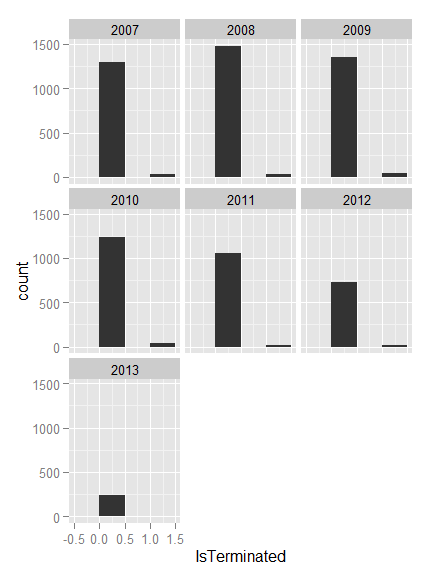
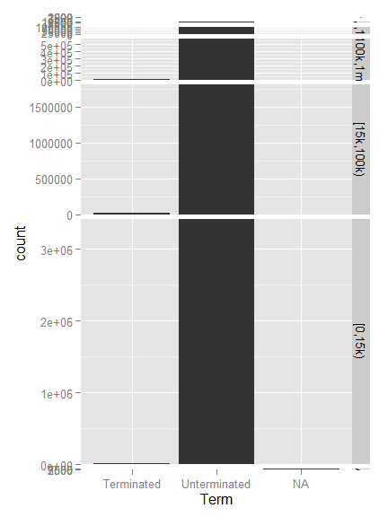
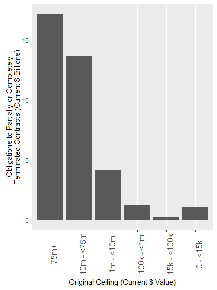
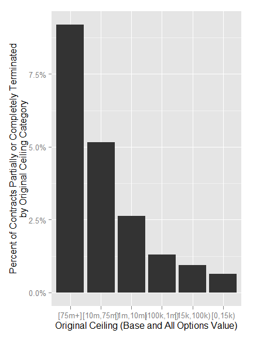
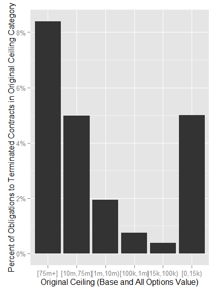

# ContractTermination
Greg Sanders  
Friday, March 20, 2015  

Dod Fixed-Price Study: Is Terminated exploration
============================================================================


```r
##install.packages("ggplot2")

##library("ggplot2")
# 
# setwd("K:\\Development\\Fixed-price")

Path<-"K:\\2007-01 PROFESSIONAL SERVICES\\R scripts and data\\"
source(paste(Path,"lookups.r",sep=""))
```

```
## Loading required package: stringr
## Loading required package: plyr
```

```r
Coloration<-read.csv(
    paste(Path,"Lookups\\","lookup_coloration.csv",sep=""),
    header=TRUE, sep=",", na.strings="", dec=".", strip.white=TRUE, 
    stringsAsFactors=FALSE
    )

Coloration<-ddply(Coloration
                  , c(.(R), .(G), .(B))
                  , transform
                  , ColorRGB=as.character(
                      if(min(is.na(c(R,G,B)))) {NA} 
                      else {rgb(max(R),max(G),max(B),max=255)}
                      )
                  )
```

Contracts are classified using a mix of numerical and categorical variables. While the changes in numerical variables are easy to grasp and summarize, a contract may have one line item that is competed and another that is not. As is detailed in the exploration on R&D, we are only considering information available prior to contract start. The percentage of contract obligations that were competed is a valuable benchmark, but is highly influenced by factors that occured after contract start..

## Contract Terminations


Contract terminations and the number of change orders can be calculated for the entire sample.  Contract termination is determined using the *Reason for Modification* field in FPDS.  A contract is considered to be terminated if it has at least one modification with the following values:

* "Terminate for Default (complete or partial)"
* "Terminate for Convenience (complete or partial)"
* "Terminate for Cause"
* "Legal Contract Cancellation"

These four catetegories and the "Close Out" category are used to mark a contract as closed.  Many contracts in FPDS and in the sample are never marked closed.  


```r
ContractWeighted  <- read.csv(
    paste("data\\defense_contract_CSIScontractID_sample_15000_SumofObligatedAmount.csv", sep = ""),
    header = TRUE, sep = ",", dec = ".", strip.white = TRUE, 
    na.strings = c("NULL","NA",""),
    stringsAsFactors = TRUE
    )

CompleteModelAndDetail  <- read.csv(
    paste("data\\defense_contract_CSIScontractID_detail.csv", sep = ""),
    header = TRUE, sep = ",", dec = ".", strip.white = TRUE, 
    na.strings = c("NULL","NA",""),
    stringsAsFactors = TRUE
    )

colnames(CompleteModelAndDetail)[colnames(CompleteModelAndDetail)=="SubCustomer.sum"]<-"Who"
colnames(CompleteModelAndDetail)[colnames(CompleteModelAndDetail)=="UnmodifiedIsSomeCompetition"]<-"Comp"
colnames(CompleteModelAndDetail)[colnames(CompleteModelAndDetail)=="PlatformPortfolio.sum"]<-"What"
colnames(CompleteModelAndDetail)[colnames(CompleteModelAndDetail)=="IsIDV"]<-"IDV"
colnames(CompleteModelAndDetail)[colnames(CompleteModelAndDetail)=="FixedOrCost"]<-"FxCb"
colnames(CompleteModelAndDetail)[colnames(CompleteModelAndDetail)=="AnyInternational"]<-"Intl"
colnames(CompleteModelAndDetail)[colnames(CompleteModelAndDetail)=="SimpleArea"]<-"PSR"
colnames(CompleteModelAndDetail)[colnames(CompleteModelAndDetail)=="qLowCeiling"]<-"LowCeil"
colnames(CompleteModelAndDetail)[colnames(CompleteModelAndDetail)=="qHighCeiling"]<-"Ceil"
colnames(CompleteModelAndDetail)[colnames(CompleteModelAndDetail)=="qLinked"]<-"Link"
colnames(CompleteModelAndDetail)[colnames(CompleteModelAndDetail)=="qDuration"]<-"Dur"
# colnames(CompleteModelAndDetail)[colnames(CompleteModelAndDetail)=="SingleOffer"]<-"One"
colnames(CompleteModelAndDetail)[colnames(CompleteModelAndDetail)=="qOffers"]<-"Offr"
colnames(CompleteModelAndDetail)[colnames(CompleteModelAndDetail)=="IsTerminated"]<-"Term"
colnames(CompleteModelAndDetail)[colnames(CompleteModelAndDetail)=="SoftwareEng"]<-"Soft"
colnames(CompleteModelAndDetail)[colnames(CompleteModelAndDetail)=="SimpleVehicle"]<-"Veh"
colnames(CompleteModelAndDetail)[colnames(CompleteModelAndDetail)=="LabeledMDAP"]<-"MDAP"
colnames(CompleteModelAndDetail)[colnames(CompleteModelAndDetail)=="qNChg"]<-"NChg"
colnames(CompleteModelAndDetail)[colnames(CompleteModelAndDetail)=="qCRais"]<-"CRai"

    CompleteModelAndDetail$Ceil<-factor(CompleteModelAndDetail$Ceil,
                                levels=c("[75m+]",
                                         "[10m,75m)",
                                         "[1m,10m)", 
                                         "[100k,1m)",
                                         "[15k,100k)",
                                         "[0,15k)"
                                ),
                                ordered=TRUE
    )

#ContractWeighted <- apply_lookups(Path,ContractWeighted)
```

**A Histogram of the IsTerminated data** showing the distribution of whether or not a contract was terminated each year from 2007.  


```r
require("ggplot2")
```

```
## Loading required package: ggplot2
```

```r
require(scales)
```

```
## Loading required package: scales
```

```r
ContractWeighted<-subset(ContractWeighted, StartFiscal_Year>=2007)

ggplot(
  data = ContractWeighted,
  aes_string(x = "IsTerminated"),
  ) + geom_bar(binwidth=0.5) +
facet_wrap("StartFiscal_Year")
```

 

```r
ggplot(
  data = CompleteModelAndDetail,
  aes_string(x = "Term"),
  ) + geom_bar() + 
    facet_grid( Ceil ~ .,
                scales = "free_y",
                space = "free_y") + scale_y_continuous(expand = c(0,50)) 
```

 

```r
ggplot(
  data = subset(CompleteModelAndDetail,Term=="Terminated"),
  aes_string(x = "Ceil")
  )+ geom_bar()+
    scale_x_discrete("Original Ceiling (Base and All Options Value)")+scale_y_continuous("Number of Partially or Completely \nTerminated Contracts")
```

 

```r
CompleteModelAndDetail$Graph[CompleteModelAndDetail$Term=="Terminated"]<-TRUE

CompleteModelAndDetail$Graph[CompleteModelAndDetail$Term=="Unterminated"]<-FALSE

CompleteModelAndDetail$ContractCount<-1
CompleteModelAndDetail<-ddply(CompleteModelAndDetail, .(Ceil), transform, pContract=ContractCount/sum(ContractCount))
CompleteModelAndDetail<-ddply(CompleteModelAndDetail, .(Ceil), transform, pObligation=Action.Obligation/sum(Action.Obligation))

head(CompleteModelAndDetail)
```

```
##   CSIScontractID IDV        FxCb     Comp    Link         MDAP
## 1       20427773 IDV Fixed-Price    Comp.       0     No label
## 2       24504317 IDV Fixed-Price    Comp.  [750+]     No label
## 3        9193124 IDV  Cost-Based No Comp.       0     No label
## 4       18804511 IDV  Cost-Based    Comp.  [750+]     No label
## 5        9841002 IDV  Cost-Based No Comp. [1,750) Labeled MDAP
## 6        9883595 IDV Fixed-Price No Comp. [1,750)     No label
##   unmodifiedSystemequipmentcode       Who                           What
## 1                          <NA> Other DoD                          Other
## 2                          <NA>      Army Electronics and Communications
## 3                          <NA>      Army    Facilities and Construction
## 4                          <NA>      Navy Electronics and Communications
## 5                           571 Other DoD Electronics and Communications
## 6                          <NA> Other DoD            Aircraft and Drones
##                Intl      PSR LowCeil   Ceil                   Dur
## 1 Any International Products  [30m+] [75m+]   [~7 months-~1 year]
## 2         Just U.S. Products  [30m+] [75m+]    (~1 year,~2 years]
## 3         Just U.S. Services  [30m+] [75m+]  [0 months,~2 months)
## 4         Just U.S. Services  [30m+] [75m+]   [~7 months-~1 year]
## 5         Just U.S. Products  [30m+] [75m+] [~2 months,~7 months)
## 6         Just U.S. Products  [30m+] [75m+]  [0 months,~2 months)
##   SingleOffer Offr IsIDV.1                   Soft     UCA            CRai
## 1       Multi  3-4     IDV      Not Software Eng. Not UCA [-0.001, 0.001)
## 2      Single    1     IDV      Not Software Eng. Not UCA [-0.001, 0.001)
## 3      Single    1     IDV      Not Software Eng. Not UCA [-0.001, 0.001)
## 4       Multi   5+     IDV Possible Software Eng. Not UCA [-0.001, 0.001)
## 5      Single    1     IDV      Not Software Eng. Not UCA [-0.001, 0.001)
## 6      Single    1     IDV      Not Software Eng. Not UCA [-0.001, 0.001)
##   NChg            Veh UnmodifiedNumberOfOffersReceived         Term
## 1    0   SINGLE AWARD                                4 Unterminated
## 2    0   SINGLE AWARD                                1 Unterminated
## 3    0   SINGLE AWARD                                1 Unterminated
## 4    0 MULTIPLE AWARD                              253 Unterminated
## 5    0   SINGLE AWARD                                1 Unterminated
## 6    0   SINGLE AWARD                                1 Unterminated
##   UnmodifiedContractBaseAndAllOptionsValue SumOfisChangeOrder
## 1                                 92776280                  0
## 2                                 78323255                  0
## 3                                 78362735                  0
## 4                              72549456595                  0
## 5                                320000000                  0
## 6                               1181530763                  0
##   pChangeOrderUnmodifiedBaseAndAll pChangeOrderObligated UnmodifiedDays
## 1                                0                     0       214.0417
## 2                                0                     0       581.0000
## 3                                0                     0        31.0000
## 4                                0                     0       307.0000
## 5                                0                     0       129.0417
## 6                                0                     0        44.0000
##   Action.Obligation Graph ContractCount    pContract  pObligation
## 1         139164420 FALSE             1 0.0003636364 5.031861e-04
## 2          77538428 FALSE             1 0.0003636364 2.803609e-04
## 3              8964 FALSE             1 0.0003636364 3.241173e-08
## 4                 0 FALSE             1 0.0003636364 0.000000e+00
## 5            490000 FALSE             1 0.0003636364 1.771726e-06
## 6             45000 FALSE             1 0.0003636364 1.627095e-07
```

```r
ggplot(
  data = subset(CompleteModelAndDetail,Term=="Terminated"),
  aes_string(x = "Ceil",weight="Action.Obligation")
  )+ geom_bar()+
    scale_x_discrete("Original Ceiling (Base and All Options Value)")+scale_y_continuous("Total Obligated Value of Partially or Completely Terminated Contracts")
```

 

```r
ggplot(
  data = subset(CompleteModelAndDetail,Term=="Terminated"),
  aes_string(x = "Ceil",weight="pContract")
#   main="Percentage of Contracts going to Partially or Completely Terminated Contracts\nBy Initial Contract Ceiling"
  )+ geom_bar()+ scale_y_continuous("Percent of Contracts Partially or Completely Terminated\nby Original Ceiling Category", labels=percent)+
    scale_x_discrete("Original Ceiling (Base and All Options Value)")
```

 

```r
ggplot(
  data = subset(CompleteModelAndDetail,Term=="Terminated"),
  aes_string(x = "Ceil",weight="pObligation"),
  main="Percentage of Contract Obligations going to Partially or Completely Terminated Contracts\nBy Initial Contract Ceiling"
  )+ geom_bar()+ scale_y_continuous("Percent of Obligations to Terminated Contracts in Original Ceiling Category", labels=percent)+
    scale_x_discrete("Original Ceiling (Base and All Options Value)")
```

 

```r
# 
# LatticePercentLineWrapper("VAR.name"
#                                     ,"VAR.proper.name"
#                                     ,"VAR.X.label"
#                                     ,"VAR.Y.label"
#                                     ,Coloration
#                                     ,subset(CompleteModelAndDetail,!is.na(Term))
#                                     ,NULL
#                                     ,"Ceil"
#                                     ,"Count"
#                                     ,"Term"
#                                     ,NA
#                                     ,NA
#                                     )

# 
# + 
#     facet_grid( Ceil ~ .,
#                 scales = "free_y",
#                 space = "free_y") 
# 

head(CompleteModelAndDetail)
```

```
##   CSIScontractID IDV        FxCb     Comp    Link         MDAP
## 1       20427773 IDV Fixed-Price    Comp.       0     No label
## 2       24504317 IDV Fixed-Price    Comp.  [750+]     No label
## 3        9193124 IDV  Cost-Based No Comp.       0     No label
## 4       18804511 IDV  Cost-Based    Comp.  [750+]     No label
## 5        9841002 IDV  Cost-Based No Comp. [1,750) Labeled MDAP
## 6        9883595 IDV Fixed-Price No Comp. [1,750)     No label
##   unmodifiedSystemequipmentcode       Who                           What
## 1                          <NA> Other DoD                          Other
## 2                          <NA>      Army Electronics and Communications
## 3                          <NA>      Army    Facilities and Construction
## 4                          <NA>      Navy Electronics and Communications
## 5                           571 Other DoD Electronics and Communications
## 6                          <NA> Other DoD            Aircraft and Drones
##                Intl      PSR LowCeil   Ceil                   Dur
## 1 Any International Products  [30m+] [75m+]   [~7 months-~1 year]
## 2         Just U.S. Products  [30m+] [75m+]    (~1 year,~2 years]
## 3         Just U.S. Services  [30m+] [75m+]  [0 months,~2 months)
## 4         Just U.S. Services  [30m+] [75m+]   [~7 months-~1 year]
## 5         Just U.S. Products  [30m+] [75m+] [~2 months,~7 months)
## 6         Just U.S. Products  [30m+] [75m+]  [0 months,~2 months)
##   SingleOffer Offr IsIDV.1                   Soft     UCA            CRai
## 1       Multi  3-4     IDV      Not Software Eng. Not UCA [-0.001, 0.001)
## 2      Single    1     IDV      Not Software Eng. Not UCA [-0.001, 0.001)
## 3      Single    1     IDV      Not Software Eng. Not UCA [-0.001, 0.001)
## 4       Multi   5+     IDV Possible Software Eng. Not UCA [-0.001, 0.001)
## 5      Single    1     IDV      Not Software Eng. Not UCA [-0.001, 0.001)
## 6      Single    1     IDV      Not Software Eng. Not UCA [-0.001, 0.001)
##   NChg            Veh UnmodifiedNumberOfOffersReceived         Term
## 1    0   SINGLE AWARD                                4 Unterminated
## 2    0   SINGLE AWARD                                1 Unterminated
## 3    0   SINGLE AWARD                                1 Unterminated
## 4    0 MULTIPLE AWARD                              253 Unterminated
## 5    0   SINGLE AWARD                                1 Unterminated
## 6    0   SINGLE AWARD                                1 Unterminated
##   UnmodifiedContractBaseAndAllOptionsValue SumOfisChangeOrder
## 1                                 92776280                  0
## 2                                 78323255                  0
## 3                                 78362735                  0
## 4                              72549456595                  0
## 5                                320000000                  0
## 6                               1181530763                  0
##   pChangeOrderUnmodifiedBaseAndAll pChangeOrderObligated UnmodifiedDays
## 1                                0                     0       214.0417
## 2                                0                     0       581.0000
## 3                                0                     0        31.0000
## 4                                0                     0       307.0000
## 5                                0                     0       129.0417
## 6                                0                     0        44.0000
##   Action.Obligation Graph ContractCount    pContract  pObligation
## 1         139164420 FALSE             1 0.0003636364 5.031861e-04
## 2          77538428 FALSE             1 0.0003636364 2.803609e-04
## 3              8964 FALSE             1 0.0003636364 3.241173e-08
## 4                 0 FALSE             1 0.0003636364 0.000000e+00
## 5            490000 FALSE             1 0.0003636364 1.771726e-06
## 6             45000 FALSE             1 0.0003636364 1.627095e-07
```


