# DoD Fixed-Price and Competition Study: Single-Offer Model Building
Greg Sanders  
Tuesday, January 13, 2015  


```
## Loading required package: ggplot2
## Loading required package: stringr
## Loading required package: graph
## Loading required package: plyr
## 
## Attaching package: 'plyr'
## 
## The following object is masked from 'package:graph':
## 
##     join
## 
## Loading required package: Hmisc
## Loading required package: grid
## Loading required package: lattice
## Loading required package: survival
## Loading required package: Formula
## 
## Attaching package: 'Hmisc'
## 
## The following objects are masked from 'package:plyr':
## 
##     is.discrete, summarize
## 
## The following objects are masked from 'package:base':
## 
##     format.pval, round.POSIXt, trunc.POSIXt, units
## 
## Loading required package: Matrix
## Loading required package: gRain
## Loading required package: gRbase
## Loading required package: bnlearn
## 
## Attaching package: 'bnlearn'
## 
## The following objects are masked from 'package:gRbase':
## 
##     children, parents
## 
## Loading required package: Rgraphviz
```

Contracts are classified using a mix of numerical and categorical variables. While the changes in numerical variables are easy to grasp and summarize, a contract may have one line item that is competed and another that is not. As is detailed in the [exploration on R&D](RnD_1to5_exploration.md), we are only considering information available prior to contract start. The percentage of contract obligations that were competed is a valuable benchmark, but is highly influenced by factors that occured after contract start..

##Studying contract vehicle within the sample.
Describe contract vehicle here.


```r
ContractSample  <- read.csv(
    paste("data\\defense_contract_CSIScontractID_sample_100000_SumofObligatedAmount.csv", sep = ""),
    header = TRUE, sep = ",", dec = ".", strip.white = TRUE, 
    na.strings = c("NULL","NA",""),
    stringsAsFactors = TRUE
    )

#These will probably be moved into apply_lookups at some point

ContractSample$pIsFixedPrice <- ContractSample$ObligatedAmountIsFixedPrice/ContractSample$SumofObligatedAmount
ContractSample$pIsFixedPrice[is.nan(ContractSample$ObligatedAmountIsFixedPrice)|is.na(ContractSample$ObligatedAmountIsFixedPrice)] <- 0

ContractSample$pIsCostBased <- ContractSample$ObligatedAmountIsCostBased/ContractSample$SumofObligatedAmount
ContractSample$pIsCostBased[is.nan(ContractSample$ObligatedAmountIsCostBased)|is.na(ContractSample$ObligatedAmountIsCostBased)] <- 0

ContractSample$pIsCombination <- ContractSample$ObligatedAmountIsCombination/ContractSample$SumofObligatedAmount
ContractSample$pIsCombination[is.nan(ContractSample$ObligatedAmountIsCombination)|is.na(ContractSample$ObligatedAmountIsCombination)] <- 0

ContractSample$pIsInternational <- ContractSample$ObligatedAmountIsInternational/ContractSample$SumofObligatedAmount
ContractSample$pIsInternational[is.na(ContractSample$ObligatedAmountIsInternational)] <- 0

ContractSample$AnyInternational<-factor(ContractSample$AnyInternational,
                                        exclude=NULL,
                                        levels=c(0,1,NA),
                                        labels=c("Just U.S.","Any\nInternational","Unlabeled")
                                        )


ContractSample$pIsArmy <- ContractSample$ObligatedAmountIsArmy/ContractSample$SumofObligatedAmount
ContractSample$pIsArmy[is.nan(ContractSample$pIsArmy)|is.infinite(ContractSample$pIsArmy)|is.na(ContractSample$ObligatedAmountIsArmy)] <- 0

ContractSample$pIsNavy <- ContractSample$ObligatedAmountIsNavy/ContractSample$SumofObligatedAmount
ContractSample$pIsNavy[is.nan(ContractSample$pIsNavy)|is.infinite(ContractSample$pIsNavy)|is.na(ContractSample$ObligatedAmountIsNavy)] <- 0

ContractSample$pIsOtherDoD <- ContractSample$ObligatedAmountIsOtherDoD/ContractSample$SumofObligatedAmount
ContractSample$pIsOtherDoD[is.nan(ContractSample$pIsOtherDoD)|is.infinite(ContractSample$pIsOtherDoD)|is.na(ContractSample$ObligatedAmountIsOtherDoD)] <- 0

ContractSample$pIsAirForce <- ContractSample$ObligatedAmountIsAirForce/ContractSample$SumofObligatedAmount
ContractSample$pIsAirForce[is.nan(ContractSample$pIsAirForce)|is.infinite(ContractSample$pIsAirForce)|is.na(ContractSample$ObligatedAmountIsAirForce)] <- 0


ContractSample$ContractingOfficePlatformInterlinked[is.na(ContractSample$ContractingOfficePlatformInterlinked)]<-0
ContractSample$SystemEquipmentInterlinked[is.na(ContractSample$SystemEquipmentInterlinked)]<-0
ContractSample$LinkedContracts<-ContractSample$ContractingOfficePlatformInterlinked+ContractSample$SystemEquipmentInterlinked


ContractSample$UnmodifiedDays<-as.numeric(difftime(strptime(ContractSample$UnmodifiedCurrentCompletionDate,"%Y-%m-%d")
                                                     , strptime(ContractSample$MinOfEffectiveDate,"%Y-%m-%d")
                                                     , unit="days"
        ))+1


ContractSample$pIsLand <- ContractSample$ObligatedAmountIsLand/ContractSample$SumofObligatedAmount
ContractSample$pIsLand[is.nan(ContractSample$pIsLand)|is.infinite(ContractSample$pIsLand)|is.na(ContractSample$ObligatedAmountIsLand)] <- 0

ContractSample$pIsVessel <- ContractSample$ObligatedAmountIsVessel/ContractSample$SumofObligatedAmount
ContractSample$pIsVessel[is.nan(ContractSample$pIsVessel)|is.infinite(ContractSample$pIsVessel)|is.na(ContractSample$ObligatedAmountIsVessel)] <- 0

ContractSample$pIsOtherPP <- ContractSample$ObligatedAmountIsOtherPP/ContractSample$SumofObligatedAmount
ContractSample$pIsOtherPP[is.nan(ContractSample$pIsOtherPP)|is.infinite(ContractSample$pIsOtherPP)|is.na(ContractSample$ObligatedAmountIsOtherPP)] <- 0

ContractSample$pIsAir <- ContractSample$ObligatedAmountIsAir/ContractSample$SumofObligatedAmount
ContractSample$pIsAir[is.nan(ContractSample$pIsAir)|is.infinite(ContractSample$pIsAir)|is.na(ContractSample$ObligatedAmountIsAir)] <- 0

ContractSample$pIsEnC <- ContractSample$ObligatedAmountIsEnC/ContractSample$SumofObligatedAmount
ContractSample$pIsEnC[is.nan(ContractSample$pIsEnC)|is.infinite(ContractSample$pIsEnC)|is.na(ContractSample$ObligatedAmountIsEnC)] <- 0

ContractSample$pIsFRSnC <- ContractSample$ObligatedAmountIsFRSnC/ContractSample$SumofObligatedAmount
ContractSample$pIsFRSnC[is.nan(ContractSample$pIsFRSnC)|is.infinite(ContractSample$pIsFRSnC)|is.na(ContractSample$ObligatedAmountIsFRSnC)] <- 0


ContractSample$pIsMnS <- ContractSample$ObligatedAmountIsMnS/ContractSample$SumofObligatedAmount
ContractSample$pIsMnS[is.nan(ContractSample$pIsMnS)|is.infinite(ContractSample$pIsMnS)|is.na(ContractSample$ObligatedAmountIsMnS)] <- 0


# debug(apply_lookups)
ContractSample<-apply_lookups(Path,ContractSample)
```

```
## Joining by: Customer, SubCustomer
## Joining by: ProductOrServiceArea
## Joining by: PlatformPortfolio
```

```
## Warning in apply_lookups(Path, ContractSample): NaNs produced
```

```
## Warning in apply_lookups(Path, ContractSample): NaNs produced
```

```
## Warning in apply_lookups(Path, ContractSample): NaNs produced
```

```r
ContractSample$SubCustomer.sum<-droplevels(ContractSample$SubCustomer.sum)


summary(subset(ContractSample,select=c(UnmodifiedIsSomeCompetition,
                                IsIDV,
                                IsFixedPrice,
                                IsCostBased,
                                SubCustomer.sum,
                                LinkedContracts,
                                UnmodifiedIsSomeCompetition,
                                UnmodifiedIsFullAndOpen,
                                PlatformPortfolio.sum,
                                AnyInternational,
                                SimpleArea,
                                UnmodifiedContractBaseAndAllOptionsValue,
                                UnmodifiedDays,
                                UnmodifiedNumberOfOffersReceived
                                ))
        )
```

```
##  UnmodifiedIsSomeCompetition     IsIDV       
##  Comp.    :69509             Min.   :0.0000  
##  No Comp. :26449             1st Qu.:1.0000  
##  Unlabeled: 4042             Median :1.0000  
##                              Mean   :0.7563  
##                              3rd Qu.:1.0000  
##                              Max.   :1.0000  
##                                              
##                      IsFixedPrice    IsCostBased         SubCustomer.sum 
##  Fixed Price               :76949   Min.   :0.000   Air Force    : 5971  
##  Other                     :15506   1st Qu.:0.000   Army         :19209  
##  Combination \nor Unlabeled: 7545   Median :0.000   Navy         :25153  
##                                     Mean   :0.165   Other DoD    :45650  
##                                     3rd Qu.:0.000   Uncategorized: 4017  
##                                     Max.   :1.000                        
##                                     NA's   :7525                         
##  LinkedContracts UnmodifiedIsSomeCompetition.1
##  Min.   :    0   Comp.    :69509              
##  1st Qu.:    0   No Comp. :26449              
##  Median :    8   Unlabeled: 4042              
##  Mean   : 2145                                
##  3rd Qu.: 1097                                
##  Max.   :60178                                
##                                               
##       UnmodifiedIsFullAndOpen                    PlatformPortfolio.sum
##  Full & Open      :38004      Other                         :34011    
##  Not Full \n& Open:57973      Facilities and Construction   :24194    
##  Unlabeled        : 4023      Electronics and Communications:19085    
##                               Aircraft and Drones           : 8768    
##                               Unlabeled                     : 4502    
##                               Land Vehicles                 : 3280    
##                               (Other)                       : 6160    
##            AnyInternational              SimpleArea   
##  Just U.S.         :82203   Products          :45247  
##  Any\nInternational:13787   Services          :45037  
##  Unlabeled         : 4010   R&D               : 5427  
##                             Mixed or Unlabeled: 4289  
##                                                       
##                                                       
##                                                       
##  UnmodifiedContractBaseAndAllOptionsValue UnmodifiedDays   
##  Min.   :0.000e+00                        Min.   :    1.0  
##  1st Qu.:2.310e+05                        1st Qu.:   61.0  
##  Median :1.185e+06                        Median :  221.0  
##  Mean   :4.744e+07                        Mean   :  315.9  
##  3rd Qu.:4.800e+06                        3rd Qu.:  366.0  
##  Max.   :3.363e+12                        Max.   :19772.0  
##                                           NA's   :4010     
##  UnmodifiedNumberOfOffersReceived
##  Min.   :  1.00                  
##  1st Qu.:  1.00                  
##  Median :  2.00                  
##  Mean   :  4.97                  
##  3rd Qu.:  5.00                  
##  Max.   :999.00                  
##  NA's   :60397
```
Describe source variables in FPDS here.

###Limiting the sample.

Because this model analyzes the number of offers on competed contracts, the first step is eliminating contracts that were not competed. This is done using the UnmodifiedIsSomeCompetetion field (see [competition exploration](contract_competition_exploration.md) for variable details). This variable has an unlabeled rate of 4.04%. As is done throughout the model, if all labeled values for the contract have are consistent, then that value is used to fill in for the blanks.

###Evidence variables
Note that these missing data rates are only for competed entries, so they will typically not match the overall unlabeled rates.

 * IsIDV is a classification for the entirity of the contract  (0.00% missing data). See [vehicle exploration](contract_vehicle_exploration.md) for more. Since this variable is consistently labeled, it isn't necessary to impute data or seperate out unmodified entries.
 * After imputed, UnmodifiedIsSomeCompetition has a 4.04% missing data rate. 
 * UnmodifiedIsFullAndOpen is the classification given by the first record for the contract (4.02% missing data). See [exploration on competition](contract_competition_exploration.md) for more.
 * UnmodifiedNumberOfOffersReceived reports the Number of Offers Received according to the first reported transaction under a contract (60.40% missing data, far too high, there must be a SQL mistake). See [exploration on competition](contract_competition_exploration.md) for more.
* simplearea is a classification for the entirity of the contract  ( missing data). See [exploration on product, service, and R&D](contract_ProductServiceRnD_exploration.md) for more.


```r
ContractSample$FixedOrCost[ContractSample$pIsFixedPrice>0  |
                                      ContractSample$pIsCostBased>0 | 
                                          ContractSample$pIsCombination>0]<-"Combination \nor Other"


ContractSample$FixedOrCost[ContractSample$pIsFixedPrice>=0.95|(ContractSample$IsFixedPrice=="Fixed Price" & ContractSample$pIsCombination==0)]<-"Fixed-Price"
ContractSample$FixedOrCost[ContractSample$pIsCostBased>=0.95|(ContractSample$IsCostBased==1 & ContractSample$pIsCombination==0)]<-"Cost-Based"
ContractSample$FixedOrCost<-factor(ContractSample$FixedOrCost,levels=c("Fixed-Price","Cost-Based","Combination \nor Other"))


ContractSample$PlatformPortfolio.sum[ContractSample$pIsLand>=0.75&
                                   ContractSample$PlatformPortfolio.sum=="Unlabeled"]<-"Land Vehicles"
ContractSample$PlatformPortfolio.sum[ContractSample$pIsVessel>=0.75&
                                   ContractSample$PlatformPortfolio.sum=="Unlabeled"]<-"Ships & Submarines"
ContractSample$PlatformPortfolio.sum[ContractSample$pIsAir>=0.75&
                                   ContractSample$PlatformPortfolio.sum=="Unlabeled"]<-"Aircraft and Drones"
ContractSample$PlatformPortfolio.sum[ContractSample$pIsOtherPP>=0.75&
                                   ContractSample$PlatformPortfolio.sum=="Unlabeled"]<-"Other"
ContractSample$PlatformPortfolio.sum[ContractSample$pIsWnA>=0.75&
                                   ContractSample$PlatformPortfolio.sum=="Unlabeled"]<-"Weapons and Ammunition"
ContractSample$PlatformPortfolio.sum[ContractSample$pIsMnS>=0.75&
                                   ContractSample$PlatformPortfolio.sum=="Unlabeled"]<-"Missile and Space Systems"
ContractSample$PlatformPortfolio.sum[ContractSample$pIsEnC>=0.75&
                                   ContractSample$PlatformPortfolio.sum=="Unlabeled"]<-"Electronics and Communications"
ContractSample$PlatformPortfolio.sum[ContractSample$pIsFRSnC>=0.75&
                                   ContractSample$PlatformPortfolio.sum=="Unlabeled"]<-"Facilities and Construction"


ContractSample$SubCustomer.sum[ContractSample$pIsArmy>=0.95&
                                   ContractSample$SubCustomer.sum=="Uncategorized"]<-"Army"
ContractSample$SubCustomer.sum[ContractSample$pIsNavy>=0.95&
                                   ContractSample$SubCustomer.sum=="Uncategorized"]<-"Navy"
ContractSample$SubCustomer.sum[ContractSample$pIsAirForce>=0.95&
                                   ContractSample$SubCustomer.sum=="Uncategorized"]<-"Air Force"
ContractSample$SubCustomer.sum[ContractSample$pCustomer=="Defense"&
                                   ContractSample$SubCustomer.sum=="Uncategorized"]<-"Other DoD"
ContractSample$SubCustomer.sum[ContractSample$pIsArmy+ContractSample$pIsNavy+
                                   ContractSample$pIsAirForce+ContractSample$pIsOtherDoD>0.5&
                                   ContractSample$SubCustomer.sum=="Uncategorized"]<-"Other DoD"

ContractSample$SubCustomer.sum[
    ContractSample$SubCustomer.sum=="Uncategorized"&ContractSample$UnmodifiedSubCustomer %in% 
        c("Army", "Navy", "Air Force","Other DoD")]<-
    ContractSample$UnmodifiedSubCustomer[ContractSample$SubCustomer.sum==
                                             "Uncategorized"&ContractSample$UnmodifiedSubCustomer %in% 
                                             c("Army", "Navy", "Air Force","Other DoD")]


ContractSample$qLinked <- cut2(ContractSample$LinkedContracts,cuts=c(1,750))


ContractSample$qOffers <- cut2(ContractSample$NumberOfOffersReceived,cuts=c(1,2,3,5))

ContractSample$AnyInternational[ContractSample$pIsInternational<=0 & 
                    ContractSample$AnyInternational=="Any\nInternational" &
                    ContractSample$UnmodifiedIsInternational==0]<-"Just U.S."

NASimpleArea<-ContractSample$SimpleArea=="Mixed or Unlabeled"&!is.na(ContractSample$UnmodifiedSimpleArea)
ContractSample$SimpleArea[NASimpleArea]<-ContractSample$UnmodifiedSimpleArea[NASimpleArea]
ContractSample$SimpleArea[ContractSample$SimpleArea=="Mixed or Unlabeled" & ContractSample$pIsProducts>0.5]<-"Products"
ContractSample$SimpleArea[ContractSample$SimpleArea=="Mixed or Unlabeled" & ContractSample$pIsServices>0.5]<-"Services"
ContractSample$SimpleArea[ContractSample$SimpleArea=="Mixed or Unlabeled" & ContractSample$pIsRnD>0.5]<-"R&D"


roundedcutoffs<-c(15000,100000,1000000,30000000)
ContractSample$qCeiling <- cut2(ContractSample$UnmodifiedContractBaseAndAllOptionsValue,cuts=roundedcutoffs)

#Impute missing values


#IsSomeCompetition Impute missing values when labeled entries have a consistent value.
NAisSomeCompetition<-ContractSample$UnmodifiedIsSomeCompetition=="Unlabeled"&ContractSample$IsSomeCompetition!="Mixed or \nUnlabeled"
ContractSample$UnmodifiedIsSomeCompetition[NAisSomeCompetition]<-ContractSample$IsSomeCompetition[NAisSomeCompetition]
rm(NAisSomeCompetition)

#IsFullAndOpen Impute missing values when labeled entries have a consistent value.
NAisFullAndOpen<-is.na(ContractSample$UnmodifiedIsFullAndOpen)
ContractSample$UnmodifiedIsFullAndOpen[NAisFullAndOpen]<-ContractSample$IsFullAndOpen[NAisFullAndOpen]
rm(NAisFullAndOpen)

#Comp Summary

ContractSample$Comp[ContractSample$UnmodifiedIsSomeCompetition=="No Comp."]<-0
ContractSample$Comp[ContractSample$UnmodifiedIsSomeCompetition=="Comp." & 
                        ContractSample$UnmodifiedIsFullAndOpen=="Not Full \n& Open"]<-1
ContractSample$Comp[ContractSample$UnmodifiedIsSomeCompetition=="Comp." & 
                        ContractSample$UnmodifiedIsFullAndOpen=="Full & Open"]<-2

ContractSample$Comp<-factor(ContractSample$Comp,
                                   levels=c(0,1,2),
                                   labels=c("No Comp.","Limited\nComp.","Full & Open\nComp.")
)


ContractSample$qDuration<-cut2(ContractSample$UnmodifiedDays,cuts=c(61,214,366))

NAnumberOfOffers<-is.na(ContractSample$UnmodifiedNumberOfOffersReceived)&!is.na(ContractSample$NumberOfOffersReceived)
ContractSample$UnmodifiedNumberOfOffersReceived[NAnumberOfOffers]<-ContractSample$NumberOfOffersReceived[NAnumberOfOffers]
rm(NAnumberOfOffers)
ContractSample$IsIDV<-factor(ContractSample$IsIDV,levels=c(0,1),labels=c("Def/Pur","IDV"))
ContractSample$SingleOffer<-factor(ContractSample$UnmodifiedNumberOfOffersReceived==1,
                                   levels=c(TRUE,FALSE),
                                   labels=c("Single","Multi")
)


names(ContractSample)
```

```
##   [1] "PlatformPortfolio"                                  
##   [2] "ProductOrServiceArea"                               
##   [3] "Customer"                                           
##   [4] "SubCustomer"                                        
##   [5] "CSIScontractID"                                     
##   [6] "SumOfnumberOfActions"                               
##   [7] "ContractBaseAndExercisedOptionsValue"               
##   [8] "ContractBaseAndAllOptionsValue"                     
##   [9] "maxoffiscal_year"                                   
##  [10] "IsIDV"                                              
##  [11] "ChangeOrderObligatedAmount"                         
##  [12] "ChangeOrderBaseAndExercisedOptionsValue"            
##  [13] "ChangeOrderBaseAndAllOptionsValue"                  
##  [14] "NewWorkObligatedAmount"                             
##  [15] "NewWorkBaseAndExercisedOptionsValue"                
##  [16] "NewWorkBaseAndAllOptionsValue"                      
##  [17] "PlaceCountryISO3"                                   
##  [18] "UnmodifiedPlaceCountryISO3"                         
##  [19] "ObligatedAmountIsInternational"                     
##  [20] "AnyInternational"                                   
##  [21] "IsInternational"                                    
##  [22] "UnmodifiedIsInternational"                          
##  [23] "X"                                                  
##  [24] "UnmodifiedContractObligatedAmount"                  
##  [25] "UnmodifiedContractBaseAndExercisedOptionsValue"     
##  [26] "UnmodifiedContractBaseAndAllOptionsValue"           
##  [27] "UnmodifiedNumberOfOffersReceived"                   
##  [28] "UnmodifiedCurrentCompletionDate"                    
##  [29] "UnmodifiedUltimateCompletionDate"                   
##  [30] "UnmodifiedLastDateToOrder"                          
##  [31] "IsModified"                                         
##  [32] "IsTerminated"                                       
##  [33] "SumOfisChangeOrder"                                 
##  [34] "MaxOfisChangeOrder"                                 
##  [35] "SumOfisNewWork"                                     
##  [36] "MaxOfisNewWork"                                     
##  [37] "UnmodifiedIsFullAndOpen"                            
##  [38] "UnmodifiedIsSomeCompetition"                        
##  [39] "UnmodifiedIsOnlyOneSource"                          
##  [40] "UnmodifiedIsFollowonToCompetedAction"               
##  [41] "Unmodifiedmultipleorsingleawardidc"                 
##  [42] "Unmodifiedaddmultipleorsingawardidc"                
##  [43] "UnmodifiedAwardOrIDVcontractactiontype"             
##  [44] "isAnyRnD1to5"                                       
##  [45] "obligatedAmountRnD1to5"                             
##  [46] "firstSignedDateRnD1to5"                             
##  [47] "UnmodifiedRnD1to5"                                  
##  [48] "NumberOfOffersReceived"                             
##  [49] "IsFullAndOpen"                                      
##  [50] "IsSomeCompetition"                                  
##  [51] "ObligatedAmountIsSomeCompetition"                   
##  [52] "IsOnlyOneSource"                                    
##  [53] "IsFollowonToCompetedAction"                         
##  [54] "MultipleOrSingleAwardIDC"                           
##  [55] "AddMultipleOrSingleAwardIDC"                        
##  [56] "AwardOrIDVcontractActionType"                       
##  [57] "Pricing.Mechanism.Code"                             
##  [58] "UnmodifiedTypeOfContractPricing"                    
##  [59] "ObligatedAmountIsFixedPrice"                        
##  [60] "IsFixedPrice"                                       
##  [61] "UnmodifiedIsFixedPrice"                             
##  [62] "ObligatedAmountIsCostBased"                         
##  [63] "IsCostBased"                                        
##  [64] "UnmodifiedIsCostBased"                              
##  [65] "ObligatedAmountIsCombination"                       
##  [66] "IsCombination"                                      
##  [67] "UnmodifiedIsCombination"                            
##  [68] "ObligatedAmountIsIncentive"                         
##  [69] "IsIncentive"                                        
##  [70] "UnmodifiedIsIncentive"                              
##  [71] "UnmodifiedProductOrServiceArea"                     
##  [72] "SimpleArea"                                         
##  [73] "UnmodifiedSimpleArea"                               
##  [74] "ObligatedAmountIsServices"                          
##  [75] "ObligatedAmountIsRnD"                               
##  [76] "StartFiscal_Year"                                   
##  [77] "Action.Obligation"                                  
##  [78] "IsClosed"                                           
##  [79] "LastSignedLastDateToOrder"                          
##  [80] "LastUltimateCompletionDate"                         
##  [81] "LastCurrentCompletionDate"                          
##  [82] "MinOfSignedDate"                                    
##  [83] "MinOfEffectiveDate"                                 
##  [84] "unmodifiedSystemequipmentcode"                      
##  [85] "SystemEquipmentInterlinked"                         
##  [86] "ContractingOfficePlatformInterlinked"               
##  [87] "ObligatedAmountIsAir"                               
##  [88] "ObligatedAmountIsEnC"                               
##  [89] "ObligatedAmountIsFRSnC"                             
##  [90] "ObligatedAmountIsLand"                              
##  [91] "ObligatedAmountIsMnS"                               
##  [92] "ObligatedAmountIsOtherPP"                           
##  [93] "ObligatedAmountIsVessel"                            
##  [94] "ObligatedAmountIsWnA"                               
##  [95] "UnmodifiedCustomer"                                 
##  [96] "UnmodifiedSubCustomer"                              
##  [97] "ObligatedAmountIsArmy"                              
##  [98] "ObligatedAmountIsNavy"                              
##  [99] "ObligatedAmountIsAirForce"                          
## [100] "ObligatedAmountIsOtherDoD"                          
## [101] "pIsFixedPrice"                                      
## [102] "pIsCostBased"                                       
## [103] "pIsCombination"                                     
## [104] "pIsInternational"                                   
## [105] "pIsArmy"                                            
## [106] "pIsNavy"                                            
## [107] "pIsOtherDoD"                                        
## [108] "pIsAirForce"                                        
## [109] "LinkedContracts"                                    
## [110] "UnmodifiedDays"                                     
## [111] "pIsLand"                                            
## [112] "pIsVessel"                                          
## [113] "pIsOtherPP"                                         
## [114] "pIsAir"                                             
## [115] "pIsEnC"                                             
## [116] "pIsFRSnC"                                           
## [117] "pIsMnS"                                             
## [118] "SubCustomer.sum"                                    
## [119] "SubCustomer.detail"                                 
## [120] "SubCustomer.component"                              
## [121] "Subcustomer.Obsolete"                               
## [122] "ServicesCategory.detail"                            
## [123] "ServicesCategory.sum"                               
## [124] "ProductsCategory.detail"                            
## [125] "ProductOrServicesCategory.Graph"                    
## [126] "PlatformPortfolio.sum"                              
## [127] "Platform.page"                                      
## [128] "UnmodifiedNumberOfOffersSummary"                    
## [129] "LogOfAction.Obligation"                             
## [130] "pNewWorkVsContractObligatedAmount"                  
## [131] "pChangeOrderVsContractObligatedAmount"              
## [132] "LogOfContractBaseAndAllOptionsValue"                
## [133] "pNewWorkVsContractBaseAndAllOptionsValue"           
## [134] "pChangeOrderVsContractBaseAndAllOptionsValue"       
## [135] "LogOfContractBaseAndExercisedOptionsValue"          
## [136] "pNewWorkVsContractBaseAndExercised"                 
## [137] "pChangeOrderVsContractBaseAndExercised"             
## [138] "LogOfUnmodifiedContractObligatedAmount"             
## [139] "pUnmodifiedContractObligated"                       
## [140] "pNewWorkVsUnmodifiedObligatedAmount"                
## [141] "pChangeOrderVsUnmodifiedObligatedAmount"            
## [142] "LogOfUnmodifiedContractBaseAndAllOptionsValue"      
## [143] "SizeOfUnmodifiedContractBaseAndAll"                 
## [144] "pUnmodifiedContractBaseAndAll"                      
## [145] "pNewWorkVsUnmodifiedBaseAndAll"                     
## [146] "pChangeOrderVsUnmodifiedBaseAndAll"                 
## [147] "LogOfUnmodifiedContractBaseAndExercisedOptionsValue"
## [148] "pUnmodifiedContractBaseAndExercised"                
## [149] "pNewWorkVsUnmodifiedBaseAndExercised"               
## [150] "pChangeOrderVsUnmodifiedBaseAndExercised"           
## [151] "Graph"                                              
## [152] "CurrentMonths"                                      
## [153] "CategoryOfCurrentMonths"                            
## [154] "UnmodifiedMonths"                                   
## [155] "CategoryOfUnmodifiedMonths"                         
## [156] "UnmodifiedCompetition"                              
## [157] "FixedOrCost"                                        
## [158] "qLinked"                                            
## [159] "qOffers"                                            
## [160] "qCeiling"                                           
## [161] "Comp"                                               
## [162] "qDuration"                                          
## [163] "SingleOffer"
```

```r
summary(subset(ContractSample,select=c(UnmodifiedIsSomeCompetition,
                                IsIDV,
                                FixedOrCost,
                                Comp,
                                SubCustomer.sum,
                                qLinked,
                                AnyInternational,
                                SimpleArea,
                                qCeiling,
                                qDuration,
                                PlatformPortfolio.sum,
#                                 UnmodifiedNumberOfOffersReceived
                                qOffers
                                ))
        )
```

```
##  UnmodifiedIsSomeCompetition     IsIDV      
##  Comp.    :69509             Def/Pur:24369  
##  No Comp. :26449             IDV    :75631  
##  Unlabeled: 4042                            
##                                             
##                                             
##                                             
##                                             
##                  FixedOrCost                    Comp      
##  Fixed-Price           :76924   No Comp.          :26449  
##  Cost-Based            :14425   Limited\nComp.    :31502  
##  Combination \nor Other: 4416   Full & Open\nComp.:38004  
##  NA's                  : 4235   NA's              : 4045  
##                                                           
##                                                           
##                                                           
##       SubCustomer.sum           qLinked                AnyInternational
##  Air Force    : 5971       0        :49630   Just U.S.         :82281  
##  Army         :19213   [    1,  750):19454   Any\nInternational:13709  
##  Navy         :25153   [  750,60178]:30916   Unlabeled         : 4010  
##  Other DoD    :45652                                                   
##  Uncategorized: 4011                                                   
##                                                                        
##                                                                        
##               SimpleArea                   qCeiling    
##  Products          :45357   [0.00e+00,1.50e+04): 4056  
##  Services          :45140   [1.50e+04,1.00e+05):12621  
##  R&D               : 5471   [1.00e+05,1.00e+06):30784  
##  Mixed or Unlabeled: 4032   [1.00e+06,3.00e+07):48252  
##                             [3.00e+07,3.36e+12]: 4287  
##                                                        
##                                                        
##          qDuration                        PlatformPortfolio.sum
##  [    1,   61):23656   Other                         :34160    
##  [   61,  214):23540   Facilities and Construction   :24241    
##  [  214,  366):20711   Electronics and Communications:19168    
##  [  366,19772]:28083   Aircraft and Drones           : 8818    
##  NA's         : 4010   Unlabeled                     : 4126    
##                        Land Vehicles                 : 3295    
##                        (Other)                       : 6192    
##       qOffers     
##    1      :41246  
##    2      :14003  
##  [  3,  5):16503  
##  [  5,999]:23366  
##  NA's     : 4882  
##                   
## 
```
The model has nine core variables, though one is presently missing. After renaming the variables, all unlabeled data is removed from the final model dataset.

*IDV (IsIDV) IsDefiniteVehicle has ('r sprintf("%1.2f%%",nrow(subset(ContractSample,is.na(IsIDV)|IsIDV=="Unlabeled")) /nrow(ContractSample)*100)` missing data.
   
* FxCb (FixedOrCost) FixedOrCost has ('r sprintf("%1.2f%%",nrow(subset(ContractSample,is.na(FixedOrCost)|FixedOrCost=="Unlabeled")) /nrow(ContractSample)*100)` missing data.

* Comp (UnmodifiedIsFullAndOpen) UnmodifiedIsFullAndOpen has (4.02% missing data.

* Intl (AnyInternational) AnyInternational has (4.01% missing data. 
	* PSR (SimpleArea) SimpleArea has (0.00% missing data.
	* Ceil (qCeiling) qCeiling has (0.00% missing data.
	* Dur (qDuration) qDuration has ('r sprintf("%1.2f%%",nrow(subset(ContractSample,is.na(MinOfSignedDate)|MinOfSignedDate=="Unlabeled")) /nrow(ContractSample)*100)` missing data.
	* Dur (LastUltimateCompleteDate) LastUltimateCompleteDate has (4.03% missing data.
	

* One (SingleOffer)  UnmodifiedNumberOfOffersReceived has (0.92% missing data.

```r
summary(subset(ContractSample,select=c(UnmodifiedIsSomeCompetition,
                                IsIDV,
                                SubCustomer.sum,
                                FixedOrCost,
                                UnmodifiedIsFullAndOpen,
                                qLinked,
                                AnyInternational,
                                SimpleArea,
                                qCeiling,
                                qDuration,
                                PlatformPortfolio.sum,
#                                 UnmodifiedNumberOfOffersReceived
qOffers
                                ))
        )
```

```
##  UnmodifiedIsSomeCompetition     IsIDV            SubCustomer.sum 
##  Comp.    :69509             Def/Pur:24369   Air Force    : 5971  
##  No Comp. :26449             IDV    :75631   Army         :19213  
##  Unlabeled: 4042                             Navy         :25153  
##                                              Other DoD    :45652  
##                                              Uncategorized: 4011  
##                                                                   
##                                                                   
##                  FixedOrCost         UnmodifiedIsFullAndOpen
##  Fixed-Price           :76924   Full & Open      :38004     
##  Cost-Based            :14425   Not Full \n& Open:57973     
##  Combination \nor Other: 4416   Unlabeled        : 4023     
##  NA's                  : 4235                               
##                                                             
##                                                             
##                                                             
##           qLinked                AnyInternational
##      0        :49630   Just U.S.         :82281  
##  [    1,  750):19454   Any\nInternational:13709  
##  [  750,60178]:30916   Unlabeled         : 4010  
##                                                  
##                                                  
##                                                  
##                                                  
##               SimpleArea                   qCeiling    
##  Products          :45357   [0.00e+00,1.50e+04): 4056  
##  Services          :45140   [1.50e+04,1.00e+05):12621  
##  R&D               : 5471   [1.00e+05,1.00e+06):30784  
##  Mixed or Unlabeled: 4032   [1.00e+06,3.00e+07):48252  
##                             [3.00e+07,3.36e+12]: 4287  
##                                                        
##                                                        
##          qDuration                        PlatformPortfolio.sum
##  [    1,   61):23656   Other                         :34160    
##  [   61,  214):23540   Facilities and Construction   :24241    
##  [  214,  366):20711   Electronics and Communications:19168    
##  [  366,19772]:28083   Aircraft and Drones           : 8818    
##  NA's         : 4010   Unlabeled                     : 4126    
##                        Land Vehicles                 : 3295    
##                        (Other)                       : 6192    
##       qOffers     
##    1      :41246  
##    2      :14003  
##  [  3,  5):16503  
##  [  5,999]:23366  
##  NA's     : 4882  
##                   
## 
```
The model has nine core variables, though one is presently missing. After renaming the variables, all unlabeled data is removed from the final model dataset.

*IDV (IsIDV) IsDefiniteVehicle has ('r sprintf("%1.2f%%",nrow(subset(ContractSample,is.na(IsIDV)|IsIDV=="Unlabeled")) /nrow(ContractSample)*100)` missing data.

* FxCb (FixedOrCost) FixedOrCost has ('r sprintf("%1.2f%%",nrow(subset(ContractSample,is.na(FixedOrCost)|FixedOrCost=="Unlabeled")) /nrow(ContractSample)*100)` missing data.

* Comp (Competition) Competition has (4.04% missing data).

* Intl (AnyInternational) AnyInternational has (4.01% missing data. 

* PSR (SimpleArea) SimpleArea has (0.00% missing data.

* Ceil (qCeiling) qCeiling has (0.00% missing data.

* Dur (qDuration) qDuration has ('r sprintf("%1.2f%%",nrow(subset(ContractSample,is.na(MinOfSignedDate)|MinOfSignedDate=="Unlabeled")) /nrow(ContractSample)*100)` missing data.

* Dur (LastUltimateCompleteDate) LastUltimateCompleteDate has (4.03% missing data.

>>>>>>> 27b71e8ed2ac0f7a1e33d77d89b15f6f9bb22e71
* One (SingleOffer)  UnmodifiedNumberOfOffersReceived has (0.92% missing data.

The shortened names are used for ease of graphical and tabular representation. However, there exact form is still wide open, please make suggestions. Ease of comprehensibility and minimizing confusion between competing variables is key.


```r
ContractModel<-subset(ContractSample,select=c(IsIDV,
                                FixedOrCost,
                                Comp,
                                qLinked,
                                SubCustomer.sum,
                                PlatformPortfolio.sum,
                                AnyInternational,
                                SimpleArea,
                                qCeiling,
                                qDuration,
#                                 SingleOffer
qOffers
                                ))
# 

colnames(ContractModel)[colnames(ContractModel)=="SubCustomer.sum"]<-"Who"
colnames(ContractModel)[colnames(ContractModel)=="PlatformPortfolio.sum"]<-"What"
colnames(ContractModel)[colnames(ContractModel)=="IsIDV"]<-"IDV"
colnames(ContractModel)[colnames(ContractModel)=="FixedOrCost"]<-"FxCb"
colnames(ContractModel)[colnames(ContractModel)=="AnyInternational"]<-"Intl"
colnames(ContractModel)[colnames(ContractModel)=="SimpleArea"]<-"PSR"
colnames(ContractModel)[colnames(ContractModel)=="qCeiling"]<-"Ceil"
colnames(ContractModel)[colnames(ContractModel)=="qLinked"]<-"Link"
colnames(ContractModel)[colnames(ContractModel)=="qDuration"]<-"Dur"
# colnames(ContractModel)[colnames(ContractModel)=="SingleOffer"]<-"One"
colnames(ContractModel)[colnames(ContractModel)=="qOffers"]<-"Offr"


nrow(ContractModel)
```

```
## [1] 100000
```

```r
summary(nrow(subset(ContractModel,complete.cases(ContractModel))))
```

```
##    Min. 1st Qu.  Median    Mean 3rd Qu.    Max. 
##   94860   94860   94860   94860   94860   94860
```

```r
summary(subset(ContractModel,complete.cases(ContractModel)))
```

```
##       IDV                            FxCb                       Comp      
##  Def/Pur:24066   Fixed-Price           :76213   No Comp.          :26075  
##  IDV    :70798   Cost-Based            :14343   Limited\nComp.    :30949  
##                  Combination \nor Other: 4308   Full & Open\nComp.:37840  
##                                                                           
##                                                                           
##                                                                           
##                                                                           
##             Link                  Who       
##      0        :45156   Air Force    : 5904  
##  [    1,  750):19171   Army         :19055  
##  [  750,60178]:30537   Navy         :24774  
##                        Other DoD    :45130  
##                        Uncategorized:    1  
##                                             
##                                             
##                              What                       Intl      
##  Other                         :33800   Just U.S.         :81280  
##  Facilities and Construction   :23907   Any\nInternational:13584  
##  Electronics and Communications:18927   Unlabeled         :    0  
##  Aircraft and Drones           : 8744                             
##  Land Vehicles                 : 3270                             
##  Ships & Submarines            : 2741                             
##  (Other)                       : 3475                             
##                  PSR                         Ceil      
##  Products          :44983   [0.00e+00,1.50e+04): 3938  
##  Services          :44478   [1.50e+04,1.00e+05):12408  
##  R&D               : 5381   [1.00e+05,1.00e+06):29777  
##  Mixed or Unlabeled:   22   [1.00e+06,3.00e+07):44751  
##                             [3.00e+07,3.36e+12]: 3990  
##                                                        
##                                                        
##             Dur               Offr      
##  [    1,   61):23424     1      :41101  
##  [   61,  214):23262     2      :13975  
##  [  214,  366):20433   [  3,  5):16473  
##  [  366,19772]:27745   [  5,999]:23315  
##                                         
##                                         
## 
```

```r
dropped<-subset(ContractModel,!complete.cases(ContractModel)|
           Intl=="Unlabeled"|
           PSR =="Mixed or Unlabeled" |
               Who=="Uncategorized" |
               What =="Unlabeled")

ContractModel<-subset(ContractModel,complete.cases(ContractModel)&
           Intl!="Unlabeled"&
           PSR !="Mixed or Unlabeled"&
               Who!="Uncategorized" & 
               What!="Unlabeled")

ContractModel$Intl<-droplevels(ContractModel$Intl)
ContractModel$PSR<-droplevels(ContractModel$PSR)
ContractModel$Who<-droplevels(ContractModel$Who)
ContractModel$What<-droplevels(ContractModel$What)

nrow(ContractModel)
```

```
## [1] 94731
```

The last stage before Bayesian learning is setting the whitelists and blacklists. The whitelist contains vectors that must existing in the graph while the blacklist contains forbidden vectors. There was some iteration in the development of the white and blacklist, as nonsensical connections were removed and the blacklist was made systematic.

I've listed them below based on the origin piece of evidence.
1. IDV (IsIDV)
* Whitelist to Comp (Competition) as many forms of IDVs don't qualify for full and open.
* Blacklist to PSR (SimpleArea) because what you are buying is picked before how you are buying it.
2. FxCb (FixedOrCost)
* Whitelist to One (SingleOffer) as this is the key study question.
* Blacklist to PSR (SimpleArea) and Intl (AnyInternational) because figuring out what and where come first.
* Blacklist to Ceil (qCeiling) and Dur (qDuration), because project scope should come before project pricing,  although this may not be entirely true when the vendors make proposals.
3. Comp (Competition)  
* Whitelist to One (SingleOffer). We'll see how strong this connection ends up being, but it's really straightforward.
* Blacklist to PSR (SimpleArea),  Intl (AnyInternational), and FxCb (FixedOrCost), as I think those details are set before deciding competition procedures.
4. Intl (AnyInternational) No restrictions or requirements.
5. PSR (SimpleArea)
* Blacklist to Intl (AnyInternational) As I think the place of performance in the U.S. or abroad (but not the vendor location) is sometimes decided at least as early as the  product or service.
6. Ceil (qCeiling)
* Blacklist to PSR (SimpleArea) Intl (AnyInternational) because what and where come before scope.
7. Dur (qDuration)
* Blacklist to PSR (SimpleArea) Intl (AnyInternational) because what and where come before scope.
8. One (SingleOffer) 
* Blacklist to everything not covered by an existing whitelist. While the vendors responses may influence some factors at the margin, this is the dependent variable for this part of the study.


```r
#White list, connections that must occur
ContractWL<-data.frame(from="Comp",to="Offr")
# ContractWL<-rbind(ContractWL,data.frame(from="Comp",to="Offr"))
ContractWL<-rbind(ContractWL,data.frame(from="PSR",to="FxCb"))
ContractWL<-rbind(ContractWL,data.frame(from="PSR",to="Link"))
ContractWL<-rbind(ContractWL,data.frame(from="FxCb",to="Offr"))
ContractWL<-rbind(ContractWL,data.frame(from="What",to="Link"))
# ContractWL<-rbind(ContractWL,data.frame(from="Who",to="Intl"))
ContractWL<-rbind(ContractWL,data.frame(from="Who",to="What"))
#Black list, connections that are prohibited
ContractBL<-data.frame(from=c("Offr"),to= c("IDV"))
ContractBL<-rbind(ContractBL,data.frame(from="Offr",to="Who"))
ContractBL<-rbind(ContractBL,data.frame(from="Offr",to="What"))
ContractBL<-rbind(ContractBL,data.frame(from="Offr",to="PSR"))
ContractBL<-rbind(ContractBL,data.frame(from="Offr",to="Intl"))
ContractBL<-rbind(ContractBL,data.frame(from="Offr",to="FxCb"))
ContractBL<-rbind(ContractBL,data.frame(from="Offr",to="Ceil"))
ContractBL<-rbind(ContractBL,data.frame(from="Offr",to="Dur"))
ContractBL<-rbind(ContractBL,data.frame(from="Offr",to="Link"))
# ContractBL<-rbind(ContractBL,data.frame(from="Who",to="Offr"))
ContractBL<-rbind(ContractBL,data.frame(from="Link",to="Who"))
ContractBL<-rbind(ContractBL,data.frame(from="Link",to="Intl"))
ContractBL<-rbind(ContractBL,data.frame(from="Link",to="IDV"))
ContractBL<-rbind(ContractBL,data.frame(from="FxCb",to="Who"))
ContractBL<-rbind(ContractBL,data.frame(from="FxCb",to="What"))
ContractBL<-rbind(ContractBL,data.frame(from="FxCb",to="Intl"))
ContractBL<-rbind(ContractBL,data.frame(from="FxCb",to="Ceil"))
ContractBL<-rbind(ContractBL,data.frame(from="FxCb",to="Dur"))
ContractBL<-rbind(ContractBL,data.frame(from="FxCb",to="Link"))
ContractBL<-rbind(ContractBL,data.frame(from="FxCb",to="Comp"))
ContractBL<-rbind(ContractBL,data.frame(from="Ceil",to="Who"))
ContractBL<-rbind(ContractBL,data.frame(from="Ceil",to="What"))
ContractBL<-rbind(ContractBL,data.frame(from="Ceil",to="PSR"))
ContractBL<-rbind(ContractBL,data.frame(from="Ceil",to="Intl"))
ContractBL<-rbind(ContractBL,data.frame(from="Ceil",to="Link"))
ContractBL<-rbind(ContractBL,data.frame(from="Dur",to="Who"))
ContractBL<-rbind(ContractBL,data.frame(from="Dur",to="What"))
ContractBL<-rbind(ContractBL,data.frame(from="Dur",to="PSR"))
ContractBL<-rbind(ContractBL,data.frame(from="Dur",to="Intl"))
ContractBL<-rbind(ContractBL,data.frame(from="Dur",to="Link"))
ContractBL<-rbind(ContractBL,data.frame(from="Comp",to="Who"))
ContractBL<-rbind(ContractBL,data.frame(from="Comp",to="What"))
ContractBL<-rbind(ContractBL,data.frame(from="Comp",to="PSR"))
ContractBL<-rbind(ContractBL,data.frame(from="Comp",to="Link"))
ContractBL<-rbind(ContractBL,data.frame(from="Comp",to="Intl"))
# ContractBL<-rbind(ContractBL,data.frame(from="Comp",to="Ceil"))
# ContractBL<-rbind(ContractBL,data.frame(from="Comp",to="Dur"))
ContractBL<-rbind(ContractBL,data.frame(from="IDV",to="Who"))
ContractBL<-rbind(ContractBL,data.frame(from="IDV",to="What"))
ContractBL<-rbind(ContractBL,data.frame(from="IDV",to="PSR"))
ContractBL<-rbind(ContractBL,data.frame(from="IDV",to="Intl"))
ContractBL<-rbind(ContractBL,data.frame(from="IDV",to="Link"))
ContractBL<-rbind(ContractBL,data.frame(from="IDV",to="Comp"))
ContractBL<-rbind(ContractBL,data.frame(from="PSR",to="Who"))
ContractBL<-rbind(ContractBL,data.frame(from="PSR",to="What"))
ContractBL<-rbind(ContractBL,data.frame(from="PSR",to="Intl"))

bnWhitelist <- empty.graph(nodes = names(ContractModel))
arcs(bnWhitelist)<-ContractWL
graphviz.plot(bnWhitelist,main="Whitelisted Arcs Rd. 1")
```

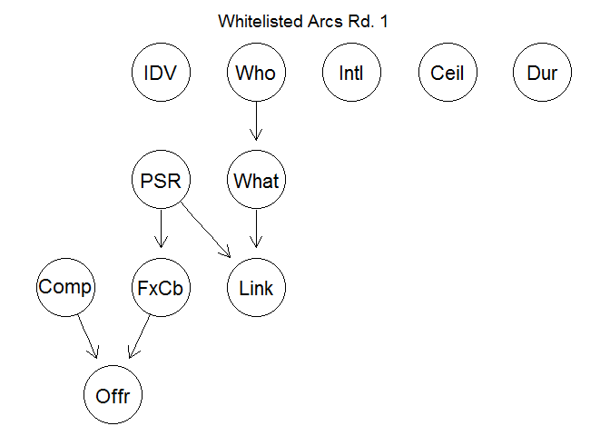 

```r
bnBlacklist <- empty.graph(nodes = names(ContractModel))
# arcs(bnBlacklist)<-ContractBL
# graphviz.plot(bnBlacklist,main="Blacklisted Arcs Rd. 1")
```

After the team developed the initial list and a small number of elements accidentally left off were corrected for, the next step was to do a preliminary run through with Bayesian learning. 


```r
gs_dug<-gs(ContractModel,blacklist=ContractBL,whitelist=ContractWL)
iamb_dug<-iamb(ContractModel,blacklist=ContractBL,whitelist=ContractWL,optimized=TRUE)
```

```
## Warning in FUN(newX[, i], ...): vstructure IDV -> FxCb <- Dur is not
## applicable, because one or both arcs are oriented in the opposite
## direction.
```

```
## Warning in FUN(newX[, i], ...): vstructure IDV -> FxCb <- Link is not
## applicable, because one or both arcs are oriented in the opposite
## direction.
```

```r
uiamb_dug<-iamb(ContractModel,blacklist=ContractBL,whitelist=ContractWL,optimized=FALSE)
```

```
## Warning in FUN(newX[, i], ...): vstructure IDV -> FxCb <- Link is not
## applicable, because one or both arcs are oriented in the opposite
## direction.
```

```r
interiamb_dug<-inter.iamb(ContractModel,blacklist=ContractBL,whitelist=ContractWL)
```

```
## Warning in FUN(newX[, i], ...): vstructure IDV -> FxCb <- Dur is not
## applicable, because one or both arcs are oriented in the opposite
## direction.
```

```
## Warning in FUN(newX[, i], ...): vstructure IDV -> FxCb <- Link is not
## applicable, because one or both arcs are oriented in the opposite
## direction.
```

```r
uinteriamb_dug<-inter.iamb(ContractModel,blacklist=ContractBL,whitelist=ContractWL,optimized=FALSE)
```

```
## Warning in FUN(newX[, i], ...): vstructure IDV -> FxCb <- Link is not
## applicable, because one or both arcs are oriented in the opposite
## direction.
```

```r
ContractBL<-rbind(ContractBL,data.frame(from="Who",to="Comp"))
ContractBL<-rbind(ContractBL,data.frame(from="Who",to="Offr"))
ContractBL<-rbind(ContractBL,data.frame(from="Who",to="IDV"))
ContractBL<-rbind(ContractBL,data.frame(from="Who",to="FxCb"))

highlightWL1 <- list(arcs = ContractWL,
                                         col = "blue")

highlightLists <- list(arcs = data.frame(from=c(as.character(ContractWL$from),
                                                as.character(ContractBL$to)),
                                         to=c(as.character(ContractWL$to),
                                              as.character(ContractBL$from))),
                                         col = "blue")


graphviz.plot(gs_dug,main="Grow-Shrink first run",highlight=highlightLists)
```

```
## Warning in unique.arcs(arcs, nodes, warn = TRUE): removed 1 duplicate
## arcs.
```

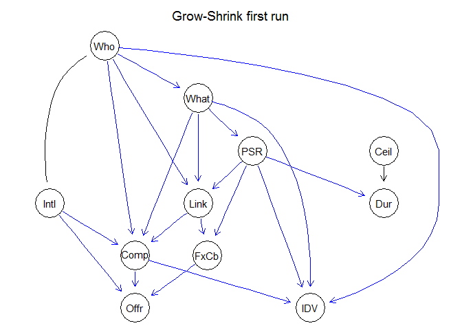 

Noteably this initial run through produced two warnings of challenging relationships IDV to Dur and IDV to FxCb. After consulting within the team, the choice was made to add whitelisted relationships that went against those automatically produced.

IDV (IsIDV) new white lists:
* Whitelist to FxCb (FixedOrCost) because the pricing mechanism of most IDVs are set. Thus, once the choice of which IDV to use is made, the pricing mechanism would be set automatically. Furthermore, Fixed-price is often the mechanism because the IDV allows for multiple instances of a single contract reducing the need for the flexabilit Cost-Based contracts offer.
* Whitelist to Dur (Duration) because the use of the IDV mechanism typically means multiple shorter contractors under one IDV rather than a single longer contract. 

With those two connections in hand, all three Bayesian Learning algorith were applied.


```r
#White list, connections that must occur
# ContractWL<-rbind(ContractWL,data.frame(from="IDV",to="Dur"))
ContractWL<-rbind(ContractWL,data.frame(from="IDV",to="FxCb"))
# ContractWL<-rbind(ContractWL,data.frame(from="IDV",to="Ceil"))
# ContractWL<-rbind(ContractWL,data.frame(from="Dur",to="Ceil"))
# ContractWL<-rbind(ContractWL,data.frame(from="Ceil",to="Comp"))
ContractWL<-rbind(ContractWL,data.frame(from="Ceil",to="Dur"))


highlight.WL2 <- list(arcs = ContractWL, col = "blue")

highlightLists2 <- list(arcs = data.frame(from=c(as.character(ContractWL$from),
                                                as.character(ContractBL$to)),
                                         to=c(as.character(ContractWL$to),
                                              as.character(ContractBL$from))),
                                         col = "blue")


iamb_dug<-iamb(ContractModel,blacklist=ContractBL,whitelist=ContractWL,optimized=TRUE)
uiamb_dug<-iamb(ContractModel,blacklist=ContractBL,whitelist=ContractWL,optimized=FALSE)
#Comparing the optimized and unoptimized Incremental Association results
all.equal(iamb_dug,uiamb_dug)
```

```
## [1] "Different number of directed/undirected arcs"
```

```r
interiamb_dug<-inter.iamb(ContractModel,blacklist=ContractBL,whitelist=ContractWL)
uinteriamb_dug<-inter.iamb(ContractModel,blacklist=ContractBL,whitelist=ContractWL,optimized=FALSE)
#They also dont match with interleaved.
all.equal(interiamb_dug,uinteriamb_dug)
```

```
## [1] "Different number of directed/undirected arcs"
```

```r
all.equal(uiamb_dug,uinteriamb_dug)
```

```
## [1] "Different number of directed/undirected arcs"
```

```r
mmpc_dug<-mmpc(ContractModel)
ummpc_dug<-mmpc(ContractModel,blacklist=ContractBL,whitelist=ContractWL,optimized=FALSE)
#They also dont match with interleaved.
all.equal(mmpc_dug,ummpc_dug)
```

```
## [1] "Different number of directed/undirected arcs"
```

```r
#But the two methods do not producing matching results
all.equal(iamb_dug,interiamb_dug)
```

```
## [1] "Different arc sets"
```

```r
all.equal(uiamb_dug,uinteriamb_dug)
```

```
## [1] "Different number of directed/undirected arcs"
```

```r
all.equal(uiamb_dug,mmpc_dug)
```

```
## [1] "Different number of directed/undirected arcs"
```

```r
graphviz.plot(uiamb_dug,main="Unoptimized Incremental Association ",highlight=highlight.WL2)
```

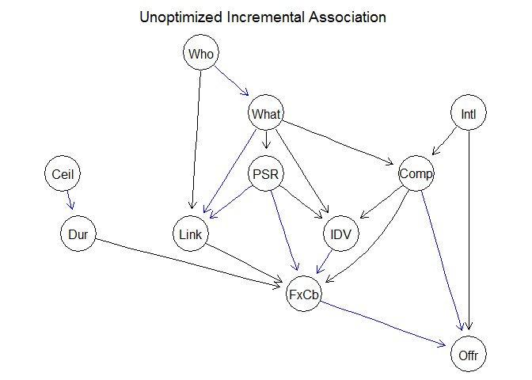 

```r
graphviz.plot(uinteriamb_dug,main="Unoptimized Interleaved Incremental Association ",highlight=highlight.WL2)
```

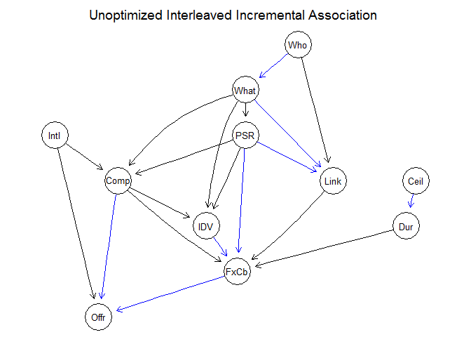 

```r
graphviz.plot(mmpc_dug,main="Unoptimized Incremental Association ",highlight=highlight.WL2)
```

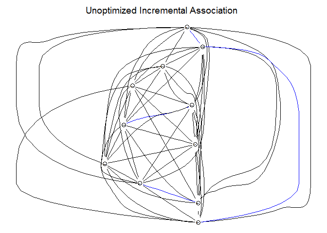 

```r
# graphviz.plot(uiamb_dug,main="Unoptimized Incremental Association ",highlight=arcs(uinteriamb_dug))


#Comparing the optimized and unoptimized Interleaved Incremental Association results
```
To the study teams dismay, the bayesian learning results were not consistent across different methods. The unoptimized versions of the learning algorithms do better at catching statistical oddities at the cost of requiring more comparisons, so given the discrepency they are displayed instead of their optimized alternate network graphs. While the interleved and non-interleaved rsults do not match, in both cases, there is now an undirect arc between IDV and Ceil. This was not present in the Grow-Shring example although other mismatches occured. The study team chose to resolve this with the arc originating from IDV.

* Whitelist to Dur (Duration) because the use of the IDV mechanism typically means multiple lower ceilinged contracts under one IDV rather than a single high ceilinged contract. 

The other alternative within the package, a min-max parents and childrens approach, 


```r
highlightLists3 <- list(arcs = data.frame(from=c(as.character(ContractWL$from),
                                                as.character(ContractBL$to)),
                                         to=c(as.character(ContractWL$to),
                                              as.character(ContractBL$from))),
                                         col = "blue")


highlight.WL3 <- list(arcs = ContractWL, col = "blue")


ugs_dug<-gs(ContractModel,blacklist=ContractBL,whitelist=ContractWL,optimized=FALSE)
graphviz.plot(ugs_dug,main="Grow-Shrink second run",highlight=highlight.WL3)
```

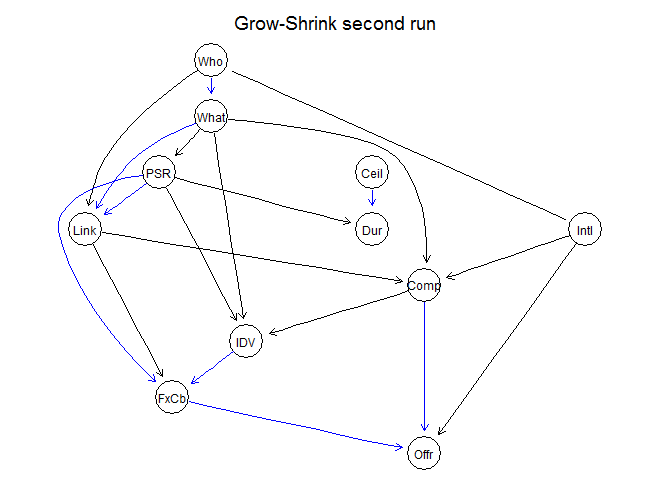 

```r
uiamb_dug<-iamb(ContractModel,blacklist=ContractBL,whitelist=ContractWL,optimized=FALSE)
graphviz.plot(uiamb_dug,main="Unoptimized Incremental Association ",highlight=highlightLists3)
```

```
## Warning in unique.arcs(arcs, nodes, warn = TRUE): removed 1 duplicate
## arcs.
```

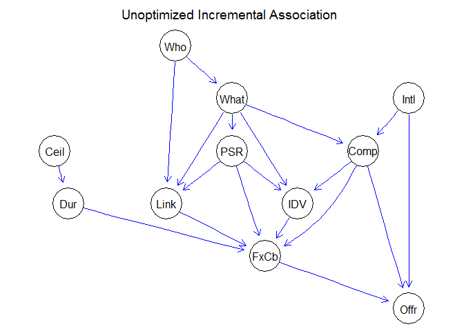 

```r
hc_dug<- hc(ContractModel, score = "aic",blacklist=ContractBL,whitelist=ContractWL,optimized=FALSE)
graphviz.plot(hc_dug,main="Hill Climbing Whitelist highlighted",highlight=highlight.WL3)
```

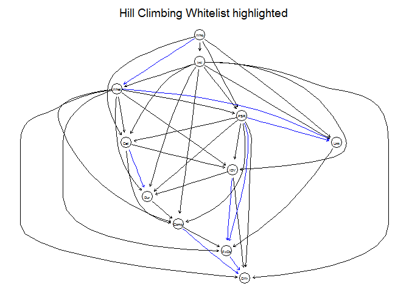 

```r
graphviz.plot(hc_dug,main="Hill Climbing Whitelist Interleaved highlighted  ",highlight=list(arcs=arcs(uinteriamb_dug)))
```

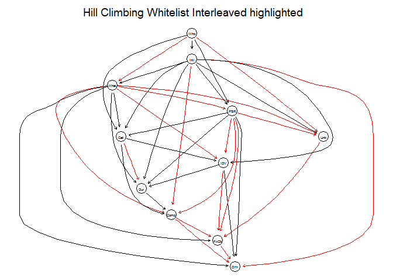 

```r
graphviz.plot(uinteriamb_dug,main="Unoptimized Interleaved Hillclimbing highlighted",highlight=list(arcs=arcs(hc_dug)))
```

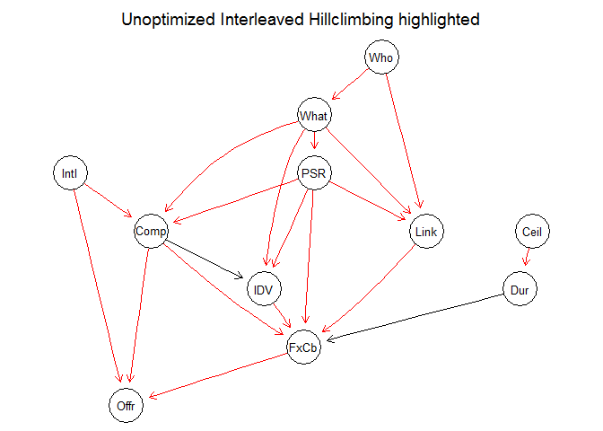 

```r
uinteriamb_dug05<-inter.iamb(ContractModel,blacklist=ContractBL,whitelist=ContractWL,optimized=FALSE,alpha=0.05)
uinteriamb_dug00001<-inter.iamb(ContractModel,blacklist=ContractBL,whitelist=ContractWL,optimized=FALSE,alpha=0.00001)
all.equal(uinteriamb_dug05,uinteriamb_dug00001)
```

```
## [1] "Different number of directed/undirected arcs"
```

```r
graphviz.plot(uinteriamb_dug00001)
```

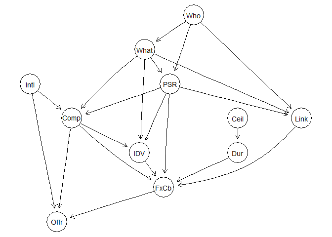 

```r
graphviz.plot(uinteriamb_dug05,main="Unoptimized Interleaved Incremental 05 Association 005 highlighted",highlight=list(arcs=arcs(uinteriamb_dug00001)))
```

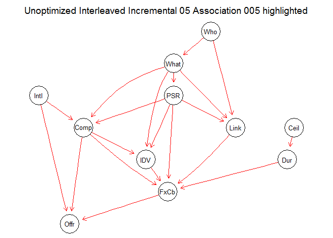 

```r
graphviz.plot(uinteriamb_dug00001,main="Unoptimized Interleaved Incremental 05 Association 005 highlighted",highlight=list(arcs=arcs(uinteriamb_dug05)))
```

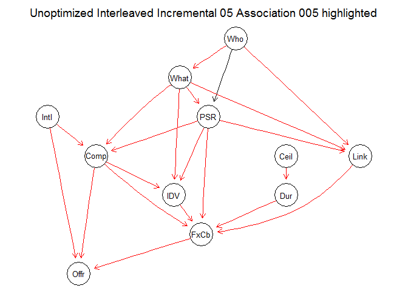 

```r
graphviz.plot(uinteriamb_dug00001,main="Unoptimized Interleaved Incremental Association Whitelist highlighted",highlight=highlight.WL3)
```

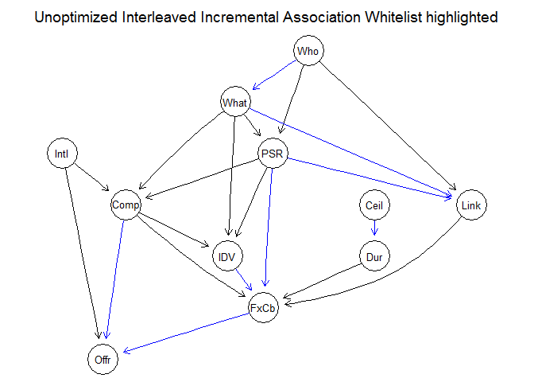 

```r
graphviz.plot(uinteriamb_dug00001,main="Unoptimized Interleaved Incremental Association either list highlighted",highlight=highlightLists3)
```

```
## Warning in unique.arcs(arcs, nodes, warn = TRUE): removed 1 duplicate
## arcs.
```

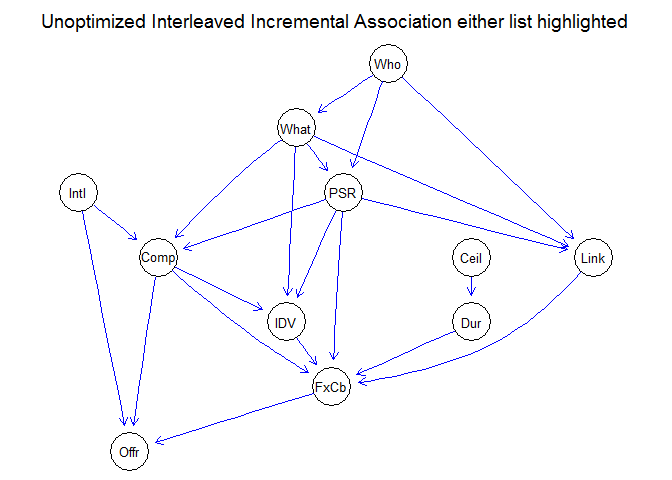 

```r
graphviz.plot(uinteriamb_dug00001,main="Unoptimized Interleaved Incremental Association IAMB highlighted",highlight=list(arcs=arcs(uiamb_dug)))
```

 

```r
# graphviz.plot(uiamb_dug,main="Unoptimized Interleaved Incremental Association ",highlight=list(arcs=arcs(uinteriamb_dug)))
```


```r
CompetitionNetwork<-uinteriamb_dug00001
modelstring(CompetitionNetwork)
```

```
## [1] "[Who][Intl][Ceil][What|Who][Dur|Ceil][PSR|Who:What][Comp|What:Intl:PSR][Link|Who:What:PSR][IDV|Comp:What:PSR][FxCb|IDV:Comp:Link:PSR:Dur][Offr|FxCb:Comp:Intl]"
```

```r
CompetitionFitted<-bn.fit(x=CompetitionNetwork,data=ContractModel,method="bayes")
```
