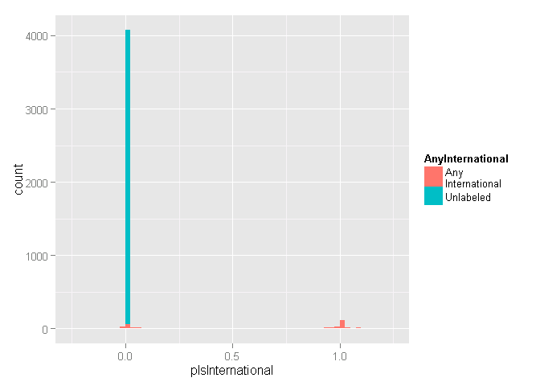
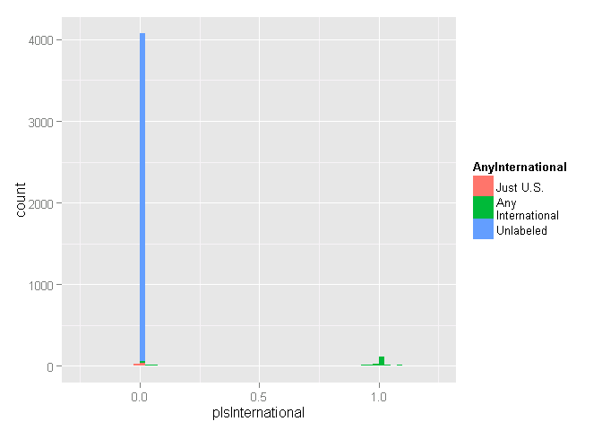

# DoD Fixed-Price Study: Contract Pricing classification
Greg Sanders  
Tuesday, January 13, 2015  


```
## Loading required package: ggplot2
## Loading required package: stringr
## Loading required package: plyr
```

Contracts are classified using a mix of numerical and categorical variables. While the changes in numerical variables are easy to grasp and summarize, a contract may have one line item that is competed and another that is not. As is detailed in the [exploration on R&D](RnD_1to5_exploration.md), we are only considering information available prior to contract start. The percentage of contract obligations that were competed is a valuable benchmark, but is highly influenced by factors that occured after contract start.


##Studying Pricing Mechanism of contracts in the sample.
One of CSIS's studies is directly focused on pricing mechansisms, specifically fixed-price versus alternatives.

* Test


```r
contract.sample  <- read.csv(
    paste("data\\defense_contract_CSIScontractID_sample_100000_SumofObligatedAmount.csv", sep = ""),
    header = TRUE, sep = ",", dec = ".", strip.white = TRUE, 
    na.strings = c("NULL","NA",""),
    stringsAsFactors = TRUE
    )

# contract.sample  <- read.csv(
#     paste("data\\defense_contract_CSIScontractID_sample_100000_SumofObligatedAmount.csv", sep = ""),
#     header = TRUE, sep = ",", dec = ".", strip.white = TRUE, 
#     na.strings = c("NULL","NA",""),
#     stringsAsFactors = TRUE
#     )

#These will probably be moved into apply_lookups at some point
contract.sample$pIsInternational <- contract.sample$ObligatedAmountIsInternational/contract.sample$SumofObligatedAmount
contract.sample$pIsInternational[is.na(contract.sample$ObligatedAmountIsInternational)] <- 0
# contract.sample$MinOfEffectiveDate <- strptime(contract.sample$MinOfEffectiveDate, "%Y-%m-%d")


contract.sample<-apply_lookups(Path,contract.sample)
```

```
## Warning in apply_lookups(Path, contract.sample): NaNs produced
```

```
## Warning in apply_lookups(Path, contract.sample): NaNs produced
```

```
## Warning in apply_lookups(Path, contract.sample): NaNs produced
```
FPDS classifies competition using one variables: "Type of Contract Pricing" listed here as Pricing.Mechanism.Code.


###Pricing.Mechanism.Code

###Types of variables
This set of variables includes three broad types.
 * Unmodified variables, which are set using only those contract transaction with no Modification Number or a Modification Number of 0. Typically there is only one such transaction per contract. In the unexpected event that there are multiple unmodified transactions, the rules for Complete contract variables below are used to resolve them.
 * Complete contract variables follow the schema below. Note that the variables this study uses are typically less granular than the underlying data, so for example IsFixedPrice will not treat the a contract being labeled as "Fixed-Price Incentive" at one point in its life and "Firm Fixed-Price." Thus less granular complete contract variables may be labeled even when more granular ones, based on the exact same fields, are not.
  1. A contract which is sometimes labeled with a particular value and never with another will have that value.
  2. A contract which was always unlabeled will be categorized as "mixed or unlabeled" or another title appropriate to the variable.
  3. A contract which has had multiple distinct values will be classified as as "mixed or unlabeled" or another title appropriate to the variable.
* Is Fixed Price is a binary variable, true if all varieties of fixed-price contracts,  competitive procedures were used, false if they were not. Unlabeled cases are classified as NAs. 
* IsCostBased works the same way for cost-based contracts, which for the purposes of this study includes time and materials and labor hours contracts.
* Obligated amount variables. These are based on binary variables, for example IsFixedPriceObligatedAmount ties to IsFixedPrice. This variable is equal to the sum of all obligations made in transactions where the associated binary variable is true. 
* Percenage variables. These are derived from Obligated amount variables, for example pIsFixedPrice for IsFixedPriceObligatedAmount. The derivation is done by dividing the obligated amount variable by the total obligation amount. Thanks to deobligations, this can result in a negative percentage or a percentage greater than 100%.

*Talk about fixed price here*
 * UnmodifiedIsFixedPrice is the unmodified binary variable that reports fixed-price status  (0.00% missing data).
 * IsFixedPrice is the complete contract binary variable that reports fixed-price status (0.00% missing data).
*Talk about cost-based here*
 * UnmodifiedIsCostBased is the unmodified binary variable that reports fixed-price status  (0.00% missing data).
* IsCostBased is the complete contract binary variable that reports fixed-price status (0.00% missing data).
*Talk about combination here*
* UnmodifiedIsCostBased is the unmodified binary variable that reports fixed-price status  (0.00% missing data).
* IsCostBased is the complete contract binary variable that reports fixed-price status (0.00% missing data).


* pIsSomeCompetition is dollar value of all transactions that were labeled as competed divided the contracts total obligations. 


```r
summary(subset(contract.sample,select=c(UnmodifiedPlaceCountryISO3,
                                        PlaceCountryISO3,
                                UnmodifiedPlaceCountryISO3,
                                ObligatedAmountIsInternational,
                                AnyInternational,
                                IsInternational,
                                UnmodifiedIsInternational,
                                pIsInternational
                                ))
        )
```

```
##  UnmodifiedPlaceCountryISO3 PlaceCountryISO3 UnmodifiedPlaceCountryISO3.1
##  USA    :82397              USA    :82204    USA    :82397               
##  AFG    : 2773              AFG    : 2698    AFG    : 2773               
##  IRQ    : 1887              IRQ    : 1801    IRQ    : 1887               
##  CHE    : 1532              CHE    : 1531    CHE    : 1532               
##  KWT    : 1402              KWT    : 1364    KWT    : 1402               
##  (Other): 5986              (Other): 5712    (Other): 5986               
##  NA's   : 4023              NA's   : 4690    NA's   : 4023               
##  ObligatedAmountIsInternational AnyInternational IsInternational
##  Min.   :-230095125             Min.   :0.000    Min.   :0.000  
##  1st Qu.:    225018             1st Qu.:0.000    1st Qu.:0.000  
##  Median :    996075             Median :0.000    Median :0.000  
##  Mean   :   9449874             Mean   :0.144    Mean   :0.139  
##  3rd Qu.:   5084602             3rd Qu.:0.000    3rd Qu.:0.000  
##  Max.   :8949412758             Max.   :1.000    Max.   :1.000  
##  NA's   :86213                  NA's   :4010     NA's   :4497   
##  UnmodifiedIsInternational pIsInternational 
##  Min.   :0.000             Min.   :-2.3811  
##  1st Qu.:0.000             1st Qu.: 0.0000  
##  Median :0.000             Median : 0.0000  
##  Mean   :0.142             Mean   : 0.1356  
##  3rd Qu.:0.000             3rd Qu.: 0.0000  
##  Max.   :1.000             Max.   : 2.7449  
##  NA's   :4015
```

```r
contract.sample$IsInternational<-factor(contract.sample$IsInternational,
                                        exclude=NULL,
                                        levels=c(0,1,NA),
                                        labels=c("U.S.","International","Unlabeled \nor mixed")
                                        )

contract.sample$AnyInternational<-factor(contract.sample$AnyInternational,
                                        exclude=NULL,
                                        levels=c(0,1,NA),
                                        labels=c("Just U.S.","Any\nInternational","Unlabeled")
                                        )


ggplot(
    data = subset(contract.sample,is.na(IsInternational)|IsInternational=="Unlabeled \nor mixed" ),
    aes_string(x = "pIsInternational",
               fill="AnyInternational"
               
               ),
    main = "Distribution by percent of dollars with fixed-price for mixed and unlabeled contracts."
    )+geom_bar(binwidth=0.025)+scale_x_continuous(limits = c(-0.25, 1.25))
```

 

```r
summary(subset(contract.sample,pIsInternational<=0 & AnyInternational=="Any\nInternational",
               select=c(UnmodifiedPlaceCountryISO3,
                                        PlaceCountryISO3,
                                UnmodifiedPlaceCountryISO3,
                                ObligatedAmountIsInternational,
                                AnyInternational,
                                IsInternational,
                                UnmodifiedIsInternational,
                                pIsInternational
                                ))
        )
```

```
##  UnmodifiedPlaceCountryISO3 PlaceCountryISO3 UnmodifiedPlaceCountryISO3.1
##  USA    :78                 GBR    : 1       USA    :78                  
##  GBR    : 1                 USA    : 1       GBR    : 1                  
##  AFG    : 0                 AFG    : 0       AFG    : 0                  
##  ALB    : 0                 ALB    : 0       ALB    : 0                  
##  ARE    : 0                 ARE    : 0       ARE    : 0                  
##  (Other): 0                 (Other): 0       (Other): 0                  
##  NA's   : 2                 NA's   :79       NA's   : 2                  
##  ObligatedAmountIsInternational           AnyInternational
##  Min.   :-230095125             Just U.S.         : 0     
##  1st Qu.:   -130909             Any\nInternational:81     
##  Median :         0             Unlabeled         : 0     
##  Mean   :  -3217501                                       
##  3rd Qu.:         0                                       
##  Max.   :         0                                       
##                                                           
##              IsInternational UnmodifiedIsInternational pIsInternational  
##  U.S.                : 0     Min.   :0.00000           Min.   :-2.38113  
##  International       : 1     1st Qu.:0.00000           1st Qu.:-0.01555  
##  Unlabeled \nor mixed:80     Median :0.00000           Median : 0.00000  
##                              Mean   :0.01266           Mean   :-0.06708  
##                              3rd Qu.:0.00000           3rd Qu.: 0.00000  
##                              Max.   :1.00000           Max.   : 0.00000  
##                              NA's   :2
```

```r
contract.sample$AnyInternational[contract.sample$pIsInternational<=0 & 
                    contract.sample$AnyInternational=="Any\nInternational" &
                    contract.sample$UnmodifiedIsInternational==0]<-"Just U.S."


ggplot(
    data = subset(contract.sample,is.na(IsInternational)|IsInternational=="Unlabeled \nor mixed" ),
    aes_string(x = "pIsInternational",
               fill="AnyInternational"
               
               ),
    main = "Distribution by percent of dollars with fixed-price for mixed and unlabeled contracts."
    )+geom_bar(binwidth=0.025)+scale_x_continuous(limits = c(-0.25, 1.25))
```

 

```r
summary(subset(contract.sample,AnyInternational=="Unlabeled",
               select=c(UnmodifiedPlaceCountryISO3,
                                        PlaceCountryISO3,
                                UnmodifiedPlaceCountryISO3,
                                ObligatedAmountIsInternational,
                                AnyInternational,
                                IsInternational,
                                UnmodifiedIsInternational,
                                pIsInternational,
                        Action.Obligation
                                ))
        )
```

```
##  UnmodifiedPlaceCountryISO3 PlaceCountryISO3 UnmodifiedPlaceCountryISO3.1
##  AFG    :   0               AFG    :   0     AFG    :   0                
##  ALB    :   0               ALB    :   0     ALB    :   0                
##  ARE    :   0               ARE    :   0     ARE    :   0                
##  ARM    :   0               ARM    :   0     ARM    :   0                
##  ATA    :   0               ATA    :   0     ATA    :   0                
##  (Other):   0               (Other):   0     (Other):   0                
##  NA's   :4010               NA's   :4010     NA's   :4010                
##  ObligatedAmountIsInternational           AnyInternational
##  Min.   : NA                    Just U.S.         :   0   
##  1st Qu.: NA                    Any\nInternational:   0   
##  Median : NA                    Unlabeled         :4010   
##  Mean   :NaN                                              
##  3rd Qu.: NA                                              
##  Max.   : NA                                              
##  NA's   :4010                                             
##              IsInternational UnmodifiedIsInternational pIsInternational
##  U.S.                :   0   Min.   : NA               Min.   :0       
##  International       :   0   1st Qu.: NA               1st Qu.:0       
##  Unlabeled \nor mixed:4010   Median : NA               Median :0       
##                              Mean   :NaN               Mean   :0       
##                              3rd Qu.: NA               3rd Qu.:0       
##                              Max.   : NA               Max.   :0       
##                              NA's   :4010                              
##  Action.Obligation  
##  Min.   :      900  
##  1st Qu.:  1007008  
##  Median :  2931019  
##  Mean   :  5221721  
##  3rd Qu.:  6117408  
##  Max.   :153300149  
## 
```
