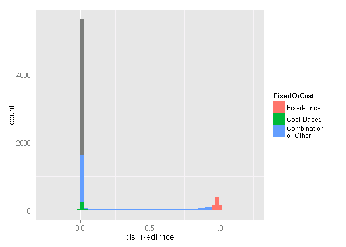
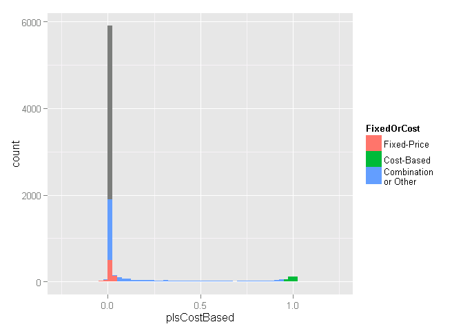
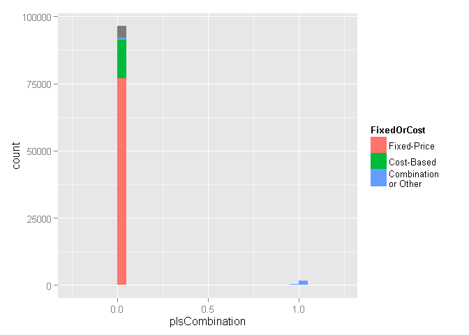
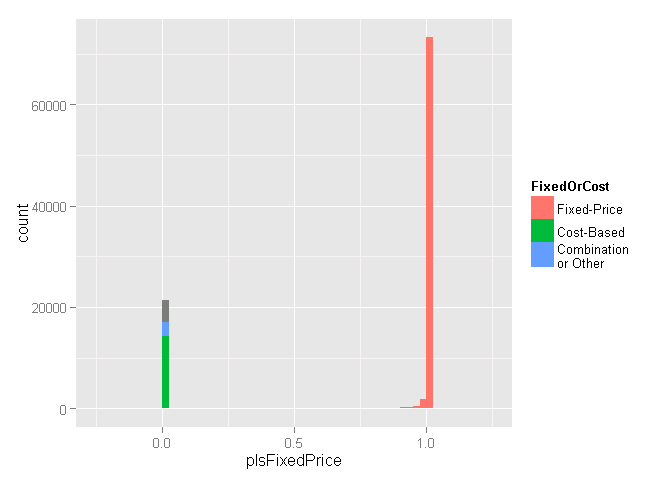

# DoD Fixed-Price Study: Contract Pricing classification
Greg Sanders  
Tuesday, January 13, 2015  


```
## Loading required package: ggplot2
## Loading required package: stringr
## Loading required package: plyr
```

Contracts are classified using a mix of numerical and categorical variables. While the changes in numerical variables are easy to grasp and summarize, a contract may have one line item that is competed and another that is not. As is detailed in the [exploration on R&D](RnD_1to5_exploration.md), we are only considering information available prior to contract start. The percentage of contract obligations that were competed is a valuable benchmark, but is highly influenced by factors that occured after contract start.


##Studying Pricing Mechanism of contracts in the sample.
One of CSIS's studies is directly focused on pricing mechansisms, specifically fixed-price versus alternatives.

* Test


```r
contract.sample  <- read.csv(
    paste("data\\defense_contract_CSIScontractID_sample_100000_SumofObligatedAmount.csv", sep = ""),
    header = TRUE, sep = ",", dec = ".", strip.white = TRUE, 
    na.strings = c("NULL","NA",""),
    stringsAsFactors = TRUE
    )

# contract.sample  <- read.csv(
#     paste("data\\defense_contract_CSIScontractID_sample_100000_SumofObligatedAmount.csv", sep = ""),
#     header = TRUE, sep = ",", dec = ".", strip.white = TRUE, 
#     na.strings = c("NULL","NA",""),
#     stringsAsFactors = TRUE
#     )

#These will probably be moved into apply_lookups at some point
# contract.sample$pIsSomeCompetition <- contract.sample$ObligatedAmountIsSomeCompetition/contract.sample$ObligatedAmount
# contract.sample$pIsSomeCompetition[is.na(contract.sample$ObligatedAmountIsSomeCompetition)] <- 0
# contract.sample$MinOfEffectiveDate <- strptime(contract.sample$MinOfEffectiveDate, "%Y-%m-%d")

contract.sample$pIsFixedPrice <- contract.sample$ObligatedAmountIsFixedPrice/contract.sample$SumofObligatedAmount
contract.sample$pIsFixedPrice[is.nan(contract.sample$ObligatedAmountIsFixedPrice)|is.na(contract.sample$ObligatedAmountIsFixedPrice)] <- 0

contract.sample$pIsCostBased <- contract.sample$ObligatedAmountIsCostBased/contract.sample$SumofObligatedAmount
contract.sample$pIsCostBased[is.nan(contract.sample$ObligatedAmountIsCostBased)|is.na(contract.sample$ObligatedAmountIsCostBased)] <- 0

contract.sample$pIsCombination <- contract.sample$ObligatedAmountIsCombination/contract.sample$SumofObligatedAmount
contract.sample$pIsCombination[is.nan(contract.sample$ObligatedAmountIsCombination)|is.na(contract.sample$ObligatedAmountIsCombination)] <- 0

contract.sample$pIsIncentive <- contract.sample$ObligatedAmountIsIncentive/contract.sample$SumofObligatedAmount
contract.sample$pIsIncentive[is.nan(contract.sample$ObligatedAmountIsIncentive)|is.na(contract.sample$ObligatedAmountIsIncentive)] <- 0

contract.sample<-apply_lookups(Path,contract.sample)
```

```
## Warning in apply_lookups(Path, contract.sample): NaNs produced
```

```
## Warning in apply_lookups(Path, contract.sample): NaNs produced
```

```
## Warning in apply_lookups(Path, contract.sample): NaNs produced
```
FPDS classifies competition using one variables: "Type of Contract Pricing" listed here as Pricing.Mechanism.Code.


###Pricing.Mechanism.Code

###Types of variables
This set of variables includes three broad types.
 * Unmodified variables, which are set using only those contract transaction with no Modification Number or a Modification Number of 0. Typically there is only one such transaction per contract. In the unexpected event that there are multiple unmodified transactions, the rules for Complete contract variables below are used to resolve them.
 * Complete contract variables follow the schema below. Note that the variables this study uses are typically less granular than the underlying data, so for example IsFixedPrice will not treat the a contract being labeled as "Fixed-Price Incentive" at one point in its life and "Firm Fixed-Price." Thus less granular complete contract variables may be labeled even when more granular ones, based on the exact same fields, are not.
  1. A contract which is sometimes labeled with a particular value and never with another will have that value.
  2. A contract which was always unlabeled will be categorized as "mixed or unlabeled" or another title appropriate to the variable.
  3. A contract which has had multiple distinct values will be classified as as "mixed or unlabeled" or another title appropriate to the variable.
* Is Fixed Price is a binary variable, true if all varieties of fixed-price contracts,  competitive procedures were used, false if they were not. Unlabeled cases are classified as NAs. 
* IsCostBased works the same way for cost-based contracts, which for the purposes of this study includes time and materials and labor hours contracts.
* Obligated amount variables. These are based on binary variables, for example IsFixedPriceObligatedAmount ties to IsFixedPrice. This variable is equal to the sum of all obligations made in transactions where the associated binary variable is true. 
* Percenage variables. These are derived from Obligated amount variables, for example pIsFixedPrice for IsFixedPriceObligatedAmount. The derivation is done by dividing the obligated amount variable by the total obligation amount. Thanks to deobligations, this can result in a negative percentage or a percentage greater than 100%.

*Talk about fixed price here*
 * UnmodifiedIsFixedPrice is the unmodified binary variable that reports fixed-price status  (0.00% missing data).
 * IsFixedPrice is the complete contract binary variable that reports fixed-price status (0.00% missing data).
*Talk about cost-based here*
 * UnmodifiedIsCostBased is the unmodified binary variable that reports fixed-price status  (0.00% missing data).
* IsCostBased is the complete contract binary variable that reports fixed-price status (0.00% missing data).
*Talk about combination here*
* UnmodifiedIsCostBased is the unmodified binary variable that reports fixed-price status  (0.00% missing data).
* IsCostBased is the complete contract binary variable that reports fixed-price status (0.00% missing data).


* pIsSomeCompetition is dollar value of all transactions that were labeled as competed divided the contracts total obligations. 


```r
summary(subset(contract.sample,select=c(#TypeOfContractPricing#Pricing.Mechanism.Code,#
                                IsFixedPrice,
                                UnmodifiedIsFixedPrice,
                                ObligatedAmountIsFixedPrice,
                                pIsFixedPrice,
                                IsCostBased,
                                UnmodifiedIsCostBased,
                                ObligatedAmountIsCostBased,
                                pIsCostBased,
                                IsCombination,
                                UnmodifiedIsCombination,
                                ObligatedAmountIsCombination,
                                pIsCombination,
                                IsIncentive,
                                UnmodifiedIsIncentive,
                                ObligatedAmountIsIncentive,
                                pIsIncentive
                                ))
        )
```

```
##                      IsFixedPrice   UnmodifiedIsFixedPrice
##  Fixed Price               :76949   Min.   :0.000         
##  Other                     :15506   1st Qu.:1.000         
##  Combination \nor Unlabeled: 7545   Median :1.000         
##                                     Mean   :0.834         
##                                     3rd Qu.:1.000         
##                                     Max.   :1.000         
##                                     NA's   :7683          
##  ObligatedAmountIsFixedPrice pIsFixedPrice      IsCostBased   
##  Min.   : -15295131          Min.   :-7.7918   Min.   :0.000  
##  1st Qu.:    165320          1st Qu.: 0.9932   1st Qu.:0.000  
##  Median :    945852          Median : 1.0000   Median :0.000  
##  Mean   :   7301084          Mean   : 0.7786   Mean   :0.165  
##  3rd Qu.:   4278188          3rd Qu.: 1.0000   3rd Qu.:0.000  
##  Max.   :4087745756          Max.   :70.3245   Max.   :1.000  
##  NA's   :20820                                 NA's   :7525   
##  UnmodifiedIsCostBased ObligatedAmountIsCostBased  pIsCostBased    
##  Min.   :0.000         Min.   : -15813292         Min.   :-2.5512  
##  1st Qu.:0.000         1st Qu.:    693686         1st Qu.: 0.0000  
##  Median :0.000         Median :   2424353         Median : 0.0000  
##  Mean   :0.163         Mean   :  12901095         Mean   : 0.1524  
##  3rd Qu.:0.000         3rd Qu.:   8049682         3rd Qu.: 0.0000  
##  Max.   :1.000         Max.   :8949412758         Max.   : 3.4990  
##  NA's   :7688          NA's   :82574                               
##  IsCombination   UnmodifiedIsCombination ObligatedAmountIsCombination
##  Min.   :1       Min.   :1               Min.   : -20068122          
##  1st Qu.:1       1st Qu.:1               1st Qu.:    324950          
##  Median :1       Median :1               Median :   1659124          
##  Mean   :1       Mean   :1               Mean   :   8579743          
##  3rd Qu.:1       3rd Qu.:1               3rd Qu.:   5374963          
##  Max.   :1       Max.   :1               Max.   :1547736169          
##  NA's   :95840   NA's   :97625           NA's   :95840               
##  pIsCombination      IsIncentive    UnmodifiedIsIncentive
##  Min.   :-6.48473   Min.   :0.000   Min.   :0.000        
##  1st Qu.: 0.00000   1st Qu.:0.000   1st Qu.:0.000        
##  Median : 0.00000   Median :0.000   Median :0.000        
##  Mean   : 0.02587   Mean   :0.005   Mean   :0.006        
##  3rd Qu.: 0.00000   3rd Qu.:0.000   3rd Qu.:0.000        
##  Max.   : 8.79180   Max.   :1.000   Max.   :1.000        
##                     NA's   :5610    NA's   :6537         
##  ObligatedAmountIsIncentive  pIsIncentive      
##  Min.   :  -1020232         Min.   :-0.056137  
##  1st Qu.:    731441         1st Qu.: 0.000000  
##  Median :   3593983         Median : 0.000000  
##  Mean   :  43478374         Mean   : 0.006826  
##  3rd Qu.:  15311724         3rd Qu.: 0.000000  
##  Max.   :2870976999         Max.   : 3.060888  
##  NA's   :99187
```

```r
contract.sample$FixedOrCost[contract.sample$pIsFixedPrice>0  |
                                      contract.sample$pIsCostBased>0 | 
                                          contract.sample$pIsCombination>0]<-"Combination \nor Other"

contract.sample$FixedOrCost[contract.sample$pIsFixedPrice>=0.95|(contract.sample$IsFixedPrice=="Fixed Price" & contract.sample$pIsCombination==0)]<-"Fixed-Price"
contract.sample$FixedOrCost[contract.sample$pIsCostBased>=0.95|(contract.sample$IsCostBased==1 & contract.sample$pIsCombination==0)]<-"Cost-Based"
contract.sample$FixedOrCost<-factor(contract.sample$FixedOrCost,levels=c("Fixed-Price","Cost-Based","Combination \nor Other"))

ggplot(
    data = subset(contract.sample,is.na(IsFixedPrice) | IsFixedPrice== "Combination \nor Unlabeled"),
    aes_string(x = "pIsFixedPrice",
               fill="FixedOrCost"
               
               ),
    main = "Distribution by percent of dollars with fixed-price for mixed and unlabeled contracts."
    )+geom_bar(binwidth=0.025)+scale_x_continuous(limits = c(-0.25, 1.25))
```

 

```r
ggplot(
    data = subset(contract.sample,is.na(IsFixedPrice) | is.na(IsCostBased)),
    aes_string(x = "pIsCostBased",
               fill="FixedOrCost"
               
               ),
    main = "Distribution by percent of dollars with cost-based for mixed and unlabeled contracts."
    )+geom_bar(binwidth=0.025)+scale_x_continuous(limits = c(-0.25, 1.25))
```

 

```r
ggplot(
    data = contract.sample,
    aes_string(x = "pIsCombination",
               fill="FixedOrCost"),
    main = "Distribution by percent of dollars with cost-based for labeled contracts."
    ) +geom_bar()+scale_x_continuous(limits = c(-0.25, 1.25))
```

```
## stat_bin: binwidth defaulted to range/30. Use 'binwidth = x' to adjust this.
```

 

```r
ggplot(
    data = contract.sample,
    aes_string(x = "pIsFixedPrice",
               fill="FixedOrCost"
               
               ),
    main = "Distribution by percent of dollars with fixed-price for all."
    )+geom_bar(binwidth=0.025)+scale_x_continuous(limits = c(-0.25, 1.25))
```

 
