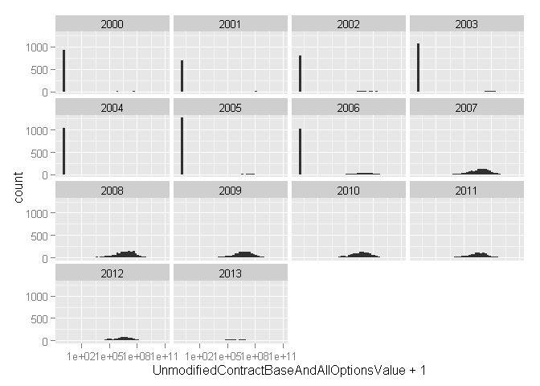
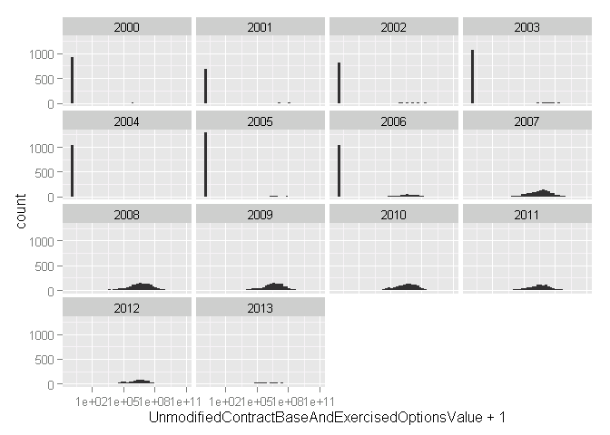
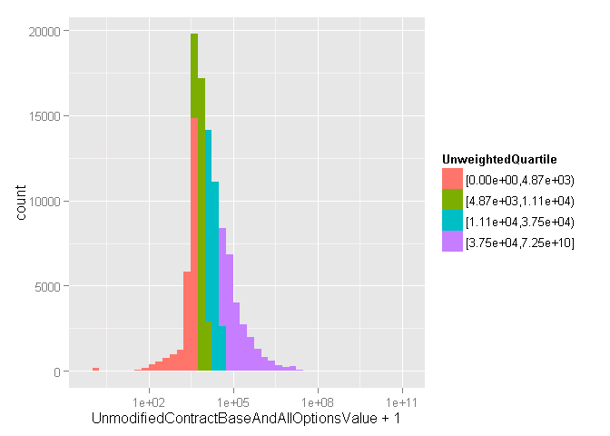
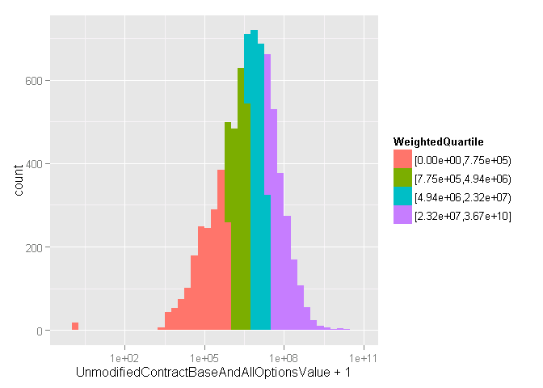
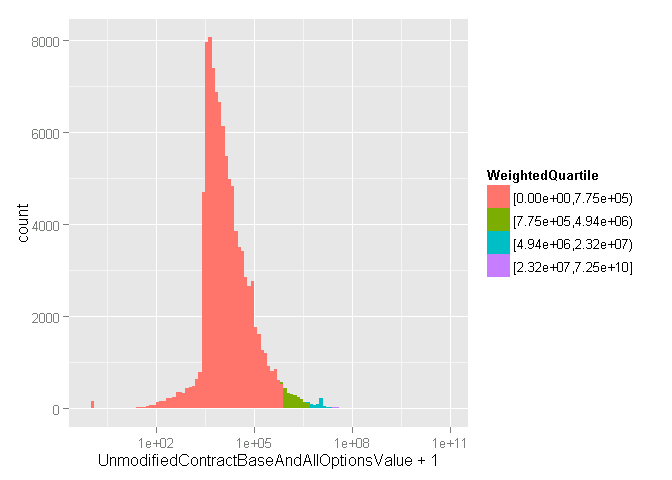

# DoD Fixed-Price Study: Contract Ceiling
Greg Sanders  
Tuesday, January 13, 2015  


```
## Loading required package: ggplot2
## Loading required package: stringr
## Loading required package: plyr
## Loading required package: Hmisc
## Loading required package: grid
## Loading required package: lattice
## Loading required package: survival
## Loading required package: splines
## Loading required package: Formula
## 
## Attaching package: 'Hmisc'
## 
## The following objects are masked from 'package:plyr':
## 
##     is.discrete, summarize
## 
## The following objects are masked from 'package:base':
## 
##     format.pval, round.POSIXt, trunc.POSIXt, units
```

Contracts are classified using a mix of numerical and categorical variables. While the changes in numerical variables are easy to grasp and summarize, a contract may have one line item that is competed and another that is not. As is detailed in the [exploration on R&D](RnD_1to5_exploration.md), we are only considering information available prior to contract start. The percentage of contract obligations that were competed is a valuable benchmark, but is highly influenced by factors that occurred after contract start.

##Contract Ceiling
For the purpose of this report, a contract refers to either an award with a unique procurement identifier or an IDV with a unique pairing of a delivery order procurement identifier and a referenced IDV procurement identifier. Groupings are in nominal dollars because many regulatory thresholds are not adjusted for inflation; as a result, smaller contracts will be slightly overrepresented in recent years. Initial contract size is not calculated using the same methods as Size of Contracts for other CSIS reports.  Instead, size of contract is determined using the **Base and All Options value** amount of the original unmodified transaction for the contract.


```r
ContractWeighted  <- read.csv(
    paste("data\\defense_contract_CSIScontractID_sample_15000_SumofObligatedAmount.csv", sep = ""),
    header = TRUE, sep = ",", dec = ".", strip.white = TRUE, 
    na.strings = c("NULL","NA",""),
    stringsAsFactors = TRUE
    )

#These will probably be moved into apply_lookups at some point
ContractWeighted<-apply_lookups(Path,ContractWeighted)
```

```
## Joining by: Contracting.Agency.ID
## Joining by: SubCustomer, Customer
## Joining by: MajorCommandID
## Joining by: systemequipmentcode
```

```
## Warning in apply_lookups(Path, ContractWeighted): NaNs produced
```

```
## Warning in apply_lookups(Path, ContractWeighted): NaNs produced
```

```
## Warning in apply_lookups(Path, ContractWeighted): NaNs produced
```

```
## Warning in apply_lookups(Path, ContractWeighted): NaNs produced
```

##Due to missing contract ceiling data, we have limited the dataset to  fiscal year 2007 and beyond.
When using the Base and All Options value, or the Base and Exercised options value, it quickly becomes apparent that the values are not reliably given. Below, the logarithm of each variable is used because there is huge variability in the ceilings for contracts.  Using the logarithm puts the emphasis on the difference between a $1,000,000 vs. $10,000,000 contract ceiling rather than between $1,000,000 and $2,000,000 by measuring the change as a percent.  This way all the different levels of contract ceilings are measured on one scale.     

Another noteworthy phenomoenon in these graphs is the steady decline in number of contracts form year to year. This is because the sample is limited to completed contracts. Contracts with longer duration are thus excluded from later years because they are ongoing and have not been completed yet.


```r
ggplot(
    data = ContractWeighted,
    aes_string(x = "UnmodifiedContractBaseAndAllOptionsValue+1"),
    ) + scale_x_log10()+
    geom_bar(binwidth=0.25)+ 
    facet_wrap( "StartFiscal_Year") 
```

 

```r
ggplot(
    data = ContractWeighted, 
    aes_string(x = "UnmodifiedContractBaseAndExercisedOptionsValue+1"),
    ) + scale_x_log10()+
    geom_bar(binwidth=0.25)+ 
    facet_wrap( "StartFiscal_Year") 
```

 

```r
#Remove earlier entries.
ContractWeighted<-subset(ContractWeighted, StartFiscal_Year>=2007)
```

After removing the missing or zero rates for the Unmodified and Total Contract values the variable becomes quite manageable.

* ObligatedAmount is a classification for the entirity of the contract  (0.00% missing data).  One result of using a sample weighted by ObligatedAmount is the complete absense of missing data and contracts with deobligations as their total value. 
* UnmodifiedContractBaseAndAllOptionsValue is a classification for the entirity of the contract  (0.24% missing data).
* UnmodifiedContractBaseAndExercisedOptionsValue is a classification for the entirity of the contract  (0.26% missing data).
* ContractBaseAndAllOptionsValue is a classification for the entirity of the contract  (0.00% missing data).
* ContractBaseAndExercisedOptionsValue is a classification for the entirity of the contract  (0.00% missing data).


```r
summary(subset(ContractWeighted,select=c(ObligatedAmount,
                                UnmodifiedContractObligatedAmount,
                                UnmodifiedContractBaseAndAllOptionsValue,
                                UnmodifiedContractBaseAndExercisedOptionsValue,
                                ContractBaseAndAllOptionsValue,
                                ContractBaseAndExercisedOptionsValue                        
                                ))
        )
```

```
##  ObligatedAmount     UnmodifiedContractObligatedAmount
##  Min.   :2.250e+03   Min.   :0.000e+00                
##  1st Qu.:9.731e+05   1st Qu.:5.000e+05                
##  Median :6.245e+06   Median :3.043e+06                
##  Mean   :5.085e+07   Mean   :2.538e+07                
##  3rd Qu.:3.075e+07   3rd Qu.:1.461e+07                
##  Max.   :9.134e+09   Max.   :1.895e+09                
##  UnmodifiedContractBaseAndAllOptionsValue
##  Min.   :0.000e+00                       
##  1st Qu.:7.753e+05                       
##  Median :4.942e+06                       
##  Mean   :6.285e+07                       
##  3rd Qu.:2.315e+07                       
##  Max.   :3.673e+10                       
##  UnmodifiedContractBaseAndExercisedOptionsValue
##  Min.   :0.000e+00                             
##  1st Qu.:6.724e+05                             
##  Median :4.013e+06                             
##  Mean   :4.814e+07                             
##  3rd Qu.:1.867e+07                             
##  Max.   :3.673e+10                             
##  ContractBaseAndAllOptionsValue ContractBaseAndExercisedOptionsValue
##  Min.   :2.250e+03              Min.   :2.250e+03                   
##  1st Qu.:1.013e+06              1st Qu.:9.895e+05                   
##  Median :6.888e+06              Median :6.610e+06                   
##  Mean   :1.136e+08              Mean   :1.003e+08                   
##  3rd Qu.:3.456e+07              3rd Qu.:3.248e+07                   
##  Max.   :1.418e+11              Max.   :1.418e+11
```
##Comparing a weighted and unweighted sample

All of the analysis thus far has been done with a set of 15,000 contracts which were selected using a random sample weighted by their total value. Thus a contract obligating $1,000,000 would be 10 times more likely to be included than a contract obligation $100,000. Because the Bayesian Network analysis will include the entire population of completed contracts started in 2007 and after, initial network studies are conducted using a 100,000 unweighted contract sample. 


```r
ContractUnweighted  <- read.csv(
    paste("data\\defense_contract_CSIScontractID_sample_100000_SumofObligatedAmount.csv", sep = ""),
    header = TRUE, sep = ",", dec = ".", strip.white = TRUE, 
    na.strings = c("NULL","NA",""),
    stringsAsFactors = TRUE
    )

#These will probably be moved into apply_lookups at some point
ContractUnweighted<-apply_lookups(Path,ContractUnweighted)
```

```
## Warning in apply_lookups(Path, ContractUnweighted): NaNs produced
```

```
## Warning in apply_lookups(Path, ContractUnweighted): NaNs produced
```

```
## Warning in apply_lookups(Path, ContractUnweighted): NaNs produced
```

```r
summary(subset(ContractUnweighted,select=c(
#     ObligatedAmount,
                                UnmodifiedContractObligatedAmount,
                                UnmodifiedContractBaseAndAllOptionsValue,
                                UnmodifiedContractBaseAndExercisedOptionsValue,
                                ContractBaseAndAllOptionsValue,
                                ContractBaseAndExercisedOptionsValue                        
                                ))
        )
```

```
##  UnmodifiedContractObligatedAmount
##  Min.   :        0                
##  1st Qu.:     4770                
##  Median :    10796                
##  Mean   :   140050                
##  3rd Qu.:    35449                
##  Max.   :499558096                
##                                   
##  UnmodifiedContractBaseAndAllOptionsValue
##  Min.   :0.000e+00                       
##  1st Qu.:4.869e+03                       
##  Median :1.112e+04                       
##  Mean   :6.945e+06                       
##  3rd Qu.:3.745e+04                       
##  Max.   :7.255e+10                       
##                                          
##  UnmodifiedContractBaseAndExercisedOptionsValue
##  Min.   :0.000e+00                             
##  1st Qu.:4.838e+03                             
##  Median :1.095e+04                             
##  Mean   :3.447e+05                             
##  3rd Qu.:3.626e+04                             
##  Max.   :8.819e+09                             
##                                                
##  ContractBaseAndAllOptionsValue ContractBaseAndExercisedOptionsValue
##  Min.   :-9.936e+05             Min.   :-9.936e+05                  
##  1st Qu.: 4.762e+03             1st Qu.: 4.745e+03                  
##  Median : 1.095e+04             Median : 1.085e+04                  
##  Mean   : 7.138e+06             Mean   : 5.194e+05                  
##  3rd Qu.: 3.730e+04             3rd Qu.: 3.659e+04                  
##  Max.   : 7.255e+10             Max.   : 1.764e+10                  
##                                 NA's   :31
```

Looking at our key ceiling variable, the differences are striking. Taking the mean of UnmodifiedContractObligatedAmount the weighted sample reports 2.5377019 &times; 10^7^   while the unweighted reports 1.4005035 &times; 10^5^. This is also reflected in the histograms below. Note that the unweighted histogram is highly skewed on the left side. The large drop off is likely explained by the minimum reporting threshold for FPDS, which runs between $2,500 and $3,000 during the post-2007 period.


```r
UnweightedQuantile<-quantile(ContractUnweighted$UnmodifiedContractBaseAndAllOptionsValue,c(0.25,0.5,0.75))
formatC(UnweightedQuantile, format="d", big.mark=',')
```

```
##      25%      50%      75% 
##  "4,869" "11,125" "37,452"
```

```r
ContractUnweighted$UnweightedQuartile<-cut2(ContractUnweighted$UnmodifiedContractBaseAndAllOptionsValue,cuts=UnweightedQuantile)


ggplot(
    data = ContractUnweighted,
    aes_string(x = "UnmodifiedContractBaseAndAllOptionsValue+1",
               fill = "UnweightedQuartile")
    ) +     geom_bar(binwidth=0.25)  + scale_x_log10()
```

 

```r
WeightedQuantile<-quantile(ContractWeighted$UnmodifiedContractBaseAndAllOptionsValue,c(0.25,0.5,0.75))
formatC(WeightedQuantile, format="d", big.mark=',')
```

```
##          25%          50%          75% 
##    "775,286"  "4,942,210" "23,154,046"
```

```r
ContractWeighted$WeightedQuartile<-cut2(ContractWeighted$UnmodifiedContractBaseAndAllOptionsValue,
                                         cuts=WeightedQuantile)


ggplot(
    data = ContractWeighted, 
    aes_string(x = "UnmodifiedContractBaseAndAllOptionsValue+1",
               fill = "WeightedQuartile")
    ) +     geom_bar(binwidth=0.25) + scale_x_log10()
```

 


The difference extends to the quantiles, the 25th quantile for the weighted sample starts well beyond the 75th quantile for the unweighted sample (specifically the first quantile for the weighted data is the 97.128 percentile for the unwieghted). From an acquisition management perspective, the weighted quartile is more interesting. This can be seen when applying the unwieghted quartiles to the weighted sample. The vast majority of the weighted contracts sample, and thus the vast majority of the contract spending, falls in the fourth unweighted quartile. The other three quartiles tell us a great deal about small contracts but relatively little about where the Department of Defense is spending its money.


```r
ContractWeighted$UnweightedQuartile<-cut2(ContractWeighted$UnmodifiedContractBaseAndAllOptionsValue,cuts=UnweightedQuantile)


ggplot(
    data = ContractWeighted, 
    aes_string(x = "UnmodifiedContractBaseAndAllOptionsValue+1",
               fill="UnweightedQuartile")
    
    ) +geom_bar(binwidth=0.1)+scale_x_log10()
```

 

One way to address this discrepency would be to include a minimum cutoff for inclusion. For example, prior to 2004 FPDS did not mandate reporting of contracts with less than $25,000 in obligation. That cut off removes only 3.4123847% of value in the weighted sample despite accounting for 68.447%.


```r
UnweightedQuantile25kPlus<-quantile(ContractUnweighted$UnmodifiedContractBaseAndAllOptionsValue[ContractUnweighted$UnmodifiedContractBaseAndAllOptionsValue>25000],c(0.25,0.5,0.75, 0.9,0.95))
formatC(UnweightedQuantile25kPlus, format="d", big.mark=',')
```

```
##         25%         50%         75%         90%         95% 
##    "41,000"    "75,211"   "195,381"   "696,860" "1,801,029"
```

However, a quick analysis finds that though a cut off removes the bulk of the contracts, the top quartile still comes in below the mean of the weighted sample 2.5377019 &times; 10^7^. Even the 90th and 95th quantile of the unweighted sample with cut off still doesn't reach that mean.

##Applying Weighted Quartiles to the Unweighted sample
Thus, applying a weighted quartile to the unweighted sample and ultimately the full data set appears to be a better way to study acquisition issues of interest. The weighted sample does show that there is still enough contracts (1898 out of 133) to meet the minimum threshholds for analysis. 

The downside, as shown below, is that this greatly reduces the statistical power of the analysis by grouping the vast majority of contracts in the first weighted quartile. However, this reduction in power reflects the inherent limit of the data set. Millions of small contracts can only tell us so much about the thousands of large contracts.

```r
ContractUnweighted$WeightedQuartile<-cut2(ContractUnweighted$UnmodifiedContractBaseAndAllOptionsValue,cuts=WeightedQuantile)


ggplot(
    data = ContractUnweighted, 
    aes_string(x = "UnmodifiedContractBaseAndAllOptionsValue+1",
               fill="WeightedQuartile") 
    
    ) +geom_bar(binwidth=0.1)+ scale_x_log10()
```

 

