```
## Loading required package: ggplot2
## Loading required package: stringr
## Loading required package: graph
## Loading required package: plyr
## 
## Attaching package: 'plyr'
## 
## The following object is masked from 'package:graph':
## 
##     join
## 
## Loading required package: Hmisc
## Loading required package: grid
## Loading required package: lattice
## Loading required package: survival
## Loading required package: Formula
## 
## Attaching package: 'Hmisc'
## 
## The following objects are masked from 'package:plyr':
## 
##     is.discrete, summarize
## 
## The following objects are masked from 'package:base':
## 
##     format.pval, round.POSIXt, trunc.POSIXt, units
## 
## Loading required package: Matrix
## Loading required package: gRain
## Loading required package: gRbase
## Loading required package: bnlearn
## 
## Attaching package: 'bnlearn'
## 
## The following objects are masked from 'package:gRbase':
## 
##     children, parents
## 
## Loading required package: Rgraphviz
## Loading required package: reshape2
## Loading required package: scales
```

Contracts are classified using a mix of numerical and categorical variables. While the changes in numerical variables are easy to grasp and summarize, a contract may have one line item that is competed and another that is not. As is detailed in the [exploration on R&D](RnD_1to5_exploration.md), we are only considering information available prior to contract start. The percentage of contract obligations that were competed is a valuable benchmark, but is highly influenced by factors that occured after contract start..

##Studying contract vehicle within the sample.
Describe contract vehicle here.


```r
load("Output\\compGin.Rdata",.GlobalEnv)
# cad.cpt <- extractCPT(ContractModel, as.graphNEL(CompetitionNetwork), smooth = 0.001)
# compGin <- grain(compileCPT(cad.cpt))

summary(compGin)
```

```
## Independence network: Compiled: FALSE Propagated: FALSE 
##  Nodes : Named chr [1:14] "IDV" "FxCb" "Comp" "Link" "Who" "What" ...
##  - attr(*, "names")= chr [1:14] "IDV" "FxCb" "Comp" "Link" ...
```

```r
# str(compGin$universe$levels["FxCb"])
# cost.list <- list(nodes = c("FxCb"),
#                         states = c("Cost-Based"))
# cost.find <- setEvidence(compGin, 
#                         nodes=cost.list$nodes,
#                         states=cost.list$states)
# fixed.list<-list(nodes = c("FxCb"),
#                         states = c("Fixed-Price"))
# fixed.find <- setEvidence(compGin, 
#                         nodes=fixed.list$nodes,
#                         states=fixed.list$states)
# 
```


##C1A:  Contracts that are initially expected to be very large contracts will encounter more problems.
*    For overall DoD contracting in 2013, contracts with an annual value of $500 or more saw the lowest rate of competition with three or more offers- 20 percent. The next lowest rate for contracts between $100 million and $500 million (26 percent). (CSIS Analysis of FPDS Data).
*	Dependent Variables:
*	Single offer competition, contract termination, number of change orders, and cost of change orders.
*	Initial Taxonomy:
*	The sample will include all contracts with an initial annualized base and all options amount of at least $500 million, or a initial base and exercised options amount of at least $500 million.

###Placeholder and next steps.
$500M contracts is not a level of granularity yet available in the Ceil variable, so the lower $30M threshold will be used for the initial analysis. In addition, the criteria we are using is base and all values alone, but that should always match or exceed the base and exercised value. 


###Initial results.
At the $30M ceil level the results were ambigious. For all contracts, single offer is slightly more common among large contracts but competition with 3-4 and 5+. For contracts that were competed, large contracts actually received more offers.

##C1B Contracts initially expected to have smaller values will receive more offers.
*    For overall DoD contracting in 2013, contracts with an annual value of less than $250,000 saw the highest rate of competition with two or more offers (62 percent), and that rate generally declines as size of contract increases. (CSIS Analysis of FPDS Data). This phenomenon is reversed with services contracts which have less competition when the size is smaller.
*	Dependent Variables:
*	Single offer competition.
*	Initial Taxonomy:
*	The independent variable will be the base and all exercised options amount for the contract. This value will not be annualized, as the steady rate of exercising options means that the initial value has severe limitations when predicting total contract value.

For small contracts, the pattern 

###Initial results
The hypothesis does hold weakly for contracts under $15k, although larger contracts have more 5+ offer. The hypothesis does not hold for contracts under $100k and again 5+ offer contracts are remain more common among larger contracts.  If the dividing line is instead $1 million, then the analysis does hold, with contracts of $1m and lower having more competition at every level of analysis.


```r
compGin[[1]]$levels$Ceil
```

```
## [1] "[0,15k)"    "[100k,1m)"  "[15k,100k)" "[1m,30m)"   "[30m+]"
```

```r
# debug(OffersHypothesisTester)
SizeDF<-FixedPriceHypothesisTester(compGin)
#No redundant tests to remove

#Single Offer Competition
ggplot(subset(SizeDF,dVariable=="1"),
       aes(x=Control,y=FixedCostMargin)
       )+
    geom_point()+
    facet_grid(dVariable~iVariable)+ coord_flip()+theme(legend.position="bottom",axis.text.x = element_text(angle = 90, hjust = 1))+ scale_y_continuous(labels = percent_format())+geom_hline(aes(yintercept=1))  
```

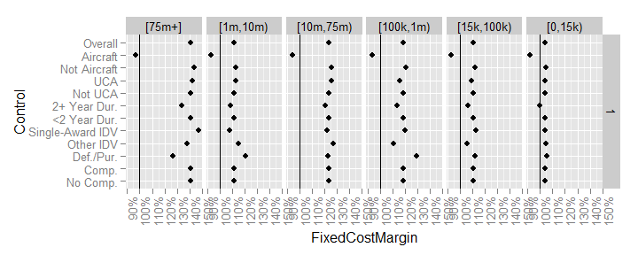 

```r
#Expected Number of Offers
ggplot(subset(SizeDF,dVariable=="Expected Number of Offers"),
       aes(x=Control,y=FixedCostMargin)
       )+
    geom_point()+
    facet_grid(dVariable~iVariable)+ coord_flip()+theme(legend.position="bottom",axis.text.x = element_text(angle = 90, hjust = 1))+ scale_y_continuous(labels = percent_format())+geom_hline(aes(yintercept=1))  
```

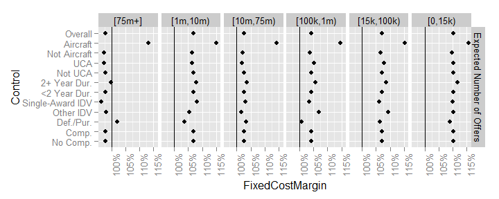 

```r
#Expected Number of Changes
ggplot(subset(SizeDF,dVariable=="Expected Number of Changes"),
       aes(x=Control,y=FixedCostMargin)
       )+
    geom_point()+
    facet_grid(dVariable~iVariable)+ coord_flip()+theme(legend.position="bottom",axis.text.x = element_text(angle = 90, hjust = 1))+ scale_y_continuous(labels = percent_format())+geom_hline(aes(yintercept=1))  
```

 

```r
#Ceiling Raising Change Orders %
ggplot(subset(SizeDF,dVariable=="Ceiling Raising Change Orders %"),
       aes(x=Control,y=FixedCostMargin)
       )+
    geom_point()+
    facet_grid(dVariable~iVariable)+ coord_flip()+theme(legend.position="bottom",axis.text.x = element_text(angle = 90, hjust = 1))+ scale_y_continuous(labels = percent_format())+geom_hline(aes(yintercept=1))  
```

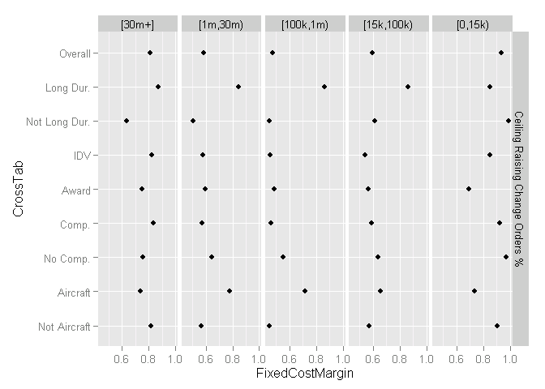 

```r
#Terminations
ggplot(subset(SizeDF,dVariable=="Terminated"),
       aes(x=Control,y=FixedCostMargin)
       )+
    geom_point()+
    facet_grid(dVariable~iVariable)+ coord_flip()+theme(legend.position="bottom",axis.text.x = element_text(angle = 90, hjust = 1))+ scale_y_continuous(labels = percent_format())+geom_hline(aes(yintercept=1))  
```

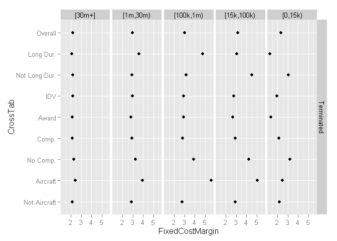 


##C2 Aircraft encounter

*    Aircraft have a 22 point corresponding effect on total contract growth that is explained by schedule and cost overruns. The report looked at time, schedule, and differences between major commands, but not contract pricing mechanism. (Performance of the Defense Acquisition System 2013)
*	"During the Second World War leading belligerents such as Britain, the United States, and Germany, favored the use of fixed-price contracts for purchasing military aircraft. These contracts were believed to encourage economical and efficient production. Yet only Britain succeeded in developing contractual procedures based primarily upon the fixed-price. This was primarily driven by the degree of organization by the weapons companies." (The Price of Air Power: Technological Change, Industrial Policy, and Military Aircraft Contracts in the Era of British Rearmament, 1935-39)
*	Dependent Variables:
*	Single offer competition, contract termination, number of change orders, and cost of change orders.
*	Initial Taxonomy:
*	The sample will include all contracts with a 50 percent or greater share of obligations in the Aircraft and Drone platform portfolio.

#Changes
The model incorporated a 75% threshold for classification as a given Platform under What. This excludes some contracts, but captured the vast majority of contracts with a mix of platforms.

#Results
As expected, numbers of offers are far higher with non-aircraft, for both competed and for all contracts.


```r
compGin[[1]]$levels$What
```

```
## [1] "Aircraft and Drones"            "Electronics and Communications"
## [3] "Facilities and Construction"    "Land Vehicles"                 
## [5] "Missile and Space Systems"      "Other"                         
## [7] "Ships & Submarines"             "Weapons and Ammunition"
```

```r
AircraftFind<- setEvidence(compGin, 
                           nodes=c("What"),
                           states=c("Aircraft and Drones")
                           )

getEvidence(AircraftFind)
```

```
## Finding: 
## What: Aircraft and Drones
## Pr(Finding)= 0.09632574
```

```r
pEvidence(AircraftFind)
```

```
## [1] 0.09632574
```

```r
NotAircraftFind<- setEvidence(compGin, 
                              nodes=c("What"),
                              states=list(compGin[[1]]$levels$What[
                                  compGin[[1]]$levels$What!="Aircraft and Drones"]))


getEvidence(NotAircraftFind)
```

```
## Finding: 
## What: Electronics and Communications, Facilities and Construction, Land Vehicles, Missile and Space Systems, Other, Ships & Submarines, Weapons and Ammunition
## Pr(Finding)= 0.9036743
```

```r
AircraftDF<-FixedPriceHypothesisTester(AircraftFind,"Aircraft")
AircraftDF<-rbind(AircraftDF,
                  FixedPriceHypothesisTester(NotAircraftFind,"Not Aircraft")
                  )


#Remove redundant tests
AircraftDF<-subset(AircraftDF,
                   !Control %in% unique(AircraftDF$Hypothesis))


#Single Offer Competition
ggplot(subset(AircraftDF,dVariable=="1"),
       aes(x=Control,color=Hypothesis,shape=Hypothesis,y=FixedCostMargin)
       )+
    geom_point()+
    facet_grid(dVariable~iVariable)+ coord_flip()+theme(legend.position="bottom",axis.text.x = element_text(angle = 90, hjust = 1))+ scale_y_continuous(labels = percent_format())+geom_hline(aes(yintercept=1))  
```

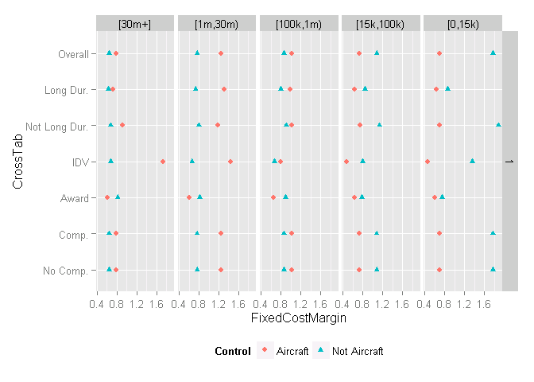 

```r
#Expected Number of Offers
ggplot(subset(AircraftDF,dVariable=="Expected Number of Offers"),
       aes(x=Control,color=Hypothesis,shape=Hypothesis,y=FixedCostMargin)
       )+
    geom_point()+
    facet_grid(dVariable~iVariable)+ coord_flip()+theme(legend.position="bottom",axis.text.x = element_text(angle = 90, hjust = 1))+ scale_y_continuous(labels = percent_format())+geom_hline(aes(yintercept=1))  
```

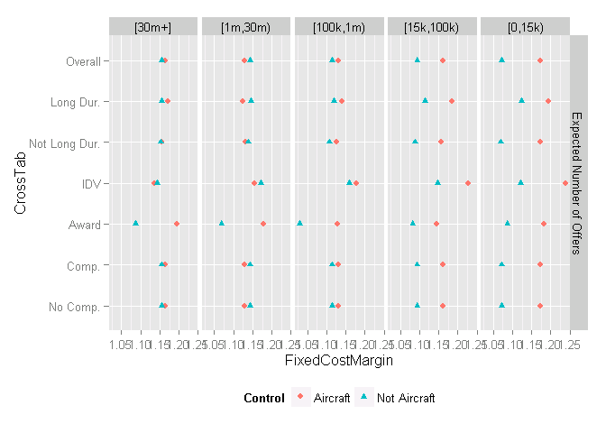 

```r
#Expected Number of Changes
ggplot(subset(AircraftDF,dVariable=="Expected Number of Changes"),
       aes(x=Control,color=Hypothesis,shape=Hypothesis,y=FixedCostMargin)
       )+
    geom_point()+
    facet_grid(dVariable~iVariable)+ coord_flip()+theme(legend.position="bottom",axis.text.x = element_text(angle = 90, hjust = 1))+ scale_y_continuous(labels = percent_format())+geom_hline(aes(yintercept=1))  
```

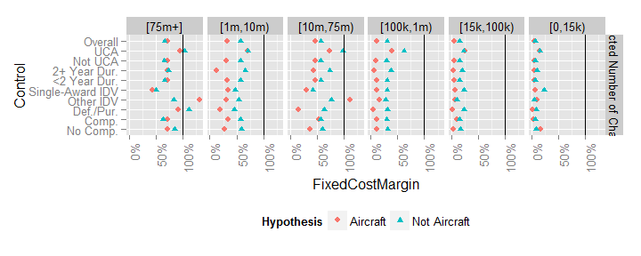 

```r
#Ceiling Raising Change Orders %
ggplot(subset(AircraftDF,dVariable=="Ceiling Raising Change Orders %"),
       aes(x=Control,color=Hypothesis,shape=Hypothesis,y=FixedCostMargin)
       )+
    geom_point()+
    facet_grid(dVariable~iVariable)+ coord_flip()+theme(legend.position="bottom",axis.text.x = element_text(angle = 90, hjust = 1))+ scale_y_continuous(labels = percent_format())+geom_hline(aes(yintercept=1))  
```

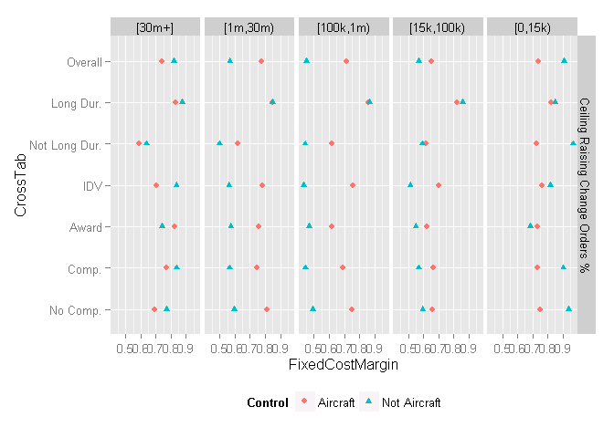 

```r
#Terminations
ggplot(subset(AircraftDF,dVariable=="Terminated"),
       aes(x=Control,color=Hypothesis,shape=Hypothesis,y=FixedCostMargin)
       )+
    geom_point()+
    facet_grid(dVariable~iVariable)+ coord_flip()+theme(legend.position="bottom",axis.text.x = element_text(angle = 90, hjust = 1))+ scale_y_continuous(labels = percent_format())+geom_hline(aes(yintercept=1))  
```

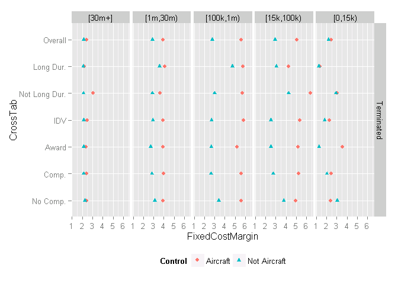 

```r
rm(AircraftFind,NotAircraftFind)
```


##C3: Undefinitized contract actions (UCAs) in development will encounter more problems
*	"For example, analysis is revealing that UCAs can be successfully employed in early production but are concerns for developmental work" (Performance of the Defense Acquisition System 2013)
*	"UCAs increase development cycle time by increasing schedule growth." GAO Study
*	"The contractor has little incentive to control costs during this period.". (GAO study?)
*	DOD has had difficulty overseeing the use of UCAs on at least three levels: (1) how and when to use UCAs, (2) definitizing UCAs in a timely fashion and 3) documenting the basis for negotiated profit or fees (GAO study?)
*	Dependent Variables:
*	Single offer competition, contract termination, number of change orders, and cost of change orders.
*	Initial Taxonomy:
*	UCA status will be defined as those contracts labeled as "Letter Contracts."
*	The first five phases of R&D as defined by product or service code will be included. This excluding R&D management and support and operational system development. 
*	Contracts will be included in the sample if more than 50 percent of obligations in any given year meet the above criteria.

###Next steps: 
UCA status will be added to IDV. Since the contract type will not be known at the offset, the information lost will primarily be information not available to the contracting officer at contract start. However, theres no available proxy until that information is added.


##Contracts using purchase orders and "Other Indefinite Delivery Contracts (IDCs)" are more likely to receive a single offer.
*	Past CSIS research has found that contracts using a purchase orders and "Other IDCs" (Other IDCs includes Federal Supply Schedule, Basic Ordering Agreements, Blanket Purchasing Agreements, Government-Wide Acquisition Contracts) have notably higher  rates of single offer competition than other vehicles. (CSIS, Federal Services Contracting and the Supporting Industrial Base, 2000-2012)
*	Dependent Variables:
*	Single offer competition.
*	Initial Taxonomy:
*	The sample will include contracts with a 50 percent or greater share of obligations reporting purchase orders or "Other IDCs".

###Placeholders and next steps
At present, the vehicle variable only has granularity to look at at IDVs versus definitive and purchase orders. Multi-award IDVs have the highest number of offers, so they will be used as the place holder until greater granularity is available.

The analysis indicates validates this past finding, IDVs are marketedly more likely to be competed and to receive more offers when competed.


```r
compGin[[1]]$levels$IDV
```

```
## [1] "Def/Pur" "IDV"
```

```r
IDVFind<- setEvidence(compGin, 
                      nodes=c("IDV"),
                      states=c("IDV")
                      )

getEvidence(IDVFind)
```

```
## Finding: 
## IDV: IDV
## Pr(Finding)= 0.6492992
```

```r
AwardFind<- setEvidence(compGin, 
                        nodes=c("IDV"),
                        states=c(list(
                            compGin[[1]]$levels$IDV[compGin[[1]]$levels$IDV!=
                                                        "IDV"]))
                        )

getEvidence(AwardFind)
```

```
## Finding: 
## IDV: Def/Pur
## Pr(Finding)= 0.3507008
```

```r
VehicleDF<-FixedPriceHypothesisTester(IDVFind,"IDV")
VehicleDF<-rbind(VehicleDF,
                 FixedPriceHypothesisTester(AwardFind,"Award")
                 )


#Remove redundant tests
VehicleDF<-subset(VehicleDF,
                  !Control %in% unique(VehicleDF$Hypothesis))


#Single Offer Competition
ggplot(subset(VehicleDF,dVariable=="1"),
       aes(x=Control,color=Hypothesis,shape=Hypothesis,y=FixedCostMargin)
       )+
    geom_point()+
    facet_grid(dVariable~iVariable)+ coord_flip()+theme(legend.position="bottom",axis.text.x = element_text(angle = 90, hjust = 1))+ scale_y_continuous(labels = percent_format())+geom_hline(aes(yintercept=1))  
```

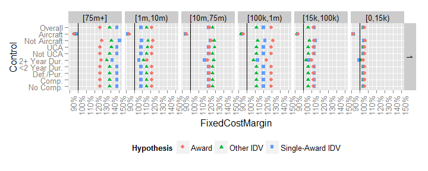 

```r
#Expected Number of Offers
ggplot(subset(VehicleDF,dVariable=="Expected Number of Offers"),
       aes(x=Control,color=Hypothesis,shape=Hypothesis,y=FixedCostMargin)
       )+
    geom_point()+
    facet_grid(dVariable~iVariable)+ coord_flip()+theme(legend.position="bottom",axis.text.x = element_text(angle = 90, hjust = 1))+ scale_y_continuous(labels = percent_format())+geom_hline(aes(yintercept=1))  
```

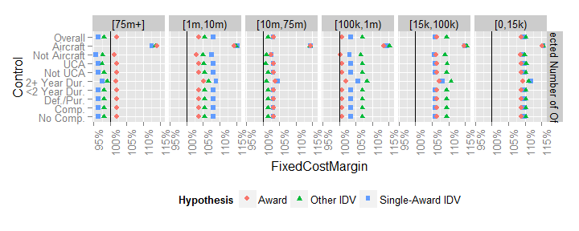 

```r
#Expected Number of Changes
ggplot(subset(VehicleDF,dVariable=="Expected Number of Changes"),
       aes(x=Control,color=Hypothesis,shape=Hypothesis,y=FixedCostMargin)
       )+
    geom_point()+
    facet_grid(dVariable~iVariable)+ coord_flip()+theme(legend.position="bottom",axis.text.x = element_text(angle = 90, hjust = 1))+ scale_y_continuous(labels = percent_format())+geom_hline(aes(yintercept=1))  
```

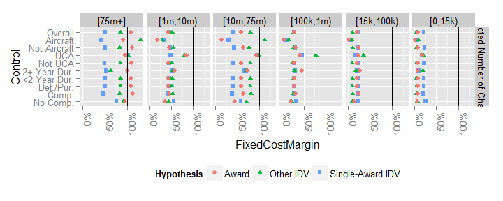 

```r
#Ceiling Raising Change Orders %
ggplot(subset(VehicleDF,dVariable=="Ceiling Raising Change Orders %"),
       aes(x=Control,color=Hypothesis,shape=Hypothesis,y=FixedCostMargin)
       )+
    geom_point()+
    facet_grid(dVariable~iVariable)+ coord_flip()+theme(legend.position="bottom",axis.text.x = element_text(angle = 90, hjust = 1))+ scale_y_continuous(labels = percent_format())+geom_hline(aes(yintercept=1))  
```

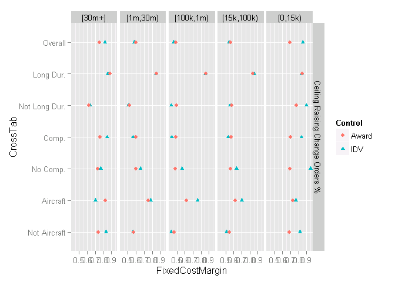 

```r
#Terminations
ggplot(subset(VehicleDF,dVariable=="Terminated"),
       aes(x=Control,color=Hypothesis,shape=Hypothesis,y=FixedCostMargin)
       )+
    geom_point()+
    facet_grid(dVariable~iVariable)+ coord_flip()+theme(legend.position="bottom",axis.text.x = element_text(angle = 90, hjust = 1))+ scale_y_continuous(labels = percent_format())+geom_hline(aes(yintercept=1))  
```

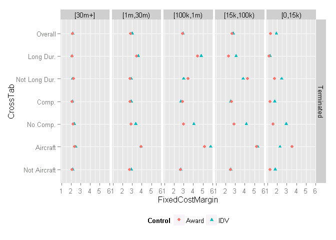 

```r
rm(IDVFind,AwardFind)
```

##Contracts with longer initially expected periods of performance will encounter more problems.
*	Past CSIS research on cost overruns in major defense acquisition projects have found that cost growth is correlated with contract duration. "If cost increases accrue over time, then programs with an older baseline estimate would tend to accumulate relatively higher cost increases. The data for the analyzed programs show that older programs indeed experience larger overruns... this growth correlation not only provides further evidence for the assertion that cost growth occurs steadily throughout the program lifespan, but it also suggests that younger programs are not performing better than older programs." (David Berteau et al.: Cost and Time Overruns for Major Defense Acquisition Programs (2011))
*	Dependent Variables:
*	Contract termination, number of change orders, and cost of change orders.
*	Initial Taxonomy:
*	Period of performance will be measured as expected contract duration in 4-week months, rounding up.
*	Note: CSIS is including a separate hypothesis (Slide 9) to test whether fixed-price contracts encounter an even greater number of problems under contracts with longer expected periods of performance 


```r
compGin[[1]]$levels$Dur
```

```
## [1] "[    0,   61)" "[   61,  214)" "[  214,  366)" "[  366,33192]"
```

```r
LongDurFind<- setEvidence(compGin, 
                          nodes=c("Dur"),
                          states=c("[  366,33192]")
                          )

getEvidence(LongDurFind)
```

```
## Finding: 
## Dur: [  366,33192]
## Pr(Finding)= 0.0508826
```

```r
NotLongDurFind<- setEvidence(compGin, 
                             nodes=c("Dur"),
                             states=c(list(
                                 compGin[[1]]$levels$Dur[compGin[[1]]$levels$Dur!=
                                                             "[  366,33192]"]))
                             )


LongDurDF<-FixedPriceHypothesisTester(LongDurFind,"Long Dur.")
LongDurDF<-rbind(LongDurDF,
                 FixedPriceHypothesisTester(NotLongDurFind,"Not Long Dur.")
                 )


#Remove redundant tests
LongDurDF<-subset(LongDurDF,
                  !Control %in% unique(LongDurDF$Hypothesis))


#Single Offer Competition
ggplot(subset(LongDurDF,dVariable=="1"),
       aes(x=Control,color=Hypothesis,shape=Hypothesis,y=FixedCostMargin)
       )+
    geom_point()+
    facet_grid(dVariable~iVariable)+ coord_flip()+theme(legend.position="bottom",axis.text.x = element_text(angle = 90, hjust = 1))+ scale_y_continuous(labels = percent_format())+geom_hline(aes(yintercept=1))  
```

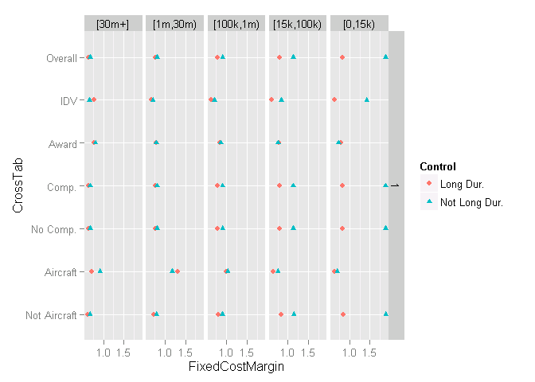 

```r
#Expected Number of Offers
ggplot(subset(LongDurDF,dVariable=="Expected Number of Offers"),
       aes(x=Control,color=Hypothesis,shape=Hypothesis,y=FixedCostMargin)
       )+
    geom_point()+
    facet_grid(dVariable~iVariable)+ coord_flip()+theme(legend.position="bottom",axis.text.x = element_text(angle = 90, hjust = 1))+ scale_y_continuous(labels = percent_format())+geom_hline(aes(yintercept=1))  
```

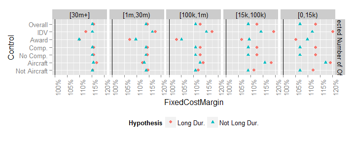 

```r
#Expected Number of Changes
ggplot(subset(LongDurDF,dVariable=="Expected Number of Changes"),
       aes(x=Control,color=Hypothesis,shape=Hypothesis,y=FixedCostMargin)
       )+
    geom_point()+
    facet_grid(dVariable~iVariable)+ coord_flip()+theme(legend.position="bottom",axis.text.x = element_text(angle = 90, hjust = 1))+ scale_y_continuous(labels = percent_format())+geom_hline(aes(yintercept=1))  
```

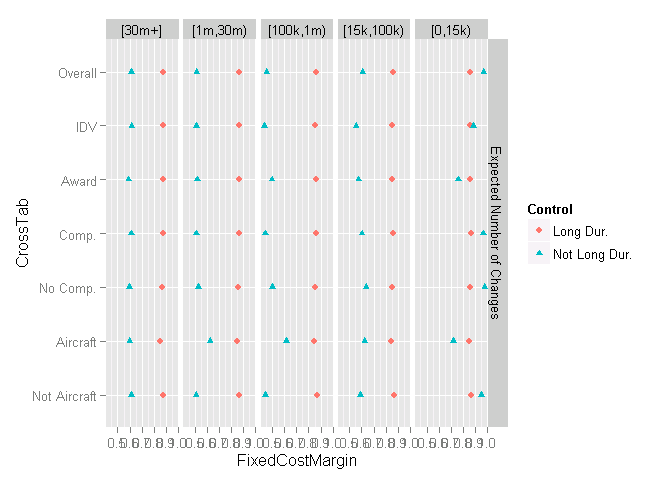 

```r
#Ceiling Raising Change Orders %
ggplot(subset(LongDurDF,dVariable=="Ceiling Raising Change Orders %"),
       aes(x=Control,color=Hypothesis,shape=Hypothesis,y=FixedCostMargin)
       )+
    geom_point()+
    facet_grid(dVariable~iVariable)+ coord_flip()+theme(legend.position="bottom",axis.text.x = element_text(angle = 90, hjust = 1))+ scale_y_continuous(labels = percent_format())+geom_hline(aes(yintercept=1))  
```

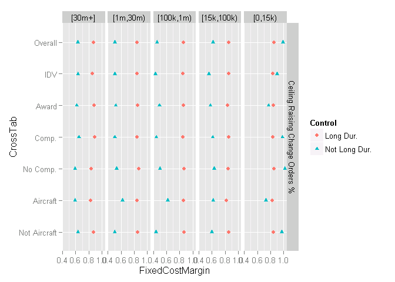 

```r
#Terminations
ggplot(subset(LongDurDF,dVariable=="Terminated"),
       aes(x=Control,color=Hypothesis,shape=Hypothesis,y=FixedCostMargin)
       )+
    geom_point()+
    facet_grid(dVariable~iVariable)+ coord_flip()+theme(legend.position="bottom",axis.text.x = element_text(angle = 90, hjust = 1))+ scale_y_continuous(labels = percent_format())+geom_hline(aes(yintercept=1))  
```

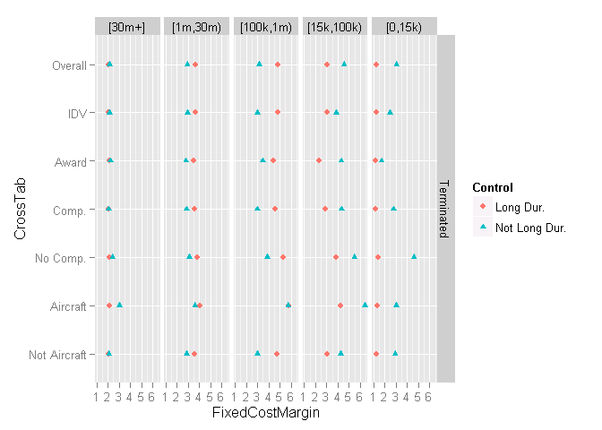 

```r
rm(LongDurFind,NotLongDurFind)
```


##Incentive Fee contracts experience fewer problems than other forms of contracts.
*	"Incentive formula-type contracts had lower cost growth at the median (i.e., its central tendency), shared savings with the government, and earned slightly lower margins than CPAF/CPFF/CS/other (O) contracts. In other words, to achieve about the same margin on incentive formula-type contracts, contractors had to control cost growth better-and they did so." (Performance of the Defense Acquisition System, 2014) This finding is in line with multiple earlier policy statements from Undersecretary Kendall emphasizing fixed-price incentive fee contracts and vendor motivation. 
*	One study uses the F-35 as a case study to examine when to utilize different types of contract incentive structures. The model presented in this study could provide insight into the use of different types of fixed-price contracts. (The Effect of Processes and Incentives on Acquisition Cost Growth)
*	Dependent Variables:
*	Contract termination, number of change orders, and cost of change orders.
*	Initial Taxonomy:
*	The sample will include contracts with a 50 percent or greater share of obligations reporting cost-plus incentive fee or fixed-price incentive fee as the pricing mechanism.

##Next steps
Incentive was not included in the initial model because it made up a small proportion of all contracts. Fee structure should probably be included as a seperate node entirely. Initial analysis at the aggregate dollar levels for the competition study found did not support the hypothesis.


```r
compGin[[1]]$levels$Comp
```

```
## [1] "Comp."     "No Comp."  "Unlabeled"
```

```r
CompFind<-setEvidence(compGin, 
                      nodes=c("Comp"),
                      states=c("Comp.")
                      )

getEvidence(CompFind)
```

```
## Finding: 
## Comp: Comp.
## Pr(Finding)= 0.8031248
```

```r
NotCompFind<-setEvidence(compGin, 
                         nodes=c("Comp"),
                         states=c("No Comp.")
                         )
getEvidence(NotCompFind)
```

```
## Finding: 
## Comp: No Comp.
## Pr(Finding)= 0.1968207
```

```r
CompDF<-FixedPriceHypothesisTester(CompFind,"Comp.")
CompDF<-rbind(CompDF,
                 FixedPriceHypothesisTester(NotCompFind,"Not Comp.")
                 )


#Remove redundant tests
CompDF<-subset(CompDF,
                  !Control %in% unique(CompDF$Hypothesis))
#Remove the No Comp for the offer related iVariables
CompDF<-subset(CompDF,
                  !(dVariable %in% c("1","Expected Number of Offers")&
                      Hypothesis=="Not Comp."))


#Single Offer Competition
ggplot(subset(CompDF,dVariable=="1"),
       aes(x=Control,y=FixedCostMargin)
       )+
    geom_point()+
    facet_grid(dVariable~iVariable)+ coord_flip()+theme(legend.position="bottom",axis.text.x = element_text(angle = 90, hjust = 1))+ scale_y_continuous(labels = percent_format())+geom_hline(aes(yintercept=1))  
```

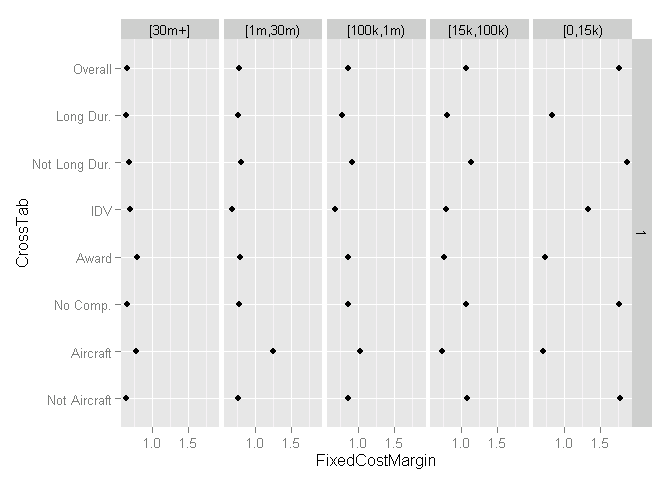 

```r
#Expected Number of Offers
ggplot(subset(CompDF,dVariable=="Expected Number of Offers"),
       aes(x=Control,y=FixedCostMargin)
       )+
    geom_point()+
    facet_grid(dVariable~iVariable)+ coord_flip()+theme(legend.position="bottom",axis.text.x = element_text(angle = 90, hjust = 1))+ scale_y_continuous(labels = percent_format())+geom_hline(aes(yintercept=1))  
```

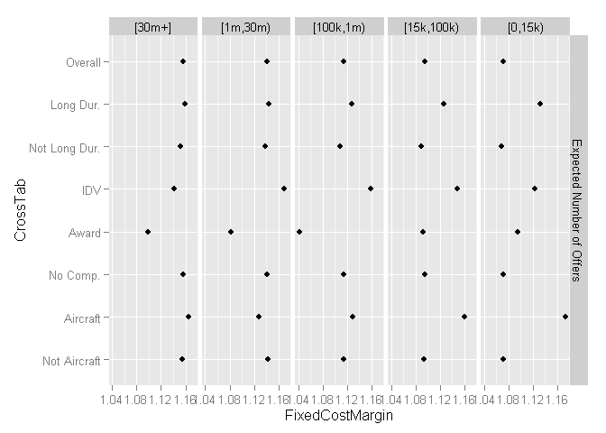 

```r
#Expected Number of Changes
ggplot(subset(CompDF,dVariable=="Expected Number of Changes"),
       aes(x=Control,color=Hypothesis,shape=Hypothesis,y=FixedCostMargin)
       )+
    geom_point()+
    facet_grid(dVariable~iVariable)+ coord_flip()+theme(legend.position="bottom",axis.text.x = element_text(angle = 90, hjust = 1))+ scale_y_continuous(labels = percent_format())+geom_hline(aes(yintercept=1))  
```

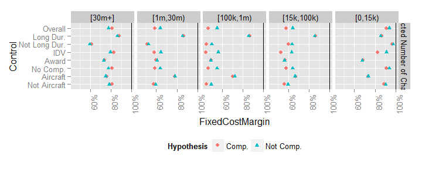 

```r
#Ceiling Raising Change Orders %
ggplot(subset(CompDF,dVariable=="Ceiling Raising Change Orders %"),
       aes(x=Control,color=Hypothesis,shape=Hypothesis,y=FixedCostMargin)
       )+
    geom_point()+
    facet_grid(dVariable~iVariable)+ coord_flip()+theme(legend.position="bottom",axis.text.x = element_text(angle = 90, hjust = 1))+ scale_y_continuous(labels = percent_format())+geom_hline(aes(yintercept=1))  
```

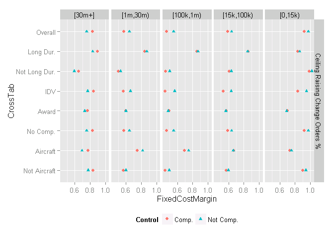 

```r
#Terminations
ggplot(subset(CompDF,dVariable=="Terminated"),
       aes(x=Control,color=Hypothesis,shape=Hypothesis,y=FixedCostMargin)
       )+
    geom_point()+
    facet_grid(dVariable~iVariable)+ coord_flip()+theme(legend.position="bottom",axis.text.x = element_text(angle = 90, hjust = 1))+ scale_y_continuous(labels = percent_format())+geom_hline(aes(yintercept=1))  
```

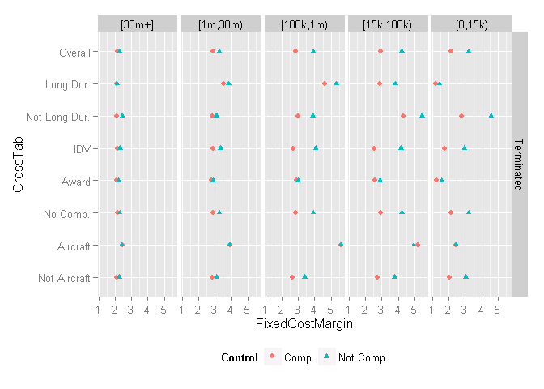 

```r
rm(CompFind,NotCompFind)
```


##H1: Large Research and Development (R&D) contracts will encounter challenges under fixed-price contracts. (On Contracting for Uncertain R&D) 

*    Dependent Variables:
*	Single offer competition, contract termination, number of change orders, and cost of change orders.
*	Initial Taxonomy:
*	The first five phases of R&D as defined by product or service code will be included. This step excludes R&D management, support and operational system development. 
*	The sample will include all contracts with a value of at least $25 million in either initial annualized base and all options amount of initial base and exercised options amount.

##Changes: 
The study team chose to use different contract size breakdowns than those used in past CSIS work (Contract_Ceiling). As a result, the closest available dividing point in the model is $30M. In this case, the $25M has no firmer theoretical basis and the $30M dividing line has the advantage of representing the weighted average contract ceiling. Thus the study team is updating the hypothesis to use the $30M standard instead.

For this example, we're still using usual R&D rather than excluding R&d7

##Results
The hypothesis is supported with regard to number of offers. Larger fixed-price contracts are more likely to experience single offer competition and are less likely to experience competition with three or more offers. Combination tracks more closely with fixed-price than cost-plus.


```r
levels(compGin[[1]]$levels$Ceil)
```

```
## NULL
```

```r
RnDfind<- setEvidence(compGin, 
                           nodes=c("PSR"),
                           states=c("R&D")
                           )

# NotRnDfind<- setEvidence(compGin, 
#                              nodes=c("PSR"),
#                              states=c(list(
#                                  compGin[[1]]$levels$PSR[compGin[[1]]$levels$PSR!=
#                                                              "R&D"])))
# 


getEvidence(RnDfind)
```

```
## Finding: 
## PSR: R&D
## Pr(Finding)= 0.009068309
```

```r
RnDdf<-FixedPriceHypothesisTester(RnDfind,"R&D")
RnDdf<-rbind(RnDdf,
                  FixedPriceHypothesisTester(compGin,"Population")
                  )


#Remove redundant tests
RnDdf<-subset(RnDdf,
                   !Control %in% unique(RnDdf$Hypothesis))


#Single Offer Competition
ggplot(subset(RnDdf,dVariable=="1"),
       aes(x=Control,color=Hypothesis,shape=Hypothesis,y=FixedCostMargin)
       )+
    geom_point()+
    facet_grid(dVariable~iVariable)+ coord_flip()+theme(legend.position="bottom",axis.text.x = element_text(angle = 90, hjust = 1))+ scale_y_continuous(labels = percent_format())+geom_hline(aes(yintercept=1))  
```

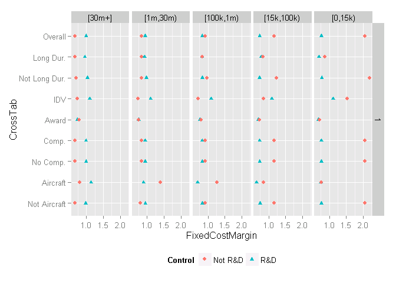 

```r
#Expected Number of Offers
ggplot(subset(RnDdf,dVariable=="Expected Number of Offers"),
       aes(x=Control,color=Hypothesis,shape=Hypothesis,y=FixedCostMargin)
       )+
    geom_point()+
    facet_grid(dVariable~iVariable)+ coord_flip()+theme(legend.position="bottom",axis.text.x = element_text(angle = 90, hjust = 1))+ scale_y_continuous(labels = percent_format())+geom_hline(aes(yintercept=1))  
```

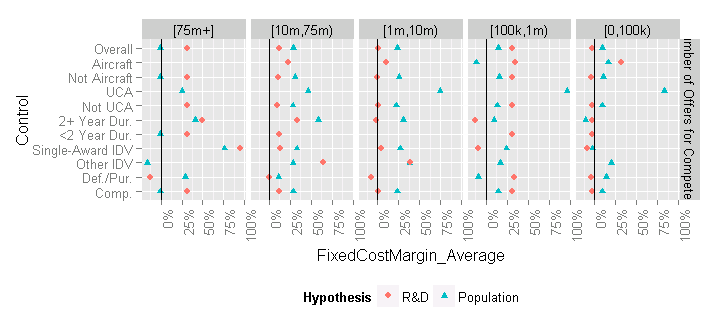 

```r
#Expected Number of Changes
ggplot(subset(RnDdf,dVariable=="Expected Number of Changes"),
       aes(x=Control,color=Hypothesis,shape=Hypothesis,y=FixedCostMargin)
       )+
    geom_point()+
    facet_grid(dVariable~iVariable)+ coord_flip()+theme(legend.position="bottom",axis.text.x = element_text(angle = 90, hjust = 1))+ scale_y_continuous(labels = percent_format())+geom_hline(aes(yintercept=1))  
```

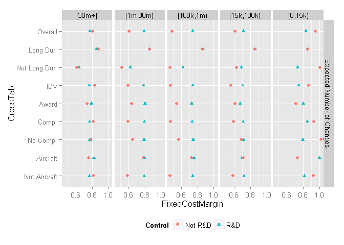 

```r
#Ceiling Raising Change Orders %
ggplot(subset(RnDdf,dVariable=="Ceiling Raising Change Orders %"),
       aes(x=Control,color=Hypothesis,shape=Hypothesis,y=FixedCostMargin)
       )+
    geom_point()+
    facet_grid(dVariable~iVariable)+ coord_flip()+theme(legend.position="bottom",axis.text.x = element_text(angle = 90, hjust = 1))+ scale_y_continuous(labels = percent_format())+geom_hline(aes(yintercept=1))  
```

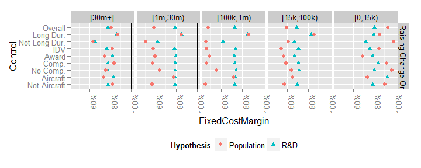 

```r
#Terminations
ggplot(subset(RnDdf,dVariable=="Terminated"),
       aes(x=Control,color=Hypothesis,shape=Hypothesis,y=FixedCostMargin)
       )+
    geom_point()+
    facet_grid(dVariable~iVariable)+ coord_flip()+theme(legend.position="bottom",axis.text.x = element_text(angle = 90, hjust = 1))+ scale_y_continuous(labels = percent_format())+geom_hline(aes(yintercept=1))  
```

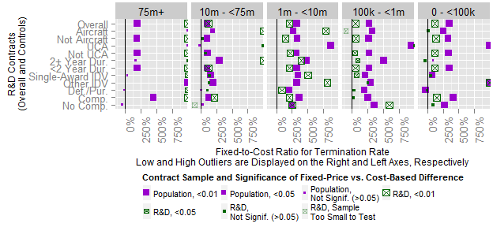 

```r
rm(RnDfind,NotRnDfind)
```

```
## Warning in rm(RnDfind, NotRnDfind): object 'NotRnDfind' not found
```

##H2: Due to design uncertainty Pre-Milestone B Major Defense Acquisition Programs (MDAPs) are potentially more likely to encounter problems than other fixed-price contracts
*	Prerequisites for use of fixed-price: "Design content is established and the components are mature technologies. There are no signifi???cant unresolved design issues, no major integration risk, the external interfaces are well defined, and no serious risk exists of unknowns surfacing in developmental testing and causing major redesign." (Frank Kendall, Use of Fixed-Price Incentive Firm (FPIF) Contracts in Development and Production. Defense AT&L, (March-April 2013) pp 2-4.) {Emphasis added}
*	Dependent Variables:
*	Single offer competition, contract termination, number of change orders, and cost of change orders.
*	Initial Taxonomy:
*	Using past CSIS research on Major Defense Acquisition Programs, CSIS will include in the sample System Equipment Codes for MDAPs that also include Pre-Milestone B spending. 
*	Contracts will be included if greater than 50% of obligations are classified with a relevant System Equipment Code and/or if they are manually labeled as belonging to that MDAP.
*	Note: This criteria will capture a similar sample to the prior R&D hypothesis. The study team would like to also include Major Automated Information Systems, but cannot because they are not labeled in FPDS.

#Temporary changes and next steps
MDAP specific classification is not yet included because it represents such a small portion of total contracts. It is presently planned to be incorporated through the Interlinked Variable. As an intermediate step.

#Initial results
The hypothesis was not supported with regard to number of offers, but this should be treated as a soft negative finding until the more precise question is tested.


```r
levels(compGin[[1]]$levels$Link)
```

```
## NULL
```

```r
HighLinkFind<- setEvidence(compGin, 
                           nodes=c("Link"),
                           states=c("[  750,67263]")
                           )


NotHighLinkFind<- setEvidence(compGin, 
                             nodes=c("Link"),
                             states=c(list(
                                 compGin[[1]]$levels$Link[compGin[[1]]$levels$Link!=
                                                             "[  750,67263]"])))


getEvidence(HighLinkFind)
```

```
## Finding: 
## Link: [  750,67263]
## Pr(Finding)= 0.2440527
```

```r
HighLinkDF<-FixedPriceHypothesisTester(HighLinkFind,"High Link")
HighLinkDF<-rbind(HighLinkDF,
                  FixedPriceHypothesisTester(compGin,"Population")
                  )


#Remove redundant tests
HighLinkDF<-subset(HighLinkDF,
                   !Control %in% unique(HighLinkDF$Hypothesis))


#Single Offer Competition
ggplot(subset(HighLinkDF,dVariable=="1"),
       aes(x=Control,color=Hypothesis,shape=Hypothesis,y=FixedCostMargin)
       )+
    geom_point()+
    facet_grid(dVariable~iVariable)+ coord_flip()+theme(legend.position="bottom",axis.text.x = element_text(angle = 90, hjust = 1))+ scale_y_continuous(labels = percent_format())+geom_hline(aes(yintercept=1))  
```

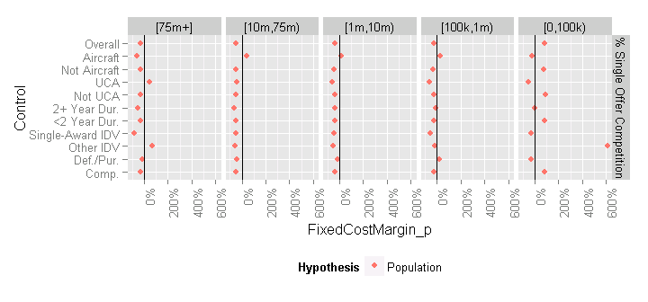 

```r
#Expected Number of Offers
ggplot(subset(HighLinkDF,dVariable=="Expected Number of Offers"),
       aes(x=Control,color=Hypothesis,shape=Hypothesis,y=FixedCostMargin)
       )+
    geom_point()+
    facet_grid(dVariable~iVariable)+ coord_flip()+theme(legend.position="bottom",axis.text.x = element_text(angle = 90, hjust = 1))+ scale_y_continuous(labels = percent_format())+geom_hline(aes(yintercept=1))  
```

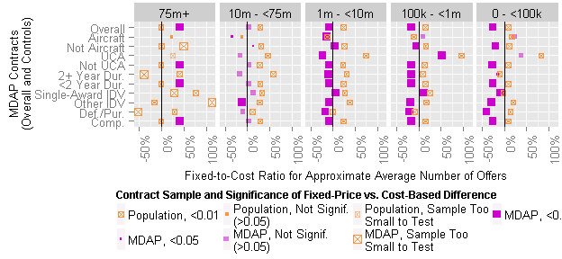 

```r
#Expected Number of Changes
ggplot(subset(HighLinkDF,dVariable=="Expected Number of Changes"),
       aes(x=Control,color=Hypothesis,shape=Hypothesis,y=FixedCostMargin)
       )+
    geom_point()+
    facet_grid(dVariable~iVariable)+ coord_flip()+theme(legend.position="bottom",axis.text.x = element_text(angle = 90, hjust = 1))+ scale_y_continuous(labels = percent_format())+geom_hline(aes(yintercept=1))  
```

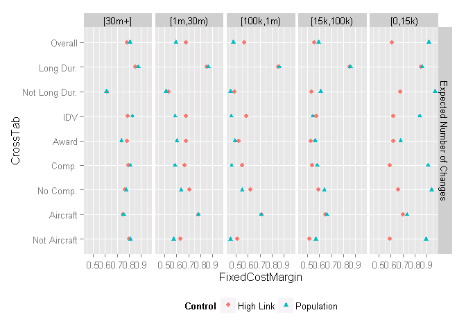 

```r
#Ceiling Raising Change Orders %
ggplot(subset(HighLinkDF,dVariable=="Ceiling Raising Change Orders %"),
       aes(x=Control,color=Hypothesis,shape=Hypothesis,y=FixedCostMargin)
       )+
    geom_point()+
    facet_grid(dVariable~iVariable)+ coord_flip()+theme(legend.position="bottom",axis.text.x = element_text(angle = 90, hjust = 1))+ scale_y_continuous(labels = percent_format())+geom_hline(aes(yintercept=1))  
```

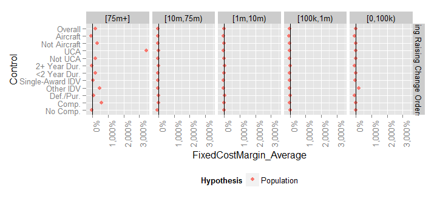 

```r
#Terminations
ggplot(subset(HighLinkDF,dVariable=="Terminated"),
       aes(x=Control,color=Hypothesis,shape=Hypothesis,y=FixedCostMargin)
       )+
    geom_point()+
    facet_grid(dVariable~iVariable)+ coord_flip()+theme(legend.position="bottom",axis.text.x = element_text(angle = 90, hjust = 1))+ scale_y_continuous(labels = percent_format())+geom_hline(aes(yintercept=1))  
```

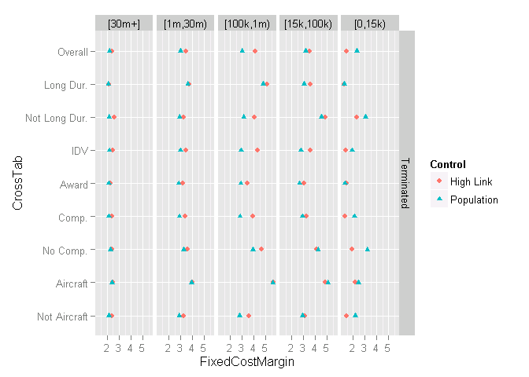 

```r
rm(HighLinkFind,NotHighLinkFind)
```


##H3: Contracts with longer schedules will encounter greater problems with fixed-price contracts.
*	"But price redetermination might be used whenever contingency charges otherwise would be included in a contract price due to such factors as prolonged delivery schedules, unstable market conditions for material or labor, or uncertainty as to cost of performance." (Fixed-prices and Price Redetermination in Defense Contracts)
*	Dependent Variables:
*	Single offer competition, contract termination, number of change orders, and cost of change orders.
*	Initial Taxonomy:
*	Period of performance will be measured by expected contract duration in 4-week months (rounded up).

#Placeholder variable and next steps
This was initially expected to be tested with a continuous value for length rather than a discrete value. In addition the test would benefit from having more granularity at the high end of contract lengths. The next step will be to expand Dur's granularity in the greater than 1 year category.

#Initial results
The hypothesis regarding number of offers was not supported at the greater than 1 year level. Further subdivision into 2 year plus or other breakdowns might show a different result. Combination resembled fixed-price, but did not do as well with 5 or more offers.


```r
compGin[[1]]$levels$Dur
```

```
## [1] "[    0,   61)" "[   61,  214)" "[  214,  366)" "[  366,33192]"
```

```r
LongDurFind<- setEvidence(compGin, 
                          nodes=c("Dur"),
                          states=c("[  366,33192]")
                          )

getEvidence(LongDurFind)
```

```
## Finding: 
## Dur: [  366,33192]
## Pr(Finding)= 0.0508826
```

```r
NotLongDurFind<- setEvidence(compGin, 
                             nodes=c("Dur"),
                             states=c(list(
                                 compGin[[1]]$levels$Dur[compGin[[1]]$levels$Dur!=
                                                             "[  366,33192]"]))
                             )


LongDurDF<-FixedPriceHypothesisTester(LongDurFind,"Long Dur.")
LongDurDF<-rbind(LongDurDF,
                 FixedPriceHypothesisTester(compGin,"Population")
                 )


#Remove redundant tests
LongDurDF<-subset(LongDurDF,
                  !Control %in% c(unique(LongDurDF$Hypothesis),"Not Long Dur."))


#Single Offer Competition
ggplot(subset(LongDurDF,dVariable=="1"),
       aes(x=Control,color=Hypothesis,shape=Hypothesis,y=FixedCostMargin)
       )+
    geom_point()+
    facet_grid(dVariable~iVariable)+ coord_flip()+theme(legend.position="bottom",axis.text.x = element_text(angle = 90, hjust = 1))+ scale_y_continuous(labels = percent_format())+geom_hline(aes(yintercept=1))  
```

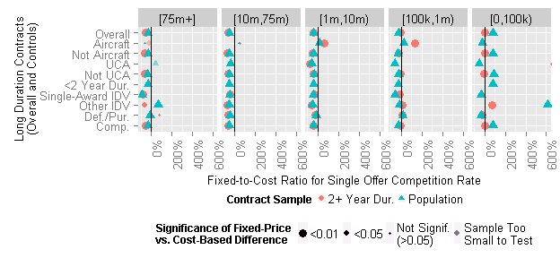 

```r
#Expected Number of Offers
ggplot(subset(LongDurDF,dVariable=="Expected Number of Offers"),
       aes(x=Control,color=Hypothesis,shape=Hypothesis,y=FixedCostMargin)
       )+
    geom_point()+
    facet_grid(dVariable~iVariable)+ coord_flip()+theme(legend.position="bottom",axis.text.x = element_text(angle = 90, hjust = 1))+ scale_y_continuous(labels = percent_format())+geom_hline(aes(yintercept=1))  
```

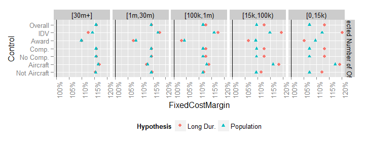 

```r
#Expected Number of Changes
ggplot(subset(LongDurDF,dVariable=="Expected Number of Changes"),
       aes(x=Control,color=Hypothesis,shape=Hypothesis,y=FixedCostMargin)
       )+
    geom_point()+
    facet_grid(dVariable~iVariable)+ coord_flip()+theme(legend.position="bottom",axis.text.x = element_text(angle = 90, hjust = 1))+ scale_y_continuous(labels = percent_format())+geom_hline(aes(yintercept=1))  
```

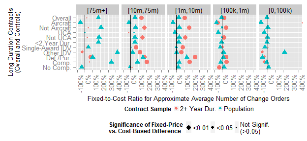 

```r
#Ceiling Raising Change Orders %
ggplot(subset(LongDurDF,dVariable=="Ceiling Raising Change Orders %"),
       aes(x=Control,color=Hypothesis,shape=Hypothesis,y=FixedCostMargin)
       )+
    geom_point()+
    facet_grid(dVariable~iVariable)+ coord_flip()+theme(legend.position="bottom",axis.text.x = element_text(angle = 90, hjust = 1))+ scale_y_continuous(labels = percent_format())+geom_hline(aes(yintercept=1))  
```

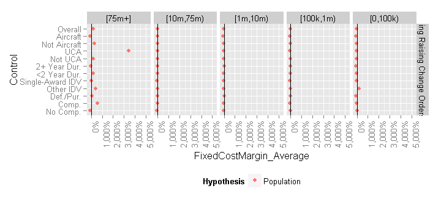 

```r
#Terminations
ggplot(subset(LongDurDF,dVariable=="Terminated"),
       aes(x=Control,color=Hypothesis,shape=Hypothesis,y=FixedCostMargin)
       )+
    geom_point()+
    facet_grid(dVariable~iVariable)+ coord_flip()+theme(legend.position="bottom",axis.text.x = element_text(angle = 90, hjust = 1))+ scale_y_continuous(labels = percent_format())+geom_hline(aes(yintercept=1))  
```

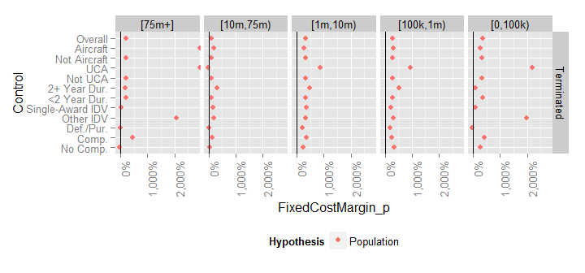 

```r
rm(LongDurFind,NotLongDurFind)
```


##H4: Fixed-price contracts with the potential competition for multiple offers will encounter fewer challenges.
*	"[Principals] would prefer a fixed-price contract when the number of bidders increases." (On Contracting for Uncertain R&D)
*	Complicating this relationship, are recent revisions to the DFAR that reduced the emphasis on seeking additional offers as long as a fair competitive price can be verified. (DFAR 215.371)
*	Dependent Variables:
*	Contract termination, number of change orders, and cost of change orders.
*	Initial Taxonomy:
*	Due to limitations in available data, CSIS will use whether or not a contract is initially competed as a broad proxy for whether competition with multiple offers is available. CSIS will follow standard DoD procedures in identifying competed contracts.
*	Note: Testing for this hypothesis is constrained by a lack of relevant data in  FPDS. The number of offers requested field was dispensed with when the DoD contract system was folded into FPDS. (See "Hypotheses which raise causality concerns" (slide 21-22) for further discussion.) 

#Next steps.

This hypothesis is requires incorporation of the next two dependent variables into the Bayesian Network.


```r
compGin[[1]]$levels$Comp
```

```
## [1] "Comp."     "No Comp."  "Unlabeled"
```

```r
CompFind<-setEvidence(compGin, 
                      nodes=c("Comp"),
                      states=c("Comp.")
                      )

getEvidence(CompFind)
```

```
## Finding: 
## Comp: Comp.
## Pr(Finding)= 0.8031248
```

```r
NotCompFind<-setEvidence(compGin, 
                         nodes=c("Comp"),
                         states=c("No Comp.")
                         )
getEvidence(NotCompFind)
```

```
## Finding: 
## Comp: No Comp.
## Pr(Finding)= 0.1968207
```

```r
CompDF<-FixedPriceHypothesisTester(CompFind,"Comp.")
CompDF<-rbind(CompDF,
                 FixedPriceHypothesisTester(compGin,"Population")
                 )


#Remove redundant tests
CompDF<-subset(CompDF,
                  !Control %in% c(unique(CompDF$Hypothesis),"Not Comp."))
#Remove the  iVariables not covered in hypothesis
CompDF<-subset(CompDF,
                  !dVariable %in% c("1","Expected Number of Offers"))


#Expected Number of Changes
ggplot(subset(CompDF,dVariable=="Expected Number of Changes"),
       aes(x=Control,color=Hypothesis,shape=Hypothesis,y=FixedCostMargin)
       )+
    geom_point()+
    facet_grid(dVariable~iVariable)+ coord_flip()+theme(legend.position="bottom",axis.text.x = element_text(angle = 90, hjust = 1))+ scale_y_continuous(labels = percent_format())+geom_hline(aes(yintercept=1))  
```

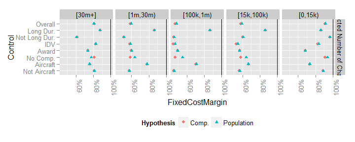 

```r
#Ceiling Raising Change Orders %
ggplot(subset(CompDF,dVariable=="Ceiling Raising Change Orders %"),
       aes(x=Control,color=Hypothesis,shape=Hypothesis,y=FixedCostMargin)
       )+
    geom_point()+
    facet_grid(dVariable~iVariable)+ coord_flip()+theme(legend.position="bottom",axis.text.x = element_text(angle = 90, hjust = 1))+ scale_y_continuous(labels = percent_format())+geom_hline(aes(yintercept=1))  
```

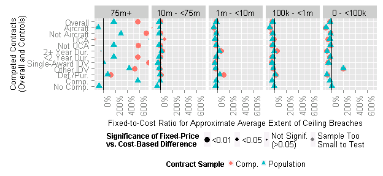 

```r
#Terminations
ggplot(subset(CompDF,dVariable=="Terminated"),
       aes(x=Control,color=Hypothesis,shape=Hypothesis,y=FixedCostMargin)
       )+
    geom_point()+
    facet_grid(dVariable~iVariable)+ coord_flip()+theme(legend.position="bottom",axis.text.x = element_text(angle = 90, hjust = 1))+ scale_y_continuous(labels = percent_format())+geom_hline(aes(yintercept=1))  
```

 

```r
rm(CompFind,NotCompFind)
```

##H5: Fixed-price are preferred by vendors for larger software contracts
*	"We hypothesize that the vendor's ability to leverage information asymmetry about capabilities and experiences translates into the vendor preferring Fixed-Price contract to secure larger information rents. Our results support this hypothesis and suggest that the vendor would prefer the FP contract for larger and longer projects with larger teams. However, vendors would prefer a [Time and Materials] contract when the risk of employee attrition from the project team is high." (Research Note: On Vendor Preferences for Contract Types in Offshore Software Projects: The Case of fixed-price vs. Time and Materials Contracts)
*	Dependent Variables:
*	Single offer competition and contract termination. 
*	Initial Taxonomy:
*	Past CSIS research has found that software contracts are not all contained within the Automated Data Processing category of the product or service codes. CSIS tentatively plans to include contracts with greater than 50% by value content in the Information and Communication Technology services category
*	Note: This hypothesis tests commercial vendor practices, but contradicts other government-focused observations. This is because this study does not seek to construct only consistent hypotheses, but instead to test a range of ideas from the literature.
Hypotheses regarding general contract performance that may be used as controls
Contracts for aircraft have more challenges than other contracts

#Placeholder and next steps
Software is typically classified as a service under PSR, though also could be under R&D, and is especially prominent in electronics in communication under What. Given that all sorts of platforms have software, PSR would be the best place to incorporate it under the present model, possibly linking software services and software R&D. NAICS codes may also assist. Software is not particularly easy to identify in FPDS as it is often incorporated into larger contracts, but there should be a number of clearcut cases.

#Initial results

Electronics and communications services do have a slight preference for fixed-price contracts when it comes to number of offers. However, when R&D is also included, the advantage switches to Cost-based.


```r
levels(compGin[[1]]$levels$PSR)
```

```
## NULL
```

```r
SoftwareFind<- setEvidence(compGin, 
                           nodes=c("What","PSR"),
                           states=c("Electronics and Communications","Services"))


getEvidence(SoftwareFind)
```

```
## Finding: 
## What: Electronics and Communications
##  PSR: Services
## Pr(Finding)= 0.02746502
```

```r
SoftwareDF<-FixedPriceHypothesisTester(SoftwareFind,"Software")
SoftwareDF<-rbind(SoftwareDF,
                  FixedPriceHypothesisTester(compGin,"Population")
                  )


#Remove redundant tests
SoftwareDF<-subset(SoftwareDF,
                   !Control %in% unique(SoftwareDF$Hypothesis))


#Single Offer Competition
ggplot(subset(SoftwareDF,dVariable=="1"),
       aes(x=Control,color=Hypothesis,shape=Hypothesis,y=FixedCostMargin)
       )+
    geom_point()+
    facet_grid(dVariable~iVariable)+ coord_flip()+theme(legend.position="bottom",axis.text.x = element_text(angle = 90, hjust = 1))+ scale_y_continuous(labels = percent_format())+geom_hline(aes(yintercept=1))  
```

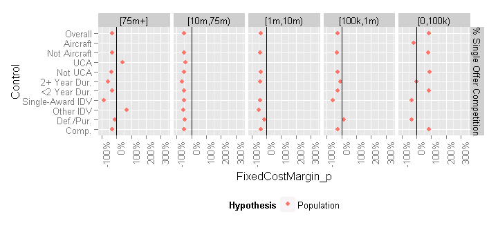 

```r
#Expected Number of Offers
ggplot(subset(SoftwareDF,dVariable=="Expected Number of Offers"),
       aes(x=Control,color=Hypothesis,shape=Hypothesis,y=FixedCostMargin)
       )+
    geom_point()+
    facet_grid(dVariable~iVariable)+ coord_flip()+theme(legend.position="bottom",axis.text.x = element_text(angle = 90, hjust = 1))+ scale_y_continuous(labels = percent_format())+geom_hline(aes(yintercept=1))  
```

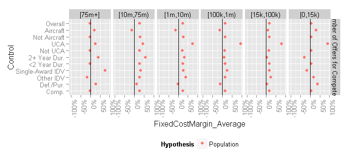 

```r
#Expected Number of Changes
ggplot(subset(SoftwareDF,dVariable=="Expected Number of Changes"),
       aes(x=Control,color=Hypothesis,shape=Hypothesis,y=FixedCostMargin)
       )+
    geom_point()+
    facet_grid(dVariable~iVariable)+ coord_flip()+theme(legend.position="bottom",axis.text.x = element_text(angle = 90, hjust = 1))+ scale_y_continuous(labels = percent_format())+geom_hline(aes(yintercept=1))  
```

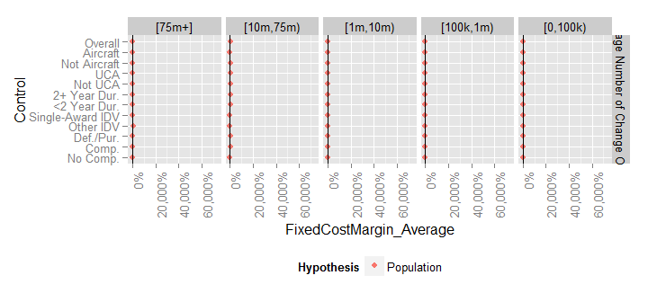 

```r
#Ceiling Raising Change Orders %
ggplot(subset(SoftwareDF,dVariable=="Ceiling Raising Change Orders %"),
       aes(x=Control,color=Hypothesis,shape=Hypothesis,y=FixedCostMargin)
       )+
    geom_point()+
    facet_grid(dVariable~iVariable)+ coord_flip()+theme(legend.position="bottom",axis.text.x = element_text(angle = 90, hjust = 1))+ scale_y_continuous(labels = percent_format())+geom_hline(aes(yintercept=1))  
```

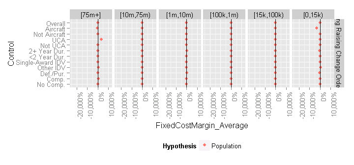 

```r
#Terminations
ggplot(subset(SoftwareDF,dVariable=="Terminated"),
       aes(x=Control,color=Hypothesis,shape=Hypothesis,y=FixedCostMargin)
       )+
    geom_point()+
    facet_grid(dVariable~iVariable)+ coord_flip()+theme(legend.position="bottom",axis.text.x = element_text(angle = 90, hjust = 1))+ scale_y_continuous(labels = percent_format())+geom_hline(aes(yintercept=1))  
```

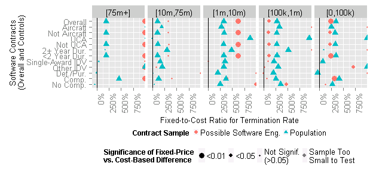 

```r
rm(SoftwareFind)
```

