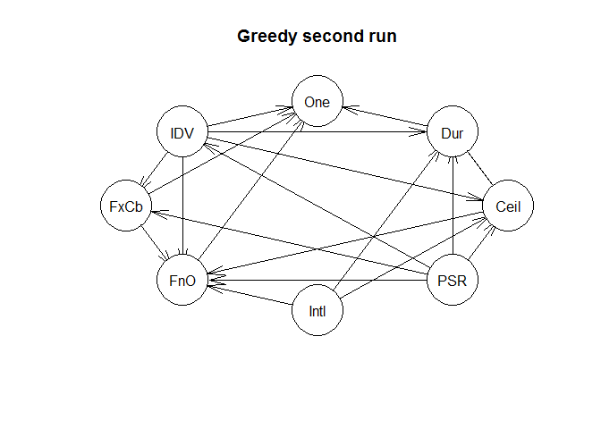
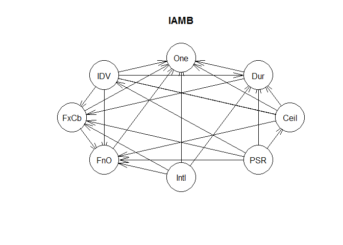
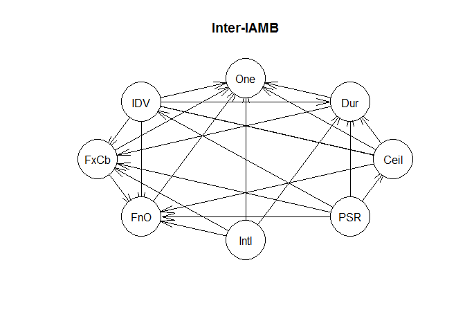

# DoD Fixed-Price and Competition Study: Single-Offer Model Building
Greg Sanders  
Tuesday, January 13, 2015  


```
## Loading required package: ggplot2
## Loading required package: stringr
## Loading required package: graph
## Loading required package: plyr
## 
## Attaching package: 'plyr'
## 
## The following object is masked from 'package:graph':
## 
##     join
## 
## Loading required package: Hmisc
## Loading required package: grid
## Loading required package: lattice
## Loading required package: survival
## Loading required package: Formula
## 
## Attaching package: 'Hmisc'
## 
## The following objects are masked from 'package:plyr':
## 
##     is.discrete, summarize
## 
## The following objects are masked from 'package:base':
## 
##     format.pval, round.POSIXt, trunc.POSIXt, units
## 
## Loading required package: Matrix
## Loading required package: gRain
## Loading required package: gRbase
## Loading required package: bnlearn
## 
## Attaching package: 'bnlearn'
## 
## The following objects are masked from 'package:gRbase':
## 
##     children, parents
```

Contracts are classified using a mix of numerical and categorical variables. While the changes in numerical variables are easy to grasp and summarize, a contract may have one line item that is competed and another that is not. As is detailed in the [exploration on R&D](RnD_1to5_exploration.md), we are only considering information available prior to contract start. The percentage of contract obligations that were competed is a valuable benchmark, but is highly influenced by factors that occured after contract start..

##Studying contract vehicle within the sample.
Describe contract vehicle here.


```r
ContractSample  <- read.csv(
    paste("data\\defense_contract_CSIScontractID_sample_100000_SumofObligatedAmount.csv", sep = ""),
    header = TRUE, sep = ",", dec = ".", strip.white = TRUE, 
    na.strings = c("NULL","NA",""),
    stringsAsFactors = TRUE
    )

#These will probably be moved into apply_lookups at some point

ContractSample$pIsFixedPrice <- ContractSample$ObligatedAmountIsFixedPrice/ContractSample$SumofObligatedAmount
ContractSample$pIsFixedPrice[is.nan(ContractSample$ObligatedAmountIsFixedPrice)|is.na(ContractSample$ObligatedAmountIsFixedPrice)] <- 0

ContractSample$pIsCostBased <- ContractSample$ObligatedAmountIsCostBased/ContractSample$SumofObligatedAmount
ContractSample$pIsCostBased[is.nan(ContractSample$ObligatedAmountIsCostBased)|is.na(ContractSample$ObligatedAmountIsCostBased)] <- 0

ContractSample$pIsCombination <- ContractSample$ObligatedAmountIsCombination/ContractSample$SumofObligatedAmount
ContractSample$pIsCombination[is.nan(ContractSample$ObligatedAmountIsCombination)|is.na(ContractSample$ObligatedAmountIsCombination)] <- 0

ContractSample$pIsInternational <- ContractSample$ObligatedAmountIsInternational/ContractSample$SumofObligatedAmount
ContractSample$pIsInternational[is.na(ContractSample$ObligatedAmountIsInternational)] <- 0

ContractSample$AnyInternational<-factor(ContractSample$AnyInternational,
                                        exclude=NULL,
                                        levels=c(0,1,NA),
                                        labels=c("Just U.S.","Any\nInternational","Unlabeled")
                                        )


ContractSample$UnmodifiedDays<-as.numeric(difftime(strptime(ContractSample$UnmodifiedCurrentCompletionDate,"%Y-%m-%d")
                                                     , strptime(ContractSample$MinOfEffectiveDate,"%Y-%m-%d")
                                                     , unit="days"
        ))+1

                               
ContractSample<-apply_lookups(Path,ContractSample)
```

```
## Joining by: ProductOrServiceArea
## Joining by: PlatformPortfolio
```

```
## Warning in apply_lookups(Path, ContractSample): NaNs produced
```

```
## Warning in apply_lookups(Path, ContractSample): NaNs produced
```

```
## Warning in apply_lookups(Path, ContractSample): NaNs produced
```

```r
summary(subset(ContractSample,select=c(UnmodifiedIsSomeCompetition,
                                IsIDV,
                                IsFixedPrice,
                                IsCostBased,
                                UnmodifiedIsFullAndOpen,
                                ##Number connected
                                AnyInternational,
                                SimpleArea,
                                UnmodifiedContractBaseAndAllOptionsValue,
                                UnmodifiedDays,
                                UnmodifiedNumberOfOffersReceived
                                ))
        )
```

```
##  UnmodifiedIsSomeCompetition     IsIDV       
##  Comp.    :69509             Min.   :0.0000  
##  No Comp. :26449             1st Qu.:1.0000  
##  Unlabeled: 4042             Median :1.0000  
##                              Mean   :0.7563  
##                              3rd Qu.:1.0000  
##                              Max.   :1.0000  
##                                              
##                      IsFixedPrice    IsCostBased   
##  Fixed Price               :76949   Min.   :0.000  
##  Other                     :15506   1st Qu.:0.000  
##  Combination \nor Unlabeled: 7545   Median :0.000  
##                                     Mean   :0.165  
##                                     3rd Qu.:0.000  
##                                     Max.   :1.000  
##                                     NA's   :7525   
##       UnmodifiedIsFullAndOpen           AnyInternational
##  Full & Open      :38004      Just U.S.         :82203  
##  Not Full \n& Open:57973      Any\nInternational:13787  
##  Unlabeled        : 4023      Unlabeled         : 4010  
##                                                         
##                                                         
##                                                         
##                                                         
##               SimpleArea    UnmodifiedContractBaseAndAllOptionsValue
##  Products          :45247   Min.   :0.000e+00                       
##  Services          :45037   1st Qu.:2.310e+05                       
##  R&D               : 5427   Median :1.185e+06                       
##  Mixed or Unlabeled: 4289   Mean   :4.744e+07                       
##                             3rd Qu.:4.800e+06                       
##                             Max.   :3.363e+12                       
##                                                                     
##  UnmodifiedDays    UnmodifiedNumberOfOffersReceived
##  Min.   :    1.0   Min.   :  1.00                  
##  1st Qu.:   61.0   1st Qu.:  1.00                  
##  Median :  221.0   Median :  2.00                  
##  Mean   :  315.9   Mean   :  4.97                  
##  3rd Qu.:  366.0   3rd Qu.:  5.00                  
##  Max.   :19772.0   Max.   :999.00                  
##  NA's   :4010      NA's   :60397
```
Describe source variables in FPDS here.

###Limiting the sample.

Because this model analyzes the number of offers on competed contracts, the first step is eliminating contracts that were not competed. This is done using the UnmodifiedIsSomeCompetetion field (see [competition exploration](contract_competition_exploration.md) for variable details). This variable has an unlabeled rate of 4.04%. As is done throughout the model, if all labeled values for the contract have are consistent, then that value is used to fill in for the blanks.


```r
#Impute missing values when labeled entries have a consistent value.
NAisSomeCompetition<-ContractSample$UnmodifiedIsSomeCompetition=="Unlabeled"&ContractSample$IsSomeCompetition!="Mixed or \nUnlabeled"
ContractSample$UnmodifiedIsSomeCompetition[NAisSomeCompetition]<-ContractSample$IsSomeCompetition[NAisSomeCompetition]
rm(NAisSomeCompetition)
```

After imputed, UnmodifiedIsSomeCompetition has a 4.04% missing data rate. This variable can now be used to narrow the sample.


```r
ContractSample <- ContractSample[ContractSample$UnmodifiedIsSomeCompetition=="Comp.",]
summary(subset(ContractSample,select=c(UnmodifiedIsSomeCompetition,
                                IsIDV,
                                IsFixedPrice,
                                IsCostBased,
                                UnmodifiedIsFullAndOpen,
                                ##Number connected
                                AnyInternational,
                                SimpleArea,
                                UnmodifiedContractBaseAndAllOptionsValue,
                                UnmodifiedDays,
                                UnmodifiedNumberOfOffersReceived
                                ))
        )
```

```
##  UnmodifiedIsSomeCompetition     IsIDV       
##  Comp.    :69509             Min.   :0.0000  
##  No Comp. :    0             1st Qu.:1.0000  
##  Unlabeled:    0             Median :1.0000  
##                              Mean   :0.7663  
##                              3rd Qu.:1.0000  
##                              Max.   :1.0000  
##                                              
##                      IsFixedPrice    IsCostBased    
##  Fixed Price               :56325   Min.   :0.0000  
##  Other                     :11062   1st Qu.:0.0000  
##  Combination \nor Unlabeled: 2122   Median :0.0000  
##                                     Mean   :0.1613  
##                                     3rd Qu.:0.0000  
##                                     Max.   :1.0000  
##                                     NA's   :2114    
##       UnmodifiedIsFullAndOpen           AnyInternational
##  Full & Open      :38004      Just U.S.         :57399  
##  Not Full \n& Open:31502      Any\nInternational:12110  
##  Unlabeled        :    3      Unlabeled         :    0  
##                                                         
##                                                         
##                                                         
##                                                         
##               SimpleArea    UnmodifiedContractBaseAndAllOptionsValue
##  Products          :31948   Min.   :0.000e+00                       
##  Services          :33236   1st Qu.:1.816e+05                       
##  R&D               : 4178   Median :9.645e+05                       
##  Mixed or Unlabeled:  147   Mean   :6.138e+07                       
##                             3rd Qu.:4.348e+06                       
##                             Max.   :3.363e+12                       
##                                                                     
##  UnmodifiedDays    UnmodifiedNumberOfOffersReceived
##  Min.   :    1.0   Min.   :  1.00                  
##  1st Qu.:   36.0   1st Qu.:  2.00                  
##  Median :  191.0   Median :  3.00                  
##  Mean   :  287.9   Mean   :  6.45                  
##  3rd Qu.:  366.0   3rd Qu.:  5.00                  
##  Max.   :19729.0   Max.   :999.00                  
##                    NA's   :41620
```


###Evidence variables
Note that these missing data rates are only for competed entries, so they will typically not match the overall unlabeled rates.

 * IsIDV is a classification for the entirity of the contract  (0.00% missing data). See [vehicle exploration](contract_vehicle_exploration.md) for more. Since this variable is consistently labeled, it isn't necessary to impute data or seperate out unmodified entries.
 * UnmodifiedIsFullAndOpen is the classification given by the first record for the contract (0.00% missing data). See [exploration on competition](contract_competition_exploration.md) for more.
 * UnmodifiedNumberOfOffersReceived reports the Number of Offers Received according to the first reported transaction under a contract (59.88% missing data, far too high, there must be a SQL mistake). See [exploration on competition](contract_competition_exploration.md) for more.
* simplearea is a classification for the entirity of the contract  ( missing data). See [exploration on product, service, and R&D](contract_ProductServiceRnD_exploration.md) for more.


```r
ContractSample$FixedOrCost[ContractSample$pIsFixedPrice>0  |
                                      ContractSample$pIsCostBased>0 | 
                                          ContractSample$pIsCombination>0]<-"Combination \nor Other"

ContractSample$FixedOrCost[ContractSample$pIsFixedPrice>=0.95|(ContractSample$IsFixedPrice=="Fixed Price" & ContractSample$pIsCombination==0)]<-"Fixed-Price"
ContractSample$FixedOrCost[ContractSample$pIsCostBased>=0.95|(ContractSample$IsCostBased==1 & ContractSample$pIsCombination==0)]<-"Cost-Based"
ContractSample$FixedOrCost<-factor(ContractSample$FixedOrCost,levels=c("Fixed-Price","Cost-Based","Combination \nor Other"))

ContractSample$AnyInternational[ContractSample$pIsInternational<=0 & 
                    ContractSample$AnyInternational=="Any\nInternational" &
                    ContractSample$UnmodifiedIsInternational==0]<-"Just U.S."

NASimpleArea<-ContractSample$SimpleArea=="Mixed or Unlabeled"&!is.na(ContractSample$UnmodifiedSimpleArea)
ContractSample$SimpleArea[NASimpleArea]<-ContractSample$UnmodifiedSimpleArea[NASimpleArea]
ContractSample$SimpleArea[ContractSample$SimpleArea=="Mixed or Unlabeled" & ContractSample$pIsProducts>0.5]<-"Products"
ContractSample$SimpleArea[ContractSample$SimpleArea=="Mixed or Unlabeled" & ContractSample$pIsServices>0.5]<-"Services"
ContractSample$SimpleArea[ContractSample$SimpleArea=="Mixed or Unlabeled" & ContractSample$pIsRnD>0.5]<-"R&D"


roundedcutoffs<-c(15000,100000,1000000,30000000)
ContractSample$qCeiling <- cut2(ContractSample$UnmodifiedContractBaseAndAllOptionsValue,cuts=roundedcutoffs)

#Impute missing values
NAisFullAndOpen<-is.na(ContractSample$UnmodifiedIsFullAndOpen)
ContractSample$UnmodifiedIsFullAndOpen[NAisFullAndOpen]<-ContractSample$IsFullAndOpen[NAisFullAndOpen]
rm(NAisFullAndOpen)

ContractSample$qDuration<-cut2(ContractSample$UnmodifiedDays,cuts=c(61,214,366))

NAnumberOfOffers<-is.na(ContractSample$UnmodifiedNumberOfOffersReceived)&!is.na(ContractSample$NumberOfOffersReceived)
ContractSample$UnmodifiedNumberOfOffersReceived[NAnumberOfOffers]<-ContractSample$NumberOfOffersReceived[NAnumberOfOffers]
rm(NAnumberOfOffers)
ContractSample$IsIDV<-factor(ContractSample$IsIDV,levels=c(0,1),labels=c("Def/Pur","IDV"))
ContractSample$SingleOffer<-factor(ContractSample$UnmodifiedNumberOfOffersReceived==1,
                                   levels=c(TRUE,FALSE),
                                   labels=c("Single","Multi")
)

summary(subset(ContractSample,select=c(UnmodifiedIsSomeCompetition,
                                IsIDV,
                                FixedOrCost,
                                UnmodifiedIsFullAndOpen,
                                ##Number connected
                                AnyInternational,
                                SimpleArea,
                                qCeiling,
                                qDuration,
                                UnmodifiedNumberOfOffersReceived
                                ))
        )
```

```
##  UnmodifiedIsSomeCompetition     IsIDV      
##  Comp.    :69509             Def/Pur:16242  
##  No Comp. :    0             IDV    :53267  
##  Unlabeled:    0                            
##                                             
##                                             
##                                             
##                                             
##                  FixedOrCost         UnmodifiedIsFullAndOpen
##  Fixed-Price           :56167   Full & Open      :38004     
##  Cost-Based            :10183   Not Full \n& Open:31502     
##  Combination \nor Other: 3025   Unlabeled        :    3     
##  NA's                  :  134                               
##                                                             
##                                                             
##                                                             
##            AnyInternational              SimpleArea   
##  Just U.S.         :57470   Products          :32010  
##  Any\nInternational:12039   Services          :33288  
##  Unlabeled         :    0   R&D               : 4202  
##                             Mixed or Unlabeled:    9  
##                                                       
##                                                       
##                                                       
##                 qCeiling             qDuration    
##  [0.00e+00,1.50e+04): 3278   [    1,   61):20125  
##  [1.50e+04,1.00e+05): 9836   [   61,  214):16504  
##  [1.00e+05,1.00e+06):22151   [  214,  366):14207  
##  [1.00e+06,3.00e+07):31489   [  366,19729]:18673  
##  [3.00e+07,3.36e+12]: 2755                        
##                                                   
##                                                   
##  UnmodifiedNumberOfOffersReceived
##  Min.   :  1.000                 
##  1st Qu.:  2.000                 
##  Median :  3.000                 
##  Mean   :  8.949                 
##  3rd Qu.:  5.000                 
##  Max.   :999.000                 
##  NA's   :579
```
The model has nine core variables, though one is presently missing. After renaming the variables, all unlabeled data is removed from the final model dataset.

*IDV (IsIDV) IsDefiniteVehicle has ('r sprintf("%1.2f%%",nrow(subset(ContractSample,is.na(IsIDV)|IsIDV=="Unlabeled")) /nrow(ContractSample)*100)` missing data.
   
* FxCb (FixedOrCost) FixedOrCost has ('r sprintf("%1.2f%%",nrow(subset(ContractSample,is.na(FixedOrCost)|FixedOrCost=="Unlabeled")) /nrow(ContractSample)*100)` missing data.

* FnO (UnmodifiedIsFullAndOpen) UnmodifiedIsFullAndOpen has (0.00% missing data.

* Intl (AnyInternational) AnyInternational has (0.00% missing data. 
	* PSR (SimpleArea) SimpleArea has (0.00% missing data.
	* Ceil (qCeiling) qCeiling has (0.00% missing data.
	* Dur (qDuration) qDuration has ('r sprintf("%1.2f%%",nrow(subset(ContractSample,is.na(MinOfSignedDate)|MinOfSignedDate=="Unlabeled")) /nrow(ContractSample)*100)` missing data.
	* Dur (LastUltimateCompleteDate) LastUltimateCompleteDate has (0.02% missing data.
	

* One (SingleOffer)  UnmodifiedNumberOfOffersReceived has (0.83% missing data.

summary(subset(ContractSample,select=c(UnmodifiedIsSomeCompetition,
                                IsIDV,
                                FixedOrCost,
                                UnmodifiedIsFullAndOpen,
                                ##Number connected
                                AnyInternational,
                                SimpleArea,
                                qCeiling,
                                qDuration,
                                UnmodifiedNumberOfOffersReceived
                                ))
        )
```
The model has nine core variables, though one is presently missing. After renaming the variables, all unlabeled data is removed from the final model dataset.

*IDV (IsIDV) IsDefiniteVehicle has ('r sprintf("%1.2f%%",nrow(subset(ContractSample,is.na(IsIDV)|IsIDV=="Unlabeled")) /nrow(ContractSample)*100)` missing data.

* FxCb (FixedOrCost) FixedOrCost has ('r sprintf("%1.2f%%",nrow(subset(ContractSample,is.na(FixedOrCost)|FixedOrCost=="Unlabeled")) /nrow(ContractSample)*100)` missing data.

* FnO (UnmodifiedIsFullAndOpen) UnmodifiedIsFullAndOpen has (0.00% missing data).

* Intl (AnyInternational) AnyInternational has (0.00% missing data. 

* PSR (SimpleArea) SimpleArea has (0.00% missing data.

* Ceil (qCeiling) qCeiling has (0.00% missing data.

* Dur (qDuration) qDuration has ('r sprintf("%1.2f%%",nrow(subset(ContractSample,is.na(MinOfSignedDate)|MinOfSignedDate=="Unlabeled")) /nrow(ContractSample)*100)` missing data.

* Dur (LastUltimateCompleteDate) LastUltimateCompleteDate has (0.02% missing data.

>>>>>>> 27b71e8ed2ac0f7a1e33d77d89b15f6f9bb22e71
* One (SingleOffer)  UnmodifiedNumberOfOffersReceived has (0.83% missing data.

The shortened names are used for ease of graphical and tabular representation. However, there exact form is still wide open, please make suggestions. Ease of comprehensibility and minimizing confusion between competing variables is key.


```r
ContractModel<-subset(ContractSample,select=c(IsIDV,
                                FixedOrCost,
                                UnmodifiedIsFullAndOpen,
                                ##Number connected
                                AnyInternational,
                                SimpleArea,
                                qCeiling,
                                qDuration,
                                SingleOffer
                                ))
# 

colnames(ContractModel)[colnames(ContractModel)=="IsIDV"]<-"IDV"
colnames(ContractModel)[colnames(ContractModel)=="FixedOrCost"]<-"FxCb"
colnames(ContractModel)[colnames(ContractModel)=="UnmodifiedIsFullAndOpen"]<-"FnO"
colnames(ContractModel)[colnames(ContractModel)=="AnyInternational"]<-"Intl"
colnames(ContractModel)[colnames(ContractModel)=="SimpleArea"]<-"PSR"
colnames(ContractModel)[colnames(ContractModel)=="qCeiling"]<-"Ceil"
colnames(ContractModel)[colnames(ContractModel)=="qDuration"]<-"Dur"
colnames(ContractModel)[colnames(ContractModel)=="SingleOffer"]<-"One"


nrow(ContractModel)
```

```
## [1] 69509
```

```r
summary(nrow(subset(ContractModel,complete.cases(ContractModel))))
```

```
##    Min. 1st Qu.  Median    Mean 3rd Qu.    Max. 
##   68800   68800   68800   68800   68800   68800
```

```r
summary(subset(ContractModel,complete.cases(ContractModel)))
```

```
##       IDV                            FxCb                      FnO       
##  Def/Pur:16069   Fixed-Price           :55711   Full & Open      :37843  
##  IDV    :52727   Cost-Based            :10133   Not Full \n& Open:30950  
##                  Combination \nor Other: 2952   Unlabeled        :    3  
##                                                                          
##                                                                          
##                  Intl                       PSR       
##  Just U.S.         :56853   Products          :31806  
##  Any\nInternational:11943   Services          :32854  
##  Unlabeled         :    0   R&D               : 4127  
##                             Mixed or Unlabeled:    9  
##                                                       
##                   Ceil                  Dur            One       
##  [0.00e+00,1.50e+04): 3213   [    1,   61):19975   Single:15498  
##  [1.50e+04,1.00e+05): 9759   [   61,  214):16318   Multi :53298  
##  [1.00e+05,1.00e+06):21940   [  214,  366):14022                 
##  [1.00e+06,3.00e+07):31146   [  366,19729]:18481                 
##  [3.00e+07,3.36e+12]: 2738
```

```r
dropped<-subset(ContractModel,!complete.cases(ContractModel)|
           FnO=="Unlabeled"|
           Intl=="Unlabeled"|
           PSR =="Mixed or Unlabeled")

ContractModel<-subset(ContractModel,complete.cases(ContractModel)&
           FnO!="Unlabeled"&
           Intl!="Unlabeled"&
           PSR !="Mixed or Unlabeled")
nrow(ContractModel)
```

```
## [1] 68784
```

The last stage before Bayesian learning is setting the whitelists and blacklists. The whitelist contains vectors that must existing in the graph while the blacklist contains forbidden vectors.

I've listed them below based on the origin piece of evidence.
1. IDV (IsIDV)
* Whitelist to FnO (UnmodifiedIsFullAndOpen) as many forms of IDVs don't qualify for full and open.
* Blacklist to PSR (SimpleArea) because what you are buying is picked before how you are buying it.
2. FxCb (FixedOrCost)
* Possible Whitelist to One (SingleOffer) as this is the key study question, although I worry that I'm forcing it.
* Blacklist to PSR (SimpleArea) and Intl (AnyInternational) because figuring out what and where come first.
* Blacklist to Ceil (qCeiling) and Dur (qDuration), because project scope should come before project pricing,  although this may not be entirely true when the vendors make proposals.
3. FnO (UnmodifiedIsFullAndOpen)  
* Whitelist to One (SingleOffer). We'll see how strong this connection ends up being, but it's really straightforward.
* Blacklist to PSR (SimpleArea),  Intl (AnyInternational), and FxCb (FixedOrCost), as I think those details are set before deciding competition procedures.
4. Intl (AnyInternational) No restrictions or requirements.
5. PSR (SimpleArea)
* Blacklist to Intl (AnyInternational) As I think the place of performance in the U.S. or abroad (but not the vendor location) is sometimes decided at least as early as the  product or service.
6. Ceil (qCeiling)
* Blacklist to PSR (SimpleArea) Intl (AnyInternational) because what and where come before scope.
7. Dur (qDuration)
* Blacklist to PSR (SimpleArea) Intl (AnyInternational) because what and where come before scope.
8. One (SingleOffer) 
* Blacklist to most everything. While the vendors responses may influence some factors at the margin, this is the dependent variable for this part of the study.


```r
#White list, connections that must occur
ContractWL<-data.frame(from="IDV",to="FnO")
ContractWL<-rbind(ContractWL,data.frame(from="FnO",to="One"))
ContractWL<-rbind(ContractWL,data.frame(from="PSR",to="FxCb"))
ContractWL<-rbind(ContractWL,data.frame(from="FxCb",to="One"))
#Black list, connections that are prohibited
ContractBL<-data.frame(from=c("One"),to= c("IDV"))
ContractBL<-rbind(ContractBL,data.frame(from="One",to="PSR"))
ContractBL<-rbind(ContractBL,data.frame(from="One",to="Intl"))
ContractBL<-rbind(ContractBL,data.frame(from="One",to="FxCb"))
ContractBL<-rbind(ContractBL,data.frame(from="One",to="Ceil"))
ContractBL<-rbind(ContractBL,data.frame(from="One",to="Dur"))
ContractBL<-rbind(ContractBL,data.frame(from="FxCb",to="PSR"))
ContractBL<-rbind(ContractBL,data.frame(from="FxCb",to="Intl"))
ContractBL<-rbind(ContractBL,data.frame(from="FxCb",to="Ceil"))
ContractBL<-rbind(ContractBL,data.frame(from="FxCb",to="Dur"))
ContractBL<-rbind(ContractBL,data.frame(from="Ceil",to="PSR"))
ContractBL<-rbind(ContractBL,data.frame(from="Ceil",to="Intl"))
ContractBL<-rbind(ContractBL,data.frame(from="Dur",to="PSR"))
ContractBL<-rbind(ContractBL,data.frame(from="Dur",to="Intl"))
ContractBL<-rbind(ContractBL,data.frame(from="FnO",to="PSR"))
ContractBL<-rbind(ContractBL,data.frame(from="FnO",to="Intl"))
ContractBL<-rbind(ContractBL,data.frame(from="FnO",to="Ceil"))
ContractBL<-rbind(ContractBL,data.frame(from="FnO",to="Dur"))
ContractBL<-rbind(ContractBL,data.frame(from="FnO",to="FxCb"))
ContractBL<-rbind(ContractBL,data.frame(from="IDV",to="PSR"))
ContractBL<-rbind(ContractBL,data.frame(from="IDV",to="Intl"))
ContractBL<-rbind(ContractBL,data.frame(from="PSR",to="Intl"))
```

With the white and black lists in hand, Bayesian learning, using three different methods, can be applied.

```r
gs_dug<-gs(ContractModel,blacklist=ContractBL,whitelist=ContractWL)
```

```
## Warning in check.data(x): variable FnO has levels that are not observed in
## the data.
```

```
## Warning in check.data(x): variable Intl has levels that are not observed
## in the data.
```

```
## Warning in check.data(x): variable PSR has levels that are not observed in
## the data.
```

```
## Warning in FUN(newX[, i], ...): vstructure IDV -> Dur <- Intl is not
## applicable, because one or both arcs are oriented in the opposite
## direction.
```

```
## Warning in FUN(newX[, i], ...): vstructure IDV -> Ceil <- Intl is not
## applicable, because one or both arcs are oriented in the opposite
## direction.
```

```r
plot(gs_dug,main="Greedy")
```

 

```r
iamb_dug<-iamb(ContractModel,blacklist=ContractBL,whitelist=ContractWL)
```

```
## Warning in check.data(x): variable FnO has levels that are not observed in
## the data.
```

```
## Warning in check.data(x): variable Intl has levels that are not observed
## in the data.
```

```
## Warning in check.data(x): variable PSR has levels that are not observed in
## the data.
```

```
## Warning in FUN(newX[, i], ...): vstructure IDV -> Dur <- Intl is not
## applicable, because one or both arcs introduce cycles in the graph.
```

```
## Warning in FUN(newX[, i], ...): vstructure IDV -> FxCb <- Intl is not
## applicable, because one or both arcs are oriented in the opposite
## direction.
```

```r
plot(iamb_dug,main="IAMB")
```

 

```r
iiamb_dug<-iamb(ContractModel,blacklist=ContractBL,whitelist=ContractWL)
```

```
## Warning in check.data(x): variable FnO has levels that are not observed in
## the data.
```

```
## Warning in check.data(x): variable Intl has levels that are not observed
## in the data.
```

```
## Warning in check.data(x): variable PSR has levels that are not observed in
## the data.
```

```
## Warning in FUN(newX[, i], ...): vstructure IDV -> Dur <- Intl is not
## applicable, because one or both arcs introduce cycles in the graph.
```

```
## Warning in FUN(newX[, i], ...): vstructure IDV -> FxCb <- Intl is not
## applicable, because one or both arcs are oriented in the opposite
## direction.
```

```r
plot(iiamb_dug,main="Inter-IAMB")
```

 

```r
# 
```
